# Obliczenia statyczne — Dom LAMELA

Model: `budynek.yaml` (wersja 1.0, 2026-09-25) · biblioteka `lamela.obliczenia.konstrukcja` 1.0 · wygenerowano 2026-09-25

> Obliczenia wygenerowane automatycznie z modelu budynku. Wartości oznaczone [NZW] — niezweryfikowane w tekście normy (rejestr R5), [UPR] — uproszczenia biblioteki, [ZAŁ] — założenia. Dane gruntowe PRZYKŁADOWE (W-282, E-04). Dokument wymaga weryfikacji i podpisu projektanta z uprawnieniami: [DO UZUPEŁNIENIA: imię i nazwisko, specjalność, nr uprawnień].

## Spis pozycji

| Poz. | Element | Opis | η_max | Warunki |
|---|---|---|---|---|
| **1** |  | **Dachy i stropodachy** |  |  |
| 1.1 | `D1` | Stropodach / dach D1 | 301% | **niespełnione** |
| 1.2 | `D2` | Stropodach / dach D2 | 485% | **niespełnione** |
| 1.3 | `D3` | Stropodach / dach D3 | 705% | **niespełnione** |
| 1.4 | `D4` | Stropodach / dach D4 | 262% | **niespełnione** |
| **2** |  | **Stropy** |  |  |
| 2.1 | `ST2` | Strop ST2 | 752% | **niespełnione** |
| 2.2 | `ST2Z` | Strop ST2Z | 449% | **niespełnione** |
| 2.3 | `ST1` | Strop ST1 | 682% | **niespełnione** |
| **3** |  | **Schody** |  |  |
| 3.1 | `SCH1` | Schody SCH1 (P0 → P1) | 98% | spełnione |
| 3.2 | `SCH2` | Schody SCH2 (P1 → P2) | 98% | spełnione |
| **4** |  | **Belki i podciągi** |  |  |
| 4.1 | `B6` | Belka B6 | 83% | spełnione |
| 4.2 | `N6` | Belka N6 | 47% | spełnione |
| 4.3 | `N7` | Belka N7 | 39% | spełnione |
| 4.4 | `B2` | Belka B2 | 93% | spełnione |
| 4.5 | `B9` | Belka B9 | 99% | spełnione |
| 4.6 | `B7` | Belka B7 | 99% | spełnione |
| **5** |  | **Wieńce** |  |  |
| 5.1 | `W-D1` | Wieńce pod płytą D1 (poziom 9,300 m) | 31% | spełnione |
| 5.2 | `W-ST2_ST2Z_D2_D3` | Wieńce pod płytą ST2 + ST2Z + D2 + D3 (poziom 6,150 m) | 31% | spełnione |
| 5.3 | `W-ST1_D4` | Wieńce pod płytą ST1 + D4 (poziom 3,000 m) | 31% | spełnione |
| **6** |  | **Słupy** |  |  |
| 6.1 | `SL1` | Słup SL1 (RK 120x120x8, L = 2,93 m) | 1% | spełnione |
| 6.2 | `SL2` | Słup SL2 (RK 120x120x8, L = 2,93 m) | 1% | spełnione |
| 6.3 | `SL3` | Słup SL3 (RK 120x120x8, L = 2,93 m) | 1% | spełnione |
| 6.4 | `SL4` | Słup SL4 (RK 120x120x8, L = 2,93 m) | 1% | spełnione |
| 6.5 | `SL5` | Słup SL5 (RK 100x100x6, L = 1,50 m) | 12% | spełnione |
| 6.6 | `SL6` | Słup SL6 (RK 100x100x6, L = 1,50 m) | 10% | spełnione |
| 6.7 | `SL7` | Słup SL7 (150x1000, L = 1,50 m) | 0% | spełnione |
| 6.8 | `SL8` | Słup SL8 (150x1000, L = 1,50 m) | 0% | spełnione |
| **7** |  | **Ściany murowe** |  |  |
| 7.1 | `S2-01` | Ściana S2-01 (P2, zewnętrzna nośna) | 45% | spełnione |
| 7.2 | `S2-02` | Ściana S2-02 (P2, zewnętrzna nośna) | 79% | spełnione |
| 7.3 | `S2-03` | Ściana S2-03 (P2, zewnętrzna nośna) | 45% | spełnione |
| 7.4 | `S2-04` | Ściana S2-04 (P2, zewnętrzna nośna) | 45% | spełnione |
| 7.5 | `S2-05` | Ściana S2-05 (P2, zewnętrzna nośna) | 60% | spełnione |
| 7.6 | `S2-06` | Ściana S2-06 (P2, zewnętrzna nośna) | 45% | spełnione |
| 7.7 | `S2-07` | Ściana S2-07 (P2, zewnętrzna nośna) | 45% | spełnione |
| 7.8 | `S2-08` | Ściana S2-08 (P2, zewnętrzna nośna) | 0% | spełnione |
| 7.9 | `S2-09` | Ściana S2-09 (P2, wewnętrzna nośna) | 98% | spełnione |
| 7.10 | `S2-10` | Ściana S2-10 (P2, wewnętrzna nośna) | 45% | spełnione |
| 7.11 | `S1-01` | Ściana S1-01 (P1, zewnętrzna nośna) | 60% | spełnione |
| 7.12 | `S1-02` | Ściana S1-02 (P1, zewnętrzna nośna) | 45% | spełnione |
| 7.13 | `S1-03` | Ściana S1-03 (P1, zewnętrzna nośna) | 45% | spełnione |
| 7.14 | `S1-04` | Ściana S1-04 (P1, zewnętrzna nośna) | 60% | spełnione |
| 7.15 | `S1-05` | Ściana S1-05 (P1, wewnętrzna nośna) | 143% | **niespełnione** |
| 7.16 | `S1-06` | Ściana S1-06 (P1, wewnętrzna nośna) | 430% | **niespełnione** |
| 7.17 | `S1-07` | Ściana S1-07 (P1, wewnętrzna nośna) | 45% | spełnione |
| 7.18 | `S1-08` | Ściana S1-08 (P1, wewnętrzna nośna) | 233% | **niespełnione** |
| 7.19 | `S1-09` | Ściana S1-09 (P1, wewnętrzna nośna) | 193% | **niespełnione** |
| 7.20 | `S0-01` | Ściana S0-01 (P0, zewnętrzna nośna) | 148% | **niespełnione** |
| 7.21 | `S0-06` | Ściana S0-06 (P0, zewnętrzna nośna) | 60% | spełnione |
| 7.22 | `S0-07` | Ściana S0-07 (P0, zewnętrzna nośna) | 60% | spełnione |
| 7.23 | `S0-08` | Ściana S0-08 (P0, wewnętrzna nośna) | 227% | **niespełnione** |
| 7.24 | `S0-10` | Ściana S0-10 (P0, wewnętrzna nośna) | 453% | **niespełnione** |
| 7.25 | `S0-11` | Ściana S0-11 (P0, wewnętrzna nośna) | 60% | spełnione |
| 7.26 | `S0-12` | Ściana S0-12 (P0, wewnętrzna nośna) | 0% | spełnione |
| 7.27 | `S0-13` | Ściana S0-13 (P0, wewnętrzna nośna) | 0% | spełnione |
| 7.28 | `S0-15` | Ściana S0-15 (P0, wewnętrzna nośna) | 81% | spełnione |
| 7.29 | `S0-16` | Ściana S0-16 (P0, wewnętrzna nośna) | 45% | spełnione |
| 7.30 | `S0-02` | Ściana S0-02 (P0, zewnętrzna nośna) | 45% | spełnione |
| 7.31 | `S0-03` | Ściana S0-03 (P0, zewnętrzna nośna) | 74% | spełnione |
| 7.32 | `S0-04` | Ściana S0-04 (P0, zewnętrzna nośna) | 60% | spełnione |
| 7.33 | `S0-17` | Ściana S0-17 (P0, wewnętrzna nośna) | 45% | spełnione |
| **8** |  | **Fundamenty** |  |  |
| 8.1 | `PF1` | Płyta fundamentowa PF1 | 8% | spełnione |
| 8.2 | `ZF1` | Ława fundamentowa ZF1 (B = 0,60 m, h = 0,30 m, L = 12,00 m) | 254% | **niespełnione** |
| 8.3 | `ZF2` | Ława fundamentowa ZF2 (B = 0,60 m, h = 0,30 m, L = 6,38 m) | 254% | **niespełnione** |
| 8.4 | `ZF3` | Ława fundamentowa ZF3 (B = 0,60 m, h = 0,30 m, L = 9,38 m) | 198% | **niespełnione** |
| 8.5 | `ZF4` | Ława fundamentowa ZF4 (B = 0,60 m, h = 0,30 m, L = 6,38 m) | 185% | **niespełnione** |
| 8.6 | `ZF5` | Ława fundamentowa ZF5 (B = 0,60 m, h = 0,30 m, L = 0,62 m) | 91% | spełnione |
| 8.7 | `ZF6` | Ława fundamentowa ZF6 (B = 0,60 m, h = 0,30 m, L = 12,00 m) | 254% | **niespełnione** |
| 8.8 | `ZF7` | Ława fundamentowa ZF7 (B = 0,60 m, h = 0,30 m, L = 8,75 m) | 254% | **niespełnione** |
| 8.9 | `ZF8` | Ława fundamentowa ZF8 (B = 0,50 m, h = 0,25 m, L = 5,88 m) | 445% | **niespełnione** |
| 8.10 | `ZF9` | Ława fundamentowa ZF9 (B = 0,50 m, h = 0,25 m, L = 3,50 m) | 257% | **niespełnione** |
| 8.11 | `ZF10` | Ława fundamentowa ZF10 (B = 0,50 m, h = 0,25 m, L = 3,62 m) | 100% | spełnione |
| 8.12 | `ZF11` | Ława fundamentowa ZF11 (B = 0,50 m, h = 0,25 m, L = 3,62 m) | 235% | **niespełnione** |
| 8.13 | `ZF12` | Ława fundamentowa ZF12 (B = 0,50 m, h = 0,25 m, L = 3,62 m) | 198% | **niespełnione** |
| 8.14 | `ZF13` | Ława fundamentowa ZF13 (B = 0,50 m, h = 0,25 m, L = 2,88 m) | 102% | **niespełnione** |
| 8.15 | `ZF14` | Ława fundamentowa ZF14 (B = 0,50 m, h = 0,25 m, L = 5,88 m) | 131% | **niespełnione** |
| 8.16 | `ZF15` | Ława fundamentowa ZF15 (B = 0,50 m, h = 0,25 m, L = 6,38 m) | 100% | spełnione |
| 8.17 | `SF1` | Stopa fundamentowa SF1 (1,00 × 1,01 × 0,45 m) pod słupem SL1 | 185% | **niespełnione** |
| 8.18 | `SF2` | Stopa fundamentowa SF2 (1,00 × 1,01 × 0,45 m) pod słupem SL2 | 185% | **niespełnione** |
| 8.19 | `SF3` | Stopa fundamentowa SF3 (1,00 × 1,01 × 0,45 m) pod słupem SL3 | 186% | **niespełnione** |
| 8.20 | `SF4` | Stopa fundamentowa SF4 (1,00 × 1,01 × 0,45 m) pod słupem SL4 | 185% | **niespełnione** |

## Poz. 0 — Podstawa opracowania, założenia i obciążenia ogólne

### 0.1 Normy i przepisy

- PN-EN 1990:2004 + A1:2008 + NA:2010 — Podstawy projektowania konstrukcji
- PN-EN 1991-1-1:2004 + AC:2009 + NA:2010 — Ciężar objętościowy, ciężar własny, obciążenia użytkowe
- PN-EN 1991-1-3:2005 + AC:2009 + Ap1:2010 + NA:2010 — Obciążenie śniegiem
- PN-EN 1991-1-4:2008 + A1:2010 + AC:2009 + NA:2010 — Oddziaływania wiatru
- PN-EN 1992-1-1:2008 + AC:2011 + NA:2018-11 — Konstrukcje z betonu
- PN-EN 1993-1-1:2006 + A1:2014-07 + NA:2010; PN-EN 1993-1-8:2006 + NA:2011 — Konstrukcje stalowe
- PN-EN 1996-1-1+A1:2013-05 + NA:2014-03 (+Ap2:2014-09); PN-EN 1996-3 — Konstrukcje murowe
- PN-EN 1997-1:2008 + A1:2014-05 + Ap2:2010 + NA:2011 — Projektowanie geotechniczne
- PN-H-93220:2018-02 + Ap1:2018-04 — Stal B500SP; PN-EN ISO 3766 — rysunki zbrojenia
- Rozp. MTBiGM z 25.04.2012 (Dz.U. 2012 poz. 463) — geotechniczne warunki posadawiania

Stosowane wyłącznie Eurokody 1. generacji z NA (R5-01…R5-03, W-260).

### 0.2 Klasyfikacja i współczynniki

Stal zbrojeniowa B500SP (klasa C): f_yk = 500 MPa, f_yd = 434,8 MPa; γ_c = 1,4, γ_s = 1,15 (NA). Mur: Silikat gr. 1, kat. I, kl. 20, zaprawa do cienkich spoin: f_k = 7,66 MPa, γ_M = 1,7, f_d = 4,50 MPa. Stal konstrukcyjna S355: γ_M0 = γ_M1 = 1,0, γ_M2 = 1,25. Klasa konsekwencji CC2/RC2, K_FI = 1,0; okres użytkowania 50 lat (S4).

Kombinacje (PN-EN 1990 + NA): STR/GEO — mniej korzystne z 6.10a: Σ1,35·G_k + 1,5·ψ₀·Q_k i 6.10b: Σ0,85·1,35·G_k + 1,5·Q_k,1 + 1,5·Σψ₀·Q_k,i; EQU: 1,10·G_dst + 1,5·Q_dst ≤ 0,90·G_stb; wyjątkowa 6.11b: G + A_d + ψ₁·Q₁ + ψ₂·Q_i; SLS: charakterystyczna G + Q₁ + ψ₀Q_i, quasi-stała G + ψ₂Q. Obciążenia użytkowe dachu (kat. H) nie są łączone ze śniegiem.

| Parametr | Wartość | Parametr | Wartość |
|---|---|---|---|
| γ_G,sup / γ_G,inf / ξ | 1,35 / 1,00 / 0,85 | γ_Q | 1,50 |
| EQU: γ_G,dst / γ_G,stb / γ_Q | 1,10 / 0,90 / 1,50 | K_FI | 1,0 |
| γ_c / γ_s | 1,4 / 1,15 | α_cc | 1,0 [NZW] |
| γ_M (mur, kl. A) | 1,7 | γ_M0 / γ_M1 / γ_M2 | 1,0 / 1,0 / 1,25 |
| γ_R;v / γ_R;h (DA2*) | 1,4 / 1,1 | kategoria geotechniczna | 2 |
| s_k [kN/m²] (strefa 2) | 0,90 | v_b,0 [m/s] (strefa 1), teren | 22, kat. II |
| φ(∞,t₀) / ε_cs | 2,5 / 0,40‰ [ZAŁ] | grunt | Piasek średni (Ps), średnio zagęszczony, I_D ≈ 0,6 [DANE PRZYKŁADOWE] |

### 0.3 Materiały, klasy ekspozycji i otulenia

**Obciążenia użytkowe (R5 3.3, W-263)**

| Powierzchnia | q_k [kN/m²] | Q_k [kN] | ψ₀/ψ₁/ψ₂ | Podstawa |
|---|---|---|---|---|
| stropy mieszkalne (kat. A) | 2,00 | 3,0 | 0,7/0,5/0,3 | PN-EN 1991-1-1 tabl. 6.2 + NA; R5 3.3 [NZW NA — górna granica EN] |
| schody (kat. A) | 4,00 | 4,0 | 0,7/0,5/0,3 | PN-EN 1991-1-1 tabl. 6.2 |
| taras/balkon (kat. A, I) | 4,00 | 3,0 | 0,7/0,5/0,3 | PN-EN 1991-1-1 tabl. 6.2, 6.9 (p. 6.3.4.1); R5 3.3 |
| dach bez dostępu (kat. H) | 0,40 | 1,0 | 0,0/0,0/0,0 | PN-EN 1991-1-1 tabl. 6.10 + NA; nie łączyć ze śniegiem i wiatrem (p. 3.3.2) |

**Beton, klasy ekspozycji i otulenia (PN-EN 1992-1-1 4.4.1, R5 3.6, W-266)**

| Element | Ekspozycja | Beton (min.) | c_min,dur [mm] | c_nom [mm] (φ12) | w_max [mm] |
|---|---|---|---|---|---|
| stropy, wieńce, belki wewnętrzne | XC1 | C25/30 | 15 | 25 | 0,4 |
| płyty stropodachów | XC1 | C25/30 | 15 | 25 | 0,4 |
| płyty wysunięte na zewnątrz (taras, okapy) | XC4 | C30/37 | 30 | 40 | 0,3 |
| ławy, stopy, płyta fund. | XC2 | C25/30 | 25 | 40 | 0,3 |

**Długości zakotwienia i zakładów prętów B500SP w betonie C25/30** (PN-EN 1992-1-1 8.4, 8.7; σ_sd = f_yd, α = 1,0)

| Pręt | l_bd dobre [mm] | l_bd inne [mm] | l₀ (50%) dobre [mm] | l₀ (50%) inne [mm] |
|---|---|---|---|---|
| φ8 | 301 | 429 | 425 | 607 |
| φ10 | 376 | 537 | 531 | 759 |
| φ12 | 451 | 644 | 638 | 911 |
| φ16 | 601 | 859 | 850 | 1215 |
| φ20 | 751 | 1074 | 1063 | 1518 |

### 0.4 Obciążenia ogólne — śnieg i wiatr

#### Śnieg — dach płaski (przypadek A, trwała sytuacja obliczeniowa)

- Strefa 2, wartość charakterystyczna: s_k = **0,90** kN/m² *(PN-EN 1991-1-3 NA rys. NA.1; R5-30)*
- Współczynnik kształtu dachu: μ₁ = (α = 0,0° ≤ 30°) = **0,80** *(tabl. 5.2)*
- Obciążenie śniegiem: s = μ₁·C_e·C_t·s_k = 0,80·1,00·1,00·0,90 = **0,720** kN/m² *((5.7))*

#### Wiatr — szczytowe ciśnienie prędkości (teren kat. II, z = 10,08 m)

- Bazowa prędkość wiatru (strefa 1, A ≤ 300 m): v_b = c_dir·c_season·v_b,0 = 1,00·1,00·22,0 = **22,00** m/s *((4.1); NA tabl. NA.1)*
- Ciśnienie prędkości bazowej: q_b = ½·ρ·v_b² = 0,5·1,25·22,0² = **0,3025** kN/m² *((4.10))*
- Współczynnik ekspozycji: c_e(z) = 2,3·(z/10)^0,24 = 2,3·(10,08/10)^0,24 = **2,304** *(NA tabl. NA.3 (z_min = 2 m))*
- Szczytowe ciśnienie prędkości: q_p(z) = c_e(z)·q_b = 2,304·0,3025 = **0,697** kN/m² *((4.8))*

#### Wiatr — ściany (b = 21,07 m, d = 11,65 m, h = 10,08 m)

- Parametr stref: e = min(b; 2h) = min(21,07; 2·10,08) = **20,15** m *(rys. 7.5)*
- Smukłość: h/d = 10,08/11,65 = **0,865** *(tabl. 7.1 (interpolacja liniowa))*
- Parcie netto (strefa D, c_pi = −0,3): w = q_p·(c_pe,D − c_pi) = 0,697·(0,78 + 0,3) = **0,754** kN/m² *((5.1), (5.2); p. 7.2.9(6) uwaga 2)*
- Ssanie netto (strefa A, c_pi = +0,2): w = q_p·(c_pe,A − c_pi) = 0,697·(−1,20 − 0,2) = **−0,976** kN/m²

> Wartości tabl. 7.1 — [NZW] (R5-45: odczytać z normy przed PT).

#### Wiatr — ściany (b = 11,65 m, d = 21,07 m, h = 10,08 m) — kierunek prostopadły

- Parametr stref: e = min(b; 2h) = min(11,65; 2·10,08) = **11,65** m *(rys. 7.5)*
- Smukłość: h/d = 10,08/21,07 = **0,478** *(tabl. 7.1 (interpolacja liniowa))*
- Parcie netto (strefa D, c_pi = −0,3): w = q_p·(c_pe,D − c_pi) = 0,697·(0,73 + 0,3) = **0,718** kN/m² *((5.1), (5.2); p. 7.2.9(6) uwaga 2)*
- Ssanie netto (strefa A, c_pi = +0,2): w = q_p·(c_pe,A − c_pi) = 0,697·(−1,20 − 0,2) = **−0,976** kN/m²

> Wartości tabl. 7.1 — [NZW] (R5-45: odczytać z normy przed PT).

#### Wiatr — dach płaski (h_p/h = 0,054)

- Parametr stref: e = min(b; 2h) = min(21,07; 2·10,08) = **20,15** m *(rys. 7.6)*
- Attyka: h_p/h = 0,55/10,08 = **0,054** *(tabl. 7.2 (interpolacja))*
- Ssanie netto w strefie F (c_pi = +0,2): w = q_p·(c_pe,10,F − c_pi) = 0,697·(−1,38 − 0,2) = **−1,104** kN/m²
- Ssanie netto w strefie H: w = q_p·(c_pe,10,H − c_pi) = 0,697·(−0,70 − 0,2) = **−0,627** kN/m²

> Wartości tabl. 7.2 — [NZW] (R5-45). Dach żelbetowy: ssanie nie decyduje (ciężar własny ≫ ssanie); istotne dla balastu PV i obróbek attyk.

### 0.5 Metody obliczeń

- Płyty: MES płytowy (element prostokątny ACM, teoria Kirchhoffa, ν = 0,2), podpory liniowe sztywne (ściany, belki), punktowe (słupy); obwiednia kombinacji 6.10a/6.10b, obciążeń szachownicowych pól i sytuacji wyjątkowej B2; momenty wymiarujące Wood–Armer; pola prostokątne podparte na obwodzie — sprawdzenie metodą tablic (współczynniki generowane MRS, zgodne z tablicami Timoshenki/Czernego ≤ 1 %), M_Ed = max(MES, tablice).
- Belki, schody, nadproża: schematy prętowe (MES belkowy), obwiednie układów obciążenia zmiennego.
- Ściany murowe: profile obciążeń wzdłuż osi (reakcje płyt z MES + ściany wyżej), przekazanie obciążeń znad otworów na filarki (po 0,5 m z każdej strony), nośność wg PN-EN 1996-1-1 6.1.2 + zał. G, filarki z η_A.
- Fundamenty: nośność wg PN-EN 1997-1 zał. D (DA2*), osiadanie — sumowanie warstw (Boussinesq), ławy niezbrojone poprzecznie wg PN-EN 1992-1-1 12.9.3; obciążenie ław — maks. średnia krocząca na 2,0 m.
- Ugięcia żelbetu: l/d (7.4.2), a gdy niespełnione — obliczenie z interpolacją ζ, pełzaniem φ = 2,5 i skurczem (7.4.3).
- Ściany-tarcze żelbetowe (pole `tarcza` w modelu lub ściana żelbetowa bez ciągłej podpory poniżej): MES płaskiego stanu naprężenia (element QM6, podpory sprężyste k = E·t/h ścian poniżej), obciążenia — reakcje płyt nad tarczą (krawędź górna) i płyty podwieszonej poza ścianami poniżej (krawędź dolna), ściany wyżej, belki; model kratownicowy STM generowany z pola naprężeń (programowanie liniowe, 5.6.4, 6.5), cięgna F = max(STM; całkowanie σ), węzły CCC/CCT/CTT, siatki 9.6/9.7, otwory, rysy, ugięcia MES ze sztywnością zarysowaną, EQU wspornika; reakcje → ściany poniżej (moduł `tarcze`, walidacja: tarcze_walidacja).

## Poz. 1 — Dachy i stropodachy

### Poz. 1.1 — Stropodach / dach D1

Element modelu: `D1` · maks. wykorzystanie nośności η = 301% · **WARUNKI NIESPEŁNIONE — patrz tabele warunków i wnioski**

#### Opis i schemat statyczny

Płyta żelbetowa monolityczna gr. h = 22 cm, wierzch konstrukcji 9,300 m, beton C25/30 (ekspozycja XC1), stal B500SP. Pole płyty 93,79 m². Schemat: płyta na podporach liniowych (ściany, belki — podpory sztywne, przegubowe) i punktowych (słupy); statyka — MES płytowy (elementy ACM, siatka 20 cm, obwiednia kombinacji 6.10a/6.10b i obciążeń szachownicowych pól), sprawdzenie pól prostokątnych metodą tablic (współczynniki MRS).

Podpory: S2-01 (ściana), S2-02 (ściana), S2-03 (ściana), S2-04 (ściana), S2-05 (ściana), S2-06 (ściana), S2-07 (ściana), S2-08 (ściana), S2-09 (ściana), S2-10 (ściana), B6 (belka), N6 (belka), N7 (belka)

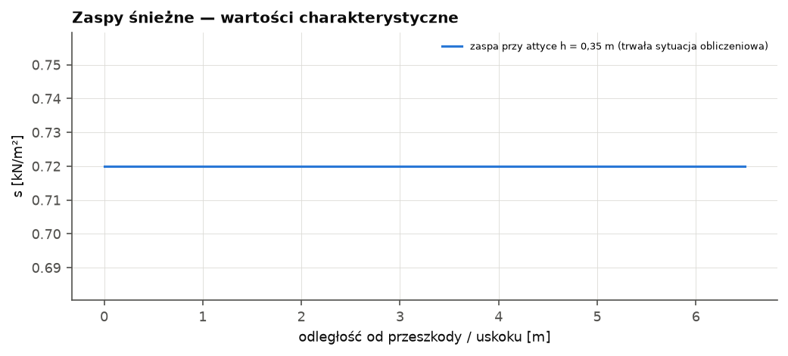

*Rys. Rozkłady obciążenia śniegiem w zaspach (PN-EN 1991-1-3 p. 5.3.6, 6.2, zał. B).*

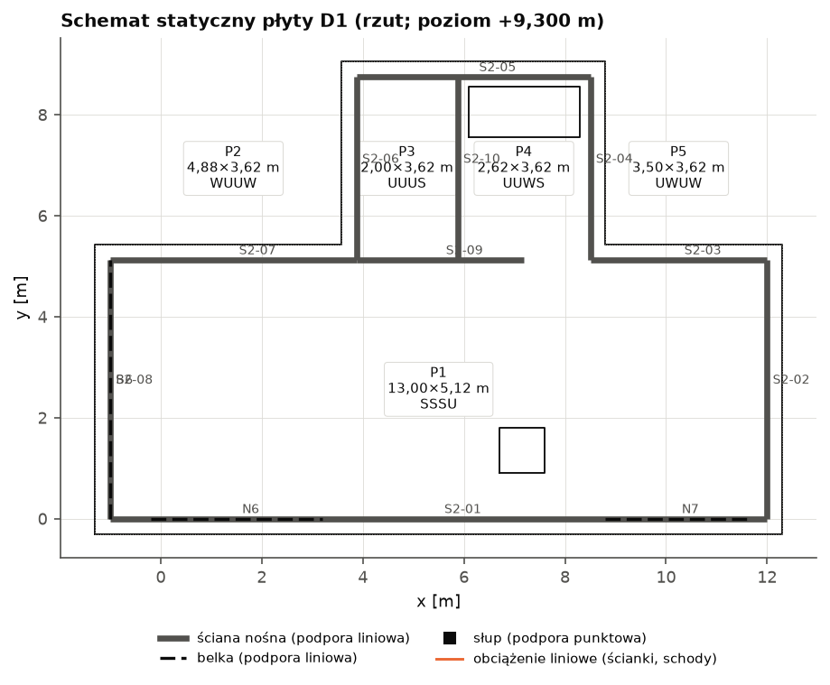

*Rys. Schemat statyczny płyty D1: pola (P — wymiary, warunki brzegowe x=0/x=l_x/y=0/y=l_y: S — podparcie swobodne, U — ciągłość/utwierdzenie, W — brzeg swobodny/niepełny), podpory.*

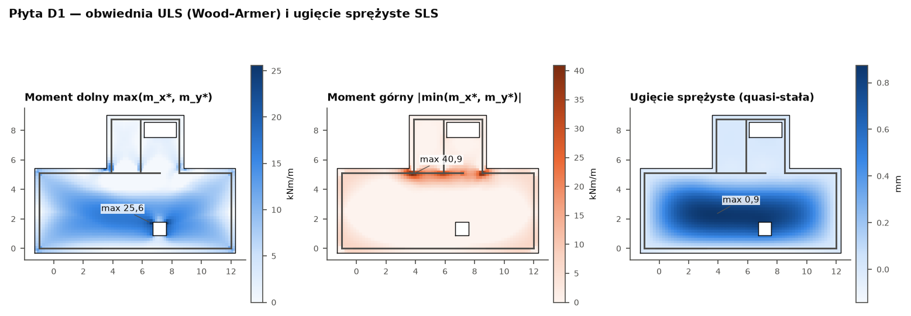

*Rys. Płyta D1: momenty wymiarujące (obwiednia kombinacji 6.10a/b, obciążeń szachownicowych i sytuacji wyjątkowej) oraz ugięcie sprężyste od kombinacji quasi-stałej (bez zarysowania i pełzania — te w obliczeniach 7.4.3).*

#### Zestawienie obciążeń

**Obciążenia stałe — D1 — Stropodach bryły A (P2): membrana TPO, PIR spadkowy 12–32 cm (śr. 22), paroizolacja z Al, płyta ŻB 22 cm, tynk; spadek ≥ 2 % do wpustów WP1/WP2 (U ≈ 0,10)**

| Warstwa | Obliczenie | g_k [kN/m²] | γ_G (6.10a) | g_d [kN/m²] | ξγ_G (6.10b) | g_d [kN/m²] |
|---|---|---|---|---|---|---|
| Membrana dachowa TPO 1,5 mm, mocowana mechanicznie (hydroizolacja stropodachów) | 0,2 cm × 9,81 kN/m³ | 0,020 | 1,35 | 0,026 | 1,15 | 0,023 |
| Płyty PIR z okładziną (izolacja spadkowa stropodachów) | 22,0 cm × 0,31 kN/m³ | 0,069 | 1,35 | 0,093 | 1,15 | 0,079 |
| Paroizolacja bitumiczna z wkładką Al (na płycie stropodachów) | 0,4 cm × 10,79 kN/m³ | 0,043 | 1,35 | 0,058 | 1,15 | 0,050 |
| Żelbet C25/30, B500SP (stropy, płyta fundamentowa, ściany) | 22,0 cm × 25,00 kN/m³ | 5,500 | 1,35 | 7,425 | 1,15 | 6,311 |
| Tynk gipsowy maszynowy 1,5 cm | 1,0 cm × 11,77 kN/m³ | 0,118 | 1,35 | 0,159 | 1,15 | 0,135 |
| **Razem g_k** |  | 5,750 |  | 7,762 |  | 6,598 |

- Obciążenie użytkowe: dach bez dostępu (kat. H): q_k = 0,40 kN/m², Q_k = 1,0 kN, ψ₀/ψ₁/ψ₂ = 0,0/0,0/0,0 (PN-EN 1991-1-1 tabl. 6.10 + NA; nie łączyć ze śniegiem i wiatrem (p. 3.3.2)).
- Śnieg: s = 0,720 kN/m² (przypadek równomierny) oraz zaspy (poniżej).

#### Obliczenia

##### Śnieg — zaspa przy attyce h = 0,25 m (trwała sytuacja obliczeniowa) — D1

- Współczynnik kształtu przy przeszkodzie: μ₂ = γ·h/s_k = 2,00·0,25/0,90 = **0,556** *((6.1))*
- Przyjęto (0,8 ≤ μ₂ ≤ 2,0): μ₂ = **0,800** *(p. 6.2(2))*
- Długość zaspy: l_s = 2h (5 ≤ l_s ≤ 15 m) = 2·0,25 = **5,00** m *((6.2))*
- Obciążenie przy attyce: s₂ = μ₂·C_e·C_t·s_k = 0,800·1,00·1,00·0,90 = **0,720** kN/m²

##### Sprawdzenie metodą tablic — pole P1 (13,00 × 5,12 m, brzegi SSSU)

- Obciążenia obliczeniowe (miarodajne z 6.10a/6.10b): g_d; q_d = g_k = 5,750, q_k = 0,720 kN/m² = **7,762; 0,756** kN/m²
- Współczynniki (brzegi SSSU; x=0, x=l_x, y=0, y=l_y; S — podparta, U — utwierdzona): α_x; α_y; β_x; β_y = **0,0038; 0,0107; 0,0000; −0,0193** *(MRS (odpowiednik tablic Czernego), ν = 0,2)*
- Współczynniki płyty swobodnie podpartej (SSSS): α_x⁰; α_y⁰ = **0,0057; 0,0175**
- Moment przęsłowy x: M_x = [α_x·(g_d + q_d/2) + α_x⁰·q_d/2]·l_x² = [0,0038·8,140 + 0,0057·0,378]·13,00² = **5,57** kNm/m
- Moment przęsłowy y: M_y = [α_y·(g_d + q_d/2) + α_y⁰·q_d/2]·l_x² = [0,0107·8,140 + 0,0175·0,378]·13,00² = **15,90** kNm/m
- Momenty podporowe (utwierdzenie, g_d + q_d): M_x,p; M_y,p = **0,00; −27,79** kNm/m
- Porównanie z MES (M_x; M_y dół, poza narożami): M_MES/M_tabl = **2,06; 1,61**
- Przyjęto do wymiarowania: M_Ed = max(M_MES; M_tabl) = **11,50; 25,57** kNm/m

##### Pole P1 — zginanie dół, kierunek x

- Wysokość użyteczna: d = **190** mm
- Moment względny: μ = M_Ed/(b·d²·η·f_cd) = 11,50·10⁶/(1000·190²·1,0·17,86) = **0,0178** *(3.1.7(3))*
- Względna wysokość strefy ściskanej: ξ_eff = 1 − √(1 − 2μ) = 1 − √(1 − 2·0,0178) = **0,0180**
- Warunek ciągliwości: ξ_eff ≤ ξ_eff,lim = λ·ε_cu3/(ε_cu3 + f_yd/E_s) = 0,018 ≤ 0,493 = **spełniony**
- Wymagane zbrojenie rozciągane: A_s1 = ξ_eff·b·d·η·f_cd/f_yd = 0,0180·1000·190·1,0·17,86/434,8 = **140** mm²
- Zbrojenie minimalne: A_s,min = max(0,26·f_ctm/f_yk·b·d; 0,0013·b·d) = max(0,26·2,6/500·1000·190; 0,0013·1000·190) = **257** mm² *((9.1N) + NA)*
- Przyjęto (z warunkiem rys): φ8 co 19 cm = **2,65** cm²/m
- Naprężenie w stali (quasi-stała, przekrój zarysowany, α_e = 15): σ_s = α_e·M_qp·(d − x_II)/I_II = **169** MPa
- Maksymalna średnica (w_max = 0,4 mm): φ_s = φ*_s·(f_ct,eff/2,9)·k_c·h_cr/(2(h − d)) = 38,2·(2,6/2,9)·0,4·110/(2·30) = **25,1** mm *(tabl. 7.2N, (7.6N))*
- Maksymalny rozstaw prętów: s_max = (σ_s = 169 MPa) = **300** mm *(tabl. 7.3N)*

| Warunek | Efekt | Nośność / limit | η | Stan | Podstawa |
|---|---|---|---|---|---|
| Zbrojenie na zginanie | A_s,req = 257 mm²/m | A_s,prov = 265 mm²/m | 97% | spełniony | 6.1, (9.1N) |
| Rysy: średnica prętów (tabl. 7.2N) | φ = 8 mm | φ_s,max = 25 mm | 32% | spełniony | 7.3.3(2) |

##### Pole P1 — zginanie dół, kierunek y

- Wysokość użyteczna: d = **180** mm
- Moment względny: μ = M_Ed/(b·d²·η·f_cd) = 25,57·10⁶/(1000·180²·1,0·17,86) = **0,0442** *(3.1.7(3))*
- Względna wysokość strefy ściskanej: ξ_eff = 1 − √(1 − 2μ) = 1 − √(1 − 2·0,0442) = **0,0452**
- Warunek ciągliwości: ξ_eff ≤ ξ_eff,lim = λ·ε_cu3/(ε_cu3 + f_yd/E_s) = 0,045 ≤ 0,493 = **spełniony**
- Wymagane zbrojenie rozciągane: A_s1 = ξ_eff·b·d·η·f_cd/f_yd = 0,0452·1000·180·1,0·17,86/434,8 = **334** mm²
- Zbrojenie minimalne: A_s,min = max(0,26·f_ctm/f_yk·b·d; 0,0013·b·d) = max(0,26·2,6/500·1000·180; 0,0013·1000·180) = **243** mm² *((9.1N) + NA)*
- Przyjęto (z warunkiem rys): φ8 co 15 cm = **3,35** cm²/m
- Naprężenie w stali (quasi-stała, przekrój zarysowany, α_e = 15): σ_s = α_e·M_qp·(d − x_II)/I_II = **316** MPa
- Maksymalna średnica (w_max = 0,4 mm): φ_s = φ*_s·(f_ct,eff/2,9)·k_c·h_cr/(2(h − d)) = 12,4·(2,6/2,9)·0,4·110/(2·40) = **6,1** mm *(tabl. 7.2N, (7.6N))*
- Maksymalny rozstaw prętów: s_max = (σ_s = 316 MPa) = **155** mm *(tabl. 7.3N)*

| Warunek | Efekt | Nośność / limit | η | Stan | Podstawa |
|---|---|---|---|---|---|
| Zbrojenie na zginanie | A_s,req = 334 mm²/m | A_s,prov = 335 mm²/m | 100% | spełniony | 6.1, (9.1N) |
| Rysy: rozstaw prętów (tabl. 7.3N) | s = 150 mm | s_max = 155 mm | 97% | spełniony | 7.3.3(2) |

##### Pole P1 — zginanie góra, x

- Wysokość użyteczna: d = **190** mm
- Moment względny: μ = M_Ed/(b·d²·η·f_cd) = 17,43·10⁶/(1000·190²·1,0·17,86) = **0,0270** *(3.1.7(3))*
- Względna wysokość strefy ściskanej: ξ_eff = 1 − √(1 − 2μ) = 1 − √(1 − 2·0,0270) = **0,0274**
- Warunek ciągliwości: ξ_eff ≤ ξ_eff,lim = λ·ε_cu3/(ε_cu3 + f_yd/E_s) = 0,027 ≤ 0,493 = **spełniony**
- Wymagane zbrojenie rozciągane: A_s1 = ξ_eff·b·d·η·f_cd/f_yd = 0,0274·1000·190·1,0·17,86/434,8 = **214** mm²
- Zbrojenie minimalne: A_s,min = max(0,26·f_ctm/f_yk·b·d; 0,0013·b·d) = max(0,26·2,6/500·1000·190; 0,0013·1000·190) = **257** mm² *((9.1N) + NA)*
- Przyjęto (z warunkiem rys): φ8 co 19 cm = **2,65** cm²/m
- Naprężenie w stali (quasi-stała, przekrój zarysowany, α_e = 15): σ_s = α_e·M_qp·(d − x_II)/I_II = **256** MPa
- Maksymalna średnica (w_max = 0,4 mm): φ_s = φ*_s·(f_ct,eff/2,9)·k_c·h_cr/(2(h − d)) = 18,4·(2,6/2,9)·0,4·110/(2·30) = **12,1** mm *(tabl. 7.2N, (7.6N))*
- Maksymalny rozstaw prętów: s_max = (σ_s = 256 MPa) = **230** mm *(tabl. 7.3N)*

| Warunek | Efekt | Nośność / limit | η | Stan | Podstawa |
|---|---|---|---|---|---|
| Zbrojenie na zginanie | A_s,req = 257 mm²/m | A_s,prov = 265 mm²/m | 97% | spełniony | 6.1, (9.1N) |
| Rysy: średnica prętów (tabl. 7.2N) | φ = 8 mm | φ_s,max = 12 mm | 66% | spełniony | 7.3.3(2) |

##### Pole P1 — zginanie góra, y

- Wysokość użyteczna: d = **180** mm
- Moment względny: μ = M_Ed/(b·d²·η·f_cd) = 40,89·10⁶/(1000·180²·1,0·17,86) = **0,0707** *(3.1.7(3))*
- Względna wysokość strefy ściskanej: ξ_eff = 1 − √(1 − 2μ) = 1 − √(1 − 2·0,0707) = **0,0734**
- Warunek ciągliwości: ξ_eff ≤ ξ_eff,lim = λ·ε_cu3/(ε_cu3 + f_yd/E_s) = 0,073 ≤ 0,493 = **spełniony**
- Wymagane zbrojenie rozciągane: A_s1 = ξ_eff·b·d·η·f_cd/f_yd = 0,0734·1000·180·1,0·17,86/434,8 = **542** mm²
- Zbrojenie minimalne: A_s,min = max(0,26·f_ctm/f_yk·b·d; 0,0013·b·d) = max(0,26·2,6/500·1000·180; 0,0013·1000·180) = **243** mm² *((9.1N) + NA)*
- Przyjęto (z warunkiem rys): φ8 co 9 cm = **5,59** cm²/m
- Naprężenie w stali (quasi-stała, przekrój zarysowany, α_e = 15): σ_s = α_e·M_qp·(d − x_II)/I_II = **309** MPa
- Maksymalna średnica (w_max = 0,4 mm): φ_s = φ*_s·(f_ct,eff/2,9)·k_c·h_cr/(2(h − d)) = 13,1·(2,6/2,9)·0,4·110/(2·40) = **6,5** mm *(tabl. 7.2N, (7.6N))*
- Maksymalny rozstaw prętów: s_max = (σ_s = 309 MPa) = **164** mm *(tabl. 7.3N)*

| Warunek | Efekt | Nośność / limit | η | Stan | Podstawa |
|---|---|---|---|---|---|
| Zbrojenie na zginanie | A_s,req = 542 mm²/m | A_s,prov = 559 mm²/m | 97% | spełniony | 6.1, (9.1N) |
| Rysy: rozstaw prętów (tabl. 7.3N) | s = 90 mm | s_max = 164 mm | 55% | spełniony | 7.3.3(2) |

##### Pole P1 — zbrojenie narożne (góra i dół, strefy 1,03 × 1,03 m)

- Wysokość użyteczna: d = **180** mm
- Moment względny: μ = M_Ed/(b·d²·η·f_cd) = 12,66·10⁶/(1000·180²·1,0·17,86) = **0,0219** *(3.1.7(3))*
- Względna wysokość strefy ściskanej: ξ_eff = 1 − √(1 − 2μ) = 1 − √(1 − 2·0,0219) = **0,0221**
- Warunek ciągliwości: ξ_eff ≤ ξ_eff,lim = λ·ε_cu3/(ε_cu3 + f_yd/E_s) = 0,022 ≤ 0,493 = **spełniony**
- Wymagane zbrojenie rozciągane: A_s1 = ξ_eff·b·d·η·f_cd/f_yd = 0,0221·1000·180·1,0·17,86/434,8 = **164** mm²
- Zbrojenie minimalne: A_s,min = max(0,26·f_ctm/f_yk·b·d; 0,0013·b·d) = max(0,26·2,6/500·1000·180; 0,0013·1000·180) = **243** mm² *((9.1N) + NA)*
- Przyjęto: φ8 co 20 cm = **2,51** cm²/m

| Warunek | Efekt | Nośność / limit | η | Stan | Podstawa |
|---|---|---|---|---|---|
| Zbrojenie na zginanie | A_s,req = 243 mm²/m | A_s,prov = 251 mm²/m | 97% | spełniony | 6.1, (9.1N) |

##### Pole P1 — ścinanie (maks. reakcja podpory, [UPR] 0,6·r przy podporze pośredniej)

- Współczynnik skali: k = 1 + √(200/d) ≤ 2,0 = 1 + √(200/190) = **2,000**
- Stopień zbrojenia podłużnego: ρ_l = A_sl/(b_w·d) ≤ 0,02 = 265/(1000·190) = **0,00139**
- Nośność na ścinanie: V_Rd,c = C_Rd,c·k·(100·ρ_l·f_ck)^(1/3)·b_w·d = 0,1286·2,000·(100·0,00139·25)^(1/3)·1000·190·10⁻³ = **74,04** kN *((6.2.a); C_Rd,c = 0,18/γ_c)*
- Wartość minimalna: V_Rd,c,min = v_min·b_w·d, v_min = 0,035·k^(3/2)·f_ck^(1/2) = 0,4950·1000·190·10⁻³ = **94,05** kN *((6.2.b), (6.3N))*

| Warunek | Efekt | Nośność / limit | η | Stan | Podstawa |
|---|---|---|---|---|---|
| Ścinanie bez zbrojenia poprzecznego (6.2.2) | V_Ed = 282,63 kN | V_Rd,c = 94,05 kN | 301% | **NIESPEŁNIONY** | PN-EN 1992-1-1 6.2.2 |

##### Pole P1 — ugięcie (l = 5,12 m, K = 1,3)

- Stopień zbrojenia wymagany: ρ = A_s,req/(b·d) = 334/(1000·180) = **0,00186**
- Wartość odniesienia: ρ₀ = √f_ck·10⁻³ = √25·10⁻³ = **0,00500**
- Graniczne l/d (ρ ≤ ρ₀): K·[11 + 1,5·√f_ck·ρ₀/ρ + 3,2·√f_ck·(ρ₀/ρ − 1)^(3/2)] = 1,3·[11 + 1,5·5,000·2,692 + 3,2·5,000·(2,692 − 1)^1,5] = **86,3** *((7.16a))*
- Mnożnik od naprężeń w stali: 310/σ_s ≈ 500/(f_yk·A_s,req/A_s,prov) ≤ 1,5 = 500/(500·334/335) = **1,002** *((7.17))*
- Smukłość rzeczywista: l_eff/d = 5,12/0,180 = **28,5**
- *Obliczenie ugięcia (7.4.3)*
- Efektywny moduł sprężystości: E_c,eff = E_cm/(1 + φ) = 31000/(1 + 2,5) = **8857** MPa *((7.20))*
- Stosunek modułów: α_e = E_s/E_c,eff = 200000/8857 = **22,58**
- Przekrój niezarysowany: x_I; I_I = **112,3 mm; 923,2·10⁶ mm⁴**
- Przekrój zarysowany: x_II; I_II = **45,2 mm; 168,3·10⁶ mm⁴**
- Moment rysujący: M_cr = f_ctm·I_I/(h − x_I) = 2,6·923,2·10⁶/(220 − 112,3) = **22,29** kNm
- Współczynnik rozkładu: ζ = 1 − β·(M_cr/M_qp)², β = 0,5 = M_qp ≤ M_cr → 0 = **0,000** *((7.19))*
- Ugięcie od obciążeń (quasi-stała): w_q = ζ·w_II + (1 − ζ)·w_I = 0,000·16,13 + 1,000·2,94 = **2,94** mm *((7.18))*
- Ugięcie od skurczu: w_cs = k·(1/r_cs)·l², 1/r_cs = ε_cs·α_e·S/I = 0,125·0,222·10⁻⁶·5125² = **0,73** mm *((7.21))*
- Ugięcie całkowite: w = w_q + w_cs = 2,94 + 0,73 = **3,67** mm
- Ugięcie dopuszczalne: w_lim = L/250 = 5125/250 = **20,5** mm *(7.4.1(4))*

| Warunek | Efekt | Nośność / limit | η | Stan | Podstawa |
|---|---|---|---|---|---|
| Ugięcie — graniczna smukłość l/d (7.4.2) | l/d = 28,5  | (l/d)_lim = 86,5  | 33% | spełniony | (7.16), tabl. 7.4N |

> l/d spełnione — obliczenie (7.4.3) informacyjnie: w = 3,7 mm ≤? 20,5 mm.

#### Wymiarowanie — zestawienia

**Zestawienie wymiarowania pól płyty** (M [kNm/m] — obwiednia ULS, Wood–Armer, poza strefami narożnymi; „tabl.” — metoda tablic, jeżeli stosowalna; góra — nad podporami; naroża — strefy 0,2·l_min × 0,2·l_min przy narożach podpartych, zbrojenie górą i dołem na moment skręcający)

| Pole | l_x × l_y [m] | Brzegi | M_x,dół [kNm/m] MES / tabl. | Zbroj. x dół | M_y,dół MES / tabl. | Zbroj. y dół | M_x,góra | Zbroj. x góra | M_y,góra | Zbroj. y góra | Naroża M / zbroj. | w / w_lim [mm] | η_max |
|---|---|---|---|---|---|---|---|---|---|---|---|---|---|
| P1 | 13,00 × 5,12 | SSSU | 11,50 / 5,57 | φ8 co 19 cm | 25,57 / 15,90 | φ8 co 15 cm | −17,43 | φ8 co 19 cm | −40,89 | φ8 co 9 cm | 12,66 / φ8 co 20 cm | 3,7 / 20,5 | 301% ✗ |
| P2 | 4,88 × 3,62 | WUUW | 11,82 / — | φ8 co 19 cm | 11,87 / — | φ8 co 20 cm | −14,96 | φ8 co 19 cm | −17,08 | φ8 co 20 cm | 36,83 / φ10 co 16 cm | 0,3 / 14,5 | 301% ✗ |
| P3 | 2,00 × 3,62 | UUUS | 9,89 / 1,47 | φ8 co 19 cm | 3,40 / 0,63 | φ8 co 20 cm | −8,02 | φ8 co 19 cm | −23,48 | φ8 co 16 cm | 29,15 / φ8 co 13 cm | 0,1 / 8,0 | 301% ✗ |
| P4 | 2,62 × 3,62 | UUWS | 13,82 / — | φ8 co 19 cm | 6,72 / — | φ8 co 20 cm | −16,79 | φ8 co 19 cm | −32,53 | φ8 co 11 cm | 0,95 / φ8 co 20 cm | 0,3 / 10,5 | 239% ✗ |
| P5 | 3,50 × 3,62 | UWUW | 9,68 / — | φ8 co 19 cm | 9,61 / — | φ8 co 20 cm | −9,71 | φ8 co 19 cm | −11,34 | φ8 co 20 cm | 36,48 / φ10 co 16 cm | 0,3 / 14,0 | 239% ✗ |

**Reakcje podporowe (charakterystyczne, cała grupa płyt)**

| Podpora | Długość [m] | ΣR_G [kN] | ΣR_Q [kN] | max r_G [kN/m] | max r_Q [kN/m] |
|---|---|---|---|---|---|
| S2-01 | 13,00 | 111,5 | 0,0 | 59,99 | 0,00 |
| S2-02 | 5,12 | 47,8 | 0,0 | 70,80 | 0,00 |
| S2-03 | 3,50 | 114,4 | 0,0 | 959,41 | 0,00 |
| S2-04 | 3,62 | −48,7 | 0,0 | 959,41 | 0,00 |
| S2-05 | 4,62 | 18,4 | 0,0 | 8,86 | 0,00 |
| S2-06 | 3,62 | −121,1 | 0,0 | 388,70 | 0,00 |
| S2-07 | 4,88 | 138,9 | 0,0 | 388,70 | 0,00 |
| S2-08 | 5,12 | 19,6 | 0,0 | 37,96 | 0,00 |
| S2-09 | 3,32 | 273,0 | 0,0 | 531,25 | 0,00 |
| S2-10 | 3,62 | −76,2 | 0,0 | 410,89 | 0,00 |
| B6 | 5,12 | 19,6 | 0,0 | 37,96 | 0,00 |
| N6 | 3,40 | 24,4 | 0,0 | 13,86 | 0,00 |
| N7 | 2,80 | 17,6 | 0,0 | 11,90 | 0,00 |

#### Wnioski

**Przyjęto:** Płyta gr. 22 cm z betonu C25/30, stal B500SP, otulenie c_nom = 25 mm; zbrojenie wg zestawienia pól (dołem siatka w obu kierunkach, górą nad podporami).  
**Przyjęto:** Maks. ugięcie długotrwałe ≈ 3,7 mm.  

### Poz. 1.2 — Stropodach / dach D2

Element modelu: `D2` · maks. wykorzystanie nośności η = 485% · **WARUNKI NIESPEŁNIONE — patrz tabele warunków i wnioski**

#### Opis i schemat statyczny

Płyta żelbetowa monolityczna gr. h = 22 cm, wierzch konstrukcji 6,150 m, beton C25/30 (ekspozycja XC1), stal B500SP. Pole płyty 14,05 m². Analiza wspólna z: ST2 + ST2Z + D2 + D3 (płyty połączone na jednym poziomie — ciągłość nad podporami/łącznikami). Schemat: płyta na podporach liniowych (ściany, belki — podpory sztywne, przegubowe) i punktowych (słupy); statyka — MES płytowy (elementy ACM, siatka 20 cm, obwiednia kombinacji 6.10a/6.10b i obciążeń szachownicowych pól), sprawdzenie pól prostokątnych metodą tablic (współczynniki MRS).

Podpory: S1-03 (ściana), S1-04 (ściana)

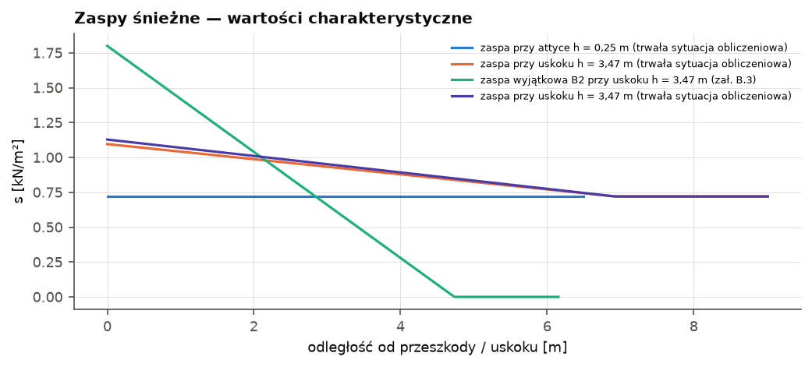

*Rys. Rozkłady obciążenia śniegiem w zaspach (PN-EN 1991-1-3 p. 5.3.6, 6.2, zał. B).*

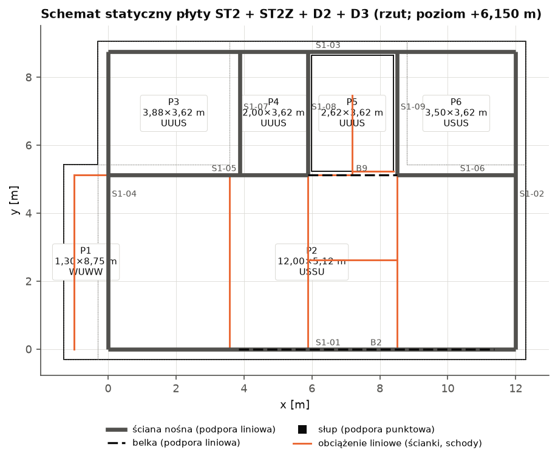

*Rys. Schemat statyczny płyty ST2 + ST2Z + D2 + D3: pola (P — wymiary, warunki brzegowe x=0/x=l_x/y=0/y=l_y: S — podparcie swobodne, U — ciągłość/utwierdzenie, W — brzeg swobodny/niepełny), podpory.*

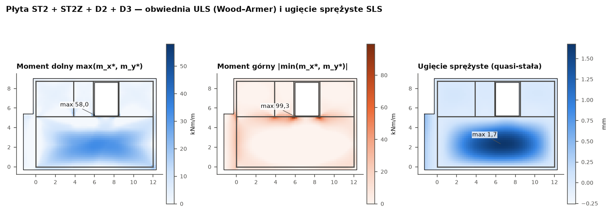

*Rys. Płyta ST2 + ST2Z + D2 + D3: momenty wymiarujące (obwiednia kombinacji 6.10a/b, obciążeń szachownicowych i sytuacji wyjątkowej) oraz ugięcie sprężyste od kombinacji quasi-stałej (bez zarysowania i pełzania — te w obliczeniach 7.4.3).*

#### Zestawienie obciążeń

**Obciążenia stałe — D2 — Stropodach nad P1 (pola pn. poza bryłą A): żwir 5 cm, włóknina, membrana TPO, PIR spadkowy 14–26 cm, paroizolacja, płyta ŻB 22 cm (U ≈ 0,11)**

| Warstwa | Obliczenie | g_k [kN/m²] | γ_G (6.10a) | g_d [kN/m²] | ξγ_G (6.10b) | g_d [kN/m²] |
|---|---|---|---|---|---|---|
| Żwir płukany 16/32 mm (balast dachu P1, opaska przy attyce) | 5,0 cm × 17,00 kN/m³ | 0,850 | 1,35 | 1,148 | 1,15 | 0,975 |
| Włóknina ochronna PP 300 g/m² | 0,4 cm × 1,47 kN/m³ | 0,006 | 1,35 | 0,008 | 1,15 | 0,007 |
| Membrana dachowa TPO 1,5 mm, mocowana mechanicznie (hydroizolacja stropodachów) | 0,2 cm × 9,81 kN/m³ | 0,020 | 1,35 | 0,026 | 1,15 | 0,023 |
| Płyty PIR z okładziną (izolacja spadkowa stropodachów) | 20,0 cm × 0,31 kN/m³ | 0,063 | 1,35 | 0,085 | 1,15 | 0,072 |
| Paroizolacja bitumiczna z wkładką Al (na płycie stropodachów) | 0,4 cm × 10,79 kN/m³ | 0,043 | 1,35 | 0,058 | 1,15 | 0,050 |
| Żelbet C25/30, B500SP (stropy, płyta fundamentowa, ściany) | 22,0 cm × 25,00 kN/m³ | 5,500 | 1,35 | 7,425 | 1,15 | 6,311 |
| Tynk gipsowy maszynowy 1,5 cm | 1,0 cm × 11,77 kN/m³ | 0,118 | 1,35 | 0,159 | 1,15 | 0,135 |
| **Razem g_k** |  | 6,599 |  | 8,909 |  | 7,573 |

- Obciążenie użytkowe: dach bez dostępu (kat. H): q_k = 0,40 kN/m², Q_k = 1,0 kN, ψ₀/ψ₁/ψ₂ = 0,0/0,0/0,0 (PN-EN 1991-1-1 tabl. 6.10 + NA; nie łączyć ze śniegiem i wiatrem (p. 3.3.2)).
- Obciążenie dodatkowe (QA): ścianka działowa S2-16: 1,06 kN/m → zastępcze 0,8 kN/m² (6.3.1.2(8)).
- Obciążenie dodatkowe (QA): ścianka działowa S2-17: 1,06 kN/m → zastępcze 0,8 kN/m² (6.3.1.2(8)).
- Śnieg: s = 0,720 kN/m² (przypadek równomierny) oraz zaspy (poniżej).

#### Obliczenia

##### Śnieg — zaspa przy attyce h = 0,25 m (trwała sytuacja obliczeniowa) — D2

- Współczynnik kształtu przy przeszkodzie: μ₂ = γ·h/s_k = 2,00·0,25/0,90 = **0,556** *((6.1))*
- Przyjęto (0,8 ≤ μ₂ ≤ 2,0): μ₂ = **0,800** *(p. 6.2(2))*
- Długość zaspy: l_s = 2h (5 ≤ l_s ≤ 15 m) = 2·0,25 = **5,00** m *((6.2))*
- Obciążenie przy attyce: s₂ = μ₂·C_e·C_t·s_k = 0,800·1,00·1,00·0,90 = **0,720** kN/m²

##### Śnieg — zaspa przy uskoku h = 3,37 m (trwała sytuacja obliczeniowa) — D2 przy ścianie S2-06

- Współczynnik od zsuwania się śniegu z dachu wyższego: μ_s = α = 0° ≤ 15° = **0,00** *(p. 5.3.6(1))*
- Współczynnik od nawiewania: μ_w = (b₁ + b₂)/(2h) = (4,95 + 3,92)/(2·3,37) = **1,316** *((5.8))*
- Ograniczenie: μ_w ≤ γ·h/s_k = 2,00·3,37/0,90 = **7,480** *((5.8); γ = 2 kN/m³)*
- Przyjęto (zakres 0,8 ≤ μ_w ≤ 4,0): μ_w = **1,316** *(p. 5.3.6(1) uwaga 1 (wartość zalecana) [NZW NA])*
- Współczynnik kształtu przy uskoku: μ₂ = μ_s + μ_w = 0,00 + 1,316 = **1,316**
- Długość zaspy: l_s = 2h (5 ≤ l_s ≤ 15 m) = 2·3,37 = **6,73** m *((5.9))*
- Obciążenie przy uskoku: s₂ = μ₂·C_e·C_t·s_k = 1,316·1,00·1,00·0,90 = **1,184** kN/m²
- Obciążenie poza zaspą (μ₁ = 0,8): s₁ = **0,720** kN/m²

> b₂ = 3,92 m < l_s = 6,73 m — zaspa obcięta na krawędzi dachu niższego (p. 5.3.6(3)).

##### Śnieg — zaspa wyjątkowa B2 przy uskoku h = 3,37 m (zał. B.3) — D2 przy ścianie S2-06

- Długość zaspy: l_s = min(5h; b₁; 15 m) = min(5·3,37; 4,95; 15) = **4,95** m *(zał. B.3 [NZW])*
- Współczynnik kształtu: μ₁ = min{2h/s_k; 2b/l_s; 8} = min{7,48; 2,00; 8} = **2,000** *(zał. B.3 (B.2) [NZW])*
- Obciążenie wyjątkowe: s_Ad = μ₁·s_k = 2,000·0,90 = **1,800** kN/m² *((4.2))*

> Sytuacja wyjątkowa (PN-EN 1990 6.11b): γ = 1,0; [NZW] wzory zał. B wg R5-38 — potwierdzić w normie (N-12).

##### Śnieg — zaspa przy uskoku h = 3,37 m (trwała sytuacja obliczeniowa) — D2 przy ścianie S2-07

- Współczynnik od zsuwania się śniegu z dachu wyższego: μ_s = α = 0° ≤ 15° = **0,00** *(p. 5.3.6(1))*
- Współczynnik od nawiewania: μ_w = (b₁ + b₂)/(2h) = (5,45 + 3,67)/(2·3,37) = **1,353** *((5.8))*
- Ograniczenie: μ_w ≤ γ·h/s_k = 2,00·3,37/0,90 = **7,480** *((5.8); γ = 2 kN/m³)*
- Przyjęto (zakres 0,8 ≤ μ_w ≤ 4,0): μ_w = **1,353** *(p. 5.3.6(1) uwaga 1 (wartość zalecana) [NZW NA])*
- Współczynnik kształtu przy uskoku: μ₂ = μ_s + μ_w = 0,00 + 1,353 = **1,353**
- Długość zaspy: l_s = 2h (5 ≤ l_s ≤ 15 m) = 2·3,37 = **6,73** m *((5.9))*
- Obciążenie przy uskoku: s₂ = μ₂·C_e·C_t·s_k = 1,353·1,00·1,00·0,90 = **1,218** kN/m²
- Obciążenie poza zaspą (μ₁ = 0,8): s₁ = **0,720** kN/m²

> b₂ = 3,67 m < l_s = 6,73 m — zaspa obcięta na krawędzi dachu niższego (p. 5.3.6(3)).

##### Śnieg — zaspa wyjątkowa B2 przy uskoku h = 3,37 m (zał. B.3) — D2 przy ścianie S2-07

- Długość zaspy: l_s = min(5h; b₁; 15 m) = min(5·3,37; 5,45; 15) = **5,45** m *(zał. B.3 [NZW])*
- Współczynnik kształtu: μ₁ = min{2h/s_k; 2b/l_s; 8} = min{7,48; 2,00; 8} = **2,000** *(zał. B.3 (B.2) [NZW])*
- Obciążenie wyjątkowe: s_Ad = μ₁·s_k = 2,000·0,90 = **1,800** kN/m² *((4.2))*

> Sytuacja wyjątkowa (PN-EN 1990 6.11b): γ = 1,0; [NZW] wzory zał. B wg R5-38 — potwierdzić w normie (N-12).

##### Sprawdzenie metodą tablic — pole P3 (3,88 × 3,62 m, brzegi UUUS)

- Obciążenie liniowe ścianek na polu jako równomierne zastępcze [UPR — tylko porównanie]: g_dz = Σ(g_l·l)/A = **10,785** kN/m²
- Obciążenia obliczeniowe (miarodajne z 6.10a/6.10b): g_d; q_d = g_k = 17,384, q_k = 1,105 kN/m² = **23,469; 1,160** kN/m²
- Współczynniki (brzegi UUUS; x=0, x=l_x, y=0, y=l_y; S — podparta, U — utwierdzona): α_x; α_y; β_x; β_y = **0,0242; 0,0229; −0,0569; −0,0537** *(MRS (odpowiednik tablic Czernego), ν = 0,2)*
- Współczynniki płyty swobodnie podpartej (SSSS): α_x⁰; α_y⁰ = **0,0391; 0,0433**
- Moment przęsłowy x: M_x = [α_x·(g_d + q_d/2) + α_x⁰·q_d/2]·l_x² = [0,0242·24,049 + 0,0391·0,580]·3,88² = **9,07** kNm/m
- Moment przęsłowy y: M_y = [α_y·(g_d + q_d/2) + α_y⁰·q_d/2]·l_x² = [0,0229·24,049 + 0,0433·0,580]·3,88² = **8,64** kNm/m
- Momenty podporowe (utwierdzenie, g_d + q_d): M_x,p; M_y,p = **−21,06; −19,87** kNm/m
- Porównanie z MES (M_x; M_y dół, poza narożami): M_MES/M_tabl = **0,43; 0,49**
- Przyjęto do wymiarowania: M_Ed = max(M_MES; M_tabl) = **9,07; 8,64** kNm/m

##### Pole P3 — zginanie dół, kierunek x

- Wysokość użyteczna: d = **190** mm
- Moment względny: μ = M_Ed/(b·d²·η·f_cd) = 9,07·10⁶/(1000·190²·1,0·17,86) = **0,0141** *(3.1.7(3))*
- Względna wysokość strefy ściskanej: ξ_eff = 1 − √(1 − 2μ) = 1 − √(1 − 2·0,0141) = **0,0142**
- Warunek ciągliwości: ξ_eff ≤ ξ_eff,lim = λ·ε_cu3/(ε_cu3 + f_yd/E_s) = 0,014 ≤ 0,493 = **spełniony**
- Wymagane zbrojenie rozciągane: A_s1 = ξ_eff·b·d·η·f_cd/f_yd = 0,0142·1000·190·1,0·17,86/434,8 = **111** mm²
- Zbrojenie minimalne: A_s,min = max(0,26·f_ctm/f_yk·b·d; 0,0013·b·d) = max(0,26·2,6/500·1000·190; 0,0013·1000·190) = **257** mm² *((9.1N) + NA)*
- Przyjęto (z warunkiem rys): φ8 co 19 cm = **2,65** cm²/m
- Naprężenie w stali (quasi-stała, przekrój zarysowany, α_e = 15): σ_s = α_e·M_qp·(d − x_II)/I_II = **55** MPa
- Maksymalna średnica (w_max = 0,4 mm): φ_s = φ*_s·(f_ct,eff/2,9)·k_c·h_cr/(2(h − d)) = 40,0·(2,6/2,9)·0,4·110/(2·30) = **26,3** mm *(tabl. 7.2N, (7.6N))*
- Maksymalny rozstaw prętów: s_max = (σ_s = 55 MPa) = **300** mm *(tabl. 7.3N)*

| Warunek | Efekt | Nośność / limit | η | Stan | Podstawa |
|---|---|---|---|---|---|
| Zbrojenie na zginanie | A_s,req = 257 mm²/m | A_s,prov = 265 mm²/m | 97% | spełniony | 6.1, (9.1N) |
| Rysy: średnica prętów (tabl. 7.2N) | φ = 8 mm | φ_s,max = 26 mm | 30% | spełniony | 7.3.3(2) |

##### Pole P3 — zginanie dół, kierunek y

- Wysokość użyteczna: d = **180** mm
- Moment względny: μ = M_Ed/(b·d²·η·f_cd) = 8,64·10⁶/(1000·180²·1,0·17,86) = **0,0149** *(3.1.7(3))*
- Względna wysokość strefy ściskanej: ξ_eff = 1 − √(1 − 2μ) = 1 − √(1 − 2·0,0149) = **0,0150**
- Warunek ciągliwości: ξ_eff ≤ ξ_eff,lim = λ·ε_cu3/(ε_cu3 + f_yd/E_s) = 0,015 ≤ 0,493 = **spełniony**
- Wymagane zbrojenie rozciągane: A_s1 = ξ_eff·b·d·η·f_cd/f_yd = 0,0150·1000·180·1,0·17,86/434,8 = **111** mm²
- Zbrojenie minimalne: A_s,min = max(0,26·f_ctm/f_yk·b·d; 0,0013·b·d) = max(0,26·2,6/500·1000·180; 0,0013·1000·180) = **243** mm² *((9.1N) + NA)*
- Przyjęto (z warunkiem rys): φ8 co 20 cm = **2,51** cm²/m
- Naprężenie w stali (quasi-stała, przekrój zarysowany, α_e = 15): σ_s = α_e·M_qp·(d − x_II)/I_II = **66** MPa
- Maksymalna średnica (w_max = 0,4 mm): φ_s = φ*_s·(f_ct,eff/2,9)·k_c·h_cr/(2(h − d)) = 40,0·(2,6/2,9)·0,4·110/(2·40) = **19,7** mm *(tabl. 7.2N, (7.6N))*
- Maksymalny rozstaw prętów: s_max = (σ_s = 66 MPa) = **300** mm *(tabl. 7.3N)*

| Warunek | Efekt | Nośność / limit | η | Stan | Podstawa |
|---|---|---|---|---|---|
| Zbrojenie na zginanie | A_s,req = 243 mm²/m | A_s,prov = 251 mm²/m | 97% | spełniony | 6.1, (9.1N) |
| Rysy: średnica prętów (tabl. 7.2N) | φ = 8 mm | φ_s,max = 20 mm | 41% | spełniony | 7.3.3(2) |

##### Pole P3 — zginanie góra, x

- Wysokość użyteczna: d = **190** mm
- Moment względny: μ = M_Ed/(b·d²·η·f_cd) = 21,06·10⁶/(1000·190²·1,0·17,86) = **0,0327** *(3.1.7(3))*
- Względna wysokość strefy ściskanej: ξ_eff = 1 − √(1 − 2μ) = 1 − √(1 − 2·0,0327) = **0,0332**
- Warunek ciągliwości: ξ_eff ≤ ξ_eff,lim = λ·ε_cu3/(ε_cu3 + f_yd/E_s) = 0,033 ≤ 0,493 = **spełniony**
- Wymagane zbrojenie rozciągane: A_s1 = ξ_eff·b·d·η·f_cd/f_yd = 0,0332·1000·190·1,0·17,86/434,8 = **259** mm²
- Zbrojenie minimalne: A_s,min = max(0,26·f_ctm/f_yk·b·d; 0,0013·b·d) = max(0,26·2,6/500·1000·190; 0,0013·1000·190) = **257** mm² *((9.1N) + NA)*
- Przyjęto (z warunkiem rys): φ8 co 19 cm = **2,65** cm²/m
- Naprężenie w stali (quasi-stała, przekrój zarysowany, α_e = 15): σ_s = α_e·M_qp·(d − x_II)/I_II = **109** MPa
- Maksymalna średnica (w_max = 0,4 mm): φ_s = φ*_s·(f_ct,eff/2,9)·k_c·h_cr/(2(h − d)) = 40,0·(2,6/2,9)·0,4·110/(2·30) = **26,3** mm *(tabl. 7.2N, (7.6N))*
- Maksymalny rozstaw prętów: s_max = (σ_s = 109 MPa) = **300** mm *(tabl. 7.3N)*

| Warunek | Efekt | Nośność / limit | η | Stan | Podstawa |
|---|---|---|---|---|---|
| Zbrojenie na zginanie | A_s,req = 259 mm²/m | A_s,prov = 265 mm²/m | 98% | spełniony | 6.1, (9.1N) |
| Rysy: średnica prętów (tabl. 7.2N) | φ = 8 mm | φ_s,max = 26 mm | 30% | spełniony | 7.3.3(2) |

##### Pole P3 — zginanie góra, y

- Wysokość użyteczna: d = **180** mm
- Moment względny: μ = M_Ed/(b·d²·η·f_cd) = 19,87·10⁶/(1000·180²·1,0·17,86) = **0,0343** *(3.1.7(3))*
- Względna wysokość strefy ściskanej: ξ_eff = 1 − √(1 − 2μ) = 1 − √(1 − 2·0,0343) = **0,0350**
- Warunek ciągliwości: ξ_eff ≤ ξ_eff,lim = λ·ε_cu3/(ε_cu3 + f_yd/E_s) = 0,035 ≤ 0,493 = **spełniony**
- Wymagane zbrojenie rozciągane: A_s1 = ξ_eff·b·d·η·f_cd/f_yd = 0,0350·1000·180·1,0·17,86/434,8 = **258** mm²
- Zbrojenie minimalne: A_s,min = max(0,26·f_ctm/f_yk·b·d; 0,0013·b·d) = max(0,26·2,6/500·1000·180; 0,0013·1000·180) = **243** mm² *((9.1N) + NA)*
- Przyjęto (z warunkiem rys): φ8 co 19 cm = **2,65** cm²/m
- Naprężenie w stali (quasi-stała, przekrój zarysowany, α_e = 15): σ_s = α_e·M_qp·(d − x_II)/I_II = **183** MPa
- Maksymalna średnica (w_max = 0,4 mm): φ_s = φ*_s·(f_ct,eff/2,9)·k_c·h_cr/(2(h − d)) = 35,3·(2,6/2,9)·0,4·110/(2·40) = **17,4** mm *(tabl. 7.2N, (7.6N))*
- Maksymalny rozstaw prętów: s_max = (σ_s = 183 MPa) = **300** mm *(tabl. 7.3N)*

| Warunek | Efekt | Nośność / limit | η | Stan | Podstawa |
|---|---|---|---|---|---|
| Zbrojenie na zginanie | A_s,req = 258 mm²/m | A_s,prov = 265 mm²/m | 98% | spełniony | 6.1, (9.1N) |
| Rysy: średnica prętów (tabl. 7.2N) | φ = 8 mm | φ_s,max = 17 mm | 46% | spełniony | 7.3.3(2) |

##### Pole P3 — zbrojenie narożne (góra i dół, strefy 0,73 × 0,73 m)

- Wysokość użyteczna: d = **180** mm
- Moment względny: μ = M_Ed/(b·d²·η·f_cd) = 13,77·10⁶/(1000·180²·1,0·17,86) = **0,0238** *(3.1.7(3))*
- Względna wysokość strefy ściskanej: ξ_eff = 1 − √(1 − 2μ) = 1 − √(1 − 2·0,0238) = **0,0241**
- Warunek ciągliwości: ξ_eff ≤ ξ_eff,lim = λ·ε_cu3/(ε_cu3 + f_yd/E_s) = 0,024 ≤ 0,493 = **spełniony**
- Wymagane zbrojenie rozciągane: A_s1 = ξ_eff·b·d·η·f_cd/f_yd = 0,0241·1000·180·1,0·17,86/434,8 = **178** mm²
- Zbrojenie minimalne: A_s,min = max(0,26·f_ctm/f_yk·b·d; 0,0013·b·d) = max(0,26·2,6/500·1000·180; 0,0013·1000·180) = **243** mm² *((9.1N) + NA)*
- Przyjęto: φ8 co 20 cm = **2,51** cm²/m

| Warunek | Efekt | Nośność / limit | η | Stan | Podstawa |
|---|---|---|---|---|---|
| Zbrojenie na zginanie | A_s,req = 243 mm²/m | A_s,prov = 251 mm²/m | 97% | spełniony | 6.1, (9.1N) |

##### Pole P3 — ścinanie (maks. reakcja podpory, [UPR] 0,6·r przy podporze pośredniej)

- Współczynnik skali: k = 1 + √(200/d) ≤ 2,0 = 1 + √(200/190) = **2,000**
- Stopień zbrojenia podłużnego: ρ_l = A_sl/(b_w·d) ≤ 0,02 = 265/(1000·190) = **0,00139**
- Nośność na ścinanie: V_Rd,c = C_Rd,c·k·(100·ρ_l·f_ck)^(1/3)·b_w·d = 0,1286·2,000·(100·0,00139·25)^(1/3)·1000·190·10⁻³ = **74,04** kN *((6.2.a); C_Rd,c = 0,18/γ_c)*
- Wartość minimalna: V_Rd,c,min = v_min·b_w·d, v_min = 0,035·k^(3/2)·f_ck^(1/2) = 0,4950·1000·190·10⁻³ = **94,05** kN *((6.2.b), (6.3N))*

| Warunek | Efekt | Nośność / limit | η | Stan | Podstawa |
|---|---|---|---|---|---|
| Ścinanie bez zbrojenia poprzecznego (6.2.2) | V_Ed = 455,70 kN | V_Rd,c = 94,05 kN | 485% | **NIESPEŁNIONY** | PN-EN 1992-1-1 6.2.2 |

##### Pole P3 — ugięcie (l = 3,62 m, K = 1,3)

- Stopień zbrojenia wymagany: ρ = A_s,req/(b·d) = 111/(1000·180) = **0,00062**
- Wartość odniesienia: ρ₀ = √f_ck·10⁻³ = √25·10⁻³ = **0,00500**
- Graniczne l/d (ρ ≤ ρ₀): K·[11 + 1,5·√f_ck·ρ₀/ρ + 3,2·√f_ck·(ρ₀/ρ − 1)^(3/2)] = 1,3·[11 + 1,5·5,000·8,091 + 3,2·5,000·(8,091 − 1)^1,5] = **486,0** *((7.16a))*
- Mnożnik od naprężeń w stali: 310/σ_s ≈ 500/(f_yk·A_s,req/A_s,prov) ≤ 1,5 = 500/(500·111/251) = **1,500** *((7.17))*
- Smukłość rzeczywista: l_eff/d = 3,62/0,180 = **20,1**
- *Obliczenie ugięcia (7.4.3)*
- Efektywny moduł sprężystości: E_c,eff = E_cm/(1 + φ) = 31000/(1 + 2,5) = **8857** MPa *((7.20))*
- Stosunek modułów: α_e = E_s/E_c,eff = 200000/8857 = **22,58**
- Przekrój niezarysowany: x_I; I_I = **111,8 mm; 914,4·10⁶ mm⁴**
- Przekrój zarysowany: x_II; I_II = **39,9 mm; 132,6·10⁶ mm⁴**
- Moment rysujący: M_cr = f_ctm·I_I/(h − x_I) = 2,6·914,4·10⁶/(220 − 111,8) = **21,97** kNm
- Współczynnik rozkładu: ζ = 1 − β·(M_cr/M_qp)², β = 0,5 = M_qp ≤ M_cr → 0 = **0,000** *((7.19))*
- Ugięcie od obciążeń (quasi-stała): w_q = ζ·w_II + (1 − ζ)·w_I = 0,000·1,51 + 1,000·0,22 = **0,22** mm *((7.18))*
- Ugięcie od skurczu: w_cs = k·(1/r_cs)·l², 1/r_cs = ε_cs·α_e·S/I = 0,125·0,169·10⁻⁶·3625² = **0,28** mm *((7.21))*
- Ugięcie całkowite: w = w_q + w_cs = 0,22 + 0,28 = **0,50** mm
- Ugięcie dopuszczalne: w_lim = L/250 = 3625/250 = **14,5** mm *(7.4.1(4))*

| Warunek | Efekt | Nośność / limit | η | Stan | Podstawa |
|---|---|---|---|---|---|
| Ugięcie — graniczna smukłość l/d (7.4.2) | l/d = 20,1  | (l/d)_lim = 729,0  | 3% | spełniony | (7.16), tabl. 7.4N |

> l/d spełnione — obliczenie (7.4.3) informacyjnie: w = 0,5 mm ≤? 14,5 mm.

#### Wymiarowanie — zestawienia

**Zestawienie wymiarowania pól płyty** (M [kNm/m] — obwiednia ULS, Wood–Armer, poza strefami narożnymi; „tabl.” — metoda tablic, jeżeli stosowalna; góra — nad podporami; naroża — strefy 0,2·l_min × 0,2·l_min przy narożach podpartych, zbrojenie górą i dołem na moment skręcający)

| Pole | l_x × l_y [m] | Brzegi | M_x,dół [kNm/m] MES / tabl. | Zbroj. x dół | M_y,dół MES / tabl. | Zbroj. y dół | M_x,góra | Zbroj. x góra | M_y,góra | Zbroj. y góra | Naroża M / zbroj. | w / w_lim [mm] | η_max |
|---|---|---|---|---|---|---|---|---|---|---|---|---|---|
| P3 | 3,88 × 3,62 | UUUS | 3,87 / 9,07 | φ8 co 19 cm | 4,19 / 8,64 | φ8 co 20 cm | −21,06 | φ8 co 19 cm | −19,87 | φ8 co 19 cm | 13,77 / φ8 co 20 cm | 0,5 / 14,5 | 485% ✗ |

**Reakcje podporowe (charakterystyczne, cała grupa płyt)**

| Podpora | Długość [m] | ΣR_G [kN] | ΣR_Q [kN] | max r_G [kN/m] | max r_Q [kN/m] |
|---|---|---|---|---|---|
| S1-03 | 12,00 | 62,8 | 9,0 | 15,21 | 11,87 |
| S1-04 | 8,75 | 371,4 | 46,5 | 237,21 | 18,93 |

#### Wnioski

**Przyjęto:** Płyta gr. 22 cm z betonu C25/30, stal B500SP, otulenie c_nom = 25 mm; zbrojenie wg zestawienia pól (dołem siatka w obu kierunkach, górą nad podporami).  
**Przyjęto:** Maks. ugięcie długotrwałe ≈ 0,5 mm.  

### Poz. 1.3 — Stropodach / dach D3

Element modelu: `D3` · maks. wykorzystanie nośności η = 705% · **WARUNKI NIESPEŁNIONE — patrz tabele warunków i wnioski**

#### Opis i schemat statyczny

Płyta żelbetowa monolityczna gr. h = 22 cm, wierzch konstrukcji 6,150 m, beton C25/30 (ekspozycja XC1), stal B500SP. Pole płyty 12,69 m². Analiza wspólna z: ST2 + ST2Z + D2 + D3 (płyty połączone na jednym poziomie — ciągłość nad podporami/łącznikami). Schemat: płyta na podporach liniowych (ściany, belki — podpory sztywne, przegubowe) i punktowych (słupy); statyka — MES płytowy (elementy ACM, siatka 20 cm, obwiednia kombinacji 6.10a/6.10b i obciążeń szachownicowych pól), sprawdzenie pól prostokątnych metodą tablic (współczynniki MRS).

Podpory: S1-02 (ściana), S1-03 (ściana)

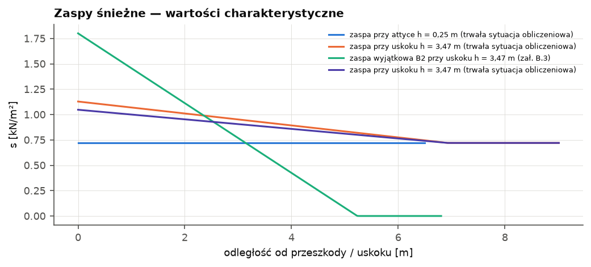

*Rys. Rozkłady obciążenia śniegiem w zaspach (PN-EN 1991-1-3 p. 5.3.6, 6.2, zał. B).*

*Rys. Schemat statyczny płyty ST2 + ST2Z + D2 + D3: pola (P — wymiary, warunki brzegowe x=0/x=l_x/y=0/y=l_y: S — podparcie swobodne, U — ciągłość/utwierdzenie, W — brzeg swobodny/niepełny), podpory.*

*Rys. Płyta ST2 + ST2Z + D2 + D3: momenty wymiarujące (obwiednia kombinacji 6.10a/b, obciążeń szachownicowych i sytuacji wyjątkowej) oraz ugięcie sprężyste od kombinacji quasi-stałej (bez zarysowania i pełzania — te w obliczeniach 7.4.3).*

#### Zestawienie obciążeń

**Obciążenia stałe — D3 — Stropodach nad P1 (pola pn. poza bryłą A): żwir 5 cm, włóknina, membrana TPO, PIR spadkowy 14–26 cm, paroizolacja, płyta ŻB 22 cm (U ≈ 0,11)**

| Warstwa | Obliczenie | g_k [kN/m²] | γ_G (6.10a) | g_d [kN/m²] | ξγ_G (6.10b) | g_d [kN/m²] |
|---|---|---|---|---|---|---|
| Żwir płukany 16/32 mm (balast dachu P1, opaska przy attyce) | 5,0 cm × 17,00 kN/m³ | 0,850 | 1,35 | 1,148 | 1,15 | 0,975 |
| Włóknina ochronna PP 300 g/m² | 0,4 cm × 1,47 kN/m³ | 0,006 | 1,35 | 0,008 | 1,15 | 0,007 |
| Membrana dachowa TPO 1,5 mm, mocowana mechanicznie (hydroizolacja stropodachów) | 0,2 cm × 9,81 kN/m³ | 0,020 | 1,35 | 0,026 | 1,15 | 0,023 |
| Płyty PIR z okładziną (izolacja spadkowa stropodachów) | 20,0 cm × 0,31 kN/m³ | 0,063 | 1,35 | 0,085 | 1,15 | 0,072 |
| Paroizolacja bitumiczna z wkładką Al (na płycie stropodachów) | 0,4 cm × 10,79 kN/m³ | 0,043 | 1,35 | 0,058 | 1,15 | 0,050 |
| Żelbet C25/30, B500SP (stropy, płyta fundamentowa, ściany) | 22,0 cm × 25,00 kN/m³ | 5,500 | 1,35 | 7,425 | 1,15 | 6,311 |
| Tynk gipsowy maszynowy 1,5 cm | 1,0 cm × 11,77 kN/m³ | 0,118 | 1,35 | 0,159 | 1,15 | 0,135 |
| **Razem g_k** |  | 6,599 |  | 8,909 |  | 7,573 |

- Obciążenie użytkowe: dach bez dostępu (kat. H): q_k = 0,40 kN/m², Q_k = 1,0 kN, ψ₀/ψ₁/ψ₂ = 0,0/0,0/0,0 (PN-EN 1991-1-1 tabl. 6.10 + NA; nie łączyć ze śniegiem i wiatrem (p. 3.3.2)).
- Obciążenie dodatkowe (QA): ścianka działowa S2-16: 1,06 kN/m → zastępcze 0,8 kN/m² (6.3.1.2(8)).
- Obciążenie dodatkowe (QA): ścianka działowa S2-17: 1,06 kN/m → zastępcze 0,8 kN/m² (6.3.1.2(8)).
- Śnieg: s = 0,720 kN/m² (przypadek równomierny) oraz zaspy (poniżej).

#### Obliczenia

##### Śnieg — zaspa przy attyce h = 0,25 m (trwała sytuacja obliczeniowa) — D3

- Współczynnik kształtu przy przeszkodzie: μ₂ = γ·h/s_k = 2,00·0,25/0,90 = **0,556** *((6.1))*
- Przyjęto (0,8 ≤ μ₂ ≤ 2,0): μ₂ = **0,800** *(p. 6.2(2))*
- Długość zaspy: l_s = 2h (5 ≤ l_s ≤ 15 m) = 2·0,25 = **5,00** m *((6.2))*
- Obciążenie przy attyce: s₂ = μ₂·C_e·C_t·s_k = 0,800·1,00·1,00·0,90 = **0,720** kN/m²

##### Śnieg — zaspa przy uskoku h = 3,37 m (trwała sytuacja obliczeniowa) — D3 przy ścianie S2-03

- Współczynnik od zsuwania się śniegu z dachu wyższego: μ_s = α = 0° ≤ 15° = **0,00** *(p. 5.3.6(1))*
- Współczynnik od nawiewania: μ_w = (b₁ + b₂)/(2h) = (5,45 + 3,67)/(2·3,37) = **1,353** *((5.8))*
- Ograniczenie: μ_w ≤ γ·h/s_k = 2,00·3,37/0,90 = **7,480** *((5.8); γ = 2 kN/m³)*
- Przyjęto (zakres 0,8 ≤ μ_w ≤ 4,0): μ_w = **1,353** *(p. 5.3.6(1) uwaga 1 (wartość zalecana) [NZW NA])*
- Współczynnik kształtu przy uskoku: μ₂ = μ_s + μ_w = 0,00 + 1,353 = **1,353**
- Długość zaspy: l_s = 2h (5 ≤ l_s ≤ 15 m) = 2·3,37 = **6,73** m *((5.9))*
- Obciążenie przy uskoku: s₂ = μ₂·C_e·C_t·s_k = 1,353·1,00·1,00·0,90 = **1,218** kN/m²
- Obciążenie poza zaspą (μ₁ = 0,8): s₁ = **0,720** kN/m²

> b₂ = 3,67 m < l_s = 6,73 m — zaspa obcięta na krawędzi dachu niższego (p. 5.3.6(3)).

##### Śnieg — zaspa wyjątkowa B2 przy uskoku h = 3,37 m (zał. B.3) — D3 przy ścianie S2-03

- Długość zaspy: l_s = min(5h; b₁; 15 m) = min(5·3,37; 5,45; 15) = **5,45** m *(zał. B.3 [NZW])*
- Współczynnik kształtu: μ₁ = min{2h/s_k; 2b/l_s; 8} = min{7,48; 2,00; 8} = **2,000** *(zał. B.3 (B.2) [NZW])*
- Obciążenie wyjątkowe: s_Ad = μ₁·s_k = 2,000·0,90 = **1,800** kN/m² *((4.2))*

> Sytuacja wyjątkowa (PN-EN 1990 6.11b): γ = 1,0; [NZW] wzory zał. B wg R5-38 — potwierdzić w normie (N-12).

##### Śnieg — zaspa przy uskoku h = 3,37 m (trwała sytuacja obliczeniowa) — D3 przy ścianie S2-04

- Współczynnik od zsuwania się śniegu z dachu wyższego: μ_s = α = 0° ≤ 15° = **0,00** *(p. 5.3.6(1))*
- Współczynnik od nawiewania: μ_w = (b₁ + b₂)/(2h) = (4,95 + 3,54)/(2·3,37) = **1,260** *((5.8))*
- Ograniczenie: μ_w ≤ γ·h/s_k = 2,00·3,37/0,90 = **7,480** *((5.8); γ = 2 kN/m³)*
- Przyjęto (zakres 0,8 ≤ μ_w ≤ 4,0): μ_w = **1,260** *(p. 5.3.6(1) uwaga 1 (wartość zalecana) [NZW NA])*
- Współczynnik kształtu przy uskoku: μ₂ = μ_s + μ_w = 0,00 + 1,260 = **1,260**
- Długość zaspy: l_s = 2h (5 ≤ l_s ≤ 15 m) = 2·3,37 = **6,73** m *((5.9))*
- Obciążenie przy uskoku: s₂ = μ₂·C_e·C_t·s_k = 1,260·1,00·1,00·0,90 = **1,134** kN/m²
- Obciążenie poza zaspą (μ₁ = 0,8): s₁ = **0,720** kN/m²

> b₂ = 3,54 m < l_s = 6,73 m — zaspa obcięta na krawędzi dachu niższego (p. 5.3.6(3)).

##### Śnieg — zaspa wyjątkowa B2 przy uskoku h = 3,37 m (zał. B.3) — D3 przy ścianie S2-04

- Długość zaspy: l_s = min(5h; b₁; 15 m) = min(5·3,37; 4,95; 15) = **4,95** m *(zał. B.3 [NZW])*
- Współczynnik kształtu: μ₁ = min{2h/s_k; 2b/l_s; 8} = min{7,48; 2,00; 8} = **2,000** *(zał. B.3 (B.2) [NZW])*
- Obciążenie wyjątkowe: s_Ad = μ₁·s_k = 2,000·0,90 = **1,800** kN/m² *((4.2))*

> Sytuacja wyjątkowa (PN-EN 1990 6.11b): γ = 1,0; [NZW] wzory zał. B wg R5-38 — potwierdzić w normie (N-12).

##### Sprawdzenie metodą tablic — pole P6 (3,50 × 3,62 m, brzegi USUS)

- Obciążenia obliczeniowe (miarodajne z 6.10a/6.10b): g_d; q_d = g_k = 6,599, q_k = 1,091 kN/m² = **8,909; 1,145** kN/m²
- Współczynniki (brzegi USUS; x=0, x=l_x, y=0, y=l_y; S — podparta, U — utwierdzona): α_x; α_y; β_x; β_y = **0,0325; 0,0306; −0,0727; −0,0709** *(MRS (odpowiednik tablic Czernego), ν = 0,2)*
- Współczynniki płyty swobodnie podpartej (SSSS): α_x⁰; α_y⁰ = **0,0470; 0,0445**
- Moment przęsłowy x: M_x = [α_x·(g_d + q_d/2) + α_x⁰·q_d/2]·l_x² = [0,0325·9,481 + 0,0470·0,573]·3,50² = **4,11** kNm/m
- Moment przęsłowy y: M_y = [α_y·(g_d + q_d/2) + α_y⁰·q_d/2]·l_x² = [0,0306·9,481 + 0,0445·0,573]·3,50² = **3,87** kNm/m
- Momenty podporowe (utwierdzenie, g_d + q_d): M_x,p; M_y,p = **−8,95; −8,73** kNm/m
- Porównanie z MES (M_x; M_y dół, poza narożami): M_MES/M_tabl = **0,73; 1,03**
- Przyjęto do wymiarowania: M_Ed = max(M_MES; M_tabl) = **4,11; 3,97** kNm/m

##### Pole P6 — zginanie dół, kierunek x

- Wysokość użyteczna: d = **190** mm
- Moment względny: μ = M_Ed/(b·d²·η·f_cd) = 4,11·10⁶/(1000·190²·1,0·17,86) = **0,0064** *(3.1.7(3))*
- Względna wysokość strefy ściskanej: ξ_eff = 1 − √(1 − 2μ) = 1 − √(1 − 2·0,0064) = **0,0064**
- Warunek ciągliwości: ξ_eff ≤ ξ_eff,lim = λ·ε_cu3/(ε_cu3 + f_yd/E_s) = 0,006 ≤ 0,493 = **spełniony**
- Wymagane zbrojenie rozciągane: A_s1 = ξ_eff·b·d·η·f_cd/f_yd = 0,0064·1000·190·1,0·17,86/434,8 = **50** mm²
- Zbrojenie minimalne: A_s,min = max(0,26·f_ctm/f_yk·b·d; 0,0013·b·d) = max(0,26·2,6/500·1000·190; 0,0013·1000·190) = **257** mm² *((9.1N) + NA)*
- Przyjęto (z warunkiem rys): φ8 co 19 cm = **2,65** cm²/m
- Naprężenie w stali (quasi-stała, przekrój zarysowany, α_e = 15): σ_s = α_e·M_qp·(d − x_II)/I_II = **42** MPa
- Maksymalna średnica (w_max = 0,4 mm): φ_s = φ*_s·(f_ct,eff/2,9)·k_c·h_cr/(2(h − d)) = 40,0·(2,6/2,9)·0,4·110/(2·30) = **26,3** mm *(tabl. 7.2N, (7.6N))*
- Maksymalny rozstaw prętów: s_max = (σ_s = 42 MPa) = **300** mm *(tabl. 7.3N)*

| Warunek | Efekt | Nośność / limit | η | Stan | Podstawa |
|---|---|---|---|---|---|
| Zbrojenie na zginanie | A_s,req = 257 mm²/m | A_s,prov = 265 mm²/m | 97% | spełniony | 6.1, (9.1N) |
| Rysy: średnica prętów (tabl. 7.2N) | φ = 8 mm | φ_s,max = 26 mm | 30% | spełniony | 7.3.3(2) |

##### Pole P6 — zginanie dół, kierunek y

- Wysokość użyteczna: d = **180** mm
- Moment względny: μ = M_Ed/(b·d²·η·f_cd) = 3,97·10⁶/(1000·180²·1,0·17,86) = **0,0069** *(3.1.7(3))*
- Względna wysokość strefy ściskanej: ξ_eff = 1 − √(1 − 2μ) = 1 − √(1 − 2·0,0069) = **0,0069**
- Warunek ciągliwości: ξ_eff ≤ ξ_eff,lim = λ·ε_cu3/(ε_cu3 + f_yd/E_s) = 0,007 ≤ 0,493 = **spełniony**
- Wymagane zbrojenie rozciągane: A_s1 = ξ_eff·b·d·η·f_cd/f_yd = 0,0069·1000·180·1,0·17,86/434,8 = **51** mm²
- Zbrojenie minimalne: A_s,min = max(0,26·f_ctm/f_yk·b·d; 0,0013·b·d) = max(0,26·2,6/500·1000·180; 0,0013·1000·180) = **243** mm² *((9.1N) + NA)*
- Przyjęto (z warunkiem rys): φ8 co 20 cm = **2,51** cm²/m
- Naprężenie w stali (quasi-stała, przekrój zarysowany, α_e = 15): σ_s = α_e·M_qp·(d − x_II)/I_II = **63** MPa
- Maksymalna średnica (w_max = 0,4 mm): φ_s = φ*_s·(f_ct,eff/2,9)·k_c·h_cr/(2(h − d)) = 40,0·(2,6/2,9)·0,4·110/(2·40) = **19,7** mm *(tabl. 7.2N, (7.6N))*
- Maksymalny rozstaw prętów: s_max = (σ_s = 63 MPa) = **300** mm *(tabl. 7.3N)*

| Warunek | Efekt | Nośność / limit | η | Stan | Podstawa |
|---|---|---|---|---|---|
| Zbrojenie na zginanie | A_s,req = 243 mm²/m | A_s,prov = 251 mm²/m | 97% | spełniony | 6.1, (9.1N) |
| Rysy: średnica prętów (tabl. 7.2N) | φ = 8 mm | φ_s,max = 20 mm | 41% | spełniony | 7.3.3(2) |

##### Pole P6 — zginanie góra, x

- Wysokość użyteczna: d = **190** mm
- Moment względny: μ = M_Ed/(b·d²·η·f_cd) = 8,95·10⁶/(1000·190²·1,0·17,86) = **0,0139** *(3.1.7(3))*
- Względna wysokość strefy ściskanej: ξ_eff = 1 − √(1 − 2μ) = 1 − √(1 − 2·0,0139) = **0,0140**
- Warunek ciągliwości: ξ_eff ≤ ξ_eff,lim = λ·ε_cu3/(ε_cu3 + f_yd/E_s) = 0,014 ≤ 0,493 = **spełniony**
- Wymagane zbrojenie rozciągane: A_s1 = ξ_eff·b·d·η·f_cd/f_yd = 0,0140·1000·190·1,0·17,86/434,8 = **109** mm²
- Zbrojenie minimalne: A_s,min = max(0,26·f_ctm/f_yk·b·d; 0,0013·b·d) = max(0,26·2,6/500·1000·190; 0,0013·1000·190) = **257** mm² *((9.1N) + NA)*
- Przyjęto (z warunkiem rys): φ8 co 19 cm = **2,65** cm²/m
- Naprężenie w stali (quasi-stała, przekrój zarysowany, α_e = 15): σ_s = α_e·M_qp·(d − x_II)/I_II = **116** MPa
- Maksymalna średnica (w_max = 0,4 mm): φ_s = φ*_s·(f_ct,eff/2,9)·k_c·h_cr/(2(h − d)) = 40,0·(2,6/2,9)·0,4·110/(2·30) = **26,3** mm *(tabl. 7.2N, (7.6N))*
- Maksymalny rozstaw prętów: s_max = (σ_s = 116 MPa) = **300** mm *(tabl. 7.3N)*

| Warunek | Efekt | Nośność / limit | η | Stan | Podstawa |
|---|---|---|---|---|---|
| Zbrojenie na zginanie | A_s,req = 257 mm²/m | A_s,prov = 265 mm²/m | 97% | spełniony | 6.1, (9.1N) |
| Rysy: średnica prętów (tabl. 7.2N) | φ = 8 mm | φ_s,max = 26 mm | 30% | spełniony | 7.3.3(2) |

##### Pole P6 — zginanie góra, y

- Wysokość użyteczna: d = **180** mm
- Moment względny: μ = M_Ed/(b·d²·η·f_cd) = 16,90·10⁶/(1000·180²·1,0·17,86) = **0,0292** *(3.1.7(3))*
- Względna wysokość strefy ściskanej: ξ_eff = 1 − √(1 − 2μ) = 1 − √(1 − 2·0,0292) = **0,0296**
- Warunek ciągliwości: ξ_eff ≤ ξ_eff,lim = λ·ε_cu3/(ε_cu3 + f_yd/E_s) = 0,030 ≤ 0,493 = **spełniony**
- Wymagane zbrojenie rozciągane: A_s1 = ξ_eff·b·d·η·f_cd/f_yd = 0,0296·1000·180·1,0·17,86/434,8 = **219** mm²
- Zbrojenie minimalne: A_s,min = max(0,26·f_ctm/f_yk·b·d; 0,0013·b·d) = max(0,26·2,6/500·1000·180; 0,0013·1000·180) = **243** mm² *((9.1N) + NA)*
- Przyjęto (z warunkiem rys): φ8 co 20 cm = **2,51** cm²/m
- Naprężenie w stali (quasi-stała, przekrój zarysowany, α_e = 15): σ_s = α_e·M_qp·(d − x_II)/I_II = **258** MPa
- Maksymalna średnica (w_max = 0,4 mm): φ_s = φ*_s·(f_ct,eff/2,9)·k_c·h_cr/(2(h − d)) = 18,2·(2,6/2,9)·0,4·110/(2·40) = **9,0** mm *(tabl. 7.2N, (7.6N))*
- Maksymalny rozstaw prętów: s_max = (σ_s = 258 MPa) = **228** mm *(tabl. 7.3N)*

| Warunek | Efekt | Nośność / limit | η | Stan | Podstawa |
|---|---|---|---|---|---|
| Zbrojenie na zginanie | A_s,req = 243 mm²/m | A_s,prov = 251 mm²/m | 97% | spełniony | 6.1, (9.1N) |
| Rysy: średnica prętów (tabl. 7.2N) | φ = 8 mm | φ_s,max = 9 mm | 89% | spełniony | 7.3.3(2) |

##### Pole P6 — zbrojenie narożne (góra i dół, strefy 0,70 × 0,70 m)

- Wysokość użyteczna: d = **180** mm
- Moment względny: μ = M_Ed/(b·d²·η·f_cd) = 15,49·10⁶/(1000·180²·1,0·17,86) = **0,0268** *(3.1.7(3))*
- Względna wysokość strefy ściskanej: ξ_eff = 1 − √(1 − 2μ) = 1 − √(1 − 2·0,0268) = **0,0271**
- Warunek ciągliwości: ξ_eff ≤ ξ_eff,lim = λ·ε_cu3/(ε_cu3 + f_yd/E_s) = 0,027 ≤ 0,493 = **spełniony**
- Wymagane zbrojenie rozciągane: A_s1 = ξ_eff·b·d·η·f_cd/f_yd = 0,0271·1000·180·1,0·17,86/434,8 = **201** mm²
- Zbrojenie minimalne: A_s,min = max(0,26·f_ctm/f_yk·b·d; 0,0013·b·d) = max(0,26·2,6/500·1000·180; 0,0013·1000·180) = **243** mm² *((9.1N) + NA)*
- Przyjęto: φ8 co 20 cm = **2,51** cm²/m

| Warunek | Efekt | Nośność / limit | η | Stan | Podstawa |
|---|---|---|---|---|---|
| Zbrojenie na zginanie | A_s,req = 243 mm²/m | A_s,prov = 251 mm²/m | 97% | spełniony | 6.1, (9.1N) |

##### Pole P6 — ścinanie (maks. reakcja podpory, [UPR] 0,6·r przy podporze pośredniej)

- Współczynnik skali: k = 1 + √(200/d) ≤ 2,0 = 1 + √(200/190) = **2,000**
- Stopień zbrojenia podłużnego: ρ_l = A_sl/(b_w·d) ≤ 0,02 = 265/(1000·190) = **0,00139**
- Nośność na ścinanie: V_Rd,c = C_Rd,c·k·(100·ρ_l·f_ck)^(1/3)·b_w·d = 0,1286·2,000·(100·0,00139·25)^(1/3)·1000·190·10⁻³ = **74,04** kN *((6.2.a); C_Rd,c = 0,18/γ_c)*
- Wartość minimalna: V_Rd,c,min = v_min·b_w·d, v_min = 0,035·k^(3/2)·f_ck^(1/2) = 0,4950·1000·190·10⁻³ = **94,05** kN *((6.2.b), (6.3N))*

| Warunek | Efekt | Nośność / limit | η | Stan | Podstawa |
|---|---|---|---|---|---|
| Ścinanie bez zbrojenia poprzecznego (6.2.2) | V_Ed = 663,19 kN | V_Rd,c = 94,05 kN | 705% | **NIESPEŁNIONY** | PN-EN 1992-1-1 6.2.2 |

##### Pole P6 — ugięcie (l = 3,50 m, K = 1,3)

- Stopień zbrojenia wymagany: ρ = A_s,req/(b·d) = 50/(1000·190) = **0,00026**
- Wartość odniesienia: ρ₀ = √f_ck·10⁻³ = √25·10⁻³ = **0,00500**
- Graniczne l/d (ρ ≤ ρ₀): K·[11 + 1,5·√f_ck·ρ₀/ρ + 3,2·√f_ck·(ρ₀/ρ − 1)^(3/2)] = 1,3·[11 + 1,5·5,000·19,055 + 3,2·5,000·(19,055 − 1)^1,5] = **1795,8** *((7.16a))*
- Mnożnik od naprężeń w stali: 310/σ_s ≈ 500/(f_yk·A_s,req/A_s,prov) ≤ 1,5 = 500/(500·50/265) = **1,500** *((7.17))*
- Smukłość rzeczywista: l_eff/d = 3,50/0,190 = **18,4**
- *Obliczenie ugięcia (7.4.3)*
- Efektywny moduł sprężystości: E_c,eff = E_cm/(1 + φ) = 31000/(1 + 2,5) = **8857** MPa *((7.20))*
- Stosunek modułów: α_e = E_s/E_c,eff = 200000/8857 = **22,58**
- Przekrój niezarysowany: x_I; I_I = **112,1 mm; 924,6·10⁶ mm⁴**
- Przekrój zarysowany: x_II; I_II = **42,0 mm; 155,5·10⁶ mm⁴**
- Moment rysujący: M_cr = f_ctm·I_I/(h − x_I) = 2,6·924,6·10⁶/(220 − 112,1) = **22,28** kNm
- Współczynnik rozkładu: ζ = 1 − β·(M_cr/M_qp)², β = 0,5 = M_qp ≤ M_cr → 0 = **0,000** *((7.19))*
- Ugięcie od obciążeń (quasi-stała): w_q = ζ·w_II + (1 − ζ)·w_I = 0,000·0,86 + 1,000·0,14 = **0,14** mm *((7.18))*
- Ugięcie od skurczu: w_cs = k·(1/r_cs)·l², 1/r_cs = ε_cs·α_e·S/I = 0,125·0,201·10⁻⁶·3500² = **0,31** mm *((7.21))*
- Ugięcie całkowite: w = w_q + w_cs = 0,14 + 0,31 = **0,45** mm
- Ugięcie dopuszczalne: w_lim = L/250 = 3500/250 = **14,0** mm *(7.4.1(4))*

| Warunek | Efekt | Nośność / limit | η | Stan | Podstawa |
|---|---|---|---|---|---|
| Ugięcie — graniczna smukłość l/d (7.4.2) | l/d = 18,4  | (l/d)_lim = 2693,7  | 1% | spełniony | (7.16), tabl. 7.4N |

> l/d spełnione — obliczenie (7.4.3) informacyjnie: w = 0,5 mm ≤? 14,0 mm.

#### Wymiarowanie — zestawienia

**Zestawienie wymiarowania pól płyty** (M [kNm/m] — obwiednia ULS, Wood–Armer, poza strefami narożnymi; „tabl.” — metoda tablic, jeżeli stosowalna; góra — nad podporami; naroża — strefy 0,2·l_min × 0,2·l_min przy narożach podpartych, zbrojenie górą i dołem na moment skręcający)

| Pole | l_x × l_y [m] | Brzegi | M_x,dół [kNm/m] MES / tabl. | Zbroj. x dół | M_y,dół MES / tabl. | Zbroj. y dół | M_x,góra | Zbroj. x góra | M_y,góra | Zbroj. y góra | Naroża M / zbroj. | w / w_lim [mm] | η_max |
|---|---|---|---|---|---|---|---|---|---|---|---|---|---|
| P6 | 3,50 × 3,62 | USUS | 2,98 / 4,11 | φ8 co 19 cm | 3,97 / 3,87 | φ8 co 20 cm | −8,95 | φ8 co 19 cm | −16,90 | φ8 co 20 cm | 15,49 / φ8 co 20 cm | 0,5 / 14,0 | 705% ✗ |

**Reakcje podporowe (charakterystyczne, cała grupa płyt)**

| Podpora | Długość [m] | ΣR_G [kN] | ΣR_Q [kN] | max r_G [kN/m] | max r_Q [kN/m] |
|---|---|---|---|---|---|
| S1-02 | 8,75 | 58,9 | 15,0 | 92,72 | 29,14 |
| S1-03 | 12,00 | 62,8 | 9,0 | 15,21 | 11,87 |

#### Wnioski

**Przyjęto:** Płyta gr. 22 cm z betonu C25/30, stal B500SP, otulenie c_nom = 25 mm; zbrojenie wg zestawienia pól (dołem siatka w obu kierunkach, górą nad podporami).  
**Przyjęto:** Maks. ugięcie długotrwałe ≈ 0,5 mm.  

### Poz. 1.4 — Stropodach / dach D4

Element modelu: `D4` · maks. wykorzystanie nośności η = 262% · **WARUNKI NIESPEŁNIONE — patrz tabele warunków i wnioski**

#### Opis i schemat statyczny

Płyta żelbetowa monolityczna gr. h = 24 cm, wierzch konstrukcji 3,000 m, beton C25/30 (ekspozycja XC1), stal B500SP. Pole płyty 63,97 m². Analiza wspólna z: ST1 + D4 (płyty połączone na jednym poziomie — ciągłość nad podporami/łącznikami). Schemat: płyta na podporach liniowych (ściany, belki — podpory sztywne, przegubowe) i punktowych (słupy); statyka — MES płytowy (elementy ACM, siatka 20 cm, obwiednia kombinacji 6.10a/6.10b i obciążeń szachownicowych pól), sprawdzenie pól prostokątnych metodą tablic (współczynniki MRS).

Podpory: S0-02 (ściana), S0-03 (ściana), S0-04 (ściana), S0-05 (ściana), S0-17 (ściana), B7 (belka), słupy: 

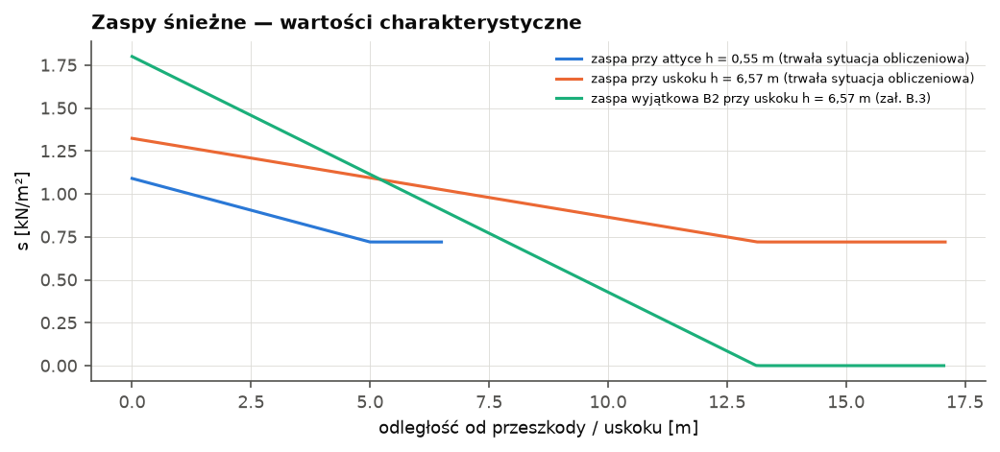

*Rys. Rozkłady obciążenia śniegiem w zaspach (PN-EN 1991-1-3 p. 5.3.6, 6.2, zał. B).*

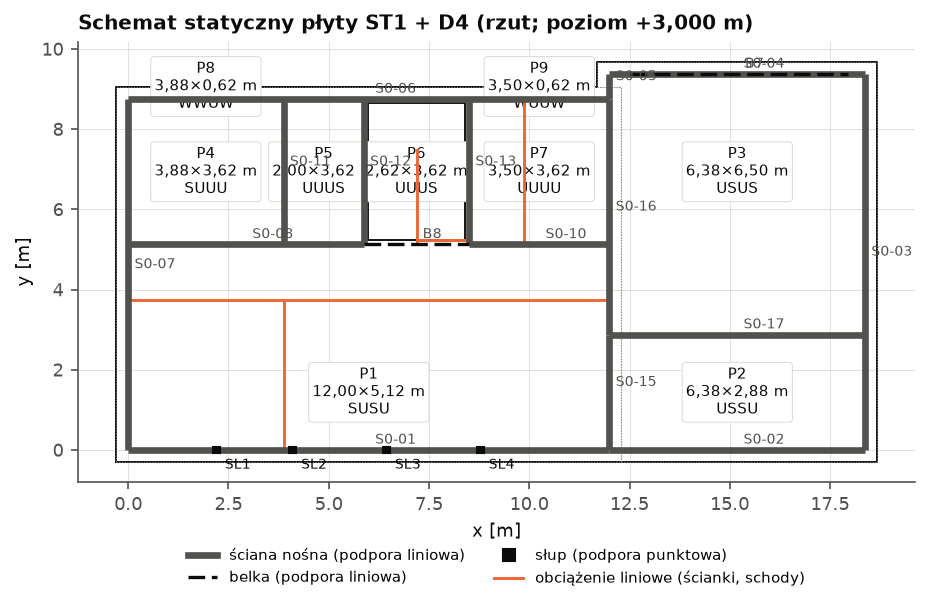

*Rys. Schemat statyczny płyty ST1 + D4: pola (P — wymiary, warunki brzegowe x=0/x=l_x/y=0/y=l_y: S — podparcie swobodne, U — ciągłość/utwierdzenie, W — brzeg swobodny/niepełny), podpory.*

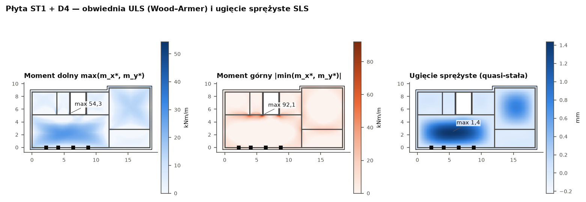

*Rys. Płyta ST1 + D4: momenty wymiarujące (obwiednia kombinacji 6.10a/b, obciążeń szachownicowych i sytuacji wyjątkowej) oraz ugięcie sprężyste od kombinacji quasi-stałej (bez zarysowania i pełzania — te w obliczeniach 7.4.3).*

#### Zestawienie obciążeń

**Obciążenia stałe — D4 — Dach zielony ekstensywny NIEUŻYTKOWY nad garażem (pom. nieogrzewane) i pasem gospodarczym: substrat 8 cm, geowłóknina, mata drenażowa, włóknina, bariera przeciwkorzenna, 2 × papa SBS, PIR spadkowy 12–24 cm, paroizolacja, płyta ŻB 24 cm (dwukierunkowa); opaska żwirowa 0,5 m przy attykach i wpustach (U ≈ 0,12)**

| Warstwa | Obliczenie | g_k [kN/m²] | γ_G (6.10a) | g_d [kN/m²] | ξγ_G (6.10b) | g_d [kN/m²] |
|---|---|---|---|---|---|---|
| Substrat ekstensywny 8 cm z matą rozchodnikową (sedum) | 8,0 cm × 14,00 kN/m³ | 1,120 | 1,35 | 1,512 | 1,15 | 1,285 |
| Geowłóknina filtracyjna PP 150 g/m² | 0,2 cm × 1,47 kN/m³ | 0,003 | 1,35 | 0,004 | 1,15 | 0,003 |
| Mata drenażowo-retencyjna HDPE 25 mm (dach zielony) | 2,5 cm × 0,78 kN/m³ | 0,020 | 1,35 | 0,026 | 1,15 | 0,023 |
| Włóknina ochronna PP 300 g/m² | 0,4 cm × 1,47 kN/m³ | 0,006 | 1,35 | 0,008 | 1,15 | 0,007 |
| Bariera przeciwkorzenna PE-HD 0,5 mm (PN-EN 13948) | 0,1 cm × 9,32 kN/m³ | 0,005 | 1,35 | 0,006 | 1,15 | 0,005 |
| Hydroizolacja 2 × papa SBS (podkładowa + wierzchniego krycia, dach zielony) | 0,9 cm × 10,79 kN/m³ | 0,103 | 1,35 | 0,138 | 1,15 | 0,118 |
| Płyty PIR z okładziną (izolacja spadkowa stropodachów) | 18,0 cm × 0,31 kN/m³ | 0,057 | 1,35 | 0,076 | 1,15 | 0,065 |
| Paroizolacja bitumiczna z wkładką Al (na płycie stropodachów) | 0,4 cm × 10,79 kN/m³ | 0,043 | 1,35 | 0,058 | 1,15 | 0,050 |
| Żelbet C25/30, B500SP (stropy, płyta fundamentowa, ściany) | 24,0 cm × 25,00 kN/m³ | 6,000 | 1,35 | 8,100 | 1,15 | 6,885 |
| **Razem g_k** |  | 7,355 |  | 9,930 |  | 8,440 |

- Obciążenie użytkowe: dach bez dostępu (kat. H): q_k = 0,40 kN/m², Q_k = 1,0 kN, ψ₀/ψ₁/ψ₂ = 0,0/0,0/0,0 (PN-EN 1991-1-1 tabl. 6.10 + NA; nie łączyć ze śniegiem i wiatrem (p. 3.3.2)).
- Obciążenie dodatkowe (QA): ścianka działowa S1-14: 1,06 kN/m → zastępcze 0,8 kN/m² (6.3.1.2(8)).
- Obciążenie dodatkowe (QA): ścianka działowa S1-15: 1,06 kN/m → zastępcze 0,8 kN/m² (6.3.1.2(8)).
- Śnieg: s = 0,720 kN/m² (przypadek równomierny) oraz zaspy (poniżej).

#### Obliczenia

##### Śnieg — zaspa przy attyce h = 0,55 m (trwała sytuacja obliczeniowa) — D4

- Współczynnik kształtu przy przeszkodzie: μ₂ = γ·h/s_k = 2,00·0,55/0,90 = **1,211** *((6.1))*
- Przyjęto (0,8 ≤ μ₂ ≤ 2,0): μ₂ = **1,211** *(p. 6.2(2))*
- Długość zaspy: l_s = 2h (5 ≤ l_s ≤ 15 m) = 2·0,55 = **5,00** m *((6.2))*
- Obciążenie przy attyce: s₂ = μ₂·C_e·C_t·s_k = 1,211·1,00·1,00·0,90 = **1,090** kN/m²

##### Śnieg — zaspa przy uskoku h = 6,47 m (trwała sytuacja obliczeniowa) — D4 przy ścianie S1-02

- Współczynnik od zsuwania się śniegu z dachu wyższego: μ_s = α = 0° ≤ 15° = **0,00** *(p. 5.3.6(1))*
- Współczynnik od nawiewania: μ_w = (b₁ + b₂)/(2h) = (13,32 + 6,41)/(2·6,47) = **1,525** *((5.8))*
- Ograniczenie: μ_w ≤ γ·h/s_k = 2,00·6,47/0,90 = **14,380** *((5.8); γ = 2 kN/m³)*
- Przyjęto (zakres 0,8 ≤ μ_w ≤ 4,0): μ_w = **1,525** *(p. 5.3.6(1) uwaga 1 (wartość zalecana) [NZW NA])*
- Współczynnik kształtu przy uskoku: μ₂ = μ_s + μ_w = 0,00 + 1,525 = **1,525**
- Długość zaspy: l_s = 2h (5 ≤ l_s ≤ 15 m) = 2·6,47 = **12,94** m *((5.9))*
- Obciążenie przy uskoku: s₂ = μ₂·C_e·C_t·s_k = 1,525·1,00·1,00·0,90 = **1,372** kN/m²
- Obciążenie poza zaspą (μ₁ = 0,8): s₁ = **0,720** kN/m²

> b₂ = 6,41 m < l_s = 12,94 m — zaspa obcięta na krawędzi dachu niższego (p. 5.3.6(3)).

##### Śnieg — zaspa wyjątkowa B2 przy uskoku h = 6,47 m (zał. B.3) — D4 przy ścianie S1-02

- Długość zaspy: l_s = min(5h; b₁; 15 m) = min(5·6,47; 13,32; 15) = **13,32** m *(zał. B.3 [NZW])*
- Współczynnik kształtu: μ₁ = min{2h/s_k; 2b/l_s; 8} = min{14,38; 2,00; 8} = **2,000** *(zał. B.3 (B.2) [NZW])*
- Obciążenie wyjątkowe: s_Ad = μ₁·s_k = 2,000·0,90 = **1,800** kN/m² *((4.2))*

> Sytuacja wyjątkowa (PN-EN 1990 6.11b): γ = 1,0; [NZW] wzory zał. B wg R5-38 — potwierdzić w normie (N-12).

##### Sprawdzenie metodą tablic — pole P3 (6,38 × 6,50 m, brzegi USUS)

- Obciążenia obliczeniowe (miarodajne z 6.10a/6.10b): g_d; q_d = g_k = 7,355, q_k = 1,202 kN/m² = **9,930; 1,263** kN/m²
- Współczynniki (brzegi USUS; x=0, x=l_x, y=0, y=l_y; S — podparta, U — utwierdzona): α_x; α_y; β_x; β_y = **0,0316; 0,0306; −0,0712; −0,0702** *(MRS (odpowiednik tablic Czernego), ν = 0,2)*
- Współczynniki płyty swobodnie podpartej (SSSS): α_x⁰; α_y⁰ = **0,0458; 0,0444**
- Moment przęsłowy x: M_x = [α_x·(g_d + q_d/2) + α_x⁰·q_d/2]·l_x² = [0,0316·10,561 + 0,0458·0,631]·6,38² = **14,74** kNm/m
- Moment przęsłowy y: M_y = [α_y·(g_d + q_d/2) + α_y⁰·q_d/2]·l_x² = [0,0306·10,561 + 0,0444·0,631]·6,38² = **14,26** kNm/m
- Momenty podporowe (utwierdzenie, g_d + q_d): M_x,p; M_y,p = **−32,41; −31,95** kNm/m
- Porównanie z MES (M_x; M_y dół, poza narożami): M_MES/M_tabl = **0,99; 1,00**
- Przyjęto do wymiarowania: M_Ed = max(M_MES; M_tabl) = **14,74; 14,26** kNm/m

##### Pole P3 — zginanie dół, kierunek x

- Wysokość użyteczna: d = **210** mm
- Moment względny: μ = M_Ed/(b·d²·η·f_cd) = 14,74·10⁶/(1000·210²·1,0·17,86) = **0,0187** *(3.1.7(3))*
- Względna wysokość strefy ściskanej: ξ_eff = 1 − √(1 − 2μ) = 1 − √(1 − 2·0,0187) = **0,0189**
- Warunek ciągliwości: ξ_eff ≤ ξ_eff,lim = λ·ε_cu3/(ε_cu3 + f_yd/E_s) = 0,019 ≤ 0,493 = **spełniony**
- Wymagane zbrojenie rozciągane: A_s1 = ξ_eff·b·d·η·f_cd/f_yd = 0,0189·1000·210·1,0·17,86/434,8 = **163** mm²
- Zbrojenie minimalne: A_s,min = max(0,26·f_ctm/f_yk·b·d; 0,0013·b·d) = max(0,26·2,6/500·1000·210; 0,0013·1000·210) = **284** mm² *((9.1N) + NA)*
- Przyjęto (z warunkiem rys): φ8 co 17 cm = **2,96** cm²/m
- Naprężenie w stali (quasi-stała, przekrój zarysowany, α_e = 15): σ_s = α_e·M_qp·(d − x_II)/I_II = **169** MPa
- Maksymalna średnica (w_max = 0,4 mm): φ_s = φ*_s·(f_ct,eff/2,9)·k_c·h_cr/(2(h − d)) = 38,2·(2,6/2,9)·0,4·120/(2·30) = **27,4** mm *(tabl. 7.2N, (7.6N))*
- Maksymalny rozstaw prętów: s_max = (σ_s = 169 MPa) = **300** mm *(tabl. 7.3N)*

| Warunek | Efekt | Nośność / limit | η | Stan | Podstawa |
|---|---|---|---|---|---|
| Zbrojenie na zginanie | A_s,req = 284 mm²/m | A_s,prov = 296 mm²/m | 96% | spełniony | 6.1, (9.1N) |
| Rysy: średnica prętów (tabl. 7.2N) | φ = 8 mm | φ_s,max = 27 mm | 29% | spełniony | 7.3.3(2) |

##### Pole P3 — zginanie dół, kierunek y

- Wysokość użyteczna: d = **200** mm
- Moment względny: μ = M_Ed/(b·d²·η·f_cd) = 14,26·10⁶/(1000·200²·1,0·17,86) = **0,0200** *(3.1.7(3))*
- Względna wysokość strefy ściskanej: ξ_eff = 1 − √(1 − 2μ) = 1 − √(1 − 2·0,0200) = **0,0202**
- Warunek ciągliwości: ξ_eff ≤ ξ_eff,lim = λ·ε_cu3/(ε_cu3 + f_yd/E_s) = 0,020 ≤ 0,493 = **spełniony**
- Wymagane zbrojenie rozciągane: A_s1 = ξ_eff·b·d·η·f_cd/f_yd = 0,0202·1000·200·1,0·17,86/434,8 = **166** mm²
- Zbrojenie minimalne: A_s,min = max(0,26·f_ctm/f_yk·b·d; 0,0013·b·d) = max(0,26·2,6/500·1000·200; 0,0013·1000·200) = **270** mm² *((9.1N) + NA)*
- Przyjęto (z warunkiem rys): φ8 co 18 cm = **2,79** cm²/m
- Naprężenie w stali (quasi-stała, przekrój zarysowany, α_e = 15): σ_s = α_e·M_qp·(d − x_II)/I_II = **183** MPa
- Maksymalna średnica (w_max = 0,4 mm): φ_s = φ*_s·(f_ct,eff/2,9)·k_c·h_cr/(2(h − d)) = 35,4·(2,6/2,9)·0,4·120/(2·40) = **19,0** mm *(tabl. 7.2N, (7.6N))*
- Maksymalny rozstaw prętów: s_max = (σ_s = 183 MPa) = **300** mm *(tabl. 7.3N)*

| Warunek | Efekt | Nośność / limit | η | Stan | Podstawa |
|---|---|---|---|---|---|
| Zbrojenie na zginanie | A_s,req = 270 mm²/m | A_s,prov = 279 mm²/m | 97% | spełniony | 6.1, (9.1N) |
| Rysy: średnica prętów (tabl. 7.2N) | φ = 8 mm | φ_s,max = 19 mm | 42% | spełniony | 7.3.3(2) |

##### Pole P3 — zginanie góra, x

- Wysokość użyteczna: d = **210** mm
- Moment względny: μ = M_Ed/(b·d²·η·f_cd) = 32,41·10⁶/(1000·210²·1,0·17,86) = **0,0411** *(3.1.7(3))*
- Względna wysokość strefy ściskanej: ξ_eff = 1 − √(1 − 2μ) = 1 − √(1 − 2·0,0411) = **0,0420**
- Warunek ciągliwości: ξ_eff ≤ ξ_eff,lim = λ·ε_cu3/(ε_cu3 + f_yd/E_s) = 0,042 ≤ 0,493 = **spełniony**
- Wymagane zbrojenie rozciągane: A_s1 = ξ_eff·b·d·η·f_cd/f_yd = 0,0420·1000·210·1,0·17,86/434,8 = **363** mm²
- Zbrojenie minimalne: A_s,min = max(0,26·f_ctm/f_yk·b·d; 0,0013·b·d) = max(0,26·2,6/500·1000·210; 0,0013·1000·210) = **284** mm² *((9.1N) + NA)*
- Przyjęto (z warunkiem rys): φ10 co 21 cm = **3,74** cm²/m
- Naprężenie w stali (quasi-stała, przekrój zarysowany, α_e = 15): σ_s = α_e·M_qp·(d − x_II)/I_II = **156** MPa
- Maksymalna średnica (w_max = 0,4 mm): φ_s = φ*_s·(f_ct,eff/2,9)·k_c·h_cr/(2(h − d)) = 40,0·(2,6/2,9)·0,4·120/(2·30) = **28,7** mm *(tabl. 7.2N, (7.6N))*
- Maksymalny rozstaw prętów: s_max = (σ_s = 156 MPa) = **300** mm *(tabl. 7.3N)*

| Warunek | Efekt | Nośność / limit | η | Stan | Podstawa |
|---|---|---|---|---|---|
| Zbrojenie na zginanie | A_s,req = 363 mm²/m | A_s,prov = 374 mm²/m | 97% | spełniony | 6.1, (9.1N) |
| Rysy: średnica prętów (tabl. 7.2N) | φ = 10 mm | φ_s,max = 29 mm | 35% | spełniony | 7.3.3(2) |

##### Pole P3 — zginanie góra, y

- Wysokość użyteczna: d = **200** mm
- Moment względny: μ = M_Ed/(b·d²·η·f_cd) = 31,95·10⁶/(1000·200²·1,0·17,86) = **0,0447** *(3.1.7(3))*
- Względna wysokość strefy ściskanej: ξ_eff = 1 − √(1 − 2μ) = 1 − √(1 − 2·0,0447) = **0,0458**
- Warunek ciągliwości: ξ_eff ≤ ξ_eff,lim = λ·ε_cu3/(ε_cu3 + f_yd/E_s) = 0,046 ≤ 0,493 = **spełniony**
- Wymagane zbrojenie rozciągane: A_s1 = ξ_eff·b·d·η·f_cd/f_yd = 0,0458·1000·200·1,0·17,86/434,8 = **376** mm²
- Zbrojenie minimalne: A_s,min = max(0,26·f_ctm/f_yk·b·d; 0,0013·b·d) = max(0,26·2,6/500·1000·200; 0,0013·1000·200) = **270** mm² *((9.1N) + NA)*
- Przyjęto (z warunkiem rys): φ8 co 13 cm = **3,87** cm²/m
- Naprężenie w stali (quasi-stała, przekrój zarysowany, α_e = 15): σ_s = α_e·M_qp·(d − x_II)/I_II = **189** MPa
- Maksymalna średnica (w_max = 0,4 mm): φ_s = φ*_s·(f_ct,eff/2,9)·k_c·h_cr/(2(h − d)) = 34,3·(2,6/2,9)·0,4·120/(2·40) = **18,4** mm *(tabl. 7.2N, (7.6N))*
- Maksymalny rozstaw prętów: s_max = (σ_s = 189 MPa) = **300** mm *(tabl. 7.3N)*

| Warunek | Efekt | Nośność / limit | η | Stan | Podstawa |
|---|---|---|---|---|---|
| Zbrojenie na zginanie | A_s,req = 376 mm²/m | A_s,prov = 387 mm²/m | 97% | spełniony | 6.1, (9.1N) |
| Rysy: średnica prętów (tabl. 7.2N) | φ = 8 mm | φ_s,max = 18 mm | 43% | spełniony | 7.3.3(2) |

##### Pole P3 — zbrojenie narożne (góra i dół, strefy 1,28 × 1,28 m)

- Wysokość użyteczna: d = **200** mm
- Moment względny: μ = M_Ed/(b·d²·η·f_cd) = 17,91·10⁶/(1000·200²·1,0·17,86) = **0,0251** *(3.1.7(3))*
- Względna wysokość strefy ściskanej: ξ_eff = 1 − √(1 − 2μ) = 1 − √(1 − 2·0,0251) = **0,0254**
- Warunek ciągliwości: ξ_eff ≤ ξ_eff,lim = λ·ε_cu3/(ε_cu3 + f_yd/E_s) = 0,025 ≤ 0,493 = **spełniony**
- Wymagane zbrojenie rozciągane: A_s1 = ξ_eff·b·d·η·f_cd/f_yd = 0,0254·1000·200·1,0·17,86/434,8 = **209** mm²
- Zbrojenie minimalne: A_s,min = max(0,26·f_ctm/f_yk·b·d; 0,0013·b·d) = max(0,26·2,6/500·1000·200; 0,0013·1000·200) = **270** mm² *((9.1N) + NA)*
- Przyjęto: φ8 co 18 cm = **2,79** cm²/m

| Warunek | Efekt | Nośność / limit | η | Stan | Podstawa |
|---|---|---|---|---|---|
| Zbrojenie na zginanie | A_s,req = 270 mm²/m | A_s,prov = 279 mm²/m | 97% | spełniony | 6.1, (9.1N) |

##### Pole P3 — ścinanie (maks. reakcja podpory, [UPR] 0,6·r przy podporze pośredniej)

- Współczynnik skali: k = 1 + √(200/d) ≤ 2,0 = 1 + √(200/210) = **1,976**
- Stopień zbrojenia podłużnego: ρ_l = A_sl/(b_w·d) ≤ 0,02 = 296/(1000·210) = **0,00141**
- Nośność na ścinanie: V_Rd,c = C_Rd,c·k·(100·ρ_l·f_ck)^(1/3)·b_w·d = 0,1286·1,976·(100·0,00141·25)^(1/3)·1000·210·10⁻³ = **81,15** kN *((6.2.a); C_Rd,c = 0,18/γ_c)*
- Wartość minimalna: V_Rd,c,min = v_min·b_w·d, v_min = 0,035·k^(3/2)·f_ck^(1/2) = 0,4861·1000·210·10⁻³ = **102,07** kN *((6.2.b), (6.3N))*

| Warunek | Efekt | Nośność / limit | η | Stan | Podstawa |
|---|---|---|---|---|---|
| Ścinanie bez zbrojenia poprzecznego (6.2.2) | V_Ed = 267,84 kN | V_Rd,c = 102,07 kN | 262% | **NIESPEŁNIONY** | PN-EN 1992-1-1 6.2.2 |

##### Pole P3 — ugięcie (l = 6,38 m, K = 1,3)

- Stopień zbrojenia wymagany: ρ = A_s,req/(b·d) = 163/(1000·210) = **0,00078**
- Wartość odniesienia: ρ₀ = √f_ck·10⁻³ = √25·10⁻³ = **0,00500**
- Graniczne l/d (ρ ≤ ρ₀): K·[11 + 1,5·√f_ck·ρ₀/ρ + 3,2·√f_ck·(ρ₀/ρ − 1)^(3/2)] = 1,3·[11 + 1,5·5,000·6,441 + 3,2·5,000·(6,441 − 1)^1,5] = **341,1** *((7.16a))*
- Mnożnik od naprężeń w stali: 310/σ_s ≈ 500/(f_yk·A_s,req/A_s,prov) ≤ 1,5 = 500/(500·163/296) = **1,500** *((7.17))*
- Smukłość rzeczywista: l_eff/d = 6,38/0,210 = **30,4**
- *Obliczenie ugięcia (7.4.3)*
- Efektywny moduł sprężystości: E_c,eff = E_cm/(1 + φ) = 31000/(1 + 2,5) = **8857** MPa *((7.20))*
- Stosunek modułów: α_e = E_s/E_c,eff = 200000/8857 = **22,58**
- Przekrój niezarysowany: x_I; I_I = **122,4 mm; 1204,6·10⁶ mm⁴**
- Przekrój zarysowany: x_II; I_II = **46,7 mm; 212,0·10⁶ mm⁴**
- Moment rysujący: M_cr = f_ctm·I_I/(h − x_I) = 2,6·1204,6·10⁶/(240 − 122,4) = **26,64** kNm
- Współczynnik rozkładu: ζ = 1 − β·(M_cr/M_qp)², β = 0,5 = M_qp ≤ M_cr → 0 = **0,000** *((7.19))*
- Ugięcie od obciążeń (quasi-stała): w_q = ζ·w_II + (1 − ζ)·w_I = 0,000·15,70 + 1,000·2,76 = **2,76** mm *((7.18))*
- Ugięcie od skurczu: w_cs = k·(1/r_cs)·l², 1/r_cs = ε_cs·α_e·S/I = 0,125·0,194·10⁻⁶·6375² = **0,99** mm *((7.21))*
- Ugięcie całkowite: w = w_q + w_cs = 2,76 + 0,99 = **3,75** mm
- Ugięcie dopuszczalne: w_lim = L/250 = 6375/250 = **25,5** mm *(7.4.1(4))*

| Warunek | Efekt | Nośność / limit | η | Stan | Podstawa |
|---|---|---|---|---|---|
| Ugięcie — graniczna smukłość l/d (7.4.2) | l/d = 30,4  | (l/d)_lim = 511,7  | 6% | spełniony | (7.16), tabl. 7.4N |

> l/d spełnione — obliczenie (7.4.3) informacyjnie: w = 3,7 mm ≤? 25,5 mm.

#### Wymiarowanie — zestawienia

**Zestawienie wymiarowania pól płyty** (M [kNm/m] — obwiednia ULS, Wood–Armer, poza strefami narożnymi; „tabl.” — metoda tablic, jeżeli stosowalna; góra — nad podporami; naroża — strefy 0,2·l_min × 0,2·l_min przy narożach podpartych, zbrojenie górą i dołem na moment skręcający)

| Pole | l_x × l_y [m] | Brzegi | M_x,dół [kNm/m] MES / tabl. | Zbroj. x dół | M_y,dół MES / tabl. | Zbroj. y dół | M_x,góra | Zbroj. x góra | M_y,góra | Zbroj. y góra | Naroża M / zbroj. | w / w_lim [mm] | η_max |
|---|---|---|---|---|---|---|---|---|---|---|---|---|---|
| P2 | 6,38 × 2,88 | USSU | 8,16 / 2,34 | φ8 co 17 cm | 7,88 / 6,34 | φ8 co 18 cm | −9,33 | φ8 co 17 cm | −19,81 | φ8 co 18 cm | 9,69 / φ8 co 18 cm | 0,2 / 11,5 | 204% ✗ |
| P3 | 6,38 × 6,50 | USUS | 14,54 / 14,74 | φ8 co 17 cm | 14,25 / 14,26 | φ8 co 18 cm | −32,41 | φ10 co 21 cm | −31,95 | φ8 co 13 cm | 17,91 / φ8 co 18 cm | 3,7 / 25,5 | 262% ✗ |

**Reakcje podporowe (charakterystyczne, cała grupa płyt)**

| Podpora | Długość [m] | ΣR_G [kN] | ΣR_Q [kN] | max r_G [kN/m] | max r_Q [kN/m] |
|---|---|---|---|---|---|
| S0-02 | 6,38 | 34,3 | −4,7 | 8,94 | 0,26 |
| S0-03 | 9,38 | 76,9 | 0,0 | 110,34 | 1,01 |
| S0-04 | 6,38 | 19,1 | 1,1 | 139,41 | 10,46 |
| S0-05 | 0,62 | 30,8 | −3,0 | 92,48 | −3,54 |
| S0-17 | 6,38 | 89,8 | −32,8 | 256,59 | 91,01 |
| B7 | 5,45 | 42,9 | −0,2 | 16,06 | 0,44 |

#### Wnioski

**Przyjęto:** Płyta gr. 24 cm z betonu C25/30, stal B500SP, otulenie c_nom = 25 mm; zbrojenie wg zestawienia pól (dołem siatka w obu kierunkach, górą nad podporami).  
**Przyjęto:** Maks. ugięcie długotrwałe ≈ 3,7 mm.  

## Poz. 2 — Stropy

### Poz. 2.1 — Strop ST2

Element modelu: `ST2` · maks. wykorzystanie nośności η = 752% · **WARUNKI NIESPEŁNIONE — patrz tabele warunków i wnioski**

#### Opis i schemat statyczny

Płyta żelbetowa monolityczna gr. h = 22 cm, wierzch konstrukcji 6,150 m, beton C25/30 (ekspozycja XC1), stal B500SP. Pole płyty 82,83 m². Analiza wspólna z: ST2 + ST2Z + D2 + D3 (płyty połączone na jednym poziomie — ciągłość nad podporami/łącznikami). Schemat: płyta na podporach liniowych (ściany, belki — podpory sztywne, przegubowe) i punktowych (słupy); statyka — MES płytowy (elementy ACM, siatka 20 cm, obwiednia kombinacji 6.10a/6.10b i obciążeń szachownicowych pól), sprawdzenie pól prostokątnych metodą tablic (współczynniki MRS).

Podpory: S1-01 (ściana), S1-02 (ściana), S1-03 (ściana), S1-04 (ściana), S1-05 (ściana), S1-06 (ściana), S1-07 (ściana), S1-08 (ściana), S1-09 (ściana), B2 (belka), B9 (belka)

*Rys. Schemat statyczny płyty ST2 + ST2Z + D2 + D3: pola (P — wymiary, warunki brzegowe x=0/x=l_x/y=0/y=l_y: S — podparcie swobodne, U — ciągłość/utwierdzenie, W — brzeg swobodny/niepełny), podpory.*

*Rys. Płyta ST2 + ST2Z + D2 + D3: momenty wymiarujące (obwiednia kombinacji 6.10a/b, obciążeń szachownicowych i sytuacji wyjątkowej) oraz ugięcie sprężyste od kombinacji quasi-stałej (bez zarysowania i pełzania — te w obliczeniach 7.4.3).*

#### Zestawienie obciążeń

**Obciążenia stałe — ST2 — strop (podłoga POD-1, sufit TYNK_GIPS)**

| Warstwa | Obliczenie | g_k [kN/m²] | γ_G (6.10a) | g_d [kN/m²] | ξγ_G (6.10b) | g_d [kN/m²] |
|---|---|---|---|---|---|---|
| Deska warstwowa dębowa 15 mm, klejona | 1,5 cm × 6,87 kN/m³ | 0,103 | 1,35 | 0,139 | 1,15 | 0,118 |
| Jastrych cementowy CT-C25-F5 z wężownicą ogrzewania podłogowego | 6,5 cm × 22,00 kN/m³ | 1,430 | 1,35 | 1,931 | 1,15 | 1,641 |
| Styropian podłogowy EPS 100-038 (pod jastrychem) | 4,0 cm × 0,18 kN/m³ | 0,007 | 1,35 | 0,010 | 1,15 | 0,008 |
| Styropian elastyfikowany EPS T (akustyczny, pod jastrychem) | 3,0 cm × 0,12 kN/m³ | 0,004 | 1,35 | 0,005 | 1,15 | 0,004 |
| Płyta żelbetowa | 22,0 cm × 25,00 kN/m³ | 5,500 | 1,35 | 7,425 | 1,15 | 6,311 |
| Tynk gipsowy maszynowy 1,5 cm | 1,0 cm × 11,77 kN/m³ | 0,118 | 1,35 | 0,159 | 1,15 | 0,135 |
| **Razem g_k** |  | 7,161 |  | 9,668 |  | 8,218 |

- Obciążenie użytkowe: stropy mieszkalne (kat. A): q_k = 2,00 kN/m², Q_k = 3,0 kN, ψ₀/ψ₁/ψ₂ = 0,7/0,5/0,3 (PN-EN 1991-1-1 tabl. 6.2 + NA; R5 3.3 [NZW NA — górna granica EN]).
- Obciążenie dodatkowe (S1): ściana nośna S2-07 bez podparcia poniżej — średnio 3,57 kN/m (S1).
- Obciążenie dodatkowe (H): ściana nośna S2-07 bez podparcia poniżej — średnio 1,98 kN/m (H).
- Obciążenie dodatkowe (S2): ściana nośna S2-07 bez podparcia poniżej — średnio 3,57 kN/m (S2).
- Obciążenie dodatkowe (G): ściana nośna S2-07 bez podparcia poniżej — średnio 39,10 kN/m (G).
- Obciążenie dodatkowe (S1): ściana nośna S2-09 bez podparcia poniżej — średnio 10,37 kN/m (S1).
- Obciążenie dodatkowe (H): ściana nośna S2-09 bez podparcia poniżej — średnio 5,76 kN/m (H).
- Obciążenie dodatkowe (S2): ściana nośna S2-09 bez podparcia poniżej — średnio 10,37 kN/m (S2).
- Obciążenie dodatkowe (G): ściana nośna S2-09 bez podparcia poniżej — średnio 91,26 kN/m (G).
- Obciążenie dodatkowe (G): ścianka działowa S2-11: 6,33 kN/m (> 3 kN/m — obciążenie liniowe, 6.3.1.2(9)).
- Obciążenie dodatkowe (G): ścianka działowa S2-12: 6,44 kN/m (> 3 kN/m — obciążenie liniowe, 6.3.1.2(9)).
- Obciążenie dodatkowe (G): ścianka działowa S2-13: 6,44 kN/m (> 3 kN/m — obciążenie liniowe, 6.3.1.2(9)).
- Obciążenie dodatkowe (G): ścianka działowa S2-14: 6,44 kN/m (> 3 kN/m — obciążenie liniowe, 6.3.1.2(9)).
- Obciążenie dodatkowe (G): ścianka działowa S2-15: 5,55 kN/m (> 3 kN/m — obciążenie liniowe, 6.3.1.2(9)).
- Obciążenie dodatkowe (QA): ścianka działowa S2-16: 1,06 kN/m → zastępcze 0,8 kN/m² (6.3.1.2(8)).
- Obciążenie dodatkowe (QA): ścianka działowa S2-17: 1,06 kN/m → zastępcze 0,8 kN/m² (6.3.1.2(8)).
- Obciążenie dodatkowe (G): reakcja schodów SCH2: 15,61 kN/m (G).
- Obciążenie dodatkowe (QA): reakcja schodów SCH2: 7,04 kN/m (Q).

#### Obliczenia

##### Sprawdzenie metodą tablic — pole P2 (12,00 × 5,12 m, brzegi USSU)

- Obciążenie liniowe ścianek na polu jako równomierne zastępcze [UPR — tylko porównanie]: g_dz = Σ(g_l·l)/A = **9,229** kN/m²
- Obciążenia obliczeniowe (miarodajne z 6.10a/6.10b): g_d; q_d = g_k = 16,390, q_k = 2,800 kN/m² = **22,127; 2,940** kN/m²
- Współczynniki (brzegi USSU; x=0, x=l_x, y=0, y=l_y; S — podparta, U — utwierdzona): α_x; α_y; β_x; β_y = **0,0045; 0,0123; −0,0148; −0,0223** *(MRS (odpowiednik tablic Czernego), ν = 0,2)*
- Współczynniki płyty swobodnie podpartej (SSSS): α_x⁰; α_y⁰ = **0,0068; 0,0199**
- Moment przęsłowy x: M_x = [α_x·(g_d + q_d/2) + α_x⁰·q_d/2]·l_x² = [0,0045·23,597 + 0,0068·1,470]·12,00² = **16,59** kNm/m
- Moment przęsłowy y: M_y = [α_y·(g_d + q_d/2) + α_y⁰·q_d/2]·l_x² = [0,0123·23,597 + 0,0199·1,470]·12,00² = **45,92** kNm/m
- Momenty podporowe (utwierdzenie, g_d + q_d): M_x,p; M_y,p = **−53,56; −80,56** kNm/m
- Porównanie z MES (M_x; M_y dół, poza narożami): M_MES/M_tabl = **0,86; 0,73**
- Przyjęto do wymiarowania: M_Ed = max(M_MES; M_tabl) = **16,59; 45,92** kNm/m

##### Pole P2 — zginanie dół, kierunek x

- Wysokość użyteczna: d = **190** mm
- Moment względny: μ = M_Ed/(b·d²·η·f_cd) = 16,59·10⁶/(1000·190²·1,0·17,86) = **0,0257** *(3.1.7(3))*
- Względna wysokość strefy ściskanej: ξ_eff = 1 − √(1 − 2μ) = 1 − √(1 − 2·0,0257) = **0,0261**
- Warunek ciągliwości: ξ_eff ≤ ξ_eff,lim = λ·ε_cu3/(ε_cu3 + f_yd/E_s) = 0,026 ≤ 0,493 = **spełniony**
- Wymagane zbrojenie rozciągane: A_s1 = ξ_eff·b·d·η·f_cd/f_yd = 0,0261·1000·190·1,0·17,86/434,8 = **204** mm²
- Zbrojenie minimalne: A_s,min = max(0,26·f_ctm/f_yk·b·d; 0,0013·b·d) = max(0,26·2,6/500·1000·190; 0,0013·1000·190) = **257** mm² *((9.1N) + NA)*
- Przyjęto (z warunkiem rys): φ8 co 19 cm = **2,65** cm²/m
- Naprężenie w stali (quasi-stała, przekrój zarysowany, α_e = 15): σ_s = α_e·M_qp·(d − x_II)/I_II = **205** MPa
- Maksymalna średnica (w_max = 0,4 mm): φ_s = φ*_s·(f_ct,eff/2,9)·k_c·h_cr/(2(h − d)) = 30,6·(2,6/2,9)·0,4·110/(2·30) = **20,1** mm *(tabl. 7.2N, (7.6N))*
- Maksymalny rozstaw prętów: s_max = (σ_s = 205 MPa) = **294** mm *(tabl. 7.3N)*

| Warunek | Efekt | Nośność / limit | η | Stan | Podstawa |
|---|---|---|---|---|---|
| Zbrojenie na zginanie | A_s,req = 257 mm²/m | A_s,prov = 265 mm²/m | 97% | spełniony | 6.1, (9.1N) |
| Rysy: średnica prętów (tabl. 7.2N) | φ = 8 mm | φ_s,max = 20 mm | 40% | spełniony | 7.3.3(2) |

##### Pole P2 — zginanie dół, kierunek y

- Wysokość użyteczna: d = **180** mm
- Moment względny: μ = M_Ed/(b·d²·η·f_cd) = 45,92·10⁶/(1000·180²·1,0·17,86) = **0,0794** *(3.1.7(3))*
- Względna wysokość strefy ściskanej: ξ_eff = 1 − √(1 − 2μ) = 1 − √(1 − 2·0,0794) = **0,0828**
- Warunek ciągliwości: ξ_eff ≤ ξ_eff,lim = λ·ε_cu3/(ε_cu3 + f_yd/E_s) = 0,083 ≤ 0,493 = **spełniony**
- Wymagane zbrojenie rozciągane: A_s1 = ξ_eff·b·d·η·f_cd/f_yd = 0,0828·1000·180·1,0·17,86/434,8 = **612** mm²
- Zbrojenie minimalne: A_s,min = max(0,26·f_ctm/f_yk·b·d; 0,0013·b·d) = max(0,26·2,6/500·1000·180; 0,0013·1000·180) = **243** mm² *((9.1N) + NA)*
- Przyjęto (z warunkiem rys): φ14 co 25 cm = **6,16** cm²/m
- Naprężenie w stali (quasi-stała, przekrój zarysowany, α_e = 15): σ_s = α_e·M_qp·(d − x_II)/I_II = **221** MPa
- Maksymalna średnica (w_max = 0,4 mm): φ_s = φ*_s·(f_ct,eff/2,9)·k_c·h_cr/(2(h − d)) = 25,6·(2,6/2,9)·0,4·110/(2·40) = **12,6** mm *(tabl. 7.2N, (7.6N))*
- Maksymalny rozstaw prętów: s_max = (σ_s = 221 MPa) = **273** mm *(tabl. 7.3N)*

| Warunek | Efekt | Nośność / limit | η | Stan | Podstawa |
|---|---|---|---|---|---|
| Zbrojenie na zginanie | A_s,req = 612 mm²/m | A_s,prov = 616 mm²/m | 99% | spełniony | 6.1, (9.1N) |
| Rysy: rozstaw prętów (tabl. 7.3N) | s = 250 mm | s_max = 273 mm | 91% | spełniony | 7.3.3(2) |

##### Pole P2 — zginanie góra, x

- Wysokość użyteczna: d = **190** mm
- Moment względny: μ = M_Ed/(b·d²·η·f_cd) = 53,56·10⁶/(1000·190²·1,0·17,86) = **0,0831** *(3.1.7(3))*
- Względna wysokość strefy ściskanej: ξ_eff = 1 − √(1 − 2μ) = 1 − √(1 − 2·0,0831) = **0,0869**
- Warunek ciągliwości: ξ_eff ≤ ξ_eff,lim = λ·ε_cu3/(ε_cu3 + f_yd/E_s) = 0,087 ≤ 0,493 = **spełniony**
- Wymagane zbrojenie rozciągane: A_s1 = ξ_eff·b·d·η·f_cd/f_yd = 0,0869·1000·190·1,0·17,86/434,8 = **678** mm²
- Zbrojenie minimalne: A_s,min = max(0,26·f_ctm/f_yk·b·d; 0,0013·b·d) = max(0,26·2,6/500·1000·190; 0,0013·1000·190) = **257** mm² *((9.1N) + NA)*
- Przyjęto (z warunkiem rys): φ14 co 22 cm = **7,00** cm²/m
- Naprężenie w stali (quasi-stała, przekrój zarysowany, α_e = 15): σ_s = α_e·M_qp·(d − x_II)/I_II = **183** MPa
- Maksymalna średnica (w_max = 0,4 mm): φ_s = φ*_s·(f_ct,eff/2,9)·k_c·h_cr/(2(h − d)) = 35,4·(2,6/2,9)·0,4·110/(2·30) = **23,3** mm *(tabl. 7.2N, (7.6N))*
- Maksymalny rozstaw prętów: s_max = (σ_s = 183 MPa) = **300** mm *(tabl. 7.3N)*

| Warunek | Efekt | Nośność / limit | η | Stan | Podstawa |
|---|---|---|---|---|---|
| Zbrojenie na zginanie | A_s,req = 678 mm²/m | A_s,prov = 700 mm²/m | 97% | spełniony | 6.1, (9.1N) |
| Rysy: średnica prętów (tabl. 7.2N) | φ = 14 mm | φ_s,max = 23 mm | 60% | spełniony | 7.3.3(2) |

##### Pole P2 — zginanie góra, y

- Wysokość użyteczna: d = **180** mm
- Moment względny: μ = M_Ed/(b·d²·η·f_cd) = 92,44·10⁶/(1000·180²·1,0·17,86) = **0,1598** *(3.1.7(3))*
- Względna wysokość strefy ściskanej: ξ_eff = 1 − √(1 − 2μ) = 1 − √(1 − 2·0,1598) = **0,1751**
- Warunek ciągliwości: ξ_eff ≤ ξ_eff,lim = λ·ε_cu3/(ε_cu3 + f_yd/E_s) = 0,175 ≤ 0,493 = **spełniony**
- Wymagane zbrojenie rozciągane: A_s1 = ξ_eff·b·d·η·f_cd/f_yd = 0,1751·1000·180·1,0·17,86/434,8 = **1295** mm²
- Zbrojenie minimalne: A_s,min = max(0,26·f_ctm/f_yk·b·d; 0,0013·b·d) = max(0,26·2,6/500·1000·180; 0,0013·1000·180) = **243** mm² *((9.1N) + NA)*
- Przyjęto (z warunkiem rys): φ16 co 15 cm = **13,40** cm²/m
- Naprężenie w stali (quasi-stała, przekrój zarysowany, α_e = 15): σ_s = α_e·M_qp·(d − x_II)/I_II = **289** MPa
- Maksymalna średnica (w_max = 0,4 mm): φ_s = φ*_s·(f_ct,eff/2,9)·k_c·h_cr/(2(h − d)) = 15,1·(2,6/2,9)·0,4·110/(2·40) = **7,5** mm *(tabl. 7.2N, (7.6N))*
- Maksymalny rozstaw prętów: s_max = (σ_s = 289 MPa) = **189** mm *(tabl. 7.3N)*

| Warunek | Efekt | Nośność / limit | η | Stan | Podstawa |
|---|---|---|---|---|---|
| Zbrojenie na zginanie | A_s,req = 1295 mm²/m | A_s,prov = 1340 mm²/m | 97% | spełniony | 6.1, (9.1N) |
| Rysy: rozstaw prętów (tabl. 7.3N) | s = 150 mm | s_max = 189 mm | 79% | spełniony | 7.3.3(2) |

##### Pole P2 — zbrojenie narożne (góra i dół, strefy 1,03 × 1,03 m)

- Wysokość użyteczna: d = **180** mm
- Moment względny: μ = M_Ed/(b·d²·η·f_cd) = 29,00·10⁶/(1000·180²·1,0·17,86) = **0,0501** *(3.1.7(3))*
- Względna wysokość strefy ściskanej: ξ_eff = 1 − √(1 − 2μ) = 1 − √(1 − 2·0,0501) = **0,0515**
- Warunek ciągliwości: ξ_eff ≤ ξ_eff,lim = λ·ε_cu3/(ε_cu3 + f_yd/E_s) = 0,051 ≤ 0,493 = **spełniony**
- Wymagane zbrojenie rozciągane: A_s1 = ξ_eff·b·d·η·f_cd/f_yd = 0,0515·1000·180·1,0·17,86/434,8 = **380** mm²
- Zbrojenie minimalne: A_s,min = max(0,26·f_ctm/f_yk·b·d; 0,0013·b·d) = max(0,26·2,6/500·1000·180; 0,0013·1000·180) = **243** mm² *((9.1N) + NA)*
- Przyjęto: φ8 co 13 cm = **3,87** cm²/m

| Warunek | Efekt | Nośność / limit | η | Stan | Podstawa |
|---|---|---|---|---|---|
| Zbrojenie na zginanie | A_s,req = 380 mm²/m | A_s,prov = 387 mm²/m | 98% | spełniony | 6.1, (9.1N) |

##### Pole P2 — ścinanie (maks. reakcja podpory, [UPR] 0,6·r przy podporze pośredniej)

- Współczynnik skali: k = 1 + √(200/d) ≤ 2,0 = 1 + √(200/190) = **2,000**
- Stopień zbrojenia podłużnego: ρ_l = A_sl/(b_w·d) ≤ 0,02 = 265/(1000·190) = **0,00139**
- Nośność na ścinanie: V_Rd,c = C_Rd,c·k·(100·ρ_l·f_ck)^(1/3)·b_w·d = 0,1286·2,000·(100·0,00139·25)^(1/3)·1000·190·10⁻³ = **74,04** kN *((6.2.a); C_Rd,c = 0,18/γ_c)*
- Wartość minimalna: V_Rd,c,min = v_min·b_w·d, v_min = 0,035·k^(3/2)·f_ck^(1/2) = 0,4950·1000·190·10⁻³ = **94,05** kN *((6.2.b), (6.3N))*

| Warunek | Efekt | Nośność / limit | η | Stan | Podstawa |
|---|---|---|---|---|---|
| Ścinanie bez zbrojenia poprzecznego (6.2.2) | V_Ed = 706,95 kN | V_Rd,c = 94,05 kN | 752% | **NIESPEŁNIONY** | PN-EN 1992-1-1 6.2.2 |

##### Pole P2 — ugięcie (l = 5,12 m, K = 1,3)

- Stopień zbrojenia wymagany: ρ = A_s,req/(b·d) = 612/(1000·180) = **0,00340**
- Wartość odniesienia: ρ₀ = √f_ck·10⁻³ = √25·10⁻³ = **0,00500**
- Graniczne l/d (ρ ≤ ρ₀): K·[11 + 1,5·√f_ck·ρ₀/ρ + 3,2·√f_ck·(ρ₀/ρ − 1)^(3/2)] = 1,3·[11 + 1,5·5,000·1,471 + 3,2·5,000·(1,471 − 1)^1,5] = **35,4** *((7.16a))*
- Mnożnik od naprężeń w stali: 310/σ_s ≈ 500/(f_yk·A_s,req/A_s,prov) ≤ 1,5 = 500/(500·612/616) = **1,006** *((7.17))*
- Smukłość rzeczywista: l_eff/d = 5,12/0,180 = **28,5**
- *Obliczenie ugięcia (7.4.3)*
- Efektywny moduł sprężystości: E_c,eff = E_cm/(1 + φ) = 31000/(1 + 2,5) = **8857** MPa *((7.20))*
- Stosunek modułów: α_e = E_s/E_c,eff = 200000/8857 = **22,58**
- Przekrój niezarysowany: x_I; I_I = **114,2 mm; 951,4·10⁶ mm⁴**
- Przekrój zarysowany: x_II; I_II = **58,2 mm; 272,0·10⁶ mm⁴**
- Moment rysujący: M_cr = f_ctm·I_I/(h − x_I) = 2,6·951,4·10⁶/(220 − 114,2) = **23,37** kNm
- Współczynnik rozkładu: ζ = 1 − β·(M_cr/M_qp)², β = 0,5 = M_qp ≤ M_cr → 0 = **0,000** *((7.19))*
- Ugięcie od obciążeń (quasi-stała): w_q = ζ·w_II + (1 − ζ)·w_I = 0,000·19,19 + 1,000·5,48 = **5,48** mm *((7.18))*
- Ugięcie od skurczu: w_cs = k·(1/r_cs)·l², 1/r_cs = ε_cs·α_e·S/I = 0,125·0,385·10⁻⁶·5125² = **1,26** mm *((7.21))*
- Ugięcie całkowite: w = w_q + w_cs = 5,48 + 1,26 = **6,75** mm
- Ugięcie dopuszczalne: w_lim = L/250 = 5125/250 = **20,5** mm *(7.4.1(4))*

| Warunek | Efekt | Nośność / limit | η | Stan | Podstawa |
|---|---|---|---|---|---|
| Ugięcie — graniczna smukłość l/d (7.4.2) | l/d = 28,5  | (l/d)_lim = 35,6  | 80% | spełniony | (7.16), tabl. 7.4N |

> l/d spełnione — obliczenie (7.4.3) informacyjnie: w = 6,7 mm ≤? 20,5 mm.

#### Wymiarowanie — zestawienia

**Zestawienie wymiarowania pól płyty** (M [kNm/m] — obwiednia ULS, Wood–Armer, poza strefami narożnymi; „tabl.” — metoda tablic, jeżeli stosowalna; góra — nad podporami; naroża — strefy 0,2·l_min × 0,2·l_min przy narożach podpartych, zbrojenie górą i dołem na moment skręcający)

| Pole | l_x × l_y [m] | Brzegi | M_x,dół [kNm/m] MES / tabl. | Zbroj. x dół | M_y,dół MES / tabl. | Zbroj. y dół | M_x,góra | Zbroj. x góra | M_y,góra | Zbroj. y góra | Naroża M / zbroj. | w / w_lim [mm] | η_max |
|---|---|---|---|---|---|---|---|---|---|---|---|---|---|
| P2 | 12,00 × 5,12 | USSU | 14,31 / 16,59 | φ8 co 19 cm | 33,70 / 45,92 | φ14 co 25 cm | −53,56 | φ14 co 22 cm | −92,44 | φ16 co 15 cm | 29,00 / φ8 co 13 cm | 6,7 / 20,5 | 752% ✗ |
| P4 | 2,00 × 3,62 | UUUS | 12,68 / 7,91 | φ8 co 19 cm | 4,13 / 3,41 | φ8 co 20 cm | −15,61 | φ8 co 19 cm | −44,80 | φ10 co 13 cm | 78,81 / φ14 co 14 cm | 0,1 / 8,0 | 752% ✗ |
| P5 | 2,62 × 3,62 | UUUS | 12,30 / — | φ8 co 19 cm | 11,37 / — | φ8 co 20 cm | −18,69 | φ8 co 19 cm | −20,39 | φ8 co 18 cm | 99,32 / φ16 co 14 cm | 0,2 / 10,5 | 752% ✗ |

**Reakcje podporowe (charakterystyczne, cała grupa płyt)**

| Podpora | Długość [m] | ΣR_G [kN] | ΣR_Q [kN] | max r_G [kN/m] | max r_Q [kN/m] |
|---|---|---|---|---|---|
| S1-01 | 12,00 | 81,8 | 37,5 | 182,55 | 38,53 |
| S1-02 | 8,75 | 58,9 | 15,0 | 92,72 | 29,14 |
| S1-03 | 12,00 | 62,8 | 9,0 | 15,21 | 11,87 |
| S1-04 | 8,75 | 371,4 | 46,5 | 237,21 | 18,93 |
| S1-05 | 5,88 | 729,3 | 143,0 | 844,83 | 213,44 |
| S1-06 | 3,50 | 256,0 | 68,4 | 890,09 | 248,62 |
| S1-07 | 3,62 | −135,9 | −51,4 | 1144,34 | 297,88 |
| S1-08 | 3,62 | −267,3 | −70,0 | 1609,19 | 406,56 |
| S1-09 | 3,62 | −253,3 | −76,8 | 1271,55 | 355,17 |
| B2 | 7,52 | 82,7 | 25,2 | 73,92 | 20,21 |
| B9 | 2,62 | 504,3 | 109,7 | 1609,19 | 406,56 |

#### Wnioski

**Przyjęto:** Płyta gr. 22 cm z betonu C25/30, stal B500SP, otulenie c_nom = 25 mm; zbrojenie wg zestawienia pól (dołem siatka w obu kierunkach, górą nad podporami).  
**Przyjęto:** Maks. ugięcie długotrwałe ≈ 6,7 mm.  

### Poz. 2.2 — Strop ST2Z

Element modelu: `ST2Z` · maks. wykorzystanie nośności η = 449% · **WARUNKI NIESPEŁNIONE — patrz tabele warunków i wnioski**

#### Opis i schemat statyczny

Płyta żelbetowa monolityczna gr. h = 22 cm, wierzch konstrukcji 6,150 m, beton C25/30 (ekspozycja XC1), stal B500SP. Pole płyty 5,72 m². Analiza wspólna z: ST2 + ST2Z + D2 + D3 (płyty połączone na jednym poziomie — ciągłość nad podporami/łącznikami). Schemat: płyta na podporach liniowych (ściany, belki — podpory sztywne, przegubowe) i punktowych (słupy); statyka — MES płytowy (elementy ACM, siatka 20 cm, obwiednia kombinacji 6.10a/6.10b i obciążeń szachownicowych pól), sprawdzenie pól prostokątnych metodą tablic (współczynniki MRS).

Podpory: 

*Rys. Schemat statyczny płyty ST2 + ST2Z + D2 + D3: pola (P — wymiary, warunki brzegowe x=0/x=l_x/y=0/y=l_y: S — podparcie swobodne, U — ciągłość/utwierdzenie, W — brzeg swobodny/niepełny), podpory.*

*Rys. Płyta ST2 + ST2Z + D2 + D3: momenty wymiarujące (obwiednia kombinacji 6.10a/b, obciążeń szachownicowych i sytuacji wyjątkowej) oraz ugięcie sprężyste od kombinacji quasi-stałej (bez zarysowania i pełzania — te w obliczeniach 7.4.3).*

#### Zestawienie obciążeń

**Obciążenia stałe — ST2Z — strop (podłoga POD-1, sufit SUF-ZEW)**

| Warstwa | Obliczenie | g_k [kN/m²] | γ_G (6.10a) | g_d [kN/m²] | ξγ_G (6.10b) | g_d [kN/m²] |
|---|---|---|---|---|---|---|
| Deska warstwowa dębowa 15 mm, klejona | 1,5 cm × 6,87 kN/m³ | 0,103 | 1,35 | 0,139 | 1,15 | 0,118 |
| Jastrych cementowy CT-C25-F5 z wężownicą ogrzewania podłogowego | 6,5 cm × 22,00 kN/m³ | 1,430 | 1,35 | 1,931 | 1,15 | 1,641 |
| Styropian podłogowy EPS 100-038 (pod jastrychem) | 4,0 cm × 0,18 kN/m³ | 0,007 | 1,35 | 0,010 | 1,15 | 0,008 |
| Styropian elastyfikowany EPS T (akustyczny, pod jastrychem) | 3,0 cm × 0,12 kN/m³ | 0,004 | 1,35 | 0,005 | 1,15 | 0,004 |
| Płyta żelbetowa | 22,0 cm × 25,00 kN/m³ | 5,500 | 1,35 | 7,425 | 1,15 | 6,311 |
| Wełna mineralna 035 (szkielet, docieplenia, ściana dom–garaż) | 20,0 cm × 0,39 kN/m³ | 0,078 | 1,35 | 0,106 | 1,15 | 0,090 |
| Pustka wentylowana 40 mm (ruszt lamel) | 4,0 cm × 0,01 kN/m³ | 0,000 | 1,35 | 0,001 | 1,15 | 0,001 |
| Podsufitka zewnętrzna: płyta włóknocementowa 12 mm na ruszcie, RAL 7016 | 1,2 cm × 14,71 kN/m³ | 0,177 | 1,35 | 0,238 | 1,15 | 0,203 |
| **Razem g_k** |  | 7,299 |  | 9,854 |  | 8,376 |

- Obciążenie użytkowe: stropy mieszkalne (kat. A): q_k = 2,00 kN/m², Q_k = 3,0 kN, ψ₀/ψ₁/ψ₂ = 0,7/0,5/0,3 (PN-EN 1991-1-1 tabl. 6.2 + NA; R5 3.3 [NZW NA — górna granica EN]).
- Obciążenie dodatkowe (S1): ściana nośna S2-07 bez podparcia poniżej — średnio 3,57 kN/m (S1).
- Obciążenie dodatkowe (H): ściana nośna S2-07 bez podparcia poniżej — średnio 1,98 kN/m (H).
- Obciążenie dodatkowe (S2): ściana nośna S2-07 bez podparcia poniżej — średnio 3,57 kN/m (S2).
- Obciążenie dodatkowe (G): ściana nośna S2-07 bez podparcia poniżej — średnio 39,10 kN/m (G).
- Obciążenie dodatkowe (S1): ściana nośna S2-08 bez podparcia poniżej — średnio 0,93 kN/m (S1).
- Obciążenie dodatkowe (H): ściana nośna S2-08 bez podparcia poniżej — średnio 0,52 kN/m (H).
- Obciążenie dodatkowe (S2): ściana nośna S2-08 bez podparcia poniżej — średnio 0,93 kN/m (S2).
- Obciążenie dodatkowe (G): ściana nośna S2-08 bez podparcia poniżej — średnio 10,59 kN/m (G).
- Obciążenie dodatkowe (QA): ścianka działowa S2-16: 1,06 kN/m → zastępcze 0,8 kN/m² (6.3.1.2(8)).
- Obciążenie dodatkowe (QA): ścianka działowa S2-17: 1,06 kN/m → zastępcze 0,8 kN/m² (6.3.1.2(8)).

#### Obliczenia

##### Pole P1 — zginanie dół, kierunek x

- Wysokość użyteczna: d = **190** mm
- Moment względny: μ = M_Ed/(b·d²·η·f_cd) = 3,00·10⁶/(1000·190²·1,0·17,86) = **0,0047** *(3.1.7(3))*
- Względna wysokość strefy ściskanej: ξ_eff = 1 − √(1 − 2μ) = 1 − √(1 − 2·0,0047) = **0,0047**
- Warunek ciągliwości: ξ_eff ≤ ξ_eff,lim = λ·ε_cu3/(ε_cu3 + f_yd/E_s) = 0,005 ≤ 0,493 = **spełniony**
- Wymagane zbrojenie rozciągane: A_s1 = ξ_eff·b·d·η·f_cd/f_yd = 0,0047·1000·190·1,0·17,86/434,8 = **36** mm²
- Zbrojenie minimalne: A_s,min = max(0,26·f_ctm/f_yk·b·d; 0,0013·b·d) = max(0,26·2,6/500·1000·190; 0,0013·1000·190) = **257** mm² *((9.1N) + NA)*
- Przyjęto (z warunkiem rys): φ8 co 19 cm = **2,65** cm²/m
- Naprężenie w stali (quasi-stała, przekrój zarysowany, α_e = 15): σ_s = α_e·M_qp·(d − x_II)/I_II = **37** MPa
- Maksymalna średnica (w_max = 0,4 mm): φ_s = φ*_s·(f_ct,eff/2,9)·k_c·h_cr/(2(h − d)) = 40,0·(2,6/2,9)·0,4·110/(2·30) = **26,3** mm *(tabl. 7.2N, (7.6N))*
- Maksymalny rozstaw prętów: s_max = (σ_s = 37 MPa) = **300** mm *(tabl. 7.3N)*

| Warunek | Efekt | Nośność / limit | η | Stan | Podstawa |
|---|---|---|---|---|---|
| Zbrojenie na zginanie | A_s,req = 257 mm²/m | A_s,prov = 265 mm²/m | 97% | spełniony | 6.1, (9.1N) |
| Rysy: średnica prętów (tabl. 7.2N) | φ = 8 mm | φ_s,max = 26 mm | 30% | spełniony | 7.3.3(2) |

##### Pole P1 — zginanie dół, kierunek y

- Wysokość użyteczna: d = **180** mm
- Moment względny: μ = M_Ed/(b·d²·η·f_cd) = 6,42·10⁶/(1000·180²·1,0·17,86) = **0,0111** *(3.1.7(3))*
- Względna wysokość strefy ściskanej: ξ_eff = 1 − √(1 − 2μ) = 1 − √(1 − 2·0,0111) = **0,0112**
- Warunek ciągliwości: ξ_eff ≤ ξ_eff,lim = λ·ε_cu3/(ε_cu3 + f_yd/E_s) = 0,011 ≤ 0,493 = **spełniony**
- Wymagane zbrojenie rozciągane: A_s1 = ξ_eff·b·d·η·f_cd/f_yd = 0,0112·1000·180·1,0·17,86/434,8 = **83** mm²
- Zbrojenie minimalne: A_s,min = max(0,26·f_ctm/f_yk·b·d; 0,0013·b·d) = max(0,26·2,6/500·1000·180; 0,0013·1000·180) = **243** mm² *((9.1N) + NA)*
- Przyjęto (z warunkiem rys): φ8 co 20 cm = **2,51** cm²/m
- Naprężenie w stali (quasi-stała, przekrój zarysowany, α_e = 15): σ_s = α_e·M_qp·(d − x_II)/I_II = **96** MPa
- Maksymalna średnica (w_max = 0,4 mm): φ_s = φ*_s·(f_ct,eff/2,9)·k_c·h_cr/(2(h − d)) = 40,0·(2,6/2,9)·0,4·110/(2·40) = **19,7** mm *(tabl. 7.2N, (7.6N))*
- Maksymalny rozstaw prętów: s_max = (σ_s = 96 MPa) = **300** mm *(tabl. 7.3N)*

| Warunek | Efekt | Nośność / limit | η | Stan | Podstawa |
|---|---|---|---|---|---|
| Zbrojenie na zginanie | A_s,req = 243 mm²/m | A_s,prov = 251 mm²/m | 97% | spełniony | 6.1, (9.1N) |
| Rysy: średnica prętów (tabl. 7.2N) | φ = 8 mm | φ_s,max = 20 mm | 41% | spełniony | 7.3.3(2) |

##### Pole P1 — zginanie góra, x

- Wysokość użyteczna: d = **190** mm
- Moment względny: μ = M_Ed/(b·d²·η·f_cd) = 27,80·10⁶/(1000·190²·1,0·17,86) = **0,0431** *(3.1.7(3))*
- Względna wysokość strefy ściskanej: ξ_eff = 1 − √(1 − 2μ) = 1 − √(1 − 2·0,0431) = **0,0441**
- Warunek ciągliwości: ξ_eff ≤ ξ_eff,lim = λ·ε_cu3/(ε_cu3 + f_yd/E_s) = 0,044 ≤ 0,493 = **spełniony**
- Wymagane zbrojenie rozciągane: A_s1 = ξ_eff·b·d·η·f_cd/f_yd = 0,0441·1000·190·1,0·17,86/434,8 = **344** mm²
- Zbrojenie minimalne: A_s,min = max(0,26·f_ctm/f_yk·b·d; 0,0013·b·d) = max(0,26·2,6/500·1000·190; 0,0013·1000·190) = **257** mm² *((9.1N) + NA)*
- Przyjęto (z warunkiem rys): φ10 co 22 cm = **3,57** cm²/m
- Naprężenie w stali (quasi-stała, przekrój zarysowany, α_e = 15): σ_s = α_e·M_qp·(d − x_II)/I_II = **282** MPa
- Maksymalna średnica (w_max = 0,4 mm): φ_s = φ*_s·(f_ct,eff/2,9)·k_c·h_cr/(2(h − d)) = 15,8·(2,6/2,9)·0,4·110/(2·30) = **10,4** mm *(tabl. 7.2N, (7.6N))*
- Maksymalny rozstaw prętów: s_max = (σ_s = 282 MPa) = **198** mm *(tabl. 7.3N)*

| Warunek | Efekt | Nośność / limit | η | Stan | Podstawa |
|---|---|---|---|---|---|
| Zbrojenie na zginanie | A_s,req = 344 mm²/m | A_s,prov = 357 mm²/m | 96% | spełniony | 6.1, (9.1N) |
| Rysy: średnica prętów (tabl. 7.2N) | φ = 10 mm | φ_s,max = 10 mm | 96% | spełniony | 7.3.3(2) |

##### Pole P1 — zginanie góra, y

- Wysokość użyteczna: d = **180** mm
- Moment względny: μ = M_Ed/(b·d²·η·f_cd) = 5,32·10⁶/(1000·180²·1,0·17,86) = **0,0092** *(3.1.7(3))*
- Względna wysokość strefy ściskanej: ξ_eff = 1 − √(1 − 2μ) = 1 − √(1 − 2·0,0092) = **0,0092**
- Warunek ciągliwości: ξ_eff ≤ ξ_eff,lim = λ·ε_cu3/(ε_cu3 + f_yd/E_s) = 0,009 ≤ 0,493 = **spełniony**
- Wymagane zbrojenie rozciągane: A_s1 = ξ_eff·b·d·η·f_cd/f_yd = 0,0092·1000·180·1,0·17,86/434,8 = **68** mm²
- Zbrojenie minimalne: A_s,min = max(0,26·f_ctm/f_yk·b·d; 0,0013·b·d) = max(0,26·2,6/500·1000·180; 0,0013·1000·180) = **243** mm² *((9.1N) + NA)*
- Przyjęto (z warunkiem rys): φ8 co 20 cm = **2,51** cm²/m
- Naprężenie w stali (quasi-stała, przekrój zarysowany, α_e = 15): σ_s = α_e·M_qp·(d − x_II)/I_II = **81** MPa
- Maksymalna średnica (w_max = 0,4 mm): φ_s = φ*_s·(f_ct,eff/2,9)·k_c·h_cr/(2(h − d)) = 40,0·(2,6/2,9)·0,4·110/(2·40) = **19,7** mm *(tabl. 7.2N, (7.6N))*
- Maksymalny rozstaw prętów: s_max = (σ_s = 81 MPa) = **300** mm *(tabl. 7.3N)*

| Warunek | Efekt | Nośność / limit | η | Stan | Podstawa |
|---|---|---|---|---|---|
| Zbrojenie na zginanie | A_s,req = 243 mm²/m | A_s,prov = 251 mm²/m | 97% | spełniony | 6.1, (9.1N) |
| Rysy: średnica prętów (tabl. 7.2N) | φ = 8 mm | φ_s,max = 20 mm | 41% | spełniony | 7.3.3(2) |

##### Pole P1 — ścinanie (maks. reakcja podpory, [UPR] 0,6·r przy podporze pośredniej)

- Współczynnik skali: k = 1 + √(200/d) ≤ 2,0 = 1 + √(200/190) = **2,000**
- Stopień zbrojenia podłużnego: ρ_l = A_sl/(b_w·d) ≤ 0,02 = 265/(1000·190) = **0,00139**
- Nośność na ścinanie: V_Rd,c = C_Rd,c·k·(100·ρ_l·f_ck)^(1/3)·b_w·d = 0,1286·2,000·(100·0,00139·25)^(1/3)·1000·190·10⁻³ = **74,04** kN *((6.2.a); C_Rd,c = 0,18/γ_c)*
- Wartość minimalna: V_Rd,c,min = v_min·b_w·d, v_min = 0,035·k^(3/2)·f_ck^(1/2) = 0,4950·1000·190·10⁻³ = **94,05** kN *((6.2.b), (6.3N))*

| Warunek | Efekt | Nośność / limit | η | Stan | Podstawa |
|---|---|---|---|---|---|
| Ścinanie bez zbrojenia poprzecznego (6.2.2) | V_Ed = 421,81 kN | V_Rd,c = 94,05 kN | 449% | **NIESPEŁNIONY** | PN-EN 1992-1-1 6.2.2 |

##### Pole P1 — ugięcie (l = 1,30 m, K = 1,3)

- Stopień zbrojenia wymagany: ρ = A_s,req/(b·d) = 36/(1000·190) = **0,00019**
- Wartość odniesienia: ρ₀ = √f_ck·10⁻³ = √25·10⁻³ = **0,00500**
- Graniczne l/d (ρ ≤ ρ₀): K·[11 + 1,5·√f_ck·ρ₀/ρ + 3,2·√f_ck·(ρ₀/ρ − 1)^(3/2)] = 1,3·[11 + 1,5·5,000·26,056 + 3,2·5,000·(26,056 − 1)^1,5] = **2877,0** *((7.16a))*
- Mnożnik od naprężeń w stali: 310/σ_s ≈ 500/(f_yk·A_s,req/A_s,prov) ≤ 1,5 = 500/(500·36/265) = **1,500** *((7.17))*
- Smukłość rzeczywista: l_eff/d = 1,30/0,190 = **6,8**
- *Obliczenie ugięcia (7.4.3)*
- Efektywny moduł sprężystości: E_c,eff = E_cm/(1 + φ) = 31000/(1 + 2,5) = **8857** MPa *((7.20))*
- Stosunek modułów: α_e = E_s/E_c,eff = 200000/8857 = **22,58**
- Przekrój niezarysowany: x_I; I_I = **112,1 mm; 924,6·10⁶ mm⁴**
- Przekrój zarysowany: x_II; I_II = **42,0 mm; 155,5·10⁶ mm⁴**
- Moment rysujący: M_cr = f_ctm·I_I/(h − x_I) = 2,6·924,6·10⁶/(220 − 112,1) = **22,28** kNm
- Współczynnik rozkładu: ζ = 1 − β·(M_cr/M_qp)², β = 0,5 = M_qp ≤ M_cr → 0 = **0,000** *((7.19))*
- Ugięcie od obciążeń (quasi-stała): w_q = ζ·w_II + (1 − ζ)·w_I = 0,000·9,55 + 1,000·1,61 = **1,61** mm *((7.18))*
- Ugięcie od skurczu: w_cs = k·(1/r_cs)·l², 1/r_cs = ε_cs·α_e·S/I = 0,125·0,201·10⁻⁶·1300² = **0,04** mm *((7.21))*
- Ugięcie całkowite: w = w_q + w_cs = 1,61 + 0,04 = **1,65** mm
- Ugięcie dopuszczalne: w_lim = L/250 = 1300/250 = **5,2** mm *(7.4.1(4))*

| Warunek | Efekt | Nośność / limit | η | Stan | Podstawa |
|---|---|---|---|---|---|
| Ugięcie — graniczna smukłość l/d (7.4.2) | l/d = 6,8  | (l/d)_lim = 4315,5  | 0% | spełniony | (7.16), tabl. 7.4N |

> l/d spełnione — obliczenie (7.4.3) informacyjnie: w = 1,6 mm ≤? 5,2 mm.

#### Wymiarowanie — zestawienia

**Zestawienie wymiarowania pól płyty** (M [kNm/m] — obwiednia ULS, Wood–Armer, poza strefami narożnymi; „tabl.” — metoda tablic, jeżeli stosowalna; góra — nad podporami; naroża — strefy 0,2·l_min × 0,2·l_min przy narożach podpartych, zbrojenie górą i dołem na moment skręcający)

| Pole | l_x × l_y [m] | Brzegi | M_x,dół [kNm/m] MES / tabl. | Zbroj. x dół | M_y,dół MES / tabl. | Zbroj. y dół | M_x,góra | Zbroj. x góra | M_y,góra | Zbroj. y góra | Naroża M / zbroj. | w / w_lim [mm] | η_max |
|---|---|---|---|---|---|---|---|---|---|---|---|---|---|
| P1 | 1,30 × 8,75 | WUWW | 3,00 / — | φ8 co 19 cm | 6,42 / — | φ8 co 20 cm | −27,80 | φ10 co 22 cm | −5,32 | φ8 co 20 cm | — | 1,6 / 5,2 | 449% ✗ |

#### Wnioski

**Przyjęto:** Płyta gr. 22 cm z betonu C25/30, stal B500SP, otulenie c_nom = 25 mm; zbrojenie wg zestawienia pól (dołem siatka w obu kierunkach, górą nad podporami).  
**Przyjęto:** Maks. ugięcie długotrwałe ≈ 1,6 mm.  

### Poz. 2.3 — Strop ST1

Element modelu: `ST1` · maks. wykorzystanie nośności η = 682% · **WARUNKI NIESPEŁNIONE — patrz tabele warunków i wnioski**

#### Opis i schemat statyczny

Płyta żelbetowa monolityczna gr. h = 22 cm, wierzch konstrukcji 3,000 m, beton C25/30 (ekspozycja XC1), stal B500SP. Pole płyty 109,56 m². Analiza wspólna z: ST1 + D4 (płyty połączone na jednym poziomie — ciągłość nad podporami/łącznikami). Schemat: płyta na podporach liniowych (ściany, belki — podpory sztywne, przegubowe) i punktowych (słupy); statyka — MES płytowy (elementy ACM, siatka 20 cm, obwiednia kombinacji 6.10a/6.10b i obciążeń szachownicowych pól), sprawdzenie pól prostokątnych metodą tablic (współczynniki MRS).

Podpory: S0-01 (ściana), S0-02 (ściana), S0-05 (ściana), S0-06 (ściana), S0-07 (ściana), S0-08 (ściana), S0-10 (ściana), S0-11 (ściana), S0-12 (ściana), S0-13 (ściana), S0-15 (ściana), S0-16 (ściana), S0-17 (ściana), B8 (belka), słupy: SL1, SL2, SL3, SL4

*Rys. Schemat statyczny płyty ST1 + D4: pola (P — wymiary, warunki brzegowe x=0/x=l_x/y=0/y=l_y: S — podparcie swobodne, U — ciągłość/utwierdzenie, W — brzeg swobodny/niepełny), podpory.*

*Rys. Płyta ST1 + D4: momenty wymiarujące (obwiednia kombinacji 6.10a/b, obciążeń szachownicowych i sytuacji wyjątkowej) oraz ugięcie sprężyste od kombinacji quasi-stałej (bez zarysowania i pełzania — te w obliczeniach 7.4.3).*

#### Zestawienie obciążeń

**Obciążenia stałe — ST1 — strop (podłoga POD-1, sufit TYNK_GIPS)**

| Warstwa | Obliczenie | g_k [kN/m²] | γ_G (6.10a) | g_d [kN/m²] | ξγ_G (6.10b) | g_d [kN/m²] |
|---|---|---|---|---|---|---|
| Deska warstwowa dębowa 15 mm, klejona | 1,5 cm × 6,87 kN/m³ | 0,103 | 1,35 | 0,139 | 1,15 | 0,118 |
| Jastrych cementowy CT-C25-F5 z wężownicą ogrzewania podłogowego | 6,5 cm × 22,00 kN/m³ | 1,430 | 1,35 | 1,931 | 1,15 | 1,641 |
| Styropian podłogowy EPS 100-038 (pod jastrychem) | 4,0 cm × 0,18 kN/m³ | 0,007 | 1,35 | 0,010 | 1,15 | 0,008 |
| Styropian elastyfikowany EPS T (akustyczny, pod jastrychem) | 3,0 cm × 0,12 kN/m³ | 0,004 | 1,35 | 0,005 | 1,15 | 0,004 |
| Płyta żelbetowa | 22,0 cm × 25,00 kN/m³ | 5,500 | 1,35 | 7,425 | 1,15 | 6,311 |
| Tynk gipsowy maszynowy 1,5 cm | 1,0 cm × 11,77 kN/m³ | 0,118 | 1,35 | 0,159 | 1,15 | 0,135 |
| **Razem g_k** |  | 7,161 |  | 9,668 |  | 8,218 |

- Obciążenie użytkowe: stropy mieszkalne (kat. A): q_k = 2,00 kN/m², Q_k = 3,0 kN, ψ₀/ψ₁/ψ₂ = 0,7/0,5/0,3 (PN-EN 1991-1-1 tabl. 6.2 + NA; R5 3.3 [NZW NA — górna granica EN]).
- Obciążenie dodatkowe (G): ścianka działowa S1-10: 6,33 kN/m (> 3 kN/m — obciążenie liniowe, 6.3.1.2(9)).
- Obciążenie dodatkowe (G): ścianka działowa S1-11: 5,76 kN/m (> 3 kN/m — obciążenie liniowe, 6.3.1.2(9)).
- Obciążenie dodatkowe (G): ścianka działowa S1-12: 7,36 kN/m (> 3 kN/m — obciążenie liniowe, 6.3.1.2(9)).
- Obciążenie dodatkowe (G): ścianka działowa S1-13: 7,36 kN/m (> 3 kN/m — obciążenie liniowe, 6.3.1.2(9)).
- Obciążenie dodatkowe (QA): ścianka działowa S1-14: 1,06 kN/m → zastępcze 0,8 kN/m² (6.3.1.2(8)).
- Obciążenie dodatkowe (QA): ścianka działowa S1-15: 1,06 kN/m → zastępcze 0,8 kN/m² (6.3.1.2(8)).
- Obciążenie dodatkowe (G): reakcja schodów SCH1: 15,61 kN/m (G).
- Obciążenie dodatkowe (QA): reakcja schodów SCH1: 7,04 kN/m (Q).

#### Obliczenia

##### Sprawdzenie metodą tablic — pole P1 (12,00 × 5,12 m, brzegi SUSU)

- Obciążenie liniowe ścianek na polu jako równomierne zastępcze [UPR — tylko porównanie]: g_dz = Σ(g_l·l)/A = **1,573** kN/m²
- Obciążenia obliczeniowe (miarodajne z 6.10a/6.10b): g_d; q_d = g_k = 8,734, q_k = 2,800 kN/m² = **11,792; 2,940** kN/m²
- Współczynniki (brzegi SUSU; x=0, x=l_x, y=0, y=l_y; S — podparta, U — utwierdzona): α_x; α_y; β_x; β_y = **0,0045; 0,0123; −0,0148; −0,0223** *(MRS (odpowiednik tablic Czernego), ν = 0,2)*
- Współczynniki płyty swobodnie podpartej (SSSS): α_x⁰; α_y⁰ = **0,0068; 0,0199**
- Moment przęsłowy x: M_x = [α_x·(g_d + q_d/2) + α_x⁰·q_d/2]·l_x² = [0,0045·13,262 + 0,0068·1,470]·12,00² = **9,95** kNm/m
- Moment przęsłowy y: M_y = [α_y·(g_d + q_d/2) + α_y⁰·q_d/2]·l_x² = [0,0123·13,262 + 0,0199·1,470]·12,00² = **27,65** kNm/m
- Momenty podporowe (utwierdzenie, g_d + q_d): M_x,p; M_y,p = **−31,48; −47,35** kNm/m
- Porównanie z MES (M_x; M_y dół, poza narożami): M_MES/M_tabl = **1,33; 1,04**
- Przyjęto do wymiarowania: M_Ed = max(M_MES; M_tabl) = **13,19; 28,87** kNm/m

##### Pole P1 — zginanie dół, kierunek x

- Wysokość użyteczna: d = **190** mm
- Moment względny: μ = M_Ed/(b·d²·η·f_cd) = 13,19·10⁶/(1000·190²·1,0·17,86) = **0,0205** *(3.1.7(3))*
- Względna wysokość strefy ściskanej: ξ_eff = 1 − √(1 − 2μ) = 1 − √(1 − 2·0,0205) = **0,0207**
- Warunek ciągliwości: ξ_eff ≤ ξ_eff,lim = λ·ε_cu3/(ε_cu3 + f_yd/E_s) = 0,021 ≤ 0,493 = **spełniony**
- Wymagane zbrojenie rozciągane: A_s1 = ξ_eff·b·d·η·f_cd/f_yd = 0,0207·1000·190·1,0·17,86/434,8 = **161** mm²
- Zbrojenie minimalne: A_s,min = max(0,26·f_ctm/f_yk·b·d; 0,0013·b·d) = max(0,26·2,6/500·1000·190; 0,0013·1000·190) = **257** mm² *((9.1N) + NA)*
- Przyjęto (z warunkiem rys): φ8 co 19 cm = **2,65** cm²/m
- Naprężenie w stali (quasi-stała, przekrój zarysowany, α_e = 15): σ_s = α_e·M_qp·(d − x_II)/I_II = **184** MPa
- Maksymalna średnica (w_max = 0,4 mm): φ_s = φ*_s·(f_ct,eff/2,9)·k_c·h_cr/(2(h − d)) = 35,3·(2,6/2,9)·0,4·110/(2·30) = **23,2** mm *(tabl. 7.2N, (7.6N))*
- Maksymalny rozstaw prętów: s_max = (σ_s = 184 MPa) = **300** mm *(tabl. 7.3N)*

| Warunek | Efekt | Nośność / limit | η | Stan | Podstawa |
|---|---|---|---|---|---|
| Zbrojenie na zginanie | A_s,req = 257 mm²/m | A_s,prov = 265 mm²/m | 97% | spełniony | 6.1, (9.1N) |
| Rysy: średnica prętów (tabl. 7.2N) | φ = 8 mm | φ_s,max = 23 mm | 34% | spełniony | 7.3.3(2) |

##### Pole P1 — zginanie dół, kierunek y

- Wysokość użyteczna: d = **180** mm
- Moment względny: μ = M_Ed/(b·d²·η·f_cd) = 28,87·10⁶/(1000·180²·1,0·17,86) = **0,0499** *(3.1.7(3))*
- Względna wysokość strefy ściskanej: ξ_eff = 1 − √(1 − 2μ) = 1 − √(1 − 2·0,0499) = **0,0512**
- Warunek ciągliwości: ξ_eff ≤ ξ_eff,lim = λ·ε_cu3/(ε_cu3 + f_yd/E_s) = 0,051 ≤ 0,493 = **spełniony**
- Wymagane zbrojenie rozciągane: A_s1 = ξ_eff·b·d·η·f_cd/f_yd = 0,0512·1000·180·1,0·17,86/434,8 = **379** mm²
- Zbrojenie minimalne: A_s,min = max(0,26·f_ctm/f_yk·b·d; 0,0013·b·d) = max(0,26·2,6/500·1000·180; 0,0013·1000·180) = **243** mm² *((9.1N) + NA)*
- Przyjęto (z warunkiem rys): φ8 co 13 cm = **3,87** cm²/m
- Naprężenie w stali (quasi-stała, przekrój zarysowany, α_e = 15): σ_s = α_e·M_qp·(d − x_II)/I_II = **292** MPa
- Maksymalna średnica (w_max = 0,4 mm): φ_s = φ*_s·(f_ct,eff/2,9)·k_c·h_cr/(2(h − d)) = 14,8·(2,6/2,9)·0,4·110/(2·40) = **7,3** mm *(tabl. 7.2N, (7.6N))*
- Maksymalny rozstaw prętów: s_max = (σ_s = 292 MPa) = **184** mm *(tabl. 7.3N)*

| Warunek | Efekt | Nośność / limit | η | Stan | Podstawa |
|---|---|---|---|---|---|
| Zbrojenie na zginanie | A_s,req = 379 mm²/m | A_s,prov = 387 mm²/m | 98% | spełniony | 6.1, (9.1N) |
| Rysy: rozstaw prętów (tabl. 7.3N) | s = 130 mm | s_max = 184 mm | 70% | spełniony | 7.3.3(2) |

##### Pole P1 — zginanie góra, x

- Wysokość użyteczna: d = **190** mm
- Moment względny: μ = M_Ed/(b·d²·η·f_cd) = 34,06·10⁶/(1000·190²·1,0·17,86) = **0,0528** *(3.1.7(3))*
- Względna wysokość strefy ściskanej: ξ_eff = 1 − √(1 − 2μ) = 1 − √(1 − 2·0,0528) = **0,0543**
- Warunek ciągliwości: ξ_eff ≤ ξ_eff,lim = λ·ε_cu3/(ε_cu3 + f_yd/E_s) = 0,054 ≤ 0,493 = **spełniony**
- Wymagane zbrojenie rozciągane: A_s1 = ξ_eff·b·d·η·f_cd/f_yd = 0,0543·1000·190·1,0·17,86/434,8 = **424** mm²
- Zbrojenie minimalne: A_s,min = max(0,26·f_ctm/f_yk·b·d; 0,0013·b·d) = max(0,26·2,6/500·1000·190; 0,0013·1000·190) = **257** mm² *((9.1N) + NA)*
- Przyjęto (z warunkiem rys): φ10 co 18 cm = **4,36** cm²/m
- Naprężenie w stali (quasi-stała, przekrój zarysowany, α_e = 15): σ_s = α_e·M_qp·(d − x_II)/I_II = **284** MPa
- Maksymalna średnica (w_max = 0,4 mm): φ_s = φ*_s·(f_ct,eff/2,9)·k_c·h_cr/(2(h − d)) = 15,6·(2,6/2,9)·0,4·110/(2·30) = **10,2** mm *(tabl. 7.2N, (7.6N))*
- Maksymalny rozstaw prętów: s_max = (σ_s = 284 MPa) = **195** mm *(tabl. 7.3N)*

| Warunek | Efekt | Nośność / limit | η | Stan | Podstawa |
|---|---|---|---|---|---|
| Zbrojenie na zginanie | A_s,req = 424 mm²/m | A_s,prov = 436 mm²/m | 97% | spełniony | 6.1, (9.1N) |
| Rysy: średnica prętów (tabl. 7.2N) | φ = 10 mm | φ_s,max = 10 mm | 98% | spełniony | 7.3.3(2) |

##### Pole P1 — zginanie góra, y

- Wysokość użyteczna: d = **180** mm
- Moment względny: μ = M_Ed/(b·d²·η·f_cd) = 84,91·10⁶/(1000·180²·1,0·17,86) = **0,1468** *(3.1.7(3))*
- Względna wysokość strefy ściskanej: ξ_eff = 1 − √(1 − 2μ) = 1 − √(1 − 2·0,1468) = **0,1595**
- Warunek ciągliwości: ξ_eff ≤ ξ_eff,lim = λ·ε_cu3/(ε_cu3 + f_yd/E_s) = 0,159 ≤ 0,493 = **spełniony**
- Wymagane zbrojenie rozciągane: A_s1 = ξ_eff·b·d·η·f_cd/f_yd = 0,1595·1000·180·1,0·17,86/434,8 = **1179** mm²
- Zbrojenie minimalne: A_s,min = max(0,26·f_ctm/f_yk·b·d; 0,0013·b·d) = max(0,26·2,6/500·1000·180; 0,0013·1000·180) = **243** mm² *((9.1N) + NA)*
- Przyjęto (z warunkiem rys): φ16 co 17 cm = **11,83** cm²/m
- Naprężenie w stali (quasi-stała, przekrój zarysowany, α_e = 15): σ_s = α_e·M_qp·(d − x_II)/I_II = **295** MPa
- Maksymalna średnica (w_max = 0,4 mm): φ_s = φ*_s·(f_ct,eff/2,9)·k_c·h_cr/(2(h − d)) = 14,5·(2,6/2,9)·0,4·110/(2·40) = **7,1** mm *(tabl. 7.2N, (7.6N))*
- Maksymalny rozstaw prętów: s_max = (σ_s = 295 MPa) = **181** mm *(tabl. 7.3N)*

| Warunek | Efekt | Nośność / limit | η | Stan | Podstawa |
|---|---|---|---|---|---|
| Zbrojenie na zginanie | A_s,req = 1179 mm²/m | A_s,prov = 1183 mm²/m | 100% | spełniony | 6.1, (9.1N) |
| Rysy: rozstaw prętów (tabl. 7.3N) | s = 170 mm | s_max = 181 mm | 94% | spełniony | 7.3.3(2) |

##### Pole P1 — zbrojenie narożne (góra i dół, strefy 1,03 × 1,03 m)

- Wysokość użyteczna: d = **180** mm
- Moment względny: μ = M_Ed/(b·d²·η·f_cd) = 19,61·10⁶/(1000·180²·1,0·17,86) = **0,0339** *(3.1.7(3))*
- Względna wysokość strefy ściskanej: ξ_eff = 1 − √(1 − 2μ) = 1 − √(1 − 2·0,0339) = **0,0345**
- Warunek ciągliwości: ξ_eff ≤ ξ_eff,lim = λ·ε_cu3/(ε_cu3 + f_yd/E_s) = 0,034 ≤ 0,493 = **spełniony**
- Wymagane zbrojenie rozciągane: A_s1 = ξ_eff·b·d·η·f_cd/f_yd = 0,0345·1000·180·1,0·17,86/434,8 = **255** mm²
- Zbrojenie minimalne: A_s,min = max(0,26·f_ctm/f_yk·b·d; 0,0013·b·d) = max(0,26·2,6/500·1000·180; 0,0013·1000·180) = **243** mm² *((9.1N) + NA)*
- Przyjęto: φ8 co 19 cm = **2,65** cm²/m

| Warunek | Efekt | Nośność / limit | η | Stan | Podstawa |
|---|---|---|---|---|---|
| Zbrojenie na zginanie | A_s,req = 255 mm²/m | A_s,prov = 265 mm²/m | 96% | spełniony | 6.1, (9.1N) |

##### Pole P1 — ścinanie (maks. reakcja podpory, [UPR] 0,6·r przy podporze pośredniej)

- Współczynnik skali: k = 1 + √(200/d) ≤ 2,0 = 1 + √(200/190) = **2,000**
- Stopień zbrojenia podłużnego: ρ_l = A_sl/(b_w·d) ≤ 0,02 = 265/(1000·190) = **0,00139**
- Nośność na ścinanie: V_Rd,c = C_Rd,c·k·(100·ρ_l·f_ck)^(1/3)·b_w·d = 0,1286·2,000·(100·0,00139·25)^(1/3)·1000·190·10⁻³ = **74,04** kN *((6.2.a); C_Rd,c = 0,18/γ_c)*
- Wartość minimalna: V_Rd,c,min = v_min·b_w·d, v_min = 0,035·k^(3/2)·f_ck^(1/2) = 0,4950·1000·190·10⁻³ = **94,05** kN *((6.2.b), (6.3N))*

| Warunek | Efekt | Nośność / limit | η | Stan | Podstawa |
|---|---|---|---|---|---|
| Ścinanie bez zbrojenia poprzecznego (6.2.2) | V_Ed = 641,47 kN | V_Rd,c = 94,05 kN | 682% | **NIESPEŁNIONY** | PN-EN 1992-1-1 6.2.2 |

##### Pole P1 — ugięcie (l = 5,12 m, K = 1,3)

- Stopień zbrojenia wymagany: ρ = A_s,req/(b·d) = 379/(1000·180) = **0,00210**
- Wartość odniesienia: ρ₀ = √f_ck·10⁻³ = √25·10⁻³ = **0,00500**
- Graniczne l/d (ρ ≤ ρ₀): K·[11 + 1,5·√f_ck·ρ₀/ρ + 3,2·√f_ck·(ρ₀/ρ − 1)^(3/2)] = 1,3·[11 + 1,5·5,000·2,377 + 3,2·5,000·(2,377 − 1)^1,5] = **71,1** *((7.16a))*
- Mnożnik od naprężeń w stali: 310/σ_s ≈ 500/(f_yk·A_s,req/A_s,prov) ≤ 1,5 = 500/(500·379/387) = **1,021** *((7.17))*
- Smukłość rzeczywista: l_eff/d = 5,12/0,180 = **28,5**
- *Obliczenie ugięcia (7.4.3)*
- Efektywny moduł sprężystości: E_c,eff = E_cm/(1 + φ) = 31000/(1 + 2,5) = **8857** MPa *((7.20))*
- Stosunek modułów: α_e = E_s/E_c,eff = 200000/8857 = **22,58**
- Przekrój niezarysowany: x_I; I_I = **112,7 mm; 928,5·10⁶ mm⁴**
- Przekrój zarysowany: x_II; I_II = **48,0 mm; 189,0·10⁶ mm⁴**
- Moment rysujący: M_cr = f_ctm·I_I/(h − x_I) = 2,6·928,5·10⁶/(220 − 112,7) = **22,49** kNm
- Współczynnik rozkładu: ζ = 1 − β·(M_cr/M_qp)², β = 0,5 = M_qp ≤ M_cr → 0 = **0,000** *((7.19))*
- Ugięcie od obciążeń (quasi-stała): w_q = ζ·w_II + (1 − ζ)·w_I = 0,000·23,68 + 1,000·4,82 = **4,82** mm *((7.18))*
- Ugięcie od skurczu: w_cs = k·(1/r_cs)·l², 1/r_cs = ε_cs·α_e·S/I = 0,125·0,253·10⁻⁶·5125² = **0,83** mm *((7.21))*
- Ugięcie całkowite: w = w_q + w_cs = 4,82 + 0,83 = **5,65** mm
- Ugięcie dopuszczalne: w_lim = L/250 = 5125/250 = **20,5** mm *(7.4.1(4))*

| Warunek | Efekt | Nośność / limit | η | Stan | Podstawa |
|---|---|---|---|---|---|
| Ugięcie — graniczna smukłość l/d (7.4.2) | l/d = 28,5  | (l/d)_lim = 72,6  | 39% | spełniony | (7.16), tabl. 7.4N |

> l/d spełnione — obliczenie (7.4.3) informacyjnie: w = 5,7 mm ≤? 20,5 mm.

#### Wymiarowanie — zestawienia

**Zestawienie wymiarowania pól płyty** (M [kNm/m] — obwiednia ULS, Wood–Armer, poza strefami narożnymi; „tabl.” — metoda tablic, jeżeli stosowalna; góra — nad podporami; naroża — strefy 0,2·l_min × 0,2·l_min przy narożach podpartych, zbrojenie górą i dołem na moment skręcający)

| Pole | l_x × l_y [m] | Brzegi | M_x,dół [kNm/m] MES / tabl. | Zbroj. x dół | M_y,dół MES / tabl. | Zbroj. y dół | M_x,góra | Zbroj. x góra | M_y,góra | Zbroj. y góra | Naroża M / zbroj. | w / w_lim [mm] | η_max |
|---|---|---|---|---|---|---|---|---|---|---|---|---|---|
| P1 | 12,00 × 5,12 | SUSU | 13,19 / 9,95 | φ8 co 19 cm | 28,87 / 27,65 | φ8 co 13 cm | −34,06 | φ10 co 18 cm | −84,91 | φ16 co 17 cm | 19,61 / φ8 co 19 cm | 5,7 / 20,5 | 682% ✗ |
| P4 | 3,88 × 3,62 | SUUU | 11,32 / 4,04 | φ8 co 19 cm | 8,89 / 5,21 | φ8 co 20 cm | −11,03 | φ8 co 19 cm | −33,51 | φ8 co 11 cm | 54,83 / φ12 co 15 cm | 0,5 / 14,5 | 520% ✗ |
| P5 | 2,00 × 3,62 | UUUS | 15,47 / 2,37 | φ8 co 19 cm | 4,29 / 1,02 | φ8 co 20 cm | −15,35 | φ8 co 19 cm | −43,09 | φ10 co 13 cm | 73,06 / φ16 co 20 cm | 0,1 / 8,0 | 682% ✗ |
| P6 | 2,62 × 3,62 | UUUS | 10,48 / — | φ8 co 19 cm | 8,79 / — | φ8 co 20 cm | −15,52 | φ8 co 19 cm | −17,22 | φ8 co 20 cm | 92,10 / φ16 co 15 cm | 0,2 / 10,5 | 682% ✗ |
| P7 | 3,50 × 3,62 | UUUU | 6,93 / 4,71 | φ8 co 19 cm | 5,58 / 4,42 | φ8 co 20 cm | −19,49 | φ8 co 19 cm | −27,44 | φ8 co 13 cm | 59,23 / φ16 co 25 cm | 0,6 / 14,0 | 580% ✗ |
| P8 | 3,88 × 0,62 | WWUW | 3,72 / — | φ8 co 19 cm | 3,89 / — | φ8 co 20 cm | −2,67 | φ8 co 19 cm | −2,75 | φ8 co 20 cm | — | 0,0 / 2,5 | 520% ✗ |
| P9 | 3,50 × 0,62 | WUUW | 3,70 / — | φ8 co 19 cm | 5,74 / — | φ8 co 20 cm | −6,20 | φ8 co 19 cm | −3,57 | φ8 co 20 cm | 7,09 / φ8 co 20 cm | 0,0 / 2,5 | 580% ✗ |

**Reakcje podporowe (charakterystyczne, cała grupa płyt)**

| Podpora | Długość [m] | ΣR_G [kN] | ΣR_Q [kN] | max r_G [kN/m] | max r_Q [kN/m] |
|---|---|---|---|---|---|
| S0-01 | 12,00 | 169,5 | 60,1 | 78,96 | 25,02 |
| S0-02 | 6,38 | 34,3 | −4,7 | 8,94 | 0,26 |
| S0-05 | 0,62 | 30,8 | −3,0 | 92,48 | −3,54 |
| S0-06 | 12,00 | 28,2 | 28,0 | 90,30 | 9,56 |
| S0-07 | 8,75 | 67,8 | 25,2 | 93,30 | 29,37 |
| S0-08 | 5,88 | 537,5 | 158,3 | 716,48 | 214,33 |
| S0-10 | 3,50 | 126,5 | 67,7 | 740,71 | 227,96 |
| S0-11 | 3,62 | −152,3 | −34,9 | 1350,33 | 370,34 |
| S0-12 | 3,62 | −240,6 | −70,4 | 1345,77 | 402,57 |
| S0-13 | 3,62 | −193,0 | −58,7 | 987,61 | 303,95 |
| S0-15 | 2,88 | 120,8 | 41,0 | 200,81 | 71,23 |
| S0-16 | 5,88 | 304,8 | 33,4 | 205,27 | 72,81 |
| S0-17 | 6,38 | 89,8 | −32,8 | 256,59 | 91,01 |
| B8 | 2,62 | 327,3 | 102,3 | 1345,77 | 402,57 |

#### Wnioski

**Przyjęto:** Płyta gr. 22 cm z betonu C25/30, stal B500SP, otulenie c_nom = 25 mm; zbrojenie wg zestawienia pól (dołem siatka w obu kierunkach, górą nad podporami).  
**Przyjęto:** Maks. ugięcie długotrwałe ≈ 5,7 mm.  

## Poz. 3 — Schody

### Poz. 3.1 — Schody SCH1 (P0 → P1)

Element modelu: `SCH1` · maks. wykorzystanie nośności η = 98% · wszystkie warunki spełnione

#### Opis i schemat statyczny

Bieg 1: 9 podnóżków 17,5/28,0 cm, szer. 1,15 m, rozpiętość w rzucie L = 3,520 m; podpory — dół: posadzka/strop kondygnacji P0; góra: ściana S0-06.

Bieg 2: 9 podnóżków 17,5/28,0 cm, szer. 1,15 m, rozpiętość w rzucie L = 3,520 m; podpory — dół: ściana S0-06; góra: krawędź stropu na poziomie 3,15 m.

*Rys. SCH1 — bieg 1: schemat statyczny płyty schodowej i obwiednia momentów zginających.*

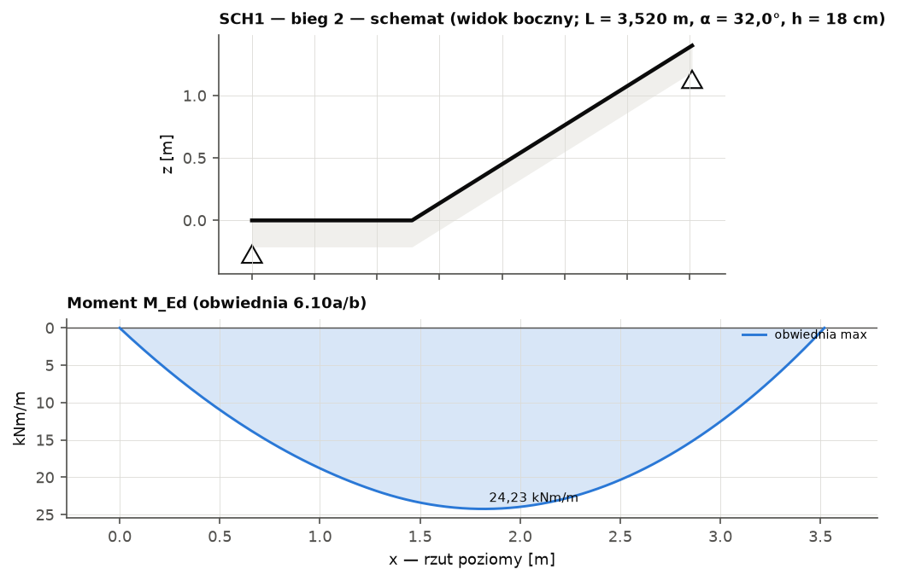

*Rys. SCH1 — bieg 2: schemat statyczny płyty schodowej i obwiednia momentów zginających.*

#### Obliczenia

##### SCH1 — bieg 1

- Geometria biegu: tg α = h_s/s = 17,5/28,0 = **α = 32,0°**
- Rozpiętość w rzucie (osie podpór): L = **3,520** m
- Obciążenie stałe biegu (rzut): g_k,b = **9,355** kN/m²
- Obciążenie stałe spocznika: g_k,s = **5,700** kN/m²
- Obciążenie użytkowe schodów (kat. A): q_k = **4,00** kN/m² *(PN-EN 1991-1-1 tabl. 6.2)*
- Kombinacja 6.10a: q_b_d = γ_G·g_k + γ_Q·ψ₀·q_k = 1,35·9,355 + 1,50·0,7·4,000 = **16,829** kN/m² *(PN-EN 1990 (6.10a) + NA)*
- Kombinacja 6.10b: q_b_d = ξ·γ_G·g_k + γ_Q·q_k = 0,85·1,35·9,355 + 1,50·4,000 = **16,735** kN/m² *(PN-EN 1990 (6.10b) + NA)*
- Kombinacja 6.10a: q_s_d = γ_G·g_k + γ_Q·ψ₀·q_k = 1,35·5,700 + 1,50·0,7·4,000 = **11,895** kN/m² *(PN-EN 1990 (6.10a) + NA)*
- Kombinacja 6.10b: q_s_d = ξ·γ_G·g_k + γ_Q·q_k = 0,85·1,35·5,700 + 1,50·4,000 = **12,541** kN/m² *(PN-EN 1990 (6.10b) + NA)*
- Moment przęsłowy (obwiednia 6.10a/b, na 1 m szerokości): M_Ed = **24,23** kNm/m
- Siła poprzeczna przy podporze: V_Ed = **28,48** kN/m
- *Wymiarowanie na zginanie*
- Wysokość użyteczna: d = **149** mm
- Moment względny: μ = M_Ed/(b·d²·η·f_cd) = 24,23·10⁶/(1000·149²·1,0·17,86) = **0,0611** *(3.1.7(3))*
- Względna wysokość strefy ściskanej: ξ_eff = 1 − √(1 − 2μ) = 1 − √(1 − 2·0,0611) = **0,0631**
- Warunek ciągliwości: ξ_eff ≤ ξ_eff,lim = λ·ε_cu3/(ε_cu3 + f_yd/E_s) = 0,063 ≤ 0,493 = **spełniony**
- Wymagane zbrojenie rozciągane: A_s1 = ξ_eff·b·d·η·f_cd/f_yd = 0,0631·1000·149·1,0·17,86/434,8 = **386** mm²
- Zbrojenie minimalne: A_s,min = max(0,26·f_ctm/f_yk·b·d; 0,0013·b·d) = max(0,26·2,6/500·1000·149; 0,0013·1000·149) = **201** mm² *((9.1N) + NA)*
- Przyjęto zbrojenie główne dołem: φ10 co 20 cm = **3,93** cm²/m
- *Ścinanie*
- Współczynnik skali: k = 1 + √(200/d) ≤ 2,0 = 1 + √(200/149) = **2,000**
- Stopień zbrojenia podłużnego: ρ_l = A_sl/(b_w·d) ≤ 0,02 = 393/(1000·149) = **0,00264**
- Nośność na ścinanie: V_Rd,c = C_Rd,c·k·(100·ρ_l·f_ck)^(1/3)·b_w·d = 0,1286·2,000·(100·0,00264·25)^(1/3)·1000·149·10⁻³ = **71,83** kN *((6.2.a); C_Rd,c = 0,18/γ_c)*
- Wartość minimalna: V_Rd,c,min = v_min·b_w·d, v_min = 0,035·k^(3/2)·f_ck^(1/2) = 0,4950·1000·149·10⁻³ = **73,75** kN *((6.2.b), (6.3N))*
- *Ugięcie (l/d)*
- Stopień zbrojenia wymagany: ρ = A_s,req/(b·d) = 386/(1000·149) = **0,00259**
- Wartość odniesienia: ρ₀ = √f_ck·10⁻³ = √25·10⁻³ = **0,00500**
- Graniczne l/d (ρ ≤ ρ₀): K·[11 + 1,5·√f_ck·ρ₀/ρ + 3,2·√f_ck·(ρ₀/ρ − 1)^(3/2)] = 1,0·[11 + 1,5·5,000·1,929 + 3,2·5,000·(1,929 − 1)^1,5] = **39,8** *((7.16a))*
- Mnożnik od naprężeń w stali: 310/σ_s ≈ 500/(f_yk·A_s,req/A_s,prov) ≤ 1,5 = 500/(500·386/393) = **1,017** *((7.17))*
- Smukłość rzeczywista: l_eff/d = 3,52/0,149 = **23,6**
- *Ugięcie obliczeniowe*
- Efektywny moduł sprężystości: E_c,eff = E_cm/(1 + φ) = 31000/(1 + 2,5) = **8857** MPa *((7.20))*
- Stosunek modułów: α_e = E_s/E_c,eff = 200000/8857 = **22,58**
- Przekrój niezarysowany: x_I; I_I = **92,8 mm; 515,4·10⁶ mm⁴**
- Przekrój zarysowany: x_II; I_II = **43,3 mm; 126,1·10⁶ mm⁴**
- Moment rysujący: M_cr = f_ctm·I_I/(h − x_I) = 2,6·515,4·10⁶/(180 − 92,8) = **15,36** kNm
- Współczynnik rozkładu: ζ = 1 − β·(M_cr/M_qp)², β = 0,5 = M_qp ≤ M_cr → 0 = **0,000** *((7.19))*
- Ugięcie od obciążeń (quasi-stała): w_q = ζ·w_II + (1 − ζ)·w_I = 0,000·17,00 + 1,000·4,16 = **4,16** mm *((7.18))*
- Ugięcie od skurczu: w_cs = k·(1/r_cs)·l², 1/r_cs = ε_cs·α_e·S/I = 0,125·0,387·10⁻⁶·3520² = **0,60** mm *((7.21))*
- Ugięcie całkowite: w = w_q + w_cs = 4,16 + 0,60 = **4,76** mm
- Ugięcie dopuszczalne: w_lim = L/250 = 3520/250 = **14,1** mm *(7.4.1(4))*
- *Rysy*
- Naprężenie w stali (quasi-stała, przekrój zarysowany, α_e = 15): σ_s = α_e·M_qp·(d − x_II)/I_II = **277** MPa
- Maksymalna średnica (w_max = 0,4 mm): φ_s = φ*_s·(f_ct,eff/2,9)·k_c·h_cr/(2(h − d)) = 16,3·(2,6/2,9)·0,4·90/(2·31) = **8,5** mm *(tabl. 7.2N, (7.6N))*
- Maksymalny rozstaw prętów: s_max = (σ_s = 277 MPa) = **204** mm *(tabl. 7.3N)*
- Przyjęto: **dołem φ10 co 20 cm (wzdłuż biegu), rozdzielcze φ8 co 40 cm; w podporach górą φ10 co 40 cm na długości 0,25·L (9.3.1.2(2))**

| Warunek | Efekt | Nośność / limit | η | Stan | Podstawa |
|---|---|---|---|---|---|
| Zbrojenie główne | A_s,req = 386 mm²/m | A_s,prov = 393 mm²/m | 98% | spełniony | (9.1N) |
| Ścinanie bez zbrojenia poprzecznego (6.2.2) | V_Ed = 28,48 kN | V_Rd,c = 73,75 kN | 39% | spełniony | PN-EN 1992-1-1 6.2.2 |
| Ugięcie — graniczna smukłość l/d (7.4.2) | l/d = 23,6  | (l/d)_lim = 40,5  | 58% | spełniony | (7.16), tabl. 7.4N |
| Ugięcie długotrwałe (quasi-stała) ≤ L/250 | w = 4,8 mm | w_lim = 14,1 mm | 34% | spełniony | 7.4.1(4), 7.4.3 |
| Rysy: rozstaw prętów (tabl. 7.3N) | s = 200 mm | s_max = 204 mm | 98% | spełniony | 7.3.3(2) |

> W załamaniu bieg–spocznik pręty dolne krzyżować (nie prowadzić po wklęsłym narożu), zakotwienie l_bd = 376 mm.

##### SCH1 — bieg 2

- Geometria biegu: tg α = h_s/s = 17,5/28,0 = **α = 32,0°**
- Rozpiętość w rzucie (osie podpór): L = **3,520** m
- Obciążenie stałe biegu (rzut): g_k,b = **9,355** kN/m²
- Obciążenie stałe spocznika: g_k,s = **5,700** kN/m²
- Obciążenie użytkowe schodów (kat. A): q_k = **4,00** kN/m² *(PN-EN 1991-1-1 tabl. 6.2)*
- Kombinacja 6.10a: q_b_d = γ_G·g_k + γ_Q·ψ₀·q_k = 1,35·9,355 + 1,50·0,7·4,000 = **16,829** kN/m² *(PN-EN 1990 (6.10a) + NA)*
- Kombinacja 6.10b: q_b_d = ξ·γ_G·g_k + γ_Q·q_k = 0,85·1,35·9,355 + 1,50·4,000 = **16,735** kN/m² *(PN-EN 1990 (6.10b) + NA)*
- Kombinacja 6.10a: q_s_d = γ_G·g_k + γ_Q·ψ₀·q_k = 1,35·5,700 + 1,50·0,7·4,000 = **11,895** kN/m² *(PN-EN 1990 (6.10a) + NA)*
- Kombinacja 6.10b: q_s_d = ξ·γ_G·g_k + γ_Q·q_k = 0,85·1,35·5,700 + 1,50·4,000 = **12,541** kN/m² *(PN-EN 1990 (6.10b) + NA)*
- Moment przęsłowy (obwiednia 6.10a/b, na 1 m szerokości): M_Ed = **24,23** kNm/m
- Siła poprzeczna przy podporze: V_Ed = **28,48** kN/m
- *Wymiarowanie na zginanie*
- Wysokość użyteczna: d = **149** mm
- Moment względny: μ = M_Ed/(b·d²·η·f_cd) = 24,23·10⁶/(1000·149²·1,0·17,86) = **0,0611** *(3.1.7(3))*
- Względna wysokość strefy ściskanej: ξ_eff = 1 − √(1 − 2μ) = 1 − √(1 − 2·0,0611) = **0,0631**
- Warunek ciągliwości: ξ_eff ≤ ξ_eff,lim = λ·ε_cu3/(ε_cu3 + f_yd/E_s) = 0,063 ≤ 0,493 = **spełniony**
- Wymagane zbrojenie rozciągane: A_s1 = ξ_eff·b·d·η·f_cd/f_yd = 0,0631·1000·149·1,0·17,86/434,8 = **386** mm²
- Zbrojenie minimalne: A_s,min = max(0,26·f_ctm/f_yk·b·d; 0,0013·b·d) = max(0,26·2,6/500·1000·149; 0,0013·1000·149) = **201** mm² *((9.1N) + NA)*
- Przyjęto zbrojenie główne dołem: φ10 co 20 cm = **3,93** cm²/m
- *Ścinanie*
- Współczynnik skali: k = 1 + √(200/d) ≤ 2,0 = 1 + √(200/149) = **2,000**
- Stopień zbrojenia podłużnego: ρ_l = A_sl/(b_w·d) ≤ 0,02 = 393/(1000·149) = **0,00264**
- Nośność na ścinanie: V_Rd,c = C_Rd,c·k·(100·ρ_l·f_ck)^(1/3)·b_w·d = 0,1286·2,000·(100·0,00264·25)^(1/3)·1000·149·10⁻³ = **71,83** kN *((6.2.a); C_Rd,c = 0,18/γ_c)*
- Wartość minimalna: V_Rd,c,min = v_min·b_w·d, v_min = 0,035·k^(3/2)·f_ck^(1/2) = 0,4950·1000·149·10⁻³ = **73,75** kN *((6.2.b), (6.3N))*
- *Ugięcie (l/d)*
- Stopień zbrojenia wymagany: ρ = A_s,req/(b·d) = 386/(1000·149) = **0,00259**
- Wartość odniesienia: ρ₀ = √f_ck·10⁻³ = √25·10⁻³ = **0,00500**
- Graniczne l/d (ρ ≤ ρ₀): K·[11 + 1,5·√f_ck·ρ₀/ρ + 3,2·√f_ck·(ρ₀/ρ − 1)^(3/2)] = 1,0·[11 + 1,5·5,000·1,929 + 3,2·5,000·(1,929 − 1)^1,5] = **39,8** *((7.16a))*
- Mnożnik od naprężeń w stali: 310/σ_s ≈ 500/(f_yk·A_s,req/A_s,prov) ≤ 1,5 = 500/(500·386/393) = **1,017** *((7.17))*
- Smukłość rzeczywista: l_eff/d = 3,52/0,149 = **23,6**
- *Ugięcie obliczeniowe*
- Efektywny moduł sprężystości: E_c,eff = E_cm/(1 + φ) = 31000/(1 + 2,5) = **8857** MPa *((7.20))*
- Stosunek modułów: α_e = E_s/E_c,eff = 200000/8857 = **22,58**
- Przekrój niezarysowany: x_I; I_I = **92,8 mm; 515,4·10⁶ mm⁴**
- Przekrój zarysowany: x_II; I_II = **43,3 mm; 126,1·10⁶ mm⁴**
- Moment rysujący: M_cr = f_ctm·I_I/(h − x_I) = 2,6·515,4·10⁶/(180 − 92,8) = **15,36** kNm
- Współczynnik rozkładu: ζ = 1 − β·(M_cr/M_qp)², β = 0,5 = M_qp ≤ M_cr → 0 = **0,000** *((7.19))*
- Ugięcie od obciążeń (quasi-stała): w_q = ζ·w_II + (1 − ζ)·w_I = 0,000·17,00 + 1,000·4,16 = **4,16** mm *((7.18))*
- Ugięcie od skurczu: w_cs = k·(1/r_cs)·l², 1/r_cs = ε_cs·α_e·S/I = 0,125·0,387·10⁻⁶·3520² = **0,60** mm *((7.21))*
- Ugięcie całkowite: w = w_q + w_cs = 4,16 + 0,60 = **4,76** mm
- Ugięcie dopuszczalne: w_lim = L/250 = 3520/250 = **14,1** mm *(7.4.1(4))*
- *Rysy*
- Naprężenie w stali (quasi-stała, przekrój zarysowany, α_e = 15): σ_s = α_e·M_qp·(d − x_II)/I_II = **277** MPa
- Maksymalna średnica (w_max = 0,4 mm): φ_s = φ*_s·(f_ct,eff/2,9)·k_c·h_cr/(2(h − d)) = 16,3·(2,6/2,9)·0,4·90/(2·31) = **8,5** mm *(tabl. 7.2N, (7.6N))*
- Maksymalny rozstaw prętów: s_max = (σ_s = 277 MPa) = **204** mm *(tabl. 7.3N)*
- Przyjęto: **dołem φ10 co 20 cm (wzdłuż biegu), rozdzielcze φ8 co 40 cm; w podporach górą φ10 co 40 cm na długości 0,25·L (9.3.1.2(2))**

| Warunek | Efekt | Nośność / limit | η | Stan | Podstawa |
|---|---|---|---|---|---|
| Zbrojenie główne | A_s,req = 386 mm²/m | A_s,prov = 393 mm²/m | 98% | spełniony | (9.1N) |
| Ścinanie bez zbrojenia poprzecznego (6.2.2) | V_Ed = 28,48 kN | V_Rd,c = 73,75 kN | 39% | spełniony | PN-EN 1992-1-1 6.2.2 |
| Ugięcie — graniczna smukłość l/d (7.4.2) | l/d = 23,6  | (l/d)_lim = 40,5  | 58% | spełniony | (7.16), tabl. 7.4N |
| Ugięcie długotrwałe (quasi-stała) ≤ L/250 | w = 4,8 mm | w_lim = 14,1 mm | 34% | spełniony | 7.4.1(4), 7.4.3 |
| Rysy: rozstaw prętów (tabl. 7.3N) | s = 200 mm | s_max = 204 mm | 98% | spełniony | 7.3.3(2) |

> W załamaniu bieg–spocznik pręty dolne krzyżować (nie prowadzić po wklęsłym narożu), zakotwienie l_bd = 376 mm.

#### Wnioski

**Przyjęto:** Płyta schodowa gr. 18 cm, beton C25/30; zbrojenie wg wyników biegów.  

### Poz. 3.2 — Schody SCH2 (P1 → P2)

Element modelu: `SCH2` · maks. wykorzystanie nośności η = 98% · wszystkie warunki spełnione

#### Opis i schemat statyczny

Bieg 1: 9 podnóżków 17,5/28,0 cm, szer. 1,15 m, rozpiętość w rzucie L = 3,520 m; podpory — dół: posadzka/strop kondygnacji P1; góra: ściana S1-03.

Bieg 2: 9 podnóżków 17,5/28,0 cm, szer. 1,15 m, rozpiętość w rzucie L = 3,520 m; podpory — dół: ściana S1-03; góra: krawędź stropu na poziomie 6,30 m.

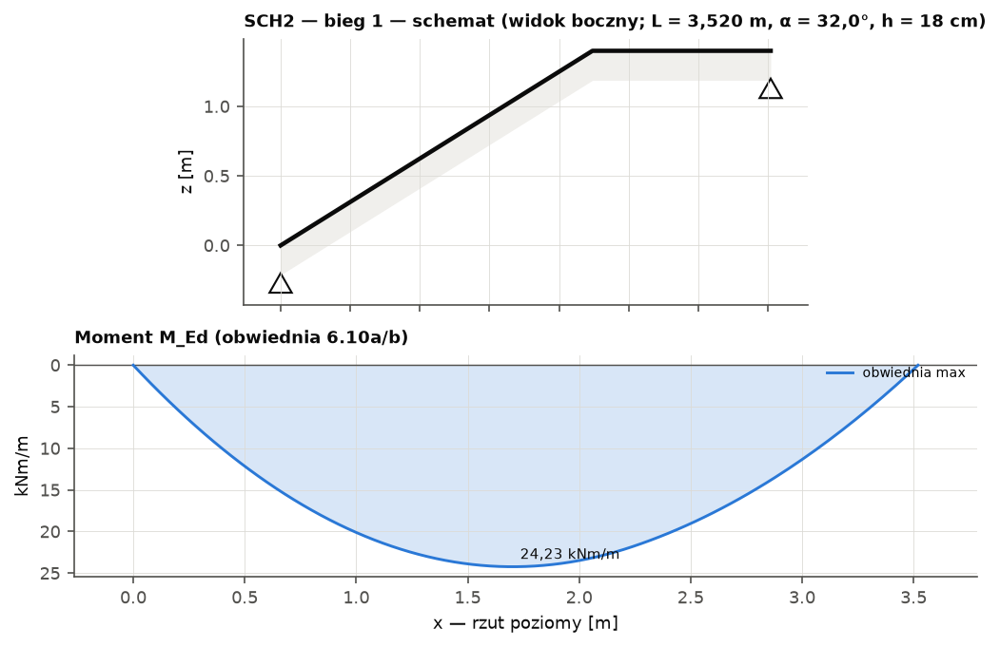

*Rys. SCH2 — bieg 1: schemat statyczny płyty schodowej i obwiednia momentów zginających.*

*Rys. SCH2 — bieg 2: schemat statyczny płyty schodowej i obwiednia momentów zginających.*

#### Obliczenia

##### SCH2 — bieg 1

- Geometria biegu: tg α = h_s/s = 17,5/28,0 = **α = 32,0°**
- Rozpiętość w rzucie (osie podpór): L = **3,520** m
- Obciążenie stałe biegu (rzut): g_k,b = **9,355** kN/m²
- Obciążenie stałe spocznika: g_k,s = **5,700** kN/m²
- Obciążenie użytkowe schodów (kat. A): q_k = **4,00** kN/m² *(PN-EN 1991-1-1 tabl. 6.2)*
- Kombinacja 6.10a: q_b_d = γ_G·g_k + γ_Q·ψ₀·q_k = 1,35·9,355 + 1,50·0,7·4,000 = **16,829** kN/m² *(PN-EN 1990 (6.10a) + NA)*
- Kombinacja 6.10b: q_b_d = ξ·γ_G·g_k + γ_Q·q_k = 0,85·1,35·9,355 + 1,50·4,000 = **16,735** kN/m² *(PN-EN 1990 (6.10b) + NA)*
- Kombinacja 6.10a: q_s_d = γ_G·g_k + γ_Q·ψ₀·q_k = 1,35·5,700 + 1,50·0,7·4,000 = **11,895** kN/m² *(PN-EN 1990 (6.10a) + NA)*
- Kombinacja 6.10b: q_s_d = ξ·γ_G·g_k + γ_Q·q_k = 0,85·1,35·5,700 + 1,50·4,000 = **12,541** kN/m² *(PN-EN 1990 (6.10b) + NA)*
- Moment przęsłowy (obwiednia 6.10a/b, na 1 m szerokości): M_Ed = **24,23** kNm/m
- Siła poprzeczna przy podporze: V_Ed = **28,48** kN/m
- *Wymiarowanie na zginanie*
- Wysokość użyteczna: d = **149** mm
- Moment względny: μ = M_Ed/(b·d²·η·f_cd) = 24,23·10⁶/(1000·149²·1,0·17,86) = **0,0611** *(3.1.7(3))*
- Względna wysokość strefy ściskanej: ξ_eff = 1 − √(1 − 2μ) = 1 − √(1 − 2·0,0611) = **0,0631**
- Warunek ciągliwości: ξ_eff ≤ ξ_eff,lim = λ·ε_cu3/(ε_cu3 + f_yd/E_s) = 0,063 ≤ 0,493 = **spełniony**
- Wymagane zbrojenie rozciągane: A_s1 = ξ_eff·b·d·η·f_cd/f_yd = 0,0631·1000·149·1,0·17,86/434,8 = **386** mm²
- Zbrojenie minimalne: A_s,min = max(0,26·f_ctm/f_yk·b·d; 0,0013·b·d) = max(0,26·2,6/500·1000·149; 0,0013·1000·149) = **201** mm² *((9.1N) + NA)*
- Przyjęto zbrojenie główne dołem: φ10 co 20 cm = **3,93** cm²/m
- *Ścinanie*
- Współczynnik skali: k = 1 + √(200/d) ≤ 2,0 = 1 + √(200/149) = **2,000**
- Stopień zbrojenia podłużnego: ρ_l = A_sl/(b_w·d) ≤ 0,02 = 393/(1000·149) = **0,00264**
- Nośność na ścinanie: V_Rd,c = C_Rd,c·k·(100·ρ_l·f_ck)^(1/3)·b_w·d = 0,1286·2,000·(100·0,00264·25)^(1/3)·1000·149·10⁻³ = **71,83** kN *((6.2.a); C_Rd,c = 0,18/γ_c)*
- Wartość minimalna: V_Rd,c,min = v_min·b_w·d, v_min = 0,035·k^(3/2)·f_ck^(1/2) = 0,4950·1000·149·10⁻³ = **73,75** kN *((6.2.b), (6.3N))*
- *Ugięcie (l/d)*
- Stopień zbrojenia wymagany: ρ = A_s,req/(b·d) = 386/(1000·149) = **0,00259**
- Wartość odniesienia: ρ₀ = √f_ck·10⁻³ = √25·10⁻³ = **0,00500**
- Graniczne l/d (ρ ≤ ρ₀): K·[11 + 1,5·√f_ck·ρ₀/ρ + 3,2·√f_ck·(ρ₀/ρ − 1)^(3/2)] = 1,0·[11 + 1,5·5,000·1,929 + 3,2·5,000·(1,929 − 1)^1,5] = **39,8** *((7.16a))*
- Mnożnik od naprężeń w stali: 310/σ_s ≈ 500/(f_yk·A_s,req/A_s,prov) ≤ 1,5 = 500/(500·386/393) = **1,017** *((7.17))*
- Smukłość rzeczywista: l_eff/d = 3,52/0,149 = **23,6**
- *Ugięcie obliczeniowe*
- Efektywny moduł sprężystości: E_c,eff = E_cm/(1 + φ) = 31000/(1 + 2,5) = **8857** MPa *((7.20))*
- Stosunek modułów: α_e = E_s/E_c,eff = 200000/8857 = **22,58**
- Przekrój niezarysowany: x_I; I_I = **92,8 mm; 515,4·10⁶ mm⁴**
- Przekrój zarysowany: x_II; I_II = **43,3 mm; 126,1·10⁶ mm⁴**
- Moment rysujący: M_cr = f_ctm·I_I/(h − x_I) = 2,6·515,4·10⁶/(180 − 92,8) = **15,36** kNm
- Współczynnik rozkładu: ζ = 1 − β·(M_cr/M_qp)², β = 0,5 = M_qp ≤ M_cr → 0 = **0,000** *((7.19))*
- Ugięcie od obciążeń (quasi-stała): w_q = ζ·w_II + (1 − ζ)·w_I = 0,000·17,00 + 1,000·4,16 = **4,16** mm *((7.18))*
- Ugięcie od skurczu: w_cs = k·(1/r_cs)·l², 1/r_cs = ε_cs·α_e·S/I = 0,125·0,387·10⁻⁶·3520² = **0,60** mm *((7.21))*
- Ugięcie całkowite: w = w_q + w_cs = 4,16 + 0,60 = **4,76** mm
- Ugięcie dopuszczalne: w_lim = L/250 = 3520/250 = **14,1** mm *(7.4.1(4))*
- *Rysy*
- Naprężenie w stali (quasi-stała, przekrój zarysowany, α_e = 15): σ_s = α_e·M_qp·(d − x_II)/I_II = **277** MPa
- Maksymalna średnica (w_max = 0,4 mm): φ_s = φ*_s·(f_ct,eff/2,9)·k_c·h_cr/(2(h − d)) = 16,3·(2,6/2,9)·0,4·90/(2·31) = **8,5** mm *(tabl. 7.2N, (7.6N))*
- Maksymalny rozstaw prętów: s_max = (σ_s = 277 MPa) = **204** mm *(tabl. 7.3N)*
- Przyjęto: **dołem φ10 co 20 cm (wzdłuż biegu), rozdzielcze φ8 co 40 cm; w podporach górą φ10 co 40 cm na długości 0,25·L (9.3.1.2(2))**

| Warunek | Efekt | Nośność / limit | η | Stan | Podstawa |
|---|---|---|---|---|---|
| Zbrojenie główne | A_s,req = 386 mm²/m | A_s,prov = 393 mm²/m | 98% | spełniony | (9.1N) |
| Ścinanie bez zbrojenia poprzecznego (6.2.2) | V_Ed = 28,48 kN | V_Rd,c = 73,75 kN | 39% | spełniony | PN-EN 1992-1-1 6.2.2 |
| Ugięcie — graniczna smukłość l/d (7.4.2) | l/d = 23,6  | (l/d)_lim = 40,5  | 58% | spełniony | (7.16), tabl. 7.4N |
| Ugięcie długotrwałe (quasi-stała) ≤ L/250 | w = 4,8 mm | w_lim = 14,1 mm | 34% | spełniony | 7.4.1(4), 7.4.3 |
| Rysy: rozstaw prętów (tabl. 7.3N) | s = 200 mm | s_max = 204 mm | 98% | spełniony | 7.3.3(2) |

> W załamaniu bieg–spocznik pręty dolne krzyżować (nie prowadzić po wklęsłym narożu), zakotwienie l_bd = 376 mm.

##### SCH2 — bieg 2

- Geometria biegu: tg α = h_s/s = 17,5/28,0 = **α = 32,0°**
- Rozpiętość w rzucie (osie podpór): L = **3,520** m
- Obciążenie stałe biegu (rzut): g_k,b = **9,355** kN/m²
- Obciążenie stałe spocznika: g_k,s = **5,700** kN/m²
- Obciążenie użytkowe schodów (kat. A): q_k = **4,00** kN/m² *(PN-EN 1991-1-1 tabl. 6.2)*
- Kombinacja 6.10a: q_b_d = γ_G·g_k + γ_Q·ψ₀·q_k = 1,35·9,355 + 1,50·0,7·4,000 = **16,829** kN/m² *(PN-EN 1990 (6.10a) + NA)*
- Kombinacja 6.10b: q_b_d = ξ·γ_G·g_k + γ_Q·q_k = 0,85·1,35·9,355 + 1,50·4,000 = **16,735** kN/m² *(PN-EN 1990 (6.10b) + NA)*
- Kombinacja 6.10a: q_s_d = γ_G·g_k + γ_Q·ψ₀·q_k = 1,35·5,700 + 1,50·0,7·4,000 = **11,895** kN/m² *(PN-EN 1990 (6.10a) + NA)*
- Kombinacja 6.10b: q_s_d = ξ·γ_G·g_k + γ_Q·q_k = 0,85·1,35·5,700 + 1,50·4,000 = **12,541** kN/m² *(PN-EN 1990 (6.10b) + NA)*
- Moment przęsłowy (obwiednia 6.10a/b, na 1 m szerokości): M_Ed = **24,23** kNm/m
- Siła poprzeczna przy podporze: V_Ed = **28,48** kN/m
- *Wymiarowanie na zginanie*
- Wysokość użyteczna: d = **149** mm
- Moment względny: μ = M_Ed/(b·d²·η·f_cd) = 24,23·10⁶/(1000·149²·1,0·17,86) = **0,0611** *(3.1.7(3))*
- Względna wysokość strefy ściskanej: ξ_eff = 1 − √(1 − 2μ) = 1 − √(1 − 2·0,0611) = **0,0631**
- Warunek ciągliwości: ξ_eff ≤ ξ_eff,lim = λ·ε_cu3/(ε_cu3 + f_yd/E_s) = 0,063 ≤ 0,493 = **spełniony**
- Wymagane zbrojenie rozciągane: A_s1 = ξ_eff·b·d·η·f_cd/f_yd = 0,0631·1000·149·1,0·17,86/434,8 = **386** mm²
- Zbrojenie minimalne: A_s,min = max(0,26·f_ctm/f_yk·b·d; 0,0013·b·d) = max(0,26·2,6/500·1000·149; 0,0013·1000·149) = **201** mm² *((9.1N) + NA)*
- Przyjęto zbrojenie główne dołem: φ10 co 20 cm = **3,93** cm²/m
- *Ścinanie*
- Współczynnik skali: k = 1 + √(200/d) ≤ 2,0 = 1 + √(200/149) = **2,000**
- Stopień zbrojenia podłużnego: ρ_l = A_sl/(b_w·d) ≤ 0,02 = 393/(1000·149) = **0,00264**
- Nośność na ścinanie: V_Rd,c = C_Rd,c·k·(100·ρ_l·f_ck)^(1/3)·b_w·d = 0,1286·2,000·(100·0,00264·25)^(1/3)·1000·149·10⁻³ = **71,83** kN *((6.2.a); C_Rd,c = 0,18/γ_c)*
- Wartość minimalna: V_Rd,c,min = v_min·b_w·d, v_min = 0,035·k^(3/2)·f_ck^(1/2) = 0,4950·1000·149·10⁻³ = **73,75** kN *((6.2.b), (6.3N))*
- *Ugięcie (l/d)*
- Stopień zbrojenia wymagany: ρ = A_s,req/(b·d) = 386/(1000·149) = **0,00259**
- Wartość odniesienia: ρ₀ = √f_ck·10⁻³ = √25·10⁻³ = **0,00500**
- Graniczne l/d (ρ ≤ ρ₀): K·[11 + 1,5·√f_ck·ρ₀/ρ + 3,2·√f_ck·(ρ₀/ρ − 1)^(3/2)] = 1,0·[11 + 1,5·5,000·1,929 + 3,2·5,000·(1,929 − 1)^1,5] = **39,8** *((7.16a))*
- Mnożnik od naprężeń w stali: 310/σ_s ≈ 500/(f_yk·A_s,req/A_s,prov) ≤ 1,5 = 500/(500·386/393) = **1,017** *((7.17))*
- Smukłość rzeczywista: l_eff/d = 3,52/0,149 = **23,6**
- *Ugięcie obliczeniowe*
- Efektywny moduł sprężystości: E_c,eff = E_cm/(1 + φ) = 31000/(1 + 2,5) = **8857** MPa *((7.20))*
- Stosunek modułów: α_e = E_s/E_c,eff = 200000/8857 = **22,58**
- Przekrój niezarysowany: x_I; I_I = **92,8 mm; 515,4·10⁶ mm⁴**
- Przekrój zarysowany: x_II; I_II = **43,3 mm; 126,1·10⁶ mm⁴**
- Moment rysujący: M_cr = f_ctm·I_I/(h − x_I) = 2,6·515,4·10⁶/(180 − 92,8) = **15,36** kNm
- Współczynnik rozkładu: ζ = 1 − β·(M_cr/M_qp)², β = 0,5 = M_qp ≤ M_cr → 0 = **0,000** *((7.19))*
- Ugięcie od obciążeń (quasi-stała): w_q = ζ·w_II + (1 − ζ)·w_I = 0,000·17,00 + 1,000·4,16 = **4,16** mm *((7.18))*
- Ugięcie od skurczu: w_cs = k·(1/r_cs)·l², 1/r_cs = ε_cs·α_e·S/I = 0,125·0,387·10⁻⁶·3520² = **0,60** mm *((7.21))*
- Ugięcie całkowite: w = w_q + w_cs = 4,16 + 0,60 = **4,76** mm
- Ugięcie dopuszczalne: w_lim = L/250 = 3520/250 = **14,1** mm *(7.4.1(4))*
- *Rysy*
- Naprężenie w stali (quasi-stała, przekrój zarysowany, α_e = 15): σ_s = α_e·M_qp·(d − x_II)/I_II = **277** MPa
- Maksymalna średnica (w_max = 0,4 mm): φ_s = φ*_s·(f_ct,eff/2,9)·k_c·h_cr/(2(h − d)) = 16,3·(2,6/2,9)·0,4·90/(2·31) = **8,5** mm *(tabl. 7.2N, (7.6N))*
- Maksymalny rozstaw prętów: s_max = (σ_s = 277 MPa) = **204** mm *(tabl. 7.3N)*
- Przyjęto: **dołem φ10 co 20 cm (wzdłuż biegu), rozdzielcze φ8 co 40 cm; w podporach górą φ10 co 40 cm na długości 0,25·L (9.3.1.2(2))**

| Warunek | Efekt | Nośność / limit | η | Stan | Podstawa |
|---|---|---|---|---|---|
| Zbrojenie główne | A_s,req = 386 mm²/m | A_s,prov = 393 mm²/m | 98% | spełniony | (9.1N) |
| Ścinanie bez zbrojenia poprzecznego (6.2.2) | V_Ed = 28,48 kN | V_Rd,c = 73,75 kN | 39% | spełniony | PN-EN 1992-1-1 6.2.2 |
| Ugięcie — graniczna smukłość l/d (7.4.2) | l/d = 23,6  | (l/d)_lim = 40,5  | 58% | spełniony | (7.16), tabl. 7.4N |
| Ugięcie długotrwałe (quasi-stała) ≤ L/250 | w = 4,8 mm | w_lim = 14,1 mm | 34% | spełniony | 7.4.1(4), 7.4.3 |
| Rysy: rozstaw prętów (tabl. 7.3N) | s = 200 mm | s_max = 204 mm | 98% | spełniony | 7.3.3(2) |

> W załamaniu bieg–spocznik pręty dolne krzyżować (nie prowadzić po wklęsłym narożu), zakotwienie l_bd = 376 mm.

#### Wnioski

**Przyjęto:** Płyta schodowa gr. 18 cm, beton C25/30; zbrojenie wg wyników biegów.  

## Poz. 4 — Belki i podciągi

### Poz. 4.1 — Belka B6

Element modelu: `B6` · maks. wykorzystanie nośności η = 83% · wszystkie warunki spełnione

#### Opis i schemat statyczny

Belka żelbetowa b × h = 20 × 40 cm, oś (−1,00, 0,00) → (−1,00, 5,12), L = 5,125 m; podpory: ściana S2-08 (x = 0,00 m), ściana S2-08 (x = 5,12 m). Obciążenie: reakcje płyty z MES (rozkład wzdłuż belki) + ciężar własny.

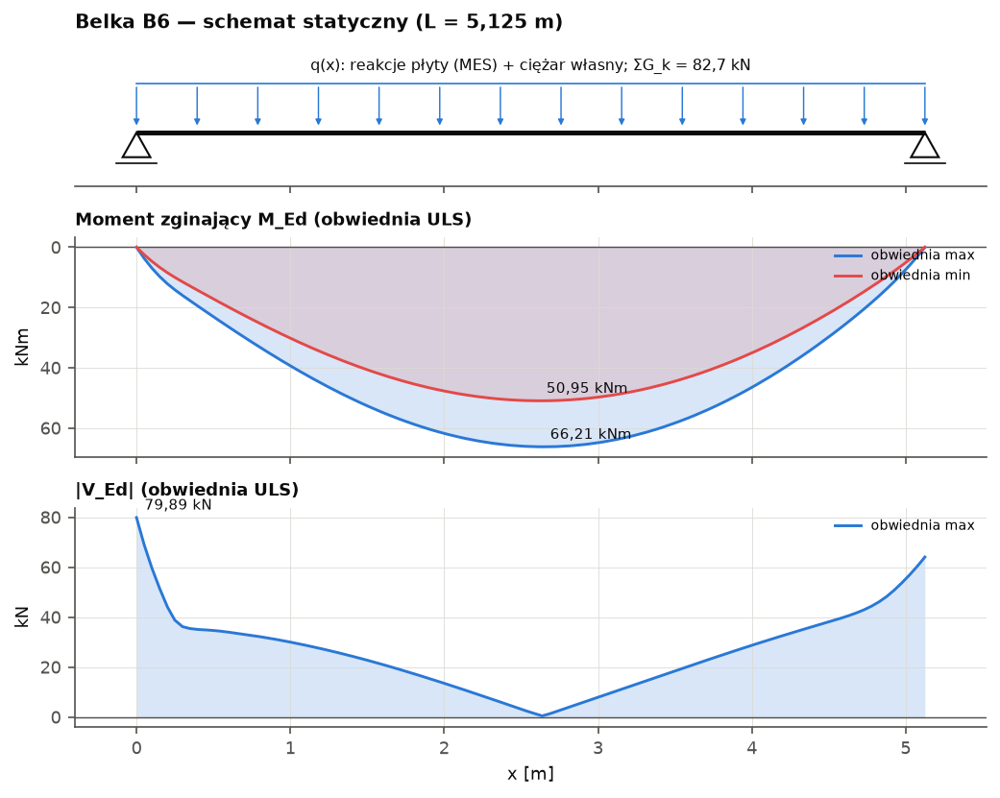

*Rys. Belka B6: schemat statyczny i obwiednie sił wewnętrznych (M dodatni — rozciąganie dołem).*

#### Zestawienie obciążeń

**Obciążenia belki (charakterystyczne, wypadkowe przypadków)**

| Przypadek | Σq·l ≈ [kN] |
|---|---|
| G | 29,0 |
| H | 1,3 |
| S1 | 2,3 |
| S2 | 2,3 |

#### Obliczenia

##### Siły wewnętrzne — B6 (obwiednia kombinacji)

- Moment przęsłowy maks.: M_Ed,max = **28,65** kNm
- Moment podporowy (min.): M_Ed,min = **0,00** kNm
- Siła poprzeczna maks.: V_Ed = **20,64** kN

##### B6 — zginanie w przęśle

- Wysokość użyteczna: d = **359** mm
- Moment względny: μ = M_Ed/(b·d²·η·f_cd) = 28,65·10⁶/(200·359²·1,0·21,43) = **0,0519** *(3.1.7(3))*
- Względna wysokość strefy ściskanej: ξ_eff = 1 − √(1 − 2μ) = 1 − √(1 − 2·0,0519) = **0,0533**
- Warunek ciągliwości: ξ_eff ≤ ξ_eff,lim = λ·ε_cu3/(ε_cu3 + f_yd/E_s) = 0,053 ≤ 0,493 = **spełniony**
- Wymagane zbrojenie rozciągane: A_s1 = ξ_eff·b·d·η·f_cd/f_yd = 0,0533·200·359·1,0·21,43/434,8 = **189** mm²
- Zbrojenie minimalne: A_s,min = max(0,26·f_ctm/f_yk·b·d; 0,0013·b·d) = max(0,26·2,9/500·200·359; 0,0013·200·359) = **108** mm² *((9.1N) + NA)*
- Przyjęto dołem: 2φ12 = **2,26** cm²

| Warunek | Efekt | Nośność / limit | η | Stan | Podstawa |
|---|---|---|---|---|---|
| Zbrojenie dolne | A_s,req = 189 mm² | A_s,prov = 226 mm² | 83% | spełniony | 6.1 |

##### B6 — ścinanie

- Współczynnik skali: k = 1 + √(200/d) ≤ 2,0 = 1 + √(200/359) = **1,746**
- Stopień zbrojenia podłużnego: ρ_l = A_sl/(b_w·d) ≤ 0,02 = 226/(200·359) = **0,00315**
- Nośność na ścinanie: V_Rd,c = C_Rd,c·k·(100·ρ_l·f_ck)^(1/3)·b_w·d = 0,1286·1,746·(100·0,00315·30)^(1/3)·200·359·10⁻³ = **34,09** kN *((6.2.a); C_Rd,c = 0,18/γ_c)*
- Wartość minimalna: V_Rd,c,min = v_min·b_w·d, v_min = 0,035·k^(3/2)·f_ck^(1/2) = 0,4424·200·359·10⁻³ = **31,77** kN *((6.2.b), (6.3N))*
- Ramię sił wewnętrznych: z = 0,9·d = 0,9·359 = **323** mm
- Przyjęto nachylenie krzyżulców betonowych: cot θ = (1,0 ≤ cot θ ≤ 2,0 — NA) = **2,00** *((6.7N))*
- Nośność krzyżulców ściskanych: V_Rd,max = b_w·z·ν₁·f_cd/(cot θ + tan θ) = 200·323·0,528·21,43/(2,00 + 0,500)·10⁻³ = **292,45** kN *((6.9), ν₁ = ν (6.6N))*
- Rozstaw z warunku nośności: s = A_sw·z·f_ywd·cot θ/V_Ed = 100,5·323·434,8·2,00/(20,64·10³) = **1368** mm *((6.8))*
- Rozstaw maksymalny: s_l,max = 0,75·d = 0,75·359 = **269** mm *((9.6N))*
- Stopień zbrojenia minimalny: ρ_w,min = 0,08·√f_ck/f_yk → s ≤ A_sw/(ρ_w,min·b_w) = 100,5/(0,00088·200) = **574** mm *((9.5N))*
- Przyjęto strzemiona: φ8 2-cięte co s = **260** mm
- Nośność zbrojenia na ścinanie: V_Rd,s = A_sw/s·z·f_ywd·cot θ = 100,5/260·323·434,8·2,00·10⁻³ = **108,63** kN

| Warunek | Efekt | Nośność / limit | η | Stan | Podstawa |
|---|---|---|---|---|---|
| Nośność krzyżulców betonowych | V_Ed = 20,64 kN | V_Rd,max = 292,45 kN | 7% | spełniony | (6.9) |
| Nośność strzemion | V_Ed = 20,64 kN | V_Rd,s = 108,63 kN | 19% | spełniony | (6.8) |

> V_Ed ≤ V_Rd,c = 34,09 kN — zbrojenie poprzeczne minimalne (9.2.2(5)).

##### B6 — ugięcie

- Stopień zbrojenia wymagany: ρ = A_s,req/(b·d) = 189/(200·359) = **0,00263**
- Wartość odniesienia: ρ₀ = √f_ck·10⁻³ = √30·10⁻³ = **0,00548**
- Graniczne l/d (ρ ≤ ρ₀): K·[11 + 1,5·√f_ck·ρ₀/ρ + 3,2·√f_ck·(ρ₀/ρ − 1)^(3/2)] = 1,0·[11 + 1,5·5,477·2,085 + 3,2·5,477·(2,085 − 1)^1,5] = **47,9** *((7.16a))*
- Mnożnik od naprężeń w stali: 310/σ_s ≈ 500/(f_yk·A_s,req/A_s,prov) ≤ 1,5 = 500/(500·189/226) = **1,199** *((7.17))*
- Smukłość rzeczywista: l_eff/d = 5,12/0,359 = **14,3**
- *Obliczenie ugięcia (7.4.3)*
- Efektywny moduł sprężystości: E_c,eff = E_cm/(1 + φ) = 33000/(1 + 2,5) = **9429** MPa *((7.20))*
- Stosunek modułów: α_e = E_s/E_c,eff = 200000/9429 = **21,21**
- Przekrój niezarysowany: x_I; I_I = **209,0 mm; 1181,1·10⁶ mm⁴**
- Przekrój zarysowany: x_II; I_II = **109,4 mm; 386,2·10⁶ mm⁴**
- Moment rysujący: M_cr = f_ctm·I_I/(h − x_I) = 2,9·1181,1·10⁶/(400 − 209,0) = **17,93** kNm
- Współczynnik rozkładu: ζ = 1 − β·(M_cr/M_qp)², β = 0,5 = 1 − 0,5·(17,93/20,27)² = **0,609** *((7.19))*
- Ugięcie od obciążeń (quasi-stała): w_q = ζ·w_II + (1 − ζ)·w_I = 0,609·15,11 + 0,391·4,94 = **11,13** mm *((7.18))*
- Ugięcie od skurczu: w_cs = k·(1/r_cs)·l², 1/r_cs = ε_cs·α_e·S/I = 0,125·0,850·10⁻⁶·5125² = **2,79** mm *((7.21))*
- Ugięcie całkowite: w = w_q + w_cs = 11,13 + 2,79 = **13,92** mm
- Ugięcie dopuszczalne: w_lim = L/250 = 5125/250 = **20,5** mm *(7.4.1(4))*

| Warunek | Efekt | Nośność / limit | η | Stan | Podstawa |
|---|---|---|---|---|---|
| Ugięcie — graniczna smukłość l/d (7.4.2) | l/d = 14,3  | (l/d)_lim = 57,5  | 25% | spełniony | (7.16), tabl. 7.4N |

> l/d spełnione — obliczenie (7.4.3) informacyjnie: w = 13,9 mm ≤? 20,5 mm.

##### B6 — rysy

- Naprężenie w stali (quasi-stała, przekrój zarysowany, α_e = 15): σ_s = α_e·M_qp·(d − x_II)/I_II = **274** MPa
- Maksymalna średnica (w_max = 0,4 mm): φ_s = φ*_s·(f_ct,eff/2,9)·k_c·h_cr/(2(h − d)) = 16,6·(2,9/2,9)·0,4·200/(2·41) = **16,2** mm *(tabl. 7.2N, (7.6N))*
- Maksymalny rozstaw prętów: s_max = (σ_s = 274 MPa) = **208** mm *(tabl. 7.3N)*

| Warunek | Efekt | Nośność / limit | η | Stan | Podstawa |
|---|---|---|---|---|---|
| Rysy: średnica prętów (tabl. 7.2N) | φ = 12 mm | φ_s,max = 16 mm | 74% | spełniony | 7.3.3(2) |

#### Wnioski

**Przyjęto:** Belka B6: 20×40 cm, C30/37; dołem 2φ12, górą 2φ12, strzemiona φ8 co 26 cm (2-cięte).  

### Poz. 4.2 — Belka N6

Element modelu: `N6` · maks. wykorzystanie nośności η = 47% · wszystkie warunki spełnione

#### Opis i schemat statyczny

Belka żelbetowa b × h = 18 × 18 cm, oś (−0,20, 0,00) → (3,20, 0,00), L = 3,400 m; podpory: ściana S2-01 (x = 0,00 m), ściana S2-01 (x = 3,40 m). Obciążenie: reakcje płyty z MES (rozkład wzdłuż belki) + ciężar własny.

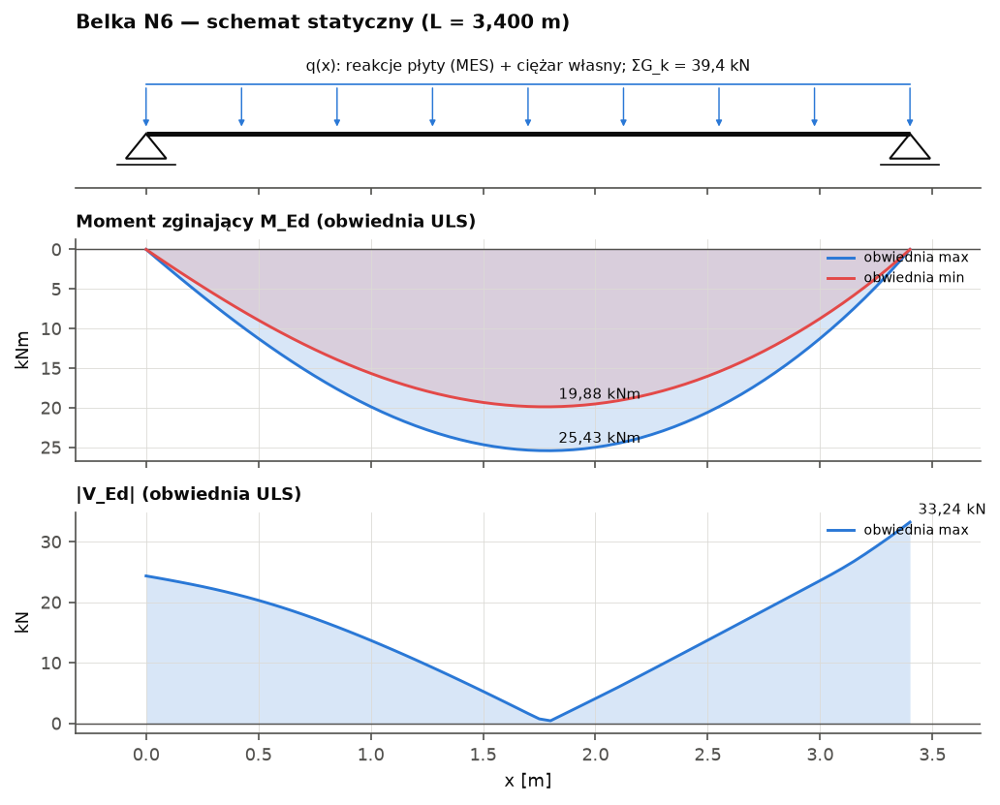

*Rys. Belka N6: schemat statyczny i obwiednie sił wewnętrznych (M dodatni — rozciąganie dołem).*

#### Zestawienie obciążeń

**Obciążenia belki (charakterystyczne, wypadkowe przypadków)**

| Przypadek | Σq·l ≈ [kN] |
|---|---|
| G | 27,0 |
| H | 1,7 |
| S1 | 3,0 |
| S2 | 3,0 |

#### Obliczenia

##### Siły wewnętrzne — N6 (obwiednia kombinacji)

- Moment przęsłowy maks.: M_Ed,max = **16,37** kNm
- Moment podporowy (min.): M_Ed,min = **0,00** kNm
- Siła poprzeczna maks.: V_Ed = **20,38** kN

##### N6 — zginanie w przęśle (przekrój teowy)

- Wysokość użyteczna: d = **359** mm
- Moment względny: μ = M_Ed/(b·d²·η·f_cd) = 16,37·10⁶/(758·359²·1,0·17,86) = **0,0094** *(3.1.7(3))*
- Względna wysokość strefy ściskanej: ξ_eff = 1 − √(1 − 2μ) = 1 − √(1 − 2·0,0094) = **0,0094**
- Warunek ciągliwości: ξ_eff ≤ ξ_eff,lim = λ·ε_cu3/(ε_cu3 + f_yd/E_s) = 0,009 ≤ 0,493 = **spełniony**
- Wymagane zbrojenie rozciągane: A_s1 = ξ_eff·b·d·η·f_cd/f_yd = 0,0094·758·359·1,0·17,86/434,8 = **105** mm²
- Zbrojenie minimalne: A_s,min = max(0,26·f_ctm/f_yk·b·d; 0,0013·b·d) = max(0,26·2,6/500·758·359; 0,0013·758·359) = **368** mm² *((9.1N) + NA)*
- Strefa ściskana w półce: x_eff = ξ_eff·d ≤ h_f = 3 ≤ 220 = **przekrój pozornie teowy**
- Zbrojenie minimalne (b_t = b_w — strefa rozciągana w środniku): A_s,min = max(0,26·f_ctm/f_yk·b_w·d; 0,0013·b_w·d) = **87** mm² *((9.1N))*
- Przyjęto dołem: 2φ12 = **2,26** cm²

| Warunek | Efekt | Nośność / limit | η | Stan | Podstawa |
|---|---|---|---|---|---|
| Zbrojenie dolne | A_s,req = 105 mm² | A_s,prov = 226 mm² | 47% | spełniony | 6.1 |

##### N6 — ścinanie

- Współczynnik skali: k = 1 + √(200/d) ≤ 2,0 = 1 + √(200/359) = **1,746**
- Stopień zbrojenia podłużnego: ρ_l = A_sl/(b_w·d) ≤ 0,02 = 226/(180·359) = **0,00350**
- Nośność na ścinanie: V_Rd,c = C_Rd,c·k·(100·ρ_l·f_ck)^(1/3)·b_w·d = 0,1286·1,746·(100·0,00350·25)^(1/3)·180·359·10⁻³ = **29,90** kN *((6.2.a); C_Rd,c = 0,18/γ_c)*
- Wartość minimalna: V_Rd,c,min = v_min·b_w·d, v_min = 0,035·k^(3/2)·f_ck^(1/2) = 0,4039·180·359·10⁻³ = **26,10** kN *((6.2.b), (6.3N))*
- Ramię sił wewnętrznych: z = 0,9·d = 0,9·359 = **323** mm
- Przyjęto nachylenie krzyżulców betonowych: cot θ = (1,0 ≤ cot θ ≤ 2,0 — NA) = **2,00** *((6.7N))*
- Nośność krzyżulców ściskanych: V_Rd,max = b_w·z·ν₁·f_cd/(cot θ + tan θ) = 180·323·0,540·17,86/(2,00 + 0,500)·10⁻³ = **224,32** kN *((6.9), ν₁ = ν (6.6N))*
- Rozstaw z warunku nośności: s = A_sw·z·f_ywd·cot θ/V_Ed = 100,5·323·434,8·2,00/(20,38·10³) = **1386** mm *((6.8))*
- Rozstaw maksymalny: s_l,max = 0,75·d = 0,75·359 = **269** mm *((9.6N))*
- Stopień zbrojenia minimalny: ρ_w,min = 0,08·√f_ck/f_yk → s ≤ A_sw/(ρ_w,min·b_w) = 100,5/(0,00080·180) = **698** mm *((9.5N))*
- Przyjęto strzemiona: φ8 2-cięte co s = **260** mm
- Nośność zbrojenia na ścinanie: V_Rd,s = A_sw/s·z·f_ywd·cot θ = 100,5/260·323·434,8·2,00·10⁻³ = **108,63** kN

| Warunek | Efekt | Nośność / limit | η | Stan | Podstawa |
|---|---|---|---|---|---|
| Nośność krzyżulców betonowych | V_Ed = 20,38 kN | V_Rd,max = 224,32 kN | 9% | spełniony | (6.9) |
| Nośność strzemion | V_Ed = 20,38 kN | V_Rd,s = 108,63 kN | 19% | spełniony | (6.8) |

> V_Ed ≤ V_Rd,c = 29,90 kN — zbrojenie poprzeczne minimalne (9.2.2(5)).

##### N6 — ugięcie

- Stopień zbrojenia wymagany: ρ = A_s,req/(b·d) = 105/(180·359) = **0,00163**
- Wartość odniesienia: ρ₀ = √f_ck·10⁻³ = √25·10⁻³ = **0,00500**
- Graniczne l/d (ρ ≤ ρ₀): K·[11 + 1,5·√f_ck·ρ₀/ρ + 3,2·√f_ck·(ρ₀/ρ − 1)^(3/2)] = 1,0·[11 + 1,5·5,000·3,067 + 3,2·5,000·(3,067 − 1)^1,5] = **81,5** *((7.16a))*
- Mnożnik od naprężeń w stali: 310/σ_s ≈ 500/(f_yk·A_s,req/A_s,prov) ≤ 1,5 = 500/(500·105/226) = **1,500** *((7.17))*
- Przekrój teowy b_eff/b_w > 3: × 0,8 = **0,80**
- Smukłość rzeczywista: l_eff/d = 3,40/0,359 = **9,5**
- *Obliczenie ugięcia (7.4.3)*
- Efektywny moduł sprężystości: E_c,eff = E_cm/(1 + φ) = 31000/(1 + 2,5) = **8857** MPa *((7.20))*
- Stosunek modułów: α_e = E_s/E_c,eff = 200000/8857 = **22,58**
- Przekrój niezarysowany: x_I; I_I = **210,5 mm; 1080,6·10⁶ mm⁴**
- Przekrój zarysowany: x_II; I_II = **117,2 mm; 395,2·10⁶ mm⁴**
- Moment rysujący: M_cr = f_ctm·I_I/(h − x_I) = 2,6·1080,6·10⁶/(400 − 210,5) = **14,83** kNm
- Współczynnik rozkładu: ζ = 1 − β·(M_cr/M_qp)², β = 0,5 = M_qp ≤ M_cr → 0 = **0,000** *((7.19))*
- Ugięcie od obciążeń (quasi-stała): w_q = ζ·w_II + (1 − ζ)·w_I = 0,000·3,92 + 1,000·1,43 = **1,43** mm *((7.18))*
- Ugięcie od skurczu: w_cs = k·(1/r_cs)·l², 1/r_cs = ε_cs·α_e·S/I = 0,125·0,281·10⁻⁶·3400² = **0,41** mm *((7.21))*
- Ugięcie całkowite: w = w_q + w_cs = 1,43 + 0,41 = **1,84** mm
- Ugięcie dopuszczalne: w_lim = L/250 = 3400/250 = **13,6** mm *(7.4.1(4))*

| Warunek | Efekt | Nośność / limit | η | Stan | Podstawa |
|---|---|---|---|---|---|
| Ugięcie — graniczna smukłość l/d (7.4.2) | l/d = 9,5  | (l/d)_lim = 97,8  | 10% | spełniony | (7.16), tabl. 7.4N |

> l/d spełnione — obliczenie (7.4.3) informacyjnie: w = 1,8 mm ≤? 13,6 mm.

##### N6 — rysy

- Naprężenie w stali (quasi-stała, przekrój zarysowany, α_e = 15): σ_s = α_e·M_qp·(d − x_II)/I_II = **155** MPa
- Maksymalna średnica (w_max = 0,4 mm): φ_s = φ*_s·(f_ct,eff/2,9)·k_c·h_cr/(2(h − d)) = 40,0·(2,6/2,9)·0,4·200/(2·41) = **35,0** mm *(tabl. 7.2N, (7.6N))*
- Maksymalny rozstaw prętów: s_max = (σ_s = 155 MPa) = **300** mm *(tabl. 7.3N)*

| Warunek | Efekt | Nośność / limit | η | Stan | Podstawa |
|---|---|---|---|---|---|
| Rysy: średnica prętów (tabl. 7.2N) | φ = 12 mm | φ_s,max = 35 mm | 34% | spełniony | 7.3.3(2) |

#### Wnioski

**Przyjęto:** Belka N6: 18×40 cm (z płytą), C25/30; dołem 2φ12, górą 2φ12, strzemiona φ8 co 26 cm (2-cięte).  

### Poz. 4.3 — Belka N7

Element modelu: `N7` · maks. wykorzystanie nośności η = 39% · wszystkie warunki spełnione

#### Opis i schemat statyczny

Belka żelbetowa b × h = 18 × 18 cm, oś (8,80, 0,00) → (11,60, 0,00), L = 2,800 m; podpory: ściana S2-01 (x = 0,00 m), ściana S2-01 (x = 2,80 m). Obciążenie: reakcje płyty z MES (rozkład wzdłuż belki) + ciężar własny.

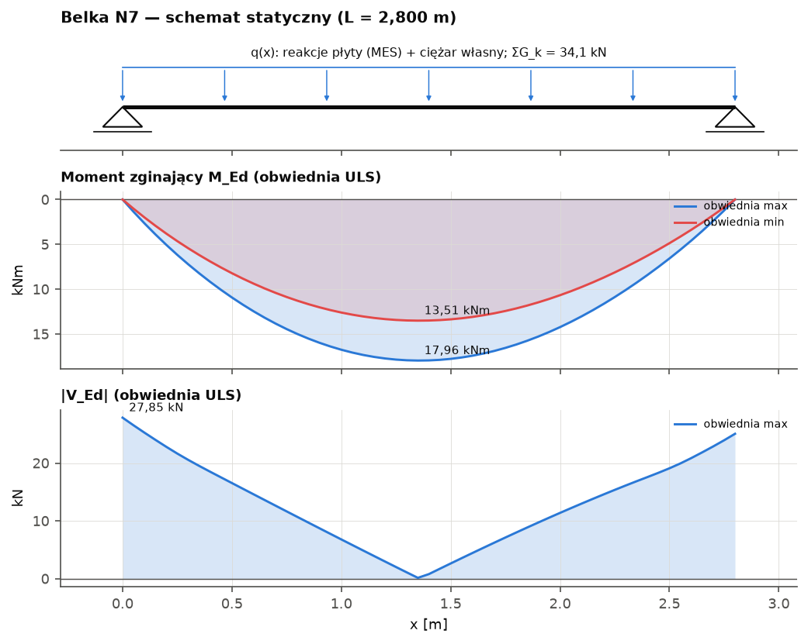

*Rys. Belka N7: schemat statyczny i obwiednie sił wewnętrznych (M dodatni — rozciąganie dołem).*

#### Zestawienie obciążeń

**Obciążenia belki (charakterystyczne, wypadkowe przypadków)**

| Przypadek | Σq·l ≈ [kN] |
|---|---|
| G | 20,1 |
| H | 1,2 |
| S1 | 2,2 |
| S2 | 2,2 |

#### Obliczenia

##### Siły wewnętrzne — N7 (obwiednia kombinacji)

- Moment przęsłowy maks.: M_Ed,max = **9,96** kNm
- Moment podporowy (min.): M_Ed,min = **0,00** kNm
- Siła poprzeczna maks.: V_Ed = **15,41** kN

##### N7 — zginanie w przęśle (przekrój teowy)

- Wysokość użyteczna: d = **359** mm
- Moment względny: μ = M_Ed/(b·d²·η·f_cd) = 9,96·10⁶/(656·359²·1,0·17,86) = **0,0066** *(3.1.7(3))*
- Względna wysokość strefy ściskanej: ξ_eff = 1 − √(1 − 2μ) = 1 − √(1 − 2·0,0066) = **0,0066**
- Warunek ciągliwości: ξ_eff ≤ ξ_eff,lim = λ·ε_cu3/(ε_cu3 + f_yd/E_s) = 0,007 ≤ 0,493 = **spełniony**
- Wymagane zbrojenie rozciągane: A_s1 = ξ_eff·b·d·η·f_cd/f_yd = 0,0066·656·359·1,0·17,86/434,8 = **64** mm²
- Zbrojenie minimalne: A_s,min = max(0,26·f_ctm/f_yk·b·d; 0,0013·b·d) = max(0,26·2,6/500·656·359; 0,0013·656·359) = **318** mm² *((9.1N) + NA)*
- Strefa ściskana w półce: x_eff = ξ_eff·d ≤ h_f = 2 ≤ 220 = **przekrój pozornie teowy**
- Zbrojenie minimalne (b_t = b_w — strefa rozciągana w środniku): A_s,min = max(0,26·f_ctm/f_yk·b_w·d; 0,0013·b_w·d) = **87** mm² *((9.1N))*
- Przyjęto dołem: 2φ12 = **2,26** cm²

| Warunek | Efekt | Nośność / limit | η | Stan | Podstawa |
|---|---|---|---|---|---|
| Zbrojenie dolne | A_s,req = 87 mm² | A_s,prov = 226 mm² | 39% | spełniony | 6.1 |

##### N7 — ścinanie

- Współczynnik skali: k = 1 + √(200/d) ≤ 2,0 = 1 + √(200/359) = **1,746**
- Stopień zbrojenia podłużnego: ρ_l = A_sl/(b_w·d) ≤ 0,02 = 226/(180·359) = **0,00350**
- Nośność na ścinanie: V_Rd,c = C_Rd,c·k·(100·ρ_l·f_ck)^(1/3)·b_w·d = 0,1286·1,746·(100·0,00350·25)^(1/3)·180·359·10⁻³ = **29,90** kN *((6.2.a); C_Rd,c = 0,18/γ_c)*
- Wartość minimalna: V_Rd,c,min = v_min·b_w·d, v_min = 0,035·k^(3/2)·f_ck^(1/2) = 0,4039·180·359·10⁻³ = **26,10** kN *((6.2.b), (6.3N))*
- Ramię sił wewnętrznych: z = 0,9·d = 0,9·359 = **323** mm
- Przyjęto nachylenie krzyżulców betonowych: cot θ = (1,0 ≤ cot θ ≤ 2,0 — NA) = **2,00** *((6.7N))*
- Nośność krzyżulców ściskanych: V_Rd,max = b_w·z·ν₁·f_cd/(cot θ + tan θ) = 180·323·0,540·17,86/(2,00 + 0,500)·10⁻³ = **224,32** kN *((6.9), ν₁ = ν (6.6N))*
- Rozstaw z warunku nośności: s = A_sw·z·f_ywd·cot θ/V_Ed = 100,5·323·434,8·2,00/(15,41·10³) = **1833** mm *((6.8))*
- Rozstaw maksymalny: s_l,max = 0,75·d = 0,75·359 = **269** mm *((9.6N))*
- Stopień zbrojenia minimalny: ρ_w,min = 0,08·√f_ck/f_yk → s ≤ A_sw/(ρ_w,min·b_w) = 100,5/(0,00080·180) = **698** mm *((9.5N))*
- Przyjęto strzemiona: φ8 2-cięte co s = **260** mm
- Nośność zbrojenia na ścinanie: V_Rd,s = A_sw/s·z·f_ywd·cot θ = 100,5/260·323·434,8·2,00·10⁻³ = **108,63** kN

| Warunek | Efekt | Nośność / limit | η | Stan | Podstawa |
|---|---|---|---|---|---|
| Nośność krzyżulców betonowych | V_Ed = 15,41 kN | V_Rd,max = 224,32 kN | 7% | spełniony | (6.9) |
| Nośność strzemion | V_Ed = 15,41 kN | V_Rd,s = 108,63 kN | 14% | spełniony | (6.8) |

> V_Ed ≤ V_Rd,c = 29,90 kN — zbrojenie poprzeczne minimalne (9.2.2(5)).

##### N7 — ugięcie

- Stopień zbrojenia wymagany: ρ = A_s,req/(b·d) = 64/(180·359) = **0,00099**
- Wartość odniesienia: ρ₀ = √f_ck·10⁻³ = √25·10⁻³ = **0,00500**
- Graniczne l/d (ρ ≤ ρ₀): K·[11 + 1,5·√f_ck·ρ₀/ρ + 3,2·√f_ck·(ρ₀/ρ − 1)^(3/2)] = 1,0·[11 + 1,5·5,000·5,047 + 3,2·5,000·(5,047 − 1)^1,5] = **179,1** *((7.16a))*
- Mnożnik od naprężeń w stali: 310/σ_s ≈ 500/(f_yk·A_s,req/A_s,prov) ≤ 1,5 = 500/(500·64/226) = **1,500** *((7.17))*
- Przekrój teowy b_eff/b_w > 3: × 0,8 = **0,80**
- Smukłość rzeczywista: l_eff/d = 2,80/0,359 = **7,8**
- *Obliczenie ugięcia (7.4.3)*
- Efektywny moduł sprężystości: E_c,eff = E_cm/(1 + φ) = 31000/(1 + 2,5) = **8857** MPa *((7.20))*
- Stosunek modułów: α_e = E_s/E_c,eff = 200000/8857 = **22,58**
- Przekrój niezarysowany: x_I; I_I = **210,5 mm; 1080,6·10⁶ mm⁴**
- Przekrój zarysowany: x_II; I_II = **117,2 mm; 395,2·10⁶ mm⁴**
- Moment rysujący: M_cr = f_ctm·I_I/(h − x_I) = 2,6·1080,6·10⁶/(400 − 210,5) = **14,83** kNm
- Współczynnik rozkładu: ζ = 1 − β·(M_cr/M_qp)², β = 0,5 = M_qp ≤ M_cr → 0 = **0,000** *((7.19))*
- Ugięcie od obciążeń (quasi-stała): w_q = ζ·w_II + (1 − ζ)·w_I = 0,000·1,62 + 1,000·0,59 = **0,59** mm *((7.18))*
- Ugięcie od skurczu: w_cs = k·(1/r_cs)·l², 1/r_cs = ε_cs·α_e·S/I = 0,125·0,281·10⁻⁶·2800² = **0,28** mm *((7.21))*
- Ugięcie całkowite: w = w_q + w_cs = 0,59 + 0,28 = **0,87** mm
- Ugięcie dopuszczalne: w_lim = L/250 = 2800/250 = **11,2** mm *(7.4.1(4))*

| Warunek | Efekt | Nośność / limit | η | Stan | Podstawa |
|---|---|---|---|---|---|
| Ugięcie — graniczna smukłość l/d (7.4.2) | l/d = 7,8  | (l/d)_lim = 215,0  | 4% | spełniony | (7.16), tabl. 7.4N |

> l/d spełnione — obliczenie (7.4.3) informacyjnie: w = 0,9 mm ≤? 11,2 mm.

##### N7 — rysy

- Naprężenie w stali (quasi-stała, przekrój zarysowany, α_e = 15): σ_s = α_e·M_qp·(d − x_II)/I_II = **94** MPa
- Maksymalna średnica (w_max = 0,4 mm): φ_s = φ*_s·(f_ct,eff/2,9)·k_c·h_cr/(2(h − d)) = 40,0·(2,6/2,9)·0,4·200/(2·41) = **35,0** mm *(tabl. 7.2N, (7.6N))*
- Maksymalny rozstaw prętów: s_max = (σ_s = 94 MPa) = **300** mm *(tabl. 7.3N)*

| Warunek | Efekt | Nośność / limit | η | Stan | Podstawa |
|---|---|---|---|---|---|
| Rysy: średnica prętów (tabl. 7.2N) | φ = 12 mm | φ_s,max = 35 mm | 34% | spełniony | 7.3.3(2) |

#### Wnioski

**Przyjęto:** Belka N7: 18×40 cm (z płytą), C25/30; dołem 2φ12, górą 2φ12, strzemiona φ8 co 26 cm (2-cięte).  

### Poz. 4.4 — Belka B2

Element modelu: `B2` · maks. wykorzystanie nośności η = 93% · wszystkie warunki spełnione

#### Opis i schemat statyczny

Belka żelbetowa b × h = 25 × 80 cm, oś (3,85, 0,00) → (11,37, 0,00), L = 7,520 m; podpory: ściana S1-01 (x = 0,00 m), słup SL5 (x = 2,59 m), słup SL6 (x = 4,93 m), ściana S1-01 (x = 7,52 m). Obciążenie: reakcje płyty z MES (rozkład wzdłuż belki) + ciężar własny.

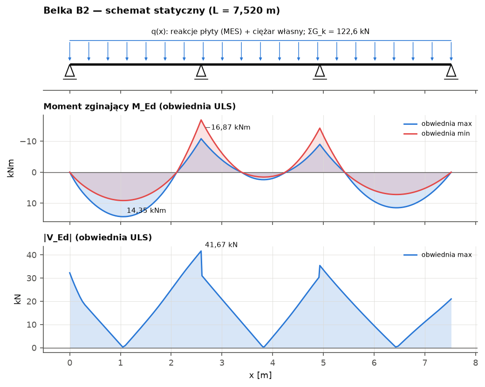

*Rys. Belka B2: schemat statyczny i obwiednie sił wewnętrznych (M dodatni — rozciąganie dołem).*

#### Zestawienie obciążeń

**Obciążenia belki (charakterystyczne, wypadkowe przypadków)**

| Przypadek | Σq·l ≈ [kN] |
|---|---|
| G | 123,8 |
| QA | 26,1 |
| QA_pA | 26,1 |
| QA_pB | 0,0 |
| H | 0,0 |
| S1 | 0,0 |
| S2 | 0,0 |
| SB2 | 0,0 |

#### Obliczenia

##### Siły wewnętrzne — B2 (obwiednia kombinacji)

- Moment przęsłowy maks.: M_Ed,max = **14,35** kNm
- Moment podporowy (min.): M_Ed,min = **−16,87** kNm
- Siła poprzeczna maks.: V_Ed = **41,67** kN

##### B2 — zginanie w przęśle

- Wysokość użyteczna: d = **759** mm
- Moment względny: μ = M_Ed/(b·d²·η·f_cd) = 14,35·10⁶/(250·759²·1,0·21,43) = **0,0046** *(3.1.7(3))*
- Względna wysokość strefy ściskanej: ξ_eff = 1 − √(1 − 2μ) = 1 − √(1 − 2·0,0046) = **0,0047**
- Warunek ciągliwości: ξ_eff ≤ ξ_eff,lim = λ·ε_cu3/(ε_cu3 + f_yd/E_s) = 0,005 ≤ 0,493 = **spełniony**
- Wymagane zbrojenie rozciągane: A_s1 = ξ_eff·b·d·η·f_cd/f_yd = 0,0047·250·759·1,0·21,43/434,8 = **44** mm²
- Zbrojenie minimalne: A_s,min = max(0,26·f_ctm/f_yk·b·d; 0,0013·b·d) = max(0,26·2,9/500·250·759; 0,0013·250·759) = **286** mm² *((9.1N) + NA)*
- Przyjęto dołem: 2φ14 = **3,08** cm²

| Warunek | Efekt | Nośność / limit | η | Stan | Podstawa |
|---|---|---|---|---|---|
| Zbrojenie dolne | A_s,req = 286 mm² | A_s,prov = 308 mm² | 93% | spełniony | 6.1 |

##### B2 — zginanie nad podporą

- Wysokość użyteczna: d = **759** mm
- Moment względny: μ = M_Ed/(b·d²·η·f_cd) = 16,87·10⁶/(250·759²·1,0·21,43) = **0,0055** *(3.1.7(3))*
- Względna wysokość strefy ściskanej: ξ_eff = 1 − √(1 − 2μ) = 1 − √(1 − 2·0,0055) = **0,0055**
- Warunek ciągliwości: ξ_eff ≤ ξ_eff,lim = λ·ε_cu3/(ε_cu3 + f_yd/E_s) = 0,005 ≤ 0,493 = **spełniony**
- Wymagane zbrojenie rozciągane: A_s1 = ξ_eff·b·d·η·f_cd/f_yd = 0,0055·250·759·1,0·21,43/434,8 = **51** mm²
- Zbrojenie minimalne: A_s,min = max(0,26·f_ctm/f_yk·b·d; 0,0013·b·d) = max(0,26·2,9/500·250·759; 0,0013·250·759) = **286** mm² *((9.1N) + NA)*

| Warunek | Efekt | Nośność / limit | η | Stan | Podstawa |
|---|---|---|---|---|---|
| Zbrojenie górne | A_s,req = 286 mm² | A_s,prov = 308 mm² | 93% | spełniony | 6.1 |

##### B2 — ścinanie

- Współczynnik skali: k = 1 + √(200/d) ≤ 2,0 = 1 + √(200/759) = **1,513**
- Stopień zbrojenia podłużnego: ρ_l = A_sl/(b_w·d) ≤ 0,02 = 308/(250·759) = **0,00162**
- Nośność na ścinanie: V_Rd,c = C_Rd,c·k·(100·ρ_l·f_ck)^(1/3)·b_w·d = 0,1286·1,513·(100·0,00162·30)^(1/3)·250·759·10⁻³ = **62,57** kN *((6.2.a); C_Rd,c = 0,18/γ_c)*
- Wartość minimalna: V_Rd,c,min = v_min·b_w·d, v_min = 0,035·k^(3/2)·f_ck^(1/2) = 0,3569·250·759·10⁻³ = **67,72** kN *((6.2.b), (6.3N))*
- Ramię sił wewnętrznych: z = 0,9·d = 0,9·759 = **683** mm
- Przyjęto nachylenie krzyżulców betonowych: cot θ = (1,0 ≤ cot θ ≤ 2,0 — NA) = **2,00** *((6.7N))*
- Nośność krzyżulców ściskanych: V_Rd,max = b_w·z·ν₁·f_cd/(cot θ + tan θ) = 250·683·0,528·21,43/(2,00 + 0,500)·10⁻³ = **772,88** kN *((6.9), ν₁ = ν (6.6N))*
- Rozstaw z warunku nośności: s = A_sw·z·f_ywd·cot θ/V_Ed = 100,5·683·434,8·2,00/(41,67·10³) = **1433** mm *((6.8))*
- Rozstaw maksymalny: s_l,max = 0,75·d = 0,75·759 = **569** mm *((9.6N))*
- Stopień zbrojenia minimalny: ρ_w,min = 0,08·√f_ck/f_yk → s ≤ A_sw/(ρ_w,min·b_w) = 100,5/(0,00088·250) = **459** mm *((9.5N))*
- Przyjęto strzemiona: φ8 2-cięte co s = **400** mm
- Nośność zbrojenia na ścinanie: V_Rd,s = A_sw/s·z·f_ywd·cot θ = 100,5/400·683·434,8·2,00·10⁻³ = **149,29** kN

| Warunek | Efekt | Nośność / limit | η | Stan | Podstawa |
|---|---|---|---|---|---|
| Nośność krzyżulców betonowych | V_Ed = 41,67 kN | V_Rd,max = 772,88 kN | 5% | spełniony | (6.9) |
| Nośność strzemion | V_Ed = 41,67 kN | V_Rd,s = 149,29 kN | 28% | spełniony | (6.8) |

> V_Ed ≤ V_Rd,c = 67,72 kN — zbrojenie poprzeczne minimalne (9.2.2(5)).

##### B2 — ugięcie

- Stopień zbrojenia wymagany: ρ = A_s,req/(b·d) = 44/(250·759) = **0,00023**
- Wartość odniesienia: ρ₀ = √f_ck·10⁻³ = √30·10⁻³ = **0,00548**
- Graniczne l/d (ρ ≤ ρ₀): K·[11 + 1,5·√f_ck·ρ₀/ρ + 3,2·√f_ck·(ρ₀/ρ − 1)^(3/2)] = 1,0·[11 + 1,5·5,477·23,848 + 3,2·5,477·(23,848 − 1)^1,5] = **2121,1** *((7.16a))*
- Mnożnik od naprężeń w stali: 310/σ_s ≈ 500/(f_yk·A_s,req/A_s,prov) ≤ 1,5 = 500/(500·44/308) = **1,500** *((7.17))*
- Rozpiętość > 7 m: × 7/l_eff = 7/7,52 = **0,931** *(7.4.2(2))*
- Smukłość rzeczywista: l_eff/d = 7,52/0,759 = **9,9**
- *Obliczenie ugięcia (7.4.3)*
- Efektywny moduł sprężystości: E_c,eff = E_cm/(1 + φ) = 33000/(1 + 2,5) = **9429** MPa *((7.20))*
- Stosunek modułów: α_e = E_s/E_c,eff = 200000/9429 = **21,21**
- Przekrój niezarysowany: x_I; I_I = **411,4 mm; 11481,7·10⁶ mm⁴**
- Przekrój zarysowany: x_II; I_II = **174,7 mm; 2673,9·10⁶ mm⁴**
- Moment rysujący: M_cr = f_ctm·I_I/(h − x_I) = 2,9·11481,7·10⁶/(800 − 411,4) = **85,67** kNm
- Współczynnik rozkładu: ζ = 1 − β·(M_cr/M_qp)², β = 0,5 = M_qp ≤ M_cr → 0 = **0,000** *((7.19))*
- Ugięcie od obciążeń (quasi-stała): w_q = ζ·w_II + (1 − ζ)·w_I = 0,000·0,23 + 1,000·0,05 = **0,05** mm *((7.18))*
- Ugięcie od skurczu: w_cs = k·(1/r_cs)·l², 1/r_cs = ε_cs·α_e·S/I = 0,125·0,079·10⁻⁶·7520² = **0,56** mm *((7.21))*
- Ugięcie całkowite: w = w_q + w_cs = 0,05 + 0,56 = **0,61** mm
- Ugięcie dopuszczalne: w_lim = L/250 = 7520/250 = **30,1** mm *(7.4.1(4))*

| Warunek | Efekt | Nośność / limit | η | Stan | Podstawa |
|---|---|---|---|---|---|
| Ugięcie — graniczna smukłość l/d (7.4.2) | l/d = 9,9  | (l/d)_lim = 2961,6  | 0% | spełniony | (7.16), tabl. 7.4N |

> l/d spełnione — obliczenie (7.4.3) informacyjnie: w = 0,6 mm ≤? 30,1 mm.

##### B2 — rysy

- Naprężenie w stali (quasi-stała, przekrój zarysowany, α_e = 15): σ_s = α_e·M_qp·(d − x_II)/I_II = **45** MPa
- Maksymalna średnica (w_max = 0,4 mm): φ_s = φ*_s·(f_ct,eff/2,9)·k_c·h_cr/(2(h − d)) = 40,0·(2,9/2,9)·0,4·400/(2·41) = **78,0** mm *(tabl. 7.2N, (7.6N))*
- Maksymalny rozstaw prętów: s_max = (σ_s = 45 MPa) = **300** mm *(tabl. 7.3N)*

| Warunek | Efekt | Nośność / limit | η | Stan | Podstawa |
|---|---|---|---|---|---|
| Rysy: średnica prętów (tabl. 7.2N) | φ = 14 mm | φ_s,max = 78 mm | 18% | spełniony | 7.3.3(2) |

#### Wnioski

**Przyjęto:** Belka B2: 25×80 cm, C30/37; dołem 2φ14, górą 2φ14, strzemiona φ8 co 40 cm (2-cięte).  

### Poz. 4.5 — Belka B9

Element modelu: `B9` · maks. wykorzystanie nośności η = 99% · wszystkie warunki spełnione

#### Opis i schemat statyczny

Belka żelbetowa b × h = 25 × 50 cm, oś (5,88, 5,12) → (8,50, 5,12), L = 2,625 m; podpory: ściana S1-08 (x = 0,00 m), ściana S1-09 (x = 2,62 m). Obciążenie: reakcje płyty z MES (rozkład wzdłuż belki) + ciężar własny.

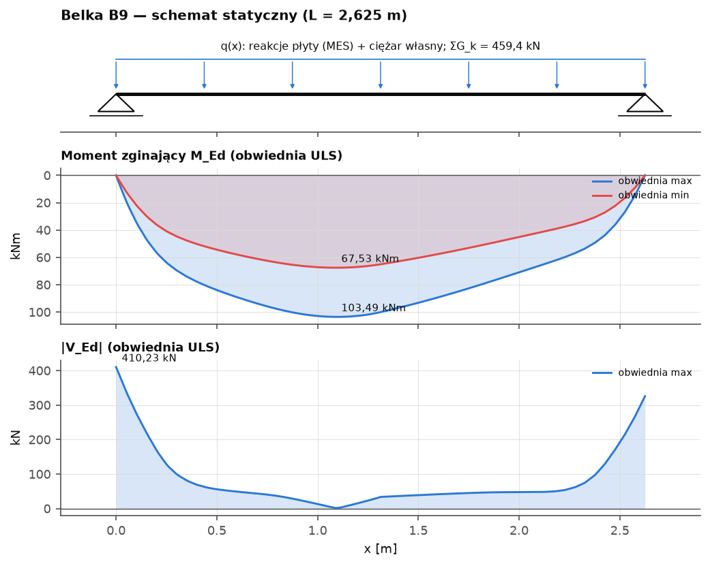

*Rys. Belka B9: schemat statyczny i obwiednie sił wewnętrznych (M dodatni — rozciąganie dołem).*

#### Zestawienie obciążeń

**Obciążenia belki (charakterystyczne, wypadkowe przypadków)**

| Przypadek | Σq·l ≈ [kN] |
|---|---|
| G | 526,4 |
| QA | 111,5 |
| QA_pA | 104,6 |
| QA_pB | 6,9 |
| H | 7,2 |
| S1 | 12,9 |
| S2 | 12,4 |
| SB2 | 0,0 |

#### Obliczenia

##### Siły wewnętrzne — B9 (obwiednia kombinacji)

- Moment przęsłowy maks.: M_Ed,max = **129,18** kNm
- Moment podporowy (min.): M_Ed,min = **0,00** kNm
- Siła poprzeczna maks.: V_Ed = **456,46** kN

##### B9 — zginanie w przęśle

- Wysokość użyteczna: d = **459** mm
- Moment względny: μ = M_Ed/(b·d²·η·f_cd) = 129,18·10⁶/(250·459²·1,0·17,86) = **0,1373** *(3.1.7(3))*
- Względna wysokość strefy ściskanej: ξ_eff = 1 − √(1 − 2μ) = 1 − √(1 − 2·0,1373) = **0,1483**
- Warunek ciągliwości: ξ_eff ≤ ξ_eff,lim = λ·ε_cu3/(ε_cu3 + f_yd/E_s) = 0,148 ≤ 0,493 = **spełniony**
- Wymagane zbrojenie rozciągane: A_s1 = ξ_eff·b·d·η·f_cd/f_yd = 0,1483·250·459·1,0·17,86/434,8 = **699** mm²
- Zbrojenie minimalne: A_s,min = max(0,26·f_ctm/f_yk·b·d; 0,0013·b·d) = max(0,26·2,6/500·250·459; 0,0013·250·459) = **155** mm² *((9.1N) + NA)*
- Przyjęto dołem: 5φ14 = **7,70** cm²

| Warunek | Efekt | Nośność / limit | η | Stan | Podstawa |
|---|---|---|---|---|---|
| Zbrojenie dolne | A_s,req = 699 mm² | A_s,prov = 770 mm² | 91% | spełniony | 6.1 |

##### B9 — ścinanie

- Współczynnik skali: k = 1 + √(200/d) ≤ 2,0 = 1 + √(200/459) = **1,660**
- Stopień zbrojenia podłużnego: ρ_l = A_sl/(b_w·d) ≤ 0,02 = 770/(250·459) = **0,00671**
- Nośność na ścinanie: V_Rd,c = C_Rd,c·k·(100·ρ_l·f_ck)^(1/3)·b_w·d = 0,1286·1,660·(100·0,00671·25)^(1/3)·250·459·10⁻³ = **62,69** kN *((6.2.a); C_Rd,c = 0,18/γ_c)*
- Wartość minimalna: V_Rd,c,min = v_min·b_w·d, v_min = 0,035·k^(3/2)·f_ck^(1/2) = 0,3743·250·459·10⁻³ = **42,95** kN *((6.2.b), (6.3N))*
- Ramię sił wewnętrznych: z = 0,9·d = 0,9·459 = **413** mm
- Przyjęto nachylenie krzyżulców betonowych: cot θ = (1,0 ≤ cot θ ≤ 2,0 — NA) = **1,50** *((6.7N))*
- Nośność krzyżulców ściskanych: V_Rd,max = b_w·z·ν₁·f_cd/(cot θ + tan θ) = 250·413·0,540·17,86/(1,50 + 0,667)·10⁻³ = **459,63** kN *((6.9), ν₁ = ν (6.6N))*
- Rozstaw z warunku nośności: s = A_sw·z·f_ywd·cot θ/V_Ed = 100,5·413·434,8·1,50/(456,46·10³) = **59** mm *((6.8))*
- Rozstaw maksymalny: s_l,max = 0,75·d = 0,75·459 = **344** mm *((9.6N))*
- Stopień zbrojenia minimalny: ρ_w,min = 0,08·√f_ck/f_yk → s ≤ A_sw/(ρ_w,min·b_w) = 100,5/(0,00080·250) = **503** mm *((9.5N))*
- Przyjęto strzemiona: φ8 2-cięte co s = **50** mm
- Nośność zbrojenia na ścinanie: V_Rd,s = A_sw/s·z·f_ywd·cot θ = 100,5/50·413·434,8·1,50·10⁻³ = **541,69** kN

| Warunek | Efekt | Nośność / limit | η | Stan | Podstawa |
|---|---|---|---|---|---|
| Nośność krzyżulców betonowych | V_Ed = 456,46 kN | V_Rd,max = 459,63 kN | 99% | spełniony | (6.9) |
| Nośność strzemion | V_Ed = 456,46 kN | V_Rd,s = 541,69 kN | 84% | spełniony | (6.8) |

##### B9 — ugięcie

- Stopień zbrojenia wymagany: ρ = A_s,req/(b·d) = 699/(250·459) = **0,00609**
- Wartość odniesienia: ρ₀ = √f_ck·10⁻³ = √25·10⁻³ = **0,00500**
- Graniczne l/d (ρ > ρ₀): K·[11 + 1,5·√f_ck·ρ₀/(ρ − ρ') + 1/12·√f_ck·√(ρ'/ρ₀)] = **17,2** *((7.16b))*
- Mnożnik od naprężeń w stali: 310/σ_s ≈ 500/(f_yk·A_s,req/A_s,prov) ≤ 1,5 = 500/(500·699/770) = **1,101** *((7.17))*
- Smukłość rzeczywista: l_eff/d = 2,62/0,459 = **5,7**
- *Obliczenie ugięcia (7.4.3)*
- Efektywny moduł sprężystości: E_c,eff = E_cm/(1 + φ) = 31000/(1 + 2,5) = **8857** MPa *((7.20))*
- Stosunek modułów: α_e = E_s/E_c,eff = 200000/8857 = **22,58**
- Przekrój niezarysowany: x_I; I_I = **275,5 mm; 3270,7·10⁶ mm⁴**
- Przekrój zarysowany: x_II; I_II = **192,5 mm; 1828,8·10⁶ mm⁴**
- Moment rysujący: M_cr = f_ctm·I_I/(h − x_I) = 2,6·3270,7·10⁶/(500 − 275,5) = **37,88** kNm
- Współczynnik rozkładu: ζ = 1 − β·(M_cr/M_qp)², β = 0,5 = 1 − 0,5·(37,88/87,52)² = **0,906** *((7.19))*
- Ugięcie od obciążeń (quasi-stała): w_q = ζ·w_II + (1 − ζ)·w_I = 0,906·3,99 + 0,094·2,23 = **3,83** mm *((7.18))*
- Ugięcie od skurczu: w_cs = k·(1/r_cs)·l², 1/r_cs = ε_cs·α_e·S/I = 0,125·0,955·10⁻⁶·2625² = **0,82** mm *((7.21))*
- Ugięcie całkowite: w = w_q + w_cs = 3,83 + 0,82 = **4,65** mm
- Ugięcie dopuszczalne: w_lim = L/250 = 2625/250 = **10,5** mm *(7.4.1(4))*

| Warunek | Efekt | Nośność / limit | η | Stan | Podstawa |
|---|---|---|---|---|---|
| Ugięcie — graniczna smukłość l/d (7.4.2) | l/d = 5,7  | (l/d)_lim = 18,9  | 30% | spełniony | (7.16), tabl. 7.4N |

> l/d spełnione — obliczenie (7.4.3) informacyjnie: w = 4,6 mm ≤? 10,5 mm.

##### B9 — rysy

- Naprężenie w stali (quasi-stała, przekrój zarysowany, α_e = 15): σ_s = α_e·M_qp·(d − x_II)/I_II = **281** MPa
- Maksymalna średnica (w_max = 0,4 mm): φ_s = φ*_s·(f_ct,eff/2,9)·k_c·h_cr/(2(h − d)) = 15,9·(2,6/2,9)·0,4·250/(2·41) = **17,3** mm *(tabl. 7.2N, (7.6N))*
- Maksymalny rozstaw prętów: s_max = (σ_s = 281 MPa) = **198** mm *(tabl. 7.3N)*

| Warunek | Efekt | Nośność / limit | η | Stan | Podstawa |
|---|---|---|---|---|---|
| Rysy: średnica prętów (tabl. 7.2N) | φ = 14 mm | φ_s,max = 17 mm | 81% | spełniony | 7.3.3(2) |

#### Wnioski

**Przyjęto:** Belka B9: 25×50 cm, C25/30; dołem 5φ14, górą 2φ12, strzemiona φ8 co 5 cm (2-cięte).  

### Poz. 4.6 — Belka B7

Element modelu: `B7` · maks. wykorzystanie nośności η = 99% · wszystkie warunki spełnione

#### Opis i schemat statyczny

Belka żelbetowa b × h = 25 × 85 cm, oś (12,50, 9,38) → (17,95, 9,38), L = 5,450 m; podpory: ściana S0-04 (x = 0,00 m), ściana S0-04 (x = 5,45 m). Obciążenie: reakcje płyty z MES (rozkład wzdłuż belki) + ciężar własny.

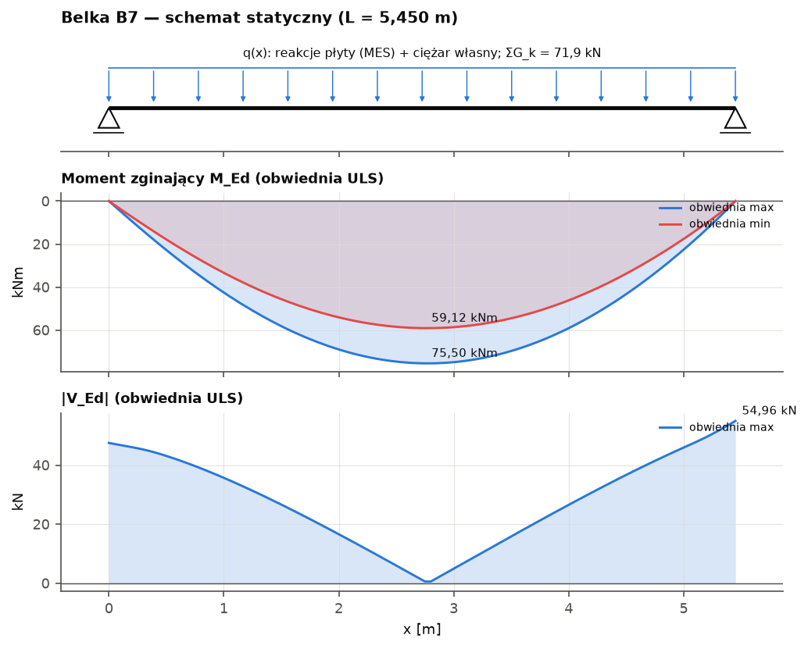

*Rys. Belka B7: schemat statyczny i obwiednie sił wewnętrznych (M dodatni — rozciąganie dołem).*

#### Zestawienie obciążeń

**Obciążenia belki (charakterystyczne, wypadkowe przypadków)**

| Przypadek | Σq·l ≈ [kN] |
|---|---|
| G | 71,3 |
| QA | 0,0 |
| QA_pA | 0,1 |
| QA_pB | 0,0 |
| H | 2,3 |
| S1 | 4,2 |
| S2 | 7,1 |
| SB2 | 8,0 |

#### Obliczenia

##### Siły wewnętrzne — B7 (obwiednia kombinacji)

- Moment przęsłowy maks.: M_Ed,max = **75,50** kNm
- Moment podporowy (min.): M_Ed,min = **0,00** kNm
- Siła poprzeczna maks.: V_Ed = **54,96** kN

##### B7 — zginanie w przęśle

- Wysokość użyteczna: d = **809** mm
- Moment względny: μ = M_Ed/(b·d²·η·f_cd) = 75,50·10⁶/(250·809²·1,0·21,43) = **0,0215** *(3.1.7(3))*
- Względna wysokość strefy ściskanej: ξ_eff = 1 − √(1 − 2μ) = 1 − √(1 − 2·0,0215) = **0,0218**
- Warunek ciągliwości: ξ_eff ≤ ξ_eff,lim = λ·ε_cu3/(ε_cu3 + f_yd/E_s) = 0,022 ≤ 0,493 = **spełniony**
- Wymagane zbrojenie rozciągane: A_s1 = ξ_eff·b·d·η·f_cd/f_yd = 0,0218·250·809·1,0·21,43/434,8 = **217** mm²
- Zbrojenie minimalne: A_s,min = max(0,26·f_ctm/f_yk·b·d; 0,0013·b·d) = max(0,26·2,9/500·250·809; 0,0013·250·809) = **305** mm² *((9.1N) + NA)*
- Przyjęto dołem: 2φ14 = **3,08** cm²

| Warunek | Efekt | Nośność / limit | η | Stan | Podstawa |
|---|---|---|---|---|---|
| Zbrojenie dolne | A_s,req = 305 mm² | A_s,prov = 308 mm² | 99% | spełniony | 6.1 |

##### B7 — ścinanie

- Współczynnik skali: k = 1 + √(200/d) ≤ 2,0 = 1 + √(200/809) = **1,497**
- Stopień zbrojenia podłużnego: ρ_l = A_sl/(b_w·d) ≤ 0,02 = 308/(250·809) = **0,00152**
- Nośność na ścinanie: V_Rd,c = C_Rd,c·k·(100·ρ_l·f_ck)^(1/3)·b_w·d = 0,1286·1,497·(100·0,00152·30)^(1/3)·250·809·10⁻³ = **64,59** kN *((6.2.a); C_Rd,c = 0,18/γ_c)*
- Wartość minimalna: V_Rd,c,min = v_min·b_w·d, v_min = 0,035·k^(3/2)·f_ck^(1/2) = 0,3512·250·809·10⁻³ = **71,03** kN *((6.2.b), (6.3N))*
- Ramię sił wewnętrznych: z = 0,9·d = 0,9·809 = **728** mm
- Przyjęto nachylenie krzyżulców betonowych: cot θ = (1,0 ≤ cot θ ≤ 2,0 — NA) = **2,00** *((6.7N))*
- Nośność krzyżulców ściskanych: V_Rd,max = b_w·z·ν₁·f_cd/(cot θ + tan θ) = 250·728·0,528·21,43/(2,00 + 0,500)·10⁻³ = **823,79** kN *((6.9), ν₁ = ν (6.6N))*
- Rozstaw z warunku nośności: s = A_sw·z·f_ywd·cot θ/V_Ed = 100,5·728·434,8·2,00/(54,96·10³) = **1158** mm *((6.8))*
- Rozstaw maksymalny: s_l,max = 0,75·d = 0,75·809 = **607** mm *((9.6N))*
- Stopień zbrojenia minimalny: ρ_w,min = 0,08·√f_ck/f_yk → s ≤ A_sw/(ρ_w,min·b_w) = 100,5/(0,00088·250) = **459** mm *((9.5N))*
- Przyjęto strzemiona: φ8 2-cięte co s = **400** mm
- Nośność zbrojenia na ścinanie: V_Rd,s = A_sw/s·z·f_ywd·cot θ = 100,5/400·728·434,8·2,00·10⁻³ = **159,12** kN

| Warunek | Efekt | Nośność / limit | η | Stan | Podstawa |
|---|---|---|---|---|---|
| Nośność krzyżulców betonowych | V_Ed = 54,96 kN | V_Rd,max = 823,79 kN | 7% | spełniony | (6.9) |
| Nośność strzemion | V_Ed = 54,96 kN | V_Rd,s = 159,12 kN | 35% | spełniony | (6.8) |

> V_Ed ≤ V_Rd,c = 71,03 kN — zbrojenie poprzeczne minimalne (9.2.2(5)).

##### B7 — ugięcie

- Stopień zbrojenia wymagany: ρ = A_s,req/(b·d) = 217/(250·809) = **0,00107**
- Wartość odniesienia: ρ₀ = √f_ck·10⁻³ = √30·10⁻³ = **0,00548**
- Graniczne l/d (ρ ≤ ρ₀): K·[11 + 1,5·√f_ck·ρ₀/ρ + 3,2·√f_ck·(ρ₀/ρ − 1)^(3/2)] = 1,0·[11 + 1,5·5,477·5,105 + 3,2·5,477·(5,105 − 1)^1,5] = **198,7** *((7.16a))*
- Mnożnik od naprężeń w stali: 310/σ_s ≈ 500/(f_yk·A_s,req/A_s,prov) ≤ 1,5 = 500/(500·217/308) = **1,419** *((7.17))*
- Smukłość rzeczywista: l_eff/d = 5,45/0,809 = **6,7**
- *Obliczenie ugięcia (7.4.3)*
- Efektywny moduł sprężystości: E_c,eff = E_cm/(1 + φ) = 33000/(1 + 2,5) = **9429** MPa *((7.20))*
- Stosunek modułów: α_e = E_s/E_c,eff = 200000/9429 = **21,21**
- Przekrój niezarysowany: x_I; I_I = **436,4 mm; 13728,5·10⁶ mm⁴**
- Przekrój zarysowany: x_II; I_II = **181,1 mm; 3069,7·10⁶ mm⁴**
- Moment rysujący: M_cr = f_ctm·I_I/(h − x_I) = 2,9·13728,5·10⁶/(850 − 436,4) = **96,27** kNm
- Współczynnik rozkładu: ζ = 1 − β·(M_cr/M_qp)², β = 0,5 = M_qp ≤ M_cr → 0 = **0,000** *((7.19))*
- Ugięcie od obciążeń (quasi-stała): w_q = ζ·w_II + (1 − ζ)·w_I = 0,000·5,59 + 1,000·1,25 = **1,25** mm *((7.18))*
- Ugięcie od skurczu: w_cs = k·(1/r_cs)·l², 1/r_cs = ε_cs·α_e·S/I = 0,125·0,071·10⁻⁶·5450² = **0,26** mm *((7.21))*
- Ugięcie całkowite: w = w_q + w_cs = 1,25 + 0,26 = **1,51** mm
- Ugięcie dopuszczalne: w_lim = L/250 = 5450/250 = **21,8** mm *(7.4.1(4))*

| Warunek | Efekt | Nośność / limit | η | Stan | Podstawa |
|---|---|---|---|---|---|
| Ugięcie — graniczna smukłość l/d (7.4.2) | l/d = 6,7  | (l/d)_lim = 281,9  | 2% | spełniony | (7.16), tabl. 7.4N |

> l/d spełnione — obliczenie (7.4.3) informacyjnie: w = 1,5 mm ≤? 21,8 mm.

##### B7 — rysy

- Naprężenie w stali (quasi-stała, przekrój zarysowany, α_e = 15): σ_s = α_e·M_qp·(d − x_II)/I_II = **227** MPa
- Maksymalna średnica (w_max = 0,4 mm): φ_s = φ*_s·(f_ct,eff/2,9)·k_c·h_cr/(2(h − d)) = 24,0·(2,9/2,9)·0,4·425/(2·41) = **49,9** mm *(tabl. 7.2N, (7.6N))*
- Maksymalny rozstaw prętów: s_max = (σ_s = 227 MPa) = **267** mm *(tabl. 7.3N)*

| Warunek | Efekt | Nośność / limit | η | Stan | Podstawa |
|---|---|---|---|---|---|
| Rysy: średnica prętów (tabl. 7.2N) | φ = 14 mm | φ_s,max = 50 mm | 28% | spełniony | 7.3.3(2) |

#### Wnioski

**Przyjęto:** Belka B7: 25×85 cm, C30/37; dołem 2φ14, górą 2φ12, strzemiona φ8 co 40 cm (2-cięte).  

## Poz. 5 — Wieńce

### Poz. 5.1 — Wieńce pod płytą D1 (poziom 9,300 m)

Element modelu: `W-D1` · maks. wykorzystanie nośności η = 31% · wszystkie warunki spełnione

#### Opis i schemat statyczny

Wieńce żelbetowe na wszystkich ścianach nośnych pod płytą (łączna długość ≈ 50,4 m), szerokość = grubość muru, wysokość = grubość płyty; ciągłość zbrojenia w narożach (pręty narożne L, zakład l₀).

#### Obliczenia

##### Wieniec — ściąg obwodowy (l_i = 13,00 m)

- Siła w ściągu obwodowym: F_tie,per = l_i·q₁ ≤ q₂ = 13,00·10 ≤ 70 = **70,00** kN *((9.15) + NA [NZW])*
- Wymagane zbrojenie: A_s = F_tie,per/f_yk = 70,0·10³/500 = **140** mm² *(9.10.1(4))*
- Przyjęto (min. konstrukcyjne): 4φ12 = **452** mm²

| Warunek | Efekt | Nośność / limit | η | Stan | Podstawa |
|---|---|---|---|---|---|
| Ściąg obwodowy | A_s,req = 140 mm² | A_s,prov = 452 mm² | 31% | spełniony | 9.10.2.2 |

##### Zakotwienie i zakład pręta φ12 (C25/30, B500SP)

- Graniczne naprężenie przyczepności: f_bd = 2,25·η₁·η₂·f_ctd = 2,25·1,0·1,0·1,286 = **2,893** MPa *((8.2))*
- Podstawowa długość zakotwienia: l_b,rqd = (φ/4)·(σ_sd/f_bd) = (12/4)·(434,8/2,893) = **451** mm *((8.3))*
- Obliczeniowa długość zakotwienia: l_bd = α₁·α₂·α₃·α₄·α₅·l_b,rqd ≥ l_b,min = 1,00·451 ≥ 135 = **451** mm *((8.4), (8.6))*
- Długość zakładu (50% prętów łączonych w przekroju): l₀ = α₆·l_b,rqd ≥ l₀,min, α₆ = √(ρ₁/25) = 1,41·451 ≥ 200 = **638** mm *((8.10), (8.11), tabl. 8.3)*

#### Wnioski

**Przyjęto:** Wieniec: 4φ12 (B500SP), strzemiona φ6 co 25 cm, zakłady l₀ = 638 mm, beton C25/30.  

### Poz. 5.2 — Wieńce pod płytą ST2 + ST2Z + D2 + D3 (poziom 6,150 m)

Element modelu: `W-ST2_ST2Z_D2_D3` · maks. wykorzystanie nośności η = 31% · wszystkie warunki spełnione

#### Opis i schemat statyczny

Wieńce żelbetowe na wszystkich ścianach nośnych pod płytą (łączna długość ≈ 61,8 m), szerokość = grubość muru, wysokość = grubość płyty; ciągłość zbrojenia w narożach (pręty narożne L, zakład l₀).

#### Obliczenia

##### Wieniec — ściąg obwodowy (l_i = 12,00 m)

- Siła w ściągu obwodowym: F_tie,per = l_i·q₁ ≤ q₂ = 12,00·10 ≤ 70 = **70,00** kN *((9.15) + NA [NZW])*
- Wymagane zbrojenie: A_s = F_tie,per/f_yk = 70,0·10³/500 = **140** mm² *(9.10.1(4))*
- Przyjęto (min. konstrukcyjne): 4φ12 = **452** mm²

| Warunek | Efekt | Nośność / limit | η | Stan | Podstawa |
|---|---|---|---|---|---|
| Ściąg obwodowy | A_s,req = 140 mm² | A_s,prov = 452 mm² | 31% | spełniony | 9.10.2.2 |

##### Zakotwienie i zakład pręta φ12 (C25/30, B500SP)

- Graniczne naprężenie przyczepności: f_bd = 2,25·η₁·η₂·f_ctd = 2,25·1,0·1,0·1,286 = **2,893** MPa *((8.2))*
- Podstawowa długość zakotwienia: l_b,rqd = (φ/4)·(σ_sd/f_bd) = (12/4)·(434,8/2,893) = **451** mm *((8.3))*
- Obliczeniowa długość zakotwienia: l_bd = α₁·α₂·α₃·α₄·α₅·l_b,rqd ≥ l_b,min = 1,00·451 ≥ 135 = **451** mm *((8.4), (8.6))*
- Długość zakładu (50% prętów łączonych w przekroju): l₀ = α₆·l_b,rqd ≥ l₀,min, α₆ = √(ρ₁/25) = 1,41·451 ≥ 200 = **638** mm *((8.10), (8.11), tabl. 8.3)*

#### Wnioski

**Przyjęto:** Wieniec: 4φ12 (B500SP), strzemiona φ6 co 25 cm, zakłady l₀ = 638 mm, beton C25/30.  

### Poz. 5.3 — Wieńce pod płytą ST1 + D4 (poziom 3,000 m)

Element modelu: `W-ST1_D4` · maks. wykorzystanie nośności η = 31% · wszystkie warunki spełnione

#### Opis i schemat statyczny

Wieńce żelbetowe na wszystkich ścianach nośnych pod płytą (łączna długość ≈ 90,9 m), szerokość = grubość muru, wysokość = grubość płyty; ciągłość zbrojenia w narożach (pręty narożne L, zakład l₀).

#### Obliczenia

##### Wieniec — ściąg obwodowy (l_i = 12,00 m)

- Siła w ściągu obwodowym: F_tie,per = l_i·q₁ ≤ q₂ = 12,00·10 ≤ 70 = **70,00** kN *((9.15) + NA [NZW])*
- Wymagane zbrojenie: A_s = F_tie,per/f_yk = 70,0·10³/500 = **140** mm² *(9.10.1(4))*
- Przyjęto (min. konstrukcyjne): 4φ12 = **452** mm²

| Warunek | Efekt | Nośność / limit | η | Stan | Podstawa |
|---|---|---|---|---|---|
| Ściąg obwodowy | A_s,req = 140 mm² | A_s,prov = 452 mm² | 31% | spełniony | 9.10.2.2 |

##### Zakotwienie i zakład pręta φ12 (C25/30, B500SP)

- Graniczne naprężenie przyczepności: f_bd = 2,25·η₁·η₂·f_ctd = 2,25·1,0·1,0·1,286 = **2,893** MPa *((8.2))*
- Podstawowa długość zakotwienia: l_b,rqd = (φ/4)·(σ_sd/f_bd) = (12/4)·(434,8/2,893) = **451** mm *((8.3))*
- Obliczeniowa długość zakotwienia: l_bd = α₁·α₂·α₃·α₄·α₅·l_b,rqd ≥ l_b,min = 1,00·451 ≥ 135 = **451** mm *((8.4), (8.6))*
- Długość zakładu (50% prętów łączonych w przekroju): l₀ = α₆·l_b,rqd ≥ l₀,min, α₆ = √(ρ₁/25) = 1,41·451 ≥ 200 = **638** mm *((8.10), (8.11), tabl. 8.3)*

#### Wnioski

**Przyjęto:** Wieniec: 4φ12 (B500SP), strzemiona φ6 co 25 cm, zakłady l₀ = 638 mm, beton C25/30.  

## Poz. 6 — Słupy

### Poz. 6.1 — Słup SL1 (RK 120x120x8, L = 2,93 m)

Element modelu: `SL1` · maks. wykorzystanie nośności η = 1% · wszystkie warunki spełnione

#### Opis i schemat statyczny

Słup przegubowo zamocowany na obu końcach (układ usztywniony płytą połączoną z budynkiem) — L_cr = L = 2,93 m [ZAŁ]; siła osiowa z reakcji płyty/belek; wiatr na trzon słupa (c_f ≈ 1,0) jako obciążenie towarzyszące.

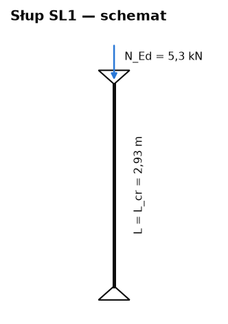

*Rys. Słup SL1: schemat statyczny (przegubowo-przesuwny, układ usztywniony).*

#### Zestawienie obciążeń

| Przypadek | N_k [kN] |
|---|---|
| G | 2,51 |
| QA | 0,62 |
| QA_pA | 0,62 |
| QA_pB | 0,00 |
| H | 0,00 |
| S1 | 0,00 |
| S2 | 0,00 |
| SB2 | 0,00 |

#### Obliczenia

##### SL1 — nośność

- Przekrój: RK 120x120x8 = **A = 33,64 cm², I_y = 676,8 cm⁴, I_z = 676,8 cm⁴, W_pl,y = 137,8 cm³, i_y = 4,49 cm, i_z = 4,49 cm, masa 26,4 kg/m**
- Stal: S355 = **f_y = 355 MPa, E = 210 GPa**
- Ścianka 120 mm: c/t = (b − 3t)/t = (120 − 3·8,0)/8,0 = **12,0** *(klasa 1: ≤ 33ε = 26,8)*
- Ścianka 120 mm: c/t = (b − 3t)/t = (120 − 3·8,0)/8,0 = **12,0** *(klasa 1: ≤ 33ε = 26,8)*
- Klasa przekroju: **1**
- Nośność przekroju przy ściskaniu: N_c,Rd = A·f_y/γ_M0 = 3364·355/1,00·10⁻³ = **1194,19** kN *((6.10))*
- Smukłość względna (oś y, L_cr = 2,93 m): λ̄_y = √(A·f_y/N_cr), N_cr = π²·E·I_y/L_cr² = √(1194,2/1633,9) = **0,855** *((6.50))*
- Współczynnik wyboczeniowy (krzywa c): χ_y = α = 0,49 = **0,628** *((6.49), tabl. 6.2)*
- Smukłość względna (oś z, L_cr = 2,93 m): λ̄_z = √(A·f_y/N_cr), N_cr = π²·E·I_z/L_cr² = √(1194,2/1633,9) = **0,855** *((6.50))*
- Współczynnik wyboczeniowy (krzywa c): χ_z = α = 0,49 = **0,628** *((6.49), tabl. 6.2)*
- Nośność na wyboczenie: N_b,Rd = χ_min·A·f_y/γ_M1 = **749,66** kN *((6.47))*
- Nośność na zginanie: M_y,Rk = W·f_y = 137,8·10³·355·10⁻⁶ = **48,92** kNm *((6.13)/(6.14))*
- Współczynniki interakcji (zał. B, metoda 2): C_my; k_yy; k_zy = 0,6·k_yy = **0,95; 0,953; 0,572** *(tabl. B.1, B.3)*
- Warunek (6.61): N_Ed/(χ_y·N_Rk/γ_M1) + k_yy·M_y,Ed/(M_y,Rk/γ_M1) = 0,005 + 0,953·0,08/48,92 = **0,007**
- Warunek (6.62): N_Ed/(χ_z·N_Rk/γ_M1) + k_zy·M_y,Ed/(M_y,Rk/γ_M1) = 0,005 + 0,572·0,08/48,92 = **0,006**

| Warunek | Efekt | Nośność / limit | η | Stan | Podstawa |
|---|---|---|---|---|---|
| Wyboczenie giętne | N_Ed = 4,03 kN | N_b,Rd = 749,66 kN | 1% | spełniony | (6.46) |
| Interakcja N + M (6.61) | Σ = 0,007  | 1,0 = 1,000  | 1% | spełniony | (6.61) |
| Interakcja N + M (6.62) | Σ = 0,006  | 1,0 = 1,000  | 1% | spełniony | (6.62) |

> Połączenia (blacha podstawy, kotwy, głowica) — dobór w projekcie wykonawczym; przemieszczenie poziome ≤ H/150 (R5-71) przy układzie nieusztywnionym.

#### Wnioski

**Przyjęto:** Słup RK 120x120x8 ze stali S355; N_Ed = 4,0 kN, N_b,Rd = 749,7 kN.  

### Poz. 6.2 — Słup SL2 (RK 120x120x8, L = 2,93 m)

Element modelu: `SL2` · maks. wykorzystanie nośności η = 1% · wszystkie warunki spełnione

#### Opis i schemat statyczny

Słup przegubowo zamocowany na obu końcach (układ usztywniony płytą połączoną z budynkiem) — L_cr = L = 2,93 m [ZAŁ]; siła osiowa z reakcji płyty/belek; wiatr na trzon słupa (c_f ≈ 1,0) jako obciążenie towarzyszące.

*Rys. Słup SL2: schemat statyczny (przegubowo-przesuwny, układ usztywniony).*

#### Zestawienie obciążeń

| Przypadek | N_k [kN] |
|---|---|
| G | 2,71 |
| QA | 0,52 |
| QA_pA | 0,52 |
| QA_pB | 0,00 |
| H | 0,00 |
| S1 | 0,00 |
| S2 | 0,00 |
| SB2 | 0,00 |

#### Obliczenia

##### SL2 — nośność

- Przekrój: RK 120x120x8 = **A = 33,64 cm², I_y = 676,8 cm⁴, I_z = 676,8 cm⁴, W_pl,y = 137,8 cm³, i_y = 4,49 cm, i_z = 4,49 cm, masa 26,4 kg/m**
- Stal: S355 = **f_y = 355 MPa, E = 210 GPa**
- Ścianka 120 mm: c/t = (b − 3t)/t = (120 − 3·8,0)/8,0 = **12,0** *(klasa 1: ≤ 33ε = 26,8)*
- Ścianka 120 mm: c/t = (b − 3t)/t = (120 − 3·8,0)/8,0 = **12,0** *(klasa 1: ≤ 33ε = 26,8)*
- Klasa przekroju: **1**
- Nośność przekroju przy ściskaniu: N_c,Rd = A·f_y/γ_M0 = 3364·355/1,00·10⁻³ = **1194,19** kN *((6.10))*
- Smukłość względna (oś y, L_cr = 2,93 m): λ̄_y = √(A·f_y/N_cr), N_cr = π²·E·I_y/L_cr² = √(1194,2/1633,9) = **0,855** *((6.50))*
- Współczynnik wyboczeniowy (krzywa c): χ_y = α = 0,49 = **0,628** *((6.49), tabl. 6.2)*
- Smukłość względna (oś z, L_cr = 2,93 m): λ̄_z = √(A·f_y/N_cr), N_cr = π²·E·I_z/L_cr² = √(1194,2/1633,9) = **0,855** *((6.50))*
- Współczynnik wyboczeniowy (krzywa c): χ_z = α = 0,49 = **0,628** *((6.49), tabl. 6.2)*
- Nośność na wyboczenie: N_b,Rd = χ_min·A·f_y/γ_M1 = **749,66** kN *((6.47))*
- Nośność na zginanie: M_y,Rk = W·f_y = 137,8·10³·355·10⁻⁶ = **48,92** kNm *((6.13)/(6.14))*
- Współczynniki interakcji (zał. B, metoda 2): C_my; k_yy; k_zy = 0,6·k_yy = **0,95; 0,953; 0,572** *(tabl. B.1, B.3)*
- Warunek (6.61): N_Ed/(χ_y·N_Rk/γ_M1) + k_yy·M_y,Ed/(M_y,Rk/γ_M1) = 0,006 + 0,953·0,08/48,92 = **0,007**
- Warunek (6.62): N_Ed/(χ_z·N_Rk/γ_M1) + k_zy·M_y,Ed/(M_y,Rk/γ_M1) = 0,006 + 0,572·0,08/48,92 = **0,007**

| Warunek | Efekt | Nośność / limit | η | Stan | Podstawa |
|---|---|---|---|---|---|
| Wyboczenie giętne | N_Ed = 4,21 kN | N_b,Rd = 749,66 kN | 1% | spełniony | (6.46) |
| Interakcja N + M (6.61) | Σ = 0,007  | 1,0 = 1,000  | 1% | spełniony | (6.61) |
| Interakcja N + M (6.62) | Σ = 0,007  | 1,0 = 1,000  | 1% | spełniony | (6.62) |

> Połączenia (blacha podstawy, kotwy, głowica) — dobór w projekcie wykonawczym; przemieszczenie poziome ≤ H/150 (R5-71) przy układzie nieusztywnionym.

#### Wnioski

**Przyjęto:** Słup RK 120x120x8 ze stali S355; N_Ed = 4,2 kN, N_b,Rd = 749,7 kN.  

### Poz. 6.3 — Słup SL3 (RK 120x120x8, L = 2,93 m)

Element modelu: `SL3` · maks. wykorzystanie nośności η = 1% · wszystkie warunki spełnione

#### Opis i schemat statyczny

Słup przegubowo zamocowany na obu końcach (układ usztywniony płytą połączoną z budynkiem) — L_cr = L = 2,93 m [ZAŁ]; siła osiowa z reakcji płyty/belek; wiatr na trzon słupa (c_f ≈ 1,0) jako obciążenie towarzyszące.

*Rys. Słup SL3: schemat statyczny (przegubowo-przesuwny, układ usztywniony).*

#### Zestawienie obciążeń

| Przypadek | N_k [kN] |
|---|---|
| G | 2,40 |
| QA | 0,60 |
| QA_pA | 0,60 |
| QA_pB | 0,00 |
| H | 0,00 |
| S1 | 0,00 |
| S2 | 0,00 |
| SB2 | 0,00 |

#### Obliczenia

##### SL3 — nośność

- Przekrój: RK 120x120x8 = **A = 33,64 cm², I_y = 676,8 cm⁴, I_z = 676,8 cm⁴, W_pl,y = 137,8 cm³, i_y = 4,49 cm, i_z = 4,49 cm, masa 26,4 kg/m**
- Stal: S355 = **f_y = 355 MPa, E = 210 GPa**
- Ścianka 120 mm: c/t = (b − 3t)/t = (120 − 3·8,0)/8,0 = **12,0** *(klasa 1: ≤ 33ε = 26,8)*
- Ścianka 120 mm: c/t = (b − 3t)/t = (120 − 3·8,0)/8,0 = **12,0** *(klasa 1: ≤ 33ε = 26,8)*
- Klasa przekroju: **1**
- Nośność przekroju przy ściskaniu: N_c,Rd = A·f_y/γ_M0 = 3364·355/1,00·10⁻³ = **1194,19** kN *((6.10))*
- Smukłość względna (oś y, L_cr = 2,93 m): λ̄_y = √(A·f_y/N_cr), N_cr = π²·E·I_y/L_cr² = √(1194,2/1633,9) = **0,855** *((6.50))*
- Współczynnik wyboczeniowy (krzywa c): χ_y = α = 0,49 = **0,628** *((6.49), tabl. 6.2)*
- Smukłość względna (oś z, L_cr = 2,93 m): λ̄_z = √(A·f_y/N_cr), N_cr = π²·E·I_z/L_cr² = √(1194,2/1633,9) = **0,855** *((6.50))*
- Współczynnik wyboczeniowy (krzywa c): χ_z = α = 0,49 = **0,628** *((6.49), tabl. 6.2)*
- Nośność na wyboczenie: N_b,Rd = χ_min·A·f_y/γ_M1 = **749,66** kN *((6.47))*
- Nośność na zginanie: M_y,Rk = W·f_y = 137,8·10³·355·10⁻⁶ = **48,92** kNm *((6.13)/(6.14))*
- Współczynniki interakcji (zał. B, metoda 2): C_my; k_yy; k_zy = 0,6·k_yy = **0,95; 0,953; 0,572** *(tabl. B.1, B.3)*
- Warunek (6.61): N_Ed/(χ_y·N_Rk/γ_M1) + k_yy·M_y,Ed/(M_y,Rk/γ_M1) = 0,005 + 0,953·0,08/48,92 = **0,007**
- Warunek (6.62): N_Ed/(χ_z·N_Rk/γ_M1) + k_zy·M_y,Ed/(M_y,Rk/γ_M1) = 0,005 + 0,572·0,08/48,92 = **0,006**

| Warunek | Efekt | Nośność / limit | η | Stan | Podstawa |
|---|---|---|---|---|---|
| Wyboczenie giętne | N_Ed = 3,87 kN | N_b,Rd = 749,66 kN | 1% | spełniony | (6.46) |
| Interakcja N + M (6.61) | Σ = 0,007  | 1,0 = 1,000  | 1% | spełniony | (6.61) |
| Interakcja N + M (6.62) | Σ = 0,006  | 1,0 = 1,000  | 1% | spełniony | (6.62) |

> Połączenia (blacha podstawy, kotwy, głowica) — dobór w projekcie wykonawczym; przemieszczenie poziome ≤ H/150 (R5-71) przy układzie nieusztywnionym.

#### Wnioski

**Przyjęto:** Słup RK 120x120x8 ze stali S355; N_Ed = 3,9 kN, N_b,Rd = 749,7 kN.  

### Poz. 6.4 — Słup SL4 (RK 120x120x8, L = 2,93 m)

Element modelu: `SL4` · maks. wykorzystanie nośności η = 1% · wszystkie warunki spełnione

#### Opis i schemat statyczny

Słup przegubowo zamocowany na obu końcach (układ usztywniony płytą połączoną z budynkiem) — L_cr = L = 2,93 m [ZAŁ]; siła osiowa z reakcji płyty/belek; wiatr na trzon słupa (c_f ≈ 1,0) jako obciążenie towarzyszące.

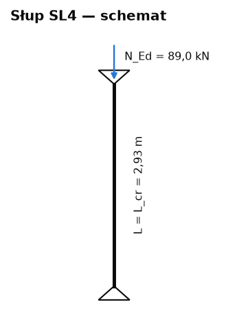

*Rys. Słup SL4: schemat statyczny (przegubowo-przesuwny, układ usztywniony).*

#### Zestawienie obciążeń

| Przypadek | N_k [kN] |
|---|---|
| G | 2,23 |
| QA | 0,55 |
| QA_pA | 0,56 |
| QA_pB | 0,00 |
| H | 0,00 |
| S1 | 0,00 |
| S2 | 0,00 |
| SB2 | 0,00 |

#### Obliczenia

##### SL4 — nośność

- Przekrój: RK 120x120x8 = **A = 33,64 cm², I_y = 676,8 cm⁴, I_z = 676,8 cm⁴, W_pl,y = 137,8 cm³, i_y = 4,49 cm, i_z = 4,49 cm, masa 26,4 kg/m**
- Stal: S355 = **f_y = 355 MPa, E = 210 GPa**
- Ścianka 120 mm: c/t = (b − 3t)/t = (120 − 3·8,0)/8,0 = **12,0** *(klasa 1: ≤ 33ε = 26,8)*
- Ścianka 120 mm: c/t = (b − 3t)/t = (120 − 3·8,0)/8,0 = **12,0** *(klasa 1: ≤ 33ε = 26,8)*
- Klasa przekroju: **1**
- Nośność przekroju przy ściskaniu: N_c,Rd = A·f_y/γ_M0 = 3364·355/1,00·10⁻³ = **1194,19** kN *((6.10))*
- Smukłość względna (oś y, L_cr = 2,93 m): λ̄_y = √(A·f_y/N_cr), N_cr = π²·E·I_y/L_cr² = √(1194,2/1633,9) = **0,855** *((6.50))*
- Współczynnik wyboczeniowy (krzywa c): χ_y = α = 0,49 = **0,628** *((6.49), tabl. 6.2)*
- Smukłość względna (oś z, L_cr = 2,93 m): λ̄_z = √(A·f_y/N_cr), N_cr = π²·E·I_z/L_cr² = √(1194,2/1633,9) = **0,855** *((6.50))*
- Współczynnik wyboczeniowy (krzywa c): χ_z = α = 0,49 = **0,628** *((6.49), tabl. 6.2)*
- Nośność na wyboczenie: N_b,Rd = χ_min·A·f_y/γ_M1 = **749,66** kN *((6.47))*
- Nośność na zginanie: M_y,Rk = W·f_y = 137,8·10³·355·10⁻⁶ = **48,92** kNm *((6.13)/(6.14))*
- Współczynniki interakcji (zał. B, metoda 2): C_my; k_yy; k_zy = 0,6·k_yy = **0,95; 0,953; 0,572** *(tabl. B.1, B.3)*
- Warunek (6.61): N_Ed/(χ_y·N_Rk/γ_M1) + k_yy·M_y,Ed/(M_y,Rk/γ_M1) = 0,005 + 0,953·0,08/48,92 = **0,006**
- Warunek (6.62): N_Ed/(χ_z·N_Rk/γ_M1) + k_zy·M_y,Ed/(M_y,Rk/γ_M1) = 0,005 + 0,572·0,08/48,92 = **0,006**

| Warunek | Efekt | Nośność / limit | η | Stan | Podstawa |
|---|---|---|---|---|---|
| Wyboczenie giętne | N_Ed = 3,59 kN | N_b,Rd = 749,66 kN | 0% | spełniony | (6.46) |
| Interakcja N + M (6.61) | Σ = 0,006  | 1,0 = 1,000  | 1% | spełniony | (6.61) |
| Interakcja N + M (6.62) | Σ = 0,006  | 1,0 = 1,000  | 1% | spełniony | (6.62) |

> Połączenia (blacha podstawy, kotwy, głowica) — dobór w projekcie wykonawczym; przemieszczenie poziome ≤ H/150 (R5-71) przy układzie nieusztywnionym.

#### Wnioski

**Przyjęto:** Słup RK 120x120x8 ze stali S355; N_Ed = 3,6 kN, N_b,Rd = 749,7 kN.  

### Poz. 6.5 — Słup SL5 (RK 100x100x6, L = 1,50 m)

Element modelu: `SL5` · maks. wykorzystanie nośności η = 12% · wszystkie warunki spełnione

#### Opis i schemat statyczny

Słup przegubowo zamocowany na obu końcach (układ usztywniony płytą połączoną z budynkiem) — L_cr = L = 1,50 m [ZAŁ]; siła osiowa z reakcji płyty/belek; wiatr na trzon słupa (c_f ≈ 1,0) jako obciążenie towarzyszące.

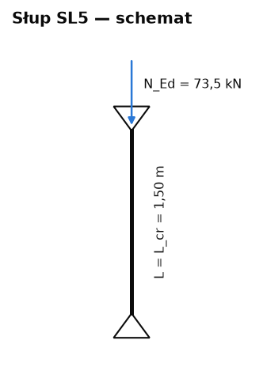

*Rys. Słup SL5: schemat statyczny (przegubowo-przesuwny, układ usztywniony).*

#### Zestawienie obciążeń

| Przypadek | N_k [kN] |
|---|---|
| G | 47,14 |
| QA | 9,36 |
| QA_pA | 9,37 |
| QA_pB | 0,00 |
| H | 0,00 |
| S1 | 0,00 |
| S2 | 0,00 |
| SB2 | 0,00 |

#### Obliczenia

##### SL5 — nośność

- Przekrój: RK 100x100x6 = **A = 21,63 cm², I_y = 311,4 cm⁴, I_z = 311,4 cm⁴, W_pl,y = 75,1 cm³, i_y = 3,79 cm, i_z = 3,79 cm, masa 17,0 kg/m**
- Stal: S355 = **f_y = 355 MPa, E = 210 GPa**
- Ścianka 100 mm: c/t = (b − 3t)/t = (100 − 3·6,0)/6,0 = **13,7** *(klasa 1: ≤ 33ε = 26,8)*
- Ścianka 100 mm: c/t = (b − 3t)/t = (100 − 3·6,0)/6,0 = **13,7** *(klasa 1: ≤ 33ε = 26,8)*
- Klasa przekroju: **1**
- Nośność przekroju przy ściskaniu: N_c,Rd = A·f_y/γ_M0 = 2163·355/1,00·10⁻³ = **767,92** kN *((6.10))*
- Smukłość względna (oś y, L_cr = 1,50 m): λ̄_y = √(A·f_y/N_cr), N_cr = π²·E·I_y/L_cr² = √(767,9/2868,9) = **0,517** *((6.50))*
- Współczynnik wyboczeniowy (krzywa c): χ_y = α = 0,49 = **0,833** *((6.49), tabl. 6.2)*
- Smukłość względna (oś z, L_cr = 1,50 m): λ̄_z = √(A·f_y/N_cr), N_cr = π²·E·I_z/L_cr² = √(767,9/2868,9) = **0,517** *((6.50))*
- Współczynnik wyboczeniowy (krzywa c): χ_z = α = 0,49 = **0,833** *((6.49), tabl. 6.2)*
- Nośność na wyboczenie: N_b,Rd = χ_min·A·f_y/γ_M1 = **639,85** kN *((6.47))*
- Nośność na zginanie: M_y,Rk = W·f_y = 75,1·10³·355·10⁻⁶ = **26,66** kNm *((6.13)/(6.14))*
- Współczynniki interakcji (zał. B, metoda 2): C_my; k_yy; k_zy = 0,6·k_yy = **0,95; 0,985; 0,591** *(tabl. B.1, B.3)*
- Warunek (6.61): N_Ed/(χ_y·N_Rk/γ_M1) + k_yy·M_y,Ed/(M_y,Rk/γ_M1) = 0,115 + 0,985·0,02/26,66 = **0,115**
- Warunek (6.62): N_Ed/(χ_z·N_Rk/γ_M1) + k_zy·M_y,Ed/(M_y,Rk/γ_M1) = 0,115 + 0,591·0,02/26,66 = **0,115**

| Warunek | Efekt | Nośność / limit | η | Stan | Podstawa |
|---|---|---|---|---|---|
| Wyboczenie giętne | N_Ed = 73,47 kN | N_b,Rd = 639,85 kN | 11% | spełniony | (6.46) |
| Interakcja N + M (6.61) | Σ = 0,115  | 1,0 = 1,000  | 12% | spełniony | (6.61) |
| Interakcja N + M (6.62) | Σ = 0,115  | 1,0 = 1,000  | 12% | spełniony | (6.62) |

> Połączenia (blacha podstawy, kotwy, głowica) — dobór w projekcie wykonawczym; przemieszczenie poziome ≤ H/150 (R5-71) przy układzie nieusztywnionym.

#### Wnioski

**Przyjęto:** Słup RK 100x100x6 ze stali S355; N_Ed = 73,5 kN, N_b,Rd = 639,9 kN.  

### Poz. 6.6 — Słup SL6 (RK 100x100x6, L = 1,50 m)

Element modelu: `SL6` · maks. wykorzystanie nośności η = 10% · wszystkie warunki spełnione

#### Opis i schemat statyczny

Słup przegubowo zamocowany na obu końcach (układ usztywniony płytą połączoną z budynkiem) — L_cr = L = 1,50 m [ZAŁ]; siła osiowa z reakcji płyty/belek; wiatr na trzon słupa (c_f ≈ 1,0) jako obciążenie towarzyszące.

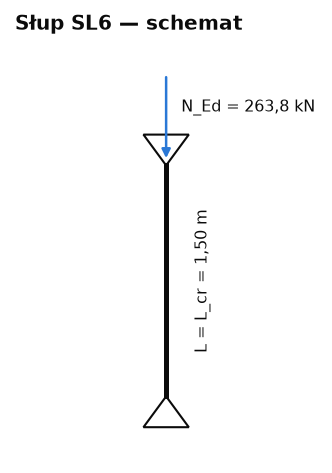

*Rys. Słup SL6: schemat statyczny (przegubowo-przesuwny, układ usztywniony).*

#### Zestawienie obciążeń

| Przypadek | N_k [kN] |
|---|---|
| G | 42,37 |
| QA | 8,89 |
| QA_pA | 8,90 |
| QA_pB | 0,00 |
| H | 0,00 |
| S1 | 0,00 |
| S2 | 0,00 |
| SB2 | 0,00 |

#### Obliczenia

##### SL6 — nośność

- Przekrój: RK 100x100x6 = **A = 21,63 cm², I_y = 311,4 cm⁴, I_z = 311,4 cm⁴, W_pl,y = 75,1 cm³, i_y = 3,79 cm, i_z = 3,79 cm, masa 17,0 kg/m**
- Stal: S355 = **f_y = 355 MPa, E = 210 GPa**
- Ścianka 100 mm: c/t = (b − 3t)/t = (100 − 3·6,0)/6,0 = **13,7** *(klasa 1: ≤ 33ε = 26,8)*
- Ścianka 100 mm: c/t = (b − 3t)/t = (100 − 3·6,0)/6,0 = **13,7** *(klasa 1: ≤ 33ε = 26,8)*
- Klasa przekroju: **1**
- Nośność przekroju przy ściskaniu: N_c,Rd = A·f_y/γ_M0 = 2163·355/1,00·10⁻³ = **767,92** kN *((6.10))*
- Smukłość względna (oś y, L_cr = 1,50 m): λ̄_y = √(A·f_y/N_cr), N_cr = π²·E·I_y/L_cr² = √(767,9/2868,9) = **0,517** *((6.50))*
- Współczynnik wyboczeniowy (krzywa c): χ_y = α = 0,49 = **0,833** *((6.49), tabl. 6.2)*
- Smukłość względna (oś z, L_cr = 1,50 m): λ̄_z = √(A·f_y/N_cr), N_cr = π²·E·I_z/L_cr² = √(767,9/2868,9) = **0,517** *((6.50))*
- Współczynnik wyboczeniowy (krzywa c): χ_z = α = 0,49 = **0,833** *((6.49), tabl. 6.2)*
- Nośność na wyboczenie: N_b,Rd = χ_min·A·f_y/γ_M1 = **639,85** kN *((6.47))*
- Nośność na zginanie: M_y,Rk = W·f_y = 75,1·10³·355·10⁻⁶ = **26,66** kNm *((6.13)/(6.14))*
- Współczynniki interakcji (zał. B, metoda 2): C_my; k_yy; k_zy = 0,6·k_yy = **0,95; 0,981; 0,589** *(tabl. B.1, B.3)*
- Warunek (6.61): N_Ed/(χ_y·N_Rk/γ_M1) + k_yy·M_y,Ed/(M_y,Rk/γ_M1) = 0,104 + 0,981·0,02/26,66 = **0,105**
- Warunek (6.62): N_Ed/(χ_z·N_Rk/γ_M1) + k_zy·M_y,Ed/(M_y,Rk/γ_M1) = 0,104 + 0,589·0,02/26,66 = **0,104**

| Warunek | Efekt | Nośność / limit | η | Stan | Podstawa |
|---|---|---|---|---|---|
| Wyboczenie giętne | N_Ed = 66,54 kN | N_b,Rd = 639,85 kN | 10% | spełniony | (6.46) |
| Interakcja N + M (6.61) | Σ = 0,105  | 1,0 = 1,000  | 10% | spełniony | (6.61) |
| Interakcja N + M (6.62) | Σ = 0,104  | 1,0 = 1,000  | 10% | spełniony | (6.62) |

> Połączenia (blacha podstawy, kotwy, głowica) — dobór w projekcie wykonawczym; przemieszczenie poziome ≤ H/150 (R5-71) przy układzie nieusztywnionym.

#### Wnioski

**Przyjęto:** Słup RK 100x100x6 ze stali S355; N_Ed = 66,5 kN, N_b,Rd = 639,9 kN.  

### Poz. 6.7 — Słup SL7 (150x1000, L = 1,50 m)

Element modelu: `SL7` · maks. wykorzystanie nośności η = 0% · wszystkie warunki spełnione

> Brak obciążeń przypisanych do słupa (nie podpiera płyty ani belki w modelu).
> nie rozpoznano przekroju: '150x1000' (obsługiwane: IPE/HEA/HEB n, RK HxBxt, RO Dxt, PROST bxh)

### Poz. 6.8 — Słup SL8 (150x1000, L = 1,50 m)

Element modelu: `SL8` · maks. wykorzystanie nośności η = 0% · wszystkie warunki spełnione

> Brak obciążeń przypisanych do słupa (nie podpiera płyty ani belki w modelu).
> nie rozpoznano przekroju: '150x1000' (obsługiwane: IPE/HEA/HEB n, RK HxBxt, RO Dxt, PROST bxh)

## Poz. 7 — Ściany murowe

### Poz. 7.1 — Ściana S2-01 (P2, zewnętrzna nośna)

Element modelu: `S2-01` · maks. wykorzystanie nośności η = 45% · wszystkie warunki spełnione

#### Opis i schemat statyczny

Ściana gr. konstrukcyjnej t = 18 cm, długość osi 13,00 m, wysokość h = 2,930 m (z 6,150 do 9,080); materiał: Bloczek wapienno-piaskowy (silikat) 18 cm, kl. 20, gr. 1, na zaprawie cienkowarstwowej. Otwory: O2-01 (3,00 m), O2-02 (1,20 m), O2-03 (2,40 m).

Sprawdzono 4 odcinków (filarki ≤ 2 m między otworami — siła całkowita; dłuższe pasma — maks. średnia krocząca 1 m) dla 14 kombinacji; poniżej przypadek miarodajny. Mimośród reakcji stropu e = t/6 (zewn.) / 0,3·t/6 (wewn., niesymetria) [UPR]; wiatr jako moment w połowie wysokości w·h²/8.

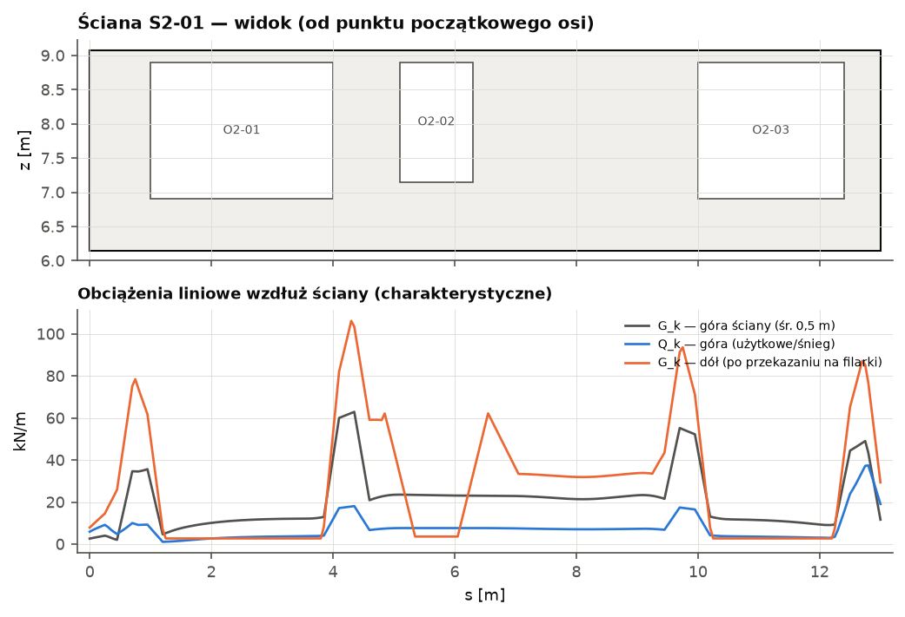

*Rys. Ściana S2-01: widok z otworami i rozkład obciążeń charakterystycznych wzdłuż osi.*

#### Zestawienie obciążeń

**Ciężar ściany — SZ2 — Ściana zewnętrzna bryły A (P2) za lamelami: silikat 18 + wełna fasadowa 20 cm + membrana UV-stabilna (czarna); szczelina wentylowana ok. 11 cm i lamele na ruszcie — element `lamele` (U ≈ 0,16)**

| Warstwa | Obliczenie | g_k [kN/m²] | γ_G (6.10a) | g_d [kN/m²] | ξγ_G (6.10b) | g_d [kN/m²] |
|---|---|---|---|---|---|---|
| Tynk gipsowy maszynowy 1,5 cm | 1,5 cm × 11,77 kN/m³ | 0,177 | 1,35 | 0,238 | 1,15 | 0,203 |
| Bloczek wapienno-piaskowy (silikat) 18 cm, kl. 20, gr. 1, na zaprawie cienkowarstwowej | 18,0 cm × 18,00 kN/m³ | 3,240 | 1,35 | 4,374 | 1,15 | 3,718 |
| Wełna mineralna fasadowa (elewacja wentylowana bryły A, A1) | 20,0 cm × 0,59 kN/m³ | 0,118 | 1,35 | 0,159 | 1,15 | 0,135 |
| Membrana fasadowa wiatroizolacyjna UV-stabilna, czarna (sd ≈ 0,02 m) | 1,0 cm × 5,89 kN/m³ | 0,059 | 1,35 | 0,079 | 1,15 | 0,068 |
| **Razem g_k** |  | 3,593 |  | 4,851 |  | 4,123 |

**Obciążenia ściany (charakterystyczne)** — góra: z płyt i ścian wyżej; dół: po przekazaniu obciążeń znad otworów na filarki

| Przypadek | max q_góra [kN/m] | średnio q_dół [kN/m] | max q_dół [kN/m] |
|---|---|---|---|
| G | 66,78 | 19,10 | 99,52 |
| H | 4,26 | 0,82 | 5,67 |
| S1 | 7,67 | 1,48 | 10,21 |
| S2 | 7,67 | 1,48 | 10,21 |

#### Obliczenia

##### S2-01 — ściana (odcinek 6,30–10,00 m), 6.10 G korzystne (wiodące: W)

- Wytrzymałość charakterystyczna muru: f_k = K·f_b^0,85 = 0,60·20^0,85 = **7,66** MPa *((3.2) + NA tabl. NA.5 (K = 0,60, Ap2:2014-09))*
- Wytrzymałość obliczeniowa: f_d = f_k/γ_M = 7,66/1,7 = **4,50** MPa *(NA tabl. NA.1 (kat. I, zaprawa projektowana, klasa wykonania A))*
- Wysokość efektywna: h_ef = ρ₂·h = 0,750·2,93 = **2,198** m *((5.2), 5.5.1.2)*
- Smukłość: h_ef/t_ef = 2,198/0,180 = **12,21**
- Mimośród przypadkowy: e_init = h_ef/450 = 2198/450 = **4,9** mm *(5.5.1.1(4))*
- Mimośród na górze: e_g = M_g/N_g + e_init ≥ 0,05t = 0,67/22,3 + 0,0049 = **34,9** mm *((6.5))*
- Mimośród na dole: e_d = M_d/N_d + e_init ≥ 0,05t = 0,00/41,1 + 0,0049 = **9,0** mm *((6.5))*
- Współczynnik redukcyjny — góra: Φ_g = 1 − 2e_g/t = 1 − 2·34,9/180 = **0,612** *((6.4))*
- Współczynnik redukcyjny — dół: Φ_d = 1 − 2e_d/t = 1 − 2·9,0/180 = **0,900** *((6.4))*
- Mimośród w połowie wysokości: e_m = (M_md + M_w)/N_m + e_init = (0,34 + 1,57)/31,7 + 0,0049 = **65,0** mm *((6.7))*
- Mimośród od pełzania: e_k = 0 (h_ef/t_ef ≤ λ_c) = **0,0** mm *(6.1.2.2(2) [NZW NA])*
- Mimośród całkowity: e_mk = e_m + e_k ≥ 0,05t = **65,0** mm *((6.6))*
- Współczynnik redukcyjny w połowie wysokości: Φ_m = A₁·exp(−u²/2), A₁ = 1 − 2e_mk/t, u = (λ − 0,063)/(0,73 − 1,17e_mk/t) = λ = 0,386, A₁ = 0,278, u = 1,050 = **0,160** *(zał. G (G.1–G.4), E = K_E·f_k)*
- Nośność: N_Rd = Φ·t·f_d = (góra / środek / dół) 0,612 / 0,160 / 0,900 · 180 mm · 4,50 MPa = **496,5 / 130,0 / 729,6** kN/m *((6.2))*

| Warunek | Efekt | Nośność / limit | η | Stan | Podstawa |
|---|---|---|---|---|---|
| Smukłość ściany | h_ef/t_ef = 12,2  | 27 = 27,0  | 45% | spełniony | 5.5.1.4 |
| Nośność — przekrój górny | N_Ed = 22,35 kN/m | N_Rd = 496,47 kN/m | 5% | spełniony | (6.2), (6.4) |
| Nośność — połowa wysokości | N_Ed = 31,73 kN/m | N_Rd = 130,02 kN/m | 24% | spełniony | (6.2), zał. G |
| Nośność — przekrój dolny | N_Ed = 41,11 kN/m | N_Rd = 729,61 kN/m | 6% | spełniony | (6.2), (6.4) |

##### S2-01 — zginanie z płaszczyzny (wiatr)

- Wskaźnik wytrzymałości (1 m): Z = t²/6 = 0,180²/6 = **5400** cm³/m
- Pasmo pionowe — moment: M_Ed = w_Ed·h²/8 = 1,464·2,93²/8 = **1,571** kNm/m
- Pasmo pionowe — nośność: M_Rd = (f_xk1/γ_M + σ_d)·Z = (0,20/1,7 + 0,097)·10³·0,00540 = **1,158** kNm/m *((6.15), 6.3.1(3) [NZW f_xk1])*

> Informacyjnie (dolne oszacowanie, bez efektu przesklepienia 6.3.2): Zginanie z płaszczyzny (pasmo pionowe — dolne oszacowanie): M_Ed = 1,571 ≤? M_Rd = 1,158 kNm/m (η = 136%). Ściana obciążona pionowo — miarodajne sprawdzenie 6.1.2 z mimośrodem e_hm od wiatru.

##### S2-01 — wiatr: przesklepienie między stropami (6.3.2)

- Smukłość łuku: l_a/t = 2,93/0,180 = **16,3**
- Nośność na obciążenie poziome: q_lat,d = f_d·(t/l_a)² = 4,50·10³·(0,180/2,93)² = **17,00** kN/m² *((6.20) [NZW])*
- Obliczeniowy rozpór łuku (przenoszony przez stropy/wieńce): N_ad = 1,5·f_d·t/10 = **121,6** kN/m *((6.19) [NZW])*

| Warunek | Efekt | Nośność / limit | η | Stan | Podstawa |
|---|---|---|---|---|---|
| Obciążenie poziome — przesklepienie | W_Ed = 1,46 kN/m² | q_lat,d = 17,00 kN/m² | 9% | spełniony | PN-EN 1996-1-1 6.3.2 |

##### S2-01 — docisk pod oparciem belki (s = 0,80 m)

- Pole docisku: A_b = l_b·b = 0,250·0,180 = **0,0450** m²
- Długość efektywna w połowie wysokości: l_efm = l_b + 2·(h_c/2)·tg 30° (ograniczona a₁) = **1,771** m *(rys. 6.2)*
- Współczynnik zwiększający: β = (1 + 0,3·a₁/h_c)·(1,5 − 1,1·A_b/A_ef) = (1 + 0,3·0,68/2,93)·(1,5 − 1,1·0,141) = **1,365** *((6.10))*
- Nośność na docisk: N_Rdc = β·A_b·f_d = 1,365·0,0450·4,50·10³ = **276,68** kN *((6.9))*

| Warunek | Efekt | Nośność / limit | η | Stan | Podstawa |
|---|---|---|---|---|---|
| Docisk | N_Edc = 23,10 kN | N_Rdc = 276,68 kN | 8% | spełniony | PN-EN 1996-1-1 (6.9) |

> Dodatkowo sprawdzić ścianę w połowie wysokości pod oparciem (6.1.3(4)) — obejmuje to sprawdzenie ściany/filarka.

##### S2-01 — docisk pod oparciem belki (s = 4,20 m)

- Pole docisku: A_b = l_b·b = 0,250·0,180 = **0,0450** m²
- Długość efektywna w połowie wysokości: l_efm = l_b + 2·(h_c/2)·tg 30° (ograniczona a₁) = **1,942** m *(rys. 6.2)*
- Współczynnik zwiększający: β = (1 + 0,3·a₁/h_c)·(1,5 − 1,1·A_b/A_ef) = (1 + 0,3·4,08/2,93)·(1,5 − 1,1·0,129) = **1,500** *((6.10))*
- Nośność na docisk: N_Rdc = β·A_b·f_d = 1,500·0,0450·4,50·10³ = **304,01** kN *((6.9))*

| Warunek | Efekt | Nośność / limit | η | Stan | Podstawa |
|---|---|---|---|---|---|
| Docisk | N_Edc = 25,34 kN | N_Rdc = 304,01 kN | 8% | spełniony | PN-EN 1996-1-1 (6.9) |

> Dodatkowo sprawdzić ścianę w połowie wysokości pod oparciem (6.1.3(4)) — obejmuje to sprawdzenie ściany/filarka.

##### S2-01 — docisk pod oparciem belki (s = 9,80 m)

- Pole docisku: A_b = l_b·b = 0,250·0,180 = **0,0450** m²
- Długość efektywna w połowie wysokości: l_efm = l_b + 2·(h_c/2)·tg 30° (ograniczona a₁) = **1,942** m *(rys. 6.2)*
- Współczynnik zwiększający: β = (1 + 0,3·a₁/h_c)·(1,5 − 1,1·A_b/A_ef) = (1 + 0,3·3,07/2,93)·(1,5 − 1,1·0,129) = **1,500** *((6.10))*
- Nośność na docisk: N_Rdc = β·A_b·f_d = 1,500·0,0450·4,50·10³ = **304,01** kN *((6.9))*

| Warunek | Efekt | Nośność / limit | η | Stan | Podstawa |
|---|---|---|---|---|---|
| Docisk | N_Edc = 19,12 kN | N_Rdc = 304,01 kN | 6% | spełniony | PN-EN 1996-1-1 (6.9) |

> Dodatkowo sprawdzić ścianę w połowie wysokości pod oparciem (6.1.3(4)) — obejmuje to sprawdzenie ściany/filarka.

##### S2-01 — docisk pod oparciem belki (s = 12,60 m)

- Pole docisku: A_b = l_b·b = 0,250·0,180 = **0,0450** m²
- Długość efektywna w połowie wysokości: l_efm = l_b + 2·(h_c/2)·tg 30° (ograniczona a₁) = **1,371** m *(rys. 6.2)*
- Współczynnik zwiększający: β = (1 + 0,3·a₁/h_c)·(1,5 − 1,1·A_b/A_ef) = (1 + 0,3·0,28/2,93)·(1,5 − 1,1·0,182) = **1,297** *((6.10))*
- Nośność na docisk: N_Rdc = β·A_b·f_d = 1,297·0,0450·4,50·10³ = **262,85** kN *((6.9))*

| Warunek | Efekt | Nośność / limit | η | Stan | Podstawa |
|---|---|---|---|---|---|
| Docisk | N_Edc = 16,18 kN | N_Rdc = 262,85 kN | 6% | spełniony | PN-EN 1996-1-1 (6.9) |

> Dodatkowo sprawdzić ścianę w połowie wysokości pod oparciem (6.1.3(4)) — obejmuje to sprawdzenie ściany/filarka.

#### Wnioski

**Przyjęto:** Mur: Bloczek wapienno-piaskowy (silikat) 18 cm, kl. 20, gr. 1, na zaprawie cienkowarstwowej, f_d = 4,50 MPa (klasa wykonania A, γ_M = 1,7).  

### Poz. 7.2 — Ściana S2-02 (P2, zewnętrzna nośna)

Element modelu: `S2-02` · maks. wykorzystanie nośności η = 79% · wszystkie warunki spełnione

#### Opis i schemat statyczny

Ściana gr. konstrukcyjnej t = 18 cm, długość osi 5,12 m, wysokość h = 2,930 m (z 6,150 do 9,080); materiał: Bloczek wapienno-piaskowy (silikat) 18 cm, kl. 20, gr. 1, na zaprawie cienkowarstwowej. Otwory: O2-05 (1,20 m).

Sprawdzono 2 odcinków (filarki ≤ 2 m między otworami — siła całkowita; dłuższe pasma — maks. średnia krocząca 1 m) dla 14 kombinacji; poniżej przypadek miarodajny. Mimośród reakcji stropu e = t/6 (zewn.) / 0,3·t/6 (wewn., niesymetria) [UPR]; wiatr jako moment w połowie wysokości w·h²/8.

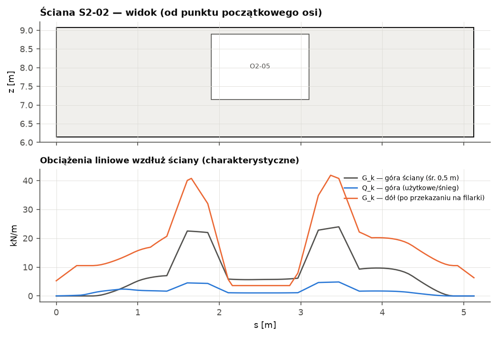

*Rys. Ściana S2-02: widok z otworami i rozkład obciążeń charakterystycznych wzdłuż osi.*

#### Zestawienie obciążeń

**Ciężar ściany — SZ2 — Ściana zewnętrzna bryły A (P2) za lamelami: silikat 18 + wełna fasadowa 20 cm + membrana UV-stabilna (czarna); szczelina wentylowana ok. 11 cm i lamele na ruszcie — element `lamele` (U ≈ 0,16)**

| Warstwa | Obliczenie | g_k [kN/m²] | γ_G (6.10a) | g_d [kN/m²] | ξγ_G (6.10b) | g_d [kN/m²] |
|---|---|---|---|---|---|---|
| Tynk gipsowy maszynowy 1,5 cm | 1,5 cm × 11,77 kN/m³ | 0,177 | 1,35 | 0,238 | 1,15 | 0,203 |
| Bloczek wapienno-piaskowy (silikat) 18 cm, kl. 20, gr. 1, na zaprawie cienkowarstwowej | 18,0 cm × 18,00 kN/m³ | 3,240 | 1,35 | 4,374 | 1,15 | 3,718 |
| Wełna mineralna fasadowa (elewacja wentylowana bryły A, A1) | 20,0 cm × 0,59 kN/m³ | 0,118 | 1,35 | 0,159 | 1,15 | 0,135 |
| Membrana fasadowa wiatroizolacyjna UV-stabilna, czarna (sd ≈ 0,02 m) | 1,0 cm × 5,89 kN/m³ | 0,059 | 1,35 | 0,079 | 1,15 | 0,068 |
| **Razem g_k** |  | 3,593 |  | 4,851 |  | 4,123 |

**Obciążenia ściany (charakterystyczne)** — góra: z płyt i ścian wyżej; dół: po przekazaniu obciążeń znad otworów na filarki

| Przypadek | max q_góra [kN/m] | średnio q_dół [kN/m] | max q_dół [kN/m] |
|---|---|---|---|
| G | 14,87 | 18,27 | 39,64 |
| H | 1,03 | 0,64 | 1,97 |
| S1 | 1,86 | 1,16 | 3,55 |
| S2 | 1,86 | 1,16 | 3,55 |

#### Obliczenia

##### S2-02 — ściana (odcinek 3,10–5,12 m), 6.10b (wiodące: W)

- Wytrzymałość charakterystyczna muru: f_k = K·f_b^0,85 = 0,60·20^0,85 = **7,66** MPa *((3.2) + NA tabl. NA.5 (K = 0,60, Ap2:2014-09))*
- Wytrzymałość obliczeniowa: f_d = f_k/γ_M = 7,66/1,7 = **4,50** MPa *(NA tabl. NA.1 (kat. I, zaprawa projektowana, klasa wykonania A))*
- Wysokość efektywna: h_ef = ρ₂·h = 0,750·2,93 = **2,198** m *((5.2), 5.5.1.2)*
- Smukłość: h_ef/t_ef = 2,198/0,180 = **12,21**
- Mimośród przypadkowy: e_init = h_ef/450 = 2198/450 = **4,9** mm *(5.5.1.1(4))*
- Mimośród na górze: e_g = M_g/N_g + e_init ≥ 0,05t = 0,42/13,9 + 0,0049 = **34,9** mm *((6.5))*
- Mimośród na dole: e_d = M_d/N_d + e_init ≥ 0,05t = 0,00/33,8 + 0,0049 = **9,0** mm *((6.5))*
- Współczynnik redukcyjny — góra: Φ_g = 1 − 2e_g/t = 1 − 2·34,9/180 = **0,612** *((6.4))*
- Współczynnik redukcyjny — dół: Φ_d = 1 − 2e_d/t = 1 − 2·9,0/180 = **0,900** *((6.4))*
- Mimośród w połowie wysokości: e_m = (M_md + M_w)/N_m + e_init = (0,21 + 1,57)/23,8 + 0,0049 = **79,5** mm *((6.7))*
- Mimośród od pełzania: e_k = 0 (h_ef/t_ef ≤ λ_c) = **0,0** mm *(6.1.2.2(2) [NZW NA])*
- Mimośród całkowity: e_mk = e_m + e_k ≥ 0,05t = **79,5** mm *((6.6))*
- Współczynnik redukcyjny w połowie wysokości: Φ_m = A₁·exp(−u²/2), A₁ = 1 − 2e_mk/t, u = (λ − 0,063)/(0,73 − 1,17e_mk/t) = λ = 0,386, A₁ = 0,117, u = 1,515 = **0,037** *(zał. G (G.1–G.4), E = K_E·f_k)*
- Nośność: N_Rd = Φ·t·f_d = (góra / środek / dół) 0,612 / 0,037 / 0,900 · 180 mm · 4,50 MPa = **496,5 / 30,1 / 729,6** kN/m *((6.2))*

| Warunek | Efekt | Nośność / limit | η | Stan | Podstawa |
|---|---|---|---|---|---|
| Smukłość ściany | h_ef/t_ef = 12,2  | 27 = 27,0  | 45% | spełniony | 5.5.1.4 |
| Nośność — przekrój górny | N_Ed = 13,88 kN/m | N_Rd = 496,47 kN/m | 3% | spełniony | (6.2), (6.4) |
| Nośność — połowa wysokości | N_Ed = 23,84 kN/m | N_Rd = 30,05 kN/m | 79% | spełniony | (6.2), zał. G |
| Nośność — przekrój dolny | N_Ed = 33,80 kN/m | N_Rd = 729,61 kN/m | 5% | spełniony | (6.2), (6.4) |

##### S2-02 — zginanie z płaszczyzny (wiatr)

- Wskaźnik wytrzymałości (1 m): Z = t²/6 = 0,180²/6 = **5400** cm³/m
- Pasmo pionowe — moment: M_Ed = w_Ed·h²/8 = 1,464·2,93²/8 = **1,571** kNm/m
- Pasmo pionowe — nośność: M_Rd = (f_xk1/γ_M + σ_d)·Z = (0,20/1,7 + 0,080)·10³·0,00540 = **1,067** kNm/m *((6.15), 6.3.1(3) [NZW f_xk1])*

> Informacyjnie (dolne oszacowanie, bez efektu przesklepienia 6.3.2): Zginanie z płaszczyzny (pasmo pionowe — dolne oszacowanie): M_Ed = 1,571 ≤? M_Rd = 1,067 kNm/m (η = 147%). Ściana obciążona pionowo — miarodajne sprawdzenie 6.1.2 z mimośrodem e_hm od wiatru.

##### S2-02 — wiatr: przesklepienie między stropami (6.3.2)

- Smukłość łuku: l_a/t = 2,93/0,180 = **16,3**
- Nośność na obciążenie poziome: q_lat,d = f_d·(t/l_a)² = 4,50·10³·(0,180/2,93)² = **17,00** kN/m² *((6.20) [NZW])*
- Obliczeniowy rozpór łuku (przenoszony przez stropy/wieńce): N_ad = 1,5·f_d·t/10 = **121,6** kN/m *((6.19) [NZW])*

| Warunek | Efekt | Nośność / limit | η | Stan | Podstawa |
|---|---|---|---|---|---|
| Obciążenie poziome — przesklepienie | W_Ed = 1,46 kN/m² | q_lat,d = 17,00 kN/m² | 9% | spełniony | PN-EN 1996-1-1 6.3.2 |

#### Wnioski

**Przyjęto:** Mur: Bloczek wapienno-piaskowy (silikat) 18 cm, kl. 20, gr. 1, na zaprawie cienkowarstwowej, f_d = 4,50 MPa (klasa wykonania A, γ_M = 1,7).  

### Poz. 7.3 — Ściana S2-03 (P2, zewnętrzna nośna)

Element modelu: `S2-03` · maks. wykorzystanie nośności η = 45% · wszystkie warunki spełnione

#### Opis i schemat statyczny

Ściana gr. konstrukcyjnej t = 18 cm, długość osi 3,50 m, wysokość h = 2,930 m (z 6,150 do 9,080); materiał: Bloczek wapienno-piaskowy (silikat) 18 cm, kl. 20, gr. 1, na zaprawie cienkowarstwowej. Otwory: brak.

Sprawdzono 1 odcinków (filarki ≤ 2 m między otworami — siła całkowita; dłuższe pasma — maks. średnia krocząca 1 m) dla 14 kombinacji; poniżej przypadek miarodajny. Mimośród reakcji stropu e = t/6 (zewn.) / 0,3·t/6 (wewn., niesymetria) [UPR]; wiatr jako moment w połowie wysokości w·h²/8.

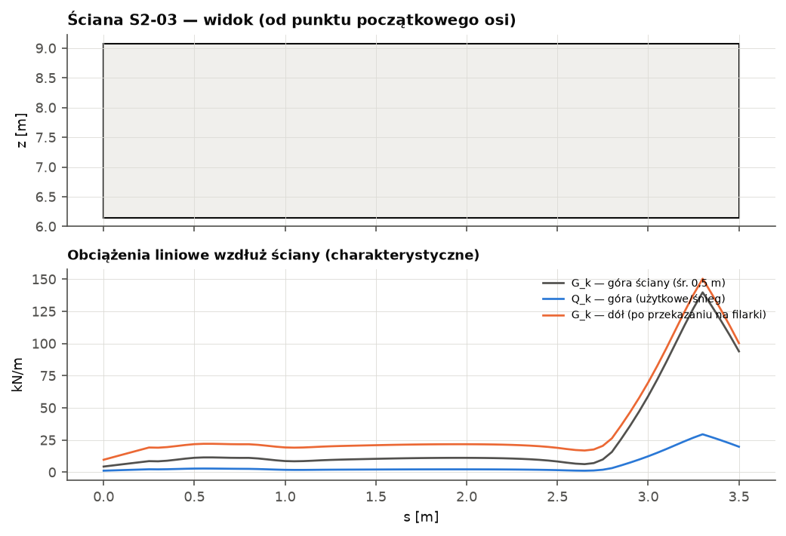

*Rys. Ściana S2-03: widok z otworami i rozkład obciążeń charakterystycznych wzdłuż osi.*

#### Zestawienie obciążeń

**Ciężar ściany — SZ1 — Ściana zewnętrzna nośna: silikat 18 + ETICS EPS 031 20 cm (U ≈ 0,15)**

| Warstwa | Obliczenie | g_k [kN/m²] | γ_G (6.10a) | g_d [kN/m²] | ξγ_G (6.10b) | g_d [kN/m²] |
|---|---|---|---|---|---|---|
| Tynk gipsowy maszynowy 1,5 cm | 1,5 cm × 11,77 kN/m³ | 0,177 | 1,35 | 0,238 | 1,15 | 0,203 |
| Bloczek wapienno-piaskowy (silikat) 18 cm, kl. 20, gr. 1, na zaprawie cienkowarstwowej | 18,0 cm × 18,00 kN/m³ | 3,240 | 1,35 | 4,374 | 1,15 | 3,718 |
| Styropian grafitowy EPS 031 (ETICS, NRO w systemie) | 20,0 cm × 0,15 kN/m³ | 0,029 | 1,35 | 0,040 | 1,15 | 0,034 |
| ETICS: warstwa zbrojona + tynk silikonowy 1,5 mm (biały / jasnoszary NCS S 1500-N) | 1,0 cm × 16,68 kN/m³ | 0,167 | 1,35 | 0,225 | 1,15 | 0,191 |
| **Razem g_k** |  | 3,613 |  | 4,877 |  | 4,146 |

**Obciążenia ściany (charakterystyczne)** — góra: z płyt i ścian wyżej; dół: po przekazaniu obciążeń znad otworów na filarki

| Przypadek | max q_góra [kN/m] | średnio q_dół [kN/m] | max q_dół [kN/m] |
|---|---|---|---|
| G | 218,40 | 43,26 | 228,98 |
| H | 15,19 | 2,27 | 15,19 |
| S1 | 27,35 | 4,09 | 27,35 |
| S2 | 27,35 | 4,09 | 27,35 |

#### Obliczenia

##### S2-03 — ściana (odcinek 0,00–3,50 m), 6.10a (wiodące: S1)

- Wytrzymałość charakterystyczna muru: f_k = K·f_b^0,85 = 0,60·20^0,85 = **7,66** MPa *((3.2) + NA tabl. NA.5 (K = 0,60, Ap2:2014-09))*
- Wytrzymałość obliczeniowa: f_d = f_k/γ_M = 7,66/1,7 = **4,50** MPa *(NA tabl. NA.1 (kat. I, zaprawa projektowana, klasa wykonania A))*
- Wysokość efektywna: h_ef = ρ₂·h = 0,750·2,93 = **2,198** m *((5.2), 5.5.1.2)*
- Smukłość: h_ef/t_ef = 2,198/0,180 = **12,21**
- Mimośród przypadkowy: e_init = h_ef/450 = 2198/450 = **4,9** mm *(5.5.1.1(4))*
- Mimośród na górze: e_g = M_g/N_g + e_init ≥ 0,05t = 4,17/138,9 + 0,0049 = **34,9** mm *((6.5))*
- Mimośród na dole: e_d = M_d/N_d + e_init ≥ 0,05t = 0,00/153,2 + 0,0049 = **9,0** mm *((6.5))*
- Współczynnik redukcyjny — góra: Φ_g = 1 − 2e_g/t = 1 − 2·34,9/180 = **0,612** *((6.4))*
- Współczynnik redukcyjny — dół: Φ_d = 1 − 2e_d/t = 1 − 2·9,0/180 = **0,900** *((6.4))*
- Mimośród w połowie wysokości: e_m = (M_md + M_w)/N_m + e_init = (2,08 + 0,94)/146,0 + 0,0049 = **25,6** mm *((6.7))*
- Mimośród od pełzania: e_k = 0 (h_ef/t_ef ≤ λ_c) = **0,0** mm *(6.1.2.2(2) [NZW NA])*
- Mimośród całkowity: e_mk = e_m + e_k ≥ 0,05t = **25,6** mm *((6.6))*
- Współczynnik redukcyjny w połowie wysokości: Φ_m = A₁·exp(−u²/2), A₁ = 1 − 2e_mk/t, u = (λ − 0,063)/(0,73 − 1,17e_mk/t) = λ = 0,386, A₁ = 0,716, u = 0,573 = **0,607** *(zał. G (G.1–G.4), E = K_E·f_k)*
- Nośność: N_Rd = Φ·t·f_d = (góra / środek / dół) 0,612 / 0,607 / 0,900 · 180 mm · 4,50 MPa = **496,5 / 492,2 / 729,6** kN/m *((6.2))*

| Warunek | Efekt | Nośność / limit | η | Stan | Podstawa |
|---|---|---|---|---|---|
| Smukłość ściany | h_ef/t_ef = 12,2  | 27 = 27,0  | 45% | spełniony | 5.5.1.4 |
| Nośność — przekrój górny | N_Ed = 138,86 kN/m | N_Rd = 496,47 kN/m | 28% | spełniony | (6.2), (6.4) |
| Nośność — połowa wysokości | N_Ed = 146,01 kN/m | N_Rd = 492,17 kN/m | 30% | spełniony | (6.2), zał. G |
| Nośność — przekrój dolny | N_Ed = 153,15 kN/m | N_Rd = 729,61 kN/m | 21% | spełniony | (6.2), (6.4) |

##### S2-03 — zginanie z płaszczyzny (wiatr)

- Wskaźnik wytrzymałości (1 m): Z = t²/6 = 0,180²/6 = **5400** cm³/m
- Pasmo pionowe — moment: M_Ed = w_Ed·h²/8 = 1,464·2,93²/8 = **1,571** kNm/m
- Pasmo pionowe — nośność: M_Rd = (f_xk1/γ_M + σ_d)·Z = (0,20/1,7 + 0,217)·10³·0,00540 = **1,807** kNm/m *((6.15), 6.3.1(3) [NZW f_xk1])*

> Informacyjnie (dolne oszacowanie, bez efektu przesklepienia 6.3.2): Zginanie z płaszczyzny (pasmo pionowe — dolne oszacowanie): M_Ed = 1,571 ≤? M_Rd = 1,807 kNm/m (η = 87%). Ściana obciążona pionowo — miarodajne sprawdzenie 6.1.2 z mimośrodem e_hm od wiatru.

##### S2-03 — wiatr: przesklepienie między stropami (6.3.2)

- Smukłość łuku: l_a/t = 2,93/0,180 = **16,3**
- Nośność na obciążenie poziome: q_lat,d = f_d·(t/l_a)² = 4,50·10³·(0,180/2,93)² = **17,00** kN/m² *((6.20) [NZW])*
- Obliczeniowy rozpór łuku (przenoszony przez stropy/wieńce): N_ad = 1,5·f_d·t/10 = **121,6** kN/m *((6.19) [NZW])*

| Warunek | Efekt | Nośność / limit | η | Stan | Podstawa |
|---|---|---|---|---|---|
| Obciążenie poziome — przesklepienie | W_Ed = 1,46 kN/m² | q_lat,d = 17,00 kN/m² | 9% | spełniony | PN-EN 1996-1-1 6.3.2 |

#### Wnioski

**Przyjęto:** Mur: Bloczek wapienno-piaskowy (silikat) 18 cm, kl. 20, gr. 1, na zaprawie cienkowarstwowej, f_d = 4,50 MPa (klasa wykonania A, γ_M = 1,7).  

### Poz. 7.4 — Ściana S2-04 (P2, zewnętrzna nośna)

Element modelu: `S2-04` · maks. wykorzystanie nośności η = 45% · wszystkie warunki spełnione

#### Opis i schemat statyczny

Ściana gr. konstrukcyjnej t = 18 cm, długość osi 3,62 m, wysokość h = 2,930 m (z 6,150 do 9,080); materiał: Bloczek wapienno-piaskowy (silikat) 18 cm, kl. 20, gr. 1, na zaprawie cienkowarstwowej. Otwory: brak.

Sprawdzono 1 odcinków (filarki ≤ 2 m między otworami — siła całkowita; dłuższe pasma — maks. średnia krocząca 1 m) dla 14 kombinacji; poniżej przypadek miarodajny. Mimośród reakcji stropu e = t/6 (zewn.) / 0,3·t/6 (wewn., niesymetria) [UPR]; wiatr jako moment w połowie wysokości w·h²/8.

*Rys. Ściana S2-04: widok z otworami i rozkład obciążeń charakterystycznych wzdłuż osi.*

#### Zestawienie obciążeń

**Ciężar ściany — SZ1 — Ściana zewnętrzna nośna: silikat 18 + ETICS EPS 031 20 cm (U ≈ 0,15)**

| Warstwa | Obliczenie | g_k [kN/m²] | γ_G (6.10a) | g_d [kN/m²] | ξγ_G (6.10b) | g_d [kN/m²] |
|---|---|---|---|---|---|---|
| Tynk gipsowy maszynowy 1,5 cm | 1,5 cm × 11,77 kN/m³ | 0,177 | 1,35 | 0,238 | 1,15 | 0,203 |
| Bloczek wapienno-piaskowy (silikat) 18 cm, kl. 20, gr. 1, na zaprawie cienkowarstwowej | 18,0 cm × 18,00 kN/m³ | 3,240 | 1,35 | 4,374 | 1,15 | 3,718 |
| Styropian grafitowy EPS 031 (ETICS, NRO w systemie) | 20,0 cm × 0,15 kN/m³ | 0,029 | 1,35 | 0,040 | 1,15 | 0,034 |
| ETICS: warstwa zbrojona + tynk silikonowy 1,5 mm (biały / jasnoszary NCS S 1500-N) | 1,0 cm × 16,68 kN/m³ | 0,167 | 1,35 | 0,225 | 1,15 | 0,191 |
| **Razem g_k** |  | 3,613 |  | 4,877 |  | 4,146 |

**Obciążenia ściany (charakterystyczne)** — góra: z płyt i ścian wyżej; dół: po przekazaniu obciążeń znad otworów na filarki

| Przypadek | max q_góra [kN/m] | średnio q_dół [kN/m] | max q_dół [kN/m] |
|---|---|---|---|
| G | 0,00 | 10,59 | 10,59 |
| H | 0,00 | 0,00 | 0,00 |
| S1 | 0,00 | 0,00 | 0,00 |
| S2 | 0,00 | 0,00 | 0,00 |

#### Obliczenia

##### S2-04 — ściana (odcinek 0,00–3,62 m), 6.10b (wiodące: W)

- Wytrzymałość charakterystyczna muru: f_k = K·f_b^0,85 = 0,60·20^0,85 = **7,66** MPa *((3.2) + NA tabl. NA.5 (K = 0,60, Ap2:2014-09))*
- Wytrzymałość obliczeniowa: f_d = f_k/γ_M = 7,66/1,7 = **4,50** MPa *(NA tabl. NA.1 (kat. I, zaprawa projektowana, klasa wykonania A))*
- Wysokość efektywna: h_ef = ρ₂·h = 0,750·2,93 = **2,198** m *((5.2), 5.5.1.2)*
- Smukłość: h_ef/t_ef = 2,198/0,180 = **12,21**
- Mimośród przypadkowy: e_init = h_ef/450 = 2198/450 = **4,9** mm *(5.5.1.1(4))*
- Mimośród na górze: e_g = M_g/N_g + e_init ≥ 0,05t = 0,00/0,0 + 0,0049 = **9,0** mm *((6.5))*
- Mimośród na dole: e_d = M_d/N_d + e_init ≥ 0,05t = 0,00/12,1 + 0,0049 = **9,0** mm *((6.5))*
- Współczynnik redukcyjny — góra: Φ_g = 1 − 2e_g/t = 1 − 2·9,0/180 = **0,900** *((6.4))*
- Współczynnik redukcyjny — dół: Φ_d = 1 − 2e_d/t = 1 − 2·9,0/180 = **0,900** *((6.4))*
- Mimośród w połowie wysokości: e_m = (M_md + M_w)/N_m + e_init = (0,00 + 0,00)/6,1 + 0,0049 = **4,9** mm *((6.7))*
- Mimośród od pełzania: e_k = 0 (h_ef/t_ef ≤ λ_c) = **0,0** mm *(6.1.2.2(2) [NZW NA])*
- Mimośród całkowity: e_mk = e_m + e_k ≥ 0,05t = **9,0** mm *((6.6))*
- Współczynnik redukcyjny w połowie wysokości: Φ_m = A₁·exp(−u²/2), A₁ = 1 − 2e_mk/t, u = (λ − 0,063)/(0,73 − 1,17e_mk/t) = λ = 0,386, A₁ = 0,900, u = 0,481 = **0,802** *(zał. G (G.1–G.4), E = K_E·f_k)*
- Nośność: N_Rd = Φ·t·f_d = (góra / środek / dół) 0,900 / 0,802 / 0,900 · 180 mm · 4,50 MPa = **729,6 / 649,9 / 729,6** kN/m *((6.2))*

| Warunek | Efekt | Nośność / limit | η | Stan | Podstawa |
|---|---|---|---|---|---|
| Smukłość ściany | h_ef/t_ef = 12,2  | 27 = 27,0  | 45% | spełniony | 5.5.1.4 |
| Nośność — przekrój górny | N_Ed = 0,00 kN/m | N_Rd = 729,61 kN/m | 0% | spełniony | (6.2), (6.4) |
| Nośność — połowa wysokości | N_Ed = 6,07 kN/m | N_Rd = 649,88 kN/m | 1% | spełniony | (6.2), zał. G |
| Nośność — przekrój dolny | N_Ed = 12,15 kN/m | N_Rd = 729,61 kN/m | 2% | spełniony | (6.2), (6.4) |

> Przy małej sile pionowej i wietrze wiodącym (e_m > 0,45t) przyjęto nośność na obciążenie poziome przez przesklepienie ściany między stropami (PN-EN 1996-1-1 6.3.2), a sprawdzenie 6.1.2 — bez mimośrodu od wiatru [UPR].

##### S2-04 — wiatr: przesklepienie (6.3.2), 6.10b (wiodące: W)

- Smukłość łuku: l_a/t = 2,93/0,180 = **16,3**
- Nośność na obciążenie poziome: q_lat,d = f_d·(t/l_a)² = 4,50·10³·(0,180/2,93)² = **17,00** kN/m² *((6.20) [NZW])*
- Obliczeniowy rozpór łuku (przenoszony przez stropy/wieńce): N_ad = 1,5·f_d·t/10 = **121,6** kN/m *((6.19) [NZW])*

| Warunek | Efekt | Nośność / limit | η | Stan | Podstawa |
|---|---|---|---|---|---|
| Obciążenie poziome — przesklepienie | W_Ed = 1,46 kN/m² | q_lat,d = 17,00 kN/m² | 9% | spełniony | PN-EN 1996-1-1 6.3.2 |

##### S2-04 — zginanie z płaszczyzny (wiatr)

- Wskaźnik wytrzymałości (1 m): Z = t²/6 = 0,180²/6 = **5400** cm³/m
- Pasmo pionowe — moment: M_Ed = w_Ed·h²/8 = 1,464·2,93²/8 = **1,571** kNm/m
- Pasmo pionowe — nośność: M_Rd = (f_xk1/γ_M + σ_d)·Z = (0,20/1,7 + 0,029)·10³·0,00540 = **0,794** kNm/m *((6.15), 6.3.1(3) [NZW f_xk1])*

> Informacyjnie (dolne oszacowanie, bez efektu przesklepienia 6.3.2): Zginanie z płaszczyzny (pasmo pionowe — dolne oszacowanie): M_Ed = 1,571 ≤? M_Rd = 0,794 kNm/m (η = 198%). Ściana obciążona pionowo — miarodajne sprawdzenie 6.1.2 z mimośrodem e_hm od wiatru.

##### S2-04 — wiatr: przesklepienie między stropami (6.3.2)

- Smukłość łuku: l_a/t = 2,93/0,180 = **16,3**
- Nośność na obciążenie poziome: q_lat,d = f_d·(t/l_a)² = 4,50·10³·(0,180/2,93)² = **17,00** kN/m² *((6.20) [NZW])*
- Obliczeniowy rozpór łuku (przenoszony przez stropy/wieńce): N_ad = 1,5·f_d·t/10 = **121,6** kN/m *((6.19) [NZW])*

| Warunek | Efekt | Nośność / limit | η | Stan | Podstawa |
|---|---|---|---|---|---|
| Obciążenie poziome — przesklepienie | W_Ed = 1,46 kN/m² | q_lat,d = 17,00 kN/m² | 9% | spełniony | PN-EN 1996-1-1 6.3.2 |

#### Wnioski

**Przyjęto:** Mur: Bloczek wapienno-piaskowy (silikat) 18 cm, kl. 20, gr. 1, na zaprawie cienkowarstwowej, f_d = 4,50 MPa (klasa wykonania A, γ_M = 1,7).  

### Poz. 7.5 — Ściana S2-05 (P2, zewnętrzna nośna)

Element modelu: `S2-05` · maks. wykorzystanie nośności η = 60% · wszystkie warunki spełnione

#### Opis i schemat statyczny

Ściana gr. konstrukcyjnej t = 18 cm, długość osi 4,62 m, wysokość h = 2,930 m (z 6,150 do 9,080); materiał: Bloczek wapienno-piaskowy (silikat) 18 cm, kl. 20, gr. 1, na zaprawie cienkowarstwowej. Otwory: O2-07 (1,70 m), O2-06 (0,90 m).

Sprawdzono 3 odcinków (filarki ≤ 2 m między otworami — siła całkowita; dłuższe pasma — maks. średnia krocząca 1 m) dla 14 kombinacji; poniżej przypadek miarodajny. Mimośród reakcji stropu e = t/6 (zewn.) / 0,3·t/6 (wewn., niesymetria) [UPR]; wiatr jako moment w połowie wysokości w·h²/8.

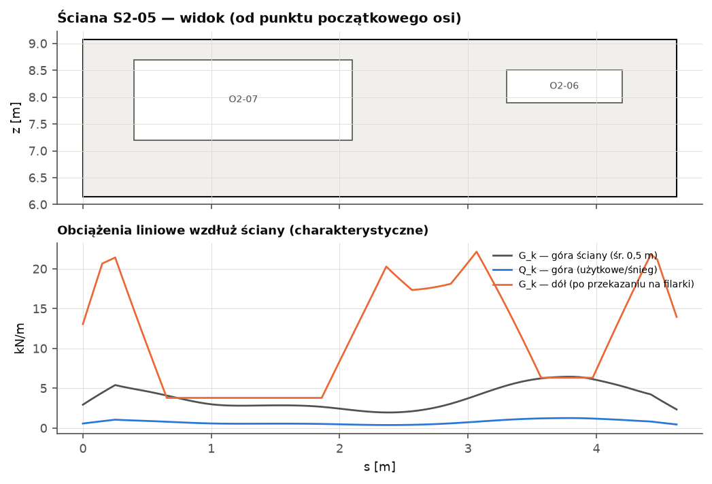

*Rys. Ściana S2-05: widok z otworami i rozkład obciążeń charakterystycznych wzdłuż osi.*

#### Zestawienie obciążeń

**Ciężar ściany — SZ1 — Ściana zewnętrzna nośna: silikat 18 + ETICS EPS 031 20 cm (U ≈ 0,15)**

| Warstwa | Obliczenie | g_k [kN/m²] | γ_G (6.10a) | g_d [kN/m²] | ξγ_G (6.10b) | g_d [kN/m²] |
|---|---|---|---|---|---|---|
| Tynk gipsowy maszynowy 1,5 cm | 1,5 cm × 11,77 kN/m³ | 0,177 | 1,35 | 0,238 | 1,15 | 0,203 |
| Bloczek wapienno-piaskowy (silikat) 18 cm, kl. 20, gr. 1, na zaprawie cienkowarstwowej | 18,0 cm × 18,00 kN/m³ | 3,240 | 1,35 | 4,374 | 1,15 | 3,718 |
| Styropian grafitowy EPS 031 (ETICS, NRO w systemie) | 20,0 cm × 0,15 kN/m³ | 0,029 | 1,35 | 0,040 | 1,15 | 0,034 |
| ETICS: warstwa zbrojona + tynk silikonowy 1,5 mm (biały / jasnoszary NCS S 1500-N) | 1,0 cm × 16,68 kN/m³ | 0,167 | 1,35 | 0,225 | 1,15 | 0,191 |
| **Razem g_k** |  | 3,613 |  | 4,877 |  | 4,146 |

**Obciążenia ściany (charakterystyczne)** — góra: z płyt i ścian wyżej; dół: po przekazaniu obciążeń znad otworów na filarki

| Przypadek | max q_góra [kN/m] | średnio q_dół [kN/m] | max q_dół [kN/m] |
|---|---|---|---|
| G | 6,53 | 12,09 | 26,67 |
| H | 0,45 | 0,27 | 0,91 |
| S1 | 0,82 | 0,49 | 1,65 |
| S2 | 0,82 | 0,49 | 1,65 |

#### Obliczenia

##### S2-05 — filarek 0,00–0,40 m (b = 0,40 m), 6.10a (wiodące: S1)

- Pole przekroju filarka: A = b·t = 0,40·0,18 = **0,072** m²
- Współczynnik η_A (A < 0,3 m²): η_A = (NA; interpolacja wg R5-63) = **2,00** *(NA do PN-EN 1996-1-1 [NZW])*
- Wytrzymałość charakterystyczna muru: f_k = K·f_b^0,85 = 0,60·20^0,85 = **7,66** MPa *((3.2) + NA tabl. NA.5 (K = 0,60, Ap2:2014-09))*
- Wytrzymałość obliczeniowa: f_d = f_k/γ_M · (1/η_A) = 7,66/1,7·0,500 = **2,25** MPa *(NA tabl. NA.1 (kat. I, zaprawa projektowana, klasa wykonania A))*
- Wysokość efektywna: h_ef = ρ₂·h = 1,000·2,93 = **2,930** m *((5.2), 5.5.1.2)*
- Smukłość: h_ef/t_ef = 2,930/0,180 = **16,28**
- Mimośród przypadkowy: e_init = h_ef/450 = 2930/450 = **6,5** mm *(5.5.1.1(4))*
- Mimośród na górze: e_g = M_g/N_g + e_init ≥ 0,05t = 0,23/7,5 + 0,0065 = **36,5** mm *((6.5))*
- Mimośród na dole: e_d = M_d/N_d + e_init ≥ 0,05t = 0,00/33,9 + 0,0065 = **9,0** mm *((6.5))*
- Współczynnik redukcyjny — góra: Φ_g = 1 − 2e_g/t = 1 − 2·36,5/180 = **0,594** *((6.4))*
- Współczynnik redukcyjny — dół: Φ_d = 1 − 2e_d/t = 1 − 2·9,0/180 = **0,900** *((6.4))*
- Mimośród w połowie wysokości: e_m = (M_md + M_w)/N_m + e_init = (0,11 + 0,00)/20,7 + 0,0065 = **12,0** mm *((6.7))*
- Mimośród od pełzania: e_k = 0,002·φ_∞·(h_ef/t_ef)·√(t·e_m) = 0,002·1,5·16,28·√(0,180·0,0120) = **2,3** mm *((6.8))*
- Mimośród całkowity: e_mk = e_m + e_k ≥ 0,05t = **14,2** mm *((6.6))*
- Współczynnik redukcyjny w połowie wysokości: Φ_m = A₁·exp(−u²/2), A₁ = 1 − 2e_mk/t, u = (λ − 0,063)/(0,73 − 1,17e_mk/t) = λ = 0,515, A₁ = 0,842, u = 0,709 = **0,655** *(zał. G (G.1–G.4), E = K_E·f_k)*
- Nośność: N_Rd = Φ·t·f_d = (góra / środek / dół) 0,594 / 0,655 / 0,900 · 180 mm · 2,25 MPa = **240,9 / 265,6 / 364,8** kN/m *((6.2))*

| Warunek | Efekt | Nośność / limit | η | Stan | Podstawa |
|---|---|---|---|---|---|
| Smukłość ściany | h_ef/t_ef = 16,3  | 27 = 27,0  | 60% | spełniony | 5.5.1.4 |
| Nośność — przekrój górny | N_Ed = 7,50 kN/m | N_Rd = 240,90 kN/m | 3% | spełniony | (6.2), (6.4) |
| Nośność — połowa wysokości | N_Ed = 20,69 kN/m | N_Rd = 265,55 kN/m | 8% | spełniony | (6.2), zał. G |
| Nośność — przekrój dolny | N_Ed = 33,88 kN/m | N_Rd = 364,81 kN/m | 9% | spełniony | (6.2), (6.4) |

> Filarek liczony jako ściana podparta górą i dołem, ρ₂ = 1,0 (bezpiecznie); siły N na 1 m = N/b.

##### S2-05 — zginanie z płaszczyzny (wiatr)

- Wskaźnik wytrzymałości (1 m): Z = t²/6 = 0,180²/6 = **5400** cm³/m
- Pasmo pionowe — moment: M_Ed = w_Ed·h²/8 = 1,464·2,93²/8 = **1,571** kNm/m
- Pasmo pionowe — nośność: M_Rd = (f_xk1/γ_M + σ_d)·Z = (0,20/1,7 + 0,052)·10³·0,00540 = **0,913** kNm/m *((6.15), 6.3.1(3) [NZW f_xk1])*

> Informacyjnie (dolne oszacowanie, bez efektu przesklepienia 6.3.2): Zginanie z płaszczyzny (pasmo pionowe — dolne oszacowanie): M_Ed = 1,571 ≤? M_Rd = 0,913 kNm/m (η = 172%). Ściana obciążona pionowo — miarodajne sprawdzenie 6.1.2 z mimośrodem e_hm od wiatru.

##### S2-05 — wiatr: przesklepienie między stropami (6.3.2)

- Smukłość łuku: l_a/t = 2,93/0,180 = **16,3**
- Nośność na obciążenie poziome: q_lat,d = f_d·(t/l_a)² = 4,50·10³·(0,180/2,93)² = **17,00** kN/m² *((6.20) [NZW])*
- Obliczeniowy rozpór łuku (przenoszony przez stropy/wieńce): N_ad = 1,5·f_d·t/10 = **121,6** kN/m *((6.19) [NZW])*

| Warunek | Efekt | Nośność / limit | η | Stan | Podstawa |
|---|---|---|---|---|---|
| Obciążenie poziome — przesklepienie | W_Ed = 1,46 kN/m² | q_lat,d = 17,00 kN/m² | 9% | spełniony | PN-EN 1996-1-1 6.3.2 |

#### Wnioski

**Przyjęto:** Mur: Bloczek wapienno-piaskowy (silikat) 18 cm, kl. 20, gr. 1, na zaprawie cienkowarstwowej, f_d = 4,50 MPa (klasa wykonania A, γ_M = 1,7).  

### Poz. 7.6 — Ściana S2-06 (P2, zewnętrzna nośna)

Element modelu: `S2-06` · maks. wykorzystanie nośności η = 45% · wszystkie warunki spełnione

#### Opis i schemat statyczny

Ściana gr. konstrukcyjnej t = 18 cm, długość osi 3,62 m, wysokość h = 2,930 m (z 6,150 do 9,080); materiał: Bloczek wapienno-piaskowy (silikat) 18 cm, kl. 20, gr. 1, na zaprawie cienkowarstwowej. Otwory: brak.

Sprawdzono 1 odcinków (filarki ≤ 2 m między otworami — siła całkowita; dłuższe pasma — maks. średnia krocząca 1 m) dla 14 kombinacji; poniżej przypadek miarodajny. Mimośród reakcji stropu e = t/6 (zewn.) / 0,3·t/6 (wewn., niesymetria) [UPR]; wiatr jako moment w połowie wysokości w·h²/8.

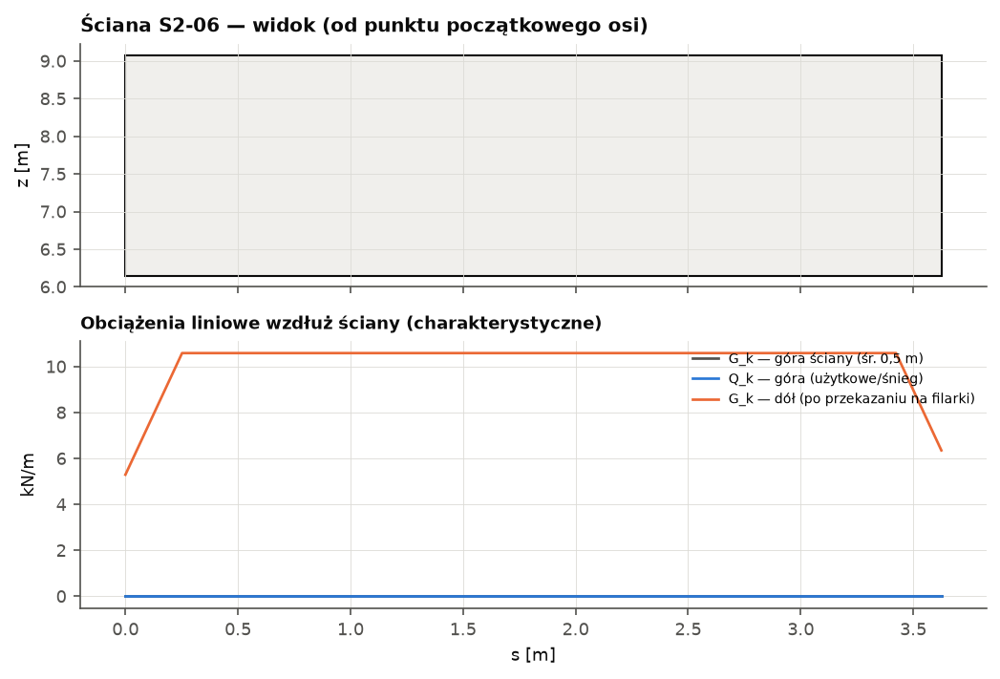

*Rys. Ściana S2-06: widok z otworami i rozkład obciążeń charakterystycznych wzdłuż osi.*

#### Zestawienie obciążeń

**Ciężar ściany — SZ1 — Ściana zewnętrzna nośna: silikat 18 + ETICS EPS 031 20 cm (U ≈ 0,15)**

| Warstwa | Obliczenie | g_k [kN/m²] | γ_G (6.10a) | g_d [kN/m²] | ξγ_G (6.10b) | g_d [kN/m²] |
|---|---|---|---|---|---|---|
| Tynk gipsowy maszynowy 1,5 cm | 1,5 cm × 11,77 kN/m³ | 0,177 | 1,35 | 0,238 | 1,15 | 0,203 |
| Bloczek wapienno-piaskowy (silikat) 18 cm, kl. 20, gr. 1, na zaprawie cienkowarstwowej | 18,0 cm × 18,00 kN/m³ | 3,240 | 1,35 | 4,374 | 1,15 | 3,718 |
| Styropian grafitowy EPS 031 (ETICS, NRO w systemie) | 20,0 cm × 0,15 kN/m³ | 0,029 | 1,35 | 0,040 | 1,15 | 0,034 |
| ETICS: warstwa zbrojona + tynk silikonowy 1,5 mm (biały / jasnoszary NCS S 1500-N) | 1,0 cm × 16,68 kN/m³ | 0,167 | 1,35 | 0,225 | 1,15 | 0,191 |
| **Razem g_k** |  | 3,613 |  | 4,877 |  | 4,146 |

**Obciążenia ściany (charakterystyczne)** — góra: z płyt i ścian wyżej; dół: po przekazaniu obciążeń znad otworów na filarki

| Przypadek | max q_góra [kN/m] | średnio q_dół [kN/m] | max q_dół [kN/m] |
|---|---|---|---|
| G | 0,00 | 10,59 | 10,59 |
| H | 0,00 | 0,00 | 0,00 |
| S1 | 0,00 | 0,00 | 0,00 |
| S2 | 0,00 | 0,00 | 0,00 |

#### Obliczenia

##### S2-06 — ściana (odcinek 0,00–3,62 m), 6.10b (wiodące: W)

- Wytrzymałość charakterystyczna muru: f_k = K·f_b^0,85 = 0,60·20^0,85 = **7,66** MPa *((3.2) + NA tabl. NA.5 (K = 0,60, Ap2:2014-09))*
- Wytrzymałość obliczeniowa: f_d = f_k/γ_M = 7,66/1,7 = **4,50** MPa *(NA tabl. NA.1 (kat. I, zaprawa projektowana, klasa wykonania A))*
- Wysokość efektywna: h_ef = ρ₂·h = 0,750·2,93 = **2,198** m *((5.2), 5.5.1.2)*
- Smukłość: h_ef/t_ef = 2,198/0,180 = **12,21**
- Mimośród przypadkowy: e_init = h_ef/450 = 2198/450 = **4,9** mm *(5.5.1.1(4))*
- Mimośród na górze: e_g = M_g/N_g + e_init ≥ 0,05t = 0,00/0,0 + 0,0049 = **9,0** mm *((6.5))*
- Mimośród na dole: e_d = M_d/N_d + e_init ≥ 0,05t = 0,00/12,1 + 0,0049 = **9,0** mm *((6.5))*
- Współczynnik redukcyjny — góra: Φ_g = 1 − 2e_g/t = 1 − 2·9,0/180 = **0,900** *((6.4))*
- Współczynnik redukcyjny — dół: Φ_d = 1 − 2e_d/t = 1 − 2·9,0/180 = **0,900** *((6.4))*
- Mimośród w połowie wysokości: e_m = (M_md + M_w)/N_m + e_init = (0,00 + 0,00)/6,1 + 0,0049 = **4,9** mm *((6.7))*
- Mimośród od pełzania: e_k = 0 (h_ef/t_ef ≤ λ_c) = **0,0** mm *(6.1.2.2(2) [NZW NA])*
- Mimośród całkowity: e_mk = e_m + e_k ≥ 0,05t = **9,0** mm *((6.6))*
- Współczynnik redukcyjny w połowie wysokości: Φ_m = A₁·exp(−u²/2), A₁ = 1 − 2e_mk/t, u = (λ − 0,063)/(0,73 − 1,17e_mk/t) = λ = 0,386, A₁ = 0,900, u = 0,481 = **0,802** *(zał. G (G.1–G.4), E = K_E·f_k)*
- Nośność: N_Rd = Φ·t·f_d = (góra / środek / dół) 0,900 / 0,802 / 0,900 · 180 mm · 4,50 MPa = **729,6 / 649,9 / 729,6** kN/m *((6.2))*

| Warunek | Efekt | Nośność / limit | η | Stan | Podstawa |
|---|---|---|---|---|---|
| Smukłość ściany | h_ef/t_ef = 12,2  | 27 = 27,0  | 45% | spełniony | 5.5.1.4 |
| Nośność — przekrój górny | N_Ed = 0,00 kN/m | N_Rd = 729,61 kN/m | 0% | spełniony | (6.2), (6.4) |
| Nośność — połowa wysokości | N_Ed = 6,07 kN/m | N_Rd = 649,88 kN/m | 1% | spełniony | (6.2), zał. G |
| Nośność — przekrój dolny | N_Ed = 12,15 kN/m | N_Rd = 729,61 kN/m | 2% | spełniony | (6.2), (6.4) |

> Przy małej sile pionowej i wietrze wiodącym (e_m > 0,45t) przyjęto nośność na obciążenie poziome przez przesklepienie ściany między stropami (PN-EN 1996-1-1 6.3.2), a sprawdzenie 6.1.2 — bez mimośrodu od wiatru [UPR].

##### S2-06 — wiatr: przesklepienie (6.3.2), 6.10b (wiodące: W)

- Smukłość łuku: l_a/t = 2,93/0,180 = **16,3**
- Nośność na obciążenie poziome: q_lat,d = f_d·(t/l_a)² = 4,50·10³·(0,180/2,93)² = **17,00** kN/m² *((6.20) [NZW])*
- Obliczeniowy rozpór łuku (przenoszony przez stropy/wieńce): N_ad = 1,5·f_d·t/10 = **121,6** kN/m *((6.19) [NZW])*

| Warunek | Efekt | Nośność / limit | η | Stan | Podstawa |
|---|---|---|---|---|---|
| Obciążenie poziome — przesklepienie | W_Ed = 1,46 kN/m² | q_lat,d = 17,00 kN/m² | 9% | spełniony | PN-EN 1996-1-1 6.3.2 |

##### S2-06 — zginanie z płaszczyzny (wiatr)

- Wskaźnik wytrzymałości (1 m): Z = t²/6 = 0,180²/6 = **5400** cm³/m
- Pasmo pionowe — moment: M_Ed = w_Ed·h²/8 = 1,464·2,93²/8 = **1,571** kNm/m
- Pasmo pionowe — nośność: M_Rd = (f_xk1/γ_M + σ_d)·Z = (0,20/1,7 + 0,029)·10³·0,00540 = **0,794** kNm/m *((6.15), 6.3.1(3) [NZW f_xk1])*

> Informacyjnie (dolne oszacowanie, bez efektu przesklepienia 6.3.2): Zginanie z płaszczyzny (pasmo pionowe — dolne oszacowanie): M_Ed = 1,571 ≤? M_Rd = 0,794 kNm/m (η = 198%). Ściana obciążona pionowo — miarodajne sprawdzenie 6.1.2 z mimośrodem e_hm od wiatru.

##### S2-06 — wiatr: przesklepienie między stropami (6.3.2)

- Smukłość łuku: l_a/t = 2,93/0,180 = **16,3**
- Nośność na obciążenie poziome: q_lat,d = f_d·(t/l_a)² = 4,50·10³·(0,180/2,93)² = **17,00** kN/m² *((6.20) [NZW])*
- Obliczeniowy rozpór łuku (przenoszony przez stropy/wieńce): N_ad = 1,5·f_d·t/10 = **121,6** kN/m *((6.19) [NZW])*

| Warunek | Efekt | Nośność / limit | η | Stan | Podstawa |
|---|---|---|---|---|---|
| Obciążenie poziome — przesklepienie | W_Ed = 1,46 kN/m² | q_lat,d = 17,00 kN/m² | 9% | spełniony | PN-EN 1996-1-1 6.3.2 |

#### Wnioski

**Przyjęto:** Mur: Bloczek wapienno-piaskowy (silikat) 18 cm, kl. 20, gr. 1, na zaprawie cienkowarstwowej, f_d = 4,50 MPa (klasa wykonania A, γ_M = 1,7).  

### Poz. 7.7 — Ściana S2-07 (P2, zewnętrzna nośna)

Element modelu: `S2-07` · maks. wykorzystanie nośności η = 45% · wszystkie warunki spełnione

#### Opis i schemat statyczny

Ściana gr. konstrukcyjnej t = 18 cm, długość osi 4,88 m, wysokość h = 2,930 m (z 6,150 do 9,080); materiał: Bloczek wapienno-piaskowy (silikat) 18 cm, kl. 20, gr. 1, na zaprawie cienkowarstwowej. Otwory: brak.

Sprawdzono 1 odcinków (filarki ≤ 2 m między otworami — siła całkowita; dłuższe pasma — maks. średnia krocząca 1 m) dla 14 kombinacji; poniżej przypadek miarodajny. Mimośród reakcji stropu e = t/6 (zewn.) / 0,3·t/6 (wewn., niesymetria) [UPR]; wiatr jako moment w połowie wysokości w·h²/8.

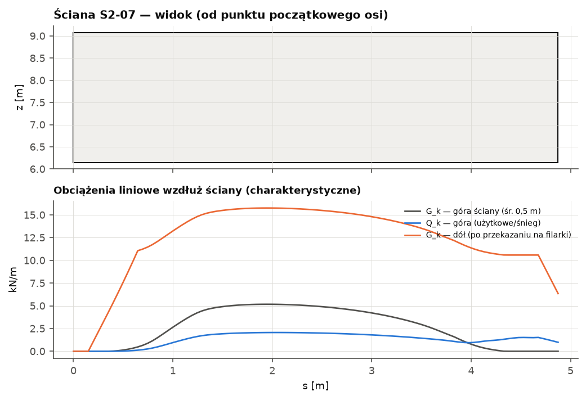

*Rys. Ściana S2-07: widok z otworami i rozkład obciążeń charakterystycznych wzdłuż osi.*

#### Zestawienie obciążeń

**Ciężar ściany — SZ1 — Ściana zewnętrzna nośna: silikat 18 + ETICS EPS 031 20 cm (U ≈ 0,15)**

| Warstwa | Obliczenie | g_k [kN/m²] | γ_G (6.10a) | g_d [kN/m²] | ξγ_G (6.10b) | g_d [kN/m²] |
|---|---|---|---|---|---|---|
| Tynk gipsowy maszynowy 1,5 cm | 1,5 cm × 11,77 kN/m³ | 0,177 | 1,35 | 0,238 | 1,15 | 0,203 |
| Bloczek wapienno-piaskowy (silikat) 18 cm, kl. 20, gr. 1, na zaprawie cienkowarstwowej | 18,0 cm × 18,00 kN/m³ | 3,240 | 1,35 | 4,374 | 1,15 | 3,718 |
| Styropian grafitowy EPS 031 (ETICS, NRO w systemie) | 20,0 cm × 0,15 kN/m³ | 0,029 | 1,35 | 0,040 | 1,15 | 0,034 |
| ETICS: warstwa zbrojona + tynk silikonowy 1,5 mm (biały / jasnoszary NCS S 1500-N) | 1,0 cm × 16,68 kN/m³ | 0,167 | 1,35 | 0,225 | 1,15 | 0,191 |
| **Razem g_k** |  | 3,613 |  | 4,877 |  | 4,146 |

**Obciążenia ściany (charakterystyczne)** — góra: z płyt i ścian wyżej; dół: po przekazaniu obciążeń znad otworów na filarki

| Przypadek | max q_góra [kN/m] | średnio q_dół [kN/m] | max q_dół [kN/m] |
|---|---|---|---|
| G | 195,17 | 39,10 | 205,75 |
| H | 13,58 | 1,98 | 13,58 |
| S1 | 24,44 | 3,57 | 24,44 |
| S2 | 24,44 | 3,57 | 24,44 |

#### Obliczenia

##### S2-07 — ściana (odcinek 0,00–4,88 m), 6.10a (wiodące: S1)

- Wytrzymałość charakterystyczna muru: f_k = K·f_b^0,85 = 0,60·20^0,85 = **7,66** MPa *((3.2) + NA tabl. NA.5 (K = 0,60, Ap2:2014-09))*
- Wytrzymałość obliczeniowa: f_d = f_k/γ_M = 7,66/1,7 = **4,50** MPa *(NA tabl. NA.1 (kat. I, zaprawa projektowana, klasa wykonania A))*
- Wysokość efektywna: h_ef = ρ₂·h = 0,750·2,93 = **2,198** m *((5.2), 5.5.1.2)*
- Smukłość: h_ef/t_ef = 2,198/0,180 = **12,21**
- Mimośród przypadkowy: e_init = h_ef/450 = 2198/450 = **4,9** mm *(5.5.1.1(4))*
- Mimośród na górze: e_g = M_g/N_g + e_init ≥ 0,05t = 4,25/141,6 + 0,0049 = **34,9** mm *((6.5))*
- Mimośród na dole: e_d = M_d/N_d + e_init ≥ 0,05t = 0,00/155,9 + 0,0049 = **9,0** mm *((6.5))*
- Współczynnik redukcyjny — góra: Φ_g = 1 − 2e_g/t = 1 − 2·34,9/180 = **0,612** *((6.4))*
- Współczynnik redukcyjny — dół: Φ_d = 1 − 2e_d/t = 1 − 2·9,0/180 = **0,900** *((6.4))*
- Mimośród w połowie wysokości: e_m = (M_md + M_w)/N_m + e_init = (2,12 + 0,94)/148,7 + 0,0049 = **25,5** mm *((6.7))*
- Mimośród od pełzania: e_k = 0 (h_ef/t_ef ≤ λ_c) = **0,0** mm *(6.1.2.2(2) [NZW NA])*
- Mimośród całkowity: e_mk = e_m + e_k ≥ 0,05t = **25,5** mm *((6.6))*
- Współczynnik redukcyjny w połowie wysokości: Φ_m = A₁·exp(−u²/2), A₁ = 1 − 2e_mk/t, u = (λ − 0,063)/(0,73 − 1,17e_mk/t) = λ = 0,386, A₁ = 0,717, u = 0,573 = **0,608** *(zał. G (G.1–G.4), E = K_E·f_k)*
- Nośność: N_Rd = Φ·t·f_d = (góra / środek / dół) 0,612 / 0,608 / 0,900 · 180 mm · 4,50 MPa = **496,5 / 493,2 / 729,6** kN/m *((6.2))*

| Warunek | Efekt | Nośność / limit | η | Stan | Podstawa |
|---|---|---|---|---|---|
| Smukłość ściany | h_ef/t_ef = 12,2  | 27 = 27,0  | 45% | spełniony | 5.5.1.4 |
| Nośność — przekrój górny | N_Ed = 141,58 kN/m | N_Rd = 496,47 kN/m | 29% | spełniony | (6.2), (6.4) |
| Nośność — połowa wysokości | N_Ed = 148,72 kN/m | N_Rd = 493,16 kN/m | 30% | spełniony | (6.2), zał. G |
| Nośność — przekrój dolny | N_Ed = 155,87 kN/m | N_Rd = 729,61 kN/m | 21% | spełniony | (6.2), (6.4) |

##### S2-07 — zginanie z płaszczyzny (wiatr)

- Wskaźnik wytrzymałości (1 m): Z = t²/6 = 0,180²/6 = **5400** cm³/m
- Pasmo pionowe — moment: M_Ed = w_Ed·h²/8 = 1,464·2,93²/8 = **1,571** kNm/m
- Pasmo pionowe — nośność: M_Rd = (f_xk1/γ_M + σ_d)·Z = (0,20/1,7 + 0,192)·10³·0,00540 = **1,670** kNm/m *((6.15), 6.3.1(3) [NZW f_xk1])*

> Informacyjnie (dolne oszacowanie, bez efektu przesklepienia 6.3.2): Zginanie z płaszczyzny (pasmo pionowe — dolne oszacowanie): M_Ed = 1,571 ≤? M_Rd = 1,670 kNm/m (η = 94%). Ściana obciążona pionowo — miarodajne sprawdzenie 6.1.2 z mimośrodem e_hm od wiatru.

##### S2-07 — wiatr: przesklepienie między stropami (6.3.2)

- Smukłość łuku: l_a/t = 2,93/0,180 = **16,3**
- Nośność na obciążenie poziome: q_lat,d = f_d·(t/l_a)² = 4,50·10³·(0,180/2,93)² = **17,00** kN/m² *((6.20) [NZW])*
- Obliczeniowy rozpór łuku (przenoszony przez stropy/wieńce): N_ad = 1,5·f_d·t/10 = **121,6** kN/m *((6.19) [NZW])*

| Warunek | Efekt | Nośność / limit | η | Stan | Podstawa |
|---|---|---|---|---|---|
| Obciążenie poziome — przesklepienie | W_Ed = 1,46 kN/m² | q_lat,d = 17,00 kN/m² | 9% | spełniony | PN-EN 1996-1-1 6.3.2 |

#### Wnioski

**Przyjęto:** Mur: Bloczek wapienno-piaskowy (silikat) 18 cm, kl. 20, gr. 1, na zaprawie cienkowarstwowej, f_d = 4,50 MPa (klasa wykonania A, γ_M = 1,7).  

### Poz. 7.8 — Ściana S2-08 (P2, zewnętrzna nośna)

Element modelu: `S2-08` · maks. wykorzystanie nośności η = 0% · wszystkie warunki spełnione

#### Opis i schemat statyczny

Ściana gr. konstrukcyjnej t = 20 cm, długość osi 5,12 m, wysokość h = 2,930 m (z 6,150 do 9,080); materiał: Wełna mineralna 035 (szkielet, docieplenia, ściana dom–garaż). Otwory: O2-04 (2,40 m).

#### Zestawienie obciążeń

**Ciężar ściany — SZL — Ściana zewnętrzna lekka A' (na wsporniku P2): szkielet KVH 45×200 z wełną + OSB (szczelność) + DWD + wełna fasadowa 18 cm + membrana UV (lico zewn. 0,30 m od osi — jak SZ2, ciągłość warstw w narożu); bez funkcji nośnej (U ≈ 0,10)**

| Warstwa | Obliczenie | g_k [kN/m²] | γ_G (6.10a) | g_d [kN/m²] | ξγ_G (6.10b) | g_d [kN/m²] |
|---|---|---|---|---|---|---|
| Płyta gipsowo-kartonowa 12,5 mm (GKB / GKBI w łazienkach) | 2,5 cm × 6,87 kN/m³ | 0,172 | 1,35 | 0,232 | 1,15 | 0,197 |
| Wełna mineralna 035 (szkielet, docieplenia, ściana dom–garaż) | 5,0 cm × 0,39 kN/m³ | 0,020 | 1,35 | 0,026 | 1,15 | 0,023 |
| Płyta OSB/3 15 mm (usztywnienie i warstwa szczelności ściany A') | 1,5 cm × 5,89 kN/m³ | 0,088 | 1,35 | 0,119 | 1,15 | 0,101 |
| Wełna mineralna 035 (szkielet, docieplenia, ściana dom–garaż) | 20,0 cm × 0,39 kN/m³ | 0,078 | 1,35 | 0,106 | 1,15 | 0,090 |
| Płyta drewnopochodna wiatroizolacyjna DWD/MDF.RWH 16 mm | 1,6 cm × 5,40 kN/m³ | 0,086 | 1,35 | 0,117 | 1,15 | 0,099 |
| Wełna mineralna fasadowa (elewacja wentylowana bryły A, A1) | 18,0 cm × 0,59 kN/m³ | 0,106 | 1,35 | 0,143 | 1,15 | 0,122 |
| Membrana fasadowa wiatroizolacyjna UV-stabilna, czarna (sd ≈ 0,02 m) | 0,4 cm × 5,89 kN/m³ | 0,024 | 1,35 | 0,032 | 1,15 | 0,027 |
| **Razem g_k** |  | 0,574 |  | 0,775 |  | 0,659 |

**Obciążenia ściany (charakterystyczne)** — góra: z płyt i ścian wyżej; dół: po przekazaniu obciążeń znad otworów na filarki

| Przypadek | max q_góra [kN/m] | średnio q_dół [kN/m] | max q_dół [kN/m] |
|---|---|---|---|
| G | 117,03 | 10,59 | 118,71 |
| H | 5,29 | 0,52 | 5,29 |
| S1 | 9,52 | 0,93 | 9,52 |
| S2 | 9,52 | 0,93 | 9,52 |

> Warstwa konstrukcyjna nie jest murem (np. żelbet) — ściana żelbetowa: sprawdzenie wg PN-EN 1992-1-1 (ściany 9.6, smukłość 5.8) — poza zakresem automatycznym [WYMAGA ANALIZY].

### Poz. 7.9 — Ściana S2-09 (P2, wewnętrzna nośna)

Element modelu: `S2-09` · maks. wykorzystanie nośności η = 98% · wszystkie warunki spełnione

#### Opis i schemat statyczny

Ściana gr. konstrukcyjnej t = 18 cm, długość osi 3,32 m, wysokość h = 2,930 m (z 6,150 do 9,080); materiał: Bloczek wapienno-piaskowy (silikat) 18 cm, kl. 20, gr. 1, na zaprawie cienkowarstwowej. Otwory: O2-10 (0,90 m).

Sprawdzono 2 odcinków (filarki ≤ 2 m między otworami — siła całkowita; dłuższe pasma — maks. średnia krocząca 1 m) dla 9 kombinacji; poniżej przypadek miarodajny. Mimośród reakcji stropu e = t/6 (zewn.) / 0,3·t/6 (wewn., niesymetria) [UPR]; wiatr jako moment w połowie wysokości w·h²/8.

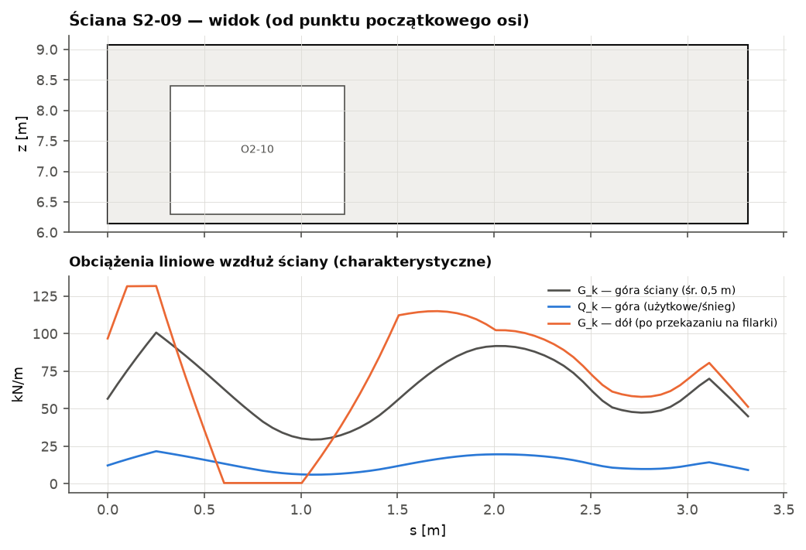

*Rys. Ściana S2-09: widok z otworami i rozkład obciążeń charakterystycznych wzdłuż osi.*

#### Zestawienie obciążeń

**Ciężar ściany — SW18 — Ściana wewnętrzna nośna: silikat 18, tynk gipsowy obustronnie**

| Warstwa | Obliczenie | g_k [kN/m²] | γ_G (6.10a) | g_d [kN/m²] | ξγ_G (6.10b) | g_d [kN/m²] |
|---|---|---|---|---|---|---|
| Tynk gipsowy maszynowy 1,5 cm | 1,5 cm × 11,77 kN/m³ | 0,177 | 1,35 | 0,238 | 1,15 | 0,203 |
| Bloczek wapienno-piaskowy (silikat) 18 cm, kl. 20, gr. 1, na zaprawie cienkowarstwowej | 18,0 cm × 18,00 kN/m³ | 3,240 | 1,35 | 4,374 | 1,15 | 3,718 |
| Tynk gipsowy maszynowy 1,5 cm | 1,5 cm × 11,77 kN/m³ | 0,177 | 1,35 | 0,238 | 1,15 | 0,203 |
| **Razem g_k** |  | 3,593 |  | 4,851 |  | 4,123 |

**Obciążenia ściany (charakterystyczne)** — góra: z płyt i ścian wyżej; dół: po przekazaniu obciążeń znad otworów na filarki

| Przypadek | max q_góra [kN/m] | średnio q_dół [kN/m] | max q_dół [kN/m] |
|---|---|---|---|
| G | 169,06 | 91,26 | 265,71 |
| H | 11,76 | 5,76 | 17,52 |
| S1 | 21,17 | 10,37 | 31,53 |
| S2 | 21,17 | 10,37 | 31,53 |

#### Obliczenia

##### S2-09 — filarek 0,00–0,33 m (b = 0,33 m), 6.10a (wiodące: S1)

- Pole przekroju filarka: A = b·t = 0,33·0,18 = **0,058** m²
- Współczynnik η_A (A < 0,3 m²): η_A = (NA; interpolacja wg R5-63) = **2,00** *(NA do PN-EN 1996-1-1 [NZW])*
- Wytrzymałość charakterystyczna muru: f_k = K·f_b^0,85 = 0,60·20^0,85 = **7,66** MPa *((3.2) + NA tabl. NA.5 (K = 0,60, Ap2:2014-09))*
- Wytrzymałość obliczeniowa: f_d = f_k/γ_M · (1/η_A) = 7,66/1,7·0,500 = **2,25** MPa *(NA tabl. NA.1 (kat. I, zaprawa projektowana, klasa wykonania A))*
- Wysokość efektywna: h_ef = ρ₂·h = 1,000·2,93 = **2,930** m *((5.2), 5.5.1.2)*
- Smukłość: h_ef/t_ef = 2,930/0,180 = **16,28**
- Mimośród przypadkowy: e_init = h_ef/450 = 2930/450 = **6,5** mm *(5.5.1.1(4))*
- Mimośród na górze: e_g = M_g/N_g + e_init ≥ 0,05t = 1,82/201,9 + 0,0065 = **15,5** mm *((6.5))*
- Mimośród na dole: e_d = M_d/N_d + e_init ≥ 0,05t = 0,00/340,8 + 0,0065 = **9,0** mm *((6.5))*
- Współczynnik redukcyjny — góra: Φ_g = 1 − 2e_g/t = 1 − 2·15,5/180 = **0,828** *((6.4))*
- Współczynnik redukcyjny — dół: Φ_d = 1 − 2e_d/t = 1 − 2·9,0/180 = **0,900** *((6.4))*
- Mimośród w połowie wysokości: e_m = (M_md + M_w)/N_m + e_init = (0,91 + 0,00)/271,3 + 0,0065 = **9,9** mm *((6.7))*
- Mimośród od pełzania: e_k = 0,002·φ_∞·(h_ef/t_ef)·√(t·e_m) = 0,002·1,5·16,28·√(0,180·0,0099) = **2,1** mm *((6.8))*
- Mimośród całkowity: e_mk = e_m + e_k ≥ 0,05t = **11,9** mm *((6.6))*
- Współczynnik redukcyjny w połowie wysokości: Φ_m = A₁·exp(−u²/2), A₁ = 1 − 2e_mk/t, u = (λ − 0,063)/(0,73 − 1,17e_mk/t) = λ = 0,515, A₁ = 0,868, u = 0,692 = **0,683** *(zał. G (G.1–G.4), E = K_E·f_k)*
- Nośność: N_Rd = Φ·t·f_d = (góra / środek / dół) 0,828 / 0,683 / 0,900 · 180 mm · 2,25 MPa = **335,5 / 276,7 / 364,8** kN/m *((6.2))*

| Warunek | Efekt | Nośność / limit | η | Stan | Podstawa |
|---|---|---|---|---|---|
| Smukłość ściany | h_ef/t_ef = 16,3  | 27 = 27,0  | 60% | spełniony | 5.5.1.4 |
| Nośność — przekrój górny | N_Ed = 201,89 kN/m | N_Rd = 335,48 kN/m | 60% | spełniony | (6.2), (6.4) |
| Nośność — połowa wysokości | N_Ed = 271,33 kN/m | N_Rd = 276,74 kN/m | 98% | spełniony | (6.2), zał. G |
| Nośność — przekrój dolny | N_Ed = 340,77 kN/m | N_Rd = 364,81 kN/m | 93% | spełniony | (6.2), (6.4) |

> Filarek liczony jako ściana podparta górą i dołem, ρ₂ = 1,0 (bezpiecznie); siły N na 1 m = N/b.

#### Wnioski

**Przyjęto:** Mur: Bloczek wapienno-piaskowy (silikat) 18 cm, kl. 20, gr. 1, na zaprawie cienkowarstwowej, f_d = 4,50 MPa (klasa wykonania A, γ_M = 1,7).  

### Poz. 7.10 — Ściana S2-10 (P2, wewnętrzna nośna)

Element modelu: `S2-10` · maks. wykorzystanie nośności η = 45% · wszystkie warunki spełnione

#### Opis i schemat statyczny

Ściana gr. konstrukcyjnej t = 18 cm, długość osi 3,62 m, wysokość h = 2,930 m (z 6,150 do 9,080); materiał: Bloczek wapienno-piaskowy (silikat) 18 cm, kl. 20, gr. 1, na zaprawie cienkowarstwowej. Otwory: brak.

Sprawdzono 1 odcinków (filarki ≤ 2 m między otworami — siła całkowita; dłuższe pasma — maks. średnia krocząca 1 m) dla 9 kombinacji; poniżej przypadek miarodajny. Mimośród reakcji stropu e = t/6 (zewn.) / 0,3·t/6 (wewn., niesymetria) [UPR]; wiatr jako moment w połowie wysokości w·h²/8.

*Rys. Ściana S2-10: widok z otworami i rozkład obciążeń charakterystycznych wzdłuż osi.*

#### Zestawienie obciążeń

**Ciężar ściany — SW18 — Ściana wewnętrzna nośna: silikat 18, tynk gipsowy obustronnie**

| Warstwa | Obliczenie | g_k [kN/m²] | γ_G (6.10a) | g_d [kN/m²] | ξγ_G (6.10b) | g_d [kN/m²] |
|---|---|---|---|---|---|---|
| Tynk gipsowy maszynowy 1,5 cm | 1,5 cm × 11,77 kN/m³ | 0,177 | 1,35 | 0,238 | 1,15 | 0,203 |
| Bloczek wapienno-piaskowy (silikat) 18 cm, kl. 20, gr. 1, na zaprawie cienkowarstwowej | 18,0 cm × 18,00 kN/m³ | 3,240 | 1,35 | 4,374 | 1,15 | 3,718 |
| Tynk gipsowy maszynowy 1,5 cm | 1,5 cm × 11,77 kN/m³ | 0,177 | 1,35 | 0,238 | 1,15 | 0,203 |
| **Razem g_k** |  | 3,593 |  | 4,851 |  | 4,123 |

**Obciążenia ściany (charakterystyczne)** — góra: z płyt i ścian wyżej; dół: po przekazaniu obciążeń znad otworów na filarki

| Przypadek | max q_góra [kN/m] | średnio q_dół [kN/m] | max q_dół [kN/m] |
|---|---|---|---|
| G | 0,00 | 10,53 | 10,53 |
| H | 0,00 | 0,00 | 0,00 |
| S1 | 0,00 | 0,00 | 0,00 |
| S2 | 0,00 | 0,00 | 0,00 |

#### Obliczenia

##### S2-10 — ściana (odcinek 0,00–3,62 m), 6.10a (wiodące: H)

- Wytrzymałość charakterystyczna muru: f_k = K·f_b^0,85 = 0,60·20^0,85 = **7,66** MPa *((3.2) + NA tabl. NA.5 (K = 0,60, Ap2:2014-09))*
- Wytrzymałość obliczeniowa: f_d = f_k/γ_M = 7,66/1,7 = **4,50** MPa *(NA tabl. NA.1 (kat. I, zaprawa projektowana, klasa wykonania A))*
- Wysokość efektywna: h_ef = ρ₂·h = 0,750·2,93 = **2,198** m *((5.2), 5.5.1.2)*
- Smukłość: h_ef/t_ef = 2,198/0,180 = **12,21**
- Mimośród przypadkowy: e_init = h_ef/450 = 2198/450 = **4,9** mm *(5.5.1.1(4))*
- Mimośród na górze: e_g = M_g/N_g + e_init ≥ 0,05t = 0,00/0,0 + 0,0049 = **9,0** mm *((6.5))*
- Mimośród na dole: e_d = M_d/N_d + e_init ≥ 0,05t = 0,00/14,2 + 0,0049 = **9,0** mm *((6.5))*
- Współczynnik redukcyjny — góra: Φ_g = 1 − 2e_g/t = 1 − 2·9,0/180 = **0,900** *((6.4))*
- Współczynnik redukcyjny — dół: Φ_d = 1 − 2e_d/t = 1 − 2·9,0/180 = **0,900** *((6.4))*
- Mimośród w połowie wysokości: e_m = (M_md + M_w)/N_m + e_init = (0,00 + 0,00)/7,1 + 0,0049 = **4,9** mm *((6.7))*
- Mimośród od pełzania: e_k = 0 (h_ef/t_ef ≤ λ_c) = **0,0** mm *(6.1.2.2(2) [NZW NA])*
- Mimośród całkowity: e_mk = e_m + e_k ≥ 0,05t = **9,0** mm *((6.6))*
- Współczynnik redukcyjny w połowie wysokości: Φ_m = A₁·exp(−u²/2), A₁ = 1 − 2e_mk/t, u = (λ − 0,063)/(0,73 − 1,17e_mk/t) = λ = 0,386, A₁ = 0,900, u = 0,481 = **0,802** *(zał. G (G.1–G.4), E = K_E·f_k)*
- Nośność: N_Rd = Φ·t·f_d = (góra / środek / dół) 0,900 / 0,802 / 0,900 · 180 mm · 4,50 MPa = **729,6 / 649,9 / 729,6** kN/m *((6.2))*

| Warunek | Efekt | Nośność / limit | η | Stan | Podstawa |
|---|---|---|---|---|---|
| Smukłość ściany | h_ef/t_ef = 12,2  | 27 = 27,0  | 45% | spełniony | 5.5.1.4 |
| Nośność — przekrój górny | N_Ed = 0,00 kN/m | N_Rd = 729,61 kN/m | 0% | spełniony | (6.2), (6.4) |
| Nośność — połowa wysokości | N_Ed = 7,11 kN/m | N_Rd = 649,88 kN/m | 1% | spełniony | (6.2), zał. G |
| Nośność — przekrój dolny | N_Ed = 14,21 kN/m | N_Rd = 729,61 kN/m | 2% | spełniony | (6.2), (6.4) |

#### Wnioski

**Przyjęto:** Mur: Bloczek wapienno-piaskowy (silikat) 18 cm, kl. 20, gr. 1, na zaprawie cienkowarstwowej, f_d = 4,50 MPa (klasa wykonania A, γ_M = 1,7).  

### Poz. 7.11 — Ściana S1-01 (P1, zewnętrzna nośna)

Element modelu: `S1-01` · maks. wykorzystanie nośności η = 60% · wszystkie warunki spełnione

#### Opis i schemat statyczny

Ściana gr. konstrukcyjnej t = 18 cm, długość osi 12,00 m, wysokość h = 2,930 m (z 3,000 do 5,930); materiał: Bloczek wapienno-piaskowy (silikat) 18 cm, kl. 20, gr. 1, na zaprawie cienkowarstwowej. Otwory: O1-01 (7,02 m).

Sprawdzono 2 odcinków (filarki ≤ 2 m między otworami — siła całkowita; dłuższe pasma — maks. średnia krocząca 1 m) dla 44 kombinacji; poniżej przypadek miarodajny. Mimośród reakcji stropu e = t/6 (zewn.) / 0,3·t/6 (wewn., niesymetria) [UPR]; wiatr jako moment w połowie wysokości w·h²/8.

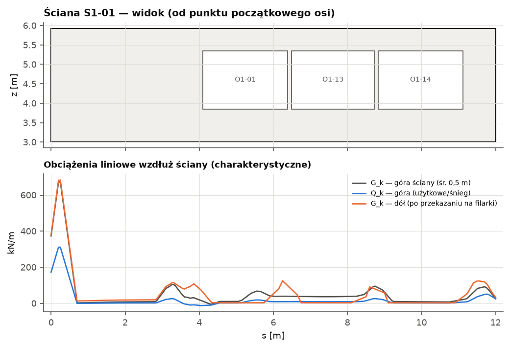

*Rys. Ściana S1-01: widok z otworami i rozkład obciążeń charakterystycznych wzdłuż osi.*

#### Zestawienie obciążeń

**Ciężar ściany — SZ1 — Ściana zewnętrzna nośna: silikat 18 + ETICS EPS 031 20 cm (U ≈ 0,15)**

| Warstwa | Obliczenie | g_k [kN/m²] | γ_G (6.10a) | g_d [kN/m²] | ξγ_G (6.10b) | g_d [kN/m²] |
|---|---|---|---|---|---|---|
| Tynk gipsowy maszynowy 1,5 cm | 1,5 cm × 11,77 kN/m³ | 0,177 | 1,35 | 0,238 | 1,15 | 0,203 |
| Bloczek wapienno-piaskowy (silikat) 18 cm, kl. 20, gr. 1, na zaprawie cienkowarstwowej | 18,0 cm × 18,00 kN/m³ | 3,240 | 1,35 | 4,374 | 1,15 | 3,718 |
| Styropian grafitowy EPS 031 (ETICS, NRO w systemie) | 20,0 cm × 0,15 kN/m³ | 0,029 | 1,35 | 0,040 | 1,15 | 0,034 |
| ETICS: warstwa zbrojona + tynk silikonowy 1,5 mm (biały / jasnoszary NCS S 1500-N) | 1,0 cm × 16,68 kN/m³ | 0,167 | 1,35 | 0,225 | 1,15 | 0,191 |
| **Razem g_k** |  | 3,613 |  | 4,877 |  | 4,146 |

**Obciążenia ściany (charakterystyczne)** — góra: z płyt i ścian wyżej; dół: po przekazaniu obciążeń znad otworów na filarki

| Przypadek | max q_góra [kN/m] | średnio q_dół [kN/m] | max q_dół [kN/m] |
|---|---|---|---|
| G | 133,45 | 34,46 | 329,09 |
| H | 5,67 | 0,74 | 8,21 |
| QA | 22,50 | 3,74 | 43,28 |
| QA_pA | 23,05 | 4,33 | 45,79 |
| QA_pB | 0,00 | 0,00 | 0,00 |
| S1 | 10,21 | 1,33 | 14,77 |
| S2 | 10,21 | 1,33 | 14,77 |
| SB2 | 0,00 | 0,00 | 0,00 |

#### Obliczenia

##### S1-01 — filarek 11,12–12,00 m (b = 0,88 m), 6.10a (wiodące: QA_pA)

- Pole przekroju filarka: A = b·t = 0,88·0,18 = **0,158** m²
- Współczynnik η_A (A < 0,3 m²): η_A = (NA; interpolacja wg R5-63) = **1,34** *(NA do PN-EN 1996-1-1 [NZW])*
- Wytrzymałość charakterystyczna muru: f_k = K·f_b^0,85 = 0,60·20^0,85 = **7,66** MPa *((3.2) + NA tabl. NA.5 (K = 0,60, Ap2:2014-09))*
- Wytrzymałość obliczeniowa: f_d = f_k/γ_M · (1/η_A) = 7,66/1,7·0,744 = **3,35** MPa *(NA tabl. NA.1 (kat. I, zaprawa projektowana, klasa wykonania A))*
- Wysokość efektywna: h_ef = ρ₂·h = 1,000·2,93 = **2,930** m *((5.2), 5.5.1.2)*
- Smukłość: h_ef/t_ef = 2,930/0,180 = **16,28**
- Mimośród przypadkowy: e_init = h_ef/450 = 2930/450 = **6,5** mm *(5.5.1.1(4))*
- Mimośród na górze: e_g = M_g/N_g + e_init ≥ 0,05t = 0,90/69,8 + 0,0065 = **19,4** mm *((6.5))*
- Mimośród na dole: e_d = M_d/N_d + e_init ≥ 0,05t = 0,00/243,2 + 0,0065 = **9,0** mm *((6.5))*
- Współczynnik redukcyjny — góra: Φ_g = 1 − 2e_g/t = 1 − 2·19,4/180 = **0,785** *((6.4))*
- Współczynnik redukcyjny — dół: Φ_d = 1 − 2e_d/t = 1 − 2·9,0/180 = **0,900** *((6.4))*
- Mimośród w połowie wysokości: e_m = (M_md + M_w)/N_m + e_init = (0,45 + 0,00)/156,5 + 0,0065 = **9,4** mm *((6.7))*
- Mimośród od pełzania: e_k = 0,002·φ_∞·(h_ef/t_ef)·√(t·e_m) = 0,002·1,5·16,28·√(0,180·0,0094) = **2,0** mm *((6.8))*
- Mimośród całkowity: e_mk = e_m + e_k ≥ 0,05t = **11,4** mm *((6.6))*
- Współczynnik redukcyjny w połowie wysokości: Φ_m = A₁·exp(−u²/2), A₁ = 1 − 2e_mk/t, u = (λ − 0,063)/(0,73 − 1,17e_mk/t) = λ = 0,515, A₁ = 0,874, u = 0,689 = **0,689** *(zał. G (G.1–G.4), E = K_E·f_k)*
- Nośność: N_Rd = Φ·t·f_d = (góra / środek / dół) 0,785 / 0,689 / 0,900 · 180 mm · 3,35 MPa = **473,6 / 415,8 / 543,0** kN/m *((6.2))*

| Warunek | Efekt | Nośność / limit | η | Stan | Podstawa |
|---|---|---|---|---|---|
| Smukłość ściany | h_ef/t_ef = 16,3  | 27 = 27,0  | 60% | spełniony | 5.5.1.4 |
| Nośność — przekrój górny | N_Ed = 69,78 kN/m | N_Rd = 473,64 kN/m | 15% | spełniony | (6.2), (6.4) |
| Nośność — połowa wysokości | N_Ed = 156,48 kN/m | N_Rd = 415,82 kN/m | 38% | spełniony | (6.2), zał. G |
| Nośność — przekrój dolny | N_Ed = 243,18 kN/m | N_Rd = 543,03 kN/m | 45% | spełniony | (6.2), (6.4) |

> Filarek liczony jako ściana podparta górą i dołem, ρ₂ = 1,0 (bezpiecznie); siły N na 1 m = N/b.

##### S1-01 — zginanie z płaszczyzny (wiatr)

- Wskaźnik wytrzymałości (1 m): Z = t²/6 = 0,180²/6 = **5400** cm³/m
- Pasmo pionowe — moment: M_Ed = w_Ed·h²/8 = 1,464·2,93²/8 = **1,571** kNm/m
- Pasmo pionowe — nośność: M_Rd = (f_xk1/γ_M + σ_d)·Z = (0,20/1,7 + 0,179)·10³·0,00540 = **1,603** kNm/m *((6.15), 6.3.1(3) [NZW f_xk1])*

> Informacyjnie (dolne oszacowanie, bez efektu przesklepienia 6.3.2): Zginanie z płaszczyzny (pasmo pionowe — dolne oszacowanie): M_Ed = 1,571 ≤? M_Rd = 1,603 kNm/m (η = 98%). Ściana obciążona pionowo — miarodajne sprawdzenie 6.1.2 z mimośrodem e_hm od wiatru.

##### S1-01 — wiatr: przesklepienie między stropami (6.3.2)

- Smukłość łuku: l_a/t = 2,93/0,180 = **16,3**
- Nośność na obciążenie poziome: q_lat,d = f_d·(t/l_a)² = 4,50·10³·(0,180/2,93)² = **17,00** kN/m² *((6.20) [NZW])*
- Obliczeniowy rozpór łuku (przenoszony przez stropy/wieńce): N_ad = 1,5·f_d·t/10 = **121,6** kN/m *((6.19) [NZW])*

| Warunek | Efekt | Nośność / limit | η | Stan | Podstawa |
|---|---|---|---|---|---|
| Obciążenie poziome — przesklepienie | W_Ed = 1,46 kN/m² | q_lat,d = 17,00 kN/m² | 9% | spełniony | PN-EN 1996-1-1 6.3.2 |

##### S1-01 — docisk pod oparciem belki (s = 3,85 m)

- Pole docisku: A_b = l_b·b = 0,250·0,180 = **0,0450** m²
- Długość efektywna w połowie wysokości: l_efm = l_b + 2·(h_c/2)·tg 30° (ograniczona a₁) = **1,942** m *(rys. 6.2)*
- Współczynnik zwiększający: β = (1 + 0,3·a₁/h_c)·(1,5 − 1,1·A_b/A_ef) = (1 + 0,3·3,73/2,93)·(1,5 − 1,1·0,129) = **1,500** *((6.10))*
- Nośność na docisk: N_Rdc = β·A_b·f_d = 1,500·0,0450·4,50·10³ = **304,01** kN *((6.9))*

| Warunek | Efekt | Nośność / limit | η | Stan | Podstawa |
|---|---|---|---|---|---|
| Docisk | N_Edc = 41,03 kN | N_Rdc = 304,01 kN | 13% | spełniony | PN-EN 1996-1-1 (6.9) |

> Dodatkowo sprawdzić ścianę w połowie wysokości pod oparciem (6.1.3(4)) — obejmuje to sprawdzenie ściany/filarka.

##### S1-01 — docisk pod oparciem belki (s = 11,37 m)

- Pole docisku: A_b = l_b·b = 0,250·0,180 = **0,0450** m²
- Długość efektywna w połowie wysokości: l_efm = l_b + 2·(h_c/2)·tg 30° (ograniczona a₁) = **1,601** m *(rys. 6.2)*
- Współczynnik zwiększający: β = (1 + 0,3·a₁/h_c)·(1,5 − 1,1·A_b/A_ef) = (1 + 0,3·0,51/2,93)·(1,5 − 1,1·0,156) = **1,336** *((6.10))*
- Nośność na docisk: N_Rdc = β·A_b·f_d = 1,336·0,0450·4,50·10³ = **270,80** kN *((6.9))*

| Warunek | Efekt | Nośność / limit | η | Stan | Podstawa |
|---|---|---|---|---|---|
| Docisk | N_Edc = 26,95 kN | N_Rdc = 270,80 kN | 10% | spełniony | PN-EN 1996-1-1 (6.9) |

> Dodatkowo sprawdzić ścianę w połowie wysokości pod oparciem (6.1.3(4)) — obejmuje to sprawdzenie ściany/filarka.

#### Wnioski

**Przyjęto:** Mur: Bloczek wapienno-piaskowy (silikat) 18 cm, kl. 20, gr. 1, na zaprawie cienkowarstwowej, f_d = 4,50 MPa (klasa wykonania A, γ_M = 1,7).  

### Poz. 7.12 — Ściana S1-02 (P1, zewnętrzna nośna)

Element modelu: `S1-02` · maks. wykorzystanie nośności η = 45% · wszystkie warunki spełnione

#### Opis i schemat statyczny

Ściana gr. konstrukcyjnej t = 18 cm, długość osi 8,75 m, wysokość h = 2,930 m (z 3,000 do 5,930); materiał: Bloczek wapienno-piaskowy (silikat) 18 cm, kl. 20, gr. 1, na zaprawie cienkowarstwowej. Otwory: O1-02 (1,50 m).

Sprawdzono 2 odcinków (filarki ≤ 2 m między otworami — siła całkowita; dłuższe pasma — maks. średnia krocząca 1 m) dla 44 kombinacji; poniżej przypadek miarodajny. Mimośród reakcji stropu e = t/6 (zewn.) / 0,3·t/6 (wewn., niesymetria) [UPR]; wiatr jako moment w połowie wysokości w·h²/8.

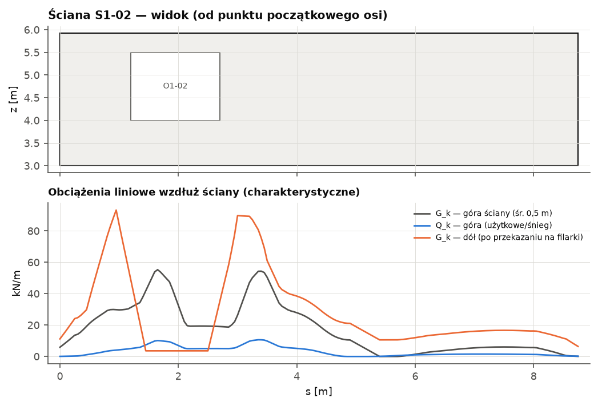

*Rys. Ściana S1-02: widok z otworami i rozkład obciążeń charakterystycznych wzdłuż osi.*

#### Zestawienie obciążeń

**Ciężar ściany — SZ1 — Ściana zewnętrzna nośna: silikat 18 + ETICS EPS 031 20 cm (U ≈ 0,15)**

| Warstwa | Obliczenie | g_k [kN/m²] | γ_G (6.10a) | g_d [kN/m²] | ξγ_G (6.10b) | g_d [kN/m²] |
|---|---|---|---|---|---|---|
| Tynk gipsowy maszynowy 1,5 cm | 1,5 cm × 11,77 kN/m³ | 0,177 | 1,35 | 0,238 | 1,15 | 0,203 |
| Bloczek wapienno-piaskowy (silikat) 18 cm, kl. 20, gr. 1, na zaprawie cienkowarstwowej | 18,0 cm × 18,00 kN/m³ | 3,240 | 1,35 | 4,374 | 1,15 | 3,718 |
| Styropian grafitowy EPS 031 (ETICS, NRO w systemie) | 20,0 cm × 0,15 kN/m³ | 0,029 | 1,35 | 0,040 | 1,15 | 0,034 |
| ETICS: warstwa zbrojona + tynk silikonowy 1,5 mm (biały / jasnoszary NCS S 1500-N) | 1,0 cm × 16,68 kN/m³ | 0,167 | 1,35 | 0,225 | 1,15 | 0,191 |
| **Razem g_k** |  | 3,613 |  | 4,877 |  | 4,146 |

**Obciążenia ściany (charakterystyczne)** — góra: z płyt i ścian wyżej; dół: po przekazaniu obciążeń znad otworów na filarki

| Przypadek | max q_góra [kN/m] | średnio q_dół [kN/m] | max q_dół [kN/m] |
|---|---|---|---|
| G | 53,82 | 27,04 | 112,75 |
| H | 1,97 | 0,52 | 3,06 |
| QA | 5,06 | 1,71 | 11,79 |
| QA_pA | 5,06 | 1,71 | 11,79 |
| QA_pB | 0,01 | 0,00 | 0,01 |
| S1 | 3,55 | 0,94 | 5,51 |
| S2 | 3,55 | 1,07 | 5,51 |
| SB2 | 1,72 | 0,45 | 1,72 |

#### Obliczenia

##### S1-02 — ściana (odcinek 2,70–8,75 m), 6.10b (wiodące: W)

- Wytrzymałość charakterystyczna muru: f_k = K·f_b^0,85 = 0,60·20^0,85 = **7,66** MPa *((3.2) + NA tabl. NA.5 (K = 0,60, Ap2:2014-09))*
- Wytrzymałość obliczeniowa: f_d = f_k/γ_M = 7,66/1,7 = **4,50** MPa *(NA tabl. NA.1 (kat. I, zaprawa projektowana, klasa wykonania A))*
- Wysokość efektywna: h_ef = ρ₂·h = 0,750·2,93 = **2,197** m *((5.2), 5.5.1.2)*
- Smukłość: h_ef/t_ef = 2,197/0,180 = **12,21**
- Mimośród przypadkowy: e_init = h_ef/450 = 2198/450 = **4,9** mm *(5.5.1.1(4))*
- Mimośród na górze: e_g = M_g/N_g + e_init ≥ 0,05t = 0,60/55,4 + 0,0049 = **15,8** mm *((6.5))*
- Mimośród na dole: e_d = M_d/N_d + e_init ≥ 0,05t = 0,00/91,3 + 0,0049 = **9,0** mm *((6.5))*
- Współczynnik redukcyjny — góra: Φ_g = 1 − 2e_g/t = 1 − 2·15,8/180 = **0,825** *((6.4))*
- Współczynnik redukcyjny — dół: Φ_d = 1 − 2e_d/t = 1 − 2·9,0/180 = **0,900** *((6.4))*
- Mimośród w połowie wysokości: e_m = (M_md + M_w)/N_m + e_init = (0,30 + 1,57)/73,4 + 0,0049 = **30,4** mm *((6.7))*
- Mimośród od pełzania: e_k = 0 (h_ef/t_ef ≤ λ_c) = **0,0** mm *(6.1.2.2(2) [NZW NA])*
- Mimośród całkowity: e_mk = e_m + e_k ≥ 0,05t = **30,4** mm *((6.6))*
- Współczynnik redukcyjny w połowie wysokości: Φ_m = A₁·exp(−u²/2), A₁ = 1 − 2e_mk/t, u = (λ − 0,063)/(0,73 − 1,17e_mk/t) = λ = 0,386, A₁ = 0,662, u = 0,607 = **0,551** *(zał. G (G.1–G.4), E = K_E·f_k)*
- Nośność: N_Rd = Φ·t·f_d = (góra / środek / dół) 0,825 / 0,551 / 0,900 · 180 mm · 4,50 MPa = **668,7 / 446,6 / 729,6** kN/m *((6.2))*

| Warunek | Efekt | Nośność / limit | η | Stan | Podstawa |
|---|---|---|---|---|---|
| Smukłość ściany | h_ef/t_ef = 12,2  | 27 = 27,0  | 45% | spełniony | 5.5.1.4 |
| Nośność — przekrój górny | N_Ed = 55,40 kN/m | N_Rd = 668,69 kN/m | 8% | spełniony | (6.2), (6.4) |
| Nośność — połowa wysokości | N_Ed = 73,37 kN/m | N_Rd = 446,58 kN/m | 16% | spełniony | (6.2), zał. G |
| Nośność — przekrój dolny | N_Ed = 91,34 kN/m | N_Rd = 729,61 kN/m | 13% | spełniony | (6.2), (6.4) |

##### S1-02 — zginanie z płaszczyzny (wiatr)

- Wskaźnik wytrzymałości (1 m): Z = t²/6 = 0,180²/6 = **5400** cm³/m
- Pasmo pionowe — moment: M_Ed = w_Ed·h²/8 = 1,464·2,93²/8 = **1,571** kNm/m
- Pasmo pionowe — nośność: M_Rd = (f_xk1/γ_M + σ_d)·Z = (0,20/1,7 + 0,126)·10³·0,00540 = **1,314** kNm/m *((6.15), 6.3.1(3) [NZW f_xk1])*

> Informacyjnie (dolne oszacowanie, bez efektu przesklepienia 6.3.2): Zginanie z płaszczyzny (pasmo pionowe — dolne oszacowanie): M_Ed = 1,571 ≤? M_Rd = 1,314 kNm/m (η = 120%). Ściana obciążona pionowo — miarodajne sprawdzenie 6.1.2 z mimośrodem e_hm od wiatru.

##### S1-02 — wiatr: przesklepienie między stropami (6.3.2)

- Smukłość łuku: l_a/t = 2,93/0,180 = **16,3**
- Nośność na obciążenie poziome: q_lat,d = f_d·(t/l_a)² = 4,50·10³·(0,180/2,93)² = **17,00** kN/m² *((6.20) [NZW])*
- Obliczeniowy rozpór łuku (przenoszony przez stropy/wieńce): N_ad = 1,5·f_d·t/10 = **121,6** kN/m *((6.19) [NZW])*

| Warunek | Efekt | Nośność / limit | η | Stan | Podstawa |
|---|---|---|---|---|---|
| Obciążenie poziome — przesklepienie | W_Ed = 1,46 kN/m² | q_lat,d = 17,00 kN/m² | 9% | spełniony | PN-EN 1996-1-1 6.3.2 |

#### Wnioski

**Przyjęto:** Mur: Bloczek wapienno-piaskowy (silikat) 18 cm, kl. 20, gr. 1, na zaprawie cienkowarstwowej, f_d = 4,50 MPa (klasa wykonania A, γ_M = 1,7).  

### Poz. 7.13 — Ściana S1-03 (P1, zewnętrzna nośna)

Element modelu: `S1-03` · maks. wykorzystanie nośności η = 45% · wszystkie warunki spełnione

#### Opis i schemat statyczny

Ściana gr. konstrukcyjnej t = 18 cm, długość osi 12,00 m, wysokość h = 2,930 m (z 3,000 do 5,930); materiał: Bloczek wapienno-piaskowy (silikat) 18 cm, kl. 20, gr. 1, na zaprawie cienkowarstwowej. Otwory: O1-04 (1,20 m), O1-03 (0,90 m).

Sprawdzono 3 odcinków (filarki ≤ 2 m między otworami — siła całkowita; dłuższe pasma — maks. średnia krocząca 1 m) dla 44 kombinacji; poniżej przypadek miarodajny. Mimośród reakcji stropu e = t/6 (zewn.) / 0,3·t/6 (wewn., niesymetria) [UPR]; wiatr jako moment w połowie wysokości w·h²/8.

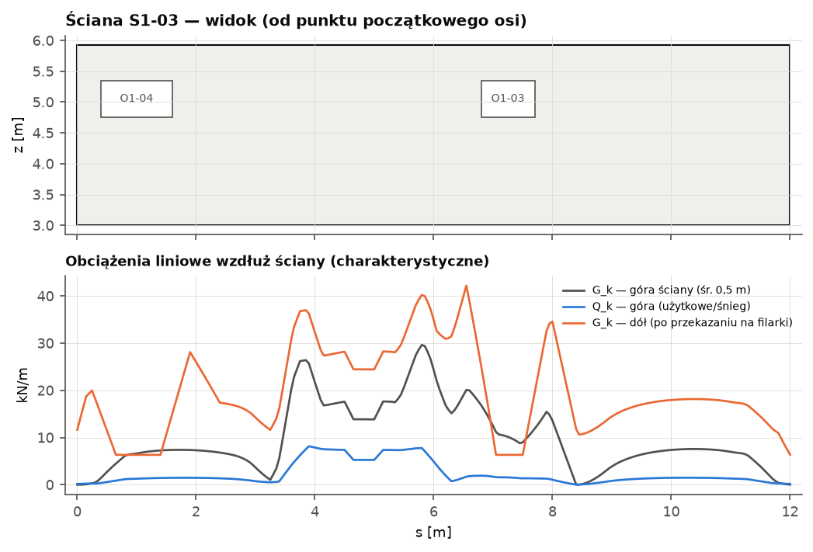

*Rys. Ściana S1-03: widok z otworami i rozkład obciążeń charakterystycznych wzdłuż osi.*

#### Zestawienie obciążeń

**Ciężar ściany — SZ1 — Ściana zewnętrzna nośna: silikat 18 + ETICS EPS 031 20 cm (U ≈ 0,15)**

| Warstwa | Obliczenie | g_k [kN/m²] | γ_G (6.10a) | g_d [kN/m²] | ξγ_G (6.10b) | g_d [kN/m²] |
|---|---|---|---|---|---|---|
| Tynk gipsowy maszynowy 1,5 cm | 1,5 cm × 11,77 kN/m³ | 0,177 | 1,35 | 0,238 | 1,15 | 0,203 |
| Bloczek wapienno-piaskowy (silikat) 18 cm, kl. 20, gr. 1, na zaprawie cienkowarstwowej | 18,0 cm × 18,00 kN/m³ | 3,240 | 1,35 | 4,374 | 1,15 | 3,718 |
| Styropian grafitowy EPS 031 (ETICS, NRO w systemie) | 20,0 cm × 0,15 kN/m³ | 0,029 | 1,35 | 0,040 | 1,15 | 0,034 |
| ETICS: warstwa zbrojona + tynk silikonowy 1,5 mm (biały / jasnoszary NCS S 1500-N) | 1,0 cm × 16,68 kN/m³ | 0,167 | 1,35 | 0,225 | 1,15 | 0,191 |
| **Razem g_k** |  | 3,613 |  | 4,877 |  | 4,146 |

**Obciążenia ściany (charakterystyczne)** — góra: z płyt i ścian wyżej; dół: po przekazaniu obciążeń znad otworów na filarki

| Przypadek | max q_góra [kN/m] | średnio q_dół [kN/m] | max q_dół [kN/m] |
|---|---|---|---|
| G | 38,50 | 22,46 | 55,00 |
| H | 0,91 | 0,30 | 0,98 |
| QA | 9,71 | 2,09 | 9,71 |
| QA_pA | 2,17 | 0,34 | 3,76 |
| QA_pB | 1,85 | 0,40 | 1,85 |
| S1 | 1,65 | 0,55 | 1,76 |
| S2 | 1,65 | 0,71 | 2,52 |
| SB2 | 1,53 | 0,56 | 2,77 |

#### Obliczenia

##### S1-03 — ściana (odcinek 7,70–12,00 m), 6.10 G korzystne (wiodące: W)

- Wytrzymałość charakterystyczna muru: f_k = K·f_b^0,85 = 0,60·20^0,85 = **7,66** MPa *((3.2) + NA tabl. NA.5 (K = 0,60, Ap2:2014-09))*
- Wytrzymałość obliczeniowa: f_d = f_k/γ_M = 7,66/1,7 = **4,50** MPa *(NA tabl. NA.1 (kat. I, zaprawa projektowana, klasa wykonania A))*
- Wysokość efektywna: h_ef = ρ₂·h = 0,750·2,93 = **2,197** m *((5.2), 5.5.1.2)*
- Smukłość: h_ef/t_ef = 2,197/0,180 = **12,21**
- Mimośród przypadkowy: e_init = h_ef/450 = 2198/450 = **4,9** mm *(5.5.1.1(4))*
- Mimośród na górze: e_g = M_g/N_g + e_init ≥ 0,05t = 0,30/23,2 + 0,0049 = **17,6** mm *((6.5))*
- Mimośród na dole: e_d = M_d/N_d + e_init ≥ 0,05t = 0,00/26,4 + 0,0049 = **9,0** mm *((6.5))*
- Współczynnik redukcyjny — góra: Φ_g = 1 − 2e_g/t = 1 − 2·17,6/180 = **0,804** *((6.4))*
- Współczynnik redukcyjny — dół: Φ_d = 1 − 2e_d/t = 1 − 2·9,0/180 = **0,900** *((6.4))*
- Mimośród w połowie wysokości: e_m = (M_md + M_w)/N_m + e_init = (0,15 + 1,57)/24,8 + 0,0049 = **74,1** mm *((6.7))*
- Mimośród od pełzania: e_k = 0 (h_ef/t_ef ≤ λ_c) = **0,0** mm *(6.1.2.2(2) [NZW NA])*
- Mimośród całkowity: e_mk = e_m + e_k ≥ 0,05t = **74,1** mm *((6.6))*
- Współczynnik redukcyjny w połowie wysokości: Φ_m = A₁·exp(−u²/2), A₁ = 1 − 2e_mk/t, u = (λ − 0,063)/(0,73 − 1,17e_mk/t) = λ = 0,386, A₁ = 0,177, u = 1,300 = **0,076** *(zał. G (G.1–G.4), E = K_E·f_k)*
- Nośność: N_Rd = Φ·t·f_d = (góra / środek / dół) 0,804 / 0,076 / 0,900 · 180 mm · 4,50 MPa = **652,1 / 61,6 / 729,6** kN/m *((6.2))*

| Warunek | Efekt | Nośność / limit | η | Stan | Podstawa |
|---|---|---|---|---|---|
| Smukłość ściany | h_ef/t_ef = 12,2  | 27 = 27,0  | 45% | spełniony | 5.5.1.4 |
| Nośność — przekrój górny | N_Ed = 23,23 kN/m | N_Rd = 652,09 kN/m | 4% | spełniony | (6.2), (6.4) |
| Nośność — połowa wysokości | N_Ed = 24,84 kN/m | N_Rd = 61,62 kN/m | 40% | spełniony | (6.2), zał. G |
| Nośność — przekrój dolny | N_Ed = 26,45 kN/m | N_Rd = 729,61 kN/m | 4% | spełniony | (6.2), (6.4) |

##### S1-03 — zginanie z płaszczyzny (wiatr)

- Wskaźnik wytrzymałości (1 m): Z = t²/6 = 0,180²/6 = **5400** cm³/m
- Pasmo pionowe — moment: M_Ed = w_Ed·h²/8 = 1,464·2,93²/8 = **1,571** kNm/m
- Pasmo pionowe — nośność: M_Rd = (f_xk1/γ_M + σ_d)·Z = (0,20/1,7 + 0,098)·10³·0,00540 = **1,163** kNm/m *((6.15), 6.3.1(3) [NZW f_xk1])*

> Informacyjnie (dolne oszacowanie, bez efektu przesklepienia 6.3.2): Zginanie z płaszczyzny (pasmo pionowe — dolne oszacowanie): M_Ed = 1,571 ≤? M_Rd = 1,163 kNm/m (η = 135%). Ściana obciążona pionowo — miarodajne sprawdzenie 6.1.2 z mimośrodem e_hm od wiatru.

##### S1-03 — wiatr: przesklepienie między stropami (6.3.2)

- Smukłość łuku: l_a/t = 2,93/0,180 = **16,3**
- Nośność na obciążenie poziome: q_lat,d = f_d·(t/l_a)² = 4,50·10³·(0,180/2,93)² = **17,00** kN/m² *((6.20) [NZW])*
- Obliczeniowy rozpór łuku (przenoszony przez stropy/wieńce): N_ad = 1,5·f_d·t/10 = **121,6** kN/m *((6.19) [NZW])*

| Warunek | Efekt | Nośność / limit | η | Stan | Podstawa |
|---|---|---|---|---|---|
| Obciążenie poziome — przesklepienie | W_Ed = 1,46 kN/m² | q_lat,d = 17,00 kN/m² | 9% | spełniony | PN-EN 1996-1-1 6.3.2 |

#### Wnioski

**Przyjęto:** Mur: Bloczek wapienno-piaskowy (silikat) 18 cm, kl. 20, gr. 1, na zaprawie cienkowarstwowej, f_d = 4,50 MPa (klasa wykonania A, γ_M = 1,7).  

### Poz. 7.14 — Ściana S1-04 (P1, zewnętrzna nośna)

Element modelu: `S1-04` · maks. wykorzystanie nośności η = 60% · wszystkie warunki spełnione

#### Opis i schemat statyczny

Ściana gr. konstrukcyjnej t = 18 cm, długość osi 8,75 m, wysokość h = 2,930 m (z 3,000 do 5,930); materiał: Bloczek wapienno-piaskowy (silikat) 18 cm, kl. 20, gr. 1, na zaprawie cienkowarstwowej. Otwory: O1-05 (1,80 m), O1-06 (1,80 m).

Sprawdzono 3 odcinków (filarki ≤ 2 m między otworami — siła całkowita; dłuższe pasma — maks. średnia krocząca 1 m) dla 44 kombinacji; poniżej przypadek miarodajny. Mimośród reakcji stropu e = t/6 (zewn.) / 0,3·t/6 (wewn., niesymetria) [UPR]; wiatr jako moment w połowie wysokości w·h²/8.

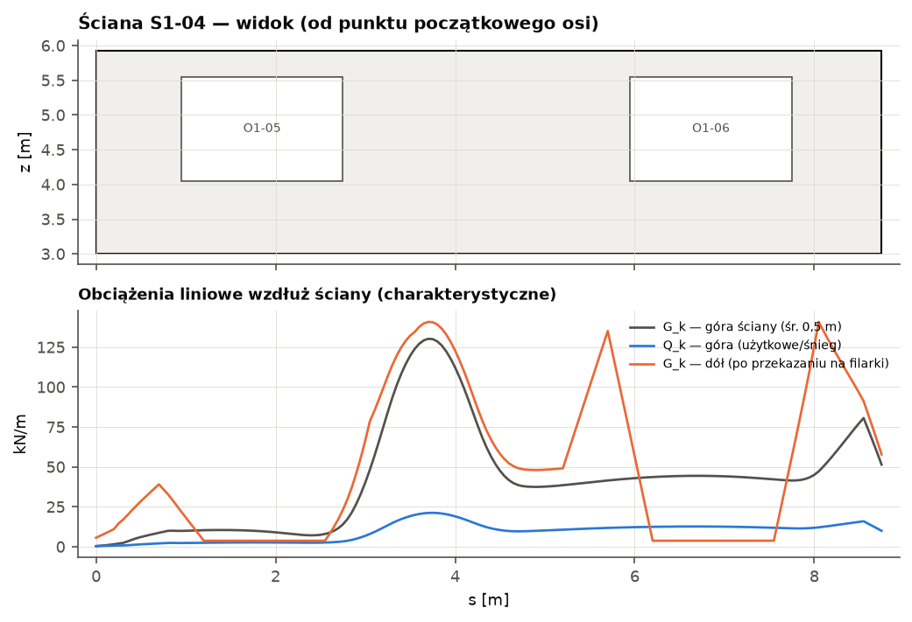

*Rys. Ściana S1-04: widok z otworami i rozkład obciążeń charakterystycznych wzdłuż osi.*

#### Zestawienie obciążeń

**Ciężar ściany — SZ1 — Ściana zewnętrzna nośna: silikat 18 + ETICS EPS 031 20 cm (U ≈ 0,15)**

| Warstwa | Obliczenie | g_k [kN/m²] | γ_G (6.10a) | g_d [kN/m²] | ξγ_G (6.10b) | g_d [kN/m²] |
|---|---|---|---|---|---|---|
| Tynk gipsowy maszynowy 1,5 cm | 1,5 cm × 11,77 kN/m³ | 0,177 | 1,35 | 0,238 | 1,15 | 0,203 |
| Bloczek wapienno-piaskowy (silikat) 18 cm, kl. 20, gr. 1, na zaprawie cienkowarstwowej | 18,0 cm × 18,00 kN/m³ | 3,240 | 1,35 | 4,374 | 1,15 | 3,718 |
| Styropian grafitowy EPS 031 (ETICS, NRO w systemie) | 20,0 cm × 0,15 kN/m³ | 0,029 | 1,35 | 0,040 | 1,15 | 0,034 |
| ETICS: warstwa zbrojona + tynk silikonowy 1,5 mm (biały / jasnoszary NCS S 1500-N) | 1,0 cm × 16,68 kN/m³ | 0,167 | 1,35 | 0,225 | 1,15 | 0,191 |
| **Razem g_k** |  | 3,613 |  | 4,877 |  | 4,146 |

**Obciążenia ściany (charakterystyczne)** — góra: z płyt i ścian wyżej; dół: po przekazaniu obciążeń znad otworów na filarki

| Przypadek | max q_góra [kN/m] | średnio q_dół [kN/m] | max q_dół [kN/m] |
|---|---|---|---|
| G | 133,45 | 50,73 | 156,69 |
| H | 6,26 | 1,47 | 6,26 |
| QA | 11,03 | 5,32 | 30,28 |
| QA_pA | 1,11 | 0,38 | 2,98 |
| QA_pB | 24,07 | 4,93 | 24,07 |
| S1 | 11,27 | 2,64 | 11,27 |
| S2 | 11,07 | 2,78 | 11,80 |
| SB2 | 1,77 | 0,48 | 4,68 |

#### Obliczenia

##### S1-04 — filarek 7,75–8,75 m (b = 1,00 m), 6.10a (wiodące: QA_pB)

- Pole przekroju filarka: A = b·t = 1,00·0,18 = **0,180** m²
- Współczynnik η_A (A < 0,3 m²): η_A = (NA; interpolacja wg R5-63) = **1,29** *(NA do PN-EN 1996-1-1 [NZW])*
- Wytrzymałość charakterystyczna muru: f_k = K·f_b^0,85 = 0,60·20^0,85 = **7,66** MPa *((3.2) + NA tabl. NA.5 (K = 0,60, Ap2:2014-09))*
- Wytrzymałość obliczeniowa: f_d = f_k/γ_M · (1/η_A) = 7,66/1,7·0,772 = **3,48** MPa *(NA tabl. NA.1 (kat. I, zaprawa projektowana, klasa wykonania A))*
- Wysokość efektywna: h_ef = ρ₂·h = 1,000·2,93 = **2,930** m *((5.2), 5.5.1.2)*
- Smukłość: h_ef/t_ef = 2,930/0,180 = **16,28**
- Mimośród przypadkowy: e_init = h_ef/450 = 2930/450 = **6,5** mm *(5.5.1.1(4))*
- Mimośród na górze: e_g = M_g/N_g + e_init ≥ 0,05t = 3,04/101,5 + 0,0065 = **36,5** mm *((6.5))*
- Mimośród na dole: e_d = M_d/N_d + e_init ≥ 0,05t = 0,00/173,5 + 0,0065 = **9,0** mm *((6.5))*
- Współczynnik redukcyjny — góra: Φ_g = 1 − 2e_g/t = 1 − 2·36,5/180 = **0,594** *((6.4))*
- Współczynnik redukcyjny — dół: Φ_d = 1 − 2e_d/t = 1 − 2·9,0/180 = **0,900** *((6.4))*
- Mimośród w połowie wysokości: e_m = (M_md + M_w)/N_m + e_init = (1,52 + 0,00)/137,5 + 0,0065 = **17,6** mm *((6.7))*
- Mimośród od pełzania: e_k = 0,002·φ_∞·(h_ef/t_ef)·√(t·e_m) = 0,002·1,5·16,28·√(0,180·0,0176) = **2,7** mm *((6.8))*
- Mimośród całkowity: e_mk = e_m + e_k ≥ 0,05t = **20,3** mm *((6.6))*
- Współczynnik redukcyjny w połowie wysokości: Φ_m = A₁·exp(−u²/2), A₁ = 1 − 2e_mk/t, u = (λ − 0,063)/(0,73 − 1,17e_mk/t) = λ = 0,515, A₁ = 0,774, u = 0,756 = **0,582** *(zał. G (G.1–G.4), E = K_E·f_k)*
- Nośność: N_Rd = Φ·t·f_d = (góra / środek / dół) 0,594 / 0,582 / 0,900 · 180 mm · 3,48 MPa = **372,1 / 364,3 / 563,4** kN/m *((6.2))*

| Warunek | Efekt | Nośność / limit | η | Stan | Podstawa |
|---|---|---|---|---|---|
| Smukłość ściany | h_ef/t_ef = 16,3  | 27 = 27,0  | 60% | spełniony | 5.5.1.4 |
| Nośność — przekrój górny | N_Ed = 101,47 kN/m | N_Rd = 372,05 kN/m | 27% | spełniony | (6.2), (6.4) |
| Nośność — połowa wysokości | N_Ed = 137,48 kN/m | N_Rd = 364,26 kN/m | 38% | spełniony | (6.2), zał. G |
| Nośność — przekrój dolny | N_Ed = 173,50 kN/m | N_Rd = 563,41 kN/m | 31% | spełniony | (6.2), (6.4) |

> Filarek liczony jako ściana podparta górą i dołem, ρ₂ = 1,0 (bezpiecznie); siły N na 1 m = N/b.

##### S1-04 — zginanie z płaszczyzny (wiatr)

- Wskaźnik wytrzymałości (1 m): Z = t²/6 = 0,180²/6 = **5400** cm³/m
- Pasmo pionowe — moment: M_Ed = w_Ed·h²/8 = 1,464·2,93²/8 = **1,571** kNm/m
- Pasmo pionowe — nośność: M_Rd = (f_xk1/γ_M + σ_d)·Z = (0,20/1,7 + 0,265)·10³·0,00540 = **2,068** kNm/m *((6.15), 6.3.1(3) [NZW f_xk1])*

> Informacyjnie (dolne oszacowanie, bez efektu przesklepienia 6.3.2): Zginanie z płaszczyzny (pasmo pionowe — dolne oszacowanie): M_Ed = 1,571 ≤? M_Rd = 2,068 kNm/m (η = 76%). Ściana obciążona pionowo — miarodajne sprawdzenie 6.1.2 z mimośrodem e_hm od wiatru.

##### S1-04 — wiatr: przesklepienie między stropami (6.3.2)

- Smukłość łuku: l_a/t = 2,93/0,180 = **16,3**
- Nośność na obciążenie poziome: q_lat,d = f_d·(t/l_a)² = 4,50·10³·(0,180/2,93)² = **17,00** kN/m² *((6.20) [NZW])*
- Obliczeniowy rozpór łuku (przenoszony przez stropy/wieńce): N_ad = 1,5·f_d·t/10 = **121,6** kN/m *((6.19) [NZW])*

| Warunek | Efekt | Nośność / limit | η | Stan | Podstawa |
|---|---|---|---|---|---|
| Obciążenie poziome — przesklepienie | W_Ed = 1,46 kN/m² | q_lat,d = 17,00 kN/m² | 9% | spełniony | PN-EN 1996-1-1 6.3.2 |

#### Wnioski

**Przyjęto:** Mur: Bloczek wapienno-piaskowy (silikat) 18 cm, kl. 20, gr. 1, na zaprawie cienkowarstwowej, f_d = 4,50 MPa (klasa wykonania A, γ_M = 1,7).  

### Poz. 7.15 — Ściana S1-05 (P1, wewnętrzna nośna)

Element modelu: `S1-05` · maks. wykorzystanie nośności η = 143% · **WARUNKI NIESPEŁNIONE — patrz tabele warunków i wnioski**

#### Opis i schemat statyczny

Ściana gr. konstrukcyjnej t = 18 cm, długość osi 5,88 m, wysokość h = 2,930 m (z 3,000 do 5,930); materiał: Bloczek wapienno-piaskowy (silikat) 18 cm, kl. 20, gr. 1, na zaprawie cienkowarstwowej. Otwory: O1-09 (0,90 m), O1-10 (0,90 m).

Sprawdzono 3 odcinków (filarki ≤ 2 m między otworami — siła całkowita; dłuższe pasma — maks. średnia krocząca 1 m) dla 34 kombinacji; poniżej przypadek miarodajny. Mimośród reakcji stropu e = t/6 (zewn.) / 0,3·t/6 (wewn., niesymetria) [UPR]; wiatr jako moment w połowie wysokości w·h²/8.

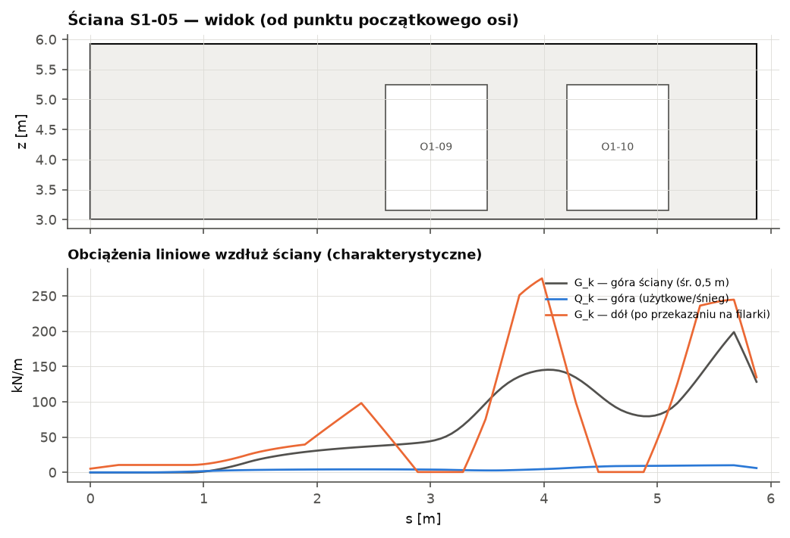

*Rys. Ściana S1-05: widok z otworami i rozkład obciążeń charakterystycznych wzdłuż osi.*

#### Zestawienie obciążeń

**Ciężar ściany — SW18 — Ściana wewnętrzna nośna: silikat 18, tynk gipsowy obustronnie**

| Warstwa | Obliczenie | g_k [kN/m²] | γ_G (6.10a) | g_d [kN/m²] | ξγ_G (6.10b) | g_d [kN/m²] |
|---|---|---|---|---|---|---|
| Tynk gipsowy maszynowy 1,5 cm | 1,5 cm × 11,77 kN/m³ | 0,177 | 1,35 | 0,238 | 1,15 | 0,203 |
| Bloczek wapienno-piaskowy (silikat) 18 cm, kl. 20, gr. 1, na zaprawie cienkowarstwowej | 18,0 cm × 18,00 kN/m³ | 3,240 | 1,35 | 4,374 | 1,15 | 3,718 |
| Tynk gipsowy maszynowy 1,5 cm | 1,5 cm × 11,77 kN/m³ | 0,177 | 1,35 | 0,238 | 1,15 | 0,203 |
| **Razem g_k** |  | 3,593 |  | 4,851 |  | 4,123 |

**Obciążenia ściany (charakterystyczne)** — góra: z płyt i ścian wyżej; dół: po przekazaniu obciążeń znad otworów na filarki

| Przypadek | max q_góra [kN/m] | średnio q_dół [kN/m] | max q_dół [kN/m] |
|---|---|---|---|
| G | 398,57 | 132,18 | 521,47 |
| H | 4,88 | 2,33 | 8,88 |
| QA | 91,78 | 24,27 | 110,43 |
| QA_pA | 94,28 | 26,73 | 115,07 |
| QA_pB | 0,00 | 0,00 | 0,00 |
| S1 | 8,78 | 4,20 | 15,98 |
| S2 | 8,83 | 4,37 | 15,91 |
| SB2 | 1,39 | 0,60 | 1,91 |

#### Obliczenia

##### S1-05 — filarek 3,50–4,20 m (b = 0,70 m), 6.10a (wiodące: QA_pA)

- Pole przekroju filarka: A = b·t = 0,70·0,18 = **0,126** m²
- Współczynnik η_A (A < 0,3 m²): η_A = (NA; interpolacja wg R5-63) = **1,42** *(NA do PN-EN 1996-1-1 [NZW])*
- Wytrzymałość charakterystyczna muru: f_k = K·f_b^0,85 = 0,60·20^0,85 = **7,66** MPa *((3.2) + NA tabl. NA.5 (K = 0,60, Ap2:2014-09))*
- Wytrzymałość obliczeniowa: f_d = f_k/γ_M · (1/η_A) = 7,66/1,7·0,706 = **3,18** MPa *(NA tabl. NA.1 (kat. I, zaprawa projektowana, klasa wykonania A))*
- Wysokość efektywna: h_ef = ρ₂·h = 1,000·2,93 = **2,930** m *((5.2), 5.5.1.2)*
- Smukłość: h_ef/t_ef = 2,930/0,180 = **16,28**
- Mimośród przypadkowy: e_init = h_ef/450 = 2930/450 = **6,5** mm *(5.5.1.1(4))*
- Mimośród na górze: e_g = M_g/N_g + e_init ≥ 0,05t = 3,75/417,0 + 0,0065 = **15,5** mm *((6.5))*
- Mimośród na dole: e_d = M_d/N_d + e_init ≥ 0,05t = 0,00/703,2 + 0,0065 = **9,0** mm *((6.5))*
- Współczynnik redukcyjny — góra: Φ_g = 1 − 2e_g/t = 1 − 2·15,5/180 = **0,828** *((6.4))*
- Współczynnik redukcyjny — dół: Φ_d = 1 − 2e_d/t = 1 − 2·9,0/180 = **0,900** *((6.4))*
- Mimośród w połowie wysokości: e_m = (M_md + M_w)/N_m + e_init = (1,88 + 0,00)/560,1 + 0,0065 = **9,9** mm *((6.7))*
- Mimośród od pełzania: e_k = 0,002·φ_∞·(h_ef/t_ef)·√(t·e_m) = 0,002·1,5·16,28·√(0,180·0,0099) = **2,1** mm *((6.8))*
- Mimośród całkowity: e_mk = e_m + e_k ≥ 0,05t = **11,9** mm *((6.6))*
- Współczynnik redukcyjny w połowie wysokości: Φ_m = A₁·exp(−u²/2), A₁ = 1 − 2e_mk/t, u = (λ − 0,063)/(0,73 − 1,17e_mk/t) = λ = 0,515, A₁ = 0,868, u = 0,692 = **0,683** *(zał. G (G.1–G.4), E = K_E·f_k)*
- Nośność: N_Rd = Φ·t·f_d = (góra / środek / dół) 0,828 / 0,683 / 0,900 · 180 mm · 3,18 MPa = **473,7 / 390,7 / 515,1** kN/m *((6.2))*

| Warunek | Efekt | Nośność / limit | η | Stan | Podstawa |
|---|---|---|---|---|---|
| Smukłość ściany | h_ef/t_ef = 16,3  | 27 = 27,0  | 60% | spełniony | 5.5.1.4 |
| Nośność — przekrój górny | N_Ed = 416,99 kN/m | N_Rd = 473,68 kN/m | 88% | spełniony | (6.2), (6.4) |
| Nośność — połowa wysokości | N_Ed = 560,08 kN/m | N_Rd = 390,72 kN/m | 143% | **NIESPEŁNIONY** | (6.2), zał. G |
| Nośność — przekrój dolny | N_Ed = 703,17 kN/m | N_Rd = 515,08 kN/m | 137% | **NIESPEŁNIONY** | (6.2), (6.4) |

> Filarek liczony jako ściana podparta górą i dołem, ρ₂ = 1,0 (bezpiecznie); siły N na 1 m = N/b.

#### Wnioski

**Przyjęto:** Mur: Bloczek wapienno-piaskowy (silikat) 18 cm, kl. 20, gr. 1, na zaprawie cienkowarstwowej, f_d = 4,50 MPa (klasa wykonania A, γ_M = 1,7).  

### Poz. 7.16 — Ściana S1-06 (P1, wewnętrzna nośna)

Element modelu: `S1-06` · maks. wykorzystanie nośności η = 430% · **WARUNKI NIESPEŁNIONE — patrz tabele warunków i wnioski**

#### Opis i schemat statyczny

Ściana gr. konstrukcyjnej t = 18 cm, długość osi 3,50 m, wysokość h = 2,930 m (z 3,000 do 5,930); materiał: Bloczek wapienno-piaskowy (silikat) 18 cm, kl. 20, gr. 1, na zaprawie cienkowarstwowej. Otwory: O1-11 (0,90 m), O1-12 (0,90 m).

Sprawdzono 3 odcinków (filarki ≤ 2 m między otworami — siła całkowita; dłuższe pasma — maks. średnia krocząca 1 m) dla 34 kombinacji; poniżej przypadek miarodajny. Mimośród reakcji stropu e = t/6 (zewn.) / 0,3·t/6 (wewn., niesymetria) [UPR]; wiatr jako moment w połowie wysokości w·h²/8.

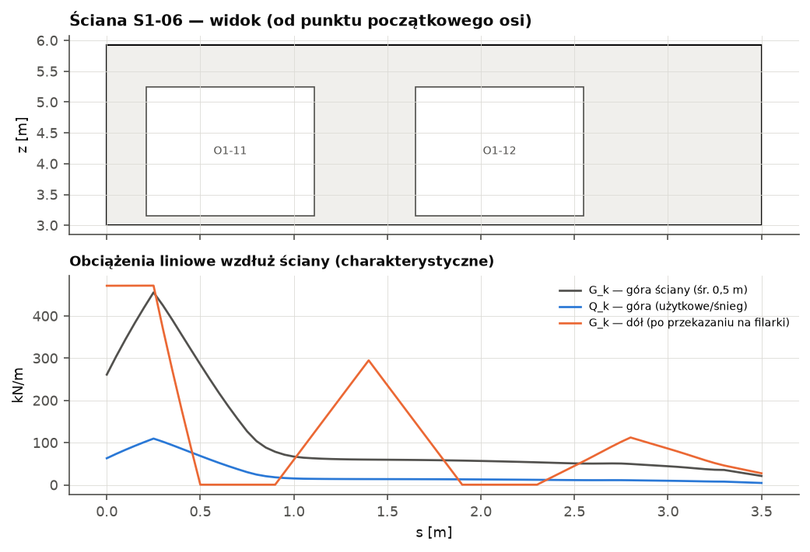

*Rys. Ściana S1-06: widok z otworami i rozkład obciążeń charakterystycznych wzdłuż osi.*

#### Zestawienie obciążeń

**Ciężar ściany — SW18 — Ściana wewnętrzna nośna: silikat 18, tynk gipsowy obustronnie**

| Warstwa | Obliczenie | g_k [kN/m²] | γ_G (6.10a) | g_d [kN/m²] | ξγ_G (6.10b) | g_d [kN/m²] |
|---|---|---|---|---|---|---|
| Tynk gipsowy maszynowy 1,5 cm | 1,5 cm × 11,77 kN/m³ | 0,177 | 1,35 | 0,238 | 1,15 | 0,203 |
| Bloczek wapienno-piaskowy (silikat) 18 cm, kl. 20, gr. 1, na zaprawie cienkowarstwowej | 18,0 cm × 18,00 kN/m³ | 3,240 | 1,35 | 4,374 | 1,15 | 3,718 |
| Tynk gipsowy maszynowy 1,5 cm | 1,5 cm × 11,77 kN/m³ | 0,177 | 1,35 | 0,238 | 1,15 | 0,203 |
| **Razem g_k** |  | 3,593 |  | 4,851 |  | 4,123 |

**Obciążenia ściany (charakterystyczne)** — góra: z płyt i ścian wyżej; dół: po przekazaniu obciążeń znad otworów na filarki

| Przypadek | max q_góra [kN/m] | średnio q_dół [kN/m] | max q_dół [kN/m] |
|---|---|---|---|
| G | 601,29 | 124,80 | 1022,16 |
| H | 15,19 | 2,71 | 24,07 |
| QA | 103,38 | 19,84 | 174,55 |
| QA_pA | 107,35 | 20,33 | 180,70 |
| QA_pB | 0,00 | 0,00 | 0,00 |
| S1 | 27,35 | 4,87 | 43,33 |
| S2 | 27,35 | 5,29 | 43,89 |
| SB2 | 2,20 | 1,50 | 4,93 |

#### Obliczenia

##### S1-06 — filarek 0,00–0,21 m (b = 0,21 m), 6.10a (wiodące: QA_pA)

- Pole przekroju filarka: A = b·t = 0,21·0,18 = **0,038** m²
- Współczynnik η_A (A < 0,3 m²): η_A = (NA; interpolacja wg R5-63) = **2,00** *(NA do PN-EN 1996-1-1 [NZW])*
- Wytrzymałość charakterystyczna muru: f_k = K·f_b^0,85 = 0,60·20^0,85 = **7,66** MPa *((3.2) + NA tabl. NA.5 (K = 0,60, Ap2:2014-09))*
- Wytrzymałość obliczeniowa: f_d = f_k/γ_M · (1/η_A) = 7,66/1,7·0,500 = **2,25** MPa *(NA tabl. NA.1 (kat. I, zaprawa projektowana, klasa wykonania A))*
- Wysokość efektywna: h_ef = ρ₂·h = 1,000·2,93 = **2,930** m *((5.2), 5.5.1.2)*
- Smukłość: h_ef/t_ef = 2,930/0,180 = **16,28**
- Mimośród przypadkowy: e_init = h_ef/450 = 2930/450 = **6,5** mm *(5.5.1.1(4))*
- Mimośród na górze: e_g = M_g/N_g + e_init ≥ 0,05t = 5,04/864,4 + 0,0065 = **12,3** mm *((6.5))*
- Mimośród na dole: e_d = M_d/N_d + e_init ≥ 0,05t = 0,00/1568,9 + 0,0065 = **9,0** mm *((6.5))*
- Współczynnik redukcyjny — góra: Φ_g = 1 − 2e_g/t = 1 − 2·12,3/180 = **0,863** *((6.4))*
- Współczynnik redukcyjny — dół: Φ_d = 1 − 2e_d/t = 1 − 2·9,0/180 = **0,900** *((6.4))*
- Mimośród w połowie wysokości: e_m = (M_md + M_w)/N_m + e_init = (2,52 + 0,00)/1216,6 + 0,0065 = **8,6** mm *((6.7))*
- Mimośród od pełzania: e_k = 0,002·φ_∞·(h_ef/t_ef)·√(t·e_m) = 0,002·1,5·16,28·√(0,180·0,0086) = **1,9** mm *((6.8))*
- Mimośród całkowity: e_mk = e_m + e_k ≥ 0,05t = **10,5** mm *((6.6))*
- Współczynnik redukcyjny w połowie wysokości: Φ_m = A₁·exp(−u²/2), A₁ = 1 − 2e_mk/t, u = (λ − 0,063)/(0,73 − 1,17e_mk/t) = λ = 0,515, A₁ = 0,883, u = 0,683 = **0,700** *(zał. G (G.1–G.4), E = K_E·f_k)*
- Nośność: N_Rd = Φ·t·f_d = (góra / środek / dół) 0,863 / 0,700 / 0,900 · 180 mm · 2,25 MPa = **349,7 / 283,6 / 364,8** kN/m *((6.2))*

| Warunek | Efekt | Nośność / limit | η | Stan | Podstawa |
|---|---|---|---|---|---|
| Smukłość ściany | h_ef/t_ef = 16,3  | 27 = 27,0  | 60% | spełniony | 5.5.1.4 |
| Nośność — przekrój górny | N_Ed = 864,37 kN/m | N_Rd = 349,74 kN/m | 247% | **NIESPEŁNIONY** | (6.2), (6.4) |
| Nośność — połowa wysokości | N_Ed = 1216,65 kN/m | N_Rd = 283,62 kN/m | 429% | **NIESPEŁNIONY** | (6.2), zał. G |
| Nośność — przekrój dolny | N_Ed = 1568,93 kN/m | N_Rd = 364,81 kN/m | 430% | **NIESPEŁNIONY** | (6.2), (6.4) |

> Filarek liczony jako ściana podparta górą i dołem, ρ₂ = 1,0 (bezpiecznie); siły N na 1 m = N/b.

#### Wnioski

**Przyjęto:** Mur: Bloczek wapienno-piaskowy (silikat) 18 cm, kl. 20, gr. 1, na zaprawie cienkowarstwowej, f_d = 4,50 MPa (klasa wykonania A, γ_M = 1,7).  

### Poz. 7.17 — Ściana S1-07 (P1, wewnętrzna nośna)

Element modelu: `S1-07` · maks. wykorzystanie nośności η = 45% · wszystkie warunki spełnione

#### Opis i schemat statyczny

Ściana gr. konstrukcyjnej t = 18 cm, długość osi 3,62 m, wysokość h = 2,930 m (z 3,000 do 5,930); materiał: Bloczek wapienno-piaskowy (silikat) 18 cm, kl. 20, gr. 1, na zaprawie cienkowarstwowej. Otwory: brak.

Sprawdzono 1 odcinków (filarki ≤ 2 m między otworami — siła całkowita; dłuższe pasma — maks. średnia krocząca 1 m) dla 34 kombinacji; poniżej przypadek miarodajny. Mimośród reakcji stropu e = t/6 (zewn.) / 0,3·t/6 (wewn., niesymetria) [UPR]; wiatr jako moment w połowie wysokości w·h²/8.

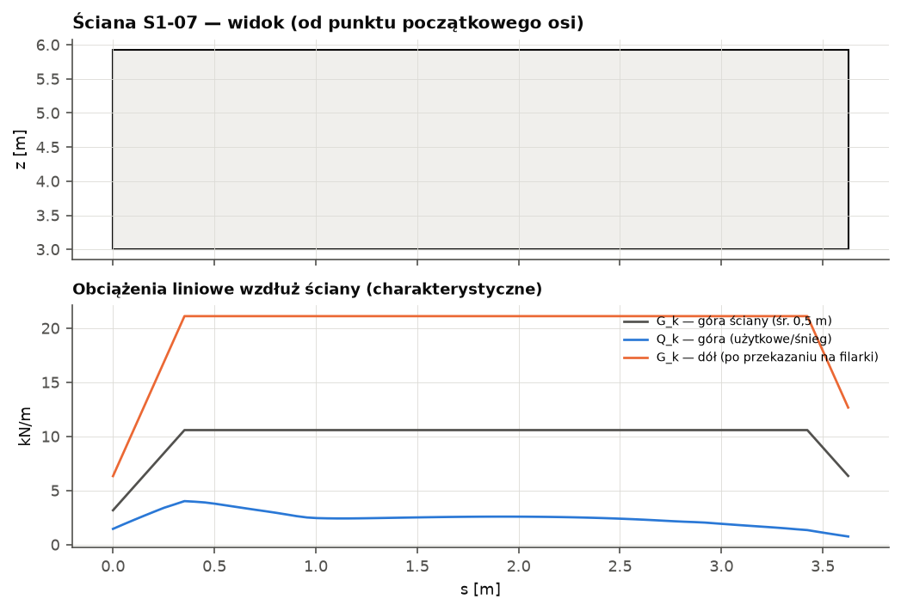

*Rys. Ściana S1-07: widok z otworami i rozkład obciążeń charakterystycznych wzdłuż osi.*

#### Zestawienie obciążeń

**Ciężar ściany — SW18 — Ściana wewnętrzna nośna: silikat 18, tynk gipsowy obustronnie**

| Warstwa | Obliczenie | g_k [kN/m²] | γ_G (6.10a) | g_d [kN/m²] | ξγ_G (6.10b) | g_d [kN/m²] |
|---|---|---|---|---|---|---|
| Tynk gipsowy maszynowy 1,5 cm | 1,5 cm × 11,77 kN/m³ | 0,177 | 1,35 | 0,238 | 1,15 | 0,203 |
| Bloczek wapienno-piaskowy (silikat) 18 cm, kl. 20, gr. 1, na zaprawie cienkowarstwowej | 18,0 cm × 18,00 kN/m³ | 3,240 | 1,35 | 4,374 | 1,15 | 3,718 |
| Tynk gipsowy maszynowy 1,5 cm | 1,5 cm × 11,77 kN/m³ | 0,177 | 1,35 | 0,238 | 1,15 | 0,203 |
| **Razem g_k** |  | 3,593 |  | 4,851 |  | 4,123 |

**Obciążenia ściany (charakterystyczne)** — góra: z płyt i ścian wyżej; dół: po przekazaniu obciążeń znad otworów na filarki

| Przypadek | max q_góra [kN/m] | średnio q_dół [kN/m] | max q_dół [kN/m] |
|---|---|---|---|
| G | 10,59 | 21,11 | 21,11 |
| H | 3,17 | 0,94 | 3,17 |
| QA | 0,00 | 0,00 | 0,00 |
| QA_pA | 0,00 | 0,00 | 0,00 |
| QA_pB | 4,57 | 1,65 | 4,57 |
| S1 | 5,71 | 1,69 | 5,71 |
| S2 | 6,32 | 2,31 | 6,32 |
| SB2 | 2,62 | 2,21 | 2,62 |

#### Obliczenia

##### S1-07 — ściana (odcinek 0,00–3,62 m), 6.10a (wiodące: QA_pB)

- Wytrzymałość charakterystyczna muru: f_k = K·f_b^0,85 = 0,60·20^0,85 = **7,66** MPa *((3.2) + NA tabl. NA.5 (K = 0,60, Ap2:2014-09))*
- Wytrzymałość obliczeniowa: f_d = f_k/γ_M = 7,66/1,7 = **4,50** MPa *(NA tabl. NA.1 (kat. I, zaprawa projektowana, klasa wykonania A))*
- Wysokość efektywna: h_ef = ρ₂·h = 0,750·2,93 = **2,197** m *((5.2), 5.5.1.2)*
- Smukłość: h_ef/t_ef = 2,197/0,180 = **12,21**
- Mimośród przypadkowy: e_init = h_ef/450 = 2198/450 = **4,9** mm *(5.5.1.1(4))*
- Mimośród na górze: e_g = M_g/N_g + e_init ≥ 0,05t = 0,06/20,5 + 0,0049 = **9,0** mm *((6.5))*
- Mimośród na dole: e_d = M_d/N_d + e_init ≥ 0,05t = 0,00/34,8 + 0,0049 = **9,0** mm *((6.5))*
- Współczynnik redukcyjny — góra: Φ_g = 1 − 2e_g/t = 1 − 2·9,0/180 = **0,900** *((6.4))*
- Współczynnik redukcyjny — dół: Φ_d = 1 − 2e_d/t = 1 − 2·9,0/180 = **0,900** *((6.4))*
- Mimośród w połowie wysokości: e_m = (M_md + M_w)/N_m + e_init = (0,03 + 0,00)/27,6 + 0,0049 = **5,9** mm *((6.7))*
- Mimośród od pełzania: e_k = 0 (h_ef/t_ef ≤ λ_c) = **0,0** mm *(6.1.2.2(2) [NZW NA])*
- Mimośród całkowity: e_mk = e_m + e_k ≥ 0,05t = **9,0** mm *((6.6))*
- Współczynnik redukcyjny w połowie wysokości: Φ_m = A₁·exp(−u²/2), A₁ = 1 − 2e_mk/t, u = (λ − 0,063)/(0,73 − 1,17e_mk/t) = λ = 0,386, A₁ = 0,900, u = 0,481 = **0,802** *(zał. G (G.1–G.4), E = K_E·f_k)*
- Nośność: N_Rd = Φ·t·f_d = (góra / środek / dół) 0,900 / 0,802 / 0,900 · 180 mm · 4,50 MPa = **729,6 / 649,9 / 729,6** kN/m *((6.2))*

| Warunek | Efekt | Nośność / limit | η | Stan | Podstawa |
|---|---|---|---|---|---|
| Smukłość ściany | h_ef/t_ef = 12,2  | 27 = 27,0  | 45% | spełniony | 5.5.1.4 |
| Nośność — przekrój górny | N_Ed = 20,54 kN/m | N_Rd = 729,61 kN/m | 3% | spełniony | (6.2), (6.4) |
| Nośność — połowa wysokości | N_Ed = 27,65 kN/m | N_Rd = 649,88 kN/m | 4% | spełniony | (6.2), zał. G |
| Nośność — przekrój dolny | N_Ed = 34,75 kN/m | N_Rd = 729,61 kN/m | 5% | spełniony | (6.2), (6.4) |

#### Wnioski

**Przyjęto:** Mur: Bloczek wapienno-piaskowy (silikat) 18 cm, kl. 20, gr. 1, na zaprawie cienkowarstwowej, f_d = 4,50 MPa (klasa wykonania A, γ_M = 1,7).  

### Poz. 7.18 — Ściana S1-08 (P1, wewnętrzna nośna)

Element modelu: `S1-08` · maks. wykorzystanie nośności η = 233% · **WARUNKI NIESPEŁNIONE — patrz tabele warunków i wnioski**

#### Opis i schemat statyczny

Ściana gr. konstrukcyjnej t = 18 cm, długość osi 3,62 m, wysokość h = 2,930 m (z 3,000 do 5,930); materiał: Bloczek wapienno-piaskowy (silikat) 18 cm, kl. 20, gr. 1, na zaprawie cienkowarstwowej. Otwory: brak.

Sprawdzono 1 odcinków (filarki ≤ 2 m między otworami — siła całkowita; dłuższe pasma — maks. średnia krocząca 1 m) dla 34 kombinacji; poniżej przypadek miarodajny. Mimośród reakcji stropu e = t/6 (zewn.) / 0,3·t/6 (wewn., niesymetria) [UPR]; wiatr jako moment w połowie wysokości w·h²/8.

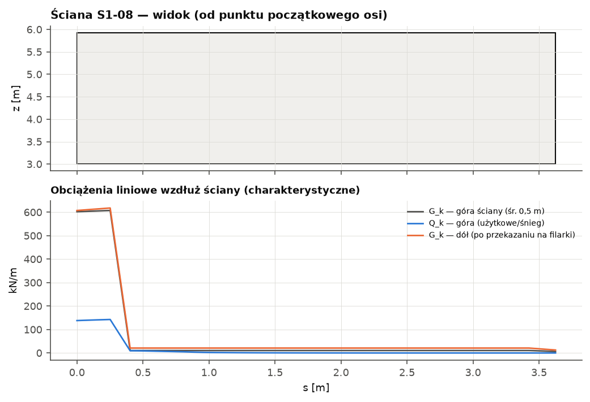

*Rys. Ściana S1-08: widok z otworami i rozkład obciążeń charakterystycznych wzdłuż osi.*

#### Zestawienie obciążeń

**Ciężar ściany — SW18 — Ściana wewnętrzna nośna: silikat 18, tynk gipsowy obustronnie**

| Warstwa | Obliczenie | g_k [kN/m²] | γ_G (6.10a) | g_d [kN/m²] | ξγ_G (6.10b) | g_d [kN/m²] |
|---|---|---|---|---|---|---|
| Tynk gipsowy maszynowy 1,5 cm | 1,5 cm × 11,77 kN/m³ | 0,177 | 1,35 | 0,238 | 1,15 | 0,203 |
| Bloczek wapienno-piaskowy (silikat) 18 cm, kl. 20, gr. 1, na zaprawie cienkowarstwowej | 18,0 cm × 18,00 kN/m³ | 3,240 | 1,35 | 4,374 | 1,15 | 3,718 |
| Tynk gipsowy maszynowy 1,5 cm | 1,5 cm × 11,77 kN/m³ | 0,177 | 1,35 | 0,238 | 1,15 | 0,203 |
| **Razem g_k** |  | 3,593 |  | 4,851 |  | 4,123 |

**Obciążenia ściany (charakterystyczne)** — góra: z płyt i ścian wyżej; dół: po przekazaniu obciążeń znad otworów na filarki

| Przypadek | max q_góra [kN/m] | średnio q_dół [kN/m] | max q_dół [kN/m] |
|---|---|---|---|
| G | 2336,81 | 101,83 | 2347,34 |
| H | 41,83 | 1,50 | 41,83 |
| QA | 433,81 | 15,06 | 433,81 |
| QA_pA | 418,81 | 14,54 | 418,81 |
| QA_pB | 18,99 | 1,00 | 18,99 |
| S1 | 75,29 | 2,69 | 75,29 |
| S2 | 71,71 | 2,54 | 71,71 |
| SB2 | 0,00 | 0,00 | 0,00 |

#### Obliczenia

##### S1-08 — ściana (odcinek 0,00–3,62 m), 6.10a (wiodące: QA)

- Wytrzymałość charakterystyczna muru: f_k = K·f_b^0,85 = 0,60·20^0,85 = **7,66** MPa *((3.2) + NA tabl. NA.5 (K = 0,60, Ap2:2014-09))*
- Wytrzymałość obliczeniowa: f_d = f_k/γ_M = 7,66/1,7 = **4,50** MPa *(NA tabl. NA.1 (kat. I, zaprawa projektowana, klasa wykonania A))*
- Wysokość efektywna: h_ef = ρ₂·h = 0,750·2,93 = **2,197** m *((5.2), 5.5.1.2)*
- Smukłość: h_ef/t_ef = 2,197/0,180 = **12,21**
- Mimośród przypadkowy: e_init = h_ef/450 = 2198/450 = **4,9** mm *(5.5.1.1(4))*
- Mimośród na górze: e_g = M_g/N_g + e_init ≥ 0,05t = 4,93/562,3 + 0,0049 = **13,7** mm *((6.5))*
- Mimośród na dole: e_d = M_d/N_d + e_init ≥ 0,05t = 0,00/576,5 + 0,0049 = **9,0** mm *((6.5))*
- Współczynnik redukcyjny — góra: Φ_g = 1 − 2e_g/t = 1 − 2·13,7/180 = **0,848** *((6.4))*
- Współczynnik redukcyjny — dół: Φ_d = 1 − 2e_d/t = 1 − 2·9,0/180 = **0,900** *((6.4))*
- Mimośród w połowie wysokości: e_m = (M_md + M_w)/N_m + e_init = (2,47 + 0,00)/569,4 + 0,0049 = **9,2** mm *((6.7))*
- Mimośród od pełzania: e_k = 0 (h_ef/t_ef ≤ λ_c) = **0,0** mm *(6.1.2.2(2) [NZW NA])*
- Mimośród całkowity: e_mk = e_m + e_k ≥ 0,05t = **9,2** mm *((6.6))*
- Współczynnik redukcyjny w połowie wysokości: Φ_m = A₁·exp(−u²/2), A₁ = 1 − 2e_mk/t, u = (λ − 0,063)/(0,73 − 1,17e_mk/t) = λ = 0,386, A₁ = 0,898, u = 0,482 = **0,799** *(zał. G (G.1–G.4), E = K_E·f_k)*
- Nośność: N_Rd = Φ·t·f_d = (góra / środek / dół) 0,848 / 0,799 / 0,900 · 180 mm · 4,50 MPa = **687,7 / 647,8 / 729,6** kN/m *((6.2))*

| Warunek | Efekt | Nośność / limit | η | Stan | Podstawa |
|---|---|---|---|---|---|
| Smukłość ściany | h_ef/t_ef = 12,2  | 27 = 27,0  | 45% | spełniony | 5.5.1.4 |
| Nośność — przekrój górny | N_Ed = 562,29 kN/m | N_Rd = 687,68 kN/m | 82% | spełniony | (6.2), (6.4) |
| Nośność — połowa wysokości | N_Ed = 569,40 kN/m | N_Rd = 647,84 kN/m | 88% | spełniony | (6.2), zał. G |
| Nośność — przekrój dolny | N_Ed = 576,51 kN/m | N_Rd = 729,61 kN/m | 79% | spełniony | (6.2), (6.4) |

##### S1-08 — docisk pod oparciem belki (s = 0,00 m)

- Pole docisku: A_b = l_b·b = 0,250·0,180 = **0,0450** m²
- Długość efektywna w połowie wysokości: l_efm = l_b + 2·(h_c/2)·tg 30° (ograniczona a₁) = **1,096** m *(rys. 6.2)*
- Współczynnik zwiększający: β = (1 + 0,3·a₁/h_c)·(1,5 − 1,1·A_b/A_ef) = (1 + 0,3·0,00/2,93)·(1,5 − 1,1·0,228) = **1,249** *((6.10))*
- Nośność na docisk: N_Rdc = β·A_b·f_d = 1,249·0,0450·4,50·10³ = **253,14** kN *((6.9))*

| Warunek | Efekt | Nośność / limit | η | Stan | Podstawa |
|---|---|---|---|---|---|
| Docisk | N_Edc = 590,59 kN | N_Rdc = 253,14 kN | 233% | **NIESPEŁNIONY** | PN-EN 1996-1-1 (6.9) |

> Dodatkowo sprawdzić ścianę w połowie wysokości pod oparciem (6.1.3(4)) — obejmuje to sprawdzenie ściany/filarka.

#### Wnioski

**Przyjęto:** Mur: Bloczek wapienno-piaskowy (silikat) 18 cm, kl. 20, gr. 1, na zaprawie cienkowarstwowej, f_d = 4,50 MPa (klasa wykonania A, γ_M = 1,7).  

### Poz. 7.19 — Ściana S1-09 (P1, wewnętrzna nośna)

Element modelu: `S1-09` · maks. wykorzystanie nośności η = 193% · **WARUNKI NIESPEŁNIONE — patrz tabele warunków i wnioski**

#### Opis i schemat statyczny

Ściana gr. konstrukcyjnej t = 18 cm, długość osi 3,62 m, wysokość h = 2,930 m (z 3,000 do 5,930); materiał: Bloczek wapienno-piaskowy (silikat) 18 cm, kl. 20, gr. 1, na zaprawie cienkowarstwowej. Otwory: brak.

Sprawdzono 1 odcinków (filarki ≤ 2 m między otworami — siła całkowita; dłuższe pasma — maks. średnia krocząca 1 m) dla 34 kombinacji; poniżej przypadek miarodajny. Mimośród reakcji stropu e = t/6 (zewn.) / 0,3·t/6 (wewn., niesymetria) [UPR]; wiatr jako moment w połowie wysokości w·h²/8.

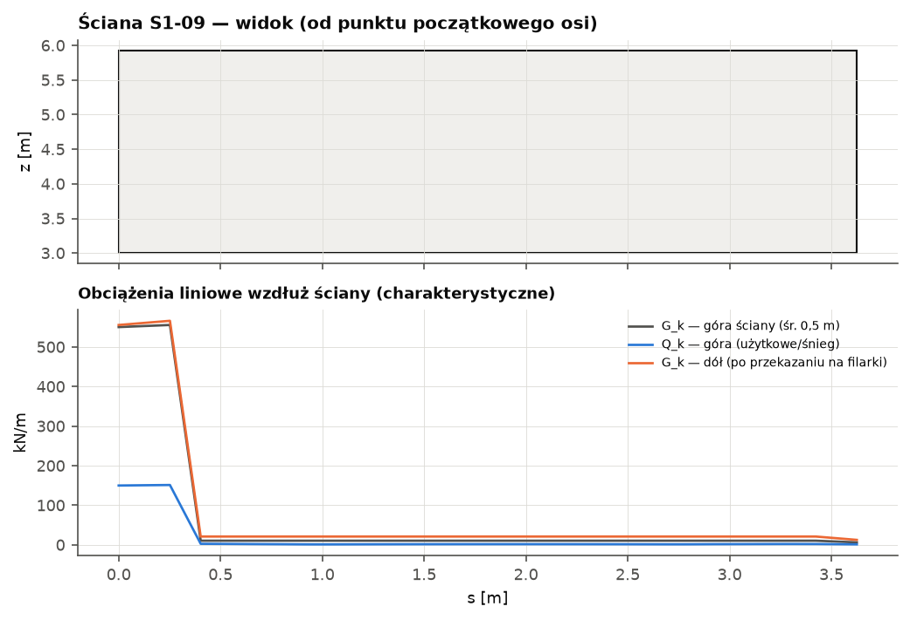

*Rys. Ściana S1-09: widok z otworami i rozkład obciążeń charakterystycznych wzdłuż osi.*

#### Zestawienie obciążeń

**Ciężar ściany — SW18 — Ściana wewnętrzna nośna: silikat 18, tynk gipsowy obustronnie**

| Warstwa | Obliczenie | g_k [kN/m²] | γ_G (6.10a) | g_d [kN/m²] | ξγ_G (6.10b) | g_d [kN/m²] |
|---|---|---|---|---|---|---|
| Tynk gipsowy maszynowy 1,5 cm | 1,5 cm × 11,77 kN/m³ | 0,177 | 1,35 | 0,238 | 1,15 | 0,203 |
| Bloczek wapienno-piaskowy (silikat) 18 cm, kl. 20, gr. 1, na zaprawie cienkowarstwowej | 18,0 cm × 18,00 kN/m³ | 3,240 | 1,35 | 4,374 | 1,15 | 3,718 |
| Tynk gipsowy maszynowy 1,5 cm | 1,5 cm × 11,77 kN/m³ | 0,177 | 1,35 | 0,238 | 1,15 | 0,203 |
| **Razem g_k** |  | 3,593 |  | 4,851 |  | 4,123 |

**Obciążenia ściany (charakterystyczne)** — góra: z płyt i ścian wyżej; dół: po przekazaniu obciążeń znad otworów na filarki

| Przypadek | max q_góra [kN/m] | średnio q_dół [kN/m] | max q_dół [kN/m] |
|---|---|---|---|
| G | 1827,23 | 84,19 | 1837,76 |
| H | 15,41 | 1,02 | 15,41 |
| QA | 455,20 | 15,81 | 455,20 |
| QA_pA | 415,00 | 14,41 | 415,00 |
| QA_pB | 43,23 | 2,16 | 43,23 |
| S1 | 27,74 | 1,83 | 27,74 |
| S2 | 27,72 | 2,30 | 27,72 |
| SB2 | 3,65 | 1,89 | 3,65 |

#### Obliczenia

##### S1-09 — ściana (odcinek 0,00–3,62 m), 6.10a (wiodące: QA)

- Wytrzymałość charakterystyczna muru: f_k = K·f_b^0,85 = 0,60·20^0,85 = **7,66** MPa *((3.2) + NA tabl. NA.5 (K = 0,60, Ap2:2014-09))*
- Wytrzymałość obliczeniowa: f_d = f_k/γ_M = 7,66/1,7 = **4,50** MPa *(NA tabl. NA.1 (kat. I, zaprawa projektowana, klasa wykonania A))*
- Wysokość efektywna: h_ef = ρ₂·h = 0,750·2,93 = **2,197** m *((5.2), 5.5.1.2)*
- Smukłość: h_ef/t_ef = 2,197/0,180 = **12,21**
- Mimośród przypadkowy: e_init = h_ef/450 = 2198/450 = **4,9** mm *(5.5.1.1(4))*
- Mimośród na górze: e_g = M_g/N_g + e_init ≥ 0,05t = 3,99/458,0 + 0,0049 = **13,6** mm *((6.5))*
- Mimośród na dole: e_d = M_d/N_d + e_init ≥ 0,05t = 0,00/472,2 + 0,0049 = **9,0** mm *((6.5))*
- Współczynnik redukcyjny — góra: Φ_g = 1 − 2e_g/t = 1 − 2·13,6/180 = **0,849** *((6.4))*
- Współczynnik redukcyjny — dół: Φ_d = 1 − 2e_d/t = 1 − 2·9,0/180 = **0,900** *((6.4))*
- Mimośród w połowie wysokości: e_m = (M_md + M_w)/N_m + e_init = (2,00 + 0,00)/465,1 + 0,0049 = **9,2** mm *((6.7))*
- Mimośród od pełzania: e_k = 0 (h_ef/t_ef ≤ λ_c) = **0,0** mm *(6.1.2.2(2) [NZW NA])*
- Mimośród całkowity: e_mk = e_m + e_k ≥ 0,05t = **9,2** mm *((6.6))*
- Współczynnik redukcyjny w połowie wysokości: Φ_m = A₁·exp(−u²/2), A₁ = 1 − 2e_mk/t, u = (λ − 0,063)/(0,73 − 1,17e_mk/t) = λ = 0,386, A₁ = 0,898, u = 0,482 = **0,800** *(zał. G (G.1–G.4), E = K_E·f_k)*
- Nośność: N_Rd = Φ·t·f_d = (góra / środek / dół) 0,849 / 0,800 / 0,900 · 180 mm · 4,50 MPa = **688,2 / 648,2 / 729,6** kN/m *((6.2))*

| Warunek | Efekt | Nośność / limit | η | Stan | Podstawa |
|---|---|---|---|---|---|
| Smukłość ściany | h_ef/t_ef = 12,2  | 27 = 27,0  | 45% | spełniony | 5.5.1.4 |
| Nośność — przekrój górny | N_Ed = 457,98 kN/m | N_Rd = 688,16 kN/m | 67% | spełniony | (6.2), (6.4) |
| Nośność — połowa wysokości | N_Ed = 465,08 kN/m | N_Rd = 648,21 kN/m | 72% | spełniony | (6.2), zał. G |
| Nośność — przekrój dolny | N_Ed = 472,19 kN/m | N_Rd = 729,61 kN/m | 65% | spełniony | (6.2), (6.4) |

##### S1-09 — docisk pod oparciem belki (s = 0,00 m)

- Pole docisku: A_b = l_b·b = 0,250·0,180 = **0,0450** m²
- Długość efektywna w połowie wysokości: l_efm = l_b + 2·(h_c/2)·tg 30° (ograniczona a₁) = **1,096** m *(rys. 6.2)*
- Współczynnik zwiększający: β = (1 + 0,3·a₁/h_c)·(1,5 − 1,1·A_b/A_ef) = (1 + 0,3·0,00/2,93)·(1,5 − 1,1·0,228) = **1,249** *((6.10))*
- Nośność na docisk: N_Rdc = β·A_b·f_d = 1,249·0,0450·4,50·10³ = **253,14** kN *((6.9))*

| Warunek | Efekt | Nośność / limit | η | Stan | Podstawa |
|---|---|---|---|---|---|
| Docisk | N_Edc = 489,09 kN | N_Rdc = 253,14 kN | 193% | **NIESPEŁNIONY** | PN-EN 1996-1-1 (6.9) |

> Dodatkowo sprawdzić ścianę w połowie wysokości pod oparciem (6.1.3(4)) — obejmuje to sprawdzenie ściany/filarka.

#### Wnioski

**Przyjęto:** Mur: Bloczek wapienno-piaskowy (silikat) 18 cm, kl. 20, gr. 1, na zaprawie cienkowarstwowej, f_d = 4,50 MPa (klasa wykonania A, γ_M = 1,7).  

### Poz. 7.20 — Ściana S0-01 (P0, zewnętrzna nośna)

Element modelu: `S0-01` · maks. wykorzystanie nośności η = 148% · **WARUNKI NIESPEŁNIONE — patrz tabele warunków i wnioski**

#### Opis i schemat statyczny

Ściana gr. konstrukcyjnej t = 18 cm, długość osi 12,00 m, wysokość h = 2,930 m (z −0,150 do 2,780); materiał: Bloczek wapienno-piaskowy (silikat) 18 cm, kl. 20, gr. 1, na zaprawie cienkowarstwowej. Otwory: O0-01 (1,90 m), O0-02 (1,90 m), O0-03 (2,34 m), O0-04 (2,34 m), O0-05 (2,92 m).

Sprawdzono 2 odcinków (filarki ≤ 2 m między otworami — siła całkowita; dłuższe pasma — maks. średnia krocząca 1 m) dla 44 kombinacji; poniżej przypadek miarodajny. Mimośród reakcji stropu e = t/6 (zewn.) / 0,3·t/6 (wewn., niesymetria) [UPR]; wiatr jako moment w połowie wysokości w·h²/8.

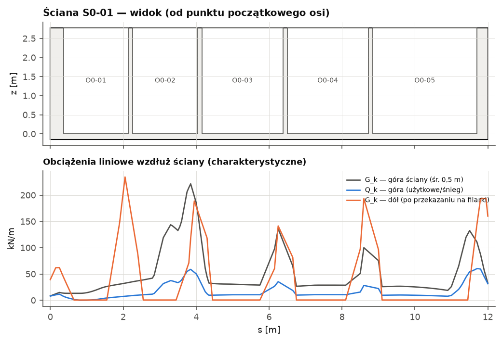

*Rys. Ściana S0-01: widok z otworami i rozkład obciążeń charakterystycznych wzdłuż osi.*

#### Zestawienie obciążeń

**Ciężar ściany — SZ1 — Ściana zewnętrzna nośna: silikat 18 + ETICS EPS 031 20 cm (U ≈ 0,15)**

| Warstwa | Obliczenie | g_k [kN/m²] | γ_G (6.10a) | g_d [kN/m²] | ξγ_G (6.10b) | g_d [kN/m²] |
|---|---|---|---|---|---|---|
| Tynk gipsowy maszynowy 1,5 cm | 1,5 cm × 11,77 kN/m³ | 0,177 | 1,35 | 0,238 | 1,15 | 0,203 |
| Bloczek wapienno-piaskowy (silikat) 18 cm, kl. 20, gr. 1, na zaprawie cienkowarstwowej | 18,0 cm × 18,00 kN/m³ | 3,240 | 1,35 | 4,374 | 1,15 | 3,718 |
| Styropian grafitowy EPS 031 (ETICS, NRO w systemie) | 20,0 cm × 0,15 kN/m³ | 0,029 | 1,35 | 0,040 | 1,15 | 0,034 |
| ETICS: warstwa zbrojona + tynk silikonowy 1,5 mm (biały / jasnoszary NCS S 1500-N) | 1,0 cm × 16,68 kN/m³ | 0,167 | 1,35 | 0,225 | 1,15 | 0,191 |
| **Razem g_k** |  | 3,613 |  | 4,877 |  | 4,146 |

**Obciążenia ściany (charakterystyczne)** — góra: z płyt i ścian wyżej; dół: po przekazaniu obciążeń znad otworów na filarki

| Przypadek | max q_góra [kN/m] | średnio q_dół [kN/m] | max q_dół [kN/m] |
|---|---|---|---|
| G | 351,50 | 33,37 | 361,52 |
| H | 8,21 | 0,53 | 8,53 |
| QA | 49,10 | 5,52 | 43,85 |
| QA_pA | 51,61 | 5,86 | 45,77 |
| QA_pB | 0,00 | 0,00 | 0,00 |
| S1 | 14,77 | 0,95 | 15,35 |
| S2 | 14,77 | 0,95 | 15,35 |
| SB2 | 0,00 | 0,00 | 0,00 |

#### Obliczenia

##### S0-01 — filarek 11,70–12,00 m (b = 0,30 m), 6.10a (wiodące: QA_pA)

- Pole przekroju filarka: A = b·t = 0,30·0,18 = **0,054** m²
- Współczynnik η_A (A < 0,3 m²): η_A = (NA; interpolacja wg R5-63) = **2,00** *(NA do PN-EN 1996-1-1 [NZW])*
- Wytrzymałość charakterystyczna muru: f_k = K·f_b^0,85 = 0,60·20^0,85 = **7,66** MPa *((3.2) + NA tabl. NA.5 (K = 0,60, Ap2:2014-09))*
- Wytrzymałość obliczeniowa: f_d = f_k/γ_M · (1/η_A) = 7,66/1,7·0,500 = **2,25** MPa *(NA tabl. NA.1 (kat. I, zaprawa projektowana, klasa wykonania A))*
- Wysokość efektywna: h_ef = ρ₂·h = 1,000·2,93 = **2,930** m *((5.2), 5.5.1.2)*
- Smukłość: h_ef/t_ef = 2,930/0,180 = **16,28**
- Mimośród przypadkowy: e_init = h_ef/450 = 2930/450 = **6,5** mm *(5.5.1.1(4))*
- Mimośród na górze: e_g = M_g/N_g + e_init ≥ 0,05t = 0,00/59,8 + 0,0065 = **9,0** mm *((6.5))*
- Mimośród na dole: e_d = M_d/N_d + e_init ≥ 0,05t = 0,00/539,2 + 0,0065 = **9,0** mm *((6.5))*
- Współczynnik redukcyjny — góra: Φ_g = 1 − 2e_g/t = 1 − 2·9,0/180 = **0,900** *((6.4))*
- Współczynnik redukcyjny — dół: Φ_d = 1 − 2e_d/t = 1 − 2·9,0/180 = **0,900** *((6.4))*
- Mimośród w połowie wysokości: e_m = (M_md + M_w)/N_m + e_init = (0,00 + 0,00)/299,5 + 0,0065 = **6,5** mm *((6.7))*
- Mimośród od pełzania: e_k = 0,002·φ_∞·(h_ef/t_ef)·√(t·e_m) = 0,002·1,5·16,28·√(0,180·0,0065) = **1,7** mm *((6.8))*
- Mimośród całkowity: e_mk = e_m + e_k ≥ 0,05t = **9,0** mm *((6.6))*
- Współczynnik redukcyjny w połowie wysokości: Φ_m = A₁·exp(−u²/2), A₁ = 1 − 2e_mk/t, u = (λ − 0,063)/(0,73 − 1,17e_mk/t) = λ = 0,515, A₁ = 0,900, u = 0,673 = **0,718** *(zał. G (G.1–G.4), E = K_E·f_k)*
- Nośność: N_Rd = Φ·t·f_d = (góra / środek / dół) 0,900 / 0,718 / 0,900 · 180 mm · 2,25 MPa = **364,8 / 290,9 / 364,8** kN/m *((6.2))*

| Warunek | Efekt | Nośność / limit | η | Stan | Podstawa |
|---|---|---|---|---|---|
| Smukłość ściany | h_ef/t_ef = 16,3  | 27 = 27,0  | 60% | spełniony | 5.5.1.4 |
| Nośność — przekrój górny | N_Ed = 59,84 kN/m | N_Rd = 364,81 kN/m | 16% | spełniony | (6.2), (6.4) |
| Nośność — połowa wysokości | N_Ed = 299,52 kN/m | N_Rd = 290,93 kN/m | 103% | **NIESPEŁNIONY** | (6.2), zał. G |
| Nośność — przekrój dolny | N_Ed = 539,21 kN/m | N_Rd = 364,81 kN/m | 148% | **NIESPEŁNIONY** | (6.2), (6.4) |

> Filarek liczony jako ściana podparta górą i dołem, ρ₂ = 1,0 (bezpiecznie); siły N na 1 m = N/b.

##### S0-01 — zginanie z płaszczyzny (wiatr)

- Wskaźnik wytrzymałości (1 m): Z = t²/6 = 0,180²/6 = **5400** cm³/m
- Pasmo pionowe — moment: M_Ed = w_Ed·h²/8 = 1,464·2,93²/8 = **1,571** kNm/m
- Pasmo pionowe — nośność: M_Rd = (f_xk1/γ_M + σ_d)·Z = (0,20/1,7 + 0,299)·10³·0,00540 = **2,248** kNm/m *((6.15), 6.3.1(3) [NZW f_xk1])*

> Informacyjnie (dolne oszacowanie, bez efektu przesklepienia 6.3.2): Zginanie z płaszczyzny (pasmo pionowe — dolne oszacowanie): M_Ed = 1,571 ≤? M_Rd = 2,248 kNm/m (η = 70%). Ściana obciążona pionowo — miarodajne sprawdzenie 6.1.2 z mimośrodem e_hm od wiatru.

##### S0-01 — wiatr: przesklepienie między stropami (6.3.2)

- Smukłość łuku: l_a/t = 2,93/0,180 = **16,3**
- Nośność na obciążenie poziome: q_lat,d = f_d·(t/l_a)² = 4,50·10³·(0,180/2,93)² = **17,00** kN/m² *((6.20) [NZW])*
- Obliczeniowy rozpór łuku (przenoszony przez stropy/wieńce): N_ad = 1,5·f_d·t/10 = **121,6** kN/m *((6.19) [NZW])*

| Warunek | Efekt | Nośność / limit | η | Stan | Podstawa |
|---|---|---|---|---|---|
| Obciążenie poziome — przesklepienie | W_Ed = 1,46 kN/m² | q_lat,d = 17,00 kN/m² | 9% | spełniony | PN-EN 1996-1-1 6.3.2 |

#### Wnioski

**Przyjęto:** Mur: Bloczek wapienno-piaskowy (silikat) 18 cm, kl. 20, gr. 1, na zaprawie cienkowarstwowej, f_d = 4,50 MPa (klasa wykonania A, γ_M = 1,7).  

### Poz. 7.21 — Ściana S0-06 (P0, zewnętrzna nośna)

Element modelu: `S0-06` · maks. wykorzystanie nośności η = 60% · wszystkie warunki spełnione

#### Opis i schemat statyczny

Ściana gr. konstrukcyjnej t = 18 cm, długość osi 12,00 m, wysokość h = 2,930 m (z −0,150 do 2,780); materiał: Bloczek wapienno-piaskowy (silikat) 18 cm, kl. 20, gr. 1, na zaprawie cienkowarstwowej. Otwory: O0-10 (0,35 m), O0-09 (1,10 m), O0-13 (0,80 m).

Sprawdzono 4 odcinków (filarki ≤ 2 m między otworami — siła całkowita; dłuższe pasma — maks. średnia krocząca 1 m) dla 44 kombinacji; poniżej przypadek miarodajny. Mimośród reakcji stropu e = t/6 (zewn.) / 0,3·t/6 (wewn., niesymetria) [UPR]; wiatr jako moment w połowie wysokości w·h²/8.

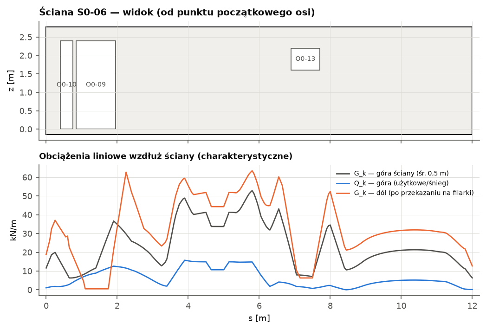

*Rys. Ściana S0-06: widok z otworami i rozkład obciążeń charakterystycznych wzdłuż osi.*

#### Zestawienie obciążeń

**Ciężar ściany — SZ1 — Ściana zewnętrzna nośna: silikat 18 + ETICS EPS 031 20 cm (U ≈ 0,15)**

| Warstwa | Obliczenie | g_k [kN/m²] | γ_G (6.10a) | g_d [kN/m²] | ξγ_G (6.10b) | g_d [kN/m²] |
|---|---|---|---|---|---|---|
| Tynk gipsowy maszynowy 1,5 cm | 1,5 cm × 11,77 kN/m³ | 0,177 | 1,35 | 0,238 | 1,15 | 0,203 |
| Bloczek wapienno-piaskowy (silikat) 18 cm, kl. 20, gr. 1, na zaprawie cienkowarstwowej | 18,0 cm × 18,00 kN/m³ | 3,240 | 1,35 | 4,374 | 1,15 | 3,718 |
| Styropian grafitowy EPS 031 (ETICS, NRO w systemie) | 20,0 cm × 0,15 kN/m³ | 0,029 | 1,35 | 0,040 | 1,15 | 0,034 |
| ETICS: warstwa zbrojona + tynk silikonowy 1,5 mm (biały / jasnoszary NCS S 1500-N) | 1,0 cm × 16,68 kN/m³ | 0,167 | 1,35 | 0,225 | 1,15 | 0,191 |
| **Razem g_k** |  | 3,613 |  | 4,877 |  | 4,146 |

**Obciążenia ściany (charakterystyczne)** — góra: z płyt i ścian wyżej; dół: po przekazaniu obciążeń znad otworów na filarki

| Przypadek | max q_góra [kN/m] | średnio q_dół [kN/m] | max q_dół [kN/m] |
|---|---|---|---|
| G | 61,72 | 36,38 | 77,81 |
| H | 0,98 | 0,30 | 1,32 |
| QA | 16,75 | 5,71 | 16,75 |
| QA_pA | 3,76 | 1,45 | 3,76 |
| QA_pB | 3,63 | 1,58 | 7,96 |
| S1 | 1,76 | 0,55 | 2,37 |
| S2 | 2,52 | 0,71 | 3,39 |
| SB2 | 2,77 | 0,56 | 3,71 |

#### Obliczenia

##### S0-06 — filarek 0,00–0,40 m (b = 0,40 m), 6.10a (wiodące: QA)

- Pole przekroju filarka: A = b·t = 0,40·0,18 = **0,072** m²
- Współczynnik η_A (A < 0,3 m²): η_A = (NA; interpolacja wg R5-63) = **2,00** *(NA do PN-EN 1996-1-1 [NZW])*
- Wytrzymałość charakterystyczna muru: f_k = K·f_b^0,85 = 0,60·20^0,85 = **7,66** MPa *((3.2) + NA tabl. NA.5 (K = 0,60, Ap2:2014-09))*
- Wytrzymałość obliczeniowa: f_d = f_k/γ_M · (1/η_A) = 7,66/1,7·0,500 = **2,25** MPa *(NA tabl. NA.1 (kat. I, zaprawa projektowana, klasa wykonania A))*
- Wysokość efektywna: h_ef = ρ₂·h = 1,000·2,93 = **2,930** m *((5.2), 5.5.1.2)*
- Smukłość: h_ef/t_ef = 2,930/0,180 = **16,28**
- Mimośród przypadkowy: e_init = h_ef/450 = 2930/450 = **6,5** mm *(5.5.1.1(4))*
- Mimośród na górze: e_g = M_g/N_g + e_init ≥ 0,05t = 0,13/41,3 + 0,0065 = **9,6** mm *((6.5))*
- Mimośród na dole: e_d = M_d/N_d + e_init ≥ 0,05t = 0,00/68,8 + 0,0065 = **9,0** mm *((6.5))*
- Współczynnik redukcyjny — góra: Φ_g = 1 − 2e_g/t = 1 − 2·9,6/180 = **0,893** *((6.4))*
- Współczynnik redukcyjny — dół: Φ_d = 1 − 2e_d/t = 1 − 2·9,0/180 = **0,900** *((6.4))*
- Mimośród w połowie wysokości: e_m = (M_md + M_w)/N_m + e_init = (0,06 + 0,00)/55,1 + 0,0065 = **7,7** mm *((6.7))*
- Mimośród od pełzania: e_k = 0,002·φ_∞·(h_ef/t_ef)·√(t·e_m) = 0,002·1,5·16,28·√(0,180·0,0077) = **1,8** mm *((6.8))*
- Mimośród całkowity: e_mk = e_m + e_k ≥ 0,05t = **9,5** mm *((6.6))*
- Współczynnik redukcyjny w połowie wysokości: Φ_m = A₁·exp(−u²/2), A₁ = 1 − 2e_mk/t, u = (λ − 0,063)/(0,73 − 1,17e_mk/t) = λ = 0,515, A₁ = 0,894, u = 0,676 = **0,712** *(zał. G (G.1–G.4), E = K_E·f_k)*
- Nośność: N_Rd = Φ·t·f_d = (góra / środek / dół) 0,893 / 0,712 / 0,900 · 180 mm · 2,25 MPa = **362,0 / 288,5 / 364,8** kN/m *((6.2))*

| Warunek | Efekt | Nośność / limit | η | Stan | Podstawa |
|---|---|---|---|---|---|
| Smukłość ściany | h_ef/t_ef = 16,3  | 27 = 27,0  | 60% | spełniony | 5.5.1.4 |
| Nośność — przekrój górny | N_Ed = 41,27 kN/m | N_Rd = 361,97 kN/m | 11% | spełniony | (6.2), (6.4) |
| Nośność — połowa wysokości | N_Ed = 55,06 kN/m | N_Rd = 288,51 kN/m | 19% | spełniony | (6.2), zał. G |
| Nośność — przekrój dolny | N_Ed = 68,84 kN/m | N_Rd = 364,81 kN/m | 19% | spełniony | (6.2), (6.4) |

> Filarek liczony jako ściana podparta górą i dołem, ρ₂ = 1,0 (bezpiecznie); siły N na 1 m = N/b.

##### S0-06 — zginanie z płaszczyzny (wiatr)

- Wskaźnik wytrzymałości (1 m): Z = t²/6 = 0,180²/6 = **5400** cm³/m
- Pasmo pionowe — moment: M_Ed = w_Ed·h²/8 = 1,464·2,93²/8 = **1,571** kNm/m
- Pasmo pionowe — nośność: M_Rd = (f_xk1/γ_M + σ_d)·Z = (0,20/1,7 + 0,180)·10³·0,00540 = **1,610** kNm/m *((6.15), 6.3.1(3) [NZW f_xk1])*

> Informacyjnie (dolne oszacowanie, bez efektu przesklepienia 6.3.2): Zginanie z płaszczyzny (pasmo pionowe — dolne oszacowanie): M_Ed = 1,571 ≤? M_Rd = 1,610 kNm/m (η = 98%). Ściana obciążona pionowo — miarodajne sprawdzenie 6.1.2 z mimośrodem e_hm od wiatru.

##### S0-06 — wiatr: przesklepienie między stropami (6.3.2)

- Smukłość łuku: l_a/t = 2,93/0,180 = **16,3**
- Nośność na obciążenie poziome: q_lat,d = f_d·(t/l_a)² = 4,50·10³·(0,180/2,93)² = **17,00** kN/m² *((6.20) [NZW])*
- Obliczeniowy rozpór łuku (przenoszony przez stropy/wieńce): N_ad = 1,5·f_d·t/10 = **121,6** kN/m *((6.19) [NZW])*

| Warunek | Efekt | Nośność / limit | η | Stan | Podstawa |
|---|---|---|---|---|---|
| Obciążenie poziome — przesklepienie | W_Ed = 1,46 kN/m² | q_lat,d = 17,00 kN/m² | 9% | spełniony | PN-EN 1996-1-1 6.3.2 |

#### Wnioski

**Przyjęto:** Mur: Bloczek wapienno-piaskowy (silikat) 18 cm, kl. 20, gr. 1, na zaprawie cienkowarstwowej, f_d = 4,50 MPa (klasa wykonania A, γ_M = 1,7).  

### Poz. 7.22 — Ściana S0-07 (P0, zewnętrzna nośna)

Element modelu: `S0-07` · maks. wykorzystanie nośności η = 60% · wszystkie warunki spełnione

#### Opis i schemat statyczny

Ściana gr. konstrukcyjnej t = 18 cm, długość osi 8,75 m, wysokość h = 2,930 m (z −0,150 do 2,780); materiał: Bloczek wapienno-piaskowy (silikat) 18 cm, kl. 20, gr. 1, na zaprawie cienkowarstwowej. Otwory: O0-12 (1,80 m), O0-11 (2,40 m).

Sprawdzono 3 odcinków (filarki ≤ 2 m między otworami — siła całkowita; dłuższe pasma — maks. średnia krocząca 1 m) dla 44 kombinacji; poniżej przypadek miarodajny. Mimośród reakcji stropu e = t/6 (zewn.) / 0,3·t/6 (wewn., niesymetria) [UPR]; wiatr jako moment w połowie wysokości w·h²/8.

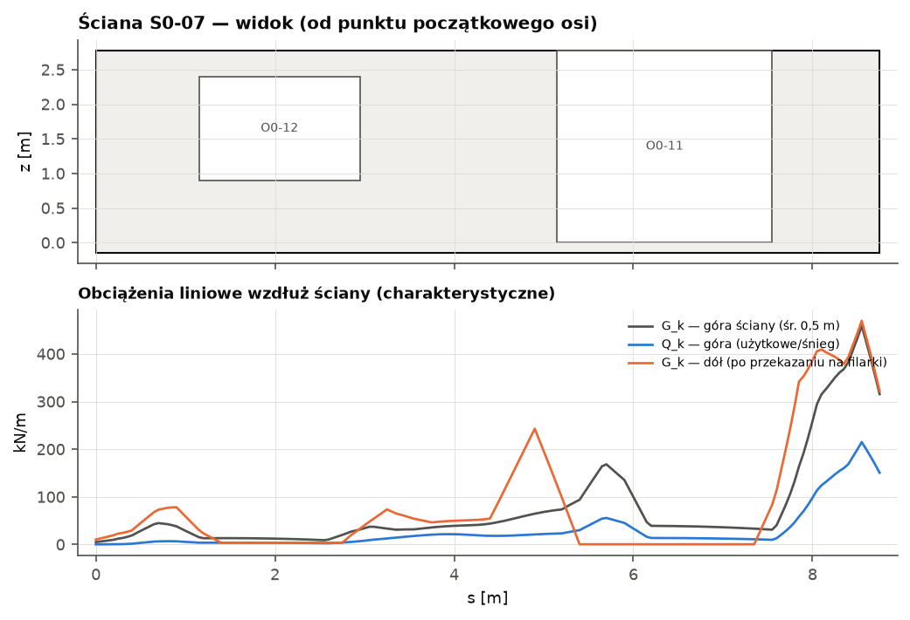

*Rys. Ściana S0-07: widok z otworami i rozkład obciążeń charakterystycznych wzdłuż osi.*

#### Zestawienie obciążeń

**Ciężar ściany — SZ1 — Ściana zewnętrzna nośna: silikat 18 + ETICS EPS 031 20 cm (U ≈ 0,15)**

| Warstwa | Obliczenie | g_k [kN/m²] | γ_G (6.10a) | g_d [kN/m²] | ξγ_G (6.10b) | g_d [kN/m²] |
|---|---|---|---|---|---|---|
| Tynk gipsowy maszynowy 1,5 cm | 1,5 cm × 11,77 kN/m³ | 0,177 | 1,35 | 0,238 | 1,15 | 0,203 |
| Bloczek wapienno-piaskowy (silikat) 18 cm, kl. 20, gr. 1, na zaprawie cienkowarstwowej | 18,0 cm × 18,00 kN/m³ | 3,240 | 1,35 | 4,374 | 1,15 | 3,718 |
| Styropian grafitowy EPS 031 (ETICS, NRO w systemie) | 20,0 cm × 0,15 kN/m³ | 0,029 | 1,35 | 0,040 | 1,15 | 0,034 |
| ETICS: warstwa zbrojona + tynk silikonowy 1,5 mm (biały / jasnoszary NCS S 1500-N) | 1,0 cm × 16,68 kN/m³ | 0,167 | 1,35 | 0,225 | 1,15 | 0,191 |
| **Razem g_k** |  | 3,613 |  | 4,877 |  | 4,146 |

**Obciążenia ściany (charakterystyczne)** — góra: z płyt i ścian wyżej; dół: po przekazaniu obciążeń znad otworów na filarki

| Przypadek | max q_góra [kN/m] | średnio q_dół [kN/m] | max q_dół [kN/m] |
|---|---|---|---|
| G | 164,48 | 65,09 | 288,19 |
| H | 6,26 | 1,47 | 6,48 |
| QA | 35,72 | 8,18 | 64,77 |
| QA_pA | 8,85 | 3,19 | 22,11 |
| QA_pB | 24,07 | 4,99 | 24,07 |
| S1 | 11,27 | 2,64 | 11,66 |
| S2 | 11,80 | 2,78 | 13,10 |
| SB2 | 4,68 | 0,48 | 5,38 |

#### Obliczenia

##### S0-07 — filarek 7,55–8,75 m (b = 1,20 m), 6.10a (wiodące: QA)

- Pole przekroju filarka: A = b·t = 1,20·0,18 = **0,216** m²
- Współczynnik η_A (A < 0,3 m²): η_A = (NA; interpolacja wg R5-63) = **1,21** *(NA do PN-EN 1996-1-1 [NZW])*
- Wytrzymałość charakterystyczna muru: f_k = K·f_b^0,85 = 0,60·20^0,85 = **7,66** MPa *((3.2) + NA tabl. NA.5 (K = 0,60, Ap2:2014-09))*
- Wytrzymałość obliczeniowa: f_d = f_k/γ_M · (1/η_A) = 7,66/1,7·0,826 = **3,72** MPa *(NA tabl. NA.1 (kat. I, zaprawa projektowana, klasa wykonania A))*
- Wysokość efektywna: h_ef = ρ₂·h = 1,000·2,93 = **2,930** m *((5.2), 5.5.1.2)*
- Smukłość: h_ef/t_ef = 2,930/0,180 = **16,28**
- Mimośród przypadkowy: e_init = h_ef/450 = 2930/450 = **6,5** mm *(5.5.1.1(4))*
- Mimośród na górze: e_g = M_g/N_g + e_init ≥ 0,05t = 0,42/161,1 + 0,0065 = **9,1** mm *((6.5))*
- Mimośród na dole: e_d = M_d/N_d + e_init ≥ 0,05t = 0,00/257,9 + 0,0065 = **9,0** mm *((6.5))*
- Współczynnik redukcyjny — góra: Φ_g = 1 − 2e_g/t = 1 − 2·9,1/180 = **0,899** *((6.4))*
- Współczynnik redukcyjny — dół: Φ_d = 1 − 2e_d/t = 1 − 2·9,0/180 = **0,900** *((6.4))*
- Mimośród w połowie wysokości: e_m = (M_md + M_w)/N_m + e_init = (0,21 + 0,00)/209,5 + 0,0065 = **7,5** mm *((6.7))*
- Mimośród od pełzania: e_k = 0,002·φ_∞·(h_ef/t_ef)·√(t·e_m) = 0,002·1,5·16,28·√(0,180·0,0075) = **1,8** mm *((6.8))*
- Mimośród całkowity: e_mk = e_m + e_k ≥ 0,05t = **9,3** mm *((6.6))*
- Współczynnik redukcyjny w połowie wysokości: Φ_m = A₁·exp(−u²/2), A₁ = 1 − 2e_mk/t, u = (λ − 0,063)/(0,73 − 1,17e_mk/t) = λ = 0,515, A₁ = 0,897, u = 0,675 = **0,714** *(zał. G (G.1–G.4), E = K_E·f_k)*
- Nośność: N_Rd = Φ·t·f_d = (góra / środek / dół) 0,899 / 0,714 / 0,900 · 180 mm · 3,72 MPa = **602,0 / 478,3 / 603,0** kN/m *((6.2))*

| Warunek | Efekt | Nośność / limit | η | Stan | Podstawa |
|---|---|---|---|---|---|
| Smukłość ściany | h_ef/t_ef = 16,3  | 27 = 27,0  | 60% | spełniony | 5.5.1.4 |
| Nośność — przekrój górny | N_Ed = 161,10 kN/m | N_Rd = 602,03 kN/m | 27% | spełniony | (6.2), (6.4) |
| Nośność — połowa wysokości | N_Ed = 209,49 kN/m | N_Rd = 478,35 kN/m | 44% | spełniony | (6.2), zał. G |
| Nośność — przekrój dolny | N_Ed = 257,88 kN/m | N_Rd = 602,99 kN/m | 43% | spełniony | (6.2), (6.4) |

> Filarek liczony jako ściana podparta górą i dołem, ρ₂ = 1,0 (bezpiecznie); siły N na 1 m = N/b.

##### S0-07 — zginanie z płaszczyzny (wiatr)

- Wskaźnik wytrzymałości (1 m): Z = t²/6 = 0,180²/6 = **5400** cm³/m
- Pasmo pionowe — moment: M_Ed = w_Ed·h²/8 = 1,464·2,93²/8 = **1,571** kNm/m
- Pasmo pionowe — nośność: M_Rd = (f_xk1/γ_M + σ_d)·Z = (0,20/1,7 + 0,354)·10³·0,00540 = **2,547** kNm/m *((6.15), 6.3.1(3) [NZW f_xk1])*

> Informacyjnie (dolne oszacowanie, bez efektu przesklepienia 6.3.2): Zginanie z płaszczyzny (pasmo pionowe — dolne oszacowanie): M_Ed = 1,571 ≤? M_Rd = 2,547 kNm/m (η = 62%). Ściana obciążona pionowo — miarodajne sprawdzenie 6.1.2 z mimośrodem e_hm od wiatru.

##### S0-07 — wiatr: przesklepienie między stropami (6.3.2)

- Smukłość łuku: l_a/t = 2,93/0,180 = **16,3**
- Nośność na obciążenie poziome: q_lat,d = f_d·(t/l_a)² = 4,50·10³·(0,180/2,93)² = **17,00** kN/m² *((6.20) [NZW])*
- Obliczeniowy rozpór łuku (przenoszony przez stropy/wieńce): N_ad = 1,5·f_d·t/10 = **121,6** kN/m *((6.19) [NZW])*

| Warunek | Efekt | Nośność / limit | η | Stan | Podstawa |
|---|---|---|---|---|---|
| Obciążenie poziome — przesklepienie | W_Ed = 1,46 kN/m² | q_lat,d = 17,00 kN/m² | 9% | spełniony | PN-EN 1996-1-1 6.3.2 |

#### Wnioski

**Przyjęto:** Mur: Bloczek wapienno-piaskowy (silikat) 18 cm, kl. 20, gr. 1, na zaprawie cienkowarstwowej, f_d = 4,50 MPa (klasa wykonania A, γ_M = 1,7).  

### Poz. 7.23 — Ściana S0-08 (P0, wewnętrzna nośna)

Element modelu: `S0-08` · maks. wykorzystanie nośności η = 227% · **WARUNKI NIESPEŁNIONE — patrz tabele warunków i wnioski**

#### Opis i schemat statyczny

Ściana gr. konstrukcyjnej t = 18 cm, długość osi 5,88 m, wysokość h = 2,930 m (z −0,150 do 2,780); materiał: Bloczek wapienno-piaskowy (silikat) 18 cm, kl. 20, gr. 1, na zaprawie cienkowarstwowej. Otwory: O0-14 (0,90 m).

Sprawdzono 2 odcinków (filarki ≤ 2 m między otworami — siła całkowita; dłuższe pasma — maks. średnia krocząca 1 m) dla 34 kombinacji; poniżej przypadek miarodajny. Mimośród reakcji stropu e = t/6 (zewn.) / 0,3·t/6 (wewn., niesymetria) [UPR]; wiatr jako moment w połowie wysokości w·h²/8.

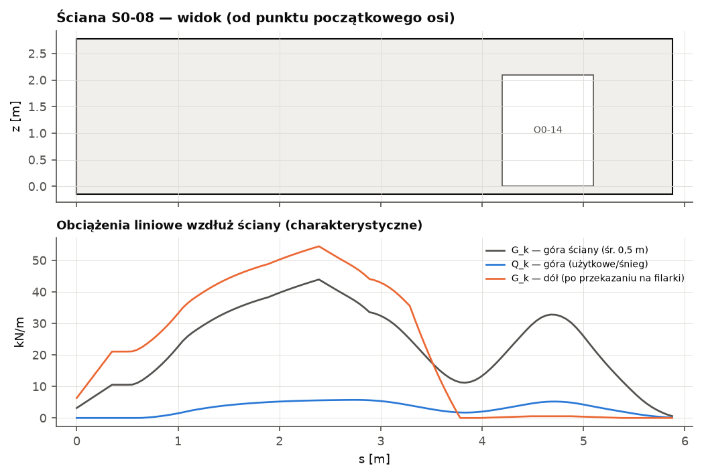

*Rys. Ściana S0-08: widok z otworami i rozkład obciążeń charakterystycznych wzdłuż osi.*

#### Zestawienie obciążeń

**Ciężar ściany — SW18 — Ściana wewnętrzna nośna: silikat 18, tynk gipsowy obustronnie**

| Warstwa | Obliczenie | g_k [kN/m²] | γ_G (6.10a) | g_d [kN/m²] | ξγ_G (6.10b) | g_d [kN/m²] |
|---|---|---|---|---|---|---|
| Tynk gipsowy maszynowy 1,5 cm | 1,5 cm × 11,77 kN/m³ | 0,177 | 1,35 | 0,238 | 1,15 | 0,203 |
| Bloczek wapienno-piaskowy (silikat) 18 cm, kl. 20, gr. 1, na zaprawie cienkowarstwowej | 18,0 cm × 18,00 kN/m³ | 3,240 | 1,35 | 4,374 | 1,15 | 3,718 |
| Tynk gipsowy maszynowy 1,5 cm | 1,5 cm × 11,77 kN/m³ | 0,177 | 1,35 | 0,238 | 1,15 | 0,203 |
| **Razem g_k** |  | 3,593 |  | 4,851 |  | 4,123 |

**Obciążenia ściany (charakterystyczne)** — góra: z płyt i ścian wyżej; dół: po przekazaniu obciążeń znad otworów na filarki

| Przypadek | max q_góra [kN/m] | średnio q_dół [kN/m] | max q_dół [kN/m] |
|---|---|---|---|
| G | 752,23 | 233,12 | 844,54 |
| H | 8,88 | 2,33 | 8,88 |
| QA | 183,72 | 51,24 | 196,26 |
| QA_pA | 186,41 | 53,42 | 199,40 |
| QA_pB | 1,62 | 0,29 | 2,66 |
| S1 | 15,98 | 4,20 | 15,98 |
| S2 | 15,91 | 4,37 | 15,91 |
| SB2 | 1,91 | 0,60 | 1,91 |

#### Obliczenia

##### S0-08 — filarek 5,10–5,88 m (b = 0,77 m), 6.10a (wiodące: QA)

- Pole przekroju filarka: A = b·t = 0,77·0,18 = **0,139** m²
- Współczynnik η_A (A < 0,3 m²): η_A = (NA; interpolacja wg R5-63) = **1,39** *(NA do PN-EN 1996-1-1 [NZW])*
- Wytrzymałość charakterystyczna muru: f_k = K·f_b^0,85 = 0,60·20^0,85 = **7,66** MPa *((3.2) + NA tabl. NA.5 (K = 0,60, Ap2:2014-09))*
- Wytrzymałość obliczeniowa: f_d = f_k/γ_M · (1/η_A) = 7,66/1,7·0,721 = **3,25** MPa *(NA tabl. NA.1 (kat. I, zaprawa projektowana, klasa wykonania A))*
- Wysokość efektywna: h_ef = ρ₂·h = 1,000·2,93 = **2,930** m *((5.2), 5.5.1.2)*
- Smukłość: h_ef/t_ef = 2,930/0,180 = **16,28**
- Mimośród przypadkowy: e_init = h_ef/450 = 2930/450 = **6,5** mm *(5.5.1.1(4))*
- Mimośród na górze: e_g = M_g/N_g + e_init ≥ 0,05t = 2,69/890,9 + 0,0065 = **9,5** mm *((6.5))*
- Mimośród na dole: e_d = M_d/N_d + e_init ≥ 0,05t = 0,00/991,1 + 0,0065 = **9,0** mm *((6.5))*
- Współczynnik redukcyjny — góra: Φ_g = 1 − 2e_g/t = 1 − 2·9,5/180 = **0,894** *((6.4))*
- Współczynnik redukcyjny — dół: Φ_d = 1 − 2e_d/t = 1 − 2·9,0/180 = **0,900** *((6.4))*
- Mimośród w połowie wysokości: e_m = (M_md + M_w)/N_m + e_init = (1,35 + 0,00)/941,0 + 0,0065 = **7,9** mm *((6.7))*
- Mimośród od pełzania: e_k = 0,002·φ_∞·(h_ef/t_ef)·√(t·e_m) = 0,002·1,5·16,28·√(0,180·0,0079) = **1,8** mm *((6.8))*
- Mimośród całkowity: e_mk = e_m + e_k ≥ 0,05t = **9,8** mm *((6.6))*
- Współczynnik redukcyjny w połowie wysokości: Φ_m = A₁·exp(−u²/2), A₁ = 1 − 2e_mk/t, u = (λ − 0,063)/(0,73 − 1,17e_mk/t) = λ = 0,515, A₁ = 0,891, u = 0,678 = **0,708** *(zał. G (G.1–G.4), E = K_E·f_k)*
- Nośność: N_Rd = Φ·t·f_d = (góra / środek / dół) 0,894 / 0,708 / 0,900 · 180 mm · 3,25 MPa = **522,9 / 414,2 / 526,4** kN/m *((6.2))*

| Warunek | Efekt | Nośność / limit | η | Stan | Podstawa |
|---|---|---|---|---|---|
| Smukłość ściany | h_ef/t_ef = 16,3  | 27 = 27,0  | 60% | spełniony | 5.5.1.4 |
| Nośność — przekrój górny | N_Ed = 890,87 kN/m | N_Rd = 522,90 kN/m | 170% | **NIESPEŁNIONY** | (6.2), (6.4) |
| Nośność — połowa wysokości | N_Ed = 940,98 kN/m | N_Rd = 414,23 kN/m | 227% | **NIESPEŁNIONY** | (6.2), zał. G |
| Nośność — przekrój dolny | N_Ed = 991,08 kN/m | N_Rd = 526,37 kN/m | 188% | **NIESPEŁNIONY** | (6.2), (6.4) |

> Filarek liczony jako ściana podparta górą i dołem, ρ₂ = 1,0 (bezpiecznie); siły N na 1 m = N/b.

#### Wnioski

**Przyjęto:** Mur: Bloczek wapienno-piaskowy (silikat) 18 cm, kl. 20, gr. 1, na zaprawie cienkowarstwowej, f_d = 4,50 MPa (klasa wykonania A, γ_M = 1,7).  

### Poz. 7.24 — Ściana S0-10 (P0, wewnętrzna nośna)

Element modelu: `S0-10` · maks. wykorzystanie nośności η = 453% · **WARUNKI NIESPEŁNIONE — patrz tabele warunków i wnioski**

#### Opis i schemat statyczny

Ściana gr. konstrukcyjnej t = 18 cm, długość osi 3,50 m, wysokość h = 2,930 m (z −0,150 do 2,780); materiał: Bloczek wapienno-piaskowy (silikat) 18 cm, kl. 20, gr. 1, na zaprawie cienkowarstwowej. Otwory: O0-18 (1,50 m).

Sprawdzono 2 odcinków (filarki ≤ 2 m między otworami — siła całkowita; dłuższe pasma — maks. średnia krocząca 1 m) dla 34 kombinacji; poniżej przypadek miarodajny. Mimośród reakcji stropu e = t/6 (zewn.) / 0,3·t/6 (wewn., niesymetria) [UPR]; wiatr jako moment w połowie wysokości w·h²/8.

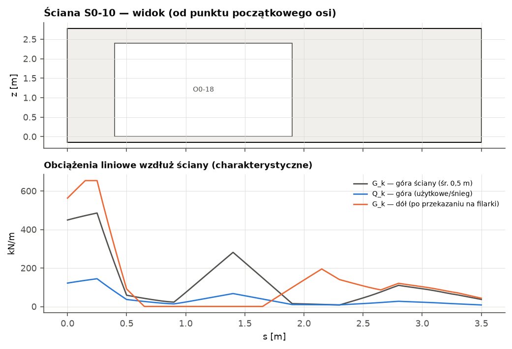

*Rys. Ściana S0-10: widok z otworami i rozkład obciążeń charakterystycznych wzdłuż osi.*

#### Zestawienie obciążeń

**Ciężar ściany — SW18 — Ściana wewnętrzna nośna: silikat 18, tynk gipsowy obustronnie**

| Warstwa | Obliczenie | g_k [kN/m²] | γ_G (6.10a) | g_d [kN/m²] | ξγ_G (6.10b) | g_d [kN/m²] |
|---|---|---|---|---|---|---|
| Tynk gipsowy maszynowy 1,5 cm | 1,5 cm × 11,77 kN/m³ | 0,177 | 1,35 | 0,238 | 1,15 | 0,203 |
| Bloczek wapienno-piaskowy (silikat) 18 cm, kl. 20, gr. 1, na zaprawie cienkowarstwowej | 18,0 cm × 18,00 kN/m³ | 3,240 | 1,35 | 4,374 | 1,15 | 3,718 |
| Tynk gipsowy maszynowy 1,5 cm | 1,5 cm × 11,77 kN/m³ | 0,177 | 1,35 | 0,238 | 1,15 | 0,203 |
| **Razem g_k** |  | 3,593 |  | 4,851 |  | 4,123 |

**Obciążenia ściany (charakterystyczne)** — góra: z płyt i ścian wyżej; dół: po przekazaniu obciążeń znad otworów na filarki

| Przypadek | max q_góra [kN/m] | średnio q_dół [kN/m] | max q_dół [kN/m] |
|---|---|---|---|
| G | 1217,38 | 166,09 | 1492,29 |
| H | 24,07 | 2,68 | 28,03 |
| QA | 268,61 | 38,78 | 333,86 |
| QA_pA | 278,77 | 35,84 | 336,80 |
| QA_pB | 5,03 | 3,42 | 10,90 |
| S1 | 43,33 | 4,82 | 50,46 |
| S2 | 43,89 | 5,23 | 51,87 |
| SB2 | 4,93 | 1,48 | 5,10 |

#### Obliczenia

##### S0-10 — filarek 0,00–0,40 m (b = 0,40 m), 6.10a (wiodące: QA_pA)

- Pole przekroju filarka: A = b·t = 0,40·0,18 = **0,072** m²
- Współczynnik η_A (A < 0,3 m²): η_A = (NA; interpolacja wg R5-63) = **2,00** *(NA do PN-EN 1996-1-1 [NZW])*
- Wytrzymałość charakterystyczna muru: f_k = K·f_b^0,85 = 0,60·20^0,85 = **7,66** MPa *((3.2) + NA tabl. NA.5 (K = 0,60, Ap2:2014-09))*
- Wytrzymałość obliczeniowa: f_d = f_k/γ_M · (1/η_A) = 7,66/1,7·0,500 = **2,25** MPa *(NA tabl. NA.1 (kat. I, zaprawa projektowana, klasa wykonania A))*
- Wysokość efektywna: h_ef = ρ₂·h = 1,000·2,93 = **2,930** m *((5.2), 5.5.1.2)*
- Smukłość: h_ef/t_ef = 2,930/0,180 = **16,28**
- Mimośród przypadkowy: e_init = h_ef/450 = 2930/450 = **6,5** mm *(5.5.1.1(4))*
- Mimośród na górze: e_g = M_g/N_g + e_init ≥ 0,05t = 2,67/1120,5 + 0,0065 = **9,0** mm *((6.5))*
- Mimośród na dole: e_d = M_d/N_d + e_init ≥ 0,05t = 0,00/1503,1 + 0,0065 = **9,0** mm *((6.5))*
- Współczynnik redukcyjny — góra: Φ_g = 1 − 2e_g/t = 1 − 2·9,0/180 = **0,900** *((6.4))*
- Współczynnik redukcyjny — dół: Φ_d = 1 − 2e_d/t = 1 − 2·9,0/180 = **0,900** *((6.4))*
- Mimośród w połowie wysokości: e_m = (M_md + M_w)/N_m + e_init = (1,33 + 0,00)/1311,8 + 0,0065 = **7,5** mm *((6.7))*
- Mimośród od pełzania: e_k = 0,002·φ_∞·(h_ef/t_ef)·√(t·e_m) = 0,002·1,5·16,28·√(0,180·0,0075) = **1,8** mm *((6.8))*
- Mimośród całkowity: e_mk = e_m + e_k ≥ 0,05t = **9,3** mm *((6.6))*
- Współczynnik redukcyjny w połowie wysokości: Φ_m = A₁·exp(−u²/2), A₁ = 1 − 2e_mk/t, u = (λ − 0,063)/(0,73 − 1,17e_mk/t) = λ = 0,515, A₁ = 0,896, u = 0,675 = **0,714** *(zał. G (G.1–G.4), E = K_E·f_k)*
- Nośność: N_Rd = Φ·t·f_d = (góra / środek / dół) 0,900 / 0,714 / 0,900 · 180 mm · 2,25 MPa = **364,8 / 289,3 / 364,8** kN/m *((6.2))*

| Warunek | Efekt | Nośność / limit | η | Stan | Podstawa |
|---|---|---|---|---|---|
| Smukłość ściany | h_ef/t_ef = 16,3  | 27 = 27,0  | 60% | spełniony | 5.5.1.4 |
| Nośność — przekrój górny | N_Ed = 1120,51 kN/m | N_Rd = 364,81 kN/m | 307% | **NIESPEŁNIONY** | (6.2), (6.4) |
| Nośność — połowa wysokości | N_Ed = 1311,80 kN/m | N_Rd = 289,34 kN/m | 453% | **NIESPEŁNIONY** | (6.2), zał. G |
| Nośność — przekrój dolny | N_Ed = 1503,09 kN/m | N_Rd = 364,81 kN/m | 412% | **NIESPEŁNIONY** | (6.2), (6.4) |

> Filarek liczony jako ściana podparta górą i dołem, ρ₂ = 1,0 (bezpiecznie); siły N na 1 m = N/b.

#### Wnioski

**Przyjęto:** Mur: Bloczek wapienno-piaskowy (silikat) 18 cm, kl. 20, gr. 1, na zaprawie cienkowarstwowej, f_d = 4,50 MPa (klasa wykonania A, γ_M = 1,7).  

### Poz. 7.25 — Ściana S0-11 (P0, wewnętrzna nośna)

Element modelu: `S0-11` · maks. wykorzystanie nośności η = 60% · wszystkie warunki spełnione

#### Opis i schemat statyczny

Ściana gr. konstrukcyjnej t = 18 cm, długość osi 3,62 m, wysokość h = 2,930 m (z −0,150 do 2,780); materiał: Bloczek wapienno-piaskowy (silikat) 18 cm, kl. 20, gr. 1, na zaprawie cienkowarstwowej. Otwory: O0-15 (0,90 m).

Sprawdzono 2 odcinków (filarki ≤ 2 m między otworami — siła całkowita; dłuższe pasma — maks. średnia krocząca 1 m) dla 34 kombinacji; poniżej przypadek miarodajny. Mimośród reakcji stropu e = t/6 (zewn.) / 0,3·t/6 (wewn., niesymetria) [UPR]; wiatr jako moment w połowie wysokości w·h²/8.

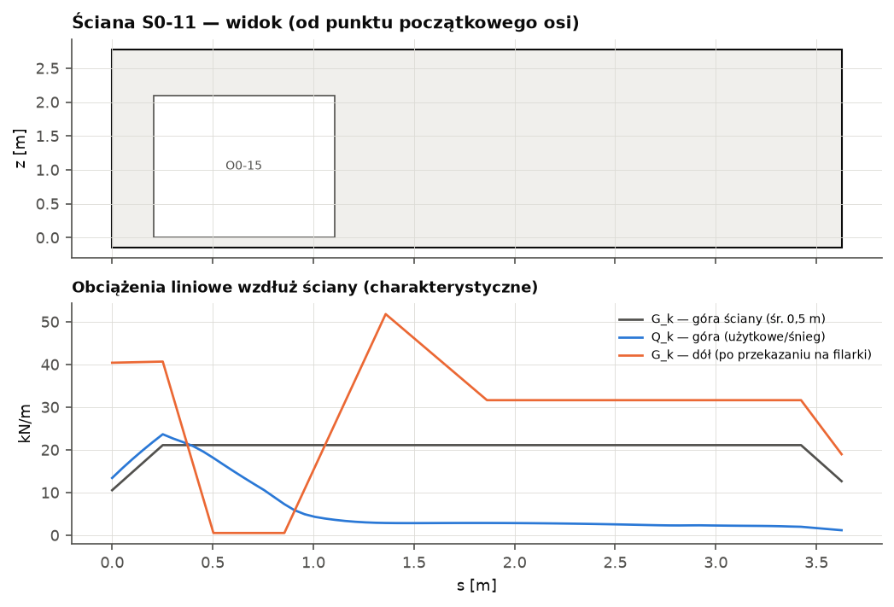

*Rys. Ściana S0-11: widok z otworami i rozkład obciążeń charakterystycznych wzdłuż osi.*

#### Zestawienie obciążeń

**Ciężar ściany — SW18 — Ściana wewnętrzna nośna: silikat 18, tynk gipsowy obustronnie**

| Warstwa | Obliczenie | g_k [kN/m²] | γ_G (6.10a) | g_d [kN/m²] | ξγ_G (6.10b) | g_d [kN/m²] |
|---|---|---|---|---|---|---|
| Tynk gipsowy maszynowy 1,5 cm | 1,5 cm × 11,77 kN/m³ | 0,177 | 1,35 | 0,238 | 1,15 | 0,203 |
| Bloczek wapienno-piaskowy (silikat) 18 cm, kl. 20, gr. 1, na zaprawie cienkowarstwowej | 18,0 cm × 18,00 kN/m³ | 3,240 | 1,35 | 4,374 | 1,15 | 3,718 |
| Tynk gipsowy maszynowy 1,5 cm | 1,5 cm × 11,77 kN/m³ | 0,177 | 1,35 | 0,238 | 1,15 | 0,203 |
| **Razem g_k** |  | 3,593 |  | 4,851 |  | 4,123 |

**Obciążenia ściany (charakterystyczne)** — góra: z płyt i ścian wyżej; dół: po przekazaniu obciążeń znad otworów na filarki

| Przypadek | max q_góra [kN/m] | średnio q_dół [kN/m] | max q_dół [kN/m] |
|---|---|---|---|
| G | 21,11 | 30,17 | 80,82 |
| H | 3,17 | 0,96 | 5,91 |
| QA | 0,00 | 0,00 | 0,00 |
| QA_pA | 0,00 | 0,00 | 0,00 |
| QA_pB | 6,95 | 4,32 | 17,46 |
| S1 | 5,71 | 1,72 | 10,64 |
| S2 | 6,32 | 2,35 | 12,46 |
| SB2 | 2,62 | 2,24 | 6,41 |

#### Obliczenia

##### S0-11 — filarek 0,00–0,20 m (b = 0,20 m), 6.10a (wiodące: QA_pB)

- Pole przekroju filarka: A = b·t = 0,20·0,18 = **0,037** m²
- Współczynnik η_A (A < 0,3 m²): η_A = (NA; interpolacja wg R5-63) = **2,00** *(NA do PN-EN 1996-1-1 [NZW])*
- Wytrzymałość charakterystyczna muru: f_k = K·f_b^0,85 = 0,60·20^0,85 = **7,66** MPa *((3.2) + NA tabl. NA.5 (K = 0,60, Ap2:2014-09))*
- Wytrzymałość obliczeniowa: f_d = f_k/γ_M · (1/η_A) = 7,66/1,7·0,500 = **2,25** MPa *(NA tabl. NA.1 (kat. I, zaprawa projektowana, klasa wykonania A))*
- Wysokość efektywna: h_ef = ρ₂·h = 1,000·2,93 = **2,930** m *((5.2), 5.5.1.2)*
- Smukłość: h_ef/t_ef = 2,930/0,180 = **16,28**
- Mimośród przypadkowy: e_init = h_ef/450 = 2930/450 = **6,5** mm *(5.5.1.1(4))*
- Mimośród na górze: e_g = M_g/N_g + e_init ≥ 0,05t = 0,02/43,0 + 0,0065 = **9,0** mm *((6.5))*
- Mimośród na dole: e_d = M_d/N_d + e_init ≥ 0,05t = 0,00/150,2 + 0,0065 = **9,0** mm *((6.5))*
- Współczynnik redukcyjny — góra: Φ_g = 1 − 2e_g/t = 1 − 2·9,0/180 = **0,900** *((6.4))*
- Współczynnik redukcyjny — dół: Φ_d = 1 − 2e_d/t = 1 − 2·9,0/180 = **0,900** *((6.4))*
- Mimośród w połowie wysokości: e_m = (M_md + M_w)/N_m + e_init = (0,01 + 0,00)/96,6 + 0,0065 = **6,6** mm *((6.7))*
- Mimośród od pełzania: e_k = 0,002·φ_∞·(h_ef/t_ef)·√(t·e_m) = 0,002·1,5·16,28·√(0,180·0,0066) = **1,7** mm *((6.8))*
- Mimośród całkowity: e_mk = e_m + e_k ≥ 0,05t = **9,0** mm *((6.6))*
- Współczynnik redukcyjny w połowie wysokości: Φ_m = A₁·exp(−u²/2), A₁ = 1 − 2e_mk/t, u = (λ − 0,063)/(0,73 − 1,17e_mk/t) = λ = 0,515, A₁ = 0,900, u = 0,673 = **0,718** *(zał. G (G.1–G.4), E = K_E·f_k)*
- Nośność: N_Rd = Φ·t·f_d = (góra / środek / dół) 0,900 / 0,718 / 0,900 · 180 mm · 2,25 MPa = **364,8 / 290,9 / 364,8** kN/m *((6.2))*

| Warunek | Efekt | Nośność / limit | η | Stan | Podstawa |
|---|---|---|---|---|---|
| Smukłość ściany | h_ef/t_ef = 16,3  | 27 = 27,0  | 60% | spełniony | 5.5.1.4 |
| Nośność — przekrój górny | N_Ed = 42,98 kN/m | N_Rd = 364,81 kN/m | 12% | spełniony | (6.2), (6.4) |
| Nośność — połowa wysokości | N_Ed = 96,60 kN/m | N_Rd = 290,93 kN/m | 33% | spełniony | (6.2), zał. G |
| Nośność — przekrój dolny | N_Ed = 150,22 kN/m | N_Rd = 364,81 kN/m | 41% | spełniony | (6.2), (6.4) |

> Filarek liczony jako ściana podparta górą i dołem, ρ₂ = 1,0 (bezpiecznie); siły N na 1 m = N/b.

#### Wnioski

**Przyjęto:** Mur: Bloczek wapienno-piaskowy (silikat) 18 cm, kl. 20, gr. 1, na zaprawie cienkowarstwowej, f_d = 4,50 MPa (klasa wykonania A, γ_M = 1,7).  

### Poz. 7.26 — Ściana S0-12 (P0, wewnętrzna nośna)

Element modelu: `S0-12` · maks. wykorzystanie nośności η = 0% · wszystkie warunki spełnione

#### Opis i schemat statyczny

Ściana gr. konstrukcyjnej t = 18 cm, długość osi 3,62 m, wysokość h = 2,930 m (z −0,150 do 2,780); materiał: Żelbet C25/30, B500SP (stropy, płyta fundamentowa, ściany). Otwory: brak.

#### Zestawienie obciążeń

**Ciężar ściany — SWZB — Ściana wewnętrzna nośna żelbetowa 18 cm (trzon klatki na P0 — usztywnienie w kierunku x, J2)**

| Warstwa | Obliczenie | g_k [kN/m²] | γ_G (6.10a) | g_d [kN/m²] | ξγ_G (6.10b) | g_d [kN/m²] |
|---|---|---|---|---|---|---|
| Tynk gipsowy maszynowy 1,5 cm | 1,5 cm × 11,77 kN/m³ | 0,177 | 1,35 | 0,238 | 1,15 | 0,203 |
| Żelbet C25/30, B500SP (stropy, płyta fundamentowa, ściany) | 18,0 cm × 25,00 kN/m³ | 4,500 | 1,35 | 6,075 | 1,15 | 5,164 |
| Tynk gipsowy maszynowy 1,5 cm | 1,5 cm × 11,77 kN/m³ | 0,177 | 1,35 | 0,238 | 1,15 | 0,203 |
| **Razem g_k** |  | 4,853 |  | 6,552 |  | 5,569 |

**Obciążenia ściany (charakterystyczne)** — góra: z płyt i ścian wyżej; dół: po przekazaniu obciążeń znad otworów na filarki

| Przypadek | max q_góra [kN/m] | średnio q_dół [kN/m] | max q_dół [kN/m] |
|---|---|---|---|
| G | 2347,34 | 116,05 | 2361,56 |
| H | 41,83 | 1,50 | 41,83 |
| QA | 433,81 | 15,06 | 433,81 |
| QA_pA | 418,81 | 14,54 | 418,81 |
| QA_pB | 22,32 | 3,47 | 22,32 |
| S1 | 75,29 | 2,69 | 75,29 |
| S2 | 71,71 | 2,54 | 71,71 |
| SB2 | 0,00 | 0,00 | 0,00 |

> Warstwa konstrukcyjna nie jest murem (np. żelbet) — ściana żelbetowa: sprawdzenie wg PN-EN 1992-1-1 (ściany 9.6, smukłość 5.8) — poza zakresem automatycznym [WYMAGA ANALIZY].

### Poz. 7.27 — Ściana S0-13 (P0, wewnętrzna nośna)

Element modelu: `S0-13` · maks. wykorzystanie nośności η = 0% · wszystkie warunki spełnione

#### Opis i schemat statyczny

Ściana gr. konstrukcyjnej t = 18 cm, długość osi 3,62 m, wysokość h = 2,930 m (z −0,150 do 2,780); materiał: Żelbet C25/30, B500SP (stropy, płyta fundamentowa, ściany). Otwory: brak.

#### Zestawienie obciążeń

**Ciężar ściany — SWZB — Ściana wewnętrzna nośna żelbetowa 18 cm (trzon klatki na P0 — usztywnienie w kierunku x, J2)**

| Warstwa | Obliczenie | g_k [kN/m²] | γ_G (6.10a) | g_d [kN/m²] | ξγ_G (6.10b) | g_d [kN/m²] |
|---|---|---|---|---|---|---|
| Tynk gipsowy maszynowy 1,5 cm | 1,5 cm × 11,77 kN/m³ | 0,177 | 1,35 | 0,238 | 1,15 | 0,203 |
| Żelbet C25/30, B500SP (stropy, płyta fundamentowa, ściany) | 18,0 cm × 25,00 kN/m³ | 4,500 | 1,35 | 6,075 | 1,15 | 5,164 |
| Tynk gipsowy maszynowy 1,5 cm | 1,5 cm × 11,77 kN/m³ | 0,177 | 1,35 | 0,238 | 1,15 | 0,203 |
| **Razem g_k** |  | 4,853 |  | 6,552 |  | 5,569 |

**Obciążenia ściany (charakterystyczne)** — góra: z płyt i ścian wyżej; dół: po przekazaniu obciążeń znad otworów na filarki

| Przypadek | max q_góra [kN/m] | średnio q_dół [kN/m] | max q_dół [kN/m] |
|---|---|---|---|
| G | 1837,76 | 98,41 | 1851,98 |
| H | 15,41 | 1,02 | 15,41 |
| QA | 455,20 | 15,81 | 455,20 |
| QA_pA | 415,00 | 14,41 | 415,00 |
| QA_pB | 50,63 | 6,48 | 50,63 |
| S1 | 27,74 | 1,83 | 27,74 |
| S2 | 27,72 | 2,30 | 27,72 |
| SB2 | 3,65 | 1,89 | 3,65 |

> Warstwa konstrukcyjna nie jest murem (np. żelbet) — ściana żelbetowa: sprawdzenie wg PN-EN 1992-1-1 (ściany 9.6, smukłość 5.8) — poza zakresem automatycznym [WYMAGA ANALIZY].

### Poz. 7.28 — Ściana S0-15 (P0, wewnętrzna nośna)

Element modelu: `S0-15` · maks. wykorzystanie nośności η = 81% · wszystkie warunki spełnione

#### Opis i schemat statyczny

Ściana gr. konstrukcyjnej t = 18 cm, długość osi 2,88 m, wysokość h = 2,930 m (z −0,150 do 2,780); materiał: Bloczek wapienno-piaskowy (silikat) 18 cm, kl. 20, gr. 1, na zaprawie cienkowarstwowej. Otwory: O0-21 (0,90 m).

Sprawdzono 2 odcinków (filarki ≤ 2 m między otworami — siła całkowita; dłuższe pasma — maks. średnia krocząca 1 m) dla 34 kombinacji; poniżej przypadek miarodajny. Mimośród reakcji stropu e = t/6 (zewn.) / 0,3·t/6 (wewn., niesymetria) [UPR]; wiatr jako moment w połowie wysokości w·h²/8.

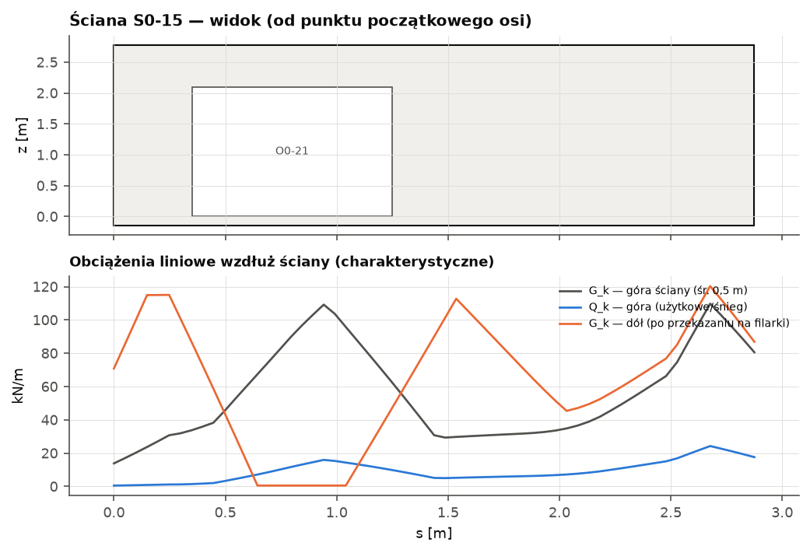

*Rys. Ściana S0-15: widok z otworami i rozkład obciążeń charakterystycznych wzdłuż osi.*

#### Zestawienie obciążeń

**Ciężar ściany — SW18 — Ściana wewnętrzna nośna: silikat 18, tynk gipsowy obustronnie**

| Warstwa | Obliczenie | g_k [kN/m²] | γ_G (6.10a) | g_d [kN/m²] | ξγ_G (6.10b) | g_d [kN/m²] |
|---|---|---|---|---|---|---|
| Tynk gipsowy maszynowy 1,5 cm | 1,5 cm × 11,77 kN/m³ | 0,177 | 1,35 | 0,238 | 1,15 | 0,203 |
| Bloczek wapienno-piaskowy (silikat) 18 cm, kl. 20, gr. 1, na zaprawie cienkowarstwowej | 18,0 cm × 18,00 kN/m³ | 3,240 | 1,35 | 4,374 | 1,15 | 3,718 |
| Tynk gipsowy maszynowy 1,5 cm | 1,5 cm × 11,77 kN/m³ | 0,177 | 1,35 | 0,238 | 1,15 | 0,203 |
| **Razem g_k** |  | 3,593 |  | 4,851 |  | 4,123 |

**Obciążenia ściany (charakterystyczne)** — góra: z płyt i ścian wyżej; dół: po przekazaniu obciążeń znad otworów na filarki

| Przypadek | max q_góra [kN/m] | średnio q_dół [kN/m] | max q_dół [kN/m] |
|---|---|---|---|
| G | 188,75 | 79,99 | 199,28 |
| H | 2,15 | 0,53 | 1,86 |
| QA | 51,67 | 17,00 | 51,67 |
| QA_pA | 53,65 | 17,37 | 53,65 |
| QA_pB | 0,01 | 0,00 | 0,01 |
| S1 | 3,87 | 0,95 | 3,34 |
| S2 | 4,14 | 1,11 | 3,91 |
| SB2 | 0,77 | 0,44 | 1,58 |

#### Obliczenia

##### S0-15 — filarek 0,00–0,35 m (b = 0,35 m), 6.10a (wiodące: QA_pA)

- Pole przekroju filarka: A = b·t = 0,35·0,18 = **0,063** m²
- Współczynnik η_A (A < 0,3 m²): η_A = (NA; interpolacja wg R5-63) = **2,00** *(NA do PN-EN 1996-1-1 [NZW])*
- Wytrzymałość charakterystyczna muru: f_k = K·f_b^0,85 = 0,60·20^0,85 = **7,66** MPa *((3.2) + NA tabl. NA.5 (K = 0,60, Ap2:2014-09))*
- Wytrzymałość obliczeniowa: f_d = f_k/γ_M · (1/η_A) = 7,66/1,7·0,500 = **2,25** MPa *(NA tabl. NA.1 (kat. I, zaprawa projektowana, klasa wykonania A))*
- Wysokość efektywna: h_ef = ρ₂·h = 1,000·2,93 = **2,930** m *((5.2), 5.5.1.2)*
- Smukłość: h_ef/t_ef = 2,930/0,180 = **16,28**
- Mimośród przypadkowy: e_init = h_ef/450 = 2930/450 = **6,5** mm *(5.5.1.1(4))*
- Mimośród na górze: e_g = M_g/N_g + e_init ≥ 0,05t = 0,42/77,4 + 0,0065 = **12,0** mm *((6.5))*
- Mimośród na dole: e_d = M_d/N_d + e_init ≥ 0,05t = 0,00/294,5 + 0,0065 = **9,0** mm *((6.5))*
- Współczynnik redukcyjny — góra: Φ_g = 1 − 2e_g/t = 1 − 2·12,0/180 = **0,867** *((6.4))*
- Współczynnik redukcyjny — dół: Φ_d = 1 − 2e_d/t = 1 − 2·9,0/180 = **0,900** *((6.4))*
- Mimośród w połowie wysokości: e_m = (M_md + M_w)/N_m + e_init = (0,21 + 0,00)/185,9 + 0,0065 = **7,7** mm *((6.7))*
- Mimośród od pełzania: e_k = 0,002·φ_∞·(h_ef/t_ef)·√(t·e_m) = 0,002·1,5·16,28·√(0,180·0,0077) = **1,8** mm *((6.8))*
- Mimośród całkowity: e_mk = e_m + e_k ≥ 0,05t = **9,5** mm *((6.6))*
- Współczynnik redukcyjny w połowie wysokości: Φ_m = A₁·exp(−u²/2), A₁ = 1 − 2e_mk/t, u = (λ − 0,063)/(0,73 − 1,17e_mk/t) = λ = 0,515, A₁ = 0,895, u = 0,676 = **0,712** *(zał. G (G.1–G.4), E = K_E·f_k)*
- Nośność: N_Rd = Φ·t·f_d = (góra / środek / dół) 0,867 / 0,712 / 0,900 · 180 mm · 2,25 MPa = **351,4 / 288,7 / 364,8** kN/m *((6.2))*

| Warunek | Efekt | Nośność / limit | η | Stan | Podstawa |
|---|---|---|---|---|---|
| Smukłość ściany | h_ef/t_ef = 16,3  | 27 = 27,0  | 60% | spełniony | 5.5.1.4 |
| Nośność — przekrój górny | N_Ed = 77,41 kN/m | N_Rd = 351,36 kN/m | 22% | spełniony | (6.2), (6.4) |
| Nośność — połowa wysokości | N_Ed = 185,94 kN/m | N_Rd = 288,68 kN/m | 64% | spełniony | (6.2), zał. G |
| Nośność — przekrój dolny | N_Ed = 294,47 kN/m | N_Rd = 364,81 kN/m | 81% | spełniony | (6.2), (6.4) |

> Filarek liczony jako ściana podparta górą i dołem, ρ₂ = 1,0 (bezpiecznie); siły N na 1 m = N/b.

#### Wnioski

**Przyjęto:** Mur: Bloczek wapienno-piaskowy (silikat) 18 cm, kl. 20, gr. 1, na zaprawie cienkowarstwowej, f_d = 4,50 MPa (klasa wykonania A, γ_M = 1,7).  

### Poz. 7.29 — Ściana S0-16 (P0, wewnętrzna nośna)

Element modelu: `S0-16` · maks. wykorzystanie nośności η = 45% · wszystkie warunki spełnione

#### Opis i schemat statyczny

Ściana gr. konstrukcyjnej t = 18 cm, długość osi 5,88 m, wysokość h = 2,930 m (z −0,150 do 2,780); materiał: Bloczek wapienno-piaskowy (silikat) 18 cm, kl. 20, gr. 1, na zaprawie cienkowarstwowej. Otwory: brak.

Sprawdzono 1 odcinków (filarki ≤ 2 m między otworami — siła całkowita; dłuższe pasma — maks. średnia krocząca 1 m) dla 34 kombinacji; poniżej przypadek miarodajny. Mimośród reakcji stropu e = t/6 (zewn.) / 0,3·t/6 (wewn., niesymetria) [UPR]; wiatr jako moment w połowie wysokości w·h²/8.

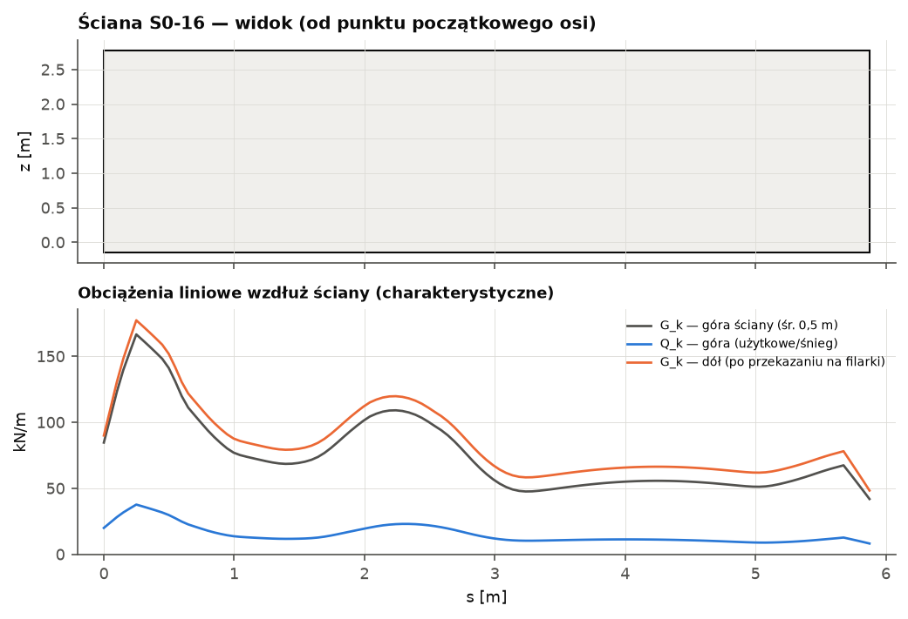

*Rys. Ściana S0-16: widok z otworami i rozkład obciążeń charakterystycznych wzdłuż osi.*

#### Zestawienie obciążeń

**Ciężar ściany — SWG — Ściana nośna dom–garaż nieogrzewany: silikat 18 + wełna 12 cm od strony garażu + tynk (U ≈ 0,24 ≤ 0,30; szczelna na spaliny)**

| Warstwa | Obliczenie | g_k [kN/m²] | γ_G (6.10a) | g_d [kN/m²] | ξγ_G (6.10b) | g_d [kN/m²] |
|---|---|---|---|---|---|---|
| Tynk gipsowy maszynowy 1,5 cm | 1,5 cm × 11,77 kN/m³ | 0,177 | 1,35 | 0,238 | 1,15 | 0,203 |
| Bloczek wapienno-piaskowy (silikat) 18 cm, kl. 20, gr. 1, na zaprawie cienkowarstwowej | 18,0 cm × 18,00 kN/m³ | 3,240 | 1,35 | 4,374 | 1,15 | 3,718 |
| Wełna mineralna 035 (szkielet, docieplenia, ściana dom–garaż) | 12,0 cm × 0,39 kN/m³ | 0,047 | 1,35 | 0,064 | 1,15 | 0,054 |
| Tynk cementowo-wapienny 1,5 cm (garaż, pom. techniczne) | 1,0 cm × 18,15 kN/m³ | 0,181 | 1,35 | 0,245 | 1,15 | 0,208 |
| **Razem g_k** |  | 3,645 |  | 4,921 |  | 4,183 |

**Obciążenia ściany (charakterystyczne)** — góra: z płyt i ścian wyżej; dół: po przekazaniu obciążeń znad otworów na filarki

| Przypadek | max q_góra [kN/m] | średnio q_dół [kN/m] | max q_dół [kN/m] |
|---|---|---|---|
| G | 196,97 | 88,66 | 207,65 |
| H | 5,70 | 2,46 | 5,70 |
| QA | 48,67 | 6,96 | 48,67 |
| QA_pA | 46,20 | 5,03 | 46,20 |
| QA_pB | 5,00 | 1,93 | 5,00 |
| S1 | 10,25 | 4,43 | 10,25 |
| S2 | 17,91 | 7,22 | 17,91 |
| SB2 | 21,27 | 7,83 | 21,27 |

#### Obliczenia

##### S0-16 — ściana (odcinek 0,00–5,88 m), 6.10a (wiodące: QA)

- Wytrzymałość charakterystyczna muru: f_k = K·f_b^0,85 = 0,60·20^0,85 = **7,66** MPa *((3.2) + NA tabl. NA.5 (K = 0,60, Ap2:2014-09))*
- Wytrzymałość obliczeniowa: f_d = f_k/γ_M = 7,66/1,7 = **4,50** MPa *(NA tabl. NA.1 (kat. I, zaprawa projektowana, klasa wykonania A))*
- Wysokość efektywna: h_ef = ρ₂·h = 0,750·2,93 = **2,197** m *((5.2), 5.5.1.2)*
- Smukłość: h_ef/t_ef = 2,197/0,180 = **12,21**
- Mimośród przypadkowy: e_init = h_ef/450 = 2198/450 = **4,9** mm *(5.5.1.1(4))*
- Mimośród na górze: e_g = M_g/N_g + e_init ≥ 0,05t = 1,13/223,6 + 0,0049 = **9,9** mm *((6.5))*
- Mimośród na dole: e_d = M_d/N_d + e_init ≥ 0,05t = 0,00/229,4 + 0,0049 = **9,0** mm *((6.5))*
- Współczynnik redukcyjny — góra: Φ_g = 1 − 2e_g/t = 1 − 2·9,9/180 = **0,890** *((6.4))*
- Współczynnik redukcyjny — dół: Φ_d = 1 − 2e_d/t = 1 − 2·9,0/180 = **0,900** *((6.4))*
- Mimośród w połowie wysokości: e_m = (M_md + M_w)/N_m + e_init = (0,56 + 0,00)/226,5 + 0,0049 = **7,4** mm *((6.7))*
- Mimośród od pełzania: e_k = 0 (h_ef/t_ef ≤ λ_c) = **0,0** mm *(6.1.2.2(2) [NZW NA])*
- Mimośród całkowity: e_mk = e_m + e_k ≥ 0,05t = **9,0** mm *((6.6))*
- Współczynnik redukcyjny w połowie wysokości: Φ_m = A₁·exp(−u²/2), A₁ = 1 − 2e_mk/t, u = (λ − 0,063)/(0,73 − 1,17e_mk/t) = λ = 0,386, A₁ = 0,900, u = 0,481 = **0,802** *(zał. G (G.1–G.4), E = K_E·f_k)*
- Nośność: N_Rd = Φ·t·f_d = (góra / środek / dół) 0,890 / 0,802 / 0,900 · 180 mm · 4,50 MPa = **721,2 / 649,9 / 729,6** kN/m *((6.2))*

| Warunek | Efekt | Nośność / limit | η | Stan | Podstawa |
|---|---|---|---|---|---|
| Smukłość ściany | h_ef/t_ef = 12,2  | 27 = 27,0  | 45% | spełniony | 5.5.1.4 |
| Nośność — przekrój górny | N_Ed = 223,62 kN/m | N_Rd = 721,20 kN/m | 31% | spełniony | (6.2), (6.4) |
| Nośność — połowa wysokości | N_Ed = 226,50 kN/m | N_Rd = 649,88 kN/m | 35% | spełniony | (6.2), zał. G |
| Nośność — przekrój dolny | N_Ed = 229,37 kN/m | N_Rd = 729,61 kN/m | 31% | spełniony | (6.2), (6.4) |

#### Wnioski

**Przyjęto:** Mur: Bloczek wapienno-piaskowy (silikat) 18 cm, kl. 20, gr. 1, na zaprawie cienkowarstwowej, f_d = 4,50 MPa (klasa wykonania A, γ_M = 1,7).  

### Poz. 7.30 — Ściana S0-02 (P0, zewnętrzna nośna)

Element modelu: `S0-02` · maks. wykorzystanie nośności η = 45% · wszystkie warunki spełnione

#### Opis i schemat statyczny

Ściana gr. konstrukcyjnej t = 18 cm, długość osi 6,38 m, wysokość h = 2,910 m (z −0,150 do 2,760); materiał: Bloczek wapienno-piaskowy (silikat) 18 cm, kl. 20, gr. 1, na zaprawie cienkowarstwowej. Otwory: O0-06 (0,90 m).

Sprawdzono 2 odcinków (filarki ≤ 2 m między otworami — siła całkowita; dłuższe pasma — maks. średnia krocząca 1 m) dla 44 kombinacji; poniżej przypadek miarodajny. Mimośród reakcji stropu e = t/6 (zewn.) / 0,3·t/6 (wewn., niesymetria) [UPR]; wiatr jako moment w połowie wysokości w·h²/8.

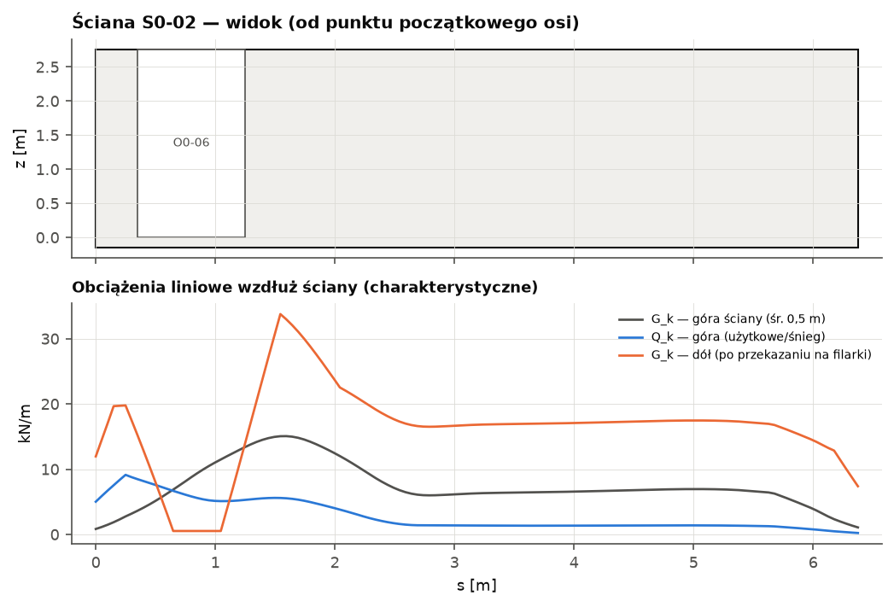

*Rys. Ściana S0-02: widok z otworami i rozkład obciążeń charakterystycznych wzdłuż osi.*

#### Zestawienie obciążeń

**Ciężar ściany — SZ1 — Ściana zewnętrzna nośna: silikat 18 + ETICS EPS 031 20 cm (U ≈ 0,15)**

| Warstwa | Obliczenie | g_k [kN/m²] | γ_G (6.10a) | g_d [kN/m²] | ξγ_G (6.10b) | g_d [kN/m²] |
|---|---|---|---|---|---|---|
| Tynk gipsowy maszynowy 1,5 cm | 1,5 cm × 11,77 kN/m³ | 0,177 | 1,35 | 0,238 | 1,15 | 0,203 |
| Bloczek wapienno-piaskowy (silikat) 18 cm, kl. 20, gr. 1, na zaprawie cienkowarstwowej | 18,0 cm × 18,00 kN/m³ | 3,240 | 1,35 | 4,374 | 1,15 | 3,718 |
| Styropian grafitowy EPS 031 (ETICS, NRO w systemie) | 20,0 cm × 0,15 kN/m³ | 0,029 | 1,35 | 0,040 | 1,15 | 0,034 |
| ETICS: warstwa zbrojona + tynk silikonowy 1,5 mm (biały / jasnoszary NCS S 1500-N) | 1,0 cm × 16,68 kN/m³ | 0,167 | 1,35 | 0,225 | 1,15 | 0,191 |
| **Razem g_k** |  | 3,613 |  | 4,877 |  | 4,146 |

**Obciążenia ściany (charakterystyczne)** — góra: z płyt i ścian wyżej; dół: po przekazaniu obciążeń znad otworów na filarki

| Przypadek | max q_góra [kN/m] | średnio q_dół [kN/m] | max q_dół [kN/m] |
|---|---|---|---|
| G | 7,18 | 14,50 | 18,50 |
| H | 0,50 | 0,41 | 0,83 |
| QA | 0,00 | 0,00 | 0,00 |
| QA_pA | 0,00 | 0,00 | 0,00 |
| QA_pB | 0,07 | 0,02 | 0,11 |
| S1 | 0,90 | 0,73 | 1,50 |
| S2 | 1,65 | 1,24 | 2,76 |
| SB2 | 2,08 | 1,41 | 3,50 |

#### Obliczenia

##### S0-02 — ściana (odcinek 1,25–6,38 m), 6.10b (wiodące: QA)

- Wytrzymałość charakterystyczna muru: f_k = K·f_b^0,85 = 0,60·20^0,85 = **7,66** MPa *((3.2) + NA tabl. NA.5 (K = 0,60, Ap2:2014-09))*
- Wytrzymałość obliczeniowa: f_d = f_k/γ_M = 7,66/1,7 = **4,50** MPa *(NA tabl. NA.1 (kat. I, zaprawa projektowana, klasa wykonania A))*
- Wysokość efektywna: h_ef = ρ₂·h = 0,750·2,91 = **2,182** m *((5.2), 5.5.1.2)*
- Smukłość: h_ef/t_ef = 2,182/0,180 = **12,12**
- Mimośród przypadkowy: e_init = h_ef/450 = 2182/450 = **4,8** mm *(5.5.1.1(4))*
- Mimośród na górze: e_g = M_g/N_g + e_init ≥ 0,05t = 0,24/8,2 + 0,0048 = **34,9** mm *((6.5))*
- Mimośród na dole: e_d = M_d/N_d + e_init ≥ 0,05t = 0,00/20,2 + 0,0048 = **9,0** mm *((6.5))*
- Współczynnik redukcyjny — góra: Φ_g = 1 − 2e_g/t = 1 − 2·34,9/180 = **0,613** *((6.4))*
- Współczynnik redukcyjny — dół: Φ_d = 1 − 2e_d/t = 1 − 2·9,0/180 = **0,900** *((6.4))*
- Mimośród w połowie wysokości: e_m = (M_md + M_w)/N_m + e_init = (0,12 + 0,93)/14,2 + 0,0048 = **79,0** mm *((6.7))*
- Mimośród od pełzania: e_k = 0 (h_ef/t_ef ≤ λ_c) = **0,0** mm *(6.1.2.2(2) [NZW NA])*
- Mimośród całkowity: e_mk = e_m + e_k ≥ 0,05t = **79,0** mm *((6.6))*
- Współczynnik redukcyjny w połowie wysokości: Φ_m = A₁·exp(−u²/2), A₁ = 1 − 2e_mk/t, u = (λ − 0,063)/(0,73 − 1,17e_mk/t) = λ = 0,383, A₁ = 0,123, u = 1,479 = **0,041** *(zał. G (G.1–G.4), E = K_E·f_k)*
- Nośność: N_Rd = Φ·t·f_d = (góra / środek / dół) 0,613 / 0,041 / 0,900 · 180 mm · 4,50 MPa = **496,8 / 33,3 / 729,6** kN/m *((6.2))*

| Warunek | Efekt | Nośność / limit | η | Stan | Podstawa |
|---|---|---|---|---|---|
| Smukłość ściany | h_ef/t_ef = 12,1  | 27 = 27,0  | 45% | spełniony | 5.5.1.4 |
| Nośność — przekrój górny | N_Ed = 8,16 kN/m | N_Rd = 496,77 kN/m | 2% | spełniony | (6.2), (6.4) |
| Nośność — połowa wysokości | N_Ed = 14,19 kN/m | N_Rd = 33,30 kN/m | 43% | spełniony | (6.2), zał. G |
| Nośność — przekrój dolny | N_Ed = 20,23 kN/m | N_Rd = 729,61 kN/m | 3% | spełniony | (6.2), (6.4) |

##### S0-02 — zginanie z płaszczyzny (wiatr)

- Wskaźnik wytrzymałości (1 m): Z = t²/6 = 0,180²/6 = **5400** cm³/m
- Pasmo pionowe — moment: M_Ed = w_Ed·h²/8 = 1,464·2,91²/8 = **1,549** kNm/m
- Pasmo pionowe — nośność: M_Rd = (f_xk1/γ_M + σ_d)·Z = (0,20/1,7 + 0,059)·10³·0,00540 = **0,953** kNm/m *((6.15), 6.3.1(3) [NZW f_xk1])*

> Informacyjnie (dolne oszacowanie, bez efektu przesklepienia 6.3.2): Zginanie z płaszczyzny (pasmo pionowe — dolne oszacowanie): M_Ed = 1,549 ≤? M_Rd = 0,953 kNm/m (η = 163%). Ściana obciążona pionowo — miarodajne sprawdzenie 6.1.2 z mimośrodem e_hm od wiatru.

##### S0-02 — wiatr: przesklepienie między stropami (6.3.2)

- Smukłość łuku: l_a/t = 2,91/0,180 = **16,2**
- Nośność na obciążenie poziome: q_lat,d = f_d·(t/l_a)² = 4,50·10³·(0,180/2,91)² = **17,23** kN/m² *((6.20) [NZW])*
- Obliczeniowy rozpór łuku (przenoszony przez stropy/wieńce): N_ad = 1,5·f_d·t/10 = **121,6** kN/m *((6.19) [NZW])*

| Warunek | Efekt | Nośność / limit | η | Stan | Podstawa |
|---|---|---|---|---|---|
| Obciążenie poziome — przesklepienie | W_Ed = 1,46 kN/m² | q_lat,d = 17,23 kN/m² | 8% | spełniony | PN-EN 1996-1-1 6.3.2 |

#### Wnioski

**Przyjęto:** Mur: Bloczek wapienno-piaskowy (silikat) 18 cm, kl. 20, gr. 1, na zaprawie cienkowarstwowej, f_d = 4,50 MPa (klasa wykonania A, γ_M = 1,7).  

### Poz. 7.31 — Ściana S0-03 (P0, zewnętrzna nośna)

Element modelu: `S0-03` · maks. wykorzystanie nośności η = 74% · wszystkie warunki spełnione

#### Opis i schemat statyczny

Ściana gr. konstrukcyjnej t = 18 cm, długość osi 9,38 m, wysokość h = 2,910 m (z −0,150 do 2,760); materiał: Bloczek wapienno-piaskowy (silikat) 18 cm, kl. 20, gr. 1, na zaprawie cienkowarstwowej. Otwory: O0-08 (1,00 m).

Sprawdzono 2 odcinków (filarki ≤ 2 m między otworami — siła całkowita; dłuższe pasma — maks. średnia krocząca 1 m) dla 44 kombinacji; poniżej przypadek miarodajny. Mimośród reakcji stropu e = t/6 (zewn.) / 0,3·t/6 (wewn., niesymetria) [UPR]; wiatr jako moment w połowie wysokości w·h²/8.

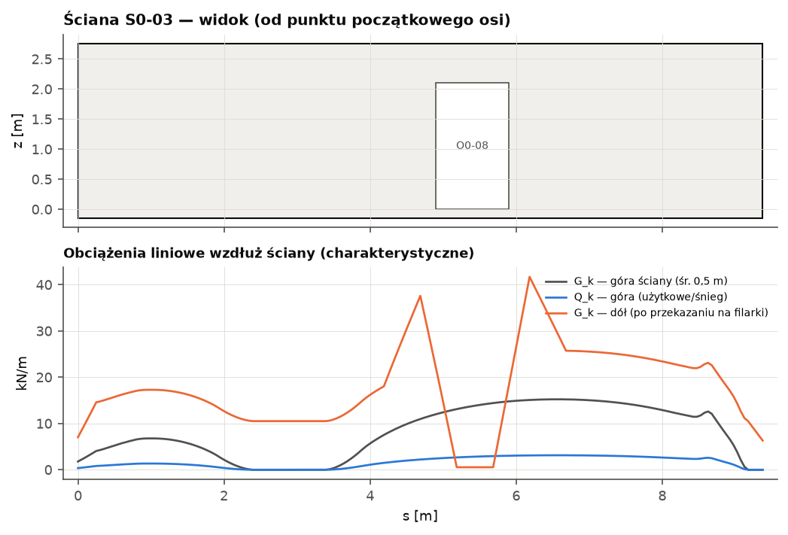

*Rys. Ściana S0-03: widok z otworami i rozkład obciążeń charakterystycznych wzdłuż osi.*

#### Zestawienie obciążeń

**Ciężar ściany — SZ1 — Ściana zewnętrzna nośna: silikat 18 + ETICS EPS 031 20 cm (U ≈ 0,15)**

| Warstwa | Obliczenie | g_k [kN/m²] | γ_G (6.10a) | g_d [kN/m²] | ξγ_G (6.10b) | g_d [kN/m²] |
|---|---|---|---|---|---|---|
| Tynk gipsowy maszynowy 1,5 cm | 1,5 cm × 11,77 kN/m³ | 0,177 | 1,35 | 0,238 | 1,15 | 0,203 |
| Bloczek wapienno-piaskowy (silikat) 18 cm, kl. 20, gr. 1, na zaprawie cienkowarstwowej | 18,0 cm × 18,00 kN/m³ | 3,240 | 1,35 | 4,374 | 1,15 | 3,718 |
| Styropian grafitowy EPS 031 (ETICS, NRO w systemie) | 20,0 cm × 0,15 kN/m³ | 0,029 | 1,35 | 0,040 | 1,15 | 0,034 |
| ETICS: warstwa zbrojona + tynk silikonowy 1,5 mm (biały / jasnoszary NCS S 1500-N) | 1,0 cm × 16,68 kN/m³ | 0,167 | 1,35 | 0,225 | 1,15 | 0,191 |
| **Razem g_k** |  | 3,613 |  | 4,877 |  | 4,146 |

**Obciążenia ściany (charakterystyczne)** — góra: z płyt i ścian wyżej; dół: po przekazaniu obciążeń znad otworów na filarki

| Przypadek | max q_góra [kN/m] | średnio q_dół [kN/m] | max q_dół [kN/m] |
|---|---|---|---|
| G | 17,25 | 17,84 | 41,84 |
| H | 0,94 | 0,44 | 1,57 |
| QA | 0,00 | 0,00 | 0,00 |
| QA_pA | 0,00 | 0,00 | 0,00 |
| QA_pB | 0,00 | 0,00 | 0,00 |
| S1 | 1,70 | 0,80 | 2,83 |
| S2 | 2,67 | 1,21 | 4,37 |
| SB2 | 2,66 | 1,14 | 4,22 |

#### Obliczenia

##### S0-03 — ściana (odcinek 0,00–4,90 m), 6.10b (wiodące: W)

- Wytrzymałość charakterystyczna muru: f_k = K·f_b^0,85 = 0,60·20^0,85 = **7,66** MPa *((3.2) + NA tabl. NA.5 (K = 0,60, Ap2:2014-09))*
- Wytrzymałość obliczeniowa: f_d = f_k/γ_M = 7,66/1,7 = **4,50** MPa *(NA tabl. NA.1 (kat. I, zaprawa projektowana, klasa wykonania A))*
- Wysokość efektywna: h_ef = ρ₂·h = 0,750·2,91 = **2,182** m *((5.2), 5.5.1.2)*
- Smukłość: h_ef/t_ef = 2,182/0,180 = **12,12**
- Mimośród przypadkowy: e_init = h_ef/450 = 2182/450 = **4,8** mm *(5.5.1.1(4))*
- Mimośród na górze: e_g = M_g/N_g + e_init ≥ 0,05t = 0,43/14,4 + 0,0048 = **34,9** mm *((6.5))*
- Mimośród na dole: e_d = M_d/N_d + e_init ≥ 0,05t = 0,00/33,1 + 0,0048 = **9,0** mm *((6.5))*
- Współczynnik redukcyjny — góra: Φ_g = 1 − 2e_g/t = 1 − 2·34,9/180 = **0,613** *((6.4))*
- Współczynnik redukcyjny — dół: Φ_d = 1 − 2e_d/t = 1 − 2·9,0/180 = **0,900** *((6.4))*
- Mimośród w połowie wysokości: e_m = (M_md + M_w)/N_m + e_init = (0,22 + 1,55)/23,8 + 0,0048 = **79,2** mm *((6.7))*
- Mimośród od pełzania: e_k = 0 (h_ef/t_ef ≤ λ_c) = **0,0** mm *(6.1.2.2(2) [NZW NA])*
- Mimośród całkowity: e_mk = e_m + e_k ≥ 0,05t = **79,2** mm *((6.6))*
- Współczynnik redukcyjny w połowie wysokości: Φ_m = A₁·exp(−u²/2), A₁ = 1 − 2e_mk/t, u = (λ − 0,063)/(0,73 − 1,17e_mk/t) = λ = 0,383, A₁ = 0,120, u = 1,488 = **0,040** *(zał. G (G.1–G.4), E = K_E·f_k)*
- Nośność: N_Rd = Φ·t·f_d = (góra / środek / dół) 0,613 / 0,040 / 0,900 · 180 mm · 4,50 MPa = **496,8 / 32,2 / 729,6** kN/m *((6.2))*

| Warunek | Efekt | Nośność / limit | η | Stan | Podstawa |
|---|---|---|---|---|---|
| Smukłość ściany | h_ef/t_ef = 12,1  | 27 = 27,0  | 45% | spełniony | 5.5.1.4 |
| Nośność — przekrój górny | N_Ed = 14,42 kN/m | N_Rd = 496,77 kN/m | 3% | spełniony | (6.2), (6.4) |
| Nośność — połowa wysokości | N_Ed = 23,75 kN/m | N_Rd = 32,21 kN/m | 74% | spełniony | (6.2), zał. G |
| Nośność — przekrój dolny | N_Ed = 33,09 kN/m | N_Rd = 729,61 kN/m | 5% | spełniony | (6.2), (6.4) |

##### S0-03 — zginanie z płaszczyzny (wiatr)

- Wskaźnik wytrzymałości (1 m): Z = t²/6 = 0,180²/6 = **5400** cm³/m
- Pasmo pionowe — moment: M_Ed = w_Ed·h²/8 = 1,464·2,91²/8 = **1,549** kNm/m
- Pasmo pionowe — nośność: M_Rd = (f_xk1/γ_M + σ_d)·Z = (0,20/1,7 + 0,074)·10³·0,00540 = **1,036** kNm/m *((6.15), 6.3.1(3) [NZW f_xk1])*

> Informacyjnie (dolne oszacowanie, bez efektu przesklepienia 6.3.2): Zginanie z płaszczyzny (pasmo pionowe — dolne oszacowanie): M_Ed = 1,549 ≤? M_Rd = 1,036 kNm/m (η = 150%). Ściana obciążona pionowo — miarodajne sprawdzenie 6.1.2 z mimośrodem e_hm od wiatru.

##### S0-03 — wiatr: przesklepienie między stropami (6.3.2)

- Smukłość łuku: l_a/t = 2,91/0,180 = **16,2**
- Nośność na obciążenie poziome: q_lat,d = f_d·(t/l_a)² = 4,50·10³·(0,180/2,91)² = **17,23** kN/m² *((6.20) [NZW])*
- Obliczeniowy rozpór łuku (przenoszony przez stropy/wieńce): N_ad = 1,5·f_d·t/10 = **121,6** kN/m *((6.19) [NZW])*

| Warunek | Efekt | Nośność / limit | η | Stan | Podstawa |
|---|---|---|---|---|---|
| Obciążenie poziome — przesklepienie | W_Ed = 1,46 kN/m² | q_lat,d = 17,23 kN/m² | 8% | spełniony | PN-EN 1996-1-1 6.3.2 |

#### Wnioski

**Przyjęto:** Mur: Bloczek wapienno-piaskowy (silikat) 18 cm, kl. 20, gr. 1, na zaprawie cienkowarstwowej, f_d = 4,50 MPa (klasa wykonania A, γ_M = 1,7).  

### Poz. 7.32 — Ściana S0-04 (P0, zewnętrzna nośna)

Element modelu: `S0-04` · maks. wykorzystanie nośności η = 60% · wszystkie warunki spełnione

#### Opis i schemat statyczny

Ściana gr. konstrukcyjnej t = 18 cm, długość osi 6,38 m, wysokość h = 2,910 m (z −0,150 do 2,760); materiał: Bloczek wapienno-piaskowy (silikat) 18 cm, kl. 20, gr. 1, na zaprawie cienkowarstwowej. Otwory: O0-07 (5,00 m).

Sprawdzono 2 odcinków (filarki ≤ 2 m między otworami — siła całkowita; dłuższe pasma — maks. średnia krocząca 1 m) dla 44 kombinacji; poniżej przypadek miarodajny. Mimośród reakcji stropu e = t/6 (zewn.) / 0,3·t/6 (wewn., niesymetria) [UPR]; wiatr jako moment w połowie wysokości w·h²/8.

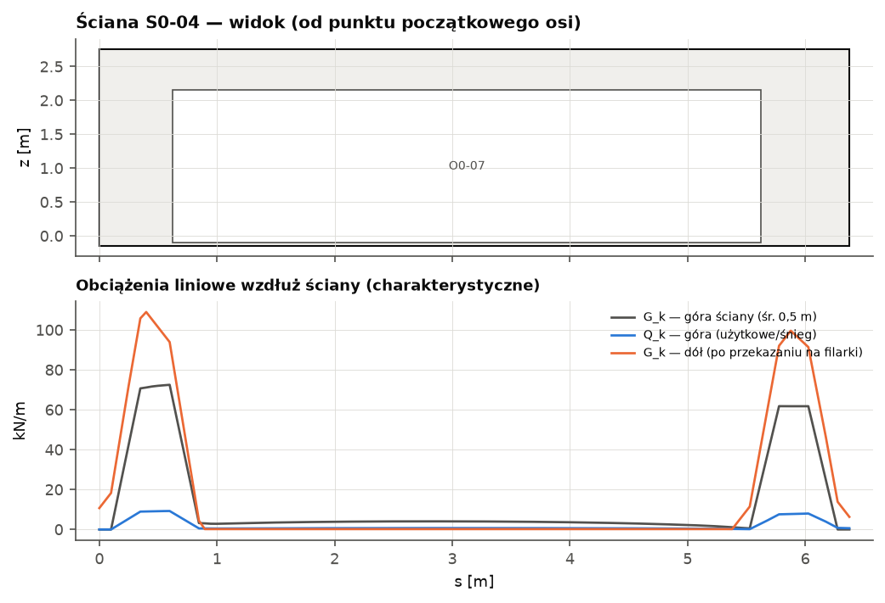

*Rys. Ściana S0-04: widok z otworami i rozkład obciążeń charakterystycznych wzdłuż osi.*

#### Zestawienie obciążeń

**Ciężar ściany — SZ1 — Ściana zewnętrzna nośna: silikat 18 + ETICS EPS 031 20 cm (U ≈ 0,15)**

| Warstwa | Obliczenie | g_k [kN/m²] | γ_G (6.10a) | g_d [kN/m²] | ξγ_G (6.10b) | g_d [kN/m²] |
|---|---|---|---|---|---|---|
| Tynk gipsowy maszynowy 1,5 cm | 1,5 cm × 11,77 kN/m³ | 0,177 | 1,35 | 0,238 | 1,15 | 0,203 |
| Bloczek wapienno-piaskowy (silikat) 18 cm, kl. 20, gr. 1, na zaprawie cienkowarstwowej | 18,0 cm × 18,00 kN/m³ | 3,240 | 1,35 | 4,374 | 1,15 | 3,718 |
| Styropian grafitowy EPS 031 (ETICS, NRO w systemie) | 20,0 cm × 0,15 kN/m³ | 0,029 | 1,35 | 0,040 | 1,15 | 0,034 |
| ETICS: warstwa zbrojona + tynk silikonowy 1,5 mm (biały / jasnoszary NCS S 1500-N) | 1,0 cm × 16,68 kN/m³ | 0,167 | 1,35 | 0,225 | 1,15 | 0,191 |
| **Razem g_k** |  | 3,613 |  | 4,877 |  | 4,146 |

**Obciążenia ściany (charakterystyczne)** — góra: z płyt i ścian wyżej; dół: po przekazaniu obciążeń znad otworów na filarki

| Przypadek | max q_góra [kN/m] | średnio q_dół [kN/m] | max q_dół [kN/m] |
|---|---|---|---|
| G | 157,21 | 18,29 | 196,76 |
| H | 5,39 | 0,49 | 6,16 |
| QA | 2,36 | 0,18 | 2,36 |
| QA_pA | 0,24 | 0,01 | 0,24 |
| QA_pB | 3,30 | 0,25 | 3,30 |
| S1 | 9,70 | 0,89 | 11,08 |
| S2 | 15,96 | 1,48 | 18,20 |
| SB2 | 17,46 | 1,66 | 19,88 |

#### Obliczenia

##### S0-04 — filarek 0,00–0,62 m (b = 0,62 m), 6.10a (wiodące: QA_pB)

- Pole przekroju filarka: A = b·t = 0,62·0,18 = **0,112** m²
- Współczynnik η_A (A < 0,3 m²): η_A = (NA; interpolacja wg R5-63) = **1,57** *(NA do PN-EN 1996-1-1 [NZW])*
- Wytrzymałość charakterystyczna muru: f_k = K·f_b^0,85 = 0,60·20^0,85 = **7,66** MPa *((3.2) + NA tabl. NA.5 (K = 0,60, Ap2:2014-09))*
- Wytrzymałość obliczeniowa: f_d = f_k/γ_M · (1/η_A) = 7,66/1,7·0,636 = **2,86** MPa *(NA tabl. NA.1 (kat. I, zaprawa projektowana, klasa wykonania A))*
- Wysokość efektywna: h_ef = ρ₂·h = 1,000·2,91 = **2,910** m *((5.2), 5.5.1.2)*
- Smukłość: h_ef/t_ef = 2,910/0,180 = **16,17**
- Mimośród przypadkowy: e_init = h_ef/450 = 2910/450 = **6,5** mm *(5.5.1.1(4))*
- Mimośród na górze: e_g = M_g/N_g + e_init ≥ 0,05t = 2,67/88,9 + 0,0065 = **36,5** mm *((6.5))*
- Mimośród na dole: e_d = M_d/N_d + e_init ≥ 0,05t = 0,00/135,6 + 0,0065 = **9,0** mm *((6.5))*
- Współczynnik redukcyjny — góra: Φ_g = 1 − 2e_g/t = 1 − 2·36,5/180 = **0,595** *((6.4))*
- Współczynnik redukcyjny — dół: Φ_d = 1 − 2e_d/t = 1 − 2·9,0/180 = **0,900** *((6.4))*
- Mimośród w połowie wysokości: e_m = (M_md + M_w)/N_m + e_init = (1,33 + 0,00)/112,3 + 0,0065 = **18,3** mm *((6.7))*
- Mimośród od pełzania: e_k = 0,002·φ_∞·(h_ef/t_ef)·√(t·e_m) = 0,002·1,5·16,17·√(0,180·0,0183) = **2,8** mm *((6.8))*
- Mimośród całkowity: e_mk = e_m + e_k ≥ 0,05t = **21,1** mm *((6.6))*
- Współczynnik redukcyjny w połowie wysokości: Φ_m = A₁·exp(−u²/2), A₁ = 1 − 2e_mk/t, u = (λ − 0,063)/(0,73 − 1,17e_mk/t) = λ = 0,511, A₁ = 0,765, u = 0,756 = **0,575** *(zał. G (G.1–G.4), E = K_E·f_k)*
- Nośność: N_Rd = Φ·t·f_d = (góra / środek / dół) 0,595 / 0,575 / 0,900 · 180 mm · 2,86 MPa = **306,6 / 296,4 / 464,0** kN/m *((6.2))*

| Warunek | Efekt | Nośność / limit | η | Stan | Podstawa |
|---|---|---|---|---|---|
| Smukłość ściany | h_ef/t_ef = 16,2  | 27 = 27,0  | 60% | spełniony | 5.5.1.4 |
| Nośność — przekrój górny | N_Ed = 88,89 kN/m | N_Rd = 306,65 kN/m | 29% | spełniony | (6.2), (6.4) |
| Nośność — połowa wysokości | N_Ed = 112,25 kN/m | N_Rd = 296,36 kN/m | 38% | spełniony | (6.2), zał. G |
| Nośność — przekrój dolny | N_Ed = 135,61 kN/m | N_Rd = 463,98 kN/m | 29% | spełniony | (6.2), (6.4) |

> Filarek liczony jako ściana podparta górą i dołem, ρ₂ = 1,0 (bezpiecznie); siły N na 1 m = N/b.

##### S0-04 — zginanie z płaszczyzny (wiatr)

- Wskaźnik wytrzymałości (1 m): Z = t²/6 = 0,180²/6 = **5400** cm³/m
- Pasmo pionowe — moment: M_Ed = w_Ed·h²/8 = 1,464·2,91²/8 = **1,549** kNm/m
- Pasmo pionowe — nośność: M_Rd = (f_xk1/γ_M + σ_d)·Z = (0,20/1,7 + 0,107)·10³·0,00540 = **1,214** kNm/m *((6.15), 6.3.1(3) [NZW f_xk1])*

> Informacyjnie (dolne oszacowanie, bez efektu przesklepienia 6.3.2): Zginanie z płaszczyzny (pasmo pionowe — dolne oszacowanie): M_Ed = 1,549 ≤? M_Rd = 1,214 kNm/m (η = 128%). Ściana obciążona pionowo — miarodajne sprawdzenie 6.1.2 z mimośrodem e_hm od wiatru.

##### S0-04 — wiatr: przesklepienie między stropami (6.3.2)

- Smukłość łuku: l_a/t = 2,91/0,180 = **16,2**
- Nośność na obciążenie poziome: q_lat,d = f_d·(t/l_a)² = 4,50·10³·(0,180/2,91)² = **17,23** kN/m² *((6.20) [NZW])*
- Obliczeniowy rozpór łuku (przenoszony przez stropy/wieńce): N_ad = 1,5·f_d·t/10 = **121,6** kN/m *((6.19) [NZW])*

| Warunek | Efekt | Nośność / limit | η | Stan | Podstawa |
|---|---|---|---|---|---|
| Obciążenie poziome — przesklepienie | W_Ed = 1,46 kN/m² | q_lat,d = 17,23 kN/m² | 8% | spełniony | PN-EN 1996-1-1 6.3.2 |

##### S0-04 — docisk pod oparciem belki (s = 5,88 m)

- Pole docisku: A_b = l_b·b = 0,250·0,180 = **0,0450** m²
- Długość efektywna w połowie wysokości: l_efm = l_b + 2·(h_c/2)·tg 30° (ograniczona a₁) = **1,465** m *(rys. 6.2)*
- Współczynnik zwiększający: β = (1 + 0,3·a₁/h_c)·(1,5 − 1,1·A_b/A_ef) = (1 + 0,3·0,38/2,91)·(1,5 − 1,1·0,171) = **1,314** *((6.10))*
- Nośność na docisk: N_Rdc = β·A_b·f_d = 1,314·0,0450·4,50·10³ = **266,40** kN *((6.9))*

| Warunek | Efekt | Nośność / limit | η | Stan | Podstawa |
|---|---|---|---|---|---|
| Docisk | N_Edc = 60,20 kN | N_Rdc = 266,40 kN | 23% | spełniony | PN-EN 1996-1-1 (6.9) |

> Dodatkowo sprawdzić ścianę w połowie wysokości pod oparciem (6.1.3(4)) — obejmuje to sprawdzenie ściany/filarka.

##### S0-04 — docisk pod oparciem belki (s = 0,43 m)

- Pole docisku: A_b = l_b·b = 0,250·0,180 = **0,0450** m²
- Długość efektywna w połowie wysokości: l_efm = l_b + 2·(h_c/2)·tg 30° (ograniczona a₁) = **1,390** m *(rys. 6.2)*
- Współczynnik zwiększający: β = (1 + 0,3·a₁/h_c)·(1,5 − 1,1·A_b/A_ef) = (1 + 0,3·0,30/2,91)·(1,5 − 1,1·0,180) = **1,302** *((6.10))*
- Nośność na docisk: N_Rdc = β·A_b·f_d = 1,302·0,0450·4,50·10³ = **263,78** kN *((6.9))*

| Warunek | Efekt | Nośność / limit | η | Stan | Podstawa |
|---|---|---|---|---|---|
| Docisk | N_Edc = 69,85 kN | N_Rdc = 263,78 kN | 26% | spełniony | PN-EN 1996-1-1 (6.9) |

> Dodatkowo sprawdzić ścianę w połowie wysokości pod oparciem (6.1.3(4)) — obejmuje to sprawdzenie ściany/filarka.

#### Wnioski

**Przyjęto:** Mur: Bloczek wapienno-piaskowy (silikat) 18 cm, kl. 20, gr. 1, na zaprawie cienkowarstwowej, f_d = 4,50 MPa (klasa wykonania A, γ_M = 1,7).  

### Poz. 7.33 — Ściana S0-17 (P0, wewnętrzna nośna)

Element modelu: `S0-17` · maks. wykorzystanie nośności η = 45% · wszystkie warunki spełnione

#### Opis i schemat statyczny

Ściana gr. konstrukcyjnej t = 18 cm, długość osi 6,38 m, wysokość h = 2,910 m (z −0,150 do 2,760); materiał: Bloczek wapienno-piaskowy (silikat) 18 cm, kl. 20, gr. 1, na zaprawie cienkowarstwowej. Otwory: O0-22 (0,90 m).

Sprawdzono 2 odcinków (filarki ≤ 2 m między otworami — siła całkowita; dłuższe pasma — maks. średnia krocząca 1 m) dla 34 kombinacji; poniżej przypadek miarodajny. Mimośród reakcji stropu e = t/6 (zewn.) / 0,3·t/6 (wewn., niesymetria) [UPR]; wiatr jako moment w połowie wysokości w·h²/8.

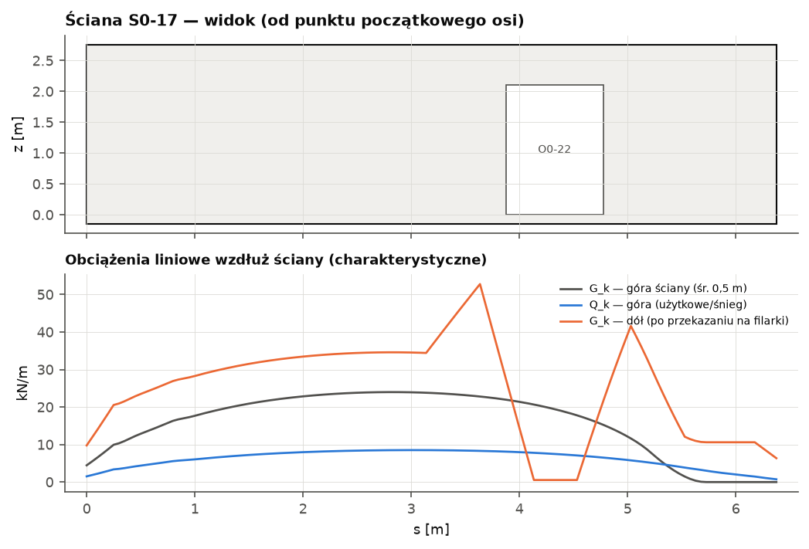

*Rys. Ściana S0-17: widok z otworami i rozkład obciążeń charakterystycznych wzdłuż osi.*

#### Zestawienie obciążeń

**Ciężar ściany — SWG — Ściana nośna dom–garaż nieogrzewany: silikat 18 + wełna 12 cm od strony garażu + tynk (U ≈ 0,24 ≤ 0,30; szczelna na spaliny)**

| Warstwa | Obliczenie | g_k [kN/m²] | γ_G (6.10a) | g_d [kN/m²] | ξγ_G (6.10b) | g_d [kN/m²] |
|---|---|---|---|---|---|---|
| Tynk gipsowy maszynowy 1,5 cm | 1,5 cm × 11,77 kN/m³ | 0,177 | 1,35 | 0,238 | 1,15 | 0,203 |
| Bloczek wapienno-piaskowy (silikat) 18 cm, kl. 20, gr. 1, na zaprawie cienkowarstwowej | 18,0 cm × 18,00 kN/m³ | 3,240 | 1,35 | 4,374 | 1,15 | 3,718 |
| Wełna mineralna 035 (szkielet, docieplenia, ściana dom–garaż) | 12,0 cm × 0,39 kN/m³ | 0,047 | 1,35 | 0,064 | 1,15 | 0,054 |
| Tynk cementowo-wapienny 1,5 cm (garaż, pom. techniczne) | 1,0 cm × 18,15 kN/m³ | 0,181 | 1,35 | 0,245 | 1,15 | 0,208 |
| **Razem g_k** |  | 3,645 |  | 4,921 |  | 4,183 |

**Obciążenia ściany (charakterystyczne)** — góra: z płyt i ścian wyżej; dół: po przekazaniu obciążeń znad otworów na filarki

| Przypadek | max q_góra [kN/m] | średnio q_dół [kN/m] | max q_dół [kN/m] |
|---|---|---|---|
| G | 20,71 | 23,59 | 48,07 |
| H | 2,14 | 1,61 | 3,75 |
| QA | 0,00 | 0,00 | 0,00 |
| QA_pA | 0,00 | 0,00 | 0,00 |
| QA_pB | 2,73 | 0,27 | 2,73 |
| S1 | 3,86 | 2,89 | 6,75 |
| S2 | 6,49 | 4,88 | 11,66 |
| SB2 | 7,44 | 5,55 | 13,66 |

#### Obliczenia

##### S0-17 — ściana (odcinek 0,00–3,88 m), 6.10a (wiodące: QA_pB)

- Wytrzymałość charakterystyczna muru: f_k = K·f_b^0,85 = 0,60·20^0,85 = **7,66** MPa *((3.2) + NA tabl. NA.5 (K = 0,60, Ap2:2014-09))*
- Wytrzymałość obliczeniowa: f_d = f_k/γ_M = 7,66/1,7 = **4,50** MPa *(NA tabl. NA.1 (kat. I, zaprawa projektowana, klasa wykonania A))*
- Wysokość efektywna: h_ef = ρ₂·h = 0,750·2,91 = **2,182** m *((5.2), 5.5.1.2)*
- Smukłość: h_ef/t_ef = 2,182/0,180 = **12,12**
- Mimośród przypadkowy: e_init = h_ef/450 = 2182/450 = **4,8** mm *(5.5.1.1(4))*
- Mimośród na górze: e_g = M_g/N_g + e_init ≥ 0,05t = 0,29/32,6 + 0,0048 = **13,8** mm *((6.5))*
- Mimośród na dole: e_d = M_d/N_d + e_init ≥ 0,05t = 0,00/59,9 + 0,0048 = **9,0** mm *((6.5))*
- Współczynnik redukcyjny — góra: Φ_g = 1 − 2e_g/t = 1 − 2·13,8/180 = **0,846** *((6.4))*
- Współczynnik redukcyjny — dół: Φ_d = 1 − 2e_d/t = 1 − 2·9,0/180 = **0,900** *((6.4))*
- Mimośród w połowie wysokości: e_m = (M_md + M_w)/N_m + e_init = (0,15 + 0,00)/46,3 + 0,0048 = **8,0** mm *((6.7))*
- Mimośród od pełzania: e_k = 0 (h_ef/t_ef ≤ λ_c) = **0,0** mm *(6.1.2.2(2) [NZW NA])*
- Mimośród całkowity: e_mk = e_m + e_k ≥ 0,05t = **9,0** mm *((6.6))*
- Współczynnik redukcyjny w połowie wysokości: Φ_m = A₁·exp(−u²/2), A₁ = 1 − 2e_mk/t, u = (λ − 0,063)/(0,73 − 1,17e_mk/t) = λ = 0,383, A₁ = 0,900, u = 0,477 = **0,803** *(zał. G (G.1–G.4), E = K_E·f_k)*
- Nośność: N_Rd = Φ·t·f_d = (góra / środek / dół) 0,846 / 0,803 / 0,900 · 180 mm · 4,50 MPa = **685,9 / 651,1 / 729,6** kN/m *((6.2))*

| Warunek | Efekt | Nośność / limit | η | Stan | Podstawa |
|---|---|---|---|---|---|
| Smukłość ściany | h_ef/t_ef = 12,1  | 27 = 27,0  | 45% | spełniony | 5.5.1.4 |
| Nośność — przekrój górny | N_Ed = 32,63 kN/m | N_Rd = 685,93 kN/m | 5% | spełniony | (6.2), (6.4) |
| Nośność — połowa wysokości | N_Ed = 46,29 kN/m | N_Rd = 651,10 kN/m | 7% | spełniony | (6.2), zał. G |
| Nośność — przekrój dolny | N_Ed = 59,94 kN/m | N_Rd = 729,61 kN/m | 8% | spełniony | (6.2), (6.4) |

#### Wnioski

**Przyjęto:** Mur: Bloczek wapienno-piaskowy (silikat) 18 cm, kl. 20, gr. 1, na zaprawie cienkowarstwowej, f_d = 4,50 MPa (klasa wykonania A, γ_M = 1,7).  

## Poz. 8 — Fundamenty

### Poz. 8.1 — Płyta fundamentowa PF1

Element modelu: `PF1` · maks. wykorzystanie nośności η = 8% · wszystkie warunki spełnione

#### Obliczenia

##### Osiadanie płyty (średni nacisk)

- Nacisk pod fundamentem (SLS): q = **44,9** kPa
- Moduł edometryczny: M₀ = **80** MPa *([ZAŁ — do badań])*
- Zasięg strefy aktywnej: z_max: σ_z ≤ 0,2·σ'_v0 = (warstwy h_i = 0,500 m) = **9,00** m *(PN-EN 1997-1 6.6.2(6))*
- Osiadanie: s = Σ σ_z,i·h_i/M₀ = Σ (18 warstw) = **4,2** mm

| Warunek | Efekt | Nośność / limit | η | Stan | Podstawa |
|---|---|---|---|---|---|
| Osiadanie | s = 4,2 mm | s_max = 50,0 mm | 8% | spełniony | PN-EN 1997-1 NA.3 (tabl. NA.3) |

> Osiadanie orientacyjne: pominięto wpływ fundamentów sąsiednich i odciążenie wykopem; M₀ — dane przykładowe.

##### Płyta fundamentowa — pasmo pod ścianą (Winkler/Hetényi)

- Sztywność pasma: E·I = (E_cm/2)·h³/12 = **20182** kNm²
- Charakterystyka belki na podłożu sprężystym: λ = ⁴√(k_s·b/(4EI)) = k_s = 10817 kN/m³ = **0,6050** 1/m
- Moment maksymalny (obciążenie na krawędzi): M = 0,3224·P/λ = 0,3224·887,2/0,6050 = **472,75** kNm/m
- Osiadanie lokalne / nacisk: w; σ = k_s·w = **99,24 mm; 1073,5 kPa**
- Wysokość użyteczna: d = **202** mm
- Moment względny: μ = M_Ed/(b·d²·η·f_cd) = 472,75·10⁶/(1000·202²·1,0·17,86) = **0,6488** *(3.1.7(3))*
- μ > μ_lim — przekrój podwójnie zbrojony: μ_lim = ξ_lim·(1 − 0,5·ξ_lim) = 0,493·(1 − 0,5·0,493) = **0,3717**
- Zbrojenie ściskane: A_s2 = (M_Ed − M_lim)/(f_yd·(d − d₂)) = (472,75 − 270,85)·10⁶/(434,8·(202 − 50)) = **3055** mm²
- Zbrojenie rozciągane: A_s1 = ξ_lim·b·d·η·f_cd/f_yd + A_s2 = **7149** mm²
- Zbrojenie minimalne: A_s,min = max(0,26·f_ctm/f_yk·b·d; 0,0013·b·d) = max(0,26·2,6/500·1000·202; 0,0013·1000·202) = **273** mm² *((9.1N) + NA)*

> Przekrój podwójnie zbrojony — zalecane zwiększenie wysokości przekroju.

> Płyta fundamentowa — model uproszczony (pasmo Winklera). Do PT: MES płyty na podłożu sprężystym.

#### Wnioski

**Przyjęto:** Płyta gr. 25 cm, C25/30; k_s = 10817 kN/m³ (z osiadania średniego) [UPR].  

### Poz. 8.2 — Ława fundamentowa ZF1 (B = 0,60 m, h = 0,30 m, L = 12,00 m)

Element modelu: `ZF1` · maks. wykorzystanie nośności η = 254% · **WARUNKI NIESPEŁNIONE — patrz tabele warunków i wnioski**

#### Opis i schemat statyczny

Ława pod ścianami: S0-01; ściana fundamentowa h ≈ 0,25 m, t = 18 cm (ciężar jak beton 25 kN/m³ [UPR]). Spód ławy −0,700 m; teren przy ławie −0,31 m → D = 0,39 m (do nośności D_min = 0,39 m). Obciążenie miarodajne: maks. średnia krocząca na długości 2,0 m wzdłuż ławy (rozdział przez ścianę i ławę) [UPR].

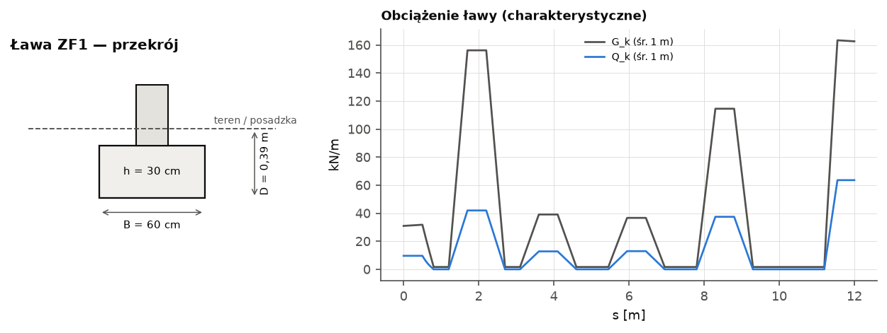

*Rys. Ława ZF1: przekrój poprzeczny i rozkład obciążenia wzdłuż ławy.*

#### Zestawienie obciążeń

| Przypadek | q_k [kN/m] (miarodajne) | Σ na ławie [kN] |
|---|---|---|
| QA_pA | 11,04 | 70,3 |
| QA_pB | 0,00 | 0,0 |
| S1 | 2,41 | 11,4 |
| H | 1,34 | 6,3 |
| S2 | 2,41 | 11,4 |
| G | 70,21 | 414,0 |
| QA | 10,14 | 66,2 |
| SB2 | 0,00 | 0,0 |

#### Obliczenia

##### ZF1

- Ciężar ławy: g_ł = B·h·25 = 0,60·0,30·25 = **4,50** kN/m
- Grunt/posadzka na odsadzkach: g_o ≈ (B − t)·(D − h)·18 = **0,71** kN/m *([UPR])*
- Obciążenie charakterystyczne w poziomie posadowienia: V_k = G_k + ΣQ_k = 75,4 + 12,6 = **88,0** kN/m
- Obciążenie obliczeniowe (STR/GEO): V_d = max(6.10a; 6.10b) = max(114,3; 103,6) = **114,3** kN/m *(PN-EN 1990 + NA)*
- *Nośność podłoża*
- Parametry podłoża (charakterystyczne, M1: γ_φ = 1,0): φ'_k; c'_k; γ = **33,0°; 0,0 kPa; 18,5 kN/m³ — Piasek średni (Ps), średnio zagęszczony, I_D ≈ 0,6 [DANE PRZYKŁADOWE]**
- Współczynnik nośności (nadkład): N_q = e^(π·tg φ')·tg²(45° + φ'/2) = **26,09** *((D.2))*
- Współczynnik nośności (spójność): N_c = (N_q − 1)·ctg φ' = **38,64**
- Współczynnik nośności (ciężar gruntu): N_γ = 2·(N_q − 1)·tg φ' = **32,59**
- Szerokość efektywna ławy: B' = B − 2e_B = 0,60 − 2·0,000 = **0,600** m
- Naprężenie od nadkładu w poziomie posadowienia: q' = γ·D = 18,50·0,39 = **7,28** kPa
- Jednostkowy opór graniczny: R_k/A' = c'·N_c·s_c·i_c + q'·N_q·s_q·i_q + ½·γ'·B'·N_γ·s_γ·i_γ = 0,0 + 7,28·26,09·1,000·1,000 + 0,5·18,50·0,600·32,59·1,000·1,000 = **370,9** kPa *((D.2))*
- Opór graniczny (na 1 m ławy): R_k = (R_k/A')·A' = 370,9·0,600 = **222,5** kN/m
- Obliczeniowy opór graniczny (DA2*): R_d = R_k/γ_R;v = 222,5/1,40 = **159,0** kN/m *(NA.2.6 (Ap2:2010), tabl. A.5)*
- *Osiadanie*
- Nacisk pod fundamentem (SLS): q = **146,6** kPa
- Moduł edometryczny: M₀ = **80** MPa *([ZAŁ — do badań])*
- Zasięg strefy aktywnej: z_max: σ_z ≤ 0,2·σ'_v0 = (warstwy h_i = 0,150 m) = **3,60** m *(PN-EN 1997-1 6.6.2(6))*
- Osiadanie: s = Σ σ_z,i·h_i/M₀ = Σ (24 warstw) = **2,0** mm
- Głębokość posadowienia: D (od terenu/posadzki) = **0,39** m
- Odpór obliczeniowy: σ_gd = V_d/B = 114,3/0,60 = **190,5** kPa
- Wysięg odsadzki: a = (B − t)/2 = (0,60 − 0,18)/2 = **0,210** m
- Warunek ławy niezbrojonej poprzecznie: 0,85·h_F/a ≥ √(3·σ_gd/f_ctd,pl), f_ctd,pl = 0,8·f_ctk,0,05/γ_c = 1,21 ≥ √(3·0,1905/1,029) = 0,745 = **spełniony** *(PN-EN 1992-1-1 (12.13), α_ct,pl = 0,8 [NZW NA])*
- Zbrojenie podłużne (konstrukcyjne, rozkład nierównomiernych osiadań): A_s ≥ max(0,0013·B·d; 4φ12) = max(0,0013·600·254; 452) = **452** mm² *(9.2.1.1 (analogia belki) [UPR])*
- Przyjęto zbrojenie podłużne: **4φ12 (A_s = 4,52 cm²), strzemiona φ6 co 30 cm**

| Warunek | Efekt | Nośność / limit | η | Stan | Podstawa |
|---|---|---|---|---|---|
| Nośność podłoża (GEO, DA2*) | V_d = 114,3 kN/m | R_d = 159,0 kN/m | 72% | spełniony | PN-EN 1997-1 (6.1), NA.2.6 |
| Osiadanie | s = 2,0 mm | s_max = 50,0 mm | 4% | spełniony | PN-EN 1997-1 NA.3 (tabl. NA.3) |
| Głębokość posadowienia (R5 3.8: zewn. ≥ 1,0 m, wewn. ≥ 0,5 m) | D_min = 1,00 m | D = 0,39 m | 254% | **NIESPEŁNIONY** | W-284 |
| Ława betonowa — odsadzka (12.13) | √(3σ/f) = 0,745  | 0,85h/a = 1,214  | 61% | spełniony | (12.13) |

> Parametry gruntu PRZYKŁADOWE (brief) — w II kat. geotechnicznej wymagane badania CPT/DPL (W-282, E-04).
> Osiadanie orientacyjne: pominięto wpływ fundamentów sąsiednich i odciążenie wykopem; M₀ — dane przykładowe.
> Zagłębienie od terenu D = 0,39 m < 1,00 m — pogłębić posadowienie (W-284).

#### Wnioski

**Przyjęto:** Ława 60×30 cm, C25/30; zbrojenie podłużne 4φ12 (A_s = 4,52 cm²), strzemiona φ6 co 30 cm; poprzecznie: nie wymaga zbrojenia poprzecznego (strzemiona konstrukcyjne φ6 co 30 cm).  

### Poz. 8.3 — Ława fundamentowa ZF2 (B = 0,60 m, h = 0,30 m, L = 6,38 m)

Element modelu: `ZF2` · maks. wykorzystanie nośności η = 254% · **WARUNKI NIESPEŁNIONE — patrz tabele warunków i wnioski**

#### Opis i schemat statyczny

Ława pod ścianami: S0-02; ściana fundamentowa h ≈ 0,25 m, t = 18 cm (ciężar jak beton 25 kN/m³ [UPR]). Spód ławy −0,700 m; teren przy ławie −0,31 m → D = 0,39 m (do nośności D_min = 0,39 m). Obciążenie miarodajne: maks. średnia krocząca na długości 2,0 m wzdłuż ławy (rozdział przez ścianę i ławę) [UPR].

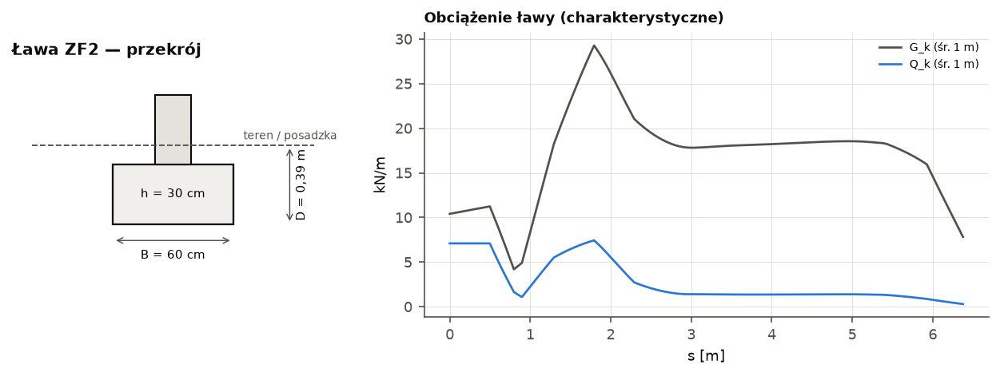

*Rys. Ława ZF2: przekrój poprzeczny i rozkład obciążenia wzdłuż ławy.*

#### Zestawienie obciążeń

| Przypadek | q_k [kN/m] (miarodajne) | Σ na ławie [kN] |
|---|---|---|
| QA_pA | 0,00 | 0,0 |
| QA_pB | 0,02 | 0,1 |
| S1 | 1,00 | 4,7 |
| H | 0,56 | 2,6 |
| S2 | 1,79 | 7,9 |
| G | 18,60 | 99,6 |
| QA | 0,00 | 0,0 |
| SB2 | 2,19 | 9,0 |

#### Obliczenia

##### ZF2

- Ciężar ławy: g_ł = B·h·25 = 0,60·0,30·25 = **4,50** kN/m
- Grunt/posadzka na odsadzkach: g_o ≈ (B − t)·(D − h)·18 = **0,71** kN/m *([UPR])*
- Obciążenie charakterystyczne w poziomie posadowienia: V_k = G_k + ΣQ_k = 23,8 + 1,8 = **25,6** kN/m
- Obciążenie obliczeniowe (STR/GEO): V_d = max(6.10a; 6.10b) = max(33,5; 30,0) = **33,5** kN/m *(PN-EN 1990 + NA)*
- *Nośność podłoża*
- Parametry podłoża (charakterystyczne, M1: γ_φ = 1,0): φ'_k; c'_k; γ = **33,0°; 0,0 kPa; 18,5 kN/m³ — Piasek średni (Ps), średnio zagęszczony, I_D ≈ 0,6 [DANE PRZYKŁADOWE]**
- Współczynnik nośności (nadkład): N_q = e^(π·tg φ')·tg²(45° + φ'/2) = **26,09** *((D.2))*
- Współczynnik nośności (spójność): N_c = (N_q − 1)·ctg φ' = **38,64**
- Współczynnik nośności (ciężar gruntu): N_γ = 2·(N_q − 1)·tg φ' = **32,59**
- Szerokość efektywna ławy: B' = B − 2e_B = 0,60 − 2·0,000 = **0,600** m
- Naprężenie od nadkładu w poziomie posadowienia: q' = γ·D = 18,50·0,39 = **7,29** kPa
- Jednostkowy opór graniczny: R_k/A' = c'·N_c·s_c·i_c + q'·N_q·s_q·i_q + ½·γ'·B'·N_γ·s_γ·i_γ = 0,0 + 7,29·26,09·1,000·1,000 + 0,5·18,50·0,600·32,59·1,000·1,000 = **371,1** kPa *((D.2))*
- Opór graniczny (na 1 m ławy): R_k = (R_k/A')·A' = 371,1·0,600 = **222,6** kN/m
- Obliczeniowy opór graniczny (DA2*): R_d = R_k/γ_R;v = 222,6/1,40 = **159,0** kN/m *(NA.2.6 (Ap2:2010), tabl. A.5)*
- *Osiadanie*
- Nacisk pod fundamentem (SLS): q = **42,7** kPa
- Moduł edometryczny: M₀ = **80** MPa *([ZAŁ — do badań])*
- Zasięg strefy aktywnej: z_max: σ_z ≤ 0,2·σ'_v0 = (warstwy h_i = 0,150 m) = **1,95** m *(PN-EN 1997-1 6.6.2(6))*
- Osiadanie: s = Σ σ_z,i·h_i/M₀ = Σ (13 warstw) = **0,5** mm
- Głębokość posadowienia: D (od terenu/posadzki) = **0,39** m
- Odpór obliczeniowy: σ_gd = V_d/B = 33,5/0,60 = **55,8** kPa
- Wysięg odsadzki: a = (B − t)/2 = (0,60 − 0,18)/2 = **0,210** m
- Warunek ławy niezbrojonej poprzecznie: 0,85·h_F/a ≥ √(3·σ_gd/f_ctd,pl), f_ctd,pl = 0,8·f_ctk,0,05/γ_c = 1,21 ≥ √(3·0,0558/1,029) = 0,403 = **spełniony** *(PN-EN 1992-1-1 (12.13), α_ct,pl = 0,8 [NZW NA])*
- Zbrojenie podłużne (konstrukcyjne, rozkład nierównomiernych osiadań): A_s ≥ max(0,0013·B·d; 4φ12) = max(0,0013·600·254; 452) = **452** mm² *(9.2.1.1 (analogia belki) [UPR])*
- Przyjęto zbrojenie podłużne: **4φ12 (A_s = 4,52 cm²), strzemiona φ6 co 30 cm**

| Warunek | Efekt | Nośność / limit | η | Stan | Podstawa |
|---|---|---|---|---|---|
| Nośność podłoża (GEO, DA2*) | V_d = 33,5 kN/m | R_d = 159,0 kN/m | 21% | spełniony | PN-EN 1997-1 (6.1), NA.2.6 |
| Osiadanie | s = 0,5 mm | s_max = 50,0 mm | 1% | spełniony | PN-EN 1997-1 NA.3 (tabl. NA.3) |
| Głębokość posadowienia (R5 3.8: zewn. ≥ 1,0 m, wewn. ≥ 0,5 m) | D_min = 1,00 m | D = 0,39 m | 254% | **NIESPEŁNIONY** | W-284 |
| Ława betonowa — odsadzka (12.13) | √(3σ/f) = 0,403  | 0,85h/a = 1,214  | 33% | spełniony | (12.13) |

> Parametry gruntu PRZYKŁADOWE (brief) — w II kat. geotechnicznej wymagane badania CPT/DPL (W-282, E-04).
> Osiadanie orientacyjne: pominięto wpływ fundamentów sąsiednich i odciążenie wykopem; M₀ — dane przykładowe.
> Zagłębienie od terenu D = 0,39 m < 1,00 m — pogłębić posadowienie (W-284).

#### Wnioski

**Przyjęto:** Ława 60×30 cm, C25/30; zbrojenie podłużne 4φ12 (A_s = 4,52 cm²), strzemiona φ6 co 30 cm; poprzecznie: nie wymaga zbrojenia poprzecznego (strzemiona konstrukcyjne φ6 co 30 cm).  

### Poz. 8.4 — Ława fundamentowa ZF3 (B = 0,60 m, h = 0,30 m, L = 9,38 m)

Element modelu: `ZF3` · maks. wykorzystanie nośności η = 198% · **WARUNKI NIESPEŁNIONE — patrz tabele warunków i wnioski**

#### Opis i schemat statyczny

Ława pod ścianami: S0-03; ściana fundamentowa h ≈ 0,25 m, t = 18 cm (ciężar jak beton 25 kN/m³ [UPR]). Spód ławy −0,700 m; teren przy ławie −0,20 m → D = 0,50 m (do nośności D_min = 0,50 m). Obciążenie miarodajne: maks. średnia krocząca na długości 2,0 m wzdłuż ławy (rozdział przez ścianę i ławę) [UPR].

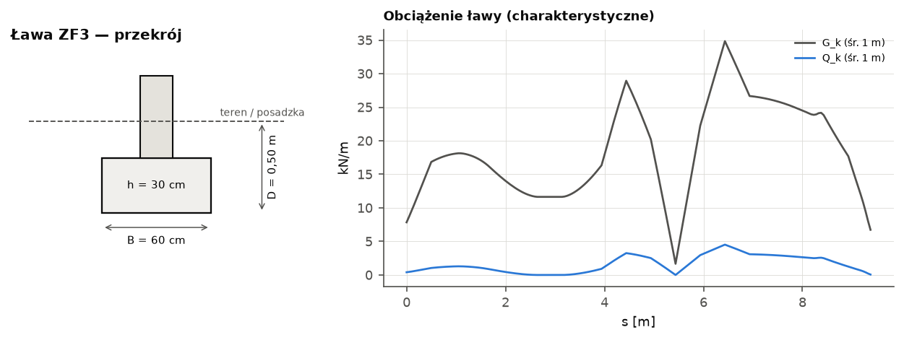

*Rys. Ława ZF3: przekrój poprzeczny i rozkład obciążenia wzdłuż ławy.*

#### Zestawienie obciążeń

| Przypadek | q_k [kN/m] (miarodajne) | Σ na ławie [kN] |
|---|---|---|
| QA_pA | 0,00 | 0,0 |
| QA_pB | 0,00 | 0,0 |
| S1 | 1,78 | 7,5 |
| H | 0,99 | 4,1 |
| S2 | 2,75 | 11,3 |
| G | 30,41 | 177,8 |
| QA | 0,00 | 0,0 |
| SB2 | 2,66 | 10,7 |

#### Obliczenia

##### ZF3

- Ciężar ławy: g_ł = B·h·25 = 0,60·0,30·25 = **4,50** kN/m
- Grunt/posadzka na odsadzkach: g_o ≈ (B − t)·(D − h)·18 = **1,54** kN/m *([UPR])*
- Obciążenie charakterystyczne w poziomie posadowienia: V_k = G_k + ΣQ_k = 36,5 + 2,7 = **39,2** kN/m
- Obciążenie obliczeniowe (STR/GEO): V_d = max(6.10a; 6.10b) = max(51,3; 45,9) = **51,3** kN/m *(PN-EN 1990 + NA)*
- *Nośność podłoża*
- Parametry podłoża (charakterystyczne, M1: γ_φ = 1,0): φ'_k; c'_k; γ = **33,0°; 0,0 kPa; 18,5 kN/m³ — Piasek średni (Ps), średnio zagęszczony, I_D ≈ 0,6 [DANE PRZYKŁADOWE]**
- Współczynnik nośności (nadkład): N_q = e^(π·tg φ')·tg²(45° + φ'/2) = **26,09** *((D.2))*
- Współczynnik nośności (spójność): N_c = (N_q − 1)·ctg φ' = **38,64**
- Współczynnik nośności (ciężar gruntu): N_γ = 2·(N_q − 1)·tg φ' = **32,59**
- Szerokość efektywna ławy: B' = B − 2e_B = 0,60 − 2·0,000 = **0,600** m
- Naprężenie od nadkładu w poziomie posadowienia: q' = γ·D = 18,50·0,50 = **9,32** kPa
- Jednostkowy opór graniczny: R_k/A' = c'·N_c·s_c·i_c + q'·N_q·s_q·i_q + ½·γ'·B'·N_γ·s_γ·i_γ = 0,0 + 9,32·26,09·1,000·1,000 + 0,5·18,50·0,600·32,59·1,000·1,000 = **424,1** kPa *((D.2))*
- Opór graniczny (na 1 m ławy): R_k = (R_k/A')·A' = 424,1·0,600 = **254,5** kN/m
- Obliczeniowy opór graniczny (DA2*): R_d = R_k/γ_R;v = 254,5/1,40 = **181,8** kN/m *(NA.2.6 (Ap2:2010), tabl. A.5)*
- *Osiadanie*
- Nacisk pod fundamentem (SLS): q = **65,3** kPa
- Moduł edometryczny: M₀ = **80** MPa *([ZAŁ — do badań])*
- Zasięg strefy aktywnej: z_max: σ_z ≤ 0,2·σ'_v0 = (warstwy h_i = 0,150 m) = **2,40** m *(PN-EN 1997-1 6.6.2(6))*
- Osiadanie: s = Σ σ_z,i·h_i/M₀ = Σ (16 warstw) = **0,8** mm
- Głębokość posadowienia: D (od terenu/posadzki) = **0,50** m
- Odpór obliczeniowy: σ_gd = V_d/B = 51,3/0,60 = **85,5** kPa
- Wysięg odsadzki: a = (B − t)/2 = (0,60 − 0,18)/2 = **0,210** m
- Warunek ławy niezbrojonej poprzecznie: 0,85·h_F/a ≥ √(3·σ_gd/f_ctd,pl), f_ctd,pl = 0,8·f_ctk,0,05/γ_c = 1,21 ≥ √(3·0,0855/1,029) = 0,499 = **spełniony** *(PN-EN 1992-1-1 (12.13), α_ct,pl = 0,8 [NZW NA])*
- Zbrojenie podłużne (konstrukcyjne, rozkład nierównomiernych osiadań): A_s ≥ max(0,0013·B·d; 4φ12) = max(0,0013·600·254; 452) = **452** mm² *(9.2.1.1 (analogia belki) [UPR])*
- Przyjęto zbrojenie podłużne: **4φ12 (A_s = 4,52 cm²), strzemiona φ6 co 30 cm**

| Warunek | Efekt | Nośność / limit | η | Stan | Podstawa |
|---|---|---|---|---|---|
| Nośność podłoża (GEO, DA2*) | V_d = 51,3 kN/m | R_d = 181,8 kN/m | 28% | spełniony | PN-EN 1997-1 (6.1), NA.2.6 |
| Osiadanie | s = 0,8 mm | s_max = 50,0 mm | 2% | spełniony | PN-EN 1997-1 NA.3 (tabl. NA.3) |
| Głębokość posadowienia (R5 3.8: zewn. ≥ 1,0 m, wewn. ≥ 0,5 m) | D_min = 1,00 m | D = 0,50 m | 198% | **NIESPEŁNIONY** | W-284 |
| Ława betonowa — odsadzka (12.13) | √(3σ/f) = 0,499  | 0,85h/a = 1,214  | 41% | spełniony | (12.13) |

> Parametry gruntu PRZYKŁADOWE (brief) — w II kat. geotechnicznej wymagane badania CPT/DPL (W-282, E-04).
> Osiadanie orientacyjne: pominięto wpływ fundamentów sąsiednich i odciążenie wykopem; M₀ — dane przykładowe.
> Zagłębienie od terenu D = 0,50 m < 1,00 m — pogłębić posadowienie (W-284).

#### Wnioski

**Przyjęto:** Ława 60×30 cm, C25/30; zbrojenie podłużne 4φ12 (A_s = 4,52 cm²), strzemiona φ6 co 30 cm; poprzecznie: nie wymaga zbrojenia poprzecznego (strzemiona konstrukcyjne φ6 co 30 cm).  

### Poz. 8.5 — Ława fundamentowa ZF4 (B = 0,60 m, h = 0,30 m, L = 6,38 m)

Element modelu: `ZF4` · maks. wykorzystanie nośności η = 185% · **WARUNKI NIESPEŁNIONE — patrz tabele warunków i wnioski**

#### Opis i schemat statyczny

Ława pod ścianami: S0-04; ściana fundamentowa h ≈ 0,25 m, t = 18 cm (ciężar jak beton 25 kN/m³ [UPR]). Spód ławy −0,700 m; teren przy ławie −0,16 m → D = 0,54 m (do nośności D_min = 0,54 m). Obciążenie miarodajne: maks. średnia krocząca na długości 2,0 m wzdłuż ławy (rozdział przez ścianę i ławę) [UPR].

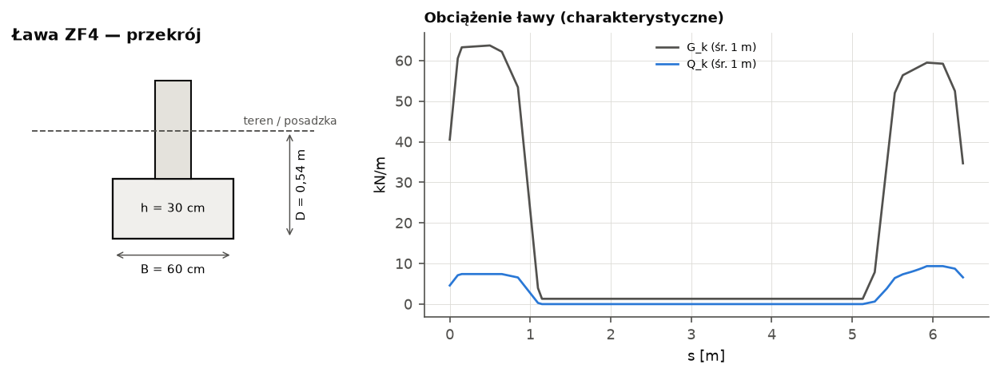

*Rys. Ława ZF4: przekrój poprzeczny i rozkład obciążenia wzdłuż ławy.*

#### Zestawienie obciążeń

| Przypadek | q_k [kN/m] (miarodajne) | Σ na ławie [kN] |
|---|---|---|
| QA_pA | 0,01 | 0,1 |
| QA_pB | 0,04 | 1,6 |
| S1 | 1,55 | 5,7 |
| H | 0,86 | 3,1 |
| S2 | 2,54 | 9,5 |
| G | 31,45 | 123,8 |
| QA | 0,03 | 1,1 |
| SB2 | 2,78 | 10,6 |

#### Obliczenia

##### ZF4

- Ciężar ławy: g_ł = B·h·25 = 0,60·0,30·25 = **4,50** kN/m
- Grunt/posadzka na odsadzkach: g_o ≈ (B − t)·(D − h)·18 = **1,81** kN/m *([UPR])*
- Obciążenie charakterystyczne w poziomie posadowienia: V_k = G_k + ΣQ_k = 37,8 + 2,6 = **40,3** kN/m
- Obciążenie obliczeniowe (STR/GEO): V_d = max(6.10a; 6.10b) = max(52,9; 47,2) = **52,9** kN/m *(PN-EN 1990 + NA)*
- *Nośność podłoża*
- Parametry podłoża (charakterystyczne, M1: γ_φ = 1,0): φ'_k; c'_k; γ = **33,0°; 0,0 kPa; 18,5 kN/m³ — Piasek średni (Ps), średnio zagęszczony, I_D ≈ 0,6 [DANE PRZYKŁADOWE]**
- Współczynnik nośności (nadkład): N_q = e^(π·tg φ')·tg²(45° + φ'/2) = **26,09** *((D.2))*
- Współczynnik nośności (spójność): N_c = (N_q − 1)·ctg φ' = **38,64**
- Współczynnik nośności (ciężar gruntu): N_γ = 2·(N_q − 1)·tg φ' = **32,59**
- Szerokość efektywna ławy: B' = B − 2e_B = 0,60 − 2·0,000 = **0,600** m
- Naprężenie od nadkładu w poziomie posadowienia: q' = γ·D = 18,50·0,54 = **9,98** kPa
- Jednostkowy opór graniczny: R_k/A' = c'·N_c·s_c·i_c + q'·N_q·s_q·i_q + ½·γ'·B'·N_γ·s_γ·i_γ = 0,0 + 9,98·26,09·1,000·1,000 + 0,5·18,50·0,600·32,59·1,000·1,000 = **441,3** kPa *((D.2))*
- Opór graniczny (na 1 m ławy): R_k = (R_k/A')·A' = 441,3·0,600 = **264,8** kN/m
- Obliczeniowy opór graniczny (DA2*): R_d = R_k/γ_R;v = 264,8/1,40 = **189,1** kN/m *(NA.2.6 (Ap2:2010), tabl. A.5)*
- *Osiadanie*
- Nacisk pod fundamentem (SLS): q = **67,2** kPa
- Moduł edometryczny: M₀ = **80** MPa *([ZAŁ — do badań])*
- Zasięg strefy aktywnej: z_max: σ_z ≤ 0,2·σ'_v0 = (warstwy h_i = 0,150 m) = **2,40** m *(PN-EN 1997-1 6.6.2(6))*
- Osiadanie: s = Σ σ_z,i·h_i/M₀ = Σ (16 warstw) = **0,8** mm
- Głębokość posadowienia: D (od terenu/posadzki) = **0,54** m
- Odpór obliczeniowy: σ_gd = V_d/B = 52,9/0,60 = **88,2** kPa
- Wysięg odsadzki: a = (B − t)/2 = (0,60 − 0,18)/2 = **0,210** m
- Warunek ławy niezbrojonej poprzecznie: 0,85·h_F/a ≥ √(3·σ_gd/f_ctd,pl), f_ctd,pl = 0,8·f_ctk,0,05/γ_c = 1,21 ≥ √(3·0,0882/1,029) = 0,507 = **spełniony** *(PN-EN 1992-1-1 (12.13), α_ct,pl = 0,8 [NZW NA])*
- Zbrojenie podłużne (konstrukcyjne, rozkład nierównomiernych osiadań): A_s ≥ max(0,0013·B·d; 4φ12) = max(0,0013·600·254; 452) = **452** mm² *(9.2.1.1 (analogia belki) [UPR])*
- Przyjęto zbrojenie podłużne: **4φ12 (A_s = 4,52 cm²), strzemiona φ6 co 30 cm**

| Warunek | Efekt | Nośność / limit | η | Stan | Podstawa |
|---|---|---|---|---|---|
| Nośność podłoża (GEO, DA2*) | V_d = 52,9 kN/m | R_d = 189,1 kN/m | 28% | spełniony | PN-EN 1997-1 (6.1), NA.2.6 |
| Osiadanie | s = 0,8 mm | s_max = 50,0 mm | 2% | spełniony | PN-EN 1997-1 NA.3 (tabl. NA.3) |
| Głębokość posadowienia (R5 3.8: zewn. ≥ 1,0 m, wewn. ≥ 0,5 m) | D_min = 1,00 m | D = 0,54 m | 185% | **NIESPEŁNIONY** | W-284 |
| Ława betonowa — odsadzka (12.13) | √(3σ/f) = 0,507  | 0,85h/a = 1,214  | 42% | spełniony | (12.13) |

> Parametry gruntu PRZYKŁADOWE (brief) — w II kat. geotechnicznej wymagane badania CPT/DPL (W-282, E-04).
> Osiadanie orientacyjne: pominięto wpływ fundamentów sąsiednich i odciążenie wykopem; M₀ — dane przykładowe.
> Zagłębienie od terenu D = 0,54 m < 1,00 m — pogłębić posadowienie (W-284).

#### Wnioski

**Przyjęto:** Ława 60×30 cm, C25/30; zbrojenie podłużne 4φ12 (A_s = 4,52 cm²), strzemiona φ6 co 30 cm; poprzecznie: nie wymaga zbrojenia poprzecznego (strzemiona konstrukcyjne φ6 co 30 cm).  

### Poz. 8.6 — Ława fundamentowa ZF5 (B = 0,60 m, h = 0,30 m, L = 0,62 m)

Element modelu: `ZF5` · maks. wykorzystanie nośności η = 91% · wszystkie warunki spełnione

#### Opis i schemat statyczny

Ława pod ścianami: S0-05; ściana fundamentowa h ≈ 0,25 m, t = 18 cm (ciężar jak beton 25 kN/m³ [UPR]). Spód ławy −0,700 m; ława wewnętrzna, posadzka −0,150 m → D = 0,55 m (do nośności D_min = 0,55 m). Obciążenie miarodajne: maks. średnia krocząca na długości 2,0 m wzdłuż ławy (rozdział przez ścianę i ławę) [UPR].

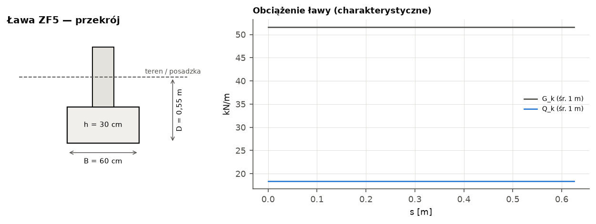

*Rys. Ława ZF5: przekrój poprzeczny i rozkład obciążenia wzdłuż ławy.*

#### Zestawienie obciążeń

| Przypadek | q_k [kN/m] (miarodajne) | Σ na ławie [kN] |
|---|---|---|
| G | 1,12 | 0,7 |

#### Obliczenia

##### ZF5

- Ciężar ławy: g_ł = B·h·25 = 0,60·0,30·25 = **4,50** kN/m
- Grunt/posadzka na odsadzkach: g_o ≈ (B − t)·(D − h)·18 = **1,89** kN/m *([UPR])*
- Obciążenie charakterystyczne w poziomie posadowienia: V_k = G_k + ΣQ_k = 7,5 + 0,0 = **7,5** kN/m
- Obciążenie obliczeniowe (STR/GEO): V_d = max(6.10a; 6.10b) = max(10,1; 8,6) = **10,1** kN/m *(PN-EN 1990 + NA)*
- *Nośność podłoża*
- Parametry podłoża (charakterystyczne, M1: γ_φ = 1,0): φ'_k; c'_k; γ = **33,0°; 0,0 kPa; 18,5 kN/m³ — Piasek średni (Ps), średnio zagęszczony, I_D ≈ 0,6 [DANE PRZYKŁADOWE]**
- Współczynnik nośności (nadkład): N_q = e^(π·tg φ')·tg²(45° + φ'/2) = **26,09** *((D.2))*
- Współczynnik nośności (spójność): N_c = (N_q − 1)·ctg φ' = **38,64**
- Współczynnik nośności (ciężar gruntu): N_γ = 2·(N_q − 1)·tg φ' = **32,59**
- Szerokość efektywna ławy: B' = B − 2e_B = 0,60 − 2·0,000 = **0,600** m
- Naprężenie od nadkładu w poziomie posadowienia: q' = γ·D = 18,50·0,55 = **10,17** kPa
- Jednostkowy opór graniczny: R_k/A' = c'·N_c·s_c·i_c + q'·N_q·s_q·i_q + ½·γ'·B'·N_γ·s_γ·i_γ = 0,0 + 10,17·26,09·1,000·1,000 + 0,5·18,50·0,600·32,59·1,000·1,000 = **446,4** kPa *((D.2))*
- Opór graniczny (na 1 m ławy): R_k = (R_k/A')·A' = 446,4·0,600 = **267,8** kN/m
- Obliczeniowy opór graniczny (DA2*): R_d = R_k/γ_R;v = 267,8/1,40 = **191,3** kN/m *(NA.2.6 (Ap2:2010), tabl. A.5)*
- *Osiadanie*
- Nacisk pod fundamentem (SLS): q = **12,5** kPa
- Moduł edometryczny: M₀ = **80** MPa *([ZAŁ — do badań])*
- Zasięg strefy aktywnej: z_max: σ_z ≤ 0,2·σ'_v0 = (warstwy h_i = 0,150 m) = **1,05** m *(PN-EN 1997-1 6.6.2(6))*
- Osiadanie: s = Σ σ_z,i·h_i/M₀ = Σ (7 warstw) = **0,1** mm
- Głębokość posadowienia: D (od terenu/posadzki) = **0,55** m
- Odpór obliczeniowy: σ_gd = V_d/B = 10,1/0,60 = **16,9** kPa
- Wysięg odsadzki: a = (B − t)/2 = (0,60 − 0,18)/2 = **0,210** m
- Warunek ławy niezbrojonej poprzecznie: 0,85·h_F/a ≥ √(3·σ_gd/f_ctd,pl), f_ctd,pl = 0,8·f_ctk,0,05/γ_c = 1,21 ≥ √(3·0,0169/1,029) = 0,222 = **spełniony** *(PN-EN 1992-1-1 (12.13), α_ct,pl = 0,8 [NZW NA])*
- Zbrojenie podłużne (konstrukcyjne, rozkład nierównomiernych osiadań): A_s ≥ max(0,0013·B·d; 4φ12) = max(0,0013·600·254; 452) = **452** mm² *(9.2.1.1 (analogia belki) [UPR])*
- Przyjęto zbrojenie podłużne: **4φ12 (A_s = 4,52 cm²), strzemiona φ6 co 30 cm**

| Warunek | Efekt | Nośność / limit | η | Stan | Podstawa |
|---|---|---|---|---|---|
| Nośność podłoża (GEO, DA2*) | V_d = 10,1 kN/m | R_d = 191,3 kN/m | 5% | spełniony | PN-EN 1997-1 (6.1), NA.2.6 |
| Osiadanie | s = 0,1 mm | s_max = 50,0 mm | 0% | spełniony | PN-EN 1997-1 NA.3 (tabl. NA.3) |
| Głębokość posadowienia (R5 3.8: zewn. ≥ 1,0 m, wewn. ≥ 0,5 m) | D_min = 0,50 m | D = 0,55 m | 91% | spełniony | W-284 |
| Ława betonowa — odsadzka (12.13) | √(3σ/f) = 0,222  | 0,85h/a = 1,214  | 18% | spełniony | (12.13) |

> Parametry gruntu PRZYKŁADOWE (brief) — w II kat. geotechnicznej wymagane badania CPT/DPL (W-282, E-04).
> Osiadanie orientacyjne: pominięto wpływ fundamentów sąsiednich i odciążenie wykopem; M₀ — dane przykładowe.

#### Wnioski

**Przyjęto:** Ława 60×30 cm, C25/30; zbrojenie podłużne 4φ12 (A_s = 4,52 cm²), strzemiona φ6 co 30 cm; poprzecznie: nie wymaga zbrojenia poprzecznego (strzemiona konstrukcyjne φ6 co 30 cm).  

### Poz. 8.7 — Ława fundamentowa ZF6 (B = 0,60 m, h = 0,30 m, L = 12,00 m)

Element modelu: `ZF6` · maks. wykorzystanie nośności η = 254% · **WARUNKI NIESPEŁNIONE — patrz tabele warunków i wnioski**

#### Opis i schemat statyczny

Ława pod ścianami: S0-06; ściana fundamentowa h ≈ 0,25 m, t = 18 cm (ciężar jak beton 25 kN/m³ [UPR]). Spód ławy −0,700 m; teren przy ławie −0,31 m → D = 0,39 m (do nośności D_min = 0,39 m). Obciążenie miarodajne: maks. średnia krocząca na długości 2,0 m wzdłuż ławy (rozdział przez ścianę i ławę) [UPR].

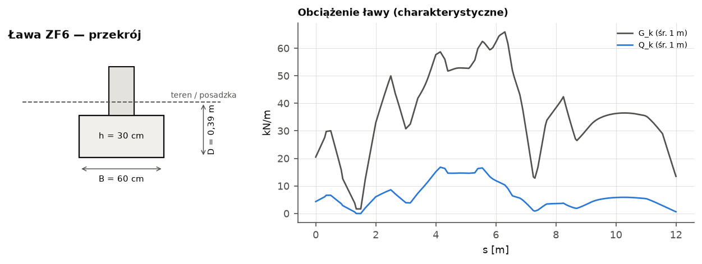

*Rys. Ława ZF6: przekrój poprzeczny i rozkład obciążenia wzdłuż ławy.*

#### Zestawienie obciążeń

| Przypadek | q_k [kN/m] (miarodajne) | Σ na ławie [kN] |
|---|---|---|
| QA_pA | 1,78 | 17,4 |
| QA_pB | 2,05 | 18,9 |
| S1 | 0,63 | 6,6 |
| H | 0,35 | 3,6 |
| S2 | 0,65 | 8,5 |
| G | 60,83 | 450,1 |
| QA | 11,70 | 68,5 |
| SB2 | 0,10 | 6,8 |

#### Obliczenia

##### ZF6

- Ciężar ławy: g_ł = B·h·25 = 0,60·0,30·25 = **4,50** kN/m
- Grunt/posadzka na odsadzkach: g_o ≈ (B − t)·(D − h)·18 = **0,71** kN/m *([UPR])*
- Obciążenie charakterystyczne w poziomie posadowienia: V_k = G_k + ΣQ_k = 66,0 + 12,4 = **78,4** kN/m
- Obciążenie obliczeniowe (STR/GEO): V_d = max(6.10a; 6.10b) = max(101,9; 93,8) = **101,9** kN/m *(PN-EN 1990 + NA)*
- *Nośność podłoża*
- Parametry podłoża (charakterystyczne, M1: γ_φ = 1,0): φ'_k; c'_k; γ = **33,0°; 0,0 kPa; 18,5 kN/m³ — Piasek średni (Ps), średnio zagęszczony, I_D ≈ 0,6 [DANE PRZYKŁADOWE]**
- Współczynnik nośności (nadkład): N_q = e^(π·tg φ')·tg²(45° + φ'/2) = **26,09** *((D.2))*
- Współczynnik nośności (spójność): N_c = (N_q − 1)·ctg φ' = **38,64**
- Współczynnik nośności (ciężar gruntu): N_γ = 2·(N_q − 1)·tg φ' = **32,59**
- Szerokość efektywna ławy: B' = B − 2e_B = 0,60 − 2·0,000 = **0,600** m
- Naprężenie od nadkładu w poziomie posadowienia: q' = γ·D = 18,50·0,39 = **7,29** kPa
- Jednostkowy opór graniczny: R_k/A' = c'·N_c·s_c·i_c + q'·N_q·s_q·i_q + ½·γ'·B'·N_γ·s_γ·i_γ = 0,0 + 7,29·26,09·1,000·1,000 + 0,5·18,50·0,600·32,59·1,000·1,000 = **371,1** kPa *((D.2))*
- Opór graniczny (na 1 m ławy): R_k = (R_k/A')·A' = 371,1·0,600 = **222,6** kN/m
- Obliczeniowy opór graniczny (DA2*): R_d = R_k/γ_R;v = 222,6/1,40 = **159,0** kN/m *(NA.2.6 (Ap2:2010), tabl. A.5)*
- *Osiadanie*
- Nacisk pod fundamentem (SLS): q = **130,7** kPa
- Moduł edometryczny: M₀ = **80** MPa *([ZAŁ — do badań])*
- Zasięg strefy aktywnej: z_max: σ_z ≤ 0,2·σ'_v0 = (warstwy h_i = 0,150 m) = **3,30** m *(PN-EN 1997-1 6.6.2(6))*
- Osiadanie: s = Σ σ_z,i·h_i/M₀ = Σ (22 warstw) = **1,8** mm
- Głębokość posadowienia: D (od terenu/posadzki) = **0,39** m
- Odpór obliczeniowy: σ_gd = V_d/B = 101,9/0,60 = **169,9** kPa
- Wysięg odsadzki: a = (B − t)/2 = (0,60 − 0,18)/2 = **0,210** m
- Warunek ławy niezbrojonej poprzecznie: 0,85·h_F/a ≥ √(3·σ_gd/f_ctd,pl), f_ctd,pl = 0,8·f_ctk,0,05/γ_c = 1,21 ≥ √(3·0,1699/1,029) = 0,704 = **spełniony** *(PN-EN 1992-1-1 (12.13), α_ct,pl = 0,8 [NZW NA])*
- Zbrojenie podłużne (konstrukcyjne, rozkład nierównomiernych osiadań): A_s ≥ max(0,0013·B·d; 4φ12) = max(0,0013·600·254; 452) = **452** mm² *(9.2.1.1 (analogia belki) [UPR])*
- Przyjęto zbrojenie podłużne: **4φ12 (A_s = 4,52 cm²), strzemiona φ6 co 30 cm**

| Warunek | Efekt | Nośność / limit | η | Stan | Podstawa |
|---|---|---|---|---|---|
| Nośność podłoża (GEO, DA2*) | V_d = 101,9 kN/m | R_d = 159,0 kN/m | 64% | spełniony | PN-EN 1997-1 (6.1), NA.2.6 |
| Osiadanie | s = 1,8 mm | s_max = 50,0 mm | 4% | spełniony | PN-EN 1997-1 NA.3 (tabl. NA.3) |
| Głębokość posadowienia (R5 3.8: zewn. ≥ 1,0 m, wewn. ≥ 0,5 m) | D_min = 1,00 m | D = 0,39 m | 254% | **NIESPEŁNIONY** | W-284 |
| Ława betonowa — odsadzka (12.13) | √(3σ/f) = 0,704  | 0,85h/a = 1,214  | 58% | spełniony | (12.13) |

> Parametry gruntu PRZYKŁADOWE (brief) — w II kat. geotechnicznej wymagane badania CPT/DPL (W-282, E-04).
> Osiadanie orientacyjne: pominięto wpływ fundamentów sąsiednich i odciążenie wykopem; M₀ — dane przykładowe.
> Zagłębienie od terenu D = 0,39 m < 1,00 m — pogłębić posadowienie (W-284).

#### Wnioski

**Przyjęto:** Ława 60×30 cm, C25/30; zbrojenie podłużne 4φ12 (A_s = 4,52 cm²), strzemiona φ6 co 30 cm; poprzecznie: nie wymaga zbrojenia poprzecznego (strzemiona konstrukcyjne φ6 co 30 cm).  

### Poz. 8.8 — Ława fundamentowa ZF7 (B = 0,60 m, h = 0,30 m, L = 8,75 m)

Element modelu: `ZF7` · maks. wykorzystanie nośności η = 254% · **WARUNKI NIESPEŁNIONE — patrz tabele warunków i wnioski**

#### Opis i schemat statyczny

Ława pod ścianami: S0-07; ściana fundamentowa h ≈ 0,25 m, t = 18 cm (ciężar jak beton 25 kN/m³ [UPR]). Spód ławy −0,700 m; teren przy ławie −0,31 m → D = 0,39 m (do nośności D_min = 0,39 m). Obciążenie miarodajne: maks. średnia krocząca na długości 2,0 m wzdłuż ławy (rozdział przez ścianę i ławę) [UPR].

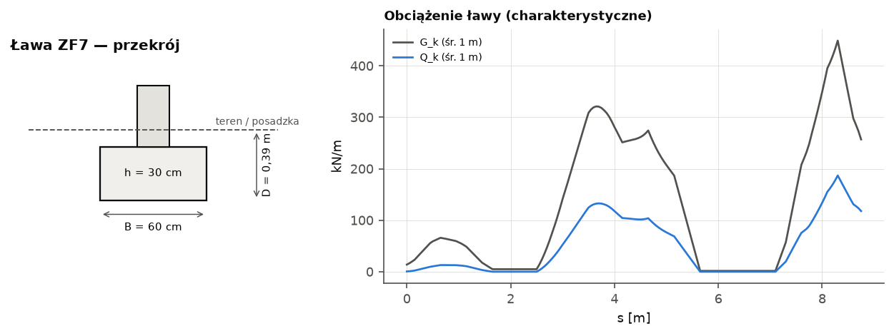

*Rys. Ława ZF7: przekrój poprzeczny i rozkład obciążenia wzdłuż ławy.*

#### Zestawienie obciążeń

| Przypadek | q_k [kN/m] (miarodajne) | Σ na ławie [kN] |
|---|---|---|
| QA_pA | 5,44 | 27,9 |
| QA_pB | 11,29 | 43,6 |
| S1 | 6,97 | 23,1 |
| H | 3,87 | 12,8 |
| S2 | 6,96 | 24,4 |
| G | 144,62 | 579,4 |
| QA | 14,73 | 71,6 |
| SB2 | 0,44 | 4,2 |

#### Obliczenia

##### ZF7

- Ciężar ławy: g_ł = B·h·25 = 0,60·0,30·25 = **4,50** kN/m
- Grunt/posadzka na odsadzkach: g_o ≈ (B − t)·(D − h)·18 = **0,71** kN/m *([UPR])*
- Obciążenie charakterystyczne w poziomie posadowienia: V_k = G_k + ΣQ_k = 149,8 + 21,7 = **171,5** kN/m
- Obciążenie obliczeniowe (STR/GEO): V_d = max(6.10a; 6.10b) = max(223,0; 199,3) = **223,0** kN/m *(PN-EN 1990 + NA)*
- *Nośność podłoża*
- Parametry podłoża (charakterystyczne, M1: γ_φ = 1,0): φ'_k; c'_k; γ = **33,0°; 0,0 kPa; 18,5 kN/m³ — Piasek średni (Ps), średnio zagęszczony, I_D ≈ 0,6 [DANE PRZYKŁADOWE]**
- Współczynnik nośności (nadkład): N_q = e^(π·tg φ')·tg²(45° + φ'/2) = **26,09** *((D.2))*
- Współczynnik nośności (spójność): N_c = (N_q − 1)·ctg φ' = **38,64**
- Współczynnik nośności (ciężar gruntu): N_γ = 2·(N_q − 1)·tg φ' = **32,59**
- Szerokość efektywna ławy: B' = B − 2e_B = 0,60 − 2·0,000 = **0,600** m
- Naprężenie od nadkładu w poziomie posadowienia: q' = γ·D = 18,50·0,39 = **7,29** kPa
- Jednostkowy opór graniczny: R_k/A' = c'·N_c·s_c·i_c + q'·N_q·s_q·i_q + ½·γ'·B'·N_γ·s_γ·i_γ = 0,0 + 7,29·26,09·1,000·1,000 + 0,5·18,50·0,600·32,59·1,000·1,000 = **371,1** kPa *((D.2))*
- Opór graniczny (na 1 m ławy): R_k = (R_k/A')·A' = 371,1·0,600 = **222,6** kN/m
- Obliczeniowy opór graniczny (DA2*): R_d = R_k/γ_R;v = 222,6/1,40 = **159,0** kN/m *(NA.2.6 (Ap2:2010), tabl. A.5)*
- *Osiadanie*
- Nacisk pod fundamentem (SLS): q = **285,9** kPa
- Moduł edometryczny: M₀ = **80** MPa *([ZAŁ — do badań])*
- Zasięg strefy aktywnej: z_max: σ_z ≤ 0,2·σ'_v0 = (warstwy h_i = 0,150 m) = **4,95** m *(PN-EN 1997-1 6.6.2(6))*
- Osiadanie: s = Σ σ_z,i·h_i/M₀ = Σ (33 warstw) = **4,3** mm
- Głębokość posadowienia: D (od terenu/posadzki) = **0,39** m
- Odpór obliczeniowy: σ_gd = V_d/B = 223,0/0,60 = **371,6** kPa
- Wysięg odsadzki: a = (B − t)/2 = (0,60 − 0,18)/2 = **0,210** m
- Warunek ławy niezbrojonej poprzecznie: 0,85·h_F/a ≥ √(3·σ_gd/f_ctd,pl), f_ctd,pl = 0,8·f_ctk,0,05/γ_c = 1,21 ≥ √(3·0,3716/1,029) = 1,041 = **spełniony** *(PN-EN 1992-1-1 (12.13), α_ct,pl = 0,8 [NZW NA])*
- Zbrojenie podłużne (konstrukcyjne, rozkład nierównomiernych osiadań): A_s ≥ max(0,0013·B·d; 4φ12) = max(0,0013·600·254; 452) = **452** mm² *(9.2.1.1 (analogia belki) [UPR])*
- Przyjęto zbrojenie podłużne: **4φ12 (A_s = 4,52 cm²), strzemiona φ6 co 30 cm**

| Warunek | Efekt | Nośność / limit | η | Stan | Podstawa |
|---|---|---|---|---|---|
| Nośność podłoża (GEO, DA2*) | V_d = 223,0 kN/m | R_d = 159,0 kN/m | 140% | **NIESPEŁNIONY** | PN-EN 1997-1 (6.1), NA.2.6 |
| Osiadanie | s = 4,3 mm | s_max = 50,0 mm | 9% | spełniony | PN-EN 1997-1 NA.3 (tabl. NA.3) |
| Głębokość posadowienia (R5 3.8: zewn. ≥ 1,0 m, wewn. ≥ 0,5 m) | D_min = 1,00 m | D = 0,39 m | 254% | **NIESPEŁNIONY** | W-284 |
| Ława betonowa — odsadzka (12.13) | √(3σ/f) = 1,041  | 0,85h/a = 1,214  | 86% | spełniony | (12.13) |

> Parametry gruntu PRZYKŁADOWE (brief) — w II kat. geotechnicznej wymagane badania CPT/DPL (W-282, E-04).
> Osiadanie orientacyjne: pominięto wpływ fundamentów sąsiednich i odciążenie wykopem; M₀ — dane przykładowe.
> Zagłębienie od terenu D = 0,39 m < 1,00 m — pogłębić posadowienie (W-284).

#### Wnioski

**Przyjęto:** Ława 60×30 cm, C25/30; zbrojenie podłużne 4φ12 (A_s = 4,52 cm²), strzemiona φ6 co 30 cm; poprzecznie: nie wymaga zbrojenia poprzecznego (strzemiona konstrukcyjne φ6 co 30 cm).  

### Poz. 8.9 — Ława fundamentowa ZF8 (B = 0,50 m, h = 0,25 m, L = 5,88 m)

Element modelu: `ZF8` · maks. wykorzystanie nośności η = 445% · **WARUNKI NIESPEŁNIONE — patrz tabele warunków i wnioski**

#### Opis i schemat statyczny

Ława pod ścianami: S0-08; ściana fundamentowa h ≈ 0,25 m, t = 18 cm (ciężar jak beton 25 kN/m³ [UPR]). Spód ławy −0,650 m; ława wewnętrzna, posadzka −0,150 m → D = 0,50 m (do nośności D_min = 0,50 m). Obciążenie miarodajne: maks. średnia krocząca na długości 2,0 m wzdłuż ławy (rozdział przez ścianę i ławę) [UPR].

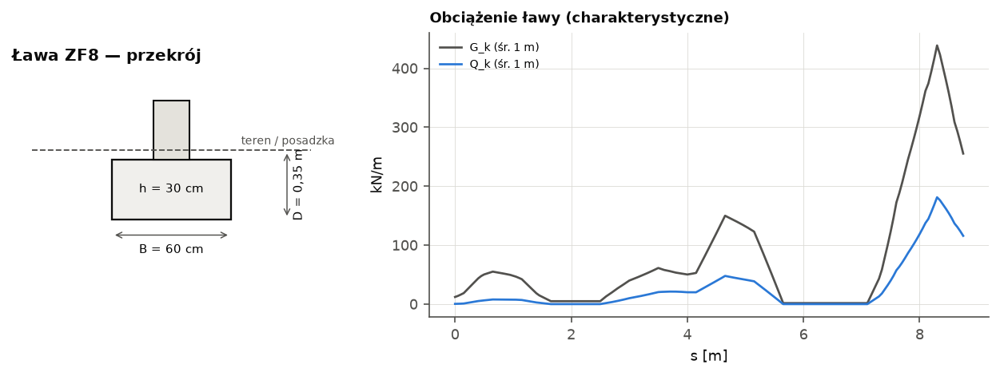

*Rys. Ława ZF8: przekrój poprzeczny i rozkład obciążenia wzdłuż ławy.*

#### Zestawienie obciążeń

| Przypadek | q_k [kN/m] (miarodajne) | Σ na ławie [kN] |
|---|---|---|
| QA_pA | 87,19 | 313,8 |
| QA_pB | 0,82 | 1,7 |
| S1 | 7,33 | 24,7 |
| H | 4,07 | 13,7 |
| S2 | 7,21 | 25,7 |
| G | 385,38 | 1376,2 |
| QA | 86,80 | 301,1 |
| SB2 | 0,11 | 3,5 |

#### Obliczenia

##### ZF8

- Ciężar ławy: g_ł = B·h·25 = 0,50·0,25·25 = **3,12** kN/m
- Grunt/posadzka na odsadzkach: g_o ≈ (B − t)·(D − h)·18 = **1,44** kN/m *([UPR])*
- Obciążenie charakterystyczne w poziomie posadowienia: V_k = G_k + ΣQ_k = 389,9 + 94,1 = **484,1** kN/m
- Obciążenie obliczeniowe (STR/GEO): V_d = max(6.10a; 6.10b) = max(623,1; 583,2) = **623,1** kN/m *(PN-EN 1990 + NA)*
- *Nośność podłoża*
- Parametry podłoża (charakterystyczne, M1: γ_φ = 1,0): φ'_k; c'_k; γ = **33,0°; 0,0 kPa; 18,5 kN/m³ — Piasek średni (Ps), średnio zagęszczony, I_D ≈ 0,6 [DANE PRZYKŁADOWE]**
- Współczynnik nośności (nadkład): N_q = e^(π·tg φ')·tg²(45° + φ'/2) = **26,09** *((D.2))*
- Współczynnik nośności (spójność): N_c = (N_q − 1)·ctg φ' = **38,64**
- Współczynnik nośności (ciężar gruntu): N_γ = 2·(N_q − 1)·tg φ' = **32,59**
- Szerokość efektywna ławy: B' = B − 2e_B = 0,50 − 2·0,000 = **0,500** m
- Naprężenie od nadkładu w poziomie posadowienia: q' = γ·D = 18,50·0,50 = **9,25** kPa
- Jednostkowy opór graniczny: R_k/A' = c'·N_c·s_c·i_c + q'·N_q·s_q·i_q + ½·γ'·B'·N_γ·s_γ·i_γ = 0,0 + 9,25·26,09·1,000·1,000 + 0,5·18,50·0,500·32,59·1,000·1,000 = **392,1** kPa *((D.2))*
- Opór graniczny (na 1 m ławy): R_k = (R_k/A')·A' = 392,1·0,500 = **196,0** kN/m
- Obliczeniowy opór graniczny (DA2*): R_d = R_k/γ_R;v = 196,0/1,40 = **140,0** kN/m *(NA.2.6 (Ap2:2010), tabl. A.5)*
- *Osiadanie*
- Nacisk pod fundamentem (SLS): q = **968,2** kPa
- Moduł edometryczny: M₀ = **80** MPa *([ZAŁ — do badań])*
- Zasięg strefy aktywnej: z_max: σ_z ≤ 0,2·σ'_v0 = (warstwy h_i = 0,125 m) = **7,12** m *(PN-EN 1997-1 6.6.2(6))*
- Osiadanie: s = Σ σ_z,i·h_i/M₀ = Σ (57 warstw) = **13,4** mm
- Głębokość posadowienia: D (od terenu/posadzki) = **0,50** m
- Odpór obliczeniowy: σ_gd = V_d/B = 623,1/0,50 = **1246,1** kPa
- Wysięg odsadzki: a = (B − t)/2 = (0,50 − 0,18)/2 = **0,160** m
- Warunek ławy niezbrojonej poprzecznie: 0,85·h_F/a ≥ √(3·σ_gd/f_ctd,pl), f_ctd,pl = 0,8·f_ctk,0,05/γ_c = 1,33 ≥ √(3·1,2461/1,029) = 1,906 = **niespełniony** *(PN-EN 1992-1-1 (12.13), α_ct,pl = 0,8 [NZW NA])*
- *Zbrojenie poprzeczne odsadzki*
- Wysokość użyteczna: d = **204** mm
- Moment względny: μ = M_Ed/(b·d²·η·f_cd) = 15,95·10⁶/(1000·204²·1,0·17,86) = **0,0215** *(3.1.7(3))*
- Względna wysokość strefy ściskanej: ξ_eff = 1 − √(1 − 2μ) = 1 − √(1 − 2·0,0215) = **0,0217**
- Warunek ciągliwości: ξ_eff ≤ ξ_eff,lim = λ·ε_cu3/(ε_cu3 + f_yd/E_s) = 0,022 ≤ 0,493 = **spełniony**
- Wymagane zbrojenie rozciągane: A_s1 = ξ_eff·b·d·η·f_cd/f_yd = 0,0217·1000·204·1,0·17,86/434,8 = **182** mm²
- Zbrojenie minimalne: A_s,min = max(0,26·f_ctm/f_yk·b·d; 0,0013·b·d) = max(0,26·2,6/500·1000·204; 0,0013·1000·204) = **276** mm² *((9.1N) + NA)*
- Zbrojenie podłużne (konstrukcyjne, rozkład nierównomiernych osiadań): A_s ≥ max(0,0013·B·d; 4φ12) = max(0,0013·500·204; 452) = **452** mm² *(9.2.1.1 (analogia belki) [UPR])*
- Przyjęto zbrojenie podłużne: **4φ12 (A_s = 4,52 cm²), strzemiona φ6 co 30 cm**

| Warunek | Efekt | Nośność / limit | η | Stan | Podstawa |
|---|---|---|---|---|---|
| Nośność podłoża (GEO, DA2*) | V_d = 623,1 kN/m | R_d = 140,0 kN/m | 445% | **NIESPEŁNIONY** | PN-EN 1997-1 (6.1), NA.2.6 |
| Osiadanie | s = 13,4 mm | s_max = 50,0 mm | 27% | spełniony | PN-EN 1997-1 NA.3 (tabl. NA.3) |
| Głębokość posadowienia (R5 3.8: zewn. ≥ 1,0 m, wewn. ≥ 0,5 m) | D_min = 0,50 m | D = 0,50 m | 100% | spełniony | W-284 |
| Zbrojenie poprzeczne ławy | A_s,req = 182 mm²/m | A_s,prov = 314 mm²/m | 58% | spełniony | 6.1 |

> Parametry gruntu PRZYKŁADOWE (brief) — w II kat. geotechnicznej wymagane badania CPT/DPL (W-282, E-04).
> Osiadanie orientacyjne: pominięto wpływ fundamentów sąsiednich i odciążenie wykopem; M₀ — dane przykładowe.

#### Wnioski

**Przyjęto:** Ława 50×25 cm, C25/30; zbrojenie podłużne 4φ12 (A_s = 4,52 cm²), strzemiona φ6 co 30 cm; poprzecznie: φ10 co 25 cm.  

### Poz. 8.10 — Ława fundamentowa ZF9 (B = 0,50 m, h = 0,25 m, L = 3,50 m)

Element modelu: `ZF9` · maks. wykorzystanie nośności η = 257% · **WARUNKI NIESPEŁNIONE — patrz tabele warunków i wnioski**

#### Opis i schemat statyczny

Ława pod ścianami: S0-10; ściana fundamentowa h ≈ 0,25 m, t = 18 cm (ciężar jak beton 25 kN/m³ [UPR]). Spód ławy −0,650 m; ława wewnętrzna, posadzka −0,150 m → D = 0,50 m (do nośności D_min = 0,50 m). Obciążenie miarodajne: maks. średnia krocząca na długości 2,0 m wzdłuż ławy (rozdział przez ścianę i ławę) [UPR].

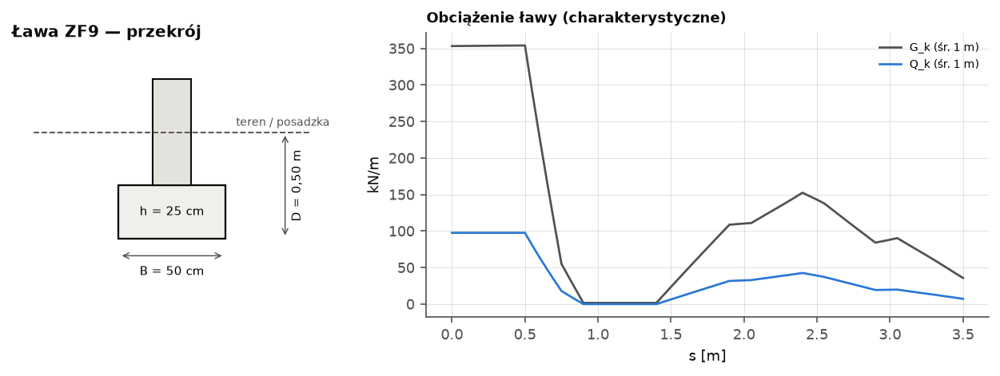

*Rys. Ława ZF9: przekrój poprzeczny i rozkład obciążenia wzdłuż ławy.*

#### Zestawienie obciążeń

| Przypadek | q_k [kN/m] (miarodajne) | Σ na ławie [kN] |
|---|---|---|
| QA_pA | 50,40 | 125,4 |
| QA_pB | 2,03 | 12,0 |
| S1 | 6,68 | 16,9 |
| H | 3,71 | 9,4 |
| S2 | 6,95 | 18,3 |
| G | 217,75 | 585,3 |
| QA | 51,28 | 135,7 |
| SB2 | 0,99 | 5,2 |

#### Obliczenia

##### ZF9

- Ciężar ławy: g_ł = B·h·25 = 0,50·0,25·25 = **3,12** kN/m
- Grunt/posadzka na odsadzkach: g_o ≈ (B − t)·(D − h)·18 = **1,44** kN/m *([UPR])*
- Obciążenie charakterystyczne w poziomie posadowienia: V_k = G_k + ΣQ_k = 222,3 + 58,2 = **280,5** kN/m
- Obciążenie obliczeniowe (STR/GEO): V_d = max(6.10a; 6.10b) = max(359,2; 337,2) = **359,2** kN/m *(PN-EN 1990 + NA)*
- *Nośność podłoża*
- Parametry podłoża (charakterystyczne, M1: γ_φ = 1,0): φ'_k; c'_k; γ = **33,0°; 0,0 kPa; 18,5 kN/m³ — Piasek średni (Ps), średnio zagęszczony, I_D ≈ 0,6 [DANE PRZYKŁADOWE]**
- Współczynnik nośności (nadkład): N_q = e^(π·tg φ')·tg²(45° + φ'/2) = **26,09** *((D.2))*
- Współczynnik nośności (spójność): N_c = (N_q − 1)·ctg φ' = **38,64**
- Współczynnik nośności (ciężar gruntu): N_γ = 2·(N_q − 1)·tg φ' = **32,59**
- Szerokość efektywna ławy: B' = B − 2e_B = 0,50 − 2·0,000 = **0,500** m
- Naprężenie od nadkładu w poziomie posadowienia: q' = γ·D = 18,50·0,50 = **9,25** kPa
- Jednostkowy opór graniczny: R_k/A' = c'·N_c·s_c·i_c + q'·N_q·s_q·i_q + ½·γ'·B'·N_γ·s_γ·i_γ = 0,0 + 9,25·26,09·1,000·1,000 + 0,5·18,50·0,500·32,59·1,000·1,000 = **392,1** kPa *((D.2))*
- Opór graniczny (na 1 m ławy): R_k = (R_k/A')·A' = 392,1·0,500 = **196,0** kN/m
- Obliczeniowy opór graniczny (DA2*): R_d = R_k/γ_R;v = 196,0/1,40 = **140,0** kN/m *(NA.2.6 (Ap2:2010), tabl. A.5)*
- *Osiadanie*
- Nacisk pod fundamentem (SLS): q = **561,1** kPa
- Moduł edometryczny: M₀ = **80** MPa *([ZAŁ — do badań])*
- Zasięg strefy aktywnej: z_max: σ_z ≤ 0,2·σ'_v0 = (warstwy h_i = 0,125 m) = **5,75** m *(PN-EN 1997-1 6.6.2(6))*
- Osiadanie: s = Σ σ_z,i·h_i/M₀ = Σ (46 warstw) = **7,5** mm
- Głębokość posadowienia: D (od terenu/posadzki) = **0,50** m
- Odpór obliczeniowy: σ_gd = V_d/B = 359,2/0,50 = **718,4** kPa
- Wysięg odsadzki: a = (B − t)/2 = (0,50 − 0,18)/2 = **0,160** m
- Warunek ławy niezbrojonej poprzecznie: 0,85·h_F/a ≥ √(3·σ_gd/f_ctd,pl), f_ctd,pl = 0,8·f_ctk,0,05/γ_c = 1,33 ≥ √(3·0,7184/1,029) = 1,447 = **niespełniony** *(PN-EN 1992-1-1 (12.13), α_ct,pl = 0,8 [NZW NA])*
- *Zbrojenie poprzeczne odsadzki*
- Wysokość użyteczna: d = **204** mm
- Moment względny: μ = M_Ed/(b·d²·η·f_cd) = 9,20·10⁶/(1000·204²·1,0·17,86) = **0,0124** *(3.1.7(3))*
- Względna wysokość strefy ściskanej: ξ_eff = 1 − √(1 − 2μ) = 1 − √(1 − 2·0,0124) = **0,0125**
- Warunek ciągliwości: ξ_eff ≤ ξ_eff,lim = λ·ε_cu3/(ε_cu3 + f_yd/E_s) = 0,012 ≤ 0,493 = **spełniony**
- Wymagane zbrojenie rozciągane: A_s1 = ξ_eff·b·d·η·f_cd/f_yd = 0,0125·1000·204·1,0·17,86/434,8 = **104** mm²
- Zbrojenie minimalne: A_s,min = max(0,26·f_ctm/f_yk·b·d; 0,0013·b·d) = max(0,26·2,6/500·1000·204; 0,0013·1000·204) = **276** mm² *((9.1N) + NA)*
- Zbrojenie podłużne (konstrukcyjne, rozkład nierównomiernych osiadań): A_s ≥ max(0,0013·B·d; 4φ12) = max(0,0013·500·204; 452) = **452** mm² *(9.2.1.1 (analogia belki) [UPR])*
- Przyjęto zbrojenie podłużne: **4φ12 (A_s = 4,52 cm²), strzemiona φ6 co 30 cm**

| Warunek | Efekt | Nośność / limit | η | Stan | Podstawa |
|---|---|---|---|---|---|
| Nośność podłoża (GEO, DA2*) | V_d = 359,2 kN/m | R_d = 140,0 kN/m | 257% | **NIESPEŁNIONY** | PN-EN 1997-1 (6.1), NA.2.6 |
| Osiadanie | s = 7,5 mm | s_max = 50,0 mm | 15% | spełniony | PN-EN 1997-1 NA.3 (tabl. NA.3) |
| Głębokość posadowienia (R5 3.8: zewn. ≥ 1,0 m, wewn. ≥ 0,5 m) | D_min = 0,50 m | D = 0,50 m | 100% | spełniony | W-284 |
| Zbrojenie poprzeczne ławy | A_s,req = 104 mm²/m | A_s,prov = 314 mm²/m | 33% | spełniony | 6.1 |

> Parametry gruntu PRZYKŁADOWE (brief) — w II kat. geotechnicznej wymagane badania CPT/DPL (W-282, E-04).
> Osiadanie orientacyjne: pominięto wpływ fundamentów sąsiednich i odciążenie wykopem; M₀ — dane przykładowe.

#### Wnioski

**Przyjęto:** Ława 50×25 cm, C25/30; zbrojenie podłużne 4φ12 (A_s = 4,52 cm²), strzemiona φ6 co 30 cm; poprzecznie: φ10 co 25 cm.  

### Poz. 8.11 — Ława fundamentowa ZF10 (B = 0,50 m, h = 0,25 m, L = 3,62 m)

Element modelu: `ZF10` · maks. wykorzystanie nośności η = 100% · wszystkie warunki spełnione

#### Opis i schemat statyczny

Ława pod ścianami: S0-11; ściana fundamentowa h ≈ 0,25 m, t = 18 cm (ciężar jak beton 25 kN/m³ [UPR]). Spód ławy −0,650 m; ława wewnętrzna, posadzka −0,150 m → D = 0,50 m (do nośności D_min = 0,50 m). Obciążenie miarodajne: maks. średnia krocząca na długości 2,0 m wzdłuż ławy (rozdział przez ścianę i ławę) [UPR].

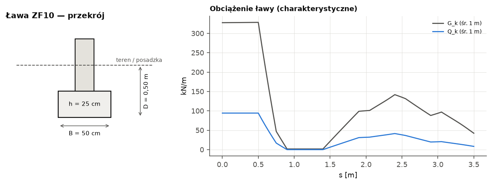

*Rys. Ława ZF10: przekrój poprzeczny i rozkład obciążenia wzdłuż ławy.*

#### Zestawienie obciążeń

| Przypadek | q_k [kN/m] (miarodajne) | Σ na ławie [kN] |
|---|---|---|
| QA_pA | 0,00 | 0,0 |
| QA_pB | 5,29 | 15,7 |
| S1 | 1,74 | 6,2 |
| H | 0,97 | 3,5 |
| S2 | 2,53 | 8,5 |
| G | 37,81 | 113,5 |
| QA | 0,00 | 0,0 |
| SB2 | 2,84 | 8,1 |

#### Obliczenia

##### ZF10

- Ciężar ławy: g_ł = B·h·25 = 0,50·0,25·25 = **3,12** kN/m
- Grunt/posadzka na odsadzkach: g_o ≈ (B − t)·(D − h)·18 = **1,44** kN/m *([UPR])*
- Obciążenie charakterystyczne w poziomie posadowienia: V_k = G_k + ΣQ_k = 42,4 + 2,5 = **44,9** kN/m
- Obciążenie obliczeniowe (STR/GEO): V_d = max(6.10a; 6.10b) = max(59,1; 52,4) = **59,1** kN/m *(PN-EN 1990 + NA)*
- *Nośność podłoża*
- Parametry podłoża (charakterystyczne, M1: γ_φ = 1,0): φ'_k; c'_k; γ = **33,0°; 0,0 kPa; 18,5 kN/m³ — Piasek średni (Ps), średnio zagęszczony, I_D ≈ 0,6 [DANE PRZYKŁADOWE]**
- Współczynnik nośności (nadkład): N_q = e^(π·tg φ')·tg²(45° + φ'/2) = **26,09** *((D.2))*
- Współczynnik nośności (spójność): N_c = (N_q − 1)·ctg φ' = **38,64**
- Współczynnik nośności (ciężar gruntu): N_γ = 2·(N_q − 1)·tg φ' = **32,59**
- Szerokość efektywna ławy: B' = B − 2e_B = 0,50 − 2·0,000 = **0,500** m
- Naprężenie od nadkładu w poziomie posadowienia: q' = γ·D = 18,50·0,50 = **9,25** kPa
- Jednostkowy opór graniczny: R_k/A' = c'·N_c·s_c·i_c + q'·N_q·s_q·i_q + ½·γ'·B'·N_γ·s_γ·i_γ = 0,0 + 9,25·26,09·1,000·1,000 + 0,5·18,50·0,500·32,59·1,000·1,000 = **392,1** kPa *((D.2))*
- Opór graniczny (na 1 m ławy): R_k = (R_k/A')·A' = 392,1·0,500 = **196,0** kN/m
- Obliczeniowy opór graniczny (DA2*): R_d = R_k/γ_R;v = 196,0/1,40 = **140,0** kN/m *(NA.2.6 (Ap2:2010), tabl. A.5)*
- *Osiadanie*
- Nacisk pod fundamentem (SLS): q = **89,8** kPa
- Moduł edometryczny: M₀ = **80** MPa *([ZAŁ — do badań])*
- Zasięg strefy aktywnej: z_max: σ_z ≤ 0,2·σ'_v0 = (warstwy h_i = 0,125 m) = **2,50** m *(PN-EN 1997-1 6.6.2(6))*
- Osiadanie: s = Σ σ_z,i·h_i/M₀ = Σ (20 warstw) = **1,0** mm
- Głębokość posadowienia: D (od terenu/posadzki) = **0,50** m
- Odpór obliczeniowy: σ_gd = V_d/B = 59,1/0,50 = **118,2** kPa
- Wysięg odsadzki: a = (B − t)/2 = (0,50 − 0,18)/2 = **0,160** m
- Warunek ławy niezbrojonej poprzecznie: 0,85·h_F/a ≥ √(3·σ_gd/f_ctd,pl), f_ctd,pl = 0,8·f_ctk,0,05/γ_c = 1,33 ≥ √(3·0,1182/1,029) = 0,587 = **spełniony** *(PN-EN 1992-1-1 (12.13), α_ct,pl = 0,8 [NZW NA])*
- Zbrojenie podłużne (konstrukcyjne, rozkład nierównomiernych osiadań): A_s ≥ max(0,0013·B·d; 4φ12) = max(0,0013·500·204; 452) = **452** mm² *(9.2.1.1 (analogia belki) [UPR])*
- Przyjęto zbrojenie podłużne: **4φ12 (A_s = 4,52 cm²), strzemiona φ6 co 30 cm**

| Warunek | Efekt | Nośność / limit | η | Stan | Podstawa |
|---|---|---|---|---|---|
| Nośność podłoża (GEO, DA2*) | V_d = 59,1 kN/m | R_d = 140,0 kN/m | 42% | spełniony | PN-EN 1997-1 (6.1), NA.2.6 |
| Osiadanie | s = 1,0 mm | s_max = 50,0 mm | 2% | spełniony | PN-EN 1997-1 NA.3 (tabl. NA.3) |
| Głębokość posadowienia (R5 3.8: zewn. ≥ 1,0 m, wewn. ≥ 0,5 m) | D_min = 0,50 m | D = 0,50 m | 100% | spełniony | W-284 |
| Ława betonowa — odsadzka (12.13) | √(3σ/f) = 0,587  | 0,85h/a = 1,328  | 44% | spełniony | (12.13) |

> Parametry gruntu PRZYKŁADOWE (brief) — w II kat. geotechnicznej wymagane badania CPT/DPL (W-282, E-04).
> Osiadanie orientacyjne: pominięto wpływ fundamentów sąsiednich i odciążenie wykopem; M₀ — dane przykładowe.

#### Wnioski

**Przyjęto:** Ława 50×25 cm, C25/30; zbrojenie podłużne 4φ12 (A_s = 4,52 cm²), strzemiona φ6 co 30 cm; poprzecznie: nie wymaga zbrojenia poprzecznego (strzemiona konstrukcyjne φ6 co 30 cm).  

### Poz. 8.12 — Ława fundamentowa ZF11 (B = 0,50 m, h = 0,25 m, L = 3,62 m)

Element modelu: `ZF11` · maks. wykorzystanie nośności η = 235% · **WARUNKI NIESPEŁNIONE — patrz tabele warunków i wnioski**

#### Opis i schemat statyczny

Ława pod ścianami: S0-12; ściana fundamentowa h ≈ 0,25 m, t = 18 cm (ciężar jak beton 25 kN/m³ [UPR]). Spód ławy −0,650 m; ława wewnętrzna, posadzka −0,150 m → D = 0,50 m (do nośności D_min = 0,50 m). Obciążenie miarodajne: maks. średnia krocząca na długości 2,0 m wzdłuż ławy (rozdział przez ścianę i ławę) [UPR].

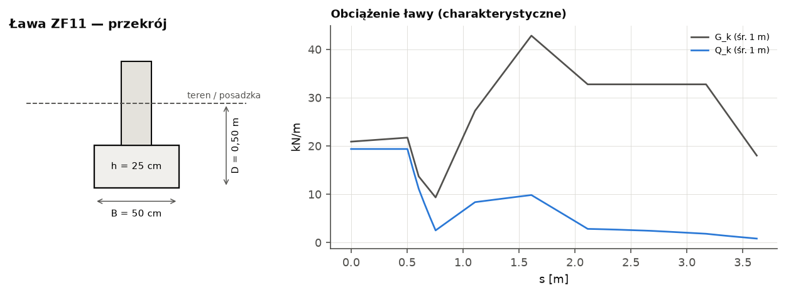

*Rys. Ława ZF11: przekrój poprzeczny i rozkład obciążenia wzdłuż ławy.*

#### Zestawienie obciążeń

| Przypadek | q_k [kN/m] (miarodajne) | Σ na ławie [kN] |
|---|---|---|
| QA_pA | 31,41 | 52,7 |
| QA_pB | 4,57 | 12,6 |
| S1 | 5,79 | 9,8 |
| H | 3,22 | 5,4 |
| S2 | 5,46 | 9,2 |
| G | 210,87 | 424,8 |
| QA | 32,54 | 54,6 |
| SB2 | 0,00 | 0,0 |

#### Obliczenia

##### ZF11

- Ciężar ławy: g_ł = B·h·25 = 0,50·0,25·25 = **3,12** kN/m
- Grunt/posadzka na odsadzkach: g_o ≈ (B − t)·(D − h)·18 = **1,44** kN/m *([UPR])*
- Obciążenie charakterystyczne w poziomie posadowienia: V_k = G_k + ΣQ_k = 215,4 + 38,3 = **253,8** kN/m
- Obciążenie obliczeniowe (STR/GEO): V_d = max(6.10a; 6.10b) = max(329,3; 300,4) = **329,3** kN/m *(PN-EN 1990 + NA)*
- *Nośność podłoża*
- Parametry podłoża (charakterystyczne, M1: γ_φ = 1,0): φ'_k; c'_k; γ = **33,0°; 0,0 kPa; 18,5 kN/m³ — Piasek średni (Ps), średnio zagęszczony, I_D ≈ 0,6 [DANE PRZYKŁADOWE]**
- Współczynnik nośności (nadkład): N_q = e^(π·tg φ')·tg²(45° + φ'/2) = **26,09** *((D.2))*
- Współczynnik nośności (spójność): N_c = (N_q − 1)·ctg φ' = **38,64**
- Współczynnik nośności (ciężar gruntu): N_γ = 2·(N_q − 1)·tg φ' = **32,59**
- Szerokość efektywna ławy: B' = B − 2e_B = 0,50 − 2·0,000 = **0,500** m
- Naprężenie od nadkładu w poziomie posadowienia: q' = γ·D = 18,50·0,50 = **9,25** kPa
- Jednostkowy opór graniczny: R_k/A' = c'·N_c·s_c·i_c + q'·N_q·s_q·i_q + ½·γ'·B'·N_γ·s_γ·i_γ = 0,0 + 9,25·26,09·1,000·1,000 + 0,5·18,50·0,500·32,59·1,000·1,000 = **392,1** kPa *((D.2))*
- Opór graniczny (na 1 m ławy): R_k = (R_k/A')·A' = 392,1·0,500 = **196,0** kN/m
- Obliczeniowy opór graniczny (DA2*): R_d = R_k/γ_R;v = 196,0/1,40 = **140,0** kN/m *(NA.2.6 (Ap2:2010), tabl. A.5)*
- *Osiadanie*
- Nacisk pod fundamentem (SLS): q = **507,5** kPa
- Moduł edometryczny: M₀ = **80** MPa *([ZAŁ — do badań])*
- Zasięg strefy aktywnej: z_max: σ_z ≤ 0,2·σ'_v0 = (warstwy h_i = 0,125 m) = **5,50** m *(PN-EN 1997-1 6.6.2(6))*
- Osiadanie: s = Σ σ_z,i·h_i/M₀ = Σ (44 warstw) = **6,8** mm
- Głębokość posadowienia: D (od terenu/posadzki) = **0,50** m
- Odpór obliczeniowy: σ_gd = V_d/B = 329,3/0,50 = **658,7** kPa
- Wysięg odsadzki: a = (B − t)/2 = (0,50 − 0,18)/2 = **0,160** m
- Warunek ławy niezbrojonej poprzecznie: 0,85·h_F/a ≥ √(3·σ_gd/f_ctd,pl), f_ctd,pl = 0,8·f_ctk,0,05/γ_c = 1,33 ≥ √(3·0,6587/1,029) = 1,386 = **niespełniony** *(PN-EN 1992-1-1 (12.13), α_ct,pl = 0,8 [NZW NA])*
- *Zbrojenie poprzeczne odsadzki*
- Wysokość użyteczna: d = **204** mm
- Moment względny: μ = M_Ed/(b·d²·η·f_cd) = 8,43·10⁶/(1000·204²·1,0·17,86) = **0,0113** *(3.1.7(3))*
- Względna wysokość strefy ściskanej: ξ_eff = 1 − √(1 − 2μ) = 1 − √(1 − 2·0,0113) = **0,0114**
- Warunek ciągliwości: ξ_eff ≤ ξ_eff,lim = λ·ε_cu3/(ε_cu3 + f_yd/E_s) = 0,011 ≤ 0,493 = **spełniony**
- Wymagane zbrojenie rozciągane: A_s1 = ξ_eff·b·d·η·f_cd/f_yd = 0,0114·1000·204·1,0·17,86/434,8 = **96** mm²
- Zbrojenie minimalne: A_s,min = max(0,26·f_ctm/f_yk·b·d; 0,0013·b·d) = max(0,26·2,6/500·1000·204; 0,0013·1000·204) = **276** mm² *((9.1N) + NA)*
- Zbrojenie podłużne (konstrukcyjne, rozkład nierównomiernych osiadań): A_s ≥ max(0,0013·B·d; 4φ12) = max(0,0013·500·204; 452) = **452** mm² *(9.2.1.1 (analogia belki) [UPR])*
- Przyjęto zbrojenie podłużne: **4φ12 (A_s = 4,52 cm²), strzemiona φ6 co 30 cm**

| Warunek | Efekt | Nośność / limit | η | Stan | Podstawa |
|---|---|---|---|---|---|
| Nośność podłoża (GEO, DA2*) | V_d = 329,3 kN/m | R_d = 140,0 kN/m | 235% | **NIESPEŁNIONY** | PN-EN 1997-1 (6.1), NA.2.6 |
| Osiadanie | s = 6,8 mm | s_max = 50,0 mm | 14% | spełniony | PN-EN 1997-1 NA.3 (tabl. NA.3) |
| Głębokość posadowienia (R5 3.8: zewn. ≥ 1,0 m, wewn. ≥ 0,5 m) | D_min = 0,50 m | D = 0,50 m | 100% | spełniony | W-284 |
| Zbrojenie poprzeczne ławy | A_s,req = 96 mm²/m | A_s,prov = 314 mm²/m | 30% | spełniony | 6.1 |

> Parametry gruntu PRZYKŁADOWE (brief) — w II kat. geotechnicznej wymagane badania CPT/DPL (W-282, E-04).
> Osiadanie orientacyjne: pominięto wpływ fundamentów sąsiednich i odciążenie wykopem; M₀ — dane przykładowe.

#### Wnioski

**Przyjęto:** Ława 50×25 cm, C25/30; zbrojenie podłużne 4φ12 (A_s = 4,52 cm²), strzemiona φ6 co 30 cm; poprzecznie: φ10 co 25 cm.  

### Poz. 8.13 — Ława fundamentowa ZF12 (B = 0,50 m, h = 0,25 m, L = 3,62 m)

Element modelu: `ZF12` · maks. wykorzystanie nośności η = 198% · **WARUNKI NIESPEŁNIONE — patrz tabele warunków i wnioski**

#### Opis i schemat statyczny

Ława pod ścianami: S0-13; ściana fundamentowa h ≈ 0,25 m, t = 18 cm (ciężar jak beton 25 kN/m³ [UPR]). Spód ławy −0,650 m; ława wewnętrzna, posadzka −0,150 m → D = 0,50 m (do nośności D_min = 0,50 m). Obciążenie miarodajne: maks. średnia krocząca na długości 2,0 m wzdłuż ławy (rozdział przez ścianę i ławę) [UPR].

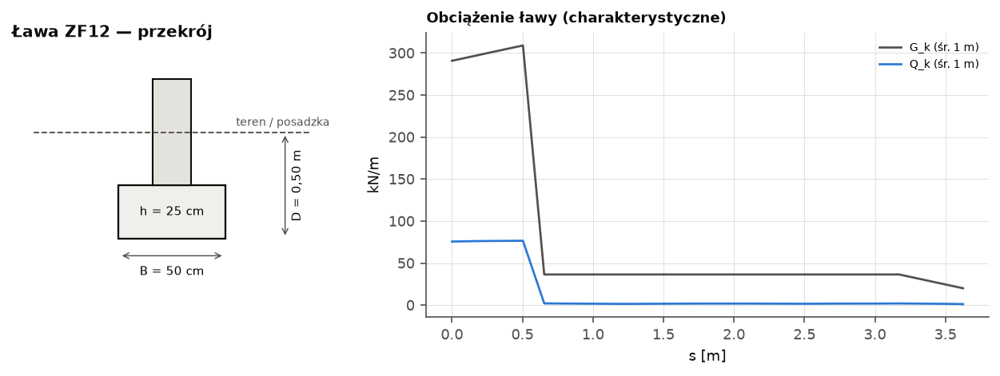

*Rys. Ława ZF12: przekrój poprzeczny i rozkład obciążenia wzdłuż ławy.*

#### Zestawienie obciążeń

| Przypadek | q_k [kN/m] (miarodajne) | Σ na ławie [kN] |
|---|---|---|
| QA_pA | 31,12 | 52,2 |
| QA_pB | 8,66 | 23,5 |
| S1 | 2,91 | 6,6 |
| H | 1,61 | 3,7 |
| S2 | 3,37 | 8,3 |
| G | 172,71 | 360,8 |
| QA | 34,14 | 57,3 |
| SB2 | 1,98 | 6,9 |

#### Obliczenia

##### ZF12

- Ciężar ławy: g_ł = B·h·25 = 0,50·0,25·25 = **3,12** kN/m
- Grunt/posadzka na odsadzkach: g_o ≈ (B − t)·(D − h)·18 = **1,44** kN/m *([UPR])*
- Obciążenie charakterystyczne w poziomie posadowienia: V_k = G_k + ΣQ_k = 177,3 + 37,5 = **214,8** kN/m
- Obciążenie obliczeniowe (STR/GEO): V_d = max(6.10a; 6.10b) = max(277,7; 257,2) = **277,7** kN/m *(PN-EN 1990 + NA)*
- *Nośność podłoża*
- Parametry podłoża (charakterystyczne, M1: γ_φ = 1,0): φ'_k; c'_k; γ = **33,0°; 0,0 kPa; 18,5 kN/m³ — Piasek średni (Ps), średnio zagęszczony, I_D ≈ 0,6 [DANE PRZYKŁADOWE]**
- Współczynnik nośności (nadkład): N_q = e^(π·tg φ')·tg²(45° + φ'/2) = **26,09** *((D.2))*
- Współczynnik nośności (spójność): N_c = (N_q − 1)·ctg φ' = **38,64**
- Współczynnik nośności (ciężar gruntu): N_γ = 2·(N_q − 1)·tg φ' = **32,59**
- Szerokość efektywna ławy: B' = B − 2e_B = 0,50 − 2·0,000 = **0,500** m
- Naprężenie od nadkładu w poziomie posadowienia: q' = γ·D = 18,50·0,50 = **9,25** kPa
- Jednostkowy opór graniczny: R_k/A' = c'·N_c·s_c·i_c + q'·N_q·s_q·i_q + ½·γ'·B'·N_γ·s_γ·i_γ = 0,0 + 9,25·26,09·1,000·1,000 + 0,5·18,50·0,500·32,59·1,000·1,000 = **392,1** kPa *((D.2))*
- Opór graniczny (na 1 m ławy): R_k = (R_k/A')·A' = 392,1·0,500 = **196,0** kN/m
- Obliczeniowy opór graniczny (DA2*): R_d = R_k/γ_R;v = 196,0/1,40 = **140,0** kN/m *(NA.2.6 (Ap2:2010), tabl. A.5)*
- *Osiadanie*
- Nacisk pod fundamentem (SLS): q = **429,6** kPa
- Moduł edometryczny: M₀ = **80** MPa *([ZAŁ — do badań])*
- Zasięg strefy aktywnej: z_max: σ_z ≤ 0,2·σ'_v0 = (warstwy h_i = 0,125 m) = **5,12** m *(PN-EN 1997-1 6.6.2(6))*
- Osiadanie: s = Σ σ_z,i·h_i/M₀ = Σ (41 warstw) = **5,7** mm
- Głębokość posadowienia: D (od terenu/posadzki) = **0,50** m
- Odpór obliczeniowy: σ_gd = V_d/B = 277,7/0,50 = **555,4** kPa
- Wysięg odsadzki: a = (B − t)/2 = (0,50 − 0,18)/2 = **0,160** m
- Warunek ławy niezbrojonej poprzecznie: 0,85·h_F/a ≥ √(3·σ_gd/f_ctd,pl), f_ctd,pl = 0,8·f_ctk,0,05/γ_c = 1,33 ≥ √(3·0,5554/1,029) = 1,273 = **spełniony** *(PN-EN 1992-1-1 (12.13), α_ct,pl = 0,8 [NZW NA])*
- Zbrojenie podłużne (konstrukcyjne, rozkład nierównomiernych osiadań): A_s ≥ max(0,0013·B·d; 4φ12) = max(0,0013·500·204; 452) = **452** mm² *(9.2.1.1 (analogia belki) [UPR])*
- Przyjęto zbrojenie podłużne: **4φ12 (A_s = 4,52 cm²), strzemiona φ6 co 30 cm**

| Warunek | Efekt | Nośność / limit | η | Stan | Podstawa |
|---|---|---|---|---|---|
| Nośność podłoża (GEO, DA2*) | V_d = 277,7 kN/m | R_d = 140,0 kN/m | 198% | **NIESPEŁNIONY** | PN-EN 1997-1 (6.1), NA.2.6 |
| Osiadanie | s = 5,7 mm | s_max = 50,0 mm | 11% | spełniony | PN-EN 1997-1 NA.3 (tabl. NA.3) |
| Głębokość posadowienia (R5 3.8: zewn. ≥ 1,0 m, wewn. ≥ 0,5 m) | D_min = 0,50 m | D = 0,50 m | 100% | spełniony | W-284 |
| Ława betonowa — odsadzka (12.13) | √(3σ/f) = 1,273  | 0,85h/a = 1,328  | 96% | spełniony | (12.13) |

> Parametry gruntu PRZYKŁADOWE (brief) — w II kat. geotechnicznej wymagane badania CPT/DPL (W-282, E-04).
> Osiadanie orientacyjne: pominięto wpływ fundamentów sąsiednich i odciążenie wykopem; M₀ — dane przykładowe.

#### Wnioski

**Przyjęto:** Ława 50×25 cm, C25/30; zbrojenie podłużne 4φ12 (A_s = 4,52 cm²), strzemiona φ6 co 30 cm; poprzecznie: nie wymaga zbrojenia poprzecznego (strzemiona konstrukcyjne φ6 co 30 cm).  

### Poz. 8.14 — Ława fundamentowa ZF13 (B = 0,50 m, h = 0,25 m, L = 2,88 m)

Element modelu: `ZF13` · maks. wykorzystanie nośności η = 102% · **WARUNKI NIESPEŁNIONE — patrz tabele warunków i wnioski**

#### Opis i schemat statyczny

Ława pod ścianami: S0-15; ściana fundamentowa h ≈ 0,25 m, t = 18 cm (ciężar jak beton 25 kN/m³ [UPR]). Spód ławy −0,650 m; ława wewnętrzna, posadzka −0,150 m → D = 0,50 m (do nośności D_min = 0,50 m). Obciążenie miarodajne: maks. średnia krocząca na długości 2,0 m wzdłuż ławy (rozdział przez ścianę i ławę) [UPR].

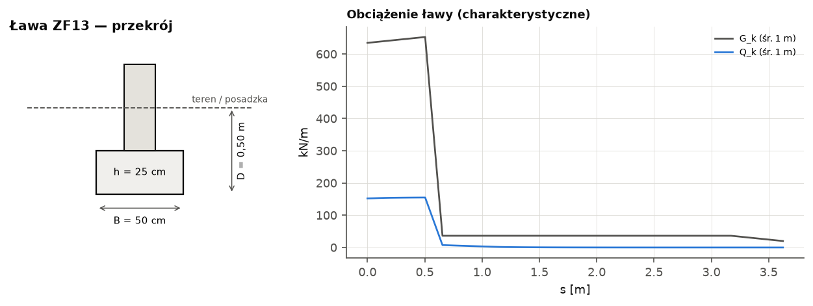

*Rys. Ława ZF13: przekrój poprzeczny i rozkład obciążenia wzdłuż ławy.*

#### Zestawienie obciążeń

| Przypadek | q_k [kN/m] (miarodajne) | Σ na ławie [kN] |
|---|---|---|
| QA_pA | 20,72 | 49,9 |
| QA_pB | 0,00 | 0,0 |
| S1 | 0,78 | 2,7 |
| H | 0,44 | 1,5 |
| S2 | 0,91 | 3,2 |
| G | 85,35 | 233,2 |
| QA | 20,18 | 48,9 |
| SB2 | 0,35 | 1,3 |

#### Obliczenia

##### ZF13

- Ciężar ławy: g_ł = B·h·25 = 0,50·0,25·25 = **3,12** kN/m
- Grunt/posadzka na odsadzkach: g_o ≈ (B − t)·(D − h)·18 = **1,44** kN/m *([UPR])*
- Obciążenie charakterystyczne w poziomie posadowienia: V_k = G_k + ΣQ_k = 89,9 + 21,1 = **111,0** kN/m
- Obciążenie obliczeniowe (STR/GEO): V_d = max(6.10a; 6.10b) = max(143,3; 134,1) = **143,3** kN/m *(PN-EN 1990 + NA)*
- *Nośność podłoża*
- Parametry podłoża (charakterystyczne, M1: γ_φ = 1,0): φ'_k; c'_k; γ = **33,0°; 0,0 kPa; 18,5 kN/m³ — Piasek średni (Ps), średnio zagęszczony, I_D ≈ 0,6 [DANE PRZYKŁADOWE]**
- Współczynnik nośności (nadkład): N_q = e^(π·tg φ')·tg²(45° + φ'/2) = **26,09** *((D.2))*
- Współczynnik nośności (spójność): N_c = (N_q − 1)·ctg φ' = **38,64**
- Współczynnik nośności (ciężar gruntu): N_γ = 2·(N_q − 1)·tg φ' = **32,59**
- Szerokość efektywna ławy: B' = B − 2e_B = 0,50 − 2·0,000 = **0,500** m
- Naprężenie od nadkładu w poziomie posadowienia: q' = γ·D = 18,50·0,50 = **9,25** kPa
- Jednostkowy opór graniczny: R_k/A' = c'·N_c·s_c·i_c + q'·N_q·s_q·i_q + ½·γ'·B'·N_γ·s_γ·i_γ = 0,0 + 9,25·26,09·1,000·1,000 + 0,5·18,50·0,500·32,59·1,000·1,000 = **392,1** kPa *((D.2))*
- Opór graniczny (na 1 m ławy): R_k = (R_k/A')·A' = 392,1·0,500 = **196,0** kN/m
- Obliczeniowy opór graniczny (DA2*): R_d = R_k/γ_R;v = 196,0/1,40 = **140,0** kN/m *(NA.2.6 (Ap2:2010), tabl. A.5)*
- *Osiadanie*
- Nacisk pod fundamentem (SLS): q = **222,0** kPa
- Moduł edometryczny: M₀ = **80** MPa *([ZAŁ — do badań])*
- Zasięg strefy aktywnej: z_max: σ_z ≤ 0,2·σ'_v0 = (warstwy h_i = 0,125 m) = **3,75** m *(PN-EN 1997-1 6.6.2(6))*
- Osiadanie: s = Σ σ_z,i·h_i/M₀ = Σ (30 warstw) = **2,7** mm
- Głębokość posadowienia: D (od terenu/posadzki) = **0,50** m
- Odpór obliczeniowy: σ_gd = V_d/B = 143,3/0,50 = **286,5** kPa
- Wysięg odsadzki: a = (B − t)/2 = (0,50 − 0,18)/2 = **0,160** m
- Warunek ławy niezbrojonej poprzecznie: 0,85·h_F/a ≥ √(3·σ_gd/f_ctd,pl), f_ctd,pl = 0,8·f_ctk,0,05/γ_c = 1,33 ≥ √(3·0,2865/1,029) = 0,914 = **spełniony** *(PN-EN 1992-1-1 (12.13), α_ct,pl = 0,8 [NZW NA])*
- Zbrojenie podłużne (konstrukcyjne, rozkład nierównomiernych osiadań): A_s ≥ max(0,0013·B·d; 4φ12) = max(0,0013·500·204; 452) = **452** mm² *(9.2.1.1 (analogia belki) [UPR])*
- Przyjęto zbrojenie podłużne: **4φ12 (A_s = 4,52 cm²), strzemiona φ6 co 30 cm**

| Warunek | Efekt | Nośność / limit | η | Stan | Podstawa |
|---|---|---|---|---|---|
| Nośność podłoża (GEO, DA2*) | V_d = 143,3 kN/m | R_d = 140,0 kN/m | 102% | **NIESPEŁNIONY** | PN-EN 1997-1 (6.1), NA.2.6 |
| Osiadanie | s = 2,7 mm | s_max = 50,0 mm | 5% | spełniony | PN-EN 1997-1 NA.3 (tabl. NA.3) |
| Głębokość posadowienia (R5 3.8: zewn. ≥ 1,0 m, wewn. ≥ 0,5 m) | D_min = 0,50 m | D = 0,50 m | 100% | spełniony | W-284 |
| Ława betonowa — odsadzka (12.13) | √(3σ/f) = 0,914  | 0,85h/a = 1,328  | 69% | spełniony | (12.13) |

> Parametry gruntu PRZYKŁADOWE (brief) — w II kat. geotechnicznej wymagane badania CPT/DPL (W-282, E-04).
> Osiadanie orientacyjne: pominięto wpływ fundamentów sąsiednich i odciążenie wykopem; M₀ — dane przykładowe.

#### Wnioski

**Przyjęto:** Ława 50×25 cm, C25/30; zbrojenie podłużne 4φ12 (A_s = 4,52 cm²), strzemiona φ6 co 30 cm; poprzecznie: nie wymaga zbrojenia poprzecznego (strzemiona konstrukcyjne φ6 co 30 cm).  

### Poz. 8.15 — Ława fundamentowa ZF14 (B = 0,50 m, h = 0,25 m, L = 5,88 m)

Element modelu: `ZF14` · maks. wykorzystanie nośności η = 131% · **WARUNKI NIESPEŁNIONE — patrz tabele warunków i wnioski**

#### Opis i schemat statyczny

Ława pod ścianami: S0-16; ściana fundamentowa h ≈ 0,25 m, t = 18 cm (ciężar jak beton 25 kN/m³ [UPR]). Spód ławy −0,650 m; ława wewnętrzna, posadzka −0,150 m → D = 0,50 m (do nośności D_min = 0,50 m). Obciążenie miarodajne: maks. średnia krocząca na długości 2,0 m wzdłuż ławy (rozdział przez ścianę i ławę) [UPR].

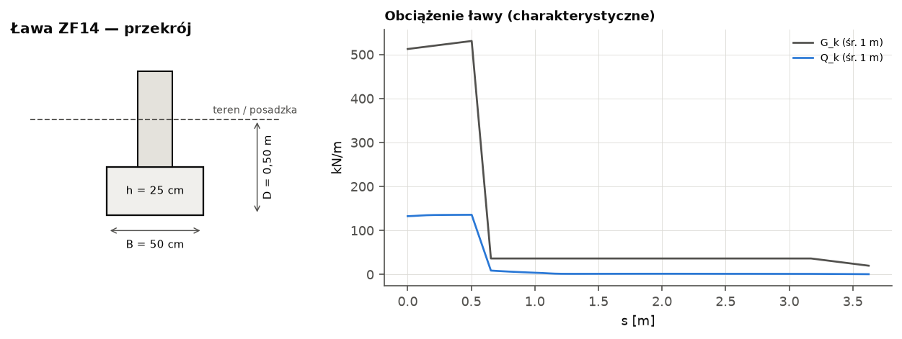

*Rys. Ława ZF14: przekrój poprzeczny i rozkład obciążenia wzdłuż ławy.*

#### Zestawienie obciążeń

| Przypadek | q_k [kN/m] (miarodajne) | Σ na ławie [kN] |
|---|---|---|
| QA_pA | 15,20 | 29,5 |
| QA_pB | 0,00 | 11,3 |
| S1 | 3,50 | 26,0 |
| H | 1,94 | 14,5 |
| S2 | 4,74 | 42,4 |
| G | 116,34 | 527,5 |
| QA | 15,89 | 40,9 |
| SB2 | 3,46 | 46,0 |

#### Obliczenia

##### ZF14

- Ciężar ławy: g_ł = B·h·25 = 0,50·0,25·25 = **3,12** kN/m
- Grunt/posadzka na odsadzkach: g_o ≈ (B − t)·(D − h)·18 = **1,44** kN/m *([UPR])*
- Obciążenie charakterystyczne w poziomie posadowienia: V_k = G_k + ΣQ_k = 120,9 + 20,6 = **141,5** kN/m
- Obciążenie obliczeniowe (STR/GEO): V_d = max(6.10a; 6.10b) = max(183,5; 166,1) = **183,5** kN/m *(PN-EN 1990 + NA)*
- *Nośność podłoża*
- Parametry podłoża (charakterystyczne, M1: γ_φ = 1,0): φ'_k; c'_k; γ = **33,0°; 0,0 kPa; 18,5 kN/m³ — Piasek średni (Ps), średnio zagęszczony, I_D ≈ 0,6 [DANE PRZYKŁADOWE]**
- Współczynnik nośności (nadkład): N_q = e^(π·tg φ')·tg²(45° + φ'/2) = **26,09** *((D.2))*
- Współczynnik nośności (spójność): N_c = (N_q − 1)·ctg φ' = **38,64**
- Współczynnik nośności (ciężar gruntu): N_γ = 2·(N_q − 1)·tg φ' = **32,59**
- Szerokość efektywna ławy: B' = B − 2e_B = 0,50 − 2·0,000 = **0,500** m
- Naprężenie od nadkładu w poziomie posadowienia: q' = γ·D = 18,50·0,50 = **9,25** kPa
- Jednostkowy opór graniczny: R_k/A' = c'·N_c·s_c·i_c + q'·N_q·s_q·i_q + ½·γ'·B'·N_γ·s_γ·i_γ = 0,0 + 9,25·26,09·1,000·1,000 + 0,5·18,50·0,500·32,59·1,000·1,000 = **392,1** kPa *((D.2))*
- Opór graniczny (na 1 m ławy): R_k = (R_k/A')·A' = 392,1·0,500 = **196,0** kN/m
- Obliczeniowy opór graniczny (DA2*): R_d = R_k/γ_R;v = 196,0/1,40 = **140,0** kN/m *(NA.2.6 (Ap2:2010), tabl. A.5)*
- *Osiadanie*
- Nacisk pod fundamentem (SLS): q = **283,1** kPa
- Moduł edometryczny: M₀ = **80** MPa *([ZAŁ — do badań])*
- Zasięg strefy aktywnej: z_max: σ_z ≤ 0,2·σ'_v0 = (warstwy h_i = 0,125 m) = **4,25** m *(PN-EN 1997-1 6.6.2(6))*
- Osiadanie: s = Σ σ_z,i·h_i/M₀ = Σ (34 warstw) = **3,6** mm
- Głębokość posadowienia: D (od terenu/posadzki) = **0,50** m
- Odpór obliczeniowy: σ_gd = V_d/B = 183,5/0,50 = **366,9** kPa
- Wysięg odsadzki: a = (B − t)/2 = (0,50 − 0,18)/2 = **0,160** m
- Warunek ławy niezbrojonej poprzecznie: 0,85·h_F/a ≥ √(3·σ_gd/f_ctd,pl), f_ctd,pl = 0,8·f_ctk,0,05/γ_c = 1,33 ≥ √(3·0,3669/1,029) = 1,035 = **spełniony** *(PN-EN 1992-1-1 (12.13), α_ct,pl = 0,8 [NZW NA])*
- Zbrojenie podłużne (konstrukcyjne, rozkład nierównomiernych osiadań): A_s ≥ max(0,0013·B·d; 4φ12) = max(0,0013·500·204; 452) = **452** mm² *(9.2.1.1 (analogia belki) [UPR])*
- Przyjęto zbrojenie podłużne: **4φ12 (A_s = 4,52 cm²), strzemiona φ6 co 30 cm**

| Warunek | Efekt | Nośność / limit | η | Stan | Podstawa |
|---|---|---|---|---|---|
| Nośność podłoża (GEO, DA2*) | V_d = 183,5 kN/m | R_d = 140,0 kN/m | 131% | **NIESPEŁNIONY** | PN-EN 1997-1 (6.1), NA.2.6 |
| Osiadanie | s = 3,6 mm | s_max = 50,0 mm | 7% | spełniony | PN-EN 1997-1 NA.3 (tabl. NA.3) |
| Głębokość posadowienia (R5 3.8: zewn. ≥ 1,0 m, wewn. ≥ 0,5 m) | D_min = 0,50 m | D = 0,50 m | 100% | spełniony | W-284 |
| Ława betonowa — odsadzka (12.13) | √(3σ/f) = 1,035  | 0,85h/a = 1,328  | 78% | spełniony | (12.13) |

> Parametry gruntu PRZYKŁADOWE (brief) — w II kat. geotechnicznej wymagane badania CPT/DPL (W-282, E-04).
> Osiadanie orientacyjne: pominięto wpływ fundamentów sąsiednich i odciążenie wykopem; M₀ — dane przykładowe.

#### Wnioski

**Przyjęto:** Ława 50×25 cm, C25/30; zbrojenie podłużne 4φ12 (A_s = 4,52 cm²), strzemiona φ6 co 30 cm; poprzecznie: nie wymaga zbrojenia poprzecznego (strzemiona konstrukcyjne φ6 co 30 cm).  

### Poz. 8.16 — Ława fundamentowa ZF15 (B = 0,50 m, h = 0,25 m, L = 6,38 m)

Element modelu: `ZF15` · maks. wykorzystanie nośności η = 100% · wszystkie warunki spełnione

#### Opis i schemat statyczny

Ława pod ścianami: S0-17; ściana fundamentowa h ≈ 0,25 m, t = 18 cm (ciężar jak beton 25 kN/m³ [UPR]). Spód ławy −0,650 m; ława wewnętrzna, posadzka −0,150 m → D = 0,50 m (do nośności D_min = 0,50 m). Obciążenie miarodajne: maks. średnia krocząca na długości 2,0 m wzdłuż ławy (rozdział przez ścianę i ławę) [UPR].

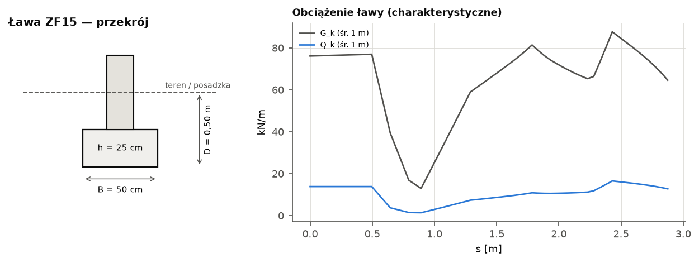

*Rys. Ława ZF15: przekrój poprzeczny i rozkład obciążenia wzdłuż ławy.*

#### Zestawienie obciążeń

| Przypadek | q_k [kN/m] (miarodajne) | Σ na ławie [kN] |
|---|---|---|
| QA_pA | 0,00 | 0,0 |
| QA_pB | 0,00 | 1,8 |
| S1 | 4,51 | 18,4 |
| H | 2,51 | 10,2 |
| S2 | 7,63 | 31,1 |
| G | 36,27 | 157,6 |
| QA | 0,00 | 0,0 |
| SB2 | 8,66 | 35,4 |

#### Obliczenia

##### ZF15

- Ciężar ławy: g_ł = B·h·25 = 0,50·0,25·25 = **3,12** kN/m
- Grunt/posadzka na odsadzkach: g_o ≈ (B − t)·(D − h)·18 = **1,44** kN/m *([UPR])*
- Obciążenie charakterystyczne w poziomie posadowienia: V_k = G_k + ΣQ_k = 40,8 + 7,6 = **48,5** kN/m
- Obciążenie obliczeniowe (STR/GEO): V_d = max(6.10a; 6.10b) = max(60,8; 58,3) = **60,8** kN/m *(PN-EN 1990 + NA)*
- *Nośność podłoża*
- Parametry podłoża (charakterystyczne, M1: γ_φ = 1,0): φ'_k; c'_k; γ = **33,0°; 0,0 kPa; 18,5 kN/m³ — Piasek średni (Ps), średnio zagęszczony, I_D ≈ 0,6 [DANE PRZYKŁADOWE]**
- Współczynnik nośności (nadkład): N_q = e^(π·tg φ')·tg²(45° + φ'/2) = **26,09** *((D.2))*
- Współczynnik nośności (spójność): N_c = (N_q − 1)·ctg φ' = **38,64**
- Współczynnik nośności (ciężar gruntu): N_γ = 2·(N_q − 1)·tg φ' = **32,59**
- Szerokość efektywna ławy: B' = B − 2e_B = 0,50 − 2·0,000 = **0,500** m
- Naprężenie od nadkładu w poziomie posadowienia: q' = γ·D = 18,50·0,50 = **9,25** kPa
- Jednostkowy opór graniczny: R_k/A' = c'·N_c·s_c·i_c + q'·N_q·s_q·i_q + ½·γ'·B'·N_γ·s_γ·i_γ = 0,0 + 9,25·26,09·1,000·1,000 + 0,5·18,50·0,500·32,59·1,000·1,000 = **392,1** kPa *((D.2))*
- Opór graniczny (na 1 m ławy): R_k = (R_k/A')·A' = 392,1·0,500 = **196,0** kN/m
- Obliczeniowy opór graniczny (DA2*): R_d = R_k/γ_R;v = 196,0/1,40 = **140,0** kN/m *(NA.2.6 (Ap2:2010), tabl. A.5)*
- *Osiadanie*
- Nacisk pod fundamentem (SLS): q = **96,9** kPa
- Moduł edometryczny: M₀ = **80** MPa *([ZAŁ — do badań])*
- Zasięg strefy aktywnej: z_max: σ_z ≤ 0,2·σ'_v0 = (warstwy h_i = 0,125 m) = **2,62** m *(PN-EN 1997-1 6.6.2(6))*
- Osiadanie: s = Σ σ_z,i·h_i/M₀ = Σ (21 warstw) = **1,1** mm
- Głębokość posadowienia: D (od terenu/posadzki) = **0,50** m
- Odpór obliczeniowy: σ_gd = V_d/B = 60,8/0,50 = **121,7** kPa
- Wysięg odsadzki: a = (B − t)/2 = (0,50 − 0,18)/2 = **0,160** m
- Warunek ławy niezbrojonej poprzecznie: 0,85·h_F/a ≥ √(3·σ_gd/f_ctd,pl), f_ctd,pl = 0,8·f_ctk,0,05/γ_c = 1,33 ≥ √(3·0,1217/1,029) = 0,596 = **spełniony** *(PN-EN 1992-1-1 (12.13), α_ct,pl = 0,8 [NZW NA])*
- Zbrojenie podłużne (konstrukcyjne, rozkład nierównomiernych osiadań): A_s ≥ max(0,0013·B·d; 4φ12) = max(0,0013·500·204; 452) = **452** mm² *(9.2.1.1 (analogia belki) [UPR])*
- Przyjęto zbrojenie podłużne: **4φ12 (A_s = 4,52 cm²), strzemiona φ6 co 30 cm**

| Warunek | Efekt | Nośność / limit | η | Stan | Podstawa |
|---|---|---|---|---|---|
| Nośność podłoża (GEO, DA2*) | V_d = 60,8 kN/m | R_d = 140,0 kN/m | 43% | spełniony | PN-EN 1997-1 (6.1), NA.2.6 |
| Osiadanie | s = 1,1 mm | s_max = 50,0 mm | 2% | spełniony | PN-EN 1997-1 NA.3 (tabl. NA.3) |
| Głębokość posadowienia (R5 3.8: zewn. ≥ 1,0 m, wewn. ≥ 0,5 m) | D_min = 0,50 m | D = 0,50 m | 100% | spełniony | W-284 |
| Ława betonowa — odsadzka (12.13) | √(3σ/f) = 0,596  | 0,85h/a = 1,328  | 45% | spełniony | (12.13) |

> Parametry gruntu PRZYKŁADOWE (brief) — w II kat. geotechnicznej wymagane badania CPT/DPL (W-282, E-04).
> Osiadanie orientacyjne: pominięto wpływ fundamentów sąsiednich i odciążenie wykopem; M₀ — dane przykładowe.

#### Wnioski

**Przyjęto:** Ława 50×25 cm, C25/30; zbrojenie podłużne 4φ12 (A_s = 4,52 cm²), strzemiona φ6 co 30 cm; poprzecznie: nie wymaga zbrojenia poprzecznego (strzemiona konstrukcyjne φ6 co 30 cm).  

### Poz. 8.17 — Stopa fundamentowa SF1 (1,00 × 1,01 × 0,45 m) pod słupem SL1

Element modelu: `SF1` · maks. wykorzystanie nośności η = 185% · **WARUNKI NIESPEŁNIONE — patrz tabele warunków i wnioski**

#### Opis i schemat statyczny

Spód stopy −0,850 m, teren −0,31 m → zagłębienie D = 0,54 m.

#### Obliczenia

##### SF1

- Ciężar stopy i gruntu nad nią: G_f = B·L·h·25 + B·L·(D − h)·18 = **13,00** kN
- Obciążenie obliczeniowe: V_d = max(6.10a; 6.10b) = **21,6** kN
- *Nośność podłoża*
- Parametry podłoża (charakterystyczne, M1: γ_φ = 1,0): φ'_k; c'_k; γ = **33,0°; 0,0 kPa; 18,5 kN/m³ — Piasek średni (Ps), średnio zagęszczony, I_D ≈ 0,6 [DANE PRZYKŁADOWE]**
- Współczynnik nośności (nadkład): N_q = e^(π·tg φ')·tg²(45° + φ'/2) = **26,09** *((D.2))*
- Współczynnik nośności (spójność): N_c = (N_q − 1)·ctg φ' = **38,64**
- Współczynnik nośności (ciężar gruntu): N_γ = 2·(N_q − 1)·tg φ' = **32,59**
- Wymiary efektywne: B' = B − 2e_B; L' = L − 2e_L = **1,000 m × 1,010 m**
- Współczynniki kształtu: s_q = 1 + (B'/L')·sin φ'; s_γ = 1 − 0,3·B'/L' = **s_q = 1,539; s_γ = 0,703** *((D.4))*
- Naprężenie od nadkładu w poziomie posadowienia: q' = γ·D = 18,50·0,54 = **9,99** kPa
- Jednostkowy opór graniczny: R_k/A' = c'·N_c·s_c·i_c + q'·N_q·s_q·i_q + ½·γ'·B'·N_γ·s_γ·i_γ = 0,0 + 9,99·26,09·1,539·1,000 + 0,5·18,50·1,000·32,59·0,703·1,000 = **613,1** kPa *((D.2))*
- Opór graniczny: R_k = (R_k/A')·A' = 613,1·1,010 = **619,3** kN
- Obliczeniowy opór graniczny (DA2*): R_d = R_k/γ_R;v = 619,3/1,40 = **442,3** kN *(NA.2.6 (Ap2:2010), tabl. A.5)*
- *Osiadanie*
- Nacisk pod fundamentem (SLS): q = **16,0** kPa
- Moduł edometryczny: M₀ = **80** MPa *([ZAŁ — do badań])*
- Zasięg strefy aktywnej: z_max: σ_z ≤ 0,2·σ'_v0 = (warstwy h_i = 0,250 m) = **1,25** m *(PN-EN 1997-1 6.6.2(6))*
- Osiadanie: s = Σ σ_z,i·h_i/M₀ = Σ (5 warstw) = **0,2** mm
- Przebicie — obwód kontrolny w odległości a = d: u = 4·c + 2π·a = 4·0,22 + 2π·0,398 = **3,381** m *(6.4.4(2))*
- Siła przebijająca zredukowana o odpór: V_Ed,red = V_Ed − σ·A_in = **0,5** kN
- Naprężenie: v_Ed = V_Ed,red/(u·d) = **0,000** MPa
- Nośność (ρ_l = 0,2 % — min.): v_Rd = C_Rd,c·k·(100ρf_ck)^(1/3)·2d/a ≥ v_min·2d/a = **0,782** MPa *((6.50))*
- Wspornik stopy (miarodajny): M = σ·b·c²/2 = 4,0·1,00·0,395²/2 = **0,31** kNm
- *Zbrojenie dolne stopy*
- Wysokość użyteczna: d = **398** mm
- Moment względny: μ = M_Ed/(b·d²·η·f_cd) = 0,31·10⁶/(1000·398²·1,0·17,86) = **0,0001** *(3.1.7(3))*
- Względna wysokość strefy ściskanej: ξ_eff = 1 − √(1 − 2μ) = 1 − √(1 − 2·0,0001) = **0,0001**
- Warunek ciągliwości: ξ_eff ≤ ξ_eff,lim = λ·ε_cu3/(ε_cu3 + f_yd/E_s) = 0,000 ≤ 0,493 = **spełniony**
- Wymagane zbrojenie rozciągane: A_s1 = ξ_eff·b·d·η·f_cd/f_yd = 0,0001·1000·398·1,0·17,86/434,8 = **2** mm²
- Zbrojenie minimalne: A_s,min = max(0,26·f_ctm/f_yk·b·d; 0,0013·b·d) = max(0,26·2,6/500·1000·398; 0,0013·1000·398) = **538** mm² *((9.1N) + NA)*

| Warunek | Efekt | Nośność / limit | η | Stan | Podstawa |
|---|---|---|---|---|---|
| Nośność podłoża (GEO, DA2*) | V_d = 21,6 kN | R_d = 442,3 kN | 5% | spełniony | PN-EN 1997-1 (6.1), NA.2.6 |
| Osiadanie | s = 0,2 mm | s_max = 50,0 mm | 0% | spełniony | PN-EN 1997-1 NA.3 (tabl. NA.3) |
| Głębokość posadowienia | D_min = 1,00 m | D = 0,54 m | 185% | **NIESPEŁNIONY** | W-284 |
| Przebicie stopy | v_Ed = 0,000 MPa | v_Rd = 0,782 MPa | 0% | spełniony | (6.50) |

> Parametry gruntu PRZYKŁADOWE (brief) — w II kat. geotechnicznej wymagane badania CPT/DPL (W-282, E-04).
> Osiadanie orientacyjne: pominięto wpływ fundamentów sąsiednich i odciążenie wykopem; M₀ — dane przykładowe.

#### Wnioski

**Przyjęto:** Stopa 100×101×45 cm, C25/30; siatka dołem φ12 co 21 cm w obu kierunkach.  

### Poz. 8.18 — Stopa fundamentowa SF2 (1,00 × 1,01 × 0,45 m) pod słupem SL2

Element modelu: `SF2` · maks. wykorzystanie nośności η = 185% · **WARUNKI NIESPEŁNIONE — patrz tabele warunków i wnioski**

#### Opis i schemat statyczny

Spód stopy −0,850 m, teren −0,31 m → zagłębienie D = 0,54 m.

#### Obliczenia

##### SF2

- Ciężar stopy i gruntu nad nią: G_f = B·L·h·25 + B·L·(D − h)·18 = **13,00** kN
- Obciążenie obliczeniowe: V_d = max(6.10a; 6.10b) = **21,8** kN
- *Nośność podłoża*
- Parametry podłoża (charakterystyczne, M1: γ_φ = 1,0): φ'_k; c'_k; γ = **33,0°; 0,0 kPa; 18,5 kN/m³ — Piasek średni (Ps), średnio zagęszczony, I_D ≈ 0,6 [DANE PRZYKŁADOWE]**
- Współczynnik nośności (nadkład): N_q = e^(π·tg φ')·tg²(45° + φ'/2) = **26,09** *((D.2))*
- Współczynnik nośności (spójność): N_c = (N_q − 1)·ctg φ' = **38,64**
- Współczynnik nośności (ciężar gruntu): N_γ = 2·(N_q − 1)·tg φ' = **32,59**
- Wymiary efektywne: B' = B − 2e_B; L' = L − 2e_L = **1,000 m × 1,010 m**
- Współczynniki kształtu: s_q = 1 + (B'/L')·sin φ'; s_γ = 1 − 0,3·B'/L' = **s_q = 1,539; s_γ = 0,703** *((D.4))*
- Naprężenie od nadkładu w poziomie posadowienia: q' = γ·D = 18,50·0,54 = **9,99** kPa
- Jednostkowy opór graniczny: R_k/A' = c'·N_c·s_c·i_c + q'·N_q·s_q·i_q + ½·γ'·B'·N_γ·s_γ·i_γ = 0,0 + 9,99·26,09·1,539·1,000 + 0,5·18,50·1,000·32,59·0,703·1,000 = **613,1** kPa *((D.2))*
- Opór graniczny: R_k = (R_k/A')·A' = 613,1·1,010 = **619,3** kN
- Obliczeniowy opór graniczny (DA2*): R_d = R_k/γ_R;v = 619,3/1,40 = **442,3** kN *(NA.2.6 (Ap2:2010), tabl. A.5)*
- *Osiadanie*
- Nacisk pod fundamentem (SLS): q = **16,1** kPa
- Moduł edometryczny: M₀ = **80** MPa *([ZAŁ — do badań])*
- Zasięg strefy aktywnej: z_max: σ_z ≤ 0,2·σ'_v0 = (warstwy h_i = 0,250 m) = **1,25** m *(PN-EN 1997-1 6.6.2(6))*
- Osiadanie: s = Σ σ_z,i·h_i/M₀ = Σ (5 warstw) = **0,2** mm
- Przebicie — obwód kontrolny w odległości a = d: u = 4·c + 2π·a = 4·0,22 + 2π·0,398 = **3,381** m *(6.4.4(2))*
- Siła przebijająca zredukowana o odpór: V_Ed,red = V_Ed − σ·A_in = **0,5** kN
- Naprężenie: v_Ed = V_Ed,red/(u·d) = **0,000** MPa
- Nośność (ρ_l = 0,2 % — min.): v_Rd = C_Rd,c·k·(100ρf_ck)^(1/3)·2d/a ≥ v_min·2d/a = **0,782** MPa *((6.50))*
- Wspornik stopy (miarodajny): M = σ·b·c²/2 = 4,2·1,00·0,395²/2 = **0,33** kNm
- *Zbrojenie dolne stopy*
- Wysokość użyteczna: d = **398** mm
- Moment względny: μ = M_Ed/(b·d²·η·f_cd) = 0,33·10⁶/(1000·398²·1,0·17,86) = **0,0001** *(3.1.7(3))*
- Względna wysokość strefy ściskanej: ξ_eff = 1 − √(1 − 2μ) = 1 − √(1 − 2·0,0001) = **0,0001**
- Warunek ciągliwości: ξ_eff ≤ ξ_eff,lim = λ·ε_cu3/(ε_cu3 + f_yd/E_s) = 0,000 ≤ 0,493 = **spełniony**
- Wymagane zbrojenie rozciągane: A_s1 = ξ_eff·b·d·η·f_cd/f_yd = 0,0001·1000·398·1,0·17,86/434,8 = **2** mm²
- Zbrojenie minimalne: A_s,min = max(0,26·f_ctm/f_yk·b·d; 0,0013·b·d) = max(0,26·2,6/500·1000·398; 0,0013·1000·398) = **538** mm² *((9.1N) + NA)*

| Warunek | Efekt | Nośność / limit | η | Stan | Podstawa |
|---|---|---|---|---|---|
| Nośność podłoża (GEO, DA2*) | V_d = 21,8 kN | R_d = 442,3 kN | 5% | spełniony | PN-EN 1997-1 (6.1), NA.2.6 |
| Osiadanie | s = 0,2 mm | s_max = 50,0 mm | 0% | spełniony | PN-EN 1997-1 NA.3 (tabl. NA.3) |
| Głębokość posadowienia | D_min = 1,00 m | D = 0,54 m | 185% | **NIESPEŁNIONY** | W-284 |
| Przebicie stopy | v_Ed = 0,000 MPa | v_Rd = 0,782 MPa | 0% | spełniony | (6.50) |

> Parametry gruntu PRZYKŁADOWE (brief) — w II kat. geotechnicznej wymagane badania CPT/DPL (W-282, E-04).
> Osiadanie orientacyjne: pominięto wpływ fundamentów sąsiednich i odciążenie wykopem; M₀ — dane przykładowe.

#### Wnioski

**Przyjęto:** Stopa 100×101×45 cm, C25/30; siatka dołem φ12 co 21 cm w obu kierunkach.  

### Poz. 8.19 — Stopa fundamentowa SF3 (1,00 × 1,01 × 0,45 m) pod słupem SL3

Element modelu: `SF3` · maks. wykorzystanie nośności η = 186% · **WARUNKI NIESPEŁNIONE — patrz tabele warunków i wnioski**

#### Opis i schemat statyczny

Spód stopy −0,850 m, teren −0,31 m → zagłębienie D = 0,54 m.

#### Obliczenia

##### SF3

- Ciężar stopy i gruntu nad nią: G_f = B·L·h·25 + B·L·(D − h)·18 = **12,97** kN
- Obciążenie obliczeniowe: V_d = max(6.10a; 6.10b) = **21,4** kN
- *Nośność podłoża*
- Parametry podłoża (charakterystyczne, M1: γ_φ = 1,0): φ'_k; c'_k; γ = **33,0°; 0,0 kPa; 18,5 kN/m³ — Piasek średni (Ps), średnio zagęszczony, I_D ≈ 0,6 [DANE PRZYKŁADOWE]**
- Współczynnik nośności (nadkład): N_q = e^(π·tg φ')·tg²(45° + φ'/2) = **26,09** *((D.2))*
- Współczynnik nośności (spójność): N_c = (N_q − 1)·ctg φ' = **38,64**
- Współczynnik nośności (ciężar gruntu): N_γ = 2·(N_q − 1)·tg φ' = **32,59**
- Wymiary efektywne: B' = B − 2e_B; L' = L − 2e_L = **1,000 m × 1,010 m**
- Współczynniki kształtu: s_q = 1 + (B'/L')·sin φ'; s_γ = 1 − 0,3·B'/L' = **s_q = 1,539; s_γ = 0,703** *((D.4))*
- Naprężenie od nadkładu w poziomie posadowienia: q' = γ·D = 18,50·0,54 = **9,96** kPa
- Jednostkowy opór graniczny: R_k/A' = c'·N_c·s_c·i_c + q'·N_q·s_q·i_q + ½·γ'·B'·N_γ·s_γ·i_γ = 0,0 + 9,96·26,09·1,539·1,000 + 0,5·18,50·1,000·32,59·0,703·1,000 = **612,0** kPa *((D.2))*
- Opór graniczny: R_k = (R_k/A')·A' = 612,0·1,010 = **618,1** kN
- Obliczeniowy opór graniczny (DA2*): R_d = R_k/γ_R;v = 618,1/1,40 = **441,5** kN *(NA.2.6 (Ap2:2010), tabl. A.5)*
- *Osiadanie*
- Nacisk pod fundamentem (SLS): q = **15,8** kPa
- Moduł edometryczny: M₀ = **80** MPa *([ZAŁ — do badań])*
- Zasięg strefy aktywnej: z_max: σ_z ≤ 0,2·σ'_v0 = (warstwy h_i = 0,250 m) = **1,25** m *(PN-EN 1997-1 6.6.2(6))*
- Osiadanie: s = Σ σ_z,i·h_i/M₀ = Σ (5 warstw) = **0,2** mm
- Przebicie — obwód kontrolny w odległości a = d: u = 4·c + 2π·a = 4·0,22 + 2π·0,398 = **3,381** m *(6.4.4(2))*
- Siła przebijająca zredukowana o odpór: V_Ed,red = V_Ed − σ·A_in = **0,4** kN
- Naprężenie: v_Ed = V_Ed,red/(u·d) = **0,000** MPa
- Nośność (ρ_l = 0,2 % — min.): v_Rd = C_Rd,c·k·(100ρf_ck)^(1/3)·2d/a ≥ v_min·2d/a = **0,782** MPa *((6.50))*
- Wspornik stopy (miarodajny): M = σ·b·c²/2 = 3,8·1,00·0,395²/2 = **0,30** kNm
- *Zbrojenie dolne stopy*
- Wysokość użyteczna: d = **398** mm
- Moment względny: μ = M_Ed/(b·d²·η·f_cd) = 0,30·10⁶/(1000·398²·1,0·17,86) = **0,0001** *(3.1.7(3))*
- Względna wysokość strefy ściskanej: ξ_eff = 1 − √(1 − 2μ) = 1 − √(1 − 2·0,0001) = **0,0001**
- Warunek ciągliwości: ξ_eff ≤ ξ_eff,lim = λ·ε_cu3/(ε_cu3 + f_yd/E_s) = 0,000 ≤ 0,493 = **spełniony**
- Wymagane zbrojenie rozciągane: A_s1 = ξ_eff·b·d·η·f_cd/f_yd = 0,0001·1000·398·1,0·17,86/434,8 = **2** mm²
- Zbrojenie minimalne: A_s,min = max(0,26·f_ctm/f_yk·b·d; 0,0013·b·d) = max(0,26·2,6/500·1000·398; 0,0013·1000·398) = **538** mm² *((9.1N) + NA)*

| Warunek | Efekt | Nośność / limit | η | Stan | Podstawa |
|---|---|---|---|---|---|
| Nośność podłoża (GEO, DA2*) | V_d = 21,4 kN | R_d = 441,5 kN | 5% | spełniony | PN-EN 1997-1 (6.1), NA.2.6 |
| Osiadanie | s = 0,2 mm | s_max = 50,0 mm | 0% | spełniony | PN-EN 1997-1 NA.3 (tabl. NA.3) |
| Głębokość posadowienia | D_min = 1,00 m | D = 0,54 m | 186% | **NIESPEŁNIONY** | W-284 |
| Przebicie stopy | v_Ed = 0,000 MPa | v_Rd = 0,782 MPa | 0% | spełniony | (6.50) |

> Parametry gruntu PRZYKŁADOWE (brief) — w II kat. geotechnicznej wymagane badania CPT/DPL (W-282, E-04).
> Osiadanie orientacyjne: pominięto wpływ fundamentów sąsiednich i odciążenie wykopem; M₀ — dane przykładowe.

#### Wnioski

**Przyjęto:** Stopa 100×101×45 cm, C25/30; siatka dołem φ12 co 21 cm w obu kierunkach.  

### Poz. 8.20 — Stopa fundamentowa SF4 (1,00 × 1,01 × 0,45 m) pod słupem SL4

Element modelu: `SF4` · maks. wykorzystanie nośności η = 185% · **WARUNKI NIESPEŁNIONE — patrz tabele warunków i wnioski**

#### Opis i schemat statyczny

Spód stopy −0,850 m, teren −0,31 m → zagłębienie D = 0,54 m.

#### Obliczenia

##### SF4

- Ciężar stopy i gruntu nad nią: G_f = B·L·h·25 + B·L·(D − h)·18 = **13,00** kN
- Obciążenie obliczeniowe: V_d = max(6.10a; 6.10b) = **21,1** kN
- *Nośność podłoża*
- Parametry podłoża (charakterystyczne, M1: γ_φ = 1,0): φ'_k; c'_k; γ = **33,0°; 0,0 kPa; 18,5 kN/m³ — Piasek średni (Ps), średnio zagęszczony, I_D ≈ 0,6 [DANE PRZYKŁADOWE]**
- Współczynnik nośności (nadkład): N_q = e^(π·tg φ')·tg²(45° + φ'/2) = **26,09** *((D.2))*
- Współczynnik nośności (spójność): N_c = (N_q − 1)·ctg φ' = **38,64**
- Współczynnik nośności (ciężar gruntu): N_γ = 2·(N_q − 1)·tg φ' = **32,59**
- Wymiary efektywne: B' = B − 2e_B; L' = L − 2e_L = **1,000 m × 1,010 m**
- Współczynniki kształtu: s_q = 1 + (B'/L')·sin φ'; s_γ = 1 − 0,3·B'/L' = **s_q = 1,539; s_γ = 0,703** *((D.4))*
- Naprężenie od nadkładu w poziomie posadowienia: q' = γ·D = 18,50·0,54 = **9,99** kPa
- Jednostkowy opór graniczny: R_k/A' = c'·N_c·s_c·i_c + q'·N_q·s_q·i_q + ½·γ'·B'·N_γ·s_γ·i_γ = 0,0 + 9,99·26,09·1,539·1,000 + 0,5·18,50·1,000·32,59·0,703·1,000 = **613,1** kPa *((D.2))*
- Opór graniczny: R_k = (R_k/A')·A' = 613,1·1,010 = **619,3** kN
- Obliczeniowy opór graniczny (DA2*): R_d = R_k/γ_R;v = 619,3/1,40 = **442,3** kN *(NA.2.6 (Ap2:2010), tabl. A.5)*
- *Osiadanie*
- Nacisk pod fundamentem (SLS): q = **15,6** kPa
- Moduł edometryczny: M₀ = **80** MPa *([ZAŁ — do badań])*
- Zasięg strefy aktywnej: z_max: σ_z ≤ 0,2·σ'_v0 = (warstwy h_i = 0,250 m) = **1,25** m *(PN-EN 1997-1 6.6.2(6))*
- Osiadanie: s = Σ σ_z,i·h_i/M₀ = Σ (5 warstw) = **0,2** mm
- Przebicie — obwód kontrolny w odległości a = d: u = 4·c + 2π·a = 4·0,22 + 2π·0,398 = **3,381** m *(6.4.4(2))*
- Siła przebijająca zredukowana o odpór: V_Ed,red = V_Ed − σ·A_in = **0,4** kN
- Naprężenie: v_Ed = V_Ed,red/(u·d) = **0,000** MPa
- Nośność (ρ_l = 0,2 % — min.): v_Rd = C_Rd,c·k·(100ρf_ck)^(1/3)·2d/a ≥ v_min·2d/a = **0,782** MPa *((6.50))*
- Wspornik stopy (miarodajny): M = σ·b·c²/2 = 3,6·1,00·0,395²/2 = **0,28** kNm
- *Zbrojenie dolne stopy*
- Wysokość użyteczna: d = **398** mm
- Moment względny: μ = M_Ed/(b·d²·η·f_cd) = 0,28·10⁶/(1000·398²·1,0·17,86) = **0,0001** *(3.1.7(3))*
- Względna wysokość strefy ściskanej: ξ_eff = 1 − √(1 − 2μ) = 1 − √(1 − 2·0,0001) = **0,0001**
- Warunek ciągliwości: ξ_eff ≤ ξ_eff,lim = λ·ε_cu3/(ε_cu3 + f_yd/E_s) = 0,000 ≤ 0,493 = **spełniony**
- Wymagane zbrojenie rozciągane: A_s1 = ξ_eff·b·d·η·f_cd/f_yd = 0,0001·1000·398·1,0·17,86/434,8 = **2** mm²
- Zbrojenie minimalne: A_s,min = max(0,26·f_ctm/f_yk·b·d; 0,0013·b·d) = max(0,26·2,6/500·1000·398; 0,0013·1000·398) = **538** mm² *((9.1N) + NA)*

| Warunek | Efekt | Nośność / limit | η | Stan | Podstawa |
|---|---|---|---|---|---|
| Nośność podłoża (GEO, DA2*) | V_d = 21,1 kN | R_d = 442,3 kN | 5% | spełniony | PN-EN 1997-1 (6.1), NA.2.6 |
| Osiadanie | s = 0,2 mm | s_max = 50,0 mm | 0% | spełniony | PN-EN 1997-1 NA.3 (tabl. NA.3) |
| Głębokość posadowienia | D_min = 1,00 m | D = 0,54 m | 185% | **NIESPEŁNIONY** | W-284 |
| Przebicie stopy | v_Ed = 0,000 MPa | v_Rd = 0,782 MPa | 0% | spełniony | (6.50) |

> Parametry gruntu PRZYKŁADOWE (brief) — w II kat. geotechnicznej wymagane badania CPT/DPL (W-282, E-04).
> Osiadanie orientacyjne: pominięto wpływ fundamentów sąsiednich i odciążenie wykopem; M₀ — dane przykładowe.

#### Wnioski

**Przyjęto:** Stopa 100×101×45 cm, C25/30; siatka dołem φ12 co 21 cm w obu kierunkach.  

## Zestawienie stali zbrojeniowej (orientacyjne — dane do rysunków zbrojenia, PN-EN ISO 3766)

Kody kształtu wg PN-EN ISO 3766: 00 — pręt prosty, 11 — odgięty 90°, 21 — U, 51 — strzemię zamknięte. Długości bez zakładów montażowych (doliczyć wg tabeli zakotwień). Ilości płyt — z pól wymiarowania.

| Element | Nr | φ [mm] | Kształt (ISO 3766) | Długość [m] | Szt. | φ6 [m] | φ8 [m] | φ10 [m] | φ12 [m] | φ14 [m] | φ16 [m] |
|---|---|---|---|---|---|---|---|---|---|---|---|
| D1/P1 | 1 | 8 | 00 dół x | 13,30 | 27 |  | 359,10 |  |  |  |  |
| D1/P1 | 2 | 8 | 00 dół y | 5,42 | 87 |  | 471,54 |  |  |  |  |
| D1/P1 | 3 | 8 | 00 góra x (nad podporami) | 8,10 | 27 |  | 218,70 |  |  |  |  |
| D1/P1 | 4 | 8 | 00 góra y (nad podporami) | 3,37 | 145 |  | 488,65 |  |  |  |  |
| D1/P1 | 5 | 8 | 00 narożne góra i dół, 2 kierunki | 1,43 | 96 |  | 137,28 |  |  |  |  |
| D1/P2 | 1 | 8 | 00 dół x | 5,17 | 20 |  | 103,40 |  |  |  |  |
| D1/P2 | 2 | 8 | 00 dół y | 3,92 | 25 |  | 98,00 |  |  |  |  |
| D1/P2 | 3 | 8 | 00 góra x (nad podporami) | 3,22 | 20 |  | 64,40 |  |  |  |  |
| D1/P2 | 4 | 8 | 00 góra y (nad podporami) | 2,47 | 25 |  | 61,75 |  |  |  |  |
| D1/P2 | 5 | 10 | 00 narożne góra i dół, 2 kierunki | 1,12 | 20 |  |  | 22,40 |  |  |  |
| D1/P3 | 1 | 8 | 00 dół x | 2,30 | 20 |  | 46,00 |  |  |  |  |
| D1/P3 | 2 | 8 | 00 dół y | 3,92 | 11 |  | 43,12 |  |  |  |  |
| D1/P3 | 3 | 8 | 00 góra x (nad podporami) | 1,50 | 20 |  | 30,00 |  |  |  |  |
| D1/P3 | 4 | 8 | 00 góra y (nad podporami) | 2,47 | 13 |  | 32,11 |  |  |  |  |
| D1/P3 | 5 | 8 | 00 narożne góra i dół, 2 kierunki | 0,80 | 64 |  | 51,20 |  |  |  |  |
| D1/P4 | 1 | 8 | 00 dół x | 2,92 | 20 |  | 58,40 |  |  |  |  |
| D1/P4 | 2 | 8 | 00 dół y | 3,92 | 14 |  | 54,88 |  |  |  |  |
| D1/P4 | 3 | 8 | 00 góra x (nad podporami) | 1,88 | 20 |  | 37,60 |  |  |  |  |
| D1/P4 | 4 | 8 | 00 góra y (nad podporami) | 2,47 | 24 |  | 59,28 |  |  |  |  |
| D1/P4 | 5 | 8 | 00 narożne góra i dół, 2 kierunki | 0,93 | 24 |  | 22,32 |  |  |  |  |
| D1/P5 | 1 | 8 | 00 dół x | 3,80 | 20 |  | 76,00 |  |  |  |  |
| D1/P5 | 2 | 8 | 00 dół y | 3,92 | 18 |  | 70,56 |  |  |  |  |
| D1/P5 | 3 | 8 | 00 góra x (nad podporami) | 2,40 | 20 |  | 48,00 |  |  |  |  |
| D1/P5 | 4 | 8 | 00 góra y (nad podporami) | 2,47 | 18 |  | 44,46 |  |  |  |  |
| D1/P5 | 5 | 10 | 00 narożne góra i dół, 2 kierunki | 1,10 | 20 |  |  | 22,00 |  |  |  |
| D2/P3 | 1 | 8 | 00 dół x | 4,17 | 20 |  | 83,40 |  |  |  |  |
| D2/P3 | 2 | 8 | 00 dół y | 3,92 | 20 |  | 78,40 |  |  |  |  |
| D2/P3 | 3 | 8 | 00 góra x (nad podporami) | 2,62 | 20 |  | 52,40 |  |  |  |  |
| D2/P3 | 4 | 8 | 00 góra y (nad podporami) | 2,47 | 21 |  | 51,87 |  |  |  |  |
| D2/P3 | 5 | 8 | 00 narożne góra i dół, 2 kierunki | 1,12 | 64 |  | 71,68 |  |  |  |  |
| D3/P6 | 1 | 8 | 00 dół x | 3,80 | 20 |  | 76,00 |  |  |  |  |
| D3/P6 | 2 | 8 | 00 dół y | 3,92 | 18 |  | 70,56 |  |  |  |  |
| D3/P6 | 3 | 8 | 00 góra x (nad podporami) | 2,40 | 20 |  | 48,00 |  |  |  |  |
| D3/P6 | 4 | 8 | 00 góra y (nad podporami) | 2,47 | 18 |  | 44,46 |  |  |  |  |
| D3/P6 | 5 | 8 | 00 narożne góra i dół, 2 kierunki | 1,10 | 64 |  | 70,40 |  |  |  |  |
| D4/P2 | 1 | 8 | 00 dół x | 6,67 | 17 |  | 113,39 |  |  |  |  |
| D4/P2 | 2 | 8 | 00 dół y | 3,17 | 36 |  | 114,12 |  |  |  |  |
| D4/P2 | 3 | 8 | 00 góra x (nad podporami) | 4,12 | 17 |  | 70,04 |  |  |  |  |
| D4/P2 | 4 | 8 | 00 góra y (nad podporami) | 2,02 | 36 |  | 72,72 |  |  |  |  |
| D4/P2 | 5 | 8 | 00 narożne góra i dół, 2 kierunki | 0,98 | 64 |  | 62,72 |  |  |  |  |
| D4/P3 | 1 | 8 | 00 dół x | 6,67 | 39 |  | 260,13 |  |  |  |  |
| D4/P3 | 2 | 8 | 00 dół y | 6,80 | 36 |  | 244,80 |  |  |  |  |
| D4/P3 | 3 | 10 | 00 góra x (nad podporami) | 4,12 | 31 |  |  | 127,72 |  |  |  |
| D4/P3 | 4 | 8 | 00 góra y (nad podporami) | 4,20 | 50 |  | 210,00 |  |  |  |  |
| D4/P3 | 5 | 8 | 00 narożne góra i dół, 2 kierunki | 1,68 | 128 |  | 215,04 |  |  |  |  |
| ST2/P2 | 1 | 8 | 00 dół x | 12,30 | 27 |  | 332,10 |  |  |  |  |
| ST2/P2 | 2 | 14 | 00 dół y | 5,42 | 49 |  |  |  |  | 265,58 |  |
| ST2/P2 | 3 | 14 | 00 góra x (nad podporami) | 7,50 | 24 |  |  |  |  | 180,00 |  |
| ST2/P2 | 4 | 16 | 00 góra y (nad podporami) | 3,37 | 81 |  |  |  |  |  | 272,97 |
| ST2/P2 | 5 | 8 | 00 narożne góra i dół, 2 kierunki | 1,43 | 128 |  | 183,04 |  |  |  |  |
| ST2/P4 | 1 | 8 | 00 dół x | 2,30 | 20 |  | 46,00 |  |  |  |  |
| ST2/P4 | 2 | 8 | 00 dół y | 3,92 | 11 |  | 43,12 |  |  |  |  |
| ST2/P4 | 3 | 8 | 00 góra x (nad podporami) | 1,50 | 20 |  | 30,00 |  |  |  |  |
| ST2/P4 | 4 | 10 | 00 góra y (nad podporami) | 2,47 | 16 |  |  | 39,52 |  |  |  |
| ST2/P4 | 5 | 14 | 00 narożne góra i dół, 2 kierunki | 0,80 | 48 |  |  |  |  | 38,40 |  |
| ST2/P5 | 1 | 8 | 00 dół x | 2,92 | 20 |  | 58,40 |  |  |  |  |
| ST2/P5 | 2 | 8 | 00 dół y | 3,92 | 14 |  | 54,88 |  |  |  |  |
| ST2/P5 | 3 | 8 | 00 góra x (nad podporami) | 1,88 | 20 |  | 37,60 |  |  |  |  |
| ST2/P5 | 4 | 8 | 00 góra y (nad podporami) | 2,47 | 15 |  | 37,05 |  |  |  |  |
| ST2/P5 | 5 | 16 | 00 narożne góra i dół, 2 kierunki | 0,93 | 64 |  |  |  |  |  | 59,52 |
| ST2Z/P1 | 1 | 8 | 00 dół x | 1,60 | 47 |  | 75,20 |  |  |  |  |
| ST2Z/P1 | 2 | 8 | 00 dół y | 9,05 | 7 |  | 63,35 |  |  |  |  |
| ST2Z/P1 | 3 | 10 | 00 góra x (nad podporami) | 1,08 | 40 |  |  | 43,20 |  |  |  |
| ST2Z/P1 | 4 | 8 | 00 góra y (nad podporami) | 5,55 | 7 |  | 38,85 |  |  |  |  |
| ST1/P1 | 1 | 8 | 00 dół x | 12,30 | 27 |  | 332,10 |  |  |  |  |
| ST1/P1 | 2 | 8 | 00 dół y | 5,42 | 93 |  | 504,06 |  |  |  |  |
| ST1/P1 | 3 | 10 | 00 góra x (nad podporami) | 7,50 | 29 |  |  | 217,50 |  |  |  |
| ST1/P1 | 4 | 16 | 00 góra y (nad podporami) | 3,37 | 71 |  |  |  |  |  | 239,27 |
| ST1/P1 | 5 | 8 | 00 narożne góra i dół, 2 kierunki | 1,43 | 96 |  | 137,28 |  |  |  |  |
| ST1/P4 | 1 | 8 | 00 dół x | 4,17 | 20 |  | 83,40 |  |  |  |  |
| ST1/P4 | 2 | 8 | 00 dół y | 3,92 | 20 |  | 78,40 |  |  |  |  |
| ST1/P4 | 3 | 8 | 00 góra x (nad podporami) | 2,62 | 20 |  | 52,40 |  |  |  |  |
| ST1/P4 | 4 | 8 | 00 góra y (nad podporami) | 2,47 | 36 |  | 88,92 |  |  |  |  |
| ST1/P4 | 5 | 12 | 00 narożne góra i dół, 2 kierunki | 1,12 | 80 |  |  |  | 89,60 |  |  |
| ST1/P5 | 1 | 8 | 00 dół x | 2,30 | 20 |  | 46,00 |  |  |  |  |
| ST1/P5 | 2 | 8 | 00 dół y | 3,92 | 11 |  | 43,12 |  |  |  |  |
| ST1/P5 | 3 | 8 | 00 góra x (nad podporami) | 1,50 | 20 |  | 30,00 |  |  |  |  |
| ST1/P5 | 4 | 10 | 00 góra y (nad podporami) | 2,47 | 16 |  |  | 39,52 |  |  |  |
| ST1/P5 | 5 | 16 | 00 narożne góra i dół, 2 kierunki | 0,80 | 48 |  |  |  |  |  | 38,40 |
| ST1/P6 | 1 | 8 | 00 dół x | 2,92 | 20 |  | 58,40 |  |  |  |  |
| ST1/P6 | 2 | 8 | 00 dół y | 3,92 | 14 |  | 54,88 |  |  |  |  |
| ST1/P6 | 3 | 8 | 00 góra x (nad podporami) | 1,88 | 20 |  | 37,60 |  |  |  |  |
| ST1/P6 | 4 | 8 | 00 góra y (nad podporami) | 2,47 | 14 |  | 34,58 |  |  |  |  |
| ST1/P6 | 5 | 16 | 00 narożne góra i dół, 2 kierunki | 0,93 | 64 |  |  |  |  |  | 59,52 |
| ST1/P7 | 1 | 8 | 00 dół x | 3,80 | 20 |  | 76,00 |  |  |  |  |
| ST1/P7 | 2 | 8 | 00 dół y | 3,92 | 18 |  | 70,56 |  |  |  |  |
| ST1/P7 | 3 | 8 | 00 góra x (nad podporami) | 2,40 | 20 |  | 48,00 |  |  |  |  |
| ST1/P7 | 4 | 8 | 00 góra y (nad podporami) | 2,47 | 27 |  | 66,69 |  |  |  |  |
| ST1/P7 | 5 | 16 | 00 narożne góra i dół, 2 kierunki | 1,10 | 48 |  |  |  |  |  | 52,80 |
| ST1/P8 | 1 | 8 | 00 dół x | 4,17 | 4 |  | 16,68 |  |  |  |  |
| ST1/P8 | 2 | 8 | 00 dół y | 0,93 | 20 |  | 18,60 |  |  |  |  |
| ST1/P8 | 3 | 8 | 00 góra x (nad podporami) | 2,62 | 4 |  | 10,48 |  |  |  |  |
| ST1/P8 | 4 | 8 | 00 góra y (nad podporami) | 0,68 | 20 |  | 13,60 |  |  |  |  |
| ST1/P9 | 1 | 8 | 00 dół x | 3,80 | 4 |  | 15,20 |  |  |  |  |
| ST1/P9 | 2 | 8 | 00 dół y | 0,93 | 18 |  | 16,74 |  |  |  |  |
| ST1/P9 | 3 | 8 | 00 góra x (nad podporami) | 2,40 | 4 |  | 9,60 |  |  |  |  |
| ST1/P9 | 4 | 8 | 00 góra y (nad podporami) | 0,68 | 18 |  | 12,24 |  |  |  |  |
| ST1/P9 | 5 | 8 | 00 narożne góra i dół, 2 kierunki | 0,53 | 4 |  | 2,12 |  |  |  |  |
| SCH1 — bieg 1 | 1 | 10 | 00 dołem wzdłuż biegu (+ odgięcia w podporach) | 4,22 | 6 |  |  | 25,32 |  |  |  |
| SCH1 — bieg 1 | 2 | 8 | 00 rozdzielcze | 1,10 | 10 |  | 11,00 |  |  |  |  |
| SCH1 — bieg 1 | 3 | 10 | 11 górą przy podporach | 1,18 | 6 |  |  | 7,08 |  |  |  |
| SCH1 — bieg 2 | 1 | 10 | 00 dołem wzdłuż biegu (+ odgięcia w podporach) | 4,22 | 6 |  |  | 25,32 |  |  |  |
| SCH1 — bieg 2 | 2 | 8 | 00 rozdzielcze | 1,09 | 10 |  | 10,90 |  |  |  |  |
| SCH1 — bieg 2 | 3 | 10 | 11 górą przy podporach | 1,18 | 6 |  |  | 7,08 |  |  |  |
| SCH2 — bieg 1 | 1 | 10 | 00 dołem wzdłuż biegu (+ odgięcia w podporach) | 4,22 | 6 |  |  | 25,32 |  |  |  |
| SCH2 — bieg 1 | 2 | 8 | 00 rozdzielcze | 1,10 | 10 |  | 11,00 |  |  |  |  |
| SCH2 — bieg 1 | 3 | 10 | 11 górą przy podporach | 1,18 | 6 |  |  | 7,08 |  |  |  |
| SCH2 — bieg 2 | 1 | 10 | 00 dołem wzdłuż biegu (+ odgięcia w podporach) | 4,22 | 6 |  |  | 25,32 |  |  |  |
| SCH2 — bieg 2 | 2 | 8 | 00 rozdzielcze | 1,09 | 10 |  | 10,90 |  |  |  |  |
| SCH2 — bieg 2 | 3 | 10 | 11 górą przy podporach | 1,18 | 6 |  |  | 7,08 |  |  |  |
| B6 | 1 | 12 | 00 dołem | 5,53 | 2 |  |  |  | 11,06 |  |  |
| B6 | 2 | 12 | 00 górą | 5,53 | 2 |  |  |  | 11,06 |  |  |
| B6 | 3 | 8 | 51 14×34 cm | 1,16 | 20 |  | 23,20 |  |  |  |  |
| N6 | 1 | 12 | 00 dołem | 3,80 | 2 |  |  |  | 7,60 |  |  |
| N6 | 2 | 12 | 00 górą | 3,80 | 2 |  |  |  | 7,60 |  |  |
| N6 | 3 | 8 | 51 12×34 cm | 1,12 | 14 |  | 15,68 |  |  |  |  |
| N7 | 1 | 12 | 00 dołem | 3,20 | 2 |  |  |  | 6,40 |  |  |
| N7 | 2 | 12 | 00 górą | 3,20 | 2 |  |  |  | 6,40 |  |  |
| N7 | 3 | 8 | 51 12×34 cm | 1,12 | 11 |  | 12,32 |  |  |  |  |
| B2 | 1 | 14 | 00 dołem | 7,92 | 2 |  |  |  |  | 15,84 |  |
| B2 | 2 | 14 | 00 górą | 7,92 | 2 |  |  |  |  | 15,84 |  |
| B2 | 3 | 8 | 51 19×74 cm | 2,06 | 19 |  | 39,14 |  |  |  |  |
| B9 | 1 | 14 | 00 dołem | 3,02 | 5 |  |  |  |  | 15,10 |  |
| B9 | 2 | 12 | 00 górą | 3,02 | 2 |  |  |  | 6,04 |  |  |
| B9 | 3 | 8 | 51 19×44 cm | 1,46 | 53 |  | 77,38 |  |  |  |  |
| B7 | 1 | 14 | 00 dołem | 5,85 | 2 |  |  |  |  | 11,70 |  |
| B7 | 2 | 12 | 00 górą | 5,85 | 2 |  |  |  | 11,70 |  |  |
| B7 | 3 | 8 | 51 19×79 cm | 2,16 | 14 |  | 30,24 |  |  |  |  |
| W-D1 | 1 | 12 | 00 (łącznie, + zakłady) | 50,40 | 4 |  |  |  | 201,60 |  |  |
| W-D1 | 2 | 6 | 51 | 0,80 | 202 | 161,60 |  |  |  |  |  |
| W-ST2_ST2Z_D2_D3 | 1 | 12 | 00 (łącznie, + zakłady) | 61,80 | 4 |  |  |  | 247,20 |  |  |
| W-ST2_ST2Z_D2_D3 | 2 | 6 | 51 | 0,80 | 248 | 198,40 |  |  |  |  |  |
| W-ST1_D4 | 1 | 12 | 00 (łącznie, + zakłady) | 90,90 | 4 |  |  |  | 363,60 |  |  |
| W-ST1_D4 | 2 | 6 | 51 | 0,80 | 364 | 291,20 |  |  |  |  |  |
| ZF1 | 1 | 12 | 00 (+ zakłady/zakotwienia w narożach) | 13,60 | 4 |  |  |  | 54,40 |  |  |
| ZF1 | 2 | 6 | 51 50×20 cm | 1,60 | 43 | 68,80 |  |  |  |  |  |
| ZF2 | 1 | 12 | 00 (+ zakłady/zakotwienia w narożach) | 7,97 | 4 |  |  |  | 31,88 |  |  |
| ZF2 | 2 | 6 | 51 50×20 cm | 1,60 | 24 | 38,40 |  |  |  |  |  |
| ZF3 | 1 | 12 | 00 (+ zakłady/zakotwienia w narożach) | 10,97 | 4 |  |  |  | 43,88 |  |  |
| ZF3 | 2 | 6 | 51 50×20 cm | 1,60 | 34 | 54,40 |  |  |  |  |  |
| ZF4 | 1 | 12 | 00 (+ zakłady/zakotwienia w narożach) | 7,97 | 4 |  |  |  | 31,88 |  |  |
| ZF4 | 2 | 6 | 51 50×20 cm | 1,60 | 24 | 38,40 |  |  |  |  |  |
| ZF5 | 1 | 12 | 00 (+ zakłady/zakotwienia w narożach) | 2,23 | 4 |  |  |  | 8,92 |  |  |
| ZF5 | 2 | 6 | 51 50×20 cm | 1,60 | 5 | 8,00 |  |  |  |  |  |
| ZF6 | 1 | 12 | 00 (+ zakłady/zakotwienia w narożach) | 13,60 | 4 |  |  |  | 54,40 |  |  |
| ZF6 | 2 | 6 | 51 50×20 cm | 1,60 | 43 | 68,80 |  |  |  |  |  |
| ZF7 | 1 | 12 | 00 (+ zakłady/zakotwienia w narożach) | 10,35 | 4 |  |  |  | 41,40 |  |  |
| ZF7 | 2 | 6 | 51 50×20 cm | 1,60 | 32 | 51,20 |  |  |  |  |  |
| ZF8 | 1 | 12 | 00 (+ zakłady/zakotwienia w narożach) | 7,38 | 4 |  |  |  | 29,52 |  |  |
| ZF8 | 2 | 6 | 51 40×15 cm | 1,30 | 22 | 28,60 |  |  |  |  |  |
| ZF9 | 1 | 12 | 00 (+ zakłady/zakotwienia w narożach) | 5,00 | 4 |  |  |  | 20,00 |  |  |
| ZF9 | 2 | 6 | 51 40×15 cm | 1,30 | 14 | 18,20 |  |  |  |  |  |
| ZF10 | 1 | 12 | 00 (+ zakłady/zakotwienia w narożach) | 5,12 | 4 |  |  |  | 20,48 |  |  |
| ZF10 | 2 | 6 | 51 40×15 cm | 1,30 | 14 | 18,20 |  |  |  |  |  |
| ZF11 | 1 | 12 | 00 (+ zakłady/zakotwienia w narożach) | 5,12 | 4 |  |  |  | 20,48 |  |  |
| ZF11 | 2 | 6 | 51 40×15 cm | 1,30 | 14 | 18,20 |  |  |  |  |  |
| ZF12 | 1 | 12 | 00 (+ zakłady/zakotwienia w narożach) | 5,12 | 4 |  |  |  | 20,48 |  |  |
| ZF12 | 2 | 6 | 51 40×15 cm | 1,30 | 14 | 18,20 |  |  |  |  |  |
| ZF13 | 1 | 12 | 00 (+ zakłady/zakotwienia w narożach) | 4,38 | 4 |  |  |  | 17,52 |  |  |
| ZF13 | 2 | 6 | 51 40×15 cm | 1,30 | 12 | 15,60 |  |  |  |  |  |
| ZF14 | 1 | 12 | 00 (+ zakłady/zakotwienia w narożach) | 7,38 | 4 |  |  |  | 29,52 |  |  |
| ZF14 | 2 | 6 | 51 40×15 cm | 1,30 | 22 | 28,60 |  |  |  |  |  |
| ZF15 | 1 | 12 | 00 (+ zakłady/zakotwienia w narożach) | 7,88 | 4 |  |  |  | 31,52 |  |  |
| ZF15 | 2 | 6 | 51 40×15 cm | 1,30 | 23 | 29,90 |  |  |  |  |  |
| SF1 | 1 | 12 | 21 z odgięciem 15 cm | 1,20 | 10 |  |  |  | 12,00 |  |  |
| SF2 | 1 | 12 | 21 z odgięciem 15 cm | 1,20 | 10 |  |  |  | 12,00 |  |  |
| SF3 | 1 | 12 | 21 z odgięciem 15 cm | 1,20 | 10 |  |  |  | 12,00 |  |  |
| SF4 | 1 | 12 | 21 z odgięciem 15 cm | 1,20 | 10 |  |  |  | 12,00 |  |  |
| **Długość łączna [m]** |  |  |  |  |  | 1154,7 | 7885,9 | 641,5 | 1474,1 | 542,5 | 722,5 |
| Masa 1 m [kg/m] |  |  |  |  |  | 0,222 | 0,395 | 0,617 | 0,888 | 1,208 | 1,578 |
| **Masa [kg]** |  |  |  |  |  | 256,3 | 3111,6 | 395,5 | 1308,8 | 655,5 | 1140,3 |

Masa całkowita stali B500SP: **6868,0 kg**.

## Uwagi, uproszczenia i dane do uzupełnienia

**Uwagi z analizy:**

- PL-C2: płyta z łącznikiem termoizolacyjnym i własnymi podporami (belki/słupy) — łącznik przyjęto jako przegubowy (przenoszący siłę poprzeczną, typ „Q”), płyta liczona osobno, podparta na krawędzi przy ścianie [ZAŁ].
- Grupa płyt SW1: MES niewykonalny (MES płyty: za mało podpór) — pominięto
- Grupa płyt WYL1: MES niewykonalny (MES płyty: za mało podpór) — pominięto
- Grupa płyt PL-3: MES niewykonalny (MES płyty: za mało podpór) — pominięto
- Grupa płyt PL-2: MES niewykonalny (MES płyty: za mało podpór) — pominięto
- Ściana nośna S2-07 stoi na płycie ST2 + ST2Z + D2 + D3 bez ściany poniżej — obciążenie liniowe płyty; sprawdzić podciąg/żebro [WYMAGA ANALIZY].
- Ściana nośna S2-08 stoi na płycie ST2 + ST2Z + D2 + D3 bez ściany poniżej — obciążenie liniowe płyty; sprawdzić podciąg/żebro [WYMAGA ANALIZY].
- Ściana nośna S2-09 stoi na płycie ST2 + ST2Z + D2 + D3 bez ściany poniżej — obciążenie liniowe płyty; sprawdzić podciąg/żebro [WYMAGA ANALIZY].
- Grupa płyt IZ-ST2Z: MES niewykonalny (MES płyty: za mało podpór) — pominięto
- Grupa płyt PL-C2: MES niewykonalny (MES płyty: za mało podpór) — pominięto
- Grupa płyt PL-C1: MES niewykonalny (MES płyty: za mało podpór) — pominięto
- Grupa płyt PL-E: MES niewykonalny (MES płyty: za mało podpór) — pominięto
- Grupa płyt PL-DA: MES niewykonalny (MES płyty: za mało podpór) — pominięto
- ST1: podpora punktowa SL1 w polu P1 — sprawdzić przebicie (6.4) [WYMAGA ANALIZY]
- ST1: podpora punktowa SL2 w polu P1 — sprawdzić przebicie (6.4) [WYMAGA ANALIZY]
- ST1: podpora punktowa SL3 w polu P1 — sprawdzić przebicie (6.4) [WYMAGA ANALIZY]
- ST1: podpora punktowa SL4 w polu P1 — sprawdzić przebicie (6.4) [WYMAGA ANALIZY]
- BŁĄD ANALIZY (belki pod ST1 + D4): ValueError: operands could not be broadcast together with shapes (78,) (79,)  [pozycje.py:1429] — pozycja pominięta/niekompletna [WYMAGA ANALIZY].
- BŁĄD ANALIZY (ściana S0-05): ValueError: operands could not be broadcast together with shapes (12,) (18,)  [_function_base_impl.py:5041] — pozycja pominięta/niekompletna [WYMAGA ANALIZY].
- BŁĄD ANALIZY (nadproża): KeyError: 'gm2' [pozycje.py:1922] — pozycja pominięta/niekompletna [WYMAGA ANALIZY].

**Dane nieobecne w modelu (przyjęto wartości domyślne):**

- PL-C1: brak przegrody — przyjęto płytę bez warstw
- PL-C1: klasa betonu nie wynika z modelu (pole mat / materiał warstwy) — przyjęto C30/37 (XC3)
- PL-C2: brak przegrody — przyjęto płytę bez warstw
- PL-C2: klasa betonu nie wynika z modelu (pole mat / materiał warstwy) — przyjęto C30/37 (XC3)
- IZ-ST2Z: brak przegrody — przyjęto płytę bez warstw
- IZ-ST2Z: klasa betonu nie wynika z modelu (pole mat / materiał warstwy) — przyjęto C30/37 (XC3)
- SW1: brak przegrody — przyjęto płytę bez warstw
- SW1: klasa betonu nie wynika z modelu (pole mat / materiał warstwy) — przyjęto C30/37 (XC4)
- WYL1: brak przegrody — przyjęto płytę bez warstw
- WYL1: klasa betonu nie wynika z modelu (pole mat / materiał warstwy) — przyjęto C30/37 (XC4)

**Zakres wymagający osobnej analizy:** ściany-tarcze: analiza liniowo-sprężysta + STM (bez redystrybucji po zarysowaniu), otwory prostokątne, bez zginania z płaszczyzny i stateczności strefy ściskanej; tarcze podparte na ścianach poprzecznych (bez ściany poniżej) — indywidualnie; przebicie płyt nad słupami (6.4) i płyt fundamentowych — tylko sygnalizowane; słupy żelbetowe i ściany żelbetowe (5.8, efekty II rzędu); sztywność przestrzenna i stateczność ogólna budynku (tarcze stropowe, usztywnienie ścianami), oddziaływania wyjątkowe; drgania stropów i wsporników (PN-B-02171); łączniki termoizolacyjne (ETA) — dobór wg producenta na siły z pozycji; połączenia stalowe (blachy podstaw, kotwy) — tylko śruby/spoiny podstawowe; ugięcia z uwzględnieniem kolejności wznoszenia, obrotu podpór wsporników i sztywności ścian; płyta fundamentowa — tylko model Winklera pasma; osiadania — bez wpływu fundamentów sąsiednich; stateczność skarp/wykopów, wypór wody, parcie gruntu na ściany piwnic
