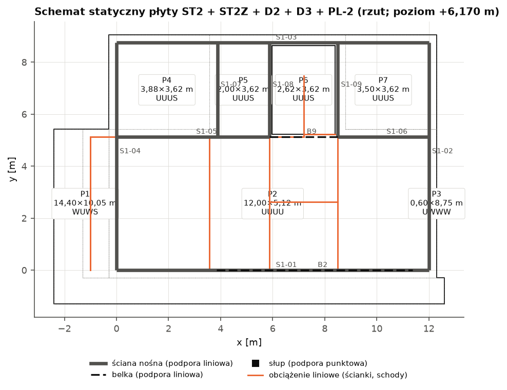
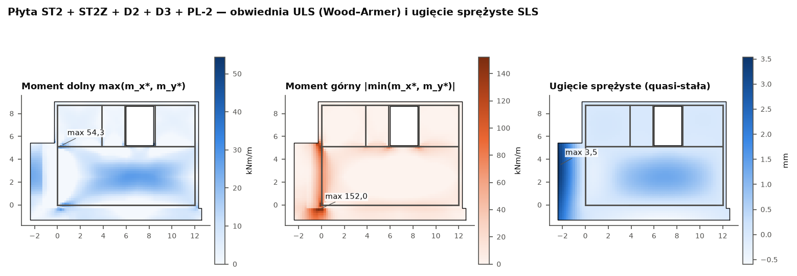
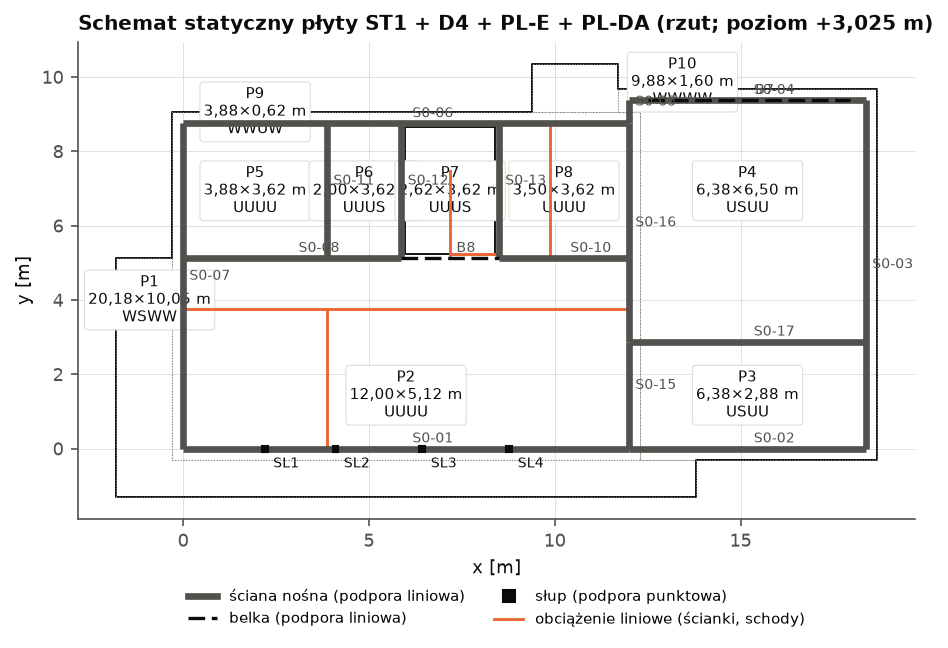
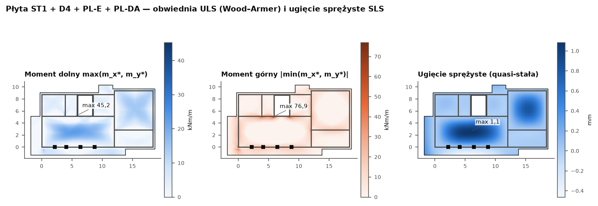

# Obliczenia statyczne — Dom LAMELA

Model: `budynek.yaml` (wersja 1.0, 2026-09-25) · biblioteka `lamela.obliczenia.konstrukcja` 1.0 · wygenerowano 2026-09-25

> **PROJEKT TECHNICZNY — obliczenia do rysunków PT-BO**

> Obliczenia wygenerowane automatycznie z modelu budynku. Wartości oznaczone [NZW] — niezweryfikowane w tekście normy (rejestr R5), [UPR] — uproszczenia biblioteki, [ZAŁ] — założenia. Dane gruntowe PRZYKŁADOWE (W-282, E-04). Dokument wymaga weryfikacji i podpisu projektanta z uprawnieniami: [DO UZUPEŁNIENIA: imię i nazwisko, specjalność, nr uprawnień].

## Spis pozycji

| Poz. | Element | Opis | η_max | Warunki |
|---|---|---|---|---|
| **1** |  | **Dachy i stropodachy** |  |  |
| 1.1 | `D1` | Stropodach / dach D1 | 223% | **niespełnione** |
| 1.2 | `D2` | Stropodach / dach D2 | 607% | **niespełnione** |
| 1.3 | `D3` | Stropodach / dach D3 | 600% | **niespełnione** |
| 1.4 | `D4` | Stropodach / dach D4 | 222% | **niespełnione** |
| **2** |  | **Stropy** |  |  |
| 2.1 | `ST2` | Strop ST2 | 667% | **niespełnione** |
| 2.2 | `ST2Z` | Strop ST2Z | 667% | **niespełnione** |
| 2.3 | `ST1` | Strop ST1 | 568% | **niespełnione** |
| **3** |  | **Płyty wspornikowe** |  |  |
| 3.1 | `PL-3` | Płyta wspornikowa PL-3 | 99% | spełnione |
| 3.2 | `PL-2` | Płyta wspornikowa PL-2 | 490% | **niespełnione** |
| 3.3 | `PL-E` | Płyta wspornikowa PL-E | 239% | **niespełnione** |
| 3.4 | `PL-DA` | Płyta wspornikowa PL-DA | 421% | **niespełnione** |
| **4** |  | **Schody** |  |  |
| 4.1 | `SCH1` | Schody SCH1 (P0 → P1) | 98% | spełnione |
| 4.2 | `SCH2` | Schody SCH2 (P1 → P2) | 98% | spełnione |
| **5** |  | **Belki i podciągi** |  |  |
| 5.1 | `B6` | Belka B6 | 83% | spełnione |
| 5.2 | `N6` | Belka N6 | 73% | spełnione |
| 5.3 | `N7` | Belka N7 | 51% | spełnione |
| 5.4 | `B2` | Belka B2 | 93% | spełnione |
| 5.5 | `B9` | Belka B9 | 100% | spełnione |
| 5.6 | `B7` | Belka B7 | 99% | spełnione |
| 5.7 | `B8` | Belka B8 | 93% | spełnione |
| **6** |  | **Nadproża** |  |  |
| 6.1 | `N-O0-01` | Nadproże N-O0-01 nad otworem O0-01 w ścianie S0-01 (światło 1,90 m) | 79% | spełnione |
| 6.2 | `N-O0-02` | Nadproże N-O0-02 nad otworem O0-02 w ścianie S0-01 (światło 1,90 m) | 270% | **niespełnione** |
| 6.3 | `N-O0-03` | Nadproże N-O0-03 nad otworem O0-03 w ścianie S0-01 (światło 2,34 m) | 97% | spełnione |
| 6.4 | `N-O0-04` | Nadproże N-O0-04 nad otworem O0-04 w ścianie S0-01 (światło 2,34 m) | 99% | spełnione |
| 6.5 | `N-O0-05` | Nadproże N-O0-05 nad otworem O0-05 w ścianie S0-01 (światło 2,92 m) | 276% | **niespełnione** |
| 6.6 | `N-O0-06` | Nadproże N-O0-06 nad otworem O0-06 w ścianie S0-02 (światło 0,90 m) | 33% | spełnione |
| 6.7 | `N-O0-07` | Nadproże N-O0-07 nad otworem O0-07 w ścianie S0-04 (światło 5,00 m) | 232% | **niespełnione** |
| 6.8 | `N-O0-08` | Nadproże N-O0-08 nad otworem O0-08 w ścianie S0-03 (światło 1,00 m) | 33% | spełnione |
| 6.9 | `N-O0-09` | Nadproże N-O0-09 nad otworem O0-09 w ścianie S0-06 (światło 1,10 m) | 69% | spełnione |
| 6.10 | `N-O0-10` | Nadproże N-O0-10 nad otworem O0-10 w ścianie S0-06 (światło 0,35 m) | 33% | spełnione |
| 6.11 | `N-O0-11` | Nadproże N-O0-11 nad otworem O0-11 w ścianie S0-07 (światło 2,40 m) | 217% | **niespełnione** |
| 6.12 | `N-O0-12` | Nadproże N-O0-12 nad otworem O0-12 w ścianie S0-07 (światło 1,80 m) | 77% | spełnione |
| 6.13 | `N-O0-13` | Nadproże N-O0-13 nad otworem O0-13 w ścianie S0-06 (światło 0,80 m) | 33% | spełnione |
| 6.14 | `N-O0-14` | Nadproże N-O0-14 nad otworem O0-14 w ścianie S0-08 (światło 0,90 m) | 94% | spełnione |
| 6.15 | `N-O0-15` | Nadproże N-O0-15 nad otworem O0-15 w ścianie S0-11 (światło 0,90 m) | 50% | spełnione |
| 6.16 | `N-O0-18` | Nadproże N-O0-18 nad otworem O0-18 w ścianie S0-10 (światło 1,50 m) | 124% | **niespełnione** |
| 6.17 | `N-O0-21` | Nadproże N-O0-21 nad otworem O0-21 w ścianie S0-15 (światło 0,90 m) | 95% | spełnione |
| 6.18 | `N-O0-22` | Nadproże N-O0-22 nad otworem O0-22 w ścianie S0-17 (światło 0,90 m) | 42% | spełnione |
| 6.19 | `N-O1-01` | Nadproże N-O1-01 nad otworem O1-01 w ścianie S1-01 (światło 7,02 m) | 1060% | **niespełnione** |
| 6.20 | `N-O1-02` | Nadproże N-O1-02 nad otworem O1-02 w ścianie S1-02 (światło 1,50 m) | 96% | spełnione |
| 6.21 | `N-O1-03` | Nadproże N-O1-03 nad otworem O1-03 w ścianie S1-03 (światło 0,90 m) | 33% | spełnione |
| 6.22 | `N-O1-04` | Nadproże N-O1-04 nad otworem O1-04 w ścianie S1-03 (światło 1,20 m) | 33% | spełnione |
| 6.23 | `N-O1-05` | Nadproże N-O1-05 nad otworem O1-05 w ścianie S1-04 (światło 1,80 m) | 80% | spełnione |
| 6.24 | `N-O1-06` | Nadproże N-O1-06 nad otworem O1-06 w ścianie S1-04 (światło 1,80 m) | 95% | spełnione |
| 6.25 | `N-O1-09` | Nadproże N-O1-09 nad otworem O1-09 w ścianie S1-05 (światło 0,90 m) | 90% | spełnione |
| 6.26 | `N-O1-10` | Nadproże N-O1-10 nad otworem O1-10 w ścianie S1-05 (światło 0,90 m) | 96% | spełnione |
| 6.27 | `N-O1-11` | Nadproże N-O1-11 nad otworem O1-11 w ścianie S1-06 (światło 0,90 m) | 95% | spełnione |
| 6.28 | `N-O1-12` | Nadproże N-O1-12 nad otworem O1-12 w ścianie S1-06 (światło 0,90 m) | 97% | spełnione |
| 6.29 | `N-O2-01` | Nadproże N-O2-01 nad otworem O2-01 w ścianie S2-01 (światło 3,00 m) | 77% | spełnione |
| 6.30 | `N-O2-02` | Nadproże N-O2-02 nad otworem O2-02 w ścianie S2-01 (światło 1,20 m) | 56% | spełnione |
| 6.31 | `N-O2-03` | Nadproże N-O2-03 nad otworem O2-03 w ścianie S2-01 (światło 2,40 m) | 79% | spełnione |
| 6.32 | `N-O2-04` | Nadproże N-O2-04 nad otworem O2-04 w ścianie S2-08 (światło 2,40 m) | 87% | spełnione |
| 6.33 | `N-O2-05` | Nadproże N-O2-05 nad otworem O2-05 w ścianie S2-02 (światło 1,20 m) | 56% | spełnione |
| 6.34 | `N-O2-06` | Nadproże N-O2-06 nad otworem O2-06 w ścianie S2-05 (światło 0,90 m) | 33% | spełnione |
| 6.35 | `N-O2-07` | Nadproże N-O2-07 nad otworem O2-07 w ścianie S2-05 (światło 1,70 m) | 33% | spełnione |
| 6.36 | `N-O2-10` | Nadproże N-O2-10 nad otworem O2-10 w ścianie S2-09 (światło 0,90 m) | 87% | spełnione |
| **7** |  | **Wieńce** |  |  |
| 7.1 | `W-D1_PL-3` | Wieńce pod płytą D1 + PL-3 (poziom 9,350 m) | 31% | spełnione |
| 7.2 | `W-ST2_ST2Z_D2_D3_PL-2` | Wieńce pod płytą ST2 + ST2Z + D2 + D3 + PL-2 (poziom 6,170 m) | 31% | spełnione |
| 7.3 | `W-ST1_D4_PL-E_PL-DA` | Wieńce pod płytą ST1 + D4 + PL-E + PL-DA (poziom 3,025 m) | 31% | spełnione |
| **8** |  | **Słupy** |  |  |
| 8.1 | `SL1` | Słup SL1 (RK 120x120x8, L = 2,93 m) | 1% | spełnione |
| 8.2 | `SL2` | Słup SL2 (RK 120x120x8, L = 2,93 m) | 1% | spełnione |
| 8.3 | `SL3` | Słup SL3 (RK 120x120x8, L = 2,93 m) | 1% | spełnione |
| 8.4 | `SL4` | Słup SL4 (RK 120x120x8, L = 2,93 m) | 1% | spełnione |
| 8.5 | `SL5` | Słup SL5 (RK 100x100x6, L = 1,50 m) | 16% | spełnione |
| 8.6 | `SL6` | Słup SL6 (RK 100x100x6, L = 1,50 m) | 15% | spełnione |
| 8.7 | `SL7` | Słup SL7 (150x1000, L = 1,50 m) | 0% | spełnione |
| 8.8 | `SL8` | Słup SL8 (150x1000, L = 1,50 m) | 0% | spełnione |
| **9** |  | **Ściany murowe** |  |  |
| 9.1 | `S2-01` | Ściana S2-01 (P2, zewnętrzna nośna) | 60% | spełnione |
| 9.2 | `S2-02` | Ściana S2-02 (P2, zewnętrzna nośna) | 62% | spełnione |
| 9.3 | `S2-03` | Ściana S2-03 (P2, zewnętrzna nośna) | 45% | spełnione |
| 9.4 | `S2-04` | Ściana S2-04 (P2, zewnętrzna nośna) | 45% | spełnione |
| 9.5 | `S2-05` | Ściana S2-05 (P2, zewnętrzna nośna) | 60% | spełnione |
| 9.6 | `S2-06` | Ściana S2-06 (P2, zewnętrzna nośna) | 45% | spełnione |
| 9.7 | `S2-07` | Ściana S2-07 (P2, zewnętrzna nośna) | 45% | spełnione |
| 9.8 | `S2-08` | Ściana S2-08 (P2, zewnętrzna nośna) | 0% | spełnione |
| 9.9 | `S2-09` | Ściana S2-09 (P2, wewnętrzna nośna) | 77% | spełnione |
| 9.10 | `S2-10` | Ściana S2-10 (P2, wewnętrzna nośna) | 45% | spełnione |
| 9.11 | `S1-01` | Ściana S1-01 (P1, zewnętrzna nośna) | 63% | spełnione |
| 9.12 | `S1-02` | Ściana S1-02 (P1, zewnętrzna nośna) | 45% | spełnione |
| 9.13 | `S1-03` | Ściana S1-03 (P1, zewnętrzna nośna) | 45% | spełnione |
| 9.14 | `S1-04` | Ściana S1-04 (P1, zewnętrzna nośna) | 132% | **niespełnione** |
| 9.15 | `S1-05` | Ściana S1-05 (P1, wewnętrzna nośna) | 68% | spełnione |
| 9.16 | `S1-06` | Ściana S1-06 (P1, wewnętrzna nośna) | 367% | **niespełnione** |
| 9.17 | `S1-07` | Ściana S1-07 (P1, wewnętrzna nośna) | 45% | spełnione |
| 9.18 | `S1-08` | Ściana S1-08 (P1, wewnętrzna nośna) | 195% | **niespełnione** |
| 9.19 | `S1-09` | Ściana S1-09 (P1, wewnętrzna nośna) | 166% | **niespełnione** |
| 9.20 | `S0-01` | Ściana S0-01 (P0, zewnętrzna nośna) | 240% | **niespełnione** |
| 9.21 | `S0-06` | Ściana S0-06 (P0, zewnętrzna nośna) | 60% | spełnione |
| 9.22 | `S0-07` | Ściana S0-07 (P0, zewnętrzna nośna) | 134% | **niespełnione** |
| 9.23 | `S0-08` | Ściana S0-08 (P0, wewnętrzna nośna) | 146% | **niespełnione** |
| 9.24 | `S0-10` | Ściana S0-10 (P0, wewnętrzna nośna) | 386% | **niespełnione** |
| 9.25 | `S0-11` | Ściana S0-11 (P0, wewnętrzna nośna) | 60% | spełnione |
| 9.26 | `S0-12` | Ściana S0-12 (P0, wewnętrzna nośna) | 0% | spełnione |
| 9.27 | `S0-13` | Ściana S0-13 (P0, wewnętrzna nośna) | 0% | spełnione |
| 9.28 | `S0-15` | Ściana S0-15 (P0, wewnętrzna nośna) | 63% | spełnione |
| 9.29 | `S0-16` | Ściana S0-16 (P0, wewnętrzna nośna) | 45% | spełnione |
| 9.30 | `S0-02` | Ściana S0-02 (P0, zewnętrzna nośna) | 45% | spełnione |
| 9.31 | `S0-03` | Ściana S0-03 (P0, zewnętrzna nośna) | 73% | spełnione |
| 9.32 | `S0-04` | Ściana S0-04 (P0, zewnętrzna nośna) | 60% | spełnione |
| 9.33 | `S0-17` | Ściana S0-17 (P0, wewnętrzna nośna) | 45% | spełnione |
| **10** |  | **Fundamenty** |  |  |
| 10.1 | `PF1` | Płyta fundamentowa PF1 | 9% | spełnione |
| 10.2 | `ZF1` | Ława fundamentowa ZF1 (B = 0,60 m, h = 0,30 m, L = 12,00 m) | 254% | **niespełnione** |
| 10.3 | `ZF2` | Ława fundamentowa ZF2 (B = 0,60 m, h = 0,30 m, L = 6,38 m) | 254% | **niespełnione** |
| 10.4 | `ZF3` | Ława fundamentowa ZF3 (B = 0,60 m, h = 0,30 m, L = 9,38 m) | 198% | **niespełnione** |
| 10.5 | `ZF4` | Ława fundamentowa ZF4 (B = 0,60 m, h = 0,30 m, L = 6,38 m) | 185% | **niespełnione** |
| 10.6 | `ZF5` | Ława fundamentowa ZF5 (B = 0,60 m, h = 0,30 m, L = 0,62 m) | 91% | spełnione |
| 10.7 | `ZF6` | Ława fundamentowa ZF6 (B = 0,60 m, h = 0,30 m, L = 12,00 m) | 254% | **niespełnione** |
| 10.8 | `ZF7` | Ława fundamentowa ZF7 (B = 0,60 m, h = 0,30 m, L = 8,75 m) | 331% | **niespełnione** |
| 10.9 | `ZF8` | Ława fundamentowa ZF8 (B = 0,50 m, h = 0,25 m, L = 5,88 m) | 278% | **niespełnione** |
| 10.10 | `ZF9` | Ława fundamentowa ZF9 (B = 0,50 m, h = 0,25 m, L = 3,50 m) | 222% | **niespełnione** |
| 10.11 | `ZF10` | Ława fundamentowa ZF10 (B = 0,50 m, h = 0,25 m, L = 3,62 m) | 100% | spełnione |
| 10.12 | `ZF11` | Ława fundamentowa ZF11 (B = 0,50 m, h = 0,25 m, L = 3,62 m) | 318% | **niespełnione** |
| 10.13 | `ZF12` | Ława fundamentowa ZF12 (B = 0,50 m, h = 0,25 m, L = 3,62 m) | 281% | **niespełnione** |
| 10.14 | `ZF13` | Ława fundamentowa ZF13 (B = 0,50 m, h = 0,25 m, L = 2,88 m) | 100% | spełnione |
| 10.15 | `ZF14` | Ława fundamentowa ZF14 (B = 0,50 m, h = 0,25 m, L = 5,88 m) | 130% | **niespełnione** |
| 10.16 | `ZF15` | Ława fundamentowa ZF15 (B = 0,50 m, h = 0,25 m, L = 6,38 m) | 100% | spełnione |
| 10.17 | `SF1` | Stopa fundamentowa SF1 (1,00 × 1,01 × 0,45 m) pod słupem SL1 | 185% | **niespełnione** |
| 10.18 | `SF2` | Stopa fundamentowa SF2 (1,00 × 1,01 × 0,45 m) pod słupem SL2 | 185% | **niespełnione** |
| 10.19 | `SF3` | Stopa fundamentowa SF3 (1,00 × 1,01 × 0,45 m) pod słupem SL3 | 186% | **niespełnione** |
| 10.20 | `SF4` | Stopa fundamentowa SF4 (1,00 × 1,01 × 0,45 m) pod słupem SL4 | 185% | **niespełnione** |

## Poz. 0 — Podstawa opracowania, założenia i obciążenia ogólne

### 0.1 Normy i przepisy

- PN-EN 1990:2004 + A1:2008 + NA:2010 — Podstawy projektowania konstrukcji
- PN-EN 1991-1-1:2004 + AC:2009 + NA:2010 — Ciężar objętościowy, ciężar własny, obciążenia użytkowe
- PN-EN 1991-1-3:2005 + AC:2009 + Ap1:2010 + NA:2010 — Obciążenie śniegiem
- PN-EN 1991-1-4:2008 + A1:2010 + AC:2009 + NA:2010 — Oddziaływania wiatru
- PN-EN 1992-1-1:2008 + AC:2011 + NA:2018-11 — Konstrukcje z betonu
- PN-EN 1993-1-1:2006 + A1:2014-07 + NA:2010; PN-EN 1993-1-8:2006 + NA:2011 — Konstrukcje stalowe
- PN-EN 1996-1-1+A1:2013-05 + NA:2014-03 (+Ap2:2014-09); PN-EN 1996-3 — Konstrukcje murowe
- PN-EN 1997-1:2008 + A1:2014-05 + Ap2:2010 + NA:2011 — Projektowanie geotechniczne
- PN-H-93220:2018-02 + Ap1:2018-04 — Stal B500SP; PN-EN ISO 3766 — rysunki zbrojenia
- Rozp. MTBiGM z 25.04.2012 (Dz.U. 2012 poz. 463) — geotechniczne warunki posadawiania

Stosowane wyłącznie Eurokody 1. generacji z NA (R5-01…R5-03, W-260).

### 0.2 Klasyfikacja i współczynniki

Stal zbrojeniowa B500SP (klasa C): f_yk = 500 MPa, f_yd = 434,8 MPa; γ_c = 1,4, γ_s = 1,15 (NA). Mur: Silikat gr. 1, kat. I, kl. 20, zaprawa do cienkich spoin: f_k = 7,66 MPa, γ_M = 1,7, f_d = 4,50 MPa. Stal konstrukcyjna S355: γ_M0 = γ_M1 = 1,0, γ_M2 = 1,25. Klasa konsekwencji CC2/RC2, K_FI = 1,0; okres użytkowania 50 lat (S4).

Kombinacje (PN-EN 1990 + NA): STR/GEO — mniej korzystne z 6.10a: Σ1,35·G_k + 1,5·ψ₀·Q_k i 6.10b: Σ0,85·1,35·G_k + 1,5·Q_k,1 + 1,5·Σψ₀·Q_k,i; EQU: 1,10·G_dst + 1,5·Q_dst ≤ 0,90·G_stb; wyjątkowa 6.11b: G + A_d + ψ₁·Q₁ + ψ₂·Q_i; SLS: charakterystyczna G + Q₁ + ψ₀Q_i, quasi-stała G + ψ₂Q. Obciążenia użytkowe dachu (kat. H) nie są łączone ze śniegiem.

| Parametr | Wartość | Parametr | Wartość |
|---|---|---|---|
| γ_G,sup / γ_G,inf / ξ | 1,35 / 1,00 / 0,85 | γ_Q | 1,50 |
| EQU: γ_G,dst / γ_G,stb / γ_Q | 1,10 / 0,90 / 1,50 | K_FI | 1,0 |
| γ_c / γ_s | 1,4 / 1,15 | α_cc | 1,0 [NZW] |
| γ_M (mur, kl. A) | 1,7 | γ_M0 / γ_M1 / γ_M2 | 1,0 / 1,0 / 1,25 |
| γ_R;v / γ_R;h (DA2*) | 1,4 / 1,1 | kategoria geotechniczna | 2 |
| s_k [kN/m²] (strefa 2) | 0,90 | v_b,0 [m/s] (strefa 1), teren | 22, kat. II |
| φ(∞,t₀) / ε_cs | 2,5 / 0,40‰ [ZAŁ] | grunt | Piasek średni (Ps), średnio zagęszczony, I_D ≈ 0,6 [DANE PRZYKŁADOWE] |

### 0.3 Materiały, klasy ekspozycji i otulenia

**Obciążenia użytkowe (R5 3.3, W-263)**

| Powierzchnia | q_k [kN/m²] | Q_k [kN] | ψ₀/ψ₁/ψ₂ | Podstawa |
|---|---|---|---|---|
| stropy mieszkalne (kat. A) | 2,00 | 3,0 | 0,7/0,5/0,3 | PN-EN 1991-1-1 tabl. 6.2 + NA; R5 3.3 [NZW NA — górna granica EN] |
| schody (kat. A) | 4,00 | 4,0 | 0,7/0,5/0,3 | PN-EN 1991-1-1 tabl. 6.2 |
| taras/balkon (kat. A, I) | 4,00 | 3,0 | 0,7/0,5/0,3 | PN-EN 1991-1-1 tabl. 6.2, 6.9 (p. 6.3.4.1); R5 3.3 |
| dach bez dostępu (kat. H) | 0,40 | 1,0 | 0,0/0,0/0,0 | PN-EN 1991-1-1 tabl. 6.10 + NA; nie łączyć ze śniegiem i wiatrem (p. 3.3.2) |

**Beton, klasy ekspozycji i otulenia (PN-EN 1992-1-1 4.4.1, R5 3.6, W-266)**

| Element | Ekspozycja | Beton (min.) | c_min,dur [mm] | c_nom [mm] (φ12) | w_max [mm] |
|---|---|---|---|---|---|
| stropy, wieńce, belki wewnętrzne | XC1 | C25/30 | 15 | 25 | 0,4 |
| płyty stropodachów | XC1 | C25/30 | 15 | 25 | 0,4 |
| płyty wysunięte na zewnątrz (taras, okapy) | XC4 | C30/37 | 30 | 40 | 0,3 |
| ławy, stopy, płyta fund. | XC2 | C25/30 | 25 | 40 | 0,3 |

**Długości zakotwienia i zakładów prętów B500SP w betonie C25/30** (PN-EN 1992-1-1 8.4, 8.7; σ_sd = f_yd, α = 1,0)

| Pręt | l_bd dobre [mm] | l_bd inne [mm] | l₀ (50%) dobre [mm] | l₀ (50%) inne [mm] |
|---|---|---|---|---|
| φ8 | 301 | 429 | 425 | 607 |
| φ10 | 376 | 537 | 531 | 759 |
| φ12 | 451 | 644 | 638 | 911 |
| φ16 | 601 | 859 | 850 | 1215 |
| φ20 | 751 | 1074 | 1063 | 1518 |

### 0.4 Obciążenia ogólne — śnieg i wiatr

#### Śnieg — dach płaski (przypadek A, trwała sytuacja obliczeniowa)

- Strefa 2, wartość charakterystyczna: s_k = **0,90** kN/m² *(PN-EN 1991-1-3 NA rys. NA.1; R5-30)*
- Współczynnik kształtu dachu: μ₁ = (α = 0,0° ≤ 30°) = **0,80** *(tabl. 5.2)*
- Obciążenie śniegiem: s = μ₁·C_e·C_t·s_k = 0,80·1,00·1,00·0,90 = **0,720** kN/m² *((5.7))*

#### Wiatr — szczytowe ciśnienie prędkości (teren kat. II, z = 10,08 m)

- Bazowa prędkość wiatru (strefa 1, A ≤ 300 m): v_b = c_dir·c_season·v_b,0 = 1,00·1,00·22,0 = **22,00** m/s *((4.1); NA tabl. NA.1)*
- Ciśnienie prędkości bazowej: q_b = ½·ρ·v_b² = 0,5·1,25·22,0² = **0,3025** kN/m² *((4.10))*
- Współczynnik ekspozycji: c_e(z) = 2,3·(z/10)^0,24 = 2,3·(10,08/10)^0,24 = **2,304** *(NA tabl. NA.3 (z_min = 2 m))*
- Szczytowe ciśnienie prędkości: q_p(z) = c_e(z)·q_b = 2,304·0,3025 = **0,697** kN/m² *((4.8))*

#### Wiatr — ściany (b = 21,07 m, d = 11,65 m, h = 10,08 m)

- Parametr stref: e = min(b; 2h) = min(21,07; 2·10,08) = **20,15** m *(rys. 7.5)*
- Smukłość: h/d = 10,08/11,65 = **0,865** *(tabl. 7.1 (interpolacja liniowa))*
- Parcie netto (strefa D, c_pi = −0,3): w = q_p·(c_pe,D − c_pi) = 0,697·(0,78 + 0,3) = **0,754** kN/m² *((5.1), (5.2); p. 7.2.9(6) uwaga 2)*
- Ssanie netto (strefa A, c_pi = +0,2): w = q_p·(c_pe,A − c_pi) = 0,697·(−1,20 − 0,2) = **−0,976** kN/m²

> Wartości tabl. 7.1 — [NZW] (R5-45: odczytać z normy przed PT).

#### Wiatr — ściany (b = 11,65 m, d = 21,07 m, h = 10,08 m) — kierunek prostopadły

- Parametr stref: e = min(b; 2h) = min(11,65; 2·10,08) = **11,65** m *(rys. 7.5)*
- Smukłość: h/d = 10,08/21,07 = **0,478** *(tabl. 7.1 (interpolacja liniowa))*
- Parcie netto (strefa D, c_pi = −0,3): w = q_p·(c_pe,D − c_pi) = 0,697·(0,73 + 0,3) = **0,718** kN/m² *((5.1), (5.2); p. 7.2.9(6) uwaga 2)*
- Ssanie netto (strefa A, c_pi = +0,2): w = q_p·(c_pe,A − c_pi) = 0,697·(−1,20 − 0,2) = **−0,976** kN/m²

> Wartości tabl. 7.1 — [NZW] (R5-45: odczytać z normy przed PT).

#### Wiatr — dach płaski (h_p/h = 0,054)

- Parametr stref: e = min(b; 2h) = min(21,07; 2·10,08) = **20,15** m *(rys. 7.6)*
- Attyka: h_p/h = 0,55/10,08 = **0,054** *(tabl. 7.2 (interpolacja))*
- Ssanie netto w strefie F (c_pi = +0,2): w = q_p·(c_pe,10,F − c_pi) = 0,697·(−1,38 − 0,2) = **−1,104** kN/m²
- Ssanie netto w strefie H: w = q_p·(c_pe,10,H − c_pi) = 0,697·(−0,70 − 0,2) = **−0,627** kN/m²

> Wartości tabl. 7.2 — [NZW] (R5-45). Dach żelbetowy: ssanie nie decyduje (ciężar własny ≫ ssanie); istotne dla balastu PV i obróbek attyk.

### 0.5 Metody obliczeń

- Płyty: MES płytowy (element prostokątny ACM, teoria Kirchhoffa, ν = 0,2), podpory liniowe sztywne (ściany, belki), punktowe (słupy); obwiednia kombinacji 6.10a/6.10b, obciążeń szachownicowych pól i sytuacji wyjątkowej B2; momenty wymiarujące Wood–Armer; pola prostokątne podparte na obwodzie — sprawdzenie metodą tablic (współczynniki generowane MRS, zgodne z tablicami Timoshenki/Czernego ≤ 1 %), M_Ed = max(MES, tablice).
- Belki, schody, nadproża: schematy prętowe (MES belkowy), obwiednie układów obciążenia zmiennego.
- Ściany murowe: profile obciążeń wzdłuż osi (reakcje płyt z MES + ściany wyżej), przekazanie obciążeń znad otworów na filarki (po 0,5 m z każdej strony), nośność wg PN-EN 1996-1-1 6.1.2 + zał. G, filarki z η_A.
- Fundamenty: nośność wg PN-EN 1997-1 zał. D (DA2*), osiadanie — sumowanie warstw (Boussinesq), ławy niezbrojone poprzecznie wg PN-EN 1992-1-1 12.9.3; obciążenie ław — maks. średnia krocząca na 2,0 m.
- Ugięcia żelbetu: l/d (7.4.2), a gdy niespełnione — obliczenie z interpolacją ζ, pełzaniem φ = 2,5 i skurczem (7.4.3).
- Ściany-tarcze żelbetowe (pole `tarcza` w modelu lub ściana żelbetowa bez ciągłej podpory poniżej): MES płaskiego stanu naprężenia (element QM6, podpory sprężyste k = E·t/h ścian poniżej), obciążenia — reakcje płyt nad tarczą (krawędź górna) i płyty podwieszonej poza ścianami poniżej (krawędź dolna), ściany wyżej, belki; model kratownicowy STM generowany z pola naprężeń (programowanie liniowe, 5.6.4, 6.5), cięgna F = max(STM; całkowanie σ), węzły CCC/CCT/CTT, siatki 9.6/9.7, otwory, rysy, ugięcia MES ze sztywnością zarysowaną, EQU wspornika; reakcje → ściany poniżej (moduł `tarcze`, walidacja: tarcze_walidacja).

## Poz. 1 — Dachy i stropodachy

### Poz. 1.1 — Stropodach / dach D1

Element modelu: `D1` · maks. wykorzystanie nośności η = 223% · **WARUNKI NIESPEŁNIONE — patrz tabele warunków i wnioski**

#### Opis i schemat statyczny

Płyta żelbetowa monolityczna gr. h = 22 cm, wierzch konstrukcji 9,300 m, beton C25/30 (ekspozycja XC1), stal B500SP. Pole płyty 93,79 m². Analiza wspólna z: D1 + PL-3 (płyty połączone na jednym poziomie — ciągłość nad podporami/łącznikami). Schemat: płyta na podporach liniowych (ściany, belki — podpory sztywne, przegubowe) i punktowych (słupy); statyka — MES płytowy (elementy ACM, siatka 20 cm, obwiednia kombinacji 6.10a/6.10b i obciążeń szachownicowych pól), sprawdzenie pól prostokątnych metodą tablic (współczynniki MRS).

Podpory: S2-01 (ściana), S2-02 (ściana), S2-03 (ściana), S2-04 (ściana), S2-05 (ściana), S2-06 (ściana), S2-07 (ściana), S2-08 (ściana), S2-09 (ściana), S2-10 (ściana), B6 (belka), N6 (belka), N7 (belka)

*Rys. Rozkłady obciążenia śniegiem w zaspach (PN-EN 1991-1-3 p. 5.3.6, 6.2, zał. B).*

*Rys. Schemat statyczny płyty D1 + PL-3: pola (P — wymiary, warunki brzegowe x=0/x=l_x/y=0/y=l_y: S — podparcie swobodne, U — ciągłość/utwierdzenie, W — brzeg swobodny/niepełny), podpory.*

*Rys. Płyta D1 + PL-3: momenty wymiarujące (obwiednia kombinacji 6.10a/b, obciążeń szachownicowych i sytuacji wyjątkowej) oraz ugięcie sprężyste od kombinacji quasi-stałej (bez zarysowania i pełzania — te w obliczeniach 7.4.3).*

#### Zestawienie obciążeń

**Obciążenia stałe — D1 — Stropodach bryły A (P2): membrana TPO, PIR spadkowy 12–32 cm (śr. 22), paroizolacja z Al, płyta ŻB 22 cm, tynk; spadek ≥ 2 % do wpustów WP1/WP2 (U ≈ 0,10)**

| Warstwa | Obliczenie | g_k [kN/m²] | γ_G (6.10a) | g_d [kN/m²] | ξγ_G (6.10b) | g_d [kN/m²] |
|---|---|---|---|---|---|---|
| Membrana dachowa TPO 1,5 mm, mocowana mechanicznie (hydroizolacja stropodachów) | 0,2 cm × 9,81 kN/m³ | 0,020 | 1,35 | 0,026 | 1,15 | 0,023 |
| Płyty PIR z okładziną (izolacja spadkowa stropodachów) | 22,0 cm × 0,31 kN/m³ | 0,069 | 1,35 | 0,093 | 1,15 | 0,079 |
| Paroizolacja bitumiczna z wkładką Al (na płycie stropodachów) | 0,4 cm × 10,79 kN/m³ | 0,043 | 1,35 | 0,058 | 1,15 | 0,050 |
| Żelbet C25/30, B500SP (stropy, płyta fundamentowa, ściany) | 22,0 cm × 25,00 kN/m³ | 5,500 | 1,35 | 7,425 | 1,15 | 6,311 |
| Tynk gipsowy maszynowy 1,5 cm | 1,0 cm × 11,77 kN/m³ | 0,118 | 1,35 | 0,159 | 1,15 | 0,135 |
| **Razem g_k** |  | 5,750 |  | 7,762 |  | 6,598 |

- Obciążenie użytkowe: dach bez dostępu (kat. H): q_k = 0,40 kN/m², Q_k = 1,0 kN, ψ₀/ψ₁/ψ₂ = 0,0/0,0/0,0 (PN-EN 1991-1-1 tabl. 6.10 + NA; nie łączyć ze śniegiem i wiatrem (p. 3.3.2)).
- Śnieg: s = 0,720 kN/m² (przypadek równomierny) oraz zaspy (poniżej).

#### Obliczenia

##### Śnieg — zaspa przy attyce h = 0,25 m (trwała sytuacja obliczeniowa) — D1

- Współczynnik kształtu przy przeszkodzie: μ₂ = γ·h/s_k = 2,00·0,25/0,90 = **0,556** *((6.1))*
- Przyjęto (0,8 ≤ μ₂ ≤ 2,0): μ₂ = **0,800** *(p. 6.2(2))*
- Długość zaspy: l_s = 2h (5 ≤ l_s ≤ 15 m) = 2·0,25 = **5,00** m *((6.2))*
- Obciążenie przy attyce: s₂ = μ₂·C_e·C_t·s_k = 0,800·1,00·1,00·0,90 = **0,720** kN/m²

##### Sprawdzenie metodą tablic — pole P2 (13,00 × 5,12 m, brzegi UUUU)

- Obciążenia obliczeniowe (miarodajne z 6.10a/6.10b): g_d; q_d = g_k = 5,750, q_k = 0,720 kN/m² = **7,762; 0,756** kN/m²
- Współczynniki (brzegi UUUU; x=0, x=l_x, y=0, y=l_y; S — podparta, U — utwierdzona): α_x; α_y; β_x; β_y = **0,0023; 0,0065; −0,0088; −0,0130** *(MRS (odpowiednik tablic Czernego), ν = 0,2)*
- Współczynniki płyty swobodnie podpartej (SSSS): α_x⁰; α_y⁰ = **0,0057; 0,0175**
- Moment przęsłowy x: M_x = [α_x·(g_d + q_d/2) + α_x⁰·q_d/2]·l_x² = [0,0023·8,140 + 0,0057·0,378]·13,00² = **3,53** kNm/m
- Moment przęsłowy y: M_y = [α_y·(g_d + q_d/2) + α_y⁰·q_d/2]·l_x² = [0,0065·8,140 + 0,0175·0,378]·13,00² = **10,06** kNm/m
- Momenty podporowe (utwierdzenie, g_d + q_d): M_x,p; M_y,p = **−12,71; −18,77** kNm/m
- Porównanie z MES (M_x; M_y dół, poza narożami): M_MES/M_tabl = **2,16; 1,55**
- Przyjęto do wymiarowania: M_Ed = max(M_MES; M_tabl) = **7,61; 15,57** kNm/m

##### Pole P2 — zginanie dół, kierunek x

- Wysokość użyteczna: d = **190** mm
- Moment względny: μ = M_Ed/(b·d²·η·f_cd) = 7,61·10⁶/(1000·190²·1,0·17,86) = **0,0118** *(3.1.7(3))*
- Względna wysokość strefy ściskanej: ξ_eff = 1 − √(1 − 2μ) = 1 − √(1 − 2·0,0118) = **0,0119**
- Warunek ciągliwości: ξ_eff ≤ ξ_eff,lim = λ·ε_cu3/(ε_cu3 + f_yd/E_s) = 0,012 ≤ 0,493 = **spełniony**
- Wymagane zbrojenie rozciągane: A_s1 = ξ_eff·b·d·η·f_cd/f_yd = 0,0119·1000·190·1,0·17,86/434,8 = **93** mm²
- Zbrojenie minimalne: A_s,min = max(0,26·f_ctm/f_yk·b·d; 0,0013·b·d) = max(0,26·2,6/500·1000·190; 0,0013·1000·190) = **257** mm² *((9.1N) + NA)*
- Przyjęto (z warunkiem rys): φ8 co 19 cm = **2,65** cm²/m
- Naprężenie w stali (quasi-stała, przekrój zarysowany, α_e = 15): σ_s = α_e·M_qp·(d − x_II)/I_II = **106** MPa
- Maksymalna średnica (w_max = 0,4 mm): φ_s = φ*_s·(f_ct,eff/2,9)·k_c·h_cr/(2(h − d)) = 40,0·(2,6/2,9)·0,4·110/(2·30) = **26,3** mm *(tabl. 7.2N, (7.6N))*
- Maksymalny rozstaw prętów: s_max = (σ_s = 106 MPa) = **300** mm *(tabl. 7.3N)*

| Warunek | Efekt | Nośność / limit | η | Stan | Podstawa |
|---|---|---|---|---|---|
| Zbrojenie na zginanie | A_s,req = 257 mm²/m | A_s,prov = 265 mm²/m | 97% | spełniony | 6.1, (9.1N) |
| Rysy: średnica prętów (tabl. 7.2N) | φ = 8 mm | φ_s,max = 26 mm | 30% | spełniony | 7.3.3(2) |

##### Pole P2 — zginanie dół, kierunek y

- Wysokość użyteczna: d = **180** mm
- Moment względny: μ = M_Ed/(b·d²·η·f_cd) = 15,57·10⁶/(1000·180²·1,0·17,86) = **0,0269** *(3.1.7(3))*
- Względna wysokość strefy ściskanej: ξ_eff = 1 − √(1 − 2μ) = 1 − √(1 − 2·0,0269) = **0,0273**
- Warunek ciągliwości: ξ_eff ≤ ξ_eff,lim = λ·ε_cu3/(ε_cu3 + f_yd/E_s) = 0,027 ≤ 0,493 = **spełniony**
- Wymagane zbrojenie rozciągane: A_s1 = ξ_eff·b·d·η·f_cd/f_yd = 0,0273·1000·180·1,0·17,86/434,8 = **202** mm²
- Zbrojenie minimalne: A_s,min = max(0,26·f_ctm/f_yk·b·d; 0,0013·b·d) = max(0,26·2,6/500·1000·180; 0,0013·1000·180) = **243** mm² *((9.1N) + NA)*
- Przyjęto (z warunkiem rys): φ8 co 20 cm = **2,51** cm²/m
- Naprężenie w stali (quasi-stała, przekrój zarysowany, α_e = 15): σ_s = α_e·M_qp·(d − x_II)/I_II = **236** MPa
- Maksymalna średnica (w_max = 0,4 mm): φ_s = φ*_s·(f_ct,eff/2,9)·k_c·h_cr/(2(h − d)) = 21,1·(2,6/2,9)·0,4·110/(2·40) = **10,4** mm *(tabl. 7.2N, (7.6N))*
- Maksymalny rozstaw prętów: s_max = (σ_s = 236 MPa) = **255** mm *(tabl. 7.3N)*

| Warunek | Efekt | Nośność / limit | η | Stan | Podstawa |
|---|---|---|---|---|---|
| Zbrojenie na zginanie | A_s,req = 243 mm²/m | A_s,prov = 251 mm²/m | 97% | spełniony | 6.1, (9.1N) |
| Rysy: średnica prętów (tabl. 7.2N) | φ = 8 mm | φ_s,max = 10 mm | 77% | spełniony | 7.3.3(2) |

##### Pole P2 — zginanie góra, x

- Wysokość użyteczna: d = **190** mm
- Moment względny: μ = M_Ed/(b·d²·η·f_cd) = 14,00·10⁶/(1000·190²·1,0·17,86) = **0,0217** *(3.1.7(3))*
- Względna wysokość strefy ściskanej: ξ_eff = 1 − √(1 − 2μ) = 1 − √(1 − 2·0,0217) = **0,0220**
- Warunek ciągliwości: ξ_eff ≤ ξ_eff,lim = λ·ε_cu3/(ε_cu3 + f_yd/E_s) = 0,022 ≤ 0,493 = **spełniony**
- Wymagane zbrojenie rozciągane: A_s1 = ξ_eff·b·d·η·f_cd/f_yd = 0,0220·1000·190·1,0·17,86/434,8 = **171** mm²
- Zbrojenie minimalne: A_s,min = max(0,26·f_ctm/f_yk·b·d; 0,0013·b·d) = max(0,26·2,6/500·1000·190; 0,0013·1000·190) = **257** mm² *((9.1N) + NA)*
- Przyjęto (z warunkiem rys): φ8 co 19 cm = **2,65** cm²/m
- Naprężenie w stali (quasi-stała, przekrój zarysowany, α_e = 15): σ_s = α_e·M_qp·(d − x_II)/I_II = **204** MPa
- Maksymalna średnica (w_max = 0,4 mm): φ_s = φ*_s·(f_ct,eff/2,9)·k_c·h_cr/(2(h − d)) = 30,9·(2,6/2,9)·0,4·110/(2·30) = **20,3** mm *(tabl. 7.2N, (7.6N))*
- Maksymalny rozstaw prętów: s_max = (σ_s = 204 MPa) = **295** mm *(tabl. 7.3N)*

| Warunek | Efekt | Nośność / limit | η | Stan | Podstawa |
|---|---|---|---|---|---|
| Zbrojenie na zginanie | A_s,req = 257 mm²/m | A_s,prov = 265 mm²/m | 97% | spełniony | 6.1, (9.1N) |
| Rysy: średnica prętów (tabl. 7.2N) | φ = 8 mm | φ_s,max = 20 mm | 39% | spełniony | 7.3.3(2) |

##### Pole P2 — zginanie góra, y

- Wysokość użyteczna: d = **180** mm
- Moment względny: μ = M_Ed/(b·d²·η·f_cd) = 30,20·10⁶/(1000·180²·1,0·17,86) = **0,0522** *(3.1.7(3))*
- Względna wysokość strefy ściskanej: ξ_eff = 1 − √(1 − 2μ) = 1 − √(1 − 2·0,0522) = **0,0536**
- Warunek ciągliwości: ξ_eff ≤ ξ_eff,lim = λ·ε_cu3/(ε_cu3 + f_yd/E_s) = 0,054 ≤ 0,493 = **spełniony**
- Wymagane zbrojenie rozciągane: A_s1 = ξ_eff·b·d·η·f_cd/f_yd = 0,0536·1000·180·1,0·17,86/434,8 = **397** mm²
- Zbrojenie minimalne: A_s,min = max(0,26·f_ctm/f_yk·b·d; 0,0013·b·d) = max(0,26·2,6/500·1000·180; 0,0013·1000·180) = **243** mm² *((9.1N) + NA)*
- Przyjęto (z warunkiem rys): φ8 co 12 cm = **4,19** cm²/m
- Naprężenie w stali (quasi-stała, przekrój zarysowany, α_e = 15): σ_s = α_e·M_qp·(d − x_II)/I_II = **290** MPa
- Maksymalna średnica (w_max = 0,4 mm): φ_s = φ*_s·(f_ct,eff/2,9)·k_c·h_cr/(2(h − d)) = 15,0·(2,6/2,9)·0,4·110/(2·40) = **7,4** mm *(tabl. 7.2N, (7.6N))*
- Maksymalny rozstaw prętów: s_max = (σ_s = 290 MPa) = **188** mm *(tabl. 7.3N)*

| Warunek | Efekt | Nośność / limit | η | Stan | Podstawa |
|---|---|---|---|---|---|
| Zbrojenie na zginanie | A_s,req = 397 mm²/m | A_s,prov = 419 mm²/m | 95% | spełniony | 6.1, (9.1N) |
| Rysy: rozstaw prętów (tabl. 7.3N) | s = 120 mm | s_max = 188 mm | 64% | spełniony | 7.3.3(2) |

##### Pole P2 — zbrojenie narożne (góra i dół, strefy 1,03 × 1,03 m)

- Wysokość użyteczna: d = **180** mm
- Moment względny: μ = M_Ed/(b·d²·η·f_cd) = 25,89·10⁶/(1000·180²·1,0·17,86) = **0,0448** *(3.1.7(3))*
- Względna wysokość strefy ściskanej: ξ_eff = 1 − √(1 − 2μ) = 1 − √(1 − 2·0,0448) = **0,0458**
- Warunek ciągliwości: ξ_eff ≤ ξ_eff,lim = λ·ε_cu3/(ε_cu3 + f_yd/E_s) = 0,046 ≤ 0,493 = **spełniony**
- Wymagane zbrojenie rozciągane: A_s1 = ξ_eff·b·d·η·f_cd/f_yd = 0,0458·1000·180·1,0·17,86/434,8 = **339** mm²
- Zbrojenie minimalne: A_s,min = max(0,26·f_ctm/f_yk·b·d; 0,0013·b·d) = max(0,26·2,6/500·1000·180; 0,0013·1000·180) = **243** mm² *((9.1N) + NA)*
- Przyjęto: φ10 co 23 cm = **3,41** cm²/m

| Warunek | Efekt | Nośność / limit | η | Stan | Podstawa |
|---|---|---|---|---|---|
| Zbrojenie na zginanie | A_s,req = 339 mm²/m | A_s,prov = 341 mm²/m | 99% | spełniony | 6.1, (9.1N) |

##### Pole P2 — ścinanie (maks. reakcja podpory, [UPR] 0,6·r przy podporze pośredniej)

- Współczynnik skali: k = 1 + √(200/d) ≤ 2,0 = 1 + √(200/190) = **2,000**
- Stopień zbrojenia podłużnego: ρ_l = A_sl/(b_w·d) ≤ 0,02 = 265/(1000·190) = **0,00139**
- Nośność na ścinanie: V_Rd,c = C_Rd,c·k·(100·ρ_l·f_ck)^(1/3)·b_w·d = 0,1286·2,000·(100·0,00139·25)^(1/3)·1000·190·10⁻³ = **74,04** kN *((6.2.a); C_Rd,c = 0,18/γ_c)*
- Wartość minimalna: V_Rd,c,min = v_min·b_w·d, v_min = 0,035·k^(3/2)·f_ck^(1/2) = 0,4950·1000·190·10⁻³ = **94,05** kN *((6.2.b), (6.3N))*

| Warunek | Efekt | Nośność / limit | η | Stan | Podstawa |
|---|---|---|---|---|---|
| Ścinanie bez zbrojenia poprzecznego (6.2.2) | V_Ed = 209,63 kN | V_Rd,c = 94,05 kN | 223% | **NIESPEŁNIONY** | PN-EN 1992-1-1 6.2.2 |

##### Pole P2 — ugięcie (l = 5,12 m, K = 1,5)

- Stopień zbrojenia wymagany: ρ = A_s,req/(b·d) = 202/(1000·180) = **0,00112**
- Wartość odniesienia: ρ₀ = √f_ck·10⁻³ = √25·10⁻³ = **0,00500**
- Graniczne l/d (ρ ≤ ρ₀): K·[11 + 1,5·√f_ck·ρ₀/ρ + 3,2·√f_ck·(ρ₀/ρ − 1)^(3/2)] = 1,5·[11 + 1,5·5,000·4,463 + 3,2·5,000·(4,463 − 1)^1,5] = **221,4** *((7.16a))*
- Mnożnik od naprężeń w stali: 310/σ_s ≈ 500/(f_yk·A_s,req/A_s,prov) ≤ 1,5 = 500/(500·202/251) = **1,246** *((7.17))*
- Smukłość rzeczywista: l_eff/d = 5,12/0,180 = **28,5**
- *Obliczenie ugięcia (7.4.3)*
- Efektywny moduł sprężystości: E_c,eff = E_cm/(1 + φ) = 31000/(1 + 2,5) = **8857** MPa *((7.20))*
- Stosunek modułów: α_e = E_s/E_c,eff = 200000/8857 = **22,58**
- Przekrój niezarysowany: x_I; I_I = **111,8 mm; 914,4·10⁶ mm⁴**
- Przekrój zarysowany: x_II; I_II = **39,9 mm; 132,6·10⁶ mm⁴**
- Moment rysujący: M_cr = f_ctm·I_I/(h − x_I) = 2,6·914,4·10⁶/(220 − 111,8) = **21,97** kNm
- Współczynnik rozkładu: ζ = 1 − β·(M_cr/M_qp)², β = 0,5 = M_qp ≤ M_cr → 0 = **0,000** *((7.19))*
- Ugięcie od obciążeń (quasi-stała): w_q = ζ·w_II + (1 − ζ)·w_I = 0,000·12,77 + 1,000·1,85 = **1,85** mm *((7.18))*
- Ugięcie od skurczu: w_cs = k·(1/r_cs)·l², 1/r_cs = ε_cs·α_e·S/I = 0,125·0,169·10⁻⁶·5125² = **0,56** mm *((7.21))*
- Ugięcie całkowite: w = w_q + w_cs = 1,85 + 0,56 = **2,41** mm
- Ugięcie dopuszczalne: w_lim = L/250 = 5125/250 = **20,5** mm *(7.4.1(4))*

| Warunek | Efekt | Nośność / limit | η | Stan | Podstawa |
|---|---|---|---|---|---|
| Ugięcie — graniczna smukłość l/d (7.4.2) | l/d = 28,5  | (l/d)_lim = 275,9  | 10% | spełniony | (7.16), tabl. 7.4N |

> l/d spełnione — obliczenie (7.4.3) informacyjnie: w = 2,4 mm ≤? 20,5 mm.

#### Wymiarowanie — zestawienia

**Zestawienie wymiarowania pól płyty** (M [kNm/m] — obwiednia ULS, Wood–Armer, poza strefami narożnymi; „tabl.” — metoda tablic, jeżeli stosowalna; góra — nad podporami; naroża — strefy 0,2·l_min × 0,2·l_min przy narożach podpartych, zbrojenie górą i dołem na moment skręcający)

| Pole | l_x × l_y [m] | Brzegi | M_x,dół [kNm/m] MES / tabl. | Zbroj. x dół | M_y,dół MES / tabl. | Zbroj. y dół | M_x,góra | Zbroj. x góra | M_y,góra | Zbroj. y góra | Naroża M / zbroj. | w / w_lim [mm] | η_max |
|---|---|---|---|---|---|---|---|---|---|---|---|---|---|
| P1 | 14,40 × 6,42 | WUWU | 1,50 / — | φ8 co 19 cm | 1,04 / — | φ8 co 20 cm | −31,21 | φ10 co 20 cm | −27,36 | φ8 co 14 cm | — | 1,1 / 25,7 | 125% ✗ |
| P2 | 13,00 × 5,12 | UUUU | 7,61 / 3,53 | φ8 co 19 cm | 15,57 / 10,06 | φ8 co 20 cm | −14,00 | φ8 co 19 cm | −30,20 | φ8 co 12 cm | 25,89 / φ10 co 23 cm | 2,4 / 20,5 | 223% ✗ |
| P3 | 0,60 × 5,12 | UWWW | 6,79 / — | φ8 co 19 cm | 4,08 / — | φ8 co 20 cm | −7,47 | φ8 co 19 cm | −12,24 | φ8 co 20 cm | — | 0,1 / 2,4 | 131% ✗ |
| P4 | 4,88 × 3,62 | WUUW | 4,75 / — | φ8 co 19 cm | 4,96 / — | φ8 co 20 cm | −17,95 | φ8 co 19 cm | −12,35 | φ8 co 20 cm | 27,21 / φ10 co 22 cm | 0,3 / 14,5 | 223% ✗ |
| P5 | 2,00 × 3,62 | UUUS | 7,36 / 1,47 | φ8 co 19 cm | 2,64 / 0,63 | φ8 co 20 cm | −6,05 | φ8 co 19 cm | −17,92 | φ8 co 19 cm | 21,93 / φ8 co 17 cm | 0,1 / 8,0 | 223% ✗ |
| P6 | 2,62 × 3,62 | UUWS | 10,58 / — | φ8 co 19 cm | 5,21 / — | φ8 co 20 cm | −13,39 | φ8 co 19 cm | −25,42 | φ8 co 15 cm | 1,09 / φ8 co 20 cm | 0,3 / 10,5 | 184% ✗ |
| P7 | 3,50 × 3,62 | UWUW | 9,81 / — | φ8 co 19 cm | 6,01 / — | φ8 co 20 cm | −7,35 | φ8 co 19 cm | −8,66 | φ8 co 20 cm | 28,73 / φ8 co 13 cm | 0,3 / 14,0 | 184% ✗ |

**Reakcje podporowe (charakterystyczne, cała grupa płyt)**

| Podpora | Długość [m] | ΣR_G [kN] | ΣR_Q [kN] | max r_G [kN/m] | max r_Q [kN/m] |
|---|---|---|---|---|---|
| S2-01 | 13,00 | 200,2 | 50,9 | 262,27 | 245,54 |
| S2-02 | 5,12 | 49,8 | −4,5 | 63,47 | 206,34 |
| S2-03 | 3,50 | 97,2 | −8,6 | 761,45 | 28,31 |
| S2-04 | 3,62 | −31,7 | 5,1 | 761,45 | 46,42 |
| S2-05 | 4,62 | 18,5 | 0,0 | 10,29 | 0,46 |
| S2-06 | 3,62 | −84,7 | 11,1 | 290,27 | 64,06 |
| S2-07 | 4,88 | 85,7 | −26,5 | 290,27 | 84,62 |
| S2-08 | 5,12 | 76,9 | 29,4 | 291,41 | 272,82 |
| S2-09 | 3,32 | 218,4 | −17,0 | 460,54 | 3,74 |
| S2-10 | 3,62 | −50,2 | 8,1 | 316,30 | 47,75 |
| B6 | 5,12 | 76,9 | 29,4 | 291,41 | 272,82 |
| N6 | 3,40 | 36,6 | 4,2 | 23,83 | 4,22 |
| N7 | 2,80 | 31,8 | 6,5 | 21,24 | 11,51 |

#### Wnioski

**Przyjęto:** Płyta gr. 22 cm z betonu C25/30, stal B500SP, otulenie c_nom = 25 mm; zbrojenie wg zestawienia pól (dołem siatka w obu kierunkach, górą nad podporami).  
**Przyjęto:** Maks. ugięcie długotrwałe ≈ 2,4 mm.  

### Poz. 1.2 — Stropodach / dach D2

Element modelu: `D2` · maks. wykorzystanie nośności η = 607% · **WARUNKI NIESPEŁNIONE — patrz tabele warunków i wnioski**

#### Opis i schemat statyczny

Płyta żelbetowa monolityczna gr. h = 22 cm, wierzch konstrukcji 6,150 m, beton C25/30 (ekspozycja XC1), stal B500SP. Pole płyty 14,05 m². Analiza wspólna z: ST2 + ST2Z + D2 + D3 + PL-2 (płyty połączone na jednym poziomie — ciągłość nad podporami/łącznikami). Schemat: płyta na podporach liniowych (ściany, belki — podpory sztywne, przegubowe) i punktowych (słupy); statyka — MES płytowy (elementy ACM, siatka 20 cm, obwiednia kombinacji 6.10a/6.10b i obciążeń szachownicowych pól), sprawdzenie pól prostokątnych metodą tablic (współczynniki MRS).

Podpory: S1-03 (ściana), S1-04 (ściana)

*Rys. Rozkłady obciążenia śniegiem w zaspach (PN-EN 1991-1-3 p. 5.3.6, 6.2, zał. B).*

*Rys. Schemat statyczny płyty ST2 + ST2Z + D2 + D3 + PL-2: pola (P — wymiary, warunki brzegowe x=0/x=l_x/y=0/y=l_y: S — podparcie swobodne, U — ciągłość/utwierdzenie, W — brzeg swobodny/niepełny), podpory.*

*Rys. Płyta ST2 + ST2Z + D2 + D3 + PL-2: momenty wymiarujące (obwiednia kombinacji 6.10a/b, obciążeń szachownicowych i sytuacji wyjątkowej) oraz ugięcie sprężyste od kombinacji quasi-stałej (bez zarysowania i pełzania — te w obliczeniach 7.4.3).*

#### Zestawienie obciążeń

**Obciążenia stałe — D2 — Stropodach nad P1 (pola pn. poza bryłą A): żwir 5 cm, włóknina, membrana TPO, PIR spadkowy 14–26 cm, paroizolacja, płyta ŻB 22 cm (U ≈ 0,11)**

| Warstwa | Obliczenie | g_k [kN/m²] | γ_G (6.10a) | g_d [kN/m²] | ξγ_G (6.10b) | g_d [kN/m²] |
|---|---|---|---|---|---|---|
| Żwir płukany 16/32 mm (balast dachu P1, opaska przy attyce) | 5,0 cm × 17,00 kN/m³ | 0,850 | 1,35 | 1,148 | 1,15 | 0,975 |
| Włóknina ochronna PP 300 g/m² | 0,4 cm × 1,47 kN/m³ | 0,006 | 1,35 | 0,008 | 1,15 | 0,007 |
| Membrana dachowa TPO 1,5 mm, mocowana mechanicznie (hydroizolacja stropodachów) | 0,2 cm × 9,81 kN/m³ | 0,020 | 1,35 | 0,026 | 1,15 | 0,023 |
| Płyty PIR z okładziną (izolacja spadkowa stropodachów) | 20,0 cm × 0,31 kN/m³ | 0,063 | 1,35 | 0,085 | 1,15 | 0,072 |
| Paroizolacja bitumiczna z wkładką Al (na płycie stropodachów) | 0,4 cm × 10,79 kN/m³ | 0,043 | 1,35 | 0,058 | 1,15 | 0,050 |
| Żelbet C25/30, B500SP (stropy, płyta fundamentowa, ściany) | 22,0 cm × 25,00 kN/m³ | 5,500 | 1,35 | 7,425 | 1,15 | 6,311 |
| Tynk gipsowy maszynowy 1,5 cm | 1,0 cm × 11,77 kN/m³ | 0,118 | 1,35 | 0,159 | 1,15 | 0,135 |
| **Razem g_k** |  | 6,599 |  | 8,909 |  | 7,573 |

- Obciążenie użytkowe: dach bez dostępu (kat. H): q_k = 0,40 kN/m², Q_k = 1,0 kN, ψ₀/ψ₁/ψ₂ = 0,0/0,0/0,0 (PN-EN 1991-1-1 tabl. 6.10 + NA; nie łączyć ze śniegiem i wiatrem (p. 3.3.2)).
- Obciążenie dodatkowe (QA): ścianka działowa S2-16: 1,06 kN/m → zastępcze 0,8 kN/m² (6.3.1.2(8)).
- Obciążenie dodatkowe (QA): ścianka działowa S2-17: 1,06 kN/m → zastępcze 0,8 kN/m² (6.3.1.2(8)).
- Śnieg: s = 0,720 kN/m² (przypadek równomierny) oraz zaspy (poniżej).

#### Obliczenia

##### Śnieg — zaspa przy attyce h = 0,25 m (trwała sytuacja obliczeniowa) — D2

- Współczynnik kształtu przy przeszkodzie: μ₂ = γ·h/s_k = 2,00·0,25/0,90 = **0,556** *((6.1))*
- Przyjęto (0,8 ≤ μ₂ ≤ 2,0): μ₂ = **0,800** *(p. 6.2(2))*
- Długość zaspy: l_s = 2h (5 ≤ l_s ≤ 15 m) = 2·0,25 = **5,00** m *((6.2))*
- Obciążenie przy attyce: s₂ = μ₂·C_e·C_t·s_k = 0,800·1,00·1,00·0,90 = **0,720** kN/m²

##### Śnieg — zaspa przy uskoku h = 3,37 m (trwała sytuacja obliczeniowa) — D2 przy ścianie S2-06

- Współczynnik od zsuwania się śniegu z dachu wyższego: μ_s = α = 0° ≤ 15° = **0,00** *(p. 5.3.6(1))*
- Współczynnik od nawiewania: μ_w = (b₁ + b₂)/(2h) = (4,95 + 3,92)/(2·3,37) = **1,316** *((5.8))*
- Ograniczenie: μ_w ≤ γ·h/s_k = 2,00·3,37/0,90 = **7,480** *((5.8); γ = 2 kN/m³)*
- Przyjęto (zakres 0,8 ≤ μ_w ≤ 4,0): μ_w = **1,316** *(p. 5.3.6(1) uwaga 1 (wartość zalecana) [NZW NA])*
- Współczynnik kształtu przy uskoku: μ₂ = μ_s + μ_w = 0,00 + 1,316 = **1,316**
- Długość zaspy: l_s = 2h (5 ≤ l_s ≤ 15 m) = 2·3,37 = **6,73** m *((5.9))*
- Obciążenie przy uskoku: s₂ = μ₂·C_e·C_t·s_k = 1,316·1,00·1,00·0,90 = **1,184** kN/m²
- Obciążenie poza zaspą (μ₁ = 0,8): s₁ = **0,720** kN/m²

> b₂ = 3,92 m < l_s = 6,73 m — zaspa obcięta na krawędzi dachu niższego (p. 5.3.6(3)).

##### Śnieg — zaspa wyjątkowa B2 przy uskoku h = 3,37 m (zał. B.3) — D2 przy ścianie S2-06

- Długość zaspy: l_s = min(5h; b₁; 15 m) = min(5·3,37; 4,95; 15) = **4,95** m *(zał. B.3 [NZW])*
- Współczynnik kształtu: μ₁ = min{2h/s_k; 2b/l_s; 8} = min{7,48; 2,00; 8} = **2,000** *(zał. B.3 (B.2) [NZW])*
- Obciążenie wyjątkowe: s_Ad = μ₁·s_k = 2,000·0,90 = **1,800** kN/m² *((4.2))*

> Sytuacja wyjątkowa (PN-EN 1990 6.11b): γ = 1,0; [NZW] wzory zał. B wg R5-38 — potwierdzić w normie (N-12).

##### Śnieg — zaspa przy uskoku h = 3,37 m (trwała sytuacja obliczeniowa) — D2 przy ścianie S2-07

- Współczynnik od zsuwania się śniegu z dachu wyższego: μ_s = α = 0° ≤ 15° = **0,00** *(p. 5.3.6(1))*
- Współczynnik od nawiewania: μ_w = (b₁ + b₂)/(2h) = (5,45 + 3,67)/(2·3,37) = **1,353** *((5.8))*
- Ograniczenie: μ_w ≤ γ·h/s_k = 2,00·3,37/0,90 = **7,480** *((5.8); γ = 2 kN/m³)*
- Przyjęto (zakres 0,8 ≤ μ_w ≤ 4,0): μ_w = **1,353** *(p. 5.3.6(1) uwaga 1 (wartość zalecana) [NZW NA])*
- Współczynnik kształtu przy uskoku: μ₂ = μ_s + μ_w = 0,00 + 1,353 = **1,353**
- Długość zaspy: l_s = 2h (5 ≤ l_s ≤ 15 m) = 2·3,37 = **6,73** m *((5.9))*
- Obciążenie przy uskoku: s₂ = μ₂·C_e·C_t·s_k = 1,353·1,00·1,00·0,90 = **1,218** kN/m²
- Obciążenie poza zaspą (μ₁ = 0,8): s₁ = **0,720** kN/m²

> b₂ = 3,67 m < l_s = 6,73 m — zaspa obcięta na krawędzi dachu niższego (p. 5.3.6(3)).

##### Śnieg — zaspa wyjątkowa B2 przy uskoku h = 3,37 m (zał. B.3) — D2 przy ścianie S2-07

- Długość zaspy: l_s = min(5h; b₁; 15 m) = min(5·3,37; 5,45; 15) = **5,45** m *(zał. B.3 [NZW])*
- Współczynnik kształtu: μ₁ = min{2h/s_k; 2b/l_s; 8} = min{7,48; 2,00; 8} = **2,000** *(zał. B.3 (B.2) [NZW])*
- Obciążenie wyjątkowe: s_Ad = μ₁·s_k = 2,000·0,90 = **1,800** kN/m² *((4.2))*

> Sytuacja wyjątkowa (PN-EN 1990 6.11b): γ = 1,0; [NZW] wzory zał. B wg R5-38 — potwierdzić w normie (N-12).

##### Sprawdzenie metodą tablic — pole P4 (3,88 × 3,62 m, brzegi UUUS)

- Obciążenie liniowe ścianek na polu jako równomierne zastępcze [UPR — tylko porównanie]: g_dz = Σ(g_l·l)/A = **7,774** kN/m²
- Obciążenia obliczeniowe (miarodajne z 6.10a/6.10b): g_d; q_d = g_k = 14,373, q_k = 1,105 kN/m² = **19,404; 1,160** kN/m²
- Współczynniki (brzegi UUUS; x=0, x=l_x, y=0, y=l_y; S — podparta, U — utwierdzona): α_x; α_y; β_x; β_y = **0,0242; 0,0229; −0,0569; −0,0537** *(MRS (odpowiednik tablic Czernego), ν = 0,2)*
- Współczynniki płyty swobodnie podpartej (SSSS): α_x⁰; α_y⁰ = **0,0391; 0,0433**
- Moment przęsłowy x: M_x = [α_x·(g_d + q_d/2) + α_x⁰·q_d/2]·l_x² = [0,0242·19,984 + 0,0391·0,580]·3,88² = **7,60** kNm/m
- Moment przęsłowy y: M_y = [α_y·(g_d + q_d/2) + α_y⁰·q_d/2]·l_x² = [0,0229·19,984 + 0,0433·0,580]·3,88² = **7,24** kNm/m
- Momenty podporowe (utwierdzenie, g_d + q_d): M_x,p; M_y,p = **−17,58; −16,59** kNm/m
- Porównanie z MES (M_x; M_y dół, poza narożami): M_MES/M_tabl = **1,14; 1,30**
- Przyjęto do wymiarowania: M_Ed = max(M_MES; M_tabl) = **8,64; 9,38** kNm/m

##### Pole P4 — zginanie dół, kierunek x

- Wysokość użyteczna: d = **190** mm
- Moment względny: μ = M_Ed/(b·d²·η·f_cd) = 8,64·10⁶/(1000·190²·1,0·17,86) = **0,0134** *(3.1.7(3))*
- Względna wysokość strefy ściskanej: ξ_eff = 1 − √(1 − 2μ) = 1 − √(1 − 2·0,0134) = **0,0135**
- Warunek ciągliwości: ξ_eff ≤ ξ_eff,lim = λ·ε_cu3/(ε_cu3 + f_yd/E_s) = 0,013 ≤ 0,493 = **spełniony**
- Wymagane zbrojenie rozciągane: A_s1 = ξ_eff·b·d·η·f_cd/f_yd = 0,0135·1000·190·1,0·17,86/434,8 = **105** mm²
- Zbrojenie minimalne: A_s,min = max(0,26·f_ctm/f_yk·b·d; 0,0013·b·d) = max(0,26·2,6/500·1000·190; 0,0013·1000·190) = **257** mm² *((9.1N) + NA)*
- Przyjęto (z warunkiem rys): φ8 co 19 cm = **2,65** cm²/m
- Naprężenie w stali (quasi-stała, przekrój zarysowany, α_e = 15): σ_s = α_e·M_qp·(d − x_II)/I_II = **115** MPa
- Maksymalna średnica (w_max = 0,4 mm): φ_s = φ*_s·(f_ct,eff/2,9)·k_c·h_cr/(2(h − d)) = 40,0·(2,6/2,9)·0,4·110/(2·30) = **26,3** mm *(tabl. 7.2N, (7.6N))*
- Maksymalny rozstaw prętów: s_max = (σ_s = 115 MPa) = **300** mm *(tabl. 7.3N)*

| Warunek | Efekt | Nośność / limit | η | Stan | Podstawa |
|---|---|---|---|---|---|
| Zbrojenie na zginanie | A_s,req = 257 mm²/m | A_s,prov = 265 mm²/m | 97% | spełniony | 6.1, (9.1N) |
| Rysy: średnica prętów (tabl. 7.2N) | φ = 8 mm | φ_s,max = 26 mm | 30% | spełniony | 7.3.3(2) |

##### Pole P4 — zginanie dół, kierunek y

- Wysokość użyteczna: d = **180** mm
- Moment względny: μ = M_Ed/(b·d²·η·f_cd) = 9,38·10⁶/(1000·180²·1,0·17,86) = **0,0162** *(3.1.7(3))*
- Względna wysokość strefy ściskanej: ξ_eff = 1 − √(1 − 2μ) = 1 − √(1 − 2·0,0162) = **0,0163**
- Warunek ciągliwości: ξ_eff ≤ ξ_eff,lim = λ·ε_cu3/(ε_cu3 + f_yd/E_s) = 0,016 ≤ 0,493 = **spełniony**
- Wymagane zbrojenie rozciągane: A_s1 = ξ_eff·b·d·η·f_cd/f_yd = 0,0163·1000·180·1,0·17,86/434,8 = **121** mm²
- Zbrojenie minimalne: A_s,min = max(0,26·f_ctm/f_yk·b·d; 0,0013·b·d) = max(0,26·2,6/500·1000·180; 0,0013·1000·180) = **243** mm² *((9.1N) + NA)*
- Przyjęto (z warunkiem rys): φ8 co 20 cm = **2,51** cm²/m
- Naprężenie w stali (quasi-stała, przekrój zarysowany, α_e = 15): σ_s = α_e·M_qp·(d − x_II)/I_II = **134** MPa
- Maksymalna średnica (w_max = 0,4 mm): φ_s = φ*_s·(f_ct,eff/2,9)·k_c·h_cr/(2(h − d)) = 40,0·(2,6/2,9)·0,4·110/(2·40) = **19,7** mm *(tabl. 7.2N, (7.6N))*
- Maksymalny rozstaw prętów: s_max = (σ_s = 134 MPa) = **300** mm *(tabl. 7.3N)*

| Warunek | Efekt | Nośność / limit | η | Stan | Podstawa |
|---|---|---|---|---|---|
| Zbrojenie na zginanie | A_s,req = 243 mm²/m | A_s,prov = 251 mm²/m | 97% | spełniony | 6.1, (9.1N) |
| Rysy: średnica prętów (tabl. 7.2N) | φ = 8 mm | φ_s,max = 20 mm | 41% | spełniony | 7.3.3(2) |

##### Pole P4 — zginanie góra, x

- Wysokość użyteczna: d = **190** mm
- Moment względny: μ = M_Ed/(b·d²·η·f_cd) = 19,12·10⁶/(1000·190²·1,0·17,86) = **0,0297** *(3.1.7(3))*
- Względna wysokość strefy ściskanej: ξ_eff = 1 − √(1 − 2μ) = 1 − √(1 − 2·0,0297) = **0,0301**
- Warunek ciągliwości: ξ_eff ≤ ξ_eff,lim = λ·ε_cu3/(ε_cu3 + f_yd/E_s) = 0,030 ≤ 0,493 = **spełniony**
- Wymagane zbrojenie rozciągane: A_s1 = ξ_eff·b·d·η·f_cd/f_yd = 0,0301·1000·190·1,0·17,86/434,8 = **235** mm²
- Zbrojenie minimalne: A_s,min = max(0,26·f_ctm/f_yk·b·d; 0,0013·b·d) = max(0,26·2,6/500·1000·190; 0,0013·1000·190) = **257** mm² *((9.1N) + NA)*
- Przyjęto (z warunkiem rys): φ8 co 19 cm = **2,65** cm²/m
- Naprężenie w stali (quasi-stała, przekrój zarysowany, α_e = 15): σ_s = α_e·M_qp·(d − x_II)/I_II = **256** MPa
- Maksymalna średnica (w_max = 0,4 mm): φ_s = φ*_s·(f_ct,eff/2,9)·k_c·h_cr/(2(h − d)) = 18,4·(2,6/2,9)·0,4·110/(2·30) = **12,1** mm *(tabl. 7.2N, (7.6N))*
- Maksymalny rozstaw prętów: s_max = (σ_s = 256 MPa) = **229** mm *(tabl. 7.3N)*

| Warunek | Efekt | Nośność / limit | η | Stan | Podstawa |
|---|---|---|---|---|---|
| Zbrojenie na zginanie | A_s,req = 257 mm²/m | A_s,prov = 265 mm²/m | 97% | spełniony | 6.1, (9.1N) |
| Rysy: średnica prętów (tabl. 7.2N) | φ = 8 mm | φ_s,max = 12 mm | 66% | spełniony | 7.3.3(2) |

##### Pole P4 — zginanie góra, y

- Wysokość użyteczna: d = **180** mm
- Moment względny: μ = M_Ed/(b·d²·η·f_cd) = 16,59·10⁶/(1000·180²·1,0·17,86) = **0,0287** *(3.1.7(3))*
- Względna wysokość strefy ściskanej: ξ_eff = 1 − √(1 − 2μ) = 1 − √(1 − 2·0,0287) = **0,0291**
- Warunek ciągliwości: ξ_eff ≤ ξ_eff,lim = λ·ε_cu3/(ε_cu3 + f_yd/E_s) = 0,029 ≤ 0,493 = **spełniony**
- Wymagane zbrojenie rozciągane: A_s1 = ξ_eff·b·d·η·f_cd/f_yd = 0,0291·1000·180·1,0·17,86/434,8 = **215** mm²
- Zbrojenie minimalne: A_s,min = max(0,26·f_ctm/f_yk·b·d; 0,0013·b·d) = max(0,26·2,6/500·1000·180; 0,0013·1000·180) = **243** mm² *((9.1N) + NA)*
- Przyjęto (z warunkiem rys): φ8 co 20 cm = **2,51** cm²/m
- Naprężenie w stali (quasi-stała, przekrój zarysowany, α_e = 15): σ_s = α_e·M_qp·(d − x_II)/I_II = **118** MPa
- Maksymalna średnica (w_max = 0,4 mm): φ_s = φ*_s·(f_ct,eff/2,9)·k_c·h_cr/(2(h − d)) = 40,0·(2,6/2,9)·0,4·110/(2·40) = **19,7** mm *(tabl. 7.2N, (7.6N))*
- Maksymalny rozstaw prętów: s_max = (σ_s = 118 MPa) = **300** mm *(tabl. 7.3N)*

| Warunek | Efekt | Nośność / limit | η | Stan | Podstawa |
|---|---|---|---|---|---|
| Zbrojenie na zginanie | A_s,req = 243 mm²/m | A_s,prov = 251 mm²/m | 97% | spełniony | 6.1, (9.1N) |
| Rysy: średnica prętów (tabl. 7.2N) | φ = 8 mm | φ_s,max = 20 mm | 41% | spełniony | 7.3.3(2) |

##### Pole P4 — zbrojenie narożne (góra i dół, strefy 0,73 × 0,73 m)

- Wysokość użyteczna: d = **180** mm
- Moment względny: μ = M_Ed/(b·d²·η·f_cd) = 37,69·10⁶/(1000·180²·1,0·17,86) = **0,0651** *(3.1.7(3))*
- Względna wysokość strefy ściskanej: ξ_eff = 1 − √(1 − 2μ) = 1 − √(1 − 2·0,0651) = **0,0674**
- Warunek ciągliwości: ξ_eff ≤ ξ_eff,lim = λ·ε_cu3/(ε_cu3 + f_yd/E_s) = 0,067 ≤ 0,493 = **spełniony**
- Wymagane zbrojenie rozciągane: A_s1 = ξ_eff·b·d·η·f_cd/f_yd = 0,0674·1000·180·1,0·17,86/434,8 = **498** mm²
- Zbrojenie minimalne: A_s,min = max(0,26·f_ctm/f_yk·b·d; 0,0013·b·d) = max(0,26·2,6/500·1000·180; 0,0013·1000·180) = **243** mm² *((9.1N) + NA)*
- Przyjęto: φ12 co 22 cm = **5,14** cm²/m

| Warunek | Efekt | Nośność / limit | η | Stan | Podstawa |
|---|---|---|---|---|---|
| Zbrojenie na zginanie | A_s,req = 498 mm²/m | A_s,prov = 514 mm²/m | 97% | spełniony | 6.1, (9.1N) |

##### Pole P4 — ścinanie (maks. reakcja podpory, [UPR] 0,6·r przy podporze pośredniej)

- Współczynnik skali: k = 1 + √(200/d) ≤ 2,0 = 1 + √(200/190) = **2,000**
- Stopień zbrojenia podłużnego: ρ_l = A_sl/(b_w·d) ≤ 0,02 = 265/(1000·190) = **0,00139**
- Nośność na ścinanie: V_Rd,c = C_Rd,c·k·(100·ρ_l·f_ck)^(1/3)·b_w·d = 0,1286·2,000·(100·0,00139·25)^(1/3)·1000·190·10⁻³ = **74,04** kN *((6.2.a); C_Rd,c = 0,18/γ_c)*
- Wartość minimalna: V_Rd,c,min = v_min·b_w·d, v_min = 0,035·k^(3/2)·f_ck^(1/2) = 0,4950·1000·190·10⁻³ = **94,05** kN *((6.2.b), (6.3N))*

| Warunek | Efekt | Nośność / limit | η | Stan | Podstawa |
|---|---|---|---|---|---|
| Ścinanie bez zbrojenia poprzecznego (6.2.2) | V_Ed = 570,67 kN | V_Rd,c = 94,05 kN | 607% | **NIESPEŁNIONY** | PN-EN 1992-1-1 6.2.2 |

##### Pole P4 — ugięcie (l = 3,62 m, K = 1,3)

- Stopień zbrojenia wymagany: ρ = A_s,req/(b·d) = 121/(1000·180) = **0,00067**
- Wartość odniesienia: ρ₀ = √f_ck·10⁻³ = √25·10⁻³ = **0,00500**
- Graniczne l/d (ρ ≤ ρ₀): K·[11 + 1,5·√f_ck·ρ₀/ρ + 3,2·√f_ck·(ρ₀/ρ − 1)^(3/2)] = 1,3·[11 + 1,5·5,000·7,447 + 3,2·5,000·(7,447 − 1)^1,5] = **427,4** *((7.16a))*
- Mnożnik od naprężeń w stali: 310/σ_s ≈ 500/(f_yk·A_s,req/A_s,prov) ≤ 1,5 = 500/(500·121/251) = **1,500** *((7.17))*
- Smukłość rzeczywista: l_eff/d = 3,62/0,180 = **20,1**
- *Obliczenie ugięcia (7.4.3)*
- Efektywny moduł sprężystości: E_c,eff = E_cm/(1 + φ) = 31000/(1 + 2,5) = **8857** MPa *((7.20))*
- Stosunek modułów: α_e = E_s/E_c,eff = 200000/8857 = **22,58**
- Przekrój niezarysowany: x_I; I_I = **111,8 mm; 914,4·10⁶ mm⁴**
- Przekrój zarysowany: x_II; I_II = **39,9 mm; 132,6·10⁶ mm⁴**
- Moment rysujący: M_cr = f_ctm·I_I/(h − x_I) = 2,6·914,4·10⁶/(220 − 111,8) = **21,97** kNm
- Współczynnik rozkładu: ζ = 1 − β·(M_cr/M_qp)², β = 0,5 = M_qp ≤ M_cr → 0 = **0,000** *((7.19))*
- Ugięcie od obciążeń (quasi-stała): w_q = ζ·w_II + (1 − ζ)·w_I = 0,000·2,40 + 1,000·0,35 = **0,35** mm *((7.18))*
- Ugięcie od skurczu: w_cs = k·(1/r_cs)·l², 1/r_cs = ε_cs·α_e·S/I = 0,125·0,169·10⁻⁶·3625² = **0,28** mm *((7.21))*
- Ugięcie całkowite: w = w_q + w_cs = 0,35 + 0,28 = **0,63** mm
- Ugięcie dopuszczalne: w_lim = L/250 = 3625/250 = **14,5** mm *(7.4.1(4))*

| Warunek | Efekt | Nośność / limit | η | Stan | Podstawa |
|---|---|---|---|---|---|
| Ugięcie — graniczna smukłość l/d (7.4.2) | l/d = 20,1  | (l/d)_lim = 641,0  | 3% | spełniony | (7.16), tabl. 7.4N |

> l/d spełnione — obliczenie (7.4.3) informacyjnie: w = 0,6 mm ≤? 14,5 mm.

#### Wymiarowanie — zestawienia

**Zestawienie wymiarowania pól płyty** (M [kNm/m] — obwiednia ULS, Wood–Armer, poza strefami narożnymi; „tabl.” — metoda tablic, jeżeli stosowalna; góra — nad podporami; naroża — strefy 0,2·l_min × 0,2·l_min przy narożach podpartych, zbrojenie górą i dołem na moment skręcający)

| Pole | l_x × l_y [m] | Brzegi | M_x,dół [kNm/m] MES / tabl. | Zbroj. x dół | M_y,dół MES / tabl. | Zbroj. y dół | M_x,góra | Zbroj. x góra | M_y,góra | Zbroj. y góra | Naroża M / zbroj. | w / w_lim [mm] | η_max |
|---|---|---|---|---|---|---|---|---|---|---|---|---|---|
| P4 | 3,88 × 3,62 | UUUS | 8,64 / 7,60 | φ8 co 19 cm | 9,38 / 7,24 | φ8 co 20 cm | −19,12 | φ8 co 19 cm | −16,59 | φ8 co 20 cm | 37,69 / φ12 co 22 cm | 0,6 / 14,5 | 607% ✗ |

**Reakcje podporowe (charakterystyczne, cała grupa płyt)**

| Podpora | Długość [m] | ΣR_G [kN] | ΣR_Q [kN] | max r_G [kN/m] | max r_Q [kN/m] |
|---|---|---|---|---|---|
| S1-03 | 12,00 | 62,4 | 8,8 | 19,25 | 9,74 |
| S1-04 | 8,75 | 831,1 | 296,7 | 2040,52 | 951,18 |

#### Wnioski

**Przyjęto:** Płyta gr. 22 cm z betonu C25/30, stal B500SP, otulenie c_nom = 25 mm; zbrojenie wg zestawienia pól (dołem siatka w obu kierunkach, górą nad podporami).  
**Przyjęto:** Maks. ugięcie długotrwałe ≈ 0,6 mm.  

### Poz. 1.3 — Stropodach / dach D3

Element modelu: `D3` · maks. wykorzystanie nośności η = 600% · **WARUNKI NIESPEŁNIONE — patrz tabele warunków i wnioski**

#### Opis i schemat statyczny

Płyta żelbetowa monolityczna gr. h = 22 cm, wierzch konstrukcji 6,150 m, beton C25/30 (ekspozycja XC1), stal B500SP. Pole płyty 12,69 m². Analiza wspólna z: ST2 + ST2Z + D2 + D3 + PL-2 (płyty połączone na jednym poziomie — ciągłość nad podporami/łącznikami). Schemat: płyta na podporach liniowych (ściany, belki — podpory sztywne, przegubowe) i punktowych (słupy); statyka — MES płytowy (elementy ACM, siatka 20 cm, obwiednia kombinacji 6.10a/6.10b i obciążeń szachownicowych pól), sprawdzenie pól prostokątnych metodą tablic (współczynniki MRS).

Podpory: S1-02 (ściana), S1-03 (ściana)

*Rys. Rozkłady obciążenia śniegiem w zaspach (PN-EN 1991-1-3 p. 5.3.6, 6.2, zał. B).*

*Rys. Schemat statyczny płyty ST2 + ST2Z + D2 + D3 + PL-2: pola (P — wymiary, warunki brzegowe x=0/x=l_x/y=0/y=l_y: S — podparcie swobodne, U — ciągłość/utwierdzenie, W — brzeg swobodny/niepełny), podpory.*

*Rys. Płyta ST2 + ST2Z + D2 + D3 + PL-2: momenty wymiarujące (obwiednia kombinacji 6.10a/b, obciążeń szachownicowych i sytuacji wyjątkowej) oraz ugięcie sprężyste od kombinacji quasi-stałej (bez zarysowania i pełzania — te w obliczeniach 7.4.3).*

#### Zestawienie obciążeń

**Obciążenia stałe — D3 — Stropodach nad P1 (pola pn. poza bryłą A): żwir 5 cm, włóknina, membrana TPO, PIR spadkowy 14–26 cm, paroizolacja, płyta ŻB 22 cm (U ≈ 0,11)**

| Warstwa | Obliczenie | g_k [kN/m²] | γ_G (6.10a) | g_d [kN/m²] | ξγ_G (6.10b) | g_d [kN/m²] |
|---|---|---|---|---|---|---|
| Żwir płukany 16/32 mm (balast dachu P1, opaska przy attyce) | 5,0 cm × 17,00 kN/m³ | 0,850 | 1,35 | 1,148 | 1,15 | 0,975 |
| Włóknina ochronna PP 300 g/m² | 0,4 cm × 1,47 kN/m³ | 0,006 | 1,35 | 0,008 | 1,15 | 0,007 |
| Membrana dachowa TPO 1,5 mm, mocowana mechanicznie (hydroizolacja stropodachów) | 0,2 cm × 9,81 kN/m³ | 0,020 | 1,35 | 0,026 | 1,15 | 0,023 |
| Płyty PIR z okładziną (izolacja spadkowa stropodachów) | 20,0 cm × 0,31 kN/m³ | 0,063 | 1,35 | 0,085 | 1,15 | 0,072 |
| Paroizolacja bitumiczna z wkładką Al (na płycie stropodachów) | 0,4 cm × 10,79 kN/m³ | 0,043 | 1,35 | 0,058 | 1,15 | 0,050 |
| Żelbet C25/30, B500SP (stropy, płyta fundamentowa, ściany) | 22,0 cm × 25,00 kN/m³ | 5,500 | 1,35 | 7,425 | 1,15 | 6,311 |
| Tynk gipsowy maszynowy 1,5 cm | 1,0 cm × 11,77 kN/m³ | 0,118 | 1,35 | 0,159 | 1,15 | 0,135 |
| **Razem g_k** |  | 6,599 |  | 8,909 |  | 7,573 |

- Obciążenie użytkowe: dach bez dostępu (kat. H): q_k = 0,40 kN/m², Q_k = 1,0 kN, ψ₀/ψ₁/ψ₂ = 0,0/0,0/0,0 (PN-EN 1991-1-1 tabl. 6.10 + NA; nie łączyć ze śniegiem i wiatrem (p. 3.3.2)).
- Obciążenie dodatkowe (QA): ścianka działowa S2-16: 1,06 kN/m → zastępcze 0,8 kN/m² (6.3.1.2(8)).
- Obciążenie dodatkowe (QA): ścianka działowa S2-17: 1,06 kN/m → zastępcze 0,8 kN/m² (6.3.1.2(8)).
- Śnieg: s = 0,720 kN/m² (przypadek równomierny) oraz zaspy (poniżej).

#### Obliczenia

##### Śnieg — zaspa przy attyce h = 0,25 m (trwała sytuacja obliczeniowa) — D3

- Współczynnik kształtu przy przeszkodzie: μ₂ = γ·h/s_k = 2,00·0,25/0,90 = **0,556** *((6.1))*
- Przyjęto (0,8 ≤ μ₂ ≤ 2,0): μ₂ = **0,800** *(p. 6.2(2))*
- Długość zaspy: l_s = 2h (5 ≤ l_s ≤ 15 m) = 2·0,25 = **5,00** m *((6.2))*
- Obciążenie przy attyce: s₂ = μ₂·C_e·C_t·s_k = 0,800·1,00·1,00·0,90 = **0,720** kN/m²

##### Śnieg — zaspa przy uskoku h = 3,37 m (trwała sytuacja obliczeniowa) — D3 przy ścianie S2-03

- Współczynnik od zsuwania się śniegu z dachu wyższego: μ_s = α = 0° ≤ 15° = **0,00** *(p. 5.3.6(1))*
- Współczynnik od nawiewania: μ_w = (b₁ + b₂)/(2h) = (5,45 + 3,67)/(2·3,37) = **1,353** *((5.8))*
- Ograniczenie: μ_w ≤ γ·h/s_k = 2,00·3,37/0,90 = **7,480** *((5.8); γ = 2 kN/m³)*
- Przyjęto (zakres 0,8 ≤ μ_w ≤ 4,0): μ_w = **1,353** *(p. 5.3.6(1) uwaga 1 (wartość zalecana) [NZW NA])*
- Współczynnik kształtu przy uskoku: μ₂ = μ_s + μ_w = 0,00 + 1,353 = **1,353**
- Długość zaspy: l_s = 2h (5 ≤ l_s ≤ 15 m) = 2·3,37 = **6,73** m *((5.9))*
- Obciążenie przy uskoku: s₂ = μ₂·C_e·C_t·s_k = 1,353·1,00·1,00·0,90 = **1,218** kN/m²
- Obciążenie poza zaspą (μ₁ = 0,8): s₁ = **0,720** kN/m²

> b₂ = 3,67 m < l_s = 6,73 m — zaspa obcięta na krawędzi dachu niższego (p. 5.3.6(3)).

##### Śnieg — zaspa wyjątkowa B2 przy uskoku h = 3,37 m (zał. B.3) — D3 przy ścianie S2-03

- Długość zaspy: l_s = min(5h; b₁; 15 m) = min(5·3,37; 5,45; 15) = **5,45** m *(zał. B.3 [NZW])*
- Współczynnik kształtu: μ₁ = min{2h/s_k; 2b/l_s; 8} = min{7,48; 2,00; 8} = **2,000** *(zał. B.3 (B.2) [NZW])*
- Obciążenie wyjątkowe: s_Ad = μ₁·s_k = 2,000·0,90 = **1,800** kN/m² *((4.2))*

> Sytuacja wyjątkowa (PN-EN 1990 6.11b): γ = 1,0; [NZW] wzory zał. B wg R5-38 — potwierdzić w normie (N-12).

##### Śnieg — zaspa przy uskoku h = 3,37 m (trwała sytuacja obliczeniowa) — D3 przy ścianie S2-04

- Współczynnik od zsuwania się śniegu z dachu wyższego: μ_s = α = 0° ≤ 15° = **0,00** *(p. 5.3.6(1))*
- Współczynnik od nawiewania: μ_w = (b₁ + b₂)/(2h) = (4,95 + 3,54)/(2·3,37) = **1,260** *((5.8))*
- Ograniczenie: μ_w ≤ γ·h/s_k = 2,00·3,37/0,90 = **7,480** *((5.8); γ = 2 kN/m³)*
- Przyjęto (zakres 0,8 ≤ μ_w ≤ 4,0): μ_w = **1,260** *(p. 5.3.6(1) uwaga 1 (wartość zalecana) [NZW NA])*
- Współczynnik kształtu przy uskoku: μ₂ = μ_s + μ_w = 0,00 + 1,260 = **1,260**
- Długość zaspy: l_s = 2h (5 ≤ l_s ≤ 15 m) = 2·3,37 = **6,73** m *((5.9))*
- Obciążenie przy uskoku: s₂ = μ₂·C_e·C_t·s_k = 1,260·1,00·1,00·0,90 = **1,134** kN/m²
- Obciążenie poza zaspą (μ₁ = 0,8): s₁ = **0,720** kN/m²

> b₂ = 3,54 m < l_s = 6,73 m — zaspa obcięta na krawędzi dachu niższego (p. 5.3.6(3)).

##### Śnieg — zaspa wyjątkowa B2 przy uskoku h = 3,37 m (zał. B.3) — D3 przy ścianie S2-04

- Długość zaspy: l_s = min(5h; b₁; 15 m) = min(5·3,37; 4,95; 15) = **4,95** m *(zał. B.3 [NZW])*
- Współczynnik kształtu: μ₁ = min{2h/s_k; 2b/l_s; 8} = min{7,48; 2,00; 8} = **2,000** *(zał. B.3 (B.2) [NZW])*
- Obciążenie wyjątkowe: s_Ad = μ₁·s_k = 2,000·0,90 = **1,800** kN/m² *((4.2))*

> Sytuacja wyjątkowa (PN-EN 1990 6.11b): γ = 1,0; [NZW] wzory zał. B wg R5-38 — potwierdzić w normie (N-12).

##### Sprawdzenie metodą tablic — pole P7 (3,50 × 3,62 m, brzegi UUUS)

- Obciążenia obliczeniowe (miarodajne z 6.10a/6.10b): g_d; q_d = g_k = 6,599, q_k = 1,091 kN/m² = **8,909; 1,146** kN/m²
- Współczynniki (brzegi UUUS; x=0, x=l_x, y=0, y=l_y; S — podparta, U — utwierdzona): α_x; α_y; β_x; β_y = **0,0280; 0,0221; −0,0634; −0,0555** *(MRS (odpowiednik tablic Czernego), ν = 0,2)*
- Współczynniki płyty swobodnie podpartej (SSSS): α_x⁰; α_y⁰ = **0,0470; 0,0445**
- Moment przęsłowy x: M_x = [α_x·(g_d + q_d/2) + α_x⁰·q_d/2]·l_x² = [0,0280·9,482 + 0,0470·0,573]·3,50² = **3,58** kNm/m
- Moment przęsłowy y: M_y = [α_y·(g_d + q_d/2) + α_y⁰·q_d/2]·l_x² = [0,0221·9,482 + 0,0445·0,573]·3,50² = **2,88** kNm/m
- Momenty podporowe (utwierdzenie, g_d + q_d): M_x,p; M_y,p = **−7,81; −6,84** kNm/m
- Porównanie z MES (M_x; M_y dół, poza narożami): M_MES/M_tabl = **0,85; 1,38**
- Przyjęto do wymiarowania: M_Ed = max(M_MES; M_tabl) = **3,58; 3,99** kNm/m

##### Pole P7 — zginanie dół, kierunek x

- Wysokość użyteczna: d = **190** mm
- Moment względny: μ = M_Ed/(b·d²·η·f_cd) = 3,58·10⁶/(1000·190²·1,0·17,86) = **0,0056** *(3.1.7(3))*
- Względna wysokość strefy ściskanej: ξ_eff = 1 − √(1 − 2μ) = 1 − √(1 − 2·0,0056) = **0,0056**
- Warunek ciągliwości: ξ_eff ≤ ξ_eff,lim = λ·ε_cu3/(ε_cu3 + f_yd/E_s) = 0,006 ≤ 0,493 = **spełniony**
- Wymagane zbrojenie rozciągane: A_s1 = ξ_eff·b·d·η·f_cd/f_yd = 0,0056·1000·190·1,0·17,86/434,8 = **43** mm²
- Zbrojenie minimalne: A_s,min = max(0,26·f_ctm/f_yk·b·d; 0,0013·b·d) = max(0,26·2,6/500·1000·190; 0,0013·1000·190) = **257** mm² *((9.1N) + NA)*
- Przyjęto (z warunkiem rys): φ8 co 19 cm = **2,65** cm²/m
- Naprężenie w stali (quasi-stała, przekrój zarysowany, α_e = 15): σ_s = α_e·M_qp·(d − x_II)/I_II = **42** MPa
- Maksymalna średnica (w_max = 0,4 mm): φ_s = φ*_s·(f_ct,eff/2,9)·k_c·h_cr/(2(h − d)) = 40,0·(2,6/2,9)·0,4·110/(2·30) = **26,3** mm *(tabl. 7.2N, (7.6N))*
- Maksymalny rozstaw prętów: s_max = (σ_s = 42 MPa) = **300** mm *(tabl. 7.3N)*

| Warunek | Efekt | Nośność / limit | η | Stan | Podstawa |
|---|---|---|---|---|---|
| Zbrojenie na zginanie | A_s,req = 257 mm²/m | A_s,prov = 265 mm²/m | 97% | spełniony | 6.1, (9.1N) |
| Rysy: średnica prętów (tabl. 7.2N) | φ = 8 mm | φ_s,max = 26 mm | 30% | spełniony | 7.3.3(2) |

##### Pole P7 — zginanie dół, kierunek y

- Wysokość użyteczna: d = **180** mm
- Moment względny: μ = M_Ed/(b·d²·η·f_cd) = 3,99·10⁶/(1000·180²·1,0·17,86) = **0,0069** *(3.1.7(3))*
- Względna wysokość strefy ściskanej: ξ_eff = 1 − √(1 − 2μ) = 1 − √(1 − 2·0,0069) = **0,0069**
- Warunek ciągliwości: ξ_eff ≤ ξ_eff,lim = λ·ε_cu3/(ε_cu3 + f_yd/E_s) = 0,007 ≤ 0,493 = **spełniony**
- Wymagane zbrojenie rozciągane: A_s1 = ξ_eff·b·d·η·f_cd/f_yd = 0,0069·1000·180·1,0·17,86/434,8 = **51** mm²
- Zbrojenie minimalne: A_s,min = max(0,26·f_ctm/f_yk·b·d; 0,0013·b·d) = max(0,26·2,6/500·1000·180; 0,0013·1000·180) = **243** mm² *((9.1N) + NA)*
- Przyjęto (z warunkiem rys): φ8 co 20 cm = **2,51** cm²/m
- Naprężenie w stali (quasi-stała, przekrój zarysowany, α_e = 15): σ_s = α_e·M_qp·(d − x_II)/I_II = **63** MPa
- Maksymalna średnica (w_max = 0,4 mm): φ_s = φ*_s·(f_ct,eff/2,9)·k_c·h_cr/(2(h − d)) = 40,0·(2,6/2,9)·0,4·110/(2·40) = **19,7** mm *(tabl. 7.2N, (7.6N))*
- Maksymalny rozstaw prętów: s_max = (σ_s = 63 MPa) = **300** mm *(tabl. 7.3N)*

| Warunek | Efekt | Nośność / limit | η | Stan | Podstawa |
|---|---|---|---|---|---|
| Zbrojenie na zginanie | A_s,req = 243 mm²/m | A_s,prov = 251 mm²/m | 97% | spełniony | 6.1, (9.1N) |
| Rysy: średnica prętów (tabl. 7.2N) | φ = 8 mm | φ_s,max = 20 mm | 41% | spełniony | 7.3.3(2) |

##### Pole P7 — zginanie góra, x

- Wysokość użyteczna: d = **190** mm
- Moment względny: μ = M_Ed/(b·d²·η·f_cd) = 7,81·10⁶/(1000·190²·1,0·17,86) = **0,0121** *(3.1.7(3))*
- Względna wysokość strefy ściskanej: ξ_eff = 1 − √(1 − 2μ) = 1 − √(1 − 2·0,0121) = **0,0122**
- Warunek ciągliwości: ξ_eff ≤ ξ_eff,lim = λ·ε_cu3/(ε_cu3 + f_yd/E_s) = 0,012 ≤ 0,493 = **spełniony**
- Wymagane zbrojenie rozciągane: A_s1 = ξ_eff·b·d·η·f_cd/f_yd = 0,0122·1000·190·1,0·17,86/434,8 = **95** mm²
- Zbrojenie minimalne: A_s,min = max(0,26·f_ctm/f_yk·b·d; 0,0013·b·d) = max(0,26·2,6/500·1000·190; 0,0013·1000·190) = **257** mm² *((9.1N) + NA)*
- Przyjęto (z warunkiem rys): φ8 co 19 cm = **2,65** cm²/m
- Naprężenie w stali (quasi-stała, przekrój zarysowany, α_e = 15): σ_s = α_e·M_qp·(d − x_II)/I_II = **95** MPa
- Maksymalna średnica (w_max = 0,4 mm): φ_s = φ*_s·(f_ct,eff/2,9)·k_c·h_cr/(2(h − d)) = 40,0·(2,6/2,9)·0,4·110/(2·30) = **26,3** mm *(tabl. 7.2N, (7.6N))*
- Maksymalny rozstaw prętów: s_max = (σ_s = 95 MPa) = **300** mm *(tabl. 7.3N)*

| Warunek | Efekt | Nośność / limit | η | Stan | Podstawa |
|---|---|---|---|---|---|
| Zbrojenie na zginanie | A_s,req = 257 mm²/m | A_s,prov = 265 mm²/m | 97% | spełniony | 6.1, (9.1N) |
| Rysy: średnica prętów (tabl. 7.2N) | φ = 8 mm | φ_s,max = 26 mm | 30% | spełniony | 7.3.3(2) |

##### Pole P7 — zginanie góra, y

- Wysokość użyteczna: d = **180** mm
- Moment względny: μ = M_Ed/(b·d²·η·f_cd) = 14,37·10⁶/(1000·180²·1,0·17,86) = **0,0248** *(3.1.7(3))*
- Względna wysokość strefy ściskanej: ξ_eff = 1 − √(1 − 2μ) = 1 − √(1 − 2·0,0248) = **0,0251**
- Warunek ciągliwości: ξ_eff ≤ ξ_eff,lim = λ·ε_cu3/(ε_cu3 + f_yd/E_s) = 0,025 ≤ 0,493 = **spełniony**
- Wymagane zbrojenie rozciągane: A_s1 = ξ_eff·b·d·η·f_cd/f_yd = 0,0251·1000·180·1,0·17,86/434,8 = **186** mm²
- Zbrojenie minimalne: A_s,min = max(0,26·f_ctm/f_yk·b·d; 0,0013·b·d) = max(0,26·2,6/500·1000·180; 0,0013·1000·180) = **243** mm² *((9.1N) + NA)*
- Przyjęto (z warunkiem rys): φ8 co 20 cm = **2,51** cm²/m
- Naprężenie w stali (quasi-stała, przekrój zarysowany, α_e = 15): σ_s = α_e·M_qp·(d − x_II)/I_II = **220** MPa
- Maksymalna średnica (w_max = 0,4 mm): φ_s = φ*_s·(f_ct,eff/2,9)·k_c·h_cr/(2(h − d)) = 25,9·(2,6/2,9)·0,4·110/(2·40) = **12,8** mm *(tabl. 7.2N, (7.6N))*
- Maksymalny rozstaw prętów: s_max = (σ_s = 220 MPa) = **275** mm *(tabl. 7.3N)*

| Warunek | Efekt | Nośność / limit | η | Stan | Podstawa |
|---|---|---|---|---|---|
| Zbrojenie na zginanie | A_s,req = 243 mm²/m | A_s,prov = 251 mm²/m | 97% | spełniony | 6.1, (9.1N) |
| Rysy: średnica prętów (tabl. 7.2N) | φ = 8 mm | φ_s,max = 13 mm | 63% | spełniony | 7.3.3(2) |

##### Pole P7 — zbrojenie narożne (góra i dół, strefy 0,70 × 0,70 m)

- Wysokość użyteczna: d = **180** mm
- Moment względny: μ = M_Ed/(b·d²·η·f_cd) = 13,09·10⁶/(1000·180²·1,0·17,86) = **0,0226** *(3.1.7(3))*
- Względna wysokość strefy ściskanej: ξ_eff = 1 − √(1 − 2μ) = 1 − √(1 − 2·0,0226) = **0,0229**
- Warunek ciągliwości: ξ_eff ≤ ξ_eff,lim = λ·ε_cu3/(ε_cu3 + f_yd/E_s) = 0,023 ≤ 0,493 = **spełniony**
- Wymagane zbrojenie rozciągane: A_s1 = ξ_eff·b·d·η·f_cd/f_yd = 0,0229·1000·180·1,0·17,86/434,8 = **169** mm²
- Zbrojenie minimalne: A_s,min = max(0,26·f_ctm/f_yk·b·d; 0,0013·b·d) = max(0,26·2,6/500·1000·180; 0,0013·1000·180) = **243** mm² *((9.1N) + NA)*
- Przyjęto: φ8 co 20 cm = **2,51** cm²/m

| Warunek | Efekt | Nośność / limit | η | Stan | Podstawa |
|---|---|---|---|---|---|
| Zbrojenie na zginanie | A_s,req = 243 mm²/m | A_s,prov = 251 mm²/m | 97% | spełniony | 6.1, (9.1N) |

##### Pole P7 — ścinanie (maks. reakcja podpory, [UPR] 0,6·r przy podporze pośredniej)

- Współczynnik skali: k = 1 + √(200/d) ≤ 2,0 = 1 + √(200/190) = **2,000**
- Stopień zbrojenia podłużnego: ρ_l = A_sl/(b_w·d) ≤ 0,02 = 265/(1000·190) = **0,00139**
- Nośność na ścinanie: V_Rd,c = C_Rd,c·k·(100·ρ_l·f_ck)^(1/3)·b_w·d = 0,1286·2,000·(100·0,00139·25)^(1/3)·1000·190·10⁻³ = **74,04** kN *((6.2.a); C_Rd,c = 0,18/γ_c)*
- Wartość minimalna: V_Rd,c,min = v_min·b_w·d, v_min = 0,035·k^(3/2)·f_ck^(1/2) = 0,4950·1000·190·10⁻³ = **94,05** kN *((6.2.b), (6.3N))*

| Warunek | Efekt | Nośność / limit | η | Stan | Podstawa |
|---|---|---|---|---|---|
| Ścinanie bez zbrojenia poprzecznego (6.2.2) | V_Ed = 563,91 kN | V_Rd,c = 94,05 kN | 600% | **NIESPEŁNIONY** | PN-EN 1992-1-1 6.2.2 |

##### Pole P7 — ugięcie (l = 3,50 m, K = 1,5)

- Stopień zbrojenia wymagany: ρ = A_s,req/(b·d) = 43/(1000·190) = **0,00023**
- Wartość odniesienia: ρ₀ = √f_ck·10⁻³ = √25·10⁻³ = **0,00500**
- Graniczne l/d (ρ ≤ ρ₀): K·[11 + 1,5·√f_ck·ρ₀/ρ + 3,2·√f_ck·(ρ₀/ρ − 1)^(3/2)] = 1,5·[11 + 1,5·5,000·21,872 + 3,2·5,000·(21,872 − 1)^1,5] = **2551,2** *((7.16a))*
- Mnożnik od naprężeń w stali: 310/σ_s ≈ 500/(f_yk·A_s,req/A_s,prov) ≤ 1,5 = 500/(500·43/265) = **1,500** *((7.17))*
- Smukłość rzeczywista: l_eff/d = 3,50/0,190 = **18,4**
- *Obliczenie ugięcia (7.4.3)*
- Efektywny moduł sprężystości: E_c,eff = E_cm/(1 + φ) = 31000/(1 + 2,5) = **8857** MPa *((7.20))*
- Stosunek modułów: α_e = E_s/E_c,eff = 200000/8857 = **22,58**
- Przekrój niezarysowany: x_I; I_I = **112,1 mm; 924,6·10⁶ mm⁴**
- Przekrój zarysowany: x_II; I_II = **42,0 mm; 155,5·10⁶ mm⁴**
- Moment rysujący: M_cr = f_ctm·I_I/(h − x_I) = 2,6·924,6·10⁶/(220 − 112,1) = **22,28** kNm
- Współczynnik rozkładu: ζ = 1 − β·(M_cr/M_qp)², β = 0,5 = M_qp ≤ M_cr → 0 = **0,000** *((7.19))*
- Ugięcie od obciążeń (quasi-stała): w_q = ζ·w_II + (1 − ζ)·w_I = 0,000·1,00 + 1,000·0,17 = **0,17** mm *((7.18))*
- Ugięcie od skurczu: w_cs = k·(1/r_cs)·l², 1/r_cs = ε_cs·α_e·S/I = 0,125·0,201·10⁻⁶·3500² = **0,31** mm *((7.21))*
- Ugięcie całkowite: w = w_q + w_cs = 0,17 + 0,31 = **0,48** mm
- Ugięcie dopuszczalne: w_lim = L/250 = 3500/250 = **14,0** mm *(7.4.1(4))*

| Warunek | Efekt | Nośność / limit | η | Stan | Podstawa |
|---|---|---|---|---|---|
| Ugięcie — graniczna smukłość l/d (7.4.2) | l/d = 18,4  | (l/d)_lim = 3826,8  | 0% | spełniony | (7.16), tabl. 7.4N |

> l/d spełnione — obliczenie (7.4.3) informacyjnie: w = 0,5 mm ≤? 14,0 mm.

#### Wymiarowanie — zestawienia

**Zestawienie wymiarowania pól płyty** (M [kNm/m] — obwiednia ULS, Wood–Armer, poza strefami narożnymi; „tabl.” — metoda tablic, jeżeli stosowalna; góra — nad podporami; naroża — strefy 0,2·l_min × 0,2·l_min przy narożach podpartych, zbrojenie górą i dołem na moment skręcający)

| Pole | l_x × l_y [m] | Brzegi | M_x,dół [kNm/m] MES / tabl. | Zbroj. x dół | M_y,dół MES / tabl. | Zbroj. y dół | M_x,góra | Zbroj. x góra | M_y,góra | Zbroj. y góra | Naroża M / zbroj. | w / w_lim [mm] | η_max |
|---|---|---|---|---|---|---|---|---|---|---|---|---|---|
| P7 | 3,50 × 3,62 | UUUS | 3,06 / 3,58 | φ8 co 19 cm | 3,99 / 2,88 | φ8 co 20 cm | −7,81 | φ8 co 19 cm | −14,37 | φ8 co 20 cm | 13,09 / φ8 co 20 cm | 0,5 / 14,0 | 600% ✗ |

**Reakcje podporowe (charakterystyczne, cała grupa płyt)**

| Podpora | Długość [m] | ΣR_G [kN] | ΣR_Q [kN] | max r_G [kN/m] | max r_Q [kN/m] |
|---|---|---|---|---|---|
| S1-02 | 8,75 | 72,7 | 11,6 | 114,55 | 27,04 |
| S1-03 | 12,00 | 62,4 | 8,8 | 19,25 | 9,74 |

#### Wnioski

**Przyjęto:** Płyta gr. 22 cm z betonu C25/30, stal B500SP, otulenie c_nom = 25 mm; zbrojenie wg zestawienia pól (dołem siatka w obu kierunkach, górą nad podporami).  
**Przyjęto:** Maks. ugięcie długotrwałe ≈ 0,5 mm.  

### Poz. 1.4 — Stropodach / dach D4

Element modelu: `D4` · maks. wykorzystanie nośności η = 222% · **WARUNKI NIESPEŁNIONE — patrz tabele warunków i wnioski**

#### Opis i schemat statyczny

Płyta żelbetowa monolityczna gr. h = 24 cm, wierzch konstrukcji 3,000 m, beton C25/30 (ekspozycja XC1), stal B500SP. Pole płyty 63,97 m². Analiza wspólna z: ST1 + D4 + PL-E + PL-DA (płyty połączone na jednym poziomie — ciągłość nad podporami/łącznikami). Schemat: płyta na podporach liniowych (ściany, belki — podpory sztywne, przegubowe) i punktowych (słupy); statyka — MES płytowy (elementy ACM, siatka 20 cm, obwiednia kombinacji 6.10a/6.10b i obciążeń szachownicowych pól), sprawdzenie pól prostokątnych metodą tablic (współczynniki MRS).

Podpory: S0-02 (ściana), S0-03 (ściana), S0-04 (ściana), S0-05 (ściana), S0-17 (ściana), B7 (belka), słupy: 

*Rys. Rozkłady obciążenia śniegiem w zaspach (PN-EN 1991-1-3 p. 5.3.6, 6.2, zał. B).*

*Rys. Schemat statyczny płyty ST1 + D4 + PL-E + PL-DA: pola (P — wymiary, warunki brzegowe x=0/x=l_x/y=0/y=l_y: S — podparcie swobodne, U — ciągłość/utwierdzenie, W — brzeg swobodny/niepełny), podpory.*

*Rys. Płyta ST1 + D4 + PL-E + PL-DA: momenty wymiarujące (obwiednia kombinacji 6.10a/b, obciążeń szachownicowych i sytuacji wyjątkowej) oraz ugięcie sprężyste od kombinacji quasi-stałej (bez zarysowania i pełzania — te w obliczeniach 7.4.3).*

#### Zestawienie obciążeń

**Obciążenia stałe — D4 — Dach zielony ekstensywny NIEUŻYTKOWY nad garażem (pom. nieogrzewane) i pasem gospodarczym: substrat 8 cm, geowłóknina, mata drenażowa, włóknina, bariera przeciwkorzenna, 2 × papa SBS, PIR spadkowy 12–24 cm, paroizolacja, płyta ŻB 24 cm (dwukierunkowa); opaska żwirowa 0,5 m przy attykach i wpustach (U ≈ 0,12)**

| Warstwa | Obliczenie | g_k [kN/m²] | γ_G (6.10a) | g_d [kN/m²] | ξγ_G (6.10b) | g_d [kN/m²] |
|---|---|---|---|---|---|---|
| Substrat ekstensywny 8 cm z matą rozchodnikową (sedum) | 8,0 cm × 14,00 kN/m³ | 1,120 | 1,35 | 1,512 | 1,15 | 1,285 |
| Geowłóknina filtracyjna PP 150 g/m² | 0,2 cm × 1,47 kN/m³ | 0,003 | 1,35 | 0,004 | 1,15 | 0,003 |
| Mata drenażowo-retencyjna HDPE 25 mm (dach zielony) | 2,5 cm × 0,78 kN/m³ | 0,020 | 1,35 | 0,026 | 1,15 | 0,023 |
| Włóknina ochronna PP 300 g/m² | 0,4 cm × 1,47 kN/m³ | 0,006 | 1,35 | 0,008 | 1,15 | 0,007 |
| Bariera przeciwkorzenna PE-HD 0,5 mm (PN-EN 13948) | 0,1 cm × 9,32 kN/m³ | 0,005 | 1,35 | 0,006 | 1,15 | 0,005 |
| Hydroizolacja 2 × papa SBS (podkładowa + wierzchniego krycia, dach zielony) | 0,9 cm × 10,79 kN/m³ | 0,103 | 1,35 | 0,138 | 1,15 | 0,118 |
| Płyty PIR z okładziną (izolacja spadkowa stropodachów) | 18,0 cm × 0,31 kN/m³ | 0,057 | 1,35 | 0,076 | 1,15 | 0,065 |
| Paroizolacja bitumiczna z wkładką Al (na płycie stropodachów) | 0,4 cm × 10,79 kN/m³ | 0,043 | 1,35 | 0,058 | 1,15 | 0,050 |
| Żelbet C25/30, B500SP (stropy, płyta fundamentowa, ściany) | 24,0 cm × 25,00 kN/m³ | 6,000 | 1,35 | 8,100 | 1,15 | 6,885 |
| **Razem g_k** |  | 7,355 |  | 9,930 |  | 8,440 |

- Obciążenie użytkowe: dach bez dostępu (kat. H): q_k = 0,40 kN/m², Q_k = 1,0 kN, ψ₀/ψ₁/ψ₂ = 0,0/0,0/0,0 (PN-EN 1991-1-1 tabl. 6.10 + NA; nie łączyć ze śniegiem i wiatrem (p. 3.3.2)).
- Obciążenie dodatkowe (QA): ścianka działowa S1-14: 1,06 kN/m → zastępcze 0,8 kN/m² (6.3.1.2(8)).
- Obciążenie dodatkowe (QA): ścianka działowa S1-15: 1,06 kN/m → zastępcze 0,8 kN/m² (6.3.1.2(8)).
- Śnieg: s = 0,720 kN/m² (przypadek równomierny) oraz zaspy (poniżej).

#### Obliczenia

##### Śnieg — zaspa przy attyce h = 0,55 m (trwała sytuacja obliczeniowa) — D4

- Współczynnik kształtu przy przeszkodzie: μ₂ = γ·h/s_k = 2,00·0,55/0,90 = **1,211** *((6.1))*
- Przyjęto (0,8 ≤ μ₂ ≤ 2,0): μ₂ = **1,211** *(p. 6.2(2))*
- Długość zaspy: l_s = 2h (5 ≤ l_s ≤ 15 m) = 2·0,55 = **5,00** m *((6.2))*
- Obciążenie przy attyce: s₂ = μ₂·C_e·C_t·s_k = 1,211·1,00·1,00·0,90 = **1,090** kN/m²

##### Śnieg — zaspa przy uskoku h = 6,47 m (trwała sytuacja obliczeniowa) — D4 przy ścianie S1-02

- Współczynnik od zsuwania się śniegu z dachu wyższego: μ_s = α = 0° ≤ 15° = **0,00** *(p. 5.3.6(1))*
- Współczynnik od nawiewania: μ_w = (b₁ + b₂)/(2h) = (13,32 + 6,41)/(2·6,47) = **1,525** *((5.8))*
- Ograniczenie: μ_w ≤ γ·h/s_k = 2,00·6,47/0,90 = **14,380** *((5.8); γ = 2 kN/m³)*
- Przyjęto (zakres 0,8 ≤ μ_w ≤ 4,0): μ_w = **1,525** *(p. 5.3.6(1) uwaga 1 (wartość zalecana) [NZW NA])*
- Współczynnik kształtu przy uskoku: μ₂ = μ_s + μ_w = 0,00 + 1,525 = **1,525**
- Długość zaspy: l_s = 2h (5 ≤ l_s ≤ 15 m) = 2·6,47 = **12,94** m *((5.9))*
- Obciążenie przy uskoku: s₂ = μ₂·C_e·C_t·s_k = 1,525·1,00·1,00·0,90 = **1,372** kN/m²
- Obciążenie poza zaspą (μ₁ = 0,8): s₁ = **0,720** kN/m²

> b₂ = 6,41 m < l_s = 12,94 m — zaspa obcięta na krawędzi dachu niższego (p. 5.3.6(3)).

##### Śnieg — zaspa wyjątkowa B2 przy uskoku h = 6,47 m (zał. B.3) — D4 przy ścianie S1-02

- Długość zaspy: l_s = min(5h; b₁; 15 m) = min(5·6,47; 13,32; 15) = **13,32** m *(zał. B.3 [NZW])*
- Współczynnik kształtu: μ₁ = min{2h/s_k; 2b/l_s; 8} = min{14,38; 2,00; 8} = **2,000** *(zał. B.3 (B.2) [NZW])*
- Obciążenie wyjątkowe: s_Ad = μ₁·s_k = 2,000·0,90 = **1,800** kN/m² *((4.2))*

> Sytuacja wyjątkowa (PN-EN 1990 6.11b): γ = 1,0; [NZW] wzory zał. B wg R5-38 — potwierdzić w normie (N-12).

##### Sprawdzenie metodą tablic — pole P4 (6,38 × 6,50 m, brzegi USUU)

- Obciążenia obliczeniowe (miarodajne z 6.10a/6.10b): g_d; q_d = g_k = 7,355, q_k = 1,205 kN/m² = **9,930; 1,265** kN/m²
- Współczynniki (brzegi USUU; x=0, x=l_x, y=0, y=l_y; S — podparta, U — utwierdzona): α_x; α_y; β_x; β_y = **0,0235; 0,0270; −0,0569; −0,0624** *(MRS (odpowiednik tablic Czernego), ν = 0,2)*
- Współczynniki płyty swobodnie podpartej (SSSS): α_x⁰; α_y⁰ = **0,0458; 0,0444**
- Moment przęsłowy x: M_x = [α_x·(g_d + q_d/2) + α_x⁰·q_d/2]·l_x² = [0,0235·10,562 + 0,0458·0,633]·6,38² = **11,26** kNm/m
- Moment przęsłowy y: M_y = [α_y·(g_d + q_d/2) + α_y⁰·q_d/2]·l_x² = [0,0270·10,562 + 0,0444·0,633]·6,38² = **12,73** kNm/m
- Momenty podporowe (utwierdzenie, g_d + q_d): M_x,p; M_y,p = **−25,87; −28,39** kNm/m
- Porównanie z MES (M_x; M_y dół, poza narożami): M_MES/M_tabl = **1,29; 1,13**
- Przyjęto do wymiarowania: M_Ed = max(M_MES; M_tabl) = **14,58; 14,34** kNm/m

##### Pole P4 — zginanie dół, kierunek x

- Wysokość użyteczna: d = **210** mm
- Moment względny: μ = M_Ed/(b·d²·η·f_cd) = 14,58·10⁶/(1000·210²·1,0·17,86) = **0,0185** *(3.1.7(3))*
- Względna wysokość strefy ściskanej: ξ_eff = 1 − √(1 − 2μ) = 1 − √(1 − 2·0,0185) = **0,0187**
- Warunek ciągliwości: ξ_eff ≤ ξ_eff,lim = λ·ε_cu3/(ε_cu3 + f_yd/E_s) = 0,019 ≤ 0,493 = **spełniony**
- Wymagane zbrojenie rozciągane: A_s1 = ξ_eff·b·d·η·f_cd/f_yd = 0,0187·1000·210·1,0·17,86/434,8 = **161** mm²
- Zbrojenie minimalne: A_s,min = max(0,26·f_ctm/f_yk·b·d; 0,0013·b·d) = max(0,26·2,6/500·1000·210; 0,0013·1000·210) = **284** mm² *((9.1N) + NA)*
- Przyjęto (z warunkiem rys): φ8 co 17 cm = **2,96** cm²/m
- Naprężenie w stali (quasi-stała, przekrój zarysowany, α_e = 15): σ_s = α_e·M_qp·(d − x_II)/I_II = **170** MPa
- Maksymalna średnica (w_max = 0,4 mm): φ_s = φ*_s·(f_ct,eff/2,9)·k_c·h_cr/(2(h − d)) = 38,1·(2,6/2,9)·0,4·120/(2·30) = **27,3** mm *(tabl. 7.2N, (7.6N))*
- Maksymalny rozstaw prętów: s_max = (σ_s = 170 MPa) = **300** mm *(tabl. 7.3N)*

| Warunek | Efekt | Nośność / limit | η | Stan | Podstawa |
|---|---|---|---|---|---|
| Zbrojenie na zginanie | A_s,req = 284 mm²/m | A_s,prov = 296 mm²/m | 96% | spełniony | 6.1, (9.1N) |
| Rysy: średnica prętów (tabl. 7.2N) | φ = 8 mm | φ_s,max = 27 mm | 29% | spełniony | 7.3.3(2) |

##### Pole P4 — zginanie dół, kierunek y

- Wysokość użyteczna: d = **200** mm
- Moment względny: μ = M_Ed/(b·d²·η·f_cd) = 14,34·10⁶/(1000·200²·1,0·17,86) = **0,0201** *(3.1.7(3))*
- Względna wysokość strefy ściskanej: ξ_eff = 1 − √(1 − 2μ) = 1 − √(1 − 2·0,0201) = **0,0203**
- Warunek ciągliwości: ξ_eff ≤ ξ_eff,lim = λ·ε_cu3/(ε_cu3 + f_yd/E_s) = 0,020 ≤ 0,493 = **spełniony**
- Wymagane zbrojenie rozciągane: A_s1 = ξ_eff·b·d·η·f_cd/f_yd = 0,0203·1000·200·1,0·17,86/434,8 = **167** mm²
- Zbrojenie minimalne: A_s,min = max(0,26·f_ctm/f_yk·b·d; 0,0013·b·d) = max(0,26·2,6/500·1000·200; 0,0013·1000·200) = **270** mm² *((9.1N) + NA)*
- Przyjęto (z warunkiem rys): φ8 co 18 cm = **2,79** cm²/m
- Naprężenie w stali (quasi-stała, przekrój zarysowany, α_e = 15): σ_s = α_e·M_qp·(d − x_II)/I_II = **184** MPa
- Maksymalna średnica (w_max = 0,4 mm): φ_s = φ*_s·(f_ct,eff/2,9)·k_c·h_cr/(2(h − d)) = 35,1·(2,6/2,9)·0,4·120/(2·40) = **18,9** mm *(tabl. 7.2N, (7.6N))*
- Maksymalny rozstaw prętów: s_max = (σ_s = 184 MPa) = **300** mm *(tabl. 7.3N)*

| Warunek | Efekt | Nośność / limit | η | Stan | Podstawa |
|---|---|---|---|---|---|
| Zbrojenie na zginanie | A_s,req = 270 mm²/m | A_s,prov = 279 mm²/m | 97% | spełniony | 6.1, (9.1N) |
| Rysy: średnica prętów (tabl. 7.2N) | φ = 8 mm | φ_s,max = 19 mm | 42% | spełniony | 7.3.3(2) |

##### Pole P4 — zginanie góra, x

- Wysokość użyteczna: d = **210** mm
- Moment względny: μ = M_Ed/(b·d²·η·f_cd) = 25,87·10⁶/(1000·210²·1,0·17,86) = **0,0329** *(3.1.7(3))*
- Względna wysokość strefy ściskanej: ξ_eff = 1 − √(1 − 2μ) = 1 − √(1 − 2·0,0329) = **0,0334**
- Warunek ciągliwości: ξ_eff ≤ ξ_eff,lim = λ·ε_cu3/(ε_cu3 + f_yd/E_s) = 0,033 ≤ 0,493 = **spełniony**
- Wymagane zbrojenie rozciągane: A_s1 = ξ_eff·b·d·η·f_cd/f_yd = 0,0334·1000·210·1,0·17,86/434,8 = **288** mm²
- Zbrojenie minimalne: A_s,min = max(0,26·f_ctm/f_yk·b·d; 0,0013·b·d) = max(0,26·2,6/500·1000·210; 0,0013·1000·210) = **284** mm² *((9.1N) + NA)*
- Przyjęto (z warunkiem rys): φ8 co 17 cm = **2,96** cm²/m
- Naprężenie w stali (quasi-stała, przekrój zarysowany, α_e = 15): σ_s = α_e·M_qp·(d − x_II)/I_II = **191** MPa
- Maksymalna średnica (w_max = 0,4 mm): φ_s = φ*_s·(f_ct,eff/2,9)·k_c·h_cr/(2(h − d)) = 33,8·(2,6/2,9)·0,4·120/(2·30) = **24,3** mm *(tabl. 7.2N, (7.6N))*
- Maksymalny rozstaw prętów: s_max = (σ_s = 191 MPa) = **300** mm *(tabl. 7.3N)*

| Warunek | Efekt | Nośność / limit | η | Stan | Podstawa |
|---|---|---|---|---|---|
| Zbrojenie na zginanie | A_s,req = 288 mm²/m | A_s,prov = 296 mm²/m | 97% | spełniony | 6.1, (9.1N) |
| Rysy: średnica prętów (tabl. 7.2N) | φ = 8 mm | φ_s,max = 24 mm | 33% | spełniony | 7.3.3(2) |

##### Pole P4 — zginanie góra, y

- Wysokość użyteczna: d = **200** mm
- Moment względny: μ = M_Ed/(b·d²·η·f_cd) = 28,39·10⁶/(1000·200²·1,0·17,86) = **0,0397** *(3.1.7(3))*
- Względna wysokość strefy ściskanej: ξ_eff = 1 − √(1 − 2μ) = 1 − √(1 − 2·0,0397) = **0,0406**
- Warunek ciągliwości: ξ_eff ≤ ξ_eff,lim = λ·ε_cu3/(ε_cu3 + f_yd/E_s) = 0,041 ≤ 0,493 = **spełniony**
- Wymagane zbrojenie rozciągane: A_s1 = ξ_eff·b·d·η·f_cd/f_yd = 0,0406·1000·200·1,0·17,86/434,8 = **333** mm²
- Zbrojenie minimalne: A_s,min = max(0,26·f_ctm/f_yk·b·d; 0,0013·b·d) = max(0,26·2,6/500·1000·200; 0,0013·1000·200) = **270** mm² *((9.1N) + NA)*
- Przyjęto (z warunkiem rys): φ8 co 15 cm = **3,35** cm²/m
- Naprężenie w stali (quasi-stała, przekrój zarysowany, α_e = 15): σ_s = α_e·M_qp·(d − x_II)/I_II = **217** MPa
- Maksymalna średnica (w_max = 0,4 mm): φ_s = φ*_s·(f_ct,eff/2,9)·k_c·h_cr/(2(h − d)) = 27,0·(2,6/2,9)·0,4·120/(2·40) = **14,5** mm *(tabl. 7.2N, (7.6N))*
- Maksymalny rozstaw prętów: s_max = (σ_s = 217 MPa) = **279** mm *(tabl. 7.3N)*

| Warunek | Efekt | Nośność / limit | η | Stan | Podstawa |
|---|---|---|---|---|---|
| Zbrojenie na zginanie | A_s,req = 333 mm²/m | A_s,prov = 335 mm²/m | 99% | spełniony | 6.1, (9.1N) |
| Rysy: średnica prętów (tabl. 7.2N) | φ = 8 mm | φ_s,max = 15 mm | 55% | spełniony | 7.3.3(2) |

##### Pole P4 — zbrojenie narożne (góra i dół, strefy 1,28 × 1,28 m)

- Wysokość użyteczna: d = **200** mm
- Moment względny: μ = M_Ed/(b·d²·η·f_cd) = 17,97·10⁶/(1000·200²·1,0·17,86) = **0,0252** *(3.1.7(3))*
- Względna wysokość strefy ściskanej: ξ_eff = 1 − √(1 − 2μ) = 1 − √(1 − 2·0,0252) = **0,0255**
- Warunek ciągliwości: ξ_eff ≤ ξ_eff,lim = λ·ε_cu3/(ε_cu3 + f_yd/E_s) = 0,025 ≤ 0,493 = **spełniony**
- Wymagane zbrojenie rozciągane: A_s1 = ξ_eff·b·d·η·f_cd/f_yd = 0,0255·1000·200·1,0·17,86/434,8 = **209** mm²
- Zbrojenie minimalne: A_s,min = max(0,26·f_ctm/f_yk·b·d; 0,0013·b·d) = max(0,26·2,6/500·1000·200; 0,0013·1000·200) = **270** mm² *((9.1N) + NA)*
- Przyjęto: φ8 co 18 cm = **2,79** cm²/m

| Warunek | Efekt | Nośność / limit | η | Stan | Podstawa |
|---|---|---|---|---|---|
| Zbrojenie na zginanie | A_s,req = 270 mm²/m | A_s,prov = 279 mm²/m | 97% | spełniony | 6.1, (9.1N) |

##### Pole P4 — ścinanie (maks. reakcja podpory, [UPR] 0,6·r przy podporze pośredniej)

- Współczynnik skali: k = 1 + √(200/d) ≤ 2,0 = 1 + √(200/210) = **1,976**
- Stopień zbrojenia podłużnego: ρ_l = A_sl/(b_w·d) ≤ 0,02 = 296/(1000·210) = **0,00141**
- Nośność na ścinanie: V_Rd,c = C_Rd,c·k·(100·ρ_l·f_ck)^(1/3)·b_w·d = 0,1286·1,976·(100·0,00141·25)^(1/3)·1000·210·10⁻³ = **81,15** kN *((6.2.a); C_Rd,c = 0,18/γ_c)*
- Wartość minimalna: V_Rd,c,min = v_min·b_w·d, v_min = 0,035·k^(3/2)·f_ck^(1/2) = 0,4861·1000·210·10⁻³ = **102,07** kN *((6.2.b), (6.3N))*

| Warunek | Efekt | Nośność / limit | η | Stan | Podstawa |
|---|---|---|---|---|---|
| Ścinanie bez zbrojenia poprzecznego (6.2.2) | V_Ed = 226,13 kN | V_Rd,c = 102,07 kN | 222% | **NIESPEŁNIONY** | PN-EN 1992-1-1 6.2.2 |

##### Pole P4 — ugięcie (l = 6,38 m, K = 1,3)

- Stopień zbrojenia wymagany: ρ = A_s,req/(b·d) = 161/(1000·210) = **0,00077**
- Wartość odniesienia: ρ₀ = √f_ck·10⁻³ = √25·10⁻³ = **0,00500**
- Graniczne l/d (ρ ≤ ρ₀): K·[11 + 1,5·√f_ck·ρ₀/ρ + 3,2·√f_ck·(ρ₀/ρ − 1)^(3/2)] = 1,3·[11 + 1,5·5,000·6,515 + 3,2·5,000·(6,515 − 1)^1,5] = **347,2** *((7.16a))*
- Mnożnik od naprężeń w stali: 310/σ_s ≈ 500/(f_yk·A_s,req/A_s,prov) ≤ 1,5 = 500/(500·161/296) = **1,500** *((7.17))*
- Smukłość rzeczywista: l_eff/d = 6,38/0,210 = **30,4**
- *Obliczenie ugięcia (7.4.3)*
- Efektywny moduł sprężystości: E_c,eff = E_cm/(1 + φ) = 31000/(1 + 2,5) = **8857** MPa *((7.20))*
- Stosunek modułów: α_e = E_s/E_c,eff = 200000/8857 = **22,58**
- Przekrój niezarysowany: x_I; I_I = **122,4 mm; 1204,6·10⁶ mm⁴**
- Przekrój zarysowany: x_II; I_II = **46,7 mm; 212,0·10⁶ mm⁴**
- Moment rysujący: M_cr = f_ctm·I_I/(h − x_I) = 2,6·1204,6·10⁶/(240 − 122,4) = **26,64** kNm
- Współczynnik rozkładu: ζ = 1 − β·(M_cr/M_qp)², β = 0,5 = M_qp ≤ M_cr → 0 = **0,000** *((7.19))*
- Ugięcie od obciążeń (quasi-stała): w_q = ζ·w_II + (1 − ζ)·w_I = 0,000·15,78 + 1,000·2,78 = **2,78** mm *((7.18))*
- Ugięcie od skurczu: w_cs = k·(1/r_cs)·l², 1/r_cs = ε_cs·α_e·S/I = 0,125·0,194·10⁻⁶·6375² = **0,99** mm *((7.21))*
- Ugięcie całkowite: w = w_q + w_cs = 2,78 + 0,99 = **3,76** mm
- Ugięcie dopuszczalne: w_lim = L/250 = 6375/250 = **25,5** mm *(7.4.1(4))*

| Warunek | Efekt | Nośność / limit | η | Stan | Podstawa |
|---|---|---|---|---|---|
| Ugięcie — graniczna smukłość l/d (7.4.2) | l/d = 30,4  | (l/d)_lim = 520,8  | 6% | spełniony | (7.16), tabl. 7.4N |

> l/d spełnione — obliczenie (7.4.3) informacyjnie: w = 3,8 mm ≤? 25,5 mm.

#### Wymiarowanie — zestawienia

**Zestawienie wymiarowania pól płyty** (M [kNm/m] — obwiednia ULS, Wood–Armer, poza strefami narożnymi; „tabl.” — metoda tablic, jeżeli stosowalna; góra — nad podporami; naroża — strefy 0,2·l_min × 0,2·l_min przy narożach podpartych, zbrojenie górą i dołem na moment skręcający)

| Pole | l_x × l_y [m] | Brzegi | M_x,dół [kNm/m] MES / tabl. | Zbroj. x dół | M_y,dół MES / tabl. | Zbroj. y dół | M_x,góra | Zbroj. x góra | M_y,góra | Zbroj. y góra | Naroża M / zbroj. | w / w_lim [mm] | η_max |
|---|---|---|---|---|---|---|---|---|---|---|---|---|---|
| P3 | 6,38 × 2,88 | USUU | 8,19 / 1,72 | φ8 co 17 cm | 7,91 / 4,21 | φ8 co 18 cm | −7,54 | φ8 co 17 cm | −19,82 | φ8 co 18 cm | 9,75 / φ8 co 18 cm | 0,2 / 11,5 | 161% ✗ |
| P4 | 6,38 × 6,50 | USUU | 14,58 / 11,26 | φ8 co 17 cm | 14,34 / 12,73 | φ8 co 18 cm | −25,87 | φ8 co 17 cm | −28,39 | φ8 co 15 cm | 17,97 / φ8 co 18 cm | 3,8 / 25,5 | 222% ✗ |

**Reakcje podporowe (charakterystyczne, cała grupa płyt)**

| Podpora | Długość [m] | ΣR_G [kN] | ΣR_Q [kN] | max r_G [kN/m] | max r_Q [kN/m] |
|---|---|---|---|---|---|
| S0-02 | 6,38 | 59,9 | 12,0 | 18,36 | 20,85 |
| S0-03 | 9,38 | 76,9 | 0,0 | 110,65 | 0,70 |
| S0-04 | 6,38 | 23,1 | 2,4 | 139,77 | 135,48 |
| S0-05 | 0,62 | 38,1 | 3,0 | 131,54 | 138,95 |
| S0-17 | 6,38 | 106,6 | −25,3 | 178,41 | 59,86 |
| B7 | 5,45 | 42,7 | −0,4 | 15,94 | 0,00 |

#### Wnioski

**Przyjęto:** Płyta gr. 24 cm z betonu C25/30, stal B500SP, otulenie c_nom = 25 mm; zbrojenie wg zestawienia pól (dołem siatka w obu kierunkach, górą nad podporami).  
**Przyjęto:** Maks. ugięcie długotrwałe ≈ 3,8 mm.  

## Poz. 2 — Stropy

### Poz. 2.1 — Strop ST2

Element modelu: `ST2` · maks. wykorzystanie nośności η = 667% · **WARUNKI NIESPEŁNIONE — patrz tabele warunków i wnioski**

#### Opis i schemat statyczny

Płyta żelbetowa monolityczna gr. h = 22 cm, wierzch konstrukcji 6,150 m, beton C25/30 (ekspozycja XC1), stal B500SP. Pole płyty 82,83 m². Analiza wspólna z: ST2 + ST2Z + D2 + D3 + PL-2 (płyty połączone na jednym poziomie — ciągłość nad podporami/łącznikami). Schemat: płyta na podporach liniowych (ściany, belki — podpory sztywne, przegubowe) i punktowych (słupy); statyka — MES płytowy (elementy ACM, siatka 20 cm, obwiednia kombinacji 6.10a/6.10b i obciążeń szachownicowych pól), sprawdzenie pól prostokątnych metodą tablic (współczynniki MRS).

Podpory: S1-01 (ściana), S1-02 (ściana), S1-03 (ściana), S1-04 (ściana), S1-05 (ściana), S1-06 (ściana), S1-07 (ściana), S1-08 (ściana), S1-09 (ściana), B2 (belka), B9 (belka)

*Rys. Schemat statyczny płyty ST2 + ST2Z + D2 + D3 + PL-2: pola (P — wymiary, warunki brzegowe x=0/x=l_x/y=0/y=l_y: S — podparcie swobodne, U — ciągłość/utwierdzenie, W — brzeg swobodny/niepełny), podpory.*

*Rys. Płyta ST2 + ST2Z + D2 + D3 + PL-2: momenty wymiarujące (obwiednia kombinacji 6.10a/b, obciążeń szachownicowych i sytuacji wyjątkowej) oraz ugięcie sprężyste od kombinacji quasi-stałej (bez zarysowania i pełzania — te w obliczeniach 7.4.3).*

#### Zestawienie obciążeń

**Obciążenia stałe — ST2 — strop (podłoga POD-1, sufit TYNK_GIPS)**

| Warstwa | Obliczenie | g_k [kN/m²] | γ_G (6.10a) | g_d [kN/m²] | ξγ_G (6.10b) | g_d [kN/m²] |
|---|---|---|---|---|---|---|
| Deska warstwowa dębowa 15 mm, klejona | 1,5 cm × 6,87 kN/m³ | 0,103 | 1,35 | 0,139 | 1,15 | 0,118 |
| Jastrych cementowy CT-C25-F5 z wężownicą ogrzewania podłogowego | 6,5 cm × 22,00 kN/m³ | 1,430 | 1,35 | 1,931 | 1,15 | 1,641 |
| Styropian podłogowy EPS 100-038 (pod jastrychem) | 4,0 cm × 0,18 kN/m³ | 0,007 | 1,35 | 0,010 | 1,15 | 0,008 |
| Styropian elastyfikowany EPS T (akustyczny, pod jastrychem) | 3,0 cm × 0,12 kN/m³ | 0,004 | 1,35 | 0,005 | 1,15 | 0,004 |
| Płyta żelbetowa | 22,0 cm × 25,00 kN/m³ | 5,500 | 1,35 | 7,425 | 1,15 | 6,311 |
| Tynk gipsowy maszynowy 1,5 cm | 1,0 cm × 11,77 kN/m³ | 0,118 | 1,35 | 0,159 | 1,15 | 0,135 |
| **Razem g_k** |  | 7,161 |  | 9,668 |  | 8,218 |

- Obciążenie użytkowe: stropy mieszkalne (kat. A): q_k = 2,00 kN/m², Q_k = 3,0 kN, ψ₀/ψ₁/ψ₂ = 0,7/0,5/0,3 (PN-EN 1991-1-1 tabl. 6.2 + NA; R5 3.3 [NZW NA — górna granica EN]).
- Obciążenie dodatkowe (S1): ściana nośna S2-07 bez podparcia poniżej — średnio 2,62 kN/m (S1).
- Obciążenie dodatkowe (G): ściana nośna S2-07 bez podparcia poniżej — średnio 28,18 kN/m (G).
- Obciążenie dodatkowe (S2): ściana nośna S2-07 bez podparcia poniżej — średnio 2,62 kN/m (S2).
- Obciążenie dodatkowe (H): ściana nośna S2-07 bez podparcia poniżej — średnio 2,00 kN/m (H).
- Obciążenie dodatkowe (S1): ściana nośna S2-09 bez podparcia poniżej — średnio 8,69 kN/m (S1).
- Obciążenie dodatkowe (G): ściana nośna S2-09 bez podparcia poniżej — średnio 74,73 kN/m (G).
- Obciążenie dodatkowe (S2): ściana nośna S2-09 bez podparcia poniżej — średnio 8,69 kN/m (S2).
- Obciążenie dodatkowe (H): ściana nośna S2-09 bez podparcia poniżej — średnio 5,34 kN/m (H).
- Obciążenie dodatkowe (G): ścianka działowa S2-11: 6,33 kN/m (> 3 kN/m — obciążenie liniowe, 6.3.1.2(9)).
- Obciążenie dodatkowe (G): ścianka działowa S2-12: 6,44 kN/m (> 3 kN/m — obciążenie liniowe, 6.3.1.2(9)).
- Obciążenie dodatkowe (G): ścianka działowa S2-13: 6,44 kN/m (> 3 kN/m — obciążenie liniowe, 6.3.1.2(9)).
- Obciążenie dodatkowe (G): ścianka działowa S2-14: 6,44 kN/m (> 3 kN/m — obciążenie liniowe, 6.3.1.2(9)).
- Obciążenie dodatkowe (G): ścianka działowa S2-15: 5,55 kN/m (> 3 kN/m — obciążenie liniowe, 6.3.1.2(9)).
- Obciążenie dodatkowe (QA): ścianka działowa S2-16: 1,06 kN/m → zastępcze 0,8 kN/m² (6.3.1.2(8)).
- Obciążenie dodatkowe (QA): ścianka działowa S2-17: 1,06 kN/m → zastępcze 0,8 kN/m² (6.3.1.2(8)).
- Obciążenie dodatkowe (G): reakcja schodów SCH2: 15,61 kN/m (G).
- Obciążenie dodatkowe (QA): reakcja schodów SCH2: 7,04 kN/m (Q).

#### Obliczenia

##### Sprawdzenie metodą tablic — pole P2 (12,00 × 5,12 m, brzegi UUUU)

- Obciążenie liniowe ścianek na polu jako równomierne zastępcze [UPR — tylko porównanie]: g_dz = Σ(g_l·l)/A = **7,650** kN/m²
- Obciążenia obliczeniowe (miarodajne z 6.10a/6.10b): g_d; q_d = g_k = 14,811, q_k = 2,800 kN/m² = **19,995; 2,940** kN/m²
- Współczynniki (brzegi UUUU; x=0, x=l_x, y=0, y=l_y; S — podparta, U — utwierdzona): α_x; α_y; β_x; β_y = **0,0027; 0,0076; −0,0104; −0,0153** *(MRS (odpowiednik tablic Czernego), ν = 0,2)*
- Współczynniki płyty swobodnie podpartej (SSSS): α_x⁰; α_y⁰ = **0,0068; 0,0199**
- Moment przęsłowy x: M_x = [α_x·(g_d + q_d/2) + α_x⁰·q_d/2]·l_x² = [0,0027·21,465 + 0,0068·1,470]·12,00² = **9,78** kNm/m
- Moment przęsłowy y: M_y = [α_y·(g_d + q_d/2) + α_y⁰·q_d/2]·l_x² = [0,0076·21,465 + 0,0199·1,470]·12,00² = **27,72** kNm/m
- Momenty podporowe (utwierdzenie, g_d + q_d): M_x,p; M_y,p = **−34,25; −50,51** kNm/m
- Porównanie z MES (M_x; M_y dół, poza narożami): M_MES/M_tabl = **1,32; 1,00**
- Przyjęto do wymiarowania: M_Ed = max(M_MES; M_tabl) = **12,88; 27,74** kNm/m

##### Pole P2 — zginanie dół, kierunek x

- Wysokość użyteczna: d = **190** mm
- Moment względny: μ = M_Ed/(b·d²·η·f_cd) = 12,88·10⁶/(1000·190²·1,0·17,86) = **0,0200** *(3.1.7(3))*
- Względna wysokość strefy ściskanej: ξ_eff = 1 − √(1 − 2μ) = 1 − √(1 − 2·0,0200) = **0,0202**
- Warunek ciągliwości: ξ_eff ≤ ξ_eff,lim = λ·ε_cu3/(ε_cu3 + f_yd/E_s) = 0,020 ≤ 0,493 = **spełniony**
- Wymagane zbrojenie rozciągane: A_s1 = ξ_eff·b·d·η·f_cd/f_yd = 0,0202·1000·190·1,0·17,86/434,8 = **158** mm²
- Zbrojenie minimalne: A_s,min = max(0,26·f_ctm/f_yk·b·d; 0,0013·b·d) = max(0,26·2,6/500·1000·190; 0,0013·1000·190) = **257** mm² *((9.1N) + NA)*
- Przyjęto (z warunkiem rys): φ8 co 19 cm = **2,65** cm²/m
- Naprężenie w stali (quasi-stała, przekrój zarysowany, α_e = 15): σ_s = α_e·M_qp·(d − x_II)/I_II = **182** MPa
- Maksymalna średnica (w_max = 0,4 mm): φ_s = φ*_s·(f_ct,eff/2,9)·k_c·h_cr/(2(h − d)) = 35,7·(2,6/2,9)·0,4·110/(2·30) = **23,5** mm *(tabl. 7.2N, (7.6N))*
- Maksymalny rozstaw prętów: s_max = (σ_s = 182 MPa) = **300** mm *(tabl. 7.3N)*

| Warunek | Efekt | Nośność / limit | η | Stan | Podstawa |
|---|---|---|---|---|---|
| Zbrojenie na zginanie | A_s,req = 257 mm²/m | A_s,prov = 265 mm²/m | 97% | spełniony | 6.1, (9.1N) |
| Rysy: średnica prętów (tabl. 7.2N) | φ = 8 mm | φ_s,max = 23 mm | 34% | spełniony | 7.3.3(2) |

##### Pole P2 — zginanie dół, kierunek y

- Wysokość użyteczna: d = **180** mm
- Moment względny: μ = M_Ed/(b·d²·η·f_cd) = 27,74·10⁶/(1000·180²·1,0·17,86) = **0,0480** *(3.1.7(3))*
- Względna wysokość strefy ściskanej: ξ_eff = 1 − √(1 − 2μ) = 1 − √(1 − 2·0,0480) = **0,0492**
- Warunek ciągliwości: ξ_eff ≤ ξ_eff,lim = λ·ε_cu3/(ε_cu3 + f_yd/E_s) = 0,049 ≤ 0,493 = **spełniony**
- Wymagane zbrojenie rozciągane: A_s1 = ξ_eff·b·d·η·f_cd/f_yd = 0,0492·1000·180·1,0·17,86/434,8 = **363** mm²
- Zbrojenie minimalne: A_s,min = max(0,26·f_ctm/f_yk·b·d; 0,0013·b·d) = max(0,26·2,6/500·1000·180; 0,0013·1000·180) = **243** mm² *((9.1N) + NA)*
- Przyjęto (z warunkiem rys): φ8 co 13 cm = **3,87** cm²/m
- Naprężenie w stali (quasi-stała, przekrój zarysowany, α_e = 15): σ_s = α_e·M_qp·(d − x_II)/I_II = **289** MPa
- Maksymalna średnica (w_max = 0,4 mm): φ_s = φ*_s·(f_ct,eff/2,9)·k_c·h_cr/(2(h − d)) = 15,1·(2,6/2,9)·0,4·110/(2·40) = **7,4** mm *(tabl. 7.2N, (7.6N))*
- Maksymalny rozstaw prętów: s_max = (σ_s = 289 MPa) = **189** mm *(tabl. 7.3N)*

| Warunek | Efekt | Nośność / limit | η | Stan | Podstawa |
|---|---|---|---|---|---|
| Zbrojenie na zginanie | A_s,req = 363 mm²/m | A_s,prov = 387 mm²/m | 94% | spełniony | 6.1, (9.1N) |
| Rysy: rozstaw prętów (tabl. 7.3N) | s = 130 mm | s_max = 189 mm | 69% | spełniony | 7.3.3(2) |

##### Pole P2 — zginanie góra, x

- Wysokość użyteczna: d = **190** mm
- Moment względny: μ = M_Ed/(b·d²·η·f_cd) = 75,61·10⁶/(1000·190²·1,0·17,86) = **0,1173** *(3.1.7(3))*
- Względna wysokość strefy ściskanej: ξ_eff = 1 − √(1 − 2μ) = 1 − √(1 − 2·0,1173) = **0,1251**
- Warunek ciągliwości: ξ_eff ≤ ξ_eff,lim = λ·ε_cu3/(ε_cu3 + f_yd/E_s) = 0,125 ≤ 0,493 = **spełniony**
- Wymagane zbrojenie rozciągane: A_s1 = ξ_eff·b·d·η·f_cd/f_yd = 0,1251·1000·190·1,0·17,86/434,8 = **976** mm²
- Zbrojenie minimalne: A_s,min = max(0,26·f_ctm/f_yk·b·d; 0,0013·b·d) = max(0,26·2,6/500·1000·190; 0,0013·1000·190) = **257** mm² *((9.1N) + NA)*
- Przyjęto (z warunkiem rys): φ10 co 8 cm = **9,82** cm²/m
- Naprężenie w stali (quasi-stała, przekrój zarysowany, α_e = 15): σ_s = α_e·M_qp·(d − x_II)/I_II = **281** MPa
- Maksymalna średnica (w_max = 0,4 mm): φ_s = φ*_s·(f_ct,eff/2,9)·k_c·h_cr/(2(h − d)) = 15,9·(2,6/2,9)·0,4·110/(2·30) = **10,4** mm *(tabl. 7.2N, (7.6N))*
- Maksymalny rozstaw prętów: s_max = (σ_s = 281 MPa) = **198** mm *(tabl. 7.3N)*

| Warunek | Efekt | Nośność / limit | η | Stan | Podstawa |
|---|---|---|---|---|---|
| Zbrojenie na zginanie | A_s,req = 976 mm²/m | A_s,prov = 982 mm²/m | 99% | spełniony | 6.1, (9.1N) |
| Rysy: średnica prętów (tabl. 7.2N) | φ = 10 mm | φ_s,max = 10 mm | 96% | spełniony | 7.3.3(2) |

##### Pole P2 — zginanie góra, y

- Wysokość użyteczna: d = **180** mm
- Moment względny: μ = M_Ed/(b·d²·η·f_cd) = 77,01·10⁶/(1000·180²·1,0·17,86) = **0,1331** *(3.1.7(3))*
- Względna wysokość strefy ściskanej: ξ_eff = 1 − √(1 − 2μ) = 1 − √(1 − 2·0,1331) = **0,1434**
- Warunek ciągliwości: ξ_eff ≤ ξ_eff,lim = λ·ε_cu3/(ε_cu3 + f_yd/E_s) = 0,143 ≤ 0,493 = **spełniony**
- Wymagane zbrojenie rozciągane: A_s1 = ξ_eff·b·d·η·f_cd/f_yd = 0,1434·1000·180·1,0·17,86/434,8 = **1060** mm²
- Zbrojenie minimalne: A_s,min = max(0,26·f_ctm/f_yk·b·d; 0,0013·b·d) = max(0,26·2,6/500·1000·180; 0,0013·1000·180) = **243** mm² *((9.1N) + NA)*
- Przyjęto (z warunkiem rys): φ14 co 14 cm = **11,00** cm²/m
- Naprężenie w stali (quasi-stała, przekrój zarysowany, α_e = 15): σ_s = α_e·M_qp·(d − x_II)/I_II = **293** MPa
- Maksymalna średnica (w_max = 0,4 mm): φ_s = φ*_s·(f_ct,eff/2,9)·k_c·h_cr/(2(h − d)) = 14,7·(2,6/2,9)·0,4·110/(2·40) = **7,2** mm *(tabl. 7.2N, (7.6N))*
- Maksymalny rozstaw prętów: s_max = (σ_s = 293 MPa) = **183** mm *(tabl. 7.3N)*

| Warunek | Efekt | Nośność / limit | η | Stan | Podstawa |
|---|---|---|---|---|---|
| Zbrojenie na zginanie | A_s,req = 1060 mm²/m | A_s,prov = 1100 mm²/m | 96% | spełniony | 6.1, (9.1N) |
| Rysy: rozstaw prętów (tabl. 7.3N) | s = 140 mm | s_max = 183 mm | 76% | spełniony | 7.3.3(2) |

##### Pole P2 — zbrojenie narożne (góra i dół, strefy 1,03 × 1,03 m)

- Wysokość użyteczna: d = **180** mm
- Moment względny: μ = M_Ed/(b·d²·η·f_cd) = 116,13·10⁶/(1000·180²·1,0·17,86) = **0,2007** *(3.1.7(3))*
- Względna wysokość strefy ściskanej: ξ_eff = 1 − √(1 − 2μ) = 1 − √(1 − 2·0,2007) = **0,2263**
- Warunek ciągliwości: ξ_eff ≤ ξ_eff,lim = λ·ε_cu3/(ε_cu3 + f_yd/E_s) = 0,226 ≤ 0,493 = **spełniony**
- Wymagane zbrojenie rozciągane: A_s1 = ξ_eff·b·d·η·f_cd/f_yd = 0,2263·1000·180·1,0·17,86/434,8 = **1673** mm²
- Zbrojenie minimalne: A_s,min = max(0,26·f_ctm/f_yk·b·d; 0,0013·b·d) = max(0,26·2,6/500·1000·180; 0,0013·1000·180) = **243** mm² *((9.1N) + NA)*
- Przyjęto: φ16 co 12 cm = **16,76** cm²/m

| Warunek | Efekt | Nośność / limit | η | Stan | Podstawa |
|---|---|---|---|---|---|
| Zbrojenie na zginanie | A_s,req = 1673 mm²/m | A_s,prov = 1676 mm²/m | 100% | spełniony | 6.1, (9.1N) |

##### Pole P2 — ścinanie (maks. reakcja podpory, [UPR] 0,6·r przy podporze pośredniej)

- Współczynnik skali: k = 1 + √(200/d) ≤ 2,0 = 1 + √(200/190) = **2,000**
- Stopień zbrojenia podłużnego: ρ_l = A_sl/(b_w·d) ≤ 0,02 = 265/(1000·190) = **0,00139**
- Nośność na ścinanie: V_Rd,c = C_Rd,c·k·(100·ρ_l·f_ck)^(1/3)·b_w·d = 0,1286·2,000·(100·0,00139·25)^(1/3)·1000·190·10⁻³ = **74,04** kN *((6.2.a); C_Rd,c = 0,18/γ_c)*
- Wartość minimalna: V_Rd,c,min = v_min·b_w·d, v_min = 0,035·k^(3/2)·f_ck^(1/2) = 0,4950·1000·190·10⁻³ = **94,05** kN *((6.2.b), (6.3N))*

| Warunek | Efekt | Nośność / limit | η | Stan | Podstawa |
|---|---|---|---|---|---|
| Ścinanie bez zbrojenia poprzecznego (6.2.2) | V_Ed = 627,46 kN | V_Rd,c = 94,05 kN | 667% | **NIESPEŁNIONY** | PN-EN 1992-1-1 6.2.2 |

##### Pole P2 — ugięcie (l = 5,12 m, K = 1,5)

- Stopień zbrojenia wymagany: ρ = A_s,req/(b·d) = 363/(1000·180) = **0,00202**
- Wartość odniesienia: ρ₀ = √f_ck·10⁻³ = √25·10⁻³ = **0,00500**
- Graniczne l/d (ρ ≤ ρ₀): K·[11 + 1,5·√f_ck·ρ₀/ρ + 3,2·√f_ck·(ρ₀/ρ − 1)^(3/2)] = 1,5·[11 + 1,5·5,000·2,476 + 3,2·5,000·(2,476 − 1)^1,5] = **87,4** *((7.16a))*
- Mnożnik od naprężeń w stali: 310/σ_s ≈ 500/(f_yk·A_s,req/A_s,prov) ≤ 1,5 = 500/(500·363/387) = **1,064** *((7.17))*
- Smukłość rzeczywista: l_eff/d = 5,12/0,180 = **28,5**
- *Obliczenie ugięcia (7.4.3)*
- Efektywny moduł sprężystości: E_c,eff = E_cm/(1 + φ) = 31000/(1 + 2,5) = **8857** MPa *((7.20))*
- Stosunek modułów: α_e = E_s/E_c,eff = 200000/8857 = **22,58**
- Przekrój niezarysowany: x_I; I_I = **112,7 mm; 928,5·10⁶ mm⁴**
- Przekrój zarysowany: x_II; I_II = **48,0 mm; 189,0·10⁶ mm⁴**
- Moment rysujący: M_cr = f_ctm·I_I/(h − x_I) = 2,6·928,5·10⁶/(220 − 112,7) = **22,49** kNm
- Współczynnik rozkładu: ζ = 1 − β·(M_cr/M_qp)², β = 0,5 = M_qp ≤ M_cr → 0 = **0,000** *((7.19))*
- Ugięcie od obciążeń (quasi-stała): w_q = ζ·w_II + (1 − ζ)·w_I = 0,000·21,55 + 1,000·4,39 = **4,39** mm *((7.18))*
- Ugięcie od skurczu: w_cs = k·(1/r_cs)·l², 1/r_cs = ε_cs·α_e·S/I = 0,125·0,253·10⁻⁶·5125² = **0,83** mm *((7.21))*
- Ugięcie całkowite: w = w_q + w_cs = 4,39 + 0,83 = **5,22** mm
- Ugięcie dopuszczalne: w_lim = L/250 = 5125/250 = **20,5** mm *(7.4.1(4))*

| Warunek | Efekt | Nośność / limit | η | Stan | Podstawa |
|---|---|---|---|---|---|
| Ugięcie — graniczna smukłość l/d (7.4.2) | l/d = 28,5  | (l/d)_lim = 93,0  | 31% | spełniony | (7.16), tabl. 7.4N |

> l/d spełnione — obliczenie (7.4.3) informacyjnie: w = 5,2 mm ≤? 20,5 mm.

#### Wymiarowanie — zestawienia

**Zestawienie wymiarowania pól płyty** (M [kNm/m] — obwiednia ULS, Wood–Armer, poza strefami narożnymi; „tabl.” — metoda tablic, jeżeli stosowalna; góra — nad podporami; naroża — strefy 0,2·l_min × 0,2·l_min przy narożach podpartych, zbrojenie górą i dołem na moment skręcający)

| Pole | l_x × l_y [m] | Brzegi | M_x,dół [kNm/m] MES / tabl. | Zbroj. x dół | M_y,dół MES / tabl. | Zbroj. y dół | M_x,góra | Zbroj. x góra | M_y,góra | Zbroj. y góra | Naroża M / zbroj. | w / w_lim [mm] | η_max |
|---|---|---|---|---|---|---|---|---|---|---|---|---|---|
| P1 | 14,40 × 10,05 | WUWS | 11,67 / — | φ8 co 19 cm | 26,77 / — | φ8 co 14 cm | −146,37 | φ16 co 9 cm | −93,24 | φ16 co 15 cm | — | 4,0 / 40,2 | 667% ✗ |
| P2 | 12,00 × 5,12 | UUUU | 12,88 / 9,78 | φ8 co 19 cm | 27,74 / 27,72 | φ8 co 13 cm | −75,61 | φ10 co 8 cm | −77,01 | φ14 co 14 cm | 116,13 / φ16 co 12 cm | 5,2 / 20,5 | 667% ✗ |
| P3 | 0,60 × 8,75 | UWWW | 8,90 / — | φ8 co 19 cm | 19,95 / — | φ8 co 17 cm | −10,02 | φ8 co 19 cm | −9,38 | φ8 co 20 cm | — | 0,0 / 2,4 | 667% ✗ |
| P5 | 2,00 × 3,62 | UUUS | 7,08 / 6,91 | φ8 co 19 cm | 2,41 / 2,98 | φ8 co 20 cm | −13,43 | φ8 co 19 cm | −36,79 | φ10 co 16 cm | 65,49 / φ14 co 17 cm | 0,1 / 8,0 | 627% ✗ |
| P6 | 2,62 × 3,62 | UUUS | 10,24 / — | φ8 co 19 cm | 9,63 / — | φ8 co 20 cm | −15,73 | φ8 co 19 cm | −17,34 | φ8 co 20 cm | 83,20 / φ16 co 17 cm | 0,2 / 10,5 | 627% ✗ |

**Reakcje podporowe (charakterystyczne, cała grupa płyt)**

| Podpora | Długość [m] | ΣR_G [kN] | ΣR_Q [kN] | max r_G [kN/m] | max r_Q [kN/m] |
|---|---|---|---|---|---|
| S1-01 | 12,00 | 33,6 | 26,0 | 2025,16 | 944,02 |
| S1-02 | 8,75 | 72,7 | 11,6 | 114,55 | 27,04 |
| S1-03 | 12,00 | 62,4 | 8,8 | 19,25 | 9,74 |
| S1-04 | 8,75 | 831,1 | 296,7 | 2040,52 | 951,18 |
| S1-05 | 5,88 | 398,7 | 3,2 | 719,33 | 210,97 |
| S1-06 | 3,50 | 230,7 | 57,5 | 769,14 | 197,27 |
| S1-07 | 3,62 | −82,2 | −23,7 | 874,78 | 178,55 |
| S1-08 | 3,62 | −225,5 | −51,8 | 1370,15 | 310,74 |
| S1-09 | 3,62 | −214,6 | −60,4 | 1098,77 | 281,81 |
| B2 | 7,52 | 123,3 | 45,0 | 109,88 | 36,22 |
| B9 | 2,62 | 435,0 | 89,4 | 1370,15 | 310,74 |

#### Wnioski

**Przyjęto:** Płyta gr. 22 cm z betonu C25/30, stal B500SP, otulenie c_nom = 25 mm; zbrojenie wg zestawienia pól (dołem siatka w obu kierunkach, górą nad podporami).  
**Przyjęto:** Maks. ugięcie długotrwałe ≈ 5,2 mm.  

### Poz. 2.2 — Strop ST2Z

Element modelu: `ST2Z` · maks. wykorzystanie nośności η = 667% · **WARUNKI NIESPEŁNIONE — patrz tabele warunków i wnioski**

#### Opis i schemat statyczny

Płyta żelbetowa monolityczna gr. h = 22 cm, wierzch konstrukcji 6,150 m, beton C25/30 (ekspozycja XC1), stal B500SP. Pole płyty 5,72 m². Analiza wspólna z: ST2 + ST2Z + D2 + D3 + PL-2 (płyty połączone na jednym poziomie — ciągłość nad podporami/łącznikami). Schemat: płyta na podporach liniowych (ściany, belki — podpory sztywne, przegubowe) i punktowych (słupy); statyka — MES płytowy (elementy ACM, siatka 20 cm, obwiednia kombinacji 6.10a/6.10b i obciążeń szachownicowych pól), sprawdzenie pól prostokątnych metodą tablic (współczynniki MRS).

Podpory: 

*Rys. Schemat statyczny płyty ST2 + ST2Z + D2 + D3 + PL-2: pola (P — wymiary, warunki brzegowe x=0/x=l_x/y=0/y=l_y: S — podparcie swobodne, U — ciągłość/utwierdzenie, W — brzeg swobodny/niepełny), podpory.*

*Rys. Płyta ST2 + ST2Z + D2 + D3 + PL-2: momenty wymiarujące (obwiednia kombinacji 6.10a/b, obciążeń szachownicowych i sytuacji wyjątkowej) oraz ugięcie sprężyste od kombinacji quasi-stałej (bez zarysowania i pełzania — te w obliczeniach 7.4.3).*

#### Zestawienie obciążeń

**Obciążenia stałe — ST2Z — strop (podłoga POD-1, sufit SUF-ZEW)**

| Warstwa | Obliczenie | g_k [kN/m²] | γ_G (6.10a) | g_d [kN/m²] | ξγ_G (6.10b) | g_d [kN/m²] |
|---|---|---|---|---|---|---|
| Deska warstwowa dębowa 15 mm, klejona | 1,5 cm × 6,87 kN/m³ | 0,103 | 1,35 | 0,139 | 1,15 | 0,118 |
| Jastrych cementowy CT-C25-F5 z wężownicą ogrzewania podłogowego | 6,5 cm × 22,00 kN/m³ | 1,430 | 1,35 | 1,931 | 1,15 | 1,641 |
| Styropian podłogowy EPS 100-038 (pod jastrychem) | 4,0 cm × 0,18 kN/m³ | 0,007 | 1,35 | 0,010 | 1,15 | 0,008 |
| Styropian elastyfikowany EPS T (akustyczny, pod jastrychem) | 3,0 cm × 0,12 kN/m³ | 0,004 | 1,35 | 0,005 | 1,15 | 0,004 |
| Płyta żelbetowa | 22,0 cm × 25,00 kN/m³ | 5,500 | 1,35 | 7,425 | 1,15 | 6,311 |
| Wełna mineralna 035 (szkielet, docieplenia, ściana dom–garaż) | 20,0 cm × 0,39 kN/m³ | 0,078 | 1,35 | 0,106 | 1,15 | 0,090 |
| Pustka wentylowana 40 mm (ruszt lamel) | 4,0 cm × 0,01 kN/m³ | 0,000 | 1,35 | 0,001 | 1,15 | 0,001 |
| Podsufitka zewnętrzna: płyta włóknocementowa 12 mm na ruszcie, RAL 7016 | 1,2 cm × 14,71 kN/m³ | 0,177 | 1,35 | 0,238 | 1,15 | 0,203 |
| **Razem g_k** |  | 7,299 |  | 9,854 |  | 8,376 |

- Obciążenie użytkowe: stropy mieszkalne (kat. A): q_k = 2,00 kN/m², Q_k = 3,0 kN, ψ₀/ψ₁/ψ₂ = 0,7/0,5/0,3 (PN-EN 1991-1-1 tabl. 6.2 + NA; R5 3.3 [NZW NA — górna granica EN]).
- Obciążenie dodatkowe (S1): ściana nośna S2-07 bez podparcia poniżej — średnio 2,62 kN/m (S1).
- Obciążenie dodatkowe (G): ściana nośna S2-07 bez podparcia poniżej — średnio 28,18 kN/m (G).
- Obciążenie dodatkowe (S2): ściana nośna S2-07 bez podparcia poniżej — średnio 2,62 kN/m (S2).
- Obciążenie dodatkowe (H): ściana nośna S2-07 bez podparcia poniżej — średnio 2,00 kN/m (H).
- Obciążenie dodatkowe (QA_pA): ściana nośna S2-08 bez podparcia poniżej — średnio 11,29 kN/m (QA_pA).
- Obciążenie dodatkowe (S1): ściana nośna S2-08 bez podparcia poniżej — średnio 2,91 kN/m (S1).
- Obciążenie dodatkowe (G): ściana nośna S2-08 bez podparcia poniżej — średnio 33,69 kN/m (G).
- Obciążenie dodatkowe (S2): ściana nośna S2-08 bez podparcia poniżej — średnio 2,91 kN/m (S2).
- Obciążenie dodatkowe (QA): ściana nośna S2-08 bez podparcia poniżej — średnio 11,95 kN/m (QA).
- Obciążenie dodatkowe (QA_pB): ściana nośna S2-08 bez podparcia poniżej — średnio 0,66 kN/m (QA_pB).
- Obciążenie dodatkowe (H): ściana nośna S2-08 bez podparcia poniżej — średnio 0,42 kN/m (H).
- Obciążenie dodatkowe (QA): ścianka działowa S2-16: 1,06 kN/m → zastępcze 0,8 kN/m² (6.3.1.2(8)).
- Obciążenie dodatkowe (QA): ścianka działowa S2-17: 1,06 kN/m → zastępcze 0,8 kN/m² (6.3.1.2(8)).

#### Obliczenia

##### Pole P1 — zginanie dół, kierunek x

- Wysokość użyteczna: d = **190** mm
- Moment względny: μ = M_Ed/(b·d²·η·f_cd) = 3,17·10⁶/(1000·190²·1,0·17,86) = **0,0049** *(3.1.7(3))*
- Względna wysokość strefy ściskanej: ξ_eff = 1 − √(1 − 2μ) = 1 − √(1 − 2·0,0049) = **0,0049**
- Warunek ciągliwości: ξ_eff ≤ ξ_eff,lim = λ·ε_cu3/(ε_cu3 + f_yd/E_s) = 0,005 ≤ 0,493 = **spełniony**
- Wymagane zbrojenie rozciągane: A_s1 = ξ_eff·b·d·η·f_cd/f_yd = 0,0049·1000·190·1,0·17,86/434,8 = **38** mm²
- Zbrojenie minimalne: A_s,min = max(0,26·f_ctm/f_yk·b·d; 0,0013·b·d) = max(0,26·2,6/500·1000·190; 0,0013·1000·190) = **257** mm² *((9.1N) + NA)*
- Przyjęto (z warunkiem rys): φ8 co 19 cm = **2,65** cm²/m
- Naprężenie w stali (quasi-stała, przekrój zarysowany, α_e = 15): σ_s = α_e·M_qp·(d − x_II)/I_II = **41** MPa
- Maksymalna średnica (w_max = 0,4 mm): φ_s = φ*_s·(f_ct,eff/2,9)·k_c·h_cr/(2(h − d)) = 40,0·(2,6/2,9)·0,4·110/(2·30) = **26,3** mm *(tabl. 7.2N, (7.6N))*
- Maksymalny rozstaw prętów: s_max = (σ_s = 41 MPa) = **300** mm *(tabl. 7.3N)*

| Warunek | Efekt | Nośność / limit | η | Stan | Podstawa |
|---|---|---|---|---|---|
| Zbrojenie na zginanie | A_s,req = 257 mm²/m | A_s,prov = 265 mm²/m | 97% | spełniony | 6.1, (9.1N) |
| Rysy: średnica prętów (tabl. 7.2N) | φ = 8 mm | φ_s,max = 26 mm | 30% | spełniony | 7.3.3(2) |

##### Pole P1 — zginanie dół, kierunek y

- Wysokość użyteczna: d = **180** mm
- Moment względny: μ = M_Ed/(b·d²·η·f_cd) = 7,87·10⁶/(1000·180²·1,0·17,86) = **0,0136** *(3.1.7(3))*
- Względna wysokość strefy ściskanej: ξ_eff = 1 − √(1 − 2μ) = 1 − √(1 − 2·0,0136) = **0,0137**
- Warunek ciągliwości: ξ_eff ≤ ξ_eff,lim = λ·ε_cu3/(ε_cu3 + f_yd/E_s) = 0,014 ≤ 0,493 = **spełniony**
- Wymagane zbrojenie rozciągane: A_s1 = ξ_eff·b·d·η·f_cd/f_yd = 0,0137·1000·180·1,0·17,86/434,8 = **101** mm²
- Zbrojenie minimalne: A_s,min = max(0,26·f_ctm/f_yk·b·d; 0,0013·b·d) = max(0,26·2,6/500·1000·180; 0,0013·1000·180) = **243** mm² *((9.1N) + NA)*
- Przyjęto (z warunkiem rys): φ8 co 20 cm = **2,51** cm²/m
- Naprężenie w stali (quasi-stała, przekrój zarysowany, α_e = 15): σ_s = α_e·M_qp·(d − x_II)/I_II = **113** MPa
- Maksymalna średnica (w_max = 0,4 mm): φ_s = φ*_s·(f_ct,eff/2,9)·k_c·h_cr/(2(h − d)) = 40,0·(2,6/2,9)·0,4·110/(2·40) = **19,7** mm *(tabl. 7.2N, (7.6N))*
- Maksymalny rozstaw prętów: s_max = (σ_s = 113 MPa) = **300** mm *(tabl. 7.3N)*

| Warunek | Efekt | Nośność / limit | η | Stan | Podstawa |
|---|---|---|---|---|---|
| Zbrojenie na zginanie | A_s,req = 243 mm²/m | A_s,prov = 251 mm²/m | 97% | spełniony | 6.1, (9.1N) |
| Rysy: średnica prętów (tabl. 7.2N) | φ = 8 mm | φ_s,max = 20 mm | 41% | spełniony | 7.3.3(2) |

##### Pole P1 — zginanie góra, x

- Wysokość użyteczna: d = **190** mm
- Moment względny: μ = M_Ed/(b·d²·η·f_cd) = 112,04·10⁶/(1000·190²·1,0·17,86) = **0,1738** *(3.1.7(3))*
- Względna wysokość strefy ściskanej: ξ_eff = 1 − √(1 − 2μ) = 1 − √(1 − 2·0,1738) = **0,1923**
- Warunek ciągliwości: ξ_eff ≤ ξ_eff,lim = λ·ε_cu3/(ε_cu3 + f_yd/E_s) = 0,192 ≤ 0,493 = **spełniony**
- Wymagane zbrojenie rozciągane: A_s1 = ξ_eff·b·d·η·f_cd/f_yd = 0,1923·1000·190·1,0·17,86/434,8 = **1501** mm²
- Zbrojenie minimalne: A_s,min = max(0,26·f_ctm/f_yk·b·d; 0,0013·b·d) = max(0,26·2,6/500·1000·190; 0,0013·1000·190) = **257** mm² *((9.1N) + NA)*
- Przyjęto (z warunkiem rys): φ14 co 10 cm = **15,39** cm²/m
- Naprężenie w stali (quasi-stała, przekrój zarysowany, α_e = 15): σ_s = α_e·M_qp·(d − x_II)/I_II = **272** MPa
- Maksymalna średnica (w_max = 0,4 mm): φ_s = φ*_s·(f_ct,eff/2,9)·k_c·h_cr/(2(h − d)) = 16,8·(2,6/2,9)·0,4·110/(2·30) = **11,1** mm *(tabl. 7.2N, (7.6N))*
- Maksymalny rozstaw prętów: s_max = (σ_s = 272 MPa) = **210** mm *(tabl. 7.3N)*

| Warunek | Efekt | Nośność / limit | η | Stan | Podstawa |
|---|---|---|---|---|---|
| Zbrojenie na zginanie | A_s,req = 1501 mm²/m | A_s,prov = 1539 mm²/m | 97% | spełniony | 6.1, (9.1N) |
| Rysy: rozstaw prętów (tabl. 7.3N) | s = 100 mm | s_max = 210 mm | 48% | spełniony | 7.3.3(2) |

##### Pole P1 — zginanie góra, y

- Wysokość użyteczna: d = **180** mm
- Moment względny: μ = M_Ed/(b·d²·η·f_cd) = 46,41·10⁶/(1000·180²·1,0·17,86) = **0,0802** *(3.1.7(3))*
- Względna wysokość strefy ściskanej: ξ_eff = 1 − √(1 − 2μ) = 1 − √(1 − 2·0,0802) = **0,0837**
- Warunek ciągliwości: ξ_eff ≤ ξ_eff,lim = λ·ε_cu3/(ε_cu3 + f_yd/E_s) = 0,084 ≤ 0,493 = **spełniony**
- Wymagane zbrojenie rozciągane: A_s1 = ξ_eff·b·d·η·f_cd/f_yd = 0,0837·1000·180·1,0·17,86/434,8 = **619** mm²
- Zbrojenie minimalne: A_s,min = max(0,26·f_ctm/f_yk·b·d; 0,0013·b·d) = max(0,26·2,6/500·1000·180; 0,0013·1000·180) = **243** mm² *((9.1N) + NA)*
- Przyjęto (z warunkiem rys): φ8 co 8 cm = **6,28** cm²/m
- Naprężenie w stali (quasi-stała, przekrój zarysowany, α_e = 15): σ_s = α_e·M_qp·(d − x_II)/I_II = **270** MPa
- Maksymalna średnica (w_max = 0,4 mm): φ_s = φ*_s·(f_ct,eff/2,9)·k_c·h_cr/(2(h − d)) = 17,0·(2,6/2,9)·0,4·110/(2·40) = **8,4** mm *(tabl. 7.2N, (7.6N))*
- Maksymalny rozstaw prętów: s_max = (σ_s = 270 MPa) = **213** mm *(tabl. 7.3N)*

| Warunek | Efekt | Nośność / limit | η | Stan | Podstawa |
|---|---|---|---|---|---|
| Zbrojenie na zginanie | A_s,req = 619 mm²/m | A_s,prov = 628 mm²/m | 99% | spełniony | 6.1, (9.1N) |
| Rysy: średnica prętów (tabl. 7.2N) | φ = 8 mm | φ_s,max = 8 mm | 95% | spełniony | 7.3.3(2) |

##### Pole P1 — ścinanie (maks. reakcja podpory, [UPR] 0,6·r przy podporze pośredniej)

- Współczynnik skali: k = 1 + √(200/d) ≤ 2,0 = 1 + √(200/190) = **2,000**
- Stopień zbrojenia podłużnego: ρ_l = A_sl/(b_w·d) ≤ 0,02 = 265/(1000·190) = **0,00139**
- Nośność na ścinanie: V_Rd,c = C_Rd,c·k·(100·ρ_l·f_ck)^(1/3)·b_w·d = 0,1286·2,000·(100·0,00139·25)^(1/3)·1000·190·10⁻³ = **74,04** kN *((6.2.a); C_Rd,c = 0,18/γ_c)*
- Wartość minimalna: V_Rd,c,min = v_min·b_w·d, v_min = 0,035·k^(3/2)·f_ck^(1/2) = 0,4950·1000·190·10⁻³ = **94,05** kN *((6.2.b), (6.3N))*

| Warunek | Efekt | Nośność / limit | η | Stan | Podstawa |
|---|---|---|---|---|---|
| Ścinanie bez zbrojenia poprzecznego (6.2.2) | V_Ed = 627,46 kN | V_Rd,c = 94,05 kN | 667% | **NIESPEŁNIONY** | PN-EN 1992-1-1 6.2.2 |

##### Pole P1 — ugięcie (l = 10,05 m, K = 1,0)

- Stopień zbrojenia wymagany: ρ = A_s,req/(b·d) = 101/(1000·180) = **0,00056**
- Wartość odniesienia: ρ₀ = √f_ck·10⁻³ = √25·10⁻³ = **0,00500**
- Graniczne l/d (ρ ≤ ρ₀): K·[11 + 1,5·√f_ck·ρ₀/ρ + 3,2·√f_ck·(ρ₀/ρ − 1)^(3/2)] = 1,0·[11 + 1,5·5,000·8,892 + 3,2·5,000·(8,892 − 1)^1,5] = **432,4** *((7.16a))*
- Mnożnik od naprężeń w stali: 310/σ_s ≈ 500/(f_yk·A_s,req/A_s,prov) ≤ 1,5 = 500/(500·101/251) = **1,500** *((7.17))*
- Rozpiętość > 7 m: × 7/l_eff = 7/10,05 = **0,697** *(7.4.2(2))*
- Smukłość rzeczywista: l_eff/d = 10,05/0,180 = **55,8**
- *Obliczenie ugięcia (7.4.3)*
- Efektywny moduł sprężystości: E_c,eff = E_cm/(1 + φ) = 31000/(1 + 2,5) = **8857** MPa *((7.20))*
- Stosunek modułów: α_e = E_s/E_c,eff = 200000/8857 = **22,58**
- Przekrój niezarysowany: x_I; I_I = **111,8 mm; 914,4·10⁶ mm⁴**
- Przekrój zarysowany: x_II; I_II = **39,9 mm; 132,6·10⁶ mm⁴**
- Moment rysujący: M_cr = f_ctm·I_I/(h − x_I) = 2,6·914,4·10⁶/(220 − 111,8) = **21,97** kNm
- Współczynnik rozkładu: ζ = 1 − β·(M_cr/M_qp)², β = 0,5 = M_qp ≤ M_cr → 0 = **0,000** *((7.19))*
- Ugięcie od obciążeń (quasi-stała): w_q = ζ·w_II + (1 − ζ)·w_I = 0,000·43,41 + 1,000·6,29 = **6,29** mm *((7.18))*
- Ugięcie od skurczu: w_cs = k·(1/r_cs)·l², 1/r_cs = ε_cs·α_e·S/I = 0,125·0,169·10⁻⁶·10050² = **2,14** mm *((7.21))*
- Ugięcie całkowite: w = w_q + w_cs = 6,29 + 2,14 = **8,43** mm
- Ugięcie dopuszczalne: w_lim = L/250 = 10050/250 = **40,2** mm *(7.4.1(4))*

| Warunek | Efekt | Nośność / limit | η | Stan | Podstawa |
|---|---|---|---|---|---|
| Ugięcie — graniczna smukłość l/d (7.4.2) | l/d = 55,8  | (l/d)_lim = 451,8  | 12% | spełniony | (7.16), tabl. 7.4N |

> l/d spełnione — obliczenie (7.4.3) informacyjnie: w = 8,4 mm ≤? 40,2 mm.

#### Wymiarowanie — zestawienia

**Zestawienie wymiarowania pól płyty** (M [kNm/m] — obwiednia ULS, Wood–Armer, poza strefami narożnymi; „tabl.” — metoda tablic, jeżeli stosowalna; góra — nad podporami; naroża — strefy 0,2·l_min × 0,2·l_min przy narożach podpartych, zbrojenie górą i dołem na moment skręcający)

| Pole | l_x × l_y [m] | Brzegi | M_x,dół [kNm/m] MES / tabl. | Zbroj. x dół | M_y,dół MES / tabl. | Zbroj. y dół | M_x,góra | Zbroj. x góra | M_y,góra | Zbroj. y góra | Naroża M / zbroj. | w / w_lim [mm] | η_max |
|---|---|---|---|---|---|---|---|---|---|---|---|---|---|
| P1 | 14,40 × 10,05 | WUWS | 3,17 / — | φ8 co 19 cm | 7,87 / — | φ8 co 20 cm | −112,04 | φ14 co 10 cm | −46,41 | φ8 co 8 cm | — | 8,4 / 40,2 | 667% ✗ |

#### Wnioski

**Przyjęto:** Płyta gr. 22 cm z betonu C25/30, stal B500SP, otulenie c_nom = 25 mm; zbrojenie wg zestawienia pól (dołem siatka w obu kierunkach, górą nad podporami).  
**Przyjęto:** Maks. ugięcie długotrwałe ≈ 8,4 mm.  

### Poz. 2.3 — Strop ST1

Element modelu: `ST1` · maks. wykorzystanie nośności η = 568% · **WARUNKI NIESPEŁNIONE — patrz tabele warunków i wnioski**

#### Opis i schemat statyczny

Płyta żelbetowa monolityczna gr. h = 22 cm, wierzch konstrukcji 3,000 m, beton C25/30 (ekspozycja XC1), stal B500SP. Pole płyty 109,56 m². Analiza wspólna z: ST1 + D4 + PL-E + PL-DA (płyty połączone na jednym poziomie — ciągłość nad podporami/łącznikami). Schemat: płyta na podporach liniowych (ściany, belki — podpory sztywne, przegubowe) i punktowych (słupy); statyka — MES płytowy (elementy ACM, siatka 20 cm, obwiednia kombinacji 6.10a/6.10b i obciążeń szachownicowych pól), sprawdzenie pól prostokątnych metodą tablic (współczynniki MRS).

Podpory: S0-01 (ściana), S0-02 (ściana), S0-05 (ściana), S0-06 (ściana), S0-07 (ściana), S0-08 (ściana), S0-10 (ściana), S0-11 (ściana), S0-12 (ściana), S0-13 (ściana), S0-15 (ściana), S0-16 (ściana), S0-17 (ściana), B8 (belka), słupy: SL1, SL2, SL3, SL4

*Rys. Schemat statyczny płyty ST1 + D4 + PL-E + PL-DA: pola (P — wymiary, warunki brzegowe x=0/x=l_x/y=0/y=l_y: S — podparcie swobodne, U — ciągłość/utwierdzenie, W — brzeg swobodny/niepełny), podpory.*

*Rys. Płyta ST1 + D4 + PL-E + PL-DA: momenty wymiarujące (obwiednia kombinacji 6.10a/b, obciążeń szachownicowych i sytuacji wyjątkowej) oraz ugięcie sprężyste od kombinacji quasi-stałej (bez zarysowania i pełzania — te w obliczeniach 7.4.3).*

#### Zestawienie obciążeń

**Obciążenia stałe — ST1 — strop (podłoga POD-1, sufit TYNK_GIPS)**

| Warstwa | Obliczenie | g_k [kN/m²] | γ_G (6.10a) | g_d [kN/m²] | ξγ_G (6.10b) | g_d [kN/m²] |
|---|---|---|---|---|---|---|
| Deska warstwowa dębowa 15 mm, klejona | 1,5 cm × 6,87 kN/m³ | 0,103 | 1,35 | 0,139 | 1,15 | 0,118 |
| Jastrych cementowy CT-C25-F5 z wężownicą ogrzewania podłogowego | 6,5 cm × 22,00 kN/m³ | 1,430 | 1,35 | 1,931 | 1,15 | 1,641 |
| Styropian podłogowy EPS 100-038 (pod jastrychem) | 4,0 cm × 0,18 kN/m³ | 0,007 | 1,35 | 0,010 | 1,15 | 0,008 |
| Styropian elastyfikowany EPS T (akustyczny, pod jastrychem) | 3,0 cm × 0,12 kN/m³ | 0,004 | 1,35 | 0,005 | 1,15 | 0,004 |
| Płyta żelbetowa | 22,0 cm × 25,00 kN/m³ | 5,500 | 1,35 | 7,425 | 1,15 | 6,311 |
| Tynk gipsowy maszynowy 1,5 cm | 1,0 cm × 11,77 kN/m³ | 0,118 | 1,35 | 0,159 | 1,15 | 0,135 |
| **Razem g_k** |  | 7,161 |  | 9,668 |  | 8,218 |

- Obciążenie użytkowe: stropy mieszkalne (kat. A): q_k = 2,00 kN/m², Q_k = 3,0 kN, ψ₀/ψ₁/ψ₂ = 0,7/0,5/0,3 (PN-EN 1991-1-1 tabl. 6.2 + NA; R5 3.3 [NZW NA — górna granica EN]).
- Obciążenie dodatkowe (G): ścianka działowa S1-10: 6,33 kN/m (> 3 kN/m — obciążenie liniowe, 6.3.1.2(9)).
- Obciążenie dodatkowe (G): ścianka działowa S1-11: 5,76 kN/m (> 3 kN/m — obciążenie liniowe, 6.3.1.2(9)).
- Obciążenie dodatkowe (G): ścianka działowa S1-12: 7,36 kN/m (> 3 kN/m — obciążenie liniowe, 6.3.1.2(9)).
- Obciążenie dodatkowe (G): ścianka działowa S1-13: 7,36 kN/m (> 3 kN/m — obciążenie liniowe, 6.3.1.2(9)).
- Obciążenie dodatkowe (QA): ścianka działowa S1-14: 1,06 kN/m → zastępcze 0,8 kN/m² (6.3.1.2(8)).
- Obciążenie dodatkowe (QA): ścianka działowa S1-15: 1,06 kN/m → zastępcze 0,8 kN/m² (6.3.1.2(8)).
- Obciążenie dodatkowe (G): reakcja schodów SCH1: 15,61 kN/m (G).
- Obciążenie dodatkowe (QA): reakcja schodów SCH1: 7,04 kN/m (Q).

#### Obliczenia

##### Sprawdzenie metodą tablic — pole P2 (12,00 × 5,12 m, brzegi UUUU)

- Obciążenie liniowe ścianek na polu jako równomierne zastępcze [UPR — tylko porównanie]: g_dz = Σ(g_l·l)/A = **1,573** kN/m²
- Obciążenia obliczeniowe (miarodajne z 6.10a/6.10b): g_d; q_d = g_k = 8,734, q_k = 2,800 kN/m² = **11,792; 2,940** kN/m²
- Współczynniki (brzegi UUUU; x=0, x=l_x, y=0, y=l_y; S — podparta, U — utwierdzona): α_x; α_y; β_x; β_y = **0,0027; 0,0076; −0,0104; −0,0153** *(MRS (odpowiednik tablic Czernego), ν = 0,2)*
- Współczynniki płyty swobodnie podpartej (SSSS): α_x⁰; α_y⁰ = **0,0068; 0,0199**
- Moment przęsłowy x: M_x = [α_x·(g_d + q_d/2) + α_x⁰·q_d/2]·l_x² = [0,0027·13,262 + 0,0068·1,470]·12,00² = **6,59** kNm/m
- Moment przęsłowy y: M_y = [α_y·(g_d + q_d/2) + α_y⁰·q_d/2]·l_x² = [0,0076·13,262 + 0,0199·1,470]·12,00² = **18,73** kNm/m
- Momenty podporowe (utwierdzenie, g_d + q_d): M_x,p; M_y,p = **−22,00; −32,45** kNm/m
- Porównanie z MES (M_x; M_y dół, poza narożami): M_MES/M_tabl = **1,61; 1,23**
- Przyjęto do wymiarowania: M_Ed = max(M_MES; M_tabl) = **10,64; 22,99** kNm/m

##### Pole P2 — zginanie dół, kierunek x

- Wysokość użyteczna: d = **190** mm
- Moment względny: μ = M_Ed/(b·d²·η·f_cd) = 10,64·10⁶/(1000·190²·1,0·17,86) = **0,0165** *(3.1.7(3))*
- Względna wysokość strefy ściskanej: ξ_eff = 1 − √(1 − 2μ) = 1 − √(1 − 2·0,0165) = **0,0166**
- Warunek ciągliwości: ξ_eff ≤ ξ_eff,lim = λ·ε_cu3/(ε_cu3 + f_yd/E_s) = 0,017 ≤ 0,493 = **spełniony**
- Wymagane zbrojenie rozciągane: A_s1 = ξ_eff·b·d·η·f_cd/f_yd = 0,0166·1000·190·1,0·17,86/434,8 = **130** mm²
- Zbrojenie minimalne: A_s,min = max(0,26·f_ctm/f_yk·b·d; 0,0013·b·d) = max(0,26·2,6/500·1000·190; 0,0013·1000·190) = **257** mm² *((9.1N) + NA)*
- Przyjęto (z warunkiem rys): φ8 co 19 cm = **2,65** cm²/m
- Naprężenie w stali (quasi-stała, przekrój zarysowany, α_e = 15): σ_s = α_e·M_qp·(d − x_II)/I_II = **153** MPa
- Maksymalna średnica (w_max = 0,4 mm): φ_s = φ*_s·(f_ct,eff/2,9)·k_c·h_cr/(2(h − d)) = 40,0·(2,6/2,9)·0,4·110/(2·30) = **26,3** mm *(tabl. 7.2N, (7.6N))*
- Maksymalny rozstaw prętów: s_max = (σ_s = 153 MPa) = **300** mm *(tabl. 7.3N)*

| Warunek | Efekt | Nośność / limit | η | Stan | Podstawa |
|---|---|---|---|---|---|
| Zbrojenie na zginanie | A_s,req = 257 mm²/m | A_s,prov = 265 mm²/m | 97% | spełniony | 6.1, (9.1N) |
| Rysy: średnica prętów (tabl. 7.2N) | φ = 8 mm | φ_s,max = 26 mm | 30% | spełniony | 7.3.3(2) |

##### Pole P2 — zginanie dół, kierunek y

- Wysokość użyteczna: d = **180** mm
- Moment względny: μ = M_Ed/(b·d²·η·f_cd) = 22,99·10⁶/(1000·180²·1,0·17,86) = **0,0397** *(3.1.7(3))*
- Względna wysokość strefy ściskanej: ξ_eff = 1 − √(1 − 2μ) = 1 − √(1 − 2·0,0397) = **0,0406**
- Warunek ciągliwości: ξ_eff ≤ ξ_eff,lim = λ·ε_cu3/(ε_cu3 + f_yd/E_s) = 0,041 ≤ 0,493 = **spełniony**
- Wymagane zbrojenie rozciągane: A_s1 = ξ_eff·b·d·η·f_cd/f_yd = 0,0406·1000·180·1,0·17,86/434,8 = **300** mm²
- Zbrojenie minimalne: A_s,min = max(0,26·f_ctm/f_yk·b·d; 0,0013·b·d) = max(0,26·2,6/500·1000·180; 0,0013·1000·180) = **243** mm² *((9.1N) + NA)*
- Przyjęto (z warunkiem rys): φ8 co 16 cm = **3,14** cm²/m
- Naprężenie w stali (quasi-stała, przekrój zarysowany, α_e = 15): σ_s = α_e·M_qp·(d − x_II)/I_II = **287** MPa
- Maksymalna średnica (w_max = 0,4 mm): φ_s = φ*_s·(f_ct,eff/2,9)·k_c·h_cr/(2(h − d)) = 15,3·(2,6/2,9)·0,4·110/(2·40) = **7,6** mm *(tabl. 7.2N, (7.6N))*
- Maksymalny rozstaw prętów: s_max = (σ_s = 287 MPa) = **191** mm *(tabl. 7.3N)*

| Warunek | Efekt | Nośność / limit | η | Stan | Podstawa |
|---|---|---|---|---|---|
| Zbrojenie na zginanie | A_s,req = 300 mm²/m | A_s,prov = 314 mm²/m | 95% | spełniony | 6.1, (9.1N) |
| Rysy: rozstaw prętów (tabl. 7.3N) | s = 160 mm | s_max = 191 mm | 84% | spełniony | 7.3.3(2) |

##### Pole P2 — zginanie góra, x

- Wysokość użyteczna: d = **190** mm
- Moment względny: μ = M_Ed/(b·d²·η·f_cd) = 27,98·10⁶/(1000·190²·1,0·17,86) = **0,0434** *(3.1.7(3))*
- Względna wysokość strefy ściskanej: ξ_eff = 1 − √(1 − 2μ) = 1 − √(1 − 2·0,0434) = **0,0444**
- Warunek ciągliwości: ξ_eff ≤ ξ_eff,lim = λ·ε_cu3/(ε_cu3 + f_yd/E_s) = 0,044 ≤ 0,493 = **spełniony**
- Wymagane zbrojenie rozciągane: A_s1 = ξ_eff·b·d·η·f_cd/f_yd = 0,0444·1000·190·1,0·17,86/434,8 = **346** mm²
- Zbrojenie minimalne: A_s,min = max(0,26·f_ctm/f_yk·b·d; 0,0013·b·d) = max(0,26·2,6/500·1000·190; 0,0013·1000·190) = **257** mm² *((9.1N) + NA)*
- Przyjęto (z warunkiem rys): φ10 co 22 cm = **3,57** cm²/m
- Naprężenie w stali (quasi-stała, przekrój zarysowany, α_e = 15): σ_s = α_e·M_qp·(d − x_II)/I_II = **285** MPa
- Maksymalna średnica (w_max = 0,4 mm): φ_s = φ*_s·(f_ct,eff/2,9)·k_c·h_cr/(2(h − d)) = 15,5·(2,6/2,9)·0,4·110/(2·30) = **10,2** mm *(tabl. 7.2N, (7.6N))*
- Maksymalny rozstaw prętów: s_max = (σ_s = 285 MPa) = **193** mm *(tabl. 7.3N)*

| Warunek | Efekt | Nośność / limit | η | Stan | Podstawa |
|---|---|---|---|---|---|
| Zbrojenie na zginanie | A_s,req = 346 mm²/m | A_s,prov = 357 mm²/m | 97% | spełniony | 6.1, (9.1N) |
| Rysy: średnica prętów (tabl. 7.2N) | φ = 10 mm | φ_s,max = 10 mm | 98% | spełniony | 7.3.3(2) |

##### Pole P2 — zginanie góra, y

- Wysokość użyteczna: d = **180** mm
- Moment względny: μ = M_Ed/(b·d²·η·f_cd) = 70,61·10⁶/(1000·180²·1,0·17,86) = **0,1220** *(3.1.7(3))*
- Względna wysokość strefy ściskanej: ξ_eff = 1 − √(1 − 2μ) = 1 − √(1 − 2·0,1220) = **0,1306**
- Warunek ciągliwości: ξ_eff ≤ ξ_eff,lim = λ·ε_cu3/(ε_cu3 + f_yd/E_s) = 0,131 ≤ 0,493 = **spełniony**
- Wymagane zbrojenie rozciągane: A_s1 = ξ_eff·b·d·η·f_cd/f_yd = 0,1306·1000·180·1,0·17,86/434,8 = **965** mm²
- Zbrojenie minimalne: A_s,min = max(0,26·f_ctm/f_yk·b·d; 0,0013·b·d) = max(0,26·2,6/500·1000·180; 0,0013·1000·180) = **243** mm² *((9.1N) + NA)*
- Przyjęto (z warunkiem rys): φ10 co 8 cm = **9,82** cm²/m
- Naprężenie w stali (quasi-stała, przekrój zarysowany, α_e = 15): σ_s = α_e·M_qp·(d − x_II)/I_II = **296** MPa
- Maksymalna średnica (w_max = 0,4 mm): φ_s = φ*_s·(f_ct,eff/2,9)·k_c·h_cr/(2(h − d)) = 14,4·(2,6/2,9)·0,4·110/(2·40) = **7,1** mm *(tabl. 7.2N, (7.6N))*
- Maksymalny rozstaw prętów: s_max = (σ_s = 296 MPa) = **181** mm *(tabl. 7.3N)*

| Warunek | Efekt | Nośność / limit | η | Stan | Podstawa |
|---|---|---|---|---|---|
| Zbrojenie na zginanie | A_s,req = 965 mm²/m | A_s,prov = 982 mm²/m | 98% | spełniony | 6.1, (9.1N) |
| Rysy: rozstaw prętów (tabl. 7.3N) | s = 80 mm | s_max = 181 mm | 44% | spełniony | 7.3.3(2) |

##### Pole P2 — zbrojenie narożne (góra i dół, strefy 1,03 × 1,03 m)

- Wysokość użyteczna: d = **180** mm
- Moment względny: μ = M_Ed/(b·d²·η·f_cd) = 28,42·10⁶/(1000·180²·1,0·17,86) = **0,0491** *(3.1.7(3))*
- Względna wysokość strefy ściskanej: ξ_eff = 1 − √(1 − 2μ) = 1 − √(1 − 2·0,0491) = **0,0504**
- Warunek ciągliwości: ξ_eff ≤ ξ_eff,lim = λ·ε_cu3/(ε_cu3 + f_yd/E_s) = 0,050 ≤ 0,493 = **spełniony**
- Wymagane zbrojenie rozciągane: A_s1 = ξ_eff·b·d·η·f_cd/f_yd = 0,0504·1000·180·1,0·17,86/434,8 = **373** mm²
- Zbrojenie minimalne: A_s,min = max(0,26·f_ctm/f_yk·b·d; 0,0013·b·d) = max(0,26·2,6/500·1000·180; 0,0013·1000·180) = **243** mm² *((9.1N) + NA)*
- Przyjęto: φ10 co 21 cm = **3,74** cm²/m

| Warunek | Efekt | Nośność / limit | η | Stan | Podstawa |
|---|---|---|---|---|---|
| Zbrojenie na zginanie | A_s,req = 373 mm²/m | A_s,prov = 374 mm²/m | 100% | spełniony | 6.1, (9.1N) |

##### Pole P2 — ścinanie (maks. reakcja podpory, [UPR] 0,6·r przy podporze pośredniej)

- Współczynnik skali: k = 1 + √(200/d) ≤ 2,0 = 1 + √(200/190) = **2,000**
- Stopień zbrojenia podłużnego: ρ_l = A_sl/(b_w·d) ≤ 0,02 = 265/(1000·190) = **0,00139**
- Nośność na ścinanie: V_Rd,c = C_Rd,c·k·(100·ρ_l·f_ck)^(1/3)·b_w·d = 0,1286·2,000·(100·0,00139·25)^(1/3)·1000·190·10⁻³ = **74,04** kN *((6.2.a); C_Rd,c = 0,18/γ_c)*
- Wartość minimalna: V_Rd,c,min = v_min·b_w·d, v_min = 0,035·k^(3/2)·f_ck^(1/2) = 0,4950·1000·190·10⁻³ = **94,05** kN *((6.2.b), (6.3N))*

| Warunek | Efekt | Nośność / limit | η | Stan | Podstawa |
|---|---|---|---|---|---|
| Ścinanie bez zbrojenia poprzecznego (6.2.2) | V_Ed = 534,30 kN | V_Rd,c = 94,05 kN | 568% | **NIESPEŁNIONY** | PN-EN 1992-1-1 6.2.2 |

##### Pole P2 — ugięcie (l = 5,12 m, K = 1,5)

- Stopień zbrojenia wymagany: ρ = A_s,req/(b·d) = 300/(1000·180) = **0,00167**
- Wartość odniesienia: ρ₀ = √f_ck·10⁻³ = √25·10⁻³ = **0,00500**
- Graniczne l/d (ρ ≤ ρ₀): K·[11 + 1,5·√f_ck·ρ₀/ρ + 3,2·√f_ck·(ρ₀/ρ − 1)^(3/2)] = 1,5·[11 + 1,5·5,000·3,002 + 3,2·5,000·(3,002 − 1)^1,5] = **118,2** *((7.16a))*
- Mnożnik od naprężeń w stali: 310/σ_s ≈ 500/(f_yk·A_s,req/A_s,prov) ≤ 1,5 = 500/(500·300/314) = **1,048** *((7.17))*
- Smukłość rzeczywista: l_eff/d = 5,12/0,180 = **28,5**
- *Obliczenie ugięcia (7.4.3)*
- Efektywny moduł sprężystości: E_c,eff = E_cm/(1 + φ) = 31000/(1 + 2,5) = **8857** MPa *((7.20))*
- Stosunek modułów: α_e = E_s/E_c,eff = 200000/8857 = **22,58**
- Przekrój niezarysowany: x_I; I_I = **112,2 mm; 921,0·10⁶ mm⁴**
- Przekrój zarysowany: x_II; I_II = **43,9 mm; 159,6·10⁶ mm⁴**
- Moment rysujący: M_cr = f_ctm·I_I/(h − x_I) = 2,6·921,0·10⁶/(220 − 112,2) = **22,21** kNm
- Współczynnik rozkładu: ζ = 1 − β·(M_cr/M_qp)², β = 0,5 = M_qp ≤ M_cr → 0 = **0,000** *((7.19))*
- Ugięcie od obciążeń (quasi-stała): w_q = ζ·w_II + (1 − ζ)·w_I = 0,000·21,13 + 1,000·3,66 = **3,66** mm *((7.18))*
- Ugięcie od skurczu: w_cs = k·(1/r_cs)·l², 1/r_cs = ε_cs·α_e·S/I = 0,125·0,209·10⁻⁶·5125² = **0,69** mm *((7.21))*
- Ugięcie całkowite: w = w_q + w_cs = 3,66 + 0,69 = **4,35** mm
- Ugięcie dopuszczalne: w_lim = L/250 = 5125/250 = **20,5** mm *(7.4.1(4))*

| Warunek | Efekt | Nośność / limit | η | Stan | Podstawa |
|---|---|---|---|---|---|
| Ugięcie — graniczna smukłość l/d (7.4.2) | l/d = 28,5  | (l/d)_lim = 123,9  | 23% | spełniony | (7.16), tabl. 7.4N |

> l/d spełnione — obliczenie (7.4.3) informacyjnie: w = 4,3 mm ≤? 20,5 mm.

#### Wymiarowanie — zestawienia

**Zestawienie wymiarowania pól płyty** (M [kNm/m] — obwiednia ULS, Wood–Armer, poza strefami narożnymi; „tabl.” — metoda tablic, jeżeli stosowalna; góra — nad podporami; naroża — strefy 0,2·l_min × 0,2·l_min przy narożach podpartych, zbrojenie górą i dołem na moment skręcający)

| Pole | l_x × l_y [m] | Brzegi | M_x,dół [kNm/m] MES / tabl. | Zbroj. x dół | M_y,dół MES / tabl. | Zbroj. y dół | M_x,góra | Zbroj. x góra | M_y,góra | Zbroj. y góra | Naroża M / zbroj. | w / w_lim [mm] | η_max |
|---|---|---|---|---|---|---|---|---|---|---|---|---|---|
| P1 | 20,18 × 10,05 | WSWW | 5,00 / — | φ8 co 19 cm | 6,26 / — | φ8 co 20 cm | −39,58 | φ8 co 10 cm | −26,46 | φ10 co 22 cm | — | 2,4 / 40,2 | 325% ✗ |
| P2 | 12,00 × 5,12 | UUUU | 10,64 / 6,59 | φ8 co 19 cm | 22,99 / 18,73 | φ8 co 16 cm | −27,98 | φ10 co 22 cm | −70,61 | φ10 co 8 cm | 28,42 / φ10 co 21 cm | 4,3 / 20,5 | 568% ✗ |
| P5 | 3,88 × 3,62 | UUUU | 8,23 / 3,95 | φ8 co 19 cm | 5,57 / 4,45 | φ8 co 20 cm | −8,80 | φ8 co 19 cm | −25,29 | φ8 co 15 cm | 42,61 / φ12 co 19 cm | 0,6 / 14,5 | 410% ✗ |
| P6 | 2,00 × 3,62 | UUUS | 10,85 / 2,37 | φ8 co 19 cm | 2,99 / 1,02 | φ8 co 20 cm | −12,70 | φ8 co 19 cm | −35,79 | φ10 co 16 cm | 60,80 / φ16 co 24 cm | 0,1 / 8,0 | 568% ✗ |
| P7 | 2,62 × 3,62 | UUUS | 8,66 / — | φ8 co 19 cm | 7,04 / — | φ8 co 20 cm | −13,01 | φ8 co 19 cm | −14,63 | φ8 co 20 cm | 76,91 / φ14 co 14 cm | 0,2 / 10,5 | 568% ✗ |
| P8 | 3,50 × 3,62 | UUUU | 6,02 / 4,71 | φ8 co 19 cm | 4,92 / 4,42 | φ8 co 20 cm | −18,74 | φ8 co 19 cm | −23,53 | φ8 co 16 cm | 50,74 / φ14 co 22 cm | 0,5 / 14,0 | 493% ✗ |
| P9 | 3,88 × 0,62 | WWUW | 4,41 / — | φ8 co 19 cm | 4,61 / — | φ8 co 20 cm | −2,70 | φ8 co 19 cm | −3,18 | φ8 co 20 cm | — | 0,0 / 2,5 | 410% ✗ |

**Reakcje podporowe (charakterystyczne, cała grupa płyt)**

| Podpora | Długość [m] | ΣR_G [kN] | ΣR_Q [kN] | max r_G [kN/m] | max r_Q [kN/m] |
|---|---|---|---|---|---|
| S0-01 | 12,00 | 265,8 | 114,9 | 465,99 | 344,79 |
| S0-02 | 6,38 | 59,9 | 12,0 | 18,36 | 20,85 |
| S0-05 | 0,62 | 38,1 | 3,0 | 131,54 | 138,95 |
| S0-06 | 12,00 | 51,5 | 42,4 | 91,01 | 11,03 |
| S0-07 | 8,75 | 225,5 | 105,4 | 486,25 | 359,79 |
| S0-08 | 5,88 | 410,7 | 98,4 | 607,15 | 167,18 |
| S0-10 | 3,50 | 106,8 | 58,1 | 639,24 | 182,70 |
| S0-11 | 3,62 | −109,4 | −16,8 | 1093,63 | 262,10 |
| S0-12 | 3,62 | −201,4 | −53,5 | 1140,41 | 314,02 |
| S0-13 | 3,62 | −171,9 | −50,7 | 852,32 | 243,60 |
| S0-15 | 2,88 | 84,9 | 16,5 | 155,14 | 52,05 |
| S0-16 | 5,88 | 293,0 | 28,1 | 171,90 | 53,21 |
| S0-17 | 6,38 | 106,6 | −25,3 | 178,41 | 59,86 |
| B8 | 2,62 | 286,5 | 84,5 | 1140,41 | 314,02 |

#### Wnioski

**Przyjęto:** Płyta gr. 22 cm z betonu C25/30, stal B500SP, otulenie c_nom = 25 mm; zbrojenie wg zestawienia pól (dołem siatka w obu kierunkach, górą nad podporami).  
**Przyjęto:** Maks. ugięcie długotrwałe ≈ 4,3 mm.  

## Poz. 3 — Płyty wspornikowe

### Poz. 3.1 — Płyta wspornikowa PL-3

Element modelu: `PL-3` · maks. wykorzystanie nośności η = 99% · wszystkie warunki spełnione

#### Opis i schemat statyczny

Płyta żelbetowa monolityczna gr. h = 32 cm, wierzch konstrukcji 9,400 m, beton C30/37 (ekspozycja XC4), stal B500SP. Pole płyty 23,02 m². Analiza wspólna z: D1 + PL-3 (płyty połączone na jednym poziomie — ciągłość nad podporami/łącznikami). Schemat: płyta na podporach liniowych (ściany, belki — podpory sztywne, przegubowe) i punktowych (słupy); statyka — MES płytowy (elementy ACM, siatka 20 cm, obwiednia kombinacji 6.10a/6.10b i obciążeń szachownicowych pól), sprawdzenie pól prostokątnych metodą tablic (współczynniki MRS).

Podpory: 

*Rys. Schemat statyczny płyty D1 + PL-3: pola (P — wymiary, warunki brzegowe x=0/x=l_x/y=0/y=l_y: S — podparcie swobodne, U — ciągłość/utwierdzenie, W — brzeg swobodny/niepełny), podpory.*

*Rys. Płyta D1 + PL-3: momenty wymiarujące (obwiednia kombinacji 6.10a/b, obciążeń szachownicowych i sytuacji wyjątkowej) oraz ugięcie sprężyste od kombinacji quasi-stałej (bez zarysowania i pełzania — te w obliczeniach 7.4.3).*

#### Zestawienie obciążeń

**Obciążenia stałe — PL-3 — Płyta wysunięta (okap, daszek, krawędź ST2/ST3): obróbka/membrana ze spadkiem 2 % od budynku, płyta ŻB C30/37 z łącznikiem termoizolacyjnym (ETA), podsufitka z okapnikiem**

| Warstwa | Obliczenie | g_k [kN/m²] | γ_G (6.10a) | g_d [kN/m²] | ξγ_G (6.10b) | g_d [kN/m²] |
|---|---|---|---|---|---|---|
| Membrana dachowa TPO 1,5 mm, mocowana mechanicznie (hydroizolacja stropodachów) | 0,2 cm × 9,81 kN/m³ | 0,020 | 1,35 | 0,026 | 1,15 | 0,023 |
| Żelbet C30/37 XC4/XF1 (krawędzie płyt wysuniętych, attyki, belki) | 32,0 cm × 25,00 kN/m³ | 8,000 | 1,35 | 10,800 | 1,15 | 9,180 |
| Podsufitka zewnętrzna: płyta włóknocementowa 12 mm na ruszcie, RAL 7016 | 1,2 cm × 14,71 kN/m³ | 0,177 | 1,35 | 0,238 | 1,15 | 0,203 |
| **Razem g_k** |  | 8,196 |  | 11,065 |  | 9,405 |

- Obciążenie użytkowe: taras/balkon (kat. A, I): q_k = 4,00 kN/m², Q_k = 3,0 kN, ψ₀/ψ₁/ψ₂ = 0,7/0,5/0,3 (PN-EN 1991-1-1 tabl. 6.2, 6.9 (p. 6.3.4.1); R5 3.3).
- Śnieg: s = 0,720 kN/m² (przypadek równomierny) oraz zaspy (poniżej).

#### Obliczenia

##### Pole P1 — zginanie dół, kierunek x

- Wysokość użyteczna: d = **275** mm
- Moment względny: μ = M_Ed/(b·d²·η·f_cd) = 5,01·10⁶/(1000·275²·1,0·21,43) = **0,0031** *(3.1.7(3))*
- Względna wysokość strefy ściskanej: ξ_eff = 1 − √(1 − 2μ) = 1 − √(1 − 2·0,0031) = **0,0031**
- Warunek ciągliwości: ξ_eff ≤ ξ_eff,lim = λ·ε_cu3/(ε_cu3 + f_yd/E_s) = 0,003 ≤ 0,493 = **spełniony**
- Wymagane zbrojenie rozciągane: A_s1 = ξ_eff·b·d·η·f_cd/f_yd = 0,0031·1000·275·1,0·21,43/434,8 = **42** mm²
- Zbrojenie minimalne: A_s,min = max(0,26·f_ctm/f_yk·b·d; 0,0013·b·d) = max(0,26·2,9/500·1000·275; 0,0013·1000·275) = **415** mm² *((9.1N) + NA)*
- Przyjęto (z warunkiem rys): φ8 co 12 cm = **4,19** cm²/m
- Naprężenie w stali (quasi-stała, przekrój zarysowany, α_e = 15): σ_s = α_e·M_qp·(d − x_II)/I_II = **27** MPa
- Maksymalna średnica (w_max = 0,3 mm): φ_s = φ*_s·(f_ct,eff/2,9)·k_c·h_cr/(2(h − d)) = 32,0·(2,9/2,9)·0,4·160/(2·45) = **22,8** mm *(tabl. 7.2N, (7.6N))*
- Maksymalny rozstaw prętów: s_max = (σ_s = 27 MPa) = **300** mm *(tabl. 7.3N)*

| Warunek | Efekt | Nośność / limit | η | Stan | Podstawa |
|---|---|---|---|---|---|
| Zbrojenie na zginanie | A_s,req = 415 mm²/m | A_s,prov = 419 mm²/m | 99% | spełniony | 6.1, (9.1N) |
| Rysy: średnica prętów (tabl. 7.2N) | φ = 8 mm | φ_s,max = 23 mm | 35% | spełniony | 7.3.3(2) |

##### Pole P1 — zginanie dół, kierunek y

- Wysokość użyteczna: d = **265** mm
- Moment względny: μ = M_Ed/(b·d²·η·f_cd) = 6,22·10⁶/(1000·265²·1,0·21,43) = **0,0041** *(3.1.7(3))*
- Względna wysokość strefy ściskanej: ξ_eff = 1 − √(1 − 2μ) = 1 − √(1 − 2·0,0041) = **0,0041**
- Warunek ciągliwości: ξ_eff ≤ ξ_eff,lim = λ·ε_cu3/(ε_cu3 + f_yd/E_s) = 0,004 ≤ 0,493 = **spełniony**
- Wymagane zbrojenie rozciągane: A_s1 = ξ_eff·b·d·η·f_cd/f_yd = 0,0041·1000·265·1,0·21,43/434,8 = **54** mm²
- Zbrojenie minimalne: A_s,min = max(0,26·f_ctm/f_yk·b·d; 0,0013·b·d) = max(0,26·2,9/500·1000·265; 0,0013·1000·265) = **400** mm² *((9.1N) + NA)*
- Przyjęto (z warunkiem rys): φ10 co 19 cm = **4,13** cm²/m
- Naprężenie w stali (quasi-stała, przekrój zarysowany, α_e = 15): σ_s = α_e·M_qp·(d − x_II)/I_II = **31** MPa
- Maksymalna średnica (w_max = 0,3 mm): φ_s = φ*_s·(f_ct,eff/2,9)·k_c·h_cr/(2(h − d)) = 32,0·(2,9/2,9)·0,4·160/(2·55) = **18,6** mm *(tabl. 7.2N, (7.6N))*
- Maksymalny rozstaw prętów: s_max = (σ_s = 31 MPa) = **300** mm *(tabl. 7.3N)*

| Warunek | Efekt | Nośność / limit | η | Stan | Podstawa |
|---|---|---|---|---|---|
| Zbrojenie na zginanie | A_s,req = 400 mm²/m | A_s,prov = 413 mm²/m | 97% | spełniony | 6.1, (9.1N) |
| Rysy: średnica prętów (tabl. 7.2N) | φ = 10 mm | φ_s,max = 19 mm | 54% | spełniony | 7.3.3(2) |

##### Pole P1 — zginanie góra, x

- Wysokość użyteczna: d = **275** mm
- Moment względny: μ = M_Ed/(b·d²·η·f_cd) = 30,44·10⁶/(1000·275²·1,0·21,43) = **0,0188** *(3.1.7(3))*
- Względna wysokość strefy ściskanej: ξ_eff = 1 − √(1 − 2μ) = 1 − √(1 − 2·0,0188) = **0,0190**
- Warunek ciągliwości: ξ_eff ≤ ξ_eff,lim = λ·ε_cu3/(ε_cu3 + f_yd/E_s) = 0,019 ≤ 0,493 = **spełniony**
- Wymagane zbrojenie rozciągane: A_s1 = ξ_eff·b·d·η·f_cd/f_yd = 0,0190·1000·275·1,0·21,43/434,8 = **257** mm²
- Zbrojenie minimalne: A_s,min = max(0,26·f_ctm/f_yk·b·d; 0,0013·b·d) = max(0,26·2,9/500·1000·275; 0,0013·1000·275) = **415** mm² *((9.1N) + NA)*
- Przyjęto (z warunkiem rys): φ8 co 12 cm = **4,19** cm²/m
- Naprężenie w stali (quasi-stała, przekrój zarysowany, α_e = 15): σ_s = α_e·M_qp·(d − x_II)/I_II = **127** MPa
- Maksymalna średnica (w_max = 0,3 mm): φ_s = φ*_s·(f_ct,eff/2,9)·k_c·h_cr/(2(h − d)) = 32,0·(2,9/2,9)·0,4·160/(2·45) = **22,8** mm *(tabl. 7.2N, (7.6N))*
- Maksymalny rozstaw prętów: s_max = (σ_s = 127 MPa) = **300** mm *(tabl. 7.3N)*

| Warunek | Efekt | Nośność / limit | η | Stan | Podstawa |
|---|---|---|---|---|---|
| Zbrojenie na zginanie | A_s,req = 415 mm²/m | A_s,prov = 419 mm²/m | 99% | spełniony | 6.1, (9.1N) |
| Rysy: średnica prętów (tabl. 7.2N) | φ = 8 mm | φ_s,max = 23 mm | 35% | spełniony | 7.3.3(2) |

##### Pole P1 — zginanie góra, y

- Wysokość użyteczna: d = **265** mm
- Moment względny: μ = M_Ed/(b·d²·η·f_cd) = 28,21·10⁶/(1000·265²·1,0·21,43) = **0,0187** *(3.1.7(3))*
- Względna wysokość strefy ściskanej: ξ_eff = 1 − √(1 − 2μ) = 1 − √(1 − 2·0,0187) = **0,0189**
- Warunek ciągliwości: ξ_eff ≤ ξ_eff,lim = λ·ε_cu3/(ε_cu3 + f_yd/E_s) = 0,019 ≤ 0,493 = **spełniony**
- Wymagane zbrojenie rozciągane: A_s1 = ξ_eff·b·d·η·f_cd/f_yd = 0,0189·1000·265·1,0·21,43/434,8 = **247** mm²
- Zbrojenie minimalne: A_s,min = max(0,26·f_ctm/f_yk·b·d; 0,0013·b·d) = max(0,26·2,9/500·1000·265; 0,0013·1000·265) = **400** mm² *((9.1N) + NA)*
- Przyjęto (z warunkiem rys): φ10 co 19 cm = **4,13** cm²/m
- Naprężenie w stali (quasi-stała, przekrój zarysowany, α_e = 15): σ_s = α_e·M_qp·(d − x_II)/I_II = **118** MPa
- Maksymalna średnica (w_max = 0,3 mm): φ_s = φ*_s·(f_ct,eff/2,9)·k_c·h_cr/(2(h − d)) = 32,0·(2,9/2,9)·0,4·160/(2·55) = **18,6** mm *(tabl. 7.2N, (7.6N))*
- Maksymalny rozstaw prętów: s_max = (σ_s = 118 MPa) = **300** mm *(tabl. 7.3N)*

| Warunek | Efekt | Nośność / limit | η | Stan | Podstawa |
|---|---|---|---|---|---|
| Zbrojenie na zginanie | A_s,req = 400 mm²/m | A_s,prov = 413 mm²/m | 97% | spełniony | 6.1, (9.1N) |
| Rysy: średnica prętów (tabl. 7.2N) | φ = 10 mm | φ_s,max = 19 mm | 54% | spełniony | 7.3.3(2) |

##### Pole P1 — ścinanie (maks. reakcja podpory, [UPR] 0,6·r przy podporze pośredniej)

- Współczynnik skali: k = 1 + √(200/d) ≤ 2,0 = 1 + √(200/275) = **1,853**
- Stopień zbrojenia podłużnego: ρ_l = A_sl/(b_w·d) ≤ 0,02 = 419/(1000·275) = **0,00152**
- Nośność na ścinanie: V_Rd,c = C_Rd,c·k·(100·ρ_l·f_ck)^(1/3)·b_w·d = 0,1286·1,853·(100·0,00152·30)^(1/3)·1000·275·10⁻³ = **108,71** kN *((6.2.a); C_Rd,c = 0,18/γ_c)*
- Wartość minimalna: V_Rd,c,min = v_min·b_w·d, v_min = 0,035·k^(3/2)·f_ck^(1/2) = 0,4835·1000·275·10⁻³ = **132,96** kN *((6.2.b), (6.3N))*

| Warunek | Efekt | Nośność / limit | η | Stan | Podstawa |
|---|---|---|---|---|---|
| Ścinanie bez zbrojenia poprzecznego (6.2.2) | V_Ed = 117,80 kN | V_Rd,c = 132,96 kN | 89% | spełniony | PN-EN 1992-1-1 6.2.2 |

##### Pole P1 — ugięcie (l = 14,40 m, K = 0,4)

- Stopień zbrojenia wymagany: ρ = A_s,req/(b·d) = 257/(1000·275) = **0,00093**
- Wartość odniesienia: ρ₀ = √f_ck·10⁻³ = √30·10⁻³ = **0,00548**
- Graniczne l/d (ρ ≤ ρ₀): K·[11 + 1,5·√f_ck·ρ₀/ρ + 3,2·√f_ck·(ρ₀/ρ − 1)^(3/2)] = 0,4·[11 + 1,5·5,477·5,861 + 3,2·5,477·(5,861 − 1)^1,5] = **98,8** *((7.16a))*
- Mnożnik od naprężeń w stali: 310/σ_s ≈ 500/(f_yk·A_s,req/A_s,prov) ≤ 1,5 = 500/(500·257/419) = **1,500** *((7.17))*
- Rozpiętość > 7 m: × 7/l_eff = 7/14,40 = **0,486** *(7.4.2(2))*
- Smukłość rzeczywista: l_eff/d = 14,40/0,275 = **52,4**
- *Obliczenie ugięcia (7.4.3)*
- Efektywny moduł sprężystości: E_c,eff = E_cm/(1 + φ) = 33000/(1 + 2,5) = **9429** MPa *((7.20))*
- Stosunek modułów: α_e = E_s/E_c,eff = 200000/9429 = **21,21**
- Przekrój niezarysowany: x_I; I_I = **163,1 mm; 2845,0·10⁶ mm⁴**
- Przekrój zarysowany: x_II; I_II = **61,6 mm; 482,5·10⁶ mm⁴**
- Moment rysujący: M_cr = f_ctm·I_I/(h − x_I) = 2,9·2845,0·10⁶/(320 − 163,1) = **52,59** kNm
- Współczynnik rozkładu: ζ = 1 − β·(M_cr/M_qp)², β = 0,5 = M_qp ≤ M_cr → 0 = **0,000** *((7.19))*
- Ugięcie od obciążeń (quasi-stała): w_q = ζ·w_II + (1 − ζ)·w_I = 0,000·4,97 + 1,000·0,84 = **0,84** mm *((7.18))*
- Ugięcie od skurczu: w_cs = k·(1/r_cs)·l², 1/r_cs = ε_cs·α_e·S/I = 0,500·0,140·10⁻⁶·14400² = **14,49** mm *((7.21))*
- Ugięcie całkowite: w = w_q + w_cs = 0,84 + 14,49 = **15,34** mm
- Ugięcie dopuszczalne: w_lim = L/250 = 28800/250 = **115,2** mm *(7.4.1(4))*

| Warunek | Efekt | Nośność / limit | η | Stan | Podstawa |
|---|---|---|---|---|---|
| Ugięcie — graniczna smukłość l/d (7.4.2) | l/d = 52,4  | (l/d)_lim = 72,0  | 73% | spełniony | (7.16), tabl. 7.4N |

> l/d spełnione — obliczenie (7.4.3) informacyjnie: w = 15,3 mm ≤? 115,2 mm.

##### Równowaga statyczna (EQU) — PL-3

> Brak podpory przy krawędzi zamocowania — sprawdzić model (wspornik bez podparcia).

#### Wymiarowanie — zestawienia

**Zestawienie wymiarowania pól płyty** (M [kNm/m] — obwiednia ULS, Wood–Armer, poza strefami narożnymi; „tabl.” — metoda tablic, jeżeli stosowalna; góra — nad podporami; naroża — strefy 0,2·l_min × 0,2·l_min przy narożach podpartych, zbrojenie górą i dołem na moment skręcający)

| Pole | l_x × l_y [m] | Brzegi | M_x,dół [kNm/m] MES / tabl. | Zbroj. x dół | M_y,dół MES / tabl. | Zbroj. y dół | M_x,góra | Zbroj. x góra | M_y,góra | Zbroj. y góra | Naroża M / zbroj. | w / w_lim [mm] | η_max |
|---|---|---|---|---|---|---|---|---|---|---|---|---|---|
| P1 | 14,40 × 6,42 | WUWU | 5,01 / — | φ8 co 12 cm | 6,22 / — | φ10 co 19 cm | −30,44 | φ8 co 12 cm | −28,21 | φ10 co 19 cm | — | 15,3 / 115,2 | 99% |

> Połączenie z płytą stropu przez łącznik termoizolacyjny (ETA) — dobór łącznika na siły m_Ed, v_Ed z niniejszej pozycji wg dokumentu producenta (W-272).

#### Wnioski

**Przyjęto:** Płyta gr. 32 cm z betonu C30/37, stal B500SP, otulenie c_nom = 40 mm; zbrojenie wg zestawienia pól (dołem siatka w obu kierunkach, górą nad podporami).  
**Przyjęto:** Maks. ugięcie długotrwałe ≈ 15,3 mm.  

### Poz. 3.2 — Płyta wspornikowa PL-2

Element modelu: `PL-2` · maks. wykorzystanie nośności η = 490% · **WARUNKI NIESPEŁNIONE — patrz tabele warunków i wnioski**

#### Opis i schemat statyczny

Płyta żelbetowa monolityczna gr. h = 30 cm, wierzch konstrukcji 6,250 m, beton C30/37 (ekspozycja XC3), stal B500SP. Pole płyty 21,30 m². Analiza wspólna z: ST2 + ST2Z + D2 + D3 + PL-2 (płyty połączone na jednym poziomie — ciągłość nad podporami/łącznikami). Schemat: płyta na podporach liniowych (ściany, belki — podpory sztywne, przegubowe) i punktowych (słupy); statyka — MES płytowy (elementy ACM, siatka 20 cm, obwiednia kombinacji 6.10a/6.10b i obciążeń szachownicowych pól), sprawdzenie pól prostokątnych metodą tablic (współczynniki MRS).

Podpory: 

*Rys. Schemat statyczny płyty ST2 + ST2Z + D2 + D3 + PL-2: pola (P — wymiary, warunki brzegowe x=0/x=l_x/y=0/y=l_y: S — podparcie swobodne, U — ciągłość/utwierdzenie, W — brzeg swobodny/niepełny), podpory.*

*Rys. Płyta ST2 + ST2Z + D2 + D3 + PL-2: momenty wymiarujące (obwiednia kombinacji 6.10a/b, obciążeń szachownicowych i sytuacji wyjątkowej) oraz ugięcie sprężyste od kombinacji quasi-stałej (bez zarysowania i pełzania — te w obliczeniach 7.4.3).*

#### Zestawienie obciążeń

**Obciążenia stałe — PL-2 — Płyta wysunięta (okap, daszek, krawędź ST2/ST3): obróbka/membrana ze spadkiem 2 % od budynku, płyta ŻB C30/37 z łącznikiem termoizolacyjnym (ETA), podsufitka z okapnikiem**

| Warstwa | Obliczenie | g_k [kN/m²] | γ_G (6.10a) | g_d [kN/m²] | ξγ_G (6.10b) | g_d [kN/m²] |
|---|---|---|---|---|---|---|
| Membrana dachowa TPO 1,5 mm, mocowana mechanicznie (hydroizolacja stropodachów) | 0,2 cm × 9,81 kN/m³ | 0,020 | 1,35 | 0,026 | 1,15 | 0,023 |
| Żelbet C30/37 XC4/XF1 (krawędzie płyt wysuniętych, attyki, belki) | 30,0 cm × 25,00 kN/m³ | 7,500 | 1,35 | 10,125 | 1,15 | 8,606 |
| Podsufitka zewnętrzna: płyta włóknocementowa 12 mm na ruszcie, RAL 7016 | 1,2 cm × 14,71 kN/m³ | 0,177 | 1,35 | 0,238 | 1,15 | 0,203 |
| **Razem g_k** |  | 7,696 |  | 10,390 |  | 8,831 |

- Obciążenie użytkowe: taras/balkon (kat. A, I): q_k = 4,00 kN/m², Q_k = 3,0 kN, ψ₀/ψ₁/ψ₂ = 0,7/0,5/0,3 (PN-EN 1991-1-1 tabl. 6.2, 6.9 (p. 6.3.4.1); R5 3.3).
- Obciążenie dodatkowe (QA): ścianka działowa S2-16: 1,06 kN/m → zastępcze 0,8 kN/m² (6.3.1.2(8)).
- Obciążenie dodatkowe (QA): ścianka działowa S2-17: 1,06 kN/m → zastępcze 0,8 kN/m² (6.3.1.2(8)).

#### Obliczenia

##### Pole P1 — zginanie dół, kierunek x

- Wysokość użyteczna: d = **260** mm
- Moment względny: μ = M_Ed/(b·d²·η·f_cd) = 9,72·10⁶/(1000·260²·1,0·21,43) = **0,0067** *(3.1.7(3))*
- Względna wysokość strefy ściskanej: ξ_eff = 1 − √(1 − 2μ) = 1 − √(1 − 2·0,0067) = **0,0067**
- Warunek ciągliwości: ξ_eff ≤ ξ_eff,lim = λ·ε_cu3/(ε_cu3 + f_yd/E_s) = 0,007 ≤ 0,493 = **spełniony**
- Wymagane zbrojenie rozciągane: A_s1 = ξ_eff·b·d·η·f_cd/f_yd = 0,0067·1000·260·1,0·21,43/434,8 = **86** mm²
- Zbrojenie minimalne: A_s,min = max(0,26·f_ctm/f_yk·b·d; 0,0013·b·d) = max(0,26·2,9/500·1000·260; 0,0013·1000·260) = **392** mm² *((9.1N) + NA)*
- Przyjęto (z warunkiem rys): φ10 co 20 cm = **3,93** cm²/m
- Naprężenie w stali (quasi-stała, przekrój zarysowany, α_e = 15): σ_s = α_e·M_qp·(d − x_II)/I_II = **69** MPa
- Maksymalna średnica (w_max = 0,3 mm): φ_s = φ*_s·(f_ct,eff/2,9)·k_c·h_cr/(2(h − d)) = 32,0·(2,9/2,9)·0,4·150/(2·40) = **24,0** mm *(tabl. 7.2N, (7.6N))*
- Maksymalny rozstaw prętów: s_max = (σ_s = 69 MPa) = **300** mm *(tabl. 7.3N)*

| Warunek | Efekt | Nośność / limit | η | Stan | Podstawa |
|---|---|---|---|---|---|
| Zbrojenie na zginanie | A_s,req = 392 mm²/m | A_s,prov = 393 mm²/m | 100% | spełniony | 6.1, (9.1N) |
| Rysy: średnica prętów (tabl. 7.2N) | φ = 10 mm | φ_s,max = 24 mm | 42% | spełniony | 7.3.3(2) |

##### Pole P1 — zginanie dół, kierunek y

- Wysokość użyteczna: d = **250** mm
- Moment względny: μ = M_Ed/(b·d²·η·f_cd) = 27,32·10⁶/(1000·250²·1,0·21,43) = **0,0204** *(3.1.7(3))*
- Względna wysokość strefy ściskanej: ξ_eff = 1 − √(1 − 2μ) = 1 − √(1 − 2·0,0204) = **0,0206**
- Warunek ciągliwości: ξ_eff ≤ ξ_eff,lim = λ·ε_cu3/(ε_cu3 + f_yd/E_s) = 0,021 ≤ 0,493 = **spełniony**
- Wymagane zbrojenie rozciągane: A_s1 = ξ_eff·b·d·η·f_cd/f_yd = 0,0206·1000·250·1,0·21,43/434,8 = **254** mm²
- Zbrojenie minimalne: A_s,min = max(0,26·f_ctm/f_yk·b·d; 0,0013·b·d) = max(0,26·2,9/500·1000·250; 0,0013·1000·250) = **377** mm² *((9.1N) + NA)*
- Przyjęto (z warunkiem rys): φ8 co 13 cm = **3,87** cm²/m
- Naprężenie w stali (quasi-stała, przekrój zarysowany, α_e = 15): σ_s = α_e·M_qp·(d − x_II)/I_II = **199** MPa
- Maksymalna średnica (w_max = 0,3 mm): φ_s = φ*_s·(f_ct,eff/2,9)·k_c·h_cr/(2(h − d)) = 25,1·(2,9/2,9)·0,4·150/(2·50) = **15,1** mm *(tabl. 7.2N, (7.6N))*
- Maksymalny rozstaw prętów: s_max = (σ_s = 199 MPa) = **251** mm *(tabl. 7.3N)*

| Warunek | Efekt | Nośność / limit | η | Stan | Podstawa |
|---|---|---|---|---|---|
| Zbrojenie na zginanie | A_s,req = 377 mm²/m | A_s,prov = 387 mm²/m | 98% | spełniony | 6.1, (9.1N) |
| Rysy: średnica prętów (tabl. 7.2N) | φ = 8 mm | φ_s,max = 15 mm | 53% | spełniony | 7.3.3(2) |

##### Pole P1 — zginanie góra, x

- Wysokość użyteczna: d = **260** mm
- Moment względny: μ = M_Ed/(b·d²·η·f_cd) = 152,03·10⁶/(1000·260²·1,0·21,43) = **0,1050** *(3.1.7(3))*
- Względna wysokość strefy ściskanej: ξ_eff = 1 − √(1 − 2μ) = 1 − √(1 − 2·0,1050) = **0,1111**
- Warunek ciągliwości: ξ_eff ≤ ξ_eff,lim = λ·ε_cu3/(ε_cu3 + f_yd/E_s) = 0,111 ≤ 0,493 = **spełniony**
- Wymagane zbrojenie rozciągane: A_s1 = ξ_eff·b·d·η·f_cd/f_yd = 0,1111·1000·260·1,0·21,43/434,8 = **1424** mm²
- Zbrojenie minimalne: A_s,min = max(0,26·f_ctm/f_yk·b·d; 0,0013·b·d) = max(0,26·2,9/500·1000·260; 0,0013·1000·260) = **392** mm² *((9.1N) + NA)*
- Przyjęto (z warunkiem rys): φ16 co 14 cm = **14,36** cm²/m
- Naprężenie w stali (quasi-stała, przekrój zarysowany, α_e = 15): σ_s = α_e·M_qp·(d − x_II)/I_II = **279** MPa
- Maksymalna średnica (w_max = 0,3 mm): φ_s = φ*_s·(f_ct,eff/2,9)·k_c·h_cr/(2(h − d)) = 12,1·(2,9/2,9)·0,4·150/(2·40) = **9,1** mm *(tabl. 7.2N, (7.6N))*
- Maksymalny rozstaw prętów: s_max = (σ_s = 279 MPa) = **151** mm *(tabl. 7.3N)*

| Warunek | Efekt | Nośność / limit | η | Stan | Podstawa |
|---|---|---|---|---|---|
| Zbrojenie na zginanie | A_s,req = 1424 mm²/m | A_s,prov = 1436 mm²/m | 99% | spełniony | 6.1, (9.1N) |
| Rysy: rozstaw prętów (tabl. 7.3N) | s = 140 mm | s_max = 151 mm | 93% | spełniony | 7.3.3(2) |

##### Pole P1 — zginanie góra, y

- Wysokość użyteczna: d = **250** mm
- Moment względny: μ = M_Ed/(b·d²·η·f_cd) = 42,60·10⁶/(1000·250²·1,0·21,43) = **0,0318** *(3.1.7(3))*
- Względna wysokość strefy ściskanej: ξ_eff = 1 − √(1 − 2μ) = 1 − √(1 − 2·0,0318) = **0,0323**
- Warunek ciągliwości: ξ_eff ≤ ξ_eff,lim = λ·ε_cu3/(ε_cu3 + f_yd/E_s) = 0,032 ≤ 0,493 = **spełniony**
- Wymagane zbrojenie rozciągane: A_s1 = ξ_eff·b·d·η·f_cd/f_yd = 0,0323·1000·250·1,0·21,43/434,8 = **398** mm²
- Zbrojenie minimalne: A_s,min = max(0,26·f_ctm/f_yk·b·d; 0,0013·b·d) = max(0,26·2,9/500·1000·250; 0,0013·1000·250) = **377** mm² *((9.1N) + NA)*
- Przyjęto (z warunkiem rys): φ8 co 12 cm = **4,19** cm²/m
- Naprężenie w stali (quasi-stała, przekrój zarysowany, α_e = 15): σ_s = α_e·M_qp·(d − x_II)/I_II = **261** MPa
- Maksymalna średnica (w_max = 0,3 mm): φ_s = φ*_s·(f_ct,eff/2,9)·k_c·h_cr/(2(h − d)) = 13,9·(2,9/2,9)·0,4·150/(2·50) = **8,3** mm *(tabl. 7.2N, (7.6N))*
- Maksymalny rozstaw prętów: s_max = (σ_s = 261 MPa) = **174** mm *(tabl. 7.3N)*

| Warunek | Efekt | Nośność / limit | η | Stan | Podstawa |
|---|---|---|---|---|---|
| Zbrojenie na zginanie | A_s,req = 398 mm²/m | A_s,prov = 419 mm²/m | 95% | spełniony | 6.1, (9.1N) |
| Rysy: średnica prętów (tabl. 7.2N) | φ = 8 mm | φ_s,max = 8 mm | 96% | spełniony | 7.3.3(2) |

##### Pole P1 — ścinanie (maks. reakcja podpory, [UPR] 0,6·r przy podporze pośredniej)

- Współczynnik skali: k = 1 + √(200/d) ≤ 2,0 = 1 + √(200/260) = **1,877**
- Stopień zbrojenia podłużnego: ρ_l = A_sl/(b_w·d) ≤ 0,02 = 393/(1000·260) = **0,00151**
- Nośność na ścinanie: V_Rd,c = C_Rd,c·k·(100·ρ_l·f_ck)^(1/3)·b_w·d = 0,1286·1,877·(100·0,00151·30)^(1/3)·1000·260·10⁻³ = **103,83** kN *((6.2.a); C_Rd,c = 0,18/γ_c)*
- Wartość minimalna: V_Rd,c,min = v_min·b_w·d, v_min = 0,035·k^(3/2)·f_ck^(1/2) = 0,4930·1000·260·10⁻³ = **128,18** kN *((6.2.b), (6.3N))*

| Warunek | Efekt | Nośność / limit | η | Stan | Podstawa |
|---|---|---|---|---|---|
| Ścinanie bez zbrojenia poprzecznego (6.2.2) | V_Ed = 627,46 kN | V_Rd,c = 128,18 kN | 490% | **NIESPEŁNIONY** | PN-EN 1992-1-1 6.2.2 |

##### Pole P1 — ugięcie (l = 14,40 m, K = 0,4)

- Stopień zbrojenia wymagany: ρ = A_s,req/(b·d) = 1424/(1000·260) = **0,00548**
- Wartość odniesienia: ρ₀ = √f_ck·10⁻³ = √30·10⁻³ = **0,00548**
- Graniczne l/d (ρ ≤ ρ₀): K·[11 + 1,5·√f_ck·ρ₀/ρ + 3,2·√f_ck·(ρ₀/ρ − 1)^(3/2)] = 0,4·[11 + 1,5·5,477·1,000 + 3,2·5,477·(1,000 − 1)^1,5] = **7,7** *((7.16a))*
- Mnożnik od naprężeń w stali: 310/σ_s ≈ 500/(f_yk·A_s,req/A_s,prov) ≤ 1,5 = 500/(500·1424/1436) = **1,009** *((7.17))*
- Rozpiętość > 7 m: × 7/l_eff = 7/14,40 = **0,486** *(7.4.2(2))*
- Smukłość rzeczywista: l_eff/d = 14,40/0,260 = **55,4**
- *Obliczenie ugięcia (7.4.3)*
- Efektywny moduł sprężystości: E_c,eff = E_cm/(1 + φ) = 33000/(1 + 2,5) = **9429** MPa *((7.20))*
- Stosunek modułów: α_e = E_s/E_c,eff = 200000/9429 = **21,21**
- Przekrój niezarysowany: x_I; I_I = **160,1 mm; 2584,6·10⁶ mm⁴**
- Przekrój zarysowany: x_II; I_II = **99,0 mm; 1113,1·10⁶ mm⁴**
- Moment rysujący: M_cr = f_ctm·I_I/(h − x_I) = 2,9·2584,6·10⁶/(300 − 160,1) = **53,59** kNm
- Współczynnik rozkładu: ζ = 1 − β·(M_cr/M_qp)², β = 0,5 = 1 − 0,5·(53,59/92,68)² = **0,833** *((7.19))*
- Ugięcie od obciążeń (quasi-stała): w_q = ζ·w_II + (1 − ζ)·w_I = 0,833·26,11 + 0,167·11,24 = **23,62** mm *((7.18))*
- Ugięcie od skurczu: w_cs = k·(1/r_cs)·l², 1/r_cs = ε_cs·α_e·S/I = 0,500·1,546·10⁻⁶·14400² = **160,32** mm *((7.21))*
- Ugięcie całkowite: w = w_q + w_cs = 23,62 + 160,32 = **183,94** mm
- Ugięcie dopuszczalne: w_lim = L/250 = 28800/250 = **115,2** mm *(7.4.1(4))*

| Warunek | Efekt | Nośność / limit | η | Stan | Podstawa |
|---|---|---|---|---|---|
| Ugięcie długotrwałe (quasi-stała) ≤ L/250 | w = 183,9 mm | w_lim = 115,2 mm | 160% | **NIESPEŁNIONY** | 7.4.1(4), 7.4.3 |

> l/d niespełnione (55,4 > 3,8) — miarodajne obliczenie ugięcia (7.4.3).

##### Równowaga statyczna (EQU) — PL-2

> Brak podpory przy krawędzi zamocowania — sprawdzić model (wspornik bez podparcia).

#### Wymiarowanie — zestawienia

**Zestawienie wymiarowania pól płyty** (M [kNm/m] — obwiednia ULS, Wood–Armer, poza strefami narożnymi; „tabl.” — metoda tablic, jeżeli stosowalna; góra — nad podporami; naroża — strefy 0,2·l_min × 0,2·l_min przy narożach podpartych, zbrojenie górą i dołem na moment skręcający)

| Pole | l_x × l_y [m] | Brzegi | M_x,dół [kNm/m] MES / tabl. | Zbroj. x dół | M_y,dół MES / tabl. | Zbroj. y dół | M_x,góra | Zbroj. x góra | M_y,góra | Zbroj. y góra | Naroża M / zbroj. | w / w_lim [mm] | η_max |
|---|---|---|---|---|---|---|---|---|---|---|---|---|---|
| P1 | 14,40 × 10,05 | WUWS | 9,72 / — | φ10 co 20 cm | 27,32 / — | φ8 co 13 cm | −152,03 | φ16 co 14 cm | −42,60 | φ8 co 12 cm | — | 183,9 / 115,2 | 490% ✗ |

> Połączenie z płytą stropu przez łącznik termoizolacyjny (ETA) — dobór łącznika na siły m_Ed, v_Ed z niniejszej pozycji wg dokumentu producenta (W-272).

#### Wnioski

**Przyjęto:** Płyta gr. 30 cm z betonu C30/37, stal B500SP, otulenie c_nom = 35 mm; zbrojenie wg zestawienia pól (dołem siatka w obu kierunkach, górą nad podporami).  
**Przyjęto:** Maks. ugięcie długotrwałe ≈ 183,9 mm.  

### Poz. 3.3 — Płyta wspornikowa PL-E

Element modelu: `PL-E` · maks. wykorzystanie nośności η = 239% · **WARUNKI NIESPEŁNIONE — patrz tabele warunków i wnioski**

#### Opis i schemat statyczny

Płyta żelbetowa monolityczna gr. h = 30 cm, wierzch konstrukcji 3,050 m, beton C30/37 (ekspozycja XC3), stal B500SP. Pole płyty 23,74 m². Analiza wspólna z: ST1 + D4 + PL-E + PL-DA (płyty połączone na jednym poziomie — ciągłość nad podporami/łącznikami). Schemat: płyta na podporach liniowych (ściany, belki — podpory sztywne, przegubowe) i punktowych (słupy); statyka — MES płytowy (elementy ACM, siatka 20 cm, obwiednia kombinacji 6.10a/6.10b i obciążeń szachownicowych pól), sprawdzenie pól prostokątnych metodą tablic (współczynniki MRS).

Podpory: , słupy: 

*Rys. Schemat statyczny płyty ST1 + D4 + PL-E + PL-DA: pola (P — wymiary, warunki brzegowe x=0/x=l_x/y=0/y=l_y: S — podparcie swobodne, U — ciągłość/utwierdzenie, W — brzeg swobodny/niepełny), podpory.*

*Rys. Płyta ST1 + D4 + PL-E + PL-DA: momenty wymiarujące (obwiednia kombinacji 6.10a/b, obciążeń szachownicowych i sytuacji wyjątkowej) oraz ugięcie sprężyste od kombinacji quasi-stałej (bez zarysowania i pełzania — te w obliczeniach 7.4.3).*

#### Zestawienie obciążeń

**Obciążenia stałe — PL-E — Płyta wysunięta (okap, daszek, krawędź ST2/ST3): obróbka/membrana ze spadkiem 2 % od budynku, płyta ŻB C30/37 z łącznikiem termoizolacyjnym (ETA), podsufitka z okapnikiem**

| Warstwa | Obliczenie | g_k [kN/m²] | γ_G (6.10a) | g_d [kN/m²] | ξγ_G (6.10b) | g_d [kN/m²] |
|---|---|---|---|---|---|---|
| Membrana dachowa TPO 1,5 mm, mocowana mechanicznie (hydroizolacja stropodachów) | 0,2 cm × 9,81 kN/m³ | 0,020 | 1,35 | 0,026 | 1,15 | 0,023 |
| Żelbet C30/37 XC4/XF1 (krawędzie płyt wysuniętych, attyki, belki) | 30,0 cm × 25,00 kN/m³ | 7,500 | 1,35 | 10,125 | 1,15 | 8,606 |
| Podsufitka zewnętrzna: płyta włóknocementowa 12 mm na ruszcie, RAL 7016 | 1,2 cm × 14,71 kN/m³ | 0,177 | 1,35 | 0,238 | 1,15 | 0,203 |
| **Razem g_k** |  | 7,696 |  | 10,390 |  | 8,831 |

- Obciążenie użytkowe: taras/balkon (kat. A, I): q_k = 4,00 kN/m², Q_k = 3,0 kN, ψ₀/ψ₁/ψ₂ = 0,7/0,5/0,3 (PN-EN 1991-1-1 tabl. 6.2, 6.9 (p. 6.3.4.1); R5 3.3).
- Obciążenie dodatkowe (QA): ścianka działowa S1-14: 1,06 kN/m → zastępcze 0,8 kN/m² (6.3.1.2(8)).
- Obciążenie dodatkowe (QA): ścianka działowa S1-15: 1,06 kN/m → zastępcze 0,8 kN/m² (6.3.1.2(8)).

#### Obliczenia

##### Pole P1 — zginanie dół, kierunek x

- Wysokość użyteczna: d = **260** mm
- Moment względny: μ = M_Ed/(b·d²·η·f_cd) = 10,07·10⁶/(1000·260²·1,0·21,43) = **0,0070** *(3.1.7(3))*
- Względna wysokość strefy ściskanej: ξ_eff = 1 − √(1 − 2μ) = 1 − √(1 − 2·0,0070) = **0,0070**
- Warunek ciągliwości: ξ_eff ≤ ξ_eff,lim = λ·ε_cu3/(ε_cu3 + f_yd/E_s) = 0,007 ≤ 0,493 = **spełniony**
- Wymagane zbrojenie rozciągane: A_s1 = ξ_eff·b·d·η·f_cd/f_yd = 0,0070·1000·260·1,0·21,43/434,8 = **89** mm²
- Zbrojenie minimalne: A_s,min = max(0,26·f_ctm/f_yk·b·d; 0,0013·b·d) = max(0,26·2,9/500·1000·260; 0,0013·1000·260) = **392** mm² *((9.1N) + NA)*
- Przyjęto (z warunkiem rys): φ10 co 20 cm = **3,93** cm²/m
- Naprężenie w stali (quasi-stała, przekrój zarysowany, α_e = 15): σ_s = α_e·M_qp·(d − x_II)/I_II = **70** MPa
- Maksymalna średnica (w_max = 0,3 mm): φ_s = φ*_s·(f_ct,eff/2,9)·k_c·h_cr/(2(h − d)) = 32,0·(2,9/2,9)·0,4·150/(2·40) = **24,0** mm *(tabl. 7.2N, (7.6N))*
- Maksymalny rozstaw prętów: s_max = (σ_s = 70 MPa) = **300** mm *(tabl. 7.3N)*

| Warunek | Efekt | Nośność / limit | η | Stan | Podstawa |
|---|---|---|---|---|---|
| Zbrojenie na zginanie | A_s,req = 392 mm²/m | A_s,prov = 393 mm²/m | 100% | spełniony | 6.1, (9.1N) |
| Rysy: średnica prętów (tabl. 7.2N) | φ = 10 mm | φ_s,max = 24 mm | 42% | spełniony | 7.3.3(2) |

##### Pole P1 — zginanie dół, kierunek y

- Wysokość użyteczna: d = **250** mm
- Moment względny: μ = M_Ed/(b·d²·η·f_cd) = 13,85·10⁶/(1000·250²·1,0·21,43) = **0,0103** *(3.1.7(3))*
- Względna wysokość strefy ściskanej: ξ_eff = 1 − √(1 − 2μ) = 1 − √(1 − 2·0,0103) = **0,0104**
- Warunek ciągliwości: ξ_eff ≤ ξ_eff,lim = λ·ε_cu3/(ε_cu3 + f_yd/E_s) = 0,010 ≤ 0,493 = **spełniony**
- Wymagane zbrojenie rozciągane: A_s1 = ξ_eff·b·d·η·f_cd/f_yd = 0,0104·1000·250·1,0·21,43/434,8 = **128** mm²
- Zbrojenie minimalne: A_s,min = max(0,26·f_ctm/f_yk·b·d; 0,0013·b·d) = max(0,26·2,9/500·1000·250; 0,0013·1000·250) = **377** mm² *((9.1N) + NA)*
- Przyjęto (z warunkiem rys): φ8 co 13 cm = **3,87** cm²/m
- Naprężenie w stali (quasi-stała, przekrój zarysowany, α_e = 15): σ_s = α_e·M_qp·(d − x_II)/I_II = **101** MPa
- Maksymalna średnica (w_max = 0,3 mm): φ_s = φ*_s·(f_ct,eff/2,9)·k_c·h_cr/(2(h − d)) = 32,0·(2,9/2,9)·0,4·150/(2·50) = **19,2** mm *(tabl. 7.2N, (7.6N))*
- Maksymalny rozstaw prętów: s_max = (σ_s = 101 MPa) = **300** mm *(tabl. 7.3N)*

| Warunek | Efekt | Nośność / limit | η | Stan | Podstawa |
|---|---|---|---|---|---|
| Zbrojenie na zginanie | A_s,req = 377 mm²/m | A_s,prov = 387 mm²/m | 98% | spełniony | 6.1, (9.1N) |
| Rysy: średnica prętów (tabl. 7.2N) | φ = 8 mm | φ_s,max = 19 mm | 42% | spełniony | 7.3.3(2) |

##### Pole P1 — zginanie góra, x

- Wysokość użyteczna: d = **260** mm
- Moment względny: μ = M_Ed/(b·d²·η·f_cd) = 37,24·10⁶/(1000·260²·1,0·21,43) = **0,0257** *(3.1.7(3))*
- Względna wysokość strefy ściskanej: ξ_eff = 1 − √(1 − 2μ) = 1 − √(1 − 2·0,0257) = **0,0260**
- Warunek ciągliwości: ξ_eff ≤ ξ_eff,lim = λ·ε_cu3/(ε_cu3 + f_yd/E_s) = 0,026 ≤ 0,493 = **spełniony**
- Wymagane zbrojenie rozciągane: A_s1 = ξ_eff·b·d·η·f_cd/f_yd = 0,0260·1000·260·1,0·21,43/434,8 = **334** mm²
- Zbrojenie minimalne: A_s,min = max(0,26·f_ctm/f_yk·b·d; 0,0013·b·d) = max(0,26·2,9/500·1000·260; 0,0013·1000·260) = **392** mm² *((9.1N) + NA)*
- Przyjęto (z warunkiem rys): φ10 co 20 cm = **3,93** cm²/m
- Naprężenie w stali (quasi-stała, przekrój zarysowany, α_e = 15): σ_s = α_e·M_qp·(d − x_II)/I_II = **225** MPa
- Maksymalna średnica (w_max = 0,3 mm): φ_s = φ*_s·(f_ct,eff/2,9)·k_c·h_cr/(2(h − d)) = 19,4·(2,9/2,9)·0,4·150/(2·40) = **14,6** mm *(tabl. 7.2N, (7.6N))*
- Maksymalny rozstaw prętów: s_max = (σ_s = 225 MPa) = **219** mm *(tabl. 7.3N)*

| Warunek | Efekt | Nośność / limit | η | Stan | Podstawa |
|---|---|---|---|---|---|
| Zbrojenie na zginanie | A_s,req = 392 mm²/m | A_s,prov = 393 mm²/m | 100% | spełniony | 6.1, (9.1N) |
| Rysy: średnica prętów (tabl. 7.2N) | φ = 10 mm | φ_s,max = 15 mm | 69% | spełniony | 7.3.3(2) |

##### Pole P1 — zginanie góra, y

- Wysokość użyteczna: d = **250** mm
- Moment względny: μ = M_Ed/(b·d²·η·f_cd) = 19,63·10⁶/(1000·250²·1,0·21,43) = **0,0147** *(3.1.7(3))*
- Względna wysokość strefy ściskanej: ξ_eff = 1 − √(1 − 2μ) = 1 − √(1 − 2·0,0147) = **0,0148**
- Warunek ciągliwości: ξ_eff ≤ ξ_eff,lim = λ·ε_cu3/(ε_cu3 + f_yd/E_s) = 0,015 ≤ 0,493 = **spełniony**
- Wymagane zbrojenie rozciągane: A_s1 = ξ_eff·b·d·η·f_cd/f_yd = 0,0148·1000·250·1,0·21,43/434,8 = **182** mm²
- Zbrojenie minimalne: A_s,min = max(0,26·f_ctm/f_yk·b·d; 0,0013·b·d) = max(0,26·2,9/500·1000·250; 0,0013·1000·250) = **377** mm² *((9.1N) + NA)*
- Przyjęto (z warunkiem rys): φ8 co 13 cm = **3,87** cm²/m
- Naprężenie w stali (quasi-stała, przekrój zarysowany, α_e = 15): σ_s = α_e·M_qp·(d − x_II)/I_II = **126** MPa
- Maksymalna średnica (w_max = 0,3 mm): φ_s = φ*_s·(f_ct,eff/2,9)·k_c·h_cr/(2(h − d)) = 32,0·(2,9/2,9)·0,4·150/(2·50) = **19,2** mm *(tabl. 7.2N, (7.6N))*
- Maksymalny rozstaw prętów: s_max = (σ_s = 126 MPa) = **300** mm *(tabl. 7.3N)*

| Warunek | Efekt | Nośność / limit | η | Stan | Podstawa |
|---|---|---|---|---|---|
| Zbrojenie na zginanie | A_s,req = 377 mm²/m | A_s,prov = 387 mm²/m | 98% | spełniony | 6.1, (9.1N) |
| Rysy: średnica prętów (tabl. 7.2N) | φ = 8 mm | φ_s,max = 19 mm | 42% | spełniony | 7.3.3(2) |

##### Pole P1 — ścinanie (maks. reakcja podpory, [UPR] 0,6·r przy podporze pośredniej)

- Współczynnik skali: k = 1 + √(200/d) ≤ 2,0 = 1 + √(200/260) = **1,877**
- Stopień zbrojenia podłużnego: ρ_l = A_sl/(b_w·d) ≤ 0,02 = 393/(1000·260) = **0,00151**
- Nośność na ścinanie: V_Rd,c = C_Rd,c·k·(100·ρ_l·f_ck)^(1/3)·b_w·d = 0,1286·1,877·(100·0,00151·30)^(1/3)·1000·260·10⁻³ = **103,83** kN *((6.2.a); C_Rd,c = 0,18/γ_c)*
- Wartość minimalna: V_Rd,c,min = v_min·b_w·d, v_min = 0,035·k^(3/2)·f_ck^(1/2) = 0,4930·1000·260·10⁻³ = **128,18** kN *((6.2.b), (6.3N))*

| Warunek | Efekt | Nośność / limit | η | Stan | Podstawa |
|---|---|---|---|---|---|
| Ścinanie bez zbrojenia poprzecznego (6.2.2) | V_Ed = 305,72 kN | V_Rd,c = 128,18 kN | 239% | **NIESPEŁNIONY** | PN-EN 1992-1-1 6.2.2 |

##### Pole P1 — ugięcie (l = 20,18 m, K = 0,4)

- Stopień zbrojenia wymagany: ρ = A_s,req/(b·d) = 334/(1000·260) = **0,00128**
- Wartość odniesienia: ρ₀ = √f_ck·10⁻³ = √30·10⁻³ = **0,00548**
- Graniczne l/d (ρ ≤ ρ₀): K·[11 + 1,5·√f_ck·ρ₀/ρ + 3,2·√f_ck·(ρ₀/ρ − 1)^(3/2)] = 0,4·[11 + 1,5·5,477·4,266 + 3,2·5,477·(4,266 − 1)^1,5] = **59,8** *((7.16a))*
- Mnożnik od naprężeń w stali: 310/σ_s ≈ 500/(f_yk·A_s,req/A_s,prov) ≤ 1,5 = 500/(500·334/393) = **1,176** *((7.17))*
- Rozpiętość > 7 m: × 7/l_eff = 7/20,18 = **0,347** *(7.4.2(2))*
- Smukłość rzeczywista: l_eff/d = 20,18/0,260 = **77,6**
- *Obliczenie ugięcia (7.4.3)*
- Efektywny moduł sprężystości: E_c,eff = E_cm/(1 + φ) = 33000/(1 + 2,5) = **9429** MPa *((7.20))*
- Stosunek modułów: α_e = E_s/E_c,eff = 200000/9429 = **21,21**
- Przekrój niezarysowany: x_I; I_I = **153,0 mm; 2348,1·10⁶ mm⁴**
- Przekrój zarysowany: x_II; I_II = **58,0 mm; 404,9·10⁶ mm⁴**
- Moment rysujący: M_cr = f_ctm·I_I/(h − x_I) = 2,9·2348,1·10⁶/(300 − 153,0) = **46,31** kNm
- Współczynnik rozkładu: ζ = 1 − β·(M_cr/M_qp)², β = 0,5 = M_qp ≤ M_cr → 0 = **0,000** *((7.19))*
- Ugięcie od obciążeń (quasi-stała): w_q = ζ·w_II + (1 − ζ)·w_I = 0,000·9,69 + 1,000·1,67 = **1,67** mm *((7.18))*
- Ugięcie od skurczu: w_cs = k·(1/r_cs)·l², 1/r_cs = ε_cs·α_e·S/I = 0,500·0,152·10⁻⁶·20175² = **30,91** mm *((7.21))*
- Ugięcie całkowite: w = w_q + w_cs = 1,67 + 30,91 = **32,58** mm
- Ugięcie dopuszczalne: w_lim = L/250 = 40350/250 = **161,4** mm *(7.4.1(4))*

| Warunek | Efekt | Nośność / limit | η | Stan | Podstawa |
|---|---|---|---|---|---|
| Ugięcie długotrwałe (quasi-stała) ≤ L/250 | w = 32,6 mm | w_lim = 161,4 mm | 20% | spełniony | 7.4.1(4), 7.4.3 |

> l/d niespełnione (77,6 > 24,4) — miarodajne obliczenie ugięcia (7.4.3).

##### Równowaga statyczna (EQU) — PL-E

> Brak podpory przy krawędzi zamocowania — sprawdzić model (wspornik bez podparcia).

#### Wymiarowanie — zestawienia

**Zestawienie wymiarowania pól płyty** (M [kNm/m] — obwiednia ULS, Wood–Armer, poza strefami narożnymi; „tabl.” — metoda tablic, jeżeli stosowalna; góra — nad podporami; naroża — strefy 0,2·l_min × 0,2·l_min przy narożach podpartych, zbrojenie górą i dołem na moment skręcający)

| Pole | l_x × l_y [m] | Brzegi | M_x,dół [kNm/m] MES / tabl. | Zbroj. x dół | M_y,dół MES / tabl. | Zbroj. y dół | M_x,góra | Zbroj. x góra | M_y,góra | Zbroj. y góra | Naroża M / zbroj. | w / w_lim [mm] | η_max |
|---|---|---|---|---|---|---|---|---|---|---|---|---|---|
| P1 | 20,18 × 10,05 | WSWW | 10,07 / — | φ10 co 20 cm | 13,85 / — | φ8 co 13 cm | −37,24 | φ10 co 20 cm | −19,63 | φ8 co 13 cm | — | 32,6 / 161,4 | 239% ✗ |

> Połączenie z płytą stropu przez łącznik termoizolacyjny (ETA) — dobór łącznika na siły m_Ed, v_Ed z niniejszej pozycji wg dokumentu producenta (W-272).

#### Wnioski

**Przyjęto:** Płyta gr. 30 cm z betonu C30/37, stal B500SP, otulenie c_nom = 35 mm; zbrojenie wg zestawienia pól (dołem siatka w obu kierunkach, górą nad podporami).  
**Przyjęto:** Maks. ugięcie długotrwałe ≈ 32,6 mm.  

### Poz. 3.4 — Płyta wspornikowa PL-DA

Element modelu: `PL-DA` · maks. wykorzystanie nośności η = 421% · **WARUNKI NIESPEŁNIONE — patrz tabele warunków i wnioski**

#### Opis i schemat statyczny

Płyta żelbetowa monolityczna gr. h = 25 cm, wierzch konstrukcji 3,050 m, beton C30/37 (ekspozycja XC4), stal B500SP. Pole płyty 2,99 m². Analiza wspólna z: ST1 + D4 + PL-E + PL-DA (płyty połączone na jednym poziomie — ciągłość nad podporami/łącznikami). Schemat: płyta na podporach liniowych (ściany, belki — podpory sztywne, przegubowe) i punktowych (słupy); statyka — MES płytowy (elementy ACM, siatka 20 cm, obwiednia kombinacji 6.10a/6.10b i obciążeń szachownicowych pól), sprawdzenie pól prostokątnych metodą tablic (współczynniki MRS).

Podpory: , słupy: 

*Rys. Schemat statyczny płyty ST1 + D4 + PL-E + PL-DA: pola (P — wymiary, warunki brzegowe x=0/x=l_x/y=0/y=l_y: S — podparcie swobodne, U — ciągłość/utwierdzenie, W — brzeg swobodny/niepełny), podpory.*

*Rys. Płyta ST1 + D4 + PL-E + PL-DA: momenty wymiarujące (obwiednia kombinacji 6.10a/b, obciążeń szachownicowych i sytuacji wyjątkowej) oraz ugięcie sprężyste od kombinacji quasi-stałej (bez zarysowania i pełzania — te w obliczeniach 7.4.3).*

#### Zestawienie obciążeń

**Obciążenia stałe — PL-DA — Płyta wysunięta (okap, daszek, krawędź ST2/ST3): obróbka/membrana ze spadkiem 2 % od budynku, płyta ŻB C30/37 z łącznikiem termoizolacyjnym (ETA), podsufitka z okapnikiem**

| Warstwa | Obliczenie | g_k [kN/m²] | γ_G (6.10a) | g_d [kN/m²] | ξγ_G (6.10b) | g_d [kN/m²] |
|---|---|---|---|---|---|---|
| Membrana dachowa TPO 1,5 mm, mocowana mechanicznie (hydroizolacja stropodachów) | 0,2 cm × 9,81 kN/m³ | 0,020 | 1,35 | 0,026 | 1,15 | 0,023 |
| Żelbet C30/37 XC4/XF1 (krawędzie płyt wysuniętych, attyki, belki) | 25,0 cm × 25,00 kN/m³ | 6,250 | 1,35 | 8,438 | 1,15 | 7,172 |
| Podsufitka zewnętrzna: płyta włóknocementowa 12 mm na ruszcie, RAL 7016 | 1,2 cm × 14,71 kN/m³ | 0,177 | 1,35 | 0,238 | 1,15 | 0,203 |
| **Razem g_k** |  | 6,446 |  | 8,702 |  | 7,397 |

- Obciążenie użytkowe: taras/balkon (kat. A, I): q_k = 4,00 kN/m², Q_k = 3,0 kN, ψ₀/ψ₁/ψ₂ = 0,7/0,5/0,3 (PN-EN 1991-1-1 tabl. 6.2, 6.9 (p. 6.3.4.1); R5 3.3).
- Obciążenie dodatkowe (QA): ścianka działowa S1-14: 1,06 kN/m → zastępcze 0,8 kN/m² (6.3.1.2(8)).
- Obciążenie dodatkowe (QA): ścianka działowa S1-15: 1,06 kN/m → zastępcze 0,8 kN/m² (6.3.1.2(8)).
- Śnieg: s = 0,720 kN/m² (przypadek równomierny) oraz zaspy (poniżej).

#### Obliczenia

##### Pole P10 — zginanie dół, kierunek x

- Wysokość użyteczna: d = **205** mm
- Moment względny: μ = M_Ed/(b·d²·η·f_cd) = 6,50·10⁶/(1000·205²·1,0·21,43) = **0,0072** *(3.1.7(3))*
- Względna wysokość strefy ściskanej: ξ_eff = 1 − √(1 − 2μ) = 1 − √(1 − 2·0,0072) = **0,0072**
- Warunek ciągliwości: ξ_eff ≤ ξ_eff,lim = λ·ε_cu3/(ε_cu3 + f_yd/E_s) = 0,007 ≤ 0,493 = **spełniony**
- Wymagane zbrojenie rozciągane: A_s1 = ξ_eff·b·d·η·f_cd/f_yd = 0,0072·1000·205·1,0·21,43/434,8 = **73** mm²
- Zbrojenie minimalne: A_s,min = max(0,26·f_ctm/f_yk·b·d; 0,0013·b·d) = max(0,26·2,9/500·1000·205; 0,0013·1000·205) = **309** mm² *((9.1N) + NA)*
- Przyjęto (z warunkiem rys): φ8 co 16 cm = **3,14** cm²/m
- Naprężenie w stali (quasi-stała, przekrój zarysowany, α_e = 15): σ_s = α_e·M_qp·(d − x_II)/I_II = **53** MPa
- Maksymalna średnica (w_max = 0,3 mm): φ_s = φ*_s·(f_ct,eff/2,9)·k_c·h_cr/(2(h − d)) = 32,0·(2,9/2,9)·0,4·125/(2·45) = **17,8** mm *(tabl. 7.2N, (7.6N))*
- Maksymalny rozstaw prętów: s_max = (σ_s = 53 MPa) = **300** mm *(tabl. 7.3N)*

| Warunek | Efekt | Nośność / limit | η | Stan | Podstawa |
|---|---|---|---|---|---|
| Zbrojenie na zginanie | A_s,req = 309 mm²/m | A_s,prov = 314 mm²/m | 98% | spełniony | 6.1, (9.1N) |
| Rysy: średnica prętów (tabl. 7.2N) | φ = 8 mm | φ_s,max = 18 mm | 45% | spełniony | 7.3.3(2) |

##### Pole P10 — zginanie dół, kierunek y

- Wysokość użyteczna: d = **195** mm
- Moment względny: μ = M_Ed/(b·d²·η·f_cd) = 1,95·10⁶/(1000·195²·1,0·21,43) = **0,0024** *(3.1.7(3))*
- Względna wysokość strefy ściskanej: ξ_eff = 1 − √(1 − 2μ) = 1 − √(1 − 2·0,0024) = **0,0024**
- Warunek ciągliwości: ξ_eff ≤ ξ_eff,lim = λ·ε_cu3/(ε_cu3 + f_yd/E_s) = 0,002 ≤ 0,493 = **spełniony**
- Wymagane zbrojenie rozciągane: A_s1 = ξ_eff·b·d·η·f_cd/f_yd = 0,0024·1000·195·1,0·21,43/434,8 = **23** mm²
- Zbrojenie minimalne: A_s,min = max(0,26·f_ctm/f_yk·b·d; 0,0013·b·d) = max(0,26·2,9/500·1000·195; 0,0013·1000·195) = **294** mm² *((9.1N) + NA)*
- Przyjęto (z warunkiem rys): φ8 co 17 cm = **2,96** cm²/m
- Naprężenie w stali (quasi-stała, przekrój zarysowany, α_e = 15): σ_s = α_e·M_qp·(d − x_II)/I_II = **14** MPa
- Maksymalna średnica (w_max = 0,3 mm): φ_s = φ*_s·(f_ct,eff/2,9)·k_c·h_cr/(2(h − d)) = 32,0·(2,9/2,9)·0,4·125/(2·55) = **14,5** mm *(tabl. 7.2N, (7.6N))*
- Maksymalny rozstaw prętów: s_max = (σ_s = 14 MPa) = **300** mm *(tabl. 7.3N)*

| Warunek | Efekt | Nośność / limit | η | Stan | Podstawa |
|---|---|---|---|---|---|
| Zbrojenie na zginanie | A_s,req = 294 mm²/m | A_s,prov = 296 mm²/m | 99% | spełniony | 6.1, (9.1N) |
| Rysy: średnica prętów (tabl. 7.2N) | φ = 8 mm | φ_s,max = 15 mm | 55% | spełniony | 7.3.3(2) |

##### Pole P10 — zginanie góra, x

- Wysokość użyteczna: d = **205** mm
- Moment względny: μ = M_Ed/(b·d²·η·f_cd) = 6,93·10⁶/(1000·205²·1,0·21,43) = **0,0077** *(3.1.7(3))*
- Względna wysokość strefy ściskanej: ξ_eff = 1 − √(1 − 2μ) = 1 − √(1 − 2·0,0077) = **0,0077**
- Warunek ciągliwości: ξ_eff ≤ ξ_eff,lim = λ·ε_cu3/(ε_cu3 + f_yd/E_s) = 0,008 ≤ 0,493 = **spełniony**
- Wymagane zbrojenie rozciągane: A_s1 = ξ_eff·b·d·η·f_cd/f_yd = 0,0077·1000·205·1,0·21,43/434,8 = **78** mm²
- Zbrojenie minimalne: A_s,min = max(0,26·f_ctm/f_yk·b·d; 0,0013·b·d) = max(0,26·2,9/500·1000·205; 0,0013·1000·205) = **309** mm² *((9.1N) + NA)*
- Przyjęto (z warunkiem rys): φ8 co 16 cm = **3,14** cm²/m
- Naprężenie w stali (quasi-stała, przekrój zarysowany, α_e = 15): σ_s = α_e·M_qp·(d − x_II)/I_II = **48** MPa
- Maksymalna średnica (w_max = 0,3 mm): φ_s = φ*_s·(f_ct,eff/2,9)·k_c·h_cr/(2(h − d)) = 32,0·(2,9/2,9)·0,4·125/(2·45) = **17,8** mm *(tabl. 7.2N, (7.6N))*
- Maksymalny rozstaw prętów: s_max = (σ_s = 48 MPa) = **300** mm *(tabl. 7.3N)*

| Warunek | Efekt | Nośność / limit | η | Stan | Podstawa |
|---|---|---|---|---|---|
| Zbrojenie na zginanie | A_s,req = 309 mm²/m | A_s,prov = 314 mm²/m | 98% | spełniony | 6.1, (9.1N) |
| Rysy: średnica prętów (tabl. 7.2N) | φ = 8 mm | φ_s,max = 18 mm | 45% | spełniony | 7.3.3(2) |

##### Pole P10 — zginanie góra, y

- Wysokość użyteczna: d = **195** mm
- Moment względny: μ = M_Ed/(b·d²·η·f_cd) = 13,51·10⁶/(1000·195²·1,0·21,43) = **0,0166** *(3.1.7(3))*
- Względna wysokość strefy ściskanej: ξ_eff = 1 − √(1 − 2μ) = 1 − √(1 − 2·0,0166) = **0,0167**
- Warunek ciągliwości: ξ_eff ≤ ξ_eff,lim = λ·ε_cu3/(ε_cu3 + f_yd/E_s) = 0,017 ≤ 0,493 = **spełniony**
- Wymagane zbrojenie rozciągane: A_s1 = ξ_eff·b·d·η·f_cd/f_yd = 0,0167·1000·195·1,0·21,43/434,8 = **161** mm²
- Zbrojenie minimalne: A_s,min = max(0,26·f_ctm/f_yk·b·d; 0,0013·b·d) = max(0,26·2,9/500·1000·195; 0,0013·1000·195) = **294** mm² *((9.1N) + NA)*
- Przyjęto (z warunkiem rys): φ8 co 17 cm = **2,96** cm²/m
- Naprężenie w stali (quasi-stała, przekrój zarysowany, α_e = 15): σ_s = α_e·M_qp·(d − x_II)/I_II = **128** MPa
- Maksymalna średnica (w_max = 0,3 mm): φ_s = φ*_s·(f_ct,eff/2,9)·k_c·h_cr/(2(h − d)) = 32,0·(2,9/2,9)·0,4·125/(2·55) = **14,5** mm *(tabl. 7.2N, (7.6N))*
- Maksymalny rozstaw prętów: s_max = (σ_s = 128 MPa) = **300** mm *(tabl. 7.3N)*

| Warunek | Efekt | Nośność / limit | η | Stan | Podstawa |
|---|---|---|---|---|---|
| Zbrojenie na zginanie | A_s,req = 294 mm²/m | A_s,prov = 296 mm²/m | 99% | spełniony | 6.1, (9.1N) |
| Rysy: średnica prętów (tabl. 7.2N) | φ = 8 mm | φ_s,max = 15 mm | 55% | spełniony | 7.3.3(2) |

##### Pole P10 — ścinanie (maks. reakcja podpory, [UPR] 0,6·r przy podporze pośredniej)

- Współczynnik skali: k = 1 + √(200/d) ≤ 2,0 = 1 + √(200/205) = **1,988**
- Stopień zbrojenia podłużnego: ρ_l = A_sl/(b_w·d) ≤ 0,02 = 314/(1000·205) = **0,00153**
- Nośność na ścinanie: V_Rd,c = C_Rd,c·k·(100·ρ_l·f_ck)^(1/3)·b_w·d = 0,1286·1,988·(100·0,00153·30)^(1/3)·1000·205·10⁻³ = **87,12** kN *((6.2.a); C_Rd,c = 0,18/γ_c)*
- Wartość minimalna: V_Rd,c,min = v_min·b_w·d, v_min = 0,035·k^(3/2)·f_ck^(1/2) = 0,5372·1000·205·10⁻³ = **110,13** kN *((6.2.b), (6.3N))*

| Warunek | Efekt | Nośność / limit | η | Stan | Podstawa |
|---|---|---|---|---|---|
| Ścinanie bez zbrojenia poprzecznego (6.2.2) | V_Ed = 463,61 kN | V_Rd,c = 110,13 kN | 421% | **NIESPEŁNIONY** | PN-EN 1992-1-1 6.2.2 |

##### Pole P10 — ugięcie (l = 9,88 m, K = 0,4)

- Stopień zbrojenia wymagany: ρ = A_s,req/(b·d) = 78/(1000·205) = **0,00038**
- Wartość odniesienia: ρ₀ = √f_ck·10⁻³ = √30·10⁻³ = **0,00548**
- Graniczne l/d (ρ ≤ ρ₀): K·[11 + 1,5·√f_ck·ρ₀/ρ + 3,2·√f_ck·(ρ₀/ρ − 1)^(3/2)] = 0,4·[11 + 1,5·5,477·14,393 + 3,2·5,477·(14,393 − 1)^1,5] = **395,3** *((7.16a))*
- Mnożnik od naprężeń w stali: 310/σ_s ≈ 500/(f_yk·A_s,req/A_s,prov) ≤ 1,5 = 500/(500·78/314) = **1,500** *((7.17))*
- Rozpiętość > 7 m: × 7/l_eff = 7/9,88 = **0,709** *(7.4.2(2))*
- Smukłość rzeczywista: l_eff/d = 9,88/0,205 = **48,2**
- *Obliczenie ugięcia (7.4.3)*
- Efektywny moduł sprężystości: E_c,eff = E_cm/(1 + φ) = 33000/(1 + 2,5) = **9429** MPa *((7.20))*
- Stosunek modułów: α_e = E_s/E_c,eff = 200000/9429 = **21,21**
- Przekrój niezarysowany: x_I; I_I = **127,1 mm; 1343,6·10⁶ mm⁴**
- Przekrój zarysowany: x_II; I_II = **46,0 mm; 200,9·10⁶ mm⁴**
- Moment rysujący: M_cr = f_ctm·I_I/(h − x_I) = 2,9·1343,6·10⁶/(250 − 127,1) = **31,70** kNm
- Współczynnik rozkładu: ζ = 1 − β·(M_cr/M_qp)², β = 0,5 = M_qp ≤ M_cr → 0 = **0,000** *((7.19))*
- Ugięcie od obciążeń (quasi-stała): w_q = ζ·w_II + (1 − ζ)·w_I = 0,000·3,56 + 1,000·0,53 = **0,53** mm *((7.18))*
- Ugięcie od skurczu: w_cs = k·(1/r_cs)·l², 1/r_cs = ε_cs·α_e·S/I = 0,500·0,155·10⁻⁶·9875² = **7,54** mm *((7.21))*
- Ugięcie całkowite: w = w_q + w_cs = 0,53 + 7,54 = **8,07** mm
- Ugięcie dopuszczalne: w_lim = L/250 = 19750/250 = **79,0** mm *(7.4.1(4))*

| Warunek | Efekt | Nośność / limit | η | Stan | Podstawa |
|---|---|---|---|---|---|
| Ugięcie — graniczna smukłość l/d (7.4.2) | l/d = 48,2  | (l/d)_lim = 420,3  | 11% | spełniony | (7.16), tabl. 7.4N |

> l/d spełnione — obliczenie (7.4.3) informacyjnie: w = 8,1 mm ≤? 79,0 mm.

##### Równowaga statyczna (EQU) — PL-DA

> Brak podpory przy krawędzi zamocowania — sprawdzić model (wspornik bez podparcia).

#### Wymiarowanie — zestawienia

**Zestawienie wymiarowania pól płyty** (M [kNm/m] — obwiednia ULS, Wood–Armer, poza strefami narożnymi; „tabl.” — metoda tablic, jeżeli stosowalna; góra — nad podporami; naroża — strefy 0,2·l_min × 0,2·l_min przy narożach podpartych, zbrojenie górą i dołem na moment skręcający)

| Pole | l_x × l_y [m] | Brzegi | M_x,dół [kNm/m] MES / tabl. | Zbroj. x dół | M_y,dół MES / tabl. | Zbroj. y dół | M_x,góra | Zbroj. x góra | M_y,góra | Zbroj. y góra | Naroża M / zbroj. | w / w_lim [mm] | η_max |
|---|---|---|---|---|---|---|---|---|---|---|---|---|---|
| P10 | 9,88 × 1,60 | WWWW | 6,50 / — | φ8 co 16 cm | 1,95 / — | φ8 co 17 cm | −6,93 | φ8 co 16 cm | −13,51 | φ8 co 17 cm | — | 8,1 / 79,0 | 421% ✗ |

> Połączenie z płytą stropu przez łącznik termoizolacyjny (ETA) — dobór łącznika na siły m_Ed, v_Ed z niniejszej pozycji wg dokumentu producenta (W-272).

#### Wnioski

**Przyjęto:** Płyta gr. 25 cm z betonu C30/37, stal B500SP, otulenie c_nom = 40 mm; zbrojenie wg zestawienia pól (dołem siatka w obu kierunkach, górą nad podporami).  
**Przyjęto:** Maks. ugięcie długotrwałe ≈ 8,1 mm.  

## Poz. 4 — Schody

### Poz. 4.1 — Schody SCH1 (P0 → P1)

Element modelu: `SCH1` · maks. wykorzystanie nośności η = 98% · wszystkie warunki spełnione

#### Opis i schemat statyczny

Bieg 1: 9 podnóżków 17,5/28,0 cm, szer. 1,15 m, rozpiętość w rzucie L = 3,520 m; podpory — dół: posadzka/strop kondygnacji P0; góra: ściana S0-06.

Bieg 2: 9 podnóżków 17,5/28,0 cm, szer. 1,15 m, rozpiętość w rzucie L = 3,520 m; podpory — dół: ściana S0-06; góra: krawędź stropu na poziomie 3,15 m.

*Rys. SCH1 — bieg 1: schemat statyczny płyty schodowej i obwiednia momentów zginających.*

*Rys. SCH1 — bieg 2: schemat statyczny płyty schodowej i obwiednia momentów zginających.*

#### Obliczenia

##### SCH1 — bieg 1

- Geometria biegu: tg α = h_s/s = 17,5/28,0 = **α = 32,0°**
- Rozpiętość w rzucie (osie podpór): L = **3,520** m
- Obciążenie stałe biegu (rzut): g_k,b = **9,355** kN/m²
- Obciążenie stałe spocznika: g_k,s = **5,700** kN/m²
- Obciążenie użytkowe schodów (kat. A): q_k = **4,00** kN/m² *(PN-EN 1991-1-1 tabl. 6.2)*
- Kombinacja 6.10a: q_b_d = γ_G·g_k + γ_Q·ψ₀·q_k = 1,35·9,355 + 1,50·0,7·4,000 = **16,829** kN/m² *(PN-EN 1990 (6.10a) + NA)*
- Kombinacja 6.10b: q_b_d = ξ·γ_G·g_k + γ_Q·q_k = 0,85·1,35·9,355 + 1,50·4,000 = **16,735** kN/m² *(PN-EN 1990 (6.10b) + NA)*
- Kombinacja 6.10a: q_s_d = γ_G·g_k + γ_Q·ψ₀·q_k = 1,35·5,700 + 1,50·0,7·4,000 = **11,895** kN/m² *(PN-EN 1990 (6.10a) + NA)*
- Kombinacja 6.10b: q_s_d = ξ·γ_G·g_k + γ_Q·q_k = 0,85·1,35·5,700 + 1,50·4,000 = **12,541** kN/m² *(PN-EN 1990 (6.10b) + NA)*
- Moment przęsłowy (obwiednia 6.10a/b, na 1 m szerokości): M_Ed = **24,23** kNm/m
- Siła poprzeczna przy podporze: V_Ed = **28,48** kN/m
- *Wymiarowanie na zginanie*
- Wysokość użyteczna: d = **149** mm
- Moment względny: μ = M_Ed/(b·d²·η·f_cd) = 24,23·10⁶/(1000·149²·1,0·17,86) = **0,0611** *(3.1.7(3))*
- Względna wysokość strefy ściskanej: ξ_eff = 1 − √(1 − 2μ) = 1 − √(1 − 2·0,0611) = **0,0631**
- Warunek ciągliwości: ξ_eff ≤ ξ_eff,lim = λ·ε_cu3/(ε_cu3 + f_yd/E_s) = 0,063 ≤ 0,493 = **spełniony**
- Wymagane zbrojenie rozciągane: A_s1 = ξ_eff·b·d·η·f_cd/f_yd = 0,0631·1000·149·1,0·17,86/434,8 = **386** mm²
- Zbrojenie minimalne: A_s,min = max(0,26·f_ctm/f_yk·b·d; 0,0013·b·d) = max(0,26·2,6/500·1000·149; 0,0013·1000·149) = **201** mm² *((9.1N) + NA)*
- Przyjęto zbrojenie główne dołem: φ10 co 20 cm = **3,93** cm²/m
- *Ścinanie*
- Współczynnik skali: k = 1 + √(200/d) ≤ 2,0 = 1 + √(200/149) = **2,000**
- Stopień zbrojenia podłużnego: ρ_l = A_sl/(b_w·d) ≤ 0,02 = 393/(1000·149) = **0,00264**
- Nośność na ścinanie: V_Rd,c = C_Rd,c·k·(100·ρ_l·f_ck)^(1/3)·b_w·d = 0,1286·2,000·(100·0,00264·25)^(1/3)·1000·149·10⁻³ = **71,83** kN *((6.2.a); C_Rd,c = 0,18/γ_c)*
- Wartość minimalna: V_Rd,c,min = v_min·b_w·d, v_min = 0,035·k^(3/2)·f_ck^(1/2) = 0,4950·1000·149·10⁻³ = **73,75** kN *((6.2.b), (6.3N))*
- *Ugięcie (l/d)*
- Stopień zbrojenia wymagany: ρ = A_s,req/(b·d) = 386/(1000·149) = **0,00259**
- Wartość odniesienia: ρ₀ = √f_ck·10⁻³ = √25·10⁻³ = **0,00500**
- Graniczne l/d (ρ ≤ ρ₀): K·[11 + 1,5·√f_ck·ρ₀/ρ + 3,2·√f_ck·(ρ₀/ρ − 1)^(3/2)] = 1,0·[11 + 1,5·5,000·1,929 + 3,2·5,000·(1,929 − 1)^1,5] = **39,8** *((7.16a))*
- Mnożnik od naprężeń w stali: 310/σ_s ≈ 500/(f_yk·A_s,req/A_s,prov) ≤ 1,5 = 500/(500·386/393) = **1,017** *((7.17))*
- Smukłość rzeczywista: l_eff/d = 3,52/0,149 = **23,6**
- *Ugięcie obliczeniowe*
- Efektywny moduł sprężystości: E_c,eff = E_cm/(1 + φ) = 31000/(1 + 2,5) = **8857** MPa *((7.20))*
- Stosunek modułów: α_e = E_s/E_c,eff = 200000/8857 = **22,58**
- Przekrój niezarysowany: x_I; I_I = **92,8 mm; 515,4·10⁶ mm⁴**
- Przekrój zarysowany: x_II; I_II = **43,3 mm; 126,1·10⁶ mm⁴**
- Moment rysujący: M_cr = f_ctm·I_I/(h − x_I) = 2,6·515,4·10⁶/(180 − 92,8) = **15,36** kNm
- Współczynnik rozkładu: ζ = 1 − β·(M_cr/M_qp)², β = 0,5 = M_qp ≤ M_cr → 0 = **0,000** *((7.19))*
- Ugięcie od obciążeń (quasi-stała): w_q = ζ·w_II + (1 − ζ)·w_I = 0,000·17,00 + 1,000·4,16 = **4,16** mm *((7.18))*
- Ugięcie od skurczu: w_cs = k·(1/r_cs)·l², 1/r_cs = ε_cs·α_e·S/I = 0,125·0,387·10⁻⁶·3520² = **0,60** mm *((7.21))*
- Ugięcie całkowite: w = w_q + w_cs = 4,16 + 0,60 = **4,76** mm
- Ugięcie dopuszczalne: w_lim = L/250 = 3520/250 = **14,1** mm *(7.4.1(4))*
- *Rysy*
- Naprężenie w stali (quasi-stała, przekrój zarysowany, α_e = 15): σ_s = α_e·M_qp·(d − x_II)/I_II = **277** MPa
- Maksymalna średnica (w_max = 0,4 mm): φ_s = φ*_s·(f_ct,eff/2,9)·k_c·h_cr/(2(h − d)) = 16,3·(2,6/2,9)·0,4·90/(2·31) = **8,5** mm *(tabl. 7.2N, (7.6N))*
- Maksymalny rozstaw prętów: s_max = (σ_s = 277 MPa) = **204** mm *(tabl. 7.3N)*
- Przyjęto: **dołem φ10 co 20 cm (wzdłuż biegu), rozdzielcze φ8 co 40 cm; w podporach górą φ10 co 40 cm na długości 0,25·L (9.3.1.2(2))**

| Warunek | Efekt | Nośność / limit | η | Stan | Podstawa |
|---|---|---|---|---|---|
| Zbrojenie główne | A_s,req = 386 mm²/m | A_s,prov = 393 mm²/m | 98% | spełniony | (9.1N) |
| Ścinanie bez zbrojenia poprzecznego (6.2.2) | V_Ed = 28,48 kN | V_Rd,c = 73,75 kN | 39% | spełniony | PN-EN 1992-1-1 6.2.2 |
| Ugięcie — graniczna smukłość l/d (7.4.2) | l/d = 23,6  | (l/d)_lim = 40,5  | 58% | spełniony | (7.16), tabl. 7.4N |
| Ugięcie długotrwałe (quasi-stała) ≤ L/250 | w = 4,8 mm | w_lim = 14,1 mm | 34% | spełniony | 7.4.1(4), 7.4.3 |
| Rysy: rozstaw prętów (tabl. 7.3N) | s = 200 mm | s_max = 204 mm | 98% | spełniony | 7.3.3(2) |

> W załamaniu bieg–spocznik pręty dolne krzyżować (nie prowadzić po wklęsłym narożu), zakotwienie l_bd = 376 mm.

##### SCH1 — bieg 2

- Geometria biegu: tg α = h_s/s = 17,5/28,0 = **α = 32,0°**
- Rozpiętość w rzucie (osie podpór): L = **3,520** m
- Obciążenie stałe biegu (rzut): g_k,b = **9,355** kN/m²
- Obciążenie stałe spocznika: g_k,s = **5,700** kN/m²
- Obciążenie użytkowe schodów (kat. A): q_k = **4,00** kN/m² *(PN-EN 1991-1-1 tabl. 6.2)*
- Kombinacja 6.10a: q_b_d = γ_G·g_k + γ_Q·ψ₀·q_k = 1,35·9,355 + 1,50·0,7·4,000 = **16,829** kN/m² *(PN-EN 1990 (6.10a) + NA)*
- Kombinacja 6.10b: q_b_d = ξ·γ_G·g_k + γ_Q·q_k = 0,85·1,35·9,355 + 1,50·4,000 = **16,735** kN/m² *(PN-EN 1990 (6.10b) + NA)*
- Kombinacja 6.10a: q_s_d = γ_G·g_k + γ_Q·ψ₀·q_k = 1,35·5,700 + 1,50·0,7·4,000 = **11,895** kN/m² *(PN-EN 1990 (6.10a) + NA)*
- Kombinacja 6.10b: q_s_d = ξ·γ_G·g_k + γ_Q·q_k = 0,85·1,35·5,700 + 1,50·4,000 = **12,541** kN/m² *(PN-EN 1990 (6.10b) + NA)*
- Moment przęsłowy (obwiednia 6.10a/b, na 1 m szerokości): M_Ed = **24,23** kNm/m
- Siła poprzeczna przy podporze: V_Ed = **28,48** kN/m
- *Wymiarowanie na zginanie*
- Wysokość użyteczna: d = **149** mm
- Moment względny: μ = M_Ed/(b·d²·η·f_cd) = 24,23·10⁶/(1000·149²·1,0·17,86) = **0,0611** *(3.1.7(3))*
- Względna wysokość strefy ściskanej: ξ_eff = 1 − √(1 − 2μ) = 1 − √(1 − 2·0,0611) = **0,0631**
- Warunek ciągliwości: ξ_eff ≤ ξ_eff,lim = λ·ε_cu3/(ε_cu3 + f_yd/E_s) = 0,063 ≤ 0,493 = **spełniony**
- Wymagane zbrojenie rozciągane: A_s1 = ξ_eff·b·d·η·f_cd/f_yd = 0,0631·1000·149·1,0·17,86/434,8 = **386** mm²
- Zbrojenie minimalne: A_s,min = max(0,26·f_ctm/f_yk·b·d; 0,0013·b·d) = max(0,26·2,6/500·1000·149; 0,0013·1000·149) = **201** mm² *((9.1N) + NA)*
- Przyjęto zbrojenie główne dołem: φ10 co 20 cm = **3,93** cm²/m
- *Ścinanie*
- Współczynnik skali: k = 1 + √(200/d) ≤ 2,0 = 1 + √(200/149) = **2,000**
- Stopień zbrojenia podłużnego: ρ_l = A_sl/(b_w·d) ≤ 0,02 = 393/(1000·149) = **0,00264**
- Nośność na ścinanie: V_Rd,c = C_Rd,c·k·(100·ρ_l·f_ck)^(1/3)·b_w·d = 0,1286·2,000·(100·0,00264·25)^(1/3)·1000·149·10⁻³ = **71,83** kN *((6.2.a); C_Rd,c = 0,18/γ_c)*
- Wartość minimalna: V_Rd,c,min = v_min·b_w·d, v_min = 0,035·k^(3/2)·f_ck^(1/2) = 0,4950·1000·149·10⁻³ = **73,75** kN *((6.2.b), (6.3N))*
- *Ugięcie (l/d)*
- Stopień zbrojenia wymagany: ρ = A_s,req/(b·d) = 386/(1000·149) = **0,00259**
- Wartość odniesienia: ρ₀ = √f_ck·10⁻³ = √25·10⁻³ = **0,00500**
- Graniczne l/d (ρ ≤ ρ₀): K·[11 + 1,5·√f_ck·ρ₀/ρ + 3,2·√f_ck·(ρ₀/ρ − 1)^(3/2)] = 1,0·[11 + 1,5·5,000·1,929 + 3,2·5,000·(1,929 − 1)^1,5] = **39,8** *((7.16a))*
- Mnożnik od naprężeń w stali: 310/σ_s ≈ 500/(f_yk·A_s,req/A_s,prov) ≤ 1,5 = 500/(500·386/393) = **1,017** *((7.17))*
- Smukłość rzeczywista: l_eff/d = 3,52/0,149 = **23,6**
- *Ugięcie obliczeniowe*
- Efektywny moduł sprężystości: E_c,eff = E_cm/(1 + φ) = 31000/(1 + 2,5) = **8857** MPa *((7.20))*
- Stosunek modułów: α_e = E_s/E_c,eff = 200000/8857 = **22,58**
- Przekrój niezarysowany: x_I; I_I = **92,8 mm; 515,4·10⁶ mm⁴**
- Przekrój zarysowany: x_II; I_II = **43,3 mm; 126,1·10⁶ mm⁴**
- Moment rysujący: M_cr = f_ctm·I_I/(h − x_I) = 2,6·515,4·10⁶/(180 − 92,8) = **15,36** kNm
- Współczynnik rozkładu: ζ = 1 − β·(M_cr/M_qp)², β = 0,5 = M_qp ≤ M_cr → 0 = **0,000** *((7.19))*
- Ugięcie od obciążeń (quasi-stała): w_q = ζ·w_II + (1 − ζ)·w_I = 0,000·17,00 + 1,000·4,16 = **4,16** mm *((7.18))*
- Ugięcie od skurczu: w_cs = k·(1/r_cs)·l², 1/r_cs = ε_cs·α_e·S/I = 0,125·0,387·10⁻⁶·3520² = **0,60** mm *((7.21))*
- Ugięcie całkowite: w = w_q + w_cs = 4,16 + 0,60 = **4,76** mm
- Ugięcie dopuszczalne: w_lim = L/250 = 3520/250 = **14,1** mm *(7.4.1(4))*
- *Rysy*
- Naprężenie w stali (quasi-stała, przekrój zarysowany, α_e = 15): σ_s = α_e·M_qp·(d − x_II)/I_II = **277** MPa
- Maksymalna średnica (w_max = 0,4 mm): φ_s = φ*_s·(f_ct,eff/2,9)·k_c·h_cr/(2(h − d)) = 16,3·(2,6/2,9)·0,4·90/(2·31) = **8,5** mm *(tabl. 7.2N, (7.6N))*
- Maksymalny rozstaw prętów: s_max = (σ_s = 277 MPa) = **204** mm *(tabl. 7.3N)*
- Przyjęto: **dołem φ10 co 20 cm (wzdłuż biegu), rozdzielcze φ8 co 40 cm; w podporach górą φ10 co 40 cm na długości 0,25·L (9.3.1.2(2))**

| Warunek | Efekt | Nośność / limit | η | Stan | Podstawa |
|---|---|---|---|---|---|
| Zbrojenie główne | A_s,req = 386 mm²/m | A_s,prov = 393 mm²/m | 98% | spełniony | (9.1N) |
| Ścinanie bez zbrojenia poprzecznego (6.2.2) | V_Ed = 28,48 kN | V_Rd,c = 73,75 kN | 39% | spełniony | PN-EN 1992-1-1 6.2.2 |
| Ugięcie — graniczna smukłość l/d (7.4.2) | l/d = 23,6  | (l/d)_lim = 40,5  | 58% | spełniony | (7.16), tabl. 7.4N |
| Ugięcie długotrwałe (quasi-stała) ≤ L/250 | w = 4,8 mm | w_lim = 14,1 mm | 34% | spełniony | 7.4.1(4), 7.4.3 |
| Rysy: rozstaw prętów (tabl. 7.3N) | s = 200 mm | s_max = 204 mm | 98% | spełniony | 7.3.3(2) |

> W załamaniu bieg–spocznik pręty dolne krzyżować (nie prowadzić po wklęsłym narożu), zakotwienie l_bd = 376 mm.

#### Wnioski

**Przyjęto:** Płyta schodowa gr. 18 cm, beton C25/30; zbrojenie wg wyników biegów.  

### Poz. 4.2 — Schody SCH2 (P1 → P2)

Element modelu: `SCH2` · maks. wykorzystanie nośności η = 98% · wszystkie warunki spełnione

#### Opis i schemat statyczny

Bieg 1: 9 podnóżków 17,5/28,0 cm, szer. 1,15 m, rozpiętość w rzucie L = 3,520 m; podpory — dół: posadzka/strop kondygnacji P1; góra: ściana S1-03.

Bieg 2: 9 podnóżków 17,5/28,0 cm, szer. 1,15 m, rozpiętość w rzucie L = 3,520 m; podpory — dół: ściana S1-03; góra: krawędź stropu na poziomie 6,30 m.

*Rys. SCH2 — bieg 1: schemat statyczny płyty schodowej i obwiednia momentów zginających.*

*Rys. SCH2 — bieg 2: schemat statyczny płyty schodowej i obwiednia momentów zginających.*

#### Obliczenia

##### SCH2 — bieg 1

- Geometria biegu: tg α = h_s/s = 17,5/28,0 = **α = 32,0°**
- Rozpiętość w rzucie (osie podpór): L = **3,520** m
- Obciążenie stałe biegu (rzut): g_k,b = **9,355** kN/m²
- Obciążenie stałe spocznika: g_k,s = **5,700** kN/m²
- Obciążenie użytkowe schodów (kat. A): q_k = **4,00** kN/m² *(PN-EN 1991-1-1 tabl. 6.2)*
- Kombinacja 6.10a: q_b_d = γ_G·g_k + γ_Q·ψ₀·q_k = 1,35·9,355 + 1,50·0,7·4,000 = **16,829** kN/m² *(PN-EN 1990 (6.10a) + NA)*
- Kombinacja 6.10b: q_b_d = ξ·γ_G·g_k + γ_Q·q_k = 0,85·1,35·9,355 + 1,50·4,000 = **16,735** kN/m² *(PN-EN 1990 (6.10b) + NA)*
- Kombinacja 6.10a: q_s_d = γ_G·g_k + γ_Q·ψ₀·q_k = 1,35·5,700 + 1,50·0,7·4,000 = **11,895** kN/m² *(PN-EN 1990 (6.10a) + NA)*
- Kombinacja 6.10b: q_s_d = ξ·γ_G·g_k + γ_Q·q_k = 0,85·1,35·5,700 + 1,50·4,000 = **12,541** kN/m² *(PN-EN 1990 (6.10b) + NA)*
- Moment przęsłowy (obwiednia 6.10a/b, na 1 m szerokości): M_Ed = **24,23** kNm/m
- Siła poprzeczna przy podporze: V_Ed = **28,48** kN/m
- *Wymiarowanie na zginanie*
- Wysokość użyteczna: d = **149** mm
- Moment względny: μ = M_Ed/(b·d²·η·f_cd) = 24,23·10⁶/(1000·149²·1,0·17,86) = **0,0611** *(3.1.7(3))*
- Względna wysokość strefy ściskanej: ξ_eff = 1 − √(1 − 2μ) = 1 − √(1 − 2·0,0611) = **0,0631**
- Warunek ciągliwości: ξ_eff ≤ ξ_eff,lim = λ·ε_cu3/(ε_cu3 + f_yd/E_s) = 0,063 ≤ 0,493 = **spełniony**
- Wymagane zbrojenie rozciągane: A_s1 = ξ_eff·b·d·η·f_cd/f_yd = 0,0631·1000·149·1,0·17,86/434,8 = **386** mm²
- Zbrojenie minimalne: A_s,min = max(0,26·f_ctm/f_yk·b·d; 0,0013·b·d) = max(0,26·2,6/500·1000·149; 0,0013·1000·149) = **201** mm² *((9.1N) + NA)*
- Przyjęto zbrojenie główne dołem: φ10 co 20 cm = **3,93** cm²/m
- *Ścinanie*
- Współczynnik skali: k = 1 + √(200/d) ≤ 2,0 = 1 + √(200/149) = **2,000**
- Stopień zbrojenia podłużnego: ρ_l = A_sl/(b_w·d) ≤ 0,02 = 393/(1000·149) = **0,00264**
- Nośność na ścinanie: V_Rd,c = C_Rd,c·k·(100·ρ_l·f_ck)^(1/3)·b_w·d = 0,1286·2,000·(100·0,00264·25)^(1/3)·1000·149·10⁻³ = **71,83** kN *((6.2.a); C_Rd,c = 0,18/γ_c)*
- Wartość minimalna: V_Rd,c,min = v_min·b_w·d, v_min = 0,035·k^(3/2)·f_ck^(1/2) = 0,4950·1000·149·10⁻³ = **73,75** kN *((6.2.b), (6.3N))*
- *Ugięcie (l/d)*
- Stopień zbrojenia wymagany: ρ = A_s,req/(b·d) = 386/(1000·149) = **0,00259**
- Wartość odniesienia: ρ₀ = √f_ck·10⁻³ = √25·10⁻³ = **0,00500**
- Graniczne l/d (ρ ≤ ρ₀): K·[11 + 1,5·√f_ck·ρ₀/ρ + 3,2·√f_ck·(ρ₀/ρ − 1)^(3/2)] = 1,0·[11 + 1,5·5,000·1,929 + 3,2·5,000·(1,929 − 1)^1,5] = **39,8** *((7.16a))*
- Mnożnik od naprężeń w stali: 310/σ_s ≈ 500/(f_yk·A_s,req/A_s,prov) ≤ 1,5 = 500/(500·386/393) = **1,017** *((7.17))*
- Smukłość rzeczywista: l_eff/d = 3,52/0,149 = **23,6**
- *Ugięcie obliczeniowe*
- Efektywny moduł sprężystości: E_c,eff = E_cm/(1 + φ) = 31000/(1 + 2,5) = **8857** MPa *((7.20))*
- Stosunek modułów: α_e = E_s/E_c,eff = 200000/8857 = **22,58**
- Przekrój niezarysowany: x_I; I_I = **92,8 mm; 515,4·10⁶ mm⁴**
- Przekrój zarysowany: x_II; I_II = **43,3 mm; 126,1·10⁶ mm⁴**
- Moment rysujący: M_cr = f_ctm·I_I/(h − x_I) = 2,6·515,4·10⁶/(180 − 92,8) = **15,36** kNm
- Współczynnik rozkładu: ζ = 1 − β·(M_cr/M_qp)², β = 0,5 = M_qp ≤ M_cr → 0 = **0,000** *((7.19))*
- Ugięcie od obciążeń (quasi-stała): w_q = ζ·w_II + (1 − ζ)·w_I = 0,000·17,00 + 1,000·4,16 = **4,16** mm *((7.18))*
- Ugięcie od skurczu: w_cs = k·(1/r_cs)·l², 1/r_cs = ε_cs·α_e·S/I = 0,125·0,387·10⁻⁶·3520² = **0,60** mm *((7.21))*
- Ugięcie całkowite: w = w_q + w_cs = 4,16 + 0,60 = **4,76** mm
- Ugięcie dopuszczalne: w_lim = L/250 = 3520/250 = **14,1** mm *(7.4.1(4))*
- *Rysy*
- Naprężenie w stali (quasi-stała, przekrój zarysowany, α_e = 15): σ_s = α_e·M_qp·(d − x_II)/I_II = **277** MPa
- Maksymalna średnica (w_max = 0,4 mm): φ_s = φ*_s·(f_ct,eff/2,9)·k_c·h_cr/(2(h − d)) = 16,3·(2,6/2,9)·0,4·90/(2·31) = **8,5** mm *(tabl. 7.2N, (7.6N))*
- Maksymalny rozstaw prętów: s_max = (σ_s = 277 MPa) = **204** mm *(tabl. 7.3N)*
- Przyjęto: **dołem φ10 co 20 cm (wzdłuż biegu), rozdzielcze φ8 co 40 cm; w podporach górą φ10 co 40 cm na długości 0,25·L (9.3.1.2(2))**

| Warunek | Efekt | Nośność / limit | η | Stan | Podstawa |
|---|---|---|---|---|---|
| Zbrojenie główne | A_s,req = 386 mm²/m | A_s,prov = 393 mm²/m | 98% | spełniony | (9.1N) |
| Ścinanie bez zbrojenia poprzecznego (6.2.2) | V_Ed = 28,48 kN | V_Rd,c = 73,75 kN | 39% | spełniony | PN-EN 1992-1-1 6.2.2 |
| Ugięcie — graniczna smukłość l/d (7.4.2) | l/d = 23,6  | (l/d)_lim = 40,5  | 58% | spełniony | (7.16), tabl. 7.4N |
| Ugięcie długotrwałe (quasi-stała) ≤ L/250 | w = 4,8 mm | w_lim = 14,1 mm | 34% | spełniony | 7.4.1(4), 7.4.3 |
| Rysy: rozstaw prętów (tabl. 7.3N) | s = 200 mm | s_max = 204 mm | 98% | spełniony | 7.3.3(2) |

> W załamaniu bieg–spocznik pręty dolne krzyżować (nie prowadzić po wklęsłym narożu), zakotwienie l_bd = 376 mm.

##### SCH2 — bieg 2

- Geometria biegu: tg α = h_s/s = 17,5/28,0 = **α = 32,0°**
- Rozpiętość w rzucie (osie podpór): L = **3,520** m
- Obciążenie stałe biegu (rzut): g_k,b = **9,355** kN/m²
- Obciążenie stałe spocznika: g_k,s = **5,700** kN/m²
- Obciążenie użytkowe schodów (kat. A): q_k = **4,00** kN/m² *(PN-EN 1991-1-1 tabl. 6.2)*
- Kombinacja 6.10a: q_b_d = γ_G·g_k + γ_Q·ψ₀·q_k = 1,35·9,355 + 1,50·0,7·4,000 = **16,829** kN/m² *(PN-EN 1990 (6.10a) + NA)*
- Kombinacja 6.10b: q_b_d = ξ·γ_G·g_k + γ_Q·q_k = 0,85·1,35·9,355 + 1,50·4,000 = **16,735** kN/m² *(PN-EN 1990 (6.10b) + NA)*
- Kombinacja 6.10a: q_s_d = γ_G·g_k + γ_Q·ψ₀·q_k = 1,35·5,700 + 1,50·0,7·4,000 = **11,895** kN/m² *(PN-EN 1990 (6.10a) + NA)*
- Kombinacja 6.10b: q_s_d = ξ·γ_G·g_k + γ_Q·q_k = 0,85·1,35·5,700 + 1,50·4,000 = **12,541** kN/m² *(PN-EN 1990 (6.10b) + NA)*
- Moment przęsłowy (obwiednia 6.10a/b, na 1 m szerokości): M_Ed = **24,23** kNm/m
- Siła poprzeczna przy podporze: V_Ed = **28,48** kN/m
- *Wymiarowanie na zginanie*
- Wysokość użyteczna: d = **149** mm
- Moment względny: μ = M_Ed/(b·d²·η·f_cd) = 24,23·10⁶/(1000·149²·1,0·17,86) = **0,0611** *(3.1.7(3))*
- Względna wysokość strefy ściskanej: ξ_eff = 1 − √(1 − 2μ) = 1 − √(1 − 2·0,0611) = **0,0631**
- Warunek ciągliwości: ξ_eff ≤ ξ_eff,lim = λ·ε_cu3/(ε_cu3 + f_yd/E_s) = 0,063 ≤ 0,493 = **spełniony**
- Wymagane zbrojenie rozciągane: A_s1 = ξ_eff·b·d·η·f_cd/f_yd = 0,0631·1000·149·1,0·17,86/434,8 = **386** mm²
- Zbrojenie minimalne: A_s,min = max(0,26·f_ctm/f_yk·b·d; 0,0013·b·d) = max(0,26·2,6/500·1000·149; 0,0013·1000·149) = **201** mm² *((9.1N) + NA)*
- Przyjęto zbrojenie główne dołem: φ10 co 20 cm = **3,93** cm²/m
- *Ścinanie*
- Współczynnik skali: k = 1 + √(200/d) ≤ 2,0 = 1 + √(200/149) = **2,000**
- Stopień zbrojenia podłużnego: ρ_l = A_sl/(b_w·d) ≤ 0,02 = 393/(1000·149) = **0,00264**
- Nośność na ścinanie: V_Rd,c = C_Rd,c·k·(100·ρ_l·f_ck)^(1/3)·b_w·d = 0,1286·2,000·(100·0,00264·25)^(1/3)·1000·149·10⁻³ = **71,83** kN *((6.2.a); C_Rd,c = 0,18/γ_c)*
- Wartość minimalna: V_Rd,c,min = v_min·b_w·d, v_min = 0,035·k^(3/2)·f_ck^(1/2) = 0,4950·1000·149·10⁻³ = **73,75** kN *((6.2.b), (6.3N))*
- *Ugięcie (l/d)*
- Stopień zbrojenia wymagany: ρ = A_s,req/(b·d) = 386/(1000·149) = **0,00259**
- Wartość odniesienia: ρ₀ = √f_ck·10⁻³ = √25·10⁻³ = **0,00500**
- Graniczne l/d (ρ ≤ ρ₀): K·[11 + 1,5·√f_ck·ρ₀/ρ + 3,2·√f_ck·(ρ₀/ρ − 1)^(3/2)] = 1,0·[11 + 1,5·5,000·1,929 + 3,2·5,000·(1,929 − 1)^1,5] = **39,8** *((7.16a))*
- Mnożnik od naprężeń w stali: 310/σ_s ≈ 500/(f_yk·A_s,req/A_s,prov) ≤ 1,5 = 500/(500·386/393) = **1,017** *((7.17))*
- Smukłość rzeczywista: l_eff/d = 3,52/0,149 = **23,6**
- *Ugięcie obliczeniowe*
- Efektywny moduł sprężystości: E_c,eff = E_cm/(1 + φ) = 31000/(1 + 2,5) = **8857** MPa *((7.20))*
- Stosunek modułów: α_e = E_s/E_c,eff = 200000/8857 = **22,58**
- Przekrój niezarysowany: x_I; I_I = **92,8 mm; 515,4·10⁶ mm⁴**
- Przekrój zarysowany: x_II; I_II = **43,3 mm; 126,1·10⁶ mm⁴**
- Moment rysujący: M_cr = f_ctm·I_I/(h − x_I) = 2,6·515,4·10⁶/(180 − 92,8) = **15,36** kNm
- Współczynnik rozkładu: ζ = 1 − β·(M_cr/M_qp)², β = 0,5 = M_qp ≤ M_cr → 0 = **0,000** *((7.19))*
- Ugięcie od obciążeń (quasi-stała): w_q = ζ·w_II + (1 − ζ)·w_I = 0,000·17,00 + 1,000·4,16 = **4,16** mm *((7.18))*
- Ugięcie od skurczu: w_cs = k·(1/r_cs)·l², 1/r_cs = ε_cs·α_e·S/I = 0,125·0,387·10⁻⁶·3520² = **0,60** mm *((7.21))*
- Ugięcie całkowite: w = w_q + w_cs = 4,16 + 0,60 = **4,76** mm
- Ugięcie dopuszczalne: w_lim = L/250 = 3520/250 = **14,1** mm *(7.4.1(4))*
- *Rysy*
- Naprężenie w stali (quasi-stała, przekrój zarysowany, α_e = 15): σ_s = α_e·M_qp·(d − x_II)/I_II = **277** MPa
- Maksymalna średnica (w_max = 0,4 mm): φ_s = φ*_s·(f_ct,eff/2,9)·k_c·h_cr/(2(h − d)) = 16,3·(2,6/2,9)·0,4·90/(2·31) = **8,5** mm *(tabl. 7.2N, (7.6N))*
- Maksymalny rozstaw prętów: s_max = (σ_s = 277 MPa) = **204** mm *(tabl. 7.3N)*
- Przyjęto: **dołem φ10 co 20 cm (wzdłuż biegu), rozdzielcze φ8 co 40 cm; w podporach górą φ10 co 40 cm na długości 0,25·L (9.3.1.2(2))**

| Warunek | Efekt | Nośność / limit | η | Stan | Podstawa |
|---|---|---|---|---|---|
| Zbrojenie główne | A_s,req = 386 mm²/m | A_s,prov = 393 mm²/m | 98% | spełniony | (9.1N) |
| Ścinanie bez zbrojenia poprzecznego (6.2.2) | V_Ed = 28,48 kN | V_Rd,c = 73,75 kN | 39% | spełniony | PN-EN 1992-1-1 6.2.2 |
| Ugięcie — graniczna smukłość l/d (7.4.2) | l/d = 23,6  | (l/d)_lim = 40,5  | 58% | spełniony | (7.16), tabl. 7.4N |
| Ugięcie długotrwałe (quasi-stała) ≤ L/250 | w = 4,8 mm | w_lim = 14,1 mm | 34% | spełniony | 7.4.1(4), 7.4.3 |
| Rysy: rozstaw prętów (tabl. 7.3N) | s = 200 mm | s_max = 204 mm | 98% | spełniony | 7.3.3(2) |

> W załamaniu bieg–spocznik pręty dolne krzyżować (nie prowadzić po wklęsłym narożu), zakotwienie l_bd = 376 mm.

#### Wnioski

**Przyjęto:** Płyta schodowa gr. 18 cm, beton C25/30; zbrojenie wg wyników biegów.  

## Poz. 5 — Belki i podciągi

### Poz. 5.1 — Belka B6

Element modelu: `B6` · maks. wykorzystanie nośności η = 83% · wszystkie warunki spełnione

#### Opis i schemat statyczny

Belka żelbetowa b × h = 20 × 40 cm, oś (−1,00, 0,00) → (−1,00, 5,12), L = 5,125 m; podpory: ściana S2-08 (x = 0,00 m), ściana S2-08 (x = 5,12 m). Obciążenie: reakcje płyty z MES (rozkład wzdłuż belki) + ciężar własny.

*Rys. Belka B6: schemat statyczny i obwiednie sił wewnętrznych (M dodatni — rozciąganie dołem).*

#### Zestawienie obciążeń

**Obciążenia belki (charakterystyczne, wypadkowe przypadków)**

| Przypadek | Σq·l ≈ [kN] |
|---|---|
| G | 92,6 |
| QA | 33,3 |
| QA_pA | 31,8 |
| QA_pB | 1,4 |
| H | 1,0 |
| S1 | 7,7 |
| S2 | 7,7 |

#### Obliczenia

##### Siły wewnętrzne — B6 (obwiednia kombinacji)

- Moment przęsłowy maks.: M_Ed,max = **68,66** kNm
- Moment podporowy (min.): M_Ed,min = **0,00** kNm
- Siła poprzeczna maks.: V_Ed = **83,33** kN

##### B6 — zginanie w przęśle

- Wysokość użyteczna: d = **359** mm
- Moment względny: μ = M_Ed/(b·d²·η·f_cd) = 68,66·10⁶/(200·359²·1,0·21,43) = **0,1243** *(3.1.7(3))*
- Względna wysokość strefy ściskanej: ξ_eff = 1 − √(1 − 2μ) = 1 − √(1 − 2·0,1243) = **0,1332**
- Warunek ciągliwości: ξ_eff ≤ ξ_eff,lim = λ·ε_cu3/(ε_cu3 + f_yd/E_s) = 0,133 ≤ 0,493 = **spełniony**
- Wymagane zbrojenie rozciągane: A_s1 = ξ_eff·b·d·η·f_cd/f_yd = 0,1332·200·359·1,0·21,43/434,8 = **471** mm²
- Zbrojenie minimalne: A_s,min = max(0,26·f_ctm/f_yk·b·d; 0,0013·b·d) = max(0,26·2,9/500·200·359; 0,0013·200·359) = **108** mm² *((9.1N) + NA)*
- Przyjęto dołem: 5φ12 (2 warstwy) = **5,65** cm²

| Warunek | Efekt | Nośność / limit | η | Stan | Podstawa |
|---|---|---|---|---|---|
| Zbrojenie dolne | A_s,req = 471 mm² | A_s,prov = 565 mm² | 83% | spełniony | 6.1 |

##### B6 — ścinanie

- Współczynnik skali: k = 1 + √(200/d) ≤ 2,0 = 1 + √(200/359) = **1,746**
- Stopień zbrojenia podłużnego: ρ_l = A_sl/(b_w·d) ≤ 0,02 = 565/(200·359) = **0,00788**
- Nośność na ścinanie: V_Rd,c = C_Rd,c·k·(100·ρ_l·f_ck)^(1/3)·b_w·d = 0,1286·1,746·(100·0,00788·30)^(1/3)·200·359·10⁻³ = **46,26** kN *((6.2.a); C_Rd,c = 0,18/γ_c)*
- Wartość minimalna: V_Rd,c,min = v_min·b_w·d, v_min = 0,035·k^(3/2)·f_ck^(1/2) = 0,4424·200·359·10⁻³ = **31,77** kN *((6.2.b), (6.3N))*
- Ramię sił wewnętrznych: z = 0,9·d = 0,9·359 = **323** mm
- Przyjęto nachylenie krzyżulców betonowych: cot θ = (1,0 ≤ cot θ ≤ 2,0 — NA) = **2,00** *((6.7N))*
- Nośność krzyżulców ściskanych: V_Rd,max = b_w·z·ν₁·f_cd/(cot θ + tan θ) = 200·323·0,528·21,43/(2,00 + 0,500)·10⁻³ = **292,45** kN *((6.9), ν₁ = ν (6.6N))*
- Rozstaw z warunku nośności: s = A_sw·z·f_ywd·cot θ/V_Ed = 100,5·323·434,8·2,00/(83,33·10³) = **339** mm *((6.8))*
- Rozstaw maksymalny: s_l,max = 0,75·d = 0,75·359 = **269** mm *((9.6N))*
- Stopień zbrojenia minimalny: ρ_w,min = 0,08·√f_ck/f_yk → s ≤ A_sw/(ρ_w,min·b_w) = 100,5/(0,00088·200) = **574** mm *((9.5N))*
- Przyjęto strzemiona: φ8 2-cięte co s = **260** mm
- Nośność zbrojenia na ścinanie: V_Rd,s = A_sw/s·z·f_ywd·cot θ = 100,5/260·323·434,8·2,00·10⁻³ = **108,63** kN

| Warunek | Efekt | Nośność / limit | η | Stan | Podstawa |
|---|---|---|---|---|---|
| Nośność krzyżulców betonowych | V_Ed = 83,33 kN | V_Rd,max = 292,45 kN | 28% | spełniony | (6.9) |
| Nośność strzemion | V_Ed = 83,33 kN | V_Rd,s = 108,63 kN | 77% | spełniony | (6.8) |

##### B6 — ugięcie

- Stopień zbrojenia wymagany: ρ = A_s,req/(b·d) = 471/(200·359) = **0,00656**
- Wartość odniesienia: ρ₀ = √f_ck·10⁻³ = √30·10⁻³ = **0,00548**
- Graniczne l/d (ρ > ρ₀): K·[11 + 1,5·√f_ck·ρ₀/(ρ − ρ') + 1/12·√f_ck·√(ρ'/ρ₀)] = **17,9** *((7.16b))*
- Mnożnik od naprężeń w stali: 310/σ_s ≈ 500/(f_yk·A_s,req/A_s,prov) ≤ 1,5 = 500/(500·471/565) = **1,200** *((7.17))*
- Smukłość rzeczywista: l_eff/d = 5,12/0,359 = **14,3**
- *Obliczenie ugięcia (7.4.3)*
- Efektywny moduł sprężystości: E_c,eff = E_cm/(1 + φ) = 33000/(1 + 2,5) = **9429** MPa *((7.20))*
- Stosunek modułów: α_e = E_s/E_c,eff = 200000/9429 = **21,21**
- Przekrój niezarysowany: x_I; I_I = **220,7 mm; 1330,4·10⁶ mm⁴**
- Przekrój zarysowany: x_II; I_II = **156,0 mm; 747,4·10⁶ mm⁴**
- Moment rysujący: M_cr = f_ctm·I_I/(h − x_I) = 2,9·1330,4·10⁶/(400 − 220,7) = **21,52** kNm
- Współczynnik rozkładu: ζ = 1 − β·(M_cr/M_qp)², β = 0,5 = 1 − 0,5·(21,52/47,94)² = **0,899** *((7.19))*
- Ugięcie od obciążeń (quasi-stała): w_q = ζ·w_II + (1 − ζ)·w_I = 0,899·18,50 + 0,101·10,39 = **17,69** mm *((7.18))*
- Ugięcie od skurczu: w_cs = k·(1/r_cs)·l², 1/r_cs = ε_cs·α_e·S/I = 0,125·1,222·10⁻⁶·5125² = **4,01** mm *((7.21))*
- Ugięcie całkowite: w = w_q + w_cs = 17,69 + 4,01 = **21,70** mm
- Ugięcie dopuszczalne: w_lim = L/250 = 5125/250 = **20,5** mm *(7.4.1(4))*

| Warunek | Efekt | Nośność / limit | η | Stan | Podstawa |
|---|---|---|---|---|---|
| Ugięcie — graniczna smukłość l/d (7.4.2) | l/d = 14,3  | (l/d)_lim = 21,4  | 67% | spełniony | (7.16), tabl. 7.4N |

> l/d spełnione — obliczenie (7.4.3) informacyjnie: w = 21,7 mm ≤? 20,5 mm.

##### B6 — rysy

- Naprężenie w stali (quasi-stała, przekrój zarysowany, α_e = 15): σ_s = α_e·M_qp·(d − x_II)/I_II = **271** MPa
- Maksymalna średnica (w_max = 0,4 mm): φ_s = φ*_s·(f_ct,eff/2,9)·k_c·h_cr/(2(h − d)) = 16,9·(2,9/2,9)·0,4·200/(2·41) = **16,5** mm *(tabl. 7.2N, (7.6N))*
- Maksymalny rozstaw prętów: s_max = (σ_s = 271 MPa) = **212** mm *(tabl. 7.3N)*

| Warunek | Efekt | Nośność / limit | η | Stan | Podstawa |
|---|---|---|---|---|---|
| Rysy: średnica prętów (tabl. 7.2N) | φ = 12 mm | φ_s,max = 17 mm | 73% | spełniony | 7.3.3(2) |

#### Wnioski

**Przyjęto:** Belka B6: 20×40 cm, C30/37; dołem 5φ12, górą 2φ12, strzemiona φ8 co 26 cm (2-cięte).  

### Poz. 5.2 — Belka N6

Element modelu: `N6` · maks. wykorzystanie nośności η = 73% · wszystkie warunki spełnione

#### Opis i schemat statyczny

Belka żelbetowa b × h = 18 × 18 cm, oś (−0,20, 0,00) → (3,20, 0,00), L = 3,400 m; podpory: ściana S2-01 (x = 0,00 m), ściana S2-01 (x = 3,40 m). Obciążenie: reakcje płyty z MES (rozkład wzdłuż belki) + ciężar własny.

*Rys. Belka N6: schemat statyczny i obwiednie sił wewnętrznych (M dodatni — rozciąganie dołem).*

#### Zestawienie obciążeń

**Obciążenia belki (charakterystyczne, wypadkowe przypadków)**

| Przypadek | Σq·l ≈ [kN] |
|---|---|
| G | 38,7 |
| QA | 4,0 |
| QA_pA | 4,1 |
| QA_pB | 0,0 |
| H | 1,9 |
| S1 | 4,2 |
| S2 | 4,2 |

#### Obliczenia

##### Siły wewnętrzne — N6 (obwiednia kombinacji)

- Moment przęsłowy maks.: M_Ed,max = **25,43** kNm
- Moment podporowy (min.): M_Ed,min = **0,00** kNm
- Siła poprzeczna maks.: V_Ed = **33,24** kN

##### N6 — zginanie w przęśle (przekrój teowy)

- Wysokość użyteczna: d = **359** mm
- Moment względny: μ = M_Ed/(b·d²·η·f_cd) = 25,43·10⁶/(758·359²·1,0·17,86) = **0,0146** *(3.1.7(3))*
- Względna wysokość strefy ściskanej: ξ_eff = 1 − √(1 − 2μ) = 1 − √(1 − 2·0,0146) = **0,0147**
- Warunek ciągliwości: ξ_eff ≤ ξ_eff,lim = λ·ε_cu3/(ε_cu3 + f_yd/E_s) = 0,015 ≤ 0,493 = **spełniony**
- Wymagane zbrojenie rozciągane: A_s1 = ξ_eff·b·d·η·f_cd/f_yd = 0,0147·758·359·1,0·17,86/434,8 = **164** mm²
- Zbrojenie minimalne: A_s,min = max(0,26·f_ctm/f_yk·b·d; 0,0013·b·d) = max(0,26·2,6/500·758·359; 0,0013·758·359) = **368** mm² *((9.1N) + NA)*
- Strefa ściskana w półce: x_eff = ξ_eff·d ≤ h_f = 5 ≤ 220 = **przekrój pozornie teowy**
- Zbrojenie minimalne (b_t = b_w — strefa rozciągana w środniku): A_s,min = max(0,26·f_ctm/f_yk·b_w·d; 0,0013·b_w·d) = **87** mm² *((9.1N))*
- Przyjęto dołem: 2φ12 = **2,26** cm²

| Warunek | Efekt | Nośność / limit | η | Stan | Podstawa |
|---|---|---|---|---|---|
| Zbrojenie dolne | A_s,req = 164 mm² | A_s,prov = 226 mm² | 73% | spełniony | 6.1 |

##### N6 — ścinanie

- Współczynnik skali: k = 1 + √(200/d) ≤ 2,0 = 1 + √(200/359) = **1,746**
- Stopień zbrojenia podłużnego: ρ_l = A_sl/(b_w·d) ≤ 0,02 = 226/(180·359) = **0,00350**
- Nośność na ścinanie: V_Rd,c = C_Rd,c·k·(100·ρ_l·f_ck)^(1/3)·b_w·d = 0,1286·1,746·(100·0,00350·25)^(1/3)·180·359·10⁻³ = **29,90** kN *((6.2.a); C_Rd,c = 0,18/γ_c)*
- Wartość minimalna: V_Rd,c,min = v_min·b_w·d, v_min = 0,035·k^(3/2)·f_ck^(1/2) = 0,4039·180·359·10⁻³ = **26,10** kN *((6.2.b), (6.3N))*
- Ramię sił wewnętrznych: z = 0,9·d = 0,9·359 = **323** mm
- Przyjęto nachylenie krzyżulców betonowych: cot θ = (1,0 ≤ cot θ ≤ 2,0 — NA) = **2,00** *((6.7N))*
- Nośność krzyżulców ściskanych: V_Rd,max = b_w·z·ν₁·f_cd/(cot θ + tan θ) = 180·323·0,540·17,86/(2,00 + 0,500)·10⁻³ = **224,32** kN *((6.9), ν₁ = ν (6.6N))*
- Rozstaw z warunku nośności: s = A_sw·z·f_ywd·cot θ/V_Ed = 100,5·323·434,8·2,00/(33,24·10³) = **850** mm *((6.8))*
- Rozstaw maksymalny: s_l,max = 0,75·d = 0,75·359 = **269** mm *((9.6N))*
- Stopień zbrojenia minimalny: ρ_w,min = 0,08·√f_ck/f_yk → s ≤ A_sw/(ρ_w,min·b_w) = 100,5/(0,00080·180) = **698** mm *((9.5N))*
- Przyjęto strzemiona: φ8 2-cięte co s = **260** mm
- Nośność zbrojenia na ścinanie: V_Rd,s = A_sw/s·z·f_ywd·cot θ = 100,5/260·323·434,8·2,00·10⁻³ = **108,63** kN

| Warunek | Efekt | Nośność / limit | η | Stan | Podstawa |
|---|---|---|---|---|---|
| Nośność krzyżulców betonowych | V_Ed = 33,24 kN | V_Rd,max = 224,32 kN | 15% | spełniony | (6.9) |
| Nośność strzemion | V_Ed = 33,24 kN | V_Rd,s = 108,63 kN | 31% | spełniony | (6.8) |

##### N6 — ugięcie

- Stopień zbrojenia wymagany: ρ = A_s,req/(b·d) = 164/(180·359) = **0,00254**
- Wartość odniesienia: ρ₀ = √f_ck·10⁻³ = √25·10⁻³ = **0,00500**
- Graniczne l/d (ρ ≤ ρ₀): K·[11 + 1,5·√f_ck·ρ₀/ρ + 3,2·√f_ck·(ρ₀/ρ − 1)^(3/2)] = 1,0·[11 + 1,5·5,000·1,969 + 3,2·5,000·(1,969 − 1)^1,5] = **41,0** *((7.16a))*
- Mnożnik od naprężeń w stali: 310/σ_s ≈ 500/(f_yk·A_s,req/A_s,prov) ≤ 1,5 = 500/(500·164/226) = **1,378** *((7.17))*
- Przekrój teowy b_eff/b_w > 3: × 0,8 = **0,80**
- Smukłość rzeczywista: l_eff/d = 3,40/0,359 = **9,5**
- *Obliczenie ugięcia (7.4.3)*
- Efektywny moduł sprężystości: E_c,eff = E_cm/(1 + φ) = 31000/(1 + 2,5) = **8857** MPa *((7.20))*
- Stosunek modułów: α_e = E_s/E_c,eff = 200000/8857 = **22,58**
- Przekrój niezarysowany: x_I; I_I = **210,5 mm; 1080,6·10⁶ mm⁴**
- Przekrój zarysowany: x_II; I_II = **117,2 mm; 395,2·10⁶ mm⁴**
- Moment rysujący: M_cr = f_ctm·I_I/(h − x_I) = 2,6·1080,6·10⁶/(400 − 210,5) = **14,83** kNm
- Współczynnik rozkładu: ζ = 1 − β·(M_cr/M_qp)², β = 0,5 = 1 − 0,5·(14,83/17,90)² = **0,657** *((7.19))*
- Ugięcie od obciążeń (quasi-stała): w_q = ζ·w_II + (1 − ζ)·w_I = 0,657·6,10 + 0,343·2,23 = **4,78** mm *((7.18))*
- Ugięcie od skurczu: w_cs = k·(1/r_cs)·l², 1/r_cs = ε_cs·α_e·S/I = 0,125·0,917·10⁻⁶·3400² = **1,33** mm *((7.21))*
- Ugięcie całkowite: w = w_q + w_cs = 4,78 + 1,33 = **6,10** mm
- Ugięcie dopuszczalne: w_lim = L/250 = 3400/250 = **13,6** mm *(7.4.1(4))*

| Warunek | Efekt | Nośność / limit | η | Stan | Podstawa |
|---|---|---|---|---|---|
| Ugięcie — graniczna smukłość l/d (7.4.2) | l/d = 9,5  | (l/d)_lim = 45,2  | 21% | spełniony | (7.16), tabl. 7.4N |

> l/d spełnione — obliczenie (7.4.3) informacyjnie: w = 6,1 mm ≤? 13,6 mm.

##### N6 — rysy

- Naprężenie w stali (quasi-stała, przekrój zarysowany, α_e = 15): σ_s = α_e·M_qp·(d − x_II)/I_II = **243** MPa
- Maksymalna średnica (w_max = 0,4 mm): φ_s = φ*_s·(f_ct,eff/2,9)·k_c·h_cr/(2(h − d)) = 19,7·(2,6/2,9)·0,4·200/(2·41) = **17,3** mm *(tabl. 7.2N, (7.6N))*
- Maksymalny rozstaw prętów: s_max = (σ_s = 243 MPa) = **247** mm *(tabl. 7.3N)*

| Warunek | Efekt | Nośność / limit | η | Stan | Podstawa |
|---|---|---|---|---|---|
| Rysy: średnica prętów (tabl. 7.2N) | φ = 12 mm | φ_s,max = 17 mm | 70% | spełniony | 7.3.3(2) |

#### Wnioski

**Przyjęto:** Belka N6: 18×40 cm (z płytą), C25/30; dołem 2φ12, górą 2φ12, strzemiona φ8 co 26 cm (2-cięte).  

### Poz. 5.3 — Belka N7

Element modelu: `N7` · maks. wykorzystanie nośności η = 51% · wszystkie warunki spełnione

#### Opis i schemat statyczny

Belka żelbetowa b × h = 18 × 18 cm, oś (8,80, 0,00) → (11,60, 0,00), L = 2,800 m; podpory: ściana S2-01 (x = 0,00 m), ściana S2-01 (x = 2,80 m). Obciążenie: reakcje płyty z MES (rozkład wzdłuż belki) + ciężar własny.

*Rys. Belka N7: schemat statyczny i obwiednie sił wewnętrznych (M dodatni — rozciąganie dołem).*

#### Zestawienie obciążeń

**Obciążenia belki (charakterystyczne, wypadkowe przypadków)**

| Przypadek | Σq·l ≈ [kN] |
|---|---|
| G | 34,4 |
| QA | 6,4 |
| QA_pA | 6,4 |
| QA_pB | 0,0 |
| H | 1,3 |
| S1 | 3,5 |
| S2 | 3,5 |

#### Obliczenia

##### Siły wewnętrzne — N7 (obwiednia kombinacji)

- Moment przęsłowy maks.: M_Ed,max = **17,96** kNm
- Moment podporowy (min.): M_Ed,min = **0,00** kNm
- Siła poprzeczna maks.: V_Ed = **27,85** kN

##### N7 — zginanie w przęśle (przekrój teowy)

- Wysokość użyteczna: d = **359** mm
- Moment względny: μ = M_Ed/(b·d²·η·f_cd) = 17,96·10⁶/(656·359²·1,0·17,86) = **0,0119** *(3.1.7(3))*
- Względna wysokość strefy ściskanej: ξ_eff = 1 − √(1 − 2μ) = 1 − √(1 − 2·0,0119) = **0,0120**
- Warunek ciągliwości: ξ_eff ≤ ξ_eff,lim = λ·ε_cu3/(ε_cu3 + f_yd/E_s) = 0,012 ≤ 0,493 = **spełniony**
- Wymagane zbrojenie rozciągane: A_s1 = ξ_eff·b·d·η·f_cd/f_yd = 0,0120·656·359·1,0·17,86/434,8 = **116** mm²
- Zbrojenie minimalne: A_s,min = max(0,26·f_ctm/f_yk·b·d; 0,0013·b·d) = max(0,26·2,6/500·656·359; 0,0013·656·359) = **318** mm² *((9.1N) + NA)*
- Strefa ściskana w półce: x_eff = ξ_eff·d ≤ h_f = 4 ≤ 220 = **przekrój pozornie teowy**
- Zbrojenie minimalne (b_t = b_w — strefa rozciągana w środniku): A_s,min = max(0,26·f_ctm/f_yk·b_w·d; 0,0013·b_w·d) = **87** mm² *((9.1N))*
- Przyjęto dołem: 2φ12 = **2,26** cm²

| Warunek | Efekt | Nośność / limit | η | Stan | Podstawa |
|---|---|---|---|---|---|
| Zbrojenie dolne | A_s,req = 116 mm² | A_s,prov = 226 mm² | 51% | spełniony | 6.1 |

##### N7 — ścinanie

- Współczynnik skali: k = 1 + √(200/d) ≤ 2,0 = 1 + √(200/359) = **1,746**
- Stopień zbrojenia podłużnego: ρ_l = A_sl/(b_w·d) ≤ 0,02 = 226/(180·359) = **0,00350**
- Nośność na ścinanie: V_Rd,c = C_Rd,c·k·(100·ρ_l·f_ck)^(1/3)·b_w·d = 0,1286·1,746·(100·0,00350·25)^(1/3)·180·359·10⁻³ = **29,90** kN *((6.2.a); C_Rd,c = 0,18/γ_c)*
- Wartość minimalna: V_Rd,c,min = v_min·b_w·d, v_min = 0,035·k^(3/2)·f_ck^(1/2) = 0,4039·180·359·10⁻³ = **26,10** kN *((6.2.b), (6.3N))*
- Ramię sił wewnętrznych: z = 0,9·d = 0,9·359 = **323** mm
- Przyjęto nachylenie krzyżulców betonowych: cot θ = (1,0 ≤ cot θ ≤ 2,0 — NA) = **2,00** *((6.7N))*
- Nośność krzyżulców ściskanych: V_Rd,max = b_w·z·ν₁·f_cd/(cot θ + tan θ) = 180·323·0,540·17,86/(2,00 + 0,500)·10⁻³ = **224,32** kN *((6.9), ν₁ = ν (6.6N))*
- Rozstaw z warunku nośności: s = A_sw·z·f_ywd·cot θ/V_Ed = 100,5·323·434,8·2,00/(27,85·10³) = **1014** mm *((6.8))*
- Rozstaw maksymalny: s_l,max = 0,75·d = 0,75·359 = **269** mm *((9.6N))*
- Stopień zbrojenia minimalny: ρ_w,min = 0,08·√f_ck/f_yk → s ≤ A_sw/(ρ_w,min·b_w) = 100,5/(0,00080·180) = **698** mm *((9.5N))*
- Przyjęto strzemiona: φ8 2-cięte co s = **260** mm
- Nośność zbrojenia na ścinanie: V_Rd,s = A_sw/s·z·f_ywd·cot θ = 100,5/260·323·434,8·2,00·10⁻³ = **108,63** kN

| Warunek | Efekt | Nośność / limit | η | Stan | Podstawa |
|---|---|---|---|---|---|
| Nośność krzyżulców betonowych | V_Ed = 27,85 kN | V_Rd,max = 224,32 kN | 12% | spełniony | (6.9) |
| Nośność strzemion | V_Ed = 27,85 kN | V_Rd,s = 108,63 kN | 26% | spełniony | (6.8) |

> V_Ed ≤ V_Rd,c = 29,90 kN — zbrojenie poprzeczne minimalne (9.2.2(5)).

##### N7 — ugięcie

- Stopień zbrojenia wymagany: ρ = A_s,req/(b·d) = 116/(180·359) = **0,00179**
- Wartość odniesienia: ρ₀ = √f_ck·10⁻³ = √25·10⁻³ = **0,00500**
- Graniczne l/d (ρ ≤ ρ₀): K·[11 + 1,5·√f_ck·ρ₀/ρ + 3,2·√f_ck·(ρ₀/ρ − 1)^(3/2)] = 1,0·[11 + 1,5·5,000·2,791 + 3,2·5,000·(2,791 − 1)^1,5] = **70,3** *((7.16a))*
- Mnożnik od naprężeń w stali: 310/σ_s ≈ 500/(f_yk·A_s,req/A_s,prov) ≤ 1,5 = 500/(500·116/226) = **1,500** *((7.17))*
- Przekrój teowy b_eff/b_w > 3: × 0,8 = **0,80**
- Smukłość rzeczywista: l_eff/d = 2,80/0,359 = **7,8**
- *Obliczenie ugięcia (7.4.3)*
- Efektywny moduł sprężystości: E_c,eff = E_cm/(1 + φ) = 31000/(1 + 2,5) = **8857** MPa *((7.20))*
- Stosunek modułów: α_e = E_s/E_c,eff = 200000/8857 = **22,58**
- Przekrój niezarysowany: x_I; I_I = **210,5 mm; 1080,6·10⁶ mm⁴**
- Przekrój zarysowany: x_II; I_II = **117,2 mm; 395,2·10⁶ mm⁴**
- Moment rysujący: M_cr = f_ctm·I_I/(h − x_I) = 2,6·1080,6·10⁶/(400 − 210,5) = **14,83** kNm
- Współczynnik rozkładu: ζ = 1 − β·(M_cr/M_qp)², β = 0,5 = M_qp ≤ M_cr → 0 = **0,000** *((7.19))*
- Ugięcie od obciążeń (quasi-stała): w_q = ζ·w_II + (1 − ζ)·w_I = 0,000·2,88 + 1,000·1,05 = **1,05** mm *((7.18))*
- Ugięcie od skurczu: w_cs = k·(1/r_cs)·l², 1/r_cs = ε_cs·α_e·S/I = 0,125·0,281·10⁻⁶·2800² = **0,28** mm *((7.21))*
- Ugięcie całkowite: w = w_q + w_cs = 1,05 + 0,28 = **1,33** mm
- Ugięcie dopuszczalne: w_lim = L/250 = 2800/250 = **11,2** mm *(7.4.1(4))*

| Warunek | Efekt | Nośność / limit | η | Stan | Podstawa |
|---|---|---|---|---|---|
| Ugięcie — graniczna smukłość l/d (7.4.2) | l/d = 7,8  | (l/d)_lim = 84,3  | 9% | spełniony | (7.16), tabl. 7.4N |

> l/d spełnione — obliczenie (7.4.3) informacyjnie: w = 1,3 mm ≤? 11,2 mm.

##### N7 — rysy

- Naprężenie w stali (quasi-stała, przekrój zarysowany, α_e = 15): σ_s = α_e·M_qp·(d − x_II)/I_II = **168** MPa
- Maksymalna średnica (w_max = 0,4 mm): φ_s = φ*_s·(f_ct,eff/2,9)·k_c·h_cr/(2(h − d)) = 38,5·(2,6/2,9)·0,4·200/(2·41) = **33,6** mm *(tabl. 7.2N, (7.6N))*
- Maksymalny rozstaw prętów: s_max = (σ_s = 168 MPa) = **300** mm *(tabl. 7.3N)*

| Warunek | Efekt | Nośność / limit | η | Stan | Podstawa |
|---|---|---|---|---|---|
| Rysy: średnica prętów (tabl. 7.2N) | φ = 12 mm | φ_s,max = 34 mm | 36% | spełniony | 7.3.3(2) |

#### Wnioski

**Przyjęto:** Belka N7: 18×40 cm (z płytą), C25/30; dołem 2φ12, górą 2φ12, strzemiona φ8 co 26 cm (2-cięte).  

### Poz. 5.4 — Belka B2

Element modelu: `B2` · maks. wykorzystanie nośności η = 93% · wszystkie warunki spełnione

#### Opis i schemat statyczny

Belka żelbetowa b × h = 25 × 80 cm, oś (3,85, 0,00) → (11,37, 0,00), L = 7,520 m; podpory: ściana S1-01 (x = 0,00 m), słup SL5 (x = 2,59 m), słup SL6 (x = 4,93 m), ściana S1-01 (x = 7,52 m). Obciążenie: reakcje płyty z MES (rozkład wzdłuż belki) + ciężar własny.

*Rys. Belka B2: schemat statyczny i obwiednie sił wewnętrznych (M dodatni — rozciąganie dołem).*

#### Zestawienie obciążeń

**Obciążenia belki (charakterystyczne, wypadkowe przypadków)**

| Przypadek | Σq·l ≈ [kN] |
|---|---|
| G | 166,2 |
| QA | 46,6 |
| QA_pA | 46,7 |
| QA_pB | 0,0 |
| H | 0,0 |
| S1 | 0,0 |
| S2 | 0,0 |
| SB2 | 0,0 |

#### Obliczenia

##### Siły wewnętrzne — B2 (obwiednia kombinacji)

- Moment przęsłowy maks.: M_Ed,max = **20,09** kNm
- Moment podporowy (min.): M_Ed,min = **−23,24** kNm
- Siła poprzeczna maks.: V_Ed = **57,54** kN

##### B2 — zginanie w przęśle

- Wysokość użyteczna: d = **759** mm
- Moment względny: μ = M_Ed/(b·d²·η·f_cd) = 20,09·10⁶/(250·759²·1,0·21,43) = **0,0065** *(3.1.7(3))*
- Względna wysokość strefy ściskanej: ξ_eff = 1 − √(1 − 2μ) = 1 − √(1 − 2·0,0065) = **0,0065**
- Warunek ciągliwości: ξ_eff ≤ ξ_eff,lim = λ·ε_cu3/(ε_cu3 + f_yd/E_s) = 0,007 ≤ 0,493 = **spełniony**
- Wymagane zbrojenie rozciągane: A_s1 = ξ_eff·b·d·η·f_cd/f_yd = 0,0065·250·759·1,0·21,43/434,8 = **61** mm²
- Zbrojenie minimalne: A_s,min = max(0,26·f_ctm/f_yk·b·d; 0,0013·b·d) = max(0,26·2,9/500·250·759; 0,0013·250·759) = **286** mm² *((9.1N) + NA)*
- Przyjęto dołem: 2φ14 = **3,08** cm²

| Warunek | Efekt | Nośność / limit | η | Stan | Podstawa |
|---|---|---|---|---|---|
| Zbrojenie dolne | A_s,req = 286 mm² | A_s,prov = 308 mm² | 93% | spełniony | 6.1 |

##### B2 — zginanie nad podporą

- Wysokość użyteczna: d = **759** mm
- Moment względny: μ = M_Ed/(b·d²·η·f_cd) = 23,24·10⁶/(250·759²·1,0·21,43) = **0,0075** *(3.1.7(3))*
- Względna wysokość strefy ściskanej: ξ_eff = 1 − √(1 − 2μ) = 1 − √(1 − 2·0,0075) = **0,0076**
- Warunek ciągliwości: ξ_eff ≤ ξ_eff,lim = λ·ε_cu3/(ε_cu3 + f_yd/E_s) = 0,008 ≤ 0,493 = **spełniony**
- Wymagane zbrojenie rozciągane: A_s1 = ξ_eff·b·d·η·f_cd/f_yd = 0,0076·250·759·1,0·21,43/434,8 = **71** mm²
- Zbrojenie minimalne: A_s,min = max(0,26·f_ctm/f_yk·b·d; 0,0013·b·d) = max(0,26·2,9/500·250·759; 0,0013·250·759) = **286** mm² *((9.1N) + NA)*

| Warunek | Efekt | Nośność / limit | η | Stan | Podstawa |
|---|---|---|---|---|---|
| Zbrojenie górne | A_s,req = 286 mm² | A_s,prov = 308 mm² | 93% | spełniony | 6.1 |

##### B2 — ścinanie

- Współczynnik skali: k = 1 + √(200/d) ≤ 2,0 = 1 + √(200/759) = **1,513**
- Stopień zbrojenia podłużnego: ρ_l = A_sl/(b_w·d) ≤ 0,02 = 308/(250·759) = **0,00162**
- Nośność na ścinanie: V_Rd,c = C_Rd,c·k·(100·ρ_l·f_ck)^(1/3)·b_w·d = 0,1286·1,513·(100·0,00162·30)^(1/3)·250·759·10⁻³ = **62,57** kN *((6.2.a); C_Rd,c = 0,18/γ_c)*
- Wartość minimalna: V_Rd,c,min = v_min·b_w·d, v_min = 0,035·k^(3/2)·f_ck^(1/2) = 0,3569·250·759·10⁻³ = **67,72** kN *((6.2.b), (6.3N))*
- Ramię sił wewnętrznych: z = 0,9·d = 0,9·759 = **683** mm
- Przyjęto nachylenie krzyżulców betonowych: cot θ = (1,0 ≤ cot θ ≤ 2,0 — NA) = **2,00** *((6.7N))*
- Nośność krzyżulców ściskanych: V_Rd,max = b_w·z·ν₁·f_cd/(cot θ + tan θ) = 250·683·0,528·21,43/(2,00 + 0,500)·10⁻³ = **772,88** kN *((6.9), ν₁ = ν (6.6N))*
- Rozstaw z warunku nośności: s = A_sw·z·f_ywd·cot θ/V_Ed = 100,5·683·434,8·2,00/(57,54·10³) = **1038** mm *((6.8))*
- Rozstaw maksymalny: s_l,max = 0,75·d = 0,75·759 = **569** mm *((9.6N))*
- Stopień zbrojenia minimalny: ρ_w,min = 0,08·√f_ck/f_yk → s ≤ A_sw/(ρ_w,min·b_w) = 100,5/(0,00088·250) = **459** mm *((9.5N))*
- Przyjęto strzemiona: φ8 2-cięte co s = **400** mm
- Nośność zbrojenia na ścinanie: V_Rd,s = A_sw/s·z·f_ywd·cot θ = 100,5/400·683·434,8·2,00·10⁻³ = **149,29** kN

| Warunek | Efekt | Nośność / limit | η | Stan | Podstawa |
|---|---|---|---|---|---|
| Nośność krzyżulców betonowych | V_Ed = 57,54 kN | V_Rd,max = 772,88 kN | 7% | spełniony | (6.9) |
| Nośność strzemion | V_Ed = 57,54 kN | V_Rd,s = 149,29 kN | 39% | spełniony | (6.8) |

> V_Ed ≤ V_Rd,c = 67,72 kN — zbrojenie poprzeczne minimalne (9.2.2(5)).

##### B2 — ugięcie

- Stopień zbrojenia wymagany: ρ = A_s,req/(b·d) = 61/(250·759) = **0,00032**
- Wartość odniesienia: ρ₀ = √f_ck·10⁻³ = √30·10⁻³ = **0,00548**
- Graniczne l/d (ρ ≤ ρ₀): K·[11 + 1,5·√f_ck·ρ₀/ρ + 3,2·√f_ck·(ρ₀/ρ − 1)^(3/2)] = 1,0·[11 + 1,5·5,477·17,019 + 3,2·5,477·(17,019 − 1)^1,5] = **1274,6** *((7.16a))*
- Mnożnik od naprężeń w stali: 310/σ_s ≈ 500/(f_yk·A_s,req/A_s,prov) ≤ 1,5 = 500/(500·61/308) = **1,500** *((7.17))*
- Rozpiętość > 7 m: × 7/l_eff = 7/7,52 = **0,931** *(7.4.2(2))*
- Smukłość rzeczywista: l_eff/d = 7,52/0,759 = **9,9**
- *Obliczenie ugięcia (7.4.3)*
- Efektywny moduł sprężystości: E_c,eff = E_cm/(1 + φ) = 33000/(1 + 2,5) = **9429** MPa *((7.20))*
- Stosunek modułów: α_e = E_s/E_c,eff = 200000/9429 = **21,21**
- Przekrój niezarysowany: x_I; I_I = **411,4 mm; 11481,7·10⁶ mm⁴**
- Przekrój zarysowany: x_II; I_II = **174,7 mm; 2673,9·10⁶ mm⁴**
- Moment rysujący: M_cr = f_ctm·I_I/(h − x_I) = 2,9·11481,7·10⁶/(800 − 411,4) = **85,67** kNm
- Współczynnik rozkładu: ζ = 1 − β·(M_cr/M_qp)², β = 0,5 = M_qp ≤ M_cr → 0 = **0,000** *((7.19))*
- Ugięcie od obciążeń (quasi-stała): w_q = ζ·w_II + (1 − ζ)·w_I = 0,000·0,31 + 1,000·0,07 = **0,07** mm *((7.18))*
- Ugięcie od skurczu: w_cs = k·(1/r_cs)·l², 1/r_cs = ε_cs·α_e·S/I = 0,125·0,079·10⁻⁶·7520² = **0,56** mm *((7.21))*
- Ugięcie całkowite: w = w_q + w_cs = 0,07 + 0,56 = **0,63** mm
- Ugięcie dopuszczalne: w_lim = L/250 = 7520/250 = **30,1** mm *(7.4.1(4))*

| Warunek | Efekt | Nośność / limit | η | Stan | Podstawa |
|---|---|---|---|---|---|
| Ugięcie — graniczna smukłość l/d (7.4.2) | l/d = 9,9  | (l/d)_lim = 1779,7  | 1% | spełniony | (7.16), tabl. 7.4N |

> l/d spełnione — obliczenie (7.4.3) informacyjnie: w = 0,6 mm ≤? 30,1 mm.

##### B2 — rysy

- Naprężenie w stali (quasi-stała, przekrój zarysowany, α_e = 15): σ_s = α_e·M_qp·(d − x_II)/I_II = **61** MPa
- Maksymalna średnica (w_max = 0,4 mm): φ_s = φ*_s·(f_ct,eff/2,9)·k_c·h_cr/(2(h − d)) = 40,0·(2,9/2,9)·0,4·400/(2·41) = **78,0** mm *(tabl. 7.2N, (7.6N))*
- Maksymalny rozstaw prętów: s_max = (σ_s = 61 MPa) = **300** mm *(tabl. 7.3N)*

| Warunek | Efekt | Nośność / limit | η | Stan | Podstawa |
|---|---|---|---|---|---|
| Rysy: średnica prętów (tabl. 7.2N) | φ = 14 mm | φ_s,max = 78 mm | 18% | spełniony | 7.3.3(2) |

#### Wnioski

**Przyjęto:** Belka B2: 25×80 cm, C30/37; dołem 2φ14, górą 2φ14, strzemiona φ8 co 40 cm (2-cięte).  

### Poz. 5.5 — Belka B9

Element modelu: `B9` · maks. wykorzystanie nośności η = 100% · wszystkie warunki spełnione

#### Opis i schemat statyczny

Belka żelbetowa b × h = 25 × 50 cm, oś (5,88, 5,12) → (8,50, 5,12), L = 2,625 m; podpory: ściana S1-08 (x = 0,00 m), ściana S1-09 (x = 2,62 m). Obciążenie: reakcje płyty z MES (rozkład wzdłuż belki) + ciężar własny.

*Rys. Belka B9: schemat statyczny i obwiednie sił wewnętrznych (M dodatni — rozciąganie dołem).*

#### Zestawienie obciążeń

**Obciążenia belki (charakterystyczne, wypadkowe przypadków)**

| Przypadek | Σq·l ≈ [kN] |
|---|---|
| G | 454,4 |
| QA | 90,5 |
| QA_pA | 83,1 |
| QA_pB | 7,3 |
| H | 6,7 |
| S1 | 10,6 |
| S2 | 10,1 |
| SB2 | 0,0 |

#### Obliczenia

##### Siły wewnętrzne — B9 (obwiednia kombinacji)

- Moment przęsłowy maks.: M_Ed,max = **112,32** kNm
- Moment podporowy (min.): M_Ed,min = **0,00** kNm
- Siła poprzeczna maks.: V_Ed = **386,80** kN

##### B9 — zginanie w przęśle

- Wysokość użyteczna: d = **459** mm
- Moment względny: μ = M_Ed/(b·d²·η·f_cd) = 112,32·10⁶/(250·459²·1,0·17,86) = **0,1194** *(3.1.7(3))*
- Względna wysokość strefy ściskanej: ξ_eff = 1 − √(1 − 2μ) = 1 − √(1 − 2·0,1194) = **0,1276**
- Warunek ciągliwości: ξ_eff ≤ ξ_eff,lim = λ·ε_cu3/(ε_cu3 + f_yd/E_s) = 0,128 ≤ 0,493 = **spełniony**
- Wymagane zbrojenie rozciągane: A_s1 = ξ_eff·b·d·η·f_cd/f_yd = 0,1276·250·459·1,0·17,86/434,8 = **601** mm²
- Zbrojenie minimalne: A_s,min = max(0,26·f_ctm/f_yk·b·d; 0,0013·b·d) = max(0,26·2,6/500·250·459; 0,0013·250·459) = **155** mm² *((9.1N) + NA)*
- Przyjęto dołem: 3φ16 = **6,03** cm²

| Warunek | Efekt | Nośność / limit | η | Stan | Podstawa |
|---|---|---|---|---|---|
| Zbrojenie dolne | A_s,req = 601 mm² | A_s,prov = 603 mm² | 100% | spełniony | 6.1 |

##### B9 — ścinanie

- Współczynnik skali: k = 1 + √(200/d) ≤ 2,0 = 1 + √(200/459) = **1,660**
- Stopień zbrojenia podłużnego: ρ_l = A_sl/(b_w·d) ≤ 0,02 = 603/(250·459) = **0,00526**
- Nośność na ścinanie: V_Rd,c = C_Rd,c·k·(100·ρ_l·f_ck)^(1/3)·b_w·d = 0,1286·1,660·(100·0,00526·25)^(1/3)·250·459·10⁻³ = **57,80** kN *((6.2.a); C_Rd,c = 0,18/γ_c)*
- Wartość minimalna: V_Rd,c,min = v_min·b_w·d, v_min = 0,035·k^(3/2)·f_ck^(1/2) = 0,3743·250·459·10⁻³ = **42,95** kN *((6.2.b), (6.3N))*
- Ramię sił wewnętrznych: z = 0,9·d = 0,9·459 = **413** mm
- Przyjęto nachylenie krzyżulców betonowych: cot θ = (1,0 ≤ cot θ ≤ 2,0 — NA) = **2,00** *((6.7N))*
- Nośność krzyżulców ściskanych: V_Rd,max = b_w·z·ν₁·f_cd/(cot θ + tan θ) = 250·413·0,540·17,86/(2,00 + 0,500)·10⁻³ = **398,35** kN *((6.9), ν₁ = ν (6.6N))*
- Rozstaw z warunku nośności: s = A_sw·z·f_ywd·cot θ/V_Ed = 100,5·413·434,8·2,00/(386,80·10³) = **93** mm *((6.8))*
- Rozstaw maksymalny: s_l,max = 0,75·d = 0,75·459 = **344** mm *((9.6N))*
- Stopień zbrojenia minimalny: ρ_w,min = 0,08·√f_ck/f_yk → s ≤ A_sw/(ρ_w,min·b_w) = 100,5/(0,00080·250) = **503** mm *((9.5N))*
- Przyjęto strzemiona: φ8 2-cięte co s = **90** mm
- Nośność zbrojenia na ścinanie: V_Rd,s = A_sw/s·z·f_ywd·cot θ = 100,5/90·413·434,8·2,00·10⁻³ = **401,25** kN

| Warunek | Efekt | Nośność / limit | η | Stan | Podstawa |
|---|---|---|---|---|---|
| Nośność krzyżulców betonowych | V_Ed = 386,80 kN | V_Rd,max = 398,35 kN | 97% | spełniony | (6.9) |
| Nośność strzemion | V_Ed = 386,80 kN | V_Rd,s = 401,25 kN | 96% | spełniony | (6.8) |

##### B9 — ugięcie

- Stopień zbrojenia wymagany: ρ = A_s,req/(b·d) = 601/(250·459) = **0,00524**
- Wartość odniesienia: ρ₀ = √f_ck·10⁻³ = √25·10⁻³ = **0,00500**
- Graniczne l/d (ρ > ρ₀): K·[11 + 1,5·√f_ck·ρ₀/(ρ − ρ') + 1/12·√f_ck·√(ρ'/ρ₀)] = **18,2** *((7.16b))*
- Mnożnik od naprężeń w stali: 310/σ_s ≈ 500/(f_yk·A_s,req/A_s,prov) ≤ 1,5 = 500/(500·601/603) = **1,003** *((7.17))*
- Smukłość rzeczywista: l_eff/d = 2,62/0,459 = **5,7**
- *Obliczenie ugięcia (7.4.3)*
- Efektywny moduł sprężystości: E_c,eff = E_cm/(1 + φ) = 31000/(1 + 2,5) = **8857** MPa *((7.20))*
- Stosunek modułów: α_e = E_s/E_c,eff = 200000/8857 = **22,58**
- Przekrój niezarysowany: x_I; I_I = **270,5 mm; 3140,7·10⁶ mm⁴**
- Przekrój zarysowany: x_II; I_II = **175,7 mm; 1545,1·10⁶ mm⁴**
- Moment rysujący: M_cr = f_ctm·I_I/(h − x_I) = 2,6·3140,7·10⁶/(500 − 270,5) = **35,59** kNm
- Współczynnik rozkładu: ζ = 1 − β·(M_cr/M_qp)², β = 0,5 = 1 − 0,5·(35,59/76,13)² = **0,891** *((7.19))*
- Ugięcie od obciążeń (quasi-stała): w_q = ζ·w_II + (1 − ζ)·w_I = 0,891·4,12 + 0,109·2,03 = **3,90** mm *((7.18))*
- Ugięcie od skurczu: w_cs = k·(1/r_cs)·l², 1/r_cs = ε_cs·α_e·S/I = 0,125·0,926·10⁻⁶·2625² = **0,80** mm *((7.21))*
- Ugięcie całkowite: w = w_q + w_cs = 3,90 + 0,80 = **4,69** mm
- Ugięcie dopuszczalne: w_lim = L/250 = 2625/250 = **10,5** mm *(7.4.1(4))*

| Warunek | Efekt | Nośność / limit | η | Stan | Podstawa |
|---|---|---|---|---|---|
| Ugięcie — graniczna smukłość l/d (7.4.2) | l/d = 5,7  | (l/d)_lim = 18,2  | 31% | spełniony | (7.16), tabl. 7.4N |

> l/d spełnione — obliczenie (7.4.3) informacyjnie: w = 4,7 mm ≤? 10,5 mm.

##### B9 — rysy

- Naprężenie w stali (quasi-stała, przekrój zarysowany, α_e = 15): σ_s = α_e·M_qp·(d − x_II)/I_II = **309** MPa
- Maksymalna średnica (w_max = 0,4 mm): φ_s = φ*_s·(f_ct,eff/2,9)·k_c·h_cr/(2(h − d)) = 13,1·(2,6/2,9)·0,4·250/(2·41) = **14,4** mm *(tabl. 7.2N, (7.6N))*
- Maksymalny rozstaw prętów: s_max = (σ_s = 309 MPa) = **164** mm *(tabl. 7.3N)*

| Warunek | Efekt | Nośność / limit | η | Stan | Podstawa |
|---|---|---|---|---|---|
| Rysy: rozstaw prętów (tabl. 7.3N) | s = 92 mm | s_max = 164 mm | 56% | spełniony | 7.3.3(2) |

#### Wnioski

**Przyjęto:** Belka B9: 25×50 cm, C25/30; dołem 3φ16, górą 2φ12, strzemiona φ8 co 9 cm (2-cięte).  

### Poz. 5.6 — Belka B7

Element modelu: `B7` · maks. wykorzystanie nośności η = 99% · wszystkie warunki spełnione

#### Opis i schemat statyczny

Belka żelbetowa b × h = 25 × 85 cm, oś (12,50, 9,38) → (17,95, 9,38), L = 5,450 m; podpory: ściana S0-04 (x = 0,00 m), ściana S0-04 (x = 5,45 m). Obciążenie: reakcje płyty z MES (rozkład wzdłuż belki) + ciężar własny.

*Rys. Belka B7: schemat statyczny i obwiednie sił wewnętrznych (M dodatni — rozciąganie dołem).*

#### Zestawienie obciążeń

**Obciążenia belki (charakterystyczne, wypadkowe przypadków)**

| Przypadek | Σq·l ≈ [kN] |
|---|---|
| G | 71,1 |
| QA | 0,0 |
| QA_pA | 0,0 |
| QA_pB | 0,0 |
| H | 2,3 |
| S1 | 4,2 |
| S2 | 7,0 |
| SB2 | 8,0 |

#### Obliczenia

##### Siły wewnętrzne — B7 (obwiednia kombinacji)

- Moment przęsłowy maks.: M_Ed,max = **75,18** kNm
- Moment podporowy (min.): M_Ed,min = **0,00** kNm
- Siła poprzeczna maks.: V_Ed = **54,71** kN

##### B7 — zginanie w przęśle

- Wysokość użyteczna: d = **809** mm
- Moment względny: μ = M_Ed/(b·d²·η·f_cd) = 75,18·10⁶/(250·809²·1,0·21,43) = **0,0214** *(3.1.7(3))*
- Względna wysokość strefy ściskanej: ξ_eff = 1 − √(1 − 2μ) = 1 − √(1 − 2·0,0214) = **0,0217**
- Warunek ciągliwości: ξ_eff ≤ ξ_eff,lim = λ·ε_cu3/(ε_cu3 + f_yd/E_s) = 0,022 ≤ 0,493 = **spełniony**
- Wymagane zbrojenie rozciągane: A_s1 = ξ_eff·b·d·η·f_cd/f_yd = 0,0217·250·809·1,0·21,43/434,8 = **216** mm²
- Zbrojenie minimalne: A_s,min = max(0,26·f_ctm/f_yk·b·d; 0,0013·b·d) = max(0,26·2,9/500·250·809; 0,0013·250·809) = **305** mm² *((9.1N) + NA)*
- Przyjęto dołem: 2φ14 = **3,08** cm²

| Warunek | Efekt | Nośność / limit | η | Stan | Podstawa |
|---|---|---|---|---|---|
| Zbrojenie dolne | A_s,req = 305 mm² | A_s,prov = 308 mm² | 99% | spełniony | 6.1 |

##### B7 — ścinanie

- Współczynnik skali: k = 1 + √(200/d) ≤ 2,0 = 1 + √(200/809) = **1,497**
- Stopień zbrojenia podłużnego: ρ_l = A_sl/(b_w·d) ≤ 0,02 = 308/(250·809) = **0,00152**
- Nośność na ścinanie: V_Rd,c = C_Rd,c·k·(100·ρ_l·f_ck)^(1/3)·b_w·d = 0,1286·1,497·(100·0,00152·30)^(1/3)·250·809·10⁻³ = **64,59** kN *((6.2.a); C_Rd,c = 0,18/γ_c)*
- Wartość minimalna: V_Rd,c,min = v_min·b_w·d, v_min = 0,035·k^(3/2)·f_ck^(1/2) = 0,3512·250·809·10⁻³ = **71,03** kN *((6.2.b), (6.3N))*
- Ramię sił wewnętrznych: z = 0,9·d = 0,9·809 = **728** mm
- Przyjęto nachylenie krzyżulców betonowych: cot θ = (1,0 ≤ cot θ ≤ 2,0 — NA) = **2,00** *((6.7N))*
- Nośność krzyżulców ściskanych: V_Rd,max = b_w·z·ν₁·f_cd/(cot θ + tan θ) = 250·728·0,528·21,43/(2,00 + 0,500)·10⁻³ = **823,79** kN *((6.9), ν₁ = ν (6.6N))*
- Rozstaw z warunku nośności: s = A_sw·z·f_ywd·cot θ/V_Ed = 100,5·728·434,8·2,00/(54,71·10³) = **1163** mm *((6.8))*
- Rozstaw maksymalny: s_l,max = 0,75·d = 0,75·809 = **607** mm *((9.6N))*
- Stopień zbrojenia minimalny: ρ_w,min = 0,08·√f_ck/f_yk → s ≤ A_sw/(ρ_w,min·b_w) = 100,5/(0,00088·250) = **459** mm *((9.5N))*
- Przyjęto strzemiona: φ8 2-cięte co s = **400** mm
- Nośność zbrojenia na ścinanie: V_Rd,s = A_sw/s·z·f_ywd·cot θ = 100,5/400·728·434,8·2,00·10⁻³ = **159,12** kN

| Warunek | Efekt | Nośność / limit | η | Stan | Podstawa |
|---|---|---|---|---|---|
| Nośność krzyżulców betonowych | V_Ed = 54,71 kN | V_Rd,max = 823,79 kN | 7% | spełniony | (6.9) |
| Nośność strzemion | V_Ed = 54,71 kN | V_Rd,s = 159,12 kN | 34% | spełniony | (6.8) |

> V_Ed ≤ V_Rd,c = 71,03 kN — zbrojenie poprzeczne minimalne (9.2.2(5)).

##### B7 — ugięcie

- Stopień zbrojenia wymagany: ρ = A_s,req/(b·d) = 216/(250·809) = **0,00107**
- Wartość odniesienia: ρ₀ = √f_ck·10⁻³ = √30·10⁻³ = **0,00548**
- Graniczne l/d (ρ ≤ ρ₀): K·[11 + 1,5·√f_ck·ρ₀/ρ + 3,2·√f_ck·(ρ₀/ρ − 1)^(3/2)] = 1,0·[11 + 1,5·5,477·5,126 + 3,2·5,477·(5,126 − 1)^1,5] = **200,0** *((7.16a))*
- Mnożnik od naprężeń w stali: 310/σ_s ≈ 500/(f_yk·A_s,req/A_s,prov) ≤ 1,5 = 500/(500·216/308) = **1,425** *((7.17))*
- Smukłość rzeczywista: l_eff/d = 5,45/0,809 = **6,7**
- *Obliczenie ugięcia (7.4.3)*
- Efektywny moduł sprężystości: E_c,eff = E_cm/(1 + φ) = 33000/(1 + 2,5) = **9429** MPa *((7.20))*
- Stosunek modułów: α_e = E_s/E_c,eff = 200000/9429 = **21,21**
- Przekrój niezarysowany: x_I; I_I = **436,4 mm; 13728,5·10⁶ mm⁴**
- Przekrój zarysowany: x_II; I_II = **181,1 mm; 3069,7·10⁶ mm⁴**
- Moment rysujący: M_cr = f_ctm·I_I/(h − x_I) = 2,9·13728,5·10⁶/(850 − 436,4) = **96,27** kNm
- Współczynnik rozkładu: ζ = 1 − β·(M_cr/M_qp)², β = 0,5 = M_qp ≤ M_cr → 0 = **0,000** *((7.19))*
- Ugięcie od obciążeń (quasi-stała): w_q = ζ·w_II + (1 − ζ)·w_I = 0,000·5,58 + 1,000·1,25 = **1,25** mm *((7.18))*
- Ugięcie od skurczu: w_cs = k·(1/r_cs)·l², 1/r_cs = ε_cs·α_e·S/I = 0,125·0,071·10⁻⁶·5450² = **0,26** mm *((7.21))*
- Ugięcie całkowite: w = w_q + w_cs = 1,25 + 0,26 = **1,51** mm
- Ugięcie dopuszczalne: w_lim = L/250 = 5450/250 = **21,8** mm *(7.4.1(4))*

| Warunek | Efekt | Nośność / limit | η | Stan | Podstawa |
|---|---|---|---|---|---|
| Ugięcie — graniczna smukłość l/d (7.4.2) | l/d = 6,7  | (l/d)_lim = 285,0  | 2% | spełniony | (7.16), tabl. 7.4N |

> l/d spełnione — obliczenie (7.4.3) informacyjnie: w = 1,5 mm ≤? 21,8 mm.

##### B7 — rysy

- Naprężenie w stali (quasi-stała, przekrój zarysowany, α_e = 15): σ_s = α_e·M_qp·(d − x_II)/I_II = **226** MPa
- Maksymalna średnica (w_max = 0,4 mm): φ_s = φ*_s·(f_ct,eff/2,9)·k_c·h_cr/(2(h − d)) = 24,3·(2,9/2,9)·0,4·425/(2·41) = **50,3** mm *(tabl. 7.2N, (7.6N))*
- Maksymalny rozstaw prętów: s_max = (σ_s = 226 MPa) = **268** mm *(tabl. 7.3N)*

| Warunek | Efekt | Nośność / limit | η | Stan | Podstawa |
|---|---|---|---|---|---|
| Rysy: średnica prętów (tabl. 7.2N) | φ = 14 mm | φ_s,max = 50 mm | 28% | spełniony | 7.3.3(2) |

#### Wnioski

**Przyjęto:** Belka B7: 25×85 cm, C30/37; dołem 2φ14, górą 2φ12, strzemiona φ8 co 40 cm (2-cięte).  

### Poz. 5.7 — Belka B8

Element modelu: `B8` · maks. wykorzystanie nośności η = 93% · wszystkie warunki spełnione

#### Opis i schemat statyczny

Belka żelbetowa b × h = 25 × 50 cm, oś (5,88, 5,12) → (8,50, 5,12), L = 2,625 m; podpory: ściana S0-12 (x = 0,00 m), ściana S0-13 (x = 2,62 m). Obciążenie: reakcje płyty z MES (rozkład wzdłuż belki) + ciężar własny.

*Rys. Belka B8: schemat statyczny i obwiednie sił wewnętrznych (M dodatni — rozciąganie dołem).*

#### Zestawienie obciążeń

**Obciążenia belki (charakterystyczne, wypadkowe przypadków)**

| Przypadek | Σq·l ≈ [kN] |
|---|---|
| G | 305,0 |
| QA | 87,0 |
| QA_pA | 91,9 |
| QA_pB | 0,0 |
| H | 0,1 |
| S1 | 0,2 |
| S2 | 0,4 |
| SB2 | 0,4 |

#### Obliczenia

##### Siły wewnętrzne — B8 (obwiednia kombinacji)

- Moment przęsłowy maks.: M_Ed,max = **60,13** kNm
- Moment podporowy (min.): M_Ed,min = **0,00** kNm
- Siła poprzeczna maks.: V_Ed = **258,47** kN

##### B8 — zginanie w przęśle

- Wysokość użyteczna: d = **459** mm
- Moment względny: μ = M_Ed/(b·d²·η·f_cd) = 60,13·10⁶/(250·459²·1,0·17,86) = **0,0639** *(3.1.7(3))*
- Względna wysokość strefy ściskanej: ξ_eff = 1 − √(1 − 2μ) = 1 − √(1 − 2·0,0639) = **0,0661**
- Warunek ciągliwości: ξ_eff ≤ ξ_eff,lim = λ·ε_cu3/(ε_cu3 + f_yd/E_s) = 0,066 ≤ 0,493 = **spełniony**
- Wymagane zbrojenie rozciągane: A_s1 = ξ_eff·b·d·η·f_cd/f_yd = 0,0661·250·459·1,0·17,86/434,8 = **312** mm²
- Zbrojenie minimalne: A_s,min = max(0,26·f_ctm/f_yk·b·d; 0,0013·b·d) = max(0,26·2,6/500·250·459; 0,0013·250·459) = **155** mm² *((9.1N) + NA)*
- Przyjęto dołem: 3φ12 = **3,39** cm²

| Warunek | Efekt | Nośność / limit | η | Stan | Podstawa |
|---|---|---|---|---|---|
| Zbrojenie dolne | A_s,req = 312 mm² | A_s,prov = 339 mm² | 92% | spełniony | 6.1 |

##### B8 — ścinanie

- Współczynnik skali: k = 1 + √(200/d) ≤ 2,0 = 1 + √(200/459) = **1,660**
- Stopień zbrojenia podłużnego: ρ_l = A_sl/(b_w·d) ≤ 0,02 = 339/(250·459) = **0,00296**
- Nośność na ścinanie: V_Rd,c = C_Rd,c·k·(100·ρ_l·f_ck)^(1/3)·b_w·d = 0,1286·1,660·(100·0,00296·25)^(1/3)·250·459·10⁻³ = **47,71** kN *((6.2.a); C_Rd,c = 0,18/γ_c)*
- Wartość minimalna: V_Rd,c,min = v_min·b_w·d, v_min = 0,035·k^(3/2)·f_ck^(1/2) = 0,3743·250·459·10⁻³ = **42,95** kN *((6.2.b), (6.3N))*
- Ramię sił wewnętrznych: z = 0,9·d = 0,9·459 = **413** mm
- Przyjęto nachylenie krzyżulców betonowych: cot θ = (1,0 ≤ cot θ ≤ 2,0 — NA) = **2,00** *((6.7N))*
- Nośność krzyżulców ściskanych: V_Rd,max = b_w·z·ν₁·f_cd/(cot θ + tan θ) = 250·413·0,540·17,86/(2,00 + 0,500)·10⁻³ = **398,35** kN *((6.9), ν₁ = ν (6.6N))*
- Rozstaw z warunku nośności: s = A_sw·z·f_ywd·cot θ/V_Ed = 100,5·413·434,8·2,00/(258,47·10³) = **140** mm *((6.8))*
- Rozstaw maksymalny: s_l,max = 0,75·d = 0,75·459 = **344** mm *((9.6N))*
- Stopień zbrojenia minimalny: ρ_w,min = 0,08·√f_ck/f_yk → s ≤ A_sw/(ρ_w,min·b_w) = 100,5/(0,00080·250) = **503** mm *((9.5N))*
- Przyjęto strzemiona: φ8 2-cięte co s = **130** mm
- Nośność zbrojenia na ścinanie: V_Rd,s = A_sw/s·z·f_ywd·cot θ = 100,5/130·413·434,8·2,00·10⁻³ = **277,79** kN

| Warunek | Efekt | Nośność / limit | η | Stan | Podstawa |
|---|---|---|---|---|---|
| Nośność krzyżulców betonowych | V_Ed = 258,47 kN | V_Rd,max = 398,35 kN | 65% | spełniony | (6.9) |
| Nośność strzemion | V_Ed = 258,47 kN | V_Rd,s = 277,79 kN | 93% | spełniony | (6.8) |

##### B8 — ugięcie

- Stopień zbrojenia wymagany: ρ = A_s,req/(b·d) = 312/(250·459) = **0,00272**
- Wartość odniesienia: ρ₀ = √f_ck·10⁻³ = √25·10⁻³ = **0,00500**
- Graniczne l/d (ρ ≤ ρ₀): K·[11 + 1,5·√f_ck·ρ₀/ρ + 3,2·√f_ck·(ρ₀/ρ − 1)^(3/2)] = 1,0·[11 + 1,5·5,000·1,841 + 3,2·5,000·(1,841 − 1)^1,5] = **37,2** *((7.16a))*
- Mnożnik od naprężeń w stali: 310/σ_s ≈ 500/(f_yk·A_s,req/A_s,prov) ≤ 1,5 = 500/(500·312/339) = **1,089** *((7.17))*
- Smukłość rzeczywista: l_eff/d = 2,62/0,459 = **5,7**
- *Obliczenie ugięcia (7.4.3)*
- Efektywny moduł sprężystości: E_c,eff = E_cm/(1 + φ) = 31000/(1 + 2,5) = **8857** MPa *((7.20))*
- Stosunek modułów: α_e = E_s/E_c,eff = 200000/8857 = **22,58**
- Przekrój niezarysowany: x_I; I_I = **262,1 mm; 2919,5·10⁶ mm⁴**
- Przekrój zarysowany: x_II; I_II = **139,9 mm; 1008,3·10⁶ mm⁴**
- Moment rysujący: M_cr = f_ctm·I_I/(h − x_I) = 2,6·2919,5·10⁶/(500 − 262,1) = **31,90** kNm
- Współczynnik rozkładu: ζ = 1 − β·(M_cr/M_qp)², β = 0,5 = 1 − 0,5·(31,90/39,06)² = **0,666** *((7.19))*
- Ugięcie od obciążeń (quasi-stała): w_q = ζ·w_II + (1 − ζ)·w_I = 0,666·3,38 + 0,334·1,17 = **2,65** mm *((7.18))*
- Ugięcie od skurczu: w_cs = k·(1/r_cs)·l², 1/r_cs = ε_cs·α_e·S/I = 0,125·0,715·10⁻⁶·2625² = **0,62** mm *((7.21))*
- Ugięcie całkowite: w = w_q + w_cs = 2,65 + 0,62 = **3,26** mm
- Ugięcie dopuszczalne: w_lim = L/250 = 2625/250 = **10,5** mm *(7.4.1(4))*

| Warunek | Efekt | Nośność / limit | η | Stan | Podstawa |
|---|---|---|---|---|---|
| Ugięcie — graniczna smukłość l/d (7.4.2) | l/d = 5,7  | (l/d)_lim = 40,5  | 14% | spełniony | (7.16), tabl. 7.4N |

> l/d spełnione — obliczenie (7.4.3) informacyjnie: w = 3,3 mm ≤? 10,5 mm.

##### B8 — rysy

- Naprężenie w stali (quasi-stała, przekrój zarysowany, α_e = 15): σ_s = α_e·M_qp·(d − x_II)/I_II = **274** MPa
- Maksymalna średnica (w_max = 0,4 mm): φ_s = φ*_s·(f_ct,eff/2,9)·k_c·h_cr/(2(h − d)) = 16,6·(2,6/2,9)·0,4·250/(2·41) = **18,1** mm *(tabl. 7.2N, (7.6N))*
- Maksymalny rozstaw prętów: s_max = (σ_s = 274 MPa) = **207** mm *(tabl. 7.3N)*

| Warunek | Efekt | Nośność / limit | η | Stan | Podstawa |
|---|---|---|---|---|---|
| Rysy: średnica prętów (tabl. 7.2N) | φ = 12 mm | φ_s,max = 18 mm | 66% | spełniony | 7.3.3(2) |

#### Wnioski

**Przyjęto:** Belka B8: 25×50 cm, C25/30; dołem 3φ12, górą 2φ12, strzemiona φ8 co 13 cm (2-cięte).  

## Poz. 6 — Nadproża

### Poz. 6.1 — Nadproże N-O0-01 nad otworem O0-01 w ścianie S0-01 (światło 1,90 m)

Element modelu: `N-O0-01` · maks. wykorzystanie nośności η = 79% · wszystkie warunki spełnione

#### Obliczenia

##### N-O0-01 — schemat i obciążenie

- Rozpiętość obliczeniowa: l_eff = l_n + min(a; h) = 1,90 + 0,25 = **2,15** m *(5.3.2.2)*
- Przekrój: b × h = **18 × 25 cm (zespolone z płytą stropu)**
- Obciążenie (średnio nad otworem; bez efektu przesklepienia [UPR]): g_k; q_k = **23,44; 8,44** kN/m
- Obciążenie obliczeniowe: q_d = **36,08** kN/m
- Moment: M_Ed = q_d·l_eff²/8 = 36,08·2,150²/8 = **20,84** kNm
- Siła poprzeczna: V_Ed = q_d·l_n/2 = 36,08·1,90/2 = **34,27** kN

##### N-O0-01 — zginanie

- Wysokość użyteczna: d = **213** mm
- Moment względny: μ = M_Ed/(b·d²·η·f_cd) = 20,84·10⁶/(180·213²·1,0·17,86) = **0,1429** *(3.1.7(3))*
- Względna wysokość strefy ściskanej: ξ_eff = 1 − √(1 − 2μ) = 1 − √(1 − 2·0,1429) = **0,1549**
- Warunek ciągliwości: ξ_eff ≤ ξ_eff,lim = λ·ε_cu3/(ε_cu3 + f_yd/E_s) = 0,155 ≤ 0,493 = **spełniony**
- Wymagane zbrojenie rozciągane: A_s1 = ξ_eff·b·d·η·f_cd/f_yd = 0,1549·180·213·1,0·17,86/434,8 = **244** mm²
- Zbrojenie minimalne: A_s,min = max(0,26·f_ctm/f_yk·b·d; 0,0013·b·d) = max(0,26·2,6/500·180·213; 0,0013·180·213) = **52** mm² *((9.1N) + NA)*

| Warunek | Efekt | Nośność / limit | η | Stan | Podstawa |
|---|---|---|---|---|---|
| Zbrojenie dolne | A_s,req = 244 mm² | A_s,prov = 308 mm² | 79% | spełniony | 6.1 |

##### N-O0-01 — ścinanie

- Współczynnik skali: k = 1 + √(200/d) ≤ 2,0 = 1 + √(200/213) = **1,969**
- Stopień zbrojenia podłużnego: ρ_l = A_sl/(b_w·d) ≤ 0,02 = 308/(180·213) = **0,00803**
- Nośność na ścinanie: V_Rd,c = C_Rd,c·k·(100·ρ_l·f_ck)^(1/3)·b_w·d = 0,1286·1,969·(100·0,00803·25)^(1/3)·180·213·10⁻³ = **26,38** kN *((6.2.a); C_Rd,c = 0,18/γ_c)*
- Wartość minimalna: V_Rd,c,min = v_min·b_w·d, v_min = 0,035·k^(3/2)·f_ck^(1/2) = 0,4835·180·213·10⁻³ = **18,54** kN *((6.2.b), (6.3N))*
- Ramię sił wewnętrznych: z = 0,9·d = 0,9·213 = **192** mm
- Przyjęto nachylenie krzyżulców betonowych: cot θ = (1,0 ≤ cot θ ≤ 2,0 — NA) = **2,00** *((6.7N))*
- Nośność krzyżulców ściskanych: V_Rd,max = b_w·z·ν₁·f_cd/(cot θ + tan θ) = 180·192·0,540·17,86/(2,00 + 0,500)·10⁻³ = **133,09** kN *((6.9), ν₁ = ν (6.6N))*
- Rozstaw z warunku nośności: s = A_sw·z·f_ywd·cot θ/V_Ed = 56,5·192·434,8·2,00/(34,27·10³) = **275** mm *((6.8))*
- Rozstaw maksymalny: s_l,max = 0,75·d = 0,75·213 = **160** mm *((9.6N))*
- Stopień zbrojenia minimalny: ρ_w,min = 0,08·√f_ck/f_yk → s ≤ A_sw/(ρ_w,min·b_w) = 56,5/(0,00080·180) = **393** mm *((9.5N))*
- Przyjęto strzemiona: φ6 2-cięte co s = **150** mm
- Nośność zbrojenia na ścinanie: V_Rd,s = A_sw/s·z·f_ywd·cot θ = 56,5/150·192·434,8·2,00·10⁻³ = **62,84** kN

| Warunek | Efekt | Nośność / limit | η | Stan | Podstawa |
|---|---|---|---|---|---|
| Nośność krzyżulców betonowych | V_Ed = 34,27 kN | V_Rd,max = 133,09 kN | 26% | spełniony | (6.9) |
| Nośność strzemion | V_Ed = 34,27 kN | V_Rd,s = 62,84 kN | 55% | spełniony | (6.8) |

##### N-O0-01 — ugięcie

- Stopień zbrojenia wymagany: ρ = A_s,req/(b·d) = 244/(180·213) = **0,00636**
- Wartość odniesienia: ρ₀ = √f_ck·10⁻³ = √25·10⁻³ = **0,00500**
- Graniczne l/d (ρ > ρ₀): K·[11 + 1,5·√f_ck·ρ₀/(ρ − ρ') + 1/12·√f_ck·√(ρ'/ρ₀)] = **16,9** *((7.16b))*
- Mnożnik od naprężeń w stali: 310/σ_s ≈ 500/(f_yk·A_s,req/A_s,prov) ≤ 1,5 = 500/(500·244/308) = **1,262** *((7.17))*
- Smukłość rzeczywista: l_eff/d = 2,15/0,213 = **10,1**
- *Obliczenie ugięcia (7.4.3)*
- Efektywny moduł sprężystości: E_c,eff = E_cm/(1 + φ) = 31000/(1 + 2,5) = **8857** MPa *((7.20))*
- Stosunek modułów: α_e = E_s/E_c,eff = 200000/8857 = **22,58**
- Przekrój niezarysowany: x_I; I_I = **136,8 mm; 281,0·10⁶ mm⁴**
- Przekrój zarysowany: x_II; I_II = **95,3 mm; 148,2·10⁶ mm⁴**
- Moment rysujący: M_cr = f_ctm·I_I/(h − x_I) = 2,6·281,0·10⁶/(250 − 136,8) = **6,45** kNm
- Współczynnik rozkładu: ζ = 1 − β·(M_cr/M_qp)², β = 0,5 = 1 − 0,5·(6,45/14,27)² = **0,898** *((7.19))*
- Ugięcie od obciążeń (quasi-stała): w_q = ζ·w_II + (1 − ζ)·w_I = 0,898·5,23 + 0,102·2,76 = **4,98** mm *((7.18))*
- Ugięcie od skurczu: w_cs = k·(1/r_cs)·l², 1/r_cs = ε_cs·α_e·S/I = 0,125·2,059·10⁻⁶·2150² = **1,19** mm *((7.21))*
- Ugięcie całkowite: w = w_q + w_cs = 4,98 + 1,19 = **6,17** mm
- Ugięcie dopuszczalne: w_lim = L/250 = 2150/250 = **8,6** mm *(7.4.1(4))*

| Warunek | Efekt | Nośność / limit | η | Stan | Podstawa |
|---|---|---|---|---|---|
| Ugięcie — graniczna smukłość l/d (7.4.2) | l/d = 10,1  | (l/d)_lim = 21,3  | 47% | spełniony | (7.16), tabl. 7.4N |

> l/d spełnione — obliczenie (7.4.3) informacyjnie: w = 6,2 mm ≤? 8,6 mm.

##### N-O0-01 — docisk na murze (oparcie 25 cm)

- Pole docisku: A_b = l_b·b = 0,250·0,180 = **0,0450** m²
- Długość efektywna w połowie wysokości: l_efm = l_b + 2·(h_c/2)·tg 30° (ograniczona a₁) = **1,146** m *(rys. 6.2)*
- Współczynnik zwiększający: β = (1 + 0,3·a₁/h_c)·(1,5 − 1,1·A_b/A_ef) = (1 + 0,3·0,05/2,93)·(1,5 − 1,1·0,218) = **1,259** *((6.10))*
- Nośność na docisk: N_Rdc = β·A_b·f_d = 1,259·0,0450·4,50·10³ = **255,07** kN *((6.9))*

| Warunek | Efekt | Nośność / limit | η | Stan | Podstawa |
|---|---|---|---|---|---|
| Docisk | N_Edc = 38,78 kN | N_Rdc = 255,07 kN | 15% | spełniony | PN-EN 1996-1-1 (6.9) |

> Dodatkowo sprawdzić ścianę w połowie wysokości pod oparciem (6.1.3(4)) — obejmuje to sprawdzenie ściany/filarka.

#### Wnioski

**Przyjęto:** N-O0-01: nadproże zespolone z płytą 18×25 cm, C25/30, dołem 2φ14, strzemiona φ6 co 15 cm (2-cięte), oparcie ≥ 25 cm.  

### Poz. 6.2 — Nadproże N-O0-02 nad otworem O0-02 w ścianie S0-01 (światło 1,90 m)

Element modelu: `N-O0-02` · maks. wykorzystanie nośności η = 270% · **WARUNKI NIESPEŁNIONE — patrz tabele warunków i wnioski**

#### Obliczenia

##### N-O0-02 — schemat i obciążenie

- Rozpiętość obliczeniowa: l_eff = l_n + min(a; h) = 1,90 + 0,25 = **2,15** m *(5.3.2.2)*
- Przekrój: b × h = **18 × 25 cm (zespolone z płytą stropu)**
- Obciążenie (średnio nad otworem; bez efektu przesklepienia [UPR]): g_k; q_k = **163,80; 85,82** kN/m
- Obciążenie obliczeniowe: q_d = **267,53** kN/m
- Moment: M_Ed = q_d·l_eff²/8 = 267,53·2,150²/8 = **154,58** kNm
- Siła poprzeczna: V_Ed = q_d·l_n/2 = 267,53·1,90/2 = **254,15** kN

##### N-O0-02 — zginanie

- Wysokość użyteczna: d = **213** mm
- Moment względny: μ = M_Ed/(b·d²·η·f_cd) = 154,58·10⁶/(180·213²·1,0·17,86) = **1,0600** *(3.1.7(3))*
- μ > μ_lim — przekrój podwójnie zbrojony: μ_lim = ξ_lim·(1 − 0,5·ξ_lim) = 0,493·(1 − 0,5·0,493) = **0,3717**
- Zbrojenie ściskane: A_s2 = (M_Ed − M_lim)/(f_yd·(d − d₂)) = (154,58 − 54,21)·10⁶/(434,8·(213 − 50)) = **1416** mm²
- Zbrojenie rozciągane: A_s1 = ξ_lim·b·d·η·f_cd/f_yd + A_s2 = **2193** mm²
- Zbrojenie minimalne: A_s,min = max(0,26·f_ctm/f_yk·b·d; 0,0013·b·d) = max(0,26·2,6/500·180·213; 0,0013·180·213) = **52** mm² *((9.1N) + NA)*

| Warunek | Efekt | Nośność / limit | η | Stan | Podstawa |
|---|---|---|---|---|---|
| Zbrojenie dolne | A_s,req = 2193 mm² | A_s,prov = 2199 mm² | 100% | spełniony | 6.1 |

> Przekrój podwójnie zbrojony — zalecane zwiększenie wysokości przekroju.

##### N-O0-02 — ścinanie

- Współczynnik skali: k = 1 + √(200/d) ≤ 2,0 = 1 + √(200/213) = **1,969**
- Stopień zbrojenia podłużnego: ρ_l = A_sl/(b_w·d) ≤ 0,02 = 2199/(180·213) = **0,02000**
- Nośność na ścinanie: V_Rd,c = C_Rd,c·k·(100·ρ_l·f_ck)^(1/3)·b_w·d = 0,1286·1,969·(100·0,02000·25)^(1/3)·180·213·10⁻³ = **35,76** kN *((6.2.a); C_Rd,c = 0,18/γ_c)*
- Wartość minimalna: V_Rd,c,min = v_min·b_w·d, v_min = 0,035·k^(3/2)·f_ck^(1/2) = 0,4835·180·213·10⁻³ = **18,54** kN *((6.2.b), (6.3N))*
- Ramię sił wewnętrznych: z = 0,9·d = 0,9·213 = **192** mm
- Przyjęto nachylenie krzyżulców betonowych: cot θ = (1,0 ≤ cot θ ≤ 2,0 — NA) = **1,00** *((6.7N))*
- Nośność krzyżulców ściskanych: V_Rd,max = b_w·z·ν₁·f_cd/(cot θ + tan θ) = 180·192·0,540·17,86/(1,00 + 1,000)·10⁻³ = **166,37** kN *((6.9), ν₁ = ν (6.6N))*
- Rozstaw z warunku nośności: s = A_sw·z·f_ywd·cot θ/V_Ed = 56,5·192·434,8·1,00/(254,15·10³) = **19** mm *((6.8))*
- Rozstaw maksymalny: s_l,max = 0,75·d = 0,75·213 = **160** mm *((9.6N))*
- Stopień zbrojenia minimalny: ρ_w,min = 0,08·√f_ck/f_yk → s ≤ A_sw/(ρ_w,min·b_w) = 56,5/(0,00080·180) = **393** mm *((9.5N))*
- Przyjęto strzemiona: φ6 2-cięte co s = **50** mm
- Nośność zbrojenia na ścinanie: V_Rd,s = A_sw/s·z·f_ywd·cot θ = 56,5/50·192·434,8·1,00·10⁻³ = **94,26** kN

| Warunek | Efekt | Nośność / limit | η | Stan | Podstawa |
|---|---|---|---|---|---|
| Nośność krzyżulców betonowych | V_Ed = 254,15 kN | V_Rd,max = 166,37 kN | 153% | **NIESPEŁNIONY** | (6.9) |
| Nośność strzemion | V_Ed = 254,15 kN | V_Rd,s = 94,26 kN | 270% | **NIESPEŁNIONY** | (6.8) |

##### N-O0-02 — ugięcie

- Stopień zbrojenia wymagany: ρ = A_s,req/(b·d) = 2193/(180·213) = **0,05721**
- Wartość odniesienia: ρ₀ = √f_ck·10⁻³ = √25·10⁻³ = **0,00500**
- Graniczne l/d (ρ > ρ₀): K·[11 + 1,5·√f_ck·ρ₀/(ρ − ρ') + 1/12·√f_ck·√(ρ'/ρ₀)] = **11,7** *((7.16b))*
- Mnożnik od naprężeń w stali: 310/σ_s ≈ 500/(f_yk·A_s,req/A_s,prov) ≤ 1,5 = 500/(500·2193/2199) = **1,003** *((7.17))*
- Smukłość rzeczywista: l_eff/d = 2,15/0,213 = **10,1**
- *Obliczenie ugięcia (7.4.3)*
- Efektywny moduł sprężystości: E_c,eff = E_cm/(1 + φ) = 31000/(1 + 2,5) = **8857** MPa *((7.20))*
- Stosunek modułów: α_e = E_s/E_c,eff = 200000/8857 = **22,58**
- Przekrój niezarysowany: x_I; I_I = **171,2 mm; 417,2·10⁶ mm⁴**
- Przekrój zarysowany: x_II; I_II = **164,2 mm; 383,9·10⁶ mm⁴**
- Moment rysujący: M_cr = f_ctm·I_I/(h − x_I) = 2,6·417,2·10⁶/(250 − 171,2) = **13,76** kNm
- Współczynnik rozkładu: ζ = 1 − β·(M_cr/M_qp)², β = 0,5 = 1 − 0,5·(13,76/100,48)² = **0,991** *((7.19))*
- Ugięcie od obciążeń (quasi-stała): w_q = ζ·w_II + (1 − ζ)·w_I = 0,991·14,23 + 0,009·13,09 = **14,22** mm *((7.18))*
- Ugięcie od skurczu: w_cs = k·(1/r_cs)·l², 1/r_cs = ε_cs·α_e·S/I = 0,125·2,522·10⁻⁶·2150² = **1,46** mm *((7.21))*
- Ugięcie całkowite: w = w_q + w_cs = 14,22 + 1,46 = **15,68** mm
- Ugięcie dopuszczalne: w_lim = L/250 = 2150/250 = **8,6** mm *(7.4.1(4))*

| Warunek | Efekt | Nośność / limit | η | Stan | Podstawa |
|---|---|---|---|---|---|
| Ugięcie — graniczna smukłość l/d (7.4.2) | l/d = 10,1  | (l/d)_lim = 11,7  | 86% | spełniony | (7.16), tabl. 7.4N |

> l/d spełnione — obliczenie (7.4.3) informacyjnie: w = 15,7 mm ≤? 8,6 mm.

##### N-O0-02 — docisk na murze (oparcie 25 cm)

- Pole docisku: A_b = l_b·b = 0,250·0,180 = **0,0450** m²
- Długość efektywna w połowie wysokości: l_efm = l_b + 2·(h_c/2)·tg 30° (ograniczona a₁) = **1,942** m *(rys. 6.2)*
- Współczynnik zwiększający: β = (1 + 0,3·a₁/h_c)·(1,5 − 1,1·A_b/A_ef) = (1 + 0,3·1,95/2,93)·(1,5 − 1,1·0,129) = **1,500** *((6.10))*
- Nośność na docisk: N_Rdc = β·A_b·f_d = 1,500·0,0450·4,50·10³ = **304,01** kN *((6.9))*

| Warunek | Efekt | Nośność / limit | η | Stan | Podstawa |
|---|---|---|---|---|---|
| Docisk | N_Edc = 287,60 kN | N_Rdc = 304,01 kN | 95% | spełniony | PN-EN 1996-1-1 (6.9) |

> Dodatkowo sprawdzić ścianę w połowie wysokości pod oparciem (6.1.3(4)) — obejmuje to sprawdzenie ściany/filarka.

#### Wnioski

**Przyjęto:** N-O0-02: nadproże zespolone z płytą 18×25 cm, C25/30, dołem 7φ20, strzemiona φ6 co 5 cm (2-cięte), oparcie ≥ 25 cm.  

### Poz. 6.3 — Nadproże N-O0-03 nad otworem O0-03 w ścianie S0-01 (światło 2,34 m)

Element modelu: `N-O0-03` · maks. wykorzystanie nośności η = 97% · wszystkie warunki spełnione

#### Obliczenia

##### N-O0-03 — schemat i obciążenie

- Rozpiętość obliczeniowa: l_eff = l_n + min(a; h) = 2,34 + 0,25 = **2,59** m *(5.3.2.2)*
- Przekrój: b × h = **18 × 25 cm (zespolone z płytą stropu)**
- Obciążenie (średnio nad otworem; bez efektu przesklepienia [UPR]): g_k; q_k = **33,00; 21,78** kN/m
- Obciążenie obliczeniowe: q_d = **55,98** kN/m
- Moment: M_Ed = q_d·l_eff²/8 = 55,98·2,590²/8 = **46,94** kNm
- Siła poprzeczna: V_Ed = q_d·l_n/2 = 55,98·2,34/2 = **65,49** kN

##### N-O0-03 — zginanie

- Wysokość użyteczna: d = **213** mm
- Moment względny: μ = M_Ed/(b·d²·η·f_cd) = 46,94·10⁶/(180·213²·1,0·17,86) = **0,3219** *(3.1.7(3))*
- Względna wysokość strefy ściskanej: ξ_eff = 1 − √(1 − 2μ) = 1 − √(1 − 2·0,3219) = **0,4031**
- Warunek ciągliwości: ξ_eff ≤ ξ_eff,lim = λ·ε_cu3/(ε_cu3 + f_yd/E_s) = 0,403 ≤ 0,493 = **spełniony**
- Wymagane zbrojenie rozciągane: A_s1 = ξ_eff·b·d·η·f_cd/f_yd = 0,4031·180·213·1,0·17,86/434,8 = **635** mm²
- Zbrojenie minimalne: A_s,min = max(0,26·f_ctm/f_yk·b·d; 0,0013·b·d) = max(0,26·2,6/500·180·213; 0,0013·180·213) = **52** mm² *((9.1N) + NA)*

| Warunek | Efekt | Nośność / limit | η | Stan | Podstawa |
|---|---|---|---|---|---|
| Zbrojenie dolne | A_s,req = 635 mm² | A_s,prov = 679 mm² | 94% | spełniony | 6.1 |

##### N-O0-03 — ścinanie

- Współczynnik skali: k = 1 + √(200/d) ≤ 2,0 = 1 + √(200/213) = **1,969**
- Stopień zbrojenia podłużnego: ρ_l = A_sl/(b_w·d) ≤ 0,02 = 679/(180·213) = **0,01770**
- Nośność na ścinanie: V_Rd,c = C_Rd,c·k·(100·ρ_l·f_ck)^(1/3)·b_w·d = 0,1286·1,969·(100·0,01770·25)^(1/3)·180·213·10⁻³ = **34,33** kN *((6.2.a); C_Rd,c = 0,18/γ_c)*
- Wartość minimalna: V_Rd,c,min = v_min·b_w·d, v_min = 0,035·k^(3/2)·f_ck^(1/2) = 0,4835·180·213·10⁻³ = **18,54** kN *((6.2.b), (6.3N))*
- Ramię sił wewnętrznych: z = 0,9·d = 0,9·213 = **192** mm
- Przyjęto nachylenie krzyżulców betonowych: cot θ = (1,0 ≤ cot θ ≤ 2,0 — NA) = **2,00** *((6.7N))*
- Nośność krzyżulców ściskanych: V_Rd,max = b_w·z·ν₁·f_cd/(cot θ + tan θ) = 180·192·0,540·17,86/(2,00 + 0,500)·10⁻³ = **133,09** kN *((6.9), ν₁ = ν (6.6N))*
- Rozstaw z warunku nośności: s = A_sw·z·f_ywd·cot θ/V_Ed = 56,5·192·434,8·2,00/(65,49·10³) = **144** mm *((6.8))*
- Rozstaw maksymalny: s_l,max = 0,75·d = 0,75·213 = **160** mm *((9.6N))*
- Stopień zbrojenia minimalny: ρ_w,min = 0,08·√f_ck/f_yk → s ≤ A_sw/(ρ_w,min·b_w) = 56,5/(0,00080·180) = **393** mm *((9.5N))*
- Przyjęto strzemiona: φ6 2-cięte co s = **140** mm
- Nośność zbrojenia na ścinanie: V_Rd,s = A_sw/s·z·f_ywd·cot θ = 56,5/140·192·434,8·2,00·10⁻³ = **67,33** kN

| Warunek | Efekt | Nośność / limit | η | Stan | Podstawa |
|---|---|---|---|---|---|
| Nośność krzyżulców betonowych | V_Ed = 65,49 kN | V_Rd,max = 133,09 kN | 49% | spełniony | (6.9) |
| Nośność strzemion | V_Ed = 65,49 kN | V_Rd,s = 67,33 kN | 97% | spełniony | (6.8) |

##### N-O0-03 — ugięcie

- Stopień zbrojenia wymagany: ρ = A_s,req/(b·d) = 635/(180·213) = **0,01656**
- Wartość odniesienia: ρ₀ = √f_ck·10⁻³ = √25·10⁻³ = **0,00500**
- Graniczne l/d (ρ > ρ₀): K·[11 + 1,5·√f_ck·ρ₀/(ρ − ρ') + 1/12·√f_ck·√(ρ'/ρ₀)] = **13,3** *((7.16b))*
- Mnożnik od naprężeń w stali: 310/σ_s ≈ 500/(f_yk·A_s,req/A_s,prov) ≤ 1,5 = 500/(500·635/679) = **1,069** *((7.17))*
- Smukłość rzeczywista: l_eff/d = 2,59/0,213 = **12,2**
- *Obliczenie ugięcia (7.4.3)*
- Efektywny moduł sprężystości: E_c,eff = E_cm/(1 + φ) = 31000/(1 + 2,5) = **8857** MPa *((7.20))*
- Stosunek modułów: α_e = E_s/E_c,eff = 200000/8857 = **22,58**
- Przekrój niezarysowany: x_I; I_I = **147,4 mm; 322,9·10⁶ mm⁴**
- Przekrój zarysowany: x_II; I_II = **123,5 mm; 235,8·10⁶ mm⁴**
- Moment rysujący: M_cr = f_ctm·I_I/(h − x_I) = 2,6·322,9·10⁶/(250 − 147,4) = **8,18** kNm
- Współczynnik rozkładu: ζ = 1 − β·(M_cr/M_qp)², β = 0,5 = 1 − 0,5·(8,18/30,41)² = **0,964** *((7.19))*
- Ugięcie od obciążeń (quasi-stała): w_q = ζ·w_II + (1 − ζ)·w_I = 0,964·10,17 + 0,036·7,43 = **10,08** mm *((7.18))*
- Ugięcie od skurczu: w_cs = k·(1/r_cs)·l², 1/r_cs = ε_cs·α_e·S/I = 0,125·2,289·10⁻⁶·2590² = **1,92** mm *((7.21))*
- Ugięcie całkowite: w = w_q + w_cs = 10,08 + 1,92 = **11,99** mm
- Ugięcie dopuszczalne: w_lim = L/250 = 2590/250 = **10,4** mm *(7.4.1(4))*

| Warunek | Efekt | Nośność / limit | η | Stan | Podstawa |
|---|---|---|---|---|---|
| Ugięcie — graniczna smukłość l/d (7.4.2) | l/d = 12,2  | (l/d)_lim = 14,2  | 86% | spełniony | (7.16), tabl. 7.4N |

> l/d spełnione — obliczenie (7.4.3) informacyjnie: w = 12,0 mm ≤? 10,4 mm.

##### N-O0-03 — docisk na murze (oparcie 25 cm)

- Pole docisku: A_b = l_b·b = 0,250·0,180 = **0,0450** m²
- Długość efektywna w połowie wysokości: l_efm = l_b + 2·(h_c/2)·tg 30° (ograniczona a₁) = **1,942** m *(rys. 6.2)*
- Współczynnik zwiększający: β = (1 + 0,3·a₁/h_c)·(1,5 − 1,1·A_b/A_ef) = (1 + 0,3·3,85/2,93)·(1,5 − 1,1·0,129) = **1,500** *((6.10))*
- Nośność na docisk: N_Rdc = β·A_b·f_d = 1,500·0,0450·4,50·10³ = **304,01** kN *((6.9))*

| Warunek | Efekt | Nośność / limit | η | Stan | Podstawa |
|---|---|---|---|---|---|
| Docisk | N_Edc = 72,49 kN | N_Rdc = 304,01 kN | 24% | spełniony | PN-EN 1996-1-1 (6.9) |

> Dodatkowo sprawdzić ścianę w połowie wysokości pod oparciem (6.1.3(4)) — obejmuje to sprawdzenie ściany/filarka.

#### Wnioski

**Przyjęto:** N-O0-03: nadproże zespolone z płytą 18×25 cm, C25/30, dołem 6φ12, strzemiona φ6 co 14 cm (2-cięte), oparcie ≥ 25 cm.  

### Poz. 6.4 — Nadproże N-O0-04 nad otworem O0-04 w ścianie S0-01 (światło 2,34 m)

Element modelu: `N-O0-04` · maks. wykorzystanie nośności η = 99% · wszystkie warunki spełnione

#### Obliczenia

##### N-O0-04 — schemat i obciążenie

- Rozpiętość obliczeniowa: l_eff = l_n + min(a; h) = 2,34 + 0,25 = **2,59** m *(5.3.2.2)*
- Przekrój: b × h = **18 × 25 cm (zespolone z płytą stropu)**
- Obciążenie (średnio nad otworem; bez efektu przesklepienia [UPR]): g_k; q_k = **30,93; 22,09** kN/m
- Obciążenie obliczeniowe: q_d = **53,34** kN/m
- Moment: M_Ed = q_d·l_eff²/8 = 53,34·2,590²/8 = **44,73** kNm
- Siła poprzeczna: V_Ed = q_d·l_n/2 = 53,34·2,34/2 = **62,41** kN

##### N-O0-04 — zginanie

- Wysokość użyteczna: d = **213** mm
- Moment względny: μ = M_Ed/(b·d²·η·f_cd) = 44,73·10⁶/(180·213²·1,0·17,86) = **0,3067** *(3.1.7(3))*
- Względna wysokość strefy ściskanej: ξ_eff = 1 − √(1 − 2μ) = 1 − √(1 − 2·0,3067) = **0,3782**
- Warunek ciągliwości: ξ_eff ≤ ξ_eff,lim = λ·ε_cu3/(ε_cu3 + f_yd/E_s) = 0,378 ≤ 0,493 = **spełniony**
- Wymagane zbrojenie rozciągane: A_s1 = ξ_eff·b·d·η·f_cd/f_yd = 0,3782·180·213·1,0·17,86/434,8 = **596** mm²
- Zbrojenie minimalne: A_s,min = max(0,26·f_ctm/f_yk·b·d; 0,0013·b·d) = max(0,26·2,6/500·180·213; 0,0013·180·213) = **52** mm² *((9.1N) + NA)*

| Warunek | Efekt | Nośność / limit | η | Stan | Podstawa |
|---|---|---|---|---|---|
| Zbrojenie dolne | A_s,req = 596 mm² | A_s,prov = 603 mm² | 99% | spełniony | 6.1 |

##### N-O0-04 — ścinanie

- Współczynnik skali: k = 1 + √(200/d) ≤ 2,0 = 1 + √(200/213) = **1,969**
- Stopień zbrojenia podłużnego: ρ_l = A_sl/(b_w·d) ≤ 0,02 = 603/(180·213) = **0,01573**
- Nośność na ścinanie: V_Rd,c = C_Rd,c·k·(100·ρ_l·f_ck)^(1/3)·b_w·d = 0,1286·1,969·(100·0,01573·25)^(1/3)·180·213·10⁻³ = **33,01** kN *((6.2.a); C_Rd,c = 0,18/γ_c)*
- Wartość minimalna: V_Rd,c,min = v_min·b_w·d, v_min = 0,035·k^(3/2)·f_ck^(1/2) = 0,4835·180·213·10⁻³ = **18,54** kN *((6.2.b), (6.3N))*
- Ramię sił wewnętrznych: z = 0,9·d = 0,9·213 = **192** mm
- Przyjęto nachylenie krzyżulców betonowych: cot θ = (1,0 ≤ cot θ ≤ 2,0 — NA) = **2,00** *((6.7N))*
- Nośność krzyżulców ściskanych: V_Rd,max = b_w·z·ν₁·f_cd/(cot θ + tan θ) = 180·192·0,540·17,86/(2,00 + 0,500)·10⁻³ = **133,09** kN *((6.9), ν₁ = ν (6.6N))*
- Rozstaw z warunku nośności: s = A_sw·z·f_ywd·cot θ/V_Ed = 56,5·192·434,8·2,00/(62,41·10³) = **151** mm *((6.8))*
- Rozstaw maksymalny: s_l,max = 0,75·d = 0,75·213 = **160** mm *((9.6N))*
- Stopień zbrojenia minimalny: ρ_w,min = 0,08·√f_ck/f_yk → s ≤ A_sw/(ρ_w,min·b_w) = 56,5/(0,00080·180) = **393** mm *((9.5N))*
- Przyjęto strzemiona: φ6 2-cięte co s = **150** mm
- Nośność zbrojenia na ścinanie: V_Rd,s = A_sw/s·z·f_ywd·cot θ = 56,5/150·192·434,8·2,00·10⁻³ = **62,84** kN

| Warunek | Efekt | Nośność / limit | η | Stan | Podstawa |
|---|---|---|---|---|---|
| Nośność krzyżulców betonowych | V_Ed = 62,41 kN | V_Rd,max = 133,09 kN | 47% | spełniony | (6.9) |
| Nośność strzemion | V_Ed = 62,41 kN | V_Rd,s = 62,84 kN | 99% | spełniony | (6.8) |

##### N-O0-04 — ugięcie

- Stopień zbrojenia wymagany: ρ = A_s,req/(b·d) = 596/(180·213) = **0,01553**
- Wartość odniesienia: ρ₀ = √f_ck·10⁻³ = √25·10⁻³ = **0,00500**
- Graniczne l/d (ρ > ρ₀): K·[11 + 1,5·√f_ck·ρ₀/(ρ − ρ') + 1/12·√f_ck·√(ρ'/ρ₀)] = **13,4** *((7.16b))*
- Mnożnik od naprężeń w stali: 310/σ_s ≈ 500/(f_yk·A_s,req/A_s,prov) ≤ 1,5 = 500/(500·596/603) = **1,013** *((7.17))*
- Smukłość rzeczywista: l_eff/d = 2,59/0,213 = **12,2**
- *Obliczenie ugięcia (7.4.3)*
- Efektywny moduł sprężystości: E_c,eff = E_cm/(1 + φ) = 31000/(1 + 2,5) = **8857** MPa *((7.20))*
- Stosunek modułów: α_e = E_s/E_c,eff = 200000/8857 = **22,58**
- Przekrój niezarysowany: x_I; I_I = **145,4 mm; 315,3·10⁶ mm⁴**
- Przekrój zarysowany: x_II; I_II = **119,2 mm; 221,5·10⁶ mm⁴**
- Moment rysujący: M_cr = f_ctm·I_I/(h − x_I) = 2,6·315,3·10⁶/(250 − 145,4) = **7,84** kNm
- Współczynnik rozkładu: ζ = 1 − β·(M_cr/M_qp)², β = 0,5 = 1 − 0,5·(7,84/28,71)² = **0,963** *((7.19))*
- Ugięcie od obciążeń (quasi-stała): w_q = ζ·w_II + (1 − ζ)·w_I = 0,963·10,23 + 0,037·7,18 = **10,11** mm *((7.18))*
- Ugięcie od skurczu: w_cs = k·(1/r_cs)·l², 1/r_cs = ε_cs·α_e·S/I = 0,125·2,266·10⁻⁶·2590² = **1,90** mm *((7.21))*
- Ugięcie całkowite: w = w_q + w_cs = 10,11 + 1,90 = **12,01** mm
- Ugięcie dopuszczalne: w_lim = L/250 = 2590/250 = **10,4** mm *(7.4.1(4))*

| Warunek | Efekt | Nośność / limit | η | Stan | Podstawa |
|---|---|---|---|---|---|
| Ugięcie — graniczna smukłość l/d (7.4.2) | l/d = 12,2  | (l/d)_lim = 13,6  | 90% | spełniony | (7.16), tabl. 7.4N |

> l/d spełnione — obliczenie (7.4.3) informacyjnie: w = 12,0 mm ≤? 10,4 mm.

##### N-O0-04 — docisk na murze (oparcie 25 cm)

- Pole docisku: A_b = l_b·b = 0,250·0,180 = **0,0450** m²
- Długość efektywna w połowie wysokości: l_efm = l_b + 2·(h_c/2)·tg 30° (ograniczona a₁) = **1,942** m *(rys. 6.2)*
- Współczynnik zwiększający: β = (1 + 0,3·a₁/h_c)·(1,5 − 1,1·A_b/A_ef) = (1 + 0,3·2,97/2,93)·(1,5 − 1,1·0,129) = **1,500** *((6.10))*
- Nośność na docisk: N_Rdc = β·A_b·f_d = 1,500·0,0450·4,50·10³ = **304,01** kN *((6.9))*

| Warunek | Efekt | Nośność / limit | η | Stan | Podstawa |
|---|---|---|---|---|---|
| Docisk | N_Edc = 69,08 kN | N_Rdc = 304,01 kN | 23% | spełniony | PN-EN 1996-1-1 (6.9) |

> Dodatkowo sprawdzić ścianę w połowie wysokości pod oparciem (6.1.3(4)) — obejmuje to sprawdzenie ściany/filarka.

#### Wnioski

**Przyjęto:** N-O0-04: nadproże zespolone z płytą 18×25 cm, C25/30, dołem 3φ16, strzemiona φ6 co 15 cm (2-cięte), oparcie ≥ 25 cm.  

### Poz. 6.5 — Nadproże N-O0-05 nad otworem O0-05 w ścianie S0-01 (światło 2,92 m)

Element modelu: `N-O0-05` · maks. wykorzystanie nośności η = 276% · **WARUNKI NIESPEŁNIONE — patrz tabele warunków i wnioski**

#### Obliczenia

##### N-O0-05 — schemat i obciążenie

- Rozpiętość obliczeniowa: l_eff = l_n + min(a; h) = 2,92 + 0,25 = **3,17** m *(5.3.2.2)*
- Przekrój: b × h = **18 × 25 cm (zespolone z płytą stropu)**
- Obciążenie (średnio nad otworem; bez efektu przesklepienia [UPR]): g_k; q_k = **78,98; 50,74** kN/m
- Obciążenie obliczeniowe: q_d = **133,75** kN/m
- Moment: M_Ed = q_d·l_eff²/8 = 133,75·3,170²/8 = **168,01** kNm
- Siła poprzeczna: V_Ed = q_d·l_n/2 = 133,75·2,92/2 = **195,28** kN

##### N-O0-05 — zginanie

- Wysokość użyteczna: d = **213** mm
- Moment względny: μ = M_Ed/(b·d²·η·f_cd) = 168,01·10⁶/(180·213²·1,0·17,86) = **1,1521** *(3.1.7(3))*
- μ > μ_lim — przekrój podwójnie zbrojony: μ_lim = ξ_lim·(1 − 0,5·ξ_lim) = 0,493·(1 − 0,5·0,493) = **0,3717**
- Zbrojenie ściskane: A_s2 = (M_Ed − M_lim)/(f_yd·(d − d₂)) = (168,01 − 54,21)·10⁶/(434,8·(213 − 50)) = **1606** mm²
- Zbrojenie rozciągane: A_s1 = ξ_lim·b·d·η·f_cd/f_yd + A_s2 = **2383** mm²
- Zbrojenie minimalne: A_s,min = max(0,26·f_ctm/f_yk·b·d; 0,0013·b·d) = max(0,26·2,6/500·180·213; 0,0013·180·213) = **52** mm² *((9.1N) + NA)*

| Warunek | Efekt | Nośność / limit | η | Stan | Podstawa |
|---|---|---|---|---|---|
| Zbrojenie dolne | A_s,req = 2383 mm² | A_s,prov = 2513 mm² | 95% | spełniony | 6.1 |

> Przekrój podwójnie zbrojony — zalecane zwiększenie wysokości przekroju.

##### N-O0-05 — ścinanie

- Współczynnik skali: k = 1 + √(200/d) ≤ 2,0 = 1 + √(200/213) = **1,969**
- Stopień zbrojenia podłużnego: ρ_l = A_sl/(b_w·d) ≤ 0,02 = 2513/(180·213) = **0,02000**
- Nośność na ścinanie: V_Rd,c = C_Rd,c·k·(100·ρ_l·f_ck)^(1/3)·b_w·d = 0,1286·1,969·(100·0,02000·25)^(1/3)·180·213·10⁻³ = **35,76** kN *((6.2.a); C_Rd,c = 0,18/γ_c)*
- Wartość minimalna: V_Rd,c,min = v_min·b_w·d, v_min = 0,035·k^(3/2)·f_ck^(1/2) = 0,4835·180·213·10⁻³ = **18,54** kN *((6.2.b), (6.3N))*
- Ramię sił wewnętrznych: z = 0,9·d = 0,9·213 = **192** mm
- Przyjęto nachylenie krzyżulców betonowych: cot θ = (1,0 ≤ cot θ ≤ 2,0 — NA) = **1,00** *((6.7N))*
- Nośność krzyżulców ściskanych: V_Rd,max = b_w·z·ν₁·f_cd/(cot θ + tan θ) = 180·192·0,540·17,86/(1,00 + 1,000)·10⁻³ = **166,37** kN *((6.9), ν₁ = ν (6.6N))*
- Rozstaw z warunku nośności: s = A_sw·z·f_ywd·cot θ/V_Ed = 56,5·192·434,8·1,00/(195,28·10³) = **24** mm *((6.8))*
- Rozstaw maksymalny: s_l,max = 0,75·d = 0,75·213 = **160** mm *((9.6N))*
- Stopień zbrojenia minimalny: ρ_w,min = 0,08·√f_ck/f_yk → s ≤ A_sw/(ρ_w,min·b_w) = 56,5/(0,00080·180) = **393** mm *((9.5N))*
- Przyjęto strzemiona: φ6 2-cięte co s = **50** mm
- Nośność zbrojenia na ścinanie: V_Rd,s = A_sw/s·z·f_ywd·cot θ = 56,5/50·192·434,8·1,00·10⁻³ = **94,26** kN

| Warunek | Efekt | Nośność / limit | η | Stan | Podstawa |
|---|---|---|---|---|---|
| Nośność krzyżulców betonowych | V_Ed = 195,28 kN | V_Rd,max = 166,37 kN | 117% | **NIESPEŁNIONY** | (6.9) |
| Nośność strzemion | V_Ed = 195,28 kN | V_Rd,s = 94,26 kN | 207% | **NIESPEŁNIONY** | (6.8) |

##### N-O0-05 — ugięcie

- Stopień zbrojenia wymagany: ρ = A_s,req/(b·d) = 2383/(180·213) = **0,06215**
- Wartość odniesienia: ρ₀ = √f_ck·10⁻³ = √25·10⁻³ = **0,00500**
- Graniczne l/d (ρ > ρ₀): K·[11 + 1,5·√f_ck·ρ₀/(ρ − ρ') + 1/12·√f_ck·√(ρ'/ρ₀)] = **11,6** *((7.16b))*
- Mnożnik od naprężeń w stali: 310/σ_s ≈ 500/(f_yk·A_s,req/A_s,prov) ≤ 1,5 = 500/(500·2383/2513) = **1,055** *((7.17))*
- Smukłość rzeczywista: l_eff/d = 3,17/0,213 = **14,9**
- *Obliczenie ugięcia (7.4.3)*
- Efektywny moduł sprężystości: E_c,eff = E_cm/(1 + φ) = 31000/(1 + 2,5) = **8857** MPa *((7.20))*
- Stosunek modułów: α_e = E_s/E_c,eff = 200000/8857 = **22,58**
- Przekrój niezarysowany: x_I; I_I = **174,1 mm; 428,7·10⁶ mm⁴**
- Przekrój zarysowany: x_II; I_II = **168,2 mm; 399,4·10⁶ mm⁴**
- Moment rysujący: M_cr = f_ctm·I_I/(h − x_I) = 2,6·428,7·10⁶/(250 − 174,1) = **14,68** kNm
- Współczynnik rozkładu: ζ = 1 − β·(M_cr/M_qp)², β = 0,5 = 1 − 0,5·(14,68/107,40)² = **0,991** *((7.19))*
- Ugięcie od obciążeń (quasi-stała): w_q = ζ·w_II + (1 − ζ)·w_I = 0,991·31,78 + 0,009·29,60 = **31,76** mm *((7.18))*
- Ugięcie od skurczu: w_cs = k·(1/r_cs)·l², 1/r_cs = ε_cs·α_e·S/I = 0,125·2,544·10⁻⁶·3170² = **3,20** mm *((7.21))*
- Ugięcie całkowite: w = w_q + w_cs = 31,76 + 3,20 = **34,95** mm
- Ugięcie dopuszczalne: w_lim = L/250 = 3170/250 = **12,7** mm *(7.4.1(4))*

| Warunek | Efekt | Nośność / limit | η | Stan | Podstawa |
|---|---|---|---|---|---|
| Ugięcie długotrwałe (quasi-stała) ≤ L/250 | w = 35,0 mm | w_lim = 12,7 mm | 276% | **NIESPEŁNIONY** | 7.4.1(4), 7.4.3 |

> l/d niespełnione (14,9 > 12,2) — miarodajne obliczenie ugięcia (7.4.3).

##### N-O0-05 — docisk na murze (oparcie 25 cm)

- Pole docisku: A_b = l_b·b = 0,250·0,180 = **0,0450** m²
- Długość efektywna w połowie wysokości: l_efm = l_b + 2·(h_c/2)·tg 30° (ograniczona a₁) = **1,146** m *(rys. 6.2)*
- Współczynnik zwiększający: β = (1 + 0,3·a₁/h_c)·(1,5 − 1,1·A_b/A_ef) = (1 + 0,3·0,05/2,93)·(1,5 − 1,1·0,218) = **1,259** *((6.10))*
- Nośność na docisk: N_Rdc = β·A_b·f_d = 1,259·0,0450·4,50·10³ = **255,07** kN *((6.9))*

| Warunek | Efekt | Nośność / limit | η | Stan | Podstawa |
|---|---|---|---|---|---|
| Docisk | N_Edc = 212,00 kN | N_Rdc = 255,07 kN | 83% | spełniony | PN-EN 1996-1-1 (6.9) |

> Dodatkowo sprawdzić ścianę w połowie wysokości pod oparciem (6.1.3(4)) — obejmuje to sprawdzenie ściany/filarka.

#### Wnioski

**Przyjęto:** N-O0-05: nadproże zespolone z płytą 18×25 cm, C25/30, dołem 8φ20, strzemiona φ6 co 5 cm (2-cięte), oparcie ≥ 25 cm.  

### Poz. 6.6 — Nadproże N-O0-06 nad otworem O0-06 w ścianie S0-02 (światło 0,90 m)

Element modelu: `N-O0-06` · maks. wykorzystanie nośności η = 33% · wszystkie warunki spełnione

#### Obliczenia

##### N-O0-06 — schemat i obciążenie

- Rozpiętość obliczeniowa: l_eff = l_n + min(a; h) = 0,90 + 0,20 = **1,10** m *(5.3.2.2)*
- Przekrój: b × h = **18 × 25 cm (zespolone z płytą stropu)**
- Obciążenie (średnio nad otworem; bez efektu przesklepienia [UPR]): g_k; q_k = **12,57; 14,50** kN/m
- Obciążenie obliczeniowe: q_d = **24,23** kN/m
- Moment: M_Ed = q_d·l_eff²/8 = 24,23·1,100²/8 = **3,67** kNm
- Siła poprzeczna: V_Ed = q_d·l_n/2 = 24,23·0,90/2 = **10,90** kN

##### N-O0-06 — zginanie

- Wysokość użyteczna: d = **213** mm
- Moment względny: μ = M_Ed/(b·d²·η·f_cd) = 3,67·10⁶/(180·213²·1,0·17,86) = **0,0251** *(3.1.7(3))*
- Względna wysokość strefy ściskanej: ξ_eff = 1 − √(1 − 2μ) = 1 − √(1 − 2·0,0251) = **0,0255**
- Warunek ciągliwości: ξ_eff ≤ ξ_eff,lim = λ·ε_cu3/(ε_cu3 + f_yd/E_s) = 0,025 ≤ 0,493 = **spełniony**
- Wymagane zbrojenie rozciągane: A_s1 = ξ_eff·b·d·η·f_cd/f_yd = 0,0255·180·213·1,0·17,86/434,8 = **40** mm²
- Zbrojenie minimalne: A_s,min = max(0,26·f_ctm/f_yk·b·d; 0,0013·b·d) = max(0,26·2,6/500·180·213; 0,0013·180·213) = **52** mm² *((9.1N) + NA)*

| Warunek | Efekt | Nośność / limit | η | Stan | Podstawa |
|---|---|---|---|---|---|
| Zbrojenie dolne | A_s,req = 52 mm² | A_s,prov = 157 mm² | 33% | spełniony | 6.1 |

##### N-O0-06 — ścinanie

- Współczynnik skali: k = 1 + √(200/d) ≤ 2,0 = 1 + √(200/213) = **1,969**
- Stopień zbrojenia podłużnego: ρ_l = A_sl/(b_w·d) ≤ 0,02 = 157/(180·213) = **0,00410**
- Nośność na ścinanie: V_Rd,c = C_Rd,c·k·(100·ρ_l·f_ck)^(1/3)·b_w·d = 0,1286·1,969·(100·0,00410·25)^(1/3)·180·213·10⁻³ = **21,08** kN *((6.2.a); C_Rd,c = 0,18/γ_c)*
- Wartość minimalna: V_Rd,c,min = v_min·b_w·d, v_min = 0,035·k^(3/2)·f_ck^(1/2) = 0,4835·180·213·10⁻³ = **18,54** kN *((6.2.b), (6.3N))*
- Ramię sił wewnętrznych: z = 0,9·d = 0,9·213 = **192** mm
- Przyjęto nachylenie krzyżulców betonowych: cot θ = (1,0 ≤ cot θ ≤ 2,0 — NA) = **2,00** *((6.7N))*
- Nośność krzyżulców ściskanych: V_Rd,max = b_w·z·ν₁·f_cd/(cot θ + tan θ) = 180·192·0,540·17,86/(2,00 + 0,500)·10⁻³ = **133,09** kN *((6.9), ν₁ = ν (6.6N))*
- Rozstaw z warunku nośności: s = A_sw·z·f_ywd·cot θ/V_Ed = 56,5·192·434,8·2,00/(10,90·10³) = **864** mm *((6.8))*
- Rozstaw maksymalny: s_l,max = 0,75·d = 0,75·213 = **160** mm *((9.6N))*
- Stopień zbrojenia minimalny: ρ_w,min = 0,08·√f_ck/f_yk → s ≤ A_sw/(ρ_w,min·b_w) = 56,5/(0,00080·180) = **393** mm *((9.5N))*
- Przyjęto strzemiona: φ6 2-cięte co s = **150** mm
- Nośność zbrojenia na ścinanie: V_Rd,s = A_sw/s·z·f_ywd·cot θ = 56,5/150·192·434,8·2,00·10⁻³ = **62,84** kN

| Warunek | Efekt | Nośność / limit | η | Stan | Podstawa |
|---|---|---|---|---|---|
| Nośność krzyżulców betonowych | V_Ed = 10,90 kN | V_Rd,max = 133,09 kN | 8% | spełniony | (6.9) |
| Nośność strzemion | V_Ed = 10,90 kN | V_Rd,s = 62,84 kN | 17% | spełniony | (6.8) |

> V_Ed ≤ V_Rd,c = 21,08 kN — zbrojenie poprzeczne minimalne (9.2.2(5)).

##### N-O0-06 — ugięcie

- Stopień zbrojenia wymagany: ρ = A_s,req/(b·d) = 40/(180·213) = **0,00105**
- Wartość odniesienia: ρ₀ = √f_ck·10⁻³ = √25·10⁻³ = **0,00500**
- Graniczne l/d (ρ ≤ ρ₀): K·[11 + 1,5·√f_ck·ρ₀/ρ + 3,2·√f_ck·(ρ₀/ρ − 1)^(3/2)] = 1,0·[11 + 1,5·5,000·4,782 + 3,2·5,000·(4,782 − 1)^1,5] = **164,6** *((7.16a))*
- Mnożnik od naprężeń w stali: 310/σ_s ≈ 500/(f_yk·A_s,req/A_s,prov) ≤ 1,5 = 500/(500·40/157) = **1,500** *((7.17))*
- Smukłość rzeczywista: l_eff/d = 1,10/0,213 = **5,2**
- *Obliczenie ugięcia (7.4.3)*
- Efektywny moduł sprężystości: E_c,eff = E_cm/(1 + φ) = 31000/(1 + 2,5) = **8857** MPa *((7.20))*
- Stosunek modułów: α_e = E_s/E_c,eff = 200000/8857 = **22,58**
- Przekrój niezarysowany: x_I; I_I = **131,4 mm; 259,8·10⁶ mm⁴**
- Przekrój zarysowany: x_II; I_II = **74,0 mm; 92,8·10⁶ mm⁴**
- Moment rysujący: M_cr = f_ctm·I_I/(h − x_I) = 2,6·259,8·10⁶/(250 − 131,4) = **5,70** kNm
- Współczynnik rozkładu: ζ = 1 − β·(M_cr/M_qp)², β = 0,5 = M_qp ≤ M_cr → 0 = **0,000** *((7.19))*
- Ugięcie od obciążeń (quasi-stała): w_q = ζ·w_II + (1 − ζ)·w_I = 0,000·0,33 + 1,000·0,12 = **0,12** mm *((7.18))*
- Ugięcie od skurczu: w_cs = k·(1/r_cs)·l², 1/r_cs = ε_cs·α_e·S/I = 0,125·0,445·10⁻⁶·1100² = **0,07** mm *((7.21))*
- Ugięcie całkowite: w = w_q + w_cs = 0,12 + 0,07 = **0,18** mm
- Ugięcie dopuszczalne: w_lim = L/250 = 1100/250 = **4,4** mm *(7.4.1(4))*

| Warunek | Efekt | Nośność / limit | η | Stan | Podstawa |
|---|---|---|---|---|---|
| Ugięcie — graniczna smukłość l/d (7.4.2) | l/d = 5,2  | (l/d)_lim = 246,8  | 2% | spełniony | (7.16), tabl. 7.4N |

> l/d spełnione — obliczenie (7.4.3) informacyjnie: w = 0,2 mm ≤? 4,4 mm.

##### N-O0-06 — docisk na murze (oparcie 20 cm)

- Pole docisku: A_b = l_b·b = 0,200·0,180 = **0,0360** m²
- Długość efektywna w połowie wysokości: l_efm = l_b + 2·(h_c/2)·tg 30° (ograniczona a₁) = **1,190** m *(rys. 6.2)*
- Współczynnik zwiększający: β = (1 + 0,3·a₁/h_c)·(1,5 − 1,1·A_b/A_ef) = (1 + 0,3·0,15/2,91)·(1,5 − 1,1·0,168) = **1,276** *((6.10))*
- Nośność na docisk: N_Rdc = β·A_b·f_d = 1,276·0,0360·4,50·10³ = **206,85** kN *((6.9))*

| Warunek | Efekt | Nośność / limit | η | Stan | Podstawa |
|---|---|---|---|---|---|
| Docisk | N_Edc = 13,33 kN | N_Rdc = 206,85 kN | 6% | spełniony | PN-EN 1996-1-1 (6.9) |

> Dodatkowo sprawdzić ścianę w połowie wysokości pod oparciem (6.1.3(4)) — obejmuje to sprawdzenie ściany/filarka.

#### Wnioski

**Przyjęto:** N-O0-06: nadproże zespolone z płytą 18×25 cm, C25/30, dołem 2φ10, strzemiona φ6 co 15 cm (2-cięte), oparcie ≥ 20 cm.  

### Poz. 6.7 — Nadproże N-O0-07 nad otworem O0-07 w ścianie S0-04 (światło 5,00 m)

Element modelu: `N-O0-07` · maks. wykorzystanie nośności η = 232% · **WARUNKI NIESPEŁNIONE — patrz tabele warunków i wnioski**

#### Obliczenia

##### N-O0-07 — schemat i obciążenie

- Rozpiętość obliczeniowa: l_eff = l_n + min(a; h) = 5,00 + 0,25 = **5,25** m *(5.3.2.2)*
- Przekrój: b × h = **18 × 25 cm**
- Obciążenie (średnio nad otworem; bez efektu przesklepienia [UPR]): g_k; q_k = **7,82; 1,90** kN/m
- Obciążenie obliczeniowe: q_d = **11,44** kN/m
- Moment: M_Ed = q_d·l_eff²/8 = 11,44·5,250²/8 = **39,40** kNm
- Siła poprzeczna: V_Ed = q_d·l_n/2 = 11,44·5,00/2 = **28,59** kN

##### N-O0-07 — zginanie

- Wysokość użyteczna: d = **213** mm
- Moment względny: μ = M_Ed/(b·d²·η·f_cd) = 39,40·10⁶/(180·213²·1,0·17,86) = **0,2702** *(3.1.7(3))*
- Względna wysokość strefy ściskanej: ξ_eff = 1 − √(1 − 2μ) = 1 − √(1 − 2·0,2702) = **0,3220**
- Warunek ciągliwości: ξ_eff ≤ ξ_eff,lim = λ·ε_cu3/(ε_cu3 + f_yd/E_s) = 0,322 ≤ 0,493 = **spełniony**
- Wymagane zbrojenie rozciągane: A_s1 = ξ_eff·b·d·η·f_cd/f_yd = 0,3220·180·213·1,0·17,86/434,8 = **507** mm²
- Zbrojenie minimalne: A_s,min = max(0,26·f_ctm/f_yk·b·d; 0,0013·b·d) = max(0,26·2,6/500·180·213; 0,0013·180·213) = **52** mm² *((9.1N) + NA)*

| Warunek | Efekt | Nośność / limit | η | Stan | Podstawa |
|---|---|---|---|---|---|
| Zbrojenie dolne | A_s,req = 507 mm² | A_s,prov = 550 mm² | 92% | spełniony | 6.1 |

##### N-O0-07 — ścinanie

- Współczynnik skali: k = 1 + √(200/d) ≤ 2,0 = 1 + √(200/213) = **1,969**
- Stopień zbrojenia podłużnego: ρ_l = A_sl/(b_w·d) ≤ 0,02 = 550/(180·213) = **0,01434**
- Nośność na ścinanie: V_Rd,c = C_Rd,c·k·(100·ρ_l·f_ck)^(1/3)·b_w·d = 0,1286·1,969·(100·0,01434·25)^(1/3)·180·213·10⁻³ = **32,00** kN *((6.2.a); C_Rd,c = 0,18/γ_c)*
- Wartość minimalna: V_Rd,c,min = v_min·b_w·d, v_min = 0,035·k^(3/2)·f_ck^(1/2) = 0,4835·180·213·10⁻³ = **18,54** kN *((6.2.b), (6.3N))*
- Ramię sił wewnętrznych: z = 0,9·d = 0,9·213 = **192** mm
- Przyjęto nachylenie krzyżulców betonowych: cot θ = (1,0 ≤ cot θ ≤ 2,0 — NA) = **2,00** *((6.7N))*
- Nośność krzyżulców ściskanych: V_Rd,max = b_w·z·ν₁·f_cd/(cot θ + tan θ) = 180·192·0,540·17,86/(2,00 + 0,500)·10⁻³ = **133,09** kN *((6.9), ν₁ = ν (6.6N))*
- Rozstaw z warunku nośności: s = A_sw·z·f_ywd·cot θ/V_Ed = 56,5·192·434,8·2,00/(28,59·10³) = **330** mm *((6.8))*
- Rozstaw maksymalny: s_l,max = 0,75·d = 0,75·213 = **160** mm *((9.6N))*
- Stopień zbrojenia minimalny: ρ_w,min = 0,08·√f_ck/f_yk → s ≤ A_sw/(ρ_w,min·b_w) = 56,5/(0,00080·180) = **393** mm *((9.5N))*
- Przyjęto strzemiona: φ6 2-cięte co s = **150** mm
- Nośność zbrojenia na ścinanie: V_Rd,s = A_sw/s·z·f_ywd·cot θ = 56,5/150·192·434,8·2,00·10⁻³ = **62,84** kN

| Warunek | Efekt | Nośność / limit | η | Stan | Podstawa |
|---|---|---|---|---|---|
| Nośność krzyżulców betonowych | V_Ed = 28,59 kN | V_Rd,max = 133,09 kN | 21% | spełniony | (6.9) |
| Nośność strzemion | V_Ed = 28,59 kN | V_Rd,s = 62,84 kN | 45% | spełniony | (6.8) |

> V_Ed ≤ V_Rd,c = 32,00 kN — zbrojenie poprzeczne minimalne (9.2.2(5)).

##### N-O0-07 — ugięcie

- Stopień zbrojenia wymagany: ρ = A_s,req/(b·d) = 507/(180·213) = **0,01323**
- Wartość odniesienia: ρ₀ = √f_ck·10⁻³ = √25·10⁻³ = **0,00500**
- Graniczne l/d (ρ > ρ₀): K·[11 + 1,5·√f_ck·ρ₀/(ρ − ρ') + 1/12·√f_ck·√(ρ'/ρ₀)] = **13,8** *((7.16b))*
- Mnożnik od naprężeń w stali: 310/σ_s ≈ 500/(f_yk·A_s,req/A_s,prov) ≤ 1,5 = 500/(500·507/550) = **1,084** *((7.17))*
- Smukłość rzeczywista: l_eff/d = 5,25/0,213 = **24,6**
- *Obliczenie ugięcia (7.4.3)*
- Efektywny moduł sprężystości: E_c,eff = E_cm/(1 + φ) = 31000/(1 + 2,5) = **8857** MPa *((7.20))*
- Stosunek modułów: α_e = E_s/E_c,eff = 200000/8857 = **22,58**
- Przekrój niezarysowany: x_I; I_I = **144,0 mm; 309,7·10⁶ mm⁴**
- Przekrój zarysowany: x_II; I_II = **115,8 mm; 210,5·10⁶ mm⁴**
- Moment rysujący: M_cr = f_ctm·I_I/(h − x_I) = 2,6·309,7·10⁶/(250 − 144,0) = **7,60** kNm
- Współczynnik rozkładu: ζ = 1 − β·(M_cr/M_qp)², β = 0,5 = 1 − 0,5·(7,60/26,94)² = **0,960** *((7.19))*
- Ugięcie od obciążeń (quasi-stała): w_q = ζ·w_II + (1 − ζ)·w_I = 0,960·41,49 + 0,040·28,19 = **40,96** mm *((7.18))*
- Ugięcie od skurczu: w_cs = k·(1/r_cs)·l², 1/r_cs = ε_cs·α_e·S/I = 0,125·2,246·10⁻⁶·5250² = **7,74** mm *((7.21))*
- Ugięcie całkowite: w = w_q + w_cs = 40,96 + 7,74 = **48,70** mm
- Ugięcie dopuszczalne: w_lim = L/250 = 5250/250 = **21,0** mm *(7.4.1(4))*

| Warunek | Efekt | Nośność / limit | η | Stan | Podstawa |
|---|---|---|---|---|---|
| Ugięcie długotrwałe (quasi-stała) ≤ L/250 | w = 48,7 mm | w_lim = 21,0 mm | 232% | **NIESPEŁNIONY** | 7.4.1(4), 7.4.3 |

> l/d niespełnione (24,6 > 15,0) — miarodajne obliczenie ugięcia (7.4.3).

##### N-O0-07 — docisk na murze (oparcie 25 cm)

- Pole docisku: A_b = l_b·b = 0,250·0,180 = **0,0450** m²
- Długość efektywna w połowie wysokości: l_efm = l_b + 2·(h_c/2)·tg 30° (ograniczona a₁) = **1,465** m *(rys. 6.2)*
- Współczynnik zwiększający: β = (1 + 0,3·a₁/h_c)·(1,5 − 1,1·A_b/A_ef) = (1 + 0,3·0,38/2,91)·(1,5 − 1,1·0,171) = **1,314** *((6.10))*
- Nośność na docisk: N_Rdc = β·A_b·f_d = 1,314·0,0450·4,50·10³ = **266,40** kN *((6.9))*

| Warunek | Efekt | Nośność / limit | η | Stan | Podstawa |
|---|---|---|---|---|---|
| Docisk | N_Edc = 30,02 kN | N_Rdc = 266,40 kN | 11% | spełniony | PN-EN 1996-1-1 (6.9) |

> Dodatkowo sprawdzić ścianę w połowie wysokości pod oparciem (6.1.3(4)) — obejmuje to sprawdzenie ściany/filarka.

#### Wnioski

**Przyjęto:** N-O0-07: nadproże żelbetowe 18×25 cm, C25/30, dołem 7φ10, strzemiona φ6 co 15 cm (2-cięte), oparcie ≥ 25 cm.  

### Poz. 6.8 — Nadproże N-O0-08 nad otworem O0-08 w ścianie S0-03 (światło 1,00 m)

Element modelu: `N-O0-08` · maks. wykorzystanie nośności η = 33% · wszystkie warunki spełnione

#### Obliczenia

##### N-O0-08 — schemat i obciążenie

- Rozpiętość obliczeniowa: l_eff = l_n + min(a; h) = 1,00 + 0,20 = **1,20** m *(5.3.2.2)*
- Przekrój: b × h = **18 × 25 cm**
- Obciążenie (średnio nad otworem; bez efektu przesklepienia [UPR]): g_k; q_k = **17,28; 6,15** kN/m
- Obciążenie obliczeniowe: q_d = **26,28** kN/m
- Moment: M_Ed = q_d·l_eff²/8 = 26,28·1,200²/8 = **4,73** kNm
- Siła poprzeczna: V_Ed = q_d·l_n/2 = 26,28·1,00/2 = **13,14** kN

##### N-O0-08 — zginanie

- Wysokość użyteczna: d = **213** mm
- Moment względny: μ = M_Ed/(b·d²·η·f_cd) = 4,73·10⁶/(180·213²·1,0·17,86) = **0,0324** *(3.1.7(3))*
- Względna wysokość strefy ściskanej: ξ_eff = 1 − √(1 − 2μ) = 1 − √(1 − 2·0,0324) = **0,0330**
- Warunek ciągliwości: ξ_eff ≤ ξ_eff,lim = λ·ε_cu3/(ε_cu3 + f_yd/E_s) = 0,033 ≤ 0,493 = **spełniony**
- Wymagane zbrojenie rozciągane: A_s1 = ξ_eff·b·d·η·f_cd/f_yd = 0,0330·180·213·1,0·17,86/434,8 = **52** mm²
- Zbrojenie minimalne: A_s,min = max(0,26·f_ctm/f_yk·b·d; 0,0013·b·d) = max(0,26·2,6/500·180·213; 0,0013·180·213) = **52** mm² *((9.1N) + NA)*

| Warunek | Efekt | Nośność / limit | η | Stan | Podstawa |
|---|---|---|---|---|---|
| Zbrojenie dolne | A_s,req = 52 mm² | A_s,prov = 157 mm² | 33% | spełniony | 6.1 |

##### N-O0-08 — ścinanie

- Współczynnik skali: k = 1 + √(200/d) ≤ 2,0 = 1 + √(200/213) = **1,969**
- Stopień zbrojenia podłużnego: ρ_l = A_sl/(b_w·d) ≤ 0,02 = 157/(180·213) = **0,00410**
- Nośność na ścinanie: V_Rd,c = C_Rd,c·k·(100·ρ_l·f_ck)^(1/3)·b_w·d = 0,1286·1,969·(100·0,00410·25)^(1/3)·180·213·10⁻³ = **21,08** kN *((6.2.a); C_Rd,c = 0,18/γ_c)*
- Wartość minimalna: V_Rd,c,min = v_min·b_w·d, v_min = 0,035·k^(3/2)·f_ck^(1/2) = 0,4835·180·213·10⁻³ = **18,54** kN *((6.2.b), (6.3N))*
- Ramię sił wewnętrznych: z = 0,9·d = 0,9·213 = **192** mm
- Przyjęto nachylenie krzyżulców betonowych: cot θ = (1,0 ≤ cot θ ≤ 2,0 — NA) = **2,00** *((6.7N))*
- Nośność krzyżulców ściskanych: V_Rd,max = b_w·z·ν₁·f_cd/(cot θ + tan θ) = 180·192·0,540·17,86/(2,00 + 0,500)·10⁻³ = **133,09** kN *((6.9), ν₁ = ν (6.6N))*
- Rozstaw z warunku nośności: s = A_sw·z·f_ywd·cot θ/V_Ed = 56,5·192·434,8·2,00/(13,14·10³) = **717** mm *((6.8))*
- Rozstaw maksymalny: s_l,max = 0,75·d = 0,75·213 = **160** mm *((9.6N))*
- Stopień zbrojenia minimalny: ρ_w,min = 0,08·√f_ck/f_yk → s ≤ A_sw/(ρ_w,min·b_w) = 56,5/(0,00080·180) = **393** mm *((9.5N))*
- Przyjęto strzemiona: φ6 2-cięte co s = **150** mm
- Nośność zbrojenia na ścinanie: V_Rd,s = A_sw/s·z·f_ywd·cot θ = 56,5/150·192·434,8·2,00·10⁻³ = **62,84** kN

| Warunek | Efekt | Nośność / limit | η | Stan | Podstawa |
|---|---|---|---|---|---|
| Nośność krzyżulców betonowych | V_Ed = 13,14 kN | V_Rd,max = 133,09 kN | 10% | spełniony | (6.9) |
| Nośność strzemion | V_Ed = 13,14 kN | V_Rd,s = 62,84 kN | 21% | spełniony | (6.8) |

> V_Ed ≤ V_Rd,c = 21,08 kN — zbrojenie poprzeczne minimalne (9.2.2(5)).

##### N-O0-08 — ugięcie

- Stopień zbrojenia wymagany: ρ = A_s,req/(b·d) = 52/(180·213) = **0,00135**
- Wartość odniesienia: ρ₀ = √f_ck·10⁻³ = √25·10⁻³ = **0,00500**
- Graniczne l/d (ρ ≤ ρ₀): K·[11 + 1,5·√f_ck·ρ₀/ρ + 3,2·√f_ck·(ρ₀/ρ − 1)^(3/2)] = 1,0·[11 + 1,5·5,000·3,691 + 3,2·5,000·(3,691 − 1)^1,5] = **109,3** *((7.16a))*
- Mnożnik od naprężeń w stali: 310/σ_s ≈ 500/(f_yk·A_s,req/A_s,prov) ≤ 1,5 = 500/(500·52/157) = **1,500** *((7.17))*
- Smukłość rzeczywista: l_eff/d = 1,20/0,213 = **5,6**
- *Obliczenie ugięcia (7.4.3)*
- Efektywny moduł sprężystości: E_c,eff = E_cm/(1 + φ) = 31000/(1 + 2,5) = **8857** MPa *((7.20))*
- Stosunek modułów: α_e = E_s/E_c,eff = 200000/8857 = **22,58**
- Przekrój niezarysowany: x_I; I_I = **131,4 mm; 259,8·10⁶ mm⁴**
- Przekrój zarysowany: x_II; I_II = **74,0 mm; 92,8·10⁶ mm⁴**
- Moment rysujący: M_cr = f_ctm·I_I/(h − x_I) = 2,6·259,8·10⁶/(250 − 131,4) = **5,70** kNm
- Współczynnik rozkładu: ζ = 1 − β·(M_cr/M_qp)², β = 0,5 = M_qp ≤ M_cr → 0 = **0,000** *((7.19))*
- Ugięcie od obciążeń (quasi-stała): w_q = ζ·w_II + (1 − ζ)·w_I = 0,000·0,57 + 1,000·0,20 = **0,20** mm *((7.18))*
- Ugięcie od skurczu: w_cs = k·(1/r_cs)·l², 1/r_cs = ε_cs·α_e·S/I = 0,125·0,445·10⁻⁶·1200² = **0,08** mm *((7.21))*
- Ugięcie całkowite: w = w_q + w_cs = 0,20 + 0,08 = **0,28** mm
- Ugięcie dopuszczalne: w_lim = L/250 = 1200/250 = **4,8** mm *(7.4.1(4))*

| Warunek | Efekt | Nośność / limit | η | Stan | Podstawa |
|---|---|---|---|---|---|
| Ugięcie — graniczna smukłość l/d (7.4.2) | l/d = 5,6  | (l/d)_lim = 164,0  | 3% | spełniony | (7.16), tabl. 7.4N |

> l/d spełnione — obliczenie (7.4.3) informacyjnie: w = 0,3 mm ≤? 4,8 mm.

##### N-O0-08 — docisk na murze (oparcie 20 cm)

- Pole docisku: A_b = l_b·b = 0,200·0,180 = **0,0360** m²
- Długość efektywna w połowie wysokości: l_efm = l_b + 2·(h_c/2)·tg 30° (ograniczona a₁) = **1,880** m *(rys. 6.2)*
- Współczynnik zwiększający: β = (1 + 0,3·a₁/h_c)·(1,5 − 1,1·A_b/A_ef) = (1 + 0,3·3,27/2,91)·(1,5 − 1,1·0,106) = **1,500** *((6.10))*
- Nośność na docisk: N_Rdc = β·A_b·f_d = 1,500·0,0360·4,50·10³ = **243,20** kN *((6.9))*

| Warunek | Efekt | Nośność / limit | η | Stan | Podstawa |
|---|---|---|---|---|---|
| Docisk | N_Edc = 15,77 kN | N_Rdc = 243,20 kN | 6% | spełniony | PN-EN 1996-1-1 (6.9) |

> Dodatkowo sprawdzić ścianę w połowie wysokości pod oparciem (6.1.3(4)) — obejmuje to sprawdzenie ściany/filarka.

#### Wnioski

**Przyjęto:** N-O0-08: nadproże żelbetowe 18×25 cm, C25/30, dołem 2φ10, strzemiona φ6 co 15 cm (2-cięte), oparcie ≥ 20 cm.  

### Poz. 6.9 — Nadproże N-O0-09 nad otworem O0-09 w ścianie S0-06 (światło 1,10 m)

Element modelu: `N-O0-09` · maks. wykorzystanie nośności η = 69% · wszystkie warunki spełnione

#### Obliczenia

##### N-O0-09 — schemat i obciążenie

- Rozpiętość obliczeniowa: l_eff = l_n + min(a; h) = 1,10 + 0,20 = **1,30** m *(5.3.2.2)*
- Przekrój: b × h = **18 × 25 cm**
- Obciążenie (średnio nad otworem; bez efektu przesklepienia [UPR]): g_k; q_k = **26,07; 19,08** kN/m
- Obciążenie obliczeniowe: q_d = **45,83** kN/m
- Moment: M_Ed = q_d·l_eff²/8 = 45,83·1,300²/8 = **9,68** kNm
- Siła poprzeczna: V_Ed = q_d·l_n/2 = 45,83·1,10/2 = **25,21** kN

##### N-O0-09 — zginanie

- Wysokość użyteczna: d = **213** mm
- Moment względny: μ = M_Ed/(b·d²·η·f_cd) = 9,68·10⁶/(180·213²·1,0·17,86) = **0,0664** *(3.1.7(3))*
- Względna wysokość strefy ściskanej: ξ_eff = 1 − √(1 − 2μ) = 1 − √(1 − 2·0,0664) = **0,0688**
- Warunek ciągliwości: ξ_eff ≤ ξ_eff,lim = λ·ε_cu3/(ε_cu3 + f_yd/E_s) = 0,069 ≤ 0,493 = **spełniony**
- Wymagane zbrojenie rozciągane: A_s1 = ξ_eff·b·d·η·f_cd/f_yd = 0,0688·180·213·1,0·17,86/434,8 = **108** mm²
- Zbrojenie minimalne: A_s,min = max(0,26·f_ctm/f_yk·b·d; 0,0013·b·d) = max(0,26·2,6/500·180·213; 0,0013·180·213) = **52** mm² *((9.1N) + NA)*

| Warunek | Efekt | Nośność / limit | η | Stan | Podstawa |
|---|---|---|---|---|---|
| Zbrojenie dolne | A_s,req = 108 mm² | A_s,prov = 157 mm² | 69% | spełniony | 6.1 |

##### N-O0-09 — ścinanie

- Współczynnik skali: k = 1 + √(200/d) ≤ 2,0 = 1 + √(200/213) = **1,969**
- Stopień zbrojenia podłużnego: ρ_l = A_sl/(b_w·d) ≤ 0,02 = 157/(180·213) = **0,00410**
- Nośność na ścinanie: V_Rd,c = C_Rd,c·k·(100·ρ_l·f_ck)^(1/3)·b_w·d = 0,1286·1,969·(100·0,00410·25)^(1/3)·180·213·10⁻³ = **21,08** kN *((6.2.a); C_Rd,c = 0,18/γ_c)*
- Wartość minimalna: V_Rd,c,min = v_min·b_w·d, v_min = 0,035·k^(3/2)·f_ck^(1/2) = 0,4835·180·213·10⁻³ = **18,54** kN *((6.2.b), (6.3N))*
- Ramię sił wewnętrznych: z = 0,9·d = 0,9·213 = **192** mm
- Przyjęto nachylenie krzyżulców betonowych: cot θ = (1,0 ≤ cot θ ≤ 2,0 — NA) = **2,00** *((6.7N))*
- Nośność krzyżulców ściskanych: V_Rd,max = b_w·z·ν₁·f_cd/(cot θ + tan θ) = 180·192·0,540·17,86/(2,00 + 0,500)·10⁻³ = **133,09** kN *((6.9), ν₁ = ν (6.6N))*
- Rozstaw z warunku nośności: s = A_sw·z·f_ywd·cot θ/V_Ed = 56,5·192·434,8·2,00/(25,21·10³) = **374** mm *((6.8))*
- Rozstaw maksymalny: s_l,max = 0,75·d = 0,75·213 = **160** mm *((9.6N))*
- Stopień zbrojenia minimalny: ρ_w,min = 0,08·√f_ck/f_yk → s ≤ A_sw/(ρ_w,min·b_w) = 56,5/(0,00080·180) = **393** mm *((9.5N))*
- Przyjęto strzemiona: φ6 2-cięte co s = **150** mm
- Nośność zbrojenia na ścinanie: V_Rd,s = A_sw/s·z·f_ywd·cot θ = 56,5/150·192·434,8·2,00·10⁻³ = **62,84** kN

| Warunek | Efekt | Nośność / limit | η | Stan | Podstawa |
|---|---|---|---|---|---|
| Nośność krzyżulców betonowych | V_Ed = 25,21 kN | V_Rd,max = 133,09 kN | 19% | spełniony | (6.9) |
| Nośność strzemion | V_Ed = 25,21 kN | V_Rd,s = 62,84 kN | 40% | spełniony | (6.8) |

##### N-O0-09 — ugięcie

- Stopień zbrojenia wymagany: ρ = A_s,req/(b·d) = 108/(180·213) = **0,00282**
- Wartość odniesienia: ρ₀ = √f_ck·10⁻³ = √25·10⁻³ = **0,00500**
- Graniczne l/d (ρ ≤ ρ₀): K·[11 + 1,5·√f_ck·ρ₀/ρ + 3,2·√f_ck·(ρ₀/ρ − 1)^(3/2)] = 1,0·[11 + 1,5·5,000·1,771 + 3,2·5,000·(1,771 − 1)^1,5] = **35,1** *((7.16a))*
- Mnożnik od naprężeń w stali: 310/σ_s ≈ 500/(f_yk·A_s,req/A_s,prov) ≤ 1,5 = 500/(500·108/157) = **1,451** *((7.17))*
- Smukłość rzeczywista: l_eff/d = 1,30/0,213 = **6,1**
- *Obliczenie ugięcia (7.4.3)*
- Efektywny moduł sprężystości: E_c,eff = E_cm/(1 + φ) = 31000/(1 + 2,5) = **8857** MPa *((7.20))*
- Stosunek modułów: α_e = E_s/E_c,eff = 200000/8857 = **22,58**
- Przekrój niezarysowany: x_I; I_I = **131,4 mm; 259,8·10⁶ mm⁴**
- Przekrój zarysowany: x_II; I_II = **74,0 mm; 92,8·10⁶ mm⁴**
- Moment rysujący: M_cr = f_ctm·I_I/(h − x_I) = 2,6·259,8·10⁶/(250 − 131,4) = **5,70** kNm
- Współczynnik rozkładu: ζ = 1 − β·(M_cr/M_qp)², β = 0,5 = 1 − 0,5·(5,70/6,08)² = **0,561** *((7.19))*
- Ugięcie od obciążeń (quasi-stała): w_q = ζ·w_II + (1 − ζ)·w_I = 0,561·1,30 + 0,439·0,47 = **0,93** mm *((7.18))*
- Ugięcie od skurczu: w_cs = k·(1/r_cs)·l², 1/r_cs = ε_cs·α_e·S/I = 0,125·1,387·10⁻⁶·1300² = **0,29** mm *((7.21))*
- Ugięcie całkowite: w = w_q + w_cs = 0,93 + 0,29 = **1,23** mm
- Ugięcie dopuszczalne: w_lim = L/250 = 1300/250 = **5,2** mm *(7.4.1(4))*

| Warunek | Efekt | Nośność / limit | η | Stan | Podstawa |
|---|---|---|---|---|---|
| Ugięcie — graniczna smukłość l/d (7.4.2) | l/d = 6,1  | (l/d)_lim = 50,9  | 12% | spełniony | (7.16), tabl. 7.4N |

> l/d spełnione — obliczenie (7.4.3) informacyjnie: w = 1,2 mm ≤? 5,2 mm.

##### N-O0-09 — docisk na murze (oparcie 20 cm)

- Pole docisku: A_b = l_b·b = 0,200·0,180 = **0,0360** m²
- Długość efektywna w połowie wysokości: l_efm = l_b + 2·(h_c/2)·tg 30° (ograniczona a₁) = **1,696** m *(rys. 6.2)*
- Współczynnik zwiększający: β = (1 + 0,3·a₁/h_c)·(1,5 − 1,1·A_b/A_ef) = (1 + 0,3·0,65/2,93)·(1,5 − 1,1·0,118) = **1,361** *((6.10))*
- Nośność na docisk: N_Rdc = β·A_b·f_d = 1,361·0,0360·4,50·10³ = **220,65** kN *((6.9))*

| Warunek | Efekt | Nośność / limit | η | Stan | Podstawa |
|---|---|---|---|---|---|
| Docisk | N_Edc = 29,79 kN | N_Rdc = 220,65 kN | 14% | spełniony | PN-EN 1996-1-1 (6.9) |

> Dodatkowo sprawdzić ścianę w połowie wysokości pod oparciem (6.1.3(4)) — obejmuje to sprawdzenie ściany/filarka.

#### Wnioski

**Przyjęto:** N-O0-09: nadproże żelbetowe 18×25 cm, C25/30, dołem 2φ10, strzemiona φ6 co 15 cm (2-cięte), oparcie ≥ 20 cm.  

### Poz. 6.10 — Nadproże N-O0-10 nad otworem O0-10 w ścianie S0-06 (światło 0,35 m)

Element modelu: `N-O0-10` · maks. wykorzystanie nośności η = 33% · wszystkie warunki spełnione

#### Obliczenia

##### N-O0-10 — schemat i obciążenie

- Rozpiętość obliczeniowa: l_eff = l_n + min(a; h) = 0,35 + 0,20 = **0,55** m *(5.3.2.2)*
- Przekrój: b × h = **18 × 25 cm**
- Obciążenie (średnio nad otworem; bez efektu przesklepienia [UPR]): g_k; q_k = **8,82; 6,89** kN/m
- Obciążenie obliczeniowe: q_d = **15,39** kN/m
- Moment: M_Ed = q_d·l_eff²/8 = 15,39·0,550²/8 = **0,58** kNm
- Siła poprzeczna: V_Ed = q_d·l_n/2 = 15,39·0,35/2 = **2,69** kN

##### N-O0-10 — zginanie

- Wysokość użyteczna: d = **213** mm
- Moment względny: μ = M_Ed/(b·d²·η·f_cd) = 0,58·10⁶/(180·213²·1,0·17,86) = **0,0040** *(3.1.7(3))*
- Względna wysokość strefy ściskanej: ξ_eff = 1 − √(1 − 2μ) = 1 − √(1 − 2·0,0040) = **0,0040**
- Warunek ciągliwości: ξ_eff ≤ ξ_eff,lim = λ·ε_cu3/(ε_cu3 + f_yd/E_s) = 0,004 ≤ 0,493 = **spełniony**
- Wymagane zbrojenie rozciągane: A_s1 = ξ_eff·b·d·η·f_cd/f_yd = 0,0040·180·213·1,0·17,86/434,8 = **6** mm²
- Zbrojenie minimalne: A_s,min = max(0,26·f_ctm/f_yk·b·d; 0,0013·b·d) = max(0,26·2,6/500·180·213; 0,0013·180·213) = **52** mm² *((9.1N) + NA)*

| Warunek | Efekt | Nośność / limit | η | Stan | Podstawa |
|---|---|---|---|---|---|
| Zbrojenie dolne | A_s,req = 52 mm² | A_s,prov = 157 mm² | 33% | spełniony | 6.1 |

##### N-O0-10 — ścinanie

- Współczynnik skali: k = 1 + √(200/d) ≤ 2,0 = 1 + √(200/213) = **1,969**
- Stopień zbrojenia podłużnego: ρ_l = A_sl/(b_w·d) ≤ 0,02 = 157/(180·213) = **0,00410**
- Nośność na ścinanie: V_Rd,c = C_Rd,c·k·(100·ρ_l·f_ck)^(1/3)·b_w·d = 0,1286·1,969·(100·0,00410·25)^(1/3)·180·213·10⁻³ = **21,08** kN *((6.2.a); C_Rd,c = 0,18/γ_c)*
- Wartość minimalna: V_Rd,c,min = v_min·b_w·d, v_min = 0,035·k^(3/2)·f_ck^(1/2) = 0,4835·180·213·10⁻³ = **18,54** kN *((6.2.b), (6.3N))*
- Ramię sił wewnętrznych: z = 0,9·d = 0,9·213 = **192** mm
- Przyjęto nachylenie krzyżulców betonowych: cot θ = (1,0 ≤ cot θ ≤ 2,0 — NA) = **2,00** *((6.7N))*
- Nośność krzyżulców ściskanych: V_Rd,max = b_w·z·ν₁·f_cd/(cot θ + tan θ) = 180·192·0,540·17,86/(2,00 + 0,500)·10⁻³ = **133,09** kN *((6.9), ν₁ = ν (6.6N))*
- Rozstaw z warunku nośności: s = A_sw·z·f_ywd·cot θ/V_Ed = 56,5·192·434,8·2,00/(2,69·10³) = **3501** mm *((6.8))*
- Rozstaw maksymalny: s_l,max = 0,75·d = 0,75·213 = **160** mm *((9.6N))*
- Stopień zbrojenia minimalny: ρ_w,min = 0,08·√f_ck/f_yk → s ≤ A_sw/(ρ_w,min·b_w) = 56,5/(0,00080·180) = **393** mm *((9.5N))*
- Przyjęto strzemiona: φ6 2-cięte co s = **150** mm
- Nośność zbrojenia na ścinanie: V_Rd,s = A_sw/s·z·f_ywd·cot θ = 56,5/150·192·434,8·2,00·10⁻³ = **62,84** kN

| Warunek | Efekt | Nośność / limit | η | Stan | Podstawa |
|---|---|---|---|---|---|
| Nośność krzyżulców betonowych | V_Ed = 2,69 kN | V_Rd,max = 133,09 kN | 2% | spełniony | (6.9) |
| Nośność strzemion | V_Ed = 2,69 kN | V_Rd,s = 62,84 kN | 4% | spełniony | (6.8) |

> V_Ed ≤ V_Rd,c = 21,08 kN — zbrojenie poprzeczne minimalne (9.2.2(5)).

##### N-O0-10 — ugięcie

- Stopień zbrojenia wymagany: ρ = A_s,req/(b·d) = 6/(180·213) = **0,00016**
- Wartość odniesienia: ρ₀ = √f_ck·10⁻³ = √25·10⁻³ = **0,00500**
- Graniczne l/d (ρ ≤ ρ₀): K·[11 + 1,5·√f_ck·ρ₀/ρ + 3,2·√f_ck·(ρ₀/ρ − 1)^(3/2)] = 1,0·[11 + 1,5·5,000·30,452 + 3,2·5,000·(30,452 − 1)^1,5] = **2796,7** *((7.16a))*
- Mnożnik od naprężeń w stali: 310/σ_s ≈ 500/(f_yk·A_s,req/A_s,prov) ≤ 1,5 = 500/(500·6/157) = **1,500** *((7.17))*
- Smukłość rzeczywista: l_eff/d = 0,55/0,213 = **2,6**
- *Obliczenie ugięcia (7.4.3)*
- Efektywny moduł sprężystości: E_c,eff = E_cm/(1 + φ) = 31000/(1 + 2,5) = **8857** MPa *((7.20))*
- Stosunek modułów: α_e = E_s/E_c,eff = 200000/8857 = **22,58**
- Przekrój niezarysowany: x_I; I_I = **131,4 mm; 259,8·10⁶ mm⁴**
- Przekrój zarysowany: x_II; I_II = **74,0 mm; 92,8·10⁶ mm⁴**
- Moment rysujący: M_cr = f_ctm·I_I/(h − x_I) = 2,6·259,8·10⁶/(250 − 131,4) = **5,70** kNm
- Współczynnik rozkładu: ζ = 1 − β·(M_cr/M_qp)², β = 0,5 = M_qp ≤ M_cr → 0 = **0,000** *((7.19))*
- Ugięcie od obciążeń (quasi-stała): w_q = ζ·w_II + (1 − ζ)·w_I = 0,000·0,01 + 1,000·0,01 = **0,01** mm *((7.18))*
- Ugięcie od skurczu: w_cs = k·(1/r_cs)·l², 1/r_cs = ε_cs·α_e·S/I = 0,125·0,445·10⁻⁶·550² = **0,02** mm *((7.21))*
- Ugięcie całkowite: w = w_q + w_cs = 0,01 + 0,02 = **0,02** mm
- Ugięcie dopuszczalne: w_lim = L/250 = 550/250 = **2,2** mm *(7.4.1(4))*

| Warunek | Efekt | Nośność / limit | η | Stan | Podstawa |
|---|---|---|---|---|---|
| Ugięcie — graniczna smukłość l/d (7.4.2) | l/d = 2,6  | (l/d)_lim = 4195,0  | 0% | spełniony | (7.16), tabl. 7.4N |

> l/d spełnione — obliczenie (7.4.3) informacyjnie: w = 0,0 mm ≤? 2,2 mm.

##### N-O0-10 — docisk na murze (oparcie 20 cm)

- Pole docisku: A_b = l_b·b = 0,200·0,180 = **0,0360** m²
- Długość efektywna w połowie wysokości: l_efm = l_b + 2·(h_c/2)·tg 30° (ograniczona a₁) = **1,246** m *(rys. 6.2)*
- Współczynnik zwiększający: β = (1 + 0,3·a₁/h_c)·(1,5 − 1,1·A_b/A_ef) = (1 + 0,3·0,20/2,93)·(1,5 − 1,1·0,161) = **1,284** *((6.10))*
- Nośność na docisk: N_Rdc = β·A_b·f_d = 1,284·0,0360·4,50·10³ = **208,20** kN *((6.9))*

| Warunek | Efekt | Nośność / limit | η | Stan | Podstawa |
|---|---|---|---|---|---|
| Docisk | N_Edc = 4,23 kN | N_Rdc = 208,20 kN | 2% | spełniony | PN-EN 1996-1-1 (6.9) |

> Dodatkowo sprawdzić ścianę w połowie wysokości pod oparciem (6.1.3(4)) — obejmuje to sprawdzenie ściany/filarka.

#### Wnioski

**Przyjęto:** N-O0-10: nadproże żelbetowe 18×25 cm, C25/30, dołem 2φ10, strzemiona φ6 co 15 cm (2-cięte), oparcie ≥ 20 cm.  

### Poz. 6.11 — Nadproże N-O0-11 nad otworem O0-11 w ścianie S0-07 (światło 2,40 m)

Element modelu: `N-O0-11` · maks. wykorzystanie nośności η = 217% · **WARUNKI NIESPEŁNIONE — patrz tabele warunków i wnioski**

#### Obliczenia

##### N-O0-11 — schemat i obciążenie

- Rozpiętość obliczeniowa: l_eff = l_n + min(a; h) = 2,40 + 0,25 = **2,65** m *(5.3.2.2)*
- Przekrój: b × h = **18 × 25 cm (zespolone z płytą stropu)**
- Obciążenie (średnio nad otworem; bez efektu przesklepienia [UPR]): g_k; q_k = **97,84; 72,97** kN/m
- Obciążenie obliczeniowe: q_d = **170,55** kN/m
- Moment: M_Ed = q_d·l_eff²/8 = 170,55·2,650²/8 = **149,71** kNm
- Siła poprzeczna: V_Ed = q_d·l_n/2 = 170,55·2,40/2 = **204,66** kN

##### N-O0-11 — zginanie

- Wysokość użyteczna: d = **213** mm
- Moment względny: μ = M_Ed/(b·d²·η·f_cd) = 149,71·10⁶/(180·213²·1,0·17,86) = **1,0266** *(3.1.7(3))*
- μ > μ_lim — przekrój podwójnie zbrojony: μ_lim = ξ_lim·(1 − 0,5·ξ_lim) = 0,493·(1 − 0,5·0,493) = **0,3717**
- Zbrojenie ściskane: A_s2 = (M_Ed − M_lim)/(f_yd·(d − d₂)) = (149,71 − 54,21)·10⁶/(434,8·(213 − 50)) = **1348** mm²
- Zbrojenie rozciągane: A_s1 = ξ_lim·b·d·η·f_cd/f_yd + A_s2 = **2125** mm²
- Zbrojenie minimalne: A_s,min = max(0,26·f_ctm/f_yk·b·d; 0,0013·b·d) = max(0,26·2,6/500·180·213; 0,0013·180·213) = **52** mm² *((9.1N) + NA)*

| Warunek | Efekt | Nośność / limit | η | Stan | Podstawa |
|---|---|---|---|---|---|
| Zbrojenie dolne | A_s,req = 2125 mm² | A_s,prov = 2199 mm² | 97% | spełniony | 6.1 |

> Przekrój podwójnie zbrojony — zalecane zwiększenie wysokości przekroju.

##### N-O0-11 — ścinanie

- Współczynnik skali: k = 1 + √(200/d) ≤ 2,0 = 1 + √(200/213) = **1,969**
- Stopień zbrojenia podłużnego: ρ_l = A_sl/(b_w·d) ≤ 0,02 = 2199/(180·213) = **0,02000**
- Nośność na ścinanie: V_Rd,c = C_Rd,c·k·(100·ρ_l·f_ck)^(1/3)·b_w·d = 0,1286·1,969·(100·0,02000·25)^(1/3)·180·213·10⁻³ = **35,76** kN *((6.2.a); C_Rd,c = 0,18/γ_c)*
- Wartość minimalna: V_Rd,c,min = v_min·b_w·d, v_min = 0,035·k^(3/2)·f_ck^(1/2) = 0,4835·180·213·10⁻³ = **18,54** kN *((6.2.b), (6.3N))*
- Ramię sił wewnętrznych: z = 0,9·d = 0,9·213 = **192** mm
- Przyjęto nachylenie krzyżulców betonowych: cot θ = (1,0 ≤ cot θ ≤ 2,0 — NA) = **1,00** *((6.7N))*
- Nośność krzyżulców ściskanych: V_Rd,max = b_w·z·ν₁·f_cd/(cot θ + tan θ) = 180·192·0,540·17,86/(1,00 + 1,000)·10⁻³ = **166,37** kN *((6.9), ν₁ = ν (6.6N))*
- Rozstaw z warunku nośności: s = A_sw·z·f_ywd·cot θ/V_Ed = 56,5·192·434,8·1,00/(204,66·10³) = **23** mm *((6.8))*
- Rozstaw maksymalny: s_l,max = 0,75·d = 0,75·213 = **160** mm *((9.6N))*
- Stopień zbrojenia minimalny: ρ_w,min = 0,08·√f_ck/f_yk → s ≤ A_sw/(ρ_w,min·b_w) = 56,5/(0,00080·180) = **393** mm *((9.5N))*
- Przyjęto strzemiona: φ6 2-cięte co s = **50** mm
- Nośność zbrojenia na ścinanie: V_Rd,s = A_sw/s·z·f_ywd·cot θ = 56,5/50·192·434,8·1,00·10⁻³ = **94,26** kN

| Warunek | Efekt | Nośność / limit | η | Stan | Podstawa |
|---|---|---|---|---|---|
| Nośność krzyżulców betonowych | V_Ed = 204,66 kN | V_Rd,max = 166,37 kN | 123% | **NIESPEŁNIONY** | (6.9) |
| Nośność strzemion | V_Ed = 204,66 kN | V_Rd,s = 94,26 kN | 217% | **NIESPEŁNIONY** | (6.8) |

##### N-O0-11 — ugięcie

- Stopień zbrojenia wymagany: ρ = A_s,req/(b·d) = 2125/(180·213) = **0,05542**
- Wartość odniesienia: ρ₀ = √f_ck·10⁻³ = √25·10⁻³ = **0,00500**
- Graniczne l/d (ρ > ρ₀): K·[11 + 1,5·√f_ck·ρ₀/(ρ − ρ') + 1/12·√f_ck·√(ρ'/ρ₀)] = **11,7** *((7.16b))*
- Mnożnik od naprężeń w stali: 310/σ_s ≈ 500/(f_yk·A_s,req/A_s,prov) ≤ 1,5 = 500/(500·2125/2199) = **1,035** *((7.17))*
- Smukłość rzeczywista: l_eff/d = 2,65/0,213 = **12,4**
- *Obliczenie ugięcia (7.4.3)*
- Efektywny moduł sprężystości: E_c,eff = E_cm/(1 + φ) = 31000/(1 + 2,5) = **8857** MPa *((7.20))*
- Stosunek modułów: α_e = E_s/E_c,eff = 200000/8857 = **22,58**
- Przekrój niezarysowany: x_I; I_I = **171,2 mm; 417,2·10⁶ mm⁴**
- Przekrój zarysowany: x_II; I_II = **164,2 mm; 383,9·10⁶ mm⁴**
- Moment rysujący: M_cr = f_ctm·I_I/(h − x_I) = 2,6·417,2·10⁶/(250 − 171,2) = **13,76** kNm
- Współczynnik rozkładu: ζ = 1 − β·(M_cr/M_qp)², β = 0,5 = 1 − 0,5·(13,76/94,86)² = **0,989** *((7.19))*
- Ugięcie od obciążeń (quasi-stała): w_q = ζ·w_II + (1 − ζ)·w_I = 0,989·20,41 + 0,011·18,78 = **20,39** mm *((7.18))*
- Ugięcie od skurczu: w_cs = k·(1/r_cs)·l², 1/r_cs = ε_cs·α_e·S/I = 0,125·2,522·10⁻⁶·2650² = **2,21** mm *((7.21))*
- Ugięcie całkowite: w = w_q + w_cs = 20,39 + 2,21 = **22,60** mm
- Ugięcie dopuszczalne: w_lim = L/250 = 2650/250 = **10,6** mm *(7.4.1(4))*

| Warunek | Efekt | Nośność / limit | η | Stan | Podstawa |
|---|---|---|---|---|---|
| Ugięcie długotrwałe (quasi-stała) ≤ L/250 | w = 22,6 mm | w_lim = 10,6 mm | 213% | **NIESPEŁNIONY** | 7.4.1(4), 7.4.3 |

> l/d niespełnione (12,4 > 12,1) — miarodajne obliczenie ugięcia (7.4.3).

##### N-O0-11 — docisk na murze (oparcie 25 cm)

- Pole docisku: A_b = l_b·b = 0,250·0,180 = **0,0450** m²
- Długość efektywna w połowie wysokości: l_efm = l_b + 2·(h_c/2)·tg 30° (ograniczona a₁) = **1,942** m *(rys. 6.2)*
- Współczynnik zwiększający: β = (1 + 0,3·a₁/h_c)·(1,5 − 1,1·A_b/A_ef) = (1 + 0,3·0,95/2,93)·(1,5 − 1,1·0,129) = **1,412** *((6.10))*
- Nośność na docisk: N_Rdc = β·A_b·f_d = 1,412·0,0450·4,50·10³ = **286,19** kN *((6.9))*

| Warunek | Efekt | Nośność / limit | η | Stan | Podstawa |
|---|---|---|---|---|---|
| Docisk | N_Edc = 225,97 kN | N_Rdc = 286,19 kN | 79% | spełniony | PN-EN 1996-1-1 (6.9) |

> Dodatkowo sprawdzić ścianę w połowie wysokości pod oparciem (6.1.3(4)) — obejmuje to sprawdzenie ściany/filarka.

#### Wnioski

**Przyjęto:** N-O0-11: nadproże zespolone z płytą 18×25 cm, C25/30, dołem 7φ20, strzemiona φ6 co 5 cm (2-cięte), oparcie ≥ 25 cm.  

### Poz. 6.12 — Nadproże N-O0-12 nad otworem O0-12 w ścianie S0-07 (światło 1,80 m)

Element modelu: `N-O0-12` · maks. wykorzystanie nośności η = 77% · wszystkie warunki spełnione

#### Obliczenia

##### N-O0-12 — schemat i obciążenie

- Rozpiętość obliczeniowa: l_eff = l_n + min(a; h) = 1,80 + 0,25 = **2,05** m *(5.3.2.2)*
- Przekrój: b × h = **18 × 25 cm**
- Obciążenie (średnio nad otworem; bez efektu przesklepienia [UPR]): g_k; q_k = **23,59; 13,36** kN/m
- Obciążenie obliczeniowe: q_d = **38,83** kN/m
- Moment: M_Ed = q_d·l_eff²/8 = 38,83·2,050²/8 = **20,40** kNm
- Siła poprzeczna: V_Ed = q_d·l_n/2 = 38,83·1,80/2 = **34,94** kN

##### N-O0-12 — zginanie

- Wysokość użyteczna: d = **213** mm
- Moment względny: μ = M_Ed/(b·d²·η·f_cd) = 20,40·10⁶/(180·213²·1,0·17,86) = **0,1399** *(3.1.7(3))*
- Względna wysokość strefy ściskanej: ξ_eff = 1 − √(1 − 2μ) = 1 − √(1 − 2·0,1399) = **0,1513**
- Warunek ciągliwości: ξ_eff ≤ ξ_eff,lim = λ·ε_cu3/(ε_cu3 + f_yd/E_s) = 0,151 ≤ 0,493 = **spełniony**
- Wymagane zbrojenie rozciągane: A_s1 = ξ_eff·b·d·η·f_cd/f_yd = 0,1513·180·213·1,0·17,86/434,8 = **238** mm²
- Zbrojenie minimalne: A_s,min = max(0,26·f_ctm/f_yk·b·d; 0,0013·b·d) = max(0,26·2,6/500·180·213; 0,0013·180·213) = **52** mm² *((9.1N) + NA)*

| Warunek | Efekt | Nośność / limit | η | Stan | Podstawa |
|---|---|---|---|---|---|
| Zbrojenie dolne | A_s,req = 238 mm² | A_s,prov = 308 mm² | 77% | spełniony | 6.1 |

##### N-O0-12 — ścinanie

- Współczynnik skali: k = 1 + √(200/d) ≤ 2,0 = 1 + √(200/213) = **1,969**
- Stopień zbrojenia podłużnego: ρ_l = A_sl/(b_w·d) ≤ 0,02 = 308/(180·213) = **0,00803**
- Nośność na ścinanie: V_Rd,c = C_Rd,c·k·(100·ρ_l·f_ck)^(1/3)·b_w·d = 0,1286·1,969·(100·0,00803·25)^(1/3)·180·213·10⁻³ = **26,38** kN *((6.2.a); C_Rd,c = 0,18/γ_c)*
- Wartość minimalna: V_Rd,c,min = v_min·b_w·d, v_min = 0,035·k^(3/2)·f_ck^(1/2) = 0,4835·180·213·10⁻³ = **18,54** kN *((6.2.b), (6.3N))*
- Ramię sił wewnętrznych: z = 0,9·d = 0,9·213 = **192** mm
- Przyjęto nachylenie krzyżulców betonowych: cot θ = (1,0 ≤ cot θ ≤ 2,0 — NA) = **2,00** *((6.7N))*
- Nośność krzyżulców ściskanych: V_Rd,max = b_w·z·ν₁·f_cd/(cot θ + tan θ) = 180·192·0,540·17,86/(2,00 + 0,500)·10⁻³ = **133,09** kN *((6.9), ν₁ = ν (6.6N))*
- Rozstaw z warunku nośności: s = A_sw·z·f_ywd·cot θ/V_Ed = 56,5·192·434,8·2,00/(34,94·10³) = **270** mm *((6.8))*
- Rozstaw maksymalny: s_l,max = 0,75·d = 0,75·213 = **160** mm *((9.6N))*
- Stopień zbrojenia minimalny: ρ_w,min = 0,08·√f_ck/f_yk → s ≤ A_sw/(ρ_w,min·b_w) = 56,5/(0,00080·180) = **393** mm *((9.5N))*
- Przyjęto strzemiona: φ6 2-cięte co s = **150** mm
- Nośność zbrojenia na ścinanie: V_Rd,s = A_sw/s·z·f_ywd·cot θ = 56,5/150·192·434,8·2,00·10⁻³ = **62,84** kN

| Warunek | Efekt | Nośność / limit | η | Stan | Podstawa |
|---|---|---|---|---|---|
| Nośność krzyżulców betonowych | V_Ed = 34,94 kN | V_Rd,max = 133,09 kN | 26% | spełniony | (6.9) |
| Nośność strzemion | V_Ed = 34,94 kN | V_Rd,s = 62,84 kN | 56% | spełniony | (6.8) |

##### N-O0-12 — ugięcie

- Stopień zbrojenia wymagany: ρ = A_s,req/(b·d) = 238/(180·213) = **0,00621**
- Wartość odniesienia: ρ₀ = √f_ck·10⁻³ = √25·10⁻³ = **0,00500**
- Graniczne l/d (ρ > ρ₀): K·[11 + 1,5·√f_ck·ρ₀/(ρ − ρ') + 1/12·√f_ck·√(ρ'/ρ₀)] = **17,0** *((7.16b))*
- Mnożnik od naprężeń w stali: 310/σ_s ≈ 500/(f_yk·A_s,req/A_s,prov) ≤ 1,5 = 500/(500·238/308) = **1,292** *((7.17))*
- Smukłość rzeczywista: l_eff/d = 2,05/0,213 = **9,6**
- *Obliczenie ugięcia (7.4.3)*
- Efektywny moduł sprężystości: E_c,eff = E_cm/(1 + φ) = 31000/(1 + 2,5) = **8857** MPa *((7.20))*
- Stosunek modułów: α_e = E_s/E_c,eff = 200000/8857 = **22,58**
- Przekrój niezarysowany: x_I; I_I = **136,8 mm; 281,0·10⁶ mm⁴**
- Przekrój zarysowany: x_II; I_II = **95,3 mm; 148,2·10⁶ mm⁴**
- Moment rysujący: M_cr = f_ctm·I_I/(h − x_I) = 2,6·281,0·10⁶/(250 − 136,8) = **6,45** kNm
- Współczynnik rozkładu: ζ = 1 − β·(M_cr/M_qp)², β = 0,5 = 1 − 0,5·(6,45/13,27)² = **0,882** *((7.19))*
- Ugięcie od obciążeń (quasi-stała): w_q = ζ·w_II + (1 − ζ)·w_I = 0,882·4,42 + 0,118·2,33 = **4,18** mm *((7.18))*
- Ugięcie od skurczu: w_cs = k·(1/r_cs)·l², 1/r_cs = ε_cs·α_e·S/I = 0,125·2,035·10⁻⁶·2050² = **1,07** mm *((7.21))*
- Ugięcie całkowite: w = w_q + w_cs = 4,18 + 1,07 = **5,25** mm
- Ugięcie dopuszczalne: w_lim = L/250 = 2050/250 = **8,2** mm *(7.4.1(4))*

| Warunek | Efekt | Nośność / limit | η | Stan | Podstawa |
|---|---|---|---|---|---|
| Ugięcie — graniczna smukłość l/d (7.4.2) | l/d = 9,6  | (l/d)_lim = 22,0  | 44% | spełniony | (7.16), tabl. 7.4N |

> l/d spełnione — obliczenie (7.4.3) informacyjnie: w = 5,2 mm ≤? 8,2 mm.

##### N-O0-12 — docisk na murze (oparcie 25 cm)

- Pole docisku: A_b = l_b·b = 0,250·0,180 = **0,0450** m²
- Długość efektywna w połowie wysokości: l_efm = l_b + 2·(h_c/2)·tg 30° (ograniczona a₁) = **1,942** m *(rys. 6.2)*
- Współczynnik zwiększający: β = (1 + 0,3·a₁/h_c)·(1,5 − 1,1·A_b/A_ef) = (1 + 0,3·0,90/2,93)·(1,5 − 1,1·0,129) = **1,404** *((6.10))*
- Nośność na docisk: N_Rdc = β·A_b·f_d = 1,404·0,0450·4,50·10³ = **284,46** kN *((6.9))*

| Warunek | Efekt | Nośność / limit | η | Stan | Podstawa |
|---|---|---|---|---|---|
| Docisk | N_Edc = 39,80 kN | N_Rdc = 284,46 kN | 14% | spełniony | PN-EN 1996-1-1 (6.9) |

> Dodatkowo sprawdzić ścianę w połowie wysokości pod oparciem (6.1.3(4)) — obejmuje to sprawdzenie ściany/filarka.

#### Wnioski

**Przyjęto:** N-O0-12: nadproże żelbetowe 18×25 cm, C25/30, dołem 2φ14, strzemiona φ6 co 15 cm (2-cięte), oparcie ≥ 25 cm.  

### Poz. 6.13 — Nadproże N-O0-13 nad otworem O0-13 w ścianie S0-06 (światło 0,80 m)

Element modelu: `N-O0-13` · maks. wykorzystanie nośności η = 33% · wszystkie warunki spełnione

#### Obliczenia

##### N-O0-13 — schemat i obciążenie

- Rozpiętość obliczeniowa: l_eff = l_n + min(a; h) = 0,80 + 0,20 = **1,00** m *(5.3.2.2)*
- Przekrój: b × h = **18 × 25 cm**
- Obciążenie (średnio nad otworem; bez efektu przesklepienia [UPR]): g_k; q_k = **12,52; 4,59** kN/m
- Obciążenie obliczeniowe: q_d = **18,96** kN/m
- Moment: M_Ed = q_d·l_eff²/8 = 18,96·1,000²/8 = **2,37** kNm
- Siła poprzeczna: V_Ed = q_d·l_n/2 = 18,96·0,80/2 = **7,58** kN

##### N-O0-13 — zginanie

- Wysokość użyteczna: d = **213** mm
- Moment względny: μ = M_Ed/(b·d²·η·f_cd) = 2,37·10⁶/(180·213²·1,0·17,86) = **0,0162** *(3.1.7(3))*
- Względna wysokość strefy ściskanej: ξ_eff = 1 − √(1 − 2μ) = 1 − √(1 − 2·0,0162) = **0,0164**
- Warunek ciągliwości: ξ_eff ≤ ξ_eff,lim = λ·ε_cu3/(ε_cu3 + f_yd/E_s) = 0,016 ≤ 0,493 = **spełniony**
- Wymagane zbrojenie rozciągane: A_s1 = ξ_eff·b·d·η·f_cd/f_yd = 0,0164·180·213·1,0·17,86/434,8 = **26** mm²
- Zbrojenie minimalne: A_s,min = max(0,26·f_ctm/f_yk·b·d; 0,0013·b·d) = max(0,26·2,6/500·180·213; 0,0013·180·213) = **52** mm² *((9.1N) + NA)*

| Warunek | Efekt | Nośność / limit | η | Stan | Podstawa |
|---|---|---|---|---|---|
| Zbrojenie dolne | A_s,req = 52 mm² | A_s,prov = 157 mm² | 33% | spełniony | 6.1 |

##### N-O0-13 — ścinanie

- Współczynnik skali: k = 1 + √(200/d) ≤ 2,0 = 1 + √(200/213) = **1,969**
- Stopień zbrojenia podłużnego: ρ_l = A_sl/(b_w·d) ≤ 0,02 = 157/(180·213) = **0,00410**
- Nośność na ścinanie: V_Rd,c = C_Rd,c·k·(100·ρ_l·f_ck)^(1/3)·b_w·d = 0,1286·1,969·(100·0,00410·25)^(1/3)·180·213·10⁻³ = **21,08** kN *((6.2.a); C_Rd,c = 0,18/γ_c)*
- Wartość minimalna: V_Rd,c,min = v_min·b_w·d, v_min = 0,035·k^(3/2)·f_ck^(1/2) = 0,4835·180·213·10⁻³ = **18,54** kN *((6.2.b), (6.3N))*
- Ramię sił wewnętrznych: z = 0,9·d = 0,9·213 = **192** mm
- Przyjęto nachylenie krzyżulców betonowych: cot θ = (1,0 ≤ cot θ ≤ 2,0 — NA) = **2,00** *((6.7N))*
- Nośność krzyżulców ściskanych: V_Rd,max = b_w·z·ν₁·f_cd/(cot θ + tan θ) = 180·192·0,540·17,86/(2,00 + 0,500)·10⁻³ = **133,09** kN *((6.9), ν₁ = ν (6.6N))*
- Rozstaw z warunku nośności: s = A_sw·z·f_ywd·cot θ/V_Ed = 56,5·192·434,8·2,00/(7,58·10³) = **1243** mm *((6.8))*
- Rozstaw maksymalny: s_l,max = 0,75·d = 0,75·213 = **160** mm *((9.6N))*
- Stopień zbrojenia minimalny: ρ_w,min = 0,08·√f_ck/f_yk → s ≤ A_sw/(ρ_w,min·b_w) = 56,5/(0,00080·180) = **393** mm *((9.5N))*
- Przyjęto strzemiona: φ6 2-cięte co s = **150** mm
- Nośność zbrojenia na ścinanie: V_Rd,s = A_sw/s·z·f_ywd·cot θ = 56,5/150·192·434,8·2,00·10⁻³ = **62,84** kN

| Warunek | Efekt | Nośność / limit | η | Stan | Podstawa |
|---|---|---|---|---|---|
| Nośność krzyżulców betonowych | V_Ed = 7,58 kN | V_Rd,max = 133,09 kN | 6% | spełniony | (6.9) |
| Nośność strzemion | V_Ed = 7,58 kN | V_Rd,s = 62,84 kN | 12% | spełniony | (6.8) |

> V_Ed ≤ V_Rd,c = 21,08 kN — zbrojenie poprzeczne minimalne (9.2.2(5)).

##### N-O0-13 — ugięcie

- Stopień zbrojenia wymagany: ρ = A_s,req/(b·d) = 26/(180·213) = **0,00067**
- Wartość odniesienia: ρ₀ = √f_ck·10⁻³ = √25·10⁻³ = **0,00500**
- Graniczne l/d (ρ ≤ ρ₀): K·[11 + 1,5·√f_ck·ρ₀/ρ + 3,2·√f_ck·(ρ₀/ρ − 1)^(3/2)] = 1,0·[11 + 1,5·5,000·7,431 + 3,2·5,000·(7,431 − 1)^1,5] = **327,7** *((7.16a))*
- Mnożnik od naprężeń w stali: 310/σ_s ≈ 500/(f_yk·A_s,req/A_s,prov) ≤ 1,5 = 500/(500·26/157) = **1,500** *((7.17))*
- Smukłość rzeczywista: l_eff/d = 1,00/0,213 = **4,7**
- *Obliczenie ugięcia (7.4.3)*
- Efektywny moduł sprężystości: E_c,eff = E_cm/(1 + φ) = 31000/(1 + 2,5) = **8857** MPa *((7.20))*
- Stosunek modułów: α_e = E_s/E_c,eff = 200000/8857 = **22,58**
- Przekrój niezarysowany: x_I; I_I = **131,4 mm; 259,8·10⁶ mm⁴**
- Przekrój zarysowany: x_II; I_II = **74,0 mm; 92,8·10⁶ mm⁴**
- Moment rysujący: M_cr = f_ctm·I_I/(h − x_I) = 2,6·259,8·10⁶/(250 − 131,4) = **5,70** kNm
- Współczynnik rozkładu: ζ = 1 − β·(M_cr/M_qp)², β = 0,5 = M_qp ≤ M_cr → 0 = **0,000** *((7.19))*
- Ugięcie od obciążeń (quasi-stała): w_q = ζ·w_II + (1 − ζ)·w_I = 0,000·0,21 + 1,000·0,07 = **0,07** mm *((7.18))*
- Ugięcie od skurczu: w_cs = k·(1/r_cs)·l², 1/r_cs = ε_cs·α_e·S/I = 0,125·0,445·10⁻⁶·1000² = **0,06** mm *((7.21))*
- Ugięcie całkowite: w = w_q + w_cs = 0,07 + 0,06 = **0,13** mm
- Ugięcie dopuszczalne: w_lim = L/250 = 1000/250 = **4,0** mm *(7.4.1(4))*

| Warunek | Efekt | Nośność / limit | η | Stan | Podstawa |
|---|---|---|---|---|---|
| Ugięcie — graniczna smukłość l/d (7.4.2) | l/d = 4,7  | (l/d)_lim = 491,5  | 1% | spełniony | (7.16), tabl. 7.4N |

> l/d spełnione — obliczenie (7.4.3) informacyjnie: w = 0,1 mm ≤? 4,0 mm.

##### N-O0-13 — docisk na murze (oparcie 20 cm)

- Pole docisku: A_b = l_b·b = 0,200·0,180 = **0,0360** m²
- Długość efektywna w połowie wysokości: l_efm = l_b + 2·(h_c/2)·tg 30° (ograniczona a₁) = **1,892** m *(rys. 6.2)*
- Współczynnik zwiększający: β = (1 + 0,3·a₁/h_c)·(1,5 − 1,1·A_b/A_ef) = (1 + 0,3·4,10/2,93)·(1,5 − 1,1·0,106) = **1,500** *((6.10))*
- Nośność na docisk: N_Rdc = β·A_b·f_d = 1,500·0,0360·4,50·10³ = **243,20** kN *((6.9))*

| Warunek | Efekt | Nośność / limit | η | Stan | Podstawa |
|---|---|---|---|---|---|
| Docisk | N_Edc = 9,48 kN | N_Rdc = 243,20 kN | 4% | spełniony | PN-EN 1996-1-1 (6.9) |

> Dodatkowo sprawdzić ścianę w połowie wysokości pod oparciem (6.1.3(4)) — obejmuje to sprawdzenie ściany/filarka.

#### Wnioski

**Przyjęto:** N-O0-13: nadproże żelbetowe 18×25 cm, C25/30, dołem 2φ10, strzemiona φ6 co 15 cm (2-cięte), oparcie ≥ 20 cm.  

### Poz. 6.14 — Nadproże N-O0-14 nad otworem O0-14 w ścianie S0-08 (światło 0,90 m)

Element modelu: `N-O0-14` · maks. wykorzystanie nośności η = 94% · wszystkie warunki spełnione

#### Obliczenia

##### N-O0-14 — schemat i obciążenie

- Rozpiętość obliczeniowa: l_eff = l_n + min(a; h) = 0,90 + 0,20 = **1,10** m *(5.3.2.2)*
- Przekrój: b × h = **18 × 25 cm**
- Obciążenie (średnio nad otworem; bez efektu przesklepienia [UPR]): g_k; q_k = **76,39; 32,98** kN/m
- Obciążenie obliczeniowe: q_d = **120,97** kN/m
- Moment: M_Ed = q_d·l_eff²/8 = 120,97·1,100²/8 = **18,30** kNm
- Siła poprzeczna: V_Ed = q_d·l_n/2 = 120,97·0,90/2 = **54,44** kN

##### N-O0-14 — zginanie

- Wysokość użyteczna: d = **213** mm
- Moment względny: μ = M_Ed/(b·d²·η·f_cd) = 18,30·10⁶/(180·213²·1,0·17,86) = **0,1255** *(3.1.7(3))*
- Względna wysokość strefy ściskanej: ξ_eff = 1 − √(1 − 2μ) = 1 − √(1 − 2·0,1255) = **0,1345**
- Warunek ciągliwości: ξ_eff ≤ ξ_eff,lim = λ·ε_cu3/(ε_cu3 + f_yd/E_s) = 0,135 ≤ 0,493 = **spełniony**
- Wymagane zbrojenie rozciągane: A_s1 = ξ_eff·b·d·η·f_cd/f_yd = 0,1345·180·213·1,0·17,86/434,8 = **212** mm²
- Zbrojenie minimalne: A_s,min = max(0,26·f_ctm/f_yk·b·d; 0,0013·b·d) = max(0,26·2,6/500·180·213; 0,0013·180·213) = **52** mm² *((9.1N) + NA)*

| Warunek | Efekt | Nośność / limit | η | Stan | Podstawa |
|---|---|---|---|---|---|
| Zbrojenie dolne | A_s,req = 212 mm² | A_s,prov = 226 mm² | 94% | spełniony | 6.1 |

##### N-O0-14 — ścinanie

- Współczynnik skali: k = 1 + √(200/d) ≤ 2,0 = 1 + √(200/213) = **1,969**
- Stopień zbrojenia podłużnego: ρ_l = A_sl/(b_w·d) ≤ 0,02 = 226/(180·213) = **0,00590**
- Nośność na ścinanie: V_Rd,c = C_Rd,c·k·(100·ρ_l·f_ck)^(1/3)·b_w·d = 0,1286·1,969·(100·0,00590·25)^(1/3)·180·213·10⁻³ = **23,80** kN *((6.2.a); C_Rd,c = 0,18/γ_c)*
- Wartość minimalna: V_Rd,c,min = v_min·b_w·d, v_min = 0,035·k^(3/2)·f_ck^(1/2) = 0,4835·180·213·10⁻³ = **18,54** kN *((6.2.b), (6.3N))*
- Ramię sił wewnętrznych: z = 0,9·d = 0,9·213 = **192** mm
- Przyjęto nachylenie krzyżulców betonowych: cot θ = (1,0 ≤ cot θ ≤ 2,0 — NA) = **2,00** *((6.7N))*
- Nośność krzyżulców ściskanych: V_Rd,max = b_w·z·ν₁·f_cd/(cot θ + tan θ) = 180·192·0,540·17,86/(2,00 + 0,500)·10⁻³ = **133,09** kN *((6.9), ν₁ = ν (6.6N))*
- Rozstaw z warunku nośności: s = A_sw·z·f_ywd·cot θ/V_Ed = 56,5·192·434,8·2,00/(54,44·10³) = **173** mm *((6.8))*
- Rozstaw maksymalny: s_l,max = 0,75·d = 0,75·213 = **160** mm *((9.6N))*
- Stopień zbrojenia minimalny: ρ_w,min = 0,08·√f_ck/f_yk → s ≤ A_sw/(ρ_w,min·b_w) = 56,5/(0,00080·180) = **393** mm *((9.5N))*
- Przyjęto strzemiona: φ6 2-cięte co s = **150** mm
- Nośność zbrojenia na ścinanie: V_Rd,s = A_sw/s·z·f_ywd·cot θ = 56,5/150·192·434,8·2,00·10⁻³ = **62,84** kN

| Warunek | Efekt | Nośność / limit | η | Stan | Podstawa |
|---|---|---|---|---|---|
| Nośność krzyżulców betonowych | V_Ed = 54,44 kN | V_Rd,max = 133,09 kN | 41% | spełniony | (6.9) |
| Nośność strzemion | V_Ed = 54,44 kN | V_Rd,s = 62,84 kN | 87% | spełniony | (6.8) |

##### N-O0-14 — ugięcie

- Stopień zbrojenia wymagany: ρ = A_s,req/(b·d) = 212/(180·213) = **0,00552**
- Wartość odniesienia: ρ₀ = √f_ck·10⁻³ = √25·10⁻³ = **0,00500**
- Graniczne l/d (ρ > ρ₀): K·[11 + 1,5·√f_ck·ρ₀/(ρ − ρ') + 1/12·√f_ck·√(ρ'/ρ₀)] = **17,8** *((7.16b))*
- Mnożnik od naprężeń w stali: 310/σ_s ≈ 500/(f_yk·A_s,req/A_s,prov) ≤ 1,5 = 500/(500·212/226) = **1,068** *((7.17))*
- Smukłość rzeczywista: l_eff/d = 1,10/0,213 = **5,2**
- *Obliczenie ugięcia (7.4.3)*
- Efektywny moduł sprężystości: E_c,eff = E_cm/(1 + φ) = 31000/(1 + 2,5) = **8857** MPa *((7.20))*
- Stosunek modułów: α_e = E_s/E_c,eff = 200000/8857 = **22,58**
- Przekrój niezarysowany: x_I; I_I = **134,0 mm; 269,9·10⁶ mm⁴**
- Przekrój zarysowany: x_II; I_II = **85,2 mm; 120,5·10⁶ mm⁴**
- Moment rysujący: M_cr = f_ctm·I_I/(h − x_I) = 2,6·269,9·10⁶/(250 − 134,0) = **6,05** kNm
- Współczynnik rozkładu: ζ = 1 − β·(M_cr/M_qp)², β = 0,5 = 1 − 0,5·(6,05/12,33)² = **0,880** *((7.19))*
- Ugięcie od obciążeń (quasi-stała): w_q = ζ·w_II + (1 − ζ)·w_I = 0,880·1,46 + 0,120·0,65 = **1,36** mm *((7.18))*
- Ugięcie od skurczu: w_cs = k·(1/r_cs)·l², 1/r_cs = ε_cs·α_e·S/I = 0,125·1,978·10⁻⁶·1100² = **0,30** mm *((7.21))*
- Ugięcie całkowite: w = w_q + w_cs = 1,36 + 0,30 = **1,66** mm
- Ugięcie dopuszczalne: w_lim = L/250 = 1100/250 = **4,4** mm *(7.4.1(4))*

| Warunek | Efekt | Nośność / limit | η | Stan | Podstawa |
|---|---|---|---|---|---|
| Ugięcie — graniczna smukłość l/d (7.4.2) | l/d = 5,2  | (l/d)_lim = 19,0  | 27% | spełniony | (7.16), tabl. 7.4N |

> l/d spełnione — obliczenie (7.4.3) informacyjnie: w = 1,7 mm ≤? 4,4 mm.

##### N-O0-14 — docisk na murze (oparcie 20 cm)

- Pole docisku: A_b = l_b·b = 0,200·0,180 = **0,0360** m²
- Długość efektywna w połowie wysokości: l_efm = l_b + 2·(h_c/2)·tg 30° (ograniczona a₁) = **1,621** m *(rys. 6.2)*
- Współczynnik zwiększający: β = (1 + 0,3·a₁/h_c)·(1,5 − 1,1·A_b/A_ef) = (1 + 0,3·0,57/2,93)·(1,5 − 1,1·0,123) = **1,348** *((6.10))*
- Nośność na docisk: N_Rdc = β·A_b·f_d = 1,348·0,0360·4,50·10³ = **218,58** kN *((6.9))*

| Warunek | Efekt | Nośność / limit | η | Stan | Podstawa |
|---|---|---|---|---|---|
| Docisk | N_Edc = 66,53 kN | N_Rdc = 218,58 kN | 30% | spełniony | PN-EN 1996-1-1 (6.9) |

> Dodatkowo sprawdzić ścianę w połowie wysokości pod oparciem (6.1.3(4)) — obejmuje to sprawdzenie ściany/filarka.

#### Wnioski

**Przyjęto:** N-O0-14: nadproże żelbetowe 18×25 cm, C25/30, dołem 2φ12, strzemiona φ6 co 15 cm (2-cięte), oparcie ≥ 20 cm.  

### Poz. 6.15 — Nadproże N-O0-15 nad otworem O0-15 w ścianie S0-11 (światło 0,90 m)

Element modelu: `N-O0-15` · maks. wykorzystanie nośności η = 50% · wszystkie warunki spełnione

#### Obliczenia

##### N-O0-15 — schemat i obciążenie

- Rozpiętość obliczeniowa: l_eff = l_n + min(a; h) = 0,90 + 0,20 = **1,10** m *(5.3.2.2)*
- Przekrój: b × h = **18 × 25 cm**
- Obciążenie (średnio nad otworem; bez efektu przesklepienia [UPR]): g_k; q_k = **24,68; 29,32** kN/m
- Obciążenie obliczeniowe: q_d = **46,62** kN/m
- Moment: M_Ed = q_d·l_eff²/8 = 46,62·1,100²/8 = **7,05** kNm
- Siła poprzeczna: V_Ed = q_d·l_n/2 = 46,62·0,90/2 = **20,98** kN

##### N-O0-15 — zginanie

- Wysokość użyteczna: d = **213** mm
- Moment względny: μ = M_Ed/(b·d²·η·f_cd) = 7,05·10⁶/(180·213²·1,0·17,86) = **0,0484** *(3.1.7(3))*
- Względna wysokość strefy ściskanej: ξ_eff = 1 − √(1 − 2μ) = 1 − √(1 − 2·0,0484) = **0,0496**
- Warunek ciągliwości: ξ_eff ≤ ξ_eff,lim = λ·ε_cu3/(ε_cu3 + f_yd/E_s) = 0,050 ≤ 0,493 = **spełniony**
- Wymagane zbrojenie rozciągane: A_s1 = ξ_eff·b·d·η·f_cd/f_yd = 0,0496·180·213·1,0·17,86/434,8 = **78** mm²
- Zbrojenie minimalne: A_s,min = max(0,26·f_ctm/f_yk·b·d; 0,0013·b·d) = max(0,26·2,6/500·180·213; 0,0013·180·213) = **52** mm² *((9.1N) + NA)*

| Warunek | Efekt | Nośność / limit | η | Stan | Podstawa |
|---|---|---|---|---|---|
| Zbrojenie dolne | A_s,req = 78 mm² | A_s,prov = 157 mm² | 50% | spełniony | 6.1 |

##### N-O0-15 — ścinanie

- Współczynnik skali: k = 1 + √(200/d) ≤ 2,0 = 1 + √(200/213) = **1,969**
- Stopień zbrojenia podłużnego: ρ_l = A_sl/(b_w·d) ≤ 0,02 = 157/(180·213) = **0,00410**
- Nośność na ścinanie: V_Rd,c = C_Rd,c·k·(100·ρ_l·f_ck)^(1/3)·b_w·d = 0,1286·1,969·(100·0,00410·25)^(1/3)·180·213·10⁻³ = **21,08** kN *((6.2.a); C_Rd,c = 0,18/γ_c)*
- Wartość minimalna: V_Rd,c,min = v_min·b_w·d, v_min = 0,035·k^(3/2)·f_ck^(1/2) = 0,4835·180·213·10⁻³ = **18,54** kN *((6.2.b), (6.3N))*
- Ramię sił wewnętrznych: z = 0,9·d = 0,9·213 = **192** mm
- Przyjęto nachylenie krzyżulców betonowych: cot θ = (1,0 ≤ cot θ ≤ 2,0 — NA) = **2,00** *((6.7N))*
- Nośność krzyżulców ściskanych: V_Rd,max = b_w·z·ν₁·f_cd/(cot θ + tan θ) = 180·192·0,540·17,86/(2,00 + 0,500)·10⁻³ = **133,09** kN *((6.9), ν₁ = ν (6.6N))*
- Rozstaw z warunku nośności: s = A_sw·z·f_ywd·cot θ/V_Ed = 56,5·192·434,8·2,00/(20,98·10³) = **449** mm *((6.8))*
- Rozstaw maksymalny: s_l,max = 0,75·d = 0,75·213 = **160** mm *((9.6N))*
- Stopień zbrojenia minimalny: ρ_w,min = 0,08·√f_ck/f_yk → s ≤ A_sw/(ρ_w,min·b_w) = 56,5/(0,00080·180) = **393** mm *((9.5N))*
- Przyjęto strzemiona: φ6 2-cięte co s = **150** mm
- Nośność zbrojenia na ścinanie: V_Rd,s = A_sw/s·z·f_ywd·cot θ = 56,5/150·192·434,8·2,00·10⁻³ = **62,84** kN

| Warunek | Efekt | Nośność / limit | η | Stan | Podstawa |
|---|---|---|---|---|---|
| Nośność krzyżulców betonowych | V_Ed = 20,98 kN | V_Rd,max = 133,09 kN | 16% | spełniony | (6.9) |
| Nośność strzemion | V_Ed = 20,98 kN | V_Rd,s = 62,84 kN | 33% | spełniony | (6.8) |

> V_Ed ≤ V_Rd,c = 21,08 kN — zbrojenie poprzeczne minimalne (9.2.2(5)).

##### N-O0-15 — ugięcie

- Stopień zbrojenia wymagany: ρ = A_s,req/(b·d) = 78/(180·213) = **0,00204**
- Wartość odniesienia: ρ₀ = √f_ck·10⁻³ = √25·10⁻³ = **0,00500**
- Graniczne l/d (ρ ≤ ρ₀): K·[11 + 1,5·√f_ck·ρ₀/ρ + 3,2·√f_ck·(ρ₀/ρ − 1)^(3/2)] = 1,0·[11 + 1,5·5,000·2,455 + 3,2·5,000·(2,455 − 1)^1,5] = **57,5** *((7.16a))*
- Mnożnik od naprężeń w stali: 310/σ_s ≈ 500/(f_yk·A_s,req/A_s,prov) ≤ 1,5 = 500/(500·78/157) = **1,500** *((7.17))*
- Smukłość rzeczywista: l_eff/d = 1,10/0,213 = **5,2**
- *Obliczenie ugięcia (7.4.3)*
- Efektywny moduł sprężystości: E_c,eff = E_cm/(1 + φ) = 31000/(1 + 2,5) = **8857** MPa *((7.20))*
- Stosunek modułów: α_e = E_s/E_c,eff = 200000/8857 = **22,58**
- Przekrój niezarysowany: x_I; I_I = **131,4 mm; 259,8·10⁶ mm⁴**
- Przekrój zarysowany: x_II; I_II = **74,0 mm; 92,8·10⁶ mm⁴**
- Moment rysujący: M_cr = f_ctm·I_I/(h − x_I) = 2,6·259,8·10⁶/(250 − 131,4) = **5,70** kNm
- Współczynnik rozkładu: ζ = 1 − β·(M_cr/M_qp)², β = 0,5 = M_qp ≤ M_cr → 0 = **0,000** *((7.19))*
- Ugięcie od obciążeń (quasi-stała): w_q = ζ·w_II + (1 − ζ)·w_I = 0,000·0,63 + 1,000·0,22 = **0,22** mm *((7.18))*
- Ugięcie od skurczu: w_cs = k·(1/r_cs)·l², 1/r_cs = ε_cs·α_e·S/I = 0,125·0,445·10⁻⁶·1100² = **0,07** mm *((7.21))*
- Ugięcie całkowite: w = w_q + w_cs = 0,22 + 0,07 = **0,29** mm
- Ugięcie dopuszczalne: w_lim = L/250 = 1100/250 = **4,4** mm *(7.4.1(4))*

| Warunek | Efekt | Nośność / limit | η | Stan | Podstawa |
|---|---|---|---|---|---|
| Ugięcie — graniczna smukłość l/d (7.4.2) | l/d = 5,2  | (l/d)_lim = 86,3  | 6% | spełniony | (7.16), tabl. 7.4N |

> l/d spełnione — obliczenie (7.4.3) informacyjnie: w = 0,3 mm ≤? 4,4 mm.

##### N-O0-15 — docisk na murze (oparcie 20 cm)

- Pole docisku: A_b = l_b·b = 0,200·0,180 = **0,0360** m²
- Długość efektywna w połowie wysokości: l_efm = l_b + 2·(h_c/2)·tg 30° (ograniczona a₁) = **1,051** m *(rys. 6.2)*
- Współczynnik zwiększający: β = (1 + 0,3·a₁/h_c)·(1,5 − 1,1·A_b/A_ef) = (1 + 0,3·0,00/2,93)·(1,5 − 1,1·0,190) = **1,251** *((6.10))*
- Nośność na docisk: N_Rdc = β·A_b·f_d = 1,251·0,0360·4,50·10³ = **202,81** kN *((6.9))*

| Warunek | Efekt | Nośność / limit | η | Stan | Podstawa |
|---|---|---|---|---|---|
| Docisk | N_Edc = 25,64 kN | N_Rdc = 202,81 kN | 13% | spełniony | PN-EN 1996-1-1 (6.9) |

> Dodatkowo sprawdzić ścianę w połowie wysokości pod oparciem (6.1.3(4)) — obejmuje to sprawdzenie ściany/filarka.

#### Wnioski

**Przyjęto:** N-O0-15: nadproże żelbetowe 18×25 cm, C25/30, dołem 2φ10, strzemiona φ6 co 15 cm (2-cięte), oparcie ≥ 20 cm.  

### Poz. 6.16 — Nadproże N-O0-18 nad otworem O0-18 w ścianie S0-10 (światło 1,50 m)

Element modelu: `N-O0-18` · maks. wykorzystanie nośności η = 124% · **WARUNKI NIESPEŁNIONE — patrz tabele warunków i wnioski**

#### Obliczenia

##### N-O0-18 — schemat i obciążenie

- Rozpiętość obliczeniowa: l_eff = l_n + min(a; h) = 1,50 + 0,20 = **1,70** m *(5.3.2.2)*
- Przekrój: b × h = **18 × 25 cm**
- Obciążenie (średnio nad otworem; bez efektu przesklepienia [UPR]): g_k; q_k = **127,58; 71,26** kN/m
- Obciążenie obliczeniowe: q_d = **210,04** kN/m
- Moment: M_Ed = q_d·l_eff²/8 = 210,04·1,700²/8 = **75,88** kNm
- Siła poprzeczna: V_Ed = q_d·l_n/2 = 210,04·1,50/2 = **157,53** kN

##### N-O0-18 — zginanie

- Wysokość użyteczna: d = **213** mm
- Moment względny: μ = M_Ed/(b·d²·η·f_cd) = 75,88·10⁶/(180·213²·1,0·17,86) = **0,5203** *(3.1.7(3))*
- μ > μ_lim — przekrój podwójnie zbrojony: μ_lim = ξ_lim·(1 − 0,5·ξ_lim) = 0,493·(1 − 0,5·0,493) = **0,3717**
- Zbrojenie ściskane: A_s2 = (M_Ed − M_lim)/(f_yd·(d − d₂)) = (75,88 − 54,21)·10⁶/(434,8·(213 − 50)) = **306** mm²
- Zbrojenie rozciągane: A_s1 = ξ_lim·b·d·η·f_cd/f_yd + A_s2 = **1083** mm²
- Zbrojenie minimalne: A_s,min = max(0,26·f_ctm/f_yk·b·d; 0,0013·b·d) = max(0,26·2,6/500·180·213; 0,0013·180·213) = **52** mm² *((9.1N) + NA)*

| Warunek | Efekt | Nośność / limit | η | Stan | Podstawa |
|---|---|---|---|---|---|
| Zbrojenie dolne | A_s,req = 1083 mm² | A_s,prov = 1206 mm² | 90% | spełniony | 6.1 |

> Przekrój podwójnie zbrojony — zalecane zwiększenie wysokości przekroju.

##### N-O0-18 — ścinanie

- Współczynnik skali: k = 1 + √(200/d) ≤ 2,0 = 1 + √(200/213) = **1,969**
- Stopień zbrojenia podłużnego: ρ_l = A_sl/(b_w·d) ≤ 0,02 = 1206/(180·213) = **0,02000**
- Nośność na ścinanie: V_Rd,c = C_Rd,c·k·(100·ρ_l·f_ck)^(1/3)·b_w·d = 0,1286·1,969·(100·0,02000·25)^(1/3)·180·213·10⁻³ = **35,76** kN *((6.2.a); C_Rd,c = 0,18/γ_c)*
- Wartość minimalna: V_Rd,c,min = v_min·b_w·d, v_min = 0,035·k^(3/2)·f_ck^(1/2) = 0,4835·180·213·10⁻³ = **18,54** kN *((6.2.b), (6.3N))*
- Ramię sił wewnętrznych: z = 0,9·d = 0,9·213 = **192** mm
- Przyjęto nachylenie krzyżulców betonowych: cot θ = (1,0 ≤ cot θ ≤ 2,0 — NA) = **1,35** *((6.7N))*
- Nośność krzyżulców ściskanych: V_Rd,max = b_w·z·ν₁·f_cd/(cot θ + tan θ) = 180·192·0,540·17,86/(1,35 + 0,741)·10⁻³ = **159,15** kN *((6.9), ν₁ = ν (6.6N))*
- Rozstaw z warunku nośności: s = A_sw·z·f_ywd·cot θ/V_Ed = 56,5·192·434,8·1,35/(157,53·10³) = **40** mm *((6.8))*
- Rozstaw maksymalny: s_l,max = 0,75·d = 0,75·213 = **160** mm *((9.6N))*
- Stopień zbrojenia minimalny: ρ_w,min = 0,08·√f_ck/f_yk → s ≤ A_sw/(ρ_w,min·b_w) = 56,5/(0,00080·180) = **393** mm *((9.5N))*
- Przyjęto strzemiona: φ6 2-cięte co s = **50** mm
- Nośność zbrojenia na ścinanie: V_Rd,s = A_sw/s·z·f_ywd·cot θ = 56,5/50·192·434,8·1,35·10⁻³ = **127,26** kN

| Warunek | Efekt | Nośność / limit | η | Stan | Podstawa |
|---|---|---|---|---|---|
| Nośność krzyżulców betonowych | V_Ed = 157,53 kN | V_Rd,max = 159,15 kN | 99% | spełniony | (6.9) |
| Nośność strzemion | V_Ed = 157,53 kN | V_Rd,s = 127,26 kN | 124% | **NIESPEŁNIONY** | (6.8) |

##### N-O0-18 — ugięcie

- Stopień zbrojenia wymagany: ρ = A_s,req/(b·d) = 1083/(180·213) = **0,02824**
- Wartość odniesienia: ρ₀ = √f_ck·10⁻³ = √25·10⁻³ = **0,00500**
- Graniczne l/d (ρ > ρ₀): K·[11 + 1,5·√f_ck·ρ₀/(ρ − ρ') + 1/12·√f_ck·√(ρ'/ρ₀)] = **12,3** *((7.16b))*
- Mnożnik od naprężeń w stali: 310/σ_s ≈ 500/(f_yk·A_s,req/A_s,prov) ≤ 1,5 = 500/(500·1083/1206) = **1,114** *((7.17))*
- Smukłość rzeczywista: l_eff/d = 1,70/0,213 = **8,0**
- *Obliczenie ugięcia (7.4.3)*
- Efektywny moduł sprężystości: E_c,eff = E_cm/(1 + φ) = 31000/(1 + 2,5) = **8857** MPa *((7.20))*
- Stosunek modułów: α_e = E_s/E_c,eff = 200000/8857 = **22,58**
- Przekrój niezarysowany: x_I; I_I = **158,2 mm; 365,8·10⁶ mm⁴**
- Przekrój zarysowany: x_II; I_II = **144,3 mm; 308,8·10⁶ mm⁴**
- Moment rysujący: M_cr = f_ctm·I_I/(h − x_I) = 2,6·365,8·10⁶/(250 − 158,2) = **10,36** kNm
- Współczynnik rozkładu: ζ = 1 − β·(M_cr/M_qp)², β = 0,5 = 1 − 0,5·(10,36/49,35)² = **0,978** *((7.19))*
- Ugięcie od obciążeń (quasi-stała): w_q = ζ·w_II + (1 − ζ)·w_I = 0,978·5,43 + 0,022·4,59 = **5,41** mm *((7.18))*
- Ugięcie od skurczu: w_cs = k·(1/r_cs)·l², 1/r_cs = ε_cs·α_e·S/I = 0,125·2,408·10⁻⁶·1700² = **0,87** mm *((7.21))*
- Ugięcie całkowite: w = w_q + w_cs = 5,41 + 0,87 = **6,28** mm
- Ugięcie dopuszczalne: w_lim = L/250 = 1700/250 = **6,8** mm *(7.4.1(4))*

| Warunek | Efekt | Nośność / limit | η | Stan | Podstawa |
|---|---|---|---|---|---|
| Ugięcie — graniczna smukłość l/d (7.4.2) | l/d = 8,0  | (l/d)_lim = 13,7  | 58% | spełniony | (7.16), tabl. 7.4N |

> l/d spełnione — obliczenie (7.4.3) informacyjnie: w = 6,3 mm ≤? 6,8 mm.

##### N-O0-18 — docisk na murze (oparcie 20 cm)

- Pole docisku: A_b = l_b·b = 0,200·0,180 = **0,0360** m²
- Długość efektywna w połowie wysokości: l_efm = l_b + 2·(h_c/2)·tg 30° (ograniczona a₁) = **1,246** m *(rys. 6.2)*
- Współczynnik zwiększający: β = (1 + 0,3·a₁/h_c)·(1,5 − 1,1·A_b/A_ef) = (1 + 0,3·0,20/2,93)·(1,5 − 1,1·0,161) = **1,284** *((6.10))*
- Nośność na docisk: N_Rdc = β·A_b·f_d = 1,284·0,0360·4,50·10³ = **208,20** kN *((6.9))*

| Warunek | Efekt | Nośność / limit | η | Stan | Podstawa |
|---|---|---|---|---|---|
| Docisk | N_Edc = 178,53 kN | N_Rdc = 208,20 kN | 86% | spełniony | PN-EN 1996-1-1 (6.9) |

> Dodatkowo sprawdzić ścianę w połowie wysokości pod oparciem (6.1.3(4)) — obejmuje to sprawdzenie ściany/filarka.

#### Wnioski

**Przyjęto:** N-O0-18: nadproże żelbetowe 18×25 cm, C25/30, dołem 6φ16, strzemiona φ6 co 5 cm (2-cięte), oparcie ≥ 20 cm.  

### Poz. 6.17 — Nadproże N-O0-21 nad otworem O0-21 w ścianie S0-15 (światło 0,90 m)

Element modelu: `N-O0-21` · maks. wykorzystanie nośności η = 95% · wszystkie warunki spełnione

#### Obliczenia

##### N-O0-21 — schemat i obciążenie

- Rozpiętość obliczeniowa: l_eff = l_n + min(a; h) = 0,90 + 0,20 = **1,10** m *(5.3.2.2)*
- Przekrój: b × h = **18 × 25 cm**
- Obciążenie (średnio nad otworem; bez efektu przesklepienia [UPR]): g_k; q_k = **83,24; 17,55** kN/m
- Obciążenie obliczeniowe: q_d = **122,38** kN/m
- Moment: M_Ed = q_d·l_eff²/8 = 122,38·1,100²/8 = **18,51** kNm
- Siła poprzeczna: V_Ed = q_d·l_n/2 = 122,38·0,90/2 = **55,07** kN

##### N-O0-21 — zginanie

- Wysokość użyteczna: d = **213** mm
- Moment względny: μ = M_Ed/(b·d²·η·f_cd) = 18,51·10⁶/(180·213²·1,0·17,86) = **0,1269** *(3.1.7(3))*
- Względna wysokość strefy ściskanej: ξ_eff = 1 − √(1 − 2μ) = 1 − √(1 − 2·0,1269) = **0,1362**
- Warunek ciągliwości: ξ_eff ≤ ξ_eff,lim = λ·ε_cu3/(ε_cu3 + f_yd/E_s) = 0,136 ≤ 0,493 = **spełniony**
- Wymagane zbrojenie rozciągane: A_s1 = ξ_eff·b·d·η·f_cd/f_yd = 0,1362·180·213·1,0·17,86/434,8 = **214** mm²
- Zbrojenie minimalne: A_s,min = max(0,26·f_ctm/f_yk·b·d; 0,0013·b·d) = max(0,26·2,6/500·180·213; 0,0013·180·213) = **52** mm² *((9.1N) + NA)*

| Warunek | Efekt | Nośność / limit | η | Stan | Podstawa |
|---|---|---|---|---|---|
| Zbrojenie dolne | A_s,req = 214 mm² | A_s,prov = 226 mm² | 95% | spełniony | 6.1 |

##### N-O0-21 — ścinanie

- Współczynnik skali: k = 1 + √(200/d) ≤ 2,0 = 1 + √(200/213) = **1,969**
- Stopień zbrojenia podłużnego: ρ_l = A_sl/(b_w·d) ≤ 0,02 = 226/(180·213) = **0,00590**
- Nośność na ścinanie: V_Rd,c = C_Rd,c·k·(100·ρ_l·f_ck)^(1/3)·b_w·d = 0,1286·1,969·(100·0,00590·25)^(1/3)·180·213·10⁻³ = **23,80** kN *((6.2.a); C_Rd,c = 0,18/γ_c)*
- Wartość minimalna: V_Rd,c,min = v_min·b_w·d, v_min = 0,035·k^(3/2)·f_ck^(1/2) = 0,4835·180·213·10⁻³ = **18,54** kN *((6.2.b), (6.3N))*
- Ramię sił wewnętrznych: z = 0,9·d = 0,9·213 = **192** mm
- Przyjęto nachylenie krzyżulców betonowych: cot θ = (1,0 ≤ cot θ ≤ 2,0 — NA) = **2,00** *((6.7N))*
- Nośność krzyżulców ściskanych: V_Rd,max = b_w·z·ν₁·f_cd/(cot θ + tan θ) = 180·192·0,540·17,86/(2,00 + 0,500)·10⁻³ = **133,09** kN *((6.9), ν₁ = ν (6.6N))*
- Rozstaw z warunku nośności: s = A_sw·z·f_ywd·cot θ/V_Ed = 56,5·192·434,8·2,00/(55,07·10³) = **171** mm *((6.8))*
- Rozstaw maksymalny: s_l,max = 0,75·d = 0,75·213 = **160** mm *((9.6N))*
- Stopień zbrojenia minimalny: ρ_w,min = 0,08·√f_ck/f_yk → s ≤ A_sw/(ρ_w,min·b_w) = 56,5/(0,00080·180) = **393** mm *((9.5N))*
- Przyjęto strzemiona: φ6 2-cięte co s = **150** mm
- Nośność zbrojenia na ścinanie: V_Rd,s = A_sw/s·z·f_ywd·cot θ = 56,5/150·192·434,8·2,00·10⁻³ = **62,84** kN

| Warunek | Efekt | Nośność / limit | η | Stan | Podstawa |
|---|---|---|---|---|---|
| Nośność krzyżulców betonowych | V_Ed = 55,07 kN | V_Rd,max = 133,09 kN | 41% | spełniony | (6.9) |
| Nośność strzemion | V_Ed = 55,07 kN | V_Rd,s = 62,84 kN | 88% | spełniony | (6.8) |

##### N-O0-21 — ugięcie

- Stopień zbrojenia wymagany: ρ = A_s,req/(b·d) = 214/(180·213) = **0,00559**
- Wartość odniesienia: ρ₀ = √f_ck·10⁻³ = √25·10⁻³ = **0,00500**
- Graniczne l/d (ρ > ρ₀): K·[11 + 1,5·√f_ck·ρ₀/(ρ − ρ') + 1/12·√f_ck·√(ρ'/ρ₀)] = **17,7** *((7.16b))*
- Mnożnik od naprężeń w stali: 310/σ_s ≈ 500/(f_yk·A_s,req/A_s,prov) ≤ 1,5 = 500/(500·214/226) = **1,055** *((7.17))*
- Smukłość rzeczywista: l_eff/d = 1,10/0,213 = **5,2**
- *Obliczenie ugięcia (7.4.3)*
- Efektywny moduł sprężystości: E_c,eff = E_cm/(1 + φ) = 31000/(1 + 2,5) = **8857** MPa *((7.20))*
- Stosunek modułów: α_e = E_s/E_c,eff = 200000/8857 = **22,58**
- Przekrój niezarysowany: x_I; I_I = **134,0 mm; 269,9·10⁶ mm⁴**
- Przekrój zarysowany: x_II; I_II = **85,2 mm; 120,5·10⁶ mm⁴**
- Moment rysujący: M_cr = f_ctm·I_I/(h − x_I) = 2,6·269,9·10⁶/(250 − 134,0) = **6,05** kNm
- Współczynnik rozkładu: ζ = 1 − β·(M_cr/M_qp)², β = 0,5 = 1 − 0,5·(6,05/12,80)² = **0,888** *((7.19))*
- Ugięcie od obciążeń (quasi-stała): w_q = ζ·w_II + (1 − ζ)·w_I = 0,888·1,51 + 0,112·0,67 = **1,42** mm *((7.18))*
- Ugięcie od skurczu: w_cs = k·(1/r_cs)·l², 1/r_cs = ε_cs·α_e·S/I = 0,125·1,992·10⁻⁶·1100² = **0,30** mm *((7.21))*
- Ugięcie całkowite: w = w_q + w_cs = 1,42 + 0,30 = **1,72** mm
- Ugięcie dopuszczalne: w_lim = L/250 = 1100/250 = **4,4** mm *(7.4.1(4))*

| Warunek | Efekt | Nośność / limit | η | Stan | Podstawa |
|---|---|---|---|---|---|
| Ugięcie — graniczna smukłość l/d (7.4.2) | l/d = 5,2  | (l/d)_lim = 18,7  | 28% | spełniony | (7.16), tabl. 7.4N |

> l/d spełnione — obliczenie (7.4.3) informacyjnie: w = 1,7 mm ≤? 4,4 mm.

##### N-O0-21 — docisk na murze (oparcie 20 cm)

- Pole docisku: A_b = l_b·b = 0,200·0,180 = **0,0360** m²
- Długość efektywna w połowie wysokości: l_efm = l_b + 2·(h_c/2)·tg 30° (ograniczona a₁) = **1,196** m *(rys. 6.2)*
- Współczynnik zwiększający: β = (1 + 0,3·a₁/h_c)·(1,5 − 1,1·A_b/A_ef) = (1 + 0,3·0,15/2,93)·(1,5 − 1,1·0,167) = **1,276** *((6.10))*
- Nośność na docisk: N_Rdc = β·A_b·f_d = 1,276·0,0360·4,50·10³ = **206,82** kN *((6.9))*

| Warunek | Efekt | Nośność / limit | η | Stan | Podstawa |
|---|---|---|---|---|---|
| Docisk | N_Edc = 67,31 kN | N_Rdc = 206,82 kN | 33% | spełniony | PN-EN 1996-1-1 (6.9) |

> Dodatkowo sprawdzić ścianę w połowie wysokości pod oparciem (6.1.3(4)) — obejmuje to sprawdzenie ściany/filarka.

#### Wnioski

**Przyjęto:** N-O0-21: nadproże żelbetowe 18×25 cm, C25/30, dołem 2φ12, strzemiona φ6 co 15 cm (2-cięte), oparcie ≥ 20 cm.  

### Poz. 6.18 — Nadproże N-O0-22 nad otworem O0-22 w ścianie S0-17 (światło 0,90 m)

Element modelu: `N-O0-22` · maks. wykorzystanie nośności η = 42% · wszystkie warunki spełnione

#### Obliczenia

##### N-O0-22 — schemat i obciążenie

- Rozpiętość obliczeniowa: l_eff = l_n + min(a; h) = 0,90 + 0,20 = **1,10** m *(5.3.2.2)*
- Przekrój: b × h = **18 × 25 cm**
- Obciążenie (średnio nad otworem; bez efektu przesklepienia [UPR]): g_k; q_k = **23,48; 17,80** kN/m
- Obciążenie obliczeniowe: q_d = **39,67** kN/m
- Moment: M_Ed = q_d·l_eff²/8 = 39,67·1,100²/8 = **6,00** kNm
- Siła poprzeczna: V_Ed = q_d·l_n/2 = 39,67·0,90/2 = **17,85** kN

##### N-O0-22 — zginanie

- Wysokość użyteczna: d = **213** mm
- Moment względny: μ = M_Ed/(b·d²·η·f_cd) = 6,00·10⁶/(180·213²·1,0·17,86) = **0,0411** *(3.1.7(3))*
- Względna wysokość strefy ściskanej: ξ_eff = 1 − √(1 − 2μ) = 1 − √(1 − 2·0,0411) = **0,0420**
- Warunek ciągliwości: ξ_eff ≤ ξ_eff,lim = λ·ε_cu3/(ε_cu3 + f_yd/E_s) = 0,042 ≤ 0,493 = **spełniony**
- Wymagane zbrojenie rozciągane: A_s1 = ξ_eff·b·d·η·f_cd/f_yd = 0,0420·180·213·1,0·17,86/434,8 = **66** mm²
- Zbrojenie minimalne: A_s,min = max(0,26·f_ctm/f_yk·b·d; 0,0013·b·d) = max(0,26·2,6/500·180·213; 0,0013·180·213) = **52** mm² *((9.1N) + NA)*

| Warunek | Efekt | Nośność / limit | η | Stan | Podstawa |
|---|---|---|---|---|---|
| Zbrojenie dolne | A_s,req = 66 mm² | A_s,prov = 157 mm² | 42% | spełniony | 6.1 |

##### N-O0-22 — ścinanie

- Współczynnik skali: k = 1 + √(200/d) ≤ 2,0 = 1 + √(200/213) = **1,969**
- Stopień zbrojenia podłużnego: ρ_l = A_sl/(b_w·d) ≤ 0,02 = 157/(180·213) = **0,00410**
- Nośność na ścinanie: V_Rd,c = C_Rd,c·k·(100·ρ_l·f_ck)^(1/3)·b_w·d = 0,1286·1,969·(100·0,00410·25)^(1/3)·180·213·10⁻³ = **21,08** kN *((6.2.a); C_Rd,c = 0,18/γ_c)*
- Wartość minimalna: V_Rd,c,min = v_min·b_w·d, v_min = 0,035·k^(3/2)·f_ck^(1/2) = 0,4835·180·213·10⁻³ = **18,54** kN *((6.2.b), (6.3N))*
- Ramię sił wewnętrznych: z = 0,9·d = 0,9·213 = **192** mm
- Przyjęto nachylenie krzyżulców betonowych: cot θ = (1,0 ≤ cot θ ≤ 2,0 — NA) = **2,00** *((6.7N))*
- Nośność krzyżulców ściskanych: V_Rd,max = b_w·z·ν₁·f_cd/(cot θ + tan θ) = 180·192·0,540·17,86/(2,00 + 0,500)·10⁻³ = **133,09** kN *((6.9), ν₁ = ν (6.6N))*
- Rozstaw z warunku nośności: s = A_sw·z·f_ywd·cot θ/V_Ed = 56,5·192·434,8·2,00/(17,85·10³) = **528** mm *((6.8))*
- Rozstaw maksymalny: s_l,max = 0,75·d = 0,75·213 = **160** mm *((9.6N))*
- Stopień zbrojenia minimalny: ρ_w,min = 0,08·√f_ck/f_yk → s ≤ A_sw/(ρ_w,min·b_w) = 56,5/(0,00080·180) = **393** mm *((9.5N))*
- Przyjęto strzemiona: φ6 2-cięte co s = **150** mm
- Nośność zbrojenia na ścinanie: V_Rd,s = A_sw/s·z·f_ywd·cot θ = 56,5/150·192·434,8·2,00·10⁻³ = **62,84** kN

| Warunek | Efekt | Nośność / limit | η | Stan | Podstawa |
|---|---|---|---|---|---|
| Nośność krzyżulców betonowych | V_Ed = 17,85 kN | V_Rd,max = 133,09 kN | 13% | spełniony | (6.9) |
| Nośność strzemion | V_Ed = 17,85 kN | V_Rd,s = 62,84 kN | 28% | spełniony | (6.8) |

> V_Ed ≤ V_Rd,c = 21,08 kN — zbrojenie poprzeczne minimalne (9.2.2(5)).

##### N-O0-22 — ugięcie

- Stopień zbrojenia wymagany: ρ = A_s,req/(b·d) = 66/(180·213) = **0,00173**
- Wartość odniesienia: ρ₀ = √f_ck·10⁻³ = √25·10⁻³ = **0,00500**
- Graniczne l/d (ρ ≤ ρ₀): K·[11 + 1,5·√f_ck·ρ₀/ρ + 3,2·√f_ck·(ρ₀/ρ − 1)^(3/2)] = 1,0·[11 + 1,5·5,000·2,896 + 3,2·5,000·(2,896 − 1)^1,5] = **74,5** *((7.16a))*
- Mnożnik od naprężeń w stali: 310/σ_s ≈ 500/(f_yk·A_s,req/A_s,prov) ≤ 1,5 = 500/(500·66/157) = **1,500** *((7.17))*
- Smukłość rzeczywista: l_eff/d = 1,10/0,213 = **5,2**
- *Obliczenie ugięcia (7.4.3)*
- Efektywny moduł sprężystości: E_c,eff = E_cm/(1 + φ) = 31000/(1 + 2,5) = **8857** MPa *((7.20))*
- Stosunek modułów: α_e = E_s/E_c,eff = 200000/8857 = **22,58**
- Przekrój niezarysowany: x_I; I_I = **131,4 mm; 259,8·10⁶ mm⁴**
- Przekrój zarysowany: x_II; I_II = **74,0 mm; 92,8·10⁶ mm⁴**
- Moment rysujący: M_cr = f_ctm·I_I/(h − x_I) = 2,6·259,8·10⁶/(250 − 131,4) = **5,70** kNm
- Współczynnik rozkładu: ζ = 1 − β·(M_cr/M_qp)², β = 0,5 = M_qp ≤ M_cr → 0 = **0,000** *((7.19))*
- Ugięcie od obciążeń (quasi-stała): w_q = ζ·w_II + (1 − ζ)·w_I = 0,000·0,54 + 1,000·0,19 = **0,19** mm *((7.18))*
- Ugięcie od skurczu: w_cs = k·(1/r_cs)·l², 1/r_cs = ε_cs·α_e·S/I = 0,125·0,445·10⁻⁶·1100² = **0,07** mm *((7.21))*
- Ugięcie całkowite: w = w_q + w_cs = 0,19 + 0,07 = **0,26** mm
- Ugięcie dopuszczalne: w_lim = L/250 = 1100/250 = **4,4** mm *(7.4.1(4))*

| Warunek | Efekt | Nośność / limit | η | Stan | Podstawa |
|---|---|---|---|---|---|
| Ugięcie — graniczna smukłość l/d (7.4.2) | l/d = 5,2  | (l/d)_lim = 111,8  | 5% | spełniony | (7.16), tabl. 7.4N |

> l/d spełnione — obliczenie (7.4.3) informacyjnie: w = 0,3 mm ≤? 4,4 mm.

##### N-O0-22 — docisk na murze (oparcie 20 cm)

- Pole docisku: A_b = l_b·b = 0,200·0,180 = **0,0360** m²
- Długość efektywna w połowie wysokości: l_efm = l_b + 2·(h_c/2)·tg 30° (ograniczona a₁) = **1,880** m *(rys. 6.2)*
- Współczynnik zwiększający: β = (1 + 0,3·a₁/h_c)·(1,5 − 1,1·A_b/A_ef) = (1 + 0,3·1,40/2,91)·(1,5 − 1,1·0,106) = **1,491** *((6.10))*
- Nośność na docisk: N_Rdc = β·A_b·f_d = 1,491·0,0360·4,50·10³ = **241,67** kN *((6.9))*

| Warunek | Efekt | Nośność / limit | η | Stan | Podstawa |
|---|---|---|---|---|---|
| Docisk | N_Edc = 21,82 kN | N_Rdc = 241,67 kN | 9% | spełniony | PN-EN 1996-1-1 (6.9) |

> Dodatkowo sprawdzić ścianę w połowie wysokości pod oparciem (6.1.3(4)) — obejmuje to sprawdzenie ściany/filarka.

#### Wnioski

**Przyjęto:** N-O0-22: nadproże żelbetowe 18×25 cm, C25/30, dołem 2φ10, strzemiona φ6 co 15 cm (2-cięte), oparcie ≥ 20 cm.  

### Poz. 6.19 — Nadproże N-O1-01 nad otworem O1-01 w ścianie S1-01 (światło 7,02 m)

Element modelu: `N-O1-01` · maks. wykorzystanie nośności η = 1060% · **WARUNKI NIESPEŁNIONE — patrz tabele warunków i wnioski**

#### Obliczenia

##### N-O1-01 — schemat i obciążenie

- Rozpiętość obliczeniowa: l_eff = l_n + min(a; h) = 7,02 + 0,25 = **7,27** m *(5.3.2.2)*
- Przekrój: b × h = **18 × 25 cm**
- Obciążenie (średnio nad otworem; bez efektu przesklepienia [UPR]): g_k; q_k = **31,57; 15,44** kN/m
- Obciążenie obliczeniowe: q_d = **51,05** kN/m
- Moment: M_Ed = q_d·l_eff²/8 = 51,05·7,270²/8 = **337,24** kNm
- Siła poprzeczna: V_Ed = q_d·l_n/2 = 51,05·7,02/2 = **179,17** kN

##### N-O1-01 — zginanie

- Wysokość użyteczna: d = **213** mm
- Moment względny: μ = M_Ed/(b·d²·η·f_cd) = 337,24·10⁶/(180·213²·1,0·17,86) = **2,3126** *(3.1.7(3))*
- μ > μ_lim — przekrój podwójnie zbrojony: μ_lim = ξ_lim·(1 − 0,5·ξ_lim) = 0,493·(1 − 0,5·0,493) = **0,3717**
- Zbrojenie ściskane: A_s2 = (M_Ed − M_lim)/(f_yd·(d − d₂)) = (337,24 − 54,21)·10⁶/(434,8·(213 − 50)) = **3994** mm²
- Zbrojenie rozciągane: A_s1 = ξ_lim·b·d·η·f_cd/f_yd + A_s2 = **4771** mm²
- Zbrojenie minimalne: A_s,min = max(0,26·f_ctm/f_yk·b·d; 0,0013·b·d) = max(0,26·2,6/500·180·213; 0,0013·180·213) = **52** mm² *((9.1N) + NA)*

| Warunek | Efekt | Nośność / limit | η | Stan | Podstawa |
|---|---|---|---|---|---|
| Zbrojenie dolne | A_s,req = 4771 mm² | A_s,prov = 5027 mm² | 95% | spełniony | 6.1 |

> Przekrój podwójnie zbrojony — zalecane zwiększenie wysokości przekroju.

##### N-O1-01 — ścinanie

- Współczynnik skali: k = 1 + √(200/d) ≤ 2,0 = 1 + √(200/213) = **1,969**
- Stopień zbrojenia podłużnego: ρ_l = A_sl/(b_w·d) ≤ 0,02 = 5027/(180·213) = **0,02000**
- Nośność na ścinanie: V_Rd,c = C_Rd,c·k·(100·ρ_l·f_ck)^(1/3)·b_w·d = 0,1286·1,969·(100·0,02000·25)^(1/3)·180·213·10⁻³ = **35,76** kN *((6.2.a); C_Rd,c = 0,18/γ_c)*
- Wartość minimalna: V_Rd,c,min = v_min·b_w·d, v_min = 0,035·k^(3/2)·f_ck^(1/2) = 0,4835·180·213·10⁻³ = **18,54** kN *((6.2.b), (6.3N))*
- Ramię sił wewnętrznych: z = 0,9·d = 0,9·213 = **192** mm
- Przyjęto nachylenie krzyżulców betonowych: cot θ = (1,0 ≤ cot θ ≤ 2,0 — NA) = **1,00** *((6.7N))*
- Nośność krzyżulców ściskanych: V_Rd,max = b_w·z·ν₁·f_cd/(cot θ + tan θ) = 180·192·0,540·17,86/(1,00 + 1,000)·10⁻³ = **166,37** kN *((6.9), ν₁ = ν (6.6N))*
- Rozstaw z warunku nośności: s = A_sw·z·f_ywd·cot θ/V_Ed = 56,5·192·434,8·1,00/(179,17·10³) = **26** mm *((6.8))*
- Rozstaw maksymalny: s_l,max = 0,75·d = 0,75·213 = **160** mm *((9.6N))*
- Stopień zbrojenia minimalny: ρ_w,min = 0,08·√f_ck/f_yk → s ≤ A_sw/(ρ_w,min·b_w) = 56,5/(0,00080·180) = **393** mm *((9.5N))*
- Przyjęto strzemiona: φ6 2-cięte co s = **50** mm
- Nośność zbrojenia na ścinanie: V_Rd,s = A_sw/s·z·f_ywd·cot θ = 56,5/50·192·434,8·1,00·10⁻³ = **94,26** kN

| Warunek | Efekt | Nośność / limit | η | Stan | Podstawa |
|---|---|---|---|---|---|
| Nośność krzyżulców betonowych | V_Ed = 179,17 kN | V_Rd,max = 166,37 kN | 108% | **NIESPEŁNIONY** | (6.9) |
| Nośność strzemion | V_Ed = 179,17 kN | V_Rd,s = 94,26 kN | 190% | **NIESPEŁNIONY** | (6.8) |

##### N-O1-01 — ugięcie

- Stopień zbrojenia wymagany: ρ = A_s,req/(b·d) = 4771/(180·213) = **0,12444**
- Wartość odniesienia: ρ₀ = √f_ck·10⁻³ = √25·10⁻³ = **0,00500**
- Graniczne l/d (ρ > ρ₀): K·[11 + 1,5·√f_ck·ρ₀/(ρ − ρ') + 1/12·√f_ck·√(ρ'/ρ₀)] = **11,3** *((7.16b))*
- Mnożnik od naprężeń w stali: 310/σ_s ≈ 500/(f_yk·A_s,req/A_s,prov) ≤ 1,5 = 500/(500·4771/5027) = **1,054** *((7.17))*
- Rozpiętość > 7 m: × 7/l_eff = 7/7,27 = **0,963** *(7.4.2(2))*
- Smukłość rzeczywista: l_eff/d = 7,27/0,213 = **34,1**
- *Obliczenie ugięcia (7.4.3)*
- Efektywny moduł sprężystości: E_c,eff = E_cm/(1 + φ) = 31000/(1 + 2,5) = **8857** MPa *((7.20))*
- Stosunek modułów: α_e = E_s/E_c,eff = 200000/8857 = **22,58**
- Przekrój niezarysowany: x_I; I_I = **188,0 mm; 483,9·10⁶ mm⁴**
- Przekrój zarysowany: x_II; I_II = **185,7 mm; 468,8·10⁶ mm⁴**
- Moment rysujący: M_cr = f_ctm·I_I/(h − x_I) = 2,6·483,9·10⁶/(250 − 188,0) = **20,30** kNm
- Współczynnik rozkładu: ζ = 1 − β·(M_cr/M_qp)², β = 0,5 = 1 − 0,5·(20,30/219,38)² = **0,996** *((7.19))*
- Ugięcie od obciążeń (quasi-stała): w_q = ζ·w_II + (1 − ζ)·w_I = 0,996·290,87 + 0,004·281,80 = **290,83** mm *((7.18))*
- Ugięcie od skurczu: w_cs = k·(1/r_cs)·l², 1/r_cs = ε_cs·α_e·S/I = 0,125·2,646·10⁻⁶·7270² = **17,48** mm *((7.21))*
- Ugięcie całkowite: w = w_q + w_cs = 290,83 + 17,48 = **308,31** mm
- Ugięcie dopuszczalne: w_lim = L/250 = 7270/250 = **29,1** mm *(7.4.1(4))*

| Warunek | Efekt | Nośność / limit | η | Stan | Podstawa |
|---|---|---|---|---|---|
| Ugięcie długotrwałe (quasi-stała) ≤ L/250 | w = 308,3 mm | w_lim = 29,1 mm | 1060% | **NIESPEŁNIONY** | 7.4.1(4), 7.4.3 |

> l/d niespełnione (34,1 > 11,5) — miarodajne obliczenie ugięcia (7.4.3).

##### N-O1-01 — docisk na murze (oparcie 25 cm)

- Pole docisku: A_b = l_b·b = 0,250·0,180 = **0,0450** m²
- Długość efektywna w połowie wysokości: l_efm = l_b + 2·(h_c/2)·tg 30° (ograniczona a₁) = **1,726** m *(rys. 6.2)*
- Współczynnik zwiększający: β = (1 + 0,3·a₁/h_c)·(1,5 − 1,1·A_b/A_ef) = (1 + 0,3·0,63/2,93)·(1,5 − 1,1·0,145) = **1,358** *((6.10))*
- Nośność na docisk: N_Rdc = β·A_b·f_d = 1,358·0,0450·4,50·10³ = **275,13** kN *((6.9))*

| Warunek | Efekt | Nośność / limit | η | Stan | Podstawa |
|---|---|---|---|---|---|
| Docisk | N_Edc = 185,55 kN | N_Rdc = 275,13 kN | 67% | spełniony | PN-EN 1996-1-1 (6.9) |

> Dodatkowo sprawdzić ścianę w połowie wysokości pod oparciem (6.1.3(4)) — obejmuje to sprawdzenie ściany/filarka.

#### Wnioski

**Przyjęto:** N-O1-01: nadproże żelbetowe 18×25 cm, C25/30, dołem 16φ20, strzemiona φ6 co 5 cm (2-cięte), oparcie ≥ 25 cm.  

### Poz. 6.20 — Nadproże N-O1-02 nad otworem O1-02 w ścianie S1-02 (światło 1,50 m)

Element modelu: `N-O1-02` · maks. wykorzystanie nośności η = 96% · wszystkie warunki spełnione

#### Obliczenia

##### N-O1-02 — schemat i obciążenie

- Rozpiętość obliczeniowa: l_eff = l_n + min(a; h) = 1,50 + 0,20 = **1,70** m *(5.3.2.2)*
- Przekrój: b × h = **18 × 25 cm**
- Obciążenie (średnio nad otworem; bez efektu przesklepienia [UPR]): g_k; q_k = **35,57; 10,69** kN/m
- Obciążenie obliczeniowe: q_d = **54,03** kN/m
- Moment: M_Ed = q_d·l_eff²/8 = 54,03·1,700²/8 = **19,52** kNm
- Siła poprzeczna: V_Ed = q_d·l_n/2 = 54,03·1,50/2 = **40,53** kN

##### N-O1-02 — zginanie

- Wysokość użyteczna: d = **213** mm
- Moment względny: μ = M_Ed/(b·d²·η·f_cd) = 19,52·10⁶/(180·213²·1,0·17,86) = **0,1339** *(3.1.7(3))*
- Względna wysokość strefy ściskanej: ξ_eff = 1 − √(1 − 2μ) = 1 − √(1 − 2·0,1339) = **0,1443**
- Warunek ciągliwości: ξ_eff ≤ ξ_eff,lim = λ·ε_cu3/(ε_cu3 + f_yd/E_s) = 0,144 ≤ 0,493 = **spełniony**
- Wymagane zbrojenie rozciągane: A_s1 = ξ_eff·b·d·η·f_cd/f_yd = 0,1443·180·213·1,0·17,86/434,8 = **227** mm²
- Zbrojenie minimalne: A_s,min = max(0,26·f_ctm/f_yk·b·d; 0,0013·b·d) = max(0,26·2,6/500·180·213; 0,0013·180·213) = **52** mm² *((9.1N) + NA)*

| Warunek | Efekt | Nośność / limit | η | Stan | Podstawa |
|---|---|---|---|---|---|
| Zbrojenie dolne | A_s,req = 227 mm² | A_s,prov = 236 mm² | 96% | spełniony | 6.1 |

##### N-O1-02 — ścinanie

- Współczynnik skali: k = 1 + √(200/d) ≤ 2,0 = 1 + √(200/213) = **1,969**
- Stopień zbrojenia podłużnego: ρ_l = A_sl/(b_w·d) ≤ 0,02 = 236/(180·213) = **0,00615**
- Nośność na ścinanie: V_Rd,c = C_Rd,c·k·(100·ρ_l·f_ck)^(1/3)·b_w·d = 0,1286·1,969·(100·0,00615·25)^(1/3)·180·213·10⁻³ = **24,13** kN *((6.2.a); C_Rd,c = 0,18/γ_c)*
- Wartość minimalna: V_Rd,c,min = v_min·b_w·d, v_min = 0,035·k^(3/2)·f_ck^(1/2) = 0,4835·180·213·10⁻³ = **18,54** kN *((6.2.b), (6.3N))*
- Ramię sił wewnętrznych: z = 0,9·d = 0,9·213 = **192** mm
- Przyjęto nachylenie krzyżulców betonowych: cot θ = (1,0 ≤ cot θ ≤ 2,0 — NA) = **2,00** *((6.7N))*
- Nośność krzyżulców ściskanych: V_Rd,max = b_w·z·ν₁·f_cd/(cot θ + tan θ) = 180·192·0,540·17,86/(2,00 + 0,500)·10⁻³ = **133,09** kN *((6.9), ν₁ = ν (6.6N))*
- Rozstaw z warunku nośności: s = A_sw·z·f_ywd·cot θ/V_Ed = 56,5·192·434,8·2,00/(40,53·10³) = **233** mm *((6.8))*
- Rozstaw maksymalny: s_l,max = 0,75·d = 0,75·213 = **160** mm *((9.6N))*
- Stopień zbrojenia minimalny: ρ_w,min = 0,08·√f_ck/f_yk → s ≤ A_sw/(ρ_w,min·b_w) = 56,5/(0,00080·180) = **393** mm *((9.5N))*
- Przyjęto strzemiona: φ6 2-cięte co s = **150** mm
- Nośność zbrojenia na ścinanie: V_Rd,s = A_sw/s·z·f_ywd·cot θ = 56,5/150·192·434,8·2,00·10⁻³ = **62,84** kN

| Warunek | Efekt | Nośność / limit | η | Stan | Podstawa |
|---|---|---|---|---|---|
| Nośność krzyżulców betonowych | V_Ed = 40,53 kN | V_Rd,max = 133,09 kN | 30% | spełniony | (6.9) |
| Nośność strzemion | V_Ed = 40,53 kN | V_Rd,s = 62,84 kN | 64% | spełniony | (6.8) |

##### N-O1-02 — ugięcie

- Stopień zbrojenia wymagany: ρ = A_s,req/(b·d) = 227/(180·213) = **0,00592**
- Wartość odniesienia: ρ₀ = √f_ck·10⁻³ = √25·10⁻³ = **0,00500**
- Graniczne l/d (ρ > ρ₀): K·[11 + 1,5·√f_ck·ρ₀/(ρ − ρ') + 1/12·√f_ck·√(ρ'/ρ₀)] = **17,3** *((7.16b))*
- Mnożnik od naprężeń w stali: 310/σ_s ≈ 500/(f_yk·A_s,req/A_s,prov) ≤ 1,5 = 500/(500·227/236) = **1,037** *((7.17))*
- Smukłość rzeczywista: l_eff/d = 1,70/0,213 = **8,0**
- *Obliczenie ugięcia (7.4.3)*
- Efektywny moduł sprężystości: E_c,eff = E_cm/(1 + φ) = 31000/(1 + 2,5) = **8857** MPa *((7.20))*
- Stosunek modułów: α_e = E_s/E_c,eff = 200000/8857 = **22,58**
- Przekrój niezarysowany: x_I; I_I = **134,3 mm; 271,2·10⁶ mm⁴**
- Przekrój zarysowany: x_II; I_II = **86,5 mm; 124,0·10⁶ mm⁴**
- Moment rysujący: M_cr = f_ctm·I_I/(h − x_I) = 2,6·271,2·10⁶/(250 − 134,3) = **6,10** kNm
- Współczynnik rozkładu: ζ = 1 − β·(M_cr/M_qp)², β = 0,5 = 1 − 0,5·(6,10/13,23)² = **0,894** *((7.19))*
- Ugięcie od obciążeń (quasi-stała): w_q = ζ·w_II + (1 − ζ)·w_I = 0,894·3,63 + 0,106·1,66 = **3,42** mm *((7.18))*
- Ugięcie od skurczu: w_cs = k·(1/r_cs)·l², 1/r_cs = ε_cs·α_e·S/I = 0,125·2,007·10⁻⁶·1700² = **0,72** mm *((7.21))*
- Ugięcie całkowite: w = w_q + w_cs = 3,42 + 0,72 = **4,14** mm
- Ugięcie dopuszczalne: w_lim = L/250 = 1700/250 = **6,8** mm *(7.4.1(4))*

| Warunek | Efekt | Nośność / limit | η | Stan | Podstawa |
|---|---|---|---|---|---|
| Ugięcie — graniczna smukłość l/d (7.4.2) | l/d = 8,0  | (l/d)_lim = 18,0  | 44% | spełniony | (7.16), tabl. 7.4N |

> l/d spełnione — obliczenie (7.4.3) informacyjnie: w = 4,1 mm ≤? 6,8 mm.

##### N-O1-02 — docisk na murze (oparcie 20 cm)

- Pole docisku: A_b = l_b·b = 0,200·0,180 = **0,0360** m²
- Długość efektywna w połowie wysokości: l_efm = l_b + 2·(h_c/2)·tg 30° (ograniczona a₁) = **1,892** m *(rys. 6.2)*
- Współczynnik zwiększający: β = (1 + 0,3·a₁/h_c)·(1,5 − 1,1·A_b/A_ef) = (1 + 0,3·1,00/2,93)·(1,5 − 1,1·0,106) = **1,421** *((6.10))*
- Nośność na docisk: N_Rdc = β·A_b·f_d = 1,421·0,0360·4,50·10³ = **230,34** kN *((6.9))*

| Warunek | Efekt | Nośność / limit | η | Stan | Podstawa |
|---|---|---|---|---|---|
| Docisk | N_Edc = 45,93 kN | N_Rdc = 230,34 kN | 20% | spełniony | PN-EN 1996-1-1 (6.9) |

> Dodatkowo sprawdzić ścianę w połowie wysokości pod oparciem (6.1.3(4)) — obejmuje to sprawdzenie ściany/filarka.

#### Wnioski

**Przyjęto:** N-O1-02: nadproże żelbetowe 18×25 cm, C25/30, dołem 3φ10, strzemiona φ6 co 15 cm (2-cięte), oparcie ≥ 20 cm.  

### Poz. 6.21 — Nadproże N-O1-03 nad otworem O1-03 w ścianie S1-03 (światło 0,90 m)

Element modelu: `N-O1-03` · maks. wykorzystanie nośności η = 33% · wszystkie warunki spełnione

#### Obliczenia

##### N-O1-03 — schemat i obciążenie

- Rozpiętość obliczeniowa: l_eff = l_n + min(a; h) = 0,90 + 0,20 = **1,10** m *(5.3.2.2)*
- Przekrój: b × h = **18 × 25 cm**
- Obciążenie (średnio nad otworem; bez efektu przesklepienia [UPR]): g_k; q_k = **15,21; 4,99** kN/m
- Obciążenie obliczeniowe: q_d = **23,46** kN/m
- Moment: M_Ed = q_d·l_eff²/8 = 23,46·1,100²/8 = **3,55** kNm
- Siła poprzeczna: V_Ed = q_d·l_n/2 = 23,46·0,90/2 = **10,56** kN

##### N-O1-03 — zginanie

- Wysokość użyteczna: d = **213** mm
- Moment względny: μ = M_Ed/(b·d²·η·f_cd) = 3,55·10⁶/(180·213²·1,0·17,86) = **0,0243** *(3.1.7(3))*
- Względna wysokość strefy ściskanej: ξ_eff = 1 − √(1 − 2μ) = 1 − √(1 − 2·0,0243) = **0,0246**
- Warunek ciągliwości: ξ_eff ≤ ξ_eff,lim = λ·ε_cu3/(ε_cu3 + f_yd/E_s) = 0,025 ≤ 0,493 = **spełniony**
- Wymagane zbrojenie rozciągane: A_s1 = ξ_eff·b·d·η·f_cd/f_yd = 0,0246·180·213·1,0·17,86/434,8 = **39** mm²
- Zbrojenie minimalne: A_s,min = max(0,26·f_ctm/f_yk·b·d; 0,0013·b·d) = max(0,26·2,6/500·180·213; 0,0013·180·213) = **52** mm² *((9.1N) + NA)*

| Warunek | Efekt | Nośność / limit | η | Stan | Podstawa |
|---|---|---|---|---|---|
| Zbrojenie dolne | A_s,req = 52 mm² | A_s,prov = 157 mm² | 33% | spełniony | 6.1 |

##### N-O1-03 — ścinanie

- Współczynnik skali: k = 1 + √(200/d) ≤ 2,0 = 1 + √(200/213) = **1,969**
- Stopień zbrojenia podłużnego: ρ_l = A_sl/(b_w·d) ≤ 0,02 = 157/(180·213) = **0,00410**
- Nośność na ścinanie: V_Rd,c = C_Rd,c·k·(100·ρ_l·f_ck)^(1/3)·b_w·d = 0,1286·1,969·(100·0,00410·25)^(1/3)·180·213·10⁻³ = **21,08** kN *((6.2.a); C_Rd,c = 0,18/γ_c)*
- Wartość minimalna: V_Rd,c,min = v_min·b_w·d, v_min = 0,035·k^(3/2)·f_ck^(1/2) = 0,4835·180·213·10⁻³ = **18,54** kN *((6.2.b), (6.3N))*
- Ramię sił wewnętrznych: z = 0,9·d = 0,9·213 = **192** mm
- Przyjęto nachylenie krzyżulców betonowych: cot θ = (1,0 ≤ cot θ ≤ 2,0 — NA) = **2,00** *((6.7N))*
- Nośność krzyżulców ściskanych: V_Rd,max = b_w·z·ν₁·f_cd/(cot θ + tan θ) = 180·192·0,540·17,86/(2,00 + 0,500)·10⁻³ = **133,09** kN *((6.9), ν₁ = ν (6.6N))*
- Rozstaw z warunku nośności: s = A_sw·z·f_ywd·cot θ/V_Ed = 56,5·192·434,8·2,00/(10,56·10³) = **893** mm *((6.8))*
- Rozstaw maksymalny: s_l,max = 0,75·d = 0,75·213 = **160** mm *((9.6N))*
- Stopień zbrojenia minimalny: ρ_w,min = 0,08·√f_ck/f_yk → s ≤ A_sw/(ρ_w,min·b_w) = 56,5/(0,00080·180) = **393** mm *((9.5N))*
- Przyjęto strzemiona: φ6 2-cięte co s = **150** mm
- Nośność zbrojenia na ścinanie: V_Rd,s = A_sw/s·z·f_ywd·cot θ = 56,5/150·192·434,8·2,00·10⁻³ = **62,84** kN

| Warunek | Efekt | Nośność / limit | η | Stan | Podstawa |
|---|---|---|---|---|---|
| Nośność krzyżulców betonowych | V_Ed = 10,56 kN | V_Rd,max = 133,09 kN | 8% | spełniony | (6.9) |
| Nośność strzemion | V_Ed = 10,56 kN | V_Rd,s = 62,84 kN | 17% | spełniony | (6.8) |

> V_Ed ≤ V_Rd,c = 21,08 kN — zbrojenie poprzeczne minimalne (9.2.2(5)).

##### N-O1-03 — ugięcie

- Stopień zbrojenia wymagany: ρ = A_s,req/(b·d) = 39/(180·213) = **0,00101**
- Wartość odniesienia: ρ₀ = √f_ck·10⁻³ = √25·10⁻³ = **0,00500**
- Graniczne l/d (ρ ≤ ρ₀): K·[11 + 1,5·√f_ck·ρ₀/ρ + 3,2·√f_ck·(ρ₀/ρ − 1)^(3/2)] = 1,0·[11 + 1,5·5,000·4,941 + 3,2·5,000·(4,941 − 1)^1,5] = **173,2** *((7.16a))*
- Mnożnik od naprężeń w stali: 310/σ_s ≈ 500/(f_yk·A_s,req/A_s,prov) ≤ 1,5 = 500/(500·39/157) = **1,500** *((7.17))*
- Smukłość rzeczywista: l_eff/d = 1,10/0,213 = **5,2**
- *Obliczenie ugięcia (7.4.3)*
- Efektywny moduł sprężystości: E_c,eff = E_cm/(1 + φ) = 31000/(1 + 2,5) = **8857** MPa *((7.20))*
- Stosunek modułów: α_e = E_s/E_c,eff = 200000/8857 = **22,58**
- Przekrój niezarysowany: x_I; I_I = **131,4 mm; 259,8·10⁶ mm⁴**
- Przekrój zarysowany: x_II; I_II = **74,0 mm; 92,8·10⁶ mm⁴**
- Moment rysujący: M_cr = f_ctm·I_I/(h − x_I) = 2,6·259,8·10⁶/(250 − 131,4) = **5,70** kNm
- Współczynnik rozkładu: ζ = 1 − β·(M_cr/M_qp)², β = 0,5 = M_qp ≤ M_cr → 0 = **0,000** *((7.19))*
- Ugięcie od obciążeń (quasi-stała): w_q = ζ·w_II + (1 − ζ)·w_I = 0,000·0,37 + 1,000·0,13 = **0,13** mm *((7.18))*
- Ugięcie od skurczu: w_cs = k·(1/r_cs)·l², 1/r_cs = ε_cs·α_e·S/I = 0,125·0,445·10⁻⁶·1100² = **0,07** mm *((7.21))*
- Ugięcie całkowite: w = w_q + w_cs = 0,13 + 0,07 = **0,20** mm
- Ugięcie dopuszczalne: w_lim = L/250 = 1100/250 = **4,4** mm *(7.4.1(4))*

| Warunek | Efekt | Nośność / limit | η | Stan | Podstawa |
|---|---|---|---|---|---|
| Ugięcie — graniczna smukłość l/d (7.4.2) | l/d = 5,2  | (l/d)_lim = 259,8  | 2% | spełniony | (7.16), tabl. 7.4N |

> l/d spełnione — obliczenie (7.4.3) informacyjnie: w = 0,2 mm ≤? 4,4 mm.

##### N-O1-03 — docisk na murze (oparcie 20 cm)

- Pole docisku: A_b = l_b·b = 0,200·0,180 = **0,0360** m²
- Długość efektywna w połowie wysokości: l_efm = l_b + 2·(h_c/2)·tg 30° (ograniczona a₁) = **1,892** m *(rys. 6.2)*
- Współczynnik zwiększający: β = (1 + 0,3·a₁/h_c)·(1,5 − 1,1·A_b/A_ef) = (1 + 0,3·4,10/2,93)·(1,5 − 1,1·0,106) = **1,500** *((6.10))*
- Nośność na docisk: N_Rdc = β·A_b·f_d = 1,500·0,0360·4,50·10³ = **243,20** kN *((6.9))*

| Warunek | Efekt | Nośność / limit | η | Stan | Podstawa |
|---|---|---|---|---|---|
| Docisk | N_Edc = 12,90 kN | N_Rdc = 243,20 kN | 5% | spełniony | PN-EN 1996-1-1 (6.9) |

> Dodatkowo sprawdzić ścianę w połowie wysokości pod oparciem (6.1.3(4)) — obejmuje to sprawdzenie ściany/filarka.

#### Wnioski

**Przyjęto:** N-O1-03: nadproże żelbetowe 18×25 cm, C25/30, dołem 2φ10, strzemiona φ6 co 15 cm (2-cięte), oparcie ≥ 20 cm.  

### Poz. 6.22 — Nadproże N-O1-04 nad otworem O1-04 w ścianie S1-03 (światło 1,20 m)

Element modelu: `N-O1-04` · maks. wykorzystanie nośności η = 33% · wszystkie warunki spełnione

#### Obliczenia

##### N-O1-04 — schemat i obciążenie

- Rozpiętość obliczeniowa: l_eff = l_n + min(a; h) = 1,20 + 0,20 = **1,40** m *(5.3.2.2)*
- Przekrój: b × h = **18 × 25 cm**
- Obciążenie (średnio nad otworem; bez efektu przesklepienia [UPR]): g_k; q_k = **11,02; 3,14** kN/m
- Obciążenie obliczeniowe: q_d = **16,37** kN/m
- Moment: M_Ed = q_d·l_eff²/8 = 16,37·1,400²/8 = **4,01** kNm
- Siła poprzeczna: V_Ed = q_d·l_n/2 = 16,37·1,20/2 = **9,82** kN

##### N-O1-04 — zginanie

- Wysokość użyteczna: d = **213** mm
- Moment względny: μ = M_Ed/(b·d²·η·f_cd) = 4,01·10⁶/(180·213²·1,0·17,86) = **0,0275** *(3.1.7(3))*
- Względna wysokość strefy ściskanej: ξ_eff = 1 − √(1 − 2μ) = 1 − √(1 − 2·0,0275) = **0,0279**
- Warunek ciągliwości: ξ_eff ≤ ξ_eff,lim = λ·ε_cu3/(ε_cu3 + f_yd/E_s) = 0,028 ≤ 0,493 = **spełniony**
- Wymagane zbrojenie rozciągane: A_s1 = ξ_eff·b·d·η·f_cd/f_yd = 0,0279·180·213·1,0·17,86/434,8 = **44** mm²
- Zbrojenie minimalne: A_s,min = max(0,26·f_ctm/f_yk·b·d; 0,0013·b·d) = max(0,26·2,6/500·180·213; 0,0013·180·213) = **52** mm² *((9.1N) + NA)*

| Warunek | Efekt | Nośność / limit | η | Stan | Podstawa |
|---|---|---|---|---|---|
| Zbrojenie dolne | A_s,req = 52 mm² | A_s,prov = 157 mm² | 33% | spełniony | 6.1 |

##### N-O1-04 — ścinanie

- Współczynnik skali: k = 1 + √(200/d) ≤ 2,0 = 1 + √(200/213) = **1,969**
- Stopień zbrojenia podłużnego: ρ_l = A_sl/(b_w·d) ≤ 0,02 = 157/(180·213) = **0,00410**
- Nośność na ścinanie: V_Rd,c = C_Rd,c·k·(100·ρ_l·f_ck)^(1/3)·b_w·d = 0,1286·1,969·(100·0,00410·25)^(1/3)·180·213·10⁻³ = **21,08** kN *((6.2.a); C_Rd,c = 0,18/γ_c)*
- Wartość minimalna: V_Rd,c,min = v_min·b_w·d, v_min = 0,035·k^(3/2)·f_ck^(1/2) = 0,4835·180·213·10⁻³ = **18,54** kN *((6.2.b), (6.3N))*
- Ramię sił wewnętrznych: z = 0,9·d = 0,9·213 = **192** mm
- Przyjęto nachylenie krzyżulców betonowych: cot θ = (1,0 ≤ cot θ ≤ 2,0 — NA) = **2,00** *((6.7N))*
- Nośność krzyżulców ściskanych: V_Rd,max = b_w·z·ν₁·f_cd/(cot θ + tan θ) = 180·192·0,540·17,86/(2,00 + 0,500)·10⁻³ = **133,09** kN *((6.9), ν₁ = ν (6.6N))*
- Rozstaw z warunku nośności: s = A_sw·z·f_ywd·cot θ/V_Ed = 56,5·192·434,8·2,00/(9,82·10³) = **960** mm *((6.8))*
- Rozstaw maksymalny: s_l,max = 0,75·d = 0,75·213 = **160** mm *((9.6N))*
- Stopień zbrojenia minimalny: ρ_w,min = 0,08·√f_ck/f_yk → s ≤ A_sw/(ρ_w,min·b_w) = 56,5/(0,00080·180) = **393** mm *((9.5N))*
- Przyjęto strzemiona: φ6 2-cięte co s = **150** mm
- Nośność zbrojenia na ścinanie: V_Rd,s = A_sw/s·z·f_ywd·cot θ = 56,5/150·192·434,8·2,00·10⁻³ = **62,84** kN

| Warunek | Efekt | Nośność / limit | η | Stan | Podstawa |
|---|---|---|---|---|---|
| Nośność krzyżulców betonowych | V_Ed = 9,82 kN | V_Rd,max = 133,09 kN | 7% | spełniony | (6.9) |
| Nośność strzemion | V_Ed = 9,82 kN | V_Rd,s = 62,84 kN | 16% | spełniony | (6.8) |

> V_Ed ≤ V_Rd,c = 21,08 kN — zbrojenie poprzeczne minimalne (9.2.2(5)).

##### N-O1-04 — ugięcie

- Stopień zbrojenia wymagany: ρ = A_s,req/(b·d) = 44/(180·213) = **0,00115**
- Wartość odniesienia: ρ₀ = √f_ck·10⁻³ = √25·10⁻³ = **0,00500**
- Graniczne l/d (ρ ≤ ρ₀): K·[11 + 1,5·√f_ck·ρ₀/ρ + 3,2·√f_ck·(ρ₀/ρ − 1)^(3/2)] = 1,0·[11 + 1,5·5,000·4,366 + 3,2·5,000·(4,366 − 1)^1,5] = **142,5** *((7.16a))*
- Mnożnik od naprężeń w stali: 310/σ_s ≈ 500/(f_yk·A_s,req/A_s,prov) ≤ 1,5 = 500/(500·44/157) = **1,500** *((7.17))*
- Smukłość rzeczywista: l_eff/d = 1,40/0,213 = **6,6**
- *Obliczenie ugięcia (7.4.3)*
- Efektywny moduł sprężystości: E_c,eff = E_cm/(1 + φ) = 31000/(1 + 2,5) = **8857** MPa *((7.20))*
- Stosunek modułów: α_e = E_s/E_c,eff = 200000/8857 = **22,58**
- Przekrój niezarysowany: x_I; I_I = **131,4 mm; 259,8·10⁶ mm⁴**
- Przekrój zarysowany: x_II; I_II = **74,0 mm; 92,8·10⁶ mm⁴**
- Moment rysujący: M_cr = f_ctm·I_I/(h − x_I) = 2,6·259,8·10⁶/(250 − 131,4) = **5,70** kNm
- Współczynnik rozkładu: ζ = 1 − β·(M_cr/M_qp)², β = 0,5 = M_qp ≤ M_cr → 0 = **0,000** *((7.19))*
- Ugięcie od obciążeń (quasi-stała): w_q = ζ·w_II + (1 − ζ)·w_I = 0,000·0,67 + 1,000·0,24 = **0,24** mm *((7.18))*
- Ugięcie od skurczu: w_cs = k·(1/r_cs)·l², 1/r_cs = ε_cs·α_e·S/I = 0,125·0,445·10⁻⁶·1400² = **0,11** mm *((7.21))*
- Ugięcie całkowite: w = w_q + w_cs = 0,24 + 0,11 = **0,35** mm
- Ugięcie dopuszczalne: w_lim = L/250 = 1400/250 = **5,6** mm *(7.4.1(4))*

| Warunek | Efekt | Nośność / limit | η | Stan | Podstawa |
|---|---|---|---|---|---|
| Ugięcie — graniczna smukłość l/d (7.4.2) | l/d = 6,6  | (l/d)_lim = 213,8  | 3% | spełniony | (7.16), tabl. 7.4N |

> l/d spełnione — obliczenie (7.4.3) informacyjnie: w = 0,3 mm ≤? 5,6 mm.

##### N-O1-04 — docisk na murze (oparcie 20 cm)

- Pole docisku: A_b = l_b·b = 0,200·0,180 = **0,0360** m²
- Długość efektywna w połowie wysokości: l_efm = l_b + 2·(h_c/2)·tg 30° (ograniczona a₁) = **1,246** m *(rys. 6.2)*
- Współczynnik zwiększający: β = (1 + 0,3·a₁/h_c)·(1,5 − 1,1·A_b/A_ef) = (1 + 0,3·0,20/2,93)·(1,5 − 1,1·0,161) = **1,284** *((6.10))*
- Nośność na docisk: N_Rdc = β·A_b·f_d = 1,284·0,0360·4,50·10³ = **208,20** kN *((6.9))*

| Warunek | Efekt | Nośność / limit | η | Stan | Podstawa |
|---|---|---|---|---|---|
| Docisk | N_Edc = 11,46 kN | N_Rdc = 208,20 kN | 6% | spełniony | PN-EN 1996-1-1 (6.9) |

> Dodatkowo sprawdzić ścianę w połowie wysokości pod oparciem (6.1.3(4)) — obejmuje to sprawdzenie ściany/filarka.

#### Wnioski

**Przyjęto:** N-O1-04: nadproże żelbetowe 18×25 cm, C25/30, dołem 2φ10, strzemiona φ6 co 15 cm (2-cięte), oparcie ≥ 20 cm.  

### Poz. 6.23 — Nadproże N-O1-05 nad otworem O1-05 w ścianie S1-04 (światło 1,80 m)

Element modelu: `N-O1-05` · maks. wykorzystanie nośności η = 80% · wszystkie warunki spełnione

#### Obliczenia

##### N-O1-05 — schemat i obciążenie

- Rozpiętość obliczeniowa: l_eff = l_n + min(a; h) = 1,80 + 0,25 = **2,05** m *(5.3.2.2)*
- Przekrój: b × h = **18 × 25 cm**
- Obciążenie (średnio nad otworem; bez efektu przesklepienia [UPR]): g_k; q_k = **13,49; 6,20** kN/m
- Obciążenie obliczeniowe: q_d = **21,33** kN/m
- Moment: M_Ed = q_d·l_eff²/8 = 21,33·2,050²/8 = **11,20** kNm
- Siła poprzeczna: V_Ed = q_d·l_n/2 = 21,33·1,80/2 = **19,19** kN

##### N-O1-05 — zginanie

- Wysokość użyteczna: d = **213** mm
- Moment względny: μ = M_Ed/(b·d²·η·f_cd) = 11,20·10⁶/(180·213²·1,0·17,86) = **0,0768** *(3.1.7(3))*
- Względna wysokość strefy ściskanej: ξ_eff = 1 − √(1 − 2μ) = 1 − √(1 − 2·0,0768) = **0,0800**
- Warunek ciągliwości: ξ_eff ≤ ξ_eff,lim = λ·ε_cu3/(ε_cu3 + f_yd/E_s) = 0,080 ≤ 0,493 = **spełniony**
- Wymagane zbrojenie rozciągane: A_s1 = ξ_eff·b·d·η·f_cd/f_yd = 0,0800·180·213·1,0·17,86/434,8 = **126** mm²
- Zbrojenie minimalne: A_s,min = max(0,26·f_ctm/f_yk·b·d; 0,0013·b·d) = max(0,26·2,6/500·180·213; 0,0013·180·213) = **52** mm² *((9.1N) + NA)*

| Warunek | Efekt | Nośność / limit | η | Stan | Podstawa |
|---|---|---|---|---|---|
| Zbrojenie dolne | A_s,req = 126 mm² | A_s,prov = 157 mm² | 80% | spełniony | 6.1 |

##### N-O1-05 — ścinanie

- Współczynnik skali: k = 1 + √(200/d) ≤ 2,0 = 1 + √(200/213) = **1,969**
- Stopień zbrojenia podłużnego: ρ_l = A_sl/(b_w·d) ≤ 0,02 = 157/(180·213) = **0,00410**
- Nośność na ścinanie: V_Rd,c = C_Rd,c·k·(100·ρ_l·f_ck)^(1/3)·b_w·d = 0,1286·1,969·(100·0,00410·25)^(1/3)·180·213·10⁻³ = **21,08** kN *((6.2.a); C_Rd,c = 0,18/γ_c)*
- Wartość minimalna: V_Rd,c,min = v_min·b_w·d, v_min = 0,035·k^(3/2)·f_ck^(1/2) = 0,4835·180·213·10⁻³ = **18,54** kN *((6.2.b), (6.3N))*
- Ramię sił wewnętrznych: z = 0,9·d = 0,9·213 = **192** mm
- Przyjęto nachylenie krzyżulców betonowych: cot θ = (1,0 ≤ cot θ ≤ 2,0 — NA) = **2,00** *((6.7N))*
- Nośność krzyżulców ściskanych: V_Rd,max = b_w·z·ν₁·f_cd/(cot θ + tan θ) = 180·192·0,540·17,86/(2,00 + 0,500)·10⁻³ = **133,09** kN *((6.9), ν₁ = ν (6.6N))*
- Rozstaw z warunku nośności: s = A_sw·z·f_ywd·cot θ/V_Ed = 56,5·192·434,8·2,00/(19,19·10³) = **491** mm *((6.8))*
- Rozstaw maksymalny: s_l,max = 0,75·d = 0,75·213 = **160** mm *((9.6N))*
- Stopień zbrojenia minimalny: ρ_w,min = 0,08·√f_ck/f_yk → s ≤ A_sw/(ρ_w,min·b_w) = 56,5/(0,00080·180) = **393** mm *((9.5N))*
- Przyjęto strzemiona: φ6 2-cięte co s = **150** mm
- Nośność zbrojenia na ścinanie: V_Rd,s = A_sw/s·z·f_ywd·cot θ = 56,5/150·192·434,8·2,00·10⁻³ = **62,84** kN

| Warunek | Efekt | Nośność / limit | η | Stan | Podstawa |
|---|---|---|---|---|---|
| Nośność krzyżulców betonowych | V_Ed = 19,19 kN | V_Rd,max = 133,09 kN | 14% | spełniony | (6.9) |
| Nośność strzemion | V_Ed = 19,19 kN | V_Rd,s = 62,84 kN | 31% | spełniony | (6.8) |

> V_Ed ≤ V_Rd,c = 21,08 kN — zbrojenie poprzeczne minimalne (9.2.2(5)).

##### N-O1-05 — ugięcie

- Stopień zbrojenia wymagany: ρ = A_s,req/(b·d) = 126/(180·213) = **0,00329**
- Wartość odniesienia: ρ₀ = √f_ck·10⁻³ = √25·10⁻³ = **0,00500**
- Graniczne l/d (ρ ≤ ρ₀): K·[11 + 1,5·√f_ck·ρ₀/ρ + 3,2·√f_ck·(ρ₀/ρ − 1)^(3/2)] = 1,0·[11 + 1,5·5,000·1,521 + 3,2·5,000·(1,521 − 1)^1,5] = **28,4** *((7.16a))*
- Mnożnik od naprężeń w stali: 310/σ_s ≈ 500/(f_yk·A_s,req/A_s,prov) ≤ 1,5 = 500/(500·126/157) = **1,246** *((7.17))*
- Smukłość rzeczywista: l_eff/d = 2,05/0,213 = **9,6**
- *Obliczenie ugięcia (7.4.3)*
- Efektywny moduł sprężystości: E_c,eff = E_cm/(1 + φ) = 31000/(1 + 2,5) = **8857** MPa *((7.20))*
- Stosunek modułów: α_e = E_s/E_c,eff = 200000/8857 = **22,58**
- Przekrój niezarysowany: x_I; I_I = **131,4 mm; 259,8·10⁶ mm⁴**
- Przekrój zarysowany: x_II; I_II = **74,0 mm; 92,8·10⁶ mm⁴**
- Moment rysujący: M_cr = f_ctm·I_I/(h − x_I) = 2,6·259,8·10⁶/(250 − 131,4) = **5,70** kNm
- Współczynnik rozkładu: ζ = 1 − β·(M_cr/M_qp)², β = 0,5 = 1 − 0,5·(5,70/7,13)² = **0,681** *((7.19))*
- Ugięcie od obciążeń (quasi-stała): w_q = ζ·w_II + (1 − ζ)·w_I = 0,681·3,80 + 0,319·1,36 = **3,02** mm *((7.18))*
- Ugięcie od skurczu: w_cs = k·(1/r_cs)·l², 1/r_cs = ε_cs·α_e·S/I = 0,125·1,588·10⁻⁶·2050² = **0,83** mm *((7.21))*
- Ugięcie całkowite: w = w_q + w_cs = 3,02 + 0,83 = **3,85** mm
- Ugięcie dopuszczalne: w_lim = L/250 = 2050/250 = **8,2** mm *(7.4.1(4))*

| Warunek | Efekt | Nośność / limit | η | Stan | Podstawa |
|---|---|---|---|---|---|
| Ugięcie — graniczna smukłość l/d (7.4.2) | l/d = 9,6  | (l/d)_lim = 35,4  | 27% | spełniony | (7.16), tabl. 7.4N |

> l/d spełnione — obliczenie (7.4.3) informacyjnie: w = 3,9 mm ≤? 8,2 mm.

##### N-O1-05 — docisk na murze (oparcie 25 cm)

- Pole docisku: A_b = l_b·b = 0,250·0,180 = **0,0450** m²
- Długość efektywna w połowie wysokości: l_efm = l_b + 2·(h_c/2)·tg 30° (ograniczona a₁) = **1,796** m *(rys. 6.2)*
- Współczynnik zwiększający: β = (1 + 0,3·a₁/h_c)·(1,5 − 1,1·A_b/A_ef) = (1 + 0,3·0,70/2,93)·(1,5 − 1,1·0,139) = **1,369** *((6.10))*
- Nośność na docisk: N_Rdc = β·A_b·f_d = 1,369·0,0450·4,50·10³ = **277,55** kN *((6.9))*

| Warunek | Efekt | Nośność / limit | η | Stan | Podstawa |
|---|---|---|---|---|---|
| Docisk | N_Edc = 21,86 kN | N_Rdc = 277,55 kN | 8% | spełniony | PN-EN 1996-1-1 (6.9) |

> Dodatkowo sprawdzić ścianę w połowie wysokości pod oparciem (6.1.3(4)) — obejmuje to sprawdzenie ściany/filarka.

#### Wnioski

**Przyjęto:** N-O1-05: nadproże żelbetowe 18×25 cm, C25/30, dołem 2φ10, strzemiona φ6 co 15 cm (2-cięte), oparcie ≥ 25 cm.  

### Poz. 6.24 — Nadproże N-O1-06 nad otworem O1-06 w ścianie S1-04 (światło 1,80 m)

Element modelu: `N-O1-06` · maks. wykorzystanie nośności η = 95% · wszystkie warunki spełnione

#### Obliczenia

##### N-O1-06 — schemat i obciążenie

- Rozpiętość obliczeniowa: l_eff = l_n + min(a; h) = 1,80 + 0,25 = **2,05** m *(5.3.2.2)*
- Przekrój: b × h = **18 × 25 cm**
- Obciążenie (średnio nad otworem; bez efektu przesklepienia [UPR]): g_k; q_k = **78,86; 63,02** kN/m
- Obciążenie obliczeniowe: q_d = **139,77** kN/m
- Moment: M_Ed = q_d·l_eff²/8 = 139,77·2,050²/8 = **73,42** kNm
- Siła poprzeczna: V_Ed = q_d·l_n/2 = 139,77·1,80/2 = **125,79** kN

##### N-O1-06 — zginanie

- Wysokość użyteczna: d = **213** mm
- Moment względny: μ = M_Ed/(b·d²·η·f_cd) = 73,42·10⁶/(180·213²·1,0·17,86) = **0,5035** *(3.1.7(3))*
- μ > μ_lim — przekrój podwójnie zbrojony: μ_lim = ξ_lim·(1 − 0,5·ξ_lim) = 0,493·(1 − 0,5·0,493) = **0,3717**
- Zbrojenie ściskane: A_s2 = (M_Ed − M_lim)/(f_yd·(d − d₂)) = (73,42 − 54,21)·10⁶/(434,8·(213 − 50)) = **271** mm²
- Zbrojenie rozciągane: A_s1 = ξ_lim·b·d·η·f_cd/f_yd + A_s2 = **1048** mm²
- Zbrojenie minimalne: A_s,min = max(0,26·f_ctm/f_yk·b·d; 0,0013·b·d) = max(0,26·2,6/500·180·213; 0,0013·180·213) = **52** mm² *((9.1N) + NA)*

| Warunek | Efekt | Nośność / limit | η | Stan | Podstawa |
|---|---|---|---|---|---|
| Zbrojenie dolne | A_s,req = 1048 mm² | A_s,prov = 1206 mm² | 87% | spełniony | 6.1 |

> Przekrój podwójnie zbrojony — zalecane zwiększenie wysokości przekroju.

##### N-O1-06 — ścinanie

- Współczynnik skali: k = 1 + √(200/d) ≤ 2,0 = 1 + √(200/213) = **1,969**
- Stopień zbrojenia podłużnego: ρ_l = A_sl/(b_w·d) ≤ 0,02 = 1206/(180·213) = **0,02000**
- Nośność na ścinanie: V_Rd,c = C_Rd,c·k·(100·ρ_l·f_ck)^(1/3)·b_w·d = 0,1286·1,969·(100·0,02000·25)^(1/3)·180·213·10⁻³ = **35,76** kN *((6.2.a); C_Rd,c = 0,18/γ_c)*
- Wartość minimalna: V_Rd,c,min = v_min·b_w·d, v_min = 0,035·k^(3/2)·f_ck^(1/2) = 0,4835·180·213·10⁻³ = **18,54** kN *((6.2.b), (6.3N))*
- Ramię sił wewnętrznych: z = 0,9·d = 0,9·213 = **192** mm
- Przyjęto nachylenie krzyżulców betonowych: cot θ = (1,0 ≤ cot θ ≤ 2,0 — NA) = **2,00** *((6.7N))*
- Nośność krzyżulców ściskanych: V_Rd,max = b_w·z·ν₁·f_cd/(cot θ + tan θ) = 180·192·0,540·17,86/(2,00 + 0,500)·10⁻³ = **133,09** kN *((6.9), ν₁ = ν (6.6N))*
- Rozstaw z warunku nośności: s = A_sw·z·f_ywd·cot θ/V_Ed = 56,5·192·434,8·2,00/(125,79·10³) = **75** mm *((6.8))*
- Rozstaw maksymalny: s_l,max = 0,75·d = 0,75·213 = **160** mm *((9.6N))*
- Stopień zbrojenia minimalny: ρ_w,min = 0,08·√f_ck/f_yk → s ≤ A_sw/(ρ_w,min·b_w) = 56,5/(0,00080·180) = **393** mm *((9.5N))*
- Przyjęto strzemiona: φ6 2-cięte co s = **70** mm
- Nośność zbrojenia na ścinanie: V_Rd,s = A_sw/s·z·f_ywd·cot θ = 56,5/70·192·434,8·2,00·10⁻³ = **134,66** kN

| Warunek | Efekt | Nośność / limit | η | Stan | Podstawa |
|---|---|---|---|---|---|
| Nośność krzyżulców betonowych | V_Ed = 125,79 kN | V_Rd,max = 133,09 kN | 95% | spełniony | (6.9) |
| Nośność strzemion | V_Ed = 125,79 kN | V_Rd,s = 134,66 kN | 93% | spełniony | (6.8) |

##### N-O1-06 — ugięcie

- Stopień zbrojenia wymagany: ρ = A_s,req/(b·d) = 1048/(180·213) = **0,02734**
- Wartość odniesienia: ρ₀ = √f_ck·10⁻³ = √25·10⁻³ = **0,00500**
- Graniczne l/d (ρ > ρ₀): K·[11 + 1,5·√f_ck·ρ₀/(ρ − ρ') + 1/12·√f_ck·√(ρ'/ρ₀)] = **12,4** *((7.16b))*
- Mnożnik od naprężeń w stali: 310/σ_s ≈ 500/(f_yk·A_s,req/A_s,prov) ≤ 1,5 = 500/(500·1048/1206) = **1,151** *((7.17))*
- Smukłość rzeczywista: l_eff/d = 2,05/0,213 = **9,6**
- *Obliczenie ugięcia (7.4.3)*
- Efektywny moduł sprężystości: E_c,eff = E_cm/(1 + φ) = 31000/(1 + 2,5) = **8857** MPa *((7.20))*
- Stosunek modułów: α_e = E_s/E_c,eff = 200000/8857 = **22,58**
- Przekrój niezarysowany: x_I; I_I = **158,2 mm; 365,8·10⁶ mm⁴**
- Przekrój zarysowany: x_II; I_II = **144,3 mm; 308,8·10⁶ mm⁴**
- Moment rysujący: M_cr = f_ctm·I_I/(h − x_I) = 2,6·365,8·10⁶/(250 − 158,2) = **10,36** kNm
- Współczynnik rozkładu: ζ = 1 − β·(M_cr/M_qp)², β = 0,5 = 1 − 0,5·(10,36/45,85)² = **0,974** *((7.19))*
- Ugięcie od obciążeń (quasi-stała): w_q = ζ·w_II + (1 − ζ)·w_I = 0,974·7,34 + 0,026·6,20 = **7,31** mm *((7.18))*
- Ugięcie od skurczu: w_cs = k·(1/r_cs)·l², 1/r_cs = ε_cs·α_e·S/I = 0,125·2,405·10⁻⁶·2050² = **1,26** mm *((7.21))*
- Ugięcie całkowite: w = w_q + w_cs = 7,31 + 1,26 = **8,57** mm
- Ugięcie dopuszczalne: w_lim = L/250 = 2050/250 = **8,2** mm *(7.4.1(4))*

| Warunek | Efekt | Nośność / limit | η | Stan | Podstawa |
|---|---|---|---|---|---|
| Ugięcie — graniczna smukłość l/d (7.4.2) | l/d = 9,6  | (l/d)_lim = 14,2  | 68% | spełniony | (7.16), tabl. 7.4N |

> l/d spełnione — obliczenie (7.4.3) informacyjnie: w = 8,6 mm ≤? 8,2 mm.

##### N-O1-06 — docisk na murze (oparcie 25 cm)

- Pole docisku: A_b = l_b·b = 0,250·0,180 = **0,0450** m²
- Długość efektywna w połowie wysokości: l_efm = l_b + 2·(h_c/2)·tg 30° (ograniczona a₁) = **1,846** m *(rys. 6.2)*
- Współczynnik zwiększający: β = (1 + 0,3·a₁/h_c)·(1,5 − 1,1·A_b/A_ef) = (1 + 0,3·0,75/2,93)·(1,5 − 1,1·0,135) = **1,378** *((6.10))*
- Nośność na docisk: N_Rdc = β·A_b·f_d = 1,378·0,0450·4,50·10³ = **279,28** kN *((6.9))*

| Warunek | Efekt | Nośność / limit | η | Stan | Podstawa |
|---|---|---|---|---|---|
| Docisk | N_Edc = 143,26 kN | N_Rdc = 279,28 kN | 51% | spełniony | PN-EN 1996-1-1 (6.9) |

> Dodatkowo sprawdzić ścianę w połowie wysokości pod oparciem (6.1.3(4)) — obejmuje to sprawdzenie ściany/filarka.

#### Wnioski

**Przyjęto:** N-O1-06: nadproże żelbetowe 18×25 cm, C25/30, dołem 6φ16, strzemiona φ6 co 7 cm (2-cięte), oparcie ≥ 25 cm.  

### Poz. 6.25 — Nadproże N-O1-09 nad otworem O1-09 w ścianie S1-05 (światło 0,90 m)

Element modelu: `N-O1-09` · maks. wykorzystanie nośności η = 90% · wszystkie warunki spełnione

#### Obliczenia

##### N-O1-09 — schemat i obciążenie

- Rozpiętość obliczeniowa: l_eff = l_n + min(a; h) = 0,90 + 0,20 = **1,10** m *(5.3.2.2)*
- Przekrój: b × h = **18 × 25 cm**
- Obciążenie (średnio nad otworem; bez efektu przesklepienia [UPR]): g_k; q_k = **58,71; 6,11** kN/m
- Obciążenie obliczeniowe: q_d = **83,07** kN/m
- Moment: M_Ed = q_d·l_eff²/8 = 83,07·1,100²/8 = **12,56** kNm
- Siła poprzeczna: V_Ed = q_d·l_n/2 = 83,07·0,90/2 = **37,38** kN

##### N-O1-09 — zginanie

- Wysokość użyteczna: d = **213** mm
- Moment względny: μ = M_Ed/(b·d²·η·f_cd) = 12,56·10⁶/(180·213²·1,0·17,86) = **0,0862** *(3.1.7(3))*
- Względna wysokość strefy ściskanej: ξ_eff = 1 − √(1 − 2μ) = 1 − √(1 − 2·0,0862) = **0,0902**
- Warunek ciągliwości: ξ_eff ≤ ξ_eff,lim = λ·ε_cu3/(ε_cu3 + f_yd/E_s) = 0,090 ≤ 0,493 = **spełniony**
- Wymagane zbrojenie rozciągane: A_s1 = ξ_eff·b·d·η·f_cd/f_yd = 0,0902·180·213·1,0·17,86/434,8 = **142** mm²
- Zbrojenie minimalne: A_s,min = max(0,26·f_ctm/f_yk·b·d; 0,0013·b·d) = max(0,26·2,6/500·180·213; 0,0013·180·213) = **52** mm² *((9.1N) + NA)*

| Warunek | Efekt | Nośność / limit | η | Stan | Podstawa |
|---|---|---|---|---|---|
| Zbrojenie dolne | A_s,req = 142 mm² | A_s,prov = 157 mm² | 90% | spełniony | 6.1 |

##### N-O1-09 — ścinanie

- Współczynnik skali: k = 1 + √(200/d) ≤ 2,0 = 1 + √(200/213) = **1,969**
- Stopień zbrojenia podłużnego: ρ_l = A_sl/(b_w·d) ≤ 0,02 = 157/(180·213) = **0,00410**
- Nośność na ścinanie: V_Rd,c = C_Rd,c·k·(100·ρ_l·f_ck)^(1/3)·b_w·d = 0,1286·1,969·(100·0,00410·25)^(1/3)·180·213·10⁻³ = **21,08** kN *((6.2.a); C_Rd,c = 0,18/γ_c)*
- Wartość minimalna: V_Rd,c,min = v_min·b_w·d, v_min = 0,035·k^(3/2)·f_ck^(1/2) = 0,4835·180·213·10⁻³ = **18,54** kN *((6.2.b), (6.3N))*
- Ramię sił wewnętrznych: z = 0,9·d = 0,9·213 = **192** mm
- Przyjęto nachylenie krzyżulców betonowych: cot θ = (1,0 ≤ cot θ ≤ 2,0 — NA) = **2,00** *((6.7N))*
- Nośność krzyżulców ściskanych: V_Rd,max = b_w·z·ν₁·f_cd/(cot θ + tan θ) = 180·192·0,540·17,86/(2,00 + 0,500)·10⁻³ = **133,09** kN *((6.9), ν₁ = ν (6.6N))*
- Rozstaw z warunku nośności: s = A_sw·z·f_ywd·cot θ/V_Ed = 56,5·192·434,8·2,00/(37,38·10³) = **252** mm *((6.8))*
- Rozstaw maksymalny: s_l,max = 0,75·d = 0,75·213 = **160** mm *((9.6N))*
- Stopień zbrojenia minimalny: ρ_w,min = 0,08·√f_ck/f_yk → s ≤ A_sw/(ρ_w,min·b_w) = 56,5/(0,00080·180) = **393** mm *((9.5N))*
- Przyjęto strzemiona: φ6 2-cięte co s = **150** mm
- Nośność zbrojenia na ścinanie: V_Rd,s = A_sw/s·z·f_ywd·cot θ = 56,5/150·192·434,8·2,00·10⁻³ = **62,84** kN

| Warunek | Efekt | Nośność / limit | η | Stan | Podstawa |
|---|---|---|---|---|---|
| Nośność krzyżulców betonowych | V_Ed = 37,38 kN | V_Rd,max = 133,09 kN | 28% | spełniony | (6.9) |
| Nośność strzemion | V_Ed = 37,38 kN | V_Rd,s = 62,84 kN | 59% | spełniony | (6.8) |

##### N-O1-09 — ugięcie

- Stopień zbrojenia wymagany: ρ = A_s,req/(b·d) = 142/(180·213) = **0,00371**
- Wartość odniesienia: ρ₀ = √f_ck·10⁻³ = √25·10⁻³ = **0,00500**
- Graniczne l/d (ρ ≤ ρ₀): K·[11 + 1,5·√f_ck·ρ₀/ρ + 3,2·√f_ck·(ρ₀/ρ − 1)^(3/2)] = 1,0·[11 + 1,5·5,000·1,349 + 3,2·5,000·(1,349 − 1)^1,5] = **24,4** *((7.16a))*
- Mnożnik od naprężeń w stali: 310/σ_s ≈ 500/(f_yk·A_s,req/A_s,prov) ≤ 1,5 = 500/(500·142/157) = **1,106** *((7.17))*
- Smukłość rzeczywista: l_eff/d = 1,10/0,213 = **5,2**
- *Obliczenie ugięcia (7.4.3)*
- Efektywny moduł sprężystości: E_c,eff = E_cm/(1 + φ) = 31000/(1 + 2,5) = **8857** MPa *((7.20))*
- Stosunek modułów: α_e = E_s/E_c,eff = 200000/8857 = **22,58**
- Przekrój niezarysowany: x_I; I_I = **131,4 mm; 259,8·10⁶ mm⁴**
- Przekrój zarysowany: x_II; I_II = **74,0 mm; 92,8·10⁶ mm⁴**
- Moment rysujący: M_cr = f_ctm·I_I/(h − x_I) = 2,6·259,8·10⁶/(250 − 131,4) = **5,70** kNm
- Współczynnik rozkładu: ζ = 1 − β·(M_cr/M_qp)², β = 0,5 = 1 − 0,5·(5,70/8,90)² = **0,795** *((7.19))*
- Ugięcie od obciążeń (quasi-stała): w_q = ζ·w_II + (1 − ζ)·w_I = 0,795·1,36 + 0,205·0,49 = **1,18** mm *((7.18))*
- Ugięcie od skurczu: w_cs = k·(1/r_cs)·l², 1/r_cs = ε_cs·α_e·S/I = 0,125·1,780·10⁻⁶·1100² = **0,27** mm *((7.21))*
- Ugięcie całkowite: w = w_q + w_cs = 1,18 + 0,27 = **1,45** mm
- Ugięcie dopuszczalne: w_lim = L/250 = 1100/250 = **4,4** mm *(7.4.1(4))*

| Warunek | Efekt | Nośność / limit | η | Stan | Podstawa |
|---|---|---|---|---|---|
| Ugięcie — graniczna smukłość l/d (7.4.2) | l/d = 5,2  | (l/d)_lim = 27,0  | 19% | spełniony | (7.16), tabl. 7.4N |

> l/d spełnione — obliczenie (7.4.3) informacyjnie: w = 1,5 mm ≤? 4,4 mm.

##### N-O1-09 — docisk na murze (oparcie 20 cm)

- Pole docisku: A_b = l_b·b = 0,200·0,180 = **0,0360** m²
- Długość efektywna w połowie wysokości: l_efm = l_b + 2·(h_c/2)·tg 30° (ograniczona a₁) = **1,892** m *(rys. 6.2)*
- Współczynnik zwiększający: β = (1 + 0,3·a₁/h_c)·(1,5 − 1,1·A_b/A_ef) = (1 + 0,3·2,17/2,93)·(1,5 − 1,1·0,106) = **1,500** *((6.10))*
- Nośność na docisk: N_Rdc = β·A_b·f_d = 1,500·0,0360·4,50·10³ = **243,20** kN *((6.9))*

| Warunek | Efekt | Nośność / limit | η | Stan | Podstawa |
|---|---|---|---|---|---|
| Docisk | N_Edc = 45,69 kN | N_Rdc = 243,20 kN | 19% | spełniony | PN-EN 1996-1-1 (6.9) |

> Dodatkowo sprawdzić ścianę w połowie wysokości pod oparciem (6.1.3(4)) — obejmuje to sprawdzenie ściany/filarka.

#### Wnioski

**Przyjęto:** N-O1-09: nadproże żelbetowe 18×25 cm, C25/30, dołem 2φ10, strzemiona φ6 co 15 cm (2-cięte), oparcie ≥ 20 cm.  

### Poz. 6.26 — Nadproże N-O1-10 nad otworem O1-10 w ścianie S1-05 (światło 0,90 m)

Element modelu: `N-O1-10` · maks. wykorzystanie nośności η = 96% · wszystkie warunki spełnione

#### Obliczenia

##### N-O1-10 — schemat i obciążenie

- Rozpiętość obliczeniowa: l_eff = l_n + min(a; h) = 0,90 + 0,20 = **1,10** m *(5.3.2.2)*
- Przekrój: b × h = **18 × 25 cm**
- Obciążenie (średnio nad otworem; bez efektu przesklepienia [UPR]): g_k; q_k = **99,86; 12,43** kN/m
- Obciążenie obliczeniowe: q_d = **143,92** kN/m
- Moment: M_Ed = q_d·l_eff²/8 = 143,92·1,100²/8 = **21,77** kNm
- Siła poprzeczna: V_Ed = q_d·l_n/2 = 143,92·0,90/2 = **64,77** kN

##### N-O1-10 — zginanie

- Wysokość użyteczna: d = **213** mm
- Moment względny: μ = M_Ed/(b·d²·η·f_cd) = 21,77·10⁶/(180·213²·1,0·17,86) = **0,1493** *(3.1.7(3))*
- Względna wysokość strefy ściskanej: ξ_eff = 1 − √(1 − 2μ) = 1 − √(1 − 2·0,1493) = **0,1625**
- Warunek ciągliwości: ξ_eff ≤ ξ_eff,lim = λ·ε_cu3/(ε_cu3 + f_yd/E_s) = 0,162 ≤ 0,493 = **spełniony**
- Wymagane zbrojenie rozciągane: A_s1 = ξ_eff·b·d·η·f_cd/f_yd = 0,1625·180·213·1,0·17,86/434,8 = **256** mm²
- Zbrojenie minimalne: A_s,min = max(0,26·f_ctm/f_yk·b·d; 0,0013·b·d) = max(0,26·2,6/500·180·213; 0,0013·180·213) = **52** mm² *((9.1N) + NA)*

| Warunek | Efekt | Nośność / limit | η | Stan | Podstawa |
|---|---|---|---|---|---|
| Zbrojenie dolne | A_s,req = 256 mm² | A_s,prov = 308 mm² | 83% | spełniony | 6.1 |

##### N-O1-10 — ścinanie

- Współczynnik skali: k = 1 + √(200/d) ≤ 2,0 = 1 + √(200/213) = **1,969**
- Stopień zbrojenia podłużnego: ρ_l = A_sl/(b_w·d) ≤ 0,02 = 308/(180·213) = **0,00803**
- Nośność na ścinanie: V_Rd,c = C_Rd,c·k·(100·ρ_l·f_ck)^(1/3)·b_w·d = 0,1286·1,969·(100·0,00803·25)^(1/3)·180·213·10⁻³ = **26,38** kN *((6.2.a); C_Rd,c = 0,18/γ_c)*
- Wartość minimalna: V_Rd,c,min = v_min·b_w·d, v_min = 0,035·k^(3/2)·f_ck^(1/2) = 0,4835·180·213·10⁻³ = **18,54** kN *((6.2.b), (6.3N))*
- Ramię sił wewnętrznych: z = 0,9·d = 0,9·213 = **192** mm
- Przyjęto nachylenie krzyżulców betonowych: cot θ = (1,0 ≤ cot θ ≤ 2,0 — NA) = **2,00** *((6.7N))*
- Nośność krzyżulców ściskanych: V_Rd,max = b_w·z·ν₁·f_cd/(cot θ + tan θ) = 180·192·0,540·17,86/(2,00 + 0,500)·10⁻³ = **133,09** kN *((6.9), ν₁ = ν (6.6N))*
- Rozstaw z warunku nośności: s = A_sw·z·f_ywd·cot θ/V_Ed = 56,5·192·434,8·2,00/(64,77·10³) = **146** mm *((6.8))*
- Rozstaw maksymalny: s_l,max = 0,75·d = 0,75·213 = **160** mm *((9.6N))*
- Stopień zbrojenia minimalny: ρ_w,min = 0,08·√f_ck/f_yk → s ≤ A_sw/(ρ_w,min·b_w) = 56,5/(0,00080·180) = **393** mm *((9.5N))*
- Przyjęto strzemiona: φ6 2-cięte co s = **140** mm
- Nośność zbrojenia na ścinanie: V_Rd,s = A_sw/s·z·f_ywd·cot θ = 56,5/140·192·434,8·2,00·10⁻³ = **67,33** kN

| Warunek | Efekt | Nośność / limit | η | Stan | Podstawa |
|---|---|---|---|---|---|
| Nośność krzyżulców betonowych | V_Ed = 64,77 kN | V_Rd,max = 133,09 kN | 49% | spełniony | (6.9) |
| Nośność strzemion | V_Ed = 64,77 kN | V_Rd,s = 67,33 kN | 96% | spełniony | (6.8) |

##### N-O1-10 — ugięcie

- Stopień zbrojenia wymagany: ρ = A_s,req/(b·d) = 256/(180·213) = **0,00667**
- Wartość odniesienia: ρ₀ = √f_ck·10⁻³ = √25·10⁻³ = **0,00500**
- Graniczne l/d (ρ > ρ₀): K·[11 + 1,5·√f_ck·ρ₀/(ρ − ρ') + 1/12·√f_ck·√(ρ'/ρ₀)] = **16,6** *((7.16b))*
- Mnożnik od naprężeń w stali: 310/σ_s ≈ 500/(f_yk·A_s,req/A_s,prov) ≤ 1,5 = 500/(500·256/308) = **1,203** *((7.17))*
- Smukłość rzeczywista: l_eff/d = 1,10/0,213 = **5,2**
- *Obliczenie ugięcia (7.4.3)*
- Efektywny moduł sprężystości: E_c,eff = E_cm/(1 + φ) = 31000/(1 + 2,5) = **8857** MPa *((7.20))*
- Stosunek modułów: α_e = E_s/E_c,eff = 200000/8857 = **22,58**
- Przekrój niezarysowany: x_I; I_I = **136,8 mm; 281,0·10⁶ mm⁴**
- Przekrój zarysowany: x_II; I_II = **95,3 mm; 148,2·10⁶ mm⁴**
- Moment rysujący: M_cr = f_ctm·I_I/(h − x_I) = 2,6·281,0·10⁶/(250 − 136,8) = **6,45** kNm
- Współczynnik rozkładu: ζ = 1 − β·(M_cr/M_qp)², β = 0,5 = 1 − 0,5·(6,45/15,13)² = **0,909** *((7.19))*
- Ugięcie od obciążeń (quasi-stała): w_q = ζ·w_II + (1 − ζ)·w_I = 0,909·1,45 + 0,091·0,77 = **1,39** mm *((7.18))*
- Ugięcie od skurczu: w_cs = k·(1/r_cs)·l², 1/r_cs = ε_cs·α_e·S/I = 0,125·2,075·10⁻⁶·1100² = **0,31** mm *((7.21))*
- Ugięcie całkowite: w = w_q + w_cs = 1,39 + 0,31 = **1,70** mm
- Ugięcie dopuszczalne: w_lim = L/250 = 1100/250 = **4,4** mm *(7.4.1(4))*

| Warunek | Efekt | Nośność / limit | η | Stan | Podstawa |
|---|---|---|---|---|---|
| Ugięcie — graniczna smukłość l/d (7.4.2) | l/d = 5,2  | (l/d)_lim = 20,0  | 26% | spełniony | (7.16), tabl. 7.4N |

> l/d spełnione — obliczenie (7.4.3) informacyjnie: w = 1,7 mm ≤? 4,4 mm.

##### N-O1-10 — docisk na murze (oparcie 20 cm)

- Pole docisku: A_b = l_b·b = 0,200·0,180 = **0,0360** m²
- Długość efektywna w połowie wysokości: l_efm = l_b + 2·(h_c/2)·tg 30° (ograniczona a₁) = **1,621** m *(rys. 6.2)*
- Współczynnik zwiększający: β = (1 + 0,3·a₁/h_c)·(1,5 − 1,1·A_b/A_ef) = (1 + 0,3·0,57/2,93)·(1,5 − 1,1·0,123) = **1,348** *((6.10))*
- Nośność na docisk: N_Rdc = β·A_b·f_d = 1,348·0,0360·4,50·10³ = **218,58** kN *((6.9))*

| Warunek | Efekt | Nośność / limit | η | Stan | Podstawa |
|---|---|---|---|---|---|
| Docisk | N_Edc = 79,16 kN | N_Rdc = 218,58 kN | 36% | spełniony | PN-EN 1996-1-1 (6.9) |

> Dodatkowo sprawdzić ścianę w połowie wysokości pod oparciem (6.1.3(4)) — obejmuje to sprawdzenie ściany/filarka.

#### Wnioski

**Przyjęto:** N-O1-10: nadproże żelbetowe 18×25 cm, C25/30, dołem 2φ14, strzemiona φ6 co 14 cm (2-cięte), oparcie ≥ 20 cm.  

### Poz. 6.27 — Nadproże N-O1-11 nad otworem O1-11 w ścianie S1-06 (światło 0,90 m)

Element modelu: `N-O1-11` · maks. wykorzystanie nośności η = 95% · wszystkie warunki spełnione

#### Obliczenia

##### N-O1-11 — schemat i obciążenie

- Rozpiętość obliczeniowa: l_eff = l_n + min(a; h) = 0,90 + 0,20 = **1,10** m *(5.3.2.2)*
- Przekrój: b × h = **18 × 25 cm**
- Obciążenie (średnio nad otworem; bez efektu przesklepienia [UPR]): g_k; q_k = **168,42; 73,58** kN/m
- Obciążenie obliczeniowe: q_d = **267,18** kN/m
- Moment: M_Ed = q_d·l_eff²/8 = 267,18·1,100²/8 = **40,41** kNm
- Siła poprzeczna: V_Ed = q_d·l_n/2 = 267,18·0,90/2 = **120,23** kN

##### N-O1-11 — zginanie

- Wysokość użyteczna: d = **213** mm
- Moment względny: μ = M_Ed/(b·d²·η·f_cd) = 40,41·10⁶/(180·213²·1,0·17,86) = **0,2771** *(3.1.7(3))*
- Względna wysokość strefy ściskanej: ξ_eff = 1 − √(1 − 2μ) = 1 − √(1 − 2·0,2771) = **0,3323**
- Warunek ciągliwości: ξ_eff ≤ ξ_eff,lim = λ·ε_cu3/(ε_cu3 + f_yd/E_s) = 0,332 ≤ 0,493 = **spełniony**
- Wymagane zbrojenie rozciągane: A_s1 = ξ_eff·b·d·η·f_cd/f_yd = 0,3323·180·213·1,0·17,86/434,8 = **523** mm²
- Zbrojenie minimalne: A_s,min = max(0,26·f_ctm/f_yk·b·d; 0,0013·b·d) = max(0,26·2,6/500·180·213; 0,0013·180·213) = **52** mm² *((9.1N) + NA)*

| Warunek | Efekt | Nośność / limit | η | Stan | Podstawa |
|---|---|---|---|---|---|
| Zbrojenie dolne | A_s,req = 523 mm² | A_s,prov = 550 mm² | 95% | spełniony | 6.1 |

##### N-O1-11 — ścinanie

- Współczynnik skali: k = 1 + √(200/d) ≤ 2,0 = 1 + √(200/213) = **1,969**
- Stopień zbrojenia podłużnego: ρ_l = A_sl/(b_w·d) ≤ 0,02 = 550/(180·213) = **0,01434**
- Nośność na ścinanie: V_Rd,c = C_Rd,c·k·(100·ρ_l·f_ck)^(1/3)·b_w·d = 0,1286·1,969·(100·0,01434·25)^(1/3)·180·213·10⁻³ = **32,00** kN *((6.2.a); C_Rd,c = 0,18/γ_c)*
- Wartość minimalna: V_Rd,c,min = v_min·b_w·d, v_min = 0,035·k^(3/2)·f_ck^(1/2) = 0,4835·180·213·10⁻³ = **18,54** kN *((6.2.b), (6.3N))*
- Ramię sił wewnętrznych: z = 0,9·d = 0,9·213 = **192** mm
- Przyjęto nachylenie krzyżulców betonowych: cot θ = (1,0 ≤ cot θ ≤ 2,0 — NA) = **2,00** *((6.7N))*
- Nośność krzyżulców ściskanych: V_Rd,max = b_w·z·ν₁·f_cd/(cot θ + tan θ) = 180·192·0,540·17,86/(2,00 + 0,500)·10⁻³ = **133,09** kN *((6.9), ν₁ = ν (6.6N))*
- Rozstaw z warunku nośności: s = A_sw·z·f_ywd·cot θ/V_Ed = 56,5·192·434,8·2,00/(120,23·10³) = **78** mm *((6.8))*
- Rozstaw maksymalny: s_l,max = 0,75·d = 0,75·213 = **160** mm *((9.6N))*
- Stopień zbrojenia minimalny: ρ_w,min = 0,08·√f_ck/f_yk → s ≤ A_sw/(ρ_w,min·b_w) = 56,5/(0,00080·180) = **393** mm *((9.5N))*
- Przyjęto strzemiona: φ6 2-cięte co s = **70** mm
- Nośność zbrojenia na ścinanie: V_Rd,s = A_sw/s·z·f_ywd·cot θ = 56,5/70·192·434,8·2,00·10⁻³ = **134,66** kN

| Warunek | Efekt | Nośność / limit | η | Stan | Podstawa |
|---|---|---|---|---|---|
| Nośność krzyżulców betonowych | V_Ed = 120,23 kN | V_Rd,max = 133,09 kN | 90% | spełniony | (6.9) |
| Nośność strzemion | V_Ed = 120,23 kN | V_Rd,s = 134,66 kN | 89% | spełniony | (6.8) |

##### N-O1-11 — ugięcie

- Stopień zbrojenia wymagany: ρ = A_s,req/(b·d) = 523/(180·213) = **0,01365**
- Wartość odniesienia: ρ₀ = √f_ck·10⁻³ = √25·10⁻³ = **0,00500**
- Graniczne l/d (ρ > ρ₀): K·[11 + 1,5·√f_ck·ρ₀/(ρ − ρ') + 1/12·√f_ck·√(ρ'/ρ₀)] = **13,7** *((7.16b))*
- Mnożnik od naprężeń w stali: 310/σ_s ≈ 500/(f_yk·A_s,req/A_s,prov) ≤ 1,5 = 500/(500·523/550) = **1,051** *((7.17))*
- Smukłość rzeczywista: l_eff/d = 1,10/0,213 = **5,2**
- *Obliczenie ugięcia (7.4.3)*
- Efektywny moduł sprężystości: E_c,eff = E_cm/(1 + φ) = 31000/(1 + 2,5) = **8857** MPa *((7.20))*
- Stosunek modułów: α_e = E_s/E_c,eff = 200000/8857 = **22,58**
- Przekrój niezarysowany: x_I; I_I = **144,0 mm; 309,7·10⁶ mm⁴**
- Przekrój zarysowany: x_II; I_II = **115,8 mm; 210,5·10⁶ mm⁴**
- Moment rysujący: M_cr = f_ctm·I_I/(h − x_I) = 2,6·309,7·10⁶/(250 − 144,0) = **7,60** kNm
- Współczynnik rozkładu: ζ = 1 − β·(M_cr/M_qp)², β = 0,5 = 1 − 0,5·(7,60/26,71)² = **0,960** *((7.19))*
- Ugięcie od obciążeń (quasi-stała): w_q = ζ·w_II + (1 − ζ)·w_I = 0,960·1,81 + 0,040·1,23 = **1,78** mm *((7.18))*
- Ugięcie od skurczu: w_cs = k·(1/r_cs)·l², 1/r_cs = ε_cs·α_e·S/I = 0,125·2,245·10⁻⁶·1100² = **0,34** mm *((7.21))*
- Ugięcie całkowite: w = w_q + w_cs = 1,78 + 0,34 = **2,12** mm
- Ugięcie dopuszczalne: w_lim = L/250 = 1100/250 = **4,4** mm *(7.4.1(4))*

| Warunek | Efekt | Nośność / limit | η | Stan | Podstawa |
|---|---|---|---|---|---|
| Ugięcie — graniczna smukłość l/d (7.4.2) | l/d = 5,2  | (l/d)_lim = 14,4  | 36% | spełniony | (7.16), tabl. 7.4N |

> l/d spełnione — obliczenie (7.4.3) informacyjnie: w = 2,1 mm ≤? 4,4 mm.

##### N-O1-11 — docisk na murze (oparcie 20 cm)

- Pole docisku: A_b = l_b·b = 0,200·0,180 = **0,0360** m²
- Długość efektywna w połowie wysokości: l_efm = l_b + 2·(h_c/2)·tg 30° (ograniczona a₁) = **1,056** m *(rys. 6.2)*
- Współczynnik zwiększający: β = (1 + 0,3·a₁/h_c)·(1,5 − 1,1·A_b/A_ef) = (1 + 0,3·0,01/2,93)·(1,5 − 1,1·0,189) = **1,252** *((6.10))*
- Nośność na docisk: N_Rdc = β·A_b·f_d = 1,252·0,0360·4,50·10³ = **202,95** kN *((6.9))*

| Warunek | Efekt | Nośność / limit | η | Stan | Podstawa |
|---|---|---|---|---|---|
| Docisk | N_Edc = 146,95 kN | N_Rdc = 202,95 kN | 72% | spełniony | PN-EN 1996-1-1 (6.9) |

> Dodatkowo sprawdzić ścianę w połowie wysokości pod oparciem (6.1.3(4)) — obejmuje to sprawdzenie ściany/filarka.

#### Wnioski

**Przyjęto:** N-O1-11: nadproże żelbetowe 18×25 cm, C25/30, dołem 7φ10, strzemiona φ6 co 7 cm (2-cięte), oparcie ≥ 20 cm.  

### Poz. 6.28 — Nadproże N-O1-12 nad otworem O1-12 w ścianie S1-06 (światło 0,90 m)

Element modelu: `N-O1-12` · maks. wykorzystanie nośności η = 97% · wszystkie warunki spełnione

#### Obliczenia

##### N-O1-12 — schemat i obciążenie

- Rozpiętość obliczeniowa: l_eff = l_n + min(a; h) = 0,90 + 0,20 = **1,10** m *(5.3.2.2)*
- Przekrój: b × h = **18 × 25 cm**
- Obciążenie (średnio nad otworem; bez efektu przesklepienia [UPR]): g_k; q_k = **56,38; 23,83** kN/m
- Obciążenie obliczeniowe: q_d = **88,54** kN/m
- Moment: M_Ed = q_d·l_eff²/8 = 88,54·1,100²/8 = **13,39** kNm
- Siła poprzeczna: V_Ed = q_d·l_n/2 = 88,54·0,90/2 = **39,84** kN

##### N-O1-12 — zginanie

- Wysokość użyteczna: d = **213** mm
- Moment względny: μ = M_Ed/(b·d²·η·f_cd) = 13,39·10⁶/(180·213²·1,0·17,86) = **0,0918** *(3.1.7(3))*
- Względna wysokość strefy ściskanej: ξ_eff = 1 − √(1 − 2μ) = 1 − √(1 − 2·0,0918) = **0,0965**
- Warunek ciągliwości: ξ_eff ≤ ξ_eff,lim = λ·ε_cu3/(ε_cu3 + f_yd/E_s) = 0,096 ≤ 0,493 = **spełniony**
- Wymagane zbrojenie rozciągane: A_s1 = ξ_eff·b·d·η·f_cd/f_yd = 0,0965·180·213·1,0·17,86/434,8 = **152** mm²
- Zbrojenie minimalne: A_s,min = max(0,26·f_ctm/f_yk·b·d; 0,0013·b·d) = max(0,26·2,6/500·180·213; 0,0013·180·213) = **52** mm² *((9.1N) + NA)*

| Warunek | Efekt | Nośność / limit | η | Stan | Podstawa |
|---|---|---|---|---|---|
| Zbrojenie dolne | A_s,req = 152 mm² | A_s,prov = 157 mm² | 97% | spełniony | 6.1 |

##### N-O1-12 — ścinanie

- Współczynnik skali: k = 1 + √(200/d) ≤ 2,0 = 1 + √(200/213) = **1,969**
- Stopień zbrojenia podłużnego: ρ_l = A_sl/(b_w·d) ≤ 0,02 = 157/(180·213) = **0,00410**
- Nośność na ścinanie: V_Rd,c = C_Rd,c·k·(100·ρ_l·f_ck)^(1/3)·b_w·d = 0,1286·1,969·(100·0,00410·25)^(1/3)·180·213·10⁻³ = **21,08** kN *((6.2.a); C_Rd,c = 0,18/γ_c)*
- Wartość minimalna: V_Rd,c,min = v_min·b_w·d, v_min = 0,035·k^(3/2)·f_ck^(1/2) = 0,4835·180·213·10⁻³ = **18,54** kN *((6.2.b), (6.3N))*
- Ramię sił wewnętrznych: z = 0,9·d = 0,9·213 = **192** mm
- Przyjęto nachylenie krzyżulców betonowych: cot θ = (1,0 ≤ cot θ ≤ 2,0 — NA) = **2,00** *((6.7N))*
- Nośność krzyżulców ściskanych: V_Rd,max = b_w·z·ν₁·f_cd/(cot θ + tan θ) = 180·192·0,540·17,86/(2,00 + 0,500)·10⁻³ = **133,09** kN *((6.9), ν₁ = ν (6.6N))*
- Rozstaw z warunku nośności: s = A_sw·z·f_ywd·cot θ/V_Ed = 56,5·192·434,8·2,00/(39,84·10³) = **237** mm *((6.8))*
- Rozstaw maksymalny: s_l,max = 0,75·d = 0,75·213 = **160** mm *((9.6N))*
- Stopień zbrojenia minimalny: ρ_w,min = 0,08·√f_ck/f_yk → s ≤ A_sw/(ρ_w,min·b_w) = 56,5/(0,00080·180) = **393** mm *((9.5N))*
- Przyjęto strzemiona: φ6 2-cięte co s = **150** mm
- Nośność zbrojenia na ścinanie: V_Rd,s = A_sw/s·z·f_ywd·cot θ = 56,5/150·192·434,8·2,00·10⁻³ = **62,84** kN

| Warunek | Efekt | Nośność / limit | η | Stan | Podstawa |
|---|---|---|---|---|---|
| Nośność krzyżulców betonowych | V_Ed = 39,84 kN | V_Rd,max = 133,09 kN | 30% | spełniony | (6.9) |
| Nośność strzemion | V_Ed = 39,84 kN | V_Rd,s = 62,84 kN | 63% | spełniony | (6.8) |

##### N-O1-12 — ugięcie

- Stopień zbrojenia wymagany: ρ = A_s,req/(b·d) = 152/(180·213) = **0,00396**
- Wartość odniesienia: ρ₀ = √f_ck·10⁻³ = √25·10⁻³ = **0,00500**
- Graniczne l/d (ρ ≤ ρ₀): K·[11 + 1,5·√f_ck·ρ₀/ρ + 3,2·√f_ck·(ρ₀/ρ − 1)^(3/2)] = 1,0·[11 + 1,5·5,000·1,262 + 3,2·5,000·(1,262 − 1)^1,5] = **22,6** *((7.16a))*
- Mnożnik od naprężeń w stali: 310/σ_s ≈ 500/(f_yk·A_s,req/A_s,prov) ≤ 1,5 = 500/(500·152/157) = **1,034** *((7.17))*
- Smukłość rzeczywista: l_eff/d = 1,10/0,213 = **5,2**
- *Obliczenie ugięcia (7.4.3)*
- Efektywny moduł sprężystości: E_c,eff = E_cm/(1 + φ) = 31000/(1 + 2,5) = **8857** MPa *((7.20))*
- Stosunek modułów: α_e = E_s/E_c,eff = 200000/8857 = **22,58**
- Przekrój niezarysowany: x_I; I_I = **131,4 mm; 259,8·10⁶ mm⁴**
- Przekrój zarysowany: x_II; I_II = **74,0 mm; 92,8·10⁶ mm⁴**
- Moment rysujący: M_cr = f_ctm·I_I/(h − x_I) = 2,6·259,8·10⁶/(250 − 131,4) = **5,70** kNm
- Współczynnik rozkładu: ζ = 1 − β·(M_cr/M_qp)², β = 0,5 = 1 − 0,5·(5,70/8,87)² = **0,794** *((7.19))*
- Ugięcie od obciążeń (quasi-stała): w_q = ζ·w_II + (1 − ζ)·w_I = 0,794·1,36 + 0,206·0,49 = **1,18** mm *((7.18))*
- Ugięcie od skurczu: w_cs = k·(1/r_cs)·l², 1/r_cs = ε_cs·α_e·S/I = 0,125·1,778·10⁻⁶·1100² = **0,27** mm *((7.21))*
- Ugięcie całkowite: w = w_q + w_cs = 1,18 + 0,27 = **1,45** mm
- Ugięcie dopuszczalne: w_lim = L/250 = 1100/250 = **4,4** mm *(7.4.1(4))*

| Warunek | Efekt | Nośność / limit | η | Stan | Podstawa |
|---|---|---|---|---|---|
| Ugięcie — graniczna smukłość l/d (7.4.2) | l/d = 5,2  | (l/d)_lim = 23,4  | 22% | spełniony | (7.16), tabl. 7.4N |

> l/d spełnione — obliczenie (7.4.3) informacyjnie: w = 1,4 mm ≤? 4,4 mm.

##### N-O1-12 — docisk na murze (oparcie 20 cm)

- Pole docisku: A_b = l_b·b = 0,200·0,180 = **0,0360** m²
- Długość efektywna w połowie wysokości: l_efm = l_b + 2·(h_c/2)·tg 30° (ograniczona a₁) = **1,796** m *(rys. 6.2)*
- Współczynnik zwiększający: β = (1 + 0,3·a₁/h_c)·(1,5 − 1,1·A_b/A_ef) = (1 + 0,3·0,75/2,93)·(1,5 − 1,1·0,111) = **1,378** *((6.10))*
- Nośność na docisk: N_Rdc = β·A_b·f_d = 1,378·0,0360·4,50·10³ = **223,42** kN *((6.9))*

| Warunek | Efekt | Nośność / limit | η | Stan | Podstawa |
|---|---|---|---|---|---|
| Docisk | N_Edc = 48,70 kN | N_Rdc = 223,42 kN | 22% | spełniony | PN-EN 1996-1-1 (6.9) |

> Dodatkowo sprawdzić ścianę w połowie wysokości pod oparciem (6.1.3(4)) — obejmuje to sprawdzenie ściany/filarka.

#### Wnioski

**Przyjęto:** N-O1-12: nadproże żelbetowe 18×25 cm, C25/30, dołem 2φ10, strzemiona φ6 co 15 cm (2-cięte), oparcie ≥ 20 cm.  

### Poz. 6.29 — Nadproże N-O2-01 nad otworem O2-01 w ścianie S2-01 (światło 3,00 m)

Element modelu: `N-O2-01` · maks. wykorzystanie nośności η = 77% · wszystkie warunki spełnione

#### Obliczenia

##### N-O2-01 — schemat i obciążenie

- Rozpiętość obliczeniowa: l_eff = l_n + min(a; h) = 3,00 + 0,25 = **3,25** m *(5.3.2.2)*
- Przekrój: b × h = **18 × 40 cm (zespolone z płytą stropu)**
- Obciążenie (średnio nad otworem; bez efektu przesklepienia [UPR]): g_k; q_k = **12,73; 5,43** kN/m
- Obciążenie obliczeniowe: q_d = **20,25** kN/m
- Moment: M_Ed = q_d·l_eff²/8 = 20,25·3,250²/8 = **26,73** kNm
- Siła poprzeczna: V_Ed = q_d·l_n/2 = 20,25·3,00/2 = **30,37** kN

##### N-O2-01 — zginanie

- Wysokość użyteczna: d = **363** mm
- Moment względny: μ = M_Ed/(b·d²·η·f_cd) = 26,73·10⁶/(180·363²·1,0·17,86) = **0,0631** *(3.1.7(3))*
- Względna wysokość strefy ściskanej: ξ_eff = 1 − √(1 − 2μ) = 1 − √(1 − 2·0,0631) = **0,0653**
- Warunek ciągliwości: ξ_eff ≤ ξ_eff,lim = λ·ε_cu3/(ε_cu3 + f_yd/E_s) = 0,065 ≤ 0,493 = **spełniony**
- Wymagane zbrojenie rozciągane: A_s1 = ξ_eff·b·d·η·f_cd/f_yd = 0,0653·180·363·1,0·17,86/434,8 = **175** mm²
- Zbrojenie minimalne: A_s,min = max(0,26·f_ctm/f_yk·b·d; 0,0013·b·d) = max(0,26·2,6/500·180·363; 0,0013·180·363) = **88** mm² *((9.1N) + NA)*

| Warunek | Efekt | Nośność / limit | η | Stan | Podstawa |
|---|---|---|---|---|---|
| Zbrojenie dolne | A_s,req = 175 mm² | A_s,prov = 226 mm² | 77% | spełniony | 6.1 |

##### N-O2-01 — ścinanie

- Współczynnik skali: k = 1 + √(200/d) ≤ 2,0 = 1 + √(200/363) = **1,742**
- Stopień zbrojenia podłużnego: ρ_l = A_sl/(b_w·d) ≤ 0,02 = 226/(180·363) = **0,00346**
- Nośność na ścinanie: V_Rd,c = C_Rd,c·k·(100·ρ_l·f_ck)^(1/3)·b_w·d = 0,1286·1,742·(100·0,00346·25)^(1/3)·180·363·10⁻³ = **30,05** kN *((6.2.a); C_Rd,c = 0,18/γ_c)*
- Wartość minimalna: V_Rd,c,min = v_min·b_w·d, v_min = 0,035·k^(3/2)·f_ck^(1/2) = 0,4024·180·363·10⁻³ = **26,30** kN *((6.2.b), (6.3N))*
- Ramię sił wewnętrznych: z = 0,9·d = 0,9·363 = **327** mm
- Przyjęto nachylenie krzyżulców betonowych: cot θ = (1,0 ≤ cot θ ≤ 2,0 — NA) = **2,00** *((6.7N))*
- Nośność krzyżulców ściskanych: V_Rd,max = b_w·z·ν₁·f_cd/(cot θ + tan θ) = 180·327·0,540·17,86/(2,00 + 0,500)·10⁻³ = **226,82** kN *((6.9), ν₁ = ν (6.6N))*
- Rozstaw z warunku nośności: s = A_sw·z·f_ywd·cot θ/V_Ed = 56,5·327·434,8·2,00/(30,37·10³) = **529** mm *((6.8))*
- Rozstaw maksymalny: s_l,max = 0,75·d = 0,75·363 = **272** mm *((9.6N))*
- Stopień zbrojenia minimalny: ρ_w,min = 0,08·√f_ck/f_yk → s ≤ A_sw/(ρ_w,min·b_w) = 56,5/(0,00080·180) = **393** mm *((9.5N))*
- Przyjęto strzemiona: φ6 2-cięte co s = **270** mm
- Nośność zbrojenia na ścinanie: V_Rd,s = A_sw/s·z·f_ywd·cot θ = 56,5/270·327·434,8·2,00·10⁻³ = **59,50** kN

| Warunek | Efekt | Nośność / limit | η | Stan | Podstawa |
|---|---|---|---|---|---|
| Nośność krzyżulców betonowych | V_Ed = 30,37 kN | V_Rd,max = 226,82 kN | 13% | spełniony | (6.9) |
| Nośność strzemion | V_Ed = 30,37 kN | V_Rd,s = 59,50 kN | 51% | spełniony | (6.8) |

##### N-O2-01 — ugięcie

- Stopień zbrojenia wymagany: ρ = A_s,req/(b·d) = 175/(180·363) = **0,00268**
- Wartość odniesienia: ρ₀ = √f_ck·10⁻³ = √25·10⁻³ = **0,00500**
- Graniczne l/d (ρ ≤ ρ₀): K·[11 + 1,5·√f_ck·ρ₀/ρ + 3,2·√f_ck·(ρ₀/ρ − 1)^(3/2)] = 1,0·[11 + 1,5·5,000·1,866 + 3,2·5,000·(1,866 − 1)^1,5] = **37,9** *((7.16a))*
- Mnożnik od naprężeń w stali: 310/σ_s ≈ 500/(f_yk·A_s,req/A_s,prov) ≤ 1,5 = 500/(500·175/226) = **1,292** *((7.17))*
- Smukłość rzeczywista: l_eff/d = 3,25/0,363 = **9,0**
- *Obliczenie ugięcia (7.4.3)*
- Efektywny moduł sprężystości: E_c,eff = E_cm/(1 + φ) = 31000/(1 + 2,5) = **8857** MPa *((7.20))*
- Stosunek modułów: α_e = E_s/E_c,eff = 200000/8857 = **22,58**
- Przekrój niezarysowany: x_I; I_I = **210,8 mm; 1086,7·10⁶ mm⁴**
- Przekrój zarysowany: x_II; I_II = **117,9 mm; 405,2·10⁶ mm⁴**
- Moment rysujący: M_cr = f_ctm·I_I/(h − x_I) = 2,6·1086,7·10⁶/(400 − 210,8) = **14,93** kNm
- Współczynnik rozkładu: ζ = 1 − β·(M_cr/M_qp)², β = 0,5 = 1 − 0,5·(14,93/17,32)² = **0,628** *((7.19))*
- Ugięcie od obciążeń (quasi-stała): w_q = ζ·w_II + (1 − ζ)·w_I = 0,628·5,31 + 0,372·1,98 = **4,07** mm *((7.18))*
- Ugięcie od skurczu: w_cs = k·(1/r_cs)·l², 1/r_cs = ε_cs·α_e·S/I = 0,125·0,883·10⁻⁶·3250² = **1,17** mm *((7.21))*
- Ugięcie całkowite: w = w_q + w_cs = 4,07 + 1,17 = **5,24** mm
- Ugięcie dopuszczalne: w_lim = L/250 = 3250/250 = **13,0** mm *(7.4.1(4))*

| Warunek | Efekt | Nośność / limit | η | Stan | Podstawa |
|---|---|---|---|---|---|
| Ugięcie — graniczna smukłość l/d (7.4.2) | l/d = 9,0  | (l/d)_lim = 48,9  | 18% | spełniony | (7.16), tabl. 7.4N |

> l/d spełnione — obliczenie (7.4.3) informacyjnie: w = 5,2 mm ≤? 13,0 mm.

##### N-O2-01 — docisk na murze (oparcie 25 cm)

- Pole docisku: A_b = l_b·b = 0,250·0,180 = **0,0450** m²
- Długość efektywna w połowie wysokości: l_efm = l_b + 2·(h_c/2)·tg 30° (ograniczona a₁) = **1,846** m *(rys. 6.2)*
- Współczynnik zwiększający: β = (1 + 0,3·a₁/h_c)·(1,5 − 1,1·A_b/A_ef) = (1 + 0,3·0,75/2,93)·(1,5 − 1,1·0,135) = **1,378** *((6.10))*
- Nośność na docisk: N_Rdc = β·A_b·f_d = 1,378·0,0450·4,50·10³ = **279,28** kN *((6.9))*

| Warunek | Efekt | Nośność / limit | η | Stan | Podstawa |
|---|---|---|---|---|---|
| Docisk | N_Edc = 32,90 kN | N_Rdc = 279,28 kN | 12% | spełniony | PN-EN 1996-1-1 (6.9) |

> Dodatkowo sprawdzić ścianę w połowie wysokości pod oparciem (6.1.3(4)) — obejmuje to sprawdzenie ściany/filarka.

#### Wnioski

**Przyjęto:** N-O2-01: nadproże zespolone z płytą 18×40 cm, C25/30, dołem 2φ12, strzemiona φ6 co 27 cm (2-cięte), oparcie ≥ 25 cm.  

### Poz. 6.30 — Nadproże N-O2-02 nad otworem O2-02 w ścianie S2-01 (światło 1,20 m)

Element modelu: `N-O2-02` · maks. wykorzystanie nośności η = 56% · wszystkie warunki spełnione

#### Obliczenia

##### N-O2-02 — schemat i obciążenie

- Rozpiętość obliczeniowa: l_eff = l_n + min(a; h) = 1,20 + 0,20 = **1,40** m *(5.3.2.2)*
- Przekrój: b × h = **18 × 40 cm (zespolone z płytą stropu)**
- Obciążenie (średnio nad otworem; bez efektu przesklepienia [UPR]): g_k; q_k = **25,69; 14,55** kN/m
- Obciążenie obliczeniowe: q_d = **42,70** kN/m
- Moment: M_Ed = q_d·l_eff²/8 = 42,70·1,400²/8 = **10,46** kNm
- Siła poprzeczna: V_Ed = q_d·l_n/2 = 42,70·1,20/2 = **25,62** kN

##### N-O2-02 — zginanie

- Wysokość użyteczna: d = **363** mm
- Moment względny: μ = M_Ed/(b·d²·η·f_cd) = 10,46·10⁶/(180·363²·1,0·17,86) = **0,0247** *(3.1.7(3))*
- Względna wysokość strefy ściskanej: ξ_eff = 1 − √(1 − 2μ) = 1 − √(1 − 2·0,0247) = **0,0250**
- Warunek ciągliwości: ξ_eff ≤ ξ_eff,lim = λ·ε_cu3/(ε_cu3 + f_yd/E_s) = 0,025 ≤ 0,493 = **spełniony**
- Wymagane zbrojenie rozciągane: A_s1 = ξ_eff·b·d·η·f_cd/f_yd = 0,0250·180·363·1,0·17,86/434,8 = **67** mm²
- Zbrojenie minimalne: A_s,min = max(0,26·f_ctm/f_yk·b·d; 0,0013·b·d) = max(0,26·2,6/500·180·363; 0,0013·180·363) = **88** mm² *((9.1N) + NA)*

| Warunek | Efekt | Nośność / limit | η | Stan | Podstawa |
|---|---|---|---|---|---|
| Zbrojenie dolne | A_s,req = 88 mm² | A_s,prov = 157 mm² | 56% | spełniony | 6.1 |

##### N-O2-02 — ścinanie

- Współczynnik skali: k = 1 + √(200/d) ≤ 2,0 = 1 + √(200/363) = **1,742**
- Stopień zbrojenia podłużnego: ρ_l = A_sl/(b_w·d) ≤ 0,02 = 157/(180·363) = **0,00240**
- Nośność na ścinanie: V_Rd,c = C_Rd,c·k·(100·ρ_l·f_ck)^(1/3)·b_w·d = 0,1286·1,742·(100·0,00240·25)^(1/3)·180·363·10⁻³ = **26,61** kN *((6.2.a); C_Rd,c = 0,18/γ_c)*
- Wartość minimalna: V_Rd,c,min = v_min·b_w·d, v_min = 0,035·k^(3/2)·f_ck^(1/2) = 0,4024·180·363·10⁻³ = **26,30** kN *((6.2.b), (6.3N))*
- Ramię sił wewnętrznych: z = 0,9·d = 0,9·363 = **327** mm
- Przyjęto nachylenie krzyżulców betonowych: cot θ = (1,0 ≤ cot θ ≤ 2,0 — NA) = **2,00** *((6.7N))*
- Nośność krzyżulców ściskanych: V_Rd,max = b_w·z·ν₁·f_cd/(cot θ + tan θ) = 180·327·0,540·17,86/(2,00 + 0,500)·10⁻³ = **226,82** kN *((6.9), ν₁ = ν (6.6N))*
- Rozstaw z warunku nośności: s = A_sw·z·f_ywd·cot θ/V_Ed = 56,5·327·434,8·2,00/(25,62·10³) = **627** mm *((6.8))*
- Rozstaw maksymalny: s_l,max = 0,75·d = 0,75·363 = **272** mm *((9.6N))*
- Stopień zbrojenia minimalny: ρ_w,min = 0,08·√f_ck/f_yk → s ≤ A_sw/(ρ_w,min·b_w) = 56,5/(0,00080·180) = **393** mm *((9.5N))*
- Przyjęto strzemiona: φ6 2-cięte co s = **270** mm
- Nośność zbrojenia na ścinanie: V_Rd,s = A_sw/s·z·f_ywd·cot θ = 56,5/270·327·434,8·2,00·10⁻³ = **59,50** kN

| Warunek | Efekt | Nośność / limit | η | Stan | Podstawa |
|---|---|---|---|---|---|
| Nośność krzyżulców betonowych | V_Ed = 25,62 kN | V_Rd,max = 226,82 kN | 11% | spełniony | (6.9) |
| Nośność strzemion | V_Ed = 25,62 kN | V_Rd,s = 59,50 kN | 43% | spełniony | (6.8) |

> V_Ed ≤ V_Rd,c = 26,61 kN — zbrojenie poprzeczne minimalne (9.2.2(5)).

##### N-O2-02 — ugięcie

- Stopień zbrojenia wymagany: ρ = A_s,req/(b·d) = 67/(180·363) = **0,00103**
- Wartość odniesienia: ρ₀ = √f_ck·10⁻³ = √25·10⁻³ = **0,00500**
- Graniczne l/d (ρ ≤ ρ₀): K·[11 + 1,5·√f_ck·ρ₀/ρ + 3,2·√f_ck·(ρ₀/ρ − 1)^(3/2)] = 1,0·[11 + 1,5·5,000·4,867 + 3,2·5,000·(4,867 − 1)^1,5] = **169,2** *((7.16a))*
- Mnożnik od naprężeń w stali: 310/σ_s ≈ 500/(f_yk·A_s,req/A_s,prov) ≤ 1,5 = 500/(500·67/157) = **1,500** *((7.17))*
- Smukłość rzeczywista: l_eff/d = 1,40/0,363 = **3,9**
- *Obliczenie ugięcia (7.4.3)*
- Efektywny moduł sprężystości: E_c,eff = E_cm/(1 + φ) = 31000/(1 + 2,5) = **8857** MPa *((7.20))*
- Stosunek modułów: α_e = E_s/E_c,eff = 200000/8857 = **22,58**
- Przekrój niezarysowany: x_I; I_I = **207,7 mm; 1049,8·10⁶ mm⁴**
- Przekrój zarysowany: x_II; I_II = **101,5 mm; 305,3·10⁶ mm⁴**
- Moment rysujący: M_cr = f_ctm·I_I/(h − x_I) = 2,6·1049,8·10⁶/(400 − 207,7) = **14,19** kNm
- Współczynnik rozkładu: ζ = 1 − β·(M_cr/M_qp)², β = 0,5 = M_qp ≤ M_cr → 0 = **0,000** *((7.19))*
- Ugięcie od obciążeń (quasi-stała): w_q = ζ·w_II + (1 − ζ)·w_I = 0,000·0,50 + 1,000·0,15 = **0,15** mm *((7.18))*
- Ugięcie od skurczu: w_cs = k·(1/r_cs)·l², 1/r_cs = ε_cs·α_e·S/I = 0,125·0,210·10⁻⁶·1400² = **0,05** mm *((7.21))*
- Ugięcie całkowite: w = w_q + w_cs = 0,15 + 0,05 = **0,20** mm
- Ugięcie dopuszczalne: w_lim = L/250 = 1400/250 = **5,6** mm *(7.4.1(4))*

| Warunek | Efekt | Nośność / limit | η | Stan | Podstawa |
|---|---|---|---|---|---|
| Ugięcie — graniczna smukłość l/d (7.4.2) | l/d = 3,9  | (l/d)_lim = 253,8  | 2% | spełniony | (7.16), tabl. 7.4N |

> l/d spełnione — obliczenie (7.4.3) informacyjnie: w = 0,2 mm ≤? 5,6 mm.

##### N-O2-02 — docisk na murze (oparcie 20 cm)

- Pole docisku: A_b = l_b·b = 0,200·0,180 = **0,0360** m²
- Długość efektywna w połowie wysokości: l_efm = l_b + 2·(h_c/2)·tg 30° (ograniczona a₁) = **1,892** m *(rys. 6.2)*
- Współczynnik zwiększający: β = (1 + 0,3·a₁/h_c)·(1,5 − 1,1·A_b/A_ef) = (1 + 0,3·4,90/2,93)·(1,5 − 1,1·0,106) = **1,500** *((6.10))*
- Nośność na docisk: N_Rdc = β·A_b·f_d = 1,500·0,0360·4,50·10³ = **243,20** kN *((6.9))*

| Warunek | Efekt | Nośność / limit | η | Stan | Podstawa |
|---|---|---|---|---|---|
| Docisk | N_Edc = 29,89 kN | N_Rdc = 243,20 kN | 12% | spełniony | PN-EN 1996-1-1 (6.9) |

> Dodatkowo sprawdzić ścianę w połowie wysokości pod oparciem (6.1.3(4)) — obejmuje to sprawdzenie ściany/filarka.

#### Wnioski

**Przyjęto:** N-O2-02: nadproże zespolone z płytą 18×40 cm, C25/30, dołem 2φ10, strzemiona φ6 co 27 cm (2-cięte), oparcie ≥ 20 cm.  

### Poz. 6.31 — Nadproże N-O2-03 nad otworem O2-03 w ścianie S2-01 (światło 2,40 m)

Element modelu: `N-O2-03` · maks. wykorzystanie nośności η = 79% · wszystkie warunki spełnione

#### Obliczenia

##### N-O2-03 — schemat i obciążenie

- Rozpiętość obliczeniowa: l_eff = l_n + min(a; h) = 2,40 + 0,25 = **2,65** m *(5.3.2.2)*
- Przekrój: b × h = **18 × 40 cm (zespolone z płytą stropu)**
- Obciążenie (średnio nad otworem; bez efektu przesklepienia [UPR]): g_k; q_k = **13,42; 6,61** kN/m
- Obciążenie obliczeniowe: q_d = **21,78** kN/m
- Moment: M_Ed = q_d·l_eff²/8 = 21,78·2,650²/8 = **19,12** kNm
- Siła poprzeczna: V_Ed = q_d·l_n/2 = 21,78·2,40/2 = **26,14** kN

##### N-O2-03 — zginanie

- Wysokość użyteczna: d = **363** mm
- Moment względny: μ = M_Ed/(b·d²·η·f_cd) = 19,12·10⁶/(180·363²·1,0·17,86) = **0,0451** *(3.1.7(3))*
- Względna wysokość strefy ściskanej: ξ_eff = 1 − √(1 − 2μ) = 1 − √(1 − 2·0,0451) = **0,0462**
- Warunek ciągliwości: ξ_eff ≤ ξ_eff,lim = λ·ε_cu3/(ε_cu3 + f_yd/E_s) = 0,046 ≤ 0,493 = **spełniony**
- Wymagane zbrojenie rozciągane: A_s1 = ξ_eff·b·d·η·f_cd/f_yd = 0,0462·180·363·1,0·17,86/434,8 = **124** mm²
- Zbrojenie minimalne: A_s,min = max(0,26·f_ctm/f_yk·b·d; 0,0013·b·d) = max(0,26·2,6/500·180·363; 0,0013·180·363) = **88** mm² *((9.1N) + NA)*

| Warunek | Efekt | Nośność / limit | η | Stan | Podstawa |
|---|---|---|---|---|---|
| Zbrojenie dolne | A_s,req = 124 mm² | A_s,prov = 157 mm² | 79% | spełniony | 6.1 |

##### N-O2-03 — ścinanie

- Współczynnik skali: k = 1 + √(200/d) ≤ 2,0 = 1 + √(200/363) = **1,742**
- Stopień zbrojenia podłużnego: ρ_l = A_sl/(b_w·d) ≤ 0,02 = 157/(180·363) = **0,00240**
- Nośność na ścinanie: V_Rd,c = C_Rd,c·k·(100·ρ_l·f_ck)^(1/3)·b_w·d = 0,1286·1,742·(100·0,00240·25)^(1/3)·180·363·10⁻³ = **26,61** kN *((6.2.a); C_Rd,c = 0,18/γ_c)*
- Wartość minimalna: V_Rd,c,min = v_min·b_w·d, v_min = 0,035·k^(3/2)·f_ck^(1/2) = 0,4024·180·363·10⁻³ = **26,30** kN *((6.2.b), (6.3N))*
- Ramię sił wewnętrznych: z = 0,9·d = 0,9·363 = **327** mm
- Przyjęto nachylenie krzyżulców betonowych: cot θ = (1,0 ≤ cot θ ≤ 2,0 — NA) = **2,00** *((6.7N))*
- Nośność krzyżulców ściskanych: V_Rd,max = b_w·z·ν₁·f_cd/(cot θ + tan θ) = 180·327·0,540·17,86/(2,00 + 0,500)·10⁻³ = **226,82** kN *((6.9), ν₁ = ν (6.6N))*
- Rozstaw z warunku nośności: s = A_sw·z·f_ywd·cot θ/V_Ed = 56,5·327·434,8·2,00/(26,14·10³) = **615** mm *((6.8))*
- Rozstaw maksymalny: s_l,max = 0,75·d = 0,75·363 = **272** mm *((9.6N))*
- Stopień zbrojenia minimalny: ρ_w,min = 0,08·√f_ck/f_yk → s ≤ A_sw/(ρ_w,min·b_w) = 56,5/(0,00080·180) = **393** mm *((9.5N))*
- Przyjęto strzemiona: φ6 2-cięte co s = **270** mm
- Nośność zbrojenia na ścinanie: V_Rd,s = A_sw/s·z·f_ywd·cot θ = 56,5/270·327·434,8·2,00·10⁻³ = **59,50** kN

| Warunek | Efekt | Nośność / limit | η | Stan | Podstawa |
|---|---|---|---|---|---|
| Nośność krzyżulców betonowych | V_Ed = 26,14 kN | V_Rd,max = 226,82 kN | 12% | spełniony | (6.9) |
| Nośność strzemion | V_Ed = 26,14 kN | V_Rd,s = 59,50 kN | 44% | spełniony | (6.8) |

> V_Ed ≤ V_Rd,c = 26,61 kN — zbrojenie poprzeczne minimalne (9.2.2(5)).

##### N-O2-03 — ugięcie

- Stopień zbrojenia wymagany: ρ = A_s,req/(b·d) = 124/(180·363) = **0,00190**
- Wartość odniesienia: ρ₀ = √f_ck·10⁻³ = √25·10⁻³ = **0,00500**
- Graniczne l/d (ρ ≤ ρ₀): K·[11 + 1,5·√f_ck·ρ₀/ρ + 3,2·√f_ck·(ρ₀/ρ − 1)^(3/2)] = 1,0·[11 + 1,5·5,000·2,634 + 3,2·5,000·(2,634 − 1)^1,5] = **64,2** *((7.16a))*
- Mnożnik od naprężeń w stali: 310/σ_s ≈ 500/(f_yk·A_s,req/A_s,prov) ≤ 1,5 = 500/(500·124/157) = **1,267** *((7.17))*
- Smukłość rzeczywista: l_eff/d = 2,65/0,363 = **7,3**
- *Obliczenie ugięcia (7.4.3)*
- Efektywny moduł sprężystości: E_c,eff = E_cm/(1 + φ) = 31000/(1 + 2,5) = **8857** MPa *((7.20))*
- Stosunek modułów: α_e = E_s/E_c,eff = 200000/8857 = **22,58**
- Przekrój niezarysowany: x_I; I_I = **207,7 mm; 1049,8·10⁶ mm⁴**
- Przekrój zarysowany: x_II; I_II = **101,5 mm; 305,3·10⁶ mm⁴**
- Moment rysujący: M_cr = f_ctm·I_I/(h − x_I) = 2,6·1049,8·10⁶/(400 − 207,7) = **14,19** kNm
- Współczynnik rozkładu: ζ = 1 − β·(M_cr/M_qp)², β = 0,5 = M_qp ≤ M_cr → 0 = **0,000** *((7.19))*
- Ugięcie od obciążeń (quasi-stała): w_q = ζ·w_II + (1 − ζ)·w_I = 0,000·3,32 + 1,000·0,97 = **0,97** mm *((7.18))*
- Ugięcie od skurczu: w_cs = k·(1/r_cs)·l², 1/r_cs = ε_cs·α_e·S/I = 0,125·0,210·10⁻⁶·2650² = **0,18** mm *((7.21))*
- Ugięcie całkowite: w = w_q + w_cs = 0,97 + 0,18 = **1,15** mm
- Ugięcie dopuszczalne: w_lim = L/250 = 2650/250 = **10,6** mm *(7.4.1(4))*

| Warunek | Efekt | Nośność / limit | η | Stan | Podstawa |
|---|---|---|---|---|---|
| Ugięcie — graniczna smukłość l/d (7.4.2) | l/d = 7,3  | (l/d)_lim = 81,3  | 9% | spełniony | (7.16), tabl. 7.4N |

> l/d spełnione — obliczenie (7.4.3) informacyjnie: w = 1,2 mm ≤? 10,6 mm.

##### N-O2-03 — docisk na murze (oparcie 25 cm)

- Pole docisku: A_b = l_b·b = 0,250·0,180 = **0,0450** m²
- Długość efektywna w połowie wysokości: l_efm = l_b + 2·(h_c/2)·tg 30° (ograniczona a₁) = **1,446** m *(rys. 6.2)*
- Współczynnik zwiększający: β = (1 + 0,3·a₁/h_c)·(1,5 − 1,1·A_b/A_ef) = (1 + 0,3·0,35/2,93)·(1,5 − 1,1·0,173) = **1,310** *((6.10))*
- Nośność na docisk: N_Rdc = β·A_b·f_d = 1,310·0,0450·4,50·10³ = **265,44** kN *((6.9))*

| Warunek | Efekt | Nośność / limit | η | Stan | Podstawa |
|---|---|---|---|---|---|
| Docisk | N_Edc = 28,86 kN | N_Rdc = 265,44 kN | 11% | spełniony | PN-EN 1996-1-1 (6.9) |

> Dodatkowo sprawdzić ścianę w połowie wysokości pod oparciem (6.1.3(4)) — obejmuje to sprawdzenie ściany/filarka.

#### Wnioski

**Przyjęto:** N-O2-03: nadproże zespolone z płytą 18×40 cm, C25/30, dołem 2φ10, strzemiona φ6 co 27 cm (2-cięte), oparcie ≥ 25 cm.  

### Poz. 6.32 — Nadproże N-O2-04 nad otworem O2-04 w ścianie S2-08 (światło 2,40 m)

Element modelu: `N-O2-04` · maks. wykorzystanie nośności η = 87% · wszystkie warunki spełnione

#### Obliczenia

##### N-O2-04 — schemat i obciążenie

- Rozpiętość obliczeniowa: l_eff = l_n + min(a; h) = 2,40 + 0,25 = **2,65** m *(5.3.2.2)*
- Przekrój: b × h = **20 × 40 cm (zespolone z płytą stropu)**
- Obciążenie (średnio nad otworem; bez efektu przesklepienia [UPR]): g_k; q_k = **15,16; 6,50** kN/m
- Obciążenie obliczeniowe: q_d = **24,02** kN/m
- Moment: M_Ed = q_d·l_eff²/8 = 24,02·2,650²/8 = **21,09** kNm
- Siła poprzeczna: V_Ed = q_d·l_n/2 = 24,02·2,40/2 = **28,82** kN

##### N-O2-04 — zginanie

- Wysokość użyteczna: d = **363** mm
- Moment względny: μ = M_Ed/(b·d²·η·f_cd) = 21,09·10⁶/(200·363²·1,0·17,86) = **0,0448** *(3.1.7(3))*
- Względna wysokość strefy ściskanej: ξ_eff = 1 − √(1 − 2μ) = 1 − √(1 − 2·0,0448) = **0,0459**
- Warunek ciągliwości: ξ_eff ≤ ξ_eff,lim = λ·ε_cu3/(ε_cu3 + f_yd/E_s) = 0,046 ≤ 0,493 = **spełniony**
- Wymagane zbrojenie rozciągane: A_s1 = ξ_eff·b·d·η·f_cd/f_yd = 0,0459·200·363·1,0·17,86/434,8 = **137** mm²
- Zbrojenie minimalne: A_s,min = max(0,26·f_ctm/f_yk·b·d; 0,0013·b·d) = max(0,26·2,6/500·200·363; 0,0013·200·363) = **98** mm² *((9.1N) + NA)*

| Warunek | Efekt | Nośność / limit | η | Stan | Podstawa |
|---|---|---|---|---|---|
| Zbrojenie dolne | A_s,req = 137 mm² | A_s,prov = 157 mm² | 87% | spełniony | 6.1 |

##### N-O2-04 — ścinanie

- Współczynnik skali: k = 1 + √(200/d) ≤ 2,0 = 1 + √(200/363) = **1,742**
- Stopień zbrojenia podłużnego: ρ_l = A_sl/(b_w·d) ≤ 0,02 = 157/(200·363) = **0,00216**
- Nośność na ścinanie: V_Rd,c = C_Rd,c·k·(100·ρ_l·f_ck)^(1/3)·b_w·d = 0,1286·1,742·(100·0,00216·25)^(1/3)·200·363·10⁻³ = **28,55** kN *((6.2.a); C_Rd,c = 0,18/γ_c)*
- Wartość minimalna: V_Rd,c,min = v_min·b_w·d, v_min = 0,035·k^(3/2)·f_ck^(1/2) = 0,4024·200·363·10⁻³ = **29,22** kN *((6.2.b), (6.3N))*
- Ramię sił wewnętrznych: z = 0,9·d = 0,9·363 = **327** mm
- Przyjęto nachylenie krzyżulców betonowych: cot θ = (1,0 ≤ cot θ ≤ 2,0 — NA) = **2,00** *((6.7N))*
- Nośność krzyżulców ściskanych: V_Rd,max = b_w·z·ν₁·f_cd/(cot θ + tan θ) = 200·327·0,540·17,86/(2,00 + 0,500)·10⁻³ = **252,03** kN *((6.9), ν₁ = ν (6.6N))*
- Rozstaw z warunku nośności: s = A_sw·z·f_ywd·cot θ/V_Ed = 56,5·327·434,8·2,00/(28,82·10³) = **557** mm *((6.8))*
- Rozstaw maksymalny: s_l,max = 0,75·d = 0,75·363 = **272** mm *((9.6N))*
- Stopień zbrojenia minimalny: ρ_w,min = 0,08·√f_ck/f_yk → s ≤ A_sw/(ρ_w,min·b_w) = 56,5/(0,00080·200) = **353** mm *((9.5N))*
- Przyjęto strzemiona: φ6 2-cięte co s = **270** mm
- Nośność zbrojenia na ścinanie: V_Rd,s = A_sw/s·z·f_ywd·cot θ = 56,5/270·327·434,8·2,00·10⁻³ = **59,50** kN

| Warunek | Efekt | Nośność / limit | η | Stan | Podstawa |
|---|---|---|---|---|---|
| Nośność krzyżulców betonowych | V_Ed = 28,82 kN | V_Rd,max = 252,03 kN | 11% | spełniony | (6.9) |
| Nośność strzemion | V_Ed = 28,82 kN | V_Rd,s = 59,50 kN | 48% | spełniony | (6.8) |

> V_Ed ≤ V_Rd,c = 29,22 kN — zbrojenie poprzeczne minimalne (9.2.2(5)).

##### N-O2-04 — ugięcie

- Stopień zbrojenia wymagany: ρ = A_s,req/(b·d) = 137/(200·363) = **0,00188**
- Wartość odniesienia: ρ₀ = √f_ck·10⁻³ = √25·10⁻³ = **0,00500**
- Graniczne l/d (ρ ≤ ρ₀): K·[11 + 1,5·√f_ck·ρ₀/ρ + 3,2·√f_ck·(ρ₀/ρ − 1)^(3/2)] = 1,0·[11 + 1,5·5,000·2,655 + 3,2·5,000·(2,655 − 1)^1,5] = **65,0** *((7.16a))*
- Mnożnik od naprężeń w stali: 310/σ_s ≈ 500/(f_yk·A_s,req/A_s,prov) ≤ 1,5 = 500/(500·137/157) = **1,149** *((7.17))*
- Smukłość rzeczywista: l_eff/d = 2,65/0,363 = **7,3**
- *Obliczenie ugięcia (7.4.3)*
- Efektywny moduł sprężystości: E_c,eff = E_cm/(1 + φ) = 31000/(1 + 2,5) = **8857** MPa *((7.20))*
- Stosunek modułów: α_e = E_s/E_c,eff = 200000/8857 = **22,58**
- Przekrój niezarysowany: x_I; I_I = **206,9 mm; 1156,9·10⁶ mm⁴**
- Przekrój zarysowany: x_II; I_II = **97,1 mm; 311,8·10⁶ mm⁴**
- Moment rysujący: M_cr = f_ctm·I_I/(h − x_I) = 2,6·1156,9·10⁶/(400 − 206,9) = **15,58** kNm
- Współczynnik rozkładu: ζ = 1 − β·(M_cr/M_qp)², β = 0,5 = M_qp ≤ M_cr → 0 = **0,000** *((7.19))*
- Ugięcie od obciążeń (quasi-stała): w_q = ζ·w_II + (1 − ζ)·w_I = 0,000·3,64 + 1,000·0,98 = **0,98** mm *((7.18))*
- Ugięcie od skurczu: w_cs = k·(1/r_cs)·l², 1/r_cs = ε_cs·α_e·S/I = 0,125·0,191·10⁻⁶·2650² = **0,17** mm *((7.21))*
- Ugięcie całkowite: w = w_q + w_cs = 0,98 + 0,17 = **1,15** mm
- Ugięcie dopuszczalne: w_lim = L/250 = 2650/250 = **10,6** mm *(7.4.1(4))*

| Warunek | Efekt | Nośność / limit | η | Stan | Podstawa |
|---|---|---|---|---|---|
| Ugięcie — graniczna smukłość l/d (7.4.2) | l/d = 7,3  | (l/d)_lim = 74,6  | 10% | spełniony | (7.16), tabl. 7.4N |

> l/d spełnione — obliczenie (7.4.3) informacyjnie: w = 1,1 mm ≤? 10,6 mm.

#### Wnioski

**Przyjęto:** N-O2-04: nadproże zespolone z płytą 20×40 cm, C25/30, dołem 2φ10, strzemiona φ6 co 27 cm (2-cięte), oparcie ≥ 25 cm.  

### Poz. 6.33 — Nadproże N-O2-05 nad otworem O2-05 w ścianie S2-02 (światło 1,20 m)

Element modelu: `N-O2-05` · maks. wykorzystanie nośności η = 56% · wszystkie warunki spełnione

#### Obliczenia

##### N-O2-05 — schemat i obciążenie

- Rozpiętość obliczeniowa: l_eff = l_n + min(a; h) = 1,20 + 0,20 = **1,40** m *(5.3.2.2)*
- Przekrój: b × h = **18 × 40 cm (zespolone z płytą stropu)**
- Obciążenie (średnio nad otworem; bez efektu przesklepienia [UPR]): g_k; q_k = **17,67; 4,61** kN/m
- Obciążenie obliczeniowe: q_d = **26,76** kN/m
- Moment: M_Ed = q_d·l_eff²/8 = 26,76·1,400²/8 = **6,56** kNm
- Siła poprzeczna: V_Ed = q_d·l_n/2 = 26,76·1,20/2 = **16,05** kN

##### N-O2-05 — zginanie

- Wysokość użyteczna: d = **363** mm
- Moment względny: μ = M_Ed/(b·d²·η·f_cd) = 6,56·10⁶/(180·363²·1,0·17,86) = **0,0155** *(3.1.7(3))*
- Względna wysokość strefy ściskanej: ξ_eff = 1 − √(1 − 2μ) = 1 − √(1 − 2·0,0155) = **0,0156**
- Warunek ciągliwości: ξ_eff ≤ ξ_eff,lim = λ·ε_cu3/(ε_cu3 + f_yd/E_s) = 0,016 ≤ 0,493 = **spełniony**
- Wymagane zbrojenie rozciągane: A_s1 = ξ_eff·b·d·η·f_cd/f_yd = 0,0156·180·363·1,0·17,86/434,8 = **42** mm²
- Zbrojenie minimalne: A_s,min = max(0,26·f_ctm/f_yk·b·d; 0,0013·b·d) = max(0,26·2,6/500·180·363; 0,0013·180·363) = **88** mm² *((9.1N) + NA)*

| Warunek | Efekt | Nośność / limit | η | Stan | Podstawa |
|---|---|---|---|---|---|
| Zbrojenie dolne | A_s,req = 88 mm² | A_s,prov = 157 mm² | 56% | spełniony | 6.1 |

##### N-O2-05 — ścinanie

- Współczynnik skali: k = 1 + √(200/d) ≤ 2,0 = 1 + √(200/363) = **1,742**
- Stopień zbrojenia podłużnego: ρ_l = A_sl/(b_w·d) ≤ 0,02 = 157/(180·363) = **0,00240**
- Nośność na ścinanie: V_Rd,c = C_Rd,c·k·(100·ρ_l·f_ck)^(1/3)·b_w·d = 0,1286·1,742·(100·0,00240·25)^(1/3)·180·363·10⁻³ = **26,61** kN *((6.2.a); C_Rd,c = 0,18/γ_c)*
- Wartość minimalna: V_Rd,c,min = v_min·b_w·d, v_min = 0,035·k^(3/2)·f_ck^(1/2) = 0,4024·180·363·10⁻³ = **26,30** kN *((6.2.b), (6.3N))*
- Ramię sił wewnętrznych: z = 0,9·d = 0,9·363 = **327** mm
- Przyjęto nachylenie krzyżulców betonowych: cot θ = (1,0 ≤ cot θ ≤ 2,0 — NA) = **2,00** *((6.7N))*
- Nośność krzyżulców ściskanych: V_Rd,max = b_w·z·ν₁·f_cd/(cot θ + tan θ) = 180·327·0,540·17,86/(2,00 + 0,500)·10⁻³ = **226,82** kN *((6.9), ν₁ = ν (6.6N))*
- Rozstaw z warunku nośności: s = A_sw·z·f_ywd·cot θ/V_Ed = 56,5·327·434,8·2,00/(16,05·10³) = **1001** mm *((6.8))*
- Rozstaw maksymalny: s_l,max = 0,75·d = 0,75·363 = **272** mm *((9.6N))*
- Stopień zbrojenia minimalny: ρ_w,min = 0,08·√f_ck/f_yk → s ≤ A_sw/(ρ_w,min·b_w) = 56,5/(0,00080·180) = **393** mm *((9.5N))*
- Przyjęto strzemiona: φ6 2-cięte co s = **270** mm
- Nośność zbrojenia na ścinanie: V_Rd,s = A_sw/s·z·f_ywd·cot θ = 56,5/270·327·434,8·2,00·10⁻³ = **59,50** kN

| Warunek | Efekt | Nośność / limit | η | Stan | Podstawa |
|---|---|---|---|---|---|
| Nośność krzyżulców betonowych | V_Ed = 16,05 kN | V_Rd,max = 226,82 kN | 7% | spełniony | (6.9) |
| Nośność strzemion | V_Ed = 16,05 kN | V_Rd,s = 59,50 kN | 27% | spełniony | (6.8) |

> V_Ed ≤ V_Rd,c = 26,61 kN — zbrojenie poprzeczne minimalne (9.2.2(5)).

##### N-O2-05 — ugięcie

- Stopień zbrojenia wymagany: ρ = A_s,req/(b·d) = 42/(180·363) = **0,00064**
- Wartość odniesienia: ρ₀ = √f_ck·10⁻³ = √25·10⁻³ = **0,00500**
- Graniczne l/d (ρ ≤ ρ₀): K·[11 + 1,5·√f_ck·ρ₀/ρ + 3,2·√f_ck·(ρ₀/ρ − 1)^(3/2)] = 1,0·[11 + 1,5·5,000·7,804 + 3,2·5,000·(7,804 − 1)^1,5] = **353,5** *((7.16a))*
- Mnożnik od naprężeń w stali: 310/σ_s ≈ 500/(f_yk·A_s,req/A_s,prov) ≤ 1,5 = 500/(500·42/157) = **1,500** *((7.17))*
- Smukłość rzeczywista: l_eff/d = 1,40/0,363 = **3,9**
- *Obliczenie ugięcia (7.4.3)*
- Efektywny moduł sprężystości: E_c,eff = E_cm/(1 + φ) = 31000/(1 + 2,5) = **8857** MPa *((7.20))*
- Stosunek modułów: α_e = E_s/E_c,eff = 200000/8857 = **22,58**
- Przekrój niezarysowany: x_I; I_I = **207,7 mm; 1049,8·10⁶ mm⁴**
- Przekrój zarysowany: x_II; I_II = **101,5 mm; 305,3·10⁶ mm⁴**
- Moment rysujący: M_cr = f_ctm·I_I/(h − x_I) = 2,6·1049,8·10⁶/(400 − 207,7) = **14,19** kNm
- Współczynnik rozkładu: ζ = 1 − β·(M_cr/M_qp)², β = 0,5 = M_qp ≤ M_cr → 0 = **0,000** *((7.19))*
- Ugięcie od obciążeń (quasi-stała): w_q = ζ·w_II + (1 − ζ)·w_I = 0,000·0,33 + 1,000·0,10 = **0,10** mm *((7.18))*
- Ugięcie od skurczu: w_cs = k·(1/r_cs)·l², 1/r_cs = ε_cs·α_e·S/I = 0,125·0,210·10⁻⁶·1400² = **0,05** mm *((7.21))*
- Ugięcie całkowite: w = w_q + w_cs = 0,10 + 0,05 = **0,15** mm
- Ugięcie dopuszczalne: w_lim = L/250 = 1400/250 = **5,6** mm *(7.4.1(4))*

| Warunek | Efekt | Nośność / limit | η | Stan | Podstawa |
|---|---|---|---|---|---|
| Ugięcie — graniczna smukłość l/d (7.4.2) | l/d = 3,9  | (l/d)_lim = 530,3  | 1% | spełniony | (7.16), tabl. 7.4N |

> l/d spełnione — obliczenie (7.4.3) informacyjnie: w = 0,1 mm ≤? 5,6 mm.

##### N-O2-05 — docisk na murze (oparcie 20 cm)

- Pole docisku: A_b = l_b·b = 0,200·0,180 = **0,0360** m²
- Długość efektywna w połowie wysokości: l_efm = l_b + 2·(h_c/2)·tg 30° (ograniczona a₁) = **1,892** m *(rys. 6.2)*
- Współczynnik zwiększający: β = (1 + 0,3·a₁/h_c)·(1,5 − 1,1·A_b/A_ef) = (1 + 0,3·1,70/2,93)·(1,5 − 1,1·0,106) = **1,500** *((6.10))*
- Nośność na docisk: N_Rdc = β·A_b·f_d = 1,500·0,0360·4,50·10³ = **243,20** kN *((6.9))*

| Warunek | Efekt | Nośność / limit | η | Stan | Podstawa |
|---|---|---|---|---|---|
| Docisk | N_Edc = 18,73 kN | N_Rdc = 243,20 kN | 8% | spełniony | PN-EN 1996-1-1 (6.9) |

> Dodatkowo sprawdzić ścianę w połowie wysokości pod oparciem (6.1.3(4)) — obejmuje to sprawdzenie ściany/filarka.

#### Wnioski

**Przyjęto:** N-O2-05: nadproże zespolone z płytą 18×40 cm, C25/30, dołem 2φ10, strzemiona φ6 co 27 cm (2-cięte), oparcie ≥ 20 cm.  

### Poz. 6.34 — Nadproże N-O2-06 nad otworem O2-06 w ścianie S2-05 (światło 0,90 m)

Element modelu: `N-O2-06` · maks. wykorzystanie nośności η = 33% · wszystkie warunki spełnione

#### Obliczenia

##### N-O2-06 — schemat i obciążenie

- Rozpiętość obliczeniowa: l_eff = l_n + min(a; h) = 0,90 + 0,20 = **1,10** m *(5.3.2.2)*
- Przekrój: b × h = **18 × 25 cm**
- Obciążenie (średnio nad otworem; bez efektu przesklepienia [UPR]): g_k; q_k = **9,34; 1,96** kN/m
- Obciążenie obliczeniowe: q_d = **13,87** kN/m
- Moment: M_Ed = q_d·l_eff²/8 = 13,87·1,100²/8 = **2,10** kNm
- Siła poprzeczna: V_Ed = q_d·l_n/2 = 13,87·0,90/2 = **6,24** kN

##### N-O2-06 — zginanie

- Wysokość użyteczna: d = **213** mm
- Moment względny: μ = M_Ed/(b·d²·η·f_cd) = 2,10·10⁶/(180·213²·1,0·17,86) = **0,0144** *(3.1.7(3))*
- Względna wysokość strefy ściskanej: ξ_eff = 1 − √(1 − 2μ) = 1 − √(1 − 2·0,0144) = **0,0145**
- Warunek ciągliwości: ξ_eff ≤ ξ_eff,lim = λ·ε_cu3/(ε_cu3 + f_yd/E_s) = 0,014 ≤ 0,493 = **spełniony**
- Wymagane zbrojenie rozciągane: A_s1 = ξ_eff·b·d·η·f_cd/f_yd = 0,0145·180·213·1,0·17,86/434,8 = **23** mm²
- Zbrojenie minimalne: A_s,min = max(0,26·f_ctm/f_yk·b·d; 0,0013·b·d) = max(0,26·2,6/500·180·213; 0,0013·180·213) = **52** mm² *((9.1N) + NA)*

| Warunek | Efekt | Nośność / limit | η | Stan | Podstawa |
|---|---|---|---|---|---|
| Zbrojenie dolne | A_s,req = 52 mm² | A_s,prov = 157 mm² | 33% | spełniony | 6.1 |

##### N-O2-06 — ścinanie

- Współczynnik skali: k = 1 + √(200/d) ≤ 2,0 = 1 + √(200/213) = **1,969**
- Stopień zbrojenia podłużnego: ρ_l = A_sl/(b_w·d) ≤ 0,02 = 157/(180·213) = **0,00410**
- Nośność na ścinanie: V_Rd,c = C_Rd,c·k·(100·ρ_l·f_ck)^(1/3)·b_w·d = 0,1286·1,969·(100·0,00410·25)^(1/3)·180·213·10⁻³ = **21,08** kN *((6.2.a); C_Rd,c = 0,18/γ_c)*
- Wartość minimalna: V_Rd,c,min = v_min·b_w·d, v_min = 0,035·k^(3/2)·f_ck^(1/2) = 0,4835·180·213·10⁻³ = **18,54** kN *((6.2.b), (6.3N))*
- Ramię sił wewnętrznych: z = 0,9·d = 0,9·213 = **192** mm
- Przyjęto nachylenie krzyżulców betonowych: cot θ = (1,0 ≤ cot θ ≤ 2,0 — NA) = **2,00** *((6.7N))*
- Nośność krzyżulców ściskanych: V_Rd,max = b_w·z·ν₁·f_cd/(cot θ + tan θ) = 180·192·0,540·17,86/(2,00 + 0,500)·10⁻³ = **133,09** kN *((6.9), ν₁ = ν (6.6N))*
- Rozstaw z warunku nośności: s = A_sw·z·f_ywd·cot θ/V_Ed = 56,5·192·434,8·2,00/(6,24·10³) = **1511** mm *((6.8))*
- Rozstaw maksymalny: s_l,max = 0,75·d = 0,75·213 = **160** mm *((9.6N))*
- Stopień zbrojenia minimalny: ρ_w,min = 0,08·√f_ck/f_yk → s ≤ A_sw/(ρ_w,min·b_w) = 56,5/(0,00080·180) = **393** mm *((9.5N))*
- Przyjęto strzemiona: φ6 2-cięte co s = **150** mm
- Nośność zbrojenia na ścinanie: V_Rd,s = A_sw/s·z·f_ywd·cot θ = 56,5/150·192·434,8·2,00·10⁻³ = **62,84** kN

| Warunek | Efekt | Nośność / limit | η | Stan | Podstawa |
|---|---|---|---|---|---|
| Nośność krzyżulców betonowych | V_Ed = 6,24 kN | V_Rd,max = 133,09 kN | 5% | spełniony | (6.9) |
| Nośność strzemion | V_Ed = 6,24 kN | V_Rd,s = 62,84 kN | 10% | spełniony | (6.8) |

> V_Ed ≤ V_Rd,c = 21,08 kN — zbrojenie poprzeczne minimalne (9.2.2(5)).

##### N-O2-06 — ugięcie

- Stopień zbrojenia wymagany: ρ = A_s,req/(b·d) = 23/(180·213) = **0,00060**
- Wartość odniesienia: ρ₀ = √f_ck·10⁻³ = √25·10⁻³ = **0,00500**
- Graniczne l/d (ρ ≤ ρ₀): K·[11 + 1,5·√f_ck·ρ₀/ρ + 3,2·√f_ck·(ρ₀/ρ − 1)^(3/2)] = 1,0·[11 + 1,5·5,000·8,403 + 3,2·5,000·(8,403 − 1)^1,5] = **396,3** *((7.16a))*
- Mnożnik od naprężeń w stali: 310/σ_s ≈ 500/(f_yk·A_s,req/A_s,prov) ≤ 1,5 = 500/(500·23/157) = **1,500** *((7.17))*
- Smukłość rzeczywista: l_eff/d = 1,10/0,213 = **5,2**
- *Obliczenie ugięcia (7.4.3)*
- Efektywny moduł sprężystości: E_c,eff = E_cm/(1 + φ) = 31000/(1 + 2,5) = **8857** MPa *((7.20))*
- Stosunek modułów: α_e = E_s/E_c,eff = 200000/8857 = **22,58**
- Przekrój niezarysowany: x_I; I_I = **131,4 mm; 259,8·10⁶ mm⁴**
- Przekrój zarysowany: x_II; I_II = **74,0 mm; 92,8·10⁶ mm⁴**
- Moment rysujący: M_cr = f_ctm·I_I/(h − x_I) = 2,6·259,8·10⁶/(250 − 131,4) = **5,70** kNm
- Współczynnik rozkładu: ζ = 1 − β·(M_cr/M_qp)², β = 0,5 = M_qp ≤ M_cr → 0 = **0,000** *((7.19))*
- Ugięcie od obciążeń (quasi-stała): w_q = ζ·w_II + (1 − ζ)·w_I = 0,000·0,22 + 1,000·0,08 = **0,08** mm *((7.18))*
- Ugięcie od skurczu: w_cs = k·(1/r_cs)·l², 1/r_cs = ε_cs·α_e·S/I = 0,125·0,445·10⁻⁶·1100² = **0,07** mm *((7.21))*
- Ugięcie całkowite: w = w_q + w_cs = 0,08 + 0,07 = **0,14** mm
- Ugięcie dopuszczalne: w_lim = L/250 = 1100/250 = **4,4** mm *(7.4.1(4))*

| Warunek | Efekt | Nośność / limit | η | Stan | Podstawa |
|---|---|---|---|---|---|
| Ugięcie — graniczna smukłość l/d (7.4.2) | l/d = 5,2  | (l/d)_lim = 594,5  | 1% | spełniony | (7.16), tabl. 7.4N |

> l/d spełnione — obliczenie (7.4.3) informacyjnie: w = 0,1 mm ≤? 4,4 mm.

##### N-O2-06 — docisk na murze (oparcie 20 cm)

- Pole docisku: A_b = l_b·b = 0,200·0,180 = **0,0360** m²
- Długość efektywna w połowie wysokości: l_efm = l_b + 2·(h_c/2)·tg 30° (ograniczona a₁) = **1,271** m *(rys. 6.2)*
- Współczynnik zwiększający: β = (1 + 0,3·a₁/h_c)·(1,5 − 1,1·A_b/A_ef) = (1 + 0,3·0,22/2,93)·(1,5 − 1,1·0,157) = **1,288** *((6.10))*
- Nośność na docisk: N_Rdc = β·A_b·f_d = 1,288·0,0360·4,50·10³ = **208,90** kN *((6.9))*

| Warunek | Efekt | Nośność / limit | η | Stan | Podstawa |
|---|---|---|---|---|---|
| Docisk | N_Edc = 7,63 kN | N_Rdc = 208,90 kN | 4% | spełniony | PN-EN 1996-1-1 (6.9) |

> Dodatkowo sprawdzić ścianę w połowie wysokości pod oparciem (6.1.3(4)) — obejmuje to sprawdzenie ściany/filarka.

#### Wnioski

**Przyjęto:** N-O2-06: nadproże żelbetowe 18×25 cm, C25/30, dołem 2φ10, strzemiona φ6 co 15 cm (2-cięte), oparcie ≥ 20 cm.  

### Poz. 6.35 — Nadproże N-O2-07 nad otworem O2-07 w ścianie S2-05 (światło 1,70 m)

Element modelu: `N-O2-07` · maks. wykorzystanie nośności η = 33% · wszystkie warunki spełnione

#### Obliczenia

##### N-O2-07 — schemat i obciążenie

- Rozpiętość obliczeniowa: l_eff = l_n + min(a; h) = 1,70 + 0,25 = **1,95** m *(5.3.2.2)*
- Przekrój: b × h = **18 × 25 cm**
- Obciążenie (średnio nad otworem; bez efektu przesklepienia [UPR]): g_k; q_k = **5,70; 1,05** kN/m
- Obciążenie obliczeniowe: q_d = **8,37** kN/m
- Moment: M_Ed = q_d·l_eff²/8 = 8,37·1,950²/8 = **3,98** kNm
- Siła poprzeczna: V_Ed = q_d·l_n/2 = 8,37·1,70/2 = **7,11** kN

##### N-O2-07 — zginanie

- Wysokość użyteczna: d = **213** mm
- Moment względny: μ = M_Ed/(b·d²·η·f_cd) = 3,98·10⁶/(180·213²·1,0·17,86) = **0,0273** *(3.1.7(3))*
- Względna wysokość strefy ściskanej: ξ_eff = 1 − √(1 − 2μ) = 1 − √(1 − 2·0,0273) = **0,0277**
- Warunek ciągliwości: ξ_eff ≤ ξ_eff,lim = λ·ε_cu3/(ε_cu3 + f_yd/E_s) = 0,028 ≤ 0,493 = **spełniony**
- Wymagane zbrojenie rozciągane: A_s1 = ξ_eff·b·d·η·f_cd/f_yd = 0,0277·180·213·1,0·17,86/434,8 = **44** mm²
- Zbrojenie minimalne: A_s,min = max(0,26·f_ctm/f_yk·b·d; 0,0013·b·d) = max(0,26·2,6/500·180·213; 0,0013·180·213) = **52** mm² *((9.1N) + NA)*

| Warunek | Efekt | Nośność / limit | η | Stan | Podstawa |
|---|---|---|---|---|---|
| Zbrojenie dolne | A_s,req = 52 mm² | A_s,prov = 157 mm² | 33% | spełniony | 6.1 |

##### N-O2-07 — ścinanie

- Współczynnik skali: k = 1 + √(200/d) ≤ 2,0 = 1 + √(200/213) = **1,969**
- Stopień zbrojenia podłużnego: ρ_l = A_sl/(b_w·d) ≤ 0,02 = 157/(180·213) = **0,00410**
- Nośność na ścinanie: V_Rd,c = C_Rd,c·k·(100·ρ_l·f_ck)^(1/3)·b_w·d = 0,1286·1,969·(100·0,00410·25)^(1/3)·180·213·10⁻³ = **21,08** kN *((6.2.a); C_Rd,c = 0,18/γ_c)*
- Wartość minimalna: V_Rd,c,min = v_min·b_w·d, v_min = 0,035·k^(3/2)·f_ck^(1/2) = 0,4835·180·213·10⁻³ = **18,54** kN *((6.2.b), (6.3N))*
- Ramię sił wewnętrznych: z = 0,9·d = 0,9·213 = **192** mm
- Przyjęto nachylenie krzyżulców betonowych: cot θ = (1,0 ≤ cot θ ≤ 2,0 — NA) = **2,00** *((6.7N))*
- Nośność krzyżulców ściskanych: V_Rd,max = b_w·z·ν₁·f_cd/(cot θ + tan θ) = 180·192·0,540·17,86/(2,00 + 0,500)·10⁻³ = **133,09** kN *((6.9), ν₁ = ν (6.6N))*
- Rozstaw z warunku nośności: s = A_sw·z·f_ywd·cot θ/V_Ed = 56,5·192·434,8·2,00/(7,11·10³) = **1326** mm *((6.8))*
- Rozstaw maksymalny: s_l,max = 0,75·d = 0,75·213 = **160** mm *((9.6N))*
- Stopień zbrojenia minimalny: ρ_w,min = 0,08·√f_ck/f_yk → s ≤ A_sw/(ρ_w,min·b_w) = 56,5/(0,00080·180) = **393** mm *((9.5N))*
- Przyjęto strzemiona: φ6 2-cięte co s = **150** mm
- Nośność zbrojenia na ścinanie: V_Rd,s = A_sw/s·z·f_ywd·cot θ = 56,5/150·192·434,8·2,00·10⁻³ = **62,84** kN

| Warunek | Efekt | Nośność / limit | η | Stan | Podstawa |
|---|---|---|---|---|---|
| Nośność krzyżulców betonowych | V_Ed = 7,11 kN | V_Rd,max = 133,09 kN | 5% | spełniony | (6.9) |
| Nośność strzemion | V_Ed = 7,11 kN | V_Rd,s = 62,84 kN | 11% | spełniony | (6.8) |

> V_Ed ≤ V_Rd,c = 21,08 kN — zbrojenie poprzeczne minimalne (9.2.2(5)).

##### N-O2-07 — ugięcie

- Stopień zbrojenia wymagany: ρ = A_s,req/(b·d) = 44/(180·213) = **0,00114**
- Wartość odniesienia: ρ₀ = √f_ck·10⁻³ = √25·10⁻³ = **0,00500**
- Graniczne l/d (ρ ≤ ρ₀): K·[11 + 1,5·√f_ck·ρ₀/ρ + 3,2·√f_ck·(ρ₀/ρ − 1)^(3/2)] = 1,0·[11 + 1,5·5,000·4,403 + 3,2·5,000·(4,403 − 1)^1,5] = **144,4** *((7.16a))*
- Mnożnik od naprężeń w stali: 310/σ_s ≈ 500/(f_yk·A_s,req/A_s,prov) ≤ 1,5 = 500/(500·44/157) = **1,500** *((7.17))*
- Smukłość rzeczywista: l_eff/d = 1,95/0,213 = **9,2**
- *Obliczenie ugięcia (7.4.3)*
- Efektywny moduł sprężystości: E_c,eff = E_cm/(1 + φ) = 31000/(1 + 2,5) = **8857** MPa *((7.20))*
- Stosunek modułów: α_e = E_s/E_c,eff = 200000/8857 = **22,58**
- Przekrój niezarysowany: x_I; I_I = **131,4 mm; 259,8·10⁶ mm⁴**
- Przekrój zarysowany: x_II; I_II = **74,0 mm; 92,8·10⁶ mm⁴**
- Moment rysujący: M_cr = f_ctm·I_I/(h − x_I) = 2,6·259,8·10⁶/(250 − 131,4) = **5,70** kNm
- Współczynnik rozkładu: ζ = 1 − β·(M_cr/M_qp)², β = 0,5 = M_qp ≤ M_cr → 0 = **0,000** *((7.19))*
- Ugięcie od obciążeń (quasi-stała): w_q = ζ·w_II + (1 − ζ)·w_I = 0,000·1,31 + 1,000·0,47 = **0,47** mm *((7.18))*
- Ugięcie od skurczu: w_cs = k·(1/r_cs)·l², 1/r_cs = ε_cs·α_e·S/I = 0,125·0,445·10⁻⁶·1950² = **0,21** mm *((7.21))*
- Ugięcie całkowite: w = w_q + w_cs = 0,47 + 0,21 = **0,68** mm
- Ugięcie dopuszczalne: w_lim = L/250 = 1950/250 = **7,8** mm *(7.4.1(4))*

| Warunek | Efekt | Nośność / limit | η | Stan | Podstawa |
|---|---|---|---|---|---|
| Ugięcie — graniczna smukłość l/d (7.4.2) | l/d = 9,2  | (l/d)_lim = 216,7  | 4% | spełniony | (7.16), tabl. 7.4N |

> l/d spełnione — obliczenie (7.4.3) informacyjnie: w = 0,7 mm ≤? 7,8 mm.

##### N-O2-07 — docisk na murze (oparcie 25 cm)

- Pole docisku: A_b = l_b·b = 0,250·0,180 = **0,0450** m²
- Długość efektywna w połowie wysokości: l_efm = l_b + 2·(h_c/2)·tg 30° (ograniczona a₁) = **1,246** m *(rys. 6.2)*
- Współczynnik zwiększający: β = (1 + 0,3·a₁/h_c)·(1,5 − 1,1·A_b/A_ef) = (1 + 0,3·0,15/2,93)·(1,5 − 1,1·0,201) = **1,276** *((6.10))*
- Nośność na docisk: N_Rdc = β·A_b·f_d = 1,276·0,0450·4,50·10³ = **258,53** kN *((6.9))*

| Warunek | Efekt | Nośność / limit | η | Stan | Podstawa |
|---|---|---|---|---|---|
| Docisk | N_Edc = 8,16 kN | N_Rdc = 258,53 kN | 3% | spełniony | PN-EN 1996-1-1 (6.9) |

> Dodatkowo sprawdzić ścianę w połowie wysokości pod oparciem (6.1.3(4)) — obejmuje to sprawdzenie ściany/filarka.

#### Wnioski

**Przyjęto:** N-O2-07: nadproże żelbetowe 18×25 cm, C25/30, dołem 2φ10, strzemiona φ6 co 15 cm (2-cięte), oparcie ≥ 25 cm.  

### Poz. 6.36 — Nadproże N-O2-10 nad otworem O2-10 w ścianie S2-09 (światło 0,90 m)

Element modelu: `N-O2-10` · maks. wykorzystanie nośności η = 87% · wszystkie warunki spełnione

#### Obliczenia

##### N-O2-10 — schemat i obciążenie

- Rozpiętość obliczeniowa: l_eff = l_n + min(a; h) = 0,90 + 0,20 = **1,10** m *(5.3.2.2)*
- Przekrój: b × h = **18 × 25 cm**
- Obciążenie (średnio nad otworem; bez efektu przesklepienia [UPR]): g_k; q_k = **51,26; 16,33** kN/m
- Obciążenie obliczeniowe: q_d = **79,79** kN/m
- Moment: M_Ed = q_d·l_eff²/8 = 79,79·1,100²/8 = **12,07** kNm
- Siła poprzeczna: V_Ed = q_d·l_n/2 = 79,79·0,90/2 = **35,91** kN

##### N-O2-10 — zginanie

- Wysokość użyteczna: d = **213** mm
- Moment względny: μ = M_Ed/(b·d²·η·f_cd) = 12,07·10⁶/(180·213²·1,0·17,86) = **0,0828** *(3.1.7(3))*
- Względna wysokość strefy ściskanej: ξ_eff = 1 − √(1 − 2μ) = 1 − √(1 − 2·0,0828) = **0,0865**
- Warunek ciągliwości: ξ_eff ≤ ξ_eff,lim = λ·ε_cu3/(ε_cu3 + f_yd/E_s) = 0,087 ≤ 0,493 = **spełniony**
- Wymagane zbrojenie rozciągane: A_s1 = ξ_eff·b·d·η·f_cd/f_yd = 0,0865·180·213·1,0·17,86/434,8 = **136** mm²
- Zbrojenie minimalne: A_s,min = max(0,26·f_ctm/f_yk·b·d; 0,0013·b·d) = max(0,26·2,6/500·180·213; 0,0013·180·213) = **52** mm² *((9.1N) + NA)*

| Warunek | Efekt | Nośność / limit | η | Stan | Podstawa |
|---|---|---|---|---|---|
| Zbrojenie dolne | A_s,req = 136 mm² | A_s,prov = 157 mm² | 87% | spełniony | 6.1 |

##### N-O2-10 — ścinanie

- Współczynnik skali: k = 1 + √(200/d) ≤ 2,0 = 1 + √(200/213) = **1,969**
- Stopień zbrojenia podłużnego: ρ_l = A_sl/(b_w·d) ≤ 0,02 = 157/(180·213) = **0,00410**
- Nośność na ścinanie: V_Rd,c = C_Rd,c·k·(100·ρ_l·f_ck)^(1/3)·b_w·d = 0,1286·1,969·(100·0,00410·25)^(1/3)·180·213·10⁻³ = **21,08** kN *((6.2.a); C_Rd,c = 0,18/γ_c)*
- Wartość minimalna: V_Rd,c,min = v_min·b_w·d, v_min = 0,035·k^(3/2)·f_ck^(1/2) = 0,4835·180·213·10⁻³ = **18,54** kN *((6.2.b), (6.3N))*
- Ramię sił wewnętrznych: z = 0,9·d = 0,9·213 = **192** mm
- Przyjęto nachylenie krzyżulców betonowych: cot θ = (1,0 ≤ cot θ ≤ 2,0 — NA) = **2,00** *((6.7N))*
- Nośność krzyżulców ściskanych: V_Rd,max = b_w·z·ν₁·f_cd/(cot θ + tan θ) = 180·192·0,540·17,86/(2,00 + 0,500)·10⁻³ = **133,09** kN *((6.9), ν₁ = ν (6.6N))*
- Rozstaw z warunku nośności: s = A_sw·z·f_ywd·cot θ/V_Ed = 56,5·192·434,8·2,00/(35,91·10³) = **263** mm *((6.8))*
- Rozstaw maksymalny: s_l,max = 0,75·d = 0,75·213 = **160** mm *((9.6N))*
- Stopień zbrojenia minimalny: ρ_w,min = 0,08·√f_ck/f_yk → s ≤ A_sw/(ρ_w,min·b_w) = 56,5/(0,00080·180) = **393** mm *((9.5N))*
- Przyjęto strzemiona: φ6 2-cięte co s = **150** mm
- Nośność zbrojenia na ścinanie: V_Rd,s = A_sw/s·z·f_ywd·cot θ = 56,5/150·192·434,8·2,00·10⁻³ = **62,84** kN

| Warunek | Efekt | Nośność / limit | η | Stan | Podstawa |
|---|---|---|---|---|---|
| Nośność krzyżulców betonowych | V_Ed = 35,91 kN | V_Rd,max = 133,09 kN | 27% | spełniony | (6.9) |
| Nośność strzemion | V_Ed = 35,91 kN | V_Rd,s = 62,84 kN | 57% | spełniony | (6.8) |

##### N-O2-10 — ugięcie

- Stopień zbrojenia wymagany: ρ = A_s,req/(b·d) = 136/(180·213) = **0,00355**
- Wartość odniesienia: ρ₀ = √f_ck·10⁻³ = √25·10⁻³ = **0,00500**
- Graniczne l/d (ρ ≤ ρ₀): K·[11 + 1,5·√f_ck·ρ₀/ρ + 3,2·√f_ck·(ρ₀/ρ − 1)^(3/2)] = 1,0·[11 + 1,5·5,000·1,407 + 3,2·5,000·(1,407 − 1)^1,5] = **25,7** *((7.16a))*
- Mnożnik od naprężeń w stali: 310/σ_s ≈ 500/(f_yk·A_s,req/A_s,prov) ≤ 1,5 = 500/(500·136/157) = **1,153** *((7.17))*
- Smukłość rzeczywista: l_eff/d = 1,10/0,213 = **5,2**
- *Obliczenie ugięcia (7.4.3)*
- Efektywny moduł sprężystości: E_c,eff = E_cm/(1 + φ) = 31000/(1 + 2,5) = **8857** MPa *((7.20))*
- Stosunek modułów: α_e = E_s/E_c,eff = 200000/8857 = **22,58**
- Przekrój niezarysowany: x_I; I_I = **131,4 mm; 259,8·10⁶ mm⁴**
- Przekrój zarysowany: x_II; I_II = **74,0 mm; 92,8·10⁶ mm⁴**
- Moment rysujący: M_cr = f_ctm·I_I/(h − x_I) = 2,6·259,8·10⁶/(250 − 131,4) = **5,70** kNm
- Współczynnik rozkładu: ζ = 1 − β·(M_cr/M_qp)², β = 0,5 = 1 − 0,5·(5,70/7,75)² = **0,730** *((7.19))*
- Ugięcie od obciążeń (quasi-stała): w_q = ζ·w_II + (1 − ζ)·w_I = 0,730·1,19 + 0,270·0,42 = **0,98** mm *((7.18))*
- Ugięcie od skurczu: w_cs = k·(1/r_cs)·l², 1/r_cs = ε_cs·α_e·S/I = 0,125·1,671·10⁻⁶·1100² = **0,25** mm *((7.21))*
- Ugięcie całkowite: w = w_q + w_cs = 0,98 + 0,25 = **1,23** mm
- Ugięcie dopuszczalne: w_lim = L/250 = 1100/250 = **4,4** mm *(7.4.1(4))*

| Warunek | Efekt | Nośność / limit | η | Stan | Podstawa |
|---|---|---|---|---|---|
| Ugięcie — graniczna smukłość l/d (7.4.2) | l/d = 5,2  | (l/d)_lim = 29,7  | 17% | spełniony | (7.16), tabl. 7.4N |

> l/d spełnione — obliczenie (7.4.3) informacyjnie: w = 1,2 mm ≤? 4,4 mm.

##### N-O2-10 — docisk na murze (oparcie 20 cm)

- Pole docisku: A_b = l_b·b = 0,200·0,180 = **0,0360** m²
- Długość efektywna w połowie wysokości: l_efm = l_b + 2·(h_c/2)·tg 30° (ograniczona a₁) = **1,171** m *(rys. 6.2)*
- Współczynnik zwiększający: β = (1 + 0,3·a₁/h_c)·(1,5 − 1,1·A_b/A_ef) = (1 + 0,3·0,12/2,93)·(1,5 − 1,1·0,171) = **1,271** *((6.10))*
- Nośność na docisk: N_Rdc = β·A_b·f_d = 1,271·0,0360·4,50·10³ = **206,13** kN *((6.9))*

| Warunek | Efekt | Nośność / limit | η | Stan | Podstawa |
|---|---|---|---|---|---|
| Docisk | N_Edc = 43,89 kN | N_Rdc = 206,13 kN | 21% | spełniony | PN-EN 1996-1-1 (6.9) |

> Dodatkowo sprawdzić ścianę w połowie wysokości pod oparciem (6.1.3(4)) — obejmuje to sprawdzenie ściany/filarka.

#### Wnioski

**Przyjęto:** N-O2-10: nadproże żelbetowe 18×25 cm, C25/30, dołem 2φ10, strzemiona φ6 co 15 cm (2-cięte), oparcie ≥ 20 cm.  

## Poz. 7 — Wieńce

### Poz. 7.1 — Wieńce pod płytą D1 + PL-3 (poziom 9,350 m)

Element modelu: `W-D1_PL-3` · maks. wykorzystanie nośności η = 31% · wszystkie warunki spełnione

#### Opis i schemat statyczny

Wieńce żelbetowe na wszystkich ścianach nośnych pod płytą (łączna długość ≈ 50,4 m), szerokość = grubość muru, wysokość = grubość płyty; ciągłość zbrojenia w narożach (pręty narożne L, zakład l₀).

#### Obliczenia

##### Wieniec — ściąg obwodowy (l_i = 14,40 m)

- Siła w ściągu obwodowym: F_tie,per = l_i·q₁ ≤ q₂ = 14,40·10 ≤ 70 = **70,00** kN *((9.15) + NA [NZW])*
- Wymagane zbrojenie: A_s = F_tie,per/f_yk = 70,0·10³/500 = **140** mm² *(9.10.1(4))*
- Przyjęto (min. konstrukcyjne): 4φ12 = **452** mm²

| Warunek | Efekt | Nośność / limit | η | Stan | Podstawa |
|---|---|---|---|---|---|
| Ściąg obwodowy | A_s,req = 140 mm² | A_s,prov = 452 mm² | 31% | spełniony | 9.10.2.2 |

##### Zakotwienie i zakład pręta φ12 (C25/30, B500SP)

- Graniczne naprężenie przyczepności: f_bd = 2,25·η₁·η₂·f_ctd = 2,25·1,0·1,0·1,286 = **2,893** MPa *((8.2))*
- Podstawowa długość zakotwienia: l_b,rqd = (φ/4)·(σ_sd/f_bd) = (12/4)·(434,8/2,893) = **451** mm *((8.3))*
- Obliczeniowa długość zakotwienia: l_bd = α₁·α₂·α₃·α₄·α₅·l_b,rqd ≥ l_b,min = 1,00·451 ≥ 135 = **451** mm *((8.4), (8.6))*
- Długość zakładu (50% prętów łączonych w przekroju): l₀ = α₆·l_b,rqd ≥ l₀,min, α₆ = √(ρ₁/25) = 1,41·451 ≥ 200 = **638** mm *((8.10), (8.11), tabl. 8.3)*

#### Wnioski

**Przyjęto:** Wieniec: 4φ12 (B500SP), strzemiona φ6 co 25 cm, zakłady l₀ = 638 mm, beton C25/30.  

### Poz. 7.2 — Wieńce pod płytą ST2 + ST2Z + D2 + D3 + PL-2 (poziom 6,170 m)

Element modelu: `W-ST2_ST2Z_D2_D3_PL-2` · maks. wykorzystanie nośności η = 31% · wszystkie warunki spełnione

#### Opis i schemat statyczny

Wieńce żelbetowe na wszystkich ścianach nośnych pod płytą (łączna długość ≈ 61,8 m), szerokość = grubość muru, wysokość = grubość płyty; ciągłość zbrojenia w narożach (pręty narożne L, zakład l₀).

#### Obliczenia

##### Wieniec — ściąg obwodowy (l_i = 14,40 m)

- Siła w ściągu obwodowym: F_tie,per = l_i·q₁ ≤ q₂ = 14,40·10 ≤ 70 = **70,00** kN *((9.15) + NA [NZW])*
- Wymagane zbrojenie: A_s = F_tie,per/f_yk = 70,0·10³/500 = **140** mm² *(9.10.1(4))*
- Przyjęto (min. konstrukcyjne): 4φ12 = **452** mm²

| Warunek | Efekt | Nośność / limit | η | Stan | Podstawa |
|---|---|---|---|---|---|
| Ściąg obwodowy | A_s,req = 140 mm² | A_s,prov = 452 mm² | 31% | spełniony | 9.10.2.2 |

##### Zakotwienie i zakład pręta φ12 (C25/30, B500SP)

- Graniczne naprężenie przyczepności: f_bd = 2,25·η₁·η₂·f_ctd = 2,25·1,0·1,0·1,286 = **2,893** MPa *((8.2))*
- Podstawowa długość zakotwienia: l_b,rqd = (φ/4)·(σ_sd/f_bd) = (12/4)·(434,8/2,893) = **451** mm *((8.3))*
- Obliczeniowa długość zakotwienia: l_bd = α₁·α₂·α₃·α₄·α₅·l_b,rqd ≥ l_b,min = 1,00·451 ≥ 135 = **451** mm *((8.4), (8.6))*
- Długość zakładu (50% prętów łączonych w przekroju): l₀ = α₆·l_b,rqd ≥ l₀,min, α₆ = √(ρ₁/25) = 1,41·451 ≥ 200 = **638** mm *((8.10), (8.11), tabl. 8.3)*

#### Wnioski

**Przyjęto:** Wieniec: 4φ12 (B500SP), strzemiona φ6 co 25 cm, zakłady l₀ = 638 mm, beton C25/30.  

### Poz. 7.3 — Wieńce pod płytą ST1 + D4 + PL-E + PL-DA (poziom 3,025 m)

Element modelu: `W-ST1_D4_PL-E_PL-DA` · maks. wykorzystanie nośności η = 31% · wszystkie warunki spełnione

#### Opis i schemat statyczny

Wieńce żelbetowe na wszystkich ścianach nośnych pod płytą (łączna długość ≈ 90,9 m), szerokość = grubość muru, wysokość = grubość płyty; ciągłość zbrojenia w narożach (pręty narożne L, zakład l₀).

#### Obliczenia

##### Wieniec — ściąg obwodowy (l_i = 20,18 m)

- Siła w ściągu obwodowym: F_tie,per = l_i·q₁ ≤ q₂ = 20,18·10 ≤ 70 = **70,00** kN *((9.15) + NA [NZW])*
- Wymagane zbrojenie: A_s = F_tie,per/f_yk = 70,0·10³/500 = **140** mm² *(9.10.1(4))*
- Przyjęto (min. konstrukcyjne): 4φ12 = **452** mm²

| Warunek | Efekt | Nośność / limit | η | Stan | Podstawa |
|---|---|---|---|---|---|
| Ściąg obwodowy | A_s,req = 140 mm² | A_s,prov = 452 mm² | 31% | spełniony | 9.10.2.2 |

##### Zakotwienie i zakład pręta φ12 (C25/30, B500SP)

- Graniczne naprężenie przyczepności: f_bd = 2,25·η₁·η₂·f_ctd = 2,25·1,0·1,0·1,286 = **2,893** MPa *((8.2))*
- Podstawowa długość zakotwienia: l_b,rqd = (φ/4)·(σ_sd/f_bd) = (12/4)·(434,8/2,893) = **451** mm *((8.3))*
- Obliczeniowa długość zakotwienia: l_bd = α₁·α₂·α₃·α₄·α₅·l_b,rqd ≥ l_b,min = 1,00·451 ≥ 135 = **451** mm *((8.4), (8.6))*
- Długość zakładu (50% prętów łączonych w przekroju): l₀ = α₆·l_b,rqd ≥ l₀,min, α₆ = √(ρ₁/25) = 1,41·451 ≥ 200 = **638** mm *((8.10), (8.11), tabl. 8.3)*

#### Wnioski

**Przyjęto:** Wieniec: 4φ12 (B500SP), strzemiona φ6 co 25 cm, zakłady l₀ = 638 mm, beton C25/30.  

## Poz. 8 — Słupy

### Poz. 8.1 — Słup SL1 (RK 120x120x8, L = 2,93 m)

Element modelu: `SL1` · maks. wykorzystanie nośności η = 1% · wszystkie warunki spełnione

#### Opis i schemat statyczny

Słup przegubowo zamocowany na obu końcach (układ usztywniony płytą połączoną z budynkiem) — L_cr = L = 2,93 m [ZAŁ]; siła osiowa z reakcji płyty/belek; wiatr na trzon słupa (c_f ≈ 1,0) jako obciążenie towarzyszące.

*Rys. Słup SL1: schemat statyczny (przegubowo-przesuwny, układ usztywniony).*

#### Zestawienie obciążeń

| Przypadek | N_k [kN] |
|---|---|
| G | 3,19 |
| QA | 0,96 |
| QA_pA | 0,96 |
| QA_pB | 0,00 |
| H | 0,00 |
| S1 | 0,00 |
| S2 | 0,00 |
| SB2 | 0,00 |

#### Obliczenia

##### SL1 — nośność

- Przekrój: RK 120x120x8 = **A = 33,64 cm², I_y = 676,8 cm⁴, I_z = 676,8 cm⁴, W_pl,y = 137,8 cm³, i_y = 4,49 cm, i_z = 4,49 cm, masa 26,4 kg/m**
- Stal: S355 = **f_y = 355 MPa, E = 210 GPa**
- Ścianka 120 mm: c/t = (b − 3t)/t = (120 − 3·8,0)/8,0 = **12,0** *(klasa 1: ≤ 33ε = 26,8)*
- Ścianka 120 mm: c/t = (b − 3t)/t = (120 − 3·8,0)/8,0 = **12,0** *(klasa 1: ≤ 33ε = 26,8)*
- Klasa przekroju: **1**
- Nośność przekroju przy ściskaniu: N_c,Rd = A·f_y/γ_M0 = 3364·355/1,00·10⁻³ = **1194,19** kN *((6.10))*
- Smukłość względna (oś y, L_cr = 2,93 m): λ̄_y = √(A·f_y/N_cr), N_cr = π²·E·I_y/L_cr² = √(1194,2/1633,9) = **0,855** *((6.50))*
- Współczynnik wyboczeniowy (krzywa c): χ_y = α = 0,49 = **0,628** *((6.49), tabl. 6.2)*
- Smukłość względna (oś z, L_cr = 2,93 m): λ̄_z = √(A·f_y/N_cr), N_cr = π²·E·I_z/L_cr² = √(1194,2/1633,9) = **0,855** *((6.50))*
- Współczynnik wyboczeniowy (krzywa c): χ_z = α = 0,49 = **0,628** *((6.49), tabl. 6.2)*
- Nośność na wyboczenie: N_b,Rd = χ_min·A·f_y/γ_M1 = **749,66** kN *((6.47))*
- Nośność na zginanie: M_y,Rk = W·f_y = 137,8·10³·355·10⁻⁶ = **48,92** kNm *((6.13)/(6.14))*
- Współczynniki interakcji (zał. B, metoda 2): C_my; k_yy; k_zy = 0,6·k_yy = **0,95; 0,954; 0,573** *(tabl. B.1, B.3)*
- Warunek (6.61): N_Ed/(χ_y·N_Rk/γ_M1) + k_yy·M_y,Ed/(M_y,Rk/γ_M1) = 0,007 + 0,954·0,08/48,92 = **0,009**
- Warunek (6.62): N_Ed/(χ_z·N_Rk/γ_M1) + k_zy·M_y,Ed/(M_y,Rk/γ_M1) = 0,007 + 0,573·0,08/48,92 = **0,008**

| Warunek | Efekt | Nośność / limit | η | Stan | Podstawa |
|---|---|---|---|---|---|
| Wyboczenie giętne | N_Ed = 5,32 kN | N_b,Rd = 749,66 kN | 1% | spełniony | (6.46) |
| Interakcja N + M (6.61) | Σ = 0,009  | 1,0 = 1,000  | 1% | spełniony | (6.61) |
| Interakcja N + M (6.62) | Σ = 0,008  | 1,0 = 1,000  | 1% | spełniony | (6.62) |

> Połączenia (blacha podstawy, kotwy, głowica) — dobór w projekcie wykonawczym; przemieszczenie poziome ≤ H/150 (R5-71) przy układzie nieusztywnionym.

#### Wnioski

**Przyjęto:** Słup RK 120x120x8 ze stali S355; N_Ed = 5,3 kN, N_b,Rd = 749,7 kN.  

### Poz. 8.2 — Słup SL2 (RK 120x120x8, L = 2,93 m)

Element modelu: `SL2` · maks. wykorzystanie nośności η = 1% · wszystkie warunki spełnione

#### Opis i schemat statyczny

Słup przegubowo zamocowany na obu końcach (układ usztywniony płytą połączoną z budynkiem) — L_cr = L = 2,93 m [ZAŁ]; siła osiowa z reakcji płyty/belek; wiatr na trzon słupa (c_f ≈ 1,0) jako obciążenie towarzyszące.

*Rys. Słup SL2: schemat statyczny (przegubowo-przesuwny, układ usztywniony).*

#### Zestawienie obciążeń

| Przypadek | N_k [kN] |
|---|---|
| G | 3,65 |
| QA | 0,92 |
| QA_pA | 0,92 |
| QA_pB | 0,00 |
| H | 0,00 |
| S1 | 0,00 |
| S2 | 0,00 |
| SB2 | 0,00 |

#### Obliczenia

##### SL2 — nośność

- Przekrój: RK 120x120x8 = **A = 33,64 cm², I_y = 676,8 cm⁴, I_z = 676,8 cm⁴, W_pl,y = 137,8 cm³, i_y = 4,49 cm, i_z = 4,49 cm, masa 26,4 kg/m**
- Stal: S355 = **f_y = 355 MPa, E = 210 GPa**
- Ścianka 120 mm: c/t = (b − 3t)/t = (120 − 3·8,0)/8,0 = **12,0** *(klasa 1: ≤ 33ε = 26,8)*
- Ścianka 120 mm: c/t = (b − 3t)/t = (120 − 3·8,0)/8,0 = **12,0** *(klasa 1: ≤ 33ε = 26,8)*
- Klasa przekroju: **1**
- Nośność przekroju przy ściskaniu: N_c,Rd = A·f_y/γ_M0 = 3364·355/1,00·10⁻³ = **1194,19** kN *((6.10))*
- Smukłość względna (oś y, L_cr = 2,93 m): λ̄_y = √(A·f_y/N_cr), N_cr = π²·E·I_y/L_cr² = √(1194,2/1633,9) = **0,855** *((6.50))*
- Współczynnik wyboczeniowy (krzywa c): χ_y = α = 0,49 = **0,628** *((6.49), tabl. 6.2)*
- Smukłość względna (oś z, L_cr = 2,93 m): λ̄_z = √(A·f_y/N_cr), N_cr = π²·E·I_z/L_cr² = √(1194,2/1633,9) = **0,855** *((6.50))*
- Współczynnik wyboczeniowy (krzywa c): χ_z = α = 0,49 = **0,628** *((6.49), tabl. 6.2)*
- Nośność na wyboczenie: N_b,Rd = χ_min·A·f_y/γ_M1 = **749,66** kN *((6.47))*
- Nośność na zginanie: M_y,Rk = W·f_y = 137,8·10³·355·10⁻⁶ = **48,92** kNm *((6.13)/(6.14))*
- Współczynniki interakcji (zał. B, metoda 2): C_my; k_yy; k_zy = 0,6·k_yy = **0,95; 0,955; 0,573** *(tabl. B.1, B.3)*
- Warunek (6.61): N_Ed/(χ_y·N_Rk/γ_M1) + k_yy·M_y,Ed/(M_y,Rk/γ_M1) = 0,008 + 0,955·0,08/48,92 = **0,009**
- Warunek (6.62): N_Ed/(χ_z·N_Rk/γ_M1) + k_zy·M_y,Ed/(M_y,Rk/γ_M1) = 0,008 + 0,573·0,08/48,92 = **0,009**

| Warunek | Efekt | Nośność / limit | η | Stan | Podstawa |
|---|---|---|---|---|---|
| Wyboczenie giętne | N_Ed = 5,89 kN | N_b,Rd = 749,66 kN | 1% | spełniony | (6.46) |
| Interakcja N + M (6.61) | Σ = 0,009  | 1,0 = 1,000  | 1% | spełniony | (6.61) |
| Interakcja N + M (6.62) | Σ = 0,009  | 1,0 = 1,000  | 1% | spełniony | (6.62) |

> Połączenia (blacha podstawy, kotwy, głowica) — dobór w projekcie wykonawczym; przemieszczenie poziome ≤ H/150 (R5-71) przy układzie nieusztywnionym.

#### Wnioski

**Przyjęto:** Słup RK 120x120x8 ze stali S355; N_Ed = 5,9 kN, N_b,Rd = 749,7 kN.  

### Poz. 8.3 — Słup SL3 (RK 120x120x8, L = 2,93 m)

Element modelu: `SL3` · maks. wykorzystanie nośności η = 1% · wszystkie warunki spełnione

#### Opis i schemat statyczny

Słup przegubowo zamocowany na obu końcach (układ usztywniony płytą połączoną z budynkiem) — L_cr = L = 2,93 m [ZAŁ]; siła osiowa z reakcji płyty/belek; wiatr na trzon słupa (c_f ≈ 1,0) jako obciążenie towarzyszące.

*Rys. Słup SL3: schemat statyczny (przegubowo-przesuwny, układ usztywniony).*

#### Zestawienie obciążeń

| Przypadek | N_k [kN] |
|---|---|
| G | 3,27 |
| QA | 1,05 |
| QA_pA | 1,05 |
| QA_pB | 0,00 |
| H | 0,00 |
| S1 | 0,00 |
| S2 | 0,00 |
| SB2 | 0,00 |

#### Obliczenia

##### SL3 — nośność

- Przekrój: RK 120x120x8 = **A = 33,64 cm², I_y = 676,8 cm⁴, I_z = 676,8 cm⁴, W_pl,y = 137,8 cm³, i_y = 4,49 cm, i_z = 4,49 cm, masa 26,4 kg/m**
- Stal: S355 = **f_y = 355 MPa, E = 210 GPa**
- Ścianka 120 mm: c/t = (b − 3t)/t = (120 − 3·8,0)/8,0 = **12,0** *(klasa 1: ≤ 33ε = 26,8)*
- Ścianka 120 mm: c/t = (b − 3t)/t = (120 − 3·8,0)/8,0 = **12,0** *(klasa 1: ≤ 33ε = 26,8)*
- Klasa przekroju: **1**
- Nośność przekroju przy ściskaniu: N_c,Rd = A·f_y/γ_M0 = 3364·355/1,00·10⁻³ = **1194,19** kN *((6.10))*
- Smukłość względna (oś y, L_cr = 2,93 m): λ̄_y = √(A·f_y/N_cr), N_cr = π²·E·I_y/L_cr² = √(1194,2/1633,9) = **0,855** *((6.50))*
- Współczynnik wyboczeniowy (krzywa c): χ_y = α = 0,49 = **0,628** *((6.49), tabl. 6.2)*
- Smukłość względna (oś z, L_cr = 2,93 m): λ̄_z = √(A·f_y/N_cr), N_cr = π²·E·I_z/L_cr² = √(1194,2/1633,9) = **0,855** *((6.50))*
- Współczynnik wyboczeniowy (krzywa c): χ_z = α = 0,49 = **0,628** *((6.49), tabl. 6.2)*
- Nośność na wyboczenie: N_b,Rd = χ_min·A·f_y/γ_M1 = **749,66** kN *((6.47))*
- Nośność na zginanie: M_y,Rk = W·f_y = 137,8·10³·355·10⁻⁶ = **48,92** kNm *((6.13)/(6.14))*
- Współczynniki interakcji (zał. B, metoda 2): C_my; k_yy; k_zy = 0,6·k_yy = **0,95; 0,955; 0,573** *(tabl. B.1, B.3)*
- Warunek (6.61): N_Ed/(χ_y·N_Rk/γ_M1) + k_yy·M_y,Ed/(M_y,Rk/γ_M1) = 0,007 + 0,955·0,08/48,92 = **0,009**
- Warunek (6.62): N_Ed/(χ_z·N_Rk/γ_M1) + k_zy·M_y,Ed/(M_y,Rk/γ_M1) = 0,007 + 0,573·0,08/48,92 = **0,008**

| Warunek | Efekt | Nośność / limit | η | Stan | Podstawa |
|---|---|---|---|---|---|
| Wyboczenie giętne | N_Ed = 5,51 kN | N_b,Rd = 749,66 kN | 1% | spełniony | (6.46) |
| Interakcja N + M (6.61) | Σ = 0,009  | 1,0 = 1,000  | 1% | spełniony | (6.61) |
| Interakcja N + M (6.62) | Σ = 0,008  | 1,0 = 1,000  | 1% | spełniony | (6.62) |

> Połączenia (blacha podstawy, kotwy, głowica) — dobór w projekcie wykonawczym; przemieszczenie poziome ≤ H/150 (R5-71) przy układzie nieusztywnionym.

#### Wnioski

**Przyjęto:** Słup RK 120x120x8 ze stali S355; N_Ed = 5,5 kN, N_b,Rd = 749,7 kN.  

### Poz. 8.4 — Słup SL4 (RK 120x120x8, L = 2,93 m)

Element modelu: `SL4` · maks. wykorzystanie nośności η = 1% · wszystkie warunki spełnione

#### Opis i schemat statyczny

Słup przegubowo zamocowany na obu końcach (układ usztywniony płytą połączoną z budynkiem) — L_cr = L = 2,93 m [ZAŁ]; siła osiowa z reakcji płyty/belek; wiatr na trzon słupa (c_f ≈ 1,0) jako obciążenie towarzyszące.

*Rys. Słup SL4: schemat statyczny (przegubowo-przesuwny, układ usztywniony).*

#### Zestawienie obciążeń

| Przypadek | N_k [kN] |
|---|---|
| G | 2,84 |
| QA | 0,88 |
| QA_pA | 0,88 |
| QA_pB | 0,00 |
| H | 0,00 |
| S1 | 0,00 |
| S2 | 0,00 |
| SB2 | 0,00 |

#### Obliczenia

##### SL4 — nośność

- Przekrój: RK 120x120x8 = **A = 33,64 cm², I_y = 676,8 cm⁴, I_z = 676,8 cm⁴, W_pl,y = 137,8 cm³, i_y = 4,49 cm, i_z = 4,49 cm, masa 26,4 kg/m**
- Stal: S355 = **f_y = 355 MPa, E = 210 GPa**
- Ścianka 120 mm: c/t = (b − 3t)/t = (120 − 3·8,0)/8,0 = **12,0** *(klasa 1: ≤ 33ε = 26,8)*
- Ścianka 120 mm: c/t = (b − 3t)/t = (120 − 3·8,0)/8,0 = **12,0** *(klasa 1: ≤ 33ε = 26,8)*
- Klasa przekroju: **1**
- Nośność przekroju przy ściskaniu: N_c,Rd = A·f_y/γ_M0 = 3364·355/1,00·10⁻³ = **1194,19** kN *((6.10))*
- Smukłość względna (oś y, L_cr = 2,93 m): λ̄_y = √(A·f_y/N_cr), N_cr = π²·E·I_y/L_cr² = √(1194,2/1633,9) = **0,855** *((6.50))*
- Współczynnik wyboczeniowy (krzywa c): χ_y = α = 0,49 = **0,628** *((6.49), tabl. 6.2)*
- Smukłość względna (oś z, L_cr = 2,93 m): λ̄_z = √(A·f_y/N_cr), N_cr = π²·E·I_z/L_cr² = √(1194,2/1633,9) = **0,855** *((6.50))*
- Współczynnik wyboczeniowy (krzywa c): χ_z = α = 0,49 = **0,628** *((6.49), tabl. 6.2)*
- Nośność na wyboczenie: N_b,Rd = χ_min·A·f_y/γ_M1 = **749,66** kN *((6.47))*
- Nośność na zginanie: M_y,Rk = W·f_y = 137,8·10³·355·10⁻⁶ = **48,92** kNm *((6.13)/(6.14))*
- Współczynniki interakcji (zał. B, metoda 2): C_my; k_yy; k_zy = 0,6·k_yy = **0,95; 0,954; 0,572** *(tabl. B.1, B.3)*
- Warunek (6.61): N_Ed/(χ_y·N_Rk/γ_M1) + k_yy·M_y,Ed/(M_y,Rk/γ_M1) = 0,006 + 0,954·0,08/48,92 = **0,008**
- Warunek (6.62): N_Ed/(χ_z·N_Rk/γ_M1) + k_zy·M_y,Ed/(M_y,Rk/γ_M1) = 0,006 + 0,572·0,08/48,92 = **0,007**

| Warunek | Efekt | Nośność / limit | η | Stan | Podstawa |
|---|---|---|---|---|---|
| Wyboczenie giętne | N_Ed = 4,77 kN | N_b,Rd = 749,66 kN | 1% | spełniony | (6.46) |
| Interakcja N + M (6.61) | Σ = 0,008  | 1,0 = 1,000  | 1% | spełniony | (6.61) |
| Interakcja N + M (6.62) | Σ = 0,007  | 1,0 = 1,000  | 1% | spełniony | (6.62) |

> Połączenia (blacha podstawy, kotwy, głowica) — dobór w projekcie wykonawczym; przemieszczenie poziome ≤ H/150 (R5-71) przy układzie nieusztywnionym.

#### Wnioski

**Przyjęto:** Słup RK 120x120x8 ze stali S355; N_Ed = 4,8 kN, N_b,Rd = 749,7 kN.  

### Poz. 8.5 — Słup SL5 (RK 100x100x6, L = 1,50 m)

Element modelu: `SL5` · maks. wykorzystanie nośności η = 16% · wszystkie warunki spełnione

#### Opis i schemat statyczny

Słup przegubowo zamocowany na obu końcach (układ usztywniony płytą połączoną z budynkiem) — L_cr = L = 1,50 m [ZAŁ]; siła osiowa z reakcji płyty/belek; wiatr na trzon słupa (c_f ≈ 1,0) jako obciążenie towarzyszące.

*Rys. Słup SL5: schemat statyczny (przegubowo-przesuwny, układ usztywniony).*

#### Zestawienie obciążeń

| Przypadek | N_k [kN] |
|---|---|
| G | 62,06 |
| QA | 16,43 |
| QA_pA | 16,45 |
| QA_pB | 0,00 |
| H | 0,00 |
| S1 | 0,02 |
| S2 | 0,00 |
| SB2 | 0,00 |

#### Obliczenia

##### SL5 — nośność

- Przekrój: RK 100x100x6 = **A = 21,63 cm², I_y = 311,4 cm⁴, I_z = 311,4 cm⁴, W_pl,y = 75,1 cm³, i_y = 3,79 cm, i_z = 3,79 cm, masa 17,0 kg/m**
- Stal: S355 = **f_y = 355 MPa, E = 210 GPa**
- Ścianka 100 mm: c/t = (b − 3t)/t = (100 − 3·6,0)/6,0 = **13,7** *(klasa 1: ≤ 33ε = 26,8)*
- Ścianka 100 mm: c/t = (b − 3t)/t = (100 − 3·6,0)/6,0 = **13,7** *(klasa 1: ≤ 33ε = 26,8)*
- Klasa przekroju: **1**
- Nośność przekroju przy ściskaniu: N_c,Rd = A·f_y/γ_M0 = 2163·355/1,00·10⁻³ = **767,92** kN *((6.10))*
- Smukłość względna (oś y, L_cr = 1,50 m): λ̄_y = √(A·f_y/N_cr), N_cr = π²·E·I_y/L_cr² = √(767,9/2868,9) = **0,517** *((6.50))*
- Współczynnik wyboczeniowy (krzywa c): χ_y = α = 0,49 = **0,833** *((6.49), tabl. 6.2)*
- Smukłość względna (oś z, L_cr = 1,50 m): λ̄_z = √(A·f_y/N_cr), N_cr = π²·E·I_z/L_cr² = √(767,9/2868,9) = **0,517** *((6.50))*
- Współczynnik wyboczeniowy (krzywa c): χ_z = α = 0,49 = **0,833** *((6.49), tabl. 6.2)*
- Nośność na wyboczenie: N_b,Rd = χ_min·A·f_y/γ_M1 = **639,85** kN *((6.47))*
- Nośność na zginanie: M_y,Rk = W·f_y = 75,1·10³·355·10⁻⁶ = **26,66** kNm *((6.13)/(6.14))*
- Współczynniki interakcji (zał. B, metoda 2): C_my; k_yy; k_zy = 0,6·k_yy = **0,95; 0,998; 0,599** *(tabl. B.1, B.3)*
- Warunek (6.61): N_Ed/(χ_y·N_Rk/γ_M1) + k_yy·M_y,Ed/(M_y,Rk/γ_M1) = 0,158 + 0,998·0,02/26,66 = **0,159**
- Warunek (6.62): N_Ed/(χ_z·N_Rk/γ_M1) + k_zy·M_y,Ed/(M_y,Rk/γ_M1) = 0,158 + 0,599·0,02/26,66 = **0,158**

| Warunek | Efekt | Nośność / limit | η | Stan | Podstawa |
|---|---|---|---|---|---|
| Wyboczenie giętne | N_Ed = 101,06 kN | N_b,Rd = 639,85 kN | 16% | spełniony | (6.46) |
| Interakcja N + M (6.61) | Σ = 0,159  | 1,0 = 1,000  | 16% | spełniony | (6.61) |
| Interakcja N + M (6.62) | Σ = 0,158  | 1,0 = 1,000  | 16% | spełniony | (6.62) |

> Połączenia (blacha podstawy, kotwy, głowica) — dobór w projekcie wykonawczym; przemieszczenie poziome ≤ H/150 (R5-71) przy układzie nieusztywnionym.

#### Wnioski

**Przyjęto:** Słup RK 100x100x6 ze stali S355; N_Ed = 101,1 kN, N_b,Rd = 639,9 kN.  

### Poz. 8.6 — Słup SL6 (RK 100x100x6, L = 1,50 m)

Element modelu: `SL6` · maks. wykorzystanie nośności η = 15% · wszystkie warunki spełnione

#### Opis i schemat statyczny

Słup przegubowo zamocowany na obu końcach (układ usztywniony płytą połączoną z budynkiem) — L_cr = L = 1,50 m [ZAŁ]; siła osiowa z reakcji płyty/belek; wiatr na trzon słupa (c_f ≈ 1,0) jako obciążenie towarzyszące.

*Rys. Słup SL6: schemat statyczny (przegubowo-przesuwny, układ usztywniony).*

#### Zestawienie obciążeń

| Przypadek | N_k [kN] |
|---|---|
| G | 56,96 |
| QA | 15,90 |
| QA_pA | 15,91 |
| QA_pB | 0,00 |
| H | 0,00 |
| S1 | 0,00 |
| S2 | 0,00 |
| SB2 | 0,00 |

#### Obliczenia

##### SL6 — nośność

- Przekrój: RK 100x100x6 = **A = 21,63 cm², I_y = 311,4 cm⁴, I_z = 311,4 cm⁴, W_pl,y = 75,1 cm³, i_y = 3,79 cm, i_z = 3,79 cm, masa 17,0 kg/m**
- Stal: S355 = **f_y = 355 MPa, E = 210 GPa**
- Ścianka 100 mm: c/t = (b − 3t)/t = (100 − 3·6,0)/6,0 = **13,7** *(klasa 1: ≤ 33ε = 26,8)*
- Ścianka 100 mm: c/t = (b − 3t)/t = (100 − 3·6,0)/6,0 = **13,7** *(klasa 1: ≤ 33ε = 26,8)*
- Klasa przekroju: **1**
- Nośność przekroju przy ściskaniu: N_c,Rd = A·f_y/γ_M0 = 2163·355/1,00·10⁻³ = **767,92** kN *((6.10))*
- Smukłość względna (oś y, L_cr = 1,50 m): λ̄_y = √(A·f_y/N_cr), N_cr = π²·E·I_y/L_cr² = √(767,9/2868,9) = **0,517** *((6.50))*
- Współczynnik wyboczeniowy (krzywa c): χ_y = α = 0,49 = **0,833** *((6.49), tabl. 6.2)*
- Smukłość względna (oś z, L_cr = 1,50 m): λ̄_z = √(A·f_y/N_cr), N_cr = π²·E·I_z/L_cr² = √(767,9/2868,9) = **0,517** *((6.50))*
- Współczynnik wyboczeniowy (krzywa c): χ_z = α = 0,49 = **0,833** *((6.49), tabl. 6.2)*
- Nośność na wyboczenie: N_b,Rd = χ_min·A·f_y/γ_M1 = **639,85** kN *((6.47))*
- Nośność na zginanie: M_y,Rk = W·f_y = 75,1·10³·355·10⁻⁶ = **26,66** kNm *((6.13)/(6.14))*
- Współczynniki interakcji (zał. B, metoda 2): C_my; k_yy; k_zy = 0,6·k_yy = **0,95; 0,994; 0,596** *(tabl. B.1, B.3)*
- Warunek (6.61): N_Ed/(χ_y·N_Rk/γ_M1) + k_yy·M_y,Ed/(M_y,Rk/γ_M1) = 0,146 + 0,994·0,02/26,66 = **0,147**
- Warunek (6.62): N_Ed/(χ_z·N_Rk/γ_M1) + k_zy·M_y,Ed/(M_y,Rk/γ_M1) = 0,146 + 0,596·0,02/26,66 = **0,147**

| Warunek | Efekt | Nośność / limit | η | Stan | Podstawa |
|---|---|---|---|---|---|
| Wyboczenie giętne | N_Ed = 93,60 kN | N_b,Rd = 639,85 kN | 15% | spełniony | (6.46) |
| Interakcja N + M (6.61) | Σ = 0,147  | 1,0 = 1,000  | 15% | spełniony | (6.61) |
| Interakcja N + M (6.62) | Σ = 0,147  | 1,0 = 1,000  | 15% | spełniony | (6.62) |

> Połączenia (blacha podstawy, kotwy, głowica) — dobór w projekcie wykonawczym; przemieszczenie poziome ≤ H/150 (R5-71) przy układzie nieusztywnionym.

#### Wnioski

**Przyjęto:** Słup RK 100x100x6 ze stali S355; N_Ed = 93,6 kN, N_b,Rd = 639,9 kN.  

### Poz. 8.7 — Słup SL7 (150x1000, L = 1,50 m)

Element modelu: `SL7` · maks. wykorzystanie nośności η = 0% · wszystkie warunki spełnione

> Brak obciążeń przypisanych do słupa (nie podpiera płyty ani belki w modelu).
> nie rozpoznano przekroju: '150x1000' (obsługiwane: IPE/HEA/HEB n, RK HxBxt, RO Dxt, PROST bxh)

### Poz. 8.8 — Słup SL8 (150x1000, L = 1,50 m)

Element modelu: `SL8` · maks. wykorzystanie nośności η = 0% · wszystkie warunki spełnione

> Brak obciążeń przypisanych do słupa (nie podpiera płyty ani belki w modelu).
> nie rozpoznano przekroju: '150x1000' (obsługiwane: IPE/HEA/HEB n, RK HxBxt, RO Dxt, PROST bxh)

## Poz. 9 — Ściany murowe

### Poz. 9.1 — Ściana S2-01 (P2, zewnętrzna nośna)

Element modelu: `S2-01` · maks. wykorzystanie nośności η = 60% · wszystkie warunki spełnione

#### Opis i schemat statyczny

Ściana gr. konstrukcyjnej t = 18 cm, długość osi 13,00 m, wysokość h = 2,930 m (z 6,150 do 9,080); materiał: Bloczek wapienno-piaskowy (silikat) 18 cm, kl. 20, gr. 1, na zaprawie cienkowarstwowej. Otwory: O2-01 (3,00 m), O2-02 (1,20 m), O2-03 (2,40 m).

Sprawdzono 4 odcinków (filarki ≤ 2 m między otworami — siła całkowita; dłuższe pasma — maks. średnia krocząca 1 m) dla 44 kombinacji; poniżej przypadek miarodajny. Mimośród reakcji stropu e = t/6 (zewn.) / 0,3·t/6 (wewn., niesymetria) [UPR]; wiatr jako moment w połowie wysokości w·h²/8.

*Rys. Ściana S2-01: widok z otworami i rozkład obciążeń charakterystycznych wzdłuż osi.*

#### Zestawienie obciążeń

**Ciężar ściany — SZ2 — Ściana zewnętrzna bryły A (P2) za lamelami: silikat 18 + wełna fasadowa 20 cm + membrana UV-stabilna (czarna); szczelina wentylowana ok. 11 cm i lamele na ruszcie — element `lamele` (U ≈ 0,16)**

| Warstwa | Obliczenie | g_k [kN/m²] | γ_G (6.10a) | g_d [kN/m²] | ξγ_G (6.10b) | g_d [kN/m²] |
|---|---|---|---|---|---|---|
| Tynk gipsowy maszynowy 1,5 cm | 1,5 cm × 11,77 kN/m³ | 0,177 | 1,35 | 0,238 | 1,15 | 0,203 |
| Bloczek wapienno-piaskowy (silikat) 18 cm, kl. 20, gr. 1, na zaprawie cienkowarstwowej | 18,0 cm × 18,00 kN/m³ | 3,240 | 1,35 | 4,374 | 1,15 | 3,718 |
| Wełna mineralna fasadowa (elewacja wentylowana bryły A, A1) | 20,0 cm × 0,59 kN/m³ | 0,118 | 1,35 | 0,159 | 1,15 | 0,135 |
| Membrana fasadowa wiatroizolacyjna UV-stabilna, czarna (sd ≈ 0,02 m) | 1,0 cm × 5,89 kN/m³ | 0,059 | 1,35 | 0,079 | 1,15 | 0,068 |
| **Razem g_k** |  | 3,593 |  | 4,851 |  | 4,123 |

**Obciążenia ściany (charakterystyczne)** — góra: z płyt i ścian wyżej; dół: po przekazaniu obciążeń znad otworów na filarki

| Przypadek | max q_góra [kN/m] | średnio q_dół [kN/m] | max q_dół [kN/m] |
|---|---|---|---|
| G | 107,46 | 27,96 | 151,33 |
| H | 4,65 | 0,76 | 5,93 |
| QA | 39,08 | 4,74 | 43,73 |
| QA_pA | 39,13 | 4,76 | 43,80 |
| QA_pB | 0,00 | 0,00 | 0,00 |
| S1 | 11,53 | 2,22 | 15,17 |
| S2 | 11,53 | 2,22 | 15,17 |

#### Obliczenia

##### S2-01 — filarek 12,40–13,00 m (b = 0,60 m), 6.10b (wiodące: QA_pA)

- Pole przekroju filarka: A = b·t = 0,60·0,18 = **0,108** m²
- Współczynnik η_A (A < 0,3 m²): η_A = (NA; interpolacja wg R5-63) = **1,66** *(NA do PN-EN 1996-1-1 [NZW])*
- Wytrzymałość charakterystyczna muru: f_k = K·f_b^0,85 = 0,60·20^0,85 = **7,66** MPa *((3.2) + NA tabl. NA.5 (K = 0,60, Ap2:2014-09))*
- Wytrzymałość obliczeniowa: f_d = f_k/γ_M · (1/η_A) = 7,66/1,7·0,603 = **2,72** MPa *(NA tabl. NA.1 (kat. I, zaprawa projektowana, klasa wykonania A))*
- Wysokość efektywna: h_ef = ρ₂·h = 1,000·2,93 = **2,930** m *((5.2), 5.5.1.2)*
- Smukłość: h_ef/t_ef = 2,930/0,180 = **16,28**
- Mimośród przypadkowy: e_init = h_ef/450 = 2930/450 = **6,5** mm *(5.5.1.1(4))*
- Mimośród na górze: e_g = M_g/N_g + e_init ≥ 0,05t = 2,91/96,8 + 0,0065 = **36,5** mm *((6.5))*
- Mimośród na dole: e_d = M_d/N_d + e_init ≥ 0,05t = 0,00/142,3 + 0,0065 = **9,0** mm *((6.5))*
- Współczynnik redukcyjny — góra: Φ_g = 1 − 2e_g/t = 1 − 2·36,5/180 = **0,594** *((6.4))*
- Współczynnik redukcyjny — dół: Φ_d = 1 − 2e_d/t = 1 − 2·9,0/180 = **0,900** *((6.4))*
- Mimośród w połowie wysokości: e_m = (M_md + M_w)/N_m + e_init = (1,45 + 0,00)/119,6 + 0,0065 = **18,7** mm *((6.7))*
- Mimośród od pełzania: e_k = 0,002·φ_∞·(h_ef/t_ef)·√(t·e_m) = 0,002·1,5·16,28·√(0,180·0,0187) = **2,8** mm *((6.8))*
- Mimośród całkowity: e_mk = e_m + e_k ≥ 0,05t = **21,5** mm *((6.6))*
- Współczynnik redukcyjny w połowie wysokości: Φ_m = A₁·exp(−u²/2), A₁ = 1 − 2e_mk/t, u = (λ − 0,063)/(0,73 − 1,17e_mk/t) = λ = 0,515, A₁ = 0,761, u = 0,765 = **0,568** *(zał. G (G.1–G.4), E = K_E·f_k)*
- Nośność: N_Rd = Φ·t·f_d = (góra / środek / dół) 0,594 / 0,568 / 0,900 · 180 mm · 2,72 MPa = **290,6 / 277,7 / 440,1** kN/m *((6.2))*

| Warunek | Efekt | Nośność / limit | η | Stan | Podstawa |
|---|---|---|---|---|---|
| Smukłość ściany | h_ef/t_ef = 16,3  | 27 = 27,0  | 60% | spełniony | 5.5.1.4 |
| Nośność — przekrój górny | N_Ed = 96,85 kN/m | N_Rd = 290,59 kN/m | 33% | spełniony | (6.2), (6.4) |
| Nośność — połowa wysokości | N_Ed = 119,55 kN/m | N_Rd = 277,70 kN/m | 43% | spełniony | (6.2), zał. G |
| Nośność — przekrój dolny | N_Ed = 142,25 kN/m | N_Rd = 440,06 kN/m | 32% | spełniony | (6.2), (6.4) |

> Filarek liczony jako ściana podparta górą i dołem, ρ₂ = 1,0 (bezpiecznie); siły N na 1 m = N/b.

##### S2-01 — zginanie z płaszczyzny (wiatr)

- Wskaźnik wytrzymałości (1 m): Z = t²/6 = 0,180²/6 = **5400** cm³/m
- Pasmo pionowe — moment: M_Ed = w_Ed·h²/8 = 1,464·2,93²/8 = **1,571** kNm/m
- Pasmo pionowe — nośność: M_Rd = (f_xk1/γ_M + σ_d)·Z = (0,20/1,7 + 0,146)·10³·0,00540 = **1,424** kNm/m *((6.15), 6.3.1(3) [NZW f_xk1])*

> Informacyjnie (dolne oszacowanie, bez efektu przesklepienia 6.3.2): Zginanie z płaszczyzny (pasmo pionowe — dolne oszacowanie): M_Ed = 1,571 ≤? M_Rd = 1,424 kNm/m (η = 110%). Ściana obciążona pionowo — miarodajne sprawdzenie 6.1.2 z mimośrodem e_hm od wiatru.

##### S2-01 — wiatr: przesklepienie między stropami (6.3.2)

- Smukłość łuku: l_a/t = 2,93/0,180 = **16,3**
- Nośność na obciążenie poziome: q_lat,d = f_d·(t/l_a)² = 4,50·10³·(0,180/2,93)² = **17,00** kN/m² *((6.20) [NZW])*
- Obliczeniowy rozpór łuku (przenoszony przez stropy/wieńce): N_ad = 1,5·f_d·t/10 = **121,6** kN/m *((6.19) [NZW])*

| Warunek | Efekt | Nośność / limit | η | Stan | Podstawa |
|---|---|---|---|---|---|
| Obciążenie poziome — przesklepienie | W_Ed = 1,46 kN/m² | q_lat,d = 17,00 kN/m² | 9% | spełniony | PN-EN 1996-1-1 6.3.2 |

##### S2-01 — docisk pod oparciem belki (s = 0,80 m)

- Pole docisku: A_b = l_b·b = 0,250·0,180 = **0,0450** m²
- Długość efektywna w połowie wysokości: l_efm = l_b + 2·(h_c/2)·tg 30° (ograniczona a₁) = **1,771** m *(rys. 6.2)*
- Współczynnik zwiększający: β = (1 + 0,3·a₁/h_c)·(1,5 − 1,1·A_b/A_ef) = (1 + 0,3·0,68/2,93)·(1,5 − 1,1·0,141) = **1,365** *((6.10))*
- Nośność na docisk: N_Rdc = β·A_b·f_d = 1,365·0,0450·4,50·10³ = **276,68** kN *((6.9))*

| Warunek | Efekt | Nośność / limit | η | Stan | Podstawa |
|---|---|---|---|---|---|
| Docisk | N_Edc = 34,12 kN | N_Rdc = 276,68 kN | 12% | spełniony | PN-EN 1996-1-1 (6.9) |

> Dodatkowo sprawdzić ścianę w połowie wysokości pod oparciem (6.1.3(4)) — obejmuje to sprawdzenie ściany/filarka.

##### S2-01 — docisk pod oparciem belki (s = 4,20 m)

- Pole docisku: A_b = l_b·b = 0,250·0,180 = **0,0450** m²
- Długość efektywna w połowie wysokości: l_efm = l_b + 2·(h_c/2)·tg 30° (ograniczona a₁) = **1,942** m *(rys. 6.2)*
- Współczynnik zwiększający: β = (1 + 0,3·a₁/h_c)·(1,5 − 1,1·A_b/A_ef) = (1 + 0,3·4,08/2,93)·(1,5 − 1,1·0,129) = **1,500** *((6.10))*
- Nośność na docisk: N_Rdc = β·A_b·f_d = 1,500·0,0450·4,50·10³ = **304,01** kN *((6.9))*

| Warunek | Efekt | Nośność / limit | η | Stan | Podstawa |
|---|---|---|---|---|---|
| Docisk | N_Edc = 47,36 kN | N_Rdc = 304,01 kN | 16% | spełniony | PN-EN 1996-1-1 (6.9) |

> Dodatkowo sprawdzić ścianę w połowie wysokości pod oparciem (6.1.3(4)) — obejmuje to sprawdzenie ściany/filarka.

##### S2-01 — docisk pod oparciem belki (s = 9,80 m)

- Pole docisku: A_b = l_b·b = 0,250·0,180 = **0,0450** m²
- Długość efektywna w połowie wysokości: l_efm = l_b + 2·(h_c/2)·tg 30° (ograniczona a₁) = **1,942** m *(rys. 6.2)*
- Współczynnik zwiększający: β = (1 + 0,3·a₁/h_c)·(1,5 − 1,1·A_b/A_ef) = (1 + 0,3·3,07/2,93)·(1,5 − 1,1·0,129) = **1,500** *((6.10))*
- Nośność na docisk: N_Rdc = β·A_b·f_d = 1,500·0,0450·4,50·10³ = **304,01** kN *((6.9))*

| Warunek | Efekt | Nośność / limit | η | Stan | Podstawa |
|---|---|---|---|---|---|
| Docisk | N_Edc = 40,68 kN | N_Rdc = 304,01 kN | 13% | spełniony | PN-EN 1996-1-1 (6.9) |

> Dodatkowo sprawdzić ścianę w połowie wysokości pod oparciem (6.1.3(4)) — obejmuje to sprawdzenie ściany/filarka.

##### S2-01 — docisk pod oparciem belki (s = 12,60 m)

- Pole docisku: A_b = l_b·b = 0,250·0,180 = **0,0450** m²
- Długość efektywna w połowie wysokości: l_efm = l_b + 2·(h_c/2)·tg 30° (ograniczona a₁) = **1,371** m *(rys. 6.2)*
- Współczynnik zwiększający: β = (1 + 0,3·a₁/h_c)·(1,5 − 1,1·A_b/A_ef) = (1 + 0,3·0,28/2,93)·(1,5 − 1,1·0,182) = **1,297** *((6.10))*
- Nośność na docisk: N_Rdc = β·A_b·f_d = 1,297·0,0450·4,50·10³ = **262,85** kN *((6.9))*

| Warunek | Efekt | Nośność / limit | η | Stan | Podstawa |
|---|---|---|---|---|---|
| Docisk | N_Edc = 37,38 kN | N_Rdc = 262,85 kN | 14% | spełniony | PN-EN 1996-1-1 (6.9) |

> Dodatkowo sprawdzić ścianę w połowie wysokości pod oparciem (6.1.3(4)) — obejmuje to sprawdzenie ściany/filarka.

#### Wnioski

**Przyjęto:** Mur: Bloczek wapienno-piaskowy (silikat) 18 cm, kl. 20, gr. 1, na zaprawie cienkowarstwowej, f_d = 4,50 MPa (klasa wykonania A, γ_M = 1,7).  

### Poz. 9.2 — Ściana S2-02 (P2, zewnętrzna nośna)

Element modelu: `S2-02` · maks. wykorzystanie nośności η = 62% · wszystkie warunki spełnione

#### Opis i schemat statyczny

Ściana gr. konstrukcyjnej t = 18 cm, długość osi 5,12 m, wysokość h = 2,930 m (z 6,150 do 9,080); materiał: Bloczek wapienno-piaskowy (silikat) 18 cm, kl. 20, gr. 1, na zaprawie cienkowarstwowej. Otwory: O2-05 (1,20 m).

Sprawdzono 2 odcinków (filarki ≤ 2 m między otworami — siła całkowita; dłuższe pasma — maks. średnia krocząca 1 m) dla 44 kombinacji; poniżej przypadek miarodajny. Mimośród reakcji stropu e = t/6 (zewn.) / 0,3·t/6 (wewn., niesymetria) [UPR]; wiatr jako moment w połowie wysokości w·h²/8.

*Rys. Ściana S2-02: widok z otworami i rozkład obciążeń charakterystycznych wzdłuż osi.*

#### Zestawienie obciążeń

**Ciężar ściany — SZ2 — Ściana zewnętrzna bryły A (P2) za lamelami: silikat 18 + wełna fasadowa 20 cm + membrana UV-stabilna (czarna); szczelina wentylowana ok. 11 cm i lamele na ruszcie — element `lamele` (U ≈ 0,16)**

| Warstwa | Obliczenie | g_k [kN/m²] | γ_G (6.10a) | g_d [kN/m²] | ξγ_G (6.10b) | g_d [kN/m²] |
|---|---|---|---|---|---|---|
| Tynk gipsowy maszynowy 1,5 cm | 1,5 cm × 11,77 kN/m³ | 0,177 | 1,35 | 0,238 | 1,15 | 0,203 |
| Bloczek wapienno-piaskowy (silikat) 18 cm, kl. 20, gr. 1, na zaprawie cienkowarstwowej | 18,0 cm × 18,00 kN/m³ | 3,240 | 1,35 | 4,374 | 1,15 | 3,718 |
| Wełna mineralna fasadowa (elewacja wentylowana bryły A, A1) | 20,0 cm × 0,59 kN/m³ | 0,118 | 1,35 | 0,159 | 1,15 | 0,135 |
| Membrana fasadowa wiatroizolacyjna UV-stabilna, czarna (sd ≈ 0,02 m) | 1,0 cm × 5,89 kN/m³ | 0,059 | 1,35 | 0,079 | 1,15 | 0,068 |
| **Razem g_k** |  | 3,593 |  | 4,851 |  | 4,123 |

**Obciążenia ściany (charakterystyczne)** — góra: z płyt i ścian wyżej; dół: po przekazaniu obciążeń znad otworów na filarki

| Przypadek | max q_góra [kN/m] | średnio q_dół [kN/m] | max q_dół [kN/m] |
|---|---|---|---|
| G | 15,51 | 18,82 | 44,89 |
| H | 2,53 | 0,79 | 2,53 |
| QA | 0,00 | 0,00 | 0,00 |
| QA_pA | 0,00 | 0,00 | 0,00 |
| QA_pB | 0,00 | 0,00 | 0,00 |
| S1 | 1,87 | 1,28 | 4,04 |
| S2 | 1,87 | 1,28 | 4,04 |

#### Obliczenia

##### S2-02 — ściana (odcinek 3,10–5,12 m), 6.10 G korzystne (wiodące: W)

- Wytrzymałość charakterystyczna muru: f_k = K·f_b^0,85 = 0,60·20^0,85 = **7,66** MPa *((3.2) + NA tabl. NA.5 (K = 0,60, Ap2:2014-09))*
- Wytrzymałość obliczeniowa: f_d = f_k/γ_M = 7,66/1,7 = **4,50** MPa *(NA tabl. NA.1 (kat. I, zaprawa projektowana, klasa wykonania A))*
- Wysokość efektywna: h_ef = ρ₂·h = 0,750·2,93 = **2,198** m *((5.2), 5.5.1.2)*
- Smukłość: h_ef/t_ef = 2,198/0,180 = **12,21**
- Mimośród przypadkowy: e_init = h_ef/450 = 2198/450 = **4,9** mm *(5.5.1.1(4))*
- Mimośród na górze: e_g = M_g/N_g + e_init ≥ 0,05t = 0,45/15,1 + 0,0049 = **34,9** mm *((6.5))*
- Mimośród na dole: e_d = M_d/N_d + e_init ≥ 0,05t = 0,00/34,3 + 0,0049 = **9,0** mm *((6.5))*
- Współczynnik redukcyjny — góra: Φ_g = 1 − 2e_g/t = 1 − 2·34,9/180 = **0,612** *((6.4))*
- Współczynnik redukcyjny — dół: Φ_d = 1 − 2e_d/t = 1 − 2·9,0/180 = **0,900** *((6.4))*
- Mimośród w połowie wysokości: e_m = (M_md + M_w)/N_m + e_init = (0,23 + 1,57)/24,7 + 0,0049 = **77,6** mm *((6.7))*
- Mimośród od pełzania: e_k = 0 (h_ef/t_ef ≤ λ_c) = **0,0** mm *(6.1.2.2(2) [NZW NA])*
- Mimośród całkowity: e_mk = e_m + e_k ≥ 0,05t = **77,6** mm *((6.6))*
- Współczynnik redukcyjny w połowie wysokości: Φ_m = A₁·exp(−u²/2), A₁ = 1 − 2e_mk/t, u = (λ − 0,063)/(0,73 − 1,17e_mk/t) = λ = 0,386, A₁ = 0,137, u = 1,433 = **0,049** *(zał. G (G.1–G.4), E = K_E·f_k)*
- Nośność: N_Rd = Φ·t·f_d = (góra / środek / dół) 0,612 / 0,049 / 0,900 · 180 mm · 4,50 MPa = **496,5 / 39,9 / 729,6** kN/m *((6.2))*

| Warunek | Efekt | Nośność / limit | η | Stan | Podstawa |
|---|---|---|---|---|---|
| Smukłość ściany | h_ef/t_ef = 12,2  | 27 = 27,0  | 45% | spełniony | 5.5.1.4 |
| Nośność — przekrój górny | N_Ed = 15,14 kN/m | N_Rd = 496,47 kN/m | 3% | spełniony | (6.2), (6.4) |
| Nośność — połowa wysokości | N_Ed = 24,71 kN/m | N_Rd = 39,88 kN/m | 62% | spełniony | (6.2), zał. G |
| Nośność — przekrój dolny | N_Ed = 34,29 kN/m | N_Rd = 729,61 kN/m | 5% | spełniony | (6.2), (6.4) |

##### S2-02 — zginanie z płaszczyzny (wiatr)

- Wskaźnik wytrzymałości (1 m): Z = t²/6 = 0,180²/6 = **5400** cm³/m
- Pasmo pionowe — moment: M_Ed = w_Ed·h²/8 = 1,464·2,93²/8 = **1,571** kNm/m
- Pasmo pionowe — nośność: M_Rd = (f_xk1/γ_M + σ_d)·Z = (0,20/1,7 + 0,083)·10³·0,00540 = **1,083** kNm/m *((6.15), 6.3.1(3) [NZW f_xk1])*

> Informacyjnie (dolne oszacowanie, bez efektu przesklepienia 6.3.2): Zginanie z płaszczyzny (pasmo pionowe — dolne oszacowanie): M_Ed = 1,571 ≤? M_Rd = 1,083 kNm/m (η = 145%). Ściana obciążona pionowo — miarodajne sprawdzenie 6.1.2 z mimośrodem e_hm od wiatru.

##### S2-02 — wiatr: przesklepienie między stropami (6.3.2)

- Smukłość łuku: l_a/t = 2,93/0,180 = **16,3**
- Nośność na obciążenie poziome: q_lat,d = f_d·(t/l_a)² = 4,50·10³·(0,180/2,93)² = **17,00** kN/m² *((6.20) [NZW])*
- Obliczeniowy rozpór łuku (przenoszony przez stropy/wieńce): N_ad = 1,5·f_d·t/10 = **121,6** kN/m *((6.19) [NZW])*

| Warunek | Efekt | Nośność / limit | η | Stan | Podstawa |
|---|---|---|---|---|---|
| Obciążenie poziome — przesklepienie | W_Ed = 1,46 kN/m² | q_lat,d = 17,00 kN/m² | 9% | spełniony | PN-EN 1996-1-1 6.3.2 |

#### Wnioski

**Przyjęto:** Mur: Bloczek wapienno-piaskowy (silikat) 18 cm, kl. 20, gr. 1, na zaprawie cienkowarstwowej, f_d = 4,50 MPa (klasa wykonania A, γ_M = 1,7).  

### Poz. 9.3 — Ściana S2-03 (P2, zewnętrzna nośna)

Element modelu: `S2-03` · maks. wykorzystanie nośności η = 45% · wszystkie warunki spełnione

#### Opis i schemat statyczny

Ściana gr. konstrukcyjnej t = 18 cm, długość osi 3,50 m, wysokość h = 2,930 m (z 6,150 do 9,080); materiał: Bloczek wapienno-piaskowy (silikat) 18 cm, kl. 20, gr. 1, na zaprawie cienkowarstwowej. Otwory: brak.

Sprawdzono 1 odcinków (filarki ≤ 2 m między otworami — siła całkowita; dłuższe pasma — maks. średnia krocząca 1 m) dla 44 kombinacji; poniżej przypadek miarodajny. Mimośród reakcji stropu e = t/6 (zewn.) / 0,3·t/6 (wewn., niesymetria) [UPR]; wiatr jako moment w połowie wysokości w·h²/8.

*Rys. Ściana S2-03: widok z otworami i rozkład obciążeń charakterystycznych wzdłuż osi.*

#### Zestawienie obciążeń

**Ciężar ściany — SZ1 — Ściana zewnętrzna nośna: silikat 18 + ETICS EPS 031 20 cm (U ≈ 0,15)**

| Warstwa | Obliczenie | g_k [kN/m²] | γ_G (6.10a) | g_d [kN/m²] | ξγ_G (6.10b) | g_d [kN/m²] |
|---|---|---|---|---|---|---|
| Tynk gipsowy maszynowy 1,5 cm | 1,5 cm × 11,77 kN/m³ | 0,177 | 1,35 | 0,238 | 1,15 | 0,203 |
| Bloczek wapienno-piaskowy (silikat) 18 cm, kl. 20, gr. 1, na zaprawie cienkowarstwowej | 18,0 cm × 18,00 kN/m³ | 3,240 | 1,35 | 4,374 | 1,15 | 3,718 |
| Styropian grafitowy EPS 031 (ETICS, NRO w systemie) | 20,0 cm × 0,15 kN/m³ | 0,029 | 1,35 | 0,040 | 1,15 | 0,034 |
| ETICS: warstwa zbrojona + tynk silikonowy 1,5 mm (biały / jasnoszary NCS S 1500-N) | 1,0 cm × 16,68 kN/m³ | 0,167 | 1,35 | 0,225 | 1,15 | 0,191 |
| **Razem g_k** |  | 3,613 |  | 4,877 |  | 4,146 |

**Obciążenia ściany (charakterystyczne)** — góra: z płyt i ścian wyżej; dół: po przekazaniu obciążeń znad otworów na filarki

| Przypadek | max q_góra [kN/m] | średnio q_dół [kN/m] | max q_dół [kN/m] |
|---|---|---|---|
| G | 173,92 | 38,35 | 184,50 |
| H | 14,25 | 2,28 | 14,25 |
| QA | 0,00 | 0,00 | 0,00 |
| QA_pA | 0,00 | 0,00 | 0,00 |
| QA_pB | 0,00 | 0,00 | 0,00 |
| S1 | 22,93 | 3,67 | 22,93 |
| S2 | 22,93 | 3,67 | 22,93 |

#### Obliczenia

##### S2-03 — ściana (odcinek 0,00–3,50 m), 6.10b (wiodące: W)

- Wytrzymałość charakterystyczna muru: f_k = K·f_b^0,85 = 0,60·20^0,85 = **7,66** MPa *((3.2) + NA tabl. NA.5 (K = 0,60, Ap2:2014-09))*
- Wytrzymałość obliczeniowa: f_d = f_k/γ_M = 7,66/1,7 = **4,50** MPa *(NA tabl. NA.1 (kat. I, zaprawa projektowana, klasa wykonania A))*
- Wysokość efektywna: h_ef = ρ₂·h = 0,750·2,93 = **2,198** m *((5.2), 5.5.1.2)*
- Smukłość: h_ef/t_ef = 2,198/0,180 = **12,21**
- Mimośród przypadkowy: e_init = h_ef/450 = 2198/450 = **4,9** mm *(5.5.1.1(4))*
- Mimośród na górze: e_g = M_g/N_g + e_init ≥ 0,05t = 2,89/96,3 + 0,0049 = **34,9** mm *((6.5))*
- Mimośród na dole: e_d = M_d/N_d + e_init ≥ 0,05t = 0,00/108,5 + 0,0049 = **9,0** mm *((6.5))*
- Współczynnik redukcyjny — góra: Φ_g = 1 − 2e_g/t = 1 − 2·34,9/180 = **0,612** *((6.4))*
- Współczynnik redukcyjny — dół: Φ_d = 1 − 2e_d/t = 1 − 2·9,0/180 = **0,900** *((6.4))*
- Mimośród w połowie wysokości: e_m = (M_md + M_w)/N_m + e_init = (1,45 + 1,57)/102,4 + 0,0049 = **34,3** mm *((6.7))*
- Mimośród od pełzania: e_k = 0 (h_ef/t_ef ≤ λ_c) = **0,0** mm *(6.1.2.2(2) [NZW NA])*
- Mimośród całkowity: e_mk = e_m + e_k ≥ 0,05t = **34,3** mm *((6.6))*
- Współczynnik redukcyjny w połowie wysokości: Φ_m = A₁·exp(−u²/2), A₁ = 1 − 2e_mk/t, u = (λ − 0,063)/(0,73 − 1,17e_mk/t) = λ = 0,386, A₁ = 0,619, u = 0,637 = **0,505** *(zał. G (G.1–G.4), E = K_E·f_k)*
- Nośność: N_Rd = Φ·t·f_d = (góra / środek / dół) 0,612 / 0,505 / 0,900 · 180 mm · 4,50 MPa = **496,5 / 409,3 / 729,6** kN/m *((6.2))*

| Warunek | Efekt | Nośność / limit | η | Stan | Podstawa |
|---|---|---|---|---|---|
| Smukłość ściany | h_ef/t_ef = 12,2  | 27 = 27,0  | 45% | spełniony | 5.5.1.4 |
| Nośność — przekrój górny | N_Ed = 96,34 kN/m | N_Rd = 496,47 kN/m | 19% | spełniony | (6.2), (6.4) |
| Nośność — połowa wysokości | N_Ed = 102,41 kN/m | N_Rd = 409,26 kN/m | 25% | spełniony | (6.2), zał. G |
| Nośność — przekrój dolny | N_Ed = 108,48 kN/m | N_Rd = 729,61 kN/m | 15% | spełniony | (6.2), (6.4) |

##### S2-03 — zginanie z płaszczyzny (wiatr)

- Wskaźnik wytrzymałości (1 m): Z = t²/6 = 0,180²/6 = **5400** cm³/m
- Pasmo pionowe — moment: M_Ed = w_Ed·h²/8 = 1,464·2,93²/8 = **1,571** kNm/m
- Pasmo pionowe — nośność: M_Rd = (f_xk1/γ_M + σ_d)·Z = (0,20/1,7 + 0,188)·10³·0,00540 = **1,653** kNm/m *((6.15), 6.3.1(3) [NZW f_xk1])*

> Informacyjnie (dolne oszacowanie, bez efektu przesklepienia 6.3.2): Zginanie z płaszczyzny (pasmo pionowe — dolne oszacowanie): M_Ed = 1,571 ≤? M_Rd = 1,653 kNm/m (η = 95%). Ściana obciążona pionowo — miarodajne sprawdzenie 6.1.2 z mimośrodem e_hm od wiatru.

##### S2-03 — wiatr: przesklepienie między stropami (6.3.2)

- Smukłość łuku: l_a/t = 2,93/0,180 = **16,3**
- Nośność na obciążenie poziome: q_lat,d = f_d·(t/l_a)² = 4,50·10³·(0,180/2,93)² = **17,00** kN/m² *((6.20) [NZW])*
- Obliczeniowy rozpór łuku (przenoszony przez stropy/wieńce): N_ad = 1,5·f_d·t/10 = **121,6** kN/m *((6.19) [NZW])*

| Warunek | Efekt | Nośność / limit | η | Stan | Podstawa |
|---|---|---|---|---|---|
| Obciążenie poziome — przesklepienie | W_Ed = 1,46 kN/m² | q_lat,d = 17,00 kN/m² | 9% | spełniony | PN-EN 1996-1-1 6.3.2 |

#### Wnioski

**Przyjęto:** Mur: Bloczek wapienno-piaskowy (silikat) 18 cm, kl. 20, gr. 1, na zaprawie cienkowarstwowej, f_d = 4,50 MPa (klasa wykonania A, γ_M = 1,7).  

### Poz. 9.4 — Ściana S2-04 (P2, zewnętrzna nośna)

Element modelu: `S2-04` · maks. wykorzystanie nośności η = 45% · wszystkie warunki spełnione

#### Opis i schemat statyczny

Ściana gr. konstrukcyjnej t = 18 cm, długość osi 3,62 m, wysokość h = 2,930 m (z 6,150 do 9,080); materiał: Bloczek wapienno-piaskowy (silikat) 18 cm, kl. 20, gr. 1, na zaprawie cienkowarstwowej. Otwory: brak.

Sprawdzono 1 odcinków (filarki ≤ 2 m między otworami — siła całkowita; dłuższe pasma — maks. średnia krocząca 1 m) dla 44 kombinacji; poniżej przypadek miarodajny. Mimośród reakcji stropu e = t/6 (zewn.) / 0,3·t/6 (wewn., niesymetria) [UPR]; wiatr jako moment w połowie wysokości w·h²/8.

*Rys. Ściana S2-04: widok z otworami i rozkład obciążeń charakterystycznych wzdłuż osi.*

#### Zestawienie obciążeń

**Ciężar ściany — SZ1 — Ściana zewnętrzna nośna: silikat 18 + ETICS EPS 031 20 cm (U ≈ 0,15)**

| Warstwa | Obliczenie | g_k [kN/m²] | γ_G (6.10a) | g_d [kN/m²] | ξγ_G (6.10b) | g_d [kN/m²] |
|---|---|---|---|---|---|---|
| Tynk gipsowy maszynowy 1,5 cm | 1,5 cm × 11,77 kN/m³ | 0,177 | 1,35 | 0,238 | 1,15 | 0,203 |
| Bloczek wapienno-piaskowy (silikat) 18 cm, kl. 20, gr. 1, na zaprawie cienkowarstwowej | 18,0 cm × 18,00 kN/m³ | 3,240 | 1,35 | 4,374 | 1,15 | 3,718 |
| Styropian grafitowy EPS 031 (ETICS, NRO w systemie) | 20,0 cm × 0,15 kN/m³ | 0,029 | 1,35 | 0,040 | 1,15 | 0,034 |
| ETICS: warstwa zbrojona + tynk silikonowy 1,5 mm (biały / jasnoszary NCS S 1500-N) | 1,0 cm × 16,68 kN/m³ | 0,167 | 1,35 | 0,225 | 1,15 | 0,191 |
| **Razem g_k** |  | 3,613 |  | 4,877 |  | 4,146 |

**Obciążenia ściany (charakterystyczne)** — góra: z płyt i ścian wyżej; dół: po przekazaniu obciążeń znad otworów na filarki

| Przypadek | max q_góra [kN/m] | średnio q_dół [kN/m] | max q_dół [kN/m] |
|---|---|---|---|
| G | 0,00 | 10,59 | 10,59 |
| H | 0,00 | 0,00 | 0,00 |
| QA | 8,86 | 1,40 | 8,86 |
| QA_pA | 8,85 | 1,40 | 8,85 |
| QA_pB | 0,00 | 0,00 | 0,00 |
| S1 | 0,00 | 0,00 | 0,00 |
| S2 | 0,00 | 0,00 | 0,00 |

#### Obliczenia

##### S2-04 — ściana (odcinek 0,00–3,62 m), 6.10b (wiodące: W)

- Wytrzymałość charakterystyczna muru: f_k = K·f_b^0,85 = 0,60·20^0,85 = **7,66** MPa *((3.2) + NA tabl. NA.5 (K = 0,60, Ap2:2014-09))*
- Wytrzymałość obliczeniowa: f_d = f_k/γ_M = 7,66/1,7 = **4,50** MPa *(NA tabl. NA.1 (kat. I, zaprawa projektowana, klasa wykonania A))*
- Wysokość efektywna: h_ef = ρ₂·h = 0,750·2,93 = **2,198** m *((5.2), 5.5.1.2)*
- Smukłość: h_ef/t_ef = 2,198/0,180 = **12,21**
- Mimośród przypadkowy: e_init = h_ef/450 = 2198/450 = **4,9** mm *(5.5.1.1(4))*
- Mimośród na górze: e_g = M_g/N_g + e_init ≥ 0,05t = 0,15/5,1 + 0,0049 = **34,9** mm *((6.5))*
- Mimośród na dole: e_d = M_d/N_d + e_init ≥ 0,05t = 0,00/17,3 + 0,0049 = **9,0** mm *((6.5))*
- Współczynnik redukcyjny — góra: Φ_g = 1 − 2e_g/t = 1 − 2·34,9/180 = **0,612** *((6.4))*
- Współczynnik redukcyjny — dół: Φ_d = 1 − 2e_d/t = 1 − 2·9,0/180 = **0,900** *((6.4))*
- Mimośród w połowie wysokości: e_m = (M_md + M_w)/N_m + e_init = (0,08 + 0,00)/11,2 + 0,0049 = **11,7** mm *((6.7))*
- Mimośród od pełzania: e_k = 0 (h_ef/t_ef ≤ λ_c) = **0,0** mm *(6.1.2.2(2) [NZW NA])*
- Mimośród całkowity: e_mk = e_m + e_k ≥ 0,05t = **11,7** mm *((6.6))*
- Współczynnik redukcyjny w połowie wysokości: Φ_m = A₁·exp(−u²/2), A₁ = 1 − 2e_mk/t, u = (λ − 0,063)/(0,73 − 1,17e_mk/t) = λ = 0,386, A₁ = 0,870, u = 0,494 = **0,770** *(zał. G (G.1–G.4), E = K_E·f_k)*
- Nośność: N_Rd = Φ·t·f_d = (góra / środek / dół) 0,612 / 0,770 / 0,900 · 180 mm · 4,50 MPa = **496,5 / 623,9 / 729,6** kN/m *((6.2))*

| Warunek | Efekt | Nośność / limit | η | Stan | Podstawa |
|---|---|---|---|---|---|
| Smukłość ściany | h_ef/t_ef = 12,2  | 27 = 27,0  | 45% | spełniony | 5.5.1.4 |
| Nośność — przekrój górny | N_Ed = 5,12 kN/m | N_Rd = 496,47 kN/m | 1% | spełniony | (6.2), (6.4) |
| Nośność — połowa wysokości | N_Ed = 11,19 kN/m | N_Rd = 623,88 kN/m | 2% | spełniony | (6.2), zał. G |
| Nośność — przekrój dolny | N_Ed = 17,26 kN/m | N_Rd = 729,61 kN/m | 2% | spełniony | (6.2), (6.4) |

> Przy małej sile pionowej i wietrze wiodącym (e_m > 0,45t) przyjęto nośność na obciążenie poziome przez przesklepienie ściany między stropami (PN-EN 1996-1-1 6.3.2), a sprawdzenie 6.1.2 — bez mimośrodu od wiatru [UPR].

##### S2-04 — wiatr: przesklepienie (6.3.2), 6.10b (wiodące: W)

- Smukłość łuku: l_a/t = 2,93/0,180 = **16,3**
- Nośność na obciążenie poziome: q_lat,d = f_d·(t/l_a)² = 4,50·10³·(0,180/2,93)² = **17,00** kN/m² *((6.20) [NZW])*
- Obliczeniowy rozpór łuku (przenoszony przez stropy/wieńce): N_ad = 1,5·f_d·t/10 = **121,6** kN/m *((6.19) [NZW])*

| Warunek | Efekt | Nośność / limit | η | Stan | Podstawa |
|---|---|---|---|---|---|
| Obciążenie poziome — przesklepienie | W_Ed = 1,46 kN/m² | q_lat,d = 17,00 kN/m² | 9% | spełniony | PN-EN 1996-1-1 6.3.2 |

##### S2-04 — zginanie z płaszczyzny (wiatr)

- Wskaźnik wytrzymałości (1 m): Z = t²/6 = 0,180²/6 = **5400** cm³/m
- Pasmo pionowe — moment: M_Ed = w_Ed·h²/8 = 1,464·2,93²/8 = **1,571** kNm/m
- Pasmo pionowe — nośność: M_Rd = (f_xk1/γ_M + σ_d)·Z = (0,20/1,7 + 0,029)·10³·0,00540 = **0,794** kNm/m *((6.15), 6.3.1(3) [NZW f_xk1])*

> Informacyjnie (dolne oszacowanie, bez efektu przesklepienia 6.3.2): Zginanie z płaszczyzny (pasmo pionowe — dolne oszacowanie): M_Ed = 1,571 ≤? M_Rd = 0,794 kNm/m (η = 198%). Ściana obciążona pionowo — miarodajne sprawdzenie 6.1.2 z mimośrodem e_hm od wiatru.

##### S2-04 — wiatr: przesklepienie między stropami (6.3.2)

- Smukłość łuku: l_a/t = 2,93/0,180 = **16,3**
- Nośność na obciążenie poziome: q_lat,d = f_d·(t/l_a)² = 4,50·10³·(0,180/2,93)² = **17,00** kN/m² *((6.20) [NZW])*
- Obliczeniowy rozpór łuku (przenoszony przez stropy/wieńce): N_ad = 1,5·f_d·t/10 = **121,6** kN/m *((6.19) [NZW])*

| Warunek | Efekt | Nośność / limit | η | Stan | Podstawa |
|---|---|---|---|---|---|
| Obciążenie poziome — przesklepienie | W_Ed = 1,46 kN/m² | q_lat,d = 17,00 kN/m² | 9% | spełniony | PN-EN 1996-1-1 6.3.2 |

#### Wnioski

**Przyjęto:** Mur: Bloczek wapienno-piaskowy (silikat) 18 cm, kl. 20, gr. 1, na zaprawie cienkowarstwowej, f_d = 4,50 MPa (klasa wykonania A, γ_M = 1,7).  

### Poz. 9.5 — Ściana S2-05 (P2, zewnętrzna nośna)

Element modelu: `S2-05` · maks. wykorzystanie nośności η = 60% · wszystkie warunki spełnione

#### Opis i schemat statyczny

Ściana gr. konstrukcyjnej t = 18 cm, długość osi 4,62 m, wysokość h = 2,930 m (z 6,150 do 9,080); materiał: Bloczek wapienno-piaskowy (silikat) 18 cm, kl. 20, gr. 1, na zaprawie cienkowarstwowej. Otwory: O2-07 (1,70 m), O2-06 (0,90 m).

Sprawdzono 3 odcinków (filarki ≤ 2 m między otworami — siła całkowita; dłuższe pasma — maks. średnia krocząca 1 m) dla 44 kombinacji; poniżej przypadek miarodajny. Mimośród reakcji stropu e = t/6 (zewn.) / 0,3·t/6 (wewn., niesymetria) [UPR]; wiatr jako moment w połowie wysokości w·h²/8.

*Rys. Ściana S2-05: widok z otworami i rozkład obciążeń charakterystycznych wzdłuż osi.*

#### Zestawienie obciążeń

**Ciężar ściany — SZ1 — Ściana zewnętrzna nośna: silikat 18 + ETICS EPS 031 20 cm (U ≈ 0,15)**

| Warstwa | Obliczenie | g_k [kN/m²] | γ_G (6.10a) | g_d [kN/m²] | ξγ_G (6.10b) | g_d [kN/m²] |
|---|---|---|---|---|---|---|
| Tynk gipsowy maszynowy 1,5 cm | 1,5 cm × 11,77 kN/m³ | 0,177 | 1,35 | 0,238 | 1,15 | 0,203 |
| Bloczek wapienno-piaskowy (silikat) 18 cm, kl. 20, gr. 1, na zaprawie cienkowarstwowej | 18,0 cm × 18,00 kN/m³ | 3,240 | 1,35 | 4,374 | 1,15 | 3,718 |
| Styropian grafitowy EPS 031 (ETICS, NRO w systemie) | 20,0 cm × 0,15 kN/m³ | 0,029 | 1,35 | 0,040 | 1,15 | 0,034 |
| ETICS: warstwa zbrojona + tynk silikonowy 1,5 mm (biały / jasnoszary NCS S 1500-N) | 1,0 cm × 16,68 kN/m³ | 0,167 | 1,35 | 0,225 | 1,15 | 0,191 |
| **Razem g_k** |  | 3,613 |  | 4,877 |  | 4,146 |

**Obciążenia ściany (charakterystyczne)** — góra: z płyt i ścian wyżej; dół: po przekazaniu obciążeń znad otworów na filarki

| Przypadek | max q_góra [kN/m] | średnio q_dół [kN/m] | max q_dół [kN/m] |
|---|---|---|---|
| G | 6,68 | 12,13 | 27,05 |
| H | 0,45 | 0,28 | 0,92 |
| QA | 0,07 | 0,01 | 0,10 |
| QA_pA | 0,07 | 0,01 | 0,10 |
| QA_pB | 0,00 | 0,00 | 0,00 |
| S1 | 0,83 | 0,50 | 1,69 |
| S2 | 0,83 | 0,50 | 1,69 |

#### Obliczenia

##### S2-05 — filarek 0,00–0,40 m (b = 0,40 m), 6.10a (wiodące: QA_pA)

- Pole przekroju filarka: A = b·t = 0,40·0,18 = **0,072** m²
- Współczynnik η_A (A < 0,3 m²): η_A = (NA; interpolacja wg R5-63) = **2,00** *(NA do PN-EN 1996-1-1 [NZW])*
- Wytrzymałość charakterystyczna muru: f_k = K·f_b^0,85 = 0,60·20^0,85 = **7,66** MPa *((3.2) + NA tabl. NA.5 (K = 0,60, Ap2:2014-09))*
- Wytrzymałość obliczeniowa: f_d = f_k/γ_M · (1/η_A) = 7,66/1,7·0,500 = **2,25** MPa *(NA tabl. NA.1 (kat. I, zaprawa projektowana, klasa wykonania A))*
- Wysokość efektywna: h_ef = ρ₂·h = 1,000·2,93 = **2,930** m *((5.2), 5.5.1.2)*
- Smukłość: h_ef/t_ef = 2,930/0,180 = **16,28**
- Mimośród przypadkowy: e_init = h_ef/450 = 2930/450 = **6,5** mm *(5.5.1.1(4))*
- Mimośród na górze: e_g = M_g/N_g + e_init ≥ 0,05t = 0,24/7,8 + 0,0065 = **36,5** mm *((6.5))*
- Mimośród na dole: e_d = M_d/N_d + e_init ≥ 0,05t = 0,00/34,4 + 0,0065 = **9,0** mm *((6.5))*
- Współczynnik redukcyjny — góra: Φ_g = 1 − 2e_g/t = 1 − 2·36,5/180 = **0,594** *((6.4))*
- Współczynnik redukcyjny — dół: Φ_d = 1 − 2e_d/t = 1 − 2·9,0/180 = **0,900** *((6.4))*
- Mimośród w połowie wysokości: e_m = (M_md + M_w)/N_m + e_init = (0,12 + 0,00)/21,1 + 0,0065 = **12,1** mm *((6.7))*
- Mimośród od pełzania: e_k = 0,002·φ_∞·(h_ef/t_ef)·√(t·e_m) = 0,002·1,5·16,28·√(0,180·0,0121) = **2,3** mm *((6.8))*
- Mimośród całkowity: e_mk = e_m + e_k ≥ 0,05t = **14,4** mm *((6.6))*
- Współczynnik redukcyjny w połowie wysokości: Φ_m = A₁·exp(−u²/2), A₁ = 1 − 2e_mk/t, u = (λ − 0,063)/(0,73 − 1,17e_mk/t) = λ = 0,515, A₁ = 0,840, u = 0,710 = **0,653** *(zał. G (G.1–G.4), E = K_E·f_k)*
- Nośność: N_Rd = Φ·t·f_d = (góra / środek / dół) 0,594 / 0,653 / 0,900 · 180 mm · 2,25 MPa = **240,9 / 264,9 / 364,8** kN/m *((6.2))*

| Warunek | Efekt | Nośność / limit | η | Stan | Podstawa |
|---|---|---|---|---|---|
| Smukłość ściany | h_ef/t_ef = 16,3  | 27 = 27,0  | 60% | spełniony | 5.5.1.4 |
| Nośność — przekrój górny | N_Ed = 7,84 kN/m | N_Rd = 240,90 kN/m | 3% | spełniony | (6.2), (6.4) |
| Nośność — połowa wysokości | N_Ed = 21,12 kN/m | N_Rd = 264,86 kN/m | 8% | spełniony | (6.2), zał. G |
| Nośność — przekrój dolny | N_Ed = 34,39 kN/m | N_Rd = 364,81 kN/m | 9% | spełniony | (6.2), (6.4) |

> Filarek liczony jako ściana podparta górą i dołem, ρ₂ = 1,0 (bezpiecznie); siły N na 1 m = N/b.

##### S2-05 — zginanie z płaszczyzny (wiatr)

- Wskaźnik wytrzymałości (1 m): Z = t²/6 = 0,180²/6 = **5400** cm³/m
- Pasmo pionowe — moment: M_Ed = w_Ed·h²/8 = 1,464·2,93²/8 = **1,571** kNm/m
- Pasmo pionowe — nośność: M_Rd = (f_xk1/γ_M + σ_d)·Z = (0,20/1,7 + 0,052)·10³·0,00540 = **0,915** kNm/m *((6.15), 6.3.1(3) [NZW f_xk1])*

> Informacyjnie (dolne oszacowanie, bez efektu przesklepienia 6.3.2): Zginanie z płaszczyzny (pasmo pionowe — dolne oszacowanie): M_Ed = 1,571 ≤? M_Rd = 0,915 kNm/m (η = 172%). Ściana obciążona pionowo — miarodajne sprawdzenie 6.1.2 z mimośrodem e_hm od wiatru.

##### S2-05 — wiatr: przesklepienie między stropami (6.3.2)

- Smukłość łuku: l_a/t = 2,93/0,180 = **16,3**
- Nośność na obciążenie poziome: q_lat,d = f_d·(t/l_a)² = 4,50·10³·(0,180/2,93)² = **17,00** kN/m² *((6.20) [NZW])*
- Obliczeniowy rozpór łuku (przenoszony przez stropy/wieńce): N_ad = 1,5·f_d·t/10 = **121,6** kN/m *((6.19) [NZW])*

| Warunek | Efekt | Nośność / limit | η | Stan | Podstawa |
|---|---|---|---|---|---|
| Obciążenie poziome — przesklepienie | W_Ed = 1,46 kN/m² | q_lat,d = 17,00 kN/m² | 9% | spełniony | PN-EN 1996-1-1 6.3.2 |

#### Wnioski

**Przyjęto:** Mur: Bloczek wapienno-piaskowy (silikat) 18 cm, kl. 20, gr. 1, na zaprawie cienkowarstwowej, f_d = 4,50 MPa (klasa wykonania A, γ_M = 1,7).  

### Poz. 9.6 — Ściana S2-06 (P2, zewnętrzna nośna)

Element modelu: `S2-06` · maks. wykorzystanie nośności η = 45% · wszystkie warunki spełnione

#### Opis i schemat statyczny

Ściana gr. konstrukcyjnej t = 18 cm, długość osi 3,62 m, wysokość h = 2,930 m (z 6,150 do 9,080); materiał: Bloczek wapienno-piaskowy (silikat) 18 cm, kl. 20, gr. 1, na zaprawie cienkowarstwowej. Otwory: brak.

Sprawdzono 1 odcinków (filarki ≤ 2 m między otworami — siła całkowita; dłuższe pasma — maks. średnia krocząca 1 m) dla 44 kombinacji; poniżej przypadek miarodajny. Mimośród reakcji stropu e = t/6 (zewn.) / 0,3·t/6 (wewn., niesymetria) [UPR]; wiatr jako moment w połowie wysokości w·h²/8.

*Rys. Ściana S2-06: widok z otworami i rozkład obciążeń charakterystycznych wzdłuż osi.*

#### Zestawienie obciążeń

**Ciężar ściany — SZ1 — Ściana zewnętrzna nośna: silikat 18 + ETICS EPS 031 20 cm (U ≈ 0,15)**

| Warstwa | Obliczenie | g_k [kN/m²] | γ_G (6.10a) | g_d [kN/m²] | ξγ_G (6.10b) | g_d [kN/m²] |
|---|---|---|---|---|---|---|
| Tynk gipsowy maszynowy 1,5 cm | 1,5 cm × 11,77 kN/m³ | 0,177 | 1,35 | 0,238 | 1,15 | 0,203 |
| Bloczek wapienno-piaskowy (silikat) 18 cm, kl. 20, gr. 1, na zaprawie cienkowarstwowej | 18,0 cm × 18,00 kN/m³ | 3,240 | 1,35 | 4,374 | 1,15 | 3,718 |
| Styropian grafitowy EPS 031 (ETICS, NRO w systemie) | 20,0 cm × 0,15 kN/m³ | 0,029 | 1,35 | 0,040 | 1,15 | 0,034 |
| ETICS: warstwa zbrojona + tynk silikonowy 1,5 mm (biały / jasnoszary NCS S 1500-N) | 1,0 cm × 16,68 kN/m³ | 0,167 | 1,35 | 0,225 | 1,15 | 0,191 |
| **Razem g_k** |  | 3,613 |  | 4,877 |  | 4,146 |

**Obciążenia ściany (charakterystyczne)** — góra: z płyt i ścian wyżej; dół: po przekazaniu obciążeń znad otworów na filarki

| Przypadek | max q_góra [kN/m] | średnio q_dół [kN/m] | max q_dół [kN/m] |
|---|---|---|---|
| G | 0,00 | 10,59 | 10,59 |
| H | 0,00 | 0,00 | 0,00 |
| QA | 20,33 | 3,05 | 20,33 |
| QA_pA | 20,16 | 3,03 | 20,16 |
| QA_pB | 0,17 | 0,03 | 0,17 |
| S1 | 0,00 | 0,00 | 0,00 |
| S2 | 0,00 | 0,00 | 0,00 |

#### Obliczenia

##### S2-06 — ściana (odcinek 0,00–3,62 m), 6.10b (wiodące: H)

- Wytrzymałość charakterystyczna muru: f_k = K·f_b^0,85 = 0,60·20^0,85 = **7,66** MPa *((3.2) + NA tabl. NA.5 (K = 0,60, Ap2:2014-09))*
- Wytrzymałość obliczeniowa: f_d = f_k/γ_M = 7,66/1,7 = **4,50** MPa *(NA tabl. NA.1 (kat. I, zaprawa projektowana, klasa wykonania A))*
- Wysokość efektywna: h_ef = ρ₂·h = 0,750·2,93 = **2,198** m *((5.2), 5.5.1.2)*
- Smukłość: h_ef/t_ef = 2,198/0,180 = **12,21**
- Mimośród przypadkowy: e_init = h_ef/450 = 2198/450 = **4,9** mm *(5.5.1.1(4))*
- Mimośród na górze: e_g = M_g/N_g + e_init ≥ 0,05t = 0,35/11,8 + 0,0049 = **34,9** mm *((6.5))*
- Mimośród na dole: e_d = M_d/N_d + e_init ≥ 0,05t = 0,00/24,0 + 0,0049 = **9,0** mm *((6.5))*
- Współczynnik redukcyjny — góra: Φ_g = 1 − 2e_g/t = 1 − 2·34,9/180 = **0,612** *((6.4))*
- Współczynnik redukcyjny — dół: Φ_d = 1 − 2e_d/t = 1 − 2·9,0/180 = **0,900** *((6.4))*
- Mimośród w połowie wysokości: e_m = (M_md + M_w)/N_m + e_init = (0,18 + 0,94)/17,9 + 0,0049 = **67,5** mm *((6.7))*
- Mimośród od pełzania: e_k = 0 (h_ef/t_ef ≤ λ_c) = **0,0** mm *(6.1.2.2(2) [NZW NA])*
- Mimośród całkowity: e_mk = e_m + e_k ≥ 0,05t = **67,5** mm *((6.6))*
- Współczynnik redukcyjny w połowie wysokości: Φ_m = A₁·exp(−u²/2), A₁ = 1 − 2e_mk/t, u = (λ − 0,063)/(0,73 − 1,17e_mk/t) = λ = 0,386, A₁ = 0,250, u = 1,108 = **0,135** *(zał. G (G.1–G.4), E = K_E·f_k)*
- Nośność: N_Rd = Φ·t·f_d = (góra / środek / dół) 0,612 / 0,135 / 0,900 · 180 mm · 4,50 MPa = **496,5 / 109,8 / 729,6** kN/m *((6.2))*

| Warunek | Efekt | Nośność / limit | η | Stan | Podstawa |
|---|---|---|---|---|---|
| Smukłość ściany | h_ef/t_ef = 12,2  | 27 = 27,0  | 45% | spełniony | 5.5.1.4 |
| Nośność — przekrój górny | N_Ed = 11,82 kN/m | N_Rd = 496,47 kN/m | 2% | spełniony | (6.2), (6.4) |
| Nośność — połowa wysokości | N_Ed = 17,89 kN/m | N_Rd = 109,80 kN/m | 16% | spełniony | (6.2), zał. G |
| Nośność — przekrój dolny | N_Ed = 23,96 kN/m | N_Rd = 729,61 kN/m | 3% | spełniony | (6.2), (6.4) |

##### S2-06 — zginanie z płaszczyzny (wiatr)

- Wskaźnik wytrzymałości (1 m): Z = t²/6 = 0,180²/6 = **5400** cm³/m
- Pasmo pionowe — moment: M_Ed = w_Ed·h²/8 = 1,464·2,93²/8 = **1,571** kNm/m
- Pasmo pionowe — nośność: M_Rd = (f_xk1/γ_M + σ_d)·Z = (0,20/1,7 + 0,029)·10³·0,00540 = **0,794** kNm/m *((6.15), 6.3.1(3) [NZW f_xk1])*

> Informacyjnie (dolne oszacowanie, bez efektu przesklepienia 6.3.2): Zginanie z płaszczyzny (pasmo pionowe — dolne oszacowanie): M_Ed = 1,571 ≤? M_Rd = 0,794 kNm/m (η = 198%). Ściana obciążona pionowo — miarodajne sprawdzenie 6.1.2 z mimośrodem e_hm od wiatru.

##### S2-06 — wiatr: przesklepienie między stropami (6.3.2)

- Smukłość łuku: l_a/t = 2,93/0,180 = **16,3**
- Nośność na obciążenie poziome: q_lat,d = f_d·(t/l_a)² = 4,50·10³·(0,180/2,93)² = **17,00** kN/m² *((6.20) [NZW])*
- Obliczeniowy rozpór łuku (przenoszony przez stropy/wieńce): N_ad = 1,5·f_d·t/10 = **121,6** kN/m *((6.19) [NZW])*

| Warunek | Efekt | Nośność / limit | η | Stan | Podstawa |
|---|---|---|---|---|---|
| Obciążenie poziome — przesklepienie | W_Ed = 1,46 kN/m² | q_lat,d = 17,00 kN/m² | 9% | spełniony | PN-EN 1996-1-1 6.3.2 |

#### Wnioski

**Przyjęto:** Mur: Bloczek wapienno-piaskowy (silikat) 18 cm, kl. 20, gr. 1, na zaprawie cienkowarstwowej, f_d = 4,50 MPa (klasa wykonania A, γ_M = 1,7).  

### Poz. 9.7 — Ściana S2-07 (P2, zewnętrzna nośna)

Element modelu: `S2-07` · maks. wykorzystanie nośności η = 45% · wszystkie warunki spełnione

#### Opis i schemat statyczny

Ściana gr. konstrukcyjnej t = 18 cm, długość osi 4,88 m, wysokość h = 2,930 m (z 6,150 do 9,080); materiał: Bloczek wapienno-piaskowy (silikat) 18 cm, kl. 20, gr. 1, na zaprawie cienkowarstwowej. Otwory: brak.

Sprawdzono 1 odcinków (filarki ≤ 2 m między otworami — siła całkowita; dłuższe pasma — maks. średnia krocząca 1 m) dla 44 kombinacji; poniżej przypadek miarodajny. Mimośród reakcji stropu e = t/6 (zewn.) / 0,3·t/6 (wewn., niesymetria) [UPR]; wiatr jako moment w połowie wysokości w·h²/8.

*Rys. Ściana S2-07: widok z otworami i rozkład obciążeń charakterystycznych wzdłuż osi.*

#### Zestawienie obciążeń

**Ciężar ściany — SZ1 — Ściana zewnętrzna nośna: silikat 18 + ETICS EPS 031 20 cm (U ≈ 0,15)**

| Warstwa | Obliczenie | g_k [kN/m²] | γ_G (6.10a) | g_d [kN/m²] | ξγ_G (6.10b) | g_d [kN/m²] |
|---|---|---|---|---|---|---|
| Tynk gipsowy maszynowy 1,5 cm | 1,5 cm × 11,77 kN/m³ | 0,177 | 1,35 | 0,238 | 1,15 | 0,203 |
| Bloczek wapienno-piaskowy (silikat) 18 cm, kl. 20, gr. 1, na zaprawie cienkowarstwowej | 18,0 cm × 18,00 kN/m³ | 3,240 | 1,35 | 4,374 | 1,15 | 3,718 |
| Styropian grafitowy EPS 031 (ETICS, NRO w systemie) | 20,0 cm × 0,15 kN/m³ | 0,029 | 1,35 | 0,040 | 1,15 | 0,034 |
| ETICS: warstwa zbrojona + tynk silikonowy 1,5 mm (biały / jasnoszary NCS S 1500-N) | 1,0 cm × 16,68 kN/m³ | 0,167 | 1,35 | 0,225 | 1,15 | 0,191 |
| **Razem g_k** |  | 3,613 |  | 4,877 |  | 4,146 |

**Obciążenia ściany (charakterystyczne)** — góra: z płyt i ścian wyżej; dół: po przekazaniu obciążeń znad otworów na filarki

| Przypadek | max q_góra [kN/m] | średnio q_dół [kN/m] | max q_dół [kN/m] |
|---|---|---|---|
| G | 122,75 | 28,18 | 133,34 |
| H | 12,50 | 2,00 | 12,50 |
| QA | 0,00 | 0,00 | 0,00 |
| QA_pA | 0,00 | 0,00 | 0,00 |
| QA_pB | 0,00 | 0,00 | 0,00 |
| S1 | 18,32 | 2,62 | 18,32 |
| S2 | 18,32 | 2,62 | 18,32 |

#### Obliczenia

##### S2-07 — ściana (odcinek 0,00–4,88 m), 6.10b (wiodące: W)

- Wytrzymałość charakterystyczna muru: f_k = K·f_b^0,85 = 0,60·20^0,85 = **7,66** MPa *((3.2) + NA tabl. NA.5 (K = 0,60, Ap2:2014-09))*
- Wytrzymałość obliczeniowa: f_d = f_k/γ_M = 7,66/1,7 = **4,50** MPa *(NA tabl. NA.1 (kat. I, zaprawa projektowana, klasa wykonania A))*
- Wysokość efektywna: h_ef = ρ₂·h = 0,750·2,93 = **2,198** m *((5.2), 5.5.1.2)*
- Smukłość: h_ef/t_ef = 2,198/0,180 = **12,21**
- Mimośród przypadkowy: e_init = h_ef/450 = 2198/450 = **4,9** mm *(5.5.1.1(4))*
- Mimośród na górze: e_g = M_g/N_g + e_init ≥ 0,05t = 2,36/78,8 + 0,0049 = **34,9** mm *((6.5))*
- Mimośród na dole: e_d = M_d/N_d + e_init ≥ 0,05t = 0,00/91,0 + 0,0049 = **9,0** mm *((6.5))*
- Współczynnik redukcyjny — góra: Φ_g = 1 − 2e_g/t = 1 − 2·34,9/180 = **0,612** *((6.4))*
- Współczynnik redukcyjny — dół: Φ_d = 1 − 2e_d/t = 1 − 2·9,0/180 = **0,900** *((6.4))*
- Mimośród w połowie wysokości: e_m = (M_md + M_w)/N_m + e_init = (1,18 + 1,57)/84,9 + 0,0049 = **37,3** mm *((6.7))*
- Mimośród od pełzania: e_k = 0 (h_ef/t_ef ≤ λ_c) = **0,0** mm *(6.1.2.2(2) [NZW NA])*
- Mimośród całkowity: e_mk = e_m + e_k ≥ 0,05t = **37,3** mm *((6.6))*
- Współczynnik redukcyjny w połowie wysokości: Φ_m = A₁·exp(−u²/2), A₁ = 1 − 2e_mk/t, u = (λ − 0,063)/(0,73 − 1,17e_mk/t) = λ = 0,386, A₁ = 0,585, u = 0,663 = **0,470** *(zał. G (G.1–G.4), E = K_E·f_k)*
- Nośność: N_Rd = Φ·t·f_d = (góra / środek / dół) 0,612 / 0,470 / 0,900 · 180 mm · 4,50 MPa = **496,5 / 381,0 / 729,6** kN/m *((6.2))*

| Warunek | Efekt | Nośność / limit | η | Stan | Podstawa |
|---|---|---|---|---|---|
| Smukłość ściany | h_ef/t_ef = 12,2  | 27 = 27,0  | 45% | spełniony | 5.5.1.4 |
| Nośność — przekrój górny | N_Ed = 78,82 kN/m | N_Rd = 496,47 kN/m | 16% | spełniony | (6.2), (6.4) |
| Nośność — połowa wysokości | N_Ed = 84,89 kN/m | N_Rd = 381,00 kN/m | 22% | spełniony | (6.2), zał. G |
| Nośność — przekrój dolny | N_Ed = 90,96 kN/m | N_Rd = 729,61 kN/m | 12% | spełniony | (6.2), (6.4) |

##### S2-07 — zginanie z płaszczyzny (wiatr)

- Wskaźnik wytrzymałości (1 m): Z = t²/6 = 0,180²/6 = **5400** cm³/m
- Pasmo pionowe — moment: M_Ed = w_Ed·h²/8 = 1,464·2,93²/8 = **1,571** kNm/m
- Pasmo pionowe — nośność: M_Rd = (f_xk1/γ_M + σ_d)·Z = (0,20/1,7 + 0,130)·10³·0,00540 = **1,335** kNm/m *((6.15), 6.3.1(3) [NZW f_xk1])*

> Informacyjnie (dolne oszacowanie, bez efektu przesklepienia 6.3.2): Zginanie z płaszczyzny (pasmo pionowe — dolne oszacowanie): M_Ed = 1,571 ≤? M_Rd = 1,335 kNm/m (η = 118%). Ściana obciążona pionowo — miarodajne sprawdzenie 6.1.2 z mimośrodem e_hm od wiatru.

##### S2-07 — wiatr: przesklepienie między stropami (6.3.2)

- Smukłość łuku: l_a/t = 2,93/0,180 = **16,3**
- Nośność na obciążenie poziome: q_lat,d = f_d·(t/l_a)² = 4,50·10³·(0,180/2,93)² = **17,00** kN/m² *((6.20) [NZW])*
- Obliczeniowy rozpór łuku (przenoszony przez stropy/wieńce): N_ad = 1,5·f_d·t/10 = **121,6** kN/m *((6.19) [NZW])*

| Warunek | Efekt | Nośność / limit | η | Stan | Podstawa |
|---|---|---|---|---|---|
| Obciążenie poziome — przesklepienie | W_Ed = 1,46 kN/m² | q_lat,d = 17,00 kN/m² | 9% | spełniony | PN-EN 1996-1-1 6.3.2 |

#### Wnioski

**Przyjęto:** Mur: Bloczek wapienno-piaskowy (silikat) 18 cm, kl. 20, gr. 1, na zaprawie cienkowarstwowej, f_d = 4,50 MPa (klasa wykonania A, γ_M = 1,7).  

### Poz. 9.8 — Ściana S2-08 (P2, zewnętrzna nośna)

Element modelu: `S2-08` · maks. wykorzystanie nośności η = 0% · wszystkie warunki spełnione

#### Opis i schemat statyczny

Ściana gr. konstrukcyjnej t = 20 cm, długość osi 5,12 m, wysokość h = 2,930 m (z 6,150 do 9,080); materiał: Wełna mineralna 035 (szkielet, docieplenia, ściana dom–garaż). Otwory: O2-04 (2,40 m).

#### Zestawienie obciążeń

**Ciężar ściany — SZL — Ściana zewnętrzna lekka A' (na wsporniku P2): szkielet KVH 45×200 z wełną + OSB (szczelność) + DWD + wełna fasadowa 18 cm + membrana UV (lico zewn. 0,30 m od osi — jak SZ2, ciągłość warstw w narożu); bez funkcji nośnej (U ≈ 0,10)**

| Warstwa | Obliczenie | g_k [kN/m²] | γ_G (6.10a) | g_d [kN/m²] | ξγ_G (6.10b) | g_d [kN/m²] |
|---|---|---|---|---|---|---|
| Płyta gipsowo-kartonowa 12,5 mm (GKB / GKBI w łazienkach) | 2,5 cm × 6,87 kN/m³ | 0,172 | 1,35 | 0,232 | 1,15 | 0,197 |
| Wełna mineralna 035 (szkielet, docieplenia, ściana dom–garaż) | 5,0 cm × 0,39 kN/m³ | 0,020 | 1,35 | 0,026 | 1,15 | 0,023 |
| Płyta OSB/3 15 mm (usztywnienie i warstwa szczelności ściany A') | 1,5 cm × 5,89 kN/m³ | 0,088 | 1,35 | 0,119 | 1,15 | 0,101 |
| Wełna mineralna 035 (szkielet, docieplenia, ściana dom–garaż) | 20,0 cm × 0,39 kN/m³ | 0,078 | 1,35 | 0,106 | 1,15 | 0,090 |
| Płyta drewnopochodna wiatroizolacyjna DWD/MDF.RWH 16 mm | 1,6 cm × 5,40 kN/m³ | 0,086 | 1,35 | 0,117 | 1,15 | 0,099 |
| Wełna mineralna fasadowa (elewacja wentylowana bryły A, A1) | 18,0 cm × 0,59 kN/m³ | 0,106 | 1,35 | 0,143 | 1,15 | 0,122 |
| Membrana fasadowa wiatroizolacyjna UV-stabilna, czarna (sd ≈ 0,02 m) | 0,4 cm × 5,89 kN/m³ | 0,024 | 1,35 | 0,032 | 1,15 | 0,027 |
| **Razem g_k** |  | 0,574 |  | 0,775 |  | 0,659 |

**Obciążenia ściany (charakterystyczne)** — góra: z płyt i ścian wyżej; dół: po przekazaniu obciążeń znad otworów na filarki

| Przypadek | max q_góra [kN/m] | średnio q_dół [kN/m] | max q_dół [kN/m] |
|---|---|---|---|
| G | 435,66 | 33,69 | 437,34 |
| H | 4,78 | 0,42 | 4,78 |
| QA | 177,77 | 11,95 | 177,77 |
| QA_pA | 175,10 | 11,29 | 175,10 |
| QA_pB | 15,80 | 0,66 | 15,80 |
| S1 | 36,07 | 2,91 | 36,07 |
| S2 | 36,07 | 2,91 | 36,07 |

> Warstwa konstrukcyjna nie jest murem (np. żelbet) — ściana żelbetowa: sprawdzenie wg PN-EN 1992-1-1 (ściany 9.6, smukłość 5.8) — poza zakresem automatycznym [WYMAGA ANALIZY].

### Poz. 9.9 — Ściana S2-09 (P2, wewnętrzna nośna)

Element modelu: `S2-09` · maks. wykorzystanie nośności η = 77% · wszystkie warunki spełnione

#### Opis i schemat statyczny

Ściana gr. konstrukcyjnej t = 18 cm, długość osi 3,32 m, wysokość h = 2,930 m (z 6,150 do 9,080); materiał: Bloczek wapienno-piaskowy (silikat) 18 cm, kl. 20, gr. 1, na zaprawie cienkowarstwowej. Otwory: O2-10 (0,90 m).

Sprawdzono 2 odcinków (filarki ≤ 2 m między otworami — siła całkowita; dłuższe pasma — maks. średnia krocząca 1 m) dla 34 kombinacji; poniżej przypadek miarodajny. Mimośród reakcji stropu e = t/6 (zewn.) / 0,3·t/6 (wewn., niesymetria) [UPR]; wiatr jako moment w połowie wysokości w·h²/8.

*Rys. Ściana S2-09: widok z otworami i rozkład obciążeń charakterystycznych wzdłuż osi.*

#### Zestawienie obciążeń

**Ciężar ściany — SW18 — Ściana wewnętrzna nośna: silikat 18, tynk gipsowy obustronnie**

| Warstwa | Obliczenie | g_k [kN/m²] | γ_G (6.10a) | g_d [kN/m²] | ξγ_G (6.10b) | g_d [kN/m²] |
|---|---|---|---|---|---|---|
| Tynk gipsowy maszynowy 1,5 cm | 1,5 cm × 11,77 kN/m³ | 0,177 | 1,35 | 0,238 | 1,15 | 0,203 |
| Bloczek wapienno-piaskowy (silikat) 18 cm, kl. 20, gr. 1, na zaprawie cienkowarstwowej | 18,0 cm × 18,00 kN/m³ | 3,240 | 1,35 | 4,374 | 1,15 | 3,718 |
| Tynk gipsowy maszynowy 1,5 cm | 1,5 cm × 11,77 kN/m³ | 0,177 | 1,35 | 0,238 | 1,15 | 0,203 |
| **Razem g_k** |  | 3,593 |  | 4,851 |  | 4,123 |

**Obciążenia ściany (charakterystyczne)** — góra: z płyt i ścian wyżej; dół: po przekazaniu obciążeń znad otworów na filarki

| Przypadek | max q_góra [kN/m] | średnio q_dół [kN/m] | max q_dół [kN/m] |
|---|---|---|---|
| G | 128,05 | 74,73 | 208,31 |
| H | 10,69 | 5,34 | 16,02 |
| QA | 0,00 | 0,00 | 0,00 |
| QA_pA | 0,00 | 0,00 | 0,00 |
| QA_pB | 0,00 | 0,00 | 0,00 |
| S1 | 16,99 | 8,69 | 25,68 |
| S2 | 16,99 | 8,69 | 25,68 |

#### Obliczenia

##### S2-09 — filarek 0,00–0,33 m (b = 0,33 m), 6.10a (wiodące: QA)

- Pole przekroju filarka: A = b·t = 0,33·0,18 = **0,058** m²
- Współczynnik η_A (A < 0,3 m²): η_A = (NA; interpolacja wg R5-63) = **2,00** *(NA do PN-EN 1996-1-1 [NZW])*
- Wytrzymałość charakterystyczna muru: f_k = K·f_b^0,85 = 0,60·20^0,85 = **7,66** MPa *((3.2) + NA tabl. NA.5 (K = 0,60, Ap2:2014-09))*
- Wytrzymałość obliczeniowa: f_d = f_k/γ_M · (1/η_A) = 7,66/1,7·0,500 = **2,25** MPa *(NA tabl. NA.1 (kat. I, zaprawa projektowana, klasa wykonania A))*
- Wysokość efektywna: h_ef = ρ₂·h = 1,000·2,93 = **2,930** m *((5.2), 5.5.1.2)*
- Smukłość: h_ef/t_ef = 2,930/0,180 = **16,28**
- Mimośród przypadkowy: e_init = h_ef/450 = 2930/450 = **6,5** mm *(5.5.1.1(4))*
- Mimośród na górze: e_g = M_g/N_g + e_init ≥ 0,05t = 1,39/154,5 + 0,0065 = **15,5** mm *((6.5))*
- Mimośród na dole: e_d = M_d/N_d + e_init ≥ 0,05t = 0,00/269,9 + 0,0065 = **9,0** mm *((6.5))*
- Współczynnik redukcyjny — góra: Φ_g = 1 − 2e_g/t = 1 − 2·15,5/180 = **0,828** *((6.4))*
- Współczynnik redukcyjny — dół: Φ_d = 1 − 2e_d/t = 1 − 2·9,0/180 = **0,900** *((6.4))*
- Mimośród w połowie wysokości: e_m = (M_md + M_w)/N_m + e_init = (0,70 + 0,00)/212,2 + 0,0065 = **9,8** mm *((6.7))*
- Mimośród od pełzania: e_k = 0,002·φ_∞·(h_ef/t_ef)·√(t·e_m) = 0,002·1,5·16,28·√(0,180·0,0098) = **2,0** mm *((6.8))*
- Mimośród całkowity: e_mk = e_m + e_k ≥ 0,05t = **11,8** mm *((6.6))*
- Współczynnik redukcyjny w połowie wysokości: Φ_m = A₁·exp(−u²/2), A₁ = 1 − 2e_mk/t, u = (λ − 0,063)/(0,73 − 1,17e_mk/t) = λ = 0,515, A₁ = 0,868, u = 0,692 = **0,684** *(zał. G (G.1–G.4), E = K_E·f_k)*
- Nośność: N_Rd = Φ·t·f_d = (góra / środek / dół) 0,828 / 0,684 / 0,900 · 180 mm · 2,25 MPa = **335,5 / 277,1 / 364,8** kN/m *((6.2))*

| Warunek | Efekt | Nośność / limit | η | Stan | Podstawa |
|---|---|---|---|---|---|
| Smukłość ściany | h_ef/t_ef = 16,3  | 27 = 27,0  | 60% | spełniony | 5.5.1.4 |
| Nośność — przekrój górny | N_Ed = 154,54 kN/m | N_Rd = 335,48 kN/m | 46% | spełniony | (6.2), (6.4) |
| Nośność — połowa wysokości | N_Ed = 212,24 kN/m | N_Rd = 277,12 kN/m | 77% | spełniony | (6.2), zał. G |
| Nośność — przekrój dolny | N_Ed = 269,94 kN/m | N_Rd = 364,81 kN/m | 74% | spełniony | (6.2), (6.4) |

> Filarek liczony jako ściana podparta górą i dołem, ρ₂ = 1,0 (bezpiecznie); siły N na 1 m = N/b.

#### Wnioski

**Przyjęto:** Mur: Bloczek wapienno-piaskowy (silikat) 18 cm, kl. 20, gr. 1, na zaprawie cienkowarstwowej, f_d = 4,50 MPa (klasa wykonania A, γ_M = 1,7).  

### Poz. 9.10 — Ściana S2-10 (P2, wewnętrzna nośna)

Element modelu: `S2-10` · maks. wykorzystanie nośności η = 45% · wszystkie warunki spełnione

#### Opis i schemat statyczny

Ściana gr. konstrukcyjnej t = 18 cm, długość osi 3,62 m, wysokość h = 2,930 m (z 6,150 do 9,080); materiał: Bloczek wapienno-piaskowy (silikat) 18 cm, kl. 20, gr. 1, na zaprawie cienkowarstwowej. Otwory: brak.

Sprawdzono 1 odcinków (filarki ≤ 2 m między otworami — siła całkowita; dłuższe pasma — maks. średnia krocząca 1 m) dla 34 kombinacji; poniżej przypadek miarodajny. Mimośród reakcji stropu e = t/6 (zewn.) / 0,3·t/6 (wewn., niesymetria) [UPR]; wiatr jako moment w połowie wysokości w·h²/8.

*Rys. Ściana S2-10: widok z otworami i rozkład obciążeń charakterystycznych wzdłuż osi.*

#### Zestawienie obciążeń

**Ciężar ściany — SW18 — Ściana wewnętrzna nośna: silikat 18, tynk gipsowy obustronnie**

| Warstwa | Obliczenie | g_k [kN/m²] | γ_G (6.10a) | g_d [kN/m²] | ξγ_G (6.10b) | g_d [kN/m²] |
|---|---|---|---|---|---|---|
| Tynk gipsowy maszynowy 1,5 cm | 1,5 cm × 11,77 kN/m³ | 0,177 | 1,35 | 0,238 | 1,15 | 0,203 |
| Bloczek wapienno-piaskowy (silikat) 18 cm, kl. 20, gr. 1, na zaprawie cienkowarstwowej | 18,0 cm × 18,00 kN/m³ | 3,240 | 1,35 | 4,374 | 1,15 | 3,718 |
| Tynk gipsowy maszynowy 1,5 cm | 1,5 cm × 11,77 kN/m³ | 0,177 | 1,35 | 0,238 | 1,15 | 0,203 |
| **Razem g_k** |  | 3,593 |  | 4,851 |  | 4,123 |

**Obciążenia ściany (charakterystyczne)** — góra: z płyt i ścian wyżej; dół: po przekazaniu obciążeń znad otworów na filarki

| Przypadek | max q_góra [kN/m] | średnio q_dół [kN/m] | max q_dół [kN/m] |
|---|---|---|---|
| G | 0,00 | 10,53 | 10,53 |
| H | 0,00 | 0,00 | 0,00 |
| QA | 12,23 | 2,24 | 12,23 |
| QA_pA | 12,22 | 2,24 | 12,22 |
| QA_pB | 0,02 | 0,00 | 0,02 |
| S1 | 0,00 | 0,00 | 0,00 |
| S2 | 0,00 | 0,00 | 0,00 |

#### Obliczenia

##### S2-10 — ściana (odcinek 0,00–3,62 m), 6.10b (wiodące: QA)

- Wytrzymałość charakterystyczna muru: f_k = K·f_b^0,85 = 0,60·20^0,85 = **7,66** MPa *((3.2) + NA tabl. NA.5 (K = 0,60, Ap2:2014-09))*
- Wytrzymałość obliczeniowa: f_d = f_k/γ_M = 7,66/1,7 = **4,50** MPa *(NA tabl. NA.1 (kat. I, zaprawa projektowana, klasa wykonania A))*
- Wysokość efektywna: h_ef = ρ₂·h = 0,750·2,93 = **2,198** m *((5.2), 5.5.1.2)*
- Smukłość: h_ef/t_ef = 2,198/0,180 = **12,21**
- Mimośród przypadkowy: e_init = h_ef/450 = 2198/450 = **4,9** mm *(5.5.1.1(4))*
- Mimośród na górze: e_g = M_g/N_g + e_init ≥ 0,05t = 0,10/11,5 + 0,0049 = **13,9** mm *((6.5))*
- Mimośród na dole: e_d = M_d/N_d + e_init ≥ 0,05t = 0,00/23,6 + 0,0049 = **9,0** mm *((6.5))*
- Współczynnik redukcyjny — góra: Φ_g = 1 − 2e_g/t = 1 − 2·13,9/180 = **0,846** *((6.4))*
- Współczynnik redukcyjny — dół: Φ_d = 1 − 2e_d/t = 1 − 2·9,0/180 = **0,900** *((6.4))*
- Mimośród w połowie wysokości: e_m = (M_md + M_w)/N_m + e_init = (0,05 + 0,00)/17,6 + 0,0049 = **7,8** mm *((6.7))*
- Mimośród od pełzania: e_k = 0 (h_ef/t_ef ≤ λ_c) = **0,0** mm *(6.1.2.2(2) [NZW NA])*
- Mimośród całkowity: e_mk = e_m + e_k ≥ 0,05t = **9,0** mm *((6.6))*
- Współczynnik redukcyjny w połowie wysokości: Φ_m = A₁·exp(−u²/2), A₁ = 1 − 2e_mk/t, u = (λ − 0,063)/(0,73 − 1,17e_mk/t) = λ = 0,386, A₁ = 0,900, u = 0,481 = **0,802** *(zał. G (G.1–G.4), E = K_E·f_k)*
- Nośność: N_Rd = Φ·t·f_d = (góra / środek / dół) 0,846 / 0,802 / 0,900 · 180 mm · 4,50 MPa = **685,6 / 649,9 / 729,6** kN/m *((6.2))*

| Warunek | Efekt | Nośność / limit | η | Stan | Podstawa |
|---|---|---|---|---|---|
| Smukłość ściany | h_ef/t_ef = 12,2  | 27 = 27,0  | 45% | spełniony | 5.5.1.4 |
| Nośność — przekrój górny | N_Ed = 11,54 kN/m | N_Rd = 685,63 kN/m | 2% | spełniony | (6.2), (6.4) |
| Nośność — połowa wysokości | N_Ed = 17,58 kN/m | N_Rd = 649,88 kN/m | 3% | spełniony | (6.2), zał. G |
| Nośność — przekrój dolny | N_Ed = 23,62 kN/m | N_Rd = 729,61 kN/m | 3% | spełniony | (6.2), (6.4) |

#### Wnioski

**Przyjęto:** Mur: Bloczek wapienno-piaskowy (silikat) 18 cm, kl. 20, gr. 1, na zaprawie cienkowarstwowej, f_d = 4,50 MPa (klasa wykonania A, γ_M = 1,7).  

### Poz. 9.11 — Ściana S1-01 (P1, zewnętrzna nośna)

Element modelu: `S1-01` · maks. wykorzystanie nośności η = 63% · wszystkie warunki spełnione

#### Opis i schemat statyczny

Ściana gr. konstrukcyjnej t = 18 cm, długość osi 12,00 m, wysokość h = 2,930 m (z 3,000 do 5,930); materiał: Bloczek wapienno-piaskowy (silikat) 18 cm, kl. 20, gr. 1, na zaprawie cienkowarstwowej. Otwory: O1-01 (7,02 m).

Sprawdzono 2 odcinków (filarki ≤ 2 m między otworami — siła całkowita; dłuższe pasma — maks. średnia krocząca 1 m) dla 44 kombinacji; poniżej przypadek miarodajny. Mimośród reakcji stropu e = t/6 (zewn.) / 0,3·t/6 (wewn., niesymetria) [UPR]; wiatr jako moment w połowie wysokości w·h²/8.

*Rys. Ściana S1-01: widok z otworami i rozkład obciążeń charakterystycznych wzdłuż osi.*

#### Zestawienie obciążeń

**Ciężar ściany — SZ1 — Ściana zewnętrzna nośna: silikat 18 + ETICS EPS 031 20 cm (U ≈ 0,15)**

| Warstwa | Obliczenie | g_k [kN/m²] | γ_G (6.10a) | g_d [kN/m²] | ξγ_G (6.10b) | g_d [kN/m²] |
|---|---|---|---|---|---|---|
| Tynk gipsowy maszynowy 1,5 cm | 1,5 cm × 11,77 kN/m³ | 0,177 | 1,35 | 0,238 | 1,15 | 0,203 |
| Bloczek wapienno-piaskowy (silikat) 18 cm, kl. 20, gr. 1, na zaprawie cienkowarstwowej | 18,0 cm × 18,00 kN/m³ | 3,240 | 1,35 | 4,374 | 1,15 | 3,718 |
| Styropian grafitowy EPS 031 (ETICS, NRO w systemie) | 20,0 cm × 0,15 kN/m³ | 0,029 | 1,35 | 0,040 | 1,15 | 0,034 |
| ETICS: warstwa zbrojona + tynk silikonowy 1,5 mm (biały / jasnoszary NCS S 1500-N) | 1,0 cm × 16,68 kN/m³ | 0,167 | 1,35 | 0,225 | 1,15 | 0,191 |
| **Razem g_k** |  | 3,613 |  | 4,877 |  | 4,146 |

**Obciążenia ściany (charakterystyczne)** — góra: z płyt i ścian wyżej; dół: po przekazaniu obciążeń znad otworów na filarki

| Przypadek | max q_góra [kN/m] | średnio q_dół [kN/m] | max q_dół [kN/m] |
|---|---|---|---|
| G | 179,12 | 40,48 | 404,37 |
| H | 5,89 | 0,67 | 7,34 |
| QA | 47,39 | 7,81 | 83,08 |
| QA_pA | 47,43 | 7,82 | 83,17 |
| QA_pB | 0,04 | 0,00 | 0,04 |
| S1 | 15,17 | 2,10 | 23,82 |
| S2 | 15,17 | 2,10 | 23,82 |
| SB2 | 0,00 | 0,00 | 0,00 |

#### Obliczenia

##### S1-01 — filarek 11,12–12,00 m (b = 0,88 m), 6.10a (wiodące: QA_pA)

- Pole przekroju filarka: A = b·t = 0,88·0,18 = **0,158** m²
- Współczynnik η_A (A < 0,3 m²): η_A = (NA; interpolacja wg R5-63) = **1,34** *(NA do PN-EN 1996-1-1 [NZW])*
- Wytrzymałość charakterystyczna muru: f_k = K·f_b^0,85 = 0,60·20^0,85 = **7,66** MPa *((3.2) + NA tabl. NA.5 (K = 0,60, Ap2:2014-09))*
- Wytrzymałość obliczeniowa: f_d = f_k/γ_M · (1/η_A) = 7,66/1,7·0,744 = **3,35** MPa *(NA tabl. NA.1 (kat. I, zaprawa projektowana, klasa wykonania A))*
- Wysokość efektywna: h_ef = ρ₂·h = 1,000·2,93 = **2,930** m *((5.2), 5.5.1.2)*
- Smukłość: h_ef/t_ef = 2,930/0,180 = **16,28**
- Mimośród przypadkowy: e_init = h_ef/450 = 2930/450 = **6,5** mm *(5.5.1.1(4))*
- Mimośród na górze: e_g = M_g/N_g + e_init ≥ 0,05t = 1,16/137,1 + 0,0065 = **15,0** mm *((6.5))*
- Mimośród na dole: e_d = M_d/N_d + e_init ≥ 0,05t = 0,00/344,8 + 0,0065 = **9,0** mm *((6.5))*
- Współczynnik redukcyjny — góra: Φ_g = 1 − 2e_g/t = 1 − 2·15,0/180 = **0,834** *((6.4))*
- Współczynnik redukcyjny — dół: Φ_d = 1 − 2e_d/t = 1 − 2·9,0/180 = **0,900** *((6.4))*
- Mimośród w połowie wysokości: e_m = (M_md + M_w)/N_m + e_init = (0,58 + 0,00)/240,9 + 0,0065 = **8,9** mm *((6.7))*
- Mimośród od pełzania: e_k = 0,002·φ_∞·(h_ef/t_ef)·√(t·e_m) = 0,002·1,5·16,28·√(0,180·0,0089) = **2,0** mm *((6.8))*
- Mimośród całkowity: e_mk = e_m + e_k ≥ 0,05t = **10,9** mm *((6.6))*
- Współczynnik redukcyjny w połowie wysokości: Φ_m = A₁·exp(−u²/2), A₁ = 1 − 2e_mk/t, u = (λ − 0,063)/(0,73 − 1,17e_mk/t) = λ = 0,515, A₁ = 0,879, u = 0,685 = **0,695** *(zał. G (G.1–G.4), E = K_E·f_k)*
- Nośność: N_Rd = Φ·t·f_d = (góra / środek / dół) 0,834 / 0,695 / 0,900 · 180 mm · 3,35 MPa = **502,9 / 419,5 / 543,0** kN/m *((6.2))*

| Warunek | Efekt | Nośność / limit | η | Stan | Podstawa |
|---|---|---|---|---|---|
| Smukłość ściany | h_ef/t_ef = 16,3  | 27 = 27,0  | 60% | spełniony | 5.5.1.4 |
| Nośność — przekrój górny | N_Ed = 137,07 kN/m | N_Rd = 502,91 kN/m | 27% | spełniony | (6.2), (6.4) |
| Nośność — połowa wysokości | N_Ed = 240,92 kN/m | N_Rd = 419,45 kN/m | 57% | spełniony | (6.2), zał. G |
| Nośność — przekrój dolny | N_Ed = 344,77 kN/m | N_Rd = 543,03 kN/m | 63% | spełniony | (6.2), (6.4) |

> Filarek liczony jako ściana podparta górą i dołem, ρ₂ = 1,0 (bezpiecznie); siły N na 1 m = N/b.

##### S1-01 — zginanie z płaszczyzny (wiatr)

- Wskaźnik wytrzymałości (1 m): Z = t²/6 = 0,180²/6 = **5400** cm³/m
- Pasmo pionowe — moment: M_Ed = w_Ed·h²/8 = 1,464·2,93²/8 = **1,571** kNm/m
- Pasmo pionowe — nośność: M_Rd = (f_xk1/γ_M + σ_d)·Z = (0,20/1,7 + 0,213)·10³·0,00540 = **1,785** kNm/m *((6.15), 6.3.1(3) [NZW f_xk1])*

> Informacyjnie (dolne oszacowanie, bez efektu przesklepienia 6.3.2): Zginanie z płaszczyzny (pasmo pionowe — dolne oszacowanie): M_Ed = 1,571 ≤? M_Rd = 1,785 kNm/m (η = 88%). Ściana obciążona pionowo — miarodajne sprawdzenie 6.1.2 z mimośrodem e_hm od wiatru.

##### S1-01 — wiatr: przesklepienie między stropami (6.3.2)

- Smukłość łuku: l_a/t = 2,93/0,180 = **16,3**
- Nośność na obciążenie poziome: q_lat,d = f_d·(t/l_a)² = 4,50·10³·(0,180/2,93)² = **17,00** kN/m² *((6.20) [NZW])*
- Obliczeniowy rozpór łuku (przenoszony przez stropy/wieńce): N_ad = 1,5·f_d·t/10 = **121,6** kN/m *((6.19) [NZW])*

| Warunek | Efekt | Nośność / limit | η | Stan | Podstawa |
|---|---|---|---|---|---|
| Obciążenie poziome — przesklepienie | W_Ed = 1,46 kN/m² | q_lat,d = 17,00 kN/m² | 9% | spełniony | PN-EN 1996-1-1 6.3.2 |

##### S1-01 — docisk pod oparciem belki (s = 3,85 m)

- Pole docisku: A_b = l_b·b = 0,250·0,180 = **0,0450** m²
- Długość efektywna w połowie wysokości: l_efm = l_b + 2·(h_c/2)·tg 30° (ograniczona a₁) = **1,942** m *(rys. 6.2)*
- Współczynnik zwiększający: β = (1 + 0,3·a₁/h_c)·(1,5 − 1,1·A_b/A_ef) = (1 + 0,3·3,73/2,93)·(1,5 − 1,1·0,129) = **1,500** *((6.10))*
- Nośność na docisk: N_Rdc = β·A_b·f_d = 1,500·0,0450·4,50·10³ = **304,01** kN *((6.9))*

| Warunek | Efekt | Nośność / limit | η | Stan | Podstawa |
|---|---|---|---|---|---|
| Docisk | N_Edc = 61,57 kN | N_Rdc = 304,01 kN | 20% | spełniony | PN-EN 1996-1-1 (6.9) |

> Dodatkowo sprawdzić ścianę w połowie wysokości pod oparciem (6.1.3(4)) — obejmuje to sprawdzenie ściany/filarka.

##### S1-01 — docisk pod oparciem belki (s = 11,37 m)

- Pole docisku: A_b = l_b·b = 0,250·0,180 = **0,0450** m²
- Długość efektywna w połowie wysokości: l_efm = l_b + 2·(h_c/2)·tg 30° (ograniczona a₁) = **1,601** m *(rys. 6.2)*
- Współczynnik zwiększający: β = (1 + 0,3·a₁/h_c)·(1,5 − 1,1·A_b/A_ef) = (1 + 0,3·0,51/2,93)·(1,5 − 1,1·0,156) = **1,336** *((6.10))*
- Nośność na docisk: N_Rdc = β·A_b·f_d = 1,336·0,0450·4,50·10³ = **270,80** kN *((6.9))*

| Warunek | Efekt | Nośność / limit | η | Stan | Podstawa |
|---|---|---|---|---|---|
| Docisk | N_Edc = 41,82 kN | N_Rdc = 270,80 kN | 15% | spełniony | PN-EN 1996-1-1 (6.9) |

> Dodatkowo sprawdzić ścianę w połowie wysokości pod oparciem (6.1.3(4)) — obejmuje to sprawdzenie ściany/filarka.

#### Wnioski

**Przyjęto:** Mur: Bloczek wapienno-piaskowy (silikat) 18 cm, kl. 20, gr. 1, na zaprawie cienkowarstwowej, f_d = 4,50 MPa (klasa wykonania A, γ_M = 1,7).  

### Poz. 9.12 — Ściana S1-02 (P1, zewnętrzna nośna)

Element modelu: `S1-02` · maks. wykorzystanie nośności η = 45% · wszystkie warunki spełnione

#### Opis i schemat statyczny

Ściana gr. konstrukcyjnej t = 18 cm, długość osi 8,75 m, wysokość h = 2,930 m (z 3,000 do 5,930); materiał: Bloczek wapienno-piaskowy (silikat) 18 cm, kl. 20, gr. 1, na zaprawie cienkowarstwowej. Otwory: O1-02 (1,50 m).

Sprawdzono 2 odcinków (filarki ≤ 2 m między otworami — siła całkowita; dłuższe pasma — maks. średnia krocząca 1 m) dla 44 kombinacji; poniżej przypadek miarodajny. Mimośród reakcji stropu e = t/6 (zewn.) / 0,3·t/6 (wewn., niesymetria) [UPR]; wiatr jako moment w połowie wysokości w·h²/8.

*Rys. Ściana S1-02: widok z otworami i rozkład obciążeń charakterystycznych wzdłuż osi.*

#### Zestawienie obciążeń

**Ciężar ściany — SZ1 — Ściana zewnętrzna nośna: silikat 18 + ETICS EPS 031 20 cm (U ≈ 0,15)**

| Warstwa | Obliczenie | g_k [kN/m²] | γ_G (6.10a) | g_d [kN/m²] | ξγ_G (6.10b) | g_d [kN/m²] |
|---|---|---|---|---|---|---|
| Tynk gipsowy maszynowy 1,5 cm | 1,5 cm × 11,77 kN/m³ | 0,177 | 1,35 | 0,238 | 1,15 | 0,203 |
| Bloczek wapienno-piaskowy (silikat) 18 cm, kl. 20, gr. 1, na zaprawie cienkowarstwowej | 18,0 cm × 18,00 kN/m³ | 3,240 | 1,35 | 4,374 | 1,15 | 3,718 |
| Styropian grafitowy EPS 031 (ETICS, NRO w systemie) | 20,0 cm × 0,15 kN/m³ | 0,029 | 1,35 | 0,040 | 1,15 | 0,034 |
| ETICS: warstwa zbrojona + tynk silikonowy 1,5 mm (biały / jasnoszary NCS S 1500-N) | 1,0 cm × 16,68 kN/m³ | 0,167 | 1,35 | 0,225 | 1,15 | 0,191 |
| **Razem g_k** |  | 3,613 |  | 4,877 |  | 4,146 |

**Obciążenia ściany (charakterystyczne)** — góra: z płyt i ścian wyżej; dół: po przekazaniu obciążeń znad otworów na filarki

| Przypadek | max q_góra [kN/m] | średnio q_dół [kN/m] | max q_dół [kN/m] |
|---|---|---|---|
| G | 58,55 | 28,93 | 122,52 |
| H | 2,51 | 0,60 | 3,49 |
| QA | 3,93 | 1,33 | 9,32 |
| QA_pA | 3,94 | 1,34 | 9,35 |
| QA_pB | 0,00 | 0,00 | 0,00 |
| S1 | 4,03 | 1,00 | 6,29 |
| S2 | 4,03 | 1,13 | 6,29 |
| SB2 | 1,69 | 0,43 | 1,69 |

#### Obliczenia

##### S1-02 — ściana (odcinek 2,70–8,75 m), 6.10b (wiodące: W)

- Wytrzymałość charakterystyczna muru: f_k = K·f_b^0,85 = 0,60·20^0,85 = **7,66** MPa *((3.2) + NA tabl. NA.5 (K = 0,60, Ap2:2014-09))*
- Wytrzymałość obliczeniowa: f_d = f_k/γ_M = 7,66/1,7 = **4,50** MPa *(NA tabl. NA.1 (kat. I, zaprawa projektowana, klasa wykonania A))*
- Wysokość efektywna: h_ef = ρ₂·h = 0,750·2,93 = **2,197** m *((5.2), 5.5.1.2)*
- Smukłość: h_ef/t_ef = 2,197/0,180 = **12,21**
- Mimośród przypadkowy: e_init = h_ef/450 = 2198/450 = **4,9** mm *(5.5.1.1(4))*
- Mimośród na górze: e_g = M_g/N_g + e_init ≥ 0,05t = 0,63/62,3 + 0,0049 = **15,1** mm *((6.5))*
- Mimośród na dole: e_d = M_d/N_d + e_init ≥ 0,05t = 0,00/97,9 + 0,0049 = **9,0** mm *((6.5))*
- Współczynnik redukcyjny — góra: Φ_g = 1 − 2e_g/t = 1 − 2·15,1/180 = **0,833** *((6.4))*
- Współczynnik redukcyjny — dół: Φ_d = 1 − 2e_d/t = 1 − 2·9,0/180 = **0,900** *((6.4))*
- Mimośród w połowie wysokości: e_m = (M_md + M_w)/N_m + e_init = (0,32 + 1,57)/80,1 + 0,0049 = **28,5** mm *((6.7))*
- Mimośród od pełzania: e_k = 0 (h_ef/t_ef ≤ λ_c) = **0,0** mm *(6.1.2.2(2) [NZW NA])*
- Mimośród całkowity: e_mk = e_m + e_k ≥ 0,05t = **28,5** mm *((6.6))*
- Współczynnik redukcyjny w połowie wysokości: Φ_m = A₁·exp(−u²/2), A₁ = 1 − 2e_mk/t, u = (λ − 0,063)/(0,73 − 1,17e_mk/t) = λ = 0,386, A₁ = 0,684, u = 0,593 = **0,574** *(zał. G (G.1–G.4), E = K_E·f_k)*
- Nośność: N_Rd = Φ·t·f_d = (góra / środek / dół) 0,833 / 0,574 / 0,900 · 180 mm · 4,50 MPa = **675,0 / 465,0 / 729,6** kN/m *((6.2))*

| Warunek | Efekt | Nośność / limit | η | Stan | Podstawa |
|---|---|---|---|---|---|
| Smukłość ściany | h_ef/t_ef = 12,2  | 27 = 27,0  | 45% | spełniony | 5.5.1.4 |
| Nośność — przekrój górny | N_Ed = 62,28 kN/m | N_Rd = 674,97 kN/m | 9% | spełniony | (6.2), (6.4) |
| Nośność — połowa wysokości | N_Ed = 80,08 kN/m | N_Rd = 465,04 kN/m | 17% | spełniony | (6.2), zał. G |
| Nośność — przekrój dolny | N_Ed = 97,88 kN/m | N_Rd = 729,61 kN/m | 13% | spełniony | (6.2), (6.4) |

##### S1-02 — zginanie z płaszczyzny (wiatr)

- Wskaźnik wytrzymałości (1 m): Z = t²/6 = 0,180²/6 = **5400** cm³/m
- Pasmo pionowe — moment: M_Ed = w_Ed·h²/8 = 1,464·2,93²/8 = **1,571** kNm/m
- Pasmo pionowe — nośność: M_Rd = (f_xk1/γ_M + σ_d)·Z = (0,20/1,7 + 0,136)·10³·0,00540 = **1,372** kNm/m *((6.15), 6.3.1(3) [NZW f_xk1])*

> Informacyjnie (dolne oszacowanie, bez efektu przesklepienia 6.3.2): Zginanie z płaszczyzny (pasmo pionowe — dolne oszacowanie): M_Ed = 1,571 ≤? M_Rd = 1,372 kNm/m (η = 114%). Ściana obciążona pionowo — miarodajne sprawdzenie 6.1.2 z mimośrodem e_hm od wiatru.

##### S1-02 — wiatr: przesklepienie między stropami (6.3.2)

- Smukłość łuku: l_a/t = 2,93/0,180 = **16,3**
- Nośność na obciążenie poziome: q_lat,d = f_d·(t/l_a)² = 4,50·10³·(0,180/2,93)² = **17,00** kN/m² *((6.20) [NZW])*
- Obliczeniowy rozpór łuku (przenoszony przez stropy/wieńce): N_ad = 1,5·f_d·t/10 = **121,6** kN/m *((6.19) [NZW])*

| Warunek | Efekt | Nośność / limit | η | Stan | Podstawa |
|---|---|---|---|---|---|
| Obciążenie poziome — przesklepienie | W_Ed = 1,46 kN/m² | q_lat,d = 17,00 kN/m² | 9% | spełniony | PN-EN 1996-1-1 6.3.2 |

#### Wnioski

**Przyjęto:** Mur: Bloczek wapienno-piaskowy (silikat) 18 cm, kl. 20, gr. 1, na zaprawie cienkowarstwowej, f_d = 4,50 MPa (klasa wykonania A, γ_M = 1,7).  

### Poz. 9.13 — Ściana S1-03 (P1, zewnętrzna nośna)

Element modelu: `S1-03` · maks. wykorzystanie nośności η = 45% · wszystkie warunki spełnione

#### Opis i schemat statyczny

Ściana gr. konstrukcyjnej t = 18 cm, długość osi 12,00 m, wysokość h = 2,930 m (z 3,000 do 5,930); materiał: Bloczek wapienno-piaskowy (silikat) 18 cm, kl. 20, gr. 1, na zaprawie cienkowarstwowej. Otwory: O1-04 (1,20 m), O1-03 (0,90 m).

Sprawdzono 3 odcinków (filarki ≤ 2 m między otworami — siła całkowita; dłuższe pasma — maks. średnia krocząca 1 m) dla 44 kombinacji; poniżej przypadek miarodajny. Mimośród reakcji stropu e = t/6 (zewn.) / 0,3·t/6 (wewn., niesymetria) [UPR]; wiatr jako moment w połowie wysokości w·h²/8.

*Rys. Ściana S1-03: widok z otworami i rozkład obciążeń charakterystycznych wzdłuż osi.*

#### Zestawienie obciążeń

**Ciężar ściany — SZ1 — Ściana zewnętrzna nośna: silikat 18 + ETICS EPS 031 20 cm (U ≈ 0,15)**

| Warstwa | Obliczenie | g_k [kN/m²] | γ_G (6.10a) | g_d [kN/m²] | ξγ_G (6.10b) | g_d [kN/m²] |
|---|---|---|---|---|---|---|
| Tynk gipsowy maszynowy 1,5 cm | 1,5 cm × 11,77 kN/m³ | 0,177 | 1,35 | 0,238 | 1,15 | 0,203 |
| Bloczek wapienno-piaskowy (silikat) 18 cm, kl. 20, gr. 1, na zaprawie cienkowarstwowej | 18,0 cm × 18,00 kN/m³ | 3,240 | 1,35 | 4,374 | 1,15 | 3,718 |
| Styropian grafitowy EPS 031 (ETICS, NRO w systemie) | 20,0 cm × 0,15 kN/m³ | 0,029 | 1,35 | 0,040 | 1,15 | 0,034 |
| ETICS: warstwa zbrojona + tynk silikonowy 1,5 mm (biały / jasnoszary NCS S 1500-N) | 1,0 cm × 16,68 kN/m³ | 0,167 | 1,35 | 0,225 | 1,15 | 0,191 |
| **Razem g_k** |  | 3,613 |  | 4,877 |  | 4,146 |

**Obciążenia ściany (charakterystyczne)** — góra: z płyt i ścian wyżej; dół: po przekazaniu obciążeń znad otworów na filarki

| Przypadek | max q_góra [kN/m] | średnio q_dół [kN/m] | max q_dół [kN/m] |
|---|---|---|---|
| G | 38,83 | 22,44 | 54,11 |
| H | 0,92 | 0,30 | 0,98 |
| QA | 9,80 | 2,08 | 9,80 |
| QA_pA | 2,36 | 0,33 | 4,09 |
| QA_pB | 1,89 | 0,40 | 1,89 |
| S1 | 1,69 | 0,55 | 1,74 |
| S2 | 1,69 | 0,71 | 2,50 |
| SB2 | 1,53 | 0,56 | 2,77 |

#### Obliczenia

##### S1-03 — ściana (odcinek 7,70–12,00 m), 6.10 G korzystne (wiodące: W)

- Wytrzymałość charakterystyczna muru: f_k = K·f_b^0,85 = 0,60·20^0,85 = **7,66** MPa *((3.2) + NA tabl. NA.5 (K = 0,60, Ap2:2014-09))*
- Wytrzymałość obliczeniowa: f_d = f_k/γ_M = 7,66/1,7 = **4,50** MPa *(NA tabl. NA.1 (kat. I, zaprawa projektowana, klasa wykonania A))*
- Wysokość efektywna: h_ef = ρ₂·h = 0,750·2,93 = **2,197** m *((5.2), 5.5.1.2)*
- Smukłość: h_ef/t_ef = 2,197/0,180 = **12,21**
- Mimośród przypadkowy: e_init = h_ef/450 = 2198/450 = **4,9** mm *(5.5.1.1(4))*
- Mimośród na górze: e_g = M_g/N_g + e_init ≥ 0,05t = 0,31/23,7 + 0,0049 = **18,0** mm *((6.5))*
- Mimośród na dole: e_d = M_d/N_d + e_init ≥ 0,05t = 0,00/26,1 + 0,0049 = **9,0** mm *((6.5))*
- Współczynnik redukcyjny — góra: Φ_g = 1 − 2e_g/t = 1 − 2·18,0/180 = **0,801** *((6.4))*
- Współczynnik redukcyjny — dół: Φ_d = 1 − 2e_d/t = 1 − 2·9,0/180 = **0,900** *((6.4))*
- Mimośród w połowie wysokości: e_m = (M_md + M_w)/N_m + e_init = (0,15 + 1,57)/24,9 + 0,0049 = **74,1** mm *((6.7))*
- Mimośród od pełzania: e_k = 0 (h_ef/t_ef ≤ λ_c) = **0,0** mm *(6.1.2.2(2) [NZW NA])*
- Mimośród całkowity: e_mk = e_m + e_k ≥ 0,05t = **74,1** mm *((6.6))*
- Współczynnik redukcyjny w połowie wysokości: Φ_m = A₁·exp(−u²/2), A₁ = 1 − 2e_mk/t, u = (λ − 0,063)/(0,73 − 1,17e_mk/t) = λ = 0,386, A₁ = 0,176, u = 1,302 = **0,075** *(zał. G (G.1–G.4), E = K_E·f_k)*
- Nośność: N_Rd = Φ·t·f_d = (góra / środek / dół) 0,801 / 0,075 / 0,900 · 180 mm · 4,50 MPa = **649,0 / 61,2 / 729,6** kN/m *((6.2))*

| Warunek | Efekt | Nośność / limit | η | Stan | Podstawa |
|---|---|---|---|---|---|
| Smukłość ściany | h_ef/t_ef = 12,2  | 27 = 27,0  | 45% | spełniony | 5.5.1.4 |
| Nośność — przekrój górny | N_Ed = 23,69 kN/m | N_Rd = 648,99 kN/m | 4% | spełniony | (6.2), (6.4) |
| Nośność — połowa wysokości | N_Ed = 24,92 kN/m | N_Rd = 61,20 kN/m | 41% | spełniony | (6.2), zał. G |
| Nośność — przekrój dolny | N_Ed = 26,14 kN/m | N_Rd = 729,61 kN/m | 4% | spełniony | (6.2), (6.4) |

##### S1-03 — zginanie z płaszczyzny (wiatr)

- Wskaźnik wytrzymałości (1 m): Z = t²/6 = 0,180²/6 = **5400** cm³/m
- Pasmo pionowe — moment: M_Ed = w_Ed·h²/8 = 1,464·2,93²/8 = **1,571** kNm/m
- Pasmo pionowe — nośność: M_Rd = (f_xk1/γ_M + σ_d)·Z = (0,20/1,7 + 0,098)·10³·0,00540 = **1,163** kNm/m *((6.15), 6.3.1(3) [NZW f_xk1])*

> Informacyjnie (dolne oszacowanie, bez efektu przesklepienia 6.3.2): Zginanie z płaszczyzny (pasmo pionowe — dolne oszacowanie): M_Ed = 1,571 ≤? M_Rd = 1,163 kNm/m (η = 135%). Ściana obciążona pionowo — miarodajne sprawdzenie 6.1.2 z mimośrodem e_hm od wiatru.

##### S1-03 — wiatr: przesklepienie między stropami (6.3.2)

- Smukłość łuku: l_a/t = 2,93/0,180 = **16,3**
- Nośność na obciążenie poziome: q_lat,d = f_d·(t/l_a)² = 4,50·10³·(0,180/2,93)² = **17,00** kN/m² *((6.20) [NZW])*
- Obliczeniowy rozpór łuku (przenoszony przez stropy/wieńce): N_ad = 1,5·f_d·t/10 = **121,6** kN/m *((6.19) [NZW])*

| Warunek | Efekt | Nośność / limit | η | Stan | Podstawa |
|---|---|---|---|---|---|
| Obciążenie poziome — przesklepienie | W_Ed = 1,46 kN/m² | q_lat,d = 17,00 kN/m² | 9% | spełniony | PN-EN 1996-1-1 6.3.2 |

#### Wnioski

**Przyjęto:** Mur: Bloczek wapienno-piaskowy (silikat) 18 cm, kl. 20, gr. 1, na zaprawie cienkowarstwowej, f_d = 4,50 MPa (klasa wykonania A, γ_M = 1,7).  

### Poz. 9.14 — Ściana S1-04 (P1, zewnętrzna nośna)

Element modelu: `S1-04` · maks. wykorzystanie nośności η = 132% · **WARUNKI NIESPEŁNIONE — patrz tabele warunków i wnioski**

#### Opis i schemat statyczny

Ściana gr. konstrukcyjnej t = 18 cm, długość osi 8,75 m, wysokość h = 2,930 m (z 3,000 do 5,930); materiał: Bloczek wapienno-piaskowy (silikat) 18 cm, kl. 20, gr. 1, na zaprawie cienkowarstwowej. Otwory: O1-05 (1,80 m), O1-06 (1,80 m).

Sprawdzono 3 odcinków (filarki ≤ 2 m między otworami — siła całkowita; dłuższe pasma — maks. średnia krocząca 1 m) dla 44 kombinacji; poniżej przypadek miarodajny. Mimośród reakcji stropu e = t/6 (zewn.) / 0,3·t/6 (wewn., niesymetria) [UPR]; wiatr jako moment w połowie wysokości w·h²/8.

*Rys. Ściana S1-04: widok z otworami i rozkład obciążeń charakterystycznych wzdłuż osi.*

#### Zestawienie obciążeń

**Ciężar ściany — SZ1 — Ściana zewnętrzna nośna: silikat 18 + ETICS EPS 031 20 cm (U ≈ 0,15)**

| Warstwa | Obliczenie | g_k [kN/m²] | γ_G (6.10a) | g_d [kN/m²] | ξγ_G (6.10b) | g_d [kN/m²] |
|---|---|---|---|---|---|---|
| Tynk gipsowy maszynowy 1,5 cm | 1,5 cm × 11,77 kN/m³ | 0,177 | 1,35 | 0,238 | 1,15 | 0,203 |
| Bloczek wapienno-piaskowy (silikat) 18 cm, kl. 20, gr. 1, na zaprawie cienkowarstwowej | 18,0 cm × 18,00 kN/m³ | 3,240 | 1,35 | 4,374 | 1,15 | 3,718 |
| Styropian grafitowy EPS 031 (ETICS, NRO w systemie) | 20,0 cm × 0,15 kN/m³ | 0,029 | 1,35 | 0,040 | 1,15 | 0,034 |
| ETICS: warstwa zbrojona + tynk silikonowy 1,5 mm (biały / jasnoszary NCS S 1500-N) | 1,0 cm × 16,68 kN/m³ | 0,167 | 1,35 | 0,225 | 1,15 | 0,191 |
| **Razem g_k** |  | 3,613 |  | 4,877 |  | 4,146 |

**Obciążenia ściany (charakterystyczne)** — góra: z płyt i ścian wyżej; dół: po przekazaniu obciążeń znad otworów na filarki

| Przypadek | max q_góra [kN/m] | średnio q_dół [kN/m] | max q_dół [kN/m] |
|---|---|---|---|
| G | 471,39 | 103,33 | 481,98 |
| H | 5,58 | 1,25 | 5,58 |
| QA | 195,99 | 33,95 | 195,99 |
| QA_pA | 195,92 | 33,93 | 195,92 |
| QA_pB | 0,12 | 0,01 | 0,15 |
| S1 | 22,33 | 5,09 | 22,33 |
| S2 | 22,43 | 5,24 | 22,43 |
| SB2 | 1,73 | 0,47 | 4,58 |

#### Obliczenia

##### S1-04 — filarek 7,75–8,75 m (b = 1,00 m), 6.10a (wiodące: QA)

- Pole przekroju filarka: A = b·t = 1,00·0,18 = **0,180** m²
- Współczynnik η_A (A < 0,3 m²): η_A = (NA; interpolacja wg R5-63) = **1,29** *(NA do PN-EN 1996-1-1 [NZW])*
- Wytrzymałość charakterystyczna muru: f_k = K·f_b^0,85 = 0,60·20^0,85 = **7,66** MPa *((3.2) + NA tabl. NA.5 (K = 0,60, Ap2:2014-09))*
- Wytrzymałość obliczeniowa: f_d = f_k/γ_M · (1/η_A) = 7,66/1,7·0,772 = **3,48** MPa *(NA tabl. NA.1 (kat. I, zaprawa projektowana, klasa wykonania A))*
- Wysokość efektywna: h_ef = ρ₂·h = 1,000·2,93 = **2,930** m *((5.2), 5.5.1.2)*
- Smukłość: h_ef/t_ef = 2,930/0,180 = **16,28**
- Mimośród przypadkowy: e_init = h_ef/450 = 2930/450 = **6,5** mm *(5.5.1.1(4))*
- Mimośród na górze: e_g = M_g/N_g + e_init ≥ 0,05t = 11,83/394,5 + 0,0065 = **36,5** mm *((6.5))*
- Mimośród na dole: e_d = M_d/N_d + e_init ≥ 0,05t = 0,00/528,8 + 0,0065 = **9,0** mm *((6.5))*
- Współczynnik redukcyjny — góra: Φ_g = 1 − 2e_g/t = 1 − 2·36,5/180 = **0,594** *((6.4))*
- Współczynnik redukcyjny — dół: Φ_d = 1 − 2e_d/t = 1 − 2·9,0/180 = **0,900** *((6.4))*
- Mimośród w połowie wysokości: e_m = (M_md + M_w)/N_m + e_init = (5,92 + 0,00)/461,6 + 0,0065 = **19,3** mm *((6.7))*
- Mimośród od pełzania: e_k = 0,002·φ_∞·(h_ef/t_ef)·√(t·e_m) = 0,002·1,5·16,28·√(0,180·0,0193) = **2,9** mm *((6.8))*
- Mimośród całkowity: e_mk = e_m + e_k ≥ 0,05t = **22,2** mm *((6.6))*
- Współczynnik redukcyjny w połowie wysokości: Φ_m = A₁·exp(−u²/2), A₁ = 1 − 2e_mk/t, u = (λ − 0,063)/(0,73 − 1,17e_mk/t) = λ = 0,515, A₁ = 0,753, u = 0,771 = **0,559** *(zał. G (G.1–G.4), E = K_E·f_k)*
- Nośność: N_Rd = Φ·t·f_d = (góra / środek / dół) 0,594 / 0,559 / 0,900 · 180 mm · 3,48 MPa = **372,1 / 350,2 / 563,4** kN/m *((6.2))*

| Warunek | Efekt | Nośność / limit | η | Stan | Podstawa |
|---|---|---|---|---|---|
| Smukłość ściany | h_ef/t_ef = 16,3  | 27 = 27,0  | 60% | spełniony | 5.5.1.4 |
| Nośność — przekrój górny | N_Ed = 394,46 kN/m | N_Rd = 372,05 kN/m | 106% | **NIESPEŁNIONY** | (6.2), (6.4) |
| Nośność — połowa wysokości | N_Ed = 461,65 kN/m | N_Rd = 350,19 kN/m | 132% | **NIESPEŁNIONY** | (6.2), zał. G |
| Nośność — przekrój dolny | N_Ed = 528,84 kN/m | N_Rd = 563,41 kN/m | 94% | spełniony | (6.2), (6.4) |

> Filarek liczony jako ściana podparta górą i dołem, ρ₂ = 1,0 (bezpiecznie); siły N na 1 m = N/b.

##### S1-04 — zginanie z płaszczyzny (wiatr)

- Wskaźnik wytrzymałości (1 m): Z = t²/6 = 0,180²/6 = **5400** cm³/m
- Pasmo pionowe — moment: M_Ed = w_Ed·h²/8 = 1,464·2,93²/8 = **1,571** kNm/m
- Pasmo pionowe — nośność: M_Rd = (f_xk1/γ_M + σ_d)·Z = (0,20/1,7 + 0,562)·10³·0,00540 = **3,669** kNm/m *((6.15), 6.3.1(3) [NZW f_xk1])*

> Informacyjnie (dolne oszacowanie, bez efektu przesklepienia 6.3.2): Zginanie z płaszczyzny (pasmo pionowe — dolne oszacowanie): M_Ed = 1,571 ≤? M_Rd = 3,669 kNm/m (η = 43%). Ściana obciążona pionowo — miarodajne sprawdzenie 6.1.2 z mimośrodem e_hm od wiatru.

##### S1-04 — wiatr: przesklepienie między stropami (6.3.2)

- Smukłość łuku: l_a/t = 2,93/0,180 = **16,3**
- Nośność na obciążenie poziome: q_lat,d = f_d·(t/l_a)² = 4,50·10³·(0,180/2,93)² = **17,00** kN/m² *((6.20) [NZW])*
- Obliczeniowy rozpór łuku (przenoszony przez stropy/wieńce): N_ad = 1,5·f_d·t/10 = **121,6** kN/m *((6.19) [NZW])*

| Warunek | Efekt | Nośność / limit | η | Stan | Podstawa |
|---|---|---|---|---|---|
| Obciążenie poziome — przesklepienie | W_Ed = 1,46 kN/m² | q_lat,d = 17,00 kN/m² | 9% | spełniony | PN-EN 1996-1-1 6.3.2 |

#### Wnioski

**Przyjęto:** Mur: Bloczek wapienno-piaskowy (silikat) 18 cm, kl. 20, gr. 1, na zaprawie cienkowarstwowej, f_d = 4,50 MPa (klasa wykonania A, γ_M = 1,7).  

### Poz. 9.15 — Ściana S1-05 (P1, wewnętrzna nośna)

Element modelu: `S1-05` · maks. wykorzystanie nośności η = 68% · wszystkie warunki spełnione

#### Opis i schemat statyczny

Ściana gr. konstrukcyjnej t = 18 cm, długość osi 5,88 m, wysokość h = 2,930 m (z 3,000 do 5,930); materiał: Bloczek wapienno-piaskowy (silikat) 18 cm, kl. 20, gr. 1, na zaprawie cienkowarstwowej. Otwory: O1-09 (0,90 m), O1-10 (0,90 m).

Sprawdzono 3 odcinków (filarki ≤ 2 m między otworami — siła całkowita; dłuższe pasma — maks. średnia krocząca 1 m) dla 34 kombinacji; poniżej przypadek miarodajny. Mimośród reakcji stropu e = t/6 (zewn.) / 0,3·t/6 (wewn., niesymetria) [UPR]; wiatr jako moment w połowie wysokości w·h²/8.

*Rys. Ściana S1-05: widok z otworami i rozkład obciążeń charakterystycznych wzdłuż osi.*

#### Zestawienie obciążeń

**Ciężar ściany — SW18 — Ściana wewnętrzna nośna: silikat 18, tynk gipsowy obustronnie**

| Warstwa | Obliczenie | g_k [kN/m²] | γ_G (6.10a) | g_d [kN/m²] | ξγ_G (6.10b) | g_d [kN/m²] |
|---|---|---|---|---|---|---|
| Tynk gipsowy maszynowy 1,5 cm | 1,5 cm × 11,77 kN/m³ | 0,177 | 1,35 | 0,238 | 1,15 | 0,203 |
| Bloczek wapienno-piaskowy (silikat) 18 cm, kl. 20, gr. 1, na zaprawie cienkowarstwowej | 18,0 cm × 18,00 kN/m³ | 3,240 | 1,35 | 4,374 | 1,15 | 3,718 |
| Tynk gipsowy maszynowy 1,5 cm | 1,5 cm × 11,77 kN/m³ | 0,177 | 1,35 | 0,238 | 1,15 | 0,203 |
| **Razem g_k** |  | 3,593 |  | 4,851 |  | 4,123 |

**Obciążenia ściany (charakterystyczne)** — góra: z płyt i ścian wyżej; dół: po przekazaniu obciążeń znad otworów na filarki

| Przypadek | max q_góra [kN/m] | średnio q_dół [kN/m] | max q_dół [kN/m] |
|---|---|---|---|
| G | 241,71 | 75,99 | 297,07 |
| H | 4,74 | 2,41 | 8,65 |
| QA | 2,39 | 0,53 | 2,39 |
| QA_pA | 0,76 | 0,16 | 0,76 |
| QA_pB | 0,66 | 0,36 | 1,19 |
| S1 | 4,04 | 1,64 | 7,22 |
| S2 | 4,29 | 1,82 | 7,56 |
| SB2 | 1,42 | 0,62 | 1,96 |

#### Obliczenia

##### S1-05 — filarek 5,10–5,88 m (b = 0,77 m), 6.10a (wiodące: QA)

- Pole przekroju filarka: A = b·t = 0,77·0,18 = **0,139** m²
- Współczynnik η_A (A < 0,3 m²): η_A = (NA; interpolacja wg R5-63) = **1,39** *(NA do PN-EN 1996-1-1 [NZW])*
- Wytrzymałość charakterystyczna muru: f_k = K·f_b^0,85 = 0,60·20^0,85 = **7,66** MPa *((3.2) + NA tabl. NA.5 (K = 0,60, Ap2:2014-09))*
- Wytrzymałość obliczeniowa: f_d = f_k/γ_M · (1/η_A) = 7,66/1,7·0,721 = **3,25** MPa *(NA tabl. NA.1 (kat. I, zaprawa projektowana, klasa wykonania A))*
- Wysokość efektywna: h_ef = ρ₂·h = 1,000·2,93 = **2,930** m *((5.2), 5.5.1.2)*
- Smukłość: h_ef/t_ef = 2,930/0,180 = **16,28**
- Mimośród przypadkowy: e_init = h_ef/450 = 2930/450 = **6,5** mm *(5.5.1.1(4))*
- Mimośród na górze: e_g = M_g/N_g + e_init ≥ 0,05t = 2,02/224,4 + 0,0065 = **15,5** mm *((6.5))*
- Mimośród na dole: e_d = M_d/N_d + e_init ≥ 0,05t = 0,00/317,3 + 0,0065 = **9,0** mm *((6.5))*
- Współczynnik redukcyjny — góra: Φ_g = 1 − 2e_g/t = 1 − 2·15,5/180 = **0,828** *((6.4))*
- Współczynnik redukcyjny — dół: Φ_d = 1 − 2e_d/t = 1 − 2·9,0/180 = **0,900** *((6.4))*
- Mimośród w połowie wysokości: e_m = (M_md + M_w)/N_m + e_init = (1,01 + 0,00)/270,9 + 0,0065 = **10,2** mm *((6.7))*
- Mimośród od pełzania: e_k = 0,002·φ_∞·(h_ef/t_ef)·√(t·e_m) = 0,002·1,5·16,28·√(0,180·0,0102) = **2,1** mm *((6.8))*
- Mimośród całkowity: e_mk = e_m + e_k ≥ 0,05t = **12,3** mm *((6.6))*
- Współczynnik redukcyjny w połowie wysokości: Φ_m = A₁·exp(−u²/2), A₁ = 1 − 2e_mk/t, u = (λ − 0,063)/(0,73 − 1,17e_mk/t) = λ = 0,515, A₁ = 0,863, u = 0,695 = **0,678** *(zał. G (G.1–G.4), E = K_E·f_k)*
- Nośność: N_Rd = Φ·t·f_d = (góra / środek / dół) 0,828 / 0,678 / 0,900 · 180 mm · 3,25 MPa = **484,1 / 396,3 / 526,4** kN/m *((6.2))*

| Warunek | Efekt | Nośność / limit | η | Stan | Podstawa |
|---|---|---|---|---|---|
| Smukłość ściany | h_ef/t_ef = 16,3  | 27 = 27,0  | 60% | spełniony | 5.5.1.4 |
| Nośność — przekrój górny | N_Ed = 224,42 kN/m | N_Rd = 484,06 kN/m | 46% | spełniony | (6.2), (6.4) |
| Nośność — połowa wysokości | N_Ed = 270,85 kN/m | N_Rd = 396,35 kN/m | 68% | spełniony | (6.2), zał. G |
| Nośność — przekrój dolny | N_Ed = 317,29 kN/m | N_Rd = 526,37 kN/m | 60% | spełniony | (6.2), (6.4) |

> Filarek liczony jako ściana podparta górą i dołem, ρ₂ = 1,0 (bezpiecznie); siły N na 1 m = N/b.

#### Wnioski

**Przyjęto:** Mur: Bloczek wapienno-piaskowy (silikat) 18 cm, kl. 20, gr. 1, na zaprawie cienkowarstwowej, f_d = 4,50 MPa (klasa wykonania A, γ_M = 1,7).  

### Poz. 9.16 — Ściana S1-06 (P1, wewnętrzna nośna)

Element modelu: `S1-06` · maks. wykorzystanie nośności η = 367% · **WARUNKI NIESPEŁNIONE — patrz tabele warunków i wnioski**

#### Opis i schemat statyczny

Ściana gr. konstrukcyjnej t = 18 cm, długość osi 3,50 m, wysokość h = 2,930 m (z 3,000 do 5,930); materiał: Bloczek wapienno-piaskowy (silikat) 18 cm, kl. 20, gr. 1, na zaprawie cienkowarstwowej. Otwory: O1-11 (0,90 m), O1-12 (0,90 m).

Sprawdzono 3 odcinków (filarki ≤ 2 m między otworami — siła całkowita; dłuższe pasma — maks. średnia krocząca 1 m) dla 34 kombinacji; poniżej przypadek miarodajny. Mimośród reakcji stropu e = t/6 (zewn.) / 0,3·t/6 (wewn., niesymetria) [UPR]; wiatr jako moment w połowie wysokości w·h²/8.

*Rys. Ściana S1-06: widok z otworami i rozkład obciążeń charakterystycznych wzdłuż osi.*

#### Zestawienie obciążeń

**Ciężar ściany — SW18 — Ściana wewnętrzna nośna: silikat 18, tynk gipsowy obustronnie**

| Warstwa | Obliczenie | g_k [kN/m²] | γ_G (6.10a) | g_d [kN/m²] | ξγ_G (6.10b) | g_d [kN/m²] |
|---|---|---|---|---|---|---|
| Tynk gipsowy maszynowy 1,5 cm | 1,5 cm × 11,77 kN/m³ | 0,177 | 1,35 | 0,238 | 1,15 | 0,203 |
| Bloczek wapienno-piaskowy (silikat) 18 cm, kl. 20, gr. 1, na zaprawie cienkowarstwowej | 18,0 cm × 18,00 kN/m³ | 3,240 | 1,35 | 4,374 | 1,15 | 3,718 |
| Tynk gipsowy maszynowy 1,5 cm | 1,5 cm × 11,77 kN/m³ | 0,177 | 1,35 | 0,238 | 1,15 | 0,203 |
| **Razem g_k** |  | 3,593 |  | 4,851 |  | 4,123 |

**Obciążenia ściany (charakterystyczne)** — góra: z płyt i ścian wyżej; dół: po przekazaniu obciążeń znad otworów na filarki

| Przypadek | max q_góra [kN/m] | średnio q_dół [kN/m] | max q_dół [kN/m] |
|---|---|---|---|
| G | 507,74 | 112,43 | 876,76 |
| H | 14,25 | 2,72 | 22,66 |
| QA | 82,53 | 16,66 | 141,03 |
| QA_pA | 86,31 | 17,13 | 146,90 |
| QA_pB | 0,00 | 0,00 | 0,00 |
| S1 | 22,93 | 4,43 | 36,70 |
| S2 | 22,93 | 4,85 | 37,26 |
| SB2 | 2,20 | 1,51 | 4,95 |

#### Obliczenia

##### S1-06 — filarek 0,00–0,21 m (b = 0,21 m), 6.10a (wiodące: QA_pA)

- Pole przekroju filarka: A = b·t = 0,21·0,18 = **0,038** m²
- Współczynnik η_A (A < 0,3 m²): η_A = (NA; interpolacja wg R5-63) = **2,00** *(NA do PN-EN 1996-1-1 [NZW])*
- Wytrzymałość charakterystyczna muru: f_k = K·f_b^0,85 = 0,60·20^0,85 = **7,66** MPa *((3.2) + NA tabl. NA.5 (K = 0,60, Ap2:2014-09))*
- Wytrzymałość obliczeniowa: f_d = f_k/γ_M · (1/η_A) = 7,66/1,7·0,500 = **2,25** MPa *(NA tabl. NA.1 (kat. I, zaprawa projektowana, klasa wykonania A))*
- Wysokość efektywna: h_ef = ρ₂·h = 1,000·2,93 = **2,930** m *((5.2), 5.5.1.2)*
- Smukłość: h_ef/t_ef = 2,930/0,180 = **16,28**
- Mimośród przypadkowy: e_init = h_ef/450 = 2930/450 = **6,5** mm *(5.5.1.1(4))*
- Mimośród na górze: e_g = M_g/N_g + e_init ≥ 0,05t = 4,33/727,1 + 0,0065 = **12,5** mm *((6.5))*
- Mimośród na dole: e_d = M_d/N_d + e_init ≥ 0,05t = 0,00/1340,5 + 0,0065 = **9,0** mm *((6.5))*
- Współczynnik redukcyjny — góra: Φ_g = 1 − 2e_g/t = 1 − 2·12,5/180 = **0,862** *((6.4))*
- Współczynnik redukcyjny — dół: Φ_d = 1 − 2e_d/t = 1 − 2·9,0/180 = **0,900** *((6.4))*
- Mimośród w połowie wysokości: e_m = (M_md + M_w)/N_m + e_init = (2,16 + 0,00)/1033,8 + 0,0065 = **8,6** mm *((6.7))*
- Mimośród od pełzania: e_k = 0,002·φ_∞·(h_ef/t_ef)·√(t·e_m) = 0,002·1,5·16,28·√(0,180·0,0086) = **1,9** mm *((6.8))*
- Mimośród całkowity: e_mk = e_m + e_k ≥ 0,05t = **10,5** mm *((6.6))*
- Współczynnik redukcyjny w połowie wysokości: Φ_m = A₁·exp(−u²/2), A₁ = 1 − 2e_mk/t, u = (λ − 0,063)/(0,73 − 1,17e_mk/t) = λ = 0,515, A₁ = 0,883, u = 0,683 = **0,699** *(zał. G (G.1–G.4), E = K_E·f_k)*
- Nośność: N_Rd = Φ·t·f_d = (góra / środek / dół) 0,862 / 0,699 / 0,900 · 180 mm · 2,25 MPa = **349,2 / 283,5 / 364,8** kN/m *((6.2))*

| Warunek | Efekt | Nośność / limit | η | Stan | Podstawa |
|---|---|---|---|---|---|
| Smukłość ściany | h_ef/t_ef = 16,3  | 27 = 27,0  | 60% | spełniony | 5.5.1.4 |
| Nośność — przekrój górny | N_Ed = 727,10 kN/m | N_Rd = 349,22 kN/m | 208% | **NIESPEŁNIONY** | (6.2), (6.4) |
| Nośność — połowa wysokości | N_Ed = 1033,82 kN/m | N_Rd = 283,51 kN/m | 365% | **NIESPEŁNIONY** | (6.2), zał. G |
| Nośność — przekrój dolny | N_Ed = 1340,53 kN/m | N_Rd = 364,81 kN/m | 367% | **NIESPEŁNIONY** | (6.2), (6.4) |

> Filarek liczony jako ściana podparta górą i dołem, ρ₂ = 1,0 (bezpiecznie); siły N na 1 m = N/b.

#### Wnioski

**Przyjęto:** Mur: Bloczek wapienno-piaskowy (silikat) 18 cm, kl. 20, gr. 1, na zaprawie cienkowarstwowej, f_d = 4,50 MPa (klasa wykonania A, γ_M = 1,7).  

### Poz. 9.17 — Ściana S1-07 (P1, wewnętrzna nośna)

Element modelu: `S1-07` · maks. wykorzystanie nośności η = 45% · wszystkie warunki spełnione

#### Opis i schemat statyczny

Ściana gr. konstrukcyjnej t = 18 cm, długość osi 3,62 m, wysokość h = 2,930 m (z 3,000 do 5,930); materiał: Bloczek wapienno-piaskowy (silikat) 18 cm, kl. 20, gr. 1, na zaprawie cienkowarstwowej. Otwory: brak.

Sprawdzono 1 odcinków (filarki ≤ 2 m między otworami — siła całkowita; dłuższe pasma — maks. średnia krocząca 1 m) dla 34 kombinacji; poniżej przypadek miarodajny. Mimośród reakcji stropu e = t/6 (zewn.) / 0,3·t/6 (wewn., niesymetria) [UPR]; wiatr jako moment w połowie wysokości w·h²/8.

*Rys. Ściana S1-07: widok z otworami i rozkład obciążeń charakterystycznych wzdłuż osi.*

#### Zestawienie obciążeń

**Ciężar ściany — SW18 — Ściana wewnętrzna nośna: silikat 18, tynk gipsowy obustronnie**

| Warstwa | Obliczenie | g_k [kN/m²] | γ_G (6.10a) | g_d [kN/m²] | ξγ_G (6.10b) | g_d [kN/m²] |
|---|---|---|---|---|---|---|
| Tynk gipsowy maszynowy 1,5 cm | 1,5 cm × 11,77 kN/m³ | 0,177 | 1,35 | 0,238 | 1,15 | 0,203 |
| Bloczek wapienno-piaskowy (silikat) 18 cm, kl. 20, gr. 1, na zaprawie cienkowarstwowej | 18,0 cm × 18,00 kN/m³ | 3,240 | 1,35 | 4,374 | 1,15 | 3,718 |
| Tynk gipsowy maszynowy 1,5 cm | 1,5 cm × 11,77 kN/m³ | 0,177 | 1,35 | 0,238 | 1,15 | 0,203 |
| **Razem g_k** |  | 3,593 |  | 4,851 |  | 4,123 |

**Obciążenia ściany (charakterystyczne)** — góra: z płyt i ścian wyżej; dół: po przekazaniu obciążeń znad otworów na filarki

| Przypadek | max q_góra [kN/m] | średnio q_dół [kN/m] | max q_dół [kN/m] |
|---|---|---|---|
| G | 10,59 | 21,11 | 21,11 |
| H | 2,65 | 0,85 | 2,65 |
| QA | 20,33 | 3,05 | 20,33 |
| QA_pA | 20,16 | 3,03 | 20,16 |
| QA_pB | 1,34 | 0,93 | 1,34 |
| S1 | 6,49 | 1,92 | 6,49 |
| S2 | 7,07 | 2,54 | 7,07 |
| SB2 | 2,61 | 2,20 | 2,61 |

#### Obliczenia

##### S1-07 — ściana (odcinek 0,00–3,62 m), 6.10b (wiodące: QA)

- Wytrzymałość charakterystyczna muru: f_k = K·f_b^0,85 = 0,60·20^0,85 = **7,66** MPa *((3.2) + NA tabl. NA.5 (K = 0,60, Ap2:2014-09))*
- Wytrzymałość obliczeniowa: f_d = f_k/γ_M = 7,66/1,7 = **4,50** MPa *(NA tabl. NA.1 (kat. I, zaprawa projektowana, klasa wykonania A))*
- Wysokość efektywna: h_ef = ρ₂·h = 0,750·2,93 = **2,197** m *((5.2), 5.5.1.2)*
- Smukłość: h_ef/t_ef = 2,197/0,180 = **12,21**
- Mimośród przypadkowy: e_init = h_ef/450 = 2198/450 = **4,9** mm *(5.5.1.1(4))*
- Mimośród na górze: e_g = M_g/N_g + e_init ≥ 0,05t = 0,03/32,4 + 0,0049 = **9,0** mm *((6.5))*
- Mimośród na dole: e_d = M_d/N_d + e_init ≥ 0,05t = 0,00/44,5 + 0,0049 = **9,0** mm *((6.5))*
- Współczynnik redukcyjny — góra: Φ_g = 1 − 2e_g/t = 1 − 2·9,0/180 = **0,900** *((6.4))*
- Współczynnik redukcyjny — dół: Φ_d = 1 − 2e_d/t = 1 − 2·9,0/180 = **0,900** *((6.4))*
- Mimośród w połowie wysokości: e_m = (M_md + M_w)/N_m + e_init = (0,01 + 0,00)/38,4 + 0,0049 = **5,3** mm *((6.7))*
- Mimośród od pełzania: e_k = 0 (h_ef/t_ef ≤ λ_c) = **0,0** mm *(6.1.2.2(2) [NZW NA])*
- Mimośród całkowity: e_mk = e_m + e_k ≥ 0,05t = **9,0** mm *((6.6))*
- Współczynnik redukcyjny w połowie wysokości: Φ_m = A₁·exp(−u²/2), A₁ = 1 − 2e_mk/t, u = (λ − 0,063)/(0,73 − 1,17e_mk/t) = λ = 0,386, A₁ = 0,900, u = 0,481 = **0,802** *(zał. G (G.1–G.4), E = K_E·f_k)*
- Nośność: N_Rd = Φ·t·f_d = (góra / środek / dół) 0,900 / 0,802 / 0,900 · 180 mm · 4,50 MPa = **729,6 / 649,9 / 729,6** kN/m *((6.2))*

| Warunek | Efekt | Nośność / limit | η | Stan | Podstawa |
|---|---|---|---|---|---|
| Smukłość ściany | h_ef/t_ef = 12,2  | 27 = 27,0  | 45% | spełniony | 5.5.1.4 |
| Nośność — przekrój górny | N_Ed = 32,41 kN/m | N_Rd = 729,61 kN/m | 4% | spełniony | (6.2), (6.4) |
| Nośność — połowa wysokości | N_Ed = 38,45 kN/m | N_Rd = 649,88 kN/m | 6% | spełniony | (6.2), zał. G |
| Nośność — przekrój dolny | N_Ed = 44,49 kN/m | N_Rd = 729,61 kN/m | 6% | spełniony | (6.2), (6.4) |

#### Wnioski

**Przyjęto:** Mur: Bloczek wapienno-piaskowy (silikat) 18 cm, kl. 20, gr. 1, na zaprawie cienkowarstwowej, f_d = 4,50 MPa (klasa wykonania A, γ_M = 1,7).  

### Poz. 9.18 — Ściana S1-08 (P1, wewnętrzna nośna)

Element modelu: `S1-08` · maks. wykorzystanie nośności η = 195% · **WARUNKI NIESPEŁNIONE — patrz tabele warunków i wnioski**

#### Opis i schemat statyczny

Ściana gr. konstrukcyjnej t = 18 cm, długość osi 3,62 m, wysokość h = 2,930 m (z 3,000 do 5,930); materiał: Bloczek wapienno-piaskowy (silikat) 18 cm, kl. 20, gr. 1, na zaprawie cienkowarstwowej. Otwory: brak.

Sprawdzono 1 odcinków (filarki ≤ 2 m między otworami — siła całkowita; dłuższe pasma — maks. średnia krocząca 1 m) dla 34 kombinacji; poniżej przypadek miarodajny. Mimośród reakcji stropu e = t/6 (zewn.) / 0,3·t/6 (wewn., niesymetria) [UPR]; wiatr jako moment w połowie wysokości w·h²/8.

*Rys. Ściana S1-08: widok z otworami i rozkład obciążeń charakterystycznych wzdłuż osi.*

#### Zestawienie obciążeń

**Ciężar ściany — SW18 — Ściana wewnętrzna nośna: silikat 18, tynk gipsowy obustronnie**

| Warstwa | Obliczenie | g_k [kN/m²] | γ_G (6.10a) | g_d [kN/m²] | ξγ_G (6.10b) | g_d [kN/m²] |
|---|---|---|---|---|---|---|
| Tynk gipsowy maszynowy 1,5 cm | 1,5 cm × 11,77 kN/m³ | 0,177 | 1,35 | 0,238 | 1,15 | 0,203 |
| Bloczek wapienno-piaskowy (silikat) 18 cm, kl. 20, gr. 1, na zaprawie cienkowarstwowej | 18,0 cm × 18,00 kN/m³ | 3,240 | 1,35 | 4,374 | 1,15 | 3,718 |
| Tynk gipsowy maszynowy 1,5 cm | 1,5 cm × 11,77 kN/m³ | 0,177 | 1,35 | 0,238 | 1,15 | 0,203 |
| **Razem g_k** |  | 3,593 |  | 4,851 |  | 4,123 |

**Obciążenia ściany (charakterystyczne)** — góra: z płyt i ścian wyżej; dół: po przekazaniu obciążeń znad otworów na filarki

| Przypadek | max q_góra [kN/m] | średnio q_dół [kN/m] | max q_dół [kN/m] |
|---|---|---|---|
| G | 2000,74 | 90,16 | 2011,27 |
| H | 38,71 | 1,37 | 38,71 |
| QA | 357,06 | 14,22 | 357,06 |
| QA_pA | 340,15 | 13,63 | 340,15 |
| QA_pB | 18,84 | 0,89 | 18,84 |
| S1 | 61,72 | 2,22 | 61,72 |
| S2 | 58,20 | 2,07 | 58,20 |
| SB2 | 0,00 | 0,00 | 0,00 |

#### Obliczenia

##### S1-08 — ściana (odcinek 0,00–3,62 m), 6.10a (wiodące: QA)

- Wytrzymałość charakterystyczna muru: f_k = K·f_b^0,85 = 0,60·20^0,85 = **7,66** MPa *((3.2) + NA tabl. NA.5 (K = 0,60, Ap2:2014-09))*
- Wytrzymałość obliczeniowa: f_d = f_k/γ_M = 7,66/1,7 = **4,50** MPa *(NA tabl. NA.1 (kat. I, zaprawa projektowana, klasa wykonania A))*
- Wysokość efektywna: h_ef = ρ₂·h = 0,750·2,93 = **2,197** m *((5.2), 5.5.1.2)*
- Smukłość: h_ef/t_ef = 2,197/0,180 = **12,21**
- Mimośród przypadkowy: e_init = h_ef/450 = 2198/450 = **4,9** mm *(5.5.1.1(4))*
- Mimośród na górze: e_g = M_g/N_g + e_init ≥ 0,05t = 4,18/486,8 + 0,0049 = **13,5** mm *((6.5))*
- Mimośród na dole: e_d = M_d/N_d + e_init ≥ 0,05t = 0,00/501,0 + 0,0049 = **9,0** mm *((6.5))*
- Współczynnik redukcyjny — góra: Φ_g = 1 − 2e_g/t = 1 − 2·13,5/180 = **0,850** *((6.4))*
- Współczynnik redukcyjny — dół: Φ_d = 1 − 2e_d/t = 1 − 2·9,0/180 = **0,900** *((6.4))*
- Mimośród w połowie wysokości: e_m = (M_md + M_w)/N_m + e_init = (2,09 + 0,00)/493,9 + 0,0049 = **9,1** mm *((6.7))*
- Mimośród od pełzania: e_k = 0 (h_ef/t_ef ≤ λ_c) = **0,0** mm *(6.1.2.2(2) [NZW NA])*
- Mimośród całkowity: e_mk = e_m + e_k ≥ 0,05t = **9,1** mm *((6.6))*
- Współczynnik redukcyjny w połowie wysokości: Φ_m = A₁·exp(−u²/2), A₁ = 1 − 2e_mk/t, u = (λ − 0,063)/(0,73 − 1,17e_mk/t) = λ = 0,386, A₁ = 0,899, u = 0,482 = **0,800** *(zał. G (G.1–G.4), E = K_E·f_k)*
- Nośność: N_Rd = Φ·t·f_d = (góra / środek / dół) 0,850 / 0,800 / 0,900 · 180 mm · 4,50 MPa = **689,3 / 648,8 / 729,6** kN/m *((6.2))*

| Warunek | Efekt | Nośność / limit | η | Stan | Podstawa |
|---|---|---|---|---|---|
| Smukłość ściany | h_ef/t_ef = 12,2  | 27 = 27,0  | 45% | spełniony | 5.5.1.4 |
| Nośność — przekrój górny | N_Ed = 486,77 kN/m | N_Rd = 689,34 kN/m | 71% | spełniony | (6.2), (6.4) |
| Nośność — połowa wysokości | N_Ed = 493,88 kN/m | N_Rd = 648,78 kN/m | 76% | spełniony | (6.2), zał. G |
| Nośność — przekrój dolny | N_Ed = 500,98 kN/m | N_Rd = 729,61 kN/m | 69% | spełniony | (6.2), (6.4) |

##### S1-08 — docisk pod oparciem belki (s = 0,00 m)

- Pole docisku: A_b = l_b·b = 0,250·0,180 = **0,0450** m²
- Długość efektywna w połowie wysokości: l_efm = l_b + 2·(h_c/2)·tg 30° (ograniczona a₁) = **1,096** m *(rys. 6.2)*
- Współczynnik zwiększający: β = (1 + 0,3·a₁/h_c)·(1,5 − 1,1·A_b/A_ef) = (1 + 0,3·0,00/2,93)·(1,5 − 1,1·0,228) = **1,249** *((6.10))*
- Nośność na docisk: N_Rdc = β·A_b·f_d = 1,249·0,0450·4,50·10³ = **253,14** kN *((6.9))*

| Warunek | Efekt | Nośność / limit | η | Stan | Podstawa |
|---|---|---|---|---|---|
| Docisk | N_Edc = 494,69 kN | N_Rdc = 253,14 kN | 195% | **NIESPEŁNIONY** | PN-EN 1996-1-1 (6.9) |

> Dodatkowo sprawdzić ścianę w połowie wysokości pod oparciem (6.1.3(4)) — obejmuje to sprawdzenie ściany/filarka.

#### Wnioski

**Przyjęto:** Mur: Bloczek wapienno-piaskowy (silikat) 18 cm, kl. 20, gr. 1, na zaprawie cienkowarstwowej, f_d = 4,50 MPa (klasa wykonania A, γ_M = 1,7).  

### Poz. 9.19 — Ściana S1-09 (P1, wewnętrzna nośna)

Element modelu: `S1-09` · maks. wykorzystanie nośności η = 166% · **WARUNKI NIESPEŁNIONE — patrz tabele warunków i wnioski**

#### Opis i schemat statyczny

Ściana gr. konstrukcyjnej t = 18 cm, długość osi 3,62 m, wysokość h = 2,930 m (z 3,000 do 5,930); materiał: Bloczek wapienno-piaskowy (silikat) 18 cm, kl. 20, gr. 1, na zaprawie cienkowarstwowej. Otwory: brak.

Sprawdzono 1 odcinków (filarki ≤ 2 m między otworami — siła całkowita; dłuższe pasma — maks. średnia krocząca 1 m) dla 34 kombinacji; poniżej przypadek miarodajny. Mimośród reakcji stropu e = t/6 (zewn.) / 0,3·t/6 (wewn., niesymetria) [UPR]; wiatr jako moment w połowie wysokości w·h²/8.

*Rys. Ściana S1-09: widok z otworami i rozkład obciążeń charakterystycznych wzdłuż osi.*

#### Zestawienie obciążeń

**Ciężar ściany — SW18 — Ściana wewnętrzna nośna: silikat 18, tynk gipsowy obustronnie**

| Warstwa | Obliczenie | g_k [kN/m²] | γ_G (6.10a) | g_d [kN/m²] | ξγ_G (6.10b) | g_d [kN/m²] |
|---|---|---|---|---|---|---|
| Tynk gipsowy maszynowy 1,5 cm | 1,5 cm × 11,77 kN/m³ | 0,177 | 1,35 | 0,238 | 1,15 | 0,203 |
| Bloczek wapienno-piaskowy (silikat) 18 cm, kl. 20, gr. 1, na zaprawie cienkowarstwowej | 18,0 cm × 18,00 kN/m³ | 3,240 | 1,35 | 4,374 | 1,15 | 3,718 |
| Tynk gipsowy maszynowy 1,5 cm | 1,5 cm × 11,77 kN/m³ | 0,177 | 1,35 | 0,238 | 1,15 | 0,203 |
| **Razem g_k** |  | 3,593 |  | 4,851 |  | 4,123 |

**Obciążenia ściany (charakterystyczne)** — góra: z płyt i ścian wyżej; dół: po przekazaniu obciążeń znad otworów na filarki

| Przypadek | max q_góra [kN/m] | średnio q_dół [kN/m] | max q_dół [kN/m] |
|---|---|---|---|
| G | 1602,28 | 76,38 | 1612,81 |
| H | 14,28 | 0,97 | 14,28 |
| QA | 385,23 | 14,58 | 385,23 |
| QA_pA | 344,09 | 13,15 | 344,09 |
| QA_pB | 45,03 | 2,19 | 45,03 |
| S1 | 23,28 | 1,68 | 23,28 |
| S2 | 23,26 | 2,15 | 23,26 |
| SB2 | 3,60 | 1,88 | 3,60 |

#### Obliczenia

##### S1-09 — ściana (odcinek 0,00–3,62 m), 6.10a (wiodące: QA)

- Wytrzymałość charakterystyczna muru: f_k = K·f_b^0,85 = 0,60·20^0,85 = **7,66** MPa *((3.2) + NA tabl. NA.5 (K = 0,60, Ap2:2014-09))*
- Wytrzymałość obliczeniowa: f_d = f_k/γ_M = 7,66/1,7 = **4,50** MPa *(NA tabl. NA.1 (kat. I, zaprawa projektowana, klasa wykonania A))*
- Wysokość efektywna: h_ef = ρ₂·h = 0,750·2,93 = **2,197** m *((5.2), 5.5.1.2)*
- Smukłość: h_ef/t_ef = 2,197/0,180 = **12,21**
- Mimośród przypadkowy: e_init = h_ef/450 = 2198/450 = **4,9** mm *(5.5.1.1(4))*
- Mimośród na górze: e_g = M_g/N_g + e_init ≥ 0,05t = 3,47/405,1 + 0,0049 = **13,5** mm *((6.5))*
- Mimośród na dole: e_d = M_d/N_d + e_init ≥ 0,05t = 0,00/419,3 + 0,0049 = **9,0** mm *((6.5))*
- Współczynnik redukcyjny — góra: Φ_g = 1 − 2e_g/t = 1 − 2·13,5/180 = **0,851** *((6.4))*
- Współczynnik redukcyjny — dół: Φ_d = 1 − 2e_d/t = 1 − 2·9,0/180 = **0,900** *((6.4))*
- Mimośród w połowie wysokości: e_m = (M_md + M_w)/N_m + e_init = (1,74 + 0,00)/412,2 + 0,0049 = **9,1** mm *((6.7))*
- Mimośród od pełzania: e_k = 0 (h_ef/t_ef ≤ λ_c) = **0,0** mm *(6.1.2.2(2) [NZW NA])*
- Mimośród całkowity: e_mk = e_m + e_k ≥ 0,05t = **9,1** mm *((6.6))*
- Współczynnik redukcyjny w połowie wysokości: Φ_m = A₁·exp(−u²/2), A₁ = 1 − 2e_mk/t, u = (λ − 0,063)/(0,73 − 1,17e_mk/t) = λ = 0,386, A₁ = 0,899, u = 0,482 = **0,801** *(zał. G (G.1–G.4), E = K_E·f_k)*
- Nośność: N_Rd = Φ·t·f_d = (góra / środek / dół) 0,851 / 0,801 / 0,900 · 180 mm · 4,50 MPa = **689,5 / 649,0 / 729,6** kN/m *((6.2))*

| Warunek | Efekt | Nośność / limit | η | Stan | Podstawa |
|---|---|---|---|---|---|
| Smukłość ściany | h_ef/t_ef = 12,2  | 27 = 27,0  | 45% | spełniony | 5.5.1.4 |
| Nośność — przekrój górny | N_Ed = 405,13 kN/m | N_Rd = 689,51 kN/m | 59% | spełniony | (6.2), (6.4) |
| Nośność — połowa wysokości | N_Ed = 412,24 kN/m | N_Rd = 648,99 kN/m | 64% | spełniony | (6.2), zał. G |
| Nośność — przekrój dolny | N_Ed = 419,35 kN/m | N_Rd = 729,61 kN/m | 57% | spełniony | (6.2), (6.4) |

##### S1-09 — docisk pod oparciem belki (s = 0,00 m)

- Pole docisku: A_b = l_b·b = 0,250·0,180 = **0,0450** m²
- Długość efektywna w połowie wysokości: l_efm = l_b + 2·(h_c/2)·tg 30° (ograniczona a₁) = **1,096** m *(rys. 6.2)*
- Współczynnik zwiększający: β = (1 + 0,3·a₁/h_c)·(1,5 − 1,1·A_b/A_ef) = (1 + 0,3·0,00/2,93)·(1,5 − 1,1·0,228) = **1,249** *((6.10))*
- Nośność na docisk: N_Rdc = β·A_b·f_d = 1,249·0,0450·4,50·10³ = **253,14** kN *((6.9))*

| Warunek | Efekt | Nośność / limit | η | Stan | Podstawa |
|---|---|---|---|---|---|
| Docisk | N_Edc = 421,06 kN | N_Rdc = 253,14 kN | 166% | **NIESPEŁNIONY** | PN-EN 1996-1-1 (6.9) |

> Dodatkowo sprawdzić ścianę w połowie wysokości pod oparciem (6.1.3(4)) — obejmuje to sprawdzenie ściany/filarka.

#### Wnioski

**Przyjęto:** Mur: Bloczek wapienno-piaskowy (silikat) 18 cm, kl. 20, gr. 1, na zaprawie cienkowarstwowej, f_d = 4,50 MPa (klasa wykonania A, γ_M = 1,7).  

### Poz. 9.20 — Ściana S0-01 (P0, zewnętrzna nośna)

Element modelu: `S0-01` · maks. wykorzystanie nośności η = 240% · **WARUNKI NIESPEŁNIONE — patrz tabele warunków i wnioski**

#### Opis i schemat statyczny

Ściana gr. konstrukcyjnej t = 18 cm, długość osi 12,00 m, wysokość h = 2,930 m (z −0,150 do 2,780); materiał: Bloczek wapienno-piaskowy (silikat) 18 cm, kl. 20, gr. 1, na zaprawie cienkowarstwowej. Otwory: O0-01 (1,90 m), O0-02 (1,90 m), O0-03 (2,34 m), O0-04 (2,34 m), O0-05 (2,92 m).

Sprawdzono 2 odcinków (filarki ≤ 2 m między otworami — siła całkowita; dłuższe pasma — maks. średnia krocząca 1 m) dla 44 kombinacji; poniżej przypadek miarodajny. Mimośród reakcji stropu e = t/6 (zewn.) / 0,3·t/6 (wewn., niesymetria) [UPR]; wiatr jako moment w połowie wysokości w·h²/8.

*Rys. Ściana S0-01: widok z otworami i rozkład obciążeń charakterystycznych wzdłuż osi.*

#### Zestawienie obciążeń

**Ciężar ściany — SZ1 — Ściana zewnętrzna nośna: silikat 18 + ETICS EPS 031 20 cm (U ≈ 0,15)**

| Warstwa | Obliczenie | g_k [kN/m²] | γ_G (6.10a) | g_d [kN/m²] | ξγ_G (6.10b) | g_d [kN/m²] |
|---|---|---|---|---|---|---|
| Tynk gipsowy maszynowy 1,5 cm | 1,5 cm × 11,77 kN/m³ | 0,177 | 1,35 | 0,238 | 1,15 | 0,203 |
| Bloczek wapienno-piaskowy (silikat) 18 cm, kl. 20, gr. 1, na zaprawie cienkowarstwowej | 18,0 cm × 18,00 kN/m³ | 3,240 | 1,35 | 4,374 | 1,15 | 3,718 |
| Styropian grafitowy EPS 031 (ETICS, NRO w systemie) | 20,0 cm × 0,15 kN/m³ | 0,029 | 1,35 | 0,040 | 1,15 | 0,034 |
| ETICS: warstwa zbrojona + tynk silikonowy 1,5 mm (biały / jasnoszary NCS S 1500-N) | 1,0 cm × 16,68 kN/m³ | 0,167 | 1,35 | 0,225 | 1,15 | 0,191 |
| **Razem g_k** |  | 3,613 |  | 4,877 |  | 4,146 |

**Obciążenia ściany (charakterystyczne)** — góra: z płyt i ścian wyżej; dół: po przekazaniu obciążeń znad otworów na filarki

| Przypadek | max q_góra [kN/m] | średnio q_dół [kN/m] | max q_dół [kN/m] |
|---|---|---|---|
| G | 438,24 | 43,73 | 524,17 |
| H | 7,34 | 0,48 | 7,71 |
| QA | 94,17 | 12,42 | 164,02 |
| QA_pA | 94,12 | 12,43 | 164,02 |
| QA_pB | 0,05 | 0,00 | 0,07 |
| S1 | 23,82 | 1,50 | 24,51 |
| S2 | 23,82 | 1,50 | 24,51 |
| SB2 | 0,00 | 0,00 | 0,00 |

#### Obliczenia

##### S0-01 — filarek 11,70–12,00 m (b = 0,30 m), 6.10a (wiodące: QA)

- Pole przekroju filarka: A = b·t = 0,30·0,18 = **0,054** m²
- Współczynnik η_A (A < 0,3 m²): η_A = (NA; interpolacja wg R5-63) = **2,00** *(NA do PN-EN 1996-1-1 [NZW])*
- Wytrzymałość charakterystyczna muru: f_k = K·f_b^0,85 = 0,60·20^0,85 = **7,66** MPa *((3.2) + NA tabl. NA.5 (K = 0,60, Ap2:2014-09))*
- Wytrzymałość obliczeniowa: f_d = f_k/γ_M · (1/η_A) = 7,66/1,7·0,500 = **2,25** MPa *(NA tabl. NA.1 (kat. I, zaprawa projektowana, klasa wykonania A))*
- Wysokość efektywna: h_ef = ρ₂·h = 1,000·2,93 = **2,930** m *((5.2), 5.5.1.2)*
- Smukłość: h_ef/t_ef = 2,930/0,180 = **16,28**
- Mimośród przypadkowy: e_init = h_ef/450 = 2930/450 = **6,5** mm *(5.5.1.1(4))*
- Mimośród na górze: e_g = M_g/N_g + e_init ≥ 0,05t = 0,70/176,3 + 0,0065 = **10,5** mm *((6.5))*
- Mimośród na dole: e_d = M_d/N_d + e_init ≥ 0,05t = 0,00/873,9 + 0,0065 = **9,0** mm *((6.5))*
- Współczynnik redukcyjny — góra: Φ_g = 1 − 2e_g/t = 1 − 2·10,5/180 = **0,884** *((6.4))*
- Współczynnik redukcyjny — dół: Φ_d = 1 − 2e_d/t = 1 − 2·9,0/180 = **0,900** *((6.4))*
- Mimośród w połowie wysokości: e_m = (M_md + M_w)/N_m + e_init = (0,35 + 0,00)/525,1 + 0,0065 = **7,2** mm *((6.7))*
- Mimośród od pełzania: e_k = 0,002·φ_∞·(h_ef/t_ef)·√(t·e_m) = 0,002·1,5·16,28·√(0,180·0,0072) = **1,8** mm *((6.8))*
- Mimośród całkowity: e_mk = e_m + e_k ≥ 0,05t = **9,0** mm *((6.6))*
- Współczynnik redukcyjny w połowie wysokości: Φ_m = A₁·exp(−u²/2), A₁ = 1 − 2e_mk/t, u = (λ − 0,063)/(0,73 − 1,17e_mk/t) = λ = 0,515, A₁ = 0,900, u = 0,673 = **0,718** *(zał. G (G.1–G.4), E = K_E·f_k)*
- Nośność: N_Rd = Φ·t·f_d = (góra / środek / dół) 0,884 / 0,718 / 0,900 · 180 mm · 2,25 MPa = **358,2 / 290,9 / 364,8** kN/m *((6.2))*

| Warunek | Efekt | Nośność / limit | η | Stan | Podstawa |
|---|---|---|---|---|---|
| Smukłość ściany | h_ef/t_ef = 16,3  | 27 = 27,0  | 60% | spełniony | 5.5.1.4 |
| Nośność — przekrój górny | N_Ed = 176,28 kN/m | N_Rd = 358,16 kN/m | 49% | spełniony | (6.2), (6.4) |
| Nośność — połowa wysokości | N_Ed = 525,10 kN/m | N_Rd = 290,93 kN/m | 180% | **NIESPEŁNIONY** | (6.2), zał. G |
| Nośność — przekrój dolny | N_Ed = 873,93 kN/m | N_Rd = 364,81 kN/m | 240% | **NIESPEŁNIONY** | (6.2), (6.4) |

> Filarek liczony jako ściana podparta górą i dołem, ρ₂ = 1,0 (bezpiecznie); siły N na 1 m = N/b.

##### S0-01 — zginanie z płaszczyzny (wiatr)

- Wskaźnik wytrzymałości (1 m): Z = t²/6 = 0,180²/6 = **5400** cm³/m
- Pasmo pionowe — moment: M_Ed = w_Ed·h²/8 = 1,464·2,93²/8 = **1,571** kNm/m
- Pasmo pionowe — nośność: M_Rd = (f_xk1/γ_M + σ_d)·Z = (0,20/1,7 + 0,377)·10³·0,00540 = **2,670** kNm/m *((6.15), 6.3.1(3) [NZW f_xk1])*

> Informacyjnie (dolne oszacowanie, bez efektu przesklepienia 6.3.2): Zginanie z płaszczyzny (pasmo pionowe — dolne oszacowanie): M_Ed = 1,571 ≤? M_Rd = 2,670 kNm/m (η = 59%). Ściana obciążona pionowo — miarodajne sprawdzenie 6.1.2 z mimośrodem e_hm od wiatru.

##### S0-01 — wiatr: przesklepienie między stropami (6.3.2)

- Smukłość łuku: l_a/t = 2,93/0,180 = **16,3**
- Nośność na obciążenie poziome: q_lat,d = f_d·(t/l_a)² = 4,50·10³·(0,180/2,93)² = **17,00** kN/m² *((6.20) [NZW])*
- Obliczeniowy rozpór łuku (przenoszony przez stropy/wieńce): N_ad = 1,5·f_d·t/10 = **121,6** kN/m *((6.19) [NZW])*

| Warunek | Efekt | Nośność / limit | η | Stan | Podstawa |
|---|---|---|---|---|---|
| Obciążenie poziome — przesklepienie | W_Ed = 1,46 kN/m² | q_lat,d = 17,00 kN/m² | 9% | spełniony | PN-EN 1996-1-1 6.3.2 |

#### Wnioski

**Przyjęto:** Mur: Bloczek wapienno-piaskowy (silikat) 18 cm, kl. 20, gr. 1, na zaprawie cienkowarstwowej, f_d = 4,50 MPa (klasa wykonania A, γ_M = 1,7).  

### Poz. 9.21 — Ściana S0-06 (P0, zewnętrzna nośna)

Element modelu: `S0-06` · maks. wykorzystanie nośności η = 60% · wszystkie warunki spełnione

#### Opis i schemat statyczny

Ściana gr. konstrukcyjnej t = 18 cm, długość osi 12,00 m, wysokość h = 2,930 m (z −0,150 do 2,780); materiał: Bloczek wapienno-piaskowy (silikat) 18 cm, kl. 20, gr. 1, na zaprawie cienkowarstwowej. Otwory: O0-10 (0,35 m), O0-09 (1,10 m), O0-13 (0,80 m).

Sprawdzono 4 odcinków (filarki ≤ 2 m między otworami — siła całkowita; dłuższe pasma — maks. średnia krocząca 1 m) dla 44 kombinacji; poniżej przypadek miarodajny. Mimośród reakcji stropu e = t/6 (zewn.) / 0,3·t/6 (wewn., niesymetria) [UPR]; wiatr jako moment w połowie wysokości w·h²/8.

*Rys. Ściana S0-06: widok z otworami i rozkład obciążeń charakterystycznych wzdłuż osi.*

#### Zestawienie obciążeń

**Ciężar ściany — SZ1 — Ściana zewnętrzna nośna: silikat 18 + ETICS EPS 031 20 cm (U ≈ 0,15)**

| Warstwa | Obliczenie | g_k [kN/m²] | γ_G (6.10a) | g_d [kN/m²] | ξγ_G (6.10b) | g_d [kN/m²] |
|---|---|---|---|---|---|---|
| Tynk gipsowy maszynowy 1,5 cm | 1,5 cm × 11,77 kN/m³ | 0,177 | 1,35 | 0,238 | 1,15 | 0,203 |
| Bloczek wapienno-piaskowy (silikat) 18 cm, kl. 20, gr. 1, na zaprawie cienkowarstwowej | 18,0 cm × 18,00 kN/m³ | 3,240 | 1,35 | 4,374 | 1,15 | 3,718 |
| Styropian grafitowy EPS 031 (ETICS, NRO w systemie) | 20,0 cm × 0,15 kN/m³ | 0,029 | 1,35 | 0,040 | 1,15 | 0,034 |
| ETICS: warstwa zbrojona + tynk silikonowy 1,5 mm (biały / jasnoszary NCS S 1500-N) | 1,0 cm × 16,68 kN/m³ | 0,167 | 1,35 | 0,225 | 1,15 | 0,191 |
| **Razem g_k** |  | 3,613 |  | 4,877 |  | 4,146 |

**Obciążenia ściany (charakterystyczne)** — góra: z płyt i ścian wyżej; dół: po przekazaniu obciążeń znad otworów na filarki

| Przypadek | max q_góra [kN/m] | średnio q_dół [kN/m] | max q_dół [kN/m] |
|---|---|---|---|
| G | 64,02 | 38,31 | 87,38 |
| H | 0,98 | 0,30 | 1,32 |
| QA | 20,13 | 6,90 | 20,77 |
| QA_pA | 7,53 | 2,49 | 9,47 |
| QA_pB | 4,03 | 1,71 | 9,40 |
| S1 | 1,74 | 0,55 | 2,34 |
| S2 | 2,50 | 0,71 | 3,37 |
| SB2 | 2,77 | 0,56 | 3,71 |

#### Obliczenia

##### S0-06 — filarek 0,00–0,40 m (b = 0,40 m), 6.10a (wiodące: QA_pB)

- Pole przekroju filarka: A = b·t = 0,40·0,18 = **0,072** m²
- Współczynnik η_A (A < 0,3 m²): η_A = (NA; interpolacja wg R5-63) = **2,00** *(NA do PN-EN 1996-1-1 [NZW])*
- Wytrzymałość charakterystyczna muru: f_k = K·f_b^0,85 = 0,60·20^0,85 = **7,66** MPa *((3.2) + NA tabl. NA.5 (K = 0,60, Ap2:2014-09))*
- Wytrzymałość obliczeniowa: f_d = f_k/γ_M · (1/η_A) = 7,66/1,7·0,500 = **2,25** MPa *(NA tabl. NA.1 (kat. I, zaprawa projektowana, klasa wykonania A))*
- Wysokość efektywna: h_ef = ρ₂·h = 1,000·2,93 = **2,930** m *((5.2), 5.5.1.2)*
- Smukłość: h_ef/t_ef = 2,930/0,180 = **16,28**
- Mimośród przypadkowy: e_init = h_ef/450 = 2930/450 = **6,5** mm *(5.5.1.1(4))*
- Mimośród na górze: e_g = M_g/N_g + e_init ≥ 0,05t = 0,11/39,7 + 0,0065 = **9,3** mm *((6.5))*
- Mimośród na dole: e_d = M_d/N_d + e_init ≥ 0,05t = 0,00/69,2 + 0,0065 = **9,0** mm *((6.5))*
- Współczynnik redukcyjny — góra: Φ_g = 1 − 2e_g/t = 1 − 2·9,3/180 = **0,896** *((6.4))*
- Współczynnik redukcyjny — dół: Φ_d = 1 − 2e_d/t = 1 − 2·9,0/180 = **0,900** *((6.4))*
- Mimośród w połowie wysokości: e_m = (M_md + M_w)/N_m + e_init = (0,06 + 0,00)/54,4 + 0,0065 = **7,5** mm *((6.7))*
- Mimośród od pełzania: e_k = 0,002·φ_∞·(h_ef/t_ef)·√(t·e_m) = 0,002·1,5·16,28·√(0,180·0,0075) = **1,8** mm *((6.8))*
- Mimośród całkowity: e_mk = e_m + e_k ≥ 0,05t = **9,3** mm *((6.6))*
- Współczynnik redukcyjny w połowie wysokości: Φ_m = A₁·exp(−u²/2), A₁ = 1 − 2e_mk/t, u = (λ − 0,063)/(0,73 − 1,17e_mk/t) = λ = 0,515, A₁ = 0,896, u = 0,675 = **0,714** *(zał. G (G.1–G.4), E = K_E·f_k)*
- Nośność: N_Rd = Φ·t·f_d = (góra / środek / dół) 0,896 / 0,714 / 0,900 · 180 mm · 2,25 MPa = **363,3 / 289,3 / 364,8** kN/m *((6.2))*

| Warunek | Efekt | Nośność / limit | η | Stan | Podstawa |
|---|---|---|---|---|---|
| Smukłość ściany | h_ef/t_ef = 16,3  | 27 = 27,0  | 60% | spełniony | 5.5.1.4 |
| Nośność — przekrój górny | N_Ed = 39,66 kN/m | N_Rd = 363,33 kN/m | 11% | spełniony | (6.2), (6.4) |
| Nośność — połowa wysokości | N_Ed = 54,44 kN/m | N_Rd = 289,29 kN/m | 19% | spełniony | (6.2), zał. G |
| Nośność — przekrój dolny | N_Ed = 69,22 kN/m | N_Rd = 364,81 kN/m | 19% | spełniony | (6.2), (6.4) |

> Filarek liczony jako ściana podparta górą i dołem, ρ₂ = 1,0 (bezpiecznie); siły N na 1 m = N/b.

##### S0-06 — zginanie z płaszczyzny (wiatr)

- Wskaźnik wytrzymałości (1 m): Z = t²/6 = 0,180²/6 = **5400** cm³/m
- Pasmo pionowe — moment: M_Ed = w_Ed·h²/8 = 1,464·2,93²/8 = **1,571** kNm/m
- Pasmo pionowe — nośność: M_Rd = (f_xk1/γ_M + σ_d)·Z = (0,20/1,7 + 0,191)·10³·0,00540 = **1,667** kNm/m *((6.15), 6.3.1(3) [NZW f_xk1])*

> Informacyjnie (dolne oszacowanie, bez efektu przesklepienia 6.3.2): Zginanie z płaszczyzny (pasmo pionowe — dolne oszacowanie): M_Ed = 1,571 ≤? M_Rd = 1,667 kNm/m (η = 94%). Ściana obciążona pionowo — miarodajne sprawdzenie 6.1.2 z mimośrodem e_hm od wiatru.

##### S0-06 — wiatr: przesklepienie między stropami (6.3.2)

- Smukłość łuku: l_a/t = 2,93/0,180 = **16,3**
- Nośność na obciążenie poziome: q_lat,d = f_d·(t/l_a)² = 4,50·10³·(0,180/2,93)² = **17,00** kN/m² *((6.20) [NZW])*
- Obliczeniowy rozpór łuku (przenoszony przez stropy/wieńce): N_ad = 1,5·f_d·t/10 = **121,6** kN/m *((6.19) [NZW])*

| Warunek | Efekt | Nośność / limit | η | Stan | Podstawa |
|---|---|---|---|---|---|
| Obciążenie poziome — przesklepienie | W_Ed = 1,46 kN/m² | q_lat,d = 17,00 kN/m² | 9% | spełniony | PN-EN 1996-1-1 6.3.2 |

#### Wnioski

**Przyjęto:** Mur: Bloczek wapienno-piaskowy (silikat) 18 cm, kl. 20, gr. 1, na zaprawie cienkowarstwowej, f_d = 4,50 MPa (klasa wykonania A, γ_M = 1,7).  

### Poz. 9.22 — Ściana S0-07 (P0, zewnętrzna nośna)

Element modelu: `S0-07` · maks. wykorzystanie nośności η = 134% · **WARUNKI NIESPEŁNIONE — patrz tabele warunków i wnioski**

#### Opis i schemat statyczny

Ściana gr. konstrukcyjnej t = 18 cm, długość osi 8,75 m, wysokość h = 2,930 m (z −0,150 do 2,780); materiał: Bloczek wapienno-piaskowy (silikat) 18 cm, kl. 20, gr. 1, na zaprawie cienkowarstwowej. Otwory: O0-12 (1,80 m), O0-11 (2,40 m).

Sprawdzono 3 odcinków (filarki ≤ 2 m między otworami — siła całkowita; dłuższe pasma — maks. średnia krocząca 1 m) dla 44 kombinacji; poniżej przypadek miarodajny. Mimośród reakcji stropu e = t/6 (zewn.) / 0,3·t/6 (wewn., niesymetria) [UPR]; wiatr jako moment w połowie wysokości w·h²/8.

*Rys. Ściana S0-07: widok z otworami i rozkład obciążeń charakterystycznych wzdłuż osi.*

#### Zestawienie obciążeń

**Ciężar ściany — SZ1 — Ściana zewnętrzna nośna: silikat 18 + ETICS EPS 031 20 cm (U ≈ 0,15)**

| Warstwa | Obliczenie | g_k [kN/m²] | γ_G (6.10a) | g_d [kN/m²] | ξγ_G (6.10b) | g_d [kN/m²] |
|---|---|---|---|---|---|---|
| Tynk gipsowy maszynowy 1,5 cm | 1,5 cm × 11,77 kN/m³ | 0,177 | 1,35 | 0,238 | 1,15 | 0,203 |
| Bloczek wapienno-piaskowy (silikat) 18 cm, kl. 20, gr. 1, na zaprawie cienkowarstwowej | 18,0 cm × 18,00 kN/m³ | 3,240 | 1,35 | 4,374 | 1,15 | 3,718 |
| Styropian grafitowy EPS 031 (ETICS, NRO w systemie) | 20,0 cm × 0,15 kN/m³ | 0,029 | 1,35 | 0,040 | 1,15 | 0,034 |
| ETICS: warstwa zbrojona + tynk silikonowy 1,5 mm (biały / jasnoszary NCS S 1500-N) | 1,0 cm × 16,68 kN/m³ | 0,167 | 1,35 | 0,225 | 1,15 | 0,191 |
| **Razem g_k** |  | 3,613 |  | 4,877 |  | 4,146 |

**Obciążenia ściany (charakterystyczne)** — góra: z płyt i ścian wyżej; dół: po przekazaniu obciążeń znad otworów na filarki

| Przypadek | max q_góra [kN/m] | średnio q_dół [kN/m] | max q_dół [kN/m] |
|---|---|---|---|
| G | 591,73 | 135,79 | 602,32 |
| H | 5,58 | 1,25 | 5,91 |
| QA | 261,10 | 46,02 | 261,10 |
| QA_pA | 261,15 | 46,04 | 261,15 |
| QA_pB | 0,15 | 0,01 | 0,17 |
| S1 | 22,33 | 5,09 | 22,33 |
| S2 | 22,43 | 5,24 | 22,43 |
| SB2 | 4,58 | 0,47 | 5,27 |

#### Obliczenia

##### S0-07 — filarek 7,55–8,75 m (b = 1,20 m), 6.10a (wiodące: QA_pA)

- Pole przekroju filarka: A = b·t = 1,20·0,18 = **0,216** m²
- Współczynnik η_A (A < 0,3 m²): η_A = (NA; interpolacja wg R5-63) = **1,21** *(NA do PN-EN 1996-1-1 [NZW])*
- Wytrzymałość charakterystyczna muru: f_k = K·f_b^0,85 = 0,60·20^0,85 = **7,66** MPa *((3.2) + NA tabl. NA.5 (K = 0,60, Ap2:2014-09))*
- Wytrzymałość obliczeniowa: f_d = f_k/γ_M · (1/η_A) = 7,66/1,7·0,826 = **3,72** MPa *(NA tabl. NA.1 (kat. I, zaprawa projektowana, klasa wykonania A))*
- Wysokość efektywna: h_ef = ρ₂·h = 1,000·2,93 = **2,930** m *((5.2), 5.5.1.2)*
- Smukłość: h_ef/t_ef = 2,930/0,180 = **16,28**
- Mimośród przypadkowy: e_init = h_ef/450 = 2930/450 = **6,5** mm *(5.5.1.1(4))*
- Mimośród na górze: e_g = M_g/N_g + e_init ≥ 0,05t = 2,80/535,0 + 0,0065 = **11,8** mm *((6.5))*
- Mimośród na dole: e_d = M_d/N_d + e_init ≥ 0,05t = 0,00/718,3 + 0,0065 = **9,0** mm *((6.5))*
- Współczynnik redukcyjny — góra: Φ_g = 1 − 2e_g/t = 1 − 2·11,8/180 = **0,869** *((6.4))*
- Współczynnik redukcyjny — dół: Φ_d = 1 − 2e_d/t = 1 − 2·9,0/180 = **0,900** *((6.4))*
- Mimośród w połowie wysokości: e_m = (M_md + M_w)/N_m + e_init = (1,40 + 0,00)/626,6 + 0,0065 = **8,7** mm *((6.7))*
- Mimośród od pełzania: e_k = 0,002·φ_∞·(h_ef/t_ef)·√(t·e_m) = 0,002·1,5·16,28·√(0,180·0,0087) = **1,9** mm *((6.8))*
- Mimośród całkowity: e_mk = e_m + e_k ≥ 0,05t = **10,7** mm *((6.6))*
- Współczynnik redukcyjny w połowie wysokości: Φ_m = A₁·exp(−u²/2), A₁ = 1 − 2e_mk/t, u = (λ − 0,063)/(0,73 − 1,17e_mk/t) = λ = 0,515, A₁ = 0,881, u = 0,684 = **0,697** *(zał. G (G.1–G.4), E = K_E·f_k)*
- Nośność: N_Rd = Φ·t·f_d = (góra / środek / dół) 0,869 / 0,697 / 0,900 · 180 mm · 3,72 MPa = **582,5 / 467,3 / 603,0** kN/m *((6.2))*

| Warunek | Efekt | Nośność / limit | η | Stan | Podstawa |
|---|---|---|---|---|---|
| Smukłość ściany | h_ef/t_ef = 16,3  | 27 = 27,0  | 60% | spełniony | 5.5.1.4 |
| Nośność — przekrój górny | N_Ed = 535,01 kN/m | N_Rd = 582,50 kN/m | 92% | spełniony | (6.2), (6.4) |
| Nośność — połowa wysokości | N_Ed = 626,64 kN/m | N_Rd = 467,31 kN/m | 134% | **NIESPEŁNIONY** | (6.2), zał. G |
| Nośność — przekrój dolny | N_Ed = 718,26 kN/m | N_Rd = 602,99 kN/m | 119% | **NIESPEŁNIONY** | (6.2), (6.4) |

> Filarek liczony jako ściana podparta górą i dołem, ρ₂ = 1,0 (bezpiecznie); siły N na 1 m = N/b.

##### S0-07 — zginanie z płaszczyzny (wiatr)

- Wskaźnik wytrzymałości (1 m): Z = t²/6 = 0,180²/6 = **5400** cm³/m
- Pasmo pionowe — moment: M_Ed = w_Ed·h²/8 = 1,464·2,93²/8 = **1,571** kNm/m
- Pasmo pionowe — nośność: M_Rd = (f_xk1/γ_M + σ_d)·Z = (0,20/1,7 + 0,752)·10³·0,00540 = **4,697** kNm/m *((6.15), 6.3.1(3) [NZW f_xk1])*

> Informacyjnie (dolne oszacowanie, bez efektu przesklepienia 6.3.2): Zginanie z płaszczyzny (pasmo pionowe — dolne oszacowanie): M_Ed = 1,571 ≤? M_Rd = 4,697 kNm/m (η = 33%). Ściana obciążona pionowo — miarodajne sprawdzenie 6.1.2 z mimośrodem e_hm od wiatru.

##### S0-07 — wiatr: przesklepienie między stropami (6.3.2)

- Smukłość łuku: l_a/t = 2,93/0,180 = **16,3**
- Nośność na obciążenie poziome: q_lat,d = f_d·(t/l_a)² = 4,50·10³·(0,180/2,93)² = **17,00** kN/m² *((6.20) [NZW])*
- Obliczeniowy rozpór łuku (przenoszony przez stropy/wieńce): N_ad = 1,5·f_d·t/10 = **121,6** kN/m *((6.19) [NZW])*

| Warunek | Efekt | Nośność / limit | η | Stan | Podstawa |
|---|---|---|---|---|---|
| Obciążenie poziome — przesklepienie | W_Ed = 1,46 kN/m² | q_lat,d = 17,00 kN/m² | 9% | spełniony | PN-EN 1996-1-1 6.3.2 |

#### Wnioski

**Przyjęto:** Mur: Bloczek wapienno-piaskowy (silikat) 18 cm, kl. 20, gr. 1, na zaprawie cienkowarstwowej, f_d = 4,50 MPa (klasa wykonania A, γ_M = 1,7).  

### Poz. 9.23 — Ściana S0-08 (P0, wewnętrzna nośna)

Element modelu: `S0-08` · maks. wykorzystanie nośności η = 146% · **WARUNKI NIESPEŁNIONE — patrz tabele warunków i wnioski**

#### Opis i schemat statyczny

Ściana gr. konstrukcyjnej t = 18 cm, długość osi 5,88 m, wysokość h = 2,930 m (z −0,150 do 2,780); materiał: Bloczek wapienno-piaskowy (silikat) 18 cm, kl. 20, gr. 1, na zaprawie cienkowarstwowej. Otwory: O0-14 (0,90 m).

Sprawdzono 2 odcinków (filarki ≤ 2 m między otworami — siła całkowita; dłuższe pasma — maks. średnia krocząca 1 m) dla 34 kombinacji; poniżej przypadek miarodajny. Mimośród reakcji stropu e = t/6 (zewn.) / 0,3·t/6 (wewn., niesymetria) [UPR]; wiatr jako moment w połowie wysokości w·h²/8.

*Rys. Ściana S0-08: widok z otworami i rozkład obciążeń charakterystycznych wzdłuż osi.*

#### Zestawienie obciążeń

**Ciężar ściany — SW18 — Ściana wewnętrzna nośna: silikat 18, tynk gipsowy obustronnie**

| Warstwa | Obliczenie | g_k [kN/m²] | γ_G (6.10a) | g_d [kN/m²] | ξγ_G (6.10b) | g_d [kN/m²] |
|---|---|---|---|---|---|---|
| Tynk gipsowy maszynowy 1,5 cm | 1,5 cm × 11,77 kN/m³ | 0,177 | 1,35 | 0,238 | 1,15 | 0,203 |
| Bloczek wapienno-piaskowy (silikat) 18 cm, kl. 20, gr. 1, na zaprawie cienkowarstwowej | 18,0 cm × 18,00 kN/m³ | 3,240 | 1,35 | 4,374 | 1,15 | 3,718 |
| Tynk gipsowy maszynowy 1,5 cm | 1,5 cm × 11,77 kN/m³ | 0,177 | 1,35 | 0,238 | 1,15 | 0,203 |
| **Razem g_k** |  | 3,593 |  | 4,851 |  | 4,123 |

**Obciążenia ściany (charakterystyczne)** — góra: z płyt i ścian wyżej; dół: po przekazaniu obciążeń znad otworów na filarki

| Przypadek | max q_góra [kN/m] | średnio q_dół [kN/m] | max q_dół [kN/m] |
|---|---|---|---|
| G | 504,32 | 155,34 | 556,95 |
| H | 8,65 | 2,41 | 8,65 |
| QA | 65,92 | 17,29 | 65,92 |
| QA_pA | 64,31 | 16,63 | 64,31 |
| QA_pB | 1,64 | 0,66 | 2,70 |
| S1 | 7,23 | 1,64 | 7,23 |
| S2 | 7,57 | 1,82 | 7,57 |
| SB2 | 1,96 | 0,62 | 1,96 |

#### Obliczenia

##### S0-08 — filarek 5,10–5,88 m (b = 0,77 m), 6.10a (wiodące: QA)

- Pole przekroju filarka: A = b·t = 0,77·0,18 = **0,139** m²
- Współczynnik η_A (A < 0,3 m²): η_A = (NA; interpolacja wg R5-63) = **1,39** *(NA do PN-EN 1996-1-1 [NZW])*
- Wytrzymałość charakterystyczna muru: f_k = K·f_b^0,85 = 0,60·20^0,85 = **7,66** MPa *((3.2) + NA tabl. NA.5 (K = 0,60, Ap2:2014-09))*
- Wytrzymałość obliczeniowa: f_d = f_k/γ_M · (1/η_A) = 7,66/1,7·0,721 = **3,25** MPa *(NA tabl. NA.1 (kat. I, zaprawa projektowana, klasa wykonania A))*
- Wysokość efektywna: h_ef = ρ₂·h = 1,000·2,93 = **2,930** m *((5.2), 5.5.1.2)*
- Smukłość: h_ef/t_ef = 2,930/0,180 = **16,28**
- Mimośród przypadkowy: e_init = h_ef/450 = 2930/450 = **6,5** mm *(5.5.1.1(4))*
- Mimośród na górze: e_g = M_g/N_g + e_init ≥ 0,05t = 2,17/558,3 + 0,0065 = **10,4** mm *((6.5))*
- Mimośród na dole: e_d = M_d/N_d + e_init ≥ 0,05t = 0,00/641,2 + 0,0065 = **9,0** mm *((6.5))*
- Współczynnik redukcyjny — góra: Φ_g = 1 − 2e_g/t = 1 − 2·10,4/180 = **0,884** *((6.4))*
- Współczynnik redukcyjny — dół: Φ_d = 1 − 2e_d/t = 1 − 2·9,0/180 = **0,900** *((6.4))*
- Mimośród w połowie wysokości: e_m = (M_md + M_w)/N_m + e_init = (1,08 + 0,00)/599,8 + 0,0065 = **8,3** mm *((6.7))*
- Mimośród od pełzania: e_k = 0,002·φ_∞·(h_ef/t_ef)·√(t·e_m) = 0,002·1,5·16,28·√(0,180·0,0083) = **1,9** mm *((6.8))*
- Mimośród całkowity: e_mk = e_m + e_k ≥ 0,05t = **10,2** mm *((6.6))*
- Współczynnik redukcyjny w połowie wysokości: Φ_m = A₁·exp(−u²/2), A₁ = 1 − 2e_mk/t, u = (λ − 0,063)/(0,73 − 1,17e_mk/t) = λ = 0,515, A₁ = 0,887, u = 0,681 = **0,703** *(zał. G (G.1–G.4), E = K_E·f_k)*
- Nośność: N_Rd = Φ·t·f_d = (góra / środek / dół) 0,884 / 0,703 / 0,900 · 180 mm · 3,25 MPa = **517,3 / 411,3 / 526,4** kN/m *((6.2))*

| Warunek | Efekt | Nośność / limit | η | Stan | Podstawa |
|---|---|---|---|---|---|
| Smukłość ściany | h_ef/t_ef = 16,3  | 27 = 27,0  | 60% | spełniony | 5.5.1.4 |
| Nośność — przekrój górny | N_Ed = 558,32 kN/m | N_Rd = 517,29 kN/m | 108% | **NIESPEŁNIONY** | (6.2), (6.4) |
| Nośność — połowa wysokości | N_Ed = 599,78 kN/m | N_Rd = 411,28 kN/m | 146% | **NIESPEŁNIONY** | (6.2), zał. G |
| Nośność — przekrój dolny | N_Ed = 641,24 kN/m | N_Rd = 526,37 kN/m | 122% | **NIESPEŁNIONY** | (6.2), (6.4) |

> Filarek liczony jako ściana podparta górą i dołem, ρ₂ = 1,0 (bezpiecznie); siły N na 1 m = N/b.

#### Wnioski

**Przyjęto:** Mur: Bloczek wapienno-piaskowy (silikat) 18 cm, kl. 20, gr. 1, na zaprawie cienkowarstwowej, f_d = 4,50 MPa (klasa wykonania A, γ_M = 1,7).  

### Poz. 9.24 — Ściana S0-10 (P0, wewnętrzna nośna)

Element modelu: `S0-10` · maks. wykorzystanie nośności η = 386% · **WARUNKI NIESPEŁNIONE — patrz tabele warunków i wnioski**

#### Opis i schemat statyczny

Ściana gr. konstrukcyjnej t = 18 cm, długość osi 3,50 m, wysokość h = 2,930 m (z −0,150 do 2,780); materiał: Bloczek wapienno-piaskowy (silikat) 18 cm, kl. 20, gr. 1, na zaprawie cienkowarstwowej. Otwory: O0-18 (1,50 m).

Sprawdzono 2 odcinków (filarki ≤ 2 m między otworami — siła całkowita; dłuższe pasma — maks. średnia krocząca 1 m) dla 34 kombinacji; poniżej przypadek miarodajny. Mimośród reakcji stropu e = t/6 (zewn.) / 0,3·t/6 (wewn., niesymetria) [UPR]; wiatr jako moment w połowie wysokości w·h²/8.

*Rys. Ściana S0-10: widok z otworami i rozkład obciążeń charakterystycznych wzdłuż osi.*

#### Zestawienie obciążeń

**Ciężar ściany — SW18 — Ściana wewnętrzna nośna: silikat 18, tynk gipsowy obustronnie**

| Warstwa | Obliczenie | g_k [kN/m²] | γ_G (6.10a) | g_d [kN/m²] | ξγ_G (6.10b) | g_d [kN/m²] |
|---|---|---|---|---|---|---|
| Tynk gipsowy maszynowy 1,5 cm | 1,5 cm × 11,77 kN/m³ | 0,177 | 1,35 | 0,238 | 1,15 | 0,203 |
| Bloczek wapienno-piaskowy (silikat) 18 cm, kl. 20, gr. 1, na zaprawie cienkowarstwowej | 18,0 cm × 18,00 kN/m³ | 3,240 | 1,35 | 4,374 | 1,15 | 3,718 |
| Tynk gipsowy maszynowy 1,5 cm | 1,5 cm × 11,77 kN/m³ | 0,177 | 1,35 | 0,238 | 1,15 | 0,203 |
| **Razem g_k** |  | 3,593 |  | 4,851 |  | 4,123 |

**Obciążenia ściany (charakterystyczne)** — góra: z płyt i ścian wyżej; dół: po przekazaniu obciążeń znad otworów na filarki

| Przypadek | max q_góra [kN/m] | średnio q_dół [kN/m] | max q_dół [kN/m] |
|---|---|---|---|
| G | 1035,49 | 148,24 | 1283,12 |
| H | 22,66 | 2,69 | 26,47 |
| QA | 216,92 | 32,91 | 273,35 |
| QA_pA | 226,58 | 30,04 | 275,88 |
| QA_pB | 4,95 | 3,33 | 10,73 |
| S1 | 36,70 | 4,38 | 43,12 |
| S2 | 37,26 | 4,80 | 44,54 |
| SB2 | 4,95 | 1,49 | 5,12 |

#### Obliczenia

##### S0-10 — filarek 0,00–0,40 m (b = 0,40 m), 6.10a (wiodące: QA_pA)

- Pole przekroju filarka: A = b·t = 0,40·0,18 = **0,072** m²
- Współczynnik η_A (A < 0,3 m²): η_A = (NA; interpolacja wg R5-63) = **2,00** *(NA do PN-EN 1996-1-1 [NZW])*
- Wytrzymałość charakterystyczna muru: f_k = K·f_b^0,85 = 0,60·20^0,85 = **7,66** MPa *((3.2) + NA tabl. NA.5 (K = 0,60, Ap2:2014-09))*
- Wytrzymałość obliczeniowa: f_d = f_k/γ_M · (1/η_A) = 7,66/1,7·0,500 = **2,25** MPa *(NA tabl. NA.1 (kat. I, zaprawa projektowana, klasa wykonania A))*
- Wysokość efektywna: h_ef = ρ₂·h = 1,000·2,93 = **2,930** m *((5.2), 5.5.1.2)*
- Smukłość: h_ef/t_ef = 2,930/0,180 = **16,28**
- Mimośród przypadkowy: e_init = h_ef/450 = 2930/450 = **6,5** mm *(5.5.1.1(4))*
- Mimośród na górze: e_g = M_g/N_g + e_init ≥ 0,05t = 2,18/945,8 + 0,0065 = **9,0** mm *((6.5))*
- Mimośród na dole: e_d = M_d/N_d + e_init ≥ 0,05t = 0,00/1289,9 + 0,0065 = **9,0** mm *((6.5))*
- Współczynnik redukcyjny — góra: Φ_g = 1 − 2e_g/t = 1 − 2·9,0/180 = **0,900** *((6.4))*
- Współczynnik redukcyjny — dół: Φ_d = 1 − 2e_d/t = 1 − 2·9,0/180 = **0,900** *((6.4))*
- Mimośród w połowie wysokości: e_m = (M_md + M_w)/N_m + e_init = (1,09 + 0,00)/1117,9 + 0,0065 = **7,5** mm *((6.7))*
- Mimośród od pełzania: e_k = 0,002·φ_∞·(h_ef/t_ef)·√(t·e_m) = 0,002·1,5·16,28·√(0,180·0,0075) = **1,8** mm *((6.8))*
- Mimośród całkowity: e_mk = e_m + e_k ≥ 0,05t = **9,3** mm *((6.6))*
- Współczynnik redukcyjny w połowie wysokości: Φ_m = A₁·exp(−u²/2), A₁ = 1 − 2e_mk/t, u = (λ − 0,063)/(0,73 − 1,17e_mk/t) = λ = 0,515, A₁ = 0,897, u = 0,675 = **0,714** *(zał. G (G.1–G.4), E = K_E·f_k)*
- Nośność: N_Rd = Φ·t·f_d = (góra / środek / dół) 0,900 / 0,714 / 0,900 · 180 mm · 2,25 MPa = **364,8 / 289,6 / 364,8** kN/m *((6.2))*

| Warunek | Efekt | Nośność / limit | η | Stan | Podstawa |
|---|---|---|---|---|---|
| Smukłość ściany | h_ef/t_ef = 16,3  | 27 = 27,0  | 60% | spełniony | 5.5.1.4 |
| Nośność — przekrój górny | N_Ed = 945,84 kN/m | N_Rd = 364,81 kN/m | 259% | **NIESPEŁNIONY** | (6.2), (6.4) |
| Nośność — połowa wysokości | N_Ed = 1117,88 kN/m | N_Rd = 289,58 kN/m | 386% | **NIESPEŁNIONY** | (6.2), zał. G |
| Nośność — przekrój dolny | N_Ed = 1289,91 kN/m | N_Rd = 364,81 kN/m | 354% | **NIESPEŁNIONY** | (6.2), (6.4) |

> Filarek liczony jako ściana podparta górą i dołem, ρ₂ = 1,0 (bezpiecznie); siły N na 1 m = N/b.

#### Wnioski

**Przyjęto:** Mur: Bloczek wapienno-piaskowy (silikat) 18 cm, kl. 20, gr. 1, na zaprawie cienkowarstwowej, f_d = 4,50 MPa (klasa wykonania A, γ_M = 1,7).  

### Poz. 9.25 — Ściana S0-11 (P0, wewnętrzna nośna)

Element modelu: `S0-11` · maks. wykorzystanie nośności η = 60% · wszystkie warunki spełnione

#### Opis i schemat statyczny

Ściana gr. konstrukcyjnej t = 18 cm, długość osi 3,62 m, wysokość h = 2,930 m (z −0,150 do 2,780); materiał: Bloczek wapienno-piaskowy (silikat) 18 cm, kl. 20, gr. 1, na zaprawie cienkowarstwowej. Otwory: O0-15 (0,90 m).

Sprawdzono 2 odcinków (filarki ≤ 2 m między otworami — siła całkowita; dłuższe pasma — maks. średnia krocząca 1 m) dla 34 kombinacji; poniżej przypadek miarodajny. Mimośród reakcji stropu e = t/6 (zewn.) / 0,3·t/6 (wewn., niesymetria) [UPR]; wiatr jako moment w połowie wysokości w·h²/8.

*Rys. Ściana S0-11: widok z otworami i rozkład obciążeń charakterystycznych wzdłuż osi.*

#### Zestawienie obciążeń

**Ciężar ściany — SW18 — Ściana wewnętrzna nośna: silikat 18, tynk gipsowy obustronnie**

| Warstwa | Obliczenie | g_k [kN/m²] | γ_G (6.10a) | g_d [kN/m²] | ξγ_G (6.10b) | g_d [kN/m²] |
|---|---|---|---|---|---|---|
| Tynk gipsowy maszynowy 1,5 cm | 1,5 cm × 11,77 kN/m³ | 0,177 | 1,35 | 0,238 | 1,15 | 0,203 |
| Bloczek wapienno-piaskowy (silikat) 18 cm, kl. 20, gr. 1, na zaprawie cienkowarstwowej | 18,0 cm × 18,00 kN/m³ | 3,240 | 1,35 | 4,374 | 1,15 | 3,718 |
| Tynk gipsowy maszynowy 1,5 cm | 1,5 cm × 11,77 kN/m³ | 0,177 | 1,35 | 0,238 | 1,15 | 0,203 |
| **Razem g_k** |  | 3,593 |  | 4,851 |  | 4,123 |

**Obciążenia ściany (charakterystyczne)** — góra: z płyt i ścian wyżej; dół: po przekazaniu obciążeń znad otworów na filarki

| Przypadek | max q_góra [kN/m] | średnio q_dół [kN/m] | max q_dół [kN/m] |
|---|---|---|---|
| G | 21,11 | 30,17 | 80,82 |
| H | 2,65 | 0,86 | 4,95 |
| QA | 20,33 | 3,16 | 37,25 |
| QA_pA | 20,16 | 3,13 | 36,93 |
| QA_pB | 4,22 | 3,58 | 10,78 |
| S1 | 6,49 | 1,96 | 12,54 |
| S2 | 7,07 | 2,58 | 14,30 |
| SB2 | 2,61 | 2,22 | 6,27 |

#### Obliczenia

##### S0-11 — filarek 0,00–0,20 m (b = 0,20 m), 6.10a (wiodące: QA)

- Pole przekroju filarka: A = b·t = 0,20·0,18 = **0,037** m²
- Współczynnik η_A (A < 0,3 m²): η_A = (NA; interpolacja wg R5-63) = **2,00** *(NA do PN-EN 1996-1-1 [NZW])*
- Wytrzymałość charakterystyczna muru: f_k = K·f_b^0,85 = 0,60·20^0,85 = **7,66** MPa *((3.2) + NA tabl. NA.5 (K = 0,60, Ap2:2014-09))*
- Wytrzymałość obliczeniowa: f_d = f_k/γ_M · (1/η_A) = 7,66/1,7·0,500 = **2,25** MPa *(NA tabl. NA.1 (kat. I, zaprawa projektowana, klasa wykonania A))*
- Wysokość efektywna: h_ef = ρ₂·h = 1,000·2,93 = **2,930** m *((5.2), 5.5.1.2)*
- Smukłość: h_ef/t_ef = 2,930/0,180 = **16,28**
- Mimośród przypadkowy: e_init = h_ef/450 = 2930/450 = **6,5** mm *(5.5.1.1(4))*
- Mimośród na górze: e_g = M_g/N_g + e_init ≥ 0,05t = 0,00/57,5 + 0,0065 = **9,0** mm *((6.5))*
- Mimośród na dole: e_d = M_d/N_d + e_init ≥ 0,05t = 0,00/172,2 + 0,0065 = **9,0** mm *((6.5))*
- Współczynnik redukcyjny — góra: Φ_g = 1 − 2e_g/t = 1 − 2·9,0/180 = **0,900** *((6.4))*
- Współczynnik redukcyjny — dół: Φ_d = 1 − 2e_d/t = 1 − 2·9,0/180 = **0,900** *((6.4))*
- Mimośród w połowie wysokości: e_m = (M_md + M_w)/N_m + e_init = (0,00 + 0,00)/114,9 + 0,0065 = **6,5** mm *((6.7))*
- Mimośród od pełzania: e_k = 0,002·φ_∞·(h_ef/t_ef)·√(t·e_m) = 0,002·1,5·16,28·√(0,180·0,0065) = **1,7** mm *((6.8))*
- Mimośród całkowity: e_mk = e_m + e_k ≥ 0,05t = **9,0** mm *((6.6))*
- Współczynnik redukcyjny w połowie wysokości: Φ_m = A₁·exp(−u²/2), A₁ = 1 − 2e_mk/t, u = (λ − 0,063)/(0,73 − 1,17e_mk/t) = λ = 0,515, A₁ = 0,900, u = 0,673 = **0,718** *(zał. G (G.1–G.4), E = K_E·f_k)*
- Nośność: N_Rd = Φ·t·f_d = (góra / środek / dół) 0,900 / 0,718 / 0,900 · 180 mm · 2,25 MPa = **364,8 / 290,9 / 364,8** kN/m *((6.2))*

| Warunek | Efekt | Nośność / limit | η | Stan | Podstawa |
|---|---|---|---|---|---|
| Smukłość ściany | h_ef/t_ef = 16,3  | 27 = 27,0  | 60% | spełniony | 5.5.1.4 |
| Nośność — przekrój górny | N_Ed = 57,52 kN/m | N_Rd = 364,81 kN/m | 16% | spełniony | (6.2), (6.4) |
| Nośność — połowa wysokości | N_Ed = 114,87 kN/m | N_Rd = 290,93 kN/m | 39% | spełniony | (6.2), zał. G |
| Nośność — przekrój dolny | N_Ed = 172,22 kN/m | N_Rd = 364,81 kN/m | 47% | spełniony | (6.2), (6.4) |

> Filarek liczony jako ściana podparta górą i dołem, ρ₂ = 1,0 (bezpiecznie); siły N na 1 m = N/b.

#### Wnioski

**Przyjęto:** Mur: Bloczek wapienno-piaskowy (silikat) 18 cm, kl. 20, gr. 1, na zaprawie cienkowarstwowej, f_d = 4,50 MPa (klasa wykonania A, γ_M = 1,7).  

### Poz. 9.26 — Ściana S0-12 (P0, wewnętrzna nośna)

Element modelu: `S0-12` · maks. wykorzystanie nośności η = 0% · wszystkie warunki spełnione

#### Opis i schemat statyczny

Ściana gr. konstrukcyjnej t = 18 cm, długość osi 3,62 m, wysokość h = 2,930 m (z −0,150 do 2,780); materiał: Żelbet C25/30, B500SP (stropy, płyta fundamentowa, ściany). Otwory: brak.

#### Zestawienie obciążeń

**Ciężar ściany — SWZB — Ściana wewnętrzna nośna żelbetowa 18 cm (trzon klatki na P0 — usztywnienie w kierunku x, J2)**

| Warstwa | Obliczenie | g_k [kN/m²] | γ_G (6.10a) | g_d [kN/m²] | ξγ_G (6.10b) | g_d [kN/m²] |
|---|---|---|---|---|---|---|
| Tynk gipsowy maszynowy 1,5 cm | 1,5 cm × 11,77 kN/m³ | 0,177 | 1,35 | 0,238 | 1,15 | 0,203 |
| Żelbet C25/30, B500SP (stropy, płyta fundamentowa, ściany) | 18,0 cm × 25,00 kN/m³ | 4,500 | 1,35 | 6,075 | 1,15 | 5,164 |
| Tynk gipsowy maszynowy 1,5 cm | 1,5 cm × 11,77 kN/m³ | 0,177 | 1,35 | 0,238 | 1,15 | 0,203 |
| **Razem g_k** |  | 4,853 |  | 6,552 |  | 5,569 |

**Obciążenia ściany (charakterystyczne)** — góra: z płyt i ścian wyżej; dół: po przekazaniu obciążeń znad otworów na filarki

| Przypadek | max q_góra [kN/m] | średnio q_dół [kN/m] | max q_dół [kN/m] |
|---|---|---|---|
| G | 3261,68 | 147,80 | 3275,90 |
| H | 38,81 | 1,37 | 38,81 |
| QA | 703,62 | 26,25 | 703,62 |
| QA_pA | 701,51 | 26,17 | 701,51 |
| QA_pB | 22,10 | 3,35 | 22,10 |
| S1 | 61,98 | 2,23 | 61,98 |
| S2 | 58,59 | 2,08 | 58,59 |
| SB2 | 0,37 | 0,01 | 0,37 |

> Warstwa konstrukcyjna nie jest murem (np. żelbet) — ściana żelbetowa: sprawdzenie wg PN-EN 1992-1-1 (ściany 9.6, smukłość 5.8) — poza zakresem automatycznym [WYMAGA ANALIZY].

### Poz. 9.27 — Ściana S0-13 (P0, wewnętrzna nośna)

Element modelu: `S0-13` · maks. wykorzystanie nośności η = 0% · wszystkie warunki spełnione

#### Opis i schemat statyczny

Ściana gr. konstrukcyjnej t = 18 cm, długość osi 3,62 m, wysokość h = 2,930 m (z −0,150 do 2,780); materiał: Żelbet C25/30, B500SP (stropy, płyta fundamentowa, ściany). Otwory: brak.

#### Zestawienie obciążeń

**Ciężar ściany — SWZB — Ściana wewnętrzna nośna żelbetowa 18 cm (trzon klatki na P0 — usztywnienie w kierunku x, J2)**

| Warstwa | Obliczenie | g_k [kN/m²] | γ_G (6.10a) | g_d [kN/m²] | ξγ_G (6.10b) | g_d [kN/m²] |
|---|---|---|---|---|---|---|
| Tynk gipsowy maszynowy 1,5 cm | 1,5 cm × 11,77 kN/m³ | 0,177 | 1,35 | 0,238 | 1,15 | 0,203 |
| Żelbet C25/30, B500SP (stropy, płyta fundamentowa, ściany) | 18,0 cm × 25,00 kN/m³ | 4,500 | 1,35 | 6,075 | 1,15 | 5,164 |
| Tynk gipsowy maszynowy 1,5 cm | 1,5 cm × 11,77 kN/m³ | 0,177 | 1,35 | 0,238 | 1,15 | 0,203 |
| **Razem g_k** |  | 4,853 |  | 6,552 |  | 5,569 |

**Obciążenia ściany (charakterystyczne)** — góra: z płyt i ścian wyżej; dół: po przekazaniu obciążeń znad otworów na filarki

| Przypadek | max q_góra [kN/m] | średnio q_dół [kN/m] | max q_dół [kN/m] |
|---|---|---|---|
| G | 2753,13 | 130,19 | 2767,35 |
| H | 15,13 | 1,00 | 15,13 |
| QA | 723,58 | 26,33 | 723,58 |
| QA_pA | 710,46 | 25,87 | 710,46 |
| QA_pB | 52,18 | 6,33 | 52,18 |
| S1 | 25,41 | 1,75 | 25,41 |
| S2 | 26,49 | 2,26 | 26,49 |
| SB2 | 6,68 | 1,99 | 6,68 |

> Warstwa konstrukcyjna nie jest murem (np. żelbet) — ściana żelbetowa: sprawdzenie wg PN-EN 1992-1-1 (ściany 9.6, smukłość 5.8) — poza zakresem automatycznym [WYMAGA ANALIZY].

### Poz. 9.28 — Ściana S0-15 (P0, wewnętrzna nośna)

Element modelu: `S0-15` · maks. wykorzystanie nośności η = 63% · wszystkie warunki spełnione

#### Opis i schemat statyczny

Ściana gr. konstrukcyjnej t = 18 cm, długość osi 2,88 m, wysokość h = 2,930 m (z −0,150 do 2,780); materiał: Bloczek wapienno-piaskowy (silikat) 18 cm, kl. 20, gr. 1, na zaprawie cienkowarstwowej. Otwory: O0-21 (0,90 m).

Sprawdzono 2 odcinków (filarki ≤ 2 m między otworami — siła całkowita; dłuższe pasma — maks. średnia krocząca 1 m) dla 34 kombinacji; poniżej przypadek miarodajny. Mimośród reakcji stropu e = t/6 (zewn.) / 0,3·t/6 (wewn., niesymetria) [UPR]; wiatr jako moment w połowie wysokości w·h²/8.

*Rys. Ściana S0-15: widok z otworami i rozkład obciążeń charakterystycznych wzdłuż osi.*

#### Zestawienie obciążeń

**Ciężar ściany — SW18 — Ściana wewnętrzna nośna: silikat 18, tynk gipsowy obustronnie**

| Warstwa | Obliczenie | g_k [kN/m²] | γ_G (6.10a) | g_d [kN/m²] | ξγ_G (6.10b) | g_d [kN/m²] |
|---|---|---|---|---|---|---|
| Tynk gipsowy maszynowy 1,5 cm | 1,5 cm × 11,77 kN/m³ | 0,177 | 1,35 | 0,238 | 1,15 | 0,203 |
| Bloczek wapienno-piaskowy (silikat) 18 cm, kl. 20, gr. 1, na zaprawie cienkowarstwowej | 18,0 cm × 18,00 kN/m³ | 3,240 | 1,35 | 4,374 | 1,15 | 3,718 |
| Tynk gipsowy maszynowy 1,5 cm | 1,5 cm × 11,77 kN/m³ | 0,177 | 1,35 | 0,238 | 1,15 | 0,203 |
| **Razem g_k** |  | 3,593 |  | 4,851 |  | 4,123 |

**Obciążenia ściany (charakterystyczne)** — góra: z płyt i ścian wyżej; dół: po przekazaniu obciążeń znad otworów na filarki

| Przypadek | max q_góra [kN/m] | średnio q_dół [kN/m] | max q_dół [kN/m] |
|---|---|---|---|
| G | 172,97 | 69,17 | 183,50 |
| H | 3,55 | 0,80 | 3,29 |
| QA | 30,74 | 7,44 | 30,74 |
| QA_pA | 32,64 | 7,84 | 32,64 |
| QA_pB | 0,00 | 0,00 | 0,00 |
| S1 | 3,94 | 1,01 | 3,76 |
| S2 | 4,23 | 1,19 | 4,40 |
| SB2 | 0,89 | 0,48 | 1,75 |

#### Obliczenia

##### S0-15 — filarek 0,00–0,35 m (b = 0,35 m), 6.10a (wiodące: QA_pA)

- Pole przekroju filarka: A = b·t = 0,35·0,18 = **0,063** m²
- Współczynnik η_A (A < 0,3 m²): η_A = (NA; interpolacja wg R5-63) = **2,00** *(NA do PN-EN 1996-1-1 [NZW])*
- Wytrzymałość charakterystyczna muru: f_k = K·f_b^0,85 = 0,60·20^0,85 = **7,66** MPa *((3.2) + NA tabl. NA.5 (K = 0,60, Ap2:2014-09))*
- Wytrzymałość obliczeniowa: f_d = f_k/γ_M · (1/η_A) = 7,66/1,7·0,500 = **2,25** MPa *(NA tabl. NA.1 (kat. I, zaprawa projektowana, klasa wykonania A))*
- Wysokość efektywna: h_ef = ρ₂·h = 1,000·2,93 = **2,930** m *((5.2), 5.5.1.2)*
- Smukłość: h_ef/t_ef = 2,930/0,180 = **16,28**
- Mimośród przypadkowy: e_init = h_ef/450 = 2930/450 = **6,5** mm *(5.5.1.1(4))*
- Mimośród na górze: e_g = M_g/N_g + e_init ≥ 0,05t = 0,05/55,2 + 0,0065 = **9,0** mm *((6.5))*
- Mimośród na dole: e_d = M_d/N_d + e_init ≥ 0,05t = 0,00/229,9 + 0,0065 = **9,0** mm *((6.5))*
- Współczynnik redukcyjny — góra: Φ_g = 1 − 2e_g/t = 1 − 2·9,0/180 = **0,900** *((6.4))*
- Współczynnik redukcyjny — dół: Φ_d = 1 − 2e_d/t = 1 − 2·9,0/180 = **0,900** *((6.4))*
- Mimośród w połowie wysokości: e_m = (M_md + M_w)/N_m + e_init = (0,02 + 0,00)/142,5 + 0,0065 = **6,7** mm *((6.7))*
- Mimośród od pełzania: e_k = 0,002·φ_∞·(h_ef/t_ef)·√(t·e_m) = 0,002·1,5·16,28·√(0,180·0,0067) = **1,7** mm *((6.8))*
- Mimośród całkowity: e_mk = e_m + e_k ≥ 0,05t = **9,0** mm *((6.6))*
- Współczynnik redukcyjny w połowie wysokości: Φ_m = A₁·exp(−u²/2), A₁ = 1 − 2e_mk/t, u = (λ − 0,063)/(0,73 − 1,17e_mk/t) = λ = 0,515, A₁ = 0,900, u = 0,673 = **0,718** *(zał. G (G.1–G.4), E = K_E·f_k)*
- Nośność: N_Rd = Φ·t·f_d = (góra / środek / dół) 0,900 / 0,718 / 0,900 · 180 mm · 2,25 MPa = **364,8 / 290,9 / 364,8** kN/m *((6.2))*

| Warunek | Efekt | Nośność / limit | η | Stan | Podstawa |
|---|---|---|---|---|---|
| Smukłość ściany | h_ef/t_ef = 16,3  | 27 = 27,0  | 60% | spełniony | 5.5.1.4 |
| Nośność — przekrój górny | N_Ed = 55,18 kN/m | N_Rd = 364,81 kN/m | 15% | spełniony | (6.2), (6.4) |
| Nośność — połowa wysokości | N_Ed = 142,54 kN/m | N_Rd = 290,93 kN/m | 49% | spełniony | (6.2), zał. G |
| Nośność — przekrój dolny | N_Ed = 229,91 kN/m | N_Rd = 364,81 kN/m | 63% | spełniony | (6.2), (6.4) |

> Filarek liczony jako ściana podparta górą i dołem, ρ₂ = 1,0 (bezpiecznie); siły N na 1 m = N/b.

#### Wnioski

**Przyjęto:** Mur: Bloczek wapienno-piaskowy (silikat) 18 cm, kl. 20, gr. 1, na zaprawie cienkowarstwowej, f_d = 4,50 MPa (klasa wykonania A, γ_M = 1,7).  

### Poz. 9.29 — Ściana S0-16 (P0, wewnętrzna nośna)

Element modelu: `S0-16` · maks. wykorzystanie nośności η = 45% · wszystkie warunki spełnione

#### Opis i schemat statyczny

Ściana gr. konstrukcyjnej t = 18 cm, długość osi 5,88 m, wysokość h = 2,930 m (z −0,150 do 2,780); materiał: Bloczek wapienno-piaskowy (silikat) 18 cm, kl. 20, gr. 1, na zaprawie cienkowarstwowej. Otwory: brak.

Sprawdzono 1 odcinków (filarki ≤ 2 m między otworami — siła całkowita; dłuższe pasma — maks. średnia krocząca 1 m) dla 34 kombinacji; poniżej przypadek miarodajny. Mimośród reakcji stropu e = t/6 (zewn.) / 0,3·t/6 (wewn., niesymetria) [UPR]; wiatr jako moment w połowie wysokości w·h²/8.

*Rys. Ściana S0-16: widok z otworami i rozkład obciążeń charakterystycznych wzdłuż osi.*

#### Zestawienie obciążeń

**Ciężar ściany — SWG — Ściana nośna dom–garaż nieogrzewany: silikat 18 + wełna 12 cm od strony garażu + tynk (U ≈ 0,24 ≤ 0,30; szczelna na spaliny)**

| Warstwa | Obliczenie | g_k [kN/m²] | γ_G (6.10a) | g_d [kN/m²] | ξγ_G (6.10b) | g_d [kN/m²] |
|---|---|---|---|---|---|---|
| Tynk gipsowy maszynowy 1,5 cm | 1,5 cm × 11,77 kN/m³ | 0,177 | 1,35 | 0,238 | 1,15 | 0,203 |
| Bloczek wapienno-piaskowy (silikat) 18 cm, kl. 20, gr. 1, na zaprawie cienkowarstwowej | 18,0 cm × 18,00 kN/m³ | 3,240 | 1,35 | 4,374 | 1,15 | 3,718 |
| Wełna mineralna 035 (szkielet, docieplenia, ściana dom–garaż) | 12,0 cm × 0,39 kN/m³ | 0,047 | 1,35 | 0,064 | 1,15 | 0,054 |
| Tynk cementowo-wapienny 1,5 cm (garaż, pom. techniczne) | 1,0 cm × 18,15 kN/m³ | 0,181 | 1,35 | 0,245 | 1,15 | 0,208 |
| **Razem g_k** |  | 3,645 |  | 4,921 |  | 4,183 |

**Obciążenia ściany (charakterystyczne)** — góra: z płyt i ścian wyżej; dół: po przekazaniu obciążeń znad otworów na filarki

| Przypadek | max q_góra [kN/m] | średnio q_dół [kN/m] | max q_dół [kN/m] |
|---|---|---|---|
| G | 193,79 | 88,61 | 204,47 |
| H | 5,64 | 2,46 | 5,64 |
| QA | 39,29 | 5,96 | 39,29 |
| QA_pA | 33,77 | 3,99 | 33,77 |
| QA_pB | 5,14 | 1,97 | 5,14 |
| S1 | 10,26 | 4,44 | 10,26 |
| S2 | 17,84 | 7,21 | 17,84 |
| SB2 | 21,05 | 7,80 | 21,05 |

#### Obliczenia

##### S0-16 — ściana (odcinek 0,00–5,88 m), 6.10a (wiodące: QA)

- Wytrzymałość charakterystyczna muru: f_k = K·f_b^0,85 = 0,60·20^0,85 = **7,66** MPa *((3.2) + NA tabl. NA.5 (K = 0,60, Ap2:2014-09))*
- Wytrzymałość obliczeniowa: f_d = f_k/γ_M = 7,66/1,7 = **4,50** MPa *(NA tabl. NA.1 (kat. I, zaprawa projektowana, klasa wykonania A))*
- Wysokość efektywna: h_ef = ρ₂·h = 0,750·2,93 = **2,197** m *((5.2), 5.5.1.2)*
- Smukłość: h_ef/t_ef = 2,197/0,180 = **12,21**
- Mimośród przypadkowy: e_init = h_ef/450 = 2198/450 = **4,9** mm *(5.5.1.1(4))*
- Mimośród na górze: e_g = M_g/N_g + e_init ≥ 0,05t = 1,14/233,2 + 0,0049 = **9,8** mm *((6.5))*
- Mimośród na dole: e_d = M_d/N_d + e_init ≥ 0,05t = 0,00/221,3 + 0,0049 = **9,0** mm *((6.5))*
- Współczynnik redukcyjny — góra: Φ_g = 1 − 2e_g/t = 1 − 2·9,8/180 = **0,891** *((6.4))*
- Współczynnik redukcyjny — dół: Φ_d = 1 − 2e_d/t = 1 − 2·9,0/180 = **0,900** *((6.4))*
- Mimośród w połowie wysokości: e_m = (M_md + M_w)/N_m + e_init = (0,57 + 0,00)/227,2 + 0,0049 = **7,4** mm *((6.7))*
- Mimośród od pełzania: e_k = 0 (h_ef/t_ef ≤ λ_c) = **0,0** mm *(6.1.2.2(2) [NZW NA])*
- Mimośród całkowity: e_mk = e_m + e_k ≥ 0,05t = **9,0** mm *((6.6))*
- Współczynnik redukcyjny w połowie wysokości: Φ_m = A₁·exp(−u²/2), A₁ = 1 − 2e_mk/t, u = (λ − 0,063)/(0,73 − 1,17e_mk/t) = λ = 0,386, A₁ = 0,900, u = 0,481 = **0,802** *(zał. G (G.1–G.4), E = K_E·f_k)*
- Nośność: N_Rd = Φ·t·f_d = (góra / środek / dół) 0,891 / 0,802 / 0,900 · 180 mm · 4,50 MPa = **722,6 / 649,9 / 729,6** kN/m *((6.2))*

| Warunek | Efekt | Nośność / limit | η | Stan | Podstawa |
|---|---|---|---|---|---|
| Smukłość ściany | h_ef/t_ef = 12,2  | 27 = 27,0  | 45% | spełniony | 5.5.1.4 |
| Nośność — przekrój górny | N_Ed = 233,15 kN/m | N_Rd = 722,62 kN/m | 32% | spełniony | (6.2), (6.4) |
| Nośność — połowa wysokości | N_Ed = 227,22 kN/m | N_Rd = 649,88 kN/m | 35% | spełniony | (6.2), zał. G |
| Nośność — przekrój dolny | N_Ed = 221,28 kN/m | N_Rd = 729,61 kN/m | 30% | spełniony | (6.2), (6.4) |

#### Wnioski

**Przyjęto:** Mur: Bloczek wapienno-piaskowy (silikat) 18 cm, kl. 20, gr. 1, na zaprawie cienkowarstwowej, f_d = 4,50 MPa (klasa wykonania A, γ_M = 1,7).  

### Poz. 9.30 — Ściana S0-02 (P0, zewnętrzna nośna)

Element modelu: `S0-02` · maks. wykorzystanie nośności η = 45% · wszystkie warunki spełnione

#### Opis i schemat statyczny

Ściana gr. konstrukcyjnej t = 18 cm, długość osi 6,38 m, wysokość h = 2,910 m (z −0,150 do 2,760); materiał: Bloczek wapienno-piaskowy (silikat) 18 cm, kl. 20, gr. 1, na zaprawie cienkowarstwowej. Otwory: O0-06 (0,90 m).

Sprawdzono 2 odcinków (filarki ≤ 2 m między otworami — siła całkowita; dłuższe pasma — maks. średnia krocząca 1 m) dla 44 kombinacji; poniżej przypadek miarodajny. Mimośród reakcji stropu e = t/6 (zewn.) / 0,3·t/6 (wewn., niesymetria) [UPR]; wiatr jako moment w połowie wysokości w·h²/8.

*Rys. Ściana S0-02: widok z otworami i rozkład obciążeń charakterystycznych wzdłuż osi.*

#### Zestawienie obciążeń

**Ciężar ściany — SZ1 — Ściana zewnętrzna nośna: silikat 18 + ETICS EPS 031 20 cm (U ≈ 0,15)**

| Warstwa | Obliczenie | g_k [kN/m²] | γ_G (6.10a) | g_d [kN/m²] | ξγ_G (6.10b) | g_d [kN/m²] |
|---|---|---|---|---|---|---|
| Tynk gipsowy maszynowy 1,5 cm | 1,5 cm × 11,77 kN/m³ | 0,177 | 1,35 | 0,238 | 1,15 | 0,203 |
| Bloczek wapienno-piaskowy (silikat) 18 cm, kl. 20, gr. 1, na zaprawie cienkowarstwowej | 18,0 cm × 18,00 kN/m³ | 3,240 | 1,35 | 4,374 | 1,15 | 3,718 |
| Styropian grafitowy EPS 031 (ETICS, NRO w systemie) | 20,0 cm × 0,15 kN/m³ | 0,029 | 1,35 | 0,040 | 1,15 | 0,034 |
| ETICS: warstwa zbrojona + tynk silikonowy 1,5 mm (biały / jasnoszary NCS S 1500-N) | 1,0 cm × 16,68 kN/m³ | 0,167 | 1,35 | 0,225 | 1,15 | 0,191 |
| **Razem g_k** |  | 3,613 |  | 4,877 |  | 4,146 |

**Obciążenia ściany (charakterystyczne)** — góra: z płyt i ścian wyżej; dół: po przekazaniu obciążeń znad otworów na filarki

| Przypadek | max q_góra [kN/m] | średnio q_dół [kN/m] | max q_dół [kN/m] |
|---|---|---|---|
| G | 16,44 | 18,55 | 37,22 |
| H | 0,54 | 0,41 | 0,89 |
| QA | 13,64 | 1,91 | 20,34 |
| QA_pA | 13,42 | 1,88 | 20,01 |
| QA_pB | 0,20 | 0,03 | 0,29 |
| S1 | 0,97 | 0,73 | 1,59 |
| S2 | 1,79 | 1,24 | 2,95 |
| SB2 | 2,28 | 1,42 | 3,76 |

#### Obliczenia

##### S0-02 — ściana (odcinek 1,25–6,38 m), 6.10b (wiodące: W)

- Wytrzymałość charakterystyczna muru: f_k = K·f_b^0,85 = 0,60·20^0,85 = **7,66** MPa *((3.2) + NA tabl. NA.5 (K = 0,60, Ap2:2014-09))*
- Wytrzymałość obliczeniowa: f_d = f_k/γ_M = 7,66/1,7 = **4,50** MPa *(NA tabl. NA.1 (kat. I, zaprawa projektowana, klasa wykonania A))*
- Wysokość efektywna: h_ef = ρ₂·h = 0,750·2,91 = **2,182** m *((5.2), 5.5.1.2)*
- Smukłość: h_ef/t_ef = 2,182/0,180 = **12,12**
- Mimośród przypadkowy: e_init = h_ef/450 = 2182/450 = **4,8** mm *(5.5.1.1(4))*
- Mimośród na górze: e_g = M_g/N_g + e_init ≥ 0,05t = 0,53/17,7 + 0,0048 = **34,9** mm *((6.5))*
- Mimośród na dole: e_d = M_d/N_d + e_init ≥ 0,05t = 0,00/35,1 + 0,0048 = **9,0** mm *((6.5))*
- Współczynnik redukcyjny — góra: Φ_g = 1 − 2e_g/t = 1 − 2·34,9/180 = **0,613** *((6.4))*
- Współczynnik redukcyjny — dół: Φ_d = 1 − 2e_d/t = 1 − 2·9,0/180 = **0,900** *((6.4))*
- Mimośród w połowie wysokości: e_m = (M_md + M_w)/N_m + e_init = (0,27 + 1,55)/26,4 + 0,0048 = **73,6** mm *((6.7))*
- Mimośród od pełzania: e_k = 0 (h_ef/t_ef ≤ λ_c) = **0,0** mm *(6.1.2.2(2) [NZW NA])*
- Mimośród całkowity: e_mk = e_m + e_k ≥ 0,05t = **73,6** mm *((6.6))*
- Współczynnik redukcyjny w połowie wysokości: Φ_m = A₁·exp(−u²/2), A₁ = 1 − 2e_mk/t, u = (λ − 0,063)/(0,73 − 1,17e_mk/t) = λ = 0,383, A₁ = 0,183, u = 1,273 = **0,081** *(zał. G (G.1–G.4), E = K_E·f_k)*
- Nośność: N_Rd = Φ·t·f_d = (góra / środek / dół) 0,613 / 0,081 / 0,900 · 180 mm · 4,50 MPa = **496,8 / 65,9 / 729,6** kN/m *((6.2))*

| Warunek | Efekt | Nośność / limit | η | Stan | Podstawa |
|---|---|---|---|---|---|
| Smukłość ściany | h_ef/t_ef = 12,1  | 27 = 27,0  | 45% | spełniony | 5.5.1.4 |
| Nośność — przekrój górny | N_Ed = 17,67 kN/m | N_Rd = 496,77 kN/m | 4% | spełniony | (6.2), (6.4) |
| Nośność — połowa wysokości | N_Ed = 26,40 kN/m | N_Rd = 65,86 kN/m | 40% | spełniony | (6.2), zał. G |
| Nośność — przekrój dolny | N_Ed = 35,14 kN/m | N_Rd = 729,61 kN/m | 5% | spełniony | (6.2), (6.4) |

##### S0-02 — zginanie z płaszczyzny (wiatr)

- Wskaźnik wytrzymałości (1 m): Z = t²/6 = 0,180²/6 = **5400** cm³/m
- Pasmo pionowe — moment: M_Ed = w_Ed·h²/8 = 1,464·2,91²/8 = **1,549** kNm/m
- Pasmo pionowe — nośność: M_Rd = (f_xk1/γ_M + σ_d)·Z = (0,20/1,7 + 0,081)·10³·0,00540 = **1,073** kNm/m *((6.15), 6.3.1(3) [NZW f_xk1])*

> Informacyjnie (dolne oszacowanie, bez efektu przesklepienia 6.3.2): Zginanie z płaszczyzny (pasmo pionowe — dolne oszacowanie): M_Ed = 1,549 ≤? M_Rd = 1,073 kNm/m (η = 144%). Ściana obciążona pionowo — miarodajne sprawdzenie 6.1.2 z mimośrodem e_hm od wiatru.

##### S0-02 — wiatr: przesklepienie między stropami (6.3.2)

- Smukłość łuku: l_a/t = 2,91/0,180 = **16,2**
- Nośność na obciążenie poziome: q_lat,d = f_d·(t/l_a)² = 4,50·10³·(0,180/2,91)² = **17,23** kN/m² *((6.20) [NZW])*
- Obliczeniowy rozpór łuku (przenoszony przez stropy/wieńce): N_ad = 1,5·f_d·t/10 = **121,6** kN/m *((6.19) [NZW])*

| Warunek | Efekt | Nośność / limit | η | Stan | Podstawa |
|---|---|---|---|---|---|
| Obciążenie poziome — przesklepienie | W_Ed = 1,46 kN/m² | q_lat,d = 17,23 kN/m² | 8% | spełniony | PN-EN 1996-1-1 6.3.2 |

#### Wnioski

**Przyjęto:** Mur: Bloczek wapienno-piaskowy (silikat) 18 cm, kl. 20, gr. 1, na zaprawie cienkowarstwowej, f_d = 4,50 MPa (klasa wykonania A, γ_M = 1,7).  

### Poz. 9.31 — Ściana S0-03 (P0, zewnętrzna nośna)

Element modelu: `S0-03` · maks. wykorzystanie nośności η = 73% · wszystkie warunki spełnione

#### Opis i schemat statyczny

Ściana gr. konstrukcyjnej t = 18 cm, długość osi 9,38 m, wysokość h = 2,910 m (z −0,150 do 2,760); materiał: Bloczek wapienno-piaskowy (silikat) 18 cm, kl. 20, gr. 1, na zaprawie cienkowarstwowej. Otwory: O0-08 (1,00 m).

Sprawdzono 2 odcinków (filarki ≤ 2 m między otworami — siła całkowita; dłuższe pasma — maks. średnia krocząca 1 m) dla 44 kombinacji; poniżej przypadek miarodajny. Mimośród reakcji stropu e = t/6 (zewn.) / 0,3·t/6 (wewn., niesymetria) [UPR]; wiatr jako moment w połowie wysokości w·h²/8.

*Rys. Ściana S0-03: widok z otworami i rozkład obciążeń charakterystycznych wzdłuż osi.*

#### Zestawienie obciążeń

**Ciężar ściany — SZ1 — Ściana zewnętrzna nośna: silikat 18 + ETICS EPS 031 20 cm (U ≈ 0,15)**

| Warstwa | Obliczenie | g_k [kN/m²] | γ_G (6.10a) | g_d [kN/m²] | ξγ_G (6.10b) | g_d [kN/m²] |
|---|---|---|---|---|---|---|
| Tynk gipsowy maszynowy 1,5 cm | 1,5 cm × 11,77 kN/m³ | 0,177 | 1,35 | 0,238 | 1,15 | 0,203 |
| Bloczek wapienno-piaskowy (silikat) 18 cm, kl. 20, gr. 1, na zaprawie cienkowarstwowej | 18,0 cm × 18,00 kN/m³ | 3,240 | 1,35 | 4,374 | 1,15 | 3,718 |
| Styropian grafitowy EPS 031 (ETICS, NRO w systemie) | 20,0 cm × 0,15 kN/m³ | 0,029 | 1,35 | 0,040 | 1,15 | 0,034 |
| ETICS: warstwa zbrojona + tynk silikonowy 1,5 mm (biały / jasnoszary NCS S 1500-N) | 1,0 cm × 16,68 kN/m³ | 0,167 | 1,35 | 0,225 | 1,15 | 0,191 |
| **Razem g_k** |  | 3,613 |  | 4,877 |  | 4,146 |

**Obciążenia ściany (charakterystyczne)** — góra: z płyt i ścian wyżej; dół: po przekazaniu obciążeń znad otworów na filarki

| Przypadek | max q_góra [kN/m] | średnio q_dół [kN/m] | max q_dół [kN/m] |
|---|---|---|---|
| G | 17,28 | 17,84 | 41,85 |
| H | 0,94 | 0,44 | 1,57 |
| QA | 0,00 | 0,00 | 0,00 |
| QA_pA | 0,00 | 0,00 | 0,00 |
| QA_pB | 0,00 | 0,00 | 0,00 |
| S1 | 1,70 | 0,80 | 2,84 |
| S2 | 2,67 | 1,21 | 4,37 |
| SB2 | 2,66 | 1,14 | 4,22 |

#### Obliczenia

##### S0-03 — ściana (odcinek 0,00–4,90 m), 6.10b (wiodące: W)

- Wytrzymałość charakterystyczna muru: f_k = K·f_b^0,85 = 0,60·20^0,85 = **7,66** MPa *((3.2) + NA tabl. NA.5 (K = 0,60, Ap2:2014-09))*
- Wytrzymałość obliczeniowa: f_d = f_k/γ_M = 7,66/1,7 = **4,50** MPa *(NA tabl. NA.1 (kat. I, zaprawa projektowana, klasa wykonania A))*
- Wysokość efektywna: h_ef = ρ₂·h = 0,750·2,91 = **2,182** m *((5.2), 5.5.1.2)*
- Smukłość: h_ef/t_ef = 2,182/0,180 = **12,12**
- Mimośród przypadkowy: e_init = h_ef/450 = 2182/450 = **4,8** mm *(5.5.1.1(4))*
- Mimośród na górze: e_g = M_g/N_g + e_init ≥ 0,05t = 0,43/14,4 + 0,0048 = **34,8** mm *((6.5))*
- Mimośród na dole: e_d = M_d/N_d + e_init ≥ 0,05t = 0,00/33,1 + 0,0048 = **9,0** mm *((6.5))*
- Współczynnik redukcyjny — góra: Φ_g = 1 − 2e_g/t = 1 − 2·34,8/180 = **0,613** *((6.4))*
- Współczynnik redukcyjny — dół: Φ_d = 1 − 2e_d/t = 1 − 2·9,0/180 = **0,900** *((6.4))*
- Mimośród w połowie wysokości: e_m = (M_md + M_w)/N_m + e_init = (0,22 + 1,55)/23,8 + 0,0048 = **79,2** mm *((6.7))*
- Mimośród od pełzania: e_k = 0 (h_ef/t_ef ≤ λ_c) = **0,0** mm *(6.1.2.2(2) [NZW NA])*
- Mimośród całkowity: e_mk = e_m + e_k ≥ 0,05t = **79,2** mm *((6.6))*
- Współczynnik redukcyjny w połowie wysokości: Φ_m = A₁·exp(−u²/2), A₁ = 1 − 2e_mk/t, u = (λ − 0,063)/(0,73 − 1,17e_mk/t) = λ = 0,383, A₁ = 0,121, u = 1,487 = **0,040** *(zał. G (G.1–G.4), E = K_E·f_k)*
- Nośność: N_Rd = Φ·t·f_d = (góra / środek / dół) 0,613 / 0,040 / 0,900 · 180 mm · 4,50 MPa = **496,8 / 32,4 / 729,6** kN/m *((6.2))*

| Warunek | Efekt | Nośność / limit | η | Stan | Podstawa |
|---|---|---|---|---|---|
| Smukłość ściany | h_ef/t_ef = 12,1  | 27 = 27,0  | 45% | spełniony | 5.5.1.4 |
| Nośność — przekrój górny | N_Ed = 14,43 kN/m | N_Rd = 496,77 kN/m | 3% | spełniony | (6.2), (6.4) |
| Nośność — połowa wysokości | N_Ed = 23,77 kN/m | N_Rd = 32,35 kN/m | 73% | spełniony | (6.2), zał. G |
| Nośność — przekrój dolny | N_Ed = 33,10 kN/m | N_Rd = 729,61 kN/m | 5% | spełniony | (6.2), (6.4) |

##### S0-03 — zginanie z płaszczyzny (wiatr)

- Wskaźnik wytrzymałości (1 m): Z = t²/6 = 0,180²/6 = **5400** cm³/m
- Pasmo pionowe — moment: M_Ed = w_Ed·h²/8 = 1,464·2,91²/8 = **1,549** kNm/m
- Pasmo pionowe — nośność: M_Rd = (f_xk1/γ_M + σ_d)·Z = (0,20/1,7 + 0,074)·10³·0,00540 = **1,036** kNm/m *((6.15), 6.3.1(3) [NZW f_xk1])*

> Informacyjnie (dolne oszacowanie, bez efektu przesklepienia 6.3.2): Zginanie z płaszczyzny (pasmo pionowe — dolne oszacowanie): M_Ed = 1,549 ≤? M_Rd = 1,036 kNm/m (η = 150%). Ściana obciążona pionowo — miarodajne sprawdzenie 6.1.2 z mimośrodem e_hm od wiatru.

##### S0-03 — wiatr: przesklepienie między stropami (6.3.2)

- Smukłość łuku: l_a/t = 2,91/0,180 = **16,2**
- Nośność na obciążenie poziome: q_lat,d = f_d·(t/l_a)² = 4,50·10³·(0,180/2,91)² = **17,23** kN/m² *((6.20) [NZW])*
- Obliczeniowy rozpór łuku (przenoszony przez stropy/wieńce): N_ad = 1,5·f_d·t/10 = **121,6** kN/m *((6.19) [NZW])*

| Warunek | Efekt | Nośność / limit | η | Stan | Podstawa |
|---|---|---|---|---|---|
| Obciążenie poziome — przesklepienie | W_Ed = 1,46 kN/m² | q_lat,d = 17,23 kN/m² | 8% | spełniony | PN-EN 1996-1-1 6.3.2 |

#### Wnioski

**Przyjęto:** Mur: Bloczek wapienno-piaskowy (silikat) 18 cm, kl. 20, gr. 1, na zaprawie cienkowarstwowej, f_d = 4,50 MPa (klasa wykonania A, γ_M = 1,7).  

### Poz. 9.32 — Ściana S0-04 (P0, zewnętrzna nośna)

Element modelu: `S0-04` · maks. wykorzystanie nośności η = 60% · wszystkie warunki spełnione

#### Opis i schemat statyczny

Ściana gr. konstrukcyjnej t = 18 cm, długość osi 6,38 m, wysokość h = 2,910 m (z −0,150 do 2,760); materiał: Bloczek wapienno-piaskowy (silikat) 18 cm, kl. 20, gr. 1, na zaprawie cienkowarstwowej. Otwory: O0-07 (5,00 m).

Sprawdzono 2 odcinków (filarki ≤ 2 m między otworami — siła całkowita; dłuższe pasma — maks. średnia krocząca 1 m) dla 44 kombinacji; poniżej przypadek miarodajny. Mimośród reakcji stropu e = t/6 (zewn.) / 0,3·t/6 (wewn., niesymetria) [UPR]; wiatr jako moment w połowie wysokości w·h²/8.

*Rys. Ściana S0-04: widok z otworami i rozkład obciążeń charakterystycznych wzdłuż osi.*

#### Zestawienie obciążeń

**Ciężar ściany — SZ1 — Ściana zewnętrzna nośna: silikat 18 + ETICS EPS 031 20 cm (U ≈ 0,15)**

| Warstwa | Obliczenie | g_k [kN/m²] | γ_G (6.10a) | g_d [kN/m²] | ξγ_G (6.10b) | g_d [kN/m²] |
|---|---|---|---|---|---|---|
| Tynk gipsowy maszynowy 1,5 cm | 1,5 cm × 11,77 kN/m³ | 0,177 | 1,35 | 0,238 | 1,15 | 0,203 |
| Bloczek wapienno-piaskowy (silikat) 18 cm, kl. 20, gr. 1, na zaprawie cienkowarstwowej | 18,0 cm × 18,00 kN/m³ | 3,240 | 1,35 | 4,374 | 1,15 | 3,718 |
| Styropian grafitowy EPS 031 (ETICS, NRO w systemie) | 20,0 cm × 0,15 kN/m³ | 0,029 | 1,35 | 0,040 | 1,15 | 0,034 |
| ETICS: warstwa zbrojona + tynk silikonowy 1,5 mm (biały / jasnoszary NCS S 1500-N) | 1,0 cm × 16,68 kN/m³ | 0,167 | 1,35 | 0,225 | 1,15 | 0,191 |
| **Razem g_k** |  | 3,613 |  | 4,877 |  | 4,146 |

**Obciążenia ściany (charakterystyczne)** — góra: z płyt i ścian wyżej; dół: po przekazaniu obciążeń znad otworów na filarki

| Przypadek | max q_góra [kN/m] | średnio q_dół [kN/m] | max q_dół [kN/m] |
|---|---|---|---|
| G | 157,33 | 18,94 | 201,18 |
| H | 5,42 | 0,52 | 6,36 |
| QA | 8,18 | 0,43 | 8,18 |
| QA_pA | 6,44 | 0,35 | 6,44 |
| QA_pB | 2,56 | 0,08 | 2,57 |
| S1 | 9,71 | 1,00 | 11,83 |
| S2 | 15,99 | 1,63 | 19,21 |
| SB2 | 17,53 | 1,76 | 20,62 |

#### Obliczenia

##### S0-04 — filarek 0,00–0,62 m (b = 0,62 m), 6.10a (wiodące: QA_pB)

- Pole przekroju filarka: A = b·t = 0,62·0,18 = **0,112** m²
- Współczynnik η_A (A < 0,3 m²): η_A = (NA; interpolacja wg R5-63) = **1,57** *(NA do PN-EN 1996-1-1 [NZW])*
- Wytrzymałość charakterystyczna muru: f_k = K·f_b^0,85 = 0,60·20^0,85 = **7,66** MPa *((3.2) + NA tabl. NA.5 (K = 0,60, Ap2:2014-09))*
- Wytrzymałość obliczeniowa: f_d = f_k/γ_M · (1/η_A) = 7,66/1,7·0,636 = **2,86** MPa *(NA tabl. NA.1 (kat. I, zaprawa projektowana, klasa wykonania A))*
- Wysokość efektywna: h_ef = ρ₂·h = 1,000·2,91 = **2,910** m *((5.2), 5.5.1.2)*
- Smukłość: h_ef/t_ef = 2,910/0,180 = **16,17**
- Mimośród przypadkowy: e_init = h_ef/450 = 2910/450 = **6,5** mm *(5.5.1.1(4))*
- Mimośród na górze: e_g = M_g/N_g + e_init ≥ 0,05t = 2,66/88,8 + 0,0065 = **36,5** mm *((6.5))*
- Mimośród na dole: e_d = M_d/N_d + e_init ≥ 0,05t = 0,00/140,7 + 0,0065 = **9,0** mm *((6.5))*
- Współczynnik redukcyjny — góra: Φ_g = 1 − 2e_g/t = 1 − 2·36,5/180 = **0,595** *((6.4))*
- Współczynnik redukcyjny — dół: Φ_d = 1 − 2e_d/t = 1 − 2·9,0/180 = **0,900** *((6.4))*
- Mimośród w połowie wysokości: e_m = (M_md + M_w)/N_m + e_init = (1,33 + 0,00)/114,8 + 0,0065 = **18,1** mm *((6.7))*
- Mimośród od pełzania: e_k = 0,002·φ_∞·(h_ef/t_ef)·√(t·e_m) = 0,002·1,5·16,17·√(0,180·0,0181) = **2,8** mm *((6.8))*
- Mimośród całkowity: e_mk = e_m + e_k ≥ 0,05t = **20,8** mm *((6.6))*
- Współczynnik redukcyjny w połowie wysokości: Φ_m = A₁·exp(−u²/2), A₁ = 1 − 2e_mk/t, u = (λ − 0,063)/(0,73 − 1,17e_mk/t) = λ = 0,511, A₁ = 0,768, u = 0,754 = **0,578** *(zał. G (G.1–G.4), E = K_E·f_k)*
- Nośność: N_Rd = Φ·t·f_d = (góra / środek / dół) 0,595 / 0,578 / 0,900 · 180 mm · 2,86 MPa = **306,6 / 298,2 / 464,0** kN/m *((6.2))*

| Warunek | Efekt | Nośność / limit | η | Stan | Podstawa |
|---|---|---|---|---|---|
| Smukłość ściany | h_ef/t_ef = 16,2  | 27 = 27,0  | 60% | spełniony | 5.5.1.4 |
| Nośność — przekrój górny | N_Ed = 88,80 kN/m | N_Rd = 306,65 kN/m | 29% | spełniony | (6.2), (6.4) |
| Nośność — połowa wysokości | N_Ed = 114,77 kN/m | N_Rd = 298,16 kN/m | 38% | spełniony | (6.2), zał. G |
| Nośność — przekrój dolny | N_Ed = 140,73 kN/m | N_Rd = 463,98 kN/m | 30% | spełniony | (6.2), (6.4) |

> Filarek liczony jako ściana podparta górą i dołem, ρ₂ = 1,0 (bezpiecznie); siły N na 1 m = N/b.

##### S0-04 — zginanie z płaszczyzny (wiatr)

- Wskaźnik wytrzymałości (1 m): Z = t²/6 = 0,180²/6 = **5400** cm³/m
- Pasmo pionowe — moment: M_Ed = w_Ed·h²/8 = 1,464·2,91²/8 = **1,549** kNm/m
- Pasmo pionowe — nośność: M_Rd = (f_xk1/γ_M + σ_d)·Z = (0,20/1,7 + 0,111)·10³·0,00540 = **1,234** kNm/m *((6.15), 6.3.1(3) [NZW f_xk1])*

> Informacyjnie (dolne oszacowanie, bez efektu przesklepienia 6.3.2): Zginanie z płaszczyzny (pasmo pionowe — dolne oszacowanie): M_Ed = 1,549 ≤? M_Rd = 1,234 kNm/m (η = 126%). Ściana obciążona pionowo — miarodajne sprawdzenie 6.1.2 z mimośrodem e_hm od wiatru.

##### S0-04 — wiatr: przesklepienie między stropami (6.3.2)

- Smukłość łuku: l_a/t = 2,91/0,180 = **16,2**
- Nośność na obciążenie poziome: q_lat,d = f_d·(t/l_a)² = 4,50·10³·(0,180/2,91)² = **17,23** kN/m² *((6.20) [NZW])*
- Obliczeniowy rozpór łuku (przenoszony przez stropy/wieńce): N_ad = 1,5·f_d·t/10 = **121,6** kN/m *((6.19) [NZW])*

| Warunek | Efekt | Nośność / limit | η | Stan | Podstawa |
|---|---|---|---|---|---|
| Obciążenie poziome — przesklepienie | W_Ed = 1,46 kN/m² | q_lat,d = 17,23 kN/m² | 8% | spełniony | PN-EN 1996-1-1 6.3.2 |

##### S0-04 — docisk pod oparciem belki (s = 5,88 m)

- Pole docisku: A_b = l_b·b = 0,250·0,180 = **0,0450** m²
- Długość efektywna w połowie wysokości: l_efm = l_b + 2·(h_c/2)·tg 30° (ograniczona a₁) = **1,465** m *(rys. 6.2)*
- Współczynnik zwiększający: β = (1 + 0,3·a₁/h_c)·(1,5 − 1,1·A_b/A_ef) = (1 + 0,3·0,38/2,91)·(1,5 − 1,1·0,171) = **1,314** *((6.10))*
- Nośność na docisk: N_Rdc = β·A_b·f_d = 1,314·0,0450·4,50·10³ = **266,40** kN *((6.9))*

| Warunek | Efekt | Nośność / limit | η | Stan | Podstawa |
|---|---|---|---|---|---|
| Docisk | N_Edc = 59,88 kN | N_Rdc = 266,40 kN | 22% | spełniony | PN-EN 1996-1-1 (6.9) |

> Dodatkowo sprawdzić ścianę w połowie wysokości pod oparciem (6.1.3(4)) — obejmuje to sprawdzenie ściany/filarka.

##### S0-04 — docisk pod oparciem belki (s = 0,43 m)

- Pole docisku: A_b = l_b·b = 0,250·0,180 = **0,0450** m²
- Długość efektywna w połowie wysokości: l_efm = l_b + 2·(h_c/2)·tg 30° (ograniczona a₁) = **1,390** m *(rys. 6.2)*
- Współczynnik zwiększający: β = (1 + 0,3·a₁/h_c)·(1,5 − 1,1·A_b/A_ef) = (1 + 0,3·0,30/2,91)·(1,5 − 1,1·0,180) = **1,302** *((6.10))*
- Nośność na docisk: N_Rdc = β·A_b·f_d = 1,302·0,0450·4,50·10³ = **263,78** kN *((6.9))*

| Warunek | Efekt | Nośność / limit | η | Stan | Podstawa |
|---|---|---|---|---|---|
| Docisk | N_Edc = 69,50 kN | N_Rdc = 263,78 kN | 26% | spełniony | PN-EN 1996-1-1 (6.9) |

> Dodatkowo sprawdzić ścianę w połowie wysokości pod oparciem (6.1.3(4)) — obejmuje to sprawdzenie ściany/filarka.

#### Wnioski

**Przyjęto:** Mur: Bloczek wapienno-piaskowy (silikat) 18 cm, kl. 20, gr. 1, na zaprawie cienkowarstwowej, f_d = 4,50 MPa (klasa wykonania A, γ_M = 1,7).  

### Poz. 9.33 — Ściana S0-17 (P0, wewnętrzna nośna)

Element modelu: `S0-17` · maks. wykorzystanie nośności η = 45% · wszystkie warunki spełnione

#### Opis i schemat statyczny

Ściana gr. konstrukcyjnej t = 18 cm, długość osi 6,38 m, wysokość h = 2,910 m (z −0,150 do 2,760); materiał: Bloczek wapienno-piaskowy (silikat) 18 cm, kl. 20, gr. 1, na zaprawie cienkowarstwowej. Otwory: O0-22 (0,90 m).

Sprawdzono 2 odcinków (filarki ≤ 2 m między otworami — siła całkowita; dłuższe pasma — maks. średnia krocząca 1 m) dla 34 kombinacji; poniżej przypadek miarodajny. Mimośród reakcji stropu e = t/6 (zewn.) / 0,3·t/6 (wewn., niesymetria) [UPR]; wiatr jako moment w połowie wysokości w·h²/8.

*Rys. Ściana S0-17: widok z otworami i rozkład obciążeń charakterystycznych wzdłuż osi.*

#### Zestawienie obciążeń

**Ciężar ściany — SWG — Ściana nośna dom–garaż nieogrzewany: silikat 18 + wełna 12 cm od strony garażu + tynk (U ≈ 0,24 ≤ 0,30; szczelna na spaliny)**

| Warstwa | Obliczenie | g_k [kN/m²] | γ_G (6.10a) | g_d [kN/m²] | ξγ_G (6.10b) | g_d [kN/m²] |
|---|---|---|---|---|---|---|
| Tynk gipsowy maszynowy 1,5 cm | 1,5 cm × 11,77 kN/m³ | 0,177 | 1,35 | 0,238 | 1,15 | 0,203 |
| Bloczek wapienno-piaskowy (silikat) 18 cm, kl. 20, gr. 1, na zaprawie cienkowarstwowej | 18,0 cm × 18,00 kN/m³ | 3,240 | 1,35 | 4,374 | 1,15 | 3,718 |
| Wełna mineralna 035 (szkielet, docieplenia, ściana dom–garaż) | 12,0 cm × 0,39 kN/m³ | 0,047 | 1,35 | 0,064 | 1,15 | 0,054 |
| Tynk cementowo-wapienny 1,5 cm (garaż, pom. techniczne) | 1,0 cm × 18,15 kN/m³ | 0,181 | 1,35 | 0,245 | 1,15 | 0,208 |
| **Razem g_k** |  | 3,645 |  | 4,921 |  | 4,183 |

**Obciążenia ściany (charakterystyczne)** — góra: z płyt i ścian wyżej; dół: po przekazaniu obciążeń znad otworów na filarki

| Przypadek | max q_góra [kN/m] | średnio q_dół [kN/m] | max q_dół [kN/m] |
|---|---|---|---|
| G | 24,67 | 26,37 | 54,73 |
| H | 2,14 | 1,60 | 3,74 |
| QA | 0,00 | 0,00 | 0,00 |
| QA_pA | 0,00 | 0,00 | 0,00 |
| QA_pB | 2,54 | 0,26 | 2,54 |
| S1 | 3,85 | 2,87 | 6,73 |
| S2 | 6,48 | 4,85 | 11,63 |
| SB2 | 7,42 | 5,51 | 13,61 |

#### Obliczenia

##### S0-17 — ściana (odcinek 0,00–3,88 m), 6.10a (wiodące: QA_pB)

- Wytrzymałość charakterystyczna muru: f_k = K·f_b^0,85 = 0,60·20^0,85 = **7,66** MPa *((3.2) + NA tabl. NA.5 (K = 0,60, Ap2:2014-09))*
- Wytrzymałość obliczeniowa: f_d = f_k/γ_M = 7,66/1,7 = **4,50** MPa *(NA tabl. NA.1 (kat. I, zaprawa projektowana, klasa wykonania A))*
- Wysokość efektywna: h_ef = ρ₂·h = 0,750·2,91 = **2,182** m *((5.2), 5.5.1.2)*
- Smukłość: h_ef/t_ef = 2,182/0,180 = **12,12**
- Mimośród przypadkowy: e_init = h_ef/450 = 2182/450 = **4,8** mm *(5.5.1.1(4))*
- Mimośród na górze: e_g = M_g/N_g + e_init ≥ 0,05t = 0,34/37,9 + 0,0048 = **13,8** mm *((6.5))*
- Mimośród na dole: e_d = M_d/N_d + e_init ≥ 0,05t = 0,00/67,0 + 0,0048 = **9,0** mm *((6.5))*
- Współczynnik redukcyjny — góra: Φ_g = 1 − 2e_g/t = 1 − 2·13,8/180 = **0,846** *((6.4))*
- Współczynnik redukcyjny — dół: Φ_d = 1 − 2e_d/t = 1 − 2·9,0/180 = **0,900** *((6.4))*
- Mimośród w połowie wysokości: e_m = (M_md + M_w)/N_m + e_init = (0,17 + 0,00)/52,4 + 0,0048 = **8,1** mm *((6.7))*
- Mimośród od pełzania: e_k = 0 (h_ef/t_ef ≤ λ_c) = **0,0** mm *(6.1.2.2(2) [NZW NA])*
- Mimośród całkowity: e_mk = e_m + e_k ≥ 0,05t = **9,0** mm *((6.6))*
- Współczynnik redukcyjny w połowie wysokości: Φ_m = A₁·exp(−u²/2), A₁ = 1 − 2e_mk/t, u = (λ − 0,063)/(0,73 − 1,17e_mk/t) = λ = 0,383, A₁ = 0,900, u = 0,477 = **0,803** *(zał. G (G.1–G.4), E = K_E·f_k)*
- Nośność: N_Rd = Φ·t·f_d = (góra / środek / dół) 0,846 / 0,803 / 0,900 · 180 mm · 4,50 MPa = **685,9 / 651,1 / 729,6** kN/m *((6.2))*

| Warunek | Efekt | Nośność / limit | η | Stan | Podstawa |
|---|---|---|---|---|---|
| Smukłość ściany | h_ef/t_ef = 12,1  | 27 = 27,0  | 45% | spełniony | 5.5.1.4 |
| Nośność — przekrój górny | N_Ed = 37,92 kN/m | N_Rd = 685,93 kN/m | 6% | spełniony | (6.2), (6.4) |
| Nośność — połowa wysokości | N_Ed = 52,45 kN/m | N_Rd = 651,10 kN/m | 8% | spełniony | (6.2), zał. G |
| Nośność — przekrój dolny | N_Ed = 66,97 kN/m | N_Rd = 729,61 kN/m | 9% | spełniony | (6.2), (6.4) |

#### Wnioski

**Przyjęto:** Mur: Bloczek wapienno-piaskowy (silikat) 18 cm, kl. 20, gr. 1, na zaprawie cienkowarstwowej, f_d = 4,50 MPa (klasa wykonania A, γ_M = 1,7).  

## Poz. 10 — Fundamenty

### Poz. 10.1 — Płyta fundamentowa PF1

Element modelu: `PF1` · maks. wykorzystanie nośności η = 9% · wszystkie warunki spełnione

#### Obliczenia

##### Osiadanie płyty (średni nacisk)

- Nacisk pod fundamentem (SLS): q = **49,5** kPa
- Moduł edometryczny: M₀ = **80** MPa *([ZAŁ — do badań])*
- Zasięg strefy aktywnej: z_max: σ_z ≤ 0,2·σ'_v0 = (warstwy h_i = 0,500 m) = **9,50** m *(PN-EN 1997-1 6.6.2(6))*
- Osiadanie: s = Σ σ_z,i·h_i/M₀ = Σ (19 warstw) = **4,7** mm

| Warunek | Efekt | Nośność / limit | η | Stan | Podstawa |
|---|---|---|---|---|---|
| Osiadanie | s = 4,7 mm | s_max = 50,0 mm | 9% | spełniony | PN-EN 1997-1 NA.3 (tabl. NA.3) |

> Osiadanie orientacyjne: pominięto wpływ fundamentów sąsiednich i odciążenie wykopem; M₀ — dane przykładowe.

##### Płyta fundamentowa — pasmo pod ścianą (Winkler/Hetényi)

- Sztywność pasma: E·I = (E_cm/2)·h³/12 = **20182** kNm²
- Charakterystyka belki na podłożu sprężystym: λ = ⁴√(k_s·b/(4EI)) = k_s = 10453 kN/m³ = **0,5999** 1/m
- Moment maksymalny (obciążenie na krawędzi): M = 0,3224·P/λ = 0,3224·820,8/0,5999 = **441,16** kNm/m
- Osiadanie lokalne / nacisk: w; σ = k_s·w = **94,21 mm; 984,8 kPa**
- Wysokość użyteczna: d = **202** mm
- Moment względny: μ = M_Ed/(b·d²·η·f_cd) = 441,16·10⁶/(1000·202²·1,0·17,86) = **0,6054** *(3.1.7(3))*
- μ > μ_lim — przekrój podwójnie zbrojony: μ_lim = ξ_lim·(1 − 0,5·ξ_lim) = 0,493·(1 − 0,5·0,493) = **0,3717**
- Zbrojenie ściskane: A_s2 = (M_Ed − M_lim)/(f_yd·(d − d₂)) = (441,16 − 270,85)·10⁶/(434,8·(202 − 50)) = **2577** mm²
- Zbrojenie rozciągane: A_s1 = ξ_lim·b·d·η·f_cd/f_yd + A_s2 = **6671** mm²
- Zbrojenie minimalne: A_s,min = max(0,26·f_ctm/f_yk·b·d; 0,0013·b·d) = max(0,26·2,6/500·1000·202; 0,0013·1000·202) = **273** mm² *((9.1N) + NA)*

> Przekrój podwójnie zbrojony — zalecane zwiększenie wysokości przekroju.

> Płyta fundamentowa — model uproszczony (pasmo Winklera). Do PT: MES płyty na podłożu sprężystym.

#### Wnioski

**Przyjęto:** Płyta gr. 25 cm, C25/30; k_s = 10453 kN/m³ (z osiadania średniego) [UPR].  

### Poz. 10.2 — Ława fundamentowa ZF1 (B = 0,60 m, h = 0,30 m, L = 12,00 m)

Element modelu: `ZF1` · maks. wykorzystanie nośności η = 254% · **WARUNKI NIESPEŁNIONE — patrz tabele warunków i wnioski**

#### Opis i schemat statyczny

Ława pod ścianami: S0-01; ściana fundamentowa h ≈ 0,25 m, t = 18 cm (ciężar jak beton 25 kN/m³ [UPR]). Spód ławy −0,700 m; teren przy ławie −0,31 m → D = 0,39 m (do nośności D_min = 0,39 m). Obciążenie miarodajne: maks. średnia krocząca na długości 2,0 m wzdłuż ławy (rozdział przez ścianę i ławę) [UPR].

*Rys. Ława ZF1: przekrój poprzeczny i rozkład obciążenia wzdłuż ławy.*

#### Zestawienie obciążeń

| Przypadek | q_k [kN/m] (miarodajne) | Σ na ławie [kN] |
|---|---|---|
| S1 | 3,18 | 18,0 |
| G | 82,52 | 538,2 |
| QA | 27,64 | 149,1 |
| QA_pB | 0,01 | 0,0 |
| QA_pA | 27,64 | 149,1 |
| SB2 | 0,00 | 0,0 |
| S2 | 3,18 | 18,0 |
| H | 0,98 | 5,7 |

#### Obliczenia

##### ZF1

- Ciężar ławy: g_ł = B·h·25 = 0,60·0,30·25 = **4,50** kN/m
- Grunt/posadzka na odsadzkach: g_o ≈ (B − t)·(D − h)·18 = **0,71** kN/m *([UPR])*
- Obciążenie charakterystyczne w poziomie posadowienia: V_k = G_k + ΣQ_k = 87,7 + 30,8 = **118,5** kN/m
- Obciążenie obliczeniowe (STR/GEO): V_d = max(6.10a; 6.10b) = max(149,8; 144,5) = **149,8** kN/m *(PN-EN 1990 + NA)*
- *Nośność podłoża*
- Parametry podłoża (charakterystyczne, M1: γ_φ = 1,0): φ'_k; c'_k; γ = **33,0°; 0,0 kPa; 18,5 kN/m³ — Piasek średni (Ps), średnio zagęszczony, I_D ≈ 0,6 [DANE PRZYKŁADOWE]**
- Współczynnik nośności (nadkład): N_q = e^(π·tg φ')·tg²(45° + φ'/2) = **26,09** *((D.2))*
- Współczynnik nośności (spójność): N_c = (N_q − 1)·ctg φ' = **38,64**
- Współczynnik nośności (ciężar gruntu): N_γ = 2·(N_q − 1)·tg φ' = **32,59**
- Szerokość efektywna ławy: B' = B − 2e_B = 0,60 − 2·0,000 = **0,600** m
- Naprężenie od nadkładu w poziomie posadowienia: q' = γ·D = 18,50·0,39 = **7,28** kPa
- Jednostkowy opór graniczny: R_k/A' = c'·N_c·s_c·i_c + q'·N_q·s_q·i_q + ½·γ'·B'·N_γ·s_γ·i_γ = 0,0 + 7,28·26,09·1,000·1,000 + 0,5·18,50·0,600·32,59·1,000·1,000 = **370,9** kPa *((D.2))*
- Opór graniczny (na 1 m ławy): R_k = (R_k/A')·A' = 370,9·0,600 = **222,5** kN/m
- Obliczeniowy opór graniczny (DA2*): R_d = R_k/γ_R;v = 222,5/1,40 = **159,0** kN/m *(NA.2.6 (Ap2:2010), tabl. A.5)*
- *Osiadanie*
- Nacisk pod fundamentem (SLS): q = **197,6** kPa
- Moduł edometryczny: M₀ = **80** MPa *([ZAŁ — do badań])*
- Zasięg strefy aktywnej: z_max: σ_z ≤ 0,2·σ'_v0 = (warstwy h_i = 0,150 m) = **4,05** m *(PN-EN 1997-1 6.6.2(6))*
- Osiadanie: s = Σ σ_z,i·h_i/M₀ = Σ (27 warstw) = **2,8** mm
- Głębokość posadowienia: D (od terenu/posadzki) = **0,39** m
- Odpór obliczeniowy: σ_gd = V_d/B = 149,8/0,60 = **249,7** kPa
- Wysięg odsadzki: a = (B − t)/2 = (0,60 − 0,18)/2 = **0,210** m
- Warunek ławy niezbrojonej poprzecznie: 0,85·h_F/a ≥ √(3·σ_gd/f_ctd,pl), f_ctd,pl = 0,8·f_ctk,0,05/γ_c = 1,21 ≥ √(3·0,2497/1,029) = 0,853 = **spełniony** *(PN-EN 1992-1-1 (12.13), α_ct,pl = 0,8 [NZW NA])*
- Zbrojenie podłużne (konstrukcyjne, rozkład nierównomiernych osiadań): A_s ≥ max(0,0013·B·d; 4φ12) = max(0,0013·600·254; 452) = **452** mm² *(9.2.1.1 (analogia belki) [UPR])*
- Przyjęto zbrojenie podłużne: **4φ12 (A_s = 4,52 cm²), strzemiona φ6 co 30 cm**

| Warunek | Efekt | Nośność / limit | η | Stan | Podstawa |
|---|---|---|---|---|---|
| Nośność podłoża (GEO, DA2*) | V_d = 149,8 kN/m | R_d = 159,0 kN/m | 94% | spełniony | PN-EN 1997-1 (6.1), NA.2.6 |
| Osiadanie | s = 2,8 mm | s_max = 50,0 mm | 6% | spełniony | PN-EN 1997-1 NA.3 (tabl. NA.3) |
| Głębokość posadowienia (R5 3.8: zewn. ≥ 1,0 m, wewn. ≥ 0,5 m) | D_min = 1,00 m | D = 0,39 m | 254% | **NIESPEŁNIONY** | W-284 |
| Ława betonowa — odsadzka (12.13) | √(3σ/f) = 0,853  | 0,85h/a = 1,214  | 70% | spełniony | (12.13) |

> Parametry gruntu PRZYKŁADOWE (brief) — w II kat. geotechnicznej wymagane badania CPT/DPL (W-282, E-04).
> Osiadanie orientacyjne: pominięto wpływ fundamentów sąsiednich i odciążenie wykopem; M₀ — dane przykładowe.
> Zagłębienie od terenu D = 0,39 m < 1,00 m — pogłębić posadowienie (W-284).

#### Wnioski

**Przyjęto:** Ława 60×30 cm, C25/30; zbrojenie podłużne 4φ12 (A_s = 4,52 cm²), strzemiona φ6 co 30 cm; poprzecznie: nie wymaga zbrojenia poprzecznego (strzemiona konstrukcyjne φ6 co 30 cm).  

### Poz. 10.3 — Ława fundamentowa ZF2 (B = 0,60 m, h = 0,30 m, L = 6,38 m)

Element modelu: `ZF2` · maks. wykorzystanie nośności η = 254% · **WARUNKI NIESPEŁNIONE — patrz tabele warunków i wnioski**

#### Opis i schemat statyczny

Ława pod ścianami: S0-02; ściana fundamentowa h ≈ 0,25 m, t = 18 cm (ciężar jak beton 25 kN/m³ [UPR]). Spód ławy −0,700 m; teren przy ławie −0,31 m → D = 0,39 m (do nośności D_min = 0,39 m). Obciążenie miarodajne: maks. średnia krocząca na długości 2,0 m wzdłuż ławy (rozdział przez ścianę i ławę) [UPR].

*Rys. Ława ZF2: przekrój poprzeczny i rozkład obciążenia wzdłuż ławy.*

#### Zestawienie obciążeń

| Przypadek | q_k [kN/m] (miarodajne) | Σ na ławie [kN] |
|---|---|---|
| S1 | 1,01 | 4,7 |
| G | 26,01 | 125,4 |
| QA | 2,71 | 12,2 |
| QA_pB | 0,02 | 0,2 |
| QA_pA | 2,68 | 12,0 |
| SB2 | 2,21 | 9,0 |
| S2 | 1,81 | 7,9 |
| H | 0,56 | 2,6 |

#### Obliczenia

##### ZF2

- Ciężar ławy: g_ł = B·h·25 = 0,60·0,30·25 = **4,50** kN/m
- Grunt/posadzka na odsadzkach: g_o ≈ (B − t)·(D − h)·18 = **0,71** kN/m *([UPR])*
- Obciążenie charakterystyczne w poziomie posadowienia: V_k = G_k + ΣQ_k = 31,2 + 4,5 = **35,7** kN/m
- Obciążenie obliczeniowe (STR/GEO): V_d = max(6.10a; 6.10b) = max(46,3; 41,4) = **46,3** kN/m *(PN-EN 1990 + NA)*
- *Nośność podłoża*
- Parametry podłoża (charakterystyczne, M1: γ_φ = 1,0): φ'_k; c'_k; γ = **33,0°; 0,0 kPa; 18,5 kN/m³ — Piasek średni (Ps), średnio zagęszczony, I_D ≈ 0,6 [DANE PRZYKŁADOWE]**
- Współczynnik nośności (nadkład): N_q = e^(π·tg φ')·tg²(45° + φ'/2) = **26,09** *((D.2))*
- Współczynnik nośności (spójność): N_c = (N_q − 1)·ctg φ' = **38,64**
- Współczynnik nośności (ciężar gruntu): N_γ = 2·(N_q − 1)·tg φ' = **32,59**
- Szerokość efektywna ławy: B' = B − 2e_B = 0,60 − 2·0,000 = **0,600** m
- Naprężenie od nadkładu w poziomie posadowienia: q' = γ·D = 18,50·0,39 = **7,29** kPa
- Jednostkowy opór graniczny: R_k/A' = c'·N_c·s_c·i_c + q'·N_q·s_q·i_q + ½·γ'·B'·N_γ·s_γ·i_γ = 0,0 + 7,29·26,09·1,000·1,000 + 0,5·18,50·0,600·32,59·1,000·1,000 = **371,1** kPa *((D.2))*
- Opór graniczny (na 1 m ławy): R_k = (R_k/A')·A' = 371,1·0,600 = **222,6** kN/m
- Obliczeniowy opór graniczny (DA2*): R_d = R_k/γ_R;v = 222,6/1,40 = **159,0** kN/m *(NA.2.6 (Ap2:2010), tabl. A.5)*
- *Osiadanie*
- Nacisk pod fundamentem (SLS): q = **59,6** kPa
- Moduł edometryczny: M₀ = **80** MPa *([ZAŁ — do badań])*
- Zasięg strefy aktywnej: z_max: σ_z ≤ 0,2·σ'_v0 = (warstwy h_i = 0,150 m) = **2,40** m *(PN-EN 1997-1 6.6.2(6))*
- Osiadanie: s = Σ σ_z,i·h_i/M₀ = Σ (16 warstw) = **0,7** mm
- Głębokość posadowienia: D (od terenu/posadzki) = **0,39** m
- Odpór obliczeniowy: σ_gd = V_d/B = 46,3/0,60 = **77,2** kPa
- Wysięg odsadzki: a = (B − t)/2 = (0,60 − 0,18)/2 = **0,210** m
- Warunek ławy niezbrojonej poprzecznie: 0,85·h_F/a ≥ √(3·σ_gd/f_ctd,pl), f_ctd,pl = 0,8·f_ctk,0,05/γ_c = 1,21 ≥ √(3·0,0772/1,029) = 0,475 = **spełniony** *(PN-EN 1992-1-1 (12.13), α_ct,pl = 0,8 [NZW NA])*
- Zbrojenie podłużne (konstrukcyjne, rozkład nierównomiernych osiadań): A_s ≥ max(0,0013·B·d; 4φ12) = max(0,0013·600·254; 452) = **452** mm² *(9.2.1.1 (analogia belki) [UPR])*
- Przyjęto zbrojenie podłużne: **4φ12 (A_s = 4,52 cm²), strzemiona φ6 co 30 cm**

| Warunek | Efekt | Nośność / limit | η | Stan | Podstawa |
|---|---|---|---|---|---|
| Nośność podłoża (GEO, DA2*) | V_d = 46,3 kN/m | R_d = 159,0 kN/m | 29% | spełniony | PN-EN 1997-1 (6.1), NA.2.6 |
| Osiadanie | s = 0,7 mm | s_max = 50,0 mm | 1% | spełniony | PN-EN 1997-1 NA.3 (tabl. NA.3) |
| Głębokość posadowienia (R5 3.8: zewn. ≥ 1,0 m, wewn. ≥ 0,5 m) | D_min = 1,00 m | D = 0,39 m | 254% | **NIESPEŁNIONY** | W-284 |
| Ława betonowa — odsadzka (12.13) | √(3σ/f) = 0,475  | 0,85h/a = 1,214  | 39% | spełniony | (12.13) |

> Parametry gruntu PRZYKŁADOWE (brief) — w II kat. geotechnicznej wymagane badania CPT/DPL (W-282, E-04).
> Osiadanie orientacyjne: pominięto wpływ fundamentów sąsiednich i odciążenie wykopem; M₀ — dane przykładowe.
> Zagłębienie od terenu D = 0,39 m < 1,00 m — pogłębić posadowienie (W-284).

#### Wnioski

**Przyjęto:** Ława 60×30 cm, C25/30; zbrojenie podłużne 4φ12 (A_s = 4,52 cm²), strzemiona φ6 co 30 cm; poprzecznie: nie wymaga zbrojenia poprzecznego (strzemiona konstrukcyjne φ6 co 30 cm).  

### Poz. 10.4 — Ława fundamentowa ZF3 (B = 0,60 m, h = 0,30 m, L = 9,38 m)

Element modelu: `ZF3` · maks. wykorzystanie nośności η = 198% · **WARUNKI NIESPEŁNIONE — patrz tabele warunków i wnioski**

#### Opis i schemat statyczny

Ława pod ścianami: S0-03; ściana fundamentowa h ≈ 0,25 m, t = 18 cm (ciężar jak beton 25 kN/m³ [UPR]). Spód ławy −0,700 m; teren przy ławie −0,20 m → D = 0,50 m (do nośności D_min = 0,50 m). Obciążenie miarodajne: maks. średnia krocząca na długości 2,0 m wzdłuż ławy (rozdział przez ścianę i ławę) [UPR].

*Rys. Ława ZF3: przekrój poprzeczny i rozkład obciążenia wzdłuż ławy.*

#### Zestawienie obciążeń

| Przypadek | q_k [kN/m] (miarodajne) | Σ na ławie [kN] |
|---|---|---|
| S1 | 1,78 | 7,5 |
| G | 30,42 | 177,8 |
| QA | 0,00 | 0,0 |
| QA_pB | 0,00 | 0,0 |
| QA_pA | 0,00 | 0,0 |
| SB2 | 2,66 | 10,7 |
| S2 | 2,75 | 11,3 |
| H | 0,99 | 4,1 |

#### Obliczenia

##### ZF3

- Ciężar ławy: g_ł = B·h·25 = 0,60·0,30·25 = **4,50** kN/m
- Grunt/posadzka na odsadzkach: g_o ≈ (B − t)·(D − h)·18 = **1,54** kN/m *([UPR])*
- Obciążenie charakterystyczne w poziomie posadowienia: V_k = G_k + ΣQ_k = 36,5 + 2,7 = **39,2** kN/m
- Obciążenie obliczeniowe (STR/GEO): V_d = max(6.10a; 6.10b) = max(51,3; 46,0) = **51,3** kN/m *(PN-EN 1990 + NA)*
- *Nośność podłoża*
- Parametry podłoża (charakterystyczne, M1: γ_φ = 1,0): φ'_k; c'_k; γ = **33,0°; 0,0 kPa; 18,5 kN/m³ — Piasek średni (Ps), średnio zagęszczony, I_D ≈ 0,6 [DANE PRZYKŁADOWE]**
- Współczynnik nośności (nadkład): N_q = e^(π·tg φ')·tg²(45° + φ'/2) = **26,09** *((D.2))*
- Współczynnik nośności (spójność): N_c = (N_q − 1)·ctg φ' = **38,64**
- Współczynnik nośności (ciężar gruntu): N_γ = 2·(N_q − 1)·tg φ' = **32,59**
- Szerokość efektywna ławy: B' = B − 2e_B = 0,60 − 2·0,000 = **0,600** m
- Naprężenie od nadkładu w poziomie posadowienia: q' = γ·D = 18,50·0,50 = **9,32** kPa
- Jednostkowy opór graniczny: R_k/A' = c'·N_c·s_c·i_c + q'·N_q·s_q·i_q + ½·γ'·B'·N_γ·s_γ·i_γ = 0,0 + 9,32·26,09·1,000·1,000 + 0,5·18,50·0,600·32,59·1,000·1,000 = **424,1** kPa *((D.2))*
- Opór graniczny (na 1 m ławy): R_k = (R_k/A')·A' = 424,1·0,600 = **254,5** kN/m
- Obliczeniowy opór graniczny (DA2*): R_d = R_k/γ_R;v = 254,5/1,40 = **181,8** kN/m *(NA.2.6 (Ap2:2010), tabl. A.5)*
- *Osiadanie*
- Nacisk pod fundamentem (SLS): q = **65,3** kPa
- Moduł edometryczny: M₀ = **80** MPa *([ZAŁ — do badań])*
- Zasięg strefy aktywnej: z_max: σ_z ≤ 0,2·σ'_v0 = (warstwy h_i = 0,150 m) = **2,40** m *(PN-EN 1997-1 6.6.2(6))*
- Osiadanie: s = Σ σ_z,i·h_i/M₀ = Σ (16 warstw) = **0,8** mm
- Głębokość posadowienia: D (od terenu/posadzki) = **0,50** m
- Odpór obliczeniowy: σ_gd = V_d/B = 51,3/0,60 = **85,5** kPa
- Wysięg odsadzki: a = (B − t)/2 = (0,60 − 0,18)/2 = **0,210** m
- Warunek ławy niezbrojonej poprzecznie: 0,85·h_F/a ≥ √(3·σ_gd/f_ctd,pl), f_ctd,pl = 0,8·f_ctk,0,05/γ_c = 1,21 ≥ √(3·0,0855/1,029) = 0,499 = **spełniony** *(PN-EN 1992-1-1 (12.13), α_ct,pl = 0,8 [NZW NA])*
- Zbrojenie podłużne (konstrukcyjne, rozkład nierównomiernych osiadań): A_s ≥ max(0,0013·B·d; 4φ12) = max(0,0013·600·254; 452) = **452** mm² *(9.2.1.1 (analogia belki) [UPR])*
- Przyjęto zbrojenie podłużne: **4φ12 (A_s = 4,52 cm²), strzemiona φ6 co 30 cm**

| Warunek | Efekt | Nośność / limit | η | Stan | Podstawa |
|---|---|---|---|---|---|
| Nośność podłoża (GEO, DA2*) | V_d = 51,3 kN/m | R_d = 181,8 kN/m | 28% | spełniony | PN-EN 1997-1 (6.1), NA.2.6 |
| Osiadanie | s = 0,8 mm | s_max = 50,0 mm | 2% | spełniony | PN-EN 1997-1 NA.3 (tabl. NA.3) |
| Głębokość posadowienia (R5 3.8: zewn. ≥ 1,0 m, wewn. ≥ 0,5 m) | D_min = 1,00 m | D = 0,50 m | 198% | **NIESPEŁNIONY** | W-284 |
| Ława betonowa — odsadzka (12.13) | √(3σ/f) = 0,499  | 0,85h/a = 1,214  | 41% | spełniony | (12.13) |

> Parametry gruntu PRZYKŁADOWE (brief) — w II kat. geotechnicznej wymagane badania CPT/DPL (W-282, E-04).
> Osiadanie orientacyjne: pominięto wpływ fundamentów sąsiednich i odciążenie wykopem; M₀ — dane przykładowe.
> Zagłębienie od terenu D = 0,50 m < 1,00 m — pogłębić posadowienie (W-284).

#### Wnioski

**Przyjęto:** Ława 60×30 cm, C25/30; zbrojenie podłużne 4φ12 (A_s = 4,52 cm²), strzemiona φ6 co 30 cm; poprzecznie: nie wymaga zbrojenia poprzecznego (strzemiona konstrukcyjne φ6 co 30 cm).  

### Poz. 10.5 — Ława fundamentowa ZF4 (B = 0,60 m, h = 0,30 m, L = 6,38 m)

Element modelu: `ZF4` · maks. wykorzystanie nośności η = 185% · **WARUNKI NIESPEŁNIONE — patrz tabele warunków i wnioski**

#### Opis i schemat statyczny

Ława pod ścianami: S0-04; ściana fundamentowa h ≈ 0,25 m, t = 18 cm (ciężar jak beton 25 kN/m³ [UPR]). Spód ławy −0,700 m; teren przy ławie −0,16 m → D = 0,54 m (do nośności D_min = 0,54 m). Obciążenie miarodajne: maks. średnia krocząca na długości 2,0 m wzdłuż ławy (rozdział przez ścianę i ławę) [UPR].

*Rys. Ława ZF4: przekrój poprzeczny i rozkład obciążenia wzdłuż ławy.*

#### Zestawienie obciążeń

| Przypadek | q_k [kN/m] (miarodajne) | Σ na ławie [kN] |
|---|---|---|
| S1 | 1,73 | 6,4 |
| G | 32,51 | 127,9 |
| QA | 0,01 | 2,8 |
| QA_pB | 0,03 | 0,5 |
| QA_pA | 0,02 | 2,2 |
| SB2 | 2,95 | 11,2 |
| S2 | 2,79 | 10,4 |
| H | 0,91 | 3,3 |

#### Obliczenia

##### ZF4

- Ciężar ławy: g_ł = B·h·25 = 0,60·0,30·25 = **4,50** kN/m
- Grunt/posadzka na odsadzkach: g_o ≈ (B − t)·(D − h)·18 = **1,81** kN/m *([UPR])*
- Obciążenie charakterystyczne w poziomie posadowienia: V_k = G_k + ΣQ_k = 38,8 + 2,8 = **41,6** kN/m
- Obciążenie obliczeniowe (STR/GEO): V_d = max(6.10a; 6.10b) = max(54,5; 48,7) = **54,5** kN/m *(PN-EN 1990 + NA)*
- *Nośność podłoża*
- Parametry podłoża (charakterystyczne, M1: γ_φ = 1,0): φ'_k; c'_k; γ = **33,0°; 0,0 kPa; 18,5 kN/m³ — Piasek średni (Ps), średnio zagęszczony, I_D ≈ 0,6 [DANE PRZYKŁADOWE]**
- Współczynnik nośności (nadkład): N_q = e^(π·tg φ')·tg²(45° + φ'/2) = **26,09** *((D.2))*
- Współczynnik nośności (spójność): N_c = (N_q − 1)·ctg φ' = **38,64**
- Współczynnik nośności (ciężar gruntu): N_γ = 2·(N_q − 1)·tg φ' = **32,59**
- Szerokość efektywna ławy: B' = B − 2e_B = 0,60 − 2·0,000 = **0,600** m
- Naprężenie od nadkładu w poziomie posadowienia: q' = γ·D = 18,50·0,54 = **9,98** kPa
- Jednostkowy opór graniczny: R_k/A' = c'·N_c·s_c·i_c + q'·N_q·s_q·i_q + ½·γ'·B'·N_γ·s_γ·i_γ = 0,0 + 9,98·26,09·1,000·1,000 + 0,5·18,50·0,600·32,59·1,000·1,000 = **441,3** kPa *((D.2))*
- Opór graniczny (na 1 m ławy): R_k = (R_k/A')·A' = 441,3·0,600 = **264,8** kN/m
- Obliczeniowy opór graniczny (DA2*): R_d = R_k/γ_R;v = 264,8/1,40 = **189,1** kN/m *(NA.2.6 (Ap2:2010), tabl. A.5)*
- *Osiadanie*
- Nacisk pod fundamentem (SLS): q = **69,4** kPa
- Moduł edometryczny: M₀ = **80** MPa *([ZAŁ — do badań])*
- Zasięg strefy aktywnej: z_max: σ_z ≤ 0,2·σ'_v0 = (warstwy h_i = 0,150 m) = **2,40** m *(PN-EN 1997-1 6.6.2(6))*
- Osiadanie: s = Σ σ_z,i·h_i/M₀ = Σ (16 warstw) = **0,8** mm
- Głębokość posadowienia: D (od terenu/posadzki) = **0,54** m
- Odpór obliczeniowy: σ_gd = V_d/B = 54,5/0,60 = **90,8** kPa
- Wysięg odsadzki: a = (B − t)/2 = (0,60 − 0,18)/2 = **0,210** m
- Warunek ławy niezbrojonej poprzecznie: 0,85·h_F/a ≥ √(3·σ_gd/f_ctd,pl), f_ctd,pl = 0,8·f_ctk,0,05/γ_c = 1,21 ≥ √(3·0,0908/1,029) = 0,515 = **spełniony** *(PN-EN 1992-1-1 (12.13), α_ct,pl = 0,8 [NZW NA])*
- Zbrojenie podłużne (konstrukcyjne, rozkład nierównomiernych osiadań): A_s ≥ max(0,0013·B·d; 4φ12) = max(0,0013·600·254; 452) = **452** mm² *(9.2.1.1 (analogia belki) [UPR])*
- Przyjęto zbrojenie podłużne: **4φ12 (A_s = 4,52 cm²), strzemiona φ6 co 30 cm**

| Warunek | Efekt | Nośność / limit | η | Stan | Podstawa |
|---|---|---|---|---|---|
| Nośność podłoża (GEO, DA2*) | V_d = 54,5 kN/m | R_d = 189,1 kN/m | 29% | spełniony | PN-EN 1997-1 (6.1), NA.2.6 |
| Osiadanie | s = 0,8 mm | s_max = 50,0 mm | 2% | spełniony | PN-EN 1997-1 NA.3 (tabl. NA.3) |
| Głębokość posadowienia (R5 3.8: zewn. ≥ 1,0 m, wewn. ≥ 0,5 m) | D_min = 1,00 m | D = 0,54 m | 185% | **NIESPEŁNIONY** | W-284 |
| Ława betonowa — odsadzka (12.13) | √(3σ/f) = 0,515  | 0,85h/a = 1,214  | 42% | spełniony | (12.13) |

> Parametry gruntu PRZYKŁADOWE (brief) — w II kat. geotechnicznej wymagane badania CPT/DPL (W-282, E-04).
> Osiadanie orientacyjne: pominięto wpływ fundamentów sąsiednich i odciążenie wykopem; M₀ — dane przykładowe.
> Zagłębienie od terenu D = 0,54 m < 1,00 m — pogłębić posadowienie (W-284).

#### Wnioski

**Przyjęto:** Ława 60×30 cm, C25/30; zbrojenie podłużne 4φ12 (A_s = 4,52 cm²), strzemiona φ6 co 30 cm; poprzecznie: nie wymaga zbrojenia poprzecznego (strzemiona konstrukcyjne φ6 co 30 cm).  

### Poz. 10.6 — Ława fundamentowa ZF5 (B = 0,60 m, h = 0,30 m, L = 0,62 m)

Element modelu: `ZF5` · maks. wykorzystanie nośności η = 91% · wszystkie warunki spełnione

#### Opis i schemat statyczny

Ława pod ścianami: S0-05; ściana fundamentowa h ≈ 0,25 m, t = 18 cm (ciężar jak beton 25 kN/m³ [UPR]). Spód ławy −0,700 m; ława wewnętrzna, posadzka −0,150 m → D = 0,55 m (do nośności D_min = 0,55 m). Obciążenie miarodajne: maks. średnia krocząca na długości 2,0 m wzdłuż ławy (rozdział przez ścianę i ławę) [UPR].

*Rys. Ława ZF5: przekrój poprzeczny i rozkład obciążenia wzdłuż ławy.*

#### Zestawienie obciążeń

| Przypadek | q_k [kN/m] (miarodajne) | Σ na ławie [kN] |
|---|---|---|
| G | 1,12 | 0,7 |

#### Obliczenia

##### ZF5

- Ciężar ławy: g_ł = B·h·25 = 0,60·0,30·25 = **4,50** kN/m
- Grunt/posadzka na odsadzkach: g_o ≈ (B − t)·(D − h)·18 = **1,89** kN/m *([UPR])*
- Obciążenie charakterystyczne w poziomie posadowienia: V_k = G_k + ΣQ_k = 7,5 + 0,0 = **7,5** kN/m
- Obciążenie obliczeniowe (STR/GEO): V_d = max(6.10a; 6.10b) = max(10,1; 8,6) = **10,1** kN/m *(PN-EN 1990 + NA)*
- *Nośność podłoża*
- Parametry podłoża (charakterystyczne, M1: γ_φ = 1,0): φ'_k; c'_k; γ = **33,0°; 0,0 kPa; 18,5 kN/m³ — Piasek średni (Ps), średnio zagęszczony, I_D ≈ 0,6 [DANE PRZYKŁADOWE]**
- Współczynnik nośności (nadkład): N_q = e^(π·tg φ')·tg²(45° + φ'/2) = **26,09** *((D.2))*
- Współczynnik nośności (spójność): N_c = (N_q − 1)·ctg φ' = **38,64**
- Współczynnik nośności (ciężar gruntu): N_γ = 2·(N_q − 1)·tg φ' = **32,59**
- Szerokość efektywna ławy: B' = B − 2e_B = 0,60 − 2·0,000 = **0,600** m
- Naprężenie od nadkładu w poziomie posadowienia: q' = γ·D = 18,50·0,55 = **10,17** kPa
- Jednostkowy opór graniczny: R_k/A' = c'·N_c·s_c·i_c + q'·N_q·s_q·i_q + ½·γ'·B'·N_γ·s_γ·i_γ = 0,0 + 10,17·26,09·1,000·1,000 + 0,5·18,50·0,600·32,59·1,000·1,000 = **446,4** kPa *((D.2))*
- Opór graniczny (na 1 m ławy): R_k = (R_k/A')·A' = 446,4·0,600 = **267,8** kN/m
- Obliczeniowy opór graniczny (DA2*): R_d = R_k/γ_R;v = 267,8/1,40 = **191,3** kN/m *(NA.2.6 (Ap2:2010), tabl. A.5)*
- *Osiadanie*
- Nacisk pod fundamentem (SLS): q = **12,5** kPa
- Moduł edometryczny: M₀ = **80** MPa *([ZAŁ — do badań])*
- Zasięg strefy aktywnej: z_max: σ_z ≤ 0,2·σ'_v0 = (warstwy h_i = 0,150 m) = **1,05** m *(PN-EN 1997-1 6.6.2(6))*
- Osiadanie: s = Σ σ_z,i·h_i/M₀ = Σ (7 warstw) = **0,1** mm
- Głębokość posadowienia: D (od terenu/posadzki) = **0,55** m
- Odpór obliczeniowy: σ_gd = V_d/B = 10,1/0,60 = **16,9** kPa
- Wysięg odsadzki: a = (B − t)/2 = (0,60 − 0,18)/2 = **0,210** m
- Warunek ławy niezbrojonej poprzecznie: 0,85·h_F/a ≥ √(3·σ_gd/f_ctd,pl), f_ctd,pl = 0,8·f_ctk,0,05/γ_c = 1,21 ≥ √(3·0,0169/1,029) = 0,222 = **spełniony** *(PN-EN 1992-1-1 (12.13), α_ct,pl = 0,8 [NZW NA])*
- Zbrojenie podłużne (konstrukcyjne, rozkład nierównomiernych osiadań): A_s ≥ max(0,0013·B·d; 4φ12) = max(0,0013·600·254; 452) = **452** mm² *(9.2.1.1 (analogia belki) [UPR])*
- Przyjęto zbrojenie podłużne: **4φ12 (A_s = 4,52 cm²), strzemiona φ6 co 30 cm**

| Warunek | Efekt | Nośność / limit | η | Stan | Podstawa |
|---|---|---|---|---|---|
| Nośność podłoża (GEO, DA2*) | V_d = 10,1 kN/m | R_d = 191,3 kN/m | 5% | spełniony | PN-EN 1997-1 (6.1), NA.2.6 |
| Osiadanie | s = 0,1 mm | s_max = 50,0 mm | 0% | spełniony | PN-EN 1997-1 NA.3 (tabl. NA.3) |
| Głębokość posadowienia (R5 3.8: zewn. ≥ 1,0 m, wewn. ≥ 0,5 m) | D_min = 0,50 m | D = 0,55 m | 91% | spełniony | W-284 |
| Ława betonowa — odsadzka (12.13) | √(3σ/f) = 0,222  | 0,85h/a = 1,214  | 18% | spełniony | (12.13) |

> Parametry gruntu PRZYKŁADOWE (brief) — w II kat. geotechnicznej wymagane badania CPT/DPL (W-282, E-04).
> Osiadanie orientacyjne: pominięto wpływ fundamentów sąsiednich i odciążenie wykopem; M₀ — dane przykładowe.

#### Wnioski

**Przyjęto:** Ława 60×30 cm, C25/30; zbrojenie podłużne 4φ12 (A_s = 4,52 cm²), strzemiona φ6 co 30 cm; poprzecznie: nie wymaga zbrojenia poprzecznego (strzemiona konstrukcyjne φ6 co 30 cm).  

### Poz. 10.7 — Ława fundamentowa ZF6 (B = 0,60 m, h = 0,30 m, L = 12,00 m)

Element modelu: `ZF6` · maks. wykorzystanie nośności η = 254% · **WARUNKI NIESPEŁNIONE — patrz tabele warunków i wnioski**

#### Opis i schemat statyczny

Ława pod ścianami: S0-06; ściana fundamentowa h ≈ 0,25 m, t = 18 cm (ciężar jak beton 25 kN/m³ [UPR]). Spód ławy −0,700 m; teren przy ławie −0,31 m → D = 0,39 m (do nośności D_min = 0,39 m). Obciążenie miarodajne: maks. średnia krocząca na długości 2,0 m wzdłuż ławy (rozdział przez ścianę i ławę) [UPR].

*Rys. Ława ZF6: przekrój poprzeczny i rozkład obciążenia wzdłuż ławy.*

#### Zestawienie obciążeń

| Przypadek | q_k [kN/m] (miarodajne) | Σ na ławie [kN] |
|---|---|---|
| S1 | 0,93 | 6,6 |
| G | 53,38 | 473,2 |
| QA | 12,70 | 82,8 |
| QA_pB | 3,26 | 20,5 |
| QA_pA | 6,71 | 29,9 |
| SB2 | 1,08 | 6,8 |
| S2 | 1,21 | 8,5 |
| H | 0,52 | 3,6 |

#### Obliczenia

##### ZF6

- Ciężar ławy: g_ł = B·h·25 = 0,60·0,30·25 = **4,50** kN/m
- Grunt/posadzka na odsadzkach: g_o ≈ (B − t)·(D − h)·18 = **0,71** kN/m *([UPR])*
- Obciążenie charakterystyczne w poziomie posadowienia: V_k = G_k + ΣQ_k = 58,6 + 13,9 = **72,5** kN/m
- Obciążenie obliczeniowe (STR/GEO): V_d = max(6.10a; 6.10b) = max(93,3; 87,2) = **93,3** kN/m *(PN-EN 1990 + NA)*
- *Nośność podłoża*
- Parametry podłoża (charakterystyczne, M1: γ_φ = 1,0): φ'_k; c'_k; γ = **33,0°; 0,0 kPa; 18,5 kN/m³ — Piasek średni (Ps), średnio zagęszczony, I_D ≈ 0,6 [DANE PRZYKŁADOWE]**
- Współczynnik nośności (nadkład): N_q = e^(π·tg φ')·tg²(45° + φ'/2) = **26,09** *((D.2))*
- Współczynnik nośności (spójność): N_c = (N_q − 1)·ctg φ' = **38,64**
- Współczynnik nośności (ciężar gruntu): N_γ = 2·(N_q − 1)·tg φ' = **32,59**
- Szerokość efektywna ławy: B' = B − 2e_B = 0,60 − 2·0,000 = **0,600** m
- Naprężenie od nadkładu w poziomie posadowienia: q' = γ·D = 18,50·0,39 = **7,29** kPa
- Jednostkowy opór graniczny: R_k/A' = c'·N_c·s_c·i_c + q'·N_q·s_q·i_q + ½·γ'·B'·N_γ·s_γ·i_γ = 0,0 + 7,29·26,09·1,000·1,000 + 0,5·18,50·0,600·32,59·1,000·1,000 = **371,1** kPa *((D.2))*
- Opór graniczny (na 1 m ławy): R_k = (R_k/A')·A' = 371,1·0,600 = **222,6** kN/m
- Obliczeniowy opór graniczny (DA2*): R_d = R_k/γ_R;v = 222,6/1,40 = **159,0** kN/m *(NA.2.6 (Ap2:2010), tabl. A.5)*
- *Osiadanie*
- Nacisk pod fundamentem (SLS): q = **120,8** kPa
- Moduł edometryczny: M₀ = **80** MPa *([ZAŁ — do badań])*
- Zasięg strefy aktywnej: z_max: σ_z ≤ 0,2·σ'_v0 = (warstwy h_i = 0,150 m) = **3,30** m *(PN-EN 1997-1 6.6.2(6))*
- Osiadanie: s = Σ σ_z,i·h_i/M₀ = Σ (22 warstw) = **1,6** mm
- Głębokość posadowienia: D (od terenu/posadzki) = **0,39** m
- Odpór obliczeniowy: σ_gd = V_d/B = 93,3/0,60 = **155,6** kPa
- Wysięg odsadzki: a = (B − t)/2 = (0,60 − 0,18)/2 = **0,210** m
- Warunek ławy niezbrojonej poprzecznie: 0,85·h_F/a ≥ √(3·σ_gd/f_ctd,pl), f_ctd,pl = 0,8·f_ctk,0,05/γ_c = 1,21 ≥ √(3·0,1556/1,029) = 0,674 = **spełniony** *(PN-EN 1992-1-1 (12.13), α_ct,pl = 0,8 [NZW NA])*
- Zbrojenie podłużne (konstrukcyjne, rozkład nierównomiernych osiadań): A_s ≥ max(0,0013·B·d; 4φ12) = max(0,0013·600·254; 452) = **452** mm² *(9.2.1.1 (analogia belki) [UPR])*
- Przyjęto zbrojenie podłużne: **4φ12 (A_s = 4,52 cm²), strzemiona φ6 co 30 cm**

| Warunek | Efekt | Nośność / limit | η | Stan | Podstawa |
|---|---|---|---|---|---|
| Nośność podłoża (GEO, DA2*) | V_d = 93,3 kN/m | R_d = 159,0 kN/m | 59% | spełniony | PN-EN 1997-1 (6.1), NA.2.6 |
| Osiadanie | s = 1,6 mm | s_max = 50,0 mm | 3% | spełniony | PN-EN 1997-1 NA.3 (tabl. NA.3) |
| Głębokość posadowienia (R5 3.8: zewn. ≥ 1,0 m, wewn. ≥ 0,5 m) | D_min = 1,00 m | D = 0,39 m | 254% | **NIESPEŁNIONY** | W-284 |
| Ława betonowa — odsadzka (12.13) | √(3σ/f) = 0,674  | 0,85h/a = 1,214  | 55% | spełniony | (12.13) |

> Parametry gruntu PRZYKŁADOWE (brief) — w II kat. geotechnicznej wymagane badania CPT/DPL (W-282, E-04).
> Osiadanie orientacyjne: pominięto wpływ fundamentów sąsiednich i odciążenie wykopem; M₀ — dane przykładowe.
> Zagłębienie od terenu D = 0,39 m < 1,00 m — pogłębić posadowienie (W-284).

#### Wnioski

**Przyjęto:** Ława 60×30 cm, C25/30; zbrojenie podłużne 4φ12 (A_s = 4,52 cm²), strzemiona φ6 co 30 cm; poprzecznie: nie wymaga zbrojenia poprzecznego (strzemiona konstrukcyjne φ6 co 30 cm).  

### Poz. 10.8 — Ława fundamentowa ZF7 (B = 0,60 m, h = 0,30 m, L = 8,75 m)

Element modelu: `ZF7` · maks. wykorzystanie nośności η = 331% · **WARUNKI NIESPEŁNIONE — patrz tabele warunków i wnioski**

#### Opis i schemat statyczny

Ława pod ścianami: S0-07; ściana fundamentowa h ≈ 0,25 m, t = 18 cm (ciężar jak beton 25 kN/m³ [UPR]). Spód ławy −0,700 m; teren przy ławie −0,31 m → D = 0,39 m (do nośności D_min = 0,39 m). Obciążenie miarodajne: maks. średnia krocząca na długości 2,0 m wzdłuż ławy (rozdział przez ścianę i ławę) [UPR].

*Rys. Ława ZF7: przekrój poprzeczny i rozkład obciążenia wzdłuż ławy.*

#### Zestawienie obciążeń

| Przypadek | q_k [kN/m] (miarodajne) | Σ na ławie [kN] |
|---|---|---|
| S1 | 12,31 | 44,6 |
| G | 297,80 | 1198,0 |
| QA | 102,51 | 402,7 |
| QA_pB | 0,03 | 0,1 |
| QA_pA | 102,47 | 402,8 |
| SB2 | 0,43 | 4,1 |
| S2 | 12,29 | 45,8 |
| H | 3,35 | 11,0 |

#### Obliczenia

##### ZF7

- Ciężar ławy: g_ł = B·h·25 = 0,60·0,30·25 = **4,50** kN/m
- Grunt/posadzka na odsadzkach: g_o ≈ (B − t)·(D − h)·18 = **0,71** kN/m *([UPR])*
- Obciążenie charakterystyczne w poziomie posadowienia: V_k = G_k + ΣQ_k = 303,0 + 114,8 = **417,8** kN/m
- Obciążenie obliczeniowe (STR/GEO): V_d = max(6.10a; 6.10b) = max(525,9; 510,7) = **525,9** kN/m *(PN-EN 1990 + NA)*
- *Nośność podłoża*
- Parametry podłoża (charakterystyczne, M1: γ_φ = 1,0): φ'_k; c'_k; γ = **33,0°; 0,0 kPa; 18,5 kN/m³ — Piasek średni (Ps), średnio zagęszczony, I_D ≈ 0,6 [DANE PRZYKŁADOWE]**
- Współczynnik nośności (nadkład): N_q = e^(π·tg φ')·tg²(45° + φ'/2) = **26,09** *((D.2))*
- Współczynnik nośności (spójność): N_c = (N_q − 1)·ctg φ' = **38,64**
- Współczynnik nośności (ciężar gruntu): N_γ = 2·(N_q − 1)·tg φ' = **32,59**
- Szerokość efektywna ławy: B' = B − 2e_B = 0,60 − 2·0,000 = **0,600** m
- Naprężenie od nadkładu w poziomie posadowienia: q' = γ·D = 18,50·0,39 = **7,29** kPa
- Jednostkowy opór graniczny: R_k/A' = c'·N_c·s_c·i_c + q'·N_q·s_q·i_q + ½·γ'·B'·N_γ·s_γ·i_γ = 0,0 + 7,29·26,09·1,000·1,000 + 0,5·18,50·0,600·32,59·1,000·1,000 = **371,1** kPa *((D.2))*
- Opór graniczny (na 1 m ławy): R_k = (R_k/A')·A' = 371,1·0,600 = **222,6** kN/m
- Obliczeniowy opór graniczny (DA2*): R_d = R_k/γ_R;v = 222,6/1,40 = **159,0** kN/m *(NA.2.6 (Ap2:2010), tabl. A.5)*
- *Osiadanie*
- Nacisk pod fundamentem (SLS): q = **696,4** kPa
- Moduł edometryczny: M₀ = **80** MPa *([ZAŁ — do badań])*
- Zasięg strefy aktywnej: z_max: σ_z ≤ 0,2·σ'_v0 = (warstwy h_i = 0,150 m) = **7,20** m *(PN-EN 1997-1 6.6.2(6))*
- Osiadanie: s = Σ σ_z,i·h_i/M₀ = Σ (48 warstw) = **11,3** mm
- Głębokość posadowienia: D (od terenu/posadzki) = **0,39** m
- Odpór obliczeniowy: σ_gd = V_d/B = 525,9/0,60 = **876,6** kPa
- Wysięg odsadzki: a = (B − t)/2 = (0,60 − 0,18)/2 = **0,210** m
- Warunek ławy niezbrojonej poprzecznie: 0,85·h_F/a ≥ √(3·σ_gd/f_ctd,pl), f_ctd,pl = 0,8·f_ctk,0,05/γ_c = 1,21 ≥ √(3·0,8766/1,029) = 1,599 = **niespełniony** *(PN-EN 1992-1-1 (12.13), α_ct,pl = 0,8 [NZW NA])*
- *Zbrojenie poprzeczne odsadzki*
- Wysokość użyteczna: d = **254** mm
- Moment względny: μ = M_Ed/(b·d²·η·f_cd) = 19,33·10⁶/(1000·254²·1,0·17,86) = **0,0168** *(3.1.7(3))*
- Względna wysokość strefy ściskanej: ξ_eff = 1 − √(1 − 2μ) = 1 − √(1 − 2·0,0168) = **0,0169**
- Warunek ciągliwości: ξ_eff ≤ ξ_eff,lim = λ·ε_cu3/(ε_cu3 + f_yd/E_s) = 0,017 ≤ 0,493 = **spełniony**
- Wymagane zbrojenie rozciągane: A_s1 = ξ_eff·b·d·η·f_cd/f_yd = 0,0169·1000·254·1,0·17,86/434,8 = **177** mm²
- Zbrojenie minimalne: A_s,min = max(0,26·f_ctm/f_yk·b·d; 0,0013·b·d) = max(0,26·2,6/500·1000·254; 0,0013·1000·254) = **343** mm² *((9.1N) + NA)*
- Zbrojenie podłużne (konstrukcyjne, rozkład nierównomiernych osiadań): A_s ≥ max(0,0013·B·d; 4φ12) = max(0,0013·600·254; 452) = **452** mm² *(9.2.1.1 (analogia belki) [UPR])*
- Przyjęto zbrojenie podłużne: **4φ12 (A_s = 4,52 cm²), strzemiona φ6 co 30 cm**

| Warunek | Efekt | Nośność / limit | η | Stan | Podstawa |
|---|---|---|---|---|---|
| Nośność podłoża (GEO, DA2*) | V_d = 525,9 kN/m | R_d = 159,0 kN/m | 331% | **NIESPEŁNIONY** | PN-EN 1997-1 (6.1), NA.2.6 |
| Osiadanie | s = 11,3 mm | s_max = 50,0 mm | 23% | spełniony | PN-EN 1997-1 NA.3 (tabl. NA.3) |
| Głębokość posadowienia (R5 3.8: zewn. ≥ 1,0 m, wewn. ≥ 0,5 m) | D_min = 1,00 m | D = 0,39 m | 254% | **NIESPEŁNIONY** | W-284 |
| Zbrojenie poprzeczne ławy | A_s,req = 177 mm²/m | A_s,prov = 357 mm²/m | 49% | spełniony | 6.1 |

> Parametry gruntu PRZYKŁADOWE (brief) — w II kat. geotechnicznej wymagane badania CPT/DPL (W-282, E-04).
> Osiadanie orientacyjne: pominięto wpływ fundamentów sąsiednich i odciążenie wykopem; M₀ — dane przykładowe.
> Zagłębienie od terenu D = 0,39 m < 1,00 m — pogłębić posadowienie (W-284).

#### Wnioski

**Przyjęto:** Ława 60×30 cm, C25/30; zbrojenie podłużne 4φ12 (A_s = 4,52 cm²), strzemiona φ6 co 30 cm; poprzecznie: φ10 co 22 cm.  

### Poz. 10.9 — Ława fundamentowa ZF8 (B = 0,50 m, h = 0,25 m, L = 5,88 m)

Element modelu: `ZF8` · maks. wykorzystanie nośności η = 278% · **WARUNKI NIESPEŁNIONE — patrz tabele warunków i wnioski**

#### Opis i schemat statyczny

Ława pod ścianami: S0-08; ściana fundamentowa h ≈ 0,25 m, t = 18 cm (ciężar jak beton 25 kN/m³ [UPR]). Spód ławy −0,650 m; ława wewnętrzna, posadzka −0,150 m → D = 0,50 m (do nośności D_min = 0,50 m). Obciążenie miarodajne: maks. średnia krocząca na długości 2,0 m wzdłuż ławy (rozdział przez ścianę i ławę) [UPR].

*Rys. Ława ZF8: przekrój poprzeczny i rozkład obciążenia wzdłuż ławy.*

#### Zestawienie obciążeń

| Przypadek | q_k [kN/m] (miarodajne) | Σ na ławie [kN] |
|---|---|---|
| S1 | 3,18 | 9,6 |
| G | 262,10 | 919,2 |
| QA | 28,28 | 101,6 |
| QA_pB | 0,94 | 3,9 |
| QA_pA | 26,13 | 97,7 |
| SB2 | 0,09 | 3,6 |
| S2 | 3,29 | 10,7 |
| H | 4,14 | 14,2 |

#### Obliczenia

##### ZF8

- Ciężar ławy: g_ł = B·h·25 = 0,50·0,25·25 = **3,12** kN/m
- Grunt/posadzka na odsadzkach: g_o ≈ (B − t)·(D − h)·18 = **1,44** kN/m *([UPR])*
- Obciążenie charakterystyczne w poziomie posadowienia: V_k = G_k + ΣQ_k = 266,7 + 32,4 = **299,1** kN/m
- Obciążenie obliczeniowe (STR/GEO): V_d = max(6.10a; 6.10b) = max(389,7; 348,4) = **389,7** kN/m *(PN-EN 1990 + NA)*
- *Nośność podłoża*
- Parametry podłoża (charakterystyczne, M1: γ_φ = 1,0): φ'_k; c'_k; γ = **33,0°; 0,0 kPa; 18,5 kN/m³ — Piasek średni (Ps), średnio zagęszczony, I_D ≈ 0,6 [DANE PRZYKŁADOWE]**
- Współczynnik nośności (nadkład): N_q = e^(π·tg φ')·tg²(45° + φ'/2) = **26,09** *((D.2))*
- Współczynnik nośności (spójność): N_c = (N_q − 1)·ctg φ' = **38,64**
- Współczynnik nośności (ciężar gruntu): N_γ = 2·(N_q − 1)·tg φ' = **32,59**
- Szerokość efektywna ławy: B' = B − 2e_B = 0,50 − 2·0,000 = **0,500** m
- Naprężenie od nadkładu w poziomie posadowienia: q' = γ·D = 18,50·0,50 = **9,25** kPa
- Jednostkowy opór graniczny: R_k/A' = c'·N_c·s_c·i_c + q'·N_q·s_q·i_q + ½·γ'·B'·N_γ·s_γ·i_γ = 0,0 + 9,25·26,09·1,000·1,000 + 0,5·18,50·0,500·32,59·1,000·1,000 = **392,1** kPa *((D.2))*
- Opór graniczny (na 1 m ławy): R_k = (R_k/A')·A' = 392,1·0,500 = **196,0** kN/m
- Obliczeniowy opór graniczny (DA2*): R_d = R_k/γ_R;v = 196,0/1,40 = **140,0** kN/m *(NA.2.6 (Ap2:2010), tabl. A.5)*
- *Osiadanie*
- Nacisk pod fundamentem (SLS): q = **598,2** kPa
- Moduł edometryczny: M₀ = **80** MPa *([ZAŁ — do badań])*
- Zasięg strefy aktywnej: z_max: σ_z ≤ 0,2·σ'_v0 = (warstwy h_i = 0,125 m) = **5,88** m *(PN-EN 1997-1 6.6.2(6))*
- Osiadanie: s = Σ σ_z,i·h_i/M₀ = Σ (47 warstw) = **8,1** mm
- Głębokość posadowienia: D (od terenu/posadzki) = **0,50** m
- Odpór obliczeniowy: σ_gd = V_d/B = 389,7/0,50 = **779,4** kPa
- Wysięg odsadzki: a = (B − t)/2 = (0,50 − 0,18)/2 = **0,160** m
- Warunek ławy niezbrojonej poprzecznie: 0,85·h_F/a ≥ √(3·σ_gd/f_ctd,pl), f_ctd,pl = 0,8·f_ctk,0,05/γ_c = 1,33 ≥ √(3·0,7794/1,029) = 1,508 = **niespełniony** *(PN-EN 1992-1-1 (12.13), α_ct,pl = 0,8 [NZW NA])*
- *Zbrojenie poprzeczne odsadzki*
- Wysokość użyteczna: d = **204** mm
- Moment względny: μ = M_Ed/(b·d²·η·f_cd) = 9,98·10⁶/(1000·204²·1,0·17,86) = **0,0134** *(3.1.7(3))*
- Względna wysokość strefy ściskanej: ξ_eff = 1 − √(1 − 2μ) = 1 − √(1 − 2·0,0134) = **0,0135**
- Warunek ciągliwości: ξ_eff ≤ ξ_eff,lim = λ·ε_cu3/(ε_cu3 + f_yd/E_s) = 0,014 ≤ 0,493 = **spełniony**
- Wymagane zbrojenie rozciągane: A_s1 = ξ_eff·b·d·η·f_cd/f_yd = 0,0135·1000·204·1,0·17,86/434,8 = **113** mm²
- Zbrojenie minimalne: A_s,min = max(0,26·f_ctm/f_yk·b·d; 0,0013·b·d) = max(0,26·2,6/500·1000·204; 0,0013·1000·204) = **276** mm² *((9.1N) + NA)*
- Zbrojenie podłużne (konstrukcyjne, rozkład nierównomiernych osiadań): A_s ≥ max(0,0013·B·d; 4φ12) = max(0,0013·500·204; 452) = **452** mm² *(9.2.1.1 (analogia belki) [UPR])*
- Przyjęto zbrojenie podłużne: **4φ12 (A_s = 4,52 cm²), strzemiona φ6 co 30 cm**

| Warunek | Efekt | Nośność / limit | η | Stan | Podstawa |
|---|---|---|---|---|---|
| Nośność podłoża (GEO, DA2*) | V_d = 389,7 kN/m | R_d = 140,0 kN/m | 278% | **NIESPEŁNIONY** | PN-EN 1997-1 (6.1), NA.2.6 |
| Osiadanie | s = 8,1 mm | s_max = 50,0 mm | 16% | spełniony | PN-EN 1997-1 NA.3 (tabl. NA.3) |
| Głębokość posadowienia (R5 3.8: zewn. ≥ 1,0 m, wewn. ≥ 0,5 m) | D_min = 0,50 m | D = 0,50 m | 100% | spełniony | W-284 |
| Zbrojenie poprzeczne ławy | A_s,req = 113 mm²/m | A_s,prov = 314 mm²/m | 36% | spełniony | 6.1 |

> Parametry gruntu PRZYKŁADOWE (brief) — w II kat. geotechnicznej wymagane badania CPT/DPL (W-282, E-04).
> Osiadanie orientacyjne: pominięto wpływ fundamentów sąsiednich i odciążenie wykopem; M₀ — dane przykładowe.

#### Wnioski

**Przyjęto:** Ława 50×25 cm, C25/30; zbrojenie podłużne 4φ12 (A_s = 4,52 cm²), strzemiona φ6 co 30 cm; poprzecznie: φ10 co 25 cm.  

### Poz. 10.10 — Ława fundamentowa ZF9 (B = 0,50 m, h = 0,25 m, L = 3,50 m)

Element modelu: `ZF9` · maks. wykorzystanie nośności η = 222% · **WARUNKI NIESPEŁNIONE — patrz tabele warunków i wnioski**

#### Opis i schemat statyczny

Ława pod ścianami: S0-10; ściana fundamentowa h ≈ 0,25 m, t = 18 cm (ciężar jak beton 25 kN/m³ [UPR]). Spód ławy −0,650 m; ława wewnętrzna, posadzka −0,150 m → D = 0,50 m (do nośności D_min = 0,50 m). Obciążenie miarodajne: maks. średnia krocząca na długości 2,0 m wzdłuż ławy (rozdział przez ścianę i ławę) [UPR].

*Rys. Ława ZF9: przekrój poprzeczny i rozkład obciążenia wzdłuż ławy.*

#### Zestawienie obciążeń

| Przypadek | q_k [kN/m] (miarodajne) | Σ na ławie [kN] |
|---|---|---|
| S1 | 5,76 | 15,3 |
| G | 188,82 | 522,8 |
| QA | 42,46 | 115,2 |
| QA_pB | 2,00 | 11,7 |
| QA_pA | 41,55 | 105,2 |
| SB2 | 0,99 | 5,2 |
| S2 | 6,03 | 16,8 |
| H | 3,52 | 9,4 |

#### Obliczenia

##### ZF9

- Ciężar ławy: g_ł = B·h·25 = 0,50·0,25·25 = **3,12** kN/m
- Grunt/posadzka na odsadzkach: g_o ≈ (B − t)·(D − h)·18 = **1,44** kN/m *([UPR])*
- Obciążenie charakterystyczne w poziomie posadowienia: V_k = G_k + ΣQ_k = 193,4 + 48,5 = **241,9** kN/m
- Obciążenie obliczeniowe (STR/GEO): V_d = max(6.10a; 6.10b) = max(310,2; 290,1) = **310,2** kN/m *(PN-EN 1990 + NA)*
- *Nośność podłoża*
- Parametry podłoża (charakterystyczne, M1: γ_φ = 1,0): φ'_k; c'_k; γ = **33,0°; 0,0 kPa; 18,5 kN/m³ — Piasek średni (Ps), średnio zagęszczony, I_D ≈ 0,6 [DANE PRZYKŁADOWE]**
- Współczynnik nośności (nadkład): N_q = e^(π·tg φ')·tg²(45° + φ'/2) = **26,09** *((D.2))*
- Współczynnik nośności (spójność): N_c = (N_q − 1)·ctg φ' = **38,64**
- Współczynnik nośności (ciężar gruntu): N_γ = 2·(N_q − 1)·tg φ' = **32,59**
- Szerokość efektywna ławy: B' = B − 2e_B = 0,50 − 2·0,000 = **0,500** m
- Naprężenie od nadkładu w poziomie posadowienia: q' = γ·D = 18,50·0,50 = **9,25** kPa
- Jednostkowy opór graniczny: R_k/A' = c'·N_c·s_c·i_c + q'·N_q·s_q·i_q + ½·γ'·B'·N_γ·s_γ·i_γ = 0,0 + 9,25·26,09·1,000·1,000 + 0,5·18,50·0,500·32,59·1,000·1,000 = **392,1** kPa *((D.2))*
- Opór graniczny (na 1 m ławy): R_k = (R_k/A')·A' = 392,1·0,500 = **196,0** kN/m
- Obliczeniowy opór graniczny (DA2*): R_d = R_k/γ_R;v = 196,0/1,40 = **140,0** kN/m *(NA.2.6 (Ap2:2010), tabl. A.5)*
- *Osiadanie*
- Nacisk pod fundamentem (SLS): q = **483,7** kPa
- Moduł edometryczny: M₀ = **80** MPa *([ZAŁ — do badań])*
- Zasięg strefy aktywnej: z_max: σ_z ≤ 0,2·σ'_v0 = (warstwy h_i = 0,125 m) = **5,38** m *(PN-EN 1997-1 6.6.2(6))*
- Osiadanie: s = Σ σ_z,i·h_i/M₀ = Σ (43 warstw) = **6,4** mm
- Głębokość posadowienia: D (od terenu/posadzki) = **0,50** m
- Odpór obliczeniowy: σ_gd = V_d/B = 310,2/0,50 = **620,3** kPa
- Wysięg odsadzki: a = (B − t)/2 = (0,50 − 0,18)/2 = **0,160** m
- Warunek ławy niezbrojonej poprzecznie: 0,85·h_F/a ≥ √(3·σ_gd/f_ctd,pl), f_ctd,pl = 0,8·f_ctk,0,05/γ_c = 1,33 ≥ √(3·0,6203/1,029) = 1,345 = **niespełniony** *(PN-EN 1992-1-1 (12.13), α_ct,pl = 0,8 [NZW NA])*
- *Zbrojenie poprzeczne odsadzki*
- Wysokość użyteczna: d = **204** mm
- Moment względny: μ = M_Ed/(b·d²·η·f_cd) = 7,94·10⁶/(1000·204²·1,0·17,86) = **0,0107** *(3.1.7(3))*
- Względna wysokość strefy ściskanej: ξ_eff = 1 − √(1 − 2μ) = 1 − √(1 − 2·0,0107) = **0,0107**
- Warunek ciągliwości: ξ_eff ≤ ξ_eff,lim = λ·ε_cu3/(ε_cu3 + f_yd/E_s) = 0,011 ≤ 0,493 = **spełniony**
- Wymagane zbrojenie rozciągane: A_s1 = ξ_eff·b·d·η·f_cd/f_yd = 0,0107·1000·204·1,0·17,86/434,8 = **90** mm²
- Zbrojenie minimalne: A_s,min = max(0,26·f_ctm/f_yk·b·d; 0,0013·b·d) = max(0,26·2,6/500·1000·204; 0,0013·1000·204) = **276** mm² *((9.1N) + NA)*
- Zbrojenie podłużne (konstrukcyjne, rozkład nierównomiernych osiadań): A_s ≥ max(0,0013·B·d; 4φ12) = max(0,0013·500·204; 452) = **452** mm² *(9.2.1.1 (analogia belki) [UPR])*
- Przyjęto zbrojenie podłużne: **4φ12 (A_s = 4,52 cm²), strzemiona φ6 co 30 cm**

| Warunek | Efekt | Nośność / limit | η | Stan | Podstawa |
|---|---|---|---|---|---|
| Nośność podłoża (GEO, DA2*) | V_d = 310,2 kN/m | R_d = 140,0 kN/m | 222% | **NIESPEŁNIONY** | PN-EN 1997-1 (6.1), NA.2.6 |
| Osiadanie | s = 6,4 mm | s_max = 50,0 mm | 13% | spełniony | PN-EN 1997-1 NA.3 (tabl. NA.3) |
| Głębokość posadowienia (R5 3.8: zewn. ≥ 1,0 m, wewn. ≥ 0,5 m) | D_min = 0,50 m | D = 0,50 m | 100% | spełniony | W-284 |
| Zbrojenie poprzeczne ławy | A_s,req = 90 mm²/m | A_s,prov = 314 mm²/m | 29% | spełniony | 6.1 |

> Parametry gruntu PRZYKŁADOWE (brief) — w II kat. geotechnicznej wymagane badania CPT/DPL (W-282, E-04).
> Osiadanie orientacyjne: pominięto wpływ fundamentów sąsiednich i odciążenie wykopem; M₀ — dane przykładowe.

#### Wnioski

**Przyjęto:** Ława 50×25 cm, C25/30; zbrojenie podłużne 4φ12 (A_s = 4,52 cm²), strzemiona φ6 co 30 cm; poprzecznie: φ10 co 25 cm.  

### Poz. 10.11 — Ława fundamentowa ZF10 (B = 0,50 m, h = 0,25 m, L = 3,62 m)

Element modelu: `ZF10` · maks. wykorzystanie nośności η = 100% · wszystkie warunki spełnione

#### Opis i schemat statyczny

Ława pod ścianami: S0-11; ściana fundamentowa h ≈ 0,25 m, t = 18 cm (ciężar jak beton 25 kN/m³ [UPR]). Spód ławy −0,650 m; ława wewnętrzna, posadzka −0,150 m → D = 0,50 m (do nośności D_min = 0,50 m). Obciążenie miarodajne: maks. średnia krocząca na długości 2,0 m wzdłuż ławy (rozdział przez ścianę i ławę) [UPR].

*Rys. Ława ZF10: przekrój poprzeczny i rozkład obciążenia wzdłuż ławy.*

#### Zestawienie obciążeń

| Przypadek | q_k [kN/m] (miarodajne) | Σ na ławie [kN] |
|---|---|---|
| S1 | 2,74 | 7,1 |
| G | 30,74 | 113,5 |
| QA | 6,15 | 11,4 |
| QA_pB | 4,00 | 13,0 |
| QA_pA | 6,10 | 11,4 |
| SB2 | 2,32 | 8,1 |
| S2 | 3,39 | 9,4 |
| H | 1,13 | 3,1 |

#### Obliczenia

##### ZF10

- Ciężar ławy: g_ł = B·h·25 = 0,50·0,25·25 = **3,12** kN/m
- Grunt/posadzka na odsadzkach: g_o ≈ (B − t)·(D − h)·18 = **1,44** kN/m *([UPR])*
- Obciążenie charakterystyczne w poziomie posadowienia: V_k = G_k + ΣQ_k = 35,3 + 9,5 = **44,8** kN/m
- Obciążenie obliczeniowe (STR/GEO): V_d = max(6.10a; 6.10b) = max(56,7; 52,3) = **56,7** kN/m *(PN-EN 1990 + NA)*
- *Nośność podłoża*
- Parametry podłoża (charakterystyczne, M1: γ_φ = 1,0): φ'_k; c'_k; γ = **33,0°; 0,0 kPa; 18,5 kN/m³ — Piasek średni (Ps), średnio zagęszczony, I_D ≈ 0,6 [DANE PRZYKŁADOWE]**
- Współczynnik nośności (nadkład): N_q = e^(π·tg φ')·tg²(45° + φ'/2) = **26,09** *((D.2))*
- Współczynnik nośności (spójność): N_c = (N_q − 1)·ctg φ' = **38,64**
- Współczynnik nośności (ciężar gruntu): N_γ = 2·(N_q − 1)·tg φ' = **32,59**
- Szerokość efektywna ławy: B' = B − 2e_B = 0,50 − 2·0,000 = **0,500** m
- Naprężenie od nadkładu w poziomie posadowienia: q' = γ·D = 18,50·0,50 = **9,25** kPa
- Jednostkowy opór graniczny: R_k/A' = c'·N_c·s_c·i_c + q'·N_q·s_q·i_q + ½·γ'·B'·N_γ·s_γ·i_γ = 0,0 + 9,25·26,09·1,000·1,000 + 0,5·18,50·0,500·32,59·1,000·1,000 = **392,1** kPa *((D.2))*
- Opór graniczny (na 1 m ławy): R_k = (R_k/A')·A' = 392,1·0,500 = **196,0** kN/m
- Obliczeniowy opór graniczny (DA2*): R_d = R_k/γ_R;v = 196,0/1,40 = **140,0** kN/m *(NA.2.6 (Ap2:2010), tabl. A.5)*
- *Osiadanie*
- Nacisk pod fundamentem (SLS): q = **89,7** kPa
- Moduł edometryczny: M₀ = **80** MPa *([ZAŁ — do badań])*
- Zasięg strefy aktywnej: z_max: σ_z ≤ 0,2·σ'_v0 = (warstwy h_i = 0,125 m) = **2,50** m *(PN-EN 1997-1 6.6.2(6))*
- Osiadanie: s = Σ σ_z,i·h_i/M₀ = Σ (20 warstw) = **1,0** mm
- Głębokość posadowienia: D (od terenu/posadzki) = **0,50** m
- Odpór obliczeniowy: σ_gd = V_d/B = 56,7/0,50 = **113,3** kPa
- Wysięg odsadzki: a = (B − t)/2 = (0,50 − 0,18)/2 = **0,160** m
- Warunek ławy niezbrojonej poprzecznie: 0,85·h_F/a ≥ √(3·σ_gd/f_ctd,pl), f_ctd,pl = 0,8·f_ctk,0,05/γ_c = 1,33 ≥ √(3·0,1133/1,029) = 0,575 = **spełniony** *(PN-EN 1992-1-1 (12.13), α_ct,pl = 0,8 [NZW NA])*
- Zbrojenie podłużne (konstrukcyjne, rozkład nierównomiernych osiadań): A_s ≥ max(0,0013·B·d; 4φ12) = max(0,0013·500·204; 452) = **452** mm² *(9.2.1.1 (analogia belki) [UPR])*
- Przyjęto zbrojenie podłużne: **4φ12 (A_s = 4,52 cm²), strzemiona φ6 co 30 cm**

| Warunek | Efekt | Nośność / limit | η | Stan | Podstawa |
|---|---|---|---|---|---|
| Nośność podłoża (GEO, DA2*) | V_d = 56,7 kN/m | R_d = 140,0 kN/m | 40% | spełniony | PN-EN 1997-1 (6.1), NA.2.6 |
| Osiadanie | s = 1,0 mm | s_max = 50,0 mm | 2% | spełniony | PN-EN 1997-1 NA.3 (tabl. NA.3) |
| Głębokość posadowienia (R5 3.8: zewn. ≥ 1,0 m, wewn. ≥ 0,5 m) | D_min = 0,50 m | D = 0,50 m | 100% | spełniony | W-284 |
| Ława betonowa — odsadzka (12.13) | √(3σ/f) = 0,575  | 0,85h/a = 1,328  | 43% | spełniony | (12.13) |

> Parametry gruntu PRZYKŁADOWE (brief) — w II kat. geotechnicznej wymagane badania CPT/DPL (W-282, E-04).
> Osiadanie orientacyjne: pominięto wpływ fundamentów sąsiednich i odciążenie wykopem; M₀ — dane przykładowe.

#### Wnioski

**Przyjęto:** Ława 50×25 cm, C25/30; zbrojenie podłużne 4φ12 (A_s = 4,52 cm²), strzemiona φ6 co 30 cm; poprzecznie: nie wymaga zbrojenia poprzecznego (strzemiona konstrukcyjne φ6 co 30 cm).  

### Poz. 10.12 — Ława fundamentowa ZF11 (B = 0,50 m, h = 0,25 m, L = 3,62 m)

Element modelu: `ZF11` · maks. wykorzystanie nośności η = 318% · **WARUNKI NIESPEŁNIONE — patrz tabele warunków i wnioski**

#### Opis i schemat statyczny

Ława pod ścianami: S0-12; ściana fundamentowa h ≈ 0,25 m, t = 18 cm (ciężar jak beton 25 kN/m³ [UPR]). Spód ławy −0,650 m; ława wewnętrzna, posadzka −0,150 m → D = 0,50 m (do nośności D_min = 0,50 m). Obciążenie miarodajne: maks. średnia krocząca na długości 2,0 m wzdłuż ławy (rozdział przez ścianę i ławę) [UPR].

*Rys. Ława ZF11: przekrój poprzeczny i rozkład obciążenia wzdłuż ławy.*

#### Zestawienie obciążeń

| Przypadek | q_k [kN/m] (miarodajne) | Σ na ławie [kN] |
|---|---|---|
| S1 | 4,79 | 8,1 |
| G | 279,45 | 539,8 |
| QA | 56,04 | 95,2 |
| QA_pB | 4,36 | 12,1 |
| QA_pA | 55,87 | 94,9 |
| SB2 | 0,03 | 0,0 |
| S2 | 4,47 | 7,5 |
| H | 2,96 | 5,0 |

#### Obliczenia

##### ZF11

- Ciężar ławy: g_ł = B·h·25 = 0,50·0,25·25 = **3,12** kN/m
- Grunt/posadzka na odsadzkach: g_o ≈ (B − t)·(D − h)·18 = **1,44** kN/m *([UPR])*
- Obciążenie charakterystyczne w poziomie posadowienia: V_k = G_k + ΣQ_k = 284,0 + 60,8 = **344,8** kN/m
- Obciążenie obliczeniowe (STR/GEO): V_d = max(6.10a; 6.10b) = max(445,8; 413,6) = **445,8** kN/m *(PN-EN 1990 + NA)*
- *Nośność podłoża*
- Parametry podłoża (charakterystyczne, M1: γ_φ = 1,0): φ'_k; c'_k; γ = **33,0°; 0,0 kPa; 18,5 kN/m³ — Piasek średni (Ps), średnio zagęszczony, I_D ≈ 0,6 [DANE PRZYKŁADOWE]**
- Współczynnik nośności (nadkład): N_q = e^(π·tg φ')·tg²(45° + φ'/2) = **26,09** *((D.2))*
- Współczynnik nośności (spójność): N_c = (N_q − 1)·ctg φ' = **38,64**
- Współczynnik nośności (ciężar gruntu): N_γ = 2·(N_q − 1)·tg φ' = **32,59**
- Szerokość efektywna ławy: B' = B − 2e_B = 0,50 − 2·0,000 = **0,500** m
- Naprężenie od nadkładu w poziomie posadowienia: q' = γ·D = 18,50·0,50 = **9,25** kPa
- Jednostkowy opór graniczny: R_k/A' = c'·N_c·s_c·i_c + q'·N_q·s_q·i_q + ½·γ'·B'·N_γ·s_γ·i_γ = 0,0 + 9,25·26,09·1,000·1,000 + 0,5·18,50·0,500·32,59·1,000·1,000 = **392,1** kPa *((D.2))*
- Opór graniczny (na 1 m ławy): R_k = (R_k/A')·A' = 392,1·0,500 = **196,0** kN/m
- Obliczeniowy opór graniczny (DA2*): R_d = R_k/γ_R;v = 196,0/1,40 = **140,0** kN/m *(NA.2.6 (Ap2:2010), tabl. A.5)*
- *Osiadanie*
- Nacisk pod fundamentem (SLS): q = **689,7** kPa
- Moduł edometryczny: M₀ = **80** MPa *([ZAŁ — do badań])*
- Zasięg strefy aktywnej: z_max: σ_z ≤ 0,2·σ'_v0 = (warstwy h_i = 0,125 m) = **6,25** m *(PN-EN 1997-1 6.6.2(6))*
- Osiadanie: s = Σ σ_z,i·h_i/M₀ = Σ (50 warstw) = **9,4** mm
- Głębokość posadowienia: D (od terenu/posadzki) = **0,50** m
- Odpór obliczeniowy: σ_gd = V_d/B = 445,8/0,50 = **891,7** kPa
- Wysięg odsadzki: a = (B − t)/2 = (0,50 − 0,18)/2 = **0,160** m
- Warunek ławy niezbrojonej poprzecznie: 0,85·h_F/a ≥ √(3·σ_gd/f_ctd,pl), f_ctd,pl = 0,8·f_ctk,0,05/γ_c = 1,33 ≥ √(3·0,8917/1,029) = 1,613 = **niespełniony** *(PN-EN 1992-1-1 (12.13), α_ct,pl = 0,8 [NZW NA])*
- *Zbrojenie poprzeczne odsadzki*
- Wysokość użyteczna: d = **204** mm
- Moment względny: μ = M_Ed/(b·d²·η·f_cd) = 11,41·10⁶/(1000·204²·1,0·17,86) = **0,0154** *(3.1.7(3))*
- Względna wysokość strefy ściskanej: ξ_eff = 1 − √(1 − 2μ) = 1 − √(1 − 2·0,0154) = **0,0155**
- Warunek ciągliwości: ξ_eff ≤ ξ_eff,lim = λ·ε_cu3/(ε_cu3 + f_yd/E_s) = 0,015 ≤ 0,493 = **spełniony**
- Wymagane zbrojenie rozciągane: A_s1 = ξ_eff·b·d·η·f_cd/f_yd = 0,0155·1000·204·1,0·17,86/434,8 = **130** mm²
- Zbrojenie minimalne: A_s,min = max(0,26·f_ctm/f_yk·b·d; 0,0013·b·d) = max(0,26·2,6/500·1000·204; 0,0013·1000·204) = **276** mm² *((9.1N) + NA)*
- Zbrojenie podłużne (konstrukcyjne, rozkład nierównomiernych osiadań): A_s ≥ max(0,0013·B·d; 4φ12) = max(0,0013·500·204; 452) = **452** mm² *(9.2.1.1 (analogia belki) [UPR])*
- Przyjęto zbrojenie podłużne: **4φ12 (A_s = 4,52 cm²), strzemiona φ6 co 30 cm**

| Warunek | Efekt | Nośność / limit | η | Stan | Podstawa |
|---|---|---|---|---|---|
| Nośność podłoża (GEO, DA2*) | V_d = 445,8 kN/m | R_d = 140,0 kN/m | 318% | **NIESPEŁNIONY** | PN-EN 1997-1 (6.1), NA.2.6 |
| Osiadanie | s = 9,4 mm | s_max = 50,0 mm | 19% | spełniony | PN-EN 1997-1 NA.3 (tabl. NA.3) |
| Głębokość posadowienia (R5 3.8: zewn. ≥ 1,0 m, wewn. ≥ 0,5 m) | D_min = 0,50 m | D = 0,50 m | 100% | spełniony | W-284 |
| Zbrojenie poprzeczne ławy | A_s,req = 130 mm²/m | A_s,prov = 314 mm²/m | 41% | spełniony | 6.1 |

> Parametry gruntu PRZYKŁADOWE (brief) — w II kat. geotechnicznej wymagane badania CPT/DPL (W-282, E-04).
> Osiadanie orientacyjne: pominięto wpływ fundamentów sąsiednich i odciążenie wykopem; M₀ — dane przykładowe.

#### Wnioski

**Przyjęto:** Ława 50×25 cm, C25/30; zbrojenie podłużne 4φ12 (A_s = 4,52 cm²), strzemiona φ6 co 30 cm; poprzecznie: φ10 co 25 cm.  

### Poz. 10.13 — Ława fundamentowa ZF12 (B = 0,50 m, h = 0,25 m, L = 3,62 m)

Element modelu: `ZF12` · maks. wykorzystanie nośności η = 281% · **WARUNKI NIESPEŁNIONE — patrz tabele warunków i wnioski**

#### Opis i schemat statyczny

Ława pod ścianami: S0-13; ściana fundamentowa h ≈ 0,25 m, t = 18 cm (ciężar jak beton 25 kN/m³ [UPR]). Spód ławy −0,650 m; ława wewnętrzna, posadzka −0,150 m → D = 0,50 m (do nośności D_min = 0,50 m). Obciążenie miarodajne: maks. średnia krocząca na długości 2,0 m wzdłuż ławy (rozdział przez ścianę i ławę) [UPR].

*Rys. Ława ZF12: przekrój poprzeczny i rozkład obciążenia wzdłuż ławy.*

#### Zestawienie obciążeń

| Przypadek | q_k [kN/m] (miarodajne) | Σ na ławie [kN] |
|---|---|---|
| S1 | 2,74 | 6,4 |
| G | 241,36 | 476,0 |
| QA | 56,43 | 95,4 |
| QA_pB | 8,65 | 22,9 |
| QA_pA | 55,45 | 93,8 |
| SB2 | 2,19 | 7,2 |
| S2 | 3,28 | 8,2 |
| H | 1,59 | 3,6 |

#### Obliczenia

##### ZF12

- Ciężar ławy: g_ł = B·h·25 = 0,50·0,25·25 = **3,12** kN/m
- Grunt/posadzka na odsadzkach: g_o ≈ (B − t)·(D − h)·18 = **1,44** kN/m *([UPR])*
- Obciążenie charakterystyczne w poziomie posadowienia: V_k = G_k + ΣQ_k = 245,9 + 59,7 = **305,6** kN/m
- Obciążenie obliczeniowe (STR/GEO): V_d = max(6.10a; 6.10b) = max(393,7; 369,3) = **393,7** kN/m *(PN-EN 1990 + NA)*
- *Nośność podłoża*
- Parametry podłoża (charakterystyczne, M1: γ_φ = 1,0): φ'_k; c'_k; γ = **33,0°; 0,0 kPa; 18,5 kN/m³ — Piasek średni (Ps), średnio zagęszczony, I_D ≈ 0,6 [DANE PRZYKŁADOWE]**
- Współczynnik nośności (nadkład): N_q = e^(π·tg φ')·tg²(45° + φ'/2) = **26,09** *((D.2))*
- Współczynnik nośności (spójność): N_c = (N_q − 1)·ctg φ' = **38,64**
- Współczynnik nośności (ciężar gruntu): N_γ = 2·(N_q − 1)·tg φ' = **32,59**
- Szerokość efektywna ławy: B' = B − 2e_B = 0,50 − 2·0,000 = **0,500** m
- Naprężenie od nadkładu w poziomie posadowienia: q' = γ·D = 18,50·0,50 = **9,25** kPa
- Jednostkowy opór graniczny: R_k/A' = c'·N_c·s_c·i_c + q'·N_q·s_q·i_q + ½·γ'·B'·N_γ·s_γ·i_γ = 0,0 + 9,25·26,09·1,000·1,000 + 0,5·18,50·0,500·32,59·1,000·1,000 = **392,1** kPa *((D.2))*
- Opór graniczny (na 1 m ławy): R_k = (R_k/A')·A' = 392,1·0,500 = **196,0** kN/m
- Obliczeniowy opór graniczny (DA2*): R_d = R_k/γ_R;v = 196,0/1,40 = **140,0** kN/m *(NA.2.6 (Ap2:2010), tabl. A.5)*
- *Osiadanie*
- Nacisk pod fundamentem (SLS): q = **611,3** kPa
- Moduł edometryczny: M₀ = **80** MPa *([ZAŁ — do badań])*
- Zasięg strefy aktywnej: z_max: σ_z ≤ 0,2·σ'_v0 = (warstwy h_i = 0,125 m) = **5,88** m *(PN-EN 1997-1 6.6.2(6))*
- Osiadanie: s = Σ σ_z,i·h_i/M₀ = Σ (47 warstw) = **8,2** mm
- Głębokość posadowienia: D (od terenu/posadzki) = **0,50** m
- Odpór obliczeniowy: σ_gd = V_d/B = 393,7/0,50 = **787,4** kPa
- Wysięg odsadzki: a = (B − t)/2 = (0,50 − 0,18)/2 = **0,160** m
- Warunek ławy niezbrojonej poprzecznie: 0,85·h_F/a ≥ √(3·σ_gd/f_ctd,pl), f_ctd,pl = 0,8·f_ctk,0,05/γ_c = 1,33 ≥ √(3·0,7874/1,029) = 1,515 = **niespełniony** *(PN-EN 1992-1-1 (12.13), α_ct,pl = 0,8 [NZW NA])*
- *Zbrojenie poprzeczne odsadzki*
- Wysokość użyteczna: d = **204** mm
- Moment względny: μ = M_Ed/(b·d²·η·f_cd) = 10,08·10⁶/(1000·204²·1,0·17,86) = **0,0136** *(3.1.7(3))*
- Względna wysokość strefy ściskanej: ξ_eff = 1 − √(1 − 2μ) = 1 − √(1 − 2·0,0136) = **0,0137**
- Warunek ciągliwości: ξ_eff ≤ ξ_eff,lim = λ·ε_cu3/(ε_cu3 + f_yd/E_s) = 0,014 ≤ 0,493 = **spełniony**
- Wymagane zbrojenie rozciągane: A_s1 = ξ_eff·b·d·η·f_cd/f_yd = 0,0137·1000·204·1,0·17,86/434,8 = **114** mm²
- Zbrojenie minimalne: A_s,min = max(0,26·f_ctm/f_yk·b·d; 0,0013·b·d) = max(0,26·2,6/500·1000·204; 0,0013·1000·204) = **276** mm² *((9.1N) + NA)*
- Zbrojenie podłużne (konstrukcyjne, rozkład nierównomiernych osiadań): A_s ≥ max(0,0013·B·d; 4φ12) = max(0,0013·500·204; 452) = **452** mm² *(9.2.1.1 (analogia belki) [UPR])*
- Przyjęto zbrojenie podłużne: **4φ12 (A_s = 4,52 cm²), strzemiona φ6 co 30 cm**

| Warunek | Efekt | Nośność / limit | η | Stan | Podstawa |
|---|---|---|---|---|---|
| Nośność podłoża (GEO, DA2*) | V_d = 393,7 kN/m | R_d = 140,0 kN/m | 281% | **NIESPEŁNIONY** | PN-EN 1997-1 (6.1), NA.2.6 |
| Osiadanie | s = 8,2 mm | s_max = 50,0 mm | 16% | spełniony | PN-EN 1997-1 NA.3 (tabl. NA.3) |
| Głębokość posadowienia (R5 3.8: zewn. ≥ 1,0 m, wewn. ≥ 0,5 m) | D_min = 0,50 m | D = 0,50 m | 100% | spełniony | W-284 |
| Zbrojenie poprzeczne ławy | A_s,req = 114 mm²/m | A_s,prov = 314 mm²/m | 36% | spełniony | 6.1 |

> Parametry gruntu PRZYKŁADOWE (brief) — w II kat. geotechnicznej wymagane badania CPT/DPL (W-282, E-04).
> Osiadanie orientacyjne: pominięto wpływ fundamentów sąsiednich i odciążenie wykopem; M₀ — dane przykładowe.

#### Wnioski

**Przyjęto:** Ława 50×25 cm, C25/30; zbrojenie podłużne 4φ12 (A_s = 4,52 cm²), strzemiona φ6 co 30 cm; poprzecznie: φ10 co 25 cm.  

### Poz. 10.14 — Ława fundamentowa ZF13 (B = 0,50 m, h = 0,25 m, L = 2,88 m)

Element modelu: `ZF13` · maks. wykorzystanie nośności η = 100% · wszystkie warunki spełnione

#### Opis i schemat statyczny

Ława pod ścianami: S0-15; ściana fundamentowa h ≈ 0,25 m, t = 18 cm (ciężar jak beton 25 kN/m³ [UPR]). Spód ławy −0,650 m; ława wewnętrzna, posadzka −0,150 m → D = 0,50 m (do nośności D_min = 0,50 m). Obciążenie miarodajne: maks. średnia krocząca na długości 2,0 m wzdłuż ławy (rozdział przez ścianę i ławę) [UPR].

*Rys. Ława ZF13: przekrój poprzeczny i rozkład obciążenia wzdłuż ławy.*

#### Zestawienie obciążeń

| Przypadek | q_k [kN/m] (miarodajne) | Σ na ławie [kN] |
|---|---|---|
| S1 | 0,82 | 2,9 |
| G | 74,81 | 202,1 |
| QA | 10,06 | 21,4 |
| QA_pB | 0,00 | 0,0 |
| QA_pA | 10,65 | 22,5 |
| SB2 | 0,37 | 1,4 |
| S2 | 0,96 | 3,4 |
| H | 0,60 | 2,3 |

#### Obliczenia

##### ZF13

- Ciężar ławy: g_ł = B·h·25 = 0,50·0,25·25 = **3,12** kN/m
- Grunt/posadzka na odsadzkach: g_o ≈ (B − t)·(D − h)·18 = **1,44** kN/m *([UPR])*
- Obciążenie charakterystyczne w poziomie posadowienia: V_k = G_k + ΣQ_k = 79,4 + 11,0 = **90,4** kN/m
- Obciążenie obliczeniowe (STR/GEO): V_d = max(6.10a; 6.10b) = max(118,4; 106,9) = **118,4** kN/m *(PN-EN 1990 + NA)*
- *Nośność podłoża*
- Parametry podłoża (charakterystyczne, M1: γ_φ = 1,0): φ'_k; c'_k; γ = **33,0°; 0,0 kPa; 18,5 kN/m³ — Piasek średni (Ps), średnio zagęszczony, I_D ≈ 0,6 [DANE PRZYKŁADOWE]**
- Współczynnik nośności (nadkład): N_q = e^(π·tg φ')·tg²(45° + φ'/2) = **26,09** *((D.2))*
- Współczynnik nośności (spójność): N_c = (N_q − 1)·ctg φ' = **38,64**
- Współczynnik nośności (ciężar gruntu): N_γ = 2·(N_q − 1)·tg φ' = **32,59**
- Szerokość efektywna ławy: B' = B − 2e_B = 0,50 − 2·0,000 = **0,500** m
- Naprężenie od nadkładu w poziomie posadowienia: q' = γ·D = 18,50·0,50 = **9,25** kPa
- Jednostkowy opór graniczny: R_k/A' = c'·N_c·s_c·i_c + q'·N_q·s_q·i_q + ½·γ'·B'·N_γ·s_γ·i_γ = 0,0 + 9,25·26,09·1,000·1,000 + 0,5·18,50·0,500·32,59·1,000·1,000 = **392,1** kPa *((D.2))*
- Opór graniczny (na 1 m ławy): R_k = (R_k/A')·A' = 392,1·0,500 = **196,0** kN/m
- Obliczeniowy opór graniczny (DA2*): R_d = R_k/γ_R;v = 196,0/1,40 = **140,0** kN/m *(NA.2.6 (Ap2:2010), tabl. A.5)*
- *Osiadanie*
- Nacisk pod fundamentem (SLS): q = **180,8** kPa
- Moduł edometryczny: M₀ = **80** MPa *([ZAŁ — do badań])*
- Zasięg strefy aktywnej: z_max: σ_z ≤ 0,2·σ'_v0 = (warstwy h_i = 0,125 m) = **3,38** m *(PN-EN 1997-1 6.6.2(6))*
- Osiadanie: s = Σ σ_z,i·h_i/M₀ = Σ (27 warstw) = **2,2** mm
- Głębokość posadowienia: D (od terenu/posadzki) = **0,50** m
- Odpór obliczeniowy: σ_gd = V_d/B = 118,4/0,50 = **236,9** kPa
- Wysięg odsadzki: a = (B − t)/2 = (0,50 − 0,18)/2 = **0,160** m
- Warunek ławy niezbrojonej poprzecznie: 0,85·h_F/a ≥ √(3·σ_gd/f_ctd,pl), f_ctd,pl = 0,8·f_ctk,0,05/γ_c = 1,33 ≥ √(3·0,2369/1,029) = 0,831 = **spełniony** *(PN-EN 1992-1-1 (12.13), α_ct,pl = 0,8 [NZW NA])*
- Zbrojenie podłużne (konstrukcyjne, rozkład nierównomiernych osiadań): A_s ≥ max(0,0013·B·d; 4φ12) = max(0,0013·500·204; 452) = **452** mm² *(9.2.1.1 (analogia belki) [UPR])*
- Przyjęto zbrojenie podłużne: **4φ12 (A_s = 4,52 cm²), strzemiona φ6 co 30 cm**

| Warunek | Efekt | Nośność / limit | η | Stan | Podstawa |
|---|---|---|---|---|---|
| Nośność podłoża (GEO, DA2*) | V_d = 118,4 kN/m | R_d = 140,0 kN/m | 85% | spełniony | PN-EN 1997-1 (6.1), NA.2.6 |
| Osiadanie | s = 2,2 mm | s_max = 50,0 mm | 4% | spełniony | PN-EN 1997-1 NA.3 (tabl. NA.3) |
| Głębokość posadowienia (R5 3.8: zewn. ≥ 1,0 m, wewn. ≥ 0,5 m) | D_min = 0,50 m | D = 0,50 m | 100% | spełniony | W-284 |
| Ława betonowa — odsadzka (12.13) | √(3σ/f) = 0,831  | 0,85h/a = 1,328  | 63% | spełniony | (12.13) |

> Parametry gruntu PRZYKŁADOWE (brief) — w II kat. geotechnicznej wymagane badania CPT/DPL (W-282, E-04).
> Osiadanie orientacyjne: pominięto wpływ fundamentów sąsiednich i odciążenie wykopem; M₀ — dane przykładowe.

#### Wnioski

**Przyjęto:** Ława 50×25 cm, C25/30; zbrojenie podłużne 4φ12 (A_s = 4,52 cm²), strzemiona φ6 co 30 cm; poprzecznie: nie wymaga zbrojenia poprzecznego (strzemiona konstrukcyjne φ6 co 30 cm).  

### Poz. 10.15 — Ława fundamentowa ZF14 (B = 0,50 m, h = 0,25 m, L = 5,88 m)

Element modelu: `ZF14` · maks. wykorzystanie nośności η = 130% · **WARUNKI NIESPEŁNIONE — patrz tabele warunków i wnioski**

#### Opis i schemat statyczny

Ława pod ścianami: S0-16; ściana fundamentowa h ≈ 0,25 m, t = 18 cm (ciężar jak beton 25 kN/m³ [UPR]). Spód ławy −0,650 m; ława wewnętrzna, posadzka −0,150 m → D = 0,50 m (do nośności D_min = 0,50 m). Obciążenie miarodajne: maks. średnia krocząca na długości 2,0 m wzdłuż ławy (rozdział przez ścianę i ławę) [UPR].

*Rys. Ława ZF14: przekrój poprzeczny i rozkład obciążenia wzdłuż ławy.*

#### Zestawienie obciążeń

| Przypadek | q_k [kN/m] (miarodajne) | Σ na ławie [kN] |
|---|---|---|
| S1 | 3,77 | 26,1 |
| G | 116,13 | 527,2 |
| QA | 13,96 | 35,0 |
| QA_pB | 0,01 | 11,5 |
| QA_pA | 12,08 | 23,5 |
| SB2 | 3,41 | 45,8 |
| S2 | 5,00 | 42,4 |
| H | 1,93 | 14,4 |

#### Obliczenia

##### ZF14

- Ciężar ławy: g_ł = B·h·25 = 0,50·0,25·25 = **3,12** kN/m
- Grunt/posadzka na odsadzkach: g_o ≈ (B − t)·(D − h)·18 = **1,44** kN/m *([UPR])*
- Obciążenie charakterystyczne w poziomie posadowienia: V_k = G_k + ΣQ_k = 120,7 + 19,0 = **139,7** kN/m
- Obciążenie obliczeniowe (STR/GEO): V_d = max(6.10a; 6.10b) = max(181,3; 163,2) = **181,3** kN/m *(PN-EN 1990 + NA)*
- *Nośność podłoża*
- Parametry podłoża (charakterystyczne, M1: γ_φ = 1,0): φ'_k; c'_k; γ = **33,0°; 0,0 kPa; 18,5 kN/m³ — Piasek średni (Ps), średnio zagęszczony, I_D ≈ 0,6 [DANE PRZYKŁADOWE]**
- Współczynnik nośności (nadkład): N_q = e^(π·tg φ')·tg²(45° + φ'/2) = **26,09** *((D.2))*
- Współczynnik nośności (spójność): N_c = (N_q − 1)·ctg φ' = **38,64**
- Współczynnik nośności (ciężar gruntu): N_γ = 2·(N_q − 1)·tg φ' = **32,59**
- Szerokość efektywna ławy: B' = B − 2e_B = 0,50 − 2·0,000 = **0,500** m
- Naprężenie od nadkładu w poziomie posadowienia: q' = γ·D = 18,50·0,50 = **9,25** kPa
- Jednostkowy opór graniczny: R_k/A' = c'·N_c·s_c·i_c + q'·N_q·s_q·i_q + ½·γ'·B'·N_γ·s_γ·i_γ = 0,0 + 9,25·26,09·1,000·1,000 + 0,5·18,50·0,500·32,59·1,000·1,000 = **392,1** kPa *((D.2))*
- Opór graniczny (na 1 m ławy): R_k = (R_k/A')·A' = 392,1·0,500 = **196,0** kN/m
- Obliczeniowy opór graniczny (DA2*): R_d = R_k/γ_R;v = 196,0/1,40 = **140,0** kN/m *(NA.2.6 (Ap2:2010), tabl. A.5)*
- *Osiadanie*
- Nacisk pod fundamentem (SLS): q = **279,3** kPa
- Moduł edometryczny: M₀ = **80** MPa *([ZAŁ — do badań])*
- Zasięg strefy aktywnej: z_max: σ_z ≤ 0,2·σ'_v0 = (warstwy h_i = 0,125 m) = **4,12** m *(PN-EN 1997-1 6.6.2(6))*
- Osiadanie: s = Σ σ_z,i·h_i/M₀ = Σ (33 warstw) = **3,5** mm
- Głębokość posadowienia: D (od terenu/posadzki) = **0,50** m
- Odpór obliczeniowy: σ_gd = V_d/B = 181,3/0,50 = **362,7** kPa
- Wysięg odsadzki: a = (B − t)/2 = (0,50 − 0,18)/2 = **0,160** m
- Warunek ławy niezbrojonej poprzecznie: 0,85·h_F/a ≥ √(3·σ_gd/f_ctd,pl), f_ctd,pl = 0,8·f_ctk,0,05/γ_c = 1,33 ≥ √(3·0,3627/1,029) = 1,029 = **spełniony** *(PN-EN 1992-1-1 (12.13), α_ct,pl = 0,8 [NZW NA])*
- Zbrojenie podłużne (konstrukcyjne, rozkład nierównomiernych osiadań): A_s ≥ max(0,0013·B·d; 4φ12) = max(0,0013·500·204; 452) = **452** mm² *(9.2.1.1 (analogia belki) [UPR])*
- Przyjęto zbrojenie podłużne: **4φ12 (A_s = 4,52 cm²), strzemiona φ6 co 30 cm**

| Warunek | Efekt | Nośność / limit | η | Stan | Podstawa |
|---|---|---|---|---|---|
| Nośność podłoża (GEO, DA2*) | V_d = 181,3 kN/m | R_d = 140,0 kN/m | 130% | **NIESPEŁNIONY** | PN-EN 1997-1 (6.1), NA.2.6 |
| Osiadanie | s = 3,5 mm | s_max = 50,0 mm | 7% | spełniony | PN-EN 1997-1 NA.3 (tabl. NA.3) |
| Głębokość posadowienia (R5 3.8: zewn. ≥ 1,0 m, wewn. ≥ 0,5 m) | D_min = 0,50 m | D = 0,50 m | 100% | spełniony | W-284 |
| Ława betonowa — odsadzka (12.13) | √(3σ/f) = 1,029  | 0,85h/a = 1,328  | 77% | spełniony | (12.13) |

> Parametry gruntu PRZYKŁADOWE (brief) — w II kat. geotechnicznej wymagane badania CPT/DPL (W-282, E-04).
> Osiadanie orientacyjne: pominięto wpływ fundamentów sąsiednich i odciążenie wykopem; M₀ — dane przykładowe.

#### Wnioski

**Przyjęto:** Ława 50×25 cm, C25/30; zbrojenie podłużne 4φ12 (A_s = 4,52 cm²), strzemiona φ6 co 30 cm; poprzecznie: nie wymaga zbrojenia poprzecznego (strzemiona konstrukcyjne φ6 co 30 cm).  

### Poz. 10.16 — Ława fundamentowa ZF15 (B = 0,50 m, h = 0,25 m, L = 6,38 m)

Element modelu: `ZF15` · maks. wykorzystanie nośności η = 100% · wszystkie warunki spełnione

#### Opis i schemat statyczny

Ława pod ścianami: S0-17; ściana fundamentowa h ≈ 0,25 m, t = 18 cm (ciężar jak beton 25 kN/m³ [UPR]). Spód ławy −0,650 m; ława wewnętrzna, posadzka −0,150 m → D = 0,50 m (do nośności D_min = 0,50 m). Obciążenie miarodajne: maks. średnia krocząca na długości 2,0 m wzdłuż ławy (rozdział przez ścianę i ławę) [UPR].

*Rys. Ława ZF15: przekrój poprzeczny i rozkład obciążenia wzdłuż ławy.*

#### Zestawienie obciążeń

| Przypadek | q_k [kN/m] (miarodajne) | Σ na ławie [kN] |
|---|---|---|
| S1 | 4,51 | 18,3 |
| G | 40,83 | 175,3 |
| QA | 0,00 | 0,0 |
| QA_pB | 0,00 | 1,7 |
| QA_pA | 0,00 | 0,0 |
| SB2 | 8,64 | 35,1 |
| S2 | 7,61 | 30,9 |
| H | 2,50 | 10,2 |

#### Obliczenia

##### ZF15

- Ciężar ławy: g_ł = B·h·25 = 0,50·0,25·25 = **3,12** kN/m
- Grunt/posadzka na odsadzkach: g_o ≈ (B − t)·(D − h)·18 = **1,44** kN/m *([UPR])*
- Obciążenie charakterystyczne w poziomie posadowienia: V_k = G_k + ΣQ_k = 45,4 + 7,6 = **53,0** kN/m
- Obciążenie obliczeniowe (STR/GEO): V_d = max(6.10a; 6.10b) = max(67,0; 63,5) = **67,0** kN/m *(PN-EN 1990 + NA)*
- *Nośność podłoża*
- Parametry podłoża (charakterystyczne, M1: γ_φ = 1,0): φ'_k; c'_k; γ = **33,0°; 0,0 kPa; 18,5 kN/m³ — Piasek średni (Ps), średnio zagęszczony, I_D ≈ 0,6 [DANE PRZYKŁADOWE]**
- Współczynnik nośności (nadkład): N_q = e^(π·tg φ')·tg²(45° + φ'/2) = **26,09** *((D.2))*
- Współczynnik nośności (spójność): N_c = (N_q − 1)·ctg φ' = **38,64**
- Współczynnik nośności (ciężar gruntu): N_γ = 2·(N_q − 1)·tg φ' = **32,59**
- Szerokość efektywna ławy: B' = B − 2e_B = 0,50 − 2·0,000 = **0,500** m
- Naprężenie od nadkładu w poziomie posadowienia: q' = γ·D = 18,50·0,50 = **9,25** kPa
- Jednostkowy opór graniczny: R_k/A' = c'·N_c·s_c·i_c + q'·N_q·s_q·i_q + ½·γ'·B'·N_γ·s_γ·i_γ = 0,0 + 9,25·26,09·1,000·1,000 + 0,5·18,50·0,500·32,59·1,000·1,000 = **392,1** kPa *((D.2))*
- Opór graniczny (na 1 m ławy): R_k = (R_k/A')·A' = 392,1·0,500 = **196,0** kN/m
- Obliczeniowy opór graniczny (DA2*): R_d = R_k/γ_R;v = 196,0/1,40 = **140,0** kN/m *(NA.2.6 (Ap2:2010), tabl. A.5)*
- *Osiadanie*
- Nacisk pod fundamentem (SLS): q = **106,0** kPa
- Moduł edometryczny: M₀ = **80** MPa *([ZAŁ — do badań])*
- Zasięg strefy aktywnej: z_max: σ_z ≤ 0,2·σ'_v0 = (warstwy h_i = 0,125 m) = **2,75** m *(PN-EN 1997-1 6.6.2(6))*
- Osiadanie: s = Σ σ_z,i·h_i/M₀ = Σ (22 warstw) = **1,2** mm
- Głębokość posadowienia: D (od terenu/posadzki) = **0,50** m
- Odpór obliczeniowy: σ_gd = V_d/B = 67,0/0,50 = **134,0** kPa
- Wysięg odsadzki: a = (B − t)/2 = (0,50 − 0,18)/2 = **0,160** m
- Warunek ławy niezbrojonej poprzecznie: 0,85·h_F/a ≥ √(3·σ_gd/f_ctd,pl), f_ctd,pl = 0,8·f_ctk,0,05/γ_c = 1,33 ≥ √(3·0,1340/1,029) = 0,625 = **spełniony** *(PN-EN 1992-1-1 (12.13), α_ct,pl = 0,8 [NZW NA])*
- Zbrojenie podłużne (konstrukcyjne, rozkład nierównomiernych osiadań): A_s ≥ max(0,0013·B·d; 4φ12) = max(0,0013·500·204; 452) = **452** mm² *(9.2.1.1 (analogia belki) [UPR])*
- Przyjęto zbrojenie podłużne: **4φ12 (A_s = 4,52 cm²), strzemiona φ6 co 30 cm**

| Warunek | Efekt | Nośność / limit | η | Stan | Podstawa |
|---|---|---|---|---|---|
| Nośność podłoża (GEO, DA2*) | V_d = 67,0 kN/m | R_d = 140,0 kN/m | 48% | spełniony | PN-EN 1997-1 (6.1), NA.2.6 |
| Osiadanie | s = 1,2 mm | s_max = 50,0 mm | 2% | spełniony | PN-EN 1997-1 NA.3 (tabl. NA.3) |
| Głębokość posadowienia (R5 3.8: zewn. ≥ 1,0 m, wewn. ≥ 0,5 m) | D_min = 0,50 m | D = 0,50 m | 100% | spełniony | W-284 |
| Ława betonowa — odsadzka (12.13) | √(3σ/f) = 0,625  | 0,85h/a = 1,328  | 47% | spełniony | (12.13) |

> Parametry gruntu PRZYKŁADOWE (brief) — w II kat. geotechnicznej wymagane badania CPT/DPL (W-282, E-04).
> Osiadanie orientacyjne: pominięto wpływ fundamentów sąsiednich i odciążenie wykopem; M₀ — dane przykładowe.

#### Wnioski

**Przyjęto:** Ława 50×25 cm, C25/30; zbrojenie podłużne 4φ12 (A_s = 4,52 cm²), strzemiona φ6 co 30 cm; poprzecznie: nie wymaga zbrojenia poprzecznego (strzemiona konstrukcyjne φ6 co 30 cm).  

### Poz. 10.17 — Stopa fundamentowa SF1 (1,00 × 1,01 × 0,45 m) pod słupem SL1

Element modelu: `SF1` · maks. wykorzystanie nośności η = 185% · **WARUNKI NIESPEŁNIONE — patrz tabele warunków i wnioski**

#### Opis i schemat statyczny

Spód stopy −0,850 m, teren −0,31 m → zagłębienie D = 0,54 m.

#### Obliczenia

##### SF1

- Ciężar stopy i gruntu nad nią: G_f = B·L·h·25 + B·L·(D − h)·18 = **13,00** kN
- Obciążenie obliczeniowe: V_d = max(6.10a; 6.10b) = **22,9** kN
- *Nośność podłoża*
- Parametry podłoża (charakterystyczne, M1: γ_φ = 1,0): φ'_k; c'_k; γ = **33,0°; 0,0 kPa; 18,5 kN/m³ — Piasek średni (Ps), średnio zagęszczony, I_D ≈ 0,6 [DANE PRZYKŁADOWE]**
- Współczynnik nośności (nadkład): N_q = e^(π·tg φ')·tg²(45° + φ'/2) = **26,09** *((D.2))*
- Współczynnik nośności (spójność): N_c = (N_q − 1)·ctg φ' = **38,64**
- Współczynnik nośności (ciężar gruntu): N_γ = 2·(N_q − 1)·tg φ' = **32,59**
- Wymiary efektywne: B' = B − 2e_B; L' = L − 2e_L = **1,000 m × 1,010 m**
- Współczynniki kształtu: s_q = 1 + (B'/L')·sin φ'; s_γ = 1 − 0,3·B'/L' = **s_q = 1,539; s_γ = 0,703** *((D.4))*
- Naprężenie od nadkładu w poziomie posadowienia: q' = γ·D = 18,50·0,54 = **9,99** kPa
- Jednostkowy opór graniczny: R_k/A' = c'·N_c·s_c·i_c + q'·N_q·s_q·i_q + ½·γ'·B'·N_γ·s_γ·i_γ = 0,0 + 9,99·26,09·1,539·1,000 + 0,5·18,50·1,000·32,59·0,703·1,000 = **613,1** kPa *((D.2))*
- Opór graniczny: R_k = (R_k/A')·A' = 613,1·1,010 = **619,3** kN
- Obliczeniowy opór graniczny (DA2*): R_d = R_k/γ_R;v = 619,3/1,40 = **442,3** kN *(NA.2.6 (Ap2:2010), tabl. A.5)*
- *Osiadanie*
- Nacisk pod fundamentem (SLS): q = **17,0** kPa
- Moduł edometryczny: M₀ = **80** MPa *([ZAŁ — do badań])*
- Zasięg strefy aktywnej: z_max: σ_z ≤ 0,2·σ'_v0 = (warstwy h_i = 0,250 m) = **1,25** m *(PN-EN 1997-1 6.6.2(6))*
- Osiadanie: s = Σ σ_z,i·h_i/M₀ = Σ (5 warstw) = **0,2** mm
- Przebicie — obwód kontrolny w odległości a = d: u = 4·c + 2π·a = 4·0,22 + 2π·0,398 = **3,381** m *(6.4.4(2))*
- Siła przebijająca zredukowana o odpór: V_Ed,red = V_Ed − σ·A_in = **0,6** kN
- Naprężenie: v_Ed = V_Ed,red/(u·d) = **0,000** MPa
- Nośność (ρ_l = 0,2 % — min.): v_Rd = C_Rd,c·k·(100ρf_ck)^(1/3)·2d/a ≥ v_min·2d/a = **0,782** MPa *((6.50))*
- Wspornik stopy (miarodajny): M = σ·b·c²/2 = 5,3·1,00·0,395²/2 = **0,41** kNm
- *Zbrojenie dolne stopy*
- Wysokość użyteczna: d = **398** mm
- Moment względny: μ = M_Ed/(b·d²·η·f_cd) = 0,41·10⁶/(1000·398²·1,0·17,86) = **0,0001** *(3.1.7(3))*
- Względna wysokość strefy ściskanej: ξ_eff = 1 − √(1 − 2μ) = 1 − √(1 − 2·0,0001) = **0,0001**
- Warunek ciągliwości: ξ_eff ≤ ξ_eff,lim = λ·ε_cu3/(ε_cu3 + f_yd/E_s) = 0,000 ≤ 0,493 = **spełniony**
- Wymagane zbrojenie rozciągane: A_s1 = ξ_eff·b·d·η·f_cd/f_yd = 0,0001·1000·398·1,0·17,86/434,8 = **2** mm²
- Zbrojenie minimalne: A_s,min = max(0,26·f_ctm/f_yk·b·d; 0,0013·b·d) = max(0,26·2,6/500·1000·398; 0,0013·1000·398) = **538** mm² *((9.1N) + NA)*

| Warunek | Efekt | Nośność / limit | η | Stan | Podstawa |
|---|---|---|---|---|---|
| Nośność podłoża (GEO, DA2*) | V_d = 22,9 kN | R_d = 442,3 kN | 5% | spełniony | PN-EN 1997-1 (6.1), NA.2.6 |
| Osiadanie | s = 0,2 mm | s_max = 50,0 mm | 0% | spełniony | PN-EN 1997-1 NA.3 (tabl. NA.3) |
| Głębokość posadowienia | D_min = 1,00 m | D = 0,54 m | 185% | **NIESPEŁNIONY** | W-284 |
| Przebicie stopy | v_Ed = 0,000 MPa | v_Rd = 0,782 MPa | 0% | spełniony | (6.50) |

> Parametry gruntu PRZYKŁADOWE (brief) — w II kat. geotechnicznej wymagane badania CPT/DPL (W-282, E-04).
> Osiadanie orientacyjne: pominięto wpływ fundamentów sąsiednich i odciążenie wykopem; M₀ — dane przykładowe.

#### Wnioski

**Przyjęto:** Stopa 100×101×45 cm, C25/30; siatka dołem φ12 co 21 cm w obu kierunkach.  

### Poz. 10.18 — Stopa fundamentowa SF2 (1,00 × 1,01 × 0,45 m) pod słupem SL2

Element modelu: `SF2` · maks. wykorzystanie nośności η = 185% · **WARUNKI NIESPEŁNIONE — patrz tabele warunków i wnioski**

#### Opis i schemat statyczny

Spód stopy −0,850 m, teren −0,31 m → zagłębienie D = 0,54 m.

#### Obliczenia

##### SF2

- Ciężar stopy i gruntu nad nią: G_f = B·L·h·25 + B·L·(D − h)·18 = **13,00** kN
- Obciążenie obliczeniowe: V_d = max(6.10a; 6.10b) = **23,4** kN
- *Nośność podłoża*
- Parametry podłoża (charakterystyczne, M1: γ_φ = 1,0): φ'_k; c'_k; γ = **33,0°; 0,0 kPa; 18,5 kN/m³ — Piasek średni (Ps), średnio zagęszczony, I_D ≈ 0,6 [DANE PRZYKŁADOWE]**
- Współczynnik nośności (nadkład): N_q = e^(π·tg φ')·tg²(45° + φ'/2) = **26,09** *((D.2))*
- Współczynnik nośności (spójność): N_c = (N_q − 1)·ctg φ' = **38,64**
- Współczynnik nośności (ciężar gruntu): N_γ = 2·(N_q − 1)·tg φ' = **32,59**
- Wymiary efektywne: B' = B − 2e_B; L' = L − 2e_L = **1,000 m × 1,010 m**
- Współczynniki kształtu: s_q = 1 + (B'/L')·sin φ'; s_γ = 1 − 0,3·B'/L' = **s_q = 1,539; s_γ = 0,703** *((D.4))*
- Naprężenie od nadkładu w poziomie posadowienia: q' = γ·D = 18,50·0,54 = **9,99** kPa
- Jednostkowy opór graniczny: R_k/A' = c'·N_c·s_c·i_c + q'·N_q·s_q·i_q + ½·γ'·B'·N_γ·s_γ·i_γ = 0,0 + 9,99·26,09·1,539·1,000 + 0,5·18,50·1,000·32,59·0,703·1,000 = **613,1** kPa *((D.2))*
- Opór graniczny: R_k = (R_k/A')·A' = 613,1·1,010 = **619,3** kN
- Obliczeniowy opór graniczny (DA2*): R_d = R_k/γ_R;v = 619,3/1,40 = **442,3** kN *(NA.2.6 (Ap2:2010), tabl. A.5)*
- *Osiadanie*
- Nacisk pod fundamentem (SLS): q = **17,4** kPa
- Moduł edometryczny: M₀ = **80** MPa *([ZAŁ — do badań])*
- Zasięg strefy aktywnej: z_max: σ_z ≤ 0,2·σ'_v0 = (warstwy h_i = 0,250 m) = **1,25** m *(PN-EN 1997-1 6.6.2(6))*
- Osiadanie: s = Σ σ_z,i·h_i/M₀ = Σ (5 warstw) = **0,2** mm
- Przebicie — obwód kontrolny w odległości a = d: u = 4·c + 2π·a = 4·0,22 + 2π·0,398 = **3,381** m *(6.4.4(2))*
- Siła przebijająca zredukowana o odpór: V_Ed,red = V_Ed − σ·A_in = **0,7** kN
- Naprężenie: v_Ed = V_Ed,red/(u·d) = **0,000** MPa
- Nośność (ρ_l = 0,2 % — min.): v_Rd = C_Rd,c·k·(100ρf_ck)^(1/3)·2d/a ≥ v_min·2d/a = **0,782** MPa *((6.50))*
- Wspornik stopy (miarodajny): M = σ·b·c²/2 = 5,8·1,00·0,395²/2 = **0,45** kNm
- *Zbrojenie dolne stopy*
- Wysokość użyteczna: d = **398** mm
- Moment względny: μ = M_Ed/(b·d²·η·f_cd) = 0,45·10⁶/(1000·398²·1,0·17,86) = **0,0002** *(3.1.7(3))*
- Względna wysokość strefy ściskanej: ξ_eff = 1 − √(1 − 2μ) = 1 − √(1 − 2·0,0002) = **0,0002**
- Warunek ciągliwości: ξ_eff ≤ ξ_eff,lim = λ·ε_cu3/(ε_cu3 + f_yd/E_s) = 0,000 ≤ 0,493 = **spełniony**
- Wymagane zbrojenie rozciągane: A_s1 = ξ_eff·b·d·η·f_cd/f_yd = 0,0002·1000·398·1,0·17,86/434,8 = **3** mm²
- Zbrojenie minimalne: A_s,min = max(0,26·f_ctm/f_yk·b·d; 0,0013·b·d) = max(0,26·2,6/500·1000·398; 0,0013·1000·398) = **538** mm² *((9.1N) + NA)*

| Warunek | Efekt | Nośność / limit | η | Stan | Podstawa |
|---|---|---|---|---|---|
| Nośność podłoża (GEO, DA2*) | V_d = 23,4 kN | R_d = 442,3 kN | 5% | spełniony | PN-EN 1997-1 (6.1), NA.2.6 |
| Osiadanie | s = 0,2 mm | s_max = 50,0 mm | 0% | spełniony | PN-EN 1997-1 NA.3 (tabl. NA.3) |
| Głębokość posadowienia | D_min = 1,00 m | D = 0,54 m | 185% | **NIESPEŁNIONY** | W-284 |
| Przebicie stopy | v_Ed = 0,000 MPa | v_Rd = 0,782 MPa | 0% | spełniony | (6.50) |

> Parametry gruntu PRZYKŁADOWE (brief) — w II kat. geotechnicznej wymagane badania CPT/DPL (W-282, E-04).
> Osiadanie orientacyjne: pominięto wpływ fundamentów sąsiednich i odciążenie wykopem; M₀ — dane przykładowe.

#### Wnioski

**Przyjęto:** Stopa 100×101×45 cm, C25/30; siatka dołem φ12 co 21 cm w obu kierunkach.  

### Poz. 10.19 — Stopa fundamentowa SF3 (1,00 × 1,01 × 0,45 m) pod słupem SL3

Element modelu: `SF3` · maks. wykorzystanie nośności η = 186% · **WARUNKI NIESPEŁNIONE — patrz tabele warunków i wnioski**

#### Opis i schemat statyczny

Spód stopy −0,850 m, teren −0,31 m → zagłębienie D = 0,54 m.

#### Obliczenia

##### SF3

- Ciężar stopy i gruntu nad nią: G_f = B·L·h·25 + B·L·(D − h)·18 = **12,97** kN
- Obciążenie obliczeniowe: V_d = max(6.10a; 6.10b) = **23,0** kN
- *Nośność podłoża*
- Parametry podłoża (charakterystyczne, M1: γ_φ = 1,0): φ'_k; c'_k; γ = **33,0°; 0,0 kPa; 18,5 kN/m³ — Piasek średni (Ps), średnio zagęszczony, I_D ≈ 0,6 [DANE PRZYKŁADOWE]**
- Współczynnik nośności (nadkład): N_q = e^(π·tg φ')·tg²(45° + φ'/2) = **26,09** *((D.2))*
- Współczynnik nośności (spójność): N_c = (N_q − 1)·ctg φ' = **38,64**
- Współczynnik nośności (ciężar gruntu): N_γ = 2·(N_q − 1)·tg φ' = **32,59**
- Wymiary efektywne: B' = B − 2e_B; L' = L − 2e_L = **1,000 m × 1,010 m**
- Współczynniki kształtu: s_q = 1 + (B'/L')·sin φ'; s_γ = 1 − 0,3·B'/L' = **s_q = 1,539; s_γ = 0,703** *((D.4))*
- Naprężenie od nadkładu w poziomie posadowienia: q' = γ·D = 18,50·0,54 = **9,96** kPa
- Jednostkowy opór graniczny: R_k/A' = c'·N_c·s_c·i_c + q'·N_q·s_q·i_q + ½·γ'·B'·N_γ·s_γ·i_γ = 0,0 + 9,96·26,09·1,539·1,000 + 0,5·18,50·1,000·32,59·0,703·1,000 = **612,0** kPa *((D.2))*
- Opór graniczny: R_k = (R_k/A')·A' = 612,0·1,010 = **618,1** kN
- Obliczeniowy opór graniczny (DA2*): R_d = R_k/γ_R;v = 618,1/1,40 = **441,5** kN *(NA.2.6 (Ap2:2010), tabl. A.5)*
- *Osiadanie*
- Nacisk pod fundamentem (SLS): q = **17,1** kPa
- Moduł edometryczny: M₀ = **80** MPa *([ZAŁ — do badań])*
- Zasięg strefy aktywnej: z_max: σ_z ≤ 0,2·σ'_v0 = (warstwy h_i = 0,250 m) = **1,25** m *(PN-EN 1997-1 6.6.2(6))*
- Osiadanie: s = Σ σ_z,i·h_i/M₀ = Σ (5 warstw) = **0,2** mm
- Przebicie — obwód kontrolny w odległości a = d: u = 4·c + 2π·a = 4·0,22 + 2π·0,398 = **3,381** m *(6.4.4(2))*
- Siła przebijająca zredukowana o odpór: V_Ed,red = V_Ed − σ·A_in = **0,6** kN
- Naprężenie: v_Ed = V_Ed,red/(u·d) = **0,000** MPa
- Nośność (ρ_l = 0,2 % — min.): v_Rd = C_Rd,c·k·(100ρf_ck)^(1/3)·2d/a ≥ v_min·2d/a = **0,782** MPa *((6.50))*
- Wspornik stopy (miarodajny): M = σ·b·c²/2 = 5,5·1,00·0,395²/2 = **0,43** kNm
- *Zbrojenie dolne stopy*
- Wysokość użyteczna: d = **398** mm
- Moment względny: μ = M_Ed/(b·d²·η·f_cd) = 0,43·10⁶/(1000·398²·1,0·17,86) = **0,0002** *(3.1.7(3))*
- Względna wysokość strefy ściskanej: ξ_eff = 1 − √(1 − 2μ) = 1 − √(1 − 2·0,0002) = **0,0002**
- Warunek ciągliwości: ξ_eff ≤ ξ_eff,lim = λ·ε_cu3/(ε_cu3 + f_yd/E_s) = 0,000 ≤ 0,493 = **spełniony**
- Wymagane zbrojenie rozciągane: A_s1 = ξ_eff·b·d·η·f_cd/f_yd = 0,0002·1000·398·1,0·17,86/434,8 = **2** mm²
- Zbrojenie minimalne: A_s,min = max(0,26·f_ctm/f_yk·b·d; 0,0013·b·d) = max(0,26·2,6/500·1000·398; 0,0013·1000·398) = **538** mm² *((9.1N) + NA)*

| Warunek | Efekt | Nośność / limit | η | Stan | Podstawa |
|---|---|---|---|---|---|
| Nośność podłoża (GEO, DA2*) | V_d = 23,0 kN | R_d = 441,5 kN | 5% | spełniony | PN-EN 1997-1 (6.1), NA.2.6 |
| Osiadanie | s = 0,2 mm | s_max = 50,0 mm | 0% | spełniony | PN-EN 1997-1 NA.3 (tabl. NA.3) |
| Głębokość posadowienia | D_min = 1,00 m | D = 0,54 m | 186% | **NIESPEŁNIONY** | W-284 |
| Przebicie stopy | v_Ed = 0,000 MPa | v_Rd = 0,782 MPa | 0% | spełniony | (6.50) |

> Parametry gruntu PRZYKŁADOWE (brief) — w II kat. geotechnicznej wymagane badania CPT/DPL (W-282, E-04).
> Osiadanie orientacyjne: pominięto wpływ fundamentów sąsiednich i odciążenie wykopem; M₀ — dane przykładowe.

#### Wnioski

**Przyjęto:** Stopa 100×101×45 cm, C25/30; siatka dołem φ12 co 21 cm w obu kierunkach.  

### Poz. 10.20 — Stopa fundamentowa SF4 (1,00 × 1,01 × 0,45 m) pod słupem SL4

Element modelu: `SF4` · maks. wykorzystanie nośności η = 185% · **WARUNKI NIESPEŁNIONE — patrz tabele warunków i wnioski**

#### Opis i schemat statyczny

Spód stopy −0,850 m, teren −0,31 m → zagłębienie D = 0,54 m.

#### Obliczenia

##### SF4

- Ciężar stopy i gruntu nad nią: G_f = B·L·h·25 + B·L·(D − h)·18 = **13,00** kN
- Obciążenie obliczeniowe: V_d = max(6.10a; 6.10b) = **22,3** kN
- *Nośność podłoża*
- Parametry podłoża (charakterystyczne, M1: γ_φ = 1,0): φ'_k; c'_k; γ = **33,0°; 0,0 kPa; 18,5 kN/m³ — Piasek średni (Ps), średnio zagęszczony, I_D ≈ 0,6 [DANE PRZYKŁADOWE]**
- Współczynnik nośności (nadkład): N_q = e^(π·tg φ')·tg²(45° + φ'/2) = **26,09** *((D.2))*
- Współczynnik nośności (spójność): N_c = (N_q − 1)·ctg φ' = **38,64**
- Współczynnik nośności (ciężar gruntu): N_γ = 2·(N_q − 1)·tg φ' = **32,59**
- Wymiary efektywne: B' = B − 2e_B; L' = L − 2e_L = **1,000 m × 1,010 m**
- Współczynniki kształtu: s_q = 1 + (B'/L')·sin φ'; s_γ = 1 − 0,3·B'/L' = **s_q = 1,539; s_γ = 0,703** *((D.4))*
- Naprężenie od nadkładu w poziomie posadowienia: q' = γ·D = 18,50·0,54 = **9,99** kPa
- Jednostkowy opór graniczny: R_k/A' = c'·N_c·s_c·i_c + q'·N_q·s_q·i_q + ½·γ'·B'·N_γ·s_γ·i_γ = 0,0 + 9,99·26,09·1,539·1,000 + 0,5·18,50·1,000·32,59·0,703·1,000 = **613,1** kPa *((D.2))*
- Opór graniczny: R_k = (R_k/A')·A' = 613,1·1,010 = **619,3** kN
- Obliczeniowy opór graniczny (DA2*): R_d = R_k/γ_R;v = 619,3/1,40 = **442,3** kN *(NA.2.6 (Ap2:2010), tabl. A.5)*
- *Osiadanie*
- Nacisk pod fundamentem (SLS): q = **16,6** kPa
- Moduł edometryczny: M₀ = **80** MPa *([ZAŁ — do badań])*
- Zasięg strefy aktywnej: z_max: σ_z ≤ 0,2·σ'_v0 = (warstwy h_i = 0,250 m) = **1,25** m *(PN-EN 1997-1 6.6.2(6))*
- Osiadanie: s = Σ σ_z,i·h_i/M₀ = Σ (5 warstw) = **0,2** mm
- Przebicie — obwód kontrolny w odległości a = d: u = 4·c + 2π·a = 4·0,22 + 2π·0,398 = **3,381** m *(6.4.4(2))*
- Siła przebijająca zredukowana o odpór: V_Ed,red = V_Ed − σ·A_in = **0,5** kN
- Naprężenie: v_Ed = V_Ed,red/(u·d) = **0,000** MPa
- Nośność (ρ_l = 0,2 % — min.): v_Rd = C_Rd,c·k·(100ρf_ck)^(1/3)·2d/a ≥ v_min·2d/a = **0,782** MPa *((6.50))*
- Wspornik stopy (miarodajny): M = σ·b·c²/2 = 4,7·1,00·0,395²/2 = **0,37** kNm
- *Zbrojenie dolne stopy*
- Wysokość użyteczna: d = **398** mm
- Moment względny: μ = M_Ed/(b·d²·η·f_cd) = 0,37·10⁶/(1000·398²·1,0·17,86) = **0,0001** *(3.1.7(3))*
- Względna wysokość strefy ściskanej: ξ_eff = 1 − √(1 − 2μ) = 1 − √(1 − 2·0,0001) = **0,0001**
- Warunek ciągliwości: ξ_eff ≤ ξ_eff,lim = λ·ε_cu3/(ε_cu3 + f_yd/E_s) = 0,000 ≤ 0,493 = **spełniony**
- Wymagane zbrojenie rozciągane: A_s1 = ξ_eff·b·d·η·f_cd/f_yd = 0,0001·1000·398·1,0·17,86/434,8 = **2** mm²
- Zbrojenie minimalne: A_s,min = max(0,26·f_ctm/f_yk·b·d; 0,0013·b·d) = max(0,26·2,6/500·1000·398; 0,0013·1000·398) = **538** mm² *((9.1N) + NA)*

| Warunek | Efekt | Nośność / limit | η | Stan | Podstawa |
|---|---|---|---|---|---|
| Nośność podłoża (GEO, DA2*) | V_d = 22,3 kN | R_d = 442,3 kN | 5% | spełniony | PN-EN 1997-1 (6.1), NA.2.6 |
| Osiadanie | s = 0,2 mm | s_max = 50,0 mm | 0% | spełniony | PN-EN 1997-1 NA.3 (tabl. NA.3) |
| Głębokość posadowienia | D_min = 1,00 m | D = 0,54 m | 185% | **NIESPEŁNIONY** | W-284 |
| Przebicie stopy | v_Ed = 0,000 MPa | v_Rd = 0,782 MPa | 0% | spełniony | (6.50) |

> Parametry gruntu PRZYKŁADOWE (brief) — w II kat. geotechnicznej wymagane badania CPT/DPL (W-282, E-04).
> Osiadanie orientacyjne: pominięto wpływ fundamentów sąsiednich i odciążenie wykopem; M₀ — dane przykładowe.

#### Wnioski

**Przyjęto:** Stopa 100×101×45 cm, C25/30; siatka dołem φ12 co 21 cm w obu kierunkach.  

## Zestawienie stali zbrojeniowej (orientacyjne — dane do rysunków zbrojenia, PN-EN ISO 3766)

Kody kształtu wg PN-EN ISO 3766: 00 — pręt prosty, 11 — odgięty 90°, 21 — U, 51 — strzemię zamknięte. Długości bez zakładów montażowych (doliczyć wg tabeli zakotwień). Ilości płyt — z pól wymiarowania.

| Element | Nr | φ [mm] | Kształt (ISO 3766) | Długość [m] | Szt. | φ6 [m] | φ8 [m] | φ10 [m] | φ12 [m] | φ14 [m] | φ16 [m] | φ20 [m] |
|---|---|---|---|---|---|---|---|---|---|---|---|---|
| D1/P1 | 1 | 8 | 00 dół x | 14,70 | 34 |  | 499,80 |  |  |  |  |  |
| D1/P1 | 2 | 8 | 00 dół y | 6,72 | 73 |  | 490,56 |  |  |  |  |  |
| D1/P1 | 3 | 10 | 00 góra x (nad podporami) | 8,94 | 33 |  |  | 295,02 |  |  |  |  |
| D1/P1 | 4 | 8 | 00 góra y (nad podporami) | 4,15 | 103 |  | 427,45 |  |  |  |  |  |
| D1/P2 | 1 | 8 | 00 dół x | 13,30 | 27 |  | 359,10 |  |  |  |  |  |
| D1/P2 | 2 | 8 | 00 dół y | 5,42 | 66 |  | 357,72 |  |  |  |  |  |
| D1/P2 | 3 | 8 | 00 góra x (nad podporami) | 8,10 | 27 |  | 218,70 |  |  |  |  |  |
| D1/P2 | 4 | 8 | 00 góra y (nad podporami) | 3,37 | 109 |  | 367,33 |  |  |  |  |  |
| D1/P2 | 5 | 10 | 00 narożne góra i dół, 2 kierunki | 1,43 | 80 |  |  | 114,40 |  |  |  |  |
| D1/P3 | 1 | 8 | 00 dół x | 0,90 | 27 |  | 24,30 |  |  |  |  |  |
| D1/P3 | 2 | 8 | 00 dół y | 5,42 | 3 |  | 16,26 |  |  |  |  |  |
| D1/P3 | 3 | 8 | 00 góra x (nad podporami) | 0,66 | 27 |  | 17,82 |  |  |  |  |  |
| D1/P3 | 4 | 8 | 00 góra y (nad podporami) | 3,37 | 3 |  | 10,11 |  |  |  |  |  |
| D1/P4 | 1 | 8 | 00 dół x | 5,17 | 20 |  | 103,40 |  |  |  |  |  |
| D1/P4 | 2 | 8 | 00 dół y | 3,92 | 25 |  | 98,00 |  |  |  |  |  |
| D1/P4 | 3 | 8 | 00 góra x (nad podporami) | 3,22 | 20 |  | 64,40 |  |  |  |  |  |
| D1/P4 | 4 | 8 | 00 góra y (nad podporami) | 2,47 | 25 |  | 61,75 |  |  |  |  |  |
| D1/P4 | 5 | 10 | 00 narożne góra i dół, 2 kierunki | 1,12 | 16 |  |  | 17,92 |  |  |  |  |
| D1/P5 | 1 | 8 | 00 dół x | 2,30 | 20 |  | 46,00 |  |  |  |  |  |
| D1/P5 | 2 | 8 | 00 dół y | 3,92 | 11 |  | 43,12 |  |  |  |  |  |
| D1/P5 | 3 | 8 | 00 góra x (nad podporami) | 1,50 | 20 |  | 30,00 |  |  |  |  |  |
| D1/P5 | 4 | 8 | 00 góra y (nad podporami) | 2,47 | 11 |  | 27,17 |  |  |  |  |  |
| D1/P5 | 5 | 8 | 00 narożne góra i dół, 2 kierunki | 0,80 | 48 |  | 38,40 |  |  |  |  |  |
| D1/P6 | 1 | 8 | 00 dół x | 2,92 | 20 |  | 58,40 |  |  |  |  |  |
| D1/P6 | 2 | 8 | 00 dół y | 3,92 | 14 |  | 54,88 |  |  |  |  |  |
| D1/P6 | 3 | 8 | 00 góra x (nad podporami) | 1,88 | 20 |  | 37,60 |  |  |  |  |  |
| D1/P6 | 4 | 8 | 00 góra y (nad podporami) | 2,47 | 18 |  | 44,46 |  |  |  |  |  |
| D1/P6 | 5 | 8 | 00 narożne góra i dół, 2 kierunki | 0,93 | 24 |  | 22,32 |  |  |  |  |  |
| D1/P7 | 1 | 8 | 00 dół x | 3,80 | 20 |  | 76,00 |  |  |  |  |  |
| D1/P7 | 2 | 8 | 00 dół y | 3,92 | 18 |  | 70,56 |  |  |  |  |  |
| D1/P7 | 3 | 8 | 00 góra x (nad podporami) | 2,40 | 20 |  | 48,00 |  |  |  |  |  |
| D1/P7 | 4 | 8 | 00 góra y (nad podporami) | 2,47 | 18 |  | 44,46 |  |  |  |  |  |
| D1/P7 | 5 | 8 | 00 narożne góra i dół, 2 kierunki | 1,10 | 24 |  | 26,40 |  |  |  |  |  |
| D2/P4 | 1 | 8 | 00 dół x | 4,17 | 20 |  | 83,40 |  |  |  |  |  |
| D2/P4 | 2 | 8 | 00 dół y | 3,92 | 20 |  | 78,40 |  |  |  |  |  |
| D2/P4 | 3 | 8 | 00 góra x (nad podporami) | 2,62 | 20 |  | 52,40 |  |  |  |  |  |
| D2/P4 | 4 | 8 | 00 góra y (nad podporami) | 2,47 | 20 |  | 49,40 |  |  |  |  |  |
| D2/P4 | 5 | 12 | 00 narożne góra i dół, 2 kierunki | 1,12 | 64 |  |  |  | 71,68 |  |  |  |
| D3/P7 | 1 | 8 | 00 dół x | 3,80 | 20 |  | 76,00 |  |  |  |  |  |
| D3/P7 | 2 | 8 | 00 dół y | 3,92 | 18 |  | 70,56 |  |  |  |  |  |
| D3/P7 | 3 | 8 | 00 góra x (nad podporami) | 2,40 | 20 |  | 48,00 |  |  |  |  |  |
| D3/P7 | 4 | 8 | 00 góra y (nad podporami) | 2,47 | 18 |  | 44,46 |  |  |  |  |  |
| D3/P7 | 5 | 8 | 00 narożne góra i dół, 2 kierunki | 1,10 | 64 |  | 70,40 |  |  |  |  |  |
| D4/P3 | 1 | 8 | 00 dół x | 6,67 | 17 |  | 113,39 |  |  |  |  |  |
| D4/P3 | 2 | 8 | 00 dół y | 3,17 | 36 |  | 114,12 |  |  |  |  |  |
| D4/P3 | 3 | 8 | 00 góra x (nad podporami) | 4,12 | 17 |  | 70,04 |  |  |  |  |  |
| D4/P3 | 4 | 8 | 00 góra y (nad podporami) | 2,02 | 36 |  | 72,72 |  |  |  |  |  |
| D4/P3 | 5 | 8 | 00 narożne góra i dół, 2 kierunki | 0,98 | 64 |  | 62,72 |  |  |  |  |  |
| D4/P4 | 1 | 8 | 00 dół x | 6,67 | 39 |  | 260,13 |  |  |  |  |  |
| D4/P4 | 2 | 8 | 00 dół y | 6,80 | 36 |  | 244,80 |  |  |  |  |  |
| D4/P4 | 3 | 8 | 00 góra x (nad podporami) | 4,12 | 39 |  | 160,68 |  |  |  |  |  |
| D4/P4 | 4 | 8 | 00 góra y (nad podporami) | 4,20 | 43 |  | 180,60 |  |  |  |  |  |
| D4/P4 | 5 | 8 | 00 narożne góra i dół, 2 kierunki | 1,68 | 128 |  | 215,04 |  |  |  |  |  |
| ST2/P1 | 1 | 8 | 00 dół x | 14,70 | 53 |  | 779,10 |  |  |  |  |  |
| ST2/P1 | 2 | 8 | 00 dół y | 10,35 | 103 |  | 1066,05 |  |  |  |  |  |
| ST2/P1 | 3 | 16 | 00 góra x (nad podporami) | 8,94 | 112 |  |  |  |  |  | 1001,28 |  |
| ST2/P1 | 4 | 16 | 00 góra y (nad podporami) | 6,33 | 97 |  |  |  |  |  | 614,01 |  |
| ST2/P2 | 1 | 8 | 00 dół x | 12,30 | 27 |  | 332,10 |  |  |  |  |  |
| ST2/P2 | 2 | 8 | 00 dół y | 5,42 | 93 |  | 504,06 |  |  |  |  |  |
| ST2/P2 | 3 | 10 | 00 góra x (nad podporami) | 7,50 | 65 |  |  | 487,50 |  |  |  |  |
| ST2/P2 | 4 | 14 | 00 góra y (nad podporami) | 3,37 | 86 |  |  |  |  | 289,82 |  |  |
| ST2/P2 | 5 | 16 | 00 narożne góra i dół, 2 kierunki | 1,43 | 144 |  |  |  |  |  | 205,92 |  |
| ST2/P3 | 1 | 8 | 00 dół x | 0,90 | 47 |  | 42,30 |  |  |  |  |  |
| ST2/P3 | 2 | 8 | 00 dół y | 9,05 | 4 |  | 36,20 |  |  |  |  |  |
| ST2/P3 | 3 | 8 | 00 góra x (nad podporami) | 0,66 | 47 |  | 31,02 |  |  |  |  |  |
| ST2/P3 | 4 | 8 | 00 góra y (nad podporami) | 5,55 | 3 |  | 16,65 |  |  |  |  |  |
| ST2/P5 | 1 | 8 | 00 dół x | 2,30 | 20 |  | 46,00 |  |  |  |  |  |
| ST2/P5 | 2 | 8 | 00 dół y | 3,92 | 11 |  | 43,12 |  |  |  |  |  |
| ST2/P5 | 3 | 8 | 00 góra x (nad podporami) | 1,50 | 20 |  | 30,00 |  |  |  |  |  |
| ST2/P5 | 4 | 10 | 00 góra y (nad podporami) | 2,47 | 13 |  |  | 32,11 |  |  |  |  |
| ST2/P5 | 5 | 14 | 00 narożne góra i dół, 2 kierunki | 0,80 | 48 |  |  |  |  | 38,40 |  |  |
| ST2/P6 | 1 | 8 | 00 dół x | 2,92 | 20 |  | 58,40 |  |  |  |  |  |
| ST2/P6 | 2 | 8 | 00 dół y | 3,92 | 14 |  | 54,88 |  |  |  |  |  |
| ST2/P6 | 3 | 8 | 00 góra x (nad podporami) | 1,88 | 20 |  | 37,60 |  |  |  |  |  |
| ST2/P6 | 4 | 8 | 00 góra y (nad podporami) | 2,47 | 14 |  | 34,58 |  |  |  |  |  |
| ST2/P6 | 5 | 16 | 00 narożne góra i dół, 2 kierunki | 0,93 | 64 |  |  |  |  |  | 59,52 |  |
| ST2Z/P1 | 1 | 8 | 00 dół x | 14,70 | 53 |  | 779,10 |  |  |  |  |  |
| ST2Z/P1 | 2 | 8 | 00 dół y | 10,35 | 73 |  | 755,55 |  |  |  |  |  |
| ST2Z/P1 | 3 | 14 | 00 góra x (nad podporami) | 8,94 | 101 |  |  |  |  | 902,94 |  |  |
| ST2Z/P1 | 4 | 8 | 00 góra y (nad podporami) | 6,33 | 181 |  | 1145,73 |  |  |  |  |  |
| ST1/P1 | 1 | 8 | 00 dół x | 20,48 | 53 |  | 1085,44 |  |  |  |  |  |
| ST1/P1 | 2 | 8 | 00 dół y | 10,35 | 101 |  | 1045,35 |  |  |  |  |  |
| ST1/P1 | 3 | 8 | 00 góra x (nad podporami) | 12,41 | 101 |  | 1253,41 |  |  |  |  |  |
| ST1/P1 | 4 | 10 | 00 góra y (nad podporami) | 6,33 | 92 |  |  | 582,36 |  |  |  |  |
| ST1/P2 | 1 | 8 | 00 dół x | 12,30 | 27 |  | 332,10 |  |  |  |  |  |
| ST1/P2 | 2 | 8 | 00 dół y | 5,42 | 76 |  | 411,92 |  |  |  |  |  |
| ST1/P2 | 3 | 10 | 00 góra x (nad podporami) | 7,50 | 24 |  |  | 180,00 |  |  |  |  |
| ST1/P2 | 4 | 10 | 00 góra y (nad podporami) | 3,37 | 151 |  |  | 508,87 |  |  |  |  |
| ST1/P2 | 5 | 10 | 00 narożne góra i dół, 2 kierunki | 1,43 | 80 |  |  | 114,40 |  |  |  |  |
| ST1/P5 | 1 | 8 | 00 dół x | 4,17 | 20 |  | 83,40 |  |  |  |  |  |
| ST1/P5 | 2 | 8 | 00 dół y | 3,92 | 20 |  | 78,40 |  |  |  |  |  |
| ST1/P5 | 3 | 8 | 00 góra x (nad podporami) | 2,62 | 20 |  | 52,40 |  |  |  |  |  |
| ST1/P5 | 4 | 8 | 00 góra y (nad podporami) | 2,47 | 26 |  | 64,22 |  |  |  |  |  |
| ST1/P5 | 5 | 12 | 00 narożne góra i dół, 2 kierunki | 1,12 | 64 |  |  |  | 71,68 |  |  |  |
| ST1/P6 | 1 | 8 | 00 dół x | 2,30 | 20 |  | 46,00 |  |  |  |  |  |
| ST1/P6 | 2 | 8 | 00 dół y | 3,92 | 11 |  | 43,12 |  |  |  |  |  |
| ST1/P6 | 3 | 8 | 00 góra x (nad podporami) | 1,50 | 20 |  | 30,00 |  |  |  |  |  |
| ST1/P6 | 4 | 10 | 00 góra y (nad podporami) | 2,47 | 13 |  |  | 32,11 |  |  |  |  |
| ST1/P6 | 5 | 16 | 00 narożne góra i dół, 2 kierunki | 0,80 | 32 |  |  |  |  |  | 25,60 |  |
| ST1/P7 | 1 | 8 | 00 dół x | 2,92 | 20 |  | 58,40 |  |  |  |  |  |
| ST1/P7 | 2 | 8 | 00 dół y | 3,92 | 14 |  | 54,88 |  |  |  |  |  |
| ST1/P7 | 3 | 8 | 00 góra x (nad podporami) | 1,88 | 20 |  | 37,60 |  |  |  |  |  |
| ST1/P7 | 4 | 8 | 00 góra y (nad podporami) | 2,47 | 14 |  | 34,58 |  |  |  |  |  |
| ST1/P7 | 5 | 14 | 00 narożne góra i dół, 2 kierunki | 0,93 | 64 |  |  |  |  | 59,52 |  |  |
| ST1/P8 | 1 | 8 | 00 dół x | 3,80 | 20 |  | 76,00 |  |  |  |  |  |
| ST1/P8 | 2 | 8 | 00 dół y | 3,92 | 18 |  | 70,56 |  |  |  |  |  |
| ST1/P8 | 3 | 8 | 00 góra x (nad podporami) | 2,40 | 20 |  | 48,00 |  |  |  |  |  |
| ST1/P8 | 4 | 8 | 00 góra y (nad podporami) | 2,47 | 22 |  | 54,34 |  |  |  |  |  |
| ST1/P8 | 5 | 14 | 00 narożne góra i dół, 2 kierunki | 1,10 | 64 |  |  |  |  | 70,40 |  |  |
| ST1/P9 | 1 | 8 | 00 dół x | 4,17 | 4 |  | 16,68 |  |  |  |  |  |
| ST1/P9 | 2 | 8 | 00 dół y | 0,93 | 20 |  | 18,60 |  |  |  |  |  |
| ST1/P9 | 3 | 8 | 00 góra x (nad podporami) | 2,62 | 4 |  | 10,48 |  |  |  |  |  |
| ST1/P9 | 4 | 8 | 00 góra y (nad podporami) | 0,68 | 20 |  | 13,60 |  |  |  |  |  |
| PL-3/P1 | 1 | 8 | 00 dół x | 14,70 | 54 |  | 793,80 |  |  |  |  |  |
| PL-3/P1 | 2 | 10 | 00 dół y | 6,72 | 76 |  |  | 510,72 |  |  |  |  |
| PL-3/P1 | 3 | 8 | 00 góra x (nad podporami) | 8,94 | 54 |  | 482,76 |  |  |  |  |  |
| PL-3/P1 | 4 | 10 | 00 góra y (nad podporami) | 4,15 | 76 |  |  | 315,40 |  |  |  |  |
| PL-2/P1 | 1 | 10 | 00 dół x | 14,70 | 51 |  |  | 749,70 |  |  |  |  |
| PL-2/P1 | 2 | 8 | 00 dół y | 10,35 | 111 |  | 1148,85 |  |  |  |  |  |
| PL-2/P1 | 3 | 16 | 00 góra x (nad podporami) | 8,94 | 72 |  |  |  |  |  | 643,68 |  |
| PL-2/P1 | 4 | 8 | 00 góra y (nad podporami) | 6,33 | 121 |  | 765,93 |  |  |  |  |  |
| PL-E/P1 | 1 | 10 | 00 dół x | 20,48 | 51 |  |  | 1044,48 |  |  |  |  |
| PL-E/P1 | 2 | 8 | 00 dół y | 10,35 | 156 |  | 1614,60 |  |  |  |  |  |
| PL-E/P1 | 3 | 10 | 00 góra x (nad podporami) | 12,41 | 51 |  |  | 632,91 |  |  |  |  |
| PL-E/P1 | 4 | 8 | 00 góra y (nad podporami) | 6,33 | 156 |  | 987,48 |  |  |  |  |  |
| PL-DA/P10 | 1 | 8 | 00 dół x | 10,18 | 10 |  | 101,80 |  |  |  |  |  |
| PL-DA/P10 | 2 | 8 | 00 dół y | 1,90 | 59 |  | 112,10 |  |  |  |  |  |
| PL-DA/P10 | 3 | 8 | 00 góra x (nad podporami) | 6,22 | 10 |  | 62,20 |  |  |  |  |  |
| PL-DA/P10 | 4 | 8 | 00 góra y (nad podporami) | 1,26 | 59 |  | 74,34 |  |  |  |  |  |
| SCH1 — bieg 1 | 1 | 10 | 00 dołem wzdłuż biegu (+ odgięcia w podporach) | 4,22 | 6 |  |  | 25,32 |  |  |  |  |
| SCH1 — bieg 1 | 2 | 8 | 00 rozdzielcze | 1,10 | 10 |  | 11,00 |  |  |  |  |  |
| SCH1 — bieg 1 | 3 | 10 | 11 górą przy podporach | 1,18 | 6 |  |  | 7,08 |  |  |  |  |
| SCH1 — bieg 2 | 1 | 10 | 00 dołem wzdłuż biegu (+ odgięcia w podporach) | 4,22 | 6 |  |  | 25,32 |  |  |  |  |
| SCH1 — bieg 2 | 2 | 8 | 00 rozdzielcze | 1,09 | 10 |  | 10,90 |  |  |  |  |  |
| SCH1 — bieg 2 | 3 | 10 | 11 górą przy podporach | 1,18 | 6 |  |  | 7,08 |  |  |  |  |
| SCH2 — bieg 1 | 1 | 10 | 00 dołem wzdłuż biegu (+ odgięcia w podporach) | 4,22 | 6 |  |  | 25,32 |  |  |  |  |
| SCH2 — bieg 1 | 2 | 8 | 00 rozdzielcze | 1,10 | 10 |  | 11,00 |  |  |  |  |  |
| SCH2 — bieg 1 | 3 | 10 | 11 górą przy podporach | 1,18 | 6 |  |  | 7,08 |  |  |  |  |
| SCH2 — bieg 2 | 1 | 10 | 00 dołem wzdłuż biegu (+ odgięcia w podporach) | 4,22 | 6 |  |  | 25,32 |  |  |  |  |
| SCH2 — bieg 2 | 2 | 8 | 00 rozdzielcze | 1,09 | 10 |  | 10,90 |  |  |  |  |  |
| SCH2 — bieg 2 | 3 | 10 | 11 górą przy podporach | 1,18 | 6 |  |  | 7,08 |  |  |  |  |
| B6 | 1 | 12 | 00 dołem | 5,53 | 5 |  |  |  | 27,65 |  |  |  |
| B6 | 2 | 12 | 00 górą | 5,53 | 2 |  |  |  | 11,06 |  |  |  |
| B6 | 3 | 8 | 51 14×34 cm | 1,16 | 20 |  | 23,20 |  |  |  |  |  |
| N6 | 1 | 12 | 00 dołem | 3,80 | 2 |  |  |  | 7,60 |  |  |  |
| N6 | 2 | 12 | 00 górą | 3,80 | 2 |  |  |  | 7,60 |  |  |  |
| N6 | 3 | 8 | 51 12×34 cm | 1,12 | 14 |  | 15,68 |  |  |  |  |  |
| N7 | 1 | 12 | 00 dołem | 3,20 | 2 |  |  |  | 6,40 |  |  |  |
| N7 | 2 | 12 | 00 górą | 3,20 | 2 |  |  |  | 6,40 |  |  |  |
| N7 | 3 | 8 | 51 12×34 cm | 1,12 | 11 |  | 12,32 |  |  |  |  |  |
| B2 | 1 | 14 | 00 dołem | 7,92 | 2 |  |  |  |  | 15,84 |  |  |
| B2 | 2 | 14 | 00 górą | 7,92 | 2 |  |  |  |  | 15,84 |  |  |
| B2 | 3 | 8 | 51 19×74 cm | 2,06 | 19 |  | 39,14 |  |  |  |  |  |
| B9 | 1 | 16 | 00 dołem | 3,02 | 3 |  |  |  |  |  | 9,06 |  |
| B9 | 2 | 12 | 00 górą | 3,02 | 2 |  |  |  | 6,04 |  |  |  |
| B9 | 3 | 8 | 51 19×44 cm | 1,46 | 30 |  | 43,80 |  |  |  |  |  |
| B7 | 1 | 14 | 00 dołem | 5,85 | 2 |  |  |  |  | 11,70 |  |  |
| B7 | 2 | 12 | 00 górą | 5,85 | 2 |  |  |  | 11,70 |  |  |  |
| B7 | 3 | 8 | 51 19×79 cm | 2,16 | 14 |  | 30,24 |  |  |  |  |  |
| B8 | 1 | 12 | 00 dołem | 3,02 | 3 |  |  |  | 9,06 |  |  |  |
| B8 | 2 | 12 | 00 górą | 3,02 | 2 |  |  |  | 6,04 |  |  |  |
| B8 | 3 | 8 | 51 19×44 cm | 1,46 | 21 |  | 30,66 |  |  |  |  |  |
| N-O0-01 | 1 | 14 | 00 dołem | 2,60 | 2 |  |  |  |  | 5,20 |  |  |
| N-O0-01 | 2 | 10 | 00 górą montażowe | 2,60 | 2 |  |  | 5,20 |  |  |  |  |
| N-O0-01 | 3 | 6 | 51 | 0,81 | 17 | 13,77 |  |  |  |  |  |  |
| N-O0-02 | 1 | 20 | 00 dołem | 2,60 | 7 |  |  |  |  |  |  | 18,20 |
| N-O0-02 | 2 | 10 | 00 górą montażowe | 2,60 | 2 |  |  | 5,20 |  |  |  |  |
| N-O0-02 | 3 | 6 | 51 | 0,81 | 48 | 38,88 |  |  |  |  |  |  |
| N-O0-03 | 1 | 12 | 00 dołem | 3,04 | 6 |  |  |  | 18,24 |  |  |  |
| N-O0-03 | 2 | 10 | 00 górą montażowe | 3,04 | 2 |  |  | 6,08 |  |  |  |  |
| N-O0-03 | 3 | 6 | 51 | 0,81 | 21 | 17,01 |  |  |  |  |  |  |
| N-O0-04 | 1 | 16 | 00 dołem | 3,04 | 3 |  |  |  |  |  | 9,12 |  |
| N-O0-04 | 2 | 10 | 00 górą montażowe | 3,04 | 2 |  |  | 6,08 |  |  |  |  |
| N-O0-04 | 3 | 6 | 51 | 0,81 | 19 | 15,39 |  |  |  |  |  |  |
| N-O0-05 | 1 | 20 | 00 dołem | 3,62 | 8 |  |  |  |  |  |  | 28,96 |
| N-O0-05 | 2 | 10 | 00 górą montażowe | 3,62 | 2 |  |  | 7,24 |  |  |  |  |
| N-O0-05 | 3 | 6 | 51 | 0,81 | 69 | 55,89 |  |  |  |  |  |  |
| N-O0-06 | 1 | 10 | 00 dołem | 1,50 | 2 |  |  | 3,00 |  |  |  |  |
| N-O0-06 | 2 | 10 | 00 górą montażowe | 1,50 | 2 |  |  | 3,00 |  |  |  |  |
| N-O0-06 | 3 | 6 | 51 | 0,81 | 9 | 7,29 |  |  |  |  |  |  |
| N-O0-07 | 1 | 10 | 00 dołem | 5,70 | 7 |  |  | 39,90 |  |  |  |  |
| N-O0-07 | 2 | 10 | 00 górą montażowe | 5,70 | 2 |  |  | 11,40 |  |  |  |  |
| N-O0-07 | 3 | 6 | 51 | 0,81 | 37 | 29,97 |  |  |  |  |  |  |
| N-O0-08 | 1 | 10 | 00 dołem | 1,60 | 2 |  |  | 3,20 |  |  |  |  |
| N-O0-08 | 2 | 10 | 00 górą montażowe | 1,60 | 2 |  |  | 3,20 |  |  |  |  |
| N-O0-08 | 3 | 6 | 51 | 0,81 | 10 | 8,10 |  |  |  |  |  |  |
| N-O0-09 | 1 | 10 | 00 dołem | 1,70 | 2 |  |  | 3,40 |  |  |  |  |
| N-O0-09 | 2 | 10 | 00 górą montażowe | 1,70 | 2 |  |  | 3,40 |  |  |  |  |
| N-O0-09 | 3 | 6 | 51 | 0,81 | 11 | 8,91 |  |  |  |  |  |  |
| N-O0-10 | 1 | 10 | 00 dołem | 0,95 | 2 |  |  | 1,90 |  |  |  |  |
| N-O0-10 | 2 | 10 | 00 górą montażowe | 0,95 | 2 |  |  | 1,90 |  |  |  |  |
| N-O0-10 | 3 | 6 | 51 | 0,81 | 6 | 4,86 |  |  |  |  |  |  |
| N-O0-11 | 1 | 20 | 00 dołem | 3,10 | 7 |  |  |  |  |  |  | 21,70 |
| N-O0-11 | 2 | 10 | 00 górą montażowe | 3,10 | 2 |  |  | 6,20 |  |  |  |  |
| N-O0-11 | 3 | 6 | 51 | 0,81 | 58 | 46,98 |  |  |  |  |  |  |
| N-O0-12 | 1 | 14 | 00 dołem | 2,50 | 2 |  |  |  |  | 5,00 |  |  |
| N-O0-12 | 2 | 10 | 00 górą montażowe | 2,50 | 2 |  |  | 5,00 |  |  |  |  |
| N-O0-12 | 3 | 6 | 51 | 0,81 | 16 | 12,96 |  |  |  |  |  |  |
| N-O0-13 | 1 | 10 | 00 dołem | 1,40 | 2 |  |  | 2,80 |  |  |  |  |
| N-O0-13 | 2 | 10 | 00 górą montażowe | 1,40 | 2 |  |  | 2,80 |  |  |  |  |
| N-O0-13 | 3 | 6 | 51 | 0,81 | 9 | 7,29 |  |  |  |  |  |  |
| N-O0-14 | 1 | 12 | 00 dołem | 1,50 | 2 |  |  |  | 3,00 |  |  |  |
| N-O0-14 | 2 | 10 | 00 górą montażowe | 1,50 | 2 |  |  | 3,00 |  |  |  |  |
| N-O0-14 | 3 | 6 | 51 | 0,81 | 9 | 7,29 |  |  |  |  |  |  |
| N-O0-15 | 1 | 10 | 00 dołem | 1,50 | 2 |  |  | 3,00 |  |  |  |  |
| N-O0-15 | 2 | 10 | 00 górą montażowe | 1,50 | 2 |  |  | 3,00 |  |  |  |  |
| N-O0-15 | 3 | 6 | 51 | 0,81 | 9 | 7,29 |  |  |  |  |  |  |
| N-O0-18 | 1 | 16 | 00 dołem | 2,10 | 6 |  |  |  |  |  | 12,60 |  |
| N-O0-18 | 2 | 10 | 00 górą montażowe | 2,10 | 2 |  |  | 4,20 |  |  |  |  |
| N-O0-18 | 3 | 6 | 51 | 0,81 | 38 | 30,78 |  |  |  |  |  |  |
| N-O0-21 | 1 | 12 | 00 dołem | 1,50 | 2 |  |  |  | 3,00 |  |  |  |
| N-O0-21 | 2 | 10 | 00 górą montażowe | 1,50 | 2 |  |  | 3,00 |  |  |  |  |
| N-O0-21 | 3 | 6 | 51 | 0,81 | 9 | 7,29 |  |  |  |  |  |  |
| N-O0-22 | 1 | 10 | 00 dołem | 1,50 | 2 |  |  | 3,00 |  |  |  |  |
| N-O0-22 | 2 | 10 | 00 górą montażowe | 1,50 | 2 |  |  | 3,00 |  |  |  |  |
| N-O0-22 | 3 | 6 | 51 | 0,81 | 9 | 7,29 |  |  |  |  |  |  |
| N-O1-01 | 1 | 20 | 00 dołem | 7,72 | 16 |  |  |  |  |  |  | 123,52 |
| N-O1-01 | 2 | 10 | 00 górą montażowe | 7,72 | 2 |  |  | 15,44 |  |  |  |  |
| N-O1-01 | 3 | 6 | 51 | 0,81 | 151 | 122,31 |  |  |  |  |  |  |
| N-O1-02 | 1 | 10 | 00 dołem | 2,10 | 3 |  |  | 6,30 |  |  |  |  |
| N-O1-02 | 2 | 10 | 00 górą montażowe | 2,10 | 2 |  |  | 4,20 |  |  |  |  |
| N-O1-02 | 3 | 6 | 51 | 0,81 | 13 | 10,53 |  |  |  |  |  |  |
| N-O1-03 | 1 | 10 | 00 dołem | 1,50 | 2 |  |  | 3,00 |  |  |  |  |
| N-O1-03 | 2 | 10 | 00 górą montażowe | 1,50 | 2 |  |  | 3,00 |  |  |  |  |
| N-O1-03 | 3 | 6 | 51 | 0,81 | 9 | 7,29 |  |  |  |  |  |  |
| N-O1-04 | 1 | 10 | 00 dołem | 1,80 | 2 |  |  | 3,60 |  |  |  |  |
| N-O1-04 | 2 | 10 | 00 górą montażowe | 1,80 | 2 |  |  | 3,60 |  |  |  |  |
| N-O1-04 | 3 | 6 | 51 | 0,81 | 11 | 8,91 |  |  |  |  |  |  |
| N-O1-05 | 1 | 10 | 00 dołem | 2,50 | 2 |  |  | 5,00 |  |  |  |  |
| N-O1-05 | 2 | 10 | 00 górą montażowe | 2,50 | 2 |  |  | 5,00 |  |  |  |  |
| N-O1-05 | 3 | 6 | 51 | 0,81 | 16 | 12,96 |  |  |  |  |  |  |
| N-O1-06 | 1 | 16 | 00 dołem | 2,50 | 6 |  |  |  |  |  | 15,00 |  |
| N-O1-06 | 2 | 10 | 00 górą montażowe | 2,50 | 2 |  |  | 5,00 |  |  |  |  |
| N-O1-06 | 3 | 6 | 51 | 0,81 | 33 | 26,73 |  |  |  |  |  |  |
| N-O1-09 | 1 | 10 | 00 dołem | 1,50 | 2 |  |  | 3,00 |  |  |  |  |
| N-O1-09 | 2 | 10 | 00 górą montażowe | 1,50 | 2 |  |  | 3,00 |  |  |  |  |
| N-O1-09 | 3 | 6 | 51 | 0,81 | 9 | 7,29 |  |  |  |  |  |  |
| N-O1-10 | 1 | 14 | 00 dołem | 1,50 | 2 |  |  |  |  | 3,00 |  |  |
| N-O1-10 | 2 | 10 | 00 górą montażowe | 1,50 | 2 |  |  | 3,00 |  |  |  |  |
| N-O1-10 | 3 | 6 | 51 | 0,81 | 10 | 8,10 |  |  |  |  |  |  |
| N-O1-11 | 1 | 10 | 00 dołem | 1,50 | 7 |  |  | 10,50 |  |  |  |  |
| N-O1-11 | 2 | 10 | 00 górą montażowe | 1,50 | 2 |  |  | 3,00 |  |  |  |  |
| N-O1-11 | 3 | 6 | 51 | 0,81 | 19 | 15,39 |  |  |  |  |  |  |
| N-O1-12 | 1 | 10 | 00 dołem | 1,50 | 2 |  |  | 3,00 |  |  |  |  |
| N-O1-12 | 2 | 10 | 00 górą montażowe | 1,50 | 2 |  |  | 3,00 |  |  |  |  |
| N-O1-12 | 3 | 6 | 51 | 0,81 | 9 | 7,29 |  |  |  |  |  |  |
| N-O2-01 | 1 | 12 | 00 dołem | 3,70 | 2 |  |  |  | 7,40 |  |  |  |
| N-O2-01 | 2 | 10 | 00 górą montażowe | 3,70 | 2 |  |  | 7,40 |  |  |  |  |
| N-O2-01 | 3 | 6 | 51 | 1,11 | 13 | 14,43 |  |  |  |  |  |  |
| N-O2-02 | 1 | 10 | 00 dołem | 1,80 | 2 |  |  | 3,60 |  |  |  |  |
| N-O2-02 | 2 | 10 | 00 górą montażowe | 1,80 | 2 |  |  | 3,60 |  |  |  |  |
| N-O2-02 | 3 | 6 | 51 | 1,11 | 6 | 6,66 |  |  |  |  |  |  |
| N-O2-03 | 1 | 10 | 00 dołem | 3,10 | 2 |  |  | 6,20 |  |  |  |  |
| N-O2-03 | 2 | 10 | 00 górą montażowe | 3,10 | 2 |  |  | 6,20 |  |  |  |  |
| N-O2-03 | 3 | 6 | 51 | 1,11 | 11 | 12,21 |  |  |  |  |  |  |
| N-O2-04 | 1 | 10 | 00 dołem | 3,10 | 2 |  |  | 6,20 |  |  |  |  |
| N-O2-04 | 2 | 10 | 00 górą montażowe | 3,10 | 2 |  |  | 6,20 |  |  |  |  |
| N-O2-04 | 3 | 6 | 51 | 1,15 | 11 | 12,65 |  |  |  |  |  |  |
| N-O2-05 | 1 | 10 | 00 dołem | 1,80 | 2 |  |  | 3,60 |  |  |  |  |
| N-O2-05 | 2 | 10 | 00 górą montażowe | 1,80 | 2 |  |  | 3,60 |  |  |  |  |
| N-O2-05 | 3 | 6 | 51 | 1,11 | 6 | 6,66 |  |  |  |  |  |  |
| N-O2-06 | 1 | 10 | 00 dołem | 1,50 | 2 |  |  | 3,00 |  |  |  |  |
| N-O2-06 | 2 | 10 | 00 górą montażowe | 1,50 | 2 |  |  | 3,00 |  |  |  |  |
| N-O2-06 | 3 | 6 | 51 | 0,81 | 9 | 7,29 |  |  |  |  |  |  |
| N-O2-07 | 1 | 10 | 00 dołem | 2,40 | 2 |  |  | 4,80 |  |  |  |  |
| N-O2-07 | 2 | 10 | 00 górą montażowe | 2,40 | 2 |  |  | 4,80 |  |  |  |  |
| N-O2-07 | 3 | 6 | 51 | 0,81 | 15 | 12,15 |  |  |  |  |  |  |
| N-O2-10 | 1 | 10 | 00 dołem | 1,50 | 2 |  |  | 3,00 |  |  |  |  |
| N-O2-10 | 2 | 10 | 00 górą montażowe | 1,50 | 2 |  |  | 3,00 |  |  |  |  |
| N-O2-10 | 3 | 6 | 51 | 0,81 | 9 | 7,29 |  |  |  |  |  |  |
| W-D1_PL-3 | 1 | 12 | 00 (łącznie, + zakłady) | 50,40 | 4 |  |  |  | 201,60 |  |  |  |
| W-D1_PL-3 | 2 | 6 | 51 | 0,80 | 202 | 161,60 |  |  |  |  |  |  |
| W-ST2_ST2Z_D2_D3_PL-2 | 1 | 12 | 00 (łącznie, + zakłady) | 61,80 | 4 |  |  |  | 247,20 |  |  |  |
| W-ST2_ST2Z_D2_D3_PL-2 | 2 | 6 | 51 | 0,80 | 248 | 198,40 |  |  |  |  |  |  |
| W-ST1_D4_PL-E_PL-DA | 1 | 12 | 00 (łącznie, + zakłady) | 90,90 | 4 |  |  |  | 363,60 |  |  |  |
| W-ST1_D4_PL-E_PL-DA | 2 | 6 | 51 | 0,80 | 364 | 291,20 |  |  |  |  |  |  |
| ZF1 | 1 | 12 | 00 (+ zakłady/zakotwienia w narożach) | 13,60 | 4 |  |  |  | 54,40 |  |  |  |
| ZF1 | 2 | 6 | 51 50×20 cm | 1,60 | 43 | 68,80 |  |  |  |  |  |  |
| ZF2 | 1 | 12 | 00 (+ zakłady/zakotwienia w narożach) | 7,97 | 4 |  |  |  | 31,88 |  |  |  |
| ZF2 | 2 | 6 | 51 50×20 cm | 1,60 | 24 | 38,40 |  |  |  |  |  |  |
| ZF3 | 1 | 12 | 00 (+ zakłady/zakotwienia w narożach) | 10,97 | 4 |  |  |  | 43,88 |  |  |  |
| ZF3 | 2 | 6 | 51 50×20 cm | 1,60 | 34 | 54,40 |  |  |  |  |  |  |
| ZF4 | 1 | 12 | 00 (+ zakłady/zakotwienia w narożach) | 7,97 | 4 |  |  |  | 31,88 |  |  |  |
| ZF4 | 2 | 6 | 51 50×20 cm | 1,60 | 24 | 38,40 |  |  |  |  |  |  |
| ZF5 | 1 | 12 | 00 (+ zakłady/zakotwienia w narożach) | 2,23 | 4 |  |  |  | 8,92 |  |  |  |
| ZF5 | 2 | 6 | 51 50×20 cm | 1,60 | 5 | 8,00 |  |  |  |  |  |  |
| ZF6 | 1 | 12 | 00 (+ zakłady/zakotwienia w narożach) | 13,60 | 4 |  |  |  | 54,40 |  |  |  |
| ZF6 | 2 | 6 | 51 50×20 cm | 1,60 | 43 | 68,80 |  |  |  |  |  |  |
| ZF7 | 1 | 12 | 00 (+ zakłady/zakotwienia w narożach) | 10,35 | 4 |  |  |  | 41,40 |  |  |  |
| ZF7 | 2 | 6 | 51 50×20 cm | 1,60 | 32 | 51,20 |  |  |  |  |  |  |
| ZF8 | 1 | 12 | 00 (+ zakłady/zakotwienia w narożach) | 7,38 | 4 |  |  |  | 29,52 |  |  |  |
| ZF8 | 2 | 6 | 51 40×15 cm | 1,30 | 22 | 28,60 |  |  |  |  |  |  |
| ZF9 | 1 | 12 | 00 (+ zakłady/zakotwienia w narożach) | 5,00 | 4 |  |  |  | 20,00 |  |  |  |
| ZF9 | 2 | 6 | 51 40×15 cm | 1,30 | 14 | 18,20 |  |  |  |  |  |  |
| ZF10 | 1 | 12 | 00 (+ zakłady/zakotwienia w narożach) | 5,12 | 4 |  |  |  | 20,48 |  |  |  |
| ZF10 | 2 | 6 | 51 40×15 cm | 1,30 | 14 | 18,20 |  |  |  |  |  |  |
| ZF11 | 1 | 12 | 00 (+ zakłady/zakotwienia w narożach) | 5,12 | 4 |  |  |  | 20,48 |  |  |  |
| ZF11 | 2 | 6 | 51 40×15 cm | 1,30 | 14 | 18,20 |  |  |  |  |  |  |
| ZF12 | 1 | 12 | 00 (+ zakłady/zakotwienia w narożach) | 5,12 | 4 |  |  |  | 20,48 |  |  |  |
| ZF12 | 2 | 6 | 51 40×15 cm | 1,30 | 14 | 18,20 |  |  |  |  |  |  |
| ZF13 | 1 | 12 | 00 (+ zakłady/zakotwienia w narożach) | 4,38 | 4 |  |  |  | 17,52 |  |  |  |
| ZF13 | 2 | 6 | 51 40×15 cm | 1,30 | 12 | 15,60 |  |  |  |  |  |  |
| ZF14 | 1 | 12 | 00 (+ zakłady/zakotwienia w narożach) | 7,38 | 4 |  |  |  | 29,52 |  |  |  |
| ZF14 | 2 | 6 | 51 40×15 cm | 1,30 | 22 | 28,60 |  |  |  |  |  |  |
| ZF15 | 1 | 12 | 00 (+ zakłady/zakotwienia w narożach) | 7,88 | 4 |  |  |  | 31,52 |  |  |  |
| ZF15 | 2 | 6 | 51 40×15 cm | 1,30 | 23 | 29,90 |  |  |  |  |  |  |
| SF1 | 1 | 12 | 21 z odgięciem 15 cm | 1,20 | 10 |  |  |  | 12,00 |  |  |  |
| SF2 | 1 | 12 | 21 z odgięciem 15 cm | 1,20 | 10 |  |  |  | 12,00 |  |  |  |
| SF3 | 1 | 12 | 21 z odgięciem 15 cm | 1,20 | 10 |  |  |  | 12,00 |  |  |  |
| SF4 | 1 | 12 | 21 z odgięciem 15 cm | 1,20 | 10 |  |  |  | 12,00 |  |  |  |
| **Długość łączna [m]** |  |  |  |  |  | 1788,1 | 23046,3 | 6041,4 | 1591,2 | 1417,7 | 2595,8 | 192,4 |
| Masa 1 m [kg/m] |  |  |  |  |  | 0,222 | 0,395 | 0,617 | 0,888 | 1,208 | 1,578 | 2,466 |
| **Masa [kg]** |  |  |  |  |  | 396,9 | 9093,7 | 3724,8 | 1412,7 | 1713,1 | 4097,0 | 474,4 |

Masa całkowita stali B500SP: **20912,7 kg**.

## Uwagi, uproszczenia i dane do uzupełnienia

**Uwagi z analizy:**

- PL-C2: płyta z łącznikiem termoizolacyjnym i własnymi podporami (belki/słupy) — łącznik przyjęto jako przegubowy (przenoszący siłę poprzeczną, typ „Q”), płyta liczona osobno, podparta na krawędzi przy ścianie [ZAŁ].
- Grupa płyt SW1: MES niewykonalny (MES płyty: za mało podpór) — pominięto
- Grupa płyt WYL1: MES niewykonalny (MES płyty: za mało podpór) — pominięto
- Ściana nośna S2-07 stoi na płycie ST2 + ST2Z + D2 + D3 + PL-2 bez ściany poniżej — obciążenie liniowe płyty; sprawdzić podciąg/żebro [WYMAGA ANALIZY].
- Ściana nośna S2-08 stoi na płycie ST2 + ST2Z + D2 + D3 + PL-2 bez ściany poniżej — obciążenie liniowe płyty; sprawdzić podciąg/żebro [WYMAGA ANALIZY].
- Ściana nośna S2-09 stoi na płycie ST2 + ST2Z + D2 + D3 + PL-2 bez ściany poniżej — obciążenie liniowe płyty; sprawdzić podciąg/żebro [WYMAGA ANALIZY].
- Grupa płyt IZ-ST2Z: MES niewykonalny (MES płyty: za mało podpór) — pominięto
- Grupa płyt PL-C2: MES niewykonalny (MES płyty: za mało podpór) — pominięto
- Grupa płyt PL-C1: MES niewykonalny (MES płyty: za mało podpór) — pominięto
- ST1: podpora punktowa SL1 w polu P1 — sprawdzić przebicie (6.4) [WYMAGA ANALIZY]
- ST1: podpora punktowa SL2 w polu P1 — sprawdzić przebicie (6.4) [WYMAGA ANALIZY]
- ST1: podpora punktowa SL3 w polu P1 — sprawdzić przebicie (6.4) [WYMAGA ANALIZY]
- ST1: podpora punktowa SL4 w polu P1 — sprawdzić przebicie (6.4) [WYMAGA ANALIZY]
- ST1: podpora punktowa SL1 w polu P2 — sprawdzić przebicie (6.4) [WYMAGA ANALIZY]
- ST1: podpora punktowa SL2 w polu P2 — sprawdzić przebicie (6.4) [WYMAGA ANALIZY]
- ST1: podpora punktowa SL3 w polu P2 — sprawdzić przebicie (6.4) [WYMAGA ANALIZY]
- ST1: podpora punktowa SL4 w polu P2 — sprawdzić przebicie (6.4) [WYMAGA ANALIZY]
- PL-E: podpora punktowa SL1 w polu P1 — sprawdzić przebicie (6.4) [WYMAGA ANALIZY]
- PL-E: podpora punktowa SL2 w polu P1 — sprawdzić przebicie (6.4) [WYMAGA ANALIZY]
- PL-E: podpora punktowa SL3 w polu P1 — sprawdzić przebicie (6.4) [WYMAGA ANALIZY]
- PL-E: podpora punktowa SL4 w polu P1 — sprawdzić przebicie (6.4) [WYMAGA ANALIZY]
- BŁĄD ANALIZY (ściana S0-05): ValueError: operands could not be broadcast together with shapes (12,) (18,)  [_function_base_impl.py:5041] — pozycja pominięta/niekompletna [WYMAGA ANALIZY].

**Dane nieobecne w modelu (przyjęto wartości domyślne):**

- PL-C1: brak przegrody — przyjęto płytę bez warstw
- PL-C1: klasa betonu nie wynika z modelu (pole mat / materiał warstwy) — przyjęto C30/37 (XC3)
- PL-C2: brak przegrody — przyjęto płytę bez warstw
- PL-C2: klasa betonu nie wynika z modelu (pole mat / materiał warstwy) — przyjęto C30/37 (XC3)
- IZ-ST2Z: brak przegrody — przyjęto płytę bez warstw
- IZ-ST2Z: klasa betonu nie wynika z modelu (pole mat / materiał warstwy) — przyjęto C30/37 (XC3)
- SW1: brak przegrody — przyjęto płytę bez warstw
- SW1: klasa betonu nie wynika z modelu (pole mat / materiał warstwy) — przyjęto C30/37 (XC4)
- WYL1: brak przegrody — przyjęto płytę bez warstw
- WYL1: klasa betonu nie wynika z modelu (pole mat / materiał warstwy) — przyjęto C30/37 (XC4)

**Zakres wymagający osobnej analizy:** ściany-tarcze: analiza liniowo-sprężysta + STM (bez redystrybucji po zarysowaniu), otwory prostokątne, bez zginania z płaszczyzny i stateczności strefy ściskanej; tarcze podparte na ścianach poprzecznych (bez ściany poniżej) — indywidualnie; przebicie płyt nad słupami (6.4) i płyt fundamentowych — tylko sygnalizowane; słupy żelbetowe i ściany żelbetowe (5.8, efekty II rzędu); sztywność przestrzenna i stateczność ogólna budynku (tarcze stropowe, usztywnienie ścianami), oddziaływania wyjątkowe; drgania stropów i wsporników (PN-B-02171); łączniki termoizolacyjne (ETA) — dobór wg producenta na siły z pozycji; połączenia stalowe (blachy podstaw, kotwy) — tylko śruby/spoiny podstawowe; ugięcia z uwzględnieniem kolejności wznoszenia, obrotu podpór wsporników i sztywności ścian; płyta fundamentowa — tylko model Winklera pasma; osiadania — bez wpływu fundamentów sąsiednich; stateczność skarp/wykopów, wypór wody, parcie gruntu na ściany piwnic
