# Obliczenia statyczne — Dom LAMELA

Model: `budynek.yaml` (wersja 1.0, 2026-09-25) · biblioteka `lamela.obliczenia.konstrukcja` 1.0 · wygenerowano 2026-09-25

> Obliczenia wygenerowane automatycznie z modelu budynku. Wartości oznaczone [NZW] — niezweryfikowane w tekście normy (rejestr R5), [UPR] — uproszczenia biblioteki, [ZAŁ] — założenia. Dane gruntowe PRZYKŁADOWE (W-282, E-04). Dokument wymaga weryfikacji i podpisu projektanta z uprawnieniami: [DO UZUPEŁNIENIA: imię i nazwisko, specjalność, nr uprawnień].

## Spis pozycji

| Poz. | Element | Opis | η_max | Warunki |
|---|---|---|---|---|
| **1** |  | **Dachy i stropodachy** |  |  |
| 1.1 | `D1` | Stropodach / dach D1 | 100% | spełnione |
| 1.2 | `D2` | Stropodach / dach D2 | 97% | spełnione |
| 1.3 | `D3` | Stropodach / dach D3 | 100% | spełnione |
| 1.4 | `D4` | Stropodach / dach D4 | 97% | spełnione |
| **2** |  | **Stropy** |  |  |
| 2.1 | `ST2` | Strop ST2 | 98% | spełnione |
| 2.2 | `ST2Z` | Strop ST2Z | 99% | spełnione |
| 2.3 | `ST1` | Strop ST1 | 99% | spełnione |
| **3** |  | **Płyty wspornikowe** |  |  |
| 3.1 | `PL-3` | Płyta wspornikowa PL-3 | 99% | spełnione |
| 3.2 | `PL-2` | Płyta wspornikowa PL-2 | 100% | spełnione |
| 3.3 | `PL-E` | Płyta wspornikowa PL-E | 100% | spełnione |
| 3.4 | `PL-DA` | Płyta wspornikowa PL-DA | 99% | spełnione |
| **4** |  | **Schody** |  |  |
| 4.1 | `SCH1` | Schody SCH1 (P0 → P1) | 98% | spełnione |
| 4.2 | `SCH2` | Schody SCH2 (P1 → P2) | 98% | spełnione |
| **5** |  | **Belki i podciągi** |  |  |
| 5.1 | `B6` | Belka B6 | 99% | spełnione |
| 5.2 | `B10` | Belka B10 | 99% | spełnione |
| 5.3 | `N22` | Belka N22 | 67% | spełnione |
| 5.4 | `N23` | Belka N23 | 39% | spełnione |
| 5.5 | `N24` | Belka N24 | 48% | spełnione |
| 5.6 | `N25` | Belka N25 | 39% | spełnione |
| 5.7 | `N27` | Belka N27 | 56% | spełnione |
| 5.8 | `B3` | Belka B3 | 99% | spełnione |
| 5.9 | `B4` | Belka B4 | 95% | spełnione |
| 5.10 | `B5` | Belka B5 | 98% | spełnione |
| 5.11 | `B2` | Belka B2 | 98% | spełnione |
| 5.12 | `B9` | Belka B9 | 100% | spełnione |
| 5.13 | `N16` | Belka N16 | 54% | spełnione |
| 5.14 | `N17` | Belka N17 | 54% | spełnione |
| 5.15 | `B1` | Belka B1 | 100% | spełnione |
| 5.16 | `B7` | Belka B7 | 99% | spełnione |
| 5.17 | `B8` | Belka B8 | 98% | spełnione |
| **6** |  | **Nadproża** |  |  |
| 6.1 | `N-O0-06` | Nadproże N-O0-06 nad otworem O0-06 w ścianie S0-02 (światło 0,90 m) | 31% | spełnione |
| 6.2 | `N-O0-08` | Nadproże N-O0-08 nad otworem O0-08 w ścianie S0-03 (światło 1,00 m) | 33% | spełnione |
| 6.3 | `N-O0-09` | Nadproże N-O0-09 nad otworem O0-09 w ścianie S0-06 (światło 1,10 m) | 54% | spełnione |
| 6.4 | `N-O0-10` | Nadproże N-O0-10 nad otworem O0-10 w ścianie S0-06 (światło 0,35 m) | 33% | spełnione |
| 6.5 | `N-O0-11` | Nadproże N-O0-11 nad otworem O0-11 w ścianie S0-07 (światło 2,40 m) | 99% | spełnione |
| 6.6 | `N-O0-12` | Nadproże N-O0-12 nad otworem O0-12 w ścianie S0-07 (światło 1,80 m) | 96% | spełnione |
| 6.7 | `N-O0-13` | Nadproże N-O0-13 nad otworem O0-13 w ścianie S0-06 (światło 0,80 m) | 33% | spełnione |
| 6.8 | `N-O0-14` | Nadproże N-O0-14 nad otworem O0-14 w ścianie S0-08 (światło 0,90 m) | 51% | spełnione |
| 6.9 | `N-O0-15` | Nadproże N-O0-15 nad otworem O0-15 w ścianie S0-11 (światło 0,90 m) | 40% | spełnione |
| 6.10 | `N-O0-17` | Nadproże N-O0-17 nad otworem O0-17 w ścianie S0-09 (światło 0,80 m) | 33% | spełnione |
| 6.11 | `N-O0-18` | Nadproże N-O0-18 nad otworem O0-18 w ścianie S0-10 (światło 1,50 m) | 98% | spełnione |
| 6.12 | `N-O0-21` | Nadproże N-O0-21 nad otworem O0-21 w ścianie S0-15 (światło 0,90 m) | 100% | spełnione |
| 6.13 | `N-O0-22` | Nadproże N-O0-22 nad otworem O0-22 w ścianie S0-17 (światło 0,90 m) | 36% | spełnione |
| 6.14 | `N-O0-24` | Nadproże N-O0-24 nad otworem O0-24 w ścianie S0-16 (światło 0,90 m) | 94% | spełnione |
| 6.15 | `N-O1-02` | Nadproże N-O1-02 nad otworem O1-02 w ścianie S1-02 (światło 1,50 m) | 98% | spełnione |
| 6.16 | `N-O1-03` | Nadproże N-O1-03 nad otworem O1-03 w ścianie S1-03 (światło 0,90 m) | 33% | spełnione |
| 6.17 | `N-O1-04` | Nadproże N-O1-04 nad otworem O1-04 w ścianie S1-03 (światło 1,20 m) | 33% | spełnione |
| 6.18 | `N-O1-05` | Nadproże N-O1-05 nad otworem O1-05 w ścianie S1-04 (światło 1,80 m) | 33% | spełnione |
| 6.19 | `N-O1-06` | Nadproże N-O1-06 nad otworem O1-06 w ścianie S1-04 (światło 1,80 m) | 95% | spełnione |
| 6.20 | `N-O1-09` | Nadproże N-O1-09 nad otworem O1-09 w ścianie S1-05 (światło 0,90 m) | 33% | spełnione |
| 6.21 | `N-O1-10` | Nadproże N-O1-10 nad otworem O1-10 w ścianie S1-05 (światło 0,90 m) | 64% | spełnione |
| 6.22 | `N-O1-11` | Nadproże N-O1-11 nad otworem O1-11 w ścianie S1-06 (światło 0,90 m) | 98% | spełnione |
| 6.23 | `N-O1-12` | Nadproże N-O1-12 nad otworem O1-12 w ścianie S1-06 (światło 0,90 m) | 89% | spełnione |
| 6.24 | `N-O2-01` | Nadproże N-O2-01 nad otworem O2-01 w ścianie S2-01 (światło 3,00 m) | 94% | spełnione |
| 6.25 | `N-O2-02` | Nadproże N-O2-02 nad otworem O2-02 w ścianie S2-01 (światło 1,20 m) | 56% | spełnione |
| 6.26 | `N-O2-03` | Nadproże N-O2-03 nad otworem O2-03 w ścianie S2-01 (światło 2,40 m) | 69% | spełnione |
| 6.27 | `N-O2-05` | Nadproże N-O2-05 nad otworem O2-05 w ścianie S2-02 (światło 1,20 m) | 56% | spełnione |
| 6.28 | `N-O2-06` | Nadproże N-O2-06 nad otworem O2-06 w ścianie S2-05 (światło 0,90 m) | 33% | spełnione |
| 6.29 | `N-O2-07` | Nadproże N-O2-07 nad otworem O2-07 w ścianie S2-05 (światło 1,70 m) | 33% | spełnione |
| 6.30 | `N-O2-10` | Nadproże N-O2-10 nad otworem O2-10 w ścianie S2-09 (światło 0,90 m) | 37% | spełnione |
| **7** |  | **Wieńce** |  |  |
| 7.1 | `W-D1_PL-3` | Wieńce pod płytą D1 + PL-3 (poziom 9,300 m) | 31% | spełnione |
| 7.2 | `W-ST2_ST2Z_D2_D3_PL-2` | Wieńce pod płytą ST2 + ST2Z + D2 + D3 + PL-2 (poziom 6,150 m) | 31% | spełnione |
| 7.3 | `W-ST1_D4_PL-E_PL-DA` | Wieńce pod płytą ST1 + D4 + PL-E + PL-DA (poziom 3,000 m) | 31% | spełnione |
| **8** |  | **Słupy** |  |  |
| 8.1 | `SL1` | Słup SL1 (RK 120x120x8, L = 2,93 m) | 18% | spełnione |
| 8.2 | `SL2` | Słup SL2 (RK 120x120x8, L = 2,93 m) | 43% | spełnione |
| 8.3 | `SL3` | Słup SL3 (RK 120x120x8, L = 2,93 m) | 55% | spełnione |
| 8.4 | `SL4` | Słup SL4 (RK 120x120x8, L = 2,93 m) | 63% | spełnione |
| 8.5 | `SL5` | Słup SL5 (RK 100x100x6, L = 1,50 m) | 48% | spełnione |
| 8.6 | `SL6` | Słup SL6 (RK 100x100x6, L = 1,50 m) | 41% | spełnione |
| 8.7 | `SL7` | Słup SL7 (150x1000, L = 1,50 m) | 0% | spełnione |
| 8.8 | `SL8` | Słup SL8 (150x1000, L = 1,50 m) | 0% | spełnione |
| 8.9 | `SL9` | Słup SL9 (180x400, L = 2,93 m) | 88% | spełnione |
| 8.10 | `SL10` | Słup SL10 (180x400, L = 2,93 m) | 74% | spełnione |
| 8.11 | `SL11` | Słup SL11 (180x400, L = 2,93 m) | 69% | spełnione |
| 8.12 | `SL12` | Słup SL12 (180x400, L = 2,93 m) | 63% | spełnione |
| 8.13 | `SL13` | Słup SL13 (700x180, L = 2,93 m) | 99% | spełnione |
| 8.14 | `SL14` | Słup SL14 (700x180, L = 2,93 m) | 76% | spełnione |
| 8.15 | `SL15` | Słup SL15 (700x180, L = 2,93 m) | 41% | spełnione |
| 8.16 | `SL16` | Słup SL16 (865x180, L = 2,65 m) | 87% | spełnione |
| 8.17 | `SL17` | Słup SL17 (865x180, L = 2,65 m) | 62% | spełnione |
| 8.18 | `SL18` | Słup SL18 (700x180, L = 2,65 m) | 90% | spełnione |
| 8.19 | `SL19` | Słup SL19 (300x180, L = 2,65 m) | 99% | spełnione |
| 8.20 | `SL20` | Słup SL20 (180x440, L = 2,93 m) | 42% | spełnione |
| 8.21 | `SL21` | Słup SL21 (400x180, L = 2,08 m) | 26% | spełnione |
| **9** |  | **Ściany murowe** |  |  |
| 9.1 | `S2-01` | Ściana S2-01 (P2, zewnętrzna nośna) | 60% | spełnione |
| 9.2 | `S2-02` | Ściana S2-02 (P2, zewnętrzna nośna) | 45% | spełnione |
| 9.3 | `S2-03` | Ściana S2-03 (P2, zewnętrzna nośna) | 45% | spełnione |
| 9.4 | `S2-04` | Ściana S2-04 (P2, zewnętrzna nośna) | 82% | spełnione |
| 9.5 | `S2-05` | Ściana S2-05 (P2, zewnętrzna nośna) | 60% | spełnione |
| 9.6 | `S2-06` | Ściana S2-06 (P2, zewnętrzna nośna) | 45% | spełnione |
| 9.7 | `S2-07` | Ściana S2-07 (P2, zewnętrzna nośna) | 69% | spełnione |
| 9.8 | `S2-08` | Ściana S2-08 (P2, zewnętrzna nośna) | 20% | spełnione |
| 9.9 | `S2-09` | Ściana S2-09 (P2, wewnętrzna nośna) | 45% | spełnione |
| 9.10 | `S2-10` | Ściana S2-10 (P2, wewnętrzna nośna) | 66% | spełnione |
| 9.11 | `S2-11` | Ściana S2-11 (P2, wewnętrzna nośna) | 27% | spełnione |
| 9.12 | `S1-10` | Ściana S1-10 (P1, wewnętrzna nośna) | 27% | spełnione |
| 9.13 | `S1-01` | Ściana S1-01 (P1, zewnętrzna nośna) | 60% | spełnione |
| 9.14 | `S1-02` | Ściana S1-02 (P1, zewnętrzna nośna) | 45% | spełnione |
| 9.15 | `S1-03` | Ściana S1-03 (P1, zewnętrzna nośna) | 59% | spełnione |
| 9.16 | `S1-04` | Ściana S1-04 (P1, zewnętrzna nośna) | 60% | spełnione |
| 9.17 | `S1-05` | Ściana S1-05 (P1, wewnętrzna nośna) | 45% | spełnione |
| 9.18 | `S1-06` | Ściana S1-06 (P1, wewnętrzna nośna) | 71% | spełnione |
| 9.19 | `S1-07` | Ściana S1-07 (P1, wewnętrzna nośna) | 45% | spełnione |
| 9.20 | `S1-08` | Ściana S1-08 (P1, wewnętrzna nośna) | 45% | spełnione |
| 9.21 | `S1-09` | Ściana S1-09 (P1, wewnętrzna nośna) | 45% | spełnione |
| 9.22 | `S0-14` | Ściana S0-14 (P0, wewnętrzna nośna) | 27% | spełnione |
| 9.23 | `S0-01` | Ściana S0-01 (P0, zewnętrzna nośna) | 60% | spełnione |
| 9.24 | `S0-06` | Ściana S0-06 (P0, zewnętrzna nośna) | 60% | spełnione |
| 9.25 | `S0-07` | Ściana S0-07 (P0, zewnętrzna nośna) | 60% | spełnione |
| 9.26 | `S0-08` | Ściana S0-08 (P0, wewnętrzna nośna) | 45% | spełnione |
| 9.27 | `S0-09` | Ściana S0-09 (P0, wewnętrzna nośna) | 60% | spełnione |
| 9.28 | `S0-10` | Ściana S0-10 (P0, wewnętrzna nośna) | 60% | spełnione |
| 9.29 | `S0-11` | Ściana S0-11 (P0, wewnętrzna nośna) | 60% | spełnione |
| 9.30 | `S0-12` | Ściana S0-12 (P0, wewnętrzna nośna) | 32% | spełnione |
| 9.31 | `S0-13` | Ściana S0-13 (P0, wewnętrzna nośna) | 32% | spełnione |
| 9.32 | `S0-15` | Ściana S0-15 (P0, wewnętrzna nośna) | 60% | spełnione |
| 9.33 | `S0-16` | Ściana S0-16 (P0, wewnętrzna nośna) | 45% | spełnione |
| 9.34 | `S0-02` | Ściana S0-02 (P0, zewnętrzna nośna) | 72% | spełnione |
| 9.35 | `S0-03` | Ściana S0-03 (P0, zewnętrzna nośna) | 45% | spełnione |
| 9.36 | `S0-04` | Ściana S0-04 (P0, zewnętrzna nośna) | 60% | spełnione |
| 9.37 | `S0-05` | Ściana S0-05 (P0, zewnętrzna nośna) | 45% | spełnione |
| 9.38 | `S0-17` | Ściana S0-17 (P0, wewnętrzna nośna) | 45% | spełnione |
| **10** |  | **Fundamenty** |  |  |
| 10.1 | `PF1` | Płyta fundamentowa PF1+PF2 z żebrami i pogrubieniami — MES na podłożu sprężystym | 86% | spełnione |
| 10.2 | `PF2` | Płyta fundamentowa PF2 — część płyty PF1+PF2 (MES wspólny — poz. PF1) | 21% | spełnione |
| 10.3 | `ZF1` | Żebro płyty fundamentowej ZF1 (b = 0,60 m, h = 0,55 m, L = 12,20 m) | 97% | spełnione |
| 10.4 | `ZF2` | Żebro płyty fundamentowej ZF2 (b = 0,60 m, h = 0,55 m, L = 6,58 m) | 93% | spełnione |
| 10.5 | `ZF3` | Żebro płyty fundamentowej ZF3 (b = 0,60 m, h = 0,55 m, L = 3,08 m) | 93% | spełnione |
| 10.6 | `ZF4` | Żebro płyty fundamentowej ZF4 (b = 0,60 m, h = 0,55 m, L = 6,70 m) | 89% | spełnione |
| 10.7 | `ZF5` | Żebro płyty fundamentowej ZF5 (b = 0,60 m, h = 0,55 m, L = 6,58 m) | 92% | spełnione |
| 10.8 | `ZF6` | Żebro płyty fundamentowej ZF6 (b = 0,60 m, h = 0,55 m, L = 0,82 m) | 99% | spełnione |
| 10.9 | `ZF7` | Żebro płyty fundamentowej ZF7 (b = 0,60 m, h = 0,55 m, L = 12,20 m) | 94% | spełnione |
| 10.10 | `ZF8` | Żebro płyty fundamentowej ZF8 (b = 0,60 m, h = 0,55 m, L = 8,95 m) | 96% | spełnione |
| 10.11 | `ZF9` | Żebro płyty fundamentowej ZF9 (b = 0,50 m, h = 0,70 m, L = 5,88 m) | 99% | spełnione |
| 10.12 | `ZF10` | Żebro płyty fundamentowej ZF10 (b = 0,50 m, h = 0,70 m, L = 1,31 m) | 100% | spełnione |
| 10.13 | `ZF11` | Żebro płyty fundamentowej ZF11 (b = 0,50 m, h = 0,70 m, L = 3,50 m) | 99% | spełnione |
| 10.14 | `ZF12` | Żebro płyty fundamentowej ZF12 (b = 0,50 m, h = 0,50 m, L = 3,62 m) | 99% | spełnione |
| 10.15 | `ZF13` | Żebro płyty fundamentowej ZF13 (b = 0,50 m, h = 0,50 m, L = 3,62 m) | 99% | spełnione |
| 10.16 | `ZF14` | Żebro płyty fundamentowej ZF14 (b = 0,50 m, h = 0,50 m, L = 3,62 m) | 99% | spełnione |
| 10.17 | `ZF15` | Żebro płyty fundamentowej ZF15 (b = 0,50 m, h = 0,50 m, L = 2,88 m) | 93% | spełnione |
| 10.18 | `ZF16` | Żebro płyty fundamentowej ZF16 (b = 0,50 m, h = 0,55 m, L = 5,88 m) | 95% | spełnione |
| 10.19 | `ZF17` | Żebro płyty fundamentowej ZF17 (b = 0,50 m, h = 0,55 m, L = 6,38 m) | 85% | spełnione |
| 10.20 | `ZF18` | Żebro płyty fundamentowej ZF18 (b = 0,50 m, h = 0,70 m, L = 1,32 m) | 95% | spełnione |
| 10.21 | `ZF19` | Żebro płyty fundamentowej ZF19 (b = 1,80 m, h = 0,70 m, L = 4,00 m) | 99% | spełnione |
| 10.22 | `SF1` | Stopa (pogrubienie płyty) SF1 (1,00 × 1,01 × 0,70 m) pod słupem SL1 | 63% | spełnione |
| 10.23 | `SF2` | Stopa (pogrubienie płyty) SF2 (1,00 × 1,01 × 0,70 m) pod słupem SL2 | 96% | spełnione |
| 10.24 | `SF3` | Stopa (pogrubienie płyty) SF3 (1,00 × 1,01 × 0,70 m) pod słupem SL3 | 99% | spełnione |
| 10.25 | `SF4` | Stopa (pogrubienie płyty) SF4 (1,00 × 1,01 × 0,70 m) pod słupem SL4 | 97% | spełnione |
| 10.26 | `SF9` | Stopa (pogrubienie płyty) SF9 (1,60 × 1,61 × 0,90 m) pod słupem SL9 | 86% | spełnione |

## Poz. 0 — Podstawa opracowania, założenia i obciążenia ogólne

### 0.1 Normy i przepisy

- PN-EN 1990:2004 + A1:2008 + NA:2010 — Podstawy projektowania konstrukcji
- PN-EN 1991-1-1:2004 + AC:2009 + NA:2010 — Ciężar objętościowy, ciężar własny, obciążenia użytkowe
- PN-EN 1991-1-3:2005 + AC:2009 + Ap1:2010 + NA:2010 — Obciążenie śniegiem
- PN-EN 1991-1-4:2008 + A1:2010 + AC:2009 + NA:2010 — Oddziaływania wiatru
- PN-EN 1992-1-1:2008 + AC:2011 + NA:2018-11 — Konstrukcje z betonu
- PN-EN 1993-1-1:2006 + A1:2014-07 + NA:2010; PN-EN 1993-1-8:2006 + NA:2011 — Konstrukcje stalowe
- PN-EN 1996-1-1+A1:2013-05 + NA:2014-03 (+Ap2:2014-09); PN-EN 1996-3 — Konstrukcje murowe
- PN-EN 1997-1:2008 + A1:2014-05 + Ap2:2010 + NA:2011 — Projektowanie geotechniczne
- PN-H-93220:2018-02 + Ap1:2018-04 — Stal B500SP; PN-EN ISO 3766 — rysunki zbrojenia
- Rozp. MTBiGM z 25.04.2012 (Dz.U. 2012 poz. 463) — geotechniczne warunki posadawiania

Stosowane wyłącznie Eurokody 1. generacji z NA (R5-01…R5-03, W-260).

### 0.2 Klasyfikacja i współczynniki

Stal zbrojeniowa B500SP (klasa C): f_yk = 500 MPa, f_yd = 434,8 MPa; γ_c = 1,4, γ_s = 1,15 (NA). Mur: Silikat gr. 1, kat. I, kl. 20, zaprawa do cienkich spoin: f_k = 7,66 MPa, γ_M = 1,7, f_d = 4,50 MPa. Stal konstrukcyjna S355: γ_M0 = γ_M1 = 1,0, γ_M2 = 1,25. Klasa konsekwencji CC2/RC2, K_FI = 1,0; okres użytkowania 50 lat (S4).

Kombinacje (PN-EN 1990 + NA): STR/GEO — mniej korzystne z 6.10a: Σ1,35·G_k + 1,5·ψ₀·Q_k i 6.10b: Σ0,85·1,35·G_k + 1,5·Q_k,1 + 1,5·Σψ₀·Q_k,i; EQU: 1,10·G_dst + 1,5·Q_dst ≤ 0,90·G_stb; wyjątkowa 6.11b: G + A_d + ψ₁·Q₁ + ψ₂·Q_i; SLS: charakterystyczna G + Q₁ + ψ₀Q_i, quasi-stała G + ψ₂Q. Obciążenia użytkowe dachu (kat. H) nie są łączone ze śniegiem.

| Parametr | Wartość | Parametr | Wartość |
|---|---|---|---|
| γ_G,sup / γ_G,inf / ξ | 1,35 / 1,00 / 0,85 | γ_Q | 1,50 |
| EQU: γ_G,dst / γ_G,stb / γ_Q | 1,10 / 0,90 / 1,50 | K_FI | 1,0 |
| γ_c / γ_s | 1,4 / 1,15 | α_cc | 1,0 [NZW] |
| γ_M (mur, kl. A) | 1,7 | γ_M0 / γ_M1 / γ_M2 | 1,0 / 1,0 / 1,25 |
| γ_R;v / γ_R;h (DA2*) | 1,4 / 1,1 | kategoria geotechniczna | 2 |
| s_k [kN/m²] (strefa 2) | 0,90 | v_b,0 [m/s] (strefa 1), teren | 22, kat. II |
| φ(∞,t₀) / ε_cs | 2,5 / 0,40‰ [ZAŁ] | grunt | Piasek średni (Ps), średnio zagęszczony, I_D ≈ 0,6 [DANE PRZYKŁADOWE] |

### 0.3 Materiały, klasy ekspozycji i otulenia

**Obciążenia użytkowe (R5 3.3, W-263)**

| Powierzchnia | q_k [kN/m²] | Q_k [kN] | ψ₀/ψ₁/ψ₂ | Podstawa |
|---|---|---|---|---|
| stropy mieszkalne (kat. A) | 2,00 | 3,0 | 0,7/0,5/0,3 | PN-EN 1991-1-1 tabl. 6.2 + NA; R5 3.3 [NZW NA — górna granica EN] |
| schody (kat. A) | 4,00 | 4,0 | 0,7/0,5/0,3 | PN-EN 1991-1-1 tabl. 6.2 |
| taras/balkon (kat. A, I) | 4,00 | 3,0 | 0,7/0,5/0,3 | PN-EN 1991-1-1 tabl. 6.2, 6.9 (p. 6.3.4.1); R5 3.3 |
| dach bez dostępu (kat. H) | 0,40 | 1,0 | 0,0/0,0/0,0 | PN-EN 1991-1-1 tabl. 6.10 + NA; nie łączyć ze śniegiem i wiatrem (p. 3.3.2) |

**Beton, klasy ekspozycji i otulenia (PN-EN 1992-1-1 4.4.1, R5 3.6, W-266)**

| Element | Ekspozycja | Beton (min.) | c_min,dur [mm] | c_nom [mm] (φ12) | w_max [mm] |
|---|---|---|---|---|---|
| stropy, wieńce, belki wewnętrzne | XC1 | C25/30 | 15 | 25 | 0,4 |
| płyty stropodachów | XC1 | C25/30 | 15 | 25 | 0,4 |
| płyty wysunięte na zewnątrz (taras, okapy) | XC4 | C30/37 | 30 | 40 | 0,3 |
| ławy, stopy, płyta fund. | XC2 | C25/30 | 25 | 40 | 0,3 |

**Długości zakotwienia i zakładów prętów B500SP w betonie C25/30** (PN-EN 1992-1-1 8.4, 8.7; σ_sd = f_yd, α = 1,0)

| Pręt | l_bd dobre [mm] | l_bd inne [mm] | l₀ (50%) dobre [mm] | l₀ (50%) inne [mm] |
|---|---|---|---|---|
| φ8 | 301 | 429 | 425 | 607 |
| φ10 | 376 | 537 | 531 | 759 |
| φ12 | 451 | 644 | 638 | 911 |
| φ16 | 601 | 859 | 850 | 1215 |
| φ20 | 751 | 1074 | 1063 | 1518 |

### 0.4 Obciążenia ogólne — śnieg i wiatr

#### Śnieg — dach płaski (przypadek A, trwała sytuacja obliczeniowa)

- Strefa 2, wartość charakterystyczna: s_k = **0,90** kN/m² *(PN-EN 1991-1-3 NA rys. NA.1; R5-30)*
- Współczynnik kształtu dachu: μ₁ = (α = 0,0° ≤ 30°) = **0,80** *(tabl. 5.2)*
- Obciążenie śniegiem: s = μ₁·C_e·C_t·s_k = 0,80·1,00·1,00·0,90 = **0,720** kN/m² *((5.7))*

#### Wiatr — szczytowe ciśnienie prędkości (teren kat. II, z = 10,18 m)

- Bazowa prędkość wiatru (strefa 1, A ≤ 300 m): v_b = c_dir·c_season·v_b,0 = 1,00·1,00·22,0 = **22,00** m/s *((4.1); NA tabl. NA.1)*
- Ciśnienie prędkości bazowej: q_b = ½·ρ·v_b² = 0,5·1,25·22,0² = **0,3025** kN/m² *((4.10))*
- Współczynnik ekspozycji: c_e(z) = 2,3·(z/10)^0,24 = 2,3·(10,18/10)^0,24 = **2,310** *(NA tabl. NA.3 (z_min = 2 m))*
- Szczytowe ciśnienie prędkości: q_p(z) = c_e(z)·q_b = 2,310·0,3025 = **0,699** kN/m² *((4.8))*

#### Wiatr — ściany (b = 21,09 m, d = 11,67 m, h = 10,18 m)

- Parametr stref: e = min(b; 2h) = min(21,09; 2·10,18) = **20,35** m *(rys. 7.5)*
- Smukłość: h/d = 10,18/11,67 = **0,872** *(tabl. 7.1 (interpolacja liniowa))*
- Parcie netto (strefa D, c_pi = −0,3): w = q_p·(c_pe,D − c_pi) = 0,699·(0,78 + 0,3) = **0,757** kN/m² *((5.1), (5.2); p. 7.2.9(6) uwaga 2)*
- Ssanie netto (strefa A, c_pi = +0,2): w = q_p·(c_pe,A − c_pi) = 0,699·(−1,20 − 0,2) = **−0,978** kN/m²

> Wartości tabl. 7.1 — [NZW] (R5-45: odczytać z normy przed PT).

#### Wiatr — ściany (b = 11,67 m, d = 21,09 m, h = 10,18 m) — kierunek prostopadły

- Parametr stref: e = min(b; 2h) = min(11,67; 2·10,18) = **11,67** m *(rys. 7.5)*
- Smukłość: h/d = 10,18/21,09 = **0,482** *(tabl. 7.1 (interpolacja liniowa))*
- Parcie netto (strefa D, c_pi = −0,3): w = q_p·(c_pe,D − c_pi) = 0,699·(0,73 + 0,3) = **0,720** kN/m² *((5.1), (5.2); p. 7.2.9(6) uwaga 2)*
- Ssanie netto (strefa A, c_pi = +0,2): w = q_p·(c_pe,A − c_pi) = 0,699·(−1,20 − 0,2) = **−0,978** kN/m²

> Wartości tabl. 7.1 — [NZW] (R5-45: odczytać z normy przed PT).

#### Wiatr — dach płaski (h_p/h = 0,054)

- Parametr stref: e = min(b; 2h) = min(21,09; 2·10,18) = **20,35** m *(rys. 7.6)*
- Attyka: h_p/h = 0,55/10,18 = **0,054** *(tabl. 7.2 (interpolacja))*
- Ssanie netto w strefie F (c_pi = +0,2): w = q_p·(c_pe,10,F − c_pi) = 0,699·(−1,39 − 0,2) = **−1,108** kN/m²
- Ssanie netto w strefie H: w = q_p·(c_pe,10,H − c_pi) = 0,699·(−0,70 − 0,2) = **−0,629** kN/m²

> Wartości tabl. 7.2 — [NZW] (R5-45). Dach żelbetowy: ssanie nie decyduje (ciężar własny ≫ ssanie); istotne dla balastu PV i obróbek attyk.

### 0.5 Metody obliczeń

- Płyty: MES płytowy (element prostokątny ACM, teoria Kirchhoffa, ν = 0,2), podpory liniowe sztywne (ściany, belki), punktowe (słupy); obwiednia kombinacji 6.10a/6.10b, obciążeń szachownicowych pól i sytuacji wyjątkowej B2; momenty wymiarujące Wood–Armer; pola prostokątne podparte na obwodzie — sprawdzenie metodą tablic (współczynniki generowane MRS, zgodne z tablicami Timoshenki/Czernego ≤ 1 %), M_Ed = max(MES, tablice).
- Belki, schody, nadproża: schematy prętowe (MES belkowy), obwiednie układów obciążenia zmiennego.
- Ściany murowe: profile obciążeń wzdłuż osi (reakcje płyt z MES + ściany wyżej), przekazanie obciążeń znad otworów na filarki (po 0,5 m z każdej strony), nośność wg PN-EN 1996-1-1 6.1.2 + zał. G, filarki z η_A.
- Fundamenty: nośność wg PN-EN 1997-1 zał. D (DA2*), osiadanie — sumowanie warstw (Boussinesq), ławy niezbrojone poprzecznie wg PN-EN 1992-1-1 12.9.3; obciążenie ław — maks. średnia krocząca na 2,0 m.
- Ugięcia żelbetu: l/d (7.4.2), a gdy niespełnione — obliczenie z interpolacją ζ, pełzaniem φ = 2,5 i skurczem (7.4.3).
- Ściany-tarcze żelbetowe (pole `tarcza` w modelu lub ściana żelbetowa bez ciągłej podpory poniżej): MES płaskiego stanu naprężenia (element QM6, podpory sprężyste k = E·t/h ścian poniżej), obciążenia — reakcje płyt nad tarczą (krawędź górna) i płyty podwieszonej poza ścianami poniżej (krawędź dolna), ściany wyżej, belki; model kratownicowy STM generowany z pola naprężeń (programowanie liniowe, 5.6.4, 6.5), cięgna F = max(STM; całkowanie σ), węzły CCC/CCT/CTT, siatki 9.6/9.7, otwory, rysy, ugięcia MES ze sztywnością zarysowaną, EQU wspornika; reakcje → ściany poniżej (moduł `tarcze`, walidacja: tarcze_walidacja).

## Poz. 1 — Dachy i stropodachy

### Poz. 1.1 — Stropodach / dach D1

Element modelu: `D1` · maks. wykorzystanie nośności η = 100% · wszystkie warunki spełnione

#### Opis i schemat statyczny

Płyta żelbetowa monolityczna gr. h = 22 cm, wierzch konstrukcji 9,300 m, beton C25/30 (ekspozycja XC1), stal B500SP. Pole płyty 84,48 m². Analiza wspólna z: D1 + PL-3 (płyty połączone na jednym poziomie — ciągłość nad podporami/łącznikami). Schemat: płyta na podporach liniowych (ściany, belki — podpory sztywne, przegubowe) i punktowych (słupy); statyka — MES płytowy (elementy ACM, siatka 20 cm, obwiednia kombinacji 6.10a/6.10b i obciążeń szachownicowych pól), sprawdzenie pól prostokątnych metodą tablic (współczynniki MRS).

Podpory: S2-01 (ściana), S2-02 (ściana), S2-03 (ściana), S2-04 (ściana), S2-05 (ściana), S2-06 (ściana), S2-07 (ściana), S2-08 (ściana), S2-09 (ściana), S2-10 (ściana), S2-11 (ściana), B6 (belka), B10 (belka), N22 (belka), N23 (belka), N24 (belka), N25 (belka), N27 (belka)

*Rys. Rozkłady obciążenia śniegiem w zaspach (PN-EN 1991-1-3 p. 5.3.6, 6.2, zał. B).*

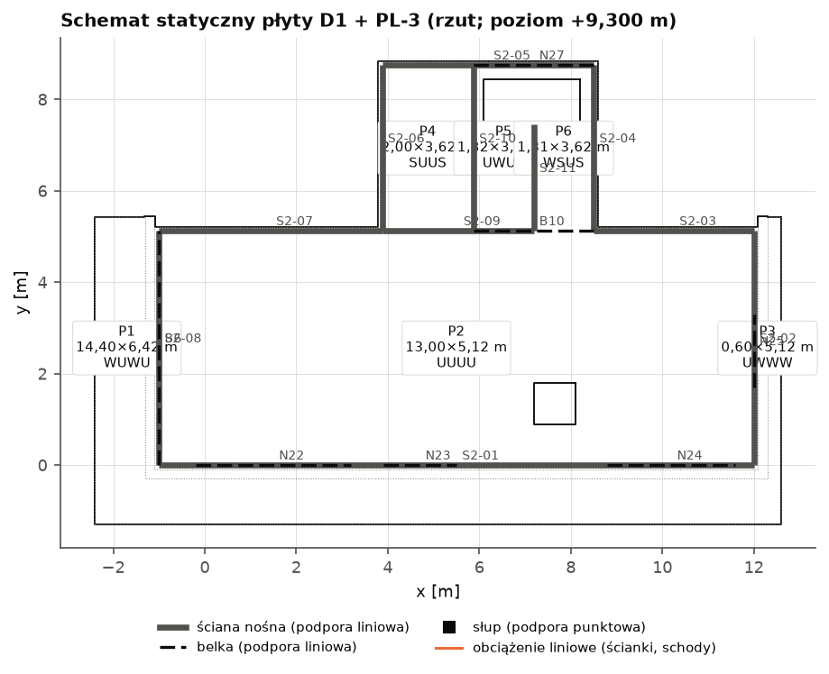

*Rys. Schemat statyczny płyty D1 + PL-3: pola (P — wymiary, warunki brzegowe x=0/x=l_x/y=0/y=l_y: S — podparcie swobodne, U — ciągłość/utwierdzenie, W — brzeg swobodny/niepełny), podpory.*

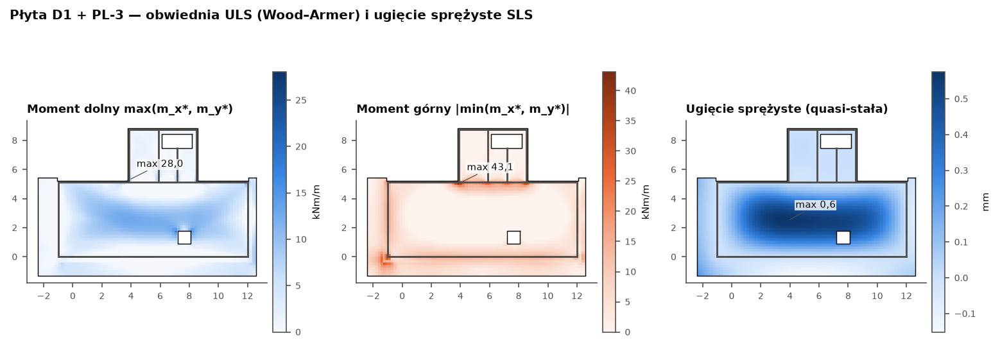

*Rys. Płyta D1 + PL-3: momenty wymiarujące (obwiednia kombinacji 6.10a/b, obciążeń szachownicowych i sytuacji wyjątkowej) oraz ugięcie sprężyste od kombinacji quasi-stałej (bez zarysowania i pełzania — te w obliczeniach 7.4.3).*

#### Zestawienie obciążeń

**Obciążenia stałe — D1 — Stropodach bryły A (P2): membrana TPO, PIR spadkowy 12–32 cm (śr. 22), paroizolacja z Al, płyta ŻB 22 cm, tynk; spadek ≥ 2 % do wpustów WP1/WP2 (U = 0,11 — klin wg PN-EN ISO 6946 zał. C)**

| Warstwa | Obliczenie | g_k [kN/m²] | γ_G (6.10a) | g_d [kN/m²] | ξγ_G (6.10b) | g_d [kN/m²] |
|---|---|---|---|---|---|---|
| Membrana dachowa TPO 1,5 mm, mocowana mechanicznie (hydroizolacja stropodachów) | 0,2 cm × 9,81 kN/m³ | 0,020 | 1,35 | 0,026 | 1,15 | 0,023 |
| Płyty PIR z okładziną (izolacja spadkowa stropodachów) | 22,0 cm × 0,31 kN/m³ | 0,069 | 1,35 | 0,093 | 1,15 | 0,079 |
| Paroizolacja bitumiczna z wkładką Al (na płycie stropodachów) | 0,4 cm × 10,79 kN/m³ | 0,043 | 1,35 | 0,058 | 1,15 | 0,050 |
| Żelbet C25/30, B500SP (stropy, płyta fundamentowa, ściany) | 22,0 cm × 25,00 kN/m³ | 5,500 | 1,35 | 7,425 | 1,15 | 6,311 |
| Tynk gipsowy maszynowy 1,5 cm | 1,0 cm × 11,77 kN/m³ | 0,118 | 1,35 | 0,159 | 1,15 | 0,135 |
| **Razem g_k** |  | 5,750 |  | 7,762 |  | 6,598 |

- **Moduły PV (pole fotowoltaiczne na dachu D1)** — obciążenie stałe na obrysie 8 modułów: g_PV = (m_modułu + m_stelaża)·g/A_modułu = 31,5·9,81·10⁻³/1,923 = **0,161** kN/m² (balast systemu biosolarnego — substrat, w warstwach dachu); masy — dane wyrobu [DANE PRZYKŁADOWE – FIKCYJNE]; PR — [ZAŁ]; masy modułu i stelaża — do potwierdzenia kartą wybranego wyrobu (PT-4 IE).

- Obciążenie użytkowe: dach bez dostępu (kat. H): q_k = 0,40 kN/m², Q_k = 1,0 kN, ψ₀/ψ₁/ψ₂ = 0,0/0,0/0,0 (PN-EN 1991-1-1 tabl. 6.10 + NA; nie łączyć ze śniegiem i wiatrem (p. 3.3.2)).
- Śnieg: s = 0,720 kN/m² (przypadek równomierny) oraz zaspy (poniżej).

#### Obliczenia

##### Śnieg — zaspa przy attyce h = 0,35 m (trwała sytuacja obliczeniowa) — D1

- Współczynnik kształtu przy przeszkodzie: μ₂ = γ·h/s_k = 2,00·0,35/0,90 = **0,778** *((6.1))*
- Przyjęto (0,8 ≤ μ₂ ≤ 2,0): μ₂ = **0,800** *(p. 6.2(2))*
- Długość zaspy: l_s = 2h (5 ≤ l_s ≤ 15 m) = 2·0,35 = **5,00** m *((6.2))*
- Obciążenie przy attyce: s₂ = μ₂·C_e·C_t·s_k = 0,800·1,00·1,00·0,90 = **0,720** kN/m²

##### Sprawdzenie metodą tablic — pole P2 (13,00 × 5,12 m, brzegi UUUU)

- Obciążenia obliczeniowe (miarodajne z 6.10a/6.10b): g_d; q_d = g_k = 5,790, q_k = 0,720 kN/m² = **7,816; 0,756** kN/m²
- Współczynniki (brzegi UUUU; x=0, x=l_x, y=0, y=l_y; S — podparta, U — utwierdzona): α_x; α_y; β_x; β_y = **0,0023; 0,0065; −0,0088; −0,0130** *(MRS (odpowiednik tablic Czernego), ν = 0,2)*
- Współczynniki płyty swobodnie podpartej (SSSS): α_x⁰; α_y⁰ = **0,0057; 0,0175**
- Moment przęsłowy x: M_x = [α_x·(g_d + q_d/2) + α_x⁰·q_d/2]·l_x² = [0,0023·8,194 + 0,0057·0,378]·13,00² = **3,55** kNm/m
- Moment przęsłowy y: M_y = [α_y·(g_d + q_d/2) + α_y⁰·q_d/2]·l_x² = [0,0065·8,194 + 0,0175·0,378]·13,00² = **10,12** kNm/m
- Momenty podporowe (utwierdzenie, g_d + q_d): M_x,p; M_y,p = **−12,79; −18,89** kNm/m
- Porównanie z MES (M_x; M_y dół, poza narożami): M_MES/M_tabl = **2,25; 1,85**
- Przyjęto do wymiarowania: M_Ed = max(M_MES; M_tabl) = **7,98; 18,72** kNm/m

##### Pole P2 — zginanie dół, kierunek x

- Wysokość użyteczna: d = **190** mm
- Moment względny: μ = M_Ed/(b·d²·η·f_cd) = 7,98·10⁶/(1000·190²·1,0·17,86) = **0,0124** *(3.1.7(3))*
- Względna wysokość strefy ściskanej: ξ_eff = 1 − √(1 − 2μ) = 1 − √(1 − 2·0,0124) = **0,0125**
- Warunek ciągliwości: ξ_eff ≤ ξ_eff,lim = λ·ε_cu3/(ε_cu3 + f_yd/E_s) = 0,012 ≤ 0,493 = **spełniony**
- Wymagane zbrojenie rozciągane: A_s1 = ξ_eff·b·d·η·f_cd/f_yd = 0,0125·1000·190·1,0·17,86/434,8 = **97** mm²
- Zbrojenie minimalne: A_s,min = max(0,26·f_ctm/f_yk·b·d; 0,0013·b·d) = max(0,26·2,6/500·1000·190; 0,0013·1000·190) = **257** mm² *((9.1N) + NA)*
- Przyjęto (z warunkiem rys): φ8 co 19 cm = **2,65** cm²/m
- Naprężenie w stali (quasi-stała, przekrój zarysowany, α_e = 15): σ_s = α_e·M_qp·(d − x_II)/I_II = **110** MPa
- Maksymalna średnica (w_max = 0,4 mm): φ_s = φ*_s·(f_ct,eff/2,9)·k_c·h_cr/(2(h − d)) = 40,0·(2,6/2,9)·0,4·110/(2·30) = **26,3** mm *(tabl. 7.2N, (7.6N))*
- Maksymalny rozstaw prętów: s_max = (σ_s = 110 MPa) = **300** mm *(tabl. 7.3N)*

| Warunek | Efekt | Nośność / limit | η | Stan | Podstawa |
|---|---|---|---|---|---|
| Zbrojenie na zginanie | A_s,req = 257 mm²/m | A_s,prov = 265 mm²/m | 97% | spełniony | 6.1, (9.1N) |
| Rysy: średnica prętów (tabl. 7.2N) | φ = 8 mm | φ_s,max = 26 mm | 30% | spełniony | 7.3.3(2) |

##### Pole P2 — zginanie dół, kierunek y

- Wysokość użyteczna: d = **180** mm
- Moment względny: μ = M_Ed/(b·d²·η·f_cd) = 18,72·10⁶/(1000·180²·1,0·17,86) = **0,0324** *(3.1.7(3))*
- Względna wysokość strefy ściskanej: ξ_eff = 1 − √(1 − 2μ) = 1 − √(1 − 2·0,0324) = **0,0329**
- Warunek ciągliwości: ξ_eff ≤ ξ_eff,lim = λ·ε_cu3/(ε_cu3 + f_yd/E_s) = 0,033 ≤ 0,493 = **spełniony**
- Wymagane zbrojenie rozciągane: A_s1 = ξ_eff·b·d·η·f_cd/f_yd = 0,0329·1000·180·1,0·17,86/434,8 = **243** mm²
- Zbrojenie minimalne: A_s,min = max(0,26·f_ctm/f_yk·b·d; 0,0013·b·d) = max(0,26·2,6/500·1000·180; 0,0013·1000·180) = **243** mm² *((9.1N) + NA)*
- Przyjęto (z warunkiem rys): φ8 co 19 cm = **2,65** cm²/m
- Naprężenie w stali (quasi-stała, przekrój zarysowany, α_e = 15): σ_s = α_e·M_qp·(d − x_II)/I_II = **273** MPa
- Maksymalna średnica (w_max = 0,4 mm): φ_s = φ*_s·(f_ct,eff/2,9)·k_c·h_cr/(2(h − d)) = 16,7·(2,6/2,9)·0,4·110/(2·40) = **8,2** mm *(tabl. 7.2N, (7.6N))*
- Maksymalny rozstaw prętów: s_max = (σ_s = 273 MPa) = **208** mm *(tabl. 7.3N)*

| Warunek | Efekt | Nośność / limit | η | Stan | Podstawa |
|---|---|---|---|---|---|
| Zbrojenie na zginanie | A_s,req = 243 mm²/m | A_s,prov = 265 mm²/m | 92% | spełniony | 6.1, (9.1N) |
| Rysy: średnica prętów (tabl. 7.2N) | φ = 8 mm | φ_s,max = 8 mm | 97% | spełniony | 7.3.3(2) |

##### Pole P2 — zginanie góra, x

- Wysokość użyteczna: d = **190** mm
- Moment względny: μ = M_Ed/(b·d²·η·f_cd) = 16,78·10⁶/(1000·190²·1,0·17,86) = **0,0260** *(3.1.7(3))*
- Względna wysokość strefy ściskanej: ξ_eff = 1 − √(1 − 2μ) = 1 − √(1 − 2·0,0260) = **0,0264**
- Warunek ciągliwości: ξ_eff ≤ ξ_eff,lim = λ·ε_cu3/(ε_cu3 + f_yd/E_s) = 0,026 ≤ 0,493 = **spełniony**
- Wymagane zbrojenie rozciągane: A_s1 = ξ_eff·b·d·η·f_cd/f_yd = 0,0264·1000·190·1,0·17,86/434,8 = **206** mm²
- Zbrojenie minimalne: A_s,min = max(0,26·f_ctm/f_yk·b·d; 0,0013·b·d) = max(0,26·2,6/500·1000·190; 0,0013·1000·190) = **257** mm² *((9.1N) + NA)*
- Przyjęto (z warunkiem rys): φ8 co 19 cm = **2,65** cm²/m
- Naprężenie w stali (quasi-stała, przekrój zarysowany, α_e = 15): σ_s = α_e·M_qp·(d − x_II)/I_II = **237** MPa
- Maksymalna średnica (w_max = 0,4 mm): φ_s = φ*_s·(f_ct,eff/2,9)·k_c·h_cr/(2(h − d)) = 20,8·(2,6/2,9)·0,4·110/(2·30) = **13,6** mm *(tabl. 7.2N, (7.6N))*
- Maksymalny rozstaw prętów: s_max = (σ_s = 237 MPa) = **253** mm *(tabl. 7.3N)*

| Warunek | Efekt | Nośność / limit | η | Stan | Podstawa |
|---|---|---|---|---|---|
| Zbrojenie na zginanie | A_s,req = 257 mm²/m | A_s,prov = 265 mm²/m | 97% | spełniony | 6.1, (9.1N) |
| Rysy: średnica prętów (tabl. 7.2N) | φ = 8 mm | φ_s,max = 14 mm | 59% | spełniony | 7.3.3(2) |

##### Pole P2 — zginanie góra, y

- Wysokość użyteczna: d = **180** mm
- Moment względny: μ = M_Ed/(b·d²·η·f_cd) = 43,64·10⁶/(1000·180²·1,0·17,86) = **0,0754** *(3.1.7(3))*
- Względna wysokość strefy ściskanej: ξ_eff = 1 − √(1 − 2μ) = 1 − √(1 − 2·0,0754) = **0,0785**
- Warunek ciągliwości: ξ_eff ≤ ξ_eff,lim = λ·ε_cu3/(ε_cu3 + f_yd/E_s) = 0,079 ≤ 0,493 = **spełniony**
- Wymagane zbrojenie rozciągane: A_s1 = ξ_eff·b·d·η·f_cd/f_yd = 0,0785·1000·180·1,0·17,86/434,8 = **580** mm²
- Zbrojenie minimalne: A_s,min = max(0,26·f_ctm/f_yk·b·d; 0,0013·b·d) = max(0,26·2,6/500·1000·180; 0,0013·1000·180) = **243** mm² *((9.1N) + NA)*
- Przyjęto (z warunkiem rys): φ10 co 13 cm = **6,04** cm²/m
- Naprężenie w stali (quasi-stała, przekrój zarysowany, α_e = 15): σ_s = α_e·M_qp·(d − x_II)/I_II = **295** MPa
- Maksymalna średnica (w_max = 0,4 mm): φ_s = φ*_s·(f_ct,eff/2,9)·k_c·h_cr/(2(h − d)) = 14,5·(2,6/2,9)·0,4·110/(2·40) = **7,2** mm *(tabl. 7.2N, (7.6N))*
- Maksymalny rozstaw prętów: s_max = (σ_s = 295 MPa) = **181** mm *(tabl. 7.3N)*

| Warunek | Efekt | Nośność / limit | η | Stan | Podstawa |
|---|---|---|---|---|---|
| Zbrojenie na zginanie | A_s,req = 580 mm²/m | A_s,prov = 604 mm²/m | 96% | spełniony | 6.1, (9.1N) |
| Rysy: rozstaw prętów (tabl. 7.3N) | s = 130 mm | s_max = 181 mm | 72% | spełniony | 7.3.3(2) |

##### Pole P2 — zbrojenie narożne (góra i dół, strefy 1,03 × 1,03 m)

- Wysokość użyteczna: d = **180** mm
- Moment względny: μ = M_Ed/(b·d²·η·f_cd) = 24,81·10⁶/(1000·180²·1,0·17,86) = **0,0429** *(3.1.7(3))*
- Względna wysokość strefy ściskanej: ξ_eff = 1 − √(1 − 2μ) = 1 − √(1 − 2·0,0429) = **0,0439**
- Warunek ciągliwości: ξ_eff ≤ ξ_eff,lim = λ·ε_cu3/(ε_cu3 + f_yd/E_s) = 0,044 ≤ 0,493 = **spełniony**
- Wymagane zbrojenie rozciągane: A_s1 = ξ_eff·b·d·η·f_cd/f_yd = 0,0439·1000·180·1,0·17,86/434,8 = **324** mm²
- Zbrojenie minimalne: A_s,min = max(0,26·f_ctm/f_yk·b·d; 0,0013·b·d) = max(0,26·2,6/500·1000·180; 0,0013·1000·180) = **243** mm² *((9.1N) + NA)*
- Przyjęto: φ10 co 24 cm = **3,27** cm²/m

| Warunek | Efekt | Nośność / limit | η | Stan | Podstawa |
|---|---|---|---|---|---|
| Zbrojenie na zginanie | A_s,req = 324 mm²/m | A_s,prov = 327 mm²/m | 99% | spełniony | 6.1, (9.1N) |

##### Pole P2 — ścinanie: V_Ed > V_Rd,c — zbrojenie na ścinanie płyty (9.3.2), strzemiona φ8, 5 ramion/m

- Współczynnik skali: k = 1 + √(200/d) ≤ 2,0 = 1 + √(200/190) = **2,000**
- Stopień zbrojenia podłużnego: ρ_l = A_sl/(b_w·d) ≤ 0,02 = 265/(1000·190) = **0,00139**
- Nośność na ścinanie: V_Rd,c = C_Rd,c·k·(100·ρ_l·f_ck)^(1/3)·b_w·d = 0,1286·2,000·(100·0,00139·25)^(1/3)·1000·190·10⁻³ = **74,04** kN *((6.2.a); C_Rd,c = 0,18/γ_c)*
- Wartość minimalna: V_Rd,c,min = v_min·b_w·d, v_min = 0,035·k^(3/2)·f_ck^(1/2) = 0,4950·1000·190·10⁻³ = **94,05** kN *((6.2.b), (6.3N))*
- Ramię sił wewnętrznych: z = 0,9·d = 0,9·190 = **171** mm
- Przyjęto nachylenie krzyżulców betonowych: cot θ = (1,0 ≤ cot θ ≤ 2,0 — NA) = **2,00** *((6.7N))*
- Nośność krzyżulców ściskanych: V_Rd,max = b_w·z·ν₁·f_cd/(cot θ + tan θ) = 1000·171·0,540·17,86/(2,00 + 0,500)·10⁻³ = **659,57** kN *((6.9), ν₁ = ν (6.6N))*
- Rozstaw z warunku nośności: s = A_sw·z·f_ywd·cot θ/V_Ed = 251,3·171·434,8·2,00/(115,73·10³) = **323** mm *((6.8))*
- Rozstaw maksymalny: s_l,max = 0,75·d = 0,75·190 = **142** mm *((9.6N))*
- Stopień zbrojenia minimalny: ρ_w,min = 0,08·√f_ck/f_yk → s ≤ A_sw/(ρ_w,min·b_w) = 251,3/(0,00080·1000) = **314** mm *((9.5N))*
- Przyjęto strzemiona: φ8 5-cięte co s = **140** mm
- Nośność zbrojenia na ścinanie: V_Rd,s = A_sw/s·z·f_ywd·cot θ = 251,3/140·171·434,8·2,00·10⁻³ = **266,94** kN

| Warunek | Efekt | Nośność / limit | η | Stan | Podstawa |
|---|---|---|---|---|---|
| Nośność krzyżulców betonowych | V_Ed = 115,73 kN | V_Rd,max = 659,57 kN | 18% | spełniony | (6.9) |
| Nośność strzemion | V_Ed = 115,73 kN | V_Rd,s = 266,94 kN | 43% | spełniony | (6.8) |

##### Pole P2 — ugięcie (l = 5,12 m, K = 1,5)

- Stopień zbrojenia wymagany: ρ = A_s,req/(b·d) = 243/(1000·180) = **0,00135**
- Wartość odniesienia: ρ₀ = √f_ck·10⁻³ = √25·10⁻³ = **0,00500**
- Graniczne l/d (ρ ≤ ρ₀): K·[11 + 1,5·√f_ck·ρ₀/ρ + 3,2·√f_ck·(ρ₀/ρ − 1)^(3/2)] = 1,5·[11 + 1,5·5,000·3,701 + 3,2·5,000·(3,701 − 1)^1,5] = **164,7** *((7.16a))*
- Mnożnik od naprężeń w stali: 310/σ_s ≈ 500/(f_yk·A_s,req/A_s,prov) ≤ 1,5 = 500/(500·243/265) = **1,088** *((7.17))*
- Smukłość rzeczywista: l_eff/d = 5,12/0,180 = **28,5**
- *Obliczenie ugięcia (7.4.3)*
- Efektywny moduł sprężystości: E_c,eff = E_cm/(1 + φ) = 31000/(1 + 2,5) = **8857** MPa *((7.20))*
- Stosunek modułów: α_e = E_s/E_c,eff = 200000/8857 = **22,58**
- Przekrój niezarysowany: x_I; I_I = **111,9 mm; 915,8·10⁶ mm⁴**
- Przekrój zarysowany: x_II; I_II = **40,8 mm; 138,4·10⁶ mm⁴**
- Moment rysujący: M_cr = f_ctm·I_I/(h − x_I) = 2,6·915,8·10⁶/(220 − 111,9) = **22,02** kNm
- Współczynnik rozkładu: ζ = 1 − β·(M_cr/M_qp)², β = 0,5 = M_qp ≤ M_cr → 0 = **0,000** *((7.19))*
- Ugięcie od obciążeń (quasi-stała): w_q = ζ·w_II + (1 − ζ)·w_I = 0,000·13,19 + 1,000·1,99 = **1,99** mm *((7.18))*
- Ugięcie od skurczu: w_cs = k·(1/r_cs)·l², 1/r_cs = ε_cs·α_e·S/I = 0,125·0,178·10⁻⁶·5125² = **0,58** mm *((7.21))*
- Ugięcie całkowite: w = w_q + w_cs = 1,99 + 0,58 = **2,58** mm
- Ugięcie dopuszczalne: w_lim = L/250 = 5125/250 = **20,5** mm *(7.4.1(4))*

| Warunek | Efekt | Nośność / limit | η | Stan | Podstawa |
|---|---|---|---|---|---|
| Ugięcie — graniczna smukłość l/d (7.4.2) | l/d = 28,5  | (l/d)_lim = 179,2  | 16% | spełniony | (7.16), tabl. 7.4N |

> l/d spełnione — obliczenie (7.4.3) informacyjnie: w = 2,6 mm ≤? 20,5 mm.

#### Wymiarowanie — zestawienia

**Zestawienie wymiarowania pól płyty** (M [kNm/m] — obwiednia ULS, Wood–Armer, poza strefami narożnymi; „tabl.” — metoda tablic, jeżeli stosowalna; góra — nad podporami; naroża — strefy 0,2·l_min × 0,2·l_min przy narożach podpartych, zbrojenie górą i dołem na moment skręcający)

| Pole | l_x × l_y [m] | Brzegi | M_x,dół [kNm/m] MES / tabl. | Zbroj. x dół | M_y,dół MES / tabl. | Zbroj. y dół | M_x,góra | Zbroj. x góra | M_y,góra | Zbroj. y góra | Naroża M / zbroj. | w / w_lim [mm] | η_max |
|---|---|---|---|---|---|---|---|---|---|---|---|---|---|
| P1 | 14,40 × 6,42 | WUWU | 1,88 / — | φ8 co 19 cm | 0,80 / — | φ8 co 20 cm | −33,41 | φ8 co 12 cm | −27,32 | φ8 co 14 cm | — | 0,9 / 25,7 | 100% |
| P2 | 13,00 × 5,12 | UUUU | 7,98 / 3,55 | φ8 co 19 cm | 18,72 / 10,12 | φ8 co 19 cm | −16,78 | φ8 co 19 cm | −43,64 | φ10 co 13 cm | 24,81 / φ10 co 24 cm | 2,6 / 20,5 | 99% |
| P4 | 2,00 × 3,62 | SUUS | 5,60 / 2,12 | φ8 co 19 cm | 5,34 / 0,89 | φ8 co 20 cm | −27,24 | φ10 co 23 cm | −18,70 | φ8 co 19 cm | 43,13 / φ12 co 19 cm | 0,1 / 8,0 | 99% |
| P5 | 1,32 × 3,62 | UWUS | 7,79 / — | φ8 co 19 cm | 2,66 / — | φ8 co 20 cm | −8,53 | φ8 co 19 cm | −22,39 | φ8 co 17 cm | 23,00 / φ8 co 16 cm | 0,1 / 5,3 | 99% |
| P6 | 1,31 × 3,62 | WSUS | 6,01 / — | φ8 co 19 cm | 5,39 / — | φ8 co 20 cm | −9,68 | φ8 co 19 cm | −22,66 | φ8 co 16 cm | 39,27 / φ10 co 15 cm | 0,1 / 5,2 | 99% |

**Reakcje podporowe (charakterystyczne, cała grupa płyt)**

| Podpora | Długość [m] | ΣR_G [kN] | ΣR_Q [kN] | max r_G [kN/m] | max r_Q [kN/m] |
|---|---|---|---|---|---|
| S2-01 | 13,00 | 159,6 | 46,8 | 234,59 | 248,47 |
| S2-02 | 5,12 | 26,5 | −5,1 | 22,03 | 207,88 |
| S2-03 | 3,50 | 98,4 | −8,7 | 693,25 | 21,74 |
| S2-04 | 3,62 | −108,1 | 10,0 | 693,25 | 111,43 |
| S2-05 | 4,62 | 9,6 | 0,0 | 36,45 | 0,42 |
| S2-06 | 3,62 | −160,9 | 18,0 | 420,10 | 179,14 |
| S2-07 | 4,88 | 92,0 | −26,7 | 420,10 | 62,92 |
| S2-08 | 5,12 | 71,1 | 29,1 | 260,65 | 276,08 |
| S2-09 | 3,32 | 267,9 | −23,0 | 1512,38 | −0,43 |
| S2-10 | 3,62 | −78,2 | 10,0 | 562,74 | 86,04 |
| S2-11 | 2,33 | −78,6 | 8,2 | 600,80 | 79,75 |
| B6 | 5,12 | 71,1 | 29,1 | 260,65 | 276,08 |
| B10 | 2,62 | 193,0 | −15,3 | 450,19 | −0,76 |
| N22 | 3,40 | 33,5 | 4,0 | 22,55 | 4,27 |
| N23 | 1,60 | 18,5 | 3,9 | 20,53 | 4,51 |
| N24 | 2,80 | 28,8 | 6,5 | 17,08 | 11,96 |
| N25 | 1,60 | 14,3 | 0,6 | 21,46 | 1,02 |
| N27 | 2,62 | 1,4 | 0,0 | 2,72 | 0,01 |

#### Wnioski

**Przyjęto:** Płyta gr. 22 cm z betonu C25/30, stal B500SP, otulenie c_nom = 25 mm; zbrojenie wg zestawienia pól (dołem siatka w obu kierunkach, górą nad podporami).  
**Przyjęto:** Maks. ugięcie długotrwałe ≈ 2,6 mm.  

### Poz. 1.2 — Stropodach / dach D2

Element modelu: `D2` · maks. wykorzystanie nośności η = 97% · wszystkie warunki spełnione

#### Opis i schemat statyczny

Płyta żelbetowa monolityczna gr. h = 22 cm, wierzch konstrukcji 6,150 m, beton C25/30 (ekspozycja XC1), stal B500SP. Pole płyty 12,52 m². Analiza wspólna z: ST2 + ST2Z + D2 + D3 + PL-2 (płyty połączone na jednym poziomie — ciągłość nad podporami/łącznikami). Schemat: płyta na podporach liniowych (ściany, belki — podpory sztywne, przegubowe) i punktowych (słupy); statyka — MES płytowy (elementy ACM, siatka 20 cm, obwiednia kombinacji 6.10a/6.10b i obciążeń szachownicowych pól), sprawdzenie pól prostokątnych metodą tablic (współczynniki MRS).

Podpory: S1-03 (ściana), S1-04 (ściana), N16 (belka)

*Rys. Rozkłady obciążenia śniegiem w zaspach (PN-EN 1991-1-3 p. 5.3.6, 6.2, zał. B).*

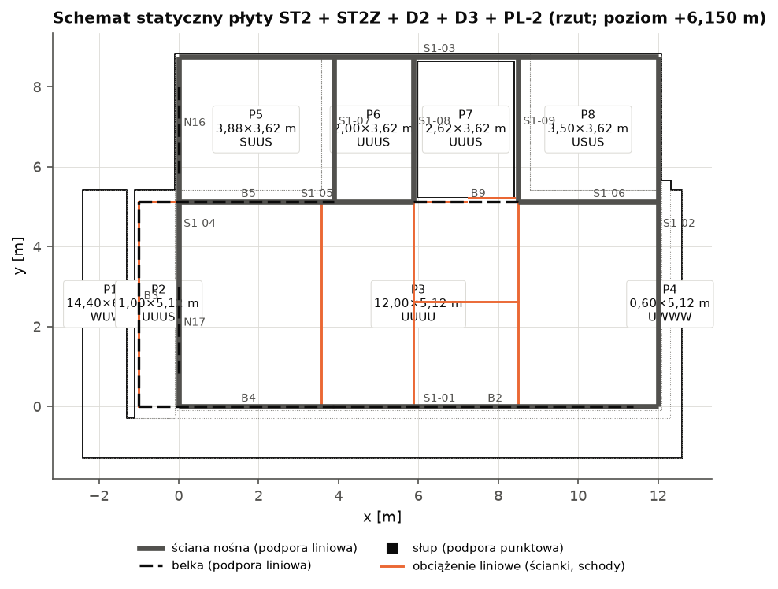

*Rys. Schemat statyczny płyty ST2 + ST2Z + D2 + D3 + PL-2: pola (P — wymiary, warunki brzegowe x=0/x=l_x/y=0/y=l_y: S — podparcie swobodne, U — ciągłość/utwierdzenie, W — brzeg swobodny/niepełny), podpory.*

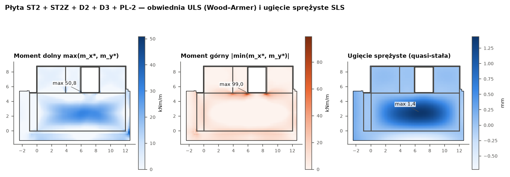

*Rys. Płyta ST2 + ST2Z + D2 + D3 + PL-2: momenty wymiarujące (obwiednia kombinacji 6.10a/b, obciążeń szachownicowych i sytuacji wyjątkowej) oraz ugięcie sprężyste od kombinacji quasi-stałej (bez zarysowania i pełzania — te w obliczeniach 7.4.3).*

#### Zestawienie obciążeń

**Obciążenia stałe — D2 — Stropodach nad P1 (pola pn. poza bryłą A): żwir 5 cm, włóknina, membrana TPO, PIR spadkowy 14–26 cm, paroizolacja, płyta ŻB 22 cm (U = 0,12 — klin wg PN-EN ISO 6946 zał. C)**

| Warstwa | Obliczenie | g_k [kN/m²] | γ_G (6.10a) | g_d [kN/m²] | ξγ_G (6.10b) | g_d [kN/m²] |
|---|---|---|---|---|---|---|
| Żwir płukany 16/32 mm (balast dachu P1, opaska przy attyce) | 5,0 cm × 17,00 kN/m³ | 0,850 | 1,35 | 1,148 | 1,15 | 0,975 |
| Włóknina ochronna PP 300 g/m² | 0,4 cm × 1,47 kN/m³ | 0,006 | 1,35 | 0,008 | 1,15 | 0,007 |
| Membrana dachowa TPO 1,5 mm, mocowana mechanicznie (hydroizolacja stropodachów) | 0,2 cm × 9,81 kN/m³ | 0,020 | 1,35 | 0,026 | 1,15 | 0,023 |
| Płyty PIR z okładziną (izolacja spadkowa stropodachów) | 20,0 cm × 0,31 kN/m³ | 0,063 | 1,35 | 0,085 | 1,15 | 0,072 |
| Paroizolacja bitumiczna z wkładką Al (na płycie stropodachów) | 0,4 cm × 10,79 kN/m³ | 0,043 | 1,35 | 0,058 | 1,15 | 0,050 |
| Żelbet C25/30, B500SP (stropy, płyta fundamentowa, ściany) | 22,0 cm × 25,00 kN/m³ | 5,500 | 1,35 | 7,425 | 1,15 | 6,311 |
| Tynk gipsowy maszynowy 1,5 cm | 1,0 cm × 11,77 kN/m³ | 0,118 | 1,35 | 0,159 | 1,15 | 0,135 |
| **Razem g_k** |  | 6,599 |  | 8,909 |  | 7,573 |

- Obciążenie użytkowe: dach bez dostępu (kat. H): q_k = 0,40 kN/m², Q_k = 1,0 kN, ψ₀/ψ₁/ψ₂ = 0,0/0,0/0,0 (PN-EN 1991-1-1 tabl. 6.10 + NA; nie łączyć ze śniegiem i wiatrem (p. 3.3.2)).
- Obciążenie dodatkowe (QA): ścianka działowa S2-16: 1,06 kN/m → zastępcze 0,8 kN/m² (6.3.1.2(8)).
- Obciążenie dodatkowe (QA): ścianka działowa S2-17: 1,06 kN/m → zastępcze 0,8 kN/m² (6.3.1.2(8)).
- Śnieg: s = 0,720 kN/m² (przypadek równomierny) oraz zaspy (poniżej).

#### Obliczenia

##### Śnieg — zaspa przy attyce h = 0,25 m (trwała sytuacja obliczeniowa) — D2

- Współczynnik kształtu przy przeszkodzie: μ₂ = γ·h/s_k = 2,00·0,25/0,90 = **0,556** *((6.1))*
- Przyjęto (0,8 ≤ μ₂ ≤ 2,0): μ₂ = **0,800** *(p. 6.2(2))*
- Długość zaspy: l_s = 2h (5 ≤ l_s ≤ 15 m) = 2·0,25 = **5,00** m *((6.2))*
- Obciążenie przy attyce: s₂ = μ₂·C_e·C_t·s_k = 0,800·1,00·1,00·0,90 = **0,720** kN/m²

##### Śnieg — zaspa przy uskoku h = 3,47 m (trwała sytuacja obliczeniowa) — D2 przy ścianie S2-06

- Współczynnik od zsuwania się śniegu z dachu wyższego: μ_s = α = 0° ≤ 15° = **0,00** *(p. 5.3.6(1))*
- Współczynnik od nawiewania: μ_w = (b₁ + b₂)/(2h) = (4,73 + 3,71)/(2·3,47) = **1,218** *((5.8))*
- Ograniczenie: μ_w ≤ γ·h/s_k = 2,00·3,47/0,90 = **7,702** *((5.8); γ = 2 kN/m³)*
- Przyjęto (zakres 0,8 ≤ μ_w ≤ 4,0): μ_w = **1,218** *(p. 5.3.6(1) uwaga 1 (wartość zalecana) [NZW NA])*
- Współczynnik kształtu przy uskoku: μ₂ = μ_s + μ_w = 0,00 + 1,218 = **1,218**
- Długość zaspy: l_s = 2h (5 ≤ l_s ≤ 15 m) = 2·3,47 = **6,93** m *((5.9))*
- Obciążenie przy uskoku: s₂ = μ₂·C_e·C_t·s_k = 1,218·1,00·1,00·0,90 = **1,096** kN/m²
- Obciążenie poza zaspą (μ₁ = 0,8): s₁ = **0,720** kN/m²

> b₂ = 3,71 m < l_s = 6,93 m — zaspa obcięta na krawędzi dachu niższego (p. 5.3.6(3)).

##### Śnieg — zaspa wyjątkowa B2 przy uskoku h = 3,47 m (zał. B.3) — D2 przy ścianie S2-06

- Długość zaspy: l_s = min(5h; b₁; 15 m) = min(5·3,47; 4,73; 15) = **4,73** m *(zał. B.3 [NZW])*
- Współczynnik kształtu: μ₁ = min{2h/s_k; 2b/l_s; 8} = min{7,70; 2,00; 8} = **2,000** *(zał. B.3 (B.2) [NZW])*
- Obciążenie wyjątkowe: s_Ad = μ₁·s_k = 2,000·0,90 = **1,800** kN/m² *((4.2))*

> Sytuacja wyjątkowa (PN-EN 1990 6.11b): γ = 1,0; [NZW] wzory zał. B wg R5-38 — potwierdzić w normie (N-12).

##### Śnieg — zaspa przy uskoku h = 3,47 m (trwała sytuacja obliczeniowa) — D2 przy ścianie S2-07

- Współczynnik od zsuwania się śniegu z dachu wyższego: μ_s = α = 0° ≤ 15° = **0,00** *(p. 5.3.6(1))*
- Współczynnik od nawiewania: μ_w = (b₁ + b₂)/(2h) = (5,24 + 3,45)/(2·3,47) = **1,254** *((5.8))*
- Ograniczenie: μ_w ≤ γ·h/s_k = 2,00·3,47/0,90 = **7,702** *((5.8); γ = 2 kN/m³)*
- Przyjęto (zakres 0,8 ≤ μ_w ≤ 4,0): μ_w = **1,254** *(p. 5.3.6(1) uwaga 1 (wartość zalecana) [NZW NA])*
- Współczynnik kształtu przy uskoku: μ₂ = μ_s + μ_w = 0,00 + 1,254 = **1,254**
- Długość zaspy: l_s = 2h (5 ≤ l_s ≤ 15 m) = 2·3,47 = **6,93** m *((5.9))*
- Obciążenie przy uskoku: s₂ = μ₂·C_e·C_t·s_k = 1,254·1,00·1,00·0,90 = **1,128** kN/m²
- Obciążenie poza zaspą (μ₁ = 0,8): s₁ = **0,720** kN/m²

> b₂ = 3,45 m < l_s = 6,93 m — zaspa obcięta na krawędzi dachu niższego (p. 5.3.6(3)).

##### Śnieg — zaspa wyjątkowa B2 przy uskoku h = 3,47 m (zał. B.3) — D2 przy ścianie S2-07

- Długość zaspy: l_s = min(5h; b₁; 15 m) = min(5·3,47; 5,24; 15) = **5,24** m *(zał. B.3 [NZW])*
- Współczynnik kształtu: μ₁ = min{2h/s_k; 2b/l_s; 8} = min{7,70; 2,00; 8} = **2,000** *(zał. B.3 (B.2) [NZW])*
- Obciążenie wyjątkowe: s_Ad = μ₁·s_k = 2,000·0,90 = **1,800** kN/m² *((4.2))*

> Sytuacja wyjątkowa (PN-EN 1990 6.11b): γ = 1,0; [NZW] wzory zał. B wg R5-38 — potwierdzić w normie (N-12).

##### Sprawdzenie metodą tablic — pole P5 (3,88 × 3,62 m, brzegi SUUS)

- Obciążenia obliczeniowe (miarodajne z 6.10a/6.10b): g_d; q_d = g_k = 6,599, q_k = 1,041 kN/m² = **8,909; 1,093** kN/m²
- Współczynniki (brzegi SUUS; x=0, x=l_x, y=0, y=l_y; S — podparta, U — utwierdzona): α_x; α_y; β_x; β_y = **0,0268; 0,0300; −0,0631; −0,0662** *(MRS (odpowiednik tablic Czernego), ν = 0,2)*
- Współczynniki płyty swobodnie podpartej (SSSS): α_x⁰; α_y⁰ = **0,0391; 0,0433**
- Moment przęsłowy x: M_x = [α_x·(g_d + q_d/2) + α_x⁰·q_d/2]·l_x² = [0,0268·9,456 + 0,0391·0,547]·3,88² = **4,12** kNm/m
- Moment przęsłowy y: M_y = [α_y·(g_d + q_d/2) + α_y⁰·q_d/2]·l_x² = [0,0300·9,456 + 0,0433·0,547]·3,88² = **4,62** kNm/m
- Momenty podporowe (utwierdzenie, g_d + q_d): M_x,p; M_y,p = **−9,48; −9,94** kNm/m
- Porównanie z MES (M_x; M_y dół, poza narożami): M_MES/M_tabl = **0,89; 0,97**
- Przyjęto do wymiarowania: M_Ed = max(M_MES; M_tabl) = **4,12; 4,62** kNm/m

##### Pole P5 — zginanie dół, kierunek x

- Wysokość użyteczna: d = **190** mm
- Moment względny: μ = M_Ed/(b·d²·η·f_cd) = 4,12·10⁶/(1000·190²·1,0·17,86) = **0,0064** *(3.1.7(3))*
- Względna wysokość strefy ściskanej: ξ_eff = 1 − √(1 − 2μ) = 1 − √(1 − 2·0,0064) = **0,0064**
- Warunek ciągliwości: ξ_eff ≤ ξ_eff,lim = λ·ε_cu3/(ε_cu3 + f_yd/E_s) = 0,006 ≤ 0,493 = **spełniony**
- Wymagane zbrojenie rozciągane: A_s1 = ξ_eff·b·d·η·f_cd/f_yd = 0,0064·1000·190·1,0·17,86/434,8 = **50** mm²
- Zbrojenie minimalne: A_s,min = max(0,26·f_ctm/f_yk·b·d; 0,0013·b·d) = max(0,26·2,6/500·1000·190; 0,0013·1000·190) = **257** mm² *((9.1N) + NA)*
- Przyjęto (z warunkiem rys): φ8 co 19 cm = **2,65** cm²/m
- Naprężenie w stali (quasi-stała, przekrój zarysowany, α_e = 15): σ_s = α_e·M_qp·(d − x_II)/I_II = **52** MPa
- Maksymalna średnica (w_max = 0,4 mm): φ_s = φ*_s·(f_ct,eff/2,9)·k_c·h_cr/(2(h − d)) = 40,0·(2,6/2,9)·0,4·110/(2·30) = **26,3** mm *(tabl. 7.2N, (7.6N))*
- Maksymalny rozstaw prętów: s_max = (σ_s = 52 MPa) = **300** mm *(tabl. 7.3N)*

| Warunek | Efekt | Nośność / limit | η | Stan | Podstawa |
|---|---|---|---|---|---|
| Zbrojenie na zginanie | A_s,req = 257 mm²/m | A_s,prov = 265 mm²/m | 97% | spełniony | 6.1, (9.1N) |
| Rysy: średnica prętów (tabl. 7.2N) | φ = 8 mm | φ_s,max = 26 mm | 30% | spełniony | 7.3.3(2) |

##### Pole P5 — zginanie dół, kierunek y

- Wysokość użyteczna: d = **180** mm
- Moment względny: μ = M_Ed/(b·d²·η·f_cd) = 4,62·10⁶/(1000·180²·1,0·17,86) = **0,0080** *(3.1.7(3))*
- Względna wysokość strefy ściskanej: ξ_eff = 1 − √(1 − 2μ) = 1 − √(1 − 2·0,0080) = **0,0080**
- Warunek ciągliwości: ξ_eff ≤ ξ_eff,lim = λ·ε_cu3/(ε_cu3 + f_yd/E_s) = 0,008 ≤ 0,493 = **spełniony**
- Wymagane zbrojenie rozciągane: A_s1 = ξ_eff·b·d·η·f_cd/f_yd = 0,0080·1000·180·1,0·17,86/434,8 = **59** mm²
- Zbrojenie minimalne: A_s,min = max(0,26·f_ctm/f_yk·b·d; 0,0013·b·d) = max(0,26·2,6/500·1000·180; 0,0013·1000·180) = **243** mm² *((9.1N) + NA)*
- Przyjęto (z warunkiem rys): φ8 co 20 cm = **2,51** cm²/m
- Naprężenie w stali (quasi-stała, przekrój zarysowany, α_e = 15): σ_s = α_e·M_qp·(d − x_II)/I_II = **71** MPa
- Maksymalna średnica (w_max = 0,4 mm): φ_s = φ*_s·(f_ct,eff/2,9)·k_c·h_cr/(2(h − d)) = 40,0·(2,6/2,9)·0,4·110/(2·40) = **19,7** mm *(tabl. 7.2N, (7.6N))*
- Maksymalny rozstaw prętów: s_max = (σ_s = 71 MPa) = **300** mm *(tabl. 7.3N)*

| Warunek | Efekt | Nośność / limit | η | Stan | Podstawa |
|---|---|---|---|---|---|
| Zbrojenie na zginanie | A_s,req = 243 mm²/m | A_s,prov = 251 mm²/m | 97% | spełniony | 6.1, (9.1N) |
| Rysy: średnica prętów (tabl. 7.2N) | φ = 8 mm | φ_s,max = 20 mm | 41% | spełniony | 7.3.3(2) |

##### Pole P5 — zginanie góra, x

- Wysokość użyteczna: d = **190** mm
- Moment względny: μ = M_Ed/(b·d²·η·f_cd) = 9,48·10⁶/(1000·190²·1,0·17,86) = **0,0147** *(3.1.7(3))*
- Względna wysokość strefy ściskanej: ξ_eff = 1 − √(1 − 2μ) = 1 − √(1 − 2·0,0147) = **0,0148**
- Warunek ciągliwości: ξ_eff ≤ ξ_eff,lim = λ·ε_cu3/(ε_cu3 + f_yd/E_s) = 0,015 ≤ 0,493 = **spełniony**
- Wymagane zbrojenie rozciągane: A_s1 = ξ_eff·b·d·η·f_cd/f_yd = 0,0148·1000·190·1,0·17,86/434,8 = **116** mm²
- Zbrojenie minimalne: A_s,min = max(0,26·f_ctm/f_yk·b·d; 0,0013·b·d) = max(0,26·2,6/500·1000·190; 0,0013·1000·190) = **257** mm² *((9.1N) + NA)*
- Przyjęto (z warunkiem rys): φ8 co 19 cm = **2,65** cm²/m
- Naprężenie w stali (quasi-stała, przekrój zarysowany, α_e = 15): σ_s = α_e·M_qp·(d − x_II)/I_II = **89** MPa
- Maksymalna średnica (w_max = 0,4 mm): φ_s = φ*_s·(f_ct,eff/2,9)·k_c·h_cr/(2(h − d)) = 40,0·(2,6/2,9)·0,4·110/(2·30) = **26,3** mm *(tabl. 7.2N, (7.6N))*
- Maksymalny rozstaw prętów: s_max = (σ_s = 89 MPa) = **300** mm *(tabl. 7.3N)*

| Warunek | Efekt | Nośność / limit | η | Stan | Podstawa |
|---|---|---|---|---|---|
| Zbrojenie na zginanie | A_s,req = 257 mm²/m | A_s,prov = 265 mm²/m | 97% | spełniony | 6.1, (9.1N) |
| Rysy: średnica prętów (tabl. 7.2N) | φ = 8 mm | φ_s,max = 26 mm | 30% | spełniony | 7.3.3(2) |

##### Pole P5 — zginanie góra, y

- Wysokość użyteczna: d = **180** mm
- Moment względny: μ = M_Ed/(b·d²·η·f_cd) = 14,08·10⁶/(1000·180²·1,0·17,86) = **0,0243** *(3.1.7(3))*
- Względna wysokość strefy ściskanej: ξ_eff = 1 − √(1 − 2μ) = 1 − √(1 − 2·0,0243) = **0,0246**
- Warunek ciągliwości: ξ_eff ≤ ξ_eff,lim = λ·ε_cu3/(ε_cu3 + f_yd/E_s) = 0,025 ≤ 0,493 = **spełniony**
- Wymagane zbrojenie rozciągane: A_s1 = ξ_eff·b·d·η·f_cd/f_yd = 0,0246·1000·180·1,0·17,86/434,8 = **182** mm²
- Zbrojenie minimalne: A_s,min = max(0,26·f_ctm/f_yk·b·d; 0,0013·b·d) = max(0,26·2,6/500·1000·180; 0,0013·1000·180) = **243** mm² *((9.1N) + NA)*
- Przyjęto (z warunkiem rys): φ8 co 20 cm = **2,51** cm²/m
- Naprężenie w stali (quasi-stała, przekrój zarysowany, α_e = 15): σ_s = α_e·M_qp·(d − x_II)/I_II = **210** MPa
- Maksymalna średnica (w_max = 0,4 mm): φ_s = φ*_s·(f_ct,eff/2,9)·k_c·h_cr/(2(h − d)) = 28,9·(2,6/2,9)·0,4·110/(2·40) = **14,2** mm *(tabl. 7.2N, (7.6N))*
- Maksymalny rozstaw prętów: s_max = (σ_s = 210 MPa) = **287** mm *(tabl. 7.3N)*

| Warunek | Efekt | Nośność / limit | η | Stan | Podstawa |
|---|---|---|---|---|---|
| Zbrojenie na zginanie | A_s,req = 243 mm²/m | A_s,prov = 251 mm²/m | 97% | spełniony | 6.1, (9.1N) |
| Rysy: średnica prętów (tabl. 7.2N) | φ = 8 mm | φ_s,max = 14 mm | 56% | spełniony | 7.3.3(2) |

##### Pole P5 — zbrojenie narożne (góra i dół, strefy 0,73 × 0,73 m)

- Wysokość użyteczna: d = **180** mm
- Moment względny: μ = M_Ed/(b·d²·η·f_cd) = 12,52·10⁶/(1000·180²·1,0·17,86) = **0,0216** *(3.1.7(3))*
- Względna wysokość strefy ściskanej: ξ_eff = 1 − √(1 − 2μ) = 1 − √(1 − 2·0,0216) = **0,0219**
- Warunek ciągliwości: ξ_eff ≤ ξ_eff,lim = λ·ε_cu3/(ε_cu3 + f_yd/E_s) = 0,022 ≤ 0,493 = **spełniony**
- Wymagane zbrojenie rozciągane: A_s1 = ξ_eff·b·d·η·f_cd/f_yd = 0,0219·1000·180·1,0·17,86/434,8 = **162** mm²
- Zbrojenie minimalne: A_s,min = max(0,26·f_ctm/f_yk·b·d; 0,0013·b·d) = max(0,26·2,6/500·1000·180; 0,0013·1000·180) = **243** mm² *((9.1N) + NA)*
- Przyjęto: φ8 co 20 cm = **2,51** cm²/m

| Warunek | Efekt | Nośność / limit | η | Stan | Podstawa |
|---|---|---|---|---|---|
| Zbrojenie na zginanie | A_s,req = 243 mm²/m | A_s,prov = 251 mm²/m | 97% | spełniony | 6.1, (9.1N) |

##### Pole P5 — ścinanie: V_Ed > V_Rd,c — zbrojenie na ścinanie płyty (9.3.2), strzemiona φ8, 5 ramion/m

- Współczynnik skali: k = 1 + √(200/d) ≤ 2,0 = 1 + √(200/190) = **2,000**
- Stopień zbrojenia podłużnego: ρ_l = A_sl/(b_w·d) ≤ 0,02 = 265/(1000·190) = **0,00139**
- Nośność na ścinanie: V_Rd,c = C_Rd,c·k·(100·ρ_l·f_ck)^(1/3)·b_w·d = 0,1286·2,000·(100·0,00139·25)^(1/3)·1000·190·10⁻³ = **74,04** kN *((6.2.a); C_Rd,c = 0,18/γ_c)*
- Wartość minimalna: V_Rd,c,min = v_min·b_w·d, v_min = 0,035·k^(3/2)·f_ck^(1/2) = 0,4950·1000·190·10⁻³ = **94,05** kN *((6.2.b), (6.3N))*
- Ramię sił wewnętrznych: z = 0,9·d = 0,9·190 = **171** mm
- Przyjęto nachylenie krzyżulców betonowych: cot θ = (1,0 ≤ cot θ ≤ 2,0 — NA) = **2,00** *((6.7N))*
- Nośność krzyżulców ściskanych: V_Rd,max = b_w·z·ν₁·f_cd/(cot θ + tan θ) = 1000·171·0,540·17,86/(2,00 + 0,500)·10⁻³ = **659,57** kN *((6.9), ν₁ = ν (6.6N))*
- Rozstaw z warunku nośności: s = A_sw·z·f_ywd·cot θ/V_Ed = 251,3·171·434,8·2,00/(206,05·10³) = **181** mm *((6.8))*
- Rozstaw maksymalny: s_l,max = 0,75·d = 0,75·190 = **142** mm *((9.6N))*
- Stopień zbrojenia minimalny: ρ_w,min = 0,08·√f_ck/f_yk → s ≤ A_sw/(ρ_w,min·b_w) = 251,3/(0,00080·1000) = **314** mm *((9.5N))*
- Przyjęto strzemiona: φ8 5-cięte co s = **140** mm
- Nośność zbrojenia na ścinanie: V_Rd,s = A_sw/s·z·f_ywd·cot θ = 251,3/140·171·434,8·2,00·10⁻³ = **266,94** kN

| Warunek | Efekt | Nośność / limit | η | Stan | Podstawa |
|---|---|---|---|---|---|
| Nośność krzyżulców betonowych | V_Ed = 206,05 kN | V_Rd,max = 659,57 kN | 31% | spełniony | (6.9) |
| Nośność strzemion | V_Ed = 206,05 kN | V_Rd,s = 266,94 kN | 77% | spełniony | (6.8) |

##### Pole P5 — ugięcie (l = 3,62 m, K = 1,3)

- Stopień zbrojenia wymagany: ρ = A_s,req/(b·d) = 59/(1000·180) = **0,00033**
- Wartość odniesienia: ρ₀ = √f_ck·10⁻³ = √25·10⁻³ = **0,00500**
- Graniczne l/d (ρ ≤ ρ₀): K·[11 + 1,5·√f_ck·ρ₀/ρ + 3,2·√f_ck·(ρ₀/ρ − 1)^(3/2)] = 1,3·[11 + 1,5·5,000·15,189 + 3,2·5,000·(15,189 − 1)^1,5] = **1274,1** *((7.16a))*
- Mnożnik od naprężeń w stali: 310/σ_s ≈ 500/(f_yk·A_s,req/A_s,prov) ≤ 1,5 = 500/(500·59/251) = **1,500** *((7.17))*
- Smukłość rzeczywista: l_eff/d = 3,62/0,180 = **20,1**
- *Obliczenie ugięcia (7.4.3)*
- Efektywny moduł sprężystości: E_c,eff = E_cm/(1 + φ) = 31000/(1 + 2,5) = **8857** MPa *((7.20))*
- Stosunek modułów: α_e = E_s/E_c,eff = 200000/8857 = **22,58**
- Przekrój niezarysowany: x_I; I_I = **111,8 mm; 914,4·10⁶ mm⁴**
- Przekrój zarysowany: x_II; I_II = **39,9 mm; 132,6·10⁶ mm⁴**
- Moment rysujący: M_cr = f_ctm·I_I/(h − x_I) = 2,6·914,4·10⁶/(220 − 111,8) = **21,97** kNm
- Współczynnik rozkładu: ζ = 1 − β·(M_cr/M_qp)², β = 0,5 = M_qp ≤ M_cr → 0 = **0,000** *((7.19))*
- Ugięcie od obciążeń (quasi-stała): w_q = ζ·w_II + (1 − ζ)·w_I = 0,000·1,64 + 1,000·0,24 = **0,24** mm *((7.18))*
- Ugięcie od skurczu: w_cs = k·(1/r_cs)·l², 1/r_cs = ε_cs·α_e·S/I = 0,125·0,169·10⁻⁶·3625² = **0,28** mm *((7.21))*
- Ugięcie całkowite: w = w_q + w_cs = 0,24 + 0,28 = **0,52** mm
- Ugięcie dopuszczalne: w_lim = L/250 = 3625/250 = **14,5** mm *(7.4.1(4))*

| Warunek | Efekt | Nośność / limit | η | Stan | Podstawa |
|---|---|---|---|---|---|
| Ugięcie — graniczna smukłość l/d (7.4.2) | l/d = 20,1  | (l/d)_lim = 1911,1  | 1% | spełniony | (7.16), tabl. 7.4N |

> l/d spełnione — obliczenie (7.4.3) informacyjnie: w = 0,5 mm ≤? 14,5 mm.

#### Wymiarowanie — zestawienia

**Zestawienie wymiarowania pól płyty** (M [kNm/m] — obwiednia ULS, Wood–Armer, poza strefami narożnymi; „tabl.” — metoda tablic, jeżeli stosowalna; góra — nad podporami; naroża — strefy 0,2·l_min × 0,2·l_min przy narożach podpartych, zbrojenie górą i dołem na moment skręcający)

| Pole | l_x × l_y [m] | Brzegi | M_x,dół [kNm/m] MES / tabl. | Zbroj. x dół | M_y,dół MES / tabl. | Zbroj. y dół | M_x,góra | Zbroj. x góra | M_y,góra | Zbroj. y góra | Naroża M / zbroj. | w / w_lim [mm] | η_max |
|---|---|---|---|---|---|---|---|---|---|---|---|---|---|
| P5 | 3,88 × 3,62 | SUUS | 3,67 / 4,12 | φ8 co 19 cm | 4,50 / 4,62 | φ8 co 20 cm | −9,48 | φ8 co 19 cm | −14,08 | φ8 co 20 cm | 12,52 / φ8 co 20 cm | 0,5 / 14,5 | 97% |

**Reakcje podporowe (charakterystyczne, cała grupa płyt)**

| Podpora | Długość [m] | ΣR_G [kN] | ΣR_Q [kN] | max r_G [kN/m] | max r_Q [kN/m] |
|---|---|---|---|---|---|
| S1-03 | 12,00 | 41,3 | 3,2 | 16,36 | 5,71 |
| S1-04 | 8,75 | 68,8 | 9,4 | 66,40 | 8,39 |
| N16 | 2,20 | 8,0 | −0,8 | 7,23 | −0,09 |

#### Wnioski

**Przyjęto:** Płyta gr. 22 cm z betonu C25/30, stal B500SP, otulenie c_nom = 25 mm; zbrojenie wg zestawienia pól (dołem siatka w obu kierunkach, górą nad podporami).  
**Przyjęto:** Maks. ugięcie długotrwałe ≈ 0,5 mm.  

### Poz. 1.3 — Stropodach / dach D3

Element modelu: `D3` · maks. wykorzystanie nośności η = 100% · wszystkie warunki spełnione

#### Opis i schemat statyczny

Płyta żelbetowa monolityczna gr. h = 22 cm, wierzch konstrukcji 6,150 m, beton C25/30 (ekspozycja XC1), stal B500SP. Pole płyty 11,24 m². Analiza wspólna z: ST2 + ST2Z + D2 + D3 + PL-2 (płyty połączone na jednym poziomie — ciągłość nad podporami/łącznikami). Schemat: płyta na podporach liniowych (ściany, belki — podpory sztywne, przegubowe) i punktowych (słupy); statyka — MES płytowy (elementy ACM, siatka 20 cm, obwiednia kombinacji 6.10a/6.10b i obciążeń szachownicowych pól), sprawdzenie pól prostokątnych metodą tablic (współczynniki MRS).

Podpory: S1-02 (ściana), S1-03 (ściana)

*Rys. Rozkłady obciążenia śniegiem w zaspach (PN-EN 1991-1-3 p. 5.3.6, 6.2, zał. B).*

*Rys. Schemat statyczny płyty ST2 + ST2Z + D2 + D3 + PL-2: pola (P — wymiary, warunki brzegowe x=0/x=l_x/y=0/y=l_y: S — podparcie swobodne, U — ciągłość/utwierdzenie, W — brzeg swobodny/niepełny), podpory.*

*Rys. Płyta ST2 + ST2Z + D2 + D3 + PL-2: momenty wymiarujące (obwiednia kombinacji 6.10a/b, obciążeń szachownicowych i sytuacji wyjątkowej) oraz ugięcie sprężyste od kombinacji quasi-stałej (bez zarysowania i pełzania — te w obliczeniach 7.4.3).*

#### Zestawienie obciążeń

**Obciążenia stałe — D3 — Stropodach nad P1 (pola pn. poza bryłą A): żwir 5 cm, włóknina, membrana TPO, PIR spadkowy 14–26 cm, paroizolacja, płyta ŻB 22 cm (U = 0,12 — klin wg PN-EN ISO 6946 zał. C)**

| Warstwa | Obliczenie | g_k [kN/m²] | γ_G (6.10a) | g_d [kN/m²] | ξγ_G (6.10b) | g_d [kN/m²] |
|---|---|---|---|---|---|---|
| Żwir płukany 16/32 mm (balast dachu P1, opaska przy attyce) | 5,0 cm × 17,00 kN/m³ | 0,850 | 1,35 | 1,148 | 1,15 | 0,975 |
| Włóknina ochronna PP 300 g/m² | 0,4 cm × 1,47 kN/m³ | 0,006 | 1,35 | 0,008 | 1,15 | 0,007 |
| Membrana dachowa TPO 1,5 mm, mocowana mechanicznie (hydroizolacja stropodachów) | 0,2 cm × 9,81 kN/m³ | 0,020 | 1,35 | 0,026 | 1,15 | 0,023 |
| Płyty PIR z okładziną (izolacja spadkowa stropodachów) | 20,0 cm × 0,31 kN/m³ | 0,063 | 1,35 | 0,085 | 1,15 | 0,072 |
| Paroizolacja bitumiczna z wkładką Al (na płycie stropodachów) | 0,4 cm × 10,79 kN/m³ | 0,043 | 1,35 | 0,058 | 1,15 | 0,050 |
| Żelbet C25/30, B500SP (stropy, płyta fundamentowa, ściany) | 22,0 cm × 25,00 kN/m³ | 5,500 | 1,35 | 7,425 | 1,15 | 6,311 |
| Tynk gipsowy maszynowy 1,5 cm | 1,0 cm × 11,77 kN/m³ | 0,118 | 1,35 | 0,159 | 1,15 | 0,135 |
| **Razem g_k** |  | 6,599 |  | 8,909 |  | 7,573 |

- Obciążenie użytkowe: dach bez dostępu (kat. H): q_k = 0,40 kN/m², Q_k = 1,0 kN, ψ₀/ψ₁/ψ₂ = 0,0/0,0/0,0 (PN-EN 1991-1-1 tabl. 6.10 + NA; nie łączyć ze śniegiem i wiatrem (p. 3.3.2)).
- Obciążenie dodatkowe (QA): ścianka działowa S2-16: 1,06 kN/m → zastępcze 0,8 kN/m² (6.3.1.2(8)).
- Obciążenie dodatkowe (QA): ścianka działowa S2-17: 1,06 kN/m → zastępcze 0,8 kN/m² (6.3.1.2(8)).
- Śnieg: s = 0,720 kN/m² (przypadek równomierny) oraz zaspy (poniżej).

#### Obliczenia

##### Śnieg — zaspa przy attyce h = 0,25 m (trwała sytuacja obliczeniowa) — D3

- Współczynnik kształtu przy przeszkodzie: μ₂ = γ·h/s_k = 2,00·0,25/0,90 = **0,556** *((6.1))*
- Przyjęto (0,8 ≤ μ₂ ≤ 2,0): μ₂ = **0,800** *(p. 6.2(2))*
- Długość zaspy: l_s = 2h (5 ≤ l_s ≤ 15 m) = 2·0,25 = **5,00** m *((6.2))*
- Obciążenie przy attyce: s₂ = μ₂·C_e·C_t·s_k = 0,800·1,00·1,00·0,90 = **0,720** kN/m²

##### Śnieg — zaspa przy uskoku h = 3,47 m (trwała sytuacja obliczeniowa) — D3 przy ścianie S2-03

- Współczynnik od zsuwania się śniegu z dachu wyższego: μ_s = α = 0° ≤ 15° = **0,00** *(p. 5.3.6(1))*
- Współczynnik od nawiewania: μ_w = (b₁ + b₂)/(2h) = (5,24 + 3,45)/(2·3,47) = **1,254** *((5.8))*
- Ograniczenie: μ_w ≤ γ·h/s_k = 2,00·3,47/0,90 = **7,702** *((5.8); γ = 2 kN/m³)*
- Przyjęto (zakres 0,8 ≤ μ_w ≤ 4,0): μ_w = **1,254** *(p. 5.3.6(1) uwaga 1 (wartość zalecana) [NZW NA])*
- Współczynnik kształtu przy uskoku: μ₂ = μ_s + μ_w = 0,00 + 1,254 = **1,254**
- Długość zaspy: l_s = 2h (5 ≤ l_s ≤ 15 m) = 2·3,47 = **6,93** m *((5.9))*
- Obciążenie przy uskoku: s₂ = μ₂·C_e·C_t·s_k = 1,254·1,00·1,00·0,90 = **1,128** kN/m²
- Obciążenie poza zaspą (μ₁ = 0,8): s₁ = **0,720** kN/m²

> b₂ = 3,45 m < l_s = 6,93 m — zaspa obcięta na krawędzi dachu niższego (p. 5.3.6(3)).

##### Śnieg — zaspa wyjątkowa B2 przy uskoku h = 3,47 m (zał. B.3) — D3 przy ścianie S2-03

- Długość zaspy: l_s = min(5h; b₁; 15 m) = min(5·3,47; 5,24; 15) = **5,24** m *(zał. B.3 [NZW])*
- Współczynnik kształtu: μ₁ = min{2h/s_k; 2b/l_s; 8} = min{7,70; 2,00; 8} = **2,000** *(zał. B.3 (B.2) [NZW])*
- Obciążenie wyjątkowe: s_Ad = μ₁·s_k = 2,000·0,90 = **1,800** kN/m² *((4.2))*

> Sytuacja wyjątkowa (PN-EN 1990 6.11b): γ = 1,0; [NZW] wzory zał. B wg R5-38 — potwierdzić w normie (N-12).

##### Śnieg — zaspa przy uskoku h = 3,47 m (trwała sytuacja obliczeniowa) — D3 przy ścianie S2-04

- Współczynnik od zsuwania się śniegu z dachu wyższego: μ_s = α = 0° ≤ 15° = **0,00** *(p. 5.3.6(1))*
- Współczynnik od nawiewania: μ_w = (b₁ + b₂)/(2h) = (4,73 + 3,33)/(2·3,47) = **1,163** *((5.8))*
- Ograniczenie: μ_w ≤ γ·h/s_k = 2,00·3,47/0,90 = **7,702** *((5.8); γ = 2 kN/m³)*
- Przyjęto (zakres 0,8 ≤ μ_w ≤ 4,0): μ_w = **1,163** *(p. 5.3.6(1) uwaga 1 (wartość zalecana) [NZW NA])*
- Współczynnik kształtu przy uskoku: μ₂ = μ_s + μ_w = 0,00 + 1,163 = **1,163**
- Długość zaspy: l_s = 2h (5 ≤ l_s ≤ 15 m) = 2·3,47 = **6,93** m *((5.9))*
- Obciążenie przy uskoku: s₂ = μ₂·C_e·C_t·s_k = 1,163·1,00·1,00·0,90 = **1,047** kN/m²
- Obciążenie poza zaspą (μ₁ = 0,8): s₁ = **0,720** kN/m²

> b₂ = 3,33 m < l_s = 6,93 m — zaspa obcięta na krawędzi dachu niższego (p. 5.3.6(3)).

##### Śnieg — zaspa wyjątkowa B2 przy uskoku h = 3,47 m (zał. B.3) — D3 przy ścianie S2-04

- Długość zaspy: l_s = min(5h; b₁; 15 m) = min(5·3,47; 4,73; 15) = **4,73** m *(zał. B.3 [NZW])*
- Współczynnik kształtu: μ₁ = min{2h/s_k; 2b/l_s; 8} = min{7,70; 2,00; 8} = **2,000** *(zał. B.3 (B.2) [NZW])*
- Obciążenie wyjątkowe: s_Ad = μ₁·s_k = 2,000·0,90 = **1,800** kN/m² *((4.2))*

> Sytuacja wyjątkowa (PN-EN 1990 6.11b): γ = 1,0; [NZW] wzory zał. B wg R5-38 — potwierdzić w normie (N-12).

##### Sprawdzenie metodą tablic — pole P8 (3,50 × 3,62 m, brzegi USUS)

- Obciążenia obliczeniowe (miarodajne z 6.10a/6.10b): g_d; q_d = g_k = 6,599, q_k = 1,030 kN/m² = **8,909; 1,081** kN/m²
- Współczynniki (brzegi USUS; x=0, x=l_x, y=0, y=l_y; S — podparta, U — utwierdzona): α_x; α_y; β_x; β_y = **0,0325; 0,0306; −0,0727; −0,0709** *(MRS (odpowiednik tablic Czernego), ν = 0,2)*
- Współczynniki płyty swobodnie podpartej (SSSS): α_x⁰; α_y⁰ = **0,0470; 0,0445**
- Moment przęsłowy x: M_x = [α_x·(g_d + q_d/2) + α_x⁰·q_d/2]·l_x² = [0,0325·9,450 + 0,0470·0,541]·3,50² = **4,07** kNm/m
- Moment przęsłowy y: M_y = [α_y·(g_d + q_d/2) + α_y⁰·q_d/2]·l_x² = [0,0306·9,450 + 0,0445·0,541]·3,50² = **3,84** kNm/m
- Momenty podporowe (utwierdzenie, g_d + q_d): M_x,p; M_y,p = **−8,90; −8,68** kNm/m
- Porównanie z MES (M_x; M_y dół, poza narożami): M_MES/M_tabl = **0,86; 1,12**
- Przyjęto do wymiarowania: M_Ed = max(M_MES; M_tabl) = **4,07; 4,30** kNm/m

##### Pole P8 — zginanie dół, kierunek x

- Wysokość użyteczna: d = **190** mm
- Moment względny: μ = M_Ed/(b·d²·η·f_cd) = 4,07·10⁶/(1000·190²·1,0·17,86) = **0,0063** *(3.1.7(3))*
- Względna wysokość strefy ściskanej: ξ_eff = 1 − √(1 − 2μ) = 1 − √(1 − 2·0,0063) = **0,0063**
- Warunek ciągliwości: ξ_eff ≤ ξ_eff,lim = λ·ε_cu3/(ε_cu3 + f_yd/E_s) = 0,006 ≤ 0,493 = **spełniony**
- Wymagane zbrojenie rozciągane: A_s1 = ξ_eff·b·d·η·f_cd/f_yd = 0,0063·1000·190·1,0·17,86/434,8 = **49** mm²
- Zbrojenie minimalne: A_s,min = max(0,26·f_ctm/f_yk·b·d; 0,0013·b·d) = max(0,26·2,6/500·1000·190; 0,0013·1000·190) = **257** mm² *((9.1N) + NA)*
- Przyjęto (z warunkiem rys): φ8 co 19 cm = **2,65** cm²/m
- Naprężenie w stali (quasi-stała, przekrój zarysowany, α_e = 15): σ_s = α_e·M_qp·(d − x_II)/I_II = **49** MPa
- Maksymalna średnica (w_max = 0,4 mm): φ_s = φ*_s·(f_ct,eff/2,9)·k_c·h_cr/(2(h − d)) = 40,0·(2,6/2,9)·0,4·110/(2·30) = **26,3** mm *(tabl. 7.2N, (7.6N))*
- Maksymalny rozstaw prętów: s_max = (σ_s = 49 MPa) = **300** mm *(tabl. 7.3N)*

| Warunek | Efekt | Nośność / limit | η | Stan | Podstawa |
|---|---|---|---|---|---|
| Zbrojenie na zginanie | A_s,req = 257 mm²/m | A_s,prov = 265 mm²/m | 97% | spełniony | 6.1, (9.1N) |
| Rysy: średnica prętów (tabl. 7.2N) | φ = 8 mm | φ_s,max = 26 mm | 30% | spełniony | 7.3.3(2) |

##### Pole P8 — zginanie dół, kierunek y

- Wysokość użyteczna: d = **180** mm
- Moment względny: μ = M_Ed/(b·d²·η·f_cd) = 4,30·10⁶/(1000·180²·1,0·17,86) = **0,0074** *(3.1.7(3))*
- Względna wysokość strefy ściskanej: ξ_eff = 1 − √(1 − 2μ) = 1 − √(1 − 2·0,0074) = **0,0075**
- Warunek ciągliwości: ξ_eff ≤ ξ_eff,lim = λ·ε_cu3/(ε_cu3 + f_yd/E_s) = 0,007 ≤ 0,493 = **spełniony**
- Wymagane zbrojenie rozciągane: A_s1 = ξ_eff·b·d·η·f_cd/f_yd = 0,0075·1000·180·1,0·17,86/434,8 = **55** mm²
- Zbrojenie minimalne: A_s,min = max(0,26·f_ctm/f_yk·b·d; 0,0013·b·d) = max(0,26·2,6/500·1000·180; 0,0013·1000·180) = **243** mm² *((9.1N) + NA)*
- Przyjęto (z warunkiem rys): φ8 co 20 cm = **2,51** cm²/m
- Naprężenie w stali (quasi-stała, przekrój zarysowany, α_e = 15): σ_s = α_e·M_qp·(d − x_II)/I_II = **69** MPa
- Maksymalna średnica (w_max = 0,4 mm): φ_s = φ*_s·(f_ct,eff/2,9)·k_c·h_cr/(2(h − d)) = 40,0·(2,6/2,9)·0,4·110/(2·40) = **19,7** mm *(tabl. 7.2N, (7.6N))*
- Maksymalny rozstaw prętów: s_max = (σ_s = 69 MPa) = **300** mm *(tabl. 7.3N)*

| Warunek | Efekt | Nośność / limit | η | Stan | Podstawa |
|---|---|---|---|---|---|
| Zbrojenie na zginanie | A_s,req = 243 mm²/m | A_s,prov = 251 mm²/m | 97% | spełniony | 6.1, (9.1N) |
| Rysy: średnica prętów (tabl. 7.2N) | φ = 8 mm | φ_s,max = 20 mm | 41% | spełniony | 7.3.3(2) |

##### Pole P8 — zginanie góra, x

- Wysokość użyteczna: d = **190** mm
- Moment względny: μ = M_Ed/(b·d²·η·f_cd) = 8,90·10⁶/(1000·190²·1,0·17,86) = **0,0138** *(3.1.7(3))*
- Względna wysokość strefy ściskanej: ξ_eff = 1 − √(1 − 2μ) = 1 − √(1 − 2·0,0138) = **0,0139**
- Warunek ciągliwości: ξ_eff ≤ ξ_eff,lim = λ·ε_cu3/(ε_cu3 + f_yd/E_s) = 0,014 ≤ 0,493 = **spełniony**
- Wymagane zbrojenie rozciągane: A_s1 = ξ_eff·b·d·η·f_cd/f_yd = 0,0139·1000·190·1,0·17,86/434,8 = **108** mm²
- Zbrojenie minimalne: A_s,min = max(0,26·f_ctm/f_yk·b·d; 0,0013·b·d) = max(0,26·2,6/500·1000·190; 0,0013·1000·190) = **257** mm² *((9.1N) + NA)*
- Przyjęto (z warunkiem rys): φ8 co 19 cm = **2,65** cm²/m
- Naprężenie w stali (quasi-stała, przekrój zarysowany, α_e = 15): σ_s = α_e·M_qp·(d − x_II)/I_II = **101** MPa
- Maksymalna średnica (w_max = 0,4 mm): φ_s = φ*_s·(f_ct,eff/2,9)·k_c·h_cr/(2(h − d)) = 40,0·(2,6/2,9)·0,4·110/(2·30) = **26,3** mm *(tabl. 7.2N, (7.6N))*
- Maksymalny rozstaw prętów: s_max = (σ_s = 101 MPa) = **300** mm *(tabl. 7.3N)*

| Warunek | Efekt | Nośność / limit | η | Stan | Podstawa |
|---|---|---|---|---|---|
| Zbrojenie na zginanie | A_s,req = 257 mm²/m | A_s,prov = 265 mm²/m | 97% | spełniony | 6.1, (9.1N) |
| Rysy: średnica prętów (tabl. 7.2N) | φ = 8 mm | φ_s,max = 26 mm | 30% | spełniony | 7.3.3(2) |

##### Pole P8 — zginanie góra, y

- Wysokość użyteczna: d = **180** mm
- Moment względny: μ = M_Ed/(b·d²·η·f_cd) = 16,27·10⁶/(1000·180²·1,0·17,86) = **0,0281** *(3.1.7(3))*
- Względna wysokość strefy ściskanej: ξ_eff = 1 − √(1 − 2μ) = 1 − √(1 − 2·0,0281) = **0,0285**
- Warunek ciągliwości: ξ_eff ≤ ξ_eff,lim = λ·ε_cu3/(ε_cu3 + f_yd/E_s) = 0,029 ≤ 0,493 = **spełniony**
- Wymagane zbrojenie rozciągane: A_s1 = ξ_eff·b·d·η·f_cd/f_yd = 0,0285·1000·180·1,0·17,86/434,8 = **211** mm²
- Zbrojenie minimalne: A_s,min = max(0,26·f_ctm/f_yk·b·d; 0,0013·b·d) = max(0,26·2,6/500·1000·180; 0,0013·1000·180) = **243** mm² *((9.1N) + NA)*
- Przyjęto (z warunkiem rys): φ8 co 20 cm = **2,51** cm²/m
- Naprężenie w stali (quasi-stała, przekrój zarysowany, α_e = 15): σ_s = α_e·M_qp·(d − x_II)/I_II = **245** MPa
- Maksymalna średnica (w_max = 0,4 mm): φ_s = φ*_s·(f_ct,eff/2,9)·k_c·h_cr/(2(h − d)) = 19,5·(2,6/2,9)·0,4·110/(2·40) = **9,6** mm *(tabl. 7.2N, (7.6N))*
- Maksymalny rozstaw prętów: s_max = (σ_s = 245 MPa) = **244** mm *(tabl. 7.3N)*

| Warunek | Efekt | Nośność / limit | η | Stan | Podstawa |
|---|---|---|---|---|---|
| Zbrojenie na zginanie | A_s,req = 243 mm²/m | A_s,prov = 251 mm²/m | 97% | spełniony | 6.1, (9.1N) |
| Rysy: średnica prętów (tabl. 7.2N) | φ = 8 mm | φ_s,max = 10 mm | 83% | spełniony | 7.3.3(2) |

##### Pole P8 — zbrojenie narożne (góra i dół, strefy 0,70 × 0,70 m)

- Wysokość użyteczna: d = **180** mm
- Moment względny: μ = M_Ed/(b·d²·η·f_cd) = 15,42·10⁶/(1000·180²·1,0·17,86) = **0,0267** *(3.1.7(3))*
- Względna wysokość strefy ściskanej: ξ_eff = 1 − √(1 − 2μ) = 1 − √(1 − 2·0,0267) = **0,0270**
- Warunek ciągliwości: ξ_eff ≤ ξ_eff,lim = λ·ε_cu3/(ε_cu3 + f_yd/E_s) = 0,027 ≤ 0,493 = **spełniony**
- Wymagane zbrojenie rozciągane: A_s1 = ξ_eff·b·d·η·f_cd/f_yd = 0,0270·1000·180·1,0·17,86/434,8 = **200** mm²
- Zbrojenie minimalne: A_s,min = max(0,26·f_ctm/f_yk·b·d; 0,0013·b·d) = max(0,26·2,6/500·1000·180; 0,0013·1000·180) = **243** mm² *((9.1N) + NA)*
- Przyjęto: φ8 co 20 cm = **2,51** cm²/m

| Warunek | Efekt | Nośność / limit | η | Stan | Podstawa |
|---|---|---|---|---|---|
| Zbrojenie na zginanie | A_s,req = 243 mm²/m | A_s,prov = 251 mm²/m | 97% | spełniony | 6.1, (9.1N) |

##### Pole P8 — ścinanie: V_Ed > V_Rd,c — zbrojenie na ścinanie płyty (9.3.2), strzemiona φ8, 5 ramion/m

- Współczynnik skali: k = 1 + √(200/d) ≤ 2,0 = 1 + √(200/190) = **2,000**
- Stopień zbrojenia podłużnego: ρ_l = A_sl/(b_w·d) ≤ 0,02 = 265/(1000·190) = **0,00139**
- Nośność na ścinanie: V_Rd,c = C_Rd,c·k·(100·ρ_l·f_ck)^(1/3)·b_w·d = 0,1286·2,000·(100·0,00139·25)^(1/3)·1000·190·10⁻³ = **74,04** kN *((6.2.a); C_Rd,c = 0,18/γ_c)*
- Wartość minimalna: V_Rd,c,min = v_min·b_w·d, v_min = 0,035·k^(3/2)·f_ck^(1/2) = 0,4950·1000·190·10⁻³ = **94,05** kN *((6.2.b), (6.3N))*
- Ramię sił wewnętrznych: z = 0,9·d = 0,9·190 = **171** mm
- Przyjęto nachylenie krzyżulców betonowych: cot θ = (1,0 ≤ cot θ ≤ 2,0 — NA) = **2,00** *((6.7N))*
- Nośność krzyżulców ściskanych: V_Rd,max = b_w·z·ν₁·f_cd/(cot θ + tan θ) = 1000·171·0,540·17,86/(2,00 + 0,500)·10⁻³ = **659,57** kN *((6.9), ν₁ = ν (6.6N))*
- Rozstaw z warunku nośności: s = A_sw·z·f_ywd·cot θ/V_Ed = 251,3·171·434,8·2,00/(266,68·10³) = **140** mm *((6.8))*
- Rozstaw maksymalny: s_l,max = 0,75·d = 0,75·190 = **142** mm *((9.6N))*
- Stopień zbrojenia minimalny: ρ_w,min = 0,08·√f_ck/f_yk → s ≤ A_sw/(ρ_w,min·b_w) = 251,3/(0,00080·1000) = **314** mm *((9.5N))*
- Przyjęto strzemiona: φ8 5-cięte co s = **140** mm
- Nośność zbrojenia na ścinanie: V_Rd,s = A_sw/s·z·f_ywd·cot θ = 251,3/140·171·434,8·2,00·10⁻³ = **266,94** kN

| Warunek | Efekt | Nośność / limit | η | Stan | Podstawa |
|---|---|---|---|---|---|
| Nośność krzyżulców betonowych | V_Ed = 266,68 kN | V_Rd,max = 659,57 kN | 40% | spełniony | (6.9) |
| Nośność strzemion | V_Ed = 266,68 kN | V_Rd,s = 266,94 kN | 100% | spełniony | (6.8) |

##### Pole P8 — ugięcie (l = 3,50 m, K = 1,3)

- Stopień zbrojenia wymagany: ρ = A_s,req/(b·d) = 49/(1000·190) = **0,00026**
- Wartość odniesienia: ρ₀ = √f_ck·10⁻³ = √25·10⁻³ = **0,00500**
- Graniczne l/d (ρ ≤ ρ₀): K·[11 + 1,5·√f_ck·ρ₀/ρ + 3,2·√f_ck·(ρ₀/ρ − 1)^(3/2)] = 1,3·[11 + 1,5·5,000·19,200 + 3,2·5,000·(19,200 − 1)^1,5] = **1816,5** *((7.16a))*
- Mnożnik od naprężeń w stali: 310/σ_s ≈ 500/(f_yk·A_s,req/A_s,prov) ≤ 1,5 = 500/(500·49/265) = **1,500** *((7.17))*
- Smukłość rzeczywista: l_eff/d = 3,50/0,190 = **18,4**
- *Obliczenie ugięcia (7.4.3)*
- Efektywny moduł sprężystości: E_c,eff = E_cm/(1 + φ) = 31000/(1 + 2,5) = **8857** MPa *((7.20))*
- Stosunek modułów: α_e = E_s/E_c,eff = 200000/8857 = **22,58**
- Przekrój niezarysowany: x_I; I_I = **112,1 mm; 924,6·10⁶ mm⁴**
- Przekrój zarysowany: x_II; I_II = **42,0 mm; 155,5·10⁶ mm⁴**
- Moment rysujący: M_cr = f_ctm·I_I/(h − x_I) = 2,6·924,6·10⁶/(220 − 112,1) = **22,28** kNm
- Współczynnik rozkładu: ζ = 1 − β·(M_cr/M_qp)², β = 0,5 = M_qp ≤ M_cr → 0 = **0,000** *((7.19))*
- Ugięcie od obciążeń (quasi-stała): w_q = ζ·w_II + (1 − ζ)·w_I = 0,000·1,16 + 1,000·0,20 = **0,20** mm *((7.18))*
- Ugięcie od skurczu: w_cs = k·(1/r_cs)·l², 1/r_cs = ε_cs·α_e·S/I = 0,125·0,201·10⁻⁶·3500² = **0,31** mm *((7.21))*
- Ugięcie całkowite: w = w_q + w_cs = 0,20 + 0,31 = **0,50** mm
- Ugięcie dopuszczalne: w_lim = L/250 = 3500/250 = **14,0** mm *(7.4.1(4))*

| Warunek | Efekt | Nośność / limit | η | Stan | Podstawa |
|---|---|---|---|---|---|
| Ugięcie — graniczna smukłość l/d (7.4.2) | l/d = 18,4  | (l/d)_lim = 2724,8  | 1% | spełniony | (7.16), tabl. 7.4N |

> l/d spełnione — obliczenie (7.4.3) informacyjnie: w = 0,5 mm ≤? 14,0 mm.

#### Wymiarowanie — zestawienia

**Zestawienie wymiarowania pól płyty** (M [kNm/m] — obwiednia ULS, Wood–Armer, poza strefami narożnymi; „tabl.” — metoda tablic, jeżeli stosowalna; góra — nad podporami; naroża — strefy 0,2·l_min × 0,2·l_min przy narożach podpartych, zbrojenie górą i dołem na moment skręcający)

| Pole | l_x × l_y [m] | Brzegi | M_x,dół [kNm/m] MES / tabl. | Zbroj. x dół | M_y,dół MES / tabl. | Zbroj. y dół | M_x,góra | Zbroj. x góra | M_y,góra | Zbroj. y góra | Naroża M / zbroj. | w / w_lim [mm] | η_max |
|---|---|---|---|---|---|---|---|---|---|---|---|---|---|
| P8 | 3,50 × 3,62 | USUS | 3,49 / 4,07 | φ8 co 19 cm | 4,30 / 3,84 | φ8 co 20 cm | −8,90 | φ8 co 19 cm | −16,27 | φ8 co 20 cm | 15,42 / φ8 co 20 cm | 0,5 / 14,0 | 100% |

**Reakcje podporowe (charakterystyczne, cała grupa płyt)**

| Podpora | Długość [m] | ΣR_G [kN] | ΣR_Q [kN] | max r_G [kN/m] | max r_Q [kN/m] |
|---|---|---|---|---|---|
| S1-02 | 8,75 | 64,8 | 15,3 | 107,26 | 16,55 |
| S1-03 | 12,00 | 41,3 | 3,2 | 16,36 | 5,71 |

#### Wnioski

**Przyjęto:** Płyta gr. 22 cm z betonu C25/30, stal B500SP, otulenie c_nom = 25 mm; zbrojenie wg zestawienia pól (dołem siatka w obu kierunkach, górą nad podporami).  
**Przyjęto:** Maks. ugięcie długotrwałe ≈ 0,5 mm.  

### Poz. 1.4 — Stropodach / dach D4

Element modelu: `D4` · maks. wykorzystanie nośności η = 97% · wszystkie warunki spełnione

#### Opis i schemat statyczny

Płyta żelbetowa monolityczna gr. h = 24 cm, wierzch konstrukcji 3,000 m, beton C25/30 (ekspozycja XC1), stal B500SP. Pole płyty 59,07 m². Analiza wspólna z: ST1 + D4 + PL-E + PL-DA (płyty połączone na jednym poziomie — ciągłość nad podporami/łącznikami). Schemat: płyta na podporach liniowych (ściany, belki — podpory sztywne, przegubowe) i punktowych (słupy); statyka — MES płytowy (elementy ACM, siatka 20 cm, obwiednia kombinacji 6.10a/6.10b i obciążeń szachownicowych pól), sprawdzenie pól prostokątnych metodą tablic (współczynniki MRS).

Podpory: S0-02 (ściana), S0-03 (ściana), S0-04 (ściana), S0-05 (ściana), S0-17 (ściana), B7 (belka), słupy: 

*Rys. Rozkłady obciążenia śniegiem w zaspach (PN-EN 1991-1-3 p. 5.3.6, 6.2, zał. B).*

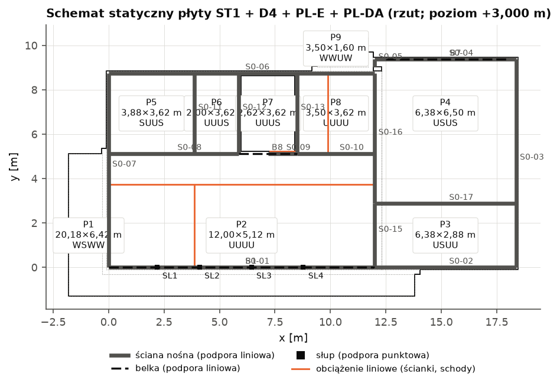

*Rys. Schemat statyczny płyty ST1 + D4 + PL-E + PL-DA: pola (P — wymiary, warunki brzegowe x=0/x=l_x/y=0/y=l_y: S — podparcie swobodne, U — ciągłość/utwierdzenie, W — brzeg swobodny/niepełny), podpory.*

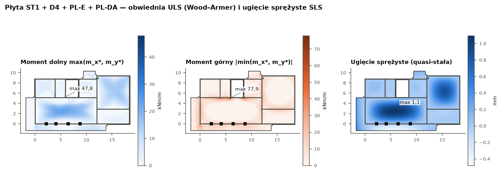

*Rys. Płyta ST1 + D4 + PL-E + PL-DA: momenty wymiarujące (obwiednia kombinacji 6.10a/b, obciążeń szachownicowych i sytuacji wyjątkowej) oraz ugięcie sprężyste od kombinacji quasi-stałej (bez zarysowania i pełzania — te w obliczeniach 7.4.3).*

#### Zestawienie obciążeń

**Obciążenia stałe — D4 — Dach zielony ekstensywny NIEUŻYTKOWY nad garażem (pom. nieogrzewane) i pasem gospodarczym: substrat 8 cm, geowłóknina, mata drenażowa, włóknina, bariera przeciwkorzenna, 2 × papa SBS, PIR spadkowy 12–24 cm, paroizolacja, płyta ŻB 24 cm (dwukierunkowa); opaska żwirowa 0,5 m przy attykach i wpustach (U = 0,13); nad garażem: pole PV biosolarne (liczba modułów — energia.pv.pola)**

| Warstwa | Obliczenie | g_k [kN/m²] | γ_G (6.10a) | g_d [kN/m²] | ξγ_G (6.10b) | g_d [kN/m²] |
|---|---|---|---|---|---|---|
| Substrat ekstensywny 8 cm z matą rozchodnikową (sedum) — ciężar w stanie nasycenia wodą | 8,0 cm × 14,00 kN/m³ | 1,120 | 1,35 | 1,512 | 1,15 | 1,285 |
| Geowłóknina filtracyjna PP 150 g/m² | 0,2 cm × 1,47 kN/m³ | 0,003 | 1,35 | 0,004 | 1,15 | 0,003 |
| Mata drenażowo-retencyjna HDPE 25 mm (dach zielony) | 2,5 cm × 0,78 kN/m³ | 0,020 | 1,35 | 0,026 | 1,15 | 0,023 |
| Włóknina ochronna PP 300 g/m² | 0,4 cm × 1,47 kN/m³ | 0,006 | 1,35 | 0,008 | 1,15 | 0,007 |
| Bariera przeciwkorzenna PE-HD 0,5 mm (PN-EN 13948) | 0,1 cm × 9,32 kN/m³ | 0,005 | 1,35 | 0,006 | 1,15 | 0,005 |
| Hydroizolacja 2 × papa SBS (podkładowa + wierzchniego krycia, dach zielony) | 0,9 cm × 10,79 kN/m³ | 0,103 | 1,35 | 0,138 | 1,15 | 0,118 |
| Płyty PIR z okładziną (izolacja spadkowa stropodachów) | 18,0 cm × 0,31 kN/m³ | 0,057 | 1,35 | 0,076 | 1,15 | 0,065 |
| Paroizolacja bitumiczna z wkładką Al (na płycie stropodachów) | 0,4 cm × 10,79 kN/m³ | 0,043 | 1,35 | 0,058 | 1,15 | 0,050 |
| Żelbet C25/30, B500SP (stropy, płyta fundamentowa, ściany) | 24,0 cm × 25,00 kN/m³ | 6,000 | 1,35 | 8,100 | 1,15 | 6,885 |
| **Razem g_k** |  | 7,355 |  | 9,930 |  | 8,440 |

- **Moduły PV (pole fotowoltaiczne na dachu D4)** — obciążenie stałe na obrysie 7 modułów: g_PV = (m_modułu + m_stelaża)·g/A_modułu = 31,5·9,81·10⁻³/1,923 = **0,161** kN/m² (balast systemu biosolarnego — substrat, w warstwach dachu); masy — dane wyrobu [DANE PRZYKŁADOWE – FIKCYJNE]; PR — [ZAŁ]; masy modułu i stelaża — do potwierdzenia kartą wybranego wyrobu (PT-4 IE).

- Obciążenie użytkowe: dach bez dostępu (kat. H): q_k = 0,40 kN/m², Q_k = 1,0 kN, ψ₀/ψ₁/ψ₂ = 0,0/0,0/0,0 (PN-EN 1991-1-1 tabl. 6.10 + NA; nie łączyć ze śniegiem i wiatrem (p. 3.3.2)).
- Obciążenie dodatkowe (QA): ścianka działowa S1-14: 1,06 kN/m → zastępcze 0,8 kN/m² (6.3.1.2(8)).
- Obciążenie dodatkowe (QA): ścianka działowa S1-15: 1,06 kN/m → zastępcze 0,8 kN/m² (6.3.1.2(8)).
- Śnieg: s = 0,720 kN/m² (przypadek równomierny) oraz zaspy (poniżej).

#### Obliczenia

##### Śnieg — zaspa przy attyce h = 0,55 m (trwała sytuacja obliczeniowa) — D4

- Współczynnik kształtu przy przeszkodzie: μ₂ = γ·h/s_k = 2,00·0,55/0,90 = **1,211** *((6.1))*
- Przyjęto (0,8 ≤ μ₂ ≤ 2,0): μ₂ = **1,211** *(p. 6.2(2))*
- Długość zaspy: l_s = 2h (5 ≤ l_s ≤ 15 m) = 2·0,55 = **5,00** m *((6.2))*
- Obciążenie przy attyce: s₂ = μ₂·C_e·C_t·s_k = 1,211·1,00·1,00·0,90 = **1,090** kN/m²

##### Śnieg — zaspa przy uskoku h = 6,57 m (trwała sytuacja obliczeniowa) — D4 przy ścianie S1-02

- Współczynnik od zsuwania się śniegu z dachu wyższego: μ_s = α = 0° ≤ 15° = **0,00** *(p. 5.3.6(1))*
- Współczynnik od nawiewania: μ_w = (b₁ + b₂)/(2h) = (13,12 + 6,20)/(2·6,57) = **1,470** *((5.8))*
- Ograniczenie: μ_w ≤ γ·h/s_k = 2,00·6,57/0,90 = **14,602** *((5.8); γ = 2 kN/m³)*
- Przyjęto (zakres 0,8 ≤ μ_w ≤ 4,0): μ_w = **1,470** *(p. 5.3.6(1) uwaga 1 (wartość zalecana) [NZW NA])*
- Współczynnik kształtu przy uskoku: μ₂ = μ_s + μ_w = 0,00 + 1,470 = **1,470**
- Długość zaspy: l_s = 2h (5 ≤ l_s ≤ 15 m) = 2·6,57 = **13,14** m *((5.9))*
- Obciążenie przy uskoku: s₂ = μ₂·C_e·C_t·s_k = 1,470·1,00·1,00·0,90 = **1,323** kN/m²
- Obciążenie poza zaspą (μ₁ = 0,8): s₁ = **0,720** kN/m²

> b₂ = 6,20 m < l_s = 13,14 m — zaspa obcięta na krawędzi dachu niższego (p. 5.3.6(3)).

##### Śnieg — zaspa wyjątkowa B2 przy uskoku h = 6,57 m (zał. B.3) — D4 przy ścianie S1-02

- Długość zaspy: l_s = min(5h; b₁; 15 m) = min(5·6,57; 13,12; 15) = **13,12** m *(zał. B.3 [NZW])*
- Współczynnik kształtu: μ₁ = min{2h/s_k; 2b/l_s; 8} = min{14,60; 2,00; 8} = **2,000** *(zał. B.3 (B.2) [NZW])*
- Obciążenie wyjątkowe: s_Ad = μ₁·s_k = 2,000·0,90 = **1,800** kN/m² *((4.2))*

> Sytuacja wyjątkowa (PN-EN 1990 6.11b): γ = 1,0; [NZW] wzory zał. B wg R5-38 — potwierdzić w normie (N-12).

##### Sprawdzenie metodą tablic — pole P4 (6,38 × 6,50 m, brzegi USUS)

- Obciążenia obliczeniowe (miarodajne z 6.10a/6.10b): g_d; q_d = g_k = 7,390, q_k = 1,178 kN/m² = **9,977; 1,237** kN/m²
- Współczynniki (brzegi USUS; x=0, x=l_x, y=0, y=l_y; S — podparta, U — utwierdzona): α_x; α_y; β_x; β_y = **0,0316; 0,0306; −0,0712; −0,0702** *(MRS (odpowiednik tablic Czernego), ν = 0,2)*
- Współczynniki płyty swobodnie podpartej (SSSS): α_x⁰; α_y⁰ = **0,0458; 0,0444**
- Moment przęsłowy x: M_x = [α_x·(g_d + q_d/2) + α_x⁰·q_d/2]·l_x² = [0,0316·10,595 + 0,0458·0,618]·6,38² = **14,76** kNm/m
- Moment przęsłowy y: M_y = [α_y·(g_d + q_d/2) + α_y⁰·q_d/2]·l_x² = [0,0306·10,595 + 0,0444·0,618]·6,38² = **14,28** kNm/m
- Momenty podporowe (utwierdzenie, g_d + q_d): M_x,p; M_y,p = **−32,47; −32,01** kNm/m
- Porównanie z MES (M_x; M_y dół, poza narożami): M_MES/M_tabl = **1,03; 1,05**
- Przyjęto do wymiarowania: M_Ed = max(M_MES; M_tabl) = **15,23; 15,06** kNm/m

##### Pole P4 — zginanie dół, kierunek x

- Wysokość użyteczna: d = **210** mm
- Moment względny: μ = M_Ed/(b·d²·η·f_cd) = 15,23·10⁶/(1000·210²·1,0·17,86) = **0,0193** *(3.1.7(3))*
- Względna wysokość strefy ściskanej: ξ_eff = 1 − √(1 − 2μ) = 1 − √(1 − 2·0,0193) = **0,0195**
- Warunek ciągliwości: ξ_eff ≤ ξ_eff,lim = λ·ε_cu3/(ε_cu3 + f_yd/E_s) = 0,020 ≤ 0,493 = **spełniony**
- Wymagane zbrojenie rozciągane: A_s1 = ξ_eff·b·d·η·f_cd/f_yd = 0,0195·1000·210·1,0·17,86/434,8 = **168** mm²
- Zbrojenie minimalne: A_s,min = max(0,26·f_ctm/f_yk·b·d; 0,0013·b·d) = max(0,26·2,6/500·1000·210; 0,0013·1000·210) = **284** mm² *((9.1N) + NA)*
- Przyjęto (z warunkiem rys): φ8 co 17 cm = **2,96** cm²/m
- Naprężenie w stali (quasi-stała, przekrój zarysowany, α_e = 15): σ_s = α_e·M_qp·(d − x_II)/I_II = **178** MPa
- Maksymalna średnica (w_max = 0,4 mm): φ_s = φ*_s·(f_ct,eff/2,9)·k_c·h_cr/(2(h − d)) = 36,5·(2,6/2,9)·0,4·120/(2·30) = **26,2** mm *(tabl. 7.2N, (7.6N))*
- Maksymalny rozstaw prętów: s_max = (σ_s = 178 MPa) = **300** mm *(tabl. 7.3N)*

| Warunek | Efekt | Nośność / limit | η | Stan | Podstawa |
|---|---|---|---|---|---|
| Zbrojenie na zginanie | A_s,req = 284 mm²/m | A_s,prov = 296 mm²/m | 96% | spełniony | 6.1, (9.1N) |
| Rysy: średnica prętów (tabl. 7.2N) | φ = 8 mm | φ_s,max = 26 mm | 31% | spełniony | 7.3.3(2) |

##### Pole P4 — zginanie dół, kierunek y

- Wysokość użyteczna: d = **200** mm
- Moment względny: μ = M_Ed/(b·d²·η·f_cd) = 15,06·10⁶/(1000·200²·1,0·17,86) = **0,0211** *(3.1.7(3))*
- Względna wysokość strefy ściskanej: ξ_eff = 1 − √(1 − 2μ) = 1 − √(1 − 2·0,0211) = **0,0213**
- Warunek ciągliwości: ξ_eff ≤ ξ_eff,lim = λ·ε_cu3/(ε_cu3 + f_yd/E_s) = 0,021 ≤ 0,493 = **spełniony**
- Wymagane zbrojenie rozciągane: A_s1 = ξ_eff·b·d·η·f_cd/f_yd = 0,0213·1000·200·1,0·17,86/434,8 = **175** mm²
- Zbrojenie minimalne: A_s,min = max(0,26·f_ctm/f_yk·b·d; 0,0013·b·d) = max(0,26·2,6/500·1000·200; 0,0013·1000·200) = **270** mm² *((9.1N) + NA)*
- Przyjęto (z warunkiem rys): φ8 co 18 cm = **2,79** cm²/m
- Naprężenie w stali (quasi-stała, przekrój zarysowany, α_e = 15): σ_s = α_e·M_qp·(d − x_II)/I_II = **194** MPa
- Maksymalna średnica (w_max = 0,4 mm): φ_s = φ*_s·(f_ct,eff/2,9)·k_c·h_cr/(2(h − d)) = 33,2·(2,6/2,9)·0,4·120/(2·40) = **17,9** mm *(tabl. 7.2N, (7.6N))*
- Maksymalny rozstaw prętów: s_max = (σ_s = 194 MPa) = **300** mm *(tabl. 7.3N)*

| Warunek | Efekt | Nośność / limit | η | Stan | Podstawa |
|---|---|---|---|---|---|
| Zbrojenie na zginanie | A_s,req = 270 mm²/m | A_s,prov = 279 mm²/m | 97% | spełniony | 6.1, (9.1N) |
| Rysy: średnica prętów (tabl. 7.2N) | φ = 8 mm | φ_s,max = 18 mm | 45% | spełniony | 7.3.3(2) |

##### Pole P4 — zginanie góra, x

- Wysokość użyteczna: d = **210** mm
- Moment względny: μ = M_Ed/(b·d²·η·f_cd) = 32,47·10⁶/(1000·210²·1,0·17,86) = **0,0412** *(3.1.7(3))*
- Względna wysokość strefy ściskanej: ξ_eff = 1 − √(1 − 2μ) = 1 − √(1 − 2·0,0412) = **0,0421**
- Warunek ciągliwości: ξ_eff ≤ ξ_eff,lim = λ·ε_cu3/(ε_cu3 + f_yd/E_s) = 0,042 ≤ 0,493 = **spełniony**
- Wymagane zbrojenie rozciągane: A_s1 = ξ_eff·b·d·η·f_cd/f_yd = 0,0421·1000·210·1,0·17,86/434,8 = **363** mm²
- Zbrojenie minimalne: A_s,min = max(0,26·f_ctm/f_yk·b·d; 0,0013·b·d) = max(0,26·2,6/500·1000·210; 0,0013·1000·210) = **284** mm² *((9.1N) + NA)*
- Przyjęto (z warunkiem rys): φ10 co 21 cm = **3,74** cm²/m
- Naprężenie w stali (quasi-stała, przekrój zarysowany, α_e = 15): σ_s = α_e·M_qp·(d − x_II)/I_II = **166** MPa
- Maksymalna średnica (w_max = 0,4 mm): φ_s = φ*_s·(f_ct,eff/2,9)·k_c·h_cr/(2(h − d)) = 38,9·(2,6/2,9)·0,4·120/(2·30) = **27,9** mm *(tabl. 7.2N, (7.6N))*
- Maksymalny rozstaw prętów: s_max = (σ_s = 166 MPa) = **300** mm *(tabl. 7.3N)*

| Warunek | Efekt | Nośność / limit | η | Stan | Podstawa |
|---|---|---|---|---|---|
| Zbrojenie na zginanie | A_s,req = 363 mm²/m | A_s,prov = 374 mm²/m | 97% | spełniony | 6.1, (9.1N) |
| Rysy: średnica prętów (tabl. 7.2N) | φ = 10 mm | φ_s,max = 28 mm | 36% | spełniony | 7.3.3(2) |

##### Pole P4 — zginanie góra, y

- Wysokość użyteczna: d = **200** mm
- Moment względny: μ = M_Ed/(b·d²·η·f_cd) = 32,01·10⁶/(1000·200²·1,0·17,86) = **0,0448** *(3.1.7(3))*
- Względna wysokość strefy ściskanej: ξ_eff = 1 − √(1 − 2μ) = 1 − √(1 − 2·0,0448) = **0,0459**
- Warunek ciągliwości: ξ_eff ≤ ξ_eff,lim = λ·ε_cu3/(ε_cu3 + f_yd/E_s) = 0,046 ≤ 0,493 = **spełniony**
- Wymagane zbrojenie rozciągane: A_s1 = ξ_eff·b·d·η·f_cd/f_yd = 0,0459·1000·200·1,0·17,86/434,8 = **377** mm²
- Zbrojenie minimalne: A_s,min = max(0,26·f_ctm/f_yk·b·d; 0,0013·b·d) = max(0,26·2,6/500·1000·200; 0,0013·1000·200) = **270** mm² *((9.1N) + NA)*
- Przyjęto (z warunkiem rys): φ8 co 13 cm = **3,87** cm²/m
- Naprężenie w stali (quasi-stała, przekrój zarysowany, α_e = 15): σ_s = α_e·M_qp·(d − x_II)/I_II = **196** MPa
- Maksymalna średnica (w_max = 0,4 mm): φ_s = φ*_s·(f_ct,eff/2,9)·k_c·h_cr/(2(h − d)) = 32,7·(2,6/2,9)·0,4·120/(2·40) = **17,6** mm *(tabl. 7.2N, (7.6N))*
- Maksymalny rozstaw prętów: s_max = (σ_s = 196 MPa) = **300** mm *(tabl. 7.3N)*

| Warunek | Efekt | Nośność / limit | η | Stan | Podstawa |
|---|---|---|---|---|---|
| Zbrojenie na zginanie | A_s,req = 377 mm²/m | A_s,prov = 387 mm²/m | 97% | spełniony | 6.1, (9.1N) |
| Rysy: średnica prętów (tabl. 7.2N) | φ = 8 mm | φ_s,max = 18 mm | 45% | spełniony | 7.3.3(2) |

##### Pole P4 — zbrojenie narożne (góra i dół, strefy 1,28 × 1,28 m)

- Wysokość użyteczna: d = **200** mm
- Moment względny: μ = M_Ed/(b·d²·η·f_cd) = 16,95·10⁶/(1000·200²·1,0·17,86) = **0,0237** *(3.1.7(3))*
- Względna wysokość strefy ściskanej: ξ_eff = 1 − √(1 − 2μ) = 1 − √(1 − 2·0,0237) = **0,0240**
- Warunek ciągliwości: ξ_eff ≤ ξ_eff,lim = λ·ε_cu3/(ε_cu3 + f_yd/E_s) = 0,024 ≤ 0,493 = **spełniony**
- Wymagane zbrojenie rozciągane: A_s1 = ξ_eff·b·d·η·f_cd/f_yd = 0,0240·1000·200·1,0·17,86/434,8 = **197** mm²
- Zbrojenie minimalne: A_s,min = max(0,26·f_ctm/f_yk·b·d; 0,0013·b·d) = max(0,26·2,6/500·1000·200; 0,0013·1000·200) = **270** mm² *((9.1N) + NA)*
- Przyjęto: φ8 co 18 cm = **2,79** cm²/m

| Warunek | Efekt | Nośność / limit | η | Stan | Podstawa |
|---|---|---|---|---|---|
| Zbrojenie na zginanie | A_s,req = 270 mm²/m | A_s,prov = 279 mm²/m | 97% | spełniony | 6.1, (9.1N) |

##### Pole P4 — ścinanie: V_Ed > V_Rd,c — zbrojenie na ścinanie płyty (9.3.2), strzemiona φ8, 5 ramion/m

- Współczynnik skali: k = 1 + √(200/d) ≤ 2,0 = 1 + √(200/210) = **1,976**
- Stopień zbrojenia podłużnego: ρ_l = A_sl/(b_w·d) ≤ 0,02 = 296/(1000·210) = **0,00141**
- Nośność na ścinanie: V_Rd,c = C_Rd,c·k·(100·ρ_l·f_ck)^(1/3)·b_w·d = 0,1286·1,976·(100·0,00141·25)^(1/3)·1000·210·10⁻³ = **81,15** kN *((6.2.a); C_Rd,c = 0,18/γ_c)*
- Wartość minimalna: V_Rd,c,min = v_min·b_w·d, v_min = 0,035·k^(3/2)·f_ck^(1/2) = 0,4861·1000·210·10⁻³ = **102,07** kN *((6.2.b), (6.3N))*
- Ramię sił wewnętrznych: z = 0,9·d = 0,9·210 = **189** mm
- Przyjęto nachylenie krzyżulców betonowych: cot θ = (1,0 ≤ cot θ ≤ 2,0 — NA) = **2,00** *((6.7N))*
- Nośność krzyżulców ściskanych: V_Rd,max = b_w·z·ν₁·f_cd/(cot θ + tan θ) = 1000·189·0,540·17,86/(2,00 + 0,500)·10⁻³ = **729,00** kN *((6.9), ν₁ = ν (6.6N))*
- Rozstaw z warunku nośności: s = A_sw·z·f_ywd·cot θ/V_Ed = 251,3·189·434,8·2,00/(110,34·10³) = **374** mm *((6.8))*
- Rozstaw maksymalny: s_l,max = 0,75·d = 0,75·210 = **158** mm *((9.6N))*
- Stopień zbrojenia minimalny: ρ_w,min = 0,08·√f_ck/f_yk → s ≤ A_sw/(ρ_w,min·b_w) = 251,3/(0,00080·1000) = **314** mm *((9.5N))*
- Przyjęto strzemiona: φ8 5-cięte co s = **150** mm
- Nośność zbrojenia na ścinanie: V_Rd,s = A_sw/s·z·f_ywd·cot θ = 251,3/150·189·434,8·2,00·10⁻³ = **275,37** kN

| Warunek | Efekt | Nośność / limit | η | Stan | Podstawa |
|---|---|---|---|---|---|
| Nośność krzyżulców betonowych | V_Ed = 110,34 kN | V_Rd,max = 729,00 kN | 15% | spełniony | (6.9) |
| Nośność strzemion | V_Ed = 110,34 kN | V_Rd,s = 275,37 kN | 40% | spełniony | (6.8) |

##### Pole P4 — ugięcie (l = 6,38 m, K = 1,3)

- Stopień zbrojenia wymagany: ρ = A_s,req/(b·d) = 168/(1000·210) = **0,00080**
- Wartość odniesienia: ρ₀ = √f_ck·10⁻³ = √25·10⁻³ = **0,00500**
- Graniczne l/d (ρ ≤ ρ₀): K·[11 + 1,5·√f_ck·ρ₀/ρ + 3,2·√f_ck·(ρ₀/ρ − 1)^(3/2)] = 1,3·[11 + 1,5·5,000·6,234 + 3,2·5,000·(6,234 − 1)^1,5] = **324,1** *((7.16a))*
- Mnożnik od naprężeń w stali: 310/σ_s ≈ 500/(f_yk·A_s,req/A_s,prov) ≤ 1,5 = 500/(500·168/296) = **1,500** *((7.17))*
- Smukłość rzeczywista: l_eff/d = 6,38/0,210 = **30,4**
- *Obliczenie ugięcia (7.4.3)*
- Efektywny moduł sprężystości: E_c,eff = E_cm/(1 + φ) = 31000/(1 + 2,5) = **8857** MPa *((7.20))*
- Stosunek modułów: α_e = E_s/E_c,eff = 200000/8857 = **22,58**
- Przekrój niezarysowany: x_I; I_I = **122,4 mm; 1204,6·10⁶ mm⁴**
- Przekrój zarysowany: x_II; I_II = **46,7 mm; 212,0·10⁶ mm⁴**
- Moment rysujący: M_cr = f_ctm·I_I/(h − x_I) = 2,6·1204,6·10⁶/(240 − 122,4) = **26,64** kNm
- Współczynnik rozkładu: ζ = 1 − β·(M_cr/M_qp)², β = 0,5 = M_qp ≤ M_cr → 0 = **0,000** *((7.19))*
- Ugięcie od obciążeń (quasi-stała): w_q = ζ·w_II + (1 − ζ)·w_I = 0,000·16,65 + 1,000·2,93 = **2,93** mm *((7.18))*
- Ugięcie od skurczu: w_cs = k·(1/r_cs)·l², 1/r_cs = ε_cs·α_e·S/I = 0,125·0,194·10⁻⁶·6375² = **0,99** mm *((7.21))*
- Ugięcie całkowite: w = w_q + w_cs = 2,93 + 0,99 = **3,92** mm
- Ugięcie dopuszczalne: w_lim = L/250 = 6375/250 = **25,5** mm *(7.4.1(4))*

| Warunek | Efekt | Nośność / limit | η | Stan | Podstawa |
|---|---|---|---|---|---|
| Ugięcie — graniczna smukłość l/d (7.4.2) | l/d = 30,4  | (l/d)_lim = 486,2  | 6% | spełniony | (7.16), tabl. 7.4N |

> l/d spełnione — obliczenie (7.4.3) informacyjnie: w = 3,9 mm ≤? 25,5 mm.

#### Wymiarowanie — zestawienia

**Zestawienie wymiarowania pól płyty** (M [kNm/m] — obwiednia ULS, Wood–Armer, poza strefami narożnymi; „tabl.” — metoda tablic, jeżeli stosowalna; góra — nad podporami; naroża — strefy 0,2·l_min × 0,2·l_min przy narożach podpartych, zbrojenie górą i dołem na moment skręcający)

| Pole | l_x × l_y [m] | Brzegi | M_x,dół [kNm/m] MES / tabl. | Zbroj. x dół | M_y,dół MES / tabl. | Zbroj. y dół | M_x,góra | Zbroj. x góra | M_y,góra | Zbroj. y góra | Naroża M / zbroj. | w / w_lim [mm] | η_max |
|---|---|---|---|---|---|---|---|---|---|---|---|---|---|
| P3 | 6,38 × 2,88 | USUU | 8,96 / 1,72 | φ8 co 17 cm | 8,95 / 4,21 | φ8 co 18 cm | −8,78 | φ8 co 17 cm | −20,56 | φ8 co 18 cm | 10,02 / φ8 co 18 cm | 0,2 / 11,5 | 97% |
| P4 | 6,38 × 6,50 | USUS | 15,23 / 14,76 | φ8 co 17 cm | 15,06 / 14,28 | φ8 co 18 cm | −32,47 | φ10 co 21 cm | −32,01 | φ8 co 13 cm | 16,95 / φ8 co 18 cm | 3,9 / 25,5 | 97% |

**Reakcje podporowe (charakterystyczne, cała grupa płyt)**

| Podpora | Długość [m] | ΣR_G [kN] | ΣR_Q [kN] | max r_G [kN/m] | max r_Q [kN/m] |
|---|---|---|---|---|---|
| S0-02 | 6,38 | 47,8 | 11,0 | 20,85 | 18,72 |
| S0-03 | 9,38 | 65,6 | 0,0 | 68,77 | 0,28 |
| S0-04 | 6,38 | 16,9 | 0,4 | 164,12 | 143,36 |
| S0-05 | 0,33 | 23,8 | 5,1 | 161,43 | 141,01 |
| S0-17 | 6,38 | 101,5 | −26,8 | 225,08 | 75,54 |
| B7 | 5,45 | 37,4 | −0,2 | 9,61 | 0,16 |

#### Wnioski

**Przyjęto:** Płyta gr. 24 cm z betonu C25/30, stal B500SP, otulenie c_nom = 25 mm; zbrojenie wg zestawienia pól (dołem siatka w obu kierunkach, górą nad podporami).  
**Przyjęto:** Maks. ugięcie długotrwałe ≈ 3,9 mm.  

## Poz. 2 — Stropy

### Poz. 2.1 — Strop ST2

Element modelu: `ST2` · maks. wykorzystanie nośności η = 98% · wszystkie warunki spełnione

#### Opis i schemat statyczny

Płyta żelbetowa monolityczna gr. h = 22 cm, wierzch konstrukcji 6,150 m, beton C25/30 (ekspozycja XC1), stal B500SP. Pole płyty 76,77 m². Analiza wspólna z: ST2 + ST2Z + D2 + D3 + PL-2 (płyty połączone na jednym poziomie — ciągłość nad podporami/łącznikami). Schemat: płyta na podporach liniowych (ściany, belki — podpory sztywne, przegubowe) i punktowych (słupy); statyka — MES płytowy (elementy ACM, siatka 20 cm, obwiednia kombinacji 6.10a/6.10b i obciążeń szachownicowych pól), sprawdzenie pól prostokątnych metodą tablic (współczynniki MRS).

Podpory: S1-01 (ściana), S1-02 (ściana), S1-03 (ściana), S1-04 (ściana), S1-05 (ściana), S1-06 (ściana), S1-07 (ściana), S1-08 (ściana), S1-09 (ściana), B2 (belka), B4 (belka), B5 (belka), B9 (belka), N17 (belka)

*Rys. Schemat statyczny płyty ST2 + ST2Z + D2 + D3 + PL-2: pola (P — wymiary, warunki brzegowe x=0/x=l_x/y=0/y=l_y: S — podparcie swobodne, U — ciągłość/utwierdzenie, W — brzeg swobodny/niepełny), podpory.*

*Rys. Płyta ST2 + ST2Z + D2 + D3 + PL-2: momenty wymiarujące (obwiednia kombinacji 6.10a/b, obciążeń szachownicowych i sytuacji wyjątkowej) oraz ugięcie sprężyste od kombinacji quasi-stałej (bez zarysowania i pełzania — te w obliczeniach 7.4.3).*

#### Zestawienie obciążeń

**Obciążenia stałe — ST2 — strop (podłoga POD-1, sufit TYNK_GIPS)**

| Warstwa | Obliczenie | g_k [kN/m²] | γ_G (6.10a) | g_d [kN/m²] | ξγ_G (6.10b) | g_d [kN/m²] |
|---|---|---|---|---|---|---|
| Deska warstwowa dębowa 15 mm, klejona | 1,5 cm × 6,87 kN/m³ | 0,103 | 1,35 | 0,139 | 1,15 | 0,118 |
| Jastrych cementowy CT-C25-F5 z wężownicą ogrzewania podłogowego | 6,5 cm × 22,00 kN/m³ | 1,430 | 1,35 | 1,931 | 1,15 | 1,641 |
| Styropian podłogowy EPS 100-038 (pod jastrychem) | 4,0 cm × 0,18 kN/m³ | 0,007 | 1,35 | 0,010 | 1,15 | 0,008 |
| Styropian elastyfikowany EPS T (akustyczny, pod jastrychem) | 3,0 cm × 0,12 kN/m³ | 0,004 | 1,35 | 0,005 | 1,15 | 0,004 |
| Płyta żelbetowa | 22,0 cm × 25,00 kN/m³ | 5,500 | 1,35 | 7,425 | 1,15 | 6,311 |
| Tynk gipsowy maszynowy 1,5 cm | 1,0 cm × 11,77 kN/m³ | 0,118 | 1,35 | 0,159 | 1,15 | 0,135 |
| **Razem g_k** |  | 7,161 |  | 9,668 |  | 8,218 |

- Obciążenie użytkowe: stropy mieszkalne (kat. A): q_k = 2,00 kN/m², Q_k = 3,0 kN, ψ₀/ψ₁/ψ₂ = 0,7/0,5/0,3 (PN-EN 1991-1-1 tabl. 6.2 + NA; R5 3.3 [NZW NA — górna granica EN]).
- Obciążenie dodatkowe (G): ścianka działowa S2-12: 6,44 kN/m (> 3 kN/m — obciążenie liniowe, 6.3.1.2(9)).
- Obciążenie dodatkowe (G): ścianka działowa S2-13: 10,53 kN/m (> 3 kN/m — obciążenie liniowe, 6.3.1.2(9)).
- Obciążenie dodatkowe (G): ścianka działowa S2-18: 5,46 kN/m (> 3 kN/m — obciążenie liniowe, 6.3.1.2(9)).
- Obciążenie dodatkowe (G): ścianka działowa S2-14: 10,53 kN/m (> 3 kN/m — obciążenie liniowe, 6.3.1.2(9)).
- Obciążenie dodatkowe (G): ścianka działowa S2-19: 5,46 kN/m (> 3 kN/m — obciążenie liniowe, 6.3.1.2(9)).
- Obciążenie dodatkowe (G): ścianka działowa S2-15: 5,55 kN/m (> 3 kN/m — obciążenie liniowe, 6.3.1.2(9)).
- Obciążenie dodatkowe (QA): ścianka działowa S2-16: 1,06 kN/m → zastępcze 0,8 kN/m² (6.3.1.2(8)).
- Obciążenie dodatkowe (QA): ścianka działowa S2-17: 1,06 kN/m → zastępcze 0,8 kN/m² (6.3.1.2(8)).
- Obciążenie dodatkowe (G): reakcja schodów SCH2: 15,61 kN/m (G).
- Obciążenie dodatkowe (QA): reakcja schodów SCH2: 7,04 kN/m (Q).

#### Obliczenia

##### Sprawdzenie metodą tablic — pole P3 (12,00 × 5,12 m, brzegi UUUU)

- Obciążenie liniowe ścianek na polu jako równomierne zastępcze [UPR — tylko porównanie]: g_dz = Σ(g_l·l)/A = **2,116** kN/m²
- Obciążenia obliczeniowe (miarodajne z 6.10a/6.10b): g_d; q_d = g_k = 9,278, q_k = 2,800 kN/m² = **12,525; 2,940** kN/m²
- Współczynniki (brzegi UUUU; x=0, x=l_x, y=0, y=l_y; S — podparta, U — utwierdzona): α_x; α_y; β_x; β_y = **0,0027; 0,0076; −0,0104; −0,0153** *(MRS (odpowiednik tablic Czernego), ν = 0,2)*
- Współczynniki płyty swobodnie podpartej (SSSS): α_x⁰; α_y⁰ = **0,0068; 0,0199**
- Moment przęsłowy x: M_x = [α_x·(g_d + q_d/2) + α_x⁰·q_d/2]·l_x² = [0,0027·13,995 + 0,0068·1,470]·12,00² = **6,87** kNm/m
- Moment przęsłowy y: M_y = [α_y·(g_d + q_d/2) + α_y⁰·q_d/2]·l_x² = [0,0076·13,995 + 0,0199·1,470]·12,00² = **19,53** kNm/m
- Momenty podporowe (utwierdzenie, g_d + q_d): M_x,p; M_y,p = **−23,09; −34,06** kNm/m
- Porównanie z MES (M_x; M_y dół, poza narożami): M_MES/M_tabl = **2,07; 1,60**
- Przyjęto do wymiarowania: M_Ed = max(M_MES; M_tabl) = **14,20; 31,30** kNm/m

##### Pole P3 — zginanie dół, kierunek x

- Wysokość użyteczna: d = **190** mm
- Moment względny: μ = M_Ed/(b·d²·η·f_cd) = 14,20·10⁶/(1000·190²·1,0·17,86) = **0,0220** *(3.1.7(3))*
- Względna wysokość strefy ściskanej: ξ_eff = 1 − √(1 − 2μ) = 1 − √(1 − 2·0,0220) = **0,0223**
- Warunek ciągliwości: ξ_eff ≤ ξ_eff,lim = λ·ε_cu3/(ε_cu3 + f_yd/E_s) = 0,022 ≤ 0,493 = **spełniony**
- Wymagane zbrojenie rozciągane: A_s1 = ξ_eff·b·d·η·f_cd/f_yd = 0,0223·1000·190·1,0·17,86/434,8 = **174** mm²
- Zbrojenie minimalne: A_s,min = max(0,26·f_ctm/f_yk·b·d; 0,0013·b·d) = max(0,26·2,6/500·1000·190; 0,0013·1000·190) = **257** mm² *((9.1N) + NA)*
- Przyjęto (z warunkiem rys): φ8 co 19 cm = **2,65** cm²/m
- Naprężenie w stali (quasi-stała, przekrój zarysowany, α_e = 15): σ_s = α_e·M_qp·(d − x_II)/I_II = **202** MPa
- Maksymalna średnica (w_max = 0,4 mm): φ_s = φ*_s·(f_ct,eff/2,9)·k_c·h_cr/(2(h − d)) = 31,4·(2,6/2,9)·0,4·110/(2·30) = **20,7** mm *(tabl. 7.2N, (7.6N))*
- Maksymalny rozstaw prętów: s_max = (σ_s = 202 MPa) = **298** mm *(tabl. 7.3N)*

| Warunek | Efekt | Nośność / limit | η | Stan | Podstawa |
|---|---|---|---|---|---|
| Zbrojenie na zginanie | A_s,req = 257 mm²/m | A_s,prov = 265 mm²/m | 97% | spełniony | 6.1, (9.1N) |
| Rysy: średnica prętów (tabl. 7.2N) | φ = 8 mm | φ_s,max = 21 mm | 39% | spełniony | 7.3.3(2) |

##### Pole P3 — zginanie dół, kierunek y

- Wysokość użyteczna: d = **180** mm
- Moment względny: μ = M_Ed/(b·d²·η·f_cd) = 31,30·10⁶/(1000·180²·1,0·17,86) = **0,0541** *(3.1.7(3))*
- Względna wysokość strefy ściskanej: ξ_eff = 1 − √(1 − 2μ) = 1 − √(1 − 2·0,0541) = **0,0556**
- Warunek ciągliwości: ξ_eff ≤ ξ_eff,lim = λ·ε_cu3/(ε_cu3 + f_yd/E_s) = 0,056 ≤ 0,493 = **spełniony**
- Wymagane zbrojenie rozciągane: A_s1 = ξ_eff·b·d·η·f_cd/f_yd = 0,0556·1000·180·1,0·17,86/434,8 = **411** mm²
- Zbrojenie minimalne: A_s,min = max(0,26·f_ctm/f_yk·b·d; 0,0013·b·d) = max(0,26·2,6/500·1000·180; 0,0013·1000·180) = **243** mm² *((9.1N) + NA)*
- Przyjęto (z warunkiem rys): φ8 co 12 cm = **4,19** cm²/m
- Naprężenie w stali (quasi-stała, przekrój zarysowany, α_e = 15): σ_s = α_e·M_qp·(d − x_II)/I_II = **295** MPa
- Maksymalna średnica (w_max = 0,4 mm): φ_s = φ*_s·(f_ct,eff/2,9)·k_c·h_cr/(2(h − d)) = 14,5·(2,6/2,9)·0,4·110/(2·40) = **7,2** mm *(tabl. 7.2N, (7.6N))*
- Maksymalny rozstaw prętów: s_max = (σ_s = 295 MPa) = **181** mm *(tabl. 7.3N)*

| Warunek | Efekt | Nośność / limit | η | Stan | Podstawa |
|---|---|---|---|---|---|
| Zbrojenie na zginanie | A_s,req = 411 mm²/m | A_s,prov = 419 mm²/m | 98% | spełniony | 6.1, (9.1N) |
| Rysy: rozstaw prętów (tabl. 7.3N) | s = 120 mm | s_max = 181 mm | 66% | spełniony | 7.3.3(2) |

##### Pole P3 — zginanie góra, x

- Wysokość użyteczna: d = **190** mm
- Moment względny: μ = M_Ed/(b·d²·η·f_cd) = 31,29·10⁶/(1000·190²·1,0·17,86) = **0,0485** *(3.1.7(3))*
- Względna wysokość strefy ściskanej: ξ_eff = 1 − √(1 − 2μ) = 1 − √(1 − 2·0,0485) = **0,0498**
- Warunek ciągliwości: ξ_eff ≤ ξ_eff,lim = λ·ε_cu3/(ε_cu3 + f_yd/E_s) = 0,050 ≤ 0,493 = **spełniony**
- Wymagane zbrojenie rozciągane: A_s1 = ξ_eff·b·d·η·f_cd/f_yd = 0,0498·1000·190·1,0·17,86/434,8 = **388** mm²
- Zbrojenie minimalne: A_s,min = max(0,26·f_ctm/f_yk·b·d; 0,0013·b·d) = max(0,26·2,6/500·1000·190; 0,0013·1000·190) = **257** mm² *((9.1N) + NA)*
- Przyjęto (z warunkiem rys): φ10 co 19 cm = **4,13** cm²/m
- Naprężenie w stali (quasi-stała, przekrój zarysowany, α_e = 15): σ_s = α_e·M_qp·(d − x_II)/I_II = **280** MPa
- Maksymalna średnica (w_max = 0,4 mm): φ_s = φ*_s·(f_ct,eff/2,9)·k_c·h_cr/(2(h − d)) = 16,0·(2,6/2,9)·0,4·110/(2·30) = **10,5** mm *(tabl. 7.2N, (7.6N))*
- Maksymalny rozstaw prętów: s_max = (σ_s = 280 MPa) = **199** mm *(tabl. 7.3N)*

| Warunek | Efekt | Nośność / limit | η | Stan | Podstawa |
|---|---|---|---|---|---|
| Zbrojenie na zginanie | A_s,req = 388 mm²/m | A_s,prov = 413 mm²/m | 94% | spełniony | 6.1, (9.1N) |
| Rysy: średnica prętów (tabl. 7.2N) | φ = 10 mm | φ_s,max = 10 mm | 95% | spełniony | 7.3.3(2) |

##### Pole P3 — zginanie góra, y

- Wysokość użyteczna: d = **180** mm
- Moment względny: μ = M_Ed/(b·d²·η·f_cd) = 86,96·10⁶/(1000·180²·1,0·17,86) = **0,1503** *(3.1.7(3))*
- Względna wysokość strefy ściskanej: ξ_eff = 1 − √(1 − 2μ) = 1 − √(1 − 2·0,1503) = **0,1637**
- Warunek ciągliwości: ξ_eff ≤ ξ_eff,lim = λ·ε_cu3/(ε_cu3 + f_yd/E_s) = 0,164 ≤ 0,493 = **spełniony**
- Wymagane zbrojenie rozciągane: A_s1 = ξ_eff·b·d·η·f_cd/f_yd = 0,1637·1000·180·1,0·17,86/434,8 = **1210** mm²
- Zbrojenie minimalne: A_s,min = max(0,26·f_ctm/f_yk·b·d; 0,0013·b·d) = max(0,26·2,6/500·1000·180; 0,0013·1000·180) = **243** mm² *((9.1N) + NA)*
- Przyjęto (z warunkiem rys): φ16 co 16 cm = **12,57** cm²/m
- Naprężenie w stali (quasi-stała, przekrój zarysowany, α_e = 15): σ_s = α_e·M_qp·(d − x_II)/I_II = **285** MPa
- Maksymalna średnica (w_max = 0,4 mm): φ_s = φ*_s·(f_ct,eff/2,9)·k_c·h_cr/(2(h − d)) = 15,5·(2,6/2,9)·0,4·110/(2·40) = **7,6** mm *(tabl. 7.2N, (7.6N))*
- Maksymalny rozstaw prętów: s_max = (σ_s = 285 MPa) = **193** mm *(tabl. 7.3N)*

| Warunek | Efekt | Nośność / limit | η | Stan | Podstawa |
|---|---|---|---|---|---|
| Zbrojenie na zginanie | A_s,req = 1210 mm²/m | A_s,prov = 1257 mm²/m | 96% | spełniony | 6.1, (9.1N) |
| Rysy: rozstaw prętów (tabl. 7.3N) | s = 160 mm | s_max = 193 mm | 83% | spełniony | 7.3.3(2) |

##### Pole P3 — zbrojenie narożne (góra i dół, strefy 1,03 × 1,03 m)

- Wysokość użyteczna: d = **180** mm
- Moment względny: μ = M_Ed/(b·d²·η·f_cd) = 17,30·10⁶/(1000·180²·1,0·17,86) = **0,0299** *(3.1.7(3))*
- Względna wysokość strefy ściskanej: ξ_eff = 1 − √(1 − 2μ) = 1 − √(1 − 2·0,0299) = **0,0304**
- Warunek ciągliwości: ξ_eff ≤ ξ_eff,lim = λ·ε_cu3/(ε_cu3 + f_yd/E_s) = 0,030 ≤ 0,493 = **spełniony**
- Wymagane zbrojenie rozciągane: A_s1 = ξ_eff·b·d·η·f_cd/f_yd = 0,0304·1000·180·1,0·17,86/434,8 = **224** mm²
- Zbrojenie minimalne: A_s,min = max(0,26·f_ctm/f_yk·b·d; 0,0013·b·d) = max(0,26·2,6/500·1000·180; 0,0013·1000·180) = **243** mm² *((9.1N) + NA)*
- Przyjęto: φ8 co 20 cm = **2,51** cm²/m

| Warunek | Efekt | Nośność / limit | η | Stan | Podstawa |
|---|---|---|---|---|---|
| Zbrojenie na zginanie | A_s,req = 243 mm²/m | A_s,prov = 251 mm²/m | 97% | spełniony | 6.1, (9.1N) |

##### Pole P3 — ścinanie: V_Ed > V_Rd,c — zbrojenie na ścinanie płyty (9.3.2), strzemiona φ8, 5 ramion/m

- Współczynnik skali: k = 1 + √(200/d) ≤ 2,0 = 1 + √(200/190) = **2,000**
- Stopień zbrojenia podłużnego: ρ_l = A_sl/(b_w·d) ≤ 0,02 = 265/(1000·190) = **0,00139**
- Nośność na ścinanie: V_Rd,c = C_Rd,c·k·(100·ρ_l·f_ck)^(1/3)·b_w·d = 0,1286·2,000·(100·0,00139·25)^(1/3)·1000·190·10⁻³ = **74,04** kN *((6.2.a); C_Rd,c = 0,18/γ_c)*
- Wartość minimalna: V_Rd,c,min = v_min·b_w·d, v_min = 0,035·k^(3/2)·f_ck^(1/2) = 0,4950·1000·190·10⁻³ = **94,05** kN *((6.2.b), (6.3N))*
- Ramię sił wewnętrznych: z = 0,9·d = 0,9·190 = **171** mm
- Przyjęto nachylenie krzyżulców betonowych: cot θ = (1,0 ≤ cot θ ≤ 2,0 — NA) = **2,00** *((6.7N))*
- Nośność krzyżulców ściskanych: V_Rd,max = b_w·z·ν₁·f_cd/(cot θ + tan θ) = 1000·171·0,540·17,86/(2,00 + 0,500)·10⁻³ = **659,57** kN *((6.9), ν₁ = ν (6.6N))*
- Rozstaw z warunku nośności: s = A_sw·z·f_ywd·cot θ/V_Ed = 251,3·171·434,8·2,00/(180,05·10³) = **208** mm *((6.8))*
- Rozstaw maksymalny: s_l,max = 0,75·d = 0,75·190 = **142** mm *((9.6N))*
- Stopień zbrojenia minimalny: ρ_w,min = 0,08·√f_ck/f_yk → s ≤ A_sw/(ρ_w,min·b_w) = 251,3/(0,00080·1000) = **314** mm *((9.5N))*
- Przyjęto strzemiona: φ8 5-cięte co s = **140** mm
- Nośność zbrojenia na ścinanie: V_Rd,s = A_sw/s·z·f_ywd·cot θ = 251,3/140·171·434,8·2,00·10⁻³ = **266,94** kN

| Warunek | Efekt | Nośność / limit | η | Stan | Podstawa |
|---|---|---|---|---|---|
| Nośność krzyżulców betonowych | V_Ed = 180,05 kN | V_Rd,max = 659,57 kN | 27% | spełniony | (6.9) |
| Nośność strzemion | V_Ed = 180,05 kN | V_Rd,s = 266,94 kN | 67% | spełniony | (6.8) |

##### Pole P3 — ugięcie (l = 5,12 m, K = 1,5)

- Stopień zbrojenia wymagany: ρ = A_s,req/(b·d) = 411/(1000·180) = **0,00229**
- Wartość odniesienia: ρ₀ = √f_ck·10⁻³ = √25·10⁻³ = **0,00500**
- Graniczne l/d (ρ ≤ ρ₀): K·[11 + 1,5·√f_ck·ρ₀/ρ + 3,2·√f_ck·(ρ₀/ρ − 1)^(3/2)] = 1,5·[11 + 1,5·5,000·2,188 + 3,2·5,000·(2,188 − 1)^1,5] = **72,2** *((7.16a))*
- Mnożnik od naprężeń w stali: 310/σ_s ≈ 500/(f_yk·A_s,req/A_s,prov) ≤ 1,5 = 500/(500·411/419) = **1,018** *((7.17))*
- Smukłość rzeczywista: l_eff/d = 5,12/0,180 = **28,5**
- *Obliczenie ugięcia (7.4.3)*
- Efektywny moduł sprężystości: E_c,eff = E_cm/(1 + φ) = 31000/(1 + 2,5) = **8857** MPa *((7.20))*
- Stosunek modułów: α_e = E_s/E_c,eff = 200000/8857 = **22,58**
- Przekrój niezarysowany: x_I; I_I = **112,9 mm; 931,8·10⁶ mm⁴**
- Przekrój zarysowany: x_II; I_II = **49,7 mm; 201,5·10⁶ mm⁴**
- Moment rysujący: M_cr = f_ctm·I_I/(h − x_I) = 2,6·931,8·10⁶/(220 − 112,9) = **22,62** kNm
- Współczynnik rozkładu: ζ = 1 − β·(M_cr/M_qp)², β = 0,5 = M_qp ≤ M_cr → 0 = **0,000** *((7.19))*
- Ugięcie od obciążeń (quasi-stała): w_q = ζ·w_II + (1 − ζ)·w_I = 0,000·22,19 + 1,000·4,80 = **4,80** mm *((7.18))*
- Ugięcie od skurczu: w_cs = k·(1/r_cs)·l², 1/r_cs = ε_cs·α_e·S/I = 0,125·0,273·10⁻⁶·5125² = **0,89** mm *((7.21))*
- Ugięcie całkowite: w = w_q + w_cs = 4,80 + 0,89 = **5,69** mm
- Ugięcie dopuszczalne: w_lim = L/250 = 5125/250 = **20,5** mm *(7.4.1(4))*

| Warunek | Efekt | Nośność / limit | η | Stan | Podstawa |
|---|---|---|---|---|---|
| Ugięcie — graniczna smukłość l/d (7.4.2) | l/d = 28,5  | (l/d)_lim = 73,5  | 39% | spełniony | (7.16), tabl. 7.4N |

> l/d spełnione — obliczenie (7.4.3) informacyjnie: w = 5,7 mm ≤? 20,5 mm.

#### Wymiarowanie — zestawienia

**Zestawienie wymiarowania pól płyty** (M [kNm/m] — obwiednia ULS, Wood–Armer, poza strefami narożnymi; „tabl.” — metoda tablic, jeżeli stosowalna; góra — nad podporami; naroża — strefy 0,2·l_min × 0,2·l_min przy narożach podpartych, zbrojenie górą i dołem na moment skręcający)

| Pole | l_x × l_y [m] | Brzegi | M_x,dół [kNm/m] MES / tabl. | Zbroj. x dół | M_y,dół MES / tabl. | Zbroj. y dół | M_x,góra | Zbroj. x góra | M_y,góra | Zbroj. y góra | Naroża M / zbroj. | w / w_lim [mm] | η_max |
|---|---|---|---|---|---|---|---|---|---|---|---|---|---|
| P1 | 14,40 × 6,42 | WUWU | 9,86 / — | φ8 co 19 cm | 15,58 / — | φ8 co 20 cm | −8,18 | φ8 co 19 cm | −22,00 | φ8 co 17 cm | — | 0,9 / 25,7 | 97% |
| P3 | 12,00 × 5,12 | UUUU | 14,20 / 6,87 | φ8 co 19 cm | 31,30 / 19,53 | φ8 co 12 cm | −31,29 | φ10 co 19 cm | −86,96 | φ16 co 16 cm | 17,30 / φ8 co 20 cm | 5,7 / 20,5 | 98% |
| P6 | 2,00 × 3,62 | UUUS | 13,38 / 2,37 | φ8 co 19 cm | 4,03 / 1,02 | φ8 co 20 cm | −14,03 | φ8 co 19 cm | −41,35 | φ8 co 9 cm | 77,62 / φ14 co 14 cm | 0,1 / 8,0 | 98% |
| P7 | 2,62 × 3,62 | UUUS | 11,79 / — | φ8 co 19 cm | 11,19 / — | φ8 co 20 cm | −16,25 | φ8 co 19 cm | −16,85 | φ8 co 20 cm | 98,97 / φ16 co 14 cm | 0,2 / 10,5 | 97% |

**Reakcje podporowe (charakterystyczne, cała grupa płyt)**

| Podpora | Długość [m] | ΣR_G [kN] | ΣR_Q [kN] | max r_G [kN/m] | max r_Q [kN/m] |
|---|---|---|---|---|---|
| S1-01 | 0,63 | −9,9 | 5,6 | 55,83 | 21,01 |
| S1-02 | 8,75 | 64,8 | 15,3 | 107,26 | 16,55 |
| S1-03 | 12,00 | 41,3 | 3,2 | 16,36 | 5,71 |
| S1-04 | 8,75 | 68,8 | 9,4 | 66,40 | 8,39 |
| S1-05 | 2,00 | 290,7 | 76,8 | 858,75 | 204,71 |
| S1-06 | 3,50 | 256,0 | 62,5 | 969,09 | 246,88 |
| S1-07 | 3,62 | −164,8 | −48,1 | 840,75 | 225,92 |
| S1-08 | 3,62 | −266,2 | −59,8 | 1908,34 | 454,90 |
| S1-09 | 3,62 | −248,2 | −67,4 | 1615,15 | 411,46 |
| B2 | 7,52 | 232,2 | 77,9 | 104,00 | 33,73 |
| B4 | 4,88 | 53,5 | 35,7 | 513,92 | 278,24 |
| B5 | 4,88 | 210,7 | 48,2 | 3026,71 | 813,31 |
| B9 | 2,62 | 355,0 | 89,6 | 1635,72 | 389,92 |
| N17 | 2,20 | 29,7 | 7,9 | 26,01 | 7,98 |

#### Wnioski

**Przyjęto:** Płyta gr. 22 cm z betonu C25/30, stal B500SP, otulenie c_nom = 25 mm; zbrojenie wg zestawienia pól (dołem siatka w obu kierunkach, górą nad podporami).  
**Przyjęto:** Maks. ugięcie długotrwałe ≈ 5,7 mm.  

### Poz. 2.2 — Strop ST2Z

Element modelu: `ST2Z` · maks. wykorzystanie nośności η = 99% · wszystkie warunki spełnione

#### Opis i schemat statyczny

Płyta żelbetowa monolityczna gr. h = 22 cm, wierzch konstrukcji 6,150 m, beton C25/30 (ekspozycja XC1), stal B500SP. Pole płyty 5,36 m². Analiza wspólna z: ST2 + ST2Z + D2 + D3 + PL-2 (płyty połączone na jednym poziomie — ciągłość nad podporami/łącznikami). Schemat: płyta na podporach liniowych (ściany, belki — podpory sztywne, przegubowe) i punktowych (słupy); statyka — MES płytowy (elementy ACM, siatka 20 cm, obwiednia kombinacji 6.10a/6.10b i obciążeń szachownicowych pól), sprawdzenie pól prostokątnych metodą tablic (współczynniki MRS).

Podpory: B3 (belka), B4 (belka), B5 (belka)

*Rys. Schemat statyczny płyty ST2 + ST2Z + D2 + D3 + PL-2: pola (P — wymiary, warunki brzegowe x=0/x=l_x/y=0/y=l_y: S — podparcie swobodne, U — ciągłość/utwierdzenie, W — brzeg swobodny/niepełny), podpory.*

*Rys. Płyta ST2 + ST2Z + D2 + D3 + PL-2: momenty wymiarujące (obwiednia kombinacji 6.10a/b, obciążeń szachownicowych i sytuacji wyjątkowej) oraz ugięcie sprężyste od kombinacji quasi-stałej (bez zarysowania i pełzania — te w obliczeniach 7.4.3).*

#### Zestawienie obciążeń

**Obciążenia stałe — ST2Z — strop (podłoga POD-1, sufit SUF-ZEW)**

| Warstwa | Obliczenie | g_k [kN/m²] | γ_G (6.10a) | g_d [kN/m²] | ξγ_G (6.10b) | g_d [kN/m²] |
|---|---|---|---|---|---|---|
| Deska warstwowa dębowa 15 mm, klejona | 1,5 cm × 6,87 kN/m³ | 0,103 | 1,35 | 0,139 | 1,15 | 0,118 |
| Jastrych cementowy CT-C25-F5 z wężownicą ogrzewania podłogowego | 6,5 cm × 22,00 kN/m³ | 1,430 | 1,35 | 1,931 | 1,15 | 1,641 |
| Styropian podłogowy EPS 100-038 (pod jastrychem) | 4,0 cm × 0,18 kN/m³ | 0,007 | 1,35 | 0,010 | 1,15 | 0,008 |
| Styropian elastyfikowany EPS T (akustyczny, pod jastrychem) | 3,0 cm × 0,12 kN/m³ | 0,004 | 1,35 | 0,005 | 1,15 | 0,004 |
| Płyta żelbetowa | 22,0 cm × 25,00 kN/m³ | 5,500 | 1,35 | 7,425 | 1,15 | 6,311 |
| Wełna mineralna 035 (szkielet, docieplenia, ściana dom–garaż) | 20,0 cm × 0,39 kN/m³ | 0,078 | 1,35 | 0,106 | 1,15 | 0,090 |
| Membrana fasadowa wiatroizolacyjna UV-stabilna, czarna (sd ≈ 0,02 m) | 0,1 cm × 5,89 kN/m³ | 0,006 | 1,35 | 0,008 | 1,15 | 0,007 |
| Pustka wentylowana 40 mm (ruszt lamel) | 4,0 cm × 0,01 kN/m³ | 0,000 | 1,35 | 0,001 | 1,15 | 0,001 |
| Podsufitka zewnętrzna: płyta włóknocementowa 12 mm na ruszcie, RAL 7016 | 1,2 cm × 14,71 kN/m³ | 0,177 | 1,35 | 0,238 | 1,15 | 0,203 |
| **Razem g_k** |  | 7,305 |  | 9,862 |  | 8,383 |

- Obciążenie użytkowe: stropy mieszkalne (kat. A): q_k = 2,00 kN/m², Q_k = 3,0 kN, ψ₀/ψ₁/ψ₂ = 0,7/0,5/0,3 (PN-EN 1991-1-1 tabl. 6.2 + NA; R5 3.3 [NZW NA — górna granica EN]).
- Obciążenie dodatkowe (QA): ścianka działowa S2-16: 1,06 kN/m → zastępcze 0,8 kN/m² (6.3.1.2(8)).
- Obciążenie dodatkowe (QA): ścianka działowa S2-17: 1,06 kN/m → zastępcze 0,8 kN/m² (6.3.1.2(8)).

#### Obliczenia

##### Sprawdzenie metodą tablic — pole P2 (1,00 × 5,12 m, brzegi UUUS)

- Obciążenia obliczeniowe (miarodajne z 6.10a/6.10b): g_d; q_d = g_k = 7,305, q_k = 2,800 kN/m² = **9,862; 2,940** kN/m²
- Współczynniki (brzegi UUUS; x=0, x=l_x, y=0, y=l_y; S — podparta, U — utwierdzona): α_x; α_y; β_x; β_y = **0,0419; 0,0175; −0,0838; −0,0568** *(MRS (odpowiednik tablic Czernego), ν = 0,2)*
- Współczynniki płyty swobodnie podpartej (SSSS): α_x⁰; α_y⁰ = **0,1247; 0,0364**
- Moment przęsłowy x: M_x = [α_x·(g_d + q_d/2) + α_x⁰·q_d/2]·l_x² = [0,0419·11,332 + 0,1247·1,470]·1,00² = **0,66** kNm/m
- Moment przęsłowy y: M_y = [α_y·(g_d + q_d/2) + α_y⁰·q_d/2]·l_x² = [0,0175·11,332 + 0,0364·1,470]·1,00² = **0,25** kNm/m
- Momenty podporowe (utwierdzenie, g_d + q_d): M_x,p; M_y,p = **−1,07; −0,73** kNm/m
- Porównanie z MES (M_x; M_y dół, poza narożami): M_MES/M_tabl = **11,11; 23,82**
- Przyjęto do wymiarowania: M_Ed = max(M_MES; M_tabl) = **7,31; 6,01** kNm/m

##### Pole P2 — zginanie dół, kierunek x

- Wysokość użyteczna: d = **190** mm
- Moment względny: μ = M_Ed/(b·d²·η·f_cd) = 7,31·10⁶/(1000·190²·1,0·17,86) = **0,0113** *(3.1.7(3))*
- Względna wysokość strefy ściskanej: ξ_eff = 1 − √(1 − 2μ) = 1 − √(1 − 2·0,0113) = **0,0114**
- Warunek ciągliwości: ξ_eff ≤ ξ_eff,lim = λ·ε_cu3/(ε_cu3 + f_yd/E_s) = 0,011 ≤ 0,493 = **spełniony**
- Wymagane zbrojenie rozciągane: A_s1 = ξ_eff·b·d·η·f_cd/f_yd = 0,0114·1000·190·1,0·17,86/434,8 = **89** mm²
- Zbrojenie minimalne: A_s,min = max(0,26·f_ctm/f_yk·b·d; 0,0013·b·d) = max(0,26·2,6/500·1000·190; 0,0013·1000·190) = **257** mm² *((9.1N) + NA)*
- Przyjęto (z warunkiem rys): φ8 co 19 cm = **2,65** cm²/m
- Naprężenie w stali (quasi-stała, przekrój zarysowany, α_e = 15): σ_s = α_e·M_qp·(d − x_II)/I_II = **94** MPa
- Maksymalna średnica (w_max = 0,4 mm): φ_s = φ*_s·(f_ct,eff/2,9)·k_c·h_cr/(2(h − d)) = 40,0·(2,6/2,9)·0,4·110/(2·30) = **26,3** mm *(tabl. 7.2N, (7.6N))*
- Maksymalny rozstaw prętów: s_max = (σ_s = 94 MPa) = **300** mm *(tabl. 7.3N)*

| Warunek | Efekt | Nośność / limit | η | Stan | Podstawa |
|---|---|---|---|---|---|
| Zbrojenie na zginanie | A_s,req = 257 mm²/m | A_s,prov = 265 mm²/m | 97% | spełniony | 6.1, (9.1N) |
| Rysy: średnica prętów (tabl. 7.2N) | φ = 8 mm | φ_s,max = 26 mm | 30% | spełniony | 7.3.3(2) |

##### Pole P2 — zginanie dół, kierunek y

- Wysokość użyteczna: d = **180** mm
- Moment względny: μ = M_Ed/(b·d²·η·f_cd) = 6,01·10⁶/(1000·180²·1,0·17,86) = **0,0104** *(3.1.7(3))*
- Względna wysokość strefy ściskanej: ξ_eff = 1 − √(1 − 2μ) = 1 − √(1 − 2·0,0104) = **0,0104**
- Warunek ciągliwości: ξ_eff ≤ ξ_eff,lim = λ·ε_cu3/(ε_cu3 + f_yd/E_s) = 0,010 ≤ 0,493 = **spełniony**
- Wymagane zbrojenie rozciągane: A_s1 = ξ_eff·b·d·η·f_cd/f_yd = 0,0104·1000·180·1,0·17,86/434,8 = **77** mm²
- Zbrojenie minimalne: A_s,min = max(0,26·f_ctm/f_yk·b·d; 0,0013·b·d) = max(0,26·2,6/500·1000·180; 0,0013·1000·180) = **243** mm² *((9.1N) + NA)*
- Przyjęto (z warunkiem rys): φ8 co 20 cm = **2,51** cm²/m
- Naprężenie w stali (quasi-stała, przekrój zarysowany, α_e = 15): σ_s = α_e·M_qp·(d − x_II)/I_II = **86** MPa
- Maksymalna średnica (w_max = 0,4 mm): φ_s = φ*_s·(f_ct,eff/2,9)·k_c·h_cr/(2(h − d)) = 40,0·(2,6/2,9)·0,4·110/(2·40) = **19,7** mm *(tabl. 7.2N, (7.6N))*
- Maksymalny rozstaw prętów: s_max = (σ_s = 86 MPa) = **300** mm *(tabl. 7.3N)*

| Warunek | Efekt | Nośność / limit | η | Stan | Podstawa |
|---|---|---|---|---|---|
| Zbrojenie na zginanie | A_s,req = 243 mm²/m | A_s,prov = 251 mm²/m | 97% | spełniony | 6.1, (9.1N) |
| Rysy: średnica prętów (tabl. 7.2N) | φ = 8 mm | φ_s,max = 20 mm | 41% | spełniony | 7.3.3(2) |

##### Pole P2 — zginanie góra, x

- Wysokość użyteczna: d = **190** mm
- Moment względny: μ = M_Ed/(b·d²·η·f_cd) = 16,96·10⁶/(1000·190²·1,0·17,86) = **0,0263** *(3.1.7(3))*
- Względna wysokość strefy ściskanej: ξ_eff = 1 − √(1 − 2μ) = 1 − √(1 − 2·0,0263) = **0,0267**
- Warunek ciągliwości: ξ_eff ≤ ξ_eff,lim = λ·ε_cu3/(ε_cu3 + f_yd/E_s) = 0,027 ≤ 0,493 = **spełniony**
- Wymagane zbrojenie rozciągane: A_s1 = ξ_eff·b·d·η·f_cd/f_yd = 0,0267·1000·190·1,0·17,86/434,8 = **208** mm²
- Zbrojenie minimalne: A_s,min = max(0,26·f_ctm/f_yk·b·d; 0,0013·b·d) = max(0,26·2,6/500·1000·190; 0,0013·1000·190) = **257** mm² *((9.1N) + NA)*
- Przyjęto (z warunkiem rys): φ8 co 19 cm = **2,65** cm²/m
- Naprężenie w stali (quasi-stała, przekrój zarysowany, α_e = 15): σ_s = α_e·M_qp·(d − x_II)/I_II = **219** MPa
- Maksymalna średnica (w_max = 0,4 mm): φ_s = φ*_s·(f_ct,eff/2,9)·k_c·h_cr/(2(h − d)) = 26,3·(2,6/2,9)·0,4·110/(2·30) = **17,3** mm *(tabl. 7.2N, (7.6N))*
- Maksymalny rozstaw prętów: s_max = (σ_s = 219 MPa) = **276** mm *(tabl. 7.3N)*

| Warunek | Efekt | Nośność / limit | η | Stan | Podstawa |
|---|---|---|---|---|---|
| Zbrojenie na zginanie | A_s,req = 257 mm²/m | A_s,prov = 265 mm²/m | 97% | spełniony | 6.1, (9.1N) |
| Rysy: średnica prętów (tabl. 7.2N) | φ = 8 mm | φ_s,max = 17 mm | 46% | spełniony | 7.3.3(2) |

##### Pole P2 — zginanie góra, y

- Wysokość użyteczna: d = **180** mm
- Moment względny: μ = M_Ed/(b·d²·η·f_cd) = 7,99·10⁶/(1000·180²·1,0·17,86) = **0,0138** *(3.1.7(3))*
- Względna wysokość strefy ściskanej: ξ_eff = 1 − √(1 − 2μ) = 1 − √(1 − 2·0,0138) = **0,0139**
- Warunek ciągliwości: ξ_eff ≤ ξ_eff,lim = λ·ε_cu3/(ε_cu3 + f_yd/E_s) = 0,014 ≤ 0,493 = **spełniony**
- Wymagane zbrojenie rozciągane: A_s1 = ξ_eff·b·d·η·f_cd/f_yd = 0,0139·1000·180·1,0·17,86/434,8 = **103** mm²
- Zbrojenie minimalne: A_s,min = max(0,26·f_ctm/f_yk·b·d; 0,0013·b·d) = max(0,26·2,6/500·1000·180; 0,0013·1000·180) = **243** mm² *((9.1N) + NA)*
- Przyjęto (z warunkiem rys): φ8 co 20 cm = **2,51** cm²/m
- Naprężenie w stali (quasi-stała, przekrój zarysowany, α_e = 15): σ_s = α_e·M_qp·(d − x_II)/I_II = **115** MPa
- Maksymalna średnica (w_max = 0,4 mm): φ_s = φ*_s·(f_ct,eff/2,9)·k_c·h_cr/(2(h − d)) = 40,0·(2,6/2,9)·0,4·110/(2·40) = **19,7** mm *(tabl. 7.2N, (7.6N))*
- Maksymalny rozstaw prętów: s_max = (σ_s = 115 MPa) = **300** mm *(tabl. 7.3N)*

| Warunek | Efekt | Nośność / limit | η | Stan | Podstawa |
|---|---|---|---|---|---|
| Zbrojenie na zginanie | A_s,req = 243 mm²/m | A_s,prov = 251 mm²/m | 97% | spełniony | 6.1, (9.1N) |
| Rysy: średnica prętów (tabl. 7.2N) | φ = 8 mm | φ_s,max = 20 mm | 41% | spełniony | 7.3.3(2) |

##### Pole P2 — zbrojenie narożne (góra i dół, strefy 0,20 × 0,20 m)

- Wysokość użyteczna: d = **180** mm
- Moment względny: μ = M_Ed/(b·d²·η·f_cd) = 36,78·10⁶/(1000·180²·1,0·17,86) = **0,0636** *(3.1.7(3))*
- Względna wysokość strefy ściskanej: ξ_eff = 1 − √(1 − 2μ) = 1 − √(1 − 2·0,0636) = **0,0657**
- Warunek ciągliwości: ξ_eff ≤ ξ_eff,lim = λ·ε_cu3/(ε_cu3 + f_yd/E_s) = 0,066 ≤ 0,493 = **spełniony**
- Wymagane zbrojenie rozciągane: A_s1 = ξ_eff·b·d·η·f_cd/f_yd = 0,0657·1000·180·1,0·17,86/434,8 = **486** mm²
- Zbrojenie minimalne: A_s,min = max(0,26·f_ctm/f_yk·b·d; 0,0013·b·d) = max(0,26·2,6/500·1000·180; 0,0013·1000·180) = **243** mm² *((9.1N) + NA)*
- Przyjęto: φ10 co 16 cm = **4,91** cm²/m

| Warunek | Efekt | Nośność / limit | η | Stan | Podstawa |
|---|---|---|---|---|---|
| Zbrojenie na zginanie | A_s,req = 486 mm²/m | A_s,prov = 491 mm²/m | 99% | spełniony | 6.1, (9.1N) |

##### Pole P2 — ścinanie (maks. reakcja podpory, [UPR] 0,6·r przy podporze pośredniej)

- Współczynnik skali: k = 1 + √(200/d) ≤ 2,0 = 1 + √(200/190) = **2,000**
- Stopień zbrojenia podłużnego: ρ_l = A_sl/(b_w·d) ≤ 0,02 = 265/(1000·190) = **0,00139**
- Nośność na ścinanie: V_Rd,c = C_Rd,c·k·(100·ρ_l·f_ck)^(1/3)·b_w·d = 0,1286·2,000·(100·0,00139·25)^(1/3)·1000·190·10⁻³ = **74,04** kN *((6.2.a); C_Rd,c = 0,18/γ_c)*
- Wartość minimalna: V_Rd,c,min = v_min·b_w·d, v_min = 0,035·k^(3/2)·f_ck^(1/2) = 0,4950·1000·190·10⁻³ = **94,05** kN *((6.2.b), (6.3N))*

| Warunek | Efekt | Nośność / limit | η | Stan | Podstawa |
|---|---|---|---|---|---|
| Ścinanie bez zbrojenia poprzecznego (6.2.2) | V_Ed = 73,87 kN | V_Rd,c = 94,05 kN | 79% | spełniony | PN-EN 1992-1-1 6.2.2 |

##### Pole P2 — ugięcie (l = 1,00 m, K = 1,5)

- Stopień zbrojenia wymagany: ρ = A_s,req/(b·d) = 89/(1000·190) = **0,00047**
- Wartość odniesienia: ρ₀ = √f_ck·10⁻³ = √25·10⁻³ = **0,00500**
- Graniczne l/d (ρ ≤ ρ₀): K·[11 + 1,5·√f_ck·ρ₀/ρ + 3,2·√f_ck·(ρ₀/ρ − 1)^(3/2)] = 1,5·[11 + 1,5·5,000·10,677 + 3,2·5,000·(10,677 − 1)^1,5] = **859,1** *((7.16a))*
- Mnożnik od naprężeń w stali: 310/σ_s ≈ 500/(f_yk·A_s,req/A_s,prov) ≤ 1,5 = 500/(500·89/265) = **1,500** *((7.17))*
- Smukłość rzeczywista: l_eff/d = 1,00/0,190 = **5,3**
- *Obliczenie ugięcia (7.4.3)*
- Efektywny moduł sprężystości: E_c,eff = E_cm/(1 + φ) = 31000/(1 + 2,5) = **8857** MPa *((7.20))*
- Stosunek modułów: α_e = E_s/E_c,eff = 200000/8857 = **22,58**
- Przekrój niezarysowany: x_I; I_I = **112,1 mm; 924,6·10⁶ mm⁴**
- Przekrój zarysowany: x_II; I_II = **42,0 mm; 155,5·10⁶ mm⁴**
- Moment rysujący: M_cr = f_ctm·I_I/(h − x_I) = 2,6·924,6·10⁶/(220 − 112,1) = **22,28** kNm
- Współczynnik rozkładu: ζ = 1 − β·(M_cr/M_qp)², β = 0,5 = M_qp ≤ M_cr → 0 = **0,000** *((7.19))*
- Ugięcie od obciążeń (quasi-stała): w_q = ζ·w_II + (1 − ζ)·w_I = 0,000·0,10 + 1,000·0,02 = **0,02** mm *((7.18))*
- Ugięcie od skurczu: w_cs = k·(1/r_cs)·l², 1/r_cs = ε_cs·α_e·S/I = 0,125·0,201·10⁻⁶·1000² = **0,03** mm *((7.21))*
- Ugięcie całkowite: w = w_q + w_cs = 0,02 + 0,03 = **0,04** mm
- Ugięcie dopuszczalne: w_lim = L/250 = 1000/250 = **4,0** mm *(7.4.1(4))*

| Warunek | Efekt | Nośność / limit | η | Stan | Podstawa |
|---|---|---|---|---|---|
| Ugięcie — graniczna smukłość l/d (7.4.2) | l/d = 5,3  | (l/d)_lim = 1288,6  | 0% | spełniony | (7.16), tabl. 7.4N |

> l/d spełnione — obliczenie (7.4.3) informacyjnie: w = 0,0 mm ≤? 4,0 mm.

#### Wymiarowanie — zestawienia

**Zestawienie wymiarowania pól płyty** (M [kNm/m] — obwiednia ULS, Wood–Armer, poza strefami narożnymi; „tabl.” — metoda tablic, jeżeli stosowalna; góra — nad podporami; naroża — strefy 0,2·l_min × 0,2·l_min przy narożach podpartych, zbrojenie górą i dołem na moment skręcający)

| Pole | l_x × l_y [m] | Brzegi | M_x,dół [kNm/m] MES / tabl. | Zbroj. x dół | M_y,dół MES / tabl. | Zbroj. y dół | M_x,góra | Zbroj. x góra | M_y,góra | Zbroj. y góra | Naroża M / zbroj. | w / w_lim [mm] | η_max |
|---|---|---|---|---|---|---|---|---|---|---|---|---|---|
| P2 | 1,00 × 5,12 | UUUS | 7,31 / 0,66 | φ8 co 19 cm | 6,01 / 0,25 | φ8 co 20 cm | −16,96 | φ8 co 19 cm | −7,99 | φ8 co 20 cm | 36,78 / φ10 co 16 cm | 0,0 / 4,0 | 99% |

**Reakcje podporowe (charakterystyczne, cała grupa płyt)**

| Podpora | Długość [m] | ΣR_G [kN] | ΣR_Q [kN] | max r_G [kN/m] | max r_Q [kN/m] |
|---|---|---|---|---|---|
| B3 | 5,12 | 112,6 | 57,6 | 467,66 | 253,20 |
| B4 | 4,88 | 53,5 | 35,7 | 513,92 | 278,24 |
| B5 | 4,88 | 210,7 | 48,2 | 3026,71 | 813,31 |

#### Wnioski

**Przyjęto:** Płyta gr. 22 cm z betonu C25/30, stal B500SP, otulenie c_nom = 25 mm; zbrojenie wg zestawienia pól (dołem siatka w obu kierunkach, górą nad podporami).  
**Przyjęto:** Maks. ugięcie długotrwałe ≈ 0,0 mm.  

### Poz. 2.3 — Strop ST1

Element modelu: `ST1` · maks. wykorzystanie nośności η = 99% · wszystkie warunki spełnione

#### Opis i schemat statyczny

Płyta żelbetowa monolityczna gr. h = 22 cm, wierzch konstrukcji 3,000 m, beton C25/30 (ekspozycja XC1), stal B500SP. Pole płyty 102,40 m². Analiza wspólna z: ST1 + D4 + PL-E + PL-DA (płyty połączone na jednym poziomie — ciągłość nad podporami/łącznikami). Schemat: płyta na podporach liniowych (ściany, belki — podpory sztywne, przegubowe) i punktowych (słupy); statyka — MES płytowy (elementy ACM, siatka 20 cm, obwiednia kombinacji 6.10a/6.10b i obciążeń szachownicowych pól), sprawdzenie pól prostokątnych metodą tablic (współczynniki MRS).

Podpory: S0-02 (ściana), S0-06 (ściana), S0-07 (ściana), S0-08 (ściana), S0-09 (ściana), S0-10 (ściana), S0-11 (ściana), S0-12 (ściana), S0-13 (ściana), S0-15 (ściana), S0-16 (ściana), S0-17 (ściana), B1 (belka), B8 (belka), słupy: SL1, SL2, SL3, SL4

*Rys. Schemat statyczny płyty ST1 + D4 + PL-E + PL-DA: pola (P — wymiary, warunki brzegowe x=0/x=l_x/y=0/y=l_y: S — podparcie swobodne, U — ciągłość/utwierdzenie, W — brzeg swobodny/niepełny), podpory.*

*Rys. Płyta ST1 + D4 + PL-E + PL-DA: momenty wymiarujące (obwiednia kombinacji 6.10a/b, obciążeń szachownicowych i sytuacji wyjątkowej) oraz ugięcie sprężyste od kombinacji quasi-stałej (bez zarysowania i pełzania — te w obliczeniach 7.4.3).*

#### Zestawienie obciążeń

**Obciążenia stałe — ST1 — strop (podłoga POD-1, sufit TYNK_GIPS)**

| Warstwa | Obliczenie | g_k [kN/m²] | γ_G (6.10a) | g_d [kN/m²] | ξγ_G (6.10b) | g_d [kN/m²] |
|---|---|---|---|---|---|---|
| Deska warstwowa dębowa 15 mm, klejona | 1,5 cm × 6,87 kN/m³ | 0,103 | 1,35 | 0,139 | 1,15 | 0,118 |
| Jastrych cementowy CT-C25-F5 z wężownicą ogrzewania podłogowego | 6,5 cm × 22,00 kN/m³ | 1,430 | 1,35 | 1,931 | 1,15 | 1,641 |
| Styropian podłogowy EPS 100-038 (pod jastrychem) | 4,0 cm × 0,18 kN/m³ | 0,007 | 1,35 | 0,010 | 1,15 | 0,008 |
| Styropian elastyfikowany EPS T (akustyczny, pod jastrychem) | 3,0 cm × 0,12 kN/m³ | 0,004 | 1,35 | 0,005 | 1,15 | 0,004 |
| Płyta żelbetowa | 22,0 cm × 25,00 kN/m³ | 5,500 | 1,35 | 7,425 | 1,15 | 6,311 |
| Tynk gipsowy maszynowy 1,5 cm | 1,0 cm × 11,77 kN/m³ | 0,118 | 1,35 | 0,159 | 1,15 | 0,135 |
| **Razem g_k** |  | 7,161 |  | 9,668 |  | 8,218 |

- Obciążenie użytkowe: stropy mieszkalne (kat. A): q_k = 2,00 kN/m², Q_k = 3,0 kN, ψ₀/ψ₁/ψ₂ = 0,7/0,5/0,3 (PN-EN 1991-1-1 tabl. 6.2 + NA; R5 3.3 [NZW NA — górna granica EN]).
- Obciążenie dodatkowe (G): ścianka działowa S1-11: 5,76 kN/m (> 3 kN/m — obciążenie liniowe, 6.3.1.2(9)).
- Obciążenie dodatkowe (G): ścianka działowa S1-12: 7,36 kN/m (> 3 kN/m — obciążenie liniowe, 6.3.1.2(9)).
- Obciążenie dodatkowe (G): ścianka działowa S1-13: 7,36 kN/m (> 3 kN/m — obciążenie liniowe, 6.3.1.2(9)).
- Obciążenie dodatkowe (QA): ścianka działowa S1-14: 1,06 kN/m → zastępcze 0,8 kN/m² (6.3.1.2(8)).
- Obciążenie dodatkowe (QA): ścianka działowa S1-15: 1,06 kN/m → zastępcze 0,8 kN/m² (6.3.1.2(8)).
- Obciążenie dodatkowe (G): reakcja schodów SCH1: 15,61 kN/m (G).
- Obciążenie dodatkowe (QA): reakcja schodów SCH1: 7,04 kN/m (Q).

#### Obliczenia

##### Sprawdzenie metodą tablic — pole P2 (12,00 × 5,12 m, brzegi UUUU)

- Obciążenie liniowe ścianek na polu jako równomierne zastępcze [UPR — tylko porównanie]: g_dz = Σ(g_l·l)/A = **1,573** kN/m²
- Obciążenia obliczeniowe (miarodajne z 6.10a/6.10b): g_d; q_d = g_k = 8,734, q_k = 2,800 kN/m² = **11,792; 2,940** kN/m²
- Współczynniki (brzegi UUUU; x=0, x=l_x, y=0, y=l_y; S — podparta, U — utwierdzona): α_x; α_y; β_x; β_y = **0,0027; 0,0076; −0,0104; −0,0153** *(MRS (odpowiednik tablic Czernego), ν = 0,2)*
- Współczynniki płyty swobodnie podpartej (SSSS): α_x⁰; α_y⁰ = **0,0068; 0,0199**
- Moment przęsłowy x: M_x = [α_x·(g_d + q_d/2) + α_x⁰·q_d/2]·l_x² = [0,0027·13,262 + 0,0068·1,470]·12,00² = **6,59** kNm/m
- Moment przęsłowy y: M_y = [α_y·(g_d + q_d/2) + α_y⁰·q_d/2]·l_x² = [0,0076·13,262 + 0,0199·1,470]·12,00² = **18,73** kNm/m
- Momenty podporowe (utwierdzenie, g_d + q_d): M_x,p; M_y,p = **−22,00; −32,45** kNm/m
- Porównanie z MES (M_x; M_y dół, poza narożami): M_MES/M_tabl = **1,62; 1,24**
- Przyjęto do wymiarowania: M_Ed = max(M_MES; M_tabl) = **10,71; 23,14** kNm/m

##### Pole P2 — zginanie dół, kierunek x

- Wysokość użyteczna: d = **190** mm
- Moment względny: μ = M_Ed/(b·d²·η·f_cd) = 10,71·10⁶/(1000·190²·1,0·17,86) = **0,0166** *(3.1.7(3))*
- Względna wysokość strefy ściskanej: ξ_eff = 1 − √(1 − 2μ) = 1 − √(1 − 2·0,0166) = **0,0167**
- Warunek ciągliwości: ξ_eff ≤ ξ_eff,lim = λ·ε_cu3/(ε_cu3 + f_yd/E_s) = 0,017 ≤ 0,493 = **spełniony**
- Wymagane zbrojenie rozciągane: A_s1 = ξ_eff·b·d·η·f_cd/f_yd = 0,0167·1000·190·1,0·17,86/434,8 = **131** mm²
- Zbrojenie minimalne: A_s,min = max(0,26·f_ctm/f_yk·b·d; 0,0013·b·d) = max(0,26·2,6/500·1000·190; 0,0013·1000·190) = **257** mm² *((9.1N) + NA)*
- Przyjęto (z warunkiem rys): φ8 co 19 cm = **2,65** cm²/m
- Naprężenie w stali (quasi-stała, przekrój zarysowany, α_e = 15): σ_s = α_e·M_qp·(d − x_II)/I_II = **154** MPa
- Maksymalna średnica (w_max = 0,4 mm): φ_s = φ*_s·(f_ct,eff/2,9)·k_c·h_cr/(2(h − d)) = 40,0·(2,6/2,9)·0,4·110/(2·30) = **26,3** mm *(tabl. 7.2N, (7.6N))*
- Maksymalny rozstaw prętów: s_max = (σ_s = 154 MPa) = **300** mm *(tabl. 7.3N)*

| Warunek | Efekt | Nośność / limit | η | Stan | Podstawa |
|---|---|---|---|---|---|
| Zbrojenie na zginanie | A_s,req = 257 mm²/m | A_s,prov = 265 mm²/m | 97% | spełniony | 6.1, (9.1N) |
| Rysy: średnica prętów (tabl. 7.2N) | φ = 8 mm | φ_s,max = 26 mm | 30% | spełniony | 7.3.3(2) |

##### Pole P2 — zginanie dół, kierunek y

- Wysokość użyteczna: d = **180** mm
- Moment względny: μ = M_Ed/(b·d²·η·f_cd) = 23,14·10⁶/(1000·180²·1,0·17,86) = **0,0400** *(3.1.7(3))*
- Względna wysokość strefy ściskanej: ξ_eff = 1 − √(1 − 2μ) = 1 − √(1 − 2·0,0400) = **0,0408**
- Warunek ciągliwości: ξ_eff ≤ ξ_eff,lim = λ·ε_cu3/(ε_cu3 + f_yd/E_s) = 0,041 ≤ 0,493 = **spełniony**
- Wymagane zbrojenie rozciągane: A_s1 = ξ_eff·b·d·η·f_cd/f_yd = 0,0408·1000·180·1,0·17,86/434,8 = **302** mm²
- Zbrojenie minimalne: A_s,min = max(0,26·f_ctm/f_yk·b·d; 0,0013·b·d) = max(0,26·2,6/500·1000·180; 0,0013·1000·180) = **243** mm² *((9.1N) + NA)*
- Przyjęto (z warunkiem rys): φ8 co 16 cm = **3,14** cm²/m
- Naprężenie w stali (quasi-stała, przekrój zarysowany, α_e = 15): σ_s = α_e·M_qp·(d − x_II)/I_II = **289** MPa
- Maksymalna średnica (w_max = 0,4 mm): φ_s = φ*_s·(f_ct,eff/2,9)·k_c·h_cr/(2(h − d)) = 15,1·(2,6/2,9)·0,4·110/(2·40) = **7,5** mm *(tabl. 7.2N, (7.6N))*
- Maksymalny rozstaw prętów: s_max = (σ_s = 289 MPa) = **189** mm *(tabl. 7.3N)*

| Warunek | Efekt | Nośność / limit | η | Stan | Podstawa |
|---|---|---|---|---|---|
| Zbrojenie na zginanie | A_s,req = 302 mm²/m | A_s,prov = 314 mm²/m | 96% | spełniony | 6.1, (9.1N) |
| Rysy: rozstaw prętów (tabl. 7.3N) | s = 160 mm | s_max = 189 mm | 85% | spełniony | 7.3.3(2) |

##### Pole P2 — zginanie góra, x

- Wysokość użyteczna: d = **190** mm
- Moment względny: μ = M_Ed/(b·d²·η·f_cd) = 32,67·10⁶/(1000·190²·1,0·17,86) = **0,0507** *(3.1.7(3))*
- Względna wysokość strefy ściskanej: ξ_eff = 1 − √(1 − 2μ) = 1 − √(1 − 2·0,0507) = **0,0520**
- Warunek ciągliwości: ξ_eff ≤ ξ_eff,lim = λ·ε_cu3/(ε_cu3 + f_yd/E_s) = 0,052 ≤ 0,493 = **spełniony**
- Wymagane zbrojenie rozciągane: A_s1 = ξ_eff·b·d·η·f_cd/f_yd = 0,0520·1000·190·1,0·17,86/434,8 = **406** mm²
- Zbrojenie minimalne: A_s,min = max(0,26·f_ctm/f_yk·b·d; 0,0013·b·d) = max(0,26·2,6/500·1000·190; 0,0013·1000·190) = **257** mm² *((9.1N) + NA)*
- Przyjęto (z warunkiem rys): φ8 co 12 cm = **4,19** cm²/m
- Naprężenie w stali (quasi-stała, przekrój zarysowany, α_e = 15): σ_s = α_e·M_qp·(d − x_II)/I_II = **285** MPa
- Maksymalna średnica (w_max = 0,4 mm): φ_s = φ*_s·(f_ct,eff/2,9)·k_c·h_cr/(2(h − d)) = 15,5·(2,6/2,9)·0,4·110/(2·30) = **10,2** mm *(tabl. 7.2N, (7.6N))*
- Maksymalny rozstaw prętów: s_max = (σ_s = 285 MPa) = **194** mm *(tabl. 7.3N)*

| Warunek | Efekt | Nośność / limit | η | Stan | Podstawa |
|---|---|---|---|---|---|
| Zbrojenie na zginanie | A_s,req = 406 mm²/m | A_s,prov = 419 mm²/m | 97% | spełniony | 6.1, (9.1N) |
| Rysy: średnica prętów (tabl. 7.2N) | φ = 8 mm | φ_s,max = 10 mm | 79% | spełniony | 7.3.3(2) |

##### Pole P2 — zginanie góra, y

- Wysokość użyteczna: d = **180** mm
- Moment względny: μ = M_Ed/(b·d²·η·f_cd) = 71,11·10⁶/(1000·180²·1,0·17,86) = **0,1229** *(3.1.7(3))*
- Względna wysokość strefy ściskanej: ξ_eff = 1 − √(1 − 2μ) = 1 − √(1 − 2·0,1229) = **0,1316**
- Warunek ciągliwości: ξ_eff ≤ ξ_eff,lim = λ·ε_cu3/(ε_cu3 + f_yd/E_s) = 0,132 ≤ 0,493 = **spełniony**
- Wymagane zbrojenie rozciągane: A_s1 = ξ_eff·b·d·η·f_cd/f_yd = 0,1316·1000·180·1,0·17,86/434,8 = **973** mm²
- Zbrojenie minimalne: A_s,min = max(0,26·f_ctm/f_yk·b·d; 0,0013·b·d) = max(0,26·2,6/500·1000·180; 0,0013·1000·180) = **243** mm² *((9.1N) + NA)*
- Przyjęto (z warunkiem rys): φ10 co 8 cm = **9,82** cm²/m
- Naprężenie w stali (quasi-stała, przekrój zarysowany, α_e = 15): σ_s = α_e·M_qp·(d − x_II)/I_II = **298** MPa
- Maksymalna średnica (w_max = 0,4 mm): φ_s = φ*_s·(f_ct,eff/2,9)·k_c·h_cr/(2(h − d)) = 14,2·(2,6/2,9)·0,4·110/(2·40) = **7,0** mm *(tabl. 7.2N, (7.6N))*
- Maksymalny rozstaw prętów: s_max = (σ_s = 298 MPa) = **178** mm *(tabl. 7.3N)*

| Warunek | Efekt | Nośność / limit | η | Stan | Podstawa |
|---|---|---|---|---|---|
| Zbrojenie na zginanie | A_s,req = 973 mm²/m | A_s,prov = 982 mm²/m | 99% | spełniony | 6.1, (9.1N) |
| Rysy: rozstaw prętów (tabl. 7.3N) | s = 80 mm | s_max = 178 mm | 45% | spełniony | 7.3.3(2) |

##### Pole P2 — zbrojenie narożne (góra i dół, strefy 1,03 × 1,03 m)

- Wysokość użyteczna: d = **180** mm
- Moment względny: μ = M_Ed/(b·d²·η·f_cd) = 27,48·10⁶/(1000·180²·1,0·17,86) = **0,0475** *(3.1.7(3))*
- Względna wysokość strefy ściskanej: ξ_eff = 1 − √(1 − 2μ) = 1 − √(1 − 2·0,0475) = **0,0487**
- Warunek ciągliwości: ξ_eff ≤ ξ_eff,lim = λ·ε_cu3/(ε_cu3 + f_yd/E_s) = 0,049 ≤ 0,493 = **spełniony**
- Wymagane zbrojenie rozciągane: A_s1 = ξ_eff·b·d·η·f_cd/f_yd = 0,0487·1000·180·1,0·17,86/434,8 = **360** mm²
- Zbrojenie minimalne: A_s,min = max(0,26·f_ctm/f_yk·b·d; 0,0013·b·d) = max(0,26·2,6/500·1000·180; 0,0013·1000·180) = **243** mm² *((9.1N) + NA)*
- Przyjęto: φ10 co 21 cm = **3,74** cm²/m

| Warunek | Efekt | Nośność / limit | η | Stan | Podstawa |
|---|---|---|---|---|---|
| Zbrojenie na zginanie | A_s,req = 360 mm²/m | A_s,prov = 374 mm²/m | 96% | spełniony | 6.1, (9.1N) |

##### Pole P2 — ścinanie: V_Ed > V_Rd,c — zbrojenie na ścinanie płyty (9.3.2), strzemiona φ8, 5 ramion/m

- Współczynnik skali: k = 1 + √(200/d) ≤ 2,0 = 1 + √(200/190) = **2,000**
- Stopień zbrojenia podłużnego: ρ_l = A_sl/(b_w·d) ≤ 0,02 = 265/(1000·190) = **0,00139**
- Nośność na ścinanie: V_Rd,c = C_Rd,c·k·(100·ρ_l·f_ck)^(1/3)·b_w·d = 0,1286·2,000·(100·0,00139·25)^(1/3)·1000·190·10⁻³ = **74,04** kN *((6.2.a); C_Rd,c = 0,18/γ_c)*
- Wartość minimalna: V_Rd,c,min = v_min·b_w·d, v_min = 0,035·k^(3/2)·f_ck^(1/2) = 0,4950·1000·190·10⁻³ = **94,05** kN *((6.2.b), (6.3N))*
- Ramię sił wewnętrznych: z = 0,9·d = 0,9·190 = **171** mm
- Przyjęto nachylenie krzyżulców betonowych: cot θ = (1,0 ≤ cot θ ≤ 2,0 — NA) = **2,00** *((6.7N))*
- Nośność krzyżulców ściskanych: V_Rd,max = b_w·z·ν₁·f_cd/(cot θ + tan θ) = 1000·171·0,540·17,86/(2,00 + 0,500)·10⁻³ = **659,57** kN *((6.9), ν₁ = ν (6.6N))*
- Rozstaw z warunku nośności: s = A_sw·z·f_ywd·cot θ/V_Ed = 251,3·171·434,8·2,00/(173,84·10³) = **215** mm *((6.8))*
- Rozstaw maksymalny: s_l,max = 0,75·d = 0,75·190 = **142** mm *((9.6N))*
- Stopień zbrojenia minimalny: ρ_w,min = 0,08·√f_ck/f_yk → s ≤ A_sw/(ρ_w,min·b_w) = 251,3/(0,00080·1000) = **314** mm *((9.5N))*
- Przyjęto strzemiona: φ8 5-cięte co s = **140** mm
- Nośność zbrojenia na ścinanie: V_Rd,s = A_sw/s·z·f_ywd·cot θ = 251,3/140·171·434,8·2,00·10⁻³ = **266,94** kN

| Warunek | Efekt | Nośność / limit | η | Stan | Podstawa |
|---|---|---|---|---|---|
| Nośność krzyżulców betonowych | V_Ed = 173,84 kN | V_Rd,max = 659,57 kN | 26% | spełniony | (6.9) |
| Nośność strzemion | V_Ed = 173,84 kN | V_Rd,s = 266,94 kN | 65% | spełniony | (6.8) |

##### Pole P2 — ugięcie (l = 5,12 m, K = 1,5)

- Stopień zbrojenia wymagany: ρ = A_s,req/(b·d) = 302/(1000·180) = **0,00168**
- Wartość odniesienia: ρ₀ = √f_ck·10⁻³ = √25·10⁻³ = **0,00500**
- Graniczne l/d (ρ ≤ ρ₀): K·[11 + 1,5·√f_ck·ρ₀/ρ + 3,2·√f_ck·(ρ₀/ρ − 1)^(3/2)] = 1,5·[11 + 1,5·5,000·2,982 + 3,2·5,000·(2,982 − 1)^1,5] = **117,0** *((7.16a))*
- Mnożnik od naprężeń w stali: 310/σ_s ≈ 500/(f_yk·A_s,req/A_s,prov) ≤ 1,5 = 500/(500·302/314) = **1,041** *((7.17))*
- Smukłość rzeczywista: l_eff/d = 5,12/0,180 = **28,5**
- *Obliczenie ugięcia (7.4.3)*
- Efektywny moduł sprężystości: E_c,eff = E_cm/(1 + φ) = 31000/(1 + 2,5) = **8857** MPa *((7.20))*
- Stosunek modułów: α_e = E_s/E_c,eff = 200000/8857 = **22,58**
- Przekrój niezarysowany: x_I; I_I = **112,2 mm; 921,0·10⁶ mm⁴**
- Przekrój zarysowany: x_II; I_II = **43,9 mm; 159,6·10⁶ mm⁴**
- Moment rysujący: M_cr = f_ctm·I_I/(h − x_I) = 2,6·921,0·10⁶/(220 − 112,2) = **22,21** kNm
- Współczynnik rozkładu: ζ = 1 − β·(M_cr/M_qp)², β = 0,5 = M_qp ≤ M_cr → 0 = **0,000** *((7.19))*
- Ugięcie od obciążeń (quasi-stała): w_q = ζ·w_II + (1 − ζ)·w_I = 0,000·21,35 + 1,000·3,70 = **3,70** mm *((7.18))*
- Ugięcie od skurczu: w_cs = k·(1/r_cs)·l², 1/r_cs = ε_cs·α_e·S/I = 0,125·0,209·10⁻⁶·5125² = **0,69** mm *((7.21))*
- Ugięcie całkowite: w = w_q + w_cs = 3,70 + 0,69 = **4,39** mm
- Ugięcie dopuszczalne: w_lim = L/250 = 5125/250 = **20,5** mm *(7.4.1(4))*

| Warunek | Efekt | Nośność / limit | η | Stan | Podstawa |
|---|---|---|---|---|---|
| Ugięcie — graniczna smukłość l/d (7.4.2) | l/d = 28,5  | (l/d)_lim = 121,8  | 23% | spełniony | (7.16), tabl. 7.4N |

> l/d spełnione — obliczenie (7.4.3) informacyjnie: w = 4,4 mm ≤? 20,5 mm.

#### Wymiarowanie — zestawienia

**Zestawienie wymiarowania pól płyty** (M [kNm/m] — obwiednia ULS, Wood–Armer, poza strefami narożnymi; „tabl.” — metoda tablic, jeżeli stosowalna; góra — nad podporami; naroża — strefy 0,2·l_min × 0,2·l_min przy narożach podpartych, zbrojenie górą i dołem na moment skręcający)

| Pole | l_x × l_y [m] | Brzegi | M_x,dół [kNm/m] MES / tabl. | Zbroj. x dół | M_y,dół MES / tabl. | Zbroj. y dół | M_x,góra | Zbroj. x góra | M_y,góra | Zbroj. y góra | Naroża M / zbroj. | w / w_lim [mm] | η_max |
|---|---|---|---|---|---|---|---|---|---|---|---|---|---|
| P1 | 20,18 × 6,42 | WSWW | 5,56 / — | φ8 co 19 cm | 6,41 / — | φ8 co 20 cm | −44,16 | φ8 co 9 cm | −31,46 | φ8 co 12 cm | — | 0,9 / 25,7 | 99% |
| P2 | 12,00 × 5,12 | UUUU | 10,71 / 6,59 | φ8 co 19 cm | 23,14 / 18,73 | φ8 co 16 cm | −32,67 | φ8 co 12 cm | −71,11 | φ10 co 8 cm | 27,48 / φ10 co 21 cm | 4,4 / 20,5 | 99% |
| P5 | 3,88 × 3,62 | SUUS | 6,02 / 5,34 | φ8 co 19 cm | 6,00 / 5,98 | φ8 co 20 cm | −11,95 | φ8 co 19 cm | −25,43 | φ8 co 15 cm | 42,70 / φ12 co 19 cm | 0,6 / 14,5 | 99% |
| P6 | 2,00 × 3,62 | UUUS | 12,18 / 2,37 | φ8 co 19 cm | 3,21 / 1,02 | φ8 co 20 cm | −13,21 | φ8 co 19 cm | −36,16 | φ10 co 16 cm | 61,39 / φ16 co 24 cm | 0,1 / 8,0 | 99% |
| P7 | 2,62 × 3,62 | UUUS | 9,85 / — | φ8 co 19 cm | 8,20 / — | φ8 co 20 cm | −15,18 | φ8 co 19 cm | −16,83 | φ8 co 20 cm | 77,91 / φ14 co 14 cm | 0,2 / 10,5 | 98% |
| P8 | 3,50 × 3,62 | UUUU | 6,01 / 4,71 | φ8 co 19 cm | 4,85 / 4,42 | φ8 co 20 cm | −20,59 | φ8 co 19 cm | −24,68 | φ8 co 15 cm | 51,69 / φ14 co 22 cm | 0,5 / 14,0 | 99% |

**Reakcje podporowe (charakterystyczne, cała grupa płyt)**

| Podpora | Długość [m] | ΣR_G [kN] | ΣR_Q [kN] | max r_G [kN/m] | max r_Q [kN/m] |
|---|---|---|---|---|---|
| S0-02 | 6,38 | 47,8 | 11,0 | 20,85 | 18,72 |
| S0-06 | 12,00 | 18,4 | 31,8 | 628,81 | 12,38 |
| S0-07 | 8,75 | 208,6 | 98,7 | 462,88 | 351,31 |
| S0-08 | 5,88 | 413,5 | 99,5 | 605,52 | 167,10 |
| S0-09 | 1,31 | 82,9 | 25,6 | 638,94 | 183,01 |
| S0-10 | 3,50 | 65,0 | 55,6 | 1431,65 | 137,26 |
| S0-11 | 3,62 | −109,4 | −16,8 | 1100,18 | 264,08 |
| S0-12 | 3,62 | −199,0 | −52,6 | 1137,34 | 313,87 |
| S0-13 | 3,62 | −178,9 | −51,6 | 638,94 | 183,01 |
| S0-15 | 2,88 | 89,6 | 17,2 | 176,15 | 59,12 |
| S0-16 | 5,88 | 348,3 | 27,4 | 419,21 | 60,44 |
| S0-17 | 6,38 | 101,5 | −26,8 | 225,08 | 75,54 |
| B1 | 12,00 | 243,6 | 106,9 | 443,60 | 336,67 |
| B8 | 2,62 | 224,8 | 65,2 | 1137,34 | 313,87 |

#### Wnioski

**Przyjęto:** Płyta gr. 22 cm z betonu C25/30, stal B500SP, otulenie c_nom = 25 mm; zbrojenie wg zestawienia pól (dołem siatka w obu kierunkach, górą nad podporami).  
**Przyjęto:** Maks. ugięcie długotrwałe ≈ 4,4 mm.  

## Poz. 3 — Płyty wspornikowe

### Poz. 3.1 — Płyta wspornikowa PL-3

Element modelu: `PL-3` · maks. wykorzystanie nośności η = 99% · wszystkie warunki spełnione

#### Opis i schemat statyczny

Płyta żelbetowa monolityczna gr. h = 32 cm, wierzch konstrukcji 9,300 m, beton C30/37 (ekspozycja XC4), stal B500SP. Pole płyty 23,02 m². Analiza wspólna z: D1 + PL-3 (płyty połączone na jednym poziomie — ciągłość nad podporami/łącznikami). Schemat: płyta na podporach liniowych (ściany, belki — podpory sztywne, przegubowe) i punktowych (słupy); statyka — MES płytowy (elementy ACM, siatka 20 cm, obwiednia kombinacji 6.10a/6.10b i obciążeń szachownicowych pól), sprawdzenie pól prostokątnych metodą tablic (współczynniki MRS).

Podpory: 

*Rys. Schemat statyczny płyty D1 + PL-3: pola (P — wymiary, warunki brzegowe x=0/x=l_x/y=0/y=l_y: S — podparcie swobodne, U — ciągłość/utwierdzenie, W — brzeg swobodny/niepełny), podpory.*

*Rys. Płyta D1 + PL-3: momenty wymiarujące (obwiednia kombinacji 6.10a/b, obciążeń szachownicowych i sytuacji wyjątkowej) oraz ugięcie sprężyste od kombinacji quasi-stałej (bez zarysowania i pełzania — te w obliczeniach 7.4.3).*

#### Zestawienie obciążeń

**Obciążenia stałe — PL-3 — Płyta wysunięta (okap, daszek, krawędź ST2/ST3): obróbka/membrana ze spadkiem 2 % od budynku, płyta ŻB C30/37 z łącznikiem termoizolacyjnym (ETA), podsufitka z okapnikiem**

| Warstwa | Obliczenie | g_k [kN/m²] | γ_G (6.10a) | g_d [kN/m²] | ξγ_G (6.10b) | g_d [kN/m²] |
|---|---|---|---|---|---|---|
| Membrana dachowa TPO 1,5 mm, mocowana mechanicznie (hydroizolacja stropodachów) | 0,2 cm × 9,81 kN/m³ | 0,020 | 1,35 | 0,026 | 1,15 | 0,023 |
| Żelbet C30/37 XC4/XF1 (krawędzie płyt wysuniętych, attyki, belki) | 32,0 cm × 25,00 kN/m³ | 8,000 | 1,35 | 10,800 | 1,15 | 9,180 |
| Podsufitka zewnętrzna: płyta włóknocementowa 12 mm na ruszcie, RAL 7016 | 1,2 cm × 14,71 kN/m³ | 0,177 | 1,35 | 0,238 | 1,15 | 0,203 |
| **Razem g_k** |  | 8,196 |  | 11,065 |  | 9,405 |

- Obciążenie użytkowe: taras/balkon (kat. A, I): q_k = 4,00 kN/m², Q_k = 3,0 kN, ψ₀/ψ₁/ψ₂ = 0,7/0,5/0,3 (PN-EN 1991-1-1 tabl. 6.2, 6.9 (p. 6.3.4.1); R5 3.3).
- Śnieg: s = 0,720 kN/m² (przypadek równomierny) oraz zaspy (poniżej).

#### Obliczenia

##### Pole P1 — zginanie dół, kierunek x

- Wysokość użyteczna: d = **275** mm
- Moment względny: μ = M_Ed/(b·d²·η·f_cd) = 5,22·10⁶/(1000·275²·1,0·21,43) = **0,0032** *(3.1.7(3))*
- Względna wysokość strefy ściskanej: ξ_eff = 1 − √(1 − 2μ) = 1 − √(1 − 2·0,0032) = **0,0032**
- Warunek ciągliwości: ξ_eff ≤ ξ_eff,lim = λ·ε_cu3/(ε_cu3 + f_yd/E_s) = 0,003 ≤ 0,493 = **spełniony**
- Wymagane zbrojenie rozciągane: A_s1 = ξ_eff·b·d·η·f_cd/f_yd = 0,0032·1000·275·1,0·21,43/434,8 = **44** mm²
- Zbrojenie minimalne: A_s,min = max(0,26·f_ctm/f_yk·b·d; 0,0013·b·d) = max(0,26·2,9/500·1000·275; 0,0013·1000·275) = **415** mm² *((9.1N) + NA)*
- Przyjęto (z warunkiem rys): φ8 co 12 cm = **4,19** cm²/m
- Naprężenie w stali (quasi-stała, przekrój zarysowany, α_e = 15): σ_s = α_e·M_qp·(d − x_II)/I_II = **28** MPa
- Maksymalna średnica (w_max = 0,3 mm): φ_s = φ*_s·(f_ct,eff/2,9)·k_c·h_cr/(2(h − d)) = 32,0·(2,9/2,9)·0,4·160/(2·45) = **22,8** mm *(tabl. 7.2N, (7.6N))*
- Maksymalny rozstaw prętów: s_max = (σ_s = 28 MPa) = **300** mm *(tabl. 7.3N)*

| Warunek | Efekt | Nośność / limit | η | Stan | Podstawa |
|---|---|---|---|---|---|
| Zbrojenie na zginanie | A_s,req = 415 mm²/m | A_s,prov = 419 mm²/m | 99% | spełniony | 6.1, (9.1N) |
| Rysy: średnica prętów (tabl. 7.2N) | φ = 8 mm | φ_s,max = 23 mm | 35% | spełniony | 7.3.3(2) |

##### Pole P1 — zginanie dół, kierunek y

- Wysokość użyteczna: d = **265** mm
- Moment względny: μ = M_Ed/(b·d²·η·f_cd) = 5,11·10⁶/(1000·265²·1,0·21,43) = **0,0034** *(3.1.7(3))*
- Względna wysokość strefy ściskanej: ξ_eff = 1 − √(1 − 2μ) = 1 − √(1 − 2·0,0034) = **0,0034**
- Warunek ciągliwości: ξ_eff ≤ ξ_eff,lim = λ·ε_cu3/(ε_cu3 + f_yd/E_s) = 0,003 ≤ 0,493 = **spełniony**
- Wymagane zbrojenie rozciągane: A_s1 = ξ_eff·b·d·η·f_cd/f_yd = 0,0034·1000·265·1,0·21,43/434,8 = **44** mm²
- Zbrojenie minimalne: A_s,min = max(0,26·f_ctm/f_yk·b·d; 0,0013·b·d) = max(0,26·2,9/500·1000·265; 0,0013·1000·265) = **400** mm² *((9.1N) + NA)*
- Przyjęto (z warunkiem rys): φ10 co 19 cm = **4,13** cm²/m
- Naprężenie w stali (quasi-stała, przekrój zarysowany, α_e = 15): σ_s = α_e·M_qp·(d − x_II)/I_II = **28** MPa
- Maksymalna średnica (w_max = 0,3 mm): φ_s = φ*_s·(f_ct,eff/2,9)·k_c·h_cr/(2(h − d)) = 32,0·(2,9/2,9)·0,4·160/(2·55) = **18,6** mm *(tabl. 7.2N, (7.6N))*
- Maksymalny rozstaw prętów: s_max = (σ_s = 28 MPa) = **300** mm *(tabl. 7.3N)*

| Warunek | Efekt | Nośność / limit | η | Stan | Podstawa |
|---|---|---|---|---|---|
| Zbrojenie na zginanie | A_s,req = 400 mm²/m | A_s,prov = 413 mm²/m | 97% | spełniony | 6.1, (9.1N) |
| Rysy: średnica prętów (tabl. 7.2N) | φ = 10 mm | φ_s,max = 19 mm | 54% | spełniony | 7.3.3(2) |

##### Pole P1 — zginanie góra, x

- Wysokość użyteczna: d = **275** mm
- Moment względny: μ = M_Ed/(b·d²·η·f_cd) = 20,92·10⁶/(1000·275²·1,0·21,43) = **0,0129** *(3.1.7(3))*
- Względna wysokość strefy ściskanej: ξ_eff = 1 − √(1 − 2μ) = 1 − √(1 − 2·0,0129) = **0,0130**
- Warunek ciągliwości: ξ_eff ≤ ξ_eff,lim = λ·ε_cu3/(ε_cu3 + f_yd/E_s) = 0,013 ≤ 0,493 = **spełniony**
- Wymagane zbrojenie rozciągane: A_s1 = ξ_eff·b·d·η·f_cd/f_yd = 0,0130·1000·275·1,0·21,43/434,8 = **176** mm²
- Zbrojenie minimalne: A_s,min = max(0,26·f_ctm/f_yk·b·d; 0,0013·b·d) = max(0,26·2,9/500·1000·275; 0,0013·1000·275) = **415** mm² *((9.1N) + NA)*
- Przyjęto (z warunkiem rys): φ8 co 12 cm = **4,19** cm²/m
- Naprężenie w stali (quasi-stała, przekrój zarysowany, α_e = 15): σ_s = α_e·M_qp·(d − x_II)/I_II = **94** MPa
- Maksymalna średnica (w_max = 0,3 mm): φ_s = φ*_s·(f_ct,eff/2,9)·k_c·h_cr/(2(h − d)) = 32,0·(2,9/2,9)·0,4·160/(2·45) = **22,8** mm *(tabl. 7.2N, (7.6N))*
- Maksymalny rozstaw prętów: s_max = (σ_s = 94 MPa) = **300** mm *(tabl. 7.3N)*

| Warunek | Efekt | Nośność / limit | η | Stan | Podstawa |
|---|---|---|---|---|---|
| Zbrojenie na zginanie | A_s,req = 415 mm²/m | A_s,prov = 419 mm²/m | 99% | spełniony | 6.1, (9.1N) |
| Rysy: średnica prętów (tabl. 7.2N) | φ = 8 mm | φ_s,max = 23 mm | 35% | spełniony | 7.3.3(2) |

##### Pole P1 — zginanie góra, y

- Wysokość użyteczna: d = **265** mm
- Moment względny: μ = M_Ed/(b·d²·η·f_cd) = 18,48·10⁶/(1000·265²·1,0·21,43) = **0,0123** *(3.1.7(3))*
- Względna wysokość strefy ściskanej: ξ_eff = 1 − √(1 − 2μ) = 1 − √(1 − 2·0,0123) = **0,0124**
- Warunek ciągliwości: ξ_eff ≤ ξ_eff,lim = λ·ε_cu3/(ε_cu3 + f_yd/E_s) = 0,012 ≤ 0,493 = **spełniony**
- Wymagane zbrojenie rozciągane: A_s1 = ξ_eff·b·d·η·f_cd/f_yd = 0,0124·1000·265·1,0·21,43/434,8 = **161** mm²
- Zbrojenie minimalne: A_s,min = max(0,26·f_ctm/f_yk·b·d; 0,0013·b·d) = max(0,26·2,9/500·1000·265; 0,0013·1000·265) = **400** mm² *((9.1N) + NA)*
- Przyjęto (z warunkiem rys): φ10 co 19 cm = **4,13** cm²/m
- Naprężenie w stali (quasi-stała, przekrój zarysowany, α_e = 15): σ_s = α_e·M_qp·(d − x_II)/I_II = **71** MPa
- Maksymalna średnica (w_max = 0,3 mm): φ_s = φ*_s·(f_ct,eff/2,9)·k_c·h_cr/(2(h − d)) = 32,0·(2,9/2,9)·0,4·160/(2·55) = **18,6** mm *(tabl. 7.2N, (7.6N))*
- Maksymalny rozstaw prętów: s_max = (σ_s = 71 MPa) = **300** mm *(tabl. 7.3N)*

| Warunek | Efekt | Nośność / limit | η | Stan | Podstawa |
|---|---|---|---|---|---|
| Zbrojenie na zginanie | A_s,req = 400 mm²/m | A_s,prov = 413 mm²/m | 97% | spełniony | 6.1, (9.1N) |
| Rysy: średnica prętów (tabl. 7.2N) | φ = 10 mm | φ_s,max = 19 mm | 54% | spełniony | 7.3.3(2) |

##### Pole P1 — ścinanie (maks. reakcja podpory, [UPR] 0,6·r przy podporze pośredniej)

- Współczynnik skali: k = 1 + √(200/d) ≤ 2,0 = 1 + √(200/275) = **1,853**
- Stopień zbrojenia podłużnego: ρ_l = A_sl/(b_w·d) ≤ 0,02 = 419/(1000·275) = **0,00152**
- Nośność na ścinanie: V_Rd,c = C_Rd,c·k·(100·ρ_l·f_ck)^(1/3)·b_w·d = 0,1286·1,853·(100·0,00152·30)^(1/3)·1000·275·10⁻³ = **108,71** kN *((6.2.a); C_Rd,c = 0,18/γ_c)*
- Wartość minimalna: V_Rd,c,min = v_min·b_w·d, v_min = 0,035·k^(3/2)·f_ck^(1/2) = 0,4835·1000·275·10⁻³ = **132,96** kN *((6.2.b), (6.3N))*

| Warunek | Efekt | Nośność / limit | η | Stan | Podstawa |
|---|---|---|---|---|---|
| Ścinanie bez zbrojenia poprzecznego (6.2.2) | V_Ed = 42,47 kN | V_Rd,c = 132,96 kN | 32% | spełniony | PN-EN 1992-1-1 6.2.2 |

##### Pole P1 — ugięcie (l = 14,40 m, K = 0,4)

- Stopień zbrojenia wymagany: ρ = A_s,req/(b·d) = 176/(1000·275) = **0,00064**
- Wartość odniesienia: ρ₀ = √f_ck·10⁻³ = √30·10⁻³ = **0,00548**
- Graniczne l/d (ρ ≤ ρ₀): K·[11 + 1,5·√f_ck·ρ₀/ρ + 3,2·√f_ck·(ρ₀/ρ − 1)^(3/2)] = 0,4·[11 + 1,5·5,477·8,551 + 3,2·5,477·(8,551 − 1)^1,5] = **178,0** *((7.16a))*
- Mnożnik od naprężeń w stali: 310/σ_s ≈ 500/(f_yk·A_s,req/A_s,prov) ≤ 1,5 = 500/(500·176/419) = **1,500** *((7.17))*
- Rozpiętość > 7 m: × 7/l_eff = 7/14,40 = **0,486** *(7.4.2(2))*
- Smukłość rzeczywista: l_eff/d = 14,40/0,275 = **52,4**
- *Obliczenie ugięcia (7.4.3)*
- Efektywny moduł sprężystości: E_c,eff = E_cm/(1 + φ) = 33000/(1 + 2,5) = **9429** MPa *((7.20))*
- Stosunek modułów: α_e = E_s/E_c,eff = 200000/9429 = **21,21**
- Przekrój niezarysowany: x_I; I_I = **163,1 mm; 2845,0·10⁶ mm⁴**
- Przekrój zarysowany: x_II; I_II = **61,6 mm; 482,5·10⁶ mm⁴**
- Moment rysujący: M_cr = f_ctm·I_I/(h − x_I) = 2,9·2845,0·10⁶/(320 − 163,1) = **52,59** kNm
- Współczynnik rozkładu: ζ = 1 − β·(M_cr/M_qp)², β = 0,5 = M_qp ≤ M_cr → 0 = **0,000** *((7.19))*
- Ugięcie od obciążeń (quasi-stała): w_q = ζ·w_II + (1 − ζ)·w_I = 0,000·4,77 + 1,000·0,81 = **0,81** mm *((7.18))*
- Ugięcie od skurczu: w_cs = k·(1/r_cs)·l², 1/r_cs = ε_cs·α_e·S/I = 0,500·0,140·10⁻⁶·14400² = **14,49** mm *((7.21))*
- Ugięcie całkowite: w = w_q + w_cs = 0,81 + 14,49 = **15,30** mm
- Ugięcie dopuszczalne: w_lim = L/250 = 28800/250 = **115,2** mm *(7.4.1(4))*

| Warunek | Efekt | Nośność / limit | η | Stan | Podstawa |
|---|---|---|---|---|---|
| Ugięcie — graniczna smukłość l/d (7.4.2) | l/d = 52,4  | (l/d)_lim = 129,8  | 40% | spełniony | (7.16), tabl. 7.4N |

> l/d spełnione — obliczenie (7.4.3) informacyjnie: w = 15,3 mm ≤? 115,2 mm.

##### Równowaga statyczna (EQU) — PL-3

> Brak podpory przy krawędzi zamocowania — sprawdzić model (wspornik bez podparcia).

#### Wymiarowanie — zestawienia

**Zestawienie wymiarowania pól płyty** (M [kNm/m] — obwiednia ULS, Wood–Armer, poza strefami narożnymi; „tabl.” — metoda tablic, jeżeli stosowalna; góra — nad podporami; naroża — strefy 0,2·l_min × 0,2·l_min przy narożach podpartych, zbrojenie górą i dołem na moment skręcający)

| Pole | l_x × l_y [m] | Brzegi | M_x,dół [kNm/m] MES / tabl. | Zbroj. x dół | M_y,dół MES / tabl. | Zbroj. y dół | M_x,góra | Zbroj. x góra | M_y,góra | Zbroj. y góra | Naroża M / zbroj. | w / w_lim [mm] | η_max |
|---|---|---|---|---|---|---|---|---|---|---|---|---|---|
| P1 | 14,40 × 6,42 | WUWU | 5,22 / — | φ8 co 12 cm | 5,11 / — | φ10 co 19 cm | −20,92 | φ8 co 12 cm | −18,48 | φ10 co 19 cm | — | 15,3 / 115,2 | 99% |

> Połączenie z płytą stropu przez łącznik termoizolacyjny (ETA) — dobór łącznika na siły m_Ed, v_Ed z niniejszej pozycji wg dokumentu producenta (W-272).

#### Wnioski

**Przyjęto:** Płyta gr. 32 cm z betonu C30/37, stal B500SP, otulenie c_nom = 40 mm; zbrojenie wg zestawienia pól (dołem siatka w obu kierunkach, górą nad podporami).  
**Przyjęto:** Maks. ugięcie długotrwałe ≈ 15,3 mm.  

### Poz. 3.2 — Płyta wspornikowa PL-2

Element modelu: `PL-2` · maks. wykorzystanie nośności η = 100% · wszystkie warunki spełnione

#### Opis i schemat statyczny

Płyta żelbetowa monolityczna gr. h = 30 cm, wierzch konstrukcji 6,150 m, beton C30/37 (ekspozycja XC3), stal B500SP. Pole płyty 23,02 m². Analiza wspólna z: ST2 + ST2Z + D2 + D3 + PL-2 (płyty połączone na jednym poziomie — ciągłość nad podporami/łącznikami). Schemat: płyta na podporach liniowych (ściany, belki — podpory sztywne, przegubowe) i punktowych (słupy); statyka — MES płytowy (elementy ACM, siatka 20 cm, obwiednia kombinacji 6.10a/6.10b i obciążeń szachownicowych pól), sprawdzenie pól prostokątnych metodą tablic (współczynniki MRS).

Podpory: 

*Rys. Schemat statyczny płyty ST2 + ST2Z + D2 + D3 + PL-2: pola (P — wymiary, warunki brzegowe x=0/x=l_x/y=0/y=l_y: S — podparcie swobodne, U — ciągłość/utwierdzenie, W — brzeg swobodny/niepełny), podpory.*

*Rys. Płyta ST2 + ST2Z + D2 + D3 + PL-2: momenty wymiarujące (obwiednia kombinacji 6.10a/b, obciążeń szachownicowych i sytuacji wyjątkowej) oraz ugięcie sprężyste od kombinacji quasi-stałej (bez zarysowania i pełzania — te w obliczeniach 7.4.3).*

#### Zestawienie obciążeń

**Obciążenia stałe — PL-2 — Płyta wysunięta (okap, daszek, krawędź ST2/ST3): obróbka/membrana ze spadkiem 2 % od budynku, płyta ŻB C30/37 z łącznikiem termoizolacyjnym (ETA), podsufitka z okapnikiem**

| Warstwa | Obliczenie | g_k [kN/m²] | γ_G (6.10a) | g_d [kN/m²] | ξγ_G (6.10b) | g_d [kN/m²] |
|---|---|---|---|---|---|---|
| Membrana dachowa TPO 1,5 mm, mocowana mechanicznie (hydroizolacja stropodachów) | 0,2 cm × 9,81 kN/m³ | 0,020 | 1,35 | 0,026 | 1,15 | 0,023 |
| Żelbet C30/37 XC4/XF1 (krawędzie płyt wysuniętych, attyki, belki) | 30,0 cm × 25,00 kN/m³ | 7,500 | 1,35 | 10,125 | 1,15 | 8,606 |
| Podsufitka zewnętrzna: płyta włóknocementowa 12 mm na ruszcie, RAL 7016 | 1,2 cm × 14,71 kN/m³ | 0,177 | 1,35 | 0,238 | 1,15 | 0,203 |
| **Razem g_k** |  | 7,696 |  | 10,390 |  | 8,831 |

- Obciążenie użytkowe: taras/balkon (kat. A, I): q_k = 4,00 kN/m², Q_k = 3,0 kN, ψ₀/ψ₁/ψ₂ = 0,7/0,5/0,3 (PN-EN 1991-1-1 tabl. 6.2, 6.9 (p. 6.3.4.1); R5 3.3).
- Obciążenie dodatkowe (QA): ścianka działowa S2-16: 1,06 kN/m → zastępcze 0,8 kN/m² (6.3.1.2(8)).
- Obciążenie dodatkowe (QA): ścianka działowa S2-17: 1,06 kN/m → zastępcze 0,8 kN/m² (6.3.1.2(8)).

#### Obliczenia

##### Pole P1 — zginanie dół, kierunek x

- Wysokość użyteczna: d = **260** mm
- Moment względny: μ = M_Ed/(b·d²·η·f_cd) = 15,56·10⁶/(1000·260²·1,0·21,43) = **0,0107** *(3.1.7(3))*
- Względna wysokość strefy ściskanej: ξ_eff = 1 − √(1 − 2μ) = 1 − √(1 − 2·0,0107) = **0,0108**
- Warunek ciągliwości: ξ_eff ≤ ξ_eff,lim = λ·ε_cu3/(ε_cu3 + f_yd/E_s) = 0,011 ≤ 0,493 = **spełniony**
- Wymagane zbrojenie rozciągane: A_s1 = ξ_eff·b·d·η·f_cd/f_yd = 0,0108·1000·260·1,0·21,43/434,8 = **138** mm²
- Zbrojenie minimalne: A_s,min = max(0,26·f_ctm/f_yk·b·d; 0,0013·b·d) = max(0,26·2,9/500·1000·260; 0,0013·1000·260) = **392** mm² *((9.1N) + NA)*
- Przyjęto (z warunkiem rys): φ10 co 20 cm = **3,93** cm²/m
- Naprężenie w stali (quasi-stała, przekrój zarysowany, α_e = 15): σ_s = α_e·M_qp·(d − x_II)/I_II = **96** MPa
- Maksymalna średnica (w_max = 0,3 mm): φ_s = φ*_s·(f_ct,eff/2,9)·k_c·h_cr/(2(h − d)) = 32,0·(2,9/2,9)·0,4·150/(2·40) = **24,0** mm *(tabl. 7.2N, (7.6N))*
- Maksymalny rozstaw prętów: s_max = (σ_s = 96 MPa) = **300** mm *(tabl. 7.3N)*

| Warunek | Efekt | Nośność / limit | η | Stan | Podstawa |
|---|---|---|---|---|---|
| Zbrojenie na zginanie | A_s,req = 392 mm²/m | A_s,prov = 393 mm²/m | 100% | spełniony | 6.1, (9.1N) |
| Rysy: średnica prętów (tabl. 7.2N) | φ = 10 mm | φ_s,max = 24 mm | 42% | spełniony | 7.3.3(2) |

##### Pole P1 — zginanie dół, kierunek y

- Wysokość użyteczna: d = **250** mm
- Moment względny: μ = M_Ed/(b·d²·η·f_cd) = 15,62·10⁶/(1000·250²·1,0·21,43) = **0,0117** *(3.1.7(3))*
- Względna wysokość strefy ściskanej: ξ_eff = 1 − √(1 − 2μ) = 1 − √(1 − 2·0,0117) = **0,0117**
- Warunek ciągliwości: ξ_eff ≤ ξ_eff,lim = λ·ε_cu3/(ε_cu3 + f_yd/E_s) = 0,012 ≤ 0,493 = **spełniony**
- Wymagane zbrojenie rozciągane: A_s1 = ξ_eff·b·d·η·f_cd/f_yd = 0,0117·1000·250·1,0·21,43/434,8 = **145** mm²
- Zbrojenie minimalne: A_s,min = max(0,26·f_ctm/f_yk·b·d; 0,0013·b·d) = max(0,26·2,9/500·1000·250; 0,0013·1000·250) = **377** mm² *((9.1N) + NA)*
- Przyjęto (z warunkiem rys): φ8 co 13 cm = **3,87** cm²/m
- Naprężenie w stali (quasi-stała, przekrój zarysowany, α_e = 15): σ_s = α_e·M_qp·(d − x_II)/I_II = **96** MPa
- Maksymalna średnica (w_max = 0,3 mm): φ_s = φ*_s·(f_ct,eff/2,9)·k_c·h_cr/(2(h − d)) = 32,0·(2,9/2,9)·0,4·150/(2·50) = **19,2** mm *(tabl. 7.2N, (7.6N))*
- Maksymalny rozstaw prętów: s_max = (σ_s = 96 MPa) = **300** mm *(tabl. 7.3N)*

| Warunek | Efekt | Nośność / limit | η | Stan | Podstawa |
|---|---|---|---|---|---|
| Zbrojenie na zginanie | A_s,req = 377 mm²/m | A_s,prov = 387 mm²/m | 98% | spełniony | 6.1, (9.1N) |
| Rysy: średnica prętów (tabl. 7.2N) | φ = 8 mm | φ_s,max = 19 mm | 42% | spełniony | 7.3.3(2) |

##### Pole P1 — zginanie góra, x

- Wysokość użyteczna: d = **260** mm
- Moment względny: μ = M_Ed/(b·d²·η·f_cd) = 19,36·10⁶/(1000·260²·1,0·21,43) = **0,0134** *(3.1.7(3))*
- Względna wysokość strefy ściskanej: ξ_eff = 1 − √(1 − 2μ) = 1 − √(1 − 2·0,0134) = **0,0135**
- Warunek ciągliwości: ξ_eff ≤ ξ_eff,lim = λ·ε_cu3/(ε_cu3 + f_yd/E_s) = 0,013 ≤ 0,493 = **spełniony**
- Wymagane zbrojenie rozciągane: A_s1 = ξ_eff·b·d·η·f_cd/f_yd = 0,0135·1000·260·1,0·21,43/434,8 = **172** mm²
- Zbrojenie minimalne: A_s,min = max(0,26·f_ctm/f_yk·b·d; 0,0013·b·d) = max(0,26·2,9/500·1000·260; 0,0013·1000·260) = **392** mm² *((9.1N) + NA)*
- Przyjęto (z warunkiem rys): φ10 co 20 cm = **3,93** cm²/m
- Naprężenie w stali (quasi-stała, przekrój zarysowany, α_e = 15): σ_s = α_e·M_qp·(d − x_II)/I_II = **125** MPa
- Maksymalna średnica (w_max = 0,3 mm): φ_s = φ*_s·(f_ct,eff/2,9)·k_c·h_cr/(2(h − d)) = 32,0·(2,9/2,9)·0,4·150/(2·40) = **24,0** mm *(tabl. 7.2N, (7.6N))*
- Maksymalny rozstaw prętów: s_max = (σ_s = 125 MPa) = **300** mm *(tabl. 7.3N)*

| Warunek | Efekt | Nośność / limit | η | Stan | Podstawa |
|---|---|---|---|---|---|
| Zbrojenie na zginanie | A_s,req = 392 mm²/m | A_s,prov = 393 mm²/m | 100% | spełniony | 6.1, (9.1N) |
| Rysy: średnica prętów (tabl. 7.2N) | φ = 10 mm | φ_s,max = 24 mm | 42% | spełniony | 7.3.3(2) |

##### Pole P1 — zginanie góra, y

- Wysokość użyteczna: d = **250** mm
- Moment względny: μ = M_Ed/(b·d²·η·f_cd) = 19,50·10⁶/(1000·250²·1,0·21,43) = **0,0146** *(3.1.7(3))*
- Względna wysokość strefy ściskanej: ξ_eff = 1 − √(1 − 2μ) = 1 − √(1 − 2·0,0146) = **0,0147**
- Warunek ciągliwości: ξ_eff ≤ ξ_eff,lim = λ·ε_cu3/(ε_cu3 + f_yd/E_s) = 0,015 ≤ 0,493 = **spełniony**
- Wymagane zbrojenie rozciągane: A_s1 = ξ_eff·b·d·η·f_cd/f_yd = 0,0147·1000·250·1,0·21,43/434,8 = **181** mm²
- Zbrojenie minimalne: A_s,min = max(0,26·f_ctm/f_yk·b·d; 0,0013·b·d) = max(0,26·2,9/500·1000·250; 0,0013·1000·250) = **377** mm² *((9.1N) + NA)*
- Przyjęto (z warunkiem rys): φ8 co 13 cm = **3,87** cm²/m
- Naprężenie w stali (quasi-stała, przekrój zarysowany, α_e = 15): σ_s = α_e·M_qp·(d − x_II)/I_II = **143** MPa
- Maksymalna średnica (w_max = 0,3 mm): φ_s = φ*_s·(f_ct,eff/2,9)·k_c·h_cr/(2(h − d)) = 32,0·(2,9/2,9)·0,4·150/(2·50) = **19,2** mm *(tabl. 7.2N, (7.6N))*
- Maksymalny rozstaw prętów: s_max = (σ_s = 143 MPa) = **300** mm *(tabl. 7.3N)*

| Warunek | Efekt | Nośność / limit | η | Stan | Podstawa |
|---|---|---|---|---|---|
| Zbrojenie na zginanie | A_s,req = 377 mm²/m | A_s,prov = 387 mm²/m | 98% | spełniony | 6.1, (9.1N) |
| Rysy: średnica prętów (tabl. 7.2N) | φ = 8 mm | φ_s,max = 19 mm | 42% | spełniony | 7.3.3(2) |

##### Pole P1 — ścinanie (maks. reakcja podpory, [UPR] 0,6·r przy podporze pośredniej)

- Współczynnik skali: k = 1 + √(200/d) ≤ 2,0 = 1 + √(200/260) = **1,877**
- Stopień zbrojenia podłużnego: ρ_l = A_sl/(b_w·d) ≤ 0,02 = 393/(1000·260) = **0,00151**
- Nośność na ścinanie: V_Rd,c = C_Rd,c·k·(100·ρ_l·f_ck)^(1/3)·b_w·d = 0,1286·1,877·(100·0,00151·30)^(1/3)·1000·260·10⁻³ = **103,83** kN *((6.2.a); C_Rd,c = 0,18/γ_c)*
- Wartość minimalna: V_Rd,c,min = v_min·b_w·d, v_min = 0,035·k^(3/2)·f_ck^(1/2) = 0,4930·1000·260·10⁻³ = **128,18** kN *((6.2.b), (6.3N))*

| Warunek | Efekt | Nośność / limit | η | Stan | Podstawa |
|---|---|---|---|---|---|
| Ścinanie bez zbrojenia poprzecznego (6.2.2) | V_Ed = 50,42 kN | V_Rd,c = 128,18 kN | 39% | spełniony | PN-EN 1992-1-1 6.2.2 |

##### Pole P1 — ugięcie (l = 14,40 m, K = 0,4)

- Stopień zbrojenia wymagany: ρ = A_s,req/(b·d) = 172/(1000·260) = **0,00066**
- Wartość odniesienia: ρ₀ = √f_ck·10⁻³ = √30·10⁻³ = **0,00548**
- Graniczne l/d (ρ ≤ ρ₀): K·[11 + 1,5·√f_ck·ρ₀/ρ + 3,2·√f_ck·(ρ₀/ρ − 1)^(3/2)] = 0,4·[11 + 1,5·5,477·8,261 + 3,2·5,477·(8,261 − 1)^1,5] = **168,7** *((7.16a))*
- Mnożnik od naprężeń w stali: 310/σ_s ≈ 500/(f_yk·A_s,req/A_s,prov) ≤ 1,5 = 500/(500·172/393) = **1,500** *((7.17))*
- Rozpiętość > 7 m: × 7/l_eff = 7/14,40 = **0,486** *(7.4.2(2))*
- Smukłość rzeczywista: l_eff/d = 14,40/0,260 = **55,4**
- *Obliczenie ugięcia (7.4.3)*
- Efektywny moduł sprężystości: E_c,eff = E_cm/(1 + φ) = 33000/(1 + 2,5) = **9429** MPa *((7.20))*
- Stosunek modułów: α_e = E_s/E_c,eff = 200000/9429 = **21,21**
- Przekrój niezarysowany: x_I; I_I = **153,0 mm; 2348,1·10⁶ mm⁴**
- Przekrój zarysowany: x_II; I_II = **58,0 mm; 404,9·10⁶ mm⁴**
- Moment rysujący: M_cr = f_ctm·I_I/(h − x_I) = 2,9·2348,1·10⁶/(300 − 153,0) = **46,31** kNm
- Współczynnik rozkładu: ζ = 1 − β·(M_cr/M_qp)², β = 0,5 = M_qp ≤ M_cr → 0 = **0,000** *((7.19))*
- Ugięcie od obciążeń (quasi-stała): w_q = ζ·w_II + (1 − ζ)·w_I = 0,000·14,96 + 1,000·2,58 = **2,58** mm *((7.18))*
- Ugięcie od skurczu: w_cs = k·(1/r_cs)·l², 1/r_cs = ε_cs·α_e·S/I = 0,500·0,152·10⁻⁶·14400² = **15,75** mm *((7.21))*
- Ugięcie całkowite: w = w_q + w_cs = 2,58 + 15,75 = **18,33** mm
- Ugięcie dopuszczalne: w_lim = L/250 = 28800/250 = **115,2** mm *(7.4.1(4))*

| Warunek | Efekt | Nośność / limit | η | Stan | Podstawa |
|---|---|---|---|---|---|
| Ugięcie — graniczna smukłość l/d (7.4.2) | l/d = 55,4  | (l/d)_lim = 123,0  | 45% | spełniony | (7.16), tabl. 7.4N |

> l/d spełnione — obliczenie (7.4.3) informacyjnie: w = 18,3 mm ≤? 115,2 mm.

##### Równowaga statyczna (EQU) — PL-2

> Brak podpory przy krawędzi zamocowania — sprawdzić model (wspornik bez podparcia).

#### Wymiarowanie — zestawienia

**Zestawienie wymiarowania pól płyty** (M [kNm/m] — obwiednia ULS, Wood–Armer, poza strefami narożnymi; „tabl.” — metoda tablic, jeżeli stosowalna; góra — nad podporami; naroża — strefy 0,2·l_min × 0,2·l_min przy narożach podpartych, zbrojenie górą i dołem na moment skręcający)

| Pole | l_x × l_y [m] | Brzegi | M_x,dół [kNm/m] MES / tabl. | Zbroj. x dół | M_y,dół MES / tabl. | Zbroj. y dół | M_x,góra | Zbroj. x góra | M_y,góra | Zbroj. y góra | Naroża M / zbroj. | w / w_lim [mm] | η_max |
|---|---|---|---|---|---|---|---|---|---|---|---|---|---|
| P1 | 14,40 × 6,42 | WUWU | 15,56 / — | φ10 co 20 cm | 15,62 / — | φ8 co 13 cm | −19,36 | φ10 co 20 cm | −19,50 | φ8 co 13 cm | — | 18,3 / 115,2 | 100% |

> Połączenie z płytą stropu przez łącznik termoizolacyjny (ETA) — dobór łącznika na siły m_Ed, v_Ed z niniejszej pozycji wg dokumentu producenta (W-272).

#### Wnioski

**Przyjęto:** Płyta gr. 30 cm z betonu C30/37, stal B500SP, otulenie c_nom = 35 mm; zbrojenie wg zestawienia pól (dołem siatka w obu kierunkach, górą nad podporami).  
**Przyjęto:** Maks. ugięcie długotrwałe ≈ 18,3 mm.  

### Poz. 3.3 — Płyta wspornikowa PL-E

Element modelu: `PL-E` · maks. wykorzystanie nośności η = 100% · wszystkie warunki spełnione

#### Opis i schemat statyczny

Płyta żelbetowa monolityczna gr. h = 30 cm, wierzch konstrukcji 3,000 m, beton C30/37 (ekspozycja XC3), stal B500SP. Pole płyty 23,74 m². Analiza wspólna z: ST1 + D4 + PL-E + PL-DA (płyty połączone na jednym poziomie — ciągłość nad podporami/łącznikami). Schemat: płyta na podporach liniowych (ściany, belki — podpory sztywne, przegubowe) i punktowych (słupy); statyka — MES płytowy (elementy ACM, siatka 20 cm, obwiednia kombinacji 6.10a/6.10b i obciążeń szachownicowych pól), sprawdzenie pól prostokątnych metodą tablic (współczynniki MRS).

Podpory: , słupy: 

*Rys. Schemat statyczny płyty ST1 + D4 + PL-E + PL-DA: pola (P — wymiary, warunki brzegowe x=0/x=l_x/y=0/y=l_y: S — podparcie swobodne, U — ciągłość/utwierdzenie, W — brzeg swobodny/niepełny), podpory.*

*Rys. Płyta ST1 + D4 + PL-E + PL-DA: momenty wymiarujące (obwiednia kombinacji 6.10a/b, obciążeń szachownicowych i sytuacji wyjątkowej) oraz ugięcie sprężyste od kombinacji quasi-stałej (bez zarysowania i pełzania — te w obliczeniach 7.4.3).*

#### Zestawienie obciążeń

**Obciążenia stałe — PL-E — Płyta wysunięta (okap, daszek, krawędź ST2/ST3): obróbka/membrana ze spadkiem 2 % od budynku, płyta ŻB C30/37 z łącznikiem termoizolacyjnym (ETA), podsufitka z okapnikiem**

| Warstwa | Obliczenie | g_k [kN/m²] | γ_G (6.10a) | g_d [kN/m²] | ξγ_G (6.10b) | g_d [kN/m²] |
|---|---|---|---|---|---|---|
| Membrana dachowa TPO 1,5 mm, mocowana mechanicznie (hydroizolacja stropodachów) | 0,2 cm × 9,81 kN/m³ | 0,020 | 1,35 | 0,026 | 1,15 | 0,023 |
| Żelbet C30/37 XC4/XF1 (krawędzie płyt wysuniętych, attyki, belki) | 30,0 cm × 25,00 kN/m³ | 7,500 | 1,35 | 10,125 | 1,15 | 8,606 |
| Podsufitka zewnętrzna: płyta włóknocementowa 12 mm na ruszcie, RAL 7016 | 1,2 cm × 14,71 kN/m³ | 0,177 | 1,35 | 0,238 | 1,15 | 0,203 |
| **Razem g_k** |  | 7,696 |  | 10,390 |  | 8,831 |

- Obciążenie użytkowe: taras/balkon (kat. A, I): q_k = 4,00 kN/m², Q_k = 3,0 kN, ψ₀/ψ₁/ψ₂ = 0,7/0,5/0,3 (PN-EN 1991-1-1 tabl. 6.2, 6.9 (p. 6.3.4.1); R5 3.3).
- Obciążenie dodatkowe (QA): ścianka działowa S1-14: 1,06 kN/m → zastępcze 0,8 kN/m² (6.3.1.2(8)).
- Obciążenie dodatkowe (QA): ścianka działowa S1-15: 1,06 kN/m → zastępcze 0,8 kN/m² (6.3.1.2(8)).

#### Obliczenia

##### Pole P1 — zginanie dół, kierunek x

- Wysokość użyteczna: d = **260** mm
- Moment względny: μ = M_Ed/(b·d²·η·f_cd) = 9,91·10⁶/(1000·260²·1,0·21,43) = **0,0068** *(3.1.7(3))*
- Względna wysokość strefy ściskanej: ξ_eff = 1 − √(1 − 2μ) = 1 − √(1 − 2·0,0068) = **0,0069**
- Warunek ciągliwości: ξ_eff ≤ ξ_eff,lim = λ·ε_cu3/(ε_cu3 + f_yd/E_s) = 0,007 ≤ 0,493 = **spełniony**
- Wymagane zbrojenie rozciągane: A_s1 = ξ_eff·b·d·η·f_cd/f_yd = 0,0069·1000·260·1,0·21,43/434,8 = **88** mm²
- Zbrojenie minimalne: A_s,min = max(0,26·f_ctm/f_yk·b·d; 0,0013·b·d) = max(0,26·2,9/500·1000·260; 0,0013·1000·260) = **392** mm² *((9.1N) + NA)*
- Przyjęto (z warunkiem rys): φ10 co 20 cm = **3,93** cm²/m
- Naprężenie w stali (quasi-stała, przekrój zarysowany, α_e = 15): σ_s = α_e·M_qp·(d − x_II)/I_II = **69** MPa
- Maksymalna średnica (w_max = 0,3 mm): φ_s = φ*_s·(f_ct,eff/2,9)·k_c·h_cr/(2(h − d)) = 32,0·(2,9/2,9)·0,4·150/(2·40) = **24,0** mm *(tabl. 7.2N, (7.6N))*
- Maksymalny rozstaw prętów: s_max = (σ_s = 69 MPa) = **300** mm *(tabl. 7.3N)*

| Warunek | Efekt | Nośność / limit | η | Stan | Podstawa |
|---|---|---|---|---|---|
| Zbrojenie na zginanie | A_s,req = 392 mm²/m | A_s,prov = 393 mm²/m | 100% | spełniony | 6.1, (9.1N) |
| Rysy: średnica prętów (tabl. 7.2N) | φ = 10 mm | φ_s,max = 24 mm | 42% | spełniony | 7.3.3(2) |

##### Pole P1 — zginanie dół, kierunek y

- Wysokość użyteczna: d = **250** mm
- Moment względny: μ = M_Ed/(b·d²·η·f_cd) = 10,12·10⁶/(1000·250²·1,0·21,43) = **0,0076** *(3.1.7(3))*
- Względna wysokość strefy ściskanej: ξ_eff = 1 − √(1 − 2μ) = 1 − √(1 − 2·0,0076) = **0,0076**
- Warunek ciągliwości: ξ_eff ≤ ξ_eff,lim = λ·ε_cu3/(ε_cu3 + f_yd/E_s) = 0,008 ≤ 0,493 = **spełniony**
- Wymagane zbrojenie rozciągane: A_s1 = ξ_eff·b·d·η·f_cd/f_yd = 0,0076·1000·250·1,0·21,43/434,8 = **94** mm²
- Zbrojenie minimalne: A_s,min = max(0,26·f_ctm/f_yk·b·d; 0,0013·b·d) = max(0,26·2,9/500·1000·250; 0,0013·1000·250) = **377** mm² *((9.1N) + NA)*
- Przyjęto (z warunkiem rys): φ8 co 13 cm = **3,87** cm²/m
- Naprężenie w stali (quasi-stała, przekrój zarysowany, α_e = 15): σ_s = α_e·M_qp·(d − x_II)/I_II = **77** MPa
- Maksymalna średnica (w_max = 0,3 mm): φ_s = φ*_s·(f_ct,eff/2,9)·k_c·h_cr/(2(h − d)) = 32,0·(2,9/2,9)·0,4·150/(2·50) = **19,2** mm *(tabl. 7.2N, (7.6N))*
- Maksymalny rozstaw prętów: s_max = (σ_s = 77 MPa) = **300** mm *(tabl. 7.3N)*

| Warunek | Efekt | Nośność / limit | η | Stan | Podstawa |
|---|---|---|---|---|---|
| Zbrojenie na zginanie | A_s,req = 377 mm²/m | A_s,prov = 387 mm²/m | 98% | spełniony | 6.1, (9.1N) |
| Rysy: średnica prętów (tabl. 7.2N) | φ = 8 mm | φ_s,max = 19 mm | 42% | spełniony | 7.3.3(2) |

##### Pole P1 — zginanie góra, x

- Wysokość użyteczna: d = **260** mm
- Moment względny: μ = M_Ed/(b·d²·η·f_cd) = 28,20·10⁶/(1000·260²·1,0·21,43) = **0,0195** *(3.1.7(3))*
- Względna wysokość strefy ściskanej: ξ_eff = 1 − √(1 − 2μ) = 1 − √(1 − 2·0,0195) = **0,0197**
- Warunek ciągliwości: ξ_eff ≤ ξ_eff,lim = λ·ε_cu3/(ε_cu3 + f_yd/E_s) = 0,020 ≤ 0,493 = **spełniony**
- Wymagane zbrojenie rozciągane: A_s1 = ξ_eff·b·d·η·f_cd/f_yd = 0,0197·1000·260·1,0·21,43/434,8 = **252** mm²
- Zbrojenie minimalne: A_s,min = max(0,26·f_ctm/f_yk·b·d; 0,0013·b·d) = max(0,26·2,9/500·1000·260; 0,0013·1000·260) = **392** mm² *((9.1N) + NA)*
- Przyjęto (z warunkiem rys): φ10 co 20 cm = **3,93** cm²/m
- Naprężenie w stali (quasi-stała, przekrój zarysowany, α_e = 15): σ_s = α_e·M_qp·(d − x_II)/I_II = **170** MPa
- Maksymalna średnica (w_max = 0,3 mm): φ_s = φ*_s·(f_ct,eff/2,9)·k_c·h_cr/(2(h − d)) = 30,2·(2,9/2,9)·0,4·150/(2·40) = **22,6** mm *(tabl. 7.2N, (7.6N))*
- Maksymalny rozstaw prętów: s_max = (σ_s = 170 MPa) = **287** mm *(tabl. 7.3N)*

| Warunek | Efekt | Nośność / limit | η | Stan | Podstawa |
|---|---|---|---|---|---|
| Zbrojenie na zginanie | A_s,req = 392 mm²/m | A_s,prov = 393 mm²/m | 100% | spełniony | 6.1, (9.1N) |
| Rysy: średnica prętów (tabl. 7.2N) | φ = 10 mm | φ_s,max = 23 mm | 44% | spełniony | 7.3.3(2) |

##### Pole P1 — zginanie góra, y

- Wysokość użyteczna: d = **250** mm
- Moment względny: μ = M_Ed/(b·d²·η·f_cd) = 17,13·10⁶/(1000·250²·1,0·21,43) = **0,0128** *(3.1.7(3))*
- Względna wysokość strefy ściskanej: ξ_eff = 1 − √(1 − 2μ) = 1 − √(1 − 2·0,0128) = **0,0129**
- Warunek ciągliwości: ξ_eff ≤ ξ_eff,lim = λ·ε_cu3/(ε_cu3 + f_yd/E_s) = 0,013 ≤ 0,493 = **spełniony**
- Wymagane zbrojenie rozciągane: A_s1 = ξ_eff·b·d·η·f_cd/f_yd = 0,0129·1000·250·1,0·21,43/434,8 = **159** mm²
- Zbrojenie minimalne: A_s,min = max(0,26·f_ctm/f_yk·b·d; 0,0013·b·d) = max(0,26·2,9/500·1000·250; 0,0013·1000·250) = **377** mm² *((9.1N) + NA)*
- Przyjęto (z warunkiem rys): φ8 co 13 cm = **3,87** cm²/m
- Naprężenie w stali (quasi-stała, przekrój zarysowany, α_e = 15): σ_s = α_e·M_qp·(d − x_II)/I_II = **124** MPa
- Maksymalna średnica (w_max = 0,3 mm): φ_s = φ*_s·(f_ct,eff/2,9)·k_c·h_cr/(2(h − d)) = 32,0·(2,9/2,9)·0,4·150/(2·50) = **19,2** mm *(tabl. 7.2N, (7.6N))*
- Maksymalny rozstaw prętów: s_max = (σ_s = 124 MPa) = **300** mm *(tabl. 7.3N)*

| Warunek | Efekt | Nośność / limit | η | Stan | Podstawa |
|---|---|---|---|---|---|
| Zbrojenie na zginanie | A_s,req = 377 mm²/m | A_s,prov = 387 mm²/m | 98% | spełniony | 6.1, (9.1N) |
| Rysy: średnica prętów (tabl. 7.2N) | φ = 8 mm | φ_s,max = 19 mm | 42% | spełniony | 7.3.3(2) |

##### Pole P1 — ścinanie (maks. reakcja podpory, [UPR] 0,6·r przy podporze pośredniej)

- Współczynnik skali: k = 1 + √(200/d) ≤ 2,0 = 1 + √(200/260) = **1,877**
- Stopień zbrojenia podłużnego: ρ_l = A_sl/(b_w·d) ≤ 0,02 = 393/(1000·260) = **0,00151**
- Nośność na ścinanie: V_Rd,c = C_Rd,c·k·(100·ρ_l·f_ck)^(1/3)·b_w·d = 0,1286·1,877·(100·0,00151·30)^(1/3)·1000·260·10⁻³ = **103,83** kN *((6.2.a); C_Rd,c = 0,18/γ_c)*
- Wartość minimalna: V_Rd,c,min = v_min·b_w·d, v_min = 0,035·k^(3/2)·f_ck^(1/2) = 0,4930·1000·260·10⁻³ = **128,18** kN *((6.2.b), (6.3N))*

| Warunek | Efekt | Nośność / limit | η | Stan | Podstawa |
|---|---|---|---|---|---|
| Ścinanie bez zbrojenia poprzecznego (6.2.2) | V_Ed = 70,31 kN | V_Rd,c = 128,18 kN | 55% | spełniony | PN-EN 1992-1-1 6.2.2 |

##### Pole P1 — ugięcie (l = 20,18 m, K = 0,4)

- Stopień zbrojenia wymagany: ρ = A_s,req/(b·d) = 252/(1000·260) = **0,00097**
- Wartość odniesienia: ρ₀ = √f_ck·10⁻³ = √30·10⁻³ = **0,00548**
- Graniczne l/d (ρ ≤ ρ₀): K·[11 + 1,5·√f_ck·ρ₀/ρ + 3,2·√f_ck·(ρ₀/ρ − 1)^(3/2)] = 0,4·[11 + 1,5·5,477·5,652 + 3,2·5,477·(5,652 − 1)^1,5] = **93,3** *((7.16a))*
- Mnożnik od naprężeń w stali: 310/σ_s ≈ 500/(f_yk·A_s,req/A_s,prov) ≤ 1,5 = 500/(500·252/393) = **1,500** *((7.17))*
- Rozpiętość > 7 m: × 7/l_eff = 7/20,18 = **0,347** *(7.4.2(2))*
- Smukłość rzeczywista: l_eff/d = 20,18/0,260 = **77,6**
- *Obliczenie ugięcia (7.4.3)*
- Efektywny moduł sprężystości: E_c,eff = E_cm/(1 + φ) = 33000/(1 + 2,5) = **9429** MPa *((7.20))*
- Stosunek modułów: α_e = E_s/E_c,eff = 200000/9429 = **21,21**
- Przekrój niezarysowany: x_I; I_I = **153,0 mm; 2348,1·10⁶ mm⁴**
- Przekrój zarysowany: x_II; I_II = **58,0 mm; 404,9·10⁶ mm⁴**
- Moment rysujący: M_cr = f_ctm·I_I/(h − x_I) = 2,9·2348,1·10⁶/(300 − 153,0) = **46,31** kNm
- Współczynnik rozkładu: ζ = 1 − β·(M_cr/M_qp)², β = 0,5 = M_qp ≤ M_cr → 0 = **0,000** *((7.19))*
- Ugięcie od obciążeń (quasi-stała): w_q = ζ·w_II + (1 − ζ)·w_I = 0,000·10,05 + 1,000·1,73 = **1,73** mm *((7.18))*
- Ugięcie od skurczu: w_cs = k·(1/r_cs)·l², 1/r_cs = ε_cs·α_e·S/I = 0,500·0,152·10⁻⁶·20175² = **30,91** mm *((7.21))*
- Ugięcie całkowite: w = w_q + w_cs = 1,73 + 30,91 = **32,64** mm
- Ugięcie dopuszczalne: w_lim = L/250 = 40350/250 = **161,4** mm *(7.4.1(4))*

| Warunek | Efekt | Nośność / limit | η | Stan | Podstawa |
|---|---|---|---|---|---|
| Ugięcie długotrwałe (quasi-stała) ≤ L/250 | w = 32,6 mm | w_lim = 161,4 mm | 20% | spełniony | 7.4.1(4), 7.4.3 |

> l/d niespełnione (77,6 > 48,6) — miarodajne obliczenie ugięcia (7.4.3).

##### Równowaga statyczna (EQU) — PL-E

> Brak podpory przy krawędzi zamocowania — sprawdzić model (wspornik bez podparcia).

#### Wymiarowanie — zestawienia

**Zestawienie wymiarowania pól płyty** (M [kNm/m] — obwiednia ULS, Wood–Armer, poza strefami narożnymi; „tabl.” — metoda tablic, jeżeli stosowalna; góra — nad podporami; naroża — strefy 0,2·l_min × 0,2·l_min przy narożach podpartych, zbrojenie górą i dołem na moment skręcający)

| Pole | l_x × l_y [m] | Brzegi | M_x,dół [kNm/m] MES / tabl. | Zbroj. x dół | M_y,dół MES / tabl. | Zbroj. y dół | M_x,góra | Zbroj. x góra | M_y,góra | Zbroj. y góra | Naroża M / zbroj. | w / w_lim [mm] | η_max |
|---|---|---|---|---|---|---|---|---|---|---|---|---|---|
| P1 | 20,18 × 6,42 | WSWW | 9,91 / — | φ10 co 20 cm | 10,12 / — | φ8 co 13 cm | −28,20 | φ10 co 20 cm | −17,13 | φ8 co 13 cm | — | 32,6 / 161,4 | 100% |

> Połączenie z płytą stropu przez łącznik termoizolacyjny (ETA) — dobór łącznika na siły m_Ed, v_Ed z niniejszej pozycji wg dokumentu producenta (W-272).

#### Wnioski

**Przyjęto:** Płyta gr. 30 cm z betonu C30/37, stal B500SP, otulenie c_nom = 35 mm; zbrojenie wg zestawienia pól (dołem siatka w obu kierunkach, górą nad podporami).  
**Przyjęto:** Maks. ugięcie długotrwałe ≈ 32,6 mm.  

### Poz. 3.4 — Płyta wspornikowa PL-DA

Element modelu: `PL-DA` · maks. wykorzystanie nośności η = 99% · wszystkie warunki spełnione

#### Opis i schemat statyczny

Płyta żelbetowa monolityczna gr. h = 25 cm, wierzch konstrukcji 3,000 m, beton C30/37 (ekspozycja XC4), stal B500SP. Pole płyty 2,99 m². Analiza wspólna z: ST1 + D4 + PL-E + PL-DA (płyty połączone na jednym poziomie — ciągłość nad podporami/łącznikami). Schemat: płyta na podporach liniowych (ściany, belki — podpory sztywne, przegubowe) i punktowych (słupy); statyka — MES płytowy (elementy ACM, siatka 20 cm, obwiednia kombinacji 6.10a/6.10b i obciążeń szachownicowych pól), sprawdzenie pól prostokątnych metodą tablic (współczynniki MRS).

Podpory: , słupy: 

*Rys. Schemat statyczny płyty ST1 + D4 + PL-E + PL-DA: pola (P — wymiary, warunki brzegowe x=0/x=l_x/y=0/y=l_y: S — podparcie swobodne, U — ciągłość/utwierdzenie, W — brzeg swobodny/niepełny), podpory.*

*Rys. Płyta ST1 + D4 + PL-E + PL-DA: momenty wymiarujące (obwiednia kombinacji 6.10a/b, obciążeń szachownicowych i sytuacji wyjątkowej) oraz ugięcie sprężyste od kombinacji quasi-stałej (bez zarysowania i pełzania — te w obliczeniach 7.4.3).*

#### Zestawienie obciążeń

**Obciążenia stałe — PL-DA — Płyta wysunięta (okap, daszek, krawędź ST2/ST3): obróbka/membrana ze spadkiem 2 % od budynku, płyta ŻB C30/37 z łącznikiem termoizolacyjnym (ETA), podsufitka z okapnikiem**

| Warstwa | Obliczenie | g_k [kN/m²] | γ_G (6.10a) | g_d [kN/m²] | ξγ_G (6.10b) | g_d [kN/m²] |
|---|---|---|---|---|---|---|
| Membrana dachowa TPO 1,5 mm, mocowana mechanicznie (hydroizolacja stropodachów) | 0,2 cm × 9,81 kN/m³ | 0,020 | 1,35 | 0,026 | 1,15 | 0,023 |
| Żelbet C30/37 XC4/XF1 (krawędzie płyt wysuniętych, attyki, belki) | 25,0 cm × 25,00 kN/m³ | 6,250 | 1,35 | 8,438 | 1,15 | 7,172 |
| Podsufitka zewnętrzna: płyta włóknocementowa 12 mm na ruszcie, RAL 7016 | 1,2 cm × 14,71 kN/m³ | 0,177 | 1,35 | 0,238 | 1,15 | 0,203 |
| **Razem g_k** |  | 6,446 |  | 8,702 |  | 7,397 |

- Obciążenie użytkowe: taras/balkon (kat. A, I): q_k = 4,00 kN/m², Q_k = 3,0 kN, ψ₀/ψ₁/ψ₂ = 0,7/0,5/0,3 (PN-EN 1991-1-1 tabl. 6.2, 6.9 (p. 6.3.4.1); R5 3.3).
- Obciążenie dodatkowe (QA): ścianka działowa S1-14: 1,06 kN/m → zastępcze 0,8 kN/m² (6.3.1.2(8)).
- Obciążenie dodatkowe (QA): ścianka działowa S1-15: 1,06 kN/m → zastępcze 0,8 kN/m² (6.3.1.2(8)).
- Śnieg: s = 0,720 kN/m² (przypadek równomierny) oraz zaspy (poniżej).

#### Obliczenia

##### Pole P9 — zginanie dół, kierunek x

- Wysokość użyteczna: d = **205** mm
- Moment względny: μ = M_Ed/(b·d²·η·f_cd) = 6,06·10⁶/(1000·205²·1,0·21,43) = **0,0067** *(3.1.7(3))*
- Względna wysokość strefy ściskanej: ξ_eff = 1 − √(1 − 2μ) = 1 − √(1 − 2·0,0067) = **0,0068**
- Warunek ciągliwości: ξ_eff ≤ ξ_eff,lim = λ·ε_cu3/(ε_cu3 + f_yd/E_s) = 0,007 ≤ 0,493 = **spełniony**
- Wymagane zbrojenie rozciągane: A_s1 = ξ_eff·b·d·η·f_cd/f_yd = 0,0068·1000·205·1,0·21,43/434,8 = **68** mm²
- Zbrojenie minimalne: A_s,min = max(0,26·f_ctm/f_yk·b·d; 0,0013·b·d) = max(0,26·2,9/500·1000·205; 0,0013·1000·205) = **309** mm² *((9.1N) + NA)*
- Przyjęto (z warunkiem rys): φ8 co 16 cm = **3,14** cm²/m
- Naprężenie w stali (quasi-stała, przekrój zarysowany, α_e = 15): σ_s = α_e·M_qp·(d − x_II)/I_II = **48** MPa
- Maksymalna średnica (w_max = 0,3 mm): φ_s = φ*_s·(f_ct,eff/2,9)·k_c·h_cr/(2(h − d)) = 32,0·(2,9/2,9)·0,4·125/(2·45) = **17,8** mm *(tabl. 7.2N, (7.6N))*
- Maksymalny rozstaw prętów: s_max = (σ_s = 48 MPa) = **300** mm *(tabl. 7.3N)*

| Warunek | Efekt | Nośność / limit | η | Stan | Podstawa |
|---|---|---|---|---|---|
| Zbrojenie na zginanie | A_s,req = 309 mm²/m | A_s,prov = 314 mm²/m | 98% | spełniony | 6.1, (9.1N) |
| Rysy: średnica prętów (tabl. 7.2N) | φ = 8 mm | φ_s,max = 18 mm | 45% | spełniony | 7.3.3(2) |

##### Pole P9 — zginanie dół, kierunek y

- Wysokość użyteczna: d = **195** mm
- Moment względny: μ = M_Ed/(b·d²·η·f_cd) = 1,27·10⁶/(1000·195²·1,0·21,43) = **0,0016** *(3.1.7(3))*
- Względna wysokość strefy ściskanej: ξ_eff = 1 − √(1 − 2μ) = 1 − √(1 − 2·0,0016) = **0,0016**
- Warunek ciągliwości: ξ_eff ≤ ξ_eff,lim = λ·ε_cu3/(ε_cu3 + f_yd/E_s) = 0,002 ≤ 0,493 = **spełniony**
- Wymagane zbrojenie rozciągane: A_s1 = ξ_eff·b·d·η·f_cd/f_yd = 0,0016·1000·195·1,0·21,43/434,8 = **15** mm²
- Zbrojenie minimalne: A_s,min = max(0,26·f_ctm/f_yk·b·d; 0,0013·b·d) = max(0,26·2,9/500·1000·195; 0,0013·1000·195) = **294** mm² *((9.1N) + NA)*
- Przyjęto (z warunkiem rys): φ8 co 17 cm = **2,96** cm²/m
- Naprężenie w stali (quasi-stała, przekrój zarysowany, α_e = 15): σ_s = α_e·M_qp·(d − x_II)/I_II = **10** MPa
- Maksymalna średnica (w_max = 0,3 mm): φ_s = φ*_s·(f_ct,eff/2,9)·k_c·h_cr/(2(h − d)) = 32,0·(2,9/2,9)·0,4·125/(2·55) = **14,5** mm *(tabl. 7.2N, (7.6N))*
- Maksymalny rozstaw prętów: s_max = (σ_s = 10 MPa) = **300** mm *(tabl. 7.3N)*

| Warunek | Efekt | Nośność / limit | η | Stan | Podstawa |
|---|---|---|---|---|---|
| Zbrojenie na zginanie | A_s,req = 294 mm²/m | A_s,prov = 296 mm²/m | 99% | spełniony | 6.1, (9.1N) |
| Rysy: średnica prętów (tabl. 7.2N) | φ = 8 mm | φ_s,max = 15 mm | 55% | spełniony | 7.3.3(2) |

##### Pole P9 — zginanie góra, x

- Wysokość użyteczna: d = **205** mm
- Moment względny: μ = M_Ed/(b·d²·η·f_cd) = 5,15·10⁶/(1000·205²·1,0·21,43) = **0,0057** *(3.1.7(3))*
- Względna wysokość strefy ściskanej: ξ_eff = 1 − √(1 − 2μ) = 1 − √(1 − 2·0,0057) = **0,0057**
- Warunek ciągliwości: ξ_eff ≤ ξ_eff,lim = λ·ε_cu3/(ε_cu3 + f_yd/E_s) = 0,006 ≤ 0,493 = **spełniony**
- Wymagane zbrojenie rozciągane: A_s1 = ξ_eff·b·d·η·f_cd/f_yd = 0,0057·1000·205·1,0·21,43/434,8 = **58** mm²
- Zbrojenie minimalne: A_s,min = max(0,26·f_ctm/f_yk·b·d; 0,0013·b·d) = max(0,26·2,9/500·1000·205; 0,0013·1000·205) = **309** mm² *((9.1N) + NA)*
- Przyjęto (z warunkiem rys): φ8 co 16 cm = **3,14** cm²/m
- Naprężenie w stali (quasi-stała, przekrój zarysowany, α_e = 15): σ_s = α_e·M_qp·(d − x_II)/I_II = **34** MPa
- Maksymalna średnica (w_max = 0,3 mm): φ_s = φ*_s·(f_ct,eff/2,9)·k_c·h_cr/(2(h − d)) = 32,0·(2,9/2,9)·0,4·125/(2·45) = **17,8** mm *(tabl. 7.2N, (7.6N))*
- Maksymalny rozstaw prętów: s_max = (σ_s = 34 MPa) = **300** mm *(tabl. 7.3N)*

| Warunek | Efekt | Nośność / limit | η | Stan | Podstawa |
|---|---|---|---|---|---|
| Zbrojenie na zginanie | A_s,req = 309 mm²/m | A_s,prov = 314 mm²/m | 98% | spełniony | 6.1, (9.1N) |
| Rysy: średnica prętów (tabl. 7.2N) | φ = 8 mm | φ_s,max = 18 mm | 45% | spełniony | 7.3.3(2) |

##### Pole P9 — zginanie góra, y

- Wysokość użyteczna: d = **195** mm
- Moment względny: μ = M_Ed/(b·d²·η·f_cd) = 11,72·10⁶/(1000·195²·1,0·21,43) = **0,0144** *(3.1.7(3))*
- Względna wysokość strefy ściskanej: ξ_eff = 1 − √(1 − 2μ) = 1 − √(1 − 2·0,0144) = **0,0145**
- Warunek ciągliwości: ξ_eff ≤ ξ_eff,lim = λ·ε_cu3/(ε_cu3 + f_yd/E_s) = 0,014 ≤ 0,493 = **spełniony**
- Wymagane zbrojenie rozciągane: A_s1 = ξ_eff·b·d·η·f_cd/f_yd = 0,0145·1000·195·1,0·21,43/434,8 = **139** mm²
- Zbrojenie minimalne: A_s,min = max(0,26·f_ctm/f_yk·b·d; 0,0013·b·d) = max(0,26·2,9/500·1000·195; 0,0013·1000·195) = **294** mm² *((9.1N) + NA)*
- Przyjęto (z warunkiem rys): φ8 co 17 cm = **2,96** cm²/m
- Naprężenie w stali (quasi-stała, przekrój zarysowany, α_e = 15): σ_s = α_e·M_qp·(d − x_II)/I_II = **104** MPa
- Maksymalna średnica (w_max = 0,3 mm): φ_s = φ*_s·(f_ct,eff/2,9)·k_c·h_cr/(2(h − d)) = 32,0·(2,9/2,9)·0,4·125/(2·55) = **14,5** mm *(tabl. 7.2N, (7.6N))*
- Maksymalny rozstaw prętów: s_max = (σ_s = 104 MPa) = **300** mm *(tabl. 7.3N)*

| Warunek | Efekt | Nośność / limit | η | Stan | Podstawa |
|---|---|---|---|---|---|
| Zbrojenie na zginanie | A_s,req = 294 mm²/m | A_s,prov = 296 mm²/m | 99% | spełniony | 6.1, (9.1N) |
| Rysy: średnica prętów (tabl. 7.2N) | φ = 8 mm | φ_s,max = 15 mm | 55% | spełniony | 7.3.3(2) |

##### Pole P9 — ścinanie (maks. reakcja podpory, [UPR] 0,6·r przy podporze pośredniej)

- Współczynnik skali: k = 1 + √(200/d) ≤ 2,0 = 1 + √(200/205) = **1,988**
- Stopień zbrojenia podłużnego: ρ_l = A_sl/(b_w·d) ≤ 0,02 = 314/(1000·205) = **0,00153**
- Nośność na ścinanie: V_Rd,c = C_Rd,c·k·(100·ρ_l·f_ck)^(1/3)·b_w·d = 0,1286·1,988·(100·0,00153·30)^(1/3)·1000·205·10⁻³ = **87,12** kN *((6.2.a); C_Rd,c = 0,18/γ_c)*
- Wartość minimalna: V_Rd,c,min = v_min·b_w·d, v_min = 0,035·k^(3/2)·f_ck^(1/2) = 0,5372·1000·205·10⁻³ = **110,13** kN *((6.2.b), (6.3N))*

| Warunek | Efekt | Nośność / limit | η | Stan | Podstawa |
|---|---|---|---|---|---|
| Ścinanie bez zbrojenia poprzecznego (6.2.2) | V_Ed = 83,07 kN | V_Rd,c = 110,13 kN | 75% | spełniony | PN-EN 1992-1-1 6.2.2 |

##### Pole P9 — ugięcie (l = 3,50 m, K = 0,4)

- Stopień zbrojenia wymagany: ρ = A_s,req/(b·d) = 58/(1000·205) = **0,00028**
- Wartość odniesienia: ρ₀ = √f_ck·10⁻³ = √30·10⁻³ = **0,00548**
- Graniczne l/d (ρ ≤ ρ₀): K·[11 + 1,5·√f_ck·ρ₀/ρ + 3,2·√f_ck·(ρ₀/ρ − 1)^(3/2)] = 0,4·[11 + 1,5·5,477·19,393 + 3,2·5,477·(19,393 − 1)^1,5] = **621,1** *((7.16a))*
- Mnożnik od naprężeń w stali: 310/σ_s ≈ 500/(f_yk·A_s,req/A_s,prov) ≤ 1,5 = 500/(500·58/314) = **1,500** *((7.17))*
- Smukłość rzeczywista: l_eff/d = 3,50/0,205 = **17,1**
- *Obliczenie ugięcia (7.4.3)*
- Efektywny moduł sprężystości: E_c,eff = E_cm/(1 + φ) = 33000/(1 + 2,5) = **9429** MPa *((7.20))*
- Stosunek modułów: α_e = E_s/E_c,eff = 200000/9429 = **21,21**
- Przekrój niezarysowany: x_I; I_I = **127,1 mm; 1343,6·10⁶ mm⁴**
- Przekrój zarysowany: x_II; I_II = **46,0 mm; 200,9·10⁶ mm⁴**
- Moment rysujący: M_cr = f_ctm·I_I/(h − x_I) = 2,9·1343,6·10⁶/(250 − 127,1) = **31,70** kNm
- Współczynnik rozkładu: ζ = 1 − β·(M_cr/M_qp)², β = 0,5 = M_qp ≤ M_cr → 0 = **0,000** *((7.19))*
- Ugięcie od obciążeń (quasi-stała): w_q = ζ·w_II + (1 − ζ)·w_I = 0,000·3,87 + 1,000·0,58 = **0,58** mm *((7.18))*
- Ugięcie od skurczu: w_cs = k·(1/r_cs)·l², 1/r_cs = ε_cs·α_e·S/I = 0,500·0,155·10⁻⁶·3500² = **0,95** mm *((7.21))*
- Ugięcie całkowite: w = w_q + w_cs = 0,58 + 0,95 = **1,52** mm
- Ugięcie dopuszczalne: w_lim = L/250 = 7000/250 = **28,0** mm *(7.4.1(4))*

| Warunek | Efekt | Nośność / limit | η | Stan | Podstawa |
|---|---|---|---|---|---|
| Ugięcie — graniczna smukłość l/d (7.4.2) | l/d = 17,1  | (l/d)_lim = 931,7  | 2% | spełniony | (7.16), tabl. 7.4N |

> l/d spełnione — obliczenie (7.4.3) informacyjnie: w = 1,5 mm ≤? 28,0 mm.

##### Równowaga statyczna (EQU) — PL-DA

> Brak podpory przy krawędzi zamocowania — sprawdzić model (wspornik bez podparcia).

#### Wymiarowanie — zestawienia

**Zestawienie wymiarowania pól płyty** (M [kNm/m] — obwiednia ULS, Wood–Armer, poza strefami narożnymi; „tabl.” — metoda tablic, jeżeli stosowalna; góra — nad podporami; naroża — strefy 0,2·l_min × 0,2·l_min przy narożach podpartych, zbrojenie górą i dołem na moment skręcający)

| Pole | l_x × l_y [m] | Brzegi | M_x,dół [kNm/m] MES / tabl. | Zbroj. x dół | M_y,dół MES / tabl. | Zbroj. y dół | M_x,góra | Zbroj. x góra | M_y,góra | Zbroj. y góra | Naroża M / zbroj. | w / w_lim [mm] | η_max |
|---|---|---|---|---|---|---|---|---|---|---|---|---|---|
| P9 | 3,50 × 1,60 | WWUW | 6,06 / — | φ8 co 16 cm | 1,27 / — | φ8 co 17 cm | −5,15 | φ8 co 16 cm | −11,72 | φ8 co 17 cm | — | 1,5 / 28,0 | 99% |

> Połączenie z płytą stropu przez łącznik termoizolacyjny (ETA) — dobór łącznika na siły m_Ed, v_Ed z niniejszej pozycji wg dokumentu producenta (W-272).

#### Wnioski

**Przyjęto:** Płyta gr. 25 cm z betonu C30/37, stal B500SP, otulenie c_nom = 40 mm; zbrojenie wg zestawienia pól (dołem siatka w obu kierunkach, górą nad podporami).  
**Przyjęto:** Maks. ugięcie długotrwałe ≈ 1,5 mm.  

## Poz. 4 — Schody

### Poz. 4.1 — Schody SCH1 (P0 → P1)

Element modelu: `SCH1` · maks. wykorzystanie nośności η = 98% · wszystkie warunki spełnione

#### Opis i schemat statyczny

Bieg 1: 9 podnóżków 17,5/28,0 cm, szer. 1,14 m, rozpiętość w rzucie L = 3,520 m; podpory — dół: posadzka/strop kondygnacji P0; góra: ściana S0-06.

Bieg 2: 9 podnóżków 17,5/28,0 cm, szer. 1,13 m, rozpiętość w rzucie L = 3,520 m; podpory — dół: ściana S0-06; góra: krawędź stropu na poziomie 3,15 m.

*Rys. SCH1 — bieg 1: schemat statyczny płyty schodowej i obwiednia momentów zginających.*

*Rys. SCH1 — bieg 2: schemat statyczny płyty schodowej i obwiednia momentów zginających.*

#### Obliczenia

##### SCH1 — bieg 1

- Geometria biegu: tg α = h_s/s = 17,5/28,0 = **α = 32,0°**
- Rozpiętość w rzucie (osie podpór): L = **3,520** m
- Obciążenie stałe biegu (rzut): g_k,b = **9,355** kN/m²
- Obciążenie stałe spocznika: g_k,s = **5,700** kN/m²
- Obciążenie użytkowe schodów (kat. A): q_k = **4,00** kN/m² *(PN-EN 1991-1-1 tabl. 6.2)*
- Kombinacja 6.10a: q_b_d = γ_G·g_k + γ_Q·ψ₀·q_k = 1,35·9,355 + 1,50·0,7·4,000 = **16,829** kN/m² *(PN-EN 1990 (6.10a) + NA)*
- Kombinacja 6.10b: q_b_d = ξ·γ_G·g_k + γ_Q·q_k = 0,85·1,35·9,355 + 1,50·4,000 = **16,735** kN/m² *(PN-EN 1990 (6.10b) + NA)*
- Kombinacja 6.10a: q_s_d = γ_G·g_k + γ_Q·ψ₀·q_k = 1,35·5,700 + 1,50·0,7·4,000 = **11,895** kN/m² *(PN-EN 1990 (6.10a) + NA)*
- Kombinacja 6.10b: q_s_d = ξ·γ_G·g_k + γ_Q·q_k = 0,85·1,35·5,700 + 1,50·4,000 = **12,541** kN/m² *(PN-EN 1990 (6.10b) + NA)*
- Moment przęsłowy (obwiednia 6.10a/b, na 1 m szerokości): M_Ed = **24,23** kNm/m
- Siła poprzeczna przy podporze: V_Ed = **28,48** kN/m
- *Wymiarowanie na zginanie*
- Wysokość użyteczna: d = **149** mm
- Moment względny: μ = M_Ed/(b·d²·η·f_cd) = 24,23·10⁶/(1000·149²·1,0·17,86) = **0,0611** *(3.1.7(3))*
- Względna wysokość strefy ściskanej: ξ_eff = 1 − √(1 − 2μ) = 1 − √(1 − 2·0,0611) = **0,0631**
- Warunek ciągliwości: ξ_eff ≤ ξ_eff,lim = λ·ε_cu3/(ε_cu3 + f_yd/E_s) = 0,063 ≤ 0,493 = **spełniony**
- Wymagane zbrojenie rozciągane: A_s1 = ξ_eff·b·d·η·f_cd/f_yd = 0,0631·1000·149·1,0·17,86/434,8 = **386** mm²
- Zbrojenie minimalne: A_s,min = max(0,26·f_ctm/f_yk·b·d; 0,0013·b·d) = max(0,26·2,6/500·1000·149; 0,0013·1000·149) = **201** mm² *((9.1N) + NA)*
- Przyjęto zbrojenie główne dołem: φ10 co 20 cm = **3,93** cm²/m
- *Ścinanie*
- Współczynnik skali: k = 1 + √(200/d) ≤ 2,0 = 1 + √(200/149) = **2,000**
- Stopień zbrojenia podłużnego: ρ_l = A_sl/(b_w·d) ≤ 0,02 = 393/(1000·149) = **0,00264**
- Nośność na ścinanie: V_Rd,c = C_Rd,c·k·(100·ρ_l·f_ck)^(1/3)·b_w·d = 0,1286·2,000·(100·0,00264·25)^(1/3)·1000·149·10⁻³ = **71,83** kN *((6.2.a); C_Rd,c = 0,18/γ_c)*
- Wartość minimalna: V_Rd,c,min = v_min·b_w·d, v_min = 0,035·k^(3/2)·f_ck^(1/2) = 0,4950·1000·149·10⁻³ = **73,75** kN *((6.2.b), (6.3N))*
- *Ugięcie (l/d)*
- Stopień zbrojenia wymagany: ρ = A_s,req/(b·d) = 386/(1000·149) = **0,00259**
- Wartość odniesienia: ρ₀ = √f_ck·10⁻³ = √25·10⁻³ = **0,00500**
- Graniczne l/d (ρ ≤ ρ₀): K·[11 + 1,5·√f_ck·ρ₀/ρ + 3,2·√f_ck·(ρ₀/ρ − 1)^(3/2)] = 1,0·[11 + 1,5·5,000·1,929 + 3,2·5,000·(1,929 − 1)^1,5] = **39,8** *((7.16a))*
- Mnożnik od naprężeń w stali: 310/σ_s ≈ 500/(f_yk·A_s,req/A_s,prov) ≤ 1,5 = 500/(500·386/393) = **1,017** *((7.17))*
- Smukłość rzeczywista: l_eff/d = 3,52/0,149 = **23,6**
- *Ugięcie obliczeniowe*
- Efektywny moduł sprężystości: E_c,eff = E_cm/(1 + φ) = 31000/(1 + 2,5) = **8857** MPa *((7.20))*
- Stosunek modułów: α_e = E_s/E_c,eff = 200000/8857 = **22,58**
- Przekrój niezarysowany: x_I; I_I = **92,8 mm; 515,4·10⁶ mm⁴**
- Przekrój zarysowany: x_II; I_II = **43,3 mm; 126,1·10⁶ mm⁴**
- Moment rysujący: M_cr = f_ctm·I_I/(h − x_I) = 2,6·515,4·10⁶/(180 − 92,8) = **15,36** kNm
- Współczynnik rozkładu: ζ = 1 − β·(M_cr/M_qp)², β = 0,5 = M_qp ≤ M_cr → 0 = **0,000** *((7.19))*
- Ugięcie od obciążeń (quasi-stała): w_q = ζ·w_II + (1 − ζ)·w_I = 0,000·17,00 + 1,000·4,16 = **4,16** mm *((7.18))*
- Ugięcie od skurczu: w_cs = k·(1/r_cs)·l², 1/r_cs = ε_cs·α_e·S/I = 0,125·0,387·10⁻⁶·3520² = **0,60** mm *((7.21))*
- Ugięcie całkowite: w = w_q + w_cs = 4,16 + 0,60 = **4,76** mm
- Ugięcie dopuszczalne: w_lim = L/250 = 3520/250 = **14,1** mm *(7.4.1(4))*
- *Rysy*
- Naprężenie w stali (quasi-stała, przekrój zarysowany, α_e = 15): σ_s = α_e·M_qp·(d − x_II)/I_II = **277** MPa
- Maksymalna średnica (w_max = 0,4 mm): φ_s = φ*_s·(f_ct,eff/2,9)·k_c·h_cr/(2(h − d)) = 16,3·(2,6/2,9)·0,4·90/(2·31) = **8,5** mm *(tabl. 7.2N, (7.6N))*
- Maksymalny rozstaw prętów: s_max = (σ_s = 277 MPa) = **204** mm *(tabl. 7.3N)*
- Przyjęto: **dołem φ10 co 20 cm (wzdłuż biegu), rozdzielcze φ8 co 40 cm; w podporach górą φ10 co 40 cm na długości 0,25·L (9.3.1.2(2))**

| Warunek | Efekt | Nośność / limit | η | Stan | Podstawa |
|---|---|---|---|---|---|
| Zbrojenie główne | A_s,req = 386 mm²/m | A_s,prov = 393 mm²/m | 98% | spełniony | (9.1N) |
| Ścinanie bez zbrojenia poprzecznego (6.2.2) | V_Ed = 28,48 kN | V_Rd,c = 73,75 kN | 39% | spełniony | PN-EN 1992-1-1 6.2.2 |
| Ugięcie — graniczna smukłość l/d (7.4.2) | l/d = 23,6  | (l/d)_lim = 40,5  | 58% | spełniony | (7.16), tabl. 7.4N |
| Ugięcie długotrwałe (quasi-stała) ≤ L/250 | w = 4,8 mm | w_lim = 14,1 mm | 34% | spełniony | 7.4.1(4), 7.4.3 |
| Rysy: rozstaw prętów (tabl. 7.3N) | s = 200 mm | s_max = 204 mm | 98% | spełniony | 7.3.3(2) |

> W załamaniu bieg–spocznik pręty dolne krzyżować (nie prowadzić po wklęsłym narożu), zakotwienie l_bd = 376 mm.

##### SCH1 — bieg 2

- Geometria biegu: tg α = h_s/s = 17,5/28,0 = **α = 32,0°**
- Rozpiętość w rzucie (osie podpór): L = **3,520** m
- Obciążenie stałe biegu (rzut): g_k,b = **9,355** kN/m²
- Obciążenie stałe spocznika: g_k,s = **5,700** kN/m²
- Obciążenie użytkowe schodów (kat. A): q_k = **4,00** kN/m² *(PN-EN 1991-1-1 tabl. 6.2)*
- Kombinacja 6.10a: q_b_d = γ_G·g_k + γ_Q·ψ₀·q_k = 1,35·9,355 + 1,50·0,7·4,000 = **16,829** kN/m² *(PN-EN 1990 (6.10a) + NA)*
- Kombinacja 6.10b: q_b_d = ξ·γ_G·g_k + γ_Q·q_k = 0,85·1,35·9,355 + 1,50·4,000 = **16,735** kN/m² *(PN-EN 1990 (6.10b) + NA)*
- Kombinacja 6.10a: q_s_d = γ_G·g_k + γ_Q·ψ₀·q_k = 1,35·5,700 + 1,50·0,7·4,000 = **11,895** kN/m² *(PN-EN 1990 (6.10a) + NA)*
- Kombinacja 6.10b: q_s_d = ξ·γ_G·g_k + γ_Q·q_k = 0,85·1,35·5,700 + 1,50·4,000 = **12,541** kN/m² *(PN-EN 1990 (6.10b) + NA)*
- Moment przęsłowy (obwiednia 6.10a/b, na 1 m szerokości): M_Ed = **24,23** kNm/m
- Siła poprzeczna przy podporze: V_Ed = **28,48** kN/m
- *Wymiarowanie na zginanie*
- Wysokość użyteczna: d = **149** mm
- Moment względny: μ = M_Ed/(b·d²·η·f_cd) = 24,23·10⁶/(1000·149²·1,0·17,86) = **0,0611** *(3.1.7(3))*
- Względna wysokość strefy ściskanej: ξ_eff = 1 − √(1 − 2μ) = 1 − √(1 − 2·0,0611) = **0,0631**
- Warunek ciągliwości: ξ_eff ≤ ξ_eff,lim = λ·ε_cu3/(ε_cu3 + f_yd/E_s) = 0,063 ≤ 0,493 = **spełniony**
- Wymagane zbrojenie rozciągane: A_s1 = ξ_eff·b·d·η·f_cd/f_yd = 0,0631·1000·149·1,0·17,86/434,8 = **386** mm²
- Zbrojenie minimalne: A_s,min = max(0,26·f_ctm/f_yk·b·d; 0,0013·b·d) = max(0,26·2,6/500·1000·149; 0,0013·1000·149) = **201** mm² *((9.1N) + NA)*
- Przyjęto zbrojenie główne dołem: φ10 co 20 cm = **3,93** cm²/m
- *Ścinanie*
- Współczynnik skali: k = 1 + √(200/d) ≤ 2,0 = 1 + √(200/149) = **2,000**
- Stopień zbrojenia podłużnego: ρ_l = A_sl/(b_w·d) ≤ 0,02 = 393/(1000·149) = **0,00264**
- Nośność na ścinanie: V_Rd,c = C_Rd,c·k·(100·ρ_l·f_ck)^(1/3)·b_w·d = 0,1286·2,000·(100·0,00264·25)^(1/3)·1000·149·10⁻³ = **71,83** kN *((6.2.a); C_Rd,c = 0,18/γ_c)*
- Wartość minimalna: V_Rd,c,min = v_min·b_w·d, v_min = 0,035·k^(3/2)·f_ck^(1/2) = 0,4950·1000·149·10⁻³ = **73,75** kN *((6.2.b), (6.3N))*
- *Ugięcie (l/d)*
- Stopień zbrojenia wymagany: ρ = A_s,req/(b·d) = 386/(1000·149) = **0,00259**
- Wartość odniesienia: ρ₀ = √f_ck·10⁻³ = √25·10⁻³ = **0,00500**
- Graniczne l/d (ρ ≤ ρ₀): K·[11 + 1,5·√f_ck·ρ₀/ρ + 3,2·√f_ck·(ρ₀/ρ − 1)^(3/2)] = 1,0·[11 + 1,5·5,000·1,929 + 3,2·5,000·(1,929 − 1)^1,5] = **39,8** *((7.16a))*
- Mnożnik od naprężeń w stali: 310/σ_s ≈ 500/(f_yk·A_s,req/A_s,prov) ≤ 1,5 = 500/(500·386/393) = **1,017** *((7.17))*
- Smukłość rzeczywista: l_eff/d = 3,52/0,149 = **23,6**
- *Ugięcie obliczeniowe*
- Efektywny moduł sprężystości: E_c,eff = E_cm/(1 + φ) = 31000/(1 + 2,5) = **8857** MPa *((7.20))*
- Stosunek modułów: α_e = E_s/E_c,eff = 200000/8857 = **22,58**
- Przekrój niezarysowany: x_I; I_I = **92,8 mm; 515,4·10⁶ mm⁴**
- Przekrój zarysowany: x_II; I_II = **43,3 mm; 126,1·10⁶ mm⁴**
- Moment rysujący: M_cr = f_ctm·I_I/(h − x_I) = 2,6·515,4·10⁶/(180 − 92,8) = **15,36** kNm
- Współczynnik rozkładu: ζ = 1 − β·(M_cr/M_qp)², β = 0,5 = M_qp ≤ M_cr → 0 = **0,000** *((7.19))*
- Ugięcie od obciążeń (quasi-stała): w_q = ζ·w_II + (1 − ζ)·w_I = 0,000·17,00 + 1,000·4,16 = **4,16** mm *((7.18))*
- Ugięcie od skurczu: w_cs = k·(1/r_cs)·l², 1/r_cs = ε_cs·α_e·S/I = 0,125·0,387·10⁻⁶·3520² = **0,60** mm *((7.21))*
- Ugięcie całkowite: w = w_q + w_cs = 4,16 + 0,60 = **4,76** mm
- Ugięcie dopuszczalne: w_lim = L/250 = 3520/250 = **14,1** mm *(7.4.1(4))*
- *Rysy*
- Naprężenie w stali (quasi-stała, przekrój zarysowany, α_e = 15): σ_s = α_e·M_qp·(d − x_II)/I_II = **277** MPa
- Maksymalna średnica (w_max = 0,4 mm): φ_s = φ*_s·(f_ct,eff/2,9)·k_c·h_cr/(2(h − d)) = 16,3·(2,6/2,9)·0,4·90/(2·31) = **8,5** mm *(tabl. 7.2N, (7.6N))*
- Maksymalny rozstaw prętów: s_max = (σ_s = 277 MPa) = **204** mm *(tabl. 7.3N)*
- Przyjęto: **dołem φ10 co 20 cm (wzdłuż biegu), rozdzielcze φ8 co 40 cm; w podporach górą φ10 co 40 cm na długości 0,25·L (9.3.1.2(2))**

| Warunek | Efekt | Nośność / limit | η | Stan | Podstawa |
|---|---|---|---|---|---|
| Zbrojenie główne | A_s,req = 386 mm²/m | A_s,prov = 393 mm²/m | 98% | spełniony | (9.1N) |
| Ścinanie bez zbrojenia poprzecznego (6.2.2) | V_Ed = 28,48 kN | V_Rd,c = 73,75 kN | 39% | spełniony | PN-EN 1992-1-1 6.2.2 |
| Ugięcie — graniczna smukłość l/d (7.4.2) | l/d = 23,6  | (l/d)_lim = 40,5  | 58% | spełniony | (7.16), tabl. 7.4N |
| Ugięcie długotrwałe (quasi-stała) ≤ L/250 | w = 4,8 mm | w_lim = 14,1 mm | 34% | spełniony | 7.4.1(4), 7.4.3 |
| Rysy: rozstaw prętów (tabl. 7.3N) | s = 200 mm | s_max = 204 mm | 98% | spełniony | 7.3.3(2) |

> W załamaniu bieg–spocznik pręty dolne krzyżować (nie prowadzić po wklęsłym narożu), zakotwienie l_bd = 376 mm.

#### Wnioski

**Przyjęto:** Płyta schodowa gr. 18 cm, beton C25/30; zbrojenie wg wyników biegów.  

### Poz. 4.2 — Schody SCH2 (P1 → P2)

Element modelu: `SCH2` · maks. wykorzystanie nośności η = 98% · wszystkie warunki spełnione

#### Opis i schemat statyczny

Bieg 1: 9 podnóżków 17,5/28,0 cm, szer. 1,14 m, rozpiętość w rzucie L = 3,520 m; podpory — dół: posadzka/strop kondygnacji P1; góra: ściana S1-03.

Bieg 2: 9 podnóżków 17,5/28,0 cm, szer. 1,13 m, rozpiętość w rzucie L = 3,520 m; podpory — dół: ściana S1-03; góra: krawędź stropu na poziomie 6,30 m.

*Rys. SCH2 — bieg 1: schemat statyczny płyty schodowej i obwiednia momentów zginających.*

*Rys. SCH2 — bieg 2: schemat statyczny płyty schodowej i obwiednia momentów zginających.*

#### Obliczenia

##### SCH2 — bieg 1

- Geometria biegu: tg α = h_s/s = 17,5/28,0 = **α = 32,0°**
- Rozpiętość w rzucie (osie podpór): L = **3,520** m
- Obciążenie stałe biegu (rzut): g_k,b = **9,355** kN/m²
- Obciążenie stałe spocznika: g_k,s = **5,700** kN/m²
- Obciążenie użytkowe schodów (kat. A): q_k = **4,00** kN/m² *(PN-EN 1991-1-1 tabl. 6.2)*
- Kombinacja 6.10a: q_b_d = γ_G·g_k + γ_Q·ψ₀·q_k = 1,35·9,355 + 1,50·0,7·4,000 = **16,829** kN/m² *(PN-EN 1990 (6.10a) + NA)*
- Kombinacja 6.10b: q_b_d = ξ·γ_G·g_k + γ_Q·q_k = 0,85·1,35·9,355 + 1,50·4,000 = **16,735** kN/m² *(PN-EN 1990 (6.10b) + NA)*
- Kombinacja 6.10a: q_s_d = γ_G·g_k + γ_Q·ψ₀·q_k = 1,35·5,700 + 1,50·0,7·4,000 = **11,895** kN/m² *(PN-EN 1990 (6.10a) + NA)*
- Kombinacja 6.10b: q_s_d = ξ·γ_G·g_k + γ_Q·q_k = 0,85·1,35·5,700 + 1,50·4,000 = **12,541** kN/m² *(PN-EN 1990 (6.10b) + NA)*
- Moment przęsłowy (obwiednia 6.10a/b, na 1 m szerokości): M_Ed = **24,23** kNm/m
- Siła poprzeczna przy podporze: V_Ed = **28,48** kN/m
- *Wymiarowanie na zginanie*
- Wysokość użyteczna: d = **149** mm
- Moment względny: μ = M_Ed/(b·d²·η·f_cd) = 24,23·10⁶/(1000·149²·1,0·17,86) = **0,0611** *(3.1.7(3))*
- Względna wysokość strefy ściskanej: ξ_eff = 1 − √(1 − 2μ) = 1 − √(1 − 2·0,0611) = **0,0631**
- Warunek ciągliwości: ξ_eff ≤ ξ_eff,lim = λ·ε_cu3/(ε_cu3 + f_yd/E_s) = 0,063 ≤ 0,493 = **spełniony**
- Wymagane zbrojenie rozciągane: A_s1 = ξ_eff·b·d·η·f_cd/f_yd = 0,0631·1000·149·1,0·17,86/434,8 = **386** mm²
- Zbrojenie minimalne: A_s,min = max(0,26·f_ctm/f_yk·b·d; 0,0013·b·d) = max(0,26·2,6/500·1000·149; 0,0013·1000·149) = **201** mm² *((9.1N) + NA)*
- Przyjęto zbrojenie główne dołem: φ10 co 20 cm = **3,93** cm²/m
- *Ścinanie*
- Współczynnik skali: k = 1 + √(200/d) ≤ 2,0 = 1 + √(200/149) = **2,000**
- Stopień zbrojenia podłużnego: ρ_l = A_sl/(b_w·d) ≤ 0,02 = 393/(1000·149) = **0,00264**
- Nośność na ścinanie: V_Rd,c = C_Rd,c·k·(100·ρ_l·f_ck)^(1/3)·b_w·d = 0,1286·2,000·(100·0,00264·25)^(1/3)·1000·149·10⁻³ = **71,83** kN *((6.2.a); C_Rd,c = 0,18/γ_c)*
- Wartość minimalna: V_Rd,c,min = v_min·b_w·d, v_min = 0,035·k^(3/2)·f_ck^(1/2) = 0,4950·1000·149·10⁻³ = **73,75** kN *((6.2.b), (6.3N))*
- *Ugięcie (l/d)*
- Stopień zbrojenia wymagany: ρ = A_s,req/(b·d) = 386/(1000·149) = **0,00259**
- Wartość odniesienia: ρ₀ = √f_ck·10⁻³ = √25·10⁻³ = **0,00500**
- Graniczne l/d (ρ ≤ ρ₀): K·[11 + 1,5·√f_ck·ρ₀/ρ + 3,2·√f_ck·(ρ₀/ρ − 1)^(3/2)] = 1,0·[11 + 1,5·5,000·1,929 + 3,2·5,000·(1,929 − 1)^1,5] = **39,8** *((7.16a))*
- Mnożnik od naprężeń w stali: 310/σ_s ≈ 500/(f_yk·A_s,req/A_s,prov) ≤ 1,5 = 500/(500·386/393) = **1,017** *((7.17))*
- Smukłość rzeczywista: l_eff/d = 3,52/0,149 = **23,6**
- *Ugięcie obliczeniowe*
- Efektywny moduł sprężystości: E_c,eff = E_cm/(1 + φ) = 31000/(1 + 2,5) = **8857** MPa *((7.20))*
- Stosunek modułów: α_e = E_s/E_c,eff = 200000/8857 = **22,58**
- Przekrój niezarysowany: x_I; I_I = **92,8 mm; 515,4·10⁶ mm⁴**
- Przekrój zarysowany: x_II; I_II = **43,3 mm; 126,1·10⁶ mm⁴**
- Moment rysujący: M_cr = f_ctm·I_I/(h − x_I) = 2,6·515,4·10⁶/(180 − 92,8) = **15,36** kNm
- Współczynnik rozkładu: ζ = 1 − β·(M_cr/M_qp)², β = 0,5 = M_qp ≤ M_cr → 0 = **0,000** *((7.19))*
- Ugięcie od obciążeń (quasi-stała): w_q = ζ·w_II + (1 − ζ)·w_I = 0,000·17,00 + 1,000·4,16 = **4,16** mm *((7.18))*
- Ugięcie od skurczu: w_cs = k·(1/r_cs)·l², 1/r_cs = ε_cs·α_e·S/I = 0,125·0,387·10⁻⁶·3520² = **0,60** mm *((7.21))*
- Ugięcie całkowite: w = w_q + w_cs = 4,16 + 0,60 = **4,76** mm
- Ugięcie dopuszczalne: w_lim = L/250 = 3520/250 = **14,1** mm *(7.4.1(4))*
- *Rysy*
- Naprężenie w stali (quasi-stała, przekrój zarysowany, α_e = 15): σ_s = α_e·M_qp·(d − x_II)/I_II = **277** MPa
- Maksymalna średnica (w_max = 0,4 mm): φ_s = φ*_s·(f_ct,eff/2,9)·k_c·h_cr/(2(h − d)) = 16,3·(2,6/2,9)·0,4·90/(2·31) = **8,5** mm *(tabl. 7.2N, (7.6N))*
- Maksymalny rozstaw prętów: s_max = (σ_s = 277 MPa) = **204** mm *(tabl. 7.3N)*
- Przyjęto: **dołem φ10 co 20 cm (wzdłuż biegu), rozdzielcze φ8 co 40 cm; w podporach górą φ10 co 40 cm na długości 0,25·L (9.3.1.2(2))**

| Warunek | Efekt | Nośność / limit | η | Stan | Podstawa |
|---|---|---|---|---|---|
| Zbrojenie główne | A_s,req = 386 mm²/m | A_s,prov = 393 mm²/m | 98% | spełniony | (9.1N) |
| Ścinanie bez zbrojenia poprzecznego (6.2.2) | V_Ed = 28,48 kN | V_Rd,c = 73,75 kN | 39% | spełniony | PN-EN 1992-1-1 6.2.2 |
| Ugięcie — graniczna smukłość l/d (7.4.2) | l/d = 23,6  | (l/d)_lim = 40,5  | 58% | spełniony | (7.16), tabl. 7.4N |
| Ugięcie długotrwałe (quasi-stała) ≤ L/250 | w = 4,8 mm | w_lim = 14,1 mm | 34% | spełniony | 7.4.1(4), 7.4.3 |
| Rysy: rozstaw prętów (tabl. 7.3N) | s = 200 mm | s_max = 204 mm | 98% | spełniony | 7.3.3(2) |

> W załamaniu bieg–spocznik pręty dolne krzyżować (nie prowadzić po wklęsłym narożu), zakotwienie l_bd = 376 mm.

##### SCH2 — bieg 2

- Geometria biegu: tg α = h_s/s = 17,5/28,0 = **α = 32,0°**
- Rozpiętość w rzucie (osie podpór): L = **3,520** m
- Obciążenie stałe biegu (rzut): g_k,b = **9,355** kN/m²
- Obciążenie stałe spocznika: g_k,s = **5,700** kN/m²
- Obciążenie użytkowe schodów (kat. A): q_k = **4,00** kN/m² *(PN-EN 1991-1-1 tabl. 6.2)*
- Kombinacja 6.10a: q_b_d = γ_G·g_k + γ_Q·ψ₀·q_k = 1,35·9,355 + 1,50·0,7·4,000 = **16,829** kN/m² *(PN-EN 1990 (6.10a) + NA)*
- Kombinacja 6.10b: q_b_d = ξ·γ_G·g_k + γ_Q·q_k = 0,85·1,35·9,355 + 1,50·4,000 = **16,735** kN/m² *(PN-EN 1990 (6.10b) + NA)*
- Kombinacja 6.10a: q_s_d = γ_G·g_k + γ_Q·ψ₀·q_k = 1,35·5,700 + 1,50·0,7·4,000 = **11,895** kN/m² *(PN-EN 1990 (6.10a) + NA)*
- Kombinacja 6.10b: q_s_d = ξ·γ_G·g_k + γ_Q·q_k = 0,85·1,35·5,700 + 1,50·4,000 = **12,541** kN/m² *(PN-EN 1990 (6.10b) + NA)*
- Moment przęsłowy (obwiednia 6.10a/b, na 1 m szerokości): M_Ed = **24,23** kNm/m
- Siła poprzeczna przy podporze: V_Ed = **28,48** kN/m
- *Wymiarowanie na zginanie*
- Wysokość użyteczna: d = **149** mm
- Moment względny: μ = M_Ed/(b·d²·η·f_cd) = 24,23·10⁶/(1000·149²·1,0·17,86) = **0,0611** *(3.1.7(3))*
- Względna wysokość strefy ściskanej: ξ_eff = 1 − √(1 − 2μ) = 1 − √(1 − 2·0,0611) = **0,0631**
- Warunek ciągliwości: ξ_eff ≤ ξ_eff,lim = λ·ε_cu3/(ε_cu3 + f_yd/E_s) = 0,063 ≤ 0,493 = **spełniony**
- Wymagane zbrojenie rozciągane: A_s1 = ξ_eff·b·d·η·f_cd/f_yd = 0,0631·1000·149·1,0·17,86/434,8 = **386** mm²
- Zbrojenie minimalne: A_s,min = max(0,26·f_ctm/f_yk·b·d; 0,0013·b·d) = max(0,26·2,6/500·1000·149; 0,0013·1000·149) = **201** mm² *((9.1N) + NA)*
- Przyjęto zbrojenie główne dołem: φ10 co 20 cm = **3,93** cm²/m
- *Ścinanie*
- Współczynnik skali: k = 1 + √(200/d) ≤ 2,0 = 1 + √(200/149) = **2,000**
- Stopień zbrojenia podłużnego: ρ_l = A_sl/(b_w·d) ≤ 0,02 = 393/(1000·149) = **0,00264**
- Nośność na ścinanie: V_Rd,c = C_Rd,c·k·(100·ρ_l·f_ck)^(1/3)·b_w·d = 0,1286·2,000·(100·0,00264·25)^(1/3)·1000·149·10⁻³ = **71,83** kN *((6.2.a); C_Rd,c = 0,18/γ_c)*
- Wartość minimalna: V_Rd,c,min = v_min·b_w·d, v_min = 0,035·k^(3/2)·f_ck^(1/2) = 0,4950·1000·149·10⁻³ = **73,75** kN *((6.2.b), (6.3N))*
- *Ugięcie (l/d)*
- Stopień zbrojenia wymagany: ρ = A_s,req/(b·d) = 386/(1000·149) = **0,00259**
- Wartość odniesienia: ρ₀ = √f_ck·10⁻³ = √25·10⁻³ = **0,00500**
- Graniczne l/d (ρ ≤ ρ₀): K·[11 + 1,5·√f_ck·ρ₀/ρ + 3,2·√f_ck·(ρ₀/ρ − 1)^(3/2)] = 1,0·[11 + 1,5·5,000·1,929 + 3,2·5,000·(1,929 − 1)^1,5] = **39,8** *((7.16a))*
- Mnożnik od naprężeń w stali: 310/σ_s ≈ 500/(f_yk·A_s,req/A_s,prov) ≤ 1,5 = 500/(500·386/393) = **1,017** *((7.17))*
- Smukłość rzeczywista: l_eff/d = 3,52/0,149 = **23,6**
- *Ugięcie obliczeniowe*
- Efektywny moduł sprężystości: E_c,eff = E_cm/(1 + φ) = 31000/(1 + 2,5) = **8857** MPa *((7.20))*
- Stosunek modułów: α_e = E_s/E_c,eff = 200000/8857 = **22,58**
- Przekrój niezarysowany: x_I; I_I = **92,8 mm; 515,4·10⁶ mm⁴**
- Przekrój zarysowany: x_II; I_II = **43,3 mm; 126,1·10⁶ mm⁴**
- Moment rysujący: M_cr = f_ctm·I_I/(h − x_I) = 2,6·515,4·10⁶/(180 − 92,8) = **15,36** kNm
- Współczynnik rozkładu: ζ = 1 − β·(M_cr/M_qp)², β = 0,5 = M_qp ≤ M_cr → 0 = **0,000** *((7.19))*
- Ugięcie od obciążeń (quasi-stała): w_q = ζ·w_II + (1 − ζ)·w_I = 0,000·17,00 + 1,000·4,16 = **4,16** mm *((7.18))*
- Ugięcie od skurczu: w_cs = k·(1/r_cs)·l², 1/r_cs = ε_cs·α_e·S/I = 0,125·0,387·10⁻⁶·3520² = **0,60** mm *((7.21))*
- Ugięcie całkowite: w = w_q + w_cs = 4,16 + 0,60 = **4,76** mm
- Ugięcie dopuszczalne: w_lim = L/250 = 3520/250 = **14,1** mm *(7.4.1(4))*
- *Rysy*
- Naprężenie w stali (quasi-stała, przekrój zarysowany, α_e = 15): σ_s = α_e·M_qp·(d − x_II)/I_II = **277** MPa
- Maksymalna średnica (w_max = 0,4 mm): φ_s = φ*_s·(f_ct,eff/2,9)·k_c·h_cr/(2(h − d)) = 16,3·(2,6/2,9)·0,4·90/(2·31) = **8,5** mm *(tabl. 7.2N, (7.6N))*
- Maksymalny rozstaw prętów: s_max = (σ_s = 277 MPa) = **204** mm *(tabl. 7.3N)*
- Przyjęto: **dołem φ10 co 20 cm (wzdłuż biegu), rozdzielcze φ8 co 40 cm; w podporach górą φ10 co 40 cm na długości 0,25·L (9.3.1.2(2))**

| Warunek | Efekt | Nośność / limit | η | Stan | Podstawa |
|---|---|---|---|---|---|
| Zbrojenie główne | A_s,req = 386 mm²/m | A_s,prov = 393 mm²/m | 98% | spełniony | (9.1N) |
| Ścinanie bez zbrojenia poprzecznego (6.2.2) | V_Ed = 28,48 kN | V_Rd,c = 73,75 kN | 39% | spełniony | PN-EN 1992-1-1 6.2.2 |
| Ugięcie — graniczna smukłość l/d (7.4.2) | l/d = 23,6  | (l/d)_lim = 40,5  | 58% | spełniony | (7.16), tabl. 7.4N |
| Ugięcie długotrwałe (quasi-stała) ≤ L/250 | w = 4,8 mm | w_lim = 14,1 mm | 34% | spełniony | 7.4.1(4), 7.4.3 |
| Rysy: rozstaw prętów (tabl. 7.3N) | s = 200 mm | s_max = 204 mm | 98% | spełniony | 7.3.3(2) |

> W załamaniu bieg–spocznik pręty dolne krzyżować (nie prowadzić po wklęsłym narożu), zakotwienie l_bd = 376 mm.

#### Wnioski

**Przyjęto:** Płyta schodowa gr. 18 cm, beton C25/30; zbrojenie wg wyników biegów.  

## Poz. 5 — Belki i podciągi

### Poz. 5.1 — Belka B6

Element modelu: `B6` · maks. wykorzystanie nośności η = 99% · wszystkie warunki spełnione

#### Opis i schemat statyczny

Belka żelbetowa b × h = 20 × 40 cm, oś (−1,00, 0,00) → (−1,00, 5,12), L = 5,125 m; podpory: ściana S2-08 (x = 0,00 m), ściana S2-08 (x = 5,12 m). Obciążenie: reakcje płyty z MES (rozkład wzdłuż belki) + ciężar własny.

*Rys. Belka B6: schemat statyczny i obwiednie sił wewnętrznych (M dodatni — rozciąganie dołem).*

#### Zestawienie obciążeń

**Obciążenia belki (charakterystyczne, wypadkowe przypadków)**

| Przypadek | Σq·l ≈ [kN] |
|---|---|
| G | 86,6 |
| QA | 33,2 |
| QA_pA | 33,3 |
| QA_pB | 0,0 |
| H | 0,7 |
| S1 | 7,0 |
| S2 | 7,0 |

#### Obliczenia

##### Siły wewnętrzne — B6 (obwiednia kombinacji)

- Moment przęsłowy maks.: M_Ed,max = **66,51** kNm
- Moment podporowy (min.): M_Ed,min = **0,00** kNm
- Siła poprzeczna maks.: V_Ed = **79,92** kN

##### B6 — zginanie w przęśle

- Wysokość użyteczna: d = **359** mm
- Moment względny: μ = M_Ed/(b·d²·η·f_cd) = 66,51·10⁶/(200·359²·1,0·21,43) = **0,1204** *(3.1.7(3))*
- Względna wysokość strefy ściskanej: ξ_eff = 1 − √(1 − 2μ) = 1 − √(1 − 2·0,1204) = **0,1287**
- Warunek ciągliwości: ξ_eff ≤ ξ_eff,lim = λ·ε_cu3/(ε_cu3 + f_yd/E_s) = 0,129 ≤ 0,493 = **spełniony**
- Wymagane zbrojenie rozciągane: A_s1 = ξ_eff·b·d·η·f_cd/f_yd = 0,1287·200·359·1,0·21,43/434,8 = **455** mm²
- Zbrojenie minimalne: A_s,min = max(0,26·f_ctm/f_yk·b·d; 0,0013·b·d) = max(0,26·2,9/500·200·359; 0,0013·200·359) = **108** mm² *((9.1N) + NA)*
- Przyjęto dołem: 3φ14 = **4,62** cm²

| Warunek | Efekt | Nośność / limit | η | Stan | Podstawa |
|---|---|---|---|---|---|
| Zbrojenie dolne | A_s,req = 455 mm² | A_s,prov = 462 mm² | 99% | spełniony | 6.1 |

##### B6 — ścinanie

- Współczynnik skali: k = 1 + √(200/d) ≤ 2,0 = 1 + √(200/359) = **1,746**
- Stopień zbrojenia podłużnego: ρ_l = A_sl/(b_w·d) ≤ 0,02 = 462/(200·359) = **0,00643**
- Nośność na ścinanie: V_Rd,c = C_Rd,c·k·(100·ρ_l·f_ck)^(1/3)·b_w·d = 0,1286·1,746·(100·0,00643·30)^(1/3)·200·359·10⁻³ = **43,24** kN *((6.2.a); C_Rd,c = 0,18/γ_c)*
- Wartość minimalna: V_Rd,c,min = v_min·b_w·d, v_min = 0,035·k^(3/2)·f_ck^(1/2) = 0,4424·200·359·10⁻³ = **31,77** kN *((6.2.b), (6.3N))*
- Ramię sił wewnętrznych: z = 0,9·d = 0,9·359 = **323** mm
- Przyjęto nachylenie krzyżulców betonowych: cot θ = (1,0 ≤ cot θ ≤ 2,0 — NA) = **2,00** *((6.7N))*
- Nośność krzyżulców ściskanych: V_Rd,max = b_w·z·ν₁·f_cd/(cot θ + tan θ) = 200·323·0,528·21,43/(2,00 + 0,500)·10⁻³ = **292,45** kN *((6.9), ν₁ = ν (6.6N))*
- Rozstaw z warunku nośności: s = A_sw·z·f_ywd·cot θ/V_Ed = 100,5·323·434,8·2,00/(79,92·10³) = **353** mm *((6.8))*
- Rozstaw maksymalny: s_l,max = 0,75·d = 0,75·359 = **269** mm *((9.6N))*
- Stopień zbrojenia minimalny: ρ_w,min = 0,08·√f_ck/f_yk → s ≤ A_sw/(ρ_w,min·b_w) = 100,5/(0,00088·200) = **574** mm *((9.5N))*
- Przyjęto strzemiona: φ8 2-cięte co s = **260** mm
- Nośność zbrojenia na ścinanie: V_Rd,s = A_sw/s·z·f_ywd·cot θ = 100,5/260·323·434,8·2,00·10⁻³ = **108,63** kN

| Warunek | Efekt | Nośność / limit | η | Stan | Podstawa |
|---|---|---|---|---|---|
| Nośność krzyżulców betonowych | V_Ed = 79,92 kN | V_Rd,max = 292,45 kN | 27% | spełniony | (6.9) |
| Nośność strzemion | V_Ed = 79,92 kN | V_Rd,s = 108,63 kN | 74% | spełniony | (6.8) |

##### B6 — ugięcie

- Stopień zbrojenia wymagany: ρ = A_s,req/(b·d) = 455/(200·359) = **0,00634**
- Wartość odniesienia: ρ₀ = √f_ck·10⁻³ = √30·10⁻³ = **0,00548**
- Graniczne l/d (ρ > ρ₀): K·[11 + 1,5·√f_ck·ρ₀/(ρ − ρ') + 1/12·√f_ck·√(ρ'/ρ₀)] = **18,1** *((7.16b))*
- Mnożnik od naprężeń w stali: 310/σ_s ≈ 500/(f_yk·A_s,req/A_s,prov) ≤ 1,5 = 500/(500·455/462) = **1,014** *((7.17))*
- Smukłość rzeczywista: l_eff/d = 5,12/0,359 = **14,3**
- *Obliczenie ugięcia (7.4.3)*
- Efektywny moduł sprężystości: E_c,eff = E_cm/(1 + φ) = 33000/(1 + 2,5) = **9429** MPa *((7.20))*
- Stosunek modułów: α_e = E_s/E_c,eff = 200000/9429 = **21,21**
- Przekrój niezarysowany: x_I; I_I = **217,3 mm; 1287,3·10⁶ mm⁴**
- Przekrój zarysowany: x_II; I_II = **144,8 mm; 651,9·10⁶ mm⁴**
- Moment rysujący: M_cr = f_ctm·I_I/(h − x_I) = 2,9·1287,3·10⁶/(400 − 217,3) = **20,44** kNm
- Współczynnik rozkładu: ζ = 1 − β·(M_cr/M_qp)², β = 0,5 = 1 − 0,5·(20,44/46,41)² = **0,903** *((7.19))*
- Ugięcie od obciążeń (quasi-stała): w_q = ζ·w_II + (1 − ζ)·w_I = 0,903·20,51 + 0,097·10,39 = **19,53** mm *((7.18))*
- Ugięcie od skurczu: w_cs = k·(1/r_cs)·l², 1/r_cs = ε_cs·α_e·S/I = 0,125·1,204·10⁻⁶·5125² = **3,95** mm *((7.21))*
- Ugięcie całkowite: w = w_q + w_cs = 19,53 + 3,95 = **23,49** mm
- Ugięcie dopuszczalne: w_lim = L/250 = 5125/250 = **20,5** mm *(7.4.1(4))*

| Warunek | Efekt | Nośność / limit | η | Stan | Podstawa |
|---|---|---|---|---|---|
| Ugięcie — graniczna smukłość l/d (7.4.2) | l/d = 14,3  | (l/d)_lim = 18,3  | 78% | spełniony | (7.16), tabl. 7.4N |

> l/d spełnione — obliczenie (7.4.3) informacyjnie: w = 23,5 mm ≤? 20,5 mm.

##### B6 — rysy

- Naprężenie w stali (quasi-stała, przekrój zarysowany, α_e = 15): σ_s = α_e·M_qp·(d − x_II)/I_II = **317** MPa
- Maksymalna średnica (w_max = 0,4 mm): φ_s = φ*_s·(f_ct,eff/2,9)·k_c·h_cr/(2(h − d)) = 12,3·(2,9/2,9)·0,4·200/(2·41) = **12,0** mm *(tabl. 7.2N, (7.6N))*
- Maksymalny rozstaw prętów: s_max = (σ_s = 317 MPa) = **153** mm *(tabl. 7.3N)*

| Warunek | Efekt | Nośność / limit | η | Stan | Podstawa |
|---|---|---|---|---|---|
| Rysy: rozstaw prętów (tabl. 7.3N) | s = 67 mm | s_max = 153 mm | 44% | spełniony | 7.3.3(2) |

#### Wnioski

**Przyjęto:** Belka B6: 20×40 cm, C30/37; dołem 3φ14, górą 2φ12, strzemiona φ8 co 26 cm (2-cięte).  

### Poz. 5.2 — Belka B10

Element modelu: `B10` · maks. wykorzystanie nośności η = 99% · wszystkie warunki spełnione

#### Opis i schemat statyczny

Belka żelbetowa b × h = 25 × 50 cm, oś (5,88, 5,12) → (8,50, 5,12), L = 2,625 m; podpory: ściana S2-10 (x = 0,00 m), ściana S2-04 (x = 2,62 m). Obciążenie: reakcje płyty z MES (rozkład wzdłuż belki) + ciężar własny.

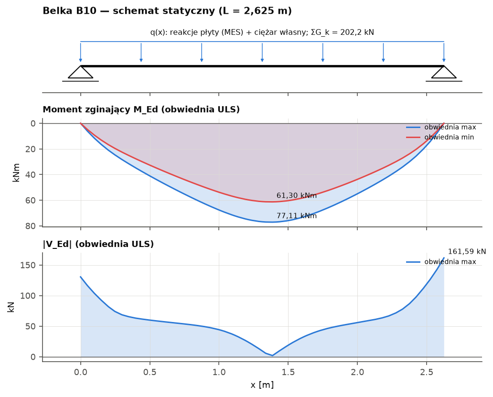

*Rys. Belka B10: schemat statyczny i obwiednie sił wewnętrznych (M dodatni — rozciąganie dołem).*

#### Zestawienie obciążeń

**Obciążenia belki (charakterystyczne, wypadkowe przypadków)**

| Przypadek | Σq·l ≈ [kN] |
|---|---|
| G | 200,8 |
| QA | 0,0 |
| QA_pA | 0,0 |
| QA_pB | 0,0 |
| H | 15,5 |
| S1 | 25,1 |
| S2 | 25,1 |

#### Obliczenia

##### Siły wewnętrzne — B10 (obwiednia kombinacji)

- Moment przęsłowy maks.: M_Ed,max = **77,76** kNm
- Moment podporowy (min.): M_Ed,min = **0,00** kNm
- Siła poprzeczna maks.: V_Ed = **162,87** kN

##### B10 — zginanie w przęśle

- Wysokość użyteczna: d = **459** mm
- Moment względny: μ = M_Ed/(b·d²·η·f_cd) = 77,76·10⁶/(250·459²·1,0·17,86) = **0,0827** *(3.1.7(3))*
- Względna wysokość strefy ściskanej: ξ_eff = 1 − √(1 − 2μ) = 1 − √(1 − 2·0,0827) = **0,0864**
- Warunek ciągliwości: ξ_eff ≤ ξ_eff,lim = λ·ε_cu3/(ε_cu3 + f_yd/E_s) = 0,086 ≤ 0,493 = **spełniony**
- Wymagane zbrojenie rozciągane: A_s1 = ξ_eff·b·d·η·f_cd/f_yd = 0,0864·250·459·1,0·17,86/434,8 = **407** mm²
- Zbrojenie minimalne: A_s,min = max(0,26·f_ctm/f_yk·b·d; 0,0013·b·d) = max(0,26·2,6/500·250·459; 0,0013·250·459) = **155** mm² *((9.1N) + NA)*
- Przyjęto dołem: 4φ12 = **4,52** cm²

| Warunek | Efekt | Nośność / limit | η | Stan | Podstawa |
|---|---|---|---|---|---|
| Zbrojenie dolne | A_s,req = 407 mm² | A_s,prov = 452 mm² | 90% | spełniony | 6.1 |

##### B10 — ścinanie

- Współczynnik skali: k = 1 + √(200/d) ≤ 2,0 = 1 + √(200/459) = **1,660**
- Stopień zbrojenia podłużnego: ρ_l = A_sl/(b_w·d) ≤ 0,02 = 452/(250·459) = **0,00394**
- Nośność na ścinanie: V_Rd,c = C_Rd,c·k·(100·ρ_l·f_ck)^(1/3)·b_w·d = 0,1286·1,660·(100·0,00394·25)^(1/3)·250·459·10⁻³ = **52,51** kN *((6.2.a); C_Rd,c = 0,18/γ_c)*
- Wartość minimalna: V_Rd,c,min = v_min·b_w·d, v_min = 0,035·k^(3/2)·f_ck^(1/2) = 0,3743·250·459·10⁻³ = **42,95** kN *((6.2.b), (6.3N))*
- Ramię sił wewnętrznych: z = 0,9·d = 0,9·459 = **413** mm
- Przyjęto nachylenie krzyżulców betonowych: cot θ = (1,0 ≤ cot θ ≤ 2,0 — NA) = **2,00** *((6.7N))*
- Nośność krzyżulców ściskanych: V_Rd,max = b_w·z·ν₁·f_cd/(cot θ + tan θ) = 250·413·0,540·17,86/(2,00 + 0,500)·10⁻³ = **398,35** kN *((6.9), ν₁ = ν (6.6N))*
- Rozstaw z warunku nośności: s = A_sw·z·f_ywd·cot θ/V_Ed = 100,5·413·434,8·2,00/(162,87·10³) = **222** mm *((6.8))*
- Rozstaw maksymalny: s_l,max = 0,75·d = 0,75·459 = **344** mm *((9.6N))*
- Stopień zbrojenia minimalny: ρ_w,min = 0,08·√f_ck/f_yk → s ≤ A_sw/(ρ_w,min·b_w) = 100,5/(0,00080·250) = **503** mm *((9.5N))*
- Przyjęto strzemiona: φ8 2-cięte co s = **220** mm
- Nośność zbrojenia na ścinanie: V_Rd,s = A_sw/s·z·f_ywd·cot θ = 100,5/220·413·434,8·2,00·10⁻³ = **164,15** kN

| Warunek | Efekt | Nośność / limit | η | Stan | Podstawa |
|---|---|---|---|---|---|
| Nośność krzyżulców betonowych | V_Ed = 162,87 kN | V_Rd,max = 398,35 kN | 41% | spełniony | (6.9) |
| Nośność strzemion | V_Ed = 162,87 kN | V_Rd,s = 164,15 kN | 99% | spełniony | (6.8) |

##### B10 — ugięcie

- Stopień zbrojenia wymagany: ρ = A_s,req/(b·d) = 407/(250·459) = **0,00355**
- Wartość odniesienia: ρ₀ = √f_ck·10⁻³ = √25·10⁻³ = **0,00500**
- Graniczne l/d (ρ ≤ ρ₀): K·[11 + 1,5·√f_ck·ρ₀/ρ + 3,2·√f_ck·(ρ₀/ρ − 1)^(3/2)] = 1,0·[11 + 1,5·5,000·1,409 + 3,2·5,000·(1,409 − 1)^1,5] = **25,7** *((7.16a))*
- Mnożnik od naprężeń w stali: 310/σ_s ≈ 500/(f_yk·A_s,req/A_s,prov) ≤ 1,5 = 500/(500·407/452) = **1,111** *((7.17))*
- Smukłość rzeczywista: l_eff/d = 2,62/0,459 = **5,7**
- *Obliczenie ugięcia (7.4.3)*
- Efektywny moduł sprężystości: E_c,eff = E_cm/(1 + φ) = 31000/(1 + 2,5) = **8857** MPa *((7.20))*
- Stosunek modułów: α_e = E_s/E_c,eff = 200000/8857 = **22,58**
- Przekrój niezarysowany: x_I; I_I = **265,8 mm; 3016,7·10⁶ mm⁴**
- Przekrój zarysowany: x_II; I_II = **157,1 mm; 1254,2·10⁶ mm⁴**
- Moment rysujący: M_cr = f_ctm·I_I/(h − x_I) = 2,6·3016,7·10⁶/(500 − 265,8) = **33,49** kNm
- Współczynnik rozkładu: ζ = 1 − β·(M_cr/M_qp)², β = 0,5 = 1 − 0,5·(33,49/53,90)² = **0,807** *((7.19))*
- Ugięcie od obciążeń (quasi-stała): w_q = ζ·w_II + (1 − ζ)·w_I = 0,807·3,36 + 0,193·1,40 = **2,98** mm *((7.18))*
- Ugięcie od skurczu: w_cs = k·(1/r_cs)·l², 1/r_cs = ε_cs·α_e·S/I = 0,125·0,844·10⁻⁶·2625² = **0,73** mm *((7.21))*
- Ugięcie całkowite: w = w_q + w_cs = 2,98 + 0,73 = **3,71** mm
- Ugięcie dopuszczalne: w_lim = L/250 = 2625/250 = **10,5** mm *(7.4.1(4))*

| Warunek | Efekt | Nośność / limit | η | Stan | Podstawa |
|---|---|---|---|---|---|
| Ugięcie — graniczna smukłość l/d (7.4.2) | l/d = 5,7  | (l/d)_lim = 28,6  | 20% | spełniony | (7.16), tabl. 7.4N |

> l/d spełnione — obliczenie (7.4.3) informacyjnie: w = 3,7 mm ≤? 10,5 mm.

##### B10 — rysy

- Naprężenie w stali (quasi-stała, przekrój zarysowany, α_e = 15): σ_s = α_e·M_qp·(d − x_II)/I_II = **287** MPa
- Maksymalna średnica (w_max = 0,4 mm): φ_s = φ*_s·(f_ct,eff/2,9)·k_c·h_cr/(2(h − d)) = 15,3·(2,6/2,9)·0,4·250/(2·41) = **16,7** mm *(tabl. 7.2N, (7.6N))*
- Maksymalny rozstaw prętów: s_max = (σ_s = 287 MPa) = **191** mm *(tabl. 7.3N)*

| Warunek | Efekt | Nośność / limit | η | Stan | Podstawa |
|---|---|---|---|---|---|
| Rysy: średnica prętów (tabl. 7.2N) | φ = 12 mm | φ_s,max = 17 mm | 72% | spełniony | 7.3.3(2) |

#### Wnioski

**Przyjęto:** Belka B10: 25×50 cm, C25/30; dołem 4φ12, górą 2φ12, strzemiona φ8 co 22 cm (2-cięte).  

### Poz. 5.3 — Belka N22

Element modelu: `N22` · maks. wykorzystanie nośności η = 67% · wszystkie warunki spełnione

#### Opis i schemat statyczny

Belka żelbetowa b × h = 18 × 18 cm, oś (−0,20, 0,00) → (3,20, 0,00), L = 3,400 m; podpory: ściana S2-01 (x = 0,00 m), ściana S2-01 (x = 3,40 m). Obciążenie: reakcje płyty z MES (rozkład wzdłuż belki) + ciężar własny.

*Rys. Belka N22: schemat statyczny i obwiednie sił wewnętrznych (M dodatni — rozciąganie dołem).*

#### Zestawienie obciążeń

**Obciążenia belki (charakterystyczne, wypadkowe przypadków)**

| Przypadek | Σq·l ≈ [kN] |
|---|---|
| G | 35,6 |
| QA | 3,9 |
| QA_pA | 3,9 |
| QA_pB | 0,0 |
| H | 1,7 |
| S1 | 3,8 |
| S2 | 3,8 |

#### Obliczenia

##### Siły wewnętrzne — N22 (obwiednia kombinacji)

- Moment przęsłowy maks.: M_Ed,max = **23,62** kNm
- Moment podporowy (min.): M_Ed,min = **0,00** kNm
- Siła poprzeczna maks.: V_Ed = **31,08** kN

##### N22 — zginanie w przęśle (przekrój teowy)

- Wysokość użyteczna: d = **359** mm
- Moment względny: μ = M_Ed/(b·d²·η·f_cd) = 23,62·10⁶/(758·359²·1,0·17,86) = **0,0135** *(3.1.7(3))*
- Względna wysokość strefy ściskanej: ξ_eff = 1 − √(1 − 2μ) = 1 − √(1 − 2·0,0135) = **0,0136**
- Warunek ciągliwości: ξ_eff ≤ ξ_eff,lim = λ·ε_cu3/(ε_cu3 + f_yd/E_s) = 0,014 ≤ 0,493 = **spełniony**
- Wymagane zbrojenie rozciągane: A_s1 = ξ_eff·b·d·η·f_cd/f_yd = 0,0136·758·359·1,0·17,86/434,8 = **152** mm²
- Zbrojenie minimalne: A_s,min = max(0,26·f_ctm/f_yk·b·d; 0,0013·b·d) = max(0,26·2,6/500·758·359; 0,0013·758·359) = **368** mm² *((9.1N) + NA)*
- Strefa ściskana w półce: x_eff = ξ_eff·d ≤ h_f = 5 ≤ 220 = **przekrój pozornie teowy**
- Zbrojenie minimalne (b_t = b_w — strefa rozciągana w środniku): A_s,min = max(0,26·f_ctm/f_yk·b_w·d; 0,0013·b_w·d) = **87** mm² *((9.1N))*
- Przyjęto dołem: 2φ12 = **2,26** cm²

| Warunek | Efekt | Nośność / limit | η | Stan | Podstawa |
|---|---|---|---|---|---|
| Zbrojenie dolne | A_s,req = 152 mm² | A_s,prov = 226 mm² | 67% | spełniony | 6.1 |

##### N22 — ścinanie

- Współczynnik skali: k = 1 + √(200/d) ≤ 2,0 = 1 + √(200/359) = **1,746**
- Stopień zbrojenia podłużnego: ρ_l = A_sl/(b_w·d) ≤ 0,02 = 226/(180·359) = **0,00350**
- Nośność na ścinanie: V_Rd,c = C_Rd,c·k·(100·ρ_l·f_ck)^(1/3)·b_w·d = 0,1286·1,746·(100·0,00350·25)^(1/3)·180·359·10⁻³ = **29,90** kN *((6.2.a); C_Rd,c = 0,18/γ_c)*
- Wartość minimalna: V_Rd,c,min = v_min·b_w·d, v_min = 0,035·k^(3/2)·f_ck^(1/2) = 0,4039·180·359·10⁻³ = **26,10** kN *((6.2.b), (6.3N))*
- Ramię sił wewnętrznych: z = 0,9·d = 0,9·359 = **323** mm
- Przyjęto nachylenie krzyżulców betonowych: cot θ = (1,0 ≤ cot θ ≤ 2,0 — NA) = **2,00** *((6.7N))*
- Nośność krzyżulców ściskanych: V_Rd,max = b_w·z·ν₁·f_cd/(cot θ + tan θ) = 180·323·0,540·17,86/(2,00 + 0,500)·10⁻³ = **224,32** kN *((6.9), ν₁ = ν (6.6N))*
- Rozstaw z warunku nośności: s = A_sw·z·f_ywd·cot θ/V_Ed = 100,5·323·434,8·2,00/(31,08·10³) = **909** mm *((6.8))*
- Rozstaw maksymalny: s_l,max = 0,75·d = 0,75·359 = **269** mm *((9.6N))*
- Stopień zbrojenia minimalny: ρ_w,min = 0,08·√f_ck/f_yk → s ≤ A_sw/(ρ_w,min·b_w) = 100,5/(0,00080·180) = **698** mm *((9.5N))*
- Przyjęto strzemiona: φ8 2-cięte co s = **260** mm
- Nośność zbrojenia na ścinanie: V_Rd,s = A_sw/s·z·f_ywd·cot θ = 100,5/260·323·434,8·2,00·10⁻³ = **108,63** kN

| Warunek | Efekt | Nośność / limit | η | Stan | Podstawa |
|---|---|---|---|---|---|
| Nośność krzyżulców betonowych | V_Ed = 31,08 kN | V_Rd,max = 224,32 kN | 14% | spełniony | (6.9) |
| Nośność strzemion | V_Ed = 31,08 kN | V_Rd,s = 108,63 kN | 29% | spełniony | (6.8) |

##### N22 — ugięcie

- Stopień zbrojenia wymagany: ρ = A_s,req/(b·d) = 152/(180·359) = **0,00236**
- Wartość odniesienia: ρ₀ = √f_ck·10⁻³ = √25·10⁻³ = **0,00500**
- Graniczne l/d (ρ ≤ ρ₀): K·[11 + 1,5·√f_ck·ρ₀/ρ + 3,2·√f_ck·(ρ₀/ρ − 1)^(3/2)] = 1,0·[11 + 1,5·5,000·2,120 + 3,2·5,000·(2,120 − 1)^1,5] = **45,9** *((7.16a))*
- Mnożnik od naprężeń w stali: 310/σ_s ≈ 500/(f_yk·A_s,req/A_s,prov) ≤ 1,5 = 500/(500·152/226) = **1,484** *((7.17))*
- Przekrój teowy b_eff/b_w > 3: × 0,8 = **0,80**
- Smukłość rzeczywista: l_eff/d = 3,40/0,359 = **9,5**
- *Obliczenie ugięcia (7.4.3)*
- Efektywny moduł sprężystości: E_c,eff = E_cm/(1 + φ) = 31000/(1 + 2,5) = **8857** MPa *((7.20))*
- Stosunek modułów: α_e = E_s/E_c,eff = 200000/8857 = **22,58**
- Przekrój niezarysowany: x_I; I_I = **210,5 mm; 1080,6·10⁶ mm⁴**
- Przekrój zarysowany: x_II; I_II = **117,2 mm; 395,2·10⁶ mm⁴**
- Moment rysujący: M_cr = f_ctm·I_I/(h − x_I) = 2,6·1080,6·10⁶/(400 − 210,5) = **14,83** kNm
- Współczynnik rozkładu: ζ = 1 − β·(M_cr/M_qp)², β = 0,5 = 1 − 0,5·(14,83/16,61)² = **0,602** *((7.19))*
- Ugięcie od obciążeń (quasi-stała): w_q = ζ·w_II + (1 − ζ)·w_I = 0,602·5,66 + 0,398·2,07 = **4,23** mm *((7.18))*
- Ugięcie od skurczu: w_cs = k·(1/r_cs)·l², 1/r_cs = ε_cs·α_e·S/I = 0,125·0,864·10⁻⁶·3400² = **1,25** mm *((7.21))*
- Ugięcie całkowite: w = w_q + w_cs = 4,23 + 1,25 = **5,48** mm
- Ugięcie dopuszczalne: w_lim = L/250 = 3400/250 = **13,6** mm *(7.4.1(4))*

| Warunek | Efekt | Nośność / limit | η | Stan | Podstawa |
|---|---|---|---|---|---|
| Ugięcie — graniczna smukłość l/d (7.4.2) | l/d = 9,5  | (l/d)_lim = 54,5  | 17% | spełniony | (7.16), tabl. 7.4N |

> l/d spełnione — obliczenie (7.4.3) informacyjnie: w = 5,5 mm ≤? 13,6 mm.

##### N22 — rysy

- Naprężenie w stali (quasi-stała, przekrój zarysowany, α_e = 15): σ_s = α_e·M_qp·(d − x_II)/I_II = **225** MPa
- Maksymalna średnica (w_max = 0,4 mm): φ_s = φ*_s·(f_ct,eff/2,9)·k_c·h_cr/(2(h − d)) = 24,4·(2,6/2,9)·0,4·200/(2·41) = **21,3** mm *(tabl. 7.2N, (7.6N))*
- Maksymalny rozstaw prętów: s_max = (σ_s = 225 MPa) = **268** mm *(tabl. 7.3N)*

| Warunek | Efekt | Nośność / limit | η | Stan | Podstawa |
|---|---|---|---|---|---|
| Rysy: średnica prętów (tabl. 7.2N) | φ = 12 mm | φ_s,max = 21 mm | 56% | spełniony | 7.3.3(2) |

#### Wnioski

**Przyjęto:** Belka N22: 18×40 cm (z płytą), C25/30; dołem 2φ12, górą 2φ12, strzemiona φ8 co 26 cm (2-cięte).  

### Poz. 5.4 — Belka N23

Element modelu: `N23` · maks. wykorzystanie nośności η = 39% · wszystkie warunki spełnione

#### Opis i schemat statyczny

Belka żelbetowa b × h = 18 × 18 cm, oś (3,90, 0,00) → (5,50, 0,00), L = 1,600 m; podpory: ściana S2-01 (x = 0,00 m), ściana S2-01 (x = 1,60 m). Obciążenie: reakcje płyty z MES (rozkład wzdłuż belki) + ciężar własny.

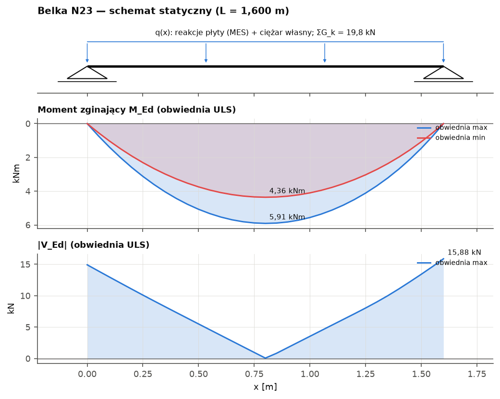

*Rys. Belka N23: schemat statyczny i obwiednie sił wewnętrznych (M dodatni — rozciąganie dołem).*

#### Zestawienie obciążeń

**Obciążenia belki (charakterystyczne, wypadkowe przypadków)**

| Przypadek | Σq·l ≈ [kN] |
|---|---|
| G | 19,6 |
| QA | 3,8 |
| QA_pA | 3,8 |
| QA_pB | 0,0 |
| H | 0,7 |
| S1 | 2,0 |
| S2 | 2,0 |

#### Obliczenia

##### Siły wewnętrzne — N23 (obwiednia kombinacji)

- Moment przęsłowy maks.: M_Ed,max = **5,91** kNm
- Moment podporowy (min.): M_Ed,min = **0,00** kNm
- Siła poprzeczna maks.: V_Ed = **15,88** kN

##### N23 — zginanie w przęśle (przekrój teowy)

- Wysokość użyteczna: d = **359** mm
- Moment względny: μ = M_Ed/(b·d²·η·f_cd) = 5,91·10⁶/(452·359²·1,0·17,86) = **0,0057** *(3.1.7(3))*
- Względna wysokość strefy ściskanej: ξ_eff = 1 − √(1 − 2μ) = 1 − √(1 − 2·0,0057) = **0,0057**
- Warunek ciągliwości: ξ_eff ≤ ξ_eff,lim = λ·ε_cu3/(ε_cu3 + f_yd/E_s) = 0,006 ≤ 0,493 = **spełniony**
- Wymagane zbrojenie rozciągane: A_s1 = ξ_eff·b·d·η·f_cd/f_yd = 0,0057·452·359·1,0·17,86/434,8 = **38** mm²
- Zbrojenie minimalne: A_s,min = max(0,26·f_ctm/f_yk·b·d; 0,0013·b·d) = max(0,26·2,6/500·452·359; 0,0013·452·359) = **219** mm² *((9.1N) + NA)*
- Strefa ściskana w półce: x_eff = ξ_eff·d ≤ h_f = 2 ≤ 220 = **przekrój pozornie teowy**
- Zbrojenie minimalne (b_t = b_w — strefa rozciągana w środniku): A_s,min = max(0,26·f_ctm/f_yk·b_w·d; 0,0013·b_w·d) = **87** mm² *((9.1N))*
- Przyjęto dołem: 2φ12 = **2,26** cm²

| Warunek | Efekt | Nośność / limit | η | Stan | Podstawa |
|---|---|---|---|---|---|
| Zbrojenie dolne | A_s,req = 87 mm² | A_s,prov = 226 mm² | 39% | spełniony | 6.1 |

##### N23 — ścinanie

- Współczynnik skali: k = 1 + √(200/d) ≤ 2,0 = 1 + √(200/359) = **1,746**
- Stopień zbrojenia podłużnego: ρ_l = A_sl/(b_w·d) ≤ 0,02 = 226/(180·359) = **0,00350**
- Nośność na ścinanie: V_Rd,c = C_Rd,c·k·(100·ρ_l·f_ck)^(1/3)·b_w·d = 0,1286·1,746·(100·0,00350·25)^(1/3)·180·359·10⁻³ = **29,90** kN *((6.2.a); C_Rd,c = 0,18/γ_c)*
- Wartość minimalna: V_Rd,c,min = v_min·b_w·d, v_min = 0,035·k^(3/2)·f_ck^(1/2) = 0,4039·180·359·10⁻³ = **26,10** kN *((6.2.b), (6.3N))*
- Ramię sił wewnętrznych: z = 0,9·d = 0,9·359 = **323** mm
- Przyjęto nachylenie krzyżulców betonowych: cot θ = (1,0 ≤ cot θ ≤ 2,0 — NA) = **2,00** *((6.7N))*
- Nośność krzyżulców ściskanych: V_Rd,max = b_w·z·ν₁·f_cd/(cot θ + tan θ) = 180·323·0,540·17,86/(2,00 + 0,500)·10⁻³ = **224,32** kN *((6.9), ν₁ = ν (6.6N))*
- Rozstaw z warunku nośności: s = A_sw·z·f_ywd·cot θ/V_Ed = 100,5·323·434,8·2,00/(15,88·10³) = **1778** mm *((6.8))*
- Rozstaw maksymalny: s_l,max = 0,75·d = 0,75·359 = **269** mm *((9.6N))*
- Stopień zbrojenia minimalny: ρ_w,min = 0,08·√f_ck/f_yk → s ≤ A_sw/(ρ_w,min·b_w) = 100,5/(0,00080·180) = **698** mm *((9.5N))*
- Przyjęto strzemiona: φ8 2-cięte co s = **260** mm
- Nośność zbrojenia na ścinanie: V_Rd,s = A_sw/s·z·f_ywd·cot θ = 100,5/260·323·434,8·2,00·10⁻³ = **108,63** kN

| Warunek | Efekt | Nośność / limit | η | Stan | Podstawa |
|---|---|---|---|---|---|
| Nośność krzyżulców betonowych | V_Ed = 15,88 kN | V_Rd,max = 224,32 kN | 7% | spełniony | (6.9) |
| Nośność strzemion | V_Ed = 15,88 kN | V_Rd,s = 108,63 kN | 15% | spełniony | (6.8) |

> V_Ed ≤ V_Rd,c = 29,90 kN — zbrojenie poprzeczne minimalne (9.2.2(5)).

##### N23 — ugięcie

- Stopień zbrojenia wymagany: ρ = A_s,req/(b·d) = 38/(180·359) = **0,00059**
- Wartość odniesienia: ρ₀ = √f_ck·10⁻³ = √25·10⁻³ = **0,00500**
- Graniczne l/d (ρ ≤ ρ₀): K·[11 + 1,5·√f_ck·ρ₀/ρ + 3,2·√f_ck·(ρ₀/ρ − 1)^(3/2)] = 1,0·[11 + 1,5·5,000·8,512 + 3,2·5,000·(8,512 − 1)^1,5] = **404,3** *((7.16a))*
- Mnożnik od naprężeń w stali: 310/σ_s ≈ 500/(f_yk·A_s,req/A_s,prov) ≤ 1,5 = 500/(500·38/226) = **1,500** *((7.17))*
- Smukłość rzeczywista: l_eff/d = 1,60/0,359 = **4,5**
- *Obliczenie ugięcia (7.4.3)*
- Efektywny moduł sprężystości: E_c,eff = E_cm/(1 + φ) = 31000/(1 + 2,5) = **8857** MPa *((7.20))*
- Stosunek modułów: α_e = E_s/E_c,eff = 200000/8857 = **22,58**
- Przekrój niezarysowany: x_I; I_I = **210,5 mm; 1080,6·10⁶ mm⁴**
- Przekrój zarysowany: x_II; I_II = **117,2 mm; 395,2·10⁶ mm⁴**
- Moment rysujący: M_cr = f_ctm·I_I/(h − x_I) = 2,6·1080,6·10⁶/(400 − 210,5) = **14,83** kNm
- Współczynnik rozkładu: ζ = 1 − β·(M_cr/M_qp)², β = 0,5 = M_qp ≤ M_cr → 0 = **0,000** *((7.19))*
- Ugięcie od obciążeń (quasi-stała): w_q = ζ·w_II + (1 − ζ)·w_I = 0,000·0,31 + 1,000·0,11 = **0,11** mm *((7.18))*
- Ugięcie od skurczu: w_cs = k·(1/r_cs)·l², 1/r_cs = ε_cs·α_e·S/I = 0,125·0,281·10⁻⁶·1600² = **0,09** mm *((7.21))*
- Ugięcie całkowite: w = w_q + w_cs = 0,11 + 0,09 = **0,20** mm
- Ugięcie dopuszczalne: w_lim = L/250 = 1600/250 = **6,4** mm *(7.4.1(4))*

| Warunek | Efekt | Nośność / limit | η | Stan | Podstawa |
|---|---|---|---|---|---|
| Ugięcie — graniczna smukłość l/d (7.4.2) | l/d = 4,5  | (l/d)_lim = 606,4  | 1% | spełniony | (7.16), tabl. 7.4N |

> l/d spełnione — obliczenie (7.4.3) informacyjnie: w = 0,2 mm ≤? 6,4 mm.

##### N23 — rysy

- Naprężenie w stali (quasi-stała, przekrój zarysowany, α_e = 15): σ_s = α_e·M_qp·(d − x_II)/I_II = **55** MPa
- Maksymalna średnica (w_max = 0,4 mm): φ_s = φ*_s·(f_ct,eff/2,9)·k_c·h_cr/(2(h − d)) = 40,0·(2,6/2,9)·0,4·200/(2·41) = **35,0** mm *(tabl. 7.2N, (7.6N))*
- Maksymalny rozstaw prętów: s_max = (σ_s = 55 MPa) = **300** mm *(tabl. 7.3N)*

| Warunek | Efekt | Nośność / limit | η | Stan | Podstawa |
|---|---|---|---|---|---|
| Rysy: średnica prętów (tabl. 7.2N) | φ = 12 mm | φ_s,max = 35 mm | 34% | spełniony | 7.3.3(2) |

#### Wnioski

**Przyjęto:** Belka N23: 18×40 cm (z płytą), C25/30; dołem 2φ12, górą 2φ12, strzemiona φ8 co 26 cm (2-cięte).  

### Poz. 5.5 — Belka N24

Element modelu: `N24` · maks. wykorzystanie nośności η = 48% · wszystkie warunki spełnione

#### Opis i schemat statyczny

Belka żelbetowa b × h = 18 × 18 cm, oś (8,80, 0,00) → (11,60, 0,00), L = 2,800 m; podpory: ściana S2-01 (x = 0,00 m), ściana S2-01 (x = 2,80 m). Obciążenie: reakcje płyty z MES (rozkład wzdłuż belki) + ciężar własny.

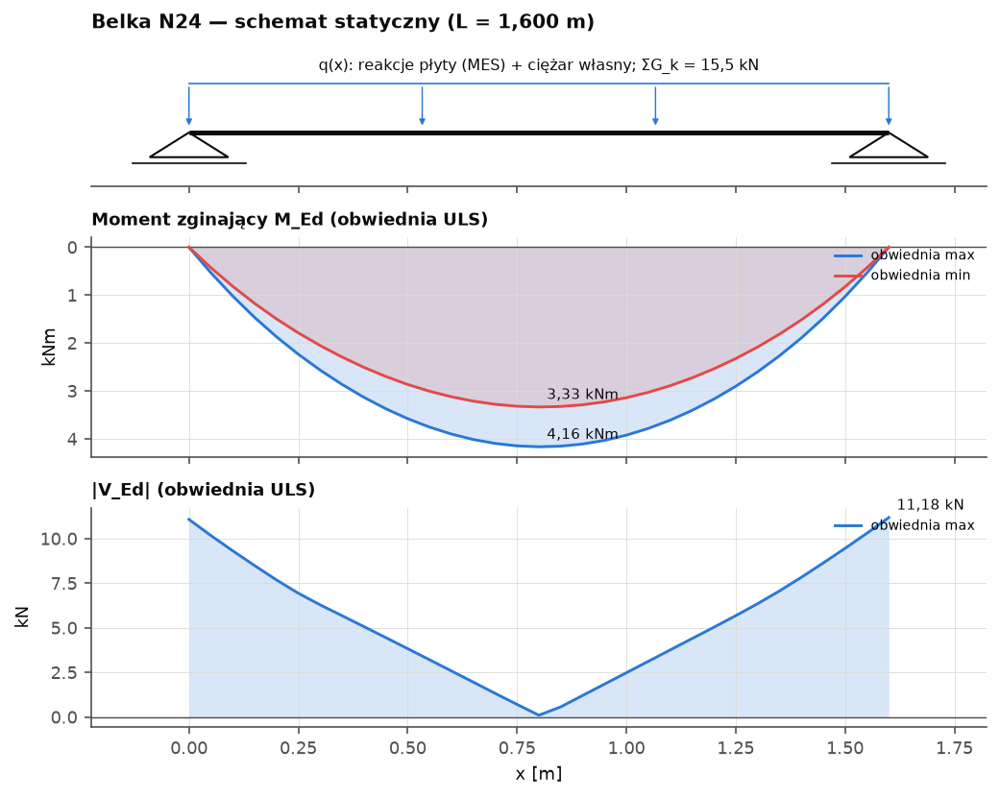

*Rys. Belka N24: schemat statyczny i obwiednie sił wewnętrznych (M dodatni — rozciąganie dołem).*

#### Zestawienie obciążeń

**Obciążenia belki (charakterystyczne, wypadkowe przypadków)**

| Przypadek | Σq·l ≈ [kN] |
|---|---|
| G | 31,3 |
| QA | 6,3 |
| QA_pA | 6,8 |
| QA_pB | 0,0 |
| H | 1,1 |
| S1 | 3,1 |
| S2 | 3,1 |

#### Obliczenia

##### Siły wewnętrzne — N24 (obwiednia kombinacji)

- Moment przęsłowy maks.: M_Ed,max = **16,91** kNm
- Moment podporowy (min.): M_Ed,min = **0,00** kNm
- Siła poprzeczna maks.: V_Ed = **25,78** kN

##### N24 — zginanie w przęśle (przekrój teowy)

- Wysokość użyteczna: d = **359** mm
- Moment względny: μ = M_Ed/(b·d²·η·f_cd) = 16,91·10⁶/(656·359²·1,0·17,86) = **0,0112** *(3.1.7(3))*
- Względna wysokość strefy ściskanej: ξ_eff = 1 − √(1 − 2μ) = 1 − √(1 − 2·0,0112) = **0,0113**
- Warunek ciągliwości: ξ_eff ≤ ξ_eff,lim = λ·ε_cu3/(ε_cu3 + f_yd/E_s) = 0,011 ≤ 0,493 = **spełniony**
- Wymagane zbrojenie rozciągane: A_s1 = ξ_eff·b·d·η·f_cd/f_yd = 0,0113·656·359·1,0·17,86/434,8 = **109** mm²
- Zbrojenie minimalne: A_s,min = max(0,26·f_ctm/f_yk·b·d; 0,0013·b·d) = max(0,26·2,6/500·656·359; 0,0013·656·359) = **318** mm² *((9.1N) + NA)*
- Strefa ściskana w półce: x_eff = ξ_eff·d ≤ h_f = 4 ≤ 220 = **przekrój pozornie teowy**
- Zbrojenie minimalne (b_t = b_w — strefa rozciągana w środniku): A_s,min = max(0,26·f_ctm/f_yk·b_w·d; 0,0013·b_w·d) = **87** mm² *((9.1N))*
- Przyjęto dołem: 2φ12 = **2,26** cm²

| Warunek | Efekt | Nośność / limit | η | Stan | Podstawa |
|---|---|---|---|---|---|
| Zbrojenie dolne | A_s,req = 109 mm² | A_s,prov = 226 mm² | 48% | spełniony | 6.1 |

##### N24 — ścinanie

- Współczynnik skali: k = 1 + √(200/d) ≤ 2,0 = 1 + √(200/359) = **1,746**
- Stopień zbrojenia podłużnego: ρ_l = A_sl/(b_w·d) ≤ 0,02 = 226/(180·359) = **0,00350**
- Nośność na ścinanie: V_Rd,c = C_Rd,c·k·(100·ρ_l·f_ck)^(1/3)·b_w·d = 0,1286·1,746·(100·0,00350·25)^(1/3)·180·359·10⁻³ = **29,90** kN *((6.2.a); C_Rd,c = 0,18/γ_c)*
- Wartość minimalna: V_Rd,c,min = v_min·b_w·d, v_min = 0,035·k^(3/2)·f_ck^(1/2) = 0,4039·180·359·10⁻³ = **26,10** kN *((6.2.b), (6.3N))*
- Ramię sił wewnętrznych: z = 0,9·d = 0,9·359 = **323** mm
- Przyjęto nachylenie krzyżulców betonowych: cot θ = (1,0 ≤ cot θ ≤ 2,0 — NA) = **2,00** *((6.7N))*
- Nośność krzyżulców ściskanych: V_Rd,max = b_w·z·ν₁·f_cd/(cot θ + tan θ) = 180·323·0,540·17,86/(2,00 + 0,500)·10⁻³ = **224,32** kN *((6.9), ν₁ = ν (6.6N))*
- Rozstaw z warunku nośności: s = A_sw·z·f_ywd·cot θ/V_Ed = 100,5·323·434,8·2,00/(25,78·10³) = **1096** mm *((6.8))*
- Rozstaw maksymalny: s_l,max = 0,75·d = 0,75·359 = **269** mm *((9.6N))*
- Stopień zbrojenia minimalny: ρ_w,min = 0,08·√f_ck/f_yk → s ≤ A_sw/(ρ_w,min·b_w) = 100,5/(0,00080·180) = **698** mm *((9.5N))*
- Przyjęto strzemiona: φ8 2-cięte co s = **260** mm
- Nośność zbrojenia na ścinanie: V_Rd,s = A_sw/s·z·f_ywd·cot θ = 100,5/260·323·434,8·2,00·10⁻³ = **108,63** kN

| Warunek | Efekt | Nośność / limit | η | Stan | Podstawa |
|---|---|---|---|---|---|
| Nośność krzyżulców betonowych | V_Ed = 25,78 kN | V_Rd,max = 224,32 kN | 11% | spełniony | (6.9) |
| Nośność strzemion | V_Ed = 25,78 kN | V_Rd,s = 108,63 kN | 24% | spełniony | (6.8) |

> V_Ed ≤ V_Rd,c = 29,90 kN — zbrojenie poprzeczne minimalne (9.2.2(5)).

##### N24 — ugięcie

- Stopień zbrojenia wymagany: ρ = A_s,req/(b·d) = 109/(180·359) = **0,00169**
- Wartość odniesienia: ρ₀ = √f_ck·10⁻³ = √25·10⁻³ = **0,00500**
- Graniczne l/d (ρ ≤ ρ₀): K·[11 + 1,5·√f_ck·ρ₀/ρ + 3,2·√f_ck·(ρ₀/ρ − 1)^(3/2)] = 1,0·[11 + 1,5·5,000·2,965 + 3,2·5,000·(2,965 − 1)^1,5] = **77,3** *((7.16a))*
- Mnożnik od naprężeń w stali: 310/σ_s ≈ 500/(f_yk·A_s,req/A_s,prov) ≤ 1,5 = 500/(500·109/226) = **1,500** *((7.17))*
- Przekrój teowy b_eff/b_w > 3: × 0,8 = **0,80**
- Smukłość rzeczywista: l_eff/d = 2,80/0,359 = **7,8**
- *Obliczenie ugięcia (7.4.3)*
- Efektywny moduł sprężystości: E_c,eff = E_cm/(1 + φ) = 31000/(1 + 2,5) = **8857** MPa *((7.20))*
- Stosunek modułów: α_e = E_s/E_c,eff = 200000/8857 = **22,58**
- Przekrój niezarysowany: x_I; I_I = **210,5 mm; 1080,6·10⁶ mm⁴**
- Przekrój zarysowany: x_II; I_II = **117,2 mm; 395,2·10⁶ mm⁴**
- Moment rysujący: M_cr = f_ctm·I_I/(h − x_I) = 2,6·1080,6·10⁶/(400 − 210,5) = **14,83** kNm
- Współczynnik rozkładu: ζ = 1 − β·(M_cr/M_qp)², β = 0,5 = M_qp ≤ M_cr → 0 = **0,000** *((7.19))*
- Ugięcie od obciążeń (quasi-stała): w_q = ζ·w_II + (1 − ζ)·w_I = 0,000·2,66 + 1,000·0,97 = **0,97** mm *((7.18))*
- Ugięcie od skurczu: w_cs = k·(1/r_cs)·l², 1/r_cs = ε_cs·α_e·S/I = 0,125·0,281·10⁻⁶·2800² = **0,28** mm *((7.21))*
- Ugięcie całkowite: w = w_q + w_cs = 0,97 + 0,28 = **1,25** mm
- Ugięcie dopuszczalne: w_lim = L/250 = 2800/250 = **11,2** mm *(7.4.1(4))*

| Warunek | Efekt | Nośność / limit | η | Stan | Podstawa |
|---|---|---|---|---|---|
| Ugięcie — graniczna smukłość l/d (7.4.2) | l/d = 7,8  | (l/d)_lim = 92,8  | 8% | spełniony | (7.16), tabl. 7.4N |

> l/d spełnione — obliczenie (7.4.3) informacyjnie: w = 1,2 mm ≤? 11,2 mm.

##### N24 — rysy

- Naprężenie w stali (quasi-stała, przekrój zarysowany, α_e = 15): σ_s = α_e·M_qp·(d − x_II)/I_II = **155** MPa
- Maksymalna średnica (w_max = 0,4 mm): φ_s = φ*_s·(f_ct,eff/2,9)·k_c·h_cr/(2(h − d)) = 40,0·(2,6/2,9)·0,4·200/(2·41) = **35,0** mm *(tabl. 7.2N, (7.6N))*
- Maksymalny rozstaw prętów: s_max = (σ_s = 155 MPa) = **300** mm *(tabl. 7.3N)*

| Warunek | Efekt | Nośność / limit | η | Stan | Podstawa |
|---|---|---|---|---|---|
| Rysy: średnica prętów (tabl. 7.2N) | φ = 12 mm | φ_s,max = 35 mm | 34% | spełniony | 7.3.3(2) |

#### Wnioski

**Przyjęto:** Belka N24: 18×40 cm (z płytą), C25/30; dołem 2φ12, górą 2φ12, strzemiona φ8 co 26 cm (2-cięte).  

### Poz. 5.6 — Belka N25

Element modelu: `N25` · maks. wykorzystanie nośności η = 39% · wszystkie warunki spełnione

#### Opis i schemat statyczny

Belka żelbetowa b × h = 18 × 18 cm, oś (12,00, 1,70) → (12,00, 3,30), L = 1,600 m; podpory: ściana S2-02 (x = 0,00 m), ściana S2-02 (x = 1,60 m). Obciążenie: reakcje płyty z MES (rozkład wzdłuż belki) + ciężar własny.

*Rys. Belka N25: schemat statyczny i obwiednie sił wewnętrznych (M dodatni — rozciąganie dołem).*

#### Zestawienie obciążeń

**Obciążenia belki (charakterystyczne, wypadkowe przypadków)**

| Przypadek | Σq·l ≈ [kN] |
|---|---|
| G | 15,6 |
| QA | 0,5 |
| QA_pA | 0,0 |
| QA_pB | 1,1 |
| H | 0,9 |
| S1 | 1,7 |
| S2 | 1,7 |

#### Obliczenia

##### Siły wewnętrzne — N25 (obwiednia kombinacji)

- Moment przęsłowy maks.: M_Ed,max = **4,19** kNm
- Moment podporowy (min.): M_Ed,min = **0,00** kNm
- Siła poprzeczna maks.: V_Ed = **11,24** kN

##### N25 — zginanie w przęśle (przekrój teowy)

- Wysokość użyteczna: d = **359** mm
- Moment względny: μ = M_Ed/(b·d²·η·f_cd) = 4,19·10⁶/(452·359²·1,0·17,86) = **0,0040** *(3.1.7(3))*
- Względna wysokość strefy ściskanej: ξ_eff = 1 − √(1 − 2μ) = 1 − √(1 − 2·0,0040) = **0,0040**
- Warunek ciągliwości: ξ_eff ≤ ξ_eff,lim = λ·ε_cu3/(ε_cu3 + f_yd/E_s) = 0,004 ≤ 0,493 = **spełniony**
- Wymagane zbrojenie rozciągane: A_s1 = ξ_eff·b·d·η·f_cd/f_yd = 0,0040·452·359·1,0·17,86/434,8 = **27** mm²
- Zbrojenie minimalne: A_s,min = max(0,26·f_ctm/f_yk·b·d; 0,0013·b·d) = max(0,26·2,6/500·452·359; 0,0013·452·359) = **219** mm² *((9.1N) + NA)*
- Strefa ściskana w półce: x_eff = ξ_eff·d ≤ h_f = 1 ≤ 220 = **przekrój pozornie teowy**
- Zbrojenie minimalne (b_t = b_w — strefa rozciągana w środniku): A_s,min = max(0,26·f_ctm/f_yk·b_w·d; 0,0013·b_w·d) = **87** mm² *((9.1N))*
- Przyjęto dołem: 2φ12 = **2,26** cm²

| Warunek | Efekt | Nośność / limit | η | Stan | Podstawa |
|---|---|---|---|---|---|
| Zbrojenie dolne | A_s,req = 87 mm² | A_s,prov = 226 mm² | 39% | spełniony | 6.1 |

##### N25 — ścinanie

- Współczynnik skali: k = 1 + √(200/d) ≤ 2,0 = 1 + √(200/359) = **1,746**
- Stopień zbrojenia podłużnego: ρ_l = A_sl/(b_w·d) ≤ 0,02 = 226/(180·359) = **0,00350**
- Nośność na ścinanie: V_Rd,c = C_Rd,c·k·(100·ρ_l·f_ck)^(1/3)·b_w·d = 0,1286·1,746·(100·0,00350·25)^(1/3)·180·359·10⁻³ = **29,90** kN *((6.2.a); C_Rd,c = 0,18/γ_c)*
- Wartość minimalna: V_Rd,c,min = v_min·b_w·d, v_min = 0,035·k^(3/2)·f_ck^(1/2) = 0,4039·180·359·10⁻³ = **26,10** kN *((6.2.b), (6.3N))*
- Ramię sił wewnętrznych: z = 0,9·d = 0,9·359 = **323** mm
- Przyjęto nachylenie krzyżulców betonowych: cot θ = (1,0 ≤ cot θ ≤ 2,0 — NA) = **2,00** *((6.7N))*
- Nośność krzyżulców ściskanych: V_Rd,max = b_w·z·ν₁·f_cd/(cot θ + tan θ) = 180·323·0,540·17,86/(2,00 + 0,500)·10⁻³ = **224,32** kN *((6.9), ν₁ = ν (6.6N))*
- Rozstaw z warunku nośności: s = A_sw·z·f_ywd·cot θ/V_Ed = 100,5·323·434,8·2,00/(11,24·10³) = **2514** mm *((6.8))*
- Rozstaw maksymalny: s_l,max = 0,75·d = 0,75·359 = **269** mm *((9.6N))*
- Stopień zbrojenia minimalny: ρ_w,min = 0,08·√f_ck/f_yk → s ≤ A_sw/(ρ_w,min·b_w) = 100,5/(0,00080·180) = **698** mm *((9.5N))*
- Przyjęto strzemiona: φ8 2-cięte co s = **260** mm
- Nośność zbrojenia na ścinanie: V_Rd,s = A_sw/s·z·f_ywd·cot θ = 100,5/260·323·434,8·2,00·10⁻³ = **108,63** kN

| Warunek | Efekt | Nośność / limit | η | Stan | Podstawa |
|---|---|---|---|---|---|
| Nośność krzyżulców betonowych | V_Ed = 11,24 kN | V_Rd,max = 224,32 kN | 5% | spełniony | (6.9) |
| Nośność strzemion | V_Ed = 11,24 kN | V_Rd,s = 108,63 kN | 10% | spełniony | (6.8) |

> V_Ed ≤ V_Rd,c = 29,90 kN — zbrojenie poprzeczne minimalne (9.2.2(5)).

##### N25 — ugięcie

- Stopień zbrojenia wymagany: ρ = A_s,req/(b·d) = 27/(180·359) = **0,00042**
- Wartość odniesienia: ρ₀ = √f_ck·10⁻³ = √25·10⁻³ = **0,00500**
- Graniczne l/d (ρ ≤ ρ₀): K·[11 + 1,5·√f_ck·ρ₀/ρ + 3,2·√f_ck·(ρ₀/ρ − 1)^(3/2)] = 1,0·[11 + 1,5·5,000·12,022 + 3,2·5,000·(12,022 − 1)^1,5] = **686,6** *((7.16a))*
- Mnożnik od naprężeń w stali: 310/σ_s ≈ 500/(f_yk·A_s,req/A_s,prov) ≤ 1,5 = 500/(500·27/226) = **1,500** *((7.17))*
- Smukłość rzeczywista: l_eff/d = 1,60/0,359 = **4,5**
- *Obliczenie ugięcia (7.4.3)*
- Efektywny moduł sprężystości: E_c,eff = E_cm/(1 + φ) = 31000/(1 + 2,5) = **8857** MPa *((7.20))*
- Stosunek modułów: α_e = E_s/E_c,eff = 200000/8857 = **22,58**
- Przekrój niezarysowany: x_I; I_I = **210,5 mm; 1080,6·10⁶ mm⁴**
- Przekrój zarysowany: x_II; I_II = **117,2 mm; 395,2·10⁶ mm⁴**
- Moment rysujący: M_cr = f_ctm·I_I/(h − x_I) = 2,6·1080,6·10⁶/(400 − 210,5) = **14,83** kNm
- Współczynnik rozkładu: ζ = 1 − β·(M_cr/M_qp)², β = 0,5 = M_qp ≤ M_cr → 0 = **0,000** *((7.19))*
- Ugięcie od obciążeń (quasi-stała): w_q = ζ·w_II + (1 − ζ)·w_I = 0,000·0,23 + 1,000·0,08 = **0,08** mm *((7.18))*
- Ugięcie od skurczu: w_cs = k·(1/r_cs)·l², 1/r_cs = ε_cs·α_e·S/I = 0,125·0,281·10⁻⁶·1600² = **0,09** mm *((7.21))*
- Ugięcie całkowite: w = w_q + w_cs = 0,08 + 0,09 = **0,17** mm
- Ugięcie dopuszczalne: w_lim = L/250 = 1600/250 = **6,4** mm *(7.4.1(4))*

| Warunek | Efekt | Nośność / limit | η | Stan | Podstawa |
|---|---|---|---|---|---|
| Ugięcie — graniczna smukłość l/d (7.4.2) | l/d = 4,5  | (l/d)_lim = 1029,9  | 0% | spełniony | (7.16), tabl. 7.4N |

> l/d spełnione — obliczenie (7.4.3) informacyjnie: w = 0,2 mm ≤? 6,4 mm.

##### N25 — rysy

- Naprężenie w stali (quasi-stała, przekrój zarysowany, α_e = 15): σ_s = α_e·M_qp·(d − x_II)/I_II = **40** MPa
- Maksymalna średnica (w_max = 0,4 mm): φ_s = φ*_s·(f_ct,eff/2,9)·k_c·h_cr/(2(h − d)) = 40,0·(2,6/2,9)·0,4·200/(2·41) = **35,0** mm *(tabl. 7.2N, (7.6N))*
- Maksymalny rozstaw prętów: s_max = (σ_s = 40 MPa) = **300** mm *(tabl. 7.3N)*

| Warunek | Efekt | Nośność / limit | η | Stan | Podstawa |
|---|---|---|---|---|---|
| Rysy: średnica prętów (tabl. 7.2N) | φ = 12 mm | φ_s,max = 35 mm | 34% | spełniony | 7.3.3(2) |

#### Wnioski

**Przyjęto:** Belka N25: 18×40 cm (z płytą), C25/30; dołem 2φ12, górą 2φ12, strzemiona φ8 co 26 cm (2-cięte).  

### Poz. 5.7 — Belka N27

Element modelu: `N27` · maks. wykorzystanie nośności η = 56% · wszystkie warunki spełnione

#### Opis i schemat statyczny

Belka żelbetowa b × h = 18 × 24 cm, oś (8,30, 8,75) → (6,20, 8,75), L = 2,100 m; podpory: ściana S2-05 (x = 0,00 m), ściana S2-05 (x = 2,10 m). Obciążenie: reakcje płyty z MES (rozkład wzdłuż belki) + ciężar własny.

*Rys. Belka N27: schemat statyczny i obwiednie sił wewnętrznych (M dodatni — rozciąganie dołem).*

#### Zestawienie obciążeń

**Obciążenia belki (charakterystyczne, wypadkowe przypadków)**

| Przypadek | Σq·l ≈ [kN] |
|---|---|
| G | 4,0 |
| QA | 0,0 |
| QA_pA | 0,0 |
| QA_pB | 0,0 |
| H | 0,1 |
| S1 | 0,2 |
| S2 | 0,2 |

#### Obliczenia

##### Siły wewnętrzne — N27 (obwiednia kombinacji)

- Moment przęsłowy maks.: M_Ed,max = **1,59** kNm
- Moment podporowy (min.): M_Ed,min = **0,00** kNm
- Siła poprzeczna maks.: V_Ed = **2,80** kN

##### N27 — zginanie w przęśle (przekrój teowy)

- Wysokość użyteczna: d = **519** mm
- Moment względny: μ = M_Ed/(b·d²·η·f_cd) = 1,59·10⁶/(537·519²·1,0·17,86) = **0,0006** *(3.1.7(3))*
- Względna wysokość strefy ściskanej: ξ_eff = 1 − √(1 − 2μ) = 1 − √(1 − 2·0,0006) = **0,0006**
- Warunek ciągliwości: ξ_eff ≤ ξ_eff,lim = λ·ε_cu3/(ε_cu3 + f_yd/E_s) = 0,001 ≤ 0,493 = **spełniony**
- Wymagane zbrojenie rozciągane: A_s1 = ξ_eff·b·d·η·f_cd/f_yd = 0,0006·537·519·1,0·17,86/434,8 = **7** mm²
- Zbrojenie minimalne: A_s,min = max(0,26·f_ctm/f_yk·b·d; 0,0013·b·d) = max(0,26·2,6/500·537·519; 0,0013·537·519) = **377** mm² *((9.1N) + NA)*
- Strefa ściskana w półce: x_eff = ξ_eff·d ≤ h_f = 0 ≤ 320 = **przekrój pozornie teowy**
- Zbrojenie minimalne (b_t = b_w — strefa rozciągana w środniku): A_s,min = max(0,26·f_ctm/f_yk·b_w·d; 0,0013·b_w·d) = **126** mm² *((9.1N))*
- Przyjęto dołem: 2φ12 = **2,26** cm²

| Warunek | Efekt | Nośność / limit | η | Stan | Podstawa |
|---|---|---|---|---|---|
| Zbrojenie dolne | A_s,req = 126 mm² | A_s,prov = 226 mm² | 56% | spełniony | 6.1 |

##### N27 — ścinanie

- Współczynnik skali: k = 1 + √(200/d) ≤ 2,0 = 1 + √(200/519) = **1,621**
- Stopień zbrojenia podłużnego: ρ_l = A_sl/(b_w·d) ≤ 0,02 = 226/(180·519) = **0,00242**
- Nośność na ścinanie: V_Rd,c = C_Rd,c·k·(100·ρ_l·f_ck)^(1/3)·b_w·d = 0,1286·1,621·(100·0,00242·25)^(1/3)·180·519·10⁻³ = **35,48** kN *((6.2.a); C_Rd,c = 0,18/γ_c)*
- Wartość minimalna: V_Rd,c,min = v_min·b_w·d, v_min = 0,035·k^(3/2)·f_ck^(1/2) = 0,3611·180·519·10⁻³ = **33,73** kN *((6.2.b), (6.3N))*
- Ramię sił wewnętrznych: z = 0,9·d = 0,9·519 = **467** mm
- Przyjęto nachylenie krzyżulców betonowych: cot θ = (1,0 ≤ cot θ ≤ 2,0 — NA) = **2,00** *((6.7N))*
- Nośność krzyżulców ściskanych: V_Rd,max = b_w·z·ν₁·f_cd/(cot θ + tan θ) = 180·467·0,540·17,86/(2,00 + 0,500)·10⁻³ = **324,30** kN *((6.9), ν₁ = ν (6.6N))*
- Rozstaw z warunku nośności: s = A_sw·z·f_ywd·cot θ/V_Ed = 100,5·467·434,8·2,00/(2,80·10³) = **14559** mm *((6.8))*
- Rozstaw maksymalny: s_l,max = 0,75·d = 0,75·519 = **389** mm *((9.6N))*
- Stopień zbrojenia minimalny: ρ_w,min = 0,08·√f_ck/f_yk → s ≤ A_sw/(ρ_w,min·b_w) = 100,5/(0,00080·180) = **698** mm *((9.5N))*
- Przyjęto strzemiona: φ8 2-cięte co s = **380** mm
- Nośność zbrojenia na ścinanie: V_Rd,s = A_sw/s·z·f_ywd·cot θ = 100,5/380·467·434,8·2,00·10⁻³ = **107,46** kN

| Warunek | Efekt | Nośność / limit | η | Stan | Podstawa |
|---|---|---|---|---|---|
| Nośność krzyżulców betonowych | V_Ed = 2,80 kN | V_Rd,max = 324,30 kN | 1% | spełniony | (6.9) |
| Nośność strzemion | V_Ed = 2,80 kN | V_Rd,s = 107,46 kN | 3% | spełniony | (6.8) |

> V_Ed ≤ V_Rd,c = 35,48 kN — zbrojenie poprzeczne minimalne (9.2.2(5)).

##### N27 — ugięcie

- Stopień zbrojenia wymagany: ρ = A_s,req/(b·d) = 7/(180·519) = **0,00008**
- Wartość odniesienia: ρ₀ = √f_ck·10⁻³ = √25·10⁻³ = **0,00500**
- Graniczne l/d (ρ ≤ ρ₀): K·[11 + 1,5·√f_ck·ρ₀/ρ + 3,2·√f_ck·(ρ₀/ρ − 1)^(3/2)] = 1,0·[11 + 1,5·5,000·66,176 + 3,2·5,000·(66,176 − 1)^1,5] = **8926,2** *((7.16a))*
- Mnożnik od naprężeń w stali: 310/σ_s ≈ 500/(f_yk·A_s,req/A_s,prov) ≤ 1,5 = 500/(500·7/226) = **1,500** *((7.17))*
- Smukłość rzeczywista: l_eff/d = 2,10/0,519 = **4,0**
- *Obliczenie ugięcia (7.4.3)*
- Efektywny moduł sprężystości: E_c,eff = E_cm/(1 + φ) = 31000/(1 + 2,5) = **8857** MPa *((7.20))*
- Stosunek modułów: α_e = E_s/E_c,eff = 200000/8857 = **22,58**
- Przekrój niezarysowany: x_I; I_I = **291,5 mm; 2911,9·10⁶ mm⁴**
- Przekrój zarysowany: x_II; I_II = **145,6 mm; 897,3·10⁶ mm⁴**
- Moment rysujący: M_cr = f_ctm·I_I/(h − x_I) = 2,6·2911,9·10⁶/(560 − 291,5) = **28,20** kNm
- Współczynnik rozkładu: ζ = 1 − β·(M_cr/M_qp)², β = 0,5 = M_qp ≤ M_cr → 0 = **0,000** *((7.19))*
- Ugięcie od obciążeń (quasi-stała): w_q = ζ·w_II + (1 − ζ)·w_I = 0,000·0,07 + 1,000·0,02 = **0,02** mm *((7.18))*
- Ugięcie od skurczu: w_cs = k·(1/r_cs)·l², 1/r_cs = ε_cs·α_e·S/I = 0,125·0,160·10⁻⁶·2100² = **0,09** mm *((7.21))*
- Ugięcie całkowite: w = w_q + w_cs = 0,02 + 0,09 = **0,11** mm
- Ugięcie dopuszczalne: w_lim = L/250 = 2100/250 = **8,4** mm *(7.4.1(4))*

| Warunek | Efekt | Nośność / limit | η | Stan | Podstawa |
|---|---|---|---|---|---|
| Ugięcie — graniczna smukłość l/d (7.4.2) | l/d = 4,0  | (l/d)_lim = 13389,4  | 0% | spełniony | (7.16), tabl. 7.4N |

> l/d spełnione — obliczenie (7.4.3) informacyjnie: w = 0,1 mm ≤? 8,4 mm.

##### N27 — rysy

- Naprężenie w stali (quasi-stała, przekrój zarysowany, α_e = 15): σ_s = α_e·M_qp·(d − x_II)/I_II = **11** MPa
- Maksymalna średnica (w_max = 0,4 mm): φ_s = φ*_s·(f_ct,eff/2,9)·k_c·h_cr/(2(h − d)) = 40,0·(2,6/2,9)·0,4·280/(2·41) = **49,0** mm *(tabl. 7.2N, (7.6N))*
- Maksymalny rozstaw prętów: s_max = (σ_s = 11 MPa) = **300** mm *(tabl. 7.3N)*

| Warunek | Efekt | Nośność / limit | η | Stan | Podstawa |
|---|---|---|---|---|---|
| Rysy: średnica prętów (tabl. 7.2N) | φ = 12 mm | φ_s,max = 49 mm | 24% | spełniony | 7.3.3(2) |

#### Wnioski

**Przyjęto:** Belka N27: 18×56 cm (z płytą), C25/30; dołem 2φ12, górą 2φ12, strzemiona φ8 co 38 cm (2-cięte).  

### Poz. 5.8 — Belka B3

Element modelu: `B3` · maks. wykorzystanie nośności η = 99% · wszystkie warunki spełnione

#### Opis i schemat statyczny

Belka żelbetowa b × h = 20 × 60 cm, oś (−1,00, 0,00) → (−1,00, 5,12), L = 5,125 m; podpory: belka B4 (x = 0,00 m), belka B5 (x = 5,12 m). Obciążenie: reakcje płyty z MES (rozkład wzdłuż belki) + ciężar własny + ściana S2-08 stojąca na belce (odcinek 0,00–5,12 m ściany; profil obciążenia dolnego ściany).

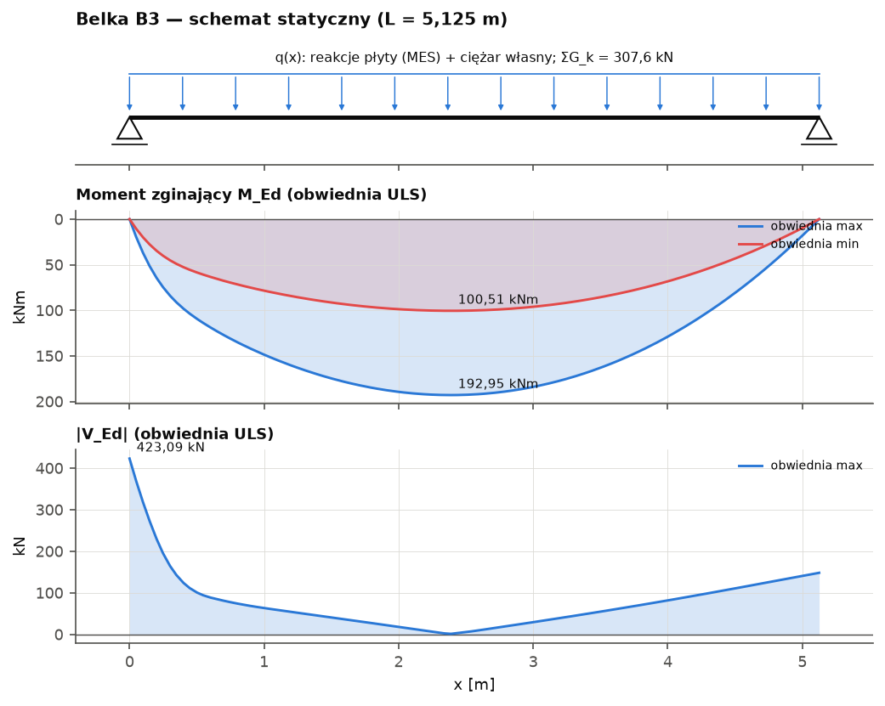

*Rys. Belka B3: schemat statyczny i obwiednie sił wewnętrznych (M dodatni — rozciąganie dołem).*

#### Zestawienie obciążeń

**Obciążenia belki (charakterystyczne, wypadkowe przypadków)**

| Przypadek | Σq·l ≈ [kN] |
|---|---|
| G | 285,1 |
| QA | 117,7 |
| QA_pA | 123,6 |
| QA_pB | 0,0 |
| H | 1,4 |
| S1 | 13,0 |
| S2 | 13,1 |
| SB2 | 0,4 |

#### Obliczenia

##### Siły wewnętrzne — B3 (obwiednia kombinacji)

- Moment przęsłowy maks.: M_Ed,max = **146,80** kNm
- Moment podporowy (min.): M_Ed,min = **0,00** kNm
- Siła poprzeczna maks.: V_Ed = **271,05** kN

##### B3 — zginanie w przęśle

- Wysokość użyteczna: d = **559** mm
- Moment względny: μ = M_Ed/(b·d²·η·f_cd) = 146,80·10⁶/(200·559²·1,0·21,43) = **0,1096** *(3.1.7(3))*
- Względna wysokość strefy ściskanej: ξ_eff = 1 − √(1 − 2μ) = 1 − √(1 − 2·0,1096) = **0,1164**
- Warunek ciągliwości: ξ_eff ≤ ξ_eff,lim = λ·ε_cu3/(ε_cu3 + f_yd/E_s) = 0,116 ≤ 0,493 = **spełniony**
- Wymagane zbrojenie rozciągane: A_s1 = ξ_eff·b·d·η·f_cd/f_yd = 0,1164·200·559·1,0·21,43/434,8 = **641** mm²
- Zbrojenie minimalne: A_s,min = max(0,26·f_ctm/f_yk·b·d; 0,0013·b·d) = max(0,26·2,9/500·200·559; 0,0013·200·559) = **169** mm² *((9.1N) + NA)*
- Przyjęto dołem: 6φ12 (2 warstwy) = **6,79** cm²

| Warunek | Efekt | Nośność / limit | η | Stan | Podstawa |
|---|---|---|---|---|---|
| Zbrojenie dolne | A_s,req = 641 mm² | A_s,prov = 679 mm² | 95% | spełniony | 6.1 |

##### B3 — ścinanie

- Współczynnik skali: k = 1 + √(200/d) ≤ 2,0 = 1 + √(200/559) = **1,598**
- Stopień zbrojenia podłużnego: ρ_l = A_sl/(b_w·d) ≤ 0,02 = 679/(200·559) = **0,00607**
- Nośność na ścinanie: V_Rd,c = C_Rd,c·k·(100·ρ_l·f_ck)^(1/3)·b_w·d = 0,1286·1,598·(100·0,00607·30)^(1/3)·200·559·10⁻³ = **60,44** kN *((6.2.a); C_Rd,c = 0,18/γ_c)*
- Wartość minimalna: V_Rd,c,min = v_min·b_w·d, v_min = 0,035·k^(3/2)·f_ck^(1/2) = 0,3873·200·559·10⁻³ = **43,30** kN *((6.2.b), (6.3N))*
- Ramię sił wewnętrznych: z = 0,9·d = 0,9·559 = **503** mm
- Przyjęto nachylenie krzyżulców betonowych: cot θ = (1,0 ≤ cot θ ≤ 2,0 — NA) = **2,00** *((6.7N))*
- Nośność krzyżulców ściskanych: V_Rd,max = b_w·z·ν₁·f_cd/(cot θ + tan θ) = 200·503·0,528·21,43/(2,00 + 0,500)·10⁻³ = **455,38** kN *((6.9), ν₁ = ν (6.6N))*
- Rozstaw z warunku nośności: s = A_sw·z·f_ywd·cot θ/V_Ed = 100,5·503·434,8·2,00/(271,05·10³) = **162** mm *((6.8))*
- Rozstaw maksymalny: s_l,max = 0,75·d = 0,75·559 = **419** mm *((9.6N))*
- Stopień zbrojenia minimalny: ρ_w,min = 0,08·√f_ck/f_yk → s ≤ A_sw/(ρ_w,min·b_w) = 100,5/(0,00088·200) = **574** mm *((9.5N))*
- Przyjęto strzemiona: φ8 2-cięte co s = **160** mm
- Nośność zbrojenia na ścinanie: V_Rd,s = A_sw/s·z·f_ywd·cot θ = 100,5/160·503·434,8·2,00·10⁻³ = **274,88** kN

| Warunek | Efekt | Nośność / limit | η | Stan | Podstawa |
|---|---|---|---|---|---|
| Nośność krzyżulców betonowych | V_Ed = 271,05 kN | V_Rd,max = 455,38 kN | 60% | spełniony | (6.9) |
| Nośność strzemion | V_Ed = 271,05 kN | V_Rd,s = 274,88 kN | 99% | spełniony | (6.8) |

##### B3 — ugięcie

- Stopień zbrojenia wymagany: ρ = A_s,req/(b·d) = 641/(200·559) = **0,00574**
- Wartość odniesienia: ρ₀ = √f_ck·10⁻³ = √30·10⁻³ = **0,00548**
- Graniczne l/d (ρ > ρ₀): K·[11 + 1,5·√f_ck·ρ₀/(ρ − ρ') + 1/12·√f_ck·√(ρ'/ρ₀)] = **18,8** *((7.16b))*
- Mnożnik od naprężeń w stali: 310/σ_s ≈ 500/(f_yk·A_s,req/A_s,prov) ≤ 1,5 = 500/(500·641/679) = **1,058** *((7.17))*
- Smukłość rzeczywista: l_eff/d = 5,12/0,559 = **9,2**
- *Obliczenie ugięcia (7.4.3)*
- Efektywny moduł sprężystości: E_c,eff = E_cm/(1 + φ) = 33000/(1 + 2,5) = **9429** MPa *((7.20))*
- Stosunek modułów: α_e = E_s/E_c,eff = 200000/9429 = **21,21**
- Przekrój niezarysowany: x_I; I_I = **327,7 mm; 4462,2·10⁶ mm⁴**
- Przekrój zarysowany: x_II; I_II = **220,7 mm; 2364,0·10⁶ mm⁴**
- Moment rysujący: M_cr = f_ctm·I_I/(h − x_I) = 2,9·4462,2·10⁶/(600 − 327,7) = **47,53** kNm
- Współczynnik rozkładu: ζ = 1 − β·(M_cr/M_qp)², β = 0,5 = 1 − 0,5·(47,53/84,45)² = **0,842** *((7.19))*
- Ugięcie od obciążeń (quasi-stała): w_q = ζ·w_II + (1 − ζ)·w_I = 0,842·11,11 + 0,158·5,88 = **10,28** mm *((7.18))*
- Ugięcie od skurczu: w_cs = k·(1/r_cs)·l², 1/r_cs = ε_cs·α_e·S/I = 0,125·0,741·10⁻⁶·5125² = **2,43** mm *((7.21))*
- Ugięcie całkowite: w = w_q + w_cs = 10,28 + 2,43 = **12,71** mm
- Ugięcie dopuszczalne: w_lim = L/250 = 5125/250 = **20,5** mm *(7.4.1(4))*

| Warunek | Efekt | Nośność / limit | η | Stan | Podstawa |
|---|---|---|---|---|---|
| Ugięcie — graniczna smukłość l/d (7.4.2) | l/d = 9,2  | (l/d)_lim = 19,9  | 46% | spełniony | (7.16), tabl. 7.4N |

> l/d spełnione — obliczenie (7.4.3) informacyjnie: w = 12,7 mm ≤? 20,5 mm.

##### B3 — rysy

- Naprężenie w stali (quasi-stała, przekrój zarysowany, α_e = 15): σ_s = α_e·M_qp·(d − x_II)/I_II = **252** MPa
- Maksymalna średnica (w_max = 0,4 mm): φ_s = φ*_s·(f_ct,eff/2,9)·k_c·h_cr/(2(h − d)) = 18,8·(2,9/2,9)·0,4·300/(2·41) = **27,6** mm *(tabl. 7.2N, (7.6N))*
- Maksymalny rozstaw prętów: s_max = (σ_s = 252 MPa) = **236** mm *(tabl. 7.3N)*

| Warunek | Efekt | Nośność / limit | η | Stan | Podstawa |
|---|---|---|---|---|---|
| Rysy: średnica prętów (tabl. 7.2N) | φ = 12 mm | φ_s,max = 28 mm | 44% | spełniony | 7.3.3(2) |

#### Wnioski

**Przyjęto:** Belka B3: 20×60 cm, C30/37; dołem 6φ12, górą 2φ12, strzemiona φ8 co 16 cm (2-cięte).  

### Poz. 5.9 — Belka B4

Element modelu: `B4` · maks. wykorzystanie nośności η = 95% · wszystkie warunki spełnione

#### Opis i schemat statyczny

Belka żelbetowa b × h = 18 × 80 cm, oś (−1,00, 0,00) → (3,88, 0,00), L = 4,875 m; podpory: słup SL10 (x = 1,00 m), słup SL21 (x = 4,88 m). Obciążenie: reakcje płyty z MES (rozkład wzdłuż belki) + ciężar własny + reakcje belek opartych na końcach (siły skupione) + ściana S2-01 stojąca na belce (odcinek 0,00–4,88 m ściany; profil obciążenia dolnego ściany).

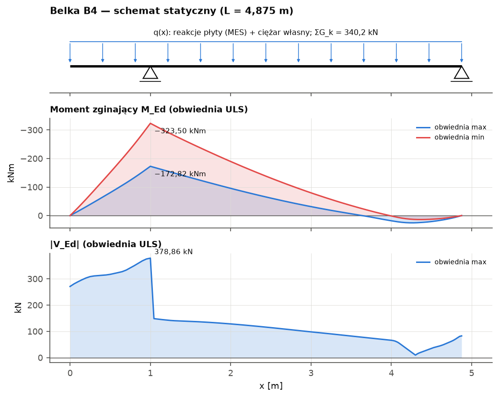

*Rys. Belka B4: schemat statyczny i obwiednie sił wewnętrznych (M dodatni — rozciąganie dołem).*

#### Zestawienie obciążeń

**Obciążenia belki (charakterystyczne, wypadkowe przypadków)**

| Przypadek | Σq·l ≈ [kN] |
|---|---|
| G | 340,8 |
| QA | 117,2 |
| QA_pA | 127,2 |
| QA_pB | 0,0 |
| H | 4,2 |
| S1 | 16,1 |
| S2 | 16,2 |
| SB2 | 0,2 |

#### Obliczenia

##### Siły wewnętrzne — B4 (obwiednia kombinacji)

- Moment przęsłowy maks.: M_Ed,max = **25,55** kNm
- Moment podporowy (min.): M_Ed,min = **−323,56** kNm
- Siła poprzeczna maks.: V_Ed = **379,12** kN

##### B4 — zginanie w przęśle

- Wysokość użyteczna: d = **759** mm
- Moment względny: μ = M_Ed/(b·d²·η·f_cd) = 25,55·10⁶/(180·759²·1,0·21,43) = **0,0115** *(3.1.7(3))*
- Względna wysokość strefy ściskanej: ξ_eff = 1 − √(1 − 2μ) = 1 − √(1 − 2·0,0115) = **0,0116**
- Warunek ciągliwości: ξ_eff ≤ ξ_eff,lim = λ·ε_cu3/(ε_cu3 + f_yd/E_s) = 0,012 ≤ 0,493 = **spełniony**
- Wymagane zbrojenie rozciągane: A_s1 = ξ_eff·b·d·η·f_cd/f_yd = 0,0116·180·759·1,0·21,43/434,8 = **78** mm²
- Zbrojenie minimalne: A_s,min = max(0,26·f_ctm/f_yk·b·d; 0,0013·b·d) = max(0,26·2,9/500·180·759; 0,0013·180·759) = **206** mm² *((9.1N) + NA)*
- Przyjęto dołem: 2φ12 = **2,26** cm²

| Warunek | Efekt | Nośność / limit | η | Stan | Podstawa |
|---|---|---|---|---|---|
| Zbrojenie dolne | A_s,req = 206 mm² | A_s,prov = 226 mm² | 91% | spełniony | 6.1 |

##### B4 — zginanie nad podporą

- Wysokość użyteczna: d = **759** mm
- Moment względny: μ = M_Ed/(b·d²·η·f_cd) = 323,56·10⁶/(180·759²·1,0·21,43) = **0,1456** *(3.1.7(3))*
- Względna wysokość strefy ściskanej: ξ_eff = 1 − √(1 − 2μ) = 1 − √(1 − 2·0,1456) = **0,1581**
- Warunek ciągliwości: ξ_eff ≤ ξ_eff,lim = λ·ε_cu3/(ε_cu3 + f_yd/E_s) = 0,158 ≤ 0,493 = **spełniony**
- Wymagane zbrojenie rozciągane: A_s1 = ξ_eff·b·d·η·f_cd/f_yd = 0,1581·180·759·1,0·21,43/434,8 = **1065** mm²
- Zbrojenie minimalne: A_s,min = max(0,26·f_ctm/f_yk·b·d; 0,0013·b·d) = max(0,26·2,9/500·180·759; 0,0013·180·759) = **206** mm² *((9.1N) + NA)*

| Warunek | Efekt | Nośność / limit | η | Stan | Podstawa |
|---|---|---|---|---|---|
| Zbrojenie górne | A_s,req = 1065 mm² | A_s,prov = 1206 mm² | 88% | spełniony | 6.1 |

##### B4 — ścinanie

- Współczynnik skali: k = 1 + √(200/d) ≤ 2,0 = 1 + √(200/759) = **1,513**
- Stopień zbrojenia podłużnego: ρ_l = A_sl/(b_w·d) ≤ 0,02 = 226/(180·759) = **0,00166**
- Nośność na ścinanie: V_Rd,c = C_Rd,c·k·(100·ρ_l·f_ck)^(1/3)·b_w·d = 0,1286·1,513·(100·0,00166·30)^(1/3)·180·759·10⁻³ = **45,35** kN *((6.2.a); C_Rd,c = 0,18/γ_c)*
- Wartość minimalna: V_Rd,c,min = v_min·b_w·d, v_min = 0,035·k^(3/2)·f_ck^(1/2) = 0,3569·180·759·10⁻³ = **48,76** kN *((6.2.b), (6.3N))*
- Ramię sił wewnętrznych: z = 0,9·d = 0,9·759 = **683** mm
- Przyjęto nachylenie krzyżulców betonowych: cot θ = (1,0 ≤ cot θ ≤ 2,0 — NA) = **2,00** *((6.7N))*
- Nośność krzyżulców ściskanych: V_Rd,max = b_w·z·ν₁·f_cd/(cot θ + tan θ) = 180·683·0,528·21,43/(2,00 + 0,500)·10⁻³ = **556,47** kN *((6.9), ν₁ = ν (6.6N))*
- Rozstaw z warunku nośności: s = A_sw·z·f_ywd·cot θ/V_Ed = 100,5·683·434,8·2,00/(379,12·10³) = **158** mm *((6.8))*
- Rozstaw maksymalny: s_l,max = 0,75·d = 0,75·759 = **569** mm *((9.6N))*
- Stopień zbrojenia minimalny: ρ_w,min = 0,08·√f_ck/f_yk → s ≤ A_sw/(ρ_w,min·b_w) = 100,5/(0,00088·180) = **637** mm *((9.5N))*
- Przyjęto strzemiona: φ8 2-cięte co s = **150** mm
- Nośność zbrojenia na ścinanie: V_Rd,s = A_sw/s·z·f_ywd·cot θ = 100,5/150·683·434,8·2,00·10⁻³ = **398,10** kN

| Warunek | Efekt | Nośność / limit | η | Stan | Podstawa |
|---|---|---|---|---|---|
| Nośność krzyżulców betonowych | V_Ed = 379,12 kN | V_Rd,max = 556,47 kN | 68% | spełniony | (6.9) |
| Nośność strzemion | V_Ed = 379,12 kN | V_Rd,s = 398,10 kN | 95% | spełniony | (6.8) |

##### B4 — ugięcie

- Stopień zbrojenia wymagany: ρ = A_s,req/(b·d) = 78/(180·759) = **0,00057**
- Wartość odniesienia: ρ₀ = √f_ck·10⁻³ = √30·10⁻³ = **0,00548**
- Graniczne l/d (ρ ≤ ρ₀): K·[11 + 1,5·√f_ck·ρ₀/ρ + 3,2·√f_ck·(ρ₀/ρ − 1)^(3/2)] = 1,0·[11 + 1,5·5,477·9,610 + 3,2·5,477·(9,610 − 1)^1,5] = **532,8** *((7.16a))*
- Mnożnik od naprężeń w stali: 310/σ_s ≈ 500/(f_yk·A_s,req/A_s,prov) ≤ 1,5 = 500/(500·78/226) = **1,500** *((7.17))*
- Smukłość rzeczywista: l_eff/d = 4,88/0,759 = **6,4**
- *Obliczenie ugięcia (7.4.3)*
- Efektywny moduł sprężystości: E_c,eff = E_cm/(1 + φ) = 33000/(1 + 2,5) = **9429** MPa *((7.20))*
- Stosunek modułów: α_e = E_s/E_c,eff = 200000/9429 = **21,21**
- Przekrój niezarysowany: x_I; I_I = **411,6 mm; 8278,4·10⁶ mm⁴**
- Przekrój zarysowany: x_II; I_II = **176,3 mm; 1957,9·10⁶ mm⁴**
- Moment rysujący: M_cr = f_ctm·I_I/(h − x_I) = 2,9·8278,4·10⁶/(800 − 411,6) = **61,81** kNm
- Współczynnik rozkładu: ζ = 1 − β·(M_cr/M_qp)², β = 0,5 = M_qp ≤ M_cr → 0 = **0,000** *((7.19))*
- Ugięcie od obciążeń (quasi-stała): w_q = ζ·w_II + (1 − ζ)·w_I = 0,000·13,22 + 1,000·3,13 = **3,13** mm *((7.18))*
- Ugięcie od skurczu: w_cs = k·(1/r_cs)·l², 1/r_cs = ε_cs·α_e·S/I = 0,125·0,081·10⁻⁶·4875² = **0,24** mm *((7.21))*
- Ugięcie całkowite: w = w_q + w_cs = 3,13 + 0,24 = **3,37** mm
- Ugięcie dopuszczalne: w_lim = L/250 = 4875/250 = **19,5** mm *(7.4.1(4))*

| Warunek | Efekt | Nośność / limit | η | Stan | Podstawa |
|---|---|---|---|---|---|
| Ugięcie — graniczna smukłość l/d (7.4.2) | l/d = 6,4  | (l/d)_lim = 799,2  | 1% | spełniony | (7.16), tabl. 7.4N |

> l/d spełnione — obliczenie (7.4.3) informacyjnie: w = 3,4 mm ≤? 19,5 mm.

##### B4 — rysy

- Naprężenie w stali (quasi-stała, przekrój zarysowany, α_e = 15): σ_s = α_e·M_qp·(d − x_II)/I_II = **113** MPa
- Maksymalna średnica (w_max = 0,4 mm): φ_s = φ*_s·(f_ct,eff/2,9)·k_c·h_cr/(2(h − d)) = 40,0·(2,9/2,9)·0,4·400/(2·41) = **78,0** mm *(tabl. 7.2N, (7.6N))*
- Maksymalny rozstaw prętów: s_max = (σ_s = 113 MPa) = **300** mm *(tabl. 7.3N)*

| Warunek | Efekt | Nośność / limit | η | Stan | Podstawa |
|---|---|---|---|---|---|
| Rysy: średnica prętów (tabl. 7.2N) | φ = 12 mm | φ_s,max = 78 mm | 15% | spełniony | 7.3.3(2) |

##### Równowaga statyczna (EQU) — belka B4 ze wspornikiem

- Wsporniki belki: x < x₁ lub x > x_n = **x₁ = 1,00 m, x_n = 4,88 m, L = 4,88 m**
- Reakcja EQU podpory SL10 (x = 1,00 m): R = Σ(1,10·R_G⁻ + 0,90·R_G⁺) + 1,5·ΣR_Q⁻ (wsporniki i przęsła osobno) = **256,6** kN *(PN-EN 1990 tabl. A1.2(A) + NA)*
- Reakcja EQU podpory SL21 (x = 4,88 m): R = Σ(1,10·R_G⁻ + 0,90·R_G⁺) + 1,5·ΣR_Q⁻ (wsporniki i przęsła osobno) = **−24,5** kN *(PN-EN 1990 tabl. A1.2(A) + NA)*
- Odrywanie — zakotwienie w słupie ŻB (pręty podłużne ciągłe do fundamentu): A_s ≥ |R_EQU|/f_yd = 24,5·10³/434,8 = **56** mm²

| Warunek | Efekt | Nośność / limit | η | Stan | Podstawa |
|---|---|---|---|---|---|
| EQU — zakotwienie reakcji odrywającej w słupie ŻB | A_s,req = 56 mm² | A_s,min słupa = 452 mm² | 12% | spełniony | PN-EN 1990 A1.2(A); PN-EN 1992-1-1 8.4 |

#### Wnioski

**Przyjęto:** Belka B4: 18×80 cm, C30/37; dołem 2φ12, górą 6φ16, strzemiona φ8 co 15 cm (2-cięte).  

### Poz. 5.10 — Belka B5

Element modelu: `B5` · maks. wykorzystanie nośności η = 98% · wszystkie warunki spełnione

#### Opis i schemat statyczny

Belka żelbetowa b × h = 18 × 80 cm, oś (−1,00, 5,12) → (3,88, 5,12), L = 4,875 m; podpory: słup SL12 (x = 1,00 m), słup SL14 (x = 4,88 m). Obciążenie: reakcje płyty z MES (rozkład wzdłuż belki) + ciężar własny + reakcje belek opartych na końcach (siły skupione) + ściana S2-07 stojąca na belce (odcinek 0,00–4,88 m ściany; profil obciążenia dolnego ściany).

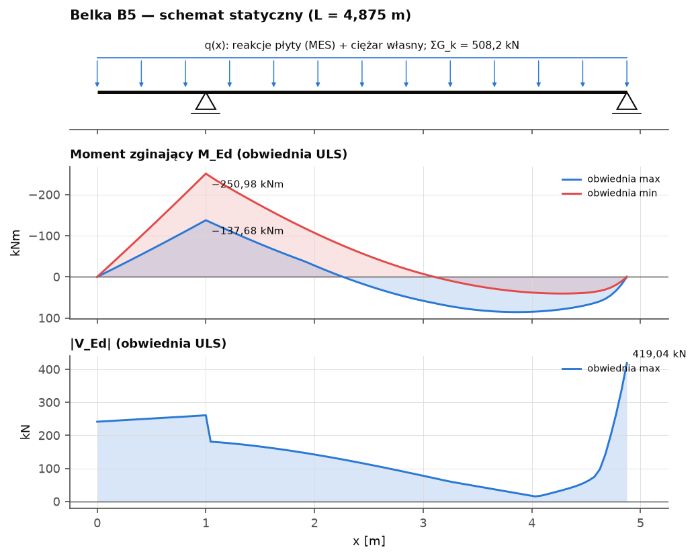

*Rys. Belka B5: schemat statyczny i obwiednie sił wewnętrznych (M dodatni — rozciąganie dołem).*

#### Zestawienie obciążeń

**Obciążenia belki (charakterystyczne, wypadkowe przypadków)**

| Przypadek | Σq·l ≈ [kN] |
|---|---|
| G | 456,5 |
| QA | 113,4 |
| QA_pA | 58,2 |
| QA_pB | 69,4 |
| H | 5,4 |
| S1 | 11,0 |
| S2 | 12,1 |
| SB2 | 4,7 |

#### Obliczenia

##### Siły wewnętrzne — B5 (obwiednia kombinacji)

- Moment przęsłowy maks.: M_Ed,max = **85,63** kNm
- Moment podporowy (min.): M_Ed,min = **−250,98** kNm
- Siła poprzeczna maks.: V_Ed = **419,04** kN

##### B5 — zginanie w przęśle

- Wysokość użyteczna: d = **759** mm
- Moment względny: μ = M_Ed/(b·d²·η·f_cd) = 85,63·10⁶/(180·759²·1,0·21,43) = **0,0385** *(3.1.7(3))*
- Względna wysokość strefy ściskanej: ξ_eff = 1 − √(1 − 2μ) = 1 − √(1 − 2·0,0385) = **0,0393**
- Warunek ciągliwości: ξ_eff ≤ ξ_eff,lim = λ·ε_cu3/(ε_cu3 + f_yd/E_s) = 0,039 ≤ 0,493 = **spełniony**
- Wymagane zbrojenie rozciągane: A_s1 = ξ_eff·b·d·η·f_cd/f_yd = 0,0393·180·759·1,0·21,43/434,8 = **265** mm²
- Zbrojenie minimalne: A_s,min = max(0,26·f_ctm/f_yk·b·d; 0,0013·b·d) = max(0,26·2,9/500·180·759; 0,0013·180·759) = **206** mm² *((9.1N) + NA)*
- Przyjęto dołem: 2φ14 = **3,08** cm²

| Warunek | Efekt | Nośność / limit | η | Stan | Podstawa |
|---|---|---|---|---|---|
| Zbrojenie dolne | A_s,req = 265 mm² | A_s,prov = 308 mm² | 86% | spełniony | 6.1 |

##### B5 — zginanie nad podporą

- Wysokość użyteczna: d = **759** mm
- Moment względny: μ = M_Ed/(b·d²·η·f_cd) = 250,98·10⁶/(180·759²·1,0·21,43) = **0,1130** *(3.1.7(3))*
- Względna wysokość strefy ściskanej: ξ_eff = 1 − √(1 − 2μ) = 1 − √(1 − 2·0,1130) = **0,1202**
- Warunek ciągliwości: ξ_eff ≤ ξ_eff,lim = λ·ε_cu3/(ε_cu3 + f_yd/E_s) = 0,120 ≤ 0,493 = **spełniony**
- Wymagane zbrojenie rozciągane: A_s1 = ξ_eff·b·d·η·f_cd/f_yd = 0,1202·180·759·1,0·21,43/434,8 = **809** mm²
- Zbrojenie minimalne: A_s,min = max(0,26·f_ctm/f_yk·b·d; 0,0013·b·d) = max(0,26·2,9/500·180·759; 0,0013·180·759) = **206** mm² *((9.1N) + NA)*

| Warunek | Efekt | Nośność / limit | η | Stan | Podstawa |
|---|---|---|---|---|---|
| Zbrojenie górne | A_s,req = 809 mm² | A_s,prov = 924 mm² | 88% | spełniony | 6.1 |

##### B5 — ścinanie

- Współczynnik skali: k = 1 + √(200/d) ≤ 2,0 = 1 + √(200/759) = **1,513**
- Stopień zbrojenia podłużnego: ρ_l = A_sl/(b_w·d) ≤ 0,02 = 308/(180·759) = **0,00225**
- Nośność na ścinanie: V_Rd,c = C_Rd,c·k·(100·ρ_l·f_ck)^(1/3)·b_w·d = 0,1286·1,513·(100·0,00225·30)^(1/3)·180·759·10⁻³ = **50,26** kN *((6.2.a); C_Rd,c = 0,18/γ_c)*
- Wartość minimalna: V_Rd,c,min = v_min·b_w·d, v_min = 0,035·k^(3/2)·f_ck^(1/2) = 0,3569·180·759·10⁻³ = **48,76** kN *((6.2.b), (6.3N))*
- Ramię sił wewnętrznych: z = 0,9·d = 0,9·759 = **683** mm
- Przyjęto nachylenie krzyżulców betonowych: cot θ = (1,0 ≤ cot θ ≤ 2,0 — NA) = **2,00** *((6.7N))*
- Nośność krzyżulców ściskanych: V_Rd,max = b_w·z·ν₁·f_cd/(cot θ + tan θ) = 180·683·0,528·21,43/(2,00 + 0,500)·10⁻³ = **556,47** kN *((6.9), ν₁ = ν (6.6N))*
- Rozstaw z warunku nośności: s = A_sw·z·f_ywd·cot θ/V_Ed = 100,5·683·434,8·2,00/(419,04·10³) = **143** mm *((6.8))*
- Rozstaw maksymalny: s_l,max = 0,75·d = 0,75·759 = **569** mm *((9.6N))*
- Stopień zbrojenia minimalny: ρ_w,min = 0,08·√f_ck/f_yk → s ≤ A_sw/(ρ_w,min·b_w) = 100,5/(0,00088·180) = **637** mm *((9.5N))*
- Przyjęto strzemiona: φ8 2-cięte co s = **140** mm
- Nośność zbrojenia na ścinanie: V_Rd,s = A_sw/s·z·f_ywd·cot θ = 100,5/140·683·434,8·2,00·10⁻³ = **426,54** kN

| Warunek | Efekt | Nośność / limit | η | Stan | Podstawa |
|---|---|---|---|---|---|
| Nośność krzyżulców betonowych | V_Ed = 419,04 kN | V_Rd,max = 556,47 kN | 75% | spełniony | (6.9) |
| Nośność strzemion | V_Ed = 419,04 kN | V_Rd,s = 426,54 kN | 98% | spełniony | (6.8) |

##### B5 — ugięcie

- Stopień zbrojenia wymagany: ρ = A_s,req/(b·d) = 265/(180·759) = **0,00194**
- Wartość odniesienia: ρ₀ = √f_ck·10⁻³ = √30·10⁻³ = **0,00548**
- Graniczne l/d (ρ ≤ ρ₀): K·[11 + 1,5·√f_ck·ρ₀/ρ + 3,2·√f_ck·(ρ₀/ρ − 1)^(3/2)] = 1,0·[11 + 1,5·5,477·2,827 + 3,2·5,477·(2,827 − 1)^1,5] = **77,5** *((7.16a))*
- Mnożnik od naprężeń w stali: 310/σ_s ≈ 500/(f_yk·A_s,req/A_s,prov) ≤ 1,5 = 500/(500·265/308) = **1,163** *((7.17))*
- Smukłość rzeczywista: l_eff/d = 4,88/0,759 = **6,4**
- *Obliczenie ugięcia (7.4.3)*
- Efektywny moduł sprężystości: E_c,eff = E_cm/(1 + φ) = 33000/(1 + 2,5) = **9429** MPa *((7.20))*
- Stosunek modułów: α_e = E_s/E_c,eff = 200000/9429 = **21,21**
- Przekrój niezarysowany: x_I; I_I = **415,6 mm; 8485,2·10⁶ mm⁴**
- Przekrój zarysowany: x_II; I_II = **201,2 mm; 2520,7·10⁶ mm⁴**
- Moment rysujący: M_cr = f_ctm·I_I/(h − x_I) = 2,9·8485,2·10⁶/(800 − 415,6) = **64,01** kNm
- Współczynnik rozkładu: ζ = 1 − β·(M_cr/M_qp)², β = 0,5 = M_qp ≤ M_cr → 0 = **0,000** *((7.19))*
- Ugięcie od obciążeń (quasi-stała): w_q = ζ·w_II + (1 − ζ)·w_I = 0,000·5,17 + 1,000·1,54 = **1,54** mm *((7.18))*
- Ugięcie od skurczu: w_cs = k·(1/r_cs)·l², 1/r_cs = ε_cs·α_e·S/I = 0,125·0,106·10⁻⁶·4875² = **0,31** mm *((7.21))*
- Ugięcie całkowite: w = w_q + w_cs = 1,54 + 0,31 = **1,85** mm
- Ugięcie dopuszczalne: w_lim = L/250 = 4875/250 = **19,5** mm *(7.4.1(4))*

| Warunek | Efekt | Nośność / limit | η | Stan | Podstawa |
|---|---|---|---|---|---|
| Ugięcie — graniczna smukłość l/d (7.4.2) | l/d = 6,4  | (l/d)_lim = 90,2  | 7% | spełniony | (7.16), tabl. 7.4N |

> l/d spełnione — obliczenie (7.4.3) informacyjnie: w = 1,8 mm ≤? 19,5 mm.

##### B5 — rysy

- Naprężenie w stali (quasi-stała, przekrój zarysowany, α_e = 15): σ_s = α_e·M_qp·(d − x_II)/I_II = **236** MPa
- Maksymalna średnica (w_max = 0,4 mm): φ_s = φ*_s·(f_ct,eff/2,9)·k_c·h_cr/(2(h − d)) = 21,2·(2,9/2,9)·0,4·400/(2·41) = **41,4** mm *(tabl. 7.2N, (7.6N))*
- Maksymalny rozstaw prętów: s_max = (σ_s = 236 MPa) = **255** mm *(tabl. 7.3N)*

| Warunek | Efekt | Nośność / limit | η | Stan | Podstawa |
|---|---|---|---|---|---|
| Rysy: średnica prętów (tabl. 7.2N) | φ = 14 mm | φ_s,max = 41 mm | 34% | spełniony | 7.3.3(2) |

##### Równowaga statyczna (EQU) — belka B5 ze wspornikiem

- Wsporniki belki: x < x₁ lub x > x_n = **x₁ = 1,00 m, x_n = 4,88 m, L = 4,88 m**
- Reakcja EQU podpory SL12 (x = 1,00 m): R = Σ(1,10·R_G⁻ + 0,90·R_G⁺) + 1,5·ΣR_Q⁻ (wsporniki i przęsła osobno) = **232,5** kN *(PN-EN 1990 tabl. A1.2(A) + NA)*
- Reakcja EQU podpory SL14 (x = 4,88 m): R = Σ(1,10·R_G⁻ + 0,90·R_G⁺) + 1,5·ΣR_Q⁻ (wsporniki i przęsła osobno) = **169,2** kN *(PN-EN 1990 tabl. A1.2(A) + NA)*

| Warunek | Efekt | Nośność / limit | η | Stan | Podstawa |
|---|---|---|---|---|---|
| EQU — brak odrywania podpór (R_EQU ≥ 0) | R_odr = 0,0 kN | R_EQU,min = 169,2 kN | 0% | spełniony | PN-EN 1990 tabl. A1.2(A) |

#### Wnioski

**Przyjęto:** Belka B5: 18×80 cm, C30/37; dołem 2φ14, górą 6φ14, strzemiona φ8 co 14 cm (2-cięte).  

### Poz. 5.11 — Belka B2

Element modelu: `B2` · maks. wykorzystanie nośności η = 98% · wszystkie warunki spełnione

#### Opis i schemat statyczny

Belka żelbetowa b × h = 18 × 80 cm, oś (3,85, 0,00) → (11,37, 0,00), L = 7,520 m; podpory: ściana S1-01 (x = 0,00 m), słup SL5 (x = 2,59 m), słup SL6 (x = 4,93 m), ściana S1-01 (x = 7,52 m). Obciążenie: reakcje płyty z MES (rozkład wzdłuż belki) + ciężar własny + ściana S2-01 stojąca na belce (odcinek 4,88–12,37 m ściany; profil obciążenia dolnego ściany).

*Rys. Belka B2: schemat statyczny i obwiednie sił wewnętrznych (M dodatni — rozciąganie dołem).*

#### Zestawienie obciążeń

**Obciążenia belki (charakterystyczne, wypadkowe przypadków)**

| Przypadek | Σq·l ≈ [kN] |
|---|---|
| G | 443,5 |
| QA | 104,3 |
| QA_pA | 58,1 |
| QA_pB | 46,4 |
| H | 3,6 |
| S1 | 13,2 |
| S2 | 13,2 |
| SB2 | 0,0 |

#### Obliczenia

##### Siły wewnętrzne — B2 (obwiednia kombinacji)

- Moment przęsłowy maks.: M_Ed,max = **46,58** kNm
- Moment podporowy (min.): M_Ed,min = **−70,19** kNm
- Siła poprzeczna maks.: V_Ed = **171,28** kN

##### B2 — zginanie w przęśle

- Wysokość użyteczna: d = **759** mm
- Moment względny: μ = M_Ed/(b·d²·η·f_cd) = 46,58·10⁶/(180·759²·1,0·21,43) = **0,0210** *(3.1.7(3))*
- Względna wysokość strefy ściskanej: ξ_eff = 1 − √(1 − 2μ) = 1 − √(1 − 2·0,0210) = **0,0212**
- Warunek ciągliwości: ξ_eff ≤ ξ_eff,lim = λ·ε_cu3/(ε_cu3 + f_yd/E_s) = 0,021 ≤ 0,493 = **spełniony**
- Wymagane zbrojenie rozciągane: A_s1 = ξ_eff·b·d·η·f_cd/f_yd = 0,0212·180·759·1,0·21,43/434,8 = **143** mm²
- Zbrojenie minimalne: A_s,min = max(0,26·f_ctm/f_yk·b·d; 0,0013·b·d) = max(0,26·2,9/500·180·759; 0,0013·180·759) = **206** mm² *((9.1N) + NA)*
- Przyjęto dołem: 2φ12 = **2,26** cm²

| Warunek | Efekt | Nośność / limit | η | Stan | Podstawa |
|---|---|---|---|---|---|
| Zbrojenie dolne | A_s,req = 206 mm² | A_s,prov = 226 mm² | 91% | spełniony | 6.1 |

##### B2 — zginanie nad podporą

- Wysokość użyteczna: d = **759** mm
- Moment względny: μ = M_Ed/(b·d²·η·f_cd) = 70,19·10⁶/(180·759²·1,0·21,43) = **0,0316** *(3.1.7(3))*
- Względna wysokość strefy ściskanej: ξ_eff = 1 − √(1 − 2μ) = 1 − √(1 − 2·0,0316) = **0,0321**
- Warunek ciągliwości: ξ_eff ≤ ξ_eff,lim = λ·ε_cu3/(ε_cu3 + f_yd/E_s) = 0,032 ≤ 0,493 = **spełniony**
- Wymagane zbrojenie rozciągane: A_s1 = ξ_eff·b·d·η·f_cd/f_yd = 0,0321·180·759·1,0·21,43/434,8 = **216** mm²
- Zbrojenie minimalne: A_s,min = max(0,26·f_ctm/f_yk·b·d; 0,0013·b·d) = max(0,26·2,9/500·180·759; 0,0013·180·759) = **206** mm² *((9.1N) + NA)*

| Warunek | Efekt | Nośność / limit | η | Stan | Podstawa |
|---|---|---|---|---|---|
| Zbrojenie górne | A_s,req = 216 mm² | A_s,prov = 226 mm² | 96% | spełniony | 6.1 |

##### B2 — ścinanie

- Współczynnik skali: k = 1 + √(200/d) ≤ 2,0 = 1 + √(200/759) = **1,513**
- Stopień zbrojenia podłużnego: ρ_l = A_sl/(b_w·d) ≤ 0,02 = 226/(180·759) = **0,00166**
- Nośność na ścinanie: V_Rd,c = C_Rd,c·k·(100·ρ_l·f_ck)^(1/3)·b_w·d = 0,1286·1,513·(100·0,00166·30)^(1/3)·180·759·10⁻³ = **45,35** kN *((6.2.a); C_Rd,c = 0,18/γ_c)*
- Wartość minimalna: V_Rd,c,min = v_min·b_w·d, v_min = 0,035·k^(3/2)·f_ck^(1/2) = 0,3569·180·759·10⁻³ = **48,76** kN *((6.2.b), (6.3N))*
- Ramię sił wewnętrznych: z = 0,9·d = 0,9·759 = **683** mm
- Przyjęto nachylenie krzyżulców betonowych: cot θ = (1,0 ≤ cot θ ≤ 2,0 — NA) = **2,00** *((6.7N))*
- Nośność krzyżulców ściskanych: V_Rd,max = b_w·z·ν₁·f_cd/(cot θ + tan θ) = 180·683·0,528·21,43/(2,00 + 0,500)·10⁻³ = **556,47** kN *((6.9), ν₁ = ν (6.6N))*
- Rozstaw z warunku nośności: s = A_sw·z·f_ywd·cot θ/V_Ed = 100,5·683·434,8·2,00/(171,28·10³) = **349** mm *((6.8))*
- Rozstaw maksymalny: s_l,max = 0,75·d = 0,75·759 = **569** mm *((9.6N))*
- Stopień zbrojenia minimalny: ρ_w,min = 0,08·√f_ck/f_yk → s ≤ A_sw/(ρ_w,min·b_w) = 100,5/(0,00088·180) = **637** mm *((9.5N))*
- Przyjęto strzemiona: φ8 2-cięte co s = **340** mm
- Nośność zbrojenia na ścinanie: V_Rd,s = A_sw/s·z·f_ywd·cot θ = 100,5/340·683·434,8·2,00·10⁻³ = **175,63** kN

| Warunek | Efekt | Nośność / limit | η | Stan | Podstawa |
|---|---|---|---|---|---|
| Nośność krzyżulców betonowych | V_Ed = 171,28 kN | V_Rd,max = 556,47 kN | 31% | spełniony | (6.9) |
| Nośność strzemion | V_Ed = 171,28 kN | V_Rd,s = 175,63 kN | 98% | spełniony | (6.8) |

##### B2 — ugięcie

- Stopień zbrojenia wymagany: ρ = A_s,req/(b·d) = 143/(180·759) = **0,00104**
- Wartość odniesienia: ρ₀ = √f_ck·10⁻³ = √30·10⁻³ = **0,00548**
- Graniczne l/d (ρ ≤ ρ₀): K·[11 + 1,5·√f_ck·ρ₀/ρ + 3,2·√f_ck·(ρ₀/ρ − 1)^(3/2)] = 1,0·[11 + 1,5·5,477·5,245 + 3,2·5,477·(5,245 − 1)^1,5] = **207,4** *((7.16a))*
- Mnożnik od naprężeń w stali: 310/σ_s ≈ 500/(f_yk·A_s,req/A_s,prov) ≤ 1,5 = 500/(500·143/226) = **1,500** *((7.17))*
- Rozpiętość > 7 m: × 7/l_eff = 7/7,52 = **0,931** *(7.4.2(2))*
- Smukłość rzeczywista: l_eff/d = 7,52/0,759 = **9,9**
- *Obliczenie ugięcia (7.4.3)*
- Efektywny moduł sprężystości: E_c,eff = E_cm/(1 + φ) = 33000/(1 + 2,5) = **9429** MPa *((7.20))*
- Stosunek modułów: α_e = E_s/E_c,eff = 200000/9429 = **21,21**
- Przekrój niezarysowany: x_I; I_I = **411,6 mm; 8278,4·10⁶ mm⁴**
- Przekrój zarysowany: x_II; I_II = **176,3 mm; 1957,9·10⁶ mm⁴**
- Moment rysujący: M_cr = f_ctm·I_I/(h − x_I) = 2,9·8278,4·10⁶/(800 − 411,6) = **61,81** kNm
- Współczynnik rozkładu: ζ = 1 − β·(M_cr/M_qp)², β = 0,5 = M_qp ≤ M_cr → 0 = **0,000** *((7.19))*
- Ugięcie od obciążeń (quasi-stała): w_q = ζ·w_II + (1 − ζ)·w_I = 0,000·1,01 + 1,000·0,24 = **0,24** mm *((7.18))*
- Ugięcie od skurczu: w_cs = k·(1/r_cs)·l², 1/r_cs = ε_cs·α_e·S/I = 0,125·0,081·10⁻⁶·7520² = **0,57** mm *((7.21))*
- Ugięcie całkowite: w = w_q + w_cs = 0,24 + 0,57 = **0,81** mm
- Ugięcie dopuszczalne: w_lim = L/250 = 7520/250 = **30,1** mm *(7.4.1(4))*

| Warunek | Efekt | Nośność / limit | η | Stan | Podstawa |
|---|---|---|---|---|---|
| Ugięcie — graniczna smukłość l/d (7.4.2) | l/d = 9,9  | (l/d)_lim = 289,6  | 3% | spełniony | (7.16), tabl. 7.4N |

> l/d spełnione — obliczenie (7.4.3) informacyjnie: w = 0,8 mm ≤? 30,1 mm.

##### B2 — rysy

- Naprężenie w stali (quasi-stała, przekrój zarysowany, α_e = 15): σ_s = α_e·M_qp·(d − x_II)/I_II = **192** MPa
- Maksymalna średnica (w_max = 0,4 mm): φ_s = φ*_s·(f_ct,eff/2,9)·k_c·h_cr/(2(h − d)) = 33,6·(2,9/2,9)·0,4·400/(2·41) = **65,6** mm *(tabl. 7.2N, (7.6N))*
- Maksymalny rozstaw prętów: s_max = (σ_s = 192 MPa) = **300** mm *(tabl. 7.3N)*

| Warunek | Efekt | Nośność / limit | η | Stan | Podstawa |
|---|---|---|---|---|---|
| Rysy: średnica prętów (tabl. 7.2N) | φ = 12 mm | φ_s,max = 66 mm | 18% | spełniony | 7.3.3(2) |

#### Wnioski

**Przyjęto:** Belka B2: 18×80 cm, C30/37; dołem 2φ12, górą 2φ12, strzemiona φ8 co 34 cm (2-cięte).  

### Poz. 5.12 — Belka B9

Element modelu: `B9` · maks. wykorzystanie nośności η = 100% · wszystkie warunki spełnione

#### Opis i schemat statyczny

Belka żelbetowa b × h = 25 × 50 cm, oś (5,88, 5,12) → (8,50, 5,12), L = 2,625 m; podpory: słup SL17 (x = 0,00 m), słup SL19 (x = 2,62 m). Obciążenie: reakcje płyty z MES (rozkład wzdłuż belki) + ciężar własny + ściana S2-09 stojąca na belce (odcinek 2,00–3,32 m ściany; profil obciążenia dolnego ściany).

*Rys. Belka B9: schemat statyczny i obwiednie sił wewnętrznych (M dodatni — rozciąganie dołem).*

#### Zestawienie obciążeń

**Obciążenia belki (charakterystyczne, wypadkowe przypadków)**

| Przypadek | Σq·l ≈ [kN] |
|---|---|
| G | 463,4 |
| QA | 91,2 |
| QA_pA | 0,0 |
| QA_pB | 103,9 |
| H | 6,2 |
| S1 | 9,9 |
| S2 | 9,9 |
| SB2 | 0,0 |

#### Obliczenia

##### Siły wewnętrzne — B9 (obwiednia kombinacji)

- Moment przęsłowy maks.: M_Ed,max = **103,49** kNm
- Moment podporowy (min.): M_Ed,min = **0,00** kNm
- Siła poprzeczna maks.: V_Ed = **410,23** kN

##### B9 — zginanie w przęśle

- Wysokość użyteczna: d = **459** mm
- Moment względny: μ = M_Ed/(b·d²·η·f_cd) = 103,49·10⁶/(250·459²·1,0·17,86) = **0,1100** *(3.1.7(3))*
- Względna wysokość strefy ściskanej: ξ_eff = 1 − √(1 − 2μ) = 1 − √(1 − 2·0,1100) = **0,1169**
- Warunek ciągliwości: ξ_eff ≤ ξ_eff,lim = λ·ε_cu3/(ε_cu3 + f_yd/E_s) = 0,117 ≤ 0,493 = **spełniony**
- Wymagane zbrojenie rozciągane: A_s1 = ξ_eff·b·d·η·f_cd/f_yd = 0,1169·250·459·1,0·17,86/434,8 = **551** mm²
- Zbrojenie minimalne: A_s,min = max(0,26·f_ctm/f_yk·b·d; 0,0013·b·d) = max(0,26·2,6/500·250·459; 0,0013·250·459) = **155** mm² *((9.1N) + NA)*
- Przyjęto dołem: 5φ12 = **5,65** cm²

| Warunek | Efekt | Nośność / limit | η | Stan | Podstawa |
|---|---|---|---|---|---|
| Zbrojenie dolne | A_s,req = 551 mm² | A_s,prov = 565 mm² | 97% | spełniony | 6.1 |

##### B9 — ścinanie

- Współczynnik skali: k = 1 + √(200/d) ≤ 2,0 = 1 + √(200/459) = **1,660**
- Stopień zbrojenia podłużnego: ρ_l = A_sl/(b_w·d) ≤ 0,02 = 565/(250·459) = **0,00493**
- Nośność na ścinanie: V_Rd,c = C_Rd,c·k·(100·ρ_l·f_ck)^(1/3)·b_w·d = 0,1286·1,660·(100·0,00493·25)^(1/3)·250·459·10⁻³ = **56,57** kN *((6.2.a); C_Rd,c = 0,18/γ_c)*
- Wartość minimalna: V_Rd,c,min = v_min·b_w·d, v_min = 0,035·k^(3/2)·f_ck^(1/2) = 0,3743·250·459·10⁻³ = **42,95** kN *((6.2.b), (6.3N))*
- Ramię sił wewnętrznych: z = 0,9·d = 0,9·459 = **413** mm
- Przyjęto nachylenie krzyżulców betonowych: cot θ = (1,0 ≤ cot θ ≤ 2,0 — NA) = **1,90** *((6.7N))*
- Nośność krzyżulców ściskanych: V_Rd,max = b_w·z·ν₁·f_cd/(cot θ + tan θ) = 250·413·0,540·17,86/(1,90 + 0,526)·10⁻³ = **410,44** kN *((6.9), ν₁ = ν (6.6N))*
- Rozstaw z warunku nośności: s = A_sw·z·f_ywd·cot θ/V_Ed = 100,5·413·434,8·1,90/(410,23·10³) = **84** mm *((6.8))*
- Rozstaw maksymalny: s_l,max = 0,75·d = 0,75·459 = **344** mm *((9.6N))*
- Stopień zbrojenia minimalny: ρ_w,min = 0,08·√f_ck/f_yk → s ≤ A_sw/(ρ_w,min·b_w) = 100,5/(0,00080·250) = **503** mm *((9.5N))*
- Przyjęto strzemiona: φ8 2-cięte co s = **80** mm
- Nośność zbrojenia na ścinanie: V_Rd,s = A_sw/s·z·f_ywd·cot θ = 100,5/80·413·434,8·1,90·10⁻³ = **428,84** kN

| Warunek | Efekt | Nośność / limit | η | Stan | Podstawa |
|---|---|---|---|---|---|
| Nośność krzyżulców betonowych | V_Ed = 410,23 kN | V_Rd,max = 410,44 kN | 100% | spełniony | (6.9) |
| Nośność strzemion | V_Ed = 410,23 kN | V_Rd,s = 428,84 kN | 96% | spełniony | (6.8) |

##### B9 — ugięcie

- Stopień zbrojenia wymagany: ρ = A_s,req/(b·d) = 551/(250·459) = **0,00480**
- Wartość odniesienia: ρ₀ = √f_ck·10⁻³ = √25·10⁻³ = **0,00500**
- Graniczne l/d (ρ ≤ ρ₀): K·[11 + 1,5·√f_ck·ρ₀/ρ + 3,2·√f_ck·(ρ₀/ρ − 1)^(3/2)] = 1,0·[11 + 1,5·5,000·1,042 + 3,2·5,000·(1,042 − 1)^1,5] = **18,9** *((7.16a))*
- Mnożnik od naprężeń w stali: 310/σ_s ≈ 500/(f_yk·A_s,req/A_s,prov) ≤ 1,5 = 500/(500·551/565) = **1,027** *((7.17))*
- Smukłość rzeczywista: l_eff/d = 2,62/0,459 = **5,7**
- *Obliczenie ugięcia (7.4.3)*
- Efektywny moduł sprężystości: E_c,eff = E_cm/(1 + φ) = 31000/(1 + 2,5) = **8857** MPa *((7.20))*
- Stosunek modułów: α_e = E_s/E_c,eff = 200000/8857 = **22,58**
- Przekrój niezarysowany: x_I; I_I = **269,4 mm; 3110,2·10⁶ mm⁴**
- Przekrój zarysowany: x_II; I_II = **171,4 mm; 1475,8·10⁶ mm⁴**
- Moment rysujący: M_cr = f_ctm·I_I/(h − x_I) = 2,6·3110,2·10⁶/(500 − 269,4) = **35,06** kNm
- Współczynnik rozkładu: ζ = 1 − β·(M_cr/M_qp)², β = 0,5 = 1 − 0,5·(35,06/70,04)² = **0,875** *((7.19))*
- Ugięcie od obciążeń (quasi-stała): w_q = ζ·w_II + (1 − ζ)·w_I = 0,875·3,92 + 0,125·1,86 = **3,66** mm *((7.18))*
- Ugięcie od skurczu: w_cs = k·(1/r_cs)·l², 1/r_cs = ε_cs·α_e·S/I = 0,125·0,910·10⁻⁶·2625² = **0,78** mm *((7.21))*
- Ugięcie całkowite: w = w_q + w_cs = 3,66 + 0,78 = **4,45** mm
- Ugięcie dopuszczalne: w_lim = L/250 = 2625/250 = **10,5** mm *(7.4.1(4))*

| Warunek | Efekt | Nośność / limit | η | Stan | Podstawa |
|---|---|---|---|---|---|
| Ugięcie — graniczna smukłość l/d (7.4.2) | l/d = 5,7  | (l/d)_lim = 19,5  | 29% | spełniony | (7.16), tabl. 7.4N |

> l/d spełnione — obliczenie (7.4.3) informacyjnie: w = 4,4 mm ≤? 10,5 mm.

##### B9 — rysy

- Naprężenie w stali (quasi-stała, przekrój zarysowany, α_e = 15): σ_s = α_e·M_qp·(d − x_II)/I_II = **302** MPa
- Maksymalna średnica (w_max = 0,4 mm): φ_s = φ*_s·(f_ct,eff/2,9)·k_c·h_cr/(2(h − d)) = 13,8·(2,6/2,9)·0,4·250/(2·41) = **15,1** mm *(tabl. 7.2N, (7.6N))*
- Maksymalny rozstaw prętów: s_max = (σ_s = 302 MPa) = **173** mm *(tabl. 7.3N)*

| Warunek | Efekt | Nośność / limit | η | Stan | Podstawa |
|---|---|---|---|---|---|
| Rysy: średnica prętów (tabl. 7.2N) | φ = 12 mm | φ_s,max = 15 mm | 79% | spełniony | 7.3.3(2) |

#### Wnioski

**Przyjęto:** Belka B9: 25×50 cm, C25/30; dołem 5φ12, górą 2φ12, strzemiona φ8 co 8 cm (2-cięte).  

### Poz. 5.13 — Belka N16

Element modelu: `N16` · maks. wykorzystanie nośności η = 54% · wszystkie warunki spełnione

#### Opis i schemat statyczny

Belka żelbetowa b × h = 18 × 24 cm, oś (0,00, 8,00) → (0,00, 5,80), L = 2,200 m; podpory: ściana S1-04 (x = 0,00 m), ściana S1-04 (x = 2,20 m). Obciążenie: reakcje płyty z MES (rozkład wzdłuż belki) + ciężar własny.

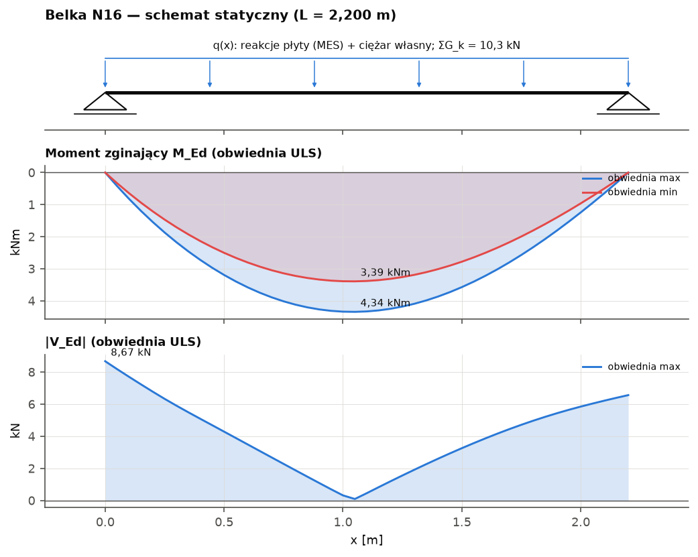

*Rys. Belka N16: schemat statyczny i obwiednie sił wewnętrznych (M dodatni — rozciąganie dołem).*

#### Zestawienie obciążeń

**Obciążenia belki (charakterystyczne, wypadkowe przypadków)**

| Przypadek | Σq·l ≈ [kN] |
|---|---|
| G | 10,6 |
| QA | 0,0 |
| QA_pA | 0,1 |
| QA_pB | 0,0 |
| H | 0,6 |
| S1 | 1,1 |
| S2 | 1,6 |
| SB2 | 2,0 |

#### Obliczenia

##### Siły wewnętrzne — N16 (obwiednia kombinacji)

- Moment przęsłowy maks.: M_Ed,max = **4,36** kNm
- Moment podporowy (min.): M_Ed,min = **0,00** kNm
- Siła poprzeczna maks.: V_Ed = **8,70** kN

##### N16 — zginanie w przęśle (przekrój teowy)

- Wysokość użyteczna: d = **499** mm
- Moment względny: μ = M_Ed/(b·d²·η·f_cd) = 4,36·10⁶/(554·499²·1,0·17,86) = **0,0018** *(3.1.7(3))*
- Względna wysokość strefy ściskanej: ξ_eff = 1 − √(1 − 2μ) = 1 − √(1 − 2·0,0018) = **0,0018**
- Warunek ciągliwości: ξ_eff ≤ ξ_eff,lim = λ·ε_cu3/(ε_cu3 + f_yd/E_s) = 0,002 ≤ 0,493 = **spełniony**
- Wymagane zbrojenie rozciągane: A_s1 = ξ_eff·b·d·η·f_cd/f_yd = 0,0018·554·499·1,0·17,86/434,8 = **20** mm²
- Zbrojenie minimalne: A_s,min = max(0,26·f_ctm/f_yk·b·d; 0,0013·b·d) = max(0,26·2,6/500·554·499; 0,0013·554·499) = **374** mm² *((9.1N) + NA)*
- Strefa ściskana w półce: x_eff = ξ_eff·d ≤ h_f = 1 ≤ 300 = **przekrój pozornie teowy**
- Zbrojenie minimalne (b_t = b_w — strefa rozciągana w środniku): A_s,min = max(0,26·f_ctm/f_yk·b_w·d; 0,0013·b_w·d) = **121** mm² *((9.1N))*
- Przyjęto dołem: 2φ12 = **2,26** cm²

| Warunek | Efekt | Nośność / limit | η | Stan | Podstawa |
|---|---|---|---|---|---|
| Zbrojenie dolne | A_s,req = 121 mm² | A_s,prov = 226 mm² | 54% | spełniony | 6.1 |

##### N16 — ścinanie

- Współczynnik skali: k = 1 + √(200/d) ≤ 2,0 = 1 + √(200/499) = **1,633**
- Stopień zbrojenia podłużnego: ρ_l = A_sl/(b_w·d) ≤ 0,02 = 226/(180·499) = **0,00252**
- Nośność na ścinanie: V_Rd,c = C_Rd,c·k·(100·ρ_l·f_ck)^(1/3)·b_w·d = 0,1286·1,633·(100·0,00252·25)^(1/3)·180·499·10⁻³ = **34,82** kN *((6.2.a); C_Rd,c = 0,18/γ_c)*
- Wartość minimalna: V_Rd,c,min = v_min·b_w·d, v_min = 0,035·k^(3/2)·f_ck^(1/2) = 0,3652·180·499·10⁻³ = **32,80** kN *((6.2.b), (6.3N))*
- Ramię sił wewnętrznych: z = 0,9·d = 0,9·499 = **449** mm
- Przyjęto nachylenie krzyżulców betonowych: cot θ = (1,0 ≤ cot θ ≤ 2,0 — NA) = **2,00** *((6.7N))*
- Nośność krzyżulców ściskanych: V_Rd,max = b_w·z·ν₁·f_cd/(cot θ + tan θ) = 180·449·0,540·17,86/(2,00 + 0,500)·10⁻³ = **311,80** kN *((6.9), ν₁ = ν (6.6N))*
- Rozstaw z warunku nośności: s = A_sw·z·f_ywd·cot θ/V_Ed = 100,5·449·434,8·2,00/(8,70·10³) = **4513** mm *((6.8))*
- Rozstaw maksymalny: s_l,max = 0,75·d = 0,75·499 = **374** mm *((9.6N))*
- Stopień zbrojenia minimalny: ρ_w,min = 0,08·√f_ck/f_yk → s ≤ A_sw/(ρ_w,min·b_w) = 100,5/(0,00080·180) = **698** mm *((9.5N))*
- Przyjęto strzemiona: φ8 2-cięte co s = **370** mm
- Nośność zbrojenia na ścinanie: V_Rd,s = A_sw/s·z·f_ywd·cot θ = 100,5/370·449·434,8·2,00·10⁻³ = **106,11** kN

| Warunek | Efekt | Nośność / limit | η | Stan | Podstawa |
|---|---|---|---|---|---|
| Nośność krzyżulców betonowych | V_Ed = 8,70 kN | V_Rd,max = 311,80 kN | 3% | spełniony | (6.9) |
| Nośność strzemion | V_Ed = 8,70 kN | V_Rd,s = 106,11 kN | 8% | spełniony | (6.8) |

> V_Ed ≤ V_Rd,c = 34,82 kN — zbrojenie poprzeczne minimalne (9.2.2(5)).

##### N16 — ugięcie

- Stopień zbrojenia wymagany: ρ = A_s,req/(b·d) = 20/(180·499) = **0,00022**
- Wartość odniesienia: ρ₀ = √f_ck·10⁻³ = √25·10⁻³ = **0,00500**
- Graniczne l/d (ρ ≤ ρ₀): K·[11 + 1,5·√f_ck·ρ₀/ρ + 3,2·√f_ck·(ρ₀/ρ − 1)^(3/2)] = 1,0·[11 + 1,5·5,000·22,319 + 3,2·5,000·(22,319 − 1)^1,5] = **1753,4** *((7.16a))*
- Mnożnik od naprężeń w stali: 310/σ_s ≈ 500/(f_yk·A_s,req/A_s,prov) ≤ 1,5 = 500/(500·20/226) = **1,500** *((7.17))*
- Przekrój teowy b_eff/b_w > 3: × 0,8 = **0,80**
- Smukłość rzeczywista: l_eff/d = 2,20/0,499 = **4,4**
- *Obliczenie ugięcia (7.4.3)*
- Efektywny moduł sprężystości: E_c,eff = E_cm/(1 + φ) = 31000/(1 + 2,5) = **8857** MPa *((7.20))*
- Stosunek modułów: α_e = E_s/E_c,eff = 200000/8857 = **22,58**
- Przekrój niezarysowany: x_I; I_I = **281,4 mm; 2616,4·10⁶ mm⁴**
- Przekrój zarysowany: x_II; I_II = **142,3 mm; 822,8·10⁶ mm⁴**
- Moment rysujący: M_cr = f_ctm·I_I/(h − x_I) = 2,6·2616,4·10⁶/(540 − 281,4) = **26,31** kNm
- Współczynnik rozkładu: ζ = 1 − β·(M_cr/M_qp)², β = 0,5 = M_qp ≤ M_cr → 0 = **0,000** *((7.19))*
- Ugięcie od obciążeń (quasi-stała): w_q = ζ·w_II + (1 − ζ)·w_I = 0,000·0,20 + 1,000·0,06 = **0,06** mm *((7.18))*
- Ugięcie od skurczu: w_cs = k·(1/r_cs)·l², 1/r_cs = ε_cs·α_e·S/I = 0,125·0,170·10⁻⁶·2200² = **0,10** mm *((7.21))*
- Ugięcie całkowite: w = w_q + w_cs = 0,06 + 0,10 = **0,17** mm
- Ugięcie dopuszczalne: w_lim = L/250 = 2200/250 = **8,8** mm *(7.4.1(4))*

| Warunek | Efekt | Nośność / limit | η | Stan | Podstawa |
|---|---|---|---|---|---|
| Ugięcie — graniczna smukłość l/d (7.4.2) | l/d = 4,4  | (l/d)_lim = 2104,0  | 0% | spełniony | (7.16), tabl. 7.4N |

> l/d spełnione — obliczenie (7.4.3) informacyjnie: w = 0,2 mm ≤? 8,8 mm.

##### N16 — rysy

- Naprężenie w stali (quasi-stała, przekrój zarysowany, α_e = 15): σ_s = α_e·M_qp·(d − x_II)/I_II = **29** MPa
- Maksymalna średnica (w_max = 0,4 mm): φ_s = φ*_s·(f_ct,eff/2,9)·k_c·h_cr/(2(h − d)) = 40,0·(2,6/2,9)·0,4·270/(2·41) = **47,2** mm *(tabl. 7.2N, (7.6N))*
- Maksymalny rozstaw prętów: s_max = (σ_s = 29 MPa) = **300** mm *(tabl. 7.3N)*

| Warunek | Efekt | Nośność / limit | η | Stan | Podstawa |
|---|---|---|---|---|---|
| Rysy: średnica prętów (tabl. 7.2N) | φ = 12 mm | φ_s,max = 47 mm | 25% | spełniony | 7.3.3(2) |

#### Wnioski

**Przyjęto:** Belka N16: 18×54 cm (z płytą), C25/30; dołem 2φ12, górą 2φ12, strzemiona φ8 co 37 cm (2-cięte).  

### Poz. 5.14 — Belka N17

Element modelu: `N17` · maks. wykorzystanie nośności η = 54% · wszystkie warunki spełnione

#### Opis i schemat statyczny

Belka żelbetowa b × h = 18 × 24 cm, oś (0,00, 3,00) → (0,00, 0,80), L = 2,200 m; podpory: ściana S1-04 (x = 0,00 m), ściana S1-04 (x = 2,20 m). Obciążenie: reakcje płyty z MES (rozkład wzdłuż belki) + ciężar własny.

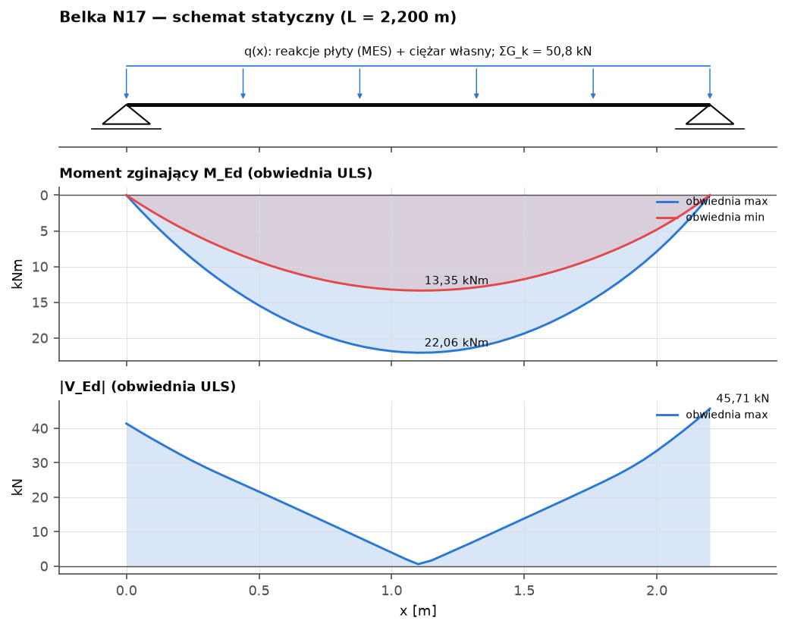

*Rys. Belka N17: schemat statyczny i obwiednie sił wewnętrznych (M dodatni — rozciąganie dołem).*

#### Zestawienie obciążeń

**Obciążenia belki (charakterystyczne, wypadkowe przypadków)**

| Przypadek | Σq·l ≈ [kN] |
|---|---|
| G | 32,5 |
| QA | 8,1 |
| QA_pA | 0,0 |
| QA_pB | 13,6 |
| H | 0,0 |
| S1 | 0,0 |
| S2 | 0,0 |
| SB2 | 0,0 |

#### Obliczenia

##### Siły wewnętrzne — N17 (obwiednia kombinacji)

- Moment przęsłowy maks.: M_Ed,max = **15,68** kNm
- Moment podporowy (min.): M_Ed,min = **0,00** kNm
- Siła poprzeczna maks.: V_Ed = **31,14** kN

##### N17 — zginanie w przęśle (przekrój teowy)

- Wysokość użyteczna: d = **499** mm
- Moment względny: μ = M_Ed/(b·d²·η·f_cd) = 15,68·10⁶/(554·499²·1,0·17,86) = **0,0064** *(3.1.7(3))*
- Względna wysokość strefy ściskanej: ξ_eff = 1 − √(1 − 2μ) = 1 − √(1 − 2·0,0064) = **0,0064**
- Warunek ciągliwości: ξ_eff ≤ ξ_eff,lim = λ·ε_cu3/(ε_cu3 + f_yd/E_s) = 0,006 ≤ 0,493 = **spełniony**
- Wymagane zbrojenie rozciągane: A_s1 = ξ_eff·b·d·η·f_cd/f_yd = 0,0064·554·499·1,0·17,86/434,8 = **73** mm²
- Zbrojenie minimalne: A_s,min = max(0,26·f_ctm/f_yk·b·d; 0,0013·b·d) = max(0,26·2,6/500·554·499; 0,0013·554·499) = **374** mm² *((9.1N) + NA)*
- Strefa ściskana w półce: x_eff = ξ_eff·d ≤ h_f = 3 ≤ 300 = **przekrój pozornie teowy**
- Zbrojenie minimalne (b_t = b_w — strefa rozciągana w środniku): A_s,min = max(0,26·f_ctm/f_yk·b_w·d; 0,0013·b_w·d) = **121** mm² *((9.1N))*
- Przyjęto dołem: 2φ12 = **2,26** cm²

| Warunek | Efekt | Nośność / limit | η | Stan | Podstawa |
|---|---|---|---|---|---|
| Zbrojenie dolne | A_s,req = 121 mm² | A_s,prov = 226 mm² | 54% | spełniony | 6.1 |

##### N17 — ścinanie

- Współczynnik skali: k = 1 + √(200/d) ≤ 2,0 = 1 + √(200/499) = **1,633**
- Stopień zbrojenia podłużnego: ρ_l = A_sl/(b_w·d) ≤ 0,02 = 226/(180·499) = **0,00252**
- Nośność na ścinanie: V_Rd,c = C_Rd,c·k·(100·ρ_l·f_ck)^(1/3)·b_w·d = 0,1286·1,633·(100·0,00252·25)^(1/3)·180·499·10⁻³ = **34,82** kN *((6.2.a); C_Rd,c = 0,18/γ_c)*
- Wartość minimalna: V_Rd,c,min = v_min·b_w·d, v_min = 0,035·k^(3/2)·f_ck^(1/2) = 0,3652·180·499·10⁻³ = **32,80** kN *((6.2.b), (6.3N))*
- Ramię sił wewnętrznych: z = 0,9·d = 0,9·499 = **449** mm
- Przyjęto nachylenie krzyżulców betonowych: cot θ = (1,0 ≤ cot θ ≤ 2,0 — NA) = **2,00** *((6.7N))*
- Nośność krzyżulców ściskanych: V_Rd,max = b_w·z·ν₁·f_cd/(cot θ + tan θ) = 180·449·0,540·17,86/(2,00 + 0,500)·10⁻³ = **311,80** kN *((6.9), ν₁ = ν (6.6N))*
- Rozstaw z warunku nośności: s = A_sw·z·f_ywd·cot θ/V_Ed = 100,5·449·434,8·2,00/(31,14·10³) = **1261** mm *((6.8))*
- Rozstaw maksymalny: s_l,max = 0,75·d = 0,75·499 = **374** mm *((9.6N))*
- Stopień zbrojenia minimalny: ρ_w,min = 0,08·√f_ck/f_yk → s ≤ A_sw/(ρ_w,min·b_w) = 100,5/(0,00080·180) = **698** mm *((9.5N))*
- Przyjęto strzemiona: φ8 2-cięte co s = **370** mm
- Nośność zbrojenia na ścinanie: V_Rd,s = A_sw/s·z·f_ywd·cot θ = 100,5/370·449·434,8·2,00·10⁻³ = **106,11** kN

| Warunek | Efekt | Nośność / limit | η | Stan | Podstawa |
|---|---|---|---|---|---|
| Nośność krzyżulców betonowych | V_Ed = 31,14 kN | V_Rd,max = 311,80 kN | 10% | spełniony | (6.9) |
| Nośność strzemion | V_Ed = 31,14 kN | V_Rd,s = 106,11 kN | 29% | spełniony | (6.8) |

> V_Ed ≤ V_Rd,c = 34,82 kN — zbrojenie poprzeczne minimalne (9.2.2(5)).

##### N17 — ugięcie

- Stopień zbrojenia wymagany: ρ = A_s,req/(b·d) = 73/(180·499) = **0,00081**
- Wartość odniesienia: ρ₀ = √f_ck·10⁻³ = √25·10⁻³ = **0,00500**
- Graniczne l/d (ρ ≤ ρ₀): K·[11 + 1,5·√f_ck·ρ₀/ρ + 3,2·√f_ck·(ρ₀/ρ − 1)^(3/2)] = 1,0·[11 + 1,5·5,000·6,193 + 3,2·5,000·(6,193 − 1)^1,5] = **246,8** *((7.16a))*
- Mnożnik od naprężeń w stali: 310/σ_s ≈ 500/(f_yk·A_s,req/A_s,prov) ≤ 1,5 = 500/(500·73/226) = **1,500** *((7.17))*
- Przekrój teowy b_eff/b_w > 3: × 0,8 = **0,80**
- Smukłość rzeczywista: l_eff/d = 2,20/0,499 = **4,4**
- *Obliczenie ugięcia (7.4.3)*
- Efektywny moduł sprężystości: E_c,eff = E_cm/(1 + φ) = 31000/(1 + 2,5) = **8857** MPa *((7.20))*
- Stosunek modułów: α_e = E_s/E_c,eff = 200000/8857 = **22,58**
- Przekrój niezarysowany: x_I; I_I = **281,4 mm; 2616,4·10⁶ mm⁴**
- Przekrój zarysowany: x_II; I_II = **142,3 mm; 822,8·10⁶ mm⁴**
- Moment rysujący: M_cr = f_ctm·I_I/(h − x_I) = 2,6·2616,4·10⁶/(540 − 281,4) = **26,31** kNm
- Współczynnik rozkładu: ζ = 1 − β·(M_cr/M_qp)², β = 0,5 = M_qp ≤ M_cr → 0 = **0,000** *((7.19))*
- Ugięcie od obciążeń (quasi-stała): w_q = ζ·w_II + (1 − ζ)·w_I = 0,000·0,65 + 1,000·0,21 = **0,21** mm *((7.18))*
- Ugięcie od skurczu: w_cs = k·(1/r_cs)·l², 1/r_cs = ε_cs·α_e·S/I = 0,125·0,170·10⁻⁶·2200² = **0,10** mm *((7.21))*
- Ugięcie całkowite: w = w_q + w_cs = 0,21 + 0,10 = **0,31** mm
- Ugięcie dopuszczalne: w_lim = L/250 = 2200/250 = **8,8** mm *(7.4.1(4))*

| Warunek | Efekt | Nośność / limit | η | Stan | Podstawa |
|---|---|---|---|---|---|
| Ugięcie — graniczna smukłość l/d (7.4.2) | l/d = 4,4  | (l/d)_lim = 296,2  | 1% | spełniony | (7.16), tabl. 7.4N |

> l/d spełnione — obliczenie (7.4.3) informacyjnie: w = 0,3 mm ≤? 8,8 mm.

##### N17 — rysy

- Naprężenie w stali (quasi-stała, przekrój zarysowany, α_e = 15): σ_s = α_e·M_qp·(d − x_II)/I_II = **91** MPa
- Maksymalna średnica (w_max = 0,4 mm): φ_s = φ*_s·(f_ct,eff/2,9)·k_c·h_cr/(2(h − d)) = 40,0·(2,6/2,9)·0,4·270/(2·41) = **47,2** mm *(tabl. 7.2N, (7.6N))*
- Maksymalny rozstaw prętów: s_max = (σ_s = 91 MPa) = **300** mm *(tabl. 7.3N)*

| Warunek | Efekt | Nośność / limit | η | Stan | Podstawa |
|---|---|---|---|---|---|
| Rysy: średnica prętów (tabl. 7.2N) | φ = 12 mm | φ_s,max = 47 mm | 25% | spełniony | 7.3.3(2) |

#### Wnioski

**Przyjęto:** Belka N17: 18×54 cm (z płytą), C25/30; dołem 2φ12, górą 2φ12, strzemiona φ8 co 37 cm (2-cięte).  

### Poz. 5.15 — Belka B1

Element modelu: `B1` · maks. wykorzystanie nośności η = 100% · wszystkie warunki spełnione

#### Opis i schemat statyczny

Belka żelbetowa b × h = 18 × 107 cm, oś (0,00, 0,00) → (12,00, 0,00), L = 12,000 m; podpory: słup SL9 (x = 0,00 m), słup SL1 (x = 2,20 m), słup SL2 (x = 4,10 m), słup SL3 (x = 6,44 m), słup SL4 (x = 8,78 m), słup SL20 (x = 12,00 m). Obciążenie: reakcje płyty z MES (rozkład wzdłuż belki) + ciężar własny + ściana S1-01 stojąca na belce (odcinek 0,00–12,00 m ściany; profil obciążenia dolnego ściany) + słup SL5 stojący na belce (x = 6,44 m) + słup SL6 stojący na belce (x = 8,78 m) + słup SL21 stojący na belce (x = 3,90 m).

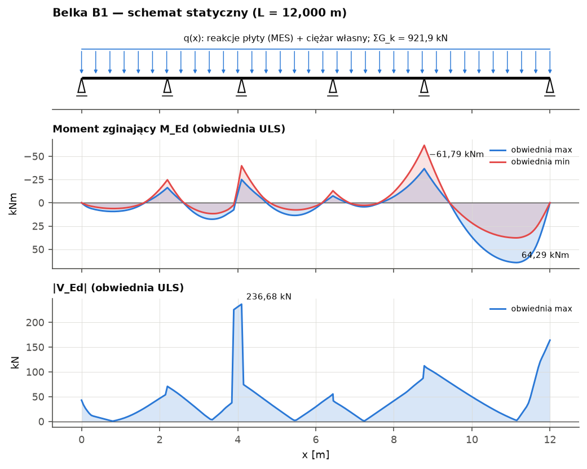

*Rys. Belka B1: schemat statyczny i obwiednie sił wewnętrznych (M dodatni — rozciąganie dołem).*

#### Zestawienie obciążeń

**Obciążenia belki (charakterystyczne, wypadkowe przypadków)**

| Przypadek | Σq·l ≈ [kN] |
|---|---|
| G | 926,1 |
| QA | 243,0 |
| QA_pA | 193,9 |
| QA_pB | 48,3 |
| H | 5,7 |
| S1 | 18,8 |
| S2 | 18,8 |
| SB2 | 0,0 |

#### Obliczenia

##### Siły wewnętrzne — B1 (obwiednia kombinacji)

- Moment przęsłowy maks.: M_Ed,max = **64,26** kNm
- Moment podporowy (min.): M_Ed,min = **−61,78** kNm
- Siła poprzeczna maks.: V_Ed = **237,16** kN

##### B1 — zginanie w przęśle

- Wysokość użyteczna: d = **1029** mm
- Moment względny: μ = M_Ed/(b·d²·η·f_cd) = 64,26·10⁶/(180·1029²·1,0·21,43) = **0,0157** *(3.1.7(3))*
- Względna wysokość strefy ściskanej: ξ_eff = 1 − √(1 − 2μ) = 1 − √(1 − 2·0,0157) = **0,0159**
- Warunek ciągliwości: ξ_eff ≤ ξ_eff,lim = λ·ε_cu3/(ε_cu3 + f_yd/E_s) = 0,016 ≤ 0,493 = **spełniony**
- Wymagane zbrojenie rozciągane: A_s1 = ξ_eff·b·d·η·f_cd/f_yd = 0,0159·180·1029·1,0·21,43/434,8 = **145** mm²
- Zbrojenie minimalne: A_s,min = max(0,26·f_ctm/f_yk·b·d; 0,0013·b·d) = max(0,26·2,9/500·180·1029; 0,0013·180·1029) = **279** mm² *((9.1N) + NA)*
- Przyjęto dołem: 2φ14 = **3,08** cm²

| Warunek | Efekt | Nośność / limit | η | Stan | Podstawa |
|---|---|---|---|---|---|
| Zbrojenie dolne | A_s,req = 279 mm² | A_s,prov = 308 mm² | 91% | spełniony | 6.1 |

##### B1 — zginanie nad podporą

- Wysokość użyteczna: d = **1029** mm
- Moment względny: μ = M_Ed/(b·d²·η·f_cd) = 61,78·10⁶/(180·1029²·1,0·21,43) = **0,0151** *(3.1.7(3))*
- Względna wysokość strefy ściskanej: ξ_eff = 1 − √(1 − 2μ) = 1 − √(1 − 2·0,0151) = **0,0152**
- Warunek ciągliwości: ξ_eff ≤ ξ_eff,lim = λ·ε_cu3/(ε_cu3 + f_yd/E_s) = 0,015 ≤ 0,493 = **spełniony**
- Wymagane zbrojenie rozciągane: A_s1 = ξ_eff·b·d·η·f_cd/f_yd = 0,0152·180·1029·1,0·21,43/434,8 = **139** mm²
- Zbrojenie minimalne: A_s,min = max(0,26·f_ctm/f_yk·b·d; 0,0013·b·d) = max(0,26·2,9/500·180·1029; 0,0013·180·1029) = **279** mm² *((9.1N) + NA)*

| Warunek | Efekt | Nośność / limit | η | Stan | Podstawa |
|---|---|---|---|---|---|
| Zbrojenie górne | A_s,req = 279 mm² | A_s,prov = 308 mm² | 91% | spełniony | 6.1 |

##### B1 — ścinanie

- Współczynnik skali: k = 1 + √(200/d) ≤ 2,0 = 1 + √(200/1029) = **1,441**
- Stopień zbrojenia podłużnego: ρ_l = A_sl/(b_w·d) ≤ 0,02 = 308/(180·1029) = **0,00166**
- Nośność na ścinanie: V_Rd,c = C_Rd,c·k·(100·ρ_l·f_ck)^(1/3)·b_w·d = 0,1286·1,441·(100·0,00166·30)^(1/3)·180·1029·10⁻³ = **58,62** kN *((6.2.a); C_Rd,c = 0,18/γ_c)*
- Wartość minimalna: V_Rd,c,min = v_min·b_w·d, v_min = 0,035·k^(3/2)·f_ck^(1/2) = 0,3316·180·1029·10⁻³ = **61,41** kN *((6.2.b), (6.3N))*
- Ramię sił wewnętrznych: z = 0,9·d = 0,9·1029 = **926** mm
- Przyjęto nachylenie krzyżulców betonowych: cot θ = (1,0 ≤ cot θ ≤ 2,0 — NA) = **2,00** *((6.7N))*
- Nośność krzyżulców ściskanych: V_Rd,max = b_w·z·ν₁·f_cd/(cot θ + tan θ) = 180·926·0,528·21,43/(2,00 + 0,500)·10⁻³ = **754,43** kN *((6.9), ν₁ = ν (6.6N))*
- Rozstaw z warunku nośności: s = A_sw·z·f_ywd·cot θ/V_Ed = 100,5·926·434,8·2,00/(237,16·10³) = **341** mm *((6.8))*
- Rozstaw maksymalny: s_l,max = 0,75·d = 0,75·1029 = **772** mm *((9.6N))*
- Stopień zbrojenia minimalny: ρ_w,min = 0,08·√f_ck/f_yk → s ≤ A_sw/(ρ_w,min·b_w) = 100,5/(0,00088·180) = **637** mm *((9.5N))*
- Przyjęto strzemiona: φ8 2-cięte co s = **340** mm
- Nośność zbrojenia na ścinanie: V_Rd,s = A_sw/s·z·f_ywd·cot θ = 100,5/340·926·434,8·2,00·10⁻³ = **238,11** kN

| Warunek | Efekt | Nośność / limit | η | Stan | Podstawa |
|---|---|---|---|---|---|
| Nośność krzyżulców betonowych | V_Ed = 237,16 kN | V_Rd,max = 754,43 kN | 31% | spełniony | (6.9) |
| Nośność strzemion | V_Ed = 237,16 kN | V_Rd,s = 238,11 kN | 100% | spełniony | (6.8) |

##### B1 — ugięcie

- Stopień zbrojenia wymagany: ρ = A_s,req/(b·d) = 145/(180·1029) = **0,00078**
- Wartość odniesienia: ρ₀ = √f_ck·10⁻³ = √30·10⁻³ = **0,00548**
- Graniczne l/d (ρ ≤ ρ₀): K·[11 + 1,5·√f_ck·ρ₀/ρ + 3,2·√f_ck·(ρ₀/ρ − 1)^(3/2)] = 1,0·[11 + 1,5·5,477·7,007 + 3,2·5,477·(7,007 − 1)^1,5] = **326,6** *((7.16a))*
- Mnożnik od naprężeń w stali: 310/σ_s ≈ 500/(f_yk·A_s,req/A_s,prov) ≤ 1,5 = 500/(500·145/308) = **1,500** *((7.17))*
- Rozpiętość > 7 m: × 7/l_eff = 7/12,00 = **0,583** *(7.4.2(2))*
- Smukłość rzeczywista: l_eff/d = 12,00/1,029 = **11,7**
- *Obliczenie ugięcia (7.4.3)*
- Efektywny moduł sprężystości: E_c,eff = E_cm/(1 + φ) = 33000/(1 + 2,5) = **9429** MPa *((7.20))*
- Stosunek modułów: α_e = E_s/E_c,eff = 200000/9429 = **21,21**
- Przekrój niezarysowany: x_I; I_I = **551,2 mm; 19917,1·10⁶ mm⁴**
- Przekrój zarysowany: x_II; I_II = **239,4 mm; 4894,9·10⁶ mm⁴**
- Moment rysujący: M_cr = f_ctm·I_I/(h − x_I) = 2,9·19917,1·10⁶/(1070 − 551,2) = **111,33** kNm
- Współczynnik rozkładu: ζ = 1 − β·(M_cr/M_qp)², β = 0,5 = M_qp ≤ M_cr → 0 = **0,000** *((7.19))*
- Ugięcie od obciążeń (quasi-stała): w_q = ζ·w_II + (1 − ζ)·w_I = 0,000·0,77 + 1,000·0,19 = **0,19** mm *((7.18))*
- Ugięcie od skurczu: w_cs = k·(1/r_cs)·l², 1/r_cs = ε_cs·α_e·S/I = 0,125·0,063·10⁻⁶·12000² = **1,13** mm *((7.21))*
- Ugięcie całkowite: w = w_q + w_cs = 0,19 + 1,13 = **1,32** mm
- Ugięcie dopuszczalne: w_lim = L/250 = 12000/250 = **48,0** mm *(7.4.1(4))*

| Warunek | Efekt | Nośność / limit | η | Stan | Podstawa |
|---|---|---|---|---|---|
| Ugięcie — graniczna smukłość l/d (7.4.2) | l/d = 11,7  | (l/d)_lim = 285,8  | 4% | spełniony | (7.16), tabl. 7.4N |

> l/d spełnione — obliczenie (7.4.3) informacyjnie: w = 1,3 mm ≤? 48,0 mm.

##### B1 — rysy

- Naprężenie w stali (quasi-stała, przekrój zarysowany, α_e = 15): σ_s = α_e·M_qp·(d − x_II)/I_II = **138** MPa
- Maksymalna średnica (w_max = 0,4 mm): φ_s = φ*_s·(f_ct,eff/2,9)·k_c·h_cr/(2(h − d)) = 40,0·(2,9/2,9)·0,4·535/(2·41) = **104,4** mm *(tabl. 7.2N, (7.6N))*
- Maksymalny rozstaw prętów: s_max = (σ_s = 138 MPa) = **300** mm *(tabl. 7.3N)*

| Warunek | Efekt | Nośność / limit | η | Stan | Podstawa |
|---|---|---|---|---|---|
| Rysy: średnica prętów (tabl. 7.2N) | φ = 14 mm | φ_s,max = 104 mm | 13% | spełniony | 7.3.3(2) |

#### Wnioski

**Przyjęto:** Belka B1: 18×107 cm, C30/37; dołem 2φ14, górą 2φ14, strzemiona φ8 co 34 cm (2-cięte).  

### Poz. 5.16 — Belka B7

Element modelu: `B7` · maks. wykorzystanie nośności η = 99% · wszystkie warunki spełnione

#### Opis i schemat statyczny

Belka żelbetowa b × h = 25 × 85 cm, oś (12,50, 9,38) → (17,95, 9,38), L = 5,450 m; podpory: ściana S0-04 (x = 0,00 m), ściana S0-04 (x = 5,45 m). Obciążenie: reakcje płyty z MES (rozkład wzdłuż belki) + ciężar własny.

*Rys. Belka B7: schemat statyczny i obwiednie sił wewnętrznych (M dodatni — rozciąganie dołem).*

#### Zestawienie obciążeń

**Obciążenia belki (charakterystyczne, wypadkowe przypadków)**

| Przypadek | Σq·l ≈ [kN] |
|---|---|
| G | 65,9 |
| QA | 0,0 |
| QA_pA | 0,0 |
| QA_pB | 0,0 |
| H | 2,0 |
| S1 | 3,7 |
| S2 | 6,0 |
| SB2 | 7,0 |

#### Obliczenia

##### Siły wewnętrzne — B7 (obwiednia kombinacji)

- Moment przęsłowy maks.: M_Ed,max = **69,92** kNm
- Moment podporowy (min.): M_Ed,min = **0,00** kNm
- Siła poprzeczna maks.: V_Ed = **50,19** kN

##### B7 — zginanie w przęśle

- Wysokość użyteczna: d = **809** mm
- Moment względny: μ = M_Ed/(b·d²·η·f_cd) = 69,92·10⁶/(250·809²·1,0·21,43) = **0,0199** *(3.1.7(3))*
- Względna wysokość strefy ściskanej: ξ_eff = 1 − √(1 − 2μ) = 1 − √(1 − 2·0,0199) = **0,0201**
- Warunek ciągliwości: ξ_eff ≤ ξ_eff,lim = λ·ε_cu3/(ε_cu3 + f_yd/E_s) = 0,020 ≤ 0,493 = **spełniony**
- Wymagane zbrojenie rozciągane: A_s1 = ξ_eff·b·d·η·f_cd/f_yd = 0,0201·250·809·1,0·21,43/434,8 = **201** mm²
- Zbrojenie minimalne: A_s,min = max(0,26·f_ctm/f_yk·b·d; 0,0013·b·d) = max(0,26·2,9/500·250·809; 0,0013·250·809) = **305** mm² *((9.1N) + NA)*
- Przyjęto dołem: 2φ14 = **3,08** cm²

| Warunek | Efekt | Nośność / limit | η | Stan | Podstawa |
|---|---|---|---|---|---|
| Zbrojenie dolne | A_s,req = 305 mm² | A_s,prov = 308 mm² | 99% | spełniony | 6.1 |

##### B7 — ścinanie

- Współczynnik skali: k = 1 + √(200/d) ≤ 2,0 = 1 + √(200/809) = **1,497**
- Stopień zbrojenia podłużnego: ρ_l = A_sl/(b_w·d) ≤ 0,02 = 308/(250·809) = **0,00152**
- Nośność na ścinanie: V_Rd,c = C_Rd,c·k·(100·ρ_l·f_ck)^(1/3)·b_w·d = 0,1286·1,497·(100·0,00152·30)^(1/3)·250·809·10⁻³ = **64,59** kN *((6.2.a); C_Rd,c = 0,18/γ_c)*
- Wartość minimalna: V_Rd,c,min = v_min·b_w·d, v_min = 0,035·k^(3/2)·f_ck^(1/2) = 0,3512·250·809·10⁻³ = **71,03** kN *((6.2.b), (6.3N))*
- Ramię sił wewnętrznych: z = 0,9·d = 0,9·809 = **728** mm
- Przyjęto nachylenie krzyżulców betonowych: cot θ = (1,0 ≤ cot θ ≤ 2,0 — NA) = **2,00** *((6.7N))*
- Nośność krzyżulców ściskanych: V_Rd,max = b_w·z·ν₁·f_cd/(cot θ + tan θ) = 250·728·0,528·21,43/(2,00 + 0,500)·10⁻³ = **823,79** kN *((6.9), ν₁ = ν (6.6N))*
- Rozstaw z warunku nośności: s = A_sw·z·f_ywd·cot θ/V_Ed = 100,5·728·434,8·2,00/(50,19·10³) = **1268** mm *((6.8))*
- Rozstaw maksymalny: s_l,max = 0,75·d = 0,75·809 = **607** mm *((9.6N))*
- Stopień zbrojenia minimalny: ρ_w,min = 0,08·√f_ck/f_yk → s ≤ A_sw/(ρ_w,min·b_w) = 100,5/(0,00088·250) = **459** mm *((9.5N))*
- Przyjęto strzemiona: φ8 2-cięte co s = **400** mm
- Nośność zbrojenia na ścinanie: V_Rd,s = A_sw/s·z·f_ywd·cot θ = 100,5/400·728·434,8·2,00·10⁻³ = **159,12** kN

| Warunek | Efekt | Nośność / limit | η | Stan | Podstawa |
|---|---|---|---|---|---|
| Nośność krzyżulców betonowych | V_Ed = 50,19 kN | V_Rd,max = 823,79 kN | 6% | spełniony | (6.9) |
| Nośność strzemion | V_Ed = 50,19 kN | V_Rd,s = 159,12 kN | 32% | spełniony | (6.8) |

> V_Ed ≤ V_Rd,c = 71,03 kN — zbrojenie poprzeczne minimalne (9.2.2(5)).

##### B7 — ugięcie

- Stopień zbrojenia wymagany: ρ = A_s,req/(b·d) = 201/(250·809) = **0,00099**
- Wartość odniesienia: ρ₀ = √f_ck·10⁻³ = √30·10⁻³ = **0,00548**
- Graniczne l/d (ρ ≤ ρ₀): K·[11 + 1,5·√f_ck·ρ₀/ρ + 3,2·√f_ck·(ρ₀/ρ − 1)^(3/2)] = 1,0·[11 + 1,5·5,477·5,517 + 3,2·5,477·(5,517 − 1)^1,5] = **224,6** *((7.16a))*
- Mnożnik od naprężeń w stali: 310/σ_s ≈ 500/(f_yk·A_s,req/A_s,prov) ≤ 1,5 = 500/(500·201/308) = **1,500** *((7.17))*
- Smukłość rzeczywista: l_eff/d = 5,45/0,809 = **6,7**
- *Obliczenie ugięcia (7.4.3)*
- Efektywny moduł sprężystości: E_c,eff = E_cm/(1 + φ) = 33000/(1 + 2,5) = **9429** MPa *((7.20))*
- Stosunek modułów: α_e = E_s/E_c,eff = 200000/9429 = **21,21**
- Przekrój niezarysowany: x_I; I_I = **436,4 mm; 13728,5·10⁶ mm⁴**
- Przekrój zarysowany: x_II; I_II = **181,1 mm; 3069,7·10⁶ mm⁴**
- Moment rysujący: M_cr = f_ctm·I_I/(h − x_I) = 2,9·13728,5·10⁶/(850 − 436,4) = **96,27** kNm
- Współczynnik rozkładu: ζ = 1 − β·(M_cr/M_qp)², β = 0,5 = M_qp ≤ M_cr → 0 = **0,000** *((7.19))*
- Ugięcie od obciążeń (quasi-stała): w_q = ζ·w_II + (1 − ζ)·w_I = 0,000·5,20 + 1,000·1,16 = **1,16** mm *((7.18))*
- Ugięcie od skurczu: w_cs = k·(1/r_cs)·l², 1/r_cs = ε_cs·α_e·S/I = 0,125·0,071·10⁻⁶·5450² = **0,26** mm *((7.21))*
- Ugięcie całkowite: w = w_q + w_cs = 1,16 + 0,26 = **1,43** mm
- Ugięcie dopuszczalne: w_lim = L/250 = 5450/250 = **21,8** mm *(7.4.1(4))*

| Warunek | Efekt | Nośność / limit | η | Stan | Podstawa |
|---|---|---|---|---|---|
| Ugięcie — graniczna smukłość l/d (7.4.2) | l/d = 6,7  | (l/d)_lim = 336,8  | 2% | spełniony | (7.16), tabl. 7.4N |

> l/d spełnione — obliczenie (7.4.3) informacyjnie: w = 1,4 mm ≤? 21,8 mm.

##### B7 — rysy

- Naprężenie w stali (quasi-stała, przekrój zarysowany, α_e = 15): σ_s = α_e·M_qp·(d − x_II)/I_II = **211** MPa
- Maksymalna średnica (w_max = 0,4 mm): φ_s = φ*_s·(f_ct,eff/2,9)·k_c·h_cr/(2(h − d)) = 28,8·(2,9/2,9)·0,4·425/(2·41) = **59,6** mm *(tabl. 7.2N, (7.6N))*
- Maksymalny rozstaw prętów: s_max = (σ_s = 211 MPa) = **287** mm *(tabl. 7.3N)*

| Warunek | Efekt | Nośność / limit | η | Stan | Podstawa |
|---|---|---|---|---|---|
| Rysy: średnica prętów (tabl. 7.2N) | φ = 14 mm | φ_s,max = 60 mm | 23% | spełniony | 7.3.3(2) |

#### Wnioski

**Przyjęto:** Belka B7: 25×85 cm, C30/37; dołem 2φ14, górą 2φ12, strzemiona φ8 co 40 cm (2-cięte).  

### Poz. 5.17 — Belka B8

Element modelu: `B8` · maks. wykorzystanie nośności η = 98% · wszystkie warunki spełnione

#### Opis i schemat statyczny

Belka żelbetowa b × h = 25 × 50 cm, oś (5,88, 5,12) → (8,50, 5,12), L = 2,625 m; podpory: słup SL16 (x = 0,00 m), słup SL18 (x = 2,62 m). Obciążenie: reakcje płyty z MES (rozkład wzdłuż belki) + ciężar własny.

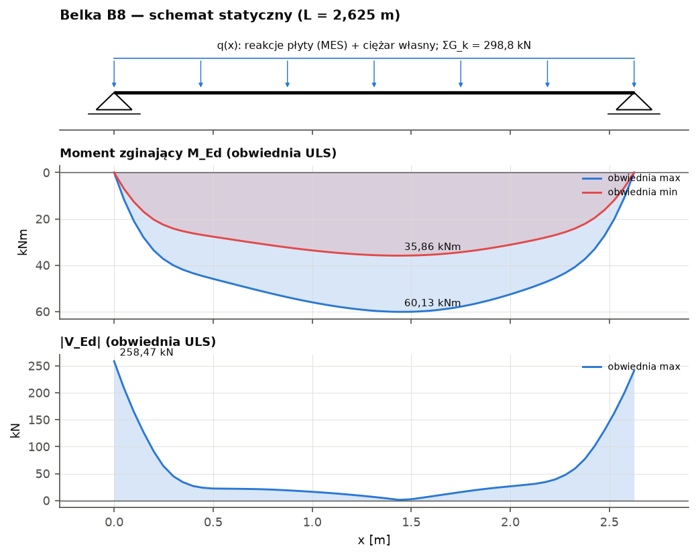

*Rys. Belka B8: schemat statyczny i obwiednie sił wewnętrznych (M dodatni — rozciąganie dołem).*

#### Zestawienie obciążeń

**Obciążenia belki (charakterystyczne, wypadkowe przypadków)**

| Przypadek | Σq·l ≈ [kN] |
|---|---|
| G | 253,7 |
| QA | 70,7 |
| QA_pA | 74,5 |
| QA_pB | 0,0 |
| H | 0,1 |
| S1 | 0,2 |
| S2 | 0,2 |
| SB2 | 0,2 |

#### Obliczenia

##### Siły wewnętrzne — B8 (obwiednia kombinacji)

- Moment przęsłowy maks.: M_Ed,max = **43,22** kNm
- Moment podporowy (min.): M_Ed,min = **0,00** kNm
- Siła poprzeczna maks.: V_Ed = **243,69** kN

##### B8 — zginanie w przęśle

- Wysokość użyteczna: d = **459** mm
- Moment względny: μ = M_Ed/(b·d²·η·f_cd) = 43,22·10⁶/(250·459²·1,0·17,86) = **0,0460** *(3.1.7(3))*
- Względna wysokość strefy ściskanej: ξ_eff = 1 − √(1 − 2μ) = 1 − √(1 − 2·0,0460) = **0,0471**
- Warunek ciągliwości: ξ_eff ≤ ξ_eff,lim = λ·ε_cu3/(ε_cu3 + f_yd/E_s) = 0,047 ≤ 0,493 = **spełniony**
- Wymagane zbrojenie rozciągane: A_s1 = ξ_eff·b·d·η·f_cd/f_yd = 0,0471·250·459·1,0·17,86/434,8 = **222** mm²
- Zbrojenie minimalne: A_s,min = max(0,26·f_ctm/f_yk·b·d; 0,0013·b·d) = max(0,26·2,6/500·250·459; 0,0013·250·459) = **155** mm² *((9.1N) + NA)*
- Przyjęto dołem: 2φ12 = **2,26** cm²

| Warunek | Efekt | Nośność / limit | η | Stan | Podstawa |
|---|---|---|---|---|---|
| Zbrojenie dolne | A_s,req = 222 mm² | A_s,prov = 226 mm² | 98% | spełniony | 6.1 |

##### B8 — ścinanie

- Współczynnik skali: k = 1 + √(200/d) ≤ 2,0 = 1 + √(200/459) = **1,660**
- Stopień zbrojenia podłużnego: ρ_l = A_sl/(b_w·d) ≤ 0,02 = 226/(250·459) = **0,00197**
- Nośność na ścinanie: V_Rd,c = C_Rd,c·k·(100·ρ_l·f_ck)^(1/3)·b_w·d = 0,1286·1,660·(100·0,00197·25)^(1/3)·250·459·10⁻³ = **41,68** kN *((6.2.a); C_Rd,c = 0,18/γ_c)*
- Wartość minimalna: V_Rd,c,min = v_min·b_w·d, v_min = 0,035·k^(3/2)·f_ck^(1/2) = 0,3743·250·459·10⁻³ = **42,95** kN *((6.2.b), (6.3N))*
- Ramię sił wewnętrznych: z = 0,9·d = 0,9·459 = **413** mm
- Przyjęto nachylenie krzyżulców betonowych: cot θ = (1,0 ≤ cot θ ≤ 2,0 — NA) = **2,00** *((6.7N))*
- Nośność krzyżulców ściskanych: V_Rd,max = b_w·z·ν₁·f_cd/(cot θ + tan θ) = 250·413·0,540·17,86/(2,00 + 0,500)·10⁻³ = **398,35** kN *((6.9), ν₁ = ν (6.6N))*
- Rozstaw z warunku nośności: s = A_sw·z·f_ywd·cot θ/V_Ed = 100,5·413·434,8·2,00/(243,69·10³) = **148** mm *((6.8))*
- Rozstaw maksymalny: s_l,max = 0,75·d = 0,75·459 = **344** mm *((9.6N))*
- Stopień zbrojenia minimalny: ρ_w,min = 0,08·√f_ck/f_yk → s ≤ A_sw/(ρ_w,min·b_w) = 100,5/(0,00080·250) = **503** mm *((9.5N))*
- Przyjęto strzemiona: φ8 2-cięte co s = **140** mm
- Nośność zbrojenia na ścinanie: V_Rd,s = A_sw/s·z·f_ywd·cot θ = 100,5/140·413·434,8·2,00·10⁻³ = **257,95** kN

| Warunek | Efekt | Nośność / limit | η | Stan | Podstawa |
|---|---|---|---|---|---|
| Nośność krzyżulców betonowych | V_Ed = 243,69 kN | V_Rd,max = 398,35 kN | 61% | spełniony | (6.9) |
| Nośność strzemion | V_Ed = 243,69 kN | V_Rd,s = 257,95 kN | 94% | spełniony | (6.8) |

##### B8 — ugięcie

- Stopień zbrojenia wymagany: ρ = A_s,req/(b·d) = 222/(250·459) = **0,00193**
- Wartość odniesienia: ρ₀ = √f_ck·10⁻³ = √25·10⁻³ = **0,00500**
- Graniczne l/d (ρ ≤ ρ₀): K·[11 + 1,5·√f_ck·ρ₀/ρ + 3,2·√f_ck·(ρ₀/ρ − 1)^(3/2)] = 1,0·[11 + 1,5·5,000·2,587 + 3,2·5,000·(2,587 − 1)^1,5] = **62,4** *((7.16a))*
- Mnożnik od naprężeń w stali: 310/σ_s ≈ 500/(f_yk·A_s,req/A_s,prov) ≤ 1,5 = 500/(500·222/226) = **1,020** *((7.17))*
- Smukłość rzeczywista: l_eff/d = 2,62/0,459 = **5,7**
- *Obliczenie ugięcia (7.4.3)*
- Efektywny moduł sprężystości: E_c,eff = E_cm/(1 + φ) = 31000/(1 + 2,5) = **8857** MPa *((7.20))*
- Stosunek modułów: α_e = E_s/E_c,eff = 200000/8857 = **22,58**
- Przekrój niezarysowany: x_I; I_I = **258,2 mm; 2818,5·10⁶ mm⁴**
- Przekrój zarysowany: x_II; I_II = **118,0 mm; 730,8·10⁶ mm⁴**
- Moment rysujący: M_cr = f_ctm·I_I/(h − x_I) = 2,6·2818,5·10⁶/(500 − 258,2) = **30,31** kNm
- Współczynnik rozkładu: ζ = 1 − β·(M_cr/M_qp)², β = 0,5 = M_qp ≤ M_cr → 0 = **0,000** *((7.19))*
- Ugięcie od obciążeń (quasi-stała): w_q = ζ·w_II + (1 − ζ)·w_I = 0,000·3,43 + 1,000·0,89 = **0,89** mm *((7.18))*
- Ugięcie od skurczu: w_cs = k·(1/r_cs)·l², 1/r_cs = ε_cs·α_e·S/I = 0,125·0,146·10⁻⁶·2625² = **0,13** mm *((7.21))*
- Ugięcie całkowite: w = w_q + w_cs = 0,89 + 0,13 = **1,01** mm
- Ugięcie dopuszczalne: w_lim = L/250 = 2625/250 = **10,5** mm *(7.4.1(4))*

| Warunek | Efekt | Nośność / limit | η | Stan | Podstawa |
|---|---|---|---|---|---|
| Ugięcie — graniczna smukłość l/d (7.4.2) | l/d = 5,7  | (l/d)_lim = 63,6  | 9% | spełniony | (7.16), tabl. 7.4N |

> l/d spełnione — obliczenie (7.4.3) informacyjnie: w = 1,0 mm ≤? 10,5 mm.

##### B8 — rysy

- Naprężenie w stali (quasi-stała, przekrój zarysowany, α_e = 15): σ_s = α_e·M_qp·(d − x_II)/I_II = **294** MPa
- Maksymalna średnica (w_max = 0,4 mm): φ_s = φ*_s·(f_ct,eff/2,9)·k_c·h_cr/(2(h − d)) = 14,6·(2,6/2,9)·0,4·250/(2·41) = **16,0** mm *(tabl. 7.2N, (7.6N))*
- Maksymalny rozstaw prętów: s_max = (σ_s = 294 MPa) = **183** mm *(tabl. 7.3N)*

| Warunek | Efekt | Nośność / limit | η | Stan | Podstawa |
|---|---|---|---|---|---|
| Rysy: średnica prętów (tabl. 7.2N) | φ = 12 mm | φ_s,max = 16 mm | 75% | spełniony | 7.3.3(2) |

#### Wnioski

**Przyjęto:** Belka B8: 25×50 cm, C25/30; dołem 2φ12, górą 2φ12, strzemiona φ8 co 14 cm (2-cięte).  

## Poz. 6 — Nadproża

### Poz. 6.1 — Nadproże N-O0-06 nad otworem O0-06 w ścianie S0-02 (światło 0,90 m)

Element modelu: `N-O0-06` · maks. wykorzystanie nośności η = 31% · wszystkie warunki spełnione

#### Obliczenia

##### N-O0-06 — schemat i obciążenie

- Rozpiętość obliczeniowa: l_eff = l_n + min(a; h) = 0,90 + 0,20 = **1,10** m *(5.3.2.2)*
- Przekrój: b × h = **18 × 24 cm (zespolone z płytą stropu)**
- Obciążenie stałe (średnio nad otworem; bez efektu przesklepienia [UPR]): g_k = **10,22** kN/m
- Obciążenia zmienne: użytkowe (maks. z układów obciążenia) / dach (śnieg lub kat. H — nie łączone, PN-EN 1991-1-1 3.3.2): q_k,A / q_k,dach = **4,40 / 1,02** kN/m
- Obciążenie obliczeniowe: q_d = max(6.10a; 6.10b — wiodące użytkowe; 6.10b — wiodący dach) = max(1,35·10,22 + 1,5·(0,7·4,40 + 0,5·1,02); 1,147·10,22 + 1,5·4,40 + 1,5·0,5·1,02; 1,147·10,22 + 1,5·1,02 + 1,5·0,7·4,40) = **19,18** kN/m *(PN-EN 1990 (6.10a), (6.10b) + NA)*
- Moment: M_Ed = q_d·l_eff²/8 = 19,18·1,100²/8 = **2,90** kNm
- Siła poprzeczna: V_Ed = q_d·l_n/2 = 19,18·0,90/2 = **8,63** kN

##### N-O0-06 — zginanie

- Wysokość użyteczna: d = **203** mm
- Moment względny: μ = M_Ed/(b·d²·η·f_cd) = 2,90·10⁶/(180·203²·1,0·17,86) = **0,0219** *(3.1.7(3))*
- Względna wysokość strefy ściskanej: ξ_eff = 1 − √(1 − 2μ) = 1 − √(1 − 2·0,0219) = **0,0221**
- Warunek ciągliwości: ξ_eff ≤ ξ_eff,lim = λ·ε_cu3/(ε_cu3 + f_yd/E_s) = 0,022 ≤ 0,493 = **spełniony**
- Wymagane zbrojenie rozciągane: A_s1 = ξ_eff·b·d·η·f_cd/f_yd = 0,0221·180·203·1,0·17,86/434,8 = **33** mm²
- Zbrojenie minimalne: A_s,min = max(0,26·f_ctm/f_yk·b·d; 0,0013·b·d) = max(0,26·2,6/500·180·203; 0,0013·180·203) = **49** mm² *((9.1N) + NA)*

| Warunek | Efekt | Nośność / limit | η | Stan | Podstawa |
|---|---|---|---|---|---|
| Zbrojenie dolne | A_s,req = 49 mm² | A_s,prov = 157 mm² | 31% | spełniony | 6.1 |

##### N-O0-06 — ścinanie

- Współczynnik skali: k = 1 + √(200/d) ≤ 2,0 = 1 + √(200/203) = **1,993**
- Stopień zbrojenia podłużnego: ρ_l = A_sl/(b_w·d) ≤ 0,02 = 157/(180·203) = **0,00430**
- Nośność na ścinanie: V_Rd,c = C_Rd,c·k·(100·ρ_l·f_ck)^(1/3)·b_w·d = 0,1286·1,993·(100·0,00430·25)^(1/3)·180·203·10⁻³ = **20,66** kN *((6.2.a); C_Rd,c = 0,18/γ_c)*
- Wartość minimalna: V_Rd,c,min = v_min·b_w·d, v_min = 0,035·k^(3/2)·f_ck^(1/2) = 0,4922·180·203·10⁻³ = **17,99** kN *((6.2.b), (6.3N))*
- Ramię sił wewnętrznych: z = 0,9·d = 0,9·203 = **183** mm
- Przyjęto nachylenie krzyżulców betonowych: cot θ = (1,0 ≤ cot θ ≤ 2,0 — NA) = **2,00** *((6.7N))*
- Nośność krzyżulców ściskanych: V_Rd,max = b_w·z·ν₁·f_cd/(cot θ + tan θ) = 180·183·0,540·17,86/(2,00 + 0,500)·10⁻³ = **126,85** kN *((6.9), ν₁ = ν (6.6N))*
- Rozstaw z warunku nośności: s = A_sw·z·f_ywd·cot θ/V_Ed = 56,5·183·434,8·2,00/(8,63·10³) = **1041** mm *((6.8))*
- Rozstaw maksymalny: s_l,max = 0,75·d = 0,75·203 = **152** mm *((9.6N))*
- Stopień zbrojenia minimalny: ρ_w,min = 0,08·√f_ck/f_yk → s ≤ A_sw/(ρ_w,min·b_w) = 56,5/(0,00080·180) = **393** mm *((9.5N))*
- Przyjęto strzemiona: φ6 2-cięte co s = **150** mm
- Nośność zbrojenia na ścinanie: V_Rd,s = A_sw/s·z·f_ywd·cot θ = 56,5/150·183·434,8·2,00·10⁻³ = **59,89** kN

| Warunek | Efekt | Nośność / limit | η | Stan | Podstawa |
|---|---|---|---|---|---|
| Nośność krzyżulców betonowych | V_Ed = 8,63 kN | V_Rd,max = 126,85 kN | 7% | spełniony | (6.9) |
| Nośność strzemion | V_Ed = 8,63 kN | V_Rd,s = 59,89 kN | 14% | spełniony | (6.8) |

> V_Ed ≤ V_Rd,c = 20,66 kN — zbrojenie poprzeczne minimalne (9.2.2(5)).

##### N-O0-06 — ugięcie

- Stopień zbrojenia wymagany: ρ = A_s,req/(b·d) = 33/(180·203) = **0,00091**
- Wartość odniesienia: ρ₀ = √f_ck·10⁻³ = √25·10⁻³ = **0,00500**
- Graniczne l/d (ρ ≤ ρ₀): K·[11 + 1,5·√f_ck·ρ₀/ρ + 3,2·√f_ck·(ρ₀/ρ − 1)^(3/2)] = 1,0·[11 + 1,5·5,000·5,497 + 3,2·5,000·(5,497 − 1)^1,5] = **204,8** *((7.16a))*
- Mnożnik od naprężeń w stali: 310/σ_s ≈ 500/(f_yk·A_s,req/A_s,prov) ≤ 1,5 = 500/(500·33/157) = **1,500** *((7.17))*
- Smukłość rzeczywista: l_eff/d = 1,10/0,203 = **5,4**
- *Obliczenie ugięcia (7.4.3)*
- Efektywny moduł sprężystości: E_c,eff = E_cm/(1 + φ) = 31000/(1 + 2,5) = **8857** MPa *((7.20))*
- Stosunek modułów: α_e = E_s/E_c,eff = 200000/8857 = **22,58**
- Przekrój niezarysowany: x_I; I_I = **126,3 mm; 229,9·10⁶ mm⁴**
- Przekrój zarysowany: x_II; I_II = **71,9 mm; 83,3·10⁶ mm⁴**
- Moment rysujący: M_cr = f_ctm·I_I/(h − x_I) = 2,6·229,9·10⁶/(240 − 126,3) = **5,26** kNm
- Współczynnik rozkładu: ζ = 1 − β·(M_cr/M_qp)², β = 0,5 = M_qp ≤ M_cr → 0 = **0,000** *((7.19))*
- Ugięcie od obciążeń (quasi-stała): w_q = ζ·w_II + (1 − ζ)·w_I = 0,000·0,30 + 1,000·0,11 = **0,11** mm *((7.18))*
- Ugięcie od skurczu: w_cs = k·(1/r_cs)·l², 1/r_cs = ε_cs·α_e·S/I = 0,125·0,473·10⁻⁶·1100² = **0,07** mm *((7.21))*
- Ugięcie całkowite: w = w_q + w_cs = 0,11 + 0,07 = **0,18** mm
- Ugięcie dopuszczalne: w_lim = L/250 = 1100/250 = **4,4** mm *(7.4.1(4))*

| Warunek | Efekt | Nośność / limit | η | Stan | Podstawa |
|---|---|---|---|---|---|
| Ugięcie — graniczna smukłość l/d (7.4.2) | l/d = 5,4  | (l/d)_lim = 307,2  | 2% | spełniony | (7.16), tabl. 7.4N |

> l/d spełnione — obliczenie (7.4.3) informacyjnie: w = 0,2 mm ≤? 4,4 mm.

##### N-O0-06 — docisk na murze (oparcie 20 cm)

- Pole docisku: A_b = l_b·b = 0,200·0,180 = **0,0360** m²
- Długość efektywna w połowie wysokości: l_efm = l_b + 2·(h_c/2)·tg 30° (ograniczona a₁) = **1,190** m *(rys. 6.2)*
- Współczynnik zwiększający: β = (1 + 0,3·a₁/h_c)·(1,5 − 1,1·A_b/A_ef) = (1 + 0,3·0,15/2,91)·(1,5 − 1,1·0,168) = **1,276** *((6.10))*
- Nośność na docisk: N_Rdc = β·A_b·f_d = 1,276·0,0360·4,50·10³ = **206,85** kN *((6.9))*

| Warunek | Efekt | Nośność / limit | η | Stan | Podstawa |
|---|---|---|---|---|---|
| Docisk | N_Edc = 10,55 kN | N_Rdc = 206,85 kN | 5% | spełniony | PN-EN 1996-1-1 (6.9) |

> Dodatkowo sprawdzić ścianę w połowie wysokości pod oparciem (6.1.3(4)) — obejmuje to sprawdzenie ściany/filarka.

#### Wnioski

**Przyjęto:** N-O0-06: nadproże zespolone z płytą 18×24 cm, C25/30, dołem 2φ10, strzemiona φ6 co 15 cm (2-cięte), oparcie ≥ 20 cm.  

### Poz. 6.2 — Nadproże N-O0-08 nad otworem O0-08 w ścianie S0-03 (światło 1,00 m)

Element modelu: `N-O0-08` · maks. wykorzystanie nośności η = 33% · wszystkie warunki spełnione

#### Obliczenia

##### N-O0-08 — schemat i obciążenie

- Rozpiętość obliczeniowa: l_eff = l_n + min(a; h) = 1,00 + 0,20 = **1,20** m *(5.3.2.2)*
- Przekrój: b × h = **18 × 25 cm**
- Obciążenie stałe (średnio nad otworem; bez efektu przesklepienia [UPR]): g_k = **15,04** kN/m
- Obciążenia zmienne: użytkowe (maks. z układów obciążenia) / dach (śnieg lub kat. H — nie łączone, PN-EN 1991-1-1 3.3.2): q_k,A / q_k,dach = **0,00 / 1,85** kN/m
- Obciążenie obliczeniowe: q_d = max(6.10a; 6.10b — wiodące użytkowe; 6.10b — wiodący dach) = max(1,35·15,04 + 1,5·(0,7·0,00 + 0,5·1,85); 1,147·15,04 + 1,5·0,00 + 1,5·0,5·1,85; 1,147·15,04 + 1,5·1,85 + 1,5·0,7·0,00) = **21,70** kN/m *(PN-EN 1990 (6.10a), (6.10b) + NA)*
- Moment: M_Ed = q_d·l_eff²/8 = 21,70·1,200²/8 = **3,91** kNm
- Siła poprzeczna: V_Ed = q_d·l_n/2 = 21,70·1,00/2 = **10,85** kN

##### N-O0-08 — zginanie

- Wysokość użyteczna: d = **213** mm
- Moment względny: μ = M_Ed/(b·d²·η·f_cd) = 3,91·10⁶/(180·213²·1,0·17,86) = **0,0268** *(3.1.7(3))*
- Względna wysokość strefy ściskanej: ξ_eff = 1 − √(1 − 2μ) = 1 − √(1 − 2·0,0268) = **0,0272**
- Warunek ciągliwości: ξ_eff ≤ ξ_eff,lim = λ·ε_cu3/(ε_cu3 + f_yd/E_s) = 0,027 ≤ 0,493 = **spełniony**
- Wymagane zbrojenie rozciągane: A_s1 = ξ_eff·b·d·η·f_cd/f_yd = 0,0272·180·213·1,0·17,86/434,8 = **43** mm²
- Zbrojenie minimalne: A_s,min = max(0,26·f_ctm/f_yk·b·d; 0,0013·b·d) = max(0,26·2,6/500·180·213; 0,0013·180·213) = **52** mm² *((9.1N) + NA)*

| Warunek | Efekt | Nośność / limit | η | Stan | Podstawa |
|---|---|---|---|---|---|
| Zbrojenie dolne | A_s,req = 52 mm² | A_s,prov = 157 mm² | 33% | spełniony | 6.1 |

##### N-O0-08 — ścinanie

- Współczynnik skali: k = 1 + √(200/d) ≤ 2,0 = 1 + √(200/213) = **1,969**
- Stopień zbrojenia podłużnego: ρ_l = A_sl/(b_w·d) ≤ 0,02 = 157/(180·213) = **0,00410**
- Nośność na ścinanie: V_Rd,c = C_Rd,c·k·(100·ρ_l·f_ck)^(1/3)·b_w·d = 0,1286·1,969·(100·0,00410·25)^(1/3)·180·213·10⁻³ = **21,08** kN *((6.2.a); C_Rd,c = 0,18/γ_c)*
- Wartość minimalna: V_Rd,c,min = v_min·b_w·d, v_min = 0,035·k^(3/2)·f_ck^(1/2) = 0,4835·180·213·10⁻³ = **18,54** kN *((6.2.b), (6.3N))*
- Ramię sił wewnętrznych: z = 0,9·d = 0,9·213 = **192** mm
- Przyjęto nachylenie krzyżulców betonowych: cot θ = (1,0 ≤ cot θ ≤ 2,0 — NA) = **2,00** *((6.7N))*
- Nośność krzyżulców ściskanych: V_Rd,max = b_w·z·ν₁·f_cd/(cot θ + tan θ) = 180·192·0,540·17,86/(2,00 + 0,500)·10⁻³ = **133,09** kN *((6.9), ν₁ = ν (6.6N))*
- Rozstaw z warunku nośności: s = A_sw·z·f_ywd·cot θ/V_Ed = 56,5·192·434,8·2,00/(10,85·10³) = **869** mm *((6.8))*
- Rozstaw maksymalny: s_l,max = 0,75·d = 0,75·213 = **160** mm *((9.6N))*
- Stopień zbrojenia minimalny: ρ_w,min = 0,08·√f_ck/f_yk → s ≤ A_sw/(ρ_w,min·b_w) = 56,5/(0,00080·180) = **393** mm *((9.5N))*
- Przyjęto strzemiona: φ6 2-cięte co s = **150** mm
- Nośność zbrojenia na ścinanie: V_Rd,s = A_sw/s·z·f_ywd·cot θ = 56,5/150·192·434,8·2,00·10⁻³ = **62,84** kN

| Warunek | Efekt | Nośność / limit | η | Stan | Podstawa |
|---|---|---|---|---|---|
| Nośność krzyżulców betonowych | V_Ed = 10,85 kN | V_Rd,max = 133,09 kN | 8% | spełniony | (6.9) |
| Nośność strzemion | V_Ed = 10,85 kN | V_Rd,s = 62,84 kN | 17% | spełniony | (6.8) |

> V_Ed ≤ V_Rd,c = 21,08 kN — zbrojenie poprzeczne minimalne (9.2.2(5)).

##### N-O0-08 — ugięcie

- Stopień zbrojenia wymagany: ρ = A_s,req/(b·d) = 43/(180·213) = **0,00112**
- Wartość odniesienia: ρ₀ = √f_ck·10⁻³ = √25·10⁻³ = **0,00500**
- Graniczne l/d (ρ ≤ ρ₀): K·[11 + 1,5·√f_ck·ρ₀/ρ + 3,2·√f_ck·(ρ₀/ρ − 1)^(3/2)] = 1,0·[11 + 1,5·5,000·4,484 + 3,2·5,000·(4,484 − 1)^1,5] = **148,7** *((7.16a))*
- Mnożnik od naprężeń w stali: 310/σ_s ≈ 500/(f_yk·A_s,req/A_s,prov) ≤ 1,5 = 500/(500·43/157) = **1,500** *((7.17))*
- Smukłość rzeczywista: l_eff/d = 1,20/0,213 = **5,6**
- *Obliczenie ugięcia (7.4.3)*
- Efektywny moduł sprężystości: E_c,eff = E_cm/(1 + φ) = 31000/(1 + 2,5) = **8857** MPa *((7.20))*
- Stosunek modułów: α_e = E_s/E_c,eff = 200000/8857 = **22,58**
- Przekrój niezarysowany: x_I; I_I = **131,4 mm; 259,8·10⁶ mm⁴**
- Przekrój zarysowany: x_II; I_II = **74,0 mm; 92,8·10⁶ mm⁴**
- Moment rysujący: M_cr = f_ctm·I_I/(h − x_I) = 2,6·259,8·10⁶/(250 − 131,4) = **5,70** kNm
- Współczynnik rozkładu: ζ = 1 − β·(M_cr/M_qp)², β = 0,5 = M_qp ≤ M_cr → 0 = **0,000** *((7.19))*
- Ugięcie od obciążeń (quasi-stała): w_q = ζ·w_II + (1 − ζ)·w_I = 0,000·0,49 + 1,000·0,18 = **0,18** mm *((7.18))*
- Ugięcie od skurczu: w_cs = k·(1/r_cs)·l², 1/r_cs = ε_cs·α_e·S/I = 0,125·0,445·10⁻⁶·1200² = **0,08** mm *((7.21))*
- Ugięcie całkowite: w = w_q + w_cs = 0,18 + 0,08 = **0,26** mm
- Ugięcie dopuszczalne: w_lim = L/250 = 1200/250 = **4,8** mm *(7.4.1(4))*

| Warunek | Efekt | Nośność / limit | η | Stan | Podstawa |
|---|---|---|---|---|---|
| Ugięcie — graniczna smukłość l/d (7.4.2) | l/d = 5,6  | (l/d)_lim = 223,0  | 3% | spełniony | (7.16), tabl. 7.4N |

> l/d spełnione — obliczenie (7.4.3) informacyjnie: w = 0,3 mm ≤? 4,8 mm.

##### N-O0-08 — docisk na murze (oparcie 20 cm)

- Pole docisku: A_b = l_b·b = 0,200·0,180 = **0,0360** m²
- Długość efektywna w połowie wysokości: l_efm = l_b + 2·(h_c/2)·tg 30° (ograniczona a₁) = **1,880** m *(rys. 6.2)*
- Współczynnik zwiększający: β = (1 + 0,3·a₁/h_c)·(1,5 − 1,1·A_b/A_ef) = (1 + 0,3·3,27/2,91)·(1,5 − 1,1·0,106) = **1,500** *((6.10))*
- Nośność na docisk: N_Rdc = β·A_b·f_d = 1,500·0,0360·4,50·10³ = **243,20** kN *((6.9))*

| Warunek | Efekt | Nośność / limit | η | Stan | Podstawa |
|---|---|---|---|---|---|
| Docisk | N_Edc = 13,02 kN | N_Rdc = 243,20 kN | 5% | spełniony | PN-EN 1996-1-1 (6.9) |

> Dodatkowo sprawdzić ścianę w połowie wysokości pod oparciem (6.1.3(4)) — obejmuje to sprawdzenie ściany/filarka.

#### Wnioski

**Przyjęto:** N-O0-08: nadproże żelbetowe 18×25 cm, C25/30, dołem 2φ10, strzemiona φ6 co 15 cm (2-cięte), oparcie ≥ 20 cm.  

### Poz. 6.3 — Nadproże N-O0-09 nad otworem O0-09 w ścianie S0-06 (światło 1,10 m)

Element modelu: `N-O0-09` · maks. wykorzystanie nośności η = 54% · wszystkie warunki spełnione

#### Obliczenia

##### N-O0-09 — schemat i obciążenie

- Rozpiętość obliczeniowa: l_eff = l_n + min(a; h) = 1,10 + 0,20 = **1,30** m *(5.3.2.2)*
- Przekrój: b × h = **18 × 25 cm**
- Obciążenie stałe (średnio nad otworem; bez efektu przesklepienia [UPR]): g_k = **19,69** kN/m
- Obciążenia zmienne: użytkowe (maks. z układów obciążenia) / dach (śnieg lub kat. H — nie łączone, PN-EN 1991-1-1 3.3.2): q_k,A / q_k,dach = **8,54 / 0,63** kN/m
- Obciążenie obliczeniowe: q_d = max(6.10a; 6.10b — wiodące użytkowe; 6.10b — wiodący dach) = max(1,35·19,69 + 1,5·(0,7·8,54 + 0,5·0,63); 1,147·19,69 + 1,5·8,54 + 1,5·0,5·0,63; 1,147·19,69 + 1,5·0,63 + 1,5·0,7·8,54) = **36,03** kN/m *(PN-EN 1990 (6.10a), (6.10b) + NA)*
- Moment: M_Ed = q_d·l_eff²/8 = 36,03·1,300²/8 = **7,61** kNm
- Siła poprzeczna: V_Ed = q_d·l_n/2 = 36,03·1,10/2 = **19,81** kN

##### N-O0-09 — zginanie

- Wysokość użyteczna: d = **213** mm
- Moment względny: μ = M_Ed/(b·d²·η·f_cd) = 7,61·10⁶/(180·213²·1,0·17,86) = **0,0522** *(3.1.7(3))*
- Względna wysokość strefy ściskanej: ξ_eff = 1 − √(1 − 2μ) = 1 − √(1 − 2·0,0522) = **0,0536**
- Warunek ciągliwości: ξ_eff ≤ ξ_eff,lim = λ·ε_cu3/(ε_cu3 + f_yd/E_s) = 0,054 ≤ 0,493 = **spełniony**
- Wymagane zbrojenie rozciągane: A_s1 = ξ_eff·b·d·η·f_cd/f_yd = 0,0536·180·213·1,0·17,86/434,8 = **84** mm²
- Zbrojenie minimalne: A_s,min = max(0,26·f_ctm/f_yk·b·d; 0,0013·b·d) = max(0,26·2,6/500·180·213; 0,0013·180·213) = **52** mm² *((9.1N) + NA)*

| Warunek | Efekt | Nośność / limit | η | Stan | Podstawa |
|---|---|---|---|---|---|
| Zbrojenie dolne | A_s,req = 84 mm² | A_s,prov = 157 mm² | 54% | spełniony | 6.1 |

##### N-O0-09 — ścinanie

- Współczynnik skali: k = 1 + √(200/d) ≤ 2,0 = 1 + √(200/213) = **1,969**
- Stopień zbrojenia podłużnego: ρ_l = A_sl/(b_w·d) ≤ 0,02 = 157/(180·213) = **0,00410**
- Nośność na ścinanie: V_Rd,c = C_Rd,c·k·(100·ρ_l·f_ck)^(1/3)·b_w·d = 0,1286·1,969·(100·0,00410·25)^(1/3)·180·213·10⁻³ = **21,08** kN *((6.2.a); C_Rd,c = 0,18/γ_c)*
- Wartość minimalna: V_Rd,c,min = v_min·b_w·d, v_min = 0,035·k^(3/2)·f_ck^(1/2) = 0,4835·180·213·10⁻³ = **18,54** kN *((6.2.b), (6.3N))*
- Ramię sił wewnętrznych: z = 0,9·d = 0,9·213 = **192** mm
- Przyjęto nachylenie krzyżulców betonowych: cot θ = (1,0 ≤ cot θ ≤ 2,0 — NA) = **2,00** *((6.7N))*
- Nośność krzyżulców ściskanych: V_Rd,max = b_w·z·ν₁·f_cd/(cot θ + tan θ) = 180·192·0,540·17,86/(2,00 + 0,500)·10⁻³ = **133,09** kN *((6.9), ν₁ = ν (6.6N))*
- Rozstaw z warunku nośności: s = A_sw·z·f_ywd·cot θ/V_Ed = 56,5·192·434,8·2,00/(19,81·10³) = **476** mm *((6.8))*
- Rozstaw maksymalny: s_l,max = 0,75·d = 0,75·213 = **160** mm *((9.6N))*
- Stopień zbrojenia minimalny: ρ_w,min = 0,08·√f_ck/f_yk → s ≤ A_sw/(ρ_w,min·b_w) = 56,5/(0,00080·180) = **393** mm *((9.5N))*
- Przyjęto strzemiona: φ6 2-cięte co s = **150** mm
- Nośność zbrojenia na ścinanie: V_Rd,s = A_sw/s·z·f_ywd·cot θ = 56,5/150·192·434,8·2,00·10⁻³ = **62,84** kN

| Warunek | Efekt | Nośność / limit | η | Stan | Podstawa |
|---|---|---|---|---|---|
| Nośność krzyżulców betonowych | V_Ed = 19,81 kN | V_Rd,max = 133,09 kN | 15% | spełniony | (6.9) |
| Nośność strzemion | V_Ed = 19,81 kN | V_Rd,s = 62,84 kN | 32% | spełniony | (6.8) |

> V_Ed ≤ V_Rd,c = 21,08 kN — zbrojenie poprzeczne minimalne (9.2.2(5)).

##### N-O0-09 — ugięcie

- Stopień zbrojenia wymagany: ρ = A_s,req/(b·d) = 84/(180·213) = **0,00220**
- Wartość odniesienia: ρ₀ = √f_ck·10⁻³ = √25·10⁻³ = **0,00500**
- Graniczne l/d (ρ ≤ ρ₀): K·[11 + 1,5·√f_ck·ρ₀/ρ + 3,2·√f_ck·(ρ₀/ρ − 1)^(3/2)] = 1,0·[11 + 1,5·5,000·2,270 + 3,2·5,000·(2,270 − 1)^1,5] = **50,9** *((7.16a))*
- Mnożnik od naprężeń w stali: 310/σ_s ≈ 500/(f_yk·A_s,req/A_s,prov) ≤ 1,5 = 500/(500·84/157) = **1,500** *((7.17))*
- Smukłość rzeczywista: l_eff/d = 1,30/0,213 = **6,1**
- *Obliczenie ugięcia (7.4.3)*
- Efektywny moduł sprężystości: E_c,eff = E_cm/(1 + φ) = 31000/(1 + 2,5) = **8857** MPa *((7.20))*
- Stosunek modułów: α_e = E_s/E_c,eff = 200000/8857 = **22,58**
- Przekrój niezarysowany: x_I; I_I = **131,4 mm; 259,8·10⁶ mm⁴**
- Przekrój zarysowany: x_II; I_II = **74,0 mm; 92,8·10⁶ mm⁴**
- Moment rysujący: M_cr = f_ctm·I_I/(h − x_I) = 2,6·259,8·10⁶/(250 − 131,4) = **5,70** kNm
- Współczynnik rozkładu: ζ = 1 − β·(M_cr/M_qp)², β = 0,5 = M_qp ≤ M_cr → 0 = **0,000** *((7.19))*
- Ugięcie od obciążeń (quasi-stała): w_q = ζ·w_II + (1 − ζ)·w_I = 0,000·1,01 + 1,000·0,36 = **0,36** mm *((7.18))*
- Ugięcie od skurczu: w_cs = k·(1/r_cs)·l², 1/r_cs = ε_cs·α_e·S/I = 0,125·0,445·10⁻⁶·1300² = **0,09** mm *((7.21))*
- Ugięcie całkowite: w = w_q + w_cs = 0,36 + 0,09 = **0,45** mm
- Ugięcie dopuszczalne: w_lim = L/250 = 1300/250 = **5,2** mm *(7.4.1(4))*

| Warunek | Efekt | Nośność / limit | η | Stan | Podstawa |
|---|---|---|---|---|---|
| Ugięcie — graniczna smukłość l/d (7.4.2) | l/d = 6,1  | (l/d)_lim = 76,4  | 8% | spełniony | (7.16), tabl. 7.4N |

> l/d spełnione — obliczenie (7.4.3) informacyjnie: w = 0,5 mm ≤? 5,2 mm.

##### N-O0-09 — docisk na murze (oparcie 20 cm)

- Pole docisku: A_b = l_b·b = 0,200·0,180 = **0,0360** m²
- Długość efektywna w połowie wysokości: l_efm = l_b + 2·(h_c/2)·tg 30° (ograniczona a₁) = **1,696** m *(rys. 6.2)*
- Współczynnik zwiększający: β = (1 + 0,3·a₁/h_c)·(1,5 − 1,1·A_b/A_ef) = (1 + 0,3·0,65/2,93)·(1,5 − 1,1·0,118) = **1,361** *((6.10))*
- Nośność na docisk: N_Rdc = β·A_b·f_d = 1,361·0,0360·4,50·10³ = **220,65** kN *((6.9))*

| Warunek | Efekt | Nośność / limit | η | Stan | Podstawa |
|---|---|---|---|---|---|
| Docisk | N_Edc = 23,42 kN | N_Rdc = 220,65 kN | 11% | spełniony | PN-EN 1996-1-1 (6.9) |

> Dodatkowo sprawdzić ścianę w połowie wysokości pod oparciem (6.1.3(4)) — obejmuje to sprawdzenie ściany/filarka.

#### Wnioski

**Przyjęto:** N-O0-09: nadproże żelbetowe 18×25 cm, C25/30, dołem 2φ10, strzemiona φ6 co 15 cm (2-cięte), oparcie ≥ 20 cm.  

### Poz. 6.4 — Nadproże N-O0-10 nad otworem O0-10 w ścianie S0-06 (światło 0,35 m)

Element modelu: `N-O0-10` · maks. wykorzystanie nośności η = 33% · wszystkie warunki spełnione

#### Obliczenia

##### N-O0-10 — schemat i obciążenie

- Rozpiętość obliczeniowa: l_eff = l_n + min(a; h) = 0,35 + 0,20 = **0,55** m *(5.3.2.2)*
- Przekrój: b × h = **18 × 25 cm**
- Obciążenie stałe (średnio nad otworem; bez efektu przesklepienia [UPR]): g_k = **7,92** kN/m
- Obciążenia zmienne: użytkowe (maks. z układów obciążenia) / dach (śnieg lub kat. H — nie łączone, PN-EN 1991-1-1 3.3.2): q_k,A / q_k,dach = **3,36 / 0,00** kN/m
- Obciążenie obliczeniowe: q_d = max(6.10a; 6.10b — wiodące użytkowe; 6.10b — wiodący dach) = max(1,35·7,92 + 1,5·(0,7·3,36 + 0,5·0,00); 1,147·7,92 + 1,5·3,36 + 1,5·0,5·0,00; 1,147·7,92 + 1,5·0,00 + 1,5·0,7·3,36) = **14,21** kN/m *(PN-EN 1990 (6.10a), (6.10b) + NA)*
- Moment: M_Ed = q_d·l_eff²/8 = 14,21·0,550²/8 = **0,54** kNm
- Siła poprzeczna: V_Ed = q_d·l_n/2 = 14,21·0,35/2 = **2,49** kN

##### N-O0-10 — zginanie

- Wysokość użyteczna: d = **213** mm
- Moment względny: μ = M_Ed/(b·d²·η·f_cd) = 0,54·10⁶/(180·213²·1,0·17,86) = **0,0037** *(3.1.7(3))*
- Względna wysokość strefy ściskanej: ξ_eff = 1 − √(1 − 2μ) = 1 − √(1 − 2·0,0037) = **0,0037**
- Warunek ciągliwości: ξ_eff ≤ ξ_eff,lim = λ·ε_cu3/(ε_cu3 + f_yd/E_s) = 0,004 ≤ 0,493 = **spełniony**
- Wymagane zbrojenie rozciągane: A_s1 = ξ_eff·b·d·η·f_cd/f_yd = 0,0037·180·213·1,0·17,86/434,8 = **6** mm²
- Zbrojenie minimalne: A_s,min = max(0,26·f_ctm/f_yk·b·d; 0,0013·b·d) = max(0,26·2,6/500·180·213; 0,0013·180·213) = **52** mm² *((9.1N) + NA)*

| Warunek | Efekt | Nośność / limit | η | Stan | Podstawa |
|---|---|---|---|---|---|
| Zbrojenie dolne | A_s,req = 52 mm² | A_s,prov = 157 mm² | 33% | spełniony | 6.1 |

##### N-O0-10 — ścinanie

- Współczynnik skali: k = 1 + √(200/d) ≤ 2,0 = 1 + √(200/213) = **1,969**
- Stopień zbrojenia podłużnego: ρ_l = A_sl/(b_w·d) ≤ 0,02 = 157/(180·213) = **0,00410**
- Nośność na ścinanie: V_Rd,c = C_Rd,c·k·(100·ρ_l·f_ck)^(1/3)·b_w·d = 0,1286·1,969·(100·0,00410·25)^(1/3)·180·213·10⁻³ = **21,08** kN *((6.2.a); C_Rd,c = 0,18/γ_c)*
- Wartość minimalna: V_Rd,c,min = v_min·b_w·d, v_min = 0,035·k^(3/2)·f_ck^(1/2) = 0,4835·180·213·10⁻³ = **18,54** kN *((6.2.b), (6.3N))*
- Ramię sił wewnętrznych: z = 0,9·d = 0,9·213 = **192** mm
- Przyjęto nachylenie krzyżulców betonowych: cot θ = (1,0 ≤ cot θ ≤ 2,0 — NA) = **2,00** *((6.7N))*
- Nośność krzyżulców ściskanych: V_Rd,max = b_w·z·ν₁·f_cd/(cot θ + tan θ) = 180·192·0,540·17,86/(2,00 + 0,500)·10⁻³ = **133,09** kN *((6.9), ν₁ = ν (6.6N))*
- Rozstaw z warunku nośności: s = A_sw·z·f_ywd·cot θ/V_Ed = 56,5·192·434,8·2,00/(2,49·10³) = **3790** mm *((6.8))*
- Rozstaw maksymalny: s_l,max = 0,75·d = 0,75·213 = **160** mm *((9.6N))*
- Stopień zbrojenia minimalny: ρ_w,min = 0,08·√f_ck/f_yk → s ≤ A_sw/(ρ_w,min·b_w) = 56,5/(0,00080·180) = **393** mm *((9.5N))*
- Przyjęto strzemiona: φ6 2-cięte co s = **150** mm
- Nośność zbrojenia na ścinanie: V_Rd,s = A_sw/s·z·f_ywd·cot θ = 56,5/150·192·434,8·2,00·10⁻³ = **62,84** kN

| Warunek | Efekt | Nośność / limit | η | Stan | Podstawa |
|---|---|---|---|---|---|
| Nośność krzyżulców betonowych | V_Ed = 2,49 kN | V_Rd,max = 133,09 kN | 2% | spełniony | (6.9) |
| Nośność strzemion | V_Ed = 2,49 kN | V_Rd,s = 62,84 kN | 4% | spełniony | (6.8) |

> V_Ed ≤ V_Rd,c = 21,08 kN — zbrojenie poprzeczne minimalne (9.2.2(5)).

##### N-O0-10 — ugięcie

- Stopień zbrojenia wymagany: ρ = A_s,req/(b·d) = 6/(180·213) = **0,00015**
- Wartość odniesienia: ρ₀ = √f_ck·10⁻³ = √25·10⁻³ = **0,00500**
- Graniczne l/d (ρ ≤ ρ₀): K·[11 + 1,5·√f_ck·ρ₀/ρ + 3,2·√f_ck·(ρ₀/ρ − 1)^(3/2)] = 1,0·[11 + 1,5·5,000·32,976 + 3,2·5,000·(32,976 − 1)^1,5] = **3151,4** *((7.16a))*
- Mnożnik od naprężeń w stali: 310/σ_s ≈ 500/(f_yk·A_s,req/A_s,prov) ≤ 1,5 = 500/(500·6/157) = **1,500** *((7.17))*
- Smukłość rzeczywista: l_eff/d = 0,55/0,213 = **2,6**
- *Obliczenie ugięcia (7.4.3)*
- Efektywny moduł sprężystości: E_c,eff = E_cm/(1 + φ) = 31000/(1 + 2,5) = **8857** MPa *((7.20))*
- Stosunek modułów: α_e = E_s/E_c,eff = 200000/8857 = **22,58**
- Przekrój niezarysowany: x_I; I_I = **131,4 mm; 259,8·10⁶ mm⁴**
- Przekrój zarysowany: x_II; I_II = **74,0 mm; 92,8·10⁶ mm⁴**
- Moment rysujący: M_cr = f_ctm·I_I/(h − x_I) = 2,6·259,8·10⁶/(250 − 131,4) = **5,70** kNm
- Współczynnik rozkładu: ζ = 1 − β·(M_cr/M_qp)², β = 0,5 = M_qp ≤ M_cr → 0 = **0,000** *((7.19))*
- Ugięcie od obciążeń (quasi-stała): w_q = ζ·w_II + (1 − ζ)·w_I = 0,000·0,01 + 1,000·0,00 = **0,00** mm *((7.18))*
- Ugięcie od skurczu: w_cs = k·(1/r_cs)·l², 1/r_cs = ε_cs·α_e·S/I = 0,125·0,445·10⁻⁶·550² = **0,02** mm *((7.21))*
- Ugięcie całkowite: w = w_q + w_cs = 0,00 + 0,02 = **0,02** mm
- Ugięcie dopuszczalne: w_lim = L/250 = 550/250 = **2,2** mm *(7.4.1(4))*

| Warunek | Efekt | Nośność / limit | η | Stan | Podstawa |
|---|---|---|---|---|---|
| Ugięcie — graniczna smukłość l/d (7.4.2) | l/d = 2,6  | (l/d)_lim = 4727,0  | 0% | spełniony | (7.16), tabl. 7.4N |

> l/d spełnione — obliczenie (7.4.3) informacyjnie: w = 0,0 mm ≤? 2,2 mm.

##### N-O0-10 — docisk na murze (oparcie 20 cm)

- Pole docisku: A_b = l_b·b = 0,200·0,180 = **0,0360** m²
- Długość efektywna w połowie wysokości: l_efm = l_b + 2·(h_c/2)·tg 30° (ograniczona a₁) = **1,246** m *(rys. 6.2)*
- Współczynnik zwiększający: β = (1 + 0,3·a₁/h_c)·(1,5 − 1,1·A_b/A_ef) = (1 + 0,3·0,20/2,93)·(1,5 − 1,1·0,161) = **1,284** *((6.10))*
- Nośność na docisk: N_Rdc = β·A_b·f_d = 1,284·0,0360·4,50·10³ = **208,20** kN *((6.9))*

| Warunek | Efekt | Nośność / limit | η | Stan | Podstawa |
|---|---|---|---|---|---|
| Docisk | N_Edc = 3,91 kN | N_Rdc = 208,20 kN | 2% | spełniony | PN-EN 1996-1-1 (6.9) |

> Dodatkowo sprawdzić ścianę w połowie wysokości pod oparciem (6.1.3(4)) — obejmuje to sprawdzenie ściany/filarka.

#### Wnioski

**Przyjęto:** N-O0-10: nadproże żelbetowe 18×25 cm, C25/30, dołem 2φ10, strzemiona φ6 co 15 cm (2-cięte), oparcie ≥ 20 cm.  

### Poz. 6.5 — Nadproże N-O0-11 nad otworem O0-11 w ścianie S0-07 (światło 2,40 m)

Element modelu: `N-O0-11` · maks. wykorzystanie nośności η = 99% · wszystkie warunki spełnione

#### Obliczenia

##### N-O0-11 — schemat i obciążenie

- Rozpiętość obliczeniowa: l_eff = l_n + min(a; h) = 2,40 + 0,25 = **2,62** m *(5.3.2.2)*
- Przekrój: b × h = **18 × 42 cm (zespolone z płytą stropu)**
- Obciążenie stałe (średnio nad otworem; bez efektu przesklepienia [UPR]): g_k = **59,37** kN/m
- Obciążenia zmienne: użytkowe (maks. z układów obciążenia) / dach (śnieg lub kat. H — nie łączone, PN-EN 1991-1-1 3.3.2): q_k,A / q_k,dach = **16,61 / 0,00** kN/m
- Obciążenie obliczeniowe: q_d = max(6.10a; 6.10b — wiodące użytkowe; 6.10b — wiodący dach) = max(1,35·59,37 + 1,5·(0,7·16,61 + 0,5·0,00); 1,147·59,37 + 1,5·16,61 + 1,5·0,5·0,00; 1,147·59,37 + 1,5·0,00 + 1,5·0,7·16,61) = **97,59** kN/m *(PN-EN 1990 (6.10a), (6.10b) + NA)*
- Moment: M_Ed = q_d·l_eff²/8 = 97,59·2,620²/8 = **83,74** kNm
- Siła poprzeczna: V_Ed = q_d·l_n/2 = 97,59·2,40/2 = **117,11** kN

##### N-O0-11 — zginanie

- Wysokość użyteczna: d = **383** mm
- Moment względny: μ = M_Ed/(b·d²·η·f_cd) = 83,74·10⁶/(180·383²·1,0·17,86) = **0,1776** *(3.1.7(3))*
- Względna wysokość strefy ściskanej: ξ_eff = 1 − √(1 − 2μ) = 1 − √(1 − 2·0,1776) = **0,1970**
- Warunek ciągliwości: ξ_eff ≤ ξ_eff,lim = λ·ε_cu3/(ε_cu3 + f_yd/E_s) = 0,197 ≤ 0,493 = **spełniony**
- Wymagane zbrojenie rozciągane: A_s1 = ξ_eff·b·d·η·f_cd/f_yd = 0,1970·180·383·1,0·17,86/434,8 = **558** mm²
- Zbrojenie minimalne: A_s,min = max(0,26·f_ctm/f_yk·b·d; 0,0013·b·d) = max(0,26·2,6/500·180·383; 0,0013·180·383) = **93** mm² *((9.1N) + NA)*

| Warunek | Efekt | Nośność / limit | η | Stan | Podstawa |
|---|---|---|---|---|---|
| Zbrojenie dolne | A_s,req = 558 mm² | A_s,prov = 565 mm² | 99% | spełniony | 6.1 |

##### N-O0-11 — ścinanie

- Współczynnik skali: k = 1 + √(200/d) ≤ 2,0 = 1 + √(200/383) = **1,723**
- Stopień zbrojenia podłużnego: ρ_l = A_sl/(b_w·d) ≤ 0,02 = 565/(180·383) = **0,00820**
- Nośność na ścinanie: V_Rd,c = C_Rd,c·k·(100·ρ_l·f_ck)^(1/3)·b_w·d = 0,1286·1,723·(100·0,00820·25)^(1/3)·180·383·10⁻³ = **41,79** kN *((6.2.a); C_Rd,c = 0,18/γ_c)*
- Wartość minimalna: V_Rd,c,min = v_min·b_w·d, v_min = 0,035·k^(3/2)·f_ck^(1/2) = 0,3957·180·383·10⁻³ = **27,28** kN *((6.2.b), (6.3N))*
- Ramię sił wewnętrznych: z = 0,9·d = 0,9·383 = **345** mm
- Przyjęto nachylenie krzyżulców betonowych: cot θ = (1,0 ≤ cot θ ≤ 2,0 — NA) = **2,00** *((6.7N))*
- Nośność krzyżulców ściskanych: V_Rd,max = b_w·z·ν₁·f_cd/(cot θ + tan θ) = 180·345·0,540·17,86/(2,00 + 0,500)·10⁻³ = **239,32** kN *((6.9), ν₁ = ν (6.6N))*
- Rozstaw z warunku nośności: s = A_sw·z·f_ywd·cot θ/V_Ed = 56,5·345·434,8·2,00/(117,11·10³) = **145** mm *((6.8))*
- Rozstaw maksymalny: s_l,max = 0,75·d = 0,75·383 = **287** mm *((9.6N))*
- Stopień zbrojenia minimalny: ρ_w,min = 0,08·√f_ck/f_yk → s ≤ A_sw/(ρ_w,min·b_w) = 56,5/(0,00080·180) = **393** mm *((9.5N))*
- Przyjęto strzemiona: φ6 2-cięte co s = **140** mm
- Nośność zbrojenia na ścinanie: V_Rd,s = A_sw/s·z·f_ywd·cot θ = 56,5/140·345·434,8·2,00·10⁻³ = **121,07** kN

| Warunek | Efekt | Nośność / limit | η | Stan | Podstawa |
|---|---|---|---|---|---|
| Nośność krzyżulców betonowych | V_Ed = 117,11 kN | V_Rd,max = 239,32 kN | 49% | spełniony | (6.9) |
| Nośność strzemion | V_Ed = 117,11 kN | V_Rd,s = 121,07 kN | 97% | spełniony | (6.8) |

##### N-O0-11 — ugięcie

- Stopień zbrojenia wymagany: ρ = A_s,req/(b·d) = 558/(180·383) = **0,00809**
- Wartość odniesienia: ρ₀ = √f_ck·10⁻³ = √25·10⁻³ = **0,00500**
- Graniczne l/d (ρ > ρ₀): K·[11 + 1,5·√f_ck·ρ₀/(ρ − ρ') + 1/12·√f_ck·√(ρ'/ρ₀)] = **15,6** *((7.16b))*
- Mnożnik od naprężeń w stali: 310/σ_s ≈ 500/(f_yk·A_s,req/A_s,prov) ≤ 1,5 = 500/(500·558/565) = **1,014** *((7.17))*
- Smukłość rzeczywista: l_eff/d = 2,62/0,383 = **6,8**
- *Obliczenie ugięcia (7.4.3)*
- Efektywny moduł sprężystości: E_c,eff = E_cm/(1 + φ) = 31000/(1 + 2,5) = **8857** MPa *((7.20))*
- Stosunek modułów: α_e = E_s/E_c,eff = 200000/8857 = **22,58**
- Przekrój niezarysowany: x_I; I_I = **235,0 mm; 1438,3·10⁶ mm⁴**
- Przekrój zarysowany: x_II; I_II = **172,7 mm; 873,8·10⁶ mm⁴**
- Moment rysujący: M_cr = f_ctm·I_I/(h − x_I) = 2,6·1438,3·10⁶/(420 − 235,0) = **20,21** kNm
- Współczynnik rozkładu: ζ = 1 − β·(M_cr/M_qp)², β = 0,5 = 1 − 0,5·(20,21/55,22)² = **0,933** *((7.19))*
- Ugięcie od obciążeń (quasi-stała): w_q = ζ·w_II + (1 − ζ)·w_I = 0,933·5,10 + 0,067·3,10 = **4,97** mm *((7.18))*
- Ugięcie od skurczu: w_cs = k·(1/r_cs)·l², 1/r_cs = ε_cs·α_e·S/I = 0,125·1,182·10⁻⁶·2620² = **1,01** mm *((7.21))*
- Ugięcie całkowite: w = w_q + w_cs = 4,97 + 1,01 = **5,98** mm
- Ugięcie dopuszczalne: w_lim = L/250 = 2620/250 = **10,5** mm *(7.4.1(4))*

| Warunek | Efekt | Nośność / limit | η | Stan | Podstawa |
|---|---|---|---|---|---|
| Ugięcie — graniczna smukłość l/d (7.4.2) | l/d = 6,8  | (l/d)_lim = 15,8  | 43% | spełniony | (7.16), tabl. 7.4N |

> l/d spełnione — obliczenie (7.4.3) informacyjnie: w = 6,0 mm ≤? 10,5 mm.

##### N-O0-11 — docisk na murze (oparcie 25 cm)

- Pole docisku: A_b = l_b·b = 0,250·0,180 = **0,0450** m²
- Długość efektywna w połowie wysokości: l_efm = l_b + 2·(h_c/2)·tg 30° (ograniczona a₁) = **1,942** m *(rys. 6.2)*
- Współczynnik zwiększający: β = (1 + 0,3·a₁/h_c)·(1,5 − 1,1·A_b/A_ef) = (1 + 0,3·0,95/2,93)·(1,5 − 1,1·0,129) = **1,412** *((6.10))*
- Nośność na docisk: N_Rdc = β·A_b·f_d = 1,412·0,0450·4,50·10³ = **286,19** kN *((6.9))*

| Warunek | Efekt | Nośność / limit | η | Stan | Podstawa |
|---|---|---|---|---|---|
| Docisk | N_Edc = 127,85 kN | N_Rdc = 286,19 kN | 45% | spełniony | PN-EN 1996-1-1 (6.9) |

> Dodatkowo sprawdzić ścianę w połowie wysokości pod oparciem (6.1.3(4)) — obejmuje to sprawdzenie ściany/filarka.

> Wysokość nadproża zwiększona do 42 cm (warunki nośności/ugięcia lub rozmieszczenie prętów przy wysokości wyjściowej) [ZAŁ].

#### Wnioski

**Przyjęto:** N-O0-11: nadproże zespolone z płytą 18×42 cm, C25/30, dołem 5φ12, strzemiona φ6 co 14 cm (2-cięte), oparcie ≥ 25 cm.  

### Poz. 6.6 — Nadproże N-O0-12 nad otworem O0-12 w ścianie S0-07 (światło 1,80 m)

Element modelu: `N-O0-12` · maks. wykorzystanie nośności η = 96% · wszystkie warunki spełnione

#### Obliczenia

##### N-O0-12 — schemat i obciążenie

- Rozpiętość obliczeniowa: l_eff = l_n + min(a; h) = 1,80 + 0,25 = **2,05** m *(5.3.2.2)*
- Przekrój: b × h = **18 × 25 cm**
- Obciążenie stałe (średnio nad otworem; bez efektu przesklepienia [UPR]): g_k = **15,87** kN/m
- Obciążenia zmienne: użytkowe (maks. z układów obciążenia) / dach (śnieg lub kat. H — nie łączone, PN-EN 1991-1-1 3.3.2): q_k,A / q_k,dach = **3,39 / 0,30** kN/m
- Obciążenie obliczeniowe: q_d = max(6.10a; 6.10b — wiodące użytkowe; 6.10b — wiodący dach) = max(1,35·15,87 + 1,5·(0,7·3,39 + 0,5·0,30); 1,147·15,87 + 1,5·3,39 + 1,5·0,5·0,30; 1,147·15,87 + 1,5·0,30 + 1,5·0,7·3,39) = **25,22** kN/m *(PN-EN 1990 (6.10a), (6.10b) + NA)*
- Moment: M_Ed = q_d·l_eff²/8 = 25,22·2,050²/8 = **13,25** kNm
- Siła poprzeczna: V_Ed = q_d·l_n/2 = 25,22·1,80/2 = **22,70** kN

##### N-O0-12 — zginanie

- Wysokość użyteczna: d = **213** mm
- Moment względny: μ = M_Ed/(b·d²·η·f_cd) = 13,25·10⁶/(180·213²·1,0·17,86) = **0,0909** *(3.1.7(3))*
- Względna wysokość strefy ściskanej: ξ_eff = 1 − √(1 − 2μ) = 1 − √(1 − 2·0,0909) = **0,0954**
- Warunek ciągliwości: ξ_eff ≤ ξ_eff,lim = λ·ε_cu3/(ε_cu3 + f_yd/E_s) = 0,095 ≤ 0,493 = **spełniony**
- Wymagane zbrojenie rozciągane: A_s1 = ξ_eff·b·d·η·f_cd/f_yd = 0,0954·180·213·1,0·17,86/434,8 = **150** mm²
- Zbrojenie minimalne: A_s,min = max(0,26·f_ctm/f_yk·b·d; 0,0013·b·d) = max(0,26·2,6/500·180·213; 0,0013·180·213) = **52** mm² *((9.1N) + NA)*

| Warunek | Efekt | Nośność / limit | η | Stan | Podstawa |
|---|---|---|---|---|---|
| Zbrojenie dolne | A_s,req = 150 mm² | A_s,prov = 157 mm² | 96% | spełniony | 6.1 |

##### N-O0-12 — ścinanie

- Współczynnik skali: k = 1 + √(200/d) ≤ 2,0 = 1 + √(200/213) = **1,969**
- Stopień zbrojenia podłużnego: ρ_l = A_sl/(b_w·d) ≤ 0,02 = 157/(180·213) = **0,00410**
- Nośność na ścinanie: V_Rd,c = C_Rd,c·k·(100·ρ_l·f_ck)^(1/3)·b_w·d = 0,1286·1,969·(100·0,00410·25)^(1/3)·180·213·10⁻³ = **21,08** kN *((6.2.a); C_Rd,c = 0,18/γ_c)*
- Wartość minimalna: V_Rd,c,min = v_min·b_w·d, v_min = 0,035·k^(3/2)·f_ck^(1/2) = 0,4835·180·213·10⁻³ = **18,54** kN *((6.2.b), (6.3N))*
- Ramię sił wewnętrznych: z = 0,9·d = 0,9·213 = **192** mm
- Przyjęto nachylenie krzyżulców betonowych: cot θ = (1,0 ≤ cot θ ≤ 2,0 — NA) = **2,00** *((6.7N))*
- Nośność krzyżulców ściskanych: V_Rd,max = b_w·z·ν₁·f_cd/(cot θ + tan θ) = 180·192·0,540·17,86/(2,00 + 0,500)·10⁻³ = **133,09** kN *((6.9), ν₁ = ν (6.6N))*
- Rozstaw z warunku nośności: s = A_sw·z·f_ywd·cot θ/V_Ed = 56,5·192·434,8·2,00/(22,70·10³) = **415** mm *((6.8))*
- Rozstaw maksymalny: s_l,max = 0,75·d = 0,75·213 = **160** mm *((9.6N))*
- Stopień zbrojenia minimalny: ρ_w,min = 0,08·√f_ck/f_yk → s ≤ A_sw/(ρ_w,min·b_w) = 56,5/(0,00080·180) = **393** mm *((9.5N))*
- Przyjęto strzemiona: φ6 2-cięte co s = **150** mm
- Nośność zbrojenia na ścinanie: V_Rd,s = A_sw/s·z·f_ywd·cot θ = 56,5/150·192·434,8·2,00·10⁻³ = **62,84** kN

| Warunek | Efekt | Nośność / limit | η | Stan | Podstawa |
|---|---|---|---|---|---|
| Nośność krzyżulców betonowych | V_Ed = 22,70 kN | V_Rd,max = 133,09 kN | 17% | spełniony | (6.9) |
| Nośność strzemion | V_Ed = 22,70 kN | V_Rd,s = 62,84 kN | 36% | spełniony | (6.8) |

##### N-O0-12 — ugięcie

- Stopień zbrojenia wymagany: ρ = A_s,req/(b·d) = 150/(180·213) = **0,00392**
- Wartość odniesienia: ρ₀ = √f_ck·10⁻³ = √25·10⁻³ = **0,00500**
- Graniczne l/d (ρ ≤ ρ₀): K·[11 + 1,5·√f_ck·ρ₀/ρ + 3,2·√f_ck·(ρ₀/ρ − 1)^(3/2)] = 1,0·[11 + 1,5·5,000·1,276 + 3,2·5,000·(1,276 − 1)^1,5] = **22,9** *((7.16a))*
- Mnożnik od naprężeń w stali: 310/σ_s ≈ 500/(f_yk·A_s,req/A_s,prov) ≤ 1,5 = 500/(500·150/157) = **1,046** *((7.17))*
- Smukłość rzeczywista: l_eff/d = 2,05/0,213 = **9,6**
- *Obliczenie ugięcia (7.4.3)*
- Efektywny moduł sprężystości: E_c,eff = E_cm/(1 + φ) = 31000/(1 + 2,5) = **8857** MPa *((7.20))*
- Stosunek modułów: α_e = E_s/E_c,eff = 200000/8857 = **22,58**
- Przekrój niezarysowany: x_I; I_I = **131,4 mm; 259,8·10⁶ mm⁴**
- Przekrój zarysowany: x_II; I_II = **74,0 mm; 92,8·10⁶ mm⁴**
- Moment rysujący: M_cr = f_ctm·I_I/(h − x_I) = 2,6·259,8·10⁶/(250 − 131,4) = **5,70** kNm
- Współczynnik rozkładu: ζ = 1 − β·(M_cr/M_qp)², β = 0,5 = 1 − 0,5·(5,70/8,87)² = **0,793** *((7.19))*
- Ugięcie od obciążeń (quasi-stała): w_q = ζ·w_II + (1 − ζ)·w_I = 0,793·4,72 + 0,207·1,69 = **4,09** mm *((7.18))*
- Ugięcie od skurczu: w_cs = k·(1/r_cs)·l², 1/r_cs = ε_cs·α_e·S/I = 0,125·1,777·10⁻⁶·2050² = **0,93** mm *((7.21))*
- Ugięcie całkowite: w = w_q + w_cs = 4,09 + 0,93 = **5,03** mm
- Ugięcie dopuszczalne: w_lim = L/250 = 2050/250 = **8,2** mm *(7.4.1(4))*

| Warunek | Efekt | Nośność / limit | η | Stan | Podstawa |
|---|---|---|---|---|---|
| Ugięcie — graniczna smukłość l/d (7.4.2) | l/d = 9,6  | (l/d)_lim = 23,9  | 40% | spełniony | (7.16), tabl. 7.4N |

> l/d spełnione — obliczenie (7.4.3) informacyjnie: w = 5,0 mm ≤? 8,2 mm.

##### N-O0-12 — docisk na murze (oparcie 25 cm)

- Pole docisku: A_b = l_b·b = 0,250·0,180 = **0,0450** m²
- Długość efektywna w połowie wysokości: l_efm = l_b + 2·(h_c/2)·tg 30° (ograniczona a₁) = **1,942** m *(rys. 6.2)*
- Współczynnik zwiększający: β = (1 + 0,3·a₁/h_c)·(1,5 − 1,1·A_b/A_ef) = (1 + 0,3·0,90/2,93)·(1,5 − 1,1·0,129) = **1,404** *((6.10))*
- Nośność na docisk: N_Rdc = β·A_b·f_d = 1,404·0,0450·4,50·10³ = **284,46** kN *((6.9))*

| Warunek | Efekt | Nośność / limit | η | Stan | Podstawa |
|---|---|---|---|---|---|
| Docisk | N_Edc = 25,85 kN | N_Rdc = 284,46 kN | 9% | spełniony | PN-EN 1996-1-1 (6.9) |

> Dodatkowo sprawdzić ścianę w połowie wysokości pod oparciem (6.1.3(4)) — obejmuje to sprawdzenie ściany/filarka.

#### Wnioski

**Przyjęto:** N-O0-12: nadproże żelbetowe 18×25 cm, C25/30, dołem 2φ10, strzemiona φ6 co 15 cm (2-cięte), oparcie ≥ 25 cm.  

### Poz. 6.7 — Nadproże N-O0-13 nad otworem O0-13 w ścianie S0-06 (światło 0,80 m)

Element modelu: `N-O0-13` · maks. wykorzystanie nośności η = 33% · wszystkie warunki spełnione

#### Obliczenia

##### N-O0-13 — schemat i obciążenie

- Rozpiętość obliczeniowa: l_eff = l_n + min(a; h) = 0,80 + 0,20 = **1,00** m *(5.3.2.2)*
- Przekrój: b × h = **18 × 25 cm**
- Obciążenie stałe (średnio nad otworem; bez efektu przesklepienia [UPR]): g_k = **9,75** kN/m
- Obciążenia zmienne: użytkowe (maks. z układów obciążenia) / dach (śnieg lub kat. H — nie łączone, PN-EN 1991-1-1 3.3.2): q_k,A / q_k,dach = **1,85 / 0,00** kN/m
- Obciążenie obliczeniowe: q_d = max(6.10a; 6.10b — wiodące użytkowe; 6.10b — wiodący dach) = max(1,35·9,75 + 1,5·(0,7·1,85 + 0,5·0,00); 1,147·9,75 + 1,5·1,85 + 1,5·0,5·0,00; 1,147·9,75 + 1,5·0,00 + 1,5·0,7·1,85) = **15,11** kN/m *(PN-EN 1990 (6.10a), (6.10b) + NA)*
- Moment: M_Ed = q_d·l_eff²/8 = 15,11·1,000²/8 = **1,89** kNm
- Siła poprzeczna: V_Ed = q_d·l_n/2 = 15,11·0,80/2 = **6,04** kN

##### N-O0-13 — zginanie

- Wysokość użyteczna: d = **213** mm
- Moment względny: μ = M_Ed/(b·d²·η·f_cd) = 1,89·10⁶/(180·213²·1,0·17,86) = **0,0129** *(3.1.7(3))*
- Względna wysokość strefy ściskanej: ξ_eff = 1 − √(1 − 2μ) = 1 − √(1 − 2·0,0129) = **0,0130**
- Warunek ciągliwości: ξ_eff ≤ ξ_eff,lim = λ·ε_cu3/(ε_cu3 + f_yd/E_s) = 0,013 ≤ 0,493 = **spełniony**
- Wymagane zbrojenie rozciągane: A_s1 = ξ_eff·b·d·η·f_cd/f_yd = 0,0130·180·213·1,0·17,86/434,8 = **21** mm²
- Zbrojenie minimalne: A_s,min = max(0,26·f_ctm/f_yk·b·d; 0,0013·b·d) = max(0,26·2,6/500·180·213; 0,0013·180·213) = **52** mm² *((9.1N) + NA)*

| Warunek | Efekt | Nośność / limit | η | Stan | Podstawa |
|---|---|---|---|---|---|
| Zbrojenie dolne | A_s,req = 52 mm² | A_s,prov = 157 mm² | 33% | spełniony | 6.1 |

##### N-O0-13 — ścinanie

- Współczynnik skali: k = 1 + √(200/d) ≤ 2,0 = 1 + √(200/213) = **1,969**
- Stopień zbrojenia podłużnego: ρ_l = A_sl/(b_w·d) ≤ 0,02 = 157/(180·213) = **0,00410**
- Nośność na ścinanie: V_Rd,c = C_Rd,c·k·(100·ρ_l·f_ck)^(1/3)·b_w·d = 0,1286·1,969·(100·0,00410·25)^(1/3)·180·213·10⁻³ = **21,08** kN *((6.2.a); C_Rd,c = 0,18/γ_c)*
- Wartość minimalna: V_Rd,c,min = v_min·b_w·d, v_min = 0,035·k^(3/2)·f_ck^(1/2) = 0,4835·180·213·10⁻³ = **18,54** kN *((6.2.b), (6.3N))*
- Ramię sił wewnętrznych: z = 0,9·d = 0,9·213 = **192** mm
- Przyjęto nachylenie krzyżulców betonowych: cot θ = (1,0 ≤ cot θ ≤ 2,0 — NA) = **2,00** *((6.7N))*
- Nośność krzyżulców ściskanych: V_Rd,max = b_w·z·ν₁·f_cd/(cot θ + tan θ) = 180·192·0,540·17,86/(2,00 + 0,500)·10⁻³ = **133,09** kN *((6.9), ν₁ = ν (6.6N))*
- Rozstaw z warunku nośności: s = A_sw·z·f_ywd·cot θ/V_Ed = 56,5·192·434,8·2,00/(6,04·10³) = **1560** mm *((6.8))*
- Rozstaw maksymalny: s_l,max = 0,75·d = 0,75·213 = **160** mm *((9.6N))*
- Stopień zbrojenia minimalny: ρ_w,min = 0,08·√f_ck/f_yk → s ≤ A_sw/(ρ_w,min·b_w) = 56,5/(0,00080·180) = **393** mm *((9.5N))*
- Przyjęto strzemiona: φ6 2-cięte co s = **150** mm
- Nośność zbrojenia na ścinanie: V_Rd,s = A_sw/s·z·f_ywd·cot θ = 56,5/150·192·434,8·2,00·10⁻³ = **62,84** kN

| Warunek | Efekt | Nośność / limit | η | Stan | Podstawa |
|---|---|---|---|---|---|
| Nośność krzyżulców betonowych | V_Ed = 6,04 kN | V_Rd,max = 133,09 kN | 5% | spełniony | (6.9) |
| Nośność strzemion | V_Ed = 6,04 kN | V_Rd,s = 62,84 kN | 10% | spełniony | (6.8) |

> V_Ed ≤ V_Rd,c = 21,08 kN — zbrojenie poprzeczne minimalne (9.2.2(5)).

##### N-O0-13 — ugięcie

- Stopień zbrojenia wymagany: ρ = A_s,req/(b·d) = 21/(180·213) = **0,00054**
- Wartość odniesienia: ρ₀ = √f_ck·10⁻³ = √25·10⁻³ = **0,00500**
- Graniczne l/d (ρ ≤ ρ₀): K·[11 + 1,5·√f_ck·ρ₀/ρ + 3,2·√f_ck·(ρ₀/ρ − 1)^(3/2)] = 1,0·[11 + 1,5·5,000·9,340 + 3,2·5,000·(9,340 − 1)^1,5] = **466,4** *((7.16a))*
- Mnożnik od naprężeń w stali: 310/σ_s ≈ 500/(f_yk·A_s,req/A_s,prov) ≤ 1,5 = 500/(500·21/157) = **1,500** *((7.17))*
- Smukłość rzeczywista: l_eff/d = 1,00/0,213 = **4,7**
- *Obliczenie ugięcia (7.4.3)*
- Efektywny moduł sprężystości: E_c,eff = E_cm/(1 + φ) = 31000/(1 + 2,5) = **8857** MPa *((7.20))*
- Stosunek modułów: α_e = E_s/E_c,eff = 200000/8857 = **22,58**
- Przekrój niezarysowany: x_I; I_I = **131,4 mm; 259,8·10⁶ mm⁴**
- Przekrój zarysowany: x_II; I_II = **74,0 mm; 92,8·10⁶ mm⁴**
- Moment rysujący: M_cr = f_ctm·I_I/(h − x_I) = 2,6·259,8·10⁶/(250 − 131,4) = **5,70** kNm
- Współczynnik rozkładu: ζ = 1 − β·(M_cr/M_qp)², β = 0,5 = M_qp ≤ M_cr → 0 = **0,000** *((7.19))*
- Ugięcie od obciążeń (quasi-stała): w_q = ζ·w_II + (1 − ζ)·w_I = 0,000·0,16 + 1,000·0,06 = **0,06** mm *((7.18))*
- Ugięcie od skurczu: w_cs = k·(1/r_cs)·l², 1/r_cs = ε_cs·α_e·S/I = 0,125·0,445·10⁻⁶·1000² = **0,06** mm *((7.21))*
- Ugięcie całkowite: w = w_q + w_cs = 0,06 + 0,06 = **0,11** mm
- Ugięcie dopuszczalne: w_lim = L/250 = 1000/250 = **4,0** mm *(7.4.1(4))*

| Warunek | Efekt | Nośność / limit | η | Stan | Podstawa |
|---|---|---|---|---|---|
| Ugięcie — graniczna smukłość l/d (7.4.2) | l/d = 4,7  | (l/d)_lim = 699,7  | 1% | spełniony | (7.16), tabl. 7.4N |

> l/d spełnione — obliczenie (7.4.3) informacyjnie: w = 0,1 mm ≤? 4,0 mm.

##### N-O0-13 — docisk na murze (oparcie 20 cm)

- Pole docisku: A_b = l_b·b = 0,200·0,180 = **0,0360** m²
- Długość efektywna w połowie wysokości: l_efm = l_b + 2·(h_c/2)·tg 30° (ograniczona a₁) = **1,892** m *(rys. 6.2)*
- Współczynnik zwiększający: β = (1 + 0,3·a₁/h_c)·(1,5 − 1,1·A_b/A_ef) = (1 + 0,3·4,10/2,93)·(1,5 − 1,1·0,106) = **1,500** *((6.10))*
- Nośność na docisk: N_Rdc = β·A_b·f_d = 1,500·0,0360·4,50·10³ = **243,20** kN *((6.9))*

| Warunek | Efekt | Nośność / limit | η | Stan | Podstawa |
|---|---|---|---|---|---|
| Docisk | N_Edc = 7,55 kN | N_Rdc = 243,20 kN | 3% | spełniony | PN-EN 1996-1-1 (6.9) |

> Dodatkowo sprawdzić ścianę w połowie wysokości pod oparciem (6.1.3(4)) — obejmuje to sprawdzenie ściany/filarka.

#### Wnioski

**Przyjęto:** N-O0-13: nadproże żelbetowe 18×25 cm, C25/30, dołem 2φ10, strzemiona φ6 co 15 cm (2-cięte), oparcie ≥ 20 cm.  

### Poz. 6.8 — Nadproże N-O0-14 nad otworem O0-14 w ścianie S0-08 (światło 0,90 m)

Element modelu: `N-O0-14` · maks. wykorzystanie nośności η = 51% · wszystkie warunki spełnione

#### Obliczenia

##### N-O0-14 — schemat i obciążenie

- Rozpiętość obliczeniowa: l_eff = l_n + min(a; h) = 0,90 + 0,20 = **1,10** m *(5.3.2.2)*
- Przekrój: b × h = **18 × 25 cm**
- Obciążenie stałe (średnio nad otworem; bez efektu przesklepienia [UPR]): g_k = **31,80** kN/m
- Obciążenia zmienne: użytkowe (maks. z układów obciążenia) / dach (śnieg lub kat. H — nie łączone, PN-EN 1991-1-1 3.3.2): q_k,A / q_k,dach = **4,61 / 0,00** kN/m
- Obciążenie obliczeniowe: q_d = max(6.10a; 6.10b — wiodące użytkowe; 6.10b — wiodący dach) = max(1,35·31,80 + 1,5·(0,7·4,61 + 0,5·0,00); 1,147·31,80 + 1,5·4,61 + 1,5·0,5·0,00; 1,147·31,80 + 1,5·0,00 + 1,5·0,7·4,61) = **47,76** kN/m *(PN-EN 1990 (6.10a), (6.10b) + NA)*
- Moment: M_Ed = q_d·l_eff²/8 = 47,76·1,100²/8 = **7,22** kNm
- Siła poprzeczna: V_Ed = q_d·l_n/2 = 47,76·0,90/2 = **21,49** kN

##### N-O0-14 — zginanie

- Wysokość użyteczna: d = **213** mm
- Moment względny: μ = M_Ed/(b·d²·η·f_cd) = 7,22·10⁶/(180·213²·1,0·17,86) = **0,0495** *(3.1.7(3))*
- Względna wysokość strefy ściskanej: ξ_eff = 1 − √(1 − 2μ) = 1 − √(1 − 2·0,0495) = **0,0508**
- Warunek ciągliwości: ξ_eff ≤ ξ_eff,lim = λ·ε_cu3/(ε_cu3 + f_yd/E_s) = 0,051 ≤ 0,493 = **spełniony**
- Wymagane zbrojenie rozciągane: A_s1 = ξ_eff·b·d·η·f_cd/f_yd = 0,0508·180·213·1,0·17,86/434,8 = **80** mm²
- Zbrojenie minimalne: A_s,min = max(0,26·f_ctm/f_yk·b·d; 0,0013·b·d) = max(0,26·2,6/500·180·213; 0,0013·180·213) = **52** mm² *((9.1N) + NA)*

| Warunek | Efekt | Nośność / limit | η | Stan | Podstawa |
|---|---|---|---|---|---|
| Zbrojenie dolne | A_s,req = 80 mm² | A_s,prov = 157 mm² | 51% | spełniony | 6.1 |

##### N-O0-14 — ścinanie

- Współczynnik skali: k = 1 + √(200/d) ≤ 2,0 = 1 + √(200/213) = **1,969**
- Stopień zbrojenia podłużnego: ρ_l = A_sl/(b_w·d) ≤ 0,02 = 157/(180·213) = **0,00410**
- Nośność na ścinanie: V_Rd,c = C_Rd,c·k·(100·ρ_l·f_ck)^(1/3)·b_w·d = 0,1286·1,969·(100·0,00410·25)^(1/3)·180·213·10⁻³ = **21,08** kN *((6.2.a); C_Rd,c = 0,18/γ_c)*
- Wartość minimalna: V_Rd,c,min = v_min·b_w·d, v_min = 0,035·k^(3/2)·f_ck^(1/2) = 0,4835·180·213·10⁻³ = **18,54** kN *((6.2.b), (6.3N))*
- Ramię sił wewnętrznych: z = 0,9·d = 0,9·213 = **192** mm
- Przyjęto nachylenie krzyżulców betonowych: cot θ = (1,0 ≤ cot θ ≤ 2,0 — NA) = **2,00** *((6.7N))*
- Nośność krzyżulców ściskanych: V_Rd,max = b_w·z·ν₁·f_cd/(cot θ + tan θ) = 180·192·0,540·17,86/(2,00 + 0,500)·10⁻³ = **133,09** kN *((6.9), ν₁ = ν (6.6N))*
- Rozstaw z warunku nośności: s = A_sw·z·f_ywd·cot θ/V_Ed = 56,5·192·434,8·2,00/(21,49·10³) = **439** mm *((6.8))*
- Rozstaw maksymalny: s_l,max = 0,75·d = 0,75·213 = **160** mm *((9.6N))*
- Stopień zbrojenia minimalny: ρ_w,min = 0,08·√f_ck/f_yk → s ≤ A_sw/(ρ_w,min·b_w) = 56,5/(0,00080·180) = **393** mm *((9.5N))*
- Przyjęto strzemiona: φ6 2-cięte co s = **150** mm
- Nośność zbrojenia na ścinanie: V_Rd,s = A_sw/s·z·f_ywd·cot θ = 56,5/150·192·434,8·2,00·10⁻³ = **62,84** kN

| Warunek | Efekt | Nośność / limit | η | Stan | Podstawa |
|---|---|---|---|---|---|
| Nośność krzyżulców betonowych | V_Ed = 21,49 kN | V_Rd,max = 133,09 kN | 16% | spełniony | (6.9) |
| Nośność strzemion | V_Ed = 21,49 kN | V_Rd,s = 62,84 kN | 34% | spełniony | (6.8) |

##### N-O0-14 — ugięcie

- Stopień zbrojenia wymagany: ρ = A_s,req/(b·d) = 80/(180·213) = **0,00209**
- Wartość odniesienia: ρ₀ = √f_ck·10⁻³ = √25·10⁻³ = **0,00500**
- Graniczne l/d (ρ ≤ ρ₀): K·[11 + 1,5·√f_ck·ρ₀/ρ + 3,2·√f_ck·(ρ₀/ρ − 1)^(3/2)] = 1,0·[11 + 1,5·5,000·2,395 + 3,2·5,000·(2,395 − 1)^1,5] = **55,3** *((7.16a))*
- Mnożnik od naprężeń w stali: 310/σ_s ≈ 500/(f_yk·A_s,req/A_s,prov) ≤ 1,5 = 500/(500·80/157) = **1,500** *((7.17))*
- Smukłość rzeczywista: l_eff/d = 1,10/0,213 = **5,2**
- *Obliczenie ugięcia (7.4.3)*
- Efektywny moduł sprężystości: E_c,eff = E_cm/(1 + φ) = 31000/(1 + 2,5) = **8857** MPa *((7.20))*
- Stosunek modułów: α_e = E_s/E_c,eff = 200000/8857 = **22,58**
- Przekrój niezarysowany: x_I; I_I = **131,4 mm; 259,8·10⁶ mm⁴**
- Przekrój zarysowany: x_II; I_II = **74,0 mm; 92,8·10⁶ mm⁴**
- Moment rysujący: M_cr = f_ctm·I_I/(h − x_I) = 2,6·259,8·10⁶/(250 − 131,4) = **5,70** kNm
- Współczynnik rozkładu: ζ = 1 − β·(M_cr/M_qp)², β = 0,5 = M_qp ≤ M_cr → 0 = **0,000** *((7.19))*
- Ugięcie od obciążeń (quasi-stała): w_q = ζ·w_II + (1 − ζ)·w_I = 0,000·0,77 + 1,000·0,27 = **0,27** mm *((7.18))*
- Ugięcie od skurczu: w_cs = k·(1/r_cs)·l², 1/r_cs = ε_cs·α_e·S/I = 0,125·0,445·10⁻⁶·1100² = **0,07** mm *((7.21))*
- Ugięcie całkowite: w = w_q + w_cs = 0,27 + 0,07 = **0,34** mm
- Ugięcie dopuszczalne: w_lim = L/250 = 1100/250 = **4,4** mm *(7.4.1(4))*

| Warunek | Efekt | Nośność / limit | η | Stan | Podstawa |
|---|---|---|---|---|---|
| Ugięcie — graniczna smukłość l/d (7.4.2) | l/d = 5,2  | (l/d)_lim = 83,0  | 6% | spełniony | (7.16), tabl. 7.4N |

> l/d spełnione — obliczenie (7.4.3) informacyjnie: w = 0,3 mm ≤? 4,4 mm.

##### N-O0-14 — docisk na murze (oparcie 20 cm)

- Pole docisku: A_b = l_b·b = 0,200·0,180 = **0,0360** m²
- Długość efektywna w połowie wysokości: l_efm = l_b + 2·(h_c/2)·tg 30° (ograniczona a₁) = **1,621** m *(rys. 6.2)*
- Współczynnik zwiększający: β = (1 + 0,3·a₁/h_c)·(1,5 − 1,1·A_b/A_ef) = (1 + 0,3·0,57/2,93)·(1,5 − 1,1·0,123) = **1,348** *((6.10))*
- Nośność na docisk: N_Rdc = β·A_b·f_d = 1,348·0,0360·4,50·10³ = **218,58** kN *((6.9))*

| Warunek | Efekt | Nośność / limit | η | Stan | Podstawa |
|---|---|---|---|---|---|
| Docisk | N_Edc = 26,27 kN | N_Rdc = 218,58 kN | 12% | spełniony | PN-EN 1996-1-1 (6.9) |

> Dodatkowo sprawdzić ścianę w połowie wysokości pod oparciem (6.1.3(4)) — obejmuje to sprawdzenie ściany/filarka.

#### Wnioski

**Przyjęto:** N-O0-14: nadproże żelbetowe 18×25 cm, C25/30, dołem 2φ10, strzemiona φ6 co 15 cm (2-cięte), oparcie ≥ 20 cm.  

### Poz. 6.9 — Nadproże N-O0-15 nad otworem O0-15 w ścianie S0-11 (światło 0,90 m)

Element modelu: `N-O0-15` · maks. wykorzystanie nośności η = 40% · wszystkie warunki spełnione

#### Obliczenia

##### N-O0-15 — schemat i obciążenie

- Rozpiętość obliczeniowa: l_eff = l_n + min(a; h) = 0,90 + 0,20 = **1,10** m *(5.3.2.2)*
- Przekrój: b × h = **18 × 25 cm**
- Obciążenie stałe (średnio nad otworem; bez efektu przesklepienia [UPR]): g_k = **23,78** kN/m
- Obciążenia zmienne: użytkowe (maks. z układów obciążenia) / dach (śnieg lub kat. H — nie łączone, PN-EN 1991-1-1 3.3.2): q_k,A / q_k,dach = **4,88 / 1,06** kN/m
- Obciążenie obliczeniowe: q_d = max(6.10a; 6.10b — wiodące użytkowe; 6.10b — wiodący dach) = max(1,35·23,78 + 1,5·(0,7·4,88 + 0,5·1,06); 1,147·23,78 + 1,5·4,88 + 1,5·0,5·1,06; 1,147·23,78 + 1,5·1,06 + 1,5·0,7·4,88) = **38,02** kN/m *(PN-EN 1990 (6.10a), (6.10b) + NA)*
- Moment: M_Ed = q_d·l_eff²/8 = 38,02·1,100²/8 = **5,75** kNm
- Siła poprzeczna: V_Ed = q_d·l_n/2 = 38,02·0,90/2 = **17,11** kN

##### N-O0-15 — zginanie

- Wysokość użyteczna: d = **213** mm
- Moment względny: μ = M_Ed/(b·d²·η·f_cd) = 5,75·10⁶/(180·213²·1,0·17,86) = **0,0394** *(3.1.7(3))*
- Względna wysokość strefy ściskanej: ξ_eff = 1 − √(1 − 2μ) = 1 − √(1 − 2·0,0394) = **0,0402**
- Warunek ciągliwości: ξ_eff ≤ ξ_eff,lim = λ·ε_cu3/(ε_cu3 + f_yd/E_s) = 0,040 ≤ 0,493 = **spełniony**
- Wymagane zbrojenie rozciągane: A_s1 = ξ_eff·b·d·η·f_cd/f_yd = 0,0402·180·213·1,0·17,86/434,8 = **63** mm²
- Zbrojenie minimalne: A_s,min = max(0,26·f_ctm/f_yk·b·d; 0,0013·b·d) = max(0,26·2,6/500·180·213; 0,0013·180·213) = **52** mm² *((9.1N) + NA)*

| Warunek | Efekt | Nośność / limit | η | Stan | Podstawa |
|---|---|---|---|---|---|
| Zbrojenie dolne | A_s,req = 63 mm² | A_s,prov = 157 mm² | 40% | spełniony | 6.1 |

##### N-O0-15 — ścinanie

- Współczynnik skali: k = 1 + √(200/d) ≤ 2,0 = 1 + √(200/213) = **1,969**
- Stopień zbrojenia podłużnego: ρ_l = A_sl/(b_w·d) ≤ 0,02 = 157/(180·213) = **0,00410**
- Nośność na ścinanie: V_Rd,c = C_Rd,c·k·(100·ρ_l·f_ck)^(1/3)·b_w·d = 0,1286·1,969·(100·0,00410·25)^(1/3)·180·213·10⁻³ = **21,08** kN *((6.2.a); C_Rd,c = 0,18/γ_c)*
- Wartość minimalna: V_Rd,c,min = v_min·b_w·d, v_min = 0,035·k^(3/2)·f_ck^(1/2) = 0,4835·180·213·10⁻³ = **18,54** kN *((6.2.b), (6.3N))*
- Ramię sił wewnętrznych: z = 0,9·d = 0,9·213 = **192** mm
- Przyjęto nachylenie krzyżulców betonowych: cot θ = (1,0 ≤ cot θ ≤ 2,0 — NA) = **2,00** *((6.7N))*
- Nośność krzyżulców ściskanych: V_Rd,max = b_w·z·ν₁·f_cd/(cot θ + tan θ) = 180·192·0,540·17,86/(2,00 + 0,500)·10⁻³ = **133,09** kN *((6.9), ν₁ = ν (6.6N))*
- Rozstaw z warunku nośności: s = A_sw·z·f_ywd·cot θ/V_Ed = 56,5·192·434,8·2,00/(17,11·10³) = **551** mm *((6.8))*
- Rozstaw maksymalny: s_l,max = 0,75·d = 0,75·213 = **160** mm *((9.6N))*
- Stopień zbrojenia minimalny: ρ_w,min = 0,08·√f_ck/f_yk → s ≤ A_sw/(ρ_w,min·b_w) = 56,5/(0,00080·180) = **393** mm *((9.5N))*
- Przyjęto strzemiona: φ6 2-cięte co s = **150** mm
- Nośność zbrojenia na ścinanie: V_Rd,s = A_sw/s·z·f_ywd·cot θ = 56,5/150·192·434,8·2,00·10⁻³ = **62,84** kN

| Warunek | Efekt | Nośność / limit | η | Stan | Podstawa |
|---|---|---|---|---|---|
| Nośność krzyżulców betonowych | V_Ed = 17,11 kN | V_Rd,max = 133,09 kN | 13% | spełniony | (6.9) |
| Nośność strzemion | V_Ed = 17,11 kN | V_Rd,s = 62,84 kN | 27% | spełniony | (6.8) |

> V_Ed ≤ V_Rd,c = 21,08 kN — zbrojenie poprzeczne minimalne (9.2.2(5)).

##### N-O0-15 — ugięcie

- Stopień zbrojenia wymagany: ρ = A_s,req/(b·d) = 63/(180·213) = **0,00165**
- Wartość odniesienia: ρ₀ = √f_ck·10⁻³ = √25·10⁻³ = **0,00500**
- Graniczne l/d (ρ ≤ ρ₀): K·[11 + 1,5·√f_ck·ρ₀/ρ + 3,2·√f_ck·(ρ₀/ρ − 1)^(3/2)] = 1,0·[11 + 1,5·5,000·3,025 + 3,2·5,000·(3,025 − 1)^1,5] = **79,8** *((7.16a))*
- Mnożnik od naprężeń w stali: 310/σ_s ≈ 500/(f_yk·A_s,req/A_s,prov) ≤ 1,5 = 500/(500·63/157) = **1,500** *((7.17))*
- Smukłość rzeczywista: l_eff/d = 1,10/0,213 = **5,2**
- *Obliczenie ugięcia (7.4.3)*
- Efektywny moduł sprężystości: E_c,eff = E_cm/(1 + φ) = 31000/(1 + 2,5) = **8857** MPa *((7.20))*
- Stosunek modułów: α_e = E_s/E_c,eff = 200000/8857 = **22,58**
- Przekrój niezarysowany: x_I; I_I = **131,4 mm; 259,8·10⁶ mm⁴**
- Przekrój zarysowany: x_II; I_II = **74,0 mm; 92,8·10⁶ mm⁴**
- Moment rysujący: M_cr = f_ctm·I_I/(h − x_I) = 2,6·259,8·10⁶/(250 − 131,4) = **5,70** kNm
- Współczynnik rozkładu: ζ = 1 − β·(M_cr/M_qp)², β = 0,5 = M_qp ≤ M_cr → 0 = **0,000** *((7.19))*
- Ugięcie od obciążeń (quasi-stała): w_q = ζ·w_II + (1 − ζ)·w_I = 0,000·0,56 + 1,000·0,20 = **0,20** mm *((7.18))*
- Ugięcie od skurczu: w_cs = k·(1/r_cs)·l², 1/r_cs = ε_cs·α_e·S/I = 0,125·0,445·10⁻⁶·1100² = **0,07** mm *((7.21))*
- Ugięcie całkowite: w = w_q + w_cs = 0,20 + 0,07 = **0,27** mm
- Ugięcie dopuszczalne: w_lim = L/250 = 1100/250 = **4,4** mm *(7.4.1(4))*

| Warunek | Efekt | Nośność / limit | η | Stan | Podstawa |
|---|---|---|---|---|---|
| Ugięcie — graniczna smukłość l/d (7.4.2) | l/d = 5,2  | (l/d)_lim = 119,7  | 4% | spełniony | (7.16), tabl. 7.4N |

> l/d spełnione — obliczenie (7.4.3) informacyjnie: w = 0,3 mm ≤? 4,4 mm.

##### N-O0-15 — docisk na murze (oparcie 20 cm)

- Pole docisku: A_b = l_b·b = 0,200·0,180 = **0,0360** m²
- Długość efektywna w połowie wysokości: l_efm = l_b + 2·(h_c/2)·tg 30° (ograniczona a₁) = **1,051** m *(rys. 6.2)*
- Współczynnik zwiększający: β = (1 + 0,3·a₁/h_c)·(1,5 − 1,1·A_b/A_ef) = (1 + 0,3·0,00/2,93)·(1,5 − 1,1·0,190) = **1,251** *((6.10))*
- Nośność na docisk: N_Rdc = β·A_b·f_d = 1,251·0,0360·4,50·10³ = **202,81** kN *((6.9))*

| Warunek | Efekt | Nośność / limit | η | Stan | Podstawa |
|---|---|---|---|---|---|
| Docisk | N_Edc = 20,91 kN | N_Rdc = 202,81 kN | 10% | spełniony | PN-EN 1996-1-1 (6.9) |

> Dodatkowo sprawdzić ścianę w połowie wysokości pod oparciem (6.1.3(4)) — obejmuje to sprawdzenie ściany/filarka.

#### Wnioski

**Przyjęto:** N-O0-15: nadproże żelbetowe 18×25 cm, C25/30, dołem 2φ10, strzemiona φ6 co 15 cm (2-cięte), oparcie ≥ 20 cm.  

### Poz. 6.10 — Nadproże N-O0-17 nad otworem O0-17 w ścianie S0-09 (światło 0,80 m)

Element modelu: `N-O0-17` · maks. wykorzystanie nośności η = 33% · wszystkie warunki spełnione

#### Obliczenia

##### N-O0-17 — schemat i obciążenie

- Rozpiętość obliczeniowa: l_eff = l_n + min(a; h) = 0,80 + 0,20 = **1,00** m *(5.3.2.2)*
- Przekrój: b × h = **18 × 25 cm**
- Obciążenie stałe (średnio nad otworem; bez efektu przesklepienia [UPR]): g_k = **11,11** kN/m
- Obciążenia zmienne: użytkowe (maks. z układów obciążenia) / dach (śnieg lub kat. H — nie łączone, PN-EN 1991-1-1 3.3.2): q_k,A / q_k,dach = **3,54 / 0,00** kN/m
- Obciążenie obliczeniowe: q_d = max(6.10a; 6.10b — wiodące użytkowe; 6.10b — wiodący dach) = max(1,35·11,11 + 1,5·(0,7·3,54 + 0,5·0,00); 1,147·11,11 + 1,5·3,54 + 1,5·0,5·0,00; 1,147·11,11 + 1,5·0,00 + 1,5·0,7·3,54) = **18,71** kN/m *(PN-EN 1990 (6.10a), (6.10b) + NA)*
- Moment: M_Ed = q_d·l_eff²/8 = 18,71·1,000²/8 = **2,34** kNm
- Siła poprzeczna: V_Ed = q_d·l_n/2 = 18,71·0,80/2 = **7,48** kN

##### N-O0-17 — zginanie

- Wysokość użyteczna: d = **213** mm
- Moment względny: μ = M_Ed/(b·d²·η·f_cd) = 2,34·10⁶/(180·213²·1,0·17,86) = **0,0160** *(3.1.7(3))*
- Względna wysokość strefy ściskanej: ξ_eff = 1 − √(1 − 2μ) = 1 − √(1 − 2·0,0160) = **0,0162**
- Warunek ciągliwości: ξ_eff ≤ ξ_eff,lim = λ·ε_cu3/(ε_cu3 + f_yd/E_s) = 0,016 ≤ 0,493 = **spełniony**
- Wymagane zbrojenie rozciągane: A_s1 = ξ_eff·b·d·η·f_cd/f_yd = 0,0162·180·213·1,0·17,86/434,8 = **25** mm²
- Zbrojenie minimalne: A_s,min = max(0,26·f_ctm/f_yk·b·d; 0,0013·b·d) = max(0,26·2,6/500·180·213; 0,0013·180·213) = **52** mm² *((9.1N) + NA)*

| Warunek | Efekt | Nośność / limit | η | Stan | Podstawa |
|---|---|---|---|---|---|
| Zbrojenie dolne | A_s,req = 52 mm² | A_s,prov = 157 mm² | 33% | spełniony | 6.1 |

##### N-O0-17 — ścinanie

- Współczynnik skali: k = 1 + √(200/d) ≤ 2,0 = 1 + √(200/213) = **1,969**
- Stopień zbrojenia podłużnego: ρ_l = A_sl/(b_w·d) ≤ 0,02 = 157/(180·213) = **0,00410**
- Nośność na ścinanie: V_Rd,c = C_Rd,c·k·(100·ρ_l·f_ck)^(1/3)·b_w·d = 0,1286·1,969·(100·0,00410·25)^(1/3)·180·213·10⁻³ = **21,08** kN *((6.2.a); C_Rd,c = 0,18/γ_c)*
- Wartość minimalna: V_Rd,c,min = v_min·b_w·d, v_min = 0,035·k^(3/2)·f_ck^(1/2) = 0,4835·180·213·10⁻³ = **18,54** kN *((6.2.b), (6.3N))*
- Ramię sił wewnętrznych: z = 0,9·d = 0,9·213 = **192** mm
- Przyjęto nachylenie krzyżulców betonowych: cot θ = (1,0 ≤ cot θ ≤ 2,0 — NA) = **2,00** *((6.7N))*
- Nośność krzyżulców ściskanych: V_Rd,max = b_w·z·ν₁·f_cd/(cot θ + tan θ) = 180·192·0,540·17,86/(2,00 + 0,500)·10⁻³ = **133,09** kN *((6.9), ν₁ = ν (6.6N))*
- Rozstaw z warunku nośności: s = A_sw·z·f_ywd·cot θ/V_Ed = 56,5·192·434,8·2,00/(7,48·10³) = **1259** mm *((6.8))*
- Rozstaw maksymalny: s_l,max = 0,75·d = 0,75·213 = **160** mm *((9.6N))*
- Stopień zbrojenia minimalny: ρ_w,min = 0,08·√f_ck/f_yk → s ≤ A_sw/(ρ_w,min·b_w) = 56,5/(0,00080·180) = **393** mm *((9.5N))*
- Przyjęto strzemiona: φ6 2-cięte co s = **150** mm
- Nośność zbrojenia na ścinanie: V_Rd,s = A_sw/s·z·f_ywd·cot θ = 56,5/150·192·434,8·2,00·10⁻³ = **62,84** kN

| Warunek | Efekt | Nośność / limit | η | Stan | Podstawa |
|---|---|---|---|---|---|
| Nośność krzyżulców betonowych | V_Ed = 7,48 kN | V_Rd,max = 133,09 kN | 6% | spełniony | (6.9) |
| Nośność strzemion | V_Ed = 7,48 kN | V_Rd,s = 62,84 kN | 12% | spełniony | (6.8) |

> V_Ed ≤ V_Rd,c = 21,08 kN — zbrojenie poprzeczne minimalne (9.2.2(5)).

##### N-O0-17 — ugięcie

- Stopień zbrojenia wymagany: ρ = A_s,req/(b·d) = 25/(180·213) = **0,00066**
- Wartość odniesienia: ρ₀ = √f_ck·10⁻³ = √25·10⁻³ = **0,00500**
- Graniczne l/d (ρ ≤ ρ₀): K·[11 + 1,5·√f_ck·ρ₀/ρ + 3,2·√f_ck·(ρ₀/ρ − 1)^(3/2)] = 1,0·[11 + 1,5·5,000·7,529 + 3,2·5,000·(7,529 − 1)^1,5] = **334,4** *((7.16a))*
- Mnożnik od naprężeń w stali: 310/σ_s ≈ 500/(f_yk·A_s,req/A_s,prov) ≤ 1,5 = 500/(500·25/157) = **1,500** *((7.17))*
- Smukłość rzeczywista: l_eff/d = 1,00/0,213 = **4,7**
- *Obliczenie ugięcia (7.4.3)*
- Efektywny moduł sprężystości: E_c,eff = E_cm/(1 + φ) = 31000/(1 + 2,5) = **8857** MPa *((7.20))*
- Stosunek modułów: α_e = E_s/E_c,eff = 200000/8857 = **22,58**
- Przekrój niezarysowany: x_I; I_I = **131,4 mm; 259,8·10⁶ mm⁴**
- Przekrój zarysowany: x_II; I_II = **74,0 mm; 92,8·10⁶ mm⁴**
- Moment rysujący: M_cr = f_ctm·I_I/(h − x_I) = 2,6·259,8·10⁶/(250 − 131,4) = **5,70** kNm
- Współczynnik rozkładu: ζ = 1 − β·(M_cr/M_qp)², β = 0,5 = M_qp ≤ M_cr → 0 = **0,000** *((7.19))*
- Ugięcie od obciążeń (quasi-stała): w_q = ζ·w_II + (1 − ζ)·w_I = 0,000·0,19 + 1,000·0,07 = **0,07** mm *((7.18))*
- Ugięcie od skurczu: w_cs = k·(1/r_cs)·l², 1/r_cs = ε_cs·α_e·S/I = 0,125·0,445·10⁻⁶·1000² = **0,06** mm *((7.21))*
- Ugięcie całkowite: w = w_q + w_cs = 0,07 + 0,06 = **0,12** mm
- Ugięcie dopuszczalne: w_lim = L/250 = 1000/250 = **4,0** mm *(7.4.1(4))*

| Warunek | Efekt | Nośność / limit | η | Stan | Podstawa |
|---|---|---|---|---|---|
| Ugięcie — graniczna smukłość l/d (7.4.2) | l/d = 4,7  | (l/d)_lim = 501,6  | 1% | spełniony | (7.16), tabl. 7.4N |

> l/d spełnione — obliczenie (7.4.3) informacyjnie: w = 0,1 mm ≤? 4,0 mm.

##### N-O0-17 — docisk na murze (oparcie 20 cm)

- Pole docisku: A_b = l_b·b = 0,200·0,180 = **0,0360** m²
- Długość efektywna w połowie wysokości: l_efm = l_b + 2·(h_c/2)·tg 30° (ograniczona a₁) = **1,056** m *(rys. 6.2)*
- Współczynnik zwiększający: β = (1 + 0,3·a₁/h_c)·(1,5 − 1,1·A_b/A_ef) = (1 + 0,3·0,01/2,93)·(1,5 − 1,1·0,189) = **1,252** *((6.10))*
- Nośność na docisk: N_Rdc = β·A_b·f_d = 1,252·0,0360·4,50·10³ = **202,95** kN *((6.9))*

| Warunek | Efekt | Nośność / limit | η | Stan | Podstawa |
|---|---|---|---|---|---|
| Docisk | N_Edc = 9,36 kN | N_Rdc = 202,95 kN | 5% | spełniony | PN-EN 1996-1-1 (6.9) |

> Dodatkowo sprawdzić ścianę w połowie wysokości pod oparciem (6.1.3(4)) — obejmuje to sprawdzenie ściany/filarka.

#### Wnioski

**Przyjęto:** N-O0-17: nadproże żelbetowe 18×25 cm, C25/30, dołem 2φ10, strzemiona φ6 co 15 cm (2-cięte), oparcie ≥ 20 cm.  

### Poz. 6.11 — Nadproże N-O0-18 nad otworem O0-18 w ścianie S0-10 (światło 1,50 m)

Element modelu: `N-O0-18` · maks. wykorzystanie nośności η = 98% · wszystkie warunki spełnione

#### Obliczenia

##### N-O0-18 — schemat i obciążenie

- Rozpiętość obliczeniowa: l_eff = l_n + min(a; h) = 1,50 + 0,20 = **1,70** m *(5.3.2.2)*
- Przekrój: b × h = **18 × 25 cm**
- Obciążenie stałe (średnio nad otworem; bez efektu przesklepienia [UPR]): g_k = **67,58** kN/m
- Obciążenia zmienne: użytkowe (maks. z układów obciążenia) / dach (śnieg lub kat. H — nie łączone, PN-EN 1991-1-1 3.3.2): q_k,A / q_k,dach = **17,48 / 3,68** kN/m
- Obciążenie obliczeniowe: q_d = max(6.10a; 6.10b — wiodące użytkowe; 6.10b — wiodący dach) = max(1,35·67,58 + 1,5·(0,7·17,48 + 0,5·3,68); 1,147·67,58 + 1,5·17,48 + 1,5·0,5·3,68; 1,147·67,58 + 1,5·3,68 + 1,5·0,7·17,48) = **112,35** kN/m *(PN-EN 1990 (6.10a), (6.10b) + NA)*
- Moment: M_Ed = q_d·l_eff²/8 = 112,35·1,700²/8 = **40,59** kNm
- Siła poprzeczna: V_Ed = q_d·l_n/2 = 112,35·1,50/2 = **84,26** kN

##### N-O0-18 — zginanie

- Wysokość użyteczna: d = **213** mm
- Moment względny: μ = M_Ed/(b·d²·η·f_cd) = 40,59·10⁶/(180·213²·1,0·17,86) = **0,2783** *(3.1.7(3))*
- Względna wysokość strefy ściskanej: ξ_eff = 1 − √(1 − 2μ) = 1 − √(1 − 2·0,2783) = **0,3341**
- Warunek ciągliwości: ξ_eff ≤ ξ_eff,lim = λ·ε_cu3/(ε_cu3 + f_yd/E_s) = 0,334 ≤ 0,493 = **spełniony**
- Wymagane zbrojenie rozciągane: A_s1 = ξ_eff·b·d·η·f_cd/f_yd = 0,3341·180·213·1,0·17,86/434,8 = **526** mm²
- Zbrojenie minimalne: A_s,min = max(0,26·f_ctm/f_yk·b·d; 0,0013·b·d) = max(0,26·2,6/500·180·213; 0,0013·180·213) = **52** mm² *((9.1N) + NA)*

| Warunek | Efekt | Nośność / limit | η | Stan | Podstawa |
|---|---|---|---|---|---|
| Zbrojenie dolne | A_s,req = 526 mm² | A_s,prov = 550 mm² | 96% | spełniony | 6.1 |

##### N-O0-18 — ścinanie

- Współczynnik skali: k = 1 + √(200/d) ≤ 2,0 = 1 + √(200/213) = **1,969**
- Stopień zbrojenia podłużnego: ρ_l = A_sl/(b_w·d) ≤ 0,02 = 550/(180·213) = **0,01434**
- Nośność na ścinanie: V_Rd,c = C_Rd,c·k·(100·ρ_l·f_ck)^(1/3)·b_w·d = 0,1286·1,969·(100·0,01434·25)^(1/3)·180·213·10⁻³ = **32,00** kN *((6.2.a); C_Rd,c = 0,18/γ_c)*
- Wartość minimalna: V_Rd,c,min = v_min·b_w·d, v_min = 0,035·k^(3/2)·f_ck^(1/2) = 0,4835·180·213·10⁻³ = **18,54** kN *((6.2.b), (6.3N))*
- Ramię sił wewnętrznych: z = 0,9·d = 0,9·213 = **192** mm
- Przyjęto nachylenie krzyżulców betonowych: cot θ = (1,0 ≤ cot θ ≤ 2,0 — NA) = **2,00** *((6.7N))*
- Nośność krzyżulców ściskanych: V_Rd,max = b_w·z·ν₁·f_cd/(cot θ + tan θ) = 180·192·0,540·17,86/(2,00 + 0,500)·10⁻³ = **133,09** kN *((6.9), ν₁ = ν (6.6N))*
- Rozstaw z warunku nośności: s = A_sw·z·f_ywd·cot θ/V_Ed = 56,5·192·434,8·2,00/(84,26·10³) = **112** mm *((6.8))*
- Rozstaw maksymalny: s_l,max = 0,75·d = 0,75·213 = **160** mm *((9.6N))*
- Stopień zbrojenia minimalny: ρ_w,min = 0,08·√f_ck/f_yk → s ≤ A_sw/(ρ_w,min·b_w) = 56,5/(0,00080·180) = **393** mm *((9.5N))*
- Przyjęto strzemiona: φ6 2-cięte co s = **110** mm
- Nośność zbrojenia na ścinanie: V_Rd,s = A_sw/s·z·f_ywd·cot θ = 56,5/110·192·434,8·2,00·10⁻³ = **85,69** kN

| Warunek | Efekt | Nośność / limit | η | Stan | Podstawa |
|---|---|---|---|---|---|
| Nośność krzyżulców betonowych | V_Ed = 84,26 kN | V_Rd,max = 133,09 kN | 63% | spełniony | (6.9) |
| Nośność strzemion | V_Ed = 84,26 kN | V_Rd,s = 85,69 kN | 98% | spełniony | (6.8) |

##### N-O0-18 — ugięcie

- Stopień zbrojenia wymagany: ρ = A_s,req/(b·d) = 526/(180·213) = **0,01372**
- Wartość odniesienia: ρ₀ = √f_ck·10⁻³ = √25·10⁻³ = **0,00500**
- Graniczne l/d (ρ > ρ₀): K·[11 + 1,5·√f_ck·ρ₀/(ρ − ρ') + 1/12·√f_ck·√(ρ'/ρ₀)] = **13,7** *((7.16b))*
- Mnożnik od naprężeń w stali: 310/σ_s ≈ 500/(f_yk·A_s,req/A_s,prov) ≤ 1,5 = 500/(500·526/550) = **1,045** *((7.17))*
- Smukłość rzeczywista: l_eff/d = 1,70/0,213 = **8,0**
- *Obliczenie ugięcia (7.4.3)*
- Efektywny moduł sprężystości: E_c,eff = E_cm/(1 + φ) = 31000/(1 + 2,5) = **8857** MPa *((7.20))*
- Stosunek modułów: α_e = E_s/E_c,eff = 200000/8857 = **22,58**
- Przekrój niezarysowany: x_I; I_I = **144,0 mm; 309,7·10⁶ mm⁴**
- Przekrój zarysowany: x_II; I_II = **115,8 mm; 210,5·10⁶ mm⁴**
- Moment rysujący: M_cr = f_ctm·I_I/(h − x_I) = 2,6·309,7·10⁶/(250 − 144,0) = **7,60** kNm
- Współczynnik rozkładu: ζ = 1 − β·(M_cr/M_qp)², β = 0,5 = 1 − 0,5·(7,60/26,31)² = **0,958** *((7.19))*
- Ugięcie od obciążeń (quasi-stała): w_q = ζ·w_II + (1 − ζ)·w_I = 0,958·4,25 + 0,042·2,89 = **4,19** mm *((7.18))*
- Ugięcie od skurczu: w_cs = k·(1/r_cs)·l², 1/r_cs = ε_cs·α_e·S/I = 0,125·2,244·10⁻⁶·1700² = **0,81** mm *((7.21))*
- Ugięcie całkowite: w = w_q + w_cs = 4,19 + 0,81 = **5,00** mm
- Ugięcie dopuszczalne: w_lim = L/250 = 1700/250 = **6,8** mm *(7.4.1(4))*

| Warunek | Efekt | Nośność / limit | η | Stan | Podstawa |
|---|---|---|---|---|---|
| Ugięcie — graniczna smukłość l/d (7.4.2) | l/d = 8,0  | (l/d)_lim = 14,3  | 56% | spełniony | (7.16), tabl. 7.4N |

> l/d spełnione — obliczenie (7.4.3) informacyjnie: w = 5,0 mm ≤? 6,8 mm.

##### N-O0-18 — docisk na murze (oparcie 20 cm)

- Pole docisku: A_b = l_b·b = 0,200·0,180 = **0,0360** m²
- Długość efektywna w połowie wysokości: l_efm = l_b + 2·(h_c/2)·tg 30° (ograniczona a₁) = **1,246** m *(rys. 6.2)*
- Współczynnik zwiększający: β = (1 + 0,3·a₁/h_c)·(1,5 − 1,1·A_b/A_ef) = (1 + 0,3·0,20/2,93)·(1,5 − 1,1·0,161) = **1,284** *((6.10))*
- Nośność na docisk: N_Rdc = β·A_b·f_d = 1,284·0,0360·4,50·10³ = **208,20** kN *((6.9))*

| Warunek | Efekt | Nośność / limit | η | Stan | Podstawa |
|---|---|---|---|---|---|
| Docisk | N_Edc = 95,50 kN | N_Rdc = 208,20 kN | 46% | spełniony | PN-EN 1996-1-1 (6.9) |

> Dodatkowo sprawdzić ścianę w połowie wysokości pod oparciem (6.1.3(4)) — obejmuje to sprawdzenie ściany/filarka.

#### Wnioski

**Przyjęto:** N-O0-18: nadproże żelbetowe 18×25 cm, C25/30, dołem 7φ10, strzemiona φ6 co 11 cm (2-cięte), oparcie ≥ 20 cm.  

### Poz. 6.12 — Nadproże N-O0-21 nad otworem O0-21 w ścianie S0-15 (światło 0,90 m)

Element modelu: `N-O0-21` · maks. wykorzystanie nośności η = 100% · wszystkie warunki spełnione

#### Obliczenia

##### N-O0-21 — schemat i obciążenie

- Rozpiętość obliczeniowa: l_eff = l_n + min(a; h) = 0,90 + 0,20 = **1,10** m *(5.3.2.2)*
- Przekrój: b × h = **18 × 25 cm**
- Obciążenie stałe (średnio nad otworem; bez efektu przesklepienia [UPR]): g_k = **82,55** kN/m
- Obciążenia zmienne: użytkowe (maks. z układów obciążenia) / dach (śnieg lub kat. H — nie łączone, PN-EN 1991-1-1 3.3.2): q_k,A / q_k,dach = **14,60 / 2,28** kN/m
- Obciążenie obliczeniowe: q_d = max(6.10a; 6.10b — wiodące użytkowe; 6.10b — wiodący dach) = max(1,35·82,55 + 1,5·(0,7·14,60 + 0,5·2,28); 1,147·82,55 + 1,5·14,60 + 1,5·0,5·2,28; 1,147·82,55 + 1,5·2,28 + 1,5·0,7·14,60) = **128,48** kN/m *(PN-EN 1990 (6.10a), (6.10b) + NA)*
- Moment: M_Ed = q_d·l_eff²/8 = 128,48·1,100²/8 = **19,43** kNm
- Siła poprzeczna: V_Ed = q_d·l_n/2 = 128,48·0,90/2 = **57,82** kN

##### N-O0-21 — zginanie

- Wysokość użyteczna: d = **213** mm
- Moment względny: μ = M_Ed/(b·d²·η·f_cd) = 19,43·10⁶/(180·213²·1,0·17,86) = **0,1333** *(3.1.7(3))*
- Względna wysokość strefy ściskanej: ξ_eff = 1 − √(1 − 2μ) = 1 − √(1 − 2·0,1333) = **0,1436**
- Warunek ciągliwości: ξ_eff ≤ ξ_eff,lim = λ·ε_cu3/(ε_cu3 + f_yd/E_s) = 0,144 ≤ 0,493 = **spełniony**
- Wymagane zbrojenie rozciągane: A_s1 = ξ_eff·b·d·η·f_cd/f_yd = 0,1436·180·213·1,0·17,86/434,8 = **226** mm²
- Zbrojenie minimalne: A_s,min = max(0,26·f_ctm/f_yk·b·d; 0,0013·b·d) = max(0,26·2,6/500·180·213; 0,0013·180·213) = **52** mm² *((9.1N) + NA)*

| Warunek | Efekt | Nośność / limit | η | Stan | Podstawa |
|---|---|---|---|---|---|
| Zbrojenie dolne | A_s,req = 226 mm² | A_s,prov = 226 mm² | 100% | spełniony | 6.1 |

##### N-O0-21 — ścinanie

- Współczynnik skali: k = 1 + √(200/d) ≤ 2,0 = 1 + √(200/213) = **1,969**
- Stopień zbrojenia podłużnego: ρ_l = A_sl/(b_w·d) ≤ 0,02 = 226/(180·213) = **0,00590**
- Nośność na ścinanie: V_Rd,c = C_Rd,c·k·(100·ρ_l·f_ck)^(1/3)·b_w·d = 0,1286·1,969·(100·0,00590·25)^(1/3)·180·213·10⁻³ = **23,80** kN *((6.2.a); C_Rd,c = 0,18/γ_c)*
- Wartość minimalna: V_Rd,c,min = v_min·b_w·d, v_min = 0,035·k^(3/2)·f_ck^(1/2) = 0,4835·180·213·10⁻³ = **18,54** kN *((6.2.b), (6.3N))*
- Ramię sił wewnętrznych: z = 0,9·d = 0,9·213 = **192** mm
- Przyjęto nachylenie krzyżulców betonowych: cot θ = (1,0 ≤ cot θ ≤ 2,0 — NA) = **2,00** *((6.7N))*
- Nośność krzyżulców ściskanych: V_Rd,max = b_w·z·ν₁·f_cd/(cot θ + tan θ) = 180·192·0,540·17,86/(2,00 + 0,500)·10⁻³ = **133,09** kN *((6.9), ν₁ = ν (6.6N))*
- Rozstaw z warunku nośności: s = A_sw·z·f_ywd·cot θ/V_Ed = 56,5·192·434,8·2,00/(57,82·10³) = **163** mm *((6.8))*
- Rozstaw maksymalny: s_l,max = 0,75·d = 0,75·213 = **160** mm *((9.6N))*
- Stopień zbrojenia minimalny: ρ_w,min = 0,08·√f_ck/f_yk → s ≤ A_sw/(ρ_w,min·b_w) = 56,5/(0,00080·180) = **393** mm *((9.5N))*
- Przyjęto strzemiona: φ6 2-cięte co s = **150** mm
- Nośność zbrojenia na ścinanie: V_Rd,s = A_sw/s·z·f_ywd·cot θ = 56,5/150·192·434,8·2,00·10⁻³ = **62,84** kN

| Warunek | Efekt | Nośność / limit | η | Stan | Podstawa |
|---|---|---|---|---|---|
| Nośność krzyżulców betonowych | V_Ed = 57,82 kN | V_Rd,max = 133,09 kN | 43% | spełniony | (6.9) |
| Nośność strzemion | V_Ed = 57,82 kN | V_Rd,s = 62,84 kN | 92% | spełniony | (6.8) |

##### N-O0-21 — ugięcie

- Stopień zbrojenia wymagany: ρ = A_s,req/(b·d) = 226/(180·213) = **0,00590**
- Wartość odniesienia: ρ₀ = √f_ck·10⁻³ = √25·10⁻³ = **0,00500**
- Graniczne l/d (ρ > ρ₀): K·[11 + 1,5·√f_ck·ρ₀/(ρ − ρ') + 1/12·√f_ck·√(ρ'/ρ₀)] = **17,4** *((7.16b))*
- Mnożnik od naprężeń w stali: 310/σ_s ≈ 500/(f_yk·A_s,req/A_s,prov) ≤ 1,5 = 500/(500·226/226) = **1,001** *((7.17))*
- Smukłość rzeczywista: l_eff/d = 1,10/0,213 = **5,2**
- *Obliczenie ugięcia (7.4.3)*
- Efektywny moduł sprężystości: E_c,eff = E_cm/(1 + φ) = 31000/(1 + 2,5) = **8857** MPa *((7.20))*
- Stosunek modułów: α_e = E_s/E_c,eff = 200000/8857 = **22,58**
- Przekrój niezarysowany: x_I; I_I = **134,0 mm; 269,9·10⁶ mm⁴**
- Przekrój zarysowany: x_II; I_II = **85,2 mm; 120,5·10⁶ mm⁴**
- Moment rysujący: M_cr = f_ctm·I_I/(h − x_I) = 2,6·269,9·10⁶/(250 − 134,0) = **6,05** kNm
- Współczynnik rozkładu: ζ = 1 − β·(M_cr/M_qp)², β = 0,5 = 1 − 0,5·(6,05/12,76)² = **0,888** *((7.19))*
- Ugięcie od obciążeń (quasi-stała): w_q = ζ·w_II + (1 − ζ)·w_I = 0,888·1,51 + 0,112·0,67 = **1,41** mm *((7.18))*
- Ugięcie od skurczu: w_cs = k·(1/r_cs)·l², 1/r_cs = ε_cs·α_e·S/I = 0,125·1,991·10⁻⁶·1100² = **0,30** mm *((7.21))*
- Ugięcie całkowite: w = w_q + w_cs = 1,41 + 0,30 = **1,71** mm
- Ugięcie dopuszczalne: w_lim = L/250 = 1100/250 = **4,4** mm *(7.4.1(4))*

| Warunek | Efekt | Nośność / limit | η | Stan | Podstawa |
|---|---|---|---|---|---|
| Ugięcie — graniczna smukłość l/d (7.4.2) | l/d = 5,2  | (l/d)_lim = 17,4  | 30% | spełniony | (7.16), tabl. 7.4N |

> l/d spełnione — obliczenie (7.4.3) informacyjnie: w = 1,7 mm ≤? 4,4 mm.

##### N-O0-21 — docisk na murze (oparcie 20 cm)

- Pole docisku: A_b = l_b·b = 0,200·0,180 = **0,0360** m²
- Długość efektywna w połowie wysokości: l_efm = l_b + 2·(h_c/2)·tg 30° (ograniczona a₁) = **1,196** m *(rys. 6.2)*
- Współczynnik zwiększający: β = (1 + 0,3·a₁/h_c)·(1,5 − 1,1·A_b/A_ef) = (1 + 0,3·0,15/2,93)·(1,5 − 1,1·0,167) = **1,276** *((6.10))*
- Nośność na docisk: N_Rdc = β·A_b·f_d = 1,276·0,0360·4,50·10³ = **206,82** kN *((6.9))*

| Warunek | Efekt | Nośność / limit | η | Stan | Podstawa |
|---|---|---|---|---|---|
| Docisk | N_Edc = 70,67 kN | N_Rdc = 206,82 kN | 34% | spełniony | PN-EN 1996-1-1 (6.9) |

> Dodatkowo sprawdzić ścianę w połowie wysokości pod oparciem (6.1.3(4)) — obejmuje to sprawdzenie ściany/filarka.

#### Wnioski

**Przyjęto:** N-O0-21: nadproże żelbetowe 18×25 cm, C25/30, dołem 2φ12, strzemiona φ6 co 15 cm (2-cięte), oparcie ≥ 20 cm.  

### Poz. 6.13 — Nadproże N-O0-22 nad otworem O0-22 w ścianie S0-17 (światło 0,90 m)

Element modelu: `N-O0-22` · maks. wykorzystanie nośności η = 36% · wszystkie warunki spełnione

#### Obliczenia

##### N-O0-22 — schemat i obciążenie

- Rozpiętość obliczeniowa: l_eff = l_n + min(a; h) = 0,90 + 0,20 = **1,10** m *(5.3.2.2)*
- Przekrój: b × h = **18 × 25 cm**
- Obciążenie stałe (średnio nad otworem; bez efektu przesklepienia [UPR]): g_k = **21,82** kN/m
- Obciążenia zmienne: użytkowe (maks. z układów obciążenia) / dach (śnieg lub kat. H — nie łączone, PN-EN 1991-1-1 3.3.2): q_k,A / q_k,dach = **0,00 / 5,61** kN/m
- Obciążenie obliczeniowe: q_d = max(6.10a; 6.10b — wiodące użytkowe; 6.10b — wiodący dach) = max(1,35·21,82 + 1,5·(0,7·0,00 + 0,5·5,61); 1,147·21,82 + 1,5·0,00 + 1,5·0,5·5,61; 1,147·21,82 + 1,5·5,61 + 1,5·0,7·0,00) = **33,68** kN/m *(PN-EN 1990 (6.10a), (6.10b) + NA)*
- Moment: M_Ed = q_d·l_eff²/8 = 33,68·1,100²/8 = **5,09** kNm
- Siła poprzeczna: V_Ed = q_d·l_n/2 = 33,68·0,90/2 = **15,15** kN

##### N-O0-22 — zginanie

- Wysokość użyteczna: d = **213** mm
- Moment względny: μ = M_Ed/(b·d²·η·f_cd) = 5,09·10⁶/(180·213²·1,0·17,86) = **0,0349** *(3.1.7(3))*
- Względna wysokość strefy ściskanej: ξ_eff = 1 − √(1 − 2μ) = 1 − √(1 − 2·0,0349) = **0,0356**
- Warunek ciągliwości: ξ_eff ≤ ξ_eff,lim = λ·ε_cu3/(ε_cu3 + f_yd/E_s) = 0,036 ≤ 0,493 = **spełniony**
- Wymagane zbrojenie rozciągane: A_s1 = ξ_eff·b·d·η·f_cd/f_yd = 0,0356·180·213·1,0·17,86/434,8 = **56** mm²
- Zbrojenie minimalne: A_s,min = max(0,26·f_ctm/f_yk·b·d; 0,0013·b·d) = max(0,26·2,6/500·180·213; 0,0013·180·213) = **52** mm² *((9.1N) + NA)*

| Warunek | Efekt | Nośność / limit | η | Stan | Podstawa |
|---|---|---|---|---|---|
| Zbrojenie dolne | A_s,req = 56 mm² | A_s,prov = 157 mm² | 36% | spełniony | 6.1 |

##### N-O0-22 — ścinanie

- Współczynnik skali: k = 1 + √(200/d) ≤ 2,0 = 1 + √(200/213) = **1,969**
- Stopień zbrojenia podłużnego: ρ_l = A_sl/(b_w·d) ≤ 0,02 = 157/(180·213) = **0,00410**
- Nośność na ścinanie: V_Rd,c = C_Rd,c·k·(100·ρ_l·f_ck)^(1/3)·b_w·d = 0,1286·1,969·(100·0,00410·25)^(1/3)·180·213·10⁻³ = **21,08** kN *((6.2.a); C_Rd,c = 0,18/γ_c)*
- Wartość minimalna: V_Rd,c,min = v_min·b_w·d, v_min = 0,035·k^(3/2)·f_ck^(1/2) = 0,4835·180·213·10⁻³ = **18,54** kN *((6.2.b), (6.3N))*
- Ramię sił wewnętrznych: z = 0,9·d = 0,9·213 = **192** mm
- Przyjęto nachylenie krzyżulców betonowych: cot θ = (1,0 ≤ cot θ ≤ 2,0 — NA) = **2,00** *((6.7N))*
- Nośność krzyżulców ściskanych: V_Rd,max = b_w·z·ν₁·f_cd/(cot θ + tan θ) = 180·192·0,540·17,86/(2,00 + 0,500)·10⁻³ = **133,09** kN *((6.9), ν₁ = ν (6.6N))*
- Rozstaw z warunku nośności: s = A_sw·z·f_ywd·cot θ/V_Ed = 56,5·192·434,8·2,00/(15,15·10³) = **622** mm *((6.8))*
- Rozstaw maksymalny: s_l,max = 0,75·d = 0,75·213 = **160** mm *((9.6N))*
- Stopień zbrojenia minimalny: ρ_w,min = 0,08·√f_ck/f_yk → s ≤ A_sw/(ρ_w,min·b_w) = 56,5/(0,00080·180) = **393** mm *((9.5N))*
- Przyjęto strzemiona: φ6 2-cięte co s = **150** mm
- Nośność zbrojenia na ścinanie: V_Rd,s = A_sw/s·z·f_ywd·cot θ = 56,5/150·192·434,8·2,00·10⁻³ = **62,84** kN

| Warunek | Efekt | Nośność / limit | η | Stan | Podstawa |
|---|---|---|---|---|---|
| Nośność krzyżulców betonowych | V_Ed = 15,15 kN | V_Rd,max = 133,09 kN | 11% | spełniony | (6.9) |
| Nośność strzemion | V_Ed = 15,15 kN | V_Rd,s = 62,84 kN | 24% | spełniony | (6.8) |

> V_Ed ≤ V_Rd,c = 21,08 kN — zbrojenie poprzeczne minimalne (9.2.2(5)).

##### N-O0-22 — ugięcie

- Stopień zbrojenia wymagany: ρ = A_s,req/(b·d) = 56/(180·213) = **0,00146**
- Wartość odniesienia: ρ₀ = √f_ck·10⁻³ = √25·10⁻³ = **0,00500**
- Graniczne l/d (ρ ≤ ρ₀): K·[11 + 1,5·√f_ck·ρ₀/ρ + 3,2·√f_ck·(ρ₀/ρ − 1)^(3/2)] = 1,0·[11 + 1,5·5,000·3,424 + 3,2·5,000·(3,424 − 1)^1,5] = **97,0** *((7.16a))*
- Mnożnik od naprężeń w stali: 310/σ_s ≈ 500/(f_yk·A_s,req/A_s,prov) ≤ 1,5 = 500/(500·56/157) = **1,500** *((7.17))*
- Smukłość rzeczywista: l_eff/d = 1,10/0,213 = **5,2**
- *Obliczenie ugięcia (7.4.3)*
- Efektywny moduł sprężystości: E_c,eff = E_cm/(1 + φ) = 31000/(1 + 2,5) = **8857** MPa *((7.20))*
- Stosunek modułów: α_e = E_s/E_c,eff = 200000/8857 = **22,58**
- Przekrój niezarysowany: x_I; I_I = **131,4 mm; 259,8·10⁶ mm⁴**
- Przekrój zarysowany: x_II; I_II = **74,0 mm; 92,8·10⁶ mm⁴**
- Moment rysujący: M_cr = f_ctm·I_I/(h − x_I) = 2,6·259,8·10⁶/(250 − 131,4) = **5,70** kNm
- Współczynnik rozkładu: ζ = 1 − β·(M_cr/M_qp)², β = 0,5 = M_qp ≤ M_cr → 0 = **0,000** *((7.19))*
- Ugięcie od obciążeń (quasi-stała): w_q = ζ·w_II + (1 − ζ)·w_I = 0,000·0,51 + 1,000·0,18 = **0,18** mm *((7.18))*
- Ugięcie od skurczu: w_cs = k·(1/r_cs)·l², 1/r_cs = ε_cs·α_e·S/I = 0,125·0,445·10⁻⁶·1100² = **0,07** mm *((7.21))*
- Ugięcie całkowite: w = w_q + w_cs = 0,18 + 0,07 = **0,25** mm
- Ugięcie dopuszczalne: w_lim = L/250 = 1100/250 = **4,4** mm *(7.4.1(4))*

| Warunek | Efekt | Nośność / limit | η | Stan | Podstawa |
|---|---|---|---|---|---|
| Ugięcie — graniczna smukłość l/d (7.4.2) | l/d = 5,2  | (l/d)_lim = 145,6  | 4% | spełniony | (7.16), tabl. 7.4N |

> l/d spełnione — obliczenie (7.4.3) informacyjnie: w = 0,2 mm ≤? 4,4 mm.

##### N-O0-22 — docisk na murze (oparcie 20 cm)

- Pole docisku: A_b = l_b·b = 0,200·0,180 = **0,0360** m²
- Długość efektywna w połowie wysokości: l_efm = l_b + 2·(h_c/2)·tg 30° (ograniczona a₁) = **1,880** m *(rys. 6.2)*
- Współczynnik zwiększający: β = (1 + 0,3·a₁/h_c)·(1,5 − 1,1·A_b/A_ef) = (1 + 0,3·1,40/2,91)·(1,5 − 1,1·0,106) = **1,491** *((6.10))*
- Nośność na docisk: N_Rdc = β·A_b·f_d = 1,491·0,0360·4,50·10³ = **241,67** kN *((6.9))*

| Warunek | Efekt | Nośność / limit | η | Stan | Podstawa |
|---|---|---|---|---|---|
| Docisk | N_Edc = 18,52 kN | N_Rdc = 241,67 kN | 8% | spełniony | PN-EN 1996-1-1 (6.9) |

> Dodatkowo sprawdzić ścianę w połowie wysokości pod oparciem (6.1.3(4)) — obejmuje to sprawdzenie ściany/filarka.

#### Wnioski

**Przyjęto:** N-O0-22: nadproże żelbetowe 18×25 cm, C25/30, dołem 2φ10, strzemiona φ6 co 15 cm (2-cięte), oparcie ≥ 20 cm.  

### Poz. 6.14 — Nadproże N-O0-24 nad otworem O0-24 w ścianie S0-16 (światło 0,90 m)

Element modelu: `N-O0-24` · maks. wykorzystanie nośności η = 94% · wszystkie warunki spełnione

#### Obliczenia

##### N-O0-24 — schemat i obciążenie

- Rozpiętość obliczeniowa: l_eff = l_n + min(a; h) = 0,90 + 0,20 = **1,10** m *(5.3.2.2)*
- Przekrój: b × h = **18 × 25 cm**
- Obciążenie stałe (średnio nad otworem; bez efektu przesklepienia [UPR]): g_k = **57,66** kN/m
- Obciążenia zmienne: użytkowe (maks. z układów obciążenia) / dach (śnieg lub kat. H — nie łączone, PN-EN 1991-1-1 3.3.2): q_k,A / q_k,dach = **2,89 / 7,00** kN/m
- Obciążenie obliczeniowe: q_d = max(6.10a; 6.10b — wiodące użytkowe; 6.10b — wiodący dach) = max(1,35·57,66 + 1,5·(0,7·2,89 + 0,5·7,00); 1,147·57,66 + 1,5·2,89 + 1,5·0,5·7,00; 1,147·57,66 + 1,5·7,00 + 1,5·0,7·2,89) = **86,13** kN/m *(PN-EN 1990 (6.10a), (6.10b) + NA)*
- Moment: M_Ed = q_d·l_eff²/8 = 86,13·1,100²/8 = **13,03** kNm
- Siła poprzeczna: V_Ed = q_d·l_n/2 = 86,13·0,90/2 = **38,76** kN

##### N-O0-24 — zginanie

- Wysokość użyteczna: d = **213** mm
- Moment względny: μ = M_Ed/(b·d²·η·f_cd) = 13,03·10⁶/(180·213²·1,0·17,86) = **0,0893** *(3.1.7(3))*
- Względna wysokość strefy ściskanej: ξ_eff = 1 − √(1 − 2μ) = 1 − √(1 − 2·0,0893) = **0,0937**
- Warunek ciągliwości: ξ_eff ≤ ξ_eff,lim = λ·ε_cu3/(ε_cu3 + f_yd/E_s) = 0,094 ≤ 0,493 = **spełniony**
- Wymagane zbrojenie rozciągane: A_s1 = ξ_eff·b·d·η·f_cd/f_yd = 0,0937·180·213·1,0·17,86/434,8 = **148** mm²
- Zbrojenie minimalne: A_s,min = max(0,26·f_ctm/f_yk·b·d; 0,0013·b·d) = max(0,26·2,6/500·180·213; 0,0013·180·213) = **52** mm² *((9.1N) + NA)*

| Warunek | Efekt | Nośność / limit | η | Stan | Podstawa |
|---|---|---|---|---|---|
| Zbrojenie dolne | A_s,req = 148 mm² | A_s,prov = 157 mm² | 94% | spełniony | 6.1 |

##### N-O0-24 — ścinanie

- Współczynnik skali: k = 1 + √(200/d) ≤ 2,0 = 1 + √(200/213) = **1,969**
- Stopień zbrojenia podłużnego: ρ_l = A_sl/(b_w·d) ≤ 0,02 = 157/(180·213) = **0,00410**
- Nośność na ścinanie: V_Rd,c = C_Rd,c·k·(100·ρ_l·f_ck)^(1/3)·b_w·d = 0,1286·1,969·(100·0,00410·25)^(1/3)·180·213·10⁻³ = **21,08** kN *((6.2.a); C_Rd,c = 0,18/γ_c)*
- Wartość minimalna: V_Rd,c,min = v_min·b_w·d, v_min = 0,035·k^(3/2)·f_ck^(1/2) = 0,4835·180·213·10⁻³ = **18,54** kN *((6.2.b), (6.3N))*
- Ramię sił wewnętrznych: z = 0,9·d = 0,9·213 = **192** mm
- Przyjęto nachylenie krzyżulców betonowych: cot θ = (1,0 ≤ cot θ ≤ 2,0 — NA) = **2,00** *((6.7N))*
- Nośność krzyżulców ściskanych: V_Rd,max = b_w·z·ν₁·f_cd/(cot θ + tan θ) = 180·192·0,540·17,86/(2,00 + 0,500)·10⁻³ = **133,09** kN *((6.9), ν₁ = ν (6.6N))*
- Rozstaw z warunku nośności: s = A_sw·z·f_ywd·cot θ/V_Ed = 56,5·192·434,8·2,00/(38,76·10³) = **243** mm *((6.8))*
- Rozstaw maksymalny: s_l,max = 0,75·d = 0,75·213 = **160** mm *((9.6N))*
- Stopień zbrojenia minimalny: ρ_w,min = 0,08·√f_ck/f_yk → s ≤ A_sw/(ρ_w,min·b_w) = 56,5/(0,00080·180) = **393** mm *((9.5N))*
- Przyjęto strzemiona: φ6 2-cięte co s = **150** mm
- Nośność zbrojenia na ścinanie: V_Rd,s = A_sw/s·z·f_ywd·cot θ = 56,5/150·192·434,8·2,00·10⁻³ = **62,84** kN

| Warunek | Efekt | Nośność / limit | η | Stan | Podstawa |
|---|---|---|---|---|---|
| Nośność krzyżulców betonowych | V_Ed = 38,76 kN | V_Rd,max = 133,09 kN | 29% | spełniony | (6.9) |
| Nośność strzemion | V_Ed = 38,76 kN | V_Rd,s = 62,84 kN | 62% | spełniony | (6.8) |

##### N-O0-24 — ugięcie

- Stopień zbrojenia wymagany: ρ = A_s,req/(b·d) = 148/(180·213) = **0,00385**
- Wartość odniesienia: ρ₀ = √f_ck·10⁻³ = √25·10⁻³ = **0,00500**
- Graniczne l/d (ρ ≤ ρ₀): K·[11 + 1,5·√f_ck·ρ₀/ρ + 3,2·√f_ck·(ρ₀/ρ − 1)^(3/2)] = 1,0·[11 + 1,5·5,000·1,299 + 3,2·5,000·(1,299 − 1)^1,5] = **23,4** *((7.16a))*
- Mnożnik od naprężeń w stali: 310/σ_s ≈ 500/(f_yk·A_s,req/A_s,prov) ≤ 1,5 = 500/(500·148/157) = **1,064** *((7.17))*
- Smukłość rzeczywista: l_eff/d = 1,10/0,213 = **5,2**
- *Obliczenie ugięcia (7.4.3)*
- Efektywny moduł sprężystości: E_c,eff = E_cm/(1 + φ) = 31000/(1 + 2,5) = **8857** MPa *((7.20))*
- Stosunek modułów: α_e = E_s/E_c,eff = 200000/8857 = **22,58**
- Przekrój niezarysowany: x_I; I_I = **131,4 mm; 259,8·10⁶ mm⁴**
- Przekrój zarysowany: x_II; I_II = **74,0 mm; 92,8·10⁶ mm⁴**
- Moment rysujący: M_cr = f_ctm·I_I/(h − x_I) = 2,6·259,8·10⁶/(250 − 131,4) = **5,70** kNm
- Współczynnik rozkładu: ζ = 1 − β·(M_cr/M_qp)², β = 0,5 = 1 − 0,5·(5,70/8,81)² = **0,791** *((7.19))*
- Ugięcie od obciążeń (quasi-stała): w_q = ζ·w_II + (1 − ζ)·w_I = 0,791·1,35 + 0,209·0,48 = **1,17** mm *((7.18))*
- Ugięcie od skurczu: w_cs = k·(1/r_cs)·l², 1/r_cs = ε_cs·α_e·S/I = 0,125·1,773·10⁻⁶·1100² = **0,27** mm *((7.21))*
- Ugięcie całkowite: w = w_q + w_cs = 1,17 + 0,27 = **1,44** mm
- Ugięcie dopuszczalne: w_lim = L/250 = 1100/250 = **4,4** mm *(7.4.1(4))*

| Warunek | Efekt | Nośność / limit | η | Stan | Podstawa |
|---|---|---|---|---|---|
| Ugięcie — graniczna smukłość l/d (7.4.2) | l/d = 5,2  | (l/d)_lim = 24,9  | 21% | spełniony | (7.16), tabl. 7.4N |

> l/d spełnione — obliczenie (7.4.3) informacyjnie: w = 1,4 mm ≤? 4,4 mm.

##### N-O0-24 — docisk na murze (oparcie 20 cm)

- Pole docisku: A_b = l_b·b = 0,200·0,180 = **0,0360** m²
- Długość efektywna w połowie wysokości: l_efm = l_b + 2·(h_c/2)·tg 30° (ograniczona a₁) = **1,892** m *(rys. 6.2)*
- Współczynnik zwiększający: β = (1 + 0,3·a₁/h_c)·(1,5 − 1,1·A_b/A_ef) = (1 + 0,3·2,05/2,93)·(1,5 − 1,1·0,106) = **1,500** *((6.10))*
- Nośność na docisk: N_Rdc = β·A_b·f_d = 1,500·0,0360·4,50·10³ = **243,20** kN *((6.9))*

| Warunek | Efekt | Nośność / limit | η | Stan | Podstawa |
|---|---|---|---|---|---|
| Docisk | N_Edc = 47,37 kN | N_Rdc = 243,20 kN | 19% | spełniony | PN-EN 1996-1-1 (6.9) |

> Dodatkowo sprawdzić ścianę w połowie wysokości pod oparciem (6.1.3(4)) — obejmuje to sprawdzenie ściany/filarka.

#### Wnioski

**Przyjęto:** N-O0-24: nadproże żelbetowe 18×25 cm, C25/30, dołem 2φ10, strzemiona φ6 co 15 cm (2-cięte), oparcie ≥ 20 cm.  

### Poz. 6.15 — Nadproże N-O1-02 nad otworem O1-02 w ścianie S1-02 (światło 1,50 m)

Element modelu: `N-O1-02` · maks. wykorzystanie nośności η = 98% · wszystkie warunki spełnione

#### Obliczenia

##### N-O1-02 — schemat i obciążenie

- Rozpiętość obliczeniowa: l_eff = l_n + min(a; h) = 1,50 + 0,20 = **1,70** m *(5.3.2.2)*
- Przekrój: b × h = **18 × 25 cm**
- Obciążenie stałe (średnio nad otworem; bez efektu przesklepienia [UPR]): g_k = **34,33** kN/m
- Obciążenia zmienne: użytkowe (maks. z układów obciążenia) / dach (śnieg lub kat. H — nie łączone, PN-EN 1991-1-1 3.3.2): q_k,A / q_k,dach = **7,27 / 1,27** kN/m
- Obciążenie obliczeniowe: q_d = max(6.10a; 6.10b — wiodące użytkowe; 6.10b — wiodący dach) = max(1,35·34,33 + 1,5·(0,7·7,27 + 0,5·1,27); 1,147·34,33 + 1,5·7,27 + 1,5·0,5·1,27; 1,147·34,33 + 1,5·1,27 + 1,5·0,7·7,27) = **54,93** kN/m *(PN-EN 1990 (6.10a), (6.10b) + NA)*
- Moment: M_Ed = q_d·l_eff²/8 = 54,93·1,700²/8 = **19,84** kNm
- Siła poprzeczna: V_Ed = q_d·l_n/2 = 54,93·1,50/2 = **41,20** kN

##### N-O1-02 — zginanie

- Wysokość użyteczna: d = **213** mm
- Moment względny: μ = M_Ed/(b·d²·η·f_cd) = 19,84·10⁶/(180·213²·1,0·17,86) = **0,1361** *(3.1.7(3))*
- Względna wysokość strefy ściskanej: ξ_eff = 1 − √(1 − 2μ) = 1 − √(1 − 2·0,1361) = **0,1469**
- Warunek ciągliwości: ξ_eff ≤ ξ_eff,lim = λ·ε_cu3/(ε_cu3 + f_yd/E_s) = 0,147 ≤ 0,493 = **spełniony**
- Wymagane zbrojenie rozciągane: A_s1 = ξ_eff·b·d·η·f_cd/f_yd = 0,1469·180·213·1,0·17,86/434,8 = **231** mm²
- Zbrojenie minimalne: A_s,min = max(0,26·f_ctm/f_yk·b·d; 0,0013·b·d) = max(0,26·2,6/500·180·213; 0,0013·180·213) = **52** mm² *((9.1N) + NA)*

| Warunek | Efekt | Nośność / limit | η | Stan | Podstawa |
|---|---|---|---|---|---|
| Zbrojenie dolne | A_s,req = 231 mm² | A_s,prov = 236 mm² | 98% | spełniony | 6.1 |

##### N-O1-02 — ścinanie

- Współczynnik skali: k = 1 + √(200/d) ≤ 2,0 = 1 + √(200/213) = **1,969**
- Stopień zbrojenia podłużnego: ρ_l = A_sl/(b_w·d) ≤ 0,02 = 236/(180·213) = **0,00615**
- Nośność na ścinanie: V_Rd,c = C_Rd,c·k·(100·ρ_l·f_ck)^(1/3)·b_w·d = 0,1286·1,969·(100·0,00615·25)^(1/3)·180·213·10⁻³ = **24,13** kN *((6.2.a); C_Rd,c = 0,18/γ_c)*
- Wartość minimalna: V_Rd,c,min = v_min·b_w·d, v_min = 0,035·k^(3/2)·f_ck^(1/2) = 0,4835·180·213·10⁻³ = **18,54** kN *((6.2.b), (6.3N))*
- Ramię sił wewnętrznych: z = 0,9·d = 0,9·213 = **192** mm
- Przyjęto nachylenie krzyżulców betonowych: cot θ = (1,0 ≤ cot θ ≤ 2,0 — NA) = **2,00** *((6.7N))*
- Nośność krzyżulców ściskanych: V_Rd,max = b_w·z·ν₁·f_cd/(cot θ + tan θ) = 180·192·0,540·17,86/(2,00 + 0,500)·10⁻³ = **133,09** kN *((6.9), ν₁ = ν (6.6N))*
- Rozstaw z warunku nośności: s = A_sw·z·f_ywd·cot θ/V_Ed = 56,5·192·434,8·2,00/(41,20·10³) = **229** mm *((6.8))*
- Rozstaw maksymalny: s_l,max = 0,75·d = 0,75·213 = **160** mm *((9.6N))*
- Stopień zbrojenia minimalny: ρ_w,min = 0,08·√f_ck/f_yk → s ≤ A_sw/(ρ_w,min·b_w) = 56,5/(0,00080·180) = **393** mm *((9.5N))*
- Przyjęto strzemiona: φ6 2-cięte co s = **150** mm
- Nośność zbrojenia na ścinanie: V_Rd,s = A_sw/s·z·f_ywd·cot θ = 56,5/150·192·434,8·2,00·10⁻³ = **62,84** kN

| Warunek | Efekt | Nośność / limit | η | Stan | Podstawa |
|---|---|---|---|---|---|
| Nośność krzyżulców betonowych | V_Ed = 41,20 kN | V_Rd,max = 133,09 kN | 31% | spełniony | (6.9) |
| Nośność strzemion | V_Ed = 41,20 kN | V_Rd,s = 62,84 kN | 66% | spełniony | (6.8) |

##### N-O1-02 — ugięcie

- Stopień zbrojenia wymagany: ρ = A_s,req/(b·d) = 231/(180·213) = **0,00603**
- Wartość odniesienia: ρ₀ = √f_ck·10⁻³ = √25·10⁻³ = **0,00500**
- Graniczne l/d (ρ > ρ₀): K·[11 + 1,5·√f_ck·ρ₀/(ρ − ρ') + 1/12·√f_ck·√(ρ'/ρ₀)] = **17,2** *((7.16b))*
- Mnożnik od naprężeń w stali: 310/σ_s ≈ 500/(f_yk·A_s,req/A_s,prov) ≤ 1,5 = 500/(500·231/236) = **1,019** *((7.17))*
- Smukłość rzeczywista: l_eff/d = 1,70/0,213 = **8,0**
- *Obliczenie ugięcia (7.4.3)*
- Efektywny moduł sprężystości: E_c,eff = E_cm/(1 + φ) = 31000/(1 + 2,5) = **8857** MPa *((7.20))*
- Stosunek modułów: α_e = E_s/E_c,eff = 200000/8857 = **22,58**
- Przekrój niezarysowany: x_I; I_I = **134,3 mm; 271,2·10⁶ mm⁴**
- Przekrój zarysowany: x_II; I_II = **86,5 mm; 124,0·10⁶ mm⁴**
- Moment rysujący: M_cr = f_ctm·I_I/(h − x_I) = 2,6·271,2·10⁶/(250 − 134,3) = **6,10** kNm
- Współczynnik rozkładu: ζ = 1 − β·(M_cr/M_qp)², β = 0,5 = 1 − 0,5·(6,10/12,92)² = **0,889** *((7.19))*
- Ugięcie od obciążeń (quasi-stała): w_q = ζ·w_II + (1 − ζ)·w_I = 0,889·3,54 + 0,111·1,62 = **3,33** mm *((7.18))*
- Ugięcie od skurczu: w_cs = k·(1/r_cs)·l², 1/r_cs = ε_cs·α_e·S/I = 0,125·1,999·10⁻⁶·1700² = **0,72** mm *((7.21))*
- Ugięcie całkowite: w = w_q + w_cs = 3,33 + 0,72 = **4,05** mm
- Ugięcie dopuszczalne: w_lim = L/250 = 1700/250 = **6,8** mm *(7.4.1(4))*

| Warunek | Efekt | Nośność / limit | η | Stan | Podstawa |
|---|---|---|---|---|---|
| Ugięcie — graniczna smukłość l/d (7.4.2) | l/d = 8,0  | (l/d)_lim = 17,5  | 46% | spełniony | (7.16), tabl. 7.4N |

> l/d spełnione — obliczenie (7.4.3) informacyjnie: w = 4,0 mm ≤? 6,8 mm.

##### N-O1-02 — docisk na murze (oparcie 20 cm)

- Pole docisku: A_b = l_b·b = 0,200·0,180 = **0,0360** m²
- Długość efektywna w połowie wysokości: l_efm = l_b + 2·(h_c/2)·tg 30° (ograniczona a₁) = **1,892** m *(rys. 6.2)*
- Współczynnik zwiększający: β = (1 + 0,3·a₁/h_c)·(1,5 − 1,1·A_b/A_ef) = (1 + 0,3·1,00/2,93)·(1,5 − 1,1·0,106) = **1,421** *((6.10))*
- Nośność na docisk: N_Rdc = β·A_b·f_d = 1,421·0,0360·4,50·10³ = **230,34** kN *((6.9))*

| Warunek | Efekt | Nośność / limit | η | Stan | Podstawa |
|---|---|---|---|---|---|
| Docisk | N_Edc = 46,69 kN | N_Rdc = 230,34 kN | 20% | spełniony | PN-EN 1996-1-1 (6.9) |

> Dodatkowo sprawdzić ścianę w połowie wysokości pod oparciem (6.1.3(4)) — obejmuje to sprawdzenie ściany/filarka.

#### Wnioski

**Przyjęto:** N-O1-02: nadproże żelbetowe 18×25 cm, C25/30, dołem 3φ10, strzemiona φ6 co 15 cm (2-cięte), oparcie ≥ 20 cm.  

### Poz. 6.16 — Nadproże N-O1-03 nad otworem O1-03 w ścianie S1-03 (światło 0,90 m)

Element modelu: `N-O1-03` · maks. wykorzystanie nośności η = 33% · wszystkie warunki spełnione

#### Obliczenia

##### N-O1-03 — schemat i obciążenie

- Rozpiętość obliczeniowa: l_eff = l_n + min(a; h) = 0,90 + 0,20 = **1,10** m *(5.3.2.2)*
- Przekrój: b × h = **18 × 25 cm**
- Obciążenie stałe (średnio nad otworem; bez efektu przesklepienia [UPR]): g_k = **12,35** kN/m
- Obciążenia zmienne: użytkowe (maks. z układów obciążenia) / dach (śnieg lub kat. H — nie łączone, PN-EN 1991-1-1 3.3.2): q_k,A / q_k,dach = **1,42 / 0,03** kN/m
- Obciążenie obliczeniowe: q_d = max(6.10a; 6.10b — wiodące użytkowe; 6.10b — wiodący dach) = max(1,35·12,35 + 1,5·(0,7·1,42 + 0,5·0,03); 1,147·12,35 + 1,5·1,42 + 1,5·0,5·0,03; 1,147·12,35 + 1,5·0,03 + 1,5·0,7·1,42) = **18,19** kN/m *(PN-EN 1990 (6.10a), (6.10b) + NA)*
- Moment: M_Ed = q_d·l_eff²/8 = 18,19·1,100²/8 = **2,75** kNm
- Siła poprzeczna: V_Ed = q_d·l_n/2 = 18,19·0,90/2 = **8,19** kN

##### N-O1-03 — zginanie

- Wysokość użyteczna: d = **213** mm
- Moment względny: μ = M_Ed/(b·d²·η·f_cd) = 2,75·10⁶/(180·213²·1,0·17,86) = **0,0189** *(3.1.7(3))*
- Względna wysokość strefy ściskanej: ξ_eff = 1 − √(1 − 2μ) = 1 − √(1 − 2·0,0189) = **0,0191**
- Warunek ciągliwości: ξ_eff ≤ ξ_eff,lim = λ·ε_cu3/(ε_cu3 + f_yd/E_s) = 0,019 ≤ 0,493 = **spełniony**
- Wymagane zbrojenie rozciągane: A_s1 = ξ_eff·b·d·η·f_cd/f_yd = 0,0191·180·213·1,0·17,86/434,8 = **30** mm²
- Zbrojenie minimalne: A_s,min = max(0,26·f_ctm/f_yk·b·d; 0,0013·b·d) = max(0,26·2,6/500·180·213; 0,0013·180·213) = **52** mm² *((9.1N) + NA)*

| Warunek | Efekt | Nośność / limit | η | Stan | Podstawa |
|---|---|---|---|---|---|
| Zbrojenie dolne | A_s,req = 52 mm² | A_s,prov = 157 mm² | 33% | spełniony | 6.1 |

##### N-O1-03 — ścinanie

- Współczynnik skali: k = 1 + √(200/d) ≤ 2,0 = 1 + √(200/213) = **1,969**
- Stopień zbrojenia podłużnego: ρ_l = A_sl/(b_w·d) ≤ 0,02 = 157/(180·213) = **0,00410**
- Nośność na ścinanie: V_Rd,c = C_Rd,c·k·(100·ρ_l·f_ck)^(1/3)·b_w·d = 0,1286·1,969·(100·0,00410·25)^(1/3)·180·213·10⁻³ = **21,08** kN *((6.2.a); C_Rd,c = 0,18/γ_c)*
- Wartość minimalna: V_Rd,c,min = v_min·b_w·d, v_min = 0,035·k^(3/2)·f_ck^(1/2) = 0,4835·180·213·10⁻³ = **18,54** kN *((6.2.b), (6.3N))*
- Ramię sił wewnętrznych: z = 0,9·d = 0,9·213 = **192** mm
- Przyjęto nachylenie krzyżulców betonowych: cot θ = (1,0 ≤ cot θ ≤ 2,0 — NA) = **2,00** *((6.7N))*
- Nośność krzyżulców ściskanych: V_Rd,max = b_w·z·ν₁·f_cd/(cot θ + tan θ) = 180·192·0,540·17,86/(2,00 + 0,500)·10⁻³ = **133,09** kN *((6.9), ν₁ = ν (6.6N))*
- Rozstaw z warunku nośności: s = A_sw·z·f_ywd·cot θ/V_Ed = 56,5·192·434,8·2,00/(8,19·10³) = **1151** mm *((6.8))*
- Rozstaw maksymalny: s_l,max = 0,75·d = 0,75·213 = **160** mm *((9.6N))*
- Stopień zbrojenia minimalny: ρ_w,min = 0,08·√f_ck/f_yk → s ≤ A_sw/(ρ_w,min·b_w) = 56,5/(0,00080·180) = **393** mm *((9.5N))*
- Przyjęto strzemiona: φ6 2-cięte co s = **150** mm
- Nośność zbrojenia na ścinanie: V_Rd,s = A_sw/s·z·f_ywd·cot θ = 56,5/150·192·434,8·2,00·10⁻³ = **62,84** kN

| Warunek | Efekt | Nośność / limit | η | Stan | Podstawa |
|---|---|---|---|---|---|
| Nośność krzyżulców betonowych | V_Ed = 8,19 kN | V_Rd,max = 133,09 kN | 6% | spełniony | (6.9) |
| Nośność strzemion | V_Ed = 8,19 kN | V_Rd,s = 62,84 kN | 13% | spełniony | (6.8) |

> V_Ed ≤ V_Rd,c = 21,08 kN — zbrojenie poprzeczne minimalne (9.2.2(5)).

##### N-O1-03 — ugięcie

- Stopień zbrojenia wymagany: ρ = A_s,req/(b·d) = 30/(180·213) = **0,00078**
- Wartość odniesienia: ρ₀ = √f_ck·10⁻³ = √25·10⁻³ = **0,00500**
- Graniczne l/d (ρ ≤ ρ₀): K·[11 + 1,5·√f_ck·ρ₀/ρ + 3,2·√f_ck·(ρ₀/ρ − 1)^(3/2)] = 1,0·[11 + 1,5·5,000·6,390 + 3,2·5,000·(6,390 − 1)^1,5] = **259,2** *((7.16a))*
- Mnożnik od naprężeń w stali: 310/σ_s ≈ 500/(f_yk·A_s,req/A_s,prov) ≤ 1,5 = 500/(500·30/157) = **1,500** *((7.17))*
- Smukłość rzeczywista: l_eff/d = 1,10/0,213 = **5,2**
- *Obliczenie ugięcia (7.4.3)*
- Efektywny moduł sprężystości: E_c,eff = E_cm/(1 + φ) = 31000/(1 + 2,5) = **8857** MPa *((7.20))*
- Stosunek modułów: α_e = E_s/E_c,eff = 200000/8857 = **22,58**
- Przekrój niezarysowany: x_I; I_I = **131,4 mm; 259,8·10⁶ mm⁴**
- Przekrój zarysowany: x_II; I_II = **74,0 mm; 92,8·10⁶ mm⁴**
- Moment rysujący: M_cr = f_ctm·I_I/(h − x_I) = 2,6·259,8·10⁶/(250 − 131,4) = **5,70** kNm
- Współczynnik rozkładu: ζ = 1 − β·(M_cr/M_qp)², β = 0,5 = M_qp ≤ M_cr → 0 = **0,000** *((7.19))*
- Ugięcie od obciążeń (quasi-stała): w_q = ζ·w_II + (1 − ζ)·w_I = 0,000·0,30 + 1,000·0,11 = **0,11** mm *((7.18))*
- Ugięcie od skurczu: w_cs = k·(1/r_cs)·l², 1/r_cs = ε_cs·α_e·S/I = 0,125·0,445·10⁻⁶·1100² = **0,07** mm *((7.21))*
- Ugięcie całkowite: w = w_q + w_cs = 0,11 + 0,07 = **0,17** mm
- Ugięcie dopuszczalne: w_lim = L/250 = 1100/250 = **4,4** mm *(7.4.1(4))*

| Warunek | Efekt | Nośność / limit | η | Stan | Podstawa |
|---|---|---|---|---|---|
| Ugięcie — graniczna smukłość l/d (7.4.2) | l/d = 5,2  | (l/d)_lim = 388,7  | 1% | spełniony | (7.16), tabl. 7.4N |

> l/d spełnione — obliczenie (7.4.3) informacyjnie: w = 0,2 mm ≤? 4,4 mm.

##### N-O1-03 — docisk na murze (oparcie 20 cm)

- Pole docisku: A_b = l_b·b = 0,200·0,180 = **0,0360** m²
- Długość efektywna w połowie wysokości: l_efm = l_b + 2·(h_c/2)·tg 30° (ograniczona a₁) = **1,892** m *(rys. 6.2)*
- Współczynnik zwiększający: β = (1 + 0,3·a₁/h_c)·(1,5 − 1,1·A_b/A_ef) = (1 + 0,3·4,10/2,93)·(1,5 − 1,1·0,106) = **1,500** *((6.10))*
- Nośność na docisk: N_Rdc = β·A_b·f_d = 1,500·0,0360·4,50·10³ = **243,20** kN *((6.9))*

| Warunek | Efekt | Nośność / limit | η | Stan | Podstawa |
|---|---|---|---|---|---|
| Docisk | N_Edc = 10,01 kN | N_Rdc = 243,20 kN | 4% | spełniony | PN-EN 1996-1-1 (6.9) |

> Dodatkowo sprawdzić ścianę w połowie wysokości pod oparciem (6.1.3(4)) — obejmuje to sprawdzenie ściany/filarka.

#### Wnioski

**Przyjęto:** N-O1-03: nadproże żelbetowe 18×25 cm, C25/30, dołem 2φ10, strzemiona φ6 co 15 cm (2-cięte), oparcie ≥ 20 cm.  

### Poz. 6.17 — Nadproże N-O1-04 nad otworem O1-04 w ścianie S1-03 (światło 1,20 m)

Element modelu: `N-O1-04` · maks. wykorzystanie nośności η = 33% · wszystkie warunki spełnione

#### Obliczenia

##### N-O1-04 — schemat i obciążenie

- Rozpiętość obliczeniowa: l_eff = l_n + min(a; h) = 1,20 + 0,20 = **1,40** m *(5.3.2.2)*
- Przekrój: b × h = **18 × 25 cm**
- Obciążenie stałe (średnio nad otworem; bez efektu przesklepienia [UPR]): g_k = **8,35** kN/m
- Obciążenia zmienne: użytkowe (maks. z układów obciążenia) / dach (śnieg lub kat. H — nie łączone, PN-EN 1991-1-1 3.3.2): q_k,A / q_k,dach = **0,03 / 0,81** kN/m
- Obciążenie obliczeniowe: q_d = max(6.10a; 6.10b — wiodące użytkowe; 6.10b — wiodący dach) = max(1,35·8,35 + 1,5·(0,7·0,03 + 0,5·0,81); 1,147·8,35 + 1,5·0,03 + 1,5·0,5·0,81; 1,147·8,35 + 1,5·0,81 + 1,5·0,7·0,03) = **11,91** kN/m *(PN-EN 1990 (6.10a), (6.10b) + NA)*
- Moment: M_Ed = q_d·l_eff²/8 = 11,91·1,400²/8 = **2,92** kNm
- Siła poprzeczna: V_Ed = q_d·l_n/2 = 11,91·1,20/2 = **7,14** kN

##### N-O1-04 — zginanie

- Wysokość użyteczna: d = **213** mm
- Moment względny: μ = M_Ed/(b·d²·η·f_cd) = 2,92·10⁶/(180·213²·1,0·17,86) = **0,0200** *(3.1.7(3))*
- Względna wysokość strefy ściskanej: ξ_eff = 1 − √(1 − 2μ) = 1 − √(1 − 2·0,0200) = **0,0202**
- Warunek ciągliwości: ξ_eff ≤ ξ_eff,lim = λ·ε_cu3/(ε_cu3 + f_yd/E_s) = 0,020 ≤ 0,493 = **spełniony**
- Wymagane zbrojenie rozciągane: A_s1 = ξ_eff·b·d·η·f_cd/f_yd = 0,0202·180·213·1,0·17,86/434,8 = **32** mm²
- Zbrojenie minimalne: A_s,min = max(0,26·f_ctm/f_yk·b·d; 0,0013·b·d) = max(0,26·2,6/500·180·213; 0,0013·180·213) = **52** mm² *((9.1N) + NA)*

| Warunek | Efekt | Nośność / limit | η | Stan | Podstawa |
|---|---|---|---|---|---|
| Zbrojenie dolne | A_s,req = 52 mm² | A_s,prov = 157 mm² | 33% | spełniony | 6.1 |

##### N-O1-04 — ścinanie

- Współczynnik skali: k = 1 + √(200/d) ≤ 2,0 = 1 + √(200/213) = **1,969**
- Stopień zbrojenia podłużnego: ρ_l = A_sl/(b_w·d) ≤ 0,02 = 157/(180·213) = **0,00410**
- Nośność na ścinanie: V_Rd,c = C_Rd,c·k·(100·ρ_l·f_ck)^(1/3)·b_w·d = 0,1286·1,969·(100·0,00410·25)^(1/3)·180·213·10⁻³ = **21,08** kN *((6.2.a); C_Rd,c = 0,18/γ_c)*
- Wartość minimalna: V_Rd,c,min = v_min·b_w·d, v_min = 0,035·k^(3/2)·f_ck^(1/2) = 0,4835·180·213·10⁻³ = **18,54** kN *((6.2.b), (6.3N))*
- Ramię sił wewnętrznych: z = 0,9·d = 0,9·213 = **192** mm
- Przyjęto nachylenie krzyżulców betonowych: cot θ = (1,0 ≤ cot θ ≤ 2,0 — NA) = **2,00** *((6.7N))*
- Nośność krzyżulców ściskanych: V_Rd,max = b_w·z·ν₁·f_cd/(cot θ + tan θ) = 180·192·0,540·17,86/(2,00 + 0,500)·10⁻³ = **133,09** kN *((6.9), ν₁ = ν (6.6N))*
- Rozstaw z warunku nośności: s = A_sw·z·f_ywd·cot θ/V_Ed = 56,5·192·434,8·2,00/(7,14·10³) = **1319** mm *((6.8))*
- Rozstaw maksymalny: s_l,max = 0,75·d = 0,75·213 = **160** mm *((9.6N))*
- Stopień zbrojenia minimalny: ρ_w,min = 0,08·√f_ck/f_yk → s ≤ A_sw/(ρ_w,min·b_w) = 56,5/(0,00080·180) = **393** mm *((9.5N))*
- Przyjęto strzemiona: φ6 2-cięte co s = **150** mm
- Nośność zbrojenia na ścinanie: V_Rd,s = A_sw/s·z·f_ywd·cot θ = 56,5/150·192·434,8·2,00·10⁻³ = **62,84** kN

| Warunek | Efekt | Nośność / limit | η | Stan | Podstawa |
|---|---|---|---|---|---|
| Nośność krzyżulców betonowych | V_Ed = 7,14 kN | V_Rd,max = 133,09 kN | 5% | spełniony | (6.9) |
| Nośność strzemion | V_Ed = 7,14 kN | V_Rd,s = 62,84 kN | 11% | spełniony | (6.8) |

> V_Ed ≤ V_Rd,c = 21,08 kN — zbrojenie poprzeczne minimalne (9.2.2(5)).

##### N-O1-04 — ugięcie

- Stopień zbrojenia wymagany: ρ = A_s,req/(b·d) = 32/(180·213) = **0,00083**
- Wartość odniesienia: ρ₀ = √f_ck·10⁻³ = √25·10⁻³ = **0,00500**
- Graniczne l/d (ρ ≤ ρ₀): K·[11 + 1,5·√f_ck·ρ₀/ρ + 3,2·√f_ck·(ρ₀/ρ − 1)^(3/2)] = 1,0·[11 + 1,5·5,000·6,024 + 3,2·5,000·(6,024 − 1)^1,5] = **236,4** *((7.16a))*
- Mnożnik od naprężeń w stali: 310/σ_s ≈ 500/(f_yk·A_s,req/A_s,prov) ≤ 1,5 = 500/(500·32/157) = **1,500** *((7.17))*
- Smukłość rzeczywista: l_eff/d = 1,40/0,213 = **6,6**
- *Obliczenie ugięcia (7.4.3)*
- Efektywny moduł sprężystości: E_c,eff = E_cm/(1 + φ) = 31000/(1 + 2,5) = **8857** MPa *((7.20))*
- Stosunek modułów: α_e = E_s/E_c,eff = 200000/8857 = **22,58**
- Przekrój niezarysowany: x_I; I_I = **131,4 mm; 259,8·10⁶ mm⁴**
- Przekrój zarysowany: x_II; I_II = **74,0 mm; 92,8·10⁶ mm⁴**
- Moment rysujący: M_cr = f_ctm·I_I/(h − x_I) = 2,6·259,8·10⁶/(250 − 131,4) = **5,70** kNm
- Współczynnik rozkładu: ζ = 1 − β·(M_cr/M_qp)², β = 0,5 = M_qp ≤ M_cr → 0 = **0,000** *((7.19))*
- Ugięcie od obciążeń (quasi-stała): w_q = ζ·w_II + (1 − ζ)·w_I = 0,000·0,51 + 1,000·0,18 = **0,18** mm *((7.18))*
- Ugięcie od skurczu: w_cs = k·(1/r_cs)·l², 1/r_cs = ε_cs·α_e·S/I = 0,125·0,445·10⁻⁶·1400² = **0,11** mm *((7.21))*
- Ugięcie całkowite: w = w_q + w_cs = 0,18 + 0,11 = **0,29** mm
- Ugięcie dopuszczalne: w_lim = L/250 = 1400/250 = **5,6** mm *(7.4.1(4))*

| Warunek | Efekt | Nośność / limit | η | Stan | Podstawa |
|---|---|---|---|---|---|
| Ugięcie — graniczna smukłość l/d (7.4.2) | l/d = 6,6  | (l/d)_lim = 354,5  | 2% | spełniony | (7.16), tabl. 7.4N |

> l/d spełnione — obliczenie (7.4.3) informacyjnie: w = 0,3 mm ≤? 5,6 mm.

##### N-O1-04 — docisk na murze (oparcie 20 cm)

- Pole docisku: A_b = l_b·b = 0,200·0,180 = **0,0360** m²
- Długość efektywna w połowie wysokości: l_efm = l_b + 2·(h_c/2)·tg 30° (ograniczona a₁) = **1,246** m *(rys. 6.2)*
- Współczynnik zwiększający: β = (1 + 0,3·a₁/h_c)·(1,5 − 1,1·A_b/A_ef) = (1 + 0,3·0,20/2,93)·(1,5 − 1,1·0,161) = **1,284** *((6.10))*
- Nośność na docisk: N_Rdc = β·A_b·f_d = 1,284·0,0360·4,50·10³ = **208,20** kN *((6.9))*

| Warunek | Efekt | Nośność / limit | η | Stan | Podstawa |
|---|---|---|---|---|---|
| Docisk | N_Edc = 8,33 kN | N_Rdc = 208,20 kN | 4% | spełniony | PN-EN 1996-1-1 (6.9) |

> Dodatkowo sprawdzić ścianę w połowie wysokości pod oparciem (6.1.3(4)) — obejmuje to sprawdzenie ściany/filarka.

#### Wnioski

**Przyjęto:** N-O1-04: nadproże żelbetowe 18×25 cm, C25/30, dołem 2φ10, strzemiona φ6 co 15 cm (2-cięte), oparcie ≥ 20 cm.  

### Poz. 6.18 — Nadproże N-O1-05 nad otworem O1-05 w ścianie S1-04 (światło 1,80 m)

Element modelu: `N-O1-05` · maks. wykorzystanie nośności η = 33% · wszystkie warunki spełnione

#### Obliczenia

##### N-O1-05 — schemat i obciążenie

- Rozpiętość obliczeniowa: l_eff = l_n + min(a; h) = 1,80 + 0,25 = **2,05** m *(5.3.2.2)*
- Przekrój: b × h = **18 × 25 cm**
- Obciążenie stałe (średnio nad otworem; bez efektu przesklepienia [UPR]): g_k = **5,09** kN/m
- Obciążenia zmienne: użytkowe (maks. z układów obciążenia) / dach (śnieg lub kat. H — nie łączone, PN-EN 1991-1-1 3.3.2): q_k,A / q_k,dach = **0,00 / 0,19** kN/m
- Obciążenie obliczeniowe: q_d = max(6.10a; 6.10b — wiodące użytkowe; 6.10b — wiodący dach) = max(1,35·5,09 + 1,5·(0,7·0,00 + 0,5·0,19); 1,147·5,09 + 1,5·0,00 + 1,5·0,5·0,19; 1,147·5,09 + 1,5·0,19 + 1,5·0,7·0,00) = **7,02** kN/m *(PN-EN 1990 (6.10a), (6.10b) + NA)*
- Moment: M_Ed = q_d·l_eff²/8 = 7,02·2,050²/8 = **3,69** kNm
- Siła poprzeczna: V_Ed = q_d·l_n/2 = 7,02·1,80/2 = **6,31** kN

##### N-O1-05 — zginanie

- Wysokość użyteczna: d = **213** mm
- Moment względny: μ = M_Ed/(b·d²·η·f_cd) = 3,69·10⁶/(180·213²·1,0·17,86) = **0,0253** *(3.1.7(3))*
- Względna wysokość strefy ściskanej: ξ_eff = 1 − √(1 − 2μ) = 1 − √(1 − 2·0,0253) = **0,0256**
- Warunek ciągliwości: ξ_eff ≤ ξ_eff,lim = λ·ε_cu3/(ε_cu3 + f_yd/E_s) = 0,026 ≤ 0,493 = **spełniony**
- Wymagane zbrojenie rozciągane: A_s1 = ξ_eff·b·d·η·f_cd/f_yd = 0,0256·180·213·1,0·17,86/434,8 = **40** mm²
- Zbrojenie minimalne: A_s,min = max(0,26·f_ctm/f_yk·b·d; 0,0013·b·d) = max(0,26·2,6/500·180·213; 0,0013·180·213) = **52** mm² *((9.1N) + NA)*

| Warunek | Efekt | Nośność / limit | η | Stan | Podstawa |
|---|---|---|---|---|---|
| Zbrojenie dolne | A_s,req = 52 mm² | A_s,prov = 157 mm² | 33% | spełniony | 6.1 |

##### N-O1-05 — ścinanie

- Współczynnik skali: k = 1 + √(200/d) ≤ 2,0 = 1 + √(200/213) = **1,969**
- Stopień zbrojenia podłużnego: ρ_l = A_sl/(b_w·d) ≤ 0,02 = 157/(180·213) = **0,00410**
- Nośność na ścinanie: V_Rd,c = C_Rd,c·k·(100·ρ_l·f_ck)^(1/3)·b_w·d = 0,1286·1,969·(100·0,00410·25)^(1/3)·180·213·10⁻³ = **21,08** kN *((6.2.a); C_Rd,c = 0,18/γ_c)*
- Wartość minimalna: V_Rd,c,min = v_min·b_w·d, v_min = 0,035·k^(3/2)·f_ck^(1/2) = 0,4835·180·213·10⁻³ = **18,54** kN *((6.2.b), (6.3N))*
- Ramię sił wewnętrznych: z = 0,9·d = 0,9·213 = **192** mm
- Przyjęto nachylenie krzyżulców betonowych: cot θ = (1,0 ≤ cot θ ≤ 2,0 — NA) = **2,00** *((6.7N))*
- Nośność krzyżulców ściskanych: V_Rd,max = b_w·z·ν₁·f_cd/(cot θ + tan θ) = 180·192·0,540·17,86/(2,00 + 0,500)·10⁻³ = **133,09** kN *((6.9), ν₁ = ν (6.6N))*
- Rozstaw z warunku nośności: s = A_sw·z·f_ywd·cot θ/V_Ed = 56,5·192·434,8·2,00/(6,31·10³) = **1493** mm *((6.8))*
- Rozstaw maksymalny: s_l,max = 0,75·d = 0,75·213 = **160** mm *((9.6N))*
- Stopień zbrojenia minimalny: ρ_w,min = 0,08·√f_ck/f_yk → s ≤ A_sw/(ρ_w,min·b_w) = 56,5/(0,00080·180) = **393** mm *((9.5N))*
- Przyjęto strzemiona: φ6 2-cięte co s = **150** mm
- Nośność zbrojenia na ścinanie: V_Rd,s = A_sw/s·z·f_ywd·cot θ = 56,5/150·192·434,8·2,00·10⁻³ = **62,84** kN

| Warunek | Efekt | Nośność / limit | η | Stan | Podstawa |
|---|---|---|---|---|---|
| Nośność krzyżulców betonowych | V_Ed = 6,31 kN | V_Rd,max = 133,09 kN | 5% | spełniony | (6.9) |
| Nośność strzemion | V_Ed = 6,31 kN | V_Rd,s = 62,84 kN | 10% | spełniony | (6.8) |

> V_Ed ≤ V_Rd,c = 21,08 kN — zbrojenie poprzeczne minimalne (9.2.2(5)).

##### N-O1-05 — ugięcie

- Stopień zbrojenia wymagany: ρ = A_s,req/(b·d) = 40/(180·213) = **0,00105**
- Wartość odniesienia: ρ₀ = √f_ck·10⁻³ = √25·10⁻³ = **0,00500**
- Graniczne l/d (ρ ≤ ρ₀): K·[11 + 1,5·√f_ck·ρ₀/ρ + 3,2·√f_ck·(ρ₀/ρ − 1)^(3/2)] = 1,0·[11 + 1,5·5,000·4,756 + 3,2·5,000·(4,756 − 1)^1,5] = **163,1** *((7.16a))*
- Mnożnik od naprężeń w stali: 310/σ_s ≈ 500/(f_yk·A_s,req/A_s,prov) ≤ 1,5 = 500/(500·40/157) = **1,500** *((7.17))*
- Smukłość rzeczywista: l_eff/d = 2,05/0,213 = **9,6**
- *Obliczenie ugięcia (7.4.3)*
- Efektywny moduł sprężystości: E_c,eff = E_cm/(1 + φ) = 31000/(1 + 2,5) = **8857** MPa *((7.20))*
- Stosunek modułów: α_e = E_s/E_c,eff = 200000/8857 = **22,58**
- Przekrój niezarysowany: x_I; I_I = **131,4 mm; 259,8·10⁶ mm⁴**
- Przekrój zarysowany: x_II; I_II = **74,0 mm; 92,8·10⁶ mm⁴**
- Moment rysujący: M_cr = f_ctm·I_I/(h − x_I) = 2,6·259,8·10⁶/(250 − 131,4) = **5,70** kNm
- Współczynnik rozkładu: ζ = 1 − β·(M_cr/M_qp)², β = 0,5 = M_qp ≤ M_cr → 0 = **0,000** *((7.19))*
- Ugięcie od obciążeń (quasi-stała): w_q = ζ·w_II + (1 − ζ)·w_I = 0,000·1,42 + 1,000·0,51 = **0,51** mm *((7.18))*
- Ugięcie od skurczu: w_cs = k·(1/r_cs)·l², 1/r_cs = ε_cs·α_e·S/I = 0,125·0,445·10⁻⁶·2050² = **0,23** mm *((7.21))*
- Ugięcie całkowite: w = w_q + w_cs = 0,51 + 0,23 = **0,74** mm
- Ugięcie dopuszczalne: w_lim = L/250 = 2050/250 = **8,2** mm *(7.4.1(4))*

| Warunek | Efekt | Nośność / limit | η | Stan | Podstawa |
|---|---|---|---|---|---|
| Ugięcie — graniczna smukłość l/d (7.4.2) | l/d = 9,6  | (l/d)_lim = 244,7  | 4% | spełniony | (7.16), tabl. 7.4N |

> l/d spełnione — obliczenie (7.4.3) informacyjnie: w = 0,7 mm ≤? 8,2 mm.

##### N-O1-05 — docisk na murze (oparcie 25 cm)

- Pole docisku: A_b = l_b·b = 0,250·0,180 = **0,0450** m²
- Długość efektywna w połowie wysokości: l_efm = l_b + 2·(h_c/2)·tg 30° (ograniczona a₁) = **1,796** m *(rys. 6.2)*
- Współczynnik zwiększający: β = (1 + 0,3·a₁/h_c)·(1,5 − 1,1·A_b/A_ef) = (1 + 0,3·0,70/2,93)·(1,5 − 1,1·0,139) = **1,369** *((6.10))*
- Nośność na docisk: N_Rdc = β·A_b·f_d = 1,369·0,0450·4,50·10³ = **277,55** kN *((6.9))*

| Warunek | Efekt | Nośność / limit | η | Stan | Podstawa |
|---|---|---|---|---|---|
| Docisk | N_Edc = 7,19 kN | N_Rdc = 277,55 kN | 3% | spełniony | PN-EN 1996-1-1 (6.9) |

> Dodatkowo sprawdzić ścianę w połowie wysokości pod oparciem (6.1.3(4)) — obejmuje to sprawdzenie ściany/filarka.

#### Wnioski

**Przyjęto:** N-O1-05: nadproże żelbetowe 18×25 cm, C25/30, dołem 2φ10, strzemiona φ6 co 15 cm (2-cięte), oparcie ≥ 25 cm.  

### Poz. 6.19 — Nadproże N-O1-06 nad otworem O1-06 w ścianie S1-04 (światło 1,80 m)

Element modelu: `N-O1-06` · maks. wykorzystanie nośności η = 95% · wszystkie warunki spełnione

#### Obliczenia

##### N-O1-06 — schemat i obciążenie

- Rozpiętość obliczeniowa: l_eff = l_n + min(a; h) = 1,80 + 0,25 = **2,05** m *(5.3.2.2)*
- Przekrój: b × h = **18 × 25 cm**
- Obciążenie stałe (średnio nad otworem; bez efektu przesklepienia [UPR]): g_k = **14,26** kN/m
- Obciążenia zmienne: użytkowe (maks. z układów obciążenia) / dach (śnieg lub kat. H — nie łączone, PN-EN 1991-1-1 3.3.2): q_k,A / q_k,dach = **5,55 / 0,00** kN/m
- Obciążenie obliczeniowe: q_d = max(6.10a; 6.10b — wiodące użytkowe; 6.10b — wiodący dach) = max(1,35·14,26 + 1,5·(0,7·5,55 + 0,5·0,00); 1,147·14,26 + 1,5·5,55 + 1,5·0,5·0,00; 1,147·14,26 + 1,5·0,00 + 1,5·0,7·5,55) = **25,07** kN/m *(PN-EN 1990 (6.10a), (6.10b) + NA)*
- Moment: M_Ed = q_d·l_eff²/8 = 25,07·2,050²/8 = **13,17** kNm
- Siła poprzeczna: V_Ed = q_d·l_n/2 = 25,07·1,80/2 = **22,57** kN

##### N-O1-06 — zginanie

- Wysokość użyteczna: d = **213** mm
- Moment względny: μ = M_Ed/(b·d²·η·f_cd) = 13,17·10⁶/(180·213²·1,0·17,86) = **0,0903** *(3.1.7(3))*
- Względna wysokość strefy ściskanej: ξ_eff = 1 − √(1 − 2μ) = 1 − √(1 − 2·0,0903) = **0,0948**
- Warunek ciągliwości: ξ_eff ≤ ξ_eff,lim = λ·ε_cu3/(ε_cu3 + f_yd/E_s) = 0,095 ≤ 0,493 = **spełniony**
- Wymagane zbrojenie rozciągane: A_s1 = ξ_eff·b·d·η·f_cd/f_yd = 0,0948·180·213·1,0·17,86/434,8 = **149** mm²
- Zbrojenie minimalne: A_s,min = max(0,26·f_ctm/f_yk·b·d; 0,0013·b·d) = max(0,26·2,6/500·180·213; 0,0013·180·213) = **52** mm² *((9.1N) + NA)*

| Warunek | Efekt | Nośność / limit | η | Stan | Podstawa |
|---|---|---|---|---|---|
| Zbrojenie dolne | A_s,req = 149 mm² | A_s,prov = 157 mm² | 95% | spełniony | 6.1 |

##### N-O1-06 — ścinanie

- Współczynnik skali: k = 1 + √(200/d) ≤ 2,0 = 1 + √(200/213) = **1,969**
- Stopień zbrojenia podłużnego: ρ_l = A_sl/(b_w·d) ≤ 0,02 = 157/(180·213) = **0,00410**
- Nośność na ścinanie: V_Rd,c = C_Rd,c·k·(100·ρ_l·f_ck)^(1/3)·b_w·d = 0,1286·1,969·(100·0,00410·25)^(1/3)·180·213·10⁻³ = **21,08** kN *((6.2.a); C_Rd,c = 0,18/γ_c)*
- Wartość minimalna: V_Rd,c,min = v_min·b_w·d, v_min = 0,035·k^(3/2)·f_ck^(1/2) = 0,4835·180·213·10⁻³ = **18,54** kN *((6.2.b), (6.3N))*
- Ramię sił wewnętrznych: z = 0,9·d = 0,9·213 = **192** mm
- Przyjęto nachylenie krzyżulców betonowych: cot θ = (1,0 ≤ cot θ ≤ 2,0 — NA) = **2,00** *((6.7N))*
- Nośność krzyżulców ściskanych: V_Rd,max = b_w·z·ν₁·f_cd/(cot θ + tan θ) = 180·192·0,540·17,86/(2,00 + 0,500)·10⁻³ = **133,09** kN *((6.9), ν₁ = ν (6.6N))*
- Rozstaw z warunku nośności: s = A_sw·z·f_ywd·cot θ/V_Ed = 56,5·192·434,8·2,00/(22,57·10³) = **418** mm *((6.8))*
- Rozstaw maksymalny: s_l,max = 0,75·d = 0,75·213 = **160** mm *((9.6N))*
- Stopień zbrojenia minimalny: ρ_w,min = 0,08·√f_ck/f_yk → s ≤ A_sw/(ρ_w,min·b_w) = 56,5/(0,00080·180) = **393** mm *((9.5N))*
- Przyjęto strzemiona: φ6 2-cięte co s = **150** mm
- Nośność zbrojenia na ścinanie: V_Rd,s = A_sw/s·z·f_ywd·cot θ = 56,5/150·192·434,8·2,00·10⁻³ = **62,84** kN

| Warunek | Efekt | Nośność / limit | η | Stan | Podstawa |
|---|---|---|---|---|---|
| Nośność krzyżulców betonowych | V_Ed = 22,57 kN | V_Rd,max = 133,09 kN | 17% | spełniony | (6.9) |
| Nośność strzemion | V_Ed = 22,57 kN | V_Rd,s = 62,84 kN | 36% | spełniony | (6.8) |

##### N-O1-06 — ugięcie

- Stopień zbrojenia wymagany: ρ = A_s,req/(b·d) = 149/(180·213) = **0,00389**
- Wartość odniesienia: ρ₀ = √f_ck·10⁻³ = √25·10⁻³ = **0,00500**
- Graniczne l/d (ρ ≤ ρ₀): K·[11 + 1,5·√f_ck·ρ₀/ρ + 3,2·√f_ck·(ρ₀/ρ − 1)^(3/2)] = 1,0·[11 + 1,5·5,000·1,284 + 3,2·5,000·(1,284 − 1)^1,5] = **23,0** *((7.16a))*
- Mnożnik od naprężeń w stali: 310/σ_s ≈ 500/(f_yk·A_s,req/A_s,prov) ≤ 1,5 = 500/(500·149/157) = **1,052** *((7.17))*
- Smukłość rzeczywista: l_eff/d = 2,05/0,213 = **9,6**
- *Obliczenie ugięcia (7.4.3)*
- Efektywny moduł sprężystości: E_c,eff = E_cm/(1 + φ) = 31000/(1 + 2,5) = **8857** MPa *((7.20))*
- Stosunek modułów: α_e = E_s/E_c,eff = 200000/8857 = **22,58**
- Przekrój niezarysowany: x_I; I_I = **131,4 mm; 259,8·10⁶ mm⁴**
- Przekrój zarysowany: x_II; I_II = **74,0 mm; 92,8·10⁶ mm⁴**
- Moment rysujący: M_cr = f_ctm·I_I/(h − x_I) = 2,6·259,8·10⁶/(250 − 131,4) = **5,70** kNm
- Współczynnik rozkładu: ζ = 1 − β·(M_cr/M_qp)², β = 0,5 = 1 − 0,5·(5,70/7,84)² = **0,736** *((7.19))*
- Ugięcie od obciążeń (quasi-stała): w_q = ζ·w_II + (1 − ζ)·w_I = 0,736·4,18 + 0,264·1,49 = **3,47** mm *((7.18))*
- Ugięcie od skurczu: w_cs = k·(1/r_cs)·l², 1/r_cs = ε_cs·α_e·S/I = 0,125·1,681·10⁻⁶·2050² = **0,88** mm *((7.21))*
- Ugięcie całkowite: w = w_q + w_cs = 3,47 + 0,88 = **4,35** mm
- Ugięcie dopuszczalne: w_lim = L/250 = 2050/250 = **8,2** mm *(7.4.1(4))*

| Warunek | Efekt | Nośność / limit | η | Stan | Podstawa |
|---|---|---|---|---|---|
| Ugięcie — graniczna smukłość l/d (7.4.2) | l/d = 9,6  | (l/d)_lim = 24,2  | 40% | spełniony | (7.16), tabl. 7.4N |

> l/d spełnione — obliczenie (7.4.3) informacyjnie: w = 4,4 mm ≤? 8,2 mm.

##### N-O1-06 — docisk na murze (oparcie 25 cm)

- Pole docisku: A_b = l_b·b = 0,250·0,180 = **0,0450** m²
- Długość efektywna w połowie wysokości: l_efm = l_b + 2·(h_c/2)·tg 30° (ograniczona a₁) = **1,846** m *(rys. 6.2)*
- Współczynnik zwiększający: β = (1 + 0,3·a₁/h_c)·(1,5 − 1,1·A_b/A_ef) = (1 + 0,3·0,75/2,93)·(1,5 − 1,1·0,135) = **1,378** *((6.10))*
- Nośność na docisk: N_Rdc = β·A_b·f_d = 1,378·0,0450·4,50·10³ = **279,28** kN *((6.9))*

| Warunek | Efekt | Nośność / limit | η | Stan | Podstawa |
|---|---|---|---|---|---|
| Docisk | N_Edc = 25,70 kN | N_Rdc = 279,28 kN | 9% | spełniony | PN-EN 1996-1-1 (6.9) |

> Dodatkowo sprawdzić ścianę w połowie wysokości pod oparciem (6.1.3(4)) — obejmuje to sprawdzenie ściany/filarka.

#### Wnioski

**Przyjęto:** N-O1-06: nadproże żelbetowe 18×25 cm, C25/30, dołem 2φ10, strzemiona φ6 co 15 cm (2-cięte), oparcie ≥ 25 cm.  

### Poz. 6.20 — Nadproże N-O1-09 nad otworem O1-09 w ścianie S1-05 (światło 0,90 m)

Element modelu: `N-O1-09` · maks. wykorzystanie nośności η = 33% · wszystkie warunki spełnione

#### Obliczenia

##### N-O1-09 — schemat i obciążenie

- Rozpiętość obliczeniowa: l_eff = l_n + min(a; h) = 0,90 + 0,20 = **1,10** m *(5.3.2.2)*
- Przekrój: b × h = **18 × 25 cm**
- Obciążenie stałe (średnio nad otworem; bez efektu przesklepienia [UPR]): g_k = **2,67** kN/m
- Obciążenia zmienne: użytkowe (maks. z układów obciążenia) / dach (śnieg lub kat. H — nie łączone, PN-EN 1991-1-1 3.3.2): q_k,A / q_k,dach = **0,00 / 0,00** kN/m
- Obciążenie obliczeniowe: q_d = max(6.10a; 6.10b — wiodące użytkowe; 6.10b — wiodący dach) = max(1,35·2,67 + 1,5·(0,7·0,00 + 0,5·0,00); 1,147·2,67 + 1,5·0,00 + 1,5·0,5·0,00; 1,147·2,67 + 1,5·0,00 + 1,5·0,7·0,00) = **3,60** kN/m *(PN-EN 1990 (6.10a), (6.10b) + NA)*
- Moment: M_Ed = q_d·l_eff²/8 = 3,60·1,100²/8 = **0,55** kNm
- Siła poprzeczna: V_Ed = q_d·l_n/2 = 3,60·0,90/2 = **1,62** kN

##### N-O1-09 — zginanie

- Wysokość użyteczna: d = **213** mm
- Moment względny: μ = M_Ed/(b·d²·η·f_cd) = 0,55·10⁶/(180·213²·1,0·17,86) = **0,0037** *(3.1.7(3))*
- Względna wysokość strefy ściskanej: ξ_eff = 1 − √(1 − 2μ) = 1 − √(1 − 2·0,0037) = **0,0037**
- Warunek ciągliwości: ξ_eff ≤ ξ_eff,lim = λ·ε_cu3/(ε_cu3 + f_yd/E_s) = 0,004 ≤ 0,493 = **spełniony**
- Wymagane zbrojenie rozciągane: A_s1 = ξ_eff·b·d·η·f_cd/f_yd = 0,0037·180·213·1,0·17,86/434,8 = **6** mm²
- Zbrojenie minimalne: A_s,min = max(0,26·f_ctm/f_yk·b·d; 0,0013·b·d) = max(0,26·2,6/500·180·213; 0,0013·180·213) = **52** mm² *((9.1N) + NA)*

| Warunek | Efekt | Nośność / limit | η | Stan | Podstawa |
|---|---|---|---|---|---|
| Zbrojenie dolne | A_s,req = 52 mm² | A_s,prov = 157 mm² | 33% | spełniony | 6.1 |

##### N-O1-09 — ścinanie

- Współczynnik skali: k = 1 + √(200/d) ≤ 2,0 = 1 + √(200/213) = **1,969**
- Stopień zbrojenia podłużnego: ρ_l = A_sl/(b_w·d) ≤ 0,02 = 157/(180·213) = **0,00410**
- Nośność na ścinanie: V_Rd,c = C_Rd,c·k·(100·ρ_l·f_ck)^(1/3)·b_w·d = 0,1286·1,969·(100·0,00410·25)^(1/3)·180·213·10⁻³ = **21,08** kN *((6.2.a); C_Rd,c = 0,18/γ_c)*
- Wartość minimalna: V_Rd,c,min = v_min·b_w·d, v_min = 0,035·k^(3/2)·f_ck^(1/2) = 0,4835·180·213·10⁻³ = **18,54** kN *((6.2.b), (6.3N))*
- Ramię sił wewnętrznych: z = 0,9·d = 0,9·213 = **192** mm
- Przyjęto nachylenie krzyżulców betonowych: cot θ = (1,0 ≤ cot θ ≤ 2,0 — NA) = **2,00** *((6.7N))*
- Nośność krzyżulców ściskanych: V_Rd,max = b_w·z·ν₁·f_cd/(cot θ + tan θ) = 180·192·0,540·17,86/(2,00 + 0,500)·10⁻³ = **133,09** kN *((6.9), ν₁ = ν (6.6N))*
- Rozstaw z warunku nośności: s = A_sw·z·f_ywd·cot θ/V_Ed = 56,5·192·434,8·2,00/(1,62·10³) = **5811** mm *((6.8))*
- Rozstaw maksymalny: s_l,max = 0,75·d = 0,75·213 = **160** mm *((9.6N))*
- Stopień zbrojenia minimalny: ρ_w,min = 0,08·√f_ck/f_yk → s ≤ A_sw/(ρ_w,min·b_w) = 56,5/(0,00080·180) = **393** mm *((9.5N))*
- Przyjęto strzemiona: φ6 2-cięte co s = **150** mm
- Nośność zbrojenia na ścinanie: V_Rd,s = A_sw/s·z·f_ywd·cot θ = 56,5/150·192·434,8·2,00·10⁻³ = **62,84** kN

| Warunek | Efekt | Nośność / limit | η | Stan | Podstawa |
|---|---|---|---|---|---|
| Nośność krzyżulców betonowych | V_Ed = 1,62 kN | V_Rd,max = 133,09 kN | 1% | spełniony | (6.9) |
| Nośność strzemion | V_Ed = 1,62 kN | V_Rd,s = 62,84 kN | 3% | spełniony | (6.8) |

> V_Ed ≤ V_Rd,c = 21,08 kN — zbrojenie poprzeczne minimalne (9.2.2(5)).

##### N-O1-09 — ugięcie

- Stopień zbrojenia wymagany: ρ = A_s,req/(b·d) = 6/(180·213) = **0,00015**
- Wartość odniesienia: ρ₀ = √f_ck·10⁻³ = √25·10⁻³ = **0,00500**
- Graniczne l/d (ρ ≤ ρ₀): K·[11 + 1,5·√f_ck·ρ₀/ρ + 3,2·√f_ck·(ρ₀/ρ − 1)^(3/2)] = 1,0·[11 + 1,5·5,000·32,502 + 3,2·5,000·(32,502 − 1)^1,5] = **3083,7** *((7.16a))*
- Mnożnik od naprężeń w stali: 310/σ_s ≈ 500/(f_yk·A_s,req/A_s,prov) ≤ 1,5 = 500/(500·6/157) = **1,500** *((7.17))*
- Smukłość rzeczywista: l_eff/d = 1,10/0,213 = **5,2**
- *Obliczenie ugięcia (7.4.3)*
- Efektywny moduł sprężystości: E_c,eff = E_cm/(1 + φ) = 31000/(1 + 2,5) = **8857** MPa *((7.20))*
- Stosunek modułów: α_e = E_s/E_c,eff = 200000/8857 = **22,58**
- Przekrój niezarysowany: x_I; I_I = **131,4 mm; 259,8·10⁶ mm⁴**
- Przekrój zarysowany: x_II; I_II = **74,0 mm; 92,8·10⁶ mm⁴**
- Moment rysujący: M_cr = f_ctm·I_I/(h − x_I) = 2,6·259,8·10⁶/(250 − 131,4) = **5,70** kNm
- Współczynnik rozkładu: ζ = 1 − β·(M_cr/M_qp)², β = 0,5 = M_qp ≤ M_cr → 0 = **0,000** *((7.19))*
- Ugięcie od obciążeń (quasi-stała): w_q = ζ·w_II + (1 − ζ)·w_I = 0,000·0,06 + 1,000·0,02 = **0,02** mm *((7.18))*
- Ugięcie od skurczu: w_cs = k·(1/r_cs)·l², 1/r_cs = ε_cs·α_e·S/I = 0,125·0,445·10⁻⁶·1100² = **0,07** mm *((7.21))*
- Ugięcie całkowite: w = w_q + w_cs = 0,02 + 0,07 = **0,09** mm
- Ugięcie dopuszczalne: w_lim = L/250 = 1100/250 = **4,4** mm *(7.4.1(4))*

| Warunek | Efekt | Nośność / limit | η | Stan | Podstawa |
|---|---|---|---|---|---|
| Ugięcie — graniczna smukłość l/d (7.4.2) | l/d = 5,2  | (l/d)_lim = 4625,6  | 0% | spełniony | (7.16), tabl. 7.4N |

> l/d spełnione — obliczenie (7.4.3) informacyjnie: w = 0,1 mm ≤? 4,4 mm.

##### N-O1-09 — docisk na murze (oparcie 20 cm)

- Pole docisku: A_b = l_b·b = 0,200·0,180 = **0,0360** m²
- Długość efektywna w połowie wysokości: l_efm = l_b + 2·(h_c/2)·tg 30° (ograniczona a₁) = **1,892** m *(rys. 6.2)*
- Współczynnik zwiększający: β = (1 + 0,3·a₁/h_c)·(1,5 − 1,1·A_b/A_ef) = (1 + 0,3·2,17/2,93)·(1,5 − 1,1·0,106) = **1,500** *((6.10))*
- Nośność na docisk: N_Rdc = β·A_b·f_d = 1,500·0,0360·4,50·10³ = **243,20** kN *((6.9))*

| Warunek | Efekt | Nośność / limit | η | Stan | Podstawa |
|---|---|---|---|---|---|
| Docisk | N_Edc = 1,98 kN | N_Rdc = 243,20 kN | 1% | spełniony | PN-EN 1996-1-1 (6.9) |

> Dodatkowo sprawdzić ścianę w połowie wysokości pod oparciem (6.1.3(4)) — obejmuje to sprawdzenie ściany/filarka.

#### Wnioski

**Przyjęto:** N-O1-09: nadproże żelbetowe 18×25 cm, C25/30, dołem 2φ10, strzemiona φ6 co 15 cm (2-cięte), oparcie ≥ 20 cm.  

### Poz. 6.21 — Nadproże N-O1-10 nad otworem O1-10 w ścianie S1-05 (światło 0,90 m)

Element modelu: `N-O1-10` · maks. wykorzystanie nośności η = 64% · wszystkie warunki spełnione

#### Obliczenia

##### N-O1-10 — schemat i obciążenie

- Rozpiętość obliczeniowa: l_eff = l_n + min(a; h) = 0,90 + 0,20 = **1,10** m *(5.3.2.2)*
- Przekrój: b × h = **18 × 25 cm**
- Obciążenie stałe (średnio nad otworem; bez efektu przesklepienia [UPR]): g_k = **35,51** kN/m
- Obciążenia zmienne: użytkowe (maks. z układów obciążenia) / dach (śnieg lub kat. H — nie łączone, PN-EN 1991-1-1 3.3.2): q_k,A / q_k,dach = **11,38 / 0,00** kN/m
- Obciążenie obliczeniowe: q_d = max(6.10a; 6.10b — wiodące użytkowe; 6.10b — wiodący dach) = max(1,35·35,51 + 1,5·(0,7·11,38 + 0,5·0,00); 1,147·35,51 + 1,5·11,38 + 1,5·0,5·0,00; 1,147·35,51 + 1,5·0,00 + 1,5·0,7·11,38) = **59,89** kN/m *(PN-EN 1990 (6.10a), (6.10b) + NA)*
- Moment: M_Ed = q_d·l_eff²/8 = 59,89·1,100²/8 = **9,06** kNm
- Siła poprzeczna: V_Ed = q_d·l_n/2 = 59,89·0,90/2 = **26,95** kN

##### N-O1-10 — zginanie

- Wysokość użyteczna: d = **213** mm
- Moment względny: μ = M_Ed/(b·d²·η·f_cd) = 9,06·10⁶/(180·213²·1,0·17,86) = **0,0621** *(3.1.7(3))*
- Względna wysokość strefy ściskanej: ξ_eff = 1 − √(1 − 2μ) = 1 − √(1 − 2·0,0621) = **0,0642**
- Warunek ciągliwości: ξ_eff ≤ ξ_eff,lim = λ·ε_cu3/(ε_cu3 + f_yd/E_s) = 0,064 ≤ 0,493 = **spełniony**
- Wymagane zbrojenie rozciągane: A_s1 = ξ_eff·b·d·η·f_cd/f_yd = 0,0642·180·213·1,0·17,86/434,8 = **101** mm²
- Zbrojenie minimalne: A_s,min = max(0,26·f_ctm/f_yk·b·d; 0,0013·b·d) = max(0,26·2,6/500·180·213; 0,0013·180·213) = **52** mm² *((9.1N) + NA)*

| Warunek | Efekt | Nośność / limit | η | Stan | Podstawa |
|---|---|---|---|---|---|
| Zbrojenie dolne | A_s,req = 101 mm² | A_s,prov = 157 mm² | 64% | spełniony | 6.1 |

##### N-O1-10 — ścinanie

- Współczynnik skali: k = 1 + √(200/d) ≤ 2,0 = 1 + √(200/213) = **1,969**
- Stopień zbrojenia podłużnego: ρ_l = A_sl/(b_w·d) ≤ 0,02 = 157/(180·213) = **0,00410**
- Nośność na ścinanie: V_Rd,c = C_Rd,c·k·(100·ρ_l·f_ck)^(1/3)·b_w·d = 0,1286·1,969·(100·0,00410·25)^(1/3)·180·213·10⁻³ = **21,08** kN *((6.2.a); C_Rd,c = 0,18/γ_c)*
- Wartość minimalna: V_Rd,c,min = v_min·b_w·d, v_min = 0,035·k^(3/2)·f_ck^(1/2) = 0,4835·180·213·10⁻³ = **18,54** kN *((6.2.b), (6.3N))*
- Ramię sił wewnętrznych: z = 0,9·d = 0,9·213 = **192** mm
- Przyjęto nachylenie krzyżulców betonowych: cot θ = (1,0 ≤ cot θ ≤ 2,0 — NA) = **2,00** *((6.7N))*
- Nośność krzyżulców ściskanych: V_Rd,max = b_w·z·ν₁·f_cd/(cot θ + tan θ) = 180·192·0,540·17,86/(2,00 + 0,500)·10⁻³ = **133,09** kN *((6.9), ν₁ = ν (6.6N))*
- Rozstaw z warunku nośności: s = A_sw·z·f_ywd·cot θ/V_Ed = 56,5·192·434,8·2,00/(26,95·10³) = **350** mm *((6.8))*
- Rozstaw maksymalny: s_l,max = 0,75·d = 0,75·213 = **160** mm *((9.6N))*
- Stopień zbrojenia minimalny: ρ_w,min = 0,08·√f_ck/f_yk → s ≤ A_sw/(ρ_w,min·b_w) = 56,5/(0,00080·180) = **393** mm *((9.5N))*
- Przyjęto strzemiona: φ6 2-cięte co s = **150** mm
- Nośność zbrojenia na ścinanie: V_Rd,s = A_sw/s·z·f_ywd·cot θ = 56,5/150·192·434,8·2,00·10⁻³ = **62,84** kN

| Warunek | Efekt | Nośność / limit | η | Stan | Podstawa |
|---|---|---|---|---|---|
| Nośność krzyżulców betonowych | V_Ed = 26,95 kN | V_Rd,max = 133,09 kN | 20% | spełniony | (6.9) |
| Nośność strzemion | V_Ed = 26,95 kN | V_Rd,s = 62,84 kN | 43% | spełniony | (6.8) |

##### N-O1-10 — ugięcie

- Stopień zbrojenia wymagany: ρ = A_s,req/(b·d) = 101/(180·213) = **0,00264**
- Wartość odniesienia: ρ₀ = √f_ck·10⁻³ = √25·10⁻³ = **0,00500**
- Graniczne l/d (ρ ≤ ρ₀): K·[11 + 1,5·√f_ck·ρ₀/ρ + 3,2·√f_ck·(ρ₀/ρ − 1)^(3/2)] = 1,0·[11 + 1,5·5,000·1,897 + 3,2·5,000·(1,897 − 1)^1,5] = **38,8** *((7.16a))*
- Mnożnik od naprężeń w stali: 310/σ_s ≈ 500/(f_yk·A_s,req/A_s,prov) ≤ 1,5 = 500/(500·101/157) = **1,500** *((7.17))*
- Smukłość rzeczywista: l_eff/d = 1,10/0,213 = **5,2**
- *Obliczenie ugięcia (7.4.3)*
- Efektywny moduł sprężystości: E_c,eff = E_cm/(1 + φ) = 31000/(1 + 2,5) = **8857** MPa *((7.20))*
- Stosunek modułów: α_e = E_s/E_c,eff = 200000/8857 = **22,58**
- Przekrój niezarysowany: x_I; I_I = **131,4 mm; 259,8·10⁶ mm⁴**
- Przekrój zarysowany: x_II; I_II = **74,0 mm; 92,8·10⁶ mm⁴**
- Moment rysujący: M_cr = f_ctm·I_I/(h − x_I) = 2,6·259,8·10⁶/(250 − 131,4) = **5,70** kNm
- Współczynnik rozkładu: ζ = 1 − β·(M_cr/M_qp)², β = 0,5 = 1 − 0,5·(5,70/5,85)² = **0,525** *((7.19))*
- Ugięcie od obciążeń (quasi-stała): w_q = ζ·w_II + (1 − ζ)·w_I = 0,525·0,90 + 0,475·0,32 = **0,62** mm *((7.18))*
- Ugięcie od skurczu: w_cs = k·(1/r_cs)·l², 1/r_cs = ε_cs·α_e·S/I = 0,125·1,327·10⁻⁶·1100² = **0,20** mm *((7.21))*
- Ugięcie całkowite: w = w_q + w_cs = 0,62 + 0,20 = **0,82** mm
- Ugięcie dopuszczalne: w_lim = L/250 = 1100/250 = **4,4** mm *(7.4.1(4))*

| Warunek | Efekt | Nośność / limit | η | Stan | Podstawa |
|---|---|---|---|---|---|
| Ugięcie — graniczna smukłość l/d (7.4.2) | l/d = 5,2  | (l/d)_lim = 58,2  | 9% | spełniony | (7.16), tabl. 7.4N |

> l/d spełnione — obliczenie (7.4.3) informacyjnie: w = 0,8 mm ≤? 4,4 mm.

##### N-O1-10 — docisk na murze (oparcie 20 cm)

- Pole docisku: A_b = l_b·b = 0,200·0,180 = **0,0360** m²
- Długość efektywna w połowie wysokości: l_efm = l_b + 2·(h_c/2)·tg 30° (ograniczona a₁) = **1,621** m *(rys. 6.2)*
- Współczynnik zwiększający: β = (1 + 0,3·a₁/h_c)·(1,5 − 1,1·A_b/A_ef) = (1 + 0,3·0,57/2,93)·(1,5 − 1,1·0,123) = **1,348** *((6.10))*
- Nośność na docisk: N_Rdc = β·A_b·f_d = 1,348·0,0360·4,50·10³ = **218,58** kN *((6.9))*

| Warunek | Efekt | Nośność / limit | η | Stan | Podstawa |
|---|---|---|---|---|---|
| Docisk | N_Edc = 32,94 kN | N_Rdc = 218,58 kN | 15% | spełniony | PN-EN 1996-1-1 (6.9) |

> Dodatkowo sprawdzić ścianę w połowie wysokości pod oparciem (6.1.3(4)) — obejmuje to sprawdzenie ściany/filarka.

#### Wnioski

**Przyjęto:** N-O1-10: nadproże żelbetowe 18×25 cm, C25/30, dołem 2φ10, strzemiona φ6 co 15 cm (2-cięte), oparcie ≥ 20 cm.  

### Poz. 6.22 — Nadproże N-O1-11 nad otworem O1-11 w ścianie S1-06 (światło 0,90 m)

Element modelu: `N-O1-11` · maks. wykorzystanie nośności η = 98% · wszystkie warunki spełnione

#### Obliczenia

##### N-O1-11 — schemat i obciążenie

- Rozpiętość obliczeniowa: l_eff = l_n + min(a; h) = 0,90 + 0,20 = **1,10** m *(5.3.2.2)*
- Przekrój: b × h = **18 × 25 cm**
- Obciążenie stałe (średnio nad otworem; bez efektu przesklepienia [UPR]): g_k = **91,20** kN/m
- Obciążenia zmienne: użytkowe (maks. z układów obciążenia) / dach (śnieg lub kat. H — nie łączone, PN-EN 1991-1-1 3.3.2): q_k,A / q_k,dach = **9,01 / 6,23** kN/m
- Obciążenie obliczeniowe: q_d = max(6.10a; 6.10b — wiodące użytkowe; 6.10b — wiodący dach) = max(1,35·91,20 + 1,5·(0,7·9,01 + 0,5·6,23); 1,147·91,20 + 1,5·9,01 + 1,5·0,5·6,23; 1,147·91,20 + 1,5·6,23 + 1,5·0,7·9,01) = **137,25** kN/m *(PN-EN 1990 (6.10a), (6.10b) + NA)*
- Moment: M_Ed = q_d·l_eff²/8 = 137,25·1,100²/8 = **20,76** kNm
- Siła poprzeczna: V_Ed = q_d·l_n/2 = 137,25·0,90/2 = **61,76** kN

##### N-O1-11 — zginanie

- Wysokość użyteczna: d = **213** mm
- Moment względny: μ = M_Ed/(b·d²·η·f_cd) = 20,76·10⁶/(180·213²·1,0·17,86) = **0,1424** *(3.1.7(3))*
- Względna wysokość strefy ściskanej: ξ_eff = 1 − √(1 − 2μ) = 1 − √(1 − 2·0,1424) = **0,1542**
- Warunek ciągliwości: ξ_eff ≤ ξ_eff,lim = λ·ε_cu3/(ε_cu3 + f_yd/E_s) = 0,154 ≤ 0,493 = **spełniony**
- Wymagane zbrojenie rozciągane: A_s1 = ξ_eff·b·d·η·f_cd/f_yd = 0,1542·180·213·1,0·17,86/434,8 = **243** mm²
- Zbrojenie minimalne: A_s,min = max(0,26·f_ctm/f_yk·b·d; 0,0013·b·d) = max(0,26·2,6/500·180·213; 0,0013·180·213) = **52** mm² *((9.1N) + NA)*

| Warunek | Efekt | Nośność / limit | η | Stan | Podstawa |
|---|---|---|---|---|---|
| Zbrojenie dolne | A_s,req = 243 mm² | A_s,prov = 308 mm² | 79% | spełniony | 6.1 |

##### N-O1-11 — ścinanie

- Współczynnik skali: k = 1 + √(200/d) ≤ 2,0 = 1 + √(200/213) = **1,969**
- Stopień zbrojenia podłużnego: ρ_l = A_sl/(b_w·d) ≤ 0,02 = 308/(180·213) = **0,00803**
- Nośność na ścinanie: V_Rd,c = C_Rd,c·k·(100·ρ_l·f_ck)^(1/3)·b_w·d = 0,1286·1,969·(100·0,00803·25)^(1/3)·180·213·10⁻³ = **26,38** kN *((6.2.a); C_Rd,c = 0,18/γ_c)*
- Wartość minimalna: V_Rd,c,min = v_min·b_w·d, v_min = 0,035·k^(3/2)·f_ck^(1/2) = 0,4835·180·213·10⁻³ = **18,54** kN *((6.2.b), (6.3N))*
- Ramię sił wewnętrznych: z = 0,9·d = 0,9·213 = **192** mm
- Przyjęto nachylenie krzyżulców betonowych: cot θ = (1,0 ≤ cot θ ≤ 2,0 — NA) = **2,00** *((6.7N))*
- Nośność krzyżulców ściskanych: V_Rd,max = b_w·z·ν₁·f_cd/(cot θ + tan θ) = 180·192·0,540·17,86/(2,00 + 0,500)·10⁻³ = **133,09** kN *((6.9), ν₁ = ν (6.6N))*
- Rozstaw z warunku nośności: s = A_sw·z·f_ywd·cot θ/V_Ed = 56,5·192·434,8·2,00/(61,76·10³) = **153** mm *((6.8))*
- Rozstaw maksymalny: s_l,max = 0,75·d = 0,75·213 = **160** mm *((9.6N))*
- Stopień zbrojenia minimalny: ρ_w,min = 0,08·√f_ck/f_yk → s ≤ A_sw/(ρ_w,min·b_w) = 56,5/(0,00080·180) = **393** mm *((9.5N))*
- Przyjęto strzemiona: φ6 2-cięte co s = **150** mm
- Nośność zbrojenia na ścinanie: V_Rd,s = A_sw/s·z·f_ywd·cot θ = 56,5/150·192·434,8·2,00·10⁻³ = **62,84** kN

| Warunek | Efekt | Nośność / limit | η | Stan | Podstawa |
|---|---|---|---|---|---|
| Nośność krzyżulców betonowych | V_Ed = 61,76 kN | V_Rd,max = 133,09 kN | 46% | spełniony | (6.9) |
| Nośność strzemion | V_Ed = 61,76 kN | V_Rd,s = 62,84 kN | 98% | spełniony | (6.8) |

##### N-O1-11 — ugięcie

- Stopień zbrojenia wymagany: ρ = A_s,req/(b·d) = 243/(180·213) = **0,00634**
- Wartość odniesienia: ρ₀ = √f_ck·10⁻³ = √25·10⁻³ = **0,00500**
- Graniczne l/d (ρ > ρ₀): K·[11 + 1,5·√f_ck·ρ₀/(ρ − ρ') + 1/12·√f_ck·√(ρ'/ρ₀)] = **16,9** *((7.16b))*
- Mnożnik od naprężeń w stali: 310/σ_s ≈ 500/(f_yk·A_s,req/A_s,prov) ≤ 1,5 = 500/(500·243/308) = **1,268** *((7.17))*
- Smukłość rzeczywista: l_eff/d = 1,10/0,213 = **5,2**
- *Obliczenie ugięcia (7.4.3)*
- Efektywny moduł sprężystości: E_c,eff = E_cm/(1 + φ) = 31000/(1 + 2,5) = **8857** MPa *((7.20))*
- Stosunek modułów: α_e = E_s/E_c,eff = 200000/8857 = **22,58**
- Przekrój niezarysowany: x_I; I_I = **136,8 mm; 281,0·10⁶ mm⁴**
- Przekrój zarysowany: x_II; I_II = **95,3 mm; 148,2·10⁶ mm⁴**
- Moment rysujący: M_cr = f_ctm·I_I/(h − x_I) = 2,6·281,0·10⁶/(250 − 136,8) = **6,45** kNm
- Współczynnik rozkładu: ζ = 1 − β·(M_cr/M_qp)², β = 0,5 = 1 − 0,5·(6,45/14,17)² = **0,896** *((7.19))*
- Ugięcie od obciążeń (quasi-stała): w_q = ζ·w_II + (1 − ζ)·w_I = 0,896·1,36 + 0,104·0,72 = **1,29** mm *((7.18))*
- Ugięcie od skurczu: w_cs = k·(1/r_cs)·l², 1/r_cs = ε_cs·α_e·S/I = 0,125·2,057·10⁻⁶·1100² = **0,31** mm *((7.21))*
- Ugięcie całkowite: w = w_q + w_cs = 1,29 + 0,31 = **1,60** mm
- Ugięcie dopuszczalne: w_lim = L/250 = 1100/250 = **4,4** mm *(7.4.1(4))*

| Warunek | Efekt | Nośność / limit | η | Stan | Podstawa |
|---|---|---|---|---|---|
| Ugięcie — graniczna smukłość l/d (7.4.2) | l/d = 5,2  | (l/d)_lim = 21,4  | 24% | spełniony | (7.16), tabl. 7.4N |

> l/d spełnione — obliczenie (7.4.3) informacyjnie: w = 1,6 mm ≤? 4,4 mm.

##### N-O1-11 — docisk na murze (oparcie 20 cm)

- Pole docisku: A_b = l_b·b = 0,200·0,180 = **0,0360** m²
- Długość efektywna w połowie wysokości: l_efm = l_b + 2·(h_c/2)·tg 30° (ograniczona a₁) = **1,056** m *(rys. 6.2)*
- Współczynnik zwiększający: β = (1 + 0,3·a₁/h_c)·(1,5 − 1,1·A_b/A_ef) = (1 + 0,3·0,01/2,93)·(1,5 − 1,1·0,189) = **1,252** *((6.10))*
- Nośność na docisk: N_Rdc = β·A_b·f_d = 1,252·0,0360·4,50·10³ = **202,95** kN *((6.9))*

| Warunek | Efekt | Nośność / limit | η | Stan | Podstawa |
|---|---|---|---|---|---|
| Docisk | N_Edc = 75,49 kN | N_Rdc = 202,95 kN | 37% | spełniony | PN-EN 1996-1-1 (6.9) |

> Dodatkowo sprawdzić ścianę w połowie wysokości pod oparciem (6.1.3(4)) — obejmuje to sprawdzenie ściany/filarka.

#### Wnioski

**Przyjęto:** N-O1-11: nadproże żelbetowe 18×25 cm, C25/30, dołem 2φ14, strzemiona φ6 co 15 cm (2-cięte), oparcie ≥ 20 cm.  

### Poz. 6.23 — Nadproże N-O1-12 nad otworem O1-12 w ścianie S1-06 (światło 0,90 m)

Element modelu: `N-O1-12` · maks. wykorzystanie nośności η = 89% · wszystkie warunki spełnione

#### Obliczenia

##### N-O1-12 — schemat i obciążenie

- Rozpiętość obliczeniowa: l_eff = l_n + min(a; h) = 0,90 + 0,20 = **1,10** m *(5.3.2.2)*
- Przekrój: b × h = **18 × 25 cm**
- Obciążenie stałe (średnio nad otworem; bez efektu przesklepienia [UPR]): g_k = **53,49** kN/m
- Obciążenia zmienne: użytkowe (maks. z układów obciążenia) / dach (śnieg lub kat. H — nie łączone, PN-EN 1991-1-1 3.3.2): q_k,A / q_k,dach = **7,13 / 2,84** kN/m
- Obciążenie obliczeniowe: q_d = max(6.10a; 6.10b — wiodące użytkowe; 6.10b — wiodący dach) = max(1,35·53,49 + 1,5·(0,7·7,13 + 0,5·2,84); 1,147·53,49 + 1,5·7,13 + 1,5·0,5·2,84; 1,147·53,49 + 1,5·2,84 + 1,5·0,7·7,13) = **81,82** kN/m *(PN-EN 1990 (6.10a), (6.10b) + NA)*
- Moment: M_Ed = q_d·l_eff²/8 = 81,82·1,100²/8 = **12,38** kNm
- Siła poprzeczna: V_Ed = q_d·l_n/2 = 81,82·0,90/2 = **36,82** kN

##### N-O1-12 — zginanie

- Wysokość użyteczna: d = **213** mm
- Moment względny: μ = M_Ed/(b·d²·η·f_cd) = 12,38·10⁶/(180·213²·1,0·17,86) = **0,0849** *(3.1.7(3))*
- Względna wysokość strefy ściskanej: ξ_eff = 1 − √(1 − 2μ) = 1 − √(1 − 2·0,0849) = **0,0888**
- Warunek ciągliwości: ξ_eff ≤ ξ_eff,lim = λ·ε_cu3/(ε_cu3 + f_yd/E_s) = 0,089 ≤ 0,493 = **spełniony**
- Wymagane zbrojenie rozciągane: A_s1 = ξ_eff·b·d·η·f_cd/f_yd = 0,0888·180·213·1,0·17,86/434,8 = **140** mm²
- Zbrojenie minimalne: A_s,min = max(0,26·f_ctm/f_yk·b·d; 0,0013·b·d) = max(0,26·2,6/500·180·213; 0,0013·180·213) = **52** mm² *((9.1N) + NA)*

| Warunek | Efekt | Nośność / limit | η | Stan | Podstawa |
|---|---|---|---|---|---|
| Zbrojenie dolne | A_s,req = 140 mm² | A_s,prov = 157 mm² | 89% | spełniony | 6.1 |

##### N-O1-12 — ścinanie

- Współczynnik skali: k = 1 + √(200/d) ≤ 2,0 = 1 + √(200/213) = **1,969**
- Stopień zbrojenia podłużnego: ρ_l = A_sl/(b_w·d) ≤ 0,02 = 157/(180·213) = **0,00410**
- Nośność na ścinanie: V_Rd,c = C_Rd,c·k·(100·ρ_l·f_ck)^(1/3)·b_w·d = 0,1286·1,969·(100·0,00410·25)^(1/3)·180·213·10⁻³ = **21,08** kN *((6.2.a); C_Rd,c = 0,18/γ_c)*
- Wartość minimalna: V_Rd,c,min = v_min·b_w·d, v_min = 0,035·k^(3/2)·f_ck^(1/2) = 0,4835·180·213·10⁻³ = **18,54** kN *((6.2.b), (6.3N))*
- Ramię sił wewnętrznych: z = 0,9·d = 0,9·213 = **192** mm
- Przyjęto nachylenie krzyżulców betonowych: cot θ = (1,0 ≤ cot θ ≤ 2,0 — NA) = **2,00** *((6.7N))*
- Nośność krzyżulców ściskanych: V_Rd,max = b_w·z·ν₁·f_cd/(cot θ + tan θ) = 180·192·0,540·17,86/(2,00 + 0,500)·10⁻³ = **133,09** kN *((6.9), ν₁ = ν (6.6N))*
- Rozstaw z warunku nośności: s = A_sw·z·f_ywd·cot θ/V_Ed = 56,5·192·434,8·2,00/(36,82·10³) = **256** mm *((6.8))*
- Rozstaw maksymalny: s_l,max = 0,75·d = 0,75·213 = **160** mm *((9.6N))*
- Stopień zbrojenia minimalny: ρ_w,min = 0,08·√f_ck/f_yk → s ≤ A_sw/(ρ_w,min·b_w) = 56,5/(0,00080·180) = **393** mm *((9.5N))*
- Przyjęto strzemiona: φ6 2-cięte co s = **150** mm
- Nośność zbrojenia na ścinanie: V_Rd,s = A_sw/s·z·f_ywd·cot θ = 56,5/150·192·434,8·2,00·10⁻³ = **62,84** kN

| Warunek | Efekt | Nośność / limit | η | Stan | Podstawa |
|---|---|---|---|---|---|
| Nośność krzyżulców betonowych | V_Ed = 36,82 kN | V_Rd,max = 133,09 kN | 28% | spełniony | (6.9) |
| Nośność strzemion | V_Ed = 36,82 kN | V_Rd,s = 62,84 kN | 59% | spełniony | (6.8) |

##### N-O1-12 — ugięcie

- Stopień zbrojenia wymagany: ρ = A_s,req/(b·d) = 140/(180·213) = **0,00365**
- Wartość odniesienia: ρ₀ = √f_ck·10⁻³ = √25·10⁻³ = **0,00500**
- Graniczne l/d (ρ ≤ ρ₀): K·[11 + 1,5·√f_ck·ρ₀/ρ + 3,2·√f_ck·(ρ₀/ρ − 1)^(3/2)] = 1,0·[11 + 1,5·5,000·1,371 + 3,2·5,000·(1,371 − 1)^1,5] = **24,9** *((7.16a))*
- Mnożnik od naprężeń w stali: 310/σ_s ≈ 500/(f_yk·A_s,req/A_s,prov) ≤ 1,5 = 500/(500·140/157) = **1,123** *((7.17))*
- Smukłość rzeczywista: l_eff/d = 1,10/0,213 = **5,2**
- *Obliczenie ugięcia (7.4.3)*
- Efektywny moduł sprężystości: E_c,eff = E_cm/(1 + φ) = 31000/(1 + 2,5) = **8857** MPa *((7.20))*
- Stosunek modułów: α_e = E_s/E_c,eff = 200000/8857 = **22,58**
- Przekrój niezarysowany: x_I; I_I = **131,4 mm; 259,8·10⁶ mm⁴**
- Przekrój zarysowany: x_II; I_II = **74,0 mm; 92,8·10⁶ mm⁴**
- Moment rysujący: M_cr = f_ctm·I_I/(h − x_I) = 2,6·259,8·10⁶/(250 − 131,4) = **5,70** kNm
- Współczynnik rozkładu: ζ = 1 − β·(M_cr/M_qp)², β = 0,5 = 1 − 0,5·(5,70/8,40)² = **0,770** *((7.19))*
- Ugięcie od obciążeń (quasi-stała): w_q = ζ·w_II + (1 − ζ)·w_I = 0,770·1,29 + 0,230·0,46 = **1,10** mm *((7.18))*
- Ugięcie od skurczu: w_cs = k·(1/r_cs)·l², 1/r_cs = ε_cs·α_e·S/I = 0,125·1,738·10⁻⁶·1100² = **0,26** mm *((7.21))*
- Ugięcie całkowite: w = w_q + w_cs = 1,10 + 0,26 = **1,36** mm
- Ugięcie dopuszczalne: w_lim = L/250 = 1100/250 = **4,4** mm *(7.4.1(4))*

| Warunek | Efekt | Nośność / limit | η | Stan | Podstawa |
|---|---|---|---|---|---|
| Ugięcie — graniczna smukłość l/d (7.4.2) | l/d = 5,2  | (l/d)_lim = 28,0  | 18% | spełniony | (7.16), tabl. 7.4N |

> l/d spełnione — obliczenie (7.4.3) informacyjnie: w = 1,4 mm ≤? 4,4 mm.

##### N-O1-12 — docisk na murze (oparcie 20 cm)

- Pole docisku: A_b = l_b·b = 0,200·0,180 = **0,0360** m²
- Długość efektywna w połowie wysokości: l_efm = l_b + 2·(h_c/2)·tg 30° (ograniczona a₁) = **1,796** m *(rys. 6.2)*
- Współczynnik zwiększający: β = (1 + 0,3·a₁/h_c)·(1,5 − 1,1·A_b/A_ef) = (1 + 0,3·0,75/2,93)·(1,5 − 1,1·0,111) = **1,378** *((6.10))*
- Nośność na docisk: N_Rdc = β·A_b·f_d = 1,378·0,0360·4,50·10³ = **223,42** kN *((6.9))*

| Warunek | Efekt | Nośność / limit | η | Stan | Podstawa |
|---|---|---|---|---|---|
| Docisk | N_Edc = 45,00 kN | N_Rdc = 223,42 kN | 20% | spełniony | PN-EN 1996-1-1 (6.9) |

> Dodatkowo sprawdzić ścianę w połowie wysokości pod oparciem (6.1.3(4)) — obejmuje to sprawdzenie ściany/filarka.

#### Wnioski

**Przyjęto:** N-O1-12: nadproże żelbetowe 18×25 cm, C25/30, dołem 2φ10, strzemiona φ6 co 15 cm (2-cięte), oparcie ≥ 20 cm.  

### Poz. 6.24 — Nadproże N-O2-01 nad otworem O2-01 w ścianie S2-01 (światło 3,00 m)

Element modelu: `N-O2-01` · maks. wykorzystanie nośności η = 94% · wszystkie warunki spełnione

#### Obliczenia

##### N-O2-01 — schemat i obciążenie

- Rozpiętość obliczeniowa: l_eff = l_n + min(a; h) = 3,00 + 0,25 = **3,25** m *(5.3.2.2)*
- Przekrój: b × h = **18 × 40 cm (zespolone z płytą stropu)**
- Obciążenie stałe (średnio nad otworem; bez efektu przesklepienia [UPR]): g_k = **11,13** kN/m
- Obciążenia zmienne: użytkowe (maks. z układów obciążenia) / dach (śnieg lub kat. H — nie łączone, PN-EN 1991-1-1 3.3.2): q_k,A / q_k,dach = **1,27 / 1,04** kN/m
- Obciążenie obliczeniowe: q_d = max(6.10a; 6.10b — wiodące użytkowe; 6.10b — wiodący dach) = max(1,35·11,13 + 1,5·(0,7·1,27 + 0,5·1,04); 1,147·11,13 + 1,5·1,27 + 1,5·0,5·1,04; 1,147·11,13 + 1,5·1,04 + 1,5·0,7·1,27) = **17,14** kN/m *(PN-EN 1990 (6.10a), (6.10b) + NA)*
- Moment: M_Ed = q_d·l_eff²/8 = 17,14·3,250²/8 = **22,63** kNm
- Siła poprzeczna: V_Ed = q_d·l_n/2 = 17,14·3,00/2 = **25,72** kN

##### N-O2-01 — zginanie

- Wysokość użyteczna: d = **363** mm
- Moment względny: μ = M_Ed/(b·d²·η·f_cd) = 22,63·10⁶/(180·363²·1,0·17,86) = **0,0534** *(3.1.7(3))*
- Względna wysokość strefy ściskanej: ξ_eff = 1 − √(1 − 2μ) = 1 − √(1 − 2·0,0534) = **0,0550**
- Warunek ciągliwości: ξ_eff ≤ ξ_eff,lim = λ·ε_cu3/(ε_cu3 + f_yd/E_s) = 0,055 ≤ 0,493 = **spełniony**
- Wymagane zbrojenie rozciągane: A_s1 = ξ_eff·b·d·η·f_cd/f_yd = 0,0550·180·363·1,0·17,86/434,8 = **147** mm²
- Zbrojenie minimalne: A_s,min = max(0,26·f_ctm/f_yk·b·d; 0,0013·b·d) = max(0,26·2,6/500·180·363; 0,0013·180·363) = **88** mm² *((9.1N) + NA)*

| Warunek | Efekt | Nośność / limit | η | Stan | Podstawa |
|---|---|---|---|---|---|
| Zbrojenie dolne | A_s,req = 147 mm² | A_s,prov = 157 mm² | 94% | spełniony | 6.1 |

##### N-O2-01 — ścinanie

- Współczynnik skali: k = 1 + √(200/d) ≤ 2,0 = 1 + √(200/363) = **1,742**
- Stopień zbrojenia podłużnego: ρ_l = A_sl/(b_w·d) ≤ 0,02 = 157/(180·363) = **0,00240**
- Nośność na ścinanie: V_Rd,c = C_Rd,c·k·(100·ρ_l·f_ck)^(1/3)·b_w·d = 0,1286·1,742·(100·0,00240·25)^(1/3)·180·363·10⁻³ = **26,61** kN *((6.2.a); C_Rd,c = 0,18/γ_c)*
- Wartość minimalna: V_Rd,c,min = v_min·b_w·d, v_min = 0,035·k^(3/2)·f_ck^(1/2) = 0,4024·180·363·10⁻³ = **26,30** kN *((6.2.b), (6.3N))*
- Ramię sił wewnętrznych: z = 0,9·d = 0,9·363 = **327** mm
- Przyjęto nachylenie krzyżulców betonowych: cot θ = (1,0 ≤ cot θ ≤ 2,0 — NA) = **2,00** *((6.7N))*
- Nośność krzyżulców ściskanych: V_Rd,max = b_w·z·ν₁·f_cd/(cot θ + tan θ) = 180·327·0,540·17,86/(2,00 + 0,500)·10⁻³ = **226,82** kN *((6.9), ν₁ = ν (6.6N))*
- Rozstaw z warunku nośności: s = A_sw·z·f_ywd·cot θ/V_Ed = 56,5·327·434,8·2,00/(25,72·10³) = **625** mm *((6.8))*
- Rozstaw maksymalny: s_l,max = 0,75·d = 0,75·363 = **272** mm *((9.6N))*
- Stopień zbrojenia minimalny: ρ_w,min = 0,08·√f_ck/f_yk → s ≤ A_sw/(ρ_w,min·b_w) = 56,5/(0,00080·180) = **393** mm *((9.5N))*
- Przyjęto strzemiona: φ6 2-cięte co s = **270** mm
- Nośność zbrojenia na ścinanie: V_Rd,s = A_sw/s·z·f_ywd·cot θ = 56,5/270·327·434,8·2,00·10⁻³ = **59,50** kN

| Warunek | Efekt | Nośność / limit | η | Stan | Podstawa |
|---|---|---|---|---|---|
| Nośność krzyżulców betonowych | V_Ed = 25,72 kN | V_Rd,max = 226,82 kN | 11% | spełniony | (6.9) |
| Nośność strzemion | V_Ed = 25,72 kN | V_Rd,s = 59,50 kN | 43% | spełniony | (6.8) |

> V_Ed ≤ V_Rd,c = 26,61 kN — zbrojenie poprzeczne minimalne (9.2.2(5)).

##### N-O2-01 — ugięcie

- Stopień zbrojenia wymagany: ρ = A_s,req/(b·d) = 147/(180·363) = **0,00226**
- Wartość odniesienia: ρ₀ = √f_ck·10⁻³ = √25·10⁻³ = **0,00500**
- Graniczne l/d (ρ ≤ ρ₀): K·[11 + 1,5·√f_ck·ρ₀/ρ + 3,2·√f_ck·(ρ₀/ρ − 1)^(3/2)] = 1,0·[11 + 1,5·5,000·2,215 + 3,2·5,000·(2,215 − 1)^1,5] = **49,1** *((7.16a))*
- Mnożnik od naprężeń w stali: 310/σ_s ≈ 500/(f_yk·A_s,req/A_s,prov) ≤ 1,5 = 500/(500·147/157) = **1,065** *((7.17))*
- Smukłość rzeczywista: l_eff/d = 3,25/0,363 = **9,0**
- *Obliczenie ugięcia (7.4.3)*
- Efektywny moduł sprężystości: E_c,eff = E_cm/(1 + φ) = 31000/(1 + 2,5) = **8857** MPa *((7.20))*
- Stosunek modułów: α_e = E_s/E_c,eff = 200000/8857 = **22,58**
- Przekrój niezarysowany: x_I; I_I = **207,7 mm; 1049,8·10⁶ mm⁴**
- Przekrój zarysowany: x_II; I_II = **101,5 mm; 305,3·10⁶ mm⁴**
- Moment rysujący: M_cr = f_ctm·I_I/(h − x_I) = 2,6·1049,8·10⁶/(400 − 207,7) = **14,19** kNm
- Współczynnik rozkładu: ζ = 1 − β·(M_cr/M_qp)², β = 0,5 = 1 − 0,5·(14,19/15,20)² = **0,564** *((7.19))*
- Ugięcie od obciążeń (quasi-stała): w_q = ζ·w_II + (1 − ζ)·w_I = 0,564·6,19 + 0,436·1,80 = **4,27** mm *((7.18))*
- Ugięcie od skurczu: w_cs = k·(1/r_cs)·l², 1/r_cs = ε_cs·α_e·S/I = 0,125·0,777·10⁻⁶·3250² = **1,03** mm *((7.21))*
- Ugięcie całkowite: w = w_q + w_cs = 4,27 + 1,03 = **5,30** mm
- Ugięcie dopuszczalne: w_lim = L/250 = 3250/250 = **13,0** mm *(7.4.1(4))*

| Warunek | Efekt | Nośność / limit | η | Stan | Podstawa |
|---|---|---|---|---|---|
| Ugięcie — graniczna smukłość l/d (7.4.2) | l/d = 9,0  | (l/d)_lim = 52,3  | 17% | spełniony | (7.16), tabl. 7.4N |

> l/d spełnione — obliczenie (7.4.3) informacyjnie: w = 5,3 mm ≤? 13,0 mm.

##### N-O2-01 — docisk na murze (oparcie 25 cm)

- Pole docisku: A_b = l_b·b = 0,250·0,180 = **0,0450** m²
- Długość efektywna w połowie wysokości: l_efm = l_b + 2·(h_c/2)·tg 30° (ograniczona a₁) = **1,846** m *(rys. 6.2)*
- Współczynnik zwiększający: β = (1 + 0,3·a₁/h_c)·(1,5 − 1,1·A_b/A_ef) = (1 + 0,3·0,75/2,93)·(1,5 − 1,1·0,135) = **1,378** *((6.10))*
- Nośność na docisk: N_Rdc = β·A_b·f_d = 1,378·0,0450·4,50·10³ = **279,28** kN *((6.9))*

| Warunek | Efekt | Nośność / limit | η | Stan | Podstawa |
|---|---|---|---|---|---|
| Docisk | N_Edc = 27,86 kN | N_Rdc = 279,28 kN | 10% | spełniony | PN-EN 1996-1-1 (6.9) |

> Dodatkowo sprawdzić ścianę w połowie wysokości pod oparciem (6.1.3(4)) — obejmuje to sprawdzenie ściany/filarka.

#### Wnioski

**Przyjęto:** N-O2-01: nadproże zespolone z płytą 18×40 cm, C25/30, dołem 2φ10, strzemiona φ6 co 27 cm (2-cięte), oparcie ≥ 25 cm.  

### Poz. 6.25 — Nadproże N-O2-02 nad otworem O2-02 w ścianie S2-01 (światło 1,20 m)

Element modelu: `N-O2-02` · maks. wykorzystanie nośności η = 56% · wszystkie warunki spełnione

#### Obliczenia

##### N-O2-02 — schemat i obciążenie

- Rozpiętość obliczeniowa: l_eff = l_n + min(a; h) = 1,20 + 0,20 = **1,40** m *(5.3.2.2)*
- Przekrój: b × h = **18 × 40 cm (zespolone z płytą stropu)**
- Obciążenie stałe (średnio nad otworem; bez efektu przesklepienia [UPR]): g_k = **12,92** kN/m
- Obciążenia zmienne: użytkowe (maks. z układów obciążenia) / dach (śnieg lub kat. H — nie łączone, PN-EN 1991-1-1 3.3.2): q_k,A / q_k,dach = **2,25 / 1,17** kN/m
- Obciążenie obliczeniowe: q_d = max(6.10a; 6.10b — wiodące użytkowe; 6.10b — wiodący dach) = max(1,35·12,92 + 1,5·(0,7·2,25 + 0,5·1,17); 1,147·12,92 + 1,5·2,25 + 1,5·0,5·1,17; 1,147·12,92 + 1,5·1,17 + 1,5·0,7·2,25) = **20,69** kN/m *(PN-EN 1990 (6.10a), (6.10b) + NA)*
- Moment: M_Ed = q_d·l_eff²/8 = 20,69·1,400²/8 = **5,07** kNm
- Siła poprzeczna: V_Ed = q_d·l_n/2 = 20,69·1,20/2 = **12,41** kN

##### N-O2-02 — zginanie

- Wysokość użyteczna: d = **363** mm
- Moment względny: μ = M_Ed/(b·d²·η·f_cd) = 5,07·10⁶/(180·363²·1,0·17,86) = **0,0120** *(3.1.7(3))*
- Względna wysokość strefy ściskanej: ξ_eff = 1 − √(1 − 2μ) = 1 − √(1 − 2·0,0120) = **0,0120**
- Warunek ciągliwości: ξ_eff ≤ ξ_eff,lim = λ·ε_cu3/(ε_cu3 + f_yd/E_s) = 0,012 ≤ 0,493 = **spełniony**
- Wymagane zbrojenie rozciągane: A_s1 = ξ_eff·b·d·η·f_cd/f_yd = 0,0120·180·363·1,0·17,86/434,8 = **32** mm²
- Zbrojenie minimalne: A_s,min = max(0,26·f_ctm/f_yk·b·d; 0,0013·b·d) = max(0,26·2,6/500·180·363; 0,0013·180·363) = **88** mm² *((9.1N) + NA)*

| Warunek | Efekt | Nośność / limit | η | Stan | Podstawa |
|---|---|---|---|---|---|
| Zbrojenie dolne | A_s,req = 88 mm² | A_s,prov = 157 mm² | 56% | spełniony | 6.1 |

##### N-O2-02 — ścinanie

- Współczynnik skali: k = 1 + √(200/d) ≤ 2,0 = 1 + √(200/363) = **1,742**
- Stopień zbrojenia podłużnego: ρ_l = A_sl/(b_w·d) ≤ 0,02 = 157/(180·363) = **0,00240**
- Nośność na ścinanie: V_Rd,c = C_Rd,c·k·(100·ρ_l·f_ck)^(1/3)·b_w·d = 0,1286·1,742·(100·0,00240·25)^(1/3)·180·363·10⁻³ = **26,61** kN *((6.2.a); C_Rd,c = 0,18/γ_c)*
- Wartość minimalna: V_Rd,c,min = v_min·b_w·d, v_min = 0,035·k^(3/2)·f_ck^(1/2) = 0,4024·180·363·10⁻³ = **26,30** kN *((6.2.b), (6.3N))*
- Ramię sił wewnętrznych: z = 0,9·d = 0,9·363 = **327** mm
- Przyjęto nachylenie krzyżulców betonowych: cot θ = (1,0 ≤ cot θ ≤ 2,0 — NA) = **2,00** *((6.7N))*
- Nośność krzyżulców ściskanych: V_Rd,max = b_w·z·ν₁·f_cd/(cot θ + tan θ) = 180·327·0,540·17,86/(2,00 + 0,500)·10⁻³ = **226,82** kN *((6.9), ν₁ = ν (6.6N))*
- Rozstaw z warunku nośności: s = A_sw·z·f_ywd·cot θ/V_Ed = 56,5·327·434,8·2,00/(12,41·10³) = **1294** mm *((6.8))*
- Rozstaw maksymalny: s_l,max = 0,75·d = 0,75·363 = **272** mm *((9.6N))*
- Stopień zbrojenia minimalny: ρ_w,min = 0,08·√f_ck/f_yk → s ≤ A_sw/(ρ_w,min·b_w) = 56,5/(0,00080·180) = **393** mm *((9.5N))*
- Przyjęto strzemiona: φ6 2-cięte co s = **270** mm
- Nośność zbrojenia na ścinanie: V_Rd,s = A_sw/s·z·f_ywd·cot θ = 56,5/270·327·434,8·2,00·10⁻³ = **59,50** kN

| Warunek | Efekt | Nośność / limit | η | Stan | Podstawa |
|---|---|---|---|---|---|
| Nośność krzyżulców betonowych | V_Ed = 12,41 kN | V_Rd,max = 226,82 kN | 5% | spełniony | (6.9) |
| Nośność strzemion | V_Ed = 12,41 kN | V_Rd,s = 59,50 kN | 21% | spełniony | (6.8) |

> V_Ed ≤ V_Rd,c = 26,61 kN — zbrojenie poprzeczne minimalne (9.2.2(5)).

##### N-O2-02 — ugięcie

- Stopień zbrojenia wymagany: ρ = A_s,req/(b·d) = 32/(180·363) = **0,00049**
- Wartość odniesienia: ρ₀ = √f_ck·10⁻³ = √25·10⁻³ = **0,00500**
- Graniczne l/d (ρ ≤ ρ₀): K·[11 + 1,5·√f_ck·ρ₀/ρ + 3,2·√f_ck·(ρ₀/ρ − 1)^(3/2)] = 1,0·[11 + 1,5·5,000·10,113 + 3,2·5,000·(10,113 − 1)^1,5] = **527,0** *((7.16a))*
- Mnożnik od naprężeń w stali: 310/σ_s ≈ 500/(f_yk·A_s,req/A_s,prov) ≤ 1,5 = 500/(500·32/157) = **1,500** *((7.17))*
- Smukłość rzeczywista: l_eff/d = 1,40/0,363 = **3,9**
- *Obliczenie ugięcia (7.4.3)*
- Efektywny moduł sprężystości: E_c,eff = E_cm/(1 + φ) = 31000/(1 + 2,5) = **8857** MPa *((7.20))*
- Stosunek modułów: α_e = E_s/E_c,eff = 200000/8857 = **22,58**
- Przekrój niezarysowany: x_I; I_I = **207,7 mm; 1049,8·10⁶ mm⁴**
- Przekrój zarysowany: x_II; I_II = **101,5 mm; 305,3·10⁶ mm⁴**
- Moment rysujący: M_cr = f_ctm·I_I/(h − x_I) = 2,6·1049,8·10⁶/(400 − 207,7) = **14,19** kNm
- Współczynnik rozkładu: ζ = 1 − β·(M_cr/M_qp)², β = 0,5 = M_qp ≤ M_cr → 0 = **0,000** *((7.19))*
- Ugięcie od obciążeń (quasi-stała): w_q = ζ·w_II + (1 − ζ)·w_I = 0,000·0,25 + 1,000·0,07 = **0,07** mm *((7.18))*
- Ugięcie od skurczu: w_cs = k·(1/r_cs)·l², 1/r_cs = ε_cs·α_e·S/I = 0,125·0,210·10⁻⁶·1400² = **0,05** mm *((7.21))*
- Ugięcie całkowite: w = w_q + w_cs = 0,07 + 0,05 = **0,12** mm
- Ugięcie dopuszczalne: w_lim = L/250 = 1400/250 = **5,6** mm *(7.4.1(4))*

| Warunek | Efekt | Nośność / limit | η | Stan | Podstawa |
|---|---|---|---|---|---|
| Ugięcie — graniczna smukłość l/d (7.4.2) | l/d = 3,9  | (l/d)_lim = 790,5  | 0% | spełniony | (7.16), tabl. 7.4N |

> l/d spełnione — obliczenie (7.4.3) informacyjnie: w = 0,1 mm ≤? 5,6 mm.

##### N-O2-02 — docisk na murze (oparcie 20 cm)

- Pole docisku: A_b = l_b·b = 0,200·0,180 = **0,0360** m²
- Długość efektywna w połowie wysokości: l_efm = l_b + 2·(h_c/2)·tg 30° (ograniczona a₁) = **1,892** m *(rys. 6.2)*
- Współczynnik zwiększający: β = (1 + 0,3·a₁/h_c)·(1,5 − 1,1·A_b/A_ef) = (1 + 0,3·4,90/2,93)·(1,5 − 1,1·0,106) = **1,500** *((6.10))*
- Nośność na docisk: N_Rdc = β·A_b·f_d = 1,500·0,0360·4,50·10³ = **243,20** kN *((6.9))*

| Warunek | Efekt | Nośność / limit | η | Stan | Podstawa |
|---|---|---|---|---|---|
| Docisk | N_Edc = 14,48 kN | N_Rdc = 243,20 kN | 6% | spełniony | PN-EN 1996-1-1 (6.9) |

> Dodatkowo sprawdzić ścianę w połowie wysokości pod oparciem (6.1.3(4)) — obejmuje to sprawdzenie ściany/filarka.

#### Wnioski

**Przyjęto:** N-O2-02: nadproże zespolone z płytą 18×40 cm, C25/30, dołem 2φ10, strzemiona φ6 co 27 cm (2-cięte), oparcie ≥ 20 cm.  

### Poz. 6.26 — Nadproże N-O2-03 nad otworem O2-03 w ścianie S2-01 (światło 2,40 m)

Element modelu: `N-O2-03` · maks. wykorzystanie nośności η = 69% · wszystkie warunki spełnione

#### Obliczenia

##### N-O2-03 — schemat i obciążenie

- Rozpiętość obliczeniowa: l_eff = l_n + min(a; h) = 2,40 + 0,25 = **2,65** m *(5.3.2.2)*
- Przekrój: b × h = **18 × 40 cm (zespolone z płytą stropu)**
- Obciążenie stałe (średnio nad otworem; bez efektu przesklepienia [UPR]): g_k = **11,83** kN/m
- Obciążenia zmienne: użytkowe (maks. z układów obciążenia) / dach (śnieg lub kat. H — nie łączone, PN-EN 1991-1-1 3.3.2): q_k,A / q_k,dach = **2,15 / 1,07** kN/m
- Obciążenie obliczeniowe: q_d = max(6.10a; 6.10b — wiodące użytkowe; 6.10b — wiodący dach) = max(1,35·11,83 + 1,5·(0,7·2,15 + 0,5·1,07); 1,147·11,83 + 1,5·2,15 + 1,5·0,5·1,07; 1,147·11,83 + 1,5·1,07 + 1,5·0,7·2,15) = **19,04** kN/m *(PN-EN 1990 (6.10a), (6.10b) + NA)*
- Moment: M_Ed = q_d·l_eff²/8 = 19,04·2,650²/8 = **16,71** kNm
- Siła poprzeczna: V_Ed = q_d·l_n/2 = 19,04·2,40/2 = **22,84** kN

##### N-O2-03 — zginanie

- Wysokość użyteczna: d = **363** mm
- Moment względny: μ = M_Ed/(b·d²·η·f_cd) = 16,71·10⁶/(180·363²·1,0·17,86) = **0,0395** *(3.1.7(3))*
- Względna wysokość strefy ściskanej: ξ_eff = 1 − √(1 − 2μ) = 1 − √(1 − 2·0,0395) = **0,0403**
- Warunek ciągliwości: ξ_eff ≤ ξ_eff,lim = λ·ε_cu3/(ε_cu3 + f_yd/E_s) = 0,040 ≤ 0,493 = **spełniony**
- Wymagane zbrojenie rozciągane: A_s1 = ξ_eff·b·d·η·f_cd/f_yd = 0,0403·180·363·1,0·17,86/434,8 = **108** mm²
- Zbrojenie minimalne: A_s,min = max(0,26·f_ctm/f_yk·b·d; 0,0013·b·d) = max(0,26·2,6/500·180·363; 0,0013·180·363) = **88** mm² *((9.1N) + NA)*

| Warunek | Efekt | Nośność / limit | η | Stan | Podstawa |
|---|---|---|---|---|---|
| Zbrojenie dolne | A_s,req = 108 mm² | A_s,prov = 157 mm² | 69% | spełniony | 6.1 |

##### N-O2-03 — ścinanie

- Współczynnik skali: k = 1 + √(200/d) ≤ 2,0 = 1 + √(200/363) = **1,742**
- Stopień zbrojenia podłużnego: ρ_l = A_sl/(b_w·d) ≤ 0,02 = 157/(180·363) = **0,00240**
- Nośność na ścinanie: V_Rd,c = C_Rd,c·k·(100·ρ_l·f_ck)^(1/3)·b_w·d = 0,1286·1,742·(100·0,00240·25)^(1/3)·180·363·10⁻³ = **26,61** kN *((6.2.a); C_Rd,c = 0,18/γ_c)*
- Wartość minimalna: V_Rd,c,min = v_min·b_w·d, v_min = 0,035·k^(3/2)·f_ck^(1/2) = 0,4024·180·363·10⁻³ = **26,30** kN *((6.2.b), (6.3N))*
- Ramię sił wewnętrznych: z = 0,9·d = 0,9·363 = **327** mm
- Przyjęto nachylenie krzyżulców betonowych: cot θ = (1,0 ≤ cot θ ≤ 2,0 — NA) = **2,00** *((6.7N))*
- Nośność krzyżulców ściskanych: V_Rd,max = b_w·z·ν₁·f_cd/(cot θ + tan θ) = 180·327·0,540·17,86/(2,00 + 0,500)·10⁻³ = **226,82** kN *((6.9), ν₁ = ν (6.6N))*
- Rozstaw z warunku nośności: s = A_sw·z·f_ywd·cot θ/V_Ed = 56,5·327·434,8·2,00/(22,84·10³) = **703** mm *((6.8))*
- Rozstaw maksymalny: s_l,max = 0,75·d = 0,75·363 = **272** mm *((9.6N))*
- Stopień zbrojenia minimalny: ρ_w,min = 0,08·√f_ck/f_yk → s ≤ A_sw/(ρ_w,min·b_w) = 56,5/(0,00080·180) = **393** mm *((9.5N))*
- Przyjęto strzemiona: φ6 2-cięte co s = **270** mm
- Nośność zbrojenia na ścinanie: V_Rd,s = A_sw/s·z·f_ywd·cot θ = 56,5/270·327·434,8·2,00·10⁻³ = **59,50** kN

| Warunek | Efekt | Nośność / limit | η | Stan | Podstawa |
|---|---|---|---|---|---|
| Nośność krzyżulców betonowych | V_Ed = 22,84 kN | V_Rd,max = 226,82 kN | 10% | spełniony | (6.9) |
| Nośność strzemion | V_Ed = 22,84 kN | V_Rd,s = 59,50 kN | 38% | spełniony | (6.8) |

> V_Ed ≤ V_Rd,c = 26,61 kN — zbrojenie poprzeczne minimalne (9.2.2(5)).

##### N-O2-03 — ugięcie

- Stopień zbrojenia wymagany: ρ = A_s,req/(b·d) = 108/(180·363) = **0,00165**
- Wartość odniesienia: ρ₀ = √f_ck·10⁻³ = √25·10⁻³ = **0,00500**
- Graniczne l/d (ρ ≤ ρ₀): K·[11 + 1,5·√f_ck·ρ₀/ρ + 3,2·√f_ck·(ρ₀/ρ − 1)^(3/2)] = 1,0·[11 + 1,5·5,000·3,023 + 3,2·5,000·(3,023 − 1)^1,5] = **79,7** *((7.16a))*
- Mnożnik od naprężeń w stali: 310/σ_s ≈ 500/(f_yk·A_s,req/A_s,prov) ≤ 1,5 = 500/(500·108/157) = **1,454** *((7.17))*
- Smukłość rzeczywista: l_eff/d = 2,65/0,363 = **7,3**
- *Obliczenie ugięcia (7.4.3)*
- Efektywny moduł sprężystości: E_c,eff = E_cm/(1 + φ) = 31000/(1 + 2,5) = **8857** MPa *((7.20))*
- Stosunek modułów: α_e = E_s/E_c,eff = 200000/8857 = **22,58**
- Przekrój niezarysowany: x_I; I_I = **207,7 mm; 1049,8·10⁶ mm⁴**
- Przekrój zarysowany: x_II; I_II = **101,5 mm; 305,3·10⁶ mm⁴**
- Moment rysujący: M_cr = f_ctm·I_I/(h − x_I) = 2,6·1049,8·10⁶/(400 − 207,7) = **14,19** kNm
- Współczynnik rozkładu: ζ = 1 − β·(M_cr/M_qp)², β = 0,5 = M_qp ≤ M_cr → 0 = **0,000** *((7.19))*
- Ugięcie od obciążeń (quasi-stała): w_q = ζ·w_II + (1 − ζ)·w_I = 0,000·2,95 + 1,000·0,86 = **0,86** mm *((7.18))*
- Ugięcie od skurczu: w_cs = k·(1/r_cs)·l², 1/r_cs = ε_cs·α_e·S/I = 0,125·0,210·10⁻⁶·2650² = **0,18** mm *((7.21))*
- Ugięcie całkowite: w = w_q + w_cs = 0,86 + 0,18 = **1,04** mm
- Ugięcie dopuszczalne: w_lim = L/250 = 2650/250 = **10,6** mm *(7.4.1(4))*

| Warunek | Efekt | Nośność / limit | η | Stan | Podstawa |
|---|---|---|---|---|---|
| Ugięcie — graniczna smukłość l/d (7.4.2) | l/d = 7,3  | (l/d)_lim = 115,9  | 6% | spełniony | (7.16), tabl. 7.4N |

> l/d spełnione — obliczenie (7.4.3) informacyjnie: w = 1,0 mm ≤? 10,6 mm.

##### N-O2-03 — docisk na murze (oparcie 25 cm)

- Pole docisku: A_b = l_b·b = 0,250·0,180 = **0,0450** m²
- Długość efektywna w połowie wysokości: l_efm = l_b + 2·(h_c/2)·tg 30° (ograniczona a₁) = **1,446** m *(rys. 6.2)*
- Współczynnik zwiększający: β = (1 + 0,3·a₁/h_c)·(1,5 − 1,1·A_b/A_ef) = (1 + 0,3·0,35/2,93)·(1,5 − 1,1·0,173) = **1,310** *((6.10))*
- Nośność na docisk: N_Rdc = β·A_b·f_d = 1,310·0,0450·4,50·10³ = **265,44** kN *((6.9))*

| Warunek | Efekt | Nośność / limit | η | Stan | Podstawa |
|---|---|---|---|---|---|
| Docisk | N_Edc = 25,22 kN | N_Rdc = 265,44 kN | 10% | spełniony | PN-EN 1996-1-1 (6.9) |

> Dodatkowo sprawdzić ścianę w połowie wysokości pod oparciem (6.1.3(4)) — obejmuje to sprawdzenie ściany/filarka.

#### Wnioski

**Przyjęto:** N-O2-03: nadproże zespolone z płytą 18×40 cm, C25/30, dołem 2φ10, strzemiona φ6 co 27 cm (2-cięte), oparcie ≥ 25 cm.  

### Poz. 6.27 — Nadproże N-O2-05 nad otworem O2-05 w ścianie S2-02 (światło 1,20 m)

Element modelu: `N-O2-05` · maks. wykorzystanie nośności η = 56% · wszystkie warunki spełnione

#### Obliczenia

##### N-O2-05 — schemat i obciążenie

- Rozpiętość obliczeniowa: l_eff = l_n + min(a; h) = 1,20 + 0,20 = **1,40** m *(5.3.2.2)*
- Przekrój: b × h = **18 × 40 cm (zespolone z płytą stropu)**
- Obciążenie stałe (średnio nad otworem; bez efektu przesklepienia [UPR]): g_k = **7,63** kN/m
- Obciążenia zmienne: użytkowe (maks. z układów obciążenia) / dach (śnieg lub kat. H — nie łączone, PN-EN 1991-1-1 3.3.2): q_k,A / q_k,dach = **0,63 / 0,72** kN/m
- Obciążenie obliczeniowe: q_d = max(6.10a; 6.10b — wiodące użytkowe; 6.10b — wiodący dach) = max(1,35·7,63 + 1,5·(0,7·0,63 + 0,5·0,72); 1,147·7,63 + 1,5·0,63 + 1,5·0,5·0,72; 1,147·7,63 + 1,5·0,72 + 1,5·0,7·0,63) = **11,49** kN/m *(PN-EN 1990 (6.10a), (6.10b) + NA)*
- Moment: M_Ed = q_d·l_eff²/8 = 11,49·1,400²/8 = **2,82** kNm
- Siła poprzeczna: V_Ed = q_d·l_n/2 = 11,49·1,20/2 = **6,90** kN

##### N-O2-05 — zginanie

- Wysokość użyteczna: d = **363** mm
- Moment względny: μ = M_Ed/(b·d²·η·f_cd) = 2,82·10⁶/(180·363²·1,0·17,86) = **0,0066** *(3.1.7(3))*
- Względna wysokość strefy ściskanej: ξ_eff = 1 − √(1 − 2μ) = 1 − √(1 − 2·0,0066) = **0,0067**
- Warunek ciągliwości: ξ_eff ≤ ξ_eff,lim = λ·ε_cu3/(ε_cu3 + f_yd/E_s) = 0,007 ≤ 0,493 = **spełniony**
- Wymagane zbrojenie rozciągane: A_s1 = ξ_eff·b·d·η·f_cd/f_yd = 0,0067·180·363·1,0·17,86/434,8 = **18** mm²
- Zbrojenie minimalne: A_s,min = max(0,26·f_ctm/f_yk·b·d; 0,0013·b·d) = max(0,26·2,6/500·180·363; 0,0013·180·363) = **88** mm² *((9.1N) + NA)*

| Warunek | Efekt | Nośność / limit | η | Stan | Podstawa |
|---|---|---|---|---|---|
| Zbrojenie dolne | A_s,req = 88 mm² | A_s,prov = 157 mm² | 56% | spełniony | 6.1 |

##### N-O2-05 — ścinanie

- Współczynnik skali: k = 1 + √(200/d) ≤ 2,0 = 1 + √(200/363) = **1,742**
- Stopień zbrojenia podłużnego: ρ_l = A_sl/(b_w·d) ≤ 0,02 = 157/(180·363) = **0,00240**
- Nośność na ścinanie: V_Rd,c = C_Rd,c·k·(100·ρ_l·f_ck)^(1/3)·b_w·d = 0,1286·1,742·(100·0,00240·25)^(1/3)·180·363·10⁻³ = **26,61** kN *((6.2.a); C_Rd,c = 0,18/γ_c)*
- Wartość minimalna: V_Rd,c,min = v_min·b_w·d, v_min = 0,035·k^(3/2)·f_ck^(1/2) = 0,4024·180·363·10⁻³ = **26,30** kN *((6.2.b), (6.3N))*
- Ramię sił wewnętrznych: z = 0,9·d = 0,9·363 = **327** mm
- Przyjęto nachylenie krzyżulców betonowych: cot θ = (1,0 ≤ cot θ ≤ 2,0 — NA) = **2,00** *((6.7N))*
- Nośność krzyżulców ściskanych: V_Rd,max = b_w·z·ν₁·f_cd/(cot θ + tan θ) = 180·327·0,540·17,86/(2,00 + 0,500)·10⁻³ = **226,82** kN *((6.9), ν₁ = ν (6.6N))*
- Rozstaw z warunku nośności: s = A_sw·z·f_ywd·cot θ/V_Ed = 56,5·327·434,8·2,00/(6,90·10³) = **2330** mm *((6.8))*
- Rozstaw maksymalny: s_l,max = 0,75·d = 0,75·363 = **272** mm *((9.6N))*
- Stopień zbrojenia minimalny: ρ_w,min = 0,08·√f_ck/f_yk → s ≤ A_sw/(ρ_w,min·b_w) = 56,5/(0,00080·180) = **393** mm *((9.5N))*
- Przyjęto strzemiona: φ6 2-cięte co s = **270** mm
- Nośność zbrojenia na ścinanie: V_Rd,s = A_sw/s·z·f_ywd·cot θ = 56,5/270·327·434,8·2,00·10⁻³ = **59,50** kN

| Warunek | Efekt | Nośność / limit | η | Stan | Podstawa |
|---|---|---|---|---|---|
| Nośność krzyżulców betonowych | V_Ed = 6,90 kN | V_Rd,max = 226,82 kN | 3% | spełniony | (6.9) |
| Nośność strzemion | V_Ed = 6,90 kN | V_Rd,s = 59,50 kN | 12% | spełniony | (6.8) |

> V_Ed ≤ V_Rd,c = 26,61 kN — zbrojenie poprzeczne minimalne (9.2.2(5)).

##### N-O2-05 — ugięcie

- Stopień zbrojenia wymagany: ρ = A_s,req/(b·d) = 18/(180·363) = **0,00027**
- Wartość odniesienia: ρ₀ = √f_ck·10⁻³ = √25·10⁻³ = **0,00500**
- Graniczne l/d (ρ ≤ ρ₀): K·[11 + 1,5·√f_ck·ρ₀/ρ + 3,2·√f_ck·(ρ₀/ρ − 1)^(3/2)] = 1,0·[11 + 1,5·5,000·18,250 + 3,2·5,000·(18,250 − 1)^1,5] = **1294,2** *((7.16a))*
- Mnożnik od naprężeń w stali: 310/σ_s ≈ 500/(f_yk·A_s,req/A_s,prov) ≤ 1,5 = 500/(500·18/157) = **1,500** *((7.17))*
- Smukłość rzeczywista: l_eff/d = 1,40/0,363 = **3,9**
- *Obliczenie ugięcia (7.4.3)*
- Efektywny moduł sprężystości: E_c,eff = E_cm/(1 + φ) = 31000/(1 + 2,5) = **8857** MPa *((7.20))*
- Stosunek modułów: α_e = E_s/E_c,eff = 200000/8857 = **22,58**
- Przekrój niezarysowany: x_I; I_I = **207,7 mm; 1049,8·10⁶ mm⁴**
- Przekrój zarysowany: x_II; I_II = **101,5 mm; 305,3·10⁶ mm⁴**
- Moment rysujący: M_cr = f_ctm·I_I/(h − x_I) = 2,6·1049,8·10⁶/(400 − 207,7) = **14,19** kNm
- Współczynnik rozkładu: ζ = 1 − β·(M_cr/M_qp)², β = 0,5 = M_qp ≤ M_cr → 0 = **0,000** *((7.19))*
- Ugięcie od obciążeń (quasi-stała): w_q = ζ·w_II + (1 − ζ)·w_I = 0,000·0,14 + 1,000·0,04 = **0,04** mm *((7.18))*
- Ugięcie od skurczu: w_cs = k·(1/r_cs)·l², 1/r_cs = ε_cs·α_e·S/I = 0,125·0,210·10⁻⁶·1400² = **0,05** mm *((7.21))*
- Ugięcie całkowite: w = w_q + w_cs = 0,04 + 0,05 = **0,09** mm
- Ugięcie dopuszczalne: w_lim = L/250 = 1400/250 = **5,6** mm *(7.4.1(4))*

| Warunek | Efekt | Nośność / limit | η | Stan | Podstawa |
|---|---|---|---|---|---|
| Ugięcie — graniczna smukłość l/d (7.4.2) | l/d = 3,9  | (l/d)_lim = 1941,3  | 0% | spełniony | (7.16), tabl. 7.4N |

> l/d spełnione — obliczenie (7.4.3) informacyjnie: w = 0,1 mm ≤? 5,6 mm.

##### N-O2-05 — docisk na murze (oparcie 20 cm)

- Pole docisku: A_b = l_b·b = 0,200·0,180 = **0,0360** m²
- Długość efektywna w połowie wysokości: l_efm = l_b + 2·(h_c/2)·tg 30° (ograniczona a₁) = **1,892** m *(rys. 6.2)*
- Współczynnik zwiększający: β = (1 + 0,3·a₁/h_c)·(1,5 − 1,1·A_b/A_ef) = (1 + 0,3·1,70/2,93)·(1,5 − 1,1·0,106) = **1,500** *((6.10))*
- Nośność na docisk: N_Rdc = β·A_b·f_d = 1,500·0,0360·4,50·10³ = **243,20** kN *((6.9))*

| Warunek | Efekt | Nośność / limit | η | Stan | Podstawa |
|---|---|---|---|---|---|
| Docisk | N_Edc = 8,05 kN | N_Rdc = 243,20 kN | 3% | spełniony | PN-EN 1996-1-1 (6.9) |

> Dodatkowo sprawdzić ścianę w połowie wysokości pod oparciem (6.1.3(4)) — obejmuje to sprawdzenie ściany/filarka.

#### Wnioski

**Przyjęto:** N-O2-05: nadproże zespolone z płytą 18×40 cm, C25/30, dołem 2φ10, strzemiona φ6 co 27 cm (2-cięte), oparcie ≥ 20 cm.  

### Poz. 6.28 — Nadproże N-O2-06 nad otworem O2-06 w ścianie S2-05 (światło 0,90 m)

Element modelu: `N-O2-06` · maks. wykorzystanie nośności η = 33% · wszystkie warunki spełnione

#### Obliczenia

##### N-O2-06 — schemat i obciążenie

- Rozpiętość obliczeniowa: l_eff = l_n + min(a; h) = 0,90 + 0,20 = **1,10** m *(5.3.2.2)*
- Przekrój: b × h = **18 × 25 cm**
- Obciążenie stałe (średnio nad otworem; bez efektu przesklepienia [UPR]): g_k = **6,25** kN/m
- Obciążenia zmienne: użytkowe (maks. z układów obciążenia) / dach (śnieg lub kat. H — nie łączone, PN-EN 1991-1-1 3.3.2): q_k,A / q_k,dach = **0,00 / 0,49** kN/m
- Obciążenie obliczeniowe: q_d = max(6.10a; 6.10b — wiodące użytkowe; 6.10b — wiodący dach) = max(1,35·6,25 + 1,5·(0,7·0,00 + 0,5·0,49); 1,147·6,25 + 1,5·0,00 + 1,5·0,5·0,49; 1,147·6,25 + 1,5·0,49 + 1,5·0,7·0,00) = **8,81** kN/m *(PN-EN 1990 (6.10a), (6.10b) + NA)*
- Moment: M_Ed = q_d·l_eff²/8 = 8,81·1,100²/8 = **1,33** kNm
- Siła poprzeczna: V_Ed = q_d·l_n/2 = 8,81·0,90/2 = **3,96** kN

##### N-O2-06 — zginanie

- Wysokość użyteczna: d = **213** mm
- Moment względny: μ = M_Ed/(b·d²·η·f_cd) = 1,33·10⁶/(180·213²·1,0·17,86) = **0,0091** *(3.1.7(3))*
- Względna wysokość strefy ściskanej: ξ_eff = 1 − √(1 − 2μ) = 1 − √(1 − 2·0,0091) = **0,0092**
- Warunek ciągliwości: ξ_eff ≤ ξ_eff,lim = λ·ε_cu3/(ε_cu3 + f_yd/E_s) = 0,009 ≤ 0,493 = **spełniony**
- Wymagane zbrojenie rozciągane: A_s1 = ξ_eff·b·d·η·f_cd/f_yd = 0,0092·180·213·1,0·17,86/434,8 = **14** mm²
- Zbrojenie minimalne: A_s,min = max(0,26·f_ctm/f_yk·b·d; 0,0013·b·d) = max(0,26·2,6/500·180·213; 0,0013·180·213) = **52** mm² *((9.1N) + NA)*

| Warunek | Efekt | Nośność / limit | η | Stan | Podstawa |
|---|---|---|---|---|---|
| Zbrojenie dolne | A_s,req = 52 mm² | A_s,prov = 157 mm² | 33% | spełniony | 6.1 |

##### N-O2-06 — ścinanie

- Współczynnik skali: k = 1 + √(200/d) ≤ 2,0 = 1 + √(200/213) = **1,969**
- Stopień zbrojenia podłużnego: ρ_l = A_sl/(b_w·d) ≤ 0,02 = 157/(180·213) = **0,00410**
- Nośność na ścinanie: V_Rd,c = C_Rd,c·k·(100·ρ_l·f_ck)^(1/3)·b_w·d = 0,1286·1,969·(100·0,00410·25)^(1/3)·180·213·10⁻³ = **21,08** kN *((6.2.a); C_Rd,c = 0,18/γ_c)*
- Wartość minimalna: V_Rd,c,min = v_min·b_w·d, v_min = 0,035·k^(3/2)·f_ck^(1/2) = 0,4835·180·213·10⁻³ = **18,54** kN *((6.2.b), (6.3N))*
- Ramię sił wewnętrznych: z = 0,9·d = 0,9·213 = **192** mm
- Przyjęto nachylenie krzyżulców betonowych: cot θ = (1,0 ≤ cot θ ≤ 2,0 — NA) = **2,00** *((6.7N))*
- Nośność krzyżulców ściskanych: V_Rd,max = b_w·z·ν₁·f_cd/(cot θ + tan θ) = 180·192·0,540·17,86/(2,00 + 0,500)·10⁻³ = **133,09** kN *((6.9), ν₁ = ν (6.6N))*
- Rozstaw z warunku nośności: s = A_sw·z·f_ywd·cot θ/V_Ed = 56,5·192·434,8·2,00/(3,96·10³) = **2379** mm *((6.8))*
- Rozstaw maksymalny: s_l,max = 0,75·d = 0,75·213 = **160** mm *((9.6N))*
- Stopień zbrojenia minimalny: ρ_w,min = 0,08·√f_ck/f_yk → s ≤ A_sw/(ρ_w,min·b_w) = 56,5/(0,00080·180) = **393** mm *((9.5N))*
- Przyjęto strzemiona: φ6 2-cięte co s = **150** mm
- Nośność zbrojenia na ścinanie: V_Rd,s = A_sw/s·z·f_ywd·cot θ = 56,5/150·192·434,8·2,00·10⁻³ = **62,84** kN

| Warunek | Efekt | Nośność / limit | η | Stan | Podstawa |
|---|---|---|---|---|---|
| Nośność krzyżulców betonowych | V_Ed = 3,96 kN | V_Rd,max = 133,09 kN | 3% | spełniony | (6.9) |
| Nośność strzemion | V_Ed = 3,96 kN | V_Rd,s = 62,84 kN | 6% | spełniony | (6.8) |

> V_Ed ≤ V_Rd,c = 21,08 kN — zbrojenie poprzeczne minimalne (9.2.2(5)).

##### N-O2-06 — ugięcie

- Stopień zbrojenia wymagany: ρ = A_s,req/(b·d) = 14/(180·213) = **0,00038**
- Wartość odniesienia: ρ₀ = √f_ck·10⁻³ = √25·10⁻³ = **0,00500**
- Graniczne l/d (ρ ≤ ρ₀): K·[11 + 1,5·√f_ck·ρ₀/ρ + 3,2·√f_ck·(ρ₀/ρ − 1)^(3/2)] = 1,0·[11 + 1,5·5,000·13,268 + 3,2·5,000·(13,268 − 1)^1,5] = **798,0** *((7.16a))*
- Mnożnik od naprężeń w stali: 310/σ_s ≈ 500/(f_yk·A_s,req/A_s,prov) ≤ 1,5 = 500/(500·14/157) = **1,500** *((7.17))*
- Smukłość rzeczywista: l_eff/d = 1,10/0,213 = **5,2**
- *Obliczenie ugięcia (7.4.3)*
- Efektywny moduł sprężystości: E_c,eff = E_cm/(1 + φ) = 31000/(1 + 2,5) = **8857** MPa *((7.20))*
- Stosunek modułów: α_e = E_s/E_c,eff = 200000/8857 = **22,58**
- Przekrój niezarysowany: x_I; I_I = **131,4 mm; 259,8·10⁶ mm⁴**
- Przekrój zarysowany: x_II; I_II = **74,0 mm; 92,8·10⁶ mm⁴**
- Moment rysujący: M_cr = f_ctm·I_I/(h − x_I) = 2,6·259,8·10⁶/(250 − 131,4) = **5,70** kNm
- Współczynnik rozkładu: ζ = 1 − β·(M_cr/M_qp)², β = 0,5 = M_qp ≤ M_cr → 0 = **0,000** *((7.19))*
- Ugięcie od obciążeń (quasi-stała): w_q = ζ·w_II + (1 − ζ)·w_I = 0,000·0,14 + 1,000·0,05 = **0,05** mm *((7.18))*
- Ugięcie od skurczu: w_cs = k·(1/r_cs)·l², 1/r_cs = ε_cs·α_e·S/I = 0,125·0,445·10⁻⁶·1100² = **0,07** mm *((7.21))*
- Ugięcie całkowite: w = w_q + w_cs = 0,05 + 0,07 = **0,12** mm
- Ugięcie dopuszczalne: w_lim = L/250 = 1100/250 = **4,4** mm *(7.4.1(4))*

| Warunek | Efekt | Nośność / limit | η | Stan | Podstawa |
|---|---|---|---|---|---|
| Ugięcie — graniczna smukłość l/d (7.4.2) | l/d = 5,2  | (l/d)_lim = 1197,0  | 0% | spełniony | (7.16), tabl. 7.4N |

> l/d spełnione — obliczenie (7.4.3) informacyjnie: w = 0,1 mm ≤? 4,4 mm.

##### N-O2-06 — docisk na murze (oparcie 20 cm)

- Pole docisku: A_b = l_b·b = 0,200·0,180 = **0,0360** m²
- Długość efektywna w połowie wysokości: l_efm = l_b + 2·(h_c/2)·tg 30° (ograniczona a₁) = **1,271** m *(rys. 6.2)*
- Współczynnik zwiększający: β = (1 + 0,3·a₁/h_c)·(1,5 − 1,1·A_b/A_ef) = (1 + 0,3·0,22/2,93)·(1,5 − 1,1·0,157) = **1,288** *((6.10))*
- Nośność na docisk: N_Rdc = β·A_b·f_d = 1,288·0,0360·4,50·10³ = **208,90** kN *((6.9))*

| Warunek | Efekt | Nośność / limit | η | Stan | Podstawa |
|---|---|---|---|---|---|
| Docisk | N_Edc = 4,84 kN | N_Rdc = 208,90 kN | 2% | spełniony | PN-EN 1996-1-1 (6.9) |

> Dodatkowo sprawdzić ścianę w połowie wysokości pod oparciem (6.1.3(4)) — obejmuje to sprawdzenie ściany/filarka.

#### Wnioski

**Przyjęto:** N-O2-06: nadproże żelbetowe 18×25 cm, C25/30, dołem 2φ10, strzemiona φ6 co 15 cm (2-cięte), oparcie ≥ 20 cm.  

### Poz. 6.29 — Nadproże N-O2-07 nad otworem O2-07 w ścianie S2-05 (światło 1,70 m)

Element modelu: `N-O2-07` · maks. wykorzystanie nośności η = 33% · wszystkie warunki spełnione

#### Obliczenia

##### N-O2-07 — schemat i obciążenie

- Rozpiętość obliczeniowa: l_eff = l_n + min(a; h) = 1,70 + 0,25 = **1,95** m *(5.3.2.2)*
- Przekrój: b × h = **18 × 25 cm**
- Obciążenie stałe (średnio nad otworem; bez efektu przesklepienia [UPR]): g_k = **2,40** kN/m
- Obciążenia zmienne: użytkowe (maks. z układów obciążenia) / dach (śnieg lub kat. H — nie łączone, PN-EN 1991-1-1 3.3.2): q_k,A / q_k,dach = **0,00 / 0,10** kN/m
- Obciążenie obliczeniowe: q_d = max(6.10a; 6.10b — wiodące użytkowe; 6.10b — wiodący dach) = max(1,35·2,40 + 1,5·(0,7·0,00 + 0,5·0,10); 1,147·2,40 + 1,5·0,00 + 1,5·0,5·0,10; 1,147·2,40 + 1,5·0,10 + 1,5·0,7·0,00) = **3,31** kN/m *(PN-EN 1990 (6.10a), (6.10b) + NA)*
- Moment: M_Ed = q_d·l_eff²/8 = 3,31·1,950²/8 = **1,57** kNm
- Siła poprzeczna: V_Ed = q_d·l_n/2 = 3,31·1,70/2 = **2,81** kN

##### N-O2-07 — zginanie

- Wysokość użyteczna: d = **213** mm
- Moment względny: μ = M_Ed/(b·d²·η·f_cd) = 1,57·10⁶/(180·213²·1,0·17,86) = **0,0108** *(3.1.7(3))*
- Względna wysokość strefy ściskanej: ξ_eff = 1 − √(1 − 2μ) = 1 − √(1 − 2·0,0108) = **0,0109**
- Warunek ciągliwości: ξ_eff ≤ ξ_eff,lim = λ·ε_cu3/(ε_cu3 + f_yd/E_s) = 0,011 ≤ 0,493 = **spełniony**
- Wymagane zbrojenie rozciągane: A_s1 = ξ_eff·b·d·η·f_cd/f_yd = 0,0109·180·213·1,0·17,86/434,8 = **17** mm²
- Zbrojenie minimalne: A_s,min = max(0,26·f_ctm/f_yk·b·d; 0,0013·b·d) = max(0,26·2,6/500·180·213; 0,0013·180·213) = **52** mm² *((9.1N) + NA)*

| Warunek | Efekt | Nośność / limit | η | Stan | Podstawa |
|---|---|---|---|---|---|
| Zbrojenie dolne | A_s,req = 52 mm² | A_s,prov = 157 mm² | 33% | spełniony | 6.1 |

##### N-O2-07 — ścinanie

- Współczynnik skali: k = 1 + √(200/d) ≤ 2,0 = 1 + √(200/213) = **1,969**
- Stopień zbrojenia podłużnego: ρ_l = A_sl/(b_w·d) ≤ 0,02 = 157/(180·213) = **0,00410**
- Nośność na ścinanie: V_Rd,c = C_Rd,c·k·(100·ρ_l·f_ck)^(1/3)·b_w·d = 0,1286·1,969·(100·0,00410·25)^(1/3)·180·213·10⁻³ = **21,08** kN *((6.2.a); C_Rd,c = 0,18/γ_c)*
- Wartość minimalna: V_Rd,c,min = v_min·b_w·d, v_min = 0,035·k^(3/2)·f_ck^(1/2) = 0,4835·180·213·10⁻³ = **18,54** kN *((6.2.b), (6.3N))*
- Ramię sił wewnętrznych: z = 0,9·d = 0,9·213 = **192** mm
- Przyjęto nachylenie krzyżulców betonowych: cot θ = (1,0 ≤ cot θ ≤ 2,0 — NA) = **2,00** *((6.7N))*
- Nośność krzyżulców ściskanych: V_Rd,max = b_w·z·ν₁·f_cd/(cot θ + tan θ) = 180·192·0,540·17,86/(2,00 + 0,500)·10⁻³ = **133,09** kN *((6.9), ν₁ = ν (6.6N))*
- Rozstaw z warunku nośności: s = A_sw·z·f_ywd·cot θ/V_Ed = 56,5·192·434,8·2,00/(2,81·10³) = **3349** mm *((6.8))*
- Rozstaw maksymalny: s_l,max = 0,75·d = 0,75·213 = **160** mm *((9.6N))*
- Stopień zbrojenia minimalny: ρ_w,min = 0,08·√f_ck/f_yk → s ≤ A_sw/(ρ_w,min·b_w) = 56,5/(0,00080·180) = **393** mm *((9.5N))*
- Przyjęto strzemiona: φ6 2-cięte co s = **150** mm
- Nośność zbrojenia na ścinanie: V_Rd,s = A_sw/s·z·f_ywd·cot θ = 56,5/150·192·434,8·2,00·10⁻³ = **62,84** kN

| Warunek | Efekt | Nośność / limit | η | Stan | Podstawa |
|---|---|---|---|---|---|
| Nośność krzyżulców betonowych | V_Ed = 2,81 kN | V_Rd,max = 133,09 kN | 2% | spełniony | (6.9) |
| Nośność strzemion | V_Ed = 2,81 kN | V_Rd,s = 62,84 kN | 4% | spełniony | (6.8) |

> V_Ed ≤ V_Rd,c = 21,08 kN — zbrojenie poprzeczne minimalne (9.2.2(5)).

##### N-O2-07 — ugięcie

- Stopień zbrojenia wymagany: ρ = A_s,req/(b·d) = 17/(180·213) = **0,00045**
- Wartość odniesienia: ρ₀ = √f_ck·10⁻³ = √25·10⁻³ = **0,00500**
- Graniczne l/d (ρ ≤ ρ₀): K·[11 + 1,5·√f_ck·ρ₀/ρ + 3,2·√f_ck·(ρ₀/ρ − 1)^(3/2)] = 1,0·[11 + 1,5·5,000·11,218 + 3,2·5,000·(11,218 − 1)^1,5] = **617,7** *((7.16a))*
- Mnożnik od naprężeń w stali: 310/σ_s ≈ 500/(f_yk·A_s,req/A_s,prov) ≤ 1,5 = 500/(500·17/157) = **1,500** *((7.17))*
- Smukłość rzeczywista: l_eff/d = 1,95/0,213 = **9,2**
- *Obliczenie ugięcia (7.4.3)*
- Efektywny moduł sprężystości: E_c,eff = E_cm/(1 + φ) = 31000/(1 + 2,5) = **8857** MPa *((7.20))*
- Stosunek modułów: α_e = E_s/E_c,eff = 200000/8857 = **22,58**
- Przekrój niezarysowany: x_I; I_I = **131,4 mm; 259,8·10⁶ mm⁴**
- Przekrój zarysowany: x_II; I_II = **74,0 mm; 92,8·10⁶ mm⁴**
- Moment rysujący: M_cr = f_ctm·I_I/(h − x_I) = 2,6·259,8·10⁶/(250 − 131,4) = **5,70** kNm
- Współczynnik rozkładu: ζ = 1 − β·(M_cr/M_qp)², β = 0,5 = M_qp ≤ M_cr → 0 = **0,000** *((7.19))*
- Ugięcie od obciążeń (quasi-stała): w_q = ζ·w_II + (1 − ζ)·w_I = 0,000·0,55 + 1,000·0,20 = **0,20** mm *((7.18))*
- Ugięcie od skurczu: w_cs = k·(1/r_cs)·l², 1/r_cs = ε_cs·α_e·S/I = 0,125·0,445·10⁻⁶·1950² = **0,21** mm *((7.21))*
- Ugięcie całkowite: w = w_q + w_cs = 0,20 + 0,21 = **0,41** mm
- Ugięcie dopuszczalne: w_lim = L/250 = 1950/250 = **7,8** mm *(7.4.1(4))*

| Warunek | Efekt | Nośność / limit | η | Stan | Podstawa |
|---|---|---|---|---|---|
| Ugięcie — graniczna smukłość l/d (7.4.2) | l/d = 9,2  | (l/d)_lim = 926,6  | 1% | spełniony | (7.16), tabl. 7.4N |

> l/d spełnione — obliczenie (7.4.3) informacyjnie: w = 0,4 mm ≤? 7,8 mm.

##### N-O2-07 — docisk na murze (oparcie 25 cm)

- Pole docisku: A_b = l_b·b = 0,250·0,180 = **0,0450** m²
- Długość efektywna w połowie wysokości: l_efm = l_b + 2·(h_c/2)·tg 30° (ograniczona a₁) = **1,246** m *(rys. 6.2)*
- Współczynnik zwiększający: β = (1 + 0,3·a₁/h_c)·(1,5 − 1,1·A_b/A_ef) = (1 + 0,3·0,15/2,93)·(1,5 − 1,1·0,201) = **1,276** *((6.10))*
- Nośność na docisk: N_Rdc = β·A_b·f_d = 1,276·0,0450·4,50·10³ = **258,53** kN *((6.9))*

| Warunek | Efekt | Nośność / limit | η | Stan | Podstawa |
|---|---|---|---|---|---|
| Docisk | N_Edc = 3,23 kN | N_Rdc = 258,53 kN | 1% | spełniony | PN-EN 1996-1-1 (6.9) |

> Dodatkowo sprawdzić ścianę w połowie wysokości pod oparciem (6.1.3(4)) — obejmuje to sprawdzenie ściany/filarka.

#### Wnioski

**Przyjęto:** N-O2-07: nadproże żelbetowe 18×25 cm, C25/30, dołem 2φ10, strzemiona φ6 co 15 cm (2-cięte), oparcie ≥ 25 cm.  

### Poz. 6.30 — Nadproże N-O2-10 nad otworem O2-10 w ścianie S2-09 (światło 0,90 m)

Element modelu: `N-O2-10` · maks. wykorzystanie nośności η = 37% · wszystkie warunki spełnione

#### Obliczenia

##### N-O2-10 — schemat i obciążenie

- Rozpiętość obliczeniowa: l_eff = l_n + min(a; h) = 0,90 + 0,20 = **1,10** m *(5.3.2.2)*
- Przekrój: b × h = **18 × 25 cm**
- Obciążenie stałe (średnio nad otworem; bez efektu przesklepienia [UPR]): g_k = **24,22** kN/m
- Obciążenia zmienne: użytkowe (maks. z układów obciążenia) / dach (śnieg lub kat. H — nie łączone, PN-EN 1991-1-1 3.3.2): q_k,A / q_k,dach = **0,00 / 2,74** kN/m
- Obciążenie obliczeniowe: q_d = max(6.10a; 6.10b — wiodące użytkowe; 6.10b — wiodący dach) = max(1,35·24,22 + 1,5·(0,7·0,00 + 0,5·2,74); 1,147·24,22 + 1,5·0,00 + 1,5·0,5·2,74; 1,147·24,22 + 1,5·2,74 + 1,5·0,7·0,00) = **34,75** kN/m *(PN-EN 1990 (6.10a), (6.10b) + NA)*
- Moment: M_Ed = q_d·l_eff²/8 = 34,75·1,100²/8 = **5,26** kNm
- Siła poprzeczna: V_Ed = q_d·l_n/2 = 34,75·0,90/2 = **15,64** kN

##### N-O2-10 — zginanie

- Wysokość użyteczna: d = **213** mm
- Moment względny: μ = M_Ed/(b·d²·η·f_cd) = 5,26·10⁶/(180·213²·1,0·17,86) = **0,0360** *(3.1.7(3))*
- Względna wysokość strefy ściskanej: ξ_eff = 1 − √(1 − 2μ) = 1 − √(1 − 2·0,0360) = **0,0367**
- Warunek ciągliwości: ξ_eff ≤ ξ_eff,lim = λ·ε_cu3/(ε_cu3 + f_yd/E_s) = 0,037 ≤ 0,493 = **spełniony**
- Wymagane zbrojenie rozciągane: A_s1 = ξ_eff·b·d·η·f_cd/f_yd = 0,0367·180·213·1,0·17,86/434,8 = **58** mm²
- Zbrojenie minimalne: A_s,min = max(0,26·f_ctm/f_yk·b·d; 0,0013·b·d) = max(0,26·2,6/500·180·213; 0,0013·180·213) = **52** mm² *((9.1N) + NA)*

| Warunek | Efekt | Nośność / limit | η | Stan | Podstawa |
|---|---|---|---|---|---|
| Zbrojenie dolne | A_s,req = 58 mm² | A_s,prov = 157 mm² | 37% | spełniony | 6.1 |

##### N-O2-10 — ścinanie

- Współczynnik skali: k = 1 + √(200/d) ≤ 2,0 = 1 + √(200/213) = **1,969**
- Stopień zbrojenia podłużnego: ρ_l = A_sl/(b_w·d) ≤ 0,02 = 157/(180·213) = **0,00410**
- Nośność na ścinanie: V_Rd,c = C_Rd,c·k·(100·ρ_l·f_ck)^(1/3)·b_w·d = 0,1286·1,969·(100·0,00410·25)^(1/3)·180·213·10⁻³ = **21,08** kN *((6.2.a); C_Rd,c = 0,18/γ_c)*
- Wartość minimalna: V_Rd,c,min = v_min·b_w·d, v_min = 0,035·k^(3/2)·f_ck^(1/2) = 0,4835·180·213·10⁻³ = **18,54** kN *((6.2.b), (6.3N))*
- Ramię sił wewnętrznych: z = 0,9·d = 0,9·213 = **192** mm
- Przyjęto nachylenie krzyżulców betonowych: cot θ = (1,0 ≤ cot θ ≤ 2,0 — NA) = **2,00** *((6.7N))*
- Nośność krzyżulców ściskanych: V_Rd,max = b_w·z·ν₁·f_cd/(cot θ + tan θ) = 180·192·0,540·17,86/(2,00 + 0,500)·10⁻³ = **133,09** kN *((6.9), ν₁ = ν (6.6N))*
- Rozstaw z warunku nośności: s = A_sw·z·f_ywd·cot θ/V_Ed = 56,5·192·434,8·2,00/(15,64·10³) = **603** mm *((6.8))*
- Rozstaw maksymalny: s_l,max = 0,75·d = 0,75·213 = **160** mm *((9.6N))*
- Stopień zbrojenia minimalny: ρ_w,min = 0,08·√f_ck/f_yk → s ≤ A_sw/(ρ_w,min·b_w) = 56,5/(0,00080·180) = **393** mm *((9.5N))*
- Przyjęto strzemiona: φ6 2-cięte co s = **150** mm
- Nośność zbrojenia na ścinanie: V_Rd,s = A_sw/s·z·f_ywd·cot θ = 56,5/150·192·434,8·2,00·10⁻³ = **62,84** kN

| Warunek | Efekt | Nośność / limit | η | Stan | Podstawa |
|---|---|---|---|---|---|
| Nośność krzyżulców betonowych | V_Ed = 15,64 kN | V_Rd,max = 133,09 kN | 12% | spełniony | (6.9) |
| Nośność strzemion | V_Ed = 15,64 kN | V_Rd,s = 62,84 kN | 25% | spełniony | (6.8) |

> V_Ed ≤ V_Rd,c = 21,08 kN — zbrojenie poprzeczne minimalne (9.2.2(5)).

##### N-O2-10 — ugięcie

- Stopień zbrojenia wymagany: ρ = A_s,req/(b·d) = 58/(180·213) = **0,00151**
- Wartość odniesienia: ρ₀ = √f_ck·10⁻³ = √25·10⁻³ = **0,00500**
- Graniczne l/d (ρ ≤ ρ₀): K·[11 + 1,5·√f_ck·ρ₀/ρ + 3,2·√f_ck·(ρ₀/ρ − 1)^(3/2)] = 1,0·[11 + 1,5·5,000·3,316 + 3,2·5,000·(3,316 − 1)^1,5] = **92,3** *((7.16a))*
- Mnożnik od naprężeń w stali: 310/σ_s ≈ 500/(f_yk·A_s,req/A_s,prov) ≤ 1,5 = 500/(500·58/157) = **1,500** *((7.17))*
- Smukłość rzeczywista: l_eff/d = 1,10/0,213 = **5,2**
- *Obliczenie ugięcia (7.4.3)*
- Efektywny moduł sprężystości: E_c,eff = E_cm/(1 + φ) = 31000/(1 + 2,5) = **8857** MPa *((7.20))*
- Stosunek modułów: α_e = E_s/E_c,eff = 200000/8857 = **22,58**
- Przekrój niezarysowany: x_I; I_I = **131,4 mm; 259,8·10⁶ mm⁴**
- Przekrój zarysowany: x_II; I_II = **74,0 mm; 92,8·10⁶ mm⁴**
- Moment rysujący: M_cr = f_ctm·I_I/(h − x_I) = 2,6·259,8·10⁶/(250 − 131,4) = **5,70** kNm
- Współczynnik rozkładu: ζ = 1 − β·(M_cr/M_qp)², β = 0,5 = M_qp ≤ M_cr → 0 = **0,000** *((7.19))*
- Ugięcie od obciążeń (quasi-stała): w_q = ζ·w_II + (1 − ζ)·w_I = 0,000·0,56 + 1,000·0,20 = **0,20** mm *((7.18))*
- Ugięcie od skurczu: w_cs = k·(1/r_cs)·l², 1/r_cs = ε_cs·α_e·S/I = 0,125·0,445·10⁻⁶·1100² = **0,07** mm *((7.21))*
- Ugięcie całkowite: w = w_q + w_cs = 0,20 + 0,07 = **0,27** mm
- Ugięcie dopuszczalne: w_lim = L/250 = 1100/250 = **4,4** mm *(7.4.1(4))*

| Warunek | Efekt | Nośność / limit | η | Stan | Podstawa |
|---|---|---|---|---|---|
| Ugięcie — graniczna smukłość l/d (7.4.2) | l/d = 5,2  | (l/d)_lim = 138,4  | 4% | spełniony | (7.16), tabl. 7.4N |

> l/d spełnione — obliczenie (7.4.3) informacyjnie: w = 0,3 mm ≤? 4,4 mm.

##### N-O2-10 — docisk na murze (oparcie 20 cm)

- Pole docisku: A_b = l_b·b = 0,200·0,180 = **0,0360** m²
- Długość efektywna w połowie wysokości: l_efm = l_b + 2·(h_c/2)·tg 30° (ograniczona a₁) = **1,171** m *(rys. 6.2)*
- Współczynnik zwiększający: β = (1 + 0,3·a₁/h_c)·(1,5 − 1,1·A_b/A_ef) = (1 + 0,3·0,12/2,93)·(1,5 − 1,1·0,171) = **1,271** *((6.10))*
- Nośność na docisk: N_Rdc = β·A_b·f_d = 1,271·0,0360·4,50·10³ = **206,13** kN *((6.9))*

| Warunek | Efekt | Nośność / limit | η | Stan | Podstawa |
|---|---|---|---|---|---|
| Docisk | N_Edc = 19,11 kN | N_Rdc = 206,13 kN | 9% | spełniony | PN-EN 1996-1-1 (6.9) |

> Dodatkowo sprawdzić ścianę w połowie wysokości pod oparciem (6.1.3(4)) — obejmuje to sprawdzenie ściany/filarka.

#### Wnioski

**Przyjęto:** N-O2-10: nadproże żelbetowe 18×25 cm, C25/30, dołem 2φ10, strzemiona φ6 co 15 cm (2-cięte), oparcie ≥ 20 cm.  

## Poz. 7 — Wieńce

### Poz. 7.1 — Wieńce pod płytą D1 + PL-3 (poziom 9,300 m)

Element modelu: `W-D1_PL-3` · maks. wykorzystanie nośności η = 31% · wszystkie warunki spełnione

#### Opis i schemat statyczny

Wieńce żelbetowe na wszystkich ścianach nośnych pod płytą (łączna długość ≈ 52,8 m), szerokość = grubość muru, wysokość = grubość płyty; ciągłość zbrojenia w narożach (pręty narożne L, zakład l₀).

#### Obliczenia

##### Wieniec — ściąg obwodowy (l_i = 14,40 m)

- Siła w ściągu obwodowym: F_tie,per = l_i·q₁ ≤ q₂ = 14,40·10 ≤ 70 = **70,00** kN *((9.15) + NA [NZW])*
- Wymagane zbrojenie: A_s = F_tie,per/f_yk = 70,0·10³/500 = **140** mm² *(9.10.1(4))*
- Przyjęto (min. konstrukcyjne): 4φ12 = **452** mm²

| Warunek | Efekt | Nośność / limit | η | Stan | Podstawa |
|---|---|---|---|---|---|
| Ściąg obwodowy | A_s,req = 140 mm² | A_s,prov = 452 mm² | 31% | spełniony | 9.10.2.2 |

##### Zakotwienie i zakład pręta φ12 (C25/30, B500SP)

- Graniczne naprężenie przyczepności: f_bd = 2,25·η₁·η₂·f_ctd = 2,25·1,0·1,0·1,286 = **2,893** MPa *((8.2))*
- Podstawowa długość zakotwienia: l_b,rqd = (φ/4)·(σ_sd/f_bd) = (12/4)·(434,8/2,893) = **451** mm *((8.3))*
- Obliczeniowa długość zakotwienia: l_bd = α₁·α₂·α₃·α₄·α₅·l_b,rqd ≥ l_b,min = 1,00·451 ≥ 135 = **451** mm *((8.4), (8.6))*
- Długość zakładu (50% prętów łączonych w przekroju): l₀ = α₆·l_b,rqd ≥ l₀,min, α₆ = √(ρ₁/25) = 1,41·451 ≥ 200 = **638** mm *((8.10), (8.11), tabl. 8.3)*

#### Wnioski

**Przyjęto:** Wieniec: 4φ12 (B500SP), strzemiona φ6 co 25 cm, zakłady l₀ = 638 mm, beton C25/30.  

### Poz. 7.2 — Wieńce pod płytą ST2 + ST2Z + D2 + D3 + PL-2 (poziom 6,150 m)

Element modelu: `W-ST2_ST2Z_D2_D3_PL-2` · maks. wykorzystanie nośności η = 31% · wszystkie warunki spełnione

#### Opis i schemat statyczny

Wieńce żelbetowe na wszystkich ścianach nośnych pod płytą (łączna długość ≈ 46,5 m), szerokość = grubość muru, wysokość = grubość płyty; ciągłość zbrojenia w narożach (pręty narożne L, zakład l₀).

#### Obliczenia

##### Wieniec — ściąg obwodowy (l_i = 14,40 m)

- Siła w ściągu obwodowym: F_tie,per = l_i·q₁ ≤ q₂ = 14,40·10 ≤ 70 = **70,00** kN *((9.15) + NA [NZW])*
- Wymagane zbrojenie: A_s = F_tie,per/f_yk = 70,0·10³/500 = **140** mm² *(9.10.1(4))*
- Przyjęto (min. konstrukcyjne): 4φ12 = **452** mm²

| Warunek | Efekt | Nośność / limit | η | Stan | Podstawa |
|---|---|---|---|---|---|
| Ściąg obwodowy | A_s,req = 140 mm² | A_s,prov = 452 mm² | 31% | spełniony | 9.10.2.2 |

##### Zakotwienie i zakład pręta φ12 (C25/30, B500SP)

- Graniczne naprężenie przyczepności: f_bd = 2,25·η₁·η₂·f_ctd = 2,25·1,0·1,0·1,286 = **2,893** MPa *((8.2))*
- Podstawowa długość zakotwienia: l_b,rqd = (φ/4)·(σ_sd/f_bd) = (12/4)·(434,8/2,893) = **451** mm *((8.3))*
- Obliczeniowa długość zakotwienia: l_bd = α₁·α₂·α₃·α₄·α₅·l_b,rqd ≥ l_b,min = 1,00·451 ≥ 135 = **451** mm *((8.4), (8.6))*
- Długość zakładu (50% prętów łączonych w przekroju): l₀ = α₆·l_b,rqd ≥ l₀,min, α₆ = √(ρ₁/25) = 1,41·451 ≥ 200 = **638** mm *((8.10), (8.11), tabl. 8.3)*

#### Wnioski

**Przyjęto:** Wieniec: 4φ12 (B500SP), strzemiona φ6 co 25 cm, zakłady l₀ = 638 mm, beton C25/30.  

### Poz. 7.3 — Wieńce pod płytą ST1 + D4 + PL-E + PL-DA (poziom 3,000 m)

Element modelu: `W-ST1_D4_PL-E_PL-DA` · maks. wykorzystanie nośności η = 31% · wszystkie warunki spełnione

#### Opis i schemat statyczny

Wieńce żelbetowe na wszystkich ścianach nośnych pod płytą (łączna długość ≈ 79,9 m), szerokość = grubość muru, wysokość = grubość płyty; ciągłość zbrojenia w narożach (pręty narożne L, zakład l₀).

#### Obliczenia

##### Wieniec — ściąg obwodowy (l_i = 20,18 m)

- Siła w ściągu obwodowym: F_tie,per = l_i·q₁ ≤ q₂ = 20,18·10 ≤ 70 = **70,00** kN *((9.15) + NA [NZW])*
- Wymagane zbrojenie: A_s = F_tie,per/f_yk = 70,0·10³/500 = **140** mm² *(9.10.1(4))*
- Przyjęto (min. konstrukcyjne): 4φ12 = **452** mm²

| Warunek | Efekt | Nośność / limit | η | Stan | Podstawa |
|---|---|---|---|---|---|
| Ściąg obwodowy | A_s,req = 140 mm² | A_s,prov = 452 mm² | 31% | spełniony | 9.10.2.2 |

##### Zakotwienie i zakład pręta φ12 (C25/30, B500SP)

- Graniczne naprężenie przyczepności: f_bd = 2,25·η₁·η₂·f_ctd = 2,25·1,0·1,0·1,286 = **2,893** MPa *((8.2))*
- Podstawowa długość zakotwienia: l_b,rqd = (φ/4)·(σ_sd/f_bd) = (12/4)·(434,8/2,893) = **451** mm *((8.3))*
- Obliczeniowa długość zakotwienia: l_bd = α₁·α₂·α₃·α₄·α₅·l_b,rqd ≥ l_b,min = 1,00·451 ≥ 135 = **451** mm *((8.4), (8.6))*
- Długość zakładu (50% prętów łączonych w przekroju): l₀ = α₆·l_b,rqd ≥ l₀,min, α₆ = √(ρ₁/25) = 1,41·451 ≥ 200 = **638** mm *((8.10), (8.11), tabl. 8.3)*

#### Wnioski

**Przyjęto:** Wieniec: 4φ12 (B500SP), strzemiona φ6 co 25 cm, zakłady l₀ = 638 mm, beton C25/30.  

## Poz. 8 — Słupy

### Poz. 8.1 — Słup SL1 (RK 120x120x8, L = 2,93 m)

Element modelu: `SL1` · maks. wykorzystanie nośności η = 18% · wszystkie warunki spełnione

#### Opis i schemat statyczny

Słup przegubowo zamocowany na obu końcach (układ usztywniony płytą połączoną z budynkiem) — L_cr = L = 2,93 m [ZAŁ]; siła osiowa z reakcji płyty/belek; wiatr na trzon słupa (c_f ≈ 1,0) jako obciążenie towarzyszące.

*Rys. Słup SL1: schemat statyczny (przegubowo-przesuwny, układ usztywniony).*

#### Zestawienie obciążeń

| Przypadek | N_k [kN] |
|---|---|
| G | 85,70 |
| QA | 15,53 |
| QA_pA | 13,93 |
| QA_pB | 0,62 |
| H | 0,16 |
| S1 | 0,41 |
| S2 | 0,41 |
| SB2 | 0,00 |

#### Obliczenia

##### SL1 — nośność

- Przekrój: RK 120x120x8 = **A = 33,64 cm², I_y = 676,8 cm⁴, I_z = 676,8 cm⁴, W_pl,y = 137,8 cm³, i_y = 4,49 cm, i_z = 4,49 cm, masa 26,4 kg/m**
- Stal: S355 = **f_y = 355 MPa, E = 210 GPa**
- Ścianka 120 mm: c/t = (b − 3t)/t = (120 − 3·8,0)/8,0 = **12,0** *(klasa 1: ≤ 33ε = 26,8)*
- Ścianka 120 mm: c/t = (b − 3t)/t = (120 − 3·8,0)/8,0 = **12,0** *(klasa 1: ≤ 33ε = 26,8)*
- Klasa przekroju: **1**
- Nośność przekroju przy ściskaniu: N_c,Rd = A·f_y/γ_M0 = 3364·355/1,00·10⁻³ = **1194,19** kN *((6.10))*
- Smukłość względna (oś y, L_cr = 2,93 m): λ̄_y = √(A·f_y/N_cr), N_cr = π²·E·I_y/L_cr² = √(1194,2/1633,9) = **0,855** *((6.50))*
- Współczynnik wyboczeniowy (krzywa c): χ_y = α = 0,49 = **0,628** *((6.49), tabl. 6.2)*
- Smukłość względna (oś z, L_cr = 2,93 m): λ̄_z = √(A·f_y/N_cr), N_cr = π²·E·I_z/L_cr² = √(1194,2/1633,9) = **0,855** *((6.50))*
- Współczynnik wyboczeniowy (krzywa c): χ_z = α = 0,49 = **0,628** *((6.49), tabl. 6.2)*
- Nośność na wyboczenie: N_b,Rd = χ_min·A·f_y/γ_M1 = **749,66** kN *((6.47))*
- Nośność na zginanie: M_y,Rk = W·f_y = 137,8·10³·355·10⁻⁶ = **48,92** kNm *((6.13)/(6.14))*
- Współczynniki interakcji (zał. B, metoda 2): C_my; k_yy; k_zy = 0,6·k_yy = **0,95; 1,060; 0,636** *(tabl. B.1, B.3)*
- Warunek (6.61): N_Ed/(χ_y·N_Rk/γ_M1) + k_yy·M_y,Ed/(M_y,Rk/γ_M1) = 0,176 + 1,060·0,08/48,92 = **0,178**
- Warunek (6.62): N_Ed/(χ_z·N_Rk/γ_M1) + k_zy·M_y,Ed/(M_y,Rk/γ_M1) = 0,176 + 0,636·0,08/48,92 = **0,178**

| Warunek | Efekt | Nośność / limit | η | Stan | Podstawa |
|---|---|---|---|---|---|
| Wyboczenie giętne | N_Ed = 132,30 kN | N_b,Rd = 749,66 kN | 18% | spełniony | (6.46) |
| Interakcja N + M (6.61) | Σ = 0,178  | 1,0 = 1,000  | 18% | spełniony | (6.61) |
| Interakcja N + M (6.62) | Σ = 0,178  | 1,0 = 1,000  | 18% | spełniony | (6.62) |

##### SL1 — głowica — docisk belki do blachy czołowej (6.7)

- Blacha: a × b × t = **180 × 180 × 15 mm**
- Pole docisku / rozdziału: A_c0; A_c1 (≤ 3·wymiar, szerokość elementu) = belka B1, C30/37 = **0,0324; 0,0972** m²
- Nośność na docisk: F_Rdu = A_c0·f_cd·√(A_c1/A_c0) ≤ 3·f_cd·A_c0 = **1202,5** kN *((6.63))*

| Warunek | Efekt | Nośność / limit | η | Stan | Podstawa |
|---|---|---|---|---|---|
| Docisk lokalny betonu pod blachą (6.7) | N_Ed = 132,3 kN | F_Rdu = 1202,5 kN | 11% | spełniony | PN-EN 1992-1-1 6.7 |

##### SL1 — podstawa — docisk blachy do fundamentu (6.7)

- Blacha: a × b × t = **250 × 250 × 20 mm**
- Pole docisku / rozdziału: A_c0; A_c1 (≤ 3·wymiar, szerokość elementu) = pogrubienie płyty fundamentowej, C25/30 = **0,0625; 0,5625** m²
- Nośność na docisk: F_Rdu = A_c0·f_cd·√(A_c1/A_c0) ≤ 3·f_cd·A_c0 = **3348,2** kN *((6.63))*

| Warunek | Efekt | Nośność / limit | η | Stan | Podstawa |
|---|---|---|---|---|---|
| Docisk lokalny betonu pod blachą (6.7) | N_Ed = 132,3 kN | F_Rdu = 3348,2 kN | 4% | spełniony | PN-EN 1992-1-1 6.7 |

> Kotwy blach (głowica, podstawa) i spoiny — dobór w projekcie wykonawczym (ETA/EN 1993-1-8); przemieszczenie poziome ≤ H/150 (R5-71) przy układzie nieusztywnionym.

#### Wnioski

**Przyjęto:** Słup RK 120x120x8 ze stali S355; N_Ed = 132,3 kN, N_b,Rd = 749,7 kN.  

### Poz. 8.2 — Słup SL2 (RK 120x120x8, L = 2,93 m)

Element modelu: `SL2` · maks. wykorzystanie nośności η = 43% · wszystkie warunki spełnione

#### Opis i schemat statyczny

Słup przegubowo zamocowany na obu końcach (układ usztywniony płytą połączoną z budynkiem) — L_cr = L = 2,93 m [ZAŁ]; siła osiowa z reakcji płyty/belek; wiatr na trzon słupa (c_f ≈ 1,0) jako obciążenie towarzyszące.

*Rys. Słup SL2: schemat statyczny (przegubowo-przesuwny, układ usztywniony).*

#### Zestawienie obciążeń

| Przypadek | N_k [kN] |
|---|---|
| G | 201,85 |
| QA | 42,02 |
| QA_pA | 25,72 |
| QA_pB | 6,97 |
| H | 1,76 |
| S1 | 4,40 |
| S2 | 4,39 |
| SB2 | −0,03 |

#### Obliczenia

##### SL2 — nośność

- Przekrój: RK 120x120x8 = **A = 33,64 cm², I_y = 676,8 cm⁴, I_z = 676,8 cm⁴, W_pl,y = 137,8 cm³, i_y = 4,49 cm, i_z = 4,49 cm, masa 26,4 kg/m**
- Stal: S355 = **f_y = 355 MPa, E = 210 GPa**
- Ścianka 120 mm: c/t = (b − 3t)/t = (120 − 3·8,0)/8,0 = **12,0** *(klasa 1: ≤ 33ε = 26,8)*
- Ścianka 120 mm: c/t = (b − 3t)/t = (120 − 3·8,0)/8,0 = **12,0** *(klasa 1: ≤ 33ε = 26,8)*
- Klasa przekroju: **1**
- Nośność przekroju przy ściskaniu: N_c,Rd = A·f_y/γ_M0 = 3364·355/1,00·10⁻³ = **1194,19** kN *((6.10))*
- Smukłość względna (oś y, L_cr = 2,93 m): λ̄_y = √(A·f_y/N_cr), N_cr = π²·E·I_y/L_cr² = √(1194,2/1633,9) = **0,855** *((6.50))*
- Współczynnik wyboczeniowy (krzywa c): χ_y = α = 0,49 = **0,628** *((6.49), tabl. 6.2)*
- Smukłość względna (oś z, L_cr = 2,93 m): λ̄_z = √(A·f_y/N_cr), N_cr = π²·E·I_z/L_cr² = √(1194,2/1633,9) = **0,855** *((6.50))*
- Współczynnik wyboczeniowy (krzywa c): χ_z = α = 0,49 = **0,628** *((6.49), tabl. 6.2)*
- Nośność na wyboczenie: N_b,Rd = χ_min·A·f_y/γ_M1 = **749,66** kN *((6.47))*
- Nośność na zginanie: M_y,Rk = W·f_y = 137,8·10³·355·10⁻⁶ = **48,92** kNm *((6.13)/(6.14))*
- Współczynniki interakcji (zał. B, metoda 2): C_my; k_yy; k_zy = 0,6·k_yy = **0,95; 1,216; 0,729** *(tabl. B.1, B.3)*
- Warunek (6.61): N_Ed/(χ_y·N_Rk/γ_M1) + k_yy·M_y,Ed/(M_y,Rk/γ_M1) = 0,427 + 1,216·0,08/48,92 = **0,429**
- Warunek (6.62): N_Ed/(χ_z·N_Rk/γ_M1) + k_zy·M_y,Ed/(M_y,Rk/γ_M1) = 0,427 + 0,729·0,08/48,92 = **0,428**

| Warunek | Efekt | Nośność / limit | η | Stan | Podstawa |
|---|---|---|---|---|---|
| Wyboczenie giętne | N_Ed = 319,92 kN | N_b,Rd = 749,66 kN | 43% | spełniony | (6.46) |
| Interakcja N + M (6.61) | Σ = 0,429  | 1,0 = 1,000  | 43% | spełniony | (6.61) |
| Interakcja N + M (6.62) | Σ = 0,428  | 1,0 = 1,000  | 43% | spełniony | (6.62) |

##### SL2 — głowica — docisk belki do blachy czołowej (6.7)

- Blacha: a × b × t = **180 × 180 × 15 mm**
- Pole docisku / rozdziału: A_c0; A_c1 (≤ 3·wymiar, szerokość elementu) = belka B1, C30/37 = **0,0324; 0,0972** m²
- Nośność na docisk: F_Rdu = A_c0·f_cd·√(A_c1/A_c0) ≤ 3·f_cd·A_c0 = **1202,5** kN *((6.63))*

| Warunek | Efekt | Nośność / limit | η | Stan | Podstawa |
|---|---|---|---|---|---|
| Docisk lokalny betonu pod blachą (6.7) | N_Ed = 319,9 kN | F_Rdu = 1202,5 kN | 27% | spełniony | PN-EN 1992-1-1 6.7 |

##### SL2 — podstawa — docisk blachy do fundamentu (6.7)

- Blacha: a × b × t = **250 × 250 × 20 mm**
- Pole docisku / rozdziału: A_c0; A_c1 (≤ 3·wymiar, szerokość elementu) = pogrubienie płyty fundamentowej, C25/30 = **0,0625; 0,5625** m²
- Nośność na docisk: F_Rdu = A_c0·f_cd·√(A_c1/A_c0) ≤ 3·f_cd·A_c0 = **3348,2** kN *((6.63))*

| Warunek | Efekt | Nośność / limit | η | Stan | Podstawa |
|---|---|---|---|---|---|
| Docisk lokalny betonu pod blachą (6.7) | N_Ed = 319,9 kN | F_Rdu = 3348,2 kN | 10% | spełniony | PN-EN 1992-1-1 6.7 |

> Kotwy blach (głowica, podstawa) i spoiny — dobór w projekcie wykonawczym (ETA/EN 1993-1-8); przemieszczenie poziome ≤ H/150 (R5-71) przy układzie nieusztywnionym.

#### Wnioski

**Przyjęto:** Słup RK 120x120x8 ze stali S355; N_Ed = 319,9 kN, N_b,Rd = 749,7 kN.  

### Poz. 8.3 — Słup SL3 (RK 120x120x8, L = 2,93 m)

Element modelu: `SL3` · maks. wykorzystanie nośności η = 55% · wszystkie warunki spełnione

#### Opis i schemat statyczny

Słup przegubowo zamocowany na obu końcach (układ usztywniony płytą połączoną z budynkiem) — L_cr = L = 2,93 m [ZAŁ]; siła osiowa z reakcji płyty/belek; wiatr na trzon słupa (c_f ≈ 1,0) jako obciążenie towarzyszące.

*Rys. Słup SL3: schemat statyczny (przegubowo-przesuwny, układ usztywniony).*

#### Zestawienie obciążeń

| Przypadek | N_k [kN] |
|---|---|
| G | 254,67 |
| QA | 59,19 |
| QA_pA | 42,68 |
| QA_pB | 16,42 |
| H | 1,49 |
| S1 | 5,89 |
| S2 | 5,89 |
| SB2 | 0,00 |

#### Obliczenia

##### SL3 — nośność

- Przekrój: RK 120x120x8 = **A = 33,64 cm², I_y = 676,8 cm⁴, I_z = 676,8 cm⁴, W_pl,y = 137,8 cm³, i_y = 4,49 cm, i_z = 4,49 cm, masa 26,4 kg/m**
- Stal: S355 = **f_y = 355 MPa, E = 210 GPa**
- Ścianka 120 mm: c/t = (b − 3t)/t = (120 − 3·8,0)/8,0 = **12,0** *(klasa 1: ≤ 33ε = 26,8)*
- Ścianka 120 mm: c/t = (b − 3t)/t = (120 − 3·8,0)/8,0 = **12,0** *(klasa 1: ≤ 33ε = 26,8)*
- Klasa przekroju: **1**
- Nośność przekroju przy ściskaniu: N_c,Rd = A·f_y/γ_M0 = 3364·355/1,00·10⁻³ = **1194,19** kN *((6.10))*
- Smukłość względna (oś y, L_cr = 2,93 m): λ̄_y = √(A·f_y/N_cr), N_cr = π²·E·I_y/L_cr² = √(1194,2/1633,9) = **0,855** *((6.50))*
- Współczynnik wyboczeniowy (krzywa c): χ_y = α = 0,49 = **0,628** *((6.49), tabl. 6.2)*
- Smukłość względna (oś z, L_cr = 2,93 m): λ̄_z = √(A·f_y/N_cr), N_cr = π²·E·I_z/L_cr² = √(1194,2/1633,9) = **0,855** *((6.50))*
- Współczynnik wyboczeniowy (krzywa c): χ_z = α = 0,49 = **0,628** *((6.49), tabl. 6.2)*
- Nośność na wyboczenie: N_b,Rd = χ_min·A·f_y/γ_M1 = **749,66** kN *((6.47))*
- Nośność na zginanie: M_y,Rk = W·f_y = 137,8·10³·355·10⁻⁶ = **48,92** kNm *((6.13)/(6.14))*
- Współczynniki interakcji (zał. B, metoda 2): C_my; k_yy; k_zy = 0,6·k_yy = **0,95; 1,291; 0,774** *(tabl. B.1, B.3)*
- Warunek (6.61): N_Ed/(χ_y·N_Rk/γ_M1) + k_yy·M_y,Ed/(M_y,Rk/γ_M1) = 0,547 + 1,291·0,08/48,92 = **0,550**
- Warunek (6.62): N_Ed/(χ_z·N_Rk/γ_M1) + k_zy·M_y,Ed/(M_y,Rk/γ_M1) = 0,547 + 0,774·0,08/48,92 = **0,549**

| Warunek | Efekt | Nośność / limit | η | Stan | Podstawa |
|---|---|---|---|---|---|
| Wyboczenie giętne | N_Ed = 410,37 kN | N_b,Rd = 749,66 kN | 55% | spełniony | (6.46) |
| Interakcja N + M (6.61) | Σ = 0,550  | 1,0 = 1,000  | 55% | spełniony | (6.61) |
| Interakcja N + M (6.62) | Σ = 0,549  | 1,0 = 1,000  | 55% | spełniony | (6.62) |

##### SL3 — głowica — docisk belki do blachy czołowej (6.7)

- Blacha: a × b × t = **180 × 180 × 15 mm**
- Pole docisku / rozdziału: A_c0; A_c1 (≤ 3·wymiar, szerokość elementu) = belka B1, C30/37 = **0,0324; 0,0972** m²
- Nośność na docisk: F_Rdu = A_c0·f_cd·√(A_c1/A_c0) ≤ 3·f_cd·A_c0 = **1202,5** kN *((6.63))*

| Warunek | Efekt | Nośność / limit | η | Stan | Podstawa |
|---|---|---|---|---|---|
| Docisk lokalny betonu pod blachą (6.7) | N_Ed = 410,4 kN | F_Rdu = 1202,5 kN | 34% | spełniony | PN-EN 1992-1-1 6.7 |

##### SL3 — podstawa — docisk blachy do fundamentu (6.7)

- Blacha: a × b × t = **250 × 250 × 20 mm**
- Pole docisku / rozdziału: A_c0; A_c1 (≤ 3·wymiar, szerokość elementu) = pogrubienie płyty fundamentowej, C25/30 = **0,0625; 0,5625** m²
- Nośność na docisk: F_Rdu = A_c0·f_cd·√(A_c1/A_c0) ≤ 3·f_cd·A_c0 = **3348,2** kN *((6.63))*

| Warunek | Efekt | Nośność / limit | η | Stan | Podstawa |
|---|---|---|---|---|---|
| Docisk lokalny betonu pod blachą (6.7) | N_Ed = 410,4 kN | F_Rdu = 3348,2 kN | 12% | spełniony | PN-EN 1992-1-1 6.7 |

> Kotwy blach (głowica, podstawa) i spoiny — dobór w projekcie wykonawczym (ETA/EN 1993-1-8); przemieszczenie poziome ≤ H/150 (R5-71) przy układzie nieusztywnionym.

#### Wnioski

**Przyjęto:** Słup RK 120x120x8 ze stali S355; N_Ed = 410,4 kN, N_b,Rd = 749,7 kN.  

### Poz. 8.4 — Słup SL4 (RK 120x120x8, L = 2,93 m)

Element modelu: `SL4` · maks. wykorzystanie nośności η = 63% · wszystkie warunki spełnione

#### Opis i schemat statyczny

Słup przegubowo zamocowany na obu końcach (układ usztywniony płytą połączoną z budynkiem) — L_cr = L = 2,93 m [ZAŁ]; siła osiowa z reakcji płyty/belek; wiatr na trzon słupa (c_f ≈ 1,0) jako obciążenie towarzyszące.

*Rys. Słup SL4: schemat statyczny (przegubowo-przesuwny, układ usztywniony).*

#### Zestawienie obciążeń

| Przypadek | N_k [kN] |
|---|---|
| G | 286,00 |
| QA | 76,27 |
| QA_pA | 59,00 |
| QA_pB | 18,99 |
| H | 1,70 |
| S1 | 5,92 |
| S2 | 5,93 |
| SB2 | 0,01 |

#### Obliczenia

##### SL4 — nośność

- Przekrój: RK 120x120x8 = **A = 33,64 cm², I_y = 676,8 cm⁴, I_z = 676,8 cm⁴, W_pl,y = 137,8 cm³, i_y = 4,49 cm, i_z = 4,49 cm, masa 26,4 kg/m**
- Stal: S355 = **f_y = 355 MPa, E = 210 GPa**
- Ścianka 120 mm: c/t = (b − 3t)/t = (120 − 3·8,0)/8,0 = **12,0** *(klasa 1: ≤ 33ε = 26,8)*
- Ścianka 120 mm: c/t = (b − 3t)/t = (120 − 3·8,0)/8,0 = **12,0** *(klasa 1: ≤ 33ε = 26,8)*
- Klasa przekroju: **1**
- Nośność przekroju przy ściskaniu: N_c,Rd = A·f_y/γ_M0 = 3364·355/1,00·10⁻³ = **1194,19** kN *((6.10))*
- Smukłość względna (oś y, L_cr = 2,93 m): λ̄_y = √(A·f_y/N_cr), N_cr = π²·E·I_y/L_cr² = √(1194,2/1633,9) = **0,855** *((6.50))*
- Współczynnik wyboczeniowy (krzywa c): χ_y = α = 0,49 = **0,628** *((6.49), tabl. 6.2)*
- Smukłość względna (oś z, L_cr = 2,93 m): λ̄_z = √(A·f_y/N_cr), N_cr = π²·E·I_z/L_cr² = √(1194,2/1633,9) = **0,855** *((6.50))*
- Współczynnik wyboczeniowy (krzywa c): χ_z = α = 0,49 = **0,628** *((6.49), tabl. 6.2)*
- Nośność na wyboczenie: N_b,Rd = χ_min·A·f_y/γ_M1 = **749,66** kN *((6.47))*
- Nośność na zginanie: M_y,Rk = W·f_y = 137,8·10³·355·10⁻⁶ = **48,92** kNm *((6.13)/(6.14))*
- Współczynniki interakcji (zał. B, metoda 2): C_my; k_yy; k_zy = 0,6·k_yy = **0,95; 1,341; 0,804** *(tabl. B.1, B.3)*
- Warunek (6.61): N_Ed/(χ_y·N_Rk/γ_M1) + k_yy·M_y,Ed/(M_y,Rk/γ_M1) = 0,628 + 1,341·0,08/48,92 = **0,630**
- Warunek (6.62): N_Ed/(χ_z·N_Rk/γ_M1) + k_zy·M_y,Ed/(M_y,Rk/γ_M1) = 0,628 + 0,804·0,08/48,92 = **0,629**

| Warunek | Efekt | Nośność / limit | η | Stan | Podstawa |
|---|---|---|---|---|---|
| Wyboczenie giętne | N_Ed = 470,63 kN | N_b,Rd = 749,66 kN | 63% | spełniony | (6.46) |
| Interakcja N + M (6.61) | Σ = 0,630  | 1,0 = 1,000  | 63% | spełniony | (6.61) |
| Interakcja N + M (6.62) | Σ = 0,629  | 1,0 = 1,000  | 63% | spełniony | (6.62) |

##### SL4 — głowica — docisk belki do blachy czołowej (6.7)

- Blacha: a × b × t = **180 × 180 × 15 mm**
- Pole docisku / rozdziału: A_c0; A_c1 (≤ 3·wymiar, szerokość elementu) = belka B1, C30/37 = **0,0324; 0,0972** m²
- Nośność na docisk: F_Rdu = A_c0·f_cd·√(A_c1/A_c0) ≤ 3·f_cd·A_c0 = **1202,5** kN *((6.63))*

| Warunek | Efekt | Nośność / limit | η | Stan | Podstawa |
|---|---|---|---|---|---|
| Docisk lokalny betonu pod blachą (6.7) | N_Ed = 470,6 kN | F_Rdu = 1202,5 kN | 39% | spełniony | PN-EN 1992-1-1 6.7 |

##### SL4 — podstawa — docisk blachy do fundamentu (6.7)

- Blacha: a × b × t = **250 × 250 × 20 mm**
- Pole docisku / rozdziału: A_c0; A_c1 (≤ 3·wymiar, szerokość elementu) = pogrubienie płyty fundamentowej, C25/30 = **0,0625; 0,5625** m²
- Nośność na docisk: F_Rdu = A_c0·f_cd·√(A_c1/A_c0) ≤ 3·f_cd·A_c0 = **3348,2** kN *((6.63))*

| Warunek | Efekt | Nośność / limit | η | Stan | Podstawa |
|---|---|---|---|---|---|
| Docisk lokalny betonu pod blachą (6.7) | N_Ed = 470,6 kN | F_Rdu = 3348,2 kN | 14% | spełniony | PN-EN 1992-1-1 6.7 |

> Kotwy blach (głowica, podstawa) i spoiny — dobór w projekcie wykonawczym (ETA/EN 1993-1-8); przemieszczenie poziome ≤ H/150 (R5-71) przy układzie nieusztywnionym.

#### Wnioski

**Przyjęto:** Słup RK 120x120x8 ze stali S355; N_Ed = 470,6 kN, N_b,Rd = 749,7 kN.  

### Poz. 8.5 — Słup SL5 (RK 100x100x6, L = 1,50 m)

Element modelu: `SL5` · maks. wykorzystanie nośności η = 48% · wszystkie warunki spełnione

#### Opis i schemat statyczny

Słup przegubowo zamocowany na obu końcach (układ usztywniony płytą połączoną z budynkiem) — L_cr = L = 1,50 m [ZAŁ]; siła osiowa z reakcji płyty/belek; wiatr na trzon słupa (c_f ≈ 1,0) jako obciążenie towarzyszące.

*Rys. Słup SL5: schemat statyczny (przegubowo-przesuwny, układ usztywniony).*

#### Zestawienie obciążeń

| Przypadek | N_k [kN] |
|---|---|
| G | 192,95 |
| QA | 41,58 |
| QA_pA | 24,12 |
| QA_pB | 17,34 |
| H | 1,63 |
| S1 | 6,32 |
| S2 | 6,32 |
| SB2 | 0,00 |

#### Obliczenia

##### SL5 — nośność

- Przekrój: RK 100x100x6 = **A = 21,63 cm², I_y = 311,4 cm⁴, I_z = 311,4 cm⁴, W_pl,y = 75,1 cm³, i_y = 3,79 cm, i_z = 3,79 cm, masa 17,0 kg/m**
- Stal: S355 = **f_y = 355 MPa, E = 210 GPa**
- Ścianka 100 mm: c/t = (b − 3t)/t = (100 − 3·6,0)/6,0 = **13,7** *(klasa 1: ≤ 33ε = 26,8)*
- Ścianka 100 mm: c/t = (b − 3t)/t = (100 − 3·6,0)/6,0 = **13,7** *(klasa 1: ≤ 33ε = 26,8)*
- Klasa przekroju: **1**
- Nośność przekroju przy ściskaniu: N_c,Rd = A·f_y/γ_M0 = 2163·355/1,00·10⁻³ = **767,92** kN *((6.10))*
- Smukłość względna (oś y, L_cr = 1,50 m): λ̄_y = √(A·f_y/N_cr), N_cr = π²·E·I_y/L_cr² = √(767,9/2868,9) = **0,517** *((6.50))*
- Współczynnik wyboczeniowy (krzywa c): χ_y = α = 0,49 = **0,833** *((6.49), tabl. 6.2)*
- Smukłość względna (oś z, L_cr = 1,50 m): λ̄_z = √(A·f_y/N_cr), N_cr = π²·E·I_z/L_cr² = √(767,9/2868,9) = **0,517** *((6.50))*
- Współczynnik wyboczeniowy (krzywa c): χ_z = α = 0,49 = **0,833** *((6.49), tabl. 6.2)*
- Nośność na wyboczenie: N_b,Rd = χ_min·A·f_y/γ_M1 = **639,85** kN *((6.47))*
- Nośność na zginanie: M_y,Rk = W·f_y = 75,1·10³·355·10⁻⁶ = **26,66** kNm *((6.13)/(6.14))*
- Współczynniki interakcji (zał. B, metoda 2): C_my; k_yy; k_zy = 0,6·k_yy = **0,95; 1,096; 0,657** *(tabl. B.1, B.3)*
- Warunek (6.61): N_Ed/(χ_y·N_Rk/γ_M1) + k_yy·M_y,Ed/(M_y,Rk/γ_M1) = 0,483 + 1,096·0,02/26,66 = **0,483**
- Warunek (6.62): N_Ed/(χ_z·N_Rk/γ_M1) + k_zy·M_y,Ed/(M_y,Rk/γ_M1) = 0,483 + 0,657·0,02/26,66 = **0,483**

| Warunek | Efekt | Nośność / limit | η | Stan | Podstawa |
|---|---|---|---|---|---|
| Wyboczenie giętne | N_Ed = 308,87 kN | N_b,Rd = 639,85 kN | 48% | spełniony | (6.46) |
| Interakcja N + M (6.61) | Σ = 0,483  | 1,0 = 1,000  | 48% | spełniony | (6.61) |
| Interakcja N + M (6.62) | Σ = 0,483  | 1,0 = 1,000  | 48% | spełniony | (6.62) |

> Kotwy blach (głowica, podstawa) i spoiny — dobór w projekcie wykonawczym (ETA/EN 1993-1-8); przemieszczenie poziome ≤ H/150 (R5-71) przy układzie nieusztywnionym.

#### Wnioski

**Przyjęto:** Słup RK 100x100x6 ze stali S355; N_Ed = 308,9 kN, N_b,Rd = 639,9 kN.  

### Poz. 8.6 — Słup SL6 (RK 100x100x6, L = 1,50 m)

Element modelu: `SL6` · maks. wykorzystanie nośności η = 41% · wszystkie warunki spełnione

#### Opis i schemat statyczny

Słup przegubowo zamocowany na obu końcach (układ usztywniony płytą połączoną z budynkiem) — L_cr = L = 1,50 m [ZAŁ]; siła osiowa z reakcji płyty/belek; wiatr na trzon słupa (c_f ≈ 1,0) jako obciążenie towarzyszące.

*Rys. Słup SL6: schemat statyczny (przegubowo-przesuwny, układ usztywniony).*

#### Zestawienie obciążeń

| Przypadek | N_k [kN] |
|---|---|
| G | 162,99 |
| QA | 37,82 |
| QA_pA | 21,42 |
| QA_pB | 16,84 |
| H | 1,53 |
| S1 | 5,34 |
| S2 | 5,34 |
| SB2 | 0,00 |

#### Obliczenia

##### SL6 — nośność

- Przekrój: RK 100x100x6 = **A = 21,63 cm², I_y = 311,4 cm⁴, I_z = 311,4 cm⁴, W_pl,y = 75,1 cm³, i_y = 3,79 cm, i_z = 3,79 cm, masa 17,0 kg/m**
- Stal: S355 = **f_y = 355 MPa, E = 210 GPa**
- Ścianka 100 mm: c/t = (b − 3t)/t = (100 − 3·6,0)/6,0 = **13,7** *(klasa 1: ≤ 33ε = 26,8)*
- Ścianka 100 mm: c/t = (b − 3t)/t = (100 − 3·6,0)/6,0 = **13,7** *(klasa 1: ≤ 33ε = 26,8)*
- Klasa przekroju: **1**
- Nośność przekroju przy ściskaniu: N_c,Rd = A·f_y/γ_M0 = 2163·355/1,00·10⁻³ = **767,92** kN *((6.10))*
- Smukłość względna (oś y, L_cr = 1,50 m): λ̄_y = √(A·f_y/N_cr), N_cr = π²·E·I_y/L_cr² = √(767,9/2868,9) = **0,517** *((6.50))*
- Współczynnik wyboczeniowy (krzywa c): χ_y = α = 0,49 = **0,833** *((6.49), tabl. 6.2)*
- Smukłość względna (oś z, L_cr = 1,50 m): λ̄_z = √(A·f_y/N_cr), N_cr = π²·E·I_z/L_cr² = √(767,9/2868,9) = **0,517** *((6.50))*
- Współczynnik wyboczeniowy (krzywa c): χ_z = α = 0,49 = **0,833** *((6.49), tabl. 6.2)*
- Nośność na wyboczenie: N_b,Rd = χ_min·A·f_y/γ_M1 = **639,85** kN *((6.47))*
- Nośność na zginanie: M_y,Rk = W·f_y = 75,1·10³·355·10⁻⁶ = **26,66** kNm *((6.13)/(6.14))*
- Współczynniki interakcji (zał. B, metoda 2): C_my; k_yy; k_zy = 0,6·k_yy = **0,95; 1,074; 0,645** *(tabl. B.1, B.3)*
- Warunek (6.61): N_Ed/(χ_y·N_Rk/γ_M1) + k_yy·M_y,Ed/(M_y,Rk/γ_M1) = 0,412 + 1,074·0,02/26,66 = **0,413**
- Warunek (6.62): N_Ed/(χ_z·N_Rk/γ_M1) + k_zy·M_y,Ed/(M_y,Rk/γ_M1) = 0,412 + 0,645·0,02/26,66 = **0,413**

| Warunek | Efekt | Nośność / limit | η | Stan | Podstawa |
|---|---|---|---|---|---|
| Wyboczenie giętne | N_Ed = 263,75 kN | N_b,Rd = 639,85 kN | 41% | spełniony | (6.46) |
| Interakcja N + M (6.61) | Σ = 0,413  | 1,0 = 1,000  | 41% | spełniony | (6.61) |
| Interakcja N + M (6.62) | Σ = 0,413  | 1,0 = 1,000  | 41% | spełniony | (6.62) |

> Kotwy blach (głowica, podstawa) i spoiny — dobór w projekcie wykonawczym (ETA/EN 1993-1-8); przemieszczenie poziome ≤ H/150 (R5-71) przy układzie nieusztywnionym.

#### Wnioski

**Przyjęto:** Słup RK 100x100x6 ze stali S355; N_Ed = 263,8 kN, N_b,Rd = 639,9 kN.  

### Poz. 8.7 — Słup SL7 (150x1000, L = 1,50 m)

Element modelu: `SL7` · maks. wykorzystanie nośności η = 0% · wszystkie warunki spełnione

> Brak obciążeń przypisanych do słupa (nie podpiera płyty ani belki w modelu).
> nie rozpoznano przekroju: '150x1000' (obsługiwane: IPE/HEA/HEB n, RK HxBxt, RO Dxt, PROST bxh)

### Poz. 8.8 — Słup SL8 (150x1000, L = 1,50 m)

Element modelu: `SL8` · maks. wykorzystanie nośności η = 0% · wszystkie warunki spełnione

> Brak obciążeń przypisanych do słupa (nie podpiera płyty ani belki w modelu).
> nie rozpoznano przekroju: '150x1000' (obsługiwane: IPE/HEA/HEB n, RK HxBxt, RO Dxt, PROST bxh)

### Poz. 8.9 — Słup SL9 (180x400, L = 2,93 m)

Element modelu: `SL9` · maks. wykorzystanie nośności η = 88% · wszystkie warunki spełnione

#### Opis i schemat statyczny

Słup żelbetowy monolityczny w murze (trzpień) 18 × 40 cm w ścianach S0-01, S0-07; układ usztywniony (ściany i stropy — tarcze), końce przegubowe, l₀ = L = 2,93 m [ZAŁ]; siła osiowa z oparć belek, reakcji płyt i ścian wyżej w obrysie słupa (mur przerwany słupem) oraz ze słupa kondygnacji wyższej; wiatr z pasma muru zewnętrznego (b + 0,5 m) jako oddziaływanie towarzyszące (ψ₀ = 0,6).

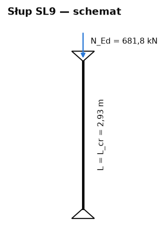

*Rys. Słup SL9: schemat statyczny (przegubowo-przesuwny, układ usztywniony).*

#### Zestawienie obciążeń

| Przypadek | N_k [kN] |
|---|---|
| G | 371,36 |
| QA | 143,66 |
| QA_pA | 162,37 |
| QA_pB | 12,21 |
| H | 2,88 |
| S1 | 13,18 |
| S2 | 13,24 |
| SB2 | 0,28 |

#### Obliczenia

##### SL9 — nośność

- Długość obliczeniowa (układ usztywniony, końce przegubowe): l₀ = β·L = 1,0·2,93 = **2,93** m *(5.8.3.2 [ZAŁ])*
- Smukłość (kierunek słabszy, h = grubość muru): λ = l₀/i, i = h/√12 = 2,93/(0,180/√12) = **56,4** *((5.14))*
- Siła względna: n = N_Ed/(A_c·f_cd) = 681,8/(0,0720·21,43·10³) = **0,442**
- Smukłość graniczna: λ_lim = 20·A·B·C/√n (A = 0,7; B = 1,1; C = 0,7) = 10,78/√0,442 = **16,2** *((5.13N) [NZW NA])*
- Mimośród I rzędu (imperfekcja l₀/400, min. e₀ = max(h/30; 20 mm)): e₁ = max(e_i + M₀/N; e₀) = max(7,3 + 0,9; 20,0) = **20,0** mm *(5.2(7), 6.1(4))*
- Mimośród II rzędu (metoda nominalnej krzywizny, K_φ z φ_ef ≈ 0,7·φ(∞,t₀) [ZAŁ]): e₂ = (1/r)·l₀²/10, 1/r = K_r·K_φ·ε_yd/(0,45·d) = **35,9** mm *(5.8.8.2–5.8.8.3)*
- Moment obliczeniowy: M_Ed = N_Ed·(e₁ + e₂) = 681,8·(20,0 + 35,9)·10⁻³ = **38,14** kNm *((5.31))*
- Zbrojenie podłużne (symetryczne, przy dłuższych bokach): 2 × k·φ = 2 × 3φ12 = **679** mm²
- Nośność przekroju przy N_Ed: M_Rd(N_Ed) — zgodność odkształceń, prostokątny wykres σ = **43,12** kNm *(6.1, 3.1.7(3))*
- Strzemiona: φ_t ≥ max(6; φ/4); s ≤ min(20φ; b_min; 400); 0,6·s przy belce/płycie = **φ6 co 180 mm (przy końcach co 100 mm)** *(9.5.3)*

| Warunek | Efekt | Nośność / limit | η | Stan | Podstawa |
|---|---|---|---|---|---|
| Nośność słupa — ściskanie mimośrodowe z efektami II rzędu | M_Ed = 38,14 kNm | M_Rd(N_Ed) = 43,12 kNm | 88% | spełniony | PN-EN 1992-1-1 5.8.8, 6.1 |
| Nośność na ściskanie osiowe | N_Ed = 681,8 kN | N_Rd,max = 1814,3 kN | 38% | spełniony | (6.1), 3.1.7(3) |
| Zbrojenie minimalne (9.5.2(2)) | A_s,min = 157 mm² | A_s,prov = 679 mm² | 23% | spełniony | (9.12N) |

#### Wnioski

**Przyjęto:** Słup ŻB 18 × 40 cm, C30/37; zbrojenie 6φ12 (B500SP), strzemiona φ6 co 18 cm (przy głowicy i podstawie co 10 cm); N_Ed = 681,8 kN. Ciągłość prętów przez wieniec/belkę (zakład l₀), zakotwienie w pogrubieniu płyty fundamentowej (l_bd).  

### Poz. 8.10 — Słup SL10 (180x400, L = 2,93 m)

Element modelu: `SL10` · maks. wykorzystanie nośności η = 74% · wszystkie warunki spełnione

#### Opis i schemat statyczny

Słup żelbetowy monolityczny w murze (trzpień) 18 × 40 cm w ścianach S1-01, S1-04; układ usztywniony (ściany i stropy — tarcze), końce przegubowe, l₀ = L = 2,93 m [ZAŁ]; siła osiowa z oparć belek, reakcji płyt i ścian wyżej w obrysie słupa (mur przerwany słupem) oraz ze słupa kondygnacji wyższej; wiatr z pasma muru zewnętrznego (b + 0,5 m) jako oddziaływanie towarzyszące (ψ₀ = 0,6).

*Rys. Słup SL10: schemat statyczny (przegubowo-przesuwny, układ usztywniony).*

#### Zestawienie obciążeń

| Przypadek | N_k [kN] |
|---|---|
| G | 301,60 |
| QA | 109,65 |
| QA_pA | 128,14 |
| QA_pB | 12,29 |
| H | 2,91 |
| S1 | 13,23 |
| S2 | 13,30 |
| SB2 | 0,28 |

#### Obliczenia

##### SL10 — nośność

- Długość obliczeniowa (układ usztywniony, końce przegubowe): l₀ = β·L = 1,0·2,93 = **2,93** m *(5.8.3.2 [ZAŁ])*
- Smukłość (kierunek słabszy, h = grubość muru): λ = l₀/i, i = h/√12 = 2,93/(0,180/√12) = **56,4** *((5.14))*
- Siła względna: n = N_Ed/(A_c·f_cd) = 551,7/(0,0720·21,43·10³) = **0,358**
- Smukłość graniczna: λ_lim = 20·A·B·C/√n (A = 0,7; B = 1,1; C = 0,7) = 10,78/√0,358 = **18,0** *((5.13N) [NZW NA])*
- Mimośród I rzędu (imperfekcja l₀/400, min. e₀ = max(h/30; 20 mm)): e₁ = max(e_i + M₀/N; e₀) = max(7,3 + 1,1; 20,0) = **20,0** mm *(5.2(7), 6.1(4))*
- Mimośród II rzędu (metoda nominalnej krzywizny, K_φ z φ_ef ≈ 0,7·φ(∞,t₀) [ZAŁ]): e₂ = (1/r)·l₀²/10, 1/r = K_r·K_φ·ε_yd/(0,45·d) = **38,0** mm *(5.8.8.2–5.8.8.3)*
- Moment obliczeniowy: M_Ed = N_Ed·(e₁ + e₂) = 551,7·(20,0 + 38,0)·10⁻³ = **31,97** kNm *((5.31))*
- Zbrojenie podłużne (symetryczne, przy dłuższych bokach): 2 × k·φ = 2 × 3φ12 = **679** mm²
- Nośność przekroju przy N_Ed: M_Rd(N_Ed) — zgodność odkształceń, prostokątny wykres σ = **42,97** kNm *(6.1, 3.1.7(3))*
- Strzemiona: φ_t ≥ max(6; φ/4); s ≤ min(20φ; b_min; 400); 0,6·s przy belce/płycie = **φ6 co 180 mm (przy końcach co 100 mm)** *(9.5.3)*

| Warunek | Efekt | Nośność / limit | η | Stan | Podstawa |
|---|---|---|---|---|---|
| Nośność słupa — ściskanie mimośrodowe z efektami II rzędu | M_Ed = 31,97 kNm | M_Rd(N_Ed) = 42,97 kNm | 74% | spełniony | PN-EN 1992-1-1 5.8.8, 6.1 |
| Nośność na ściskanie osiowe | N_Ed = 551,7 kN | N_Rd,max = 1814,3 kN | 30% | spełniony | (6.1), 3.1.7(3) |
| Zbrojenie minimalne (9.5.2(2)) | A_s,min = 144 mm² | A_s,prov = 679 mm² | 21% | spełniony | (9.12N) |

#### Wnioski

**Przyjęto:** Słup ŻB 18 × 40 cm, C30/37; zbrojenie 6φ12 (B500SP), strzemiona φ6 co 18 cm (przy głowicy i podstawie co 10 cm); N_Ed = 551,7 kN. Ciągłość prętów przez wieniec/belkę (zakład l₀), zakotwienie w pogrubieniu płyty fundamentowej (l_bd).  

### Poz. 8.11 — Słup SL11 (180x400, L = 2,93 m)

Element modelu: `SL11` · maks. wykorzystanie nośności η = 69% · wszystkie warunki spełnione

#### Opis i schemat statyczny

Słup żelbetowy monolityczny w murze (trzpień) 18 × 40 cm w ścianach S0-07, S0-08; układ usztywniony (ściany i stropy — tarcze), końce przegubowe, l₀ = L = 2,93 m [ZAŁ]; siła osiowa z oparć belek, reakcji płyt i ścian wyżej w obrysie słupa (mur przerwany słupem) oraz ze słupa kondygnacji wyższej; wiatr z pasma muru zewnętrznego (b + 0,5 m) jako oddziaływanie towarzyszące (ψ₀ = 0,6).

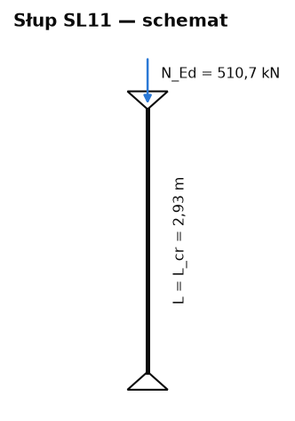

*Rys. Słup SL11: schemat statyczny (przegubowo-przesuwny, układ usztywniony).*

#### Zestawienie obciążeń

| Przypadek | N_k [kN] |
|---|---|
| G | 294,81 |
| QA | 99,55 |
| QA_pA | 95,14 |
| QA_pB | 8,98 |
| H | 4,37 |
| S1 | 10,36 |
| S2 | 11,06 |
| SB2 | 2,94 |

#### Obliczenia

##### SL11 — nośność

- Długość obliczeniowa (układ usztywniony, końce przegubowe): l₀ = β·L = 1,0·2,93 = **2,93** m *(5.8.3.2 [ZAŁ])*
- Smukłość (kierunek słabszy, h = grubość muru): λ = l₀/i, i = h/√12 = 2,93/(0,180/√12) = **56,4** *((5.14))*
- Siła względna: n = N_Ed/(A_c·f_cd) = 510,8/(0,0720·21,43·10³) = **0,331**
- Smukłość graniczna: λ_lim = 20·A·B·C/√n (A = 0,7; B = 1,1; C = 0,7) = 10,78/√0,331 = **18,7** *((5.13N) [NZW NA])*
- Mimośród I rzędu (imperfekcja l₀/400, min. e₀ = max(h/30; 20 mm)): e₁ = max(e_i + M₀/N; e₀) = max(7,3 + 1,2; 20,0) = **20,0** mm *(5.2(7), 6.1(4))*
- Mimośród II rzędu (metoda nominalnej krzywizny, K_φ z φ_ef ≈ 0,7·φ(∞,t₀) [ZAŁ]): e₂ = (1/r)·l₀²/10, 1/r = K_r·K_φ·ε_yd/(0,45·d) = **38,0** mm *(5.8.8.2–5.8.8.3)*
- Moment obliczeniowy: M_Ed = N_Ed·(e₁ + e₂) = 510,8·(20,0 + 38,0)·10⁻³ = **29,60** kNm *((5.31))*
- Zbrojenie podłużne (symetryczne, przy dłuższych bokach): 2 × k·φ = 2 × 3φ12 = **679** mm²
- Nośność przekroju przy N_Ed: M_Rd(N_Ed) — zgodność odkształceń, prostokątny wykres σ = **42,71** kNm *(6.1, 3.1.7(3))*
- Strzemiona: φ_t ≥ max(6; φ/4); s ≤ min(20φ; b_min; 400); 0,6·s przy belce/płycie = **φ6 co 180 mm (przy końcach co 100 mm)** *(9.5.3)*

| Warunek | Efekt | Nośność / limit | η | Stan | Podstawa |
|---|---|---|---|---|---|
| Nośność słupa — ściskanie mimośrodowe z efektami II rzędu | M_Ed = 29,60 kNm | M_Rd(N_Ed) = 42,71 kNm | 69% | spełniony | PN-EN 1992-1-1 5.8.8, 6.1 |
| Nośność na ściskanie osiowe | N_Ed = 510,8 kN | N_Rd,max = 1814,3 kN | 28% | spełniony | (6.1), 3.1.7(3) |
| Zbrojenie minimalne (9.5.2(2)) | A_s,min = 144 mm² | A_s,prov = 679 mm² | 21% | spełniony | (9.12N) |

#### Wnioski

**Przyjęto:** Słup ŻB 18 × 40 cm, C30/37; zbrojenie 6φ12 (B500SP), strzemiona φ6 co 18 cm (przy głowicy i podstawie co 10 cm); N_Ed = 510,8 kN. Ciągłość prętów przez wieniec/belkę (zakład l₀), zakotwienie w pogrubieniu płyty fundamentowej (l_bd).  

### Poz. 8.12 — Słup SL12 (180x400, L = 2,93 m)

Element modelu: `SL12` · maks. wykorzystanie nośności η = 63% · wszystkie warunki spełnione

#### Opis i schemat statyczny

Słup żelbetowy monolityczny w murze (trzpień) 18 × 40 cm w ścianach S1-04, S1-05; układ usztywniony (ściany i stropy — tarcze), końce przegubowe, l₀ = L = 2,93 m [ZAŁ]; siła osiowa z oparć belek, reakcji płyt i ścian wyżej w obrysie słupa (mur przerwany słupem) oraz ze słupa kondygnacji wyższej; wiatr z pasma muru zewnętrznego (b + 0,5 m) jako oddziaływanie towarzyszące (ψ₀ = 0,6).

*Rys. Słup SL12: schemat statyczny (przegubowo-przesuwny, układ usztywniony).*

#### Zestawienie obciążeń

| Przypadek | N_k [kN] |
|---|---|
| G | 263,28 |
| QA | 77,98 |
| QA_pA | 73,57 |
| QA_pB | 8,98 |
| H | 4,36 |
| S1 | 10,34 |
| S2 | 11,03 |
| SB2 | 2,91 |

#### Obliczenia

##### SL12 — nośność

- Długość obliczeniowa (układ usztywniony, końce przegubowe): l₀ = β·L = 1,0·2,93 = **2,93** m *(5.8.3.2 [ZAŁ])*
- Smukłość (kierunek słabszy, h = grubość muru): λ = l₀/i, i = h/√12 = 2,93/(0,180/√12) = **56,4** *((5.14))*
- Siła względna: n = N_Ed/(A_c·f_cd) = 445,6/(0,0720·21,43·10³) = **0,289**
- Smukłość graniczna: λ_lim = 20·A·B·C/√n (A = 0,7; B = 1,1; C = 0,7) = 10,78/√0,289 = **20,1** *((5.13N) [NZW NA])*
- Mimośród I rzędu (imperfekcja l₀/400, min. e₀ = max(h/30; 20 mm)): e₁ = max(e_i + M₀/N; e₀) = max(7,3 + 1,4; 20,0) = **20,0** mm *(5.2(7), 6.1(4))*
- Mimośród II rzędu (metoda nominalnej krzywizny, K_φ z φ_ef ≈ 0,7·φ(∞,t₀) [ZAŁ]): e₂ = (1/r)·l₀²/10, 1/r = K_r·K_φ·ε_yd/(0,45·d) = **38,0** mm *(5.8.8.2–5.8.8.3)*
- Moment obliczeniowy: M_Ed = N_Ed·(e₁ + e₂) = 445,6·(20,0 + 38,0)·10⁻³ = **25,82** kNm *((5.31))*
- Zbrojenie podłużne (symetryczne, przy dłuższych bokach): 2 × k·φ = 2 × 3φ12 = **679** mm²
- Nośność przekroju przy N_Ed: M_Rd(N_Ed) — zgodność odkształceń, prostokątny wykres σ = **40,69** kNm *(6.1, 3.1.7(3))*
- Strzemiona: φ_t ≥ max(6; φ/4); s ≤ min(20φ; b_min; 400); 0,6·s przy belce/płycie = **φ6 co 180 mm (przy końcach co 100 mm)** *(9.5.3)*

| Warunek | Efekt | Nośność / limit | η | Stan | Podstawa |
|---|---|---|---|---|---|
| Nośność słupa — ściskanie mimośrodowe z efektami II rzędu | M_Ed = 25,82 kNm | M_Rd(N_Ed) = 40,69 kNm | 63% | spełniony | PN-EN 1992-1-1 5.8.8, 6.1 |
| Nośność na ściskanie osiowe | N_Ed = 445,6 kN | N_Rd,max = 1814,3 kN | 25% | spełniony | (6.1), 3.1.7(3) |
| Zbrojenie minimalne (9.5.2(2)) | A_s,min = 144 mm² | A_s,prov = 679 mm² | 21% | spełniony | (9.12N) |

#### Wnioski

**Przyjęto:** Słup ŻB 18 × 40 cm, C30/37; zbrojenie 6φ12 (B500SP), strzemiona φ6 co 18 cm (przy głowicy i podstawie co 10 cm); N_Ed = 445,6 kN. Ciągłość prętów przez wieniec/belkę (zakład l₀), zakotwienie w pogrubieniu płyty fundamentowej (l_bd).  

### Poz. 8.13 — Słup SL13 (700x180, L = 2,93 m)

Element modelu: `SL13` · maks. wykorzystanie nośności η = 99% · wszystkie warunki spełnione

#### Opis i schemat statyczny

Słup żelbetowy monolityczny w murze (trzpień) 70 × 18 cm w ścianach S0-08, S0-11; układ usztywniony (ściany i stropy — tarcze), końce przegubowe, l₀ = L = 2,93 m [ZAŁ]; siła osiowa z oparć belek, reakcji płyt i ścian wyżej w obrysie słupa (mur przerwany słupem) oraz ze słupa kondygnacji wyższej; słup wewnętrzny — bez wiatru.

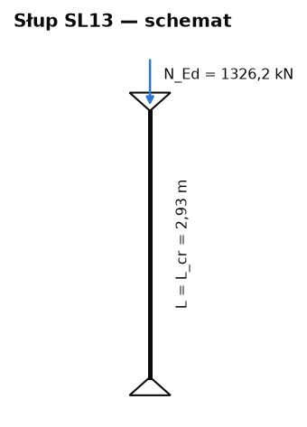

*Rys. Słup SL13: schemat statyczny (przegubowo-przesuwny, układ usztywniony).*

#### Zestawienie obciążeń

| Przypadek | N_k [kN] |
|---|---|
| QA | 151,92 |
| QA_pA | 66,04 |
| QA_pB | 111,14 |
| G | 847,64 |
| H | 18,87 |
| S1 | 29,02 |
| S2 | 29,78 |
| SB2 | 3,20 |

#### Obliczenia

##### SL13 — nośność

- Długość obliczeniowa (układ usztywniony, końce przegubowe): l₀ = β·L = 1,0·2,93 = **2,93** m *(5.8.3.2 [ZAŁ])*
- Smukłość (kierunek słabszy, h = grubość muru): λ = l₀/i, i = h/√12 = 2,93/(0,180/√12) = **56,4** *((5.14))*
- Siła względna: n = N_Ed/(A_c·f_cd) = 1326,2/(0,1260·21,43·10³) = **0,491**
- Smukłość graniczna: λ_lim = 20·A·B·C/√n (A = 0,7; B = 1,1; C = 0,7) = 10,78/√0,491 = **15,4** *((5.13N) [NZW NA])*
- Mimośród I rzędu (imperfekcja l₀/400, min. e₀ = max(h/30; 20 mm)): e₁ = max(e_i + M₀/N; e₀) = max(7,3 + 0,0; 20,0) = **20,0** mm *(5.2(7), 6.1(4))*
- Mimośród II rzędu (metoda nominalnej krzywizny, K_φ z φ_ef ≈ 0,7·φ(∞,t₀) [ZAŁ]): e₂ = (1/r)·l₀²/10, 1/r = K_r·K_φ·ε_yd/(0,45·d) = **33,3** mm *(5.8.8.2–5.8.8.3)*
- Moment obliczeniowy: M_Ed = N_Ed·(e₁ + e₂) = 1326,2·(20,0 + 33,3)·10⁻³ = **70,70** kNm *((5.31))*
- Zbrojenie podłużne (symetryczne, przy dłuższych bokach): 2 × k·φ = 2 × 4φ12 = **905** mm²
- Nośność przekroju przy N_Ed: M_Rd(N_Ed) — zgodność odkształceń, prostokątny wykres σ = **71,67** kNm *(6.1, 3.1.7(3))*
- Strzemiona: φ_t ≥ max(6; φ/4); s ≤ min(20φ; b_min; 400); 0,6·s przy belce/płycie = **φ6 co 180 mm (przy końcach co 100 mm)** *(9.5.3)*

| Warunek | Efekt | Nośność / limit | η | Stan | Podstawa |
|---|---|---|---|---|---|
| Nośność słupa — ściskanie mimośrodowe z efektami II rzędu | M_Ed = 70,70 kNm | M_Rd(N_Ed) = 71,67 kNm | 99% | spełniony | PN-EN 1992-1-1 5.8.8, 6.1 |
| Nośność na ściskanie osiowe | N_Ed = 1326,2 kN | N_Rd,max = 3061,9 kN | 43% | spełniony | (6.1), 3.1.7(3) |
| Zbrojenie minimalne (9.5.2(2)) | A_s,min = 305 mm² | A_s,prov = 905 mm² | 34% | spełniony | (9.12N) |

#### Wnioski

**Przyjęto:** Słup ŻB 18 × 70 cm, C30/37; zbrojenie 8φ12 (B500SP), strzemiona φ6 co 18 cm (przy głowicy i podstawie co 10 cm); N_Ed = 1326,2 kN. Ciągłość prętów przez wieniec/belkę (zakład l₀), zakotwienie w pogrubieniu płyty fundamentowej (l_bd).  

### Poz. 8.14 — Słup SL14 (700x180, L = 2,93 m)

Element modelu: `SL14` · maks. wykorzystanie nośności η = 76% · wszystkie warunki spełnione

#### Opis i schemat statyczny

Słup żelbetowy monolityczny w murze (trzpień) 70 × 18 cm w ścianach S1-05, S1-07; układ usztywniony (ściany i stropy — tarcze), końce przegubowe, l₀ = L = 2,93 m [ZAŁ]; siła osiowa z oparć belek, reakcji płyt i ścian wyżej w obrysie słupa (mur przerwany słupem) oraz ze słupa kondygnacji wyższej; słup wewnętrzny — bez wiatru.

*Rys. Słup SL14: schemat statyczny (przegubowo-przesuwny, układ usztywniony).*

#### Zestawienie obciążeń

| Przypadek | N_k [kN] |
|---|---|
| QA | 93,76 |
| QA_pA | 6,81 |
| QA_pB | 110,16 |
| G | 585,72 |
| H | 18,80 |
| S1 | 28,90 |
| S2 | 29,60 |
| SB2 | 2,96 |

#### Obliczenia

##### SL14 — nośność

- Długość obliczeniowa (układ usztywniony, końce przegubowe): l₀ = β·L = 1,0·2,93 = **2,93** m *(5.8.3.2 [ZAŁ])*
- Smukłość (kierunek słabszy, h = grubość muru): λ = l₀/i, i = h/√12 = 2,93/(0,180/√12) = **56,4** *((5.14))*
- Siła względna: n = N_Ed/(A_c·f_cd) = 928,6/(0,1260·21,43·10³) = **0,344**
- Smukłość graniczna: λ_lim = 20·A·B·C/√n (A = 0,7; B = 1,1; C = 0,7) = 10,78/√0,344 = **18,4** *((5.13N) [NZW NA])*
- Mimośród I rzędu (imperfekcja l₀/400, min. e₀ = max(h/30; 20 mm)): e₁ = max(e_i + M₀/N; e₀) = max(7,3 + 0,0; 20,0) = **20,0** mm *(5.2(7), 6.1(4))*
- Mimośród II rzędu (metoda nominalnej krzywizny, K_φ z φ_ef ≈ 0,7·φ(∞,t₀) [ZAŁ]): e₂ = (1/r)·l₀²/10, 1/r = K_r·K_φ·ε_yd/(0,45·d) = **38,0** mm *(5.8.8.2–5.8.8.3)*
- Moment obliczeniowy: M_Ed = N_Ed·(e₁ + e₂) = 928,6·(20,0 + 38,0)·10⁻³ = **53,82** kNm *((5.31))*
- Zbrojenie podłużne (symetryczne, przy dłuższych bokach): 2 × k·φ = 2 × 4φ12 = **905** mm²
- Nośność przekroju przy N_Ed: M_Rd(N_Ed) — zgodność odkształceń, prostokątny wykres σ = **70,60** kNm *(6.1, 3.1.7(3))*
- Strzemiona: φ_t ≥ max(6; φ/4); s ≤ min(20φ; b_min; 400); 0,6·s przy belce/płycie = **φ6 co 180 mm (przy końcach co 100 mm)** *(9.5.3)*

| Warunek | Efekt | Nośność / limit | η | Stan | Podstawa |
|---|---|---|---|---|---|
| Nośność słupa — ściskanie mimośrodowe z efektami II rzędu | M_Ed = 53,82 kNm | M_Rd(N_Ed) = 70,60 kNm | 76% | spełniony | PN-EN 1992-1-1 5.8.8, 6.1 |
| Nośność na ściskanie osiowe | N_Ed = 928,6 kN | N_Rd,max = 3061,9 kN | 30% | spełniony | (6.1), 3.1.7(3) |
| Zbrojenie minimalne (9.5.2(2)) | A_s,min = 252 mm² | A_s,prov = 905 mm² | 28% | spełniony | (9.12N) |

#### Wnioski

**Przyjęto:** Słup ŻB 18 × 70 cm, C30/37; zbrojenie 8φ12 (B500SP), strzemiona φ6 co 18 cm (przy głowicy i podstawie co 10 cm); N_Ed = 928,6 kN. Ciągłość prętów przez wieniec/belkę (zakład l₀), zakotwienie w pogrubieniu płyty fundamentowej (l_bd).  

### Poz. 8.15 — Słup SL15 (700x180, L = 2,93 m)

Element modelu: `SL15` · maks. wykorzystanie nośności η = 41% · wszystkie warunki spełnione

#### Opis i schemat statyczny

Słup żelbetowy monolityczny w murze (trzpień) 70 × 18 cm w ścianach S2-06, S2-07, S2-09; układ usztywniony (ściany i stropy — tarcze), końce przegubowe, l₀ = L = 2,93 m [ZAŁ]; siła osiowa z oparć belek, reakcji płyt i ścian wyżej w obrysie słupa (mur przerwany słupem) oraz ze słupa kondygnacji wyższej; wiatr z pasma muru zewnętrznego (b + 0,5 m) jako oddziaływanie towarzyszące (ψ₀ = 0,6).

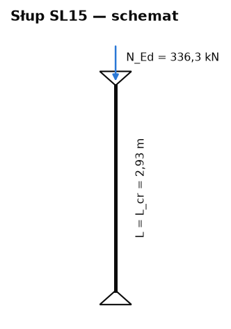

*Rys. Słup SL15: schemat statyczny (przegubowo-przesuwny, układ usztywniony).*

#### Zestawienie obciążeń

| Przypadek | N_k [kN] |
|---|---|
| QA | 15,81 |
| QA_pA | 15,69 |
| QA_pB | 0,11 |
| G | 221,46 |
| H | 17,45 |
| S1 | 27,71 |
| S2 | 27,71 |

#### Obliczenia

##### SL15 — nośność

- Długość obliczeniowa (układ usztywniony, końce przegubowe): l₀ = β·L = 1,0·2,93 = **2,93** m *(5.8.3.2 [ZAŁ])*
- Smukłość (kierunek słabszy, h = grubość muru): λ = l₀/i, i = h/√12 = 2,93/(0,180/√12) = **56,4** *((5.14))*
- Siła względna: n = N_Ed/(A_c·f_cd) = 336,3/(0,1260·21,43·10³) = **0,125**
- Smukłość graniczna: λ_lim = 20·A·B·C/√n (A = 0,7; B = 1,1; C = 0,7) = 10,78/√0,125 = **30,5** *((5.13N) [NZW NA])*
- Mimośród I rzędu (imperfekcja l₀/400, min. e₀ = max(h/30; 20 mm)): e₁ = max(e_i + M₀/N; e₀) = max(7,3 + 2,4; 20,0) = **20,0** mm *(5.2(7), 6.1(4))*
- Mimośród II rzędu (metoda nominalnej krzywizny, K_φ z φ_ef ≈ 0,7·φ(∞,t₀) [ZAŁ]): e₂ = (1/r)·l₀²/10, 1/r = K_r·K_φ·ε_yd/(0,45·d) = **38,0** mm *(5.8.8.2–5.8.8.3)*
- Moment obliczeniowy: M_Ed = N_Ed·(e₁ + e₂) = 336,3·(20,0 + 38,0)·10⁻³ = **19,49** kNm *((5.31))*
- Zbrojenie podłużne (symetryczne, przy dłuższych bokach): 2 × k·φ = 2 × 4φ12 = **905** mm²
- Nośność przekroju przy N_Ed: M_Rd(N_Ed) — zgodność odkształceń, prostokątny wykres σ = **47,09** kNm *(6.1, 3.1.7(3))*
- Strzemiona: φ_t ≥ max(6; φ/4); s ≤ min(20φ; b_min; 400); 0,6·s przy belce/płycie = **φ6 co 180 mm (przy końcach co 100 mm)** *(9.5.3)*

| Warunek | Efekt | Nośność / limit | η | Stan | Podstawa |
|---|---|---|---|---|---|
| Nośność słupa — ściskanie mimośrodowe z efektami II rzędu | M_Ed = 19,49 kNm | M_Rd(N_Ed) = 47,09 kNm | 41% | spełniony | PN-EN 1992-1-1 5.8.8, 6.1 |
| Nośność na ściskanie osiowe | N_Ed = 336,3 kN | N_Rd,max = 3061,9 kN | 11% | spełniony | (6.1), 3.1.7(3) |
| Zbrojenie minimalne (9.5.2(2)) | A_s,min = 252 mm² | A_s,prov = 905 mm² | 28% | spełniony | (9.12N) |

#### Wnioski

**Przyjęto:** Słup ŻB 18 × 70 cm, C30/37; zbrojenie 8φ12 (B500SP), strzemiona φ6 co 18 cm (przy głowicy i podstawie co 10 cm); N_Ed = 336,3 kN. Ciągłość prętów przez wieniec/belkę (zakład l₀), zakotwienie w pogrubieniu płyty fundamentowej (l_bd).  

### Poz. 8.16 — Słup SL16 (865x180, L = 2,65 m)

Element modelu: `SL16` · maks. wykorzystanie nośności η = 87% · wszystkie warunki spełnione

#### Opis i schemat statyczny

Słup żelbetowy monolityczny w murze (trzpień) 86 × 18 cm w ścianach S0-08, S0-12; układ usztywniony (ściany i stropy — tarcze), końce przegubowe, l₀ = L = 2,65 m [ZAŁ]; siła osiowa z oparć belek, reakcji płyt i ścian wyżej w obrysie słupa (mur przerwany słupem) oraz ze słupa kondygnacji wyższej; słup wewnętrzny — bez wiatru.

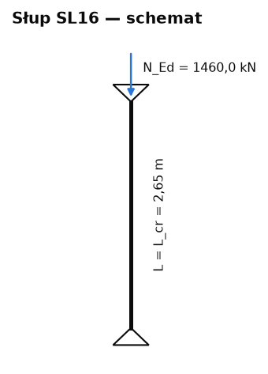

*Rys. Słup SL16: schemat statyczny (przegubowo-przesuwny, układ usztywniony).*

#### Zestawienie obciążeń

| Przypadek | N_k [kN] |
|---|---|
| G | 924,61 |
| QA | 190,30 |
| QA_pA | 107,60 |
| QA_pB | 108,18 |
| H | 11,74 |
| S1 | 19,08 |
| S2 | 19,13 |
| SB2 | 0,17 |

#### Obliczenia

##### SL16 — nośność

- Długość obliczeniowa (układ usztywniony, końce przegubowe): l₀ = β·L = 1,0·2,65 = **2,65** m *(5.8.3.2 [ZAŁ])*
- Smukłość (kierunek słabszy, h = grubość muru): λ = l₀/i, i = h/√12 = 2,65/(0,180/√12) = **51,0** *((5.14))*
- Siła względna: n = N_Ed/(A_c·f_cd) = 1462,4/(0,1557·21,43·10³) = **0,438**
- Smukłość graniczna: λ_lim = 20·A·B·C/√n (A = 0,7; B = 1,1; C = 0,7) = 10,78/√0,438 = **16,3** *((5.13N) [NZW NA])*
- Mimośród I rzędu (imperfekcja l₀/400, min. e₀ = max(h/30; 20 mm)): e₁ = max(e_i + M₀/N; e₀) = max(6,6 + 0,0; 20,0) = **20,0** mm *(5.2(7), 6.1(4))*
- Mimośród II rzędu (metoda nominalnej krzywizny, K_φ z φ_ef ≈ 0,7·φ(∞,t₀) [ZAŁ]): e₂ = (1/r)·l₀²/10, 1/r = K_r·K_φ·ε_yd/(0,45·d) = **30,9** mm *(5.8.8.2–5.8.8.3)*
- Moment obliczeniowy: M_Ed = N_Ed·(e₁ + e₂) = 1462,4·(20,0 + 30,9)·10⁻³ = **74,45** kNm *((5.31))*
- Zbrojenie podłużne (symetryczne, przy dłuższych bokach): 2 × k·φ = 2 × 4φ12 = **905** mm²
- Nośność przekroju przy N_Ed: M_Rd(N_Ed) — zgodność odkształceń, prostokątny wykres σ = **85,65** kNm *(6.1, 3.1.7(3))*
- Strzemiona: φ_t ≥ max(6; φ/4); s ≤ min(20φ; b_min; 400); 0,6·s przy belce/płycie = **φ6 co 180 mm (przy końcach co 100 mm)** *(9.5.3)*

| Warunek | Efekt | Nośność / limit | η | Stan | Podstawa |
|---|---|---|---|---|---|
| Nośność słupa — ściskanie mimośrodowe z efektami II rzędu | M_Ed = 74,45 kNm | M_Rd(N_Ed) = 85,65 kNm | 87% | spełniony | PN-EN 1992-1-1 5.8.8, 6.1 |
| Nośność na ściskanie osiowe | N_Ed = 1462,4 kN | N_Rd,max = 3698,3 kN | 40% | spełniony | (6.1), 3.1.7(3) |
| Zbrojenie minimalne (9.5.2(2)) | A_s,min = 336 mm² | A_s,prov = 905 mm² | 37% | spełniony | (9.12N) |

#### Wnioski

**Przyjęto:** Słup ŻB 18 × 86 cm, C30/37; zbrojenie 8φ12 (B500SP), strzemiona φ6 co 18 cm (przy głowicy i podstawie co 10 cm); N_Ed = 1462,4 kN. Ciągłość prętów przez wieniec/belkę (zakład l₀), zakotwienie w pogrubieniu płyty fundamentowej (l_bd).  

### Poz. 8.17 — Słup SL17 (865x180, L = 2,65 m)

Element modelu: `SL17` · maks. wykorzystanie nośności η = 62% · wszystkie warunki spełnione

#### Opis i schemat statyczny

Słup żelbetowy monolityczny w murze (trzpień) 86 × 18 cm w ścianach S1-05, S1-08; układ usztywniony (ściany i stropy — tarcze), końce przegubowe, l₀ = L = 2,65 m [ZAŁ]; siła osiowa z oparć belek, reakcji płyt i ścian wyżej w obrysie słupa (mur przerwany słupem) oraz ze słupa kondygnacji wyższej; słup wewnętrzny — bez wiatru.

*Rys. Słup SL17: schemat statyczny (przegubowo-przesuwny, układ usztywniony).*

#### Zestawienie obciążeń

| Przypadek | N_k [kN] |
|---|---|
| G | 557,99 |
| QA | 94,07 |
| QA_pA | 10,81 |
| QA_pB | 106,57 |
| H | 11,73 |
| S1 | 19,03 |
| S2 | 19,06 |
| SB2 | 0,10 |

#### Obliczenia

##### SL17 — nośność

- Długość obliczeniowa (układ usztywniony, końce przegubowe): l₀ = β·L = 1,0·2,65 = **2,65** m *(5.8.3.2 [ZAŁ])*
- Smukłość (kierunek słabszy, h = grubość muru): λ = l₀/i, i = h/√12 = 2,65/(0,180/√12) = **51,0** *((5.14))*
- Siła względna: n = N_Ed/(A_c·f_cd) = 879,5/(0,1557·21,43·10³) = **0,264**
- Smukłość graniczna: λ_lim = 20·A·B·C/√n (A = 0,7; B = 1,1; C = 0,7) = 10,78/√0,264 = **21,0** *((5.13N) [NZW NA])*
- Mimośród I rzędu (imperfekcja l₀/400, min. e₀ = max(h/30; 20 mm)): e₁ = max(e_i + M₀/N; e₀) = max(6,6 + 0,0; 20,0) = **20,0** mm *(5.2(7), 6.1(4))*
- Mimośród II rzędu (metoda nominalnej krzywizny, K_φ z φ_ef ≈ 0,7·φ(∞,t₀) [ZAŁ]): e₂ = (1/r)·l₀²/10, 1/r = K_r·K_φ·ε_yd/(0,45·d) = **32,6** mm *(5.8.8.2–5.8.8.3)*
- Moment obliczeniowy: M_Ed = N_Ed·(e₁ + e₂) = 879,5·(20,0 + 32,6)·10⁻³ = **46,30** kNm *((5.31))*
- Zbrojenie podłużne (symetryczne, przy dłuższych bokach): 2 × k·φ = 2 × 4φ12 = **905** mm²
- Nośność przekroju przy N_Ed: M_Rd(N_Ed) — zgodność odkształceń, prostokątny wykres σ = **74,86** kNm *(6.1, 3.1.7(3))*
- Strzemiona: φ_t ≥ max(6; φ/4); s ≤ min(20φ; b_min; 400); 0,6·s przy belce/płycie = **φ6 co 180 mm (przy końcach co 100 mm)** *(9.5.3)*

| Warunek | Efekt | Nośność / limit | η | Stan | Podstawa |
|---|---|---|---|---|---|
| Nośność słupa — ściskanie mimośrodowe z efektami II rzędu | M_Ed = 46,30 kNm | M_Rd(N_Ed) = 74,86 kNm | 62% | spełniony | PN-EN 1992-1-1 5.8.8, 6.1 |
| Nośność na ściskanie osiowe | N_Ed = 879,5 kN | N_Rd,max = 3698,3 kN | 24% | spełniony | (6.1), 3.1.7(3) |
| Zbrojenie minimalne (9.5.2(2)) | A_s,min = 311 mm² | A_s,prov = 905 mm² | 34% | spełniony | (9.12N) |

#### Wnioski

**Przyjęto:** Słup ŻB 18 × 86 cm, C30/37; zbrojenie 8φ12 (B500SP), strzemiona φ6 co 18 cm (przy głowicy i podstawie co 10 cm); N_Ed = 879,5 kN. Ciągłość prętów przez wieniec/belkę (zakład l₀), zakotwienie w pogrubieniu płyty fundamentowej (l_bd).  

### Poz. 8.18 — Słup SL18 (700x180, L = 2,65 m)

Element modelu: `SL18` · maks. wykorzystanie nośności η = 90% · wszystkie warunki spełnione

#### Opis i schemat statyczny

Słup żelbetowy monolityczny w murze (trzpień) 70 × 18 cm w ścianach S0-09, S0-10, S0-13; układ usztywniony (ściany i stropy — tarcze), końce przegubowe, l₀ = L = 2,65 m [ZAŁ]; siła osiowa z oparć belek, reakcji płyt i ścian wyżej w obrysie słupa (mur przerwany słupem) oraz ze słupa kondygnacji wyższej; słup wewnętrzny — bez wiatru.

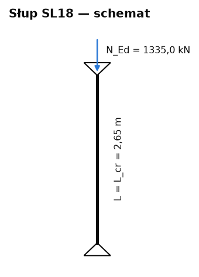

*Rys. Słup SL18: schemat statyczny (przegubowo-przesuwny, układ usztywniony).*

#### Zestawienie obciążeń

| Przypadek | N_k [kN] |
|---|---|
| G | 830,60 |
| QA | 189,02 |
| QA_pA | 108,17 |
| QA_pB | 108,58 |
| H | 11,56 |
| S1 | 19,19 |
| S2 | 20,26 |
| SB2 | 4,32 |

#### Obliczenia

##### SL18 — nośność

- Długość obliczeniowa (układ usztywniony, końce przegubowe): l₀ = β·L = 1,0·2,65 = **2,65** m *(5.8.3.2 [ZAŁ])*
- Smukłość (kierunek słabszy, h = grubość muru): λ = l₀/i, i = h/√12 = 2,65/(0,180/√12) = **51,0** *((5.14))*
- Siła względna: n = N_Ed/(A_c·f_cd) = 1335,0/(0,1260·21,43·10³) = **0,494**
- Smukłość graniczna: λ_lim = 20·A·B·C/√n (A = 0,7; B = 1,1; C = 0,7) = 10,78/√0,494 = **15,3** *((5.13N) [NZW NA])*
- Mimośród I rzędu (imperfekcja l₀/400, min. e₀ = max(h/30; 20 mm)): e₁ = max(e_i + M₀/N; e₀) = max(6,6 + 0,0; 20,0) = **20,0** mm *(5.2(7), 6.1(4))*
- Mimośród II rzędu (metoda nominalnej krzywizny, K_φ z φ_ef ≈ 0,7·φ(∞,t₀) [ZAŁ]): e₂ = (1/r)·l₀²/10, 1/r = K_r·K_φ·ε_yd/(0,45·d) = **28,5** mm *(5.8.8.2–5.8.8.3)*
- Moment obliczeniowy: M_Ed = N_Ed·(e₁ + e₂) = 1335,0·(20,0 + 28,5)·10⁻³ = **64,77** kNm *((5.31))*
- Zbrojenie podłużne (symetryczne, przy dłuższych bokach): 2 × k·φ = 2 × 4φ12 = **905** mm²
- Nośność przekroju przy N_Ed: M_Rd(N_Ed) — zgodność odkształceń, prostokątny wykres σ = **71,66** kNm *(6.1, 3.1.7(3))*
- Strzemiona: φ_t ≥ max(6; φ/4); s ≤ min(20φ; b_min; 400); 0,6·s przy belce/płycie = **φ6 co 180 mm (przy końcach co 100 mm)** *(9.5.3)*

| Warunek | Efekt | Nośność / limit | η | Stan | Podstawa |
|---|---|---|---|---|---|
| Nośność słupa — ściskanie mimośrodowe z efektami II rzędu | M_Ed = 64,77 kNm | M_Rd(N_Ed) = 71,66 kNm | 90% | spełniony | PN-EN 1992-1-1 5.8.8, 6.1 |
| Nośność na ściskanie osiowe | N_Ed = 1335,0 kN | N_Rd,max = 3061,9 kN | 44% | spełniony | (6.1), 3.1.7(3) |
| Zbrojenie minimalne (9.5.2(2)) | A_s,min = 307 mm² | A_s,prov = 905 mm² | 34% | spełniony | (9.12N) |

#### Wnioski

**Przyjęto:** Słup ŻB 18 × 70 cm, C30/37; zbrojenie 8φ12 (B500SP), strzemiona φ6 co 18 cm (przy głowicy i podstawie co 10 cm); N_Ed = 1335,0 kN. Ciągłość prętów przez wieniec/belkę (zakład l₀), zakotwienie w pogrubieniu płyty fundamentowej (l_bd).  

### Poz. 8.19 — Słup SL19 (300x180, L = 2,65 m)

Element modelu: `SL19` · maks. wykorzystanie nośności η = 99% · wszystkie warunki spełnione

#### Opis i schemat statyczny

Słup żelbetowy monolityczny w murze (trzpień) 30 × 18 cm w ścianach S1-06, S1-09; układ usztywniony (ściany i stropy — tarcze), końce przegubowe, l₀ = L = 2,65 m [ZAŁ]; siła osiowa z oparć belek, reakcji płyt i ścian wyżej w obrysie słupa (mur przerwany słupem) oraz ze słupa kondygnacji wyższej; słup wewnętrzny — bez wiatru.

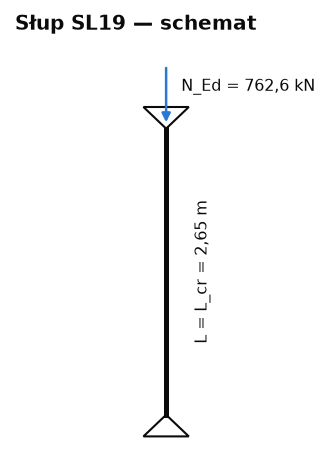

*Rys. Słup SL19: schemat statyczny (przegubowo-przesuwny, układ usztywniony).*

#### Zestawienie obciążeń

| Przypadek | N_k [kN] |
|---|---|
| G | 478,00 |
| QA | 88,53 |
| QA_pA | 10,37 |
| QA_pB | 99,66 |
| H | 9,97 |
| S1 | 16,31 |
| S2 | 16,85 |
| SB2 | 2,39 |

#### Obliczenia

##### SL19 — nośność

- Długość obliczeniowa (układ usztywniony, końce przegubowe): l₀ = β·L = 1,0·2,65 = **2,65** m *(5.8.3.2 [ZAŁ])*
- Smukłość (kierunek słabszy, h = grubość muru): λ = l₀/i, i = h/√12 = 2,65/(0,180/√12) = **51,0** *((5.14))*
- Siła względna: n = N_Ed/(A_c·f_cd) = 762,6/(0,0540·21,43·10³) = **0,659**
- Smukłość graniczna: λ_lim = 20·A·B·C/√n (A = 0,7; B = 1,1; C = 0,7) = 10,78/√0,659 = **13,3** *((5.13N) [NZW NA])*
- Mimośród I rzędu (imperfekcja l₀/400, min. e₀ = max(h/30; 20 mm)): e₁ = max(e_i + M₀/N; e₀) = max(6,6 + 0,0; 20,0) = **20,0** mm *(5.2(7), 6.1(4))*
- Mimośród II rzędu (metoda nominalnej krzywizny, K_φ z φ_ef ≈ 0,7·φ(∞,t₀) [ZAŁ]): e₂ = (1/r)·l₀²/10, 1/r = K_r·K_φ·ε_yd/(0,45·d) = **22,8** mm *(5.8.8.2–5.8.8.3)*
- Moment obliczeniowy: M_Ed = N_Ed·(e₁ + e₂) = 762,6·(20,0 + 22,8)·10⁻³ = **32,61** kNm *((5.31))*
- Zbrojenie podłużne (symetryczne, przy dłuższych bokach): 2 × k·φ = 2 × 3φ12 = **679** mm²
- Nośność przekroju przy N_Ed: M_Rd(N_Ed) — zgodność odkształceń, prostokątny wykres σ = **32,92** kNm *(6.1, 3.1.7(3))*
- Strzemiona: φ_t ≥ max(6; φ/4); s ≤ min(20φ; b_min; 400); 0,6·s przy belce/płycie = **φ6 co 180 mm (przy końcach co 100 mm)** *(9.5.3)*

| Warunek | Efekt | Nośność / limit | η | Stan | Podstawa |
|---|---|---|---|---|---|
| Nośność słupa — ściskanie mimośrodowe z efektami II rzędu | M_Ed = 32,61 kNm | M_Rd(N_Ed) = 32,92 kNm | 99% | spełniony | PN-EN 1992-1-1 5.8.8, 6.1 |
| Nośność na ściskanie osiowe | N_Ed = 762,6 kN | N_Rd,max = 1428,6 kN | 53% | spełniony | (6.1), 3.1.7(3) |
| Zbrojenie minimalne (9.5.2(2)) | A_s,min = 175 mm² | A_s,prov = 679 mm² | 26% | spełniony | (9.12N) |

#### Wnioski

**Przyjęto:** Słup ŻB 18 × 30 cm, C30/37; zbrojenie 6φ12 (B500SP), strzemiona φ6 co 18 cm (przy głowicy i podstawie co 10 cm); N_Ed = 762,6 kN. Ciągłość prętów przez wieniec/belkę (zakład l₀), zakotwienie w pogrubieniu płyty fundamentowej (l_bd).  

### Poz. 8.20 — Słup SL20 (180x440, L = 2,93 m)

Element modelu: `SL20` · maks. wykorzystanie nośności η = 42% · wszystkie warunki spełnione

#### Opis i schemat statyczny

Słup żelbetowy monolityczny w murze (trzpień) 18 × 44 cm w ścianach S0-01, S0-02, S0-15; układ usztywniony (ściany i stropy — tarcze), końce przegubowe, l₀ = L = 2,93 m [ZAŁ]; siła osiowa z oparć belek, reakcji płyt i ścian wyżej w obrysie słupa (mur przerwany słupem) oraz ze słupa kondygnacji wyższej; wiatr z pasma muru zewnętrznego (b + 0,5 m) jako oddziaływanie towarzyszące (ψ₀ = 0,6).

*Rys. Słup SL20: schemat statyczny (przegubowo-przesuwny, układ usztywniony).*

#### Zestawienie obciążeń

| Przypadek | N_k [kN] |
|---|---|
| G | 140,38 |
| QA | 46,10 |
| QA_pA | 46,44 |
| QA_pB | 16,35 |
| H | 1,73 |
| S1 | 3,65 |
| S2 | 4,07 |
| SB2 | 1,27 |

#### Obliczenia

##### SL20 — nośność

- Długość obliczeniowa (układ usztywniony, końce przegubowe): l₀ = β·L = 1,0·2,93 = **2,93** m *(5.8.3.2 [ZAŁ])*
- Smukłość (kierunek słabszy, h = grubość muru): λ = l₀/i, i = h/√12 = 2,93/(0,180/√12) = **56,4** *((5.14))*
- Siła względna: n = N_Ed/(A_c·f_cd) = 241,3/(0,0792·21,43·10³) = **0,142**
- Smukłość graniczna: λ_lim = 20·A·B·C/√n (A = 0,7; B = 1,1; C = 0,7) = 10,78/√0,142 = **28,6** *((5.13N) [NZW NA])*
- Mimośród I rzędu (imperfekcja l₀/400, min. e₀ = max(h/30; 20 mm)): e₁ = max(e_i + M₀/N; e₀) = max(7,3 + 2,6; 20,0) = **20,0** mm *(5.2(7), 6.1(4))*
- Mimośród II rzędu (metoda nominalnej krzywizny, K_φ z φ_ef ≈ 0,7·φ(∞,t₀) [ZAŁ]): e₂ = (1/r)·l₀²/10, 1/r = K_r·K_φ·ε_yd/(0,45·d) = **38,0** mm *(5.8.8.2–5.8.8.3)*
- Moment obliczeniowy: M_Ed = N_Ed·(e₁ + e₂) = 241,3·(20,0 + 38,0)·10⁻³ = **13,99** kNm *((5.31))*
- Zbrojenie podłużne (symetryczne, przy dłuższych bokach): 2 × k·φ = 2 × 3φ12 = **679** mm²
- Nośność przekroju przy N_Ed: M_Rd(N_Ed) — zgodność odkształceń, prostokątny wykres σ = **33,24** kNm *(6.1, 3.1.7(3))*
- Strzemiona: φ_t ≥ max(6; φ/4); s ≤ min(20φ; b_min; 400); 0,6·s przy belce/płycie = **φ6 co 180 mm (przy końcach co 100 mm)** *(9.5.3)*

| Warunek | Efekt | Nośność / limit | η | Stan | Podstawa |
|---|---|---|---|---|---|
| Nośność słupa — ściskanie mimośrodowe z efektami II rzędu | M_Ed = 13,99 kNm | M_Rd(N_Ed) = 33,24 kNm | 42% | spełniony | PN-EN 1992-1-1 5.8.8, 6.1 |
| Nośność na ściskanie osiowe | N_Ed = 241,3 kN | N_Rd,max = 1968,6 kN | 12% | spełniony | (6.1), 3.1.7(3) |
| Zbrojenie minimalne (9.5.2(2)) | A_s,min = 158 mm² | A_s,prov = 679 mm² | 23% | spełniony | (9.12N) |

#### Wnioski

**Przyjęto:** Słup ŻB 18 × 44 cm, C30/37; zbrojenie 6φ12 (B500SP), strzemiona φ6 co 18 cm (przy głowicy i podstawie co 10 cm); N_Ed = 241,3 kN. Ciągłość prętów przez wieniec/belkę (zakład l₀), zakotwienie w pogrubieniu płyty fundamentowej (l_bd).  

### Poz. 8.21 — Słup SL21 (400x180, L = 2,08 m)

Element modelu: `SL21` · maks. wykorzystanie nośności η = 26% · wszystkie warunki spełnione

#### Opis i schemat statyczny

Słup żelbetowy monolityczny w murze (trzpień) 40 × 18 cm w ścianach S1-01; układ usztywniony (ściany i stropy — tarcze), końce przegubowe, l₀ = L = 2,08 m [ZAŁ]; siła osiowa z oparć belek, reakcji płyt i ścian wyżej w obrysie słupa (mur przerwany słupem) oraz ze słupa kondygnacji wyższej; wiatr z pasma muru zewnętrznego (b + 0,5 m) jako oddziaływanie towarzyszące (ψ₀ = 0,6).

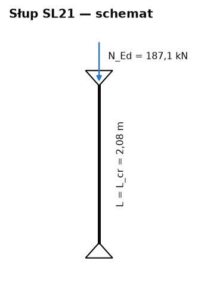

*Rys. Słup SL21: schemat statyczny (przegubowo-przesuwny, układ usztywniony).*

#### Zestawienie obciążeń

| Przypadek | N_k [kN] |
|---|---|
| G | 120,17 |
| QA | 20,41 |
| QA_pA | 3,45 |
| QA_pB | 7,10 |
| H | 1,81 |
| S1 | 4,52 |
| S2 | 4,51 |
| SB2 | −0,03 |

#### Obliczenia

##### SL21 — nośność

- Długość obliczeniowa (układ usztywniony, końce przegubowe): l₀ = β·L = 1,0·2,08 = **2,08** m *(5.8.3.2 [ZAŁ])*
- Smukłość (kierunek słabszy, h = grubość muru): λ = l₀/i, i = h/√12 = 2,08/(0,180/√12) = **40,0** *((5.14))*
- Siła względna: n = N_Ed/(A_c·f_cd) = 187,1/(0,0720·21,43·10³) = **0,121**
- Smukłość graniczna: λ_lim = 20·A·B·C/√n (A = 0,7; B = 1,1; C = 0,7) = 10,78/√0,121 = **31,0** *((5.13N) [NZW NA])*
- Mimośród I rzędu (imperfekcja l₀/400, min. e₀ = max(h/30; 20 mm)): e₁ = max(e_i + M₀/N; e₀) = max(5,2 + 1,6; 20,0) = **20,0** mm *(5.2(7), 6.1(4))*
- Mimośród II rzędu (metoda nominalnej krzywizny, K_φ z φ_ef ≈ 0,7·φ(∞,t₀) [ZAŁ]): e₂ = (1/r)·l₀²/10, 1/r = K_r·K_φ·ε_yd/(0,45·d) = **22,1** mm *(5.8.8.2–5.8.8.3)*
- Moment obliczeniowy: M_Ed = N_Ed·(e₁ + e₂) = 187,1·(20,0 + 22,1)·10⁻³ = **7,88** kNm *((5.31))*
- Zbrojenie podłużne (symetryczne, przy dłuższych bokach): 2 × k·φ = 2 × 3φ12 = **679** mm²
- Nośność przekroju przy N_Ed: M_Rd(N_Ed) — zgodność odkształceń, prostokątny wykres σ = **29,88** kNm *(6.1, 3.1.7(3))*
- Strzemiona: φ_t ≥ max(6; φ/4); s ≤ min(20φ; b_min; 400); 0,6·s przy belce/płycie = **φ6 co 180 mm (przy końcach co 100 mm)** *(9.5.3)*

| Warunek | Efekt | Nośność / limit | η | Stan | Podstawa |
|---|---|---|---|---|---|
| Nośność słupa — ściskanie mimośrodowe z efektami II rzędu | M_Ed = 7,88 kNm | M_Rd(N_Ed) = 29,88 kNm | 26% | spełniony | PN-EN 1992-1-1 5.8.8, 6.1 |
| Nośność na ściskanie osiowe | N_Ed = 187,1 kN | N_Rd,max = 1814,3 kN | 10% | spełniony | (6.1), 3.1.7(3) |
| Zbrojenie minimalne (9.5.2(2)) | A_s,min = 144 mm² | A_s,prov = 679 mm² | 21% | spełniony | (9.12N) |

#### Wnioski

**Przyjęto:** Słup ŻB 18 × 40 cm, C30/37; zbrojenie 6φ12 (B500SP), strzemiona φ6 co 18 cm (przy głowicy i podstawie co 10 cm); N_Ed = 187,1 kN. Ciągłość prętów przez wieniec/belkę (zakład l₀), zakotwienie w pogrubieniu płyty fundamentowej (l_bd).  

## Poz. 9 — Ściany murowe

### Poz. 9.1 — Ściana S2-01 (P2, zewnętrzna nośna)

Element modelu: `S2-01` · maks. wykorzystanie nośności η = 60% · wszystkie warunki spełnione

#### Opis i schemat statyczny

Ściana gr. konstrukcyjnej t = 18 cm, długość osi 13,00 m, wysokość h = 2,930 m (z 6,150 do 9,080); materiał: Bloczek wapienno-piaskowy (silikat) 18 cm, kl. 20, gr. 1, na zaprawie cienkowarstwowej. Otwory: O2-01 (3,00 m), O2-02 (1,20 m), O2-03 (2,40 m).

Sprawdzono 4 odcinków (filarki ≤ 2 m między otworami — siła całkowita; dłuższe pasma — maks. średnia krocząca 1 m) dla 44 kombinacji; poniżej przypadek miarodajny. Mimośród reakcji stropu e = t/6 (zewn.) / 0,3·t/6 (wewn., niesymetria) [UPR]; wiatr jako moment w połowie wysokości w·h²/8.

*Rys. Ściana S2-01: widok z otworami i rozkład obciążeń charakterystycznych wzdłuż osi.*

#### Zestawienie obciążeń

**Ciężar ściany — SZ2 — Ściana zewnętrzna bryły A (P2) za lamelami: silikat 18 + wełna fasadowa 20 cm + membrana UV-stabilna (czarna); szczelina wentylowana ok. 11 cm i lamele na ruszcie — element `lamele` (U = 0,17 — obl. PN-EN ISO 6946)**

| Warstwa | Obliczenie | g_k [kN/m²] | γ_G (6.10a) | g_d [kN/m²] | ξγ_G (6.10b) | g_d [kN/m²] |
|---|---|---|---|---|---|---|
| Tynk gipsowy maszynowy 1,5 cm | 1,5 cm × 11,77 kN/m³ | 0,177 | 1,35 | 0,238 | 1,15 | 0,203 |
| Bloczek wapienno-piaskowy (silikat) 18 cm, kl. 20, gr. 1, na zaprawie cienkowarstwowej | 18,0 cm × 18,00 kN/m³ | 3,240 | 1,35 | 4,374 | 1,15 | 3,718 |
| Wełna mineralna fasadowa (elewacja wentylowana bryły A, A1) | 20,0 cm × 0,59 kN/m³ | 0,118 | 1,35 | 0,159 | 1,15 | 0,135 |
| Membrana fasadowa wiatroizolacyjna UV-stabilna, czarna (sd ≈ 0,02 m) | 1,0 cm × 5,89 kN/m³ | 0,059 | 1,35 | 0,079 | 1,15 | 0,068 |
| **Razem g_k** |  | 3,593 |  | 4,851 |  | 4,123 |

**Obciążenia ściany (charakterystyczne)** — góra: z płyt i ścian wyżej; dół: po przekazaniu obciążeń znad otworów na filarki

| Przypadek | max q_góra [kN/m] | średnio q_dół [kN/m] | max q_dół [kN/m] |
|---|---|---|---|
| G | 99,93 | 25,88 | 140,89 |
| H | 4,12 | 0,61 | 5,08 |
| QA | 39,21 | 4,71 | 43,84 |
| QA_pA | 35,48 | 4,56 | 40,75 |
| QA_pB | 7,01 | 0,19 | 7,01 |
| S1 | 10,46 | 1,95 | 13,64 |
| S2 | 10,46 | 1,95 | 13,64 |

#### Obliczenia

##### S2-01 — filarek 12,40–13,00 m (b = 0,60 m), 6.10b (wiodące: QA)

- Pole przekroju filarka: A = b·t = 0,60·0,18 = **0,108** m²
- Współczynnik η_A (A < 0,3 m²): η_A = (NA; interpolacja wg R5-63) = **1,66** *(NA do PN-EN 1996-1-1 [NZW])*
- Wytrzymałość charakterystyczna muru: f_k = K·f_b^0,85 = 0,60·20^0,85 = **7,66** MPa *((3.2) + NA tabl. NA.5 (K = 0,60, Ap2:2014-09))*
- Wytrzymałość obliczeniowa: f_d = f_k/γ_M · (1/η_A) = 7,66/1,7·0,603 = **2,72** MPa *(NA tabl. NA.1 (kat. I, zaprawa projektowana, klasa wykonania A))*
- Wysokość efektywna: h_ef = ρ₂·h = 1,000·2,93 = **2,930** m *((5.2), 5.5.1.2)*
- Smukłość: h_ef/t_ef = 2,930/0,180 = **16,28**
- Mimośród przypadkowy: e_init = h_ef/450 = 2930/450 = **6,5** mm *(5.5.1.1(4))*
- Mimośród na górze: e_g = M_g/N_g + e_init ≥ 0,05t = 2,65/88,4 + 0,0065 = **36,5** mm *((6.5))*
- Mimośród na dole: e_d = M_d/N_d + e_init ≥ 0,05t = 0,00/131,4 + 0,0065 = **9,0** mm *((6.5))*
- Współczynnik redukcyjny — góra: Φ_g = 1 − 2e_g/t = 1 − 2·36,5/180 = **0,594** *((6.4))*
- Współczynnik redukcyjny — dół: Φ_d = 1 − 2e_d/t = 1 − 2·9,0/180 = **0,900** *((6.4))*
- Mimośród w połowie wysokości: e_m = (M_md + M_w)/N_m + e_init = (1,33 + 0,00)/109,9 + 0,0065 = **18,6** mm *((6.7))*
- Mimośród od pełzania: e_k = 0,002·φ_∞·(h_ef/t_ef)·√(t·e_m) = 0,002·1,5·16,28·√(0,180·0,0186) = **2,8** mm *((6.8))*
- Mimośród całkowity: e_mk = e_m + e_k ≥ 0,05t = **21,4** mm *((6.6))*
- Współczynnik redukcyjny w połowie wysokości: Φ_m = A₁·exp(−u²/2), A₁ = 1 − 2e_mk/t, u = (λ − 0,063)/(0,73 − 1,17e_mk/t) = λ = 0,515, A₁ = 0,762, u = 0,765 = **0,569** *(zał. G (G.1–G.4), E = K_E·f_k)*
- Nośność: N_Rd = Φ·t·f_d = (góra / środek / dół) 0,594 / 0,569 / 0,900 · 180 mm · 2,72 MPa = **290,6 / 278,2 / 440,1** kN/m *((6.2))*

| Warunek | Efekt | Nośność / limit | η | Stan | Podstawa |
|---|---|---|---|---|---|
| Smukłość ściany | h_ef/t_ef = 16,3  | 27 = 27,0  | 60% | spełniony | 5.5.1.4 |
| Nośność — przekrój górny | N_Ed = 88,42 kN/m | N_Rd = 290,59 kN/m | 30% | spełniony | (6.2), (6.4) |
| Nośność — połowa wysokości | N_Ed = 109,92 kN/m | N_Rd = 278,24 kN/m | 40% | spełniony | (6.2), zał. G |
| Nośność — przekrój dolny | N_Ed = 131,41 kN/m | N_Rd = 440,06 kN/m | 30% | spełniony | (6.2), (6.4) |

> Filarek liczony jako ściana podparta górą i dołem, ρ₂ = 1,0 (bezpiecznie); siły N na 1 m = N/b.

##### S2-01 — zginanie z płaszczyzny (wiatr)

- Wskaźnik wytrzymałości (1 m): Z = t²/6 = 0,180²/6 = **5400** cm³/m
- Pasmo pionowe — moment: M_Ed = w_Ed·h²/8 = 1,467·2,93²/8 = **1,574** kNm/m
- Pasmo pionowe — nośność: M_Rd = (f_xk1/γ_M + σ_d)·Z = (0,20/1,7 + 0,134)·10³·0,00540 = **1,361** kNm/m *((6.15), 6.3.1(3) [NZW f_xk1])*

> Informacyjnie (dolne oszacowanie, bez efektu przesklepienia 6.3.2): Zginanie z płaszczyzny (pasmo pionowe — dolne oszacowanie): M_Ed = 1,574 ≤? M_Rd = 1,361 kNm/m (η = 116%). Ściana obciążona pionowo — miarodajne sprawdzenie 6.1.2 z mimośrodem e_hm od wiatru.

##### S2-01 — wiatr: przesklepienie między stropami (6.3.2)

- Smukłość łuku: l_a/t = 2,93/0,180 = **16,3**
- Nośność na obciążenie poziome: q_lat,d = f_d·(t/l_a)² = 4,50·10³·(0,180/2,93)² = **17,00** kN/m² *((6.20) [NZW])*
- Obliczeniowy rozpór łuku (przenoszony przez stropy/wieńce): N_ad = 1,5·f_d·t/10 = **121,6** kN/m *((6.19) [NZW])*

| Warunek | Efekt | Nośność / limit | η | Stan | Podstawa |
|---|---|---|---|---|---|
| Obciążenie poziome — przesklepienie | W_Ed = 1,47 kN/m² | q_lat,d = 17,00 kN/m² | 9% | spełniony | PN-EN 1996-1-1 6.3.2 |

##### S2-01 — docisk pod oparciem belki (s = 0,80 m)

- Pole docisku: A_b = l_b·b = 0,250·0,180 = **0,0450** m²
- Długość efektywna w połowie wysokości: l_efm = l_b + 2·(h_c/2)·tg 30° (ograniczona a₁) = **1,771** m *(rys. 6.2)*
- Współczynnik zwiększający: β = (1 + 0,3·a₁/h_c)·(1,5 − 1,1·A_b/A_ef) = (1 + 0,3·0,68/2,93)·(1,5 − 1,1·0,141) = **1,365** *((6.10))*
- Nośność na docisk: N_Rdc = β·A_b·f_d = 1,365·0,0450·4,50·10³ = **276,68** kN *((6.9))*

| Warunek | Efekt | Nośność / limit | η | Stan | Podstawa |
|---|---|---|---|---|---|
| Docisk | N_Edc = 31,07 kN | N_Rdc = 276,68 kN | 11% | spełniony | PN-EN 1996-1-1 (6.9) |

> Dodatkowo sprawdzić ścianę w połowie wysokości pod oparciem (6.1.3(4)) — obejmuje to sprawdzenie ściany/filarka.

##### S2-01 — docisk pod oparciem belki (s = 4,20 m)

- Pole docisku: A_b = l_b·b = 0,250·0,180 = **0,0450** m²
- Długość efektywna w połowie wysokości: l_efm = l_b + 2·(h_c/2)·tg 30° (ograniczona a₁) = **1,942** m *(rys. 6.2)*
- Współczynnik zwiększający: β = (1 + 0,3·a₁/h_c)·(1,5 − 1,1·A_b/A_ef) = (1 + 0,3·4,08/2,93)·(1,5 − 1,1·0,129) = **1,500** *((6.10))*
- Nośność na docisk: N_Rdc = β·A_b·f_d = 1,500·0,0450·4,50·10³ = **304,01** kN *((6.9))*

| Warunek | Efekt | Nośność / limit | η | Stan | Podstawa |
|---|---|---|---|---|---|
| Docisk | N_Edc = 44,26 kN | N_Rdc = 304,01 kN | 15% | spełniony | PN-EN 1996-1-1 (6.9) |

> Dodatkowo sprawdzić ścianę w połowie wysokości pod oparciem (6.1.3(4)) — obejmuje to sprawdzenie ściany/filarka.

##### S2-01 — docisk pod oparciem belki (s = 4,90 m)

- Pole docisku: A_b = l_b·b = 0,250·0,180 = **0,0450** m²
- Długość efektywna w połowie wysokości: l_efm = l_b + 2·(h_c/2)·tg 30° (ograniczona a₁) = **1,942** m *(rys. 6.2)*
- Współczynnik zwiększający: β = (1 + 0,3·a₁/h_c)·(1,5 − 1,1·A_b/A_ef) = (1 + 0,3·4,78/2,93)·(1,5 − 1,1·0,129) = **1,500** *((6.10))*
- Nośność na docisk: N_Rdc = β·A_b·f_d = 1,500·0,0450·4,50·10³ = **304,01** kN *((6.9))*

| Warunek | Efekt | Nośność / limit | η | Stan | Podstawa |
|---|---|---|---|---|---|
| Docisk | N_Edc = 21,99 kN | N_Rdc = 304,01 kN | 7% | spełniony | PN-EN 1996-1-1 (6.9) |

> Dodatkowo sprawdzić ścianę w połowie wysokości pod oparciem (6.1.3(4)) — obejmuje to sprawdzenie ściany/filarka.

##### S2-01 — docisk pod oparciem belki (s = 6,50 m)

- Pole docisku: A_b = l_b·b = 0,250·0,180 = **0,0450** m²
- Długość efektywna w połowie wysokości: l_efm = l_b + 2·(h_c/2)·tg 30° (ograniczona a₁) = **1,942** m *(rys. 6.2)*
- Współczynnik zwiększający: β = (1 + 0,3·a₁/h_c)·(1,5 − 1,1·A_b/A_ef) = (1 + 0,3·6,38/2,93)·(1,5 − 1,1·0,129) = **1,500** *((6.10))*
- Nośność na docisk: N_Rdc = β·A_b·f_d = 1,500·0,0450·4,50·10³ = **304,01** kN *((6.9))*

| Warunek | Efekt | Nośność / limit | η | Stan | Podstawa |
|---|---|---|---|---|---|
| Docisk | N_Edc = 23,51 kN | N_Rdc = 304,01 kN | 8% | spełniony | PN-EN 1996-1-1 (6.9) |

> Dodatkowo sprawdzić ścianę w połowie wysokości pod oparciem (6.1.3(4)) — obejmuje to sprawdzenie ściany/filarka.

##### S2-01 — docisk pod oparciem belki (s = 9,80 m)

- Pole docisku: A_b = l_b·b = 0,250·0,180 = **0,0450** m²
- Długość efektywna w połowie wysokości: l_efm = l_b + 2·(h_c/2)·tg 30° (ograniczona a₁) = **1,942** m *(rys. 6.2)*
- Współczynnik zwiększający: β = (1 + 0,3·a₁/h_c)·(1,5 − 1,1·A_b/A_ef) = (1 + 0,3·3,07/2,93)·(1,5 − 1,1·0,129) = **1,500** *((6.10))*
- Nośność na docisk: N_Rdc = β·A_b·f_d = 1,500·0,0450·4,50·10³ = **304,01** kN *((6.9))*

| Warunek | Efekt | Nośność / limit | η | Stan | Podstawa |
|---|---|---|---|---|---|
| Docisk | N_Edc = 37,76 kN | N_Rdc = 304,01 kN | 12% | spełniony | PN-EN 1996-1-1 (6.9) |

> Dodatkowo sprawdzić ścianę w połowie wysokości pod oparciem (6.1.3(4)) — obejmuje to sprawdzenie ściany/filarka.

##### S2-01 — docisk pod oparciem belki (s = 12,60 m)

- Pole docisku: A_b = l_b·b = 0,250·0,180 = **0,0450** m²
- Długość efektywna w połowie wysokości: l_efm = l_b + 2·(h_c/2)·tg 30° (ograniczona a₁) = **1,371** m *(rys. 6.2)*
- Współczynnik zwiększający: β = (1 + 0,3·a₁/h_c)·(1,5 − 1,1·A_b/A_ef) = (1 + 0,3·0,28/2,93)·(1,5 − 1,1·0,182) = **1,297** *((6.10))*
- Nośność na docisk: N_Rdc = β·A_b·f_d = 1,297·0,0450·4,50·10³ = **262,85** kN *((6.9))*

| Warunek | Efekt | Nośność / limit | η | Stan | Podstawa |
|---|---|---|---|---|---|
| Docisk | N_Edc = 35,44 kN | N_Rdc = 262,85 kN | 13% | spełniony | PN-EN 1996-1-1 (6.9) |

> Dodatkowo sprawdzić ścianę w połowie wysokości pod oparciem (6.1.3(4)) — obejmuje to sprawdzenie ściany/filarka.

#### Wnioski

**Przyjęto:** Mur: Bloczek wapienno-piaskowy (silikat) 18 cm, kl. 20, gr. 1, na zaprawie cienkowarstwowej, f_d = 4,50 MPa (klasa wykonania A, γ_M = 1,7).  

### Poz. 9.2 — Ściana S2-02 (P2, zewnętrzna nośna)

Element modelu: `S2-02` · maks. wykorzystanie nośności η = 45% · wszystkie warunki spełnione

#### Opis i schemat statyczny

Ściana gr. konstrukcyjnej t = 18 cm, długość osi 5,12 m, wysokość h = 2,930 m (z 6,150 do 9,080); materiał: Bloczek wapienno-piaskowy (silikat) 18 cm, kl. 20, gr. 1, na zaprawie cienkowarstwowej. Otwory: O2-05 (1,20 m).

Sprawdzono 2 odcinków (filarki ≤ 2 m między otworami — siła całkowita; dłuższe pasma — maks. średnia krocząca 1 m) dla 44 kombinacji; poniżej przypadek miarodajny. Mimośród reakcji stropu e = t/6 (zewn.) / 0,3·t/6 (wewn., niesymetria) [UPR]; wiatr jako moment w połowie wysokości w·h²/8.

*Rys. Ściana S2-02: widok z otworami i rozkład obciążeń charakterystycznych wzdłuż osi.*

#### Zestawienie obciążeń

**Ciężar ściany — SZ2 — Ściana zewnętrzna bryły A (P2) za lamelami: silikat 18 + wełna fasadowa 20 cm + membrana UV-stabilna (czarna); szczelina wentylowana ok. 11 cm i lamele na ruszcie — element `lamele` (U = 0,17 — obl. PN-EN ISO 6946)**

| Warstwa | Obliczenie | g_k [kN/m²] | γ_G (6.10a) | g_d [kN/m²] | ξγ_G (6.10b) | g_d [kN/m²] |
|---|---|---|---|---|---|---|
| Tynk gipsowy maszynowy 1,5 cm | 1,5 cm × 11,77 kN/m³ | 0,177 | 1,35 | 0,238 | 1,15 | 0,203 |
| Bloczek wapienno-piaskowy (silikat) 18 cm, kl. 20, gr. 1, na zaprawie cienkowarstwowej | 18,0 cm × 18,00 kN/m³ | 3,240 | 1,35 | 4,374 | 1,15 | 3,718 |
| Wełna mineralna fasadowa (elewacja wentylowana bryły A, A1) | 20,0 cm × 0,59 kN/m³ | 0,118 | 1,35 | 0,159 | 1,15 | 0,135 |
| Membrana fasadowa wiatroizolacyjna UV-stabilna, czarna (sd ≈ 0,02 m) | 1,0 cm × 5,89 kN/m³ | 0,059 | 1,35 | 0,079 | 1,15 | 0,068 |
| **Razem g_k** |  | 3,593 |  | 4,851 |  | 4,123 |

**Obciążenia ściany (charakterystyczne)** — góra: z płyt i ścian wyżej; dół: po przekazaniu obciążeń znad otworów na filarki

| Przypadek | max q_góra [kN/m] | średnio q_dół [kN/m] | max q_dół [kN/m] |
|---|---|---|---|
| G | 39,57 | 17,28 | 57,90 |
| H | 2,38 | 0,66 | 2,82 |
| QA | 1,47 | 0,11 | 1,47 |
| QA_pA | 0,00 | 0,00 | 0,00 |
| QA_pB | 7,87 | 1,84 | 7,87 |
| S1 | 4,46 | 1,05 | 5,33 |
| S2 | 4,46 | 1,05 | 5,33 |

#### Obliczenia

##### S2-02 — ściana (odcinek 3,10–5,12 m), 6.10b (wiodące: W)

- Wytrzymałość charakterystyczna muru: f_k = K·f_b^0,85 = 0,60·20^0,85 = **7,66** MPa *((3.2) + NA tabl. NA.5 (K = 0,60, Ap2:2014-09))*
- Wytrzymałość obliczeniowa: f_d = f_k/γ_M = 7,66/1,7 = **4,50** MPa *(NA tabl. NA.1 (kat. I, zaprawa projektowana, klasa wykonania A))*
- Wysokość efektywna: h_ef = ρ₂·h = 0,750·2,93 = **2,198** m *((5.2), 5.5.1.2)*
- Smukłość: h_ef/t_ef = 2,198/0,180 = **12,21**
- Mimośród przypadkowy: e_init = h_ef/450 = 2198/450 = **4,9** mm *(5.5.1.1(4))*
- Mimośród na górze: e_g = M_g/N_g + e_init ≥ 0,05t = 0,58/19,3 + 0,0049 = **34,9** mm *((6.5))*
- Mimośród na dole: e_d = M_d/N_d + e_init ≥ 0,05t = 0,00/35,6 + 0,0049 = **9,0** mm *((6.5))*
- Współczynnik redukcyjny — góra: Φ_g = 1 − 2e_g/t = 1 − 2·34,9/180 = **0,612** *((6.4))*
- Współczynnik redukcyjny — dół: Φ_d = 1 − 2e_d/t = 1 − 2·9,0/180 = **0,900** *((6.4))*
- Mimośród w połowie wysokości: e_m = (M_md + M_w)/N_m + e_init = (0,29 + 1,57)/27,5 + 0,0049 = **72,8** mm *((6.7))*
- Mimośród od pełzania: e_k = 0 (h_ef/t_ef ≤ λ_c) = **0,0** mm *(6.1.2.2(2) [NZW NA])*
- Mimośród całkowity: e_mk = e_m + e_k ≥ 0,05t = **72,8** mm *((6.6))*
- Współczynnik redukcyjny w połowie wysokości: Φ_m = A₁·exp(−u²/2), A₁ = 1 − 2e_mk/t, u = (λ − 0,063)/(0,73 − 1,17e_mk/t) = λ = 0,386, A₁ = 0,191, u = 1,258 = **0,087** *(zał. G (G.1–G.4), E = K_E·f_k)*
- Nośność: N_Rd = Φ·t·f_d = (góra / środek / dół) 0,612 / 0,087 / 0,900 · 180 mm · 4,50 MPa = **496,5 / 70,3 / 729,6** kN/m *((6.2))*

| Warunek | Efekt | Nośność / limit | η | Stan | Podstawa |
|---|---|---|---|---|---|
| Smukłość ściany | h_ef/t_ef = 12,2  | 27 = 27,0  | 45% | spełniony | 5.5.1.4 |
| Nośność — przekrój górny | N_Ed = 19,31 kN/m | N_Rd = 496,47 kN/m | 4% | spełniony | (6.2), (6.4) |
| Nośność — połowa wysokości | N_Ed = 27,45 kN/m | N_Rd = 70,31 kN/m | 39% | spełniony | (6.2), zał. G |
| Nośność — przekrój dolny | N_Ed = 35,59 kN/m | N_Rd = 729,61 kN/m | 5% | spełniony | (6.2), (6.4) |

##### S2-02 — zginanie z płaszczyzny (wiatr)

- Wskaźnik wytrzymałości (1 m): Z = t²/6 = 0,180²/6 = **5400** cm³/m
- Pasmo pionowe — moment: M_Ed = w_Ed·h²/8 = 1,467·2,93²/8 = **1,574** kNm/m
- Pasmo pionowe — nośność: M_Rd = (f_xk1/γ_M + σ_d)·Z = (0,20/1,7 + 0,075)·10³·0,00540 = **1,038** kNm/m *((6.15), 6.3.1(3) [NZW f_xk1])*

> Informacyjnie (dolne oszacowanie, bez efektu przesklepienia 6.3.2): Zginanie z płaszczyzny (pasmo pionowe — dolne oszacowanie): M_Ed = 1,574 ≤? M_Rd = 1,038 kNm/m (η = 152%). Ściana obciążona pionowo — miarodajne sprawdzenie 6.1.2 z mimośrodem e_hm od wiatru.

##### S2-02 — wiatr: przesklepienie między stropami (6.3.2)

- Smukłość łuku: l_a/t = 2,93/0,180 = **16,3**
- Nośność na obciążenie poziome: q_lat,d = f_d·(t/l_a)² = 4,50·10³·(0,180/2,93)² = **17,00** kN/m² *((6.20) [NZW])*
- Obliczeniowy rozpór łuku (przenoszony przez stropy/wieńce): N_ad = 1,5·f_d·t/10 = **121,6** kN/m *((6.19) [NZW])*

| Warunek | Efekt | Nośność / limit | η | Stan | Podstawa |
|---|---|---|---|---|---|
| Obciążenie poziome — przesklepienie | W_Ed = 1,47 kN/m² | q_lat,d = 17,00 kN/m² | 9% | spełniony | PN-EN 1996-1-1 6.3.2 |

##### S2-02 — docisk pod oparciem belki (s = 1,70 m)

- Pole docisku: A_b = l_b·b = 0,250·0,180 = **0,0450** m²
- Długość efektywna w połowie wysokości: l_efm = l_b + 2·(h_c/2)·tg 30° (ograniczona a₁) = **1,942** m *(rys. 6.2)*
- Współczynnik zwiększający: β = (1 + 0,3·a₁/h_c)·(1,5 − 1,1·A_b/A_ef) = (1 + 0,3·1,57/2,93)·(1,5 − 1,1·0,129) = **1,500** *((6.10))*
- Nośność na docisk: N_Rdc = β·A_b·f_d = 1,500·0,0450·4,50·10³ = **304,01** kN *((6.9))*

| Warunek | Efekt | Nośność / limit | η | Stan | Podstawa |
|---|---|---|---|---|---|
| Docisk | N_Edc = 14,94 kN | N_Rdc = 304,01 kN | 5% | spełniony | PN-EN 1996-1-1 (6.9) |

> Dodatkowo sprawdzić ścianę w połowie wysokości pod oparciem (6.1.3(4)) — obejmuje to sprawdzenie ściany/filarka.

##### S2-02 — docisk pod oparciem belki (s = 3,30 m)

- Pole docisku: A_b = l_b·b = 0,250·0,180 = **0,0450** m²
- Długość efektywna w połowie wysokości: l_efm = l_b + 2·(h_c/2)·tg 30° (ograniczona a₁) = **1,942** m *(rys. 6.2)*
- Współczynnik zwiększający: β = (1 + 0,3·a₁/h_c)·(1,5 − 1,1·A_b/A_ef) = (1 + 0,3·1,70/2,93)·(1,5 − 1,1·0,129) = **1,500** *((6.10))*
- Nośność na docisk: N_Rdc = β·A_b·f_d = 1,500·0,0450·4,50·10³ = **304,01** kN *((6.9))*

| Warunek | Efekt | Nośność / limit | η | Stan | Podstawa |
|---|---|---|---|---|---|
| Docisk | N_Edc = 15,24 kN | N_Rdc = 304,01 kN | 5% | spełniony | PN-EN 1996-1-1 (6.9) |

> Dodatkowo sprawdzić ścianę w połowie wysokości pod oparciem (6.1.3(4)) — obejmuje to sprawdzenie ściany/filarka.

#### Wnioski

**Przyjęto:** Mur: Bloczek wapienno-piaskowy (silikat) 18 cm, kl. 20, gr. 1, na zaprawie cienkowarstwowej, f_d = 4,50 MPa (klasa wykonania A, γ_M = 1,7).  

### Poz. 9.3 — Ściana S2-03 (P2, zewnętrzna nośna)

Element modelu: `S2-03` · maks. wykorzystanie nośności η = 45% · wszystkie warunki spełnione

#### Opis i schemat statyczny

Ściana gr. konstrukcyjnej t = 18 cm, długość osi 3,50 m, wysokość h = 2,930 m (z 6,150 do 9,080); materiał: Bloczek wapienno-piaskowy (silikat) 18 cm, kl. 20, gr. 1, na zaprawie cienkowarstwowej. Otwory: brak.

Sprawdzono 1 odcinków (filarki ≤ 2 m między otworami — siła całkowita; dłuższe pasma — maks. średnia krocząca 1 m) dla 44 kombinacji; poniżej przypadek miarodajny. Mimośród reakcji stropu e = t/6 (zewn.) / 0,3·t/6 (wewn., niesymetria) [UPR]; wiatr jako moment w połowie wysokości w·h²/8.

*Rys. Ściana S2-03: widok z otworami i rozkład obciążeń charakterystycznych wzdłuż osi.*

#### Zestawienie obciążeń

**Ciężar ściany — SZ1 — Ściana zewnętrzna nośna: silikat 18 + ETICS EPS 031 20 cm (U = 0,17 z ΔU łączników — obl. PN-EN ISO 6946)**

| Warstwa | Obliczenie | g_k [kN/m²] | γ_G (6.10a) | g_d [kN/m²] | ξγ_G (6.10b) | g_d [kN/m²] |
|---|---|---|---|---|---|---|
| Tynk gipsowy maszynowy 1,5 cm | 1,5 cm × 11,77 kN/m³ | 0,177 | 1,35 | 0,238 | 1,15 | 0,203 |
| Bloczek wapienno-piaskowy (silikat) 18 cm, kl. 20, gr. 1, na zaprawie cienkowarstwowej | 18,0 cm × 18,00 kN/m³ | 3,240 | 1,35 | 4,374 | 1,15 | 3,718 |
| Styropian grafitowy EPS 031 (ETICS, NRO w systemie) | 20,0 cm × 0,15 kN/m³ | 0,029 | 1,35 | 0,040 | 1,15 | 0,034 |
| ETICS: warstwa zbrojona + tynk silikonowy 1,5 mm (biały / jasnoszary NCS S 1500-N) | 1,0 cm × 16,68 kN/m³ | 0,167 | 1,35 | 0,225 | 1,15 | 0,191 |
| **Razem g_k** |  | 3,613 |  | 4,877 |  | 4,146 |

**Obciążenia ściany (charakterystyczne)** — góra: z płyt i ścian wyżej; dół: po przekazaniu obciążeń znad otworów na filarki

| Przypadek | max q_góra [kN/m] | średnio q_dół [kN/m] | max q_dół [kN/m] |
|---|---|---|---|
| G | 188,66 | 38,79 | 199,24 |
| H | 15,24 | 2,30 | 15,24 |
| QA | 0,00 | 0,00 | 0,00 |
| QA_pA | 0,00 | 0,00 | 0,00 |
| QA_pB | 0,00 | 0,00 | 0,00 |
| S1 | 24,61 | 3,70 | 24,61 |
| S2 | 24,61 | 3,70 | 24,61 |

#### Obliczenia

##### S2-03 — ściana (odcinek 0,00–3,50 m), 6.10b (wiodące: W)

- Wytrzymałość charakterystyczna muru: f_k = K·f_b^0,85 = 0,60·20^0,85 = **7,66** MPa *((3.2) + NA tabl. NA.5 (K = 0,60, Ap2:2014-09))*
- Wytrzymałość obliczeniowa: f_d = f_k/γ_M = 7,66/1,7 = **4,50** MPa *(NA tabl. NA.1 (kat. I, zaprawa projektowana, klasa wykonania A))*
- Wysokość efektywna: h_ef = ρ₂·h = 0,750·2,93 = **2,198** m *((5.2), 5.5.1.2)*
- Smukłość: h_ef/t_ef = 2,198/0,180 = **12,21**
- Mimośród przypadkowy: e_init = h_ef/450 = 2198/450 = **4,9** mm *(5.5.1.1(4))*
- Mimośród na górze: e_g = M_g/N_g + e_init ≥ 0,05t = 2,90/96,8 + 0,0049 = **34,9** mm *((6.5))*
- Mimośród na dole: e_d = M_d/N_d + e_init ≥ 0,05t = 0,00/109,0 + 0,0049 = **9,0** mm *((6.5))*
- Współczynnik redukcyjny — góra: Φ_g = 1 − 2e_g/t = 1 − 2·34,9/180 = **0,612** *((6.4))*
- Współczynnik redukcyjny — dół: Φ_d = 1 − 2e_d/t = 1 − 2·9,0/180 = **0,900** *((6.4))*
- Mimośród w połowie wysokości: e_m = (M_md + M_w)/N_m + e_init = (1,45 + 1,57)/102,9 + 0,0049 = **34,3** mm *((6.7))*
- Mimośród od pełzania: e_k = 0 (h_ef/t_ef ≤ λ_c) = **0,0** mm *(6.1.2.2(2) [NZW NA])*
- Mimośród całkowity: e_mk = e_m + e_k ≥ 0,05t = **34,3** mm *((6.6))*
- Współczynnik redukcyjny w połowie wysokości: Φ_m = A₁·exp(−u²/2), A₁ = 1 − 2e_mk/t, u = (λ − 0,063)/(0,73 − 1,17e_mk/t) = λ = 0,386, A₁ = 0,619, u = 0,637 = **0,505** *(zał. G (G.1–G.4), E = K_E·f_k)*
- Nośność: N_Rd = Φ·t·f_d = (góra / środek / dół) 0,612 / 0,505 / 0,900 · 180 mm · 4,50 MPa = **496,5 / 409,5 / 729,6** kN/m *((6.2))*

| Warunek | Efekt | Nośność / limit | η | Stan | Podstawa |
|---|---|---|---|---|---|
| Smukłość ściany | h_ef/t_ef = 12,2  | 27 = 27,0  | 45% | spełniony | 5.5.1.4 |
| Nośność — przekrój górny | N_Ed = 96,80 kN/m | N_Rd = 496,47 kN/m | 19% | spełniony | (6.2), (6.4) |
| Nośność — połowa wysokości | N_Ed = 102,88 kN/m | N_Rd = 409,53 kN/m | 25% | spełniony | (6.2), zał. G |
| Nośność — przekrój dolny | N_Ed = 108,95 kN/m | N_Rd = 729,61 kN/m | 15% | spełniony | (6.2), (6.4) |

##### S2-03 — zginanie z płaszczyzny (wiatr)

- Wskaźnik wytrzymałości (1 m): Z = t²/6 = 0,180²/6 = **5400** cm³/m
- Pasmo pionowe — moment: M_Ed = w_Ed·h²/8 = 1,467·2,93²/8 = **1,574** kNm/m
- Pasmo pionowe — nośność: M_Rd = (f_xk1/γ_M + σ_d)·Z = (0,20/1,7 + 0,192)·10³·0,00540 = **1,670** kNm/m *((6.15), 6.3.1(3) [NZW f_xk1])*

> Informacyjnie (dolne oszacowanie, bez efektu przesklepienia 6.3.2): Zginanie z płaszczyzny (pasmo pionowe — dolne oszacowanie): M_Ed = 1,574 ≤? M_Rd = 1,670 kNm/m (η = 94%). Ściana obciążona pionowo — miarodajne sprawdzenie 6.1.2 z mimośrodem e_hm od wiatru.

##### S2-03 — wiatr: przesklepienie między stropami (6.3.2)

- Smukłość łuku: l_a/t = 2,93/0,180 = **16,3**
- Nośność na obciążenie poziome: q_lat,d = f_d·(t/l_a)² = 4,50·10³·(0,180/2,93)² = **17,00** kN/m² *((6.20) [NZW])*
- Obliczeniowy rozpór łuku (przenoszony przez stropy/wieńce): N_ad = 1,5·f_d·t/10 = **121,6** kN/m *((6.19) [NZW])*

| Warunek | Efekt | Nośność / limit | η | Stan | Podstawa |
|---|---|---|---|---|---|
| Obciążenie poziome — przesklepienie | W_Ed = 1,47 kN/m² | q_lat,d = 17,00 kN/m² | 9% | spełniony | PN-EN 1996-1-1 6.3.2 |

#### Wnioski

**Przyjęto:** Mur: Bloczek wapienno-piaskowy (silikat) 18 cm, kl. 20, gr. 1, na zaprawie cienkowarstwowej, f_d = 4,50 MPa (klasa wykonania A, γ_M = 1,7).  

### Poz. 9.4 — Ściana S2-04 (P2, zewnętrzna nośna)

Element modelu: `S2-04` · maks. wykorzystanie nośności η = 82% · wszystkie warunki spełnione

#### Opis i schemat statyczny

Ściana gr. konstrukcyjnej t = 18 cm, długość osi 3,62 m, wysokość h = 2,930 m (z 6,150 do 9,080); materiał: Bloczek wapienno-piaskowy (silikat) 18 cm, kl. 20, gr. 1, na zaprawie cienkowarstwowej. Otwory: brak.

Sprawdzono 1 odcinków (filarki ≤ 2 m między otworami — siła całkowita; dłuższe pasma — maks. średnia krocząca 1 m) dla 44 kombinacji; poniżej przypadek miarodajny. Mimośród reakcji stropu e = t/6 (zewn.) / 0,3·t/6 (wewn., niesymetria) [UPR]; wiatr jako moment w połowie wysokości w·h²/8.

*Rys. Ściana S2-04: widok z otworami i rozkład obciążeń charakterystycznych wzdłuż osi.*

#### Zestawienie obciążeń

**Ciężar ściany — SZ1 — Ściana zewnętrzna nośna: silikat 18 + ETICS EPS 031 20 cm (U = 0,17 z ΔU łączników — obl. PN-EN ISO 6946)**

| Warstwa | Obliczenie | g_k [kN/m²] | γ_G (6.10a) | g_d [kN/m²] | ξγ_G (6.10b) | g_d [kN/m²] |
|---|---|---|---|---|---|---|
| Tynk gipsowy maszynowy 1,5 cm | 1,5 cm × 11,77 kN/m³ | 0,177 | 1,35 | 0,238 | 1,15 | 0,203 |
| Bloczek wapienno-piaskowy (silikat) 18 cm, kl. 20, gr. 1, na zaprawie cienkowarstwowej | 18,0 cm × 18,00 kN/m³ | 3,240 | 1,35 | 4,374 | 1,15 | 3,718 |
| Styropian grafitowy EPS 031 (ETICS, NRO w systemie) | 20,0 cm × 0,15 kN/m³ | 0,029 | 1,35 | 0,040 | 1,15 | 0,034 |
| ETICS: warstwa zbrojona + tynk silikonowy 1,5 mm (biały / jasnoszary NCS S 1500-N) | 1,0 cm × 16,68 kN/m³ | 0,167 | 1,35 | 0,225 | 1,15 | 0,191 |
| **Razem g_k** |  | 3,613 |  | 4,877 |  | 4,146 |

**Obciążenia ściany (charakterystyczne)** — góra: z płyt i ścian wyżej; dół: po przekazaniu obciążeń znad otworów na filarki

| Przypadek | max q_góra [kN/m] | średnio q_dół [kN/m] | max q_dół [kN/m] |
|---|---|---|---|
| G | 902,33 | 41,92 | 912,91 |
| H | 69,52 | 2,41 | 69,52 |
| QA | 20,87 | 2,64 | 20,87 |
| QA_pA | 18,36 | 2,33 | 18,36 |
| QA_pB | 2,50 | 0,31 | 2,50 |
| S1 | 113,07 | 3,93 | 113,07 |
| S2 | 113,07 | 3,93 | 113,07 |

#### Obliczenia

##### S2-04 — ściana (odcinek 0,00–3,62 m), 6.10a (wiodące: QA)

- Wytrzymałość charakterystyczna muru: f_k = K·f_b^0,85 = 0,60·20^0,85 = **7,66** MPa *((3.2) + NA tabl. NA.5 (K = 0,60, Ap2:2014-09))*
- Wytrzymałość obliczeniowa: f_d = f_k/γ_M = 7,66/1,7 = **4,50** MPa *(NA tabl. NA.1 (kat. I, zaprawa projektowana, klasa wykonania A))*
- Wysokość efektywna: h_ef = ρ₂·h = 0,750·2,93 = **2,198** m *((5.2), 5.5.1.2)*
- Smukłość: h_ef/t_ef = 2,198/0,180 = **12,21**
- Mimośród przypadkowy: e_init = h_ef/450 = 2198/450 = **4,9** mm *(5.5.1.1(4))*
- Mimośród na górze: e_g = M_g/N_g + e_init ≥ 0,05t = 6,18/205,9 + 0,0049 = **34,9** mm *((6.5))*
- Mimośród na dole: e_d = M_d/N_d + e_init ≥ 0,05t = 0,00/220,2 + 0,0049 = **9,0** mm *((6.5))*
- Współczynnik redukcyjny — góra: Φ_g = 1 − 2e_g/t = 1 − 2·34,9/180 = **0,612** *((6.4))*
- Współczynnik redukcyjny — dół: Φ_d = 1 − 2e_d/t = 1 − 2·9,0/180 = **0,900** *((6.4))*
- Mimośród w połowie wysokości: e_m = (M_md + M_w)/N_m + e_init = (3,09 + 0,94)/213,1 + 0,0049 = **23,8** mm *((6.7))*
- Mimośród od pełzania: e_k = 0 (h_ef/t_ef ≤ λ_c) = **0,0** mm *(6.1.2.2(2) [NZW NA])*
- Mimośród całkowity: e_mk = e_m + e_k ≥ 0,05t = **23,8** mm *((6.6))*
- Współczynnik redukcyjny w połowie wysokości: Φ_m = A₁·exp(−u²/2), A₁ = 1 − 2e_mk/t, u = (λ − 0,063)/(0,73 − 1,17e_mk/t) = λ = 0,386, A₁ = 0,735, u = 0,562 = **0,628** *(zał. G (G.1–G.4), E = K_E·f_k)*
- Nośność: N_Rd = Φ·t·f_d = (góra / środek / dół) 0,612 / 0,628 / 0,900 · 180 mm · 4,50 MPa = **496,5 / 509,2 / 729,6** kN/m *((6.2))*

| Warunek | Efekt | Nośność / limit | η | Stan | Podstawa |
|---|---|---|---|---|---|
| Smukłość ściany | h_ef/t_ef = 12,2  | 27 = 27,0  | 45% | spełniony | 5.5.1.4 |
| Nośność — przekrój górny | N_Ed = 205,91 kN/m | N_Rd = 496,47 kN/m | 41% | spełniony | (6.2), (6.4) |
| Nośność — połowa wysokości | N_Ed = 213,05 kN/m | N_Rd = 509,18 kN/m | 42% | spełniony | (6.2), zał. G |
| Nośność — przekrój dolny | N_Ed = 220,20 kN/m | N_Rd = 729,61 kN/m | 30% | spełniony | (6.2), (6.4) |

##### S2-04 — zginanie z płaszczyzny (wiatr)

- Wskaźnik wytrzymałości (1 m): Z = t²/6 = 0,180²/6 = **5400** cm³/m
- Pasmo pionowe — moment: M_Ed = w_Ed·h²/8 = 1,467·2,93²/8 = **1,574** kNm/m
- Pasmo pionowe — nośność: M_Rd = (f_xk1/γ_M + σ_d)·Z = (0,20/1,7 + 0,235)·10³·0,00540 = **1,907** kNm/m *((6.15), 6.3.1(3) [NZW f_xk1])*

> Informacyjnie (dolne oszacowanie, bez efektu przesklepienia 6.3.2): Zginanie z płaszczyzny (pasmo pionowe — dolne oszacowanie): M_Ed = 1,574 ≤? M_Rd = 1,907 kNm/m (η = 83%). Ściana obciążona pionowo — miarodajne sprawdzenie 6.1.2 z mimośrodem e_hm od wiatru.

##### S2-04 — wiatr: przesklepienie między stropami (6.3.2)

- Smukłość łuku: l_a/t = 2,93/0,180 = **16,3**
- Nośność na obciążenie poziome: q_lat,d = f_d·(t/l_a)² = 4,50·10³·(0,180/2,93)² = **17,00** kN/m² *((6.20) [NZW])*
- Obliczeniowy rozpór łuku (przenoszony przez stropy/wieńce): N_ad = 1,5·f_d·t/10 = **121,6** kN/m *((6.19) [NZW])*

| Warunek | Efekt | Nośność / limit | η | Stan | Podstawa |
|---|---|---|---|---|---|
| Obciążenie poziome — przesklepienie | W_Ed = 1,47 kN/m² | q_lat,d = 17,00 kN/m² | 9% | spełniony | PN-EN 1996-1-1 6.3.2 |

##### S2-04 — docisk pod oparciem belki (s = 0,00 m)

- Pole docisku: A_b = l_b·b = 0,250·0,180 = **0,0450** m²
- Długość efektywna w połowie wysokości: l_efm = l_b + 2·(h_c/2)·tg 30° (ograniczona a₁) = **1,096** m *(rys. 6.2)*
- Współczynnik zwiększający: β = (1 + 0,3·a₁/h_c)·(1,5 − 1,1·A_b/A_ef) = (1 + 0,3·0,00/2,93)·(1,5 − 1,1·0,228) = **1,249** *((6.10))*
- Nośność na docisk: N_Rdc = β·A_b·f_d = 1,249·0,0450·4,50·10³ = **253,14** kN *((6.9))*

| Warunek | Efekt | Nośność / limit | η | Stan | Podstawa |
|---|---|---|---|---|---|
| Docisk | N_Edc = 207,71 kN | N_Rdc = 253,14 kN | 82% | spełniony | PN-EN 1996-1-1 (6.9) |

> Dodatkowo sprawdzić ścianę w połowie wysokości pod oparciem (6.1.3(4)) — obejmuje to sprawdzenie ściany/filarka.

#### Wnioski

**Przyjęto:** Mur: Bloczek wapienno-piaskowy (silikat) 18 cm, kl. 20, gr. 1, na zaprawie cienkowarstwowej, f_d = 4,50 MPa (klasa wykonania A, γ_M = 1,7).  

### Poz. 9.5 — Ściana S2-05 (P2, zewnętrzna nośna)

Element modelu: `S2-05` · maks. wykorzystanie nośności η = 60% · wszystkie warunki spełnione

#### Opis i schemat statyczny

Ściana gr. konstrukcyjnej t = 18 cm, długość osi 4,62 m, wysokość h = 2,930 m (z 6,150 do 9,080); materiał: Bloczek wapienno-piaskowy (silikat) 18 cm, kl. 20, gr. 1, na zaprawie cienkowarstwowej. Otwory: O2-07 (1,70 m), O2-06 (0,90 m).

Sprawdzono 3 odcinków (filarki ≤ 2 m między otworami — siła całkowita; dłuższe pasma — maks. średnia krocząca 1 m) dla 44 kombinacji; poniżej przypadek miarodajny. Mimośród reakcji stropu e = t/6 (zewn.) / 0,3·t/6 (wewn., niesymetria) [UPR]; wiatr jako moment w połowie wysokości w·h²/8.

*Rys. Ściana S2-05: widok z otworami i rozkład obciążeń charakterystycznych wzdłuż osi.*

#### Zestawienie obciążeń

**Ciężar ściany — SZ1 — Ściana zewnętrzna nośna: silikat 18 + ETICS EPS 031 20 cm (U = 0,17 z ΔU łączników — obl. PN-EN ISO 6946)**

| Warstwa | Obliczenie | g_k [kN/m²] | γ_G (6.10a) | g_d [kN/m²] | ξγ_G (6.10b) | g_d [kN/m²] |
|---|---|---|---|---|---|---|
| Tynk gipsowy maszynowy 1,5 cm | 1,5 cm × 11,77 kN/m³ | 0,177 | 1,35 | 0,238 | 1,15 | 0,203 |
| Bloczek wapienno-piaskowy (silikat) 18 cm, kl. 20, gr. 1, na zaprawie cienkowarstwowej | 18,0 cm × 18,00 kN/m³ | 3,240 | 1,35 | 4,374 | 1,15 | 3,718 |
| Styropian grafitowy EPS 031 (ETICS, NRO w systemie) | 20,0 cm × 0,15 kN/m³ | 0,029 | 1,35 | 0,040 | 1,15 | 0,034 |
| ETICS: warstwa zbrojona + tynk silikonowy 1,5 mm (biały / jasnoszary NCS S 1500-N) | 1,0 cm × 16,68 kN/m³ | 0,167 | 1,35 | 0,225 | 1,15 | 0,191 |
| **Razem g_k** |  | 3,613 |  | 4,877 |  | 4,146 |

**Obciążenia ściany (charakterystyczne)** — góra: z płyt i ścian wyżej; dół: po przekazaniu obciążeń znad otworów na filarki

| Przypadek | max q_góra [kN/m] | średnio q_dół [kN/m] | max q_dół [kN/m] |
|---|---|---|---|
| G | 8,55 | 10,29 | 23,78 |
| H | 0,44 | 0,12 | 0,45 |
| QA | 0,00 | 0,00 | 0,00 |
| QA_pA | 0,00 | 0,00 | 0,00 |
| QA_pB | 0,00 | 0,00 | 0,00 |
| S1 | 0,79 | 0,21 | 0,82 |
| S2 | 0,79 | 0,21 | 0,82 |

#### Obliczenia

##### S2-05 — filarek 0,00–0,40 m (b = 0,40 m), 6.10a (wiodące: QA_pB)

- Pole przekroju filarka: A = b·t = 0,40·0,18 = **0,072** m²
- Współczynnik η_A (A < 0,3 m²): η_A = (NA; interpolacja wg R5-63) = **2,00** *(NA do PN-EN 1996-1-1 [NZW])*
- Wytrzymałość charakterystyczna muru: f_k = K·f_b^0,85 = 0,60·20^0,85 = **7,66** MPa *((3.2) + NA tabl. NA.5 (K = 0,60, Ap2:2014-09))*
- Wytrzymałość obliczeniowa: f_d = f_k/γ_M · (1/η_A) = 7,66/1,7·0,500 = **2,25** MPa *(NA tabl. NA.1 (kat. I, zaprawa projektowana, klasa wykonania A))*
- Wysokość efektywna: h_ef = ρ₂·h = 1,000·2,93 = **2,930** m *((5.2), 5.5.1.2)*
- Smukłość: h_ef/t_ef = 2,930/0,180 = **16,28**
- Mimośród przypadkowy: e_init = h_ef/450 = 2930/450 = **6,5** mm *(5.5.1.1(4))*
- Mimośród na górze: e_g = M_g/N_g + e_init ≥ 0,05t = 0,23/7,6 + 0,0065 = **36,5** mm *((6.5))*
- Mimośród na dole: e_d = M_d/N_d + e_init ≥ 0,05t = 0,00/27,1 + 0,0065 = **9,0** mm *((6.5))*
- Współczynnik redukcyjny — góra: Φ_g = 1 − 2e_g/t = 1 − 2·36,5/180 = **0,594** *((6.4))*
- Współczynnik redukcyjny — dół: Φ_d = 1 − 2e_d/t = 1 − 2·9,0/180 = **0,900** *((6.4))*
- Mimośród w połowie wysokości: e_m = (M_md + M_w)/N_m + e_init = (0,11 + 0,00)/17,3 + 0,0065 = **13,1** mm *((6.7))*
- Mimośród od pełzania: e_k = 0,002·φ_∞·(h_ef/t_ef)·√(t·e_m) = 0,002·1,5·16,28·√(0,180·0,0131) = **2,4** mm *((6.8))*
- Mimośród całkowity: e_mk = e_m + e_k ≥ 0,05t = **15,4** mm *((6.6))*
- Współczynnik redukcyjny w połowie wysokości: Φ_m = A₁·exp(−u²/2), A₁ = 1 − 2e_mk/t, u = (λ − 0,063)/(0,73 − 1,17e_mk/t) = λ = 0,515, A₁ = 0,829, u = 0,717 = **0,641** *(zał. G (G.1–G.4), E = K_E·f_k)*
- Nośność: N_Rd = Φ·t·f_d = (góra / środek / dół) 0,594 / 0,641 / 0,900 · 180 mm · 2,25 MPa = **240,9 / 259,6 / 364,8** kN/m *((6.2))*

| Warunek | Efekt | Nośność / limit | η | Stan | Podstawa |
|---|---|---|---|---|---|
| Smukłość ściany | h_ef/t_ef = 16,3  | 27 = 27,0  | 60% | spełniony | 5.5.1.4 |
| Nośność — przekrój górny | N_Ed = 7,57 kN/m | N_Rd = 240,90 kN/m | 3% | spełniony | (6.2), (6.4) |
| Nośność — połowa wysokości | N_Ed = 17,34 kN/m | N_Rd = 259,65 kN/m | 7% | spełniony | (6.2), zał. G |
| Nośność — przekrój dolny | N_Ed = 27,11 kN/m | N_Rd = 364,81 kN/m | 7% | spełniony | (6.2), (6.4) |

> Filarek liczony jako ściana podparta górą i dołem, ρ₂ = 1,0 (bezpiecznie); siły N na 1 m = N/b.

##### S2-05 — zginanie z płaszczyzny (wiatr)

- Wskaźnik wytrzymałości (1 m): Z = t²/6 = 0,180²/6 = **5400** cm³/m
- Pasmo pionowe — moment: M_Ed = w_Ed·h²/8 = 1,467·2,93²/8 = **1,574** kNm/m
- Pasmo pionowe — nośność: M_Rd = (f_xk1/γ_M + σ_d)·Z = (0,20/1,7 + 0,041)·10³·0,00540 = **0,858** kNm/m *((6.15), 6.3.1(3) [NZW f_xk1])*

> Informacyjnie (dolne oszacowanie, bez efektu przesklepienia 6.3.2): Zginanie z płaszczyzny (pasmo pionowe — dolne oszacowanie): M_Ed = 1,574 ≤? M_Rd = 0,858 kNm/m (η = 184%). Ściana obciążona pionowo — miarodajne sprawdzenie 6.1.2 z mimośrodem e_hm od wiatru.

##### S2-05 — wiatr: przesklepienie między stropami (6.3.2)

- Smukłość łuku: l_a/t = 2,93/0,180 = **16,3**
- Nośność na obciążenie poziome: q_lat,d = f_d·(t/l_a)² = 4,50·10³·(0,180/2,93)² = **17,00** kN/m² *((6.20) [NZW])*
- Obliczeniowy rozpór łuku (przenoszony przez stropy/wieńce): N_ad = 1,5·f_d·t/10 = **121,6** kN/m *((6.19) [NZW])*

| Warunek | Efekt | Nośność / limit | η | Stan | Podstawa |
|---|---|---|---|---|---|
| Obciążenie poziome — przesklepienie | W_Ed = 1,47 kN/m² | q_lat,d = 17,00 kN/m² | 9% | spełniony | PN-EN 1996-1-1 6.3.2 |

##### S2-05 — docisk pod oparciem belki (s = 0,20 m)

- Pole docisku: A_b = l_b·b = 0,250·0,180 = **0,0450** m²
- Długość efektywna w połowie wysokości: l_efm = l_b + 2·(h_c/2)·tg 30° (ograniczona a₁) = **1,171** m *(rys. 6.2)*
- Współczynnik zwiększający: β = (1 + 0,3·a₁/h_c)·(1,5 − 1,1·A_b/A_ef) = (1 + 0,3·0,07/2,93)·(1,5 − 1,1·0,214) = **1,263** *((6.10))*
- Nośność na docisk: N_Rdc = β·A_b·f_d = 1,263·0,0450·4,50·10³ = **255,93** kN *((6.9))*

| Warunek | Efekt | Nośność / limit | η | Stan | Podstawa |
|---|---|---|---|---|---|
| Docisk | N_Edc = 3,15 kN | N_Rdc = 255,93 kN | 1% | spełniony | PN-EN 1996-1-1 (6.9) |

> Dodatkowo sprawdzić ścianę w połowie wysokości pod oparciem (6.1.3(4)) — obejmuje to sprawdzenie ściany/filarka.

##### S2-05 — docisk pod oparciem belki (s = 2,30 m)

- Pole docisku: A_b = l_b·b = 0,250·0,180 = **0,0450** m²
- Długość efektywna w połowie wysokości: l_efm = l_b + 2·(h_c/2)·tg 30° (ograniczona a₁) = **1,942** m *(rys. 6.2)*
- Współczynnik zwiększający: β = (1 + 0,3·a₁/h_c)·(1,5 − 1,1·A_b/A_ef) = (1 + 0,3·2,17/2,93)·(1,5 − 1,1·0,129) = **1,500** *((6.10))*
- Nośność na docisk: N_Rdc = β·A_b·f_d = 1,500·0,0450·4,50·10³ = **304,01** kN *((6.9))*

| Warunek | Efekt | Nośność / limit | η | Stan | Podstawa |
|---|---|---|---|---|---|
| Docisk | N_Edc = 3,03 kN | N_Rdc = 304,01 kN | 1% | spełniony | PN-EN 1996-1-1 (6.9) |

> Dodatkowo sprawdzić ścianę w połowie wysokości pod oparciem (6.1.3(4)) — obejmuje to sprawdzenie ściany/filarka.

#### Wnioski

**Przyjęto:** Mur: Bloczek wapienno-piaskowy (silikat) 18 cm, kl. 20, gr. 1, na zaprawie cienkowarstwowej, f_d = 4,50 MPa (klasa wykonania A, γ_M = 1,7).  

### Poz. 9.6 — Ściana S2-06 (P2, zewnętrzna nośna)

Element modelu: `S2-06` · maks. wykorzystanie nośności η = 45% · wszystkie warunki spełnione

#### Opis i schemat statyczny

Ściana gr. konstrukcyjnej t = 18 cm, długość osi 3,62 m, wysokość h = 2,930 m (z 6,150 do 9,080); materiał: Bloczek wapienno-piaskowy (silikat) 18 cm, kl. 20, gr. 1, na zaprawie cienkowarstwowej. Otwory: brak.

Sprawdzono 1 odcinków (filarki ≤ 2 m między otworami — siła całkowita; dłuższe pasma — maks. średnia krocząca 1 m) dla 44 kombinacji; poniżej przypadek miarodajny. Mimośród reakcji stropu e = t/6 (zewn.) / 0,3·t/6 (wewn., niesymetria) [UPR]; wiatr jako moment w połowie wysokości w·h²/8.

*Rys. Ściana S2-06: widok z otworami i rozkład obciążeń charakterystycznych wzdłuż osi.*

#### Zestawienie obciążeń

**Ciężar ściany — SZ1 — Ściana zewnętrzna nośna: silikat 18 + ETICS EPS 031 20 cm (U = 0,17 z ΔU łączników — obl. PN-EN ISO 6946)**

| Warstwa | Obliczenie | g_k [kN/m²] | γ_G (6.10a) | g_d [kN/m²] | ξγ_G (6.10b) | g_d [kN/m²] |
|---|---|---|---|---|---|---|
| Tynk gipsowy maszynowy 1,5 cm | 1,5 cm × 11,77 kN/m³ | 0,177 | 1,35 | 0,238 | 1,15 | 0,203 |
| Bloczek wapienno-piaskowy (silikat) 18 cm, kl. 20, gr. 1, na zaprawie cienkowarstwowej | 18,0 cm × 18,00 kN/m³ | 3,240 | 1,35 | 4,374 | 1,15 | 3,718 |
| Styropian grafitowy EPS 031 (ETICS, NRO w systemie) | 20,0 cm × 0,15 kN/m³ | 0,029 | 1,35 | 0,040 | 1,15 | 0,034 |
| ETICS: warstwa zbrojona + tynk silikonowy 1,5 mm (biały / jasnoszary NCS S 1500-N) | 1,0 cm × 16,68 kN/m³ | 0,167 | 1,35 | 0,225 | 1,15 | 0,191 |
| **Razem g_k** |  | 3,613 |  | 4,877 |  | 4,146 |

**Obciążenia ściany (charakterystyczne)** — góra: z płyt i ścian wyżej; dół: po przekazaniu obciążeń znad otworów na filarki

| Przypadek | max q_góra [kN/m] | średnio q_dół [kN/m] | max q_dół [kN/m] |
|---|---|---|---|
| G | 0,00 | 10,36 | 10,59 |
| H | 0,00 | 0,00 | 0,00 |
| QA | 4,10 | 0,60 | 3,64 |
| QA_pA | 4,07 | 0,59 | 3,61 |
| QA_pB | 0,03 | 0,01 | 0,03 |
| S1 | 0,00 | 0,00 | 0,00 |
| S2 | 0,00 | 0,00 | 0,00 |

#### Obliczenia

##### S2-06 — ściana (odcinek 0,00–3,53 m), 6.10b (wiodące: W)

- Wytrzymałość charakterystyczna muru: f_k = K·f_b^0,85 = 0,60·20^0,85 = **7,66** MPa *((3.2) + NA tabl. NA.5 (K = 0,60, Ap2:2014-09))*
- Wytrzymałość obliczeniowa: f_d = f_k/γ_M = 7,66/1,7 = **4,50** MPa *(NA tabl. NA.1 (kat. I, zaprawa projektowana, klasa wykonania A))*
- Wysokość efektywna: h_ef = ρ₂·h = 0,750·2,93 = **2,198** m *((5.2), 5.5.1.2)*
- Smukłość: h_ef/t_ef = 2,198/0,180 = **12,21**
- Mimośród przypadkowy: e_init = h_ef/450 = 2198/450 = **4,9** mm *(5.5.1.1(4))*
- Mimośród na górze: e_g = M_g/N_g + e_init ≥ 0,05t = 0,08/2,5 + 0,0049 = **34,9** mm *((6.5))*
- Mimośród na dole: e_d = M_d/N_d + e_init ≥ 0,05t = 0,00/14,3 + 0,0049 = **9,0** mm *((6.5))*
- Współczynnik redukcyjny — góra: Φ_g = 1 − 2e_g/t = 1 − 2·34,9/180 = **0,612** *((6.4))*
- Współczynnik redukcyjny — dół: Φ_d = 1 − 2e_d/t = 1 − 2·9,0/180 = **0,900** *((6.4))*
- Mimośród w połowie wysokości: e_m = (M_md + M_w)/N_m + e_init = (0,04 + 0,00)/8,4 + 0,0049 = **9,4** mm *((6.7))*
- Mimośród od pełzania: e_k = 0 (h_ef/t_ef ≤ λ_c) = **0,0** mm *(6.1.2.2(2) [NZW NA])*
- Mimośród całkowity: e_mk = e_m + e_k ≥ 0,05t = **9,4** mm *((6.6))*
- Współczynnik redukcyjny w połowie wysokości: Φ_m = A₁·exp(−u²/2), A₁ = 1 − 2e_mk/t, u = (λ − 0,063)/(0,73 − 1,17e_mk/t) = λ = 0,386, A₁ = 0,896, u = 0,483 = **0,797** *(zał. G (G.1–G.4), E = K_E·f_k)*
- Nośność: N_Rd = Φ·t·f_d = (góra / środek / dół) 0,612 / 0,797 / 0,900 · 180 mm · 4,50 MPa = **496,5 / 646,4 / 729,6** kN/m *((6.2))*

| Warunek | Efekt | Nośność / limit | η | Stan | Podstawa |
|---|---|---|---|---|---|
| Smukłość ściany | h_ef/t_ef = 12,2  | 27 = 27,0  | 45% | spełniony | 5.5.1.4 |
| Nośność — przekrój górny | N_Ed = 2,51 kN/m | N_Rd = 496,47 kN/m | 1% | spełniony | (6.2), (6.4) |
| Nośność — połowa wysokości | N_Ed = 8,40 kN/m | N_Rd = 646,41 kN/m | 1% | spełniony | (6.2), zał. G |
| Nośność — przekrój dolny | N_Ed = 14,29 kN/m | N_Rd = 729,61 kN/m | 2% | spełniony | (6.2), (6.4) |

> Przy małej sile pionowej i wietrze wiodącym (e_m > 0,45t) przyjęto nośność na obciążenie poziome przez przesklepienie ściany między stropami (PN-EN 1996-1-1 6.3.2), a sprawdzenie 6.1.2 — bez mimośrodu od wiatru [UPR].

##### S2-06 — wiatr: przesklepienie (6.3.2), 6.10b (wiodące: W)

- Smukłość łuku: l_a/t = 2,93/0,180 = **16,3**
- Nośność na obciążenie poziome: q_lat,d = f_d·(t/l_a)² = 4,50·10³·(0,180/2,93)² = **17,00** kN/m² *((6.20) [NZW])*
- Obliczeniowy rozpór łuku (przenoszony przez stropy/wieńce): N_ad = 1,5·f_d·t/10 = **121,6** kN/m *((6.19) [NZW])*

| Warunek | Efekt | Nośność / limit | η | Stan | Podstawa |
|---|---|---|---|---|---|
| Obciążenie poziome — przesklepienie | W_Ed = 1,47 kN/m² | q_lat,d = 17,00 kN/m² | 9% | spełniony | PN-EN 1996-1-1 6.3.2 |

##### S2-06 — zginanie z płaszczyzny (wiatr)

- Wskaźnik wytrzymałości (1 m): Z = t²/6 = 0,180²/6 = **5400** cm³/m
- Pasmo pionowe — moment: M_Ed = w_Ed·h²/8 = 1,467·2,93²/8 = **1,574** kNm/m
- Pasmo pionowe — nośność: M_Rd = (f_xk1/γ_M + σ_d)·Z = (0,20/1,7 + 0,029)·10³·0,00540 = **0,794** kNm/m *((6.15), 6.3.1(3) [NZW f_xk1])*

> Informacyjnie (dolne oszacowanie, bez efektu przesklepienia 6.3.2): Zginanie z płaszczyzny (pasmo pionowe — dolne oszacowanie): M_Ed = 1,574 ≤? M_Rd = 0,794 kNm/m (η = 198%). Ściana obciążona pionowo — miarodajne sprawdzenie 6.1.2 z mimośrodem e_hm od wiatru.

##### S2-06 — wiatr: przesklepienie między stropami (6.3.2)

- Smukłość łuku: l_a/t = 2,93/0,180 = **16,3**
- Nośność na obciążenie poziome: q_lat,d = f_d·(t/l_a)² = 4,50·10³·(0,180/2,93)² = **17,00** kN/m² *((6.20) [NZW])*
- Obliczeniowy rozpór łuku (przenoszony przez stropy/wieńce): N_ad = 1,5·f_d·t/10 = **121,6** kN/m *((6.19) [NZW])*

| Warunek | Efekt | Nośność / limit | η | Stan | Podstawa |
|---|---|---|---|---|---|
| Obciążenie poziome — przesklepienie | W_Ed = 1,47 kN/m² | q_lat,d = 17,00 kN/m² | 9% | spełniony | PN-EN 1996-1-1 6.3.2 |

#### Wnioski

**Przyjęto:** Mur: Bloczek wapienno-piaskowy (silikat) 18 cm, kl. 20, gr. 1, na zaprawie cienkowarstwowej, f_d = 4,50 MPa (klasa wykonania A, γ_M = 1,7).  

### Poz. 9.7 — Ściana S2-07 (P2, zewnętrzna nośna)

Element modelu: `S2-07` · maks. wykorzystanie nośności η = 69% · wszystkie warunki spełnione

#### Opis i schemat statyczny

Ściana gr. konstrukcyjnej t = 18 cm, długość osi 4,88 m, wysokość h = 2,930 m (z 6,150 do 9,080); materiał: Bloczek wapienno-piaskowy (silikat) 18 cm, kl. 20, gr. 1, na zaprawie cienkowarstwowej. Otwory: brak.

Sprawdzono 1 odcinków (filarki ≤ 2 m między otworami — siła całkowita; dłuższe pasma — maks. średnia krocząca 1 m) dla 44 kombinacji; poniżej przypadek miarodajny. Mimośród reakcji stropu e = t/6 (zewn.) / 0,3·t/6 (wewn., niesymetria) [UPR]; wiatr jako moment w połowie wysokości w·h²/8.

*Rys. Ściana S2-07: widok z otworami i rozkład obciążeń charakterystycznych wzdłuż osi.*

#### Zestawienie obciążeń

**Ciężar ściany — SZ1 — Ściana zewnętrzna nośna: silikat 18 + ETICS EPS 031 20 cm (U = 0,17 z ΔU łączników — obl. PN-EN ISO 6946)**

| Warstwa | Obliczenie | g_k [kN/m²] | γ_G (6.10a) | g_d [kN/m²] | ξγ_G (6.10b) | g_d [kN/m²] |
|---|---|---|---|---|---|---|
| Tynk gipsowy maszynowy 1,5 cm | 1,5 cm × 11,77 kN/m³ | 0,177 | 1,35 | 0,238 | 1,15 | 0,203 |
| Bloczek wapienno-piaskowy (silikat) 18 cm, kl. 20, gr. 1, na zaprawie cienkowarstwowej | 18,0 cm × 18,00 kN/m³ | 3,240 | 1,35 | 4,374 | 1,15 | 3,718 |
| Styropian grafitowy EPS 031 (ETICS, NRO w systemie) | 20,0 cm × 0,15 kN/m³ | 0,029 | 1,35 | 0,040 | 1,15 | 0,034 |
| ETICS: warstwa zbrojona + tynk silikonowy 1,5 mm (biały / jasnoszary NCS S 1500-N) | 1,0 cm × 16,68 kN/m³ | 0,167 | 1,35 | 0,225 | 1,15 | 0,191 |
| **Razem g_k** |  | 3,613 |  | 4,877 |  | 4,146 |

**Obciążenia ściany (charakterystyczne)** — góra: z płyt i ścian wyżej; dół: po przekazaniu obciążeń znad otworów na filarki

| Przypadek | max q_góra [kN/m] | średnio q_dół [kN/m] | max q_dół [kN/m] |
|---|---|---|---|
| G | 5,30 | 12,46 | 15,89 |
| H | 1,87 | 0,73 | 1,87 |
| QA | 0,00 | 0,00 | 0,00 |
| QA_pA | 0,00 | 0,00 | 0,00 |
| QA_pB | 0,00 | 0,00 | 0,00 |
| S1 | 1,18 | 0,62 | 1,18 |
| S2 | 1,18 | 0,62 | 1,18 |

#### Obliczenia

##### S2-07 — ściana (odcinek 0,38–4,88 m), 6.10b (wiodące: S1)

- Wytrzymałość charakterystyczna muru: f_k = K·f_b^0,85 = 0,60·20^0,85 = **7,66** MPa *((3.2) + NA tabl. NA.5 (K = 0,60, Ap2:2014-09))*
- Wytrzymałość obliczeniowa: f_d = f_k/γ_M = 7,66/1,7 = **4,50** MPa *(NA tabl. NA.1 (kat. I, zaprawa projektowana, klasa wykonania A))*
- Wysokość efektywna: h_ef = ρ₂·h = 0,750·2,93 = **2,198** m *((5.2), 5.5.1.2)*
- Smukłość: h_ef/t_ef = 2,198/0,180 = **12,21**
- Mimośród przypadkowy: e_init = h_ef/450 = 2198/450 = **4,9** mm *(5.5.1.1(4))*
- Mimośród na górze: e_g = M_g/N_g + e_init ≥ 0,05t = 0,23/7,7 + 0,0049 = **34,9** mm *((6.5))*
- Mimośród na dole: e_d = M_d/N_d + e_init ≥ 0,05t = 0,00/19,9 + 0,0049 = **9,0** mm *((6.5))*
- Współczynnik redukcyjny — góra: Φ_g = 1 − 2e_g/t = 1 − 2·34,9/180 = **0,612** *((6.4))*
- Współczynnik redukcyjny — dół: Φ_d = 1 − 2e_d/t = 1 − 2·9,0/180 = **0,900** *((6.4))*
- Mimośród w połowie wysokości: e_m = (M_md + M_w)/N_m + e_init = (0,12 + 0,94)/13,8 + 0,0049 = **81,7** mm *((6.7))*
- Mimośród od pełzania: e_k = 0 (h_ef/t_ef ≤ λ_c) = **0,0** mm *(6.1.2.2(2) [NZW NA])*
- Mimośród całkowity: e_mk = e_m + e_k ≥ 0,05t = **81,7** mm *((6.6))*
- Współczynnik redukcyjny w połowie wysokości: Φ_m = A₁·exp(−u²/2), A₁ = 1 − 2e_mk/t, u = (λ − 0,063)/(0,73 − 1,17e_mk/t) = λ = 0,386, A₁ = 0,092, u = 1,624 = **0,025** *(zał. G (G.1–G.4), E = K_E·f_k)*
- Nośność: N_Rd = Φ·t·f_d = (góra / środek / dół) 0,612 / 0,025 / 0,900 · 180 mm · 4,50 MPa = **496,5 / 20,0 / 729,6** kN/m *((6.2))*

| Warunek | Efekt | Nośność / limit | η | Stan | Podstawa |
|---|---|---|---|---|---|
| Smukłość ściany | h_ef/t_ef = 12,2  | 27 = 27,0  | 45% | spełniony | 5.5.1.4 |
| Nośność — przekrój górny | N_Ed = 7,74 kN/m | N_Rd = 496,47 kN/m | 2% | spełniony | (6.2), (6.4) |
| Nośność — połowa wysokości | N_Ed = 13,81 kN/m | N_Rd = 20,03 kN/m | 69% | spełniony | (6.2), zał. G |
| Nośność — przekrój dolny | N_Ed = 19,88 kN/m | N_Rd = 729,61 kN/m | 3% | spełniony | (6.2), (6.4) |

##### S2-07 — zginanie z płaszczyzny (wiatr)

- Wskaźnik wytrzymałości (1 m): Z = t²/6 = 0,180²/6 = **5400** cm³/m
- Pasmo pionowe — moment: M_Ed = w_Ed·h²/8 = 1,467·2,93²/8 = **1,574** kNm/m
- Pasmo pionowe — nośność: M_Rd = (f_xk1/γ_M + σ_d)·Z = (0,20/1,7 + 0,044)·10³·0,00540 = **0,874** kNm/m *((6.15), 6.3.1(3) [NZW f_xk1])*

> Informacyjnie (dolne oszacowanie, bez efektu przesklepienia 6.3.2): Zginanie z płaszczyzny (pasmo pionowe — dolne oszacowanie): M_Ed = 1,574 ≤? M_Rd = 0,874 kNm/m (η = 180%). Ściana obciążona pionowo — miarodajne sprawdzenie 6.1.2 z mimośrodem e_hm od wiatru.

##### S2-07 — wiatr: przesklepienie między stropami (6.3.2)

- Smukłość łuku: l_a/t = 2,93/0,180 = **16,3**
- Nośność na obciążenie poziome: q_lat,d = f_d·(t/l_a)² = 4,50·10³·(0,180/2,93)² = **17,00** kN/m² *((6.20) [NZW])*
- Obliczeniowy rozpór łuku (przenoszony przez stropy/wieńce): N_ad = 1,5·f_d·t/10 = **121,6** kN/m *((6.19) [NZW])*

| Warunek | Efekt | Nośność / limit | η | Stan | Podstawa |
|---|---|---|---|---|---|
| Obciążenie poziome — przesklepienie | W_Ed = 1,47 kN/m² | q_lat,d = 17,00 kN/m² | 9% | spełniony | PN-EN 1996-1-1 6.3.2 |

#### Wnioski

**Przyjęto:** Mur: Bloczek wapienno-piaskowy (silikat) 18 cm, kl. 20, gr. 1, na zaprawie cienkowarstwowej, f_d = 4,50 MPa (klasa wykonania A, γ_M = 1,7).  

### Poz. 9.8 — Ściana S2-08 (P2, zewnętrzna nośna)

Element modelu: `S2-08` · maks. wykorzystanie nośności η = 20% · wszystkie warunki spełnione

#### Opis i schemat statyczny

Ściana gr. konstrukcyjnej t = 20 cm, długość osi 5,12 m, wysokość h = 2,930 m (z 6,150 do 9,080); materiał: Wełna mineralna 035 (szkielet, docieplenia, ściana dom–garaż). Otwory: O2-04 (2,40 m).

#### Zestawienie obciążeń

**Ciężar ściany — SZL — Ściana zewnętrzna lekka A' (na wsporniku P2): GK + OSB (szczelność) + szkielet KVH 45×200 z wełną + DWD + wełna fasadowa 18 cm + membrana UV (lico zewn. 0,30 m od osi — jak SZ2, ciągłość warstw w narożu); bez funkcji nośnej (U = 0,099)**

| Warstwa | Obliczenie | g_k [kN/m²] | γ_G (6.10a) | g_d [kN/m²] | ξγ_G (6.10b) | g_d [kN/m²] |
|---|---|---|---|---|---|---|
| Płyta gipsowo-kartonowa 12,5 mm (GKB / GKBI w łazienkach) | 2,5 cm × 6,87 kN/m³ | 0,172 | 1,35 | 0,232 | 1,15 | 0,197 |
| Płyta OSB/3 15 mm (usztywnienie i warstwa szczelności ściany A') | 1,5 cm × 5,89 kN/m³ | 0,088 | 1,35 | 0,119 | 1,15 | 0,101 |
| Wełna mineralna 035 (szkielet, docieplenia, ściana dom–garaż) | 20,0 cm × 0,39 kN/m³ | 0,078 | 1,35 | 0,106 | 1,15 | 0,090 |
| Płyta drewnopochodna wiatroizolacyjna DWD/MDF.RWH 16 mm | 1,6 cm × 5,40 kN/m³ | 0,086 | 1,35 | 0,117 | 1,15 | 0,099 |
| Wełna mineralna fasadowa (elewacja wentylowana bryły A, A1) | 18,0 cm × 0,59 kN/m³ | 0,106 | 1,35 | 0,143 | 1,15 | 0,122 |
| Membrana fasadowa wiatroizolacyjna UV-stabilna, czarna (sd ≈ 0,02 m) | 0,4 cm × 5,89 kN/m³ | 0,024 | 1,35 | 0,032 | 1,15 | 0,027 |
| **Razem g_k** |  | 0,554 |  | 0,748 |  | 0,636 |

**Obciążenia ściany (charakterystyczne)** — góra: z płyt i ścian wyżej; dół: po przekazaniu obciążeń znad otworów na filarki

| Przypadek | max q_góra [kN/m] | średnio q_dół [kN/m] | max q_dół [kN/m] |
|---|---|---|---|
| G | 273,84 | 29,31 | 275,46 |
| H | 1,91 | 0,26 | 1,91 |
| QA | 125,89 | 11,09 | 125,89 |
| QA_pA | 125,91 | 11,09 | 125,91 |
| QA_pB | 0,00 | 0,00 | 0,00 |
| S1 | 21,64 | 2,46 | 21,64 |
| S2 | 21,64 | 2,46 | 21,64 |

#### Obliczenia

##### S2-08 — słupek szkieletu na wiatr (PN-EN 1995-1-1 6.1.6)

- Słupek: b × d; rozstaw = **45 × 200 mm; 0,625 m [ZAŁ]**
- Moment od wiatru: M_d = γ_Q·w_k·s·h²/8 = 1,5·0,98·0,625·2,93²/8 = **0,984** kNm
- Wytrzymałość obliczeniowa na zginanie: f_m,d = k_mod·f_m,k/γ_M = 0,9·24/1,3 = **16,62** MPa *(PN-EN 1995-1-1 2.4.1, PN-EN 338 (C24) [ZAŁ])*

| Warunek | Efekt | Nośność / limit | η | Stan | Podstawa |
|---|---|---|---|---|---|
| Zginanie słupka (6.11) | σ_m,d = 3,28 MPa | f_m,d = 16,62 MPa | 20% | spełniony | PN-EN 1995-1-1 (6.11) |

> Ściana szkieletowa bez funkcji nośnej — obciążenia pionowe (ciężar własny) przekazane na belkę (B3); połączenia i usztywnienie poszycia — projekt wykonawczy ściany.

#### Wnioski

**Przyjęto:** Szkielet KVH C24 45×200 mm co 62,5 cm [ZAŁ].  

### Poz. 9.9 — Ściana S2-09 (P2, wewnętrzna nośna)

Element modelu: `S2-09` · maks. wykorzystanie nośności η = 45% · wszystkie warunki spełnione

#### Opis i schemat statyczny

Ściana gr. konstrukcyjnej t = 18 cm, długość osi 3,32 m, wysokość h = 2,930 m (z 6,150 do 9,080); materiał: Bloczek wapienno-piaskowy (silikat) 18 cm, kl. 20, gr. 1, na zaprawie cienkowarstwowej. Otwory: O2-10 (0,90 m).

Sprawdzono 1 odcinków (filarki ≤ 2 m między otworami — siła całkowita; dłuższe pasma — maks. średnia krocząca 1 m) dla 34 kombinacji; poniżej przypadek miarodajny. Mimośród reakcji stropu e = t/6 (zewn.) / 0,3·t/6 (wewn., niesymetria) [UPR]; wiatr jako moment w połowie wysokości w·h²/8.

*Rys. Ściana S2-09: widok z otworami i rozkład obciążeń charakterystycznych wzdłuż osi.*

#### Zestawienie obciążeń

**Ciężar ściany — SW18 — Ściana wewnętrzna nośna: silikat 18, tynk gipsowy obustronnie**

| Warstwa | Obliczenie | g_k [kN/m²] | γ_G (6.10a) | g_d [kN/m²] | ξγ_G (6.10b) | g_d [kN/m²] |
|---|---|---|---|---|---|---|
| Tynk gipsowy maszynowy 1,5 cm | 1,5 cm × 11,77 kN/m³ | 0,177 | 1,35 | 0,238 | 1,15 | 0,203 |
| Bloczek wapienno-piaskowy (silikat) 18 cm, kl. 20, gr. 1, na zaprawie cienkowarstwowej | 18,0 cm × 18,00 kN/m³ | 3,240 | 1,35 | 4,374 | 1,15 | 3,718 |
| Tynk gipsowy maszynowy 1,5 cm | 1,5 cm × 11,77 kN/m³ | 0,177 | 1,35 | 0,238 | 1,15 | 0,203 |
| **Razem g_k** |  | 3,593 |  | 4,851 |  | 4,123 |

**Obciążenia ściany (charakterystyczne)** — góra: z płyt i ścian wyżej; dół: po przekazaniu obciążeń znad otworów na filarki

| Przypadek | max q_góra [kN/m] | średnio q_dół [kN/m] | max q_dół [kN/m] |
|---|---|---|---|
| G | 91,63 | 48,10 | 110,72 |
| H | 7,41 | 3,28 | 7,76 |
| QA | 0,00 | 0,00 | 0,00 |
| QA_pA | 0,00 | 0,00 | 0,00 |
| QA_pB | 0,00 | 0,00 | 0,00 |
| S1 | 11,95 | 5,32 | 12,67 |
| S2 | 11,95 | 5,32 | 12,67 |

#### Obliczenia

##### S2-09 — ściana (odcinek 1,23–3,32 m), 6.10a (wiodące: QA)

- Wytrzymałość charakterystyczna muru: f_k = K·f_b^0,85 = 0,60·20^0,85 = **7,66** MPa *((3.2) + NA tabl. NA.5 (K = 0,60, Ap2:2014-09))*
- Wytrzymałość obliczeniowa: f_d = f_k/γ_M = 7,66/1,7 = **4,50** MPa *(NA tabl. NA.1 (kat. I, zaprawa projektowana, klasa wykonania A))*
- Wysokość efektywna: h_ef = ρ₂·h = 0,750·2,93 = **2,198** m *((5.2), 5.5.1.2)*
- Smukłość: h_ef/t_ef = 2,198/0,180 = **12,21**
- Mimośród przypadkowy: e_init = h_ef/450 = 2198/450 = **4,9** mm *(5.5.1.1(4))*
- Mimośród na górze: e_g = M_g/N_g + e_init ≥ 0,05t = 0,93/103,0 + 0,0049 = **13,9** mm *((6.5))*
- Mimośród na dole: e_d = M_d/N_d + e_init ≥ 0,05t = 0,00/127,6 + 0,0049 = **9,0** mm *((6.5))*
- Współczynnik redukcyjny — góra: Φ_g = 1 − 2e_g/t = 1 − 2·13,9/180 = **0,846** *((6.4))*
- Współczynnik redukcyjny — dół: Φ_d = 1 − 2e_d/t = 1 − 2·9,0/180 = **0,900** *((6.4))*
- Mimośród w połowie wysokości: e_m = (M_md + M_w)/N_m + e_init = (0,46 + 0,00)/115,3 + 0,0049 = **8,9** mm *((6.7))*
- Mimośród od pełzania: e_k = 0 (h_ef/t_ef ≤ λ_c) = **0,0** mm *(6.1.2.2(2) [NZW NA])*
- Mimośród całkowity: e_mk = e_m + e_k ≥ 0,05t = **9,0** mm *((6.6))*
- Współczynnik redukcyjny w połowie wysokości: Φ_m = A₁·exp(−u²/2), A₁ = 1 − 2e_mk/t, u = (λ − 0,063)/(0,73 − 1,17e_mk/t) = λ = 0,386, A₁ = 0,900, u = 0,481 = **0,802** *(zał. G (G.1–G.4), E = K_E·f_k)*
- Nośność: N_Rd = Φ·t·f_d = (góra / środek / dół) 0,846 / 0,802 / 0,900 · 180 mm · 4,50 MPa = **685,6 / 649,9 / 729,6** kN/m *((6.2))*

| Warunek | Efekt | Nośność / limit | η | Stan | Podstawa |
|---|---|---|---|---|---|
| Smukłość ściany | h_ef/t_ef = 12,2  | 27 = 27,0  | 45% | spełniony | 5.5.1.4 |
| Nośność — przekrój górny | N_Ed = 103,05 kN/m | N_Rd = 685,63 kN/m | 15% | spełniony | (6.2), (6.4) |
| Nośność — połowa wysokości | N_Ed = 115,34 kN/m | N_Rd = 649,88 kN/m | 18% | spełniony | (6.2), zał. G |
| Nośność — przekrój dolny | N_Ed = 127,64 kN/m | N_Rd = 729,61 kN/m | 17% | spełniony | (6.2), (6.4) |

#### Wnioski

**Przyjęto:** Mur: Bloczek wapienno-piaskowy (silikat) 18 cm, kl. 20, gr. 1, na zaprawie cienkowarstwowej, f_d = 4,50 MPa (klasa wykonania A, γ_M = 1,7).  

### Poz. 9.10 — Ściana S2-10 (P2, wewnętrzna nośna)

Element modelu: `S2-10` · maks. wykorzystanie nośności η = 66% · wszystkie warunki spełnione

#### Opis i schemat statyczny

Ściana gr. konstrukcyjnej t = 18 cm, długość osi 3,62 m, wysokość h = 2,930 m (z 6,150 do 9,080); materiał: Bloczek wapienno-piaskowy (silikat) 18 cm, kl. 20, gr. 1, na zaprawie cienkowarstwowej. Otwory: brak.

Sprawdzono 1 odcinków (filarki ≤ 2 m między otworami — siła całkowita; dłuższe pasma — maks. średnia krocząca 1 m) dla 34 kombinacji; poniżej przypadek miarodajny. Mimośród reakcji stropu e = t/6 (zewn.) / 0,3·t/6 (wewn., niesymetria) [UPR]; wiatr jako moment w połowie wysokości w·h²/8.

*Rys. Ściana S2-10: widok z otworami i rozkład obciążeń charakterystycznych wzdłuż osi.*

#### Zestawienie obciążeń

**Ciężar ściany — SW18 — Ściana wewnętrzna nośna: silikat 18, tynk gipsowy obustronnie**

| Warstwa | Obliczenie | g_k [kN/m²] | γ_G (6.10a) | g_d [kN/m²] | ξγ_G (6.10b) | g_d [kN/m²] |
|---|---|---|---|---|---|---|
| Tynk gipsowy maszynowy 1,5 cm | 1,5 cm × 11,77 kN/m³ | 0,177 | 1,35 | 0,238 | 1,15 | 0,203 |
| Bloczek wapienno-piaskowy (silikat) 18 cm, kl. 20, gr. 1, na zaprawie cienkowarstwowej | 18,0 cm × 18,00 kN/m³ | 3,240 | 1,35 | 4,374 | 1,15 | 3,718 |
| Tynk gipsowy maszynowy 1,5 cm | 1,5 cm × 11,77 kN/m³ | 0,177 | 1,35 | 0,238 | 1,15 | 0,203 |
| **Razem g_k** |  | 3,593 |  | 4,851 |  | 4,123 |

**Obciążenia ściany (charakterystyczne)** — góra: z płyt i ścian wyżej; dół: po przekazaniu obciążeń znad otworów na filarki

| Przypadek | max q_góra [kN/m] | średnio q_dół [kN/m] | max q_dół [kN/m] |
|---|---|---|---|
| G | 731,05 | 35,91 | 741,57 |
| H | 56,20 | 1,95 | 56,20 |
| QA | 17,09 | 2,66 | 17,09 |
| QA_pA | 16,75 | 2,61 | 16,75 |
| QA_pB | 0,34 | 0,05 | 0,34 |
| S1 | 90,83 | 3,15 | 90,83 |
| S2 | 90,83 | 3,15 | 90,83 |

#### Obliczenia

##### S2-10 — ściana (odcinek 0,00–3,62 m), 6.10a (wiodące: QA)

- Wytrzymałość charakterystyczna muru: f_k = K·f_b^0,85 = 0,60·20^0,85 = **7,66** MPa *((3.2) + NA tabl. NA.5 (K = 0,60, Ap2:2014-09))*
- Wytrzymałość obliczeniowa: f_d = f_k/γ_M = 7,66/1,7 = **4,50** MPa *(NA tabl. NA.1 (kat. I, zaprawa projektowana, klasa wykonania A))*
- Wysokość efektywna: h_ef = ρ₂·h = 0,750·2,93 = **2,198** m *((5.2), 5.5.1.2)*
- Smukłość: h_ef/t_ef = 2,198/0,180 = **12,21**
- Mimośród przypadkowy: e_init = h_ef/450 = 2198/450 = **4,9** mm *(5.5.1.1(4))*
- Mimośród na górze: e_g = M_g/N_g + e_init ≥ 0,05t = 1,51/168,3 + 0,0049 = **13,9** mm *((6.5))*
- Mimośród na dole: e_d = M_d/N_d + e_init ≥ 0,05t = 0,00/182,5 + 0,0049 = **9,0** mm *((6.5))*
- Współczynnik redukcyjny — góra: Φ_g = 1 − 2e_g/t = 1 − 2·13,9/180 = **0,846** *((6.4))*
- Współczynnik redukcyjny — dół: Φ_d = 1 − 2e_d/t = 1 − 2·9,0/180 = **0,900** *((6.4))*
- Mimośród w połowie wysokości: e_m = (M_md + M_w)/N_m + e_init = (0,76 + 0,00)/175,4 + 0,0049 = **9,2** mm *((6.7))*
- Mimośród od pełzania: e_k = 0 (h_ef/t_ef ≤ λ_c) = **0,0** mm *(6.1.2.2(2) [NZW NA])*
- Mimośród całkowity: e_mk = e_m + e_k ≥ 0,05t = **9,2** mm *((6.6))*
- Współczynnik redukcyjny w połowie wysokości: Φ_m = A₁·exp(−u²/2), A₁ = 1 − 2e_mk/t, u = (λ − 0,063)/(0,73 − 1,17e_mk/t) = λ = 0,386, A₁ = 0,898, u = 0,482 = **0,799** *(zał. G (G.1–G.4), E = K_E·f_k)*
- Nośność: N_Rd = Φ·t·f_d = (góra / środek / dół) 0,846 / 0,799 / 0,900 · 180 mm · 4,50 MPa = **685,6 / 648,0 / 729,6** kN/m *((6.2))*

| Warunek | Efekt | Nośność / limit | η | Stan | Podstawa |
|---|---|---|---|---|---|
| Smukłość ściany | h_ef/t_ef = 12,2  | 27 = 27,0  | 45% | spełniony | 5.5.1.4 |
| Nośność — przekrój górny | N_Ed = 168,27 kN/m | N_Rd = 685,63 kN/m | 25% | spełniony | (6.2), (6.4) |
| Nośność — połowa wysokości | N_Ed = 175,38 kN/m | N_Rd = 647,97 kN/m | 27% | spełniony | (6.2), zał. G |
| Nośność — przekrój dolny | N_Ed = 182,49 kN/m | N_Rd = 729,61 kN/m | 25% | spełniony | (6.2), (6.4) |

##### S2-10 — docisk pod oparciem belki (s = 0,00 m)

- Pole docisku: A_b = l_b·b = 0,250·0,180 = **0,0450** m²
- Długość efektywna w połowie wysokości: l_efm = l_b + 2·(h_c/2)·tg 30° (ograniczona a₁) = **1,096** m *(rys. 6.2)*
- Współczynnik zwiększający: β = (1 + 0,3·a₁/h_c)·(1,5 − 1,1·A_b/A_ef) = (1 + 0,3·0,00/2,93)·(1,5 − 1,1·0,228) = **1,249** *((6.10))*
- Nośność na docisk: N_Rdc = β·A_b·f_d = 1,249·0,0450·4,50·10³ = **253,14** kN *((6.9))*

| Warunek | Efekt | Nośność / limit | η | Stan | Podstawa |
|---|---|---|---|---|---|
| Docisk | N_Edc = 167,96 kN | N_Rdc = 253,14 kN | 66% | spełniony | PN-EN 1996-1-1 (6.9) |

> Dodatkowo sprawdzić ścianę w połowie wysokości pod oparciem (6.1.3(4)) — obejmuje to sprawdzenie ściany/filarka.

#### Wnioski

**Przyjęto:** Mur: Bloczek wapienno-piaskowy (silikat) 18 cm, kl. 20, gr. 1, na zaprawie cienkowarstwowej, f_d = 4,50 MPa (klasa wykonania A, γ_M = 1,7).  

### Poz. 9.11 — Ściana S2-11 (P2, wewnętrzna nośna)

Element modelu: `S2-11` · maks. wykorzystanie nośności η = 27% · wszystkie warunki spełnione

#### Opis i schemat statyczny

Ściana gr. konstrukcyjnej t = 15 cm, długość osi 2,34 m, wysokość h = 2,930 m (z 6,150 do 9,080); materiał: Żelbet C25/30, B500SP (stropy, płyta fundamentowa, ściany). Otwory: brak.

#### Zestawienie obciążeń

**Ciężar ściany — SCZB15 — Ściana środkowa klatki schodowej: żelbet C25/30 15 cm, monolityczna z płytami biegów i spoczników, ciągła P0–P2 (przez poziomy stropów), zakotwiona w podciągach B8/B9/B10 osi 3 (audyt A2 I-2)**

| Warstwa | Obliczenie | g_k [kN/m²] | γ_G (6.10a) | g_d [kN/m²] | ξγ_G (6.10b) | g_d [kN/m²] |
|---|---|---|---|---|---|---|
| Żelbet C25/30, B500SP (stropy, płyta fundamentowa, ściany) | 15,0 cm × 25,00 kN/m³ | 3,750 | 1,35 | 5,062 | 1,15 | 4,303 |
| **Razem g_k** |  | 3,750 |  | 5,062 |  | 4,303 |

**Obciążenia ściany (charakterystyczne)** — góra: z płyt i ścian wyżej; dół: po przekazaniu obciążeń znad otworów na filarki

| Przypadek | max q_góra [kN/m] | średnio q_dół [kN/m] | max q_dół [kN/m] |
|---|---|---|---|
| G | 0,00 | 10,99 | 10,99 |
| H | 0,00 | 0,00 | 0,00 |
| QA | 14,79 | 3,36 | 14,79 |
| QA_pA | 14,10 | 3,20 | 14,10 |
| QA_pB | 0,69 | 0,16 | 0,69 |
| S1 | 0,00 | 0,00 | 0,00 |
| S2 | 0,00 | 0,00 | 0,00 |

#### Obliczenia

##### S2-11 — ściana żelbetowa, pasmo 1,0 m (ściskanie mimośrodowe, 5.8)

- Długość obliczeniowa (układ usztywniony, końce przegubowe): l₀ = β·L = 1,0·2,93 = **2,93** m *(5.8.3.2 [ZAŁ])*
- Smukłość (kierunek słabszy, h = grubość muru): λ = l₀/i, i = h/√12 = 2,93/(0,150/√12) = **67,7** *((5.14))*
- Siła względna: n = N_Ed/(A_c·f_cd) = 24,8/(0,1500·17,86·10³) = **0,009**
- Smukłość graniczna: λ_lim = 20·A·B·C/√n (A = 0,7; B = 1,1; C = 0,7) = 10,78/√0,009 = **112,0** *((5.13N) [NZW NA])*
- Mimośród I rzędu (imperfekcja l₀/400, min. e₀ = max(h/30; 20 mm)): e₁ = max(e_i + M₀/N; e₀) = max(7,3 + 0,0; 20,0) = **20,0** mm *(5.2(7), 6.1(4))*
- Efekty II rzędu: λ ≤ λ_lim = 67,7 ≤ 112,0 = **pominięte** *(5.8.3.1(1))*
- Moment obliczeniowy: M_Ed = N_Ed·(e₁ + e₂) = 24,8·(20,0 + 0,0)·10⁻³ = **0,50** kNm *((5.31))*
- Zbrojenie podłużne (symetryczne, przy dłuższych bokach): 2 × k·φ = 2 × 5φ12 = **1131** mm²
- Nośność przekroju przy N_Ed: M_Rd(N_Ed) — zgodność odkształceń, prostokątny wykres σ = **30,27** kNm *(6.1, 3.1.7(3))*
- Strzemiona: φ_t ≥ max(6; φ/4); s ≤ min(20φ; b_min; 400); 0,6·s przy belce/płycie = **φ6 co 150 mm (przy końcach co 90 mm)** *(9.5.3)*

| Warunek | Efekt | Nośność / limit | η | Stan | Podstawa |
|---|---|---|---|---|---|
| Nośność słupa — ściskanie mimośrodowe z efektami II rzędu | M_Ed = 0,50 kNm | M_Rd(N_Ed) = 30,27 kNm | 2% | spełniony | PN-EN 1992-1-1 5.8.8, 6.1 |
| Nośność na ściskanie osiowe | N_Ed = 24,8 kN | N_Rd,max = 3131,0 kN | 1% | spełniony | (6.1), 3.1.7(3) |
| Zbrojenie minimalne (9.5.2(2)) | A_s,min = 300 mm² | A_s,prov = 1131 mm² | 27% | spełniony | (9.12N) |

#### Wnioski

**Przyjęto:** Ściana ŻB t = 15 cm, C25/30: pionowo 10φ12/m (po połowie przy licach), poziomo φ8 co 35 cm przy obu licach (9.6.3); N_Ed = 24,8 kN/m.  

### Poz. 9.12 — Ściana S1-10 (P1, wewnętrzna nośna)

Element modelu: `S1-10` · maks. wykorzystanie nośności η = 27% · wszystkie warunki spełnione

#### Opis i schemat statyczny

Ściana gr. konstrukcyjnej t = 15 cm, długość osi 2,34 m, wysokość h = 3,150 m (z 3,000 do 6,150); materiał: Żelbet C25/30, B500SP (stropy, płyta fundamentowa, ściany). Otwory: brak.

#### Zestawienie obciążeń

**Ciężar ściany — SCZB15 — Ściana środkowa klatki schodowej: żelbet C25/30 15 cm, monolityczna z płytami biegów i spoczników, ciągła P0–P2 (przez poziomy stropów), zakotwiona w podciągach B8/B9/B10 osi 3 (audyt A2 I-2)**

| Warstwa | Obliczenie | g_k [kN/m²] | γ_G (6.10a) | g_d [kN/m²] | ξγ_G (6.10b) | g_d [kN/m²] |
|---|---|---|---|---|---|---|
| Żelbet C25/30, B500SP (stropy, płyta fundamentowa, ściany) | 15,0 cm × 25,00 kN/m³ | 3,750 | 1,35 | 5,062 | 1,15 | 4,303 |
| **Razem g_k** |  | 3,750 |  | 5,062 |  | 4,303 |

**Obciążenia ściany (charakterystyczne)** — góra: z płyt i ścian wyżej; dół: po przekazaniu obciążeń znad otworów na filarki

| Przypadek | max q_góra [kN/m] | średnio q_dół [kN/m] | max q_dół [kN/m] |
|---|---|---|---|
| G | 10,99 | 22,80 | 22,80 |
| H | 0,00 | 0,00 | 0,00 |
| QA | 14,79 | 3,36 | 14,79 |
| QA_pA | 14,10 | 3,20 | 14,10 |
| QA_pB | 0,69 | 0,16 | 0,69 |
| S1 | 0,00 | 0,00 | 0,00 |
| S2 | 0,00 | 0,00 | 0,00 |

#### Obliczenia

##### S1-10 — ściana żelbetowa, pasmo 1,0 m (ściskanie mimośrodowe, 5.8)

- Długość obliczeniowa (układ usztywniony, końce przegubowe): l₀ = β·L = 1,0·3,15 = **3,15** m *(5.8.3.2 [ZAŁ])*
- Smukłość (kierunek słabszy, h = grubość muru): λ = l₀/i, i = h/√12 = 3,15/(0,150/√12) = **72,7** *((5.14))*
- Siła względna: n = N_Ed/(A_c·f_cd) = 39,3/(0,1500·17,86·10³) = **0,015**
- Smukłość graniczna: λ_lim = 20·A·B·C/√n (A = 0,7; B = 1,1; C = 0,7) = 10,78/√0,015 = **89,0** *((5.13N) [NZW NA])*
- Mimośród I rzędu (imperfekcja l₀/400, min. e₀ = max(h/30; 20 mm)): e₁ = max(e_i + M₀/N; e₀) = max(7,9 + 0,0; 20,0) = **20,0** mm *(5.2(7), 6.1(4))*
- Efekty II rzędu: λ ≤ λ_lim = 72,7 ≤ 89,0 = **pominięte** *(5.8.3.1(1))*
- Moment obliczeniowy: M_Ed = N_Ed·(e₁ + e₂) = 39,3·(20,0 + 0,0)·10⁻³ = **0,79** kNm *((5.31))*
- Zbrojenie podłużne (symetryczne, przy dłuższych bokach): 2 × k·φ = 2 × 5φ12 = **1131** mm²
- Nośność przekroju przy N_Ed: M_Rd(N_Ed) — zgodność odkształceń, prostokątny wykres σ = **30,97** kNm *(6.1, 3.1.7(3))*
- Strzemiona: φ_t ≥ max(6; φ/4); s ≤ min(20φ; b_min; 400); 0,6·s przy belce/płycie = **φ6 co 150 mm (przy końcach co 90 mm)** *(9.5.3)*

| Warunek | Efekt | Nośność / limit | η | Stan | Podstawa |
|---|---|---|---|---|---|
| Nośność słupa — ściskanie mimośrodowe z efektami II rzędu | M_Ed = 0,79 kNm | M_Rd(N_Ed) = 30,97 kNm | 3% | spełniony | PN-EN 1992-1-1 5.8.8, 6.1 |
| Nośność na ściskanie osiowe | N_Ed = 39,3 kN | N_Rd,max = 3131,0 kN | 1% | spełniony | (6.1), 3.1.7(3) |
| Zbrojenie minimalne (9.5.2(2)) | A_s,min = 300 mm² | A_s,prov = 1131 mm² | 27% | spełniony | (9.12N) |

#### Wnioski

**Przyjęto:** Ściana ŻB t = 15 cm, C25/30: pionowo 10φ12/m (po połowie przy licach), poziomo φ8 co 35 cm przy obu licach (9.6.3); N_Ed = 39,3 kN/m.  

### Poz. 9.13 — Ściana S1-01 (P1, zewnętrzna nośna)

Element modelu: `S1-01` · maks. wykorzystanie nośności η = 60% · wszystkie warunki spełnione

#### Opis i schemat statyczny

Ściana gr. konstrukcyjnej t = 18 cm, długość osi 12,00 m, wysokość h = 2,930 m (z 3,000 do 5,930); materiał: Bloczek wapienno-piaskowy (silikat) 18 cm, kl. 20, gr. 1, na zaprawie cienkowarstwowej. Otwory: O1-01 (2,29 m), O1-13 (2,24 m), O1-14 (2,29 m).

Sprawdzono 4 odcinków (filarki ≤ 2 m między otworami — siła całkowita; dłuższe pasma — maks. średnia krocząca 1 m) dla 44 kombinacji; poniżej przypadek miarodajny. Mimośród reakcji stropu e = t/6 (zewn.) / 0,3·t/6 (wewn., niesymetria) [UPR]; wiatr jako moment w połowie wysokości w·h²/8.

*Rys. Ściana S1-01: widok z otworami i rozkład obciążeń charakterystycznych wzdłuż osi.*

#### Zestawienie obciążeń

**Ciężar ściany — SZ1 — Ściana zewnętrzna nośna: silikat 18 + ETICS EPS 031 20 cm (U = 0,17 z ΔU łączników — obl. PN-EN ISO 6946)**

| Warstwa | Obliczenie | g_k [kN/m²] | γ_G (6.10a) | g_d [kN/m²] | ξγ_G (6.10b) | g_d [kN/m²] |
|---|---|---|---|---|---|---|
| Tynk gipsowy maszynowy 1,5 cm | 1,5 cm × 11,77 kN/m³ | 0,177 | 1,35 | 0,238 | 1,15 | 0,203 |
| Bloczek wapienno-piaskowy (silikat) 18 cm, kl. 20, gr. 1, na zaprawie cienkowarstwowej | 18,0 cm × 18,00 kN/m³ | 3,240 | 1,35 | 4,374 | 1,15 | 3,718 |
| Styropian grafitowy EPS 031 (ETICS, NRO w systemie) | 20,0 cm × 0,15 kN/m³ | 0,029 | 1,35 | 0,040 | 1,15 | 0,034 |
| ETICS: warstwa zbrojona + tynk silikonowy 1,5 mm (biały / jasnoszary NCS S 1500-N) | 1,0 cm × 16,68 kN/m³ | 0,167 | 1,35 | 0,225 | 1,15 | 0,191 |
| **Razem g_k** |  | 3,613 |  | 4,877 |  | 4,146 |

**Obciążenia ściany (charakterystyczne)** — góra: z płyt i ścian wyżej; dół: po przekazaniu obciążeń znad otworów na filarki

| Przypadek | max q_góra [kN/m] | średnio q_dół [kN/m] | max q_dół [kN/m] |
|---|---|---|---|
| G | 138,43 | 12,10 | 158,19 |
| H | 2,43 | 0,06 | 2,43 |
| QA | 63,00 | 2,89 | 63,00 |
| QA_pA | 69,81 | 3,07 | 69,81 |
| QA_pB | 10,62 | 0,60 | 10,72 |
| S1 | 8,39 | 0,22 | 8,37 |
| S2 | 8,39 | 0,22 | 8,37 |
| SB2 | 0,17 | 0,00 | 0,17 |

#### Obliczenia

##### S1-01 — filarek 11,12–12,00 m (b = 0,88 m), 6.10b (wiodące: QA_pA)

- Pole przekroju filarka: A = b·t = 0,88·0,18 = **0,158** m²
- Współczynnik η_A (A < 0,3 m²): η_A = (NA; interpolacja wg R5-63) = **1,34** *(NA do PN-EN 1996-1-1 [NZW])*
- Wytrzymałość charakterystyczna muru: f_k = K·f_b^0,85 = 0,60·20^0,85 = **7,66** MPa *((3.2) + NA tabl. NA.5 (K = 0,60, Ap2:2014-09))*
- Wytrzymałość obliczeniowa: f_d = f_k/γ_M · (1/η_A) = 7,66/1,7·0,744 = **3,35** MPa *(NA tabl. NA.1 (kat. I, zaprawa projektowana, klasa wykonania A))*
- Wysokość efektywna: h_ef = ρ₂·h = 1,000·2,93 = **2,930** m *((5.2), 5.5.1.2)*
- Smukłość: h_ef/t_ef = 2,930/0,180 = **16,28**
- Mimośród przypadkowy: e_init = h_ef/450 = 2930/450 = **6,5** mm *(5.5.1.1(4))*
- Mimośród na górze: e_g = M_g/N_g + e_init ≥ 0,05t = 1,73/143,7 + 0,0065 = **18,5** mm *((6.5))*
- Mimośród na dole: e_d = M_d/N_d + e_init ≥ 0,05t = 0,00/162,8 + 0,0065 = **9,0** mm *((6.5))*
- Współczynnik redukcyjny — góra: Φ_g = 1 − 2e_g/t = 1 − 2·18,5/180 = **0,794** *((6.4))*
- Współczynnik redukcyjny — dół: Φ_d = 1 − 2e_d/t = 1 − 2·9,0/180 = **0,900** *((6.4))*
- Mimośród w połowie wysokości: e_m = (M_md + M_w)/N_m + e_init = (0,86 + 0,00)/153,2 + 0,0065 = **12,1** mm *((6.7))*
- Mimośród od pełzania: e_k = 0,002·φ_∞·(h_ef/t_ef)·√(t·e_m) = 0,002·1,5·16,28·√(0,180·0,0121) = **2,3** mm *((6.8))*
- Mimośród całkowity: e_mk = e_m + e_k ≥ 0,05t = **14,4** mm *((6.6))*
- Współczynnik redukcyjny w połowie wysokości: Φ_m = A₁·exp(−u²/2), A₁ = 1 − 2e_mk/t, u = (λ − 0,063)/(0,73 − 1,17e_mk/t) = λ = 0,515, A₁ = 0,840, u = 0,710 = **0,653** *(zał. G (G.1–G.4), E = K_E·f_k)*
- Nośność: N_Rd = Φ·t·f_d = (góra / środek / dół) 0,794 / 0,653 / 0,900 · 180 mm · 3,35 MPa = **479,1 / 393,7 / 543,0** kN/m *((6.2))*

| Warunek | Efekt | Nośność / limit | η | Stan | Podstawa |
|---|---|---|---|---|---|
| Smukłość ściany | h_ef/t_ef = 16,3  | 27 = 27,0  | 60% | spełniony | 5.5.1.4 |
| Nośność — przekrój górny | N_Ed = 143,66 kN/m | N_Rd = 479,11 kN/m | 30% | spełniony | (6.2), (6.4) |
| Nośność — połowa wysokości | N_Ed = 153,24 kN/m | N_Rd = 393,73 kN/m | 39% | spełniony | (6.2), zał. G |
| Nośność — przekrój dolny | N_Ed = 162,81 kN/m | N_Rd = 543,03 kN/m | 30% | spełniony | (6.2), (6.4) |

> Filarek liczony jako ściana podparta górą i dołem, ρ₂ = 1,0 (bezpiecznie); siły N na 1 m = N/b.

##### S1-01 — zginanie z płaszczyzny (wiatr)

- Wskaźnik wytrzymałości (1 m): Z = t²/6 = 0,180²/6 = **5400** cm³/m
- Pasmo pionowe — moment: M_Ed = w_Ed·h²/8 = 1,467·2,93²/8 = **1,574** kNm/m
- Pasmo pionowe — nośność: M_Rd = (f_xk1/γ_M + σ_d)·Z = (0,20/1,7 + 0,060)·10³·0,00540 = **0,961** kNm/m *((6.15), 6.3.1(3) [NZW f_xk1])*

> Informacyjnie (dolne oszacowanie, bez efektu przesklepienia 6.3.2): Zginanie z płaszczyzny (pasmo pionowe — dolne oszacowanie): M_Ed = 1,574 ≤? M_Rd = 0,961 kNm/m (η = 164%). Ściana obciążona pionowo — miarodajne sprawdzenie 6.1.2 z mimośrodem e_hm od wiatru.

##### S1-01 — wiatr: przesklepienie między stropami (6.3.2)

- Smukłość łuku: l_a/t = 2,93/0,180 = **16,3**
- Nośność na obciążenie poziome: q_lat,d = f_d·(t/l_a)² = 4,50·10³·(0,180/2,93)² = **17,00** kN/m² *((6.20) [NZW])*
- Obliczeniowy rozpór łuku (przenoszony przez stropy/wieńce): N_ad = 1,5·f_d·t/10 = **121,6** kN/m *((6.19) [NZW])*

| Warunek | Efekt | Nośność / limit | η | Stan | Podstawa |
|---|---|---|---|---|---|
| Obciążenie poziome — przesklepienie | W_Ed = 1,47 kN/m² | q_lat,d = 17,00 kN/m² | 9% | spełniony | PN-EN 1996-1-1 6.3.2 |

#### Wnioski

**Przyjęto:** Mur: Bloczek wapienno-piaskowy (silikat) 18 cm, kl. 20, gr. 1, na zaprawie cienkowarstwowej, f_d = 4,50 MPa (klasa wykonania A, γ_M = 1,7).  

### Poz. 9.14 — Ściana S1-02 (P1, zewnętrzna nośna)

Element modelu: `S1-02` · maks. wykorzystanie nośności η = 45% · wszystkie warunki spełnione

#### Opis i schemat statyczny

Ściana gr. konstrukcyjnej t = 18 cm, długość osi 8,75 m, wysokość h = 2,930 m (z 3,000 do 5,930); materiał: Bloczek wapienno-piaskowy (silikat) 18 cm, kl. 20, gr. 1, na zaprawie cienkowarstwowej. Otwory: O1-02 (1,50 m).

Sprawdzono 2 odcinków (filarki ≤ 2 m między otworami — siła całkowita; dłuższe pasma — maks. średnia krocząca 1 m) dla 44 kombinacji; poniżej przypadek miarodajny. Mimośród reakcji stropu e = t/6 (zewn.) / 0,3·t/6 (wewn., niesymetria) [UPR]; wiatr jako moment w połowie wysokości w·h²/8.

*Rys. Ściana S1-02: widok z otworami i rozkład obciążeń charakterystycznych wzdłuż osi.*

#### Zestawienie obciążeń

**Ciężar ściany — SZ1 — Ściana zewnętrzna nośna: silikat 18 + ETICS EPS 031 20 cm (U = 0,17 z ΔU łączników — obl. PN-EN ISO 6946)**

| Warstwa | Obliczenie | g_k [kN/m²] | γ_G (6.10a) | g_d [kN/m²] | ξγ_G (6.10b) | g_d [kN/m²] |
|---|---|---|---|---|---|---|
| Tynk gipsowy maszynowy 1,5 cm | 1,5 cm × 11,77 kN/m³ | 0,177 | 1,35 | 0,238 | 1,15 | 0,203 |
| Bloczek wapienno-piaskowy (silikat) 18 cm, kl. 20, gr. 1, na zaprawie cienkowarstwowej | 18,0 cm × 18,00 kN/m³ | 3,240 | 1,35 | 4,374 | 1,15 | 3,718 |
| Styropian grafitowy EPS 031 (ETICS, NRO w systemie) | 20,0 cm × 0,15 kN/m³ | 0,029 | 1,35 | 0,040 | 1,15 | 0,034 |
| ETICS: warstwa zbrojona + tynk silikonowy 1,5 mm (biały / jasnoszary NCS S 1500-N) | 1,0 cm × 16,68 kN/m³ | 0,167 | 1,35 | 0,225 | 1,15 | 0,191 |
| **Razem g_k** |  | 3,613 |  | 4,877 |  | 4,146 |

**Obciążenia ściany (charakterystyczne)** — góra: z płyt i ścian wyżej; dół: po przekazaniu obciążeń znad otworów na filarki

| Przypadek | max q_góra [kN/m] | średnio q_dół [kN/m] | max q_dół [kN/m] |
|---|---|---|---|
| G | 71,09 | 27,15 | 124,37 |
| H | 2,81 | 0,50 | 3,19 |
| QA | 6,22 | 1,81 | 13,16 |
| QA_pA | 0,00 | 0,00 | 0,00 |
| QA_pB | 13,19 | 4,14 | 23,80 |
| S1 | 5,32 | 0,82 | 6,09 |
| S2 | 5,32 | 0,91 | 6,09 |
| SB2 | 1,31 | 0,35 | 1,31 |

#### Obliczenia

##### S1-02 — ściana (odcinek 2,70–8,75 m), 6.10b (wiodące: W)

- Wytrzymałość charakterystyczna muru: f_k = K·f_b^0,85 = 0,60·20^0,85 = **7,66** MPa *((3.2) + NA tabl. NA.5 (K = 0,60, Ap2:2014-09))*
- Wytrzymałość obliczeniowa: f_d = f_k/γ_M = 7,66/1,7 = **4,50** MPa *(NA tabl. NA.1 (kat. I, zaprawa projektowana, klasa wykonania A))*
- Wysokość efektywna: h_ef = ρ₂·h = 0,750·2,93 = **2,197** m *((5.2), 5.5.1.2)*
- Smukłość: h_ef/t_ef = 2,197/0,180 = **12,21**
- Mimośród przypadkowy: e_init = h_ef/450 = 2198/450 = **4,9** mm *(5.5.1.1(4))*
- Mimośród na górze: e_g = M_g/N_g + e_init ≥ 0,05t = 0,72/63,3 + 0,0049 = **16,3** mm *((6.5))*
- Mimośród na dole: e_d = M_d/N_d + e_init ≥ 0,05t = 0,00/102,1 + 0,0049 = **9,0** mm *((6.5))*
- Współczynnik redukcyjny — góra: Φ_g = 1 − 2e_g/t = 1 − 2·16,3/180 = **0,819** *((6.4))*
- Współczynnik redukcyjny — dół: Φ_d = 1 − 2e_d/t = 1 − 2·9,0/180 = **0,900** *((6.4))*
- Mimośród w połowie wysokości: e_m = (M_md + M_w)/N_m + e_init = (0,36 + 1,57)/82,7 + 0,0049 = **28,3** mm *((6.7))*
- Mimośród od pełzania: e_k = 0 (h_ef/t_ef ≤ λ_c) = **0,0** mm *(6.1.2.2(2) [NZW NA])*
- Mimośród całkowity: e_mk = e_m + e_k ≥ 0,05t = **28,3** mm *((6.6))*
- Współczynnik redukcyjny w połowie wysokości: Φ_m = A₁·exp(−u²/2), A₁ = 1 − 2e_mk/t, u = (λ − 0,063)/(0,73 − 1,17e_mk/t) = λ = 0,386, A₁ = 0,686, u = 0,592 = **0,576** *(zał. G (G.1–G.4), E = K_E·f_k)*
- Nośność: N_Rd = Φ·t·f_d = (góra / środek / dół) 0,819 / 0,576 / 0,900 · 180 mm · 4,50 MPa = **663,9 / 466,7 / 729,6** kN/m *((6.2))*

| Warunek | Efekt | Nośność / limit | η | Stan | Podstawa |
|---|---|---|---|---|---|
| Smukłość ściany | h_ef/t_ef = 12,2  | 27 = 27,0  | 45% | spełniony | 5.5.1.4 |
| Nośność — przekrój górny | N_Ed = 63,31 kN/m | N_Rd = 663,91 kN/m | 10% | spełniony | (6.2), (6.4) |
| Nośność — połowa wysokości | N_Ed = 82,71 kN/m | N_Rd = 466,67 kN/m | 18% | spełniony | (6.2), zał. G |
| Nośność — przekrój dolny | N_Ed = 102,12 kN/m | N_Rd = 729,61 kN/m | 14% | spełniony | (6.2), (6.4) |

##### S1-02 — zginanie z płaszczyzny (wiatr)

- Wskaźnik wytrzymałości (1 m): Z = t²/6 = 0,180²/6 = **5400** cm³/m
- Pasmo pionowe — moment: M_Ed = w_Ed·h²/8 = 1,467·2,93²/8 = **1,574** kNm/m
- Pasmo pionowe — nośność: M_Rd = (f_xk1/γ_M + σ_d)·Z = (0,20/1,7 + 0,126)·10³·0,00540 = **1,318** kNm/m *((6.15), 6.3.1(3) [NZW f_xk1])*

> Informacyjnie (dolne oszacowanie, bez efektu przesklepienia 6.3.2): Zginanie z płaszczyzny (pasmo pionowe — dolne oszacowanie): M_Ed = 1,574 ≤? M_Rd = 1,318 kNm/m (η = 119%). Ściana obciążona pionowo — miarodajne sprawdzenie 6.1.2 z mimośrodem e_hm od wiatru.

##### S1-02 — wiatr: przesklepienie między stropami (6.3.2)

- Smukłość łuku: l_a/t = 2,93/0,180 = **16,3**
- Nośność na obciążenie poziome: q_lat,d = f_d·(t/l_a)² = 4,50·10³·(0,180/2,93)² = **17,00** kN/m² *((6.20) [NZW])*
- Obliczeniowy rozpór łuku (przenoszony przez stropy/wieńce): N_ad = 1,5·f_d·t/10 = **121,6** kN/m *((6.19) [NZW])*

| Warunek | Efekt | Nośność / limit | η | Stan | Podstawa |
|---|---|---|---|---|---|
| Obciążenie poziome — przesklepienie | W_Ed = 1,47 kN/m² | q_lat,d = 17,00 kN/m² | 9% | spełniony | PN-EN 1996-1-1 6.3.2 |

#### Wnioski

**Przyjęto:** Mur: Bloczek wapienno-piaskowy (silikat) 18 cm, kl. 20, gr. 1, na zaprawie cienkowarstwowej, f_d = 4,50 MPa (klasa wykonania A, γ_M = 1,7).  

### Poz. 9.15 — Ściana S1-03 (P1, zewnętrzna nośna)

Element modelu: `S1-03` · maks. wykorzystanie nośności η = 59% · wszystkie warunki spełnione

#### Opis i schemat statyczny

Ściana gr. konstrukcyjnej t = 18 cm, długość osi 12,00 m, wysokość h = 2,930 m (z 3,000 do 5,930); materiał: Bloczek wapienno-piaskowy (silikat) 18 cm, kl. 20, gr. 1, na zaprawie cienkowarstwowej. Otwory: O1-04 (1,20 m), O1-03 (0,90 m).

Sprawdzono 3 odcinków (filarki ≤ 2 m między otworami — siła całkowita; dłuższe pasma — maks. średnia krocząca 1 m) dla 44 kombinacji; poniżej przypadek miarodajny. Mimośród reakcji stropu e = t/6 (zewn.) / 0,3·t/6 (wewn., niesymetria) [UPR]; wiatr jako moment w połowie wysokości w·h²/8.

*Rys. Ściana S1-03: widok z otworami i rozkład obciążeń charakterystycznych wzdłuż osi.*

#### Zestawienie obciążeń

**Ciężar ściany — SZ1 — Ściana zewnętrzna nośna: silikat 18 + ETICS EPS 031 20 cm (U = 0,17 z ΔU łączników — obl. PN-EN ISO 6946)**

| Warstwa | Obliczenie | g_k [kN/m²] | γ_G (6.10a) | g_d [kN/m²] | ξγ_G (6.10b) | g_d [kN/m²] |
|---|---|---|---|---|---|---|
| Tynk gipsowy maszynowy 1,5 cm | 1,5 cm × 11,77 kN/m³ | 0,177 | 1,35 | 0,238 | 1,15 | 0,203 |
| Bloczek wapienno-piaskowy (silikat) 18 cm, kl. 20, gr. 1, na zaprawie cienkowarstwowej | 18,0 cm × 18,00 kN/m³ | 3,240 | 1,35 | 4,374 | 1,15 | 3,718 |
| Styropian grafitowy EPS 031 (ETICS, NRO w systemie) | 20,0 cm × 0,15 kN/m³ | 0,029 | 1,35 | 0,040 | 1,15 | 0,034 |
| ETICS: warstwa zbrojona + tynk silikonowy 1,5 mm (biały / jasnoszary NCS S 1500-N) | 1,0 cm × 16,68 kN/m³ | 0,167 | 1,35 | 0,225 | 1,15 | 0,191 |
| **Razem g_k** |  | 3,613 |  | 4,877 |  | 4,146 |

**Obciążenia ściany (charakterystyczne)** — góra: z płyt i ścian wyżej; dół: po przekazaniu obciążeń znad otworów na filarki

| Przypadek | max q_góra [kN/m] | średnio q_dół [kN/m] | max q_dół [kN/m] |
|---|---|---|---|
| G | 36,42 | 19,91 | 47,00 |
| H | 0,45 | 0,21 | 0,84 |
| QA | 7,68 | 1,58 | 7,68 |
| QA_pA | 0,51 | 0,12 | 0,51 |
| QA_pB | 1,04 | 0,14 | 1,75 |
| S1 | 0,81 | 0,38 | 1,52 |
| S2 | 1,06 | 0,49 | 2,06 |
| SB2 | 1,31 | 0,48 | 2,39 |

#### Obliczenia

##### S1-03 — ściana (odcinek 7,70–12,00 m), 6.10b (wiodące: W)

- Wytrzymałość charakterystyczna muru: f_k = K·f_b^0,85 = 0,60·20^0,85 = **7,66** MPa *((3.2) + NA tabl. NA.5 (K = 0,60, Ap2:2014-09))*
- Wytrzymałość obliczeniowa: f_d = f_k/γ_M = 7,66/1,7 = **4,50** MPa *(NA tabl. NA.1 (kat. I, zaprawa projektowana, klasa wykonania A))*
- Wysokość efektywna: h_ef = ρ₂·h = 0,750·2,93 = **2,197** m *((5.2), 5.5.1.2)*
- Smukłość: h_ef/t_ef = 2,197/0,180 = **12,21**
- Mimośród przypadkowy: e_init = h_ef/450 = 2198/450 = **4,9** mm *(5.5.1.1(4))*
- Mimośród na górze: e_g = M_g/N_g + e_init ≥ 0,05t = 0,26/20,8 + 0,0049 = **17,4** mm *((6.5))*
- Mimośród na dole: e_d = M_d/N_d + e_init ≥ 0,05t = 0,00/26,0 + 0,0049 = **9,0** mm *((6.5))*
- Współczynnik redukcyjny — góra: Φ_g = 1 − 2e_g/t = 1 − 2·17,4/180 = **0,807** *((6.4))*
- Współczynnik redukcyjny — dół: Φ_d = 1 − 2e_d/t = 1 − 2·9,0/180 = **0,900** *((6.4))*
- Mimośród w połowie wysokości: e_m = (M_md + M_w)/N_m + e_init = (0,13 + 1,57)/23,4 + 0,0049 = **77,7** mm *((6.7))*
- Mimośród od pełzania: e_k = 0 (h_ef/t_ef ≤ λ_c) = **0,0** mm *(6.1.2.2(2) [NZW NA])*
- Mimośród całkowity: e_mk = e_m + e_k ≥ 0,05t = **77,7** mm *((6.6))*
- Współczynnik redukcyjny w połowie wysokości: Φ_m = A₁·exp(−u²/2), A₁ = 1 − 2e_mk/t, u = (λ − 0,063)/(0,73 − 1,17e_mk/t) = λ = 0,386, A₁ = 0,137, u = 1,436 = **0,049** *(zał. G (G.1–G.4), E = K_E·f_k)*
- Nośność: N_Rd = Φ·t·f_d = (góra / środek / dół) 0,807 / 0,049 / 0,900 · 180 mm · 4,50 MPa = **654,3 / 39,6 / 729,6** kN/m *((6.2))*

| Warunek | Efekt | Nośność / limit | η | Stan | Podstawa |
|---|---|---|---|---|---|
| Smukłość ściany | h_ef/t_ef = 12,2  | 27 = 27,0  | 45% | spełniony | 5.5.1.4 |
| Nośność — przekrój górny | N_Ed = 20,77 kN/m | N_Rd = 654,25 kN/m | 3% | spełniony | (6.2), (6.4) |
| Nośność — połowa wysokości | N_Ed = 23,41 kN/m | N_Rd = 39,57 kN/m | 59% | spełniony | (6.2), zał. G |
| Nośność — przekrój dolny | N_Ed = 26,04 kN/m | N_Rd = 729,61 kN/m | 4% | spełniony | (6.2), (6.4) |

##### S1-03 — zginanie z płaszczyzny (wiatr)

- Wskaźnik wytrzymałości (1 m): Z = t²/6 = 0,180²/6 = **5400** cm³/m
- Pasmo pionowe — moment: M_Ed = w_Ed·h²/8 = 1,467·2,93²/8 = **1,574** kNm/m
- Pasmo pionowe — nośność: M_Rd = (f_xk1/γ_M + σ_d)·Z = (0,20/1,7 + 0,084)·10³·0,00540 = **1,087** kNm/m *((6.15), 6.3.1(3) [NZW f_xk1])*

> Informacyjnie (dolne oszacowanie, bez efektu przesklepienia 6.3.2): Zginanie z płaszczyzny (pasmo pionowe — dolne oszacowanie): M_Ed = 1,574 ≤? M_Rd = 1,087 kNm/m (η = 145%). Ściana obciążona pionowo — miarodajne sprawdzenie 6.1.2 z mimośrodem e_hm od wiatru.

##### S1-03 — wiatr: przesklepienie między stropami (6.3.2)

- Smukłość łuku: l_a/t = 2,93/0,180 = **16,3**
- Nośność na obciążenie poziome: q_lat,d = f_d·(t/l_a)² = 4,50·10³·(0,180/2,93)² = **17,00** kN/m² *((6.20) [NZW])*
- Obliczeniowy rozpór łuku (przenoszony przez stropy/wieńce): N_ad = 1,5·f_d·t/10 = **121,6** kN/m *((6.19) [NZW])*

| Warunek | Efekt | Nośność / limit | η | Stan | Podstawa |
|---|---|---|---|---|---|
| Obciążenie poziome — przesklepienie | W_Ed = 1,47 kN/m² | q_lat,d = 17,00 kN/m² | 9% | spełniony | PN-EN 1996-1-1 6.3.2 |

#### Wnioski

**Przyjęto:** Mur: Bloczek wapienno-piaskowy (silikat) 18 cm, kl. 20, gr. 1, na zaprawie cienkowarstwowej, f_d = 4,50 MPa (klasa wykonania A, γ_M = 1,7).  

### Poz. 9.16 — Ściana S1-04 (P1, zewnętrzna nośna)

Element modelu: `S1-04` · maks. wykorzystanie nośności η = 60% · wszystkie warunki spełnione

#### Opis i schemat statyczny

Ściana gr. konstrukcyjnej t = 18 cm, długość osi 8,75 m, wysokość h = 2,930 m (z 3,000 do 5,930); materiał: Bloczek wapienno-piaskowy (silikat) 18 cm, kl. 20, gr. 1, na zaprawie cienkowarstwowej. Otwory: O1-05 (1,80 m), O1-06 (1,80 m).

Sprawdzono 4 odcinków (filarki ≤ 2 m między otworami — siła całkowita; dłuższe pasma — maks. średnia krocząca 1 m) dla 44 kombinacji; poniżej przypadek miarodajny. Mimośród reakcji stropu e = t/6 (zewn.) / 0,3·t/6 (wewn., niesymetria) [UPR]; wiatr jako moment w połowie wysokości w·h²/8.

*Rys. Ściana S1-04: widok z otworami i rozkład obciążeń charakterystycznych wzdłuż osi.*

#### Zestawienie obciążeń

**Ciężar ściany — SZ1 — Ściana zewnętrzna nośna: silikat 18 + ETICS EPS 031 20 cm (U = 0,17 z ΔU łączników — obl. PN-EN ISO 6946)**

| Warstwa | Obliczenie | g_k [kN/m²] | γ_G (6.10a) | g_d [kN/m²] | ξγ_G (6.10b) | g_d [kN/m²] |
|---|---|---|---|---|---|---|
| Tynk gipsowy maszynowy 1,5 cm | 1,5 cm × 11,77 kN/m³ | 0,177 | 1,35 | 0,238 | 1,15 | 0,203 |
| Bloczek wapienno-piaskowy (silikat) 18 cm, kl. 20, gr. 1, na zaprawie cienkowarstwowej | 18,0 cm × 18,00 kN/m³ | 3,240 | 1,35 | 4,374 | 1,15 | 3,718 |
| Styropian grafitowy EPS 031 (ETICS, NRO w systemie) | 20,0 cm × 0,15 kN/m³ | 0,029 | 1,35 | 0,040 | 1,15 | 0,034 |
| ETICS: warstwa zbrojona + tynk silikonowy 1,5 mm (biały / jasnoszary NCS S 1500-N) | 1,0 cm × 16,68 kN/m³ | 0,167 | 1,35 | 0,225 | 1,15 | 0,191 |
| **Razem g_k** |  | 3,613 |  | 4,877 |  | 4,146 |

**Obciążenia ściany (charakterystyczne)** — góra: z płyt i ścian wyżej; dół: po przekazaniu obciążeń znad otworów na filarki

| Przypadek | max q_góra [kN/m] | średnio q_dół [kN/m] | max q_dół [kN/m] |
|---|---|---|---|
| G | 87,62 | 18,82 | 124,17 |
| H | 1,46 | 0,10 | 1,61 |
| QA | 22,36 | 1,94 | 26,52 |
| QA_pA | 0,13 | 0,01 | 0,13 |
| QA_pB | 36,11 | 4,51 | 46,38 |
| S1 | 2,63 | 0,17 | 2,90 |
| S2 | 3,70 | 0,24 | 4,06 |
| SB2 | 4,16 | 0,27 | 4,44 |

#### Obliczenia

##### S1-04 — filarek 7,75–8,44 m (b = 0,69 m), 6.10a (wiodące: H)

- Pole przekroju filarka: A = b·t = 0,69·0,18 = **0,123** m²
- Współczynnik η_A (A < 0,3 m²): η_A = (NA; interpolacja wg R5-63) = **1,42** *(NA do PN-EN 1996-1-1 [NZW])*
- Wytrzymałość charakterystyczna muru: f_k = K·f_b^0,85 = 0,60·20^0,85 = **7,66** MPa *((3.2) + NA tabl. NA.5 (K = 0,60, Ap2:2014-09))*
- Wytrzymałość obliczeniowa: f_d = f_k/γ_M · (1/η_A) = 7,66/1,7·0,703 = **3,17** MPa *(NA tabl. NA.1 (kat. I, zaprawa projektowana, klasa wykonania A))*
- Wysokość efektywna: h_ef = ρ₂·h = 1,000·2,93 = **2,930** m *((5.2), 5.5.1.2)*
- Smukłość: h_ef/t_ef = 2,930/0,180 = **16,28**
- Mimośród przypadkowy: e_init = h_ef/450 = 2930/450 = **6,5** mm *(5.5.1.1(4))*
- Mimośród na górze: e_g = M_g/N_g + e_init ≥ 0,05t = 1,61/53,8 + 0,0065 = **36,5** mm *((6.5))*
- Mimośród na dole: e_d = M_d/N_d + e_init ≥ 0,05t = 0,00/99,8 + 0,0065 = **9,0** mm *((6.5))*
- Współczynnik redukcyjny — góra: Φ_g = 1 − 2e_g/t = 1 − 2·36,5/180 = **0,594** *((6.4))*
- Współczynnik redukcyjny — dół: Φ_d = 1 − 2e_d/t = 1 − 2·9,0/180 = **0,900** *((6.4))*
- Mimośród w połowie wysokości: e_m = (M_md + M_w)/N_m + e_init = (0,81 + 0,00)/76,8 + 0,0065 = **17,0** mm *((6.7))*
- Mimośród od pełzania: e_k = 0,002·φ_∞·(h_ef/t_ef)·√(t·e_m) = 0,002·1,5·16,28·√(0,180·0,0170) = **2,7** mm *((6.8))*
- Mimośród całkowity: e_mk = e_m + e_k ≥ 0,05t = **19,7** mm *((6.6))*
- Współczynnik redukcyjny w połowie wysokości: Φ_m = A₁·exp(−u²/2), A₁ = 1 − 2e_mk/t, u = (λ − 0,063)/(0,73 − 1,17e_mk/t) = λ = 0,515, A₁ = 0,781, u = 0,751 = **0,589** *(zał. G (G.1–G.4), E = K_E·f_k)*
- Nośność: N_Rd = Φ·t·f_d = (góra / środek / dół) 0,594 / 0,589 / 0,900 · 180 mm · 3,17 MPa = **338,7 / 335,8 / 512,9** kN/m *((6.2))*

| Warunek | Efekt | Nośność / limit | η | Stan | Podstawa |
|---|---|---|---|---|---|
| Smukłość ściany | h_ef/t_ef = 16,3  | 27 = 27,0  | 60% | spełniony | 5.5.1.4 |
| Nośność — przekrój górny | N_Ed = 53,75 kN/m | N_Rd = 338,69 kN/m | 16% | spełniony | (6.2), (6.4) |
| Nośność — połowa wysokości | N_Ed = 76,79 kN/m | N_Rd = 335,79 kN/m | 23% | spełniony | (6.2), zał. G |
| Nośność — przekrój dolny | N_Ed = 99,82 kN/m | N_Rd = 512,88 kN/m | 19% | spełniony | (6.2), (6.4) |

> Filarek liczony jako ściana podparta górą i dołem, ρ₂ = 1,0 (bezpiecznie); siły N na 1 m = N/b.

##### S1-04 — zginanie z płaszczyzny (wiatr)

- Wskaźnik wytrzymałości (1 m): Z = t²/6 = 0,180²/6 = **5400** cm³/m
- Pasmo pionowe — moment: M_Ed = w_Ed·h²/8 = 1,467·2,93²/8 = **1,574** kNm/m
- Pasmo pionowe — nośność: M_Rd = (f_xk1/γ_M + σ_d)·Z = (0,20/1,7 + 0,093)·10³·0,00540 = **1,139** kNm/m *((6.15), 6.3.1(3) [NZW f_xk1])*

> Informacyjnie (dolne oszacowanie, bez efektu przesklepienia 6.3.2): Zginanie z płaszczyzny (pasmo pionowe — dolne oszacowanie): M_Ed = 1,574 ≤? M_Rd = 1,139 kNm/m (η = 138%). Ściana obciążona pionowo — miarodajne sprawdzenie 6.1.2 z mimośrodem e_hm od wiatru.

##### S1-04 — wiatr: przesklepienie między stropami (6.3.2)

- Smukłość łuku: l_a/t = 2,93/0,180 = **16,3**
- Nośność na obciążenie poziome: q_lat,d = f_d·(t/l_a)² = 4,50·10³·(0,180/2,93)² = **17,00** kN/m² *((6.20) [NZW])*
- Obliczeniowy rozpór łuku (przenoszony przez stropy/wieńce): N_ad = 1,5·f_d·t/10 = **121,6** kN/m *((6.19) [NZW])*

| Warunek | Efekt | Nośność / limit | η | Stan | Podstawa |
|---|---|---|---|---|---|
| Obciążenie poziome — przesklepienie | W_Ed = 1,47 kN/m² | q_lat,d = 17,00 kN/m² | 9% | spełniony | PN-EN 1996-1-1 6.3.2 |

##### S1-04 — docisk pod oparciem belki (s = 0,75 m)

- Pole docisku: A_b = l_b·b = 0,250·0,180 = **0,0450** m²
- Długość efektywna w połowie wysokości: l_efm = l_b + 2·(h_c/2)·tg 30° (ograniczona a₁) = **1,721** m *(rys. 6.2)*
- Współczynnik zwiększający: β = (1 + 0,3·a₁/h_c)·(1,5 − 1,1·A_b/A_ef) = (1 + 0,3·0,62/2,93)·(1,5 − 1,1·0,145) = **1,357** *((6.10))*
- Nośność na docisk: N_Rdc = β·A_b·f_d = 1,357·0,0450·4,50·10³ = **274,95** kN *((6.9))*

| Warunek | Efekt | Nośność / limit | η | Stan | Podstawa |
|---|---|---|---|---|---|
| Docisk | N_Edc = 12,25 kN | N_Rdc = 274,95 kN | 4% | spełniony | PN-EN 1996-1-1 (6.9) |

> Dodatkowo sprawdzić ścianę w połowie wysokości pod oparciem (6.1.3(4)) — obejmuje to sprawdzenie ściany/filarka.

##### S1-04 — docisk pod oparciem belki (s = 2,95 m)

- Pole docisku: A_b = l_b·b = 0,250·0,180 = **0,0450** m²
- Długość efektywna w połowie wysokości: l_efm = l_b + 2·(h_c/2)·tg 30° (ograniczona a₁) = **1,942** m *(rys. 6.2)*
- Współczynnik zwiększający: β = (1 + 0,3·a₁/h_c)·(1,5 − 1,1·A_b/A_ef) = (1 + 0,3·2,83/2,93)·(1,5 − 1,1·0,129) = **1,500** *((6.10))*
- Nośność na docisk: N_Rdc = β·A_b·f_d = 1,500·0,0450·4,50·10³ = **304,01** kN *((6.9))*

| Warunek | Efekt | Nośność / limit | η | Stan | Podstawa |
|---|---|---|---|---|---|
| Docisk | N_Edc = 9,93 kN | N_Rdc = 304,01 kN | 3% | spełniony | PN-EN 1996-1-1 (6.9) |

> Dodatkowo sprawdzić ścianę w połowie wysokości pod oparciem (6.1.3(4)) — obejmuje to sprawdzenie ściany/filarka.

##### S1-04 — docisk pod oparciem belki (s = 5,75 m)

- Pole docisku: A_b = l_b·b = 0,250·0,180 = **0,0450** m²
- Długość efektywna w połowie wysokości: l_efm = l_b + 2·(h_c/2)·tg 30° (ograniczona a₁) = **1,942** m *(rys. 6.2)*
- Współczynnik zwiększający: β = (1 + 0,3·a₁/h_c)·(1,5 − 1,1·A_b/A_ef) = (1 + 0,3·2,88/2,93)·(1,5 − 1,1·0,129) = **1,500** *((6.10))*
- Nośność na docisk: N_Rdc = β·A_b·f_d = 1,500·0,0450·4,50·10³ = **304,01** kN *((6.9))*

| Warunek | Efekt | Nośność / limit | η | Stan | Podstawa |
|---|---|---|---|---|---|
| Docisk | N_Edc = 41,37 kN | N_Rdc = 304,01 kN | 14% | spełniony | PN-EN 1996-1-1 (6.9) |

> Dodatkowo sprawdzić ścianę w połowie wysokości pod oparciem (6.1.3(4)) — obejmuje to sprawdzenie ściany/filarka.

##### S1-04 — docisk pod oparciem belki (s = 7,95 m)

- Pole docisku: A_b = l_b·b = 0,250·0,180 = **0,0450** m²
- Długość efektywna w połowie wysokości: l_efm = l_b + 2·(h_c/2)·tg 30° (ograniczona a₁) = **1,771** m *(rys. 6.2)*
- Współczynnik zwiększający: β = (1 + 0,3·a₁/h_c)·(1,5 − 1,1·A_b/A_ef) = (1 + 0,3·0,67/2,93)·(1,5 − 1,1·0,141) = **1,365** *((6.10))*
- Nośność na docisk: N_Rdc = β·A_b·f_d = 1,365·0,0450·4,50·10³ = **276,68** kN *((6.9))*

| Warunek | Efekt | Nośność / limit | η | Stan | Podstawa |
|---|---|---|---|---|---|
| Docisk | N_Edc = 33,88 kN | N_Rdc = 276,68 kN | 12% | spełniony | PN-EN 1996-1-1 (6.9) |

> Dodatkowo sprawdzić ścianę w połowie wysokości pod oparciem (6.1.3(4)) — obejmuje to sprawdzenie ściany/filarka.

#### Wnioski

**Przyjęto:** Mur: Bloczek wapienno-piaskowy (silikat) 18 cm, kl. 20, gr. 1, na zaprawie cienkowarstwowej, f_d = 4,50 MPa (klasa wykonania A, γ_M = 1,7).  

### Poz. 9.17 — Ściana S1-05 (P1, wewnętrzna nośna)

Element modelu: `S1-05` · maks. wykorzystanie nośności η = 45% · wszystkie warunki spełnione

#### Opis i schemat statyczny

Ściana gr. konstrukcyjnej t = 18 cm, długość osi 5,88 m, wysokość h = 2,930 m (z 3,000 do 5,930); materiał: Bloczek wapienno-piaskowy (silikat) 18 cm, kl. 20, gr. 1, na zaprawie cienkowarstwowej. Otwory: O1-09 (0,90 m), O1-10 (0,90 m).

Sprawdzono 1 odcinków (filarki ≤ 2 m między otworami — siła całkowita; dłuższe pasma — maks. średnia krocząca 1 m) dla 34 kombinacji; poniżej przypadek miarodajny. Mimośród reakcji stropu e = t/6 (zewn.) / 0,3·t/6 (wewn., niesymetria) [UPR]; wiatr jako moment w połowie wysokości w·h²/8.

*Rys. Ściana S1-05: widok z otworami i rozkład obciążeń charakterystycznych wzdłuż osi.*

#### Zestawienie obciążeń

**Ciężar ściany — SW18 — Ściana wewnętrzna nośna: silikat 18, tynk gipsowy obustronnie**

| Warstwa | Obliczenie | g_k [kN/m²] | γ_G (6.10a) | g_d [kN/m²] | ξγ_G (6.10b) | g_d [kN/m²] |
|---|---|---|---|---|---|---|
| Tynk gipsowy maszynowy 1,5 cm | 1,5 cm × 11,77 kN/m³ | 0,177 | 1,35 | 0,238 | 1,15 | 0,203 |
| Bloczek wapienno-piaskowy (silikat) 18 cm, kl. 20, gr. 1, na zaprawie cienkowarstwowej | 18,0 cm × 18,00 kN/m³ | 3,240 | 1,35 | 4,374 | 1,15 | 3,718 |
| Tynk gipsowy maszynowy 1,5 cm | 1,5 cm × 11,77 kN/m³ | 0,177 | 1,35 | 0,238 | 1,15 | 0,203 |
| **Razem g_k** |  | 3,593 |  | 4,851 |  | 4,123 |

**Obciążenia ściany (charakterystyczne)** — góra: z płyt i ścian wyżej; dół: po przekazaniu obciążeń znad otworów na filarki

| Przypadek | max q_góra [kN/m] | średnio q_dół [kN/m] | max q_dół [kN/m] |
|---|---|---|---|
| G | 40,26 | 4,90 | 12,72 |
| H | 0,00 | 0,00 | 0,00 |
| QA | 12,83 | 0,00 | 0,00 |
| QA_pA | 0,00 | 0,00 | 0,00 |
| QA_pB | 13,98 | 0,00 | 0,00 |
| S1 | 0,00 | 0,00 | 0,00 |
| S2 | 0,00 | 0,00 | 0,00 |
| SB2 | 0,00 | 0,00 | 0,00 |

#### Obliczenia

##### S1-05 — ściana (odcinek 0,10–2,60 m), 6.10a (wiodące: H)

- Wytrzymałość charakterystyczna muru: f_k = K·f_b^0,85 = 0,60·20^0,85 = **7,66** MPa *((3.2) + NA tabl. NA.5 (K = 0,60, Ap2:2014-09))*
- Wytrzymałość obliczeniowa: f_d = f_k/γ_M = 7,66/1,7 = **4,50** MPa *(NA tabl. NA.1 (kat. I, zaprawa projektowana, klasa wykonania A))*
- Wysokość efektywna: h_ef = ρ₂·h = 0,750·2,93 = **2,197** m *((5.2), 5.5.1.2)*
- Smukłość: h_ef/t_ef = 2,197/0,180 = **12,21**
- Mimośród przypadkowy: e_init = h_ef/450 = 2198/450 = **4,9** mm *(5.5.1.1(4))*
- Mimośród na górze: e_g = M_g/N_g + e_init ≥ 0,05t = 0,00/0,0 + 0,0049 = **9,0** mm *((6.5))*
- Mimośród na dole: e_d = M_d/N_d + e_init ≥ 0,05t = 0,00/15,7 + 0,0049 = **9,0** mm *((6.5))*
- Współczynnik redukcyjny — góra: Φ_g = 1 − 2e_g/t = 1 − 2·9,0/180 = **0,900** *((6.4))*
- Współczynnik redukcyjny — dół: Φ_d = 1 − 2e_d/t = 1 − 2·9,0/180 = **0,900** *((6.4))*
- Mimośród w połowie wysokości: e_m = (M_md + M_w)/N_m + e_init = (0,00 + 0,00)/7,8 + 0,0049 = **4,9** mm *((6.7))*
- Mimośród od pełzania: e_k = 0 (h_ef/t_ef ≤ λ_c) = **0,0** mm *(6.1.2.2(2) [NZW NA])*
- Mimośród całkowity: e_mk = e_m + e_k ≥ 0,05t = **9,0** mm *((6.6))*
- Współczynnik redukcyjny w połowie wysokości: Φ_m = A₁·exp(−u²/2), A₁ = 1 − 2e_mk/t, u = (λ − 0,063)/(0,73 − 1,17e_mk/t) = λ = 0,386, A₁ = 0,900, u = 0,481 = **0,802** *(zał. G (G.1–G.4), E = K_E·f_k)*
- Nośność: N_Rd = Φ·t·f_d = (góra / środek / dół) 0,900 / 0,802 / 0,900 · 180 mm · 4,50 MPa = **729,6 / 649,9 / 729,6** kN/m *((6.2))*

| Warunek | Efekt | Nośność / limit | η | Stan | Podstawa |
|---|---|---|---|---|---|
| Smukłość ściany | h_ef/t_ef = 12,2  | 27 = 27,0  | 45% | spełniony | 5.5.1.4 |
| Nośność — przekrój górny | N_Ed = 0,00 kN/m | N_Rd = 729,61 kN/m | 0% | spełniony | (6.2), (6.4) |
| Nośność — połowa wysokości | N_Ed = 7,85 kN/m | N_Rd = 649,88 kN/m | 1% | spełniony | (6.2), zał. G |
| Nośność — przekrój dolny | N_Ed = 15,69 kN/m | N_Rd = 729,61 kN/m | 2% | spełniony | (6.2), (6.4) |

#### Wnioski

**Przyjęto:** Mur: Bloczek wapienno-piaskowy (silikat) 18 cm, kl. 20, gr. 1, na zaprawie cienkowarstwowej, f_d = 4,50 MPa (klasa wykonania A, γ_M = 1,7).  

### Poz. 9.18 — Ściana S1-06 (P1, wewnętrzna nośna)

Element modelu: `S1-06` · maks. wykorzystanie nośności η = 71% · wszystkie warunki spełnione

#### Opis i schemat statyczny

Ściana gr. konstrukcyjnej t = 18 cm, długość osi 3,50 m, wysokość h = 2,930 m (z 3,000 do 5,930); materiał: Bloczek wapienno-piaskowy (silikat) 18 cm, kl. 20, gr. 1, na zaprawie cienkowarstwowej. Otwory: O1-11 (0,90 m), O1-12 (0,90 m).

Sprawdzono 2 odcinków (filarki ≤ 2 m między otworami — siła całkowita; dłuższe pasma — maks. średnia krocząca 1 m) dla 34 kombinacji; poniżej przypadek miarodajny. Mimośród reakcji stropu e = t/6 (zewn.) / 0,3·t/6 (wewn., niesymetria) [UPR]; wiatr jako moment w połowie wysokości w·h²/8.

*Rys. Ściana S1-06: widok z otworami i rozkład obciążeń charakterystycznych wzdłuż osi.*

#### Zestawienie obciążeń

**Ciężar ściany — SW18 — Ściana wewnętrzna nośna: silikat 18, tynk gipsowy obustronnie**

| Warstwa | Obliczenie | g_k [kN/m²] | γ_G (6.10a) | g_d [kN/m²] | ξγ_G (6.10b) | g_d [kN/m²] |
|---|---|---|---|---|---|---|
| Tynk gipsowy maszynowy 1,5 cm | 1,5 cm × 11,77 kN/m³ | 0,177 | 1,35 | 0,238 | 1,15 | 0,203 |
| Bloczek wapienno-piaskowy (silikat) 18 cm, kl. 20, gr. 1, na zaprawie cienkowarstwowej | 18,0 cm × 18,00 kN/m³ | 3,240 | 1,35 | 4,374 | 1,15 | 3,718 |
| Tynk gipsowy maszynowy 1,5 cm | 1,5 cm × 11,77 kN/m³ | 0,177 | 1,35 | 0,238 | 1,15 | 0,203 |
| **Razem g_k** |  | 3,593 |  | 4,851 |  | 4,123 |

**Obciążenia ściany (charakterystyczne)** — góra: z płyt i ścian wyżej; dół: po przekazaniu obciążeń znad otworów na filarki

| Przypadek | max q_góra [kN/m] | średnio q_dół [kN/m] | max q_dół [kN/m] |
|---|---|---|---|
| G | 169,87 | 52,38 | 197,63 |
| H | 10,53 | 1,40 | 5,91 |
| QA | 9,42 | 5,89 | 22,04 |
| QA_pA | 0,00 | 0,00 | 0,00 |
| QA_pB | 10,19 | 6,43 | 23,59 |
| S1 | 17,04 | 2,29 | 10,01 |
| S2 | 17,04 | 2,59 | 11,15 |
| SB2 | 2,20 | 1,32 | 4,95 |

#### Obliczenia

##### S1-06 — filarek 1,11–1,65 m (b = 0,54 m), 6.10a (wiodące: QA_pB)

- Pole przekroju filarka: A = b·t = 0,54·0,18 = **0,097** m²
- Współczynnik η_A (A < 0,3 m²): η_A = (NA; interpolacja wg R5-63) = **1,86** *(NA do PN-EN 1996-1-1 [NZW])*
- Wytrzymałość charakterystyczna muru: f_k = K·f_b^0,85 = 0,60·20^0,85 = **7,66** MPa *((3.2) + NA tabl. NA.5 (K = 0,60, Ap2:2014-09))*
- Wytrzymałość obliczeniowa: f_d = f_k/γ_M · (1/η_A) = 7,66/1,7·0,537 = **2,42** MPa *(NA tabl. NA.1 (kat. I, zaprawa projektowana, klasa wykonania A))*
- Wysokość efektywna: h_ef = ρ₂·h = 1,000·2,93 = **2,930** m *((5.2), 5.5.1.2)*
- Smukłość: h_ef/t_ef = 2,930/0,180 = **16,28**
- Mimośród przypadkowy: e_init = h_ef/450 = 2930/450 = **6,5** mm *(5.5.1.1(4))*
- Mimośród na górze: e_g = M_g/N_g + e_init ≥ 0,05t = 0,52/89,0 + 0,0065 = **12,4** mm *((6.5))*
- Mimośród na dole: e_d = M_d/N_d + e_init ≥ 0,05t = 0,00/276,4 + 0,0065 = **9,0** mm *((6.5))*
- Współczynnik redukcyjny — góra: Φ_g = 1 − 2e_g/t = 1 − 2·12,4/180 = **0,862** *((6.4))*
- Współczynnik redukcyjny — dół: Φ_d = 1 − 2e_d/t = 1 − 2·9,0/180 = **0,900** *((6.4))*
- Mimośród w połowie wysokości: e_m = (M_md + M_w)/N_m + e_init = (0,26 + 0,00)/182,7 + 0,0065 = **7,9** mm *((6.7))*
- Mimośród od pełzania: e_k = 0,002·φ_∞·(h_ef/t_ef)·√(t·e_m) = 0,002·1,5·16,28·√(0,180·0,0079) = **1,8** mm *((6.8))*
- Mimośród całkowity: e_mk = e_m + e_k ≥ 0,05t = **9,8** mm *((6.6))*
- Współczynnik redukcyjny w połowie wysokości: Φ_m = A₁·exp(−u²/2), A₁ = 1 − 2e_mk/t, u = (λ − 0,063)/(0,73 − 1,17e_mk/t) = λ = 0,515, A₁ = 0,891, u = 0,678 = **0,708** *(zał. G (G.1–G.4), E = K_E·f_k)*
- Nośność: N_Rd = Φ·t·f_d = (góra / środek / dół) 0,862 / 0,708 / 0,900 · 180 mm · 2,42 MPa = **375,1 / 308,1 / 391,6** kN/m *((6.2))*

| Warunek | Efekt | Nośność / limit | η | Stan | Podstawa |
|---|---|---|---|---|---|
| Smukłość ściany | h_ef/t_ef = 16,3  | 27 = 27,0  | 60% | spełniony | 5.5.1.4 |
| Nośność — przekrój górny | N_Ed = 89,00 kN/m | N_Rd = 375,15 kN/m | 24% | spełniony | (6.2), (6.4) |
| Nośność — połowa wysokości | N_Ed = 182,69 kN/m | N_Rd = 308,15 kN/m | 59% | spełniony | (6.2), zał. G |
| Nośność — przekrój dolny | N_Ed = 276,38 kN/m | N_Rd = 391,59 kN/m | 71% | spełniony | (6.2), (6.4) |

> Filarek liczony jako ściana podparta górą i dołem, ρ₂ = 1,0 (bezpiecznie); siły N na 1 m = N/b.

#### Wnioski

**Przyjęto:** Mur: Bloczek wapienno-piaskowy (silikat) 18 cm, kl. 20, gr. 1, na zaprawie cienkowarstwowej, f_d = 4,50 MPa (klasa wykonania A, γ_M = 1,7).  

### Poz. 9.19 — Ściana S1-07 (P1, wewnętrzna nośna)

Element modelu: `S1-07` · maks. wykorzystanie nośności η = 45% · wszystkie warunki spełnione

#### Opis i schemat statyczny

Ściana gr. konstrukcyjnej t = 18 cm, długość osi 3,62 m, wysokość h = 2,930 m (z 3,000 do 5,930); materiał: Bloczek wapienno-piaskowy (silikat) 18 cm, kl. 20, gr. 1, na zaprawie cienkowarstwowej. Otwory: brak.

Sprawdzono 1 odcinków (filarki ≤ 2 m między otworami — siła całkowita; dłuższe pasma — maks. średnia krocząca 1 m) dla 34 kombinacji; poniżej przypadek miarodajny. Mimośród reakcji stropu e = t/6 (zewn.) / 0,3·t/6 (wewn., niesymetria) [UPR]; wiatr jako moment w połowie wysokości w·h²/8.

*Rys. Ściana S1-07: widok z otworami i rozkład obciążeń charakterystycznych wzdłuż osi.*

#### Zestawienie obciążeń

**Ciężar ściany — SW18 — Ściana wewnętrzna nośna: silikat 18, tynk gipsowy obustronnie**

| Warstwa | Obliczenie | g_k [kN/m²] | γ_G (6.10a) | g_d [kN/m²] | ξγ_G (6.10b) | g_d [kN/m²] |
|---|---|---|---|---|---|---|
| Tynk gipsowy maszynowy 1,5 cm | 1,5 cm × 11,77 kN/m³ | 0,177 | 1,35 | 0,238 | 1,15 | 0,203 |
| Bloczek wapienno-piaskowy (silikat) 18 cm, kl. 20, gr. 1, na zaprawie cienkowarstwowej | 18,0 cm × 18,00 kN/m³ | 3,240 | 1,35 | 4,374 | 1,15 | 3,718 |
| Tynk gipsowy maszynowy 1,5 cm | 1,5 cm × 11,77 kN/m³ | 0,177 | 1,35 | 0,238 | 1,15 | 0,203 |
| **Razem g_k** |  | 3,593 |  | 4,851 |  | 4,123 |

**Obciążenia ściany (charakterystyczne)** — góra: z płyt i ścian wyżej; dół: po przekazaniu obciążeń znad otworów na filarki

| Przypadek | max q_góra [kN/m] | średnio q_dół [kN/m] | max q_dół [kN/m] |
|---|---|---|---|
| G | 10,59 | 20,67 | 21,11 |
| H | 0,71 | 0,52 | 0,71 |
| QA | 3,64 | 0,60 | 3,64 |
| QA_pA | 7,51 | 2,16 | 7,51 |
| QA_pB | 0,03 | 0,01 | 0,03 |
| S1 | 1,28 | 0,93 | 1,28 |
| S2 | 1,87 | 1,37 | 1,87 |
| SB2 | 2,56 | 1,89 | 2,56 |

#### Obliczenia

##### S1-07 — ściana (odcinek 0,09–3,62 m), 6.10a (wiodące: QA_pA)

- Wytrzymałość charakterystyczna muru: f_k = K·f_b^0,85 = 0,60·20^0,85 = **7,66** MPa *((3.2) + NA tabl. NA.5 (K = 0,60, Ap2:2014-09))*
- Wytrzymałość obliczeniowa: f_d = f_k/γ_M = 7,66/1,7 = **4,50** MPa *(NA tabl. NA.1 (kat. I, zaprawa projektowana, klasa wykonania A))*
- Wysokość efektywna: h_ef = ρ₂·h = 0,750·2,93 = **2,197** m *((5.2), 5.5.1.2)*
- Smukłość: h_ef/t_ef = 2,197/0,180 = **12,21**
- Mimośród przypadkowy: e_init = h_ef/450 = 2198/450 = **4,9** mm *(5.5.1.1(4))*
- Mimośród na górze: e_g = M_g/N_g + e_init ≥ 0,05t = 0,04/20,7 + 0,0049 = **9,0** mm *((6.5))*
- Mimośród na dole: e_d = M_d/N_d + e_init ≥ 0,05t = 0,00/34,7 + 0,0049 = **9,0** mm *((6.5))*
- Współczynnik redukcyjny — góra: Φ_g = 1 − 2e_g/t = 1 − 2·9,0/180 = **0,900** *((6.4))*
- Współczynnik redukcyjny — dół: Φ_d = 1 − 2e_d/t = 1 − 2·9,0/180 = **0,900** *((6.4))*
- Mimośród w połowie wysokości: e_m = (M_md + M_w)/N_m + e_init = (0,02 + 0,00)/27,7 + 0,0049 = **5,6** mm *((6.7))*
- Mimośród od pełzania: e_k = 0 (h_ef/t_ef ≤ λ_c) = **0,0** mm *(6.1.2.2(2) [NZW NA])*
- Mimośród całkowity: e_mk = e_m + e_k ≥ 0,05t = **9,0** mm *((6.6))*
- Współczynnik redukcyjny w połowie wysokości: Φ_m = A₁·exp(−u²/2), A₁ = 1 − 2e_mk/t, u = (λ − 0,063)/(0,73 − 1,17e_mk/t) = λ = 0,386, A₁ = 0,900, u = 0,481 = **0,802** *(zał. G (G.1–G.4), E = K_E·f_k)*
- Nośność: N_Rd = Φ·t·f_d = (góra / środek / dół) 0,900 / 0,802 / 0,900 · 180 mm · 4,50 MPa = **729,6 / 649,9 / 729,6** kN/m *((6.2))*

| Warunek | Efekt | Nośność / limit | η | Stan | Podstawa |
|---|---|---|---|---|---|
| Smukłość ściany | h_ef/t_ef = 12,2  | 27 = 27,0  | 45% | spełniony | 5.5.1.4 |
| Nośność — przekrój górny | N_Ed = 20,68 kN/m | N_Rd = 729,61 kN/m | 3% | spełniony | (6.2), (6.4) |
| Nośność — połowa wysokości | N_Ed = 27,71 kN/m | N_Rd = 649,88 kN/m | 4% | spełniony | (6.2), zał. G |
| Nośność — przekrój dolny | N_Ed = 34,75 kN/m | N_Rd = 729,61 kN/m | 5% | spełniony | (6.2), (6.4) |

#### Wnioski

**Przyjęto:** Mur: Bloczek wapienno-piaskowy (silikat) 18 cm, kl. 20, gr. 1, na zaprawie cienkowarstwowej, f_d = 4,50 MPa (klasa wykonania A, γ_M = 1,7).  

### Poz. 9.20 — Ściana S1-08 (P1, wewnętrzna nośna)

Element modelu: `S1-08` · maks. wykorzystanie nośności η = 45% · wszystkie warunki spełnione

#### Opis i schemat statyczny

Ściana gr. konstrukcyjnej t = 18 cm, długość osi 3,62 m, wysokość h = 2,930 m (z 3,000 do 5,930); materiał: Bloczek wapienno-piaskowy (silikat) 18 cm, kl. 20, gr. 1, na zaprawie cienkowarstwowej. Otwory: brak.

Sprawdzono 1 odcinków (filarki ≤ 2 m między otworami — siła całkowita; dłuższe pasma — maks. średnia krocząca 1 m) dla 34 kombinacji; poniżej przypadek miarodajny. Mimośród reakcji stropu e = t/6 (zewn.) / 0,3·t/6 (wewn., niesymetria) [UPR]; wiatr jako moment w połowie wysokości w·h²/8.

*Rys. Ściana S1-08: widok z otworami i rozkład obciążeń charakterystycznych wzdłuż osi.*

#### Zestawienie obciążeń

**Ciężar ściany — SW18 — Ściana wewnętrzna nośna: silikat 18, tynk gipsowy obustronnie**

| Warstwa | Obliczenie | g_k [kN/m²] | γ_G (6.10a) | g_d [kN/m²] | ξγ_G (6.10b) | g_d [kN/m²] |
|---|---|---|---|---|---|---|
| Tynk gipsowy maszynowy 1,5 cm | 1,5 cm × 11,77 kN/m³ | 0,177 | 1,35 | 0,238 | 1,15 | 0,203 |
| Bloczek wapienno-piaskowy (silikat) 18 cm, kl. 20, gr. 1, na zaprawie cienkowarstwowej | 18,0 cm × 18,00 kN/m³ | 3,240 | 1,35 | 4,374 | 1,15 | 3,718 |
| Tynk gipsowy maszynowy 1,5 cm | 1,5 cm × 11,77 kN/m³ | 0,177 | 1,35 | 0,238 | 1,15 | 0,203 |
| **Razem g_k** |  | 3,593 |  | 4,851 |  | 4,123 |

**Obciążenia ściany (charakterystyczne)** — góra: z płyt i ścian wyżej; dół: po przekazaniu obciążeń znad otworów na filarki

| Przypadek | max q_góra [kN/m] | średnio q_dół [kN/m] | max q_dół [kN/m] |
|---|---|---|---|
| G | 741,57 | 30,77 | 752,10 |
| H | 56,20 | 0,78 | 56,20 |
| QA | 15,00 | 2,32 | 15,00 |
| QA_pA | 17,28 | 2,96 | 17,28 |
| QA_pB | 0,30 | 0,04 | 0,30 |
| S1 | 90,83 | 1,26 | 90,83 |
| S2 | 90,83 | 1,26 | 90,83 |
| SB2 | 0,00 | 0,00 | 0,00 |

#### Obliczenia

##### S1-08 — ściana (odcinek 0,09–3,62 m), 6.10a (wiodące: QA_pA)

- Wytrzymałość charakterystyczna muru: f_k = K·f_b^0,85 = 0,60·20^0,85 = **7,66** MPa *((3.2) + NA tabl. NA.5 (K = 0,60, Ap2:2014-09))*
- Wytrzymałość obliczeniowa: f_d = f_k/γ_M = 7,66/1,7 = **4,50** MPa *(NA tabl. NA.1 (kat. I, zaprawa projektowana, klasa wykonania A))*
- Wysokość efektywna: h_ef = ρ₂·h = 0,750·2,93 = **2,197** m *((5.2), 5.5.1.2)*
- Smukłość: h_ef/t_ef = 2,197/0,180 = **12,21**
- Mimośród przypadkowy: e_init = h_ef/450 = 2198/450 = **4,9** mm *(5.5.1.1(4))*
- Mimośród na górze: e_g = M_g/N_g + e_init ≥ 0,05t = 0,02/77,2 + 0,0049 = **9,0** mm *((6.5))*
- Mimośród na dole: e_d = M_d/N_d + e_init ≥ 0,05t = 0,00/91,2 + 0,0049 = **9,0** mm *((6.5))*
- Współczynnik redukcyjny — góra: Φ_g = 1 − 2e_g/t = 1 − 2·9,0/180 = **0,900** *((6.4))*
- Współczynnik redukcyjny — dół: Φ_d = 1 − 2e_d/t = 1 − 2·9,0/180 = **0,900** *((6.4))*
- Mimośród w połowie wysokości: e_m = (M_md + M_w)/N_m + e_init = (0,01 + 0,00)/84,2 + 0,0049 = **5,0** mm *((6.7))*
- Mimośród od pełzania: e_k = 0 (h_ef/t_ef ≤ λ_c) = **0,0** mm *(6.1.2.2(2) [NZW NA])*
- Mimośród całkowity: e_mk = e_m + e_k ≥ 0,05t = **9,0** mm *((6.6))*
- Współczynnik redukcyjny w połowie wysokości: Φ_m = A₁·exp(−u²/2), A₁ = 1 − 2e_mk/t, u = (λ − 0,063)/(0,73 − 1,17e_mk/t) = λ = 0,386, A₁ = 0,900, u = 0,481 = **0,802** *(zał. G (G.1–G.4), E = K_E·f_k)*
- Nośność: N_Rd = Φ·t·f_d = (góra / środek / dół) 0,900 / 0,802 / 0,900 · 180 mm · 4,50 MPa = **729,6 / 649,9 / 729,6** kN/m *((6.2))*

| Warunek | Efekt | Nośność / limit | η | Stan | Podstawa |
|---|---|---|---|---|---|
| Smukłość ściany | h_ef/t_ef = 12,2  | 27 = 27,0  | 45% | spełniony | 5.5.1.4 |
| Nośność — przekrój górny | N_Ed = 77,21 kN/m | N_Rd = 729,61 kN/m | 11% | spełniony | (6.2), (6.4) |
| Nośność — połowa wysokości | N_Ed = 84,20 kN/m | N_Rd = 649,88 kN/m | 13% | spełniony | (6.2), zał. G |
| Nośność — przekrój dolny | N_Ed = 91,20 kN/m | N_Rd = 729,61 kN/m | 12% | spełniony | (6.2), (6.4) |

#### Wnioski

**Przyjęto:** Mur: Bloczek wapienno-piaskowy (silikat) 18 cm, kl. 20, gr. 1, na zaprawie cienkowarstwowej, f_d = 4,50 MPa (klasa wykonania A, γ_M = 1,7).  

### Poz. 9.21 — Ściana S1-09 (P1, wewnętrzna nośna)

Element modelu: `S1-09` · maks. wykorzystanie nośności η = 45% · wszystkie warunki spełnione

#### Opis i schemat statyczny

Ściana gr. konstrukcyjnej t = 18 cm, długość osi 3,62 m, wysokość h = 2,930 m (z 3,000 do 5,930); materiał: Bloczek wapienno-piaskowy (silikat) 18 cm, kl. 20, gr. 1, na zaprawie cienkowarstwowej. Otwory: brak.

Sprawdzono 1 odcinków (filarki ≤ 2 m między otworami — siła całkowita; dłuższe pasma — maks. średnia krocząca 1 m) dla 34 kombinacji; poniżej przypadek miarodajny. Mimośród reakcji stropu e = t/6 (zewn.) / 0,3·t/6 (wewn., niesymetria) [UPR]; wiatr jako moment w połowie wysokości w·h²/8.

*Rys. Ściana S1-09: widok z otworami i rozkład obciążeń charakterystycznych wzdłuż osi.*

#### Zestawienie obciążeń

**Ciężar ściany — SW18 — Ściana wewnętrzna nośna: silikat 18, tynk gipsowy obustronnie**

| Warstwa | Obliczenie | g_k [kN/m²] | γ_G (6.10a) | g_d [kN/m²] | ξγ_G (6.10b) | g_d [kN/m²] |
|---|---|---|---|---|---|---|
| Tynk gipsowy maszynowy 1,5 cm | 1,5 cm × 11,77 kN/m³ | 0,177 | 1,35 | 0,238 | 1,15 | 0,203 |
| Bloczek wapienno-piaskowy (silikat) 18 cm, kl. 20, gr. 1, na zaprawie cienkowarstwowej | 18,0 cm × 18,00 kN/m³ | 3,240 | 1,35 | 4,374 | 1,15 | 3,718 |
| Tynk gipsowy maszynowy 1,5 cm | 1,5 cm × 11,77 kN/m³ | 0,177 | 1,35 | 0,238 | 1,15 | 0,203 |
| **Razem g_k** |  | 3,593 |  | 4,851 |  | 4,123 |

**Obciążenia ściany (charakterystyczne)** — góra: z płyt i ścian wyżej; dół: po przekazaniu obciążeń znad otworów na filarki

| Przypadek | max q_góra [kN/m] | średnio q_dół [kN/m] | max q_dół [kN/m] |
|---|---|---|---|
| G | 912,91 | 33,21 | 923,44 |
| H | 69,61 | 1,31 | 69,61 |
| QA | 17,53 | 2,23 | 17,53 |
| QA_pA | 17,80 | 2,68 | 17,80 |
| QA_pB | 2,09 | 0,26 | 2,09 |
| S1 | 113,24 | 2,20 | 113,24 |
| S2 | 113,33 | 2,47 | 113,33 |
| SB2 | 1,82 | 1,29 | 1,82 |

#### Obliczenia

##### S1-09 — ściana (odcinek 0,09–3,62 m), 6.10a (wiodące: QA_pA)

- Wytrzymałość charakterystyczna muru: f_k = K·f_b^0,85 = 0,60·20^0,85 = **7,66** MPa *((3.2) + NA tabl. NA.5 (K = 0,60, Ap2:2014-09))*
- Wytrzymałość obliczeniowa: f_d = f_k/γ_M = 7,66/1,7 = **4,50** MPa *(NA tabl. NA.1 (kat. I, zaprawa projektowana, klasa wykonania A))*
- Wysokość efektywna: h_ef = ρ₂·h = 0,750·2,93 = **2,197** m *((5.2), 5.5.1.2)*
- Smukłość: h_ef/t_ef = 2,197/0,180 = **12,21**
- Mimośród przypadkowy: e_init = h_ef/450 = 2198/450 = **4,9** mm *(5.5.1.1(4))*
- Mimośród na górze: e_g = M_g/N_g + e_init ≥ 0,05t = 0,02/89,0 + 0,0049 = **9,0** mm *((6.5))*
- Mimośród na dole: e_d = M_d/N_d + e_init ≥ 0,05t = 0,00/103,1 + 0,0049 = **9,0** mm *((6.5))*
- Współczynnik redukcyjny — góra: Φ_g = 1 − 2e_g/t = 1 − 2·9,0/180 = **0,900** *((6.4))*
- Współczynnik redukcyjny — dół: Φ_d = 1 − 2e_d/t = 1 − 2·9,0/180 = **0,900** *((6.4))*
- Mimośród w połowie wysokości: e_m = (M_md + M_w)/N_m + e_init = (0,01 + 0,00)/96,1 + 0,0049 = **5,0** mm *((6.7))*
- Mimośród od pełzania: e_k = 0 (h_ef/t_ef ≤ λ_c) = **0,0** mm *(6.1.2.2(2) [NZW NA])*
- Mimośród całkowity: e_mk = e_m + e_k ≥ 0,05t = **9,0** mm *((6.6))*
- Współczynnik redukcyjny w połowie wysokości: Φ_m = A₁·exp(−u²/2), A₁ = 1 − 2e_mk/t, u = (λ − 0,063)/(0,73 − 1,17e_mk/t) = λ = 0,386, A₁ = 0,900, u = 0,481 = **0,802** *(zał. G (G.1–G.4), E = K_E·f_k)*
- Nośność: N_Rd = Φ·t·f_d = (góra / środek / dół) 0,900 / 0,802 / 0,900 · 180 mm · 4,50 MPa = **729,6 / 649,9 / 729,6** kN/m *((6.2))*

| Warunek | Efekt | Nośność / limit | η | Stan | Podstawa |
|---|---|---|---|---|---|
| Smukłość ściany | h_ef/t_ef = 12,2  | 27 = 27,0  | 45% | spełniony | 5.5.1.4 |
| Nośność — przekrój górny | N_Ed = 89,03 kN/m | N_Rd = 729,61 kN/m | 12% | spełniony | (6.2), (6.4) |
| Nośność — połowa wysokości | N_Ed = 96,05 kN/m | N_Rd = 649,88 kN/m | 15% | spełniony | (6.2), zał. G |
| Nośność — przekrój dolny | N_Ed = 103,08 kN/m | N_Rd = 729,61 kN/m | 14% | spełniony | (6.2), (6.4) |

#### Wnioski

**Przyjęto:** Mur: Bloczek wapienno-piaskowy (silikat) 18 cm, kl. 20, gr. 1, na zaprawie cienkowarstwowej, f_d = 4,50 MPa (klasa wykonania A, γ_M = 1,7).  

### Poz. 9.22 — Ściana S0-14 (P0, wewnętrzna nośna)

Element modelu: `S0-14` · maks. wykorzystanie nośności η = 27% · wszystkie warunki spełnione

#### Opis i schemat statyczny

Ściana gr. konstrukcyjnej t = 15 cm, długość osi 2,34 m, wysokość h = 3,150 m (z −0,150 do 3,000); materiał: Żelbet C25/30, B500SP (stropy, płyta fundamentowa, ściany). Otwory: brak.

#### Zestawienie obciążeń

**Ciężar ściany — SCZB15 — Ściana środkowa klatki schodowej: żelbet C25/30 15 cm, monolityczna z płytami biegów i spoczników, ciągła P0–P2 (przez poziomy stropów), zakotwiona w podciągach B8/B9/B10 osi 3 (audyt A2 I-2)**

| Warstwa | Obliczenie | g_k [kN/m²] | γ_G (6.10a) | g_d [kN/m²] | ξγ_G (6.10b) | g_d [kN/m²] |
|---|---|---|---|---|---|---|
| Żelbet C25/30, B500SP (stropy, płyta fundamentowa, ściany) | 15,0 cm × 25,00 kN/m³ | 3,750 | 1,35 | 5,062 | 1,15 | 4,303 |
| **Razem g_k** |  | 3,750 |  | 5,062 |  | 4,303 |

**Obciążenia ściany (charakterystyczne)** — góra: z płyt i ścian wyżej; dół: po przekazaniu obciążeń znad otworów na filarki

| Przypadek | max q_góra [kN/m] | średnio q_dół [kN/m] | max q_dół [kN/m] |
|---|---|---|---|
| G | 22,80 | 34,61 | 34,61 |
| H | 0,00 | 0,00 | 0,00 |
| QA | 14,79 | 3,36 | 14,79 |
| QA_pA | 14,10 | 3,20 | 14,10 |
| QA_pB | 0,69 | 0,16 | 0,69 |
| S1 | 0,00 | 0,00 | 0,00 |
| S2 | 0,00 | 0,00 | 0,00 |

#### Obliczenia

##### S0-14 — ściana żelbetowa, pasmo 1,0 m (ściskanie mimośrodowe, 5.8)

- Długość obliczeniowa (układ usztywniony, końce przegubowe): l₀ = β·L = 1,0·3,15 = **3,15** m *(5.8.3.2 [ZAŁ])*
- Smukłość (kierunek słabszy, h = grubość muru): λ = l₀/i, i = h/√12 = 3,15/(0,150/√12) = **72,7** *((5.14))*
- Siła względna: n = N_Ed/(A_c·f_cd) = 55,3/(0,1500·17,86·10³) = **0,021**
- Smukłość graniczna: λ_lim = 20·A·B·C/√n (A = 0,7; B = 1,1; C = 0,7) = 10,78/√0,021 = **75,0** *((5.13N) [NZW NA])*
- Mimośród I rzędu (imperfekcja l₀/400, min. e₀ = max(h/30; 20 mm)): e₁ = max(e_i + M₀/N; e₀) = max(7,9 + 0,0; 20,0) = **20,0** mm *(5.2(7), 6.1(4))*
- Efekty II rzędu: λ ≤ λ_lim = 72,7 ≤ 75,0 = **pominięte** *(5.8.3.1(1))*
- Moment obliczeniowy: M_Ed = N_Ed·(e₁ + e₂) = 55,3·(20,0 + 0,0)·10⁻³ = **1,11** kNm *((5.31))*
- Zbrojenie podłużne (symetryczne, przy dłuższych bokach): 2 × k·φ = 2 × 5φ12 = **1131** mm²
- Nośność przekroju przy N_Ed: M_Rd(N_Ed) — zgodność odkształceń, prostokątny wykres σ = **31,75** kNm *(6.1, 3.1.7(3))*
- Strzemiona: φ_t ≥ max(6; φ/4); s ≤ min(20φ; b_min; 400); 0,6·s przy belce/płycie = **φ6 co 150 mm (przy końcach co 90 mm)** *(9.5.3)*

| Warunek | Efekt | Nośność / limit | η | Stan | Podstawa |
|---|---|---|---|---|---|
| Nośność słupa — ściskanie mimośrodowe z efektami II rzędu | M_Ed = 1,11 kNm | M_Rd(N_Ed) = 31,75 kNm | 3% | spełniony | PN-EN 1992-1-1 5.8.8, 6.1 |
| Nośność na ściskanie osiowe | N_Ed = 55,3 kN | N_Rd,max = 3131,0 kN | 2% | spełniony | (6.1), 3.1.7(3) |
| Zbrojenie minimalne (9.5.2(2)) | A_s,min = 300 mm² | A_s,prov = 1131 mm² | 27% | spełniony | (9.12N) |

#### Wnioski

**Przyjęto:** Ściana ŻB t = 15 cm, C25/30: pionowo 10φ12/m (po połowie przy licach), poziomo φ8 co 35 cm przy obu licach (9.6.3); N_Ed = 55,3 kN/m.  

### Poz. 9.23 — Ściana S0-01 (P0, zewnętrzna nośna)

Element modelu: `S0-01` · maks. wykorzystanie nośności η = 60% · wszystkie warunki spełnione

#### Opis i schemat statyczny

Ściana gr. konstrukcyjnej t = 18 cm, długość osi 12,00 m, wysokość h = 2,930 m (z −0,150 do 2,780); materiał: Bloczek wapienno-piaskowy (silikat) 18 cm, kl. 20, gr. 1, na zaprawie cienkowarstwowej. Otwory: O0-01 (1,78 m), O0-02 (1,78 m), O0-03 (2,22 m), O0-04 (2,22 m), O0-05 (2,86 m).

Sprawdzono 6 odcinków (filarki ≤ 2 m między otworami — siła całkowita; dłuższe pasma — maks. średnia krocząca 1 m) dla 44 kombinacji; poniżej przypadek miarodajny. Mimośród reakcji stropu e = t/6 (zewn.) / 0,3·t/6 (wewn., niesymetria) [UPR]; wiatr jako moment w połowie wysokości w·h²/8.

*Rys. Ściana S0-01: widok z otworami i rozkład obciążeń charakterystycznych wzdłuż osi.*

#### Zestawienie obciążeń

**Ciężar ściany — SZ1 — Ściana zewnętrzna nośna: silikat 18 + ETICS EPS 031 20 cm (U = 0,17 z ΔU łączników — obl. PN-EN ISO 6946)**

| Warstwa | Obliczenie | g_k [kN/m²] | γ_G (6.10a) | g_d [kN/m²] | ξγ_G (6.10b) | g_d [kN/m²] |
|---|---|---|---|---|---|---|
| Tynk gipsowy maszynowy 1,5 cm | 1,5 cm × 11,77 kN/m³ | 0,177 | 1,35 | 0,238 | 1,15 | 0,203 |
| Bloczek wapienno-piaskowy (silikat) 18 cm, kl. 20, gr. 1, na zaprawie cienkowarstwowej | 18,0 cm × 18,00 kN/m³ | 3,240 | 1,35 | 4,374 | 1,15 | 3,718 |
| Styropian grafitowy EPS 031 (ETICS, NRO w systemie) | 20,0 cm × 0,15 kN/m³ | 0,029 | 1,35 | 0,040 | 1,15 | 0,034 |
| ETICS: warstwa zbrojona + tynk silikonowy 1,5 mm (biały / jasnoszary NCS S 1500-N) | 1,0 cm × 16,68 kN/m³ | 0,167 | 1,35 | 0,225 | 1,15 | 0,191 |
| **Razem g_k** |  | 3,613 |  | 4,877 |  | 4,146 |

**Obciążenia ściany (charakterystyczne)** — góra: z płyt i ścian wyżej; dół: po przekazaniu obciążeń znad otworów na filarki

| Przypadek | max q_góra [kN/m] | średnio q_dół [kN/m] | max q_dół [kN/m] |
|---|---|---|---|
| G | 0,00 | 1,41 | 10,59 |
| H | 0,00 | 0,00 | 0,00 |
| QA | 0,00 | 0,00 | 0,00 |
| QA_pA | 0,00 | 0,00 | 0,00 |
| QA_pB | 0,00 | 0,00 | 0,00 |
| S1 | 0,00 | 0,00 | 0,00 |
| S2 | 0,00 | 0,00 | 0,00 |
| SB2 | 0,00 | 0,00 | 0,00 |

#### Obliczenia

##### S0-01 — filarek 2,14–2,26 m (b = 0,12 m), 6.10a (wiodące: H)

- Pole przekroju filarka: A = b·t = 0,12·0,18 = **0,022** m²
- Współczynnik η_A (A < 0,3 m²): η_A = (NA; interpolacja wg R5-63) = **2,00** *(NA do PN-EN 1996-1-1 [NZW])*
- Wytrzymałość charakterystyczna muru: f_k = K·f_b^0,85 = 0,60·20^0,85 = **7,66** MPa *((3.2) + NA tabl. NA.5 (K = 0,60, Ap2:2014-09))*
- Wytrzymałość obliczeniowa: f_d = f_k/γ_M · (1/η_A) = 7,66/1,7·0,500 = **2,25** MPa *(NA tabl. NA.1 (kat. I, zaprawa projektowana, klasa wykonania A))*
- Wysokość efektywna: h_ef = ρ₂·h = 1,000·2,93 = **2,930** m *((5.2), 5.5.1.2)*
- Smukłość: h_ef/t_ef = 2,930/0,180 = **16,28**
- Mimośród przypadkowy: e_init = h_ef/450 = 2930/450 = **6,5** mm *(5.5.1.1(4))*
- Mimośród na górze: e_g = M_g/N_g + e_init ≥ 0,05t = 0,00/0,0 + 0,0065 = **9,0** mm *((6.5))*
- Mimośród na dole: e_d = M_d/N_d + e_init ≥ 0,05t = 0,00/17,9 + 0,0065 = **9,0** mm *((6.5))*
- Współczynnik redukcyjny — góra: Φ_g = 1 − 2e_g/t = 1 − 2·9,0/180 = **0,900** *((6.4))*
- Współczynnik redukcyjny — dół: Φ_d = 1 − 2e_d/t = 1 − 2·9,0/180 = **0,900** *((6.4))*
- Mimośród w połowie wysokości: e_m = (M_md + M_w)/N_m + e_init = (0,00 + 0,00)/8,9 + 0,0065 = **6,5** mm *((6.7))*
- Mimośród od pełzania: e_k = 0,002·φ_∞·(h_ef/t_ef)·√(t·e_m) = 0,002·1,5·16,28·√(0,180·0,0065) = **1,7** mm *((6.8))*
- Mimośród całkowity: e_mk = e_m + e_k ≥ 0,05t = **9,0** mm *((6.6))*
- Współczynnik redukcyjny w połowie wysokości: Φ_m = A₁·exp(−u²/2), A₁ = 1 − 2e_mk/t, u = (λ − 0,063)/(0,73 − 1,17e_mk/t) = λ = 0,515, A₁ = 0,900, u = 0,673 = **0,718** *(zał. G (G.1–G.4), E = K_E·f_k)*
- Nośność: N_Rd = Φ·t·f_d = (góra / środek / dół) 0,900 / 0,718 / 0,900 · 180 mm · 2,25 MPa = **364,8 / 290,9 / 364,8** kN/m *((6.2))*

| Warunek | Efekt | Nośność / limit | η | Stan | Podstawa |
|---|---|---|---|---|---|
| Smukłość ściany | h_ef/t_ef = 16,3  | 27 = 27,0  | 60% | spełniony | 5.5.1.4 |
| Nośność — przekrój górny | N_Ed = 0,01 kN/m | N_Rd = 364,81 kN/m | 0% | spełniony | (6.2), (6.4) |
| Nośność — połowa wysokości | N_Ed = 8,94 kN/m | N_Rd = 290,93 kN/m | 3% | spełniony | (6.2), zał. G |
| Nośność — przekrój dolny | N_Ed = 17,86 kN/m | N_Rd = 364,81 kN/m | 5% | spełniony | (6.2), (6.4) |

> Filarek liczony jako ściana podparta górą i dołem, ρ₂ = 1,0 (bezpiecznie); siły N na 1 m = N/b.

##### S0-01 — zginanie z płaszczyzny (wiatr)

- Wskaźnik wytrzymałości (1 m): Z = t²/6 = 0,180²/6 = **5400** cm³/m
- Pasmo pionowe — moment: M_Ed = w_Ed·h²/8 = 1,467·2,93²/8 = **1,574** kNm/m
- Pasmo pionowe — nośność: M_Rd = (f_xk1/γ_M + σ_d)·Z = (0,20/1,7 + 0,029)·10³·0,00540 = **0,794** kNm/m *((6.15), 6.3.1(3) [NZW f_xk1])*

> Informacyjnie (dolne oszacowanie, bez efektu przesklepienia 6.3.2): Zginanie z płaszczyzny (pasmo pionowe — dolne oszacowanie): M_Ed = 1,574 ≤? M_Rd = 0,794 kNm/m (η = 198%). Ściana obciążona pionowo — miarodajne sprawdzenie 6.1.2 z mimośrodem e_hm od wiatru.

##### S0-01 — wiatr: przesklepienie między stropami (6.3.2)

- Smukłość łuku: l_a/t = 2,93/0,180 = **16,3**
- Nośność na obciążenie poziome: q_lat,d = f_d·(t/l_a)² = 4,50·10³·(0,180/2,93)² = **17,00** kN/m² *((6.20) [NZW])*
- Obliczeniowy rozpór łuku (przenoszony przez stropy/wieńce): N_ad = 1,5·f_d·t/10 = **121,6** kN/m *((6.19) [NZW])*

| Warunek | Efekt | Nośność / limit | η | Stan | Podstawa |
|---|---|---|---|---|---|
| Obciążenie poziome — przesklepienie | W_Ed = 1,47 kN/m² | q_lat,d = 17,00 kN/m² | 9% | spełniony | PN-EN 1996-1-1 6.3.2 |

#### Wnioski

**Przyjęto:** Mur: Bloczek wapienno-piaskowy (silikat) 18 cm, kl. 20, gr. 1, na zaprawie cienkowarstwowej, f_d = 4,50 MPa (klasa wykonania A, γ_M = 1,7).  

### Poz. 9.24 — Ściana S0-06 (P0, zewnętrzna nośna)

Element modelu: `S0-06` · maks. wykorzystanie nośności η = 60% · wszystkie warunki spełnione

#### Opis i schemat statyczny

Ściana gr. konstrukcyjnej t = 18 cm, długość osi 12,00 m, wysokość h = 2,930 m (z −0,150 do 2,780); materiał: Bloczek wapienno-piaskowy (silikat) 18 cm, kl. 20, gr. 1, na zaprawie cienkowarstwowej. Otwory: O0-10 (0,35 m), O0-09 (1,10 m), O0-13 (0,80 m).

Sprawdzono 4 odcinków (filarki ≤ 2 m między otworami — siła całkowita; dłuższe pasma — maks. średnia krocząca 1 m) dla 44 kombinacji; poniżej przypadek miarodajny. Mimośród reakcji stropu e = t/6 (zewn.) / 0,3·t/6 (wewn., niesymetria) [UPR]; wiatr jako moment w połowie wysokości w·h²/8.

*Rys. Ściana S0-06: widok z otworami i rozkład obciążeń charakterystycznych wzdłuż osi.*

#### Zestawienie obciążeń

**Ciężar ściany — SZ1 — Ściana zewnętrzna nośna: silikat 18 + ETICS EPS 031 20 cm (U = 0,17 z ΔU łączników — obl. PN-EN ISO 6946)**

| Warstwa | Obliczenie | g_k [kN/m²] | γ_G (6.10a) | g_d [kN/m²] | ξγ_G (6.10b) | g_d [kN/m²] |
|---|---|---|---|---|---|---|
| Tynk gipsowy maszynowy 1,5 cm | 1,5 cm × 11,77 kN/m³ | 0,177 | 1,35 | 0,238 | 1,15 | 0,203 |
| Bloczek wapienno-piaskowy (silikat) 18 cm, kl. 20, gr. 1, na zaprawie cienkowarstwowej | 18,0 cm × 18,00 kN/m³ | 3,240 | 1,35 | 4,374 | 1,15 | 3,718 |
| Styropian grafitowy EPS 031 (ETICS, NRO w systemie) | 20,0 cm × 0,15 kN/m³ | 0,029 | 1,35 | 0,040 | 1,15 | 0,034 |
| ETICS: warstwa zbrojona + tynk silikonowy 1,5 mm (biały / jasnoszary NCS S 1500-N) | 1,0 cm × 16,68 kN/m³ | 0,167 | 1,35 | 0,225 | 1,15 | 0,191 |
| **Razem g_k** |  | 3,613 |  | 4,877 |  | 4,146 |

**Obciążenia ściany (charakterystyczne)** — góra: z płyt i ścian wyżej; dół: po przekazaniu obciążeń znad otworów na filarki

| Przypadek | max q_góra [kN/m] | średnio q_dół [kN/m] | max q_dół [kN/m] |
|---|---|---|---|
| G | 59,64 | 33,41 | 70,23 |
| H | 0,84 | 0,21 | 1,13 |
| QA | 15,39 | 5,50 | 19,85 |
| QA_pA | 5,25 | 1,78 | 9,30 |
| QA_pB | 4,37 | 1,07 | 8,84 |
| S1 | 1,52 | 0,38 | 2,04 |
| S2 | 2,06 | 0,49 | 2,78 |
| SB2 | 2,39 | 0,48 | 3,21 |

#### Obliczenia

##### S0-06 — filarek 0,00–0,40 m (b = 0,40 m), 6.10a (wiodące: QA_pB)

- Pole przekroju filarka: A = b·t = 0,40·0,18 = **0,072** m²
- Współczynnik η_A (A < 0,3 m²): η_A = (NA; interpolacja wg R5-63) = **2,00** *(NA do PN-EN 1996-1-1 [NZW])*
- Wytrzymałość charakterystyczna muru: f_k = K·f_b^0,85 = 0,60·20^0,85 = **7,66** MPa *((3.2) + NA tabl. NA.5 (K = 0,60, Ap2:2014-09))*
- Wytrzymałość obliczeniowa: f_d = f_k/γ_M · (1/η_A) = 7,66/1,7·0,500 = **2,25** MPa *(NA tabl. NA.1 (kat. I, zaprawa projektowana, klasa wykonania A))*
- Wysokość efektywna: h_ef = ρ₂·h = 1,000·2,93 = **2,930** m *((5.2), 5.5.1.2)*
- Smukłość: h_ef/t_ef = 2,930/0,180 = **16,28**
- Mimośród przypadkowy: e_init = h_ef/450 = 2930/450 = **6,5** mm *(5.5.1.1(4))*
- Mimośród na górze: e_g = M_g/N_g + e_init ≥ 0,05t = 0,09/34,8 + 0,0065 = **9,1** mm *((6.5))*
- Mimośród na dole: e_d = M_d/N_d + e_init ≥ 0,05t = 0,00/62,2 + 0,0065 = **9,0** mm *((6.5))*
- Współczynnik redukcyjny — góra: Φ_g = 1 − 2e_g/t = 1 − 2·9,1/180 = **0,899** *((6.4))*
- Współczynnik redukcyjny — dół: Φ_d = 1 − 2e_d/t = 1 − 2·9,0/180 = **0,900** *((6.4))*
- Mimośród w połowie wysokości: e_m = (M_md + M_w)/N_m + e_init = (0,05 + 0,00)/48,5 + 0,0065 = **7,4** mm *((6.7))*
- Mimośród od pełzania: e_k = 0,002·φ_∞·(h_ef/t_ef)·√(t·e_m) = 0,002·1,5·16,28·√(0,180·0,0074) = **1,8** mm *((6.8))*
- Mimośród całkowity: e_mk = e_m + e_k ≥ 0,05t = **9,2** mm *((6.6))*
- Współczynnik redukcyjny w połowie wysokości: Φ_m = A₁·exp(−u²/2), A₁ = 1 − 2e_mk/t, u = (λ − 0,063)/(0,73 − 1,17e_mk/t) = λ = 0,515, A₁ = 0,897, u = 0,674 = **0,715** *(zał. G (G.1–G.4), E = K_E·f_k)*
- Nośność: N_Rd = Φ·t·f_d = (góra / środek / dół) 0,899 / 0,715 / 0,900 · 180 mm · 2,25 MPa = **364,3 / 289,8 / 364,8** kN/m *((6.2))*

| Warunek | Efekt | Nośność / limit | η | Stan | Podstawa |
|---|---|---|---|---|---|
| Smukłość ściany | h_ef/t_ef = 16,3  | 27 = 27,0  | 60% | spełniony | 5.5.1.4 |
| Nośność — przekrój górny | N_Ed = 34,78 kN/m | N_Rd = 364,35 kN/m | 10% | spełniony | (6.2), (6.4) |
| Nośność — połowa wysokości | N_Ed = 48,47 kN/m | N_Rd = 289,82 kN/m | 17% | spełniony | (6.2), zał. G |
| Nośność — przekrój dolny | N_Ed = 62,17 kN/m | N_Rd = 364,81 kN/m | 17% | spełniony | (6.2), (6.4) |

> Filarek liczony jako ściana podparta górą i dołem, ρ₂ = 1,0 (bezpiecznie); siły N na 1 m = N/b.

##### S0-06 — zginanie z płaszczyzny (wiatr)

- Wskaźnik wytrzymałości (1 m): Z = t²/6 = 0,180²/6 = **5400** cm³/m
- Pasmo pionowe — moment: M_Ed = w_Ed·h²/8 = 1,467·2,93²/8 = **1,574** kNm/m
- Pasmo pionowe — nośność: M_Rd = (f_xk1/γ_M + σ_d)·Z = (0,20/1,7 + 0,164)·10³·0,00540 = **1,521** kNm/m *((6.15), 6.3.1(3) [NZW f_xk1])*

> Informacyjnie (dolne oszacowanie, bez efektu przesklepienia 6.3.2): Zginanie z płaszczyzny (pasmo pionowe — dolne oszacowanie): M_Ed = 1,574 ≤? M_Rd = 1,521 kNm/m (η = 104%). Ściana obciążona pionowo — miarodajne sprawdzenie 6.1.2 z mimośrodem e_hm od wiatru.

##### S0-06 — wiatr: przesklepienie między stropami (6.3.2)

- Smukłość łuku: l_a/t = 2,93/0,180 = **16,3**
- Nośność na obciążenie poziome: q_lat,d = f_d·(t/l_a)² = 4,50·10³·(0,180/2,93)² = **17,00** kN/m² *((6.20) [NZW])*
- Obliczeniowy rozpór łuku (przenoszony przez stropy/wieńce): N_ad = 1,5·f_d·t/10 = **121,6** kN/m *((6.19) [NZW])*

| Warunek | Efekt | Nośność / limit | η | Stan | Podstawa |
|---|---|---|---|---|---|
| Obciążenie poziome — przesklepienie | W_Ed = 1,47 kN/m² | q_lat,d = 17,00 kN/m² | 9% | spełniony | PN-EN 1996-1-1 6.3.2 |

#### Wnioski

**Przyjęto:** Mur: Bloczek wapienno-piaskowy (silikat) 18 cm, kl. 20, gr. 1, na zaprawie cienkowarstwowej, f_d = 4,50 MPa (klasa wykonania A, γ_M = 1,7).  

### Poz. 9.25 — Ściana S0-07 (P0, zewnętrzna nośna)

Element modelu: `S0-07` · maks. wykorzystanie nośności η = 60% · wszystkie warunki spełnione

#### Opis i schemat statyczny

Ściana gr. konstrukcyjnej t = 18 cm, długość osi 8,75 m, wysokość h = 2,930 m (z −0,150 do 2,780); materiał: Bloczek wapienno-piaskowy (silikat) 18 cm, kl. 20, gr. 1, na zaprawie cienkowarstwowej. Otwory: O0-12 (1,80 m), O0-11 (2,40 m).

Sprawdzono 4 odcinków (filarki ≤ 2 m między otworami — siła całkowita; dłuższe pasma — maks. średnia krocząca 1 m) dla 44 kombinacji; poniżej przypadek miarodajny. Mimośród reakcji stropu e = t/6 (zewn.) / 0,3·t/6 (wewn., niesymetria) [UPR]; wiatr jako moment w połowie wysokości w·h²/8.

*Rys. Ściana S0-07: widok z otworami i rozkład obciążeń charakterystycznych wzdłuż osi.*

#### Zestawienie obciążeń

**Ciężar ściany — SZ1 — Ściana zewnętrzna nośna: silikat 18 + ETICS EPS 031 20 cm (U = 0,17 z ΔU łączników — obl. PN-EN ISO 6946)**

| Warstwa | Obliczenie | g_k [kN/m²] | γ_G (6.10a) | g_d [kN/m²] | ξγ_G (6.10b) | g_d [kN/m²] |
|---|---|---|---|---|---|---|
| Tynk gipsowy maszynowy 1,5 cm | 1,5 cm × 11,77 kN/m³ | 0,177 | 1,35 | 0,238 | 1,15 | 0,203 |
| Bloczek wapienno-piaskowy (silikat) 18 cm, kl. 20, gr. 1, na zaprawie cienkowarstwowej | 18,0 cm × 18,00 kN/m³ | 3,240 | 1,35 | 4,374 | 1,15 | 3,718 |
| Styropian grafitowy EPS 031 (ETICS, NRO w systemie) | 20,0 cm × 0,15 kN/m³ | 0,029 | 1,35 | 0,040 | 1,15 | 0,034 |
| ETICS: warstwa zbrojona + tynk silikonowy 1,5 mm (biały / jasnoszary NCS S 1500-N) | 1,0 cm × 16,68 kN/m³ | 0,167 | 1,35 | 0,225 | 1,15 | 0,191 |
| **Razem g_k** |  | 3,613 |  | 4,877 |  | 4,146 |

**Obciążenia ściany (charakterystyczne)** — góra: z płyt i ścian wyżej; dół: po przekazaniu obciążeń znad otworów na filarki

| Przypadek | max q_góra [kN/m] | średnio q_dół [kN/m] | max q_dół [kN/m] |
|---|---|---|---|
| G | 159,43 | 41,20 | 278,54 |
| H | 1,61 | 0,10 | 1,83 |
| QA | 39,78 | 8,61 | 66,18 |
| QA_pA | 13,60 | 6,68 | 42,97 |
| QA_pB | 46,38 | 4,51 | 60,10 |
| S1 | 2,90 | 0,17 | 3,29 |
| S2 | 4,06 | 0,24 | 4,62 |
| SB2 | 4,44 | 0,27 | 5,12 |

#### Obliczenia

##### S0-07 — filarek 7,55–8,44 m (b = 0,88 m), 6.10a (wiodące: QA)

- Pole przekroju filarka: A = b·t = 0,88·0,18 = **0,159** m²
- Współczynnik η_A (A < 0,3 m²): η_A = (NA; interpolacja wg R5-63) = **1,34** *(NA do PN-EN 1996-1-1 [NZW])*
- Wytrzymałość charakterystyczna muru: f_k = K·f_b^0,85 = 0,60·20^0,85 = **7,66** MPa *((3.2) + NA tabl. NA.5 (K = 0,60, Ap2:2014-09))*
- Wytrzymałość obliczeniowa: f_d = f_k/γ_M · (1/η_A) = 7,66/1,7·0,745 = **3,36** MPa *(NA tabl. NA.1 (kat. I, zaprawa projektowana, klasa wykonania A))*
- Wysokość efektywna: h_ef = ρ₂·h = 1,000·2,93 = **2,930** m *((5.2), 5.5.1.2)*
- Smukłość: h_ef/t_ef = 2,930/0,180 = **16,28**
- Mimośród przypadkowy: e_init = h_ef/450 = 2930/450 = **6,5** mm *(5.5.1.1(4))*
- Mimośród na górze: e_g = M_g/N_g + e_init ≥ 0,05t = 1,16/105,7 + 0,0065 = **17,5** mm *((6.5))*
- Mimośród na dole: e_d = M_d/N_d + e_init ≥ 0,05t = 0,00/248,1 + 0,0065 = **9,0** mm *((6.5))*
- Współczynnik redukcyjny — góra: Φ_g = 1 − 2e_g/t = 1 − 2·17,5/180 = **0,806** *((6.4))*
- Współczynnik redukcyjny — dół: Φ_d = 1 − 2e_d/t = 1 − 2·9,0/180 = **0,900** *((6.4))*
- Mimośród w połowie wysokości: e_m = (M_md + M_w)/N_m + e_init = (0,58 + 0,00)/176,9 + 0,0065 = **9,8** mm *((6.7))*
- Mimośród od pełzania: e_k = 0,002·φ_∞·(h_ef/t_ef)·√(t·e_m) = 0,002·1,5·16,28·√(0,180·0,0098) = **2,0** mm *((6.8))*
- Mimośród całkowity: e_mk = e_m + e_k ≥ 0,05t = **11,8** mm *((6.6))*
- Współczynnik redukcyjny w połowie wysokości: Φ_m = A₁·exp(−u²/2), A₁ = 1 − 2e_mk/t, u = (λ − 0,063)/(0,73 − 1,17e_mk/t) = λ = 0,515, A₁ = 0,869, u = 0,692 = **0,684** *(zał. G (G.1–G.4), E = K_E·f_k)*
- Nośność: N_Rd = Φ·t·f_d = (góra / środek / dół) 0,806 / 0,684 / 0,900 · 180 mm · 3,36 MPa = **487,0 / 413,1 / 543,8** kN/m *((6.2))*

| Warunek | Efekt | Nośność / limit | η | Stan | Podstawa |
|---|---|---|---|---|---|
| Smukłość ściany | h_ef/t_ef = 16,3  | 27 = 27,0  | 60% | spełniony | 5.5.1.4 |
| Nośność — przekrój górny | N_Ed = 105,66 kN/m | N_Rd = 486,97 kN/m | 22% | spełniony | (6.2), (6.4) |
| Nośność — połowa wysokości | N_Ed = 176,87 kN/m | N_Rd = 413,15 kN/m | 43% | spełniony | (6.2), zał. G |
| Nośność — przekrój dolny | N_Ed = 248,07 kN/m | N_Rd = 543,85 kN/m | 46% | spełniony | (6.2), (6.4) |

> Filarek liczony jako ściana podparta górą i dołem, ρ₂ = 1,0 (bezpiecznie); siły N na 1 m = N/b.

##### S0-07 — zginanie z płaszczyzny (wiatr)

- Wskaźnik wytrzymałości (1 m): Z = t²/6 = 0,180²/6 = **5400** cm³/m
- Pasmo pionowe — moment: M_Ed = w_Ed·h²/8 = 1,467·2,93²/8 = **1,574** kNm/m
- Pasmo pionowe — nośność: M_Rd = (f_xk1/γ_M + σ_d)·Z = (0,20/1,7 + 0,230)·10³·0,00540 = **1,879** kNm/m *((6.15), 6.3.1(3) [NZW f_xk1])*

> Informacyjnie (dolne oszacowanie, bez efektu przesklepienia 6.3.2): Zginanie z płaszczyzny (pasmo pionowe — dolne oszacowanie): M_Ed = 1,574 ≤? M_Rd = 1,879 kNm/m (η = 84%). Ściana obciążona pionowo — miarodajne sprawdzenie 6.1.2 z mimośrodem e_hm od wiatru.

##### S0-07 — wiatr: przesklepienie między stropami (6.3.2)

- Smukłość łuku: l_a/t = 2,93/0,180 = **16,3**
- Nośność na obciążenie poziome: q_lat,d = f_d·(t/l_a)² = 4,50·10³·(0,180/2,93)² = **17,00** kN/m² *((6.20) [NZW])*
- Obliczeniowy rozpór łuku (przenoszony przez stropy/wieńce): N_ad = 1,5·f_d·t/10 = **121,6** kN/m *((6.19) [NZW])*

| Warunek | Efekt | Nośność / limit | η | Stan | Podstawa |
|---|---|---|---|---|---|
| Obciążenie poziome — przesklepienie | W_Ed = 1,47 kN/m² | q_lat,d = 17,00 kN/m² | 9% | spełniony | PN-EN 1996-1-1 6.3.2 |

#### Wnioski

**Przyjęto:** Mur: Bloczek wapienno-piaskowy (silikat) 18 cm, kl. 20, gr. 1, na zaprawie cienkowarstwowej, f_d = 4,50 MPa (klasa wykonania A, γ_M = 1,7).  

### Poz. 9.26 — Ściana S0-08 (P0, wewnętrzna nośna)

Element modelu: `S0-08` · maks. wykorzystanie nośności η = 45% · wszystkie warunki spełnione

#### Opis i schemat statyczny

Ściana gr. konstrukcyjnej t = 18 cm, długość osi 5,88 m, wysokość h = 2,930 m (z −0,150 do 2,780); materiał: Bloczek wapienno-piaskowy (silikat) 18 cm, kl. 20, gr. 1, na zaprawie cienkowarstwowej. Otwory: O0-14 (0,90 m).

Sprawdzono 1 odcinków (filarki ≤ 2 m między otworami — siła całkowita; dłuższe pasma — maks. średnia krocząca 1 m) dla 34 kombinacji; poniżej przypadek miarodajny. Mimośród reakcji stropu e = t/6 (zewn.) / 0,3·t/6 (wewn., niesymetria) [UPR]; wiatr jako moment w połowie wysokości w·h²/8.

*Rys. Ściana S0-08: widok z otworami i rozkład obciążeń charakterystycznych wzdłuż osi.*

#### Zestawienie obciążeń

**Ciężar ściany — SW18 — Ściana wewnętrzna nośna: silikat 18, tynk gipsowy obustronnie**

| Warstwa | Obliczenie | g_k [kN/m²] | γ_G (6.10a) | g_d [kN/m²] | ξγ_G (6.10b) | g_d [kN/m²] |
|---|---|---|---|---|---|---|
| Tynk gipsowy maszynowy 1,5 cm | 1,5 cm × 11,77 kN/m³ | 0,177 | 1,35 | 0,238 | 1,15 | 0,203 |
| Bloczek wapienno-piaskowy (silikat) 18 cm, kl. 20, gr. 1, na zaprawie cienkowarstwowej | 18,0 cm × 18,00 kN/m³ | 3,240 | 1,35 | 4,374 | 1,15 | 3,718 |
| Tynk gipsowy maszynowy 1,5 cm | 1,5 cm × 11,77 kN/m³ | 0,177 | 1,35 | 0,238 | 1,15 | 0,203 |
| **Razem g_k** |  | 3,593 |  | 4,851 |  | 4,123 |

**Obciążenia ściany (charakterystyczne)** — góra: z płyt i ścian wyżej; dół: po przekazaniu obciążeń znad otworów na filarki

| Przypadek | max q_góra [kN/m] | średnio q_dół [kN/m] | max q_dół [kN/m] |
|---|---|---|---|
| G | 45,07 | 22,94 | 55,60 |
| H | 0,00 | 0,00 | 0,00 |
| QA | 5,81 | 2,01 | 5,81 |
| QA_pA | 5,69 | 1,94 | 5,69 |
| QA_pB | 1,24 | 0,00 | 0,00 |
| S1 | 0,00 | 0,00 | 0,00 |
| S2 | 0,00 | 0,00 | 0,00 |
| SB2 | 0,00 | 0,00 | 0,00 |

#### Obliczenia

##### S0-08 — ściana (odcinek 0,10–3,50 m), 6.10a (wiodące: QA)

- Wytrzymałość charakterystyczna muru: f_k = K·f_b^0,85 = 0,60·20^0,85 = **7,66** MPa *((3.2) + NA tabl. NA.5 (K = 0,60, Ap2:2014-09))*
- Wytrzymałość obliczeniowa: f_d = f_k/γ_M = 7,66/1,7 = **4,50** MPa *(NA tabl. NA.1 (kat. I, zaprawa projektowana, klasa wykonania A))*
- Wysokość efektywna: h_ef = ρ₂·h = 0,750·2,93 = **2,197** m *((5.2), 5.5.1.2)*
- Smukłość: h_ef/t_ef = 2,197/0,180 = **12,21**
- Mimośród przypadkowy: e_init = h_ef/450 = 2198/450 = **4,9** mm *(5.5.1.1(4))*
- Mimośród na górze: e_g = M_g/N_g + e_init ≥ 0,05t = 0,44/64,9 + 0,0049 = **11,7** mm *((6.5))*
- Mimośród na dole: e_d = M_d/N_d + e_init ≥ 0,05t = 0,00/75,3 + 0,0049 = **9,0** mm *((6.5))*
- Współczynnik redukcyjny — góra: Φ_g = 1 − 2e_g/t = 1 − 2·11,7/180 = **0,870** *((6.4))*
- Współczynnik redukcyjny — dół: Φ_d = 1 − 2e_d/t = 1 − 2·9,0/180 = **0,900** *((6.4))*
- Mimośród w połowie wysokości: e_m = (M_md + M_w)/N_m + e_init = (0,22 + 0,00)/70,1 + 0,0049 = **8,0** mm *((6.7))*
- Mimośród od pełzania: e_k = 0 (h_ef/t_ef ≤ λ_c) = **0,0** mm *(6.1.2.2(2) [NZW NA])*
- Mimośród całkowity: e_mk = e_m + e_k ≥ 0,05t = **9,0** mm *((6.6))*
- Współczynnik redukcyjny w połowie wysokości: Φ_m = A₁·exp(−u²/2), A₁ = 1 − 2e_mk/t, u = (λ − 0,063)/(0,73 − 1,17e_mk/t) = λ = 0,386, A₁ = 0,900, u = 0,481 = **0,802** *(zał. G (G.1–G.4), E = K_E·f_k)*
- Nośność: N_Rd = Φ·t·f_d = (góra / środek / dół) 0,870 / 0,802 / 0,900 · 180 mm · 4,50 MPa = **705,2 / 649,9 / 729,6** kN/m *((6.2))*

| Warunek | Efekt | Nośność / limit | η | Stan | Podstawa |
|---|---|---|---|---|---|
| Smukłość ściany | h_ef/t_ef = 12,2  | 27 = 27,0  | 45% | spełniony | 5.5.1.4 |
| Nośność — przekrój górny | N_Ed = 64,93 kN/m | N_Rd = 705,22 kN/m | 9% | spełniony | (6.2), (6.4) |
| Nośność — połowa wysokości | N_Ed = 70,11 kN/m | N_Rd = 649,88 kN/m | 11% | spełniony | (6.2), zał. G |
| Nośność — przekrój dolny | N_Ed = 75,30 kN/m | N_Rd = 729,61 kN/m | 10% | spełniony | (6.2), (6.4) |

#### Wnioski

**Przyjęto:** Mur: Bloczek wapienno-piaskowy (silikat) 18 cm, kl. 20, gr. 1, na zaprawie cienkowarstwowej, f_d = 4,50 MPa (klasa wykonania A, γ_M = 1,7).  

### Poz. 9.27 — Ściana S0-09 (P0, wewnętrzna nośna)

Element modelu: `S0-09` · maks. wykorzystanie nośności η = 60% · wszystkie warunki spełnione

#### Opis i schemat statyczny

Ściana gr. konstrukcyjnej t = 18 cm, długość osi 1,31 m, wysokość h = 2,930 m (z −0,150 do 2,780); materiał: Bloczek wapienno-piaskowy (silikat) 18 cm, kl. 20, gr. 1, na zaprawie cienkowarstwowej. Otwory: O0-17 (0,80 m).

Sprawdzono 1 odcinków (filarki ≤ 2 m między otworami — siła całkowita; dłuższe pasma — maks. średnia krocząca 1 m) dla 34 kombinacji; poniżej przypadek miarodajny. Mimośród reakcji stropu e = t/6 (zewn.) / 0,3·t/6 (wewn., niesymetria) [UPR]; wiatr jako moment w połowie wysokości w·h²/8.

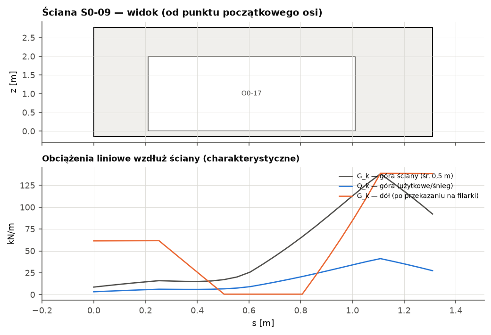

*Rys. Ściana S0-09: widok z otworami i rozkład obciążeń charakterystycznych wzdłuż osi.*

#### Zestawienie obciążeń

**Ciężar ściany — SW18 — Ściana wewnętrzna nośna: silikat 18, tynk gipsowy obustronnie**

| Warstwa | Obliczenie | g_k [kN/m²] | γ_G (6.10a) | g_d [kN/m²] | ξγ_G (6.10b) | g_d [kN/m²] |
|---|---|---|---|---|---|---|
| Tynk gipsowy maszynowy 1,5 cm | 1,5 cm × 11,77 kN/m³ | 0,177 | 1,35 | 0,238 | 1,15 | 0,203 |
| Bloczek wapienno-piaskowy (silikat) 18 cm, kl. 20, gr. 1, na zaprawie cienkowarstwowej | 18,0 cm × 18,00 kN/m³ | 3,240 | 1,35 | 4,374 | 1,15 | 3,718 |
| Tynk gipsowy maszynowy 1,5 cm | 1,5 cm × 11,77 kN/m³ | 0,177 | 1,35 | 0,238 | 1,15 | 0,203 |
| **Razem g_k** |  | 3,593 |  | 4,851 |  | 4,123 |

**Obciążenia ściany (charakterystyczne)** — góra: z płyt i ścian wyżej; dół: po przekazaniu obciążeń znad otworów na filarki

| Przypadek | max q_góra [kN/m] | średnio q_dół [kN/m] | max q_dół [kN/m] |
|---|---|---|---|
| G | 14,79 | 8,23 | 46,21 |
| H | 0,00 | 0,00 | 0,00 |
| QA | 5,59 | 2,13 | 12,38 |
| QA_pA | 5,56 | 2,08 | 12,09 |
| QA_pB | 0,00 | 0,00 | 0,00 |
| S1 | 0,00 | 0,00 | 0,00 |
| S2 | 0,00 | 0,00 | 0,00 |
| SB2 | 0,00 | 0,00 | 0,00 |

#### Obliczenia

##### S0-09 — filarek 0,00–0,21 m (b = 0,21 m), 6.10a (wiodące: H)

- Pole przekroju filarka: A = b·t = 0,21·0,18 = **0,038** m²
- Współczynnik η_A (A < 0,3 m²): η_A = (NA; interpolacja wg R5-63) = **2,00** *(NA do PN-EN 1996-1-1 [NZW])*
- Wytrzymałość charakterystyczna muru: f_k = K·f_b^0,85 = 0,60·20^0,85 = **7,66** MPa *((3.2) + NA tabl. NA.5 (K = 0,60, Ap2:2014-09))*
- Wytrzymałość obliczeniowa: f_d = f_k/γ_M · (1/η_A) = 7,66/1,7·0,500 = **2,25** MPa *(NA tabl. NA.1 (kat. I, zaprawa projektowana, klasa wykonania A))*
- Wysokość efektywna: h_ef = ρ₂·h = 1,000·2,93 = **2,930** m *((5.2), 5.5.1.2)*
- Smukłość: h_ef/t_ef = 2,930/0,180 = **16,28**
- Mimośród przypadkowy: e_init = h_ef/450 = 2930/450 = **6,5** mm *(5.5.1.1(4))*
- Mimośród na górze: e_g = M_g/N_g + e_init ≥ 0,05t = 0,24/27,1 + 0,0065 = **15,5** mm *((6.5))*
- Mimośród na dole: e_d = M_d/N_d + e_init ≥ 0,05t = 0,00/80,6 + 0,0065 = **9,0** mm *((6.5))*
- Współczynnik redukcyjny — góra: Φ_g = 1 − 2e_g/t = 1 − 2·15,5/180 = **0,828** *((6.4))*
- Współczynnik redukcyjny — dół: Φ_d = 1 − 2e_d/t = 1 − 2·9,0/180 = **0,900** *((6.4))*
- Mimośród w połowie wysokości: e_m = (M_md + M_w)/N_m + e_init = (0,12 + 0,00)/53,9 + 0,0065 = **8,8** mm *((6.7))*
- Mimośród od pełzania: e_k = 0,002·φ_∞·(h_ef/t_ef)·√(t·e_m) = 0,002·1,5·16,28·√(0,180·0,0088) = **1,9** mm *((6.8))*
- Mimośród całkowity: e_mk = e_m + e_k ≥ 0,05t = **10,7** mm *((6.6))*
- Współczynnik redukcyjny w połowie wysokości: Φ_m = A₁·exp(−u²/2), A₁ = 1 − 2e_mk/t, u = (λ − 0,063)/(0,73 − 1,17e_mk/t) = λ = 0,515, A₁ = 0,881, u = 0,684 = **0,697** *(zał. G (G.1–G.4), E = K_E·f_k)*
- Nośność: N_Rd = Φ·t·f_d = (góra / środek / dół) 0,828 / 0,697 / 0,900 · 180 mm · 2,25 MPa = **335,5 / 282,6 / 364,8** kN/m *((6.2))*

| Warunek | Efekt | Nośność / limit | η | Stan | Podstawa |
|---|---|---|---|---|---|
| Smukłość ściany | h_ef/t_ef = 16,3  | 27 = 27,0  | 60% | spełniony | 5.5.1.4 |
| Nośność — przekrój górny | N_Ed = 27,15 kN/m | N_Rd = 335,48 kN/m | 8% | spełniony | (6.2), (6.4) |
| Nośność — połowa wysokości | N_Ed = 53,89 kN/m | N_Rd = 282,56 kN/m | 19% | spełniony | (6.2), zał. G |
| Nośność — przekrój dolny | N_Ed = 80,63 kN/m | N_Rd = 364,81 kN/m | 22% | spełniony | (6.2), (6.4) |

> Filarek liczony jako ściana podparta górą i dołem, ρ₂ = 1,0 (bezpiecznie); siły N na 1 m = N/b.

#### Wnioski

**Przyjęto:** Mur: Bloczek wapienno-piaskowy (silikat) 18 cm, kl. 20, gr. 1, na zaprawie cienkowarstwowej, f_d = 4,50 MPa (klasa wykonania A, γ_M = 1,7).  

### Poz. 9.28 — Ściana S0-10 (P0, wewnętrzna nośna)

Element modelu: `S0-10` · maks. wykorzystanie nośności η = 60% · wszystkie warunki spełnione

#### Opis i schemat statyczny

Ściana gr. konstrukcyjnej t = 18 cm, długość osi 3,50 m, wysokość h = 2,930 m (z −0,150 do 2,780); materiał: Bloczek wapienno-piaskowy (silikat) 18 cm, kl. 20, gr. 1, na zaprawie cienkowarstwowej. Otwory: O0-18 (1,50 m).

Sprawdzono 1 odcinków (filarki ≤ 2 m między otworami — siła całkowita; dłuższe pasma — maks. średnia krocząca 1 m) dla 34 kombinacji; poniżej przypadek miarodajny. Mimośród reakcji stropu e = t/6 (zewn.) / 0,3·t/6 (wewn., niesymetria) [UPR]; wiatr jako moment w połowie wysokości w·h²/8.

*Rys. Ściana S0-10: widok z otworami i rozkład obciążeń charakterystycznych wzdłuż osi.*

#### Zestawienie obciążeń

**Ciężar ściany — SW18 — Ściana wewnętrzna nośna: silikat 18, tynk gipsowy obustronnie**

| Warstwa | Obliczenie | g_k [kN/m²] | γ_G (6.10a) | g_d [kN/m²] | ξγ_G (6.10b) | g_d [kN/m²] |
|---|---|---|---|---|---|---|
| Tynk gipsowy maszynowy 1,5 cm | 1,5 cm × 11,77 kN/m³ | 0,177 | 1,35 | 0,238 | 1,15 | 0,203 |
| Bloczek wapienno-piaskowy (silikat) 18 cm, kl. 20, gr. 1, na zaprawie cienkowarstwowej | 18,0 cm × 18,00 kN/m³ | 3,240 | 1,35 | 4,374 | 1,15 | 3,718 |
| Tynk gipsowy maszynowy 1,5 cm | 1,5 cm × 11,77 kN/m³ | 0,177 | 1,35 | 0,238 | 1,15 | 0,203 |
| **Razem g_k** |  | 3,593 |  | 4,851 |  | 4,123 |

**Obciążenia ściany (charakterystyczne)** — góra: z płyt i ścian wyżej; dół: po przekazaniu obciążeń znad otworów na filarki

| Przypadek | max q_góra [kN/m] | średnio q_dół [kN/m] | max q_dół [kN/m] |
|---|---|---|---|
| G | 197,63 | 43,61 | 131,79 |
| H | 5,91 | 0,98 | 3,39 |
| QA | 33,42 | 9,49 | 36,22 |
| QA_pA | 6,90 | 2,34 | 13,34 |
| QA_pB | 28,48 | 7,48 | 22,95 |
| S1 | 10,01 | 1,58 | 5,28 |
| S2 | 11,15 | 1,80 | 6,09 |
| SB2 | 4,95 | 0,97 | 3,79 |

#### Obliczenia

##### S0-10 — filarek 1,90–3,50 m (b = 1,60 m), 6.10a (wiodące: QA)

- Pole przekroju filarka: A = b·t = 1,60·0,18 = **0,288** m²
- Współczynnik η_A (A < 0,3 m²): η_A = (NA; interpolacja wg R5-63) = **1,03** *(NA do PN-EN 1996-1-1 [NZW])*
- Wytrzymałość charakterystyczna muru: f_k = K·f_b^0,85 = 0,60·20^0,85 = **7,66** MPa *((3.2) + NA tabl. NA.5 (K = 0,60, Ap2:2014-09))*
- Wytrzymałość obliczeniowa: f_d = f_k/γ_M · (1/η_A) = 7,66/1,7·0,971 = **4,37** MPa *(NA tabl. NA.1 (kat. I, zaprawa projektowana, klasa wykonania A))*
- Wysokość efektywna: h_ef = ρ₂·h = 1,000·2,93 = **2,930** m *((5.2), 5.5.1.2)*
- Smukłość: h_ef/t_ef = 2,930/0,180 = **16,28**
- Mimośród przypadkowy: e_init = h_ef/450 = 2930/450 = **6,5** mm *(5.5.1.1(4))*
- Mimośród na górze: e_g = M_g/N_g + e_init ≥ 0,05t = 0,06/85,9 + 0,0065 = **9,0** mm *((6.5))*
- Mimośród na dole: e_d = M_d/N_d + e_init ≥ 0,05t = 0,00/152,9 + 0,0065 = **9,0** mm *((6.5))*
- Współczynnik redukcyjny — góra: Φ_g = 1 − 2e_g/t = 1 − 2·9,0/180 = **0,900** *((6.4))*
- Współczynnik redukcyjny — dół: Φ_d = 1 − 2e_d/t = 1 − 2·9,0/180 = **0,900** *((6.4))*
- Mimośród w połowie wysokości: e_m = (M_md + M_w)/N_m + e_init = (0,03 + 0,00)/119,4 + 0,0065 = **6,8** mm *((6.7))*
- Mimośród od pełzania: e_k = 0,002·φ_∞·(h_ef/t_ef)·√(t·e_m) = 0,002·1,5·16,28·√(0,180·0,0068) = **1,7** mm *((6.8))*
- Mimośród całkowity: e_mk = e_m + e_k ≥ 0,05t = **9,0** mm *((6.6))*
- Współczynnik redukcyjny w połowie wysokości: Φ_m = A₁·exp(−u²/2), A₁ = 1 − 2e_mk/t, u = (λ − 0,063)/(0,73 − 1,17e_mk/t) = λ = 0,515, A₁ = 0,900, u = 0,673 = **0,718** *(zał. G (G.1–G.4), E = K_E·f_k)*
- Nośność: N_Rd = Φ·t·f_d = (góra / środek / dół) 0,900 / 0,718 / 0,900 · 180 mm · 4,37 MPa = **708,4 / 564,9 / 708,4** kN/m *((6.2))*

| Warunek | Efekt | Nośność / limit | η | Stan | Podstawa |
|---|---|---|---|---|---|
| Smukłość ściany | h_ef/t_ef = 16,3  | 27 = 27,0  | 60% | spełniony | 5.5.1.4 |
| Nośność — przekrój górny | N_Ed = 85,93 kN/m | N_Rd = 708,36 kN/m | 12% | spełniony | (6.2), (6.4) |
| Nośność — połowa wysokości | N_Ed = 119,40 kN/m | N_Rd = 564,91 kN/m | 21% | spełniony | (6.2), zał. G |
| Nośność — przekrój dolny | N_Ed = 152,88 kN/m | N_Rd = 708,36 kN/m | 22% | spełniony | (6.2), (6.4) |

> Filarek liczony jako ściana podparta górą i dołem, ρ₂ = 1,0 (bezpiecznie); siły N na 1 m = N/b.

#### Wnioski

**Przyjęto:** Mur: Bloczek wapienno-piaskowy (silikat) 18 cm, kl. 20, gr. 1, na zaprawie cienkowarstwowej, f_d = 4,50 MPa (klasa wykonania A, γ_M = 1,7).  

### Poz. 9.29 — Ściana S0-11 (P0, wewnętrzna nośna)

Element modelu: `S0-11` · maks. wykorzystanie nośności η = 60% · wszystkie warunki spełnione

#### Opis i schemat statyczny

Ściana gr. konstrukcyjnej t = 18 cm, długość osi 3,62 m, wysokość h = 2,930 m (z −0,150 do 2,780); materiał: Bloczek wapienno-piaskowy (silikat) 18 cm, kl. 20, gr. 1, na zaprawie cienkowarstwowej. Otwory: O0-15 (0,90 m).

Sprawdzono 2 odcinków (filarki ≤ 2 m między otworami — siła całkowita; dłuższe pasma — maks. średnia krocząca 1 m) dla 34 kombinacji; poniżej przypadek miarodajny. Mimośród reakcji stropu e = t/6 (zewn.) / 0,3·t/6 (wewn., niesymetria) [UPR]; wiatr jako moment w połowie wysokości w·h²/8.

*Rys. Ściana S0-11: widok z otworami i rozkład obciążeń charakterystycznych wzdłuż osi.*

#### Zestawienie obciążeń

**Ciężar ściany — SW18 — Ściana wewnętrzna nośna: silikat 18, tynk gipsowy obustronnie**

| Warstwa | Obliczenie | g_k [kN/m²] | γ_G (6.10a) | g_d [kN/m²] | ξγ_G (6.10b) | g_d [kN/m²] |
|---|---|---|---|---|---|---|
| Tynk gipsowy maszynowy 1,5 cm | 1,5 cm × 11,77 kN/m³ | 0,177 | 1,35 | 0,238 | 1,15 | 0,203 |
| Bloczek wapienno-piaskowy (silikat) 18 cm, kl. 20, gr. 1, na zaprawie cienkowarstwowej | 18,0 cm × 18,00 kN/m³ | 3,240 | 1,35 | 4,374 | 1,15 | 3,718 |
| Tynk gipsowy maszynowy 1,5 cm | 1,5 cm × 11,77 kN/m³ | 0,177 | 1,35 | 0,238 | 1,15 | 0,203 |
| **Razem g_k** |  | 3,593 |  | 4,851 |  | 4,123 |

**Obciążenia ściany (charakterystyczne)** — góra: z płyt i ścian wyżej; dół: po przekazaniu obciążeń znad otworów na filarki

| Przypadek | max q_góra [kN/m] | średnio q_dół [kN/m] | max q_dół [kN/m] |
|---|---|---|---|
| G | 21,11 | 28,49 | 80,82 |
| H | 0,71 | 0,51 | 1,08 |
| QA | 3,64 | 0,55 | 7,37 |
| QA_pA | 7,51 | 2,01 | 17,69 |
| QA_pB | 3,42 | 2,72 | 7,42 |
| S1 | 1,28 | 0,91 | 1,94 |
| S2 | 1,87 | 1,34 | 2,89 |
| SB2 | 2,56 | 1,85 | 4,10 |

#### Obliczenia

##### S0-11 — filarek 0,09–0,20 m (b = 0,11 m), 6.10a (wiodące: QA_pA)

- Pole przekroju filarka: A = b·t = 0,11·0,18 = **0,020** m²
- Współczynnik η_A (A < 0,3 m²): η_A = (NA; interpolacja wg R5-63) = **2,00** *(NA do PN-EN 1996-1-1 [NZW])*
- Wytrzymałość charakterystyczna muru: f_k = K·f_b^0,85 = 0,60·20^0,85 = **7,66** MPa *((3.2) + NA tabl. NA.5 (K = 0,60, Ap2:2014-09))*
- Wytrzymałość obliczeniowa: f_d = f_k/γ_M · (1/η_A) = 7,66/1,7·0,500 = **2,25** MPa *(NA tabl. NA.1 (kat. I, zaprawa projektowana, klasa wykonania A))*
- Wysokość efektywna: h_ef = ρ₂·h = 1,000·2,93 = **2,930** m *((5.2), 5.5.1.2)*
- Smukłość: h_ef/t_ef = 2,930/0,180 = **16,28**
- Mimośród przypadkowy: e_init = h_ef/450 = 2930/450 = **6,5** mm *(5.5.1.1(4))*
- Mimośród na górze: e_g = M_g/N_g + e_init ≥ 0,05t = 0,00/50,3 + 0,0065 = **9,0** mm *((6.5))*
- Mimośród na dole: e_d = M_d/N_d + e_init ≥ 0,05t = 0,00/177,9 + 0,0065 = **9,0** mm *((6.5))*
- Współczynnik redukcyjny — góra: Φ_g = 1 − 2e_g/t = 1 − 2·9,0/180 = **0,900** *((6.4))*
- Współczynnik redukcyjny — dół: Φ_d = 1 − 2e_d/t = 1 − 2·9,0/180 = **0,900** *((6.4))*
- Mimośród w połowie wysokości: e_m = (M_md + M_w)/N_m + e_init = (0,00 + 0,00)/114,1 + 0,0065 = **6,5** mm *((6.7))*
- Mimośród od pełzania: e_k = 0,002·φ_∞·(h_ef/t_ef)·√(t·e_m) = 0,002·1,5·16,28·√(0,180·0,0065) = **1,7** mm *((6.8))*
- Mimośród całkowity: e_mk = e_m + e_k ≥ 0,05t = **9,0** mm *((6.6))*
- Współczynnik redukcyjny w połowie wysokości: Φ_m = A₁·exp(−u²/2), A₁ = 1 − 2e_mk/t, u = (λ − 0,063)/(0,73 − 1,17e_mk/t) = λ = 0,515, A₁ = 0,900, u = 0,673 = **0,718** *(zał. G (G.1–G.4), E = K_E·f_k)*
- Nośność: N_Rd = Φ·t·f_d = (góra / środek / dół) 0,900 / 0,718 / 0,900 · 180 mm · 2,25 MPa = **364,8 / 290,9 / 364,8** kN/m *((6.2))*

| Warunek | Efekt | Nośność / limit | η | Stan | Podstawa |
|---|---|---|---|---|---|
| Smukłość ściany | h_ef/t_ef = 16,3  | 27 = 27,0  | 60% | spełniony | 5.5.1.4 |
| Nośność — przekrój górny | N_Ed = 50,28 kN/m | N_Rd = 364,81 kN/m | 14% | spełniony | (6.2), (6.4) |
| Nośność — połowa wysokości | N_Ed = 114,09 kN/m | N_Rd = 290,93 kN/m | 39% | spełniony | (6.2), zał. G |
| Nośność — przekrój dolny | N_Ed = 177,91 kN/m | N_Rd = 364,81 kN/m | 49% | spełniony | (6.2), (6.4) |

> Filarek liczony jako ściana podparta górą i dołem, ρ₂ = 1,0 (bezpiecznie); siły N na 1 m = N/b.

#### Wnioski

**Przyjęto:** Mur: Bloczek wapienno-piaskowy (silikat) 18 cm, kl. 20, gr. 1, na zaprawie cienkowarstwowej, f_d = 4,50 MPa (klasa wykonania A, γ_M = 1,7).  

### Poz. 9.30 — Ściana S0-12 (P0, wewnętrzna nośna)

Element modelu: `S0-12` · maks. wykorzystanie nośności η = 32% · wszystkie warunki spełnione

#### Opis i schemat statyczny

Ściana gr. konstrukcyjnej t = 18 cm, długość osi 3,62 m, wysokość h = 2,930 m (z −0,150 do 2,780); materiał: Żelbet C25/30, B500SP (stropy, płyta fundamentowa, ściany). Otwory: brak.

#### Zestawienie obciążeń

**Ciężar ściany — SWZB — Ściana wewnętrzna nośna żelbetowa 18 cm (trzon klatki na P0 — usztywnienie w kierunku x, J2)**

| Warstwa | Obliczenie | g_k [kN/m²] | γ_G (6.10a) | g_d [kN/m²] | ξγ_G (6.10b) | g_d [kN/m²] |
|---|---|---|---|---|---|---|
| Tynk gipsowy maszynowy 1,5 cm | 1,5 cm × 11,77 kN/m³ | 0,177 | 1,35 | 0,238 | 1,15 | 0,203 |
| Żelbet C25/30, B500SP (stropy, płyta fundamentowa, ściany) | 18,0 cm × 25,00 kN/m³ | 4,500 | 1,35 | 6,075 | 1,15 | 5,164 |
| Tynk gipsowy maszynowy 1,5 cm | 1,5 cm × 11,77 kN/m³ | 0,177 | 1,35 | 0,238 | 1,15 | 0,203 |
| **Razem g_k** |  | 4,853 |  | 6,552 |  | 5,569 |

**Obciążenia ściany (charakterystyczne)** — góra: z płyt i ścian wyżej; dół: po przekazaniu obciążeń znad otworów na filarki

| Przypadek | max q_góra [kN/m] | średnio q_dół [kN/m] | max q_dół [kN/m] |
|---|---|---|---|
| G | 752,10 | 44,69 | 766,32 |
| H | 56,20 | 0,78 | 56,20 |
| QA | 15,00 | 2,32 | 15,00 |
| QA_pA | 17,28 | 2,96 | 17,28 |
| QA_pB | 3,46 | 2,43 | 3,46 |
| S1 | 90,83 | 1,26 | 90,83 |
| S2 | 90,83 | 1,26 | 90,83 |
| SB2 | 0,00 | 0,00 | 0,00 |

#### Obliczenia

##### S0-12 — ściana żelbetowa, pasmo 1,0 m (ściskanie mimośrodowe, 5.8)

- Długość obliczeniowa (układ usztywniony, końce przegubowe): l₀ = β·L = 1,0·2,93 = **2,93** m *(5.8.3.2 [ZAŁ])*
- Smukłość (kierunek słabszy, h = grubość muru): λ = l₀/i, i = h/√12 = 2,93/(0,180/√12) = **56,4** *((5.14))*
- Siła względna: n = N_Ed/(A_c·f_cd) = 110,4/(0,1800·17,86·10³) = **0,034**
- Smukłość graniczna: λ_lim = 20·A·B·C/√n (A = 0,7; B = 1,1; C = 0,7) = 10,78/√0,034 = **58,2** *((5.13N) [NZW NA])*
- Mimośród I rzędu (imperfekcja l₀/400, min. e₀ = max(h/30; 20 mm)): e₁ = max(e_i + M₀/N; e₀) = max(7,3 + 0,0; 20,0) = **20,0** mm *(5.2(7), 6.1(4))*
- Efekty II rzędu: λ ≤ λ_lim = 56,4 ≤ 58,2 = **pominięte** *(5.8.3.1(1))*
- Moment obliczeniowy: M_Ed = N_Ed·(e₁ + e₂) = 110,4·(20,0 + 0,0)·10⁻³ = **2,21** kNm *((5.31))*
- Zbrojenie podłużne (symetryczne, przy dłuższych bokach): 2 × k·φ = 2 × 5φ12 = **1131** mm²
- Nośność przekroju przy N_Ed: M_Rd(N_Ed) — zgodność odkształceń, prostokątny wykres σ = **43,44** kNm *(6.1, 3.1.7(3))*
- Strzemiona: φ_t ≥ max(6; φ/4); s ≤ min(20φ; b_min; 400); 0,6·s przy belce/płycie = **φ6 co 180 mm (przy końcach co 100 mm)** *(9.5.3)*

| Warunek | Efekt | Nośność / limit | η | Stan | Podstawa |
|---|---|---|---|---|---|
| Nośność słupa — ściskanie mimośrodowe z efektami II rzędu | M_Ed = 2,21 kNm | M_Rd(N_Ed) = 43,44 kNm | 5% | spełniony | PN-EN 1992-1-1 5.8.8, 6.1 |
| Nośność na ściskanie osiowe | N_Ed = 110,4 kN | N_Rd,max = 3666,7 kN | 3% | spełniony | (6.1), 3.1.7(3) |
| Zbrojenie minimalne (9.5.2(2)) | A_s,min = 360 mm² | A_s,prov = 1131 mm² | 32% | spełniony | (9.12N) |

#### Wnioski

**Przyjęto:** Ściana ŻB t = 18 cm, C25/30: pionowo 10φ12/m (po połowie przy licach), poziomo φ8 co 35 cm przy obu licach (9.6.3); N_Ed = 110,4 kN/m.  

### Poz. 9.31 — Ściana S0-13 (P0, wewnętrzna nośna)

Element modelu: `S0-13` · maks. wykorzystanie nośności η = 32% · wszystkie warunki spełnione

#### Opis i schemat statyczny

Ściana gr. konstrukcyjnej t = 18 cm, długość osi 3,62 m, wysokość h = 2,930 m (z −0,150 do 2,780); materiał: Żelbet C25/30, B500SP (stropy, płyta fundamentowa, ściany). Otwory: brak.

#### Zestawienie obciążeń

**Ciężar ściany — SWZB — Ściana wewnętrzna nośna żelbetowa 18 cm (trzon klatki na P0 — usztywnienie w kierunku x, J2)**

| Warstwa | Obliczenie | g_k [kN/m²] | γ_G (6.10a) | g_d [kN/m²] | ξγ_G (6.10b) | g_d [kN/m²] |
|---|---|---|---|---|---|---|
| Tynk gipsowy maszynowy 1,5 cm | 1,5 cm × 11,77 kN/m³ | 0,177 | 1,35 | 0,238 | 1,15 | 0,203 |
| Żelbet C25/30, B500SP (stropy, płyta fundamentowa, ściany) | 18,0 cm × 25,00 kN/m³ | 4,500 | 1,35 | 6,075 | 1,15 | 5,164 |
| Tynk gipsowy maszynowy 1,5 cm | 1,5 cm × 11,77 kN/m³ | 0,177 | 1,35 | 0,238 | 1,15 | 0,203 |
| **Razem g_k** |  | 4,853 |  | 6,552 |  | 5,569 |

**Obciążenia ściany (charakterystyczne)** — góra: z płyt i ścian wyżej; dół: po przekazaniu obciążeń znad otworów na filarki

| Przypadek | max q_góra [kN/m] | średnio q_dół [kN/m] | max q_dół [kN/m] |
|---|---|---|---|
| G | 923,44 | 47,13 | 937,66 |
| H | 69,61 | 1,31 | 69,61 |
| QA | 17,53 | 2,23 | 17,53 |
| QA_pA | 17,80 | 2,68 | 17,80 |
| QA_pB | 8,78 | 3,99 | 8,78 |
| S1 | 113,24 | 2,20 | 113,24 |
| S2 | 113,33 | 2,47 | 113,33 |
| SB2 | 1,82 | 1,29 | 1,82 |

#### Obliczenia

##### S0-13 — ściana żelbetowa, pasmo 1,0 m (ściskanie mimośrodowe, 5.8)

- Długość obliczeniowa (układ usztywniony, końce przegubowe): l₀ = β·L = 1,0·2,93 = **2,93** m *(5.8.3.2 [ZAŁ])*
- Smukłość (kierunek słabszy, h = grubość muru): λ = l₀/i, i = h/√12 = 2,93/(0,180/√12) = **56,4** *((5.14))*
- Siła względna: n = N_Ed/(A_c·f_cd) = 122,3/(0,1800·17,86·10³) = **0,038**
- Smukłość graniczna: λ_lim = 20·A·B·C/√n (A = 0,7; B = 1,1; C = 0,7) = 10,78/√0,038 = **55,3** *((5.13N) [NZW NA])*
- Mimośród I rzędu (imperfekcja l₀/400, min. e₀ = max(h/30; 20 mm)): e₁ = max(e_i + M₀/N; e₀) = max(7,3 + 0,0; 20,0) = **20,0** mm *(5.2(7), 6.1(4))*
- Mimośród II rzędu (metoda nominalnej krzywizny, K_φ z φ_ef ≈ 0,7·φ(∞,t₀) [ZAŁ]): e₂ = (1/r)·l₀²/10, 1/r = K_r·K_φ·ε_yd/(0,45·d) = **32,7** mm *(5.8.8.2–5.8.8.3)*
- Moment obliczeniowy: M_Ed = N_Ed·(e₁ + e₂) = 122,3·(20,0 + 32,7)·10⁻³ = **6,44** kNm *((5.31))*
- Zbrojenie podłużne (symetryczne, przy dłuższych bokach): 2 × k·φ = 2 × 5φ12 = **1131** mm²
- Nośność przekroju przy N_Ed: M_Rd(N_Ed) — zgodność odkształceń, prostokątny wykres σ = **44,19** kNm *(6.1, 3.1.7(3))*
- Strzemiona: φ_t ≥ max(6; φ/4); s ≤ min(20φ; b_min; 400); 0,6·s przy belce/płycie = **φ6 co 180 mm (przy końcach co 100 mm)** *(9.5.3)*

| Warunek | Efekt | Nośność / limit | η | Stan | Podstawa |
|---|---|---|---|---|---|
| Nośność słupa — ściskanie mimośrodowe z efektami II rzędu | M_Ed = 6,44 kNm | M_Rd(N_Ed) = 44,19 kNm | 15% | spełniony | PN-EN 1992-1-1 5.8.8, 6.1 |
| Nośność na ściskanie osiowe | N_Ed = 122,3 kN | N_Rd,max = 3666,7 kN | 3% | spełniony | (6.1), 3.1.7(3) |
| Zbrojenie minimalne (9.5.2(2)) | A_s,min = 360 mm² | A_s,prov = 1131 mm² | 32% | spełniony | (9.12N) |

#### Wnioski

**Przyjęto:** Ściana ŻB t = 18 cm, C25/30: pionowo 10φ12/m (po połowie przy licach), poziomo φ8 co 35 cm przy obu licach (9.6.3); N_Ed = 122,3 kN/m.  

### Poz. 9.32 — Ściana S0-15 (P0, wewnętrzna nośna)

Element modelu: `S0-15` · maks. wykorzystanie nośności η = 60% · wszystkie warunki spełnione

#### Opis i schemat statyczny

Ściana gr. konstrukcyjnej t = 18 cm, długość osi 2,88 m, wysokość h = 2,930 m (z −0,150 do 2,780); materiał: Bloczek wapienno-piaskowy (silikat) 18 cm, kl. 20, gr. 1, na zaprawie cienkowarstwowej. Otwory: O0-21 (0,90 m).

Sprawdzono 1 odcinków (filarki ≤ 2 m między otworami — siła całkowita; dłuższe pasma — maks. średnia krocząca 1 m) dla 34 kombinacji; poniżej przypadek miarodajny. Mimośród reakcji stropu e = t/6 (zewn.) / 0,3·t/6 (wewn., niesymetria) [UPR]; wiatr jako moment w połowie wysokości w·h²/8.

*Rys. Ściana S0-15: widok z otworami i rozkład obciążeń charakterystycznych wzdłuż osi.*

#### Zestawienie obciążeń

**Ciężar ściany — SW18 — Ściana wewnętrzna nośna: silikat 18, tynk gipsowy obustronnie**

| Warstwa | Obliczenie | g_k [kN/m²] | γ_G (6.10a) | g_d [kN/m²] | ξγ_G (6.10b) | g_d [kN/m²] |
|---|---|---|---|---|---|---|
| Tynk gipsowy maszynowy 1,5 cm | 1,5 cm × 11,77 kN/m³ | 0,177 | 1,35 | 0,238 | 1,15 | 0,203 |
| Bloczek wapienno-piaskowy (silikat) 18 cm, kl. 20, gr. 1, na zaprawie cienkowarstwowej | 18,0 cm × 18,00 kN/m³ | 3,240 | 1,35 | 4,374 | 1,15 | 3,718 |
| Tynk gipsowy maszynowy 1,5 cm | 1,5 cm × 11,77 kN/m³ | 0,177 | 1,35 | 0,238 | 1,15 | 0,203 |
| **Razem g_k** |  | 3,593 |  | 4,851 |  | 4,123 |

**Obciążenia ściany (charakterystyczne)** — góra: z płyt i ścian wyżej; dół: po przekazaniu obciążeń znad otworów na filarki

| Przypadek | max q_góra [kN/m] | średnio q_dół [kN/m] | max q_dół [kN/m] |
|---|---|---|---|
| G | 177,99 | 50,12 | 188,52 |
| H | 3,03 | 0,34 | 1,66 |
| QA | 35,31 | 7,29 | 35,31 |
| QA_pA | 24,88 | 6,24 | 24,88 |
| QA_pB | 22,52 | 3,16 | 17,46 |
| S1 | 3,25 | 0,46 | 2,07 |
| S2 | 3,49 | 0,53 | 2,49 |
| SB2 | 0,73 | 0,22 | 1,24 |

#### Obliczenia

##### S0-15 — filarek 1,25–2,88 m (b = 1,62 m), 6.10a (wiodące: QA)

- Pole przekroju filarka: A = b·t = 1,62·0,18 = **0,292** m²
- Współczynnik η_A (A < 0,3 m²): η_A = (NA; interpolacja wg R5-63) = **1,02** *(NA do PN-EN 1996-1-1 [NZW])*
- Wytrzymałość charakterystyczna muru: f_k = K·f_b^0,85 = 0,60·20^0,85 = **7,66** MPa *((3.2) + NA tabl. NA.5 (K = 0,60, Ap2:2014-09))*
- Wytrzymałość obliczeniowa: f_d = f_k/γ_M · (1/η_A) = 7,66/1,7·0,982 = **4,42** MPa *(NA tabl. NA.1 (kat. I, zaprawa projektowana, klasa wykonania A))*
- Wysokość efektywna: h_ef = ρ₂·h = 1,000·2,93 = **2,930** m *((5.2), 5.5.1.2)*
- Smukłość: h_ef/t_ef = 2,930/0,180 = **16,28**
- Mimośród przypadkowy: e_init = h_ef/450 = 2930/450 = **6,5** mm *(5.5.1.1(4))*
- Mimośród na górze: e_g = M_g/N_g + e_init ≥ 0,05t = 0,64/87,0 + 0,0065 = **13,9** mm *((6.5))*
- Mimośród na dole: e_d = M_d/N_d + e_init ≥ 0,05t = 0,00/133,6 + 0,0065 = **9,0** mm *((6.5))*
- Współczynnik redukcyjny — góra: Φ_g = 1 − 2e_g/t = 1 − 2·13,9/180 = **0,846** *((6.4))*
- Współczynnik redukcyjny — dół: Φ_d = 1 − 2e_d/t = 1 − 2·9,0/180 = **0,900** *((6.4))*
- Mimośród w połowie wysokości: e_m = (M_md + M_w)/N_m + e_init = (0,32 + 0,00)/110,3 + 0,0065 = **9,4** mm *((6.7))*
- Mimośród od pełzania: e_k = 0,002·φ_∞·(h_ef/t_ef)·√(t·e_m) = 0,002·1,5·16,28·√(0,180·0,0094) = **2,0** mm *((6.8))*
- Mimośród całkowity: e_mk = e_m + e_k ≥ 0,05t = **11,4** mm *((6.6))*
- Współczynnik redukcyjny w połowie wysokości: Φ_m = A₁·exp(−u²/2), A₁ = 1 − 2e_mk/t, u = (λ − 0,063)/(0,73 − 1,17e_mk/t) = λ = 0,515, A₁ = 0,873, u = 0,689 = **0,689** *(zał. G (G.1–G.4), E = K_E·f_k)*
- Nośność: N_Rd = Φ·t·f_d = (góra / środek / dół) 0,846 / 0,689 / 0,900 · 180 mm · 4,42 MPa = **673,2 / 548,0 / 716,2** kN/m *((6.2))*

| Warunek | Efekt | Nośność / limit | η | Stan | Podstawa |
|---|---|---|---|---|---|
| Smukłość ściany | h_ef/t_ef = 16,3  | 27 = 27,0  | 60% | spełniony | 5.5.1.4 |
| Nośność — przekrój górny | N_Ed = 87,00 kN/m | N_Rd = 673,23 kN/m | 13% | spełniony | (6.2), (6.4) |
| Nośność — połowa wysokości | N_Ed = 110,28 kN/m | N_Rd = 548,04 kN/m | 20% | spełniony | (6.2), zał. G |
| Nośność — przekrój dolny | N_Ed = 133,56 kN/m | N_Rd = 716,18 kN/m | 19% | spełniony | (6.2), (6.4) |

> Filarek liczony jako ściana podparta górą i dołem, ρ₂ = 1,0 (bezpiecznie); siły N na 1 m = N/b.

#### Wnioski

**Przyjęto:** Mur: Bloczek wapienno-piaskowy (silikat) 18 cm, kl. 20, gr. 1, na zaprawie cienkowarstwowej, f_d = 4,50 MPa (klasa wykonania A, γ_M = 1,7).  

### Poz. 9.33 — Ściana S0-16 (P0, wewnętrzna nośna)

Element modelu: `S0-16` · maks. wykorzystanie nośności η = 45% · wszystkie warunki spełnione

#### Opis i schemat statyczny

Ściana gr. konstrukcyjnej t = 18 cm, długość osi 5,88 m, wysokość h = 2,930 m (z −0,150 do 2,780); materiał: Bloczek wapienno-piaskowy (silikat) 18 cm, kl. 20, gr. 1, na zaprawie cienkowarstwowej. Otwory: O0-24 (0,90 m).

Sprawdzono 2 odcinków (filarki ≤ 2 m między otworami — siła całkowita; dłuższe pasma — maks. średnia krocząca 1 m) dla 34 kombinacji; poniżej przypadek miarodajny. Mimośród reakcji stropu e = t/6 (zewn.) / 0,3·t/6 (wewn., niesymetria) [UPR]; wiatr jako moment w połowie wysokości w·h²/8.

*Rys. Ściana S0-16: widok z otworami i rozkład obciążeń charakterystycznych wzdłuż osi.*

#### Zestawienie obciążeń

**Ciężar ściany — SWG — Ściana nośna dom–garaż nieogrzewany: silikat 18 + wełna 12 cm od strony garażu + tynk (U = 0,27 ≤ 0,30; szczelna na spaliny)**

| Warstwa | Obliczenie | g_k [kN/m²] | γ_G (6.10a) | g_d [kN/m²] | ξγ_G (6.10b) | g_d [kN/m²] |
|---|---|---|---|---|---|---|
| Tynk gipsowy maszynowy 1,5 cm | 1,5 cm × 11,77 kN/m³ | 0,177 | 1,35 | 0,238 | 1,15 | 0,203 |
| Bloczek wapienno-piaskowy (silikat) 18 cm, kl. 20, gr. 1, na zaprawie cienkowarstwowej | 18,0 cm × 18,00 kN/m³ | 3,240 | 1,35 | 4,374 | 1,15 | 3,718 |
| Wełna mineralna 035 (szkielet, docieplenia, ściana dom–garaż) | 12,0 cm × 0,39 kN/m³ | 0,047 | 1,35 | 0,064 | 1,15 | 0,054 |
| Tynk cementowo-wapienny 1,5 cm (garaż, pom. techniczne) | 1,0 cm × 18,15 kN/m³ | 0,181 | 1,35 | 0,245 | 1,15 | 0,208 |
| **Razem g_k** |  | 3,645 |  | 4,921 |  | 4,183 |

**Obciążenia ściany (charakterystyczne)** — góra: z płyt i ścian wyżej; dół: po przekazaniu obciążeń znad otworów na filarki

| Przypadek | max q_góra [kN/m] | średnio q_dół [kN/m] | max q_dół [kN/m] |
|---|---|---|---|
| G | 187,99 | 95,09 | 205,76 |
| H | 7,50 | 2,89 | 9,58 |
| QA | 43,14 | 6,25 | 43,14 |
| QA_pA | 27,18 | 3,08 | 27,18 |
| QA_pB | 19,28 | 4,38 | 19,28 |
| S1 | 13,67 | 5,22 | 17,42 |
| S2 | 23,00 | 8,39 | 29,28 |
| SB2 | 27,82 | 9,60 | 35,58 |

#### Obliczenia

##### S0-16 — ściana (odcinek 0,00–2,73 m), 6.10a (wiodące: QA_pB)

- Wytrzymałość charakterystyczna muru: f_k = K·f_b^0,85 = 0,60·20^0,85 = **7,66** MPa *((3.2) + NA tabl. NA.5 (K = 0,60, Ap2:2014-09))*
- Wytrzymałość obliczeniowa: f_d = f_k/γ_M = 7,66/1,7 = **4,50** MPa *(NA tabl. NA.1 (kat. I, zaprawa projektowana, klasa wykonania A))*
- Wysokość efektywna: h_ef = ρ₂·h = 0,750·2,93 = **2,197** m *((5.2), 5.5.1.2)*
- Smukłość: h_ef/t_ef = 2,197/0,180 = **12,21**
- Mimośród przypadkowy: e_init = h_ef/450 = 2198/450 = **4,9** mm *(5.5.1.1(4))*
- Mimośród na górze: e_g = M_g/N_g + e_init ≥ 0,05t = 1,55/281,1 + 0,0049 = **10,4** mm *((6.5))*
- Mimośród na dole: e_d = M_d/N_d + e_init ≥ 0,05t = 0,00/248,0 + 0,0049 = **9,0** mm *((6.5))*
- Współczynnik redukcyjny — góra: Φ_g = 1 − 2e_g/t = 1 − 2·10,4/180 = **0,884** *((6.4))*
- Współczynnik redukcyjny — dół: Φ_d = 1 − 2e_d/t = 1 − 2·9,0/180 = **0,900** *((6.4))*
- Mimośród w połowie wysokości: e_m = (M_md + M_w)/N_m + e_init = (0,77 + 0,00)/264,5 + 0,0049 = **7,8** mm *((6.7))*
- Mimośród od pełzania: e_k = 0 (h_ef/t_ef ≤ λ_c) = **0,0** mm *(6.1.2.2(2) [NZW NA])*
- Mimośród całkowity: e_mk = e_m + e_k ≥ 0,05t = **9,0** mm *((6.6))*
- Współczynnik redukcyjny w połowie wysokości: Φ_m = A₁·exp(−u²/2), A₁ = 1 − 2e_mk/t, u = (λ − 0,063)/(0,73 − 1,17e_mk/t) = λ = 0,386, A₁ = 0,900, u = 0,481 = **0,802** *(zał. G (G.1–G.4), E = K_E·f_k)*
- Nośność: N_Rd = Φ·t·f_d = (góra / środek / dół) 0,884 / 0,802 / 0,900 · 180 mm · 4,50 MPa = **717,0 / 649,9 / 729,6** kN/m *((6.2))*

| Warunek | Efekt | Nośność / limit | η | Stan | Podstawa |
|---|---|---|---|---|---|
| Smukłość ściany | h_ef/t_ef = 12,2  | 27 = 27,0  | 45% | spełniony | 5.5.1.4 |
| Nośność — przekrój górny | N_Ed = 281,09 kN/m | N_Rd = 717,04 kN/m | 39% | spełniony | (6.2), (6.4) |
| Nośność — połowa wysokości | N_Ed = 264,54 kN/m | N_Rd = 649,88 kN/m | 41% | spełniony | (6.2), zał. G |
| Nośność — przekrój dolny | N_Ed = 247,98 kN/m | N_Rd = 729,61 kN/m | 34% | spełniony | (6.2), (6.4) |

#### Wnioski

**Przyjęto:** Mur: Bloczek wapienno-piaskowy (silikat) 18 cm, kl. 20, gr. 1, na zaprawie cienkowarstwowej, f_d = 4,50 MPa (klasa wykonania A, γ_M = 1,7).  

### Poz. 9.34 — Ściana S0-02 (P0, zewnętrzna nośna)

Element modelu: `S0-02` · maks. wykorzystanie nośności η = 72% · wszystkie warunki spełnione

#### Opis i schemat statyczny

Ściana gr. konstrukcyjnej t = 18 cm, długość osi 6,38 m, wysokość h = 2,910 m (z −0,150 do 2,760); materiał: Bloczek wapienno-piaskowy (silikat) 18 cm, kl. 20, gr. 1, na zaprawie cienkowarstwowej. Otwory: O0-06 (0,90 m).

Sprawdzono 2 odcinków (filarki ≤ 2 m między otworami — siła całkowita; dłuższe pasma — maks. średnia krocząca 1 m) dla 44 kombinacji; poniżej przypadek miarodajny. Mimośród reakcji stropu e = t/6 (zewn.) / 0,3·t/6 (wewn., niesymetria) [UPR]; wiatr jako moment w połowie wysokości w·h²/8.

*Rys. Ściana S0-02: widok z otworami i rozkład obciążeń charakterystycznych wzdłuż osi.*

#### Zestawienie obciążeń

**Ciężar ściany — SZ1 — Ściana zewnętrzna nośna: silikat 18 + ETICS EPS 031 20 cm (U = 0,17 z ΔU łączników — obl. PN-EN ISO 6946)**

| Warstwa | Obliczenie | g_k [kN/m²] | γ_G (6.10a) | g_d [kN/m²] | ξγ_G (6.10b) | g_d [kN/m²] |
|---|---|---|---|---|---|---|
| Tynk gipsowy maszynowy 1,5 cm | 1,5 cm × 11,77 kN/m³ | 0,177 | 1,35 | 0,238 | 1,15 | 0,203 |
| Bloczek wapienno-piaskowy (silikat) 18 cm, kl. 20, gr. 1, na zaprawie cienkowarstwowej | 18,0 cm × 18,00 kN/m³ | 3,240 | 1,35 | 4,374 | 1,15 | 3,718 |
| Styropian grafitowy EPS 031 (ETICS, NRO w systemie) | 20,0 cm × 0,15 kN/m³ | 0,029 | 1,35 | 0,040 | 1,15 | 0,034 |
| ETICS: warstwa zbrojona + tynk silikonowy 1,5 mm (biały / jasnoszary NCS S 1500-N) | 1,0 cm × 16,68 kN/m³ | 0,167 | 1,35 | 0,225 | 1,15 | 0,191 |
| **Razem g_k** |  | 3,613 |  | 4,877 |  | 4,146 |

**Obciążenia ściany (charakterystyczne)** — góra: z płyt i ścian wyżej; dół: po przekazaniu obciążeń znad otworów na filarki

| Przypadek | max q_góra [kN/m] | średnio q_dół [kN/m] | max q_dół [kN/m] |
|---|---|---|---|
| G | 15,67 | 16,36 | 34,38 |
| H | 0,45 | 0,32 | 0,73 |
| QA | 9,00 | 1,41 | 13,83 |
| QA_pA | 8,83 | 1,39 | 13,58 |
| QA_pB | 0,14 | 0,02 | 0,21 |
| S1 | 0,82 | 0,57 | 1,32 |
| S2 | 1,46 | 0,93 | 2,37 |
| SB2 | 1,92 | 1,09 | 3,12 |

#### Obliczenia

##### S0-02 — ściana (odcinek 1,25–6,38 m), 6.10b (wiodące: W)

- Wytrzymałość charakterystyczna muru: f_k = K·f_b^0,85 = 0,60·20^0,85 = **7,66** MPa *((3.2) + NA tabl. NA.5 (K = 0,60, Ap2:2014-09))*
- Wytrzymałość obliczeniowa: f_d = f_k/γ_M = 7,66/1,7 = **4,50** MPa *(NA tabl. NA.1 (kat. I, zaprawa projektowana, klasa wykonania A))*
- Wysokość efektywna: h_ef = ρ₂·h = 0,750·2,91 = **2,182** m *((5.2), 5.5.1.2)*
- Smukłość: h_ef/t_ef = 2,182/0,180 = **12,12**
- Mimośród przypadkowy: e_init = h_ef/450 = 2182/450 = **4,8** mm *(5.5.1.1(4))*
- Mimośród na górze: e_g = M_g/N_g + e_init ≥ 0,05t = 0,48/16,1 + 0,0048 = **34,9** mm *((6.5))*
- Mimośród na dole: e_d = M_d/N_d + e_init ≥ 0,05t = 0,00/32,4 + 0,0048 = **9,0** mm *((6.5))*
- Współczynnik redukcyjny — góra: Φ_g = 1 − 2e_g/t = 1 − 2·34,9/180 = **0,613** *((6.4))*
- Współczynnik redukcyjny — dół: Φ_d = 1 − 2e_d/t = 1 − 2·9,0/180 = **0,900** *((6.4))*
- Mimośród w połowie wysokości: e_m = (M_md + M_w)/N_m + e_init = (0,24 + 1,55)/24,2 + 0,0048 = **78,9** mm *((6.7))*
- Mimośród od pełzania: e_k = 0 (h_ef/t_ef ≤ λ_c) = **0,0** mm *(6.1.2.2(2) [NZW NA])*
- Mimośród całkowity: e_mk = e_m + e_k ≥ 0,05t = **78,9** mm *((6.6))*
- Współczynnik redukcyjny w połowie wysokości: Φ_m = A₁·exp(−u²/2), A₁ = 1 − 2e_mk/t, u = (λ − 0,063)/(0,73 − 1,17e_mk/t) = λ = 0,383, A₁ = 0,123, u = 1,476 = **0,041** *(zał. G (G.1–G.4), E = K_E·f_k)*
- Nośność: N_Rd = Φ·t·f_d = (góra / środek / dół) 0,613 / 0,041 / 0,900 · 180 mm · 4,50 MPa = **496,8 / 33,6 / 729,6** kN/m *((6.2))*

| Warunek | Efekt | Nośność / limit | η | Stan | Podstawa |
|---|---|---|---|---|---|
| Smukłość ściany | h_ef/t_ef = 12,1  | 27 = 27,0  | 45% | spełniony | 5.5.1.4 |
| Nośność — przekrój górny | N_Ed = 16,11 kN/m | N_Rd = 496,77 kN/m | 3% | spełniony | (6.2), (6.4) |
| Nośność — połowa wysokości | N_Ed = 24,23 kN/m | N_Rd = 33,59 kN/m | 72% | spełniony | (6.2), zał. G |
| Nośność — przekrój dolny | N_Ed = 32,36 kN/m | N_Rd = 729,61 kN/m | 4% | spełniony | (6.2), (6.4) |

##### S0-02 — zginanie z płaszczyzny (wiatr)

- Wskaźnik wytrzymałości (1 m): Z = t²/6 = 0,180²/6 = **5400** cm³/m
- Pasmo pionowe — moment: M_Ed = w_Ed·h²/8 = 1,467·2,91²/8 = **1,553** kNm/m
- Pasmo pionowe — nośność: M_Rd = (f_xk1/γ_M + σ_d)·Z = (0,20/1,7 + 0,070)·10³·0,00540 = **1,016** kNm/m *((6.15), 6.3.1(3) [NZW f_xk1])*

> Informacyjnie (dolne oszacowanie, bez efektu przesklepienia 6.3.2): Zginanie z płaszczyzny (pasmo pionowe — dolne oszacowanie): M_Ed = 1,553 ≤? M_Rd = 1,016 kNm/m (η = 153%). Ściana obciążona pionowo — miarodajne sprawdzenie 6.1.2 z mimośrodem e_hm od wiatru.

##### S0-02 — wiatr: przesklepienie między stropami (6.3.2)

- Smukłość łuku: l_a/t = 2,91/0,180 = **16,2**
- Nośność na obciążenie poziome: q_lat,d = f_d·(t/l_a)² = 4,50·10³·(0,180/2,91)² = **17,23** kN/m² *((6.20) [NZW])*
- Obliczeniowy rozpór łuku (przenoszony przez stropy/wieńce): N_ad = 1,5·f_d·t/10 = **121,6** kN/m *((6.19) [NZW])*

| Warunek | Efekt | Nośność / limit | η | Stan | Podstawa |
|---|---|---|---|---|---|
| Obciążenie poziome — przesklepienie | W_Ed = 1,47 kN/m² | q_lat,d = 17,23 kN/m² | 9% | spełniony | PN-EN 1996-1-1 6.3.2 |

#### Wnioski

**Przyjęto:** Mur: Bloczek wapienno-piaskowy (silikat) 18 cm, kl. 20, gr. 1, na zaprawie cienkowarstwowej, f_d = 4,50 MPa (klasa wykonania A, γ_M = 1,7).  

### Poz. 9.35 — Ściana S0-03 (P0, zewnętrzna nośna)

Element modelu: `S0-03` · maks. wykorzystanie nośności η = 45% · wszystkie warunki spełnione

#### Opis i schemat statyczny

Ściana gr. konstrukcyjnej t = 18 cm, długość osi 9,38 m, wysokość h = 2,910 m (z −0,150 do 2,760); materiał: Bloczek wapienno-piaskowy (silikat) 18 cm, kl. 20, gr. 1, na zaprawie cienkowarstwowej. Otwory: O0-08 (1,00 m).

Sprawdzono 2 odcinków (filarki ≤ 2 m między otworami — siła całkowita; dłuższe pasma — maks. średnia krocząca 1 m) dla 44 kombinacji; poniżej przypadek miarodajny. Mimośród reakcji stropu e = t/6 (zewn.) / 0,3·t/6 (wewn., niesymetria) [UPR]; wiatr jako moment w połowie wysokości w·h²/8.

*Rys. Ściana S0-03: widok z otworami i rozkład obciążeń charakterystycznych wzdłuż osi.*

#### Zestawienie obciążeń

**Ciężar ściany — SZ1 — Ściana zewnętrzna nośna: silikat 18 + ETICS EPS 031 20 cm (U = 0,17 z ΔU łączników — obl. PN-EN ISO 6946)**

| Warstwa | Obliczenie | g_k [kN/m²] | γ_G (6.10a) | g_d [kN/m²] | ξγ_G (6.10b) | g_d [kN/m²] |
|---|---|---|---|---|---|---|
| Tynk gipsowy maszynowy 1,5 cm | 1,5 cm × 11,77 kN/m³ | 0,177 | 1,35 | 0,238 | 1,15 | 0,203 |
| Bloczek wapienno-piaskowy (silikat) 18 cm, kl. 20, gr. 1, na zaprawie cienkowarstwowej | 18,0 cm × 18,00 kN/m³ | 3,240 | 1,35 | 4,374 | 1,15 | 3,718 |
| Styropian grafitowy EPS 031 (ETICS, NRO w systemie) | 20,0 cm × 0,15 kN/m³ | 0,029 | 1,35 | 0,040 | 1,15 | 0,034 |
| ETICS: warstwa zbrojona + tynk silikonowy 1,5 mm (biały / jasnoszary NCS S 1500-N) | 1,0 cm × 16,68 kN/m³ | 0,167 | 1,35 | 0,225 | 1,15 | 0,191 |
| **Razem g_k** |  | 3,613 |  | 4,877 |  | 4,146 |

**Obciążenia ściany (charakterystyczne)** — góra: z płyt i ścian wyżej; dół: po przekazaniu obciążeń znad otworów na filarki

| Przypadek | max q_góra [kN/m] | średnio q_dół [kN/m] | max q_dół [kN/m] |
|---|---|---|---|
| G | 14,10 | 16,69 | 39,35 |
| H | 0,77 | 0,38 | 1,44 |
| QA | 0,01 | 0,00 | 0,01 |
| QA_pA | 0,01 | 0,00 | 0,01 |
| QA_pB | 0,00 | 0,00 | 0,00 |
| S1 | 1,38 | 0,68 | 2,59 |
| S2 | 2,12 | 1,04 | 3,96 |
| SB2 | 2,14 | 1,02 | 3,97 |

#### Obliczenia

##### S0-03 — ściana (odcinek 5,90–9,38 m), 6.10b (wiodące: W)

- Wytrzymałość charakterystyczna muru: f_k = K·f_b^0,85 = 0,60·20^0,85 = **7,66** MPa *((3.2) + NA tabl. NA.5 (K = 0,60, Ap2:2014-09))*
- Wytrzymałość obliczeniowa: f_d = f_k/γ_M = 7,66/1,7 = **4,50** MPa *(NA tabl. NA.1 (kat. I, zaprawa projektowana, klasa wykonania A))*
- Wysokość efektywna: h_ef = ρ₂·h = 0,750·2,91 = **2,182** m *((5.2), 5.5.1.2)*
- Smukłość: h_ef/t_ef = 2,182/0,180 = **12,12**
- Mimośród przypadkowy: e_init = h_ef/450 = 2182/450 = **4,8** mm *(5.5.1.1(4))*
- Mimośród na górze: e_g = M_g/N_g + e_init ≥ 0,05t = 0,48/16,1 + 0,0048 = **34,9** mm *((6.5))*
- Mimośród na dole: e_d = M_d/N_d + e_init ≥ 0,05t = 0,00/36,6 + 0,0048 = **9,0** mm *((6.5))*
- Współczynnik redukcyjny — góra: Φ_g = 1 − 2e_g/t = 1 − 2·34,9/180 = **0,613** *((6.4))*
- Współczynnik redukcyjny — dół: Φ_d = 1 − 2e_d/t = 1 − 2·9,0/180 = **0,900** *((6.4))*
- Mimośród w połowie wysokości: e_m = (M_md + M_w)/N_m + e_init = (0,24 + 1,55)/26,3 + 0,0048 = **73,0** mm *((6.7))*
- Mimośród od pełzania: e_k = 0 (h_ef/t_ef ≤ λ_c) = **0,0** mm *(6.1.2.2(2) [NZW NA])*
- Mimośród całkowity: e_mk = e_m + e_k ≥ 0,05t = **73,0** mm *((6.6))*
- Współczynnik redukcyjny w połowie wysokości: Φ_m = A₁·exp(−u²/2), A₁ = 1 − 2e_mk/t, u = (λ − 0,063)/(0,73 − 1,17e_mk/t) = λ = 0,383, A₁ = 0,189, u = 1,253 = **0,086** *(zał. G (G.1–G.4), E = K_E·f_k)*
- Nośność: N_Rd = Φ·t·f_d = (góra / środek / dół) 0,613 / 0,086 / 0,900 · 180 mm · 4,50 MPa = **496,8 / 69,9 / 729,6** kN/m *((6.2))*

| Warunek | Efekt | Nośność / limit | η | Stan | Podstawa |
|---|---|---|---|---|---|
| Smukłość ściany | h_ef/t_ef = 12,1  | 27 = 27,0  | 45% | spełniony | 5.5.1.4 |
| Nośność — przekrój górny | N_Ed = 16,08 kN/m | N_Rd = 496,77 kN/m | 3% | spełniony | (6.2), (6.4) |
| Nośność — połowa wysokości | N_Ed = 26,34 kN/m | N_Rd = 69,89 kN/m | 38% | spełniony | (6.2), zał. G |
| Nośność — przekrój dolny | N_Ed = 36,59 kN/m | N_Rd = 729,61 kN/m | 5% | spełniony | (6.2), (6.4) |

##### S0-03 — zginanie z płaszczyzny (wiatr)

- Wskaźnik wytrzymałości (1 m): Z = t²/6 = 0,180²/6 = **5400** cm³/m
- Pasmo pionowe — moment: M_Ed = w_Ed·h²/8 = 1,467·2,91²/8 = **1,553** kNm/m
- Pasmo pionowe — nośność: M_Rd = (f_xk1/γ_M + σ_d)·Z = (0,20/1,7 + 0,068)·10³·0,00540 = **1,002** kNm/m *((6.15), 6.3.1(3) [NZW f_xk1])*

> Informacyjnie (dolne oszacowanie, bez efektu przesklepienia 6.3.2): Zginanie z płaszczyzny (pasmo pionowe — dolne oszacowanie): M_Ed = 1,553 ≤? M_Rd = 1,002 kNm/m (η = 155%). Ściana obciążona pionowo — miarodajne sprawdzenie 6.1.2 z mimośrodem e_hm od wiatru.

##### S0-03 — wiatr: przesklepienie między stropami (6.3.2)

- Smukłość łuku: l_a/t = 2,91/0,180 = **16,2**
- Nośność na obciążenie poziome: q_lat,d = f_d·(t/l_a)² = 4,50·10³·(0,180/2,91)² = **17,23** kN/m² *((6.20) [NZW])*
- Obliczeniowy rozpór łuku (przenoszony przez stropy/wieńce): N_ad = 1,5·f_d·t/10 = **121,6** kN/m *((6.19) [NZW])*

| Warunek | Efekt | Nośność / limit | η | Stan | Podstawa |
|---|---|---|---|---|---|
| Obciążenie poziome — przesklepienie | W_Ed = 1,47 kN/m² | q_lat,d = 17,23 kN/m² | 9% | spełniony | PN-EN 1996-1-1 6.3.2 |

#### Wnioski

**Przyjęto:** Mur: Bloczek wapienno-piaskowy (silikat) 18 cm, kl. 20, gr. 1, na zaprawie cienkowarstwowej, f_d = 4,50 MPa (klasa wykonania A, γ_M = 1,7).  

### Poz. 9.36 — Ściana S0-04 (P0, zewnętrzna nośna)

Element modelu: `S0-04` · maks. wykorzystanie nośności η = 60% · wszystkie warunki spełnione

#### Opis i schemat statyczny

Ściana gr. konstrukcyjnej t = 18 cm, długość osi 6,38 m, wysokość h = 2,910 m (z −0,150 do 2,760); materiał: Bloczek wapienno-piaskowy (silikat) 18 cm, kl. 20, gr. 1, na zaprawie cienkowarstwowej. Otwory: O0-07 (5,00 m).

Sprawdzono 2 odcinków (filarki ≤ 2 m między otworami — siła całkowita; dłuższe pasma — maks. średnia krocząca 1 m) dla 44 kombinacji; poniżej przypadek miarodajny. Mimośród reakcji stropu e = t/6 (zewn.) / 0,3·t/6 (wewn., niesymetria) [UPR]; wiatr jako moment w połowie wysokości w·h²/8.

*Rys. Ściana S0-04: widok z otworami i rozkład obciążeń charakterystycznych wzdłuż osi.*

#### Zestawienie obciążeń

**Ciężar ściany — SZ1 — Ściana zewnętrzna nośna: silikat 18 + ETICS EPS 031 20 cm (U = 0,17 z ΔU łączników — obl. PN-EN ISO 6946)**

| Warstwa | Obliczenie | g_k [kN/m²] | γ_G (6.10a) | g_d [kN/m²] | ξγ_G (6.10b) | g_d [kN/m²] |
|---|---|---|---|---|---|---|
| Tynk gipsowy maszynowy 1,5 cm | 1,5 cm × 11,77 kN/m³ | 0,177 | 1,35 | 0,238 | 1,15 | 0,203 |
| Bloczek wapienno-piaskowy (silikat) 18 cm, kl. 20, gr. 1, na zaprawie cienkowarstwowej | 18,0 cm × 18,00 kN/m³ | 3,240 | 1,35 | 4,374 | 1,15 | 3,718 |
| Styropian grafitowy EPS 031 (ETICS, NRO w systemie) | 20,0 cm × 0,15 kN/m³ | 0,029 | 1,35 | 0,040 | 1,15 | 0,034 |
| ETICS: warstwa zbrojona + tynk silikonowy 1,5 mm (biały / jasnoszary NCS S 1500-N) | 1,0 cm × 16,68 kN/m³ | 0,167 | 1,35 | 0,225 | 1,15 | 0,191 |
| **Razem g_k** |  | 3,613 |  | 4,877 |  | 4,146 |

**Obciążenia ściany (charakterystyczne)** — góra: z płyt i ścian wyżej; dół: po przekazaniu obciążeń znad otworów na filarki

| Przypadek | max q_góra [kN/m] | średnio q_dół [kN/m] | max q_dół [kN/m] |
|---|---|---|---|
| G | 46,64 | 17,26 | 99,67 |
| H | 1,58 | 0,45 | 2,81 |
| QA | 1,29 | 0,07 | 1,29 |
| QA_pA | 0,02 | 0,00 | 0,03 |
| QA_pB | 5,05 | 0,16 | 5,05 |
| S1 | 2,81 | 0,79 | 4,95 |
| S2 | 4,49 | 1,30 | 8,00 |
| SB2 | 5,02 | 1,50 | 9,06 |

#### Obliczenia

##### S0-04 — filarek 0,00–0,62 m (b = 0,62 m), 6.10a (wiodące: QA_pB)

- Pole przekroju filarka: A = b·t = 0,62·0,18 = **0,112** m²
- Współczynnik η_A (A < 0,3 m²): η_A = (NA; interpolacja wg R5-63) = **1,57** *(NA do PN-EN 1996-1-1 [NZW])*
- Wytrzymałość charakterystyczna muru: f_k = K·f_b^0,85 = 0,60·20^0,85 = **7,66** MPa *((3.2) + NA tabl. NA.5 (K = 0,60, Ap2:2014-09))*
- Wytrzymałość obliczeniowa: f_d = f_k/γ_M · (1/η_A) = 7,66/1,7·0,636 = **2,86** MPa *(NA tabl. NA.1 (kat. I, zaprawa projektowana, klasa wykonania A))*
- Wysokość efektywna: h_ef = ρ₂·h = 1,000·2,91 = **2,910** m *((5.2), 5.5.1.2)*
- Smukłość: h_ef/t_ef = 2,910/0,180 = **16,17**
- Mimośród przypadkowy: e_init = h_ef/450 = 2910/450 = **6,5** mm *(5.5.1.1(4))*
- Mimośród na górze: e_g = M_g/N_g + e_init ≥ 0,05t = 1,79/59,6 + 0,0065 = **36,5** mm *((6.5))*
- Mimośród na dole: e_d = M_d/N_d + e_init ≥ 0,05t = 0,00/122,2 + 0,0065 = **9,0** mm *((6.5))*
- Współczynnik redukcyjny — góra: Φ_g = 1 − 2e_g/t = 1 − 2·36,5/180 = **0,595** *((6.4))*
- Współczynnik redukcyjny — dół: Φ_d = 1 − 2e_d/t = 1 − 2·9,0/180 = **0,900** *((6.4))*
- Mimośród w połowie wysokości: e_m = (M_md + M_w)/N_m + e_init = (0,89 + 0,00)/90,9 + 0,0065 = **16,3** mm *((6.7))*
- Mimośród od pełzania: e_k = 0,002·φ_∞·(h_ef/t_ef)·√(t·e_m) = 0,002·1,5·16,17·√(0,180·0,0163) = **2,6** mm *((6.8))*
- Mimośród całkowity: e_mk = e_m + e_k ≥ 0,05t = **18,9** mm *((6.6))*
- Współczynnik redukcyjny w połowie wysokości: Φ_m = A₁·exp(−u²/2), A₁ = 1 − 2e_mk/t, u = (λ − 0,063)/(0,73 − 1,17e_mk/t) = λ = 0,511, A₁ = 0,790, u = 0,738 = **0,601** *(zał. G (G.1–G.4), E = K_E·f_k)*
- Nośność: N_Rd = Φ·t·f_d = (góra / środek / dół) 0,595 / 0,601 / 0,900 · 180 mm · 2,86 MPa = **306,6 / 310,0 / 464,0** kN/m *((6.2))*

| Warunek | Efekt | Nośność / limit | η | Stan | Podstawa |
|---|---|---|---|---|---|
| Smukłość ściany | h_ef/t_ef = 16,2  | 27 = 27,0  | 60% | spełniony | 5.5.1.4 |
| Nośność — przekrój górny | N_Ed = 59,60 kN/m | N_Rd = 306,65 kN/m | 19% | spełniony | (6.2), (6.4) |
| Nośność — połowa wysokości | N_Ed = 90,91 kN/m | N_Rd = 309,95 kN/m | 29% | spełniony | (6.2), zał. G |
| Nośność — przekrój dolny | N_Ed = 122,22 kN/m | N_Rd = 463,98 kN/m | 26% | spełniony | (6.2), (6.4) |

> Filarek liczony jako ściana podparta górą i dołem, ρ₂ = 1,0 (bezpiecznie); siły N na 1 m = N/b.

##### S0-04 — zginanie z płaszczyzny (wiatr)

- Wskaźnik wytrzymałości (1 m): Z = t²/6 = 0,180²/6 = **5400** cm³/m
- Pasmo pionowe — moment: M_Ed = w_Ed·h²/8 = 1,467·2,91²/8 = **1,553** kNm/m
- Pasmo pionowe — nośność: M_Rd = (f_xk1/γ_M + σ_d)·Z = (0,20/1,7 + 0,102)·10³·0,00540 = **1,188** kNm/m *((6.15), 6.3.1(3) [NZW f_xk1])*

> Informacyjnie (dolne oszacowanie, bez efektu przesklepienia 6.3.2): Zginanie z płaszczyzny (pasmo pionowe — dolne oszacowanie): M_Ed = 1,553 ≤? M_Rd = 1,188 kNm/m (η = 131%). Ściana obciążona pionowo — miarodajne sprawdzenie 6.1.2 z mimośrodem e_hm od wiatru.

##### S0-04 — wiatr: przesklepienie między stropami (6.3.2)

- Smukłość łuku: l_a/t = 2,91/0,180 = **16,2**
- Nośność na obciążenie poziome: q_lat,d = f_d·(t/l_a)² = 4,50·10³·(0,180/2,91)² = **17,23** kN/m² *((6.20) [NZW])*
- Obliczeniowy rozpór łuku (przenoszony przez stropy/wieńce): N_ad = 1,5·f_d·t/10 = **121,6** kN/m *((6.19) [NZW])*

| Warunek | Efekt | Nośność / limit | η | Stan | Podstawa |
|---|---|---|---|---|---|
| Obciążenie poziome — przesklepienie | W_Ed = 1,47 kN/m² | q_lat,d = 17,23 kN/m² | 9% | spełniony | PN-EN 1996-1-1 6.3.2 |

#### Wnioski

**Przyjęto:** Mur: Bloczek wapienno-piaskowy (silikat) 18 cm, kl. 20, gr. 1, na zaprawie cienkowarstwowej, f_d = 4,50 MPa (klasa wykonania A, γ_M = 1,7).  

### Poz. 9.37 — Ściana S0-05 (P0, zewnętrzna nośna)

Element modelu: `S0-05` · maks. wykorzystanie nośności η = 45% · wszystkie warunki spełnione

#### Opis i schemat statyczny

Ściana gr. konstrukcyjnej t = 18 cm, długość osi 0,62 m, wysokość h = 2,910 m (z −0,150 do 2,760); materiał: Bloczek wapienno-piaskowy (silikat) 18 cm, kl. 20, gr. 1, na zaprawie cienkowarstwowej. Otwory: brak.

Sprawdzono 1 odcinków (filarki ≤ 2 m między otworami — siła całkowita; dłuższe pasma — maks. średnia krocząca 1 m) dla 44 kombinacji; poniżej przypadek miarodajny. Mimośród reakcji stropu e = t/6 (zewn.) / 0,3·t/6 (wewn., niesymetria) [UPR]; wiatr jako moment w połowie wysokości w·h²/8.

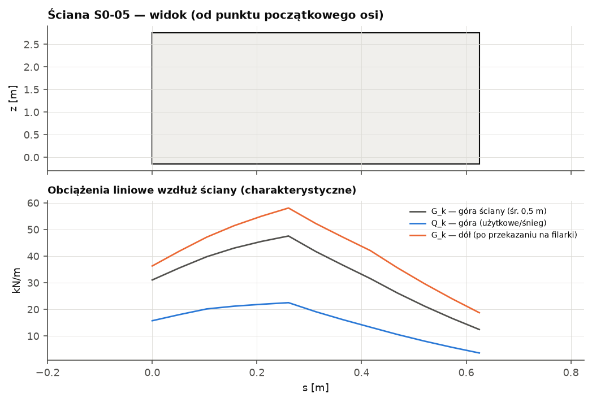

*Rys. Ściana S0-05: widok z otworami i rozkład obciążeń charakterystycznych wzdłuż osi.*

#### Zestawienie obciążeń

**Ciężar ściany — SZ1 — Ściana zewnętrzna nośna: silikat 18 + ETICS EPS 031 20 cm (U = 0,17 z ΔU łączników — obl. PN-EN ISO 6946)**

| Warstwa | Obliczenie | g_k [kN/m²] | γ_G (6.10a) | g_d [kN/m²] | ξγ_G (6.10b) | g_d [kN/m²] |
|---|---|---|---|---|---|---|
| Tynk gipsowy maszynowy 1,5 cm | 1,5 cm × 11,77 kN/m³ | 0,177 | 1,35 | 0,238 | 1,15 | 0,203 |
| Bloczek wapienno-piaskowy (silikat) 18 cm, kl. 20, gr. 1, na zaprawie cienkowarstwowej | 18,0 cm × 18,00 kN/m³ | 3,240 | 1,35 | 4,374 | 1,15 | 3,718 |
| Styropian grafitowy EPS 031 (ETICS, NRO w systemie) | 20,0 cm × 0,15 kN/m³ | 0,029 | 1,35 | 0,040 | 1,15 | 0,034 |
| ETICS: warstwa zbrojona + tynk silikonowy 1,5 mm (biały / jasnoszary NCS S 1500-N) | 1,0 cm × 16,68 kN/m³ | 0,167 | 1,35 | 0,225 | 1,15 | 0,191 |
| **Razem g_k** |  | 3,613 |  | 4,877 |  | 4,146 |

**Obciążenia ściany (charakterystyczne)** — góra: z płyt i ścian wyżej; dół: po przekazaniu obciążeń znad otworów na filarki

| Przypadek | max q_góra [kN/m] | średnio q_dół [kN/m] | max q_dół [kN/m] |
|---|---|---|---|
| G | 77,85 | 50,37 | 88,36 |
| H | 3,21 | 1,97 | 3,21 |
| QA | 20,00 | 7,82 | 20,00 |
| QA_pA | 34,32 | 13,66 | 34,32 |
| QA_pB | 0,00 | 0,00 | 0,00 |
| S1 | 12,31 | 5,82 | 12,31 |
| S2 | 16,27 | 8,29 | 16,27 |
| SB2 | 11,95 | 7,35 | 11,95 |

#### Obliczenia

##### S0-05 — ściana (odcinek 0,00–0,62 m), 6.10b (wiodące: W)

- Wytrzymałość charakterystyczna muru: f_k = K·f_b^0,85 = 0,60·20^0,85 = **7,66** MPa *((3.2) + NA tabl. NA.5 (K = 0,60, Ap2:2014-09))*
- Wytrzymałość obliczeniowa: f_d = f_k/γ_M = 7,66/1,7 = **4,50** MPa *(NA tabl. NA.1 (kat. I, zaprawa projektowana, klasa wykonania A))*
- Wysokość efektywna: h_ef = ρ₂·h = 0,750·2,91 = **2,182** m *((5.2), 5.5.1.2)*
- Smukłość: h_ef/t_ef = 2,182/0,180 = **12,12**
- Mimośród przypadkowy: e_init = h_ef/450 = 2182/450 = **4,8** mm *(5.5.1.1(4))*
- Mimośród na górze: e_g = M_g/N_g + e_init ≥ 0,05t = 2,01/67,0 + 0,0048 = **34,9** mm *((6.5))*
- Mimośród na dole: e_d = M_d/N_d + e_init ≥ 0,05t = 0,00/79,1 + 0,0048 = **9,0** mm *((6.5))*
- Współczynnik redukcyjny — góra: Φ_g = 1 − 2e_g/t = 1 − 2·34,9/180 = **0,613** *((6.4))*
- Współczynnik redukcyjny — dół: Φ_d = 1 − 2e_d/t = 1 − 2·9,0/180 = **0,900** *((6.4))*
- Mimośród w połowie wysokości: e_m = (M_md + M_w)/N_m + e_init = (1,01 + 1,55)/73,0 + 0,0048 = **39,9** mm *((6.7))*
- Mimośród od pełzania: e_k = 0 (h_ef/t_ef ≤ λ_c) = **0,0** mm *(6.1.2.2(2) [NZW NA])*
- Mimośród całkowity: e_mk = e_m + e_k ≥ 0,05t = **39,9** mm *((6.6))*
- Współczynnik redukcyjny w połowie wysokości: Φ_m = A₁·exp(−u²/2), A₁ = 1 − 2e_mk/t, u = (λ − 0,063)/(0,73 − 1,17e_mk/t) = λ = 0,383, A₁ = 0,557, u = 0,681 = **0,442** *(zał. G (G.1–G.4), E = K_E·f_k)*
- Nośność: N_Rd = Φ·t·f_d = (góra / środek / dół) 0,613 / 0,442 / 0,900 · 180 mm · 4,50 MPa = **496,8 / 358,2 / 729,6** kN/m *((6.2))*

| Warunek | Efekt | Nośność / limit | η | Stan | Podstawa |
|---|---|---|---|---|---|
| Smukłość ściany | h_ef/t_ef = 12,1  | 27 = 27,0  | 45% | spełniony | 5.5.1.4 |
| Nośność — przekrój górny | N_Ed = 67,00 kN/m | N_Rd = 496,77 kN/m | 13% | spełniony | (6.2), (6.4) |
| Nośność — połowa wysokości | N_Ed = 73,04 kN/m | N_Rd = 358,16 kN/m | 20% | spełniony | (6.2), zał. G |
| Nośność — przekrój dolny | N_Ed = 79,07 kN/m | N_Rd = 729,61 kN/m | 11% | spełniony | (6.2), (6.4) |

##### S0-05 — zginanie z płaszczyzny (wiatr)

- Wskaźnik wytrzymałości (1 m): Z = t²/6 = 0,180²/6 = **5400** cm³/m
- Pasmo pionowe — moment: M_Ed = w_Ed·h²/8 = 1,467·2,91²/8 = **1,553** kNm/m
- Pasmo pionowe — nośność: M_Rd = (f_xk1/γ_M + σ_d)·Z = (0,20/1,7 + 0,252)·10³·0,00540 = **1,999** kNm/m *((6.15), 6.3.1(3) [NZW f_xk1])*

> Informacyjnie (dolne oszacowanie, bez efektu przesklepienia 6.3.2): Zginanie z płaszczyzny (pasmo pionowe — dolne oszacowanie): M_Ed = 1,553 ≤? M_Rd = 1,999 kNm/m (η = 78%). Ściana obciążona pionowo — miarodajne sprawdzenie 6.1.2 z mimośrodem e_hm od wiatru.

##### S0-05 — wiatr: przesklepienie między stropami (6.3.2)

- Smukłość łuku: l_a/t = 2,91/0,180 = **16,2**
- Nośność na obciążenie poziome: q_lat,d = f_d·(t/l_a)² = 4,50·10³·(0,180/2,91)² = **17,23** kN/m² *((6.20) [NZW])*
- Obliczeniowy rozpór łuku (przenoszony przez stropy/wieńce): N_ad = 1,5·f_d·t/10 = **121,6** kN/m *((6.19) [NZW])*

| Warunek | Efekt | Nośność / limit | η | Stan | Podstawa |
|---|---|---|---|---|---|
| Obciążenie poziome — przesklepienie | W_Ed = 1,47 kN/m² | q_lat,d = 17,23 kN/m² | 9% | spełniony | PN-EN 1996-1-1 6.3.2 |

#### Wnioski

**Przyjęto:** Mur: Bloczek wapienno-piaskowy (silikat) 18 cm, kl. 20, gr. 1, na zaprawie cienkowarstwowej, f_d = 4,50 MPa (klasa wykonania A, γ_M = 1,7).  

### Poz. 9.38 — Ściana S0-17 (P0, wewnętrzna nośna)

Element modelu: `S0-17` · maks. wykorzystanie nośności η = 45% · wszystkie warunki spełnione

#### Opis i schemat statyczny

Ściana gr. konstrukcyjnej t = 18 cm, długość osi 6,38 m, wysokość h = 2,910 m (z −0,150 do 2,760); materiał: Bloczek wapienno-piaskowy (silikat) 18 cm, kl. 20, gr. 1, na zaprawie cienkowarstwowej. Otwory: O0-22 (0,90 m).

Sprawdzono 2 odcinków (filarki ≤ 2 m między otworami — siła całkowita; dłuższe pasma — maks. średnia krocząca 1 m) dla 34 kombinacji; poniżej przypadek miarodajny. Mimośród reakcji stropu e = t/6 (zewn.) / 0,3·t/6 (wewn., niesymetria) [UPR]; wiatr jako moment w połowie wysokości w·h²/8.

*Rys. Ściana S0-17: widok z otworami i rozkład obciążeń charakterystycznych wzdłuż osi.*

#### Zestawienie obciążeń

**Ciężar ściany — SWG — Ściana nośna dom–garaż nieogrzewany: silikat 18 + wełna 12 cm od strony garażu + tynk (U = 0,27 ≤ 0,30; szczelna na spaliny)**

| Warstwa | Obliczenie | g_k [kN/m²] | γ_G (6.10a) | g_d [kN/m²] | ξγ_G (6.10b) | g_d [kN/m²] |
|---|---|---|---|---|---|---|
| Tynk gipsowy maszynowy 1,5 cm | 1,5 cm × 11,77 kN/m³ | 0,177 | 1,35 | 0,238 | 1,15 | 0,203 |
| Bloczek wapienno-piaskowy (silikat) 18 cm, kl. 20, gr. 1, na zaprawie cienkowarstwowej | 18,0 cm × 18,00 kN/m³ | 3,240 | 1,35 | 4,374 | 1,15 | 3,718 |
| Wełna mineralna 035 (szkielet, docieplenia, ściana dom–garaż) | 12,0 cm × 0,39 kN/m³ | 0,047 | 1,35 | 0,064 | 1,15 | 0,054 |
| Tynk cementowo-wapienny 1,5 cm (garaż, pom. techniczne) | 1,0 cm × 18,15 kN/m³ | 0,181 | 1,35 | 0,245 | 1,15 | 0,208 |
| **Razem g_k** |  | 3,645 |  | 4,921 |  | 4,183 |

**Obciążenia ściany (charakterystyczne)** — góra: z płyt i ścian wyżej; dół: po przekazaniu obciążeń znad otworów na filarki

| Przypadek | max q_góra [kN/m] | średnio q_dół [kN/m] | max q_dół [kN/m] |
|---|---|---|---|
| G | 24,02 | 25,42 | 53,39 |
| H | 2,17 | 1,58 | 3,76 |
| QA | 0,00 | 0,00 | 0,00 |
| QA_pA | 0,00 | 0,00 | 0,00 |
| QA_pB | 2,67 | 0,27 | 2,67 |
| S1 | 3,91 | 2,84 | 6,78 |
| S2 | 6,37 | 4,66 | 11,36 |
| SB2 | 7,45 | 5,42 | 13,65 |

#### Obliczenia

##### S0-17 — ściana (odcinek 0,00–3,88 m), 6.10a (wiodące: QA_pB)

- Wytrzymałość charakterystyczna muru: f_k = K·f_b^0,85 = 0,60·20^0,85 = **7,66** MPa *((3.2) + NA tabl. NA.5 (K = 0,60, Ap2:2014-09))*
- Wytrzymałość obliczeniowa: f_d = f_k/γ_M = 7,66/1,7 = **4,50** MPa *(NA tabl. NA.1 (kat. I, zaprawa projektowana, klasa wykonania A))*
- Wysokość efektywna: h_ef = ρ₂·h = 0,750·2,91 = **2,182** m *((5.2), 5.5.1.2)*
- Smukłość: h_ef/t_ef = 2,182/0,180 = **12,12**
- Mimośród przypadkowy: e_init = h_ef/450 = 2182/450 = **4,8** mm *(5.5.1.1(4))*
- Mimośród na górze: e_g = M_g/N_g + e_init ≥ 0,05t = 0,33/37,0 + 0,0048 = **13,8** mm *((6.5))*
- Mimośród na dole: e_d = M_d/N_d + e_init ≥ 0,05t = 0,00/65,5 + 0,0048 = **9,0** mm *((6.5))*
- Współczynnik redukcyjny — góra: Φ_g = 1 − 2e_g/t = 1 − 2·13,8/180 = **0,846** *((6.4))*
- Współczynnik redukcyjny — dół: Φ_d = 1 − 2e_d/t = 1 − 2·9,0/180 = **0,900** *((6.4))*
- Mimośród w połowie wysokości: e_m = (M_md + M_w)/N_m + e_init = (0,17 + 0,00)/51,2 + 0,0048 = **8,1** mm *((6.7))*
- Mimośród od pełzania: e_k = 0 (h_ef/t_ef ≤ λ_c) = **0,0** mm *(6.1.2.2(2) [NZW NA])*
- Mimośród całkowity: e_mk = e_m + e_k ≥ 0,05t = **9,0** mm *((6.6))*
- Współczynnik redukcyjny w połowie wysokości: Φ_m = A₁·exp(−u²/2), A₁ = 1 − 2e_mk/t, u = (λ − 0,063)/(0,73 − 1,17e_mk/t) = λ = 0,383, A₁ = 0,900, u = 0,477 = **0,803** *(zał. G (G.1–G.4), E = K_E·f_k)*
- Nośność: N_Rd = Φ·t·f_d = (góra / środek / dół) 0,846 / 0,803 / 0,900 · 180 mm · 4,50 MPa = **685,9 / 651,1 / 729,6** kN/m *((6.2))*

| Warunek | Efekt | Nośność / limit | η | Stan | Podstawa |
|---|---|---|---|---|---|
| Smukłość ściany | h_ef/t_ef = 12,1  | 27 = 27,0  | 45% | spełniony | 5.5.1.4 |
| Nośność — przekrój górny | N_Ed = 36,97 kN/m | N_Rd = 685,93 kN/m | 5% | spełniony | (6.2), (6.4) |
| Nośność — połowa wysokości | N_Ed = 51,22 kN/m | N_Rd = 651,10 kN/m | 8% | spełniony | (6.2), zał. G |
| Nośność — przekrój dolny | N_Ed = 65,48 kN/m | N_Rd = 729,61 kN/m | 9% | spełniony | (6.2), (6.4) |

#### Wnioski

**Przyjęto:** Mur: Bloczek wapienno-piaskowy (silikat) 18 cm, kl. 20, gr. 1, na zaprawie cienkowarstwowej, f_d = 4,50 MPa (klasa wykonania A, γ_M = 1,7).  

## Poz. 10 — Fundamenty

### Poz. 10.1 — Płyta fundamentowa PF1+PF2 z żebrami i pogrubieniami — MES na podłożu sprężystym

Element modelu: `PF1` · maks. wykorzystanie nośności η = 86% · wszystkie warunki spełnione

#### Opis i schemat statyczny

Płyta żelbetowa h = 25 cm (C25/30) z żebrami pod ścianami nośnymi i pogrubieniami pod słupami, na XPS i podsypce; model MES płytowy (elementy ACM, siatka ≤ 0,30 m) na podłożu Winklera z kontaktem jednostronnym, żebra/pogrubienia jako strefy o grubości h_płyty + h_żebra [ZAŁ]; k_s z modułu edometrycznego M₀ i wymiarów płyty (Bowles (5-16a), PN-EN 1997-1 zał. F.2), obwiednia wariantów k_s × 0,5 / × 2 (Z4); obciążenia: profile dolne ścian parteru (średnia krocząca 2,0 m — Z5), siły w słupach (trzpienie ŻB — rozłożone na długości trzpienia), ciężar płyty i podłogi, obciążenie użytkowe posadzki; 39 obliczeń (kombinacje STR/GEO × warianty k_s). Płyty składowe: PF1, PF2 (uskok poziomów w żebrze — [ZAŁ]).

Głębokość posadowienia: płyta na izolacji termicznej z izolacją obwodową przeciwprzemarzaniową (izolacja przeciwprzemarzaniowa XPS 10 cm × 1,00 m (garaż 1,20 m) wokół płyty, spadek 2 % od budynku) — posadowienie płytkie chronione przed przemarzaniem wg PN-EN ISO 13793 zamiast warunku D ≥ h_z dla ław (W-284; przyjęcie Z6 — wymiary izolacji obwodowej do potwierdzenia w projekcie geotechnicznym dla strefy klimatycznej i danych gruntowych).

#### Obliczenia

##### Współczynnik podatności podłoża (Winkler) z parametrów geotechnicznych

- Moduł sprężystości gruntu z modułu edometrycznego: E_s = M₀·(1+ν)(1−2ν)/(1−ν) = 80000·(1+0,30)(1−2·0,30)/(1−0,30) = **59429** kPa *(teoria sprężystości (jednoosiowy stan odkształcenia); PN-EN 1997-2 zał. K)*
- Współczynnik wpływu (środek prostokąta, m = L/B): I_c(m), m = L/B = I_c(1,940) = **1,513** *(Bowles (1996) (5-16a); PN-EN 1997-1 zał. F.2)*
- Współczynnik podatności (osiadanie średnie α·s_c): k_s = E_s/(α·B·(1−ν²)·I_c) = 59429/(0,85·9,57·(1−0,30²)·1,513) = **5303** kN/m³
- Obwiednia wariantów (niepewność modelu Winklera): k_s,min = k_s/r; k_s,max = k_s·r = 5303/2,0; 5303·2,0 = **2652; 10606** kN/m³ *([ZAŁ] Bowles 9.7)*

##### Obciążenia płyty fundamentowej w MES (poza ścianami i słupami)

- Ciężar płyty (z żebrami/pogrubieniami) i warstw podłogi nad płytą: g = 25·h_el + g_podł = **25·h_el + 1,60** kN/m²
- Obciążenie użytkowe posadzki — kat. A (stropy mieszkalne (kat. A)): q_k = **2,00** kN/m² *(PN-EN 1991-1-1 tabl. 6.2 + NA; R5 3.3 [NZW NA — górna granica EN])*
- Płyta PF2: obciążenie użytkowe — kat. F (garaż (kat. F)); ψ₀/ψ₁/ψ₂ = 0,7/0,7/0,6: q_k; Q_k = **2,50 kN/m²; 20 kN** *(PN-EN 1991-1-1 tabl. 6.8)*

##### Nośność podłoża pod płytą fundamentową (PN-EN 1997-1 zał. D, DA2*)

- Parametry podłoża (charakterystyczne, M1: γ_φ = 1,0): φ'_k; c'_k; γ = **33,0°; 0,0 kPa; 18,5 kN/m³ — Piasek średni (Ps), średnio zagęszczony, I_D ≈ 0,6 [DANE PRZYKŁADOWE]**
- Współczynnik nośności (nadkład): N_q = e^(π·tg φ')·tg²(45° + φ'/2) = **26,09** *((D.2))*
- Współczynnik nośności (spójność): N_c = (N_q − 1)·ctg φ' = **38,64**
- Współczynnik nośności (ciężar gruntu): N_γ = 2·(N_q − 1)·tg φ' = **32,59**
- Wymiary efektywne: B' = B − 2e_B; L' = L − 2e_L = **18,575 m × 9,575 m**
- Współczynniki kształtu: s_q = 1 + (B'/L')·sin φ'; s_γ = 1 − 0,3·B'/L' = **s_q = 2,057; s_γ = 0,418** *((D.4))*
- Naprężenie od nadkładu w poziomie posadowienia: q' = γ·D = 18,50·0,30 = **5,55** kPa
- Ciężar efektywny gruntu pod fundamentem (wpływ ZWG): γ' = **11,60** kN/m³
- Jednostkowy opór graniczny: R_k/A' = c'·N_c·s_c·i_c + q'·N_q·s_q·i_q + ½·γ'·B'·N_γ·s_γ·i_γ = 0,0 + 5,55·26,09·2,057·1,000 + 0,5·11,60·18,575·32,59·0,418·1,000 = **1765,7** kPa *((D.2))*
- Opór graniczny: R_k = (R_k/A')·A' = 1765,7·177,856 = **314039,8** kN
- Obliczeniowy opór graniczny (DA2*): R_d = R_k/γ_R;v = 314039,8/1,40 = **224314,1** kN *(NA.2.6 (Ap2:2010), tabl. A.5)*

| Warunek | Efekt | Nośność / limit | η | Stan | Podstawa |
|---|---|---|---|---|---|
| Nośność podłoża (GEO, DA2*) | V_d = 13990,7 kN | R_d = 224314,1 kN | 6% | spełniony | PN-EN 1997-1 (6.1), NA.2.6 |

> Parametry gruntu PRZYKŁADOWE (brief) — w II kat. geotechnicznej wymagane badania CPT/DPL (W-282, E-04).

##### Nacisk lokalny — maks. docisk MES p_d pod pasmem b = 1,00 m (żebro + 2h)

- Parametry podłoża (charakterystyczne, M1: γ_φ = 1,0): φ'_k; c'_k; γ = **33,0°; 0,0 kPa; 18,5 kN/m³ — Piasek średni (Ps), średnio zagęszczony, I_D ≈ 0,6 [DANE PRZYKŁADOWE]**
- Współczynnik nośności (nadkład): N_q = e^(π·tg φ')·tg²(45° + φ'/2) = **26,09** *((D.2))*
- Współczynnik nośności (spójność): N_c = (N_q − 1)·ctg φ' = **38,64**
- Współczynnik nośności (ciężar gruntu): N_γ = 2·(N_q − 1)·tg φ' = **32,59**
- Szerokość efektywna ławy: B' = B − 2e_B = 1,00 − 2·0,000 = **1,000** m
- Naprężenie od nadkładu w poziomie posadowienia: q' = γ·D = 18,50·0,30 = **5,55** kPa
- Jednostkowy opór graniczny: R_k/A' = c'·N_c·s_c·i_c + q'·N_q·s_q·i_q + ½·γ'·B'·N_γ·s_γ·i_γ = 0,0 + 5,55·26,09·1,000·1,000 + 0,5·18,50·1,000·32,59·1,000·1,000 = **446,3** kPa *((D.2))*
- Opór graniczny (na 1 m ławy): R_k = (R_k/A')·A' = 446,3·1,000 = **446,3** kN/m
- Obliczeniowy opór graniczny (DA2*): R_d = R_k/γ_R;v = 446,3/1,40 = **318,8** kN/m *(NA.2.6 (Ap2:2010), tabl. A.5)*
- Maks. docisk obliczeniowy z MES (obwiednia k_s, kombinacje STR/GEO): p_d,max = **272,8** kPa

| Warunek | Efekt | Nośność / limit | η | Stan | Podstawa |
|---|---|---|---|---|---|
| Docisk lokalny do podłoża (pasmo pod żebrem) | p_d,max = 272,8 kPa | q_Rd = 318,8 kPa | 86% | spełniony | PN-EN 1997-1 6.5.2, zał. D |

> Parametry gruntu PRZYKŁADOWE (brief) — w II kat. geotechnicznej wymagane badania CPT/DPL (W-282, E-04).

##### Odrywanie płyty od podłoża i osiadanie (MES, kontakt jednostronny)

- Udział powierzchni bez kontaktu (maks. po kombinacjach ULS i wariantach k_s): A_oder/A = **0,0** %
- Maks. docisk charakterystyczny (SLS): p_k,max = **213,0** kPa
- Maks. osiadanie sprężyste (SLS, k_s nominalne): w_k,max = **33,4** mm

| Warunek | Efekt | Nośność / limit | η | Stan | Podstawa |
|---|---|---|---|---|---|
| Osiadanie (PN-EN 1997-1 zał. H: s ≤ 50 mm dla fundamentów bezpośrednich) | w_k = 33,4 mm | s_dop = 50,0 mm | 67% | spełniony | PN-EN 1997-1 zał. H |

##### Przebicie płyty pod słupem SL11 (6.4.4(2))

- Siła od słupa (obwiednia ULS): V_Ed = **510,8** kN
- Wysokość użyteczna w strefie słupa: d = h = 0,55 m = **488** mm
- Położenie słupa względem krawędzi płyty; współczynnik β: β (6.39), rys. 6.21N = słup narożny = **1,50** *(PN-EN 1992-1-1 6.4.3(6) [wartości zalecane])*
- Kombinacja miarodajna: siła słupa i odpór netto w obwodzie (MES, grunt − 1,35·ciężar płyty): V_Ed; ΔV_Ed = **510,8 kN; 100,5 kN** *(6.4.4(2))*
- Obwód miarodajny (maks. v_Ed/v_Rd dla a ≤ 2d; przycięty krawędzią płyty): a; u = **0,537 m; 2,466 m**

| Warunek | Efekt | Nośność / limit | η | Stan | Podstawa |
|---|---|---|---|---|---|
| Przebicie — fundament (6.4.4(2), (6.51)–(6.53)) | v_Ed = 0,511 MPa | v_Rd = 0,668 MPa | 77% | spełniony | PN-EN 1992-1-1 6.4.4 |

##### Przebicie płyty pod słupem SL13 (6.4.4(2))

- Siła od słupa (obwiednia ULS): V_Ed = **1326,2** kN
- Wysokość użyteczna w strefie słupa: d = h = 0,70 m = **638** mm
- Położenie słupa względem krawędzi płyty; współczynnik β: β (6.39), rys. 6.21N = słup wewnętrzny = **1,15** *(PN-EN 1992-1-1 6.4.3(6) [wartości zalecane])*
- Kombinacja miarodajna: siła słupa i odpór netto w obwodzie (MES, grunt − 1,35·ciężar płyty): V_Ed; ΔV_Ed = **1326,2 kN; 196,9 kN** *(6.4.4(2))*
- Obwód miarodajny (maks. v_Ed/v_Rd dla a ≤ 2d; przycięty krawędzią płyty): a; u = **0,638 m; 5,447 m**

| Warunek | Efekt | Nośność / limit | η | Stan | Podstawa |
|---|---|---|---|---|---|
| Przebicie — fundament (6.4.4(2), (6.51)–(6.53)) | v_Ed = 0,374 MPa | v_Rd = 0,686 MPa | 54% | spełniony | PN-EN 1992-1-1 6.4.4 |

##### Przebicie płyty pod słupem SL16 (6.4.4(2))

- Siła od słupa (obwiednia ULS): V_Ed = **1462,4** kN
- Wysokość użyteczna w strefie słupa: d = h = 0,70 m = **638** mm
- Położenie słupa względem krawędzi płyty; współczynnik β: β (6.39), rys. 6.21N = słup wewnętrzny = **1,15** *(PN-EN 1992-1-1 6.4.3(6) [wartości zalecane])*
- Kombinacja miarodajna: siła słupa i odpór netto w obwodzie (MES, grunt − 1,35·ciężar płyty): V_Ed; ΔV_Ed = **1462,3 kN; 223,7 kN** *(6.4.4(2))*
- Obwód miarodajny (maks. v_Ed/v_Rd dla a ≤ 2d; przycięty krawędzią płyty): a; u = **0,702 m; 5,848 m**

| Warunek | Efekt | Nośność / limit | η | Stan | Podstawa |
|---|---|---|---|---|---|
| Przebicie — fundament (6.4.4(2), (6.51)–(6.53)) | v_Ed = 0,382 MPa | v_Rd = 0,624 MPa | 61% | spełniony | PN-EN 1992-1-1 6.4.4 |

##### Przebicie płyty pod słupem SL18 (6.4.4(2))

- Siła od słupa (obwiednia ULS): V_Ed = **1335,0** kN
- Wysokość użyteczna w strefie słupa: d = h = 0,70 m = **638** mm
- Położenie słupa względem krawędzi płyty; współczynnik β: β (6.39), rys. 6.21N = słup wewnętrzny = **1,15** *(PN-EN 1992-1-1 6.4.3(6) [wartości zalecane])*
- Kombinacja miarodajna: siła słupa i odpór netto w obwodzie (MES, grunt − 1,35·ciężar płyty): V_Ed; ΔV_Ed = **1335,0 kN; 179,3 kN** *(6.4.4(2))*
- Obwód miarodajny (maks. v_Ed/v_Rd dla a ≤ 2d; przycięty krawędzią płyty): a; u = **0,638 m; 5,447 m**

| Warunek | Efekt | Nośność / limit | η | Stan | Podstawa |
|---|---|---|---|---|---|
| Przebicie — fundament (6.4.4(2), (6.51)–(6.53)) | v_Ed = 0,382 MPa | v_Rd = 0,686 MPa | 56% | spełniony | PN-EN 1992-1-1 6.4.4 |

##### Przebicie płyty pod słupem SL20 (6.4.4(2))

- Siła od słupa (obwiednia ULS): V_Ed = **241,0** kN
- Wysokość użyteczna w strefie słupa: d = h = 0,50 m = **438** mm
- Położenie słupa względem krawędzi płyty; współczynnik β: β (6.39), rys. 6.21N = słup narożny = **1,50** *(PN-EN 1992-1-1 6.4.3(6) [wartości zalecane])*
- Kombinacja miarodajna: siła słupa i odpór netto w obwodzie (MES, grunt − 1,35·ciężar płyty): V_Ed; ΔV_Ed = **241,0 kN; 54,4 kN** *(6.4.4(2))*
- Obwód miarodajny (maks. v_Ed/v_Rd dla a ≤ 2d; przycięty krawędzią płyty): a; u = **0,526 m; 2,731 m**

| Warunek | Efekt | Nośność / limit | η | Stan | Podstawa |
|---|---|---|---|---|---|
| Przebicie — fundament (6.4.4(2), (6.51)–(6.53)) | v_Ed = 0,234 MPa | v_Rd = 0,633 MPa | 37% | spełniony | PN-EN 1992-1-1 6.4.4 |

##### Zginanie płyty (MES, momenty Wood–Armer, obwiednia) — wymagane zbrojenie poza żebrami

- Warstwa dol x: maks. moment / A_s,req: m_Ed; A_s,req = **131,7 kNm/m; 1755 mm²/m**
- Warstwa dol y: maks. moment / A_s,req: m_Ed; A_s,req = **239,1 kNm/m; 4031 mm²/m**
- Warstwa gora x: maks. moment / A_s,req: m_Ed; A_s,req = **137,4 kNm/m; 1675 mm²/m**
- Warstwa gora y: maks. moment / A_s,req: m_Ed; A_s,req = **189,7 kNm/m; 2647 mm²/m**
- Minimalne zbrojenie płyty: A_s,min = max(0,26·f_ctm/f_yk; 0,0013)·b·d = **246** mm²/m *((9.1N))*

| Warunek | Efekt | Nośność / limit | η | Stan | Podstawa |
|---|---|---|---|---|---|
| Zbrojenie płyty dol x ≤ A_s,max (9.2.1.1(3)) | A_s,req = 1755 mm²/m | A_s,max = 10000 mm²/m | 18% | spełniony | PN-EN 1992-1-1 9.2.1.1(3) |
| Zbrojenie płyty dol y ≤ A_s,max (9.2.1.1(3)) | A_s,req = 4031 mm²/m | A_s,max = 10000 mm²/m | 40% | spełniony | PN-EN 1992-1-1 9.2.1.1(3) |
| Zbrojenie płyty gora x ≤ A_s,max (9.2.1.1(3)) | A_s,req = 1675 mm²/m | A_s,max = 10000 mm²/m | 17% | spełniony | PN-EN 1992-1-1 9.2.1.1(3) |
| Zbrojenie płyty gora y ≤ A_s,max (9.2.1.1(3)) | A_s,req = 2647 mm²/m | A_s,max = 10000 mm²/m | 26% | spełniony | PN-EN 1992-1-1 9.2.1.1(3) |

> 1 el. MES z μ > μ_lim — przekrój podwójnie zbrojony (A_s2 w warstwie przeciwnej ujęte w wymaganiu tej warstwy).

#### Wnioski

**Przyjęto:** Płyta fundamentowa gr. 25 cm, C25/30, otulenie 50 mm (od gruntu) / 35 mm; siatki dół/góra i dozbrojenia — z A_s,req MES (rysunki PT-BO, kontrola zbrojenia).  

### Poz. 10.2 — Płyta fundamentowa PF2 — część płyty PF1+PF2 (MES wspólny — poz. PF1)

Element modelu: `PF2` · maks. wykorzystanie nośności η = 21% · wszystkie warunki spełnione

#### Opis i schemat statyczny

płyta fundamentowa pod garażem obniżona (wierzch −0,30) — na płycie membrana SBS, XPS 10 cm i jastrych zbrojony (POD-G); uskok 0,15 m w linii ścian SWG (osie E i 2), ciągłość zbrojenia przez żebro — PT-K / BO

#### Obliczenia

##### Wyniki MES w obszarze płyty PF2

- Maks. docisk obliczeniowy w obszarze: p_d,max = **67,4** kPa
- Maks. osiadanie (SLS): w_k,max = **9,5** mm

| Warunek | Efekt | Nośność / limit | η | Stan | Podstawa |
|---|---|---|---|---|---|
| Docisk do podłoża (obszar płyty) | p_d,max = 67,4 kPa | q_Rd = 318,8 kPa | 21% | spełniony | PN-EN 1997-1 6.5.2 |

#### Wnioski

**Przyjęto:** Płyta gr. 25 cm — zbrojenie jak poz. PF1 (MES wspólny).  

### Poz. 10.3 — Żebro płyty fundamentowej ZF1 (b = 0,60 m, h = 0,55 m, L = 12,20 m)

Element modelu: `ZF1` · maks. wykorzystanie nośności η = 97% · wszystkie warunki spełnione

#### Opis i schemat statyczny

pogrubienie (żebro) płyty pod ścianą S0-01 — krawędź z izolacją obwodową XPS (PN-EN ISO 13793). Żebro w MES płyty (poz. PF1): siły z pasma elementów żebra; ochrona przed przemarzaniem — izolacja obwodowa (poz. płyty, Z6).

#### Obliczenia

##### ZF1 — MES płyty fundamentowej

- Pasmo żebra w MES: b × h = **60 × 55 cm, L = 12,20 m**
- Moment pasma żebra (Σ m·szer., obwiednia ULS): M_Ed,dół; M_Ed,góra = **99,7; −409,9 kNm**
- Wymagane zbrojenie dolne (MES: maks. A_s,req × b): A_s,req,dół = **1063** mm²
- Wymagane zbrojenie górne (MES: maks. A_s,req × b): A_s,req,góra = **2638** mm²
- Zbrojenie podłużne minimalne (każda warstwa): A_s,min = max(0,26·f_ctm/f_yk; 0,0013)·b·d = **393** mm² *((9.1N))*
- *Ścinanie*
- Współczynnik skali: k = 1 + √(200/d) ≤ 2,0 = 1 + √(200/484) = **1,643**
- Stopień zbrojenia podłużnego: ρ_l = A_sl/(b_w·d) ≤ 0,02 = 1131/(600·484) = **0,00389**
- Nośność na ścinanie: V_Rd,c = C_Rd,c·k·(100·ρ_l·f_ck)^(1/3)·b_w·d = 0,1286·1,643·(100·0,00389·25)^(1/3)·600·484·10⁻³ = **130,98** kN *((6.2.a); C_Rd,c = 0,18/γ_c)*
- Wartość minimalna: V_Rd,c,min = v_min·b_w·d, v_min = 0,035·k^(3/2)·f_ck^(1/2) = 0,3685·600·484·10⁻³ = **107,01** kN *((6.2.b), (6.3N))*
- Ramię sił wewnętrznych: z = 0,9·d = 0,9·484 = **436** mm
- Przyjęto nachylenie krzyżulców betonowych: cot θ = (1,0 ≤ cot θ ≤ 2,0 — NA) = **2,00** *((6.7N))*
- Nośność krzyżulców ściskanych: V_Rd,max = b_w·z·ν₁·f_cd/(cot θ + tan θ) = 600·436·0,540·17,86/(2,00 + 0,500)·10⁻³ = **1008,10** kN *((6.9), ν₁ = ν (6.6N))*
- Rozstaw z warunku nośności: s = A_sw·z·f_ywd·cot θ/V_Ed = 100,5·436·434,8·2,00/(157,76·10³) = **241** mm *((6.8))*
- Rozstaw maksymalny: s_l,max = 0,75·d = 0,75·484 = **363** mm *((9.6N))*
- Stopień zbrojenia minimalny: ρ_w,min = 0,08·√f_ck/f_yk → s ≤ A_sw/(ρ_w,min·b_w) = 100,5/(0,00080·600) = **209** mm *((9.5N))*
- Przyjęto strzemiona: φ8 2-cięte co s = **200** mm
- Nośność zbrojenia na ścinanie: V_Rd,s = A_sw/s·z·f_ywd·cot θ = 100,5/200·436·434,8·2,00·10⁻³ = **190,40** kN
- Maks. docisk pod żebrem (MES): p_d,max = **209,1** kPa
- Zbrojenie podłużne: A_s,min (warstwa) = **393** mm²
- Przyjęto zbrojenie podłużne: **34φ12 (dołem 10φ12, górą 24φ12), strzemiona φ8 co 20 cm**

| Warunek | Efekt | Nośność / limit | η | Stan | Podstawa |
|---|---|---|---|---|---|
| Zbrojenie dolne żebra | A_s,req = 1063 mm² | A_s,prov = 1131 mm² | 94% | spełniony | 6.1, 9.2.1.1 |
| Zbrojenie górne żebra | A_s,req = 2638 mm² | A_s,prov = 2714 mm² | 97% | spełniony | 6.1, 9.2.1.1 |
| Nośność krzyżulców betonowych | V_Ed = 157,76 kN | V_Rd,max = 1008,10 kN | 16% | spełniony | (6.9) |
| Nośność strzemion | V_Ed = 157,76 kN | V_Rd,s = 190,40 kN | 83% | spełniony | (6.8) |
| Docisk do podłoża pod żebrem | p_d,max = 209,1 kPa | q_Rd = 318,8 kPa | 66% | spełniony | PN-EN 1997-1 6.5.2 |

#### Wnioski

**Przyjęto:** Żebro 60×55 cm, C25/30; 34φ12 (dołem 10φ12, górą 24φ12), strzemiona φ8 co 20 cm.  

### Poz. 10.4 — Żebro płyty fundamentowej ZF2 (b = 0,60 m, h = 0,55 m, L = 6,58 m)

Element modelu: `ZF2` · maks. wykorzystanie nośności η = 93% · wszystkie warunki spełnione

#### Opis i schemat statyczny

pogrubienie (żebro) płyty pod ścianą S0-02 — krawędź z izolacją obwodową XPS (PN-EN ISO 13793). Żebro w MES płyty (poz. PF1): siły z pasma elementów żebra; ochrona przed przemarzaniem — izolacja obwodowa (poz. płyty, Z6).

#### Obliczenia

##### ZF2 — MES płyty fundamentowej

- Pasmo żebra w MES: b × h = **60 × 55 cm, L = 6,58 m**
- Moment pasma żebra (Σ m·szer., obwiednia ULS): M_Ed,dół; M_Ed,góra = **48,5; −95,9 kNm**
- Wymagane zbrojenie dolne (MES: maks. A_s,req × b): A_s,req,dół = **740** mm²
- Wymagane zbrojenie górne (MES: maks. A_s,req × b): A_s,req,góra = **633** mm²
- Zbrojenie podłużne minimalne (każda warstwa): A_s,min = max(0,26·f_ctm/f_yk; 0,0013)·b·d = **393** mm² *((9.1N))*
- *Ścinanie*
- Współczynnik skali: k = 1 + √(200/d) ≤ 2,0 = 1 + √(200/484) = **1,643**
- Stopień zbrojenia podłużnego: ρ_l = A_sl/(b_w·d) ≤ 0,02 = 679/(600·484) = **0,00234**
- Nośność na ścinanie: V_Rd,c = C_Rd,c·k·(100·ρ_l·f_ck)^(1/3)·b_w·d = 0,1286·1,643·(100·0,00234·25)^(1/3)·600·484·10⁻³ = **110,47** kN *((6.2.a); C_Rd,c = 0,18/γ_c)*
- Wartość minimalna: V_Rd,c,min = v_min·b_w·d, v_min = 0,035·k^(3/2)·f_ck^(1/2) = 0,3685·600·484·10⁻³ = **107,01** kN *((6.2.b), (6.3N))*
- Ramię sił wewnętrznych: z = 0,9·d = 0,9·484 = **436** mm
- Przyjęto nachylenie krzyżulców betonowych: cot θ = (1,0 ≤ cot θ ≤ 2,0 — NA) = **2,00** *((6.7N))*
- Nośność krzyżulców ściskanych: V_Rd,max = b_w·z·ν₁·f_cd/(cot θ + tan θ) = 600·436·0,540·17,86/(2,00 + 0,500)·10⁻³ = **1008,10** kN *((6.9), ν₁ = ν (6.6N))*
- Rozstaw z warunku nośności: s = A_sw·z·f_ywd·cot θ/V_Ed = 100,5·436·434,8·2,00/(88,54·10³) = **430** mm *((6.8))*
- Rozstaw maksymalny: s_l,max = 0,75·d = 0,75·484 = **363** mm *((9.6N))*
- Stopień zbrojenia minimalny: ρ_w,min = 0,08·√f_ck/f_yk → s ≤ A_sw/(ρ_w,min·b_w) = 100,5/(0,00080·600) = **209** mm *((9.5N))*
- Przyjęto strzemiona: φ8 2-cięte co s = **200** mm
- Nośność zbrojenia na ścinanie: V_Rd,s = A_sw/s·z·f_ywd·cot θ = 100,5/200·436·434,8·2,00·10⁻³ = **190,40** kN
- Maks. docisk pod żebrem (MES): p_d,max = **92,8** kPa
- Zbrojenie podłużne: A_s,min (warstwa) = **393** mm²
- Przyjęto zbrojenie podłużne: **13φ12 (dołem 7φ12, górą 6φ12), strzemiona φ8 co 20 cm**

| Warunek | Efekt | Nośność / limit | η | Stan | Podstawa |
|---|---|---|---|---|---|
| Zbrojenie dolne żebra | A_s,req = 740 mm² | A_s,prov = 792 mm² | 93% | spełniony | 6.1, 9.2.1.1 |
| Zbrojenie górne żebra | A_s,req = 633 mm² | A_s,prov = 679 mm² | 93% | spełniony | 6.1, 9.2.1.1 |
| Nośność krzyżulców betonowych | V_Ed = 88,54 kN | V_Rd,max = 1008,10 kN | 9% | spełniony | (6.9) |
| Nośność strzemion | V_Ed = 88,54 kN | V_Rd,s = 190,40 kN | 47% | spełniony | (6.8) |
| Docisk do podłoża pod żebrem | p_d,max = 92,8 kPa | q_Rd = 318,8 kPa | 29% | spełniony | PN-EN 1997-1 6.5.2 |

> V_Ed ≤ V_Rd,c = 110,47 kN — zbrojenie poprzeczne minimalne (9.2.2(5)).

#### Wnioski

**Przyjęto:** Żebro 60×55 cm, C25/30; 13φ12 (dołem 7φ12, górą 6φ12), strzemiona φ8 co 20 cm.  

### Poz. 10.5 — Żebro płyty fundamentowej ZF3 (b = 0,60 m, h = 0,55 m, L = 3,08 m)

Element modelu: `ZF3` · maks. wykorzystanie nośności η = 93% · wszystkie warunki spełnione

#### Opis i schemat statyczny

pogrubienie (żebro) płyty pod ścianą S0-03 — krawędź z izolacją obwodową XPS (PN-EN ISO 13793). Żebro w MES płyty (poz. PF1): siły z pasma elementów żebra; ochrona przed przemarzaniem — izolacja obwodowa (poz. płyty, Z6).

#### Obliczenia

##### ZF3 — MES płyty fundamentowej

- Pasmo żebra w MES: b × h = **60 × 55 cm, L = 3,08 m**
- Moment pasma żebra (Σ m·szer., obwiednia ULS): M_Ed,dół; M_Ed,góra = **0,0; −73,0 kNm**
- Wymagane zbrojenie dolne (MES: maks. A_s,req × b): A_s,req,dół = **58** mm²
- Wymagane zbrojenie górne (MES: maks. A_s,req × b): A_s,req,góra = **526** mm²
- Zbrojenie podłużne minimalne (każda warstwa): A_s,min = max(0,26·f_ctm/f_yk; 0,0013)·b·d = **393** mm² *((9.1N))*
- *Ścinanie*
- Współczynnik skali: k = 1 + √(200/d) ≤ 2,0 = 1 + √(200/484) = **1,643**
- Stopień zbrojenia podłużnego: ρ_l = A_sl/(b_w·d) ≤ 0,02 = 452/(600·484) = **0,00156**
- Nośność na ścinanie: V_Rd,c = C_Rd,c·k·(100·ρ_l·f_ck)^(1/3)·b_w·d = 0,1286·1,643·(100·0,00156·25)^(1/3)·600·484·10⁻³ = **96,51** kN *((6.2.a); C_Rd,c = 0,18/γ_c)*
- Wartość minimalna: V_Rd,c,min = v_min·b_w·d, v_min = 0,035·k^(3/2)·f_ck^(1/2) = 0,3685·600·484·10⁻³ = **107,01** kN *((6.2.b), (6.3N))*
- Ramię sił wewnętrznych: z = 0,9·d = 0,9·484 = **436** mm
- Przyjęto nachylenie krzyżulców betonowych: cot θ = (1,0 ≤ cot θ ≤ 2,0 — NA) = **2,00** *((6.7N))*
- Nośność krzyżulców ściskanych: V_Rd,max = b_w·z·ν₁·f_cd/(cot θ + tan θ) = 600·436·0,540·17,86/(2,00 + 0,500)·10⁻³ = **1008,10** kN *((6.9), ν₁ = ν (6.6N))*
- Rozstaw z warunku nośności: s = A_sw·z·f_ywd·cot θ/V_Ed = 100,5·436·434,8·2,00/(108,06·10³) = **352** mm *((6.8))*
- Rozstaw maksymalny: s_l,max = 0,75·d = 0,75·484 = **363** mm *((9.6N))*
- Stopień zbrojenia minimalny: ρ_w,min = 0,08·√f_ck/f_yk → s ≤ A_sw/(ρ_w,min·b_w) = 100,5/(0,00080·600) = **209** mm *((9.5N))*
- Przyjęto strzemiona: φ8 2-cięte co s = **200** mm
- Nośność zbrojenia na ścinanie: V_Rd,s = A_sw/s·z·f_ywd·cot θ = 100,5/200·436·434,8·2,00·10⁻³ = **190,40** kN
- Maks. docisk pod żebrem (MES): p_d,max = **46,4** kPa
- Zbrojenie podłużne: A_s,min (warstwa) = **393** mm²
- Przyjęto zbrojenie podłużne: **9φ12 (dołem 4φ12, górą 5φ12), strzemiona φ8 co 20 cm**

| Warunek | Efekt | Nośność / limit | η | Stan | Podstawa |
|---|---|---|---|---|---|
| Zbrojenie dolne żebra | A_s,req = 393 mm² | A_s,prov = 452 mm² | 87% | spełniony | 6.1, 9.2.1.1 |
| Zbrojenie górne żebra | A_s,req = 526 mm² | A_s,prov = 565 mm² | 93% | spełniony | 6.1, 9.2.1.1 |
| Nośność krzyżulców betonowych | V_Ed = 108,06 kN | V_Rd,max = 1008,10 kN | 11% | spełniony | (6.9) |
| Nośność strzemion | V_Ed = 108,06 kN | V_Rd,s = 190,40 kN | 57% | spełniony | (6.8) |
| Docisk do podłoża pod żebrem | p_d,max = 46,4 kPa | q_Rd = 318,8 kPa | 15% | spełniony | PN-EN 1997-1 6.5.2 |

#### Wnioski

**Przyjęto:** Żebro 60×55 cm, C25/30; 9φ12 (dołem 4φ12, górą 5φ12), strzemiona φ8 co 20 cm.  

### Poz. 10.6 — Żebro płyty fundamentowej ZF4 (b = 0,60 m, h = 0,55 m, L = 6,70 m)

Element modelu: `ZF4` · maks. wykorzystanie nośności η = 89% · wszystkie warunki spełnione

#### Opis i schemat statyczny

pogrubienie (żebro) płyty pod ścianą S0-03 — krawędź z izolacją obwodową XPS (PN-EN ISO 13793) (garaż). Żebro w MES płyty (poz. PF1): siły z pasma elementów żebra; ochrona przed przemarzaniem — izolacja obwodowa (poz. płyty, Z6).

#### Obliczenia

##### ZF4 — MES płyty fundamentowej

- Pasmo żebra w MES: b × h = **60 × 55 cm, L = 6,70 m**
- Moment pasma żebra (Σ m·szer., obwiednia ULS): M_Ed,dół; M_Ed,góra = **0,0; −70,3 kNm**
- Wymagane zbrojenie dolne (MES: maks. A_s,req × b): A_s,req,dół = **0** mm²
- Wymagane zbrojenie górne (MES: maks. A_s,req × b): A_s,req,góra = **503** mm²
- Zbrojenie podłużne minimalne (każda warstwa): A_s,min = max(0,26·f_ctm/f_yk; 0,0013)·b·d = **393** mm² *((9.1N))*
- *Ścinanie*
- Współczynnik skali: k = 1 + √(200/d) ≤ 2,0 = 1 + √(200/484) = **1,643**
- Stopień zbrojenia podłużnego: ρ_l = A_sl/(b_w·d) ≤ 0,02 = 452/(600·484) = **0,00156**
- Nośność na ścinanie: V_Rd,c = C_Rd,c·k·(100·ρ_l·f_ck)^(1/3)·b_w·d = 0,1286·1,643·(100·0,00156·25)^(1/3)·600·484·10⁻³ = **96,51** kN *((6.2.a); C_Rd,c = 0,18/γ_c)*
- Wartość minimalna: V_Rd,c,min = v_min·b_w·d, v_min = 0,035·k^(3/2)·f_ck^(1/2) = 0,3685·600·484·10⁻³ = **107,01** kN *((6.2.b), (6.3N))*
- Ramię sił wewnętrznych: z = 0,9·d = 0,9·484 = **436** mm
- Przyjęto nachylenie krzyżulców betonowych: cot θ = (1,0 ≤ cot θ ≤ 2,0 — NA) = **2,00** *((6.7N))*
- Nośność krzyżulców ściskanych: V_Rd,max = b_w·z·ν₁·f_cd/(cot θ + tan θ) = 600·436·0,540·17,86/(2,00 + 0,500)·10⁻³ = **1008,10** kN *((6.9), ν₁ = ν (6.6N))*
- Rozstaw z warunku nośności: s = A_sw·z·f_ywd·cot θ/V_Ed = 100,5·436·434,8·2,00/(124,99·10³) = **305** mm *((6.8))*
- Rozstaw maksymalny: s_l,max = 0,75·d = 0,75·484 = **363** mm *((9.6N))*
- Stopień zbrojenia minimalny: ρ_w,min = 0,08·√f_ck/f_yk → s ≤ A_sw/(ρ_w,min·b_w) = 100,5/(0,00080·600) = **209** mm *((9.5N))*
- Przyjęto strzemiona: φ8 2-cięte co s = **200** mm
- Nośność zbrojenia na ścinanie: V_Rd,s = A_sw/s·z·f_ywd·cot θ = 100,5/200·436·434,8·2,00·10⁻³ = **190,40** kN
- Maks. docisk pod żebrem (MES): p_d,max = **40,9** kPa
- Zbrojenie podłużne: A_s,min (warstwa) = **393** mm²
- Przyjęto zbrojenie podłużne: **9φ12 (dołem 4φ12, górą 5φ12), strzemiona φ8 co 20 cm**

| Warunek | Efekt | Nośność / limit | η | Stan | Podstawa |
|---|---|---|---|---|---|
| Zbrojenie dolne żebra | A_s,req = 393 mm² | A_s,prov = 452 mm² | 87% | spełniony | 6.1, 9.2.1.1 |
| Zbrojenie górne żebra | A_s,req = 503 mm² | A_s,prov = 565 mm² | 89% | spełniony | 6.1, 9.2.1.1 |
| Nośność krzyżulców betonowych | V_Ed = 124,99 kN | V_Rd,max = 1008,10 kN | 12% | spełniony | (6.9) |
| Nośność strzemion | V_Ed = 124,99 kN | V_Rd,s = 190,40 kN | 66% | spełniony | (6.8) |
| Docisk do podłoża pod żebrem | p_d,max = 40,9 kPa | q_Rd = 318,8 kPa | 13% | spełniony | PN-EN 1997-1 6.5.2 |

#### Wnioski

**Przyjęto:** Żebro 60×55 cm, C25/30; 9φ12 (dołem 4φ12, górą 5φ12), strzemiona φ8 co 20 cm.  

### Poz. 10.7 — Żebro płyty fundamentowej ZF5 (b = 0,60 m, h = 0,55 m, L = 6,58 m)

Element modelu: `ZF5` · maks. wykorzystanie nośności η = 92% · wszystkie warunki spełnione

#### Opis i schemat statyczny

pogrubienie (żebro) płyty pod ścianą S0-04 — krawędź z izolacją obwodową XPS (PN-EN ISO 13793) (garaż). Żebro w MES płyty (poz. PF1): siły z pasma elementów żebra; ochrona przed przemarzaniem — izolacja obwodowa (poz. płyty, Z6).

#### Obliczenia

##### ZF5 — MES płyty fundamentowej

- Pasmo żebra w MES: b × h = **60 × 55 cm, L = 6,58 m**
- Moment pasma żebra (Σ m·szer., obwiednia ULS): M_Ed,dół; M_Ed,góra = **0,0; −160,8 kNm**
- Wymagane zbrojenie dolne (MES: maks. A_s,req × b): A_s,req,dół = **95** mm²
- Wymagane zbrojenie górne (MES: maks. A_s,req × b): A_s,req,góra = **830** mm²
- Zbrojenie podłużne minimalne (każda warstwa): A_s,min = max(0,26·f_ctm/f_yk; 0,0013)·b·d = **393** mm² *((9.1N))*
- *Ścinanie*
- Współczynnik skali: k = 1 + √(200/d) ≤ 2,0 = 1 + √(200/484) = **1,643**
- Stopień zbrojenia podłużnego: ρ_l = A_sl/(b_w·d) ≤ 0,02 = 452/(600·484) = **0,00156**
- Nośność na ścinanie: V_Rd,c = C_Rd,c·k·(100·ρ_l·f_ck)^(1/3)·b_w·d = 0,1286·1,643·(100·0,00156·25)^(1/3)·600·484·10⁻³ = **96,51** kN *((6.2.a); C_Rd,c = 0,18/γ_c)*
- Wartość minimalna: V_Rd,c,min = v_min·b_w·d, v_min = 0,035·k^(3/2)·f_ck^(1/2) = 0,3685·600·484·10⁻³ = **107,01** kN *((6.2.b), (6.3N))*
- Ramię sił wewnętrznych: z = 0,9·d = 0,9·484 = **436** mm
- Przyjęto nachylenie krzyżulców betonowych: cot θ = (1,0 ≤ cot θ ≤ 2,0 — NA) = **2,00** *((6.7N))*
- Nośność krzyżulców ściskanych: V_Rd,max = b_w·z·ν₁·f_cd/(cot θ + tan θ) = 600·436·0,540·17,86/(2,00 + 0,500)·10⁻³ = **1008,10** kN *((6.9), ν₁ = ν (6.6N))*
- Rozstaw z warunku nośności: s = A_sw·z·f_ywd·cot θ/V_Ed = 100,5·436·434,8·2,00/(86,15·10³) = **442** mm *((6.8))*
- Rozstaw maksymalny: s_l,max = 0,75·d = 0,75·484 = **363** mm *((9.6N))*
- Stopień zbrojenia minimalny: ρ_w,min = 0,08·√f_ck/f_yk → s ≤ A_sw/(ρ_w,min·b_w) = 100,5/(0,00080·600) = **209** mm *((9.5N))*
- Przyjęto strzemiona: φ8 2-cięte co s = **200** mm
- Nośność zbrojenia na ścinanie: V_Rd,s = A_sw/s·z·f_ywd·cot θ = 100,5/200·436·434,8·2,00·10⁻³ = **190,40** kN
- Maks. docisk pod żebrem (MES): p_d,max = **59,6** kPa
- Zbrojenie podłużne: A_s,min (warstwa) = **393** mm²
- Przyjęto zbrojenie podłużne: **12φ12 (dołem 4φ12, górą 8φ12), strzemiona φ8 co 20 cm**

| Warunek | Efekt | Nośność / limit | η | Stan | Podstawa |
|---|---|---|---|---|---|
| Zbrojenie dolne żebra | A_s,req = 393 mm² | A_s,prov = 452 mm² | 87% | spełniony | 6.1, 9.2.1.1 |
| Zbrojenie górne żebra | A_s,req = 830 mm² | A_s,prov = 905 mm² | 92% | spełniony | 6.1, 9.2.1.1 |
| Nośność krzyżulców betonowych | V_Ed = 86,15 kN | V_Rd,max = 1008,10 kN | 9% | spełniony | (6.9) |
| Nośność strzemion | V_Ed = 86,15 kN | V_Rd,s = 190,40 kN | 45% | spełniony | (6.8) |
| Docisk do podłoża pod żebrem | p_d,max = 59,6 kPa | q_Rd = 318,8 kPa | 19% | spełniony | PN-EN 1997-1 6.5.2 |

> V_Ed ≤ V_Rd,c = 107,01 kN — zbrojenie poprzeczne minimalne (9.2.2(5)).

#### Wnioski

**Przyjęto:** Żebro 60×55 cm, C25/30; 12φ12 (dołem 4φ12, górą 8φ12), strzemiona φ8 co 20 cm.  

### Poz. 10.8 — Żebro płyty fundamentowej ZF6 (b = 0,60 m, h = 0,55 m, L = 0,82 m)

Element modelu: `ZF6` · maks. wykorzystanie nośności η = 99% · wszystkie warunki spełnione

#### Opis i schemat statyczny

pogrubienie (żebro) płyty pod ścianą S0-05 — krawędź z izolacją obwodową XPS (PN-EN ISO 13793) (garaż). Żebro w MES płyty (poz. PF1): siły z pasma elementów żebra; ochrona przed przemarzaniem — izolacja obwodowa (poz. płyty, Z6).

#### Obliczenia

##### ZF6 — MES płyty fundamentowej

- Pasmo żebra w MES: b × h = **60 × 55 cm, L = 0,82 m**
- Moment pasma żebra (Σ m·szer., obwiednia ULS): M_Ed,dół; M_Ed,góra = **0,0; −67,3 kNm**
- Wymagane zbrojenie dolne (MES: maks. A_s,req × b): A_s,req,dół = **75** mm²
- Wymagane zbrojenie górne (MES: maks. A_s,req × b): A_s,req,góra = **670** mm²
- Zbrojenie podłużne minimalne (każda warstwa): A_s,min = max(0,26·f_ctm/f_yk; 0,0013)·b·d = **393** mm² *((9.1N))*
- *Ścinanie*
- Współczynnik skali: k = 1 + √(200/d) ≤ 2,0 = 1 + √(200/484) = **1,643**
- Stopień zbrojenia podłużnego: ρ_l = A_sl/(b_w·d) ≤ 0,02 = 452/(600·484) = **0,00156**
- Nośność na ścinanie: V_Rd,c = C_Rd,c·k·(100·ρ_l·f_ck)^(1/3)·b_w·d = 0,1286·1,643·(100·0,00156·25)^(1/3)·600·484·10⁻³ = **96,51** kN *((6.2.a); C_Rd,c = 0,18/γ_c)*
- Wartość minimalna: V_Rd,c,min = v_min·b_w·d, v_min = 0,035·k^(3/2)·f_ck^(1/2) = 0,3685·600·484·10⁻³ = **107,01** kN *((6.2.b), (6.3N))*
- Ramię sił wewnętrznych: z = 0,9·d = 0,9·484 = **436** mm
- Przyjęto nachylenie krzyżulców betonowych: cot θ = (1,0 ≤ cot θ ≤ 2,0 — NA) = **2,00** *((6.7N))*
- Nośność krzyżulców ściskanych: V_Rd,max = b_w·z·ν₁·f_cd/(cot θ + tan θ) = 600·436·0,540·17,86/(2,00 + 0,500)·10⁻³ = **1008,10** kN *((6.9), ν₁ = ν (6.6N))*
- Rozstaw z warunku nośności: s = A_sw·z·f_ywd·cot θ/V_Ed = 100,5·436·434,8·2,00/(112,64·10³) = **338** mm *((6.8))*
- Rozstaw maksymalny: s_l,max = 0,75·d = 0,75·484 = **363** mm *((9.6N))*
- Stopień zbrojenia minimalny: ρ_w,min = 0,08·√f_ck/f_yk → s ≤ A_sw/(ρ_w,min·b_w) = 100,5/(0,00080·600) = **209** mm *((9.5N))*
- Przyjęto strzemiona: φ8 2-cięte co s = **200** mm
- Nośność zbrojenia na ścinanie: V_Rd,s = A_sw/s·z·f_ywd·cot θ = 100,5/200·436·434,8·2,00·10⁻³ = **190,40** kN
- Maks. docisk pod żebrem (MES): p_d,max = **67,3** kPa
- Zbrojenie podłużne: A_s,min (warstwa) = **393** mm²
- Przyjęto zbrojenie podłużne: **10φ12 (dołem 4φ12, górą 6φ12), strzemiona φ8 co 20 cm**

| Warunek | Efekt | Nośność / limit | η | Stan | Podstawa |
|---|---|---|---|---|---|
| Zbrojenie dolne żebra | A_s,req = 393 mm² | A_s,prov = 452 mm² | 87% | spełniony | 6.1, 9.2.1.1 |
| Zbrojenie górne żebra | A_s,req = 670 mm² | A_s,prov = 679 mm² | 99% | spełniony | 6.1, 9.2.1.1 |
| Nośność krzyżulców betonowych | V_Ed = 112,64 kN | V_Rd,max = 1008,10 kN | 11% | spełniony | (6.9) |
| Nośność strzemion | V_Ed = 112,64 kN | V_Rd,s = 190,40 kN | 59% | spełniony | (6.8) |
| Docisk do podłoża pod żebrem | p_d,max = 67,3 kPa | q_Rd = 318,8 kPa | 21% | spełniony | PN-EN 1997-1 6.5.2 |

#### Wnioski

**Przyjęto:** Żebro 60×55 cm, C25/30; 10φ12 (dołem 4φ12, górą 6φ12), strzemiona φ8 co 20 cm.  

### Poz. 10.9 — Żebro płyty fundamentowej ZF7 (b = 0,60 m, h = 0,55 m, L = 12,20 m)

Element modelu: `ZF7` · maks. wykorzystanie nośności η = 94% · wszystkie warunki spełnione

#### Opis i schemat statyczny

pogrubienie (żebro) płyty pod ścianą S0-06 — krawędź z izolacją obwodową XPS (PN-EN ISO 13793). Żebro w MES płyty (poz. PF1): siły z pasma elementów żebra; ochrona przed przemarzaniem — izolacja obwodowa (poz. płyty, Z6).

#### Obliczenia

##### ZF7 — MES płyty fundamentowej

- Pasmo żebra w MES: b × h = **60 × 55 cm, L = 12,20 m**
- Moment pasma żebra (Σ m·szer., obwiednia ULS): M_Ed,dół; M_Ed,góra = **184,3; −193,6 kNm**
- Wymagane zbrojenie dolne (MES: maks. A_s,req × b): A_s,req,dół = **1164** mm²
- Wymagane zbrojenie górne (MES: maks. A_s,req × b): A_s,req,góra = **1276** mm²
- Zbrojenie podłużne minimalne (każda warstwa): A_s,min = max(0,26·f_ctm/f_yk; 0,0013)·b·d = **393** mm² *((9.1N))*
- *Ścinanie*
- Współczynnik skali: k = 1 + √(200/d) ≤ 2,0 = 1 + √(200/484) = **1,643**
- Stopień zbrojenia podłużnego: ρ_l = A_sl/(b_w·d) ≤ 0,02 = 1244/(600·484) = **0,00428**
- Nośność na ścinanie: V_Rd,c = C_Rd,c·k·(100·ρ_l·f_ck)^(1/3)·b_w·d = 0,1286·1,643·(100·0,00428·25)^(1/3)·600·484·10⁻³ = **135,21** kN *((6.2.a); C_Rd,c = 0,18/γ_c)*
- Wartość minimalna: V_Rd,c,min = v_min·b_w·d, v_min = 0,035·k^(3/2)·f_ck^(1/2) = 0,3685·600·484·10⁻³ = **107,01** kN *((6.2.b), (6.3N))*
- Ramię sił wewnętrznych: z = 0,9·d = 0,9·484 = **436** mm
- Przyjęto nachylenie krzyżulców betonowych: cot θ = (1,0 ≤ cot θ ≤ 2,0 — NA) = **2,00** *((6.7N))*
- Nośność krzyżulców ściskanych: V_Rd,max = b_w·z·ν₁·f_cd/(cot θ + tan θ) = 600·436·0,540·17,86/(2,00 + 0,500)·10⁻³ = **1008,10** kN *((6.9), ν₁ = ν (6.6N))*
- Rozstaw z warunku nośności: s = A_sw·z·f_ywd·cot θ/V_Ed = 100,5·436·434,8·2,00/(322,10·10³) = **118** mm *((6.8))*
- Rozstaw maksymalny: s_l,max = 0,75·d = 0,75·484 = **363** mm *((9.6N))*
- Stopień zbrojenia minimalny: ρ_w,min = 0,08·√f_ck/f_yk → s ≤ A_sw/(ρ_w,min·b_w) = 100,5/(0,00080·600) = **209** mm *((9.5N))*
- Przyjęto strzemiona: φ8 2-cięte co s = **110** mm
- Nośność zbrojenia na ścinanie: V_Rd,s = A_sw/s·z·f_ywd·cot θ = 100,5/110·436·434,8·2,00·10⁻³ = **346,18** kN
- Maks. docisk pod żebrem (MES): p_d,max = **111,2** kPa
- Zbrojenie podłużne: A_s,min (warstwa) = **393** mm²
- Przyjęto zbrojenie podłużne: **23φ12 (dołem 11φ12, górą 12φ12), strzemiona φ8 co 11 cm**

| Warunek | Efekt | Nośność / limit | η | Stan | Podstawa |
|---|---|---|---|---|---|
| Zbrojenie dolne żebra | A_s,req = 1164 mm² | A_s,prov = 1244 mm² | 94% | spełniony | 6.1, 9.2.1.1 |
| Zbrojenie górne żebra | A_s,req = 1276 mm² | A_s,prov = 1357 mm² | 94% | spełniony | 6.1, 9.2.1.1 |
| Nośność krzyżulców betonowych | V_Ed = 322,10 kN | V_Rd,max = 1008,10 kN | 32% | spełniony | (6.9) |
| Nośność strzemion | V_Ed = 322,10 kN | V_Rd,s = 346,18 kN | 93% | spełniony | (6.8) |
| Docisk do podłoża pod żebrem | p_d,max = 111,2 kPa | q_Rd = 318,8 kPa | 35% | spełniony | PN-EN 1997-1 6.5.2 |

#### Wnioski

**Przyjęto:** Żebro 60×55 cm, C25/30; 23φ12 (dołem 11φ12, górą 12φ12), strzemiona φ8 co 11 cm.  

### Poz. 10.10 — Żebro płyty fundamentowej ZF8 (b = 0,60 m, h = 0,55 m, L = 8,95 m)

Element modelu: `ZF8` · maks. wykorzystanie nośności η = 96% · wszystkie warunki spełnione

#### Opis i schemat statyczny

pogrubienie (żebro) płyty pod ścianą S0-07 — krawędź z izolacją obwodową XPS (PN-EN ISO 13793). Żebro w MES płyty (poz. PF1): siły z pasma elementów żebra; ochrona przed przemarzaniem — izolacja obwodowa (poz. płyty, Z6).

#### Obliczenia

##### ZF8 — MES płyty fundamentowej

- Pasmo żebra w MES: b × h = **60 × 55 cm, L = 8,95 m**
- Moment pasma żebra (Σ m·szer., obwiednia ULS): M_Ed,dół; M_Ed,góra = **181,5; −405,0 kNm**
- Wymagane zbrojenie dolne (MES: maks. A_s,req × b): A_s,req,dół = **1532** mm²
- Wymagane zbrojenie górne (MES: maks. A_s,req × b): A_s,req,góra = **3089** mm²
- Zbrojenie podłużne minimalne (każda warstwa): A_s,min = max(0,26·f_ctm/f_yk; 0,0013)·b·d = **393** mm² *((9.1N))*
- *Ścinanie*
- Współczynnik skali: k = 1 + √(200/d) ≤ 2,0 = 1 + √(200/484) = **1,643**
- Stopień zbrojenia podłużnego: ρ_l = A_sl/(b_w·d) ≤ 0,02 = 1608/(600·484) = **0,00554**
- Nośność na ścinanie: V_Rd,c = C_Rd,c·k·(100·ρ_l·f_ck)^(1/3)·b_w·d = 0,1286·1,643·(100·0,00554·25)^(1/3)·600·484·10⁻³ = **147,29** kN *((6.2.a); C_Rd,c = 0,18/γ_c)*
- Wartość minimalna: V_Rd,c,min = v_min·b_w·d, v_min = 0,035·k^(3/2)·f_ck^(1/2) = 0,3685·600·484·10⁻³ = **107,01** kN *((6.2.b), (6.3N))*
- Ramię sił wewnętrznych: z = 0,9·d = 0,9·484 = **436** mm
- Przyjęto nachylenie krzyżulców betonowych: cot θ = (1,0 ≤ cot θ ≤ 2,0 — NA) = **2,00** *((6.7N))*
- Nośność krzyżulców ściskanych: V_Rd,max = b_w·z·ν₁·f_cd/(cot θ + tan θ) = 600·436·0,540·17,86/(2,00 + 0,500)·10⁻³ = **1008,10** kN *((6.9), ν₁ = ν (6.6N))*
- Rozstaw z warunku nośności: s = A_sw·z·f_ywd·cot θ/V_Ed = 100,5·436·434,8·2,00/(383,79·10³) = **99** mm *((6.8))*
- Rozstaw maksymalny: s_l,max = 0,75·d = 0,75·484 = **363** mm *((9.6N))*
- Stopień zbrojenia minimalny: ρ_w,min = 0,08·√f_ck/f_yk → s ≤ A_sw/(ρ_w,min·b_w) = 100,5/(0,00080·600) = **209** mm *((9.5N))*
- Przyjęto strzemiona: φ8 2-cięte co s = **90** mm
- Nośność zbrojenia na ścinanie: V_Rd,s = A_sw/s·z·f_ywd·cot θ = 100,5/90·436·434,8·2,00·10⁻³ = **423,10** kN
- Maks. docisk pod żebrem (MES): p_d,max = **201,4** kPa
- Zbrojenie podłużne: A_s,min (warstwa) = **393** mm²
- Przyjęto zbrojenie podłużne: **24φ16 (dołem 8φ16, górą 16φ16), strzemiona φ8 co 9 cm**

| Warunek | Efekt | Nośność / limit | η | Stan | Podstawa |
|---|---|---|---|---|---|
| Zbrojenie dolne żebra | A_s,req = 1532 mm² | A_s,prov = 1608 mm² | 95% | spełniony | 6.1, 9.2.1.1 |
| Zbrojenie górne żebra | A_s,req = 3089 mm² | A_s,prov = 3217 mm² | 96% | spełniony | 6.1, 9.2.1.1 |
| Nośność krzyżulców betonowych | V_Ed = 383,79 kN | V_Rd,max = 1008,10 kN | 38% | spełniony | (6.9) |
| Nośność strzemion | V_Ed = 383,79 kN | V_Rd,s = 423,10 kN | 91% | spełniony | (6.8) |
| Docisk do podłoża pod żebrem | p_d,max = 201,4 kPa | q_Rd = 318,8 kPa | 63% | spełniony | PN-EN 1997-1 6.5.2 |

#### Wnioski

**Przyjęto:** Żebro 60×55 cm, C25/30; 24φ16 (dołem 8φ16, górą 16φ16), strzemiona φ8 co 9 cm.  

### Poz. 10.11 — Żebro płyty fundamentowej ZF9 (b = 0,50 m, h = 0,70 m, L = 5,88 m)

Element modelu: `ZF9` · maks. wykorzystanie nośności η = 99% · wszystkie warunki spełnione

#### Opis i schemat statyczny

pogrubienie (żebro) płyty pod ścianą S0-08 — pogłębione pod trzpieniami ŻB w osi 3 (przebicie). Żebro w MES płyty (poz. PF1): siły z pasma elementów żebra; ochrona przed przemarzaniem — izolacja obwodowa (poz. płyty, Z6).

#### Obliczenia

##### ZF9 — MES płyty fundamentowej

- Pasmo żebra w MES: b × h = **50 × 70 cm, L = 5,88 m**
- Moment pasma żebra (Σ m·szer., obwiednia ULS): M_Ed,dół; M_Ed,góra = **0,0; −463,3 kNm**
- Wymagane zbrojenie dolne (MES: maks. A_s,req × b): A_s,req,dół = **517** mm²
- Wymagane zbrojenie górne (MES: maks. A_s,req × b): A_s,req,góra = **2576** mm²
- Zbrojenie podłużne minimalne (każda warstwa): A_s,min = max(0,26·f_ctm/f_yk; 0,0013)·b·d = **429** mm² *((9.1N))*
- *Ścinanie*
- Współczynnik skali: k = 1 + √(200/d) ≤ 2,0 = 1 + √(200/634) = **1,562**
- Stopień zbrojenia podłużnego: ρ_l = A_sl/(b_w·d) ≤ 0,02 = 603/(500·634) = **0,00190**
- Nośność na ścinanie: V_Rd,c = C_Rd,c·k·(100·ρ_l·f_ck)^(1/3)·b_w·d = 0,1286·1,562·(100·0,00190·25)^(1/3)·500·634·10⁻³ = **107,04** kN *((6.2.a); C_Rd,c = 0,18/γ_c)*
- Wartość minimalna: V_Rd,c,min = v_min·b_w·d, v_min = 0,035·k^(3/2)·f_ck^(1/2) = 0,3415·500·634·10⁻³ = **108,26** kN *((6.2.b), (6.3N))*
- Ramię sił wewnętrznych: z = 0,9·d = 0,9·634 = **571** mm
- Przyjęto nachylenie krzyżulców betonowych: cot θ = (1,0 ≤ cot θ ≤ 2,0 — NA) = **2,00** *((6.7N))*
- Nośność krzyżulców ściskanych: V_Rd,max = b_w·z·ν₁·f_cd/(cot θ + tan θ) = 500·571·0,540·17,86/(2,00 + 0,500)·10⁻³ = **1100,44** kN *((6.9), ν₁ = ν (6.6N))*
- Rozstaw z warunku nośności: s = A_sw·z·f_ywd·cot θ/V_Ed = 100,5·571·434,8·2,00/(509,86·10³) = **98** mm *((6.8))*
- Rozstaw maksymalny: s_l,max = 0,75·d = 0,75·634 = **475** mm *((9.6N))*
- Stopień zbrojenia minimalny: ρ_w,min = 0,08·√f_ck/f_yk → s ≤ A_sw/(ρ_w,min·b_w) = 100,5/(0,00080·500) = **251** mm *((9.5N))*
- Przyjęto strzemiona: φ8 2-cięte co s = **90** mm
- Nośność zbrojenia na ścinanie: V_Rd,s = A_sw/s·z·f_ywd·cot θ = 100,5/90·571·434,8·2,00·10⁻³ = **554,23** kN
- Maks. docisk pod żebrem (MES): p_d,max = **131,7** kPa
- Zbrojenie podłużne: A_s,min (warstwa) = **429** mm²
- Przyjęto zbrojenie podłużne: **16φ16 (dołem 3φ16, górą 13φ16), strzemiona φ8 co 9 cm**

| Warunek | Efekt | Nośność / limit | η | Stan | Podstawa |
|---|---|---|---|---|---|
| Zbrojenie dolne żebra | A_s,req = 517 mm² | A_s,prov = 603 mm² | 86% | spełniony | 6.1, 9.2.1.1 |
| Zbrojenie górne żebra | A_s,req = 2576 mm² | A_s,prov = 2614 mm² | 99% | spełniony | 6.1, 9.2.1.1 |
| Nośność krzyżulców betonowych | V_Ed = 509,86 kN | V_Rd,max = 1100,44 kN | 46% | spełniony | (6.9) |
| Nośność strzemion | V_Ed = 509,86 kN | V_Rd,s = 554,23 kN | 92% | spełniony | (6.8) |
| Docisk do podłoża pod żebrem | p_d,max = 131,7 kPa | q_Rd = 318,8 kPa | 41% | spełniony | PN-EN 1997-1 6.5.2 |

#### Wnioski

**Przyjęto:** Żebro 50×70 cm, C25/30; 16φ16 (dołem 3φ16, górą 13φ16), strzemiona φ8 co 9 cm.  

### Poz. 10.12 — Żebro płyty fundamentowej ZF10 (b = 0,50 m, h = 0,70 m, L = 1,31 m)

Element modelu: `ZF10` · maks. wykorzystanie nośności η = 100% · wszystkie warunki spełnione

#### Opis i schemat statyczny

pogrubienie (żebro) płyty pod ścianą S0-09 — pogłębione pod trzpieniami ŻB w osi 3 (przebicie). Żebro w MES płyty (poz. PF1): siły z pasma elementów żebra; ochrona przed przemarzaniem — izolacja obwodowa (poz. płyty, Z6).

#### Obliczenia

##### ZF10 — MES płyty fundamentowej

- Pasmo żebra w MES: b × h = **50 × 70 cm, L = 1,31 m**
- Moment pasma żebra (Σ m·szer., obwiednia ULS): M_Ed,dół; M_Ed,góra = **452,7; 0,0 kNm**
- Wymagane zbrojenie dolne (MES: maks. A_s,req × b): A_s,req,dół = **2612** mm²
- Wymagane zbrojenie górne (MES: maks. A_s,req × b): A_s,req,góra = **0** mm²
- Zbrojenie podłużne minimalne (każda warstwa): A_s,min = max(0,26·f_ctm/f_yk; 0,0013)·b·d = **429** mm² *((9.1N))*
- *Ścinanie*
- Współczynnik skali: k = 1 + √(200/d) ≤ 2,0 = 1 + √(200/634) = **1,562**
- Stopień zbrojenia podłużnego: ρ_l = A_sl/(b_w·d) ≤ 0,02 = 603/(500·634) = **0,00190**
- Nośność na ścinanie: V_Rd,c = C_Rd,c·k·(100·ρ_l·f_ck)^(1/3)·b_w·d = 0,1286·1,562·(100·0,00190·25)^(1/3)·500·634·10⁻³ = **107,04** kN *((6.2.a); C_Rd,c = 0,18/γ_c)*
- Wartość minimalna: V_Rd,c,min = v_min·b_w·d, v_min = 0,035·k^(3/2)·f_ck^(1/2) = 0,3415·500·634·10⁻³ = **108,26** kN *((6.2.b), (6.3N))*
- Ramię sił wewnętrznych: z = 0,9·d = 0,9·634 = **571** mm
- Przyjęto nachylenie krzyżulców betonowych: cot θ = (1,0 ≤ cot θ ≤ 2,0 — NA) = **2,00** *((6.7N))*
- Nośność krzyżulców ściskanych: V_Rd,max = b_w·z·ν₁·f_cd/(cot θ + tan θ) = 500·571·0,540·17,86/(2,00 + 0,500)·10⁻³ = **1100,44** kN *((6.9), ν₁ = ν (6.6N))*
- Rozstaw z warunku nośności: s = A_sw·z·f_ywd·cot θ/V_Ed = 100,5·571·434,8·2,00/(251,77·10³) = **198** mm *((6.8))*
- Rozstaw maksymalny: s_l,max = 0,75·d = 0,75·634 = **475** mm *((9.6N))*
- Stopień zbrojenia minimalny: ρ_w,min = 0,08·√f_ck/f_yk → s ≤ A_sw/(ρ_w,min·b_w) = 100,5/(0,00080·500) = **251** mm *((9.5N))*
- Przyjęto strzemiona: φ8 2-cięte co s = **190** mm
- Nośność zbrojenia na ścinanie: V_Rd,s = A_sw/s·z·f_ywd·cot θ = 100,5/190·571·434,8·2,00·10⁻³ = **262,53** kN
- Maks. docisk pod żebrem (MES): p_d,max = **123,4** kPa
- Zbrojenie podłużne: A_s,min (warstwa) = **429** mm²
- Przyjęto zbrojenie podłużne: **16φ16 (dołem 13φ16, górą 3φ16), strzemiona φ8 co 19 cm**

| Warunek | Efekt | Nośność / limit | η | Stan | Podstawa |
|---|---|---|---|---|---|
| Zbrojenie dolne żebra | A_s,req = 2612 mm² | A_s,prov = 2614 mm² | 100% | spełniony | 6.1, 9.2.1.1 |
| Zbrojenie górne żebra | A_s,req = 429 mm² | A_s,prov = 603 mm² | 71% | spełniony | 6.1, 9.2.1.1 |
| Nośność krzyżulców betonowych | V_Ed = 251,77 kN | V_Rd,max = 1100,44 kN | 23% | spełniony | (6.9) |
| Nośność strzemion | V_Ed = 251,77 kN | V_Rd,s = 262,53 kN | 96% | spełniony | (6.8) |
| Docisk do podłoża pod żebrem | p_d,max = 123,4 kPa | q_Rd = 318,8 kPa | 39% | spełniony | PN-EN 1997-1 6.5.2 |

#### Wnioski

**Przyjęto:** Żebro 50×70 cm, C25/30; 16φ16 (dołem 13φ16, górą 3φ16), strzemiona φ8 co 19 cm.  

### Poz. 10.13 — Żebro płyty fundamentowej ZF11 (b = 0,50 m, h = 0,70 m, L = 3,50 m)

Element modelu: `ZF11` · maks. wykorzystanie nośności η = 99% · wszystkie warunki spełnione

#### Opis i schemat statyczny

pogrubienie (żebro) płyty pod ścianą S0-10 — pogłębione pod trzpieniami ŻB w osi 3 (przebicie). Żebro w MES płyty (poz. PF1): siły z pasma elementów żebra; ochrona przed przemarzaniem — izolacja obwodowa (poz. płyty, Z6).

#### Obliczenia

##### ZF11 — MES płyty fundamentowej

- Pasmo żebra w MES: b × h = **50 × 70 cm, L = 3,50 m**
- Moment pasma żebra (Σ m·szer., obwiednia ULS): M_Ed,dół; M_Ed,góra = **481,8; −20,4 kNm**
- Wymagane zbrojenie dolne (MES: maks. A_s,req × b): A_s,req,dół = **2669** mm²
- Wymagane zbrojenie górne (MES: maks. A_s,req × b): A_s,req,góra = **195** mm²
- Zbrojenie podłużne minimalne (każda warstwa): A_s,min = max(0,26·f_ctm/f_yk; 0,0013)·b·d = **429** mm² *((9.1N))*
- *Ścinanie*
- Współczynnik skali: k = 1 + √(200/d) ≤ 2,0 = 1 + √(200/634) = **1,562**
- Stopień zbrojenia podłużnego: ρ_l = A_sl/(b_w·d) ≤ 0,02 = 603/(500·634) = **0,00190**
- Nośność na ścinanie: V_Rd,c = C_Rd,c·k·(100·ρ_l·f_ck)^(1/3)·b_w·d = 0,1286·1,562·(100·0,00190·25)^(1/3)·500·634·10⁻³ = **107,04** kN *((6.2.a); C_Rd,c = 0,18/γ_c)*
- Wartość minimalna: V_Rd,c,min = v_min·b_w·d, v_min = 0,035·k^(3/2)·f_ck^(1/2) = 0,3415·500·634·10⁻³ = **108,26** kN *((6.2.b), (6.3N))*
- Ramię sił wewnętrznych: z = 0,9·d = 0,9·634 = **571** mm
- Przyjęto nachylenie krzyżulców betonowych: cot θ = (1,0 ≤ cot θ ≤ 2,0 — NA) = **2,00** *((6.7N))*
- Nośność krzyżulców ściskanych: V_Rd,max = b_w·z·ν₁·f_cd/(cot θ + tan θ) = 500·571·0,540·17,86/(2,00 + 0,500)·10⁻³ = **1100,44** kN *((6.9), ν₁ = ν (6.6N))*
- Rozstaw z warunku nośności: s = A_sw·z·f_ywd·cot θ/V_Ed = 100,5·571·434,8·2,00/(351,45·10³) = **142** mm *((6.8))*
- Rozstaw maksymalny: s_l,max = 0,75·d = 0,75·634 = **475** mm *((9.6N))*
- Stopień zbrojenia minimalny: ρ_w,min = 0,08·√f_ck/f_yk → s ≤ A_sw/(ρ_w,min·b_w) = 100,5/(0,00080·500) = **251** mm *((9.5N))*
- Przyjęto strzemiona: φ8 2-cięte co s = **140** mm
- Nośność zbrojenia na ścinanie: V_Rd,s = A_sw/s·z·f_ywd·cot θ = 100,5/140·571·434,8·2,00·10⁻³ = **356,29** kN
- Maks. docisk pod żebrem (MES): p_d,max = **117,4** kPa
- Zbrojenie podłużne: A_s,min (warstwa) = **429** mm²
- Przyjęto zbrojenie podłużne: **17φ16 (dołem 14φ16, górą 3φ16), strzemiona φ8 co 14 cm**

| Warunek | Efekt | Nośność / limit | η | Stan | Podstawa |
|---|---|---|---|---|---|
| Zbrojenie dolne żebra | A_s,req = 2669 mm² | A_s,prov = 2815 mm² | 95% | spełniony | 6.1, 9.2.1.1 |
| Zbrojenie górne żebra | A_s,req = 429 mm² | A_s,prov = 603 mm² | 71% | spełniony | 6.1, 9.2.1.1 |
| Nośność krzyżulców betonowych | V_Ed = 351,45 kN | V_Rd,max = 1100,44 kN | 32% | spełniony | (6.9) |
| Nośność strzemion | V_Ed = 351,45 kN | V_Rd,s = 356,29 kN | 99% | spełniony | (6.8) |
| Docisk do podłoża pod żebrem | p_d,max = 117,4 kPa | q_Rd = 318,8 kPa | 37% | spełniony | PN-EN 1997-1 6.5.2 |

#### Wnioski

**Przyjęto:** Żebro 50×70 cm, C25/30; 17φ16 (dołem 14φ16, górą 3φ16), strzemiona φ8 co 14 cm.  

### Poz. 10.14 — Żebro płyty fundamentowej ZF12 (b = 0,50 m, h = 0,50 m, L = 3,62 m)

Element modelu: `ZF12` · maks. wykorzystanie nośności η = 99% · wszystkie warunki spełnione

#### Opis i schemat statyczny

pogrubienie (żebro) płyty pod ścianą S0-11. Żebro w MES płyty (poz. PF1): siły z pasma elementów żebra; ochrona przed przemarzaniem — izolacja obwodowa (poz. płyty, Z6).

#### Obliczenia

##### ZF12 — MES płyty fundamentowej

- Pasmo żebra w MES: b × h = **50 × 50 cm, L = 3,62 m**
- Moment pasma żebra (Σ m·szer., obwiednia ULS): M_Ed,dół; M_Ed,góra = **244,2; −33,6 kNm**
- Wymagane zbrojenie dolne (MES: maks. A_s,req × b): A_s,req,dół = **1857** mm²
- Wymagane zbrojenie górne (MES: maks. A_s,req × b): A_s,req,góra = **271** mm²
- Zbrojenie podłużne minimalne (każda warstwa): A_s,min = max(0,26·f_ctm/f_yk; 0,0013)·b·d = **293** mm² *((9.1N))*
- *Ścinanie*
- Współczynnik skali: k = 1 + √(200/d) ≤ 2,0 = 1 + √(200/434) = **1,679**
- Stopień zbrojenia podłużnego: ρ_l = A_sl/(b_w·d) ≤ 0,02 = 339/(500·434) = **0,00156**
- Nośność na ścinanie: V_Rd,c = C_Rd,c·k·(100·ρ_l·f_ck)^(1/3)·b_w·d = 0,1286·1,679·(100·0,00156·25)^(1/3)·500·434·10⁻³ = **73,78** kN *((6.2.a); C_Rd,c = 0,18/γ_c)*
- Wartość minimalna: V_Rd,c,min = v_min·b_w·d, v_min = 0,035·k^(3/2)·f_ck^(1/2) = 0,3807·500·434·10⁻³ = **82,61** kN *((6.2.b), (6.3N))*
- Ramię sił wewnętrznych: z = 0,9·d = 0,9·434 = **391** mm
- Przyjęto nachylenie krzyżulców betonowych: cot θ = (1,0 ≤ cot θ ≤ 2,0 — NA) = **2,00** *((6.7N))*
- Nośność krzyżulców ściskanych: V_Rd,max = b_w·z·ν₁·f_cd/(cot θ + tan θ) = 500·391·0,540·17,86/(2,00 + 0,500)·10⁻³ = **753,30** kN *((6.9), ν₁ = ν (6.6N))*
- Rozstaw z warunku nośności: s = A_sw·z·f_ywd·cot θ/V_Ed = 100,5·391·434,8·2,00/(211,23·10³) = **162** mm *((6.8))*
- Rozstaw maksymalny: s_l,max = 0,75·d = 0,75·434 = **326** mm *((9.6N))*
- Stopień zbrojenia minimalny: ρ_w,min = 0,08·√f_ck/f_yk → s ≤ A_sw/(ρ_w,min·b_w) = 100,5/(0,00080·500) = **251** mm *((9.5N))*
- Przyjęto strzemiona: φ8 2-cięte co s = **160** mm
- Nośność zbrojenia na ścinanie: V_Rd,s = A_sw/s·z·f_ywd·cot θ = 100,5/160·391·434,8·2,00·10⁻³ = **213,41** kN
- Maks. docisk pod żebrem (MES): p_d,max = **119,9** kPa
- Zbrojenie podłużne: A_s,min (warstwa) = **293** mm²
- Przyjęto zbrojenie podłużne: **20φ12 (dołem 17φ12, górą 3φ12), strzemiona φ8 co 16 cm**

| Warunek | Efekt | Nośność / limit | η | Stan | Podstawa |
|---|---|---|---|---|---|
| Zbrojenie dolne żebra | A_s,req = 1857 mm² | A_s,prov = 1923 mm² | 97% | spełniony | 6.1, 9.2.1.1 |
| Zbrojenie górne żebra | A_s,req = 293 mm² | A_s,prov = 339 mm² | 86% | spełniony | 6.1, 9.2.1.1 |
| Nośność krzyżulców betonowych | V_Ed = 211,23 kN | V_Rd,max = 753,30 kN | 28% | spełniony | (6.9) |
| Nośność strzemion | V_Ed = 211,23 kN | V_Rd,s = 213,41 kN | 99% | spełniony | (6.8) |
| Docisk do podłoża pod żebrem | p_d,max = 119,9 kPa | q_Rd = 318,8 kPa | 38% | spełniony | PN-EN 1997-1 6.5.2 |

#### Wnioski

**Przyjęto:** Żebro 50×50 cm, C25/30; 20φ12 (dołem 17φ12, górą 3φ12), strzemiona φ8 co 16 cm.  

### Poz. 10.15 — Żebro płyty fundamentowej ZF13 (b = 0,50 m, h = 0,50 m, L = 3,62 m)

Element modelu: `ZF13` · maks. wykorzystanie nośności η = 99% · wszystkie warunki spełnione

#### Opis i schemat statyczny

pogrubienie (żebro) płyty pod ścianą S0-12. Żebro w MES płyty (poz. PF1): siły z pasma elementów żebra; ochrona przed przemarzaniem — izolacja obwodowa (poz. płyty, Z6).

#### Obliczenia

##### ZF13 — MES płyty fundamentowej

- Pasmo żebra w MES: b × h = **50 × 50 cm, L = 3,62 m**
- Moment pasma żebra (Σ m·szer., obwiednia ULS): M_Ed,dół; M_Ed,góra = **229,8; −29,5 kNm**
- Wymagane zbrojenie dolne (MES: maks. A_s,req × b): A_s,req,dół = **1516** mm²
- Wymagane zbrojenie górne (MES: maks. A_s,req × b): A_s,req,góra = **180** mm²
- Zbrojenie podłużne minimalne (każda warstwa): A_s,min = max(0,26·f_ctm/f_yk; 0,0013)·b·d = **293** mm² *((9.1N))*
- *Ścinanie*
- Współczynnik skali: k = 1 + √(200/d) ≤ 2,0 = 1 + √(200/434) = **1,679**
- Stopień zbrojenia podłużnego: ρ_l = A_sl/(b_w·d) ≤ 0,02 = 339/(500·434) = **0,00156**
- Nośność na ścinanie: V_Rd,c = C_Rd,c·k·(100·ρ_l·f_ck)^(1/3)·b_w·d = 0,1286·1,679·(100·0,00156·25)^(1/3)·500·434·10⁻³ = **73,78** kN *((6.2.a); C_Rd,c = 0,18/γ_c)*
- Wartość minimalna: V_Rd,c,min = v_min·b_w·d, v_min = 0,035·k^(3/2)·f_ck^(1/2) = 0,3807·500·434·10⁻³ = **82,61** kN *((6.2.b), (6.3N))*
- Ramię sił wewnętrznych: z = 0,9·d = 0,9·434 = **391** mm
- Przyjęto nachylenie krzyżulców betonowych: cot θ = (1,0 ≤ cot θ ≤ 2,0 — NA) = **2,00** *((6.7N))*
- Nośność krzyżulców ściskanych: V_Rd,max = b_w·z·ν₁·f_cd/(cot θ + tan θ) = 500·391·0,540·17,86/(2,00 + 0,500)·10⁻³ = **753,30** kN *((6.9), ν₁ = ν (6.6N))*
- Rozstaw z warunku nośności: s = A_sw·z·f_ywd·cot θ/V_Ed = 100,5·391·434,8·2,00/(198,00·10³) = **172** mm *((6.8))*
- Rozstaw maksymalny: s_l,max = 0,75·d = 0,75·434 = **326** mm *((9.6N))*
- Stopień zbrojenia minimalny: ρ_w,min = 0,08·√f_ck/f_yk → s ≤ A_sw/(ρ_w,min·b_w) = 100,5/(0,00080·500) = **251** mm *((9.5N))*
- Przyjęto strzemiona: φ8 2-cięte co s = **170** mm
- Nośność zbrojenia na ścinanie: V_Rd,s = A_sw/s·z·f_ywd·cot θ = 100,5/170·391·434,8·2,00·10⁻³ = **200,86** kN
- Maks. docisk pod żebrem (MES): p_d,max = **126,3** kPa
- Zbrojenie podłużne: A_s,min (warstwa) = **293** mm²
- Przyjęto zbrojenie podłużne: **17φ12 (dołem 14φ12, górą 3φ12), strzemiona φ8 co 17 cm**

| Warunek | Efekt | Nośność / limit | η | Stan | Podstawa |
|---|---|---|---|---|---|
| Zbrojenie dolne żebra | A_s,req = 1516 mm² | A_s,prov = 1583 mm² | 96% | spełniony | 6.1, 9.2.1.1 |
| Zbrojenie górne żebra | A_s,req = 293 mm² | A_s,prov = 339 mm² | 86% | spełniony | 6.1, 9.2.1.1 |
| Nośność krzyżulców betonowych | V_Ed = 198,00 kN | V_Rd,max = 753,30 kN | 26% | spełniony | (6.9) |
| Nośność strzemion | V_Ed = 198,00 kN | V_Rd,s = 200,86 kN | 99% | spełniony | (6.8) |
| Docisk do podłoża pod żebrem | p_d,max = 126,3 kPa | q_Rd = 318,8 kPa | 40% | spełniony | PN-EN 1997-1 6.5.2 |

#### Wnioski

**Przyjęto:** Żebro 50×50 cm, C25/30; 17φ12 (dołem 14φ12, górą 3φ12), strzemiona φ8 co 17 cm.  

### Poz. 10.16 — Żebro płyty fundamentowej ZF14 (b = 0,50 m, h = 0,50 m, L = 3,62 m)

Element modelu: `ZF14` · maks. wykorzystanie nośności η = 99% · wszystkie warunki spełnione

#### Opis i schemat statyczny

pogrubienie (żebro) płyty pod ścianą S0-13. Żebro w MES płyty (poz. PF1): siły z pasma elementów żebra; ochrona przed przemarzaniem — izolacja obwodowa (poz. płyty, Z6).

#### Obliczenia

##### ZF14 — MES płyty fundamentowej

- Pasmo żebra w MES: b × h = **50 × 50 cm, L = 3,62 m**
- Moment pasma żebra (Σ m·szer., obwiednia ULS): M_Ed,dół; M_Ed,góra = **240,3; −49,2 kNm**
- Wymagane zbrojenie dolne (MES: maks. A_s,req × b): A_s,req,dół = **2371** mm²
- Wymagane zbrojenie górne (MES: maks. A_s,req × b): A_s,req,góra = **418** mm²
- Zbrojenie podłużne minimalne (każda warstwa): A_s,min = max(0,26·f_ctm/f_yk; 0,0013)·b·d = **293** mm² *((9.1N))*
- *Ścinanie*
- Współczynnik skali: k = 1 + √(200/d) ≤ 2,0 = 1 + √(200/434) = **1,679**
- Stopień zbrojenia podłużnego: ρ_l = A_sl/(b_w·d) ≤ 0,02 = 603/(500·434) = **0,00278**
- Nośność na ścinanie: V_Rd,c = C_Rd,c·k·(100·ρ_l·f_ck)^(1/3)·b_w·d = 0,1286·1,679·(100·0,00278·25)^(1/3)·500·434·10⁻³ = **89,38** kN *((6.2.a); C_Rd,c = 0,18/γ_c)*
- Wartość minimalna: V_Rd,c,min = v_min·b_w·d, v_min = 0,035·k^(3/2)·f_ck^(1/2) = 0,3807·500·434·10⁻³ = **82,61** kN *((6.2.b), (6.3N))*
- Ramię sił wewnętrznych: z = 0,9·d = 0,9·434 = **391** mm
- Przyjęto nachylenie krzyżulców betonowych: cot θ = (1,0 ≤ cot θ ≤ 2,0 — NA) = **2,00** *((6.7N))*
- Nośność krzyżulców ściskanych: V_Rd,max = b_w·z·ν₁·f_cd/(cot θ + tan θ) = 500·391·0,540·17,86/(2,00 + 0,500)·10⁻³ = **753,30** kN *((6.9), ν₁ = ν (6.6N))*
- Rozstaw z warunku nośności: s = A_sw·z·f_ywd·cot θ/V_Ed = 100,5·391·434,8·2,00/(210,38·10³) = **162** mm *((6.8))*
- Rozstaw maksymalny: s_l,max = 0,75·d = 0,75·434 = **326** mm *((9.6N))*
- Stopień zbrojenia minimalny: ρ_w,min = 0,08·√f_ck/f_yk → s ≤ A_sw/(ρ_w,min·b_w) = 100,5/(0,00080·500) = **251** mm *((9.5N))*
- Przyjęto strzemiona: φ8 2-cięte co s = **160** mm
- Nośność zbrojenia na ścinanie: V_Rd,s = A_sw/s·z·f_ywd·cot θ = 100,5/160·391·434,8·2,00·10⁻³ = **213,41** kN
- Maks. docisk pod żebrem (MES): p_d,max = **120,9** kPa
- Zbrojenie podłużne: A_s,min (warstwa) = **293** mm²
- Przyjęto zbrojenie podłużne: **15φ16 (dołem 12φ16, górą 3φ16), strzemiona φ8 co 16 cm**

| Warunek | Efekt | Nośność / limit | η | Stan | Podstawa |
|---|---|---|---|---|---|
| Zbrojenie dolne żebra | A_s,req = 2371 mm² | A_s,prov = 2413 mm² | 98% | spełniony | 6.1, 9.2.1.1 |
| Zbrojenie górne żebra | A_s,req = 418 mm² | A_s,prov = 603 mm² | 69% | spełniony | 6.1, 9.2.1.1 |
| Nośność krzyżulców betonowych | V_Ed = 210,38 kN | V_Rd,max = 753,30 kN | 28% | spełniony | (6.9) |
| Nośność strzemion | V_Ed = 210,38 kN | V_Rd,s = 213,41 kN | 99% | spełniony | (6.8) |
| Docisk do podłoża pod żebrem | p_d,max = 120,9 kPa | q_Rd = 318,8 kPa | 38% | spełniony | PN-EN 1997-1 6.5.2 |

#### Wnioski

**Przyjęto:** Żebro 50×50 cm, C25/30; 15φ16 (dołem 12φ16, górą 3φ16), strzemiona φ8 co 16 cm.  

### Poz. 10.17 — Żebro płyty fundamentowej ZF15 (b = 0,50 m, h = 0,50 m, L = 2,88 m)

Element modelu: `ZF15` · maks. wykorzystanie nośności η = 93% · wszystkie warunki spełnione

#### Opis i schemat statyczny

pogrubienie (żebro) płyty pod ścianą S0-15. Żebro w MES płyty (poz. PF1): siły z pasma elementów żebra; ochrona przed przemarzaniem — izolacja obwodowa (poz. płyty, Z6).

#### Obliczenia

##### ZF15 — MES płyty fundamentowej

- Pasmo żebra w MES: b × h = **50 × 50 cm, L = 2,88 m**
- Moment pasma żebra (Σ m·szer., obwiednia ULS): M_Ed,dół; M_Ed,góra = **0,0; −161,3 kNm**
- Wymagane zbrojenie dolne (MES: maks. A_s,req × b): A_s,req,dół = **225** mm²
- Wymagane zbrojenie górne (MES: maks. A_s,req × b): A_s,req,góra = **923** mm²
- Zbrojenie podłużne minimalne (każda warstwa): A_s,min = max(0,26·f_ctm/f_yk; 0,0013)·b·d = **293** mm² *((9.1N))*
- *Ścinanie*
- Współczynnik skali: k = 1 + √(200/d) ≤ 2,0 = 1 + √(200/434) = **1,679**
- Stopień zbrojenia podłużnego: ρ_l = A_sl/(b_w·d) ≤ 0,02 = 339/(500·434) = **0,00156**
- Nośność na ścinanie: V_Rd,c = C_Rd,c·k·(100·ρ_l·f_ck)^(1/3)·b_w·d = 0,1286·1,679·(100·0,00156·25)^(1/3)·500·434·10⁻³ = **73,78** kN *((6.2.a); C_Rd,c = 0,18/γ_c)*
- Wartość minimalna: V_Rd,c,min = v_min·b_w·d, v_min = 0,035·k^(3/2)·f_ck^(1/2) = 0,3807·500·434·10⁻³ = **82,61** kN *((6.2.b), (6.3N))*
- Ramię sił wewnętrznych: z = 0,9·d = 0,9·434 = **391** mm
- Przyjęto nachylenie krzyżulców betonowych: cot θ = (1,0 ≤ cot θ ≤ 2,0 — NA) = **2,00** *((6.7N))*
- Nośność krzyżulców ściskanych: V_Rd,max = b_w·z·ν₁·f_cd/(cot θ + tan θ) = 500·391·0,540·17,86/(2,00 + 0,500)·10⁻³ = **753,30** kN *((6.9), ν₁ = ν (6.6N))*
- Rozstaw z warunku nośności: s = A_sw·z·f_ywd·cot θ/V_Ed = 100,5·391·434,8·2,00/(245,50·10³) = **139** mm *((6.8))*
- Rozstaw maksymalny: s_l,max = 0,75·d = 0,75·434 = **326** mm *((9.6N))*
- Stopień zbrojenia minimalny: ρ_w,min = 0,08·√f_ck/f_yk → s ≤ A_sw/(ρ_w,min·b_w) = 100,5/(0,00080·500) = **251** mm *((9.5N))*
- Przyjęto strzemiona: φ8 2-cięte co s = **130** mm
- Nośność zbrojenia na ścinanie: V_Rd,s = A_sw/s·z·f_ywd·cot θ = 100,5/130·391·434,8·2,00·10⁻³ = **262,66** kN
- Maks. docisk pod żebrem (MES): p_d,max = **92,0** kPa
- Zbrojenie podłużne: A_s,min (warstwa) = **293** mm²
- Przyjęto zbrojenie podłużne: **12φ12 (dołem 3φ12, górą 9φ12), strzemiona φ8 co 13 cm**

| Warunek | Efekt | Nośność / limit | η | Stan | Podstawa |
|---|---|---|---|---|---|
| Zbrojenie dolne żebra | A_s,req = 293 mm² | A_s,prov = 339 mm² | 86% | spełniony | 6.1, 9.2.1.1 |
| Zbrojenie górne żebra | A_s,req = 923 mm² | A_s,prov = 1018 mm² | 91% | spełniony | 6.1, 9.2.1.1 |
| Nośność krzyżulców betonowych | V_Ed = 245,50 kN | V_Rd,max = 753,30 kN | 33% | spełniony | (6.9) |
| Nośność strzemion | V_Ed = 245,50 kN | V_Rd,s = 262,66 kN | 93% | spełniony | (6.8) |
| Docisk do podłoża pod żebrem | p_d,max = 92,0 kPa | q_Rd = 318,8 kPa | 29% | spełniony | PN-EN 1997-1 6.5.2 |

#### Wnioski

**Przyjęto:** Żebro 50×50 cm, C25/30; 12φ12 (dołem 3φ12, górą 9φ12), strzemiona φ8 co 13 cm.  

### Poz. 10.18 — Żebro płyty fundamentowej ZF16 (b = 0,50 m, h = 0,55 m, L = 5,88 m)

Element modelu: `ZF16` · maks. wykorzystanie nośności η = 95% · wszystkie warunki spełnione

#### Opis i schemat statyczny

pogrubienie (żebro) płyty pod ścianą S0-16 — uskok płyty dom/garaż. Żebro w MES płyty (poz. PF1): siły z pasma elementów żebra; ochrona przed przemarzaniem — izolacja obwodowa (poz. płyty, Z6).

#### Obliczenia

##### ZF16 — MES płyty fundamentowej

- Pasmo żebra w MES: b × h = **50 × 55 cm, L = 5,88 m**
- Moment pasma żebra (Σ m·szer., obwiednia ULS): M_Ed,dół; M_Ed,góra = **82,5; −113,8 kNm**
- Wymagane zbrojenie dolne (MES: maks. A_s,req × b): A_s,req,dół = **614** mm²
- Wymagane zbrojenie górne (MES: maks. A_s,req × b): A_s,req,góra = **862** mm²
- Zbrojenie podłużne minimalne (każda warstwa): A_s,min = max(0,26·f_ctm/f_yk; 0,0013)·b·d = **327** mm² *((9.1N))*
- *Ścinanie*
- Współczynnik skali: k = 1 + √(200/d) ≤ 2,0 = 1 + √(200/484) = **1,643**
- Stopień zbrojenia podłużnego: ρ_l = A_sl/(b_w·d) ≤ 0,02 = 679/(500·484) = **0,00280**
- Nośność na ścinanie: V_Rd,c = C_Rd,c·k·(100·ρ_l·f_ck)^(1/3)·b_w·d = 0,1286·1,643·(100·0,00280·25)^(1/3)·500·484·10⁻³ = **97,83** kN *((6.2.a); C_Rd,c = 0,18/γ_c)*
- Wartość minimalna: V_Rd,c,min = v_min·b_w·d, v_min = 0,035·k^(3/2)·f_ck^(1/2) = 0,3685·500·484·10⁻³ = **89,17** kN *((6.2.b), (6.3N))*
- Ramię sił wewnętrznych: z = 0,9·d = 0,9·484 = **436** mm
- Przyjęto nachylenie krzyżulców betonowych: cot θ = (1,0 ≤ cot θ ≤ 2,0 — NA) = **2,00** *((6.7N))*
- Nośność krzyżulców ściskanych: V_Rd,max = b_w·z·ν₁·f_cd/(cot θ + tan θ) = 500·436·0,540·17,86/(2,00 + 0,500)·10⁻³ = **840,09** kN *((6.9), ν₁ = ν (6.6N))*
- Rozstaw z warunku nośności: s = A_sw·z·f_ywd·cot θ/V_Ed = 100,5·436·434,8·2,00/(122,68·10³) = **310** mm *((6.8))*
- Rozstaw maksymalny: s_l,max = 0,75·d = 0,75·484 = **363** mm *((9.6N))*
- Stopień zbrojenia minimalny: ρ_w,min = 0,08·√f_ck/f_yk → s ≤ A_sw/(ρ_w,min·b_w) = 100,5/(0,00080·500) = **251** mm *((9.5N))*
- Przyjęto strzemiona: φ8 2-cięte co s = **250** mm
- Nośność zbrojenia na ścinanie: V_Rd,s = A_sw/s·z·f_ywd·cot θ = 100,5/250·436·434,8·2,00·10⁻³ = **152,32** kN
- Maks. docisk pod żebrem (MES): p_d,max = **70,9** kPa
- Zbrojenie podłużne: A_s,min (warstwa) = **327** mm²
- Przyjęto zbrojenie podłużne: **14φ12 (dołem 6φ12, górą 8φ12), strzemiona φ8 co 25 cm**

| Warunek | Efekt | Nośność / limit | η | Stan | Podstawa |
|---|---|---|---|---|---|
| Zbrojenie dolne żebra | A_s,req = 614 mm² | A_s,prov = 679 mm² | 90% | spełniony | 6.1, 9.2.1.1 |
| Zbrojenie górne żebra | A_s,req = 862 mm² | A_s,prov = 905 mm² | 95% | spełniony | 6.1, 9.2.1.1 |
| Nośność krzyżulców betonowych | V_Ed = 122,68 kN | V_Rd,max = 840,09 kN | 15% | spełniony | (6.9) |
| Nośność strzemion | V_Ed = 122,68 kN | V_Rd,s = 152,32 kN | 81% | spełniony | (6.8) |
| Docisk do podłoża pod żebrem | p_d,max = 70,9 kPa | q_Rd = 318,8 kPa | 22% | spełniony | PN-EN 1997-1 6.5.2 |

#### Wnioski

**Przyjęto:** Żebro 50×55 cm, C25/30; 14φ12 (dołem 6φ12, górą 8φ12), strzemiona φ8 co 25 cm.  

### Poz. 10.19 — Żebro płyty fundamentowej ZF17 (b = 0,50 m, h = 0,55 m, L = 6,38 m)

Element modelu: `ZF17` · maks. wykorzystanie nośności η = 85% · wszystkie warunki spełnione

#### Opis i schemat statyczny

pogrubienie (żebro) płyty pod ścianą S0-17 — uskok płyty dom/garaż. Żebro w MES płyty (poz. PF1): siły z pasma elementów żebra; ochrona przed przemarzaniem — izolacja obwodowa (poz. płyty, Z6).

#### Obliczenia

##### ZF17 — MES płyty fundamentowej

- Pasmo żebra w MES: b × h = **50 × 55 cm, L = 6,38 m**
- Moment pasma żebra (Σ m·szer., obwiednia ULS): M_Ed,dół; M_Ed,góra = **27,9; −104,4 kNm**
- Wymagane zbrojenie dolne (MES: maks. A_s,req × b): A_s,req,dół = **377** mm²
- Wymagane zbrojenie górne (MES: maks. A_s,req × b): A_s,req,góra = **576** mm²
- Zbrojenie podłużne minimalne (każda warstwa): A_s,min = max(0,26·f_ctm/f_yk; 0,0013)·b·d = **327** mm² *((9.1N))*
- *Ścinanie*
- Współczynnik skali: k = 1 + √(200/d) ≤ 2,0 = 1 + √(200/484) = **1,643**
- Stopień zbrojenia podłużnego: ρ_l = A_sl/(b_w·d) ≤ 0,02 = 452/(500·484) = **0,00187**
- Nośność na ścinanie: V_Rd,c = C_Rd,c·k·(100·ρ_l·f_ck)^(1/3)·b_w·d = 0,1286·1,643·(100·0,00187·25)^(1/3)·500·484·10⁻³ = **85,46** kN *((6.2.a); C_Rd,c = 0,18/γ_c)*
- Wartość minimalna: V_Rd,c,min = v_min·b_w·d, v_min = 0,035·k^(3/2)·f_ck^(1/2) = 0,3685·500·484·10⁻³ = **89,17** kN *((6.2.b), (6.3N))*
- Ramię sił wewnętrznych: z = 0,9·d = 0,9·484 = **436** mm
- Przyjęto nachylenie krzyżulców betonowych: cot θ = (1,0 ≤ cot θ ≤ 2,0 — NA) = **2,00** *((6.7N))*
- Nośność krzyżulców ściskanych: V_Rd,max = b_w·z·ν₁·f_cd/(cot θ + tan θ) = 500·436·0,540·17,86/(2,00 + 0,500)·10⁻³ = **840,09** kN *((6.9), ν₁ = ν (6.6N))*
- Rozstaw z warunku nośności: s = A_sw·z·f_ywd·cot θ/V_Ed = 100,5·436·434,8·2,00/(82,60·10³) = **461** mm *((6.8))*
- Rozstaw maksymalny: s_l,max = 0,75·d = 0,75·484 = **363** mm *((9.6N))*
- Stopień zbrojenia minimalny: ρ_w,min = 0,08·√f_ck/f_yk → s ≤ A_sw/(ρ_w,min·b_w) = 100,5/(0,00080·500) = **251** mm *((9.5N))*
- Przyjęto strzemiona: φ8 2-cięte co s = **250** mm
- Nośność zbrojenia na ścinanie: V_Rd,s = A_sw/s·z·f_ywd·cot θ = 100,5/250·436·434,8·2,00·10⁻³ = **152,32** kN
- Maks. docisk pod żebrem (MES): p_d,max = **66,2** kPa
- Zbrojenie podłużne: A_s,min (warstwa) = **327** mm²
- Przyjęto zbrojenie podłużne: **10φ12 (dołem 4φ12, górą 6φ12), strzemiona φ8 co 25 cm**

| Warunek | Efekt | Nośność / limit | η | Stan | Podstawa |
|---|---|---|---|---|---|
| Zbrojenie dolne żebra | A_s,req = 377 mm² | A_s,prov = 452 mm² | 83% | spełniony | 6.1, 9.2.1.1 |
| Zbrojenie górne żebra | A_s,req = 576 mm² | A_s,prov = 679 mm² | 85% | spełniony | 6.1, 9.2.1.1 |
| Nośność krzyżulców betonowych | V_Ed = 82,60 kN | V_Rd,max = 840,09 kN | 10% | spełniony | (6.9) |
| Nośność strzemion | V_Ed = 82,60 kN | V_Rd,s = 152,32 kN | 54% | spełniony | (6.8) |
| Docisk do podłoża pod żebrem | p_d,max = 66,2 kPa | q_Rd = 318,8 kPa | 21% | spełniony | PN-EN 1997-1 6.5.2 |

> V_Ed ≤ V_Rd,c = 89,17 kN — zbrojenie poprzeczne minimalne (9.2.2(5)).

#### Wnioski

**Przyjęto:** Żebro 50×55 cm, C25/30; 10φ12 (dołem 4φ12, górą 6φ12), strzemiona φ8 co 25 cm.  

### Poz. 10.20 — Żebro płyty fundamentowej ZF18 (b = 0,50 m, h = 0,70 m, L = 1,32 m)

Element modelu: `ZF18` · maks. wykorzystanie nośności η = 95% · wszystkie warunki spełnione

#### Opis i schemat statyczny

żebro łączące płyty w osi 3 pod podciągiem B8 (C–M, bez ściany) — ciągłość żebra osi 3 pod trzpieniami ŻB B/3, C/3, D/3. Żebro w MES płyty (poz. PF1): siły z pasma elementów żebra; ochrona przed przemarzaniem — izolacja obwodowa (poz. płyty, Z6).

#### Obliczenia

##### ZF18 — MES płyty fundamentowej

- Pasmo żebra w MES: b × h = **50 × 70 cm, L = 1,32 m**
- Moment pasma żebra (Σ m·szer., obwiednia ULS): M_Ed,dół; M_Ed,góra = **0,0; 0,0 kNm**
- Wymagane zbrojenie dolne (MES: maks. A_s,req × b): A_s,req,dół = **1042** mm²
- Wymagane zbrojenie górne (MES: maks. A_s,req × b): A_s,req,góra = **0** mm²
- Zbrojenie podłużne minimalne (każda warstwa): A_s,min = max(0,26·f_ctm/f_yk; 0,0013)·b·d = **429** mm² *((9.1N))*
- *Ścinanie*
- Współczynnik skali: k = 1 + √(200/d) ≤ 2,0 = 1 + √(200/634) = **1,562**
- Stopień zbrojenia podłużnego: ρ_l = A_sl/(b_w·d) ≤ 0,02 = 452/(500·634) = **0,00143**
- Nośność na ścinanie: V_Rd,c = C_Rd,c·k·(100·ρ_l·f_ck)^(1/3)·b_w·d = 0,1286·1,562·(100·0,00143·25)^(1/3)·500·634·10⁻³ = **97,26** kN *((6.2.a); C_Rd,c = 0,18/γ_c)*
- Wartość minimalna: V_Rd,c,min = v_min·b_w·d, v_min = 0,035·k^(3/2)·f_ck^(1/2) = 0,3415·500·634·10⁻³ = **108,26** kN *((6.2.b), (6.3N))*
- Ramię sił wewnętrznych: z = 0,9·d = 0,9·634 = **571** mm
- Przyjęto nachylenie krzyżulców betonowych: cot θ = (1,0 ≤ cot θ ≤ 2,0 — NA) = **2,00** *((6.7N))*
- Nośność krzyżulców ściskanych: V_Rd,max = b_w·z·ν₁·f_cd/(cot θ + tan θ) = 500·571·0,540·17,86/(2,00 + 0,500)·10⁻³ = **1100,44** kN *((6.9), ν₁ = ν (6.6N))*
- Rozstaw z warunku nośności: s = A_sw·z·f_ywd·cot θ/V_Ed = 100,5·571·434,8·2,00/(0,00·10³) = **49880842** mm *((6.8))*
- Rozstaw maksymalny: s_l,max = 0,75·d = 0,75·634 = **475** mm *((9.6N))*
- Stopień zbrojenia minimalny: ρ_w,min = 0,08·√f_ck/f_yk → s ≤ A_sw/(ρ_w,min·b_w) = 100,5/(0,00080·500) = **251** mm *((9.5N))*
- Przyjęto strzemiona: φ8 2-cięte co s = **250** mm
- Nośność zbrojenia na ścinanie: V_Rd,s = A_sw/s·z·f_ywd·cot θ = 100,5/250·571·434,8·2,00·10⁻³ = **199,52** kN
- Maks. docisk pod żebrem (MES): p_d,max = **123,7** kPa
- Zbrojenie podłużne: A_s,min (warstwa) = **429** mm²
- Przyjęto zbrojenie podłużne: **14φ12 (dołem 10φ12, górą 4φ12), strzemiona φ8 co 25 cm**

| Warunek | Efekt | Nośność / limit | η | Stan | Podstawa |
|---|---|---|---|---|---|
| Zbrojenie dolne żebra | A_s,req = 1042 mm² | A_s,prov = 1131 mm² | 92% | spełniony | 6.1, 9.2.1.1 |
| Zbrojenie górne żebra | A_s,req = 429 mm² | A_s,prov = 452 mm² | 95% | spełniony | 6.1, 9.2.1.1 |
| Nośność krzyżulców betonowych | V_Ed = 0,00 kN | V_Rd,max = 1100,44 kN | 0% | spełniony | (6.9) |
| Nośność strzemion | V_Ed = 0,00 kN | V_Rd,s = 199,52 kN | 0% | spełniony | (6.8) |
| Docisk do podłoża pod żebrem | p_d,max = 123,7 kPa | q_Rd = 318,8 kPa | 39% | spełniony | PN-EN 1997-1 6.5.2 |

> V_Ed ≤ V_Rd,c = 108,26 kN — zbrojenie poprzeczne minimalne (9.2.2(5)).

#### Wnioski

**Przyjęto:** Żebro 50×70 cm, C25/30; 14φ12 (dołem 10φ12, górą 4φ12), strzemiona φ8 co 25 cm.  

### Poz. 10.21 — Żebro płyty fundamentowej ZF19 (b = 1,80 m, h = 0,70 m, L = 4,00 m)

Element modelu: `ZF19` · maks. wykorzystanie nośności η = 99% · wszystkie warunki spełnione

#### Opis i schemat statyczny

pogrubienie pasmowe płyty w osi 3 pod trzpieniami ŻB B/3 i C/3 (1,80 × 4,00 m, h = 0,70 m). Żebro w MES płyty (poz. PF1): siły z pasma elementów żebra; ochrona przed przemarzaniem — izolacja obwodowa (poz. płyty, Z6).

#### Obliczenia

##### ZF19 — MES płyty fundamentowej

- Pasmo żebra w MES: b × h = **180 × 70 cm, L = 4,00 m**
- Moment pasma żebra (Σ m·szer., obwiednia ULS): M_Ed,dół; M_Ed,góra = **697,7; −159,2 kNm**
- Wymagane zbrojenie dolne (MES: maks. A_s,req × b): A_s,req,dół = **3703** mm²
- Wymagane zbrojenie górne (MES: maks. A_s,req × b): A_s,req,góra = **2669** mm²
- Zbrojenie podłużne minimalne (każda warstwa): A_s,min = max(0,26·f_ctm/f_yk; 0,0013)·b·d = **1543** mm² *((9.1N))*
- *Ścinanie*
- Współczynnik skali: k = 1 + √(200/d) ≤ 2,0 = 1 + √(200/634) = **1,562**
- Stopień zbrojenia podłużnego: ρ_l = A_sl/(b_w·d) ≤ 0,02 = 2714/(1800·634) = **0,00238**
- Nośność na ścinanie: V_Rd,c = C_Rd,c·k·(100·ρ_l·f_ck)^(1/3)·b_w·d = 0,1286·1,562·(100·0,00238·25)^(1/3)·1800·634·10⁻³ = **415,12** kN *((6.2.a); C_Rd,c = 0,18/γ_c)*
- Wartość minimalna: V_Rd,c,min = v_min·b_w·d, v_min = 0,035·k^(3/2)·f_ck^(1/2) = 0,3415·1800·634·10⁻³ = **389,74** kN *((6.2.b), (6.3N))*
- Ramię sił wewnętrznych: z = 0,9·d = 0,9·634 = **571** mm
- Przyjęto nachylenie krzyżulców betonowych: cot θ = (1,0 ≤ cot θ ≤ 2,0 — NA) = **2,00** *((6.7N))*
- Nośność krzyżulców ściskanych: V_Rd,max = b_w·z·ν₁·f_cd/(cot θ + tan θ) = 1800·571·0,540·17,86/(2,00 + 0,500)·10⁻³ = **3961,59** kN *((6.9), ν₁ = ν (6.6N))*
- Rozstaw z warunku nośności: s = A_sw·z·f_ywd·cot θ/V_Ed = 100,5·571·434,8·2,00/(669,83·10³) = **74** mm *((6.8))*
- Rozstaw maksymalny: s_l,max = 0,75·d = 0,75·634 = **475** mm *((9.6N))*
- Stopień zbrojenia minimalny: ρ_w,min = 0,08·√f_ck/f_yk → s ≤ A_sw/(ρ_w,min·b_w) = 100,5/(0,00080·1800) = **70** mm *((9.5N))*
- Przyjęto strzemiona: φ8 2-cięte co s = **60** mm
- Nośność zbrojenia na ścinanie: V_Rd,s = A_sw/s·z·f_ywd·cot θ = 100,5/60·571·434,8·2,00·10⁻³ = **831,35** kN
- Maks. docisk pod żebrem (MES): p_d,max = **126,3** kPa
- Zbrojenie podłużne: A_s,min (warstwa) = **1543** mm²
- Przyjęto zbrojenie podłużne: **57φ12 (dołem 33φ12, górą 24φ12), strzemiona φ8 co 6 cm**

| Warunek | Efekt | Nośność / limit | η | Stan | Podstawa |
|---|---|---|---|---|---|
| Zbrojenie dolne żebra | A_s,req = 3703 mm² | A_s,prov = 3732 mm² | 99% | spełniony | 6.1, 9.2.1.1 |
| Zbrojenie górne żebra | A_s,req = 2669 mm² | A_s,prov = 2714 mm² | 98% | spełniony | 6.1, 9.2.1.1 |
| Nośność krzyżulców betonowych | V_Ed = 669,83 kN | V_Rd,max = 3961,59 kN | 17% | spełniony | (6.9) |
| Nośność strzemion | V_Ed = 669,83 kN | V_Rd,s = 831,35 kN | 81% | spełniony | (6.8) |
| Docisk do podłoża pod żebrem | p_d,max = 126,3 kPa | q_Rd = 318,8 kPa | 40% | spełniony | PN-EN 1997-1 6.5.2 |

#### Wnioski

**Przyjęto:** Żebro 180×70 cm, C25/30; 57φ12 (dołem 33φ12, górą 24φ12), strzemiona φ8 co 6 cm.  

### Poz. 10.22 — Stopa (pogrubienie płyty) SF1 (1,00 × 1,01 × 0,70 m) pod słupem SL1

Element modelu: `SF1` · maks. wykorzystanie nośności η = 63% · wszystkie warunki spełnione

#### Opis i schemat statyczny

Pogrubienie płyty fundamentowej (łącznie h = 0,70 m) w MES płyty — poz. PF1; pogrubienie płyty 1,0 × 1,0 m pod słupem SL1 (przebicie) — w obrysie płyty

#### Obliczenia

##### SF1 — MES płyty fundamentowej

- Wymagane zbrojenie rozciągane (MES, maks. w pogrubieniu, dół) × szerokość: A_s,req·B = **322** mm²
- Zbrojenie minimalne × szerokość: A_s,min·B = **854** mm² *((9.1N))*
- Maks. docisk pod pogrubieniem (MES): p_d,max = **201,4** kPa

| Warunek | Efekt | Nośność / limit | η | Stan | Podstawa |
|---|---|---|---|---|---|
| Zbrojenie dolne pogrubienia (MES) | A_s,req = 322 mm²/m | A_s,prov = 855 mm²/m | 38% | spełniony | 6.1 |
| Docisk do podłoża pod pogrubieniem | p_d,max = 201,4 kPa | q_Rd = 318,8 kPa | 63% | spełniony | PN-EN 1997-1 6.5.2 |

##### Przebicie płyty pod słupem SL1 (6.4.4(2))

- Siła od słupa (obwiednia ULS): V_Ed = **132,3** kN
- Wysokość użyteczna w strefie słupa: d = h = 0,70 m = **638** mm
- Położenie słupa względem krawędzi płyty; współczynnik β: β (6.39), rys. 6.21N = słup narożny = **1,50** *(PN-EN 1992-1-1 6.4.3(6) [wartości zalecane])*
- Kombinacja miarodajna: siła słupa i odpór netto w obwodzie (MES, grunt − 1,35·ciężar płyty): V_Ed; ΔV_Ed = **132,3 kN; 27,5 kN** *(6.4.4(2))*
- Obwód miarodajny (maks. v_Ed/v_Rd dla a ≤ 2d; przycięty krawędzią płyty): a; u = **0,191 m; 1,301 m**

| Warunek | Efekt | Nośność / limit | η | Stan | Podstawa |
|---|---|---|---|---|---|
| Przebicie — fundament (6.4.4(2), (6.51)–(6.53)) | v_Ed = 0,189 MPa | v_Rd = 2,286 MPa | 8% | spełniony | PN-EN 1992-1-1 6.4.4 |

#### Wnioski

**Przyjęto:** Pogrubienie 100×101×70 cm, C25/30; siatka dołem φ14 co 18 cm w obu kierunkach.  

### Poz. 10.23 — Stopa (pogrubienie płyty) SF2 (1,00 × 1,01 × 0,70 m) pod słupem SL2

Element modelu: `SF2` · maks. wykorzystanie nośności η = 96% · wszystkie warunki spełnione

#### Opis i schemat statyczny

Pogrubienie płyty fundamentowej (łącznie h = 0,70 m) w MES płyty — poz. PF1; pogrubienie płyty 1,0 × 1,0 m pod słupem SL2 (przebicie) — w obrysie płyty

#### Obliczenia

##### SF2 — MES płyty fundamentowej

- Wymagane zbrojenie rozciągane (MES, maks. w pogrubieniu, dół) × szerokość: A_s,req·B = **823** mm²
- Zbrojenie minimalne × szerokość: A_s,min·B = **854** mm² *((9.1N))*
- Maks. docisk pod pogrubieniem (MES): p_d,max = **153,7** kPa

| Warunek | Efekt | Nośność / limit | η | Stan | Podstawa |
|---|---|---|---|---|---|
| Zbrojenie dolne pogrubienia (MES) | A_s,req = 823 mm²/m | A_s,prov = 855 mm²/m | 96% | spełniony | 6.1 |
| Docisk do podłoża pod pogrubieniem | p_d,max = 153,7 kPa | q_Rd = 318,8 kPa | 48% | spełniony | PN-EN 1997-1 6.5.2 |

##### Przebicie płyty pod słupem SL2 (6.4.4(2))

- Siła od słupa (obwiednia ULS): V_Ed = **319,9** kN
- Wysokość użyteczna w strefie słupa: d = h = 0,70 m = **638** mm
- Położenie słupa względem krawędzi płyty; współczynnik β: β (6.39), rys. 6.21N = słup narożny = **1,50** *(PN-EN 1992-1-1 6.4.3(6) [wartości zalecane])*
- Kombinacja miarodajna: siła słupa i odpór netto w obwodzie (MES, grunt − 1,35·ciężar płyty): V_Ed; ΔV_Ed = **319,9 kN; 64,9 kN** *(6.4.4(2))*
- Obwód miarodajny (maks. v_Ed/v_Rd dla a ≤ 2d; przycięty krawędzią płyty): a; u = **0,447 m; 2,102 m**

| Warunek | Efekt | Nośność / limit | η | Stan | Podstawa |
|---|---|---|---|---|---|
| Przebicie — fundament (6.4.4(2), (6.51)–(6.53)) | v_Ed = 0,285 MPa | v_Rd = 0,980 MPa | 29% | spełniony | PN-EN 1992-1-1 6.4.4 |

#### Wnioski

**Przyjęto:** Pogrubienie 100×101×70 cm, C25/30; siatka dołem φ14 co 18 cm w obu kierunkach.  

### Poz. 10.24 — Stopa (pogrubienie płyty) SF3 (1,00 × 1,01 × 0,70 m) pod słupem SL3

Element modelu: `SF3` · maks. wykorzystanie nośności η = 99% · wszystkie warunki spełnione

#### Opis i schemat statyczny

Pogrubienie płyty fundamentowej (łącznie h = 0,70 m) w MES płyty — poz. PF1; pogrubienie płyty 1,0 × 1,0 m pod słupem SL3 (przebicie) — w obrysie płyty

#### Obliczenia

##### SF3 — MES płyty fundamentowej

- Wymagane zbrojenie rozciągane (MES, maks. w pogrubieniu, dół) × szerokość: A_s,req·B = **860** mm²
- Zbrojenie minimalne × szerokość: A_s,min·B = **854** mm² *((9.1N))*
- Maks. docisk pod pogrubieniem (MES): p_d,max = **131,6** kPa

| Warunek | Efekt | Nośność / limit | η | Stan | Podstawa |
|---|---|---|---|---|---|
| Zbrojenie dolne pogrubienia (MES) | A_s,req = 860 mm²/m | A_s,prov = 870 mm²/m | 99% | spełniony | 6.1 |
| Docisk do podłoża pod pogrubieniem | p_d,max = 131,6 kPa | q_Rd = 318,8 kPa | 41% | spełniony | PN-EN 1997-1 6.5.2 |

##### Przebicie płyty pod słupem SL3 (6.4.4(2))

- Siła od słupa (obwiednia ULS): V_Ed = **410,4** kN
- Wysokość użyteczna w strefie słupa: d = h = 0,70 m = **638** mm
- Położenie słupa względem krawędzi płyty; współczynnik β: β (6.39), rys. 6.21N = słup narożny = **1,50** *(PN-EN 1992-1-1 6.4.3(6) [wartości zalecane])*
- Kombinacja miarodajna: siła słupa i odpór netto w obwodzie (MES, grunt − 1,35·ciężar płyty): V_Ed; ΔV_Ed = **410,4 kN; 71,8 kN** *(6.4.4(2))*
- Obwód miarodajny (maks. v_Ed/v_Rd dla a ≤ 2d; przycięty krawędzią płyty): a; u = **0,510 m; 2,303 m**

| Warunek | Efekt | Nośność / limit | η | Stan | Podstawa |
|---|---|---|---|---|---|
| Przebicie — fundament (6.4.4(2), (6.51)–(6.53)) | v_Ed = 0,346 MPa | v_Rd = 0,857 MPa | 40% | spełniony | PN-EN 1992-1-1 6.4.4 |

#### Wnioski

**Przyjęto:** Pogrubienie 100×101×70 cm, C25/30; siatka dołem φ12 co 13 cm w obu kierunkach.  

### Poz. 10.25 — Stopa (pogrubienie płyty) SF4 (1,00 × 1,01 × 0,70 m) pod słupem SL4

Element modelu: `SF4` · maks. wykorzystanie nośności η = 97% · wszystkie warunki spełnione

#### Opis i schemat statyczny

Pogrubienie płyty fundamentowej (łącznie h = 0,70 m) w MES płyty — poz. PF1; pogrubienie płyty 1,0 × 1,0 m pod słupem SL4 (przebicie) — w obrysie płyty

#### Obliczenia

##### SF4 — MES płyty fundamentowej

- Wymagane zbrojenie rozciągane (MES, maks. w pogrubieniu, dół) × szerokość: A_s,req·B = **1860** mm²
- Zbrojenie minimalne × szerokość: A_s,min·B = **854** mm² *((9.1N))*
- Maks. docisk pod pogrubieniem (MES): p_d,max = **122,7** kPa

| Warunek | Efekt | Nośność / limit | η | Stan | Podstawa |
|---|---|---|---|---|---|
| Zbrojenie dolne pogrubienia (MES) | A_s,req = 1860 mm²/m | A_s,prov = 1924 mm²/m | 97% | spełniony | 6.1 |
| Docisk do podłoża pod pogrubieniem | p_d,max = 122,7 kPa | q_Rd = 318,8 kPa | 38% | spełniony | PN-EN 1997-1 6.5.2 |

##### Przebicie płyty pod słupem SL4 (6.4.4(2))

- Siła od słupa (obwiednia ULS): V_Ed = **470,6** kN
- Wysokość użyteczna w strefie słupa: d = h = 0,70 m = **638** mm
- Położenie słupa względem krawędzi płyty; współczynnik β: β (6.39), rys. 6.21N = słup narożny = **1,50** *(PN-EN 1992-1-1 6.4.3(6) [wartości zalecane])*
- Kombinacja miarodajna: siła słupa i odpór netto w obwodzie (MES, grunt − 1,35·ciężar płyty): V_Ed; ΔV_Ed = **470,6 kN; 55,8 kN** *(6.4.4(2))*
- Obwód miarodajny (maks. v_Ed/v_Rd dla a ≤ 2d; przycięty krawędzią płyty): a; u = **0,510 m; 2,303 m**

| Warunek | Efekt | Nośność / limit | η | Stan | Podstawa |
|---|---|---|---|---|---|
| Przebicie — fundament (6.4.4(2), (6.51)–(6.53)) | v_Ed = 0,424 MPa | v_Rd = 0,857 MPa | 49% | spełniony | PN-EN 1992-1-1 6.4.4 |

#### Wnioski

**Przyjęto:** Pogrubienie 100×101×70 cm, C25/30; siatka dołem φ14 co 8 cm w obu kierunkach.  

### Poz. 10.26 — Stopa (pogrubienie płyty) SF9 (1,60 × 1,61 × 0,90 m) pod słupem SL9

Element modelu: `SF9` · maks. wykorzystanie nośności η = 86% · wszystkie warunki spełnione

#### Opis i schemat statyczny

Pogrubienie płyty fundamentowej (łącznie h = 0,90 m) w MES płyty — poz. PF1; pogrubienie narożne 1,6 × 1,6 m (h = 0,90 m łącznie) pod trzpieniem ŻB A/1 (SL9) — przebicie przy narożu płyty

#### Obliczenia

##### SF9 — MES płyty fundamentowej

- Wymagane zbrojenie rozciągane (MES, maks. w pogrubieniu, dół) × szerokość: A_s,req·B = **1223** mm²
- Zbrojenie minimalne × szerokość: A_s,min·B = **1800** mm² *((9.1N))*
- Maks. docisk pod pogrubieniem (MES): p_d,max = **272,8** kPa

| Warunek | Efekt | Nośność / limit | η | Stan | Podstawa |
|---|---|---|---|---|---|
| Zbrojenie dolne pogrubienia (MES) | A_s,req = 764 mm²/m | A_s,prov = 1131 mm²/m | 68% | spełniony | 6.1 |
| Docisk do podłoża pod pogrubieniem | p_d,max = 272,8 kPa | q_Rd = 318,8 kPa | 86% | spełniony | PN-EN 1997-1 6.5.2 |

##### Przebicie płyty pod słupem SL9 (6.4.4(2))

- Siła od słupa (obwiednia ULS): V_Ed = **662,1** kN
- Wysokość użyteczna w strefie słupa: d = h = 0,90 m = **838** mm
- Położenie słupa względem krawędzi płyty; współczynnik β: β (6.39), rys. 6.21N = słup narożny = **1,50** *(PN-EN 1992-1-1 6.4.3(6) [wartości zalecane])*
- Kombinacja miarodajna: siła słupa i odpór netto w obwodzie (MES, grunt − 1,35·ciężar płyty): V_Ed; ΔV_Ed = **662,1 kN; 141,0 kN** *(6.4.4(2))*
- Obwód miarodajny (maks. v_Ed/v_Rd dla a ≤ 2d; przycięty krawędzią płyty): a; u = **0,754 m; 1,784 m**

| Warunek | Efekt | Nośność / limit | η | Stan | Podstawa |
|---|---|---|---|---|---|
| Przebicie — fundament (6.4.4(2), (6.51)–(6.53)) | v_Ed = 0,523 MPa | v_Rd = 0,727 MPa | 72% | spełniony | PN-EN 1992-1-1 6.4.4 |

#### Wnioski

**Przyjęto:** Pogrubienie 160×161×90 cm, C25/30; siatka dołem φ12 co 10 cm w obu kierunkach.  

## Zestawienie stali zbrojeniowej (orientacyjne — dane do rysunków zbrojenia, PN-EN ISO 3766)

Kody kształtu wg PN-EN ISO 3766: 00 — pręt prosty, 11 — odgięty 90°, 21 — U, 51 — strzemię zamknięte. Długości bez zakładów montażowych (doliczyć wg tabeli zakotwień). Ilości płyt — z pól wymiarowania.

| Element | Nr | φ [mm] | Kształt (ISO 3766) | Długość [m] | Szt. | φ6 [m] | φ8 [m] | φ10 [m] | φ12 [m] | φ14 [m] | φ16 [m] |
|---|---|---|---|---|---|---|---|---|---|---|---|
| D1/P1 | 1 | 8 | 00 dół x | 14,70 | 34 |  | 499,80 |  |  |  |  |
| D1/P1 | 2 | 8 | 00 dół y | 6,72 | 73 |  | 490,56 |  |  |  |  |
| D1/P1 | 3 | 8 | 00 góra x (nad podporami) | 8,94 | 54 |  | 482,76 |  |  |  |  |
| D1/P1 | 4 | 8 | 00 góra y (nad podporami) | 4,15 | 103 |  | 427,45 |  |  |  |  |
| D1/P2 | 1 | 8 | 00 dół x | 13,30 | 27 |  | 359,10 |  |  |  |  |
| D1/P2 | 2 | 8 | 00 dół y | 5,42 | 69 |  | 373,98 |  |  |  |  |
| D1/P2 | 3 | 8 | 00 góra x (nad podporami) | 8,10 | 27 |  | 218,70 |  |  |  |  |
| D1/P2 | 4 | 10 | 00 góra y (nad podporami) | 3,37 | 101 |  |  | 340,37 |  |  |  |
| D1/P2 | 5 | 10 | 00 narożne góra i dół, 2 kierunki | 1,43 | 80 |  |  | 114,40 |  |  |  |
| D1/P4 | 1 | 8 | 00 dół x | 2,30 | 20 |  | 46,00 |  |  |  |  |
| D1/P4 | 2 | 8 | 00 dół y | 3,92 | 11 |  | 43,12 |  |  |  |  |
| D1/P4 | 3 | 10 | 00 góra x (nad podporami) | 1,50 | 16 |  |  | 24,00 |  |  |  |
| D1/P4 | 4 | 8 | 00 góra y (nad podporami) | 2,47 | 11 |  | 27,17 |  |  |  |  |
| D1/P4 | 5 | 12 | 00 narożne góra i dół, 2 kierunki | 0,80 | 48 |  |  |  | 38,40 |  |  |
| D1/P5 | 1 | 8 | 00 dół x | 1,62 | 20 |  | 32,40 |  |  |  |  |
| D1/P5 | 2 | 8 | 00 dół y | 3,92 | 7 |  | 27,44 |  |  |  |  |
| D1/P5 | 3 | 8 | 00 góra x (nad podporami) | 1,09 | 20 |  | 21,80 |  |  |  |  |
| D1/P5 | 4 | 8 | 00 góra y (nad podporami) | 2,47 | 8 |  | 19,76 |  |  |  |  |
| D1/P5 | 5 | 8 | 00 narożne góra i dół, 2 kierunki | 0,66 | 16 |  | 10,56 |  |  |  |  |
| D1/P6 | 1 | 8 | 00 dół x | 1,61 | 20 |  | 32,20 |  |  |  |  |
| D1/P6 | 2 | 8 | 00 dół y | 3,92 | 7 |  | 27,44 |  |  |  |  |
| D1/P6 | 3 | 8 | 00 góra x (nad podporami) | 1,09 | 20 |  | 21,80 |  |  |  |  |
| D1/P6 | 4 | 8 | 00 góra y (nad podporami) | 2,47 | 9 |  | 22,23 |  |  |  |  |
| D1/P6 | 5 | 10 | 00 narożne góra i dół, 2 kierunki | 0,66 | 16 |  |  | 10,56 |  |  |  |
| D2/P5 | 1 | 8 | 00 dół x | 4,17 | 20 |  | 83,40 |  |  |  |  |
| D2/P5 | 2 | 8 | 00 dół y | 3,92 | 20 |  | 78,40 |  |  |  |  |
| D2/P5 | 3 | 8 | 00 góra x (nad podporami) | 2,62 | 20 |  | 52,40 |  |  |  |  |
| D2/P5 | 4 | 8 | 00 góra y (nad podporami) | 2,47 | 20 |  | 49,40 |  |  |  |  |
| D2/P5 | 5 | 8 | 00 narożne góra i dół, 2 kierunki | 1,12 | 64 |  | 71,68 |  |  |  |  |
| D3/P8 | 1 | 8 | 00 dół x | 3,80 | 20 |  | 76,00 |  |  |  |  |
| D3/P8 | 2 | 8 | 00 dół y | 3,92 | 18 |  | 70,56 |  |  |  |  |
| D3/P8 | 3 | 8 | 00 góra x (nad podporami) | 2,40 | 20 |  | 48,00 |  |  |  |  |
| D3/P8 | 4 | 8 | 00 góra y (nad podporami) | 2,47 | 18 |  | 44,46 |  |  |  |  |
| D3/P8 | 5 | 8 | 00 narożne góra i dół, 2 kierunki | 1,10 | 64 |  | 70,40 |  |  |  |  |
| D4/P3 | 1 | 8 | 00 dół x | 6,67 | 17 |  | 113,39 |  |  |  |  |
| D4/P3 | 2 | 8 | 00 dół y | 3,17 | 36 |  | 114,12 |  |  |  |  |
| D4/P3 | 3 | 8 | 00 góra x (nad podporami) | 4,12 | 17 |  | 70,04 |  |  |  |  |
| D4/P3 | 4 | 8 | 00 góra y (nad podporami) | 2,02 | 36 |  | 72,72 |  |  |  |  |
| D4/P3 | 5 | 8 | 00 narożne góra i dół, 2 kierunki | 0,98 | 64 |  | 62,72 |  |  |  |  |
| D4/P4 | 1 | 8 | 00 dół x | 6,67 | 39 |  | 260,13 |  |  |  |  |
| D4/P4 | 2 | 8 | 00 dół y | 6,80 | 36 |  | 244,80 |  |  |  |  |
| D4/P4 | 3 | 10 | 00 góra x (nad podporami) | 4,12 | 31 |  |  | 127,72 |  |  |  |
| D4/P4 | 4 | 8 | 00 góra y (nad podporami) | 4,20 | 50 |  | 210,00 |  |  |  |  |
| D4/P4 | 5 | 8 | 00 narożne góra i dół, 2 kierunki | 1,68 | 128 |  | 215,04 |  |  |  |  |
| ST2/P1 | 1 | 8 | 00 dół x | 14,70 | 34 |  | 499,80 |  |  |  |  |
| ST2/P1 | 2 | 8 | 00 dół y | 6,72 | 73 |  | 490,56 |  |  |  |  |
| ST2/P1 | 3 | 8 | 00 góra x (nad podporami) | 8,94 | 34 |  | 303,96 |  |  |  |  |
| ST2/P1 | 4 | 8 | 00 góra y (nad podporami) | 4,15 | 85 |  | 352,75 |  |  |  |  |
| ST2/P3 | 1 | 8 | 00 dół x | 12,30 | 27 |  | 332,10 |  |  |  |  |
| ST2/P3 | 2 | 8 | 00 dół y | 5,42 | 101 |  | 547,42 |  |  |  |  |
| ST2/P3 | 3 | 10 | 00 góra x (nad podporami) | 7,50 | 27 |  |  | 202,50 |  |  |  |
| ST2/P3 | 4 | 16 | 00 góra y (nad podporami) | 3,37 | 76 |  |  |  |  |  | 256,12 |
| ST2/P3 | 5 | 8 | 00 narożne góra i dół, 2 kierunki | 1,43 | 96 |  | 137,28 |  |  |  |  |
| ST2/P6 | 1 | 8 | 00 dół x | 2,30 | 20 |  | 46,00 |  |  |  |  |
| ST2/P6 | 2 | 8 | 00 dół y | 3,92 | 11 |  | 43,12 |  |  |  |  |
| ST2/P6 | 3 | 8 | 00 góra x (nad podporami) | 1,50 | 20 |  | 30,00 |  |  |  |  |
| ST2/P6 | 4 | 8 | 00 góra y (nad podporami) | 2,47 | 23 |  | 56,81 |  |  |  |  |
| ST2/P6 | 5 | 14 | 00 narożne góra i dół, 2 kierunki | 0,80 | 48 |  |  |  |  | 38,40 |  |
| ST2/P7 | 1 | 8 | 00 dół x | 2,92 | 20 |  | 58,40 |  |  |  |  |
| ST2/P7 | 2 | 8 | 00 dół y | 3,92 | 14 |  | 54,88 |  |  |  |  |
| ST2/P7 | 3 | 8 | 00 góra x (nad podporami) | 1,88 | 20 |  | 37,60 |  |  |  |  |
| ST2/P7 | 4 | 8 | 00 góra y (nad podporami) | 2,47 | 14 |  | 34,58 |  |  |  |  |
| ST2/P7 | 5 | 16 | 00 narożne góra i dół, 2 kierunki | 0,93 | 64 |  |  |  |  |  | 59,52 |
| ST2Z/P2 | 1 | 8 | 00 dół x | 1,30 | 27 |  | 35,10 |  |  |  |  |
| ST2Z/P2 | 2 | 8 | 00 dół y | 5,42 | 6 |  | 32,52 |  |  |  |  |
| ST2Z/P2 | 3 | 8 | 00 góra x (nad podporami) | 0,90 | 27 |  | 24,30 |  |  |  |  |
| ST2Z/P2 | 4 | 8 | 00 góra y (nad podporami) | 3,37 | 6 |  | 20,22 |  |  |  |  |
| ST2Z/P2 | 5 | 10 | 00 narożne góra i dół, 2 kierunki | 0,60 | 32 |  |  | 19,20 |  |  |  |
| ST1/P1 | 1 | 8 | 00 dół x | 20,48 | 34 |  | 696,32 |  |  |  |  |
| ST1/P1 | 2 | 8 | 00 dół y | 6,72 | 101 |  | 678,72 |  |  |  |  |
| ST1/P1 | 3 | 8 | 00 góra x (nad podporami) | 12,41 | 72 |  | 893,52 |  |  |  |  |
| ST1/P1 | 4 | 8 | 00 góra y (nad podporami) | 4,15 | 169 |  | 701,35 |  |  |  |  |
| ST1/P2 | 1 | 8 | 00 dół x | 12,30 | 27 |  | 332,10 |  |  |  |  |
| ST1/P2 | 2 | 8 | 00 dół y | 5,42 | 76 |  | 411,92 |  |  |  |  |
| ST1/P2 | 3 | 8 | 00 góra x (nad podporami) | 7,50 | 43 |  | 322,50 |  |  |  |  |
| ST1/P2 | 4 | 10 | 00 góra y (nad podporami) | 3,37 | 151 |  |  | 508,87 |  |  |  |
| ST1/P2 | 5 | 10 | 00 narożne góra i dół, 2 kierunki | 1,43 | 80 |  |  | 114,40 |  |  |  |
| ST1/P5 | 1 | 8 | 00 dół x | 4,17 | 20 |  | 83,40 |  |  |  |  |
| ST1/P5 | 2 | 8 | 00 dół y | 3,92 | 20 |  | 78,40 |  |  |  |  |
| ST1/P5 | 3 | 8 | 00 góra x (nad podporami) | 2,62 | 20 |  | 52,40 |  |  |  |  |
| ST1/P5 | 4 | 8 | 00 góra y (nad podporami) | 2,47 | 26 |  | 64,22 |  |  |  |  |
| ST1/P5 | 5 | 12 | 00 narożne góra i dół, 2 kierunki | 1,12 | 64 |  |  |  | 71,68 |  |  |
| ST1/P6 | 1 | 8 | 00 dół x | 2,30 | 20 |  | 46,00 |  |  |  |  |
| ST1/P6 | 2 | 8 | 00 dół y | 3,92 | 11 |  | 43,12 |  |  |  |  |
| ST1/P6 | 3 | 8 | 00 góra x (nad podporami) | 1,50 | 20 |  | 30,00 |  |  |  |  |
| ST1/P6 | 4 | 10 | 00 góra y (nad podporami) | 2,47 | 13 |  |  | 32,11 |  |  |  |
| ST1/P6 | 5 | 16 | 00 narożne góra i dół, 2 kierunki | 0,80 | 32 |  |  |  |  |  | 25,60 |
| ST1/P7 | 1 | 8 | 00 dół x | 2,92 | 20 |  | 58,40 |  |  |  |  |
| ST1/P7 | 2 | 8 | 00 dół y | 3,92 | 14 |  | 54,88 |  |  |  |  |
| ST1/P7 | 3 | 8 | 00 góra x (nad podporami) | 1,88 | 20 |  | 37,60 |  |  |  |  |
| ST1/P7 | 4 | 8 | 00 góra y (nad podporami) | 2,47 | 14 |  | 34,58 |  |  |  |  |
| ST1/P7 | 5 | 14 | 00 narożne góra i dół, 2 kierunki | 0,93 | 64 |  |  |  |  | 59,52 |  |
| ST1/P8 | 1 | 8 | 00 dół x | 3,80 | 20 |  | 76,00 |  |  |  |  |
| ST1/P8 | 2 | 8 | 00 dół y | 3,92 | 18 |  | 70,56 |  |  |  |  |
| ST1/P8 | 3 | 8 | 00 góra x (nad podporami) | 2,40 | 20 |  | 48,00 |  |  |  |  |
| ST1/P8 | 4 | 8 | 00 góra y (nad podporami) | 2,47 | 24 |  | 59,28 |  |  |  |  |
| ST1/P8 | 5 | 14 | 00 narożne góra i dół, 2 kierunki | 1,10 | 64 |  |  |  |  | 70,40 |  |
| PL-3/P1 | 1 | 8 | 00 dół x | 14,70 | 54 |  | 793,80 |  |  |  |  |
| PL-3/P1 | 2 | 10 | 00 dół y | 6,72 | 76 |  |  | 510,72 |  |  |  |
| PL-3/P1 | 3 | 8 | 00 góra x (nad podporami) | 8,94 | 54 |  | 482,76 |  |  |  |  |
| PL-3/P1 | 4 | 10 | 00 góra y (nad podporami) | 4,15 | 76 |  |  | 315,40 |  |  |  |
| PL-2/P1 | 1 | 10 | 00 dół x | 14,70 | 33 |  |  | 485,10 |  |  |  |
| PL-2/P1 | 2 | 8 | 00 dół y | 6,72 | 111 |  | 745,92 |  |  |  |  |
| PL-2/P1 | 3 | 10 | 00 góra x (nad podporami) | 8,94 | 33 |  |  | 295,02 |  |  |  |
| PL-2/P1 | 4 | 8 | 00 góra y (nad podporami) | 4,15 | 111 |  | 460,65 |  |  |  |  |
| PL-E/P1 | 1 | 10 | 00 dół x | 20,48 | 33 |  |  | 675,84 |  |  |  |
| PL-E/P1 | 2 | 8 | 00 dół y | 6,72 | 156 |  | 1048,32 |  |  |  |  |
| PL-E/P1 | 3 | 10 | 00 góra x (nad podporami) | 12,41 | 33 |  |  | 409,53 |  |  |  |
| PL-E/P1 | 4 | 8 | 00 góra y (nad podporami) | 4,15 | 156 |  | 647,40 |  |  |  |  |
| PL-DA/P9 | 1 | 8 | 00 dół x | 3,80 | 10 |  | 38,00 |  |  |  |  |
| PL-DA/P9 | 2 | 8 | 00 dół y | 1,90 | 21 |  | 39,90 |  |  |  |  |
| PL-DA/P9 | 3 | 8 | 00 góra x (nad podporami) | 2,40 | 10 |  | 24,00 |  |  |  |  |
| PL-DA/P9 | 4 | 8 | 00 góra y (nad podporami) | 1,26 | 21 |  | 26,46 |  |  |  |  |
| SCH1 — bieg 1 | 1 | 10 | 00 dołem wzdłuż biegu (+ odgięcia w podporach) | 4,22 | 6 |  |  | 25,32 |  |  |  |
| SCH1 — bieg 1 | 2 | 8 | 00 rozdzielcze | 1,08 | 10 |  | 10,80 |  |  |  |  |
| SCH1 — bieg 1 | 3 | 10 | 11 górą przy podporach | 1,18 | 6 |  |  | 7,08 |  |  |  |
| SCH1 — bieg 2 | 1 | 10 | 00 dołem wzdłuż biegu (+ odgięcia w podporach) | 4,22 | 6 |  |  | 25,32 |  |  |  |
| SCH1 — bieg 2 | 2 | 8 | 00 rozdzielcze | 1,08 | 10 |  | 10,80 |  |  |  |  |
| SCH1 — bieg 2 | 3 | 10 | 11 górą przy podporach | 1,18 | 6 |  |  | 7,08 |  |  |  |
| SCH2 — bieg 1 | 1 | 10 | 00 dołem wzdłuż biegu (+ odgięcia w podporach) | 4,22 | 6 |  |  | 25,32 |  |  |  |
| SCH2 — bieg 1 | 2 | 8 | 00 rozdzielcze | 1,08 | 10 |  | 10,80 |  |  |  |  |
| SCH2 — bieg 1 | 3 | 10 | 11 górą przy podporach | 1,18 | 6 |  |  | 7,08 |  |  |  |
| SCH2 — bieg 2 | 1 | 10 | 00 dołem wzdłuż biegu (+ odgięcia w podporach) | 4,22 | 6 |  |  | 25,32 |  |  |  |
| SCH2 — bieg 2 | 2 | 8 | 00 rozdzielcze | 1,08 | 10 |  | 10,80 |  |  |  |  |
| SCH2 — bieg 2 | 3 | 10 | 11 górą przy podporach | 1,18 | 6 |  |  | 7,08 |  |  |  |
| B6 | 1 | 14 | 00 dołem | 5,53 | 3 |  |  |  |  | 16,59 |  |
| B6 | 2 | 12 | 00 górą | 5,53 | 2 |  |  |  | 11,06 |  |  |
| B6 | 3 | 8 | 51 14×34 cm | 1,16 | 20 |  | 23,20 |  |  |  |  |
| B10 | 1 | 12 | 00 dołem | 3,02 | 4 |  |  |  | 12,08 |  |  |
| B10 | 2 | 12 | 00 górą | 3,02 | 2 |  |  |  | 6,04 |  |  |
| B10 | 3 | 8 | 51 19×44 cm | 1,46 | 12 |  | 17,52 |  |  |  |  |
| N22 | 1 | 12 | 00 dołem | 3,80 | 2 |  |  |  | 7,60 |  |  |
| N22 | 2 | 12 | 00 górą | 3,80 | 2 |  |  |  | 7,60 |  |  |
| N22 | 3 | 8 | 51 12×34 cm | 1,12 | 14 |  | 15,68 |  |  |  |  |
| N23 | 1 | 12 | 00 dołem | 2,00 | 2 |  |  |  | 4,00 |  |  |
| N23 | 2 | 12 | 00 górą | 2,00 | 2 |  |  |  | 4,00 |  |  |
| N23 | 3 | 8 | 51 12×34 cm | 1,12 | 7 |  | 7,84 |  |  |  |  |
| N24 | 1 | 12 | 00 dołem | 3,20 | 2 |  |  |  | 6,40 |  |  |
| N24 | 2 | 12 | 00 górą | 3,20 | 2 |  |  |  | 6,40 |  |  |
| N24 | 3 | 8 | 51 12×34 cm | 1,12 | 11 |  | 12,32 |  |  |  |  |
| N25 | 1 | 12 | 00 dołem | 2,00 | 2 |  |  |  | 4,00 |  |  |
| N25 | 2 | 12 | 00 górą | 2,00 | 2 |  |  |  | 4,00 |  |  |
| N25 | 3 | 8 | 51 12×34 cm | 1,12 | 7 |  | 7,84 |  |  |  |  |
| N27 | 1 | 12 | 00 dołem | 2,50 | 2 |  |  |  | 5,00 |  |  |
| N27 | 2 | 12 | 00 górą | 2,50 | 2 |  |  |  | 5,00 |  |  |
| N27 | 3 | 8 | 51 12×50 cm | 1,44 | 6 |  | 8,64 |  |  |  |  |
| B3 | 1 | 12 | 00 dołem | 5,53 | 6 |  |  |  | 33,18 |  |  |
| B3 | 2 | 12 | 00 górą | 5,53 | 2 |  |  |  | 11,06 |  |  |
| B3 | 3 | 8 | 51 14×54 cm | 1,56 | 33 |  | 51,48 |  |  |  |  |
| B4 | 1 | 12 | 00 dołem | 5,28 | 2 |  |  |  | 10,56 |  |  |
| B4 | 2 | 16 | 00 górą | 5,28 | 6 |  |  |  |  |  | 31,68 |
| B4 | 3 | 8 | 51 12×74 cm | 1,92 | 33 |  | 63,36 |  |  |  |  |
| B5 | 1 | 14 | 00 dołem | 5,28 | 2 |  |  |  |  | 10,56 |  |
| B5 | 2 | 14 | 00 górą | 5,28 | 6 |  |  |  |  | 31,68 |  |
| B5 | 3 | 8 | 51 12×74 cm | 1,92 | 35 |  | 67,20 |  |  |  |  |
| B2 | 1 | 12 | 00 dołem | 7,92 | 2 |  |  |  | 15,84 |  |  |
| B2 | 2 | 12 | 00 górą | 7,92 | 2 |  |  |  | 15,84 |  |  |
| B2 | 3 | 8 | 51 12×74 cm | 1,92 | 23 |  | 44,16 |  |  |  |  |
| B9 | 1 | 12 | 00 dołem | 3,02 | 5 |  |  |  | 15,10 |  |  |
| B9 | 2 | 12 | 00 górą | 3,02 | 2 |  |  |  | 6,04 |  |  |
| B9 | 3 | 8 | 51 19×44 cm | 1,46 | 33 |  | 48,18 |  |  |  |  |
| N16 | 1 | 12 | 00 dołem | 2,60 | 2 |  |  |  | 5,20 |  |  |
| N16 | 2 | 12 | 00 górą | 2,60 | 2 |  |  |  | 5,20 |  |  |
| N16 | 3 | 8 | 51 12×48 cm | 1,40 | 6 |  | 8,40 |  |  |  |  |
| N17 | 1 | 12 | 00 dołem | 2,60 | 2 |  |  |  | 5,20 |  |  |
| N17 | 2 | 12 | 00 górą | 2,60 | 2 |  |  |  | 5,20 |  |  |
| N17 | 3 | 8 | 51 12×48 cm | 1,40 | 6 |  | 8,40 |  |  |  |  |
| B1 | 1 | 14 | 00 dołem | 12,40 | 2 |  |  |  |  | 24,80 |  |
| B1 | 2 | 14 | 00 górą | 12,40 | 2 |  |  |  |  | 24,80 |  |
| B1 | 3 | 8 | 51 12×101 cm | 2,46 | 36 |  | 88,56 |  |  |  |  |
| B7 | 1 | 14 | 00 dołem | 5,85 | 2 |  |  |  |  | 11,70 |  |
| B7 | 2 | 12 | 00 górą | 5,85 | 2 |  |  |  | 11,70 |  |  |
| B7 | 3 | 8 | 51 19×79 cm | 2,16 | 14 |  | 30,24 |  |  |  |  |
| B8 | 1 | 12 | 00 dołem | 3,02 | 2 |  |  |  | 6,04 |  |  |
| B8 | 2 | 12 | 00 górą | 3,02 | 2 |  |  |  | 6,04 |  |  |
| B8 | 3 | 8 | 51 19×44 cm | 1,46 | 19 |  | 27,74 |  |  |  |  |
| N-O0-06 | 1 | 10 | 00 dołem | 1,50 | 2 |  |  | 3,00 |  |  |  |
| N-O0-06 | 2 | 10 | 00 górą montażowe | 1,50 | 2 |  |  | 3,00 |  |  |  |
| N-O0-06 | 3 | 6 | 51 | 0,79 | 9 | 7,11 |  |  |  |  |  |
| N-O0-08 | 1 | 10 | 00 dołem | 1,60 | 2 |  |  | 3,20 |  |  |  |
| N-O0-08 | 2 | 10 | 00 górą montażowe | 1,60 | 2 |  |  | 3,20 |  |  |  |
| N-O0-08 | 3 | 6 | 51 | 0,81 | 10 | 8,10 |  |  |  |  |  |
| N-O0-09 | 1 | 10 | 00 dołem | 1,70 | 2 |  |  | 3,40 |  |  |  |
| N-O0-09 | 2 | 10 | 00 górą montażowe | 1,70 | 2 |  |  | 3,40 |  |  |  |
| N-O0-09 | 3 | 6 | 51 | 0,81 | 11 | 8,91 |  |  |  |  |  |
| N-O0-10 | 1 | 10 | 00 dołem | 0,95 | 2 |  |  | 1,90 |  |  |  |
| N-O0-10 | 2 | 10 | 00 górą montażowe | 0,95 | 2 |  |  | 1,90 |  |  |  |
| N-O0-10 | 3 | 6 | 51 | 0,81 | 6 | 4,86 |  |  |  |  |  |
| N-O0-11 | 1 | 12 | 00 dołem | 3,10 | 5 |  |  |  | 15,50 |  |  |
| N-O0-11 | 2 | 10 | 00 górą montażowe | 3,10 | 2 |  |  | 6,20 |  |  |  |
| N-O0-11 | 3 | 6 | 51 | 1,15 | 21 | 24,15 |  |  |  |  |  |
| N-O0-12 | 1 | 10 | 00 dołem | 2,50 | 2 |  |  | 5,00 |  |  |  |
| N-O0-12 | 2 | 10 | 00 górą montażowe | 2,50 | 2 |  |  | 5,00 |  |  |  |
| N-O0-12 | 3 | 6 | 51 | 0,81 | 16 | 12,96 |  |  |  |  |  |
| N-O0-13 | 1 | 10 | 00 dołem | 1,40 | 2 |  |  | 2,80 |  |  |  |
| N-O0-13 | 2 | 10 | 00 górą montażowe | 1,40 | 2 |  |  | 2,80 |  |  |  |
| N-O0-13 | 3 | 6 | 51 | 0,81 | 9 | 7,29 |  |  |  |  |  |
| N-O0-14 | 1 | 10 | 00 dołem | 1,50 | 2 |  |  | 3,00 |  |  |  |
| N-O0-14 | 2 | 10 | 00 górą montażowe | 1,50 | 2 |  |  | 3,00 |  |  |  |
| N-O0-14 | 3 | 6 | 51 | 0,81 | 9 | 7,29 |  |  |  |  |  |
| N-O0-15 | 1 | 10 | 00 dołem | 1,50 | 2 |  |  | 3,00 |  |  |  |
| N-O0-15 | 2 | 10 | 00 górą montażowe | 1,50 | 2 |  |  | 3,00 |  |  |  |
| N-O0-15 | 3 | 6 | 51 | 0,81 | 9 | 7,29 |  |  |  |  |  |
| N-O0-17 | 1 | 10 | 00 dołem | 1,40 | 2 |  |  | 2,80 |  |  |  |
| N-O0-17 | 2 | 10 | 00 górą montażowe | 1,40 | 2 |  |  | 2,80 |  |  |  |
| N-O0-17 | 3 | 6 | 51 | 0,81 | 9 | 7,29 |  |  |  |  |  |
| N-O0-18 | 1 | 10 | 00 dołem | 2,10 | 7 |  |  | 14,70 |  |  |  |
| N-O0-18 | 2 | 10 | 00 górą montażowe | 2,10 | 2 |  |  | 4,20 |  |  |  |
| N-O0-18 | 3 | 6 | 51 | 0,81 | 18 | 14,58 |  |  |  |  |  |
| N-O0-21 | 1 | 12 | 00 dołem | 1,50 | 2 |  |  |  | 3,00 |  |  |
| N-O0-21 | 2 | 10 | 00 górą montażowe | 1,50 | 2 |  |  | 3,00 |  |  |  |
| N-O0-21 | 3 | 6 | 51 | 0,81 | 9 | 7,29 |  |  |  |  |  |
| N-O0-22 | 1 | 10 | 00 dołem | 1,50 | 2 |  |  | 3,00 |  |  |  |
| N-O0-22 | 2 | 10 | 00 górą montażowe | 1,50 | 2 |  |  | 3,00 |  |  |  |
| N-O0-22 | 3 | 6 | 51 | 0,81 | 9 | 7,29 |  |  |  |  |  |
| N-O0-24 | 1 | 10 | 00 dołem | 1,50 | 2 |  |  | 3,00 |  |  |  |
| N-O0-24 | 2 | 10 | 00 górą montażowe | 1,50 | 2 |  |  | 3,00 |  |  |  |
| N-O0-24 | 3 | 6 | 51 | 0,81 | 9 | 7,29 |  |  |  |  |  |
| N-O1-02 | 1 | 10 | 00 dołem | 2,10 | 3 |  |  | 6,30 |  |  |  |
| N-O1-02 | 2 | 10 | 00 górą montażowe | 2,10 | 2 |  |  | 4,20 |  |  |  |
| N-O1-02 | 3 | 6 | 51 | 0,81 | 13 | 10,53 |  |  |  |  |  |
| N-O1-03 | 1 | 10 | 00 dołem | 1,50 | 2 |  |  | 3,00 |  |  |  |
| N-O1-03 | 2 | 10 | 00 górą montażowe | 1,50 | 2 |  |  | 3,00 |  |  |  |
| N-O1-03 | 3 | 6 | 51 | 0,81 | 9 | 7,29 |  |  |  |  |  |
| N-O1-04 | 1 | 10 | 00 dołem | 1,80 | 2 |  |  | 3,60 |  |  |  |
| N-O1-04 | 2 | 10 | 00 górą montażowe | 1,80 | 2 |  |  | 3,60 |  |  |  |
| N-O1-04 | 3 | 6 | 51 | 0,81 | 11 | 8,91 |  |  |  |  |  |
| N-O1-05 | 1 | 10 | 00 dołem | 2,50 | 2 |  |  | 5,00 |  |  |  |
| N-O1-05 | 2 | 10 | 00 górą montażowe | 2,50 | 2 |  |  | 5,00 |  |  |  |
| N-O1-05 | 3 | 6 | 51 | 0,81 | 16 | 12,96 |  |  |  |  |  |
| N-O1-06 | 1 | 10 | 00 dołem | 2,50 | 2 |  |  | 5,00 |  |  |  |
| N-O1-06 | 2 | 10 | 00 górą montażowe | 2,50 | 2 |  |  | 5,00 |  |  |  |
| N-O1-06 | 3 | 6 | 51 | 0,81 | 16 | 12,96 |  |  |  |  |  |
| N-O1-09 | 1 | 10 | 00 dołem | 1,50 | 2 |  |  | 3,00 |  |  |  |
| N-O1-09 | 2 | 10 | 00 górą montażowe | 1,50 | 2 |  |  | 3,00 |  |  |  |
| N-O1-09 | 3 | 6 | 51 | 0,81 | 9 | 7,29 |  |  |  |  |  |
| N-O1-10 | 1 | 10 | 00 dołem | 1,50 | 2 |  |  | 3,00 |  |  |  |
| N-O1-10 | 2 | 10 | 00 górą montażowe | 1,50 | 2 |  |  | 3,00 |  |  |  |
| N-O1-10 | 3 | 6 | 51 | 0,81 | 9 | 7,29 |  |  |  |  |  |
| N-O1-11 | 1 | 14 | 00 dołem | 1,50 | 2 |  |  |  |  | 3,00 |  |
| N-O1-11 | 2 | 10 | 00 górą montażowe | 1,50 | 2 |  |  | 3,00 |  |  |  |
| N-O1-11 | 3 | 6 | 51 | 0,81 | 9 | 7,29 |  |  |  |  |  |
| N-O1-12 | 1 | 10 | 00 dołem | 1,50 | 2 |  |  | 3,00 |  |  |  |
| N-O1-12 | 2 | 10 | 00 górą montażowe | 1,50 | 2 |  |  | 3,00 |  |  |  |
| N-O1-12 | 3 | 6 | 51 | 0,81 | 9 | 7,29 |  |  |  |  |  |
| N-O2-01 | 1 | 10 | 00 dołem | 3,70 | 2 |  |  | 7,40 |  |  |  |
| N-O2-01 | 2 | 10 | 00 górą montażowe | 3,70 | 2 |  |  | 7,40 |  |  |  |
| N-O2-01 | 3 | 6 | 51 | 1,11 | 13 | 14,43 |  |  |  |  |  |
| N-O2-02 | 1 | 10 | 00 dołem | 1,80 | 2 |  |  | 3,60 |  |  |  |
| N-O2-02 | 2 | 10 | 00 górą montażowe | 1,80 | 2 |  |  | 3,60 |  |  |  |
| N-O2-02 | 3 | 6 | 51 | 1,11 | 6 | 6,66 |  |  |  |  |  |
| N-O2-03 | 1 | 10 | 00 dołem | 3,10 | 2 |  |  | 6,20 |  |  |  |
| N-O2-03 | 2 | 10 | 00 górą montażowe | 3,10 | 2 |  |  | 6,20 |  |  |  |
| N-O2-03 | 3 | 6 | 51 | 1,11 | 11 | 12,21 |  |  |  |  |  |
| N-O2-05 | 1 | 10 | 00 dołem | 1,80 | 2 |  |  | 3,60 |  |  |  |
| N-O2-05 | 2 | 10 | 00 górą montażowe | 1,80 | 2 |  |  | 3,60 |  |  |  |
| N-O2-05 | 3 | 6 | 51 | 1,11 | 6 | 6,66 |  |  |  |  |  |
| N-O2-06 | 1 | 10 | 00 dołem | 1,50 | 2 |  |  | 3,00 |  |  |  |
| N-O2-06 | 2 | 10 | 00 górą montażowe | 1,50 | 2 |  |  | 3,00 |  |  |  |
| N-O2-06 | 3 | 6 | 51 | 0,81 | 9 | 7,29 |  |  |  |  |  |
| N-O2-07 | 1 | 10 | 00 dołem | 2,40 | 2 |  |  | 4,80 |  |  |  |
| N-O2-07 | 2 | 10 | 00 górą montażowe | 2,40 | 2 |  |  | 4,80 |  |  |  |
| N-O2-07 | 3 | 6 | 51 | 0,81 | 15 | 12,15 |  |  |  |  |  |
| N-O2-10 | 1 | 10 | 00 dołem | 1,50 | 2 |  |  | 3,00 |  |  |  |
| N-O2-10 | 2 | 10 | 00 górą montażowe | 1,50 | 2 |  |  | 3,00 |  |  |  |
| N-O2-10 | 3 | 6 | 51 | 0,81 | 9 | 7,29 |  |  |  |  |  |
| W-D1_PL-3 | 1 | 12 | 00 (łącznie, + zakłady) | 52,80 | 4 |  |  |  | 211,20 |  |  |
| W-D1_PL-3 | 2 | 6 | 51 | 0,80 | 212 | 169,60 |  |  |  |  |  |
| W-ST2_ST2Z_D2_D3_PL-2 | 1 | 12 | 00 (łącznie, + zakłady) | 46,50 | 4 |  |  |  | 186,00 |  |  |
| W-ST2_ST2Z_D2_D3_PL-2 | 2 | 6 | 51 | 0,80 | 187 | 149,60 |  |  |  |  |  |
| W-ST1_D4_PL-E_PL-DA | 1 | 12 | 00 (łącznie, + zakłady) | 79,90 | 4 |  |  |  | 319,60 |  |  |
| W-ST1_D4_PL-E_PL-DA | 2 | 6 | 51 | 0,80 | 320 | 256,00 |  |  |  |  |  |
| SL9 — nośność | 1 | 12 | 00 (+ zakład/zakotwienie w wieńcu i fundamencie) | 3,53 | 6 |  |  |  | 21,18 |  |  |
| SL9 — nośność | 2 | 6 | 51 33×11 cm | 1,10 | 23 | 25,30 |  |  |  |  |  |
| SL10 — nośność | 1 | 12 | 00 (+ zakład/zakotwienie w wieńcu i fundamencie) | 3,53 | 6 |  |  |  | 21,18 |  |  |
| SL10 — nośność | 2 | 6 | 51 33×11 cm | 1,10 | 23 | 25,30 |  |  |  |  |  |
| SL11 — nośność | 1 | 12 | 00 (+ zakład/zakotwienie w wieńcu i fundamencie) | 3,53 | 6 |  |  |  | 21,18 |  |  |
| SL11 — nośność | 2 | 6 | 51 33×11 cm | 1,10 | 23 | 25,30 |  |  |  |  |  |
| SL12 — nośność | 1 | 12 | 00 (+ zakład/zakotwienie w wieńcu i fundamencie) | 3,53 | 6 |  |  |  | 21,18 |  |  |
| SL12 — nośność | 2 | 6 | 51 33×11 cm | 1,10 | 23 | 25,30 |  |  |  |  |  |
| SL13 — nośność | 1 | 12 | 00 (+ zakład/zakotwienie w wieńcu i fundamencie) | 3,53 | 8 |  |  |  | 28,24 |  |  |
| SL13 — nośność | 2 | 6 | 51 63×11 cm | 1,70 | 23 | 39,10 |  |  |  |  |  |
| SL14 — nośność | 1 | 12 | 00 (+ zakład/zakotwienie w wieńcu i fundamencie) | 3,53 | 8 |  |  |  | 28,24 |  |  |
| SL14 — nośność | 2 | 6 | 51 63×11 cm | 1,70 | 23 | 39,10 |  |  |  |  |  |
| SL15 — nośność | 1 | 12 | 00 (+ zakład/zakotwienie w wieńcu i fundamencie) | 3,53 | 8 |  |  |  | 28,24 |  |  |
| SL15 — nośność | 2 | 6 | 51 63×11 cm | 1,70 | 23 | 39,10 |  |  |  |  |  |
| SL16 — nośność | 1 | 12 | 00 (+ zakład/zakotwienie w wieńcu i fundamencie) | 3,25 | 8 |  |  |  | 26,00 |  |  |
| SL16 — nośność | 2 | 6 | 51 80×11 cm | 2,03 | 21 | 42,63 |  |  |  |  |  |
| SL17 — nośność | 1 | 12 | 00 (+ zakład/zakotwienie w wieńcu i fundamencie) | 3,25 | 8 |  |  |  | 26,00 |  |  |
| SL17 — nośność | 2 | 6 | 51 80×11 cm | 2,03 | 21 | 42,63 |  |  |  |  |  |
| SL18 — nośność | 1 | 12 | 00 (+ zakład/zakotwienie w wieńcu i fundamencie) | 3,25 | 8 |  |  |  | 26,00 |  |  |
| SL18 — nośność | 2 | 6 | 51 63×11 cm | 1,70 | 21 | 35,70 |  |  |  |  |  |
| SL19 — nośność | 1 | 12 | 00 (+ zakład/zakotwienie w wieńcu i fundamencie) | 3,25 | 6 |  |  |  | 19,50 |  |  |
| SL19 — nośność | 2 | 6 | 51 23×11 cm | 0,90 | 21 | 18,90 |  |  |  |  |  |
| SL20 — nośność | 1 | 12 | 00 (+ zakład/zakotwienie w wieńcu i fundamencie) | 3,53 | 6 |  |  |  | 21,18 |  |  |
| SL20 — nośność | 2 | 6 | 51 37×11 cm | 1,18 | 23 | 27,14 |  |  |  |  |  |
| SL21 — nośność | 1 | 12 | 00 (+ zakład/zakotwienie w wieńcu i fundamencie) | 2,68 | 6 |  |  |  | 16,08 |  |  |
| SL21 — nośność | 2 | 6 | 51 33×11 cm | 1,10 | 18 | 19,80 |  |  |  |  |  |
| **Długość łączna [m]** |  |  |  |  |  | 1260,7 | 18083,8 | 4539,5 | 1385,0 | 291,5 | 372,9 |
| Masa 1 m [kg/m] |  |  |  |  |  | 0,222 | 0,395 | 0,617 | 0,888 | 1,208 | 1,578 |
| **Masa [kg]** |  |  |  |  |  | 279,8 | 7135,6 | 2798,8 | 1229,6 | 352,2 | 588,6 |

Masa całkowita stali B500SP: **12384,6 kg**.

## Uwagi, uproszczenia i dane do uzupełnienia

**Uwagi z analizy:**

- PL-C1: element płytowy z materiału niekonstrukcyjnego (RAMA_C) — pominięty w analizie płyt (ciężar ujęty w warstwach przegród / do sprawdzenia w pozycji elementu nośnego).
- PL-C2: element płytowy z materiału niekonstrukcyjnego (RAMA_C) — pominięty w analizie płyt (ciężar ujęty w warstwach przegród / do sprawdzenia w pozycji elementu nośnego).
- IZ-ST2Z: element płytowy z materiału niekonstrukcyjnego (WELNA_035) — pominięty w analizie płyt (ciężar ujęty w warstwach przegród / do sprawdzenia w pozycji elementu nośnego).
- PS-A: element płytowy z materiału niekonstrukcyjnego (PODSUF) — pominięty w analizie płyt (ciężar ujęty w warstwach przegród / do sprawdzenia w pozycji elementu nośnego).
- OB-A: element płytowy z materiału niekonstrukcyjnego (PODSUF) — pominięty w analizie płyt (ciężar ujęty w warstwach przegród / do sprawdzenia w pozycji elementu nośnego).
- OB-A2: element płytowy z materiału niekonstrukcyjnego (PODSUF) — pominięty w analizie płyt (ciężar ujęty w warstwach przegród / do sprawdzenia w pozycji elementu nośnego).
- SW1: element płytowy z materiału niekonstrukcyjnego (SZKLO_VSG) — pominięty w analizie płyt (ciężar ujęty w warstwach przegród / do sprawdzenia w pozycji elementu nośnego).
- WYL1: element płytowy z materiału niekonstrukcyjnego (RAMA_C) — pominięty w analizie płyt (ciężar ujęty w warstwach przegród / do sprawdzenia w pozycji elementu nośnego).
- PL-D: element płytowy z materiału niekonstrukcyjnego (RAMA_C) — pominięty w analizie płyt (ciężar ujęty w warstwach przegród / do sprawdzenia w pozycji elementu nośnego).
- D1 – PL-3: szczelina 20 cm (łącznik termoizolacyjny w strefie izolacji) — w MES pas ciągły o grubości płyty (łącznik przenosi m_Ed, v_Ed; podatność łącznika pominięta) [ZAŁ].
- ST2 – PL-2: szczelina 21 cm (łącznik termoizolacyjny w strefie izolacji) — w MES pas ciągły o grubości płyty (łącznik przenosi m_Ed, v_Ed; podatność łącznika pominięta) [ZAŁ].
- ST2Z – PL-2: szczelina 20 cm (łącznik termoizolacyjny w strefie izolacji) — w MES pas ciągły o grubości płyty (łącznik przenosi m_Ed, v_Ed; podatność łącznika pominięta) [ZAŁ].
- D3 – PL-2: szczelina 21 cm (łącznik termoizolacyjny w strefie izolacji) — w MES pas ciągły o grubości płyty (łącznik przenosi m_Ed, v_Ed; podatność łącznika pominięta) [ZAŁ].
- ST1 – PL-E: szczelina 21 cm (łącznik termoizolacyjny w strefie izolacji) — w MES pas ciągły o grubości płyty (łącznik przenosi m_Ed, v_Ed; podatność łącznika pominięta) [ZAŁ].
- ST1 – PL-DA: szczelina 21 cm (łącznik termoizolacyjny w strefie izolacji) — w MES pas ciągły o grubości płyty (łącznik przenosi m_Ed, v_Ed; podatność łącznika pominięta) [ZAŁ].
- D4 – PL-E: szczelina 21 cm (łącznik termoizolacyjny w strefie izolacji) — w MES pas ciągły o grubości płyty (łącznik przenosi m_Ed, v_Ed; podatność łącznika pominięta) [ZAŁ].
- D4 – PL-DA: szczelina 21 cm (łącznik termoizolacyjny w strefie izolacji) — w MES pas ciągły o grubości płyty (łącznik przenosi m_Ed, v_Ed; podatność łącznika pominięta) [ZAŁ].
- PL-3, pole P1: momenty wspornika uśrednione na szerokości 1,0 m (M_x,góra −28,9 → −20,9; M_y,góra −25,9 → −18,5 kNm/m) — osobliwość MES w narożu linii podparcia [ZAŁ].
- S1-01: odcinki pod belkami w koronie (B4, B2) wyłączone z podparcia płyty ST2 + ST2Z + D2 + D3 + PL-2 — płyta oparta na belce (model: belka_w_koronie).
- S1-05: odcinki pod belkami w koronie (B5) wyłączone z podparcia płyty ST2 + ST2Z + D2 + D3 + PL-2 — płyta oparta na belce (model: belka_w_koronie).
- PL-2, pole P1: momenty wspornika uśrednione na szerokości 1,0 m (M_x,góra −25,3 → −19,4; M_y,góra −21,1 → −19,5 kNm/m) — osobliwość MES w narożu linii podparcia [ZAŁ].
- Belka B3: schemat podparcia z modelu (belki[].podpory): belka B4 (s = 0,000 m), belka B5 (s = 5,125 m).
- Belka B4: schemat podparcia z modelu (belki[].podpory): slup SL10 (s = 1,000 m), slup SL21 (s = 4,875 m).
- Belka B5: schemat podparcia z modelu (belki[].podpory): slup SL12 (s = 1,000 m), slup SL14 (s = 4,875 m).
- Belka B9: schemat podparcia z modelu (belki[].podpory): slup SL17 (s = 0,000 m), slup SL19 (s = 2,625 m).
- S0-01: odcinki pod belkami w koronie (B1) wyłączone z podparcia płyty ST1 + D4 + PL-E + PL-DA — płyta oparta na belce (model: belka_w_koronie).
- ST1: podpora punktowa SL1 w linii podpory B1 (belka) — przebicie płyty nie dotyczy (obwód kontrolny przecięty podporą liniową; docisk — pozycja słupa/belki).
- ST1: podpora punktowa SL2 w linii podpory B1 (belka) — przebicie płyty nie dotyczy (obwód kontrolny przecięty podporą liniową; docisk — pozycja słupa/belki).
- ST1: podpora punktowa SL3 w linii podpory B1 (belka) — przebicie płyty nie dotyczy (obwód kontrolny przecięty podporą liniową; docisk — pozycja słupa/belki).
- ST1: podpora punktowa SL4 w linii podpory B1 (belka) — przebicie płyty nie dotyczy (obwód kontrolny przecięty podporą liniową; docisk — pozycja słupa/belki).
- PL-E, pole P1: momenty wspornika uśrednione na szerokości 1,0 m (M_x,góra −36,9 → −28,2; M_y,góra −18,0 → −17,1 kNm/m) — osobliwość MES w narożu linii podparcia [ZAŁ].
- PL-E: podpora punktowa SL1 w linii podpory B1 (belka) — przebicie płyty nie dotyczy (obwód kontrolny przecięty podporą liniową; docisk — pozycja słupa/belki).
- PL-E: podpora punktowa SL2 w linii podpory B1 (belka) — przebicie płyty nie dotyczy (obwód kontrolny przecięty podporą liniową; docisk — pozycja słupa/belki).
- PL-E: podpora punktowa SL3 w linii podpory B1 (belka) — przebicie płyty nie dotyczy (obwód kontrolny przecięty podporą liniową; docisk — pozycja słupa/belki).
- PL-E: podpora punktowa SL4 w linii podpory B1 (belka) — przebicie płyty nie dotyczy (obwód kontrolny przecięty podporą liniową; docisk — pozycja słupa/belki).
- PL-DA, pole P9: momenty wspornika uśrednione na szerokości 1,0 m (M_x,góra −7,7 → −5,1; M_y,góra −14,7 → −11,7 kNm/m) — osobliwość MES w narożu linii podparcia [ZAŁ].
- Belka B8: schemat podparcia z modelu (belki[].podpory): slup SL16 (s = 0,000 m), slup SL18 (s = 2,625 m).
- Otwór O0-01 (S0-01): nadprożem jest belka modelu B1 — pozycja nadproża pominięta (belka wymiarowana w pozycji belek).
- Otwór O0-02 (S0-01): nadprożem jest belka modelu B1 — pozycja nadproża pominięta (belka wymiarowana w pozycji belek).
- Otwór O0-03 (S0-01): nadprożem jest belka modelu B1 — pozycja nadproża pominięta (belka wymiarowana w pozycji belek).
- Otwór O0-04 (S0-01): nadprożem jest belka modelu B1 — pozycja nadproża pominięta (belka wymiarowana w pozycji belek).
- Otwór O0-05 (S0-01): nadprożem jest belka modelu B1 — pozycja nadproża pominięta (belka wymiarowana w pozycji belek).
- Otwór O0-07 (S0-04): nadprożem jest belka modelu B7 — pozycja nadproża pominięta (belka wymiarowana w pozycji belek).
- Otwór O1-01 (S1-01): nadprożem jest belka modelu B2 — pozycja nadproża pominięta (belka wymiarowana w pozycji belek).
- Otwór O1-13 (S1-01): nadprożem jest belka modelu B2 — pozycja nadproża pominięta (belka wymiarowana w pozycji belek).
- Otwór O1-14 (S1-01): nadprożem jest belka modelu B2 — pozycja nadproża pominięta (belka wymiarowana w pozycji belek).
- Otwór O2-04 (S2-08): nadprożem jest belka modelu B6 — pozycja nadproża pominięta (belka wymiarowana w pozycji belek).

**Zakres wymagający osobnej analizy:** ściany-tarcze: analiza liniowo-sprężysta + STM (bez redystrybucji po zarysowaniu), otwory prostokątne, bez zginania z płaszczyzny i stateczności strefy ściskanej; tarcze podparte na ścianach poprzecznych (bez ściany poniżej) — indywidualnie; przebicie płyt nad słupami (6.4) i płyt fundamentowych — tylko sygnalizowane; słupy żelbetowe i ściany żelbetowe (5.8, efekty II rzędu); sztywność przestrzenna i stateczność ogólna budynku (tarcze stropowe, usztywnienie ścianami), oddziaływania wyjątkowe; drgania stropów i wsporników (PN-B-02171); łączniki termoizolacyjne (ETA) — dobór wg producenta na siły z pozycji; połączenia stalowe (blachy podstaw, kotwy) — tylko śruby/spoiny podstawowe; ugięcia z uwzględnieniem kolejności wznoszenia, obrotu podpór wsporników i sztywności ścian; płyta fundamentowa — tylko model Winklera pasma; osiadania — bez wpływu fundamentów sąsiednich; stateczność skarp/wykopów, wypór wody, parcie gruntu na ściany piwnic
