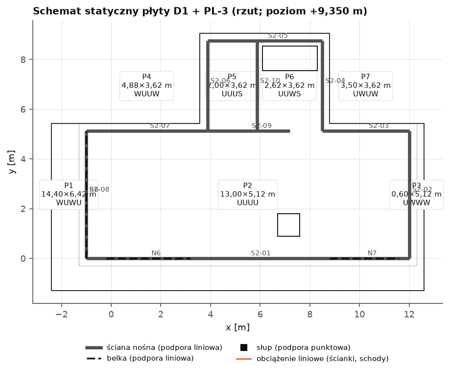
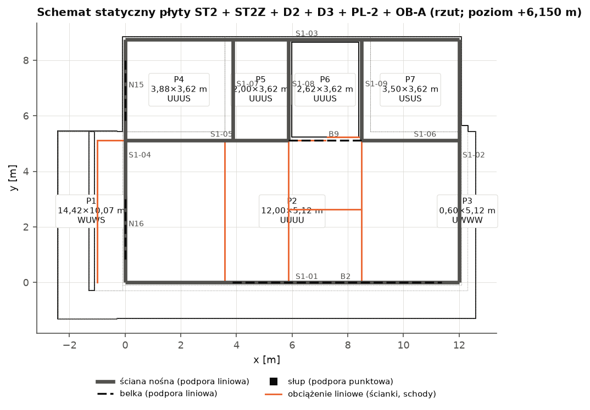
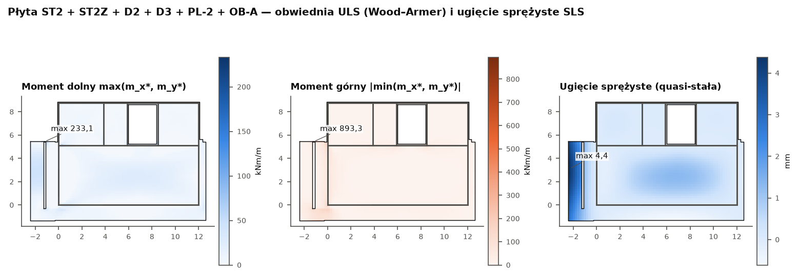
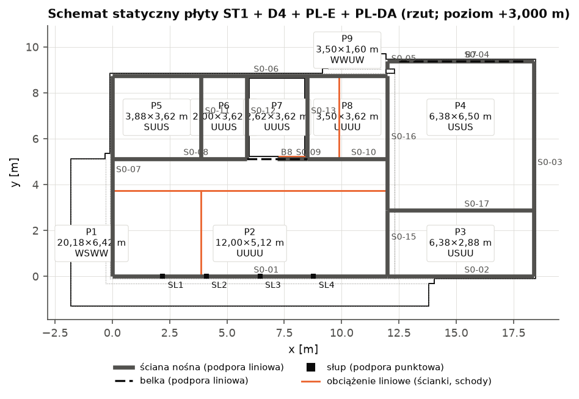
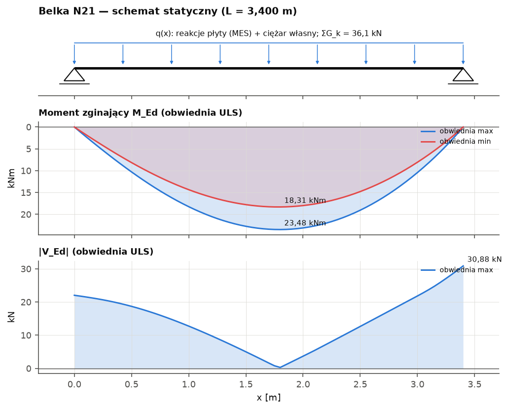
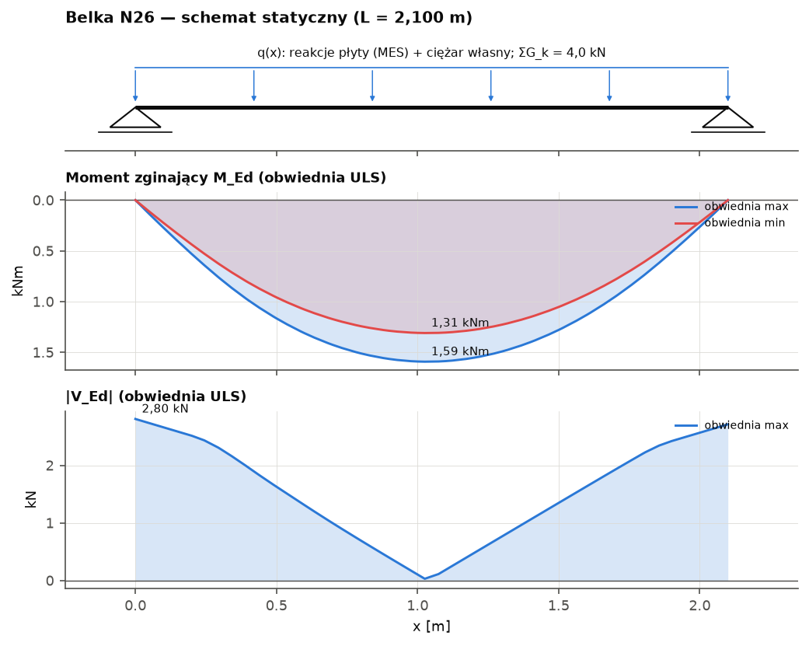
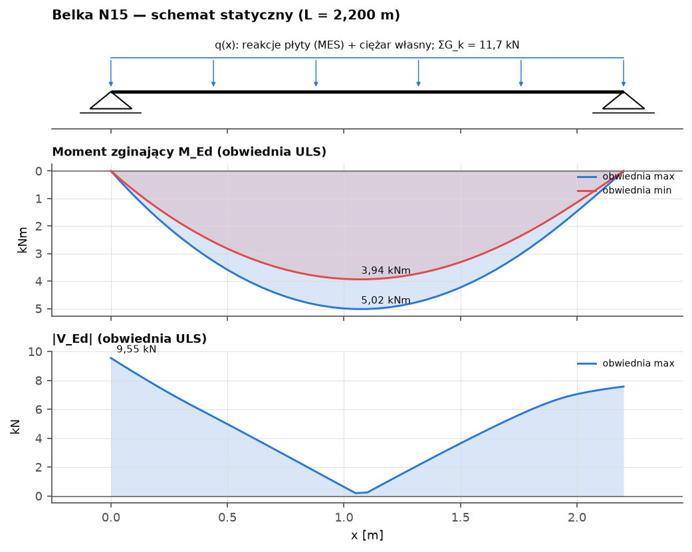
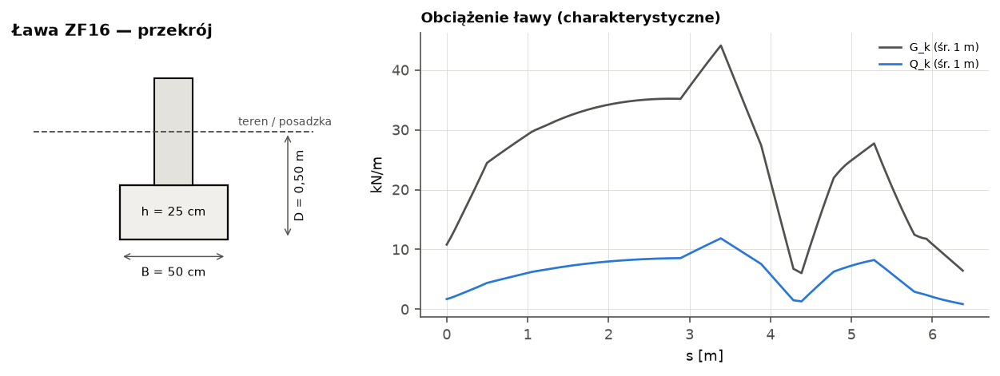

# Obliczenia statyczne — Dom LAMELA

Model: `budynek.yaml` (wersja 1.0, 2026-09-25) · biblioteka `lamela.obliczenia.konstrukcja` 1.0 · wygenerowano 2026-09-25

> **PROJEKT TECHNICZNY — obliczenia statyczne do rysunków PT-BO**

> Obliczenia wygenerowane automatycznie z modelu budynku. Wartości oznaczone [NZW] — niezweryfikowane w tekście normy (rejestr R5), [UPR] — uproszczenia biblioteki, [ZAŁ] — założenia. Dane gruntowe PRZYKŁADOWE (W-282, E-04). Dokument wymaga weryfikacji i podpisu projektanta z uprawnieniami: [DO UZUPEŁNIENIA: imię i nazwisko, specjalność, nr uprawnień].

## Spis pozycji

| Poz. | Element | Opis | η_max | Warunki |
|---|---|---|---|---|
| **1** |  | **Dachy i stropodachy** |  |  |
| 1.1 | `D1` | Stropodach / dach D1 | 344% | **niespełnione** |
| 1.2 | `D2` | Stropodach / dach D2 | 648% | **niespełnione** |
| 1.3 | `D3` | Stropodach / dach D3 | 587% | **niespełnione** |
| 1.4 | `D4` | Stropodach / dach D4 | 204% | **niespełnione** |
| **2** |  | **Stropy** |  |  |
| 2.1 | `ST2` | Strop ST2 | 687% | **niespełnione** |
| 2.2 | `ST2Z` | Strop ST2Z | 1600000000% | **niespełnione** |
| 2.3 | `ST1` | Strop ST1 | 568% | **niespełnione** |
| **3** |  | **Płyty wspornikowe** |  |  |
| 3.1 | `PL-3` | Płyta wspornikowa PL-3 | 99% | spełnione |
| 3.2 | `PL-2` | Płyta wspornikowa PL-2 | 504% | **niespełnione** |
| 3.3 | `OB-A` | Płyta wspornikowa OB-A | 1600000000% | **niespełnione** |
| 3.4 | `PL-E` | Płyta wspornikowa PL-E | 239% | **niespełnione** |
| 3.5 | `PL-DA` | Płyta wspornikowa PL-DA | 420% | **niespełnione** |
| **4** |  | **Schody** |  |  |
| 4.1 | `SCH1` | Schody SCH1 (P0 → P1) | 98% | spełnione |
| 4.2 | `SCH2` | Schody SCH2 (P1 → P2) | 98% | spełnione |
| **5** |  | **Belki i podciągi** |  |  |
| 5.1 | `B6` | Belka B6 | 98% | spełnione |
| 5.2 | `B10` | Belka B10 | 98% | spełnione |
| 5.3 | `N21` | Belka N21 | 67% | spełnione |
| 5.4 | `N22` | Belka N22 | 39% | spełnione |
| 5.5 | `N23` | Belka N23 | 48% | spełnione |
| 5.6 | `N24` | Belka N24 | 39% | spełnione |
| 5.7 | `N26` | Belka N26 | 56% | spełnione |
| 5.8 | `B2` | Belka B2 | 91% | spełnione |
| 5.9 | `B9` | Belka B9 | 100% | spełnione |
| 5.10 | `N15` | Belka N15 | 54% | spełnione |
| 5.11 | `N16` | Belka N16 | 74% | spełnione |
| 5.12 | `B7` | Belka B7 | 99% | spełnione |
| 5.13 | `B8` | Belka B8 | 98% | spełnione |
| **6** |  | **Nadproża** |  |  |
| 6.1 | `N-O0-01` | Nadproże N-O0-01 nad otworem O0-01 w ścianie S0-01 (światło 1,78 m) | 97% | spełnione |
| 6.2 | `N-O0-02` | Nadproże N-O0-02 nad otworem O0-02 w ścianie S0-01 (światło 1,78 m) | 216% | **niespełnione** |
| 6.3 | `N-O0-03` | Nadproże N-O0-03 nad otworem O0-03 w ścianie S0-01 (światło 2,22 m) | 161% | **niespełnione** |
| 6.4 | `N-O0-04` | Nadproże N-O0-04 nad otworem O0-04 w ścianie S0-01 (światło 2,22 m) | 99% | spełnione |
| 6.5 | `N-O0-05` | Nadproże N-O0-05 nad otworem O0-05 w ścianie S0-01 (światło 2,86 m) | 252% | **niespełnione** |
| 6.6 | `N-O0-06` | Nadproże N-O0-06 nad otworem O0-06 w ścianie S0-02 (światło 0,90 m) | 31% | spełnione |
| 6.7 | `N-O0-07` | Nadproże N-O0-07 nad otworem O0-07 w ścianie S0-04 (światło 5,00 m) | 219% | **niespełnione** |
| 6.8 | `N-O0-08` | Nadproże N-O0-08 nad otworem O0-08 w ścianie S0-03 (światło 1,00 m) | 33% | spełnione |
| 6.9 | `N-O0-09` | Nadproże N-O0-09 nad otworem O0-09 w ścianie S0-06 (światło 1,10 m) | 56% | spełnione |
| 6.10 | `N-O0-10` | Nadproże N-O0-10 nad otworem O0-10 w ścianie S0-06 (światło 0,35 m) | 33% | spełnione |
| 6.11 | `N-O0-11` | Nadproże N-O0-11 nad otworem O0-11 w ścianie S0-07 (światło 2,40 m) | 269% | **niespełnione** |
| 6.12 | `N-O0-12` | Nadproże N-O0-12 nad otworem O0-12 w ścianie S0-07 (światło 1,80 m) | 83% | spełnione |
| 6.13 | `N-O0-13` | Nadproże N-O0-13 nad otworem O0-13 w ścianie S0-06 (światło 0,80 m) | 33% | spełnione |
| 6.14 | `N-O0-14` | Nadproże N-O0-14 nad otworem O0-14 w ścianie S0-08 (światło 0,90 m) | 94% | spełnione |
| 6.15 | `N-O0-15` | Nadproże N-O0-15 nad otworem O0-15 w ścianie S0-11 (światło 0,90 m) | 54% | spełnione |
| 6.16 | `N-O0-17` | Nadproże N-O0-17 nad otworem O0-17 w ścianie S0-09 (światło 0,80 m) | 75% | spełnione |
| 6.17 | `N-O0-18` | Nadproże N-O0-18 nad otworem O0-18 w ścianie S0-10 (światło 1,50 m) | 100% | spełnione |
| 6.18 | `N-O0-21` | Nadproże N-O0-21 nad otworem O0-21 w ścianie S0-15 (światło 0,90 m) | 94% | spełnione |
| 6.19 | `N-O0-22` | Nadproże N-O0-22 nad otworem O0-22 w ścianie S0-17 (światło 0,90 m) | 40% | spełnione |
| 6.20 | `N-O1-01` | Nadproże N-O1-01 nad otworem O1-01 w ścianie S1-01 (światło 2,29 m) | 99% | spełnione |
| 6.21 | `N-O1-02` | Nadproże N-O1-02 nad otworem O1-02 w ścianie S1-02 (światło 1,50 m) | 96% | spełnione |
| 6.22 | `N-O1-03` | Nadproże N-O1-03 nad otworem O1-03 w ścianie S1-03 (światło 0,90 m) | 33% | spełnione |
| 6.23 | `N-O1-04` | Nadproże N-O1-04 nad otworem O1-04 w ścianie S1-03 (światło 1,20 m) | 33% | spełnione |
| 6.24 | `N-O1-05` | Nadproże N-O1-05 nad otworem O1-05 w ścianie S1-04 (światło 1,80 m) | 38% | spełnione |
| 6.25 | `N-O1-06` | Nadproże N-O1-06 nad otworem O1-06 w ścianie S1-04 (światło 1,80 m) | 94% | spełnione |
| 6.26 | `N-O1-09` | Nadproże N-O1-09 nad otworem O1-09 w ścianie S1-05 (światło 0,90 m) | 97% | spełnione |
| 6.27 | `N-O1-10` | Nadproże N-O1-10 nad otworem O1-10 w ścianie S1-05 (światło 0,90 m) | 99% | spełnione |
| 6.28 | `N-O1-11` | Nadproże N-O1-11 nad otworem O1-11 w ścianie S1-06 (światło 0,90 m) | 99% | spełnione |
| 6.29 | `N-O1-12` | Nadproże N-O1-12 nad otworem O1-12 w ścianie S1-06 (światło 0,90 m) | 94% | spełnione |
| 6.30 | `N-O1-13` | Nadproże N-O1-13 nad otworem O1-13 w ścianie S1-01 (światło 2,24 m) | 99% | spełnione |
| 6.31 | `N-O1-14` | Nadproże N-O1-14 nad otworem O1-14 w ścianie S1-01 (światło 2,29 m) | 92% | spełnione |
| 6.32 | `N-O2-01` | Nadproże N-O2-01 nad otworem O2-01 w ścianie S2-01 (światło 3,00 m) | 71% | spełnione |
| 6.33 | `N-O2-02` | Nadproże N-O2-02 nad otworem O2-02 w ścianie S2-01 (światło 1,20 m) | 56% | spełnione |
| 6.34 | `N-O2-03` | Nadproże N-O2-03 nad otworem O2-03 w ścianie S2-01 (światło 2,40 m) | 73% | spełnione |
| 6.35 | `N-O2-04` | Nadproże N-O2-04 nad otworem O2-04 w ścianie S2-08 (światło 2,40 m) | 84% | spełnione |
| 6.36 | `N-O2-05` | Nadproże N-O2-05 nad otworem O2-05 w ścianie S2-02 (światło 1,20 m) | 56% | spełnione |
| 6.37 | `N-O2-06` | Nadproże N-O2-06 nad otworem O2-06 w ścianie S2-05 (światło 0,90 m) | 33% | spełnione |
| 6.38 | `N-O2-07` | Nadproże N-O2-07 nad otworem O2-07 w ścianie S2-05 (światło 1,70 m) | 33% | spełnione |
| 6.39 | `N-O2-10` | Nadproże N-O2-10 nad otworem O2-10 w ścianie S2-09 (światło 0,90 m) | 94% | spełnione |
| **7** |  | **Wieńce** |  |  |
| 7.1 | `W-D1_PL-3` | Wieńce pod płytą D1 + PL-3 (poziom 9,300 m) | 31% | spełnione |
| 7.2 | `W-ST2_ST2Z_D2_D3_PL-2_OB-A` | Wieńce pod płytą ST2 + ST2Z + D2 + D3 + PL-2 + OB-A (poziom 6,150 m) | 31% | spełnione |
| 7.3 | `W-ST1_D4_PL-E_PL-DA` | Wieńce pod płytą ST1 + D4 + PL-E + PL-DA (poziom 3,000 m) | 31% | spełnione |
| **8** |  | **Słupy** |  |  |
| 8.1 | `SL1` | Słup SL1 (RK 120x120x8, L = 2,93 m) | 1% | spełnione |
| 8.2 | `SL2` | Słup SL2 (RK 120x120x8, L = 2,93 m) | 1% | spełnione |
| 8.3 | `SL3` | Słup SL3 (RK 120x120x8, L = 2,93 m) | 1% | spełnione |
| 8.4 | `SL4` | Słup SL4 (RK 120x120x8, L = 2,93 m) | 1% | spełnione |
| 8.5 | `SL5` | Słup SL5 (RK 100x100x6, L = 1,50 m) | 15% | spełnione |
| 8.6 | `SL6` | Słup SL6 (RK 100x100x6, L = 1,50 m) | 13% | spełnione |
| 8.7 | `SL7` | Słup SL7 (150x1000, L = 1,50 m) | 0% | spełnione |
| 8.8 | `SL8` | Słup SL8 (150x1000, L = 1,50 m) | 0% | spełnione |
| **9** |  | **Ściany murowe** |  |  |
| 9.1 | `S2-01` | Ściana S2-01 (P2, zewnętrzna nośna) | 60% | spełnione |
| 9.2 | `S2-02` | Ściana S2-02 (P2, zewnętrzna nośna) | 45% | spełnione |
| 9.3 | `S2-03` | Ściana S2-03 (P2, zewnętrzna nośna) | 45% | spełnione |
| 9.4 | `S2-04` | Ściana S2-04 (P2, zewnętrzna nośna) | 82% | spełnione |
| 9.5 | `S2-05` | Ściana S2-05 (P2, zewnętrzna nośna) | 60% | spełnione |
| 9.6 | `S2-06` | Ściana S2-06 (P2, zewnętrzna nośna) | 82% | spełnione |
| 9.7 | `S2-07` | Ściana S2-07 (P2, zewnętrzna nośna) | 45% | spełnione |
| 9.8 | `S2-08` | Ściana S2-08 (P2, zewnętrzna nośna) | 0% | spełnione |
| 9.9 | `S2-09` | Ściana S2-09 (P2, wewnętrzna nośna) | 172% | **niespełnione** |
| 9.10 | `S2-10` | Ściana S2-10 (P2, wewnętrzna nośna) | 66% | spełnione |
| 9.11 | `S2-11` | Ściana S2-11 (P2, wewnętrzna nośna) | 0% | spełnione |
| 9.12 | `S1-10` | Ściana S1-10 (P1, wewnętrzna nośna) | 0% | spełnione |
| 9.13 | `S1-01` | Ściana S1-01 (P1, zewnętrzna nośna) | 109% | **niespełnione** |
| 9.14 | `S1-02` | Ściana S1-02 (P1, zewnętrzna nośna) | 45% | spełnione |
| 9.15 | `S1-03` | Ściana S1-03 (P1, zewnętrzna nośna) | 57% | spełnione |
| 9.16 | `S1-04` | Ściana S1-04 (P1, zewnętrzna nośna) | 145% | **niespełnione** |
| 9.17 | `S1-05` | Ściana S1-05 (P1, wewnętrzna nośna) | 76% | spełnione |
| 9.18 | `S1-06` | Ściana S1-06 (P1, wewnętrzna nośna) | 364% | **niespełnione** |
| 9.19 | `S1-07` | Ściana S1-07 (P1, wewnętrzna nośna) | 45% | spełnione |
| 9.20 | `S1-08` | Ściana S1-08 (P1, wewnętrzna nośna) | 207% | **niespełnione** |
| 9.21 | `S1-09` | Ściana S1-09 (P1, wewnętrzna nośna) | 168% | **niespełnione** |
| 9.22 | `S0-14` | Ściana S0-14 (P0, wewnętrzna nośna) | 0% | spełnione |
| 9.23 | `S0-01` | Ściana S0-01 (P0, zewnętrzna nośna) | 217% | **niespełnione** |
| 9.24 | `S0-06` | Ściana S0-06 (P0, zewnętrzna nośna) | 60% | spełnione |
| 9.25 | `S0-07` | Ściana S0-07 (P0, zewnętrzna nośna) | 132% | **niespełnione** |
| 9.26 | `S0-08` | Ściana S0-08 (P0, wewnętrzna nośna) | 154% | **niespełnione** |
| 9.27 | `S0-09` | Ściana S0-09 (P0, wewnętrzna nośna) | 107% | **niespełnione** |
| 9.28 | `S0-10` | Ściana S0-10 (P0, wewnętrzna nośna) | 358% | **niespełnione** |
| 9.29 | `S0-11` | Ściana S0-11 (P0, wewnętrzna nośna) | 60% | spełnione |
| 9.30 | `S0-12` | Ściana S0-12 (P0, wewnętrzna nośna) | 0% | spełnione |
| 9.31 | `S0-13` | Ściana S0-13 (P0, wewnętrzna nośna) | 0% | spełnione |
| 9.32 | `S0-15` | Ściana S0-15 (P0, wewnętrzna nośna) | 60% | spełnione |
| 9.33 | `S0-16` | Ściana S0-16 (P0, wewnętrzna nośna) | 45% | spełnione |
| 9.34 | `S0-02` | Ściana S0-02 (P0, zewnętrzna nośna) | 71% | spełnione |
| 9.35 | `S0-03` | Ściana S0-03 (P0, zewnętrzna nośna) | 45% | spełnione |
| 9.36 | `S0-04` | Ściana S0-04 (P0, zewnętrzna nośna) | 60% | spełnione |
| 9.37 | `S0-05` | Ściana S0-05 (P0, zewnętrzna nośna) | 45% | spełnione |
| 9.38 | `S0-17` | Ściana S0-17 (P0, wewnętrzna nośna) | 45% | spełnione |
| **10** |  | **Fundamenty** |  |  |
| 10.1 | `PF1` | Płyta fundamentowa PF1 | 10% | spełnione |
| 10.2 | `ZF1` | Ława fundamentowa ZF1 (B = 0,60 m, h = 0,30 m, L = 12,00 m) | 254% | **niespełnione** |
| 10.3 | `ZF2` | Ława fundamentowa ZF2 (B = 0,60 m, h = 0,30 m, L = 6,38 m) | 254% | **niespełnione** |
| 10.4 | `ZF3` | Ława fundamentowa ZF3 (B = 0,60 m, h = 0,30 m, L = 9,38 m) | 198% | **niespełnione** |
| 10.5 | `ZF4` | Ława fundamentowa ZF4 (B = 0,60 m, h = 0,30 m, L = 6,38 m) | 185% | **niespełnione** |
| 10.6 | `ZF5` | Ława fundamentowa ZF5 (B = 0,60 m, h = 0,30 m, L = 0,62 m) | 91% | spełnione |
| 10.7 | `ZF6` | Ława fundamentowa ZF6 (B = 0,60 m, h = 0,30 m, L = 12,00 m) | 254% | **niespełnione** |
| 10.8 | `ZF7` | Ława fundamentowa ZF7 (B = 0,60 m, h = 0,30 m, L = 8,75 m) | 327% | **niespełnione** |
| 10.9 | `ZF8` | Ława fundamentowa ZF8 (B = 0,50 m, h = 0,25 m, L = 5,88 m) | 294% | **niespełnione** |
| 10.10 | `ZF9` | Ława fundamentowa ZF9 (B = 0,50 m, h = 0,25 m, L = 1,31 m) | 100% | spełnione |
| 10.11 | `ZF10` | Ława fundamentowa ZF10 (B = 0,50 m, h = 0,25 m, L = 3,50 m) | 207% | **niespełnione** |
| 10.12 | `ZF11` | Ława fundamentowa ZF11 (B = 0,50 m, h = 0,25 m, L = 3,62 m) | 100% | spełnione |
| 10.13 | `ZF12` | Ława fundamentowa ZF12 (B = 0,50 m, h = 0,25 m, L = 3,62 m) | 378% | **niespełnione** |
| 10.14 | `ZF13` | Ława fundamentowa ZF13 (B = 0,50 m, h = 0,25 m, L = 3,62 m) | 316% | **niespełnione** |
| 10.15 | `ZF14` | Ława fundamentowa ZF14 (B = 0,50 m, h = 0,25 m, L = 2,88 m) | 100% | spełnione |
| 10.16 | `ZF15` | Ława fundamentowa ZF15 (B = 0,50 m, h = 0,25 m, L = 5,88 m) | 132% | **niespełnione** |
| 10.17 | `ZF16` | Ława fundamentowa ZF16 (B = 0,50 m, h = 0,25 m, L = 6,38 m) | 100% | spełnione |
| 10.18 | `SF1` | Stopa fundamentowa SF1 (1,00 × 1,01 × 0,45 m) pod słupem SL1 | 185% | **niespełnione** |
| 10.19 | `SF2` | Stopa fundamentowa SF2 (1,00 × 1,01 × 0,45 m) pod słupem SL2 | 185% | **niespełnione** |
| 10.20 | `SF3` | Stopa fundamentowa SF3 (1,00 × 1,01 × 0,45 m) pod słupem SL3 | 186% | **niespełnione** |
| 10.21 | `SF4` | Stopa fundamentowa SF4 (1,00 × 1,01 × 0,45 m) pod słupem SL4 | 185% | **niespełnione** |

## Poz. 0 — Podstawa opracowania, założenia i obciążenia ogólne

### 0.1 Normy i przepisy

- PN-EN 1990:2004 + A1:2008 + NA:2010 — Podstawy projektowania konstrukcji
- PN-EN 1991-1-1:2004 + AC:2009 + NA:2010 — Ciężar objętościowy, ciężar własny, obciążenia użytkowe
- PN-EN 1991-1-3:2005 + AC:2009 + Ap1:2010 + NA:2010 — Obciążenie śniegiem
- PN-EN 1991-1-4:2008 + A1:2010 + AC:2009 + NA:2010 — Oddziaływania wiatru
- PN-EN 1992-1-1:2008 + AC:2011 + NA:2018-11 — Konstrukcje z betonu
- PN-EN 1993-1-1:2006 + A1:2014-07 + NA:2010; PN-EN 1993-1-8:2006 + NA:2011 — Konstrukcje stalowe
- PN-EN 1996-1-1+A1:2013-05 + NA:2014-03 (+Ap2:2014-09); PN-EN 1996-3 — Konstrukcje murowe
- PN-EN 1997-1:2008 + A1:2014-05 + Ap2:2010 + NA:2011 — Projektowanie geotechniczne
- PN-H-93220:2018-02 + Ap1:2018-04 — Stal B500SP; PN-EN ISO 3766 — rysunki zbrojenia
- Rozp. MTBiGM z 25.04.2012 (Dz.U. 2012 poz. 463) — geotechniczne warunki posadawiania

Stosowane wyłącznie Eurokody 1. generacji z NA (R5-01…R5-03, W-260).

### 0.2 Klasyfikacja i współczynniki

Stal zbrojeniowa B500SP (klasa C): f_yk = 500 MPa, f_yd = 434,8 MPa; γ_c = 1,4, γ_s = 1,15 (NA). Mur: Silikat gr. 1, kat. I, kl. 20, zaprawa do cienkich spoin: f_k = 7,66 MPa, γ_M = 1,7, f_d = 4,50 MPa. Stal konstrukcyjna S355: γ_M0 = γ_M1 = 1,0, γ_M2 = 1,25. Klasa konsekwencji CC2/RC2, K_FI = 1,0; okres użytkowania 50 lat (S4).

Kombinacje (PN-EN 1990 + NA): STR/GEO — mniej korzystne z 6.10a: Σ1,35·G_k + 1,5·ψ₀·Q_k i 6.10b: Σ0,85·1,35·G_k + 1,5·Q_k,1 + 1,5·Σψ₀·Q_k,i; EQU: 1,10·G_dst + 1,5·Q_dst ≤ 0,90·G_stb; wyjątkowa 6.11b: G + A_d + ψ₁·Q₁ + ψ₂·Q_i; SLS: charakterystyczna G + Q₁ + ψ₀Q_i, quasi-stała G + ψ₂Q. Obciążenia użytkowe dachu (kat. H) nie są łączone ze śniegiem.

| Parametr | Wartość | Parametr | Wartość |
|---|---|---|---|
| γ_G,sup / γ_G,inf / ξ | 1,35 / 1,00 / 0,85 | γ_Q | 1,50 |
| EQU: γ_G,dst / γ_G,stb / γ_Q | 1,10 / 0,90 / 1,50 | K_FI | 1,0 |
| γ_c / γ_s | 1,4 / 1,15 | α_cc | 1,0 [NZW] |
| γ_M (mur, kl. A) | 1,7 | γ_M0 / γ_M1 / γ_M2 | 1,0 / 1,0 / 1,25 |
| γ_R;v / γ_R;h (DA2*) | 1,4 / 1,1 | kategoria geotechniczna | 2 |
| s_k [kN/m²] (strefa 2) | 0,90 | v_b,0 [m/s] (strefa 1), teren | 22, kat. II |
| φ(∞,t₀) / ε_cs | 2,5 / 0,40‰ [ZAŁ] | grunt | Piasek średni (Ps), średnio zagęszczony, I_D ≈ 0,6 [DANE PRZYKŁADOWE] |

### 0.3 Materiały, klasy ekspozycji i otulenia

**Obciążenia użytkowe (R5 3.3, W-263)**

| Powierzchnia | q_k [kN/m²] | Q_k [kN] | ψ₀/ψ₁/ψ₂ | Podstawa |
|---|---|---|---|---|
| stropy mieszkalne (kat. A) | 2,00 | 3,0 | 0,7/0,5/0,3 | PN-EN 1991-1-1 tabl. 6.2 + NA; R5 3.3 [NZW NA — górna granica EN] |
| schody (kat. A) | 4,00 | 4,0 | 0,7/0,5/0,3 | PN-EN 1991-1-1 tabl. 6.2 |
| taras/balkon (kat. A, I) | 4,00 | 3,0 | 0,7/0,5/0,3 | PN-EN 1991-1-1 tabl. 6.2, 6.9 (p. 6.3.4.1); R5 3.3 |
| dach bez dostępu (kat. H) | 0,40 | 1,0 | 0,0/0,0/0,0 | PN-EN 1991-1-1 tabl. 6.10 + NA; nie łączyć ze śniegiem i wiatrem (p. 3.3.2) |

**Beton, klasy ekspozycji i otulenia (PN-EN 1992-1-1 4.4.1, R5 3.6, W-266)**

| Element | Ekspozycja | Beton (min.) | c_min,dur [mm] | c_nom [mm] (φ12) | w_max [mm] |
|---|---|---|---|---|---|
| stropy, wieńce, belki wewnętrzne | XC1 | C25/30 | 15 | 25 | 0,4 |
| płyty stropodachów | XC1 | C25/30 | 15 | 25 | 0,4 |
| płyty wysunięte na zewnątrz (taras, okapy) | XC4 | C30/37 | 30 | 40 | 0,3 |
| ławy, stopy, płyta fund. | XC2 | C25/30 | 25 | 40 | 0,3 |

**Długości zakotwienia i zakładów prętów B500SP w betonie C25/30** (PN-EN 1992-1-1 8.4, 8.7; σ_sd = f_yd, α = 1,0)

| Pręt | l_bd dobre [mm] | l_bd inne [mm] | l₀ (50%) dobre [mm] | l₀ (50%) inne [mm] |
|---|---|---|---|---|
| φ8 | 301 | 429 | 425 | 607 |
| φ10 | 376 | 537 | 531 | 759 |
| φ12 | 451 | 644 | 638 | 911 |
| φ16 | 601 | 859 | 850 | 1215 |
| φ20 | 751 | 1074 | 1063 | 1518 |

### 0.4 Obciążenia ogólne — śnieg i wiatr

#### Śnieg — dach płaski (przypadek A, trwała sytuacja obliczeniowa)

- Strefa 2, wartość charakterystyczna: s_k = **0,90** kN/m² *(PN-EN 1991-1-3 NA rys. NA.1; R5-30)*
- Współczynnik kształtu dachu: μ₁ = (α = 0,0° ≤ 30°) = **0,80** *(tabl. 5.2)*
- Obciążenie śniegiem: s = μ₁·C_e·C_t·s_k = 0,80·1,00·1,00·0,90 = **0,720** kN/m² *((5.7))*

#### Wiatr — szczytowe ciśnienie prędkości (teren kat. II, z = 10,08 m)

- Bazowa prędkość wiatru (strefa 1, A ≤ 300 m): v_b = c_dir·c_season·v_b,0 = 1,00·1,00·22,0 = **22,00** m/s *((4.1); NA tabl. NA.1)*
- Ciśnienie prędkości bazowej: q_b = ½·ρ·v_b² = 0,5·1,25·22,0² = **0,3025** kN/m² *((4.10))*
- Współczynnik ekspozycji: c_e(z) = 2,3·(z/10)^0,24 = 2,3·(10,08/10)^0,24 = **2,304** *(NA tabl. NA.3 (z_min = 2 m))*
- Szczytowe ciśnienie prędkości: q_p(z) = c_e(z)·q_b = 2,304·0,3025 = **0,697** kN/m² *((4.8))*

#### Wiatr — ściany (b = 21,09 m, d = 11,67 m, h = 10,08 m)

- Parametr stref: e = min(b; 2h) = min(21,09; 2·10,08) = **20,15** m *(rys. 7.5)*
- Smukłość: h/d = 10,08/11,67 = **0,863** *(tabl. 7.1 (interpolacja liniowa))*
- Parcie netto (strefa D, c_pi = −0,3): w = q_p·(c_pe,D − c_pi) = 0,697·(0,78 + 0,3) = **0,754** kN/m² *((5.1), (5.2); p. 7.2.9(6) uwaga 2)*
- Ssanie netto (strefa A, c_pi = +0,2): w = q_p·(c_pe,A − c_pi) = 0,697·(−1,20 − 0,2) = **−0,976** kN/m²

> Wartości tabl. 7.1 — [NZW] (R5-45: odczytać z normy przed PT).

#### Wiatr — ściany (b = 11,67 m, d = 21,09 m, h = 10,08 m) — kierunek prostopadły

- Parametr stref: e = min(b; 2h) = min(11,67; 2·10,08) = **11,67** m *(rys. 7.5)*
- Smukłość: h/d = 10,08/21,09 = **0,478** *(tabl. 7.1 (interpolacja liniowa))*
- Parcie netto (strefa D, c_pi = −0,3): w = q_p·(c_pe,D − c_pi) = 0,697·(0,73 + 0,3) = **0,718** kN/m² *((5.1), (5.2); p. 7.2.9(6) uwaga 2)*
- Ssanie netto (strefa A, c_pi = +0,2): w = q_p·(c_pe,A − c_pi) = 0,697·(−1,20 − 0,2) = **−0,976** kN/m²

> Wartości tabl. 7.1 — [NZW] (R5-45: odczytać z normy przed PT).

#### Wiatr — dach płaski (h_p/h = 0,054)

- Parametr stref: e = min(b; 2h) = min(21,09; 2·10,08) = **20,15** m *(rys. 7.6)*
- Attyka: h_p/h = 0,55/10,08 = **0,054** *(tabl. 7.2 (interpolacja))*
- Ssanie netto w strefie F (c_pi = +0,2): w = q_p·(c_pe,10,F − c_pi) = 0,697·(−1,38 − 0,2) = **−1,104** kN/m²
- Ssanie netto w strefie H: w = q_p·(c_pe,10,H − c_pi) = 0,697·(−0,70 − 0,2) = **−0,627** kN/m²

> Wartości tabl. 7.2 — [NZW] (R5-45). Dach żelbetowy: ssanie nie decyduje (ciężar własny ≫ ssanie); istotne dla balastu PV i obróbek attyk.

### 0.5 Metody obliczeń

- Płyty: MES płytowy (element prostokątny ACM, teoria Kirchhoffa, ν = 0,2), podpory liniowe sztywne (ściany, belki), punktowe (słupy); obwiednia kombinacji 6.10a/6.10b, obciążeń szachownicowych pól i sytuacji wyjątkowej B2; momenty wymiarujące Wood–Armer; pola prostokątne podparte na obwodzie — sprawdzenie metodą tablic (współczynniki generowane MRS, zgodne z tablicami Timoshenki/Czernego ≤ 1 %), M_Ed = max(MES, tablice).
- Belki, schody, nadproża: schematy prętowe (MES belkowy), obwiednie układów obciążenia zmiennego.
- Ściany murowe: profile obciążeń wzdłuż osi (reakcje płyt z MES + ściany wyżej), przekazanie obciążeń znad otworów na filarki (po 0,5 m z każdej strony), nośność wg PN-EN 1996-1-1 6.1.2 + zał. G, filarki z η_A.
- Fundamenty: nośność wg PN-EN 1997-1 zał. D (DA2*), osiadanie — sumowanie warstw (Boussinesq), ławy niezbrojone poprzecznie wg PN-EN 1992-1-1 12.9.3; obciążenie ław — maks. średnia krocząca na 2,0 m.
- Ugięcia żelbetu: l/d (7.4.2), a gdy niespełnione — obliczenie z interpolacją ζ, pełzaniem φ = 2,5 i skurczem (7.4.3).
- Ściany-tarcze żelbetowe (pole `tarcza` w modelu lub ściana żelbetowa bez ciągłej podpory poniżej): MES płaskiego stanu naprężenia (element QM6, podpory sprężyste k = E·t/h ścian poniżej), obciążenia — reakcje płyt nad tarczą (krawędź górna) i płyty podwieszonej poza ścianami poniżej (krawędź dolna), ściany wyżej, belki; model kratownicowy STM generowany z pola naprężeń (programowanie liniowe, 5.6.4, 6.5), cięgna F = max(STM; całkowanie σ), węzły CCC/CCT/CTT, siatki 9.6/9.7, otwory, rysy, ugięcia MES ze sztywnością zarysowaną, EQU wspornika; reakcje → ściany poniżej (moduł `tarcze`, walidacja: tarcze_walidacja).

## Poz. 1 — Dachy i stropodachy

### Poz. 1.1 — Stropodach / dach D1

Element modelu: `D1` · maks. wykorzystanie nośności η = 344% · **WARUNKI NIESPEŁNIONE — patrz tabele warunków i wnioski**

#### Opis i schemat statyczny

Płyta żelbetowa monolityczna gr. h = 22 cm, wierzch konstrukcji 9,300 m, beton C25/30 (ekspozycja XC1), stal B500SP. Pole płyty 84,48 m². Analiza wspólna z: D1 + PL-3 (płyty połączone na jednym poziomie — ciągłość nad podporami/łącznikami). Schemat: płyta na podporach liniowych (ściany, belki — podpory sztywne, przegubowe) i punktowych (słupy); statyka — MES płytowy (elementy ACM, siatka 20 cm, obwiednia kombinacji 6.10a/6.10b i obciążeń szachownicowych pól), sprawdzenie pól prostokątnych metodą tablic (współczynniki MRS).

Podpory: S2-01 (ściana), S2-02 (ściana), S2-03 (ściana), S2-04 (ściana), S2-05 (ściana), S2-06 (ściana), S2-07 (ściana), S2-08 (ściana), S2-09 (ściana), S2-10 (ściana), S2-11 (ściana), B6 (belka), B10 (belka), N21 (belka), N22 (belka), N23 (belka), N24 (belka), N26 (belka)

*Rys. Rozkłady obciążenia śniegiem w zaspach (PN-EN 1991-1-3 p. 5.3.6, 6.2, zał. B).*

*Rys. Schemat statyczny płyty D1 + PL-3: pola (P — wymiary, warunki brzegowe x=0/x=l_x/y=0/y=l_y: S — podparcie swobodne, U — ciągłość/utwierdzenie, W — brzeg swobodny/niepełny), podpory.*

*Rys. Płyta D1 + PL-3: momenty wymiarujące (obwiednia kombinacji 6.10a/b, obciążeń szachownicowych i sytuacji wyjątkowej) oraz ugięcie sprężyste od kombinacji quasi-stałej (bez zarysowania i pełzania — te w obliczeniach 7.4.3).*

#### Zestawienie obciążeń

**Obciążenia stałe — D1 — Stropodach bryły A (P2): membrana TPO, PIR spadkowy 12–32 cm (śr. 22), paroizolacja z Al, płyta ŻB 22 cm, tynk; spadek ≥ 2 % do wpustów WP1/WP2 (U ≈ 0,10)**

| Warstwa | Obliczenie | g_k [kN/m²] | γ_G (6.10a) | g_d [kN/m²] | ξγ_G (6.10b) | g_d [kN/m²] |
|---|---|---|---|---|---|---|
| Membrana dachowa TPO 1,5 mm, mocowana mechanicznie (hydroizolacja stropodachów) | 0,2 cm × 9,81 kN/m³ | 0,020 | 1,35 | 0,026 | 1,15 | 0,023 |
| Płyty PIR z okładziną (izolacja spadkowa stropodachów) | 22,0 cm × 0,31 kN/m³ | 0,069 | 1,35 | 0,093 | 1,15 | 0,079 |
| Paroizolacja bitumiczna z wkładką Al (na płycie stropodachów) | 0,4 cm × 10,79 kN/m³ | 0,043 | 1,35 | 0,058 | 1,15 | 0,050 |
| Żelbet C25/30, B500SP (stropy, płyta fundamentowa, ściany) | 22,0 cm × 25,00 kN/m³ | 5,500 | 1,35 | 7,425 | 1,15 | 6,311 |
| Tynk gipsowy maszynowy 1,5 cm | 1,0 cm × 11,77 kN/m³ | 0,118 | 1,35 | 0,159 | 1,15 | 0,135 |
| **Razem g_k** |  | 5,750 |  | 7,762 |  | 6,598 |

- Obciążenie użytkowe: dach bez dostępu (kat. H): q_k = 0,40 kN/m², Q_k = 1,0 kN, ψ₀/ψ₁/ψ₂ = 0,0/0,0/0,0 (PN-EN 1991-1-1 tabl. 6.10 + NA; nie łączyć ze śniegiem i wiatrem (p. 3.3.2)).
- Śnieg: s = 0,720 kN/m² (przypadek równomierny) oraz zaspy (poniżej).

#### Obliczenia

##### Śnieg — zaspa przy attyce h = 0,25 m (trwała sytuacja obliczeniowa) — D1

- Współczynnik kształtu przy przeszkodzie: μ₂ = γ·h/s_k = 2,00·0,25/0,90 = **0,556** *((6.1))*
- Przyjęto (0,8 ≤ μ₂ ≤ 2,0): μ₂ = **0,800** *(p. 6.2(2))*
- Długość zaspy: l_s = 2h (5 ≤ l_s ≤ 15 m) = 2·0,25 = **5,00** m *((6.2))*
- Obciążenie przy attyce: s₂ = μ₂·C_e·C_t·s_k = 0,800·1,00·1,00·0,90 = **0,720** kN/m²

##### Sprawdzenie metodą tablic — pole P2 (13,00 × 5,12 m, brzegi UUUU)

- Obciążenia obliczeniowe (miarodajne z 6.10a/6.10b): g_d; q_d = g_k = 5,750, q_k = 0,720 kN/m² = **7,762; 0,756** kN/m²
- Współczynniki (brzegi UUUU; x=0, x=l_x, y=0, y=l_y; S — podparta, U — utwierdzona): α_x; α_y; β_x; β_y = **0,0023; 0,0065; −0,0088; −0,0130** *(MRS (odpowiednik tablic Czernego), ν = 0,2)*
- Współczynniki płyty swobodnie podpartej (SSSS): α_x⁰; α_y⁰ = **0,0057; 0,0175**
- Moment przęsłowy x: M_x = [α_x·(g_d + q_d/2) + α_x⁰·q_d/2]·l_x² = [0,0023·8,140 + 0,0057·0,378]·13,00² = **3,53** kNm/m
- Moment przęsłowy y: M_y = [α_y·(g_d + q_d/2) + α_y⁰·q_d/2]·l_x² = [0,0065·8,140 + 0,0175·0,378]·13,00² = **10,06** kNm/m
- Momenty podporowe (utwierdzenie, g_d + q_d): M_x,p; M_y,p = **−12,71; −18,77** kNm/m
- Porównanie z MES (M_x; M_y dół, poza narożami): M_MES/M_tabl = **2,24; 1,83**
- Przyjęto do wymiarowania: M_Ed = max(M_MES; M_tabl) = **7,91; 18,46** kNm/m

##### Pole P2 — zginanie dół, kierunek x

- Wysokość użyteczna: d = **190** mm
- Moment względny: μ = M_Ed/(b·d²·η·f_cd) = 7,91·10⁶/(1000·190²·1,0·17,86) = **0,0123** *(3.1.7(3))*
- Względna wysokość strefy ściskanej: ξ_eff = 1 − √(1 − 2μ) = 1 − √(1 − 2·0,0123) = **0,0123**
- Warunek ciągliwości: ξ_eff ≤ ξ_eff,lim = λ·ε_cu3/(ε_cu3 + f_yd/E_s) = 0,012 ≤ 0,493 = **spełniony**
- Wymagane zbrojenie rozciągane: A_s1 = ξ_eff·b·d·η·f_cd/f_yd = 0,0123·1000·190·1,0·17,86/434,8 = **96** mm²
- Zbrojenie minimalne: A_s,min = max(0,26·f_ctm/f_yk·b·d; 0,0013·b·d) = max(0,26·2,6/500·1000·190; 0,0013·1000·190) = **257** mm² *((9.1N) + NA)*
- Przyjęto (z warunkiem rys): φ8 co 19 cm = **2,65** cm²/m
- Naprężenie w stali (quasi-stała, przekrój zarysowany, α_e = 15): σ_s = α_e·M_qp·(d − x_II)/I_II = **109** MPa
- Maksymalna średnica (w_max = 0,4 mm): φ_s = φ*_s·(f_ct,eff/2,9)·k_c·h_cr/(2(h − d)) = 40,0·(2,6/2,9)·0,4·110/(2·30) = **26,3** mm *(tabl. 7.2N, (7.6N))*
- Maksymalny rozstaw prętów: s_max = (σ_s = 109 MPa) = **300** mm *(tabl. 7.3N)*

| Warunek | Efekt | Nośność / limit | η | Stan | Podstawa |
|---|---|---|---|---|---|
| Zbrojenie na zginanie | A_s,req = 257 mm²/m | A_s,prov = 265 mm²/m | 97% | spełniony | 6.1, (9.1N) |
| Rysy: średnica prętów (tabl. 7.2N) | φ = 8 mm | φ_s,max = 26 mm | 30% | spełniony | 7.3.3(2) |

##### Pole P2 — zginanie dół, kierunek y

- Wysokość użyteczna: d = **180** mm
- Moment względny: μ = M_Ed/(b·d²·η·f_cd) = 18,46·10⁶/(1000·180²·1,0·17,86) = **0,0319** *(3.1.7(3))*
- Względna wysokość strefy ściskanej: ξ_eff = 1 − √(1 − 2μ) = 1 − √(1 − 2·0,0319) = **0,0324**
- Warunek ciągliwości: ξ_eff ≤ ξ_eff,lim = λ·ε_cu3/(ε_cu3 + f_yd/E_s) = 0,032 ≤ 0,493 = **spełniony**
- Wymagane zbrojenie rozciągane: A_s1 = ξ_eff·b·d·η·f_cd/f_yd = 0,0324·1000·180·1,0·17,86/434,8 = **240** mm²
- Zbrojenie minimalne: A_s,min = max(0,26·f_ctm/f_yk·b·d; 0,0013·b·d) = max(0,26·2,6/500·1000·180; 0,0013·1000·180) = **243** mm² *((9.1N) + NA)*
- Przyjęto (z warunkiem rys): φ8 co 19 cm = **2,65** cm²/m
- Naprężenie w stali (quasi-stała, przekrój zarysowany, α_e = 15): σ_s = α_e·M_qp·(d − x_II)/I_II = **269** MPa
- Maksymalna średnica (w_max = 0,4 mm): φ_s = φ*_s·(f_ct,eff/2,9)·k_c·h_cr/(2(h − d)) = 17,1·(2,6/2,9)·0,4·110/(2·40) = **8,4** mm *(tabl. 7.2N, (7.6N))*
- Maksymalny rozstaw prętów: s_max = (σ_s = 269 MPa) = **214** mm *(tabl. 7.3N)*

| Warunek | Efekt | Nośność / limit | η | Stan | Podstawa |
|---|---|---|---|---|---|
| Zbrojenie na zginanie | A_s,req = 243 mm²/m | A_s,prov = 265 mm²/m | 92% | spełniony | 6.1, (9.1N) |
| Rysy: średnica prętów (tabl. 7.2N) | φ = 8 mm | φ_s,max = 8 mm | 95% | spełniony | 7.3.3(2) |

##### Pole P2 — zginanie góra, x

- Wysokość użyteczna: d = **190** mm
- Moment względny: μ = M_Ed/(b·d²·η·f_cd) = 16,57·10⁶/(1000·190²·1,0·17,86) = **0,0257** *(3.1.7(3))*
- Względna wysokość strefy ściskanej: ξ_eff = 1 − √(1 − 2μ) = 1 − √(1 − 2·0,0257) = **0,0261**
- Warunek ciągliwości: ξ_eff ≤ ξ_eff,lim = λ·ε_cu3/(ε_cu3 + f_yd/E_s) = 0,026 ≤ 0,493 = **spełniony**
- Wymagane zbrojenie rozciągane: A_s1 = ξ_eff·b·d·η·f_cd/f_yd = 0,0261·1000·190·1,0·17,86/434,8 = **203** mm²
- Zbrojenie minimalne: A_s,min = max(0,26·f_ctm/f_yk·b·d; 0,0013·b·d) = max(0,26·2,6/500·1000·190; 0,0013·1000·190) = **257** mm² *((9.1N) + NA)*
- Przyjęto (z warunkiem rys): φ8 co 19 cm = **2,65** cm²/m
- Naprężenie w stali (quasi-stała, przekrój zarysowany, α_e = 15): σ_s = α_e·M_qp·(d − x_II)/I_II = **234** MPa
- Maksymalna średnica (w_max = 0,4 mm): φ_s = φ*_s·(f_ct,eff/2,9)·k_c·h_cr/(2(h − d)) = 21,7·(2,6/2,9)·0,4·110/(2·30) = **14,3** mm *(tabl. 7.2N, (7.6N))*
- Maksymalny rozstaw prętów: s_max = (σ_s = 234 MPa) = **257** mm *(tabl. 7.3N)*

| Warunek | Efekt | Nośność / limit | η | Stan | Podstawa |
|---|---|---|---|---|---|
| Zbrojenie na zginanie | A_s,req = 257 mm²/m | A_s,prov = 265 mm²/m | 97% | spełniony | 6.1, (9.1N) |
| Rysy: średnica prętów (tabl. 7.2N) | φ = 8 mm | φ_s,max = 14 mm | 56% | spełniony | 7.3.3(2) |

##### Pole P2 — zginanie góra, y

- Wysokość użyteczna: d = **180** mm
- Moment względny: μ = M_Ed/(b·d²·η·f_cd) = 43,11·10⁶/(1000·180²·1,0·17,86) = **0,0745** *(3.1.7(3))*
- Względna wysokość strefy ściskanej: ξ_eff = 1 − √(1 − 2μ) = 1 − √(1 − 2·0,0745) = **0,0775**
- Warunek ciągliwości: ξ_eff ≤ ξ_eff,lim = λ·ε_cu3/(ε_cu3 + f_yd/E_s) = 0,078 ≤ 0,493 = **spełniony**
- Wymagane zbrojenie rozciągane: A_s1 = ξ_eff·b·d·η·f_cd/f_yd = 0,0775·1000·180·1,0·17,86/434,8 = **573** mm²
- Zbrojenie minimalne: A_s,min = max(0,26·f_ctm/f_yk·b·d; 0,0013·b·d) = max(0,26·2,6/500·1000·180; 0,0013·1000·180) = **243** mm² *((9.1N) + NA)*
- Przyjęto (z warunkiem rys): φ10 co 13 cm = **6,04** cm²/m
- Naprężenie w stali (quasi-stała, przekrój zarysowany, α_e = 15): σ_s = α_e·M_qp·(d − x_II)/I_II = **291** MPa
- Maksymalna średnica (w_max = 0,4 mm): φ_s = φ*_s·(f_ct,eff/2,9)·k_c·h_cr/(2(h − d)) = 14,9·(2,6/2,9)·0,4·110/(2·40) = **7,4** mm *(tabl. 7.2N, (7.6N))*
- Maksymalny rozstaw prętów: s_max = (σ_s = 291 MPa) = **186** mm *(tabl. 7.3N)*

| Warunek | Efekt | Nośność / limit | η | Stan | Podstawa |
|---|---|---|---|---|---|
| Zbrojenie na zginanie | A_s,req = 573 mm²/m | A_s,prov = 604 mm²/m | 95% | spełniony | 6.1, (9.1N) |
| Rysy: rozstaw prętów (tabl. 7.3N) | s = 130 mm | s_max = 186 mm | 70% | spełniony | 7.3.3(2) |

##### Pole P2 — zbrojenie narożne (góra i dół, strefy 1,03 × 1,03 m)

- Wysokość użyteczna: d = **180** mm
- Moment względny: μ = M_Ed/(b·d²·η·f_cd) = 24,96·10⁶/(1000·180²·1,0·17,86) = **0,0431** *(3.1.7(3))*
- Względna wysokość strefy ściskanej: ξ_eff = 1 − √(1 − 2μ) = 1 − √(1 − 2·0,0431) = **0,0441**
- Warunek ciągliwości: ξ_eff ≤ ξ_eff,lim = λ·ε_cu3/(ε_cu3 + f_yd/E_s) = 0,044 ≤ 0,493 = **spełniony**
- Wymagane zbrojenie rozciągane: A_s1 = ξ_eff·b·d·η·f_cd/f_yd = 0,0441·1000·180·1,0·17,86/434,8 = **326** mm²
- Zbrojenie minimalne: A_s,min = max(0,26·f_ctm/f_yk·b·d; 0,0013·b·d) = max(0,26·2,6/500·1000·180; 0,0013·1000·180) = **243** mm² *((9.1N) + NA)*
- Przyjęto: φ10 co 24 cm = **3,27** cm²/m

| Warunek | Efekt | Nośność / limit | η | Stan | Podstawa |
|---|---|---|---|---|---|
| Zbrojenie na zginanie | A_s,req = 326 mm²/m | A_s,prov = 327 mm²/m | 100% | spełniony | 6.1, (9.1N) |

##### Pole P2 — ścinanie (maks. reakcja podpory, [UPR] 0,6·r przy podporze pośredniej)

- Współczynnik skali: k = 1 + √(200/d) ≤ 2,0 = 1 + √(200/190) = **2,000**
- Stopień zbrojenia podłużnego: ρ_l = A_sl/(b_w·d) ≤ 0,02 = 265/(1000·190) = **0,00139**
- Nośność na ścinanie: V_Rd,c = C_Rd,c·k·(100·ρ_l·f_ck)^(1/3)·b_w·d = 0,1286·2,000·(100·0,00139·25)^(1/3)·1000·190·10⁻³ = **74,04** kN *((6.2.a); C_Rd,c = 0,18/γ_c)*
- Wartość minimalna: V_Rd,c,min = v_min·b_w·d, v_min = 0,035·k^(3/2)·f_ck^(1/2) = 0,4950·1000·190·10⁻³ = **94,05** kN *((6.2.b), (6.3N))*

| Warunek | Efekt | Nośność / limit | η | Stan | Podstawa |
|---|---|---|---|---|---|
| Ścinanie bez zbrojenia poprzecznego (6.2.2) | V_Ed = 323,32 kN | V_Rd,c = 94,05 kN | 344% | **NIESPEŁNIONY** | PN-EN 1992-1-1 6.2.2 |

##### Pole P2 — ugięcie (l = 5,12 m, K = 1,5)

- Stopień zbrojenia wymagany: ρ = A_s,req/(b·d) = 240/(1000·180) = **0,00133**
- Wartość odniesienia: ρ₀ = √f_ck·10⁻³ = √25·10⁻³ = **0,00500**
- Graniczne l/d (ρ ≤ ρ₀): K·[11 + 1,5·√f_ck·ρ₀/ρ + 3,2·√f_ck·(ρ₀/ρ − 1)^(3/2)] = 1,5·[11 + 1,5·5,000·3,753 + 3,2·5,000·(3,753 − 1)^1,5] = **168,4** *((7.16a))*
- Mnożnik od naprężeń w stali: 310/σ_s ≈ 500/(f_yk·A_s,req/A_s,prov) ≤ 1,5 = 500/(500·240/265) = **1,103** *((7.17))*
- Smukłość rzeczywista: l_eff/d = 5,12/0,180 = **28,5**
- *Obliczenie ugięcia (7.4.3)*
- Efektywny moduł sprężystości: E_c,eff = E_cm/(1 + φ) = 31000/(1 + 2,5) = **8857** MPa *((7.20))*
- Stosunek modułów: α_e = E_s/E_c,eff = 200000/8857 = **22,58**
- Przekrój niezarysowany: x_I; I_I = **111,9 mm; 915,8·10⁶ mm⁴**
- Przekrój zarysowany: x_II; I_II = **40,8 mm; 138,4·10⁶ mm⁴**
- Moment rysujący: M_cr = f_ctm·I_I/(h − x_I) = 2,6·915,8·10⁶/(220 − 111,9) = **22,02** kNm
- Współczynnik rozkładu: ζ = 1 − β·(M_cr/M_qp)², β = 0,5 = M_qp ≤ M_cr → 0 = **0,000** *((7.19))*
- Ugięcie od obciążeń (quasi-stała): w_q = ζ·w_II + (1 − ζ)·w_I = 0,000·12,96 + 1,000·1,96 = **1,96** mm *((7.18))*
- Ugięcie od skurczu: w_cs = k·(1/r_cs)·l², 1/r_cs = ε_cs·α_e·S/I = 0,125·0,178·10⁻⁶·5125² = **0,58** mm *((7.21))*
- Ugięcie całkowite: w = w_q + w_cs = 1,96 + 0,58 = **2,54** mm
- Ugięcie dopuszczalne: w_lim = L/250 = 5125/250 = **20,5** mm *(7.4.1(4))*

| Warunek | Efekt | Nośność / limit | η | Stan | Podstawa |
|---|---|---|---|---|---|
| Ugięcie — graniczna smukłość l/d (7.4.2) | l/d = 28,5  | (l/d)_lim = 185,7  | 15% | spełniony | (7.16), tabl. 7.4N |

> l/d spełnione — obliczenie (7.4.3) informacyjnie: w = 2,5 mm ≤? 20,5 mm.

#### Wymiarowanie — zestawienia

**Zestawienie wymiarowania pól płyty** (M [kNm/m] — obwiednia ULS, Wood–Armer, poza strefami narożnymi; „tabl.” — metoda tablic, jeżeli stosowalna; góra — nad podporami; naroża — strefy 0,2·l_min × 0,2·l_min przy narożach podpartych, zbrojenie górą i dołem na moment skręcający)

| Pole | l_x × l_y [m] | Brzegi | M_x,dół [kNm/m] MES / tabl. | Zbroj. x dół | M_y,dół MES / tabl. | Zbroj. y dół | M_x,góra | Zbroj. x góra | M_y,góra | Zbroj. y góra | Naroża M / zbroj. | w / w_lim [mm] | η_max |
|---|---|---|---|---|---|---|---|---|---|---|---|---|---|
| P1 | 14,40 × 6,42 | WUWU | 1,81 / — | φ8 co 19 cm | 0,67 / — | φ8 co 20 cm | −33,60 | φ8 co 12 cm | −27,53 | φ10 co 21 cm | — | 0,9 / 25,7 | 138% ✗ |
| P2 | 13,00 × 5,12 | UUUU | 7,91 / 3,53 | φ8 co 19 cm | 18,46 / 10,06 | φ8 co 19 cm | −16,57 | φ8 co 19 cm | −43,11 | φ10 co 13 cm | 24,96 / φ10 co 24 cm | 2,5 / 20,5 | 344% ✗ |
| P4 | 2,00 × 3,62 | SUUS | 5,54 / 2,12 | φ8 co 19 cm | 5,27 / 0,89 | φ8 co 20 cm | −27,45 | φ10 co 23 cm | −18,48 | φ8 co 19 cm | 42,61 / φ12 co 19 cm | 0,1 / 8,0 | 344% ✗ |
| P5 | 1,32 × 3,62 | UWUS | 7,67 / — | φ8 co 19 cm | 2,63 / — | φ8 co 20 cm | −8,44 | φ8 co 19 cm | −22,17 | φ8 co 17 cm | 22,71 / φ8 co 16 cm | 0,1 / 5,3 | 225% ✗ |
| P6 | 1,31 × 3,62 | WSUS | 5,96 / — | φ8 co 19 cm | 5,35 / — | φ8 co 20 cm | −9,60 | φ8 co 19 cm | −22,45 | φ8 co 17 cm | 38,94 / φ10 co 15 cm | 0,1 / 5,2 | 225% ✗ |

**Reakcje podporowe (charakterystyczne, cała grupa płyt)**

| Podpora | Długość [m] | ΣR_G [kN] | ΣR_Q [kN] | max r_G [kN/m] | max r_Q [kN/m] |
|---|---|---|---|---|---|
| S2-01 | 13,00 | 159,2 | 46,8 | 237,65 | 248,47 |
| S2-02 | 5,12 | 26,2 | −5,1 | 25,90 | 207,88 |
| S2-03 | 3,50 | 97,6 | −8,7 | 687,08 | 21,74 |
| S2-04 | 3,62 | −107,0 | 10,0 | 687,08 | 111,43 |
| S2-05 | 4,62 | 9,6 | 0,0 | 36,51 | 0,42 |
| S2-06 | 3,62 | −158,6 | 18,0 | 414,56 | 179,14 |
| S2-07 | 4,88 | 90,7 | −26,7 | 414,56 | 62,92 |
| S2-08 | 5,12 | 71,1 | 29,1 | 264,06 | 276,08 |
| S2-09 | 3,32 | 264,6 | −23,0 | 1492,43 | −0,43 |
| S2-10 | 3,62 | −76,7 | 10,0 | 554,87 | 86,04 |
| S2-11 | 2,33 | −77,6 | 8,2 | 594,61 | 79,75 |
| B6 | 5,12 | 71,1 | 29,1 | 264,06 | 276,08 |
| B10 | 2,62 | 191,0 | −15,3 | 443,90 | −0,76 |
| N21 | 3,40 | 33,3 | 4,0 | 22,38 | 4,27 |
| N22 | 1,60 | 18,4 | 3,9 | 20,43 | 4,51 |
| N23 | 2,80 | 28,7 | 6,5 | 16,99 | 11,96 |
| N24 | 1,60 | 14,2 | 0,6 | 21,29 | 1,02 |
| N26 | 2,62 | 1,4 | 0,0 | 2,73 | 0,01 |

#### Wnioski

**Przyjęto:** Płyta gr. 22 cm z betonu C25/30, stal B500SP, otulenie c_nom = 25 mm; zbrojenie wg zestawienia pól (dołem siatka w obu kierunkach, górą nad podporami).  
**Przyjęto:** Maks. ugięcie długotrwałe ≈ 2,5 mm.  

### Poz. 1.2 — Stropodach / dach D2

Element modelu: `D2` · maks. wykorzystanie nośności η = 648% · **WARUNKI NIESPEŁNIONE — patrz tabele warunków i wnioski**

#### Opis i schemat statyczny

Płyta żelbetowa monolityczna gr. h = 22 cm, wierzch konstrukcji 6,150 m, beton C25/30 (ekspozycja XC1), stal B500SP. Pole płyty 12,52 m². Analiza wspólna z: ST2 + ST2Z + D2 + D3 + PL-2 + OB-A (płyty połączone na jednym poziomie — ciągłość nad podporami/łącznikami). Schemat: płyta na podporach liniowych (ściany, belki — podpory sztywne, przegubowe) i punktowych (słupy); statyka — MES płytowy (elementy ACM, siatka 20 cm, obwiednia kombinacji 6.10a/6.10b i obciążeń szachownicowych pól), sprawdzenie pól prostokątnych metodą tablic (współczynniki MRS).

Podpory: S1-03 (ściana), S1-04 (ściana), N15 (belka)

*Rys. Rozkłady obciążenia śniegiem w zaspach (PN-EN 1991-1-3 p. 5.3.6, 6.2, zał. B).*

*Rys. Schemat statyczny płyty ST2 + ST2Z + D2 + D3 + PL-2 + OB-A: pola (P — wymiary, warunki brzegowe x=0/x=l_x/y=0/y=l_y: S — podparcie swobodne, U — ciągłość/utwierdzenie, W — brzeg swobodny/niepełny), podpory.*

*Rys. Płyta ST2 + ST2Z + D2 + D3 + PL-2 + OB-A: momenty wymiarujące (obwiednia kombinacji 6.10a/b, obciążeń szachownicowych i sytuacji wyjątkowej) oraz ugięcie sprężyste od kombinacji quasi-stałej (bez zarysowania i pełzania — te w obliczeniach 7.4.3).*

#### Zestawienie obciążeń

**Obciążenia stałe — D2 — Stropodach nad P1 (pola pn. poza bryłą A): żwir 5 cm, włóknina, membrana TPO, PIR spadkowy 14–26 cm, paroizolacja, płyta ŻB 22 cm (U ≈ 0,11)**

| Warstwa | Obliczenie | g_k [kN/m²] | γ_G (6.10a) | g_d [kN/m²] | ξγ_G (6.10b) | g_d [kN/m²] |
|---|---|---|---|---|---|---|
| Żwir płukany 16/32 mm (balast dachu P1, opaska przy attyce) | 5,0 cm × 17,00 kN/m³ | 0,850 | 1,35 | 1,148 | 1,15 | 0,975 |
| Włóknina ochronna PP 300 g/m² | 0,4 cm × 1,47 kN/m³ | 0,006 | 1,35 | 0,008 | 1,15 | 0,007 |
| Membrana dachowa TPO 1,5 mm, mocowana mechanicznie (hydroizolacja stropodachów) | 0,2 cm × 9,81 kN/m³ | 0,020 | 1,35 | 0,026 | 1,15 | 0,023 |
| Płyty PIR z okładziną (izolacja spadkowa stropodachów) | 20,0 cm × 0,31 kN/m³ | 0,063 | 1,35 | 0,085 | 1,15 | 0,072 |
| Paroizolacja bitumiczna z wkładką Al (na płycie stropodachów) | 0,4 cm × 10,79 kN/m³ | 0,043 | 1,35 | 0,058 | 1,15 | 0,050 |
| Żelbet C25/30, B500SP (stropy, płyta fundamentowa, ściany) | 22,0 cm × 25,00 kN/m³ | 5,500 | 1,35 | 7,425 | 1,15 | 6,311 |
| Tynk gipsowy maszynowy 1,5 cm | 1,0 cm × 11,77 kN/m³ | 0,118 | 1,35 | 0,159 | 1,15 | 0,135 |
| **Razem g_k** |  | 6,599 |  | 8,909 |  | 7,573 |

- Obciążenie użytkowe: dach bez dostępu (kat. H): q_k = 0,40 kN/m², Q_k = 1,0 kN, ψ₀/ψ₁/ψ₂ = 0,0/0,0/0,0 (PN-EN 1991-1-1 tabl. 6.10 + NA; nie łączyć ze śniegiem i wiatrem (p. 3.3.2)).
- Obciążenie dodatkowe (QA): ścianka działowa S2-16: 1,06 kN/m → zastępcze 0,8 kN/m² (6.3.1.2(8)).
- Obciążenie dodatkowe (QA): ścianka działowa S2-17: 1,06 kN/m → zastępcze 0,8 kN/m² (6.3.1.2(8)).
- Śnieg: s = 0,720 kN/m² (przypadek równomierny) oraz zaspy (poniżej).

#### Obliczenia

##### Śnieg — zaspa przy attyce h = 0,25 m (trwała sytuacja obliczeniowa) — D2

- Współczynnik kształtu przy przeszkodzie: μ₂ = γ·h/s_k = 2,00·0,25/0,90 = **0,556** *((6.1))*
- Przyjęto (0,8 ≤ μ₂ ≤ 2,0): μ₂ = **0,800** *(p. 6.2(2))*
- Długość zaspy: l_s = 2h (5 ≤ l_s ≤ 15 m) = 2·0,25 = **5,00** m *((6.2))*
- Obciążenie przy attyce: s₂ = μ₂·C_e·C_t·s_k = 0,800·1,00·1,00·0,90 = **0,720** kN/m²

##### Śnieg — zaspa przy uskoku h = 3,37 m (trwała sytuacja obliczeniowa) — D2 przy ścianie S2-06

- Współczynnik od zsuwania się śniegu z dachu wyższego: μ_s = α = 0° ≤ 15° = **0,00** *(p. 5.3.6(1))*
- Współczynnik od nawiewania: μ_w = (b₁ + b₂)/(2h) = (4,73 + 3,71)/(2·3,37) = **1,254** *((5.8))*
- Ograniczenie: μ_w ≤ γ·h/s_k = 2,00·3,37/0,90 = **7,480** *((5.8); γ = 2 kN/m³)*
- Przyjęto (zakres 0,8 ≤ μ_w ≤ 4,0): μ_w = **1,254** *(p. 5.3.6(1) uwaga 1 (wartość zalecana) [NZW NA])*
- Współczynnik kształtu przy uskoku: μ₂ = μ_s + μ_w = 0,00 + 1,254 = **1,254**
- Długość zaspy: l_s = 2h (5 ≤ l_s ≤ 15 m) = 2·3,37 = **6,73** m *((5.9))*
- Obciążenie przy uskoku: s₂ = μ₂·C_e·C_t·s_k = 1,254·1,00·1,00·0,90 = **1,128** kN/m²
- Obciążenie poza zaspą (μ₁ = 0,8): s₁ = **0,720** kN/m²

> b₂ = 3,71 m < l_s = 6,73 m — zaspa obcięta na krawędzi dachu niższego (p. 5.3.6(3)).

##### Śnieg — zaspa wyjątkowa B2 przy uskoku h = 3,37 m (zał. B.3) — D2 przy ścianie S2-06

- Długość zaspy: l_s = min(5h; b₁; 15 m) = min(5·3,37; 4,73; 15) = **4,73** m *(zał. B.3 [NZW])*
- Współczynnik kształtu: μ₁ = min{2h/s_k; 2b/l_s; 8} = min{7,48; 2,00; 8} = **2,000** *(zał. B.3 (B.2) [NZW])*
- Obciążenie wyjątkowe: s_Ad = μ₁·s_k = 2,000·0,90 = **1,800** kN/m² *((4.2))*

> Sytuacja wyjątkowa (PN-EN 1990 6.11b): γ = 1,0; [NZW] wzory zał. B wg R5-38 — potwierdzić w normie (N-12).

##### Śnieg — zaspa przy uskoku h = 3,37 m (trwała sytuacja obliczeniowa) — D2 przy ścianie S2-07

- Współczynnik od zsuwania się śniegu z dachu wyższego: μ_s = α = 0° ≤ 15° = **0,00** *(p. 5.3.6(1))*
- Współczynnik od nawiewania: μ_w = (b₁ + b₂)/(2h) = (5,24 + 3,45)/(2·3,37) = **1,291** *((5.8))*
- Ograniczenie: μ_w ≤ γ·h/s_k = 2,00·3,37/0,90 = **7,480** *((5.8); γ = 2 kN/m³)*
- Przyjęto (zakres 0,8 ≤ μ_w ≤ 4,0): μ_w = **1,291** *(p. 5.3.6(1) uwaga 1 (wartość zalecana) [NZW NA])*
- Współczynnik kształtu przy uskoku: μ₂ = μ_s + μ_w = 0,00 + 1,291 = **1,291**
- Długość zaspy: l_s = 2h (5 ≤ l_s ≤ 15 m) = 2·3,37 = **6,73** m *((5.9))*
- Obciążenie przy uskoku: s₂ = μ₂·C_e·C_t·s_k = 1,291·1,00·1,00·0,90 = **1,162** kN/m²
- Obciążenie poza zaspą (μ₁ = 0,8): s₁ = **0,720** kN/m²

> b₂ = 3,45 m < l_s = 6,73 m — zaspa obcięta na krawędzi dachu niższego (p. 5.3.6(3)).

##### Śnieg — zaspa wyjątkowa B2 przy uskoku h = 3,37 m (zał. B.3) — D2 przy ścianie S2-07

- Długość zaspy: l_s = min(5h; b₁; 15 m) = min(5·3,37; 5,24; 15) = **5,24** m *(zał. B.3 [NZW])*
- Współczynnik kształtu: μ₁ = min{2h/s_k; 2b/l_s; 8} = min{7,48; 2,00; 8} = **2,000** *(zał. B.3 (B.2) [NZW])*
- Obciążenie wyjątkowe: s_Ad = μ₁·s_k = 2,000·0,90 = **1,800** kN/m² *((4.2))*

> Sytuacja wyjątkowa (PN-EN 1990 6.11b): γ = 1,0; [NZW] wzory zał. B wg R5-38 — potwierdzić w normie (N-12).

##### Sprawdzenie metodą tablic — pole P4 (3,88 × 3,62 m, brzegi UUUS)

- Obciążenie liniowe ścianek na polu jako równomierne zastępcze [UPR — tylko porównanie]: g_dz = Σ(g_l·l)/A = **8,061** kN/m²
- Obciążenia obliczeniowe (miarodajne z 6.10a/6.10b): g_d; q_d = g_k = 14,660, q_k = 1,071 kN/m² = **19,791; 1,124** kN/m²
- Współczynniki (brzegi UUUS; x=0, x=l_x, y=0, y=l_y; S — podparta, U — utwierdzona): α_x; α_y; β_x; β_y = **0,0242; 0,0229; −0,0569; −0,0537** *(MRS (odpowiednik tablic Czernego), ν = 0,2)*
- Współczynniki płyty swobodnie podpartej (SSSS): α_x⁰; α_y⁰ = **0,0391; 0,0433**
- Moment przęsłowy x: M_x = [α_x·(g_d + q_d/2) + α_x⁰·q_d/2]·l_x² = [0,0242·20,353 + 0,0391·0,562]·3,88² = **7,72** kNm/m
- Moment przęsłowy y: M_y = [α_y·(g_d + q_d/2) + α_y⁰·q_d/2]·l_x² = [0,0229·20,353 + 0,0433·0,562]·3,88² = **7,36** kNm/m
- Momenty podporowe (utwierdzenie, g_d + q_d): M_x,p; M_y,p = **−17,88; −16,88** kNm/m
- Porównanie z MES (M_x; M_y dół, poza narożami): M_MES/M_tabl = **1,00; 1,24**
- Przyjęto do wymiarowania: M_Ed = max(M_MES; M_tabl) = **7,76; 9,11** kNm/m

##### Pole P4 — zginanie dół, kierunek x

- Wysokość użyteczna: d = **190** mm
- Moment względny: μ = M_Ed/(b·d²·η·f_cd) = 7,76·10⁶/(1000·190²·1,0·17,86) = **0,0120** *(3.1.7(3))*
- Względna wysokość strefy ściskanej: ξ_eff = 1 − √(1 − 2μ) = 1 − √(1 − 2·0,0120) = **0,0121**
- Warunek ciągliwości: ξ_eff ≤ ξ_eff,lim = λ·ε_cu3/(ε_cu3 + f_yd/E_s) = 0,012 ≤ 0,493 = **spełniony**
- Wymagane zbrojenie rozciągane: A_s1 = ξ_eff·b·d·η·f_cd/f_yd = 0,0121·1000·190·1,0·17,86/434,8 = **94** mm²
- Zbrojenie minimalne: A_s,min = max(0,26·f_ctm/f_yk·b·d; 0,0013·b·d) = max(0,26·2,6/500·1000·190; 0,0013·1000·190) = **257** mm² *((9.1N) + NA)*
- Przyjęto (z warunkiem rys): φ8 co 19 cm = **2,65** cm²/m
- Naprężenie w stali (quasi-stała, przekrój zarysowany, α_e = 15): σ_s = α_e·M_qp·(d − x_II)/I_II = **103** MPa
- Maksymalna średnica (w_max = 0,4 mm): φ_s = φ*_s·(f_ct,eff/2,9)·k_c·h_cr/(2(h − d)) = 40,0·(2,6/2,9)·0,4·110/(2·30) = **26,3** mm *(tabl. 7.2N, (7.6N))*
- Maksymalny rozstaw prętów: s_max = (σ_s = 103 MPa) = **300** mm *(tabl. 7.3N)*

| Warunek | Efekt | Nośność / limit | η | Stan | Podstawa |
|---|---|---|---|---|---|
| Zbrojenie na zginanie | A_s,req = 257 mm²/m | A_s,prov = 265 mm²/m | 97% | spełniony | 6.1, (9.1N) |
| Rysy: średnica prętów (tabl. 7.2N) | φ = 8 mm | φ_s,max = 26 mm | 30% | spełniony | 7.3.3(2) |

##### Pole P4 — zginanie dół, kierunek y

- Wysokość użyteczna: d = **180** mm
- Moment względny: μ = M_Ed/(b·d²·η·f_cd) = 9,11·10⁶/(1000·180²·1,0·17,86) = **0,0157** *(3.1.7(3))*
- Względna wysokość strefy ściskanej: ξ_eff = 1 − √(1 − 2μ) = 1 − √(1 − 2·0,0157) = **0,0159**
- Warunek ciągliwości: ξ_eff ≤ ξ_eff,lim = λ·ε_cu3/(ε_cu3 + f_yd/E_s) = 0,016 ≤ 0,493 = **spełniony**
- Wymagane zbrojenie rozciągane: A_s1 = ξ_eff·b·d·η·f_cd/f_yd = 0,0159·1000·180·1,0·17,86/434,8 = **117** mm²
- Zbrojenie minimalne: A_s,min = max(0,26·f_ctm/f_yk·b·d; 0,0013·b·d) = max(0,26·2,6/500·1000·180; 0,0013·1000·180) = **243** mm² *((9.1N) + NA)*
- Przyjęto (z warunkiem rys): φ8 co 20 cm = **2,51** cm²/m
- Naprężenie w stali (quasi-stała, przekrój zarysowany, α_e = 15): σ_s = α_e·M_qp·(d − x_II)/I_II = **128** MPa
- Maksymalna średnica (w_max = 0,4 mm): φ_s = φ*_s·(f_ct,eff/2,9)·k_c·h_cr/(2(h − d)) = 40,0·(2,6/2,9)·0,4·110/(2·40) = **19,7** mm *(tabl. 7.2N, (7.6N))*
- Maksymalny rozstaw prętów: s_max = (σ_s = 128 MPa) = **300** mm *(tabl. 7.3N)*

| Warunek | Efekt | Nośność / limit | η | Stan | Podstawa |
|---|---|---|---|---|---|
| Zbrojenie na zginanie | A_s,req = 243 mm²/m | A_s,prov = 251 mm²/m | 97% | spełniony | 6.1, (9.1N) |
| Rysy: średnica prętów (tabl. 7.2N) | φ = 8 mm | φ_s,max = 20 mm | 41% | spełniony | 7.3.3(2) |

##### Pole P4 — zginanie góra, x

- Wysokość użyteczna: d = **190** mm
- Moment względny: μ = M_Ed/(b·d²·η·f_cd) = 17,88·10⁶/(1000·190²·1,0·17,86) = **0,0277** *(3.1.7(3))*
- Względna wysokość strefy ściskanej: ξ_eff = 1 − √(1 − 2μ) = 1 − √(1 − 2·0,0277) = **0,0281**
- Warunek ciągliwości: ξ_eff ≤ ξ_eff,lim = λ·ε_cu3/(ε_cu3 + f_yd/E_s) = 0,028 ≤ 0,493 = **spełniony**
- Wymagane zbrojenie rozciągane: A_s1 = ξ_eff·b·d·η·f_cd/f_yd = 0,0281·1000·190·1,0·17,86/434,8 = **220** mm²
- Zbrojenie minimalne: A_s,min = max(0,26·f_ctm/f_yk·b·d; 0,0013·b·d) = max(0,26·2,6/500·1000·190; 0,0013·1000·190) = **257** mm² *((9.1N) + NA)*
- Przyjęto (z warunkiem rys): φ8 co 19 cm = **2,65** cm²/m
- Naprężenie w stali (quasi-stała, przekrój zarysowany, α_e = 15): σ_s = α_e·M_qp·(d − x_II)/I_II = **111** MPa
- Maksymalna średnica (w_max = 0,4 mm): φ_s = φ*_s·(f_ct,eff/2,9)·k_c·h_cr/(2(h − d)) = 40,0·(2,6/2,9)·0,4·110/(2·30) = **26,3** mm *(tabl. 7.2N, (7.6N))*
- Maksymalny rozstaw prętów: s_max = (σ_s = 111 MPa) = **300** mm *(tabl. 7.3N)*

| Warunek | Efekt | Nośność / limit | η | Stan | Podstawa |
|---|---|---|---|---|---|
| Zbrojenie na zginanie | A_s,req = 257 mm²/m | A_s,prov = 265 mm²/m | 97% | spełniony | 6.1, (9.1N) |
| Rysy: średnica prętów (tabl. 7.2N) | φ = 8 mm | φ_s,max = 26 mm | 30% | spełniony | 7.3.3(2) |

##### Pole P4 — zginanie góra, y

- Wysokość użyteczna: d = **180** mm
- Moment względny: μ = M_Ed/(b·d²·η·f_cd) = 16,88·10⁶/(1000·180²·1,0·17,86) = **0,0292** *(3.1.7(3))*
- Względna wysokość strefy ściskanej: ξ_eff = 1 − √(1 − 2μ) = 1 − √(1 − 2·0,0292) = **0,0296**
- Warunek ciągliwości: ξ_eff ≤ ξ_eff,lim = λ·ε_cu3/(ε_cu3 + f_yd/E_s) = 0,030 ≤ 0,493 = **spełniony**
- Wymagane zbrojenie rozciągane: A_s1 = ξ_eff·b·d·η·f_cd/f_yd = 0,0296·1000·180·1,0·17,86/434,8 = **219** mm²
- Zbrojenie minimalne: A_s,min = max(0,26·f_ctm/f_yk·b·d; 0,0013·b·d) = max(0,26·2,6/500·1000·180; 0,0013·1000·180) = **243** mm² *((9.1N) + NA)*
- Przyjęto (z warunkiem rys): φ8 co 20 cm = **2,51** cm²/m
- Naprężenie w stali (quasi-stała, przekrój zarysowany, α_e = 15): σ_s = α_e·M_qp·(d − x_II)/I_II = **167** MPa
- Maksymalna średnica (w_max = 0,4 mm): φ_s = φ*_s·(f_ct,eff/2,9)·k_c·h_cr/(2(h − d)) = 38,7·(2,6/2,9)·0,4·110/(2·40) = **19,1** mm *(tabl. 7.2N, (7.6N))*
- Maksymalny rozstaw prętów: s_max = (σ_s = 167 MPa) = **300** mm *(tabl. 7.3N)*

| Warunek | Efekt | Nośność / limit | η | Stan | Podstawa |
|---|---|---|---|---|---|
| Zbrojenie na zginanie | A_s,req = 243 mm²/m | A_s,prov = 251 mm²/m | 97% | spełniony | 6.1, (9.1N) |
| Rysy: średnica prętów (tabl. 7.2N) | φ = 8 mm | φ_s,max = 19 mm | 42% | spełniony | 7.3.3(2) |

##### Pole P4 — zbrojenie narożne (góra i dół, strefy 0,73 × 0,73 m)

- Wysokość użyteczna: d = **180** mm
- Moment względny: μ = M_Ed/(b·d²·η·f_cd) = 41,84·10⁶/(1000·180²·1,0·17,86) = **0,0723** *(3.1.7(3))*
- Względna wysokość strefy ściskanej: ξ_eff = 1 − √(1 − 2μ) = 1 − √(1 − 2·0,0723) = **0,0751**
- Warunek ciągliwości: ξ_eff ≤ ξ_eff,lim = λ·ε_cu3/(ε_cu3 + f_yd/E_s) = 0,075 ≤ 0,493 = **spełniony**
- Wymagane zbrojenie rozciągane: A_s1 = ξ_eff·b·d·η·f_cd/f_yd = 0,0751·1000·180·1,0·17,86/434,8 = **556** mm²
- Zbrojenie minimalne: A_s,min = max(0,26·f_ctm/f_yk·b·d; 0,0013·b·d) = max(0,26·2,6/500·1000·180; 0,0013·1000·180) = **243** mm² *((9.1N) + NA)*
- Przyjęto: φ10 co 14 cm = **5,61** cm²/m

| Warunek | Efekt | Nośność / limit | η | Stan | Podstawa |
|---|---|---|---|---|---|
| Zbrojenie na zginanie | A_s,req = 556 mm²/m | A_s,prov = 561 mm²/m | 99% | spełniony | 6.1, (9.1N) |

##### Pole P4 — ścinanie (maks. reakcja podpory, [UPR] 0,6·r przy podporze pośredniej)

- Współczynnik skali: k = 1 + √(200/d) ≤ 2,0 = 1 + √(200/190) = **2,000**
- Stopień zbrojenia podłużnego: ρ_l = A_sl/(b_w·d) ≤ 0,02 = 265/(1000·190) = **0,00139**
- Nośność na ścinanie: V_Rd,c = C_Rd,c·k·(100·ρ_l·f_ck)^(1/3)·b_w·d = 0,1286·2,000·(100·0,00139·25)^(1/3)·1000·190·10⁻³ = **74,04** kN *((6.2.a); C_Rd,c = 0,18/γ_c)*
- Wartość minimalna: V_Rd,c,min = v_min·b_w·d, v_min = 0,035·k^(3/2)·f_ck^(1/2) = 0,4950·1000·190·10⁻³ = **94,05** kN *((6.2.b), (6.3N))*

| Warunek | Efekt | Nośność / limit | η | Stan | Podstawa |
|---|---|---|---|---|---|
| Ścinanie bez zbrojenia poprzecznego (6.2.2) | V_Ed = 609,45 kN | V_Rd,c = 94,05 kN | 648% | **NIESPEŁNIONY** | PN-EN 1992-1-1 6.2.2 |

##### Pole P4 — ugięcie (l = 3,62 m, K = 1,3)

- Stopień zbrojenia wymagany: ρ = A_s,req/(b·d) = 117/(1000·180) = **0,00065**
- Wartość odniesienia: ρ₀ = √f_ck·10⁻³ = √25·10⁻³ = **0,00500**
- Graniczne l/d (ρ ≤ ρ₀): K·[11 + 1,5·√f_ck·ρ₀/ρ + 3,2·√f_ck·(ρ₀/ρ − 1)^(3/2)] = 1,3·[11 + 1,5·5,000·7,674 + 3,2·5,000·(7,674 − 1)^1,5] = **447,7** *((7.16a))*
- Mnożnik od naprężeń w stali: 310/σ_s ≈ 500/(f_yk·A_s,req/A_s,prov) ≤ 1,5 = 500/(500·117/251) = **1,500** *((7.17))*
- Smukłość rzeczywista: l_eff/d = 3,62/0,180 = **20,1**
- *Obliczenie ugięcia (7.4.3)*
- Efektywny moduł sprężystości: E_c,eff = E_cm/(1 + φ) = 31000/(1 + 2,5) = **8857** MPa *((7.20))*
- Stosunek modułów: α_e = E_s/E_c,eff = 200000/8857 = **22,58**
- Przekrój niezarysowany: x_I; I_I = **111,8 mm; 914,4·10⁶ mm⁴**
- Przekrój zarysowany: x_II; I_II = **39,9 mm; 132,6·10⁶ mm⁴**
- Moment rysujący: M_cr = f_ctm·I_I/(h − x_I) = 2,6·914,4·10⁶/(220 − 111,8) = **21,97** kNm
- Współczynnik rozkładu: ζ = 1 − β·(M_cr/M_qp)², β = 0,5 = M_qp ≤ M_cr → 0 = **0,000** *((7.19))*
- Ugięcie od obciążeń (quasi-stała): w_q = ζ·w_II + (1 − ζ)·w_I = 0,000·2,67 + 1,000·0,39 = **0,39** mm *((7.18))*
- Ugięcie od skurczu: w_cs = k·(1/r_cs)·l², 1/r_cs = ε_cs·α_e·S/I = 0,125·0,169·10⁻⁶·3625² = **0,28** mm *((7.21))*
- Ugięcie całkowite: w = w_q + w_cs = 0,39 + 0,28 = **0,66** mm
- Ugięcie dopuszczalne: w_lim = L/250 = 3625/250 = **14,5** mm *(7.4.1(4))*

| Warunek | Efekt | Nośność / limit | η | Stan | Podstawa |
|---|---|---|---|---|---|
| Ugięcie — graniczna smukłość l/d (7.4.2) | l/d = 20,1  | (l/d)_lim = 671,6  | 3% | spełniony | (7.16), tabl. 7.4N |

> l/d spełnione — obliczenie (7.4.3) informacyjnie: w = 0,7 mm ≤? 14,5 mm.

#### Wymiarowanie — zestawienia

**Zestawienie wymiarowania pól płyty** (M [kNm/m] — obwiednia ULS, Wood–Armer, poza strefami narożnymi; „tabl.” — metoda tablic, jeżeli stosowalna; góra — nad podporami; naroża — strefy 0,2·l_min × 0,2·l_min przy narożach podpartych, zbrojenie górą i dołem na moment skręcający)

| Pole | l_x × l_y [m] | Brzegi | M_x,dół [kNm/m] MES / tabl. | Zbroj. x dół | M_y,dół MES / tabl. | Zbroj. y dół | M_x,góra | Zbroj. x góra | M_y,góra | Zbroj. y góra | Naroża M / zbroj. | w / w_lim [mm] | η_max |
|---|---|---|---|---|---|---|---|---|---|---|---|---|---|
| P4 | 3,88 × 3,62 | UUUS | 7,76 / 7,72 | φ8 co 19 cm | 9,11 / 7,36 | φ8 co 20 cm | −17,88 | φ8 co 19 cm | −16,88 | φ8 co 20 cm | 41,84 / φ10 co 14 cm | 0,7 / 14,5 | 648% ✗ |

**Reakcje podporowe (charakterystyczne, cała grupa płyt)**

| Podpora | Długość [m] | ΣR_G [kN] | ΣR_Q [kN] | max r_G [kN/m] | max r_Q [kN/m] |
|---|---|---|---|---|---|
| S1-03 | 12,00 | 41,4 | 3,2 | 16,67 | 5,59 |
| S1-04 | 8,75 | 721,3 | 271,9 | 2003,42 | 975,87 |
| N15 | 2,20 | 9,3 | −0,1 | 7,48 | 0,17 |

#### Wnioski

**Przyjęto:** Płyta gr. 22 cm z betonu C25/30, stal B500SP, otulenie c_nom = 25 mm; zbrojenie wg zestawienia pól (dołem siatka w obu kierunkach, górą nad podporami).  
**Przyjęto:** Maks. ugięcie długotrwałe ≈ 0,7 mm.  

### Poz. 1.3 — Stropodach / dach D3

Element modelu: `D3` · maks. wykorzystanie nośności η = 587% · **WARUNKI NIESPEŁNIONE — patrz tabele warunków i wnioski**

#### Opis i schemat statyczny

Płyta żelbetowa monolityczna gr. h = 22 cm, wierzch konstrukcji 6,150 m, beton C25/30 (ekspozycja XC1), stal B500SP. Pole płyty 11,24 m². Analiza wspólna z: ST2 + ST2Z + D2 + D3 + PL-2 + OB-A (płyty połączone na jednym poziomie — ciągłość nad podporami/łącznikami). Schemat: płyta na podporach liniowych (ściany, belki — podpory sztywne, przegubowe) i punktowych (słupy); statyka — MES płytowy (elementy ACM, siatka 20 cm, obwiednia kombinacji 6.10a/6.10b i obciążeń szachownicowych pól), sprawdzenie pól prostokątnych metodą tablic (współczynniki MRS).

Podpory: S1-02 (ściana), S1-03 (ściana)

*Rys. Rozkłady obciążenia śniegiem w zaspach (PN-EN 1991-1-3 p. 5.3.6, 6.2, zał. B).*

*Rys. Schemat statyczny płyty ST2 + ST2Z + D2 + D3 + PL-2 + OB-A: pola (P — wymiary, warunki brzegowe x=0/x=l_x/y=0/y=l_y: S — podparcie swobodne, U — ciągłość/utwierdzenie, W — brzeg swobodny/niepełny), podpory.*

*Rys. Płyta ST2 + ST2Z + D2 + D3 + PL-2 + OB-A: momenty wymiarujące (obwiednia kombinacji 6.10a/b, obciążeń szachownicowych i sytuacji wyjątkowej) oraz ugięcie sprężyste od kombinacji quasi-stałej (bez zarysowania i pełzania — te w obliczeniach 7.4.3).*

#### Zestawienie obciążeń

**Obciążenia stałe — D3 — Stropodach nad P1 (pola pn. poza bryłą A): żwir 5 cm, włóknina, membrana TPO, PIR spadkowy 14–26 cm, paroizolacja, płyta ŻB 22 cm (U ≈ 0,11)**

| Warstwa | Obliczenie | g_k [kN/m²] | γ_G (6.10a) | g_d [kN/m²] | ξγ_G (6.10b) | g_d [kN/m²] |
|---|---|---|---|---|---|---|
| Żwir płukany 16/32 mm (balast dachu P1, opaska przy attyce) | 5,0 cm × 17,00 kN/m³ | 0,850 | 1,35 | 1,148 | 1,15 | 0,975 |
| Włóknina ochronna PP 300 g/m² | 0,4 cm × 1,47 kN/m³ | 0,006 | 1,35 | 0,008 | 1,15 | 0,007 |
| Membrana dachowa TPO 1,5 mm, mocowana mechanicznie (hydroizolacja stropodachów) | 0,2 cm × 9,81 kN/m³ | 0,020 | 1,35 | 0,026 | 1,15 | 0,023 |
| Płyty PIR z okładziną (izolacja spadkowa stropodachów) | 20,0 cm × 0,31 kN/m³ | 0,063 | 1,35 | 0,085 | 1,15 | 0,072 |
| Paroizolacja bitumiczna z wkładką Al (na płycie stropodachów) | 0,4 cm × 10,79 kN/m³ | 0,043 | 1,35 | 0,058 | 1,15 | 0,050 |
| Żelbet C25/30, B500SP (stropy, płyta fundamentowa, ściany) | 22,0 cm × 25,00 kN/m³ | 5,500 | 1,35 | 7,425 | 1,15 | 6,311 |
| Tynk gipsowy maszynowy 1,5 cm | 1,0 cm × 11,77 kN/m³ | 0,118 | 1,35 | 0,159 | 1,15 | 0,135 |
| **Razem g_k** |  | 6,599 |  | 8,909 |  | 7,573 |

- Obciążenie użytkowe: dach bez dostępu (kat. H): q_k = 0,40 kN/m², Q_k = 1,0 kN, ψ₀/ψ₁/ψ₂ = 0,0/0,0/0,0 (PN-EN 1991-1-1 tabl. 6.10 + NA; nie łączyć ze śniegiem i wiatrem (p. 3.3.2)).
- Obciążenie dodatkowe (QA): ścianka działowa S2-16: 1,06 kN/m → zastępcze 0,8 kN/m² (6.3.1.2(8)).
- Obciążenie dodatkowe (QA): ścianka działowa S2-17: 1,06 kN/m → zastępcze 0,8 kN/m² (6.3.1.2(8)).
- Śnieg: s = 0,720 kN/m² (przypadek równomierny) oraz zaspy (poniżej).

#### Obliczenia

##### Śnieg — zaspa przy attyce h = 0,25 m (trwała sytuacja obliczeniowa) — D3

- Współczynnik kształtu przy przeszkodzie: μ₂ = γ·h/s_k = 2,00·0,25/0,90 = **0,556** *((6.1))*
- Przyjęto (0,8 ≤ μ₂ ≤ 2,0): μ₂ = **0,800** *(p. 6.2(2))*
- Długość zaspy: l_s = 2h (5 ≤ l_s ≤ 15 m) = 2·0,25 = **5,00** m *((6.2))*
- Obciążenie przy attyce: s₂ = μ₂·C_e·C_t·s_k = 0,800·1,00·1,00·0,90 = **0,720** kN/m²

##### Śnieg — zaspa przy uskoku h = 3,37 m (trwała sytuacja obliczeniowa) — D3 przy ścianie S2-03

- Współczynnik od zsuwania się śniegu z dachu wyższego: μ_s = α = 0° ≤ 15° = **0,00** *(p. 5.3.6(1))*
- Współczynnik od nawiewania: μ_w = (b₁ + b₂)/(2h) = (5,24 + 3,45)/(2·3,37) = **1,291** *((5.8))*
- Ograniczenie: μ_w ≤ γ·h/s_k = 2,00·3,37/0,90 = **7,480** *((5.8); γ = 2 kN/m³)*
- Przyjęto (zakres 0,8 ≤ μ_w ≤ 4,0): μ_w = **1,291** *(p. 5.3.6(1) uwaga 1 (wartość zalecana) [NZW NA])*
- Współczynnik kształtu przy uskoku: μ₂ = μ_s + μ_w = 0,00 + 1,291 = **1,291**
- Długość zaspy: l_s = 2h (5 ≤ l_s ≤ 15 m) = 2·3,37 = **6,73** m *((5.9))*
- Obciążenie przy uskoku: s₂ = μ₂·C_e·C_t·s_k = 1,291·1,00·1,00·0,90 = **1,162** kN/m²
- Obciążenie poza zaspą (μ₁ = 0,8): s₁ = **0,720** kN/m²

> b₂ = 3,45 m < l_s = 6,73 m — zaspa obcięta na krawędzi dachu niższego (p. 5.3.6(3)).

##### Śnieg — zaspa wyjątkowa B2 przy uskoku h = 3,37 m (zał. B.3) — D3 przy ścianie S2-03

- Długość zaspy: l_s = min(5h; b₁; 15 m) = min(5·3,37; 5,24; 15) = **5,24** m *(zał. B.3 [NZW])*
- Współczynnik kształtu: μ₁ = min{2h/s_k; 2b/l_s; 8} = min{7,48; 2,00; 8} = **2,000** *(zał. B.3 (B.2) [NZW])*
- Obciążenie wyjątkowe: s_Ad = μ₁·s_k = 2,000·0,90 = **1,800** kN/m² *((4.2))*

> Sytuacja wyjątkowa (PN-EN 1990 6.11b): γ = 1,0; [NZW] wzory zał. B wg R5-38 — potwierdzić w normie (N-12).

##### Śnieg — zaspa przy uskoku h = 3,37 m (trwała sytuacja obliczeniowa) — D3 przy ścianie S2-04

- Współczynnik od zsuwania się śniegu z dachu wyższego: μ_s = α = 0° ≤ 15° = **0,00** *(p. 5.3.6(1))*
- Współczynnik od nawiewania: μ_w = (b₁ + b₂)/(2h) = (4,73 + 3,33)/(2·3,37) = **1,198** *((5.8))*
- Ograniczenie: μ_w ≤ γ·h/s_k = 2,00·3,37/0,90 = **7,480** *((5.8); γ = 2 kN/m³)*
- Przyjęto (zakres 0,8 ≤ μ_w ≤ 4,0): μ_w = **1,198** *(p. 5.3.6(1) uwaga 1 (wartość zalecana) [NZW NA])*
- Współczynnik kształtu przy uskoku: μ₂ = μ_s + μ_w = 0,00 + 1,198 = **1,198**
- Długość zaspy: l_s = 2h (5 ≤ l_s ≤ 15 m) = 2·3,37 = **6,73** m *((5.9))*
- Obciążenie przy uskoku: s₂ = μ₂·C_e·C_t·s_k = 1,198·1,00·1,00·0,90 = **1,078** kN/m²
- Obciążenie poza zaspą (μ₁ = 0,8): s₁ = **0,720** kN/m²

> b₂ = 3,33 m < l_s = 6,73 m — zaspa obcięta na krawędzi dachu niższego (p. 5.3.6(3)).

##### Śnieg — zaspa wyjątkowa B2 przy uskoku h = 3,37 m (zał. B.3) — D3 przy ścianie S2-04

- Długość zaspy: l_s = min(5h; b₁; 15 m) = min(5·3,37; 4,73; 15) = **4,73** m *(zał. B.3 [NZW])*
- Współczynnik kształtu: μ₁ = min{2h/s_k; 2b/l_s; 8} = min{7,48; 2,00; 8} = **2,000** *(zał. B.3 (B.2) [NZW])*
- Obciążenie wyjątkowe: s_Ad = μ₁·s_k = 2,000·0,90 = **1,800** kN/m² *((4.2))*

> Sytuacja wyjątkowa (PN-EN 1990 6.11b): γ = 1,0; [NZW] wzory zał. B wg R5-38 — potwierdzić w normie (N-12).

##### Sprawdzenie metodą tablic — pole P7 (3,50 × 3,62 m, brzegi USUS)

- Obciążenia obliczeniowe (miarodajne z 6.10a/6.10b): g_d; q_d = g_k = 6,599, q_k = 1,059 kN/m² = **8,909; 1,111** kN/m²
- Współczynniki (brzegi USUS; x=0, x=l_x, y=0, y=l_y; S — podparta, U — utwierdzona): α_x; α_y; β_x; β_y = **0,0325; 0,0306; −0,0727; −0,0709** *(MRS (odpowiednik tablic Czernego), ν = 0,2)*
- Współczynniki płyty swobodnie podpartej (SSSS): α_x⁰; α_y⁰ = **0,0470; 0,0445**
- Moment przęsłowy x: M_x = [α_x·(g_d + q_d/2) + α_x⁰·q_d/2]·l_x² = [0,0325·9,465 + 0,0470·0,556]·3,50² = **4,09** kNm/m
- Moment przęsłowy y: M_y = [α_y·(g_d + q_d/2) + α_y⁰·q_d/2]·l_x² = [0,0306·9,465 + 0,0445·0,556]·3,50² = **3,85** kNm/m
- Momenty podporowe (utwierdzenie, g_d + q_d): M_x,p; M_y,p = **−8,92; −8,70** kNm/m
- Porównanie z MES (M_x; M_y dół, poza narożami): M_MES/M_tabl = **0,86; 1,12**
- Przyjęto do wymiarowania: M_Ed = max(M_MES; M_tabl) = **4,09; 4,31** kNm/m

##### Pole P7 — zginanie dół, kierunek x

- Wysokość użyteczna: d = **190** mm
- Moment względny: μ = M_Ed/(b·d²·η·f_cd) = 4,09·10⁶/(1000·190²·1,0·17,86) = **0,0063** *(3.1.7(3))*
- Względna wysokość strefy ściskanej: ξ_eff = 1 − √(1 − 2μ) = 1 − √(1 − 2·0,0063) = **0,0064**
- Warunek ciągliwości: ξ_eff ≤ ξ_eff,lim = λ·ε_cu3/(ε_cu3 + f_yd/E_s) = 0,006 ≤ 0,493 = **spełniony**
- Wymagane zbrojenie rozciągane: A_s1 = ξ_eff·b·d·η·f_cd/f_yd = 0,0064·1000·190·1,0·17,86/434,8 = **50** mm²
- Zbrojenie minimalne: A_s,min = max(0,26·f_ctm/f_yk·b·d; 0,0013·b·d) = max(0,26·2,6/500·1000·190; 0,0013·1000·190) = **257** mm² *((9.1N) + NA)*
- Przyjęto (z warunkiem rys): φ8 co 19 cm = **2,65** cm²/m
- Naprężenie w stali (quasi-stała, przekrój zarysowany, α_e = 15): σ_s = α_e·M_qp·(d − x_II)/I_II = **49** MPa
- Maksymalna średnica (w_max = 0,4 mm): φ_s = φ*_s·(f_ct,eff/2,9)·k_c·h_cr/(2(h − d)) = 40,0·(2,6/2,9)·0,4·110/(2·30) = **26,3** mm *(tabl. 7.2N, (7.6N))*
- Maksymalny rozstaw prętów: s_max = (σ_s = 49 MPa) = **300** mm *(tabl. 7.3N)*

| Warunek | Efekt | Nośność / limit | η | Stan | Podstawa |
|---|---|---|---|---|---|
| Zbrojenie na zginanie | A_s,req = 257 mm²/m | A_s,prov = 265 mm²/m | 97% | spełniony | 6.1, (9.1N) |
| Rysy: średnica prętów (tabl. 7.2N) | φ = 8 mm | φ_s,max = 26 mm | 30% | spełniony | 7.3.3(2) |

##### Pole P7 — zginanie dół, kierunek y

- Wysokość użyteczna: d = **180** mm
- Moment względny: μ = M_Ed/(b·d²·η·f_cd) = 4,31·10⁶/(1000·180²·1,0·17,86) = **0,0075** *(3.1.7(3))*
- Względna wysokość strefy ściskanej: ξ_eff = 1 − √(1 − 2μ) = 1 − √(1 − 2·0,0075) = **0,0075**
- Warunek ciągliwości: ξ_eff ≤ ξ_eff,lim = λ·ε_cu3/(ε_cu3 + f_yd/E_s) = 0,007 ≤ 0,493 = **spełniony**
- Wymagane zbrojenie rozciągane: A_s1 = ξ_eff·b·d·η·f_cd/f_yd = 0,0075·1000·180·1,0·17,86/434,8 = **55** mm²
- Zbrojenie minimalne: A_s,min = max(0,26·f_ctm/f_yk·b·d; 0,0013·b·d) = max(0,26·2,6/500·1000·180; 0,0013·1000·180) = **243** mm² *((9.1N) + NA)*
- Przyjęto (z warunkiem rys): φ8 co 20 cm = **2,51** cm²/m
- Naprężenie w stali (quasi-stała, przekrój zarysowany, α_e = 15): σ_s = α_e·M_qp·(d − x_II)/I_II = **69** MPa
- Maksymalna średnica (w_max = 0,4 mm): φ_s = φ*_s·(f_ct,eff/2,9)·k_c·h_cr/(2(h − d)) = 40,0·(2,6/2,9)·0,4·110/(2·40) = **19,7** mm *(tabl. 7.2N, (7.6N))*
- Maksymalny rozstaw prętów: s_max = (σ_s = 69 MPa) = **300** mm *(tabl. 7.3N)*

| Warunek | Efekt | Nośność / limit | η | Stan | Podstawa |
|---|---|---|---|---|---|
| Zbrojenie na zginanie | A_s,req = 243 mm²/m | A_s,prov = 251 mm²/m | 97% | spełniony | 6.1, (9.1N) |
| Rysy: średnica prętów (tabl. 7.2N) | φ = 8 mm | φ_s,max = 20 mm | 41% | spełniony | 7.3.3(2) |

##### Pole P7 — zginanie góra, x

- Wysokość użyteczna: d = **190** mm
- Moment względny: μ = M_Ed/(b·d²·η·f_cd) = 8,92·10⁶/(1000·190²·1,0·17,86) = **0,0138** *(3.1.7(3))*
- Względna wysokość strefy ściskanej: ξ_eff = 1 − √(1 − 2μ) = 1 − √(1 − 2·0,0138) = **0,0139**
- Warunek ciągliwości: ξ_eff ≤ ξ_eff,lim = λ·ε_cu3/(ε_cu3 + f_yd/E_s) = 0,014 ≤ 0,493 = **spełniony**
- Wymagane zbrojenie rozciągane: A_s1 = ξ_eff·b·d·η·f_cd/f_yd = 0,0139·1000·190·1,0·17,86/434,8 = **109** mm²
- Zbrojenie minimalne: A_s,min = max(0,26·f_ctm/f_yk·b·d; 0,0013·b·d) = max(0,26·2,6/500·1000·190; 0,0013·1000·190) = **257** mm² *((9.1N) + NA)*
- Przyjęto (z warunkiem rys): φ8 co 19 cm = **2,65** cm²/m
- Naprężenie w stali (quasi-stała, przekrój zarysowany, α_e = 15): σ_s = α_e·M_qp·(d − x_II)/I_II = **98** MPa
- Maksymalna średnica (w_max = 0,4 mm): φ_s = φ*_s·(f_ct,eff/2,9)·k_c·h_cr/(2(h − d)) = 40,0·(2,6/2,9)·0,4·110/(2·30) = **26,3** mm *(tabl. 7.2N, (7.6N))*
- Maksymalny rozstaw prętów: s_max = (σ_s = 98 MPa) = **300** mm *(tabl. 7.3N)*

| Warunek | Efekt | Nośność / limit | η | Stan | Podstawa |
|---|---|---|---|---|---|
| Zbrojenie na zginanie | A_s,req = 257 mm²/m | A_s,prov = 265 mm²/m | 97% | spełniony | 6.1, (9.1N) |
| Rysy: średnica prętów (tabl. 7.2N) | φ = 8 mm | φ_s,max = 26 mm | 30% | spełniony | 7.3.3(2) |

##### Pole P7 — zginanie góra, y

- Wysokość użyteczna: d = **180** mm
- Moment względny: μ = M_Ed/(b·d²·η·f_cd) = 16,89·10⁶/(1000·180²·1,0·17,86) = **0,0292** *(3.1.7(3))*
- Względna wysokość strefy ściskanej: ξ_eff = 1 − √(1 − 2μ) = 1 − √(1 − 2·0,0292) = **0,0296**
- Warunek ciągliwości: ξ_eff ≤ ξ_eff,lim = λ·ε_cu3/(ε_cu3 + f_yd/E_s) = 0,030 ≤ 0,493 = **spełniony**
- Wymagane zbrojenie rozciągane: A_s1 = ξ_eff·b·d·η·f_cd/f_yd = 0,0296·1000·180·1,0·17,86/434,8 = **219** mm²
- Zbrojenie minimalne: A_s,min = max(0,26·f_ctm/f_yk·b·d; 0,0013·b·d) = max(0,26·2,6/500·1000·180; 0,0013·1000·180) = **243** mm² *((9.1N) + NA)*
- Przyjęto (z warunkiem rys): φ8 co 20 cm = **2,51** cm²/m
- Naprężenie w stali (quasi-stała, przekrój zarysowany, α_e = 15): σ_s = α_e·M_qp·(d − x_II)/I_II = **260** MPa
- Maksymalna średnica (w_max = 0,4 mm): φ_s = φ*_s·(f_ct,eff/2,9)·k_c·h_cr/(2(h − d)) = 18,0·(2,6/2,9)·0,4·110/(2·40) = **8,9** mm *(tabl. 7.2N, (7.6N))*
- Maksymalny rozstaw prętów: s_max = (σ_s = 260 MPa) = **225** mm *(tabl. 7.3N)*

| Warunek | Efekt | Nośność / limit | η | Stan | Podstawa |
|---|---|---|---|---|---|
| Zbrojenie na zginanie | A_s,req = 243 mm²/m | A_s,prov = 251 mm²/m | 97% | spełniony | 6.1, (9.1N) |
| Rysy: średnica prętów (tabl. 7.2N) | φ = 8 mm | φ_s,max = 9 mm | 90% | spełniony | 7.3.3(2) |

##### Pole P7 — zbrojenie narożne (góra i dół, strefy 0,70 × 0,70 m)

- Wysokość użyteczna: d = **180** mm
- Moment względny: μ = M_Ed/(b·d²·η·f_cd) = 16,68·10⁶/(1000·180²·1,0·17,86) = **0,0288** *(3.1.7(3))*
- Względna wysokość strefy ściskanej: ξ_eff = 1 − √(1 − 2μ) = 1 − √(1 − 2·0,0288) = **0,0293**
- Warunek ciągliwości: ξ_eff ≤ ξ_eff,lim = λ·ε_cu3/(ε_cu3 + f_yd/E_s) = 0,029 ≤ 0,493 = **spełniony**
- Wymagane zbrojenie rozciągane: A_s1 = ξ_eff·b·d·η·f_cd/f_yd = 0,0293·1000·180·1,0·17,86/434,8 = **216** mm²
- Zbrojenie minimalne: A_s,min = max(0,26·f_ctm/f_yk·b·d; 0,0013·b·d) = max(0,26·2,6/500·1000·180; 0,0013·1000·180) = **243** mm² *((9.1N) + NA)*
- Przyjęto: φ8 co 20 cm = **2,51** cm²/m

| Warunek | Efekt | Nośność / limit | η | Stan | Podstawa |
|---|---|---|---|---|---|
| Zbrojenie na zginanie | A_s,req = 243 mm²/m | A_s,prov = 251 mm²/m | 97% | spełniony | 6.1, (9.1N) |

##### Pole P7 — ścinanie (maks. reakcja podpory, [UPR] 0,6·r przy podporze pośredniej)

- Współczynnik skali: k = 1 + √(200/d) ≤ 2,0 = 1 + √(200/190) = **2,000**
- Stopień zbrojenia podłużnego: ρ_l = A_sl/(b_w·d) ≤ 0,02 = 265/(1000·190) = **0,00139**
- Nośność na ścinanie: V_Rd,c = C_Rd,c·k·(100·ρ_l·f_ck)^(1/3)·b_w·d = 0,1286·2,000·(100·0,00139·25)^(1/3)·1000·190·10⁻³ = **74,04** kN *((6.2.a); C_Rd,c = 0,18/γ_c)*
- Wartość minimalna: V_Rd,c,min = v_min·b_w·d, v_min = 0,035·k^(3/2)·f_ck^(1/2) = 0,4950·1000·190·10⁻³ = **94,05** kN *((6.2.b), (6.3N))*

| Warunek | Efekt | Nośność / limit | η | Stan | Podstawa |
|---|---|---|---|---|---|
| Ścinanie bez zbrojenia poprzecznego (6.2.2) | V_Ed = 551,68 kN | V_Rd,c = 94,05 kN | 587% | **NIESPEŁNIONY** | PN-EN 1992-1-1 6.2.2 |

##### Pole P7 — ugięcie (l = 3,50 m, K = 1,3)

- Stopień zbrojenia wymagany: ρ = A_s,req/(b·d) = 50/(1000·190) = **0,00026**
- Wartość odniesienia: ρ₀ = √f_ck·10⁻³ = √25·10⁻³ = **0,00500**
- Graniczne l/d (ρ ≤ ρ₀): K·[11 + 1,5·√f_ck·ρ₀/ρ + 3,2·√f_ck·(ρ₀/ρ − 1)^(3/2)] = 1,3·[11 + 1,5·5,000·19,131 + 3,2·5,000·(19,131 − 1)^1,5] = **1806,7** *((7.16a))*
- Mnożnik od naprężeń w stali: 310/σ_s ≈ 500/(f_yk·A_s,req/A_s,prov) ≤ 1,5 = 500/(500·50/265) = **1,500** *((7.17))*
- Smukłość rzeczywista: l_eff/d = 3,50/0,190 = **18,4**
- *Obliczenie ugięcia (7.4.3)*
- Efektywny moduł sprężystości: E_c,eff = E_cm/(1 + φ) = 31000/(1 + 2,5) = **8857** MPa *((7.20))*
- Stosunek modułów: α_e = E_s/E_c,eff = 200000/8857 = **22,58**
- Przekrój niezarysowany: x_I; I_I = **112,1 mm; 924,6·10⁶ mm⁴**
- Przekrój zarysowany: x_II; I_II = **42,0 mm; 155,5·10⁶ mm⁴**
- Moment rysujący: M_cr = f_ctm·I_I/(h − x_I) = 2,6·924,6·10⁶/(220 − 112,1) = **22,28** kNm
- Współczynnik rozkładu: ζ = 1 − β·(M_cr/M_qp)², β = 0,5 = M_qp ≤ M_cr → 0 = **0,000** *((7.19))*
- Ugięcie od obciążeń (quasi-stała): w_q = ζ·w_II + (1 − ζ)·w_I = 0,000·1,22 + 1,000·0,21 = **0,21** mm *((7.18))*
- Ugięcie od skurczu: w_cs = k·(1/r_cs)·l², 1/r_cs = ε_cs·α_e·S/I = 0,125·0,201·10⁻⁶·3500² = **0,31** mm *((7.21))*
- Ugięcie całkowite: w = w_q + w_cs = 0,21 + 0,31 = **0,51** mm
- Ugięcie dopuszczalne: w_lim = L/250 = 3500/250 = **14,0** mm *(7.4.1(4))*

| Warunek | Efekt | Nośność / limit | η | Stan | Podstawa |
|---|---|---|---|---|---|
| Ugięcie — graniczna smukłość l/d (7.4.2) | l/d = 18,4  | (l/d)_lim = 2710,1  | 1% | spełniony | (7.16), tabl. 7.4N |

> l/d spełnione — obliczenie (7.4.3) informacyjnie: w = 0,5 mm ≤? 14,0 mm.

#### Wymiarowanie — zestawienia

**Zestawienie wymiarowania pól płyty** (M [kNm/m] — obwiednia ULS, Wood–Armer, poza strefami narożnymi; „tabl.” — metoda tablic, jeżeli stosowalna; góra — nad podporami; naroża — strefy 0,2·l_min × 0,2·l_min przy narożach podpartych, zbrojenie górą i dołem na moment skręcający)

| Pole | l_x × l_y [m] | Brzegi | M_x,dół [kNm/m] MES / tabl. | Zbroj. x dół | M_y,dół MES / tabl. | Zbroj. y dół | M_x,góra | Zbroj. x góra | M_y,góra | Zbroj. y góra | Naroża M / zbroj. | w / w_lim [mm] | η_max |
|---|---|---|---|---|---|---|---|---|---|---|---|---|---|
| P7 | 3,50 × 3,62 | USUS | 3,50 / 4,09 | φ8 co 19 cm | 4,31 / 3,85 | φ8 co 20 cm | −8,92 | φ8 co 19 cm | −16,89 | φ8 co 20 cm | 16,68 / φ8 co 20 cm | 0,5 / 14,0 | 587% ✗ |

**Reakcje podporowe (charakterystyczne, cała grupa płyt)**

| Podpora | Długość [m] | ΣR_G [kN] | ΣR_Q [kN] | max r_G [kN/m] | max r_Q [kN/m] |
|---|---|---|---|---|---|
| S1-02 | 8,75 | 63,8 | 15,1 | 89,12 | 22,64 |
| S1-03 | 12,00 | 41,4 | 3,2 | 16,67 | 5,59 |

#### Wnioski

**Przyjęto:** Płyta gr. 22 cm z betonu C25/30, stal B500SP, otulenie c_nom = 25 mm; zbrojenie wg zestawienia pól (dołem siatka w obu kierunkach, górą nad podporami).  
**Przyjęto:** Maks. ugięcie długotrwałe ≈ 0,5 mm.  

### Poz. 1.4 — Stropodach / dach D4

Element modelu: `D4` · maks. wykorzystanie nośności η = 204% · **WARUNKI NIESPEŁNIONE — patrz tabele warunków i wnioski**

#### Opis i schemat statyczny

Płyta żelbetowa monolityczna gr. h = 24 cm, wierzch konstrukcji 3,000 m, beton C25/30 (ekspozycja XC1), stal B500SP. Pole płyty 59,07 m². Analiza wspólna z: ST1 + D4 + PL-E + PL-DA (płyty połączone na jednym poziomie — ciągłość nad podporami/łącznikami). Schemat: płyta na podporach liniowych (ściany, belki — podpory sztywne, przegubowe) i punktowych (słupy); statyka — MES płytowy (elementy ACM, siatka 20 cm, obwiednia kombinacji 6.10a/6.10b i obciążeń szachownicowych pól), sprawdzenie pól prostokątnych metodą tablic (współczynniki MRS).

Podpory: S0-02 (ściana), S0-03 (ściana), S0-04 (ściana), S0-05 (ściana), S0-17 (ściana), B7 (belka), słupy: 

*Rys. Rozkłady obciążenia śniegiem w zaspach (PN-EN 1991-1-3 p. 5.3.6, 6.2, zał. B).*

*Rys. Schemat statyczny płyty ST1 + D4 + PL-E + PL-DA: pola (P — wymiary, warunki brzegowe x=0/x=l_x/y=0/y=l_y: S — podparcie swobodne, U — ciągłość/utwierdzenie, W — brzeg swobodny/niepełny), podpory.*

*Rys. Płyta ST1 + D4 + PL-E + PL-DA: momenty wymiarujące (obwiednia kombinacji 6.10a/b, obciążeń szachownicowych i sytuacji wyjątkowej) oraz ugięcie sprężyste od kombinacji quasi-stałej (bez zarysowania i pełzania — te w obliczeniach 7.4.3).*

#### Zestawienie obciążeń

**Obciążenia stałe — D4 — Dach zielony ekstensywny NIEUŻYTKOWY nad garażem (pom. nieogrzewane) i pasem gospodarczym: substrat 8 cm, geowłóknina, mata drenażowa, włóknina, bariera przeciwkorzenna, 2 × papa SBS, PIR spadkowy 12–24 cm, paroizolacja, płyta ŻB 24 cm (dwukierunkowa); opaska żwirowa 0,5 m przy attykach i wpustach (U ≈ 0,12)**

| Warstwa | Obliczenie | g_k [kN/m²] | γ_G (6.10a) | g_d [kN/m²] | ξγ_G (6.10b) | g_d [kN/m²] |
|---|---|---|---|---|---|---|
| Substrat ekstensywny 8 cm z matą rozchodnikową (sedum) | 8,0 cm × 14,00 kN/m³ | 1,120 | 1,35 | 1,512 | 1,15 | 1,285 |
| Geowłóknina filtracyjna PP 150 g/m² | 0,2 cm × 1,47 kN/m³ | 0,003 | 1,35 | 0,004 | 1,15 | 0,003 |
| Mata drenażowo-retencyjna HDPE 25 mm (dach zielony) | 2,5 cm × 0,78 kN/m³ | 0,020 | 1,35 | 0,026 | 1,15 | 0,023 |
| Włóknina ochronna PP 300 g/m² | 0,4 cm × 1,47 kN/m³ | 0,006 | 1,35 | 0,008 | 1,15 | 0,007 |
| Bariera przeciwkorzenna PE-HD 0,5 mm (PN-EN 13948) | 0,1 cm × 9,32 kN/m³ | 0,005 | 1,35 | 0,006 | 1,15 | 0,005 |
| Hydroizolacja 2 × papa SBS (podkładowa + wierzchniego krycia, dach zielony) | 0,9 cm × 10,79 kN/m³ | 0,103 | 1,35 | 0,138 | 1,15 | 0,118 |
| Płyty PIR z okładziną (izolacja spadkowa stropodachów) | 18,0 cm × 0,31 kN/m³ | 0,057 | 1,35 | 0,076 | 1,15 | 0,065 |
| Paroizolacja bitumiczna z wkładką Al (na płycie stropodachów) | 0,4 cm × 10,79 kN/m³ | 0,043 | 1,35 | 0,058 | 1,15 | 0,050 |
| Żelbet C25/30, B500SP (stropy, płyta fundamentowa, ściany) | 24,0 cm × 25,00 kN/m³ | 6,000 | 1,35 | 8,100 | 1,15 | 6,885 |
| **Razem g_k** |  | 7,355 |  | 9,930 |  | 8,440 |

- Obciążenie użytkowe: dach bez dostępu (kat. H): q_k = 0,40 kN/m², Q_k = 1,0 kN, ψ₀/ψ₁/ψ₂ = 0,0/0,0/0,0 (PN-EN 1991-1-1 tabl. 6.10 + NA; nie łączyć ze śniegiem i wiatrem (p. 3.3.2)).
- Obciążenie dodatkowe (QA): ścianka działowa S1-14: 1,06 kN/m → zastępcze 0,8 kN/m² (6.3.1.2(8)).
- Obciążenie dodatkowe (QA): ścianka działowa S1-15: 1,06 kN/m → zastępcze 0,8 kN/m² (6.3.1.2(8)).
- Śnieg: s = 0,720 kN/m² (przypadek równomierny) oraz zaspy (poniżej).

#### Obliczenia

##### Śnieg — zaspa przy attyce h = 0,55 m (trwała sytuacja obliczeniowa) — D4

- Współczynnik kształtu przy przeszkodzie: μ₂ = γ·h/s_k = 2,00·0,55/0,90 = **1,211** *((6.1))*
- Przyjęto (0,8 ≤ μ₂ ≤ 2,0): μ₂ = **1,211** *(p. 6.2(2))*
- Długość zaspy: l_s = 2h (5 ≤ l_s ≤ 15 m) = 2·0,55 = **5,00** m *((6.2))*
- Obciążenie przy attyce: s₂ = μ₂·C_e·C_t·s_k = 1,211·1,00·1,00·0,90 = **1,090** kN/m²

##### Śnieg — zaspa przy uskoku h = 6,47 m (trwała sytuacja obliczeniowa) — D4 przy ścianie S1-02

- Współczynnik od zsuwania się śniegu z dachu wyższego: μ_s = α = 0° ≤ 15° = **0,00** *(p. 5.3.6(1))*
- Współczynnik od nawiewania: μ_w = (b₁ + b₂)/(2h) = (13,12 + 6,20)/(2·6,47) = **1,493** *((5.8))*
- Ograniczenie: μ_w ≤ γ·h/s_k = 2,00·6,47/0,90 = **14,380** *((5.8); γ = 2 kN/m³)*
- Przyjęto (zakres 0,8 ≤ μ_w ≤ 4,0): μ_w = **1,493** *(p. 5.3.6(1) uwaga 1 (wartość zalecana) [NZW NA])*
- Współczynnik kształtu przy uskoku: μ₂ = μ_s + μ_w = 0,00 + 1,493 = **1,493**
- Długość zaspy: l_s = 2h (5 ≤ l_s ≤ 15 m) = 2·6,47 = **12,94** m *((5.9))*
- Obciążenie przy uskoku: s₂ = μ₂·C_e·C_t·s_k = 1,493·1,00·1,00·0,90 = **1,344** kN/m²
- Obciążenie poza zaspą (μ₁ = 0,8): s₁ = **0,720** kN/m²

> b₂ = 6,20 m < l_s = 12,94 m — zaspa obcięta na krawędzi dachu niższego (p. 5.3.6(3)).

##### Śnieg — zaspa wyjątkowa B2 przy uskoku h = 6,47 m (zał. B.3) — D4 przy ścianie S1-02

- Długość zaspy: l_s = min(5h; b₁; 15 m) = min(5·6,47; 13,12; 15) = **13,12** m *(zał. B.3 [NZW])*
- Współczynnik kształtu: μ₁ = min{2h/s_k; 2b/l_s; 8} = min{14,38; 2,00; 8} = **2,000** *(zał. B.3 (B.2) [NZW])*
- Obciążenie wyjątkowe: s_Ad = μ₁·s_k = 2,000·0,90 = **1,800** kN/m² *((4.2))*

> Sytuacja wyjątkowa (PN-EN 1990 6.11b): γ = 1,0; [NZW] wzory zał. B wg R5-38 — potwierdzić w normie (N-12).

##### Sprawdzenie metodą tablic — pole P4 (6,38 × 6,50 m, brzegi USUS)

- Obciążenia obliczeniowe (miarodajne z 6.10a/6.10b): g_d; q_d = g_k = 7,355, q_k = 1,190 kN/m² = **9,930; 1,250** kN/m²
- Współczynniki (brzegi USUS; x=0, x=l_x, y=0, y=l_y; S — podparta, U — utwierdzona): α_x; α_y; β_x; β_y = **0,0316; 0,0306; −0,0712; −0,0702** *(MRS (odpowiednik tablic Czernego), ν = 0,2)*
- Współczynniki płyty swobodnie podpartej (SSSS): α_x⁰; α_y⁰ = **0,0458; 0,0444**
- Moment przęsłowy x: M_x = [α_x·(g_d + q_d/2) + α_x⁰·q_d/2]·l_x² = [0,0316·10,555 + 0,0458·0,625]·6,38² = **14,72** kNm/m
- Moment przęsłowy y: M_y = [α_y·(g_d + q_d/2) + α_y⁰·q_d/2]·l_x² = [0,0306·10,555 + 0,0444·0,625]·6,38² = **14,24** kNm/m
- Momenty podporowe (utwierdzenie, g_d + q_d): M_x,p; M_y,p = **−32,37; −31,92** kNm/m
- Porównanie z MES (M_x; M_y dół, poza narożami): M_MES/M_tabl = **1,03; 1,05**
- Przyjęto do wymiarowania: M_Ed = max(M_MES; M_tabl) = **15,15; 14,98** kNm/m

##### Pole P4 — zginanie dół, kierunek x

- Wysokość użyteczna: d = **210** mm
- Moment względny: μ = M_Ed/(b·d²·η·f_cd) = 15,15·10⁶/(1000·210²·1,0·17,86) = **0,0192** *(3.1.7(3))*
- Względna wysokość strefy ściskanej: ξ_eff = 1 − √(1 − 2μ) = 1 − √(1 − 2·0,0192) = **0,0194**
- Warunek ciągliwości: ξ_eff ≤ ξ_eff,lim = λ·ε_cu3/(ε_cu3 + f_yd/E_s) = 0,019 ≤ 0,493 = **spełniony**
- Wymagane zbrojenie rozciągane: A_s1 = ξ_eff·b·d·η·f_cd/f_yd = 0,0194·1000·210·1,0·17,86/434,8 = **168** mm²
- Zbrojenie minimalne: A_s,min = max(0,26·f_ctm/f_yk·b·d; 0,0013·b·d) = max(0,26·2,6/500·1000·210; 0,0013·1000·210) = **284** mm² *((9.1N) + NA)*
- Przyjęto (z warunkiem rys): φ8 co 17 cm = **2,96** cm²/m
- Naprężenie w stali (quasi-stała, przekrój zarysowany, α_e = 15): σ_s = α_e·M_qp·(d − x_II)/I_II = **177** MPa
- Maksymalna średnica (w_max = 0,4 mm): φ_s = φ*_s·(f_ct,eff/2,9)·k_c·h_cr/(2(h − d)) = 36,7·(2,6/2,9)·0,4·120/(2·30) = **26,3** mm *(tabl. 7.2N, (7.6N))*
- Maksymalny rozstaw prętów: s_max = (σ_s = 177 MPa) = **300** mm *(tabl. 7.3N)*

| Warunek | Efekt | Nośność / limit | η | Stan | Podstawa |
|---|---|---|---|---|---|
| Zbrojenie na zginanie | A_s,req = 284 mm²/m | A_s,prov = 296 mm²/m | 96% | spełniony | 6.1, (9.1N) |
| Rysy: średnica prętów (tabl. 7.2N) | φ = 8 mm | φ_s,max = 26 mm | 30% | spełniony | 7.3.3(2) |

##### Pole P4 — zginanie dół, kierunek y

- Wysokość użyteczna: d = **200** mm
- Moment względny: μ = M_Ed/(b·d²·η·f_cd) = 14,98·10⁶/(1000·200²·1,0·17,86) = **0,0210** *(3.1.7(3))*
- Względna wysokość strefy ściskanej: ξ_eff = 1 − √(1 − 2μ) = 1 − √(1 − 2·0,0210) = **0,0212**
- Warunek ciągliwości: ξ_eff ≤ ξ_eff,lim = λ·ε_cu3/(ε_cu3 + f_yd/E_s) = 0,021 ≤ 0,493 = **spełniony**
- Wymagane zbrojenie rozciągane: A_s1 = ξ_eff·b·d·η·f_cd/f_yd = 0,0212·1000·200·1,0·17,86/434,8 = **174** mm²
- Zbrojenie minimalne: A_s,min = max(0,26·f_ctm/f_yk·b·d; 0,0013·b·d) = max(0,26·2,6/500·1000·200; 0,0013·1000·200) = **270** mm² *((9.1N) + NA)*
- Przyjęto (z warunkiem rys): φ8 co 18 cm = **2,79** cm²/m
- Naprężenie w stali (quasi-stała, przekrój zarysowany, α_e = 15): σ_s = α_e·M_qp·(d − x_II)/I_II = **193** MPa
- Maksymalna średnica (w_max = 0,4 mm): φ_s = φ*_s·(f_ct,eff/2,9)·k_c·h_cr/(2(h − d)) = 33,5·(2,6/2,9)·0,4·120/(2·40) = **18,0** mm *(tabl. 7.2N, (7.6N))*
- Maksymalny rozstaw prętów: s_max = (σ_s = 193 MPa) = **300** mm *(tabl. 7.3N)*

| Warunek | Efekt | Nośność / limit | η | Stan | Podstawa |
|---|---|---|---|---|---|
| Zbrojenie na zginanie | A_s,req = 270 mm²/m | A_s,prov = 279 mm²/m | 97% | spełniony | 6.1, (9.1N) |
| Rysy: średnica prętów (tabl. 7.2N) | φ = 8 mm | φ_s,max = 18 mm | 44% | spełniony | 7.3.3(2) |

##### Pole P4 — zginanie góra, x

- Wysokość użyteczna: d = **210** mm
- Moment względny: μ = M_Ed/(b·d²·η·f_cd) = 32,37·10⁶/(1000·210²·1,0·17,86) = **0,0411** *(3.1.7(3))*
- Względna wysokość strefy ściskanej: ξ_eff = 1 − √(1 − 2μ) = 1 − √(1 − 2·0,0411) = **0,0420**
- Warunek ciągliwości: ξ_eff ≤ ξ_eff,lim = λ·ε_cu3/(ε_cu3 + f_yd/E_s) = 0,042 ≤ 0,493 = **spełniony**
- Wymagane zbrojenie rozciągane: A_s1 = ξ_eff·b·d·η·f_cd/f_yd = 0,0420·1000·210·1,0·17,86/434,8 = **362** mm²
- Zbrojenie minimalne: A_s,min = max(0,26·f_ctm/f_yk·b·d; 0,0013·b·d) = max(0,26·2,6/500·1000·210; 0,0013·1000·210) = **284** mm² *((9.1N) + NA)*
- Przyjęto (z warunkiem rys): φ10 co 21 cm = **3,74** cm²/m
- Naprężenie w stali (quasi-stała, przekrój zarysowany, α_e = 15): σ_s = α_e·M_qp·(d − x_II)/I_II = **164** MPa
- Maksymalna średnica (w_max = 0,4 mm): φ_s = φ*_s·(f_ct,eff/2,9)·k_c·h_cr/(2(h − d)) = 39,2·(2,6/2,9)·0,4·120/(2·30) = **28,1** mm *(tabl. 7.2N, (7.6N))*
- Maksymalny rozstaw prętów: s_max = (σ_s = 164 MPa) = **300** mm *(tabl. 7.3N)*

| Warunek | Efekt | Nośność / limit | η | Stan | Podstawa |
|---|---|---|---|---|---|
| Zbrojenie na zginanie | A_s,req = 362 mm²/m | A_s,prov = 374 mm²/m | 97% | spełniony | 6.1, (9.1N) |
| Rysy: średnica prętów (tabl. 7.2N) | φ = 10 mm | φ_s,max = 28 mm | 36% | spełniony | 7.3.3(2) |

##### Pole P4 — zginanie góra, y

- Wysokość użyteczna: d = **200** mm
- Moment względny: μ = M_Ed/(b·d²·η·f_cd) = 31,92·10⁶/(1000·200²·1,0·17,86) = **0,0447** *(3.1.7(3))*
- Względna wysokość strefy ściskanej: ξ_eff = 1 − √(1 − 2μ) = 1 − √(1 − 2·0,0447) = **0,0457**
- Warunek ciągliwości: ξ_eff ≤ ξ_eff,lim = λ·ε_cu3/(ε_cu3 + f_yd/E_s) = 0,046 ≤ 0,493 = **spełniony**
- Wymagane zbrojenie rozciągane: A_s1 = ξ_eff·b·d·η·f_cd/f_yd = 0,0457·1000·200·1,0·17,86/434,8 = **376** mm²
- Zbrojenie minimalne: A_s,min = max(0,26·f_ctm/f_yk·b·d; 0,0013·b·d) = max(0,26·2,6/500·1000·200; 0,0013·1000·200) = **270** mm² *((9.1N) + NA)*
- Przyjęto (z warunkiem rys): φ8 co 13 cm = **3,87** cm²/m
- Naprężenie w stali (quasi-stała, przekrój zarysowany, α_e = 15): σ_s = α_e·M_qp·(d − x_II)/I_II = **195** MPa
- Maksymalna średnica (w_max = 0,4 mm): φ_s = φ*_s·(f_ct,eff/2,9)·k_c·h_cr/(2(h − d)) = 33,0·(2,6/2,9)·0,4·120/(2·40) = **17,8** mm *(tabl. 7.2N, (7.6N))*
- Maksymalny rozstaw prętów: s_max = (σ_s = 195 MPa) = **300** mm *(tabl. 7.3N)*

| Warunek | Efekt | Nośność / limit | η | Stan | Podstawa |
|---|---|---|---|---|---|
| Zbrojenie na zginanie | A_s,req = 376 mm²/m | A_s,prov = 387 mm²/m | 97% | spełniony | 6.1, (9.1N) |
| Rysy: średnica prętów (tabl. 7.2N) | φ = 8 mm | φ_s,max = 18 mm | 45% | spełniony | 7.3.3(2) |

##### Pole P4 — zbrojenie narożne (góra i dół, strefy 1,28 × 1,28 m)

- Wysokość użyteczna: d = **200** mm
- Moment względny: μ = M_Ed/(b·d²·η·f_cd) = 16,88·10⁶/(1000·200²·1,0·17,86) = **0,0236** *(3.1.7(3))*
- Względna wysokość strefy ściskanej: ξ_eff = 1 − √(1 − 2μ) = 1 − √(1 − 2·0,0236) = **0,0239**
- Warunek ciągliwości: ξ_eff ≤ ξ_eff,lim = λ·ε_cu3/(ε_cu3 + f_yd/E_s) = 0,024 ≤ 0,493 = **spełniony**
- Wymagane zbrojenie rozciągane: A_s1 = ξ_eff·b·d·η·f_cd/f_yd = 0,0239·1000·200·1,0·17,86/434,8 = **196** mm²
- Zbrojenie minimalne: A_s,min = max(0,26·f_ctm/f_yk·b·d; 0,0013·b·d) = max(0,26·2,6/500·1000·200; 0,0013·1000·200) = **270** mm² *((9.1N) + NA)*
- Przyjęto: φ8 co 18 cm = **2,79** cm²/m

| Warunek | Efekt | Nośność / limit | η | Stan | Podstawa |
|---|---|---|---|---|---|
| Zbrojenie na zginanie | A_s,req = 270 mm²/m | A_s,prov = 279 mm²/m | 97% | spełniony | 6.1, (9.1N) |

##### Pole P4 — ścinanie (maks. reakcja podpory, [UPR] 0,6·r przy podporze pośredniej)

- Współczynnik skali: k = 1 + √(200/d) ≤ 2,0 = 1 + √(200/210) = **1,976**
- Stopień zbrojenia podłużnego: ρ_l = A_sl/(b_w·d) ≤ 0,02 = 296/(1000·210) = **0,00141**
- Nośność na ścinanie: V_Rd,c = C_Rd,c·k·(100·ρ_l·f_ck)^(1/3)·b_w·d = 0,1286·1,976·(100·0,00141·25)^(1/3)·1000·210·10⁻³ = **81,15** kN *((6.2.a); C_Rd,c = 0,18/γ_c)*
- Wartość minimalna: V_Rd,c,min = v_min·b_w·d, v_min = 0,035·k^(3/2)·f_ck^(1/2) = 0,4861·1000·210·10⁻³ = **102,07** kN *((6.2.b), (6.3N))*

| Warunek | Efekt | Nośność / limit | η | Stan | Podstawa |
|---|---|---|---|---|---|
| Ścinanie bez zbrojenia poprzecznego (6.2.2) | V_Ed = 208,22 kN | V_Rd,c = 102,07 kN | 204% | **NIESPEŁNIONY** | PN-EN 1992-1-1 6.2.2 |

##### Pole P4 — ugięcie (l = 6,38 m, K = 1,3)

- Stopień zbrojenia wymagany: ρ = A_s,req/(b·d) = 168/(1000·210) = **0,00080**
- Wartość odniesienia: ρ₀ = √f_ck·10⁻³ = √25·10⁻³ = **0,00500**
- Graniczne l/d (ρ ≤ ρ₀): K·[11 + 1,5·√f_ck·ρ₀/ρ + 3,2·√f_ck·(ρ₀/ρ − 1)^(3/2)] = 1,3·[11 + 1,5·5,000·6,266 + 3,2·5,000·(6,266 − 1)^1,5] = **326,8** *((7.16a))*
- Mnożnik od naprężeń w stali: 310/σ_s ≈ 500/(f_yk·A_s,req/A_s,prov) ≤ 1,5 = 500/(500·168/296) = **1,500** *((7.17))*
- Smukłość rzeczywista: l_eff/d = 6,38/0,210 = **30,4**
- *Obliczenie ugięcia (7.4.3)*
- Efektywny moduł sprężystości: E_c,eff = E_cm/(1 + φ) = 31000/(1 + 2,5) = **8857** MPa *((7.20))*
- Stosunek modułów: α_e = E_s/E_c,eff = 200000/8857 = **22,58**
- Przekrój niezarysowany: x_I; I_I = **122,4 mm; 1204,6·10⁶ mm⁴**
- Przekrój zarysowany: x_II; I_II = **46,7 mm; 212,0·10⁶ mm⁴**
- Moment rysujący: M_cr = f_ctm·I_I/(h − x_I) = 2,6·1204,6·10⁶/(240 − 122,4) = **26,64** kNm
- Współczynnik rozkładu: ζ = 1 − β·(M_cr/M_qp)², β = 0,5 = M_qp ≤ M_cr → 0 = **0,000** *((7.19))*
- Ugięcie od obciążeń (quasi-stała): w_q = ζ·w_II + (1 − ζ)·w_I = 0,000·16,52 + 1,000·2,91 = **2,91** mm *((7.18))*
- Ugięcie od skurczu: w_cs = k·(1/r_cs)·l², 1/r_cs = ε_cs·α_e·S/I = 0,125·0,194·10⁻⁶·6375² = **0,99** mm *((7.21))*
- Ugięcie całkowite: w = w_q + w_cs = 2,91 + 0,99 = **3,89** mm
- Ugięcie dopuszczalne: w_lim = L/250 = 6375/250 = **25,5** mm *(7.4.1(4))*

| Warunek | Efekt | Nośność / limit | η | Stan | Podstawa |
|---|---|---|---|---|---|
| Ugięcie — graniczna smukłość l/d (7.4.2) | l/d = 30,4  | (l/d)_lim = 490,2  | 6% | spełniony | (7.16), tabl. 7.4N |

> l/d spełnione — obliczenie (7.4.3) informacyjnie: w = 3,9 mm ≤? 25,5 mm.

#### Wymiarowanie — zestawienia

**Zestawienie wymiarowania pól płyty** (M [kNm/m] — obwiednia ULS, Wood–Armer, poza strefami narożnymi; „tabl.” — metoda tablic, jeżeli stosowalna; góra — nad podporami; naroża — strefy 0,2·l_min × 0,2·l_min przy narożach podpartych, zbrojenie górą i dołem na moment skręcający)

| Pole | l_x × l_y [m] | Brzegi | M_x,dół [kNm/m] MES / tabl. | Zbroj. x dół | M_y,dół MES / tabl. | Zbroj. y dół | M_x,góra | Zbroj. x góra | M_y,góra | Zbroj. y góra | Naroża M / zbroj. | w / w_lim [mm] | η_max |
|---|---|---|---|---|---|---|---|---|---|---|---|---|---|
| P3 | 6,38 × 2,88 | USUU | 8,92 / 1,72 | φ8 co 17 cm | 8,91 / 4,20 | φ8 co 18 cm | −8,74 | φ8 co 17 cm | −20,42 | φ8 co 18 cm | 9,98 / φ8 co 18 cm | 0,2 / 11,5 | 192% ✗ |
| P4 | 6,38 × 6,50 | USUS | 15,15 / 14,72 | φ8 co 17 cm | 14,98 / 14,24 | φ8 co 18 cm | −32,37 | φ10 co 21 cm | −31,92 | φ8 co 13 cm | 16,88 / φ8 co 18 cm | 3,9 / 25,5 | 204% ✗ |

**Reakcje podporowe (charakterystyczne, cała grupa płyt)**

| Podpora | Długość [m] | ΣR_G [kN] | ΣR_Q [kN] | max r_G [kN/m] | max r_Q [kN/m] |
|---|---|---|---|---|---|
| S0-02 | 6,38 | 47,7 | 11,0 | 20,84 | 18,72 |
| S0-03 | 9,38 | 65,5 | 0,0 | 68,47 | 0,28 |
| S0-04 | 6,38 | 16,9 | 0,4 | 163,97 | 143,36 |
| S0-05 | 0,33 | 23,7 | 5,1 | 161,28 | 141,01 |
| S0-17 | 6,38 | 100,0 | −26,8 | 225,14 | 75,54 |
| B7 | 5,45 | 37,3 | −0,2 | 9,59 | 0,16 |

#### Wnioski

**Przyjęto:** Płyta gr. 24 cm z betonu C25/30, stal B500SP, otulenie c_nom = 25 mm; zbrojenie wg zestawienia pól (dołem siatka w obu kierunkach, górą nad podporami).  
**Przyjęto:** Maks. ugięcie długotrwałe ≈ 3,9 mm.  

## Poz. 2 — Stropy

### Poz. 2.1 — Strop ST2

Element modelu: `ST2` · maks. wykorzystanie nośności η = 687% · **WARUNKI NIESPEŁNIONE — patrz tabele warunków i wnioski**

#### Opis i schemat statyczny

Płyta żelbetowa monolityczna gr. h = 22 cm, wierzch konstrukcji 6,150 m, beton C25/30 (ekspozycja XC1), stal B500SP. Pole płyty 76,77 m². Analiza wspólna z: ST2 + ST2Z + D2 + D3 + PL-2 + OB-A (płyty połączone na jednym poziomie — ciągłość nad podporami/łącznikami). Schemat: płyta na podporach liniowych (ściany, belki — podpory sztywne, przegubowe) i punktowych (słupy); statyka — MES płytowy (elementy ACM, siatka 20 cm, obwiednia kombinacji 6.10a/6.10b i obciążeń szachownicowych pól), sprawdzenie pól prostokątnych metodą tablic (współczynniki MRS).

Podpory: S1-01 (ściana), S1-02 (ściana), S1-03 (ściana), S1-04 (ściana), S1-05 (ściana), S1-06 (ściana), S1-07 (ściana), S1-08 (ściana), S1-09 (ściana), B2 (belka), B9 (belka), N16 (belka)

*Rys. Schemat statyczny płyty ST2 + ST2Z + D2 + D3 + PL-2 + OB-A: pola (P — wymiary, warunki brzegowe x=0/x=l_x/y=0/y=l_y: S — podparcie swobodne, U — ciągłość/utwierdzenie, W — brzeg swobodny/niepełny), podpory.*

*Rys. Płyta ST2 + ST2Z + D2 + D3 + PL-2 + OB-A: momenty wymiarujące (obwiednia kombinacji 6.10a/b, obciążeń szachownicowych i sytuacji wyjątkowej) oraz ugięcie sprężyste od kombinacji quasi-stałej (bez zarysowania i pełzania — te w obliczeniach 7.4.3).*

#### Zestawienie obciążeń

**Obciążenia stałe — ST2 — strop (podłoga POD-1, sufit TYNK_GIPS)**

| Warstwa | Obliczenie | g_k [kN/m²] | γ_G (6.10a) | g_d [kN/m²] | ξγ_G (6.10b) | g_d [kN/m²] |
|---|---|---|---|---|---|---|
| Deska warstwowa dębowa 15 mm, klejona | 1,5 cm × 6,87 kN/m³ | 0,103 | 1,35 | 0,139 | 1,15 | 0,118 |
| Jastrych cementowy CT-C25-F5 z wężownicą ogrzewania podłogowego | 6,5 cm × 22,00 kN/m³ | 1,430 | 1,35 | 1,931 | 1,15 | 1,641 |
| Styropian podłogowy EPS 100-038 (pod jastrychem) | 4,0 cm × 0,18 kN/m³ | 0,007 | 1,35 | 0,010 | 1,15 | 0,008 |
| Styropian elastyfikowany EPS T (akustyczny, pod jastrychem) | 3,0 cm × 0,12 kN/m³ | 0,004 | 1,35 | 0,005 | 1,15 | 0,004 |
| Płyta żelbetowa | 22,0 cm × 25,00 kN/m³ | 5,500 | 1,35 | 7,425 | 1,15 | 6,311 |
| Tynk gipsowy maszynowy 1,5 cm | 1,0 cm × 11,77 kN/m³ | 0,118 | 1,35 | 0,159 | 1,15 | 0,135 |
| **Razem g_k** |  | 7,161 |  | 9,668 |  | 8,218 |

- Obciążenie użytkowe: stropy mieszkalne (kat. A): q_k = 2,00 kN/m², Q_k = 3,0 kN, ψ₀/ψ₁/ψ₂ = 0,7/0,5/0,3 (PN-EN 1991-1-1 tabl. 6.2 + NA; R5 3.3 [NZW NA — górna granica EN]).
- Obciążenie dodatkowe (G): ściana nośna S2-07 bez podparcia poniżej — średnio 29,22 kN/m (G).
- Obciążenie dodatkowe (S2): ściana nośna S2-07 bez podparcia poniżej — średnio 2,75 kN/m (S2).
- Obciążenie dodatkowe (S1): ściana nośna S2-07 bez podparcia poniżej — średnio 2,75 kN/m (S1).
- Obciążenie dodatkowe (H): ściana nośna S2-07 bez podparcia poniżej — średnio 2,08 kN/m (H).
- Obciążenie dodatkowe (G): ściana nośna S2-09 bez podparcia poniżej — średnio 91,66 kN/m (G).
- Obciążenie dodatkowe (S2): ściana nośna S2-09 bez podparcia poniżej — średnio 10,98 kN/m (S2).
- Obciążenie dodatkowe (S1): ściana nośna S2-09 bez podparcia poniżej — średnio 10,98 kN/m (S1).
- Obciążenie dodatkowe (H): ściana nośna S2-09 bez podparcia poniżej — średnio 6,83 kN/m (H).
- Obciążenie dodatkowe (G): ścianka działowa S2-12: 6,44 kN/m (> 3 kN/m — obciążenie liniowe, 6.3.1.2(9)).
- Obciążenie dodatkowe (G): ścianka działowa S2-13: 7,36 kN/m (> 3 kN/m — obciążenie liniowe, 6.3.1.2(9)).
- Obciążenie dodatkowe (G): ścianka działowa S2-18: 5,46 kN/m (> 3 kN/m — obciążenie liniowe, 6.3.1.2(9)).
- Obciążenie dodatkowe (G): ścianka działowa S2-14: 7,36 kN/m (> 3 kN/m — obciążenie liniowe, 6.3.1.2(9)).
- Obciążenie dodatkowe (G): ścianka działowa S2-19: 5,46 kN/m (> 3 kN/m — obciążenie liniowe, 6.3.1.2(9)).
- Obciążenie dodatkowe (G): ścianka działowa S2-15: 5,55 kN/m (> 3 kN/m — obciążenie liniowe, 6.3.1.2(9)).
- Obciążenie dodatkowe (QA): ścianka działowa S2-16: 1,06 kN/m → zastępcze 0,8 kN/m² (6.3.1.2(8)).
- Obciążenie dodatkowe (QA): ścianka działowa S2-17: 1,06 kN/m → zastępcze 0,8 kN/m² (6.3.1.2(8)).
- Obciążenie dodatkowe (G): reakcja schodów SCH2: 15,61 kN/m (G).
- Obciążenie dodatkowe (QA): reakcja schodów SCH2: 7,04 kN/m (Q).

#### Obliczenia

##### Pole P1 — zginanie dół, kierunek x

- Wysokość użyteczna: d = **190** mm
- Moment względny: μ = M_Ed/(b·d²·η·f_cd) = 14,22·10⁶/(1000·190²·1,0·17,86) = **0,0221** *(3.1.7(3))*
- Względna wysokość strefy ściskanej: ξ_eff = 1 − √(1 − 2μ) = 1 − √(1 − 2·0,0221) = **0,0223**
- Warunek ciągliwości: ξ_eff ≤ ξ_eff,lim = λ·ε_cu3/(ε_cu3 + f_yd/E_s) = 0,022 ≤ 0,493 = **spełniony**
- Wymagane zbrojenie rozciągane: A_s1 = ξ_eff·b·d·η·f_cd/f_yd = 0,0223·1000·190·1,0·17,86/434,8 = **174** mm²
- Zbrojenie minimalne: A_s,min = max(0,26·f_ctm/f_yk·b·d; 0,0013·b·d) = max(0,26·2,6/500·1000·190; 0,0013·1000·190) = **257** mm² *((9.1N) + NA)*
- Przyjęto (z warunkiem rys): φ8 co 19 cm = **2,65** cm²/m
- Naprężenie w stali (quasi-stała, przekrój zarysowany, α_e = 15): σ_s = α_e·M_qp·(d − x_II)/I_II = **194** MPa
- Maksymalna średnica (w_max = 0,4 mm): φ_s = φ*_s·(f_ct,eff/2,9)·k_c·h_cr/(2(h − d)) = 33,3·(2,6/2,9)·0,4·110/(2·30) = **21,9** mm *(tabl. 7.2N, (7.6N))*
- Maksymalny rozstaw prętów: s_max = (σ_s = 194 MPa) = **300** mm *(tabl. 7.3N)*

| Warunek | Efekt | Nośność / limit | η | Stan | Podstawa |
|---|---|---|---|---|---|
| Zbrojenie na zginanie | A_s,req = 257 mm²/m | A_s,prov = 265 mm²/m | 97% | spełniony | 6.1, (9.1N) |
| Rysy: średnica prętów (tabl. 7.2N) | φ = 8 mm | φ_s,max = 22 mm | 37% | spełniony | 7.3.3(2) |

##### Pole P1 — zginanie dół, kierunek y

- Wysokość użyteczna: d = **180** mm
- Moment względny: μ = M_Ed/(b·d²·η·f_cd) = 29,74·10⁶/(1000·180²·1,0·17,86) = **0,0514** *(3.1.7(3))*
- Względna wysokość strefy ściskanej: ξ_eff = 1 − √(1 − 2μ) = 1 − √(1 − 2·0,0514) = **0,0528**
- Warunek ciągliwości: ξ_eff ≤ ξ_eff,lim = λ·ε_cu3/(ε_cu3 + f_yd/E_s) = 0,053 ≤ 0,493 = **spełniony**
- Wymagane zbrojenie rozciągane: A_s1 = ξ_eff·b·d·η·f_cd/f_yd = 0,0528·1000·180·1,0·17,86/434,8 = **390** mm²
- Zbrojenie minimalne: A_s,min = max(0,26·f_ctm/f_yk·b·d; 0,0013·b·d) = max(0,26·2,6/500·1000·180; 0,0013·1000·180) = **243** mm² *((9.1N) + NA)*
- Przyjęto (z warunkiem rys): φ10 co 19 cm = **4,13** cm²/m
- Naprężenie w stali (quasi-stała, przekrój zarysowany, α_e = 15): σ_s = α_e·M_qp·(d − x_II)/I_II = **278** MPa
- Maksymalna średnica (w_max = 0,4 mm): φ_s = φ*_s·(f_ct,eff/2,9)·k_c·h_cr/(2(h − d)) = 16,2·(2,6/2,9)·0,4·110/(2·40) = **8,0** mm *(tabl. 7.2N, (7.6N))*
- Maksymalny rozstaw prętów: s_max = (σ_s = 278 MPa) = **203** mm *(tabl. 7.3N)*

| Warunek | Efekt | Nośność / limit | η | Stan | Podstawa |
|---|---|---|---|---|---|
| Zbrojenie na zginanie | A_s,req = 390 mm²/m | A_s,prov = 413 mm²/m | 94% | spełniony | 6.1, (9.1N) |
| Rysy: rozstaw prętów (tabl. 7.3N) | s = 190 mm | s_max = 203 mm | 94% | spełniony | 7.3.3(2) |

##### Pole P1 — zginanie góra, x

- Wysokość użyteczna: d = **190** mm
- Moment względny: μ = M_Ed/(b·d²·η·f_cd) = 162,63·10⁶/(1000·190²·1,0·17,86) = **0,2523** *(3.1.7(3))*
- Względna wysokość strefy ściskanej: ξ_eff = 1 − √(1 − 2μ) = 1 − √(1 − 2·0,2523) = **0,2961**
- Warunek ciągliwości: ξ_eff ≤ ξ_eff,lim = λ·ε_cu3/(ε_cu3 + f_yd/E_s) = 0,296 ≤ 0,493 = **spełniony**
- Wymagane zbrojenie rozciągane: A_s1 = ξ_eff·b·d·η·f_cd/f_yd = 0,2961·1000·190·1,0·17,86/434,8 = **2311** mm²
- Zbrojenie minimalne: A_s,min = max(0,26·f_ctm/f_yk·b·d; 0,0013·b·d) = max(0,26·2,6/500·1000·190; 0,0013·1000·190) = **257** mm² *((9.1N) + NA)*
- Przyjęto (z warunkiem rys): φ16 co 8 cm = **25,13** cm²/m
- Naprężenie w stali (quasi-stała, przekrój zarysowany, α_e = 15): σ_s = α_e·M_qp·(d − x_II)/I_II = **251** MPa
- Maksymalna średnica (w_max = 0,4 mm): φ_s = φ*_s·(f_ct,eff/2,9)·k_c·h_cr/(2(h − d)) = 18,9·(2,6/2,9)·0,4·110/(2·30) = **12,4** mm *(tabl. 7.2N, (7.6N))*
- Maksymalny rozstaw prętów: s_max = (σ_s = 251 MPa) = **237** mm *(tabl. 7.3N)*

| Warunek | Efekt | Nośność / limit | η | Stan | Podstawa |
|---|---|---|---|---|---|
| Zbrojenie na zginanie | A_s,req = 2311 mm²/m | A_s,prov = 2513 mm²/m | 92% | spełniony | 6.1, (9.1N) |
| Rysy: rozstaw prętów (tabl. 7.3N) | s = 80 mm | s_max = 237 mm | 34% | spełniony | 7.3.3(2) |

##### Pole P1 — zginanie góra, y

- Wysokość użyteczna: d = **180** mm
- Moment względny: μ = M_Ed/(b·d²·η·f_cd) = 88,86·10⁶/(1000·180²·1,0·17,86) = **0,1536** *(3.1.7(3))*
- Względna wysokość strefy ściskanej: ξ_eff = 1 − √(1 − 2μ) = 1 − √(1 − 2·0,1536) = **0,1676**
- Warunek ciągliwości: ξ_eff ≤ ξ_eff,lim = λ·ε_cu3/(ε_cu3 + f_yd/E_s) = 0,168 ≤ 0,493 = **spełniony**
- Wymagane zbrojenie rozciągane: A_s1 = ξ_eff·b·d·η·f_cd/f_yd = 0,1676·1000·180·1,0·17,86/434,8 = **1239** mm²
- Zbrojenie minimalne: A_s,min = max(0,26·f_ctm/f_yk·b·d; 0,0013·b·d) = max(0,26·2,6/500·1000·180; 0,0013·1000·180) = **243** mm² *((9.1N) + NA)*
- Przyjęto (z warunkiem rys): φ16 co 16 cm = **12,57** cm²/m
- Naprężenie w stali (quasi-stała, przekrój zarysowany, α_e = 15): σ_s = α_e·M_qp·(d − x_II)/I_II = **262** MPa
- Maksymalna średnica (w_max = 0,4 mm): φ_s = φ*_s·(f_ct,eff/2,9)·k_c·h_cr/(2(h − d)) = 17,8·(2,6/2,9)·0,4·110/(2·40) = **8,8** mm *(tabl. 7.2N, (7.6N))*
- Maksymalny rozstaw prętów: s_max = (σ_s = 262 MPa) = **222** mm *(tabl. 7.3N)*

| Warunek | Efekt | Nośność / limit | η | Stan | Podstawa |
|---|---|---|---|---|---|
| Zbrojenie na zginanie | A_s,req = 1239 mm²/m | A_s,prov = 1257 mm²/m | 99% | spełniony | 6.1, (9.1N) |
| Rysy: rozstaw prętów (tabl. 7.3N) | s = 160 mm | s_max = 222 mm | 72% | spełniony | 7.3.3(2) |

##### Pole P1 — ścinanie (maks. reakcja podpory, [UPR] 0,6·r przy podporze pośredniej)

- Współczynnik skali: k = 1 + √(200/d) ≤ 2,0 = 1 + √(200/190) = **2,000**
- Stopień zbrojenia podłużnego: ρ_l = A_sl/(b_w·d) ≤ 0,02 = 265/(1000·190) = **0,00139**
- Nośność na ścinanie: V_Rd,c = C_Rd,c·k·(100·ρ_l·f_ck)^(1/3)·b_w·d = 0,1286·2,000·(100·0,00139·25)^(1/3)·1000·190·10⁻³ = **74,04** kN *((6.2.a); C_Rd,c = 0,18/γ_c)*
- Wartość minimalna: V_Rd,c,min = v_min·b_w·d, v_min = 0,035·k^(3/2)·f_ck^(1/2) = 0,4950·1000·190·10⁻³ = **94,05** kN *((6.2.b), (6.3N))*

| Warunek | Efekt | Nośność / limit | η | Stan | Podstawa |
|---|---|---|---|---|---|
| Ścinanie bez zbrojenia poprzecznego (6.2.2) | V_Ed = 646,25 kN | V_Rd,c = 94,05 kN | 687% | **NIESPEŁNIONY** | PN-EN 1992-1-1 6.2.2 |

##### Pole P1 — ugięcie (l = 10,07 m, K = 1,0)

- Stopień zbrojenia wymagany: ρ = A_s,req/(b·d) = 390/(1000·180) = **0,00217**
- Wartość odniesienia: ρ₀ = √f_ck·10⁻³ = √25·10⁻³ = **0,00500**
- Graniczne l/d (ρ ≤ ρ₀): K·[11 + 1,5·√f_ck·ρ₀/ρ + 3,2·√f_ck·(ρ₀/ρ − 1)^(3/2)] = 1,0·[11 + 1,5·5,000·2,306 + 3,2·5,000·(2,306 − 1)^1,5] = **52,2** *((7.16a))*
- Mnożnik od naprężeń w stali: 310/σ_s ≈ 500/(f_yk·A_s,req/A_s,prov) ≤ 1,5 = 500/(500·390/413) = **1,059** *((7.17))*
- Rozpiętość > 7 m: × 7/l_eff = 7/10,07 = **0,695** *(7.4.2(2))*
- Smukłość rzeczywista: l_eff/d = 10,07/0,180 = **55,9**
- *Obliczenie ugięcia (7.4.3)*
- Efektywny moduł sprężystości: E_c,eff = E_cm/(1 + φ) = 31000/(1 + 2,5) = **8857** MPa *((7.20))*
- Stosunek modułów: α_e = E_s/E_c,eff = 200000/8857 = **22,58**
- Przekrój niezarysowany: x_I; I_I = **112,8 mm; 931,2·10⁶ mm⁴**
- Przekrój zarysowany: x_II; I_II = **49,4 mm; 199,4·10⁶ mm⁴**
- Moment rysujący: M_cr = f_ctm·I_I/(h − x_I) = 2,6·931,2·10⁶/(220 − 112,8) = **22,60** kNm
- Współczynnik rozkładu: ζ = 1 − β·(M_cr/M_qp)², β = 0,5 = M_qp ≤ M_cr → 0 = **0,000** *((7.19))*
- Ugięcie od obciążeń (quasi-stała): w_q = ζ·w_II + (1 − ζ)·w_I = 0,000·1,15 + 1,000·0,25 = **0,25** mm *((7.18))*
- Ugięcie od skurczu: w_cs = k·(1/r_cs)·l², 1/r_cs = ε_cs·α_e·S/I = 0,125·0,269·10⁻⁶·10070² = **3,41** mm *((7.21))*
- Ugięcie całkowite: w = w_q + w_cs = 0,25 + 3,41 = **3,66** mm
- Ugięcie dopuszczalne: w_lim = L/250 = 10070/250 = **40,3** mm *(7.4.1(4))*

| Warunek | Efekt | Nośność / limit | η | Stan | Podstawa |
|---|---|---|---|---|---|
| Ugięcie długotrwałe (quasi-stała) ≤ L/250 | w = 3,7 mm | w_lim = 40,3 mm | 9% | spełniony | 7.4.1(4), 7.4.3 |

> l/d niespełnione (55,9 > 38,4) — miarodajne obliczenie ugięcia (7.4.3).

#### Wymiarowanie — zestawienia

**Zestawienie wymiarowania pól płyty** (M [kNm/m] — obwiednia ULS, Wood–Armer, poza strefami narożnymi; „tabl.” — metoda tablic, jeżeli stosowalna; góra — nad podporami; naroża — strefy 0,2·l_min × 0,2·l_min przy narożach podpartych, zbrojenie górą i dołem na moment skręcający)

| Pole | l_x × l_y [m] | Brzegi | M_x,dół [kNm/m] MES / tabl. | Zbroj. x dół | M_y,dół MES / tabl. | Zbroj. y dół | M_x,góra | Zbroj. x góra | M_y,góra | Zbroj. y góra | Naroża M / zbroj. | w / w_lim [mm] | η_max |
|---|---|---|---|---|---|---|---|---|---|---|---|---|---|
| P1 | 14,42 × 10,07 | WUWS | 14,22 / — | φ8 co 19 cm | 29,74 / — | φ10 co 19 cm | −162,63 | φ16 co 8 cm | −88,86 | φ16 co 16 cm | — | 3,7 / 40,3 | 687% ✗ |
| P2 | 12,00 × 5,12 | UUUU | 12,59 / 10,29 | φ8 co 19 cm | 28,14 / 29,16 | φ8 co 13 cm | −65,67 | φ14 co 18 cm | −77,58 | φ14 co 14 cm | 114,59 / φ16 co 12 cm | 5,2 / 20,5 | 687% ✗ |
| P5 | 2,00 × 3,62 | UUUS | 8,91 / 7,94 | φ8 co 19 cm | 2,45 / 3,42 | φ8 co 20 cm | −15,52 | φ8 co 19 cm | −37,02 | φ10 co 16 cm | 65,60 / φ14 co 17 cm | 0,1 / 8,0 | 648% ✗ |
| P6 | 2,62 × 3,62 | UUUS | 10,30 / — | φ8 co 19 cm | 9,57 / — | φ8 co 20 cm | −15,68 | φ8 co 19 cm | −17,29 | φ8 co 20 cm | 83,17 / φ16 co 17 cm | 0,2 / 10,5 | 648% ✗ |

**Reakcje podporowe (charakterystyczne, cała grupa płyt)**

| Podpora | Długość [m] | ΣR_G [kN] | ΣR_Q [kN] | max r_G [kN/m] | max r_Q [kN/m] |
|---|---|---|---|---|---|
| S1-01 | 12,00 | 27,2 | 16,4 | 2017,43 | 982,69 |
| S1-02 | 8,75 | 63,8 | 15,1 | 89,12 | 22,64 |
| S1-03 | 12,00 | 41,4 | 3,2 | 16,67 | 5,59 |
| S1-04 | 8,75 | 721,3 | 271,9 | 2003,42 | 975,87 |
| S1-05 | 5,88 | 442,5 | 5,9 | 726,08 | 255,60 |
| S1-06 | 3,50 | 231,4 | 57,4 | 750,57 | 195,34 |
| S1-07 | 3,62 | −86,3 | −26,4 | 938,63 | 192,79 |
| S1-08 | 3,62 | −221,3 | −51,6 | 1381,79 | 315,70 |
| S1-09 | 3,62 | −206,8 | −58,2 | 1072,24 | 279,05 |
| B2 | 7,52 | 119,6 | 42,9 | 106,40 | 34,85 |
| B9 | 2,62 | 450,8 | 89,3 | 1381,79 | 315,70 |
| N16 | 2,20 | 77,4 | 28,3 | 69,07 | 25,09 |

#### Wnioski

**Przyjęto:** Płyta gr. 22 cm z betonu C25/30, stal B500SP, otulenie c_nom = 25 mm; zbrojenie wg zestawienia pól (dołem siatka w obu kierunkach, górą nad podporami).  
**Przyjęto:** Maks. ugięcie długotrwałe ≈ 5,2 mm.  

### Poz. 2.2 — Strop ST2Z

Element modelu: `ST2Z` · maks. wykorzystanie nośności η = 1600000000% · **WARUNKI NIESPEŁNIONE — patrz tabele warunków i wnioski**

#### Opis i schemat statyczny

Płyta żelbetowa monolityczna gr. h = 22 cm, wierzch konstrukcji 6,150 m, beton C25/30 (ekspozycja XC1), stal B500SP. Pole płyty 5,78 m². Analiza wspólna z: ST2 + ST2Z + D2 + D3 + PL-2 + OB-A (płyty połączone na jednym poziomie — ciągłość nad podporami/łącznikami). Schemat: płyta na podporach liniowych (ściany, belki — podpory sztywne, przegubowe) i punktowych (słupy); statyka — MES płytowy (elementy ACM, siatka 20 cm, obwiednia kombinacji 6.10a/6.10b i obciążeń szachownicowych pól), sprawdzenie pól prostokątnych metodą tablic (współczynniki MRS).

Podpory: 

*Rys. Schemat statyczny płyty ST2 + ST2Z + D2 + D3 + PL-2 + OB-A: pola (P — wymiary, warunki brzegowe x=0/x=l_x/y=0/y=l_y: S — podparcie swobodne, U — ciągłość/utwierdzenie, W — brzeg swobodny/niepełny), podpory.*

*Rys. Płyta ST2 + ST2Z + D2 + D3 + PL-2 + OB-A: momenty wymiarujące (obwiednia kombinacji 6.10a/b, obciążeń szachownicowych i sytuacji wyjątkowej) oraz ugięcie sprężyste od kombinacji quasi-stałej (bez zarysowania i pełzania — te w obliczeniach 7.4.3).*

#### Zestawienie obciążeń

**Obciążenia stałe — ST2Z — strop (podłoga POD-1, sufit SUF-ZEW)**

| Warstwa | Obliczenie | g_k [kN/m²] | γ_G (6.10a) | g_d [kN/m²] | ξγ_G (6.10b) | g_d [kN/m²] |
|---|---|---|---|---|---|---|
| Deska warstwowa dębowa 15 mm, klejona | 1,5 cm × 6,87 kN/m³ | 0,103 | 1,35 | 0,139 | 1,15 | 0,118 |
| Jastrych cementowy CT-C25-F5 z wężownicą ogrzewania podłogowego | 6,5 cm × 22,00 kN/m³ | 1,430 | 1,35 | 1,931 | 1,15 | 1,641 |
| Styropian podłogowy EPS 100-038 (pod jastrychem) | 4,0 cm × 0,18 kN/m³ | 0,007 | 1,35 | 0,010 | 1,15 | 0,008 |
| Styropian elastyfikowany EPS T (akustyczny, pod jastrychem) | 3,0 cm × 0,12 kN/m³ | 0,004 | 1,35 | 0,005 | 1,15 | 0,004 |
| Płyta żelbetowa | 22,0 cm × 25,00 kN/m³ | 5,500 | 1,35 | 7,425 | 1,15 | 6,311 |
| Wełna mineralna 035 (szkielet, docieplenia, ściana dom–garaż) | 20,0 cm × 0,39 kN/m³ | 0,078 | 1,35 | 0,106 | 1,15 | 0,090 |
| Membrana fasadowa wiatroizolacyjna UV-stabilna, czarna (sd ≈ 0,02 m) | 0,1 cm × 5,89 kN/m³ | 0,006 | 1,35 | 0,008 | 1,15 | 0,007 |
| Pustka wentylowana 40 mm (ruszt lamel) | 4,0 cm × 0,01 kN/m³ | 0,000 | 1,35 | 0,001 | 1,15 | 0,001 |
| Podsufitka zewnętrzna: płyta włóknocementowa 12 mm na ruszcie, RAL 7016 | 1,2 cm × 14,71 kN/m³ | 0,177 | 1,35 | 0,238 | 1,15 | 0,203 |
| **Razem g_k** |  | 7,305 |  | 9,862 |  | 8,383 |

- Obciążenie użytkowe: stropy mieszkalne (kat. A): q_k = 2,00 kN/m², Q_k = 3,0 kN, ψ₀/ψ₁/ψ₂ = 0,7/0,5/0,3 (PN-EN 1991-1-1 tabl. 6.2 + NA; R5 3.3 [NZW NA — górna granica EN]).
- Obciążenie dodatkowe (G): ściana nośna S2-07 bez podparcia poniżej — średnio 29,22 kN/m (G).
- Obciążenie dodatkowe (S2): ściana nośna S2-07 bez podparcia poniżej — średnio 2,75 kN/m (S2).
- Obciążenie dodatkowe (S1): ściana nośna S2-07 bez podparcia poniżej — średnio 2,75 kN/m (S1).
- Obciążenie dodatkowe (H): ściana nośna S2-07 bez podparcia poniżej — średnio 2,08 kN/m (H).
- Obciążenie dodatkowe (G): ściana nośna S2-08 bez podparcia poniżej — średnio 31,33 kN/m (G).
- Obciążenie dodatkowe (S2): ściana nośna S2-08 bez podparcia poniżej — średnio 2,63 kN/m (S2).
- Obciążenie dodatkowe (S1): ściana nośna S2-08 bez podparcia poniżej — średnio 2,63 kN/m (S1).
- Obciążenie dodatkowe (QA_pA): ściana nośna S2-08 bez podparcia poniżej — średnio 11,85 kN/m (QA_pA).
- Obciążenie dodatkowe (QA): ściana nośna S2-08 bez podparcia poniżej — średnio 11,84 kN/m (QA).
- Obciążenie dodatkowe (H): ściana nośna S2-08 bez podparcia poniżej — średnio 0,27 kN/m (H).
- Obciążenie dodatkowe (QA): ścianka działowa S2-16: 1,06 kN/m → zastępcze 0,8 kN/m² (6.3.1.2(8)).
- Obciążenie dodatkowe (QA): ścianka działowa S2-17: 1,06 kN/m → zastępcze 0,8 kN/m² (6.3.1.2(8)).

#### Obliczenia

##### Pole P1 — zginanie dół, kierunek x

- Wysokość użyteczna: d = **190** mm
- Moment względny: μ = M_Ed/(b·d²·η·f_cd) = 7,14·10⁶/(1000·190²·1,0·17,86) = **0,0111** *(3.1.7(3))*
- Względna wysokość strefy ściskanej: ξ_eff = 1 − √(1 − 2μ) = 1 − √(1 − 2·0,0111) = **0,0111**
- Warunek ciągliwości: ξ_eff ≤ ξ_eff,lim = λ·ε_cu3/(ε_cu3 + f_yd/E_s) = 0,011 ≤ 0,493 = **spełniony**
- Wymagane zbrojenie rozciągane: A_s1 = ξ_eff·b·d·η·f_cd/f_yd = 0,0111·1000·190·1,0·17,86/434,8 = **87** mm²
- Zbrojenie minimalne: A_s,min = max(0,26·f_ctm/f_yk·b·d; 0,0013·b·d) = max(0,26·2,6/500·1000·190; 0,0013·1000·190) = **257** mm² *((9.1N) + NA)*
- Przyjęto (z warunkiem rys): φ8 co 19 cm = **2,65** cm²/m
- Naprężenie w stali (quasi-stała, przekrój zarysowany, α_e = 15): σ_s = α_e·M_qp·(d − x_II)/I_II = **89** MPa
- Maksymalna średnica (w_max = 0,4 mm): φ_s = φ*_s·(f_ct,eff/2,9)·k_c·h_cr/(2(h − d)) = 40,0·(2,6/2,9)·0,4·110/(2·30) = **26,3** mm *(tabl. 7.2N, (7.6N))*
- Maksymalny rozstaw prętów: s_max = (σ_s = 89 MPa) = **300** mm *(tabl. 7.3N)*

| Warunek | Efekt | Nośność / limit | η | Stan | Podstawa |
|---|---|---|---|---|---|
| Zbrojenie na zginanie | A_s,req = 257 mm²/m | A_s,prov = 265 mm²/m | 97% | spełniony | 6.1, (9.1N) |
| Rysy: średnica prętów (tabl. 7.2N) | φ = 8 mm | φ_s,max = 26 mm | 30% | spełniony | 7.3.3(2) |

##### Pole P1 — zginanie dół, kierunek y

- Wysokość użyteczna: d = **180** mm
- Moment względny: μ = M_Ed/(b·d²·η·f_cd) = 51,80·10⁶/(1000·180²·1,0·17,86) = **0,0895** *(3.1.7(3))*
- Względna wysokość strefy ściskanej: ξ_eff = 1 − √(1 − 2μ) = 1 − √(1 − 2·0,0895) = **0,0939**
- Warunek ciągliwości: ξ_eff ≤ ξ_eff,lim = λ·ε_cu3/(ε_cu3 + f_yd/E_s) = 0,094 ≤ 0,493 = **spełniony**
- Wymagane zbrojenie rozciągane: A_s1 = ξ_eff·b·d·η·f_cd/f_yd = 0,0939·1000·180·1,0·17,86/434,8 = **695** mm²
- Zbrojenie minimalne: A_s,min = max(0,26·f_ctm/f_yk·b·d; 0,0013·b·d) = max(0,26·2,6/500·1000·180; 0,0013·1000·180) = **243** mm² *((9.1N) + NA)*
- Przyjęto (z warunkiem rys): φ12 co 16 cm = **7,07** cm²/m
- Naprężenie w stali (quasi-stała, przekrój zarysowany, α_e = 15): σ_s = α_e·M_qp·(d − x_II)/I_II = **262** MPa
- Maksymalna średnica (w_max = 0,4 mm): φ_s = φ*_s·(f_ct,eff/2,9)·k_c·h_cr/(2(h − d)) = 17,8·(2,6/2,9)·0,4·110/(2·40) = **8,8** mm *(tabl. 7.2N, (7.6N))*
- Maksymalny rozstaw prętów: s_max = (σ_s = 262 MPa) = **222** mm *(tabl. 7.3N)*

| Warunek | Efekt | Nośność / limit | η | Stan | Podstawa |
|---|---|---|---|---|---|
| Zbrojenie na zginanie | A_s,req = 695 mm²/m | A_s,prov = 707 mm²/m | 98% | spełniony | 6.1, (9.1N) |
| Rysy: rozstaw prętów (tabl. 7.3N) | s = 160 mm | s_max = 222 mm | 72% | spełniony | 7.3.3(2) |

##### Pole P1 — zginanie góra, x

- Wysokość użyteczna: d = **190** mm
- Moment względny: μ = M_Ed/(b·d²·η·f_cd) = 603,75·10⁶/(1000·190²·1,0·17,86) = **0,9366** *(3.1.7(3))*
- μ > μ_lim — przekrój podwójnie zbrojony: μ_lim = ξ_lim·(1 − 0,5·ξ_lim) = 0,493·(1 − 0,5·0,493) = **0,3717**
- Zbrojenie ściskane: A_s2 = (M_Ed − M_lim)/(f_yd·(d − d₂)) = (603,75 − 239,63)·10⁶/(434,8·(190 − 50)) = **5982** mm²
- Zbrojenie rozciągane: A_s1 = ξ_lim·b·d·η·f_cd/f_yd + A_s2 = **9833** mm²
- Zbrojenie minimalne: A_s,min = max(0,26·f_ctm/f_yk·b·d; 0,0013·b·d) = max(0,26·2,6/500·1000·190; 0,0013·1000·190) = **257** mm² *((9.1N) + NA)*
- Przyjęto (z warunkiem rys): φ16 co 8 cm = **26,81** cm²/m
- Naprężenie w stali (quasi-stała, przekrój zarysowany, α_e = 15): σ_s = α_e·M_qp·(d − x_II)/I_II = **811** MPa
- Maksymalna średnica (w_max = 0,4 mm): φ_s = φ*_s·(f_ct,eff/2,9)·k_c·h_cr/(2(h − d)) = 0,0·(2,6/2,9)·0,4·110/(2·30) = **0,0** mm *(tabl. 7.2N, (7.6N))*
- Maksymalny rozstaw prętów: s_max = (σ_s = 811 MPa) = **0** mm *(tabl. 7.3N)*

| Warunek | Efekt | Nośność / limit | η | Stan | Podstawa |
|---|---|---|---|---|---|
| Zbrojenie na zginanie | A_s,req = 9833 mm²/m | A_s,prov = 2681 mm²/m | 367% | **NIESPEŁNIONY** | 6.1, (9.1N) |
| Rysy: średnica prętów (tabl. 7.2N) | φ = 16 mm | φ_s,max = 0 mm | 1600000000% | **NIESPEŁNIONY** | 7.3.3(2) |

> Przekrój podwójnie zbrojony — zalecane zwiększenie wysokości przekroju.

##### Pole P1 — zginanie góra, y

- Wysokość użyteczna: d = **180** mm
- Moment względny: μ = M_Ed/(b·d²·η·f_cd) = 76,17·10⁶/(1000·180²·1,0·17,86) = **0,1317** *(3.1.7(3))*
- Względna wysokość strefy ściskanej: ξ_eff = 1 − √(1 − 2μ) = 1 − √(1 − 2·0,1317) = **0,1417**
- Warunek ciągliwości: ξ_eff ≤ ξ_eff,lim = λ·ε_cu3/(ε_cu3 + f_yd/E_s) = 0,142 ≤ 0,493 = **spełniony**
- Wymagane zbrojenie rozciągane: A_s1 = ξ_eff·b·d·η·f_cd/f_yd = 0,1417·1000·180·1,0·17,86/434,8 = **1048** mm²
- Zbrojenie minimalne: A_s,min = max(0,26·f_ctm/f_yk·b·d; 0,0013·b·d) = max(0,26·2,6/500·1000·180; 0,0013·1000·180) = **243** mm² *((9.1N) + NA)*
- Przyjęto (z warunkiem rys): φ16 co 19 cm = **10,58** cm²/m
- Naprężenie w stali (quasi-stała, przekrój zarysowany, α_e = 15): σ_s = α_e·M_qp·(d − x_II)/I_II = **262** MPa
- Maksymalna średnica (w_max = 0,4 mm): φ_s = φ*_s·(f_ct,eff/2,9)·k_c·h_cr/(2(h − d)) = 17,8·(2,6/2,9)·0,4·110/(2·40) = **8,8** mm *(tabl. 7.2N, (7.6N))*
- Maksymalny rozstaw prętów: s_max = (σ_s = 262 MPa) = **222** mm *(tabl. 7.3N)*

| Warunek | Efekt | Nośność / limit | η | Stan | Podstawa |
|---|---|---|---|---|---|
| Zbrojenie na zginanie | A_s,req = 1048 mm²/m | A_s,prov = 1058 mm²/m | 99% | spełniony | 6.1, (9.1N) |
| Rysy: rozstaw prętów (tabl. 7.3N) | s = 190 mm | s_max = 222 mm | 86% | spełniony | 7.3.3(2) |

##### Pole P1 — ścinanie (maks. reakcja podpory, [UPR] 0,6·r przy podporze pośredniej)

- Współczynnik skali: k = 1 + √(200/d) ≤ 2,0 = 1 + √(200/190) = **2,000**
- Stopień zbrojenia podłużnego: ρ_l = A_sl/(b_w·d) ≤ 0,02 = 265/(1000·190) = **0,00139**
- Nośność na ścinanie: V_Rd,c = C_Rd,c·k·(100·ρ_l·f_ck)^(1/3)·b_w·d = 0,1286·2,000·(100·0,00139·25)^(1/3)·1000·190·10⁻³ = **74,04** kN *((6.2.a); C_Rd,c = 0,18/γ_c)*
- Wartość minimalna: V_Rd,c,min = v_min·b_w·d, v_min = 0,035·k^(3/2)·f_ck^(1/2) = 0,4950·1000·190·10⁻³ = **94,05** kN *((6.2.b), (6.3N))*

| Warunek | Efekt | Nośność / limit | η | Stan | Podstawa |
|---|---|---|---|---|---|
| Ścinanie bez zbrojenia poprzecznego (6.2.2) | V_Ed = 646,25 kN | V_Rd,c = 94,05 kN | 687% | **NIESPEŁNIONY** | PN-EN 1992-1-1 6.2.2 |

##### Pole P1 — ugięcie (l = 10,07 m, K = 1,0)

- Stopień zbrojenia wymagany: ρ = A_s,req/(b·d) = 695/(1000·180) = **0,00386**
- Wartość odniesienia: ρ₀ = √f_ck·10⁻³ = √25·10⁻³ = **0,00500**
- Graniczne l/d (ρ ≤ ρ₀): K·[11 + 1,5·√f_ck·ρ₀/ρ + 3,2·√f_ck·(ρ₀/ρ − 1)^(3/2)] = 1,0·[11 + 1,5·5,000·1,296 + 3,2·5,000·(1,296 − 1)^1,5] = **23,3** *((7.16a))*
- Mnożnik od naprężeń w stali: 310/σ_s ≈ 500/(f_yk·A_s,req/A_s,prov) ≤ 1,5 = 500/(500·695/707) = **1,018** *((7.17))*
- Rozpiętość > 7 m: × 7/l_eff = 7/10,07 = **0,695** *(7.4.2(2))*
- Smukłość rzeczywista: l_eff/d = 10,07/0,180 = **55,9**
- *Obliczenie ugięcia (7.4.3)*
- Efektywny moduł sprężystości: E_c,eff = E_cm/(1 + φ) = 31000/(1 + 2,5) = **8857** MPa *((7.20))*
- Stosunek modułów: α_e = E_s/E_c,eff = 200000/8857 = **22,58**
- Przekrój niezarysowany: x_I; I_I = **114,7 mm; 960,3·10⁶ mm⁴**
- Przekrój zarysowany: x_II; I_II = **61,5 mm; 301,7·10⁶ mm⁴**
- Moment rysujący: M_cr = f_ctm·I_I/(h − x_I) = 2,6·960,3·10⁶/(220 − 114,7) = **23,72** kNm
- Współczynnik rozkładu: ζ = 1 − β·(M_cr/M_qp)², β = 0,5 = 1 − 0,5·(23,72/30,12)² = **0,690** *((7.19))*
- Ugięcie od obciążeń (quasi-stała): w_q = ζ·w_II + (1 − ζ)·w_I = 0,690·13,87 + 0,310·4,36 = **10,92** mm *((7.18))*
- Ugięcie od skurczu: w_cs = k·(1/r_cs)·l², 1/r_cs = ε_cs·α_e·S/I = 0,125·1,865·10⁻⁶·10070² = **23,64** mm *((7.21))*
- Ugięcie całkowite: w = w_q + w_cs = 10,92 + 23,64 = **34,56** mm
- Ugięcie dopuszczalne: w_lim = L/250 = 10070/250 = **40,3** mm *(7.4.1(4))*

| Warunek | Efekt | Nośność / limit | η | Stan | Podstawa |
|---|---|---|---|---|---|
| Ugięcie długotrwałe (quasi-stała) ≤ L/250 | w = 34,6 mm | w_lim = 40,3 mm | 86% | spełniony | 7.4.1(4), 7.4.3 |

> l/d niespełnione (55,9 > 16,5) — miarodajne obliczenie ugięcia (7.4.3).

#### Wymiarowanie — zestawienia

**Zestawienie wymiarowania pól płyty** (M [kNm/m] — obwiednia ULS, Wood–Armer, poza strefami narożnymi; „tabl.” — metoda tablic, jeżeli stosowalna; góra — nad podporami; naroża — strefy 0,2·l_min × 0,2·l_min przy narożach podpartych, zbrojenie górą i dołem na moment skręcający)

| Pole | l_x × l_y [m] | Brzegi | M_x,dół [kNm/m] MES / tabl. | Zbroj. x dół | M_y,dół MES / tabl. | Zbroj. y dół | M_x,góra | Zbroj. x góra | M_y,góra | Zbroj. y góra | Naroża M / zbroj. | w / w_lim [mm] | η_max |
|---|---|---|---|---|---|---|---|---|---|---|---|---|---|
| P1 | 14,42 × 10,07 | WUWS | 7,14 / — | φ8 co 19 cm | 51,80 / — | φ12 co 16 cm | −603,75 | φ16 co 8 cm | −76,17 | φ16 co 19 cm | — | 34,6 / 40,3 | 1600000000% ✗ |

#### Wnioski

**Przyjęto:** Płyta gr. 22 cm z betonu C25/30, stal B500SP, otulenie c_nom = 25 mm; zbrojenie wg zestawienia pól (dołem siatka w obu kierunkach, górą nad podporami).  
**Przyjęto:** Maks. ugięcie długotrwałe ≈ 34,6 mm.  

### Poz. 2.3 — Strop ST1

Element modelu: `ST1` · maks. wykorzystanie nośności η = 568% · **WARUNKI NIESPEŁNIONE — patrz tabele warunków i wnioski**

#### Opis i schemat statyczny

Płyta żelbetowa monolityczna gr. h = 22 cm, wierzch konstrukcji 3,000 m, beton C25/30 (ekspozycja XC1), stal B500SP. Pole płyty 102,40 m². Analiza wspólna z: ST1 + D4 + PL-E + PL-DA (płyty połączone na jednym poziomie — ciągłość nad podporami/łącznikami). Schemat: płyta na podporach liniowych (ściany, belki — podpory sztywne, przegubowe) i punktowych (słupy); statyka — MES płytowy (elementy ACM, siatka 20 cm, obwiednia kombinacji 6.10a/6.10b i obciążeń szachownicowych pól), sprawdzenie pól prostokątnych metodą tablic (współczynniki MRS).

Podpory: S0-01 (ściana), S0-02 (ściana), S0-06 (ściana), S0-07 (ściana), S0-08 (ściana), S0-09 (ściana), S0-10 (ściana), S0-11 (ściana), S0-12 (ściana), S0-13 (ściana), S0-15 (ściana), S0-16 (ściana), S0-17 (ściana), B8 (belka), słupy: SL1, SL2, SL3, SL4

*Rys. Schemat statyczny płyty ST1 + D4 + PL-E + PL-DA: pola (P — wymiary, warunki brzegowe x=0/x=l_x/y=0/y=l_y: S — podparcie swobodne, U — ciągłość/utwierdzenie, W — brzeg swobodny/niepełny), podpory.*

*Rys. Płyta ST1 + D4 + PL-E + PL-DA: momenty wymiarujące (obwiednia kombinacji 6.10a/b, obciążeń szachownicowych i sytuacji wyjątkowej) oraz ugięcie sprężyste od kombinacji quasi-stałej (bez zarysowania i pełzania — te w obliczeniach 7.4.3).*

#### Zestawienie obciążeń

**Obciążenia stałe — ST1 — strop (podłoga POD-1, sufit TYNK_GIPS)**

| Warstwa | Obliczenie | g_k [kN/m²] | γ_G (6.10a) | g_d [kN/m²] | ξγ_G (6.10b) | g_d [kN/m²] |
|---|---|---|---|---|---|---|
| Deska warstwowa dębowa 15 mm, klejona | 1,5 cm × 6,87 kN/m³ | 0,103 | 1,35 | 0,139 | 1,15 | 0,118 |
| Jastrych cementowy CT-C25-F5 z wężownicą ogrzewania podłogowego | 6,5 cm × 22,00 kN/m³ | 1,430 | 1,35 | 1,931 | 1,15 | 1,641 |
| Styropian podłogowy EPS 100-038 (pod jastrychem) | 4,0 cm × 0,18 kN/m³ | 0,007 | 1,35 | 0,010 | 1,15 | 0,008 |
| Styropian elastyfikowany EPS T (akustyczny, pod jastrychem) | 3,0 cm × 0,12 kN/m³ | 0,004 | 1,35 | 0,005 | 1,15 | 0,004 |
| Płyta żelbetowa | 22,0 cm × 25,00 kN/m³ | 5,500 | 1,35 | 7,425 | 1,15 | 6,311 |
| Tynk gipsowy maszynowy 1,5 cm | 1,0 cm × 11,77 kN/m³ | 0,118 | 1,35 | 0,159 | 1,15 | 0,135 |
| **Razem g_k** |  | 7,161 |  | 9,668 |  | 8,218 |

- Obciążenie użytkowe: stropy mieszkalne (kat. A): q_k = 2,00 kN/m², Q_k = 3,0 kN, ψ₀/ψ₁/ψ₂ = 0,7/0,5/0,3 (PN-EN 1991-1-1 tabl. 6.2 + NA; R5 3.3 [NZW NA — górna granica EN]).
- Obciążenie dodatkowe (G): ścianka działowa S1-11: 5,76 kN/m (> 3 kN/m — obciążenie liniowe, 6.3.1.2(9)).
- Obciążenie dodatkowe (G): ścianka działowa S1-12: 7,36 kN/m (> 3 kN/m — obciążenie liniowe, 6.3.1.2(9)).
- Obciążenie dodatkowe (G): ścianka działowa S1-13: 7,36 kN/m (> 3 kN/m — obciążenie liniowe, 6.3.1.2(9)).
- Obciążenie dodatkowe (QA): ścianka działowa S1-14: 1,06 kN/m → zastępcze 0,8 kN/m² (6.3.1.2(8)).
- Obciążenie dodatkowe (QA): ścianka działowa S1-15: 1,06 kN/m → zastępcze 0,8 kN/m² (6.3.1.2(8)).
- Obciążenie dodatkowe (G): reakcja schodów SCH1: 15,61 kN/m (G).
- Obciążenie dodatkowe (QA): reakcja schodów SCH1: 7,04 kN/m (Q).

#### Obliczenia

##### Sprawdzenie metodą tablic — pole P2 (12,00 × 5,12 m, brzegi UUUU)

- Obciążenie liniowe ścianek na polu jako równomierne zastępcze [UPR — tylko porównanie]: g_dz = Σ(g_l·l)/A = **1,573** kN/m²
- Obciążenia obliczeniowe (miarodajne z 6.10a/6.10b): g_d; q_d = g_k = 8,734, q_k = 2,800 kN/m² = **11,792; 2,940** kN/m²
- Współczynniki (brzegi UUUU; x=0, x=l_x, y=0, y=l_y; S — podparta, U — utwierdzona): α_x; α_y; β_x; β_y = **0,0027; 0,0076; −0,0104; −0,0153** *(MRS (odpowiednik tablic Czernego), ν = 0,2)*
- Współczynniki płyty swobodnie podpartej (SSSS): α_x⁰; α_y⁰ = **0,0068; 0,0199**
- Moment przęsłowy x: M_x = [α_x·(g_d + q_d/2) + α_x⁰·q_d/2]·l_x² = [0,0027·13,262 + 0,0068·1,470]·12,00² = **6,59** kNm/m
- Moment przęsłowy y: M_y = [α_y·(g_d + q_d/2) + α_y⁰·q_d/2]·l_x² = [0,0076·13,262 + 0,0199·1,470]·12,00² = **18,73** kNm/m
- Momenty podporowe (utwierdzenie, g_d + q_d): M_x,p; M_y,p = **−22,00; −32,45** kNm/m
- Porównanie z MES (M_x; M_y dół, poza narożami): M_MES/M_tabl = **1,62; 1,24**
- Przyjęto do wymiarowania: M_Ed = max(M_MES; M_tabl) = **10,71; 23,14** kNm/m

##### Pole P2 — zginanie dół, kierunek x

- Wysokość użyteczna: d = **190** mm
- Moment względny: μ = M_Ed/(b·d²·η·f_cd) = 10,71·10⁶/(1000·190²·1,0·17,86) = **0,0166** *(3.1.7(3))*
- Względna wysokość strefy ściskanej: ξ_eff = 1 − √(1 − 2μ) = 1 − √(1 − 2·0,0166) = **0,0167**
- Warunek ciągliwości: ξ_eff ≤ ξ_eff,lim = λ·ε_cu3/(ε_cu3 + f_yd/E_s) = 0,017 ≤ 0,493 = **spełniony**
- Wymagane zbrojenie rozciągane: A_s1 = ξ_eff·b·d·η·f_cd/f_yd = 0,0167·1000·190·1,0·17,86/434,8 = **131** mm²
- Zbrojenie minimalne: A_s,min = max(0,26·f_ctm/f_yk·b·d; 0,0013·b·d) = max(0,26·2,6/500·1000·190; 0,0013·1000·190) = **257** mm² *((9.1N) + NA)*
- Przyjęto (z warunkiem rys): φ8 co 19 cm = **2,65** cm²/m
- Naprężenie w stali (quasi-stała, przekrój zarysowany, α_e = 15): σ_s = α_e·M_qp·(d − x_II)/I_II = **154** MPa
- Maksymalna średnica (w_max = 0,4 mm): φ_s = φ*_s·(f_ct,eff/2,9)·k_c·h_cr/(2(h − d)) = 40,0·(2,6/2,9)·0,4·110/(2·30) = **26,3** mm *(tabl. 7.2N, (7.6N))*
- Maksymalny rozstaw prętów: s_max = (σ_s = 154 MPa) = **300** mm *(tabl. 7.3N)*

| Warunek | Efekt | Nośność / limit | η | Stan | Podstawa |
|---|---|---|---|---|---|
| Zbrojenie na zginanie | A_s,req = 257 mm²/m | A_s,prov = 265 mm²/m | 97% | spełniony | 6.1, (9.1N) |
| Rysy: średnica prętów (tabl. 7.2N) | φ = 8 mm | φ_s,max = 26 mm | 30% | spełniony | 7.3.3(2) |

##### Pole P2 — zginanie dół, kierunek y

- Wysokość użyteczna: d = **180** mm
- Moment względny: μ = M_Ed/(b·d²·η·f_cd) = 23,14·10⁶/(1000·180²·1,0·17,86) = **0,0400** *(3.1.7(3))*
- Względna wysokość strefy ściskanej: ξ_eff = 1 − √(1 − 2μ) = 1 − √(1 − 2·0,0400) = **0,0408**
- Warunek ciągliwości: ξ_eff ≤ ξ_eff,lim = λ·ε_cu3/(ε_cu3 + f_yd/E_s) = 0,041 ≤ 0,493 = **spełniony**
- Wymagane zbrojenie rozciągane: A_s1 = ξ_eff·b·d·η·f_cd/f_yd = 0,0408·1000·180·1,0·17,86/434,8 = **302** mm²
- Zbrojenie minimalne: A_s,min = max(0,26·f_ctm/f_yk·b·d; 0,0013·b·d) = max(0,26·2,6/500·1000·180; 0,0013·1000·180) = **243** mm² *((9.1N) + NA)*
- Przyjęto (z warunkiem rys): φ8 co 16 cm = **3,14** cm²/m
- Naprężenie w stali (quasi-stała, przekrój zarysowany, α_e = 15): σ_s = α_e·M_qp·(d − x_II)/I_II = **289** MPa
- Maksymalna średnica (w_max = 0,4 mm): φ_s = φ*_s·(f_ct,eff/2,9)·k_c·h_cr/(2(h − d)) = 15,1·(2,6/2,9)·0,4·110/(2·40) = **7,5** mm *(tabl. 7.2N, (7.6N))*
- Maksymalny rozstaw prętów: s_max = (σ_s = 289 MPa) = **189** mm *(tabl. 7.3N)*

| Warunek | Efekt | Nośność / limit | η | Stan | Podstawa |
|---|---|---|---|---|---|
| Zbrojenie na zginanie | A_s,req = 302 mm²/m | A_s,prov = 314 mm²/m | 96% | spełniony | 6.1, (9.1N) |
| Rysy: rozstaw prętów (tabl. 7.3N) | s = 160 mm | s_max = 189 mm | 85% | spełniony | 7.3.3(2) |

##### Pole P2 — zginanie góra, x

- Wysokość użyteczna: d = **190** mm
- Moment względny: μ = M_Ed/(b·d²·η·f_cd) = 32,67·10⁶/(1000·190²·1,0·17,86) = **0,0507** *(3.1.7(3))*
- Względna wysokość strefy ściskanej: ξ_eff = 1 − √(1 − 2μ) = 1 − √(1 − 2·0,0507) = **0,0520**
- Warunek ciągliwości: ξ_eff ≤ ξ_eff,lim = λ·ε_cu3/(ε_cu3 + f_yd/E_s) = 0,052 ≤ 0,493 = **spełniony**
- Wymagane zbrojenie rozciągane: A_s1 = ξ_eff·b·d·η·f_cd/f_yd = 0,0520·1000·190·1,0·17,86/434,8 = **406** mm²
- Zbrojenie minimalne: A_s,min = max(0,26·f_ctm/f_yk·b·d; 0,0013·b·d) = max(0,26·2,6/500·1000·190; 0,0013·1000·190) = **257** mm² *((9.1N) + NA)*
- Przyjęto (z warunkiem rys): φ8 co 12 cm = **4,19** cm²/m
- Naprężenie w stali (quasi-stała, przekrój zarysowany, α_e = 15): σ_s = α_e·M_qp·(d − x_II)/I_II = **285** MPa
- Maksymalna średnica (w_max = 0,4 mm): φ_s = φ*_s·(f_ct,eff/2,9)·k_c·h_cr/(2(h − d)) = 15,5·(2,6/2,9)·0,4·110/(2·30) = **10,2** mm *(tabl. 7.2N, (7.6N))*
- Maksymalny rozstaw prętów: s_max = (σ_s = 285 MPa) = **194** mm *(tabl. 7.3N)*

| Warunek | Efekt | Nośność / limit | η | Stan | Podstawa |
|---|---|---|---|---|---|
| Zbrojenie na zginanie | A_s,req = 406 mm²/m | A_s,prov = 419 mm²/m | 97% | spełniony | 6.1, (9.1N) |
| Rysy: średnica prętów (tabl. 7.2N) | φ = 8 mm | φ_s,max = 10 mm | 79% | spełniony | 7.3.3(2) |

##### Pole P2 — zginanie góra, y

- Wysokość użyteczna: d = **180** mm
- Moment względny: μ = M_Ed/(b·d²·η·f_cd) = 71,11·10⁶/(1000·180²·1,0·17,86) = **0,1229** *(3.1.7(3))*
- Względna wysokość strefy ściskanej: ξ_eff = 1 − √(1 − 2μ) = 1 − √(1 − 2·0,1229) = **0,1316**
- Warunek ciągliwości: ξ_eff ≤ ξ_eff,lim = λ·ε_cu3/(ε_cu3 + f_yd/E_s) = 0,132 ≤ 0,493 = **spełniony**
- Wymagane zbrojenie rozciągane: A_s1 = ξ_eff·b·d·η·f_cd/f_yd = 0,1316·1000·180·1,0·17,86/434,8 = **973** mm²
- Zbrojenie minimalne: A_s,min = max(0,26·f_ctm/f_yk·b·d; 0,0013·b·d) = max(0,26·2,6/500·1000·180; 0,0013·1000·180) = **243** mm² *((9.1N) + NA)*
- Przyjęto (z warunkiem rys): φ10 co 8 cm = **9,82** cm²/m
- Naprężenie w stali (quasi-stała, przekrój zarysowany, α_e = 15): σ_s = α_e·M_qp·(d − x_II)/I_II = **298** MPa
- Maksymalna średnica (w_max = 0,4 mm): φ_s = φ*_s·(f_ct,eff/2,9)·k_c·h_cr/(2(h − d)) = 14,2·(2,6/2,9)·0,4·110/(2·40) = **7,0** mm *(tabl. 7.2N, (7.6N))*
- Maksymalny rozstaw prętów: s_max = (σ_s = 298 MPa) = **178** mm *(tabl. 7.3N)*

| Warunek | Efekt | Nośność / limit | η | Stan | Podstawa |
|---|---|---|---|---|---|
| Zbrojenie na zginanie | A_s,req = 973 mm²/m | A_s,prov = 982 mm²/m | 99% | spełniony | 6.1, (9.1N) |
| Rysy: rozstaw prętów (tabl. 7.3N) | s = 80 mm | s_max = 178 mm | 45% | spełniony | 7.3.3(2) |

##### Pole P2 — zbrojenie narożne (góra i dół, strefy 1,03 × 1,03 m)

- Wysokość użyteczna: d = **180** mm
- Moment względny: μ = M_Ed/(b·d²·η·f_cd) = 27,48·10⁶/(1000·180²·1,0·17,86) = **0,0475** *(3.1.7(3))*
- Względna wysokość strefy ściskanej: ξ_eff = 1 − √(1 − 2μ) = 1 − √(1 − 2·0,0475) = **0,0487**
- Warunek ciągliwości: ξ_eff ≤ ξ_eff,lim = λ·ε_cu3/(ε_cu3 + f_yd/E_s) = 0,049 ≤ 0,493 = **spełniony**
- Wymagane zbrojenie rozciągane: A_s1 = ξ_eff·b·d·η·f_cd/f_yd = 0,0487·1000·180·1,0·17,86/434,8 = **360** mm²
- Zbrojenie minimalne: A_s,min = max(0,26·f_ctm/f_yk·b·d; 0,0013·b·d) = max(0,26·2,6/500·1000·180; 0,0013·1000·180) = **243** mm² *((9.1N) + NA)*
- Przyjęto: φ10 co 21 cm = **3,74** cm²/m

| Warunek | Efekt | Nośność / limit | η | Stan | Podstawa |
|---|---|---|---|---|---|
| Zbrojenie na zginanie | A_s,req = 360 mm²/m | A_s,prov = 374 mm²/m | 96% | spełniony | 6.1, (9.1N) |

##### Pole P2 — ścinanie (maks. reakcja podpory, [UPR] 0,6·r przy podporze pośredniej)

- Współczynnik skali: k = 1 + √(200/d) ≤ 2,0 = 1 + √(200/190) = **2,000**
- Stopień zbrojenia podłużnego: ρ_l = A_sl/(b_w·d) ≤ 0,02 = 265/(1000·190) = **0,00139**
- Nośność na ścinanie: V_Rd,c = C_Rd,c·k·(100·ρ_l·f_ck)^(1/3)·b_w·d = 0,1286·2,000·(100·0,00139·25)^(1/3)·1000·190·10⁻³ = **74,04** kN *((6.2.a); C_Rd,c = 0,18/γ_c)*
- Wartość minimalna: V_Rd,c,min = v_min·b_w·d, v_min = 0,035·k^(3/2)·f_ck^(1/2) = 0,4950·1000·190·10⁻³ = **94,05** kN *((6.2.b), (6.3N))*

| Warunek | Efekt | Nośność / limit | η | Stan | Podstawa |
|---|---|---|---|---|---|
| Ścinanie bez zbrojenia poprzecznego (6.2.2) | V_Ed = 533,89 kN | V_Rd,c = 94,05 kN | 568% | **NIESPEŁNIONY** | PN-EN 1992-1-1 6.2.2 |

##### Pole P2 — ugięcie (l = 5,12 m, K = 1,5)

- Stopień zbrojenia wymagany: ρ = A_s,req/(b·d) = 302/(1000·180) = **0,00168**
- Wartość odniesienia: ρ₀ = √f_ck·10⁻³ = √25·10⁻³ = **0,00500**
- Graniczne l/d (ρ ≤ ρ₀): K·[11 + 1,5·√f_ck·ρ₀/ρ + 3,2·√f_ck·(ρ₀/ρ − 1)^(3/2)] = 1,5·[11 + 1,5·5,000·2,982 + 3,2·5,000·(2,982 − 1)^1,5] = **117,0** *((7.16a))*
- Mnożnik od naprężeń w stali: 310/σ_s ≈ 500/(f_yk·A_s,req/A_s,prov) ≤ 1,5 = 500/(500·302/314) = **1,041** *((7.17))*
- Smukłość rzeczywista: l_eff/d = 5,12/0,180 = **28,5**
- *Obliczenie ugięcia (7.4.3)*
- Efektywny moduł sprężystości: E_c,eff = E_cm/(1 + φ) = 31000/(1 + 2,5) = **8857** MPa *((7.20))*
- Stosunek modułów: α_e = E_s/E_c,eff = 200000/8857 = **22,58**
- Przekrój niezarysowany: x_I; I_I = **112,2 mm; 921,0·10⁶ mm⁴**
- Przekrój zarysowany: x_II; I_II = **43,9 mm; 159,6·10⁶ mm⁴**
- Moment rysujący: M_cr = f_ctm·I_I/(h − x_I) = 2,6·921,0·10⁶/(220 − 112,2) = **22,21** kNm
- Współczynnik rozkładu: ζ = 1 − β·(M_cr/M_qp)², β = 0,5 = M_qp ≤ M_cr → 0 = **0,000** *((7.19))*
- Ugięcie od obciążeń (quasi-stała): w_q = ζ·w_II + (1 − ζ)·w_I = 0,000·21,35 + 1,000·3,70 = **3,70** mm *((7.18))*
- Ugięcie od skurczu: w_cs = k·(1/r_cs)·l², 1/r_cs = ε_cs·α_e·S/I = 0,125·0,209·10⁻⁶·5125² = **0,69** mm *((7.21))*
- Ugięcie całkowite: w = w_q + w_cs = 3,70 + 0,69 = **4,39** mm
- Ugięcie dopuszczalne: w_lim = L/250 = 5125/250 = **20,5** mm *(7.4.1(4))*

| Warunek | Efekt | Nośność / limit | η | Stan | Podstawa |
|---|---|---|---|---|---|
| Ugięcie — graniczna smukłość l/d (7.4.2) | l/d = 28,5  | (l/d)_lim = 121,8  | 23% | spełniony | (7.16), tabl. 7.4N |

> l/d spełnione — obliczenie (7.4.3) informacyjnie: w = 4,4 mm ≤? 20,5 mm.

#### Wymiarowanie — zestawienia

**Zestawienie wymiarowania pól płyty** (M [kNm/m] — obwiednia ULS, Wood–Armer, poza strefami narożnymi; „tabl.” — metoda tablic, jeżeli stosowalna; góra — nad podporami; naroża — strefy 0,2·l_min × 0,2·l_min przy narożach podpartych, zbrojenie górą i dołem na moment skręcający)

| Pole | l_x × l_y [m] | Brzegi | M_x,dół [kNm/m] MES / tabl. | Zbroj. x dół | M_y,dół MES / tabl. | Zbroj. y dół | M_x,góra | Zbroj. x góra | M_y,góra | Zbroj. y góra | Naroża M / zbroj. | w / w_lim [mm] | η_max |
|---|---|---|---|---|---|---|---|---|---|---|---|---|---|
| P1 | 20,18 × 6,42 | WSWW | 5,56 / — | φ8 co 19 cm | 6,41 / — | φ8 co 20 cm | −44,16 | φ8 co 9 cm | −31,46 | φ8 co 12 cm | — | 0,9 / 25,7 | 325% ✗ |
| P2 | 12,00 × 5,12 | UUUU | 10,71 / 6,59 | φ8 co 19 cm | 23,14 / 18,73 | φ8 co 16 cm | −32,67 | φ8 co 12 cm | −71,11 | φ10 co 8 cm | 27,48 / φ10 co 21 cm | 4,4 / 20,5 | 568% ✗ |
| P5 | 3,88 × 3,62 | SUUS | 6,02 / 5,34 | φ8 co 19 cm | 6,00 / 5,98 | φ8 co 20 cm | −11,95 | φ8 co 19 cm | −25,43 | φ8 co 15 cm | 42,70 / φ12 co 19 cm | 0,6 / 14,5 | 405% ✗ |
| P6 | 2,00 × 3,62 | UUUS | 12,18 / 2,37 | φ8 co 19 cm | 3,21 / 1,02 | φ8 co 20 cm | −13,21 | φ8 co 19 cm | −36,16 | φ10 co 16 cm | 61,39 / φ16 co 24 cm | 0,1 / 8,0 | 568% ✗ |
| P7 | 2,62 × 3,62 | UUUS | 9,85 / — | φ8 co 19 cm | 8,20 / — | φ8 co 20 cm | −15,18 | φ8 co 19 cm | −16,83 | φ8 co 20 cm | 77,90 / φ14 co 14 cm | 0,2 / 10,5 | 568% ✗ |
| P8 | 3,50 × 3,62 | UUUU | 6,01 / 4,71 | φ8 co 19 cm | 4,86 / 4,42 | φ8 co 20 cm | −20,46 | φ8 co 19 cm | −24,68 | φ8 co 15 cm | 51,69 / φ14 co 22 cm | 0,5 / 14,0 | 491% ✗ |

**Reakcje podporowe (charakterystyczne, cała grupa płyt)**

| Podpora | Długość [m] | ΣR_G [kN] | ΣR_Q [kN] | max r_G [kN/m] | max r_Q [kN/m] |
|---|---|---|---|---|---|
| S0-01 | 12,00 | 243,6 | 106,9 | 443,60 | 336,67 |
| S0-02 | 6,38 | 47,7 | 11,0 | 20,84 | 18,72 |
| S0-06 | 12,00 | 18,8 | 31,8 | 624,68 | 12,38 |
| S0-07 | 8,75 | 208,6 | 98,7 | 462,89 | 351,31 |
| S0-08 | 5,88 | 413,5 | 99,5 | 605,51 | 167,10 |
| S0-09 | 1,31 | 82,9 | 25,6 | 638,87 | 183,01 |
| S0-10 | 3,50 | 66,0 | 55,6 | 1419,07 | 137,26 |
| S0-11 | 3,62 | −109,4 | −16,8 | 1100,18 | 264,08 |
| S0-12 | 3,62 | −199,0 | −52,6 | 1137,33 | 313,87 |
| S0-13 | 3,62 | −178,9 | −51,6 | 638,87 | 183,01 |
| S0-15 | 2,88 | 89,7 | 17,2 | 176,20 | 59,12 |
| S0-16 | 5,88 | 346,4 | 27,4 | 416,45 | 60,44 |
| S0-17 | 6,38 | 100,0 | −26,8 | 225,14 | 75,54 |
| B8 | 2,62 | 224,8 | 65,2 | 1137,33 | 313,87 |

#### Wnioski

**Przyjęto:** Płyta gr. 22 cm z betonu C25/30, stal B500SP, otulenie c_nom = 25 mm; zbrojenie wg zestawienia pól (dołem siatka w obu kierunkach, górą nad podporami).  
**Przyjęto:** Maks. ugięcie długotrwałe ≈ 4,4 mm.  

## Poz. 3 — Płyty wspornikowe

### Poz. 3.1 — Płyta wspornikowa PL-3

Element modelu: `PL-3` · maks. wykorzystanie nośności η = 99% · wszystkie warunki spełnione

#### Opis i schemat statyczny

Płyta żelbetowa monolityczna gr. h = 32 cm, wierzch konstrukcji 9,300 m, beton C30/37 (ekspozycja XC4), stal B500SP. Pole płyty 23,02 m². Analiza wspólna z: D1 + PL-3 (płyty połączone na jednym poziomie — ciągłość nad podporami/łącznikami). Schemat: płyta na podporach liniowych (ściany, belki — podpory sztywne, przegubowe) i punktowych (słupy); statyka — MES płytowy (elementy ACM, siatka 20 cm, obwiednia kombinacji 6.10a/6.10b i obciążeń szachownicowych pól), sprawdzenie pól prostokątnych metodą tablic (współczynniki MRS).

Podpory: 

*Rys. Schemat statyczny płyty D1 + PL-3: pola (P — wymiary, warunki brzegowe x=0/x=l_x/y=0/y=l_y: S — podparcie swobodne, U — ciągłość/utwierdzenie, W — brzeg swobodny/niepełny), podpory.*

*Rys. Płyta D1 + PL-3: momenty wymiarujące (obwiednia kombinacji 6.10a/b, obciążeń szachownicowych i sytuacji wyjątkowej) oraz ugięcie sprężyste od kombinacji quasi-stałej (bez zarysowania i pełzania — te w obliczeniach 7.4.3).*

#### Zestawienie obciążeń

**Obciążenia stałe — PL-3 — Płyta wysunięta (okap, daszek, krawędź ST2/ST3): obróbka/membrana ze spadkiem 2 % od budynku, płyta ŻB C30/37 z łącznikiem termoizolacyjnym (ETA), podsufitka z okapnikiem**

| Warstwa | Obliczenie | g_k [kN/m²] | γ_G (6.10a) | g_d [kN/m²] | ξγ_G (6.10b) | g_d [kN/m²] |
|---|---|---|---|---|---|---|
| Membrana dachowa TPO 1,5 mm, mocowana mechanicznie (hydroizolacja stropodachów) | 0,2 cm × 9,81 kN/m³ | 0,020 | 1,35 | 0,026 | 1,15 | 0,023 |
| Żelbet C30/37 XC4/XF1 (krawędzie płyt wysuniętych, attyki, belki) | 32,0 cm × 25,00 kN/m³ | 8,000 | 1,35 | 10,800 | 1,15 | 9,180 |
| Podsufitka zewnętrzna: płyta włóknocementowa 12 mm na ruszcie, RAL 7016 | 1,2 cm × 14,71 kN/m³ | 0,177 | 1,35 | 0,238 | 1,15 | 0,203 |
| **Razem g_k** |  | 8,196 |  | 11,065 |  | 9,405 |

- Obciążenie użytkowe: taras/balkon (kat. A, I): q_k = 4,00 kN/m², Q_k = 3,0 kN, ψ₀/ψ₁/ψ₂ = 0,7/0,5/0,3 (PN-EN 1991-1-1 tabl. 6.2, 6.9 (p. 6.3.4.1); R5 3.3).
- Śnieg: s = 0,720 kN/m² (przypadek równomierny) oraz zaspy (poniżej).

#### Obliczenia

##### Pole P1 — zginanie dół, kierunek x

- Wysokość użyteczna: d = **275** mm
- Moment względny: μ = M_Ed/(b·d²·η·f_cd) = 5,44·10⁶/(1000·275²·1,0·21,43) = **0,0034** *(3.1.7(3))*
- Względna wysokość strefy ściskanej: ξ_eff = 1 − √(1 − 2μ) = 1 − √(1 − 2·0,0034) = **0,0034**
- Warunek ciągliwości: ξ_eff ≤ ξ_eff,lim = λ·ε_cu3/(ε_cu3 + f_yd/E_s) = 0,003 ≤ 0,493 = **spełniony**
- Wymagane zbrojenie rozciągane: A_s1 = ξ_eff·b·d·η·f_cd/f_yd = 0,0034·1000·275·1,0·21,43/434,8 = **46** mm²
- Zbrojenie minimalne: A_s,min = max(0,26·f_ctm/f_yk·b·d; 0,0013·b·d) = max(0,26·2,9/500·1000·275; 0,0013·1000·275) = **415** mm² *((9.1N) + NA)*
- Przyjęto (z warunkiem rys): φ8 co 12 cm = **4,19** cm²/m
- Naprężenie w stali (quasi-stała, przekrój zarysowany, α_e = 15): σ_s = α_e·M_qp·(d − x_II)/I_II = **29** MPa
- Maksymalna średnica (w_max = 0,3 mm): φ_s = φ*_s·(f_ct,eff/2,9)·k_c·h_cr/(2(h − d)) = 32,0·(2,9/2,9)·0,4·160/(2·45) = **22,8** mm *(tabl. 7.2N, (7.6N))*
- Maksymalny rozstaw prętów: s_max = (σ_s = 29 MPa) = **300** mm *(tabl. 7.3N)*

| Warunek | Efekt | Nośność / limit | η | Stan | Podstawa |
|---|---|---|---|---|---|
| Zbrojenie na zginanie | A_s,req = 415 mm²/m | A_s,prov = 419 mm²/m | 99% | spełniony | 6.1, (9.1N) |
| Rysy: średnica prętów (tabl. 7.2N) | φ = 8 mm | φ_s,max = 23 mm | 35% | spełniony | 7.3.3(2) |

##### Pole P1 — zginanie dół, kierunek y

- Wysokość użyteczna: d = **265** mm
- Moment względny: μ = M_Ed/(b·d²·η·f_cd) = 6,62·10⁶/(1000·265²·1,0·21,43) = **0,0044** *(3.1.7(3))*
- Względna wysokość strefy ściskanej: ξ_eff = 1 − √(1 − 2μ) = 1 − √(1 − 2·0,0044) = **0,0044**
- Warunek ciągliwości: ξ_eff ≤ ξ_eff,lim = λ·ε_cu3/(ε_cu3 + f_yd/E_s) = 0,004 ≤ 0,493 = **spełniony**
- Wymagane zbrojenie rozciągane: A_s1 = ξ_eff·b·d·η·f_cd/f_yd = 0,0044·1000·265·1,0·21,43/434,8 = **58** mm²
- Zbrojenie minimalne: A_s,min = max(0,26·f_ctm/f_yk·b·d; 0,0013·b·d) = max(0,26·2,9/500·1000·265; 0,0013·1000·265) = **400** mm² *((9.1N) + NA)*
- Przyjęto (z warunkiem rys): φ10 co 19 cm = **4,13** cm²/m
- Naprężenie w stali (quasi-stała, przekrój zarysowany, α_e = 15): σ_s = α_e·M_qp·(d − x_II)/I_II = **38** MPa
- Maksymalna średnica (w_max = 0,3 mm): φ_s = φ*_s·(f_ct,eff/2,9)·k_c·h_cr/(2(h − d)) = 32,0·(2,9/2,9)·0,4·160/(2·55) = **18,6** mm *(tabl. 7.2N, (7.6N))*
- Maksymalny rozstaw prętów: s_max = (σ_s = 38 MPa) = **300** mm *(tabl. 7.3N)*

| Warunek | Efekt | Nośność / limit | η | Stan | Podstawa |
|---|---|---|---|---|---|
| Zbrojenie na zginanie | A_s,req = 400 mm²/m | A_s,prov = 413 mm²/m | 97% | spełniony | 6.1, (9.1N) |
| Rysy: średnica prętów (tabl. 7.2N) | φ = 10 mm | φ_s,max = 19 mm | 54% | spełniony | 7.3.3(2) |

##### Pole P1 — zginanie góra, x

- Wysokość użyteczna: d = **275** mm
- Moment względny: μ = M_Ed/(b·d²·η·f_cd) = 29,15·10⁶/(1000·275²·1,0·21,43) = **0,0180** *(3.1.7(3))*
- Względna wysokość strefy ściskanej: ξ_eff = 1 − √(1 − 2μ) = 1 − √(1 − 2·0,0180) = **0,0182**
- Warunek ciągliwości: ξ_eff ≤ ξ_eff,lim = λ·ε_cu3/(ε_cu3 + f_yd/E_s) = 0,018 ≤ 0,493 = **spełniony**
- Wymagane zbrojenie rozciągane: A_s1 = ξ_eff·b·d·η·f_cd/f_yd = 0,0182·1000·275·1,0·21,43/434,8 = **246** mm²
- Zbrojenie minimalne: A_s,min = max(0,26·f_ctm/f_yk·b·d; 0,0013·b·d) = max(0,26·2,9/500·1000·275; 0,0013·1000·275) = **415** mm² *((9.1N) + NA)*
- Przyjęto (z warunkiem rys): φ8 co 12 cm = **4,19** cm²/m
- Naprężenie w stali (quasi-stała, przekrój zarysowany, α_e = 15): σ_s = α_e·M_qp·(d − x_II)/I_II = **124** MPa
- Maksymalna średnica (w_max = 0,3 mm): φ_s = φ*_s·(f_ct,eff/2,9)·k_c·h_cr/(2(h − d)) = 32,0·(2,9/2,9)·0,4·160/(2·45) = **22,8** mm *(tabl. 7.2N, (7.6N))*
- Maksymalny rozstaw prętów: s_max = (σ_s = 124 MPa) = **300** mm *(tabl. 7.3N)*

| Warunek | Efekt | Nośność / limit | η | Stan | Podstawa |
|---|---|---|---|---|---|
| Zbrojenie na zginanie | A_s,req = 415 mm²/m | A_s,prov = 419 mm²/m | 99% | spełniony | 6.1, (9.1N) |
| Rysy: średnica prętów (tabl. 7.2N) | φ = 8 mm | φ_s,max = 23 mm | 35% | spełniony | 7.3.3(2) |

##### Pole P1 — zginanie góra, y

- Wysokość użyteczna: d = **265** mm
- Moment względny: μ = M_Ed/(b·d²·η·f_cd) = 26,17·10⁶/(1000·265²·1,0·21,43) = **0,0174** *(3.1.7(3))*
- Względna wysokość strefy ściskanej: ξ_eff = 1 − √(1 − 2μ) = 1 − √(1 − 2·0,0174) = **0,0175**
- Warunek ciągliwości: ξ_eff ≤ ξ_eff,lim = λ·ε_cu3/(ε_cu3 + f_yd/E_s) = 0,018 ≤ 0,493 = **spełniony**
- Wymagane zbrojenie rozciągane: A_s1 = ξ_eff·b·d·η·f_cd/f_yd = 0,0175·1000·265·1,0·21,43/434,8 = **229** mm²
- Zbrojenie minimalne: A_s,min = max(0,26·f_ctm/f_yk·b·d; 0,0013·b·d) = max(0,26·2,9/500·1000·265; 0,0013·1000·265) = **400** mm² *((9.1N) + NA)*
- Przyjęto (z warunkiem rys): φ10 co 19 cm = **4,13** cm²/m
- Naprężenie w stali (quasi-stała, przekrój zarysowany, α_e = 15): σ_s = α_e·M_qp·(d − x_II)/I_II = **104** MPa
- Maksymalna średnica (w_max = 0,3 mm): φ_s = φ*_s·(f_ct,eff/2,9)·k_c·h_cr/(2(h − d)) = 32,0·(2,9/2,9)·0,4·160/(2·55) = **18,6** mm *(tabl. 7.2N, (7.6N))*
- Maksymalny rozstaw prętów: s_max = (σ_s = 104 MPa) = **300** mm *(tabl. 7.3N)*

| Warunek | Efekt | Nośność / limit | η | Stan | Podstawa |
|---|---|---|---|---|---|
| Zbrojenie na zginanie | A_s,req = 400 mm²/m | A_s,prov = 413 mm²/m | 97% | spełniony | 6.1, (9.1N) |
| Rysy: średnica prętów (tabl. 7.2N) | φ = 10 mm | φ_s,max = 19 mm | 54% | spełniony | 7.3.3(2) |

##### Pole P1 — ścinanie (maks. reakcja podpory, [UPR] 0,6·r przy podporze pośredniej)

- Współczynnik skali: k = 1 + √(200/d) ≤ 2,0 = 1 + √(200/275) = **1,853**
- Stopień zbrojenia podłużnego: ρ_l = A_sl/(b_w·d) ≤ 0,02 = 419/(1000·275) = **0,00152**
- Nośność na ścinanie: V_Rd,c = C_Rd,c·k·(100·ρ_l·f_ck)^(1/3)·b_w·d = 0,1286·1,853·(100·0,00152·30)^(1/3)·1000·275·10⁻³ = **108,71** kN *((6.2.a); C_Rd,c = 0,18/γ_c)*
- Wartość minimalna: V_Rd,c,min = v_min·b_w·d, v_min = 0,035·k^(3/2)·f_ck^(1/2) = 0,4835·1000·275·10⁻³ = **132,96** kN *((6.2.b), (6.3N))*

| Warunek | Efekt | Nośność / limit | η | Stan | Podstawa |
|---|---|---|---|---|---|
| Ścinanie bez zbrojenia poprzecznego (6.2.2) | V_Ed = 130,09 kN | V_Rd,c = 132,96 kN | 98% | spełniony | PN-EN 1992-1-1 6.2.2 |

##### Pole P1 — ugięcie (l = 14,40 m, K = 0,4)

- Stopień zbrojenia wymagany: ρ = A_s,req/(b·d) = 246/(1000·275) = **0,00089**
- Wartość odniesienia: ρ₀ = √f_ck·10⁻³ = √30·10⁻³ = **0,00548**
- Graniczne l/d (ρ ≤ ρ₀): K·[11 + 1,5·√f_ck·ρ₀/ρ + 3,2·√f_ck·(ρ₀/ρ − 1)^(3/2)] = 0,4·[11 + 1,5·5,477·6,122 + 3,2·5,477·(6,122 − 1)^1,5] = **105,8** *((7.16a))*
- Mnożnik od naprężeń w stali: 310/σ_s ≈ 500/(f_yk·A_s,req/A_s,prov) ≤ 1,5 = 500/(500·246/419) = **1,500** *((7.17))*
- Rozpiętość > 7 m: × 7/l_eff = 7/14,40 = **0,486** *(7.4.2(2))*
- Smukłość rzeczywista: l_eff/d = 14,40/0,275 = **52,4**
- *Obliczenie ugięcia (7.4.3)*
- Efektywny moduł sprężystości: E_c,eff = E_cm/(1 + φ) = 33000/(1 + 2,5) = **9429** MPa *((7.20))*
- Stosunek modułów: α_e = E_s/E_c,eff = 200000/9429 = **21,21**
- Przekrój niezarysowany: x_I; I_I = **163,1 mm; 2845,0·10⁶ mm⁴**
- Przekrój zarysowany: x_II; I_II = **61,6 mm; 482,5·10⁶ mm⁴**
- Moment rysujący: M_cr = f_ctm·I_I/(h − x_I) = 2,9·2845,0·10⁶/(320 − 163,1) = **52,59** kNm
- Współczynnik rozkładu: ζ = 1 − β·(M_cr/M_qp)², β = 0,5 = M_qp ≤ M_cr → 0 = **0,000** *((7.19))*
- Ugięcie od obciążeń (quasi-stała): w_q = ζ·w_II + (1 − ζ)·w_I = 0,000·4,80 + 1,000·0,81 = **0,81** mm *((7.18))*
- Ugięcie od skurczu: w_cs = k·(1/r_cs)·l², 1/r_cs = ε_cs·α_e·S/I = 0,500·0,140·10⁻⁶·14400² = **14,49** mm *((7.21))*
- Ugięcie całkowite: w = w_q + w_cs = 0,81 + 14,49 = **15,31** mm
- Ugięcie dopuszczalne: w_lim = L/250 = 28800/250 = **115,2** mm *(7.4.1(4))*

| Warunek | Efekt | Nośność / limit | η | Stan | Podstawa |
|---|---|---|---|---|---|
| Ugięcie — graniczna smukłość l/d (7.4.2) | l/d = 52,4  | (l/d)_lim = 77,1  | 68% | spełniony | (7.16), tabl. 7.4N |

> l/d spełnione — obliczenie (7.4.3) informacyjnie: w = 15,3 mm ≤? 115,2 mm.

##### Równowaga statyczna (EQU) — PL-3

> Brak podpory przy krawędzi zamocowania — sprawdzić model (wspornik bez podparcia).

#### Wymiarowanie — zestawienia

**Zestawienie wymiarowania pól płyty** (M [kNm/m] — obwiednia ULS, Wood–Armer, poza strefami narożnymi; „tabl.” — metoda tablic, jeżeli stosowalna; góra — nad podporami; naroża — strefy 0,2·l_min × 0,2·l_min przy narożach podpartych, zbrojenie górą i dołem na moment skręcający)

| Pole | l_x × l_y [m] | Brzegi | M_x,dół [kNm/m] MES / tabl. | Zbroj. x dół | M_y,dół MES / tabl. | Zbroj. y dół | M_x,góra | Zbroj. x góra | M_y,góra | Zbroj. y góra | Naroża M / zbroj. | w / w_lim [mm] | η_max |
|---|---|---|---|---|---|---|---|---|---|---|---|---|---|
| P1 | 14,40 × 6,42 | WUWU | 5,44 / — | φ8 co 12 cm | 6,62 / — | φ10 co 19 cm | −29,15 | φ8 co 12 cm | −26,17 | φ10 co 19 cm | — | 15,3 / 115,2 | 99% |

> Połączenie z płytą stropu przez łącznik termoizolacyjny (ETA) — dobór łącznika na siły m_Ed, v_Ed z niniejszej pozycji wg dokumentu producenta (W-272).

#### Wnioski

**Przyjęto:** Płyta gr. 32 cm z betonu C30/37, stal B500SP, otulenie c_nom = 40 mm; zbrojenie wg zestawienia pól (dołem siatka w obu kierunkach, górą nad podporami).  
**Przyjęto:** Maks. ugięcie długotrwałe ≈ 15,3 mm.  

### Poz. 3.2 — Płyta wspornikowa PL-2

Element modelu: `PL-2` · maks. wykorzystanie nośności η = 504% · **WARUNKI NIESPEŁNIONE — patrz tabele warunków i wnioski**

#### Opis i schemat statyczny

Płyta żelbetowa monolityczna gr. h = 30 cm, wierzch konstrukcji 6,150 m, beton C30/37 (ekspozycja XC3), stal B500SP. Pole płyty 23,02 m². Analiza wspólna z: ST2 + ST2Z + D2 + D3 + PL-2 + OB-A (płyty połączone na jednym poziomie — ciągłość nad podporami/łącznikami). Schemat: płyta na podporach liniowych (ściany, belki — podpory sztywne, przegubowe) i punktowych (słupy); statyka — MES płytowy (elementy ACM, siatka 20 cm, obwiednia kombinacji 6.10a/6.10b i obciążeń szachownicowych pól), sprawdzenie pól prostokątnych metodą tablic (współczynniki MRS).

Podpory: 

*Rys. Schemat statyczny płyty ST2 + ST2Z + D2 + D3 + PL-2 + OB-A: pola (P — wymiary, warunki brzegowe x=0/x=l_x/y=0/y=l_y: S — podparcie swobodne, U — ciągłość/utwierdzenie, W — brzeg swobodny/niepełny), podpory.*

*Rys. Płyta ST2 + ST2Z + D2 + D3 + PL-2 + OB-A: momenty wymiarujące (obwiednia kombinacji 6.10a/b, obciążeń szachownicowych i sytuacji wyjątkowej) oraz ugięcie sprężyste od kombinacji quasi-stałej (bez zarysowania i pełzania — te w obliczeniach 7.4.3).*

#### Zestawienie obciążeń

**Obciążenia stałe — PL-2 — Płyta wysunięta (okap, daszek, krawędź ST2/ST3): obróbka/membrana ze spadkiem 2 % od budynku, płyta ŻB C30/37 z łącznikiem termoizolacyjnym (ETA), podsufitka z okapnikiem**

| Warstwa | Obliczenie | g_k [kN/m²] | γ_G (6.10a) | g_d [kN/m²] | ξγ_G (6.10b) | g_d [kN/m²] |
|---|---|---|---|---|---|---|
| Membrana dachowa TPO 1,5 mm, mocowana mechanicznie (hydroizolacja stropodachów) | 0,2 cm × 9,81 kN/m³ | 0,020 | 1,35 | 0,026 | 1,15 | 0,023 |
| Żelbet C30/37 XC4/XF1 (krawędzie płyt wysuniętych, attyki, belki) | 30,0 cm × 25,00 kN/m³ | 7,500 | 1,35 | 10,125 | 1,15 | 8,606 |
| Podsufitka zewnętrzna: płyta włóknocementowa 12 mm na ruszcie, RAL 7016 | 1,2 cm × 14,71 kN/m³ | 0,177 | 1,35 | 0,238 | 1,15 | 0,203 |
| **Razem g_k** |  | 7,696 |  | 10,390 |  | 8,831 |

- Obciążenie użytkowe: taras/balkon (kat. A, I): q_k = 4,00 kN/m², Q_k = 3,0 kN, ψ₀/ψ₁/ψ₂ = 0,7/0,5/0,3 (PN-EN 1991-1-1 tabl. 6.2, 6.9 (p. 6.3.4.1); R5 3.3).
- Obciążenie dodatkowe (QA): ścianka działowa S2-16: 1,06 kN/m → zastępcze 0,8 kN/m² (6.3.1.2(8)).
- Obciążenie dodatkowe (QA): ścianka działowa S2-17: 1,06 kN/m → zastępcze 0,8 kN/m² (6.3.1.2(8)).

#### Obliczenia

##### Pole P1 — zginanie dół, kierunek x

- Wysokość użyteczna: d = **260** mm
- Moment względny: μ = M_Ed/(b·d²·η·f_cd) = 36,82·10⁶/(1000·260²·1,0·21,43) = **0,0254** *(3.1.7(3))*
- Względna wysokość strefy ściskanej: ξ_eff = 1 − √(1 − 2μ) = 1 − √(1 − 2·0,0254) = **0,0257**
- Warunek ciągliwości: ξ_eff ≤ ξ_eff,lim = λ·ε_cu3/(ε_cu3 + f_yd/E_s) = 0,026 ≤ 0,493 = **spełniony**
- Wymagane zbrojenie rozciągane: A_s1 = ξ_eff·b·d·η·f_cd/f_yd = 0,0257·1000·260·1,0·21,43/434,8 = **330** mm²
- Zbrojenie minimalne: A_s,min = max(0,26·f_ctm/f_yk·b·d; 0,0013·b·d) = max(0,26·2,9/500·1000·260; 0,0013·1000·260) = **392** mm² *((9.1N) + NA)*
- Przyjęto (z warunkiem rys): φ10 co 20 cm = **3,93** cm²/m
- Naprężenie w stali (quasi-stała, przekrój zarysowany, α_e = 15): σ_s = α_e·M_qp·(d − x_II)/I_II = **251** MPa
- Maksymalna średnica (w_max = 0,3 mm): φ_s = φ*_s·(f_ct,eff/2,9)·k_c·h_cr/(2(h − d)) = 14,9·(2,9/2,9)·0,4·150/(2·40) = **11,1** mm *(tabl. 7.2N, (7.6N))*
- Maksymalny rozstaw prętów: s_max = (σ_s = 251 MPa) = **186** mm *(tabl. 7.3N)*

| Warunek | Efekt | Nośność / limit | η | Stan | Podstawa |
|---|---|---|---|---|---|
| Zbrojenie na zginanie | A_s,req = 392 mm²/m | A_s,prov = 393 mm²/m | 100% | spełniony | 6.1, (9.1N) |
| Rysy: średnica prętów (tabl. 7.2N) | φ = 10 mm | φ_s,max = 11 mm | 90% | spełniony | 7.3.3(2) |

##### Pole P1 — zginanie dół, kierunek y

- Wysokość użyteczna: d = **250** mm
- Moment względny: μ = M_Ed/(b·d²·η·f_cd) = 101,20·10⁶/(1000·250²·1,0·21,43) = **0,0756** *(3.1.7(3))*
- Względna wysokość strefy ściskanej: ξ_eff = 1 − √(1 − 2μ) = 1 − √(1 − 2·0,0756) = **0,0787**
- Warunek ciągliwości: ξ_eff ≤ ξ_eff,lim = λ·ε_cu3/(ε_cu3 + f_yd/E_s) = 0,079 ≤ 0,493 = **spełniony**
- Wymagane zbrojenie rozciągane: A_s1 = ξ_eff·b·d·η·f_cd/f_yd = 0,0787·1000·250·1,0·21,43/434,8 = **969** mm²
- Zbrojenie minimalne: A_s,min = max(0,26·f_ctm/f_yk·b·d; 0,0013·b·d) = max(0,26·2,9/500·1000·250; 0,0013·1000·250) = **377** mm² *((9.1N) + NA)*
- Przyjęto (z warunkiem rys): φ10 co 8 cm = **9,82** cm²/m
- Naprężenie w stali (quasi-stała, przekrój zarysowany, α_e = 15): σ_s = α_e·M_qp·(d − x_II)/I_II = **254** MPa
- Maksymalna średnica (w_max = 0,3 mm): φ_s = φ*_s·(f_ct,eff/2,9)·k_c·h_cr/(2(h − d)) = 14,6·(2,9/2,9)·0,4·150/(2·50) = **8,8** mm *(tabl. 7.2N, (7.6N))*
- Maksymalny rozstaw prętów: s_max = (σ_s = 254 MPa) = **182** mm *(tabl. 7.3N)*

| Warunek | Efekt | Nośność / limit | η | Stan | Podstawa |
|---|---|---|---|---|---|
| Zbrojenie na zginanie | A_s,req = 969 mm²/m | A_s,prov = 982 mm²/m | 99% | spełniony | 6.1, (9.1N) |
| Rysy: rozstaw prętów (tabl. 7.3N) | s = 80 mm | s_max = 182 mm | 44% | spełniony | 7.3.3(2) |

##### Pole P1 — zginanie góra, x

- Wysokość użyteczna: d = **260** mm
- Moment względny: μ = M_Ed/(b·d²·η·f_cd) = 358,03·10⁶/(1000·260²·1,0·21,43) = **0,2472** *(3.1.7(3))*
- Względna wysokość strefy ściskanej: ξ_eff = 1 − √(1 − 2μ) = 1 − √(1 − 2·0,2472) = **0,2889**
- Warunek ciągliwości: ξ_eff ≤ ξ_eff,lim = λ·ε_cu3/(ε_cu3 + f_yd/E_s) = 0,289 ≤ 0,493 = **spełniony**
- Wymagane zbrojenie rozciągane: A_s1 = ξ_eff·b·d·η·f_cd/f_yd = 0,2889·1000·260·1,0·21,43/434,8 = **3702** mm²
- Zbrojenie minimalne: A_s,min = max(0,26·f_ctm/f_yk·b·d; 0,0013·b·d) = max(0,26·2,9/500·1000·260; 0,0013·1000·260) = **392** mm² *((9.1N) + NA)*
- Przyjęto (z warunkiem rys): φ16 co 8 cm = **26,81** cm²/m
- Naprężenie w stali (quasi-stała, przekrój zarysowany, α_e = 15): σ_s = α_e·M_qp·(d − x_II)/I_II = **359** MPa
- Maksymalna średnica (w_max = 0,3 mm): φ_s = φ*_s·(f_ct,eff/2,9)·k_c·h_cr/(2(h − d)) = 8,1·(2,9/2,9)·0,4·150/(2·40) = **6,0** mm *(tabl. 7.2N, (7.6N))*
- Maksymalny rozstaw prętów: s_max = (σ_s = 359 MPa) = **52** mm *(tabl. 7.3N)*

| Warunek | Efekt | Nośność / limit | η | Stan | Podstawa |
|---|---|---|---|---|---|
| Zbrojenie na zginanie | A_s,req = 3702 mm²/m | A_s,prov = 2681 mm²/m | 138% | **NIESPEŁNIONY** | 6.1, (9.1N) |
| Rysy: średnica prętów (tabl. 7.2N) | φ = 16 mm | φ_s,max = 6 mm | 265% | **NIESPEŁNIONY** | 7.3.3(2) |

##### Pole P1 — zginanie góra, y

- Wysokość użyteczna: d = **250** mm
- Moment względny: μ = M_Ed/(b·d²·η·f_cd) = 128,95·10⁶/(1000·250²·1,0·21,43) = **0,0963** *(3.1.7(3))*
- Względna wysokość strefy ściskanej: ξ_eff = 1 − √(1 − 2μ) = 1 − √(1 − 2·0,0963) = **0,1014**
- Warunek ciągliwości: ξ_eff ≤ ξ_eff,lim = λ·ε_cu3/(ε_cu3 + f_yd/E_s) = 0,101 ≤ 0,493 = **spełniony**
- Wymagane zbrojenie rozciągane: A_s1 = ξ_eff·b·d·η·f_cd/f_yd = 0,1014·1000·250·1,0·21,43/434,8 = **1250** mm²
- Zbrojenie minimalne: A_s,min = max(0,26·f_ctm/f_yk·b·d; 0,0013·b·d) = max(0,26·2,9/500·1000·250; 0,0013·1000·250) = **377** mm² *((9.1N) + NA)*
- Przyjęto (z warunkiem rys): φ16 co 16 cm = **12,57** cm²/m
- Naprężenie w stali (quasi-stała, przekrój zarysowany, α_e = 15): σ_s = α_e·M_qp·(d − x_II)/I_II = **262** MPa
- Maksymalna średnica (w_max = 0,3 mm): φ_s = φ*_s·(f_ct,eff/2,9)·k_c·h_cr/(2(h − d)) = 13,8·(2,9/2,9)·0,4·150/(2·50) = **8,3** mm *(tabl. 7.2N, (7.6N))*
- Maksymalny rozstaw prętów: s_max = (σ_s = 262 MPa) = **173** mm *(tabl. 7.3N)*

| Warunek | Efekt | Nośność / limit | η | Stan | Podstawa |
|---|---|---|---|---|---|
| Zbrojenie na zginanie | A_s,req = 1250 mm²/m | A_s,prov = 1257 mm²/m | 99% | spełniony | 6.1, (9.1N) |
| Rysy: rozstaw prętów (tabl. 7.3N) | s = 160 mm | s_max = 173 mm | 93% | spełniony | 7.3.3(2) |

##### Pole P1 — ścinanie (maks. reakcja podpory, [UPR] 0,6·r przy podporze pośredniej)

- Współczynnik skali: k = 1 + √(200/d) ≤ 2,0 = 1 + √(200/260) = **1,877**
- Stopień zbrojenia podłużnego: ρ_l = A_sl/(b_w·d) ≤ 0,02 = 393/(1000·260) = **0,00151**
- Nośność na ścinanie: V_Rd,c = C_Rd,c·k·(100·ρ_l·f_ck)^(1/3)·b_w·d = 0,1286·1,877·(100·0,00151·30)^(1/3)·1000·260·10⁻³ = **103,83** kN *((6.2.a); C_Rd,c = 0,18/γ_c)*
- Wartość minimalna: V_Rd,c,min = v_min·b_w·d, v_min = 0,035·k^(3/2)·f_ck^(1/2) = 0,4930·1000·260·10⁻³ = **128,18** kN *((6.2.b), (6.3N))*

| Warunek | Efekt | Nośność / limit | η | Stan | Podstawa |
|---|---|---|---|---|---|
| Ścinanie bez zbrojenia poprzecznego (6.2.2) | V_Ed = 646,25 kN | V_Rd,c = 128,18 kN | 504% | **NIESPEŁNIONY** | PN-EN 1992-1-1 6.2.2 |

##### Pole P1 — ugięcie (l = 14,42 m, K = 0,4)

- Stopień zbrojenia wymagany: ρ = A_s,req/(b·d) = 3702/(1000·260) = **0,01424**
- Wartość odniesienia: ρ₀ = √f_ck·10⁻³ = √30·10⁻³ = **0,00548**
- Graniczne l/d (ρ > ρ₀): K·[11 + 1,5·√f_ck·ρ₀/(ρ − ρ') + 1/12·√f_ck·√(ρ'/ρ₀)] = **5,7** *((7.16b))*
- Mnożnik od naprężeń w stali: 310/σ_s ≈ 500/(f_yk·A_s,req/A_s,prov) ≤ 1,5 = 500/(500·3702/2681) = **0,724** *((7.17))*
- Rozpiętość > 7 m: × 7/l_eff = 7/14,42 = **0,485** *(7.4.2(2))*
- Smukłość rzeczywista: l_eff/d = 14,42/0,260 = **55,5**
- *Obliczenie ugięcia (7.4.3)*
- Efektywny moduł sprężystości: E_c,eff = E_cm/(1 + φ) = 33000/(1 + 2,5) = **9429** MPa *((7.20))*
- Stosunek modułów: α_e = E_s/E_c,eff = 200000/9429 = **21,21**
- Przekrój niezarysowany: x_I; I_I = **167,5 mm; 2828,4·10⁶ mm⁴**
- Przekrój zarysowany: x_II; I_II = **124,3 mm; 1687,3·10⁶ mm⁴**
- Moment rysujący: M_cr = f_ctm·I_I/(h − x_I) = 2,9·2828,4·10⁶/(300 − 167,5) = **61,92** kNm
- Współczynnik rozkładu: ζ = 1 − β·(M_cr/M_qp)², β = 0,5 = 1 − 0,5·(61,92/214,86)² = **0,958** *((7.19))*
- Ugięcie od obciążeń (quasi-stała): w_q = ζ·w_II + (1 − ζ)·w_I = 0,958·21,26 + 0,042·12,68 = **20,91** mm *((7.18))*
- Ugięcie od skurczu: w_cs = k·(1/r_cs)·l², 1/r_cs = ε_cs·α_e·S/I = 0,500·1,785·10⁻⁶·14420² = **185,57** mm *((7.21))*
- Ugięcie całkowite: w = w_q + w_cs = 20,91 + 185,57 = **206,48** mm
- Ugięcie dopuszczalne: w_lim = L/250 = 28840/250 = **115,4** mm *(7.4.1(4))*

| Warunek | Efekt | Nośność / limit | η | Stan | Podstawa |
|---|---|---|---|---|---|
| Ugięcie długotrwałe (quasi-stała) ≤ L/250 | w = 206,5 mm | w_lim = 115,4 mm | 179% | **NIESPEŁNIONY** | 7.4.1(4), 7.4.3 |

> l/d niespełnione (55,5 > 2,0) — miarodajne obliczenie ugięcia (7.4.3).

##### Równowaga statyczna (EQU) — PL-2

> Brak podpory przy krawędzi zamocowania — sprawdzić model (wspornik bez podparcia).

#### Wymiarowanie — zestawienia

**Zestawienie wymiarowania pól płyty** (M [kNm/m] — obwiednia ULS, Wood–Armer, poza strefami narożnymi; „tabl.” — metoda tablic, jeżeli stosowalna; góra — nad podporami; naroża — strefy 0,2·l_min × 0,2·l_min przy narożach podpartych, zbrojenie górą i dołem na moment skręcający)

| Pole | l_x × l_y [m] | Brzegi | M_x,dół [kNm/m] MES / tabl. | Zbroj. x dół | M_y,dół MES / tabl. | Zbroj. y dół | M_x,góra | Zbroj. x góra | M_y,góra | Zbroj. y góra | Naroża M / zbroj. | w / w_lim [mm] | η_max |
|---|---|---|---|---|---|---|---|---|---|---|---|---|---|
| P1 | 14,42 × 10,07 | WUWS | 36,82 / — | φ10 co 20 cm | 101,20 / — | φ10 co 8 cm | −358,03 | φ16 co 8 cm | −128,95 | φ16 co 16 cm | — | 206,5 / 115,4 | 504% ✗ |

> Połączenie z płytą stropu przez łącznik termoizolacyjny (ETA) — dobór łącznika na siły m_Ed, v_Ed z niniejszej pozycji wg dokumentu producenta (W-272).

#### Wnioski

**Przyjęto:** Płyta gr. 30 cm z betonu C30/37, stal B500SP, otulenie c_nom = 35 mm; zbrojenie wg zestawienia pól (dołem siatka w obu kierunkach, górą nad podporami).  
**Przyjęto:** Maks. ugięcie długotrwałe ≈ 206,5 mm.  

### Poz. 3.3 — Płyta wspornikowa OB-A

Element modelu: `OB-A` · maks. wykorzystanie nośności η = 1600000000% · **WARUNKI NIESPEŁNIONE — patrz tabele warunków i wnioski**

#### Opis i schemat statyczny

Płyta żelbetowa monolityczna gr. h = 49 cm, wierzch konstrukcji 6,150 m, beton C30/37 (ekspozycja XC3), stal B500SP. Pole płyty 0,22 m². Analiza wspólna z: ST2 + ST2Z + D2 + D3 + PL-2 + OB-A (płyty połączone na jednym poziomie — ciągłość nad podporami/łącznikami). Schemat: płyta na podporach liniowych (ściany, belki — podpory sztywne, przegubowe) i punktowych (słupy); statyka — MES płytowy (elementy ACM, siatka 20 cm, obwiednia kombinacji 6.10a/6.10b i obciążeń szachownicowych pól), sprawdzenie pól prostokątnych metodą tablic (współczynniki MRS).

Podpory: 

*Rys. Schemat statyczny płyty ST2 + ST2Z + D2 + D3 + PL-2 + OB-A: pola (P — wymiary, warunki brzegowe x=0/x=l_x/y=0/y=l_y: S — podparcie swobodne, U — ciągłość/utwierdzenie, W — brzeg swobodny/niepełny), podpory.*

*Rys. Płyta ST2 + ST2Z + D2 + D3 + PL-2 + OB-A: momenty wymiarujące (obwiednia kombinacji 6.10a/b, obciążeń szachownicowych i sytuacji wyjątkowej) oraz ugięcie sprężyste od kombinacji quasi-stałej (bez zarysowania i pełzania — te w obliczeniach 7.4.3).*

#### Zestawienie obciążeń

**Obciążenia stałe — OB-A**

| Warstwa | Obliczenie | g_k [kN/m²] | γ_G (6.10a) | g_d [kN/m²] | ξγ_G (6.10b) | g_d [kN/m²] |
|---|---|---|---|---|---|---|
| Płyta żelbetowa | 48,8 cm × 25,00 kN/m³ | 12,200 | 1,35 | 16,470 | 1,15 | 13,999 |
| **Razem g_k** |  | 12,200 |  | 16,470 |  | 13,999 |

- Obciążenie użytkowe: dach bez dostępu (kat. H): q_k = 0,40 kN/m², Q_k = 1,0 kN, ψ₀/ψ₁/ψ₂ = 0,0/0,0/0,0 (PN-EN 1991-1-1 tabl. 6.10 + NA; nie łączyć ze śniegiem i wiatrem (p. 3.3.2)).
- Obciążenie dodatkowe (QA): ścianka działowa S2-16: 1,06 kN/m → zastępcze 0,8 kN/m² (6.3.1.2(8)).
- Obciążenie dodatkowe (QA): ścianka działowa S2-17: 1,06 kN/m → zastępcze 0,8 kN/m² (6.3.1.2(8)).

#### Obliczenia

##### Pole P1 — zginanie dół, kierunek x

- Wysokość użyteczna: d = **448** mm
- Moment względny: μ = M_Ed/(b·d²·η·f_cd) = 36,82·10⁶/(1000·448²·1,0·21,43) = **0,0086** *(3.1.7(3))*
- Względna wysokość strefy ściskanej: ξ_eff = 1 − √(1 − 2μ) = 1 − √(1 − 2·0,0086) = **0,0086**
- Warunek ciągliwości: ξ_eff ≤ ξ_eff,lim = λ·ε_cu3/(ε_cu3 + f_yd/E_s) = 0,009 ≤ 0,493 = **spełniony**
- Wymagane zbrojenie rozciągane: A_s1 = ξ_eff·b·d·η·f_cd/f_yd = 0,0086·1000·448·1,0·21,43/434,8 = **190** mm²
- Zbrojenie minimalne: A_s,min = max(0,26·f_ctm/f_yk·b·d; 0,0013·b·d) = max(0,26·2,9/500·1000·448; 0,0013·1000·448) = **676** mm² *((9.1N) + NA)*
- Przyjęto (z warunkiem rys): φ14 co 22 cm = **7,00** cm²/m
- Naprężenie w stali (quasi-stała, przekrój zarysowany, α_e = 15): σ_s = α_e·M_qp·(d − x_II)/I_II = **82** MPa
- Maksymalna średnica (w_max = 0,3 mm): φ_s = φ*_s·(f_ct,eff/2,9)·k_c·h_cr/(2(h − d)) = 32,0·(2,9/2,9)·0,4·244/(2·40) = **39,0** mm *(tabl. 7.2N, (7.6N))*
- Maksymalny rozstaw prętów: s_max = (σ_s = 82 MPa) = **300** mm *(tabl. 7.3N)*

| Warunek | Efekt | Nośność / limit | η | Stan | Podstawa |
|---|---|---|---|---|---|
| Zbrojenie na zginanie | A_s,req = 676 mm²/m | A_s,prov = 700 mm²/m | 97% | spełniony | 6.1, (9.1N) |
| Rysy: średnica prętów (tabl. 7.2N) | φ = 14 mm | φ_s,max = 39 mm | 36% | spełniony | 7.3.3(2) |

##### Pole P1 — zginanie dół, kierunek y

- Wysokość użyteczna: d = **438** mm
- Moment względny: μ = M_Ed/(b·d²·η·f_cd) = 233,05·10⁶/(1000·438²·1,0·21,43) = **0,0567** *(3.1.7(3))*
- Względna wysokość strefy ściskanej: ξ_eff = 1 − √(1 − 2μ) = 1 − √(1 − 2·0,0567) = **0,0584**
- Warunek ciągliwości: ξ_eff ≤ ξ_eff,lim = λ·ε_cu3/(ε_cu3 + f_yd/E_s) = 0,058 ≤ 0,493 = **spełniony**
- Wymagane zbrojenie rozciągane: A_s1 = ξ_eff·b·d·η·f_cd/f_yd = 0,0584·1000·438·1,0·21,43/434,8 = **1261** mm²
- Zbrojenie minimalne: A_s,min = max(0,26·f_ctm/f_yk·b·d; 0,0013·b·d) = max(0,26·2,9/500·1000·438; 0,0013·1000·438) = **661** mm² *((9.1N) + NA)*
- Przyjęto (z warunkiem rys): φ14 co 12 cm = **12,83** cm²/m
- Naprężenie w stali (quasi-stała, przekrój zarysowany, α_e = 15): σ_s = α_e·M_qp·(d − x_II)/I_II = **279** MPa
- Maksymalna średnica (w_max = 0,3 mm): φ_s = φ*_s·(f_ct,eff/2,9)·k_c·h_cr/(2(h − d)) = 12,1·(2,9/2,9)·0,4·244/(2·50) = **11,8** mm *(tabl. 7.2N, (7.6N))*
- Maksymalny rozstaw prętów: s_max = (σ_s = 279 MPa) = **151** mm *(tabl. 7.3N)*

| Warunek | Efekt | Nośność / limit | η | Stan | Podstawa |
|---|---|---|---|---|---|
| Zbrojenie na zginanie | A_s,req = 1261 mm²/m | A_s,prov = 1283 mm²/m | 98% | spełniony | 6.1, (9.1N) |
| Rysy: rozstaw prętów (tabl. 7.3N) | s = 120 mm | s_max = 151 mm | 79% | spełniony | 7.3.3(2) |

##### Pole P1 — zginanie góra, x

- Wysokość użyteczna: d = **448** mm
- Moment względny: μ = M_Ed/(b·d²·η·f_cd) = 893,32·10⁶/(1000·448²·1,0·21,43) = **0,2077** *(3.1.7(3))*
- Względna wysokość strefy ściskanej: ξ_eff = 1 − √(1 − 2μ) = 1 − √(1 − 2·0,2077) = **0,2354**
- Warunek ciągliwości: ξ_eff ≤ ξ_eff,lim = λ·ε_cu3/(ε_cu3 + f_yd/E_s) = 0,235 ≤ 0,493 = **spełniony**
- Wymagane zbrojenie rozciągane: A_s1 = ξ_eff·b·d·η·f_cd/f_yd = 0,2354·1000·448·1,0·21,43/434,8 = **5198** mm²
- Zbrojenie minimalne: A_s,min = max(0,26·f_ctm/f_yk·b·d; 0,0013·b·d) = max(0,26·2,9/500·1000·448; 0,0013·1000·448) = **676** mm² *((9.1N) + NA)*
- Przyjęto (z warunkiem rys): φ16 co 8 cm = **26,81** cm²/m
- Naprężenie w stali (quasi-stała, przekrój zarysowany, α_e = 15): σ_s = α_e·M_qp·(d − x_II)/I_II = **476** MPa
- Maksymalna średnica (w_max = 0,3 mm): φ_s = φ*_s·(f_ct,eff/2,9)·k_c·h_cr/(2(h − d)) = 0,0·(2,9/2,9)·0,4·244/(2·40) = **0,0** mm *(tabl. 7.2N, (7.6N))*
- Maksymalny rozstaw prętów: s_max = (σ_s = 476 MPa) = **0** mm *(tabl. 7.3N)*

| Warunek | Efekt | Nośność / limit | η | Stan | Podstawa |
|---|---|---|---|---|---|
| Zbrojenie na zginanie | A_s,req = 5198 mm²/m | A_s,prov = 2681 mm²/m | 194% | **NIESPEŁNIONY** | 6.1, (9.1N) |
| Rysy: średnica prętów (tabl. 7.2N) | φ = 16 mm | φ_s,max = 0 mm | 1600000000% | **NIESPEŁNIONY** | 7.3.3(2) |

##### Pole P1 — zginanie góra, y

- Wysokość użyteczna: d = **438** mm
- Moment względny: μ = M_Ed/(b·d²·η·f_cd) = 373,66·10⁶/(1000·438²·1,0·21,43) = **0,0909** *(3.1.7(3))*
- Względna wysokość strefy ściskanej: ξ_eff = 1 − √(1 − 2μ) = 1 − √(1 − 2·0,0909) = **0,0954**
- Warunek ciągliwości: ξ_eff ≤ ξ_eff,lim = λ·ε_cu3/(ε_cu3 + f_yd/E_s) = 0,095 ≤ 0,493 = **spełniony**
- Wymagane zbrojenie rozciągane: A_s1 = ξ_eff·b·d·η·f_cd/f_yd = 0,0954·1000·438·1,0·21,43/434,8 = **2060** mm²
- Zbrojenie minimalne: A_s,min = max(0,26·f_ctm/f_yk·b·d; 0,0013·b·d) = max(0,26·2,9/500·1000·438; 0,0013·1000·438) = **661** mm² *((9.1N) + NA)*
- Przyjęto (z warunkiem rys): φ16 co 9 cm = **22,34** cm²/m
- Naprężenie w stali (quasi-stała, przekrój zarysowany, α_e = 15): σ_s = α_e·M_qp·(d − x_II)/I_II = **249** MPa
- Maksymalna średnica (w_max = 0,3 mm): φ_s = φ*_s·(f_ct,eff/2,9)·k_c·h_cr/(2(h − d)) = 15,1·(2,9/2,9)·0,4·244/(2·50) = **14,7** mm *(tabl. 7.2N, (7.6N))*
- Maksymalny rozstaw prętów: s_max = (σ_s = 249 MPa) = **189** mm *(tabl. 7.3N)*

| Warunek | Efekt | Nośność / limit | η | Stan | Podstawa |
|---|---|---|---|---|---|
| Zbrojenie na zginanie | A_s,req = 2060 mm²/m | A_s,prov = 2234 mm²/m | 92% | spełniony | 6.1, (9.1N) |
| Rysy: rozstaw prętów (tabl. 7.3N) | s = 90 mm | s_max = 189 mm | 48% | spełniony | 7.3.3(2) |

##### Pole P1 — ścinanie (maks. reakcja podpory, [UPR] 0,6·r przy podporze pośredniej)

- Współczynnik skali: k = 1 + √(200/d) ≤ 2,0 = 1 + √(200/448) = **1,668**
- Stopień zbrojenia podłużnego: ρ_l = A_sl/(b_w·d) ≤ 0,02 = 700/(1000·448) = **0,00156**
- Nośność na ścinanie: V_Rd,c = C_Rd,c·k·(100·ρ_l·f_ck)^(1/3)·b_w·d = 0,1286·1,668·(100·0,00156·30)^(1/3)·1000·448·10⁻³ = **160,79** kN *((6.2.a); C_Rd,c = 0,18/γ_c)*
- Wartość minimalna: V_Rd,c,min = v_min·b_w·d, v_min = 0,035·k^(3/2)·f_ck^(1/2) = 0,4130·1000·448·10⁻³ = **185,04** kN *((6.2.b), (6.3N))*

| Warunek | Efekt | Nośność / limit | η | Stan | Podstawa |
|---|---|---|---|---|---|
| Ścinanie bez zbrojenia poprzecznego (6.2.2) | V_Ed = 646,25 kN | V_Rd,c = 185,04 kN | 349% | **NIESPEŁNIONY** | PN-EN 1992-1-1 6.2.2 |

##### Pole P1 — ugięcie (l = 14,42 m, K = 0,4)

- Stopień zbrojenia wymagany: ρ = A_s,req/(b·d) = 5198/(1000·448) = **0,01160**
- Wartość odniesienia: ρ₀ = √f_ck·10⁻³ = √30·10⁻³ = **0,00548**
- Graniczne l/d (ρ > ρ₀): K·[11 + 1,5·√f_ck·ρ₀/(ρ − ρ') + 1/12·√f_ck·√(ρ'/ρ₀)] = **6,0** *((7.16b))*
- Mnożnik od naprężeń w stali: 310/σ_s ≈ 500/(f_yk·A_s,req/A_s,prov) ≤ 1,5 = 500/(500·5198/2681) = **0,516** *((7.17))*
- Rozpiętość > 7 m: × 7/l_eff = 7/14,42 = **0,485** *(7.4.2(2))*
- Smukłość rzeczywista: l_eff/d = 14,42/0,448 = **32,2**
- *Obliczenie ugięcia (7.4.3)*
- Efektywny moduł sprężystości: E_c,eff = E_cm/(1 + φ) = 33000/(1 + 2,5) = **9429** MPa *((7.20))*
- Stosunek modułów: α_e = E_s/E_c,eff = 200000/9429 = **21,21**
- Przekrój niezarysowany: x_I; I_I = **265,3 mm; 11804,1·10⁶ mm⁴**
- Przekrój zarysowany: x_II; I_II = **175,9 mm; 6024,4·10⁶ mm⁴**
- Moment rysujący: M_cr = f_ctm·I_I/(h − x_I) = 2,9·11804,1·10⁶/(488 − 265,3) = **153,71** kNm
- Współczynnik rozkładu: ζ = 1 − β·(M_cr/M_qp)², β = 0,5 = 1 − 0,5·(153,71/505,76)² = **0,954** *((7.19))*
- Ugięcie od obciążeń (quasi-stała): w_q = ζ·w_II + (1 − ζ)·w_I = 0,954·22,53 + 0,046·11,50 = **22,02** mm *((7.18))*
- Ugięcie od skurczu: w_cs = k·(1/r_cs)·l², 1/r_cs = ε_cs·α_e·S/I = 0,500·0,996·10⁻⁶·14420² = **103,57** mm *((7.21))*
- Ugięcie całkowite: w = w_q + w_cs = 22,02 + 103,57 = **125,59** mm
- Ugięcie dopuszczalne: w_lim = L/250 = 28840/250 = **115,4** mm *(7.4.1(4))*

| Warunek | Efekt | Nośność / limit | η | Stan | Podstawa |
|---|---|---|---|---|---|
| Ugięcie długotrwałe (quasi-stała) ≤ L/250 | w = 125,6 mm | w_lim = 115,4 mm | 109% | **NIESPEŁNIONY** | 7.4.1(4), 7.4.3 |

> l/d niespełnione (32,2 > 1,5) — miarodajne obliczenie ugięcia (7.4.3).

##### Równowaga statyczna (EQU) — OB-A

> Brak podpory przy krawędzi zamocowania — sprawdzić model (wspornik bez podparcia).

#### Wymiarowanie — zestawienia

**Zestawienie wymiarowania pól płyty** (M [kNm/m] — obwiednia ULS, Wood–Armer, poza strefami narożnymi; „tabl.” — metoda tablic, jeżeli stosowalna; góra — nad podporami; naroża — strefy 0,2·l_min × 0,2·l_min przy narożach podpartych, zbrojenie górą i dołem na moment skręcający)

| Pole | l_x × l_y [m] | Brzegi | M_x,dół [kNm/m] MES / tabl. | Zbroj. x dół | M_y,dół MES / tabl. | Zbroj. y dół | M_x,góra | Zbroj. x góra | M_y,góra | Zbroj. y góra | Naroża M / zbroj. | w / w_lim [mm] | η_max |
|---|---|---|---|---|---|---|---|---|---|---|---|---|---|
| P1 | 14,42 × 10,07 | WUWS | 36,82 / — | φ14 co 22 cm | 233,05 / — | φ14 co 12 cm | −893,32 | φ16 co 8 cm | −373,66 | φ16 co 9 cm | — | 125,6 / 115,4 | 1600000000% ✗ |

#### Wnioski

**Przyjęto:** Płyta gr. 49 cm z betonu C30/37, stal B500SP, otulenie c_nom = 35 mm; zbrojenie wg zestawienia pól (dołem siatka w obu kierunkach, górą nad podporami).  
**Przyjęto:** Maks. ugięcie długotrwałe ≈ 125,6 mm.  

### Poz. 3.4 — Płyta wspornikowa PL-E

Element modelu: `PL-E` · maks. wykorzystanie nośności η = 239% · **WARUNKI NIESPEŁNIONE — patrz tabele warunków i wnioski**

#### Opis i schemat statyczny

Płyta żelbetowa monolityczna gr. h = 30 cm, wierzch konstrukcji 3,000 m, beton C30/37 (ekspozycja XC3), stal B500SP. Pole płyty 23,74 m². Analiza wspólna z: ST1 + D4 + PL-E + PL-DA (płyty połączone na jednym poziomie — ciągłość nad podporami/łącznikami). Schemat: płyta na podporach liniowych (ściany, belki — podpory sztywne, przegubowe) i punktowych (słupy); statyka — MES płytowy (elementy ACM, siatka 20 cm, obwiednia kombinacji 6.10a/6.10b i obciążeń szachownicowych pól), sprawdzenie pól prostokątnych metodą tablic (współczynniki MRS).

Podpory: , słupy: 

*Rys. Schemat statyczny płyty ST1 + D4 + PL-E + PL-DA: pola (P — wymiary, warunki brzegowe x=0/x=l_x/y=0/y=l_y: S — podparcie swobodne, U — ciągłość/utwierdzenie, W — brzeg swobodny/niepełny), podpory.*

*Rys. Płyta ST1 + D4 + PL-E + PL-DA: momenty wymiarujące (obwiednia kombinacji 6.10a/b, obciążeń szachownicowych i sytuacji wyjątkowej) oraz ugięcie sprężyste od kombinacji quasi-stałej (bez zarysowania i pełzania — te w obliczeniach 7.4.3).*

#### Zestawienie obciążeń

**Obciążenia stałe — PL-E — Płyta wysunięta (okap, daszek, krawędź ST2/ST3): obróbka/membrana ze spadkiem 2 % od budynku, płyta ŻB C30/37 z łącznikiem termoizolacyjnym (ETA), podsufitka z okapnikiem**

| Warstwa | Obliczenie | g_k [kN/m²] | γ_G (6.10a) | g_d [kN/m²] | ξγ_G (6.10b) | g_d [kN/m²] |
|---|---|---|---|---|---|---|
| Membrana dachowa TPO 1,5 mm, mocowana mechanicznie (hydroizolacja stropodachów) | 0,2 cm × 9,81 kN/m³ | 0,020 | 1,35 | 0,026 | 1,15 | 0,023 |
| Żelbet C30/37 XC4/XF1 (krawędzie płyt wysuniętych, attyki, belki) | 30,0 cm × 25,00 kN/m³ | 7,500 | 1,35 | 10,125 | 1,15 | 8,606 |
| Podsufitka zewnętrzna: płyta włóknocementowa 12 mm na ruszcie, RAL 7016 | 1,2 cm × 14,71 kN/m³ | 0,177 | 1,35 | 0,238 | 1,15 | 0,203 |
| **Razem g_k** |  | 7,696 |  | 10,390 |  | 8,831 |

- Obciążenie użytkowe: taras/balkon (kat. A, I): q_k = 4,00 kN/m², Q_k = 3,0 kN, ψ₀/ψ₁/ψ₂ = 0,7/0,5/0,3 (PN-EN 1991-1-1 tabl. 6.2, 6.9 (p. 6.3.4.1); R5 3.3).
- Obciążenie dodatkowe (QA): ścianka działowa S1-14: 1,06 kN/m → zastępcze 0,8 kN/m² (6.3.1.2(8)).
- Obciążenie dodatkowe (QA): ścianka działowa S1-15: 1,06 kN/m → zastępcze 0,8 kN/m² (6.3.1.2(8)).

#### Obliczenia

##### Pole P1 — zginanie dół, kierunek x

- Wysokość użyteczna: d = **260** mm
- Moment względny: μ = M_Ed/(b·d²·η·f_cd) = 10,37·10⁶/(1000·260²·1,0·21,43) = **0,0072** *(3.1.7(3))*
- Względna wysokość strefy ściskanej: ξ_eff = 1 − √(1 − 2μ) = 1 − √(1 − 2·0,0072) = **0,0072**
- Warunek ciągliwości: ξ_eff ≤ ξ_eff,lim = λ·ε_cu3/(ε_cu3 + f_yd/E_s) = 0,007 ≤ 0,493 = **spełniony**
- Wymagane zbrojenie rozciągane: A_s1 = ξ_eff·b·d·η·f_cd/f_yd = 0,0072·1000·260·1,0·21,43/434,8 = **92** mm²
- Zbrojenie minimalne: A_s,min = max(0,26·f_ctm/f_yk·b·d; 0,0013·b·d) = max(0,26·2,9/500·1000·260; 0,0013·1000·260) = **392** mm² *((9.1N) + NA)*
- Przyjęto (z warunkiem rys): φ10 co 20 cm = **3,93** cm²/m
- Naprężenie w stali (quasi-stała, przekrój zarysowany, α_e = 15): σ_s = α_e·M_qp·(d − x_II)/I_II = **72** MPa
- Maksymalna średnica (w_max = 0,3 mm): φ_s = φ*_s·(f_ct,eff/2,9)·k_c·h_cr/(2(h − d)) = 32,0·(2,9/2,9)·0,4·150/(2·40) = **24,0** mm *(tabl. 7.2N, (7.6N))*
- Maksymalny rozstaw prętów: s_max = (σ_s = 72 MPa) = **300** mm *(tabl. 7.3N)*

| Warunek | Efekt | Nośność / limit | η | Stan | Podstawa |
|---|---|---|---|---|---|
| Zbrojenie na zginanie | A_s,req = 392 mm²/m | A_s,prov = 393 mm²/m | 100% | spełniony | 6.1, (9.1N) |
| Rysy: średnica prętów (tabl. 7.2N) | φ = 10 mm | φ_s,max = 24 mm | 42% | spełniony | 7.3.3(2) |

##### Pole P1 — zginanie dół, kierunek y

- Wysokość użyteczna: d = **250** mm
- Moment względny: μ = M_Ed/(b·d²·η·f_cd) = 13,98·10⁶/(1000·250²·1,0·21,43) = **0,0104** *(3.1.7(3))*
- Względna wysokość strefy ściskanej: ξ_eff = 1 − √(1 − 2μ) = 1 − √(1 − 2·0,0104) = **0,0105**
- Warunek ciągliwości: ξ_eff ≤ ξ_eff,lim = λ·ε_cu3/(ε_cu3 + f_yd/E_s) = 0,010 ≤ 0,493 = **spełniony**
- Wymagane zbrojenie rozciągane: A_s1 = ξ_eff·b·d·η·f_cd/f_yd = 0,0105·1000·250·1,0·21,43/434,8 = **129** mm²
- Zbrojenie minimalne: A_s,min = max(0,26·f_ctm/f_yk·b·d; 0,0013·b·d) = max(0,26·2,9/500·1000·250; 0,0013·1000·250) = **377** mm² *((9.1N) + NA)*
- Przyjęto (z warunkiem rys): φ8 co 13 cm = **3,87** cm²/m
- Naprężenie w stali (quasi-stała, przekrój zarysowany, α_e = 15): σ_s = α_e·M_qp·(d − x_II)/I_II = **102** MPa
- Maksymalna średnica (w_max = 0,3 mm): φ_s = φ*_s·(f_ct,eff/2,9)·k_c·h_cr/(2(h − d)) = 32,0·(2,9/2,9)·0,4·150/(2·50) = **19,2** mm *(tabl. 7.2N, (7.6N))*
- Maksymalny rozstaw prętów: s_max = (σ_s = 102 MPa) = **300** mm *(tabl. 7.3N)*

| Warunek | Efekt | Nośność / limit | η | Stan | Podstawa |
|---|---|---|---|---|---|
| Zbrojenie na zginanie | A_s,req = 377 mm²/m | A_s,prov = 387 mm²/m | 98% | spełniony | 6.1, (9.1N) |
| Rysy: średnica prętów (tabl. 7.2N) | φ = 8 mm | φ_s,max = 19 mm | 42% | spełniony | 7.3.3(2) |

##### Pole P1 — zginanie góra, x

- Wysokość użyteczna: d = **260** mm
- Moment względny: μ = M_Ed/(b·d²·η·f_cd) = 36,90·10⁶/(1000·260²·1,0·21,43) = **0,0255** *(3.1.7(3))*
- Względna wysokość strefy ściskanej: ξ_eff = 1 − √(1 − 2μ) = 1 − √(1 − 2·0,0255) = **0,0258**
- Warunek ciągliwości: ξ_eff ≤ ξ_eff,lim = λ·ε_cu3/(ε_cu3 + f_yd/E_s) = 0,026 ≤ 0,493 = **spełniony**
- Wymagane zbrojenie rozciągane: A_s1 = ξ_eff·b·d·η·f_cd/f_yd = 0,0258·1000·260·1,0·21,43/434,8 = **331** mm²
- Zbrojenie minimalne: A_s,min = max(0,26·f_ctm/f_yk·b·d; 0,0013·b·d) = max(0,26·2,9/500·1000·260; 0,0013·1000·260) = **392** mm² *((9.1N) + NA)*
- Przyjęto (z warunkiem rys): φ10 co 20 cm = **3,93** cm²/m
- Naprężenie w stali (quasi-stała, przekrój zarysowany, α_e = 15): σ_s = α_e·M_qp·(d − x_II)/I_II = **223** MPa
- Maksymalna średnica (w_max = 0,3 mm): φ_s = φ*_s·(f_ct,eff/2,9)·k_c·h_cr/(2(h − d)) = 19,9·(2,9/2,9)·0,4·150/(2·40) = **14,9** mm *(tabl. 7.2N, (7.6N))*
- Maksymalny rozstaw prętów: s_max = (σ_s = 223 MPa) = **222** mm *(tabl. 7.3N)*

| Warunek | Efekt | Nośność / limit | η | Stan | Podstawa |
|---|---|---|---|---|---|
| Zbrojenie na zginanie | A_s,req = 392 mm²/m | A_s,prov = 393 mm²/m | 100% | spełniony | 6.1, (9.1N) |
| Rysy: średnica prętów (tabl. 7.2N) | φ = 10 mm | φ_s,max = 15 mm | 67% | spełniony | 7.3.3(2) |

##### Pole P1 — zginanie góra, y

- Wysokość użyteczna: d = **250** mm
- Moment względny: μ = M_Ed/(b·d²·η·f_cd) = 17,98·10⁶/(1000·250²·1,0·21,43) = **0,0134** *(3.1.7(3))*
- Względna wysokość strefy ściskanej: ξ_eff = 1 − √(1 − 2μ) = 1 − √(1 − 2·0,0134) = **0,0135**
- Warunek ciągliwości: ξ_eff ≤ ξ_eff,lim = λ·ε_cu3/(ε_cu3 + f_yd/E_s) = 0,014 ≤ 0,493 = **spełniony**
- Wymagane zbrojenie rozciągane: A_s1 = ξ_eff·b·d·η·f_cd/f_yd = 0,0135·1000·250·1,0·21,43/434,8 = **167** mm²
- Zbrojenie minimalne: A_s,min = max(0,26·f_ctm/f_yk·b·d; 0,0013·b·d) = max(0,26·2,9/500·1000·250; 0,0013·1000·250) = **377** mm² *((9.1N) + NA)*
- Przyjęto (z warunkiem rys): φ8 co 13 cm = **3,87** cm²/m
- Naprężenie w stali (quasi-stała, przekrój zarysowany, α_e = 15): σ_s = α_e·M_qp·(d − x_II)/I_II = **125** MPa
- Maksymalna średnica (w_max = 0,3 mm): φ_s = φ*_s·(f_ct,eff/2,9)·k_c·h_cr/(2(h − d)) = 32,0·(2,9/2,9)·0,4·150/(2·50) = **19,2** mm *(tabl. 7.2N, (7.6N))*
- Maksymalny rozstaw prętów: s_max = (σ_s = 125 MPa) = **300** mm *(tabl. 7.3N)*

| Warunek | Efekt | Nośność / limit | η | Stan | Podstawa |
|---|---|---|---|---|---|
| Zbrojenie na zginanie | A_s,req = 377 mm²/m | A_s,prov = 387 mm²/m | 98% | spełniony | 6.1, (9.1N) |
| Rysy: średnica prętów (tabl. 7.2N) | φ = 8 mm | φ_s,max = 19 mm | 42% | spełniony | 7.3.3(2) |

##### Pole P1 — ścinanie (maks. reakcja podpory, [UPR] 0,6·r przy podporze pośredniej)

- Współczynnik skali: k = 1 + √(200/d) ≤ 2,0 = 1 + √(200/260) = **1,877**
- Stopień zbrojenia podłużnego: ρ_l = A_sl/(b_w·d) ≤ 0,02 = 393/(1000·260) = **0,00151**
- Nośność na ścinanie: V_Rd,c = C_Rd,c·k·(100·ρ_l·f_ck)^(1/3)·b_w·d = 0,1286·1,877·(100·0,00151·30)^(1/3)·1000·260·10⁻³ = **103,83** kN *((6.2.a); C_Rd,c = 0,18/γ_c)*
- Wartość minimalna: V_Rd,c,min = v_min·b_w·d, v_min = 0,035·k^(3/2)·f_ck^(1/2) = 0,4930·1000·260·10⁻³ = **128,18** kN *((6.2.b), (6.3N))*

| Warunek | Efekt | Nośność / limit | η | Stan | Podstawa |
|---|---|---|---|---|---|
| Ścinanie bez zbrojenia poprzecznego (6.2.2) | V_Ed = 306,07 kN | V_Rd,c = 128,18 kN | 239% | **NIESPEŁNIONY** | PN-EN 1992-1-1 6.2.2 |

##### Pole P1 — ugięcie (l = 20,18 m, K = 0,4)

- Stopień zbrojenia wymagany: ρ = A_s,req/(b·d) = 331/(1000·260) = **0,00127**
- Wartość odniesienia: ρ₀ = √f_ck·10⁻³ = √30·10⁻³ = **0,00548**
- Graniczne l/d (ρ ≤ ρ₀): K·[11 + 1,5·√f_ck·ρ₀/ρ + 3,2·√f_ck·(ρ₀/ρ − 1)^(3/2)] = 0,4·[11 + 1,5·5,477·4,307 + 3,2·5,477·(4,307 − 1)^1,5] = **60,7** *((7.16a))*
- Mnożnik od naprężeń w stali: 310/σ_s ≈ 500/(f_yk·A_s,req/A_s,prov) ≤ 1,5 = 500/(500·331/393) = **1,188** *((7.17))*
- Rozpiętość > 7 m: × 7/l_eff = 7/20,18 = **0,347** *(7.4.2(2))*
- Smukłość rzeczywista: l_eff/d = 20,18/0,260 = **77,6**
- *Obliczenie ugięcia (7.4.3)*
- Efektywny moduł sprężystości: E_c,eff = E_cm/(1 + φ) = 33000/(1 + 2,5) = **9429** MPa *((7.20))*
- Stosunek modułów: α_e = E_s/E_c,eff = 200000/9429 = **21,21**
- Przekrój niezarysowany: x_I; I_I = **153,0 mm; 2348,1·10⁶ mm⁴**
- Przekrój zarysowany: x_II; I_II = **58,0 mm; 404,9·10⁶ mm⁴**
- Moment rysujący: M_cr = f_ctm·I_I/(h − x_I) = 2,9·2348,1·10⁶/(300 − 153,0) = **46,31** kNm
- Współczynnik rozkładu: ζ = 1 − β·(M_cr/M_qp)², β = 0,5 = M_qp ≤ M_cr → 0 = **0,000** *((7.19))*
- Ugięcie od obciążeń (quasi-stała): w_q = ζ·w_II + (1 − ζ)·w_I = 0,000·10,05 + 1,000·1,73 = **1,73** mm *((7.18))*
- Ugięcie od skurczu: w_cs = k·(1/r_cs)·l², 1/r_cs = ε_cs·α_e·S/I = 0,500·0,152·10⁻⁶·20175² = **30,91** mm *((7.21))*
- Ugięcie całkowite: w = w_q + w_cs = 1,73 + 30,91 = **32,64** mm
- Ugięcie dopuszczalne: w_lim = L/250 = 40350/250 = **161,4** mm *(7.4.1(4))*

| Warunek | Efekt | Nośność / limit | η | Stan | Podstawa |
|---|---|---|---|---|---|
| Ugięcie długotrwałe (quasi-stała) ≤ L/250 | w = 32,6 mm | w_lim = 161,4 mm | 20% | spełniony | 7.4.1(4), 7.4.3 |

> l/d niespełnione (77,6 > 25,0) — miarodajne obliczenie ugięcia (7.4.3).

##### Równowaga statyczna (EQU) — PL-E

> Brak podpory przy krawędzi zamocowania — sprawdzić model (wspornik bez podparcia).

#### Wymiarowanie — zestawienia

**Zestawienie wymiarowania pól płyty** (M [kNm/m] — obwiednia ULS, Wood–Armer, poza strefami narożnymi; „tabl.” — metoda tablic, jeżeli stosowalna; góra — nad podporami; naroża — strefy 0,2·l_min × 0,2·l_min przy narożach podpartych, zbrojenie górą i dołem na moment skręcający)

| Pole | l_x × l_y [m] | Brzegi | M_x,dół [kNm/m] MES / tabl. | Zbroj. x dół | M_y,dół MES / tabl. | Zbroj. y dół | M_x,góra | Zbroj. x góra | M_y,góra | Zbroj. y góra | Naroża M / zbroj. | w / w_lim [mm] | η_max |
|---|---|---|---|---|---|---|---|---|---|---|---|---|---|
| P1 | 20,18 × 6,42 | WSWW | 10,37 / — | φ10 co 20 cm | 13,98 / — | φ8 co 13 cm | −36,90 | φ10 co 20 cm | −17,98 | φ8 co 13 cm | — | 32,6 / 161,4 | 239% ✗ |

> Połączenie z płytą stropu przez łącznik termoizolacyjny (ETA) — dobór łącznika na siły m_Ed, v_Ed z niniejszej pozycji wg dokumentu producenta (W-272).

#### Wnioski

**Przyjęto:** Płyta gr. 30 cm z betonu C30/37, stal B500SP, otulenie c_nom = 35 mm; zbrojenie wg zestawienia pól (dołem siatka w obu kierunkach, górą nad podporami).  
**Przyjęto:** Maks. ugięcie długotrwałe ≈ 32,6 mm.  

### Poz. 3.5 — Płyta wspornikowa PL-DA

Element modelu: `PL-DA` · maks. wykorzystanie nośności η = 420% · **WARUNKI NIESPEŁNIONE — patrz tabele warunków i wnioski**

#### Opis i schemat statyczny

Płyta żelbetowa monolityczna gr. h = 25 cm, wierzch konstrukcji 3,000 m, beton C30/37 (ekspozycja XC4), stal B500SP. Pole płyty 2,99 m². Analiza wspólna z: ST1 + D4 + PL-E + PL-DA (płyty połączone na jednym poziomie — ciągłość nad podporami/łącznikami). Schemat: płyta na podporach liniowych (ściany, belki — podpory sztywne, przegubowe) i punktowych (słupy); statyka — MES płytowy (elementy ACM, siatka 20 cm, obwiednia kombinacji 6.10a/6.10b i obciążeń szachownicowych pól), sprawdzenie pól prostokątnych metodą tablic (współczynniki MRS).

Podpory: , słupy: 

*Rys. Schemat statyczny płyty ST1 + D4 + PL-E + PL-DA: pola (P — wymiary, warunki brzegowe x=0/x=l_x/y=0/y=l_y: S — podparcie swobodne, U — ciągłość/utwierdzenie, W — brzeg swobodny/niepełny), podpory.*

*Rys. Płyta ST1 + D4 + PL-E + PL-DA: momenty wymiarujące (obwiednia kombinacji 6.10a/b, obciążeń szachownicowych i sytuacji wyjątkowej) oraz ugięcie sprężyste od kombinacji quasi-stałej (bez zarysowania i pełzania — te w obliczeniach 7.4.3).*

#### Zestawienie obciążeń

**Obciążenia stałe — PL-DA — Płyta wysunięta (okap, daszek, krawędź ST2/ST3): obróbka/membrana ze spadkiem 2 % od budynku, płyta ŻB C30/37 z łącznikiem termoizolacyjnym (ETA), podsufitka z okapnikiem**

| Warstwa | Obliczenie | g_k [kN/m²] | γ_G (6.10a) | g_d [kN/m²] | ξγ_G (6.10b) | g_d [kN/m²] |
|---|---|---|---|---|---|---|
| Membrana dachowa TPO 1,5 mm, mocowana mechanicznie (hydroizolacja stropodachów) | 0,2 cm × 9,81 kN/m³ | 0,020 | 1,35 | 0,026 | 1,15 | 0,023 |
| Żelbet C30/37 XC4/XF1 (krawędzie płyt wysuniętych, attyki, belki) | 25,0 cm × 25,00 kN/m³ | 6,250 | 1,35 | 8,438 | 1,15 | 7,172 |
| Podsufitka zewnętrzna: płyta włóknocementowa 12 mm na ruszcie, RAL 7016 | 1,2 cm × 14,71 kN/m³ | 0,177 | 1,35 | 0,238 | 1,15 | 0,203 |
| **Razem g_k** |  | 6,446 |  | 8,702 |  | 7,397 |

- Obciążenie użytkowe: taras/balkon (kat. A, I): q_k = 4,00 kN/m², Q_k = 3,0 kN, ψ₀/ψ₁/ψ₂ = 0,7/0,5/0,3 (PN-EN 1991-1-1 tabl. 6.2, 6.9 (p. 6.3.4.1); R5 3.3).
- Obciążenie dodatkowe (QA): ścianka działowa S1-14: 1,06 kN/m → zastępcze 0,8 kN/m² (6.3.1.2(8)).
- Obciążenie dodatkowe (QA): ścianka działowa S1-15: 1,06 kN/m → zastępcze 0,8 kN/m² (6.3.1.2(8)).
- Śnieg: s = 0,720 kN/m² (przypadek równomierny) oraz zaspy (poniżej).

#### Obliczenia

##### Pole P9 — zginanie dół, kierunek x

- Wysokość użyteczna: d = **205** mm
- Moment względny: μ = M_Ed/(b·d²·η·f_cd) = 7,33·10⁶/(1000·205²·1,0·21,43) = **0,0081** *(3.1.7(3))*
- Względna wysokość strefy ściskanej: ξ_eff = 1 − √(1 − 2μ) = 1 − √(1 − 2·0,0081) = **0,0082**
- Warunek ciągliwości: ξ_eff ≤ ξ_eff,lim = λ·ε_cu3/(ε_cu3 + f_yd/E_s) = 0,008 ≤ 0,493 = **spełniony**
- Wymagane zbrojenie rozciągane: A_s1 = ξ_eff·b·d·η·f_cd/f_yd = 0,0082·1000·205·1,0·21,43/434,8 = **83** mm²
- Zbrojenie minimalne: A_s,min = max(0,26·f_ctm/f_yk·b·d; 0,0013·b·d) = max(0,26·2,9/500·1000·205; 0,0013·1000·205) = **309** mm² *((9.1N) + NA)*
- Przyjęto (z warunkiem rys): φ8 co 16 cm = **3,14** cm²/m
- Naprężenie w stali (quasi-stała, przekrój zarysowany, α_e = 15): σ_s = α_e·M_qp·(d − x_II)/I_II = **60** MPa
- Maksymalna średnica (w_max = 0,3 mm): φ_s = φ*_s·(f_ct,eff/2,9)·k_c·h_cr/(2(h − d)) = 32,0·(2,9/2,9)·0,4·125/(2·45) = **17,8** mm *(tabl. 7.2N, (7.6N))*
- Maksymalny rozstaw prętów: s_max = (σ_s = 60 MPa) = **300** mm *(tabl. 7.3N)*

| Warunek | Efekt | Nośność / limit | η | Stan | Podstawa |
|---|---|---|---|---|---|
| Zbrojenie na zginanie | A_s,req = 309 mm²/m | A_s,prov = 314 mm²/m | 98% | spełniony | 6.1, (9.1N) |
| Rysy: średnica prętów (tabl. 7.2N) | φ = 8 mm | φ_s,max = 18 mm | 45% | spełniony | 7.3.3(2) |

##### Pole P9 — zginanie dół, kierunek y

- Wysokość użyteczna: d = **195** mm
- Moment względny: μ = M_Ed/(b·d²·η·f_cd) = 1,41·10⁶/(1000·195²·1,0·21,43) = **0,0017** *(3.1.7(3))*
- Względna wysokość strefy ściskanej: ξ_eff = 1 − √(1 − 2μ) = 1 − √(1 − 2·0,0017) = **0,0017**
- Warunek ciągliwości: ξ_eff ≤ ξ_eff,lim = λ·ε_cu3/(ε_cu3 + f_yd/E_s) = 0,002 ≤ 0,493 = **spełniony**
- Wymagane zbrojenie rozciągane: A_s1 = ξ_eff·b·d·η·f_cd/f_yd = 0,0017·1000·195·1,0·21,43/434,8 = **17** mm²
- Zbrojenie minimalne: A_s,min = max(0,26·f_ctm/f_yk·b·d; 0,0013·b·d) = max(0,26·2,9/500·1000·195; 0,0013·1000·195) = **294** mm² *((9.1N) + NA)*
- Przyjęto (z warunkiem rys): φ8 co 17 cm = **2,96** cm²/m
- Naprężenie w stali (quasi-stała, przekrój zarysowany, α_e = 15): σ_s = α_e·M_qp·(d − x_II)/I_II = **11** MPa
- Maksymalna średnica (w_max = 0,3 mm): φ_s = φ*_s·(f_ct,eff/2,9)·k_c·h_cr/(2(h − d)) = 32,0·(2,9/2,9)·0,4·125/(2·55) = **14,5** mm *(tabl. 7.2N, (7.6N))*
- Maksymalny rozstaw prętów: s_max = (σ_s = 11 MPa) = **300** mm *(tabl. 7.3N)*

| Warunek | Efekt | Nośność / limit | η | Stan | Podstawa |
|---|---|---|---|---|---|
| Zbrojenie na zginanie | A_s,req = 294 mm²/m | A_s,prov = 296 mm²/m | 99% | spełniony | 6.1, (9.1N) |
| Rysy: średnica prętów (tabl. 7.2N) | φ = 8 mm | φ_s,max = 15 mm | 55% | spełniony | 7.3.3(2) |

##### Pole P9 — zginanie góra, x

- Wysokość użyteczna: d = **205** mm
- Moment względny: μ = M_Ed/(b·d²·η·f_cd) = 7,70·10⁶/(1000·205²·1,0·21,43) = **0,0086** *(3.1.7(3))*
- Względna wysokość strefy ściskanej: ξ_eff = 1 − √(1 − 2μ) = 1 − √(1 − 2·0,0086) = **0,0086**
- Warunek ciągliwości: ξ_eff ≤ ξ_eff,lim = λ·ε_cu3/(ε_cu3 + f_yd/E_s) = 0,009 ≤ 0,493 = **spełniony**
- Wymagane zbrojenie rozciągane: A_s1 = ξ_eff·b·d·η·f_cd/f_yd = 0,0086·1000·205·1,0·21,43/434,8 = **87** mm²
- Zbrojenie minimalne: A_s,min = max(0,26·f_ctm/f_yk·b·d; 0,0013·b·d) = max(0,26·2,9/500·1000·205; 0,0013·1000·205) = **309** mm² *((9.1N) + NA)*
- Przyjęto (z warunkiem rys): φ8 co 16 cm = **3,14** cm²/m
- Naprężenie w stali (quasi-stała, przekrój zarysowany, α_e = 15): σ_s = α_e·M_qp·(d − x_II)/I_II = **54** MPa
- Maksymalna średnica (w_max = 0,3 mm): φ_s = φ*_s·(f_ct,eff/2,9)·k_c·h_cr/(2(h − d)) = 32,0·(2,9/2,9)·0,4·125/(2·45) = **17,8** mm *(tabl. 7.2N, (7.6N))*
- Maksymalny rozstaw prętów: s_max = (σ_s = 54 MPa) = **300** mm *(tabl. 7.3N)*

| Warunek | Efekt | Nośność / limit | η | Stan | Podstawa |
|---|---|---|---|---|---|
| Zbrojenie na zginanie | A_s,req = 309 mm²/m | A_s,prov = 314 mm²/m | 98% | spełniony | 6.1, (9.1N) |
| Rysy: średnica prętów (tabl. 7.2N) | φ = 8 mm | φ_s,max = 18 mm | 45% | spełniony | 7.3.3(2) |

##### Pole P9 — zginanie góra, y

- Wysokość użyteczna: d = **195** mm
- Moment względny: μ = M_Ed/(b·d²·η·f_cd) = 14,64·10⁶/(1000·195²·1,0·21,43) = **0,0180** *(3.1.7(3))*
- Względna wysokość strefy ściskanej: ξ_eff = 1 − √(1 − 2μ) = 1 − √(1 − 2·0,0180) = **0,0181**
- Warunek ciągliwości: ξ_eff ≤ ξ_eff,lim = λ·ε_cu3/(ε_cu3 + f_yd/E_s) = 0,018 ≤ 0,493 = **spełniony**
- Wymagane zbrojenie rozciągane: A_s1 = ξ_eff·b·d·η·f_cd/f_yd = 0,0181·1000·195·1,0·21,43/434,8 = **174** mm²
- Zbrojenie minimalne: A_s,min = max(0,26·f_ctm/f_yk·b·d; 0,0013·b·d) = max(0,26·2,9/500·1000·195; 0,0013·1000·195) = **294** mm² *((9.1N) + NA)*
- Przyjęto (z warunkiem rys): φ8 co 17 cm = **2,96** cm²/m
- Naprężenie w stali (quasi-stała, przekrój zarysowany, α_e = 15): σ_s = α_e·M_qp·(d − x_II)/I_II = **129** MPa
- Maksymalna średnica (w_max = 0,3 mm): φ_s = φ*_s·(f_ct,eff/2,9)·k_c·h_cr/(2(h − d)) = 32,0·(2,9/2,9)·0,4·125/(2·55) = **14,5** mm *(tabl. 7.2N, (7.6N))*
- Maksymalny rozstaw prętów: s_max = (σ_s = 129 MPa) = **300** mm *(tabl. 7.3N)*

| Warunek | Efekt | Nośność / limit | η | Stan | Podstawa |
|---|---|---|---|---|---|
| Zbrojenie na zginanie | A_s,req = 294 mm²/m | A_s,prov = 296 mm²/m | 99% | spełniony | 6.1, (9.1N) |
| Rysy: średnica prętów (tabl. 7.2N) | φ = 8 mm | φ_s,max = 15 mm | 55% | spełniony | 7.3.3(2) |

##### Pole P9 — ścinanie (maks. reakcja podpory, [UPR] 0,6·r przy podporze pośredniej)

- Współczynnik skali: k = 1 + √(200/d) ≤ 2,0 = 1 + √(200/205) = **1,988**
- Stopień zbrojenia podłużnego: ρ_l = A_sl/(b_w·d) ≤ 0,02 = 314/(1000·205) = **0,00153**
- Nośność na ścinanie: V_Rd,c = C_Rd,c·k·(100·ρ_l·f_ck)^(1/3)·b_w·d = 0,1286·1,988·(100·0,00153·30)^(1/3)·1000·205·10⁻³ = **87,12** kN *((6.2.a); C_Rd,c = 0,18/γ_c)*
- Wartość minimalna: V_Rd,c,min = v_min·b_w·d, v_min = 0,035·k^(3/2)·f_ck^(1/2) = 0,5372·1000·205·10⁻³ = **110,13** kN *((6.2.b), (6.3N))*

| Warunek | Efekt | Nośność / limit | η | Stan | Podstawa |
|---|---|---|---|---|---|
| Ścinanie bez zbrojenia poprzecznego (6.2.2) | V_Ed = 462,13 kN | V_Rd,c = 110,13 kN | 420% | **NIESPEŁNIONY** | PN-EN 1992-1-1 6.2.2 |

##### Pole P9 — ugięcie (l = 3,50 m, K = 0,4)

- Stopień zbrojenia wymagany: ρ = A_s,req/(b·d) = 87/(1000·205) = **0,00042**
- Wartość odniesienia: ρ₀ = √f_ck·10⁻³ = √30·10⁻³ = **0,00548**
- Graniczne l/d (ρ ≤ ρ₀): K·[11 + 1,5·√f_ck·ρ₀/ρ + 3,2·√f_ck·(ρ₀/ρ − 1)^(3/2)] = 0,4·[11 + 1,5·5,477·12,941 + 3,2·5,477·(12,941 − 1)^1,5] = **336,2** *((7.16a))*
- Mnożnik od naprężeń w stali: 310/σ_s ≈ 500/(f_yk·A_s,req/A_s,prov) ≤ 1,5 = 500/(500·87/314) = **1,500** *((7.17))*
- Smukłość rzeczywista: l_eff/d = 3,50/0,205 = **17,1**
- *Obliczenie ugięcia (7.4.3)*
- Efektywny moduł sprężystości: E_c,eff = E_cm/(1 + φ) = 33000/(1 + 2,5) = **9429** MPa *((7.20))*
- Stosunek modułów: α_e = E_s/E_c,eff = 200000/9429 = **21,21**
- Przekrój niezarysowany: x_I; I_I = **127,1 mm; 1343,6·10⁶ mm⁴**
- Przekrój zarysowany: x_II; I_II = **46,0 mm; 200,9·10⁶ mm⁴**
- Moment rysujący: M_cr = f_ctm·I_I/(h − x_I) = 2,9·1343,6·10⁶/(250 − 127,1) = **31,70** kNm
- Współczynnik rozkładu: ζ = 1 − β·(M_cr/M_qp)², β = 0,5 = M_qp ≤ M_cr → 0 = **0,000** *((7.19))*
- Ugięcie od obciążeń (quasi-stała): w_q = ζ·w_II + (1 − ζ)·w_I = 0,000·3,86 + 1,000·0,58 = **0,58** mm *((7.18))*
- Ugięcie od skurczu: w_cs = k·(1/r_cs)·l², 1/r_cs = ε_cs·α_e·S/I = 0,500·0,155·10⁻⁶·3500² = **0,95** mm *((7.21))*
- Ugięcie całkowite: w = w_q + w_cs = 0,58 + 0,95 = **1,52** mm
- Ugięcie dopuszczalne: w_lim = L/250 = 7000/250 = **28,0** mm *(7.4.1(4))*

| Warunek | Efekt | Nośność / limit | η | Stan | Podstawa |
|---|---|---|---|---|---|
| Ugięcie — graniczna smukłość l/d (7.4.2) | l/d = 17,1  | (l/d)_lim = 504,3  | 3% | spełniony | (7.16), tabl. 7.4N |

> l/d spełnione — obliczenie (7.4.3) informacyjnie: w = 1,5 mm ≤? 28,0 mm.

##### Równowaga statyczna (EQU) — PL-DA

> Brak podpory przy krawędzi zamocowania — sprawdzić model (wspornik bez podparcia).

#### Wymiarowanie — zestawienia

**Zestawienie wymiarowania pól płyty** (M [kNm/m] — obwiednia ULS, Wood–Armer, poza strefami narożnymi; „tabl.” — metoda tablic, jeżeli stosowalna; góra — nad podporami; naroża — strefy 0,2·l_min × 0,2·l_min przy narożach podpartych, zbrojenie górą i dołem na moment skręcający)

| Pole | l_x × l_y [m] | Brzegi | M_x,dół [kNm/m] MES / tabl. | Zbroj. x dół | M_y,dół MES / tabl. | Zbroj. y dół | M_x,góra | Zbroj. x góra | M_y,góra | Zbroj. y góra | Naroża M / zbroj. | w / w_lim [mm] | η_max |
|---|---|---|---|---|---|---|---|---|---|---|---|---|---|
| P9 | 3,50 × 1,60 | WWUW | 7,33 / — | φ8 co 16 cm | 1,41 / — | φ8 co 17 cm | −7,70 | φ8 co 16 cm | −14,64 | φ8 co 17 cm | — | 1,5 / 28,0 | 420% ✗ |

> Połączenie z płytą stropu przez łącznik termoizolacyjny (ETA) — dobór łącznika na siły m_Ed, v_Ed z niniejszej pozycji wg dokumentu producenta (W-272).

#### Wnioski

**Przyjęto:** Płyta gr. 25 cm z betonu C30/37, stal B500SP, otulenie c_nom = 40 mm; zbrojenie wg zestawienia pól (dołem siatka w obu kierunkach, górą nad podporami).  
**Przyjęto:** Maks. ugięcie długotrwałe ≈ 1,5 mm.  

## Poz. 4 — Schody

### Poz. 4.1 — Schody SCH1 (P0 → P1)

Element modelu: `SCH1` · maks. wykorzystanie nośności η = 98% · wszystkie warunki spełnione

#### Opis i schemat statyczny

Bieg 1: 9 podnóżków 17,5/28,0 cm, szer. 1,14 m, rozpiętość w rzucie L = 3,520 m; podpory — dół: posadzka/strop kondygnacji P0; góra: ściana S0-06.

Bieg 2: 9 podnóżków 17,5/28,0 cm, szer. 1,13 m, rozpiętość w rzucie L = 3,520 m; podpory — dół: ściana S0-06; góra: krawędź stropu na poziomie 3,15 m.

*Rys. SCH1 — bieg 1: schemat statyczny płyty schodowej i obwiednia momentów zginających.*

*Rys. SCH1 — bieg 2: schemat statyczny płyty schodowej i obwiednia momentów zginających.*

#### Obliczenia

##### SCH1 — bieg 1

- Geometria biegu: tg α = h_s/s = 17,5/28,0 = **α = 32,0°**
- Rozpiętość w rzucie (osie podpór): L = **3,520** m
- Obciążenie stałe biegu (rzut): g_k,b = **9,355** kN/m²
- Obciążenie stałe spocznika: g_k,s = **5,700** kN/m²
- Obciążenie użytkowe schodów (kat. A): q_k = **4,00** kN/m² *(PN-EN 1991-1-1 tabl. 6.2)*
- Kombinacja 6.10a: q_b_d = γ_G·g_k + γ_Q·ψ₀·q_k = 1,35·9,355 + 1,50·0,7·4,000 = **16,829** kN/m² *(PN-EN 1990 (6.10a) + NA)*
- Kombinacja 6.10b: q_b_d = ξ·γ_G·g_k + γ_Q·q_k = 0,85·1,35·9,355 + 1,50·4,000 = **16,735** kN/m² *(PN-EN 1990 (6.10b) + NA)*
- Kombinacja 6.10a: q_s_d = γ_G·g_k + γ_Q·ψ₀·q_k = 1,35·5,700 + 1,50·0,7·4,000 = **11,895** kN/m² *(PN-EN 1990 (6.10a) + NA)*
- Kombinacja 6.10b: q_s_d = ξ·γ_G·g_k + γ_Q·q_k = 0,85·1,35·5,700 + 1,50·4,000 = **12,541** kN/m² *(PN-EN 1990 (6.10b) + NA)*
- Moment przęsłowy (obwiednia 6.10a/b, na 1 m szerokości): M_Ed = **24,23** kNm/m
- Siła poprzeczna przy podporze: V_Ed = **28,48** kN/m
- *Wymiarowanie na zginanie*
- Wysokość użyteczna: d = **149** mm
- Moment względny: μ = M_Ed/(b·d²·η·f_cd) = 24,23·10⁶/(1000·149²·1,0·17,86) = **0,0611** *(3.1.7(3))*
- Względna wysokość strefy ściskanej: ξ_eff = 1 − √(1 − 2μ) = 1 − √(1 − 2·0,0611) = **0,0631**
- Warunek ciągliwości: ξ_eff ≤ ξ_eff,lim = λ·ε_cu3/(ε_cu3 + f_yd/E_s) = 0,063 ≤ 0,493 = **spełniony**
- Wymagane zbrojenie rozciągane: A_s1 = ξ_eff·b·d·η·f_cd/f_yd = 0,0631·1000·149·1,0·17,86/434,8 = **386** mm²
- Zbrojenie minimalne: A_s,min = max(0,26·f_ctm/f_yk·b·d; 0,0013·b·d) = max(0,26·2,6/500·1000·149; 0,0013·1000·149) = **201** mm² *((9.1N) + NA)*
- Przyjęto zbrojenie główne dołem: φ10 co 20 cm = **3,93** cm²/m
- *Ścinanie*
- Współczynnik skali: k = 1 + √(200/d) ≤ 2,0 = 1 + √(200/149) = **2,000**
- Stopień zbrojenia podłużnego: ρ_l = A_sl/(b_w·d) ≤ 0,02 = 393/(1000·149) = **0,00264**
- Nośność na ścinanie: V_Rd,c = C_Rd,c·k·(100·ρ_l·f_ck)^(1/3)·b_w·d = 0,1286·2,000·(100·0,00264·25)^(1/3)·1000·149·10⁻³ = **71,83** kN *((6.2.a); C_Rd,c = 0,18/γ_c)*
- Wartość minimalna: V_Rd,c,min = v_min·b_w·d, v_min = 0,035·k^(3/2)·f_ck^(1/2) = 0,4950·1000·149·10⁻³ = **73,75** kN *((6.2.b), (6.3N))*
- *Ugięcie (l/d)*
- Stopień zbrojenia wymagany: ρ = A_s,req/(b·d) = 386/(1000·149) = **0,00259**
- Wartość odniesienia: ρ₀ = √f_ck·10⁻³ = √25·10⁻³ = **0,00500**
- Graniczne l/d (ρ ≤ ρ₀): K·[11 + 1,5·√f_ck·ρ₀/ρ + 3,2·√f_ck·(ρ₀/ρ − 1)^(3/2)] = 1,0·[11 + 1,5·5,000·1,929 + 3,2·5,000·(1,929 − 1)^1,5] = **39,8** *((7.16a))*
- Mnożnik od naprężeń w stali: 310/σ_s ≈ 500/(f_yk·A_s,req/A_s,prov) ≤ 1,5 = 500/(500·386/393) = **1,017** *((7.17))*
- Smukłość rzeczywista: l_eff/d = 3,52/0,149 = **23,6**
- *Ugięcie obliczeniowe*
- Efektywny moduł sprężystości: E_c,eff = E_cm/(1 + φ) = 31000/(1 + 2,5) = **8857** MPa *((7.20))*
- Stosunek modułów: α_e = E_s/E_c,eff = 200000/8857 = **22,58**
- Przekrój niezarysowany: x_I; I_I = **92,8 mm; 515,4·10⁶ mm⁴**
- Przekrój zarysowany: x_II; I_II = **43,3 mm; 126,1·10⁶ mm⁴**
- Moment rysujący: M_cr = f_ctm·I_I/(h − x_I) = 2,6·515,4·10⁶/(180 − 92,8) = **15,36** kNm
- Współczynnik rozkładu: ζ = 1 − β·(M_cr/M_qp)², β = 0,5 = M_qp ≤ M_cr → 0 = **0,000** *((7.19))*
- Ugięcie od obciążeń (quasi-stała): w_q = ζ·w_II + (1 − ζ)·w_I = 0,000·17,00 + 1,000·4,16 = **4,16** mm *((7.18))*
- Ugięcie od skurczu: w_cs = k·(1/r_cs)·l², 1/r_cs = ε_cs·α_e·S/I = 0,125·0,387·10⁻⁶·3520² = **0,60** mm *((7.21))*
- Ugięcie całkowite: w = w_q + w_cs = 4,16 + 0,60 = **4,76** mm
- Ugięcie dopuszczalne: w_lim = L/250 = 3520/250 = **14,1** mm *(7.4.1(4))*
- *Rysy*
- Naprężenie w stali (quasi-stała, przekrój zarysowany, α_e = 15): σ_s = α_e·M_qp·(d − x_II)/I_II = **277** MPa
- Maksymalna średnica (w_max = 0,4 mm): φ_s = φ*_s·(f_ct,eff/2,9)·k_c·h_cr/(2(h − d)) = 16,3·(2,6/2,9)·0,4·90/(2·31) = **8,5** mm *(tabl. 7.2N, (7.6N))*
- Maksymalny rozstaw prętów: s_max = (σ_s = 277 MPa) = **204** mm *(tabl. 7.3N)*
- Przyjęto: **dołem φ10 co 20 cm (wzdłuż biegu), rozdzielcze φ8 co 40 cm; w podporach górą φ10 co 40 cm na długości 0,25·L (9.3.1.2(2))**

| Warunek | Efekt | Nośność / limit | η | Stan | Podstawa |
|---|---|---|---|---|---|
| Zbrojenie główne | A_s,req = 386 mm²/m | A_s,prov = 393 mm²/m | 98% | spełniony | (9.1N) |
| Ścinanie bez zbrojenia poprzecznego (6.2.2) | V_Ed = 28,48 kN | V_Rd,c = 73,75 kN | 39% | spełniony | PN-EN 1992-1-1 6.2.2 |
| Ugięcie — graniczna smukłość l/d (7.4.2) | l/d = 23,6  | (l/d)_lim = 40,5  | 58% | spełniony | (7.16), tabl. 7.4N |
| Ugięcie długotrwałe (quasi-stała) ≤ L/250 | w = 4,8 mm | w_lim = 14,1 mm | 34% | spełniony | 7.4.1(4), 7.4.3 |
| Rysy: rozstaw prętów (tabl. 7.3N) | s = 200 mm | s_max = 204 mm | 98% | spełniony | 7.3.3(2) |

> W załamaniu bieg–spocznik pręty dolne krzyżować (nie prowadzić po wklęsłym narożu), zakotwienie l_bd = 376 mm.

##### SCH1 — bieg 2

- Geometria biegu: tg α = h_s/s = 17,5/28,0 = **α = 32,0°**
- Rozpiętość w rzucie (osie podpór): L = **3,520** m
- Obciążenie stałe biegu (rzut): g_k,b = **9,355** kN/m²
- Obciążenie stałe spocznika: g_k,s = **5,700** kN/m²
- Obciążenie użytkowe schodów (kat. A): q_k = **4,00** kN/m² *(PN-EN 1991-1-1 tabl. 6.2)*
- Kombinacja 6.10a: q_b_d = γ_G·g_k + γ_Q·ψ₀·q_k = 1,35·9,355 + 1,50·0,7·4,000 = **16,829** kN/m² *(PN-EN 1990 (6.10a) + NA)*
- Kombinacja 6.10b: q_b_d = ξ·γ_G·g_k + γ_Q·q_k = 0,85·1,35·9,355 + 1,50·4,000 = **16,735** kN/m² *(PN-EN 1990 (6.10b) + NA)*
- Kombinacja 6.10a: q_s_d = γ_G·g_k + γ_Q·ψ₀·q_k = 1,35·5,700 + 1,50·0,7·4,000 = **11,895** kN/m² *(PN-EN 1990 (6.10a) + NA)*
- Kombinacja 6.10b: q_s_d = ξ·γ_G·g_k + γ_Q·q_k = 0,85·1,35·5,700 + 1,50·4,000 = **12,541** kN/m² *(PN-EN 1990 (6.10b) + NA)*
- Moment przęsłowy (obwiednia 6.10a/b, na 1 m szerokości): M_Ed = **24,23** kNm/m
- Siła poprzeczna przy podporze: V_Ed = **28,48** kN/m
- *Wymiarowanie na zginanie*
- Wysokość użyteczna: d = **149** mm
- Moment względny: μ = M_Ed/(b·d²·η·f_cd) = 24,23·10⁶/(1000·149²·1,0·17,86) = **0,0611** *(3.1.7(3))*
- Względna wysokość strefy ściskanej: ξ_eff = 1 − √(1 − 2μ) = 1 − √(1 − 2·0,0611) = **0,0631**
- Warunek ciągliwości: ξ_eff ≤ ξ_eff,lim = λ·ε_cu3/(ε_cu3 + f_yd/E_s) = 0,063 ≤ 0,493 = **spełniony**
- Wymagane zbrojenie rozciągane: A_s1 = ξ_eff·b·d·η·f_cd/f_yd = 0,0631·1000·149·1,0·17,86/434,8 = **386** mm²
- Zbrojenie minimalne: A_s,min = max(0,26·f_ctm/f_yk·b·d; 0,0013·b·d) = max(0,26·2,6/500·1000·149; 0,0013·1000·149) = **201** mm² *((9.1N) + NA)*
- Przyjęto zbrojenie główne dołem: φ10 co 20 cm = **3,93** cm²/m
- *Ścinanie*
- Współczynnik skali: k = 1 + √(200/d) ≤ 2,0 = 1 + √(200/149) = **2,000**
- Stopień zbrojenia podłużnego: ρ_l = A_sl/(b_w·d) ≤ 0,02 = 393/(1000·149) = **0,00264**
- Nośność na ścinanie: V_Rd,c = C_Rd,c·k·(100·ρ_l·f_ck)^(1/3)·b_w·d = 0,1286·2,000·(100·0,00264·25)^(1/3)·1000·149·10⁻³ = **71,83** kN *((6.2.a); C_Rd,c = 0,18/γ_c)*
- Wartość minimalna: V_Rd,c,min = v_min·b_w·d, v_min = 0,035·k^(3/2)·f_ck^(1/2) = 0,4950·1000·149·10⁻³ = **73,75** kN *((6.2.b), (6.3N))*
- *Ugięcie (l/d)*
- Stopień zbrojenia wymagany: ρ = A_s,req/(b·d) = 386/(1000·149) = **0,00259**
- Wartość odniesienia: ρ₀ = √f_ck·10⁻³ = √25·10⁻³ = **0,00500**
- Graniczne l/d (ρ ≤ ρ₀): K·[11 + 1,5·√f_ck·ρ₀/ρ + 3,2·√f_ck·(ρ₀/ρ − 1)^(3/2)] = 1,0·[11 + 1,5·5,000·1,929 + 3,2·5,000·(1,929 − 1)^1,5] = **39,8** *((7.16a))*
- Mnożnik od naprężeń w stali: 310/σ_s ≈ 500/(f_yk·A_s,req/A_s,prov) ≤ 1,5 = 500/(500·386/393) = **1,017** *((7.17))*
- Smukłość rzeczywista: l_eff/d = 3,52/0,149 = **23,6**
- *Ugięcie obliczeniowe*
- Efektywny moduł sprężystości: E_c,eff = E_cm/(1 + φ) = 31000/(1 + 2,5) = **8857** MPa *((7.20))*
- Stosunek modułów: α_e = E_s/E_c,eff = 200000/8857 = **22,58**
- Przekrój niezarysowany: x_I; I_I = **92,8 mm; 515,4·10⁶ mm⁴**
- Przekrój zarysowany: x_II; I_II = **43,3 mm; 126,1·10⁶ mm⁴**
- Moment rysujący: M_cr = f_ctm·I_I/(h − x_I) = 2,6·515,4·10⁶/(180 − 92,8) = **15,36** kNm
- Współczynnik rozkładu: ζ = 1 − β·(M_cr/M_qp)², β = 0,5 = M_qp ≤ M_cr → 0 = **0,000** *((7.19))*
- Ugięcie od obciążeń (quasi-stała): w_q = ζ·w_II + (1 − ζ)·w_I = 0,000·17,00 + 1,000·4,16 = **4,16** mm *((7.18))*
- Ugięcie od skurczu: w_cs = k·(1/r_cs)·l², 1/r_cs = ε_cs·α_e·S/I = 0,125·0,387·10⁻⁶·3520² = **0,60** mm *((7.21))*
- Ugięcie całkowite: w = w_q + w_cs = 4,16 + 0,60 = **4,76** mm
- Ugięcie dopuszczalne: w_lim = L/250 = 3520/250 = **14,1** mm *(7.4.1(4))*
- *Rysy*
- Naprężenie w stali (quasi-stała, przekrój zarysowany, α_e = 15): σ_s = α_e·M_qp·(d − x_II)/I_II = **277** MPa
- Maksymalna średnica (w_max = 0,4 mm): φ_s = φ*_s·(f_ct,eff/2,9)·k_c·h_cr/(2(h − d)) = 16,3·(2,6/2,9)·0,4·90/(2·31) = **8,5** mm *(tabl. 7.2N, (7.6N))*
- Maksymalny rozstaw prętów: s_max = (σ_s = 277 MPa) = **204** mm *(tabl. 7.3N)*
- Przyjęto: **dołem φ10 co 20 cm (wzdłuż biegu), rozdzielcze φ8 co 40 cm; w podporach górą φ10 co 40 cm na długości 0,25·L (9.3.1.2(2))**

| Warunek | Efekt | Nośność / limit | η | Stan | Podstawa |
|---|---|---|---|---|---|
| Zbrojenie główne | A_s,req = 386 mm²/m | A_s,prov = 393 mm²/m | 98% | spełniony | (9.1N) |
| Ścinanie bez zbrojenia poprzecznego (6.2.2) | V_Ed = 28,48 kN | V_Rd,c = 73,75 kN | 39% | spełniony | PN-EN 1992-1-1 6.2.2 |
| Ugięcie — graniczna smukłość l/d (7.4.2) | l/d = 23,6  | (l/d)_lim = 40,5  | 58% | spełniony | (7.16), tabl. 7.4N |
| Ugięcie długotrwałe (quasi-stała) ≤ L/250 | w = 4,8 mm | w_lim = 14,1 mm | 34% | spełniony | 7.4.1(4), 7.4.3 |
| Rysy: rozstaw prętów (tabl. 7.3N) | s = 200 mm | s_max = 204 mm | 98% | spełniony | 7.3.3(2) |

> W załamaniu bieg–spocznik pręty dolne krzyżować (nie prowadzić po wklęsłym narożu), zakotwienie l_bd = 376 mm.

#### Wnioski

**Przyjęto:** Płyta schodowa gr. 18 cm, beton C25/30; zbrojenie wg wyników biegów.  

### Poz. 4.2 — Schody SCH2 (P1 → P2)

Element modelu: `SCH2` · maks. wykorzystanie nośności η = 98% · wszystkie warunki spełnione

#### Opis i schemat statyczny

Bieg 1: 9 podnóżków 17,5/28,0 cm, szer. 1,14 m, rozpiętość w rzucie L = 3,520 m; podpory — dół: posadzka/strop kondygnacji P1; góra: ściana S1-03.

Bieg 2: 9 podnóżków 17,5/28,0 cm, szer. 1,13 m, rozpiętość w rzucie L = 3,520 m; podpory — dół: ściana S1-03; góra: krawędź stropu na poziomie 6,30 m.

*Rys. SCH2 — bieg 1: schemat statyczny płyty schodowej i obwiednia momentów zginających.*

*Rys. SCH2 — bieg 2: schemat statyczny płyty schodowej i obwiednia momentów zginających.*

#### Obliczenia

##### SCH2 — bieg 1

- Geometria biegu: tg α = h_s/s = 17,5/28,0 = **α = 32,0°**
- Rozpiętość w rzucie (osie podpór): L = **3,520** m
- Obciążenie stałe biegu (rzut): g_k,b = **9,355** kN/m²
- Obciążenie stałe spocznika: g_k,s = **5,700** kN/m²
- Obciążenie użytkowe schodów (kat. A): q_k = **4,00** kN/m² *(PN-EN 1991-1-1 tabl. 6.2)*
- Kombinacja 6.10a: q_b_d = γ_G·g_k + γ_Q·ψ₀·q_k = 1,35·9,355 + 1,50·0,7·4,000 = **16,829** kN/m² *(PN-EN 1990 (6.10a) + NA)*
- Kombinacja 6.10b: q_b_d = ξ·γ_G·g_k + γ_Q·q_k = 0,85·1,35·9,355 + 1,50·4,000 = **16,735** kN/m² *(PN-EN 1990 (6.10b) + NA)*
- Kombinacja 6.10a: q_s_d = γ_G·g_k + γ_Q·ψ₀·q_k = 1,35·5,700 + 1,50·0,7·4,000 = **11,895** kN/m² *(PN-EN 1990 (6.10a) + NA)*
- Kombinacja 6.10b: q_s_d = ξ·γ_G·g_k + γ_Q·q_k = 0,85·1,35·5,700 + 1,50·4,000 = **12,541** kN/m² *(PN-EN 1990 (6.10b) + NA)*
- Moment przęsłowy (obwiednia 6.10a/b, na 1 m szerokości): M_Ed = **24,23** kNm/m
- Siła poprzeczna przy podporze: V_Ed = **28,48** kN/m
- *Wymiarowanie na zginanie*
- Wysokość użyteczna: d = **149** mm
- Moment względny: μ = M_Ed/(b·d²·η·f_cd) = 24,23·10⁶/(1000·149²·1,0·17,86) = **0,0611** *(3.1.7(3))*
- Względna wysokość strefy ściskanej: ξ_eff = 1 − √(1 − 2μ) = 1 − √(1 − 2·0,0611) = **0,0631**
- Warunek ciągliwości: ξ_eff ≤ ξ_eff,lim = λ·ε_cu3/(ε_cu3 + f_yd/E_s) = 0,063 ≤ 0,493 = **spełniony**
- Wymagane zbrojenie rozciągane: A_s1 = ξ_eff·b·d·η·f_cd/f_yd = 0,0631·1000·149·1,0·17,86/434,8 = **386** mm²
- Zbrojenie minimalne: A_s,min = max(0,26·f_ctm/f_yk·b·d; 0,0013·b·d) = max(0,26·2,6/500·1000·149; 0,0013·1000·149) = **201** mm² *((9.1N) + NA)*
- Przyjęto zbrojenie główne dołem: φ10 co 20 cm = **3,93** cm²/m
- *Ścinanie*
- Współczynnik skali: k = 1 + √(200/d) ≤ 2,0 = 1 + √(200/149) = **2,000**
- Stopień zbrojenia podłużnego: ρ_l = A_sl/(b_w·d) ≤ 0,02 = 393/(1000·149) = **0,00264**
- Nośność na ścinanie: V_Rd,c = C_Rd,c·k·(100·ρ_l·f_ck)^(1/3)·b_w·d = 0,1286·2,000·(100·0,00264·25)^(1/3)·1000·149·10⁻³ = **71,83** kN *((6.2.a); C_Rd,c = 0,18/γ_c)*
- Wartość minimalna: V_Rd,c,min = v_min·b_w·d, v_min = 0,035·k^(3/2)·f_ck^(1/2) = 0,4950·1000·149·10⁻³ = **73,75** kN *((6.2.b), (6.3N))*
- *Ugięcie (l/d)*
- Stopień zbrojenia wymagany: ρ = A_s,req/(b·d) = 386/(1000·149) = **0,00259**
- Wartość odniesienia: ρ₀ = √f_ck·10⁻³ = √25·10⁻³ = **0,00500**
- Graniczne l/d (ρ ≤ ρ₀): K·[11 + 1,5·√f_ck·ρ₀/ρ + 3,2·√f_ck·(ρ₀/ρ − 1)^(3/2)] = 1,0·[11 + 1,5·5,000·1,929 + 3,2·5,000·(1,929 − 1)^1,5] = **39,8** *((7.16a))*
- Mnożnik od naprężeń w stali: 310/σ_s ≈ 500/(f_yk·A_s,req/A_s,prov) ≤ 1,5 = 500/(500·386/393) = **1,017** *((7.17))*
- Smukłość rzeczywista: l_eff/d = 3,52/0,149 = **23,6**
- *Ugięcie obliczeniowe*
- Efektywny moduł sprężystości: E_c,eff = E_cm/(1 + φ) = 31000/(1 + 2,5) = **8857** MPa *((7.20))*
- Stosunek modułów: α_e = E_s/E_c,eff = 200000/8857 = **22,58**
- Przekrój niezarysowany: x_I; I_I = **92,8 mm; 515,4·10⁶ mm⁴**
- Przekrój zarysowany: x_II; I_II = **43,3 mm; 126,1·10⁶ mm⁴**
- Moment rysujący: M_cr = f_ctm·I_I/(h − x_I) = 2,6·515,4·10⁶/(180 − 92,8) = **15,36** kNm
- Współczynnik rozkładu: ζ = 1 − β·(M_cr/M_qp)², β = 0,5 = M_qp ≤ M_cr → 0 = **0,000** *((7.19))*
- Ugięcie od obciążeń (quasi-stała): w_q = ζ·w_II + (1 − ζ)·w_I = 0,000·17,00 + 1,000·4,16 = **4,16** mm *((7.18))*
- Ugięcie od skurczu: w_cs = k·(1/r_cs)·l², 1/r_cs = ε_cs·α_e·S/I = 0,125·0,387·10⁻⁶·3520² = **0,60** mm *((7.21))*
- Ugięcie całkowite: w = w_q + w_cs = 4,16 + 0,60 = **4,76** mm
- Ugięcie dopuszczalne: w_lim = L/250 = 3520/250 = **14,1** mm *(7.4.1(4))*
- *Rysy*
- Naprężenie w stali (quasi-stała, przekrój zarysowany, α_e = 15): σ_s = α_e·M_qp·(d − x_II)/I_II = **277** MPa
- Maksymalna średnica (w_max = 0,4 mm): φ_s = φ*_s·(f_ct,eff/2,9)·k_c·h_cr/(2(h − d)) = 16,3·(2,6/2,9)·0,4·90/(2·31) = **8,5** mm *(tabl. 7.2N, (7.6N))*
- Maksymalny rozstaw prętów: s_max = (σ_s = 277 MPa) = **204** mm *(tabl. 7.3N)*
- Przyjęto: **dołem φ10 co 20 cm (wzdłuż biegu), rozdzielcze φ8 co 40 cm; w podporach górą φ10 co 40 cm na długości 0,25·L (9.3.1.2(2))**

| Warunek | Efekt | Nośność / limit | η | Stan | Podstawa |
|---|---|---|---|---|---|
| Zbrojenie główne | A_s,req = 386 mm²/m | A_s,prov = 393 mm²/m | 98% | spełniony | (9.1N) |
| Ścinanie bez zbrojenia poprzecznego (6.2.2) | V_Ed = 28,48 kN | V_Rd,c = 73,75 kN | 39% | spełniony | PN-EN 1992-1-1 6.2.2 |
| Ugięcie — graniczna smukłość l/d (7.4.2) | l/d = 23,6  | (l/d)_lim = 40,5  | 58% | spełniony | (7.16), tabl. 7.4N |
| Ugięcie długotrwałe (quasi-stała) ≤ L/250 | w = 4,8 mm | w_lim = 14,1 mm | 34% | spełniony | 7.4.1(4), 7.4.3 |
| Rysy: rozstaw prętów (tabl. 7.3N) | s = 200 mm | s_max = 204 mm | 98% | spełniony | 7.3.3(2) |

> W załamaniu bieg–spocznik pręty dolne krzyżować (nie prowadzić po wklęsłym narożu), zakotwienie l_bd = 376 mm.

##### SCH2 — bieg 2

- Geometria biegu: tg α = h_s/s = 17,5/28,0 = **α = 32,0°**
- Rozpiętość w rzucie (osie podpór): L = **3,520** m
- Obciążenie stałe biegu (rzut): g_k,b = **9,355** kN/m²
- Obciążenie stałe spocznika: g_k,s = **5,700** kN/m²
- Obciążenie użytkowe schodów (kat. A): q_k = **4,00** kN/m² *(PN-EN 1991-1-1 tabl. 6.2)*
- Kombinacja 6.10a: q_b_d = γ_G·g_k + γ_Q·ψ₀·q_k = 1,35·9,355 + 1,50·0,7·4,000 = **16,829** kN/m² *(PN-EN 1990 (6.10a) + NA)*
- Kombinacja 6.10b: q_b_d = ξ·γ_G·g_k + γ_Q·q_k = 0,85·1,35·9,355 + 1,50·4,000 = **16,735** kN/m² *(PN-EN 1990 (6.10b) + NA)*
- Kombinacja 6.10a: q_s_d = γ_G·g_k + γ_Q·ψ₀·q_k = 1,35·5,700 + 1,50·0,7·4,000 = **11,895** kN/m² *(PN-EN 1990 (6.10a) + NA)*
- Kombinacja 6.10b: q_s_d = ξ·γ_G·g_k + γ_Q·q_k = 0,85·1,35·5,700 + 1,50·4,000 = **12,541** kN/m² *(PN-EN 1990 (6.10b) + NA)*
- Moment przęsłowy (obwiednia 6.10a/b, na 1 m szerokości): M_Ed = **24,23** kNm/m
- Siła poprzeczna przy podporze: V_Ed = **28,48** kN/m
- *Wymiarowanie na zginanie*
- Wysokość użyteczna: d = **149** mm
- Moment względny: μ = M_Ed/(b·d²·η·f_cd) = 24,23·10⁶/(1000·149²·1,0·17,86) = **0,0611** *(3.1.7(3))*
- Względna wysokość strefy ściskanej: ξ_eff = 1 − √(1 − 2μ) = 1 − √(1 − 2·0,0611) = **0,0631**
- Warunek ciągliwości: ξ_eff ≤ ξ_eff,lim = λ·ε_cu3/(ε_cu3 + f_yd/E_s) = 0,063 ≤ 0,493 = **spełniony**
- Wymagane zbrojenie rozciągane: A_s1 = ξ_eff·b·d·η·f_cd/f_yd = 0,0631·1000·149·1,0·17,86/434,8 = **386** mm²
- Zbrojenie minimalne: A_s,min = max(0,26·f_ctm/f_yk·b·d; 0,0013·b·d) = max(0,26·2,6/500·1000·149; 0,0013·1000·149) = **201** mm² *((9.1N) + NA)*
- Przyjęto zbrojenie główne dołem: φ10 co 20 cm = **3,93** cm²/m
- *Ścinanie*
- Współczynnik skali: k = 1 + √(200/d) ≤ 2,0 = 1 + √(200/149) = **2,000**
- Stopień zbrojenia podłużnego: ρ_l = A_sl/(b_w·d) ≤ 0,02 = 393/(1000·149) = **0,00264**
- Nośność na ścinanie: V_Rd,c = C_Rd,c·k·(100·ρ_l·f_ck)^(1/3)·b_w·d = 0,1286·2,000·(100·0,00264·25)^(1/3)·1000·149·10⁻³ = **71,83** kN *((6.2.a); C_Rd,c = 0,18/γ_c)*
- Wartość minimalna: V_Rd,c,min = v_min·b_w·d, v_min = 0,035·k^(3/2)·f_ck^(1/2) = 0,4950·1000·149·10⁻³ = **73,75** kN *((6.2.b), (6.3N))*
- *Ugięcie (l/d)*
- Stopień zbrojenia wymagany: ρ = A_s,req/(b·d) = 386/(1000·149) = **0,00259**
- Wartość odniesienia: ρ₀ = √f_ck·10⁻³ = √25·10⁻³ = **0,00500**
- Graniczne l/d (ρ ≤ ρ₀): K·[11 + 1,5·√f_ck·ρ₀/ρ + 3,2·√f_ck·(ρ₀/ρ − 1)^(3/2)] = 1,0·[11 + 1,5·5,000·1,929 + 3,2·5,000·(1,929 − 1)^1,5] = **39,8** *((7.16a))*
- Mnożnik od naprężeń w stali: 310/σ_s ≈ 500/(f_yk·A_s,req/A_s,prov) ≤ 1,5 = 500/(500·386/393) = **1,017** *((7.17))*
- Smukłość rzeczywista: l_eff/d = 3,52/0,149 = **23,6**
- *Ugięcie obliczeniowe*
- Efektywny moduł sprężystości: E_c,eff = E_cm/(1 + φ) = 31000/(1 + 2,5) = **8857** MPa *((7.20))*
- Stosunek modułów: α_e = E_s/E_c,eff = 200000/8857 = **22,58**
- Przekrój niezarysowany: x_I; I_I = **92,8 mm; 515,4·10⁶ mm⁴**
- Przekrój zarysowany: x_II; I_II = **43,3 mm; 126,1·10⁶ mm⁴**
- Moment rysujący: M_cr = f_ctm·I_I/(h − x_I) = 2,6·515,4·10⁶/(180 − 92,8) = **15,36** kNm
- Współczynnik rozkładu: ζ = 1 − β·(M_cr/M_qp)², β = 0,5 = M_qp ≤ M_cr → 0 = **0,000** *((7.19))*
- Ugięcie od obciążeń (quasi-stała): w_q = ζ·w_II + (1 − ζ)·w_I = 0,000·17,00 + 1,000·4,16 = **4,16** mm *((7.18))*
- Ugięcie od skurczu: w_cs = k·(1/r_cs)·l², 1/r_cs = ε_cs·α_e·S/I = 0,125·0,387·10⁻⁶·3520² = **0,60** mm *((7.21))*
- Ugięcie całkowite: w = w_q + w_cs = 4,16 + 0,60 = **4,76** mm
- Ugięcie dopuszczalne: w_lim = L/250 = 3520/250 = **14,1** mm *(7.4.1(4))*
- *Rysy*
- Naprężenie w stali (quasi-stała, przekrój zarysowany, α_e = 15): σ_s = α_e·M_qp·(d − x_II)/I_II = **277** MPa
- Maksymalna średnica (w_max = 0,4 mm): φ_s = φ*_s·(f_ct,eff/2,9)·k_c·h_cr/(2(h − d)) = 16,3·(2,6/2,9)·0,4·90/(2·31) = **8,5** mm *(tabl. 7.2N, (7.6N))*
- Maksymalny rozstaw prętów: s_max = (σ_s = 277 MPa) = **204** mm *(tabl. 7.3N)*
- Przyjęto: **dołem φ10 co 20 cm (wzdłuż biegu), rozdzielcze φ8 co 40 cm; w podporach górą φ10 co 40 cm na długości 0,25·L (9.3.1.2(2))**

| Warunek | Efekt | Nośność / limit | η | Stan | Podstawa |
|---|---|---|---|---|---|
| Zbrojenie główne | A_s,req = 386 mm²/m | A_s,prov = 393 mm²/m | 98% | spełniony | (9.1N) |
| Ścinanie bez zbrojenia poprzecznego (6.2.2) | V_Ed = 28,48 kN | V_Rd,c = 73,75 kN | 39% | spełniony | PN-EN 1992-1-1 6.2.2 |
| Ugięcie — graniczna smukłość l/d (7.4.2) | l/d = 23,6  | (l/d)_lim = 40,5  | 58% | spełniony | (7.16), tabl. 7.4N |
| Ugięcie długotrwałe (quasi-stała) ≤ L/250 | w = 4,8 mm | w_lim = 14,1 mm | 34% | spełniony | 7.4.1(4), 7.4.3 |
| Rysy: rozstaw prętów (tabl. 7.3N) | s = 200 mm | s_max = 204 mm | 98% | spełniony | 7.3.3(2) |

> W załamaniu bieg–spocznik pręty dolne krzyżować (nie prowadzić po wklęsłym narożu), zakotwienie l_bd = 376 mm.

#### Wnioski

**Przyjęto:** Płyta schodowa gr. 18 cm, beton C25/30; zbrojenie wg wyników biegów.  

## Poz. 5 — Belki i podciągi

### Poz. 5.1 — Belka B6

Element modelu: `B6` · maks. wykorzystanie nośności η = 98% · wszystkie warunki spełnione

#### Opis i schemat statyczny

Belka żelbetowa b × h = 20 × 40 cm, oś (−1,00, 0,00) → (−1,00, 5,12), L = 5,125 m; podpory: ściana S2-08 (x = 0,00 m), ściana S2-08 (x = 5,12 m). Obciążenie: reakcje płyty z MES (rozkład wzdłuż belki) + ciężar własny.

*Rys. Belka B6: schemat statyczny i obwiednie sił wewnętrznych (M dodatni — rozciąganie dołem).*

#### Zestawienie obciążeń

**Obciążenia belki (charakterystyczne, wypadkowe przypadków)**

| Przypadek | Σq·l ≈ [kN] |
|---|---|
| G | 86,6 |
| QA | 33,2 |
| QA_pA | 33,3 |
| QA_pB | 0,0 |
| H | 0,7 |
| S1 | 7,0 |
| S2 | 7,0 |

#### Obliczenia

##### Siły wewnętrzne — B6 (obwiednia kombinacji)

- Moment przęsłowy maks.: M_Ed,max = **66,21** kNm
- Moment podporowy (min.): M_Ed,min = **0,00** kNm
- Siła poprzeczna maks.: V_Ed = **79,89** kN

##### B6 — zginanie w przęśle

- Wysokość użyteczna: d = **359** mm
- Moment względny: μ = M_Ed/(b·d²·η·f_cd) = 66,21·10⁶/(200·359²·1,0·21,43) = **0,1199** *(3.1.7(3))*
- Względna wysokość strefy ściskanej: ξ_eff = 1 − √(1 − 2μ) = 1 − √(1 − 2·0,1199) = **0,1281**
- Warunek ciągliwości: ξ_eff ≤ ξ_eff,lim = λ·ε_cu3/(ε_cu3 + f_yd/E_s) = 0,128 ≤ 0,493 = **spełniony**
- Wymagane zbrojenie rozciągane: A_s1 = ξ_eff·b·d·η·f_cd/f_yd = 0,1281·200·359·1,0·21,43/434,8 = **453** mm²
- Zbrojenie minimalne: A_s,min = max(0,26·f_ctm/f_yk·b·d; 0,0013·b·d) = max(0,26·2,9/500·200·359; 0,0013·200·359) = **108** mm² *((9.1N) + NA)*
- Przyjęto dołem: 3φ14 = **4,62** cm²

| Warunek | Efekt | Nośność / limit | η | Stan | Podstawa |
|---|---|---|---|---|---|
| Zbrojenie dolne | A_s,req = 453 mm² | A_s,prov = 462 mm² | 98% | spełniony | 6.1 |

##### B6 — ścinanie

- Współczynnik skali: k = 1 + √(200/d) ≤ 2,0 = 1 + √(200/359) = **1,746**
- Stopień zbrojenia podłużnego: ρ_l = A_sl/(b_w·d) ≤ 0,02 = 462/(200·359) = **0,00643**
- Nośność na ścinanie: V_Rd,c = C_Rd,c·k·(100·ρ_l·f_ck)^(1/3)·b_w·d = 0,1286·1,746·(100·0,00643·30)^(1/3)·200·359·10⁻³ = **43,24** kN *((6.2.a); C_Rd,c = 0,18/γ_c)*
- Wartość minimalna: V_Rd,c,min = v_min·b_w·d, v_min = 0,035·k^(3/2)·f_ck^(1/2) = 0,4424·200·359·10⁻³ = **31,77** kN *((6.2.b), (6.3N))*
- Ramię sił wewnętrznych: z = 0,9·d = 0,9·359 = **323** mm
- Przyjęto nachylenie krzyżulców betonowych: cot θ = (1,0 ≤ cot θ ≤ 2,0 — NA) = **2,00** *((6.7N))*
- Nośność krzyżulców ściskanych: V_Rd,max = b_w·z·ν₁·f_cd/(cot θ + tan θ) = 200·323·0,528·21,43/(2,00 + 0,500)·10⁻³ = **292,45** kN *((6.9), ν₁ = ν (6.6N))*
- Rozstaw z warunku nośności: s = A_sw·z·f_ywd·cot θ/V_Ed = 100,5·323·434,8·2,00/(79,89·10³) = **354** mm *((6.8))*
- Rozstaw maksymalny: s_l,max = 0,75·d = 0,75·359 = **269** mm *((9.6N))*
- Stopień zbrojenia minimalny: ρ_w,min = 0,08·√f_ck/f_yk → s ≤ A_sw/(ρ_w,min·b_w) = 100,5/(0,00088·200) = **574** mm *((9.5N))*
- Przyjęto strzemiona: φ8 2-cięte co s = **260** mm
- Nośność zbrojenia na ścinanie: V_Rd,s = A_sw/s·z·f_ywd·cot θ = 100,5/260·323·434,8·2,00·10⁻³ = **108,63** kN

| Warunek | Efekt | Nośność / limit | η | Stan | Podstawa |
|---|---|---|---|---|---|
| Nośność krzyżulców betonowych | V_Ed = 79,89 kN | V_Rd,max = 292,45 kN | 27% | spełniony | (6.9) |
| Nośność strzemion | V_Ed = 79,89 kN | V_Rd,s = 108,63 kN | 74% | spełniony | (6.8) |

##### B6 — ugięcie

- Stopień zbrojenia wymagany: ρ = A_s,req/(b·d) = 453/(200·359) = **0,00631**
- Wartość odniesienia: ρ₀ = √f_ck·10⁻³ = √30·10⁻³ = **0,00548**
- Graniczne l/d (ρ > ρ₀): K·[11 + 1,5·√f_ck·ρ₀/(ρ − ρ') + 1/12·√f_ck·√(ρ'/ρ₀)] = **18,1** *((7.16b))*
- Mnożnik od naprężeń w stali: 310/σ_s ≈ 500/(f_yk·A_s,req/A_s,prov) ≤ 1,5 = 500/(500·453/462) = **1,019** *((7.17))*
- Smukłość rzeczywista: l_eff/d = 5,12/0,359 = **14,3**
- *Obliczenie ugięcia (7.4.3)*
- Efektywny moduł sprężystości: E_c,eff = E_cm/(1 + φ) = 33000/(1 + 2,5) = **9429** MPa *((7.20))*
- Stosunek modułów: α_e = E_s/E_c,eff = 200000/9429 = **21,21**
- Przekrój niezarysowany: x_I; I_I = **217,3 mm; 1287,3·10⁶ mm⁴**
- Przekrój zarysowany: x_II; I_II = **144,8 mm; 651,9·10⁶ mm⁴**
- Moment rysujący: M_cr = f_ctm·I_I/(h − x_I) = 2,9·1287,3·10⁶/(400 − 217,3) = **20,44** kNm
- Współczynnik rozkładu: ζ = 1 − β·(M_cr/M_qp)², β = 0,5 = 1 − 0,5·(20,44/46,19)² = **0,902** *((7.19))*
- Ugięcie od obciążeń (quasi-stała): w_q = ζ·w_II + (1 − ζ)·w_I = 0,902·20,42 + 0,098·10,34 = **19,43** mm *((7.18))*
- Ugięcie od skurczu: w_cs = k·(1/r_cs)·l², 1/r_cs = ε_cs·α_e·S/I = 0,125·1,204·10⁻⁶·5125² = **3,95** mm *((7.21))*
- Ugięcie całkowite: w = w_q + w_cs = 19,43 + 3,95 = **23,38** mm
- Ugięcie dopuszczalne: w_lim = L/250 = 5125/250 = **20,5** mm *(7.4.1(4))*

| Warunek | Efekt | Nośność / limit | η | Stan | Podstawa |
|---|---|---|---|---|---|
| Ugięcie — graniczna smukłość l/d (7.4.2) | l/d = 14,3  | (l/d)_lim = 18,5  | 77% | spełniony | (7.16), tabl. 7.4N |

> l/d spełnione — obliczenie (7.4.3) informacyjnie: w = 23,4 mm ≤? 20,5 mm.

##### B6 — rysy

- Naprężenie w stali (quasi-stała, przekrój zarysowany, α_e = 15): σ_s = α_e·M_qp·(d − x_II)/I_II = **316** MPa
- Maksymalna średnica (w_max = 0,4 mm): φ_s = φ*_s·(f_ct,eff/2,9)·k_c·h_cr/(2(h − d)) = 12,4·(2,9/2,9)·0,4·200/(2·41) = **12,1** mm *(tabl. 7.2N, (7.6N))*
- Maksymalny rozstaw prętów: s_max = (σ_s = 316 MPa) = **155** mm *(tabl. 7.3N)*

| Warunek | Efekt | Nośność / limit | η | Stan | Podstawa |
|---|---|---|---|---|---|
| Rysy: rozstaw prętów (tabl. 7.3N) | s = 67 mm | s_max = 155 mm | 43% | spełniony | 7.3.3(2) |

#### Wnioski

**Przyjęto:** Belka B6: 20×40 cm, C30/37; dołem 3φ14, górą 2φ12, strzemiona φ8 co 26 cm (2-cięte).  

### Poz. 5.2 — Belka B10

Element modelu: `B10` · maks. wykorzystanie nośności η = 98% · wszystkie warunki spełnione

#### Opis i schemat statyczny

Belka żelbetowa b × h = 25 × 50 cm, oś (5,88, 5,12) → (8,50, 5,12), L = 2,625 m; podpory: ściana S2-10 (x = 0,00 m), ściana S2-04 (x = 2,62 m). Obciążenie: reakcje płyty z MES (rozkład wzdłuż belki) + ciężar własny.

*Rys. Belka B10: schemat statyczny i obwiednie sił wewnętrznych (M dodatni — rozciąganie dołem).*

#### Zestawienie obciążeń

**Obciążenia belki (charakterystyczne, wypadkowe przypadków)**

| Przypadek | Σq·l ≈ [kN] |
|---|---|
| G | 198,8 |
| QA | 0,0 |
| QA_pA | 0,0 |
| QA_pB | 0,0 |
| H | 15,5 |
| S1 | 25,1 |
| S2 | 25,1 |

#### Obliczenia

##### Siły wewnętrzne — B10 (obwiednia kombinacji)

- Moment przęsłowy maks.: M_Ed,max = **77,11** kNm
- Moment podporowy (min.): M_Ed,min = **0,00** kNm
- Siła poprzeczna maks.: V_Ed = **161,59** kN

##### B10 — zginanie w przęśle

- Wysokość użyteczna: d = **459** mm
- Moment względny: μ = M_Ed/(b·d²·η·f_cd) = 77,11·10⁶/(250·459²·1,0·17,86) = **0,0820** *(3.1.7(3))*
- Względna wysokość strefy ściskanej: ξ_eff = 1 − √(1 − 2μ) = 1 − √(1 − 2·0,0820) = **0,0857**
- Warunek ciągliwości: ξ_eff ≤ ξ_eff,lim = λ·ε_cu3/(ε_cu3 + f_yd/E_s) = 0,086 ≤ 0,493 = **spełniony**
- Wymagane zbrojenie rozciągane: A_s1 = ξ_eff·b·d·η·f_cd/f_yd = 0,0857·250·459·1,0·17,86/434,8 = **404** mm²
- Zbrojenie minimalne: A_s,min = max(0,26·f_ctm/f_yk·b·d; 0,0013·b·d) = max(0,26·2,6/500·250·459; 0,0013·250·459) = **155** mm² *((9.1N) + NA)*
- Przyjęto dołem: 4φ12 = **4,52** cm²

| Warunek | Efekt | Nośność / limit | η | Stan | Podstawa |
|---|---|---|---|---|---|
| Zbrojenie dolne | A_s,req = 404 mm² | A_s,prov = 452 mm² | 89% | spełniony | 6.1 |

##### B10 — ścinanie

- Współczynnik skali: k = 1 + √(200/d) ≤ 2,0 = 1 + √(200/459) = **1,660**
- Stopień zbrojenia podłużnego: ρ_l = A_sl/(b_w·d) ≤ 0,02 = 452/(250·459) = **0,00394**
- Nośność na ścinanie: V_Rd,c = C_Rd,c·k·(100·ρ_l·f_ck)^(1/3)·b_w·d = 0,1286·1,660·(100·0,00394·25)^(1/3)·250·459·10⁻³ = **52,51** kN *((6.2.a); C_Rd,c = 0,18/γ_c)*
- Wartość minimalna: V_Rd,c,min = v_min·b_w·d, v_min = 0,035·k^(3/2)·f_ck^(1/2) = 0,3743·250·459·10⁻³ = **42,95** kN *((6.2.b), (6.3N))*
- Ramię sił wewnętrznych: z = 0,9·d = 0,9·459 = **413** mm
- Przyjęto nachylenie krzyżulców betonowych: cot θ = (1,0 ≤ cot θ ≤ 2,0 — NA) = **2,00** *((6.7N))*
- Nośność krzyżulców ściskanych: V_Rd,max = b_w·z·ν₁·f_cd/(cot θ + tan θ) = 250·413·0,540·17,86/(2,00 + 0,500)·10⁻³ = **398,35** kN *((6.9), ν₁ = ν (6.6N))*
- Rozstaw z warunku nośności: s = A_sw·z·f_ywd·cot θ/V_Ed = 100,5·413·434,8·2,00/(161,59·10³) = **223** mm *((6.8))*
- Rozstaw maksymalny: s_l,max = 0,75·d = 0,75·459 = **344** mm *((9.6N))*
- Stopień zbrojenia minimalny: ρ_w,min = 0,08·√f_ck/f_yk → s ≤ A_sw/(ρ_w,min·b_w) = 100,5/(0,00080·250) = **503** mm *((9.5N))*
- Przyjęto strzemiona: φ8 2-cięte co s = **220** mm
- Nośność zbrojenia na ścinanie: V_Rd,s = A_sw/s·z·f_ywd·cot θ = 100,5/220·413·434,8·2,00·10⁻³ = **164,15** kN

| Warunek | Efekt | Nośność / limit | η | Stan | Podstawa |
|---|---|---|---|---|---|
| Nośność krzyżulców betonowych | V_Ed = 161,59 kN | V_Rd,max = 398,35 kN | 41% | spełniony | (6.9) |
| Nośność strzemion | V_Ed = 161,59 kN | V_Rd,s = 164,15 kN | 98% | spełniony | (6.8) |

##### B10 — ugięcie

- Stopień zbrojenia wymagany: ρ = A_s,req/(b·d) = 404/(250·459) = **0,00352**
- Wartość odniesienia: ρ₀ = √f_ck·10⁻³ = √25·10⁻³ = **0,00500**
- Graniczne l/d (ρ ≤ ρ₀): K·[11 + 1,5·√f_ck·ρ₀/ρ + 3,2·√f_ck·(ρ₀/ρ − 1)^(3/2)] = 1,0·[11 + 1,5·5,000·1,421 + 3,2·5,000·(1,421 − 1)^1,5] = **26,0** *((7.16a))*
- Mnożnik od naprężeń w stali: 310/σ_s ≈ 500/(f_yk·A_s,req/A_s,prov) ≤ 1,5 = 500/(500·404/452) = **1,121** *((7.17))*
- Smukłość rzeczywista: l_eff/d = 2,62/0,459 = **5,7**
- *Obliczenie ugięcia (7.4.3)*
- Efektywny moduł sprężystości: E_c,eff = E_cm/(1 + φ) = 31000/(1 + 2,5) = **8857** MPa *((7.20))*
- Stosunek modułów: α_e = E_s/E_c,eff = 200000/8857 = **22,58**
- Przekrój niezarysowany: x_I; I_I = **265,8 mm; 3016,7·10⁶ mm⁴**
- Przekrój zarysowany: x_II; I_II = **157,1 mm; 1254,2·10⁶ mm⁴**
- Moment rysujący: M_cr = f_ctm·I_I/(h − x_I) = 2,6·3016,7·10⁶/(500 − 265,8) = **33,49** kNm
- Współczynnik rozkładu: ζ = 1 − β·(M_cr/M_qp)², β = 0,5 = 1 − 0,5·(33,49/53,42)² = **0,804** *((7.19))*
- Ugięcie od obciążeń (quasi-stała): w_q = ζ·w_II + (1 − ζ)·w_I = 0,804·3,33 + 0,196·1,38 = **2,95** mm *((7.18))*
- Ugięcie od skurczu: w_cs = k·(1/r_cs)·l², 1/r_cs = ε_cs·α_e·S/I = 0,125·0,842·10⁻⁶·2625² = **0,73** mm *((7.21))*
- Ugięcie całkowite: w = w_q + w_cs = 2,95 + 0,73 = **3,67** mm
- Ugięcie dopuszczalne: w_lim = L/250 = 2625/250 = **10,5** mm *(7.4.1(4))*

| Warunek | Efekt | Nośność / limit | η | Stan | Podstawa |
|---|---|---|---|---|---|
| Ugięcie — graniczna smukłość l/d (7.4.2) | l/d = 5,7  | (l/d)_lim = 29,2  | 20% | spełniony | (7.16), tabl. 7.4N |

> l/d spełnione — obliczenie (7.4.3) informacyjnie: w = 3,7 mm ≤? 10,5 mm.

##### B10 — rysy

- Naprężenie w stali (quasi-stała, przekrój zarysowany, α_e = 15): σ_s = α_e·M_qp·(d − x_II)/I_II = **285** MPa
- Maksymalna średnica (w_max = 0,4 mm): φ_s = φ*_s·(f_ct,eff/2,9)·k_c·h_cr/(2(h − d)) = 15,5·(2,6/2,9)·0,4·250/(2·41) = **17,0** mm *(tabl. 7.2N, (7.6N))*
- Maksymalny rozstaw prętów: s_max = (σ_s = 285 MPa) = **194** mm *(tabl. 7.3N)*

| Warunek | Efekt | Nośność / limit | η | Stan | Podstawa |
|---|---|---|---|---|---|
| Rysy: średnica prętów (tabl. 7.2N) | φ = 12 mm | φ_s,max = 17 mm | 71% | spełniony | 7.3.3(2) |

#### Wnioski

**Przyjęto:** Belka B10: 25×50 cm, C25/30; dołem 4φ12, górą 2φ12, strzemiona φ8 co 22 cm (2-cięte).  

### Poz. 5.3 — Belka N21

Element modelu: `N21` · maks. wykorzystanie nośności η = 67% · wszystkie warunki spełnione

#### Opis i schemat statyczny

Belka żelbetowa b × h = 18 × 18 cm, oś (−0,20, 0,00) → (3,20, 0,00), L = 3,400 m; podpory: ściana S2-01 (x = 0,00 m), ściana S2-01 (x = 3,40 m). Obciążenie: reakcje płyty z MES (rozkład wzdłuż belki) + ciężar własny.

*Rys. Belka N21: schemat statyczny i obwiednie sił wewnętrznych (M dodatni — rozciąganie dołem).*

#### Zestawienie obciążeń

**Obciążenia belki (charakterystyczne, wypadkowe przypadków)**

| Przypadek | Σq·l ≈ [kN] |
|---|---|
| G | 35,3 |
| QA | 3,9 |
| QA_pA | 3,9 |
| QA_pB | 0,0 |
| H | 1,7 |
| S1 | 3,8 |
| S2 | 3,8 |

#### Obliczenia

##### Siły wewnętrzne — N21 (obwiednia kombinacji)

- Moment przęsłowy maks.: M_Ed,max = **23,48** kNm
- Moment podporowy (min.): M_Ed,min = **0,00** kNm
- Siła poprzeczna maks.: V_Ed = **30,88** kN

##### N21 — zginanie w przęśle (przekrój teowy)

- Wysokość użyteczna: d = **359** mm
- Moment względny: μ = M_Ed/(b·d²·η·f_cd) = 23,48·10⁶/(758·359²·1,0·17,86) = **0,0135** *(3.1.7(3))*
- Względna wysokość strefy ściskanej: ξ_eff = 1 − √(1 − 2μ) = 1 − √(1 − 2·0,0135) = **0,0136**
- Warunek ciągliwości: ξ_eff ≤ ξ_eff,lim = λ·ε_cu3/(ε_cu3 + f_yd/E_s) = 0,014 ≤ 0,493 = **spełniony**
- Wymagane zbrojenie rozciągane: A_s1 = ξ_eff·b·d·η·f_cd/f_yd = 0,0136·758·359·1,0·17,86/434,8 = **151** mm²
- Zbrojenie minimalne: A_s,min = max(0,26·f_ctm/f_yk·b·d; 0,0013·b·d) = max(0,26·2,6/500·758·359; 0,0013·758·359) = **368** mm² *((9.1N) + NA)*
- Strefa ściskana w półce: x_eff = ξ_eff·d ≤ h_f = 5 ≤ 220 = **przekrój pozornie teowy**
- Zbrojenie minimalne (b_t = b_w — strefa rozciągana w środniku): A_s,min = max(0,26·f_ctm/f_yk·b_w·d; 0,0013·b_w·d) = **87** mm² *((9.1N))*
- Przyjęto dołem: 2φ12 = **2,26** cm²

| Warunek | Efekt | Nośność / limit | η | Stan | Podstawa |
|---|---|---|---|---|---|
| Zbrojenie dolne | A_s,req = 151 mm² | A_s,prov = 226 mm² | 67% | spełniony | 6.1 |

##### N21 — ścinanie

- Współczynnik skali: k = 1 + √(200/d) ≤ 2,0 = 1 + √(200/359) = **1,746**
- Stopień zbrojenia podłużnego: ρ_l = A_sl/(b_w·d) ≤ 0,02 = 226/(180·359) = **0,00350**
- Nośność na ścinanie: V_Rd,c = C_Rd,c·k·(100·ρ_l·f_ck)^(1/3)·b_w·d = 0,1286·1,746·(100·0,00350·25)^(1/3)·180·359·10⁻³ = **29,90** kN *((6.2.a); C_Rd,c = 0,18/γ_c)*
- Wartość minimalna: V_Rd,c,min = v_min·b_w·d, v_min = 0,035·k^(3/2)·f_ck^(1/2) = 0,4039·180·359·10⁻³ = **26,10** kN *((6.2.b), (6.3N))*
- Ramię sił wewnętrznych: z = 0,9·d = 0,9·359 = **323** mm
- Przyjęto nachylenie krzyżulców betonowych: cot θ = (1,0 ≤ cot θ ≤ 2,0 — NA) = **2,00** *((6.7N))*
- Nośność krzyżulców ściskanych: V_Rd,max = b_w·z·ν₁·f_cd/(cot θ + tan θ) = 180·323·0,540·17,86/(2,00 + 0,500)·10⁻³ = **224,32** kN *((6.9), ν₁ = ν (6.6N))*
- Rozstaw z warunku nośności: s = A_sw·z·f_ywd·cot θ/V_Ed = 100,5·323·434,8·2,00/(30,88·10³) = **915** mm *((6.8))*
- Rozstaw maksymalny: s_l,max = 0,75·d = 0,75·359 = **269** mm *((9.6N))*
- Stopień zbrojenia minimalny: ρ_w,min = 0,08·√f_ck/f_yk → s ≤ A_sw/(ρ_w,min·b_w) = 100,5/(0,00080·180) = **698** mm *((9.5N))*
- Przyjęto strzemiona: φ8 2-cięte co s = **260** mm
- Nośność zbrojenia na ścinanie: V_Rd,s = A_sw/s·z·f_ywd·cot θ = 100,5/260·323·434,8·2,00·10⁻³ = **108,63** kN

| Warunek | Efekt | Nośność / limit | η | Stan | Podstawa |
|---|---|---|---|---|---|
| Nośność krzyżulców betonowych | V_Ed = 30,88 kN | V_Rd,max = 224,32 kN | 14% | spełniony | (6.9) |
| Nośność strzemion | V_Ed = 30,88 kN | V_Rd,s = 108,63 kN | 28% | spełniony | (6.8) |

##### N21 — ugięcie

- Stopień zbrojenia wymagany: ρ = A_s,req/(b·d) = 151/(180·359) = **0,00234**
- Wartość odniesienia: ρ₀ = √f_ck·10⁻³ = √25·10⁻³ = **0,00500**
- Graniczne l/d (ρ ≤ ρ₀): K·[11 + 1,5·√f_ck·ρ₀/ρ + 3,2·√f_ck·(ρ₀/ρ − 1)^(3/2)] = 1,0·[11 + 1,5·5,000·2,133 + 3,2·5,000·(2,133 − 1)^1,5] = **46,3** *((7.16a))*
- Mnożnik od naprężeń w stali: 310/σ_s ≈ 500/(f_yk·A_s,req/A_s,prov) ≤ 1,5 = 500/(500·151/226) = **1,493** *((7.17))*
- Przekrój teowy b_eff/b_w > 3: × 0,8 = **0,80**
- Smukłość rzeczywista: l_eff/d = 3,40/0,359 = **9,5**
- *Obliczenie ugięcia (7.4.3)*
- Efektywny moduł sprężystości: E_c,eff = E_cm/(1 + φ) = 31000/(1 + 2,5) = **8857** MPa *((7.20))*
- Stosunek modułów: α_e = E_s/E_c,eff = 200000/8857 = **22,58**
- Przekrój niezarysowany: x_I; I_I = **210,5 mm; 1080,6·10⁶ mm⁴**
- Przekrój zarysowany: x_II; I_II = **117,2 mm; 395,2·10⁶ mm⁴**
- Moment rysujący: M_cr = f_ctm·I_I/(h − x_I) = 2,6·1080,6·10⁶/(400 − 210,5) = **14,83** kNm
- Współczynnik rozkładu: ζ = 1 − β·(M_cr/M_qp)², β = 0,5 = 1 − 0,5·(14,83/16,51)² = **0,597** *((7.19))*
- Ugięcie od obciążeń (quasi-stała): w_q = ζ·w_II + (1 − ζ)·w_I = 0,597·5,62 + 0,403·2,06 = **4,19** mm *((7.18))*
- Ugięcie od skurczu: w_cs = k·(1/r_cs)·l², 1/r_cs = ε_cs·α_e·S/I = 0,125·0,859·10⁻⁶·3400² = **1,24** mm *((7.21))*
- Ugięcie całkowite: w = w_q + w_cs = 4,19 + 1,24 = **5,43** mm
- Ugięcie dopuszczalne: w_lim = L/250 = 3400/250 = **13,6** mm *(7.4.1(4))*

| Warunek | Efekt | Nośność / limit | η | Stan | Podstawa |
|---|---|---|---|---|---|
| Ugięcie — graniczna smukłość l/d (7.4.2) | l/d = 9,5  | (l/d)_lim = 55,3  | 17% | spełniony | (7.16), tabl. 7.4N |

> l/d spełnione — obliczenie (7.4.3) informacyjnie: w = 5,4 mm ≤? 13,6 mm.

##### N21 — rysy

- Naprężenie w stali (quasi-stała, przekrój zarysowany, α_e = 15): σ_s = α_e·M_qp·(d − x_II)/I_II = **224** MPa
- Maksymalna średnica (w_max = 0,4 mm): φ_s = φ*_s·(f_ct,eff/2,9)·k_c·h_cr/(2(h − d)) = 24,8·(2,6/2,9)·0,4·200/(2·41) = **21,7** mm *(tabl. 7.2N, (7.6N))*
- Maksymalny rozstaw prętów: s_max = (σ_s = 224 MPa) = **270** mm *(tabl. 7.3N)*

| Warunek | Efekt | Nośność / limit | η | Stan | Podstawa |
|---|---|---|---|---|---|
| Rysy: średnica prętów (tabl. 7.2N) | φ = 12 mm | φ_s,max = 22 mm | 55% | spełniony | 7.3.3(2) |

#### Wnioski

**Przyjęto:** Belka N21: 18×40 cm (z płytą), C25/30; dołem 2φ12, górą 2φ12, strzemiona φ8 co 26 cm (2-cięte).  

### Poz. 5.4 — Belka N22

Element modelu: `N22` · maks. wykorzystanie nośności η = 39% · wszystkie warunki spełnione

#### Opis i schemat statyczny

Belka żelbetowa b × h = 18 × 18 cm, oś (3,90, 0,00) → (5,50, 0,00), L = 1,600 m; podpory: ściana S2-01 (x = 0,00 m), ściana S2-01 (x = 1,60 m). Obciążenie: reakcje płyty z MES (rozkład wzdłuż belki) + ciężar własny.

*Rys. Belka N22: schemat statyczny i obwiednie sił wewnętrznych (M dodatni — rozciąganie dołem).*

#### Zestawienie obciążeń

**Obciążenia belki (charakterystyczne, wypadkowe przypadków)**

| Przypadek | Σq·l ≈ [kN] |
|---|---|
| G | 19,5 |
| QA | 3,8 |
| QA_pA | 3,8 |
| QA_pB | 0,0 |
| H | 0,7 |
| S1 | 2,0 |
| S2 | 2,0 |

#### Obliczenia

##### Siły wewnętrzne — N22 (obwiednia kombinacji)

- Moment przęsłowy maks.: M_Ed,max = **5,88** kNm
- Moment podporowy (min.): M_Ed,min = **0,00** kNm
- Siła poprzeczna maks.: V_Ed = **15,81** kN

##### N22 — zginanie w przęśle (przekrój teowy)

- Wysokość użyteczna: d = **359** mm
- Moment względny: μ = M_Ed/(b·d²·η·f_cd) = 5,88·10⁶/(452·359²·1,0·17,86) = **0,0057** *(3.1.7(3))*
- Względna wysokość strefy ściskanej: ξ_eff = 1 − √(1 − 2μ) = 1 − √(1 − 2·0,0057) = **0,0057**
- Warunek ciągliwości: ξ_eff ≤ ξ_eff,lim = λ·ε_cu3/(ε_cu3 + f_yd/E_s) = 0,006 ≤ 0,493 = **spełniony**
- Wymagane zbrojenie rozciągane: A_s1 = ξ_eff·b·d·η·f_cd/f_yd = 0,0057·452·359·1,0·17,86/434,8 = **38** mm²
- Zbrojenie minimalne: A_s,min = max(0,26·f_ctm/f_yk·b·d; 0,0013·b·d) = max(0,26·2,6/500·452·359; 0,0013·452·359) = **219** mm² *((9.1N) + NA)*
- Strefa ściskana w półce: x_eff = ξ_eff·d ≤ h_f = 2 ≤ 220 = **przekrój pozornie teowy**
- Zbrojenie minimalne (b_t = b_w — strefa rozciągana w środniku): A_s,min = max(0,26·f_ctm/f_yk·b_w·d; 0,0013·b_w·d) = **87** mm² *((9.1N))*
- Przyjęto dołem: 2φ12 = **2,26** cm²

| Warunek | Efekt | Nośność / limit | η | Stan | Podstawa |
|---|---|---|---|---|---|
| Zbrojenie dolne | A_s,req = 87 mm² | A_s,prov = 226 mm² | 39% | spełniony | 6.1 |

##### N22 — ścinanie

- Współczynnik skali: k = 1 + √(200/d) ≤ 2,0 = 1 + √(200/359) = **1,746**
- Stopień zbrojenia podłużnego: ρ_l = A_sl/(b_w·d) ≤ 0,02 = 226/(180·359) = **0,00350**
- Nośność na ścinanie: V_Rd,c = C_Rd,c·k·(100·ρ_l·f_ck)^(1/3)·b_w·d = 0,1286·1,746·(100·0,00350·25)^(1/3)·180·359·10⁻³ = **29,90** kN *((6.2.a); C_Rd,c = 0,18/γ_c)*
- Wartość minimalna: V_Rd,c,min = v_min·b_w·d, v_min = 0,035·k^(3/2)·f_ck^(1/2) = 0,4039·180·359·10⁻³ = **26,10** kN *((6.2.b), (6.3N))*
- Ramię sił wewnętrznych: z = 0,9·d = 0,9·359 = **323** mm
- Przyjęto nachylenie krzyżulców betonowych: cot θ = (1,0 ≤ cot θ ≤ 2,0 — NA) = **2,00** *((6.7N))*
- Nośność krzyżulców ściskanych: V_Rd,max = b_w·z·ν₁·f_cd/(cot θ + tan θ) = 180·323·0,540·17,86/(2,00 + 0,500)·10⁻³ = **224,32** kN *((6.9), ν₁ = ν (6.6N))*
- Rozstaw z warunku nośności: s = A_sw·z·f_ywd·cot θ/V_Ed = 100,5·323·434,8·2,00/(15,81·10³) = **1786** mm *((6.8))*
- Rozstaw maksymalny: s_l,max = 0,75·d = 0,75·359 = **269** mm *((9.6N))*
- Stopień zbrojenia minimalny: ρ_w,min = 0,08·√f_ck/f_yk → s ≤ A_sw/(ρ_w,min·b_w) = 100,5/(0,00080·180) = **698** mm *((9.5N))*
- Przyjęto strzemiona: φ8 2-cięte co s = **260** mm
- Nośność zbrojenia na ścinanie: V_Rd,s = A_sw/s·z·f_ywd·cot θ = 100,5/260·323·434,8·2,00·10⁻³ = **108,63** kN

| Warunek | Efekt | Nośność / limit | η | Stan | Podstawa |
|---|---|---|---|---|---|
| Nośność krzyżulców betonowych | V_Ed = 15,81 kN | V_Rd,max = 224,32 kN | 7% | spełniony | (6.9) |
| Nośność strzemion | V_Ed = 15,81 kN | V_Rd,s = 108,63 kN | 15% | spełniony | (6.8) |

> V_Ed ≤ V_Rd,c = 29,90 kN — zbrojenie poprzeczne minimalne (9.2.2(5)).

##### N22 — ugięcie

- Stopień zbrojenia wymagany: ρ = A_s,req/(b·d) = 38/(180·359) = **0,00058**
- Wartość odniesienia: ρ₀ = √f_ck·10⁻³ = √25·10⁻³ = **0,00500**
- Graniczne l/d (ρ ≤ ρ₀): K·[11 + 1,5·√f_ck·ρ₀/ρ + 3,2·√f_ck·(ρ₀/ρ − 1)^(3/2)] = 1,0·[11 + 1,5·5,000·8,552 + 3,2·5,000·(8,552 − 1)^1,5] = **407,2** *((7.16a))*
- Mnożnik od naprężeń w stali: 310/σ_s ≈ 500/(f_yk·A_s,req/A_s,prov) ≤ 1,5 = 500/(500·38/226) = **1,500** *((7.17))*
- Smukłość rzeczywista: l_eff/d = 1,60/0,359 = **4,5**
- *Obliczenie ugięcia (7.4.3)*
- Efektywny moduł sprężystości: E_c,eff = E_cm/(1 + φ) = 31000/(1 + 2,5) = **8857** MPa *((7.20))*
- Stosunek modułów: α_e = E_s/E_c,eff = 200000/8857 = **22,58**
- Przekrój niezarysowany: x_I; I_I = **210,5 mm; 1080,6·10⁶ mm⁴**
- Przekrój zarysowany: x_II; I_II = **117,2 mm; 395,2·10⁶ mm⁴**
- Moment rysujący: M_cr = f_ctm·I_I/(h − x_I) = 2,6·1080,6·10⁶/(400 − 210,5) = **14,83** kNm
- Współczynnik rozkładu: ζ = 1 − β·(M_cr/M_qp)², β = 0,5 = M_qp ≤ M_cr → 0 = **0,000** *((7.19))*
- Ugięcie od obciążeń (quasi-stała): w_q = ζ·w_II + (1 − ζ)·w_I = 0,000·0,31 + 1,000·0,11 = **0,11** mm *((7.18))*
- Ugięcie od skurczu: w_cs = k·(1/r_cs)·l², 1/r_cs = ε_cs·α_e·S/I = 0,125·0,281·10⁻⁶·1600² = **0,09** mm *((7.21))*
- Ugięcie całkowite: w = w_q + w_cs = 0,11 + 0,09 = **0,20** mm
- Ugięcie dopuszczalne: w_lim = L/250 = 1600/250 = **6,4** mm *(7.4.1(4))*

| Warunek | Efekt | Nośność / limit | η | Stan | Podstawa |
|---|---|---|---|---|---|
| Ugięcie — graniczna smukłość l/d (7.4.2) | l/d = 4,5  | (l/d)_lim = 610,8  | 1% | spełniony | (7.16), tabl. 7.4N |

> l/d spełnione — obliczenie (7.4.3) informacyjnie: w = 0,2 mm ≤? 6,4 mm.

##### N22 — rysy

- Naprężenie w stali (quasi-stała, przekrój zarysowany, α_e = 15): σ_s = α_e·M_qp·(d − x_II)/I_II = **54** MPa
- Maksymalna średnica (w_max = 0,4 mm): φ_s = φ*_s·(f_ct,eff/2,9)·k_c·h_cr/(2(h − d)) = 40,0·(2,6/2,9)·0,4·200/(2·41) = **35,0** mm *(tabl. 7.2N, (7.6N))*
- Maksymalny rozstaw prętów: s_max = (σ_s = 54 MPa) = **300** mm *(tabl. 7.3N)*

| Warunek | Efekt | Nośność / limit | η | Stan | Podstawa |
|---|---|---|---|---|---|
| Rysy: średnica prętów (tabl. 7.2N) | φ = 12 mm | φ_s,max = 35 mm | 34% | spełniony | 7.3.3(2) |

#### Wnioski

**Przyjęto:** Belka N22: 18×40 cm (z płytą), C25/30; dołem 2φ12, górą 2φ12, strzemiona φ8 co 26 cm (2-cięte).  

### Poz. 5.5 — Belka N23

Element modelu: `N23` · maks. wykorzystanie nośności η = 48% · wszystkie warunki spełnione

#### Opis i schemat statyczny

Belka żelbetowa b × h = 18 × 18 cm, oś (8,80, 0,00) → (11,60, 0,00), L = 2,800 m; podpory: ściana S2-01 (x = 0,00 m), ściana S2-01 (x = 2,80 m). Obciążenie: reakcje płyty z MES (rozkład wzdłuż belki) + ciężar własny.

*Rys. Belka N23: schemat statyczny i obwiednie sił wewnętrznych (M dodatni — rozciąganie dołem).*

#### Zestawienie obciążeń

**Obciążenia belki (charakterystyczne, wypadkowe przypadków)**

| Przypadek | Σq·l ≈ [kN] |
|---|---|
| G | 31,2 |
| QA | 6,3 |
| QA_pA | 6,8 |
| QA_pB | 0,0 |
| H | 1,1 |
| S1 | 3,1 |
| S2 | 3,1 |

#### Obliczenia

##### Siły wewnętrzne — N23 (obwiednia kombinacji)

- Moment przęsłowy maks.: M_Ed,max = **16,85** kNm
- Moment podporowy (min.): M_Ed,min = **0,00** kNm
- Siła poprzeczna maks.: V_Ed = **25,67** kN

##### N23 — zginanie w przęśle (przekrój teowy)

- Wysokość użyteczna: d = **359** mm
- Moment względny: μ = M_Ed/(b·d²·η·f_cd) = 16,85·10⁶/(656·359²·1,0·17,86) = **0,0112** *(3.1.7(3))*
- Względna wysokość strefy ściskanej: ξ_eff = 1 − √(1 − 2μ) = 1 − √(1 − 2·0,0112) = **0,0112**
- Warunek ciągliwości: ξ_eff ≤ ξ_eff,lim = λ·ε_cu3/(ε_cu3 + f_yd/E_s) = 0,011 ≤ 0,493 = **spełniony**
- Wymagane zbrojenie rozciągane: A_s1 = ξ_eff·b·d·η·f_cd/f_yd = 0,0112·656·359·1,0·17,86/434,8 = **109** mm²
- Zbrojenie minimalne: A_s,min = max(0,26·f_ctm/f_yk·b·d; 0,0013·b·d) = max(0,26·2,6/500·656·359; 0,0013·656·359) = **318** mm² *((9.1N) + NA)*
- Strefa ściskana w półce: x_eff = ξ_eff·d ≤ h_f = 4 ≤ 220 = **przekrój pozornie teowy**
- Zbrojenie minimalne (b_t = b_w — strefa rozciągana w środniku): A_s,min = max(0,26·f_ctm/f_yk·b_w·d; 0,0013·b_w·d) = **87** mm² *((9.1N))*
- Przyjęto dołem: 2φ12 = **2,26** cm²

| Warunek | Efekt | Nośność / limit | η | Stan | Podstawa |
|---|---|---|---|---|---|
| Zbrojenie dolne | A_s,req = 109 mm² | A_s,prov = 226 mm² | 48% | spełniony | 6.1 |

##### N23 — ścinanie

- Współczynnik skali: k = 1 + √(200/d) ≤ 2,0 = 1 + √(200/359) = **1,746**
- Stopień zbrojenia podłużnego: ρ_l = A_sl/(b_w·d) ≤ 0,02 = 226/(180·359) = **0,00350**
- Nośność na ścinanie: V_Rd,c = C_Rd,c·k·(100·ρ_l·f_ck)^(1/3)·b_w·d = 0,1286·1,746·(100·0,00350·25)^(1/3)·180·359·10⁻³ = **29,90** kN *((6.2.a); C_Rd,c = 0,18/γ_c)*
- Wartość minimalna: V_Rd,c,min = v_min·b_w·d, v_min = 0,035·k^(3/2)·f_ck^(1/2) = 0,4039·180·359·10⁻³ = **26,10** kN *((6.2.b), (6.3N))*
- Ramię sił wewnętrznych: z = 0,9·d = 0,9·359 = **323** mm
- Przyjęto nachylenie krzyżulców betonowych: cot θ = (1,0 ≤ cot θ ≤ 2,0 — NA) = **2,00** *((6.7N))*
- Nośność krzyżulców ściskanych: V_Rd,max = b_w·z·ν₁·f_cd/(cot θ + tan θ) = 180·323·0,540·17,86/(2,00 + 0,500)·10⁻³ = **224,32** kN *((6.9), ν₁ = ν (6.6N))*
- Rozstaw z warunku nośności: s = A_sw·z·f_ywd·cot θ/V_Ed = 100,5·323·434,8·2,00/(25,67·10³) = **1100** mm *((6.8))*
- Rozstaw maksymalny: s_l,max = 0,75·d = 0,75·359 = **269** mm *((9.6N))*
- Stopień zbrojenia minimalny: ρ_w,min = 0,08·√f_ck/f_yk → s ≤ A_sw/(ρ_w,min·b_w) = 100,5/(0,00080·180) = **698** mm *((9.5N))*
- Przyjęto strzemiona: φ8 2-cięte co s = **260** mm
- Nośność zbrojenia na ścinanie: V_Rd,s = A_sw/s·z·f_ywd·cot θ = 100,5/260·323·434,8·2,00·10⁻³ = **108,63** kN

| Warunek | Efekt | Nośność / limit | η | Stan | Podstawa |
|---|---|---|---|---|---|
| Nośność krzyżulców betonowych | V_Ed = 25,67 kN | V_Rd,max = 224,32 kN | 11% | spełniony | (6.9) |
| Nośność strzemion | V_Ed = 25,67 kN | V_Rd,s = 108,63 kN | 24% | spełniony | (6.8) |

> V_Ed ≤ V_Rd,c = 29,90 kN — zbrojenie poprzeczne minimalne (9.2.2(5)).

##### N23 — ugięcie

- Stopień zbrojenia wymagany: ρ = A_s,req/(b·d) = 109/(180·359) = **0,00168**
- Wartość odniesienia: ρ₀ = √f_ck·10⁻³ = √25·10⁻³ = **0,00500**
- Graniczne l/d (ρ ≤ ρ₀): K·[11 + 1,5·√f_ck·ρ₀/ρ + 3,2·√f_ck·(ρ₀/ρ − 1)^(3/2)] = 1,0·[11 + 1,5·5,000·2,977 + 3,2·5,000·(2,977 − 1)^1,5] = **77,8** *((7.16a))*
- Mnożnik od naprężeń w stali: 310/σ_s ≈ 500/(f_yk·A_s,req/A_s,prov) ≤ 1,5 = 500/(500·109/226) = **1,500** *((7.17))*
- Przekrój teowy b_eff/b_w > 3: × 0,8 = **0,80**
- Smukłość rzeczywista: l_eff/d = 2,80/0,359 = **7,8**
- *Obliczenie ugięcia (7.4.3)*
- Efektywny moduł sprężystości: E_c,eff = E_cm/(1 + φ) = 31000/(1 + 2,5) = **8857** MPa *((7.20))*
- Stosunek modułów: α_e = E_s/E_c,eff = 200000/8857 = **22,58**
- Przekrój niezarysowany: x_I; I_I = **210,5 mm; 1080,6·10⁶ mm⁴**
- Przekrój zarysowany: x_II; I_II = **117,2 mm; 395,2·10⁶ mm⁴**
- Moment rysujący: M_cr = f_ctm·I_I/(h − x_I) = 2,6·1080,6·10⁶/(400 − 210,5) = **14,83** kNm
- Współczynnik rozkładu: ζ = 1 − β·(M_cr/M_qp)², β = 0,5 = M_qp ≤ M_cr → 0 = **0,000** *((7.19))*
- Ugięcie od obciążeń (quasi-stała): w_q = ζ·w_II + (1 − ζ)·w_I = 0,000·2,65 + 1,000·0,97 = **0,97** mm *((7.18))*
- Ugięcie od skurczu: w_cs = k·(1/r_cs)·l², 1/r_cs = ε_cs·α_e·S/I = 0,125·0,281·10⁻⁶·2800² = **0,28** mm *((7.21))*
- Ugięcie całkowite: w = w_q + w_cs = 0,97 + 0,28 = **1,25** mm
- Ugięcie dopuszczalne: w_lim = L/250 = 2800/250 = **11,2** mm *(7.4.1(4))*

| Warunek | Efekt | Nośność / limit | η | Stan | Podstawa |
|---|---|---|---|---|---|
| Ugięcie — graniczna smukłość l/d (7.4.2) | l/d = 7,8  | (l/d)_lim = 93,3  | 8% | spełniony | (7.16), tabl. 7.4N |

> l/d spełnione — obliczenie (7.4.3) informacyjnie: w = 1,2 mm ≤? 11,2 mm.

##### N23 — rysy

- Naprężenie w stali (quasi-stała, przekrój zarysowany, α_e = 15): σ_s = α_e·M_qp·(d − x_II)/I_II = **155** MPa
- Maksymalna średnica (w_max = 0,4 mm): φ_s = φ*_s·(f_ct,eff/2,9)·k_c·h_cr/(2(h − d)) = 40,0·(2,6/2,9)·0,4·200/(2·41) = **35,0** mm *(tabl. 7.2N, (7.6N))*
- Maksymalny rozstaw prętów: s_max = (σ_s = 155 MPa) = **300** mm *(tabl. 7.3N)*

| Warunek | Efekt | Nośność / limit | η | Stan | Podstawa |
|---|---|---|---|---|---|
| Rysy: średnica prętów (tabl. 7.2N) | φ = 12 mm | φ_s,max = 35 mm | 34% | spełniony | 7.3.3(2) |

#### Wnioski

**Przyjęto:** Belka N23: 18×40 cm (z płytą), C25/30; dołem 2φ12, górą 2φ12, strzemiona φ8 co 26 cm (2-cięte).  

### Poz. 5.6 — Belka N24

Element modelu: `N24` · maks. wykorzystanie nośności η = 39% · wszystkie warunki spełnione

#### Opis i schemat statyczny

Belka żelbetowa b × h = 18 × 18 cm, oś (12,00, 1,70) → (12,00, 3,30), L = 1,600 m; podpory: ściana S2-02 (x = 0,00 m), ściana S2-02 (x = 1,60 m). Obciążenie: reakcje płyty z MES (rozkład wzdłuż belki) + ciężar własny.

*Rys. Belka N24: schemat statyczny i obwiednie sił wewnętrznych (M dodatni — rozciąganie dołem).*

#### Zestawienie obciążeń

**Obciążenia belki (charakterystyczne, wypadkowe przypadków)**

| Przypadek | Σq·l ≈ [kN] |
|---|---|
| G | 15,5 |
| QA | 0,5 |
| QA_pA | 0,0 |
| QA_pB | 1,1 |
| H | 0,9 |
| S1 | 1,7 |
| S2 | 1,7 |

#### Obliczenia

##### Siły wewnętrzne — N24 (obwiednia kombinacji)

- Moment przęsłowy maks.: M_Ed,max = **4,16** kNm
- Moment podporowy (min.): M_Ed,min = **0,00** kNm
- Siła poprzeczna maks.: V_Ed = **11,18** kN

##### N24 — zginanie w przęśle (przekrój teowy)

- Wysokość użyteczna: d = **359** mm
- Moment względny: μ = M_Ed/(b·d²·η·f_cd) = 4,16·10⁶/(452·359²·1,0·17,86) = **0,0040** *(3.1.7(3))*
- Względna wysokość strefy ściskanej: ξ_eff = 1 − √(1 − 2μ) = 1 − √(1 − 2·0,0040) = **0,0040**
- Warunek ciągliwości: ξ_eff ≤ ξ_eff,lim = λ·ε_cu3/(ε_cu3 + f_yd/E_s) = 0,004 ≤ 0,493 = **spełniony**
- Wymagane zbrojenie rozciągane: A_s1 = ξ_eff·b·d·η·f_cd/f_yd = 0,0040·452·359·1,0·17,86/434,8 = **27** mm²
- Zbrojenie minimalne: A_s,min = max(0,26·f_ctm/f_yk·b·d; 0,0013·b·d) = max(0,26·2,6/500·452·359; 0,0013·452·359) = **219** mm² *((9.1N) + NA)*
- Strefa ściskana w półce: x_eff = ξ_eff·d ≤ h_f = 1 ≤ 220 = **przekrój pozornie teowy**
- Zbrojenie minimalne (b_t = b_w — strefa rozciągana w środniku): A_s,min = max(0,26·f_ctm/f_yk·b_w·d; 0,0013·b_w·d) = **87** mm² *((9.1N))*
- Przyjęto dołem: 2φ12 = **2,26** cm²

| Warunek | Efekt | Nośność / limit | η | Stan | Podstawa |
|---|---|---|---|---|---|
| Zbrojenie dolne | A_s,req = 87 mm² | A_s,prov = 226 mm² | 39% | spełniony | 6.1 |

##### N24 — ścinanie

- Współczynnik skali: k = 1 + √(200/d) ≤ 2,0 = 1 + √(200/359) = **1,746**
- Stopień zbrojenia podłużnego: ρ_l = A_sl/(b_w·d) ≤ 0,02 = 226/(180·359) = **0,00350**
- Nośność na ścinanie: V_Rd,c = C_Rd,c·k·(100·ρ_l·f_ck)^(1/3)·b_w·d = 0,1286·1,746·(100·0,00350·25)^(1/3)·180·359·10⁻³ = **29,90** kN *((6.2.a); C_Rd,c = 0,18/γ_c)*
- Wartość minimalna: V_Rd,c,min = v_min·b_w·d, v_min = 0,035·k^(3/2)·f_ck^(1/2) = 0,4039·180·359·10⁻³ = **26,10** kN *((6.2.b), (6.3N))*
- Ramię sił wewnętrznych: z = 0,9·d = 0,9·359 = **323** mm
- Przyjęto nachylenie krzyżulców betonowych: cot θ = (1,0 ≤ cot θ ≤ 2,0 — NA) = **2,00** *((6.7N))*
- Nośność krzyżulców ściskanych: V_Rd,max = b_w·z·ν₁·f_cd/(cot θ + tan θ) = 180·323·0,540·17,86/(2,00 + 0,500)·10⁻³ = **224,32** kN *((6.9), ν₁ = ν (6.6N))*
- Rozstaw z warunku nośności: s = A_sw·z·f_ywd·cot θ/V_Ed = 100,5·323·434,8·2,00/(11,18·10³) = **2526** mm *((6.8))*
- Rozstaw maksymalny: s_l,max = 0,75·d = 0,75·359 = **269** mm *((9.6N))*
- Stopień zbrojenia minimalny: ρ_w,min = 0,08·√f_ck/f_yk → s ≤ A_sw/(ρ_w,min·b_w) = 100,5/(0,00080·180) = **698** mm *((9.5N))*
- Przyjęto strzemiona: φ8 2-cięte co s = **260** mm
- Nośność zbrojenia na ścinanie: V_Rd,s = A_sw/s·z·f_ywd·cot θ = 100,5/260·323·434,8·2,00·10⁻³ = **108,63** kN

| Warunek | Efekt | Nośność / limit | η | Stan | Podstawa |
|---|---|---|---|---|---|
| Nośność krzyżulców betonowych | V_Ed = 11,18 kN | V_Rd,max = 224,32 kN | 5% | spełniony | (6.9) |
| Nośność strzemion | V_Ed = 11,18 kN | V_Rd,s = 108,63 kN | 10% | spełniony | (6.8) |

> V_Ed ≤ V_Rd,c = 29,90 kN — zbrojenie poprzeczne minimalne (9.2.2(5)).

##### N24 — ugięcie

- Stopień zbrojenia wymagany: ρ = A_s,req/(b·d) = 27/(180·359) = **0,00041**
- Wartość odniesienia: ρ₀ = √f_ck·10⁻³ = √25·10⁻³ = **0,00500**
- Graniczne l/d (ρ ≤ ρ₀): K·[11 + 1,5·√f_ck·ρ₀/ρ + 3,2·√f_ck·(ρ₀/ρ − 1)^(3/2)] = 1,0·[11 + 1,5·5,000·12,087 + 3,2·5,000·(12,087 − 1)^1,5] = **692,3** *((7.16a))*
- Mnożnik od naprężeń w stali: 310/σ_s ≈ 500/(f_yk·A_s,req/A_s,prov) ≤ 1,5 = 500/(500·27/226) = **1,500** *((7.17))*
- Smukłość rzeczywista: l_eff/d = 1,60/0,359 = **4,5**
- *Obliczenie ugięcia (7.4.3)*
- Efektywny moduł sprężystości: E_c,eff = E_cm/(1 + φ) = 31000/(1 + 2,5) = **8857** MPa *((7.20))*
- Stosunek modułów: α_e = E_s/E_c,eff = 200000/8857 = **22,58**
- Przekrój niezarysowany: x_I; I_I = **210,5 mm; 1080,6·10⁶ mm⁴**
- Przekrój zarysowany: x_II; I_II = **117,2 mm; 395,2·10⁶ mm⁴**
- Moment rysujący: M_cr = f_ctm·I_I/(h − x_I) = 2,6·1080,6·10⁶/(400 − 210,5) = **14,83** kNm
- Współczynnik rozkładu: ζ = 1 − β·(M_cr/M_qp)², β = 0,5 = M_qp ≤ M_cr → 0 = **0,000** *((7.19))*
- Ugięcie od obciążeń (quasi-stała): w_q = ζ·w_II + (1 − ζ)·w_I = 0,000·0,22 + 1,000·0,08 = **0,08** mm *((7.18))*
- Ugięcie od skurczu: w_cs = k·(1/r_cs)·l², 1/r_cs = ε_cs·α_e·S/I = 0,125·0,281·10⁻⁶·1600² = **0,09** mm *((7.21))*
- Ugięcie całkowite: w = w_q + w_cs = 0,08 + 0,09 = **0,17** mm
- Ugięcie dopuszczalne: w_lim = L/250 = 1600/250 = **6,4** mm *(7.4.1(4))*

| Warunek | Efekt | Nośność / limit | η | Stan | Podstawa |
|---|---|---|---|---|---|
| Ugięcie — graniczna smukłość l/d (7.4.2) | l/d = 4,5  | (l/d)_lim = 1038,4  | 0% | spełniony | (7.16), tabl. 7.4N |

> l/d spełnione — obliczenie (7.4.3) informacyjnie: w = 0,2 mm ≤? 6,4 mm.

##### N24 — rysy

- Naprężenie w stali (quasi-stała, przekrój zarysowany, α_e = 15): σ_s = α_e·M_qp·(d − x_II)/I_II = **40** MPa
- Maksymalna średnica (w_max = 0,4 mm): φ_s = φ*_s·(f_ct,eff/2,9)·k_c·h_cr/(2(h − d)) = 40,0·(2,6/2,9)·0,4·200/(2·41) = **35,0** mm *(tabl. 7.2N, (7.6N))*
- Maksymalny rozstaw prętów: s_max = (σ_s = 40 MPa) = **300** mm *(tabl. 7.3N)*

| Warunek | Efekt | Nośność / limit | η | Stan | Podstawa |
|---|---|---|---|---|---|
| Rysy: średnica prętów (tabl. 7.2N) | φ = 12 mm | φ_s,max = 35 mm | 34% | spełniony | 7.3.3(2) |

#### Wnioski

**Przyjęto:** Belka N24: 18×40 cm (z płytą), C25/30; dołem 2φ12, górą 2φ12, strzemiona φ8 co 26 cm (2-cięte).  

### Poz. 5.7 — Belka N26

Element modelu: `N26` · maks. wykorzystanie nośności η = 56% · wszystkie warunki spełnione

#### Opis i schemat statyczny

Belka żelbetowa b × h = 18 × 24 cm, oś (8,30, 8,75) → (6,20, 8,75), L = 2,100 m; podpory: ściana S2-05 (x = 0,00 m), ściana S2-05 (x = 2,10 m). Obciążenie: reakcje płyty z MES (rozkład wzdłuż belki) + ciężar własny.

*Rys. Belka N26: schemat statyczny i obwiednie sił wewnętrznych (M dodatni — rozciąganie dołem).*

#### Zestawienie obciążeń

**Obciążenia belki (charakterystyczne, wypadkowe przypadków)**

| Przypadek | Σq·l ≈ [kN] |
|---|---|
| G | 4,0 |
| QA | 0,0 |
| QA_pA | 0,0 |
| QA_pB | 0,0 |
| H | 0,1 |
| S1 | 0,2 |
| S2 | 0,2 |

#### Obliczenia

##### Siły wewnętrzne — N26 (obwiednia kombinacji)

- Moment przęsłowy maks.: M_Ed,max = **1,59** kNm
- Moment podporowy (min.): M_Ed,min = **0,00** kNm
- Siła poprzeczna maks.: V_Ed = **2,80** kN

##### N26 — zginanie w przęśle (przekrój teowy)

- Wysokość użyteczna: d = **519** mm
- Moment względny: μ = M_Ed/(b·d²·η·f_cd) = 1,59·10⁶/(537·519²·1,0·17,86) = **0,0006** *(3.1.7(3))*
- Względna wysokość strefy ściskanej: ξ_eff = 1 − √(1 − 2μ) = 1 − √(1 − 2·0,0006) = **0,0006**
- Warunek ciągliwości: ξ_eff ≤ ξ_eff,lim = λ·ε_cu3/(ε_cu3 + f_yd/E_s) = 0,001 ≤ 0,493 = **spełniony**
- Wymagane zbrojenie rozciągane: A_s1 = ξ_eff·b·d·η·f_cd/f_yd = 0,0006·537·519·1,0·17,86/434,8 = **7** mm²
- Zbrojenie minimalne: A_s,min = max(0,26·f_ctm/f_yk·b·d; 0,0013·b·d) = max(0,26·2,6/500·537·519; 0,0013·537·519) = **377** mm² *((9.1N) + NA)*
- Strefa ściskana w półce: x_eff = ξ_eff·d ≤ h_f = 0 ≤ 320 = **przekrój pozornie teowy**
- Zbrojenie minimalne (b_t = b_w — strefa rozciągana w środniku): A_s,min = max(0,26·f_ctm/f_yk·b_w·d; 0,0013·b_w·d) = **126** mm² *((9.1N))*
- Przyjęto dołem: 2φ12 = **2,26** cm²

| Warunek | Efekt | Nośność / limit | η | Stan | Podstawa |
|---|---|---|---|---|---|
| Zbrojenie dolne | A_s,req = 126 mm² | A_s,prov = 226 mm² | 56% | spełniony | 6.1 |

##### N26 — ścinanie

- Współczynnik skali: k = 1 + √(200/d) ≤ 2,0 = 1 + √(200/519) = **1,621**
- Stopień zbrojenia podłużnego: ρ_l = A_sl/(b_w·d) ≤ 0,02 = 226/(180·519) = **0,00242**
- Nośność na ścinanie: V_Rd,c = C_Rd,c·k·(100·ρ_l·f_ck)^(1/3)·b_w·d = 0,1286·1,621·(100·0,00242·25)^(1/3)·180·519·10⁻³ = **35,48** kN *((6.2.a); C_Rd,c = 0,18/γ_c)*
- Wartość minimalna: V_Rd,c,min = v_min·b_w·d, v_min = 0,035·k^(3/2)·f_ck^(1/2) = 0,3611·180·519·10⁻³ = **33,73** kN *((6.2.b), (6.3N))*
- Ramię sił wewnętrznych: z = 0,9·d = 0,9·519 = **467** mm
- Przyjęto nachylenie krzyżulców betonowych: cot θ = (1,0 ≤ cot θ ≤ 2,0 — NA) = **2,00** *((6.7N))*
- Nośność krzyżulców ściskanych: V_Rd,max = b_w·z·ν₁·f_cd/(cot θ + tan θ) = 180·467·0,540·17,86/(2,00 + 0,500)·10⁻³ = **324,30** kN *((6.9), ν₁ = ν (6.6N))*
- Rozstaw z warunku nośności: s = A_sw·z·f_ywd·cot θ/V_Ed = 100,5·467·434,8·2,00/(2,80·10³) = **14559** mm *((6.8))*
- Rozstaw maksymalny: s_l,max = 0,75·d = 0,75·519 = **389** mm *((9.6N))*
- Stopień zbrojenia minimalny: ρ_w,min = 0,08·√f_ck/f_yk → s ≤ A_sw/(ρ_w,min·b_w) = 100,5/(0,00080·180) = **698** mm *((9.5N))*
- Przyjęto strzemiona: φ8 2-cięte co s = **380** mm
- Nośność zbrojenia na ścinanie: V_Rd,s = A_sw/s·z·f_ywd·cot θ = 100,5/380·467·434,8·2,00·10⁻³ = **107,46** kN

| Warunek | Efekt | Nośność / limit | η | Stan | Podstawa |
|---|---|---|---|---|---|
| Nośność krzyżulców betonowych | V_Ed = 2,80 kN | V_Rd,max = 324,30 kN | 1% | spełniony | (6.9) |
| Nośność strzemion | V_Ed = 2,80 kN | V_Rd,s = 107,46 kN | 3% | spełniony | (6.8) |

> V_Ed ≤ V_Rd,c = 35,48 kN — zbrojenie poprzeczne minimalne (9.2.2(5)).

##### N26 — ugięcie

- Stopień zbrojenia wymagany: ρ = A_s,req/(b·d) = 7/(180·519) = **0,00008**
- Wartość odniesienia: ρ₀ = √f_ck·10⁻³ = √25·10⁻³ = **0,00500**
- Graniczne l/d (ρ ≤ ρ₀): K·[11 + 1,5·√f_ck·ρ₀/ρ + 3,2·√f_ck·(ρ₀/ρ − 1)^(3/2)] = 1,0·[11 + 1,5·5,000·66,178 + 3,2·5,000·(66,178 − 1)^1,5] = **8926,5** *((7.16a))*
- Mnożnik od naprężeń w stali: 310/σ_s ≈ 500/(f_yk·A_s,req/A_s,prov) ≤ 1,5 = 500/(500·7/226) = **1,500** *((7.17))*
- Smukłość rzeczywista: l_eff/d = 2,10/0,519 = **4,0**
- *Obliczenie ugięcia (7.4.3)*
- Efektywny moduł sprężystości: E_c,eff = E_cm/(1 + φ) = 31000/(1 + 2,5) = **8857** MPa *((7.20))*
- Stosunek modułów: α_e = E_s/E_c,eff = 200000/8857 = **22,58**
- Przekrój niezarysowany: x_I; I_I = **291,5 mm; 2911,9·10⁶ mm⁴**
- Przekrój zarysowany: x_II; I_II = **145,6 mm; 897,3·10⁶ mm⁴**
- Moment rysujący: M_cr = f_ctm·I_I/(h − x_I) = 2,6·2911,9·10⁶/(560 − 291,5) = **28,20** kNm
- Współczynnik rozkładu: ζ = 1 − β·(M_cr/M_qp)², β = 0,5 = M_qp ≤ M_cr → 0 = **0,000** *((7.19))*
- Ugięcie od obciążeń (quasi-stała): w_q = ζ·w_II + (1 − ζ)·w_I = 0,000·0,07 + 1,000·0,02 = **0,02** mm *((7.18))*
- Ugięcie od skurczu: w_cs = k·(1/r_cs)·l², 1/r_cs = ε_cs·α_e·S/I = 0,125·0,160·10⁻⁶·2100² = **0,09** mm *((7.21))*
- Ugięcie całkowite: w = w_q + w_cs = 0,02 + 0,09 = **0,11** mm
- Ugięcie dopuszczalne: w_lim = L/250 = 2100/250 = **8,4** mm *(7.4.1(4))*

| Warunek | Efekt | Nośność / limit | η | Stan | Podstawa |
|---|---|---|---|---|---|
| Ugięcie — graniczna smukłość l/d (7.4.2) | l/d = 4,0  | (l/d)_lim = 13389,7  | 0% | spełniony | (7.16), tabl. 7.4N |

> l/d spełnione — obliczenie (7.4.3) informacyjnie: w = 0,1 mm ≤? 8,4 mm.

##### N26 — rysy

- Naprężenie w stali (quasi-stała, przekrój zarysowany, α_e = 15): σ_s = α_e·M_qp·(d − x_II)/I_II = **11** MPa
- Maksymalna średnica (w_max = 0,4 mm): φ_s = φ*_s·(f_ct,eff/2,9)·k_c·h_cr/(2(h − d)) = 40,0·(2,6/2,9)·0,4·280/(2·41) = **49,0** mm *(tabl. 7.2N, (7.6N))*
- Maksymalny rozstaw prętów: s_max = (σ_s = 11 MPa) = **300** mm *(tabl. 7.3N)*

| Warunek | Efekt | Nośność / limit | η | Stan | Podstawa |
|---|---|---|---|---|---|
| Rysy: średnica prętów (tabl. 7.2N) | φ = 12 mm | φ_s,max = 49 mm | 24% | spełniony | 7.3.3(2) |

#### Wnioski

**Przyjęto:** Belka N26: 18×56 cm (z płytą), C25/30; dołem 2φ12, górą 2φ12, strzemiona φ8 co 38 cm (2-cięte).  

### Poz. 5.8 — Belka B2

Element modelu: `B2` · maks. wykorzystanie nośności η = 91% · wszystkie warunki spełnione

#### Opis i schemat statyczny

Belka żelbetowa b × h = 18 × 80 cm, oś (3,85, 0,00) → (11,37, 0,00), L = 7,520 m; podpory: ściana S1-01 (x = 0,00 m), słup SL5 (x = 2,59 m), słup SL6 (x = 4,93 m), ściana S1-01 (x = 7,52 m). Obciążenie: reakcje płyty z MES (rozkład wzdłuż belki) + ciężar własny.

*Rys. Belka B2: schemat statyczny i obwiednie sił wewnętrznych (M dodatni — rozciąganie dołem).*

#### Zestawienie obciążeń

**Obciążenia belki (charakterystyczne, wypadkowe przypadków)**

| Przypadek | Σq·l ≈ [kN] |
|---|---|
| G | 151,8 |
| QA | 44,5 |
| QA_pA | 44,5 |
| QA_pB | 0,0 |
| H | 0,0 |
| S1 | 0,0 |
| S2 | 0,0 |
| SB2 | 0,0 |

#### Obliczenia

##### Siły wewnętrzne — B2 (obwiednia kombinacji)

- Moment przęsłowy maks.: M_Ed,max = **18,53** kNm
- Moment podporowy (min.): M_Ed,min = **−21,69** kNm
- Siła poprzeczna maks.: V_Ed = **53,73** kN

##### B2 — zginanie w przęśle

- Wysokość użyteczna: d = **759** mm
- Moment względny: μ = M_Ed/(b·d²·η·f_cd) = 18,53·10⁶/(180·759²·1,0·21,43) = **0,0083** *(3.1.7(3))*
- Względna wysokość strefy ściskanej: ξ_eff = 1 − √(1 − 2μ) = 1 − √(1 − 2·0,0083) = **0,0084**
- Warunek ciągliwości: ξ_eff ≤ ξ_eff,lim = λ·ε_cu3/(ε_cu3 + f_yd/E_s) = 0,008 ≤ 0,493 = **spełniony**
- Wymagane zbrojenie rozciągane: A_s1 = ξ_eff·b·d·η·f_cd/f_yd = 0,0084·180·759·1,0·21,43/434,8 = **56** mm²
- Zbrojenie minimalne: A_s,min = max(0,26·f_ctm/f_yk·b·d; 0,0013·b·d) = max(0,26·2,9/500·180·759; 0,0013·180·759) = **206** mm² *((9.1N) + NA)*
- Przyjęto dołem: 2φ12 = **2,26** cm²

| Warunek | Efekt | Nośność / limit | η | Stan | Podstawa |
|---|---|---|---|---|---|
| Zbrojenie dolne | A_s,req = 206 mm² | A_s,prov = 226 mm² | 91% | spełniony | 6.1 |

##### B2 — zginanie nad podporą

- Wysokość użyteczna: d = **759** mm
- Moment względny: μ = M_Ed/(b·d²·η·f_cd) = 21,69·10⁶/(180·759²·1,0·21,43) = **0,0098** *(3.1.7(3))*
- Względna wysokość strefy ściskanej: ξ_eff = 1 − √(1 − 2μ) = 1 − √(1 − 2·0,0098) = **0,0098**
- Warunek ciągliwości: ξ_eff ≤ ξ_eff,lim = λ·ε_cu3/(ε_cu3 + f_yd/E_s) = 0,010 ≤ 0,493 = **spełniony**
- Wymagane zbrojenie rozciągane: A_s1 = ξ_eff·b·d·η·f_cd/f_yd = 0,0098·180·759·1,0·21,43/434,8 = **66** mm²
- Zbrojenie minimalne: A_s,min = max(0,26·f_ctm/f_yk·b·d; 0,0013·b·d) = max(0,26·2,9/500·180·759; 0,0013·180·759) = **206** mm² *((9.1N) + NA)*

| Warunek | Efekt | Nośność / limit | η | Stan | Podstawa |
|---|---|---|---|---|---|
| Zbrojenie górne | A_s,req = 206 mm² | A_s,prov = 226 mm² | 91% | spełniony | 6.1 |

##### B2 — ścinanie

- Współczynnik skali: k = 1 + √(200/d) ≤ 2,0 = 1 + √(200/759) = **1,513**
- Stopień zbrojenia podłużnego: ρ_l = A_sl/(b_w·d) ≤ 0,02 = 226/(180·759) = **0,00166**
- Nośność na ścinanie: V_Rd,c = C_Rd,c·k·(100·ρ_l·f_ck)^(1/3)·b_w·d = 0,1286·1,513·(100·0,00166·30)^(1/3)·180·759·10⁻³ = **45,35** kN *((6.2.a); C_Rd,c = 0,18/γ_c)*
- Wartość minimalna: V_Rd,c,min = v_min·b_w·d, v_min = 0,035·k^(3/2)·f_ck^(1/2) = 0,3569·180·759·10⁻³ = **48,76** kN *((6.2.b), (6.3N))*
- Ramię sił wewnętrznych: z = 0,9·d = 0,9·759 = **683** mm
- Przyjęto nachylenie krzyżulców betonowych: cot θ = (1,0 ≤ cot θ ≤ 2,0 — NA) = **2,00** *((6.7N))*
- Nośność krzyżulców ściskanych: V_Rd,max = b_w·z·ν₁·f_cd/(cot θ + tan θ) = 180·683·0,528·21,43/(2,00 + 0,500)·10⁻³ = **556,47** kN *((6.9), ν₁ = ν (6.6N))*
- Rozstaw z warunku nośności: s = A_sw·z·f_ywd·cot θ/V_Ed = 100,5·683·434,8·2,00/(53,73·10³) = **1111** mm *((6.8))*
- Rozstaw maksymalny: s_l,max = 0,75·d = 0,75·759 = **569** mm *((9.6N))*
- Stopień zbrojenia minimalny: ρ_w,min = 0,08·√f_ck/f_yk → s ≤ A_sw/(ρ_w,min·b_w) = 100,5/(0,00088·180) = **637** mm *((9.5N))*
- Przyjęto strzemiona: φ8 2-cięte co s = **400** mm
- Nośność zbrojenia na ścinanie: V_Rd,s = A_sw/s·z·f_ywd·cot θ = 100,5/400·683·434,8·2,00·10⁻³ = **149,29** kN

| Warunek | Efekt | Nośność / limit | η | Stan | Podstawa |
|---|---|---|---|---|---|
| Nośność krzyżulców betonowych | V_Ed = 53,73 kN | V_Rd,max = 556,47 kN | 10% | spełniony | (6.9) |
| Nośność strzemion | V_Ed = 53,73 kN | V_Rd,s = 149,29 kN | 36% | spełniony | (6.8) |

##### B2 — ugięcie

- Stopień zbrojenia wymagany: ρ = A_s,req/(b·d) = 56/(180·759) = **0,00041**
- Wartość odniesienia: ρ₀ = √f_ck·10⁻³ = √30·10⁻³ = **0,00548**
- Graniczne l/d (ρ ≤ ρ₀): K·[11 + 1,5·√f_ck·ρ₀/ρ + 3,2·√f_ck·(ρ₀/ρ − 1)^(3/2)] = 1,0·[11 + 1,5·5,477·13,270 + 3,2·5,477·(13,270 − 1)^1,5] = **873,4** *((7.16a))*
- Mnożnik od naprężeń w stali: 310/σ_s ≈ 500/(f_yk·A_s,req/A_s,prov) ≤ 1,5 = 500/(500·56/226) = **1,500** *((7.17))*
- Rozpiętość > 7 m: × 7/l_eff = 7/7,52 = **0,931** *(7.4.2(2))*
- Smukłość rzeczywista: l_eff/d = 7,52/0,759 = **9,9**
- *Obliczenie ugięcia (7.4.3)*
- Efektywny moduł sprężystości: E_c,eff = E_cm/(1 + φ) = 33000/(1 + 2,5) = **9429** MPa *((7.20))*
- Stosunek modułów: α_e = E_s/E_c,eff = 200000/9429 = **21,21**
- Przekrój niezarysowany: x_I; I_I = **411,6 mm; 8278,4·10⁶ mm⁴**
- Przekrój zarysowany: x_II; I_II = **176,3 mm; 1957,9·10⁶ mm⁴**
- Moment rysujący: M_cr = f_ctm·I_I/(h − x_I) = 2,9·8278,4·10⁶/(800 − 411,6) = **61,81** kNm
- Współczynnik rozkładu: ζ = 1 − β·(M_cr/M_qp)², β = 0,5 = M_qp ≤ M_cr → 0 = **0,000** *((7.19))*
- Ugięcie od obciążeń (quasi-stała): w_q = ζ·w_II + (1 − ζ)·w_I = 0,000·0,39 + 1,000·0,09 = **0,09** mm *((7.18))*
- Ugięcie od skurczu: w_cs = k·(1/r_cs)·l², 1/r_cs = ε_cs·α_e·S/I = 0,125·0,081·10⁻⁶·7520² = **0,57** mm *((7.21))*
- Ugięcie całkowite: w = w_q + w_cs = 0,09 + 0,57 = **0,66** mm
- Ugięcie dopuszczalne: w_lim = L/250 = 7520/250 = **30,1** mm *(7.4.1(4))*

| Warunek | Efekt | Nośność / limit | η | Stan | Podstawa |
|---|---|---|---|---|---|
| Ugięcie — graniczna smukłość l/d (7.4.2) | l/d = 9,9  | (l/d)_lim = 1219,5  | 1% | spełniony | (7.16), tabl. 7.4N |

> l/d spełnione — obliczenie (7.4.3) informacyjnie: w = 0,7 mm ≤? 30,1 mm.

##### B2 — rysy

- Naprężenie w stali (quasi-stała, przekrój zarysowany, α_e = 15): σ_s = α_e·M_qp·(d − x_II)/I_II = **76** MPa
- Maksymalna średnica (w_max = 0,4 mm): φ_s = φ*_s·(f_ct,eff/2,9)·k_c·h_cr/(2(h − d)) = 40,0·(2,9/2,9)·0,4·400/(2·41) = **78,0** mm *(tabl. 7.2N, (7.6N))*
- Maksymalny rozstaw prętów: s_max = (σ_s = 76 MPa) = **300** mm *(tabl. 7.3N)*

| Warunek | Efekt | Nośność / limit | η | Stan | Podstawa |
|---|---|---|---|---|---|
| Rysy: średnica prętów (tabl. 7.2N) | φ = 12 mm | φ_s,max = 78 mm | 15% | spełniony | 7.3.3(2) |

#### Wnioski

**Przyjęto:** Belka B2: 18×80 cm, C30/37; dołem 2φ12, górą 2φ12, strzemiona φ8 co 40 cm (2-cięte).  

### Poz. 5.9 — Belka B9

Element modelu: `B9` · maks. wykorzystanie nośności η = 100% · wszystkie warunki spełnione

#### Opis i schemat statyczny

Belka żelbetowa b × h = 25 × 50 cm, oś (5,88, 5,12) → (8,50, 5,12), L = 2,625 m; podpory: ściana S1-08 (x = 0,00 m), ściana S1-09 (x = 2,62 m). Obciążenie: reakcje płyty z MES (rozkład wzdłuż belki) + ciężar własny.

*Rys. Belka B9: schemat statyczny i obwiednie sił wewnętrznych (M dodatni — rozciąganie dołem).*

#### Zestawienie obciążeń

**Obciążenia belki (charakterystyczne, wypadkowe przypadków)**

| Przypadek | Σq·l ≈ [kN] |
|---|---|
| G | 471,7 |
| QA | 90,6 |
| QA_pA | 83,3 |
| QA_pB | 7,2 |
| H | 8,7 |
| S1 | 13,6 |
| S2 | 13,1 |
| SB2 | 0,0 |

#### Obliczenia

##### Siły wewnętrzne — B9 (obwiednia kombinacji)

- Moment przęsłowy maks.: M_Ed,max = **122,41** kNm
- Moment podporowy (min.): M_Ed,min = **0,00** kNm
- Siła poprzeczna maks.: V_Ed = **408,47** kN

##### B9 — zginanie w przęśle

- Wysokość użyteczna: d = **459** mm
- Moment względny: μ = M_Ed/(b·d²·η·f_cd) = 122,41·10⁶/(250·459²·1,0·17,86) = **0,1301** *(3.1.7(3))*
- Względna wysokość strefy ściskanej: ξ_eff = 1 − √(1 − 2μ) = 1 − √(1 − 2·0,1301) = **0,1399**
- Warunek ciągliwości: ξ_eff ≤ ξ_eff,lim = λ·ε_cu3/(ε_cu3 + f_yd/E_s) = 0,140 ≤ 0,493 = **spełniony**
- Wymagane zbrojenie rozciągane: A_s1 = ξ_eff·b·d·η·f_cd/f_yd = 0,1399·250·459·1,0·17,86/434,8 = **660** mm²
- Zbrojenie minimalne: A_s,min = max(0,26·f_ctm/f_yk·b·d; 0,0013·b·d) = max(0,26·2,6/500·250·459; 0,0013·250·459) = **155** mm² *((9.1N) + NA)*
- Przyjęto dołem: 6φ12 (2 warstwy) = **6,79** cm²

| Warunek | Efekt | Nośność / limit | η | Stan | Podstawa |
|---|---|---|---|---|---|
| Zbrojenie dolne | A_s,req = 660 mm² | A_s,prov = 679 mm² | 97% | spełniony | 6.1 |

##### B9 — ścinanie

- Współczynnik skali: k = 1 + √(200/d) ≤ 2,0 = 1 + √(200/459) = **1,660**
- Stopień zbrojenia podłużnego: ρ_l = A_sl/(b_w·d) ≤ 0,02 = 679/(250·459) = **0,00591**
- Nośność na ścinanie: V_Rd,c = C_Rd,c·k·(100·ρ_l·f_ck)^(1/3)·b_w·d = 0,1286·1,660·(100·0,00591·25)^(1/3)·250·459·10⁻³ = **60,11** kN *((6.2.a); C_Rd,c = 0,18/γ_c)*
- Wartość minimalna: V_Rd,c,min = v_min·b_w·d, v_min = 0,035·k^(3/2)·f_ck^(1/2) = 0,3743·250·459·10⁻³ = **42,95** kN *((6.2.b), (6.3N))*
- Ramię sił wewnętrznych: z = 0,9·d = 0,9·459 = **413** mm
- Przyjęto nachylenie krzyżulców betonowych: cot θ = (1,0 ≤ cot θ ≤ 2,0 — NA) = **1,90** *((6.7N))*
- Nośność krzyżulców ściskanych: V_Rd,max = b_w·z·ν₁·f_cd/(cot θ + tan θ) = 250·413·0,540·17,86/(1,90 + 0,526)·10⁻³ = **410,44** kN *((6.9), ν₁ = ν (6.6N))*
- Rozstaw z warunku nośności: s = A_sw·z·f_ywd·cot θ/V_Ed = 100,5·413·434,8·1,90/(408,47·10³) = **84** mm *((6.8))*
- Rozstaw maksymalny: s_l,max = 0,75·d = 0,75·459 = **344** mm *((9.6N))*
- Stopień zbrojenia minimalny: ρ_w,min = 0,08·√f_ck/f_yk → s ≤ A_sw/(ρ_w,min·b_w) = 100,5/(0,00080·250) = **503** mm *((9.5N))*
- Przyjęto strzemiona: φ8 2-cięte co s = **80** mm
- Nośność zbrojenia na ścinanie: V_Rd,s = A_sw/s·z·f_ywd·cot θ = 100,5/80·413·434,8·1,90·10⁻³ = **428,84** kN

| Warunek | Efekt | Nośność / limit | η | Stan | Podstawa |
|---|---|---|---|---|---|
| Nośność krzyżulców betonowych | V_Ed = 408,47 kN | V_Rd,max = 410,44 kN | 100% | spełniony | (6.9) |
| Nośność strzemion | V_Ed = 408,47 kN | V_Rd,s = 428,84 kN | 95% | spełniony | (6.8) |

##### B9 — ugięcie

- Stopień zbrojenia wymagany: ρ = A_s,req/(b·d) = 660/(250·459) = **0,00575**
- Wartość odniesienia: ρ₀ = √f_ck·10⁻³ = √25·10⁻³ = **0,00500**
- Graniczne l/d (ρ > ρ₀): K·[11 + 1,5·√f_ck·ρ₀/(ρ − ρ') + 1/12·√f_ck·√(ρ'/ρ₀)] = **17,5** *((7.16b))*
- Mnożnik od naprężeń w stali: 310/σ_s ≈ 500/(f_yk·A_s,req/A_s,prov) ≤ 1,5 = 500/(500·660/679) = **1,029** *((7.17))*
- Smukłość rzeczywista: l_eff/d = 2,62/0,459 = **5,7**
- *Obliczenie ugięcia (7.4.3)*
- Efektywny moduł sprężystości: E_c,eff = E_cm/(1 + φ) = 31000/(1 + 2,5) = **8857** MPa *((7.20))*
- Stosunek modułów: α_e = E_s/E_c,eff = 200000/8857 = **22,58**
- Przekrój niezarysowany: x_I; I_I = **272,8 mm; 3200,4·10⁶ mm⁴**
- Przekrój zarysowany: x_II; I_II = **183,7 mm; 1677,9·10⁶ mm⁴**
- Moment rysujący: M_cr = f_ctm·I_I/(h − x_I) = 2,6·3200,4·10⁶/(500 − 272,8) = **36,63** kNm
- Współczynnik rozkładu: ζ = 1 − β·(M_cr/M_qp)², β = 0,5 = 1 − 0,5·(36,63/83,07)² = **0,903** *((7.19))*
- Ugięcie od obciążeń (quasi-stała): w_q = ζ·w_II + (1 − ζ)·w_I = 0,903·4,10 + 0,097·2,15 = **3,91** mm *((7.18))*
- Ugięcie od skurczu: w_cs = k·(1/r_cs)·l², 1/r_cs = ε_cs·α_e·S/I = 0,125·0,943·10⁻⁶·2625² = **0,81** mm *((7.21))*
- Ugięcie całkowite: w = w_q + w_cs = 3,91 + 0,81 = **4,72** mm
- Ugięcie dopuszczalne: w_lim = L/250 = 2625/250 = **10,5** mm *(7.4.1(4))*

| Warunek | Efekt | Nośność / limit | η | Stan | Podstawa |
|---|---|---|---|---|---|
| Ugięcie — graniczna smukłość l/d (7.4.2) | l/d = 5,7  | (l/d)_lim = 18,0  | 32% | spełniony | (7.16), tabl. 7.4N |

> l/d spełnione — obliczenie (7.4.3) informacyjnie: w = 4,7 mm ≤? 10,5 mm.

##### B9 — rysy

- Naprężenie w stali (quasi-stała, przekrój zarysowany, α_e = 15): σ_s = α_e·M_qp·(d − x_II)/I_II = **301** MPa
- Maksymalna średnica (w_max = 0,4 mm): φ_s = φ*_s·(f_ct,eff/2,9)·k_c·h_cr/(2(h − d)) = 13,9·(2,6/2,9)·0,4·250/(2·41) = **15,2** mm *(tabl. 7.2N, (7.6N))*
- Maksymalny rozstaw prętów: s_max = (σ_s = 301 MPa) = **174** mm *(tabl. 7.3N)*

| Warunek | Efekt | Nośność / limit | η | Stan | Podstawa |
|---|---|---|---|---|---|
| Rysy: średnica prętów (tabl. 7.2N) | φ = 12 mm | φ_s,max = 15 mm | 79% | spełniony | 7.3.3(2) |

#### Wnioski

**Przyjęto:** Belka B9: 25×50 cm, C25/30; dołem 6φ12, górą 2φ12, strzemiona φ8 co 8 cm (2-cięte).  

### Poz. 5.10 — Belka N15

Element modelu: `N15` · maks. wykorzystanie nośności η = 54% · wszystkie warunki spełnione

#### Opis i schemat statyczny

Belka żelbetowa b × h = 18 × 24 cm, oś (0,00, 8,00) → (0,00, 5,80), L = 2,200 m; podpory: ściana S1-04 (x = 0,00 m), ściana S1-04 (x = 2,20 m). Obciążenie: reakcje płyty z MES (rozkład wzdłuż belki) + ciężar własny.

*Rys. Belka N15: schemat statyczny i obwiednie sił wewnętrznych (M dodatni — rozciąganie dołem).*

#### Zestawienie obciążeń

**Obciążenia belki (charakterystyczne, wypadkowe przypadków)**

| Przypadek | Σq·l ≈ [kN] |
|---|---|
| G | 12,0 |
| QA | 0,0 |
| QA_pA | 0,0 |
| QA_pB | 0,0 |
| H | 0,6 |
| S1 | 1,3 |
| S2 | 1,8 |
| SB2 | 2,0 |

#### Obliczenia

##### Siły wewnętrzne — N15 (obwiednia kombinacji)

- Moment przęsłowy maks.: M_Ed,max = **5,02** kNm
- Moment podporowy (min.): M_Ed,min = **0,00** kNm
- Siła poprzeczna maks.: V_Ed = **9,55** kN

##### N15 — zginanie w przęśle (przekrój teowy)

- Wysokość użyteczna: d = **499** mm
- Moment względny: μ = M_Ed/(b·d²·η·f_cd) = 5,02·10⁶/(554·499²·1,0·17,86) = **0,0020** *(3.1.7(3))*
- Względna wysokość strefy ściskanej: ξ_eff = 1 − √(1 − 2μ) = 1 − √(1 − 2·0,0020) = **0,0020**
- Warunek ciągliwości: ξ_eff ≤ ξ_eff,lim = λ·ε_cu3/(ε_cu3 + f_yd/E_s) = 0,002 ≤ 0,493 = **spełniony**
- Wymagane zbrojenie rozciągane: A_s1 = ξ_eff·b·d·η·f_cd/f_yd = 0,0020·554·499·1,0·17,86/434,8 = **23** mm²
- Zbrojenie minimalne: A_s,min = max(0,26·f_ctm/f_yk·b·d; 0,0013·b·d) = max(0,26·2,6/500·554·499; 0,0013·554·499) = **374** mm² *((9.1N) + NA)*
- Strefa ściskana w półce: x_eff = ξ_eff·d ≤ h_f = 1 ≤ 300 = **przekrój pozornie teowy**
- Zbrojenie minimalne (b_t = b_w — strefa rozciągana w środniku): A_s,min = max(0,26·f_ctm/f_yk·b_w·d; 0,0013·b_w·d) = **121** mm² *((9.1N))*
- Przyjęto dołem: 2φ12 = **2,26** cm²

| Warunek | Efekt | Nośność / limit | η | Stan | Podstawa |
|---|---|---|---|---|---|
| Zbrojenie dolne | A_s,req = 121 mm² | A_s,prov = 226 mm² | 54% | spełniony | 6.1 |

##### N15 — ścinanie

- Współczynnik skali: k = 1 + √(200/d) ≤ 2,0 = 1 + √(200/499) = **1,633**
- Stopień zbrojenia podłużnego: ρ_l = A_sl/(b_w·d) ≤ 0,02 = 226/(180·499) = **0,00252**
- Nośność na ścinanie: V_Rd,c = C_Rd,c·k·(100·ρ_l·f_ck)^(1/3)·b_w·d = 0,1286·1,633·(100·0,00252·25)^(1/3)·180·499·10⁻³ = **34,82** kN *((6.2.a); C_Rd,c = 0,18/γ_c)*
- Wartość minimalna: V_Rd,c,min = v_min·b_w·d, v_min = 0,035·k^(3/2)·f_ck^(1/2) = 0,3652·180·499·10⁻³ = **32,80** kN *((6.2.b), (6.3N))*
- Ramię sił wewnętrznych: z = 0,9·d = 0,9·499 = **449** mm
- Przyjęto nachylenie krzyżulców betonowych: cot θ = (1,0 ≤ cot θ ≤ 2,0 — NA) = **2,00** *((6.7N))*
- Nośność krzyżulców ściskanych: V_Rd,max = b_w·z·ν₁·f_cd/(cot θ + tan θ) = 180·449·0,540·17,86/(2,00 + 0,500)·10⁻³ = **311,80** kN *((6.9), ν₁ = ν (6.6N))*
- Rozstaw z warunku nośności: s = A_sw·z·f_ywd·cot θ/V_Ed = 100,5·449·434,8·2,00/(9,55·10³) = **4111** mm *((6.8))*
- Rozstaw maksymalny: s_l,max = 0,75·d = 0,75·499 = **374** mm *((9.6N))*
- Stopień zbrojenia minimalny: ρ_w,min = 0,08·√f_ck/f_yk → s ≤ A_sw/(ρ_w,min·b_w) = 100,5/(0,00080·180) = **698** mm *((9.5N))*
- Przyjęto strzemiona: φ8 2-cięte co s = **370** mm
- Nośność zbrojenia na ścinanie: V_Rd,s = A_sw/s·z·f_ywd·cot θ = 100,5/370·449·434,8·2,00·10⁻³ = **106,11** kN

| Warunek | Efekt | Nośność / limit | η | Stan | Podstawa |
|---|---|---|---|---|---|
| Nośność krzyżulców betonowych | V_Ed = 9,55 kN | V_Rd,max = 311,80 kN | 3% | spełniony | (6.9) |
| Nośność strzemion | V_Ed = 9,55 kN | V_Rd,s = 106,11 kN | 9% | spełniony | (6.8) |

> V_Ed ≤ V_Rd,c = 34,82 kN — zbrojenie poprzeczne minimalne (9.2.2(5)).

##### N15 — ugięcie

- Stopień zbrojenia wymagany: ρ = A_s,req/(b·d) = 23/(180·499) = **0,00026**
- Wartość odniesienia: ρ₀ = √f_ck·10⁻³ = √25·10⁻³ = **0,00500**
- Graniczne l/d (ρ ≤ ρ₀): K·[11 + 1,5·√f_ck·ρ₀/ρ + 3,2·√f_ck·(ρ₀/ρ − 1)^(3/2)] = 1,0·[11 + 1,5·5,000·19,406 + 3,2·5,000·(19,406 − 1)^1,5] = **1420,0** *((7.16a))*
- Mnożnik od naprężeń w stali: 310/σ_s ≈ 500/(f_yk·A_s,req/A_s,prov) ≤ 1,5 = 500/(500·23/226) = **1,500** *((7.17))*
- Przekrój teowy b_eff/b_w > 3: × 0,8 = **0,80**
- Smukłość rzeczywista: l_eff/d = 2,20/0,499 = **4,4**
- *Obliczenie ugięcia (7.4.3)*
- Efektywny moduł sprężystości: E_c,eff = E_cm/(1 + φ) = 31000/(1 + 2,5) = **8857** MPa *((7.20))*
- Stosunek modułów: α_e = E_s/E_c,eff = 200000/8857 = **22,58**
- Przekrój niezarysowany: x_I; I_I = **281,4 mm; 2616,4·10⁶ mm⁴**
- Przekrój zarysowany: x_II; I_II = **142,3 mm; 822,8·10⁶ mm⁴**
- Moment rysujący: M_cr = f_ctm·I_I/(h − x_I) = 2,6·2616,4·10⁶/(540 − 281,4) = **26,31** kNm
- Współczynnik rozkładu: ζ = 1 − β·(M_cr/M_qp)², β = 0,5 = M_qp ≤ M_cr → 0 = **0,000** *((7.19))*
- Ugięcie od obciążeń (quasi-stała): w_q = ζ·w_II + (1 − ζ)·w_I = 0,000·0,24 + 1,000·0,07 = **0,07** mm *((7.18))*
- Ugięcie od skurczu: w_cs = k·(1/r_cs)·l², 1/r_cs = ε_cs·α_e·S/I = 0,125·0,170·10⁻⁶·2200² = **0,10** mm *((7.21))*
- Ugięcie całkowite: w = w_q + w_cs = 0,07 + 0,10 = **0,18** mm
- Ugięcie dopuszczalne: w_lim = L/250 = 2200/250 = **8,8** mm *(7.4.1(4))*

| Warunek | Efekt | Nośność / limit | η | Stan | Podstawa |
|---|---|---|---|---|---|
| Ugięcie — graniczna smukłość l/d (7.4.2) | l/d = 4,4  | (l/d)_lim = 1704,0  | 0% | spełniony | (7.16), tabl. 7.4N |

> l/d spełnione — obliczenie (7.4.3) informacyjnie: w = 0,2 mm ≤? 8,8 mm.

##### N15 — rysy

- Naprężenie w stali (quasi-stała, przekrój zarysowany, α_e = 15): σ_s = α_e·M_qp·(d − x_II)/I_II = **33** MPa
- Maksymalna średnica (w_max = 0,4 mm): φ_s = φ*_s·(f_ct,eff/2,9)·k_c·h_cr/(2(h − d)) = 40,0·(2,6/2,9)·0,4·270/(2·41) = **47,2** mm *(tabl. 7.2N, (7.6N))*
- Maksymalny rozstaw prętów: s_max = (σ_s = 33 MPa) = **300** mm *(tabl. 7.3N)*

| Warunek | Efekt | Nośność / limit | η | Stan | Podstawa |
|---|---|---|---|---|---|
| Rysy: średnica prętów (tabl. 7.2N) | φ = 12 mm | φ_s,max = 47 mm | 25% | spełniony | 7.3.3(2) |

#### Wnioski

**Przyjęto:** Belka N15: 18×54 cm (z płytą), C25/30; dołem 2φ12, górą 2φ12, strzemiona φ8 co 37 cm (2-cięte).  

### Poz. 5.11 — Belka N16

Element modelu: `N16` · maks. wykorzystanie nośności η = 74% · wszystkie warunki spełnione

#### Opis i schemat statyczny

Belka żelbetowa b × h = 18 × 24 cm, oś (0,00, 3,00) → (0,00, 0,80), L = 2,200 m; podpory: ściana S1-04 (x = 0,00 m), ściana S1-04 (x = 2,20 m). Obciążenie: reakcje płyty z MES (rozkład wzdłuż belki) + ciężar własny.

*Rys. Belka N16: schemat statyczny i obwiednie sił wewnętrznych (M dodatni — rozciąganie dołem).*

#### Zestawienie obciążeń

**Obciążenia belki (charakterystyczne, wypadkowe przypadków)**

| Przypadek | Σq·l ≈ [kN] |
|---|---|
| G | 79,6 |
| QA | 28,3 |
| QA_pA | 28,3 |
| QA_pB | 0,0 |
| H | 0,4 |
| S1 | 3,8 |
| S2 | 3,8 |
| SB2 | 0,0 |

#### Obliczenia

##### Siły wewnętrzne — N16 (obwiednia kombinacji)

- Moment przęsłowy maks.: M_Ed,max = **36,06** kNm
- Moment podporowy (min.): M_Ed,min = **0,00** kNm
- Siła poprzeczna maks.: V_Ed = **70,46** kN

##### N16 — zginanie w przęśle (przekrój teowy)

- Wysokość użyteczna: d = **499** mm
- Moment względny: μ = M_Ed/(b·d²·η·f_cd) = 36,06·10⁶/(554·499²·1,0·17,86) = **0,0146** *(3.1.7(3))*
- Względna wysokość strefy ściskanej: ξ_eff = 1 − √(1 − 2μ) = 1 − √(1 − 2·0,0146) = **0,0147**
- Warunek ciągliwości: ξ_eff ≤ ξ_eff,lim = λ·ε_cu3/(ε_cu3 + f_yd/E_s) = 0,015 ≤ 0,493 = **spełniony**
- Wymagane zbrojenie rozciągane: A_s1 = ξ_eff·b·d·η·f_cd/f_yd = 0,0147·554·499·1,0·17,86/434,8 = **167** mm²
- Zbrojenie minimalne: A_s,min = max(0,26·f_ctm/f_yk·b·d; 0,0013·b·d) = max(0,26·2,6/500·554·499; 0,0013·554·499) = **374** mm² *((9.1N) + NA)*
- Strefa ściskana w półce: x_eff = ξ_eff·d ≤ h_f = 7 ≤ 300 = **przekrój pozornie teowy**
- Zbrojenie minimalne (b_t = b_w — strefa rozciągana w środniku): A_s,min = max(0,26·f_ctm/f_yk·b_w·d; 0,0013·b_w·d) = **121** mm² *((9.1N))*
- Przyjęto dołem: 2φ12 = **2,26** cm²

| Warunek | Efekt | Nośność / limit | η | Stan | Podstawa |
|---|---|---|---|---|---|
| Zbrojenie dolne | A_s,req = 167 mm² | A_s,prov = 226 mm² | 74% | spełniony | 6.1 |

##### N16 — ścinanie

- Współczynnik skali: k = 1 + √(200/d) ≤ 2,0 = 1 + √(200/499) = **1,633**
- Stopień zbrojenia podłużnego: ρ_l = A_sl/(b_w·d) ≤ 0,02 = 226/(180·499) = **0,00252**
- Nośność na ścinanie: V_Rd,c = C_Rd,c·k·(100·ρ_l·f_ck)^(1/3)·b_w·d = 0,1286·1,633·(100·0,00252·25)^(1/3)·180·499·10⁻³ = **34,82** kN *((6.2.a); C_Rd,c = 0,18/γ_c)*
- Wartość minimalna: V_Rd,c,min = v_min·b_w·d, v_min = 0,035·k^(3/2)·f_ck^(1/2) = 0,3652·180·499·10⁻³ = **32,80** kN *((6.2.b), (6.3N))*
- Ramię sił wewnętrznych: z = 0,9·d = 0,9·499 = **449** mm
- Przyjęto nachylenie krzyżulców betonowych: cot θ = (1,0 ≤ cot θ ≤ 2,0 — NA) = **2,00** *((6.7N))*
- Nośność krzyżulców ściskanych: V_Rd,max = b_w·z·ν₁·f_cd/(cot θ + tan θ) = 180·449·0,540·17,86/(2,00 + 0,500)·10⁻³ = **311,80** kN *((6.9), ν₁ = ν (6.6N))*
- Rozstaw z warunku nośności: s = A_sw·z·f_ywd·cot θ/V_Ed = 100,5·449·434,8·2,00/(70,46·10³) = **557** mm *((6.8))*
- Rozstaw maksymalny: s_l,max = 0,75·d = 0,75·499 = **374** mm *((9.6N))*
- Stopień zbrojenia minimalny: ρ_w,min = 0,08·√f_ck/f_yk → s ≤ A_sw/(ρ_w,min·b_w) = 100,5/(0,00080·180) = **698** mm *((9.5N))*
- Przyjęto strzemiona: φ8 2-cięte co s = **370** mm
- Nośność zbrojenia na ścinanie: V_Rd,s = A_sw/s·z·f_ywd·cot θ = 100,5/370·449·434,8·2,00·10⁻³ = **106,11** kN

| Warunek | Efekt | Nośność / limit | η | Stan | Podstawa |
|---|---|---|---|---|---|
| Nośność krzyżulców betonowych | V_Ed = 70,46 kN | V_Rd,max = 311,80 kN | 23% | spełniony | (6.9) |
| Nośność strzemion | V_Ed = 70,46 kN | V_Rd,s = 106,11 kN | 66% | spełniony | (6.8) |

##### N16 — ugięcie

- Stopień zbrojenia wymagany: ρ = A_s,req/(b·d) = 167/(180·499) = **0,00186**
- Wartość odniesienia: ρ₀ = √f_ck·10⁻³ = √25·10⁻³ = **0,00500**
- Graniczne l/d (ρ ≤ ρ₀): K·[11 + 1,5·√f_ck·ρ₀/ρ + 3,2·√f_ck·(ρ₀/ρ − 1)^(3/2)] = 1,0·[11 + 1,5·5,000·2,682 + 3,2·5,000·(2,682 − 1)^1,5] = **66,0** *((7.16a))*
- Mnożnik od naprężeń w stali: 310/σ_s ≈ 500/(f_yk·A_s,req/A_s,prov) ≤ 1,5 = 500/(500·167/226) = **1,351** *((7.17))*
- Przekrój teowy b_eff/b_w > 3: × 0,8 = **0,80**
- Smukłość rzeczywista: l_eff/d = 2,20/0,499 = **4,4**
- *Obliczenie ugięcia (7.4.3)*
- Efektywny moduł sprężystości: E_c,eff = E_cm/(1 + φ) = 31000/(1 + 2,5) = **8857** MPa *((7.20))*
- Stosunek modułów: α_e = E_s/E_c,eff = 200000/8857 = **22,58**
- Przekrój niezarysowany: x_I; I_I = **281,4 mm; 2616,4·10⁶ mm⁴**
- Przekrój zarysowany: x_II; I_II = **142,3 mm; 822,8·10⁶ mm⁴**
- Moment rysujący: M_cr = f_ctm·I_I/(h − x_I) = 2,6·2616,4·10⁶/(540 − 281,4) = **26,31** kNm
- Współczynnik rozkładu: ζ = 1 − β·(M_cr/M_qp)², β = 0,5 = M_qp ≤ M_cr → 0 = **0,000** *((7.19))*
- Ugięcie od obciążeń (quasi-stała): w_q = ζ·w_II + (1 − ζ)·w_I = 0,000·1,58 + 1,000·0,50 = **0,50** mm *((7.18))*
- Ugięcie od skurczu: w_cs = k·(1/r_cs)·l², 1/r_cs = ε_cs·α_e·S/I = 0,125·0,170·10⁻⁶·2200² = **0,10** mm *((7.21))*
- Ugięcie całkowite: w = w_q + w_cs = 0,50 + 0,10 = **0,60** mm
- Ugięcie dopuszczalne: w_lim = L/250 = 2200/250 = **8,8** mm *(7.4.1(4))*

| Warunek | Efekt | Nośność / limit | η | Stan | Podstawa |
|---|---|---|---|---|---|
| Ugięcie — graniczna smukłość l/d (7.4.2) | l/d = 4,4  | (l/d)_lim = 71,4  | 6% | spełniony | (7.16), tabl. 7.4N |

> l/d spełnione — obliczenie (7.4.3) informacyjnie: w = 0,6 mm ≤? 8,8 mm.

##### N16 — rysy

- Naprężenie w stali (quasi-stała, przekrój zarysowany, α_e = 15): σ_s = α_e·M_qp·(d − x_II)/I_II = **219** MPa
- Maksymalna średnica (w_max = 0,4 mm): φ_s = φ*_s·(f_ct,eff/2,9)·k_c·h_cr/(2(h − d)) = 26,4·(2,6/2,9)·0,4·270/(2·41) = **31,2** mm *(tabl. 7.2N, (7.6N))*
- Maksymalny rozstaw prętów: s_max = (σ_s = 219 MPa) = **277** mm *(tabl. 7.3N)*

| Warunek | Efekt | Nośność / limit | η | Stan | Podstawa |
|---|---|---|---|---|---|
| Rysy: średnica prętów (tabl. 7.2N) | φ = 12 mm | φ_s,max = 31 mm | 38% | spełniony | 7.3.3(2) |

#### Wnioski

**Przyjęto:** Belka N16: 18×54 cm (z płytą), C25/30; dołem 2φ12, górą 2φ12, strzemiona φ8 co 37 cm (2-cięte).  

### Poz. 5.12 — Belka B7

Element modelu: `B7` · maks. wykorzystanie nośności η = 99% · wszystkie warunki spełnione

#### Opis i schemat statyczny

Belka żelbetowa b × h = 25 × 85 cm, oś (12,50, 9,38) → (17,95, 9,38), L = 5,450 m; podpory: ściana S0-04 (x = 0,00 m), ściana S0-04 (x = 5,45 m). Obciążenie: reakcje płyty z MES (rozkład wzdłuż belki) + ciężar własny.

*Rys. Belka B7: schemat statyczny i obwiednie sił wewnętrznych (M dodatni — rozciąganie dołem).*

#### Zestawienie obciążeń

**Obciążenia belki (charakterystyczne, wypadkowe przypadków)**

| Przypadek | Σq·l ≈ [kN] |
|---|---|
| G | 65,8 |
| QA | 0,0 |
| QA_pA | 0,0 |
| QA_pB | 0,0 |
| H | 2,0 |
| S1 | 3,7 |
| S2 | 6,1 |
| SB2 | 7,0 |

#### Obliczenia

##### Siły wewnętrzne — B7 (obwiednia kombinacji)

- Moment przęsłowy maks.: M_Ed,max = **69,83** kNm
- Moment podporowy (min.): M_Ed,min = **0,00** kNm
- Siła poprzeczna maks.: V_Ed = **50,15** kN

##### B7 — zginanie w przęśle

- Wysokość użyteczna: d = **809** mm
- Moment względny: μ = M_Ed/(b·d²·η·f_cd) = 69,83·10⁶/(250·809²·1,0·21,43) = **0,0199** *(3.1.7(3))*
- Względna wysokość strefy ściskanej: ξ_eff = 1 − √(1 − 2μ) = 1 − √(1 − 2·0,0199) = **0,0201**
- Warunek ciągliwości: ξ_eff ≤ ξ_eff,lim = λ·ε_cu3/(ε_cu3 + f_yd/E_s) = 0,020 ≤ 0,493 = **spełniony**
- Wymagane zbrojenie rozciągane: A_s1 = ξ_eff·b·d·η·f_cd/f_yd = 0,0201·250·809·1,0·21,43/434,8 = **201** mm²
- Zbrojenie minimalne: A_s,min = max(0,26·f_ctm/f_yk·b·d; 0,0013·b·d) = max(0,26·2,9/500·250·809; 0,0013·250·809) = **305** mm² *((9.1N) + NA)*
- Przyjęto dołem: 2φ14 = **3,08** cm²

| Warunek | Efekt | Nośność / limit | η | Stan | Podstawa |
|---|---|---|---|---|---|
| Zbrojenie dolne | A_s,req = 305 mm² | A_s,prov = 308 mm² | 99% | spełniony | 6.1 |

##### B7 — ścinanie

- Współczynnik skali: k = 1 + √(200/d) ≤ 2,0 = 1 + √(200/809) = **1,497**
- Stopień zbrojenia podłużnego: ρ_l = A_sl/(b_w·d) ≤ 0,02 = 308/(250·809) = **0,00152**
- Nośność na ścinanie: V_Rd,c = C_Rd,c·k·(100·ρ_l·f_ck)^(1/3)·b_w·d = 0,1286·1,497·(100·0,00152·30)^(1/3)·250·809·10⁻³ = **64,59** kN *((6.2.a); C_Rd,c = 0,18/γ_c)*
- Wartość minimalna: V_Rd,c,min = v_min·b_w·d, v_min = 0,035·k^(3/2)·f_ck^(1/2) = 0,3512·250·809·10⁻³ = **71,03** kN *((6.2.b), (6.3N))*
- Ramię sił wewnętrznych: z = 0,9·d = 0,9·809 = **728** mm
- Przyjęto nachylenie krzyżulców betonowych: cot θ = (1,0 ≤ cot θ ≤ 2,0 — NA) = **2,00** *((6.7N))*
- Nośność krzyżulców ściskanych: V_Rd,max = b_w·z·ν₁·f_cd/(cot θ + tan θ) = 250·728·0,528·21,43/(2,00 + 0,500)·10⁻³ = **823,79** kN *((6.9), ν₁ = ν (6.6N))*
- Rozstaw z warunku nośności: s = A_sw·z·f_ywd·cot θ/V_Ed = 100,5·728·434,8·2,00/(50,15·10³) = **1269** mm *((6.8))*
- Rozstaw maksymalny: s_l,max = 0,75·d = 0,75·809 = **607** mm *((9.6N))*
- Stopień zbrojenia minimalny: ρ_w,min = 0,08·√f_ck/f_yk → s ≤ A_sw/(ρ_w,min·b_w) = 100,5/(0,00088·250) = **459** mm *((9.5N))*
- Przyjęto strzemiona: φ8 2-cięte co s = **400** mm
- Nośność zbrojenia na ścinanie: V_Rd,s = A_sw/s·z·f_ywd·cot θ = 100,5/400·728·434,8·2,00·10⁻³ = **159,12** kN

| Warunek | Efekt | Nośność / limit | η | Stan | Podstawa |
|---|---|---|---|---|---|
| Nośność krzyżulców betonowych | V_Ed = 50,15 kN | V_Rd,max = 823,79 kN | 6% | spełniony | (6.9) |
| Nośność strzemion | V_Ed = 50,15 kN | V_Rd,s = 159,12 kN | 32% | spełniony | (6.8) |

> V_Ed ≤ V_Rd,c = 71,03 kN — zbrojenie poprzeczne minimalne (9.2.2(5)).

##### B7 — ugięcie

- Stopień zbrojenia wymagany: ρ = A_s,req/(b·d) = 201/(250·809) = **0,00099**
- Wartość odniesienia: ρ₀ = √f_ck·10⁻³ = √30·10⁻³ = **0,00548**
- Graniczne l/d (ρ ≤ ρ₀): K·[11 + 1,5·√f_ck·ρ₀/ρ + 3,2·√f_ck·(ρ₀/ρ − 1)^(3/2)] = 1,0·[11 + 1,5·5,477·5,524 + 3,2·5,477·(5,524 − 1)^1,5] = **225,0** *((7.16a))*
- Mnożnik od naprężeń w stali: 310/σ_s ≈ 500/(f_yk·A_s,req/A_s,prov) ≤ 1,5 = 500/(500·201/308) = **1,500** *((7.17))*
- Smukłość rzeczywista: l_eff/d = 5,45/0,809 = **6,7**
- *Obliczenie ugięcia (7.4.3)*
- Efektywny moduł sprężystości: E_c,eff = E_cm/(1 + φ) = 33000/(1 + 2,5) = **9429** MPa *((7.20))*
- Stosunek modułów: α_e = E_s/E_c,eff = 200000/9429 = **21,21**
- Przekrój niezarysowany: x_I; I_I = **436,4 mm; 13728,5·10⁶ mm⁴**
- Przekrój zarysowany: x_II; I_II = **181,1 mm; 3069,7·10⁶ mm⁴**
- Moment rysujący: M_cr = f_ctm·I_I/(h − x_I) = 2,9·13728,5·10⁶/(850 − 436,4) = **96,27** kNm
- Współczynnik rozkładu: ζ = 1 − β·(M_cr/M_qp)², β = 0,5 = M_qp ≤ M_cr → 0 = **0,000** *((7.19))*
- Ugięcie od obciążeń (quasi-stała): w_q = ζ·w_II + (1 − ζ)·w_I = 0,000·5,19 + 1,000·1,16 = **1,16** mm *((7.18))*
- Ugięcie od skurczu: w_cs = k·(1/r_cs)·l², 1/r_cs = ε_cs·α_e·S/I = 0,125·0,071·10⁻⁶·5450² = **0,26** mm *((7.21))*
- Ugięcie całkowite: w = w_q + w_cs = 1,16 + 0,26 = **1,42** mm
- Ugięcie dopuszczalne: w_lim = L/250 = 5450/250 = **21,8** mm *(7.4.1(4))*

| Warunek | Efekt | Nośność / limit | η | Stan | Podstawa |
|---|---|---|---|---|---|
| Ugięcie — graniczna smukłość l/d (7.4.2) | l/d = 6,7  | (l/d)_lim = 337,6  | 2% | spełniony | (7.16), tabl. 7.4N |

> l/d spełnione — obliczenie (7.4.3) informacyjnie: w = 1,4 mm ≤? 21,8 mm.

##### B7 — rysy

- Naprężenie w stali (quasi-stała, przekrój zarysowany, α_e = 15): σ_s = α_e·M_qp·(d − x_II)/I_II = **210** MPa
- Maksymalna średnica (w_max = 0,4 mm): φ_s = φ*_s·(f_ct,eff/2,9)·k_c·h_cr/(2(h − d)) = 28,9·(2,9/2,9)·0,4·425/(2·41) = **59,9** mm *(tabl. 7.2N, (7.6N))*
- Maksymalny rozstaw prętów: s_max = (σ_s = 210 MPa) = **287** mm *(tabl. 7.3N)*

| Warunek | Efekt | Nośność / limit | η | Stan | Podstawa |
|---|---|---|---|---|---|
| Rysy: średnica prętów (tabl. 7.2N) | φ = 14 mm | φ_s,max = 60 mm | 23% | spełniony | 7.3.3(2) |

#### Wnioski

**Przyjęto:** Belka B7: 25×85 cm, C30/37; dołem 2φ14, górą 2φ12, strzemiona φ8 co 40 cm (2-cięte).  

### Poz. 5.13 — Belka B8

Element modelu: `B8` · maks. wykorzystanie nośności η = 98% · wszystkie warunki spełnione

#### Opis i schemat statyczny

Belka żelbetowa b × h = 25 × 50 cm, oś (5,88, 5,12) → (8,50, 5,12), L = 2,625 m; podpory: ściana S0-12 (x = 0,00 m), ściana S0-13 (x = 2,62 m). Obciążenie: reakcje płyty z MES (rozkład wzdłuż belki) + ciężar własny.

*Rys. Belka B8: schemat statyczny i obwiednie sił wewnętrznych (M dodatni — rozciąganie dołem).*

#### Zestawienie obciążeń

**Obciążenia belki (charakterystyczne, wypadkowe przypadków)**

| Przypadek | Σq·l ≈ [kN] |
|---|---|
| G | 253,7 |
| QA | 70,7 |
| QA_pA | 74,5 |
| QA_pB | 0,0 |
| H | 0,1 |
| S1 | 0,2 |
| S2 | 0,2 |
| SB2 | 0,2 |

#### Obliczenia

##### Siły wewnętrzne — B8 (obwiednia kombinacji)

- Moment przęsłowy maks.: M_Ed,max = **43,22** kNm
- Moment podporowy (min.): M_Ed,min = **0,00** kNm
- Siła poprzeczna maks.: V_Ed = **243,68** kN

##### B8 — zginanie w przęśle

- Wysokość użyteczna: d = **459** mm
- Moment względny: μ = M_Ed/(b·d²·η·f_cd) = 43,22·10⁶/(250·459²·1,0·17,86) = **0,0460** *(3.1.7(3))*
- Względna wysokość strefy ściskanej: ξ_eff = 1 − √(1 − 2μ) = 1 − √(1 − 2·0,0460) = **0,0471**
- Warunek ciągliwości: ξ_eff ≤ ξ_eff,lim = λ·ε_cu3/(ε_cu3 + f_yd/E_s) = 0,047 ≤ 0,493 = **spełniony**
- Wymagane zbrojenie rozciągane: A_s1 = ξ_eff·b·d·η·f_cd/f_yd = 0,0471·250·459·1,0·17,86/434,8 = **222** mm²
- Zbrojenie minimalne: A_s,min = max(0,26·f_ctm/f_yk·b·d; 0,0013·b·d) = max(0,26·2,6/500·250·459; 0,0013·250·459) = **155** mm² *((9.1N) + NA)*
- Przyjęto dołem: 2φ12 = **2,26** cm²

| Warunek | Efekt | Nośność / limit | η | Stan | Podstawa |
|---|---|---|---|---|---|
| Zbrojenie dolne | A_s,req = 222 mm² | A_s,prov = 226 mm² | 98% | spełniony | 6.1 |

##### B8 — ścinanie

- Współczynnik skali: k = 1 + √(200/d) ≤ 2,0 = 1 + √(200/459) = **1,660**
- Stopień zbrojenia podłużnego: ρ_l = A_sl/(b_w·d) ≤ 0,02 = 226/(250·459) = **0,00197**
- Nośność na ścinanie: V_Rd,c = C_Rd,c·k·(100·ρ_l·f_ck)^(1/3)·b_w·d = 0,1286·1,660·(100·0,00197·25)^(1/3)·250·459·10⁻³ = **41,68** kN *((6.2.a); C_Rd,c = 0,18/γ_c)*
- Wartość minimalna: V_Rd,c,min = v_min·b_w·d, v_min = 0,035·k^(3/2)·f_ck^(1/2) = 0,3743·250·459·10⁻³ = **42,95** kN *((6.2.b), (6.3N))*
- Ramię sił wewnętrznych: z = 0,9·d = 0,9·459 = **413** mm
- Przyjęto nachylenie krzyżulców betonowych: cot θ = (1,0 ≤ cot θ ≤ 2,0 — NA) = **2,00** *((6.7N))*
- Nośność krzyżulców ściskanych: V_Rd,max = b_w·z·ν₁·f_cd/(cot θ + tan θ) = 250·413·0,540·17,86/(2,00 + 0,500)·10⁻³ = **398,35** kN *((6.9), ν₁ = ν (6.6N))*
- Rozstaw z warunku nośności: s = A_sw·z·f_ywd·cot θ/V_Ed = 100,5·413·434,8·2,00/(243,68·10³) = **148** mm *((6.8))*
- Rozstaw maksymalny: s_l,max = 0,75·d = 0,75·459 = **344** mm *((9.6N))*
- Stopień zbrojenia minimalny: ρ_w,min = 0,08·√f_ck/f_yk → s ≤ A_sw/(ρ_w,min·b_w) = 100,5/(0,00080·250) = **503** mm *((9.5N))*
- Przyjęto strzemiona: φ8 2-cięte co s = **140** mm
- Nośność zbrojenia na ścinanie: V_Rd,s = A_sw/s·z·f_ywd·cot θ = 100,5/140·413·434,8·2,00·10⁻³ = **257,95** kN

| Warunek | Efekt | Nośność / limit | η | Stan | Podstawa |
|---|---|---|---|---|---|
| Nośność krzyżulców betonowych | V_Ed = 243,68 kN | V_Rd,max = 398,35 kN | 61% | spełniony | (6.9) |
| Nośność strzemion | V_Ed = 243,68 kN | V_Rd,s = 257,95 kN | 94% | spełniony | (6.8) |

##### B8 — ugięcie

- Stopień zbrojenia wymagany: ρ = A_s,req/(b·d) = 222/(250·459) = **0,00193**
- Wartość odniesienia: ρ₀ = √f_ck·10⁻³ = √25·10⁻³ = **0,00500**
- Graniczne l/d (ρ ≤ ρ₀): K·[11 + 1,5·√f_ck·ρ₀/ρ + 3,2·√f_ck·(ρ₀/ρ − 1)^(3/2)] = 1,0·[11 + 1,5·5,000·2,587 + 3,2·5,000·(2,587 − 1)^1,5] = **62,4** *((7.16a))*
- Mnożnik od naprężeń w stali: 310/σ_s ≈ 500/(f_yk·A_s,req/A_s,prov) ≤ 1,5 = 500/(500·222/226) = **1,020** *((7.17))*
- Smukłość rzeczywista: l_eff/d = 2,62/0,459 = **5,7**
- *Obliczenie ugięcia (7.4.3)*
- Efektywny moduł sprężystości: E_c,eff = E_cm/(1 + φ) = 31000/(1 + 2,5) = **8857** MPa *((7.20))*
- Stosunek modułów: α_e = E_s/E_c,eff = 200000/8857 = **22,58**
- Przekrój niezarysowany: x_I; I_I = **258,2 mm; 2818,5·10⁶ mm⁴**
- Przekrój zarysowany: x_II; I_II = **118,0 mm; 730,8·10⁶ mm⁴**
- Moment rysujący: M_cr = f_ctm·I_I/(h − x_I) = 2,6·2818,5·10⁶/(500 − 258,2) = **30,31** kNm
- Współczynnik rozkładu: ζ = 1 − β·(M_cr/M_qp)², β = 0,5 = M_qp ≤ M_cr → 0 = **0,000** *((7.19))*
- Ugięcie od obciążeń (quasi-stała): w_q = ζ·w_II + (1 − ζ)·w_I = 0,000·3,43 + 1,000·0,89 = **0,89** mm *((7.18))*
- Ugięcie od skurczu: w_cs = k·(1/r_cs)·l², 1/r_cs = ε_cs·α_e·S/I = 0,125·0,146·10⁻⁶·2625² = **0,13** mm *((7.21))*
- Ugięcie całkowite: w = w_q + w_cs = 0,89 + 0,13 = **1,01** mm
- Ugięcie dopuszczalne: w_lim = L/250 = 2625/250 = **10,5** mm *(7.4.1(4))*

| Warunek | Efekt | Nośność / limit | η | Stan | Podstawa |
|---|---|---|---|---|---|
| Ugięcie — graniczna smukłość l/d (7.4.2) | l/d = 5,7  | (l/d)_lim = 63,6  | 9% | spełniony | (7.16), tabl. 7.4N |

> l/d spełnione — obliczenie (7.4.3) informacyjnie: w = 1,0 mm ≤? 10,5 mm.

##### B8 — rysy

- Naprężenie w stali (quasi-stała, przekrój zarysowany, α_e = 15): σ_s = α_e·M_qp·(d − x_II)/I_II = **294** MPa
- Maksymalna średnica (w_max = 0,4 mm): φ_s = φ*_s·(f_ct,eff/2,9)·k_c·h_cr/(2(h − d)) = 14,6·(2,6/2,9)·0,4·250/(2·41) = **16,0** mm *(tabl. 7.2N, (7.6N))*
- Maksymalny rozstaw prętów: s_max = (σ_s = 294 MPa) = **183** mm *(tabl. 7.3N)*

| Warunek | Efekt | Nośność / limit | η | Stan | Podstawa |
|---|---|---|---|---|---|
| Rysy: średnica prętów (tabl. 7.2N) | φ = 12 mm | φ_s,max = 16 mm | 75% | spełniony | 7.3.3(2) |

#### Wnioski

**Przyjęto:** Belka B8: 25×50 cm, C25/30; dołem 2φ12, górą 2φ12, strzemiona φ8 co 14 cm (2-cięte).  

## Poz. 6 — Nadproża

### Poz. 6.1 — Nadproże N-O0-01 nad otworem O0-01 w ścianie S0-01 (światło 1,78 m)

Element modelu: `N-O0-01` · maks. wykorzystanie nośności η = 97% · wszystkie warunki spełnione

#### Obliczenia

##### N-O0-01 — schemat i obciążenie

- Rozpiętość obliczeniowa: l_eff = l_n + min(a; h) = 1,78 + 0,22 = **2,00** m *(5.3.2.2)*
- Przekrój: b × h = **18 × 22 cm (zespolone z płytą stropu)**
- Obciążenie (średnio nad otworem; bez efektu przesklepienia [UPR]): g_k; q_k = **22,20; 6,57** kN/m
- Obciążenie obliczeniowe: q_d = **33,42** kN/m
- Moment: M_Ed = q_d·l_eff²/8 = 33,42·2,000²/8 = **16,71** kNm
- Siła poprzeczna: V_Ed = q_d·l_n/2 = 33,42·1,78/2 = **29,74** kN

##### N-O0-01 — zginanie

- Wysokość użyteczna: d = **183** mm
- Moment względny: μ = M_Ed/(b·d²·η·f_cd) = 16,71·10⁶/(180·183²·1,0·17,86) = **0,1552** *(3.1.7(3))*
- Względna wysokość strefy ściskanej: ξ_eff = 1 − √(1 − 2μ) = 1 − √(1 − 2·0,1552) = **0,1696**
- Warunek ciągliwości: ξ_eff ≤ ξ_eff,lim = λ·ε_cu3/(ε_cu3 + f_yd/E_s) = 0,170 ≤ 0,493 = **spełniony**
- Wymagane zbrojenie rozciągane: A_s1 = ξ_eff·b·d·η·f_cd/f_yd = 0,1696·180·183·1,0·17,86/434,8 = **229** mm²
- Zbrojenie minimalne: A_s,min = max(0,26·f_ctm/f_yk·b·d; 0,0013·b·d) = max(0,26·2,6/500·180·183; 0,0013·180·183) = **45** mm² *((9.1N) + NA)*

| Warunek | Efekt | Nośność / limit | η | Stan | Podstawa |
|---|---|---|---|---|---|
| Zbrojenie dolne | A_s,req = 229 mm² | A_s,prov = 236 mm² | 97% | spełniony | 6.1 |

##### N-O0-01 — ścinanie

- Współczynnik skali: k = 1 + √(200/d) ≤ 2,0 = 1 + √(200/183) = **2,000**
- Stopień zbrojenia podłużnego: ρ_l = A_sl/(b_w·d) ≤ 0,02 = 236/(180·183) = **0,00715**
- Nośność na ścinanie: V_Rd,c = C_Rd,c·k·(100·ρ_l·f_ck)^(1/3)·b_w·d = 0,1286·2,000·(100·0,00715·25)^(1/3)·180·183·10⁻³ = **22,15** kN *((6.2.a); C_Rd,c = 0,18/γ_c)*
- Wartość minimalna: V_Rd,c,min = v_min·b_w·d, v_min = 0,035·k^(3/2)·f_ck^(1/2) = 0,4950·180·183·10⁻³ = **16,30** kN *((6.2.b), (6.3N))*
- Ramię sił wewnętrznych: z = 0,9·d = 0,9·183 = **165** mm
- Przyjęto nachylenie krzyżulców betonowych: cot θ = (1,0 ≤ cot θ ≤ 2,0 — NA) = **2,00** *((6.7N))*
- Nośność krzyżulców ściskanych: V_Rd,max = b_w·z·ν₁·f_cd/(cot θ + tan θ) = 180·165·0,540·17,86/(2,00 + 0,500)·10⁻³ = **114,35** kN *((6.9), ν₁ = ν (6.6N))*
- Rozstaw z warunku nośności: s = A_sw·z·f_ywd·cot θ/V_Ed = 56,5·165·434,8·2,00/(29,74·10³) = **272** mm *((6.8))*
- Rozstaw maksymalny: s_l,max = 0,75·d = 0,75·183 = **137** mm *((9.6N))*
- Stopień zbrojenia minimalny: ρ_w,min = 0,08·√f_ck/f_yk → s ≤ A_sw/(ρ_w,min·b_w) = 56,5/(0,00080·180) = **393** mm *((9.5N))*
- Przyjęto strzemiona: φ6 2-cięte co s = **130** mm
- Nośność zbrojenia na ścinanie: V_Rd,s = A_sw/s·z·f_ywd·cot θ = 56,5/130·165·434,8·2,00·10⁻³ = **62,30** kN

| Warunek | Efekt | Nośność / limit | η | Stan | Podstawa |
|---|---|---|---|---|---|
| Nośność krzyżulców betonowych | V_Ed = 29,74 kN | V_Rd,max = 114,35 kN | 26% | spełniony | (6.9) |
| Nośność strzemion | V_Ed = 29,74 kN | V_Rd,s = 62,30 kN | 48% | spełniony | (6.8) |

##### N-O0-01 — ugięcie

- Stopień zbrojenia wymagany: ρ = A_s,req/(b·d) = 229/(180·183) = **0,00697**
- Wartość odniesienia: ρ₀ = √f_ck·10⁻³ = √25·10⁻³ = **0,00500**
- Graniczne l/d (ρ > ρ₀): K·[11 + 1,5·√f_ck·ρ₀/(ρ − ρ') + 1/12·√f_ck·√(ρ'/ρ₀)] = **16,4** *((7.16b))*
- Mnożnik od naprężeń w stali: 310/σ_s ≈ 500/(f_yk·A_s,req/A_s,prov) ≤ 1,5 = 500/(500·229/236) = **1,027** *((7.17))*
- Smukłość rzeczywista: l_eff/d = 2,00/0,183 = **10,9**
- *Obliczenie ugięcia (7.4.3)*
- Efektywny moduł sprężystości: E_c,eff = E_cm/(1 + φ) = 31000/(1 + 2,5) = **8857** MPa *((7.20))*
- Stosunek modułów: α_e = E_s/E_c,eff = 200000/8857 = **22,58**
- Przekrój niezarysowany: x_I; I_I = **118,6 mm; 184,7·10⁶ mm⁴**
- Przekrój zarysowany: x_II; I_II = **78,6 mm; 87,1·10⁶ mm⁴**
- Moment rysujący: M_cr = f_ctm·I_I/(h − x_I) = 2,6·184,7·10⁶/(220 − 118,6) = **4,74** kNm
- Współczynnik rozkładu: ζ = 1 − β·(M_cr/M_qp)², β = 0,5 = 1 − 0,5·(4,74/11,59)² = **0,916** *((7.19))*
- Ugięcie od obciążeń (quasi-stała): w_q = ζ·w_II + (1 − ζ)·w_I = 0,916·6,26 + 0,084·2,95 = **5,98** mm *((7.18))*
- Ugięcie od skurczu: w_cs = k·(1/r_cs)·l², 1/r_cs = ε_cs·α_e·S/I = 0,125·2,400·10⁻⁶·2000² = **1,20** mm *((7.21))*
- Ugięcie całkowite: w = w_q + w_cs = 5,98 + 1,20 = **7,18** mm
- Ugięcie dopuszczalne: w_lim = L/250 = 2000/250 = **8,0** mm *(7.4.1(4))*

| Warunek | Efekt | Nośność / limit | η | Stan | Podstawa |
|---|---|---|---|---|---|
| Ugięcie — graniczna smukłość l/d (7.4.2) | l/d = 10,9  | (l/d)_lim = 16,8  | 65% | spełniony | (7.16), tabl. 7.4N |

> l/d spełnione — obliczenie (7.4.3) informacyjnie: w = 7,2 mm ≤? 8,0 mm.

##### N-O0-01 — docisk na murze (oparcie 25 cm)

- Pole docisku: A_b = l_b·b = 0,250·0,180 = **0,0450** m²
- Długość efektywna w połowie wysokości: l_efm = l_b + 2·(h_c/2)·tg 30° (ograniczona a₁) = **1,206** m *(rys. 6.2)*
- Współczynnik zwiększający: β = (1 + 0,3·a₁/h_c)·(1,5 − 1,1·A_b/A_ef) = (1 + 0,3·0,11/2,93)·(1,5 − 1,1·0,207) = **1,269** *((6.10))*
- Nośność na docisk: N_Rdc = β·A_b·f_d = 1,269·0,0450·4,50·10³ = **257,14** kN *((6.9))*

| Warunek | Efekt | Nośność / limit | η | Stan | Podstawa |
|---|---|---|---|---|---|
| Docisk | N_Edc = 33,42 kN | N_Rdc = 257,14 kN | 13% | spełniony | PN-EN 1996-1-1 (6.9) |

> Dodatkowo sprawdzić ścianę w połowie wysokości pod oparciem (6.1.3(4)) — obejmuje to sprawdzenie ściany/filarka.

#### Wnioski

**Przyjęto:** N-O0-01: nadproże zespolone z płytą 18×22 cm, C25/30, dołem 3φ10, strzemiona φ6 co 13 cm (2-cięte), oparcie ≥ 25 cm.  

### Poz. 6.2 — Nadproże N-O0-02 nad otworem O0-02 w ścianie S0-01 (światło 1,78 m)

Element modelu: `N-O0-02` · maks. wykorzystanie nośności η = 216% · **WARUNKI NIESPEŁNIONE — patrz tabele warunków i wnioski**

#### Obliczenia

##### N-O0-02 — schemat i obciążenie

- Rozpiętość obliczeniowa: l_eff = l_n + min(a; h) = 1,78 + 0,22 = **2,00** m *(5.3.2.2)*
- Przekrój: b × h = **18 × 22 cm (zespolone z płytą stropu)**
- Obciążenie (średnio nad otworem; bez efektu przesklepienia [UPR]): g_k; q_k = **120,63; 61,80** kN/m
- Obciążenie obliczeniowe: q_d = **196,16** kN/m
- Moment: M_Ed = q_d·l_eff²/8 = 196,16·2,000²/8 = **98,08** kNm
- Siła poprzeczna: V_Ed = q_d·l_n/2 = 196,16·1,78/2 = **174,58** kN

##### N-O0-02 — zginanie

- Wysokość użyteczna: d = **183** mm
- Moment względny: μ = M_Ed/(b·d²·η·f_cd) = 98,08·10⁶/(180·183²·1,0·17,86) = **0,9112** *(3.1.7(3))*
- μ > μ_lim — przekrój podwójnie zbrojony: μ_lim = ξ_lim·(1 − 0,5·ξ_lim) = 0,493·(1 − 0,5·0,493) = **0,3717**
- Zbrojenie ściskane: A_s2 = (M_Ed − M_lim)/(f_yd·(d − d₂)) = (98,08 − 40,01)·10⁶/(434,8·(183 − 50)) = **1004** mm²
- Zbrojenie rozciągane: A_s1 = ξ_lim·b·d·η·f_cd/f_yd + A_s2 = **1672** mm²
- Zbrojenie minimalne: A_s,min = max(0,26·f_ctm/f_yk·b·d; 0,0013·b·d) = max(0,26·2,6/500·180·183; 0,0013·180·183) = **45** mm² *((9.1N) + NA)*

| Warunek | Efekt | Nośność / limit | η | Stan | Podstawa |
|---|---|---|---|---|---|
| Zbrojenie dolne | A_s,req = 1672 mm² | A_s,prov = 1885 mm² | 89% | spełniony | 6.1 |

> Przekrój podwójnie zbrojony — zalecane zwiększenie wysokości przekroju.

##### N-O0-02 — ścinanie

- Współczynnik skali: k = 1 + √(200/d) ≤ 2,0 = 1 + √(200/183) = **2,000**
- Stopień zbrojenia podłużnego: ρ_l = A_sl/(b_w·d) ≤ 0,02 = 1885/(180·183) = **0,02000**
- Nośność na ścinanie: V_Rd,c = C_Rd,c·k·(100·ρ_l·f_ck)^(1/3)·b_w·d = 0,1286·2,000·(100·0,02000·25)^(1/3)·180·183·10⁻³ = **31,20** kN *((6.2.a); C_Rd,c = 0,18/γ_c)*
- Wartość minimalna: V_Rd,c,min = v_min·b_w·d, v_min = 0,035·k^(3/2)·f_ck^(1/2) = 0,4950·180·183·10⁻³ = **16,30** kN *((6.2.b), (6.3N))*
- Ramię sił wewnętrznych: z = 0,9·d = 0,9·183 = **165** mm
- Przyjęto nachylenie krzyżulców betonowych: cot θ = (1,0 ≤ cot θ ≤ 2,0 — NA) = **1,00** *((6.7N))*
- Nośność krzyżulców ściskanych: V_Rd,max = b_w·z·ν₁·f_cd/(cot θ + tan θ) = 180·165·0,540·17,86/(1,00 + 1,000)·10⁻³ = **142,94** kN *((6.9), ν₁ = ν (6.6N))*
- Rozstaw z warunku nośności: s = A_sw·z·f_ywd·cot θ/V_Ed = 56,5·165·434,8·1,00/(174,58·10³) = **23** mm *((6.8))*
- Rozstaw maksymalny: s_l,max = 0,75·d = 0,75·183 = **137** mm *((9.6N))*
- Stopień zbrojenia minimalny: ρ_w,min = 0,08·√f_ck/f_yk → s ≤ A_sw/(ρ_w,min·b_w) = 56,5/(0,00080·180) = **393** mm *((9.5N))*
- Przyjęto strzemiona: φ6 2-cięte co s = **50** mm
- Nośność zbrojenia na ścinanie: V_Rd,s = A_sw/s·z·f_ywd·cot θ = 56,5/50·165·434,8·1,00·10⁻³ = **80,99** kN

| Warunek | Efekt | Nośność / limit | η | Stan | Podstawa |
|---|---|---|---|---|---|
| Nośność krzyżulców betonowych | V_Ed = 174,58 kN | V_Rd,max = 142,94 kN | 122% | **NIESPEŁNIONY** | (6.9) |
| Nośność strzemion | V_Ed = 174,58 kN | V_Rd,s = 80,99 kN | 216% | **NIESPEŁNIONY** | (6.8) |

##### N-O0-02 — ugięcie

- Stopień zbrojenia wymagany: ρ = A_s,req/(b·d) = 1672/(180·183) = **0,05075**
- Wartość odniesienia: ρ₀ = √f_ck·10⁻³ = √25·10⁻³ = **0,00500**
- Graniczne l/d (ρ > ρ₀): K·[11 + 1,5·√f_ck·ρ₀/(ρ − ρ') + 1/12·√f_ck·√(ρ'/ρ₀)] = **11,7** *((7.16b))*
- Mnożnik od naprężeń w stali: 310/σ_s ≈ 500/(f_yk·A_s,req/A_s,prov) ≤ 1,5 = 500/(500·1672/1885) = **1,128** *((7.17))*
- Smukłość rzeczywista: l_eff/d = 2,00/0,183 = **10,9**
- *Obliczenie ugięcia (7.4.3)*
- Efektywny moduł sprężystości: E_c,eff = E_cm/(1 + φ) = 31000/(1 + 2,5) = **8857** MPa *((7.20))*
- Stosunek modułów: α_e = E_s/E_c,eff = 200000/8857 = **22,58**
- Przekrój niezarysowany: x_I; I_I = **147,8 mm; 269,0·10⁶ mm⁴**
- Przekrój zarysowany: x_II; I_II = **141,0 mm; 243,3·10⁶ mm⁴**
- Moment rysujący: M_cr = f_ctm·I_I/(h − x_I) = 2,6·269,0·10⁶/(220 − 147,8) = **9,69** kNm
- Współczynnik rozkładu: ζ = 1 − β·(M_cr/M_qp)², β = 0,5 = 1 − 0,5·(9,69/64,08)² = **0,989** *((7.19))*
- Ugięcie od obciążeń (quasi-stała): w_q = ζ·w_II + (1 − ζ)·w_I = 0,989·12,39 + 0,011·11,21 = **12,38** mm *((7.18))*
- Ugięcie od skurczu: w_cs = k·(1/r_cs)·l², 1/r_cs = ε_cs·α_e·S/I = 0,125·2,933·10⁻⁶·2000² = **1,47** mm *((7.21))*
- Ugięcie całkowite: w = w_q + w_cs = 12,38 + 1,47 = **13,84** mm
- Ugięcie dopuszczalne: w_lim = L/250 = 2000/250 = **8,0** mm *(7.4.1(4))*

| Warunek | Efekt | Nośność / limit | η | Stan | Podstawa |
|---|---|---|---|---|---|
| Ugięcie — graniczna smukłość l/d (7.4.2) | l/d = 10,9  | (l/d)_lim = 13,2  | 83% | spełniony | (7.16), tabl. 7.4N |

> l/d spełnione — obliczenie (7.4.3) informacyjnie: w = 13,8 mm ≤? 8,0 mm.

##### N-O0-02 — docisk na murze (oparcie 25 cm)

- Pole docisku: A_b = l_b·b = 0,250·0,180 = **0,0450** m²
- Długość efektywna w połowie wysokości: l_efm = l_b + 2·(h_c/2)·tg 30° (ograniczona a₁) = **1,942** m *(rys. 6.2)*
- Współczynnik zwiększający: β = (1 + 0,3·a₁/h_c)·(1,5 − 1,1·A_b/A_ef) = (1 + 0,3·2,01/2,93)·(1,5 − 1,1·0,129) = **1,500** *((6.10))*
- Nośność na docisk: N_Rdc = β·A_b·f_d = 1,500·0,0450·4,50·10³ = **304,01** kN *((6.9))*

| Warunek | Efekt | Nośność / limit | η | Stan | Podstawa |
|---|---|---|---|---|---|
| Docisk | N_Edc = 196,16 kN | N_Rdc = 304,01 kN | 65% | spełniony | PN-EN 1996-1-1 (6.9) |

> Dodatkowo sprawdzić ścianę w połowie wysokości pod oparciem (6.1.3(4)) — obejmuje to sprawdzenie ściany/filarka.

#### Wnioski

**Przyjęto:** N-O0-02: nadproże zespolone z płytą 18×22 cm, C25/30, dołem 6φ20, strzemiona φ6 co 5 cm (2-cięte), oparcie ≥ 25 cm.  

### Poz. 6.3 — Nadproże N-O0-03 nad otworem O0-03 w ścianie S0-01 (światło 2,22 m)

Element modelu: `N-O0-03` · maks. wykorzystanie nośności η = 161% · **WARUNKI NIESPEŁNIONE — patrz tabele warunków i wnioski**

#### Obliczenia

##### N-O0-03 — schemat i obciążenie

- Rozpiętość obliczeniowa: l_eff = l_n + min(a; h) = 2,22 + 0,22 = **2,44** m *(5.3.2.2)*
- Przekrój: b × h = **18 × 22 cm (zespolone z płytą stropu)**
- Obciążenie (średnio nad otworem; bez efektu przesklepienia [UPR]): g_k; q_k = **46,84; 27,80** kN/m
- Obciążenie obliczeniowe: q_d = **77,95** kN/m
- Moment: M_Ed = q_d·l_eff²/8 = 77,95·2,440²/8 = **58,01** kNm
- Siła poprzeczna: V_Ed = q_d·l_n/2 = 77,95·2,22/2 = **86,53** kN

##### N-O0-03 — zginanie

- Wysokość użyteczna: d = **183** mm
- Moment względny: μ = M_Ed/(b·d²·η·f_cd) = 58,01·10⁶/(180·183²·1,0·17,86) = **0,5389** *(3.1.7(3))*
- μ > μ_lim — przekrój podwójnie zbrojony: μ_lim = ξ_lim·(1 − 0,5·ξ_lim) = 0,493·(1 − 0,5·0,493) = **0,3717**
- Zbrojenie ściskane: A_s2 = (M_Ed − M_lim)/(f_yd·(d − d₂)) = (58,01 − 40,01)·10⁶/(434,8·(183 − 50)) = **311** mm²
- Zbrojenie rozciągane: A_s1 = ξ_lim·b·d·η·f_cd/f_yd + A_s2 = **979** mm²
- Zbrojenie minimalne: A_s,min = max(0,26·f_ctm/f_yk·b·d; 0,0013·b·d) = max(0,26·2,6/500·180·183; 0,0013·180·183) = **45** mm² *((9.1N) + NA)*

| Warunek | Efekt | Nośność / limit | η | Stan | Podstawa |
|---|---|---|---|---|---|
| Zbrojenie dolne | A_s,req = 979 mm² | A_s,prov = 1005 mm² | 97% | spełniony | 6.1 |

> Przekrój podwójnie zbrojony — zalecane zwiększenie wysokości przekroju.

##### N-O0-03 — ścinanie

- Współczynnik skali: k = 1 + √(200/d) ≤ 2,0 = 1 + √(200/183) = **2,000**
- Stopień zbrojenia podłużnego: ρ_l = A_sl/(b_w·d) ≤ 0,02 = 1005/(180·183) = **0,02000**
- Nośność na ścinanie: V_Rd,c = C_Rd,c·k·(100·ρ_l·f_ck)^(1/3)·b_w·d = 0,1286·2,000·(100·0,02000·25)^(1/3)·180·183·10⁻³ = **31,20** kN *((6.2.a); C_Rd,c = 0,18/γ_c)*
- Wartość minimalna: V_Rd,c,min = v_min·b_w·d, v_min = 0,035·k^(3/2)·f_ck^(1/2) = 0,4950·180·183·10⁻³ = **16,30** kN *((6.2.b), (6.3N))*
- Ramię sił wewnętrznych: z = 0,9·d = 0,9·183 = **165** mm
- Przyjęto nachylenie krzyżulców betonowych: cot θ = (1,0 ≤ cot θ ≤ 2,0 — NA) = **2,00** *((6.7N))*
- Nośność krzyżulców ściskanych: V_Rd,max = b_w·z·ν₁·f_cd/(cot θ + tan θ) = 180·165·0,540·17,86/(2,00 + 0,500)·10⁻³ = **114,35** kN *((6.9), ν₁ = ν (6.6N))*
- Rozstaw z warunku nośności: s = A_sw·z·f_ywd·cot θ/V_Ed = 56,5·165·434,8·2,00/(86,53·10³) = **94** mm *((6.8))*
- Rozstaw maksymalny: s_l,max = 0,75·d = 0,75·183 = **137** mm *((9.6N))*
- Stopień zbrojenia minimalny: ρ_w,min = 0,08·√f_ck/f_yk → s ≤ A_sw/(ρ_w,min·b_w) = 56,5/(0,00080·180) = **393** mm *((9.5N))*
- Przyjęto strzemiona: φ6 2-cięte co s = **90** mm
- Nośność zbrojenia na ścinanie: V_Rd,s = A_sw/s·z·f_ywd·cot θ = 56,5/90·165·434,8·2,00·10⁻³ = **89,99** kN

| Warunek | Efekt | Nośność / limit | η | Stan | Podstawa |
|---|---|---|---|---|---|
| Nośność krzyżulców betonowych | V_Ed = 86,53 kN | V_Rd,max = 114,35 kN | 76% | spełniony | (6.9) |
| Nośność strzemion | V_Ed = 86,53 kN | V_Rd,s = 89,99 kN | 96% | spełniony | (6.8) |

##### N-O0-03 — ugięcie

- Stopień zbrojenia wymagany: ρ = A_s,req/(b·d) = 979/(180·183) = **0,02972**
- Wartość odniesienia: ρ₀ = √f_ck·10⁻³ = √25·10⁻³ = **0,00500**
- Graniczne l/d (ρ > ρ₀): K·[11 + 1,5·√f_ck·ρ₀/(ρ − ρ') + 1/12·√f_ck·√(ρ'/ρ₀)] = **12,3** *((7.16b))*
- Mnożnik od naprężeń w stali: 310/σ_s ≈ 500/(f_yk·A_s,req/A_s,prov) ≤ 1,5 = 500/(500·979/1005) = **1,027** *((7.17))*
- Smukłość rzeczywista: l_eff/d = 2,44/0,183 = **13,3**
- *Obliczenie ugięcia (7.4.3)*
- Efektywny moduł sprężystości: E_c,eff = E_cm/(1 + φ) = 31000/(1 + 2,5) = **8857** MPa *((7.20))*
- Stosunek modułów: α_e = E_s/E_c,eff = 200000/8857 = **22,58**
- Przekrój niezarysowany: x_I; I_I = **136,6 mm; 236,6·10⁶ mm⁴**
- Przekrój zarysowany: x_II; I_II = **123,0 mm; 193,4·10⁶ mm⁴**
- Moment rysujący: M_cr = f_ctm·I_I/(h − x_I) = 2,6·236,6·10⁶/(220 − 136,6) = **7,38** kNm
- Współczynnik rozkładu: ζ = 1 − β·(M_cr/M_qp)², β = 0,5 = 1 − 0,5·(7,38/37,70)² = **0,981** *((7.19))*
- Ugięcie od obciążeń (quasi-stała): w_q = ζ·w_II + (1 − ζ)·w_I = 0,981·13,65 + 0,019·11,16 = **13,60** mm *((7.18))*
- Ugięcie od skurczu: w_cs = k·(1/r_cs)·l², 1/r_cs = ε_cs·α_e·S/I = 0,125·2,797·10⁻⁶·2440² = **2,08** mm *((7.21))*
- Ugięcie całkowite: w = w_q + w_cs = 13,60 + 2,08 = **15,68** mm
- Ugięcie dopuszczalne: w_lim = L/250 = 2440/250 = **9,8** mm *(7.4.1(4))*

| Warunek | Efekt | Nośność / limit | η | Stan | Podstawa |
|---|---|---|---|---|---|
| Ugięcie długotrwałe (quasi-stała) ≤ L/250 | w = 15,7 mm | w_lim = 9,8 mm | 161% | **NIESPEŁNIONY** | 7.4.1(4), 7.4.3 |

> l/d niespełnione (13,3 > 12,6) — miarodajne obliczenie ugięcia (7.4.3).

##### N-O0-03 — docisk na murze (oparcie 25 cm)

- Pole docisku: A_b = l_b·b = 0,250·0,180 = **0,0450** m²
- Długość efektywna w połowie wysokości: l_efm = l_b + 2·(h_c/2)·tg 30° (ograniczona a₁) = **1,942** m *(rys. 6.2)*
- Współczynnik zwiększający: β = (1 + 0,3·a₁/h_c)·(1,5 − 1,1·A_b/A_ef) = (1 + 0,3·3,91/2,93)·(1,5 − 1,1·0,129) = **1,500** *((6.10))*
- Nośność na docisk: N_Rdc = β·A_b·f_d = 1,500·0,0450·4,50·10³ = **304,01** kN *((6.9))*

| Warunek | Efekt | Nośność / limit | η | Stan | Podstawa |
|---|---|---|---|---|---|
| Docisk | N_Edc = 95,10 kN | N_Rdc = 304,01 kN | 31% | spełniony | PN-EN 1996-1-1 (6.9) |

> Dodatkowo sprawdzić ścianę w połowie wysokości pod oparciem (6.1.3(4)) — obejmuje to sprawdzenie ściany/filarka.

#### Wnioski

**Przyjęto:** N-O0-03: nadproże zespolone z płytą 18×22 cm, C25/30, dołem 5φ16, strzemiona φ6 co 9 cm (2-cięte), oparcie ≥ 25 cm.  

### Poz. 6.4 — Nadproże N-O0-04 nad otworem O0-04 w ścianie S0-01 (światło 2,22 m)

Element modelu: `N-O0-04` · maks. wykorzystanie nośności η = 99% · wszystkie warunki spełnione

#### Obliczenia

##### N-O0-04 — schemat i obciążenie

- Rozpiętość obliczeniowa: l_eff = l_n + min(a; h) = 2,22 + 0,22 = **2,44** m *(5.3.2.2)*
- Przekrój: b × h = **18 × 22 cm (zespolone z płytą stropu)**
- Obciążenie (średnio nad otworem; bez efektu przesklepienia [UPR]): g_k; q_k = **34,23; 23,21** kN/m
- Obciążenie obliczeniowe: q_d = **58,41** kN/m
- Moment: M_Ed = q_d·l_eff²/8 = 58,41·2,440²/8 = **43,47** kNm
- Siła poprzeczna: V_Ed = q_d·l_n/2 = 58,41·2,22/2 = **64,83** kN

##### N-O0-04 — zginanie

- Wysokość użyteczna: d = **183** mm
- Moment względny: μ = M_Ed/(b·d²·η·f_cd) = 43,47·10⁶/(180·183²·1,0·17,86) = **0,4038** *(3.1.7(3))*
- μ > μ_lim — przekrój podwójnie zbrojony: μ_lim = ξ_lim·(1 − 0,5·ξ_lim) = 0,493·(1 − 0,5·0,493) = **0,3717**
- Zbrojenie ściskane: A_s2 = (M_Ed − M_lim)/(f_yd·(d − d₂)) = (43,47 − 40,01)·10⁶/(434,8·(183 − 50)) = **60** mm²
- Zbrojenie rozciągane: A_s1 = ξ_lim·b·d·η·f_cd/f_yd + A_s2 = **727** mm²
- Zbrojenie minimalne: A_s,min = max(0,26·f_ctm/f_yk·b·d; 0,0013·b·d) = max(0,26·2,6/500·180·183; 0,0013·180·183) = **45** mm² *((9.1N) + NA)*

| Warunek | Efekt | Nośność / limit | η | Stan | Podstawa |
|---|---|---|---|---|---|
| Zbrojenie dolne | A_s,req = 727 mm² | A_s,prov = 770 mm² | 94% | spełniony | 6.1 |

> Przekrój podwójnie zbrojony — zalecane zwiększenie wysokości przekroju.

##### N-O0-04 — ścinanie

- Współczynnik skali: k = 1 + √(200/d) ≤ 2,0 = 1 + √(200/183) = **2,000**
- Stopień zbrojenia podłużnego: ρ_l = A_sl/(b_w·d) ≤ 0,02 = 770/(180·183) = **0,02000**
- Nośność na ścinanie: V_Rd,c = C_Rd,c·k·(100·ρ_l·f_ck)^(1/3)·b_w·d = 0,1286·2,000·(100·0,02000·25)^(1/3)·180·183·10⁻³ = **31,20** kN *((6.2.a); C_Rd,c = 0,18/γ_c)*
- Wartość minimalna: V_Rd,c,min = v_min·b_w·d, v_min = 0,035·k^(3/2)·f_ck^(1/2) = 0,4950·180·183·10⁻³ = **16,30** kN *((6.2.b), (6.3N))*
- Ramię sił wewnętrznych: z = 0,9·d = 0,9·183 = **165** mm
- Przyjęto nachylenie krzyżulców betonowych: cot θ = (1,0 ≤ cot θ ≤ 2,0 — NA) = **2,00** *((6.7N))*
- Nośność krzyżulców ściskanych: V_Rd,max = b_w·z·ν₁·f_cd/(cot θ + tan θ) = 180·165·0,540·17,86/(2,00 + 0,500)·10⁻³ = **114,35** kN *((6.9), ν₁ = ν (6.6N))*
- Rozstaw z warunku nośności: s = A_sw·z·f_ywd·cot θ/V_Ed = 56,5·165·434,8·2,00/(64,83·10³) = **125** mm *((6.8))*
- Rozstaw maksymalny: s_l,max = 0,75·d = 0,75·183 = **137** mm *((9.6N))*
- Stopień zbrojenia minimalny: ρ_w,min = 0,08·√f_ck/f_yk → s ≤ A_sw/(ρ_w,min·b_w) = 56,5/(0,00080·180) = **393** mm *((9.5N))*
- Przyjęto strzemiona: φ6 2-cięte co s = **120** mm
- Nośność zbrojenia na ścinanie: V_Rd,s = A_sw/s·z·f_ywd·cot θ = 56,5/120·165·434,8·2,00·10⁻³ = **67,49** kN

| Warunek | Efekt | Nośność / limit | η | Stan | Podstawa |
|---|---|---|---|---|---|
| Nośność krzyżulców betonowych | V_Ed = 64,83 kN | V_Rd,max = 114,35 kN | 57% | spełniony | (6.9) |
| Nośność strzemion | V_Ed = 64,83 kN | V_Rd,s = 67,49 kN | 96% | spełniony | (6.8) |

##### N-O0-04 — ugięcie

- Stopień zbrojenia wymagany: ρ = A_s,req/(b·d) = 727/(180·183) = **0,02208**
- Wartość odniesienia: ρ₀ = √f_ck·10⁻³ = √25·10⁻³ = **0,00500**
- Graniczne l/d (ρ > ρ₀): K·[11 + 1,5·√f_ck·ρ₀/(ρ − ρ') + 1/12·√f_ck·√(ρ'/ρ₀)] = **12,7** *((7.16b))*
- Mnożnik od naprężeń w stali: 310/σ_s ≈ 500/(f_yk·A_s,req/A_s,prov) ≤ 1,5 = 500/(500·727/770) = **1,058** *((7.17))*
- Smukłość rzeczywista: l_eff/d = 2,44/0,183 = **13,3**
- *Obliczenie ugięcia (7.4.3)*
- Efektywny moduł sprężystości: E_c,eff = E_cm/(1 + φ) = 31000/(1 + 2,5) = **8857** MPa *((7.20))*
- Stosunek modułów: α_e = E_s/E_c,eff = 200000/8857 = **22,58**
- Przekrój niezarysowany: x_I; I_I = **132,3 mm; 224,1·10⁶ mm⁴**
- Przekrój zarysowany: x_II; I_II = **114,8 mm; 171,6·10⁶ mm⁴**
- Moment rysujący: M_cr = f_ctm·I_I/(h − x_I) = 2,6·224,1·10⁶/(220 − 132,3) = **6,64** kNm
- Współczynnik rozkładu: ζ = 1 − β·(M_cr/M_qp)², β = 0,5 = 1 − 0,5·(6,64/28,00)² = **0,972** *((7.19))*
- Ugięcie od obciążeń (quasi-stała): w_q = ζ·w_II + (1 − ζ)·w_I = 0,972·11,42 + 0,028·8,75 = **11,35** mm *((7.18))*
- Ugięcie od skurczu: w_cs = k·(1/r_cs)·l², 1/r_cs = ε_cs·α_e·S/I = 0,125·2,730·10⁻⁶·2440² = **2,03** mm *((7.21))*
- Ugięcie całkowite: w = w_q + w_cs = 11,35 + 2,03 = **13,38** mm
- Ugięcie dopuszczalne: w_lim = L/250 = 2440/250 = **9,8** mm *(7.4.1(4))*

| Warunek | Efekt | Nośność / limit | η | Stan | Podstawa |
|---|---|---|---|---|---|
| Ugięcie — graniczna smukłość l/d (7.4.2) | l/d = 13,3  | (l/d)_lim = 13,4  | 99% | spełniony | (7.16), tabl. 7.4N |

> l/d spełnione — obliczenie (7.4.3) informacyjnie: w = 13,4 mm ≤? 9,8 mm.

##### N-O0-04 — docisk na murze (oparcie 25 cm)

- Pole docisku: A_b = l_b·b = 0,250·0,180 = **0,0450** m²
- Długość efektywna w połowie wysokości: l_efm = l_b + 2·(h_c/2)·tg 30° (ograniczona a₁) = **1,942** m *(rys. 6.2)*
- Współczynnik zwiększający: β = (1 + 0,3·a₁/h_c)·(1,5 − 1,1·A_b/A_ef) = (1 + 0,3·3,03/2,93)·(1,5 − 1,1·0,129) = **1,500** *((6.10))*
- Nośność na docisk: N_Rdc = β·A_b·f_d = 1,500·0,0450·4,50·10³ = **304,01** kN *((6.9))*

| Warunek | Efekt | Nośność / limit | η | Stan | Podstawa |
|---|---|---|---|---|---|
| Docisk | N_Edc = 71,26 kN | N_Rdc = 304,01 kN | 23% | spełniony | PN-EN 1996-1-1 (6.9) |

> Dodatkowo sprawdzić ścianę w połowie wysokości pod oparciem (6.1.3(4)) — obejmuje to sprawdzenie ściany/filarka.

#### Wnioski

**Przyjęto:** N-O0-04: nadproże zespolone z płytą 18×22 cm, C25/30, dołem 5φ14, strzemiona φ6 co 12 cm (2-cięte), oparcie ≥ 25 cm.  

### Poz. 6.5 — Nadproże N-O0-05 nad otworem O0-05 w ścianie S0-01 (światło 2,86 m)

Element modelu: `N-O0-05` · maks. wykorzystanie nośności η = 252% · **WARUNKI NIESPEŁNIONE — patrz tabele warunków i wnioski**

#### Obliczenia

##### N-O0-05 — schemat i obciążenie

- Rozpiętość obliczeniowa: l_eff = l_n + min(a; h) = 2,86 + 0,22 = **3,08** m *(5.3.2.2)*
- Przekrój: b × h = **18 × 22 cm (zespolone z płytą stropu)**
- Obciążenie (średnio nad otworem; bez efektu przesklepienia [UPR]): g_k; q_k = **43,44; 32,42** kN/m
- Obciążenie obliczeniowe: q_d = **75,71** kN/m
- Moment: M_Ed = q_d·l_eff²/8 = 75,71·3,080²/8 = **89,77** kNm
- Siła poprzeczna: V_Ed = q_d·l_n/2 = 75,71·2,86/2 = **108,26** kN

##### N-O0-05 — zginanie

- Wysokość użyteczna: d = **183** mm
- Moment względny: μ = M_Ed/(b·d²·η·f_cd) = 89,77·10⁶/(180·183²·1,0·17,86) = **0,8340** *(3.1.7(3))*
- μ > μ_lim — przekrój podwójnie zbrojony: μ_lim = ξ_lim·(1 − 0,5·ξ_lim) = 0,493·(1 − 0,5·0,493) = **0,3717**
- Zbrojenie ściskane: A_s2 = (M_Ed − M_lim)/(f_yd·(d − d₂)) = (89,77 − 40,01)·10⁶/(434,8·(183 − 50)) = **861** mm²
- Zbrojenie rozciągane: A_s1 = ξ_lim·b·d·η·f_cd/f_yd + A_s2 = **1528** mm²
- Zbrojenie minimalne: A_s,min = max(0,26·f_ctm/f_yk·b·d; 0,0013·b·d) = max(0,26·2,6/500·180·183; 0,0013·180·183) = **45** mm² *((9.1N) + NA)*

| Warunek | Efekt | Nośność / limit | η | Stan | Podstawa |
|---|---|---|---|---|---|
| Zbrojenie dolne | A_s,req = 1528 mm² | A_s,prov = 1571 mm² | 97% | spełniony | 6.1 |

> Przekrój podwójnie zbrojony — zalecane zwiększenie wysokości przekroju.

##### N-O0-05 — ścinanie

- Współczynnik skali: k = 1 + √(200/d) ≤ 2,0 = 1 + √(200/183) = **2,000**
- Stopień zbrojenia podłużnego: ρ_l = A_sl/(b_w·d) ≤ 0,02 = 1571/(180·183) = **0,02000**
- Nośność na ścinanie: V_Rd,c = C_Rd,c·k·(100·ρ_l·f_ck)^(1/3)·b_w·d = 0,1286·2,000·(100·0,02000·25)^(1/3)·180·183·10⁻³ = **31,20** kN *((6.2.a); C_Rd,c = 0,18/γ_c)*
- Wartość minimalna: V_Rd,c,min = v_min·b_w·d, v_min = 0,035·k^(3/2)·f_ck^(1/2) = 0,4950·180·183·10⁻³ = **16,30** kN *((6.2.b), (6.3N))*
- Ramię sił wewnętrznych: z = 0,9·d = 0,9·183 = **165** mm
- Przyjęto nachylenie krzyżulców betonowych: cot θ = (1,0 ≤ cot θ ≤ 2,0 — NA) = **2,00** *((6.7N))*
- Nośność krzyżulców ściskanych: V_Rd,max = b_w·z·ν₁·f_cd/(cot θ + tan θ) = 180·165·0,540·17,86/(2,00 + 0,500)·10⁻³ = **114,35** kN *((6.9), ν₁ = ν (6.6N))*
- Rozstaw z warunku nośności: s = A_sw·z·f_ywd·cot θ/V_Ed = 56,5·165·434,8·2,00/(108,26·10³) = **75** mm *((6.8))*
- Rozstaw maksymalny: s_l,max = 0,75·d = 0,75·183 = **137** mm *((9.6N))*
- Stopień zbrojenia minimalny: ρ_w,min = 0,08·√f_ck/f_yk → s ≤ A_sw/(ρ_w,min·b_w) = 56,5/(0,00080·180) = **393** mm *((9.5N))*
- Przyjęto strzemiona: φ6 2-cięte co s = **70** mm
- Nośność zbrojenia na ścinanie: V_Rd,s = A_sw/s·z·f_ywd·cot θ = 56,5/70·165·434,8·2,00·10⁻³ = **115,70** kN

| Warunek | Efekt | Nośność / limit | η | Stan | Podstawa |
|---|---|---|---|---|---|
| Nośność krzyżulców betonowych | V_Ed = 108,26 kN | V_Rd,max = 114,35 kN | 95% | spełniony | (6.9) |
| Nośność strzemion | V_Ed = 108,26 kN | V_Rd,s = 115,70 kN | 94% | spełniony | (6.8) |

##### N-O0-05 — ugięcie

- Stopień zbrojenia wymagany: ρ = A_s,req/(b·d) = 1528/(180·183) = **0,04639**
- Wartość odniesienia: ρ₀ = √f_ck·10⁻³ = √25·10⁻³ = **0,00500**
- Graniczne l/d (ρ > ρ₀): K·[11 + 1,5·√f_ck·ρ₀/(ρ − ρ') + 1/12·√f_ck·√(ρ'/ρ₀)] = **11,8** *((7.16b))*
- Mnożnik od naprężeń w stali: 310/σ_s ≈ 500/(f_yk·A_s,req/A_s,prov) ≤ 1,5 = 500/(500·1528/1571) = **1,028** *((7.17))*
- Smukłość rzeczywista: l_eff/d = 3,08/0,183 = **16,8**
- *Obliczenie ugięcia (7.4.3)*
- Efektywny moduł sprężystości: E_c,eff = E_cm/(1 + φ) = 31000/(1 + 2,5) = **8857** MPa *((7.20))*
- Stosunek modułów: α_e = E_s/E_c,eff = 200000/8857 = **22,58**
- Przekrój niezarysowany: x_I; I_I = **144,5 mm; 259,4·10⁶ mm⁴**
- Przekrój zarysowany: x_II; I_II = **136,0 mm; 229,3·10⁶ mm⁴**
- Moment rysujący: M_cr = f_ctm·I_I/(h − x_I) = 2,6·259,4·10⁶/(220 − 144,5) = **8,93** kNm
- Współczynnik rozkładu: ζ = 1 − β·(M_cr/M_qp)², β = 0,5 = 1 − 0,5·(8,93/56,89)² = **0,988** *((7.19))*
- Ugięcie od obciążeń (quasi-stała): w_q = ζ·w_II + (1 − ζ)·w_I = 0,988·27,68 + 0,012·24,47 = **27,64** mm *((7.18))*
- Ugięcie od skurczu: w_cs = k·(1/r_cs)·l², 1/r_cs = ε_cs·α_e·S/I = 0,125·2,896·10⁻⁶·3080² = **3,43** mm *((7.21))*
- Ugięcie całkowite: w = w_q + w_cs = 27,64 + 3,43 = **31,08** mm
- Ugięcie dopuszczalne: w_lim = L/250 = 3080/250 = **12,3** mm *(7.4.1(4))*

| Warunek | Efekt | Nośność / limit | η | Stan | Podstawa |
|---|---|---|---|---|---|
| Ugięcie długotrwałe (quasi-stała) ≤ L/250 | w = 31,1 mm | w_lim = 12,3 mm | 252% | **NIESPEŁNIONY** | 7.4.1(4), 7.4.3 |

> l/d niespełnione (16,8 > 12,1) — miarodajne obliczenie ugięcia (7.4.3).

##### N-O0-05 — docisk na murze (oparcie 25 cm)

- Pole docisku: A_b = l_b·b = 0,250·0,180 = **0,0450** m²
- Długość efektywna w połowie wysokości: l_efm = l_b + 2·(h_c/2)·tg 30° (ograniczona a₁) = **1,146** m *(rys. 6.2)*
- Współczynnik zwiększający: β = (1 + 0,3·a₁/h_c)·(1,5 − 1,1·A_b/A_ef) = (1 + 0,3·0,05/2,93)·(1,5 − 1,1·0,218) = **1,259** *((6.10))*
- Nośność na docisk: N_Rdc = β·A_b·f_d = 1,259·0,0450·4,50·10³ = **255,07** kN *((6.9))*

| Warunek | Efekt | Nośność / limit | η | Stan | Podstawa |
|---|---|---|---|---|---|
| Docisk | N_Edc = 116,59 kN | N_Rdc = 255,07 kN | 46% | spełniony | PN-EN 1996-1-1 (6.9) |

> Dodatkowo sprawdzić ścianę w połowie wysokości pod oparciem (6.1.3(4)) — obejmuje to sprawdzenie ściany/filarka.

#### Wnioski

**Przyjęto:** N-O0-05: nadproże zespolone z płytą 18×22 cm, C25/30, dołem 5φ20, strzemiona φ6 co 7 cm (2-cięte), oparcie ≥ 25 cm.  

### Poz. 6.6 — Nadproże N-O0-06 nad otworem O0-06 w ścianie S0-02 (światło 0,90 m)

Element modelu: `N-O0-06` · maks. wykorzystanie nośności η = 31% · wszystkie warunki spełnione

#### Obliczenia

##### N-O0-06 — schemat i obciążenie

- Rozpiętość obliczeniowa: l_eff = l_n + min(a; h) = 0,90 + 0,20 = **1,10** m *(5.3.2.2)*
- Przekrój: b × h = **18 × 24 cm (zespolone z płytą stropu)**
- Obciążenie (średnio nad otworem; bez efektu przesklepienia [UPR]): g_k; q_k = **10,22; 12,67** kN/m
- Obciążenie obliczeniowe: q_d = **20,16** kN/m
- Moment: M_Ed = q_d·l_eff²/8 = 20,16·1,100²/8 = **3,05** kNm
- Siła poprzeczna: V_Ed = q_d·l_n/2 = 20,16·0,90/2 = **9,07** kN

##### N-O0-06 — zginanie

- Wysokość użyteczna: d = **203** mm
- Moment względny: μ = M_Ed/(b·d²·η·f_cd) = 3,05·10⁶/(180·203²·1,0·17,86) = **0,0230** *(3.1.7(3))*
- Względna wysokość strefy ściskanej: ξ_eff = 1 − √(1 − 2μ) = 1 − √(1 − 2·0,0230) = **0,0233**
- Warunek ciągliwości: ξ_eff ≤ ξ_eff,lim = λ·ε_cu3/(ε_cu3 + f_yd/E_s) = 0,023 ≤ 0,493 = **spełniony**
- Wymagane zbrojenie rozciągane: A_s1 = ξ_eff·b·d·η·f_cd/f_yd = 0,0233·180·203·1,0·17,86/434,8 = **35** mm²
- Zbrojenie minimalne: A_s,min = max(0,26·f_ctm/f_yk·b·d; 0,0013·b·d) = max(0,26·2,6/500·180·203; 0,0013·180·203) = **49** mm² *((9.1N) + NA)*

| Warunek | Efekt | Nośność / limit | η | Stan | Podstawa |
|---|---|---|---|---|---|
| Zbrojenie dolne | A_s,req = 49 mm² | A_s,prov = 157 mm² | 31% | spełniony | 6.1 |

##### N-O0-06 — ścinanie

- Współczynnik skali: k = 1 + √(200/d) ≤ 2,0 = 1 + √(200/203) = **1,993**
- Stopień zbrojenia podłużnego: ρ_l = A_sl/(b_w·d) ≤ 0,02 = 157/(180·203) = **0,00430**
- Nośność na ścinanie: V_Rd,c = C_Rd,c·k·(100·ρ_l·f_ck)^(1/3)·b_w·d = 0,1286·1,993·(100·0,00430·25)^(1/3)·180·203·10⁻³ = **20,66** kN *((6.2.a); C_Rd,c = 0,18/γ_c)*
- Wartość minimalna: V_Rd,c,min = v_min·b_w·d, v_min = 0,035·k^(3/2)·f_ck^(1/2) = 0,4922·180·203·10⁻³ = **17,99** kN *((6.2.b), (6.3N))*
- Ramię sił wewnętrznych: z = 0,9·d = 0,9·203 = **183** mm
- Przyjęto nachylenie krzyżulców betonowych: cot θ = (1,0 ≤ cot θ ≤ 2,0 — NA) = **2,00** *((6.7N))*
- Nośność krzyżulców ściskanych: V_Rd,max = b_w·z·ν₁·f_cd/(cot θ + tan θ) = 180·183·0,540·17,86/(2,00 + 0,500)·10⁻³ = **126,85** kN *((6.9), ν₁ = ν (6.6N))*
- Rozstaw z warunku nośności: s = A_sw·z·f_ywd·cot θ/V_Ed = 56,5·183·434,8·2,00/(9,07·10³) = **990** mm *((6.8))*
- Rozstaw maksymalny: s_l,max = 0,75·d = 0,75·203 = **152** mm *((9.6N))*
- Stopień zbrojenia minimalny: ρ_w,min = 0,08·√f_ck/f_yk → s ≤ A_sw/(ρ_w,min·b_w) = 56,5/(0,00080·180) = **393** mm *((9.5N))*
- Przyjęto strzemiona: φ6 2-cięte co s = **150** mm
- Nośność zbrojenia na ścinanie: V_Rd,s = A_sw/s·z·f_ywd·cot θ = 56,5/150·183·434,8·2,00·10⁻³ = **59,89** kN

| Warunek | Efekt | Nośność / limit | η | Stan | Podstawa |
|---|---|---|---|---|---|
| Nośność krzyżulców betonowych | V_Ed = 9,07 kN | V_Rd,max = 126,85 kN | 7% | spełniony | (6.9) |
| Nośność strzemion | V_Ed = 9,07 kN | V_Rd,s = 59,89 kN | 15% | spełniony | (6.8) |

> V_Ed ≤ V_Rd,c = 20,66 kN — zbrojenie poprzeczne minimalne (9.2.2(5)).

##### N-O0-06 — ugięcie

- Stopień zbrojenia wymagany: ρ = A_s,req/(b·d) = 35/(180·203) = **0,00096**
- Wartość odniesienia: ρ₀ = √f_ck·10⁻³ = √25·10⁻³ = **0,00500**
- Graniczne l/d (ρ ≤ ρ₀): K·[11 + 1,5·√f_ck·ρ₀/ρ + 3,2·√f_ck·(ρ₀/ρ − 1)^(3/2)] = 1,0·[11 + 1,5·5,000·5,227 + 3,2·5,000·(5,227 − 1)^1,5] = **189,2** *((7.16a))*
- Mnożnik od naprężeń w stali: 310/σ_s ≈ 500/(f_yk·A_s,req/A_s,prov) ≤ 1,5 = 500/(500·35/157) = **1,500** *((7.17))*
- Smukłość rzeczywista: l_eff/d = 1,10/0,203 = **5,4**
- *Obliczenie ugięcia (7.4.3)*
- Efektywny moduł sprężystości: E_c,eff = E_cm/(1 + φ) = 31000/(1 + 2,5) = **8857** MPa *((7.20))*
- Stosunek modułów: α_e = E_s/E_c,eff = 200000/8857 = **22,58**
- Przekrój niezarysowany: x_I; I_I = **126,3 mm; 229,9·10⁶ mm⁴**
- Przekrój zarysowany: x_II; I_II = **71,9 mm; 83,3·10⁶ mm⁴**
- Moment rysujący: M_cr = f_ctm·I_I/(h − x_I) = 2,6·229,9·10⁶/(240 − 126,3) = **5,26** kNm
- Współczynnik rozkładu: ζ = 1 − β·(M_cr/M_qp)², β = 0,5 = M_qp ≤ M_cr → 0 = **0,000** *((7.19))*
- Ugięcie od obciążeń (quasi-stała): w_q = ζ·w_II + (1 − ζ)·w_I = 0,000·0,30 + 1,000·0,11 = **0,11** mm *((7.18))*
- Ugięcie od skurczu: w_cs = k·(1/r_cs)·l², 1/r_cs = ε_cs·α_e·S/I = 0,125·0,473·10⁻⁶·1100² = **0,07** mm *((7.21))*
- Ugięcie całkowite: w = w_q + w_cs = 0,11 + 0,07 = **0,18** mm
- Ugięcie dopuszczalne: w_lim = L/250 = 1100/250 = **4,4** mm *(7.4.1(4))*

| Warunek | Efekt | Nośność / limit | η | Stan | Podstawa |
|---|---|---|---|---|---|
| Ugięcie — graniczna smukłość l/d (7.4.2) | l/d = 5,4  | (l/d)_lim = 283,9  | 2% | spełniony | (7.16), tabl. 7.4N |

> l/d spełnione — obliczenie (7.4.3) informacyjnie: w = 0,2 mm ≤? 4,4 mm.

##### N-O0-06 — docisk na murze (oparcie 20 cm)

- Pole docisku: A_b = l_b·b = 0,200·0,180 = **0,0360** m²
- Długość efektywna w połowie wysokości: l_efm = l_b + 2·(h_c/2)·tg 30° (ograniczona a₁) = **1,190** m *(rys. 6.2)*
- Współczynnik zwiększający: β = (1 + 0,3·a₁/h_c)·(1,5 − 1,1·A_b/A_ef) = (1 + 0,3·0,15/2,91)·(1,5 − 1,1·0,168) = **1,276** *((6.10))*
- Nośność na docisk: N_Rdc = β·A_b·f_d = 1,276·0,0360·4,50·10³ = **206,85** kN *((6.9))*

| Warunek | Efekt | Nośność / limit | η | Stan | Podstawa |
|---|---|---|---|---|---|
| Docisk | N_Edc = 11,09 kN | N_Rdc = 206,85 kN | 5% | spełniony | PN-EN 1996-1-1 (6.9) |

> Dodatkowo sprawdzić ścianę w połowie wysokości pod oparciem (6.1.3(4)) — obejmuje to sprawdzenie ściany/filarka.

#### Wnioski

**Przyjęto:** N-O0-06: nadproże zespolone z płytą 18×24 cm, C25/30, dołem 2φ10, strzemiona φ6 co 15 cm (2-cięte), oparcie ≥ 20 cm.  

### Poz. 6.7 — Nadproże N-O0-07 nad otworem O0-07 w ścianie S0-04 (światło 5,00 m)

Element modelu: `N-O0-07` · maks. wykorzystanie nośności η = 219% · **WARUNKI NIESPEŁNIONE — patrz tabele warunków i wnioski**

#### Obliczenia

##### N-O0-07 — schemat i obciążenie

- Rozpiętość obliczeniowa: l_eff = l_n + min(a; h) = 5,00 + 0,25 = **5,25** m *(5.3.2.2)*
- Przekrój: b × h = **18 × 25 cm**
- Obciążenie (średnio nad otworem; bez efektu przesklepienia [UPR]): g_k; q_k = **6,61; 1,34** kN/m
- Obciążenie obliczeniowe: q_d = **9,54** kN/m
- Moment: M_Ed = q_d·l_eff²/8 = 9,54·5,250²/8 = **32,87** kNm
- Siła poprzeczna: V_Ed = q_d·l_n/2 = 9,54·5,00/2 = **23,85** kN

##### N-O0-07 — zginanie

- Wysokość użyteczna: d = **213** mm
- Moment względny: μ = M_Ed/(b·d²·η·f_cd) = 32,87·10⁶/(180·213²·1,0·17,86) = **0,2254** *(3.1.7(3))*
- Względna wysokość strefy ściskanej: ξ_eff = 1 − √(1 − 2μ) = 1 − √(1 − 2·0,2254) = **0,2589**
- Warunek ciągliwości: ξ_eff ≤ ξ_eff,lim = λ·ε_cu3/(ε_cu3 + f_yd/E_s) = 0,259 ≤ 0,493 = **spełniony**
- Wymagane zbrojenie rozciągane: A_s1 = ξ_eff·b·d·η·f_cd/f_yd = 0,2589·180·213·1,0·17,86/434,8 = **408** mm²
- Zbrojenie minimalne: A_s,min = max(0,26·f_ctm/f_yk·b·d; 0,0013·b·d) = max(0,26·2,6/500·180·213; 0,0013·180·213) = **52** mm² *((9.1N) + NA)*

| Warunek | Efekt | Nośność / limit | η | Stan | Podstawa |
|---|---|---|---|---|---|
| Zbrojenie dolne | A_s,req = 408 mm² | A_s,prov = 452 mm² | 90% | spełniony | 6.1 |

##### N-O0-07 — ścinanie

- Współczynnik skali: k = 1 + √(200/d) ≤ 2,0 = 1 + √(200/213) = **1,969**
- Stopień zbrojenia podłużnego: ρ_l = A_sl/(b_w·d) ≤ 0,02 = 452/(180·213) = **0,01180**
- Nośność na ścinanie: V_Rd,c = C_Rd,c·k·(100·ρ_l·f_ck)^(1/3)·b_w·d = 0,1286·1,969·(100·0,01180·25)^(1/3)·180·213·10⁻³ = **29,99** kN *((6.2.a); C_Rd,c = 0,18/γ_c)*
- Wartość minimalna: V_Rd,c,min = v_min·b_w·d, v_min = 0,035·k^(3/2)·f_ck^(1/2) = 0,4835·180·213·10⁻³ = **18,54** kN *((6.2.b), (6.3N))*
- Ramię sił wewnętrznych: z = 0,9·d = 0,9·213 = **192** mm
- Przyjęto nachylenie krzyżulców betonowych: cot θ = (1,0 ≤ cot θ ≤ 2,0 — NA) = **2,00** *((6.7N))*
- Nośność krzyżulców ściskanych: V_Rd,max = b_w·z·ν₁·f_cd/(cot θ + tan θ) = 180·192·0,540·17,86/(2,00 + 0,500)·10⁻³ = **133,09** kN *((6.9), ν₁ = ν (6.6N))*
- Rozstaw z warunku nośności: s = A_sw·z·f_ywd·cot θ/V_Ed = 56,5·192·434,8·2,00/(23,85·10³) = **395** mm *((6.8))*
- Rozstaw maksymalny: s_l,max = 0,75·d = 0,75·213 = **160** mm *((9.6N))*
- Stopień zbrojenia minimalny: ρ_w,min = 0,08·√f_ck/f_yk → s ≤ A_sw/(ρ_w,min·b_w) = 56,5/(0,00080·180) = **393** mm *((9.5N))*
- Przyjęto strzemiona: φ6 2-cięte co s = **150** mm
- Nośność zbrojenia na ścinanie: V_Rd,s = A_sw/s·z·f_ywd·cot θ = 56,5/150·192·434,8·2,00·10⁻³ = **62,84** kN

| Warunek | Efekt | Nośność / limit | η | Stan | Podstawa |
|---|---|---|---|---|---|
| Nośność krzyżulców betonowych | V_Ed = 23,85 kN | V_Rd,max = 133,09 kN | 18% | spełniony | (6.9) |
| Nośność strzemion | V_Ed = 23,85 kN | V_Rd,s = 62,84 kN | 38% | spełniony | (6.8) |

> V_Ed ≤ V_Rd,c = 29,99 kN — zbrojenie poprzeczne minimalne (9.2.2(5)).

##### N-O0-07 — ugięcie

- Stopień zbrojenia wymagany: ρ = A_s,req/(b·d) = 408/(180·213) = **0,01063**
- Wartość odniesienia: ρ₀ = √f_ck·10⁻³ = √25·10⁻³ = **0,00500**
- Graniczne l/d (ρ > ρ₀): K·[11 + 1,5·√f_ck·ρ₀/(ρ − ρ') + 1/12·√f_ck·√(ρ'/ρ₀)] = **14,5** *((7.16b))*
- Mnożnik od naprężeń w stali: 310/σ_s ≈ 500/(f_yk·A_s,req/A_s,prov) ≤ 1,5 = 500/(500·408/452) = **1,110** *((7.17))*
- Smukłość rzeczywista: l_eff/d = 5,25/0,213 = **24,6**
- *Obliczenie ugięcia (7.4.3)*
- Efektywny moduł sprężystości: E_c,eff = E_cm/(1 + φ) = 31000/(1 + 2,5) = **8857** MPa *((7.20))*
- Stosunek modułów: α_e = E_s/E_c,eff = 200000/8857 = **22,58**
- Przekrój niezarysowany: x_I; I_I = **141,3 mm; 298,8·10⁶ mm⁴**
- Przekrój zarysowany: x_II; I_II = **108,8 mm; 188,2·10⁶ mm⁴**
- Moment rysujący: M_cr = f_ctm·I_I/(h − x_I) = 2,6·298,8·10⁶/(250 − 141,3) = **7,15** kNm
- Współczynnik rozkładu: ζ = 1 − β·(M_cr/M_qp)², β = 0,5 = 1 − 0,5·(7,15/22,78)² = **0,951** *((7.19))*
- Ugięcie od obciążeń (quasi-stała): w_q = ζ·w_II + (1 − ζ)·w_I = 0,951·39,23 + 0,049·24,70 = **38,52** mm *((7.18))*
- Ugięcie od skurczu: w_cs = k·(1/r_cs)·l², 1/r_cs = ε_cs·α_e·S/I = 0,125·2,200·10⁻⁶·5250² = **7,58** mm *((7.21))*
- Ugięcie całkowite: w = w_q + w_cs = 38,52 + 7,58 = **46,09** mm
- Ugięcie dopuszczalne: w_lim = L/250 = 5250/250 = **21,0** mm *(7.4.1(4))*

| Warunek | Efekt | Nośność / limit | η | Stan | Podstawa |
|---|---|---|---|---|---|
| Ugięcie długotrwałe (quasi-stała) ≤ L/250 | w = 46,1 mm | w_lim = 21,0 mm | 219% | **NIESPEŁNIONY** | 7.4.1(4), 7.4.3 |

> l/d niespełnione (24,6 > 16,1) — miarodajne obliczenie ugięcia (7.4.3).

##### N-O0-07 — docisk na murze (oparcie 25 cm)

- Pole docisku: A_b = l_b·b = 0,250·0,180 = **0,0450** m²
- Długość efektywna w połowie wysokości: l_efm = l_b + 2·(h_c/2)·tg 30° (ograniczona a₁) = **1,465** m *(rys. 6.2)*
- Współczynnik zwiększający: β = (1 + 0,3·a₁/h_c)·(1,5 − 1,1·A_b/A_ef) = (1 + 0,3·0,38/2,91)·(1,5 − 1,1·0,171) = **1,314** *((6.10))*
- Nośność na docisk: N_Rdc = β·A_b·f_d = 1,314·0,0450·4,50·10³ = **266,40** kN *((6.9))*

| Warunek | Efekt | Nośność / limit | η | Stan | Podstawa |
|---|---|---|---|---|---|
| Docisk | N_Edc = 25,04 kN | N_Rdc = 266,40 kN | 9% | spełniony | PN-EN 1996-1-1 (6.9) |

> Dodatkowo sprawdzić ścianę w połowie wysokości pod oparciem (6.1.3(4)) — obejmuje to sprawdzenie ściany/filarka.

#### Wnioski

**Przyjęto:** N-O0-07: nadproże żelbetowe 18×25 cm, C25/30, dołem 4φ12, strzemiona φ6 co 15 cm (2-cięte), oparcie ≥ 25 cm.  

### Poz. 6.8 — Nadproże N-O0-08 nad otworem O0-08 w ścianie S0-03 (światło 1,00 m)

Element modelu: `N-O0-08` · maks. wykorzystanie nośności η = 33% · wszystkie warunki spełnione

#### Obliczenia

##### N-O0-08 — schemat i obciążenie

- Rozpiętość obliczeniowa: l_eff = l_n + min(a; h) = 1,00 + 0,20 = **1,20** m *(5.3.2.2)*
- Przekrój: b × h = **18 × 25 cm**
- Obciążenie (średnio nad otworem; bez efektu przesklepienia [UPR]): g_k; q_k = **15,92; 5,61** kN/m
- Obciążenie obliczeniowe: q_d = **24,16** kN/m
- Moment: M_Ed = q_d·l_eff²/8 = 24,16·1,200²/8 = **4,35** kNm
- Siła poprzeczna: V_Ed = q_d·l_n/2 = 24,16·1,00/2 = **12,08** kN

##### N-O0-08 — zginanie

- Wysokość użyteczna: d = **213** mm
- Moment względny: μ = M_Ed/(b·d²·η·f_cd) = 4,35·10⁶/(180·213²·1,0·17,86) = **0,0298** *(3.1.7(3))*
- Względna wysokość strefy ściskanej: ξ_eff = 1 − √(1 − 2μ) = 1 − √(1 − 2·0,0298) = **0,0303**
- Warunek ciągliwości: ξ_eff ≤ ξ_eff,lim = λ·ε_cu3/(ε_cu3 + f_yd/E_s) = 0,030 ≤ 0,493 = **spełniony**
- Wymagane zbrojenie rozciągane: A_s1 = ξ_eff·b·d·η·f_cd/f_yd = 0,0303·180·213·1,0·17,86/434,8 = **48** mm²
- Zbrojenie minimalne: A_s,min = max(0,26·f_ctm/f_yk·b·d; 0,0013·b·d) = max(0,26·2,6/500·180·213; 0,0013·180·213) = **52** mm² *((9.1N) + NA)*

| Warunek | Efekt | Nośność / limit | η | Stan | Podstawa |
|---|---|---|---|---|---|
| Zbrojenie dolne | A_s,req = 52 mm² | A_s,prov = 157 mm² | 33% | spełniony | 6.1 |

##### N-O0-08 — ścinanie

- Współczynnik skali: k = 1 + √(200/d) ≤ 2,0 = 1 + √(200/213) = **1,969**
- Stopień zbrojenia podłużnego: ρ_l = A_sl/(b_w·d) ≤ 0,02 = 157/(180·213) = **0,00410**
- Nośność na ścinanie: V_Rd,c = C_Rd,c·k·(100·ρ_l·f_ck)^(1/3)·b_w·d = 0,1286·1,969·(100·0,00410·25)^(1/3)·180·213·10⁻³ = **21,08** kN *((6.2.a); C_Rd,c = 0,18/γ_c)*
- Wartość minimalna: V_Rd,c,min = v_min·b_w·d, v_min = 0,035·k^(3/2)·f_ck^(1/2) = 0,4835·180·213·10⁻³ = **18,54** kN *((6.2.b), (6.3N))*
- Ramię sił wewnętrznych: z = 0,9·d = 0,9·213 = **192** mm
- Przyjęto nachylenie krzyżulców betonowych: cot θ = (1,0 ≤ cot θ ≤ 2,0 — NA) = **2,00** *((6.7N))*
- Nośność krzyżulców ściskanych: V_Rd,max = b_w·z·ν₁·f_cd/(cot θ + tan θ) = 180·192·0,540·17,86/(2,00 + 0,500)·10⁻³ = **133,09** kN *((6.9), ν₁ = ν (6.6N))*
- Rozstaw z warunku nośności: s = A_sw·z·f_ywd·cot θ/V_Ed = 56,5·192·434,8·2,00/(12,08·10³) = **780** mm *((6.8))*
- Rozstaw maksymalny: s_l,max = 0,75·d = 0,75·213 = **160** mm *((9.6N))*
- Stopień zbrojenia minimalny: ρ_w,min = 0,08·√f_ck/f_yk → s ≤ A_sw/(ρ_w,min·b_w) = 56,5/(0,00080·180) = **393** mm *((9.5N))*
- Przyjęto strzemiona: φ6 2-cięte co s = **150** mm
- Nośność zbrojenia na ścinanie: V_Rd,s = A_sw/s·z·f_ywd·cot θ = 56,5/150·192·434,8·2,00·10⁻³ = **62,84** kN

| Warunek | Efekt | Nośność / limit | η | Stan | Podstawa |
|---|---|---|---|---|---|
| Nośność krzyżulców betonowych | V_Ed = 12,08 kN | V_Rd,max = 133,09 kN | 9% | spełniony | (6.9) |
| Nośność strzemion | V_Ed = 12,08 kN | V_Rd,s = 62,84 kN | 19% | spełniony | (6.8) |

> V_Ed ≤ V_Rd,c = 21,08 kN — zbrojenie poprzeczne minimalne (9.2.2(5)).

##### N-O0-08 — ugięcie

- Stopień zbrojenia wymagany: ρ = A_s,req/(b·d) = 48/(180·213) = **0,00124**
- Wartość odniesienia: ρ₀ = √f_ck·10⁻³ = √25·10⁻³ = **0,00500**
- Graniczne l/d (ρ ≤ ρ₀): K·[11 + 1,5·√f_ck·ρ₀/ρ + 3,2·√f_ck·(ρ₀/ρ − 1)^(3/2)] = 1,0·[11 + 1,5·5,000·4,021 + 3,2·5,000·(4,021 − 1)^1,5] = **125,2** *((7.16a))*
- Mnożnik od naprężeń w stali: 310/σ_s ≈ 500/(f_yk·A_s,req/A_s,prov) ≤ 1,5 = 500/(500·48/157) = **1,500** *((7.17))*
- Smukłość rzeczywista: l_eff/d = 1,20/0,213 = **5,6**
- *Obliczenie ugięcia (7.4.3)*
- Efektywny moduł sprężystości: E_c,eff = E_cm/(1 + φ) = 31000/(1 + 2,5) = **8857** MPa *((7.20))*
- Stosunek modułów: α_e = E_s/E_c,eff = 200000/8857 = **22,58**
- Przekrój niezarysowany: x_I; I_I = **131,4 mm; 259,8·10⁶ mm⁴**
- Przekrój zarysowany: x_II; I_II = **74,0 mm; 92,8·10⁶ mm⁴**
- Moment rysujący: M_cr = f_ctm·I_I/(h − x_I) = 2,6·259,8·10⁶/(250 − 131,4) = **5,70** kNm
- Współczynnik rozkładu: ζ = 1 − β·(M_cr/M_qp)², β = 0,5 = M_qp ≤ M_cr → 0 = **0,000** *((7.19))*
- Ugięcie od obciążeń (quasi-stała): w_q = ζ·w_II + (1 − ζ)·w_I = 0,000·0,52 + 1,000·0,19 = **0,19** mm *((7.18))*
- Ugięcie od skurczu: w_cs = k·(1/r_cs)·l², 1/r_cs = ε_cs·α_e·S/I = 0,125·0,445·10⁻⁶·1200² = **0,08** mm *((7.21))*
- Ugięcie całkowite: w = w_q + w_cs = 0,19 + 0,08 = **0,27** mm
- Ugięcie dopuszczalne: w_lim = L/250 = 1200/250 = **4,8** mm *(7.4.1(4))*

| Warunek | Efekt | Nośność / limit | η | Stan | Podstawa |
|---|---|---|---|---|---|
| Ugięcie — graniczna smukłość l/d (7.4.2) | l/d = 5,6  | (l/d)_lim = 187,8  | 3% | spełniony | (7.16), tabl. 7.4N |

> l/d spełnione — obliczenie (7.4.3) informacyjnie: w = 0,3 mm ≤? 4,8 mm.

##### N-O0-08 — docisk na murze (oparcie 20 cm)

- Pole docisku: A_b = l_b·b = 0,200·0,180 = **0,0360** m²
- Długość efektywna w połowie wysokości: l_efm = l_b + 2·(h_c/2)·tg 30° (ograniczona a₁) = **1,880** m *(rys. 6.2)*
- Współczynnik zwiększający: β = (1 + 0,3·a₁/h_c)·(1,5 − 1,1·A_b/A_ef) = (1 + 0,3·3,27/2,91)·(1,5 − 1,1·0,106) = **1,500** *((6.10))*
- Nośność na docisk: N_Rdc = β·A_b·f_d = 1,500·0,0360·4,50·10³ = **243,20** kN *((6.9))*

| Warunek | Efekt | Nośność / limit | η | Stan | Podstawa |
|---|---|---|---|---|---|
| Docisk | N_Edc = 14,49 kN | N_Rdc = 243,20 kN | 6% | spełniony | PN-EN 1996-1-1 (6.9) |

> Dodatkowo sprawdzić ścianę w połowie wysokości pod oparciem (6.1.3(4)) — obejmuje to sprawdzenie ściany/filarka.

#### Wnioski

**Przyjęto:** N-O0-08: nadproże żelbetowe 18×25 cm, C25/30, dołem 2φ10, strzemiona φ6 co 15 cm (2-cięte), oparcie ≥ 20 cm.  

### Poz. 6.9 — Nadproże N-O0-09 nad otworem O0-09 w ścianie S0-06 (światło 1,10 m)

Element modelu: `N-O0-09` · maks. wykorzystanie nośności η = 56% · wszystkie warunki spełnione

#### Obliczenia

##### N-O0-09 — schemat i obciążenie

- Rozpiętość obliczeniowa: l_eff = l_n + min(a; h) = 1,10 + 0,20 = **1,30** m *(5.3.2.2)*
- Przekrój: b × h = **18 × 25 cm**
- Obciążenie (średnio nad otworem; bez efektu przesklepienia [UPR]): g_k; q_k = **20,60; 17,79** kN/m
- Obciążenie obliczeniowe: q_d = **37,71** kN/m
- Moment: M_Ed = q_d·l_eff²/8 = 37,71·1,300²/8 = **7,97** kNm
- Siła poprzeczna: V_Ed = q_d·l_n/2 = 37,71·1,10/2 = **20,74** kN

##### N-O0-09 — zginanie

- Wysokość użyteczna: d = **213** mm
- Moment względny: μ = M_Ed/(b·d²·η·f_cd) = 7,97·10⁶/(180·213²·1,0·17,86) = **0,0546** *(3.1.7(3))*
- Względna wysokość strefy ściskanej: ξ_eff = 1 − √(1 − 2μ) = 1 − √(1 − 2·0,0546) = **0,0562**
- Warunek ciągliwości: ξ_eff ≤ ξ_eff,lim = λ·ε_cu3/(ε_cu3 + f_yd/E_s) = 0,056 ≤ 0,493 = **spełniony**
- Wymagane zbrojenie rozciągane: A_s1 = ξ_eff·b·d·η·f_cd/f_yd = 0,0562·180·213·1,0·17,86/434,8 = **89** mm²
- Zbrojenie minimalne: A_s,min = max(0,26·f_ctm/f_yk·b·d; 0,0013·b·d) = max(0,26·2,6/500·180·213; 0,0013·180·213) = **52** mm² *((9.1N) + NA)*

| Warunek | Efekt | Nośność / limit | η | Stan | Podstawa |
|---|---|---|---|---|---|
| Zbrojenie dolne | A_s,req = 89 mm² | A_s,prov = 157 mm² | 56% | spełniony | 6.1 |

##### N-O0-09 — ścinanie

- Współczynnik skali: k = 1 + √(200/d) ≤ 2,0 = 1 + √(200/213) = **1,969**
- Stopień zbrojenia podłużnego: ρ_l = A_sl/(b_w·d) ≤ 0,02 = 157/(180·213) = **0,00410**
- Nośność na ścinanie: V_Rd,c = C_Rd,c·k·(100·ρ_l·f_ck)^(1/3)·b_w·d = 0,1286·1,969·(100·0,00410·25)^(1/3)·180·213·10⁻³ = **21,08** kN *((6.2.a); C_Rd,c = 0,18/γ_c)*
- Wartość minimalna: V_Rd,c,min = v_min·b_w·d, v_min = 0,035·k^(3/2)·f_ck^(1/2) = 0,4835·180·213·10⁻³ = **18,54** kN *((6.2.b), (6.3N))*
- Ramię sił wewnętrznych: z = 0,9·d = 0,9·213 = **192** mm
- Przyjęto nachylenie krzyżulców betonowych: cot θ = (1,0 ≤ cot θ ≤ 2,0 — NA) = **2,00** *((6.7N))*
- Nośność krzyżulców ściskanych: V_Rd,max = b_w·z·ν₁·f_cd/(cot θ + tan θ) = 180·192·0,540·17,86/(2,00 + 0,500)·10⁻³ = **133,09** kN *((6.9), ν₁ = ν (6.6N))*
- Rozstaw z warunku nośności: s = A_sw·z·f_ywd·cot θ/V_Ed = 56,5·192·434,8·2,00/(20,74·10³) = **454** mm *((6.8))*
- Rozstaw maksymalny: s_l,max = 0,75·d = 0,75·213 = **160** mm *((9.6N))*
- Stopień zbrojenia minimalny: ρ_w,min = 0,08·√f_ck/f_yk → s ≤ A_sw/(ρ_w,min·b_w) = 56,5/(0,00080·180) = **393** mm *((9.5N))*
- Przyjęto strzemiona: φ6 2-cięte co s = **150** mm
- Nośność zbrojenia na ścinanie: V_Rd,s = A_sw/s·z·f_ywd·cot θ = 56,5/150·192·434,8·2,00·10⁻³ = **62,84** kN

| Warunek | Efekt | Nośność / limit | η | Stan | Podstawa |
|---|---|---|---|---|---|
| Nośność krzyżulców betonowych | V_Ed = 20,74 kN | V_Rd,max = 133,09 kN | 16% | spełniony | (6.9) |
| Nośność strzemion | V_Ed = 20,74 kN | V_Rd,s = 62,84 kN | 33% | spełniony | (6.8) |

> V_Ed ≤ V_Rd,c = 21,08 kN — zbrojenie poprzeczne minimalne (9.2.2(5)).

##### N-O0-09 — ugięcie

- Stopień zbrojenia wymagany: ρ = A_s,req/(b·d) = 89/(180·213) = **0,00231**
- Wartość odniesienia: ρ₀ = √f_ck·10⁻³ = √25·10⁻³ = **0,00500**
- Graniczne l/d (ρ ≤ ρ₀): K·[11 + 1,5·√f_ck·ρ₀/ρ + 3,2·√f_ck·(ρ₀/ρ − 1)^(3/2)] = 1,0·[11 + 1,5·5,000·2,166 + 3,2·5,000·(2,166 − 1)^1,5] = **47,4** *((7.16a))*
- Mnożnik od naprężeń w stali: 310/σ_s ≈ 500/(f_yk·A_s,req/A_s,prov) ≤ 1,5 = 500/(500·89/157) = **1,500** *((7.17))*
- Smukłość rzeczywista: l_eff/d = 1,30/0,213 = **6,1**
- *Obliczenie ugięcia (7.4.3)*
- Efektywny moduł sprężystości: E_c,eff = E_cm/(1 + φ) = 31000/(1 + 2,5) = **8857** MPa *((7.20))*
- Stosunek modułów: α_e = E_s/E_c,eff = 200000/8857 = **22,58**
- Przekrój niezarysowany: x_I; I_I = **131,4 mm; 259,8·10⁶ mm⁴**
- Przekrój zarysowany: x_II; I_II = **74,0 mm; 92,8·10⁶ mm⁴**
- Moment rysujący: M_cr = f_ctm·I_I/(h − x_I) = 2,6·259,8·10⁶/(250 − 131,4) = **5,70** kNm
- Współczynnik rozkładu: ζ = 1 − β·(M_cr/M_qp)², β = 0,5 = M_qp ≤ M_cr → 0 = **0,000** *((7.19))*
- Ugięcie od obciążeń (quasi-stała): w_q = ζ·w_II + (1 − ζ)·w_I = 0,000·1,05 + 1,000·0,37 = **0,37** mm *((7.18))*
- Ugięcie od skurczu: w_cs = k·(1/r_cs)·l², 1/r_cs = ε_cs·α_e·S/I = 0,125·0,445·10⁻⁶·1300² = **0,09** mm *((7.21))*
- Ugięcie całkowite: w = w_q + w_cs = 0,37 + 0,09 = **0,47** mm
- Ugięcie dopuszczalne: w_lim = L/250 = 1300/250 = **5,2** mm *(7.4.1(4))*

| Warunek | Efekt | Nośność / limit | η | Stan | Podstawa |
|---|---|---|---|---|---|
| Ugięcie — graniczna smukłość l/d (7.4.2) | l/d = 6,1  | (l/d)_lim = 71,1  | 9% | spełniony | (7.16), tabl. 7.4N |

> l/d spełnione — obliczenie (7.4.3) informacyjnie: w = 0,5 mm ≤? 5,2 mm.

##### N-O0-09 — docisk na murze (oparcie 20 cm)

- Pole docisku: A_b = l_b·b = 0,200·0,180 = **0,0360** m²
- Długość efektywna w połowie wysokości: l_efm = l_b + 2·(h_c/2)·tg 30° (ograniczona a₁) = **1,696** m *(rys. 6.2)*
- Współczynnik zwiększający: β = (1 + 0,3·a₁/h_c)·(1,5 − 1,1·A_b/A_ef) = (1 + 0,3·0,65/2,93)·(1,5 − 1,1·0,118) = **1,361** *((6.10))*
- Nośność na docisk: N_Rdc = β·A_b·f_d = 1,361·0,0360·4,50·10³ = **220,65** kN *((6.9))*

| Warunek | Efekt | Nośność / limit | η | Stan | Podstawa |
|---|---|---|---|---|---|
| Docisk | N_Edc = 24,51 kN | N_Rdc = 220,65 kN | 11% | spełniony | PN-EN 1996-1-1 (6.9) |

> Dodatkowo sprawdzić ścianę w połowie wysokości pod oparciem (6.1.3(4)) — obejmuje to sprawdzenie ściany/filarka.

#### Wnioski

**Przyjęto:** N-O0-09: nadproże żelbetowe 18×25 cm, C25/30, dołem 2φ10, strzemiona φ6 co 15 cm (2-cięte), oparcie ≥ 20 cm.  

### Poz. 6.10 — Nadproże N-O0-10 nad otworem O0-10 w ścianie S0-06 (światło 0,35 m)

Element modelu: `N-O0-10` · maks. wykorzystanie nośności η = 33% · wszystkie warunki spełnione

#### Obliczenia

##### N-O0-10 — schemat i obciążenie

- Rozpiętość obliczeniowa: l_eff = l_n + min(a; h) = 0,35 + 0,20 = **0,55** m *(5.3.2.2)*
- Przekrój: b × h = **18 × 25 cm**
- Obciążenie (średnio nad otworem; bez efektu przesklepienia [UPR]): g_k; q_k = **8,82; 5,71** kN/m
- Obciążenie obliczeniowe: q_d = **14,33** kN/m
- Moment: M_Ed = q_d·l_eff²/8 = 14,33·0,550²/8 = **0,54** kNm
- Siła poprzeczna: V_Ed = q_d·l_n/2 = 14,33·0,35/2 = **2,51** kN

##### N-O0-10 — zginanie

- Wysokość użyteczna: d = **213** mm
- Moment względny: μ = M_Ed/(b·d²·η·f_cd) = 0,54·10⁶/(180·213²·1,0·17,86) = **0,0037** *(3.1.7(3))*
- Względna wysokość strefy ściskanej: ξ_eff = 1 − √(1 − 2μ) = 1 − √(1 − 2·0,0037) = **0,0037**
- Warunek ciągliwości: ξ_eff ≤ ξ_eff,lim = λ·ε_cu3/(ε_cu3 + f_yd/E_s) = 0,004 ≤ 0,493 = **spełniony**
- Wymagane zbrojenie rozciągane: A_s1 = ξ_eff·b·d·η·f_cd/f_yd = 0,0037·180·213·1,0·17,86/434,8 = **6** mm²
- Zbrojenie minimalne: A_s,min = max(0,26·f_ctm/f_yk·b·d; 0,0013·b·d) = max(0,26·2,6/500·180·213; 0,0013·180·213) = **52** mm² *((9.1N) + NA)*

| Warunek | Efekt | Nośność / limit | η | Stan | Podstawa |
|---|---|---|---|---|---|
| Zbrojenie dolne | A_s,req = 52 mm² | A_s,prov = 157 mm² | 33% | spełniony | 6.1 |

##### N-O0-10 — ścinanie

- Współczynnik skali: k = 1 + √(200/d) ≤ 2,0 = 1 + √(200/213) = **1,969**
- Stopień zbrojenia podłużnego: ρ_l = A_sl/(b_w·d) ≤ 0,02 = 157/(180·213) = **0,00410**
- Nośność na ścinanie: V_Rd,c = C_Rd,c·k·(100·ρ_l·f_ck)^(1/3)·b_w·d = 0,1286·1,969·(100·0,00410·25)^(1/3)·180·213·10⁻³ = **21,08** kN *((6.2.a); C_Rd,c = 0,18/γ_c)*
- Wartość minimalna: V_Rd,c,min = v_min·b_w·d, v_min = 0,035·k^(3/2)·f_ck^(1/2) = 0,4835·180·213·10⁻³ = **18,54** kN *((6.2.b), (6.3N))*
- Ramię sił wewnętrznych: z = 0,9·d = 0,9·213 = **192** mm
- Przyjęto nachylenie krzyżulców betonowych: cot θ = (1,0 ≤ cot θ ≤ 2,0 — NA) = **2,00** *((6.7N))*
- Nośność krzyżulców ściskanych: V_Rd,max = b_w·z·ν₁·f_cd/(cot θ + tan θ) = 180·192·0,540·17,86/(2,00 + 0,500)·10⁻³ = **133,09** kN *((6.9), ν₁ = ν (6.6N))*
- Rozstaw z warunku nośności: s = A_sw·z·f_ywd·cot θ/V_Ed = 56,5·192·434,8·2,00/(2,51·10³) = **3760** mm *((6.8))*
- Rozstaw maksymalny: s_l,max = 0,75·d = 0,75·213 = **160** mm *((9.6N))*
- Stopień zbrojenia minimalny: ρ_w,min = 0,08·√f_ck/f_yk → s ≤ A_sw/(ρ_w,min·b_w) = 56,5/(0,00080·180) = **393** mm *((9.5N))*
- Przyjęto strzemiona: φ6 2-cięte co s = **150** mm
- Nośność zbrojenia na ścinanie: V_Rd,s = A_sw/s·z·f_ywd·cot θ = 56,5/150·192·434,8·2,00·10⁻³ = **62,84** kN

| Warunek | Efekt | Nośność / limit | η | Stan | Podstawa |
|---|---|---|---|---|---|
| Nośność krzyżulców betonowych | V_Ed = 2,51 kN | V_Rd,max = 133,09 kN | 2% | spełniony | (6.9) |
| Nośność strzemion | V_Ed = 2,51 kN | V_Rd,s = 62,84 kN | 4% | spełniony | (6.8) |

> V_Ed ≤ V_Rd,c = 21,08 kN — zbrojenie poprzeczne minimalne (9.2.2(5)).

##### N-O0-10 — ugięcie

- Stopień zbrojenia wymagany: ρ = A_s,req/(b·d) = 6/(180·213) = **0,00015**
- Wartość odniesienia: ρ₀ = √f_ck·10⁻³ = √25·10⁻³ = **0,00500**
- Graniczne l/d (ρ ≤ ρ₀): K·[11 + 1,5·√f_ck·ρ₀/ρ + 3,2·√f_ck·(ρ₀/ρ − 1)^(3/2)] = 1,0·[11 + 1,5·5,000·32,709 + 3,2·5,000·(32,709 − 1)^1,5] = **3113,2** *((7.16a))*
- Mnożnik od naprężeń w stali: 310/σ_s ≈ 500/(f_yk·A_s,req/A_s,prov) ≤ 1,5 = 500/(500·6/157) = **1,500** *((7.17))*
- Smukłość rzeczywista: l_eff/d = 0,55/0,213 = **2,6**
- *Obliczenie ugięcia (7.4.3)*
- Efektywny moduł sprężystości: E_c,eff = E_cm/(1 + φ) = 31000/(1 + 2,5) = **8857** MPa *((7.20))*
- Stosunek modułów: α_e = E_s/E_c,eff = 200000/8857 = **22,58**
- Przekrój niezarysowany: x_I; I_I = **131,4 mm; 259,8·10⁶ mm⁴**
- Przekrój zarysowany: x_II; I_II = **74,0 mm; 92,8·10⁶ mm⁴**
- Moment rysujący: M_cr = f_ctm·I_I/(h − x_I) = 2,6·259,8·10⁶/(250 − 131,4) = **5,70** kNm
- Współczynnik rozkładu: ζ = 1 − β·(M_cr/M_qp)², β = 0,5 = M_qp ≤ M_cr → 0 = **0,000** *((7.19))*
- Ugięcie od obciążeń (quasi-stała): w_q = ζ·w_II + (1 − ζ)·w_I = 0,000·0,01 + 1,000·0,00 = **0,00** mm *((7.18))*
- Ugięcie od skurczu: w_cs = k·(1/r_cs)·l², 1/r_cs = ε_cs·α_e·S/I = 0,125·0,445·10⁻⁶·550² = **0,02** mm *((7.21))*
- Ugięcie całkowite: w = w_q + w_cs = 0,00 + 0,02 = **0,02** mm
- Ugięcie dopuszczalne: w_lim = L/250 = 550/250 = **2,2** mm *(7.4.1(4))*

| Warunek | Efekt | Nośność / limit | η | Stan | Podstawa |
|---|---|---|---|---|---|
| Ugięcie — graniczna smukłość l/d (7.4.2) | l/d = 2,6  | (l/d)_lim = 4669,8  | 0% | spełniony | (7.16), tabl. 7.4N |

> l/d spełnione — obliczenie (7.4.3) informacyjnie: w = 0,0 mm ≤? 2,2 mm.

##### N-O0-10 — docisk na murze (oparcie 20 cm)

- Pole docisku: A_b = l_b·b = 0,200·0,180 = **0,0360** m²
- Długość efektywna w połowie wysokości: l_efm = l_b + 2·(h_c/2)·tg 30° (ograniczona a₁) = **1,246** m *(rys. 6.2)*
- Współczynnik zwiększający: β = (1 + 0,3·a₁/h_c)·(1,5 − 1,1·A_b/A_ef) = (1 + 0,3·0,20/2,93)·(1,5 − 1,1·0,161) = **1,284** *((6.10))*
- Nośność na docisk: N_Rdc = β·A_b·f_d = 1,284·0,0360·4,50·10³ = **208,20** kN *((6.9))*

| Warunek | Efekt | Nośność / limit | η | Stan | Podstawa |
|---|---|---|---|---|---|
| Docisk | N_Edc = 3,94 kN | N_Rdc = 208,20 kN | 2% | spełniony | PN-EN 1996-1-1 (6.9) |

> Dodatkowo sprawdzić ścianę w połowie wysokości pod oparciem (6.1.3(4)) — obejmuje to sprawdzenie ściany/filarka.

#### Wnioski

**Przyjęto:** N-O0-10: nadproże żelbetowe 18×25 cm, C25/30, dołem 2φ10, strzemiona φ6 co 15 cm (2-cięte), oparcie ≥ 20 cm.  

### Poz. 6.11 — Nadproże N-O0-11 nad otworem O0-11 w ścianie S0-07 (światło 2,40 m)

Element modelu: `N-O0-11` · maks. wykorzystanie nośności η = 269% · **WARUNKI NIESPEŁNIONE — patrz tabele warunków i wnioski**

#### Obliczenia

##### N-O0-11 — schemat i obciążenie

- Rozpiętość obliczeniowa: l_eff = l_n + min(a; h) = 2,40 + 0,22 = **2,62** m *(5.3.2.2)*
- Przekrój: b × h = **18 × 22 cm (zespolone z płytą stropu)**
- Obciążenie (średnio nad otworem; bez efektu przesklepienia [UPR]): g_k; q_k = **88,47; 65,40** kN/m
- Obciążenie obliczeniowe: q_d = **153,87** kN/m
- Moment: M_Ed = q_d·l_eff²/8 = 153,87·2,620²/8 = **132,03** kNm
- Siła poprzeczna: V_Ed = q_d·l_n/2 = 153,87·2,40/2 = **184,64** kN

##### N-O0-11 — zginanie

- Wysokość użyteczna: d = **183** mm
- Moment względny: μ = M_Ed/(b·d²·η·f_cd) = 132,03·10⁶/(180·183²·1,0·17,86) = **1,2265** *(3.1.7(3))*
- μ > μ_lim — przekrój podwójnie zbrojony: μ_lim = ξ_lim·(1 − 0,5·ξ_lim) = 0,493·(1 − 0,5·0,493) = **0,3717**
- Zbrojenie ściskane: A_s2 = (M_Ed − M_lim)/(f_yd·(d − d₂)) = (132,03 − 40,01)·10⁶/(434,8·(183 − 50)) = **1591** mm²
- Zbrojenie rozciągane: A_s1 = ξ_lim·b·d·η·f_cd/f_yd + A_s2 = **2259** mm²
- Zbrojenie minimalne: A_s,min = max(0,26·f_ctm/f_yk·b·d; 0,0013·b·d) = max(0,26·2,6/500·180·183; 0,0013·180·183) = **45** mm² *((9.1N) + NA)*

| Warunek | Efekt | Nośność / limit | η | Stan | Podstawa |
|---|---|---|---|---|---|
| Zbrojenie dolne | A_s,req = 2259 mm² | A_s,prov = 2513 mm² | 90% | spełniony | 6.1 |

> Przekrój podwójnie zbrojony — zalecane zwiększenie wysokości przekroju.

##### N-O0-11 — ścinanie

- Współczynnik skali: k = 1 + √(200/d) ≤ 2,0 = 1 + √(200/183) = **2,000**
- Stopień zbrojenia podłużnego: ρ_l = A_sl/(b_w·d) ≤ 0,02 = 2513/(180·183) = **0,02000**
- Nośność na ścinanie: V_Rd,c = C_Rd,c·k·(100·ρ_l·f_ck)^(1/3)·b_w·d = 0,1286·2,000·(100·0,02000·25)^(1/3)·180·183·10⁻³ = **31,20** kN *((6.2.a); C_Rd,c = 0,18/γ_c)*
- Wartość minimalna: V_Rd,c,min = v_min·b_w·d, v_min = 0,035·k^(3/2)·f_ck^(1/2) = 0,4950·180·183·10⁻³ = **16,30** kN *((6.2.b), (6.3N))*
- Ramię sił wewnętrznych: z = 0,9·d = 0,9·183 = **165** mm
- Przyjęto nachylenie krzyżulców betonowych: cot θ = (1,0 ≤ cot θ ≤ 2,0 — NA) = **1,00** *((6.7N))*
- Nośność krzyżulców ściskanych: V_Rd,max = b_w·z·ν₁·f_cd/(cot θ + tan θ) = 180·165·0,540·17,86/(1,00 + 1,000)·10⁻³ = **142,94** kN *((6.9), ν₁ = ν (6.6N))*
- Rozstaw z warunku nośności: s = A_sw·z·f_ywd·cot θ/V_Ed = 56,5·165·434,8·1,00/(184,64·10³) = **22** mm *((6.8))*
- Rozstaw maksymalny: s_l,max = 0,75·d = 0,75·183 = **137** mm *((9.6N))*
- Stopień zbrojenia minimalny: ρ_w,min = 0,08·√f_ck/f_yk → s ≤ A_sw/(ρ_w,min·b_w) = 56,5/(0,00080·180) = **393** mm *((9.5N))*
- Przyjęto strzemiona: φ6 2-cięte co s = **50** mm
- Nośność zbrojenia na ścinanie: V_Rd,s = A_sw/s·z·f_ywd·cot θ = 56,5/50·165·434,8·1,00·10⁻³ = **80,99** kN

| Warunek | Efekt | Nośność / limit | η | Stan | Podstawa |
|---|---|---|---|---|---|
| Nośność krzyżulców betonowych | V_Ed = 184,64 kN | V_Rd,max = 142,94 kN | 129% | **NIESPEŁNIONY** | (6.9) |
| Nośność strzemion | V_Ed = 184,64 kN | V_Rd,s = 80,99 kN | 228% | **NIESPEŁNIONY** | (6.8) |

##### N-O0-11 — ugięcie

- Stopień zbrojenia wymagany: ρ = A_s,req/(b·d) = 2259/(180·183) = **0,06858**
- Wartość odniesienia: ρ₀ = √f_ck·10⁻³ = √25·10⁻³ = **0,00500**
- Graniczne l/d (ρ > ρ₀): K·[11 + 1,5·√f_ck·ρ₀/(ρ − ρ') + 1/12·√f_ck·√(ρ'/ρ₀)] = **11,5** *((7.16b))*
- Mnożnik od naprężeń w stali: 310/σ_s ≈ 500/(f_yk·A_s,req/A_s,prov) ≤ 1,5 = 500/(500·2259/2513) = **1,113** *((7.17))*
- Smukłość rzeczywista: l_eff/d = 2,62/0,183 = **14,3**
- *Obliczenie ugięcia (7.4.3)*
- Efektywny moduł sprężystości: E_c,eff = E_cm/(1 + φ) = 31000/(1 + 2,5) = **8857** MPa *((7.20))*
- Stosunek modułów: α_e = E_s/E_c,eff = 200000/8857 = **22,58**
- Przekrój niezarysowany: x_I; I_I = **153,0 mm; 284,0·10⁶ mm⁴**
- Przekrój zarysowany: x_II; I_II = **148,2 mm; 264,0·10⁶ mm⁴**
- Moment rysujący: M_cr = f_ctm·I_I/(h − x_I) = 2,6·284,0·10⁶/(220 − 153,0) = **11,02** kNm
- Współczynnik rozkładu: ζ = 1 − β·(M_cr/M_qp)², β = 0,5 = 1 − 0,5·(11,02/83,71)² = **0,991** *((7.19))*
- Ugięcie od obciążeń (quasi-stała): w_q = ζ·w_II + (1 − ζ)·w_I = 0,991·25,60 + 0,009·23,79 = **25,58** mm *((7.18))*
- Ugięcie od skurczu: w_cs = k·(1/r_cs)·l², 1/r_cs = ε_cs·α_e·S/I = 0,125·2,989·10⁻⁶·2620² = **2,56** mm *((7.21))*
- Ugięcie całkowite: w = w_q + w_cs = 25,58 + 2,56 = **28,14** mm
- Ugięcie dopuszczalne: w_lim = L/250 = 2620/250 = **10,5** mm *(7.4.1(4))*

| Warunek | Efekt | Nośność / limit | η | Stan | Podstawa |
|---|---|---|---|---|---|
| Ugięcie długotrwałe (quasi-stała) ≤ L/250 | w = 28,1 mm | w_lim = 10,5 mm | 269% | **NIESPEŁNIONY** | 7.4.1(4), 7.4.3 |

> l/d niespełnione (14,3 > 12,8) — miarodajne obliczenie ugięcia (7.4.3).

##### N-O0-11 — docisk na murze (oparcie 25 cm)

- Pole docisku: A_b = l_b·b = 0,250·0,180 = **0,0450** m²
- Długość efektywna w połowie wysokości: l_efm = l_b + 2·(h_c/2)·tg 30° (ograniczona a₁) = **1,942** m *(rys. 6.2)*
- Współczynnik zwiększający: β = (1 + 0,3·a₁/h_c)·(1,5 − 1,1·A_b/A_ef) = (1 + 0,3·0,95/2,93)·(1,5 − 1,1·0,129) = **1,412** *((6.10))*
- Nośność na docisk: N_Rdc = β·A_b·f_d = 1,412·0,0450·4,50·10³ = **286,19** kN *((6.9))*

| Warunek | Efekt | Nośność / limit | η | Stan | Podstawa |
|---|---|---|---|---|---|
| Docisk | N_Edc = 201,57 kN | N_Rdc = 286,19 kN | 70% | spełniony | PN-EN 1996-1-1 (6.9) |

> Dodatkowo sprawdzić ścianę w połowie wysokości pod oparciem (6.1.3(4)) — obejmuje to sprawdzenie ściany/filarka.

#### Wnioski

**Przyjęto:** N-O0-11: nadproże zespolone z płytą 18×22 cm, C25/30, dołem 8φ20, strzemiona φ6 co 5 cm (2-cięte), oparcie ≥ 25 cm.  

### Poz. 6.12 — Nadproże N-O0-12 nad otworem O0-12 w ścianie S0-07 (światło 1,80 m)

Element modelu: `N-O0-12` · maks. wykorzystanie nośności η = 83% · wszystkie warunki spełnione

#### Obliczenia

##### N-O0-12 — schemat i obciążenie

- Rozpiętość obliczeniowa: l_eff = l_n + min(a; h) = 1,80 + 0,25 = **2,05** m *(5.3.2.2)*
- Przekrój: b × h = **18 × 25 cm**
- Obciążenie (średnio nad otworem; bez efektu przesklepienia [UPR]): g_k; q_k = **19,44; 9,67** kN/m
- Obciążenie obliczeniowe: q_d = **31,27** kN/m
- Moment: M_Ed = q_d·l_eff²/8 = 31,27·2,050²/8 = **16,42** kNm
- Siła poprzeczna: V_Ed = q_d·l_n/2 = 31,27·1,80/2 = **28,14** kN

##### N-O0-12 — zginanie

- Wysokość użyteczna: d = **213** mm
- Moment względny: μ = M_Ed/(b·d²·η·f_cd) = 16,42·10⁶/(180·213²·1,0·17,86) = **0,1126** *(3.1.7(3))*
- Względna wysokość strefy ściskanej: ξ_eff = 1 − √(1 − 2μ) = 1 − √(1 − 2·0,1126) = **0,1198**
- Warunek ciągliwości: ξ_eff ≤ ξ_eff,lim = λ·ε_cu3/(ε_cu3 + f_yd/E_s) = 0,120 ≤ 0,493 = **spełniony**
- Wymagane zbrojenie rozciągane: A_s1 = ξ_eff·b·d·η·f_cd/f_yd = 0,1198·180·213·1,0·17,86/434,8 = **189** mm²
- Zbrojenie minimalne: A_s,min = max(0,26·f_ctm/f_yk·b·d; 0,0013·b·d) = max(0,26·2,6/500·180·213; 0,0013·180·213) = **52** mm² *((9.1N) + NA)*

| Warunek | Efekt | Nośność / limit | η | Stan | Podstawa |
|---|---|---|---|---|---|
| Zbrojenie dolne | A_s,req = 189 mm² | A_s,prov = 226 mm² | 83% | spełniony | 6.1 |

##### N-O0-12 — ścinanie

- Współczynnik skali: k = 1 + √(200/d) ≤ 2,0 = 1 + √(200/213) = **1,969**
- Stopień zbrojenia podłużnego: ρ_l = A_sl/(b_w·d) ≤ 0,02 = 226/(180·213) = **0,00590**
- Nośność na ścinanie: V_Rd,c = C_Rd,c·k·(100·ρ_l·f_ck)^(1/3)·b_w·d = 0,1286·1,969·(100·0,00590·25)^(1/3)·180·213·10⁻³ = **23,80** kN *((6.2.a); C_Rd,c = 0,18/γ_c)*
- Wartość minimalna: V_Rd,c,min = v_min·b_w·d, v_min = 0,035·k^(3/2)·f_ck^(1/2) = 0,4835·180·213·10⁻³ = **18,54** kN *((6.2.b), (6.3N))*
- Ramię sił wewnętrznych: z = 0,9·d = 0,9·213 = **192** mm
- Przyjęto nachylenie krzyżulców betonowych: cot θ = (1,0 ≤ cot θ ≤ 2,0 — NA) = **2,00** *((6.7N))*
- Nośność krzyżulców ściskanych: V_Rd,max = b_w·z·ν₁·f_cd/(cot θ + tan θ) = 180·192·0,540·17,86/(2,00 + 0,500)·10⁻³ = **133,09** kN *((6.9), ν₁ = ν (6.6N))*
- Rozstaw z warunku nośności: s = A_sw·z·f_ywd·cot θ/V_Ed = 56,5·192·434,8·2,00/(28,14·10³) = **335** mm *((6.8))*
- Rozstaw maksymalny: s_l,max = 0,75·d = 0,75·213 = **160** mm *((9.6N))*
- Stopień zbrojenia minimalny: ρ_w,min = 0,08·√f_ck/f_yk → s ≤ A_sw/(ρ_w,min·b_w) = 56,5/(0,00080·180) = **393** mm *((9.5N))*
- Przyjęto strzemiona: φ6 2-cięte co s = **150** mm
- Nośność zbrojenia na ścinanie: V_Rd,s = A_sw/s·z·f_ywd·cot θ = 56,5/150·192·434,8·2,00·10⁻³ = **62,84** kN

| Warunek | Efekt | Nośność / limit | η | Stan | Podstawa |
|---|---|---|---|---|---|
| Nośność krzyżulców betonowych | V_Ed = 28,14 kN | V_Rd,max = 133,09 kN | 21% | spełniony | (6.9) |
| Nośność strzemion | V_Ed = 28,14 kN | V_Rd,s = 62,84 kN | 45% | spełniony | (6.8) |

##### N-O0-12 — ugięcie

- Stopień zbrojenia wymagany: ρ = A_s,req/(b·d) = 189/(180·213) = **0,00492**
- Wartość odniesienia: ρ₀ = √f_ck·10⁻³ = √25·10⁻³ = **0,00500**
- Graniczne l/d (ρ ≤ ρ₀): K·[11 + 1,5·√f_ck·ρ₀/ρ + 3,2·√f_ck·(ρ₀/ρ − 1)^(3/2)] = 1,0·[11 + 1,5·5,000·1,016 + 3,2·5,000·(1,016 − 1)^1,5] = **18,7** *((7.16a))*
- Mnożnik od naprężeń w stali: 310/σ_s ≈ 500/(f_yk·A_s,req/A_s,prov) ≤ 1,5 = 500/(500·189/226) = **1,199** *((7.17))*
- Smukłość rzeczywista: l_eff/d = 2,05/0,213 = **9,6**
- *Obliczenie ugięcia (7.4.3)*
- Efektywny moduł sprężystości: E_c,eff = E_cm/(1 + φ) = 31000/(1 + 2,5) = **8857** MPa *((7.20))*
- Stosunek modułów: α_e = E_s/E_c,eff = 200000/8857 = **22,58**
- Przekrój niezarysowany: x_I; I_I = **134,0 mm; 269,9·10⁶ mm⁴**
- Przekrój zarysowany: x_II; I_II = **85,2 mm; 120,5·10⁶ mm⁴**
- Moment rysujący: M_cr = f_ctm·I_I/(h − x_I) = 2,6·269,9·10⁶/(250 − 134,0) = **6,05** kNm
- Współczynnik rozkładu: ζ = 1 − β·(M_cr/M_qp)², β = 0,5 = 1 − 0,5·(6,05/10,83)² = **0,844** *((7.19))*
- Ugięcie od obciążeń (quasi-stała): w_q = ζ·w_II + (1 − ζ)·w_I = 0,844·4,44 + 0,156·1,98 = **4,06** mm *((7.18))*
- Ugięcie od skurczu: w_cs = k·(1/r_cs)·l², 1/r_cs = ε_cs·α_e·S/I = 0,125·1,922·10⁻⁶·2050² = **1,01** mm *((7.21))*
- Ugięcie całkowite: w = w_q + w_cs = 4,06 + 1,01 = **5,07** mm
- Ugięcie dopuszczalne: w_lim = L/250 = 2050/250 = **8,2** mm *(7.4.1(4))*

| Warunek | Efekt | Nośność / limit | η | Stan | Podstawa |
|---|---|---|---|---|---|
| Ugięcie — graniczna smukłość l/d (7.4.2) | l/d = 9,6  | (l/d)_lim = 22,4  | 43% | spełniony | (7.16), tabl. 7.4N |

> l/d spełnione — obliczenie (7.4.3) informacyjnie: w = 5,1 mm ≤? 8,2 mm.

##### N-O0-12 — docisk na murze (oparcie 25 cm)

- Pole docisku: A_b = l_b·b = 0,250·0,180 = **0,0450** m²
- Długość efektywna w połowie wysokości: l_efm = l_b + 2·(h_c/2)·tg 30° (ograniczona a₁) = **1,942** m *(rys. 6.2)*
- Współczynnik zwiększający: β = (1 + 0,3·a₁/h_c)·(1,5 − 1,1·A_b/A_ef) = (1 + 0,3·0,90/2,93)·(1,5 − 1,1·0,129) = **1,404** *((6.10))*
- Nośność na docisk: N_Rdc = β·A_b·f_d = 1,404·0,0450·4,50·10³ = **284,46** kN *((6.9))*

| Warunek | Efekt | Nośność / limit | η | Stan | Podstawa |
|---|---|---|---|---|---|
| Docisk | N_Edc = 32,05 kN | N_Rdc = 284,46 kN | 11% | spełniony | PN-EN 1996-1-1 (6.9) |

> Dodatkowo sprawdzić ścianę w połowie wysokości pod oparciem (6.1.3(4)) — obejmuje to sprawdzenie ściany/filarka.

#### Wnioski

**Przyjęto:** N-O0-12: nadproże żelbetowe 18×25 cm, C25/30, dołem 2φ12, strzemiona φ6 co 15 cm (2-cięte), oparcie ≥ 25 cm.  

### Poz. 6.13 — Nadproże N-O0-13 nad otworem O0-13 w ścianie S0-06 (światło 0,80 m)

Element modelu: `N-O0-13` · maks. wykorzystanie nośności η = 33% · wszystkie warunki spełnione

#### Obliczenia

##### N-O0-13 — schemat i obciążenie

- Rozpiętość obliczeniowa: l_eff = l_n + min(a; h) = 0,80 + 0,20 = **1,00** m *(5.3.2.2)*
- Przekrój: b × h = **18 × 25 cm**
- Obciążenie (średnio nad otworem; bez efektu przesklepienia [UPR]): g_k; q_k = **10,67; 3,01** kN/m
- Obciążenie obliczeniowe: q_d = **15,62** kN/m
- Moment: M_Ed = q_d·l_eff²/8 = 15,62·1,000²/8 = **1,95** kNm
- Siła poprzeczna: V_Ed = q_d·l_n/2 = 15,62·0,80/2 = **6,25** kN

##### N-O0-13 — zginanie

- Wysokość użyteczna: d = **213** mm
- Moment względny: μ = M_Ed/(b·d²·η·f_cd) = 1,95·10⁶/(180·213²·1,0·17,86) = **0,0134** *(3.1.7(3))*
- Względna wysokość strefy ściskanej: ξ_eff = 1 − √(1 − 2μ) = 1 − √(1 − 2·0,0134) = **0,0135**
- Warunek ciągliwości: ξ_eff ≤ ξ_eff,lim = λ·ε_cu3/(ε_cu3 + f_yd/E_s) = 0,013 ≤ 0,493 = **spełniony**
- Wymagane zbrojenie rozciągane: A_s1 = ξ_eff·b·d·η·f_cd/f_yd = 0,0135·180·213·1,0·17,86/434,8 = **21** mm²
- Zbrojenie minimalne: A_s,min = max(0,26·f_ctm/f_yk·b·d; 0,0013·b·d) = max(0,26·2,6/500·180·213; 0,0013·180·213) = **52** mm² *((9.1N) + NA)*

| Warunek | Efekt | Nośność / limit | η | Stan | Podstawa |
|---|---|---|---|---|---|
| Zbrojenie dolne | A_s,req = 52 mm² | A_s,prov = 157 mm² | 33% | spełniony | 6.1 |

##### N-O0-13 — ścinanie

- Współczynnik skali: k = 1 + √(200/d) ≤ 2,0 = 1 + √(200/213) = **1,969**
- Stopień zbrojenia podłużnego: ρ_l = A_sl/(b_w·d) ≤ 0,02 = 157/(180·213) = **0,00410**
- Nośność na ścinanie: V_Rd,c = C_Rd,c·k·(100·ρ_l·f_ck)^(1/3)·b_w·d = 0,1286·1,969·(100·0,00410·25)^(1/3)·180·213·10⁻³ = **21,08** kN *((6.2.a); C_Rd,c = 0,18/γ_c)*
- Wartość minimalna: V_Rd,c,min = v_min·b_w·d, v_min = 0,035·k^(3/2)·f_ck^(1/2) = 0,4835·180·213·10⁻³ = **18,54** kN *((6.2.b), (6.3N))*
- Ramię sił wewnętrznych: z = 0,9·d = 0,9·213 = **192** mm
- Przyjęto nachylenie krzyżulców betonowych: cot θ = (1,0 ≤ cot θ ≤ 2,0 — NA) = **2,00** *((6.7N))*
- Nośność krzyżulców ściskanych: V_Rd,max = b_w·z·ν₁·f_cd/(cot θ + tan θ) = 180·192·0,540·17,86/(2,00 + 0,500)·10⁻³ = **133,09** kN *((6.9), ν₁ = ν (6.6N))*
- Rozstaw z warunku nośności: s = A_sw·z·f_ywd·cot θ/V_Ed = 56,5·192·434,8·2,00/(6,25·10³) = **1509** mm *((6.8))*
- Rozstaw maksymalny: s_l,max = 0,75·d = 0,75·213 = **160** mm *((9.6N))*
- Stopień zbrojenia minimalny: ρ_w,min = 0,08·√f_ck/f_yk → s ≤ A_sw/(ρ_w,min·b_w) = 56,5/(0,00080·180) = **393** mm *((9.5N))*
- Przyjęto strzemiona: φ6 2-cięte co s = **150** mm
- Nośność zbrojenia na ścinanie: V_Rd,s = A_sw/s·z·f_ywd·cot θ = 56,5/150·192·434,8·2,00·10⁻³ = **62,84** kN

| Warunek | Efekt | Nośność / limit | η | Stan | Podstawa |
|---|---|---|---|---|---|
| Nośność krzyżulców betonowych | V_Ed = 6,25 kN | V_Rd,max = 133,09 kN | 5% | spełniony | (6.9) |
| Nośność strzemion | V_Ed = 6,25 kN | V_Rd,s = 62,84 kN | 10% | spełniony | (6.8) |

> V_Ed ≤ V_Rd,c = 21,08 kN — zbrojenie poprzeczne minimalne (9.2.2(5)).

##### N-O0-13 — ugięcie

- Stopień zbrojenia wymagany: ρ = A_s,req/(b·d) = 21/(180·213) = **0,00055**
- Wartość odniesienia: ρ₀ = √f_ck·10⁻³ = √25·10⁻³ = **0,00500**
- Graniczne l/d (ρ ≤ ρ₀): K·[11 + 1,5·√f_ck·ρ₀/ρ + 3,2·√f_ck·(ρ₀/ρ − 1)^(3/2)] = 1,0·[11 + 1,5·5,000·9,032 + 3,2·5,000·(9,032 − 1)^1,5] = **442,9** *((7.16a))*
- Mnożnik od naprężeń w stali: 310/σ_s ≈ 500/(f_yk·A_s,req/A_s,prov) ≤ 1,5 = 500/(500·21/157) = **1,500** *((7.17))*
- Smukłość rzeczywista: l_eff/d = 1,00/0,213 = **4,7**
- *Obliczenie ugięcia (7.4.3)*
- Efektywny moduł sprężystości: E_c,eff = E_cm/(1 + φ) = 31000/(1 + 2,5) = **8857** MPa *((7.20))*
- Stosunek modułów: α_e = E_s/E_c,eff = 200000/8857 = **22,58**
- Przekrój niezarysowany: x_I; I_I = **131,4 mm; 259,8·10⁶ mm⁴**
- Przekrój zarysowany: x_II; I_II = **74,0 mm; 92,8·10⁶ mm⁴**
- Moment rysujący: M_cr = f_ctm·I_I/(h − x_I) = 2,6·259,8·10⁶/(250 − 131,4) = **5,70** kNm
- Współczynnik rozkładu: ζ = 1 − β·(M_cr/M_qp)², β = 0,5 = M_qp ≤ M_cr → 0 = **0,000** *((7.19))*
- Ugięcie od obciążeń (quasi-stała): w_q = ζ·w_II + (1 − ζ)·w_I = 0,000·0,17 + 1,000·0,06 = **0,06** mm *((7.18))*
- Ugięcie od skurczu: w_cs = k·(1/r_cs)·l², 1/r_cs = ε_cs·α_e·S/I = 0,125·0,445·10⁻⁶·1000² = **0,06** mm *((7.21))*
- Ugięcie całkowite: w = w_q + w_cs = 0,06 + 0,06 = **0,12** mm
- Ugięcie dopuszczalne: w_lim = L/250 = 1000/250 = **4,0** mm *(7.4.1(4))*

| Warunek | Efekt | Nośność / limit | η | Stan | Podstawa |
|---|---|---|---|---|---|
| Ugięcie — graniczna smukłość l/d (7.4.2) | l/d = 4,7  | (l/d)_lim = 664,4  | 1% | spełniony | (7.16), tabl. 7.4N |

> l/d spełnione — obliczenie (7.4.3) informacyjnie: w = 0,1 mm ≤? 4,0 mm.

##### N-O0-13 — docisk na murze (oparcie 20 cm)

- Pole docisku: A_b = l_b·b = 0,200·0,180 = **0,0360** m²
- Długość efektywna w połowie wysokości: l_efm = l_b + 2·(h_c/2)·tg 30° (ograniczona a₁) = **1,892** m *(rys. 6.2)*
- Współczynnik zwiększający: β = (1 + 0,3·a₁/h_c)·(1,5 − 1,1·A_b/A_ef) = (1 + 0,3·4,10/2,93)·(1,5 − 1,1·0,106) = **1,500** *((6.10))*
- Nośność na docisk: N_Rdc = β·A_b·f_d = 1,500·0,0360·4,50·10³ = **243,20** kN *((6.9))*

| Warunek | Efekt | Nośność / limit | η | Stan | Podstawa |
|---|---|---|---|---|---|
| Docisk | N_Edc = 7,81 kN | N_Rdc = 243,20 kN | 3% | spełniony | PN-EN 1996-1-1 (6.9) |

> Dodatkowo sprawdzić ścianę w połowie wysokości pod oparciem (6.1.3(4)) — obejmuje to sprawdzenie ściany/filarka.

#### Wnioski

**Przyjęto:** N-O0-13: nadproże żelbetowe 18×25 cm, C25/30, dołem 2φ10, strzemiona φ6 co 15 cm (2-cięte), oparcie ≥ 20 cm.  

### Poz. 6.14 — Nadproże N-O0-14 nad otworem O0-14 w ścianie S0-08 (światło 0,90 m)

Element modelu: `N-O0-14` · maks. wykorzystanie nośności η = 94% · wszystkie warunki spełnione

#### Obliczenia

##### N-O0-14 — schemat i obciążenie

- Rozpiętość obliczeniowa: l_eff = l_n + min(a; h) = 0,90 + 0,20 = **1,10** m *(5.3.2.2)*
- Przekrój: b × h = **18 × 25 cm**
- Obciążenie (średnio nad otworem; bez efektu przesklepienia [UPR]): g_k; q_k = **76,68; 33,21** kN/m
- Obciążenie obliczeniowe: q_d = **121,47** kN/m
- Moment: M_Ed = q_d·l_eff²/8 = 121,47·1,100²/8 = **18,37** kNm
- Siła poprzeczna: V_Ed = q_d·l_n/2 = 121,47·0,90/2 = **54,66** kN

##### N-O0-14 — zginanie

- Wysokość użyteczna: d = **213** mm
- Moment względny: μ = M_Ed/(b·d²·η·f_cd) = 18,37·10⁶/(180·213²·1,0·17,86) = **0,1260** *(3.1.7(3))*
- Względna wysokość strefy ściskanej: ξ_eff = 1 − √(1 − 2μ) = 1 − √(1 − 2·0,1260) = **0,1351**
- Warunek ciągliwości: ξ_eff ≤ ξ_eff,lim = λ·ε_cu3/(ε_cu3 + f_yd/E_s) = 0,135 ≤ 0,493 = **spełniony**
- Wymagane zbrojenie rozciągane: A_s1 = ξ_eff·b·d·η·f_cd/f_yd = 0,1351·180·213·1,0·17,86/434,8 = **213** mm²
- Zbrojenie minimalne: A_s,min = max(0,26·f_ctm/f_yk·b·d; 0,0013·b·d) = max(0,26·2,6/500·180·213; 0,0013·180·213) = **52** mm² *((9.1N) + NA)*

| Warunek | Efekt | Nośność / limit | η | Stan | Podstawa |
|---|---|---|---|---|---|
| Zbrojenie dolne | A_s,req = 213 mm² | A_s,prov = 226 mm² | 94% | spełniony | 6.1 |

##### N-O0-14 — ścinanie

- Współczynnik skali: k = 1 + √(200/d) ≤ 2,0 = 1 + √(200/213) = **1,969**
- Stopień zbrojenia podłużnego: ρ_l = A_sl/(b_w·d) ≤ 0,02 = 226/(180·213) = **0,00590**
- Nośność na ścinanie: V_Rd,c = C_Rd,c·k·(100·ρ_l·f_ck)^(1/3)·b_w·d = 0,1286·1,969·(100·0,00590·25)^(1/3)·180·213·10⁻³ = **23,80** kN *((6.2.a); C_Rd,c = 0,18/γ_c)*
- Wartość minimalna: V_Rd,c,min = v_min·b_w·d, v_min = 0,035·k^(3/2)·f_ck^(1/2) = 0,4835·180·213·10⁻³ = **18,54** kN *((6.2.b), (6.3N))*
- Ramię sił wewnętrznych: z = 0,9·d = 0,9·213 = **192** mm
- Przyjęto nachylenie krzyżulców betonowych: cot θ = (1,0 ≤ cot θ ≤ 2,0 — NA) = **2,00** *((6.7N))*
- Nośność krzyżulców ściskanych: V_Rd,max = b_w·z·ν₁·f_cd/(cot θ + tan θ) = 180·192·0,540·17,86/(2,00 + 0,500)·10⁻³ = **133,09** kN *((6.9), ν₁ = ν (6.6N))*
- Rozstaw z warunku nośności: s = A_sw·z·f_ywd·cot θ/V_Ed = 56,5·192·434,8·2,00/(54,66·10³) = **172** mm *((6.8))*
- Rozstaw maksymalny: s_l,max = 0,75·d = 0,75·213 = **160** mm *((9.6N))*
- Stopień zbrojenia minimalny: ρ_w,min = 0,08·√f_ck/f_yk → s ≤ A_sw/(ρ_w,min·b_w) = 56,5/(0,00080·180) = **393** mm *((9.5N))*
- Przyjęto strzemiona: φ6 2-cięte co s = **150** mm
- Nośność zbrojenia na ścinanie: V_Rd,s = A_sw/s·z·f_ywd·cot θ = 56,5/150·192·434,8·2,00·10⁻³ = **62,84** kN

| Warunek | Efekt | Nośność / limit | η | Stan | Podstawa |
|---|---|---|---|---|---|
| Nośność krzyżulców betonowych | V_Ed = 54,66 kN | V_Rd,max = 133,09 kN | 41% | spełniony | (6.9) |
| Nośność strzemion | V_Ed = 54,66 kN | V_Rd,s = 62,84 kN | 87% | spełniony | (6.8) |

##### N-O0-14 — ugięcie

- Stopień zbrojenia wymagany: ρ = A_s,req/(b·d) = 213/(180·213) = **0,00555**
- Wartość odniesienia: ρ₀ = √f_ck·10⁻³ = √25·10⁻³ = **0,00500**
- Graniczne l/d (ρ > ρ₀): K·[11 + 1,5·√f_ck·ρ₀/(ρ − ρ') + 1/12·√f_ck·√(ρ'/ρ₀)] = **17,8** *((7.16b))*
- Mnożnik od naprężeń w stali: 310/σ_s ≈ 500/(f_yk·A_s,req/A_s,prov) ≤ 1,5 = 500/(500·213/226) = **1,063** *((7.17))*
- Smukłość rzeczywista: l_eff/d = 1,10/0,213 = **5,2**
- *Obliczenie ugięcia (7.4.3)*
- Efektywny moduł sprężystości: E_c,eff = E_cm/(1 + φ) = 31000/(1 + 2,5) = **8857** MPa *((7.20))*
- Stosunek modułów: α_e = E_s/E_c,eff = 200000/8857 = **22,58**
- Przekrój niezarysowany: x_I; I_I = **134,0 mm; 269,9·10⁶ mm⁴**
- Przekrój zarysowany: x_II; I_II = **85,2 mm; 120,5·10⁶ mm⁴**
- Moment rysujący: M_cr = f_ctm·I_I/(h − x_I) = 2,6·269,9·10⁶/(250 − 134,0) = **6,05** kNm
- Współczynnik rozkładu: ζ = 1 − β·(M_cr/M_qp)², β = 0,5 = 1 − 0,5·(6,05/12,37)² = **0,881** *((7.19))*
- Ugięcie od obciążeń (quasi-stała): w_q = ζ·w_II + (1 − ζ)·w_I = 0,881·1,46 + 0,119·0,65 = **1,36** mm *((7.18))*
- Ugięcie od skurczu: w_cs = k·(1/r_cs)·l², 1/r_cs = ε_cs·α_e·S/I = 0,125·1,979·10⁻⁶·1100² = **0,30** mm *((7.21))*
- Ugięcie całkowite: w = w_q + w_cs = 1,36 + 0,30 = **1,66** mm
- Ugięcie dopuszczalne: w_lim = L/250 = 1100/250 = **4,4** mm *(7.4.1(4))*

| Warunek | Efekt | Nośność / limit | η | Stan | Podstawa |
|---|---|---|---|---|---|
| Ugięcie — graniczna smukłość l/d (7.4.2) | l/d = 5,2  | (l/d)_lim = 18,9  | 27% | spełniony | (7.16), tabl. 7.4N |

> l/d spełnione — obliczenie (7.4.3) informacyjnie: w = 1,7 mm ≤? 4,4 mm.

##### N-O0-14 — docisk na murze (oparcie 20 cm)

- Pole docisku: A_b = l_b·b = 0,200·0,180 = **0,0360** m²
- Długość efektywna w połowie wysokości: l_efm = l_b + 2·(h_c/2)·tg 30° (ograniczona a₁) = **1,621** m *(rys. 6.2)*
- Współczynnik zwiększający: β = (1 + 0,3·a₁/h_c)·(1,5 − 1,1·A_b/A_ef) = (1 + 0,3·0,57/2,93)·(1,5 − 1,1·0,123) = **1,348** *((6.10))*
- Nośność na docisk: N_Rdc = β·A_b·f_d = 1,348·0,0360·4,50·10³ = **218,58** kN *((6.9))*

| Warunek | Efekt | Nośność / limit | η | Stan | Podstawa |
|---|---|---|---|---|---|
| Docisk | N_Edc = 66,81 kN | N_Rdc = 218,58 kN | 31% | spełniony | PN-EN 1996-1-1 (6.9) |

> Dodatkowo sprawdzić ścianę w połowie wysokości pod oparciem (6.1.3(4)) — obejmuje to sprawdzenie ściany/filarka.

#### Wnioski

**Przyjęto:** N-O0-14: nadproże żelbetowe 18×25 cm, C25/30, dołem 2φ12, strzemiona φ6 co 15 cm (2-cięte), oparcie ≥ 20 cm.  

### Poz. 6.15 — Nadproże N-O0-15 nad otworem O0-15 w ścianie S0-11 (światło 0,90 m)

Element modelu: `N-O0-15` · maks. wykorzystanie nośności η = 54% · wszystkie warunki spełnione

#### Obliczenia

##### N-O0-15 — schemat i obciążenie

- Rozpiętość obliczeniowa: l_eff = l_n + min(a; h) = 0,90 + 0,20 = **1,10** m *(5.3.2.2)*
- Przekrój: b × h = **18 × 25 cm**
- Obciążenie (średnio nad otworem; bez efektu przesklepienia [UPR]): g_k; q_k = **24,68; 36,01** kN/m
- Obciążenie obliczeniowe: q_d = **50,12** kN/m
- Moment: M_Ed = q_d·l_eff²/8 = 50,12·1,100²/8 = **7,58** kNm
- Siła poprzeczna: V_Ed = q_d·l_n/2 = 50,12·0,90/2 = **22,56** kN

##### N-O0-15 — zginanie

- Wysokość użyteczna: d = **213** mm
- Moment względny: μ = M_Ed/(b·d²·η·f_cd) = 7,58·10⁶/(180·213²·1,0·17,86) = **0,0520** *(3.1.7(3))*
- Względna wysokość strefy ściskanej: ξ_eff = 1 − √(1 − 2μ) = 1 − √(1 − 2·0,0520) = **0,0534**
- Warunek ciągliwości: ξ_eff ≤ ξ_eff,lim = λ·ε_cu3/(ε_cu3 + f_yd/E_s) = 0,053 ≤ 0,493 = **spełniony**
- Wymagane zbrojenie rozciągane: A_s1 = ξ_eff·b·d·η·f_cd/f_yd = 0,0534·180·213·1,0·17,86/434,8 = **84** mm²
- Zbrojenie minimalne: A_s,min = max(0,26·f_ctm/f_yk·b·d; 0,0013·b·d) = max(0,26·2,6/500·180·213; 0,0013·180·213) = **52** mm² *((9.1N) + NA)*

| Warunek | Efekt | Nośność / limit | η | Stan | Podstawa |
|---|---|---|---|---|---|
| Zbrojenie dolne | A_s,req = 84 mm² | A_s,prov = 157 mm² | 54% | spełniony | 6.1 |

##### N-O0-15 — ścinanie

- Współczynnik skali: k = 1 + √(200/d) ≤ 2,0 = 1 + √(200/213) = **1,969**
- Stopień zbrojenia podłużnego: ρ_l = A_sl/(b_w·d) ≤ 0,02 = 157/(180·213) = **0,00410**
- Nośność na ścinanie: V_Rd,c = C_Rd,c·k·(100·ρ_l·f_ck)^(1/3)·b_w·d = 0,1286·1,969·(100·0,00410·25)^(1/3)·180·213·10⁻³ = **21,08** kN *((6.2.a); C_Rd,c = 0,18/γ_c)*
- Wartość minimalna: V_Rd,c,min = v_min·b_w·d, v_min = 0,035·k^(3/2)·f_ck^(1/2) = 0,4835·180·213·10⁻³ = **18,54** kN *((6.2.b), (6.3N))*
- Ramię sił wewnętrznych: z = 0,9·d = 0,9·213 = **192** mm
- Przyjęto nachylenie krzyżulców betonowych: cot θ = (1,0 ≤ cot θ ≤ 2,0 — NA) = **2,00** *((6.7N))*
- Nośność krzyżulców ściskanych: V_Rd,max = b_w·z·ν₁·f_cd/(cot θ + tan θ) = 180·192·0,540·17,86/(2,00 + 0,500)·10⁻³ = **133,09** kN *((6.9), ν₁ = ν (6.6N))*
- Rozstaw z warunku nośności: s = A_sw·z·f_ywd·cot θ/V_Ed = 56,5·192·434,8·2,00/(22,56·10³) = **418** mm *((6.8))*
- Rozstaw maksymalny: s_l,max = 0,75·d = 0,75·213 = **160** mm *((9.6N))*
- Stopień zbrojenia minimalny: ρ_w,min = 0,08·√f_ck/f_yk → s ≤ A_sw/(ρ_w,min·b_w) = 56,5/(0,00080·180) = **393** mm *((9.5N))*
- Przyjęto strzemiona: φ6 2-cięte co s = **150** mm
- Nośność zbrojenia na ścinanie: V_Rd,s = A_sw/s·z·f_ywd·cot θ = 56,5/150·192·434,8·2,00·10⁻³ = **62,84** kN

| Warunek | Efekt | Nośność / limit | η | Stan | Podstawa |
|---|---|---|---|---|---|
| Nośność krzyżulców betonowych | V_Ed = 22,56 kN | V_Rd,max = 133,09 kN | 17% | spełniony | (6.9) |
| Nośność strzemion | V_Ed = 22,56 kN | V_Rd,s = 62,84 kN | 36% | spełniony | (6.8) |

##### N-O0-15 — ugięcie

- Stopień zbrojenia wymagany: ρ = A_s,req/(b·d) = 84/(180·213) = **0,00219**
- Wartość odniesienia: ρ₀ = √f_ck·10⁻³ = √25·10⁻³ = **0,00500**
- Graniczne l/d (ρ ≤ ρ₀): K·[11 + 1,5·√f_ck·ρ₀/ρ + 3,2·√f_ck·(ρ₀/ρ − 1)^(3/2)] = 1,0·[11 + 1,5·5,000·2,279 + 3,2·5,000·(2,279 − 1)^1,5] = **51,2** *((7.16a))*
- Mnożnik od naprężeń w stali: 310/σ_s ≈ 500/(f_yk·A_s,req/A_s,prov) ≤ 1,5 = 500/(500·84/157) = **1,500** *((7.17))*
- Smukłość rzeczywista: l_eff/d = 1,10/0,213 = **5,2**
- *Obliczenie ugięcia (7.4.3)*
- Efektywny moduł sprężystości: E_c,eff = E_cm/(1 + φ) = 31000/(1 + 2,5) = **8857** MPa *((7.20))*
- Stosunek modułów: α_e = E_s/E_c,eff = 200000/8857 = **22,58**
- Przekrój niezarysowany: x_I; I_I = **131,4 mm; 259,8·10⁶ mm⁴**
- Przekrój zarysowany: x_II; I_II = **74,0 mm; 92,8·10⁶ mm⁴**
- Moment rysujący: M_cr = f_ctm·I_I/(h − x_I) = 2,6·259,8·10⁶/(250 − 131,4) = **5,70** kNm
- Współczynnik rozkładu: ζ = 1 − β·(M_cr/M_qp)², β = 0,5 = M_qp ≤ M_cr → 0 = **0,000** *((7.19))*
- Ugięcie od obciążeń (quasi-stała): w_q = ζ·w_II + (1 − ζ)·w_I = 0,000·0,65 + 1,000·0,23 = **0,23** mm *((7.18))*
- Ugięcie od skurczu: w_cs = k·(1/r_cs)·l², 1/r_cs = ε_cs·α_e·S/I = 0,125·0,445·10⁻⁶·1100² = **0,07** mm *((7.21))*
- Ugięcie całkowite: w = w_q + w_cs = 0,23 + 0,07 = **0,30** mm
- Ugięcie dopuszczalne: w_lim = L/250 = 1100/250 = **4,4** mm *(7.4.1(4))*

| Warunek | Efekt | Nośność / limit | η | Stan | Podstawa |
|---|---|---|---|---|---|
| Ugięcie — graniczna smukłość l/d (7.4.2) | l/d = 5,2  | (l/d)_lim = 76,9  | 7% | spełniony | (7.16), tabl. 7.4N |

> l/d spełnione — obliczenie (7.4.3) informacyjnie: w = 0,3 mm ≤? 4,4 mm.

##### N-O0-15 — docisk na murze (oparcie 20 cm)

- Pole docisku: A_b = l_b·b = 0,200·0,180 = **0,0360** m²
- Długość efektywna w połowie wysokości: l_efm = l_b + 2·(h_c/2)·tg 30° (ograniczona a₁) = **1,051** m *(rys. 6.2)*
- Współczynnik zwiększający: β = (1 + 0,3·a₁/h_c)·(1,5 − 1,1·A_b/A_ef) = (1 + 0,3·0,00/2,93)·(1,5 − 1,1·0,190) = **1,251** *((6.10))*
- Nośność na docisk: N_Rdc = β·A_b·f_d = 1,251·0,0360·4,50·10³ = **202,81** kN *((6.9))*

| Warunek | Efekt | Nośność / limit | η | Stan | Podstawa |
|---|---|---|---|---|---|
| Docisk | N_Edc = 27,57 kN | N_Rdc = 202,81 kN | 14% | spełniony | PN-EN 1996-1-1 (6.9) |

> Dodatkowo sprawdzić ścianę w połowie wysokości pod oparciem (6.1.3(4)) — obejmuje to sprawdzenie ściany/filarka.

#### Wnioski

**Przyjęto:** N-O0-15: nadproże żelbetowe 18×25 cm, C25/30, dołem 2φ10, strzemiona φ6 co 15 cm (2-cięte), oparcie ≥ 20 cm.  

### Poz. 6.16 — Nadproże N-O0-17 nad otworem O0-17 w ścianie S0-09 (światło 0,80 m)

Element modelu: `N-O0-17` · maks. wykorzystanie nośności η = 75% · wszystkie warunki spełnione

#### Obliczenia

##### N-O0-17 — schemat i obciążenie

- Rozpiętość obliczeniowa: l_eff = l_n + min(a; h) = 0,80 + 0,20 = **1,00** m *(5.3.2.2)*
- Przekrój: b × h = **18 × 25 cm**
- Obciążenie (średnio nad otworem; bez efektu przesklepienia [UPR]): g_k; q_k = **50,72; 31,33** kN/m
- Obciążenie obliczeniowe: q_d = **84,33** kN/m
- Moment: M_Ed = q_d·l_eff²/8 = 84,33·1,000²/8 = **10,54** kNm
- Siła poprzeczna: V_Ed = q_d·l_n/2 = 84,33·0,80/2 = **33,73** kN

##### N-O0-17 — zginanie

- Wysokość użyteczna: d = **213** mm
- Moment względny: μ = M_Ed/(b·d²·η·f_cd) = 10,54·10⁶/(180·213²·1,0·17,86) = **0,0723** *(3.1.7(3))*
- Względna wysokość strefy ściskanej: ξ_eff = 1 − √(1 − 2μ) = 1 − √(1 − 2·0,0723) = **0,0751**
- Warunek ciągliwości: ξ_eff ≤ ξ_eff,lim = λ·ε_cu3/(ε_cu3 + f_yd/E_s) = 0,075 ≤ 0,493 = **spełniony**
- Wymagane zbrojenie rozciągane: A_s1 = ξ_eff·b·d·η·f_cd/f_yd = 0,0751·180·213·1,0·17,86/434,8 = **118** mm²
- Zbrojenie minimalne: A_s,min = max(0,26·f_ctm/f_yk·b·d; 0,0013·b·d) = max(0,26·2,6/500·180·213; 0,0013·180·213) = **52** mm² *((9.1N) + NA)*

| Warunek | Efekt | Nośność / limit | η | Stan | Podstawa |
|---|---|---|---|---|---|
| Zbrojenie dolne | A_s,req = 118 mm² | A_s,prov = 157 mm² | 75% | spełniony | 6.1 |

##### N-O0-17 — ścinanie

- Współczynnik skali: k = 1 + √(200/d) ≤ 2,0 = 1 + √(200/213) = **1,969**
- Stopień zbrojenia podłużnego: ρ_l = A_sl/(b_w·d) ≤ 0,02 = 157/(180·213) = **0,00410**
- Nośność na ścinanie: V_Rd,c = C_Rd,c·k·(100·ρ_l·f_ck)^(1/3)·b_w·d = 0,1286·1,969·(100·0,00410·25)^(1/3)·180·213·10⁻³ = **21,08** kN *((6.2.a); C_Rd,c = 0,18/γ_c)*
- Wartość minimalna: V_Rd,c,min = v_min·b_w·d, v_min = 0,035·k^(3/2)·f_ck^(1/2) = 0,4835·180·213·10⁻³ = **18,54** kN *((6.2.b), (6.3N))*
- Ramię sił wewnętrznych: z = 0,9·d = 0,9·213 = **192** mm
- Przyjęto nachylenie krzyżulców betonowych: cot θ = (1,0 ≤ cot θ ≤ 2,0 — NA) = **2,00** *((6.7N))*
- Nośność krzyżulców ściskanych: V_Rd,max = b_w·z·ν₁·f_cd/(cot θ + tan θ) = 180·192·0,540·17,86/(2,00 + 0,500)·10⁻³ = **133,09** kN *((6.9), ν₁ = ν (6.6N))*
- Rozstaw z warunku nośności: s = A_sw·z·f_ywd·cot θ/V_Ed = 56,5·192·434,8·2,00/(33,73·10³) = **279** mm *((6.8))*
- Rozstaw maksymalny: s_l,max = 0,75·d = 0,75·213 = **160** mm *((9.6N))*
- Stopień zbrojenia minimalny: ρ_w,min = 0,08·√f_ck/f_yk → s ≤ A_sw/(ρ_w,min·b_w) = 56,5/(0,00080·180) = **393** mm *((9.5N))*
- Przyjęto strzemiona: φ6 2-cięte co s = **150** mm
- Nośność zbrojenia na ścinanie: V_Rd,s = A_sw/s·z·f_ywd·cot θ = 56,5/150·192·434,8·2,00·10⁻³ = **62,84** kN

| Warunek | Efekt | Nośność / limit | η | Stan | Podstawa |
|---|---|---|---|---|---|
| Nośność krzyżulców betonowych | V_Ed = 33,73 kN | V_Rd,max = 133,09 kN | 25% | spełniony | (6.9) |
| Nośność strzemion | V_Ed = 33,73 kN | V_Rd,s = 62,84 kN | 54% | spełniony | (6.8) |

##### N-O0-17 — ugięcie

- Stopień zbrojenia wymagany: ρ = A_s,req/(b·d) = 118/(180·213) = **0,00308**
- Wartość odniesienia: ρ₀ = √f_ck·10⁻³ = √25·10⁻³ = **0,00500**
- Graniczne l/d (ρ ≤ ρ₀): K·[11 + 1,5·√f_ck·ρ₀/ρ + 3,2·√f_ck·(ρ₀/ρ − 1)^(3/2)] = 1,0·[11 + 1,5·5,000·1,621 + 3,2·5,000·(1,621 − 1)^1,5] = **31,0** *((7.16a))*
- Mnożnik od naprężeń w stali: 310/σ_s ≈ 500/(f_yk·A_s,req/A_s,prov) ≤ 1,5 = 500/(500·118/157) = **1,328** *((7.17))*
- Smukłość rzeczywista: l_eff/d = 1,00/0,213 = **4,7**
- *Obliczenie ugięcia (7.4.3)*
- Efektywny moduł sprężystości: E_c,eff = E_cm/(1 + φ) = 31000/(1 + 2,5) = **8857** MPa *((7.20))*
- Stosunek modułów: α_e = E_s/E_c,eff = 200000/8857 = **22,58**
- Przekrój niezarysowany: x_I; I_I = **131,4 mm; 259,8·10⁶ mm⁴**
- Przekrój zarysowany: x_II; I_II = **74,0 mm; 92,8·10⁶ mm⁴**
- Moment rysujący: M_cr = f_ctm·I_I/(h − x_I) = 2,6·259,8·10⁶/(250 − 131,4) = **5,70** kNm
- Współczynnik rozkładu: ζ = 1 − β·(M_cr/M_qp)², β = 0,5 = 1 − 0,5·(5,70/6,90)² = **0,659** *((7.19))*
- Ugięcie od obciążeń (quasi-stała): w_q = ζ·w_II + (1 − ζ)·w_I = 0,659·0,87 + 0,341·0,31 = **0,68** mm *((7.18))*
- Ugięcie od skurczu: w_cs = k·(1/r_cs)·l², 1/r_cs = ε_cs·α_e·S/I = 0,125·1,552·10⁻⁶·1000² = **0,19** mm *((7.21))*
- Ugięcie całkowite: w = w_q + w_cs = 0,68 + 0,19 = **0,88** mm
- Ugięcie dopuszczalne: w_lim = L/250 = 1000/250 = **4,0** mm *(7.4.1(4))*

| Warunek | Efekt | Nośność / limit | η | Stan | Podstawa |
|---|---|---|---|---|---|
| Ugięcie — graniczna smukłość l/d (7.4.2) | l/d = 4,7  | (l/d)_lim = 41,2  | 11% | spełniony | (7.16), tabl. 7.4N |

> l/d spełnione — obliczenie (7.4.3) informacyjnie: w = 0,9 mm ≤? 4,0 mm.

##### N-O0-17 — docisk na murze (oparcie 20 cm)

- Pole docisku: A_b = l_b·b = 0,200·0,180 = **0,0360** m²
- Długość efektywna w połowie wysokości: l_efm = l_b + 2·(h_c/2)·tg 30° (ograniczona a₁) = **1,056** m *(rys. 6.2)*
- Współczynnik zwiększający: β = (1 + 0,3·a₁/h_c)·(1,5 − 1,1·A_b/A_ef) = (1 + 0,3·0,01/2,93)·(1,5 − 1,1·0,189) = **1,252** *((6.10))*
- Nośność na docisk: N_Rdc = β·A_b·f_d = 1,252·0,0360·4,50·10³ = **202,95** kN *((6.9))*

| Warunek | Efekt | Nośność / limit | η | Stan | Podstawa |
|---|---|---|---|---|---|
| Docisk | N_Edc = 42,17 kN | N_Rdc = 202,95 kN | 21% | spełniony | PN-EN 1996-1-1 (6.9) |

> Dodatkowo sprawdzić ścianę w połowie wysokości pod oparciem (6.1.3(4)) — obejmuje to sprawdzenie ściany/filarka.

#### Wnioski

**Przyjęto:** N-O0-17: nadproże żelbetowe 18×25 cm, C25/30, dołem 2φ10, strzemiona φ6 co 15 cm (2-cięte), oparcie ≥ 20 cm.  

### Poz. 6.17 — Nadproże N-O0-18 nad otworem O0-18 w ścianie S0-10 (światło 1,50 m)

Element modelu: `N-O0-18` · maks. wykorzystanie nośności η = 100% · wszystkie warunki spełnione

#### Obliczenia

##### N-O0-18 — schemat i obciążenie

- Rozpiętość obliczeniowa: l_eff = l_n + min(a; h) = 1,50 + 0,20 = **1,70** m *(5.3.2.2)*
- Przekrój: b × h = **18 × 25 cm**
- Obciążenie (średnio nad otworem; bez efektu przesklepienia [UPR]): g_k; q_k = **116,72; 69,58** kN/m
- Obciążenie obliczeniowe: q_d = **194,38** kN/m
- Moment: M_Ed = q_d·l_eff²/8 = 194,38·1,700²/8 = **70,22** kNm
- Siła poprzeczna: V_Ed = q_d·l_n/2 = 194,38·1,50/2 = **145,79** kN

##### N-O0-18 — zginanie

- Wysokość użyteczna: d = **213** mm
- Moment względny: μ = M_Ed/(b·d²·η·f_cd) = 70,22·10⁶/(180·213²·1,0·17,86) = **0,4815** *(3.1.7(3))*
- μ > μ_lim — przekrój podwójnie zbrojony: μ_lim = ξ_lim·(1 − 0,5·ξ_lim) = 0,493·(1 − 0,5·0,493) = **0,3717**
- Zbrojenie ściskane: A_s2 = (M_Ed − M_lim)/(f_yd·(d − d₂)) = (70,22 − 54,21)·10⁶/(434,8·(213 − 50)) = **226** mm²
- Zbrojenie rozciągane: A_s1 = ξ_lim·b·d·η·f_cd/f_yd + A_s2 = **1003** mm²
- Zbrojenie minimalne: A_s,min = max(0,26·f_ctm/f_yk·b·d; 0,0013·b·d) = max(0,26·2,6/500·180·213; 0,0013·180·213) = **52** mm² *((9.1N) + NA)*

| Warunek | Efekt | Nośność / limit | η | Stan | Podstawa |
|---|---|---|---|---|---|
| Zbrojenie dolne | A_s,req = 1003 mm² | A_s,prov = 1005 mm² | 100% | spełniony | 6.1 |

> Przekrój podwójnie zbrojony — zalecane zwiększenie wysokości przekroju.

##### N-O0-18 — ścinanie

- Współczynnik skali: k = 1 + √(200/d) ≤ 2,0 = 1 + √(200/213) = **1,969**
- Stopień zbrojenia podłużnego: ρ_l = A_sl/(b_w·d) ≤ 0,02 = 1005/(180·213) = **0,02000**
- Nośność na ścinanie: V_Rd,c = C_Rd,c·k·(100·ρ_l·f_ck)^(1/3)·b_w·d = 0,1286·1,969·(100·0,02000·25)^(1/3)·180·213·10⁻³ = **35,76** kN *((6.2.a); C_Rd,c = 0,18/γ_c)*
- Wartość minimalna: V_Rd,c,min = v_min·b_w·d, v_min = 0,035·k^(3/2)·f_ck^(1/2) = 0,4835·180·213·10⁻³ = **18,54** kN *((6.2.b), (6.3N))*
- Ramię sił wewnętrznych: z = 0,9·d = 0,9·213 = **192** mm
- Przyjęto nachylenie krzyżulców betonowych: cot θ = (1,0 ≤ cot θ ≤ 2,0 — NA) = **1,65** *((6.7N))*
- Nośność krzyżulców ściskanych: V_Rd,max = b_w·z·ν₁·f_cd/(cot θ + tan θ) = 180·192·0,540·17,86/(1,65 + 0,606)·10⁻³ = **147,49** kN *((6.9), ν₁ = ν (6.6N))*
- Rozstaw z warunku nośności: s = A_sw·z·f_ywd·cot θ/V_Ed = 56,5·192·434,8·1,65/(145,79·10³) = **53** mm *((6.8))*
- Rozstaw maksymalny: s_l,max = 0,75·d = 0,75·213 = **160** mm *((9.6N))*
- Stopień zbrojenia minimalny: ρ_w,min = 0,08·√f_ck/f_yk → s ≤ A_sw/(ρ_w,min·b_w) = 56,5/(0,00080·180) = **393** mm *((9.5N))*
- Przyjęto strzemiona: φ6 2-cięte co s = **50** mm
- Nośność zbrojenia na ścinanie: V_Rd,s = A_sw/s·z·f_ywd·cot θ = 56,5/50·192·434,8·1,65·10⁻³ = **155,54** kN

| Warunek | Efekt | Nośność / limit | η | Stan | Podstawa |
|---|---|---|---|---|---|
| Nośność krzyżulców betonowych | V_Ed = 145,79 kN | V_Rd,max = 147,49 kN | 99% | spełniony | (6.9) |
| Nośność strzemion | V_Ed = 145,79 kN | V_Rd,s = 155,54 kN | 94% | spełniony | (6.8) |

##### N-O0-18 — ugięcie

- Stopień zbrojenia wymagany: ρ = A_s,req/(b·d) = 1003/(180·213) = **0,02616**
- Wartość odniesienia: ρ₀ = √f_ck·10⁻³ = √25·10⁻³ = **0,00500**
- Graniczne l/d (ρ > ρ₀): K·[11 + 1,5·√f_ck·ρ₀/(ρ − ρ') + 1/12·√f_ck·√(ρ'/ρ₀)] = **12,4** *((7.16b))*
- Mnożnik od naprężeń w stali: 310/σ_s ≈ 500/(f_yk·A_s,req/A_s,prov) ≤ 1,5 = 500/(500·1003/1005) = **1,002** *((7.17))*
- Smukłość rzeczywista: l_eff/d = 1,70/0,213 = **8,0**
- *Obliczenie ugięcia (7.4.3)*
- Efektywny moduł sprężystości: E_c,eff = E_cm/(1 + φ) = 31000/(1 + 2,5) = **8857** MPa *((7.20))*
- Stosunek modułów: α_e = E_s/E_c,eff = 200000/8857 = **22,58**
- Przekrój niezarysowany: x_I; I_I = **154,5 mm; 351,2·10⁶ mm⁴**
- Przekrój zarysowany: x_II; I_II = **137,8 mm; 285,4·10⁶ mm⁴**
- Moment rysujący: M_cr = f_ctm·I_I/(h − x_I) = 2,6·351,2·10⁶/(250 − 154,5) = **9,56** kNm
- Współczynnik rozkładu: ζ = 1 − β·(M_cr/M_qp)², β = 0,5 = 1 − 0,5·(9,56/45,35)² = **0,978** *((7.19))*
- Ugięcie od obciążeń (quasi-stała): w_q = ζ·w_II + (1 − ζ)·w_I = 0,978·5,40 + 0,022·4,39 = **5,38** mm *((7.18))*
- Ugięcie od skurczu: w_cs = k·(1/r_cs)·l², 1/r_cs = ε_cs·α_e·S/I = 0,125·2,374·10⁻⁶·1700² = **0,86** mm *((7.21))*
- Ugięcie całkowite: w = w_q + w_cs = 5,38 + 0,86 = **6,24** mm
- Ugięcie dopuszczalne: w_lim = L/250 = 1700/250 = **6,8** mm *(7.4.1(4))*

| Warunek | Efekt | Nośność / limit | η | Stan | Podstawa |
|---|---|---|---|---|---|
| Ugięcie — graniczna smukłość l/d (7.4.2) | l/d = 8,0  | (l/d)_lim = 12,5  | 64% | spełniony | (7.16), tabl. 7.4N |

> l/d spełnione — obliczenie (7.4.3) informacyjnie: w = 6,2 mm ≤? 6,8 mm.

##### N-O0-18 — docisk na murze (oparcie 20 cm)

- Pole docisku: A_b = l_b·b = 0,200·0,180 = **0,0360** m²
- Długość efektywna w połowie wysokości: l_efm = l_b + 2·(h_c/2)·tg 30° (ograniczona a₁) = **1,246** m *(rys. 6.2)*
- Współczynnik zwiększający: β = (1 + 0,3·a₁/h_c)·(1,5 − 1,1·A_b/A_ef) = (1 + 0,3·0,20/2,93)·(1,5 − 1,1·0,161) = **1,284** *((6.10))*
- Nośność na docisk: N_Rdc = β·A_b·f_d = 1,284·0,0360·4,50·10³ = **208,20** kN *((6.9))*

| Warunek | Efekt | Nośność / limit | η | Stan | Podstawa |
|---|---|---|---|---|---|
| Docisk | N_Edc = 165,23 kN | N_Rdc = 208,20 kN | 79% | spełniony | PN-EN 1996-1-1 (6.9) |

> Dodatkowo sprawdzić ścianę w połowie wysokości pod oparciem (6.1.3(4)) — obejmuje to sprawdzenie ściany/filarka.

#### Wnioski

**Przyjęto:** N-O0-18: nadproże żelbetowe 18×25 cm, C25/30, dołem 5φ16, strzemiona φ6 co 5 cm (2-cięte), oparcie ≥ 20 cm.  

### Poz. 6.18 — Nadproże N-O0-21 nad otworem O0-21 w ścianie S0-15 (światło 0,90 m)

Element modelu: `N-O0-21` · maks. wykorzystanie nośności η = 94% · wszystkie warunki spełnione

#### Obliczenia

##### N-O0-21 — schemat i obciążenie

- Rozpiętość obliczeniowa: l_eff = l_n + min(a; h) = 0,90 + 0,20 = **1,10** m *(5.3.2.2)*
- Przekrój: b × h = **18 × 25 cm**
- Obciążenie (średnio nad otworem; bez efektu przesklepienia [UPR]): g_k; q_k = **82,33; 21,11** kN/m
- Obciążenie obliczeniowe: q_d = **121,98** kN/m
- Moment: M_Ed = q_d·l_eff²/8 = 121,98·1,100²/8 = **18,45** kNm
- Siła poprzeczna: V_Ed = q_d·l_n/2 = 121,98·0,90/2 = **54,89** kN

##### N-O0-21 — zginanie

- Wysokość użyteczna: d = **213** mm
- Moment względny: μ = M_Ed/(b·d²·η·f_cd) = 18,45·10⁶/(180·213²·1,0·17,86) = **0,1265** *(3.1.7(3))*
- Względna wysokość strefy ściskanej: ξ_eff = 1 − √(1 − 2μ) = 1 − √(1 − 2·0,1265) = **0,1357**
- Warunek ciągliwości: ξ_eff ≤ ξ_eff,lim = λ·ε_cu3/(ε_cu3 + f_yd/E_s) = 0,136 ≤ 0,493 = **spełniony**
- Wymagane zbrojenie rozciągane: A_s1 = ξ_eff·b·d·η·f_cd/f_yd = 0,1357·180·213·1,0·17,86/434,8 = **214** mm²
- Zbrojenie minimalne: A_s,min = max(0,26·f_ctm/f_yk·b·d; 0,0013·b·d) = max(0,26·2,6/500·180·213; 0,0013·180·213) = **52** mm² *((9.1N) + NA)*

| Warunek | Efekt | Nośność / limit | η | Stan | Podstawa |
|---|---|---|---|---|---|
| Zbrojenie dolne | A_s,req = 214 mm² | A_s,prov = 226 mm² | 94% | spełniony | 6.1 |

##### N-O0-21 — ścinanie

- Współczynnik skali: k = 1 + √(200/d) ≤ 2,0 = 1 + √(200/213) = **1,969**
- Stopień zbrojenia podłużnego: ρ_l = A_sl/(b_w·d) ≤ 0,02 = 226/(180·213) = **0,00590**
- Nośność na ścinanie: V_Rd,c = C_Rd,c·k·(100·ρ_l·f_ck)^(1/3)·b_w·d = 0,1286·1,969·(100·0,00590·25)^(1/3)·180·213·10⁻³ = **23,80** kN *((6.2.a); C_Rd,c = 0,18/γ_c)*
- Wartość minimalna: V_Rd,c,min = v_min·b_w·d, v_min = 0,035·k^(3/2)·f_ck^(1/2) = 0,4835·180·213·10⁻³ = **18,54** kN *((6.2.b), (6.3N))*
- Ramię sił wewnętrznych: z = 0,9·d = 0,9·213 = **192** mm
- Przyjęto nachylenie krzyżulców betonowych: cot θ = (1,0 ≤ cot θ ≤ 2,0 — NA) = **2,00** *((6.7N))*
- Nośność krzyżulców ściskanych: V_Rd,max = b_w·z·ν₁·f_cd/(cot θ + tan θ) = 180·192·0,540·17,86/(2,00 + 0,500)·10⁻³ = **133,09** kN *((6.9), ν₁ = ν (6.6N))*
- Rozstaw z warunku nośności: s = A_sw·z·f_ywd·cot θ/V_Ed = 56,5·192·434,8·2,00/(54,89·10³) = **172** mm *((6.8))*
- Rozstaw maksymalny: s_l,max = 0,75·d = 0,75·213 = **160** mm *((9.6N))*
- Stopień zbrojenia minimalny: ρ_w,min = 0,08·√f_ck/f_yk → s ≤ A_sw/(ρ_w,min·b_w) = 56,5/(0,00080·180) = **393** mm *((9.5N))*
- Przyjęto strzemiona: φ6 2-cięte co s = **150** mm
- Nośność zbrojenia na ścinanie: V_Rd,s = A_sw/s·z·f_ywd·cot θ = 56,5/150·192·434,8·2,00·10⁻³ = **62,84** kN

| Warunek | Efekt | Nośność / limit | η | Stan | Podstawa |
|---|---|---|---|---|---|
| Nośność krzyżulców betonowych | V_Ed = 54,89 kN | V_Rd,max = 133,09 kN | 41% | spełniony | (6.9) |
| Nośność strzemion | V_Ed = 54,89 kN | V_Rd,s = 62,84 kN | 87% | spełniony | (6.8) |

##### N-O0-21 — ugięcie

- Stopień zbrojenia wymagany: ρ = A_s,req/(b·d) = 214/(180·213) = **0,00557**
- Wartość odniesienia: ρ₀ = √f_ck·10⁻³ = √25·10⁻³ = **0,00500**
- Graniczne l/d (ρ > ρ₀): K·[11 + 1,5·√f_ck·ρ₀/(ρ − ρ') + 1/12·√f_ck·√(ρ'/ρ₀)] = **17,7** *((7.16b))*
- Mnożnik od naprężeń w stali: 310/σ_s ≈ 500/(f_yk·A_s,req/A_s,prov) ≤ 1,5 = 500/(500·214/226) = **1,058** *((7.17))*
- Smukłość rzeczywista: l_eff/d = 1,10/0,213 = **5,2**
- *Obliczenie ugięcia (7.4.3)*
- Efektywny moduł sprężystości: E_c,eff = E_cm/(1 + φ) = 31000/(1 + 2,5) = **8857** MPa *((7.20))*
- Stosunek modułów: α_e = E_s/E_c,eff = 200000/8857 = **22,58**
- Przekrój niezarysowany: x_I; I_I = **134,0 mm; 269,9·10⁶ mm⁴**
- Przekrój zarysowany: x_II; I_II = **85,2 mm; 120,5·10⁶ mm⁴**
- Moment rysujący: M_cr = f_ctm·I_I/(h − x_I) = 2,6·269,9·10⁶/(250 − 134,0) = **6,05** kNm
- Współczynnik rozkładu: ζ = 1 − β·(M_cr/M_qp)², β = 0,5 = 1 − 0,5·(6,05/12,72)² = **0,887** *((7.19))*
- Ugięcie od obciążeń (quasi-stała): w_q = ζ·w_II + (1 − ζ)·w_I = 0,887·1,50 + 0,113·0,67 = **1,41** mm *((7.18))*
- Ugięcie od skurczu: w_cs = k·(1/r_cs)·l², 1/r_cs = ε_cs·α_e·S/I = 0,125·1,990·10⁻⁶·1100² = **0,30** mm *((7.21))*
- Ugięcie całkowite: w = w_q + w_cs = 1,41 + 0,30 = **1,71** mm
- Ugięcie dopuszczalne: w_lim = L/250 = 1100/250 = **4,4** mm *(7.4.1(4))*

| Warunek | Efekt | Nośność / limit | η | Stan | Podstawa |
|---|---|---|---|---|---|
| Ugięcie — graniczna smukłość l/d (7.4.2) | l/d = 5,2  | (l/d)_lim = 18,8  | 28% | spełniony | (7.16), tabl. 7.4N |

> l/d spełnione — obliczenie (7.4.3) informacyjnie: w = 1,7 mm ≤? 4,4 mm.

##### N-O0-21 — docisk na murze (oparcie 20 cm)

- Pole docisku: A_b = l_b·b = 0,200·0,180 = **0,0360** m²
- Długość efektywna w połowie wysokości: l_efm = l_b + 2·(h_c/2)·tg 30° (ograniczona a₁) = **1,196** m *(rys. 6.2)*
- Współczynnik zwiększający: β = (1 + 0,3·a₁/h_c)·(1,5 − 1,1·A_b/A_ef) = (1 + 0,3·0,15/2,93)·(1,5 − 1,1·0,167) = **1,276** *((6.10))*
- Nośność na docisk: N_Rdc = β·A_b·f_d = 1,276·0,0360·4,50·10³ = **206,82** kN *((6.9))*

| Warunek | Efekt | Nośność / limit | η | Stan | Podstawa |
|---|---|---|---|---|---|
| Docisk | N_Edc = 67,09 kN | N_Rdc = 206,82 kN | 32% | spełniony | PN-EN 1996-1-1 (6.9) |

> Dodatkowo sprawdzić ścianę w połowie wysokości pod oparciem (6.1.3(4)) — obejmuje to sprawdzenie ściany/filarka.

#### Wnioski

**Przyjęto:** N-O0-21: nadproże żelbetowe 18×25 cm, C25/30, dołem 2φ12, strzemiona φ6 co 15 cm (2-cięte), oparcie ≥ 20 cm.  

### Poz. 6.19 — Nadproże N-O0-22 nad otworem O0-22 w ścianie S0-17 (światło 0,90 m)

Element modelu: `N-O0-22` · maks. wykorzystanie nośności η = 40% · wszystkie warunki spełnione

#### Obliczenia

##### N-O0-22 — schemat i obciążenie

- Rozpiętość obliczeniowa: l_eff = l_n + min(a; h) = 0,90 + 0,20 = **1,10** m *(5.3.2.2)*
- Przekrój: b × h = **18 × 25 cm**
- Obciążenie (średnio nad otworem; bez efektu przesklepienia [UPR]): g_k; q_k = **22,37; 17,72** kN/m
- Obciążenie obliczeniowe: q_d = **38,09** kN/m
- Moment: M_Ed = q_d·l_eff²/8 = 38,09·1,100²/8 = **5,76** kNm
- Siła poprzeczna: V_Ed = q_d·l_n/2 = 38,09·0,90/2 = **17,14** kN

##### N-O0-22 — zginanie

- Wysokość użyteczna: d = **213** mm
- Moment względny: μ = M_Ed/(b·d²·η·f_cd) = 5,76·10⁶/(180·213²·1,0·17,86) = **0,0395** *(3.1.7(3))*
- Względna wysokość strefy ściskanej: ξ_eff = 1 − √(1 − 2μ) = 1 − √(1 − 2·0,0395) = **0,0403**
- Warunek ciągliwości: ξ_eff ≤ ξ_eff,lim = λ·ε_cu3/(ε_cu3 + f_yd/E_s) = 0,040 ≤ 0,493 = **spełniony**
- Wymagane zbrojenie rozciągane: A_s1 = ξ_eff·b·d·η·f_cd/f_yd = 0,0403·180·213·1,0·17,86/434,8 = **63** mm²
- Zbrojenie minimalne: A_s,min = max(0,26·f_ctm/f_yk·b·d; 0,0013·b·d) = max(0,26·2,6/500·180·213; 0,0013·180·213) = **52** mm² *((9.1N) + NA)*

| Warunek | Efekt | Nośność / limit | η | Stan | Podstawa |
|---|---|---|---|---|---|
| Zbrojenie dolne | A_s,req = 63 mm² | A_s,prov = 157 mm² | 40% | spełniony | 6.1 |

##### N-O0-22 — ścinanie

- Współczynnik skali: k = 1 + √(200/d) ≤ 2,0 = 1 + √(200/213) = **1,969**
- Stopień zbrojenia podłużnego: ρ_l = A_sl/(b_w·d) ≤ 0,02 = 157/(180·213) = **0,00410**
- Nośność na ścinanie: V_Rd,c = C_Rd,c·k·(100·ρ_l·f_ck)^(1/3)·b_w·d = 0,1286·1,969·(100·0,00410·25)^(1/3)·180·213·10⁻³ = **21,08** kN *((6.2.a); C_Rd,c = 0,18/γ_c)*
- Wartość minimalna: V_Rd,c,min = v_min·b_w·d, v_min = 0,035·k^(3/2)·f_ck^(1/2) = 0,4835·180·213·10⁻³ = **18,54** kN *((6.2.b), (6.3N))*
- Ramię sił wewnętrznych: z = 0,9·d = 0,9·213 = **192** mm
- Przyjęto nachylenie krzyżulców betonowych: cot θ = (1,0 ≤ cot θ ≤ 2,0 — NA) = **2,00** *((6.7N))*
- Nośność krzyżulców ściskanych: V_Rd,max = b_w·z·ν₁·f_cd/(cot θ + tan θ) = 180·192·0,540·17,86/(2,00 + 0,500)·10⁻³ = **133,09** kN *((6.9), ν₁ = ν (6.6N))*
- Rozstaw z warunku nośności: s = A_sw·z·f_ywd·cot θ/V_Ed = 56,5·192·434,8·2,00/(17,14·10³) = **550** mm *((6.8))*
- Rozstaw maksymalny: s_l,max = 0,75·d = 0,75·213 = **160** mm *((9.6N))*
- Stopień zbrojenia minimalny: ρ_w,min = 0,08·√f_ck/f_yk → s ≤ A_sw/(ρ_w,min·b_w) = 56,5/(0,00080·180) = **393** mm *((9.5N))*
- Przyjęto strzemiona: φ6 2-cięte co s = **150** mm
- Nośność zbrojenia na ścinanie: V_Rd,s = A_sw/s·z·f_ywd·cot θ = 56,5/150·192·434,8·2,00·10⁻³ = **62,84** kN

| Warunek | Efekt | Nośność / limit | η | Stan | Podstawa |
|---|---|---|---|---|---|
| Nośność krzyżulców betonowych | V_Ed = 17,14 kN | V_Rd,max = 133,09 kN | 13% | spełniony | (6.9) |
| Nośność strzemion | V_Ed = 17,14 kN | V_Rd,s = 62,84 kN | 27% | spełniony | (6.8) |

> V_Ed ≤ V_Rd,c = 21,08 kN — zbrojenie poprzeczne minimalne (9.2.2(5)).

##### N-O0-22 — ugięcie

- Stopień zbrojenia wymagany: ρ = A_s,req/(b·d) = 63/(180·213) = **0,00166**
- Wartość odniesienia: ρ₀ = √f_ck·10⁻³ = √25·10⁻³ = **0,00500**
- Graniczne l/d (ρ ≤ ρ₀): K·[11 + 1,5·√f_ck·ρ₀/ρ + 3,2·√f_ck·(ρ₀/ρ − 1)^(3/2)] = 1,0·[11 + 1,5·5,000·3,019 + 3,2·5,000·(3,019 − 1)^1,5] = **79,6** *((7.16a))*
- Mnożnik od naprężeń w stali: 310/σ_s ≈ 500/(f_yk·A_s,req/A_s,prov) ≤ 1,5 = 500/(500·63/157) = **1,500** *((7.17))*
- Smukłość rzeczywista: l_eff/d = 1,10/0,213 = **5,2**
- *Obliczenie ugięcia (7.4.3)*
- Efektywny moduł sprężystości: E_c,eff = E_cm/(1 + φ) = 31000/(1 + 2,5) = **8857** MPa *((7.20))*
- Stosunek modułów: α_e = E_s/E_c,eff = 200000/8857 = **22,58**
- Przekrój niezarysowany: x_I; I_I = **131,4 mm; 259,8·10⁶ mm⁴**
- Przekrój zarysowany: x_II; I_II = **74,0 mm; 92,8·10⁶ mm⁴**
- Moment rysujący: M_cr = f_ctm·I_I/(h − x_I) = 2,6·259,8·10⁶/(250 − 131,4) = **5,70** kNm
- Współczynnik rozkładu: ζ = 1 − β·(M_cr/M_qp)², β = 0,5 = M_qp ≤ M_cr → 0 = **0,000** *((7.19))*
- Ugięcie od obciążeń (quasi-stała): w_q = ζ·w_II + (1 − ζ)·w_I = 0,000·0,52 + 1,000·0,19 = **0,19** mm *((7.18))*
- Ugięcie od skurczu: w_cs = k·(1/r_cs)·l², 1/r_cs = ε_cs·α_e·S/I = 0,125·0,445·10⁻⁶·1100² = **0,07** mm *((7.21))*
- Ugięcie całkowite: w = w_q + w_cs = 0,19 + 0,07 = **0,25** mm
- Ugięcie dopuszczalne: w_lim = L/250 = 1100/250 = **4,4** mm *(7.4.1(4))*

| Warunek | Efekt | Nośność / limit | η | Stan | Podstawa |
|---|---|---|---|---|---|
| Ugięcie — graniczna smukłość l/d (7.4.2) | l/d = 5,2  | (l/d)_lim = 119,3  | 4% | spełniony | (7.16), tabl. 7.4N |

> l/d spełnione — obliczenie (7.4.3) informacyjnie: w = 0,3 mm ≤? 4,4 mm.

##### N-O0-22 — docisk na murze (oparcie 20 cm)

- Pole docisku: A_b = l_b·b = 0,200·0,180 = **0,0360** m²
- Długość efektywna w połowie wysokości: l_efm = l_b + 2·(h_c/2)·tg 30° (ograniczona a₁) = **1,880** m *(rys. 6.2)*
- Współczynnik zwiększający: β = (1 + 0,3·a₁/h_c)·(1,5 − 1,1·A_b/A_ef) = (1 + 0,3·1,40/2,91)·(1,5 − 1,1·0,106) = **1,491** *((6.10))*
- Nośność na docisk: N_Rdc = β·A_b·f_d = 1,491·0,0360·4,50·10³ = **241,67** kN *((6.9))*

| Warunek | Efekt | Nośność / limit | η | Stan | Podstawa |
|---|---|---|---|---|---|
| Docisk | N_Edc = 20,95 kN | N_Rdc = 241,67 kN | 9% | spełniony | PN-EN 1996-1-1 (6.9) |

> Dodatkowo sprawdzić ścianę w połowie wysokości pod oparciem (6.1.3(4)) — obejmuje to sprawdzenie ściany/filarka.

#### Wnioski

**Przyjęto:** N-O0-22: nadproże żelbetowe 18×25 cm, C25/30, dołem 2φ10, strzemiona φ6 co 15 cm (2-cięte), oparcie ≥ 20 cm.  

### Poz. 6.20 — Nadproże N-O1-01 nad otworem O1-01 w ścianie S1-01 (światło 2,29 m)

Element modelu: `N-O1-01` · maks. wykorzystanie nośności η = 99% · wszystkie warunki spełnione

#### Obliczenia

##### N-O1-01 — schemat i obciążenie

- Rozpiętość obliczeniowa: l_eff = l_n + min(a; h) = 2,29 + 0,25 = **2,54** m *(5.3.2.2)*
- Przekrój: b × h = **18 × 25 cm**
- Obciążenie (średnio nad otworem; bez efektu przesklepienia [UPR]): g_k; q_k = **28,63; 13,02** kN/m
- Obciążenie obliczeniowe: q_d = **45,72** kN/m
- Moment: M_Ed = q_d·l_eff²/8 = 45,72·2,540²/8 = **36,87** kNm
- Siła poprzeczna: V_Ed = q_d·l_n/2 = 45,72·2,29/2 = **52,35** kN

##### N-O1-01 — zginanie

- Wysokość użyteczna: d = **213** mm
- Moment względny: μ = M_Ed/(b·d²·η·f_cd) = 36,87·10⁶/(180·213²·1,0·17,86) = **0,2529** *(3.1.7(3))*
- Względna wysokość strefy ściskanej: ξ_eff = 1 − √(1 − 2μ) = 1 − √(1 − 2·0,2529) = **0,2969**
- Warunek ciągliwości: ξ_eff ≤ ξ_eff,lim = λ·ε_cu3/(ε_cu3 + f_yd/E_s) = 0,297 ≤ 0,493 = **spełniony**
- Wymagane zbrojenie rozciągane: A_s1 = ξ_eff·b·d·η·f_cd/f_yd = 0,2969·180·213·1,0·17,86/434,8 = **468** mm²
- Zbrojenie minimalne: A_s,min = max(0,26·f_ctm/f_yk·b·d; 0,0013·b·d) = max(0,26·2,6/500·180·213; 0,0013·180·213) = **52** mm² *((9.1N) + NA)*

| Warunek | Efekt | Nośność / limit | η | Stan | Podstawa |
|---|---|---|---|---|---|
| Zbrojenie dolne | A_s,req = 468 mm² | A_s,prov = 471 mm² | 99% | spełniony | 6.1 |

##### N-O1-01 — ścinanie

- Współczynnik skali: k = 1 + √(200/d) ≤ 2,0 = 1 + √(200/213) = **1,969**
- Stopień zbrojenia podłużnego: ρ_l = A_sl/(b_w·d) ≤ 0,02 = 471/(180·213) = **0,01229**
- Nośność na ścinanie: V_Rd,c = C_Rd,c·k·(100·ρ_l·f_ck)^(1/3)·b_w·d = 0,1286·1,969·(100·0,01229·25)^(1/3)·180·213·10⁻³ = **30,40** kN *((6.2.a); C_Rd,c = 0,18/γ_c)*
- Wartość minimalna: V_Rd,c,min = v_min·b_w·d, v_min = 0,035·k^(3/2)·f_ck^(1/2) = 0,4835·180·213·10⁻³ = **18,54** kN *((6.2.b), (6.3N))*
- Ramię sił wewnętrznych: z = 0,9·d = 0,9·213 = **192** mm
- Przyjęto nachylenie krzyżulców betonowych: cot θ = (1,0 ≤ cot θ ≤ 2,0 — NA) = **2,00** *((6.7N))*
- Nośność krzyżulców ściskanych: V_Rd,max = b_w·z·ν₁·f_cd/(cot θ + tan θ) = 180·192·0,540·17,86/(2,00 + 0,500)·10⁻³ = **133,09** kN *((6.9), ν₁ = ν (6.6N))*
- Rozstaw z warunku nośności: s = A_sw·z·f_ywd·cot θ/V_Ed = 56,5·192·434,8·2,00/(52,35·10³) = **180** mm *((6.8))*
- Rozstaw maksymalny: s_l,max = 0,75·d = 0,75·213 = **160** mm *((9.6N))*
- Stopień zbrojenia minimalny: ρ_w,min = 0,08·√f_ck/f_yk → s ≤ A_sw/(ρ_w,min·b_w) = 56,5/(0,00080·180) = **393** mm *((9.5N))*
- Przyjęto strzemiona: φ6 2-cięte co s = **150** mm
- Nośność zbrojenia na ścinanie: V_Rd,s = A_sw/s·z·f_ywd·cot θ = 56,5/150·192·434,8·2,00·10⁻³ = **62,84** kN

| Warunek | Efekt | Nośność / limit | η | Stan | Podstawa |
|---|---|---|---|---|---|
| Nośność krzyżulców betonowych | V_Ed = 52,35 kN | V_Rd,max = 133,09 kN | 39% | spełniony | (6.9) |
| Nośność strzemion | V_Ed = 52,35 kN | V_Rd,s = 62,84 kN | 83% | spełniony | (6.8) |

##### N-O1-01 — ugięcie

- Stopień zbrojenia wymagany: ρ = A_s,req/(b·d) = 468/(180·213) = **0,01220**
- Wartość odniesienia: ρ₀ = √f_ck·10⁻³ = √25·10⁻³ = **0,00500**
- Graniczne l/d (ρ > ρ₀): K·[11 + 1,5·√f_ck·ρ₀/(ρ − ρ') + 1/12·√f_ck·√(ρ'/ρ₀)] = **14,1** *((7.16b))*
- Mnożnik od naprężeń w stali: 310/σ_s ≈ 500/(f_yk·A_s,req/A_s,prov) ≤ 1,5 = 500/(500·468/471) = **1,008** *((7.17))*
- Smukłość rzeczywista: l_eff/d = 2,54/0,213 = **11,9**
- *Obliczenie ugięcia (7.4.3)*
- Efektywny moduł sprężystości: E_c,eff = E_cm/(1 + φ) = 31000/(1 + 2,5) = **8857** MPa *((7.20))*
- Stosunek modułów: α_e = E_s/E_c,eff = 200000/8857 = **22,58**
- Przekrój niezarysowany: x_I; I_I = **141,8 mm; 301,0·10⁶ mm⁴**
- Przekrój zarysowany: x_II; I_II = **110,2 mm; 192,7·10⁶ mm⁴**
- Moment rysujący: M_cr = f_ctm·I_I/(h − x_I) = 2,6·301,0·10⁶/(250 − 141,8) = **7,24** kNm
- Współczynnik rozkładu: ζ = 1 − β·(M_cr/M_qp)², β = 0,5 = 1 − 0,5·(7,24/24,22)² = **0,955** *((7.19))*
- Ugięcie od obciążeń (quasi-stała): w_q = ζ·w_II + (1 − ζ)·w_I = 0,955·9,53 + 0,045·6,10 = **9,38** mm *((7.18))*
- Ugięcie od skurczu: w_cs = k·(1/r_cs)·l², 1/r_cs = ε_cs·α_e·S/I = 0,125·2,213·10⁻⁶·2540² = **1,78** mm *((7.21))*
- Ugięcie całkowite: w = w_q + w_cs = 9,38 + 1,78 = **11,17** mm
- Ugięcie dopuszczalne: w_lim = L/250 = 2540/250 = **10,2** mm *(7.4.1(4))*

| Warunek | Efekt | Nośność / limit | η | Stan | Podstawa |
|---|---|---|---|---|---|
| Ugięcie — graniczna smukłość l/d (7.4.2) | l/d = 11,9  | (l/d)_lim = 14,2  | 84% | spełniony | (7.16), tabl. 7.4N |

> l/d spełnione — obliczenie (7.4.3) informacyjnie: w = 11,2 mm ≤? 10,2 mm.

##### N-O1-01 — docisk na murze (oparcie 25 cm)

- Pole docisku: A_b = l_b·b = 0,250·0,180 = **0,0450** m²
- Długość efektywna w połowie wysokości: l_efm = l_b + 2·(h_c/2)·tg 30° (ograniczona a₁) = **1,942** m *(rys. 6.2)*
- Współczynnik zwiększający: β = (1 + 0,3·a₁/h_c)·(1,5 − 1,1·A_b/A_ef) = (1 + 0,3·3,85/2,93)·(1,5 − 1,1·0,129) = **1,500** *((6.10))*
- Nośność na docisk: N_Rdc = β·A_b·f_d = 1,500·0,0450·4,50·10³ = **304,01** kN *((6.9))*

| Warunek | Efekt | Nośność / limit | η | Stan | Podstawa |
|---|---|---|---|---|---|
| Docisk | N_Edc = 58,07 kN | N_Rdc = 304,01 kN | 19% | spełniony | PN-EN 1996-1-1 (6.9) |

> Dodatkowo sprawdzić ścianę w połowie wysokości pod oparciem (6.1.3(4)) — obejmuje to sprawdzenie ściany/filarka.

#### Wnioski

**Przyjęto:** N-O1-01: nadproże żelbetowe 18×25 cm, C25/30, dołem 6φ10, strzemiona φ6 co 15 cm (2-cięte), oparcie ≥ 25 cm.  

### Poz. 6.21 — Nadproże N-O1-02 nad otworem O1-02 w ścianie S1-02 (światło 1,50 m)

Element modelu: `N-O1-02` · maks. wykorzystanie nośności η = 96% · wszystkie warunki spełnione

#### Obliczenia

##### N-O1-02 — schemat i obciążenie

- Rozpiętość obliczeniowa: l_eff = l_n + min(a; h) = 1,50 + 0,20 = **1,70** m *(5.3.2.2)*
- Przekrój: b × h = **18 × 25 cm**
- Obciążenie (średnio nad otworem; bez efektu przesklepienia [UPR]): g_k; q_k = **34,85; 13,40** kN/m
- Obciążenie obliczeniowe: q_d = **54,00** kN/m
- Moment: M_Ed = q_d·l_eff²/8 = 54,00·1,700²/8 = **19,51** kNm
- Siła poprzeczna: V_Ed = q_d·l_n/2 = 54,00·1,50/2 = **40,50** kN

##### N-O1-02 — zginanie

- Wysokość użyteczna: d = **213** mm
- Moment względny: μ = M_Ed/(b·d²·η·f_cd) = 19,51·10⁶/(180·213²·1,0·17,86) = **0,1338** *(3.1.7(3))*
- Względna wysokość strefy ściskanej: ξ_eff = 1 − √(1 − 2μ) = 1 − √(1 − 2·0,1338) = **0,1442**
- Warunek ciągliwości: ξ_eff ≤ ξ_eff,lim = λ·ε_cu3/(ε_cu3 + f_yd/E_s) = 0,144 ≤ 0,493 = **spełniony**
- Wymagane zbrojenie rozciągane: A_s1 = ξ_eff·b·d·η·f_cd/f_yd = 0,1442·180·213·1,0·17,86/434,8 = **227** mm²
- Zbrojenie minimalne: A_s,min = max(0,26·f_ctm/f_yk·b·d; 0,0013·b·d) = max(0,26·2,6/500·180·213; 0,0013·180·213) = **52** mm² *((9.1N) + NA)*

| Warunek | Efekt | Nośność / limit | η | Stan | Podstawa |
|---|---|---|---|---|---|
| Zbrojenie dolne | A_s,req = 227 mm² | A_s,prov = 236 mm² | 96% | spełniony | 6.1 |

##### N-O1-02 — ścinanie

- Współczynnik skali: k = 1 + √(200/d) ≤ 2,0 = 1 + √(200/213) = **1,969**
- Stopień zbrojenia podłużnego: ρ_l = A_sl/(b_w·d) ≤ 0,02 = 236/(180·213) = **0,00615**
- Nośność na ścinanie: V_Rd,c = C_Rd,c·k·(100·ρ_l·f_ck)^(1/3)·b_w·d = 0,1286·1,969·(100·0,00615·25)^(1/3)·180·213·10⁻³ = **24,13** kN *((6.2.a); C_Rd,c = 0,18/γ_c)*
- Wartość minimalna: V_Rd,c,min = v_min·b_w·d, v_min = 0,035·k^(3/2)·f_ck^(1/2) = 0,4835·180·213·10⁻³ = **18,54** kN *((6.2.b), (6.3N))*
- Ramię sił wewnętrznych: z = 0,9·d = 0,9·213 = **192** mm
- Przyjęto nachylenie krzyżulców betonowych: cot θ = (1,0 ≤ cot θ ≤ 2,0 — NA) = **2,00** *((6.7N))*
- Nośność krzyżulców ściskanych: V_Rd,max = b_w·z·ν₁·f_cd/(cot θ + tan θ) = 180·192·0,540·17,86/(2,00 + 0,500)·10⁻³ = **133,09** kN *((6.9), ν₁ = ν (6.6N))*
- Rozstaw z warunku nośności: s = A_sw·z·f_ywd·cot θ/V_Ed = 56,5·192·434,8·2,00/(40,50·10³) = **233** mm *((6.8))*
- Rozstaw maksymalny: s_l,max = 0,75·d = 0,75·213 = **160** mm *((9.6N))*
- Stopień zbrojenia minimalny: ρ_w,min = 0,08·√f_ck/f_yk → s ≤ A_sw/(ρ_w,min·b_w) = 56,5/(0,00080·180) = **393** mm *((9.5N))*
- Przyjęto strzemiona: φ6 2-cięte co s = **150** mm
- Nośność zbrojenia na ścinanie: V_Rd,s = A_sw/s·z·f_ywd·cot θ = 56,5/150·192·434,8·2,00·10⁻³ = **62,84** kN

| Warunek | Efekt | Nośność / limit | η | Stan | Podstawa |
|---|---|---|---|---|---|
| Nośność krzyżulców betonowych | V_Ed = 40,50 kN | V_Rd,max = 133,09 kN | 30% | spełniony | (6.9) |
| Nośność strzemion | V_Ed = 40,50 kN | V_Rd,s = 62,84 kN | 64% | spełniony | (6.8) |

##### N-O1-02 — ugięcie

- Stopień zbrojenia wymagany: ρ = A_s,req/(b·d) = 227/(180·213) = **0,00592**
- Wartość odniesienia: ρ₀ = √f_ck·10⁻³ = √25·10⁻³ = **0,00500**
- Graniczne l/d (ρ > ρ₀): K·[11 + 1,5·√f_ck·ρ₀/(ρ − ρ') + 1/12·√f_ck·√(ρ'/ρ₀)] = **17,3** *((7.16b))*
- Mnożnik od naprężeń w stali: 310/σ_s ≈ 500/(f_yk·A_s,req/A_s,prov) ≤ 1,5 = 500/(500·227/236) = **1,038** *((7.17))*
- Smukłość rzeczywista: l_eff/d = 1,70/0,213 = **8,0**
- *Obliczenie ugięcia (7.4.3)*
- Efektywny moduł sprężystości: E_c,eff = E_cm/(1 + φ) = 31000/(1 + 2,5) = **8857** MPa *((7.20))*
- Stosunek modułów: α_e = E_s/E_c,eff = 200000/8857 = **22,58**
- Przekrój niezarysowany: x_I; I_I = **134,3 mm; 271,2·10⁶ mm⁴**
- Przekrój zarysowany: x_II; I_II = **86,5 mm; 124,0·10⁶ mm⁴**
- Moment rysujący: M_cr = f_ctm·I_I/(h − x_I) = 2,6·271,2·10⁶/(250 − 134,3) = **6,10** kNm
- Współczynnik rozkładu: ζ = 1 − β·(M_cr/M_qp)², β = 0,5 = 1 − 0,5·(6,10/13,09)² = **0,892** *((7.19))*
- Ugięcie od obciążeń (quasi-stała): w_q = ζ·w_II + (1 − ζ)·w_I = 0,892·3,59 + 0,108·1,64 = **3,38** mm *((7.18))*
- Ugięcie od skurczu: w_cs = k·(1/r_cs)·l², 1/r_cs = ε_cs·α_e·S/I = 0,125·2,003·10⁻⁶·1700² = **0,72** mm *((7.21))*
- Ugięcie całkowite: w = w_q + w_cs = 3,38 + 0,72 = **4,10** mm
- Ugięcie dopuszczalne: w_lim = L/250 = 1700/250 = **6,8** mm *(7.4.1(4))*

| Warunek | Efekt | Nośność / limit | η | Stan | Podstawa |
|---|---|---|---|---|---|
| Ugięcie — graniczna smukłość l/d (7.4.2) | l/d = 8,0  | (l/d)_lim = 18,0  | 44% | spełniony | (7.16), tabl. 7.4N |

> l/d spełnione — obliczenie (7.4.3) informacyjnie: w = 4,1 mm ≤? 6,8 mm.

##### N-O1-02 — docisk na murze (oparcie 20 cm)

- Pole docisku: A_b = l_b·b = 0,200·0,180 = **0,0360** m²
- Długość efektywna w połowie wysokości: l_efm = l_b + 2·(h_c/2)·tg 30° (ograniczona a₁) = **1,892** m *(rys. 6.2)*
- Współczynnik zwiększający: β = (1 + 0,3·a₁/h_c)·(1,5 − 1,1·A_b/A_ef) = (1 + 0,3·1,00/2,93)·(1,5 − 1,1·0,106) = **1,421** *((6.10))*
- Nośność na docisk: N_Rdc = β·A_b·f_d = 1,421·0,0360·4,50·10³ = **230,34** kN *((6.9))*

| Warunek | Efekt | Nośność / limit | η | Stan | Podstawa |
|---|---|---|---|---|---|
| Docisk | N_Edc = 45,90 kN | N_Rdc = 230,34 kN | 20% | spełniony | PN-EN 1996-1-1 (6.9) |

> Dodatkowo sprawdzić ścianę w połowie wysokości pod oparciem (6.1.3(4)) — obejmuje to sprawdzenie ściany/filarka.

#### Wnioski

**Przyjęto:** N-O1-02: nadproże żelbetowe 18×25 cm, C25/30, dołem 3φ10, strzemiona φ6 co 15 cm (2-cięte), oparcie ≥ 20 cm.  

### Poz. 6.22 — Nadproże N-O1-03 nad otworem O1-03 w ścianie S1-03 (światło 0,90 m)

Element modelu: `N-O1-03` · maks. wykorzystanie nośności η = 33% · wszystkie warunki spełnione

#### Obliczenia

##### N-O1-03 — schemat i obciążenie

- Rozpiętość obliczeniowa: l_eff = l_n + min(a; h) = 0,90 + 0,20 = **1,10** m *(5.3.2.2)*
- Przekrój: b × h = **18 × 25 cm**
- Obciążenie (średnio nad otworem; bez efektu przesklepienia [UPR]): g_k; q_k = **12,83; 2,59** kN/m
- Obciążenie obliczeniowe: q_d = **18,92** kN/m
- Moment: M_Ed = q_d·l_eff²/8 = 18,92·1,100²/8 = **2,86** kNm
- Siła poprzeczna: V_Ed = q_d·l_n/2 = 18,92·0,90/2 = **8,51** kN

##### N-O1-03 — zginanie

- Wysokość użyteczna: d = **213** mm
- Moment względny: μ = M_Ed/(b·d²·η·f_cd) = 2,86·10⁶/(180·213²·1,0·17,86) = **0,0196** *(3.1.7(3))*
- Względna wysokość strefy ściskanej: ξ_eff = 1 − √(1 − 2μ) = 1 − √(1 − 2·0,0196) = **0,0198**
- Warunek ciągliwości: ξ_eff ≤ ξ_eff,lim = λ·ε_cu3/(ε_cu3 + f_yd/E_s) = 0,020 ≤ 0,493 = **spełniony**
- Wymagane zbrojenie rozciągane: A_s1 = ξ_eff·b·d·η·f_cd/f_yd = 0,0198·180·213·1,0·17,86/434,8 = **31** mm²
- Zbrojenie minimalne: A_s,min = max(0,26·f_ctm/f_yk·b·d; 0,0013·b·d) = max(0,26·2,6/500·180·213; 0,0013·180·213) = **52** mm² *((9.1N) + NA)*

| Warunek | Efekt | Nośność / limit | η | Stan | Podstawa |
|---|---|---|---|---|---|
| Zbrojenie dolne | A_s,req = 52 mm² | A_s,prov = 157 mm² | 33% | spełniony | 6.1 |

##### N-O1-03 — ścinanie

- Współczynnik skali: k = 1 + √(200/d) ≤ 2,0 = 1 + √(200/213) = **1,969**
- Stopień zbrojenia podłużnego: ρ_l = A_sl/(b_w·d) ≤ 0,02 = 157/(180·213) = **0,00410**
- Nośność na ścinanie: V_Rd,c = C_Rd,c·k·(100·ρ_l·f_ck)^(1/3)·b_w·d = 0,1286·1,969·(100·0,00410·25)^(1/3)·180·213·10⁻³ = **21,08** kN *((6.2.a); C_Rd,c = 0,18/γ_c)*
- Wartość minimalna: V_Rd,c,min = v_min·b_w·d, v_min = 0,035·k^(3/2)·f_ck^(1/2) = 0,4835·180·213·10⁻³ = **18,54** kN *((6.2.b), (6.3N))*
- Ramię sił wewnętrznych: z = 0,9·d = 0,9·213 = **192** mm
- Przyjęto nachylenie krzyżulców betonowych: cot θ = (1,0 ≤ cot θ ≤ 2,0 — NA) = **2,00** *((6.7N))*
- Nośność krzyżulców ściskanych: V_Rd,max = b_w·z·ν₁·f_cd/(cot θ + tan θ) = 180·192·0,540·17,86/(2,00 + 0,500)·10⁻³ = **133,09** kN *((6.9), ν₁ = ν (6.6N))*
- Rozstaw z warunku nośności: s = A_sw·z·f_ywd·cot θ/V_Ed = 56,5·192·434,8·2,00/(8,51·10³) = **1107** mm *((6.8))*
- Rozstaw maksymalny: s_l,max = 0,75·d = 0,75·213 = **160** mm *((9.6N))*
- Stopień zbrojenia minimalny: ρ_w,min = 0,08·√f_ck/f_yk → s ≤ A_sw/(ρ_w,min·b_w) = 56,5/(0,00080·180) = **393** mm *((9.5N))*
- Przyjęto strzemiona: φ6 2-cięte co s = **150** mm
- Nośność zbrojenia na ścinanie: V_Rd,s = A_sw/s·z·f_ywd·cot θ = 56,5/150·192·434,8·2,00·10⁻³ = **62,84** kN

| Warunek | Efekt | Nośność / limit | η | Stan | Podstawa |
|---|---|---|---|---|---|
| Nośność krzyżulców betonowych | V_Ed = 8,51 kN | V_Rd,max = 133,09 kN | 6% | spełniony | (6.9) |
| Nośność strzemion | V_Ed = 8,51 kN | V_Rd,s = 62,84 kN | 14% | spełniony | (6.8) |

> V_Ed ≤ V_Rd,c = 21,08 kN — zbrojenie poprzeczne minimalne (9.2.2(5)).

##### N-O1-03 — ugięcie

- Stopień zbrojenia wymagany: ρ = A_s,req/(b·d) = 31/(180·213) = **0,00081**
- Wartość odniesienia: ρ₀ = √f_ck·10⁻³ = √25·10⁻³ = **0,00500**
- Graniczne l/d (ρ ≤ ρ₀): K·[11 + 1,5·√f_ck·ρ₀/ρ + 3,2·√f_ck·(ρ₀/ρ − 1)^(3/2)] = 1,0·[11 + 1,5·5,000·6,142 + 3,2·5,000·(6,142 − 1)^1,5] = **243,6** *((7.16a))*
- Mnożnik od naprężeń w stali: 310/σ_s ≈ 500/(f_yk·A_s,req/A_s,prov) ≤ 1,5 = 500/(500·31/157) = **1,500** *((7.17))*
- Smukłość rzeczywista: l_eff/d = 1,10/0,213 = **5,2**
- *Obliczenie ugięcia (7.4.3)*
- Efektywny moduł sprężystości: E_c,eff = E_cm/(1 + φ) = 31000/(1 + 2,5) = **8857** MPa *((7.20))*
- Stosunek modułów: α_e = E_s/E_c,eff = 200000/8857 = **22,58**
- Przekrój niezarysowany: x_I; I_I = **131,4 mm; 259,8·10⁶ mm⁴**
- Przekrój zarysowany: x_II; I_II = **74,0 mm; 92,8·10⁶ mm⁴**
- Moment rysujący: M_cr = f_ctm·I_I/(h − x_I) = 2,6·259,8·10⁶/(250 − 131,4) = **5,70** kNm
- Współczynnik rozkładu: ζ = 1 − β·(M_cr/M_qp)², β = 0,5 = M_qp ≤ M_cr → 0 = **0,000** *((7.19))*
- Ugięcie od obciążeń (quasi-stała): w_q = ζ·w_II + (1 − ζ)·w_I = 0,000·0,31 + 1,000·0,11 = **0,11** mm *((7.18))*
- Ugięcie od skurczu: w_cs = k·(1/r_cs)·l², 1/r_cs = ε_cs·α_e·S/I = 0,125·0,445·10⁻⁶·1100² = **0,07** mm *((7.21))*
- Ugięcie całkowite: w = w_q + w_cs = 0,11 + 0,07 = **0,18** mm
- Ugięcie dopuszczalne: w_lim = L/250 = 1100/250 = **4,4** mm *(7.4.1(4))*

| Warunek | Efekt | Nośność / limit | η | Stan | Podstawa |
|---|---|---|---|---|---|
| Ugięcie — graniczna smukłość l/d (7.4.2) | l/d = 5,2  | (l/d)_lim = 365,4  | 1% | spełniony | (7.16), tabl. 7.4N |

> l/d spełnione — obliczenie (7.4.3) informacyjnie: w = 0,2 mm ≤? 4,4 mm.

##### N-O1-03 — docisk na murze (oparcie 20 cm)

- Pole docisku: A_b = l_b·b = 0,200·0,180 = **0,0360** m²
- Długość efektywna w połowie wysokości: l_efm = l_b + 2·(h_c/2)·tg 30° (ograniczona a₁) = **1,892** m *(rys. 6.2)*
- Współczynnik zwiększający: β = (1 + 0,3·a₁/h_c)·(1,5 − 1,1·A_b/A_ef) = (1 + 0,3·4,10/2,93)·(1,5 − 1,1·0,106) = **1,500** *((6.10))*
- Nośność na docisk: N_Rdc = β·A_b·f_d = 1,500·0,0360·4,50·10³ = **243,20** kN *((6.9))*

| Warunek | Efekt | Nośność / limit | η | Stan | Podstawa |
|---|---|---|---|---|---|
| Docisk | N_Edc = 10,41 kN | N_Rdc = 243,20 kN | 4% | spełniony | PN-EN 1996-1-1 (6.9) |

> Dodatkowo sprawdzić ścianę w połowie wysokości pod oparciem (6.1.3(4)) — obejmuje to sprawdzenie ściany/filarka.

#### Wnioski

**Przyjęto:** N-O1-03: nadproże żelbetowe 18×25 cm, C25/30, dołem 2φ10, strzemiona φ6 co 15 cm (2-cięte), oparcie ≥ 20 cm.  

### Poz. 6.23 — Nadproże N-O1-04 nad otworem O1-04 w ścianie S1-03 (światło 1,20 m)

Element modelu: `N-O1-04` · maks. wykorzystanie nośności η = 33% · wszystkie warunki spełnione

#### Obliczenia

##### N-O1-04 — schemat i obciążenie

- Rozpiętość obliczeniowa: l_eff = l_n + min(a; h) = 1,20 + 0,20 = **1,40** m *(5.3.2.2)*
- Przekrój: b × h = **18 × 25 cm**
- Obciążenie (średnio nad otworem; bez efektu przesklepienia [UPR]): g_k; q_k = **9,13; 2,63** kN/m
- Obciążenie obliczeniowe: q_d = **13,55** kN/m
- Moment: M_Ed = q_d·l_eff²/8 = 13,55·1,400²/8 = **3,32** kNm
- Siła poprzeczna: V_Ed = q_d·l_n/2 = 13,55·1,20/2 = **8,13** kN

##### N-O1-04 — zginanie

- Wysokość użyteczna: d = **213** mm
- Moment względny: μ = M_Ed/(b·d²·η·f_cd) = 3,32·10⁶/(180·213²·1,0·17,86) = **0,0228** *(3.1.7(3))*
- Względna wysokość strefy ściskanej: ξ_eff = 1 − √(1 − 2μ) = 1 − √(1 − 2·0,0228) = **0,0230**
- Warunek ciągliwości: ξ_eff ≤ ξ_eff,lim = λ·ε_cu3/(ε_cu3 + f_yd/E_s) = 0,023 ≤ 0,493 = **spełniony**
- Wymagane zbrojenie rozciągane: A_s1 = ξ_eff·b·d·η·f_cd/f_yd = 0,0230·180·213·1,0·17,86/434,8 = **36** mm²
- Zbrojenie minimalne: A_s,min = max(0,26·f_ctm/f_yk·b·d; 0,0013·b·d) = max(0,26·2,6/500·180·213; 0,0013·180·213) = **52** mm² *((9.1N) + NA)*

| Warunek | Efekt | Nośność / limit | η | Stan | Podstawa |
|---|---|---|---|---|---|
| Zbrojenie dolne | A_s,req = 52 mm² | A_s,prov = 157 mm² | 33% | spełniony | 6.1 |

##### N-O1-04 — ścinanie

- Współczynnik skali: k = 1 + √(200/d) ≤ 2,0 = 1 + √(200/213) = **1,969**
- Stopień zbrojenia podłużnego: ρ_l = A_sl/(b_w·d) ≤ 0,02 = 157/(180·213) = **0,00410**
- Nośność na ścinanie: V_Rd,c = C_Rd,c·k·(100·ρ_l·f_ck)^(1/3)·b_w·d = 0,1286·1,969·(100·0,00410·25)^(1/3)·180·213·10⁻³ = **21,08** kN *((6.2.a); C_Rd,c = 0,18/γ_c)*
- Wartość minimalna: V_Rd,c,min = v_min·b_w·d, v_min = 0,035·k^(3/2)·f_ck^(1/2) = 0,4835·180·213·10⁻³ = **18,54** kN *((6.2.b), (6.3N))*
- Ramię sił wewnętrznych: z = 0,9·d = 0,9·213 = **192** mm
- Przyjęto nachylenie krzyżulców betonowych: cot θ = (1,0 ≤ cot θ ≤ 2,0 — NA) = **2,00** *((6.7N))*
- Nośność krzyżulców ściskanych: V_Rd,max = b_w·z·ν₁·f_cd/(cot θ + tan θ) = 180·192·0,540·17,86/(2,00 + 0,500)·10⁻³ = **133,09** kN *((6.9), ν₁ = ν (6.6N))*
- Rozstaw z warunku nośności: s = A_sw·z·f_ywd·cot θ/V_Ed = 56,5·192·434,8·2,00/(8,13·10³) = **1159** mm *((6.8))*
- Rozstaw maksymalny: s_l,max = 0,75·d = 0,75·213 = **160** mm *((9.6N))*
- Stopień zbrojenia minimalny: ρ_w,min = 0,08·√f_ck/f_yk → s ≤ A_sw/(ρ_w,min·b_w) = 56,5/(0,00080·180) = **393** mm *((9.5N))*
- Przyjęto strzemiona: φ6 2-cięte co s = **150** mm
- Nośność zbrojenia na ścinanie: V_Rd,s = A_sw/s·z·f_ywd·cot θ = 56,5/150·192·434,8·2,00·10⁻³ = **62,84** kN

| Warunek | Efekt | Nośność / limit | η | Stan | Podstawa |
|---|---|---|---|---|---|
| Nośność krzyżulców betonowych | V_Ed = 8,13 kN | V_Rd,max = 133,09 kN | 6% | spełniony | (6.9) |
| Nośność strzemion | V_Ed = 8,13 kN | V_Rd,s = 62,84 kN | 13% | spełniony | (6.8) |

> V_Ed ≤ V_Rd,c = 21,08 kN — zbrojenie poprzeczne minimalne (9.2.2(5)).

##### N-O1-04 — ugięcie

- Stopień zbrojenia wymagany: ρ = A_s,req/(b·d) = 36/(180·213) = **0,00095**
- Wartość odniesienia: ρ₀ = √f_ck·10⁻³ = √25·10⁻³ = **0,00500**
- Graniczne l/d (ρ ≤ ρ₀): K·[11 + 1,5·√f_ck·ρ₀/ρ + 3,2·√f_ck·(ρ₀/ρ − 1)^(3/2)] = 1,0·[11 + 1,5·5,000·5,286 + 3,2·5,000·(5,286 − 1)^1,5] = **192,6** *((7.16a))*
- Mnożnik od naprężeń w stali: 310/σ_s ≈ 500/(f_yk·A_s,req/A_s,prov) ≤ 1,5 = 500/(500·36/157) = **1,500** *((7.17))*
- Smukłość rzeczywista: l_eff/d = 1,40/0,213 = **6,6**
- *Obliczenie ugięcia (7.4.3)*
- Efektywny moduł sprężystości: E_c,eff = E_cm/(1 + φ) = 31000/(1 + 2,5) = **8857** MPa *((7.20))*
- Stosunek modułów: α_e = E_s/E_c,eff = 200000/8857 = **22,58**
- Przekrój niezarysowany: x_I; I_I = **131,4 mm; 259,8·10⁶ mm⁴**
- Przekrój zarysowany: x_II; I_II = **74,0 mm; 92,8·10⁶ mm⁴**
- Moment rysujący: M_cr = f_ctm·I_I/(h − x_I) = 2,6·259,8·10⁶/(250 − 131,4) = **5,70** kNm
- Współczynnik rozkładu: ζ = 1 − β·(M_cr/M_qp)², β = 0,5 = M_qp ≤ M_cr → 0 = **0,000** *((7.19))*
- Ugięcie od obciążeń (quasi-stała): w_q = ζ·w_II + (1 − ζ)·w_I = 0,000·0,56 + 1,000·0,20 = **0,20** mm *((7.18))*
- Ugięcie od skurczu: w_cs = k·(1/r_cs)·l², 1/r_cs = ε_cs·α_e·S/I = 0,125·0,445·10⁻⁶·1400² = **0,11** mm *((7.21))*
- Ugięcie całkowite: w = w_q + w_cs = 0,20 + 0,11 = **0,31** mm
- Ugięcie dopuszczalne: w_lim = L/250 = 1400/250 = **5,6** mm *(7.4.1(4))*

| Warunek | Efekt | Nośność / limit | η | Stan | Podstawa |
|---|---|---|---|---|---|
| Ugięcie — graniczna smukłość l/d (7.4.2) | l/d = 6,6  | (l/d)_lim = 288,9  | 2% | spełniony | (7.16), tabl. 7.4N |

> l/d spełnione — obliczenie (7.4.3) informacyjnie: w = 0,3 mm ≤? 5,6 mm.

##### N-O1-04 — docisk na murze (oparcie 20 cm)

- Pole docisku: A_b = l_b·b = 0,200·0,180 = **0,0360** m²
- Długość efektywna w połowie wysokości: l_efm = l_b + 2·(h_c/2)·tg 30° (ograniczona a₁) = **1,246** m *(rys. 6.2)*
- Współczynnik zwiększający: β = (1 + 0,3·a₁/h_c)·(1,5 − 1,1·A_b/A_ef) = (1 + 0,3·0,20/2,93)·(1,5 − 1,1·0,161) = **1,284** *((6.10))*
- Nośność na docisk: N_Rdc = β·A_b·f_d = 1,284·0,0360·4,50·10³ = **208,20** kN *((6.9))*

| Warunek | Efekt | Nośność / limit | η | Stan | Podstawa |
|---|---|---|---|---|---|
| Docisk | N_Edc = 9,49 kN | N_Rdc = 208,20 kN | 5% | spełniony | PN-EN 1996-1-1 (6.9) |

> Dodatkowo sprawdzić ścianę w połowie wysokości pod oparciem (6.1.3(4)) — obejmuje to sprawdzenie ściany/filarka.

#### Wnioski

**Przyjęto:** N-O1-04: nadproże żelbetowe 18×25 cm, C25/30, dołem 2φ10, strzemiona φ6 co 15 cm (2-cięte), oparcie ≥ 20 cm.  

### Poz. 6.24 — Nadproże N-O1-05 nad otworem O1-05 w ścianie S1-04 (światło 1,80 m)

Element modelu: `N-O1-05` · maks. wykorzystanie nośności η = 38% · wszystkie warunki spełnione

#### Obliczenia

##### N-O1-05 — schemat i obciążenie

- Rozpiętość obliczeniowa: l_eff = l_n + min(a; h) = 1,80 + 0,25 = **2,05** m *(5.3.2.2)*
- Przekrój: b × h = **18 × 25 cm**
- Obciążenie (średnio nad otworem; bez efektu przesklepienia [UPR]): g_k; q_k = **6,82; 2,15** kN/m
- Obciążenie obliczeniowe: q_d = **10,38** kN/m
- Moment: M_Ed = q_d·l_eff²/8 = 10,38·2,050²/8 = **5,45** kNm
- Siła poprzeczna: V_Ed = q_d·l_n/2 = 10,38·1,80/2 = **9,34** kN

##### N-O1-05 — zginanie

- Wysokość użyteczna: d = **213** mm
- Moment względny: μ = M_Ed/(b·d²·η·f_cd) = 5,45·10⁶/(180·213²·1,0·17,86) = **0,0374** *(3.1.7(3))*
- Względna wysokość strefy ściskanej: ξ_eff = 1 − √(1 − 2μ) = 1 − √(1 − 2·0,0374) = **0,0381**
- Warunek ciągliwości: ξ_eff ≤ ξ_eff,lim = λ·ε_cu3/(ε_cu3 + f_yd/E_s) = 0,038 ≤ 0,493 = **spełniony**
- Wymagane zbrojenie rozciągane: A_s1 = ξ_eff·b·d·η·f_cd/f_yd = 0,0381·180·213·1,0·17,86/434,8 = **60** mm²
- Zbrojenie minimalne: A_s,min = max(0,26·f_ctm/f_yk·b·d; 0,0013·b·d) = max(0,26·2,6/500·180·213; 0,0013·180·213) = **52** mm² *((9.1N) + NA)*

| Warunek | Efekt | Nośność / limit | η | Stan | Podstawa |
|---|---|---|---|---|---|
| Zbrojenie dolne | A_s,req = 60 mm² | A_s,prov = 157 mm² | 38% | spełniony | 6.1 |

##### N-O1-05 — ścinanie

- Współczynnik skali: k = 1 + √(200/d) ≤ 2,0 = 1 + √(200/213) = **1,969**
- Stopień zbrojenia podłużnego: ρ_l = A_sl/(b_w·d) ≤ 0,02 = 157/(180·213) = **0,00410**
- Nośność na ścinanie: V_Rd,c = C_Rd,c·k·(100·ρ_l·f_ck)^(1/3)·b_w·d = 0,1286·1,969·(100·0,00410·25)^(1/3)·180·213·10⁻³ = **21,08** kN *((6.2.a); C_Rd,c = 0,18/γ_c)*
- Wartość minimalna: V_Rd,c,min = v_min·b_w·d, v_min = 0,035·k^(3/2)·f_ck^(1/2) = 0,4835·180·213·10⁻³ = **18,54** kN *((6.2.b), (6.3N))*
- Ramię sił wewnętrznych: z = 0,9·d = 0,9·213 = **192** mm
- Przyjęto nachylenie krzyżulców betonowych: cot θ = (1,0 ≤ cot θ ≤ 2,0 — NA) = **2,00** *((6.7N))*
- Nośność krzyżulców ściskanych: V_Rd,max = b_w·z·ν₁·f_cd/(cot θ + tan θ) = 180·192·0,540·17,86/(2,00 + 0,500)·10⁻³ = **133,09** kN *((6.9), ν₁ = ν (6.6N))*
- Rozstaw z warunku nośności: s = A_sw·z·f_ywd·cot θ/V_Ed = 56,5·192·434,8·2,00/(9,34·10³) = **1009** mm *((6.8))*
- Rozstaw maksymalny: s_l,max = 0,75·d = 0,75·213 = **160** mm *((9.6N))*
- Stopień zbrojenia minimalny: ρ_w,min = 0,08·√f_ck/f_yk → s ≤ A_sw/(ρ_w,min·b_w) = 56,5/(0,00080·180) = **393** mm *((9.5N))*
- Przyjęto strzemiona: φ6 2-cięte co s = **150** mm
- Nośność zbrojenia na ścinanie: V_Rd,s = A_sw/s·z·f_ywd·cot θ = 56,5/150·192·434,8·2,00·10⁻³ = **62,84** kN

| Warunek | Efekt | Nośność / limit | η | Stan | Podstawa |
|---|---|---|---|---|---|
| Nośność krzyżulców betonowych | V_Ed = 9,34 kN | V_Rd,max = 133,09 kN | 7% | spełniony | (6.9) |
| Nośność strzemion | V_Ed = 9,34 kN | V_Rd,s = 62,84 kN | 15% | spełniony | (6.8) |

> V_Ed ≤ V_Rd,c = 21,08 kN — zbrojenie poprzeczne minimalne (9.2.2(5)).

##### N-O1-05 — ugięcie

- Stopień zbrojenia wymagany: ρ = A_s,req/(b·d) = 60/(180·213) = **0,00157**
- Wartość odniesienia: ρ₀ = √f_ck·10⁻³ = √25·10⁻³ = **0,00500**
- Graniczne l/d (ρ ≤ ρ₀): K·[11 + 1,5·√f_ck·ρ₀/ρ + 3,2·√f_ck·(ρ₀/ρ − 1)^(3/2)] = 1,0·[11 + 1,5·5,000·3,193 + 3,2·5,000·(3,193 − 1)^1,5] = **86,9** *((7.16a))*
- Mnożnik od naprężeń w stali: 310/σ_s ≈ 500/(f_yk·A_s,req/A_s,prov) ≤ 1,5 = 500/(500·60/157) = **1,500** *((7.17))*
- Smukłość rzeczywista: l_eff/d = 2,05/0,213 = **9,6**
- *Obliczenie ugięcia (7.4.3)*
- Efektywny moduł sprężystości: E_c,eff = E_cm/(1 + φ) = 31000/(1 + 2,5) = **8857** MPa *((7.20))*
- Stosunek modułów: α_e = E_s/E_c,eff = 200000/8857 = **22,58**
- Przekrój niezarysowany: x_I; I_I = **131,4 mm; 259,8·10⁶ mm⁴**
- Przekrój zarysowany: x_II; I_II = **74,0 mm; 92,8·10⁶ mm⁴**
- Moment rysujący: M_cr = f_ctm·I_I/(h − x_I) = 2,6·259,8·10⁶/(250 − 131,4) = **5,70** kNm
- Współczynnik rozkładu: ζ = 1 − β·(M_cr/M_qp)², β = 0,5 = M_qp ≤ M_cr → 0 = **0,000** *((7.19))*
- Ugięcie od obciążeń (quasi-stała): w_q = ζ·w_II + (1 − ζ)·w_I = 0,000·1,91 + 1,000·0,68 = **0,68** mm *((7.18))*
- Ugięcie od skurczu: w_cs = k·(1/r_cs)·l², 1/r_cs = ε_cs·α_e·S/I = 0,125·0,445·10⁻⁶·2050² = **0,23** mm *((7.21))*
- Ugięcie całkowite: w = w_q + w_cs = 0,68 + 0,23 = **0,92** mm
- Ugięcie dopuszczalne: w_lim = L/250 = 2050/250 = **8,2** mm *(7.4.1(4))*

| Warunek | Efekt | Nośność / limit | η | Stan | Podstawa |
|---|---|---|---|---|---|
| Ugięcie — graniczna smukłość l/d (7.4.2) | l/d = 9,6  | (l/d)_lim = 130,4  | 7% | spełniony | (7.16), tabl. 7.4N |

> l/d spełnione — obliczenie (7.4.3) informacyjnie: w = 0,9 mm ≤? 8,2 mm.

##### N-O1-05 — docisk na murze (oparcie 25 cm)

- Pole docisku: A_b = l_b·b = 0,250·0,180 = **0,0450** m²
- Długość efektywna w połowie wysokości: l_efm = l_b + 2·(h_c/2)·tg 30° (ograniczona a₁) = **1,796** m *(rys. 6.2)*
- Współczynnik zwiększający: β = (1 + 0,3·a₁/h_c)·(1,5 − 1,1·A_b/A_ef) = (1 + 0,3·0,70/2,93)·(1,5 − 1,1·0,139) = **1,369** *((6.10))*
- Nośność na docisk: N_Rdc = β·A_b·f_d = 1,369·0,0450·4,50·10³ = **277,55** kN *((6.9))*

| Warunek | Efekt | Nośność / limit | η | Stan | Podstawa |
|---|---|---|---|---|---|
| Docisk | N_Edc = 10,64 kN | N_Rdc = 277,55 kN | 4% | spełniony | PN-EN 1996-1-1 (6.9) |

> Dodatkowo sprawdzić ścianę w połowie wysokości pod oparciem (6.1.3(4)) — obejmuje to sprawdzenie ściany/filarka.

#### Wnioski

**Przyjęto:** N-O1-05: nadproże żelbetowe 18×25 cm, C25/30, dołem 2φ10, strzemiona φ6 co 15 cm (2-cięte), oparcie ≥ 25 cm.  

### Poz. 6.25 — Nadproże N-O1-06 nad otworem O1-06 w ścianie S1-04 (światło 1,80 m)

Element modelu: `N-O1-06` · maks. wykorzystanie nośności η = 94% · wszystkie warunki spełnione

#### Obliczenia

##### N-O1-06 — schemat i obciążenie

- Rozpiętość obliczeniowa: l_eff = l_n + min(a; h) = 1,80 + 0,25 = **2,05** m *(5.3.2.2)*
- Przekrój: b × h = **18 × 25 cm**
- Obciążenie (średnio nad otworem; bez efektu przesklepienia [UPR]): g_k; q_k = **36,89; 28,74** kN/m
- Obciążenie obliczeniowe: q_d = **64,98** kN/m
- Moment: M_Ed = q_d·l_eff²/8 = 64,98·2,050²/8 = **34,13** kNm
- Siła poprzeczna: V_Ed = q_d·l_n/2 = 64,98·1,80/2 = **58,48** kN

##### N-O1-06 — zginanie

- Wysokość użyteczna: d = **213** mm
- Moment względny: μ = M_Ed/(b·d²·η·f_cd) = 34,13·10⁶/(180·213²·1,0·17,86) = **0,2341** *(3.1.7(3))*
- Względna wysokość strefy ściskanej: ξ_eff = 1 − √(1 − 2μ) = 1 − √(1 − 2·0,2341) = **0,2707**
- Warunek ciągliwości: ξ_eff ≤ ξ_eff,lim = λ·ε_cu3/(ε_cu3 + f_yd/E_s) = 0,271 ≤ 0,493 = **spełniony**
- Wymagane zbrojenie rozciągane: A_s1 = ξ_eff·b·d·η·f_cd/f_yd = 0,2707·180·213·1,0·17,86/434,8 = **426** mm²
- Zbrojenie minimalne: A_s,min = max(0,26·f_ctm/f_yk·b·d; 0,0013·b·d) = max(0,26·2,6/500·180·213; 0,0013·180·213) = **52** mm² *((9.1N) + NA)*

| Warunek | Efekt | Nośność / limit | η | Stan | Podstawa |
|---|---|---|---|---|---|
| Zbrojenie dolne | A_s,req = 426 mm² | A_s,prov = 452 mm² | 94% | spełniony | 6.1 |

##### N-O1-06 — ścinanie

- Współczynnik skali: k = 1 + √(200/d) ≤ 2,0 = 1 + √(200/213) = **1,969**
- Stopień zbrojenia podłużnego: ρ_l = A_sl/(b_w·d) ≤ 0,02 = 452/(180·213) = **0,01180**
- Nośność na ścinanie: V_Rd,c = C_Rd,c·k·(100·ρ_l·f_ck)^(1/3)·b_w·d = 0,1286·1,969·(100·0,01180·25)^(1/3)·180·213·10⁻³ = **29,99** kN *((6.2.a); C_Rd,c = 0,18/γ_c)*
- Wartość minimalna: V_Rd,c,min = v_min·b_w·d, v_min = 0,035·k^(3/2)·f_ck^(1/2) = 0,4835·180·213·10⁻³ = **18,54** kN *((6.2.b), (6.3N))*
- Ramię sił wewnętrznych: z = 0,9·d = 0,9·213 = **192** mm
- Przyjęto nachylenie krzyżulców betonowych: cot θ = (1,0 ≤ cot θ ≤ 2,0 — NA) = **2,00** *((6.7N))*
- Nośność krzyżulców ściskanych: V_Rd,max = b_w·z·ν₁·f_cd/(cot θ + tan θ) = 180·192·0,540·17,86/(2,00 + 0,500)·10⁻³ = **133,09** kN *((6.9), ν₁ = ν (6.6N))*
- Rozstaw z warunku nośności: s = A_sw·z·f_ywd·cot θ/V_Ed = 56,5·192·434,8·2,00/(58,48·10³) = **161** mm *((6.8))*
- Rozstaw maksymalny: s_l,max = 0,75·d = 0,75·213 = **160** mm *((9.6N))*
- Stopień zbrojenia minimalny: ρ_w,min = 0,08·√f_ck/f_yk → s ≤ A_sw/(ρ_w,min·b_w) = 56,5/(0,00080·180) = **393** mm *((9.5N))*
- Przyjęto strzemiona: φ6 2-cięte co s = **150** mm
- Nośność zbrojenia na ścinanie: V_Rd,s = A_sw/s·z·f_ywd·cot θ = 56,5/150·192·434,8·2,00·10⁻³ = **62,84** kN

| Warunek | Efekt | Nośność / limit | η | Stan | Podstawa |
|---|---|---|---|---|---|
| Nośność krzyżulców betonowych | V_Ed = 58,48 kN | V_Rd,max = 133,09 kN | 44% | spełniony | (6.9) |
| Nośność strzemion | V_Ed = 58,48 kN | V_Rd,s = 62,84 kN | 93% | spełniony | (6.8) |

##### N-O1-06 — ugięcie

- Stopień zbrojenia wymagany: ρ = A_s,req/(b·d) = 426/(180·213) = **0,01112**
- Wartość odniesienia: ρ₀ = √f_ck·10⁻³ = √25·10⁻³ = **0,00500**
- Graniczne l/d (ρ > ρ₀): K·[11 + 1,5·√f_ck·ρ₀/(ρ − ρ') + 1/12·√f_ck·√(ρ'/ρ₀)] = **14,4** *((7.16b))*
- Mnożnik od naprężeń w stali: 310/σ_s ≈ 500/(f_yk·A_s,req/A_s,prov) ≤ 1,5 = 500/(500·426/452) = **1,061** *((7.17))*
- Smukłość rzeczywista: l_eff/d = 2,05/0,213 = **9,6**
- *Obliczenie ugięcia (7.4.3)*
- Efektywny moduł sprężystości: E_c,eff = E_cm/(1 + φ) = 31000/(1 + 2,5) = **8857** MPa *((7.20))*
- Stosunek modułów: α_e = E_s/E_c,eff = 200000/8857 = **22,58**
- Przekrój niezarysowany: x_I; I_I = **141,3 mm; 298,8·10⁶ mm⁴**
- Przekrój zarysowany: x_II; I_II = **108,8 mm; 188,2·10⁶ mm⁴**
- Moment rysujący: M_cr = f_ctm·I_I/(h − x_I) = 2,6·298,8·10⁶/(250 − 141,3) = **7,15** kNm
- Współczynnik rozkładu: ζ = 1 − β·(M_cr/M_qp)², β = 0,5 = 1 − 0,5·(7,15/21,37)² = **0,944** *((7.19))*
- Ugięcie od obciążeń (quasi-stała): w_q = ζ·w_II + (1 − ζ)·w_I = 0,944·5,61 + 0,056·3,53 = **5,50** mm *((7.18))*
- Ugięcie od skurczu: w_cs = k·(1/r_cs)·l², 1/r_cs = ε_cs·α_e·S/I = 0,125·2,191·10⁻⁶·2050² = **1,15** mm *((7.21))*
- Ugięcie całkowite: w = w_q + w_cs = 5,50 + 1,15 = **6,65** mm
- Ugięcie dopuszczalne: w_lim = L/250 = 2050/250 = **8,2** mm *(7.4.1(4))*

| Warunek | Efekt | Nośność / limit | η | Stan | Podstawa |
|---|---|---|---|---|---|
| Ugięcie — graniczna smukłość l/d (7.4.2) | l/d = 9,6  | (l/d)_lim = 15,3  | 63% | spełniony | (7.16), tabl. 7.4N |

> l/d spełnione — obliczenie (7.4.3) informacyjnie: w = 6,6 mm ≤? 8,2 mm.

##### N-O1-06 — docisk na murze (oparcie 25 cm)

- Pole docisku: A_b = l_b·b = 0,250·0,180 = **0,0450** m²
- Długość efektywna w połowie wysokości: l_efm = l_b + 2·(h_c/2)·tg 30° (ograniczona a₁) = **1,846** m *(rys. 6.2)*
- Współczynnik zwiększający: β = (1 + 0,3·a₁/h_c)·(1,5 − 1,1·A_b/A_ef) = (1 + 0,3·0,75/2,93)·(1,5 − 1,1·0,135) = **1,378** *((6.10))*
- Nośność na docisk: N_Rdc = β·A_b·f_d = 1,378·0,0450·4,50·10³ = **279,28** kN *((6.9))*

| Warunek | Efekt | Nośność / limit | η | Stan | Podstawa |
|---|---|---|---|---|---|
| Docisk | N_Edc = 66,60 kN | N_Rdc = 279,28 kN | 24% | spełniony | PN-EN 1996-1-1 (6.9) |

> Dodatkowo sprawdzić ścianę w połowie wysokości pod oparciem (6.1.3(4)) — obejmuje to sprawdzenie ściany/filarka.

#### Wnioski

**Przyjęto:** N-O1-06: nadproże żelbetowe 18×25 cm, C25/30, dołem 4φ12, strzemiona φ6 co 15 cm (2-cięte), oparcie ≥ 25 cm.  

### Poz. 6.26 — Nadproże N-O1-09 nad otworem O1-09 w ścianie S1-05 (światło 0,90 m)

Element modelu: `N-O1-09` · maks. wykorzystanie nośności η = 97% · wszystkie warunki spełnione

#### Obliczenia

##### N-O1-09 — schemat i obciążenie

- Rozpiętość obliczeniowa: l_eff = l_n + min(a; h) = 0,90 + 0,20 = **1,10** m *(5.3.2.2)*
- Przekrój: b × h = **18 × 25 cm**
- Obciążenie (średnio nad otworem; bez efektu przesklepienia [UPR]): g_k; q_k = **62,17; 7,46** kN/m
- Obciążenie obliczeniowe: q_d = **88,52** kN/m
- Moment: M_Ed = q_d·l_eff²/8 = 88,52·1,100²/8 = **13,39** kNm
- Siła poprzeczna: V_Ed = q_d·l_n/2 = 88,52·0,90/2 = **39,84** kN

##### N-O1-09 — zginanie

- Wysokość użyteczna: d = **213** mm
- Moment względny: μ = M_Ed/(b·d²·η·f_cd) = 13,39·10⁶/(180·213²·1,0·17,86) = **0,0918** *(3.1.7(3))*
- Względna wysokość strefy ściskanej: ξ_eff = 1 − √(1 − 2μ) = 1 − √(1 − 2·0,0918) = **0,0965**
- Warunek ciągliwości: ξ_eff ≤ ξ_eff,lim = λ·ε_cu3/(ε_cu3 + f_yd/E_s) = 0,096 ≤ 0,493 = **spełniony**
- Wymagane zbrojenie rozciągane: A_s1 = ξ_eff·b·d·η·f_cd/f_yd = 0,0965·180·213·1,0·17,86/434,8 = **152** mm²
- Zbrojenie minimalne: A_s,min = max(0,26·f_ctm/f_yk·b·d; 0,0013·b·d) = max(0,26·2,6/500·180·213; 0,0013·180·213) = **52** mm² *((9.1N) + NA)*

| Warunek | Efekt | Nośność / limit | η | Stan | Podstawa |
|---|---|---|---|---|---|
| Zbrojenie dolne | A_s,req = 152 mm² | A_s,prov = 157 mm² | 97% | spełniony | 6.1 |

##### N-O1-09 — ścinanie

- Współczynnik skali: k = 1 + √(200/d) ≤ 2,0 = 1 + √(200/213) = **1,969**
- Stopień zbrojenia podłużnego: ρ_l = A_sl/(b_w·d) ≤ 0,02 = 157/(180·213) = **0,00410**
- Nośność na ścinanie: V_Rd,c = C_Rd,c·k·(100·ρ_l·f_ck)^(1/3)·b_w·d = 0,1286·1,969·(100·0,00410·25)^(1/3)·180·213·10⁻³ = **21,08** kN *((6.2.a); C_Rd,c = 0,18/γ_c)*
- Wartość minimalna: V_Rd,c,min = v_min·b_w·d, v_min = 0,035·k^(3/2)·f_ck^(1/2) = 0,4835·180·213·10⁻³ = **18,54** kN *((6.2.b), (6.3N))*
- Ramię sił wewnętrznych: z = 0,9·d = 0,9·213 = **192** mm
- Przyjęto nachylenie krzyżulców betonowych: cot θ = (1,0 ≤ cot θ ≤ 2,0 — NA) = **2,00** *((6.7N))*
- Nośność krzyżulców ściskanych: V_Rd,max = b_w·z·ν₁·f_cd/(cot θ + tan θ) = 180·192·0,540·17,86/(2,00 + 0,500)·10⁻³ = **133,09** kN *((6.9), ν₁ = ν (6.6N))*
- Rozstaw z warunku nośności: s = A_sw·z·f_ywd·cot θ/V_Ed = 56,5·192·434,8·2,00/(39,84·10³) = **237** mm *((6.8))*
- Rozstaw maksymalny: s_l,max = 0,75·d = 0,75·213 = **160** mm *((9.6N))*
- Stopień zbrojenia minimalny: ρ_w,min = 0,08·√f_ck/f_yk → s ≤ A_sw/(ρ_w,min·b_w) = 56,5/(0,00080·180) = **393** mm *((9.5N))*
- Przyjęto strzemiona: φ6 2-cięte co s = **150** mm
- Nośność zbrojenia na ścinanie: V_Rd,s = A_sw/s·z·f_ywd·cot θ = 56,5/150·192·434,8·2,00·10⁻³ = **62,84** kN

| Warunek | Efekt | Nośność / limit | η | Stan | Podstawa |
|---|---|---|---|---|---|
| Nośność krzyżulców betonowych | V_Ed = 39,84 kN | V_Rd,max = 133,09 kN | 30% | spełniony | (6.9) |
| Nośność strzemion | V_Ed = 39,84 kN | V_Rd,s = 62,84 kN | 63% | spełniony | (6.8) |

##### N-O1-09 — ugięcie

- Stopień zbrojenia wymagany: ρ = A_s,req/(b·d) = 152/(180·213) = **0,00396**
- Wartość odniesienia: ρ₀ = √f_ck·10⁻³ = √25·10⁻³ = **0,00500**
- Graniczne l/d (ρ ≤ ρ₀): K·[11 + 1,5·√f_ck·ρ₀/ρ + 3,2·√f_ck·(ρ₀/ρ − 1)^(3/2)] = 1,0·[11 + 1,5·5,000·1,262 + 3,2·5,000·(1,262 − 1)^1,5] = **22,6** *((7.16a))*
- Mnożnik od naprężeń w stali: 310/σ_s ≈ 500/(f_yk·A_s,req/A_s,prov) ≤ 1,5 = 500/(500·152/157) = **1,034** *((7.17))*
- Smukłość rzeczywista: l_eff/d = 1,10/0,213 = **5,2**
- *Obliczenie ugięcia (7.4.3)*
- Efektywny moduł sprężystości: E_c,eff = E_cm/(1 + φ) = 31000/(1 + 2,5) = **8857** MPa *((7.20))*
- Stosunek modułów: α_e = E_s/E_c,eff = 200000/8857 = **22,58**
- Przekrój niezarysowany: x_I; I_I = **131,4 mm; 259,8·10⁶ mm⁴**
- Przekrój zarysowany: x_II; I_II = **74,0 mm; 92,8·10⁶ mm⁴**
- Moment rysujący: M_cr = f_ctm·I_I/(h − x_I) = 2,6·259,8·10⁶/(250 − 131,4) = **5,70** kNm
- Współczynnik rozkładu: ζ = 1 − β·(M_cr/M_qp)², β = 0,5 = 1 − 0,5·(5,70/9,44)² = **0,818** *((7.19))*
- Ugięcie od obciążeń (quasi-stała): w_q = ζ·w_II + (1 − ζ)·w_I = 0,818·1,45 + 0,182·0,52 = **1,28** mm *((7.18))*
- Ugięcie od skurczu: w_cs = k·(1/r_cs)·l², 1/r_cs = ε_cs·α_e·S/I = 0,125·1,818·10⁻⁶·1100² = **0,27** mm *((7.21))*
- Ugięcie całkowite: w = w_q + w_cs = 1,28 + 0,27 = **1,55** mm
- Ugięcie dopuszczalne: w_lim = L/250 = 1100/250 = **4,4** mm *(7.4.1(4))*

| Warunek | Efekt | Nośność / limit | η | Stan | Podstawa |
|---|---|---|---|---|---|
| Ugięcie — graniczna smukłość l/d (7.4.2) | l/d = 5,2  | (l/d)_lim = 23,4  | 22% | spełniony | (7.16), tabl. 7.4N |

> l/d spełnione — obliczenie (7.4.3) informacyjnie: w = 1,6 mm ≤? 4,4 mm.

##### N-O1-09 — docisk na murze (oparcie 20 cm)

- Pole docisku: A_b = l_b·b = 0,200·0,180 = **0,0360** m²
- Długość efektywna w połowie wysokości: l_efm = l_b + 2·(h_c/2)·tg 30° (ograniczona a₁) = **1,892** m *(rys. 6.2)*
- Współczynnik zwiększający: β = (1 + 0,3·a₁/h_c)·(1,5 − 1,1·A_b/A_ef) = (1 + 0,3·2,17/2,93)·(1,5 − 1,1·0,106) = **1,500** *((6.10))*
- Nośność na docisk: N_Rdc = β·A_b·f_d = 1,500·0,0360·4,50·10³ = **243,20** kN *((6.9))*

| Warunek | Efekt | Nośność / limit | η | Stan | Podstawa |
|---|---|---|---|---|---|
| Docisk | N_Edc = 48,69 kN | N_Rdc = 243,20 kN | 20% | spełniony | PN-EN 1996-1-1 (6.9) |

> Dodatkowo sprawdzić ścianę w połowie wysokości pod oparciem (6.1.3(4)) — obejmuje to sprawdzenie ściany/filarka.

#### Wnioski

**Przyjęto:** N-O1-09: nadproże żelbetowe 18×25 cm, C25/30, dołem 2φ10, strzemiona φ6 co 15 cm (2-cięte), oparcie ≥ 20 cm.  

### Poz. 6.27 — Nadproże N-O1-10 nad otworem O1-10 w ścianie S1-05 (światło 0,90 m)

Element modelu: `N-O1-10` · maks. wykorzystanie nośności η = 99% · wszystkie warunki spełnione

#### Obliczenia

##### N-O1-10 — schemat i obciążenie

- Rozpiętość obliczeniowa: l_eff = l_n + min(a; h) = 0,90 + 0,20 = **1,10** m *(5.3.2.2)*
- Przekrój: b × h = **18 × 25 cm**
- Obciążenie (średnio nad otworem; bez efektu przesklepienia [UPR]): g_k; q_k = **115,11; 19,11** kN/m
- Obciążenie obliczeniowe: q_d = **168,73** kN/m
- Moment: M_Ed = q_d·l_eff²/8 = 168,73·1,100²/8 = **25,52** kNm
- Siła poprzeczna: V_Ed = q_d·l_n/2 = 168,73·0,90/2 = **75,93** kN

##### N-O1-10 — zginanie

- Wysokość użyteczna: d = **213** mm
- Moment względny: μ = M_Ed/(b·d²·η·f_cd) = 25,52·10⁶/(180·213²·1,0·17,86) = **0,1750** *(3.1.7(3))*
- Względna wysokość strefy ściskanej: ξ_eff = 1 − √(1 − 2μ) = 1 − √(1 − 2·0,1750) = **0,1938**
- Warunek ciągliwości: ξ_eff ≤ ξ_eff,lim = λ·ε_cu3/(ε_cu3 + f_yd/E_s) = 0,194 ≤ 0,493 = **spełniony**
- Wymagane zbrojenie rozciągane: A_s1 = ξ_eff·b·d·η·f_cd/f_yd = 0,1938·180·213·1,0·17,86/434,8 = **305** mm²
- Zbrojenie minimalne: A_s,min = max(0,26·f_ctm/f_yk·b·d; 0,0013·b·d) = max(0,26·2,6/500·180·213; 0,0013·180·213) = **52** mm² *((9.1N) + NA)*

| Warunek | Efekt | Nośność / limit | η | Stan | Podstawa |
|---|---|---|---|---|---|
| Zbrojenie dolne | A_s,req = 305 mm² | A_s,prov = 308 mm² | 99% | spełniony | 6.1 |

##### N-O1-10 — ścinanie

- Współczynnik skali: k = 1 + √(200/d) ≤ 2,0 = 1 + √(200/213) = **1,969**
- Stopień zbrojenia podłużnego: ρ_l = A_sl/(b_w·d) ≤ 0,02 = 308/(180·213) = **0,00803**
- Nośność na ścinanie: V_Rd,c = C_Rd,c·k·(100·ρ_l·f_ck)^(1/3)·b_w·d = 0,1286·1,969·(100·0,00803·25)^(1/3)·180·213·10⁻³ = **26,38** kN *((6.2.a); C_Rd,c = 0,18/γ_c)*
- Wartość minimalna: V_Rd,c,min = v_min·b_w·d, v_min = 0,035·k^(3/2)·f_ck^(1/2) = 0,4835·180·213·10⁻³ = **18,54** kN *((6.2.b), (6.3N))*
- Ramię sił wewnętrznych: z = 0,9·d = 0,9·213 = **192** mm
- Przyjęto nachylenie krzyżulców betonowych: cot θ = (1,0 ≤ cot θ ≤ 2,0 — NA) = **2,00** *((6.7N))*
- Nośność krzyżulców ściskanych: V_Rd,max = b_w·z·ν₁·f_cd/(cot θ + tan θ) = 180·192·0,540·17,86/(2,00 + 0,500)·10⁻³ = **133,09** kN *((6.9), ν₁ = ν (6.6N))*
- Rozstaw z warunku nośności: s = A_sw·z·f_ywd·cot θ/V_Ed = 56,5·192·434,8·2,00/(75,93·10³) = **124** mm *((6.8))*
- Rozstaw maksymalny: s_l,max = 0,75·d = 0,75·213 = **160** mm *((9.6N))*
- Stopień zbrojenia minimalny: ρ_w,min = 0,08·√f_ck/f_yk → s ≤ A_sw/(ρ_w,min·b_w) = 56,5/(0,00080·180) = **393** mm *((9.5N))*
- Przyjęto strzemiona: φ6 2-cięte co s = **120** mm
- Nośność zbrojenia na ścinanie: V_Rd,s = A_sw/s·z·f_ywd·cot θ = 56,5/120·192·434,8·2,00·10⁻³ = **78,55** kN

| Warunek | Efekt | Nośność / limit | η | Stan | Podstawa |
|---|---|---|---|---|---|
| Nośność krzyżulców betonowych | V_Ed = 75,93 kN | V_Rd,max = 133,09 kN | 57% | spełniony | (6.9) |
| Nośność strzemion | V_Ed = 75,93 kN | V_Rd,s = 78,55 kN | 97% | spełniony | (6.8) |

##### N-O1-10 — ugięcie

- Stopień zbrojenia wymagany: ρ = A_s,req/(b·d) = 305/(180·213) = **0,00796**
- Wartość odniesienia: ρ₀ = √f_ck·10⁻³ = √25·10⁻³ = **0,00500**
- Graniczne l/d (ρ > ρ₀): K·[11 + 1,5·√f_ck·ρ₀/(ρ − ρ') + 1/12·√f_ck·√(ρ'/ρ₀)] = **15,7** *((7.16b))*
- Mnożnik od naprężeń w stali: 310/σ_s ≈ 500/(f_yk·A_s,req/A_s,prov) ≤ 1,5 = 500/(500·305/308) = **1,009** *((7.17))*
- Smukłość rzeczywista: l_eff/d = 1,10/0,213 = **5,2**
- *Obliczenie ugięcia (7.4.3)*
- Efektywny moduł sprężystości: E_c,eff = E_cm/(1 + φ) = 31000/(1 + 2,5) = **8857** MPa *((7.20))*
- Stosunek modułów: α_e = E_s/E_c,eff = 200000/8857 = **22,58**
- Przekrój niezarysowany: x_I; I_I = **136,8 mm; 281,0·10⁶ mm⁴**
- Przekrój zarysowany: x_II; I_II = **95,3 mm; 148,2·10⁶ mm⁴**
- Moment rysujący: M_cr = f_ctm·I_I/(h − x_I) = 2,6·281,0·10⁶/(250 − 136,8) = **6,45** kNm
- Współczynnik rozkładu: ζ = 1 − β·(M_cr/M_qp)², β = 0,5 = 1 − 0,5·(6,45/17,47)² = **0,932** *((7.19))*
- Ugięcie od obciążeń (quasi-stała): w_q = ζ·w_II + (1 − ζ)·w_I = 0,932·1,68 + 0,068·0,88 = **1,62** mm *((7.18))*
- Ugięcie od skurczu: w_cs = k·(1/r_cs)·l², 1/r_cs = ε_cs·α_e·S/I = 0,125·2,108·10⁻⁶·1100² = **0,32** mm *((7.21))*
- Ugięcie całkowite: w = w_q + w_cs = 1,62 + 0,32 = **1,94** mm
- Ugięcie dopuszczalne: w_lim = L/250 = 1100/250 = **4,4** mm *(7.4.1(4))*

| Warunek | Efekt | Nośność / limit | η | Stan | Podstawa |
|---|---|---|---|---|---|
| Ugięcie — graniczna smukłość l/d (7.4.2) | l/d = 5,2  | (l/d)_lim = 15,9  | 33% | spełniony | (7.16), tabl. 7.4N |

> l/d spełnione — obliczenie (7.4.3) informacyjnie: w = 1,9 mm ≤? 4,4 mm.

##### N-O1-10 — docisk na murze (oparcie 20 cm)

- Pole docisku: A_b = l_b·b = 0,200·0,180 = **0,0360** m²
- Długość efektywna w połowie wysokości: l_efm = l_b + 2·(h_c/2)·tg 30° (ograniczona a₁) = **1,621** m *(rys. 6.2)*
- Współczynnik zwiększający: β = (1 + 0,3·a₁/h_c)·(1,5 − 1,1·A_b/A_ef) = (1 + 0,3·0,57/2,93)·(1,5 − 1,1·0,123) = **1,348** *((6.10))*
- Nośność na docisk: N_Rdc = β·A_b·f_d = 1,348·0,0360·4,50·10³ = **218,58** kN *((6.9))*

| Warunek | Efekt | Nośność / limit | η | Stan | Podstawa |
|---|---|---|---|---|---|
| Docisk | N_Edc = 92,80 kN | N_Rdc = 218,58 kN | 42% | spełniony | PN-EN 1996-1-1 (6.9) |

> Dodatkowo sprawdzić ścianę w połowie wysokości pod oparciem (6.1.3(4)) — obejmuje to sprawdzenie ściany/filarka.

#### Wnioski

**Przyjęto:** N-O1-10: nadproże żelbetowe 18×25 cm, C25/30, dołem 2φ14, strzemiona φ6 co 12 cm (2-cięte), oparcie ≥ 20 cm.  

### Poz. 6.28 — Nadproże N-O1-11 nad otworem O1-11 w ścianie S1-06 (światło 0,90 m)

Element modelu: `N-O1-11` · maks. wykorzystanie nośności η = 99% · wszystkie warunki spełnione

#### Obliczenia

##### N-O1-11 — schemat i obciążenie

- Rozpiętość obliczeniowa: l_eff = l_n + min(a; h) = 0,90 + 0,20 = **1,10** m *(5.3.2.2)*
- Przekrój: b × h = **18 × 25 cm**
- Obciążenie (średnio nad otworem; bez efektu przesklepienia [UPR]): g_k; q_k = **163,45; 72,06** kN/m
- Obciążenie obliczeniowe: q_d = **259,51** kN/m
- Moment: M_Ed = q_d·l_eff²/8 = 259,51·1,100²/8 = **39,25** kNm
- Siła poprzeczna: V_Ed = q_d·l_n/2 = 259,51·0,90/2 = **116,78** kN

##### N-O1-11 — zginanie

- Wysokość użyteczna: d = **213** mm
- Moment względny: μ = M_Ed/(b·d²·η·f_cd) = 39,25·10⁶/(180·213²·1,0·17,86) = **0,2692** *(3.1.7(3))*
- Względna wysokość strefy ściskanej: ξ_eff = 1 − √(1 − 2μ) = 1 − √(1 − 2·0,2692) = **0,3205**
- Warunek ciągliwości: ξ_eff ≤ ξ_eff,lim = λ·ε_cu3/(ε_cu3 + f_yd/E_s) = 0,321 ≤ 0,493 = **spełniony**
- Wymagane zbrojenie rozciągane: A_s1 = ξ_eff·b·d·η·f_cd/f_yd = 0,3205·180·213·1,0·17,86/434,8 = **505** mm²
- Zbrojenie minimalne: A_s,min = max(0,26·f_ctm/f_yk·b·d; 0,0013·b·d) = max(0,26·2,6/500·180·213; 0,0013·180·213) = **52** mm² *((9.1N) + NA)*

| Warunek | Efekt | Nośność / limit | η | Stan | Podstawa |
|---|---|---|---|---|---|
| Zbrojenie dolne | A_s,req = 505 mm² | A_s,prov = 550 mm² | 92% | spełniony | 6.1 |

##### N-O1-11 — ścinanie

- Współczynnik skali: k = 1 + √(200/d) ≤ 2,0 = 1 + √(200/213) = **1,969**
- Stopień zbrojenia podłużnego: ρ_l = A_sl/(b_w·d) ≤ 0,02 = 550/(180·213) = **0,01434**
- Nośność na ścinanie: V_Rd,c = C_Rd,c·k·(100·ρ_l·f_ck)^(1/3)·b_w·d = 0,1286·1,969·(100·0,01434·25)^(1/3)·180·213·10⁻³ = **32,00** kN *((6.2.a); C_Rd,c = 0,18/γ_c)*
- Wartość minimalna: V_Rd,c,min = v_min·b_w·d, v_min = 0,035·k^(3/2)·f_ck^(1/2) = 0,4835·180·213·10⁻³ = **18,54** kN *((6.2.b), (6.3N))*
- Ramię sił wewnętrznych: z = 0,9·d = 0,9·213 = **192** mm
- Przyjęto nachylenie krzyżulców betonowych: cot θ = (1,0 ≤ cot θ ≤ 2,0 — NA) = **2,00** *((6.7N))*
- Nośność krzyżulców ściskanych: V_Rd,max = b_w·z·ν₁·f_cd/(cot θ + tan θ) = 180·192·0,540·17,86/(2,00 + 0,500)·10⁻³ = **133,09** kN *((6.9), ν₁ = ν (6.6N))*
- Rozstaw z warunku nośności: s = A_sw·z·f_ywd·cot θ/V_Ed = 56,5·192·434,8·2,00/(116,78·10³) = **81** mm *((6.8))*
- Rozstaw maksymalny: s_l,max = 0,75·d = 0,75·213 = **160** mm *((9.6N))*
- Stopień zbrojenia minimalny: ρ_w,min = 0,08·√f_ck/f_yk → s ≤ A_sw/(ρ_w,min·b_w) = 56,5/(0,00080·180) = **393** mm *((9.5N))*
- Przyjęto strzemiona: φ6 2-cięte co s = **80** mm
- Nośność zbrojenia na ścinanie: V_Rd,s = A_sw/s·z·f_ywd·cot θ = 56,5/80·192·434,8·2,00·10⁻³ = **117,83** kN

| Warunek | Efekt | Nośność / limit | η | Stan | Podstawa |
|---|---|---|---|---|---|
| Nośność krzyżulców betonowych | V_Ed = 116,78 kN | V_Rd,max = 133,09 kN | 88% | spełniony | (6.9) |
| Nośność strzemion | V_Ed = 116,78 kN | V_Rd,s = 117,83 kN | 99% | spełniony | (6.8) |

##### N-O1-11 — ugięcie

- Stopień zbrojenia wymagany: ρ = A_s,req/(b·d) = 505/(180·213) = **0,01316**
- Wartość odniesienia: ρ₀ = √f_ck·10⁻³ = √25·10⁻³ = **0,00500**
- Graniczne l/d (ρ > ρ₀): K·[11 + 1,5·√f_ck·ρ₀/(ρ − ρ') + 1/12·√f_ck·√(ρ'/ρ₀)] = **13,8** *((7.16b))*
- Mnożnik od naprężeń w stali: 310/σ_s ≈ 500/(f_yk·A_s,req/A_s,prov) ≤ 1,5 = 500/(500·505/550) = **1,089** *((7.17))*
- Smukłość rzeczywista: l_eff/d = 1,10/0,213 = **5,2**
- *Obliczenie ugięcia (7.4.3)*
- Efektywny moduł sprężystości: E_c,eff = E_cm/(1 + φ) = 31000/(1 + 2,5) = **8857** MPa *((7.20))*
- Stosunek modułów: α_e = E_s/E_c,eff = 200000/8857 = **22,58**
- Przekrój niezarysowany: x_I; I_I = **144,0 mm; 309,7·10⁶ mm⁴**
- Przekrój zarysowany: x_II; I_II = **115,8 mm; 210,5·10⁶ mm⁴**
- Moment rysujący: M_cr = f_ctm·I_I/(h − x_I) = 2,6·309,7·10⁶/(250 − 144,0) = **7,60** kNm
- Współczynnik rozkładu: ζ = 1 − β·(M_cr/M_qp)², β = 0,5 = 1 − 0,5·(7,60/25,95)² = **0,957** *((7.19))*
- Ugięcie od obciążeń (quasi-stała): w_q = ζ·w_II + (1 − ζ)·w_I = 0,957·1,75 + 0,043·1,19 = **1,73** mm *((7.18))*
- Ugięcie od skurczu: w_cs = k·(1/r_cs)·l², 1/r_cs = ε_cs·α_e·S/I = 0,125·2,243·10⁻⁶·1100² = **0,34** mm *((7.21))*
- Ugięcie całkowite: w = w_q + w_cs = 1,73 + 0,34 = **2,07** mm
- Ugięcie dopuszczalne: w_lim = L/250 = 1100/250 = **4,4** mm *(7.4.1(4))*

| Warunek | Efekt | Nośność / limit | η | Stan | Podstawa |
|---|---|---|---|---|---|
| Ugięcie — graniczna smukłość l/d (7.4.2) | l/d = 5,2  | (l/d)_lim = 15,1  | 34% | spełniony | (7.16), tabl. 7.4N |

> l/d spełnione — obliczenie (7.4.3) informacyjnie: w = 2,1 mm ≤? 4,4 mm.

##### N-O1-11 — docisk na murze (oparcie 20 cm)

- Pole docisku: A_b = l_b·b = 0,200·0,180 = **0,0360** m²
- Długość efektywna w połowie wysokości: l_efm = l_b + 2·(h_c/2)·tg 30° (ograniczona a₁) = **1,056** m *(rys. 6.2)*
- Współczynnik zwiększający: β = (1 + 0,3·a₁/h_c)·(1,5 − 1,1·A_b/A_ef) = (1 + 0,3·0,01/2,93)·(1,5 − 1,1·0,189) = **1,252** *((6.10))*
- Nośność na docisk: N_Rdc = β·A_b·f_d = 1,252·0,0360·4,50·10³ = **202,95** kN *((6.9))*

| Warunek | Efekt | Nośność / limit | η | Stan | Podstawa |
|---|---|---|---|---|---|
| Docisk | N_Edc = 142,73 kN | N_Rdc = 202,95 kN | 70% | spełniony | PN-EN 1996-1-1 (6.9) |

> Dodatkowo sprawdzić ścianę w połowie wysokości pod oparciem (6.1.3(4)) — obejmuje to sprawdzenie ściany/filarka.

#### Wnioski

**Przyjęto:** N-O1-11: nadproże żelbetowe 18×25 cm, C25/30, dołem 7φ10, strzemiona φ6 co 8 cm (2-cięte), oparcie ≥ 20 cm.  

### Poz. 6.29 — Nadproże N-O1-12 nad otworem O1-12 w ścianie S1-06 (światło 0,90 m)

Element modelu: `N-O1-12` · maks. wykorzystanie nośności η = 94% · wszystkie warunki spełnione

#### Obliczenia

##### N-O1-12 — schemat i obciążenie

- Rozpiętość obliczeniowa: l_eff = l_n + min(a; h) = 0,90 + 0,20 = **1,10** m *(5.3.2.2)*
- Przekrój: b × h = **18 × 25 cm**
- Obciążenie (średnio nad otworem; bez efektu przesklepienia [UPR]): g_k; q_k = **54,93; 22,63** kN/m
- Obciążenie obliczeniowe: q_d = **85,91** kN/m
- Moment: M_Ed = q_d·l_eff²/8 = 85,91·1,100²/8 = **12,99** kNm
- Siła poprzeczna: V_Ed = q_d·l_n/2 = 85,91·0,90/2 = **38,66** kN

##### N-O1-12 — zginanie

- Wysokość użyteczna: d = **213** mm
- Moment względny: μ = M_Ed/(b·d²·η·f_cd) = 12,99·10⁶/(180·213²·1,0·17,86) = **0,0891** *(3.1.7(3))*
- Względna wysokość strefy ściskanej: ξ_eff = 1 − √(1 − 2μ) = 1 − √(1 − 2·0,0891) = **0,0935**
- Warunek ciągliwości: ξ_eff ≤ ξ_eff,lim = λ·ε_cu3/(ε_cu3 + f_yd/E_s) = 0,093 ≤ 0,493 = **spełniony**
- Wymagane zbrojenie rozciągane: A_s1 = ξ_eff·b·d·η·f_cd/f_yd = 0,0935·180·213·1,0·17,86/434,8 = **147** mm²
- Zbrojenie minimalne: A_s,min = max(0,26·f_ctm/f_yk·b·d; 0,0013·b·d) = max(0,26·2,6/500·180·213; 0,0013·180·213) = **52** mm² *((9.1N) + NA)*

| Warunek | Efekt | Nośność / limit | η | Stan | Podstawa |
|---|---|---|---|---|---|
| Zbrojenie dolne | A_s,req = 147 mm² | A_s,prov = 157 mm² | 94% | spełniony | 6.1 |

##### N-O1-12 — ścinanie

- Współczynnik skali: k = 1 + √(200/d) ≤ 2,0 = 1 + √(200/213) = **1,969**
- Stopień zbrojenia podłużnego: ρ_l = A_sl/(b_w·d) ≤ 0,02 = 157/(180·213) = **0,00410**
- Nośność na ścinanie: V_Rd,c = C_Rd,c·k·(100·ρ_l·f_ck)^(1/3)·b_w·d = 0,1286·1,969·(100·0,00410·25)^(1/3)·180·213·10⁻³ = **21,08** kN *((6.2.a); C_Rd,c = 0,18/γ_c)*
- Wartość minimalna: V_Rd,c,min = v_min·b_w·d, v_min = 0,035·k^(3/2)·f_ck^(1/2) = 0,4835·180·213·10⁻³ = **18,54** kN *((6.2.b), (6.3N))*
- Ramię sił wewnętrznych: z = 0,9·d = 0,9·213 = **192** mm
- Przyjęto nachylenie krzyżulców betonowych: cot θ = (1,0 ≤ cot θ ≤ 2,0 — NA) = **2,00** *((6.7N))*
- Nośność krzyżulców ściskanych: V_Rd,max = b_w·z·ν₁·f_cd/(cot θ + tan θ) = 180·192·0,540·17,86/(2,00 + 0,500)·10⁻³ = **133,09** kN *((6.9), ν₁ = ν (6.6N))*
- Rozstaw z warunku nośności: s = A_sw·z·f_ywd·cot θ/V_Ed = 56,5·192·434,8·2,00/(38,66·10³) = **244** mm *((6.8))*
- Rozstaw maksymalny: s_l,max = 0,75·d = 0,75·213 = **160** mm *((9.6N))*
- Stopień zbrojenia minimalny: ρ_w,min = 0,08·√f_ck/f_yk → s ≤ A_sw/(ρ_w,min·b_w) = 56,5/(0,00080·180) = **393** mm *((9.5N))*
- Przyjęto strzemiona: φ6 2-cięte co s = **150** mm
- Nośność zbrojenia na ścinanie: V_Rd,s = A_sw/s·z·f_ywd·cot θ = 56,5/150·192·434,8·2,00·10⁻³ = **62,84** kN

| Warunek | Efekt | Nośność / limit | η | Stan | Podstawa |
|---|---|---|---|---|---|
| Nośność krzyżulców betonowych | V_Ed = 38,66 kN | V_Rd,max = 133,09 kN | 29% | spełniony | (6.9) |
| Nośność strzemion | V_Ed = 38,66 kN | V_Rd,s = 62,84 kN | 62% | spełniony | (6.8) |

##### N-O1-12 — ugięcie

- Stopień zbrojenia wymagany: ρ = A_s,req/(b·d) = 147/(180·213) = **0,00384**
- Wartość odniesienia: ρ₀ = √f_ck·10⁻³ = √25·10⁻³ = **0,00500**
- Graniczne l/d (ρ ≤ ρ₀): K·[11 + 1,5·√f_ck·ρ₀/ρ + 3,2·√f_ck·(ρ₀/ρ − 1)^(3/2)] = 1,0·[11 + 1,5·5,000·1,302 + 3,2·5,000·(1,302 − 1)^1,5] = **23,4** *((7.16a))*
- Mnożnik od naprężeń w stali: 310/σ_s ≈ 500/(f_yk·A_s,req/A_s,prov) ≤ 1,5 = 500/(500·147/157) = **1,067** *((7.17))*
- Smukłość rzeczywista: l_eff/d = 1,10/0,213 = **5,2**
- *Obliczenie ugięcia (7.4.3)*
- Efektywny moduł sprężystości: E_c,eff = E_cm/(1 + φ) = 31000/(1 + 2,5) = **8857** MPa *((7.20))*
- Stosunek modułów: α_e = E_s/E_c,eff = 200000/8857 = **22,58**
- Przekrój niezarysowany: x_I; I_I = **131,4 mm; 259,8·10⁶ mm⁴**
- Przekrój zarysowany: x_II; I_II = **74,0 mm; 92,8·10⁶ mm⁴**
- Moment rysujący: M_cr = f_ctm·I_I/(h − x_I) = 2,6·259,8·10⁶/(250 − 131,4) = **5,70** kNm
- Współczynnik rozkładu: ζ = 1 − β·(M_cr/M_qp)², β = 0,5 = 1 − 0,5·(5,70/8,62)² = **0,782** *((7.19))*
- Ugięcie od obciążeń (quasi-stała): w_q = ζ·w_II + (1 − ζ)·w_I = 0,782·1,32 + 0,218·0,47 = **1,14** mm *((7.18))*
- Ugięcie od skurczu: w_cs = k·(1/r_cs)·l², 1/r_cs = ε_cs·α_e·S/I = 0,125·1,758·10⁻⁶·1100² = **0,27** mm *((7.21))*
- Ugięcie całkowite: w = w_q + w_cs = 1,14 + 0,27 = **1,40** mm
- Ugięcie dopuszczalne: w_lim = L/250 = 1100/250 = **4,4** mm *(7.4.1(4))*

| Warunek | Efekt | Nośność / limit | η | Stan | Podstawa |
|---|---|---|---|---|---|
| Ugięcie — graniczna smukłość l/d (7.4.2) | l/d = 5,2  | (l/d)_lim = 25,0  | 21% | spełniony | (7.16), tabl. 7.4N |

> l/d spełnione — obliczenie (7.4.3) informacyjnie: w = 1,4 mm ≤? 4,4 mm.

##### N-O1-12 — docisk na murze (oparcie 20 cm)

- Pole docisku: A_b = l_b·b = 0,200·0,180 = **0,0360** m²
- Długość efektywna w połowie wysokości: l_efm = l_b + 2·(h_c/2)·tg 30° (ograniczona a₁) = **1,796** m *(rys. 6.2)*
- Współczynnik zwiększający: β = (1 + 0,3·a₁/h_c)·(1,5 − 1,1·A_b/A_ef) = (1 + 0,3·0,75/2,93)·(1,5 − 1,1·0,111) = **1,378** *((6.10))*
- Nośność na docisk: N_Rdc = β·A_b·f_d = 1,378·0,0360·4,50·10³ = **223,42** kN *((6.9))*

| Warunek | Efekt | Nośność / limit | η | Stan | Podstawa |
|---|---|---|---|---|---|
| Docisk | N_Edc = 47,25 kN | N_Rdc = 223,42 kN | 21% | spełniony | PN-EN 1996-1-1 (6.9) |

> Dodatkowo sprawdzić ścianę w połowie wysokości pod oparciem (6.1.3(4)) — obejmuje to sprawdzenie ściany/filarka.

#### Wnioski

**Przyjęto:** N-O1-12: nadproże żelbetowe 18×25 cm, C25/30, dołem 2φ10, strzemiona φ6 co 15 cm (2-cięte), oparcie ≥ 20 cm.  

### Poz. 6.30 — Nadproże N-O1-13 nad otworem O1-13 w ścianie S1-01 (światło 2,24 m)

Element modelu: `N-O1-13` · maks. wykorzystanie nośności η = 99% · wszystkie warunki spełnione

#### Obliczenia

##### N-O1-13 — schemat i obciążenie

- Rozpiętość obliczeniowa: l_eff = l_n + min(a; h) = 2,24 + 0,25 = **2,49** m *(5.3.2.2)*
- Przekrój: b × h = **18 × 25 cm**
- Obciążenie (średnio nad otworem; bez efektu przesklepienia [UPR]): g_k; q_k = **40,42; 17,95** kN/m
- Obciążenie obliczeniowe: q_d = **64,30** kN/m
- Moment: M_Ed = q_d·l_eff²/8 = 64,30·2,490²/8 = **49,84** kNm
- Siła poprzeczna: V_Ed = q_d·l_n/2 = 64,30·2,24/2 = **72,02** kN

##### N-O1-13 — zginanie

- Wysokość użyteczna: d = **213** mm
- Moment względny: μ = M_Ed/(b·d²·η·f_cd) = 49,84·10⁶/(180·213²·1,0·17,86) = **0,3417** *(3.1.7(3))*
- Względna wysokość strefy ściskanej: ξ_eff = 1 − √(1 − 2μ) = 1 − √(1 − 2·0,3417) = **0,4374**
- Warunek ciągliwości: ξ_eff ≤ ξ_eff,lim = λ·ε_cu3/(ε_cu3 + f_yd/E_s) = 0,437 ≤ 0,493 = **spełniony**
- Wymagane zbrojenie rozciągane: A_s1 = ξ_eff·b·d·η·f_cd/f_yd = 0,4374·180·213·1,0·17,86/434,8 = **689** mm²
- Zbrojenie minimalne: A_s,min = max(0,26·f_ctm/f_yk·b·d; 0,0013·b·d) = max(0,26·2,6/500·180·213; 0,0013·180·213) = **52** mm² *((9.1N) + NA)*

| Warunek | Efekt | Nośność / limit | η | Stan | Podstawa |
|---|---|---|---|---|---|
| Zbrojenie dolne | A_s,req = 689 mm² | A_s,prov = 770 mm² | 89% | spełniony | 6.1 |

##### N-O1-13 — ścinanie

- Współczynnik skali: k = 1 + √(200/d) ≤ 2,0 = 1 + √(200/213) = **1,969**
- Stopień zbrojenia podłużnego: ρ_l = A_sl/(b_w·d) ≤ 0,02 = 770/(180·213) = **0,02000**
- Nośność na ścinanie: V_Rd,c = C_Rd,c·k·(100·ρ_l·f_ck)^(1/3)·b_w·d = 0,1286·1,969·(100·0,02000·25)^(1/3)·180·213·10⁻³ = **35,76** kN *((6.2.a); C_Rd,c = 0,18/γ_c)*
- Wartość minimalna: V_Rd,c,min = v_min·b_w·d, v_min = 0,035·k^(3/2)·f_ck^(1/2) = 0,4835·180·213·10⁻³ = **18,54** kN *((6.2.b), (6.3N))*
- Ramię sił wewnętrznych: z = 0,9·d = 0,9·213 = **192** mm
- Przyjęto nachylenie krzyżulców betonowych: cot θ = (1,0 ≤ cot θ ≤ 2,0 — NA) = **2,00** *((6.7N))*
- Nośność krzyżulców ściskanych: V_Rd,max = b_w·z·ν₁·f_cd/(cot θ + tan θ) = 180·192·0,540·17,86/(2,00 + 0,500)·10⁻³ = **133,09** kN *((6.9), ν₁ = ν (6.6N))*
- Rozstaw z warunku nośności: s = A_sw·z·f_ywd·cot θ/V_Ed = 56,5·192·434,8·2,00/(72,02·10³) = **131** mm *((6.8))*
- Rozstaw maksymalny: s_l,max = 0,75·d = 0,75·213 = **160** mm *((9.6N))*
- Stopień zbrojenia minimalny: ρ_w,min = 0,08·√f_ck/f_yk → s ≤ A_sw/(ρ_w,min·b_w) = 56,5/(0,00080·180) = **393** mm *((9.5N))*
- Przyjęto strzemiona: φ6 2-cięte co s = **130** mm
- Nośność zbrojenia na ścinanie: V_Rd,s = A_sw/s·z·f_ywd·cot θ = 56,5/130·192·434,8·2,00·10⁻³ = **72,51** kN

| Warunek | Efekt | Nośność / limit | η | Stan | Podstawa |
|---|---|---|---|---|---|
| Nośność krzyżulców betonowych | V_Ed = 72,02 kN | V_Rd,max = 133,09 kN | 54% | spełniony | (6.9) |
| Nośność strzemion | V_Ed = 72,02 kN | V_Rd,s = 72,51 kN | 99% | spełniony | (6.8) |

##### N-O1-13 — ugięcie

- Stopień zbrojenia wymagany: ρ = A_s,req/(b·d) = 689/(180·213) = **0,01797**
- Wartość odniesienia: ρ₀ = √f_ck·10⁻³ = √25·10⁻³ = **0,00500**
- Graniczne l/d (ρ > ρ₀): K·[11 + 1,5·√f_ck·ρ₀/(ρ − ρ') + 1/12·√f_ck·√(ρ'/ρ₀)] = **13,1** *((7.16b))*
- Mnożnik od naprężeń w stali: 310/σ_s ≈ 500/(f_yk·A_s,req/A_s,prov) ≤ 1,5 = 500/(500·689/770) = **1,117** *((7.17))*
- Smukłość rzeczywista: l_eff/d = 2,49/0,213 = **11,7**
- *Obliczenie ugięcia (7.4.3)*
- Efektywny moduł sprężystości: E_c,eff = E_cm/(1 + φ) = 31000/(1 + 2,5) = **8857** MPa *((7.20))*
- Stosunek modułów: α_e = E_s/E_c,eff = 200000/8857 = **22,58**
- Przekrój niezarysowany: x_I; I_I = **149,5 mm; 331,5·10⁶ mm⁴**
- Przekrój zarysowany: x_II; I_II = **128,1 mm; 251,4·10⁶ mm⁴**
- Moment rysujący: M_cr = f_ctm·I_I/(h − x_I) = 2,6·331,5·10⁶/(250 − 149,5) = **8,58** kNm
- Współczynnik rozkładu: ζ = 1 − β·(M_cr/M_qp)², β = 0,5 = 1 − 0,5·(8,58/32,75)² = **0,966** *((7.19))*
- Ugięcie od obciążeń (quasi-stała): w_q = ζ·w_II + (1 − ζ)·w_I = 0,966·9,50 + 0,034·7,20 = **9,42** mm *((7.18))*
- Ugięcie od skurczu: w_cs = k·(1/r_cs)·l², 1/r_cs = ε_cs·α_e·S/I = 0,125·2,314·10⁻⁶·2490² = **1,79** mm *((7.21))*
- Ugięcie całkowite: w = w_q + w_cs = 9,42 + 1,79 = **11,21** mm
- Ugięcie dopuszczalne: w_lim = L/250 = 2490/250 = **10,0** mm *(7.4.1(4))*

| Warunek | Efekt | Nośność / limit | η | Stan | Podstawa |
|---|---|---|---|---|---|
| Ugięcie — graniczna smukłość l/d (7.4.2) | l/d = 11,7  | (l/d)_lim = 14,6  | 80% | spełniony | (7.16), tabl. 7.4N |

> l/d spełnione — obliczenie (7.4.3) informacyjnie: w = 11,2 mm ≤? 10,0 mm.

##### N-O1-13 — docisk na murze (oparcie 25 cm)

- Pole docisku: A_b = l_b·b = 0,250·0,180 = **0,0450** m²
- Długość efektywna w połowie wysokości: l_efm = l_b + 2·(h_c/2)·tg 30° (ograniczona a₁) = **1,942** m *(rys. 6.2)*
- Współczynnik zwiększający: β = (1 + 0,3·a₁/h_c)·(1,5 − 1,1·A_b/A_ef) = (1 + 0,3·3,02/2,93)·(1,5 − 1,1·0,129) = **1,500** *((6.10))*
- Nośność na docisk: N_Rdc = β·A_b·f_d = 1,500·0,0450·4,50·10³ = **304,01** kN *((6.9))*

| Warunek | Efekt | Nośność / limit | η | Stan | Podstawa |
|---|---|---|---|---|---|
| Docisk | N_Edc = 80,06 kN | N_Rdc = 304,01 kN | 26% | spełniony | PN-EN 1996-1-1 (6.9) |

> Dodatkowo sprawdzić ścianę w połowie wysokości pod oparciem (6.1.3(4)) — obejmuje to sprawdzenie ściany/filarka.

#### Wnioski

**Przyjęto:** N-O1-13: nadproże żelbetowe 18×25 cm, C25/30, dołem 5φ14, strzemiona φ6 co 13 cm (2-cięte), oparcie ≥ 25 cm.  

### Poz. 6.31 — Nadproże N-O1-14 nad otworem O1-14 w ścianie S1-01 (światło 2,29 m)

Element modelu: `N-O1-14` · maks. wykorzystanie nośności η = 92% · wszystkie warunki spełnione

#### Obliczenia

##### N-O1-14 — schemat i obciążenie

- Rozpiętość obliczeniowa: l_eff = l_n + min(a; h) = 2,29 + 0,25 = **2,54** m *(5.3.2.2)*
- Przekrój: b × h = **18 × 25 cm**
- Obciążenie (średnio nad otworem; bez efektu przesklepienia [UPR]): g_k; q_k = **14,18; 6,12** kN/m
- Obciążenie obliczeniowe: q_d = **22,42** kN/m
- Moment: M_Ed = q_d·l_eff²/8 = 22,42·2,540²/8 = **18,08** kNm
- Siła poprzeczna: V_Ed = q_d·l_n/2 = 22,42·2,29/2 = **25,67** kN

##### N-O1-14 — zginanie

- Wysokość użyteczna: d = **213** mm
- Moment względny: μ = M_Ed/(b·d²·η·f_cd) = 18,08·10⁶/(180·213²·1,0·17,86) = **0,1240** *(3.1.7(3))*
- Względna wysokość strefy ściskanej: ξ_eff = 1 − √(1 − 2μ) = 1 − √(1 − 2·0,1240) = **0,1328**
- Warunek ciągliwości: ξ_eff ≤ ξ_eff,lim = λ·ε_cu3/(ε_cu3 + f_yd/E_s) = 0,133 ≤ 0,493 = **spełniony**
- Wymagane zbrojenie rozciągane: A_s1 = ξ_eff·b·d·η·f_cd/f_yd = 0,1328·180·213·1,0·17,86/434,8 = **209** mm²
- Zbrojenie minimalne: A_s,min = max(0,26·f_ctm/f_yk·b·d; 0,0013·b·d) = max(0,26·2,6/500·180·213; 0,0013·180·213) = **52** mm² *((9.1N) + NA)*

| Warunek | Efekt | Nośność / limit | η | Stan | Podstawa |
|---|---|---|---|---|---|
| Zbrojenie dolne | A_s,req = 209 mm² | A_s,prov = 226 mm² | 92% | spełniony | 6.1 |

##### N-O1-14 — ścinanie

- Współczynnik skali: k = 1 + √(200/d) ≤ 2,0 = 1 + √(200/213) = **1,969**
- Stopień zbrojenia podłużnego: ρ_l = A_sl/(b_w·d) ≤ 0,02 = 226/(180·213) = **0,00590**
- Nośność na ścinanie: V_Rd,c = C_Rd,c·k·(100·ρ_l·f_ck)^(1/3)·b_w·d = 0,1286·1,969·(100·0,00590·25)^(1/3)·180·213·10⁻³ = **23,80** kN *((6.2.a); C_Rd,c = 0,18/γ_c)*
- Wartość minimalna: V_Rd,c,min = v_min·b_w·d, v_min = 0,035·k^(3/2)·f_ck^(1/2) = 0,4835·180·213·10⁻³ = **18,54** kN *((6.2.b), (6.3N))*
- Ramię sił wewnętrznych: z = 0,9·d = 0,9·213 = **192** mm
- Przyjęto nachylenie krzyżulców betonowych: cot θ = (1,0 ≤ cot θ ≤ 2,0 — NA) = **2,00** *((6.7N))*
- Nośność krzyżulców ściskanych: V_Rd,max = b_w·z·ν₁·f_cd/(cot θ + tan θ) = 180·192·0,540·17,86/(2,00 + 0,500)·10⁻³ = **133,09** kN *((6.9), ν₁ = ν (6.6N))*
- Rozstaw z warunku nośności: s = A_sw·z·f_ywd·cot θ/V_Ed = 56,5·192·434,8·2,00/(25,67·10³) = **367** mm *((6.8))*
- Rozstaw maksymalny: s_l,max = 0,75·d = 0,75·213 = **160** mm *((9.6N))*
- Stopień zbrojenia minimalny: ρ_w,min = 0,08·√f_ck/f_yk → s ≤ A_sw/(ρ_w,min·b_w) = 56,5/(0,00080·180) = **393** mm *((9.5N))*
- Przyjęto strzemiona: φ6 2-cięte co s = **150** mm
- Nośność zbrojenia na ścinanie: V_Rd,s = A_sw/s·z·f_ywd·cot θ = 56,5/150·192·434,8·2,00·10⁻³ = **62,84** kN

| Warunek | Efekt | Nośność / limit | η | Stan | Podstawa |
|---|---|---|---|---|---|
| Nośność krzyżulców betonowych | V_Ed = 25,67 kN | V_Rd,max = 133,09 kN | 19% | spełniony | (6.9) |
| Nośność strzemion | V_Ed = 25,67 kN | V_Rd,s = 62,84 kN | 41% | spełniony | (6.8) |

##### N-O1-14 — ugięcie

- Stopień zbrojenia wymagany: ρ = A_s,req/(b·d) = 209/(180·213) = **0,00545**
- Wartość odniesienia: ρ₀ = √f_ck·10⁻³ = √25·10⁻³ = **0,00500**
- Graniczne l/d (ρ > ρ₀): K·[11 + 1,5·√f_ck·ρ₀/(ρ − ρ') + 1/12·√f_ck·√(ρ'/ρ₀)] = **17,9** *((7.16b))*
- Mnożnik od naprężeń w stali: 310/σ_s ≈ 500/(f_yk·A_s,req/A_s,prov) ≤ 1,5 = 500/(500·209/226) = **1,082** *((7.17))*
- Smukłość rzeczywista: l_eff/d = 2,54/0,213 = **11,9**
- *Obliczenie ugięcia (7.4.3)*
- Efektywny moduł sprężystości: E_c,eff = E_cm/(1 + φ) = 31000/(1 + 2,5) = **8857** MPa *((7.20))*
- Stosunek modułów: α_e = E_s/E_c,eff = 200000/8857 = **22,58**
- Przekrój niezarysowany: x_I; I_I = **134,0 mm; 269,9·10⁶ mm⁴**
- Przekrój zarysowany: x_II; I_II = **85,2 mm; 120,5·10⁶ mm⁴**
- Moment rysujący: M_cr = f_ctm·I_I/(h − x_I) = 2,6·269,9·10⁶/(250 − 134,0) = **6,05** kNm
- Współczynnik rozkładu: ζ = 1 − β·(M_cr/M_qp)², β = 0,5 = 1 − 0,5·(6,05/12,01)² = **0,873** *((7.19))*
- Ugięcie od obciążeń (quasi-stała): w_q = ζ·w_II + (1 − ζ)·w_I = 0,873·7,56 + 0,127·3,38 = **7,03** mm *((7.18))*
- Ugięcie od skurczu: w_cs = k·(1/r_cs)·l², 1/r_cs = ε_cs·α_e·S/I = 0,125·1,968·10⁻⁶·2540² = **1,59** mm *((7.21))*
- Ugięcie całkowite: w = w_q + w_cs = 7,03 + 1,59 = **8,62** mm
- Ugięcie dopuszczalne: w_lim = L/250 = 2540/250 = **10,2** mm *(7.4.1(4))*

| Warunek | Efekt | Nośność / limit | η | Stan | Podstawa |
|---|---|---|---|---|---|
| Ugięcie — graniczna smukłość l/d (7.4.2) | l/d = 11,9  | (l/d)_lim = 19,3  | 62% | spełniony | (7.16), tabl. 7.4N |

> l/d spełnione — obliczenie (7.4.3) informacyjnie: w = 8,6 mm ≤? 10,2 mm.

##### N-O1-14 — docisk na murze (oparcie 25 cm)

- Pole docisku: A_b = l_b·b = 0,250·0,180 = **0,0450** m²
- Długość efektywna w połowie wysokości: l_efm = l_b + 2·(h_c/2)·tg 30° (ograniczona a₁) = **1,726** m *(rys. 6.2)*
- Współczynnik zwiększający: β = (1 + 0,3·a₁/h_c)·(1,5 − 1,1·A_b/A_ef) = (1 + 0,3·0,63/2,93)·(1,5 − 1,1·0,145) = **1,358** *((6.10))*
- Nośność na docisk: N_Rdc = β·A_b·f_d = 1,358·0,0450·4,50·10³ = **275,13** kN *((6.9))*

| Warunek | Efekt | Nośność / limit | η | Stan | Podstawa |
|---|---|---|---|---|---|
| Docisk | N_Edc = 28,47 kN | N_Rdc = 275,13 kN | 10% | spełniony | PN-EN 1996-1-1 (6.9) |

> Dodatkowo sprawdzić ścianę w połowie wysokości pod oparciem (6.1.3(4)) — obejmuje to sprawdzenie ściany/filarka.

#### Wnioski

**Przyjęto:** N-O1-14: nadproże żelbetowe 18×25 cm, C25/30, dołem 2φ12, strzemiona φ6 co 15 cm (2-cięte), oparcie ≥ 25 cm.  

### Poz. 6.32 — Nadproże N-O2-01 nad otworem O2-01 w ścianie S2-01 (światło 3,00 m)

Element modelu: `N-O2-01` · maks. wykorzystanie nośności η = 71% · wszystkie warunki spełnione

#### Obliczenia

##### N-O2-01 — schemat i obciążenie

- Rozpiętość obliczeniowa: l_eff = l_n + min(a; h) = 3,00 + 0,25 = **3,25** m *(5.3.2.2)*
- Przekrój: b × h = **18 × 40 cm (zespolone z płytą stropu)**
- Obciążenie (średnio nad otworem; bez efektu przesklepienia [UPR]): g_k; q_k = **11,71; 4,92** kN/m
- Obciążenie obliczeniowe: q_d = **18,57** kN/m
- Moment: M_Ed = q_d·l_eff²/8 = 18,57·3,250²/8 = **24,52** kNm
- Siła poprzeczna: V_Ed = q_d·l_n/2 = 18,57·3,00/2 = **27,86** kN

##### N-O2-01 — zginanie

- Wysokość użyteczna: d = **363** mm
- Moment względny: μ = M_Ed/(b·d²·η·f_cd) = 24,52·10⁶/(180·363²·1,0·17,86) = **0,0579** *(3.1.7(3))*
- Względna wysokość strefy ściskanej: ξ_eff = 1 − √(1 − 2μ) = 1 − √(1 − 2·0,0579) = **0,0597**
- Warunek ciągliwości: ξ_eff ≤ ξ_eff,lim = λ·ε_cu3/(ε_cu3 + f_yd/E_s) = 0,060 ≤ 0,493 = **spełniony**
- Wymagane zbrojenie rozciągane: A_s1 = ξ_eff·b·d·η·f_cd/f_yd = 0,0597·180·363·1,0·17,86/434,8 = **160** mm²
- Zbrojenie minimalne: A_s,min = max(0,26·f_ctm/f_yk·b·d; 0,0013·b·d) = max(0,26·2,6/500·180·363; 0,0013·180·363) = **88** mm² *((9.1N) + NA)*

| Warunek | Efekt | Nośność / limit | η | Stan | Podstawa |
|---|---|---|---|---|---|
| Zbrojenie dolne | A_s,req = 160 mm² | A_s,prov = 226 mm² | 71% | spełniony | 6.1 |

##### N-O2-01 — ścinanie

- Współczynnik skali: k = 1 + √(200/d) ≤ 2,0 = 1 + √(200/363) = **1,742**
- Stopień zbrojenia podłużnego: ρ_l = A_sl/(b_w·d) ≤ 0,02 = 226/(180·363) = **0,00346**
- Nośność na ścinanie: V_Rd,c = C_Rd,c·k·(100·ρ_l·f_ck)^(1/3)·b_w·d = 0,1286·1,742·(100·0,00346·25)^(1/3)·180·363·10⁻³ = **30,05** kN *((6.2.a); C_Rd,c = 0,18/γ_c)*
- Wartość minimalna: V_Rd,c,min = v_min·b_w·d, v_min = 0,035·k^(3/2)·f_ck^(1/2) = 0,4024·180·363·10⁻³ = **26,30** kN *((6.2.b), (6.3N))*
- Ramię sił wewnętrznych: z = 0,9·d = 0,9·363 = **327** mm
- Przyjęto nachylenie krzyżulców betonowych: cot θ = (1,0 ≤ cot θ ≤ 2,0 — NA) = **2,00** *((6.7N))*
- Nośność krzyżulców ściskanych: V_Rd,max = b_w·z·ν₁·f_cd/(cot θ + tan θ) = 180·327·0,540·17,86/(2,00 + 0,500)·10⁻³ = **226,82** kN *((6.9), ν₁ = ν (6.6N))*
- Rozstaw z warunku nośności: s = A_sw·z·f_ywd·cot θ/V_Ed = 56,5·327·434,8·2,00/(27,86·10³) = **577** mm *((6.8))*
- Rozstaw maksymalny: s_l,max = 0,75·d = 0,75·363 = **272** mm *((9.6N))*
- Stopień zbrojenia minimalny: ρ_w,min = 0,08·√f_ck/f_yk → s ≤ A_sw/(ρ_w,min·b_w) = 56,5/(0,00080·180) = **393** mm *((9.5N))*
- Przyjęto strzemiona: φ6 2-cięte co s = **270** mm
- Nośność zbrojenia na ścinanie: V_Rd,s = A_sw/s·z·f_ywd·cot θ = 56,5/270·327·434,8·2,00·10⁻³ = **59,50** kN

| Warunek | Efekt | Nośność / limit | η | Stan | Podstawa |
|---|---|---|---|---|---|
| Nośność krzyżulców betonowych | V_Ed = 27,86 kN | V_Rd,max = 226,82 kN | 12% | spełniony | (6.9) |
| Nośność strzemion | V_Ed = 27,86 kN | V_Rd,s = 59,50 kN | 47% | spełniony | (6.8) |

> V_Ed ≤ V_Rd,c = 30,05 kN — zbrojenie poprzeczne minimalne (9.2.2(5)).

##### N-O2-01 — ugięcie

- Stopień zbrojenia wymagany: ρ = A_s,req/(b·d) = 160/(180·363) = **0,00245**
- Wartość odniesienia: ρ₀ = √f_ck·10⁻³ = √25·10⁻³ = **0,00500**
- Graniczne l/d (ρ ≤ ρ₀): K·[11 + 1,5·√f_ck·ρ₀/ρ + 3,2·√f_ck·(ρ₀/ρ − 1)^(3/2)] = 1,0·[11 + 1,5·5,000·2,040 + 3,2·5,000·(2,040 − 1)^1,5] = **43,3** *((7.16a))*
- Mnożnik od naprężeń w stali: 310/σ_s ≈ 500/(f_yk·A_s,req/A_s,prov) ≤ 1,5 = 500/(500·160/226) = **1,412** *((7.17))*
- Smukłość rzeczywista: l_eff/d = 3,25/0,363 = **9,0**
- *Obliczenie ugięcia (7.4.3)*
- Efektywny moduł sprężystości: E_c,eff = E_cm/(1 + φ) = 31000/(1 + 2,5) = **8857** MPa *((7.20))*
- Stosunek modułów: α_e = E_s/E_c,eff = 200000/8857 = **22,58**
- Przekrój niezarysowany: x_I; I_I = **210,8 mm; 1086,7·10⁶ mm⁴**
- Przekrój zarysowany: x_II; I_II = **117,9 mm; 405,2·10⁶ mm⁴**
- Moment rysujący: M_cr = f_ctm·I_I/(h − x_I) = 2,6·1086,7·10⁶/(400 − 210,8) = **14,93** kNm
- Współczynnik rozkładu: ζ = 1 − β·(M_cr/M_qp)², β = 0,5 = 1 − 0,5·(14,93/15,97)² = **0,563** *((7.19))*
- Ugięcie od obciążeń (quasi-stała): w_q = ζ·w_II + (1 − ζ)·w_I = 0,563·4,90 + 0,437·1,83 = **3,55** mm *((7.18))*
- Ugięcie od skurczu: w_cs = k·(1/r_cs)·l², 1/r_cs = ε_cs·α_e·S/I = 0,125·0,821·10⁻⁶·3250² = **1,08** mm *((7.21))*
- Ugięcie całkowite: w = w_q + w_cs = 3,55 + 1,08 = **4,64** mm
- Ugięcie dopuszczalne: w_lim = L/250 = 3250/250 = **13,0** mm *(7.4.1(4))*

| Warunek | Efekt | Nośność / limit | η | Stan | Podstawa |
|---|---|---|---|---|---|
| Ugięcie — graniczna smukłość l/d (7.4.2) | l/d = 9,0  | (l/d)_lim = 61,1  | 15% | spełniony | (7.16), tabl. 7.4N |

> l/d spełnione — obliczenie (7.4.3) informacyjnie: w = 4,6 mm ≤? 13,0 mm.

##### N-O2-01 — docisk na murze (oparcie 25 cm)

- Pole docisku: A_b = l_b·b = 0,250·0,180 = **0,0450** m²
- Długość efektywna w połowie wysokości: l_efm = l_b + 2·(h_c/2)·tg 30° (ograniczona a₁) = **1,846** m *(rys. 6.2)*
- Współczynnik zwiększający: β = (1 + 0,3·a₁/h_c)·(1,5 − 1,1·A_b/A_ef) = (1 + 0,3·0,75/2,93)·(1,5 − 1,1·0,135) = **1,378** *((6.10))*
- Nośność na docisk: N_Rdc = β·A_b·f_d = 1,378·0,0450·4,50·10³ = **279,28** kN *((6.9))*

| Warunek | Efekt | Nośność / limit | η | Stan | Podstawa |
|---|---|---|---|---|---|
| Docisk | N_Edc = 30,18 kN | N_Rdc = 279,28 kN | 11% | spełniony | PN-EN 1996-1-1 (6.9) |

> Dodatkowo sprawdzić ścianę w połowie wysokości pod oparciem (6.1.3(4)) — obejmuje to sprawdzenie ściany/filarka.

#### Wnioski

**Przyjęto:** N-O2-01: nadproże zespolone z płytą 18×40 cm, C25/30, dołem 2φ12, strzemiona φ6 co 27 cm (2-cięte), oparcie ≥ 25 cm.  

### Poz. 6.33 — Nadproże N-O2-02 nad otworem O2-02 w ścianie S2-01 (światło 1,20 m)

Element modelu: `N-O2-02` · maks. wykorzystanie nośności η = 56% · wszystkie warunki spełnione

#### Obliczenia

##### N-O2-02 — schemat i obciążenie

- Rozpiętość obliczeniowa: l_eff = l_n + min(a; h) = 1,20 + 0,20 = **1,40** m *(5.3.2.2)*
- Przekrój: b × h = **18 × 40 cm (zespolone z płytą stropu)**
- Obciążenie (średnio nad otworem; bez efektu przesklepienia [UPR]): g_k; q_k = **13,51; 7,09** kN/m
- Obciążenie obliczeniowe: q_d = **22,13** kN/m
- Moment: M_Ed = q_d·l_eff²/8 = 22,13·1,400²/8 = **5,42** kNm
- Siła poprzeczna: V_Ed = q_d·l_n/2 = 22,13·1,20/2 = **13,28** kN

##### N-O2-02 — zginanie

- Wysokość użyteczna: d = **363** mm
- Moment względny: μ = M_Ed/(b·d²·η·f_cd) = 5,42·10⁶/(180·363²·1,0·17,86) = **0,0128** *(3.1.7(3))*
- Względna wysokość strefy ściskanej: ξ_eff = 1 − √(1 − 2μ) = 1 − √(1 − 2·0,0128) = **0,0129**
- Warunek ciągliwości: ξ_eff ≤ ξ_eff,lim = λ·ε_cu3/(ε_cu3 + f_yd/E_s) = 0,013 ≤ 0,493 = **spełniony**
- Wymagane zbrojenie rozciągane: A_s1 = ξ_eff·b·d·η·f_cd/f_yd = 0,0129·180·363·1,0·17,86/434,8 = **35** mm²
- Zbrojenie minimalne: A_s,min = max(0,26·f_ctm/f_yk·b·d; 0,0013·b·d) = max(0,26·2,6/500·180·363; 0,0013·180·363) = **88** mm² *((9.1N) + NA)*

| Warunek | Efekt | Nośność / limit | η | Stan | Podstawa |
|---|---|---|---|---|---|
| Zbrojenie dolne | A_s,req = 88 mm² | A_s,prov = 157 mm² | 56% | spełniony | 6.1 |

##### N-O2-02 — ścinanie

- Współczynnik skali: k = 1 + √(200/d) ≤ 2,0 = 1 + √(200/363) = **1,742**
- Stopień zbrojenia podłużnego: ρ_l = A_sl/(b_w·d) ≤ 0,02 = 157/(180·363) = **0,00240**
- Nośność na ścinanie: V_Rd,c = C_Rd,c·k·(100·ρ_l·f_ck)^(1/3)·b_w·d = 0,1286·1,742·(100·0,00240·25)^(1/3)·180·363·10⁻³ = **26,61** kN *((6.2.a); C_Rd,c = 0,18/γ_c)*
- Wartość minimalna: V_Rd,c,min = v_min·b_w·d, v_min = 0,035·k^(3/2)·f_ck^(1/2) = 0,4024·180·363·10⁻³ = **26,30** kN *((6.2.b), (6.3N))*
- Ramię sił wewnętrznych: z = 0,9·d = 0,9·363 = **327** mm
- Przyjęto nachylenie krzyżulców betonowych: cot θ = (1,0 ≤ cot θ ≤ 2,0 — NA) = **2,00** *((6.7N))*
- Nośność krzyżulców ściskanych: V_Rd,max = b_w·z·ν₁·f_cd/(cot θ + tan θ) = 180·327·0,540·17,86/(2,00 + 0,500)·10⁻³ = **226,82** kN *((6.9), ν₁ = ν (6.6N))*
- Rozstaw z warunku nośności: s = A_sw·z·f_ywd·cot θ/V_Ed = 56,5·327·434,8·2,00/(13,28·10³) = **1210** mm *((6.8))*
- Rozstaw maksymalny: s_l,max = 0,75·d = 0,75·363 = **272** mm *((9.6N))*
- Stopień zbrojenia minimalny: ρ_w,min = 0,08·√f_ck/f_yk → s ≤ A_sw/(ρ_w,min·b_w) = 56,5/(0,00080·180) = **393** mm *((9.5N))*
- Przyjęto strzemiona: φ6 2-cięte co s = **270** mm
- Nośność zbrojenia na ścinanie: V_Rd,s = A_sw/s·z·f_ywd·cot θ = 56,5/270·327·434,8·2,00·10⁻³ = **59,50** kN

| Warunek | Efekt | Nośność / limit | η | Stan | Podstawa |
|---|---|---|---|---|---|
| Nośność krzyżulców betonowych | V_Ed = 13,28 kN | V_Rd,max = 226,82 kN | 6% | spełniony | (6.9) |
| Nośność strzemion | V_Ed = 13,28 kN | V_Rd,s = 59,50 kN | 22% | spełniony | (6.8) |

> V_Ed ≤ V_Rd,c = 26,61 kN — zbrojenie poprzeczne minimalne (9.2.2(5)).

##### N-O2-02 — ugięcie

- Stopień zbrojenia wymagany: ρ = A_s,req/(b·d) = 35/(180·363) = **0,00053**
- Wartość odniesienia: ρ₀ = √f_ck·10⁻³ = √25·10⁻³ = **0,00500**
- Graniczne l/d (ρ ≤ ρ₀): K·[11 + 1,5·√f_ck·ρ₀/ρ + 3,2·√f_ck·(ρ₀/ρ − 1)^(3/2)] = 1,0·[11 + 1,5·5,000·9,450 + 3,2·5,000·(9,450 − 1)^1,5] = **474,9** *((7.16a))*
- Mnożnik od naprężeń w stali: 310/σ_s ≈ 500/(f_yk·A_s,req/A_s,prov) ≤ 1,5 = 500/(500·35/157) = **1,500** *((7.17))*
- Smukłość rzeczywista: l_eff/d = 1,40/0,363 = **3,9**
- *Obliczenie ugięcia (7.4.3)*
- Efektywny moduł sprężystości: E_c,eff = E_cm/(1 + φ) = 31000/(1 + 2,5) = **8857** MPa *((7.20))*
- Stosunek modułów: α_e = E_s/E_c,eff = 200000/8857 = **22,58**
- Przekrój niezarysowany: x_I; I_I = **207,7 mm; 1049,8·10⁶ mm⁴**
- Przekrój zarysowany: x_II; I_II = **101,5 mm; 305,3·10⁶ mm⁴**
- Moment rysujący: M_cr = f_ctm·I_I/(h − x_I) = 2,6·1049,8·10⁶/(400 − 207,7) = **14,19** kNm
- Współczynnik rozkładu: ζ = 1 − β·(M_cr/M_qp)², β = 0,5 = M_qp ≤ M_cr → 0 = **0,000** *((7.19))*
- Ugięcie od obciążeń (quasi-stała): w_q = ζ·w_II + (1 − ζ)·w_I = 0,000·0,26 + 1,000·0,08 = **0,08** mm *((7.18))*
- Ugięcie od skurczu: w_cs = k·(1/r_cs)·l², 1/r_cs = ε_cs·α_e·S/I = 0,125·0,210·10⁻⁶·1400² = **0,05** mm *((7.21))*
- Ugięcie całkowite: w = w_q + w_cs = 0,08 + 0,05 = **0,13** mm
- Ugięcie dopuszczalne: w_lim = L/250 = 1400/250 = **5,6** mm *(7.4.1(4))*

| Warunek | Efekt | Nośność / limit | η | Stan | Podstawa |
|---|---|---|---|---|---|
| Ugięcie — graniczna smukłość l/d (7.4.2) | l/d = 3,9  | (l/d)_lim = 712,3  | 1% | spełniony | (7.16), tabl. 7.4N |

> l/d spełnione — obliczenie (7.4.3) informacyjnie: w = 0,1 mm ≤? 5,6 mm.

##### N-O2-02 — docisk na murze (oparcie 20 cm)

- Pole docisku: A_b = l_b·b = 0,200·0,180 = **0,0360** m²
- Długość efektywna w połowie wysokości: l_efm = l_b + 2·(h_c/2)·tg 30° (ograniczona a₁) = **1,892** m *(rys. 6.2)*
- Współczynnik zwiększający: β = (1 + 0,3·a₁/h_c)·(1,5 − 1,1·A_b/A_ef) = (1 + 0,3·4,90/2,93)·(1,5 − 1,1·0,106) = **1,500** *((6.10))*
- Nośność na docisk: N_Rdc = β·A_b·f_d = 1,500·0,0360·4,50·10³ = **243,20** kN *((6.9))*

| Warunek | Efekt | Nośność / limit | η | Stan | Podstawa |
|---|---|---|---|---|---|
| Docisk | N_Edc = 15,49 kN | N_Rdc = 243,20 kN | 6% | spełniony | PN-EN 1996-1-1 (6.9) |

> Dodatkowo sprawdzić ścianę w połowie wysokości pod oparciem (6.1.3(4)) — obejmuje to sprawdzenie ściany/filarka.

#### Wnioski

**Przyjęto:** N-O2-02: nadproże zespolone z płytą 18×40 cm, C25/30, dołem 2φ10, strzemiona φ6 co 27 cm (2-cięte), oparcie ≥ 20 cm.  

### Poz. 6.34 — Nadproże N-O2-03 nad otworem O2-03 w ścianie S2-01 (światło 2,40 m)

Element modelu: `N-O2-03` · maks. wykorzystanie nośności η = 73% · wszystkie warunki spełnione

#### Obliczenia

##### N-O2-03 — schemat i obciążenie

- Rozpiętość obliczeniowa: l_eff = l_n + min(a; h) = 2,40 + 0,25 = **2,65** m *(5.3.2.2)*
- Przekrój: b × h = **18 × 40 cm (zespolone z płytą stropu)**
- Obciążenie (średnio nad otworem; bez efektu przesklepienia [UPR]): g_k; q_k = **12,44; 6,45** kN/m
- Obciążenie obliczeniowe: q_d = **20,18** kN/m
- Moment: M_Ed = q_d·l_eff²/8 = 20,18·2,650²/8 = **17,72** kNm
- Siła poprzeczna: V_Ed = q_d·l_n/2 = 20,18·2,40/2 = **24,22** kN

##### N-O2-03 — zginanie

- Wysokość użyteczna: d = **363** mm
- Moment względny: μ = M_Ed/(b·d²·η·f_cd) = 17,72·10⁶/(180·363²·1,0·17,86) = **0,0418** *(3.1.7(3))*
- Względna wysokość strefy ściskanej: ξ_eff = 1 − √(1 − 2μ) = 1 − √(1 − 2·0,0418) = **0,0427**
- Warunek ciągliwości: ξ_eff ≤ ξ_eff,lim = λ·ε_cu3/(ε_cu3 + f_yd/E_s) = 0,043 ≤ 0,493 = **spełniony**
- Wymagane zbrojenie rozciągane: A_s1 = ξ_eff·b·d·η·f_cd/f_yd = 0,0427·180·363·1,0·17,86/434,8 = **115** mm²
- Zbrojenie minimalne: A_s,min = max(0,26·f_ctm/f_yk·b·d; 0,0013·b·d) = max(0,26·2,6/500·180·363; 0,0013·180·363) = **88** mm² *((9.1N) + NA)*

| Warunek | Efekt | Nośność / limit | η | Stan | Podstawa |
|---|---|---|---|---|---|
| Zbrojenie dolne | A_s,req = 115 mm² | A_s,prov = 157 mm² | 73% | spełniony | 6.1 |

##### N-O2-03 — ścinanie

- Współczynnik skali: k = 1 + √(200/d) ≤ 2,0 = 1 + √(200/363) = **1,742**
- Stopień zbrojenia podłużnego: ρ_l = A_sl/(b_w·d) ≤ 0,02 = 157/(180·363) = **0,00240**
- Nośność na ścinanie: V_Rd,c = C_Rd,c·k·(100·ρ_l·f_ck)^(1/3)·b_w·d = 0,1286·1,742·(100·0,00240·25)^(1/3)·180·363·10⁻³ = **26,61** kN *((6.2.a); C_Rd,c = 0,18/γ_c)*
- Wartość minimalna: V_Rd,c,min = v_min·b_w·d, v_min = 0,035·k^(3/2)·f_ck^(1/2) = 0,4024·180·363·10⁻³ = **26,30** kN *((6.2.b), (6.3N))*
- Ramię sił wewnętrznych: z = 0,9·d = 0,9·363 = **327** mm
- Przyjęto nachylenie krzyżulców betonowych: cot θ = (1,0 ≤ cot θ ≤ 2,0 — NA) = **2,00** *((6.7N))*
- Nośność krzyżulców ściskanych: V_Rd,max = b_w·z·ν₁·f_cd/(cot θ + tan θ) = 180·327·0,540·17,86/(2,00 + 0,500)·10⁻³ = **226,82** kN *((6.9), ν₁ = ν (6.6N))*
- Rozstaw z warunku nośności: s = A_sw·z·f_ywd·cot θ/V_Ed = 56,5·327·434,8·2,00/(24,22·10³) = **663** mm *((6.8))*
- Rozstaw maksymalny: s_l,max = 0,75·d = 0,75·363 = **272** mm *((9.6N))*
- Stopień zbrojenia minimalny: ρ_w,min = 0,08·√f_ck/f_yk → s ≤ A_sw/(ρ_w,min·b_w) = 56,5/(0,00080·180) = **393** mm *((9.5N))*
- Przyjęto strzemiona: φ6 2-cięte co s = **270** mm
- Nośność zbrojenia na ścinanie: V_Rd,s = A_sw/s·z·f_ywd·cot θ = 56,5/270·327·434,8·2,00·10⁻³ = **59,50** kN

| Warunek | Efekt | Nośność / limit | η | Stan | Podstawa |
|---|---|---|---|---|---|
| Nośność krzyżulców betonowych | V_Ed = 24,22 kN | V_Rd,max = 226,82 kN | 11% | spełniony | (6.9) |
| Nośność strzemion | V_Ed = 24,22 kN | V_Rd,s = 59,50 kN | 41% | spełniony | (6.8) |

> V_Ed ≤ V_Rd,c = 26,61 kN — zbrojenie poprzeczne minimalne (9.2.2(5)).

##### N-O2-03 — ugięcie

- Stopień zbrojenia wymagany: ρ = A_s,req/(b·d) = 115/(180·363) = **0,00176**
- Wartość odniesienia: ρ₀ = √f_ck·10⁻³ = √25·10⁻³ = **0,00500**
- Graniczne l/d (ρ ≤ ρ₀): K·[11 + 1,5·√f_ck·ρ₀/ρ + 3,2·√f_ck·(ρ₀/ρ − 1)^(3/2)] = 1,0·[11 + 1,5·5,000·2,848 + 3,2·5,000·(2,848 − 1)^1,5] = **72,5** *((7.16a))*
- Mnożnik od naprężeń w stali: 310/σ_s ≈ 500/(f_yk·A_s,req/A_s,prov) ≤ 1,5 = 500/(500·115/157) = **1,369** *((7.17))*
- Smukłość rzeczywista: l_eff/d = 2,65/0,363 = **7,3**
- *Obliczenie ugięcia (7.4.3)*
- Efektywny moduł sprężystości: E_c,eff = E_cm/(1 + φ) = 31000/(1 + 2,5) = **8857** MPa *((7.20))*
- Stosunek modułów: α_e = E_s/E_c,eff = 200000/8857 = **22,58**
- Przekrój niezarysowany: x_I; I_I = **207,7 mm; 1049,8·10⁶ mm⁴**
- Przekrój zarysowany: x_II; I_II = **101,5 mm; 305,3·10⁶ mm⁴**
- Moment rysujący: M_cr = f_ctm·I_I/(h − x_I) = 2,6·1049,8·10⁶/(400 − 207,7) = **14,19** kNm
- Współczynnik rozkładu: ζ = 1 − β·(M_cr/M_qp)², β = 0,5 = M_qp ≤ M_cr → 0 = **0,000** *((7.19))*
- Ugięcie od obciążeń (quasi-stała): w_q = ζ·w_II + (1 − ζ)·w_I = 0,000·3,09 + 1,000·0,90 = **0,90** mm *((7.18))*
- Ugięcie od skurczu: w_cs = k·(1/r_cs)·l², 1/r_cs = ε_cs·α_e·S/I = 0,125·0,210·10⁻⁶·2650² = **0,18** mm *((7.21))*
- Ugięcie całkowite: w = w_q + w_cs = 0,90 + 0,18 = **1,08** mm
- Ugięcie dopuszczalne: w_lim = L/250 = 2650/250 = **10,6** mm *(7.4.1(4))*

| Warunek | Efekt | Nośność / limit | η | Stan | Podstawa |
|---|---|---|---|---|---|
| Ugięcie — graniczna smukłość l/d (7.4.2) | l/d = 7,3  | (l/d)_lim = 99,3  | 7% | spełniony | (7.16), tabl. 7.4N |

> l/d spełnione — obliczenie (7.4.3) informacyjnie: w = 1,1 mm ≤? 10,6 mm.

##### N-O2-03 — docisk na murze (oparcie 25 cm)

- Pole docisku: A_b = l_b·b = 0,250·0,180 = **0,0450** m²
- Długość efektywna w połowie wysokości: l_efm = l_b + 2·(h_c/2)·tg 30° (ograniczona a₁) = **1,446** m *(rys. 6.2)*
- Współczynnik zwiększający: β = (1 + 0,3·a₁/h_c)·(1,5 − 1,1·A_b/A_ef) = (1 + 0,3·0,35/2,93)·(1,5 − 1,1·0,173) = **1,310** *((6.10))*
- Nośność na docisk: N_Rdc = β·A_b·f_d = 1,310·0,0450·4,50·10³ = **265,44** kN *((6.9))*

| Warunek | Efekt | Nośność / limit | η | Stan | Podstawa |
|---|---|---|---|---|---|
| Docisk | N_Edc = 26,74 kN | N_Rdc = 265,44 kN | 10% | spełniony | PN-EN 1996-1-1 (6.9) |

> Dodatkowo sprawdzić ścianę w połowie wysokości pod oparciem (6.1.3(4)) — obejmuje to sprawdzenie ściany/filarka.

#### Wnioski

**Przyjęto:** N-O2-03: nadproże zespolone z płytą 18×40 cm, C25/30, dołem 2φ10, strzemiona φ6 co 27 cm (2-cięte), oparcie ≥ 25 cm.  

### Poz. 6.35 — Nadproże N-O2-04 nad otworem O2-04 w ścianie S2-08 (światło 2,40 m)

Element modelu: `N-O2-04` · maks. wykorzystanie nośności η = 84% · wszystkie warunki spełnione

#### Obliczenia

##### N-O2-04 — schemat i obciążenie

- Rozpiętość obliczeniowa: l_eff = l_n + min(a; h) = 2,40 + 0,25 = **2,65** m *(5.3.2.2)*
- Przekrój: b × h = **20 × 40 cm (zespolone z płytą stropu)**
- Obciążenie (średnio nad otworem; bez efektu przesklepienia [UPR]): g_k; q_k = **14,63; 6,15** kN/m
- Obciążenie obliczeniowe: q_d = **23,08** kN/m
- Moment: M_Ed = q_d·l_eff²/8 = 23,08·2,650²/8 = **20,26** kNm
- Siła poprzeczna: V_Ed = q_d·l_n/2 = 23,08·2,40/2 = **27,70** kN

##### N-O2-04 — zginanie

- Wysokość użyteczna: d = **363** mm
- Moment względny: μ = M_Ed/(b·d²·η·f_cd) = 20,26·10⁶/(200·363²·1,0·17,86) = **0,0431** *(3.1.7(3))*
- Względna wysokość strefy ściskanej: ξ_eff = 1 − √(1 − 2μ) = 1 − √(1 − 2·0,0431) = **0,0440**
- Warunek ciągliwości: ξ_eff ≤ ξ_eff,lim = λ·ε_cu3/(ε_cu3 + f_yd/E_s) = 0,044 ≤ 0,493 = **spełniony**
- Wymagane zbrojenie rozciągane: A_s1 = ξ_eff·b·d·η·f_cd/f_yd = 0,0440·200·363·1,0·17,86/434,8 = **131** mm²
- Zbrojenie minimalne: A_s,min = max(0,26·f_ctm/f_yk·b·d; 0,0013·b·d) = max(0,26·2,6/500·200·363; 0,0013·200·363) = **98** mm² *((9.1N) + NA)*

| Warunek | Efekt | Nośność / limit | η | Stan | Podstawa |
|---|---|---|---|---|---|
| Zbrojenie dolne | A_s,req = 131 mm² | A_s,prov = 157 mm² | 84% | spełniony | 6.1 |

##### N-O2-04 — ścinanie

- Współczynnik skali: k = 1 + √(200/d) ≤ 2,0 = 1 + √(200/363) = **1,742**
- Stopień zbrojenia podłużnego: ρ_l = A_sl/(b_w·d) ≤ 0,02 = 157/(200·363) = **0,00216**
- Nośność na ścinanie: V_Rd,c = C_Rd,c·k·(100·ρ_l·f_ck)^(1/3)·b_w·d = 0,1286·1,742·(100·0,00216·25)^(1/3)·200·363·10⁻³ = **28,55** kN *((6.2.a); C_Rd,c = 0,18/γ_c)*
- Wartość minimalna: V_Rd,c,min = v_min·b_w·d, v_min = 0,035·k^(3/2)·f_ck^(1/2) = 0,4024·200·363·10⁻³ = **29,22** kN *((6.2.b), (6.3N))*
- Ramię sił wewnętrznych: z = 0,9·d = 0,9·363 = **327** mm
- Przyjęto nachylenie krzyżulców betonowych: cot θ = (1,0 ≤ cot θ ≤ 2,0 — NA) = **2,00** *((6.7N))*
- Nośność krzyżulców ściskanych: V_Rd,max = b_w·z·ν₁·f_cd/(cot θ + tan θ) = 200·327·0,540·17,86/(2,00 + 0,500)·10⁻³ = **252,03** kN *((6.9), ν₁ = ν (6.6N))*
- Rozstaw z warunku nośności: s = A_sw·z·f_ywd·cot θ/V_Ed = 56,5·327·434,8·2,00/(27,70·10³) = **580** mm *((6.8))*
- Rozstaw maksymalny: s_l,max = 0,75·d = 0,75·363 = **272** mm *((9.6N))*
- Stopień zbrojenia minimalny: ρ_w,min = 0,08·√f_ck/f_yk → s ≤ A_sw/(ρ_w,min·b_w) = 56,5/(0,00080·200) = **353** mm *((9.5N))*
- Przyjęto strzemiona: φ6 2-cięte co s = **270** mm
- Nośność zbrojenia na ścinanie: V_Rd,s = A_sw/s·z·f_ywd·cot θ = 56,5/270·327·434,8·2,00·10⁻³ = **59,50** kN

| Warunek | Efekt | Nośność / limit | η | Stan | Podstawa |
|---|---|---|---|---|---|
| Nośność krzyżulców betonowych | V_Ed = 27,70 kN | V_Rd,max = 252,03 kN | 11% | spełniony | (6.9) |
| Nośność strzemion | V_Ed = 27,70 kN | V_Rd,s = 59,50 kN | 47% | spełniony | (6.8) |

> V_Ed ≤ V_Rd,c = 29,22 kN — zbrojenie poprzeczne minimalne (9.2.2(5)).

##### N-O2-04 — ugięcie

- Stopień zbrojenia wymagany: ρ = A_s,req/(b·d) = 131/(200·363) = **0,00181**
- Wartość odniesienia: ρ₀ = √f_ck·10⁻³ = √25·10⁻³ = **0,00500**
- Graniczne l/d (ρ ≤ ρ₀): K·[11 + 1,5·√f_ck·ρ₀/ρ + 3,2·√f_ck·(ρ₀/ρ − 1)^(3/2)] = 1,0·[11 + 1,5·5,000·2,765 + 3,2·5,000·(2,765 − 1)^1,5] = **69,3** *((7.16a))*
- Mnożnik od naprężeń w stali: 310/σ_s ≈ 500/(f_yk·A_s,req/A_s,prov) ≤ 1,5 = 500/(500·131/157) = **1,197** *((7.17))*
- Smukłość rzeczywista: l_eff/d = 2,65/0,363 = **7,3**
- *Obliczenie ugięcia (7.4.3)*
- Efektywny moduł sprężystości: E_c,eff = E_cm/(1 + φ) = 31000/(1 + 2,5) = **8857** MPa *((7.20))*
- Stosunek modułów: α_e = E_s/E_c,eff = 200000/8857 = **22,58**
- Przekrój niezarysowany: x_I; I_I = **206,9 mm; 1156,9·10⁶ mm⁴**
- Przekrój zarysowany: x_II; I_II = **97,1 mm; 311,8·10⁶ mm⁴**
- Moment rysujący: M_cr = f_ctm·I_I/(h − x_I) = 2,6·1156,9·10⁶/(400 − 206,9) = **15,58** kNm
- Współczynnik rozkładu: ζ = 1 − β·(M_cr/M_qp)², β = 0,5 = M_qp ≤ M_cr → 0 = **0,000** *((7.19))*
- Ugięcie od obciążeń (quasi-stała): w_q = ζ·w_II + (1 − ζ)·w_I = 0,000·3,51 + 1,000·0,95 = **0,95** mm *((7.18))*
- Ugięcie od skurczu: w_cs = k·(1/r_cs)·l², 1/r_cs = ε_cs·α_e·S/I = 0,125·0,191·10⁻⁶·2650² = **0,17** mm *((7.21))*
- Ugięcie całkowite: w = w_q + w_cs = 0,95 + 0,17 = **1,11** mm
- Ugięcie dopuszczalne: w_lim = L/250 = 2650/250 = **10,6** mm *(7.4.1(4))*

| Warunek | Efekt | Nośność / limit | η | Stan | Podstawa |
|---|---|---|---|---|---|
| Ugięcie — graniczna smukłość l/d (7.4.2) | l/d = 7,3  | (l/d)_lim = 82,9  | 9% | spełniony | (7.16), tabl. 7.4N |

> l/d spełnione — obliczenie (7.4.3) informacyjnie: w = 1,1 mm ≤? 10,6 mm.

#### Wnioski

**Przyjęto:** N-O2-04: nadproże zespolone z płytą 20×40 cm, C25/30, dołem 2φ10, strzemiona φ6 co 27 cm (2-cięte), oparcie ≥ 25 cm.  

### Poz. 6.36 — Nadproże N-O2-05 nad otworem O2-05 w ścianie S2-02 (światło 1,20 m)

Element modelu: `N-O2-05` · maks. wykorzystanie nośności η = 56% · wszystkie warunki spełnione

#### Obliczenia

##### N-O2-05 — schemat i obciążenie

- Rozpiętość obliczeniowa: l_eff = l_n + min(a; h) = 1,20 + 0,20 = **1,40** m *(5.3.2.2)*
- Przekrój: b × h = **18 × 40 cm (zespolone z płytą stropu)**
- Obciążenie (średnio nad otworem; bez efektu przesklepienia [UPR]): g_k; q_k = **8,23; 2,43** kN/m
- Obciążenie obliczeniowe: q_d = **12,24** kN/m
- Moment: M_Ed = q_d·l_eff²/8 = 12,24·1,400²/8 = **3,00** kNm
- Siła poprzeczna: V_Ed = q_d·l_n/2 = 12,24·1,20/2 = **7,35** kN

##### N-O2-05 — zginanie

- Wysokość użyteczna: d = **363** mm
- Moment względny: μ = M_Ed/(b·d²·η·f_cd) = 3,00·10⁶/(180·363²·1,0·17,86) = **0,0071** *(3.1.7(3))*
- Względna wysokość strefy ściskanej: ξ_eff = 1 − √(1 − 2μ) = 1 − √(1 − 2·0,0071) = **0,0071**
- Warunek ciągliwości: ξ_eff ≤ ξ_eff,lim = λ·ε_cu3/(ε_cu3 + f_yd/E_s) = 0,007 ≤ 0,493 = **spełniony**
- Wymagane zbrojenie rozciągane: A_s1 = ξ_eff·b·d·η·f_cd/f_yd = 0,0071·180·363·1,0·17,86/434,8 = **19** mm²
- Zbrojenie minimalne: A_s,min = max(0,26·f_ctm/f_yk·b·d; 0,0013·b·d) = max(0,26·2,6/500·180·363; 0,0013·180·363) = **88** mm² *((9.1N) + NA)*

| Warunek | Efekt | Nośność / limit | η | Stan | Podstawa |
|---|---|---|---|---|---|
| Zbrojenie dolne | A_s,req = 88 mm² | A_s,prov = 157 mm² | 56% | spełniony | 6.1 |

##### N-O2-05 — ścinanie

- Współczynnik skali: k = 1 + √(200/d) ≤ 2,0 = 1 + √(200/363) = **1,742**
- Stopień zbrojenia podłużnego: ρ_l = A_sl/(b_w·d) ≤ 0,02 = 157/(180·363) = **0,00240**
- Nośność na ścinanie: V_Rd,c = C_Rd,c·k·(100·ρ_l·f_ck)^(1/3)·b_w·d = 0,1286·1,742·(100·0,00240·25)^(1/3)·180·363·10⁻³ = **26,61** kN *((6.2.a); C_Rd,c = 0,18/γ_c)*
- Wartość minimalna: V_Rd,c,min = v_min·b_w·d, v_min = 0,035·k^(3/2)·f_ck^(1/2) = 0,4024·180·363·10⁻³ = **26,30** kN *((6.2.b), (6.3N))*
- Ramię sił wewnętrznych: z = 0,9·d = 0,9·363 = **327** mm
- Przyjęto nachylenie krzyżulców betonowych: cot θ = (1,0 ≤ cot θ ≤ 2,0 — NA) = **2,00** *((6.7N))*
- Nośność krzyżulców ściskanych: V_Rd,max = b_w·z·ν₁·f_cd/(cot θ + tan θ) = 180·327·0,540·17,86/(2,00 + 0,500)·10⁻³ = **226,82** kN *((6.9), ν₁ = ν (6.6N))*
- Rozstaw z warunku nośności: s = A_sw·z·f_ywd·cot θ/V_Ed = 56,5·327·434,8·2,00/(7,35·10³) = **2187** mm *((6.8))*
- Rozstaw maksymalny: s_l,max = 0,75·d = 0,75·363 = **272** mm *((9.6N))*
- Stopień zbrojenia minimalny: ρ_w,min = 0,08·√f_ck/f_yk → s ≤ A_sw/(ρ_w,min·b_w) = 56,5/(0,00080·180) = **393** mm *((9.5N))*
- Przyjęto strzemiona: φ6 2-cięte co s = **270** mm
- Nośność zbrojenia na ścinanie: V_Rd,s = A_sw/s·z·f_ywd·cot θ = 56,5/270·327·434,8·2,00·10⁻³ = **59,50** kN

| Warunek | Efekt | Nośność / limit | η | Stan | Podstawa |
|---|---|---|---|---|---|
| Nośność krzyżulców betonowych | V_Ed = 7,35 kN | V_Rd,max = 226,82 kN | 3% | spełniony | (6.9) |
| Nośność strzemion | V_Ed = 7,35 kN | V_Rd,s = 59,50 kN | 12% | spełniony | (6.8) |

> V_Ed ≤ V_Rd,c = 26,61 kN — zbrojenie poprzeczne minimalne (9.2.2(5)).

##### N-O2-05 — ugięcie

- Stopień zbrojenia wymagany: ρ = A_s,req/(b·d) = 19/(180·363) = **0,00029**
- Wartość odniesienia: ρ₀ = √f_ck·10⁻³ = √25·10⁻³ = **0,00500**
- Graniczne l/d (ρ ≤ ρ₀): K·[11 + 1,5·√f_ck·ρ₀/ρ + 3,2·√f_ck·(ρ₀/ρ − 1)^(3/2)] = 1,0·[11 + 1,5·5,000·17,129 + 3,2·5,000·(17,129 − 1)^1,5] = **1175,8** *((7.16a))*
- Mnożnik od naprężeń w stali: 310/σ_s ≈ 500/(f_yk·A_s,req/A_s,prov) ≤ 1,5 = 500/(500·19/157) = **1,500** *((7.17))*
- Smukłość rzeczywista: l_eff/d = 1,40/0,363 = **3,9**
- *Obliczenie ugięcia (7.4.3)*
- Efektywny moduł sprężystości: E_c,eff = E_cm/(1 + φ) = 31000/(1 + 2,5) = **8857** MPa *((7.20))*
- Stosunek modułów: α_e = E_s/E_c,eff = 200000/8857 = **22,58**
- Przekrój niezarysowany: x_I; I_I = **207,7 mm; 1049,8·10⁶ mm⁴**
- Przekrój zarysowany: x_II; I_II = **101,5 mm; 305,3·10⁶ mm⁴**
- Moment rysujący: M_cr = f_ctm·I_I/(h − x_I) = 2,6·1049,8·10⁶/(400 − 207,7) = **14,19** kNm
- Współczynnik rozkładu: ζ = 1 − β·(M_cr/M_qp)², β = 0,5 = M_qp ≤ M_cr → 0 = **0,000** *((7.19))*
- Ugięcie od obciążeń (quasi-stała): w_q = ζ·w_II + (1 − ζ)·w_I = 0,000·0,15 + 1,000·0,04 = **0,04** mm *((7.18))*
- Ugięcie od skurczu: w_cs = k·(1/r_cs)·l², 1/r_cs = ε_cs·α_e·S/I = 0,125·0,210·10⁻⁶·1400² = **0,05** mm *((7.21))*
- Ugięcie całkowite: w = w_q + w_cs = 0,04 + 0,05 = **0,10** mm
- Ugięcie dopuszczalne: w_lim = L/250 = 1400/250 = **5,6** mm *(7.4.1(4))*

| Warunek | Efekt | Nośność / limit | η | Stan | Podstawa |
|---|---|---|---|---|---|
| Ugięcie — graniczna smukłość l/d (7.4.2) | l/d = 3,9  | (l/d)_lim = 1763,8  | 0% | spełniony | (7.16), tabl. 7.4N |

> l/d spełnione — obliczenie (7.4.3) informacyjnie: w = 0,1 mm ≤? 5,6 mm.

##### N-O2-05 — docisk na murze (oparcie 20 cm)

- Pole docisku: A_b = l_b·b = 0,200·0,180 = **0,0360** m²
- Długość efektywna w połowie wysokości: l_efm = l_b + 2·(h_c/2)·tg 30° (ograniczona a₁) = **1,892** m *(rys. 6.2)*
- Współczynnik zwiększający: β = (1 + 0,3·a₁/h_c)·(1,5 − 1,1·A_b/A_ef) = (1 + 0,3·1,70/2,93)·(1,5 − 1,1·0,106) = **1,500** *((6.10))*
- Nośność na docisk: N_Rdc = β·A_b·f_d = 1,500·0,0360·4,50·10³ = **243,20** kN *((6.9))*

| Warunek | Efekt | Nośność / limit | η | Stan | Podstawa |
|---|---|---|---|---|---|
| Docisk | N_Edc = 8,57 kN | N_Rdc = 243,20 kN | 4% | spełniony | PN-EN 1996-1-1 (6.9) |

> Dodatkowo sprawdzić ścianę w połowie wysokości pod oparciem (6.1.3(4)) — obejmuje to sprawdzenie ściany/filarka.

#### Wnioski

**Przyjęto:** N-O2-05: nadproże zespolone z płytą 18×40 cm, C25/30, dołem 2φ10, strzemiona φ6 co 27 cm (2-cięte), oparcie ≥ 20 cm.  

### Poz. 6.37 — Nadproże N-O2-06 nad otworem O2-06 w ścianie S2-05 (światło 0,90 m)

Element modelu: `N-O2-06` · maks. wykorzystanie nośności η = 33% · wszystkie warunki spełnione

#### Obliczenia

##### N-O2-06 — schemat i obciążenie

- Rozpiętość obliczeniowa: l_eff = l_n + min(a; h) = 0,90 + 0,20 = **1,10** m *(5.3.2.2)*
- Przekrój: b × h = **18 × 25 cm**
- Obciążenie (średnio nad otworem; bez efektu przesklepienia [UPR]): g_k; q_k = **7,15; 1,26** kN/m
- Obciążenie obliczeniowe: q_d = **10,46** kN/m
- Moment: M_Ed = q_d·l_eff²/8 = 10,46·1,100²/8 = **1,58** kNm
- Siła poprzeczna: V_Ed = q_d·l_n/2 = 10,46·0,90/2 = **4,71** kN

##### N-O2-06 — zginanie

- Wysokość użyteczna: d = **213** mm
- Moment względny: μ = M_Ed/(b·d²·η·f_cd) = 1,58·10⁶/(180·213²·1,0·17,86) = **0,0108** *(3.1.7(3))*
- Względna wysokość strefy ściskanej: ξ_eff = 1 − √(1 − 2μ) = 1 − √(1 − 2·0,0108) = **0,0109**
- Warunek ciągliwości: ξ_eff ≤ ξ_eff,lim = λ·ε_cu3/(ε_cu3 + f_yd/E_s) = 0,011 ≤ 0,493 = **spełniony**
- Wymagane zbrojenie rozciągane: A_s1 = ξ_eff·b·d·η·f_cd/f_yd = 0,0109·180·213·1,0·17,86/434,8 = **17** mm²
- Zbrojenie minimalne: A_s,min = max(0,26·f_ctm/f_yk·b·d; 0,0013·b·d) = max(0,26·2,6/500·180·213; 0,0013·180·213) = **52** mm² *((9.1N) + NA)*

| Warunek | Efekt | Nośność / limit | η | Stan | Podstawa |
|---|---|---|---|---|---|
| Zbrojenie dolne | A_s,req = 52 mm² | A_s,prov = 157 mm² | 33% | spełniony | 6.1 |

##### N-O2-06 — ścinanie

- Współczynnik skali: k = 1 + √(200/d) ≤ 2,0 = 1 + √(200/213) = **1,969**
- Stopień zbrojenia podłużnego: ρ_l = A_sl/(b_w·d) ≤ 0,02 = 157/(180·213) = **0,00410**
- Nośność na ścinanie: V_Rd,c = C_Rd,c·k·(100·ρ_l·f_ck)^(1/3)·b_w·d = 0,1286·1,969·(100·0,00410·25)^(1/3)·180·213·10⁻³ = **21,08** kN *((6.2.a); C_Rd,c = 0,18/γ_c)*
- Wartość minimalna: V_Rd,c,min = v_min·b_w·d, v_min = 0,035·k^(3/2)·f_ck^(1/2) = 0,4835·180·213·10⁻³ = **18,54** kN *((6.2.b), (6.3N))*
- Ramię sił wewnętrznych: z = 0,9·d = 0,9·213 = **192** mm
- Przyjęto nachylenie krzyżulców betonowych: cot θ = (1,0 ≤ cot θ ≤ 2,0 — NA) = **2,00** *((6.7N))*
- Nośność krzyżulców ściskanych: V_Rd,max = b_w·z·ν₁·f_cd/(cot θ + tan θ) = 180·192·0,540·17,86/(2,00 + 0,500)·10⁻³ = **133,09** kN *((6.9), ν₁ = ν (6.6N))*
- Rozstaw z warunku nośności: s = A_sw·z·f_ywd·cot θ/V_Ed = 56,5·192·434,8·2,00/(4,71·10³) = **2003** mm *((6.8))*
- Rozstaw maksymalny: s_l,max = 0,75·d = 0,75·213 = **160** mm *((9.6N))*
- Stopień zbrojenia minimalny: ρ_w,min = 0,08·√f_ck/f_yk → s ≤ A_sw/(ρ_w,min·b_w) = 56,5/(0,00080·180) = **393** mm *((9.5N))*
- Przyjęto strzemiona: φ6 2-cięte co s = **150** mm
- Nośność zbrojenia na ścinanie: V_Rd,s = A_sw/s·z·f_ywd·cot θ = 56,5/150·192·434,8·2,00·10⁻³ = **62,84** kN

| Warunek | Efekt | Nośność / limit | η | Stan | Podstawa |
|---|---|---|---|---|---|
| Nośność krzyżulców betonowych | V_Ed = 4,71 kN | V_Rd,max = 133,09 kN | 4% | spełniony | (6.9) |
| Nośność strzemion | V_Ed = 4,71 kN | V_Rd,s = 62,84 kN | 7% | spełniony | (6.8) |

> V_Ed ≤ V_Rd,c = 21,08 kN — zbrojenie poprzeczne minimalne (9.2.2(5)).

##### N-O2-06 — ugięcie

- Stopień zbrojenia wymagany: ρ = A_s,req/(b·d) = 17/(180·213) = **0,00045**
- Wartość odniesienia: ρ₀ = √f_ck·10⁻³ = √25·10⁻³ = **0,00500**
- Graniczne l/d (ρ ≤ ρ₀): K·[11 + 1,5·√f_ck·ρ₀/ρ + 3,2·√f_ck·(ρ₀/ρ − 1)^(3/2)] = 1,0·[11 + 1,5·5,000·11,160 + 3,2·5,000·(11,160 − 1)^1,5] = **612,9** *((7.16a))*
- Mnożnik od naprężeń w stali: 310/σ_s ≈ 500/(f_yk·A_s,req/A_s,prov) ≤ 1,5 = 500/(500·17/157) = **1,500** *((7.17))*
- Smukłość rzeczywista: l_eff/d = 1,10/0,213 = **5,2**
- *Obliczenie ugięcia (7.4.3)*
- Efektywny moduł sprężystości: E_c,eff = E_cm/(1 + φ) = 31000/(1 + 2,5) = **8857** MPa *((7.20))*
- Stosunek modułów: α_e = E_s/E_c,eff = 200000/8857 = **22,58**
- Przekrój niezarysowany: x_I; I_I = **131,4 mm; 259,8·10⁶ mm⁴**
- Przekrój zarysowany: x_II; I_II = **74,0 mm; 92,8·10⁶ mm⁴**
- Moment rysujący: M_cr = f_ctm·I_I/(h − x_I) = 2,6·259,8·10⁶/(250 − 131,4) = **5,70** kNm
- Współczynnik rozkładu: ζ = 1 − β·(M_cr/M_qp)², β = 0,5 = M_qp ≤ M_cr → 0 = **0,000** *((7.19))*
- Ugięcie od obciążeń (quasi-stała): w_q = ζ·w_II + (1 − ζ)·w_I = 0,000·0,17 + 1,000·0,06 = **0,06** mm *((7.18))*
- Ugięcie od skurczu: w_cs = k·(1/r_cs)·l², 1/r_cs = ε_cs·α_e·S/I = 0,125·0,445·10⁻⁶·1100² = **0,07** mm *((7.21))*
- Ugięcie całkowite: w = w_q + w_cs = 0,06 + 0,07 = **0,13** mm
- Ugięcie dopuszczalne: w_lim = L/250 = 1100/250 = **4,4** mm *(7.4.1(4))*

| Warunek | Efekt | Nośność / limit | η | Stan | Podstawa |
|---|---|---|---|---|---|
| Ugięcie — graniczna smukłość l/d (7.4.2) | l/d = 5,2  | (l/d)_lim = 919,3  | 1% | spełniony | (7.16), tabl. 7.4N |

> l/d spełnione — obliczenie (7.4.3) informacyjnie: w = 0,1 mm ≤? 4,4 mm.

##### N-O2-06 — docisk na murze (oparcie 20 cm)

- Pole docisku: A_b = l_b·b = 0,200·0,180 = **0,0360** m²
- Długość efektywna w połowie wysokości: l_efm = l_b + 2·(h_c/2)·tg 30° (ograniczona a₁) = **1,271** m *(rys. 6.2)*
- Współczynnik zwiększający: β = (1 + 0,3·a₁/h_c)·(1,5 − 1,1·A_b/A_ef) = (1 + 0,3·0,22/2,93)·(1,5 − 1,1·0,157) = **1,288** *((6.10))*
- Nośność na docisk: N_Rdc = β·A_b·f_d = 1,288·0,0360·4,50·10³ = **208,90** kN *((6.9))*

| Warunek | Efekt | Nośność / limit | η | Stan | Podstawa |
|---|---|---|---|---|---|
| Docisk | N_Edc = 5,75 kN | N_Rdc = 208,90 kN | 3% | spełniony | PN-EN 1996-1-1 (6.9) |

> Dodatkowo sprawdzić ścianę w połowie wysokości pod oparciem (6.1.3(4)) — obejmuje to sprawdzenie ściany/filarka.

#### Wnioski

**Przyjęto:** N-O2-06: nadproże żelbetowe 18×25 cm, C25/30, dołem 2φ10, strzemiona φ6 co 15 cm (2-cięte), oparcie ≥ 20 cm.  

### Poz. 6.38 — Nadproże N-O2-07 nad otworem O2-07 w ścianie S2-05 (światło 1,70 m)

Element modelu: `N-O2-07` · maks. wykorzystanie nośności η = 33% · wszystkie warunki spełnione

#### Obliczenia

##### N-O2-07 — schemat i obciążenie

- Rozpiętość obliczeniowa: l_eff = l_n + min(a; h) = 1,70 + 0,25 = **1,95** m *(5.3.2.2)*
- Przekrój: b × h = **18 × 25 cm**
- Obciążenie (średnio nad otworem; bez efektu przesklepienia [UPR]): g_k; q_k = **3,30; 0,26** kN/m
- Obciążenie obliczeniowe: q_d = **4,62** kN/m
- Moment: M_Ed = q_d·l_eff²/8 = 4,62·1,950²/8 = **2,20** kNm
- Siła poprzeczna: V_Ed = q_d·l_n/2 = 4,62·1,70/2 = **3,93** kN

##### N-O2-07 — zginanie

- Wysokość użyteczna: d = **213** mm
- Moment względny: μ = M_Ed/(b·d²·η·f_cd) = 2,20·10⁶/(180·213²·1,0·17,86) = **0,0151** *(3.1.7(3))*
- Względna wysokość strefy ściskanej: ξ_eff = 1 − √(1 − 2μ) = 1 − √(1 − 2·0,0151) = **0,0152**
- Warunek ciągliwości: ξ_eff ≤ ξ_eff,lim = λ·ε_cu3/(ε_cu3 + f_yd/E_s) = 0,015 ≤ 0,493 = **spełniony**
- Wymagane zbrojenie rozciągane: A_s1 = ξ_eff·b·d·η·f_cd/f_yd = 0,0152·180·213·1,0·17,86/434,8 = **24** mm²
- Zbrojenie minimalne: A_s,min = max(0,26·f_ctm/f_yk·b·d; 0,0013·b·d) = max(0,26·2,6/500·180·213; 0,0013·180·213) = **52** mm² *((9.1N) + NA)*

| Warunek | Efekt | Nośność / limit | η | Stan | Podstawa |
|---|---|---|---|---|---|
| Zbrojenie dolne | A_s,req = 52 mm² | A_s,prov = 157 mm² | 33% | spełniony | 6.1 |

##### N-O2-07 — ścinanie

- Współczynnik skali: k = 1 + √(200/d) ≤ 2,0 = 1 + √(200/213) = **1,969**
- Stopień zbrojenia podłużnego: ρ_l = A_sl/(b_w·d) ≤ 0,02 = 157/(180·213) = **0,00410**
- Nośność na ścinanie: V_Rd,c = C_Rd,c·k·(100·ρ_l·f_ck)^(1/3)·b_w·d = 0,1286·1,969·(100·0,00410·25)^(1/3)·180·213·10⁻³ = **21,08** kN *((6.2.a); C_Rd,c = 0,18/γ_c)*
- Wartość minimalna: V_Rd,c,min = v_min·b_w·d, v_min = 0,035·k^(3/2)·f_ck^(1/2) = 0,4835·180·213·10⁻³ = **18,54** kN *((6.2.b), (6.3N))*
- Ramię sił wewnętrznych: z = 0,9·d = 0,9·213 = **192** mm
- Przyjęto nachylenie krzyżulców betonowych: cot θ = (1,0 ≤ cot θ ≤ 2,0 — NA) = **2,00** *((6.7N))*
- Nośność krzyżulców ściskanych: V_Rd,max = b_w·z·ν₁·f_cd/(cot θ + tan θ) = 180·192·0,540·17,86/(2,00 + 0,500)·10⁻³ = **133,09** kN *((6.9), ν₁ = ν (6.6N))*
- Rozstaw z warunku nośności: s = A_sw·z·f_ywd·cot θ/V_Ed = 56,5·192·434,8·2,00/(3,93·10³) = **2401** mm *((6.8))*
- Rozstaw maksymalny: s_l,max = 0,75·d = 0,75·213 = **160** mm *((9.6N))*
- Stopień zbrojenia minimalny: ρ_w,min = 0,08·√f_ck/f_yk → s ≤ A_sw/(ρ_w,min·b_w) = 56,5/(0,00080·180) = **393** mm *((9.5N))*
- Przyjęto strzemiona: φ6 2-cięte co s = **150** mm
- Nośność zbrojenia na ścinanie: V_Rd,s = A_sw/s·z·f_ywd·cot θ = 56,5/150·192·434,8·2,00·10⁻³ = **62,84** kN

| Warunek | Efekt | Nośność / limit | η | Stan | Podstawa |
|---|---|---|---|---|---|
| Nośność krzyżulców betonowych | V_Ed = 3,93 kN | V_Rd,max = 133,09 kN | 3% | spełniony | (6.9) |
| Nośność strzemion | V_Ed = 3,93 kN | V_Rd,s = 62,84 kN | 6% | spełniony | (6.8) |

> V_Ed ≤ V_Rd,c = 21,08 kN — zbrojenie poprzeczne minimalne (9.2.2(5)).

##### N-O2-07 — ugięcie

- Stopień zbrojenia wymagany: ρ = A_s,req/(b·d) = 24/(180·213) = **0,00062**
- Wartość odniesienia: ρ₀ = √f_ck·10⁻³ = √25·10⁻³ = **0,00500**
- Graniczne l/d (ρ ≤ ρ₀): K·[11 + 1,5·√f_ck·ρ₀/ρ + 3,2·√f_ck·(ρ₀/ρ − 1)^(3/2)] = 1,0·[11 + 1,5·5,000·8,024 + 3,2·5,000·(8,024 − 1)^1,5] = **369,1** *((7.16a))*
- Mnożnik od naprężeń w stali: 310/σ_s ≈ 500/(f_yk·A_s,req/A_s,prov) ≤ 1,5 = 500/(500·24/157) = **1,500** *((7.17))*
- Smukłość rzeczywista: l_eff/d = 1,95/0,213 = **9,2**
- *Obliczenie ugięcia (7.4.3)*
- Efektywny moduł sprężystości: E_c,eff = E_cm/(1 + φ) = 31000/(1 + 2,5) = **8857** MPa *((7.20))*
- Stosunek modułów: α_e = E_s/E_c,eff = 200000/8857 = **22,58**
- Przekrój niezarysowany: x_I; I_I = **131,4 mm; 259,8·10⁶ mm⁴**
- Przekrój zarysowany: x_II; I_II = **74,0 mm; 92,8·10⁶ mm⁴**
- Moment rysujący: M_cr = f_ctm·I_I/(h − x_I) = 2,6·259,8·10⁶/(250 − 131,4) = **5,70** kNm
- Współczynnik rozkładu: ζ = 1 − β·(M_cr/M_qp)², β = 0,5 = M_qp ≤ M_cr → 0 = **0,000** *((7.19))*
- Ugięcie od obciążeń (quasi-stała): w_q = ζ·w_II + (1 − ζ)·w_I = 0,000·0,76 + 1,000·0,27 = **0,27** mm *((7.18))*
- Ugięcie od skurczu: w_cs = k·(1/r_cs)·l², 1/r_cs = ε_cs·α_e·S/I = 0,125·0,445·10⁻⁶·1950² = **0,21** mm *((7.21))*
- Ugięcie całkowite: w = w_q + w_cs = 0,27 + 0,21 = **0,48** mm
- Ugięcie dopuszczalne: w_lim = L/250 = 1950/250 = **7,8** mm *(7.4.1(4))*

| Warunek | Efekt | Nośność / limit | η | Stan | Podstawa |
|---|---|---|---|---|---|
| Ugięcie — graniczna smukłość l/d (7.4.2) | l/d = 9,2  | (l/d)_lim = 553,6  | 2% | spełniony | (7.16), tabl. 7.4N |

> l/d spełnione — obliczenie (7.4.3) informacyjnie: w = 0,5 mm ≤? 7,8 mm.

##### N-O2-07 — docisk na murze (oparcie 25 cm)

- Pole docisku: A_b = l_b·b = 0,250·0,180 = **0,0450** m²
- Długość efektywna w połowie wysokości: l_efm = l_b + 2·(h_c/2)·tg 30° (ograniczona a₁) = **1,246** m *(rys. 6.2)*
- Współczynnik zwiększający: β = (1 + 0,3·a₁/h_c)·(1,5 − 1,1·A_b/A_ef) = (1 + 0,3·0,15/2,93)·(1,5 − 1,1·0,201) = **1,276** *((6.10))*
- Nośność na docisk: N_Rdc = β·A_b·f_d = 1,276·0,0450·4,50·10³ = **258,53** kN *((6.9))*

| Warunek | Efekt | Nośność / limit | η | Stan | Podstawa |
|---|---|---|---|---|---|
| Docisk | N_Edc = 4,50 kN | N_Rdc = 258,53 kN | 2% | spełniony | PN-EN 1996-1-1 (6.9) |

> Dodatkowo sprawdzić ścianę w połowie wysokości pod oparciem (6.1.3(4)) — obejmuje to sprawdzenie ściany/filarka.

#### Wnioski

**Przyjęto:** N-O2-07: nadproże żelbetowe 18×25 cm, C25/30, dołem 2φ10, strzemiona φ6 co 15 cm (2-cięte), oparcie ≥ 25 cm.  

### Poz. 6.39 — Nadproże N-O2-10 nad otworem O2-10 w ścianie S2-09 (światło 0,90 m)

Element modelu: `N-O2-10` · maks. wykorzystanie nośności η = 94% · wszystkie warunki spełnione

#### Obliczenia

##### N-O2-10 — schemat i obciążenie

- Rozpiętość obliczeniowa: l_eff = l_n + min(a; h) = 0,90 + 0,20 = **1,10** m *(5.3.2.2)*
- Przekrój: b × h = **18 × 25 cm**
- Obciążenie (średnio nad otworem; bez efektu przesklepienia [UPR]): g_k; q_k = **77,40; 25,46** kN/m
- Obciążenie obliczeniowe: q_d = **121,02** kN/m
- Moment: M_Ed = q_d·l_eff²/8 = 121,02·1,100²/8 = **18,30** kNm
- Siła poprzeczna: V_Ed = q_d·l_n/2 = 121,02·0,90/2 = **54,46** kN

##### N-O2-10 — zginanie

- Wysokość użyteczna: d = **213** mm
- Moment względny: μ = M_Ed/(b·d²·η·f_cd) = 18,30·10⁶/(180·213²·1,0·17,86) = **0,1255** *(3.1.7(3))*
- Względna wysokość strefy ściskanej: ξ_eff = 1 − √(1 − 2μ) = 1 − √(1 − 2·0,1255) = **0,1346**
- Warunek ciągliwości: ξ_eff ≤ ξ_eff,lim = λ·ε_cu3/(ε_cu3 + f_yd/E_s) = 0,135 ≤ 0,493 = **spełniony**
- Wymagane zbrojenie rozciągane: A_s1 = ξ_eff·b·d·η·f_cd/f_yd = 0,1346·180·213·1,0·17,86/434,8 = **212** mm²
- Zbrojenie minimalne: A_s,min = max(0,26·f_ctm/f_yk·b·d; 0,0013·b·d) = max(0,26·2,6/500·180·213; 0,0013·180·213) = **52** mm² *((9.1N) + NA)*

| Warunek | Efekt | Nośność / limit | η | Stan | Podstawa |
|---|---|---|---|---|---|
| Zbrojenie dolne | A_s,req = 212 mm² | A_s,prov = 226 mm² | 94% | spełniony | 6.1 |

##### N-O2-10 — ścinanie

- Współczynnik skali: k = 1 + √(200/d) ≤ 2,0 = 1 + √(200/213) = **1,969**
- Stopień zbrojenia podłużnego: ρ_l = A_sl/(b_w·d) ≤ 0,02 = 226/(180·213) = **0,00590**
- Nośność na ścinanie: V_Rd,c = C_Rd,c·k·(100·ρ_l·f_ck)^(1/3)·b_w·d = 0,1286·1,969·(100·0,00590·25)^(1/3)·180·213·10⁻³ = **23,80** kN *((6.2.a); C_Rd,c = 0,18/γ_c)*
- Wartość minimalna: V_Rd,c,min = v_min·b_w·d, v_min = 0,035·k^(3/2)·f_ck^(1/2) = 0,4835·180·213·10⁻³ = **18,54** kN *((6.2.b), (6.3N))*
- Ramię sił wewnętrznych: z = 0,9·d = 0,9·213 = **192** mm
- Przyjęto nachylenie krzyżulców betonowych: cot θ = (1,0 ≤ cot θ ≤ 2,0 — NA) = **2,00** *((6.7N))*
- Nośność krzyżulców ściskanych: V_Rd,max = b_w·z·ν₁·f_cd/(cot θ + tan θ) = 180·192·0,540·17,86/(2,00 + 0,500)·10⁻³ = **133,09** kN *((6.9), ν₁ = ν (6.6N))*
- Rozstaw z warunku nośności: s = A_sw·z·f_ywd·cot θ/V_Ed = 56,5·192·434,8·2,00/(54,46·10³) = **173** mm *((6.8))*
- Rozstaw maksymalny: s_l,max = 0,75·d = 0,75·213 = **160** mm *((9.6N))*
- Stopień zbrojenia minimalny: ρ_w,min = 0,08·√f_ck/f_yk → s ≤ A_sw/(ρ_w,min·b_w) = 56,5/(0,00080·180) = **393** mm *((9.5N))*
- Przyjęto strzemiona: φ6 2-cięte co s = **150** mm
- Nośność zbrojenia na ścinanie: V_Rd,s = A_sw/s·z·f_ywd·cot θ = 56,5/150·192·434,8·2,00·10⁻³ = **62,84** kN

| Warunek | Efekt | Nośność / limit | η | Stan | Podstawa |
|---|---|---|---|---|---|
| Nośność krzyżulców betonowych | V_Ed = 54,46 kN | V_Rd,max = 133,09 kN | 41% | spełniony | (6.9) |
| Nośność strzemion | V_Ed = 54,46 kN | V_Rd,s = 62,84 kN | 87% | spełniony | (6.8) |

##### N-O2-10 — ugięcie

- Stopień zbrojenia wymagany: ρ = A_s,req/(b·d) = 212/(180·213) = **0,00553**
- Wartość odniesienia: ρ₀ = √f_ck·10⁻³ = √25·10⁻³ = **0,00500**
- Graniczne l/d (ρ > ρ₀): K·[11 + 1,5·√f_ck·ρ₀/(ρ − ρ') + 1/12·√f_ck·√(ρ'/ρ₀)] = **17,8** *((7.16b))*
- Mnożnik od naprężeń w stali: 310/σ_s ≈ 500/(f_yk·A_s,req/A_s,prov) ≤ 1,5 = 500/(500·212/226) = **1,067** *((7.17))*
- Smukłość rzeczywista: l_eff/d = 1,10/0,213 = **5,2**
- *Obliczenie ugięcia (7.4.3)*
- Efektywny moduł sprężystości: E_c,eff = E_cm/(1 + φ) = 31000/(1 + 2,5) = **8857** MPa *((7.20))*
- Stosunek modułów: α_e = E_s/E_c,eff = 200000/8857 = **22,58**
- Przekrój niezarysowany: x_I; I_I = **134,0 mm; 269,9·10⁶ mm⁴**
- Przekrój zarysowany: x_II; I_II = **85,2 mm; 120,5·10⁶ mm⁴**
- Moment rysujący: M_cr = f_ctm·I_I/(h − x_I) = 2,6·269,9·10⁶/(250 − 134,0) = **6,05** kNm
- Współczynnik rozkładu: ζ = 1 − β·(M_cr/M_qp)², β = 0,5 = 1 − 0,5·(6,05/11,71)² = **0,867** *((7.19))*
- Ugięcie od obciążeń (quasi-stała): w_q = ζ·w_II + (1 − ζ)·w_I = 0,867·1,38 + 0,133·0,62 = **1,28** mm *((7.18))*
- Ugięcie od skurczu: w_cs = k·(1/r_cs)·l², 1/r_cs = ε_cs·α_e·S/I = 0,125·1,957·10⁻⁶·1100² = **0,30** mm *((7.21))*
- Ugięcie całkowite: w = w_q + w_cs = 1,28 + 0,30 = **1,58** mm
- Ugięcie dopuszczalne: w_lim = L/250 = 1100/250 = **4,4** mm *(7.4.1(4))*

| Warunek | Efekt | Nośność / limit | η | Stan | Podstawa |
|---|---|---|---|---|---|
| Ugięcie — graniczna smukłość l/d (7.4.2) | l/d = 5,2  | (l/d)_lim = 19,0  | 27% | spełniony | (7.16), tabl. 7.4N |

> l/d spełnione — obliczenie (7.4.3) informacyjnie: w = 1,6 mm ≤? 4,4 mm.

##### N-O2-10 — docisk na murze (oparcie 20 cm)

- Pole docisku: A_b = l_b·b = 0,200·0,180 = **0,0360** m²
- Długość efektywna w połowie wysokości: l_efm = l_b + 2·(h_c/2)·tg 30° (ograniczona a₁) = **1,171** m *(rys. 6.2)*
- Współczynnik zwiększający: β = (1 + 0,3·a₁/h_c)·(1,5 − 1,1·A_b/A_ef) = (1 + 0,3·0,12/2,93)·(1,5 − 1,1·0,171) = **1,271** *((6.10))*
- Nośność na docisk: N_Rdc = β·A_b·f_d = 1,271·0,0360·4,50·10³ = **206,13** kN *((6.9))*

| Warunek | Efekt | Nośność / limit | η | Stan | Podstawa |
|---|---|---|---|---|---|
| Docisk | N_Edc = 66,56 kN | N_Rdc = 206,13 kN | 32% | spełniony | PN-EN 1996-1-1 (6.9) |

> Dodatkowo sprawdzić ścianę w połowie wysokości pod oparciem (6.1.3(4)) — obejmuje to sprawdzenie ściany/filarka.

#### Wnioski

**Przyjęto:** N-O2-10: nadproże żelbetowe 18×25 cm, C25/30, dołem 2φ12, strzemiona φ6 co 15 cm (2-cięte), oparcie ≥ 20 cm.  

## Poz. 7 — Wieńce

### Poz. 7.1 — Wieńce pod płytą D1 + PL-3 (poziom 9,300 m)

Element modelu: `W-D1_PL-3` · maks. wykorzystanie nośności η = 31% · wszystkie warunki spełnione

#### Opis i schemat statyczny

Wieńce żelbetowe na wszystkich ścianach nośnych pod płytą (łączna długość ≈ 52,8 m), szerokość = grubość muru, wysokość = grubość płyty; ciągłość zbrojenia w narożach (pręty narożne L, zakład l₀).

#### Obliczenia

##### Wieniec — ściąg obwodowy (l_i = 14,40 m)

- Siła w ściągu obwodowym: F_tie,per = l_i·q₁ ≤ q₂ = 14,40·10 ≤ 70 = **70,00** kN *((9.15) + NA [NZW])*
- Wymagane zbrojenie: A_s = F_tie,per/f_yk = 70,0·10³/500 = **140** mm² *(9.10.1(4))*
- Przyjęto (min. konstrukcyjne): 4φ12 = **452** mm²

| Warunek | Efekt | Nośność / limit | η | Stan | Podstawa |
|---|---|---|---|---|---|
| Ściąg obwodowy | A_s,req = 140 mm² | A_s,prov = 452 mm² | 31% | spełniony | 9.10.2.2 |

##### Zakotwienie i zakład pręta φ12 (C25/30, B500SP)

- Graniczne naprężenie przyczepności: f_bd = 2,25·η₁·η₂·f_ctd = 2,25·1,0·1,0·1,286 = **2,893** MPa *((8.2))*
- Podstawowa długość zakotwienia: l_b,rqd = (φ/4)·(σ_sd/f_bd) = (12/4)·(434,8/2,893) = **451** mm *((8.3))*
- Obliczeniowa długość zakotwienia: l_bd = α₁·α₂·α₃·α₄·α₅·l_b,rqd ≥ l_b,min = 1,00·451 ≥ 135 = **451** mm *((8.4), (8.6))*
- Długość zakładu (50% prętów łączonych w przekroju): l₀ = α₆·l_b,rqd ≥ l₀,min, α₆ = √(ρ₁/25) = 1,41·451 ≥ 200 = **638** mm *((8.10), (8.11), tabl. 8.3)*

#### Wnioski

**Przyjęto:** Wieniec: 4φ12 (B500SP), strzemiona φ6 co 25 cm, zakłady l₀ = 638 mm, beton C25/30.  

### Poz. 7.2 — Wieńce pod płytą ST2 + ST2Z + D2 + D3 + PL-2 + OB-A (poziom 6,150 m)

Element modelu: `W-ST2_ST2Z_D2_D3_PL-2_OB-A` · maks. wykorzystanie nośności η = 31% · wszystkie warunki spełnione

#### Opis i schemat statyczny

Wieńce żelbetowe na wszystkich ścianach nośnych pod płytą (łączna długość ≈ 61,8 m), szerokość = grubość muru, wysokość = grubość płyty; ciągłość zbrojenia w narożach (pręty narożne L, zakład l₀).

#### Obliczenia

##### Wieniec — ściąg obwodowy (l_i = 14,42 m)

- Siła w ściągu obwodowym: F_tie,per = l_i·q₁ ≤ q₂ = 14,42·10 ≤ 70 = **70,00** kN *((9.15) + NA [NZW])*
- Wymagane zbrojenie: A_s = F_tie,per/f_yk = 70,0·10³/500 = **140** mm² *(9.10.1(4))*
- Przyjęto (min. konstrukcyjne): 4φ12 = **452** mm²

| Warunek | Efekt | Nośność / limit | η | Stan | Podstawa |
|---|---|---|---|---|---|
| Ściąg obwodowy | A_s,req = 140 mm² | A_s,prov = 452 mm² | 31% | spełniony | 9.10.2.2 |

##### Zakotwienie i zakład pręta φ12 (C25/30, B500SP)

- Graniczne naprężenie przyczepności: f_bd = 2,25·η₁·η₂·f_ctd = 2,25·1,0·1,0·1,286 = **2,893** MPa *((8.2))*
- Podstawowa długość zakotwienia: l_b,rqd = (φ/4)·(σ_sd/f_bd) = (12/4)·(434,8/2,893) = **451** mm *((8.3))*
- Obliczeniowa długość zakotwienia: l_bd = α₁·α₂·α₃·α₄·α₅·l_b,rqd ≥ l_b,min = 1,00·451 ≥ 135 = **451** mm *((8.4), (8.6))*
- Długość zakładu (50% prętów łączonych w przekroju): l₀ = α₆·l_b,rqd ≥ l₀,min, α₆ = √(ρ₁/25) = 1,41·451 ≥ 200 = **638** mm *((8.10), (8.11), tabl. 8.3)*

#### Wnioski

**Przyjęto:** Wieniec: 4φ12 (B500SP), strzemiona φ6 co 25 cm, zakłady l₀ = 638 mm, beton C25/30.  

### Poz. 7.3 — Wieńce pod płytą ST1 + D4 + PL-E + PL-DA (poziom 3,000 m)

Element modelu: `W-ST1_D4_PL-E_PL-DA` · maks. wykorzystanie nośności η = 31% · wszystkie warunki spełnione

#### Opis i schemat statyczny

Wieńce żelbetowe na wszystkich ścianach nośnych pod płytą (łączna długość ≈ 91,9 m), szerokość = grubość muru, wysokość = grubość płyty; ciągłość zbrojenia w narożach (pręty narożne L, zakład l₀).

#### Obliczenia

##### Wieniec — ściąg obwodowy (l_i = 20,18 m)

- Siła w ściągu obwodowym: F_tie,per = l_i·q₁ ≤ q₂ = 20,18·10 ≤ 70 = **70,00** kN *((9.15) + NA [NZW])*
- Wymagane zbrojenie: A_s = F_tie,per/f_yk = 70,0·10³/500 = **140** mm² *(9.10.1(4))*
- Przyjęto (min. konstrukcyjne): 4φ12 = **452** mm²

| Warunek | Efekt | Nośność / limit | η | Stan | Podstawa |
|---|---|---|---|---|---|
| Ściąg obwodowy | A_s,req = 140 mm² | A_s,prov = 452 mm² | 31% | spełniony | 9.10.2.2 |

##### Zakotwienie i zakład pręta φ12 (C25/30, B500SP)

- Graniczne naprężenie przyczepności: f_bd = 2,25·η₁·η₂·f_ctd = 2,25·1,0·1,0·1,286 = **2,893** MPa *((8.2))*
- Podstawowa długość zakotwienia: l_b,rqd = (φ/4)·(σ_sd/f_bd) = (12/4)·(434,8/2,893) = **451** mm *((8.3))*
- Obliczeniowa długość zakotwienia: l_bd = α₁·α₂·α₃·α₄·α₅·l_b,rqd ≥ l_b,min = 1,00·451 ≥ 135 = **451** mm *((8.4), (8.6))*
- Długość zakładu (50% prętów łączonych w przekroju): l₀ = α₆·l_b,rqd ≥ l₀,min, α₆ = √(ρ₁/25) = 1,41·451 ≥ 200 = **638** mm *((8.10), (8.11), tabl. 8.3)*

#### Wnioski

**Przyjęto:** Wieniec: 4φ12 (B500SP), strzemiona φ6 co 25 cm, zakłady l₀ = 638 mm, beton C25/30.  

## Poz. 8 — Słupy

### Poz. 8.1 — Słup SL1 (RK 120x120x8, L = 2,93 m)

Element modelu: `SL1` · maks. wykorzystanie nośności η = 1% · wszystkie warunki spełnione

#### Opis i schemat statyczny

Słup przegubowo zamocowany na obu końcach (układ usztywniony płytą połączoną z budynkiem) — L_cr = L = 2,93 m [ZAŁ]; siła osiowa z reakcji płyty/belek; wiatr na trzon słupa (c_f ≈ 1,0) jako obciążenie towarzyszące.

*Rys. Słup SL1: schemat statyczny (przegubowo-przesuwny, układ usztywniony).*

#### Zestawienie obciążeń

| Przypadek | N_k [kN] |
|---|---|
| G | 3,03 |
| QA | 0,89 |
| QA_pA | 0,89 |
| QA_pB | 0,00 |
| H | 0,00 |
| S1 | 0,00 |
| S2 | 0,00 |
| SB2 | 0,00 |

#### Obliczenia

##### SL1 — nośność

- Przekrój: RK 120x120x8 = **A = 33,64 cm², I_y = 676,8 cm⁴, I_z = 676,8 cm⁴, W_pl,y = 137,8 cm³, i_y = 4,49 cm, i_z = 4,49 cm, masa 26,4 kg/m**
- Stal: S355 = **f_y = 355 MPa, E = 210 GPa**
- Ścianka 120 mm: c/t = (b − 3t)/t = (120 − 3·8,0)/8,0 = **12,0** *(klasa 1: ≤ 33ε = 26,8)*
- Ścianka 120 mm: c/t = (b − 3t)/t = (120 − 3·8,0)/8,0 = **12,0** *(klasa 1: ≤ 33ε = 26,8)*
- Klasa przekroju: **1**
- Nośność przekroju przy ściskaniu: N_c,Rd = A·f_y/γ_M0 = 3364·355/1,00·10⁻³ = **1194,19** kN *((6.10))*
- Smukłość względna (oś y, L_cr = 2,93 m): λ̄_y = √(A·f_y/N_cr), N_cr = π²·E·I_y/L_cr² = √(1194,2/1633,9) = **0,855** *((6.50))*
- Współczynnik wyboczeniowy (krzywa c): χ_y = α = 0,49 = **0,628** *((6.49), tabl. 6.2)*
- Smukłość względna (oś z, L_cr = 2,93 m): λ̄_z = √(A·f_y/N_cr), N_cr = π²·E·I_z/L_cr² = √(1194,2/1633,9) = **0,855** *((6.50))*
- Współczynnik wyboczeniowy (krzywa c): χ_z = α = 0,49 = **0,628** *((6.49), tabl. 6.2)*
- Nośność na wyboczenie: N_b,Rd = χ_min·A·f_y/γ_M1 = **749,66** kN *((6.47))*
- Nośność na zginanie: M_y,Rk = W·f_y = 137,8·10³·355·10⁻⁶ = **48,92** kNm *((6.13)/(6.14))*
- Współczynniki interakcji (zał. B, metoda 2): C_my; k_yy; k_zy = 0,6·k_yy = **0,95; 0,954; 0,573** *(tabl. B.1, B.3)*
- Warunek (6.61): N_Ed/(χ_y·N_Rk/γ_M1) + k_yy·M_y,Ed/(M_y,Rk/γ_M1) = 0,007 + 0,954·0,08/48,92 = **0,008**
- Warunek (6.62): N_Ed/(χ_z·N_Rk/γ_M1) + k_zy·M_y,Ed/(M_y,Rk/γ_M1) = 0,007 + 0,573·0,08/48,92 = **0,008**

| Warunek | Efekt | Nośność / limit | η | Stan | Podstawa |
|---|---|---|---|---|---|
| Wyboczenie giętne | N_Ed = 5,03 kN | N_b,Rd = 749,66 kN | 1% | spełniony | (6.46) |
| Interakcja N + M (6.61) | Σ = 0,008  | 1,0 = 1,000  | 1% | spełniony | (6.61) |
| Interakcja N + M (6.62) | Σ = 0,008  | 1,0 = 1,000  | 1% | spełniony | (6.62) |

> Połączenia (blacha podstawy, kotwy, głowica) — dobór w projekcie wykonawczym; przemieszczenie poziome ≤ H/150 (R5-71) przy układzie nieusztywnionym.

#### Wnioski

**Przyjęto:** Słup RK 120x120x8 ze stali S355; N_Ed = 5,0 kN, N_b,Rd = 749,7 kN.  

### Poz. 8.2 — Słup SL2 (RK 120x120x8, L = 2,93 m)

Element modelu: `SL2` · maks. wykorzystanie nośności η = 1% · wszystkie warunki spełnione

#### Opis i schemat statyczny

Słup przegubowo zamocowany na obu końcach (układ usztywniony płytą połączoną z budynkiem) — L_cr = L = 2,93 m [ZAŁ]; siła osiowa z reakcji płyty/belek; wiatr na trzon słupa (c_f ≈ 1,0) jako obciążenie towarzyszące.

*Rys. Słup SL2: schemat statyczny (przegubowo-przesuwny, układ usztywniony).*

#### Zestawienie obciążeń

| Przypadek | N_k [kN] |
|---|---|
| G | 3,51 |
| QA | 0,86 |
| QA_pA | 0,86 |
| QA_pB | 0,00 |
| H | 0,00 |
| S1 | 0,00 |
| S2 | 0,00 |
| SB2 | 0,00 |

#### Obliczenia

##### SL2 — nośność

- Przekrój: RK 120x120x8 = **A = 33,64 cm², I_y = 676,8 cm⁴, I_z = 676,8 cm⁴, W_pl,y = 137,8 cm³, i_y = 4,49 cm, i_z = 4,49 cm, masa 26,4 kg/m**
- Stal: S355 = **f_y = 355 MPa, E = 210 GPa**
- Ścianka 120 mm: c/t = (b − 3t)/t = (120 − 3·8,0)/8,0 = **12,0** *(klasa 1: ≤ 33ε = 26,8)*
- Ścianka 120 mm: c/t = (b − 3t)/t = (120 − 3·8,0)/8,0 = **12,0** *(klasa 1: ≤ 33ε = 26,8)*
- Klasa przekroju: **1**
- Nośność przekroju przy ściskaniu: N_c,Rd = A·f_y/γ_M0 = 3364·355/1,00·10⁻³ = **1194,19** kN *((6.10))*
- Smukłość względna (oś y, L_cr = 2,93 m): λ̄_y = √(A·f_y/N_cr), N_cr = π²·E·I_y/L_cr² = √(1194,2/1633,9) = **0,855** *((6.50))*
- Współczynnik wyboczeniowy (krzywa c): χ_y = α = 0,49 = **0,628** *((6.49), tabl. 6.2)*
- Smukłość względna (oś z, L_cr = 2,93 m): λ̄_z = √(A·f_y/N_cr), N_cr = π²·E·I_z/L_cr² = √(1194,2/1633,9) = **0,855** *((6.50))*
- Współczynnik wyboczeniowy (krzywa c): χ_z = α = 0,49 = **0,628** *((6.49), tabl. 6.2)*
- Nośność na wyboczenie: N_b,Rd = χ_min·A·f_y/γ_M1 = **749,66** kN *((6.47))*
- Nośność na zginanie: M_y,Rk = W·f_y = 137,8·10³·355·10⁻⁶ = **48,92** kNm *((6.13)/(6.14))*
- Współczynniki interakcji (zał. B, metoda 2): C_my; k_yy; k_zy = 0,6·k_yy = **0,95; 0,955; 0,573** *(tabl. B.1, B.3)*
- Warunek (6.61): N_Ed/(χ_y·N_Rk/γ_M1) + k_yy·M_y,Ed/(M_y,Rk/γ_M1) = 0,008 + 0,955·0,08/48,92 = **0,009**
- Warunek (6.62): N_Ed/(χ_z·N_Rk/γ_M1) + k_zy·M_y,Ed/(M_y,Rk/γ_M1) = 0,008 + 0,573·0,08/48,92 = **0,008**

| Warunek | Efekt | Nośność / limit | η | Stan | Podstawa |
|---|---|---|---|---|---|
| Wyboczenie giętne | N_Ed = 5,64 kN | N_b,Rd = 749,66 kN | 1% | spełniony | (6.46) |
| Interakcja N + M (6.61) | Σ = 0,009  | 1,0 = 1,000  | 1% | spełniony | (6.61) |
| Interakcja N + M (6.62) | Σ = 0,008  | 1,0 = 1,000  | 1% | spełniony | (6.62) |

> Połączenia (blacha podstawy, kotwy, głowica) — dobór w projekcie wykonawczym; przemieszczenie poziome ≤ H/150 (R5-71) przy układzie nieusztywnionym.

#### Wnioski

**Przyjęto:** Słup RK 120x120x8 ze stali S355; N_Ed = 5,6 kN, N_b,Rd = 749,7 kN.  

### Poz. 8.3 — Słup SL3 (RK 120x120x8, L = 2,93 m)

Element modelu: `SL3` · maks. wykorzystanie nośności η = 1% · wszystkie warunki spełnione

#### Opis i schemat statyczny

Słup przegubowo zamocowany na obu końcach (układ usztywniony płytą połączoną z budynkiem) — L_cr = L = 2,93 m [ZAŁ]; siła osiowa z reakcji płyty/belek; wiatr na trzon słupa (c_f ≈ 1,0) jako obciążenie towarzyszące.

*Rys. Słup SL3: schemat statyczny (przegubowo-przesuwny, układ usztywniony).*

#### Zestawienie obciążeń

| Przypadek | N_k [kN] |
|---|---|
| G | 3,06 |
| QA | 0,97 |
| QA_pA | 0,97 |
| QA_pB | 0,00 |
| H | 0,00 |
| S1 | 0,00 |
| S2 | 0,00 |
| SB2 | 0,00 |

#### Obliczenia

##### SL3 — nośność

- Przekrój: RK 120x120x8 = **A = 33,64 cm², I_y = 676,8 cm⁴, I_z = 676,8 cm⁴, W_pl,y = 137,8 cm³, i_y = 4,49 cm, i_z = 4,49 cm, masa 26,4 kg/m**
- Stal: S355 = **f_y = 355 MPa, E = 210 GPa**
- Ścianka 120 mm: c/t = (b − 3t)/t = (120 − 3·8,0)/8,0 = **12,0** *(klasa 1: ≤ 33ε = 26,8)*
- Ścianka 120 mm: c/t = (b − 3t)/t = (120 − 3·8,0)/8,0 = **12,0** *(klasa 1: ≤ 33ε = 26,8)*
- Klasa przekroju: **1**
- Nośność przekroju przy ściskaniu: N_c,Rd = A·f_y/γ_M0 = 3364·355/1,00·10⁻³ = **1194,19** kN *((6.10))*
- Smukłość względna (oś y, L_cr = 2,93 m): λ̄_y = √(A·f_y/N_cr), N_cr = π²·E·I_y/L_cr² = √(1194,2/1633,9) = **0,855** *((6.50))*
- Współczynnik wyboczeniowy (krzywa c): χ_y = α = 0,49 = **0,628** *((6.49), tabl. 6.2)*
- Smukłość względna (oś z, L_cr = 2,93 m): λ̄_z = √(A·f_y/N_cr), N_cr = π²·E·I_z/L_cr² = √(1194,2/1633,9) = **0,855** *((6.50))*
- Współczynnik wyboczeniowy (krzywa c): χ_z = α = 0,49 = **0,628** *((6.49), tabl. 6.2)*
- Nośność na wyboczenie: N_b,Rd = χ_min·A·f_y/γ_M1 = **749,66** kN *((6.47))*
- Nośność na zginanie: M_y,Rk = W·f_y = 137,8·10³·355·10⁻⁶ = **48,92** kNm *((6.13)/(6.14))*
- Współczynniki interakcji (zał. B, metoda 2): C_my; k_yy; k_zy = 0,6·k_yy = **0,95; 0,954; 0,573** *(tabl. B.1, B.3)*
- Warunek (6.61): N_Ed/(χ_y·N_Rk/γ_M1) + k_yy·M_y,Ed/(M_y,Rk/γ_M1) = 0,007 + 0,954·0,08/48,92 = **0,008**
- Warunek (6.62): N_Ed/(χ_z·N_Rk/γ_M1) + k_zy·M_y,Ed/(M_y,Rk/γ_M1) = 0,007 + 0,573·0,08/48,92 = **0,008**

| Warunek | Efekt | Nośność / limit | η | Stan | Podstawa |
|---|---|---|---|---|---|
| Wyboczenie giętne | N_Ed = 5,15 kN | N_b,Rd = 749,66 kN | 1% | spełniony | (6.46) |
| Interakcja N + M (6.61) | Σ = 0,008  | 1,0 = 1,000  | 1% | spełniony | (6.61) |
| Interakcja N + M (6.62) | Σ = 0,008  | 1,0 = 1,000  | 1% | spełniony | (6.62) |

> Połączenia (blacha podstawy, kotwy, głowica) — dobór w projekcie wykonawczym; przemieszczenie poziome ≤ H/150 (R5-71) przy układzie nieusztywnionym.

#### Wnioski

**Przyjęto:** Słup RK 120x120x8 ze stali S355; N_Ed = 5,1 kN, N_b,Rd = 749,7 kN.  

### Poz. 8.4 — Słup SL4 (RK 120x120x8, L = 2,93 m)

Element modelu: `SL4` · maks. wykorzystanie nośności η = 1% · wszystkie warunki spełnione

#### Opis i schemat statyczny

Słup przegubowo zamocowany na obu końcach (układ usztywniony płytą połączoną z budynkiem) — L_cr = L = 2,93 m [ZAŁ]; siła osiowa z reakcji płyty/belek; wiatr na trzon słupa (c_f ≈ 1,0) jako obciążenie towarzyszące.

*Rys. Słup SL4: schemat statyczny (przegubowo-przesuwny, układ usztywniony).*

#### Zestawienie obciążeń

| Przypadek | N_k [kN] |
|---|---|
| G | 2,99 |
| QA | 0,94 |
| QA_pA | 0,94 |
| QA_pB | 0,00 |
| H | 0,00 |
| S1 | 0,00 |
| S2 | 0,00 |
| SB2 | 0,00 |

#### Obliczenia

##### SL4 — nośność

- Przekrój: RK 120x120x8 = **A = 33,64 cm², I_y = 676,8 cm⁴, I_z = 676,8 cm⁴, W_pl,y = 137,8 cm³, i_y = 4,49 cm, i_z = 4,49 cm, masa 26,4 kg/m**
- Stal: S355 = **f_y = 355 MPa, E = 210 GPa**
- Ścianka 120 mm: c/t = (b − 3t)/t = (120 − 3·8,0)/8,0 = **12,0** *(klasa 1: ≤ 33ε = 26,8)*
- Ścianka 120 mm: c/t = (b − 3t)/t = (120 − 3·8,0)/8,0 = **12,0** *(klasa 1: ≤ 33ε = 26,8)*
- Klasa przekroju: **1**
- Nośność przekroju przy ściskaniu: N_c,Rd = A·f_y/γ_M0 = 3364·355/1,00·10⁻³ = **1194,19** kN *((6.10))*
- Smukłość względna (oś y, L_cr = 2,93 m): λ̄_y = √(A·f_y/N_cr), N_cr = π²·E·I_y/L_cr² = √(1194,2/1633,9) = **0,855** *((6.50))*
- Współczynnik wyboczeniowy (krzywa c): χ_y = α = 0,49 = **0,628** *((6.49), tabl. 6.2)*
- Smukłość względna (oś z, L_cr = 2,93 m): λ̄_z = √(A·f_y/N_cr), N_cr = π²·E·I_z/L_cr² = √(1194,2/1633,9) = **0,855** *((6.50))*
- Współczynnik wyboczeniowy (krzywa c): χ_z = α = 0,49 = **0,628** *((6.49), tabl. 6.2)*
- Nośność na wyboczenie: N_b,Rd = χ_min·A·f_y/γ_M1 = **749,66** kN *((6.47))*
- Nośność na zginanie: M_y,Rk = W·f_y = 137,8·10³·355·10⁻⁶ = **48,92** kNm *((6.13)/(6.14))*
- Współczynniki interakcji (zał. B, metoda 2): C_my; k_yy; k_zy = 0,6·k_yy = **0,95; 0,954; 0,573** *(tabl. B.1, B.3)*
- Warunek (6.61): N_Ed/(χ_y·N_Rk/γ_M1) + k_yy·M_y,Ed/(M_y,Rk/γ_M1) = 0,007 + 0,954·0,08/48,92 = **0,008**
- Warunek (6.62): N_Ed/(χ_z·N_Rk/γ_M1) + k_zy·M_y,Ed/(M_y,Rk/γ_M1) = 0,007 + 0,573·0,08/48,92 = **0,008**

| Warunek | Efekt | Nośność / limit | η | Stan | Podstawa |
|---|---|---|---|---|---|
| Wyboczenie giętne | N_Ed = 5,02 kN | N_b,Rd = 749,66 kN | 1% | spełniony | (6.46) |
| Interakcja N + M (6.61) | Σ = 0,008  | 1,0 = 1,000  | 1% | spełniony | (6.61) |
| Interakcja N + M (6.62) | Σ = 0,008  | 1,0 = 1,000  | 1% | spełniony | (6.62) |

> Połączenia (blacha podstawy, kotwy, głowica) — dobór w projekcie wykonawczym; przemieszczenie poziome ≤ H/150 (R5-71) przy układzie nieusztywnionym.

#### Wnioski

**Przyjęto:** Słup RK 120x120x8 ze stali S355; N_Ed = 5,0 kN, N_b,Rd = 749,7 kN.  

### Poz. 8.5 — Słup SL5 (RK 100x100x6, L = 1,50 m)

Element modelu: `SL5` · maks. wykorzystanie nośności η = 15% · wszystkie warunki spełnione

#### Opis i schemat statyczny

Słup przegubowo zamocowany na obu końcach (układ usztywniony płytą połączoną z budynkiem) — L_cr = L = 1,50 m [ZAŁ]; siła osiowa z reakcji płyty/belek; wiatr na trzon słupa (c_f ≈ 1,0) jako obciążenie towarzyszące.

*Rys. Słup SL5: schemat statyczny (przegubowo-przesuwny, układ usztywniony).*

#### Zestawienie obciążeń

| Przypadek | N_k [kN] |
|---|---|
| G | 57,49 |
| QA | 15,83 |
| QA_pA | 15,84 |
| QA_pB | 0,00 |
| H | 0,00 |
| S1 | 0,02 |
| S2 | 0,01 |
| SB2 | 0,00 |

#### Obliczenia

##### SL5 — nośność

- Przekrój: RK 100x100x6 = **A = 21,63 cm², I_y = 311,4 cm⁴, I_z = 311,4 cm⁴, W_pl,y = 75,1 cm³, i_y = 3,79 cm, i_z = 3,79 cm, masa 17,0 kg/m**
- Stal: S355 = **f_y = 355 MPa, E = 210 GPa**
- Ścianka 100 mm: c/t = (b − 3t)/t = (100 − 3·6,0)/6,0 = **13,7** *(klasa 1: ≤ 33ε = 26,8)*
- Ścianka 100 mm: c/t = (b − 3t)/t = (100 − 3·6,0)/6,0 = **13,7** *(klasa 1: ≤ 33ε = 26,8)*
- Klasa przekroju: **1**
- Nośność przekroju przy ściskaniu: N_c,Rd = A·f_y/γ_M0 = 2163·355/1,00·10⁻³ = **767,92** kN *((6.10))*
- Smukłość względna (oś y, L_cr = 1,50 m): λ̄_y = √(A·f_y/N_cr), N_cr = π²·E·I_y/L_cr² = √(767,9/2868,9) = **0,517** *((6.50))*
- Współczynnik wyboczeniowy (krzywa c): χ_y = α = 0,49 = **0,833** *((6.49), tabl. 6.2)*
- Smukłość względna (oś z, L_cr = 1,50 m): λ̄_z = √(A·f_y/N_cr), N_cr = π²·E·I_z/L_cr² = √(767,9/2868,9) = **0,517** *((6.50))*
- Współczynnik wyboczeniowy (krzywa c): χ_z = α = 0,49 = **0,833** *((6.49), tabl. 6.2)*
- Nośność na wyboczenie: N_b,Rd = χ_min·A·f_y/γ_M1 = **639,85** kN *((6.47))*
- Nośność na zginanie: M_y,Rk = W·f_y = 75,1·10³·355·10⁻⁶ = **26,66** kNm *((6.13)/(6.14))*
- Współczynniki interakcji (zał. B, metoda 2): C_my; k_yy; k_zy = 0,6·k_yy = **0,95; 0,994; 0,597** *(tabl. B.1, B.3)*
- Warunek (6.61): N_Ed/(χ_y·N_Rk/γ_M1) + k_yy·M_y,Ed/(M_y,Rk/γ_M1) = 0,147 + 0,994·0,02/26,66 = **0,148**
- Warunek (6.62): N_Ed/(χ_z·N_Rk/γ_M1) + k_zy·M_y,Ed/(M_y,Rk/γ_M1) = 0,147 + 0,597·0,02/26,66 = **0,148**

| Warunek | Efekt | Nośność / limit | η | Stan | Podstawa |
|---|---|---|---|---|---|
| Wyboczenie giętne | N_Ed = 94,27 kN | N_b,Rd = 639,85 kN | 15% | spełniony | (6.46) |
| Interakcja N + M (6.61) | Σ = 0,148  | 1,0 = 1,000  | 15% | spełniony | (6.61) |
| Interakcja N + M (6.62) | Σ = 0,148  | 1,0 = 1,000  | 15% | spełniony | (6.62) |

> Połączenia (blacha podstawy, kotwy, głowica) — dobór w projekcie wykonawczym; przemieszczenie poziome ≤ H/150 (R5-71) przy układzie nieusztywnionym.

#### Wnioski

**Przyjęto:** Słup RK 100x100x6 ze stali S355; N_Ed = 94,3 kN, N_b,Rd = 639,9 kN.  

### Poz. 8.6 — Słup SL6 (RK 100x100x6, L = 1,50 m)

Element modelu: `SL6` · maks. wykorzystanie nośności η = 13% · wszystkie warunki spełnione

#### Opis i schemat statyczny

Słup przegubowo zamocowany na obu końcach (układ usztywniony płytą połączoną z budynkiem) — L_cr = L = 1,50 m [ZAŁ]; siła osiowa z reakcji płyty/belek; wiatr na trzon słupa (c_f ≈ 1,0) jako obciążenie towarzyszące.

*Rys. Słup SL6: schemat statyczny (przegubowo-przesuwny, układ usztywniony).*

#### Zestawienie obciążeń

| Przypadek | N_k [kN] |
|---|---|
| G | 51,77 |
| QA | 15,13 |
| QA_pA | 15,15 |
| QA_pB | 0,00 |
| H | 0,00 |
| S1 | 0,00 |
| S2 | 0,00 |
| SB2 | 0,00 |

#### Obliczenia

##### SL6 — nośność

- Przekrój: RK 100x100x6 = **A = 21,63 cm², I_y = 311,4 cm⁴, I_z = 311,4 cm⁴, W_pl,y = 75,1 cm³, i_y = 3,79 cm, i_z = 3,79 cm, masa 17,0 kg/m**
- Stal: S355 = **f_y = 355 MPa, E = 210 GPa**
- Ścianka 100 mm: c/t = (b − 3t)/t = (100 − 3·6,0)/6,0 = **13,7** *(klasa 1: ≤ 33ε = 26,8)*
- Ścianka 100 mm: c/t = (b − 3t)/t = (100 − 3·6,0)/6,0 = **13,7** *(klasa 1: ≤ 33ε = 26,8)*
- Klasa przekroju: **1**
- Nośność przekroju przy ściskaniu: N_c,Rd = A·f_y/γ_M0 = 2163·355/1,00·10⁻³ = **767,92** kN *((6.10))*
- Smukłość względna (oś y, L_cr = 1,50 m): λ̄_y = √(A·f_y/N_cr), N_cr = π²·E·I_y/L_cr² = √(767,9/2868,9) = **0,517** *((6.50))*
- Współczynnik wyboczeniowy (krzywa c): χ_y = α = 0,49 = **0,833** *((6.49), tabl. 6.2)*
- Smukłość względna (oś z, L_cr = 1,50 m): λ̄_z = √(A·f_y/N_cr), N_cr = π²·E·I_z/L_cr² = √(767,9/2868,9) = **0,517** *((6.50))*
- Współczynnik wyboczeniowy (krzywa c): χ_z = α = 0,49 = **0,833** *((6.49), tabl. 6.2)*
- Nośność na wyboczenie: N_b,Rd = χ_min·A·f_y/γ_M1 = **639,85** kN *((6.47))*
- Nośność na zginanie: M_y,Rk = W·f_y = 75,1·10³·355·10⁻⁶ = **26,66** kNm *((6.13)/(6.14))*
- Współczynniki interakcji (zał. B, metoda 2): C_my; k_yy; k_zy = 0,6·k_yy = **0,95; 0,990; 0,594** *(tabl. B.1, B.3)*
- Warunek (6.61): N_Ed/(χ_y·N_Rk/γ_M1) + k_yy·M_y,Ed/(M_y,Rk/γ_M1) = 0,134 + 0,990·0,02/26,66 = **0,135**
- Warunek (6.62): N_Ed/(χ_z·N_Rk/γ_M1) + k_zy·M_y,Ed/(M_y,Rk/γ_M1) = 0,134 + 0,594·0,02/26,66 = **0,134**

| Warunek | Efekt | Nośność / limit | η | Stan | Podstawa |
|---|---|---|---|---|---|
| Wyboczenie giętne | N_Ed = 85,79 kN | N_b,Rd = 639,85 kN | 13% | spełniony | (6.46) |
| Interakcja N + M (6.61) | Σ = 0,135  | 1,0 = 1,000  | 13% | spełniony | (6.61) |
| Interakcja N + M (6.62) | Σ = 0,134  | 1,0 = 1,000  | 13% | spełniony | (6.62) |

> Połączenia (blacha podstawy, kotwy, głowica) — dobór w projekcie wykonawczym; przemieszczenie poziome ≤ H/150 (R5-71) przy układzie nieusztywnionym.

#### Wnioski

**Przyjęto:** Słup RK 100x100x6 ze stali S355; N_Ed = 85,8 kN, N_b,Rd = 639,9 kN.  

### Poz. 8.7 — Słup SL7 (150x1000, L = 1,50 m)

Element modelu: `SL7` · maks. wykorzystanie nośności η = 0% · wszystkie warunki spełnione

> Brak obciążeń przypisanych do słupa (nie podpiera płyty ani belki w modelu).
> nie rozpoznano przekroju: '150x1000' (obsługiwane: IPE/HEA/HEB n, RK HxBxt, RO Dxt, PROST bxh)

### Poz. 8.8 — Słup SL8 (150x1000, L = 1,50 m)

Element modelu: `SL8` · maks. wykorzystanie nośności η = 0% · wszystkie warunki spełnione

> Brak obciążeń przypisanych do słupa (nie podpiera płyty ani belki w modelu).
> nie rozpoznano przekroju: '150x1000' (obsługiwane: IPE/HEA/HEB n, RK HxBxt, RO Dxt, PROST bxh)

## Poz. 9 — Ściany murowe

### Poz. 9.1 — Ściana S2-01 (P2, zewnętrzna nośna)

Element modelu: `S2-01` · maks. wykorzystanie nośności η = 60% · wszystkie warunki spełnione

#### Opis i schemat statyczny

Ściana gr. konstrukcyjnej t = 18 cm, długość osi 13,00 m, wysokość h = 2,930 m (z 6,150 do 9,080); materiał: Bloczek wapienno-piaskowy (silikat) 18 cm, kl. 20, gr. 1, na zaprawie cienkowarstwowej. Otwory: O2-01 (3,00 m), O2-02 (1,20 m), O2-03 (2,40 m).

Sprawdzono 4 odcinków (filarki ≤ 2 m między otworami — siła całkowita; dłuższe pasma — maks. średnia krocząca 1 m) dla 44 kombinacji; poniżej przypadek miarodajny. Mimośród reakcji stropu e = t/6 (zewn.) / 0,3·t/6 (wewn., niesymetria) [UPR]; wiatr jako moment w połowie wysokości w·h²/8.

*Rys. Ściana S2-01: widok z otworami i rozkład obciążeń charakterystycznych wzdłuż osi.*

#### Zestawienie obciążeń

**Ciężar ściany — SZ2 — Ściana zewnętrzna bryły A (P2) za lamelami: silikat 18 + wełna fasadowa 20 cm + membrana UV-stabilna (czarna); szczelina wentylowana ok. 11 cm i lamele na ruszcie — element `lamele` (U ≈ 0,16)**

| Warstwa | Obliczenie | g_k [kN/m²] | γ_G (6.10a) | g_d [kN/m²] | ξγ_G (6.10b) | g_d [kN/m²] |
|---|---|---|---|---|---|---|
| Tynk gipsowy maszynowy 1,5 cm | 1,5 cm × 11,77 kN/m³ | 0,177 | 1,35 | 0,238 | 1,15 | 0,203 |
| Bloczek wapienno-piaskowy (silikat) 18 cm, kl. 20, gr. 1, na zaprawie cienkowarstwowej | 18,0 cm × 18,00 kN/m³ | 3,240 | 1,35 | 4,374 | 1,15 | 3,718 |
| Wełna mineralna fasadowa (elewacja wentylowana bryły A, A1) | 20,0 cm × 0,59 kN/m³ | 0,118 | 1,35 | 0,159 | 1,15 | 0,135 |
| Membrana fasadowa wiatroizolacyjna UV-stabilna, czarna (sd ≈ 0,02 m) | 1,0 cm × 5,89 kN/m³ | 0,059 | 1,35 | 0,079 | 1,15 | 0,068 |
| **Razem g_k** |  | 3,593 |  | 4,851 |  | 4,123 |

**Obciążenia ściany (charakterystyczne)** — góra: z płyt i ścian wyżej; dół: po przekazaniu obciążeń znad otworów na filarki

| Przypadek | max q_góra [kN/m] | średnio q_dół [kN/m] | max q_dół [kN/m] |
|---|---|---|---|
| G | 99,24 | 25,81 | 140,01 |
| H | 4,12 | 0,61 | 5,08 |
| QA | 39,21 | 4,71 | 43,84 |
| QA_pA | 35,48 | 4,56 | 40,75 |
| QA_pB | 7,01 | 0,19 | 7,01 |
| S1 | 10,46 | 1,95 | 13,64 |
| S2 | 10,46 | 1,95 | 13,64 |

#### Obliczenia

##### S2-01 — filarek 12,40–13,00 m (b = 0,60 m), 6.10b (wiodące: QA)

- Pole przekroju filarka: A = b·t = 0,60·0,18 = **0,108** m²
- Współczynnik η_A (A < 0,3 m²): η_A = (NA; interpolacja wg R5-63) = **1,66** *(NA do PN-EN 1996-1-1 [NZW])*
- Wytrzymałość charakterystyczna muru: f_k = K·f_b^0,85 = 0,60·20^0,85 = **7,66** MPa *((3.2) + NA tabl. NA.5 (K = 0,60, Ap2:2014-09))*
- Wytrzymałość obliczeniowa: f_d = f_k/γ_M · (1/η_A) = 7,66/1,7·0,603 = **2,72** MPa *(NA tabl. NA.1 (kat. I, zaprawa projektowana, klasa wykonania A))*
- Wysokość efektywna: h_ef = ρ₂·h = 1,000·2,93 = **2,930** m *((5.2), 5.5.1.2)*
- Smukłość: h_ef/t_ef = 2,930/0,180 = **16,28**
- Mimośród przypadkowy: e_init = h_ef/450 = 2930/450 = **6,5** mm *(5.5.1.1(4))*
- Mimośród na górze: e_g = M_g/N_g + e_init ≥ 0,05t = 2,67/88,9 + 0,0065 = **36,5** mm *((6.5))*
- Mimośród na dole: e_d = M_d/N_d + e_init ≥ 0,05t = 0,00/131,7 + 0,0065 = **9,0** mm *((6.5))*
- Współczynnik redukcyjny — góra: Φ_g = 1 − 2e_g/t = 1 − 2·36,5/180 = **0,594** *((6.4))*
- Współczynnik redukcyjny — dół: Φ_d = 1 − 2e_d/t = 1 − 2·9,0/180 = **0,900** *((6.4))*
- Mimośród w połowie wysokości: e_m = (M_md + M_w)/N_m + e_init = (1,33 + 0,00)/110,3 + 0,0065 = **18,6** mm *((6.7))*
- Mimośród od pełzania: e_k = 0,002·φ_∞·(h_ef/t_ef)·√(t·e_m) = 0,002·1,5·16,28·√(0,180·0,0186) = **2,8** mm *((6.8))*
- Mimośród całkowity: e_mk = e_m + e_k ≥ 0,05t = **21,4** mm *((6.6))*
- Współczynnik redukcyjny w połowie wysokości: Φ_m = A₁·exp(−u²/2), A₁ = 1 − 2e_mk/t, u = (λ − 0,063)/(0,73 − 1,17e_mk/t) = λ = 0,515, A₁ = 0,762, u = 0,765 = **0,569** *(zał. G (G.1–G.4), E = K_E·f_k)*
- Nośność: N_Rd = Φ·t·f_d = (góra / środek / dół) 0,594 / 0,569 / 0,900 · 180 mm · 2,72 MPa = **290,6 / 278,1 / 440,1** kN/m *((6.2))*

| Warunek | Efekt | Nośność / limit | η | Stan | Podstawa |
|---|---|---|---|---|---|
| Smukłość ściany | h_ef/t_ef = 16,3  | 27 = 27,0  | 60% | spełniony | 5.5.1.4 |
| Nośność — przekrój górny | N_Ed = 88,85 kN/m | N_Rd = 290,59 kN/m | 31% | spełniony | (6.2), (6.4) |
| Nośność — połowa wysokości | N_Ed = 110,30 kN/m | N_Rd = 278,13 kN/m | 40% | spełniony | (6.2), zał. G |
| Nośność — przekrój dolny | N_Ed = 131,74 kN/m | N_Rd = 440,06 kN/m | 30% | spełniony | (6.2), (6.4) |

> Filarek liczony jako ściana podparta górą i dołem, ρ₂ = 1,0 (bezpiecznie); siły N na 1 m = N/b.

##### S2-01 — zginanie z płaszczyzny (wiatr)

- Wskaźnik wytrzymałości (1 m): Z = t²/6 = 0,180²/6 = **5400** cm³/m
- Pasmo pionowe — moment: M_Ed = w_Ed·h²/8 = 1,464·2,93²/8 = **1,571** kNm/m
- Pasmo pionowe — nośność: M_Rd = (f_xk1/γ_M + σ_d)·Z = (0,20/1,7 + 0,134)·10³·0,00540 = **1,359** kNm/m *((6.15), 6.3.1(3) [NZW f_xk1])*

> Informacyjnie (dolne oszacowanie, bez efektu przesklepienia 6.3.2): Zginanie z płaszczyzny (pasmo pionowe — dolne oszacowanie): M_Ed = 1,571 ≤? M_Rd = 1,359 kNm/m (η = 116%). Ściana obciążona pionowo — miarodajne sprawdzenie 6.1.2 z mimośrodem e_hm od wiatru.

##### S2-01 — wiatr: przesklepienie między stropami (6.3.2)

- Smukłość łuku: l_a/t = 2,93/0,180 = **16,3**
- Nośność na obciążenie poziome: q_lat,d = f_d·(t/l_a)² = 4,50·10³·(0,180/2,93)² = **17,00** kN/m² *((6.20) [NZW])*
- Obliczeniowy rozpór łuku (przenoszony przez stropy/wieńce): N_ad = 1,5·f_d·t/10 = **121,6** kN/m *((6.19) [NZW])*

| Warunek | Efekt | Nośność / limit | η | Stan | Podstawa |
|---|---|---|---|---|---|
| Obciążenie poziome — przesklepienie | W_Ed = 1,46 kN/m² | q_lat,d = 17,00 kN/m² | 9% | spełniony | PN-EN 1996-1-1 6.3.2 |

##### S2-01 — docisk pod oparciem belki (s = 0,80 m)

- Pole docisku: A_b = l_b·b = 0,250·0,180 = **0,0450** m²
- Długość efektywna w połowie wysokości: l_efm = l_b + 2·(h_c/2)·tg 30° (ograniczona a₁) = **1,771** m *(rys. 6.2)*
- Współczynnik zwiększający: β = (1 + 0,3·a₁/h_c)·(1,5 − 1,1·A_b/A_ef) = (1 + 0,3·0,68/2,93)·(1,5 − 1,1·0,141) = **1,365** *((6.10))*
- Nośność na docisk: N_Rdc = β·A_b·f_d = 1,365·0,0450·4,50·10³ = **276,68** kN *((6.9))*

| Warunek | Efekt | Nośność / limit | η | Stan | Podstawa |
|---|---|---|---|---|---|
| Docisk | N_Edc = 30,93 kN | N_Rdc = 276,68 kN | 11% | spełniony | PN-EN 1996-1-1 (6.9) |

> Dodatkowo sprawdzić ścianę w połowie wysokości pod oparciem (6.1.3(4)) — obejmuje to sprawdzenie ściany/filarka.

##### S2-01 — docisk pod oparciem belki (s = 4,20 m)

- Pole docisku: A_b = l_b·b = 0,250·0,180 = **0,0450** m²
- Długość efektywna w połowie wysokości: l_efm = l_b + 2·(h_c/2)·tg 30° (ograniczona a₁) = **1,942** m *(rys. 6.2)*
- Współczynnik zwiększający: β = (1 + 0,3·a₁/h_c)·(1,5 − 1,1·A_b/A_ef) = (1 + 0,3·4,08/2,93)·(1,5 − 1,1·0,129) = **1,500** *((6.10))*
- Nośność na docisk: N_Rdc = β·A_b·f_d = 1,500·0,0450·4,50·10³ = **304,01** kN *((6.9))*

| Warunek | Efekt | Nośność / limit | η | Stan | Podstawa |
|---|---|---|---|---|---|
| Docisk | N_Edc = 44,07 kN | N_Rdc = 304,01 kN | 14% | spełniony | PN-EN 1996-1-1 (6.9) |

> Dodatkowo sprawdzić ścianę w połowie wysokości pod oparciem (6.1.3(4)) — obejmuje to sprawdzenie ściany/filarka.

##### S2-01 — docisk pod oparciem belki (s = 4,90 m)

- Pole docisku: A_b = l_b·b = 0,250·0,180 = **0,0450** m²
- Długość efektywna w połowie wysokości: l_efm = l_b + 2·(h_c/2)·tg 30° (ograniczona a₁) = **1,942** m *(rys. 6.2)*
- Współczynnik zwiększający: β = (1 + 0,3·a₁/h_c)·(1,5 − 1,1·A_b/A_ef) = (1 + 0,3·4,78/2,93)·(1,5 − 1,1·0,129) = **1,500** *((6.10))*
- Nośność na docisk: N_Rdc = β·A_b·f_d = 1,500·0,0450·4,50·10³ = **304,01** kN *((6.9))*

| Warunek | Efekt | Nośność / limit | η | Stan | Podstawa |
|---|---|---|---|---|---|
| Docisk | N_Edc = 21,91 kN | N_Rdc = 304,01 kN | 7% | spełniony | PN-EN 1996-1-1 (6.9) |

> Dodatkowo sprawdzić ścianę w połowie wysokości pod oparciem (6.1.3(4)) — obejmuje to sprawdzenie ściany/filarka.

##### S2-01 — docisk pod oparciem belki (s = 6,50 m)

- Pole docisku: A_b = l_b·b = 0,250·0,180 = **0,0450** m²
- Długość efektywna w połowie wysokości: l_efm = l_b + 2·(h_c/2)·tg 30° (ograniczona a₁) = **1,942** m *(rys. 6.2)*
- Współczynnik zwiększający: β = (1 + 0,3·a₁/h_c)·(1,5 − 1,1·A_b/A_ef) = (1 + 0,3·6,38/2,93)·(1,5 − 1,1·0,129) = **1,500** *((6.10))*
- Nośność na docisk: N_Rdc = β·A_b·f_d = 1,500·0,0450·4,50·10³ = **304,01** kN *((6.9))*

| Warunek | Efekt | Nośność / limit | η | Stan | Podstawa |
|---|---|---|---|---|---|
| Docisk | N_Edc = 23,44 kN | N_Rdc = 304,01 kN | 8% | spełniony | PN-EN 1996-1-1 (6.9) |

> Dodatkowo sprawdzić ścianę w połowie wysokości pod oparciem (6.1.3(4)) — obejmuje to sprawdzenie ściany/filarka.

##### S2-01 — docisk pod oparciem belki (s = 9,80 m)

- Pole docisku: A_b = l_b·b = 0,250·0,180 = **0,0450** m²
- Długość efektywna w połowie wysokości: l_efm = l_b + 2·(h_c/2)·tg 30° (ograniczona a₁) = **1,942** m *(rys. 6.2)*
- Współczynnik zwiększający: β = (1 + 0,3·a₁/h_c)·(1,5 − 1,1·A_b/A_ef) = (1 + 0,3·3,07/2,93)·(1,5 − 1,1·0,129) = **1,500** *((6.10))*
- Nośność na docisk: N_Rdc = β·A_b·f_d = 1,500·0,0450·4,50·10³ = **304,01** kN *((6.9))*

| Warunek | Efekt | Nośność / limit | η | Stan | Podstawa |
|---|---|---|---|---|---|
| Docisk | N_Edc = 37,65 kN | N_Rdc = 304,01 kN | 12% | spełniony | PN-EN 1996-1-1 (6.9) |

> Dodatkowo sprawdzić ścianę w połowie wysokości pod oparciem (6.1.3(4)) — obejmuje to sprawdzenie ściany/filarka.

##### S2-01 — docisk pod oparciem belki (s = 12,60 m)

- Pole docisku: A_b = l_b·b = 0,250·0,180 = **0,0450** m²
- Długość efektywna w połowie wysokości: l_efm = l_b + 2·(h_c/2)·tg 30° (ograniczona a₁) = **1,371** m *(rys. 6.2)*
- Współczynnik zwiększający: β = (1 + 0,3·a₁/h_c)·(1,5 − 1,1·A_b/A_ef) = (1 + 0,3·0,28/2,93)·(1,5 − 1,1·0,182) = **1,297** *((6.10))*
- Nośność na docisk: N_Rdc = β·A_b·f_d = 1,297·0,0450·4,50·10³ = **262,85** kN *((6.9))*

| Warunek | Efekt | Nośność / limit | η | Stan | Podstawa |
|---|---|---|---|---|---|
| Docisk | N_Edc = 35,40 kN | N_Rdc = 262,85 kN | 13% | spełniony | PN-EN 1996-1-1 (6.9) |

> Dodatkowo sprawdzić ścianę w połowie wysokości pod oparciem (6.1.3(4)) — obejmuje to sprawdzenie ściany/filarka.

#### Wnioski

**Przyjęto:** Mur: Bloczek wapienno-piaskowy (silikat) 18 cm, kl. 20, gr. 1, na zaprawie cienkowarstwowej, f_d = 4,50 MPa (klasa wykonania A, γ_M = 1,7).  

### Poz. 9.2 — Ściana S2-02 (P2, zewnętrzna nośna)

Element modelu: `S2-02` · maks. wykorzystanie nośności η = 45% · wszystkie warunki spełnione

#### Opis i schemat statyczny

Ściana gr. konstrukcyjnej t = 18 cm, długość osi 5,12 m, wysokość h = 2,930 m (z 6,150 do 9,080); materiał: Bloczek wapienno-piaskowy (silikat) 18 cm, kl. 20, gr. 1, na zaprawie cienkowarstwowej. Otwory: O2-05 (1,20 m).

Sprawdzono 2 odcinków (filarki ≤ 2 m między otworami — siła całkowita; dłuższe pasma — maks. średnia krocząca 1 m) dla 44 kombinacji; poniżej przypadek miarodajny. Mimośród reakcji stropu e = t/6 (zewn.) / 0,3·t/6 (wewn., niesymetria) [UPR]; wiatr jako moment w połowie wysokości w·h²/8.

*Rys. Ściana S2-02: widok z otworami i rozkład obciążeń charakterystycznych wzdłuż osi.*

#### Zestawienie obciążeń

**Ciężar ściany — SZ2 — Ściana zewnętrzna bryły A (P2) za lamelami: silikat 18 + wełna fasadowa 20 cm + membrana UV-stabilna (czarna); szczelina wentylowana ok. 11 cm i lamele na ruszcie — element `lamele` (U ≈ 0,16)**

| Warstwa | Obliczenie | g_k [kN/m²] | γ_G (6.10a) | g_d [kN/m²] | ξγ_G (6.10b) | g_d [kN/m²] |
|---|---|---|---|---|---|---|
| Tynk gipsowy maszynowy 1,5 cm | 1,5 cm × 11,77 kN/m³ | 0,177 | 1,35 | 0,238 | 1,15 | 0,203 |
| Bloczek wapienno-piaskowy (silikat) 18 cm, kl. 20, gr. 1, na zaprawie cienkowarstwowej | 18,0 cm × 18,00 kN/m³ | 3,240 | 1,35 | 4,374 | 1,15 | 3,718 |
| Wełna mineralna fasadowa (elewacja wentylowana bryły A, A1) | 20,0 cm × 0,59 kN/m³ | 0,118 | 1,35 | 0,159 | 1,15 | 0,135 |
| Membrana fasadowa wiatroizolacyjna UV-stabilna, czarna (sd ≈ 0,02 m) | 1,0 cm × 5,89 kN/m³ | 0,059 | 1,35 | 0,079 | 1,15 | 0,068 |
| **Razem g_k** |  | 3,593 |  | 4,851 |  | 4,123 |

**Obciążenia ściany (charakterystyczne)** — góra: z płyt i ścian wyżej; dół: po przekazaniu obciążeń znad otworów na filarki

| Przypadek | max q_góra [kN/m] | średnio q_dół [kN/m] | max q_dół [kN/m] |
|---|---|---|---|
| G | 39,37 | 17,23 | 57,65 |
| H | 2,38 | 0,66 | 2,82 |
| QA | 1,47 | 0,11 | 1,47 |
| QA_pA | 0,00 | 0,00 | 0,00 |
| QA_pB | 7,87 | 1,84 | 7,87 |
| S1 | 4,46 | 1,05 | 5,33 |
| S2 | 4,46 | 1,05 | 5,33 |

#### Obliczenia

##### S2-02 — ściana (odcinek 3,10–5,12 m), 6.10b (wiodące: W)

- Wytrzymałość charakterystyczna muru: f_k = K·f_b^0,85 = 0,60·20^0,85 = **7,66** MPa *((3.2) + NA tabl. NA.5 (K = 0,60, Ap2:2014-09))*
- Wytrzymałość obliczeniowa: f_d = f_k/γ_M = 7,66/1,7 = **4,50** MPa *(NA tabl. NA.1 (kat. I, zaprawa projektowana, klasa wykonania A))*
- Wysokość efektywna: h_ef = ρ₂·h = 0,750·2,93 = **2,198** m *((5.2), 5.5.1.2)*
- Smukłość: h_ef/t_ef = 2,198/0,180 = **12,21**
- Mimośród przypadkowy: e_init = h_ef/450 = 2198/450 = **4,9** mm *(5.5.1.1(4))*
- Mimośród na górze: e_g = M_g/N_g + e_init ≥ 0,05t = 0,58/19,2 + 0,0049 = **34,9** mm *((6.5))*
- Mimośród na dole: e_d = M_d/N_d + e_init ≥ 0,05t = 0,00/35,5 + 0,0049 = **9,0** mm *((6.5))*
- Współczynnik redukcyjny — góra: Φ_g = 1 − 2e_g/t = 1 − 2·34,9/180 = **0,612** *((6.4))*
- Współczynnik redukcyjny — dół: Φ_d = 1 − 2e_d/t = 1 − 2·9,0/180 = **0,900** *((6.4))*
- Mimośród w połowie wysokości: e_m = (M_md + M_w)/N_m + e_init = (0,29 + 1,57)/27,3 + 0,0049 = **72,9** mm *((6.7))*
- Mimośród od pełzania: e_k = 0 (h_ef/t_ef ≤ λ_c) = **0,0** mm *(6.1.2.2(2) [NZW NA])*
- Mimośród całkowity: e_mk = e_m + e_k ≥ 0,05t = **72,9** mm *((6.6))*
- Współczynnik redukcyjny w połowie wysokości: Φ_m = A₁·exp(−u²/2), A₁ = 1 − 2e_mk/t, u = (λ − 0,063)/(0,73 − 1,17e_mk/t) = λ = 0,386, A₁ = 0,190, u = 1,260 = **0,086** *(zał. G (G.1–G.4), E = K_E·f_k)*
- Nośność: N_Rd = Φ·t·f_d = (góra / środek / dół) 0,612 / 0,086 / 0,900 · 180 mm · 4,50 MPa = **496,5 / 69,8 / 729,6** kN/m *((6.2))*

| Warunek | Efekt | Nośność / limit | η | Stan | Podstawa |
|---|---|---|---|---|---|
| Smukłość ściany | h_ef/t_ef = 12,2  | 27 = 27,0  | 45% | spełniony | 5.5.1.4 |
| Nośność — przekrój górny | N_Ed = 19,22 kN/m | N_Rd = 496,47 kN/m | 4% | spełniony | (6.2), (6.4) |
| Nośność — połowa wysokości | N_Ed = 27,35 kN/m | N_Rd = 69,81 kN/m | 39% | spełniony | (6.2), zał. G |
| Nośność — przekrój dolny | N_Ed = 35,47 kN/m | N_Rd = 729,61 kN/m | 5% | spełniony | (6.2), (6.4) |

##### S2-02 — zginanie z płaszczyzny (wiatr)

- Wskaźnik wytrzymałości (1 m): Z = t²/6 = 0,180²/6 = **5400** cm³/m
- Pasmo pionowe — moment: M_Ed = w_Ed·h²/8 = 1,464·2,93²/8 = **1,571** kNm/m
- Pasmo pionowe — nośność: M_Rd = (f_xk1/γ_M + σ_d)·Z = (0,20/1,7 + 0,074)·10³·0,00540 = **1,036** kNm/m *((6.15), 6.3.1(3) [NZW f_xk1])*

> Informacyjnie (dolne oszacowanie, bez efektu przesklepienia 6.3.2): Zginanie z płaszczyzny (pasmo pionowe — dolne oszacowanie): M_Ed = 1,571 ≤? M_Rd = 1,036 kNm/m (η = 152%). Ściana obciążona pionowo — miarodajne sprawdzenie 6.1.2 z mimośrodem e_hm od wiatru.

##### S2-02 — wiatr: przesklepienie między stropami (6.3.2)

- Smukłość łuku: l_a/t = 2,93/0,180 = **16,3**
- Nośność na obciążenie poziome: q_lat,d = f_d·(t/l_a)² = 4,50·10³·(0,180/2,93)² = **17,00** kN/m² *((6.20) [NZW])*
- Obliczeniowy rozpór łuku (przenoszony przez stropy/wieńce): N_ad = 1,5·f_d·t/10 = **121,6** kN/m *((6.19) [NZW])*

| Warunek | Efekt | Nośność / limit | η | Stan | Podstawa |
|---|---|---|---|---|---|
| Obciążenie poziome — przesklepienie | W_Ed = 1,46 kN/m² | q_lat,d = 17,00 kN/m² | 9% | spełniony | PN-EN 1996-1-1 6.3.2 |

##### S2-02 — docisk pod oparciem belki (s = 1,70 m)

- Pole docisku: A_b = l_b·b = 0,250·0,180 = **0,0450** m²
- Długość efektywna w połowie wysokości: l_efm = l_b + 2·(h_c/2)·tg 30° (ograniczona a₁) = **1,942** m *(rys. 6.2)*
- Współczynnik zwiększający: β = (1 + 0,3·a₁/h_c)·(1,5 − 1,1·A_b/A_ef) = (1 + 0,3·1,57/2,93)·(1,5 − 1,1·0,129) = **1,500** *((6.10))*
- Nośność na docisk: N_Rdc = β·A_b·f_d = 1,500·0,0450·4,50·10³ = **304,01** kN *((6.9))*

| Warunek | Efekt | Nośność / limit | η | Stan | Podstawa |
|---|---|---|---|---|---|
| Docisk | N_Edc = 14,88 kN | N_Rdc = 304,01 kN | 5% | spełniony | PN-EN 1996-1-1 (6.9) |

> Dodatkowo sprawdzić ścianę w połowie wysokości pod oparciem (6.1.3(4)) — obejmuje to sprawdzenie ściany/filarka.

##### S2-02 — docisk pod oparciem belki (s = 3,30 m)

- Pole docisku: A_b = l_b·b = 0,250·0,180 = **0,0450** m²
- Długość efektywna w połowie wysokości: l_efm = l_b + 2·(h_c/2)·tg 30° (ograniczona a₁) = **1,942** m *(rys. 6.2)*
- Współczynnik zwiększający: β = (1 + 0,3·a₁/h_c)·(1,5 − 1,1·A_b/A_ef) = (1 + 0,3·1,70/2,93)·(1,5 − 1,1·0,129) = **1,500** *((6.10))*
- Nośność na docisk: N_Rdc = β·A_b·f_d = 1,500·0,0450·4,50·10³ = **304,01** kN *((6.9))*

| Warunek | Efekt | Nośność / limit | η | Stan | Podstawa |
|---|---|---|---|---|---|
| Docisk | N_Edc = 15,19 kN | N_Rdc = 304,01 kN | 5% | spełniony | PN-EN 1996-1-1 (6.9) |

> Dodatkowo sprawdzić ścianę w połowie wysokości pod oparciem (6.1.3(4)) — obejmuje to sprawdzenie ściany/filarka.

#### Wnioski

**Przyjęto:** Mur: Bloczek wapienno-piaskowy (silikat) 18 cm, kl. 20, gr. 1, na zaprawie cienkowarstwowej, f_d = 4,50 MPa (klasa wykonania A, γ_M = 1,7).  

### Poz. 9.3 — Ściana S2-03 (P2, zewnętrzna nośna)

Element modelu: `S2-03` · maks. wykorzystanie nośności η = 45% · wszystkie warunki spełnione

#### Opis i schemat statyczny

Ściana gr. konstrukcyjnej t = 18 cm, długość osi 3,50 m, wysokość h = 2,930 m (z 6,150 do 9,080); materiał: Bloczek wapienno-piaskowy (silikat) 18 cm, kl. 20, gr. 1, na zaprawie cienkowarstwowej. Otwory: brak.

Sprawdzono 1 odcinków (filarki ≤ 2 m między otworami — siła całkowita; dłuższe pasma — maks. średnia krocząca 1 m) dla 44 kombinacji; poniżej przypadek miarodajny. Mimośród reakcji stropu e = t/6 (zewn.) / 0,3·t/6 (wewn., niesymetria) [UPR]; wiatr jako moment w połowie wysokości w·h²/8.

*Rys. Ściana S2-03: widok z otworami i rozkład obciążeń charakterystycznych wzdłuż osi.*

#### Zestawienie obciążeń

**Ciężar ściany — SZ1 — Ściana zewnętrzna nośna: silikat 18 + ETICS EPS 031 20 cm (U ≈ 0,15)**

| Warstwa | Obliczenie | g_k [kN/m²] | γ_G (6.10a) | g_d [kN/m²] | ξγ_G (6.10b) | g_d [kN/m²] |
|---|---|---|---|---|---|---|
| Tynk gipsowy maszynowy 1,5 cm | 1,5 cm × 11,77 kN/m³ | 0,177 | 1,35 | 0,238 | 1,15 | 0,203 |
| Bloczek wapienno-piaskowy (silikat) 18 cm, kl. 20, gr. 1, na zaprawie cienkowarstwowej | 18,0 cm × 18,00 kN/m³ | 3,240 | 1,35 | 4,374 | 1,15 | 3,718 |
| Styropian grafitowy EPS 031 (ETICS, NRO w systemie) | 20,0 cm × 0,15 kN/m³ | 0,029 | 1,35 | 0,040 | 1,15 | 0,034 |
| ETICS: warstwa zbrojona + tynk silikonowy 1,5 mm (biały / jasnoszary NCS S 1500-N) | 1,0 cm × 16,68 kN/m³ | 0,167 | 1,35 | 0,225 | 1,15 | 0,191 |
| **Razem g_k** |  | 3,613 |  | 4,877 |  | 4,146 |

**Obciążenia ściany (charakterystyczne)** — góra: z płyt i ścian wyżej; dół: po przekazaniu obciążeń znad otworów na filarki

| Przypadek | max q_góra [kN/m] | średnio q_dół [kN/m] | max q_dół [kN/m] |
|---|---|---|---|
| G | 186,97 | 38,58 | 197,56 |
| H | 15,24 | 2,30 | 15,24 |
| QA | 0,00 | 0,00 | 0,00 |
| QA_pA | 0,00 | 0,00 | 0,00 |
| QA_pB | 0,00 | 0,00 | 0,00 |
| S1 | 24,61 | 3,70 | 24,61 |
| S2 | 24,61 | 3,70 | 24,61 |

#### Obliczenia

##### S2-03 — ściana (odcinek 0,00–3,50 m), 6.10b (wiodące: W)

- Wytrzymałość charakterystyczna muru: f_k = K·f_b^0,85 = 0,60·20^0,85 = **7,66** MPa *((3.2) + NA tabl. NA.5 (K = 0,60, Ap2:2014-09))*
- Wytrzymałość obliczeniowa: f_d = f_k/γ_M = 7,66/1,7 = **4,50** MPa *(NA tabl. NA.1 (kat. I, zaprawa projektowana, klasa wykonania A))*
- Wysokość efektywna: h_ef = ρ₂·h = 0,750·2,93 = **2,198** m *((5.2), 5.5.1.2)*
- Smukłość: h_ef/t_ef = 2,198/0,180 = **12,21**
- Mimośród przypadkowy: e_init = h_ef/450 = 2198/450 = **4,9** mm *(5.5.1.1(4))*
- Mimośród na górze: e_g = M_g/N_g + e_init ≥ 0,05t = 2,88/96,1 + 0,0049 = **34,9** mm *((6.5))*
- Mimośród na dole: e_d = M_d/N_d + e_init ≥ 0,05t = 0,00/108,2 + 0,0049 = **9,0** mm *((6.5))*
- Współczynnik redukcyjny — góra: Φ_g = 1 − 2e_g/t = 1 − 2·34,9/180 = **0,612** *((6.4))*
- Współczynnik redukcyjny — dół: Φ_d = 1 − 2e_d/t = 1 − 2·9,0/180 = **0,900** *((6.4))*
- Mimośród w połowie wysokości: e_m = (M_md + M_w)/N_m + e_init = (1,44 + 1,57)/102,1 + 0,0049 = **34,4** mm *((6.7))*
- Mimośród od pełzania: e_k = 0 (h_ef/t_ef ≤ λ_c) = **0,0** mm *(6.1.2.2(2) [NZW NA])*
- Mimośród całkowity: e_mk = e_m + e_k ≥ 0,05t = **34,4** mm *((6.6))*
- Współczynnik redukcyjny w połowie wysokości: Φ_m = A₁·exp(−u²/2), A₁ = 1 − 2e_mk/t, u = (λ − 0,063)/(0,73 − 1,17e_mk/t) = λ = 0,386, A₁ = 0,618, u = 0,638 = **0,504** *(zał. G (G.1–G.4), E = K_E·f_k)*
- Nośność: N_Rd = Φ·t·f_d = (góra / środek / dół) 0,612 / 0,504 / 0,900 · 180 mm · 4,50 MPa = **496,5 / 408,9 / 729,6** kN/m *((6.2))*

| Warunek | Efekt | Nośność / limit | η | Stan | Podstawa |
|---|---|---|---|---|---|
| Smukłość ściany | h_ef/t_ef = 12,2  | 27 = 27,0  | 45% | spełniony | 5.5.1.4 |
| Nośność — przekrój górny | N_Ed = 96,05 kN/m | N_Rd = 496,47 kN/m | 19% | spełniony | (6.2), (6.4) |
| Nośność — połowa wysokości | N_Ed = 102,12 kN/m | N_Rd = 408,87 kN/m | 25% | spełniony | (6.2), zał. G |
| Nośność — przekrój dolny | N_Ed = 108,20 kN/m | N_Rd = 729,61 kN/m | 15% | spełniony | (6.2), (6.4) |

##### S2-03 — zginanie z płaszczyzny (wiatr)

- Wskaźnik wytrzymałości (1 m): Z = t²/6 = 0,180²/6 = **5400** cm³/m
- Pasmo pionowe — moment: M_Ed = w_Ed·h²/8 = 1,464·2,93²/8 = **1,571** kNm/m
- Pasmo pionowe — nośność: M_Rd = (f_xk1/γ_M + σ_d)·Z = (0,20/1,7 + 0,190)·10³·0,00540 = **1,664** kNm/m *((6.15), 6.3.1(3) [NZW f_xk1])*

> Informacyjnie (dolne oszacowanie, bez efektu przesklepienia 6.3.2): Zginanie z płaszczyzny (pasmo pionowe — dolne oszacowanie): M_Ed = 1,571 ≤? M_Rd = 1,664 kNm/m (η = 94%). Ściana obciążona pionowo — miarodajne sprawdzenie 6.1.2 z mimośrodem e_hm od wiatru.

##### S2-03 — wiatr: przesklepienie między stropami (6.3.2)

- Smukłość łuku: l_a/t = 2,93/0,180 = **16,3**
- Nośność na obciążenie poziome: q_lat,d = f_d·(t/l_a)² = 4,50·10³·(0,180/2,93)² = **17,00** kN/m² *((6.20) [NZW])*
- Obliczeniowy rozpór łuku (przenoszony przez stropy/wieńce): N_ad = 1,5·f_d·t/10 = **121,6** kN/m *((6.19) [NZW])*

| Warunek | Efekt | Nośność / limit | η | Stan | Podstawa |
|---|---|---|---|---|---|
| Obciążenie poziome — przesklepienie | W_Ed = 1,46 kN/m² | q_lat,d = 17,00 kN/m² | 9% | spełniony | PN-EN 1996-1-1 6.3.2 |

#### Wnioski

**Przyjęto:** Mur: Bloczek wapienno-piaskowy (silikat) 18 cm, kl. 20, gr. 1, na zaprawie cienkowarstwowej, f_d = 4,50 MPa (klasa wykonania A, γ_M = 1,7).  

### Poz. 9.4 — Ściana S2-04 (P2, zewnętrzna nośna)

Element modelu: `S2-04` · maks. wykorzystanie nośności η = 82% · wszystkie warunki spełnione

#### Opis i schemat statyczny

Ściana gr. konstrukcyjnej t = 18 cm, długość osi 3,62 m, wysokość h = 2,930 m (z 6,150 do 9,080); materiał: Bloczek wapienno-piaskowy (silikat) 18 cm, kl. 20, gr. 1, na zaprawie cienkowarstwowej. Otwory: brak.

Sprawdzono 1 odcinków (filarki ≤ 2 m między otworami — siła całkowita; dłuższe pasma — maks. średnia krocząca 1 m) dla 44 kombinacji; poniżej przypadek miarodajny. Mimośród reakcji stropu e = t/6 (zewn.) / 0,3·t/6 (wewn., niesymetria) [UPR]; wiatr jako moment w połowie wysokości w·h²/8.

*Rys. Ściana S2-04: widok z otworami i rozkład obciążeń charakterystycznych wzdłuż osi.*

#### Zestawienie obciążeń

**Ciężar ściany — SZ1 — Ściana zewnętrzna nośna: silikat 18 + ETICS EPS 031 20 cm (U ≈ 0,15)**

| Warstwa | Obliczenie | g_k [kN/m²] | γ_G (6.10a) | g_d [kN/m²] | ξγ_G (6.10b) | g_d [kN/m²] |
|---|---|---|---|---|---|---|
| Tynk gipsowy maszynowy 1,5 cm | 1,5 cm × 11,77 kN/m³ | 0,177 | 1,35 | 0,238 | 1,15 | 0,203 |
| Bloczek wapienno-piaskowy (silikat) 18 cm, kl. 20, gr. 1, na zaprawie cienkowarstwowej | 18,0 cm × 18,00 kN/m³ | 3,240 | 1,35 | 4,374 | 1,15 | 3,718 |
| Styropian grafitowy EPS 031 (ETICS, NRO w systemie) | 20,0 cm × 0,15 kN/m³ | 0,029 | 1,35 | 0,040 | 1,15 | 0,034 |
| ETICS: warstwa zbrojona + tynk silikonowy 1,5 mm (biały / jasnoszary NCS S 1500-N) | 1,0 cm × 16,68 kN/m³ | 0,167 | 1,35 | 0,225 | 1,15 | 0,191 |
| **Razem g_k** |  | 3,613 |  | 4,877 |  | 4,146 |

**Obciążenia ściany (charakterystyczne)** — góra: z płyt i ścian wyżej; dół: po przekazaniu obciążeń znad otworów na filarki

| Przypadek | max q_góra [kN/m] | średnio q_dół [kN/m] | max q_dół [kN/m] |
|---|---|---|---|
| G | 894,77 | 41,65 | 905,36 |
| H | 69,52 | 2,41 | 69,52 |
| QA | 20,87 | 2,64 | 20,87 |
| QA_pA | 18,36 | 2,33 | 18,36 |
| QA_pB | 2,50 | 0,31 | 2,50 |
| S1 | 113,07 | 3,93 | 113,07 |
| S2 | 113,07 | 3,93 | 113,07 |

#### Obliczenia

##### S2-04 — ściana (odcinek 0,00–3,62 m), 6.10a (wiodące: QA)

- Wytrzymałość charakterystyczna muru: f_k = K·f_b^0,85 = 0,60·20^0,85 = **7,66** MPa *((3.2) + NA tabl. NA.5 (K = 0,60, Ap2:2014-09))*
- Wytrzymałość obliczeniowa: f_d = f_k/γ_M = 7,66/1,7 = **4,50** MPa *(NA tabl. NA.1 (kat. I, zaprawa projektowana, klasa wykonania A))*
- Wysokość efektywna: h_ef = ρ₂·h = 0,750·2,93 = **2,198** m *((5.2), 5.5.1.2)*
- Smukłość: h_ef/t_ef = 2,198/0,180 = **12,21**
- Mimośród przypadkowy: e_init = h_ef/450 = 2198/450 = **4,9** mm *(5.5.1.1(4))*
- Mimośród na górze: e_g = M_g/N_g + e_init ≥ 0,05t = 6,13/204,4 + 0,0049 = **34,9** mm *((6.5))*
- Mimośród na dole: e_d = M_d/N_d + e_init ≥ 0,05t = 0,00/218,7 + 0,0049 = **9,0** mm *((6.5))*
- Współczynnik redukcyjny — góra: Φ_g = 1 − 2e_g/t = 1 − 2·34,9/180 = **0,612** *((6.4))*
- Współczynnik redukcyjny — dół: Φ_d = 1 − 2e_d/t = 1 − 2·9,0/180 = **0,900** *((6.4))*
- Mimośród w połowie wysokości: e_m = (M_md + M_w)/N_m + e_init = (3,07 + 0,94)/211,5 + 0,0049 = **23,8** mm *((6.7))*
- Mimośród od pełzania: e_k = 0 (h_ef/t_ef ≤ λ_c) = **0,0** mm *(6.1.2.2(2) [NZW NA])*
- Mimośród całkowity: e_mk = e_m + e_k ≥ 0,05t = **23,8** mm *((6.6))*
- Współczynnik redukcyjny w połowie wysokości: Φ_m = A₁·exp(−u²/2), A₁ = 1 − 2e_mk/t, u = (λ − 0,063)/(0,73 − 1,17e_mk/t) = λ = 0,386, A₁ = 0,735, u = 0,562 = **0,628** *(zał. G (G.1–G.4), E = K_E·f_k)*
- Nośność: N_Rd = Φ·t·f_d = (góra / środek / dół) 0,612 / 0,628 / 0,900 · 180 mm · 4,50 MPa = **496,5 / 509,0 / 729,6** kN/m *((6.2))*

| Warunek | Efekt | Nośność / limit | η | Stan | Podstawa |
|---|---|---|---|---|---|
| Smukłość ściany | h_ef/t_ef = 12,2  | 27 = 27,0  | 45% | spełniony | 5.5.1.4 |
| Nośność — przekrój górny | N_Ed = 204,38 kN/m | N_Rd = 496,47 kN/m | 41% | spełniony | (6.2), (6.4) |
| Nośność — połowa wysokości | N_Ed = 211,52 kN/m | N_Rd = 509,01 kN/m | 42% | spełniony | (6.2), zał. G |
| Nośność — przekrój dolny | N_Ed = 218,67 kN/m | N_Rd = 729,61 kN/m | 30% | spełniony | (6.2), (6.4) |

##### S2-04 — zginanie z płaszczyzny (wiatr)

- Wskaźnik wytrzymałości (1 m): Z = t²/6 = 0,180²/6 = **5400** cm³/m
- Pasmo pionowe — moment: M_Ed = w_Ed·h²/8 = 1,464·2,93²/8 = **1,571** kNm/m
- Pasmo pionowe — nośność: M_Rd = (f_xk1/γ_M + σ_d)·Z = (0,20/1,7 + 0,234)·10³·0,00540 = **1,897** kNm/m *((6.15), 6.3.1(3) [NZW f_xk1])*

> Informacyjnie (dolne oszacowanie, bez efektu przesklepienia 6.3.2): Zginanie z płaszczyzny (pasmo pionowe — dolne oszacowanie): M_Ed = 1,571 ≤? M_Rd = 1,897 kNm/m (η = 83%). Ściana obciążona pionowo — miarodajne sprawdzenie 6.1.2 z mimośrodem e_hm od wiatru.

##### S2-04 — wiatr: przesklepienie między stropami (6.3.2)

- Smukłość łuku: l_a/t = 2,93/0,180 = **16,3**
- Nośność na obciążenie poziome: q_lat,d = f_d·(t/l_a)² = 4,50·10³·(0,180/2,93)² = **17,00** kN/m² *((6.20) [NZW])*
- Obliczeniowy rozpór łuku (przenoszony przez stropy/wieńce): N_ad = 1,5·f_d·t/10 = **121,6** kN/m *((6.19) [NZW])*

| Warunek | Efekt | Nośność / limit | η | Stan | Podstawa |
|---|---|---|---|---|---|
| Obciążenie poziome — przesklepienie | W_Ed = 1,46 kN/m² | q_lat,d = 17,00 kN/m² | 9% | spełniony | PN-EN 1996-1-1 6.3.2 |

##### S2-04 — docisk pod oparciem belki (s = 0,00 m)

- Pole docisku: A_b = l_b·b = 0,250·0,180 = **0,0450** m²
- Długość efektywna w połowie wysokości: l_efm = l_b + 2·(h_c/2)·tg 30° (ograniczona a₁) = **1,096** m *(rys. 6.2)*
- Współczynnik zwiększający: β = (1 + 0,3·a₁/h_c)·(1,5 − 1,1·A_b/A_ef) = (1 + 0,3·0,00/2,93)·(1,5 − 1,1·0,228) = **1,249** *((6.10))*
- Nośność na docisk: N_Rdc = β·A_b·f_d = 1,249·0,0450·4,50·10³ = **253,14** kN *((6.9))*

| Warunek | Efekt | Nośność / limit | η | Stan | Podstawa |
|---|---|---|---|---|---|
| Docisk | N_Edc = 206,43 kN | N_Rdc = 253,14 kN | 82% | spełniony | PN-EN 1996-1-1 (6.9) |

> Dodatkowo sprawdzić ścianę w połowie wysokości pod oparciem (6.1.3(4)) — obejmuje to sprawdzenie ściany/filarka.

#### Wnioski

**Przyjęto:** Mur: Bloczek wapienno-piaskowy (silikat) 18 cm, kl. 20, gr. 1, na zaprawie cienkowarstwowej, f_d = 4,50 MPa (klasa wykonania A, γ_M = 1,7).  

### Poz. 9.5 — Ściana S2-05 (P2, zewnętrzna nośna)

Element modelu: `S2-05` · maks. wykorzystanie nośności η = 60% · wszystkie warunki spełnione

#### Opis i schemat statyczny

Ściana gr. konstrukcyjnej t = 18 cm, długość osi 4,62 m, wysokość h = 2,930 m (z 6,150 do 9,080); materiał: Bloczek wapienno-piaskowy (silikat) 18 cm, kl. 20, gr. 1, na zaprawie cienkowarstwowej. Otwory: O2-07 (1,70 m), O2-06 (0,90 m).

Sprawdzono 3 odcinków (filarki ≤ 2 m między otworami — siła całkowita; dłuższe pasma — maks. średnia krocząca 1 m) dla 44 kombinacji; poniżej przypadek miarodajny. Mimośród reakcji stropu e = t/6 (zewn.) / 0,3·t/6 (wewn., niesymetria) [UPR]; wiatr jako moment w połowie wysokości w·h²/8.

*Rys. Ściana S2-05: widok z otworami i rozkład obciążeń charakterystycznych wzdłuż osi.*

#### Zestawienie obciążeń

**Ciężar ściany — SZ1 — Ściana zewnętrzna nośna: silikat 18 + ETICS EPS 031 20 cm (U ≈ 0,15)**

| Warstwa | Obliczenie | g_k [kN/m²] | γ_G (6.10a) | g_d [kN/m²] | ξγ_G (6.10b) | g_d [kN/m²] |
|---|---|---|---|---|---|---|
| Tynk gipsowy maszynowy 1,5 cm | 1,5 cm × 11,77 kN/m³ | 0,177 | 1,35 | 0,238 | 1,15 | 0,203 |
| Bloczek wapienno-piaskowy (silikat) 18 cm, kl. 20, gr. 1, na zaprawie cienkowarstwowej | 18,0 cm × 18,00 kN/m³ | 3,240 | 1,35 | 4,374 | 1,15 | 3,718 |
| Styropian grafitowy EPS 031 (ETICS, NRO w systemie) | 20,0 cm × 0,15 kN/m³ | 0,029 | 1,35 | 0,040 | 1,15 | 0,034 |
| ETICS: warstwa zbrojona + tynk silikonowy 1,5 mm (biały / jasnoszary NCS S 1500-N) | 1,0 cm × 16,68 kN/m³ | 0,167 | 1,35 | 0,225 | 1,15 | 0,191 |
| **Razem g_k** |  | 3,613 |  | 4,877 |  | 4,146 |

**Obciążenia ściany (charakterystyczne)** — góra: z płyt i ścian wyżej; dół: po przekazaniu obciążeń znad otworów na filarki

| Przypadek | max q_góra [kN/m] | średnio q_dół [kN/m] | max q_dół [kN/m] |
|---|---|---|---|
| G | 8,55 | 10,29 | 23,78 |
| H | 0,44 | 0,12 | 0,45 |
| QA | 0,00 | 0,00 | 0,00 |
| QA_pA | 0,00 | 0,00 | 0,00 |
| QA_pB | 0,00 | 0,00 | 0,00 |
| S1 | 0,79 | 0,21 | 0,82 |
| S2 | 0,79 | 0,21 | 0,82 |

#### Obliczenia

##### S2-05 — filarek 0,00–0,40 m (b = 0,40 m), 6.10a (wiodące: QA_pB)

- Pole przekroju filarka: A = b·t = 0,40·0,18 = **0,072** m²
- Współczynnik η_A (A < 0,3 m²): η_A = (NA; interpolacja wg R5-63) = **2,00** *(NA do PN-EN 1996-1-1 [NZW])*
- Wytrzymałość charakterystyczna muru: f_k = K·f_b^0,85 = 0,60·20^0,85 = **7,66** MPa *((3.2) + NA tabl. NA.5 (K = 0,60, Ap2:2014-09))*
- Wytrzymałość obliczeniowa: f_d = f_k/γ_M · (1/η_A) = 7,66/1,7·0,500 = **2,25** MPa *(NA tabl. NA.1 (kat. I, zaprawa projektowana, klasa wykonania A))*
- Wysokość efektywna: h_ef = ρ₂·h = 1,000·2,93 = **2,930** m *((5.2), 5.5.1.2)*
- Smukłość: h_ef/t_ef = 2,930/0,180 = **16,28**
- Mimośród przypadkowy: e_init = h_ef/450 = 2930/450 = **6,5** mm *(5.5.1.1(4))*
- Mimośród na górze: e_g = M_g/N_g + e_init ≥ 0,05t = 0,23/7,6 + 0,0065 = **36,5** mm *((6.5))*
- Mimośród na dole: e_d = M_d/N_d + e_init ≥ 0,05t = 0,00/27,1 + 0,0065 = **9,0** mm *((6.5))*
- Współczynnik redukcyjny — góra: Φ_g = 1 − 2e_g/t = 1 − 2·36,5/180 = **0,594** *((6.4))*
- Współczynnik redukcyjny — dół: Φ_d = 1 − 2e_d/t = 1 − 2·9,0/180 = **0,900** *((6.4))*
- Mimośród w połowie wysokości: e_m = (M_md + M_w)/N_m + e_init = (0,11 + 0,00)/17,3 + 0,0065 = **13,1** mm *((6.7))*
- Mimośród od pełzania: e_k = 0,002·φ_∞·(h_ef/t_ef)·√(t·e_m) = 0,002·1,5·16,28·√(0,180·0,0131) = **2,4** mm *((6.8))*
- Mimośród całkowity: e_mk = e_m + e_k ≥ 0,05t = **15,4** mm *((6.6))*
- Współczynnik redukcyjny w połowie wysokości: Φ_m = A₁·exp(−u²/2), A₁ = 1 − 2e_mk/t, u = (λ − 0,063)/(0,73 − 1,17e_mk/t) = λ = 0,515, A₁ = 0,829, u = 0,717 = **0,641** *(zał. G (G.1–G.4), E = K_E·f_k)*
- Nośność: N_Rd = Φ·t·f_d = (góra / środek / dół) 0,594 / 0,641 / 0,900 · 180 mm · 2,25 MPa = **240,9 / 259,6 / 364,8** kN/m *((6.2))*

| Warunek | Efekt | Nośność / limit | η | Stan | Podstawa |
|---|---|---|---|---|---|
| Smukłość ściany | h_ef/t_ef = 16,3  | 27 = 27,0  | 60% | spełniony | 5.5.1.4 |
| Nośność — przekrój górny | N_Ed = 7,57 kN/m | N_Rd = 240,90 kN/m | 3% | spełniony | (6.2), (6.4) |
| Nośność — połowa wysokości | N_Ed = 17,34 kN/m | N_Rd = 259,64 kN/m | 7% | spełniony | (6.2), zał. G |
| Nośność — przekrój dolny | N_Ed = 27,11 kN/m | N_Rd = 364,81 kN/m | 7% | spełniony | (6.2), (6.4) |

> Filarek liczony jako ściana podparta górą i dołem, ρ₂ = 1,0 (bezpiecznie); siły N na 1 m = N/b.

##### S2-05 — zginanie z płaszczyzny (wiatr)

- Wskaźnik wytrzymałości (1 m): Z = t²/6 = 0,180²/6 = **5400** cm³/m
- Pasmo pionowe — moment: M_Ed = w_Ed·h²/8 = 1,464·2,93²/8 = **1,571** kNm/m
- Pasmo pionowe — nośność: M_Rd = (f_xk1/γ_M + σ_d)·Z = (0,20/1,7 + 0,041)·10³·0,00540 = **0,858** kNm/m *((6.15), 6.3.1(3) [NZW f_xk1])*

> Informacyjnie (dolne oszacowanie, bez efektu przesklepienia 6.3.2): Zginanie z płaszczyzny (pasmo pionowe — dolne oszacowanie): M_Ed = 1,571 ≤? M_Rd = 0,858 kNm/m (η = 183%). Ściana obciążona pionowo — miarodajne sprawdzenie 6.1.2 z mimośrodem e_hm od wiatru.

##### S2-05 — wiatr: przesklepienie między stropami (6.3.2)

- Smukłość łuku: l_a/t = 2,93/0,180 = **16,3**
- Nośność na obciążenie poziome: q_lat,d = f_d·(t/l_a)² = 4,50·10³·(0,180/2,93)² = **17,00** kN/m² *((6.20) [NZW])*
- Obliczeniowy rozpór łuku (przenoszony przez stropy/wieńce): N_ad = 1,5·f_d·t/10 = **121,6** kN/m *((6.19) [NZW])*

| Warunek | Efekt | Nośność / limit | η | Stan | Podstawa |
|---|---|---|---|---|---|
| Obciążenie poziome — przesklepienie | W_Ed = 1,46 kN/m² | q_lat,d = 17,00 kN/m² | 9% | spełniony | PN-EN 1996-1-1 6.3.2 |

##### S2-05 — docisk pod oparciem belki (s = 0,20 m)

- Pole docisku: A_b = l_b·b = 0,250·0,180 = **0,0450** m²
- Długość efektywna w połowie wysokości: l_efm = l_b + 2·(h_c/2)·tg 30° (ograniczona a₁) = **1,171** m *(rys. 6.2)*
- Współczynnik zwiększający: β = (1 + 0,3·a₁/h_c)·(1,5 − 1,1·A_b/A_ef) = (1 + 0,3·0,07/2,93)·(1,5 − 1,1·0,214) = **1,263** *((6.10))*
- Nośność na docisk: N_Rdc = β·A_b·f_d = 1,263·0,0450·4,50·10³ = **255,93** kN *((6.9))*

| Warunek | Efekt | Nośność / limit | η | Stan | Podstawa |
|---|---|---|---|---|---|
| Docisk | N_Edc = 3,15 kN | N_Rdc = 255,93 kN | 1% | spełniony | PN-EN 1996-1-1 (6.9) |

> Dodatkowo sprawdzić ścianę w połowie wysokości pod oparciem (6.1.3(4)) — obejmuje to sprawdzenie ściany/filarka.

##### S2-05 — docisk pod oparciem belki (s = 2,30 m)

- Pole docisku: A_b = l_b·b = 0,250·0,180 = **0,0450** m²
- Długość efektywna w połowie wysokości: l_efm = l_b + 2·(h_c/2)·tg 30° (ograniczona a₁) = **1,942** m *(rys. 6.2)*
- Współczynnik zwiększający: β = (1 + 0,3·a₁/h_c)·(1,5 − 1,1·A_b/A_ef) = (1 + 0,3·2,17/2,93)·(1,5 − 1,1·0,129) = **1,500** *((6.10))*
- Nośność na docisk: N_Rdc = β·A_b·f_d = 1,500·0,0450·4,50·10³ = **304,01** kN *((6.9))*

| Warunek | Efekt | Nośność / limit | η | Stan | Podstawa |
|---|---|---|---|---|---|
| Docisk | N_Edc = 3,03 kN | N_Rdc = 304,01 kN | 1% | spełniony | PN-EN 1996-1-1 (6.9) |

> Dodatkowo sprawdzić ścianę w połowie wysokości pod oparciem (6.1.3(4)) — obejmuje to sprawdzenie ściany/filarka.

#### Wnioski

**Przyjęto:** Mur: Bloczek wapienno-piaskowy (silikat) 18 cm, kl. 20, gr. 1, na zaprawie cienkowarstwowej, f_d = 4,50 MPa (klasa wykonania A, γ_M = 1,7).  

### Poz. 9.6 — Ściana S2-06 (P2, zewnętrzna nośna)

Element modelu: `S2-06` · maks. wykorzystanie nośności η = 82% · wszystkie warunki spełnione

#### Opis i schemat statyczny

Ściana gr. konstrukcyjnej t = 18 cm, długość osi 3,62 m, wysokość h = 2,930 m (z 6,150 do 9,080); materiał: Bloczek wapienno-piaskowy (silikat) 18 cm, kl. 20, gr. 1, na zaprawie cienkowarstwowej. Otwory: brak.

Sprawdzono 1 odcinków (filarki ≤ 2 m między otworami — siła całkowita; dłuższe pasma — maks. średnia krocząca 1 m) dla 44 kombinacji; poniżej przypadek miarodajny. Mimośród reakcji stropu e = t/6 (zewn.) / 0,3·t/6 (wewn., niesymetria) [UPR]; wiatr jako moment w połowie wysokości w·h²/8.

*Rys. Ściana S2-06: widok z otworami i rozkład obciążeń charakterystycznych wzdłuż osi.*

#### Zestawienie obciążeń

**Ciężar ściany — SZ1 — Ściana zewnętrzna nośna: silikat 18 + ETICS EPS 031 20 cm (U ≈ 0,15)**

| Warstwa | Obliczenie | g_k [kN/m²] | γ_G (6.10a) | g_d [kN/m²] | ξγ_G (6.10b) | g_d [kN/m²] |
|---|---|---|---|---|---|---|
| Tynk gipsowy maszynowy 1,5 cm | 1,5 cm × 11,77 kN/m³ | 0,177 | 1,35 | 0,238 | 1,15 | 0,203 |
| Bloczek wapienno-piaskowy (silikat) 18 cm, kl. 20, gr. 1, na zaprawie cienkowarstwowej | 18,0 cm × 18,00 kN/m³ | 3,240 | 1,35 | 4,374 | 1,15 | 3,718 |
| Styropian grafitowy EPS 031 (ETICS, NRO w systemie) | 20,0 cm × 0,15 kN/m³ | 0,029 | 1,35 | 0,040 | 1,15 | 0,034 |
| ETICS: warstwa zbrojona + tynk silikonowy 1,5 mm (biały / jasnoszary NCS S 1500-N) | 1,0 cm × 16,68 kN/m³ | 0,167 | 1,35 | 0,225 | 1,15 | 0,191 |
| **Razem g_k** |  | 3,613 |  | 4,877 |  | 4,146 |

**Obciążenia ściany (charakterystyczne)** — góra: z płyt i ścian wyżej; dół: po przekazaniu obciążeń znad otworów na filarki

| Przypadek | max q_góra [kN/m] | średnio q_dół [kN/m] | max q_dół [kN/m] |
|---|---|---|---|
| G | 0,00 | 10,59 | 10,59 |
| H | 0,00 | 0,00 | 0,00 |
| QA | 39,92 | 4,78 | 39,92 |
| QA_pA | 39,64 | 4,75 | 39,64 |
| QA_pB | 0,29 | 0,04 | 0,29 |
| S1 | 0,00 | 0,00 | 0,00 |
| S2 | 0,00 | 0,00 | 0,00 |

#### Obliczenia

##### S2-06 — ściana (odcinek 0,00–3,62 m), 6.10b (wiodące: W)

- Wytrzymałość charakterystyczna muru: f_k = K·f_b^0,85 = 0,60·20^0,85 = **7,66** MPa *((3.2) + NA tabl. NA.5 (K = 0,60, Ap2:2014-09))*
- Wytrzymałość obliczeniowa: f_d = f_k/γ_M = 7,66/1,7 = **4,50** MPa *(NA tabl. NA.1 (kat. I, zaprawa projektowana, klasa wykonania A))*
- Wysokość efektywna: h_ef = ρ₂·h = 0,750·2,93 = **2,198** m *((5.2), 5.5.1.2)*
- Smukłość: h_ef/t_ef = 2,198/0,180 = **12,21**
- Mimośród przypadkowy: e_init = h_ef/450 = 2198/450 = **4,9** mm *(5.5.1.1(4))*
- Mimośród na górze: e_g = M_g/N_g + e_init ≥ 0,05t = 0,56/18,8 + 0,0049 = **34,9** mm *((6.5))*
- Mimośród na dole: e_d = M_d/N_d + e_init ≥ 0,05t = 0,00/30,9 + 0,0049 = **9,0** mm *((6.5))*
- Współczynnik redukcyjny — góra: Φ_g = 1 − 2e_g/t = 1 − 2·34,9/180 = **0,612** *((6.4))*
- Współczynnik redukcyjny — dół: Φ_d = 1 − 2e_d/t = 1 − 2·9,0/180 = **0,900** *((6.4))*
- Mimośród w połowie wysokości: e_m = (M_md + M_w)/N_m + e_init = (0,28 + 1,57)/24,8 + 0,0049 = **79,5** mm *((6.7))*
- Mimośród od pełzania: e_k = 0 (h_ef/t_ef ≤ λ_c) = **0,0** mm *(6.1.2.2(2) [NZW NA])*
- Mimośród całkowity: e_mk = e_m + e_k ≥ 0,05t = **79,5** mm *((6.6))*
- Współczynnik redukcyjny w połowie wysokości: Φ_m = A₁·exp(−u²/2), A₁ = 1 − 2e_mk/t, u = (λ − 0,063)/(0,73 − 1,17e_mk/t) = λ = 0,386, A₁ = 0,117, u = 1,513 = **0,037** *(zał. G (G.1–G.4), E = K_E·f_k)*
- Nośność: N_Rd = Φ·t·f_d = (góra / środek / dół) 0,612 / 0,037 / 0,900 · 180 mm · 4,50 MPa = **496,5 / 30,2 / 729,6** kN/m *((6.2))*

| Warunek | Efekt | Nośność / limit | η | Stan | Podstawa |
|---|---|---|---|---|---|
| Smukłość ściany | h_ef/t_ef = 12,2  | 27 = 27,0  | 45% | spełniony | 5.5.1.4 |
| Nośność — przekrój górny | N_Ed = 18,76 kN/m | N_Rd = 496,47 kN/m | 4% | spełniony | (6.2), (6.4) |
| Nośność — połowa wysokości | N_Ed = 24,83 kN/m | N_Rd = 30,20 kN/m | 82% | spełniony | (6.2), zał. G |
| Nośność — przekrój dolny | N_Ed = 30,91 kN/m | N_Rd = 729,61 kN/m | 4% | spełniony | (6.2), (6.4) |

##### S2-06 — zginanie z płaszczyzny (wiatr)

- Wskaźnik wytrzymałości (1 m): Z = t²/6 = 0,180²/6 = **5400** cm³/m
- Pasmo pionowe — moment: M_Ed = w_Ed·h²/8 = 1,464·2,93²/8 = **1,571** kNm/m
- Pasmo pionowe — nośność: M_Rd = (f_xk1/γ_M + σ_d)·Z = (0,20/1,7 + 0,029)·10³·0,00540 = **0,794** kNm/m *((6.15), 6.3.1(3) [NZW f_xk1])*

> Informacyjnie (dolne oszacowanie, bez efektu przesklepienia 6.3.2): Zginanie z płaszczyzny (pasmo pionowe — dolne oszacowanie): M_Ed = 1,571 ≤? M_Rd = 0,794 kNm/m (η = 198%). Ściana obciążona pionowo — miarodajne sprawdzenie 6.1.2 z mimośrodem e_hm od wiatru.

##### S2-06 — wiatr: przesklepienie między stropami (6.3.2)

- Smukłość łuku: l_a/t = 2,93/0,180 = **16,3**
- Nośność na obciążenie poziome: q_lat,d = f_d·(t/l_a)² = 4,50·10³·(0,180/2,93)² = **17,00** kN/m² *((6.20) [NZW])*
- Obliczeniowy rozpór łuku (przenoszony przez stropy/wieńce): N_ad = 1,5·f_d·t/10 = **121,6** kN/m *((6.19) [NZW])*

| Warunek | Efekt | Nośność / limit | η | Stan | Podstawa |
|---|---|---|---|---|---|
| Obciążenie poziome — przesklepienie | W_Ed = 1,46 kN/m² | q_lat,d = 17,00 kN/m² | 9% | spełniony | PN-EN 1996-1-1 6.3.2 |

#### Wnioski

**Przyjęto:** Mur: Bloczek wapienno-piaskowy (silikat) 18 cm, kl. 20, gr. 1, na zaprawie cienkowarstwowej, f_d = 4,50 MPa (klasa wykonania A, γ_M = 1,7).  

### Poz. 9.7 — Ściana S2-07 (P2, zewnętrzna nośna)

Element modelu: `S2-07` · maks. wykorzystanie nośności η = 45% · wszystkie warunki spełnione

#### Opis i schemat statyczny

Ściana gr. konstrukcyjnej t = 18 cm, długość osi 4,88 m, wysokość h = 2,930 m (z 6,150 do 9,080); materiał: Bloczek wapienno-piaskowy (silikat) 18 cm, kl. 20, gr. 1, na zaprawie cienkowarstwowej. Otwory: brak.

Sprawdzono 1 odcinków (filarki ≤ 2 m między otworami — siła całkowita; dłuższe pasma — maks. średnia krocząca 1 m) dla 44 kombinacji; poniżej przypadek miarodajny. Mimośród reakcji stropu e = t/6 (zewn.) / 0,3·t/6 (wewn., niesymetria) [UPR]; wiatr jako moment w połowie wysokości w·h²/8.

*Rys. Ściana S2-07: widok z otworami i rozkład obciążeń charakterystycznych wzdłuż osi.*

#### Zestawienie obciążeń

**Ciężar ściany — SZ1 — Ściana zewnętrzna nośna: silikat 18 + ETICS EPS 031 20 cm (U ≈ 0,15)**

| Warstwa | Obliczenie | g_k [kN/m²] | γ_G (6.10a) | g_d [kN/m²] | ξγ_G (6.10b) | g_d [kN/m²] |
|---|---|---|---|---|---|---|
| Tynk gipsowy maszynowy 1,5 cm | 1,5 cm × 11,77 kN/m³ | 0,177 | 1,35 | 0,238 | 1,15 | 0,203 |
| Bloczek wapienno-piaskowy (silikat) 18 cm, kl. 20, gr. 1, na zaprawie cienkowarstwowej | 18,0 cm × 18,00 kN/m³ | 3,240 | 1,35 | 4,374 | 1,15 | 3,718 |
| Styropian grafitowy EPS 031 (ETICS, NRO w systemie) | 20,0 cm × 0,15 kN/m³ | 0,029 | 1,35 | 0,040 | 1,15 | 0,034 |
| ETICS: warstwa zbrojona + tynk silikonowy 1,5 mm (biały / jasnoszary NCS S 1500-N) | 1,0 cm × 16,68 kN/m³ | 0,167 | 1,35 | 0,225 | 1,15 | 0,191 |
| **Razem g_k** |  | 3,613 |  | 4,877 |  | 4,146 |

**Obciążenia ściany (charakterystyczne)** — góra: z płyt i ścian wyżej; dół: po przekazaniu obciążeń znad otworów na filarki

| Przypadek | max q_góra [kN/m] | średnio q_dół [kN/m] | max q_dół [kN/m] |
|---|---|---|---|
| G | 161,87 | 29,22 | 172,46 |
| H | 15,97 | 2,08 | 15,97 |
| QA | 0,00 | 0,00 | 0,00 |
| QA_pA | 0,00 | 0,00 | 0,00 |
| QA_pB | 0,00 | 0,00 | 0,00 |
| S1 | 23,92 | 2,75 | 23,92 |
| S2 | 23,92 | 2,75 | 23,92 |

#### Obliczenia

##### S2-07 — ściana (odcinek 0,00–4,88 m), 6.10b (wiodące: W)

- Wytrzymałość charakterystyczna muru: f_k = K·f_b^0,85 = 0,60·20^0,85 = **7,66** MPa *((3.2) + NA tabl. NA.5 (K = 0,60, Ap2:2014-09))*
- Wytrzymałość obliczeniowa: f_d = f_k/γ_M = 7,66/1,7 = **4,50** MPa *(NA tabl. NA.1 (kat. I, zaprawa projektowana, klasa wykonania A))*
- Wysokość efektywna: h_ef = ρ₂·h = 0,750·2,93 = **2,198** m *((5.2), 5.5.1.2)*
- Smukłość: h_ef/t_ef = 2,198/0,180 = **12,21**
- Mimośród przypadkowy: e_init = h_ef/450 = 2198/450 = **4,9** mm *(5.5.1.1(4))*
- Mimośród na górze: e_g = M_g/N_g + e_init ≥ 0,05t = 2,66/88,5 + 0,0049 = **34,9** mm *((6.5))*
- Mimośród na dole: e_d = M_d/N_d + e_init ≥ 0,05t = 0,00/100,7 + 0,0049 = **9,0** mm *((6.5))*
- Współczynnik redukcyjny — góra: Φ_g = 1 − 2e_g/t = 1 − 2·34,9/180 = **0,612** *((6.4))*
- Współczynnik redukcyjny — dół: Φ_d = 1 − 2e_d/t = 1 − 2·9,0/180 = **0,900** *((6.4))*
- Mimośród w połowie wysokości: e_m = (M_md + M_w)/N_m + e_init = (1,33 + 1,57)/94,6 + 0,0049 = **35,5** mm *((6.7))*
- Mimośród od pełzania: e_k = 0 (h_ef/t_ef ≤ λ_c) = **0,0** mm *(6.1.2.2(2) [NZW NA])*
- Mimośród całkowity: e_mk = e_m + e_k ≥ 0,05t = **35,5** mm *((6.6))*
- Współczynnik redukcyjny w połowie wysokości: Φ_m = A₁·exp(−u²/2), A₁ = 1 − 2e_mk/t, u = (λ − 0,063)/(0,73 − 1,17e_mk/t) = λ = 0,386, A₁ = 0,605, u = 0,647 = **0,491** *(zał. G (G.1–G.4), E = K_E·f_k)*
- Nośność: N_Rd = Φ·t·f_d = (góra / środek / dół) 0,612 / 0,491 / 0,900 · 180 mm · 4,50 MPa = **496,5 / 398,0 / 729,6** kN/m *((6.2))*

| Warunek | Efekt | Nośność / limit | η | Stan | Podstawa |
|---|---|---|---|---|---|
| Smukłość ściany | h_ef/t_ef = 12,2  | 27 = 27,0  | 45% | spełniony | 5.5.1.4 |
| Nośność — przekrój górny | N_Ed = 88,54 kN/m | N_Rd = 496,47 kN/m | 18% | spełniony | (6.2), (6.4) |
| Nośność — połowa wysokości | N_Ed = 94,62 kN/m | N_Rd = 397,97 kN/m | 24% | spełniony | (6.2), zał. G |
| Nośność — przekrój dolny | N_Ed = 100,69 kN/m | N_Rd = 729,61 kN/m | 14% | spełniony | (6.2), (6.4) |

##### S2-07 — zginanie z płaszczyzny (wiatr)

- Wskaźnik wytrzymałości (1 m): Z = t²/6 = 0,180²/6 = **5400** cm³/m
- Pasmo pionowe — moment: M_Ed = w_Ed·h²/8 = 1,464·2,93²/8 = **1,571** kNm/m
- Pasmo pionowe — nośność: M_Rd = (f_xk1/γ_M + σ_d)·Z = (0,20/1,7 + 0,136)·10³·0,00540 = **1,372** kNm/m *((6.15), 6.3.1(3) [NZW f_xk1])*

> Informacyjnie (dolne oszacowanie, bez efektu przesklepienia 6.3.2): Zginanie z płaszczyzny (pasmo pionowe — dolne oszacowanie): M_Ed = 1,571 ≤? M_Rd = 1,372 kNm/m (η = 114%). Ściana obciążona pionowo — miarodajne sprawdzenie 6.1.2 z mimośrodem e_hm od wiatru.

##### S2-07 — wiatr: przesklepienie między stropami (6.3.2)

- Smukłość łuku: l_a/t = 2,93/0,180 = **16,3**
- Nośność na obciążenie poziome: q_lat,d = f_d·(t/l_a)² = 4,50·10³·(0,180/2,93)² = **17,00** kN/m² *((6.20) [NZW])*
- Obliczeniowy rozpór łuku (przenoszony przez stropy/wieńce): N_ad = 1,5·f_d·t/10 = **121,6** kN/m *((6.19) [NZW])*

| Warunek | Efekt | Nośność / limit | η | Stan | Podstawa |
|---|---|---|---|---|---|
| Obciążenie poziome — przesklepienie | W_Ed = 1,46 kN/m² | q_lat,d = 17,00 kN/m² | 9% | spełniony | PN-EN 1996-1-1 6.3.2 |

#### Wnioski

**Przyjęto:** Mur: Bloczek wapienno-piaskowy (silikat) 18 cm, kl. 20, gr. 1, na zaprawie cienkowarstwowej, f_d = 4,50 MPa (klasa wykonania A, γ_M = 1,7).  

### Poz. 9.8 — Ściana S2-08 (P2, zewnętrzna nośna)

Element modelu: `S2-08` · maks. wykorzystanie nośności η = 0% · wszystkie warunki spełnione

#### Opis i schemat statyczny

Ściana gr. konstrukcyjnej t = 20 cm, długość osi 5,12 m, wysokość h = 2,930 m (z 6,150 do 9,080); materiał: Wełna mineralna 035 (szkielet, docieplenia, ściana dom–garaż). Otwory: O2-04 (2,40 m).

#### Zestawienie obciążeń

**Ciężar ściany — SZL — Ściana zewnętrzna lekka A' (na wsporniku P2): GK + OSB (szczelność) + szkielet KVH 45×200 z wełną + DWD + wełna fasadowa 18 cm + membrana UV (lico zewn. 0,30 m od osi — jak SZ2, ciągłość warstw w narożu); bez funkcji nośnej (U ≈ 0,10)**

| Warstwa | Obliczenie | g_k [kN/m²] | γ_G (6.10a) | g_d [kN/m²] | ξγ_G (6.10b) | g_d [kN/m²] |
|---|---|---|---|---|---|---|
| Płyta gipsowo-kartonowa 12,5 mm (GKB / GKBI w łazienkach) | 2,5 cm × 6,87 kN/m³ | 0,172 | 1,35 | 0,232 | 1,15 | 0,197 |
| Płyta OSB/3 15 mm (usztywnienie i warstwa szczelności ściany A') | 1,5 cm × 5,89 kN/m³ | 0,088 | 1,35 | 0,119 | 1,15 | 0,101 |
| Wełna mineralna 035 (szkielet, docieplenia, ściana dom–garaż) | 20,0 cm × 0,39 kN/m³ | 0,078 | 1,35 | 0,106 | 1,15 | 0,090 |
| Płyta drewnopochodna wiatroizolacyjna DWD/MDF.RWH 16 mm | 1,6 cm × 5,40 kN/m³ | 0,086 | 1,35 | 0,117 | 1,15 | 0,099 |
| Wełna mineralna fasadowa (elewacja wentylowana bryły A, A1) | 18,0 cm × 0,59 kN/m³ | 0,106 | 1,35 | 0,143 | 1,15 | 0,122 |
| Membrana fasadowa wiatroizolacyjna UV-stabilna, czarna (sd ≈ 0,02 m) | 0,4 cm × 5,89 kN/m³ | 0,024 | 1,35 | 0,032 | 1,15 | 0,027 |
| **Razem g_k** |  | 0,554 |  | 0,748 |  | 0,636 |

**Obciążenia ściany (charakterystyczne)** — góra: z płyt i ścian wyżej; dół: po przekazaniu obciążeń znad otworów na filarki

| Przypadek | max q_góra [kN/m] | średnio q_dół [kN/m] | max q_dół [kN/m] |
|---|---|---|---|
| G | 410,68 | 31,33 | 412,30 |
| H | 3,06 | 0,27 | 3,06 |
| QA | 178,51 | 11,84 | 178,51 |
| QA_pA | 178,55 | 11,85 | 178,55 |
| QA_pB | 0,00 | 0,00 | 0,00 |
| S1 | 32,94 | 2,63 | 32,94 |
| S2 | 32,94 | 2,63 | 32,94 |

> Warstwa konstrukcyjna nie jest murem (np. żelbet) — ściana żelbetowa: sprawdzenie wg PN-EN 1992-1-1 (ściany 9.6, smukłość 5.8) — poza zakresem automatycznym [WYMAGA ANALIZY].

### Poz. 9.9 — Ściana S2-09 (P2, wewnętrzna nośna)

Element modelu: `S2-09` · maks. wykorzystanie nośności η = 172% · **WARUNKI NIESPEŁNIONE — patrz tabele warunków i wnioski**

#### Opis i schemat statyczny

Ściana gr. konstrukcyjnej t = 18 cm, długość osi 3,32 m, wysokość h = 2,930 m (z 6,150 do 9,080); materiał: Bloczek wapienno-piaskowy (silikat) 18 cm, kl. 20, gr. 1, na zaprawie cienkowarstwowej. Otwory: O2-10 (0,90 m).

Sprawdzono 2 odcinków (filarki ≤ 2 m między otworami — siła całkowita; dłuższe pasma — maks. średnia krocząca 1 m) dla 34 kombinacji; poniżej przypadek miarodajny. Mimośród reakcji stropu e = t/6 (zewn.) / 0,3·t/6 (wewn., niesymetria) [UPR]; wiatr jako moment w połowie wysokości w·h²/8.

*Rys. Ściana S2-09: widok z otworami i rozkład obciążeń charakterystycznych wzdłuż osi.*

#### Zestawienie obciążeń

**Ciężar ściany — SW18 — Ściana wewnętrzna nośna: silikat 18, tynk gipsowy obustronnie**

| Warstwa | Obliczenie | g_k [kN/m²] | γ_G (6.10a) | g_d [kN/m²] | ξγ_G (6.10b) | g_d [kN/m²] |
|---|---|---|---|---|---|---|
| Tynk gipsowy maszynowy 1,5 cm | 1,5 cm × 11,77 kN/m³ | 0,177 | 1,35 | 0,238 | 1,15 | 0,203 |
| Bloczek wapienno-piaskowy (silikat) 18 cm, kl. 20, gr. 1, na zaprawie cienkowarstwowej | 18,0 cm × 18,00 kN/m³ | 3,240 | 1,35 | 4,374 | 1,15 | 3,718 |
| Tynk gipsowy maszynowy 1,5 cm | 1,5 cm × 11,77 kN/m³ | 0,177 | 1,35 | 0,238 | 1,15 | 0,203 |
| **Razem g_k** |  | 3,593 |  | 4,851 |  | 4,123 |

**Obciążenia ściany (charakterystyczne)** — góra: z płyt i ścian wyżej; dół: po przekazaniu obciążeń znad otworów na filarki

| Przypadek | max q_góra [kN/m] | średnio q_dół [kN/m] | max q_dół [kN/m] |
|---|---|---|---|
| G | 338,59 | 91,66 | 455,22 |
| H | 28,44 | 6,83 | 36,82 |
| QA | 0,00 | 0,00 | 0,00 |
| QA_pA | 0,00 | 0,00 | 0,00 |
| QA_pB | 0,00 | 0,00 | 0,00 |
| S1 | 45,03 | 10,98 | 58,55 |
| S2 | 45,03 | 10,98 | 58,55 |

#### Obliczenia

##### S2-09 — filarek 0,00–0,33 m (b = 0,33 m), 6.10a (wiodące: QA)

- Pole przekroju filarka: A = b·t = 0,33·0,18 = **0,058** m²
- Współczynnik η_A (A < 0,3 m²): η_A = (NA; interpolacja wg R5-63) = **2,00** *(NA do PN-EN 1996-1-1 [NZW])*
- Wytrzymałość charakterystyczna muru: f_k = K·f_b^0,85 = 0,60·20^0,85 = **7,66** MPa *((3.2) + NA tabl. NA.5 (K = 0,60, Ap2:2014-09))*
- Wytrzymałość obliczeniowa: f_d = f_k/γ_M · (1/η_A) = 7,66/1,7·0,500 = **2,25** MPa *(NA tabl. NA.1 (kat. I, zaprawa projektowana, klasa wykonania A))*
- Wysokość efektywna: h_ef = ρ₂·h = 1,000·2,93 = **2,930** m *((5.2), 5.5.1.2)*
- Smukłość: h_ef/t_ef = 2,930/0,180 = **16,28**
- Mimośród przypadkowy: e_init = h_ef/450 = 2930/450 = **6,5** mm *(5.5.1.1(4))*
- Mimośród na górze: e_g = M_g/N_g + e_init ≥ 0,05t = 3,50/388,5 + 0,0065 = **15,5** mm *((6.5))*
- Mimośród na dole: e_d = M_d/N_d + e_init ≥ 0,05t = 0,00/556,8 + 0,0065 = **9,0** mm *((6.5))*
- Współczynnik redukcyjny — góra: Φ_g = 1 − 2e_g/t = 1 − 2·15,5/180 = **0,828** *((6.4))*
- Współczynnik redukcyjny — dół: Φ_d = 1 − 2e_d/t = 1 − 2·9,0/180 = **0,900** *((6.4))*
- Mimośród w połowie wysokości: e_m = (M_md + M_w)/N_m + e_init = (1,75 + 0,00)/472,7 + 0,0065 = **10,2** mm *((6.7))*
- Mimośród od pełzania: e_k = 0,002·φ_∞·(h_ef/t_ef)·√(t·e_m) = 0,002·1,5·16,28·√(0,180·0,0102) = **2,1** mm *((6.8))*
- Mimośród całkowity: e_mk = e_m + e_k ≥ 0,05t = **12,3** mm *((6.6))*
- Współczynnik redukcyjny w połowie wysokości: Φ_m = A₁·exp(−u²/2), A₁ = 1 − 2e_mk/t, u = (λ − 0,063)/(0,73 − 1,17e_mk/t) = λ = 0,515, A₁ = 0,863, u = 0,695 = **0,678** *(zał. G (G.1–G.4), E = K_E·f_k)*
- Nośność: N_Rd = Φ·t·f_d = (góra / środek / dół) 0,828 / 0,678 / 0,900 · 180 mm · 2,25 MPa = **335,5 / 274,9 / 364,8** kN/m *((6.2))*

| Warunek | Efekt | Nośność / limit | η | Stan | Podstawa |
|---|---|---|---|---|---|
| Smukłość ściany | h_ef/t_ef = 16,3  | 27 = 27,0  | 60% | spełniony | 5.5.1.4 |
| Nośność — przekrój górny | N_Ed = 388,49 kN/m | N_Rd = 335,48 kN/m | 116% | **NIESPEŁNIONY** | (6.2), (6.4) |
| Nośność — połowa wysokości | N_Ed = 472,67 kN/m | N_Rd = 274,86 kN/m | 172% | **NIESPEŁNIONY** | (6.2), zał. G |
| Nośność — przekrój dolny | N_Ed = 556,84 kN/m | N_Rd = 364,81 kN/m | 153% | **NIESPEŁNIONY** | (6.2), (6.4) |

> Filarek liczony jako ściana podparta górą i dołem, ρ₂ = 1,0 (bezpiecznie); siły N na 1 m = N/b.

#### Wnioski

**Przyjęto:** Mur: Bloczek wapienno-piaskowy (silikat) 18 cm, kl. 20, gr. 1, na zaprawie cienkowarstwowej, f_d = 4,50 MPa (klasa wykonania A, γ_M = 1,7).  

### Poz. 9.10 — Ściana S2-10 (P2, wewnętrzna nośna)

Element modelu: `S2-10` · maks. wykorzystanie nośności η = 66% · wszystkie warunki spełnione

#### Opis i schemat statyczny

Ściana gr. konstrukcyjnej t = 18 cm, długość osi 3,62 m, wysokość h = 2,930 m (z 6,150 do 9,080); materiał: Bloczek wapienno-piaskowy (silikat) 18 cm, kl. 20, gr. 1, na zaprawie cienkowarstwowej. Otwory: brak.

Sprawdzono 1 odcinków (filarki ≤ 2 m między otworami — siła całkowita; dłuższe pasma — maks. średnia krocząca 1 m) dla 34 kombinacji; poniżej przypadek miarodajny. Mimośród reakcji stropu e = t/6 (zewn.) / 0,3·t/6 (wewn., niesymetria) [UPR]; wiatr jako moment w połowie wysokości w·h²/8.

*Rys. Ściana S2-10: widok z otworami i rozkład obciążeń charakterystycznych wzdłuż osi.*

#### Zestawienie obciążeń

**Ciężar ściany — SW18 — Ściana wewnętrzna nośna: silikat 18, tynk gipsowy obustronnie**

| Warstwa | Obliczenie | g_k [kN/m²] | γ_G (6.10a) | g_d [kN/m²] | ξγ_G (6.10b) | g_d [kN/m²] |
|---|---|---|---|---|---|---|
| Tynk gipsowy maszynowy 1,5 cm | 1,5 cm × 11,77 kN/m³ | 0,177 | 1,35 | 0,238 | 1,15 | 0,203 |
| Bloczek wapienno-piaskowy (silikat) 18 cm, kl. 20, gr. 1, na zaprawie cienkowarstwowej | 18,0 cm × 18,00 kN/m³ | 3,240 | 1,35 | 4,374 | 1,15 | 3,718 |
| Tynk gipsowy maszynowy 1,5 cm | 1,5 cm × 11,77 kN/m³ | 0,177 | 1,35 | 0,238 | 1,15 | 0,203 |
| **Razem g_k** |  | 3,593 |  | 4,851 |  | 4,123 |

**Obciążenia ściany (charakterystyczne)** — góra: z płyt i ścian wyżej; dół: po przekazaniu obciążeń znad otworów na filarki

| Przypadek | max q_góra [kN/m] | średnio q_dół [kN/m] | max q_dół [kN/m] |
|---|---|---|---|
| G | 722,98 | 35,63 | 733,50 |
| H | 56,20 | 1,95 | 56,20 |
| QA | 17,09 | 2,66 | 17,09 |
| QA_pA | 16,75 | 2,61 | 16,75 |
| QA_pB | 0,34 | 0,05 | 0,34 |
| S1 | 90,83 | 3,15 | 90,83 |
| S2 | 90,83 | 3,15 | 90,83 |

#### Obliczenia

##### S2-10 — ściana (odcinek 0,00–3,62 m), 6.10a (wiodące: QA)

- Wytrzymałość charakterystyczna muru: f_k = K·f_b^0,85 = 0,60·20^0,85 = **7,66** MPa *((3.2) + NA tabl. NA.5 (K = 0,60, Ap2:2014-09))*
- Wytrzymałość obliczeniowa: f_d = f_k/γ_M = 7,66/1,7 = **4,50** MPa *(NA tabl. NA.1 (kat. I, zaprawa projektowana, klasa wykonania A))*
- Wysokość efektywna: h_ef = ρ₂·h = 0,750·2,93 = **2,198** m *((5.2), 5.5.1.2)*
- Smukłość: h_ef/t_ef = 2,198/0,180 = **12,21**
- Mimośród przypadkowy: e_init = h_ef/450 = 2198/450 = **4,9** mm *(5.5.1.1(4))*
- Mimośród na górze: e_g = M_g/N_g + e_init ≥ 0,05t = 1,50/166,6 + 0,0049 = **13,9** mm *((6.5))*
- Mimośród na dole: e_d = M_d/N_d + e_init ≥ 0,05t = 0,00/180,9 + 0,0049 = **9,0** mm *((6.5))*
- Współczynnik redukcyjny — góra: Φ_g = 1 − 2e_g/t = 1 − 2·13,9/180 = **0,846** *((6.4))*
- Współczynnik redukcyjny — dół: Φ_d = 1 − 2e_d/t = 1 − 2·9,0/180 = **0,900** *((6.4))*
- Mimośród w połowie wysokości: e_m = (M_md + M_w)/N_m + e_init = (0,75 + 0,00)/173,7 + 0,0049 = **9,2** mm *((6.7))*
- Mimośród od pełzania: e_k = 0 (h_ef/t_ef ≤ λ_c) = **0,0** mm *(6.1.2.2(2) [NZW NA])*
- Mimośród całkowity: e_mk = e_m + e_k ≥ 0,05t = **9,2** mm *((6.6))*
- Współczynnik redukcyjny w połowie wysokości: Φ_m = A₁·exp(−u²/2), A₁ = 1 − 2e_mk/t, u = (λ − 0,063)/(0,73 − 1,17e_mk/t) = λ = 0,386, A₁ = 0,898, u = 0,482 = **0,799** *(zał. G (G.1–G.4), E = K_E·f_k)*
- Nośność: N_Rd = Φ·t·f_d = (góra / środek / dół) 0,846 / 0,799 / 0,900 · 180 mm · 4,50 MPa = **685,6 / 648,0 / 729,6** kN/m *((6.2))*

| Warunek | Efekt | Nośność / limit | η | Stan | Podstawa |
|---|---|---|---|---|---|
| Smukłość ściany | h_ef/t_ef = 12,2  | 27 = 27,0  | 45% | spełniony | 5.5.1.4 |
| Nośność — przekrój górny | N_Ed = 166,64 kN/m | N_Rd = 685,63 kN/m | 24% | spełniony | (6.2), (6.4) |
| Nośność — połowa wysokości | N_Ed = 173,75 kN/m | N_Rd = 647,99 kN/m | 27% | spełniony | (6.2), zał. G |
| Nośność — przekrój dolny | N_Ed = 180,85 kN/m | N_Rd = 729,61 kN/m | 25% | spełniony | (6.2), (6.4) |

##### S2-10 — docisk pod oparciem belki (s = 0,00 m)

- Pole docisku: A_b = l_b·b = 0,250·0,180 = **0,0450** m²
- Długość efektywna w połowie wysokości: l_efm = l_b + 2·(h_c/2)·tg 30° (ograniczona a₁) = **1,096** m *(rys. 6.2)*
- Współczynnik zwiększający: β = (1 + 0,3·a₁/h_c)·(1,5 − 1,1·A_b/A_ef) = (1 + 0,3·0,00/2,93)·(1,5 − 1,1·0,228) = **1,249** *((6.10))*
- Nośność na docisk: N_Rdc = β·A_b·f_d = 1,249·0,0450·4,50·10³ = **253,14** kN *((6.9))*

| Warunek | Efekt | Nośność / limit | η | Stan | Podstawa |
|---|---|---|---|---|---|
| Docisk | N_Edc = 166,60 kN | N_Rdc = 253,14 kN | 66% | spełniony | PN-EN 1996-1-1 (6.9) |

> Dodatkowo sprawdzić ścianę w połowie wysokości pod oparciem (6.1.3(4)) — obejmuje to sprawdzenie ściany/filarka.

#### Wnioski

**Przyjęto:** Mur: Bloczek wapienno-piaskowy (silikat) 18 cm, kl. 20, gr. 1, na zaprawie cienkowarstwowej, f_d = 4,50 MPa (klasa wykonania A, γ_M = 1,7).  

### Poz. 9.11 — Ściana S2-11 (P2, wewnętrzna nośna)

Element modelu: `S2-11` · maks. wykorzystanie nośności η = 0% · wszystkie warunki spełnione

#### Opis i schemat statyczny

Ściana gr. konstrukcyjnej t = 15 cm, długość osi 2,34 m, wysokość h = 2,930 m (z 6,150 do 9,080); materiał: Żelbet C25/30, B500SP (stropy, płyta fundamentowa, ściany). Otwory: brak.

#### Zestawienie obciążeń

**Ciężar ściany — SCZB15 — Ściana środkowa klatki schodowej: żelbet C25/30 15 cm, monolityczna z płytami biegów i spoczników, ciągła P0–P2 (przez poziomy stropów), zakotwiona w podciągach B8/B9/B10 osi 3 (audyt A2 I-2)**

| Warstwa | Obliczenie | g_k [kN/m²] | γ_G (6.10a) | g_d [kN/m²] | ξγ_G (6.10b) | g_d [kN/m²] |
|---|---|---|---|---|---|---|
| Żelbet C25/30, B500SP (stropy, płyta fundamentowa, ściany) | 15,0 cm × 25,00 kN/m³ | 3,750 | 1,35 | 5,062 | 1,15 | 4,303 |
| **Razem g_k** |  | 3,750 |  | 5,062 |  | 4,303 |

**Obciążenia ściany (charakterystyczne)** — góra: z płyt i ścian wyżej; dół: po przekazaniu obciążeń znad otworów na filarki

| Przypadek | max q_góra [kN/m] | średnio q_dół [kN/m] | max q_dół [kN/m] |
|---|---|---|---|
| G | 0,00 | 10,99 | 10,99 |
| H | 0,00 | 0,00 | 0,00 |
| QA | 14,79 | 3,36 | 14,79 |
| QA_pA | 14,10 | 3,20 | 14,10 |
| QA_pB | 0,69 | 0,16 | 0,69 |
| S1 | 0,00 | 0,00 | 0,00 |
| S2 | 0,00 | 0,00 | 0,00 |

> Warstwa konstrukcyjna nie jest murem (np. żelbet) — ściana żelbetowa: sprawdzenie wg PN-EN 1992-1-1 (ściany 9.6, smukłość 5.8) — poza zakresem automatycznym [WYMAGA ANALIZY].

### Poz. 9.12 — Ściana S1-10 (P1, wewnętrzna nośna)

Element modelu: `S1-10` · maks. wykorzystanie nośności η = 0% · wszystkie warunki spełnione

#### Opis i schemat statyczny

Ściana gr. konstrukcyjnej t = 15 cm, długość osi 2,34 m, wysokość h = 3,150 m (z 3,000 do 6,150); materiał: Żelbet C25/30, B500SP (stropy, płyta fundamentowa, ściany). Otwory: brak.

#### Zestawienie obciążeń

**Ciężar ściany — SCZB15 — Ściana środkowa klatki schodowej: żelbet C25/30 15 cm, monolityczna z płytami biegów i spoczników, ciągła P0–P2 (przez poziomy stropów), zakotwiona w podciągach B8/B9/B10 osi 3 (audyt A2 I-2)**

| Warstwa | Obliczenie | g_k [kN/m²] | γ_G (6.10a) | g_d [kN/m²] | ξγ_G (6.10b) | g_d [kN/m²] |
|---|---|---|---|---|---|---|
| Żelbet C25/30, B500SP (stropy, płyta fundamentowa, ściany) | 15,0 cm × 25,00 kN/m³ | 3,750 | 1,35 | 5,062 | 1,15 | 4,303 |
| **Razem g_k** |  | 3,750 |  | 5,062 |  | 4,303 |

**Obciążenia ściany (charakterystyczne)** — góra: z płyt i ścian wyżej; dół: po przekazaniu obciążeń znad otworów na filarki

| Przypadek | max q_góra [kN/m] | średnio q_dół [kN/m] | max q_dół [kN/m] |
|---|---|---|---|
| G | 10,99 | 22,80 | 22,80 |
| H | 0,00 | 0,00 | 0,00 |
| QA | 14,79 | 3,36 | 14,79 |
| QA_pA | 14,10 | 3,20 | 14,10 |
| QA_pB | 0,69 | 0,16 | 0,69 |
| S1 | 0,00 | 0,00 | 0,00 |
| S2 | 0,00 | 0,00 | 0,00 |

> Warstwa konstrukcyjna nie jest murem (np. żelbet) — ściana żelbetowa: sprawdzenie wg PN-EN 1992-1-1 (ściany 9.6, smukłość 5.8) — poza zakresem automatycznym [WYMAGA ANALIZY].

### Poz. 9.13 — Ściana S1-01 (P1, zewnętrzna nośna)

Element modelu: `S1-01` · maks. wykorzystanie nośności η = 109% · **WARUNKI NIESPEŁNIONE — patrz tabele warunków i wnioski**

#### Opis i schemat statyczny

Ściana gr. konstrukcyjnej t = 18 cm, długość osi 12,00 m, wysokość h = 2,930 m (z 3,000 do 5,930); materiał: Bloczek wapienno-piaskowy (silikat) 18 cm, kl. 20, gr. 1, na zaprawie cienkowarstwowej. Otwory: O1-01 (2,29 m), O1-13 (2,24 m), O1-14 (2,29 m).

Sprawdzono 4 odcinków (filarki ≤ 2 m między otworami — siła całkowita; dłuższe pasma — maks. średnia krocząca 1 m) dla 44 kombinacji; poniżej przypadek miarodajny. Mimośród reakcji stropu e = t/6 (zewn.) / 0,3·t/6 (wewn., niesymetria) [UPR]; wiatr jako moment w połowie wysokości w·h²/8.

*Rys. Ściana S1-01: widok z otworami i rozkład obciążeń charakterystycznych wzdłuż osi.*

#### Zestawienie obciążeń

**Ciężar ściany — SZ1 — Ściana zewnętrzna nośna: silikat 18 + ETICS EPS 031 20 cm (U ≈ 0,15)**

| Warstwa | Obliczenie | g_k [kN/m²] | γ_G (6.10a) | g_d [kN/m²] | ξγ_G (6.10b) | g_d [kN/m²] |
|---|---|---|---|---|---|---|
| Tynk gipsowy maszynowy 1,5 cm | 1,5 cm × 11,77 kN/m³ | 0,177 | 1,35 | 0,238 | 1,15 | 0,203 |
| Bloczek wapienno-piaskowy (silikat) 18 cm, kl. 20, gr. 1, na zaprawie cienkowarstwowej | 18,0 cm × 18,00 kN/m³ | 3,240 | 1,35 | 4,374 | 1,15 | 3,718 |
| Styropian grafitowy EPS 031 (ETICS, NRO w systemie) | 20,0 cm × 0,15 kN/m³ | 0,029 | 1,35 | 0,040 | 1,15 | 0,034 |
| ETICS: warstwa zbrojona + tynk silikonowy 1,5 mm (biały / jasnoszary NCS S 1500-N) | 1,0 cm × 16,68 kN/m³ | 0,167 | 1,35 | 0,225 | 1,15 | 0,191 |
| **Razem g_k** |  | 3,613 |  | 4,877 |  | 4,146 |

**Obciążenia ściany (charakterystyczne)** — góra: z płyt i ścian wyżej; dół: po przekazaniu obciążeń znad otworów na filarki

| Przypadek | max q_góra [kN/m] | średnio q_dół [kN/m] | max q_dół [kN/m] |
|---|---|---|---|
| G | 186,43 | 32,68 | 260,27 |
| H | 4,98 | 0,45 | 5,46 |
| QA | 46,26 | 6,12 | 57,05 |
| QA_pA | 46,17 | 5,96 | 56,87 |
| QA_pB | 7,04 | 0,20 | 7,04 |
| S1 | 13,64 | 1,52 | 18,10 |
| S2 | 13,64 | 1,52 | 18,10 |
| SB2 | 0,00 | 0,00 | 0,00 |

#### Obliczenia

##### S1-01 — filarek 8,73–8,83 m (b = 0,10 m), 6.10a (wiodące: QA_pA)

- Pole przekroju filarka: A = b·t = 0,10·0,18 = **0,018** m²
- Współczynnik η_A (A < 0,3 m²): η_A = (NA; interpolacja wg R5-63) = **2,00** *(NA do PN-EN 1996-1-1 [NZW])*
- Wytrzymałość charakterystyczna muru: f_k = K·f_b^0,85 = 0,60·20^0,85 = **7,66** MPa *((3.2) + NA tabl. NA.5 (K = 0,60, Ap2:2014-09))*
- Wytrzymałość obliczeniowa: f_d = f_k/γ_M · (1/η_A) = 7,66/1,7·0,500 = **2,25** MPa *(NA tabl. NA.1 (kat. I, zaprawa projektowana, klasa wykonania A))*
- Wysokość efektywna: h_ef = ρ₂·h = 1,000·2,93 = **2,930** m *((5.2), 5.5.1.2)*
- Smukłość: h_ef/t_ef = 2,930/0,180 = **16,28**
- Mimośród przypadkowy: e_init = h_ef/450 = 2930/450 = **6,5** mm *(5.5.1.1(4))*
- Mimośród na górze: e_g = M_g/N_g + e_init ≥ 0,05t = 0,17/196,3 + 0,0065 = **9,0** mm *((6.5))*
- Mimośród na dole: e_d = M_d/N_d + e_init ≥ 0,05t = 0,00/396,2 + 0,0065 = **9,0** mm *((6.5))*
- Współczynnik redukcyjny — góra: Φ_g = 1 − 2e_g/t = 1 − 2·9,0/180 = **0,900** *((6.4))*
- Współczynnik redukcyjny — dół: Φ_d = 1 − 2e_d/t = 1 − 2·9,0/180 = **0,900** *((6.4))*
- Mimośród w połowie wysokości: e_m = (M_md + M_w)/N_m + e_init = (0,09 + 0,00)/296,3 + 0,0065 = **6,8** mm *((6.7))*
- Mimośród od pełzania: e_k = 0,002·φ_∞·(h_ef/t_ef)·√(t·e_m) = 0,002·1,5·16,28·√(0,180·0,0068) = **1,7** mm *((6.8))*
- Mimośród całkowity: e_mk = e_m + e_k ≥ 0,05t = **9,0** mm *((6.6))*
- Współczynnik redukcyjny w połowie wysokości: Φ_m = A₁·exp(−u²/2), A₁ = 1 − 2e_mk/t, u = (λ − 0,063)/(0,73 − 1,17e_mk/t) = λ = 0,515, A₁ = 0,900, u = 0,673 = **0,718** *(zał. G (G.1–G.4), E = K_E·f_k)*
- Nośność: N_Rd = Φ·t·f_d = (góra / środek / dół) 0,900 / 0,718 / 0,900 · 180 mm · 2,25 MPa = **364,8 / 290,9 / 364,8** kN/m *((6.2))*

| Warunek | Efekt | Nośność / limit | η | Stan | Podstawa |
|---|---|---|---|---|---|
| Smukłość ściany | h_ef/t_ef = 16,3  | 27 = 27,0  | 60% | spełniony | 5.5.1.4 |
| Nośność — przekrój górny | N_Ed = 196,34 kN/m | N_Rd = 364,81 kN/m | 54% | spełniony | (6.2), (6.4) |
| Nośność — połowa wysokości | N_Ed = 296,27 kN/m | N_Rd = 290,93 kN/m | 102% | **NIESPEŁNIONY** | (6.2), zał. G |
| Nośność — przekrój dolny | N_Ed = 396,20 kN/m | N_Rd = 364,81 kN/m | 109% | **NIESPEŁNIONY** | (6.2), (6.4) |

> Filarek liczony jako ściana podparta górą i dołem, ρ₂ = 1,0 (bezpiecznie); siły N na 1 m = N/b.

##### S1-01 — zginanie z płaszczyzny (wiatr)

- Wskaźnik wytrzymałości (1 m): Z = t²/6 = 0,180²/6 = **5400** cm³/m
- Pasmo pionowe — moment: M_Ed = w_Ed·h²/8 = 1,464·2,93²/8 = **1,571** kNm/m
- Pasmo pionowe — nośność: M_Rd = (f_xk1/γ_M + σ_d)·Z = (0,20/1,7 + 0,197)·10³·0,00540 = **1,700** kNm/m *((6.15), 6.3.1(3) [NZW f_xk1])*

> Informacyjnie (dolne oszacowanie, bez efektu przesklepienia 6.3.2): Zginanie z płaszczyzny (pasmo pionowe — dolne oszacowanie): M_Ed = 1,571 ≤? M_Rd = 1,700 kNm/m (η = 92%). Ściana obciążona pionowo — miarodajne sprawdzenie 6.1.2 z mimośrodem e_hm od wiatru.

##### S1-01 — wiatr: przesklepienie między stropami (6.3.2)

- Smukłość łuku: l_a/t = 2,93/0,180 = **16,3**
- Nośność na obciążenie poziome: q_lat,d = f_d·(t/l_a)² = 4,50·10³·(0,180/2,93)² = **17,00** kN/m² *((6.20) [NZW])*
- Obliczeniowy rozpór łuku (przenoszony przez stropy/wieńce): N_ad = 1,5·f_d·t/10 = **121,6** kN/m *((6.19) [NZW])*

| Warunek | Efekt | Nośność / limit | η | Stan | Podstawa |
|---|---|---|---|---|---|
| Obciążenie poziome — przesklepienie | W_Ed = 1,46 kN/m² | q_lat,d = 17,00 kN/m² | 9% | spełniony | PN-EN 1996-1-1 6.3.2 |

##### S1-01 — docisk pod oparciem belki (s = 3,85 m)

- Pole docisku: A_b = l_b·b = 0,250·0,180 = **0,0450** m²
- Długość efektywna w połowie wysokości: l_efm = l_b + 2·(h_c/2)·tg 30° (ograniczona a₁) = **1,942** m *(rys. 6.2)*
- Współczynnik zwiększający: β = (1 + 0,3·a₁/h_c)·(1,5 − 1,1·A_b/A_ef) = (1 + 0,3·3,73/2,93)·(1,5 − 1,1·0,129) = **1,500** *((6.10))*
- Nośność na docisk: N_Rdc = β·A_b·f_d = 1,500·0,0450·4,50·10³ = **304,01** kN *((6.9))*

| Warunek | Efekt | Nośność / limit | η | Stan | Podstawa |
|---|---|---|---|---|---|
| Docisk | N_Edc = 57,66 kN | N_Rdc = 304,01 kN | 19% | spełniony | PN-EN 1996-1-1 (6.9) |

> Dodatkowo sprawdzić ścianę w połowie wysokości pod oparciem (6.1.3(4)) — obejmuje to sprawdzenie ściany/filarka.

##### S1-01 — docisk pod oparciem belki (s = 11,37 m)

- Pole docisku: A_b = l_b·b = 0,250·0,180 = **0,0450** m²
- Długość efektywna w połowie wysokości: l_efm = l_b + 2·(h_c/2)·tg 30° (ograniczona a₁) = **1,601** m *(rys. 6.2)*
- Współczynnik zwiększający: β = (1 + 0,3·a₁/h_c)·(1,5 − 1,1·A_b/A_ef) = (1 + 0,3·0,51/2,93)·(1,5 − 1,1·0,156) = **1,336** *((6.10))*
- Nośność na docisk: N_Rdc = β·A_b·f_d = 1,336·0,0450·4,50·10³ = **270,80** kN *((6.9))*

| Warunek | Efekt | Nośność / limit | η | Stan | Podstawa |
|---|---|---|---|---|---|
| Docisk | N_Edc = 37,14 kN | N_Rdc = 270,80 kN | 14% | spełniony | PN-EN 1996-1-1 (6.9) |

> Dodatkowo sprawdzić ścianę w połowie wysokości pod oparciem (6.1.3(4)) — obejmuje to sprawdzenie ściany/filarka.

#### Wnioski

**Przyjęto:** Mur: Bloczek wapienno-piaskowy (silikat) 18 cm, kl. 20, gr. 1, na zaprawie cienkowarstwowej, f_d = 4,50 MPa (klasa wykonania A, γ_M = 1,7).  

### Poz. 9.14 — Ściana S1-02 (P1, zewnętrzna nośna)

Element modelu: `S1-02` · maks. wykorzystanie nośności η = 45% · wszystkie warunki spełnione

#### Opis i schemat statyczny

Ściana gr. konstrukcyjnej t = 18 cm, długość osi 8,75 m, wysokość h = 2,930 m (z 3,000 do 5,930); materiał: Bloczek wapienno-piaskowy (silikat) 18 cm, kl. 20, gr. 1, na zaprawie cienkowarstwowej. Otwory: O1-02 (1,50 m).

Sprawdzono 2 odcinków (filarki ≤ 2 m między otworami — siła całkowita; dłuższe pasma — maks. średnia krocząca 1 m) dla 44 kombinacji; poniżej przypadek miarodajny. Mimośród reakcji stropu e = t/6 (zewn.) / 0,3·t/6 (wewn., niesymetria) [UPR]; wiatr jako moment w połowie wysokości w·h²/8.

*Rys. Ściana S1-02: widok z otworami i rozkład obciążeń charakterystycznych wzdłuż osi.*

#### Zestawienie obciążeń

**Ciężar ściany — SZ1 — Ściana zewnętrzna nośna: silikat 18 + ETICS EPS 031 20 cm (U ≈ 0,15)**

| Warstwa | Obliczenie | g_k [kN/m²] | γ_G (6.10a) | g_d [kN/m²] | ξγ_G (6.10b) | g_d [kN/m²] |
|---|---|---|---|---|---|---|
| Tynk gipsowy maszynowy 1,5 cm | 1,5 cm × 11,77 kN/m³ | 0,177 | 1,35 | 0,238 | 1,15 | 0,203 |
| Bloczek wapienno-piaskowy (silikat) 18 cm, kl. 20, gr. 1, na zaprawie cienkowarstwowej | 18,0 cm × 18,00 kN/m³ | 3,240 | 1,35 | 4,374 | 1,15 | 3,718 |
| Styropian grafitowy EPS 031 (ETICS, NRO w systemie) | 20,0 cm × 0,15 kN/m³ | 0,029 | 1,35 | 0,040 | 1,15 | 0,034 |
| ETICS: warstwa zbrojona + tynk silikonowy 1,5 mm (biały / jasnoszary NCS S 1500-N) | 1,0 cm × 16,68 kN/m³ | 0,167 | 1,35 | 0,225 | 1,15 | 0,191 |
| **Razem g_k** |  | 3,613 |  | 4,877 |  | 4,146 |

**Obciążenia ściany (charakterystyczne)** — góra: z płyt i ścian wyżej; dół: po przekazaniu obciążeń znad otworów na filarki

| Przypadek | max q_góra [kN/m] | średnio q_dół [kN/m] | max q_dół [kN/m] |
|---|---|---|---|
| G | 70,46 | 27,00 | 123,55 |
| H | 2,81 | 0,50 | 3,19 |
| QA | 6,18 | 1,78 | 12,99 |
| QA_pA | 5,05 | 1,72 | 12,05 |
| QA_pB | 7,87 | 1,08 | 7,87 |
| S1 | 5,32 | 0,82 | 6,09 |
| S2 | 5,32 | 0,91 | 6,09 |
| SB2 | 1,31 | 0,35 | 1,31 |

#### Obliczenia

##### S1-02 — ściana (odcinek 2,70–8,75 m), 6.10b (wiodące: W)

- Wytrzymałość charakterystyczna muru: f_k = K·f_b^0,85 = 0,60·20^0,85 = **7,66** MPa *((3.2) + NA tabl. NA.5 (K = 0,60, Ap2:2014-09))*
- Wytrzymałość obliczeniowa: f_d = f_k/γ_M = 7,66/1,7 = **4,50** MPa *(NA tabl. NA.1 (kat. I, zaprawa projektowana, klasa wykonania A))*
- Wysokość efektywna: h_ef = ρ₂·h = 0,750·2,93 = **2,197** m *((5.2), 5.5.1.2)*
- Smukłość: h_ef/t_ef = 2,197/0,180 = **12,21**
- Mimośród przypadkowy: e_init = h_ef/450 = 2198/450 = **4,9** mm *(5.5.1.1(4))*
- Mimośród na górze: e_g = M_g/N_g + e_init ≥ 0,05t = 0,68/60,1 + 0,0049 = **16,2** mm *((6.5))*
- Mimośród na dole: e_d = M_d/N_d + e_init ≥ 0,05t = 0,00/97,3 + 0,0049 = **9,0** mm *((6.5))*
- Współczynnik redukcyjny — góra: Φ_g = 1 − 2e_g/t = 1 − 2·16,2/180 = **0,820** *((6.4))*
- Współczynnik redukcyjny — dół: Φ_d = 1 − 2e_d/t = 1 − 2·9,0/180 = **0,900** *((6.4))*
- Mimośród w połowie wysokości: e_m = (M_md + M_w)/N_m + e_init = (0,34 + 1,57)/78,7 + 0,0049 = **29,2** mm *((6.7))*
- Mimośród od pełzania: e_k = 0 (h_ef/t_ef ≤ λ_c) = **0,0** mm *(6.1.2.2(2) [NZW NA])*
- Mimośród całkowity: e_mk = e_m + e_k ≥ 0,05t = **29,2** mm *((6.6))*
- Współczynnik redukcyjny w połowie wysokości: Φ_m = A₁·exp(−u²/2), A₁ = 1 − 2e_mk/t, u = (λ − 0,063)/(0,73 − 1,17e_mk/t) = λ = 0,386, A₁ = 0,676, u = 0,598 = **0,566** *(zał. G (G.1–G.4), E = K_E·f_k)*
- Nośność: N_Rd = Φ·t·f_d = (góra / środek / dół) 0,820 / 0,566 / 0,900 · 180 mm · 4,50 MPa = **664,9 / 458,5 / 729,6** kN/m *((6.2))*

| Warunek | Efekt | Nośność / limit | η | Stan | Podstawa |
|---|---|---|---|---|---|
| Smukłość ściany | h_ef/t_ef = 12,2  | 27 = 27,0  | 45% | spełniony | 5.5.1.4 |
| Nośność — przekrój górny | N_Ed = 60,12 kN/m | N_Rd = 664,92 kN/m | 9% | spełniony | (6.2), (6.4) |
| Nośność — połowa wysokości | N_Ed = 78,72 kN/m | N_Rd = 458,45 kN/m | 17% | spełniony | (6.2), zał. G |
| Nośność — przekrój dolny | N_Ed = 97,33 kN/m | N_Rd = 729,61 kN/m | 13% | spełniony | (6.2), (6.4) |

##### S1-02 — zginanie z płaszczyzny (wiatr)

- Wskaźnik wytrzymałości (1 m): Z = t²/6 = 0,180²/6 = **5400** cm³/m
- Pasmo pionowe — moment: M_Ed = w_Ed·h²/8 = 1,464·2,93²/8 = **1,571** kNm/m
- Pasmo pionowe — nośność: M_Rd = (f_xk1/γ_M + σ_d)·Z = (0,20/1,7 + 0,126)·10³·0,00540 = **1,313** kNm/m *((6.15), 6.3.1(3) [NZW f_xk1])*

> Informacyjnie (dolne oszacowanie, bez efektu przesklepienia 6.3.2): Zginanie z płaszczyzny (pasmo pionowe — dolne oszacowanie): M_Ed = 1,571 ≤? M_Rd = 1,313 kNm/m (η = 120%). Ściana obciążona pionowo — miarodajne sprawdzenie 6.1.2 z mimośrodem e_hm od wiatru.

##### S1-02 — wiatr: przesklepienie między stropami (6.3.2)

- Smukłość łuku: l_a/t = 2,93/0,180 = **16,3**
- Nośność na obciążenie poziome: q_lat,d = f_d·(t/l_a)² = 4,50·10³·(0,180/2,93)² = **17,00** kN/m² *((6.20) [NZW])*
- Obliczeniowy rozpór łuku (przenoszony przez stropy/wieńce): N_ad = 1,5·f_d·t/10 = **121,6** kN/m *((6.19) [NZW])*

| Warunek | Efekt | Nośność / limit | η | Stan | Podstawa |
|---|---|---|---|---|---|
| Obciążenie poziome — przesklepienie | W_Ed = 1,46 kN/m² | q_lat,d = 17,00 kN/m² | 9% | spełniony | PN-EN 1996-1-1 6.3.2 |

#### Wnioski

**Przyjęto:** Mur: Bloczek wapienno-piaskowy (silikat) 18 cm, kl. 20, gr. 1, na zaprawie cienkowarstwowej, f_d = 4,50 MPa (klasa wykonania A, γ_M = 1,7).  

### Poz. 9.15 — Ściana S1-03 (P1, zewnętrzna nośna)

Element modelu: `S1-03` · maks. wykorzystanie nośności η = 57% · wszystkie warunki spełnione

#### Opis i schemat statyczny

Ściana gr. konstrukcyjnej t = 18 cm, długość osi 12,00 m, wysokość h = 2,930 m (z 3,000 do 5,930); materiał: Bloczek wapienno-piaskowy (silikat) 18 cm, kl. 20, gr. 1, na zaprawie cienkowarstwowej. Otwory: O1-04 (1,20 m), O1-03 (0,90 m).

Sprawdzono 3 odcinków (filarki ≤ 2 m między otworami — siła całkowita; dłuższe pasma — maks. średnia krocząca 1 m) dla 44 kombinacji; poniżej przypadek miarodajny. Mimośród reakcji stropu e = t/6 (zewn.) / 0,3·t/6 (wewn., niesymetria) [UPR]; wiatr jako moment w połowie wysokości w·h²/8.

*Rys. Ściana S1-03: widok z otworami i rozkład obciążeń charakterystycznych wzdłuż osi.*

#### Zestawienie obciążeń

**Ciężar ściany — SZ1 — Ściana zewnętrzna nośna: silikat 18 + ETICS EPS 031 20 cm (U ≈ 0,15)**

| Warstwa | Obliczenie | g_k [kN/m²] | γ_G (6.10a) | g_d [kN/m²] | ξγ_G (6.10b) | g_d [kN/m²] |
|---|---|---|---|---|---|---|
| Tynk gipsowy maszynowy 1,5 cm | 1,5 cm × 11,77 kN/m³ | 0,177 | 1,35 | 0,238 | 1,15 | 0,203 |
| Bloczek wapienno-piaskowy (silikat) 18 cm, kl. 20, gr. 1, na zaprawie cienkowarstwowej | 18,0 cm × 18,00 kN/m³ | 3,240 | 1,35 | 4,374 | 1,15 | 3,718 |
| Styropian grafitowy EPS 031 (ETICS, NRO w systemie) | 20,0 cm × 0,15 kN/m³ | 0,029 | 1,35 | 0,040 | 1,15 | 0,034 |
| ETICS: warstwa zbrojona + tynk silikonowy 1,5 mm (biały / jasnoszary NCS S 1500-N) | 1,0 cm × 16,68 kN/m³ | 0,167 | 1,35 | 0,225 | 1,15 | 0,191 |
| **Razem g_k** |  | 3,613 |  | 4,877 |  | 4,146 |

**Obciążenia ściany (charakterystyczne)** — góra: z płyt i ścian wyżej; dół: po przekazaniu obciążeń znad otworów na filarki

| Przypadek | max q_góra [kN/m] | średnio q_dół [kN/m] | max q_dół [kN/m] |
|---|---|---|---|
| G | 36,42 | 19,93 | 47,00 |
| H | 0,45 | 0,21 | 0,84 |
| QA | 7,75 | 1,58 | 7,75 |
| QA_pA | 1,19 | 0,14 | 2,00 |
| QA_pB | 0,52 | 0,12 | 0,52 |
| S1 | 0,81 | 0,38 | 1,49 |
| S2 | 1,11 | 0,50 | 2,07 |
| SB2 | 1,31 | 0,48 | 2,38 |

#### Obliczenia

##### S1-03 — ściana (odcinek 7,70–12,00 m), 6.10b (wiodące: W)

- Wytrzymałość charakterystyczna muru: f_k = K·f_b^0,85 = 0,60·20^0,85 = **7,66** MPa *((3.2) + NA tabl. NA.5 (K = 0,60, Ap2:2014-09))*
- Wytrzymałość obliczeniowa: f_d = f_k/γ_M = 7,66/1,7 = **4,50** MPa *(NA tabl. NA.1 (kat. I, zaprawa projektowana, klasa wykonania A))*
- Wysokość efektywna: h_ef = ρ₂·h = 0,750·2,93 = **2,197** m *((5.2), 5.5.1.2)*
- Smukłość: h_ef/t_ef = 2,197/0,180 = **12,21**
- Mimośród przypadkowy: e_init = h_ef/450 = 2198/450 = **4,9** mm *(5.5.1.1(4))*
- Mimośród na górze: e_g = M_g/N_g + e_init ≥ 0,05t = 0,28/21,4 + 0,0049 = **17,9** mm *((6.5))*
- Mimośród na dole: e_d = M_d/N_d + e_init ≥ 0,05t = 0,00/25,8 + 0,0049 = **9,0** mm *((6.5))*
- Współczynnik redukcyjny — góra: Φ_g = 1 − 2e_g/t = 1 − 2·17,9/180 = **0,801** *((6.4))*
- Współczynnik redukcyjny — dół: Φ_d = 1 − 2e_d/t = 1 − 2·9,0/180 = **0,900** *((6.4))*
- Mimośród w połowie wysokości: e_m = (M_md + M_w)/N_m + e_init = (0,14 + 1,57)/23,6 + 0,0049 = **77,3** mm *((6.7))*
- Mimośród od pełzania: e_k = 0 (h_ef/t_ef ≤ λ_c) = **0,0** mm *(6.1.2.2(2) [NZW NA])*
- Mimośród całkowity: e_mk = e_m + e_k ≥ 0,05t = **77,3** mm *((6.6))*
- Współczynnik redukcyjny w połowie wysokości: Φ_m = A₁·exp(−u²/2), A₁ = 1 − 2e_mk/t, u = (λ − 0,063)/(0,73 − 1,17e_mk/t) = λ = 0,386, A₁ = 0,141, u = 1,420 = **0,052** *(zał. G (G.1–G.4), E = K_E·f_k)*
- Nośność: N_Rd = Φ·t·f_d = (góra / środek / dół) 0,801 / 0,052 / 0,900 · 180 mm · 4,50 MPa = **649,6 / 41,8 / 729,6** kN/m *((6.2))*

| Warunek | Efekt | Nośność / limit | η | Stan | Podstawa |
|---|---|---|---|---|---|
| Smukłość ściany | h_ef/t_ef = 12,2  | 27 = 27,0  | 45% | spełniony | 5.5.1.4 |
| Nośność — przekrój górny | N_Ed = 21,40 kN/m | N_Rd = 649,63 kN/m | 3% | spełniony | (6.2), (6.4) |
| Nośność — połowa wysokości | N_Ed = 23,61 kN/m | N_Rd = 41,76 kN/m | 57% | spełniony | (6.2), zał. G |
| Nośność — przekrój dolny | N_Ed = 25,82 kN/m | N_Rd = 729,61 kN/m | 4% | spełniony | (6.2), (6.4) |

##### S1-03 — zginanie z płaszczyzny (wiatr)

- Wskaźnik wytrzymałości (1 m): Z = t²/6 = 0,180²/6 = **5400** cm³/m
- Pasmo pionowe — moment: M_Ed = w_Ed·h²/8 = 1,464·2,93²/8 = **1,571** kNm/m
- Pasmo pionowe — nośność: M_Rd = (f_xk1/γ_M + σ_d)·Z = (0,20/1,7 + 0,084)·10³·0,00540 = **1,087** kNm/m *((6.15), 6.3.1(3) [NZW f_xk1])*

> Informacyjnie (dolne oszacowanie, bez efektu przesklepienia 6.3.2): Zginanie z płaszczyzny (pasmo pionowe — dolne oszacowanie): M_Ed = 1,571 ≤? M_Rd = 1,087 kNm/m (η = 144%). Ściana obciążona pionowo — miarodajne sprawdzenie 6.1.2 z mimośrodem e_hm od wiatru.

##### S1-03 — wiatr: przesklepienie między stropami (6.3.2)

- Smukłość łuku: l_a/t = 2,93/0,180 = **16,3**
- Nośność na obciążenie poziome: q_lat,d = f_d·(t/l_a)² = 4,50·10³·(0,180/2,93)² = **17,00** kN/m² *((6.20) [NZW])*
- Obliczeniowy rozpór łuku (przenoszony przez stropy/wieńce): N_ad = 1,5·f_d·t/10 = **121,6** kN/m *((6.19) [NZW])*

| Warunek | Efekt | Nośność / limit | η | Stan | Podstawa |
|---|---|---|---|---|---|
| Obciążenie poziome — przesklepienie | W_Ed = 1,46 kN/m² | q_lat,d = 17,00 kN/m² | 9% | spełniony | PN-EN 1996-1-1 6.3.2 |

#### Wnioski

**Przyjęto:** Mur: Bloczek wapienno-piaskowy (silikat) 18 cm, kl. 20, gr. 1, na zaprawie cienkowarstwowej, f_d = 4,50 MPa (klasa wykonania A, γ_M = 1,7).  

### Poz. 9.16 — Ściana S1-04 (P1, zewnętrzna nośna)

Element modelu: `S1-04` · maks. wykorzystanie nośności η = 145% · **WARUNKI NIESPEŁNIONE — patrz tabele warunków i wnioski**

#### Opis i schemat statyczny

Ściana gr. konstrukcyjnej t = 18 cm, długość osi 8,75 m, wysokość h = 2,930 m (z 3,000 do 5,930); materiał: Bloczek wapienno-piaskowy (silikat) 18 cm, kl. 20, gr. 1, na zaprawie cienkowarstwowej. Otwory: O1-05 (1,80 m), O1-06 (1,80 m).

Sprawdzono 3 odcinków (filarki ≤ 2 m między otworami — siła całkowita; dłuższe pasma — maks. średnia krocząca 1 m) dla 44 kombinacji; poniżej przypadek miarodajny. Mimośród reakcji stropu e = t/6 (zewn.) / 0,3·t/6 (wewn., niesymetria) [UPR]; wiatr jako moment w połowie wysokości w·h²/8.

*Rys. Ściana S1-04: widok z otworami i rozkład obciążeń charakterystycznych wzdłuż osi.*

#### Zestawienie obciążeń

**Ciężar ściany — SZ1 — Ściana zewnętrzna nośna: silikat 18 + ETICS EPS 031 20 cm (U ≈ 0,15)**

| Warstwa | Obliczenie | g_k [kN/m²] | γ_G (6.10a) | g_d [kN/m²] | ξγ_G (6.10b) | g_d [kN/m²] |
|---|---|---|---|---|---|---|
| Tynk gipsowy maszynowy 1,5 cm | 1,5 cm × 11,77 kN/m³ | 0,177 | 1,35 | 0,238 | 1,15 | 0,203 |
| Bloczek wapienno-piaskowy (silikat) 18 cm, kl. 20, gr. 1, na zaprawie cienkowarstwowej | 18,0 cm × 18,00 kN/m³ | 3,240 | 1,35 | 4,374 | 1,15 | 3,718 |
| Styropian grafitowy EPS 031 (ETICS, NRO w systemie) | 20,0 cm × 0,15 kN/m³ | 0,029 | 1,35 | 0,040 | 1,15 | 0,034 |
| ETICS: warstwa zbrojona + tynk silikonowy 1,5 mm (biały / jasnoszary NCS S 1500-N) | 1,0 cm × 16,68 kN/m³ | 0,167 | 1,35 | 0,225 | 1,15 | 0,191 |
| **Razem g_k** |  | 3,613 |  | 4,877 |  | 4,146 |

**Obciążenia ściany (charakterystyczne)** — góra: z płyt i ścian wyżej; dół: po przekazaniu obciążeń znad otworów na filarki

| Przypadek | max q_góra [kN/m] | średnio q_dół [kN/m] | max q_dół [kN/m] |
|---|---|---|---|
| G | 489,90 | 101,14 | 500,48 |
| H | 5,68 | 1,05 | 5,68 |
| QA | 217,08 | 34,29 | 217,08 |
| QA_pA | 217,06 | 34,29 | 217,06 |
| QA_pB | 0,19 | 0,01 | 0,20 |
| S1 | 18,02 | 4,63 | 18,02 |
| S2 | 17,84 | 4,73 | 17,84 |
| SB2 | 4,48 | 0,36 | 5,26 |

#### Obliczenia

##### S1-04 — filarek 7,75–8,75 m (b = 1,00 m), 6.10a (wiodące: QA_pA)

- Pole przekroju filarka: A = b·t = 1,00·0,18 = **0,180** m²
- Współczynnik η_A (A < 0,3 m²): η_A = (NA; interpolacja wg R5-63) = **1,29** *(NA do PN-EN 1996-1-1 [NZW])*
- Wytrzymałość charakterystyczna muru: f_k = K·f_b^0,85 = 0,60·20^0,85 = **7,66** MPa *((3.2) + NA tabl. NA.5 (K = 0,60, Ap2:2014-09))*
- Wytrzymałość obliczeniowa: f_d = f_k/γ_M · (1/η_A) = 7,66/1,7·0,772 = **3,48** MPa *(NA tabl. NA.1 (kat. I, zaprawa projektowana, klasa wykonania A))*
- Wysokość efektywna: h_ef = ρ₂·h = 1,000·2,93 = **2,930** m *((5.2), 5.5.1.2)*
- Smukłość: h_ef/t_ef = 2,930/0,180 = **16,28**
- Mimośród przypadkowy: e_init = h_ef/450 = 2930/450 = **6,5** mm *(5.5.1.1(4))*
- Mimośród na górze: e_g = M_g/N_g + e_init ≥ 0,05t = 13,82/460,8 + 0,0065 = **36,5** mm *((6.5))*
- Mimośród na dole: e_d = M_d/N_d + e_init ≥ 0,05t = 0,00/529,5 + 0,0065 = **9,0** mm *((6.5))*
- Współczynnik redukcyjny — góra: Φ_g = 1 − 2e_g/t = 1 − 2·36,5/180 = **0,594** *((6.4))*
- Współczynnik redukcyjny — dół: Φ_d = 1 − 2e_d/t = 1 − 2·9,0/180 = **0,900** *((6.4))*
- Mimośród w połowie wysokości: e_m = (M_md + M_w)/N_m + e_init = (6,91 + 0,00)/495,2 + 0,0065 = **20,5** mm *((6.7))*
- Mimośród od pełzania: e_k = 0,002·φ_∞·(h_ef/t_ef)·√(t·e_m) = 0,002·1,5·16,28·√(0,180·0,0205) = **3,0** mm *((6.8))*
- Mimośród całkowity: e_mk = e_m + e_k ≥ 0,05t = **23,4** mm *((6.6))*
- Współczynnik redukcyjny w połowie wysokości: Φ_m = A₁·exp(−u²/2), A₁ = 1 − 2e_mk/t, u = (λ − 0,063)/(0,73 − 1,17e_mk/t) = λ = 0,515, A₁ = 0,740, u = 0,782 = **0,545** *(zał. G (G.1–G.4), E = K_E·f_k)*
- Nośność: N_Rd = Φ·t·f_d = (góra / środek / dół) 0,594 / 0,545 / 0,900 · 180 mm · 3,48 MPa = **372,1 / 341,0 / 563,4** kN/m *((6.2))*

| Warunek | Efekt | Nośność / limit | η | Stan | Podstawa |
|---|---|---|---|---|---|
| Smukłość ściany | h_ef/t_ef = 16,3  | 27 = 27,0  | 60% | spełniony | 5.5.1.4 |
| Nośność — przekrój górny | N_Ed = 460,82 kN/m | N_Rd = 372,05 kN/m | 124% | **NIESPEŁNIONY** | (6.2), (6.4) |
| Nośność — połowa wysokości | N_Ed = 495,17 kN/m | N_Rd = 341,03 kN/m | 145% | **NIESPEŁNIONY** | (6.2), zał. G |
| Nośność — przekrój dolny | N_Ed = 529,52 kN/m | N_Rd = 563,41 kN/m | 94% | spełniony | (6.2), (6.4) |

> Filarek liczony jako ściana podparta górą i dołem, ρ₂ = 1,0 (bezpiecznie); siły N na 1 m = N/b.

##### S1-04 — zginanie z płaszczyzny (wiatr)

- Wskaźnik wytrzymałości (1 m): Z = t²/6 = 0,180²/6 = **5400** cm³/m
- Pasmo pionowe — moment: M_Ed = w_Ed·h²/8 = 1,464·2,93²/8 = **1,571** kNm/m
- Pasmo pionowe — nośność: M_Rd = (f_xk1/γ_M + σ_d)·Z = (0,20/1,7 + 0,550)·10³·0,00540 = **3,605** kNm/m *((6.15), 6.3.1(3) [NZW f_xk1])*

> Informacyjnie (dolne oszacowanie, bez efektu przesklepienia 6.3.2): Zginanie z płaszczyzny (pasmo pionowe — dolne oszacowanie): M_Ed = 1,571 ≤? M_Rd = 3,605 kNm/m (η = 44%). Ściana obciążona pionowo — miarodajne sprawdzenie 6.1.2 z mimośrodem e_hm od wiatru.

##### S1-04 — wiatr: przesklepienie między stropami (6.3.2)

- Smukłość łuku: l_a/t = 2,93/0,180 = **16,3**
- Nośność na obciążenie poziome: q_lat,d = f_d·(t/l_a)² = 4,50·10³·(0,180/2,93)² = **17,00** kN/m² *((6.20) [NZW])*
- Obliczeniowy rozpór łuku (przenoszony przez stropy/wieńce): N_ad = 1,5·f_d·t/10 = **121,6** kN/m *((6.19) [NZW])*

| Warunek | Efekt | Nośność / limit | η | Stan | Podstawa |
|---|---|---|---|---|---|
| Obciążenie poziome — przesklepienie | W_Ed = 1,46 kN/m² | q_lat,d = 17,00 kN/m² | 9% | spełniony | PN-EN 1996-1-1 6.3.2 |

##### S1-04 — docisk pod oparciem belki (s = 0,75 m)

- Pole docisku: A_b = l_b·b = 0,250·0,180 = **0,0450** m²
- Długość efektywna w połowie wysokości: l_efm = l_b + 2·(h_c/2)·tg 30° (ograniczona a₁) = **1,721** m *(rys. 6.2)*
- Współczynnik zwiększający: β = (1 + 0,3·a₁/h_c)·(1,5 − 1,1·A_b/A_ef) = (1 + 0,3·0,62/2,93)·(1,5 − 1,1·0,145) = **1,357** *((6.10))*
- Nośność na docisk: N_Rdc = β·A_b·f_d = 1,357·0,0450·4,50·10³ = **274,95** kN *((6.9))*

| Warunek | Efekt | Nośność / limit | η | Stan | Podstawa |
|---|---|---|---|---|---|
| Docisk | N_Edc = 13,22 kN | N_Rdc = 274,95 kN | 5% | spełniony | PN-EN 1996-1-1 (6.9) |

> Dodatkowo sprawdzić ścianę w połowie wysokości pod oparciem (6.1.3(4)) — obejmuje to sprawdzenie ściany/filarka.

##### S1-04 — docisk pod oparciem belki (s = 2,95 m)

- Pole docisku: A_b = l_b·b = 0,250·0,180 = **0,0450** m²
- Długość efektywna w połowie wysokości: l_efm = l_b + 2·(h_c/2)·tg 30° (ograniczona a₁) = **1,942** m *(rys. 6.2)*
- Współczynnik zwiększający: β = (1 + 0,3·a₁/h_c)·(1,5 − 1,1·A_b/A_ef) = (1 + 0,3·2,83/2,93)·(1,5 − 1,1·0,129) = **1,500** *((6.10))*
- Nośność na docisk: N_Rdc = β·A_b·f_d = 1,500·0,0450·4,50·10³ = **304,01** kN *((6.9))*

| Warunek | Efekt | Nośność / limit | η | Stan | Podstawa |
|---|---|---|---|---|---|
| Docisk | N_Edc = 11,09 kN | N_Rdc = 304,01 kN | 4% | spełniony | PN-EN 1996-1-1 (6.9) |

> Dodatkowo sprawdzić ścianę w połowie wysokości pod oparciem (6.1.3(4)) — obejmuje to sprawdzenie ściany/filarka.

##### S1-04 — docisk pod oparciem belki (s = 5,75 m)

- Pole docisku: A_b = l_b·b = 0,250·0,180 = **0,0450** m²
- Długość efektywna w połowie wysokości: l_efm = l_b + 2·(h_c/2)·tg 30° (ograniczona a₁) = **1,942** m *(rys. 6.2)*
- Współczynnik zwiększający: β = (1 + 0,3·a₁/h_c)·(1,5 − 1,1·A_b/A_ef) = (1 + 0,3·2,88/2,93)·(1,5 − 1,1·0,129) = **1,500** *((6.10))*
- Nośność na docisk: N_Rdc = β·A_b·f_d = 1,500·0,0450·4,50·10³ = **304,01** kN *((6.9))*

| Warunek | Efekt | Nośność / limit | η | Stan | Podstawa |
|---|---|---|---|---|---|
| Docisk | N_Edc = 102,02 kN | N_Rdc = 304,01 kN | 34% | spełniony | PN-EN 1996-1-1 (6.9) |

> Dodatkowo sprawdzić ścianę w połowie wysokości pod oparciem (6.1.3(4)) — obejmuje to sprawdzenie ściany/filarka.

##### S1-04 — docisk pod oparciem belki (s = 7,95 m)

- Pole docisku: A_b = l_b·b = 0,250·0,180 = **0,0450** m²
- Długość efektywna w połowie wysokości: l_efm = l_b + 2·(h_c/2)·tg 30° (ograniczona a₁) = **1,771** m *(rys. 6.2)*
- Współczynnik zwiększający: β = (1 + 0,3·a₁/h_c)·(1,5 − 1,1·A_b/A_ef) = (1 + 0,3·0,67/2,93)·(1,5 − 1,1·0,141) = **1,365** *((6.10))*
- Nośność na docisk: N_Rdc = β·A_b·f_d = 1,365·0,0450·4,50·10³ = **276,68** kN *((6.9))*

| Warunek | Efekt | Nośność / limit | η | Stan | Podstawa |
|---|---|---|---|---|---|
| Docisk | N_Edc = 102,60 kN | N_Rdc = 276,68 kN | 37% | spełniony | PN-EN 1996-1-1 (6.9) |

> Dodatkowo sprawdzić ścianę w połowie wysokości pod oparciem (6.1.3(4)) — obejmuje to sprawdzenie ściany/filarka.

#### Wnioski

**Przyjęto:** Mur: Bloczek wapienno-piaskowy (silikat) 18 cm, kl. 20, gr. 1, na zaprawie cienkowarstwowej, f_d = 4,50 MPa (klasa wykonania A, γ_M = 1,7).  

### Poz. 9.17 — Ściana S1-05 (P1, wewnętrzna nośna)

Element modelu: `S1-05` · maks. wykorzystanie nośności η = 76% · wszystkie warunki spełnione

#### Opis i schemat statyczny

Ściana gr. konstrukcyjnej t = 18 cm, długość osi 5,88 m, wysokość h = 2,930 m (z 3,000 do 5,930); materiał: Bloczek wapienno-piaskowy (silikat) 18 cm, kl. 20, gr. 1, na zaprawie cienkowarstwowej. Otwory: O1-09 (0,90 m), O1-10 (0,90 m).

Sprawdzono 3 odcinków (filarki ≤ 2 m między otworami — siła całkowita; dłuższe pasma — maks. średnia krocząca 1 m) dla 34 kombinacji; poniżej przypadek miarodajny. Mimośród reakcji stropu e = t/6 (zewn.) / 0,3·t/6 (wewn., niesymetria) [UPR]; wiatr jako moment w połowie wysokości w·h²/8.

*Rys. Ściana S1-05: widok z otworami i rozkład obciążeń charakterystycznych wzdłuż osi.*

#### Zestawienie obciążeń

**Ciężar ściany — SW18 — Ściana wewnętrzna nośna: silikat 18, tynk gipsowy obustronnie**

| Warstwa | Obliczenie | g_k [kN/m²] | γ_G (6.10a) | g_d [kN/m²] | ξγ_G (6.10b) | g_d [kN/m²] |
|---|---|---|---|---|---|---|
| Tynk gipsowy maszynowy 1,5 cm | 1,5 cm × 11,77 kN/m³ | 0,177 | 1,35 | 0,238 | 1,15 | 0,203 |
| Bloczek wapienno-piaskowy (silikat) 18 cm, kl. 20, gr. 1, na zaprawie cienkowarstwowej | 18,0 cm × 18,00 kN/m³ | 3,240 | 1,35 | 4,374 | 1,15 | 3,718 |
| Tynk gipsowy maszynowy 1,5 cm | 1,5 cm × 11,77 kN/m³ | 0,177 | 1,35 | 0,238 | 1,15 | 0,203 |
| **Razem g_k** |  | 3,593 |  | 4,851 |  | 4,123 |

**Obciążenia ściany (charakterystyczne)** — góra: z płyt i ścian wyżej; dół: po przekazaniu obciążeń znad otworów na filarki

| Przypadek | max q_góra [kN/m] | średnio q_dół [kN/m] | max q_dół [kN/m] |
|---|---|---|---|
| G | 257,66 | 83,46 | 327,87 |
| H | 6,25 | 2,98 | 11,46 |
| QA | 4,26 | 0,98 | 4,44 |
| QA_pA | 2,74 | 0,61 | 2,80 |
| QA_pB | 0,67 | 0,36 | 1,20 |
| S1 | 6,34 | 2,47 | 11,40 |
| S2 | 6,51 | 2,62 | 11,59 |
| SB2 | 1,39 | 0,58 | 1,89 |

#### Obliczenia

##### S1-05 — filarek 5,10–5,88 m (b = 0,77 m), 6.10a (wiodące: QA)

- Pole przekroju filarka: A = b·t = 0,77·0,18 = **0,139** m²
- Współczynnik η_A (A < 0,3 m²): η_A = (NA; interpolacja wg R5-63) = **1,39** *(NA do PN-EN 1996-1-1 [NZW])*
- Wytrzymałość charakterystyczna muru: f_k = K·f_b^0,85 = 0,60·20^0,85 = **7,66** MPa *((3.2) + NA tabl. NA.5 (K = 0,60, Ap2:2014-09))*
- Wytrzymałość obliczeniowa: f_d = f_k/γ_M · (1/η_A) = 7,66/1,7·0,721 = **3,25** MPa *(NA tabl. NA.1 (kat. I, zaprawa projektowana, klasa wykonania A))*
- Wysokość efektywna: h_ef = ρ₂·h = 1,000·2,93 = **2,930** m *((5.2), 5.5.1.2)*
- Smukłość: h_ef/t_ef = 2,930/0,180 = **16,28**
- Mimośród przypadkowy: e_init = h_ef/450 = 2930/450 = **6,5** mm *(5.5.1.1(4))*
- Mimośród na górze: e_g = M_g/N_g + e_init ≥ 0,05t = 2,23/247,4 + 0,0065 = **15,5** mm *((6.5))*
- Mimośród na dole: e_d = M_d/N_d + e_init ≥ 0,05t = 0,00/353,3 + 0,0065 = **9,0** mm *((6.5))*
- Współczynnik redukcyjny — góra: Φ_g = 1 − 2e_g/t = 1 − 2·15,5/180 = **0,828** *((6.4))*
- Współczynnik redukcyjny — dół: Φ_d = 1 − 2e_d/t = 1 − 2·9,0/180 = **0,900** *((6.4))*
- Mimośród w połowie wysokości: e_m = (M_md + M_w)/N_m + e_init = (1,11 + 0,00)/300,4 + 0,0065 = **10,2** mm *((6.7))*
- Mimośród od pełzania: e_k = 0,002·φ_∞·(h_ef/t_ef)·√(t·e_m) = 0,002·1,5·16,28·√(0,180·0,0102) = **2,1** mm *((6.8))*
- Mimośród całkowity: e_mk = e_m + e_k ≥ 0,05t = **12,3** mm *((6.6))*
- Współczynnik redukcyjny w połowie wysokości: Φ_m = A₁·exp(−u²/2), A₁ = 1 − 2e_mk/t, u = (λ − 0,063)/(0,73 − 1,17e_mk/t) = λ = 0,515, A₁ = 0,863, u = 0,695 = **0,678** *(zał. G (G.1–G.4), E = K_E·f_k)*
- Nośność: N_Rd = Φ·t·f_d = (góra / środek / dół) 0,828 / 0,678 / 0,900 · 180 mm · 3,25 MPa = **484,1 / 396,5 / 526,4** kN/m *((6.2))*

| Warunek | Efekt | Nośność / limit | η | Stan | Podstawa |
|---|---|---|---|---|---|
| Smukłość ściany | h_ef/t_ef = 16,3  | 27 = 27,0  | 60% | spełniony | 5.5.1.4 |
| Nośność — przekrój górny | N_Ed = 247,41 kN/m | N_Rd = 484,06 kN/m | 51% | spełniony | (6.2), (6.4) |
| Nośność — połowa wysokości | N_Ed = 300,38 kN/m | N_Rd = 396,52 kN/m | 76% | spełniony | (6.2), zał. G |
| Nośność — przekrój dolny | N_Ed = 353,34 kN/m | N_Rd = 526,37 kN/m | 67% | spełniony | (6.2), (6.4) |

> Filarek liczony jako ściana podparta górą i dołem, ρ₂ = 1,0 (bezpiecznie); siły N na 1 m = N/b.

#### Wnioski

**Przyjęto:** Mur: Bloczek wapienno-piaskowy (silikat) 18 cm, kl. 20, gr. 1, na zaprawie cienkowarstwowej, f_d = 4,50 MPa (klasa wykonania A, γ_M = 1,7).  

### Poz. 9.18 — Ściana S1-06 (P1, wewnętrzna nośna)

Element modelu: `S1-06` · maks. wykorzystanie nośności η = 364% · **WARUNKI NIESPEŁNIONE — patrz tabele warunków i wnioski**

#### Opis i schemat statyczny

Ściana gr. konstrukcyjnej t = 18 cm, długość osi 3,50 m, wysokość h = 2,930 m (z 3,000 do 5,930); materiał: Bloczek wapienno-piaskowy (silikat) 18 cm, kl. 20, gr. 1, na zaprawie cienkowarstwowej. Otwory: O1-11 (0,90 m), O1-12 (0,90 m).

Sprawdzono 3 odcinków (filarki ≤ 2 m między otworami — siła całkowita; dłuższe pasma — maks. średnia krocząca 1 m) dla 34 kombinacji; poniżej przypadek miarodajny. Mimośród reakcji stropu e = t/6 (zewn.) / 0,3·t/6 (wewn., niesymetria) [UPR]; wiatr jako moment w połowie wysokości w·h²/8.

*Rys. Ściana S1-06: widok z otworami i rozkład obciążeń charakterystycznych wzdłuż osi.*

#### Zestawienie obciążeń

**Ciężar ściany — SW18 — Ściana wewnętrzna nośna: silikat 18, tynk gipsowy obustronnie**

| Warstwa | Obliczenie | g_k [kN/m²] | γ_G (6.10a) | g_d [kN/m²] | ξγ_G (6.10b) | g_d [kN/m²] |
|---|---|---|---|---|---|---|
| Tynk gipsowy maszynowy 1,5 cm | 1,5 cm × 11,77 kN/m³ | 0,177 | 1,35 | 0,238 | 1,15 | 0,203 |
| Bloczek wapienno-piaskowy (silikat) 18 cm, kl. 20, gr. 1, na zaprawie cienkowarstwowej | 18,0 cm × 18,00 kN/m³ | 3,240 | 1,35 | 4,374 | 1,15 | 3,718 |
| Tynk gipsowy maszynowy 1,5 cm | 1,5 cm × 11,77 kN/m³ | 0,177 | 1,35 | 0,238 | 1,15 | 0,203 |
| **Razem g_k** |  | 3,593 |  | 4,851 |  | 4,123 |

**Obciążenia ściany (charakterystyczne)** — góra: z płyt i ścian wyżej; dół: po przekazaniu obciążeń znad otworów na filarki

| Przypadek | max q_góra [kN/m] | średnio q_dół [kN/m] | max q_dół [kN/m] |
|---|---|---|---|
| G | 514,44 | 112,79 | 872,80 |
| H | 15,24 | 2,72 | 23,05 |
| QA | 82,18 | 16,63 | 140,28 |
| QA_pA | 85,94 | 17,09 | 146,12 |
| QA_pB | 0,00 | 0,00 | 0,00 |
| S1 | 24,61 | 4,43 | 37,48 |
| S2 | 24,61 | 4,80 | 37,99 |
| SB2 | 2,24 | 1,47 | 5,03 |

#### Obliczenia

##### S1-06 — filarek 0,00–0,21 m (b = 0,21 m), 6.10a (wiodące: QA_pA)

- Pole przekroju filarka: A = b·t = 0,21·0,18 = **0,038** m²
- Współczynnik η_A (A < 0,3 m²): η_A = (NA; interpolacja wg R5-63) = **2,00** *(NA do PN-EN 1996-1-1 [NZW])*
- Wytrzymałość charakterystyczna muru: f_k = K·f_b^0,85 = 0,60·20^0,85 = **7,66** MPa *((3.2) + NA tabl. NA.5 (K = 0,60, Ap2:2014-09))*
- Wytrzymałość obliczeniowa: f_d = f_k/γ_M · (1/η_A) = 7,66/1,7·0,500 = **2,25** MPa *(NA tabl. NA.1 (kat. I, zaprawa projektowana, klasa wykonania A))*
- Wysokość efektywna: h_ef = ρ₂·h = 1,000·2,93 = **2,930** m *((5.2), 5.5.1.2)*
- Smukłość: h_ef/t_ef = 2,930/0,180 = **16,28**
- Mimośród przypadkowy: e_init = h_ef/450 = 2930/450 = **6,5** mm *(5.5.1.1(4))*
- Mimośród na górze: e_g = M_g/N_g + e_init ≥ 0,05t = 4,25/732,1 + 0,0065 = **12,3** mm *((6.5))*
- Mimośród na dole: e_d = M_d/N_d + e_init ≥ 0,05t = 0,00/1328,8 + 0,0065 = **9,0** mm *((6.5))*
- Współczynnik redukcyjny — góra: Φ_g = 1 − 2e_g/t = 1 − 2·12,3/180 = **0,863** *((6.4))*
- Współczynnik redukcyjny — dół: Φ_d = 1 − 2e_d/t = 1 − 2·9,0/180 = **0,900** *((6.4))*
- Mimośród w połowie wysokości: e_m = (M_md + M_w)/N_m + e_init = (2,13 + 0,00)/1030,4 + 0,0065 = **8,6** mm *((6.7))*
- Mimośród od pełzania: e_k = 0,002·φ_∞·(h_ef/t_ef)·√(t·e_m) = 0,002·1,5·16,28·√(0,180·0,0086) = **1,9** mm *((6.8))*
- Mimośród całkowity: e_mk = e_m + e_k ≥ 0,05t = **10,5** mm *((6.6))*
- Współczynnik redukcyjny w połowie wysokości: Φ_m = A₁·exp(−u²/2), A₁ = 1 − 2e_mk/t, u = (λ − 0,063)/(0,73 − 1,17e_mk/t) = λ = 0,515, A₁ = 0,883, u = 0,683 = **0,700** *(zał. G (G.1–G.4), E = K_E·f_k)*
- Nośność: N_Rd = Φ·t·f_d = (góra / środek / dół) 0,863 / 0,700 / 0,900 · 180 mm · 2,25 MPa = **349,8 / 283,7 / 364,8** kN/m *((6.2))*

| Warunek | Efekt | Nośność / limit | η | Stan | Podstawa |
|---|---|---|---|---|---|
| Smukłość ściany | h_ef/t_ef = 16,3  | 27 = 27,0  | 60% | spełniony | 5.5.1.4 |
| Nośność — przekrój górny | N_Ed = 732,05 kN/m | N_Rd = 349,85 kN/m | 209% | **NIESPEŁNIONY** | (6.2), (6.4) |
| Nośność — połowa wysokości | N_Ed = 1030,45 kN/m | N_Rd = 283,66 kN/m | 363% | **NIESPEŁNIONY** | (6.2), zał. G |
| Nośność — przekrój dolny | N_Ed = 1328,84 kN/m | N_Rd = 364,81 kN/m | 364% | **NIESPEŁNIONY** | (6.2), (6.4) |

> Filarek liczony jako ściana podparta górą i dołem, ρ₂ = 1,0 (bezpiecznie); siły N na 1 m = N/b.

#### Wnioski

**Przyjęto:** Mur: Bloczek wapienno-piaskowy (silikat) 18 cm, kl. 20, gr. 1, na zaprawie cienkowarstwowej, f_d = 4,50 MPa (klasa wykonania A, γ_M = 1,7).  

### Poz. 9.19 — Ściana S1-07 (P1, wewnętrzna nośna)

Element modelu: `S1-07` · maks. wykorzystanie nośności η = 45% · wszystkie warunki spełnione

#### Opis i schemat statyczny

Ściana gr. konstrukcyjnej t = 18 cm, długość osi 3,62 m, wysokość h = 2,930 m (z 3,000 do 5,930); materiał: Bloczek wapienno-piaskowy (silikat) 18 cm, kl. 20, gr. 1, na zaprawie cienkowarstwowej. Otwory: brak.

Sprawdzono 1 odcinków (filarki ≤ 2 m między otworami — siła całkowita; dłuższe pasma — maks. średnia krocząca 1 m) dla 34 kombinacji; poniżej przypadek miarodajny. Mimośród reakcji stropu e = t/6 (zewn.) / 0,3·t/6 (wewn., niesymetria) [UPR]; wiatr jako moment w połowie wysokości w·h²/8.

*Rys. Ściana S1-07: widok z otworami i rozkład obciążeń charakterystycznych wzdłuż osi.*

#### Zestawienie obciążeń

**Ciężar ściany — SW18 — Ściana wewnętrzna nośna: silikat 18, tynk gipsowy obustronnie**

| Warstwa | Obliczenie | g_k [kN/m²] | γ_G (6.10a) | g_d [kN/m²] | ξγ_G (6.10b) | g_d [kN/m²] |
|---|---|---|---|---|---|---|
| Tynk gipsowy maszynowy 1,5 cm | 1,5 cm × 11,77 kN/m³ | 0,177 | 1,35 | 0,238 | 1,15 | 0,203 |
| Bloczek wapienno-piaskowy (silikat) 18 cm, kl. 20, gr. 1, na zaprawie cienkowarstwowej | 18,0 cm × 18,00 kN/m³ | 3,240 | 1,35 | 4,374 | 1,15 | 3,718 |
| Tynk gipsowy maszynowy 1,5 cm | 1,5 cm × 11,77 kN/m³ | 0,177 | 1,35 | 0,238 | 1,15 | 0,203 |
| **Razem g_k** |  | 3,593 |  | 4,851 |  | 4,123 |

**Obciążenia ściany (charakterystyczne)** — góra: z płyt i ścian wyżej; dół: po przekazaniu obciążeń znad otworów na filarki

| Przypadek | max q_góra [kN/m] | średnio q_dół [kN/m] | max q_dół [kN/m] |
|---|---|---|---|
| G | 10,59 | 21,11 | 21,11 |
| H | 3,04 | 0,87 | 3,04 |
| QA | 39,92 | 4,78 | 39,92 |
| QA_pA | 39,64 | 4,75 | 39,64 |
| QA_pB | 1,34 | 0,94 | 1,34 |
| S1 | 7,51 | 2,04 | 7,51 |
| S2 | 8,02 | 2,58 | 8,02 |
| SB2 | 2,64 | 2,15 | 2,64 |

#### Obliczenia

##### S1-07 — ściana (odcinek 0,00–3,62 m), 6.10b (wiodące: QA)

- Wytrzymałość charakterystyczna muru: f_k = K·f_b^0,85 = 0,60·20^0,85 = **7,66** MPa *((3.2) + NA tabl. NA.5 (K = 0,60, Ap2:2014-09))*
- Wytrzymałość obliczeniowa: f_d = f_k/γ_M = 7,66/1,7 = **4,50** MPa *(NA tabl. NA.1 (kat. I, zaprawa projektowana, klasa wykonania A))*
- Wysokość efektywna: h_ef = ρ₂·h = 0,750·2,93 = **2,197** m *((5.2), 5.5.1.2)*
- Smukłość: h_ef/t_ef = 2,197/0,180 = **12,21**
- Mimośród przypadkowy: e_init = h_ef/450 = 2198/450 = **4,9** mm *(5.5.1.1(4))*
- Mimośród na górze: e_g = M_g/N_g + e_init ≥ 0,05t = 0,03/42,7 + 0,0049 = **9,0** mm *((6.5))*
- Mimośród na dole: e_d = M_d/N_d + e_init ≥ 0,05t = 0,00/54,8 + 0,0049 = **9,0** mm *((6.5))*
- Współczynnik redukcyjny — góra: Φ_g = 1 − 2e_g/t = 1 − 2·9,0/180 = **0,900** *((6.4))*
- Współczynnik redukcyjny — dół: Φ_d = 1 − 2e_d/t = 1 − 2·9,0/180 = **0,900** *((6.4))*
- Mimośród w połowie wysokości: e_m = (M_md + M_w)/N_m + e_init = (0,02 + 0,00)/48,7 + 0,0049 = **5,2** mm *((6.7))*
- Mimośród od pełzania: e_k = 0 (h_ef/t_ef ≤ λ_c) = **0,0** mm *(6.1.2.2(2) [NZW NA])*
- Mimośród całkowity: e_mk = e_m + e_k ≥ 0,05t = **9,0** mm *((6.6))*
- Współczynnik redukcyjny w połowie wysokości: Φ_m = A₁·exp(−u²/2), A₁ = 1 − 2e_mk/t, u = (λ − 0,063)/(0,73 − 1,17e_mk/t) = λ = 0,386, A₁ = 0,900, u = 0,481 = **0,802** *(zał. G (G.1–G.4), E = K_E·f_k)*
- Nośność: N_Rd = Φ·t·f_d = (góra / środek / dół) 0,900 / 0,802 / 0,900 · 180 mm · 4,50 MPa = **729,6 / 649,9 / 729,6** kN/m *((6.2))*

| Warunek | Efekt | Nośność / limit | η | Stan | Podstawa |
|---|---|---|---|---|---|
| Smukłość ściany | h_ef/t_ef = 12,2  | 27 = 27,0  | 45% | spełniony | 5.5.1.4 |
| Nośność — przekrój górny | N_Ed = 42,68 kN/m | N_Rd = 729,61 kN/m | 6% | spełniony | (6.2), (6.4) |
| Nośność — połowa wysokości | N_Ed = 48,72 kN/m | N_Rd = 649,88 kN/m | 7% | spełniony | (6.2), zał. G |
| Nośność — przekrój dolny | N_Ed = 54,76 kN/m | N_Rd = 729,61 kN/m | 8% | spełniony | (6.2), (6.4) |

#### Wnioski

**Przyjęto:** Mur: Bloczek wapienno-piaskowy (silikat) 18 cm, kl. 20, gr. 1, na zaprawie cienkowarstwowej, f_d = 4,50 MPa (klasa wykonania A, γ_M = 1,7).  

### Poz. 9.20 — Ściana S1-08 (P1, wewnętrzna nośna)

Element modelu: `S1-08` · maks. wykorzystanie nośności η = 207% · **WARUNKI NIESPEŁNIONE — patrz tabele warunków i wnioski**

#### Opis i schemat statyczny

Ściana gr. konstrukcyjnej t = 18 cm, długość osi 3,62 m, wysokość h = 2,930 m (z 3,000 do 5,930); materiał: Bloczek wapienno-piaskowy (silikat) 18 cm, kl. 20, gr. 1, na zaprawie cienkowarstwowej. Otwory: brak.

Sprawdzono 1 odcinków (filarki ≤ 2 m między otworami — siła całkowita; dłuższe pasma — maks. średnia krocząca 1 m) dla 34 kombinacji; poniżej przypadek miarodajny. Mimośród reakcji stropu e = t/6 (zewn.) / 0,3·t/6 (wewn., niesymetria) [UPR]; wiatr jako moment w połowie wysokości w·h²/8.

*Rys. Ściana S1-08: widok z otworami i rozkład obciążeń charakterystycznych wzdłuż osi.*

#### Zestawienie obciążeń

**Ciężar ściany — SW18 — Ściana wewnętrzna nośna: silikat 18, tynk gipsowy obustronnie**

| Warstwa | Obliczenie | g_k [kN/m²] | γ_G (6.10a) | g_d [kN/m²] | ξγ_G (6.10b) | g_d [kN/m²] |
|---|---|---|---|---|---|---|
| Tynk gipsowy maszynowy 1,5 cm | 1,5 cm × 11,77 kN/m³ | 0,177 | 1,35 | 0,238 | 1,15 | 0,203 |
| Bloczek wapienno-piaskowy (silikat) 18 cm, kl. 20, gr. 1, na zaprawie cienkowarstwowej | 18,0 cm × 18,00 kN/m³ | 3,240 | 1,35 | 4,374 | 1,15 | 3,718 |
| Tynk gipsowy maszynowy 1,5 cm | 1,5 cm × 11,77 kN/m³ | 0,177 | 1,35 | 0,238 | 1,15 | 0,203 |
| **Razem g_k** |  | 3,593 |  | 4,851 |  | 4,123 |

**Obciążenia ściany (charakterystyczne)** — góra: z płyt i ścian wyżej; dół: po przekazaniu obciążeń znad otworów na filarki

| Przypadek | max q_góra [kN/m] | średnio q_dół [kN/m] | max q_dół [kN/m] |
|---|---|---|---|
| G | 2840,40 | 119,32 | 2850,93 |
| H | 106,62 | 3,74 | 106,62 |
| QA | 364,75 | 14,73 | 364,75 |
| QA_pA | 347,89 | 14,11 | 347,89 |
| QA_pB | 19,44 | 1,15 | 19,44 |
| S1 | 170,24 | 6,02 | 170,24 |
| S2 | 167,05 | 5,88 | 167,05 |
| SB2 | 0,00 | 0,00 | 0,00 |

#### Obliczenia

##### S1-08 — ściana (odcinek 0,00–3,62 m), 6.10a (wiodące: QA)

- Wytrzymałość charakterystyczna muru: f_k = K·f_b^0,85 = 0,60·20^0,85 = **7,66** MPa *((3.2) + NA tabl. NA.5 (K = 0,60, Ap2:2014-09))*
- Wytrzymałość obliczeniowa: f_d = f_k/γ_M = 7,66/1,7 = **4,50** MPa *(NA tabl. NA.1 (kat. I, zaprawa projektowana, klasa wykonania A))*
- Wysokość efektywna: h_ef = ρ₂·h = 0,750·2,93 = **2,197** m *((5.2), 5.5.1.2)*
- Smukłość: h_ef/t_ef = 2,197/0,180 = **12,21**
- Mimośród przypadkowy: e_init = h_ef/450 = 2198/450 = **4,9** mm *(5.5.1.1(4))*
- Mimośród na górze: e_g = M_g/N_g + e_init ≥ 0,05t = 4,42/671,5 + 0,0049 = **11,5** mm *((6.5))*
- Mimośród na dole: e_d = M_d/N_d + e_init ≥ 0,05t = 0,00/685,7 + 0,0049 = **9,0** mm *((6.5))*
- Współczynnik redukcyjny — góra: Φ_g = 1 − 2e_g/t = 1 − 2·11,5/180 = **0,873** *((6.4))*
- Współczynnik redukcyjny — dół: Φ_d = 1 − 2e_d/t = 1 − 2·9,0/180 = **0,900** *((6.4))*
- Mimośród w połowie wysokości: e_m = (M_md + M_w)/N_m + e_init = (2,21 + 0,00)/678,6 + 0,0049 = **8,1** mm *((6.7))*
- Mimośród od pełzania: e_k = 0 (h_ef/t_ef ≤ λ_c) = **0,0** mm *(6.1.2.2(2) [NZW NA])*
- Mimośród całkowity: e_mk = e_m + e_k ≥ 0,05t = **9,0** mm *((6.6))*
- Współczynnik redukcyjny w połowie wysokości: Φ_m = A₁·exp(−u²/2), A₁ = 1 − 2e_mk/t, u = (λ − 0,063)/(0,73 − 1,17e_mk/t) = λ = 0,386, A₁ = 0,900, u = 0,481 = **0,802** *(zał. G (G.1–G.4), E = K_E·f_k)*
- Nośność: N_Rd = Φ·t·f_d = (góra / środek / dół) 0,873 / 0,802 / 0,900 · 180 mm · 4,50 MPa = **707,5 / 649,9 / 729,6** kN/m *((6.2))*

| Warunek | Efekt | Nośność / limit | η | Stan | Podstawa |
|---|---|---|---|---|---|
| Smukłość ściany | h_ef/t_ef = 12,2  | 27 = 27,0  | 45% | spełniony | 5.5.1.4 |
| Nośność — przekrój górny | N_Ed = 671,49 kN/m | N_Rd = 707,46 kN/m | 95% | spełniony | (6.2), (6.4) |
| Nośność — połowa wysokości | N_Ed = 678,60 kN/m | N_Rd = 649,88 kN/m | 104% | **NIESPEŁNIONY** | (6.2), zał. G |
| Nośność — przekrój dolny | N_Ed = 685,70 kN/m | N_Rd = 729,61 kN/m | 94% | spełniony | (6.2), (6.4) |

##### S1-08 — docisk pod oparciem belki (s = 0,00 m)

- Pole docisku: A_b = l_b·b = 0,250·0,180 = **0,0450** m²
- Długość efektywna w połowie wysokości: l_efm = l_b + 2·(h_c/2)·tg 30° (ograniczona a₁) = **1,096** m *(rys. 6.2)*
- Współczynnik zwiększający: β = (1 + 0,3·a₁/h_c)·(1,5 − 1,1·A_b/A_ef) = (1 + 0,3·0,00/2,93)·(1,5 − 1,1·0,228) = **1,249** *((6.10))*
- Nośność na docisk: N_Rdc = β·A_b·f_d = 1,249·0,0450·4,50·10³ = **253,14** kN *((6.9))*

| Warunek | Efekt | Nośność / limit | η | Stan | Podstawa |
|---|---|---|---|---|---|
| Docisk | N_Edc = 524,11 kN | N_Rdc = 253,14 kN | 207% | **NIESPEŁNIONY** | PN-EN 1996-1-1 (6.9) |

> Dodatkowo sprawdzić ścianę w połowie wysokości pod oparciem (6.1.3(4)) — obejmuje to sprawdzenie ściany/filarka.

#### Wnioski

**Przyjęto:** Mur: Bloczek wapienno-piaskowy (silikat) 18 cm, kl. 20, gr. 1, na zaprawie cienkowarstwowej, f_d = 4,50 MPa (klasa wykonania A, γ_M = 1,7).  

### Poz. 9.21 — Ściana S1-09 (P1, wewnętrzna nośna)

Element modelu: `S1-09` · maks. wykorzystanie nośności η = 168% · **WARUNKI NIESPEŁNIONE — patrz tabele warunków i wnioski**

#### Opis i schemat statyczny

Ściana gr. konstrukcyjnej t = 18 cm, długość osi 3,62 m, wysokość h = 2,930 m (z 3,000 do 5,930); materiał: Bloczek wapienno-piaskowy (silikat) 18 cm, kl. 20, gr. 1, na zaprawie cienkowarstwowej. Otwory: brak.

Sprawdzono 1 odcinków (filarki ≤ 2 m między otworami — siła całkowita; dłuższe pasma — maks. średnia krocząca 1 m) dla 34 kombinacji; poniżej przypadek miarodajny. Mimośród reakcji stropu e = t/6 (zewn.) / 0,3·t/6 (wewn., niesymetria) [UPR]; wiatr jako moment w połowie wysokości w·h²/8.

*Rys. Ściana S1-09: widok z otworami i rozkład obciążeń charakterystycznych wzdłuż osi.*

#### Zestawienie obciążeń

**Ciężar ściany — SW18 — Ściana wewnętrzna nośna: silikat 18, tynk gipsowy obustronnie**

| Warstwa | Obliczenie | g_k [kN/m²] | γ_G (6.10a) | g_d [kN/m²] | ξγ_G (6.10b) | g_d [kN/m²] |
|---|---|---|---|---|---|---|
| Tynk gipsowy maszynowy 1,5 cm | 1,5 cm × 11,77 kN/m³ | 0,177 | 1,35 | 0,238 | 1,15 | 0,203 |
| Bloczek wapienno-piaskowy (silikat) 18 cm, kl. 20, gr. 1, na zaprawie cienkowarstwowej | 18,0 cm × 18,00 kN/m³ | 3,240 | 1,35 | 4,374 | 1,15 | 3,718 |
| Tynk gipsowy maszynowy 1,5 cm | 1,5 cm × 11,77 kN/m³ | 0,177 | 1,35 | 0,238 | 1,15 | 0,203 |
| **Razem g_k** |  | 3,593 |  | 4,851 |  | 4,123 |

**Obciążenia ściany (charakterystyczne)** — góra: z płyt i ścian wyżej; dół: po przekazaniu obciążeń znad otworów na filarki

| Przypadek | max q_góra [kN/m] | średnio q_dół [kN/m] | max q_dół [kN/m] |
|---|---|---|---|
| G | 2506,49 | 107,78 | 2517,02 |
| H | 87,75 | 3,50 | 87,75 |
| QA | 396,43 | 15,68 | 396,43 |
| QA_pA | 353,11 | 13,95 | 353,11 |
| QA_pB | 48,72 | 2,80 | 48,72 |
| S1 | 142,45 | 5,78 | 142,45 |
| S2 | 142,40 | 6,16 | 142,40 |
| SB2 | 3,58 | 1,77 | 3,58 |

#### Obliczenia

##### S1-09 — ściana (odcinek 0,00–3,62 m), 6.10a (wiodące: QA)

- Wytrzymałość charakterystyczna muru: f_k = K·f_b^0,85 = 0,60·20^0,85 = **7,66** MPa *((3.2) + NA tabl. NA.5 (K = 0,60, Ap2:2014-09))*
- Wytrzymałość obliczeniowa: f_d = f_k/γ_M = 7,66/1,7 = **4,50** MPa *(NA tabl. NA.1 (kat. I, zaprawa projektowana, klasa wykonania A))*
- Wysokość efektywna: h_ef = ρ₂·h = 0,750·2,93 = **2,197** m *((5.2), 5.5.1.2)*
- Smukłość: h_ef/t_ef = 2,197/0,180 = **12,21**
- Mimośród przypadkowy: e_init = h_ef/450 = 2198/450 = **4,9** mm *(5.5.1.1(4))*
- Mimośród na górze: e_g = M_g/N_g + e_init ≥ 0,05t = 3,49/606,3 + 0,0049 = **10,6** mm *((6.5))*
- Mimośród na dole: e_d = M_d/N_d + e_init ≥ 0,05t = 0,00/620,6 + 0,0049 = **9,0** mm *((6.5))*
- Współczynnik redukcyjny — góra: Φ_g = 1 − 2e_g/t = 1 − 2·10,6/180 = **0,882** *((6.4))*
- Współczynnik redukcyjny — dół: Φ_d = 1 − 2e_d/t = 1 − 2·9,0/180 = **0,900** *((6.4))*
- Mimośród w połowie wysokości: e_m = (M_md + M_w)/N_m + e_init = (1,74 + 0,00)/613,4 + 0,0049 = **7,7** mm *((6.7))*
- Mimośród od pełzania: e_k = 0 (h_ef/t_ef ≤ λ_c) = **0,0** mm *(6.1.2.2(2) [NZW NA])*
- Mimośród całkowity: e_mk = e_m + e_k ≥ 0,05t = **9,0** mm *((6.6))*
- Współczynnik redukcyjny w połowie wysokości: Φ_m = A₁·exp(−u²/2), A₁ = 1 − 2e_mk/t, u = (λ − 0,063)/(0,73 − 1,17e_mk/t) = λ = 0,386, A₁ = 0,900, u = 0,481 = **0,802** *(zał. G (G.1–G.4), E = K_E·f_k)*
- Nośność: N_Rd = Φ·t·f_d = (góra / środek / dół) 0,882 / 0,802 / 0,900 · 180 mm · 4,50 MPa = **714,9 / 649,9 / 729,6** kN/m *((6.2))*

| Warunek | Efekt | Nośność / limit | η | Stan | Podstawa |
|---|---|---|---|---|---|
| Smukłość ściany | h_ef/t_ef = 12,2  | 27 = 27,0  | 45% | spełniony | 5.5.1.4 |
| Nośność — przekrój górny | N_Ed = 606,34 kN/m | N_Rd = 714,86 kN/m | 85% | spełniony | (6.2), (6.4) |
| Nośność — połowa wysokości | N_Ed = 613,44 kN/m | N_Rd = 649,88 kN/m | 94% | spełniony | (6.2), zał. G |
| Nośność — przekrój dolny | N_Ed = 620,55 kN/m | N_Rd = 729,61 kN/m | 85% | spełniony | (6.2), (6.4) |

##### S1-09 — docisk pod oparciem belki (s = 0,00 m)

- Pole docisku: A_b = l_b·b = 0,250·0,180 = **0,0450** m²
- Długość efektywna w połowie wysokości: l_efm = l_b + 2·(h_c/2)·tg 30° (ograniczona a₁) = **1,096** m *(rys. 6.2)*
- Współczynnik zwiększający: β = (1 + 0,3·a₁/h_c)·(1,5 − 1,1·A_b/A_ef) = (1 + 0,3·0,00/2,93)·(1,5 − 1,1·0,228) = **1,249** *((6.10))*
- Nośność na docisk: N_Rdc = β·A_b·f_d = 1,249·0,0450·4,50·10³ = **253,14** kN *((6.9))*

| Warunek | Efekt | Nośność / limit | η | Stan | Podstawa |
|---|---|---|---|---|---|
| Docisk | N_Edc = 424,19 kN | N_Rdc = 253,14 kN | 168% | **NIESPEŁNIONY** | PN-EN 1996-1-1 (6.9) |

> Dodatkowo sprawdzić ścianę w połowie wysokości pod oparciem (6.1.3(4)) — obejmuje to sprawdzenie ściany/filarka.

#### Wnioski

**Przyjęto:** Mur: Bloczek wapienno-piaskowy (silikat) 18 cm, kl. 20, gr. 1, na zaprawie cienkowarstwowej, f_d = 4,50 MPa (klasa wykonania A, γ_M = 1,7).  

### Poz. 9.22 — Ściana S0-14 (P0, wewnętrzna nośna)

Element modelu: `S0-14` · maks. wykorzystanie nośności η = 0% · wszystkie warunki spełnione

#### Opis i schemat statyczny

Ściana gr. konstrukcyjnej t = 15 cm, długość osi 2,34 m, wysokość h = 3,150 m (z −0,150 do 3,000); materiał: Żelbet C25/30, B500SP (stropy, płyta fundamentowa, ściany). Otwory: brak.

#### Zestawienie obciążeń

**Ciężar ściany — SCZB15 — Ściana środkowa klatki schodowej: żelbet C25/30 15 cm, monolityczna z płytami biegów i spoczników, ciągła P0–P2 (przez poziomy stropów), zakotwiona w podciągach B8/B9/B10 osi 3 (audyt A2 I-2)**

| Warstwa | Obliczenie | g_k [kN/m²] | γ_G (6.10a) | g_d [kN/m²] | ξγ_G (6.10b) | g_d [kN/m²] |
|---|---|---|---|---|---|---|
| Żelbet C25/30, B500SP (stropy, płyta fundamentowa, ściany) | 15,0 cm × 25,00 kN/m³ | 3,750 | 1,35 | 5,062 | 1,15 | 4,303 |
| **Razem g_k** |  | 3,750 |  | 5,062 |  | 4,303 |

**Obciążenia ściany (charakterystyczne)** — góra: z płyt i ścian wyżej; dół: po przekazaniu obciążeń znad otworów na filarki

| Przypadek | max q_góra [kN/m] | średnio q_dół [kN/m] | max q_dół [kN/m] |
|---|---|---|---|
| G | 22,80 | 34,61 | 34,61 |
| H | 0,00 | 0,00 | 0,00 |
| QA | 14,79 | 3,36 | 14,79 |
| QA_pA | 14,10 | 3,20 | 14,10 |
| QA_pB | 0,69 | 0,16 | 0,69 |
| S1 | 0,00 | 0,00 | 0,00 |
| S2 | 0,00 | 0,00 | 0,00 |

> Warstwa konstrukcyjna nie jest murem (np. żelbet) — ściana żelbetowa: sprawdzenie wg PN-EN 1992-1-1 (ściany 9.6, smukłość 5.8) — poza zakresem automatycznym [WYMAGA ANALIZY].

### Poz. 9.23 — Ściana S0-01 (P0, zewnętrzna nośna)

Element modelu: `S0-01` · maks. wykorzystanie nośności η = 217% · **WARUNKI NIESPEŁNIONE — patrz tabele warunków i wnioski**

#### Opis i schemat statyczny

Ściana gr. konstrukcyjnej t = 18 cm, długość osi 12,00 m, wysokość h = 2,930 m (z −0,150 do 2,780); materiał: Bloczek wapienno-piaskowy (silikat) 18 cm, kl. 20, gr. 1, na zaprawie cienkowarstwowej. Otwory: O0-01 (1,78 m), O0-02 (1,78 m), O0-03 (2,22 m), O0-04 (2,22 m), O0-05 (2,86 m).

Sprawdzono 6 odcinków (filarki ≤ 2 m między otworami — siła całkowita; dłuższe pasma — maks. średnia krocząca 1 m) dla 44 kombinacji; poniżej przypadek miarodajny. Mimośród reakcji stropu e = t/6 (zewn.) / 0,3·t/6 (wewn., niesymetria) [UPR]; wiatr jako moment w połowie wysokości w·h²/8.

*Rys. Ściana S0-01: widok z otworami i rozkład obciążeń charakterystycznych wzdłuż osi.*

#### Zestawienie obciążeń

**Ciężar ściany — SZ1 — Ściana zewnętrzna nośna: silikat 18 + ETICS EPS 031 20 cm (U ≈ 0,15)**

| Warstwa | Obliczenie | g_k [kN/m²] | γ_G (6.10a) | g_d [kN/m²] | ξγ_G (6.10b) | g_d [kN/m²] |
|---|---|---|---|---|---|---|
| Tynk gipsowy maszynowy 1,5 cm | 1,5 cm × 11,77 kN/m³ | 0,177 | 1,35 | 0,238 | 1,15 | 0,203 |
| Bloczek wapienno-piaskowy (silikat) 18 cm, kl. 20, gr. 1, na zaprawie cienkowarstwowej | 18,0 cm × 18,00 kN/m³ | 3,240 | 1,35 | 4,374 | 1,15 | 3,718 |
| Styropian grafitowy EPS 031 (ETICS, NRO w systemie) | 20,0 cm × 0,15 kN/m³ | 0,029 | 1,35 | 0,040 | 1,15 | 0,034 |
| ETICS: warstwa zbrojona + tynk silikonowy 1,5 mm (biały / jasnoszary NCS S 1500-N) | 1,0 cm × 16,68 kN/m³ | 0,167 | 1,35 | 0,225 | 1,15 | 0,191 |
| **Razem g_k** |  | 3,613 |  | 4,877 |  | 4,146 |

**Obciążenia ściany (charakterystyczne)** — góra: z płyt i ścian wyżej; dół: po przekazaniu obciążeń znad otworów na filarki

| Przypadek | max q_góra [kN/m] | średnio q_dół [kN/m] | max q_dół [kN/m] |
|---|---|---|---|
| G | 292,20 | 41,96 | 480,70 |
| H | 5,46 | 0,35 | 6,35 |
| QA | 66,62 | 11,95 | 129,55 |
| QA_pA | 66,44 | 11,79 | 126,00 |
| QA_pB | 7,07 | 0,20 | 8,12 |
| S1 | 18,10 | 1,18 | 21,11 |
| S2 | 18,10 | 1,18 | 21,11 |
| SB2 | 0,00 | 0,00 | 0,00 |

#### Obliczenia

##### S0-01 — filarek 4,04–4,16 m (b = 0,12 m), 6.10a (wiodące: QA)

- Pole przekroju filarka: A = b·t = 0,12·0,18 = **0,022** m²
- Współczynnik η_A (A < 0,3 m²): η_A = (NA; interpolacja wg R5-63) = **2,00** *(NA do PN-EN 1996-1-1 [NZW])*
- Wytrzymałość charakterystyczna muru: f_k = K·f_b^0,85 = 0,60·20^0,85 = **7,66** MPa *((3.2) + NA tabl. NA.5 (K = 0,60, Ap2:2014-09))*
- Wytrzymałość obliczeniowa: f_d = f_k/γ_M · (1/η_A) = 7,66/1,7·0,500 = **2,25** MPa *(NA tabl. NA.1 (kat. I, zaprawa projektowana, klasa wykonania A))*
- Wysokość efektywna: h_ef = ρ₂·h = 1,000·2,93 = **2,930** m *((5.2), 5.5.1.2)*
- Smukłość: h_ef/t_ef = 2,930/0,180 = **16,28**
- Mimośród przypadkowy: e_init = h_ef/450 = 2930/450 = **6,5** mm *(5.5.1.1(4))*
- Mimośród na górze: e_g = M_g/N_g + e_init ≥ 0,05t = 1,98/145,1 + 0,0065 = **20,2** mm *((6.5))*
- Mimośród na dole: e_d = M_d/N_d + e_init ≥ 0,05t = 0,00/791,3 + 0,0065 = **9,0** mm *((6.5))*
- Współczynnik redukcyjny — góra: Φ_g = 1 − 2e_g/t = 1 − 2·20,2/180 = **0,776** *((6.4))*
- Współczynnik redukcyjny — dół: Φ_d = 1 − 2e_d/t = 1 − 2·9,0/180 = **0,900** *((6.4))*
- Mimośród w połowie wysokości: e_m = (M_md + M_w)/N_m + e_init = (0,99 + 0,00)/468,2 + 0,0065 = **8,6** mm *((6.7))*
- Mimośród od pełzania: e_k = 0,002·φ_∞·(h_ef/t_ef)·√(t·e_m) = 0,002·1,5·16,28·√(0,180·0,0086) = **1,9** mm *((6.8))*
- Mimośród całkowity: e_mk = e_m + e_k ≥ 0,05t = **10,6** mm *((6.6))*
- Współczynnik redukcyjny w połowie wysokości: Φ_m = A₁·exp(−u²/2), A₁ = 1 − 2e_mk/t, u = (λ − 0,063)/(0,73 − 1,17e_mk/t) = λ = 0,515, A₁ = 0,883, u = 0,683 = **0,699** *(zał. G (G.1–G.4), E = K_E·f_k)*
- Nośność: N_Rd = Φ·t·f_d = (góra / środek / dół) 0,776 / 0,699 / 0,900 · 180 mm · 2,25 MPa = **314,4 / 283,4 / 364,8** kN/m *((6.2))*

| Warunek | Efekt | Nośność / limit | η | Stan | Podstawa |
|---|---|---|---|---|---|
| Smukłość ściany | h_ef/t_ef = 16,3  | 27 = 27,0  | 60% | spełniony | 5.5.1.4 |
| Nośność — przekrój górny | N_Ed = 145,11 kN/m | N_Rd = 314,41 kN/m | 46% | spełniony | (6.2), (6.4) |
| Nośność — połowa wysokości | N_Ed = 468,21 kN/m | N_Rd = 283,36 kN/m | 165% | **NIESPEŁNIONY** | (6.2), zał. G |
| Nośność — przekrój dolny | N_Ed = 791,31 kN/m | N_Rd = 364,81 kN/m | 217% | **NIESPEŁNIONY** | (6.2), (6.4) |

> Filarek liczony jako ściana podparta górą i dołem, ρ₂ = 1,0 (bezpiecznie); siły N na 1 m = N/b.

##### S0-01 — zginanie z płaszczyzny (wiatr)

- Wskaźnik wytrzymałości (1 m): Z = t²/6 = 0,180²/6 = **5400** cm³/m
- Pasmo pionowe — moment: M_Ed = w_Ed·h²/8 = 1,464·2,93²/8 = **1,571** kNm/m
- Pasmo pionowe — nośność: M_Rd = (f_xk1/γ_M + σ_d)·Z = (0,20/1,7 + 0,323)·10³·0,00540 = **2,380** kNm/m *((6.15), 6.3.1(3) [NZW f_xk1])*

> Informacyjnie (dolne oszacowanie, bez efektu przesklepienia 6.3.2): Zginanie z płaszczyzny (pasmo pionowe — dolne oszacowanie): M_Ed = 1,571 ≤? M_Rd = 2,380 kNm/m (η = 66%). Ściana obciążona pionowo — miarodajne sprawdzenie 6.1.2 z mimośrodem e_hm od wiatru.

##### S0-01 — wiatr: przesklepienie między stropami (6.3.2)

- Smukłość łuku: l_a/t = 2,93/0,180 = **16,3**
- Nośność na obciążenie poziome: q_lat,d = f_d·(t/l_a)² = 4,50·10³·(0,180/2,93)² = **17,00** kN/m² *((6.20) [NZW])*
- Obliczeniowy rozpór łuku (przenoszony przez stropy/wieńce): N_ad = 1,5·f_d·t/10 = **121,6** kN/m *((6.19) [NZW])*

| Warunek | Efekt | Nośność / limit | η | Stan | Podstawa |
|---|---|---|---|---|---|
| Obciążenie poziome — przesklepienie | W_Ed = 1,46 kN/m² | q_lat,d = 17,00 kN/m² | 9% | spełniony | PN-EN 1996-1-1 6.3.2 |

#### Wnioski

**Przyjęto:** Mur: Bloczek wapienno-piaskowy (silikat) 18 cm, kl. 20, gr. 1, na zaprawie cienkowarstwowej, f_d = 4,50 MPa (klasa wykonania A, γ_M = 1,7).  

### Poz. 9.24 — Ściana S0-06 (P0, zewnętrzna nośna)

Element modelu: `S0-06` · maks. wykorzystanie nośności η = 60% · wszystkie warunki spełnione

#### Opis i schemat statyczny

Ściana gr. konstrukcyjnej t = 18 cm, długość osi 12,00 m, wysokość h = 2,930 m (z −0,150 do 2,780); materiał: Bloczek wapienno-piaskowy (silikat) 18 cm, kl. 20, gr. 1, na zaprawie cienkowarstwowej. Otwory: O0-10 (0,35 m), O0-09 (1,10 m), O0-13 (0,80 m).

Sprawdzono 4 odcinków (filarki ≤ 2 m między otworami — siła całkowita; dłuższe pasma — maks. średnia krocząca 1 m) dla 44 kombinacji; poniżej przypadek miarodajny. Mimośród reakcji stropu e = t/6 (zewn.) / 0,3·t/6 (wewn., niesymetria) [UPR]; wiatr jako moment w połowie wysokości w·h²/8.

*Rys. Ściana S0-06: widok z otworami i rozkład obciążeń charakterystycznych wzdłuż osi.*

#### Zestawienie obciążeń

**Ciężar ściany — SZ1 — Ściana zewnętrzna nośna: silikat 18 + ETICS EPS 031 20 cm (U ≈ 0,15)**

| Warstwa | Obliczenie | g_k [kN/m²] | γ_G (6.10a) | g_d [kN/m²] | ξγ_G (6.10b) | g_d [kN/m²] |
|---|---|---|---|---|---|---|
| Tynk gipsowy maszynowy 1,5 cm | 1,5 cm × 11,77 kN/m³ | 0,177 | 1,35 | 0,238 | 1,15 | 0,203 |
| Bloczek wapienno-piaskowy (silikat) 18 cm, kl. 20, gr. 1, na zaprawie cienkowarstwowej | 18,0 cm × 18,00 kN/m³ | 3,240 | 1,35 | 4,374 | 1,15 | 3,718 |
| Styropian grafitowy EPS 031 (ETICS, NRO w systemie) | 20,0 cm × 0,15 kN/m³ | 0,029 | 1,35 | 0,040 | 1,15 | 0,034 |
| ETICS: warstwa zbrojona + tynk silikonowy 1,5 mm (biały / jasnoszary NCS S 1500-N) | 1,0 cm × 16,68 kN/m³ | 0,167 | 1,35 | 0,225 | 1,15 | 0,191 |
| **Razem g_k** |  | 3,613 |  | 4,877 |  | 4,146 |

**Obciążenia ściany (charakterystyczne)** — góra: z płyt i ścian wyżej; dół: po przekazaniu obciążeń znad otworów na filarki

| Przypadek | max q_góra [kN/m] | średnio q_dół [kN/m] | max q_dół [kN/m] |
|---|---|---|---|
| G | 59,64 | 33,46 | 70,22 |
| H | 0,84 | 0,21 | 1,13 |
| QA | 15,46 | 5,51 | 19,85 |
| QA_pA | 5,21 | 1,80 | 9,24 |
| QA_pB | 4,37 | 1,05 | 8,83 |
| S1 | 1,49 | 0,38 | 1,99 |
| S2 | 2,07 | 0,50 | 2,79 |
| SB2 | 2,38 | 0,48 | 3,20 |

#### Obliczenia

##### S0-06 — filarek 0,00–0,40 m (b = 0,40 m), 6.10a (wiodące: QA_pB)

- Pole przekroju filarka: A = b·t = 0,40·0,18 = **0,072** m²
- Współczynnik η_A (A < 0,3 m²): η_A = (NA; interpolacja wg R5-63) = **2,00** *(NA do PN-EN 1996-1-1 [NZW])*
- Wytrzymałość charakterystyczna muru: f_k = K·f_b^0,85 = 0,60·20^0,85 = **7,66** MPa *((3.2) + NA tabl. NA.5 (K = 0,60, Ap2:2014-09))*
- Wytrzymałość obliczeniowa: f_d = f_k/γ_M · (1/η_A) = 7,66/1,7·0,500 = **2,25** MPa *(NA tabl. NA.1 (kat. I, zaprawa projektowana, klasa wykonania A))*
- Wysokość efektywna: h_ef = ρ₂·h = 1,000·2,93 = **2,930** m *((5.2), 5.5.1.2)*
- Smukłość: h_ef/t_ef = 2,930/0,180 = **16,28**
- Mimośród przypadkowy: e_init = h_ef/450 = 2930/450 = **6,5** mm *(5.5.1.1(4))*
- Mimośród na górze: e_g = M_g/N_g + e_init ≥ 0,05t = 0,09/34,3 + 0,0065 = **9,1** mm *((6.5))*
- Mimośród na dole: e_d = M_d/N_d + e_init ≥ 0,05t = 0,00/61,7 + 0,0065 = **9,0** mm *((6.5))*
- Współczynnik redukcyjny — góra: Φ_g = 1 − 2e_g/t = 1 − 2·9,1/180 = **0,898** *((6.4))*
- Współczynnik redukcyjny — dół: Φ_d = 1 − 2e_d/t = 1 − 2·9,0/180 = **0,900** *((6.4))*
- Mimośród w połowie wysokości: e_m = (M_md + M_w)/N_m + e_init = (0,05 + 0,00)/48,0 + 0,0065 = **7,4** mm *((6.7))*
- Mimośród od pełzania: e_k = 0,002·φ_∞·(h_ef/t_ef)·√(t·e_m) = 0,002·1,5·16,28·√(0,180·0,0074) = **1,8** mm *((6.8))*
- Mimośród całkowity: e_mk = e_m + e_k ≥ 0,05t = **9,2** mm *((6.6))*
- Współczynnik redukcyjny w połowie wysokości: Φ_m = A₁·exp(−u²/2), A₁ = 1 − 2e_mk/t, u = (λ − 0,063)/(0,73 − 1,17e_mk/t) = λ = 0,515, A₁ = 0,897, u = 0,674 = **0,715** *(zał. G (G.1–G.4), E = K_E·f_k)*
- Nośność: N_Rd = Φ·t·f_d = (góra / środek / dół) 0,898 / 0,715 / 0,900 · 180 mm · 2,25 MPa = **364,2 / 289,8 / 364,8** kN/m *((6.2))*

| Warunek | Efekt | Nośność / limit | η | Stan | Podstawa |
|---|---|---|---|---|---|
| Smukłość ściany | h_ef/t_ef = 16,3  | 27 = 27,0  | 60% | spełniony | 5.5.1.4 |
| Nośność — przekrój górny | N_Ed = 34,31 kN/m | N_Rd = 364,19 kN/m | 9% | spełniony | (6.2), (6.4) |
| Nośność — połowa wysokości | N_Ed = 48,01 kN/m | N_Rd = 289,77 kN/m | 17% | spełniony | (6.2), zał. G |
| Nośność — przekrój dolny | N_Ed = 61,70 kN/m | N_Rd = 364,81 kN/m | 17% | spełniony | (6.2), (6.4) |

> Filarek liczony jako ściana podparta górą i dołem, ρ₂ = 1,0 (bezpiecznie); siły N na 1 m = N/b.

##### S0-06 — zginanie z płaszczyzny (wiatr)

- Wskaźnik wytrzymałości (1 m): Z = t²/6 = 0,180²/6 = **5400** cm³/m
- Pasmo pionowe — moment: M_Ed = w_Ed·h²/8 = 1,464·2,93²/8 = **1,571** kNm/m
- Pasmo pionowe — nośność: M_Rd = (f_xk1/γ_M + σ_d)·Z = (0,20/1,7 + 0,164)·10³·0,00540 = **1,522** kNm/m *((6.15), 6.3.1(3) [NZW f_xk1])*

> Informacyjnie (dolne oszacowanie, bez efektu przesklepienia 6.3.2): Zginanie z płaszczyzny (pasmo pionowe — dolne oszacowanie): M_Ed = 1,571 ≤? M_Rd = 1,522 kNm/m (η = 103%). Ściana obciążona pionowo — miarodajne sprawdzenie 6.1.2 z mimośrodem e_hm od wiatru.

##### S0-06 — wiatr: przesklepienie między stropami (6.3.2)

- Smukłość łuku: l_a/t = 2,93/0,180 = **16,3**
- Nośność na obciążenie poziome: q_lat,d = f_d·(t/l_a)² = 4,50·10³·(0,180/2,93)² = **17,00** kN/m² *((6.20) [NZW])*
- Obliczeniowy rozpór łuku (przenoszony przez stropy/wieńce): N_ad = 1,5·f_d·t/10 = **121,6** kN/m *((6.19) [NZW])*

| Warunek | Efekt | Nośność / limit | η | Stan | Podstawa |
|---|---|---|---|---|---|
| Obciążenie poziome — przesklepienie | W_Ed = 1,46 kN/m² | q_lat,d = 17,00 kN/m² | 9% | spełniony | PN-EN 1996-1-1 6.3.2 |

#### Wnioski

**Przyjęto:** Mur: Bloczek wapienno-piaskowy (silikat) 18 cm, kl. 20, gr. 1, na zaprawie cienkowarstwowej, f_d = 4,50 MPa (klasa wykonania A, γ_M = 1,7).  

### Poz. 9.25 — Ściana S0-07 (P0, zewnętrzna nośna)

Element modelu: `S0-07` · maks. wykorzystanie nośności η = 132% · **WARUNKI NIESPEŁNIONE — patrz tabele warunków i wnioski**

#### Opis i schemat statyczny

Ściana gr. konstrukcyjnej t = 18 cm, długość osi 8,75 m, wysokość h = 2,930 m (z −0,150 do 2,780); materiał: Bloczek wapienno-piaskowy (silikat) 18 cm, kl. 20, gr. 1, na zaprawie cienkowarstwowej. Otwory: O0-12 (1,80 m), O0-11 (2,40 m).

Sprawdzono 3 odcinków (filarki ≤ 2 m między otworami — siła całkowita; dłuższe pasma — maks. średnia krocząca 1 m) dla 44 kombinacji; poniżej przypadek miarodajny. Mimośród reakcji stropu e = t/6 (zewn.) / 0,3·t/6 (wewn., niesymetria) [UPR]; wiatr jako moment w połowie wysokości w·h²/8.

*Rys. Ściana S0-07: widok z otworami i rozkład obciążeń charakterystycznych wzdłuż osi.*

#### Zestawienie obciążeń

**Ciężar ściany — SZ1 — Ściana zewnętrzna nośna: silikat 18 + ETICS EPS 031 20 cm (U ≈ 0,15)**

| Warstwa | Obliczenie | g_k [kN/m²] | γ_G (6.10a) | g_d [kN/m²] | ξγ_G (6.10b) | g_d [kN/m²] |
|---|---|---|---|---|---|---|
| Tynk gipsowy maszynowy 1,5 cm | 1,5 cm × 11,77 kN/m³ | 0,177 | 1,35 | 0,238 | 1,15 | 0,203 |
| Bloczek wapienno-piaskowy (silikat) 18 cm, kl. 20, gr. 1, na zaprawie cienkowarstwowej | 18,0 cm × 18,00 kN/m³ | 3,240 | 1,35 | 4,374 | 1,15 | 3,718 |
| Styropian grafitowy EPS 031 (ETICS, NRO w systemie) | 20,0 cm × 0,15 kN/m³ | 0,029 | 1,35 | 0,040 | 1,15 | 0,034 |
| ETICS: warstwa zbrojona + tynk silikonowy 1,5 mm (biały / jasnoszary NCS S 1500-N) | 1,0 cm × 16,68 kN/m³ | 0,167 | 1,35 | 0,225 | 1,15 | 0,191 |
| **Razem g_k** |  | 3,613 |  | 4,877 |  | 4,146 |

**Obciążenia ściany (charakterystyczne)** — góra: z płyt i ścian wyżej; dół: po przekazaniu obciążeń znad otworów na filarki

| Przypadek | max q_góra [kN/m] | średnio q_dół [kN/m] | max q_dół [kN/m] |
|---|---|---|---|
| G | 605,65 | 131,62 | 616,24 |
| H | 5,68 | 1,05 | 5,68 |
| QA | 280,33 | 45,60 | 280,33 |
| QA_pA | 280,35 | 45,59 | 280,35 |
| QA_pB | 0,20 | 0,01 | 0,22 |
| S1 | 18,02 | 4,63 | 18,58 |
| S2 | 17,84 | 4,73 | 18,50 |
| SB2 | 5,26 | 0,36 | 6,10 |

#### Obliczenia

##### S0-07 — filarek 7,55–8,75 m (b = 1,20 m), 6.10a (wiodące: QA_pA)

- Pole przekroju filarka: A = b·t = 1,20·0,18 = **0,216** m²
- Współczynnik η_A (A < 0,3 m²): η_A = (NA; interpolacja wg R5-63) = **1,21** *(NA do PN-EN 1996-1-1 [NZW])*
- Wytrzymałość charakterystyczna muru: f_k = K·f_b^0,85 = 0,60·20^0,85 = **7,66** MPa *((3.2) + NA tabl. NA.5 (K = 0,60, Ap2:2014-09))*
- Wytrzymałość obliczeniowa: f_d = f_k/γ_M · (1/η_A) = 7,66/1,7·0,826 = **3,72** MPa *(NA tabl. NA.1 (kat. I, zaprawa projektowana, klasa wykonania A))*
- Wysokość efektywna: h_ef = ρ₂·h = 1,000·2,93 = **2,930** m *((5.2), 5.5.1.2)*
- Smukłość: h_ef/t_ef = 2,930/0,180 = **16,28**
- Mimośród przypadkowy: e_init = h_ef/450 = 2930/450 = **6,5** mm *(5.5.1.1(4))*
- Mimośród na górze: e_g = M_g/N_g + e_init ≥ 0,05t = 2,70/532,1 + 0,0065 = **11,6** mm *((6.5))*
- Mimośród na dole: e_d = M_d/N_d + e_init ≥ 0,05t = 0,00/698,7 + 0,0065 = **9,0** mm *((6.5))*
- Współczynnik redukcyjny — góra: Φ_g = 1 − 2e_g/t = 1 − 2·11,6/180 = **0,871** *((6.4))*
- Współczynnik redukcyjny — dół: Φ_d = 1 − 2e_d/t = 1 − 2·9,0/180 = **0,900** *((6.4))*
- Mimośród w połowie wysokości: e_m = (M_md + M_w)/N_m + e_init = (1,35 + 0,00)/615,4 + 0,0065 = **8,7** mm *((6.7))*
- Mimośród od pełzania: e_k = 0,002·φ_∞·(h_ef/t_ef)·√(t·e_m) = 0,002·1,5·16,28·√(0,180·0,0087) = **1,9** mm *((6.8))*
- Mimośród całkowity: e_mk = e_m + e_k ≥ 0,05t = **10,6** mm *((6.6))*
- Współczynnik redukcyjny w połowie wysokości: Φ_m = A₁·exp(−u²/2), A₁ = 1 − 2e_mk/t, u = (λ − 0,063)/(0,73 − 1,17e_mk/t) = λ = 0,515, A₁ = 0,882, u = 0,684 = **0,698** *(zał. G (G.1–G.4), E = K_E·f_k)*
- Nośność: N_Rd = Φ·t·f_d = (góra / środek / dół) 0,871 / 0,698 / 0,900 · 180 mm · 3,72 MPa = **583,8 / 467,7 / 603,0** kN/m *((6.2))*

| Warunek | Efekt | Nośność / limit | η | Stan | Podstawa |
|---|---|---|---|---|---|
| Smukłość ściany | h_ef/t_ef = 16,3  | 27 = 27,0  | 60% | spełniony | 5.5.1.4 |
| Nośność — przekrój górny | N_Ed = 532,09 kN/m | N_Rd = 583,75 kN/m | 91% | spełniony | (6.2), (6.4) |
| Nośność — połowa wysokości | N_Ed = 615,40 kN/m | N_Rd = 467,71 kN/m | 132% | **NIESPEŁNIONY** | (6.2), zał. G |
| Nośność — przekrój dolny | N_Ed = 698,71 kN/m | N_Rd = 602,99 kN/m | 116% | **NIESPEŁNIONY** | (6.2), (6.4) |

> Filarek liczony jako ściana podparta górą i dołem, ρ₂ = 1,0 (bezpiecznie); siły N na 1 m = N/b.

##### S0-07 — zginanie z płaszczyzny (wiatr)

- Wskaźnik wytrzymałości (1 m): Z = t²/6 = 0,180²/6 = **5400** cm³/m
- Pasmo pionowe — moment: M_Ed = w_Ed·h²/8 = 1,464·2,93²/8 = **1,571** kNm/m
- Pasmo pionowe — nośność: M_Rd = (f_xk1/γ_M + σ_d)·Z = (0,20/1,7 + 0,730)·10³·0,00540 = **4,575** kNm/m *((6.15), 6.3.1(3) [NZW f_xk1])*

> Informacyjnie (dolne oszacowanie, bez efektu przesklepienia 6.3.2): Zginanie z płaszczyzny (pasmo pionowe — dolne oszacowanie): M_Ed = 1,571 ≤? M_Rd = 4,575 kNm/m (η = 34%). Ściana obciążona pionowo — miarodajne sprawdzenie 6.1.2 z mimośrodem e_hm od wiatru.

##### S0-07 — wiatr: przesklepienie między stropami (6.3.2)

- Smukłość łuku: l_a/t = 2,93/0,180 = **16,3**
- Nośność na obciążenie poziome: q_lat,d = f_d·(t/l_a)² = 4,50·10³·(0,180/2,93)² = **17,00** kN/m² *((6.20) [NZW])*
- Obliczeniowy rozpór łuku (przenoszony przez stropy/wieńce): N_ad = 1,5·f_d·t/10 = **121,6** kN/m *((6.19) [NZW])*

| Warunek | Efekt | Nośność / limit | η | Stan | Podstawa |
|---|---|---|---|---|---|
| Obciążenie poziome — przesklepienie | W_Ed = 1,46 kN/m² | q_lat,d = 17,00 kN/m² | 9% | spełniony | PN-EN 1996-1-1 6.3.2 |

#### Wnioski

**Przyjęto:** Mur: Bloczek wapienno-piaskowy (silikat) 18 cm, kl. 20, gr. 1, na zaprawie cienkowarstwowej, f_d = 4,50 MPa (klasa wykonania A, γ_M = 1,7).  

### Poz. 9.26 — Ściana S0-08 (P0, wewnętrzna nośna)

Element modelu: `S0-08` · maks. wykorzystanie nośności η = 154% · **WARUNKI NIESPEŁNIONE — patrz tabele warunków i wnioski**

#### Opis i schemat statyczny

Ściana gr. konstrukcyjnej t = 18 cm, długość osi 5,88 m, wysokość h = 2,930 m (z −0,150 do 2,780); materiał: Bloczek wapienno-piaskowy (silikat) 18 cm, kl. 20, gr. 1, na zaprawie cienkowarstwowej. Otwory: O0-14 (0,90 m).

Sprawdzono 2 odcinków (filarki ≤ 2 m między otworami — siła całkowita; dłuższe pasma — maks. średnia krocząca 1 m) dla 34 kombinacji; poniżej przypadek miarodajny. Mimośród reakcji stropu e = t/6 (zewn.) / 0,3·t/6 (wewn., niesymetria) [UPR]; wiatr jako moment w połowie wysokości w·h²/8.

*Rys. Ściana S0-08: widok z otworami i rozkład obciążeń charakterystycznych wzdłuż osi.*

#### Zestawienie obciążeń

**Ciężar ściany — SW18 — Ściana wewnętrzna nośna: silikat 18, tynk gipsowy obustronnie**

| Warstwa | Obliczenie | g_k [kN/m²] | γ_G (6.10a) | g_d [kN/m²] | ξγ_G (6.10b) | g_d [kN/m²] |
|---|---|---|---|---|---|---|
| Tynk gipsowy maszynowy 1,5 cm | 1,5 cm × 11,77 kN/m³ | 0,177 | 1,35 | 0,238 | 1,15 | 0,203 |
| Bloczek wapienno-piaskowy (silikat) 18 cm, kl. 20, gr. 1, na zaprawie cienkowarstwowej | 18,0 cm × 18,00 kN/m³ | 3,240 | 1,35 | 4,374 | 1,15 | 3,718 |
| Tynk gipsowy maszynowy 1,5 cm | 1,5 cm × 11,77 kN/m³ | 0,177 | 1,35 | 0,238 | 1,15 | 0,203 |
| **Razem g_k** |  | 3,593 |  | 4,851 |  | 4,123 |

**Obciążenia ściany (charakterystyczne)** — góra: z płyt i ścian wyżej; dół: po przekazaniu obciążeń znad otworów na filarki

| Przypadek | max q_góra [kN/m] | średnio q_dół [kN/m] | max q_dół [kN/m] |
|---|---|---|---|
| G | 520,69 | 163,29 | 588,91 |
| H | 11,46 | 2,98 | 11,46 |
| QA | 68,15 | 17,94 | 68,15 |
| QA_pA | 66,60 | 17,26 | 66,60 |
| QA_pB | 1,69 | 0,67 | 2,78 |
| S1 | 11,41 | 2,47 | 11,41 |
| S2 | 11,60 | 2,62 | 11,60 |
| SB2 | 1,89 | 0,59 | 1,89 |

#### Obliczenia

##### S0-08 — filarek 5,10–5,88 m (b = 0,77 m), 6.10a (wiodące: QA)

- Pole przekroju filarka: A = b·t = 0,77·0,18 = **0,139** m²
- Współczynnik η_A (A < 0,3 m²): η_A = (NA; interpolacja wg R5-63) = **1,39** *(NA do PN-EN 1996-1-1 [NZW])*
- Wytrzymałość charakterystyczna muru: f_k = K·f_b^0,85 = 0,60·20^0,85 = **7,66** MPa *((3.2) + NA tabl. NA.5 (K = 0,60, Ap2:2014-09))*
- Wytrzymałość obliczeniowa: f_d = f_k/γ_M · (1/η_A) = 7,66/1,7·0,721 = **3,25** MPa *(NA tabl. NA.1 (kat. I, zaprawa projektowana, klasa wykonania A))*
- Wysokość efektywna: h_ef = ρ₂·h = 1,000·2,93 = **2,930** m *((5.2), 5.5.1.2)*
- Smukłość: h_ef/t_ef = 2,930/0,180 = **16,28**
- Mimośród przypadkowy: e_init = h_ef/450 = 2930/450 = **6,5** mm *(5.5.1.1(4))*
- Mimośród na górze: e_g = M_g/N_g + e_init ≥ 0,05t = 2,18/595,0 + 0,0065 = **10,2** mm *((6.5))*
- Mimośród na dole: e_d = M_d/N_d + e_init ≥ 0,05t = 0,00/678,2 + 0,0065 = **9,0** mm *((6.5))*
- Współczynnik redukcyjny — góra: Φ_g = 1 − 2e_g/t = 1 − 2·10,2/180 = **0,887** *((6.4))*
- Współczynnik redukcyjny — dół: Φ_d = 1 − 2e_d/t = 1 − 2·9,0/180 = **0,900** *((6.4))*
- Mimośród w połowie wysokości: e_m = (M_md + M_w)/N_m + e_init = (1,09 + 0,00)/636,6 + 0,0065 = **8,2** mm *((6.7))*
- Mimośród od pełzania: e_k = 0,002·φ_∞·(h_ef/t_ef)·√(t·e_m) = 0,002·1,5·16,28·√(0,180·0,0082) = **1,9** mm *((6.8))*
- Mimośród całkowity: e_mk = e_m + e_k ≥ 0,05t = **10,1** mm *((6.6))*
- Współczynnik redukcyjny w połowie wysokości: Φ_m = A₁·exp(−u²/2), A₁ = 1 − 2e_mk/t, u = (λ − 0,063)/(0,73 − 1,17e_mk/t) = λ = 0,515, A₁ = 0,888, u = 0,680 = **0,705** *(zał. G (G.1–G.4), E = K_E·f_k)*
- Nośność: N_Rd = Φ·t·f_d = (góra / środek / dół) 0,887 / 0,705 / 0,900 · 180 mm · 3,25 MPa = **518,8 / 412,1 / 526,4** kN/m *((6.2))*

| Warunek | Efekt | Nośność / limit | η | Stan | Podstawa |
|---|---|---|---|---|---|
| Smukłość ściany | h_ef/t_ef = 16,3  | 27 = 27,0  | 60% | spełniony | 5.5.1.4 |
| Nośność — przekrój górny | N_Ed = 595,01 kN/m | N_Rd = 518,79 kN/m | 115% | **NIESPEŁNIONY** | (6.2), (6.4) |
| Nośność — połowa wysokości | N_Ed = 636,61 kN/m | N_Rd = 412,06 kN/m | 154% | **NIESPEŁNIONY** | (6.2), zał. G |
| Nośność — przekrój dolny | N_Ed = 678,22 kN/m | N_Rd = 526,37 kN/m | 129% | **NIESPEŁNIONY** | (6.2), (6.4) |

> Filarek liczony jako ściana podparta górą i dołem, ρ₂ = 1,0 (bezpiecznie); siły N na 1 m = N/b.

#### Wnioski

**Przyjęto:** Mur: Bloczek wapienno-piaskowy (silikat) 18 cm, kl. 20, gr. 1, na zaprawie cienkowarstwowej, f_d = 4,50 MPa (klasa wykonania A, γ_M = 1,7).  

### Poz. 9.27 — Ściana S0-09 (P0, wewnętrzna nośna)

Element modelu: `S0-09` · maks. wykorzystanie nośności η = 107% · **WARUNKI NIESPEŁNIONE — patrz tabele warunków i wnioski**

#### Opis i schemat statyczny

Ściana gr. konstrukcyjnej t = 18 cm, długość osi 1,31 m, wysokość h = 2,930 m (z −0,150 do 2,780); materiał: Bloczek wapienno-piaskowy (silikat) 18 cm, kl. 20, gr. 1, na zaprawie cienkowarstwowej. Otwory: O0-17 (0,80 m).

Sprawdzono 2 odcinków (filarki ≤ 2 m między otworami — siła całkowita; dłuższe pasma — maks. średnia krocząca 1 m) dla 34 kombinacji; poniżej przypadek miarodajny. Mimośród reakcji stropu e = t/6 (zewn.) / 0,3·t/6 (wewn., niesymetria) [UPR]; wiatr jako moment w połowie wysokości w·h²/8.

*Rys. Ściana S0-09: widok z otworami i rozkład obciążeń charakterystycznych wzdłuż osi.*

#### Zestawienie obciążeń

**Ciężar ściany — SW18 — Ściana wewnętrzna nośna: silikat 18, tynk gipsowy obustronnie**

| Warstwa | Obliczenie | g_k [kN/m²] | γ_G (6.10a) | g_d [kN/m²] | ξγ_G (6.10b) | g_d [kN/m²] |
|---|---|---|---|---|---|---|
| Tynk gipsowy maszynowy 1,5 cm | 1,5 cm × 11,77 kN/m³ | 0,177 | 1,35 | 0,238 | 1,15 | 0,203 |
| Bloczek wapienno-piaskowy (silikat) 18 cm, kl. 20, gr. 1, na zaprawie cienkowarstwowej | 18,0 cm × 18,00 kN/m³ | 3,240 | 1,35 | 4,374 | 1,15 | 3,718 |
| Tynk gipsowy maszynowy 1,5 cm | 1,5 cm × 11,77 kN/m³ | 0,177 | 1,35 | 0,238 | 1,15 | 0,203 |
| **Razem g_k** |  | 3,593 |  | 4,851 |  | 4,123 |

**Obciążenia ściany (charakterystyczne)** — góra: z płyt i ścian wyżej; dół: po przekazaniu obciążeń znad otworów na filarki

| Przypadek | max q_góra [kN/m] | średnio q_dół [kN/m] | max q_dół [kN/m] |
|---|---|---|---|
| G | 183,52 | 69,86 | 260,69 |
| H | 0,18 | 0,05 | 0,23 |
| QA | 53,28 | 19,68 | 73,35 |
| QA_pA | 58,72 | 21,26 | 80,23 |
| QA_pB | 0,00 | 0,00 | 0,00 |
| S1 | 0,46 | 0,13 | 0,58 |
| S2 | 0,68 | 0,20 | 0,86 |
| SB2 | 0,64 | 0,19 | 0,81 |

#### Obliczenia

##### S0-09 — filarek 1,01–1,31 m (b = 0,30 m), 6.10a (wiodące: QA_pA)

- Pole przekroju filarka: A = b·t = 0,30·0,18 = **0,054** m²
- Współczynnik η_A (A < 0,3 m²): η_A = (NA; interpolacja wg R5-63) = **2,00** *(NA do PN-EN 1996-1-1 [NZW])*
- Wytrzymałość charakterystyczna muru: f_k = K·f_b^0,85 = 0,60·20^0,85 = **7,66** MPa *((3.2) + NA tabl. NA.5 (K = 0,60, Ap2:2014-09))*
- Wytrzymałość obliczeniowa: f_d = f_k/γ_M · (1/η_A) = 7,66/1,7·0,500 = **2,25** MPa *(NA tabl. NA.1 (kat. I, zaprawa projektowana, klasa wykonania A))*
- Wysokość efektywna: h_ef = ρ₂·h = 1,000·2,93 = **2,930** m *((5.2), 5.5.1.2)*
- Smukłość: h_ef/t_ef = 2,930/0,180 = **16,28**
- Mimośród przypadkowy: e_init = h_ef/450 = 2930/450 = **6,5** mm *(5.5.1.1(4))*
- Mimośród na górze: e_g = M_g/N_g + e_init ≥ 0,05t = 2,12/235,7 + 0,0065 = **15,5** mm *((6.5))*
- Mimośród na dole: e_d = M_d/N_d + e_init ≥ 0,05t = 0,00/352,9 + 0,0065 = **9,0** mm *((6.5))*
- Współczynnik redukcyjny — góra: Φ_g = 1 − 2e_g/t = 1 − 2·15,5/180 = **0,828** *((6.4))*
- Współczynnik redukcyjny — dół: Φ_d = 1 − 2e_d/t = 1 − 2·9,0/180 = **0,900** *((6.4))*
- Mimośród w połowie wysokości: e_m = (M_md + M_w)/N_m + e_init = (1,06 + 0,00)/294,3 + 0,0065 = **10,1** mm *((6.7))*
- Mimośród od pełzania: e_k = 0,002·φ_∞·(h_ef/t_ef)·√(t·e_m) = 0,002·1,5·16,28·√(0,180·0,0101) = **2,1** mm *((6.8))*
- Mimośród całkowity: e_mk = e_m + e_k ≥ 0,05t = **12,2** mm *((6.6))*
- Współczynnik redukcyjny w połowie wysokości: Φ_m = A₁·exp(−u²/2), A₁ = 1 − 2e_mk/t, u = (λ − 0,063)/(0,73 − 1,17e_mk/t) = λ = 0,515, A₁ = 0,864, u = 0,694 = **0,679** *(zał. G (G.1–G.4), E = K_E·f_k)*
- Nośność: N_Rd = Φ·t·f_d = (góra / środek / dół) 0,828 / 0,679 / 0,900 · 180 mm · 2,25 MPa = **335,5 / 275,4 / 364,8** kN/m *((6.2))*

| Warunek | Efekt | Nośność / limit | η | Stan | Podstawa |
|---|---|---|---|---|---|
| Smukłość ściany | h_ef/t_ef = 16,3  | 27 = 27,0  | 60% | spełniony | 5.5.1.4 |
| Nośność — przekrój górny | N_Ed = 235,72 kN/m | N_Rd = 335,48 kN/m | 70% | spełniony | (6.2), (6.4) |
| Nośność — połowa wysokości | N_Ed = 294,32 kN/m | N_Rd = 275,36 kN/m | 107% | **NIESPEŁNIONY** | (6.2), zał. G |
| Nośność — przekrój dolny | N_Ed = 352,92 kN/m | N_Rd = 364,81 kN/m | 97% | spełniony | (6.2), (6.4) |

> Filarek liczony jako ściana podparta górą i dołem, ρ₂ = 1,0 (bezpiecznie); siły N na 1 m = N/b.

#### Wnioski

**Przyjęto:** Mur: Bloczek wapienno-piaskowy (silikat) 18 cm, kl. 20, gr. 1, na zaprawie cienkowarstwowej, f_d = 4,50 MPa (klasa wykonania A, γ_M = 1,7).  

### Poz. 9.28 — Ściana S0-10 (P0, wewnętrzna nośna)

Element modelu: `S0-10` · maks. wykorzystanie nośności η = 358% · **WARUNKI NIESPEŁNIONE — patrz tabele warunków i wnioski**

#### Opis i schemat statyczny

Ściana gr. konstrukcyjnej t = 18 cm, długość osi 3,50 m, wysokość h = 2,930 m (z −0,150 do 2,780); materiał: Bloczek wapienno-piaskowy (silikat) 18 cm, kl. 20, gr. 1, na zaprawie cienkowarstwowej. Otwory: O0-18 (1,50 m).

Sprawdzono 2 odcinków (filarki ≤ 2 m między otworami — siła całkowita; dłuższe pasma — maks. średnia krocząca 1 m) dla 34 kombinacji; poniżej przypadek miarodajny. Mimośród reakcji stropu e = t/6 (zewn.) / 0,3·t/6 (wewn., niesymetria) [UPR]; wiatr jako moment w połowie wysokości w·h²/8.

*Rys. Ściana S0-10: widok z otworami i rozkład obciążeń charakterystycznych wzdłuż osi.*

#### Zestawienie obciążeń

**Ciężar ściany — SW18 — Ściana wewnętrzna nośna: silikat 18, tynk gipsowy obustronnie**

| Warstwa | Obliczenie | g_k [kN/m²] | γ_G (6.10a) | g_d [kN/m²] | ξγ_G (6.10b) | g_d [kN/m²] |
|---|---|---|---|---|---|---|
| Tynk gipsowy maszynowy 1,5 cm | 1,5 cm × 11,77 kN/m³ | 0,177 | 1,35 | 0,238 | 1,15 | 0,203 |
| Bloczek wapienno-piaskowy (silikat) 18 cm, kl. 20, gr. 1, na zaprawie cienkowarstwowej | 18,0 cm × 18,00 kN/m³ | 3,240 | 1,35 | 4,374 | 1,15 | 3,718 |
| Tynk gipsowy maszynowy 1,5 cm | 1,5 cm × 11,77 kN/m³ | 0,177 | 1,35 | 0,238 | 1,15 | 0,203 |
| **Razem g_k** |  | 3,593 |  | 4,851 |  | 4,123 |

**Obciążenia ściany (charakterystyczne)** — góra: z płyt i ścian wyżej; dół: po przekazaniu obciążeń znad otworów na filarki

| Przypadek | max q_góra [kN/m] | średnio q_dół [kN/m] | max q_dół [kN/m] |
|---|---|---|---|
| G | 981,43 | 140,33 | 1208,69 |
| H | 23,05 | 2,70 | 26,72 |
| QA | 207,88 | 32,07 | 263,00 |
| QA_pA | 216,35 | 28,99 | 263,99 |
| QA_pB | 5,23 | 3,54 | 11,40 |
| S1 | 37,48 | 4,39 | 43,67 |
| S2 | 37,99 | 4,75 | 44,94 |
| SB2 | 5,03 | 1,45 | 5,16 |

#### Obliczenia

##### S0-10 — filarek 0,00–0,40 m (b = 0,40 m), 6.10a (wiodące: QA_pA)

- Pole przekroju filarka: A = b·t = 0,40·0,18 = **0,072** m²
- Współczynnik η_A (A < 0,3 m²): η_A = (NA; interpolacja wg R5-63) = **2,00** *(NA do PN-EN 1996-1-1 [NZW])*
- Wytrzymałość charakterystyczna muru: f_k = K·f_b^0,85 = 0,60·20^0,85 = **7,66** MPa *((3.2) + NA tabl. NA.5 (K = 0,60, Ap2:2014-09))*
- Wytrzymałość obliczeniowa: f_d = f_k/γ_M · (1/η_A) = 7,66/1,7·0,500 = **2,25** MPa *(NA tabl. NA.1 (kat. I, zaprawa projektowana, klasa wykonania A))*
- Wysokość efektywna: h_ef = ρ₂·h = 1,000·2,93 = **2,930** m *((5.2), 5.5.1.2)*
- Smukłość: h_ef/t_ef = 2,930/0,180 = **16,28**
- Mimośród przypadkowy: e_init = h_ef/450 = 2930/450 = **6,5** mm *(5.5.1.1(4))*
- Mimośród na górze: e_g = M_g/N_g + e_init ≥ 0,05t = 1,62/878,0 + 0,0065 = **9,0** mm *((6.5))*
- Mimośród na dole: e_d = M_d/N_d + e_init ≥ 0,05t = 0,00/1200,2 + 0,0065 = **9,0** mm *((6.5))*
- Współczynnik redukcyjny — góra: Φ_g = 1 − 2e_g/t = 1 − 2·9,0/180 = **0,900** *((6.4))*
- Współczynnik redukcyjny — dół: Φ_d = 1 − 2e_d/t = 1 − 2·9,0/180 = **0,900** *((6.4))*
- Mimośród w połowie wysokości: e_m = (M_md + M_w)/N_m + e_init = (0,81 + 0,00)/1039,1 + 0,0065 = **7,3** mm *((6.7))*
- Mimośród od pełzania: e_k = 0,002·φ_∞·(h_ef/t_ef)·√(t·e_m) = 0,002·1,5·16,28·√(0,180·0,0073) = **1,8** mm *((6.8))*
- Mimośród całkowity: e_mk = e_m + e_k ≥ 0,05t = **9,1** mm *((6.6))*
- Współczynnik redukcyjny w połowie wysokości: Φ_m = A₁·exp(−u²/2), A₁ = 1 − 2e_mk/t, u = (λ − 0,063)/(0,73 − 1,17e_mk/t) = λ = 0,515, A₁ = 0,899, u = 0,673 = **0,717** *(zał. G (G.1–G.4), E = K_E·f_k)*
- Nośność: N_Rd = Φ·t·f_d = (góra / środek / dół) 0,900 / 0,717 / 0,900 · 180 mm · 2,25 MPa = **364,8 / 290,6 / 364,8** kN/m *((6.2))*

| Warunek | Efekt | Nośność / limit | η | Stan | Podstawa |
|---|---|---|---|---|---|
| Smukłość ściany | h_ef/t_ef = 16,3  | 27 = 27,0  | 60% | spełniony | 5.5.1.4 |
| Nośność — przekrój górny | N_Ed = 877,97 kN/m | N_Rd = 364,81 kN/m | 241% | **NIESPEŁNIONY** | (6.2), (6.4) |
| Nośność — połowa wysokości | N_Ed = 1039,08 kN/m | N_Rd = 290,64 kN/m | 358% | **NIESPEŁNIONY** | (6.2), zał. G |
| Nośność — przekrój dolny | N_Ed = 1200,19 kN/m | N_Rd = 364,81 kN/m | 329% | **NIESPEŁNIONY** | (6.2), (6.4) |

> Filarek liczony jako ściana podparta górą i dołem, ρ₂ = 1,0 (bezpiecznie); siły N na 1 m = N/b.

#### Wnioski

**Przyjęto:** Mur: Bloczek wapienno-piaskowy (silikat) 18 cm, kl. 20, gr. 1, na zaprawie cienkowarstwowej, f_d = 4,50 MPa (klasa wykonania A, γ_M = 1,7).  

### Poz. 9.29 — Ściana S0-11 (P0, wewnętrzna nośna)

Element modelu: `S0-11` · maks. wykorzystanie nośności η = 60% · wszystkie warunki spełnione

#### Opis i schemat statyczny

Ściana gr. konstrukcyjnej t = 18 cm, długość osi 3,62 m, wysokość h = 2,930 m (z −0,150 do 2,780); materiał: Bloczek wapienno-piaskowy (silikat) 18 cm, kl. 20, gr. 1, na zaprawie cienkowarstwowej. Otwory: O0-15 (0,90 m).

Sprawdzono 2 odcinków (filarki ≤ 2 m między otworami — siła całkowita; dłuższe pasma — maks. średnia krocząca 1 m) dla 34 kombinacji; poniżej przypadek miarodajny. Mimośród reakcji stropu e = t/6 (zewn.) / 0,3·t/6 (wewn., niesymetria) [UPR]; wiatr jako moment w połowie wysokości w·h²/8.

*Rys. Ściana S0-11: widok z otworami i rozkład obciążeń charakterystycznych wzdłuż osi.*

#### Zestawienie obciążeń

**Ciężar ściany — SW18 — Ściana wewnętrzna nośna: silikat 18, tynk gipsowy obustronnie**

| Warstwa | Obliczenie | g_k [kN/m²] | γ_G (6.10a) | g_d [kN/m²] | ξγ_G (6.10b) | g_d [kN/m²] |
|---|---|---|---|---|---|---|
| Tynk gipsowy maszynowy 1,5 cm | 1,5 cm × 11,77 kN/m³ | 0,177 | 1,35 | 0,238 | 1,15 | 0,203 |
| Bloczek wapienno-piaskowy (silikat) 18 cm, kl. 20, gr. 1, na zaprawie cienkowarstwowej | 18,0 cm × 18,00 kN/m³ | 3,240 | 1,35 | 4,374 | 1,15 | 3,718 |
| Tynk gipsowy maszynowy 1,5 cm | 1,5 cm × 11,77 kN/m³ | 0,177 | 1,35 | 0,238 | 1,15 | 0,203 |
| **Razem g_k** |  | 3,593 |  | 4,851 |  | 4,123 |

**Obciążenia ściany (charakterystyczne)** — góra: z płyt i ścian wyżej; dół: po przekazaniu obciążeń znad otworów na filarki

| Przypadek | max q_góra [kN/m] | średnio q_dół [kN/m] | max q_dół [kN/m] |
|---|---|---|---|
| G | 21,11 | 30,17 | 80,82 |
| H | 3,04 | 0,89 | 5,48 |
| QA | 39,92 | 4,93 | 63,15 |
| QA_pA | 39,64 | 4,89 | 62,69 |
| QA_pB | 4,30 | 3,82 | 10,98 |
| S1 | 7,51 | 2,08 | 14,19 |
| S2 | 8,02 | 2,63 | 15,76 |
| SB2 | 2,64 | 2,17 | 6,27 |

#### Obliczenia

##### S0-11 — filarek 0,00–0,20 m (b = 0,20 m), 6.10b (wiodące: QA)

- Pole przekroju filarka: A = b·t = 0,20·0,18 = **0,037** m²
- Współczynnik η_A (A < 0,3 m²): η_A = (NA; interpolacja wg R5-63) = **2,00** *(NA do PN-EN 1996-1-1 [NZW])*
- Wytrzymałość charakterystyczna muru: f_k = K·f_b^0,85 = 0,60·20^0,85 = **7,66** MPa *((3.2) + NA tabl. NA.5 (K = 0,60, Ap2:2014-09))*
- Wytrzymałość obliczeniowa: f_d = f_k/γ_M · (1/η_A) = 7,66/1,7·0,500 = **2,25** MPa *(NA tabl. NA.1 (kat. I, zaprawa projektowana, klasa wykonania A))*
- Wysokość efektywna: h_ef = ρ₂·h = 1,000·2,93 = **2,930** m *((5.2), 5.5.1.2)*
- Smukłość: h_ef/t_ef = 2,930/0,180 = **16,28**
- Mimośród przypadkowy: e_init = h_ef/450 = 2930/450 = **6,5** mm *(5.5.1.1(4))*
- Mimośród na górze: e_g = M_g/N_g + e_init ≥ 0,05t = 0,00/88,5 + 0,0065 = **9,0** mm *((6.5))*
- Mimośród na dole: e_d = M_d/N_d + e_init ≥ 0,05t = 0,00/209,2 + 0,0065 = **9,0** mm *((6.5))*
- Współczynnik redukcyjny — góra: Φ_g = 1 − 2e_g/t = 1 − 2·9,0/180 = **0,900** *((6.4))*
- Współczynnik redukcyjny — dół: Φ_d = 1 − 2e_d/t = 1 − 2·9,0/180 = **0,900** *((6.4))*
- Mimośród w połowie wysokości: e_m = (M_md + M_w)/N_m + e_init = (0,00 + 0,00)/148,9 + 0,0065 = **6,5** mm *((6.7))*
- Mimośród od pełzania: e_k = 0,002·φ_∞·(h_ef/t_ef)·√(t·e_m) = 0,002·1,5·16,28·√(0,180·0,0065) = **1,7** mm *((6.8))*
- Mimośród całkowity: e_mk = e_m + e_k ≥ 0,05t = **9,0** mm *((6.6))*
- Współczynnik redukcyjny w połowie wysokości: Φ_m = A₁·exp(−u²/2), A₁ = 1 − 2e_mk/t, u = (λ − 0,063)/(0,73 − 1,17e_mk/t) = λ = 0,515, A₁ = 0,900, u = 0,673 = **0,718** *(zał. G (G.1–G.4), E = K_E·f_k)*
- Nośność: N_Rd = Φ·t·f_d = (góra / środek / dół) 0,900 / 0,718 / 0,900 · 180 mm · 2,25 MPa = **364,8 / 290,9 / 364,8** kN/m *((6.2))*

| Warunek | Efekt | Nośność / limit | η | Stan | Podstawa |
|---|---|---|---|---|---|
| Smukłość ściany | h_ef/t_ef = 16,3  | 27 = 27,0  | 60% | spełniony | 5.5.1.4 |
| Nośność — przekrój górny | N_Ed = 88,55 kN/m | N_Rd = 364,81 kN/m | 24% | spełniony | (6.2), (6.4) |
| Nośność — połowa wysokości | N_Ed = 148,87 kN/m | N_Rd = 290,93 kN/m | 51% | spełniony | (6.2), zał. G |
| Nośność — przekrój dolny | N_Ed = 209,19 kN/m | N_Rd = 364,81 kN/m | 57% | spełniony | (6.2), (6.4) |

> Filarek liczony jako ściana podparta górą i dołem, ρ₂ = 1,0 (bezpiecznie); siły N na 1 m = N/b.

#### Wnioski

**Przyjęto:** Mur: Bloczek wapienno-piaskowy (silikat) 18 cm, kl. 20, gr. 1, na zaprawie cienkowarstwowej, f_d = 4,50 MPa (klasa wykonania A, γ_M = 1,7).  

### Poz. 9.30 — Ściana S0-12 (P0, wewnętrzna nośna)

Element modelu: `S0-12` · maks. wykorzystanie nośności η = 0% · wszystkie warunki spełnione

#### Opis i schemat statyczny

Ściana gr. konstrukcyjnej t = 18 cm, długość osi 3,62 m, wysokość h = 2,930 m (z −0,150 do 2,780); materiał: Żelbet C25/30, B500SP (stropy, płyta fundamentowa, ściany). Otwory: brak.

#### Zestawienie obciążeń

**Ciężar ściany — SWZB — Ściana wewnętrzna nośna żelbetowa 18 cm (trzon klatki na P0 — usztywnienie w kierunku x, J2)**

| Warstwa | Obliczenie | g_k [kN/m²] | γ_G (6.10a) | g_d [kN/m²] | ξγ_G (6.10b) | g_d [kN/m²] |
|---|---|---|---|---|---|---|
| Tynk gipsowy maszynowy 1,5 cm | 1,5 cm × 11,77 kN/m³ | 0,177 | 1,35 | 0,238 | 1,15 | 0,203 |
| Żelbet C25/30, B500SP (stropy, płyta fundamentowa, ściany) | 18,0 cm × 25,00 kN/m³ | 4,500 | 1,35 | 6,075 | 1,15 | 5,164 |
| Tynk gipsowy maszynowy 1,5 cm | 1,5 cm × 11,77 kN/m³ | 0,177 | 1,35 | 0,238 | 1,15 | 0,203 |
| **Razem g_k** |  | 4,853 |  | 6,552 |  | 5,569 |

**Obciążenia ściany (charakterystyczne)** — góra: z płyt i ścian wyżej; dół: po przekazaniu obciążeń znad otworów na filarki

| Przypadek | max q_góra [kN/m] | średnio q_dół [kN/m] | max q_dół [kN/m] |
|---|---|---|---|
| G | 4031,96 | 174,54 | 4046,18 |
| H | 106,70 | 3,74 | 106,70 |
| QA | 688,84 | 25,99 | 688,84 |
| QA_pA | 685,83 | 25,84 | 685,83 |
| QA_pB | 22,69 | 3,61 | 22,69 |
| S1 | 170,45 | 6,03 | 170,45 |
| S2 | 167,37 | 5,89 | 167,37 |
| SB2 | 0,30 | 0,01 | 0,30 |

> Warstwa konstrukcyjna nie jest murem (np. żelbet) — ściana żelbetowa: sprawdzenie wg PN-EN 1992-1-1 (ściany 9.6, smukłość 5.8) — poza zakresem automatycznym [WYMAGA ANALIZY].

### Poz. 9.31 — Ściana S0-13 (P0, wewnętrzna nośna)

Element modelu: `S0-13` · maks. wykorzystanie nośności η = 0% · wszystkie warunki spełnione

#### Opis i schemat statyczny

Ściana gr. konstrukcyjnej t = 18 cm, długość osi 3,62 m, wysokość h = 2,930 m (z −0,150 do 2,780); materiał: Żelbet C25/30, B500SP (stropy, płyta fundamentowa, ściany). Otwory: brak.

#### Zestawienie obciążeń

**Ciężar ściany — SWZB — Ściana wewnętrzna nośna żelbetowa 18 cm (trzon klatki na P0 — usztywnienie w kierunku x, J2)**

| Warstwa | Obliczenie | g_k [kN/m²] | γ_G (6.10a) | g_d [kN/m²] | ξγ_G (6.10b) | g_d [kN/m²] |
|---|---|---|---|---|---|---|
| Tynk gipsowy maszynowy 1,5 cm | 1,5 cm × 11,77 kN/m³ | 0,177 | 1,35 | 0,238 | 1,15 | 0,203 |
| Żelbet C25/30, B500SP (stropy, płyta fundamentowa, ściany) | 18,0 cm × 25,00 kN/m³ | 4,500 | 1,35 | 6,075 | 1,15 | 5,164 |
| Tynk gipsowy maszynowy 1,5 cm | 1,5 cm × 11,77 kN/m³ | 0,177 | 1,35 | 0,238 | 1,15 | 0,203 |
| **Razem g_k** |  | 4,853 |  | 6,552 |  | 5,569 |

**Obciążenia ściany (charakterystyczne)** — góra: z płyt i ścian wyżej; dół: po przekazaniu obciążeń znad otworów na filarki

| Przypadek | max q_góra [kN/m] | średnio q_dół [kN/m] | max q_dół [kN/m] |
|---|---|---|---|
| G | 3242,64 | 147,19 | 3256,86 |
| H | 88,28 | 3,51 | 88,28 |
| QA | 605,96 | 22,95 | 605,96 |
| QA_pA | 579,33 | 21,81 | 579,33 |
| QA_pB | 56,44 | 6,68 | 56,44 |
| S1 | 143,79 | 5,82 | 143,79 |
| S2 | 144,39 | 6,23 | 144,39 |
| SB2 | 5,47 | 1,84 | 5,47 |

> Warstwa konstrukcyjna nie jest murem (np. żelbet) — ściana żelbetowa: sprawdzenie wg PN-EN 1992-1-1 (ściany 9.6, smukłość 5.8) — poza zakresem automatycznym [WYMAGA ANALIZY].

### Poz. 9.32 — Ściana S0-15 (P0, wewnętrzna nośna)

Element modelu: `S0-15` · maks. wykorzystanie nośności η = 60% · wszystkie warunki spełnione

#### Opis i schemat statyczny

Ściana gr. konstrukcyjnej t = 18 cm, długość osi 2,88 m, wysokość h = 2,930 m (z −0,150 do 2,780); materiał: Bloczek wapienno-piaskowy (silikat) 18 cm, kl. 20, gr. 1, na zaprawie cienkowarstwowej. Otwory: O0-21 (0,90 m).

Sprawdzono 2 odcinków (filarki ≤ 2 m między otworami — siła całkowita; dłuższe pasma — maks. średnia krocząca 1 m) dla 34 kombinacji; poniżej przypadek miarodajny. Mimośród reakcji stropu e = t/6 (zewn.) / 0,3·t/6 (wewn., niesymetria) [UPR]; wiatr jako moment w połowie wysokości w·h²/8.

*Rys. Ściana S0-15: widok z otworami i rozkład obciążeń charakterystycznych wzdłuż osi.*

#### Zestawienie obciążeń

**Ciężar ściany — SW18 — Ściana wewnętrzna nośna: silikat 18, tynk gipsowy obustronnie**

| Warstwa | Obliczenie | g_k [kN/m²] | γ_G (6.10a) | g_d [kN/m²] | ξγ_G (6.10b) | g_d [kN/m²] |
|---|---|---|---|---|---|---|
| Tynk gipsowy maszynowy 1,5 cm | 1,5 cm × 11,77 kN/m³ | 0,177 | 1,35 | 0,238 | 1,15 | 0,203 |
| Bloczek wapienno-piaskowy (silikat) 18 cm, kl. 20, gr. 1, na zaprawie cienkowarstwowej | 18,0 cm × 18,00 kN/m³ | 3,240 | 1,35 | 4,374 | 1,15 | 3,718 |
| Tynk gipsowy maszynowy 1,5 cm | 1,5 cm × 11,77 kN/m³ | 0,177 | 1,35 | 0,238 | 1,15 | 0,203 |
| **Razem g_k** |  | 3,593 |  | 4,851 |  | 4,123 |

**Obciążenia ściany (charakterystyczne)** — góra: z płyt i ścian wyżej; dół: po przekazaniu obciążeń znad otworów na filarki

| Przypadek | max q_góra [kN/m] | średnio q_dół [kN/m] | max q_dół [kN/m] |
|---|---|---|---|
| G | 177,38 | 68,55 | 187,91 |
| H | 3,14 | 0,71 | 2,84 |
| QA | 35,12 | 8,24 | 35,12 |
| QA_pA | 36,89 | 8,60 | 36,89 |
| QA_pB | 7,87 | 1,35 | 10,04 |
| S1 | 3,37 | 0,91 | 3,23 |
| S2 | 3,71 | 1,12 | 4,04 |
| SB2 | 1,13 | 0,60 | 2,36 |

#### Obliczenia

##### S0-15 — filarek 0,00–0,35 m (b = 0,35 m), 6.10a (wiodące: QA_pB)

- Pole przekroju filarka: A = b·t = 0,35·0,18 = **0,063** m²
- Współczynnik η_A (A < 0,3 m²): η_A = (NA; interpolacja wg R5-63) = **2,00** *(NA do PN-EN 1996-1-1 [NZW])*
- Wytrzymałość charakterystyczna muru: f_k = K·f_b^0,85 = 0,60·20^0,85 = **7,66** MPa *((3.2) + NA tabl. NA.5 (K = 0,60, Ap2:2014-09))*
- Wytrzymałość obliczeniowa: f_d = f_k/γ_M · (1/η_A) = 7,66/1,7·0,500 = **2,25** MPa *(NA tabl. NA.1 (kat. I, zaprawa projektowana, klasa wykonania A))*
- Wysokość efektywna: h_ef = ρ₂·h = 1,000·2,93 = **2,930** m *((5.2), 5.5.1.2)*
- Smukłość: h_ef/t_ef = 2,930/0,180 = **16,28**
- Mimośród przypadkowy: e_init = h_ef/450 = 2930/450 = **6,5** mm *(5.5.1.1(4))*
- Mimośród na górze: e_g = M_g/N_g + e_init ≥ 0,05t = 0,09/49,8 + 0,0065 = **9,0** mm *((6.5))*
- Mimośród na dole: e_d = M_d/N_d + e_init ≥ 0,05t = 0,00/218,3 + 0,0065 = **9,0** mm *((6.5))*
- Współczynnik redukcyjny — góra: Φ_g = 1 − 2e_g/t = 1 − 2·9,0/180 = **0,900** *((6.4))*
- Współczynnik redukcyjny — dół: Φ_d = 1 − 2e_d/t = 1 − 2·9,0/180 = **0,900** *((6.4))*
- Mimośród w połowie wysokości: e_m = (M_md + M_w)/N_m + e_init = (0,04 + 0,00)/134,0 + 0,0065 = **6,8** mm *((6.7))*
- Mimośród od pełzania: e_k = 0,002·φ_∞·(h_ef/t_ef)·√(t·e_m) = 0,002·1,5·16,28·√(0,180·0,0068) = **1,7** mm *((6.8))*
- Mimośród całkowity: e_mk = e_m + e_k ≥ 0,05t = **9,0** mm *((6.6))*
- Współczynnik redukcyjny w połowie wysokości: Φ_m = A₁·exp(−u²/2), A₁ = 1 − 2e_mk/t, u = (λ − 0,063)/(0,73 − 1,17e_mk/t) = λ = 0,515, A₁ = 0,900, u = 0,673 = **0,718** *(zał. G (G.1–G.4), E = K_E·f_k)*
- Nośność: N_Rd = Φ·t·f_d = (góra / środek / dół) 0,900 / 0,718 / 0,900 · 180 mm · 2,25 MPa = **364,8 / 290,9 / 364,8** kN/m *((6.2))*

| Warunek | Efekt | Nośność / limit | η | Stan | Podstawa |
|---|---|---|---|---|---|
| Smukłość ściany | h_ef/t_ef = 16,3  | 27 = 27,0  | 60% | spełniony | 5.5.1.4 |
| Nośność — przekrój górny | N_Ed = 49,79 kN/m | N_Rd = 364,81 kN/m | 14% | spełniony | (6.2), (6.4) |
| Nośność — połowa wysokości | N_Ed = 134,05 kN/m | N_Rd = 290,93 kN/m | 46% | spełniony | (6.2), zał. G |
| Nośność — przekrój dolny | N_Ed = 218,31 kN/m | N_Rd = 364,81 kN/m | 60% | spełniony | (6.2), (6.4) |

> Filarek liczony jako ściana podparta górą i dołem, ρ₂ = 1,0 (bezpiecznie); siły N na 1 m = N/b.

#### Wnioski

**Przyjęto:** Mur: Bloczek wapienno-piaskowy (silikat) 18 cm, kl. 20, gr. 1, na zaprawie cienkowarstwowej, f_d = 4,50 MPa (klasa wykonania A, γ_M = 1,7).  

### Poz. 9.33 — Ściana S0-16 (P0, wewnętrzna nośna)

Element modelu: `S0-16` · maks. wykorzystanie nośności η = 45% · wszystkie warunki spełnione

#### Opis i schemat statyczny

Ściana gr. konstrukcyjnej t = 18 cm, długość osi 5,88 m, wysokość h = 2,930 m (z −0,150 do 2,780); materiał: Bloczek wapienno-piaskowy (silikat) 18 cm, kl. 20, gr. 1, na zaprawie cienkowarstwowej. Otwory: brak.

Sprawdzono 1 odcinków (filarki ≤ 2 m między otworami — siła całkowita; dłuższe pasma — maks. średnia krocząca 1 m) dla 34 kombinacji; poniżej przypadek miarodajny. Mimośród reakcji stropu e = t/6 (zewn.) / 0,3·t/6 (wewn., niesymetria) [UPR]; wiatr jako moment w połowie wysokości w·h²/8.

*Rys. Ściana S0-16: widok z otworami i rozkład obciążeń charakterystycznych wzdłuż osi.*

#### Zestawienie obciążeń

**Ciężar ściany — SWG — Ściana nośna dom–garaż nieogrzewany: silikat 18 + wełna 12 cm od strony garażu + tynk (U ≈ 0,24 ≤ 0,30; szczelna na spaliny)**

| Warstwa | Obliczenie | g_k [kN/m²] | γ_G (6.10a) | g_d [kN/m²] | ξγ_G (6.10b) | g_d [kN/m²] |
|---|---|---|---|---|---|---|
| Tynk gipsowy maszynowy 1,5 cm | 1,5 cm × 11,77 kN/m³ | 0,177 | 1,35 | 0,238 | 1,15 | 0,203 |
| Bloczek wapienno-piaskowy (silikat) 18 cm, kl. 20, gr. 1, na zaprawie cienkowarstwowej | 18,0 cm × 18,00 kN/m³ | 3,240 | 1,35 | 4,374 | 1,15 | 3,718 |
| Wełna mineralna 035 (szkielet, docieplenia, ściana dom–garaż) | 12,0 cm × 0,39 kN/m³ | 0,047 | 1,35 | 0,064 | 1,15 | 0,054 |
| Tynk cementowo-wapienny 1,5 cm (garaż, pom. techniczne) | 1,0 cm × 18,15 kN/m³ | 0,181 | 1,35 | 0,245 | 1,15 | 0,208 |
| **Razem g_k** |  | 3,645 |  | 4,921 |  | 4,183 |

**Obciążenia ściany (charakterystyczne)** — góra: z płyt i ścian wyżej; dół: po przekazaniu obciążeń znad otworów na filarki

| Przypadek | max q_góra [kN/m] | średnio q_dół [kN/m] | max q_dół [kN/m] |
|---|---|---|---|
| G | 187,25 | 96,01 | 197,93 |
| H | 7,50 | 2,89 | 7,50 |
| QA | 42,95 | 6,24 | 42,95 |
| QA_pA | 39,19 | 4,59 | 39,19 |
| QA_pB | 5,48 | 2,53 | 5,48 |
| S1 | 13,67 | 5,21 | 13,67 |
| S2 | 23,28 | 8,50 | 23,28 |
| SB2 | 27,82 | 9,61 | 27,82 |

#### Obliczenia

##### S0-16 — ściana (odcinek 0,00–5,88 m), 6.10a (wiodące: QA)

- Wytrzymałość charakterystyczna muru: f_k = K·f_b^0,85 = 0,60·20^0,85 = **7,66** MPa *((3.2) + NA tabl. NA.5 (K = 0,60, Ap2:2014-09))*
- Wytrzymałość obliczeniowa: f_d = f_k/γ_M = 7,66/1,7 = **4,50** MPa *(NA tabl. NA.1 (kat. I, zaprawa projektowana, klasa wykonania A))*
- Wysokość efektywna: h_ef = ρ₂·h = 0,750·2,93 = **2,197** m *((5.2), 5.5.1.2)*
- Smukłość: h_ef/t_ef = 2,197/0,180 = **12,21**
- Mimośród przypadkowy: e_init = h_ef/450 = 2198/450 = **4,9** mm *(5.5.1.1(4))*
- Mimośród na górze: e_g = M_g/N_g + e_init ≥ 0,05t = 1,54/275,6 + 0,0049 = **10,5** mm *((6.5))*
- Mimośród na dole: e_d = M_d/N_d + e_init ≥ 0,05t = 0,00/222,8 + 0,0049 = **9,0** mm *((6.5))*
- Współczynnik redukcyjny — góra: Φ_g = 1 − 2e_g/t = 1 − 2·10,5/180 = **0,884** *((6.4))*
- Współczynnik redukcyjny — dół: Φ_d = 1 − 2e_d/t = 1 − 2·9,0/180 = **0,900** *((6.4))*
- Mimośród w połowie wysokości: e_m = (M_md + M_w)/N_m + e_init = (0,77 + 0,00)/249,2 + 0,0049 = **8,0** mm *((6.7))*
- Mimośród od pełzania: e_k = 0 (h_ef/t_ef ≤ λ_c) = **0,0** mm *(6.1.2.2(2) [NZW NA])*
- Mimośród całkowity: e_mk = e_m + e_k ≥ 0,05t = **9,0** mm *((6.6))*
- Współczynnik redukcyjny w połowie wysokości: Φ_m = A₁·exp(−u²/2), A₁ = 1 − 2e_mk/t, u = (λ − 0,063)/(0,73 − 1,17e_mk/t) = λ = 0,386, A₁ = 0,900, u = 0,481 = **0,802** *(zał. G (G.1–G.4), E = K_E·f_k)*
- Nośność: N_Rd = Φ·t·f_d = (góra / środek / dół) 0,884 / 0,802 / 0,900 · 180 mm · 4,50 MPa = **716,4 / 649,9 / 729,6** kN/m *((6.2))*

| Warunek | Efekt | Nośność / limit | η | Stan | Podstawa |
|---|---|---|---|---|---|
| Smukłość ściany | h_ef/t_ef = 12,2  | 27 = 27,0  | 45% | spełniony | 5.5.1.4 |
| Nośność — przekrój górny | N_Ed = 275,57 kN/m | N_Rd = 716,40 kN/m | 38% | spełniony | (6.2), (6.4) |
| Nośność — połowa wysokości | N_Ed = 249,19 kN/m | N_Rd = 649,88 kN/m | 38% | spełniony | (6.2), zał. G |
| Nośność — przekrój dolny | N_Ed = 222,82 kN/m | N_Rd = 729,61 kN/m | 31% | spełniony | (6.2), (6.4) |

#### Wnioski

**Przyjęto:** Mur: Bloczek wapienno-piaskowy (silikat) 18 cm, kl. 20, gr. 1, na zaprawie cienkowarstwowej, f_d = 4,50 MPa (klasa wykonania A, γ_M = 1,7).  

### Poz. 9.34 — Ściana S0-02 (P0, zewnętrzna nośna)

Element modelu: `S0-02` · maks. wykorzystanie nośności η = 71% · wszystkie warunki spełnione

#### Opis i schemat statyczny

Ściana gr. konstrukcyjnej t = 18 cm, długość osi 6,38 m, wysokość h = 2,910 m (z −0,150 do 2,760); materiał: Bloczek wapienno-piaskowy (silikat) 18 cm, kl. 20, gr. 1, na zaprawie cienkowarstwowej. Otwory: O0-06 (0,90 m).

Sprawdzono 2 odcinków (filarki ≤ 2 m między otworami — siła całkowita; dłuższe pasma — maks. średnia krocząca 1 m) dla 44 kombinacji; poniżej przypadek miarodajny. Mimośród reakcji stropu e = t/6 (zewn.) / 0,3·t/6 (wewn., niesymetria) [UPR]; wiatr jako moment w połowie wysokości w·h²/8.

*Rys. Ściana S0-02: widok z otworami i rozkład obciążeń charakterystycznych wzdłuż osi.*

#### Zestawienie obciążeń

**Ciężar ściany — SZ1 — Ściana zewnętrzna nośna: silikat 18 + ETICS EPS 031 20 cm (U ≈ 0,15)**

| Warstwa | Obliczenie | g_k [kN/m²] | γ_G (6.10a) | g_d [kN/m²] | ξγ_G (6.10b) | g_d [kN/m²] |
|---|---|---|---|---|---|---|
| Tynk gipsowy maszynowy 1,5 cm | 1,5 cm × 11,77 kN/m³ | 0,177 | 1,35 | 0,238 | 1,15 | 0,203 |
| Bloczek wapienno-piaskowy (silikat) 18 cm, kl. 20, gr. 1, na zaprawie cienkowarstwowej | 18,0 cm × 18,00 kN/m³ | 3,240 | 1,35 | 4,374 | 1,15 | 3,718 |
| Styropian grafitowy EPS 031 (ETICS, NRO w systemie) | 20,0 cm × 0,15 kN/m³ | 0,029 | 1,35 | 0,040 | 1,15 | 0,034 |
| ETICS: warstwa zbrojona + tynk silikonowy 1,5 mm (biały / jasnoszary NCS S 1500-N) | 1,0 cm × 16,68 kN/m³ | 0,167 | 1,35 | 0,225 | 1,15 | 0,191 |
| **Razem g_k** |  | 3,613 |  | 4,877 |  | 4,146 |

**Obciążenia ściany (charakterystyczne)** — góra: z płyt i ścian wyżej; dół: po przekazaniu obciążeń znad otworów na filarki

| Przypadek | max q_góra [kN/m] | średnio q_dół [kN/m] | max q_dół [kN/m] |
|---|---|---|---|
| G | 15,67 | 16,63 | 34,38 |
| H | 0,45 | 0,32 | 0,73 |
| QA | 11,90 | 1,75 | 17,94 |
| QA_pA | 11,69 | 1,73 | 17,63 |
| QA_pB | 0,19 | 0,03 | 0,28 |
| S1 | 0,82 | 0,58 | 1,32 |
| S2 | 1,48 | 0,96 | 2,40 |
| SB2 | 1,92 | 1,11 | 3,12 |

#### Obliczenia

##### S0-02 — ściana (odcinek 1,25–6,38 m), 6.10b (wiodące: W)

- Wytrzymałość charakterystyczna muru: f_k = K·f_b^0,85 = 0,60·20^0,85 = **7,66** MPa *((3.2) + NA tabl. NA.5 (K = 0,60, Ap2:2014-09))*
- Wytrzymałość obliczeniowa: f_d = f_k/γ_M = 7,66/1,7 = **4,50** MPa *(NA tabl. NA.1 (kat. I, zaprawa projektowana, klasa wykonania A))*
- Wysokość efektywna: h_ef = ρ₂·h = 0,750·2,91 = **2,182** m *((5.2), 5.5.1.2)*
- Smukłość: h_ef/t_ef = 2,182/0,180 = **12,12**
- Mimośród przypadkowy: e_init = h_ef/450 = 2182/450 = **4,8** mm *(5.5.1.1(4))*
- Mimośród na górze: e_g = M_g/N_g + e_init ≥ 0,05t = 0,48/16,1 + 0,0048 = **34,9** mm *((6.5))*
- Mimośród na dole: e_d = M_d/N_d + e_init ≥ 0,05t = 0,00/32,4 + 0,0048 = **9,0** mm *((6.5))*
- Współczynnik redukcyjny — góra: Φ_g = 1 − 2e_g/t = 1 − 2·34,9/180 = **0,613** *((6.4))*
- Współczynnik redukcyjny — dół: Φ_d = 1 − 2e_d/t = 1 − 2·9,0/180 = **0,900** *((6.4))*
- Mimośród w połowie wysokości: e_m = (M_md + M_w)/N_m + e_init = (0,24 + 1,55)/24,2 + 0,0048 = **78,8** mm *((6.7))*
- Mimośród od pełzania: e_k = 0 (h_ef/t_ef ≤ λ_c) = **0,0** mm *(6.1.2.2(2) [NZW NA])*
- Mimośród całkowity: e_mk = e_m + e_k ≥ 0,05t = **78,8** mm *((6.6))*
- Współczynnik redukcyjny w połowie wysokości: Φ_m = A₁·exp(−u²/2), A₁ = 1 − 2e_mk/t, u = (λ − 0,063)/(0,73 − 1,17e_mk/t) = λ = 0,383, A₁ = 0,125, u = 1,470 = **0,042** *(zał. G (G.1–G.4), E = K_E·f_k)*
- Nośność: N_Rd = Φ·t·f_d = (góra / środek / dół) 0,613 / 0,042 / 0,900 · 180 mm · 4,50 MPa = **496,8 / 34,3 / 729,6** kN/m *((6.2))*

| Warunek | Efekt | Nośność / limit | η | Stan | Podstawa |
|---|---|---|---|---|---|
| Smukłość ściany | h_ef/t_ef = 12,1  | 27 = 27,0  | 45% | spełniony | 5.5.1.4 |
| Nośność — przekrój górny | N_Ed = 16,10 kN/m | N_Rd = 496,77 kN/m | 3% | spełniony | (6.2), (6.4) |
| Nośność — połowa wysokości | N_Ed = 24,23 kN/m | N_Rd = 34,32 kN/m | 71% | spełniony | (6.2), zał. G |
| Nośność — przekrój dolny | N_Ed = 32,35 kN/m | N_Rd = 729,61 kN/m | 4% | spełniony | (6.2), (6.4) |

##### S0-02 — zginanie z płaszczyzny (wiatr)

- Wskaźnik wytrzymałości (1 m): Z = t²/6 = 0,180²/6 = **5400** cm³/m
- Pasmo pionowe — moment: M_Ed = w_Ed·h²/8 = 1,464·2,91²/8 = **1,549** kNm/m
- Pasmo pionowe — nośność: M_Rd = (f_xk1/γ_M + σ_d)·Z = (0,20/1,7 + 0,070)·10³·0,00540 = **1,016** kNm/m *((6.15), 6.3.1(3) [NZW f_xk1])*

> Informacyjnie (dolne oszacowanie, bez efektu przesklepienia 6.3.2): Zginanie z płaszczyzny (pasmo pionowe — dolne oszacowanie): M_Ed = 1,549 ≤? M_Rd = 1,016 kNm/m (η = 153%). Ściana obciążona pionowo — miarodajne sprawdzenie 6.1.2 z mimośrodem e_hm od wiatru.

##### S0-02 — wiatr: przesklepienie między stropami (6.3.2)

- Smukłość łuku: l_a/t = 2,91/0,180 = **16,2**
- Nośność na obciążenie poziome: q_lat,d = f_d·(t/l_a)² = 4,50·10³·(0,180/2,91)² = **17,23** kN/m² *((6.20) [NZW])*
- Obliczeniowy rozpór łuku (przenoszony przez stropy/wieńce): N_ad = 1,5·f_d·t/10 = **121,6** kN/m *((6.19) [NZW])*

| Warunek | Efekt | Nośność / limit | η | Stan | Podstawa |
|---|---|---|---|---|---|
| Obciążenie poziome — przesklepienie | W_Ed = 1,46 kN/m² | q_lat,d = 17,23 kN/m² | 8% | spełniony | PN-EN 1996-1-1 6.3.2 |

#### Wnioski

**Przyjęto:** Mur: Bloczek wapienno-piaskowy (silikat) 18 cm, kl. 20, gr. 1, na zaprawie cienkowarstwowej, f_d = 4,50 MPa (klasa wykonania A, γ_M = 1,7).  

### Poz. 9.35 — Ściana S0-03 (P0, zewnętrzna nośna)

Element modelu: `S0-03` · maks. wykorzystanie nośności η = 45% · wszystkie warunki spełnione

#### Opis i schemat statyczny

Ściana gr. konstrukcyjnej t = 18 cm, długość osi 9,38 m, wysokość h = 2,910 m (z −0,150 do 2,760); materiał: Bloczek wapienno-piaskowy (silikat) 18 cm, kl. 20, gr. 1, na zaprawie cienkowarstwowej. Otwory: O0-08 (1,00 m).

Sprawdzono 2 odcinków (filarki ≤ 2 m między otworami — siła całkowita; dłuższe pasma — maks. średnia krocząca 1 m) dla 44 kombinacji; poniżej przypadek miarodajny. Mimośród reakcji stropu e = t/6 (zewn.) / 0,3·t/6 (wewn., niesymetria) [UPR]; wiatr jako moment w połowie wysokości w·h²/8.

*Rys. Ściana S0-03: widok z otworami i rozkład obciążeń charakterystycznych wzdłuż osi.*

#### Zestawienie obciążeń

**Ciężar ściany — SZ1 — Ściana zewnętrzna nośna: silikat 18 + ETICS EPS 031 20 cm (U ≈ 0,15)**

| Warstwa | Obliczenie | g_k [kN/m²] | γ_G (6.10a) | g_d [kN/m²] | ξγ_G (6.10b) | g_d [kN/m²] |
|---|---|---|---|---|---|---|
| Tynk gipsowy maszynowy 1,5 cm | 1,5 cm × 11,77 kN/m³ | 0,177 | 1,35 | 0,238 | 1,15 | 0,203 |
| Bloczek wapienno-piaskowy (silikat) 18 cm, kl. 20, gr. 1, na zaprawie cienkowarstwowej | 18,0 cm × 18,00 kN/m³ | 3,240 | 1,35 | 4,374 | 1,15 | 3,718 |
| Styropian grafitowy EPS 031 (ETICS, NRO w systemie) | 20,0 cm × 0,15 kN/m³ | 0,029 | 1,35 | 0,040 | 1,15 | 0,034 |
| ETICS: warstwa zbrojona + tynk silikonowy 1,5 mm (biały / jasnoszary NCS S 1500-N) | 1,0 cm × 16,68 kN/m³ | 0,167 | 1,35 | 0,225 | 1,15 | 0,191 |
| **Razem g_k** |  | 3,613 |  | 4,877 |  | 4,146 |

**Obciążenia ściany (charakterystyczne)** — góra: z płyt i ścian wyżej; dół: po przekazaniu obciążeń znad otworów na filarki

| Przypadek | max q_góra [kN/m] | średnio q_dół [kN/m] | max q_dół [kN/m] |
|---|---|---|---|
| G | 14,08 | 16,69 | 39,29 |
| H | 0,77 | 0,38 | 1,44 |
| QA | 0,01 | 0,00 | 0,01 |
| QA_pA | 0,01 | 0,00 | 0,01 |
| QA_pB | 0,00 | 0,00 | 0,00 |
| S1 | 1,38 | 0,68 | 2,59 |
| S2 | 2,13 | 1,04 | 3,98 |
| SB2 | 2,14 | 1,02 | 3,97 |

#### Obliczenia

##### S0-03 — ściana (odcinek 5,90–9,38 m), 6.10b (wiodące: W)

- Wytrzymałość charakterystyczna muru: f_k = K·f_b^0,85 = 0,60·20^0,85 = **7,66** MPa *((3.2) + NA tabl. NA.5 (K = 0,60, Ap2:2014-09))*
- Wytrzymałość obliczeniowa: f_d = f_k/γ_M = 7,66/1,7 = **4,50** MPa *(NA tabl. NA.1 (kat. I, zaprawa projektowana, klasa wykonania A))*
- Wysokość efektywna: h_ef = ρ₂·h = 0,750·2,91 = **2,182** m *((5.2), 5.5.1.2)*
- Smukłość: h_ef/t_ef = 2,182/0,180 = **12,12**
- Mimośród przypadkowy: e_init = h_ef/450 = 2182/450 = **4,8** mm *(5.5.1.1(4))*
- Mimośród na górze: e_g = M_g/N_g + e_init ≥ 0,05t = 0,48/16,1 + 0,0048 = **34,9** mm *((6.5))*
- Mimośród na dole: e_d = M_d/N_d + e_init ≥ 0,05t = 0,00/36,5 + 0,0048 = **9,0** mm *((6.5))*
- Współczynnik redukcyjny — góra: Φ_g = 1 − 2e_g/t = 1 − 2·34,9/180 = **0,613** *((6.4))*
- Współczynnik redukcyjny — dół: Φ_d = 1 − 2e_d/t = 1 − 2·9,0/180 = **0,900** *((6.4))*
- Mimośród w połowie wysokości: e_m = (M_md + M_w)/N_m + e_init = (0,24 + 1,55)/26,3 + 0,0048 = **72,9** mm *((6.7))*
- Mimośród od pełzania: e_k = 0 (h_ef/t_ef ≤ λ_c) = **0,0** mm *(6.1.2.2(2) [NZW NA])*
- Mimośród całkowity: e_mk = e_m + e_k ≥ 0,05t = **72,9** mm *((6.6))*
- Współczynnik redukcyjny w połowie wysokości: Φ_m = A₁·exp(−u²/2), A₁ = 1 − 2e_mk/t, u = (λ − 0,063)/(0,73 − 1,17e_mk/t) = λ = 0,383, A₁ = 0,190, u = 1,251 = **0,087** *(zał. G (G.1–G.4), E = K_E·f_k)*
- Nośność: N_Rd = Φ·t·f_d = (góra / środek / dół) 0,613 / 0,087 / 0,900 · 180 mm · 4,50 MPa = **496,8 / 70,3 / 729,6** kN/m *((6.2))*

| Warunek | Efekt | Nośność / limit | η | Stan | Podstawa |
|---|---|---|---|---|---|
| Smukłość ściany | h_ef/t_ef = 12,1  | 27 = 27,0  | 45% | spełniony | 5.5.1.4 |
| Nośność — przekrój górny | N_Ed = 16,06 kN/m | N_Rd = 496,77 kN/m | 3% | spełniony | (6.2), (6.4) |
| Nośność — połowa wysokości | N_Ed = 26,30 kN/m | N_Rd = 70,33 kN/m | 37% | spełniony | (6.2), zał. G |
| Nośność — przekrój dolny | N_Ed = 36,55 kN/m | N_Rd = 729,61 kN/m | 5% | spełniony | (6.2), (6.4) |

##### S0-03 — zginanie z płaszczyzny (wiatr)

- Wskaźnik wytrzymałości (1 m): Z = t²/6 = 0,180²/6 = **5400** cm³/m
- Pasmo pionowe — moment: M_Ed = w_Ed·h²/8 = 1,464·2,91²/8 = **1,549** kNm/m
- Pasmo pionowe — nośność: M_Rd = (f_xk1/γ_M + σ_d)·Z = (0,20/1,7 + 0,068)·10³·0,00540 = **1,002** kNm/m *((6.15), 6.3.1(3) [NZW f_xk1])*

> Informacyjnie (dolne oszacowanie, bez efektu przesklepienia 6.3.2): Zginanie z płaszczyzny (pasmo pionowe — dolne oszacowanie): M_Ed = 1,549 ≤? M_Rd = 1,002 kNm/m (η = 155%). Ściana obciążona pionowo — miarodajne sprawdzenie 6.1.2 z mimośrodem e_hm od wiatru.

##### S0-03 — wiatr: przesklepienie między stropami (6.3.2)

- Smukłość łuku: l_a/t = 2,91/0,180 = **16,2**
- Nośność na obciążenie poziome: q_lat,d = f_d·(t/l_a)² = 4,50·10³·(0,180/2,91)² = **17,23** kN/m² *((6.20) [NZW])*
- Obliczeniowy rozpór łuku (przenoszony przez stropy/wieńce): N_ad = 1,5·f_d·t/10 = **121,6** kN/m *((6.19) [NZW])*

| Warunek | Efekt | Nośność / limit | η | Stan | Podstawa |
|---|---|---|---|---|---|
| Obciążenie poziome — przesklepienie | W_Ed = 1,46 kN/m² | q_lat,d = 17,23 kN/m² | 8% | spełniony | PN-EN 1996-1-1 6.3.2 |

#### Wnioski

**Przyjęto:** Mur: Bloczek wapienno-piaskowy (silikat) 18 cm, kl. 20, gr. 1, na zaprawie cienkowarstwowej, f_d = 4,50 MPa (klasa wykonania A, γ_M = 1,7).  

### Poz. 9.36 — Ściana S0-04 (P0, zewnętrzna nośna)

Element modelu: `S0-04` · maks. wykorzystanie nośności η = 60% · wszystkie warunki spełnione

#### Opis i schemat statyczny

Ściana gr. konstrukcyjnej t = 18 cm, długość osi 6,38 m, wysokość h = 2,910 m (z −0,150 do 2,760); materiał: Bloczek wapienno-piaskowy (silikat) 18 cm, kl. 20, gr. 1, na zaprawie cienkowarstwowej. Otwory: O0-07 (5,00 m).

Sprawdzono 2 odcinków (filarki ≤ 2 m między otworami — siła całkowita; dłuższe pasma — maks. średnia krocząca 1 m) dla 44 kombinacji; poniżej przypadek miarodajny. Mimośród reakcji stropu e = t/6 (zewn.) / 0,3·t/6 (wewn., niesymetria) [UPR]; wiatr jako moment w połowie wysokości w·h²/8.

*Rys. Ściana S0-04: widok z otworami i rozkład obciążeń charakterystycznych wzdłuż osi.*

#### Zestawienie obciążeń

**Ciężar ściany — SZ1 — Ściana zewnętrzna nośna: silikat 18 + ETICS EPS 031 20 cm (U ≈ 0,15)**

| Warstwa | Obliczenie | g_k [kN/m²] | γ_G (6.10a) | g_d [kN/m²] | ξγ_G (6.10b) | g_d [kN/m²] |
|---|---|---|---|---|---|---|
| Tynk gipsowy maszynowy 1,5 cm | 1,5 cm × 11,77 kN/m³ | 0,177 | 1,35 | 0,238 | 1,15 | 0,203 |
| Bloczek wapienno-piaskowy (silikat) 18 cm, kl. 20, gr. 1, na zaprawie cienkowarstwowej | 18,0 cm × 18,00 kN/m³ | 3,240 | 1,35 | 4,374 | 1,15 | 3,718 |
| Styropian grafitowy EPS 031 (ETICS, NRO w systemie) | 20,0 cm × 0,15 kN/m³ | 0,029 | 1,35 | 0,040 | 1,15 | 0,034 |
| ETICS: warstwa zbrojona + tynk silikonowy 1,5 mm (biały / jasnoszary NCS S 1500-N) | 1,0 cm × 16,68 kN/m³ | 0,167 | 1,35 | 0,225 | 1,15 | 0,191 |
| **Razem g_k** |  | 3,613 |  | 4,877 |  | 4,146 |

**Obciążenia ściany (charakterystyczne)** — góra: z płyt i ścian wyżej; dół: po przekazaniu obciążeń znad otworów na filarki

| Przypadek | max q_góra [kN/m] | średnio q_dół [kN/m] | max q_dół [kN/m] |
|---|---|---|---|
| G | 142,45 | 17,09 | 180,28 |
| H | 4,63 | 0,44 | 5,39 |
| QA | 1,29 | 0,07 | 1,29 |
| QA_pA | 0,07 | 0,00 | 0,07 |
| QA_pB | 5,05 | 0,16 | 5,05 |
| S1 | 8,28 | 0,78 | 9,59 |
| S2 | 13,44 | 1,30 | 15,59 |
| SB2 | 14,93 | 1,49 | 17,39 |

#### Obliczenia

##### S0-04 — filarek 0,00–0,62 m (b = 0,62 m), 6.10a (wiodące: QA_pB)

- Pole przekroju filarka: A = b·t = 0,62·0,18 = **0,112** m²
- Współczynnik η_A (A < 0,3 m²): η_A = (NA; interpolacja wg R5-63) = **1,57** *(NA do PN-EN 1996-1-1 [NZW])*
- Wytrzymałość charakterystyczna muru: f_k = K·f_b^0,85 = 0,60·20^0,85 = **7,66** MPa *((3.2) + NA tabl. NA.5 (K = 0,60, Ap2:2014-09))*
- Wytrzymałość obliczeniowa: f_d = f_k/γ_M · (1/η_A) = 7,66/1,7·0,636 = **2,86** MPa *(NA tabl. NA.1 (kat. I, zaprawa projektowana, klasa wykonania A))*
- Wysokość efektywna: h_ef = ρ₂·h = 1,000·2,91 = **2,910** m *((5.2), 5.5.1.2)*
- Smukłość: h_ef/t_ef = 2,910/0,180 = **16,17**
- Mimośród przypadkowy: e_init = h_ef/450 = 2910/450 = **6,5** mm *(5.5.1.1(4))*
- Mimośród na górze: e_g = M_g/N_g + e_init ≥ 0,05t = 2,42/80,7 + 0,0065 = **36,5** mm *((6.5))*
- Mimośród na dole: e_d = M_d/N_d + e_init ≥ 0,05t = 0,00/125,5 + 0,0065 = **9,0** mm *((6.5))*
- Współczynnik redukcyjny — góra: Φ_g = 1 − 2e_g/t = 1 − 2·36,5/180 = **0,595** *((6.4))*
- Współczynnik redukcyjny — dół: Φ_d = 1 − 2e_d/t = 1 − 2·9,0/180 = **0,900** *((6.4))*
- Mimośród w połowie wysokości: e_m = (M_md + M_w)/N_m + e_init = (1,21 + 0,00)/103,1 + 0,0065 = **18,2** mm *((6.7))*
- Mimośród od pełzania: e_k = 0,002·φ_∞·(h_ef/t_ef)·√(t·e_m) = 0,002·1,5·16,17·√(0,180·0,0182) = **2,8** mm *((6.8))*
- Mimośród całkowity: e_mk = e_m + e_k ≥ 0,05t = **21,0** mm *((6.6))*
- Współczynnik redukcyjny w połowie wysokości: Φ_m = A₁·exp(−u²/2), A₁ = 1 − 2e_mk/t, u = (λ − 0,063)/(0,73 − 1,17e_mk/t) = λ = 0,511, A₁ = 0,767, u = 0,755 = **0,577** *(zał. G (G.1–G.4), E = K_E·f_k)*
- Nośność: N_Rd = Φ·t·f_d = (góra / środek / dół) 0,595 / 0,577 / 0,900 · 180 mm · 2,86 MPa = **306,6 / 297,3 / 464,0** kN/m *((6.2))*

| Warunek | Efekt | Nośność / limit | η | Stan | Podstawa |
|---|---|---|---|---|---|
| Smukłość ściany | h_ef/t_ef = 16,2  | 27 = 27,0  | 60% | spełniony | 5.5.1.4 |
| Nośność — przekrój górny | N_Ed = 80,70 kN/m | N_Rd = 306,65 kN/m | 26% | spełniony | (6.2), (6.4) |
| Nośność — połowa wysokości | N_Ed = 103,10 kN/m | N_Rd = 297,27 kN/m | 35% | spełniony | (6.2), zał. G |
| Nośność — przekrój dolny | N_Ed = 125,51 kN/m | N_Rd = 463,98 kN/m | 27% | spełniony | (6.2), (6.4) |

> Filarek liczony jako ściana podparta górą i dołem, ρ₂ = 1,0 (bezpiecznie); siły N na 1 m = N/b.

##### S0-04 — zginanie z płaszczyzny (wiatr)

- Wskaźnik wytrzymałości (1 m): Z = t²/6 = 0,180²/6 = **5400** cm³/m
- Pasmo pionowe — moment: M_Ed = w_Ed·h²/8 = 1,464·2,91²/8 = **1,549** kNm/m
- Pasmo pionowe — nośność: M_Rd = (f_xk1/γ_M + σ_d)·Z = (0,20/1,7 + 0,101)·10³·0,00540 = **1,178** kNm/m *((6.15), 6.3.1(3) [NZW f_xk1])*

> Informacyjnie (dolne oszacowanie, bez efektu przesklepienia 6.3.2): Zginanie z płaszczyzny (pasmo pionowe — dolne oszacowanie): M_Ed = 1,549 ≤? M_Rd = 1,178 kNm/m (η = 131%). Ściana obciążona pionowo — miarodajne sprawdzenie 6.1.2 z mimośrodem e_hm od wiatru.

##### S0-04 — wiatr: przesklepienie między stropami (6.3.2)

- Smukłość łuku: l_a/t = 2,91/0,180 = **16,2**
- Nośność na obciążenie poziome: q_lat,d = f_d·(t/l_a)² = 4,50·10³·(0,180/2,91)² = **17,23** kN/m² *((6.20) [NZW])*
- Obliczeniowy rozpór łuku (przenoszony przez stropy/wieńce): N_ad = 1,5·f_d·t/10 = **121,6** kN/m *((6.19) [NZW])*

| Warunek | Efekt | Nośność / limit | η | Stan | Podstawa |
|---|---|---|---|---|---|
| Obciążenie poziome — przesklepienie | W_Ed = 1,46 kN/m² | q_lat,d = 17,23 kN/m² | 8% | spełniony | PN-EN 1996-1-1 6.3.2 |

##### S0-04 — docisk pod oparciem belki (s = 5,88 m)

- Pole docisku: A_b = l_b·b = 0,250·0,180 = **0,0450** m²
- Długość efektywna w połowie wysokości: l_efm = l_b + 2·(h_c/2)·tg 30° (ograniczona a₁) = **1,465** m *(rys. 6.2)*
- Współczynnik zwiększający: β = (1 + 0,3·a₁/h_c)·(1,5 − 1,1·A_b/A_ef) = (1 + 0,3·0,38/2,91)·(1,5 − 1,1·0,171) = **1,314** *((6.10))*
- Nośność na docisk: N_Rdc = β·A_b·f_d = 1,314·0,0450·4,50·10³ = **266,40** kN *((6.9))*

| Warunek | Efekt | Nośność / limit | η | Stan | Podstawa |
|---|---|---|---|---|---|
| Docisk | N_Edc = 54,72 kN | N_Rdc = 266,40 kN | 21% | spełniony | PN-EN 1996-1-1 (6.9) |

> Dodatkowo sprawdzić ścianę w połowie wysokości pod oparciem (6.1.3(4)) — obejmuje to sprawdzenie ściany/filarka.

##### S0-04 — docisk pod oparciem belki (s = 0,43 m)

- Pole docisku: A_b = l_b·b = 0,250·0,180 = **0,0450** m²
- Długość efektywna w połowie wysokości: l_efm = l_b + 2·(h_c/2)·tg 30° (ograniczona a₁) = **1,390** m *(rys. 6.2)*
- Współczynnik zwiększający: β = (1 + 0,3·a₁/h_c)·(1,5 − 1,1·A_b/A_ef) = (1 + 0,3·0,30/2,91)·(1,5 − 1,1·0,180) = **1,302** *((6.10))*
- Nośność na docisk: N_Rdc = β·A_b·f_d = 1,302·0,0450·4,50·10³ = **263,78** kN *((6.9))*

| Warunek | Efekt | Nośność / limit | η | Stan | Podstawa |
|---|---|---|---|---|---|
| Docisk | N_Edc = 62,97 kN | N_Rdc = 263,78 kN | 24% | spełniony | PN-EN 1996-1-1 (6.9) |

> Dodatkowo sprawdzić ścianę w połowie wysokości pod oparciem (6.1.3(4)) — obejmuje to sprawdzenie ściany/filarka.

#### Wnioski

**Przyjęto:** Mur: Bloczek wapienno-piaskowy (silikat) 18 cm, kl. 20, gr. 1, na zaprawie cienkowarstwowej, f_d = 4,50 MPa (klasa wykonania A, γ_M = 1,7).  

### Poz. 9.37 — Ściana S0-05 (P0, zewnętrzna nośna)

Element modelu: `S0-05` · maks. wykorzystanie nośności η = 45% · wszystkie warunki spełnione

#### Opis i schemat statyczny

Ściana gr. konstrukcyjnej t = 18 cm, długość osi 0,62 m, wysokość h = 2,910 m (z −0,150 do 2,760); materiał: Bloczek wapienno-piaskowy (silikat) 18 cm, kl. 20, gr. 1, na zaprawie cienkowarstwowej. Otwory: brak.

Sprawdzono 1 odcinków (filarki ≤ 2 m między otworami — siła całkowita; dłuższe pasma — maks. średnia krocząca 1 m) dla 44 kombinacji; poniżej przypadek miarodajny. Mimośród reakcji stropu e = t/6 (zewn.) / 0,3·t/6 (wewn., niesymetria) [UPR]; wiatr jako moment w połowie wysokości w·h²/8.

*Rys. Ściana S0-05: widok z otworami i rozkład obciążeń charakterystycznych wzdłuż osi.*

#### Zestawienie obciążeń

**Ciężar ściany — SZ1 — Ściana zewnętrzna nośna: silikat 18 + ETICS EPS 031 20 cm (U ≈ 0,15)**

| Warstwa | Obliczenie | g_k [kN/m²] | γ_G (6.10a) | g_d [kN/m²] | ξγ_G (6.10b) | g_d [kN/m²] |
|---|---|---|---|---|---|---|
| Tynk gipsowy maszynowy 1,5 cm | 1,5 cm × 11,77 kN/m³ | 0,177 | 1,35 | 0,238 | 1,15 | 0,203 |
| Bloczek wapienno-piaskowy (silikat) 18 cm, kl. 20, gr. 1, na zaprawie cienkowarstwowej | 18,0 cm × 18,00 kN/m³ | 3,240 | 1,35 | 4,374 | 1,15 | 3,718 |
| Styropian grafitowy EPS 031 (ETICS, NRO w systemie) | 20,0 cm × 0,15 kN/m³ | 0,029 | 1,35 | 0,040 | 1,15 | 0,034 |
| ETICS: warstwa zbrojona + tynk silikonowy 1,5 mm (biały / jasnoszary NCS S 1500-N) | 1,0 cm × 16,68 kN/m³ | 0,167 | 1,35 | 0,225 | 1,15 | 0,191 |
| **Razem g_k** |  | 3,613 |  | 4,877 |  | 4,146 |

**Obciążenia ściany (charakterystyczne)** — góra: z płyt i ścian wyżej; dół: po przekazaniu obciążeń znad otworów na filarki

| Przypadek | max q_góra [kN/m] | średnio q_dół [kN/m] | max q_dół [kN/m] |
|---|---|---|---|
| G | 77,49 | 50,15 | 88,00 |
| H | 3,21 | 1,97 | 3,21 |
| QA | 20,00 | 7,82 | 20,00 |
| QA_pA | 34,32 | 13,66 | 34,32 |
| QA_pB | 0,00 | 0,00 | 0,00 |
| S1 | 12,31 | 5,82 | 12,31 |
| S2 | 16,39 | 8,36 | 16,39 |
| SB2 | 11,95 | 7,35 | 11,95 |

#### Obliczenia

##### S0-05 — ściana (odcinek 0,00–0,62 m), 6.10b (wiodące: W)

- Wytrzymałość charakterystyczna muru: f_k = K·f_b^0,85 = 0,60·20^0,85 = **7,66** MPa *((3.2) + NA tabl. NA.5 (K = 0,60, Ap2:2014-09))*
- Wytrzymałość obliczeniowa: f_d = f_k/γ_M = 7,66/1,7 = **4,50** MPa *(NA tabl. NA.1 (kat. I, zaprawa projektowana, klasa wykonania A))*
- Wysokość efektywna: h_ef = ρ₂·h = 0,750·2,91 = **2,182** m *((5.2), 5.5.1.2)*
- Smukłość: h_ef/t_ef = 2,182/0,180 = **12,12**
- Mimośród przypadkowy: e_init = h_ef/450 = 2182/450 = **4,8** mm *(5.5.1.1(4))*
- Mimośród na górze: e_g = M_g/N_g + e_init ≥ 0,05t = 2,00/66,8 + 0,0048 = **34,9** mm *((6.5))*
- Mimośród na dole: e_d = M_d/N_d + e_init ≥ 0,05t = 0,00/78,9 + 0,0048 = **9,0** mm *((6.5))*
- Współczynnik redukcyjny — góra: Φ_g = 1 − 2e_g/t = 1 − 2·34,9/180 = **0,613** *((6.4))*
- Współczynnik redukcyjny — dół: Φ_d = 1 − 2e_d/t = 1 − 2·9,0/180 = **0,900** *((6.4))*
- Mimośród w połowie wysokości: e_m = (M_md + M_w)/N_m + e_init = (1,00 + 1,55)/72,8 + 0,0048 = **39,9** mm *((6.7))*
- Mimośród od pełzania: e_k = 0 (h_ef/t_ef ≤ λ_c) = **0,0** mm *(6.1.2.2(2) [NZW NA])*
- Mimośród całkowity: e_mk = e_m + e_k ≥ 0,05t = **39,9** mm *((6.6))*
- Współczynnik redukcyjny w połowie wysokości: Φ_m = A₁·exp(−u²/2), A₁ = 1 − 2e_mk/t, u = (λ − 0,063)/(0,73 − 1,17e_mk/t) = λ = 0,383, A₁ = 0,557, u = 0,681 = **0,442** *(zał. G (G.1–G.4), E = K_E·f_k)*
- Nośność: N_Rd = Φ·t·f_d = (góra / środek / dół) 0,613 / 0,442 / 0,900 · 180 mm · 4,50 MPa = **496,8 / 358,1 / 729,6** kN/m *((6.2))*

| Warunek | Efekt | Nośność / limit | η | Stan | Podstawa |
|---|---|---|---|---|---|
| Smukłość ściany | h_ef/t_ef = 12,1  | 27 = 27,0  | 45% | spełniony | 5.5.1.4 |
| Nośność — przekrój górny | N_Ed = 66,81 kN/m | N_Rd = 496,77 kN/m | 13% | spełniony | (6.2), (6.4) |
| Nośność — połowa wysokości | N_Ed = 72,84 kN/m | N_Rd = 358,12 kN/m | 20% | spełniony | (6.2), zał. G |
| Nośność — przekrój dolny | N_Ed = 78,87 kN/m | N_Rd = 729,61 kN/m | 11% | spełniony | (6.2), (6.4) |

##### S0-05 — zginanie z płaszczyzny (wiatr)

- Wskaźnik wytrzymałości (1 m): Z = t²/6 = 0,180²/6 = **5400** cm³/m
- Pasmo pionowe — moment: M_Ed = w_Ed·h²/8 = 1,464·2,91²/8 = **1,549** kNm/m
- Pasmo pionowe — nośność: M_Rd = (f_xk1/γ_M + σ_d)·Z = (0,20/1,7 + 0,251)·10³·0,00540 = **1,992** kNm/m *((6.15), 6.3.1(3) [NZW f_xk1])*

> Informacyjnie (dolne oszacowanie, bez efektu przesklepienia 6.3.2): Zginanie z płaszczyzny (pasmo pionowe — dolne oszacowanie): M_Ed = 1,549 ≤? M_Rd = 1,992 kNm/m (η = 78%). Ściana obciążona pionowo — miarodajne sprawdzenie 6.1.2 z mimośrodem e_hm od wiatru.

##### S0-05 — wiatr: przesklepienie między stropami (6.3.2)

- Smukłość łuku: l_a/t = 2,91/0,180 = **16,2**
- Nośność na obciążenie poziome: q_lat,d = f_d·(t/l_a)² = 4,50·10³·(0,180/2,91)² = **17,23** kN/m² *((6.20) [NZW])*
- Obliczeniowy rozpór łuku (przenoszony przez stropy/wieńce): N_ad = 1,5·f_d·t/10 = **121,6** kN/m *((6.19) [NZW])*

| Warunek | Efekt | Nośność / limit | η | Stan | Podstawa |
|---|---|---|---|---|---|
| Obciążenie poziome — przesklepienie | W_Ed = 1,46 kN/m² | q_lat,d = 17,23 kN/m² | 8% | spełniony | PN-EN 1996-1-1 6.3.2 |

#### Wnioski

**Przyjęto:** Mur: Bloczek wapienno-piaskowy (silikat) 18 cm, kl. 20, gr. 1, na zaprawie cienkowarstwowej, f_d = 4,50 MPa (klasa wykonania A, γ_M = 1,7).  

### Poz. 9.38 — Ściana S0-17 (P0, wewnętrzna nośna)

Element modelu: `S0-17` · maks. wykorzystanie nośności η = 45% · wszystkie warunki spełnione

#### Opis i schemat statyczny

Ściana gr. konstrukcyjnej t = 18 cm, długość osi 6,38 m, wysokość h = 2,910 m (z −0,150 do 2,760); materiał: Bloczek wapienno-piaskowy (silikat) 18 cm, kl. 20, gr. 1, na zaprawie cienkowarstwowej. Otwory: O0-22 (0,90 m).

Sprawdzono 2 odcinków (filarki ≤ 2 m między otworami — siła całkowita; dłuższe pasma — maks. średnia krocząca 1 m) dla 34 kombinacji; poniżej przypadek miarodajny. Mimośród reakcji stropu e = t/6 (zewn.) / 0,3·t/6 (wewn., niesymetria) [UPR]; wiatr jako moment w połowie wysokości w·h²/8.

*Rys. Ściana S0-17: widok z otworami i rozkład obciążeń charakterystycznych wzdłuż osi.*

#### Zestawienie obciążeń

**Ciężar ściany — SWG — Ściana nośna dom–garaż nieogrzewany: silikat 18 + wełna 12 cm od strony garażu + tynk (U ≈ 0,24 ≤ 0,30; szczelna na spaliny)**

| Warstwa | Obliczenie | g_k [kN/m²] | γ_G (6.10a) | g_d [kN/m²] | ξγ_G (6.10b) | g_d [kN/m²] |
|---|---|---|---|---|---|---|
| Tynk gipsowy maszynowy 1,5 cm | 1,5 cm × 11,77 kN/m³ | 0,177 | 1,35 | 0,238 | 1,15 | 0,203 |
| Bloczek wapienno-piaskowy (silikat) 18 cm, kl. 20, gr. 1, na zaprawie cienkowarstwowej | 18,0 cm × 18,00 kN/m³ | 3,240 | 1,35 | 4,374 | 1,15 | 3,718 |
| Wełna mineralna 035 (szkielet, docieplenia, ściana dom–garaż) | 12,0 cm × 0,39 kN/m³ | 0,047 | 1,35 | 0,064 | 1,15 | 0,054 |
| Tynk cementowo-wapienny 1,5 cm (garaż, pom. techniczne) | 1,0 cm × 18,15 kN/m³ | 0,181 | 1,35 | 0,245 | 1,15 | 0,208 |
| **Razem g_k** |  | 3,645 |  | 4,921 |  | 4,183 |

**Obciążenia ściany (charakterystyczne)** — góra: z płyt i ścian wyżej; dół: po przekazaniu obciążeń znad otworów na filarki

| Przypadek | max q_góra [kN/m] | średnio q_dół [kN/m] | max q_dół [kN/m] |
|---|---|---|---|
| G | 23,59 | 25,19 | 52,59 |
| H | 2,17 | 1,58 | 3,76 |
| QA | 0,00 | 0,00 | 0,00 |
| QA_pA | 0,00 | 0,00 | 0,00 |
| QA_pB | 2,67 | 0,27 | 2,67 |
| S1 | 3,91 | 2,84 | 6,78 |
| S2 | 6,44 | 4,71 | 11,49 |
| SB2 | 7,45 | 5,42 | 13,65 |

#### Obliczenia

##### S0-17 — ściana (odcinek 0,00–3,88 m), 6.10a (wiodące: QA_pB)

- Wytrzymałość charakterystyczna muru: f_k = K·f_b^0,85 = 0,60·20^0,85 = **7,66** MPa *((3.2) + NA tabl. NA.5 (K = 0,60, Ap2:2014-09))*
- Wytrzymałość obliczeniowa: f_d = f_k/γ_M = 7,66/1,7 = **4,50** MPa *(NA tabl. NA.1 (kat. I, zaprawa projektowana, klasa wykonania A))*
- Wysokość efektywna: h_ef = ρ₂·h = 0,750·2,91 = **2,182** m *((5.2), 5.5.1.2)*
- Smukłość: h_ef/t_ef = 2,182/0,180 = **12,12**
- Mimośród przypadkowy: e_init = h_ef/450 = 2182/450 = **4,8** mm *(5.5.1.1(4))*
- Mimośród na górze: e_g = M_g/N_g + e_init ≥ 0,05t = 0,33/36,5 + 0,0048 = **13,8** mm *((6.5))*
- Mimośród na dole: e_d = M_d/N_d + e_init ≥ 0,05t = 0,00/64,7 + 0,0048 = **9,0** mm *((6.5))*
- Współczynnik redukcyjny — góra: Φ_g = 1 − 2e_g/t = 1 − 2·13,8/180 = **0,846** *((6.4))*
- Współczynnik redukcyjny — dół: Φ_d = 1 − 2e_d/t = 1 − 2·9,0/180 = **0,900** *((6.4))*
- Mimośród w połowie wysokości: e_m = (M_md + M_w)/N_m + e_init = (0,16 + 0,00)/50,6 + 0,0048 = **8,1** mm *((6.7))*
- Mimośród od pełzania: e_k = 0 (h_ef/t_ef ≤ λ_c) = **0,0** mm *(6.1.2.2(2) [NZW NA])*
- Mimośród całkowity: e_mk = e_m + e_k ≥ 0,05t = **9,0** mm *((6.6))*
- Współczynnik redukcyjny w połowie wysokości: Φ_m = A₁·exp(−u²/2), A₁ = 1 − 2e_mk/t, u = (λ − 0,063)/(0,73 − 1,17e_mk/t) = λ = 0,383, A₁ = 0,900, u = 0,477 = **0,803** *(zał. G (G.1–G.4), E = K_E·f_k)*
- Nośność: N_Rd = Φ·t·f_d = (góra / środek / dół) 0,846 / 0,803 / 0,900 · 180 mm · 4,50 MPa = **685,9 / 651,1 / 729,6** kN/m *((6.2))*

| Warunek | Efekt | Nośność / limit | η | Stan | Podstawa |
|---|---|---|---|---|---|
| Smukłość ściany | h_ef/t_ef = 12,1  | 27 = 27,0  | 45% | spełniony | 5.5.1.4 |
| Nośność — przekrój górny | N_Ed = 36,45 kN/m | N_Rd = 685,93 kN/m | 5% | spełniony | (6.2), (6.4) |
| Nośność — połowa wysokości | N_Ed = 50,58 kN/m | N_Rd = 651,10 kN/m | 8% | spełniony | (6.2), zał. G |
| Nośność — przekrój dolny | N_Ed = 64,70 kN/m | N_Rd = 729,61 kN/m | 9% | spełniony | (6.2), (6.4) |

#### Wnioski

**Przyjęto:** Mur: Bloczek wapienno-piaskowy (silikat) 18 cm, kl. 20, gr. 1, na zaprawie cienkowarstwowej, f_d = 4,50 MPa (klasa wykonania A, γ_M = 1,7).  

## Poz. 10 — Fundamenty

### Poz. 10.1 — Płyta fundamentowa PF1

Element modelu: `PF1` · maks. wykorzystanie nośności η = 10% · wszystkie warunki spełnione

#### Obliczenia

##### Osiadanie płyty (średni nacisk)

- Nacisk pod fundamentem (SLS): q = **51,3** kPa
- Moduł edometryczny: M₀ = **80** MPa *([ZAŁ — do badań])*
- Zasięg strefy aktywnej: z_max: σ_z ≤ 0,2·σ'_v0 = (warstwy h_i = 0,500 m) = **10,00** m *(PN-EN 1997-1 6.6.2(6))*
- Osiadanie: s = Σ σ_z,i·h_i/M₀ = Σ (20 warstw) = **5,1** mm

| Warunek | Efekt | Nośność / limit | η | Stan | Podstawa |
|---|---|---|---|---|---|
| Osiadanie | s = 5,1 mm | s_max = 50,0 mm | 10% | spełniony | PN-EN 1997-1 NA.3 (tabl. NA.3) |

> Osiadanie orientacyjne: pominięto wpływ fundamentów sąsiednich i odciążenie wykopem; M₀ — dane przykładowe.

##### Płyta fundamentowa — pasmo pod ścianą (Winkler/Hetényi)

- Sztywność pasma: E·I = (E_cm/2)·h³/12 = **20182** kNm²
- Charakterystyka belki na podłożu sprężystym: λ = ⁴√(k_s·b/(4EI)) = k_s = 10131 kN/m³ = **0,5952** 1/m
- Moment maksymalny (obciążenie na krawędzi): M = 0,3224·P/λ = 0,3224·975,6/0,5952 = **528,49** kNm/m
- Osiadanie lokalne / nacisk: w; σ = k_s·w = **114,64 mm; 1161,4 kPa**
- Wysokość użyteczna: d = **202** mm
- Moment względny: μ = M_Ed/(b·d²·η·f_cd) = 528,49·10⁶/(1000·202²·1,0·17,86) = **0,7253** *(3.1.7(3))*
- μ > μ_lim — przekrój podwójnie zbrojony: μ_lim = ξ_lim·(1 − 0,5·ξ_lim) = 0,493·(1 − 0,5·0,493) = **0,3717**
- Zbrojenie ściskane: A_s2 = (M_Ed − M_lim)/(f_yd·(d − d₂)) = (528,49 − 270,85)·10⁶/(434,8·(202 − 50)) = **3898** mm²
- Zbrojenie rozciągane: A_s1 = ξ_lim·b·d·η·f_cd/f_yd + A_s2 = **7993** mm²
- Zbrojenie minimalne: A_s,min = max(0,26·f_ctm/f_yk·b·d; 0,0013·b·d) = max(0,26·2,6/500·1000·202; 0,0013·1000·202) = **273** mm² *((9.1N) + NA)*

> Przekrój podwójnie zbrojony — zalecane zwiększenie wysokości przekroju.

> Płyta fundamentowa — model uproszczony (pasmo Winklera). Do PT: MES płyty na podłożu sprężystym.

#### Wnioski

**Przyjęto:** Płyta gr. 25 cm, C25/30; k_s = 10131 kN/m³ (z osiadania średniego) [UPR].  

### Poz. 10.2 — Ława fundamentowa ZF1 (B = 0,60 m, h = 0,30 m, L = 12,00 m)

Element modelu: `ZF1` · maks. wykorzystanie nośności η = 254% · **WARUNKI NIESPEŁNIONE — patrz tabele warunków i wnioski**

#### Opis i schemat statyczny

Ława pod ścianami: S0-01; ściana fundamentowa h ≈ 0,25 m, t = 18 cm (ciężar jak beton 25 kN/m³ [UPR]). Spód ławy −0,700 m; teren przy ławie −0,31 m → D = 0,39 m (do nośności D_min = 0,39 m). Obciążenie miarodajne: maks. średnia krocząca na długości 2,0 m wzdłuż ławy (rozdział przez ścianę i ławę) [UPR].

*Rys. Ława ZF1: przekrój poprzeczny i rozkład obciążenia wzdłuż ławy.*

#### Zestawienie obciążeń

| Przypadek | q_k [kN/m] (miarodajne) | Σ na ławie [kN] |
|---|---|---|
| G | 65,22 | 517,0 |
| S1 | 2,31 | 14,2 |
| QA_pA | 13,46 | 141,4 |
| H | 0,72 | 4,2 |
| QA_pB | 0,01 | 2,5 |
| S2 | 2,31 | 14,2 |
| QA | 13,50 | 143,4 |
| SB2 | 0,00 | 0,0 |

#### Obliczenia

##### ZF1

- Ciężar ławy: g_ł = B·h·25 = 0,60·0,30·25 = **4,50** kN/m
- Grunt/posadzka na odsadzkach: g_o ≈ (B − t)·(D − h)·18 = **0,71** kN/m *([UPR])*
- Obciążenie charakterystyczne w poziomie posadowienia: V_k = G_k + ΣQ_k = 70,4 + 15,8 = **86,2** kN/m
- Obciążenie obliczeniowe (STR/GEO): V_d = max(6.10a; 6.10b) = max(111,0; 102,8) = **111,0** kN/m *(PN-EN 1990 + NA)*
- *Nośność podłoża*
- Parametry podłoża (charakterystyczne, M1: γ_φ = 1,0): φ'_k; c'_k; γ = **33,0°; 0,0 kPa; 18,5 kN/m³ — Piasek średni (Ps), średnio zagęszczony, I_D ≈ 0,6 [DANE PRZYKŁADOWE]**
- Współczynnik nośności (nadkład): N_q = e^(π·tg φ')·tg²(45° + φ'/2) = **26,09** *((D.2))*
- Współczynnik nośności (spójność): N_c = (N_q − 1)·ctg φ' = **38,64**
- Współczynnik nośności (ciężar gruntu): N_γ = 2·(N_q − 1)·tg φ' = **32,59**
- Szerokość efektywna ławy: B' = B − 2e_B = 0,60 − 2·0,000 = **0,600** m
- Naprężenie od nadkładu w poziomie posadowienia: q' = γ·D = 18,50·0,39 = **7,28** kPa
- Jednostkowy opór graniczny: R_k/A' = c'·N_c·s_c·i_c + q'·N_q·s_q·i_q + ½·γ'·B'·N_γ·s_γ·i_γ = 0,0 + 7,28·26,09·1,000·1,000 + 0,5·18,50·0,600·32,59·1,000·1,000 = **370,9** kPa *((D.2))*
- Opór graniczny (na 1 m ławy): R_k = (R_k/A')·A' = 370,9·0,600 = **222,5** kN/m
- Obliczeniowy opór graniczny (DA2*): R_d = R_k/γ_R;v = 222,5/1,40 = **159,0** kN/m *(NA.2.6 (Ap2:2010), tabl. A.5)*
- *Osiadanie*
- Nacisk pod fundamentem (SLS): q = **143,7** kPa
- Moduł edometryczny: M₀ = **80** MPa *([ZAŁ — do badań])*
- Zasięg strefy aktywnej: z_max: σ_z ≤ 0,2·σ'_v0 = (warstwy h_i = 0,150 m) = **3,45** m *(PN-EN 1997-1 6.6.2(6))*
- Osiadanie: s = Σ σ_z,i·h_i/M₀ = Σ (23 warstw) = **2,0** mm
- Głębokość posadowienia: D (od terenu/posadzki) = **0,39** m
- Odpór obliczeniowy: σ_gd = V_d/B = 111,0/0,60 = **185,0** kPa
- Wysięg odsadzki: a = (B − t)/2 = (0,60 − 0,18)/2 = **0,210** m
- Warunek ławy niezbrojonej poprzecznie: 0,85·h_F/a ≥ √(3·σ_gd/f_ctd,pl), f_ctd,pl = 0,8·f_ctk,0,05/γ_c = 1,21 ≥ √(3·0,1850/1,029) = 0,734 = **spełniony** *(PN-EN 1992-1-1 (12.13), α_ct,pl = 0,8 [NZW NA])*
- Zbrojenie podłużne (konstrukcyjne, rozkład nierównomiernych osiadań): A_s ≥ max(0,0013·B·d; 4φ12) = max(0,0013·600·254; 452) = **452** mm² *(9.2.1.1 (analogia belki) [UPR])*
- Przyjęto zbrojenie podłużne: **4φ12 (A_s = 4,52 cm²), strzemiona φ6 co 30 cm**

| Warunek | Efekt | Nośność / limit | η | Stan | Podstawa |
|---|---|---|---|---|---|
| Nośność podłoża (GEO, DA2*) | V_d = 111,0 kN/m | R_d = 159,0 kN/m | 70% | spełniony | PN-EN 1997-1 (6.1), NA.2.6 |
| Osiadanie | s = 2,0 mm | s_max = 50,0 mm | 4% | spełniony | PN-EN 1997-1 NA.3 (tabl. NA.3) |
| Głębokość posadowienia (R5 3.8: zewn. ≥ 1,0 m, wewn. ≥ 0,5 m) | D_min = 1,00 m | D = 0,39 m | 254% | **NIESPEŁNIONY** | W-284 |
| Ława betonowa — odsadzka (12.13) | √(3σ/f) = 0,734  | 0,85h/a = 1,214  | 60% | spełniony | (12.13) |

> Parametry gruntu PRZYKŁADOWE (brief) — w II kat. geotechnicznej wymagane badania CPT/DPL (W-282, E-04).
> Osiadanie orientacyjne: pominięto wpływ fundamentów sąsiednich i odciążenie wykopem; M₀ — dane przykładowe.
> Zagłębienie od terenu D = 0,39 m < 1,00 m — pogłębić posadowienie (W-284).

#### Wnioski

**Przyjęto:** Ława 60×30 cm, C25/30; zbrojenie podłużne 4φ12 (A_s = 4,52 cm²), strzemiona φ6 co 30 cm; poprzecznie: nie wymaga zbrojenia poprzecznego (strzemiona konstrukcyjne φ6 co 30 cm).  

### Poz. 10.3 — Ława fundamentowa ZF2 (B = 0,60 m, h = 0,30 m, L = 6,38 m)

Element modelu: `ZF2` · maks. wykorzystanie nośności η = 254% · **WARUNKI NIESPEŁNIONE — patrz tabele warunków i wnioski**

#### Opis i schemat statyczny

Ława pod ścianami: S0-02; ściana fundamentowa h ≈ 0,25 m, t = 18 cm (ciężar jak beton 25 kN/m³ [UPR]). Spód ławy −0,700 m; teren przy ławie −0,31 m → D = 0,39 m (do nośności D_min = 0,39 m). Obciążenie miarodajne: maks. średnia krocząca na długości 2,0 m wzdłuż ławy (rozdział przez ścianę i ławę) [UPR].

*Rys. Ława ZF2: przekrój poprzeczny i rozkład obciążenia wzdłuż ławy.*

#### Zestawienie obciążeń

| Przypadek | q_k [kN/m] (miarodajne) | Σ na ławie [kN] |
|---|---|---|
| G | 23,71 | 113,2 |
| S1 | 0,81 | 3,7 |
| QA_pA | 2,59 | 11,0 |
| H | 0,45 | 2,0 |
| QA_pB | 0,03 | 0,2 |
| S2 | 1,42 | 6,1 |
| QA | 2,61 | 11,2 |
| SB2 | 1,77 | 7,1 |

#### Obliczenia

##### ZF2

- Ciężar ławy: g_ł = B·h·25 = 0,60·0,30·25 = **4,50** kN/m
- Grunt/posadzka na odsadzkach: g_o ≈ (B − t)·(D − h)·18 = **0,71** kN/m *([UPR])*
- Obciążenie charakterystyczne w poziomie posadowienia: V_k = G_k + ΣQ_k = 28,9 + 4,0 = **33,0** kN/m
- Obciążenie obliczeniowe (STR/GEO): V_d = max(6.10a; 6.10b) = max(42,8; 38,2) = **42,8** kN/m *(PN-EN 1990 + NA)*
- *Nośność podłoża*
- Parametry podłoża (charakterystyczne, M1: γ_φ = 1,0): φ'_k; c'_k; γ = **33,0°; 0,0 kPa; 18,5 kN/m³ — Piasek średni (Ps), średnio zagęszczony, I_D ≈ 0,6 [DANE PRZYKŁADOWE]**
- Współczynnik nośności (nadkład): N_q = e^(π·tg φ')·tg²(45° + φ'/2) = **26,09** *((D.2))*
- Współczynnik nośności (spójność): N_c = (N_q − 1)·ctg φ' = **38,64**
- Współczynnik nośności (ciężar gruntu): N_γ = 2·(N_q − 1)·tg φ' = **32,59**
- Szerokość efektywna ławy: B' = B − 2e_B = 0,60 − 2·0,000 = **0,600** m
- Naprężenie od nadkładu w poziomie posadowienia: q' = γ·D = 18,50·0,39 = **7,29** kPa
- Jednostkowy opór graniczny: R_k/A' = c'·N_c·s_c·i_c + q'·N_q·s_q·i_q + ½·γ'·B'·N_γ·s_γ·i_γ = 0,0 + 7,29·26,09·1,000·1,000 + 0,5·18,50·0,600·32,59·1,000·1,000 = **371,1** kPa *((D.2))*
- Opór graniczny (na 1 m ławy): R_k = (R_k/A')·A' = 371,1·0,600 = **222,6** kN/m
- Obliczeniowy opór graniczny (DA2*): R_d = R_k/γ_R;v = 222,6/1,40 = **159,0** kN/m *(NA.2.6 (Ap2:2010), tabl. A.5)*
- *Osiadanie*
- Nacisk pod fundamentem (SLS): q = **54,9** kPa
- Moduł edometryczny: M₀ = **80** MPa *([ZAŁ — do badań])*
- Zasięg strefy aktywnej: z_max: σ_z ≤ 0,2·σ'_v0 = (warstwy h_i = 0,150 m) = **2,25** m *(PN-EN 1997-1 6.6.2(6))*
- Osiadanie: s = Σ σ_z,i·h_i/M₀ = Σ (15 warstw) = **0,7** mm
- Głębokość posadowienia: D (od terenu/posadzki) = **0,39** m
- Odpór obliczeniowy: σ_gd = V_d/B = 42,8/0,60 = **71,4** kPa
- Wysięg odsadzki: a = (B − t)/2 = (0,60 − 0,18)/2 = **0,210** m
- Warunek ławy niezbrojonej poprzecznie: 0,85·h_F/a ≥ √(3·σ_gd/f_ctd,pl), f_ctd,pl = 0,8·f_ctk,0,05/γ_c = 1,21 ≥ √(3·0,0714/1,029) = 0,456 = **spełniony** *(PN-EN 1992-1-1 (12.13), α_ct,pl = 0,8 [NZW NA])*
- Zbrojenie podłużne (konstrukcyjne, rozkład nierównomiernych osiadań): A_s ≥ max(0,0013·B·d; 4φ12) = max(0,0013·600·254; 452) = **452** mm² *(9.2.1.1 (analogia belki) [UPR])*
- Przyjęto zbrojenie podłużne: **4φ12 (A_s = 4,52 cm²), strzemiona φ6 co 30 cm**

| Warunek | Efekt | Nośność / limit | η | Stan | Podstawa |
|---|---|---|---|---|---|
| Nośność podłoża (GEO, DA2*) | V_d = 42,8 kN/m | R_d = 159,0 kN/m | 27% | spełniony | PN-EN 1997-1 (6.1), NA.2.6 |
| Osiadanie | s = 0,7 mm | s_max = 50,0 mm | 1% | spełniony | PN-EN 1997-1 NA.3 (tabl. NA.3) |
| Głębokość posadowienia (R5 3.8: zewn. ≥ 1,0 m, wewn. ≥ 0,5 m) | D_min = 1,00 m | D = 0,39 m | 254% | **NIESPEŁNIONY** | W-284 |
| Ława betonowa — odsadzka (12.13) | √(3σ/f) = 0,456  | 0,85h/a = 1,214  | 38% | spełniony | (12.13) |

> Parametry gruntu PRZYKŁADOWE (brief) — w II kat. geotechnicznej wymagane badania CPT/DPL (W-282, E-04).
> Osiadanie orientacyjne: pominięto wpływ fundamentów sąsiednich i odciążenie wykopem; M₀ — dane przykładowe.
> Zagłębienie od terenu D = 0,39 m < 1,00 m — pogłębić posadowienie (W-284).

#### Wnioski

**Przyjęto:** Ława 60×30 cm, C25/30; zbrojenie podłużne 4φ12 (A_s = 4,52 cm²), strzemiona φ6 co 30 cm; poprzecznie: nie wymaga zbrojenia poprzecznego (strzemiona konstrukcyjne φ6 co 30 cm).  

### Poz. 10.4 — Ława fundamentowa ZF3 (B = 0,60 m, h = 0,30 m, L = 9,38 m)

Element modelu: `ZF3` · maks. wykorzystanie nośności η = 198% · **WARUNKI NIESPEŁNIONE — patrz tabele warunków i wnioski**

#### Opis i schemat statyczny

Ława pod ścianami: S0-03; ściana fundamentowa h ≈ 0,25 m, t = 18 cm (ciężar jak beton 25 kN/m³ [UPR]). Spód ławy −0,700 m; teren przy ławie −0,20 m → D = 0,50 m (do nośności D_min = 0,50 m). Obciążenie miarodajne: maks. średnia krocząca na długości 2,0 m wzdłuż ławy (rozdział przez ścianę i ławę) [UPR].

*Rys. Ława ZF3: przekrój poprzeczny i rozkład obciążenia wzdłuż ławy.*

#### Zestawienie obciążeń

| Przypadek | q_k [kN/m] (miarodajne) | Σ na ławie [kN] |
|---|---|---|
| G | 28,95 | 167,0 |
| S1 | 1,64 | 6,4 |
| QA_pA | 0,01 | 0,0 |
| H | 0,91 | 3,6 |
| QA_pB | 0,00 | 0,0 |
| S2 | 2,53 | 9,8 |
| QA | 0,00 | 0,0 |
| SB2 | 2,52 | 9,5 |

#### Obliczenia

##### ZF3

- Ciężar ławy: g_ł = B·h·25 = 0,60·0,30·25 = **4,50** kN/m
- Grunt/posadzka na odsadzkach: g_o ≈ (B − t)·(D − h)·18 = **1,54** kN/m *([UPR])*
- Obciążenie charakterystyczne w poziomie posadowienia: V_k = G_k + ΣQ_k = 35,0 + 2,5 = **37,5** kN/m
- Obciążenie obliczeniowe (STR/GEO): V_d = max(6.10a; 6.10b) = max(49,1; 43,9) = **49,1** kN/m *(PN-EN 1990 + NA)*
- *Nośność podłoża*
- Parametry podłoża (charakterystyczne, M1: γ_φ = 1,0): φ'_k; c'_k; γ = **33,0°; 0,0 kPa; 18,5 kN/m³ — Piasek średni (Ps), średnio zagęszczony, I_D ≈ 0,6 [DANE PRZYKŁADOWE]**
- Współczynnik nośności (nadkład): N_q = e^(π·tg φ')·tg²(45° + φ'/2) = **26,09** *((D.2))*
- Współczynnik nośności (spójność): N_c = (N_q − 1)·ctg φ' = **38,64**
- Współczynnik nośności (ciężar gruntu): N_γ = 2·(N_q − 1)·tg φ' = **32,59**
- Szerokość efektywna ławy: B' = B − 2e_B = 0,60 − 2·0,000 = **0,600** m
- Naprężenie od nadkładu w poziomie posadowienia: q' = γ·D = 18,50·0,50 = **9,32** kPa
- Jednostkowy opór graniczny: R_k/A' = c'·N_c·s_c·i_c + q'·N_q·s_q·i_q + ½·γ'·B'·N_γ·s_γ·i_γ = 0,0 + 9,32·26,09·1,000·1,000 + 0,5·18,50·0,600·32,59·1,000·1,000 = **424,1** kPa *((D.2))*
- Opór graniczny (na 1 m ławy): R_k = (R_k/A')·A' = 424,1·0,600 = **254,5** kN/m
- Obliczeniowy opór graniczny (DA2*): R_d = R_k/γ_R;v = 254,5/1,40 = **181,8** kN/m *(NA.2.6 (Ap2:2010), tabl. A.5)*
- *Osiadanie*
- Nacisk pod fundamentem (SLS): q = **62,5** kPa
- Moduł edometryczny: M₀ = **80** MPa *([ZAŁ — do badań])*
- Zasięg strefy aktywnej: z_max: σ_z ≤ 0,2·σ'_v0 = (warstwy h_i = 0,150 m) = **2,40** m *(PN-EN 1997-1 6.6.2(6))*
- Osiadanie: s = Σ σ_z,i·h_i/M₀ = Σ (16 warstw) = **0,8** mm
- Głębokość posadowienia: D (od terenu/posadzki) = **0,50** m
- Odpór obliczeniowy: σ_gd = V_d/B = 49,1/0,60 = **81,9** kPa
- Wysięg odsadzki: a = (B − t)/2 = (0,60 − 0,18)/2 = **0,210** m
- Warunek ławy niezbrojonej poprzecznie: 0,85·h_F/a ≥ √(3·σ_gd/f_ctd,pl), f_ctd,pl = 0,8·f_ctk,0,05/γ_c = 1,21 ≥ √(3·0,0819/1,029) = 0,489 = **spełniony** *(PN-EN 1992-1-1 (12.13), α_ct,pl = 0,8 [NZW NA])*
- Zbrojenie podłużne (konstrukcyjne, rozkład nierównomiernych osiadań): A_s ≥ max(0,0013·B·d; 4φ12) = max(0,0013·600·254; 452) = **452** mm² *(9.2.1.1 (analogia belki) [UPR])*
- Przyjęto zbrojenie podłużne: **4φ12 (A_s = 4,52 cm²), strzemiona φ6 co 30 cm**

| Warunek | Efekt | Nośność / limit | η | Stan | Podstawa |
|---|---|---|---|---|---|
| Nośność podłoża (GEO, DA2*) | V_d = 49,1 kN/m | R_d = 181,8 kN/m | 27% | spełniony | PN-EN 1997-1 (6.1), NA.2.6 |
| Osiadanie | s = 0,8 mm | s_max = 50,0 mm | 2% | spełniony | PN-EN 1997-1 NA.3 (tabl. NA.3) |
| Głębokość posadowienia (R5 3.8: zewn. ≥ 1,0 m, wewn. ≥ 0,5 m) | D_min = 1,00 m | D = 0,50 m | 198% | **NIESPEŁNIONY** | W-284 |
| Ława betonowa — odsadzka (12.13) | √(3σ/f) = 0,489  | 0,85h/a = 1,214  | 40% | spełniony | (12.13) |

> Parametry gruntu PRZYKŁADOWE (brief) — w II kat. geotechnicznej wymagane badania CPT/DPL (W-282, E-04).
> Osiadanie orientacyjne: pominięto wpływ fundamentów sąsiednich i odciążenie wykopem; M₀ — dane przykładowe.
> Zagłębienie od terenu D = 0,50 m < 1,00 m — pogłębić posadowienie (W-284).

#### Wnioski

**Przyjęto:** Ława 60×30 cm, C25/30; zbrojenie podłużne 4φ12 (A_s = 4,52 cm²), strzemiona φ6 co 30 cm; poprzecznie: nie wymaga zbrojenia poprzecznego (strzemiona konstrukcyjne φ6 co 30 cm).  

### Poz. 10.5 — Ława fundamentowa ZF4 (B = 0,60 m, h = 0,30 m, L = 6,38 m)

Element modelu: `ZF4` · maks. wykorzystanie nośności η = 185% · **WARUNKI NIESPEŁNIONE — patrz tabele warunków i wnioski**

#### Opis i schemat statyczny

Ława pod ścianami: S0-04; ściana fundamentowa h ≈ 0,25 m, t = 18 cm (ciężar jak beton 25 kN/m³ [UPR]). Spód ławy −0,700 m; teren przy ławie −0,16 m → D = 0,54 m (do nośności D_min = 0,54 m). Obciążenie miarodajne: maks. średnia krocząca na długości 2,0 m wzdłuż ławy (rozdział przez ścianę i ławę) [UPR].

*Rys. Ława ZF4: przekrój poprzeczny i rozkład obciążenia wzdłuż ławy.*

#### Zestawienie obciążeń

| Przypadek | q_k [kN/m] (miarodajne) | Σ na ławie [kN] |
|---|---|---|
| G | 29,28 | 116,2 |
| S1 | 1,36 | 5,0 |
| QA_pA | 0,00 | 0,0 |
| H | 0,77 | 2,8 |
| QA_pB | 0,04 | 1,1 |
| S2 | 2,22 | 8,3 |
| QA | 0,00 | 0,5 |
| SB2 | 2,48 | 9,5 |

#### Obliczenia

##### ZF4

- Ciężar ławy: g_ł = B·h·25 = 0,60·0,30·25 = **4,50** kN/m
- Grunt/posadzka na odsadzkach: g_o ≈ (B − t)·(D − h)·18 = **1,81** kN/m *([UPR])*
- Obciążenie charakterystyczne w poziomie posadowienia: V_k = G_k + ΣQ_k = 35,6 + 2,2 = **37,8** kN/m
- Obciążenie obliczeniowe (STR/GEO): V_d = max(6.10a; 6.10b) = max(49,7; 44,2) = **49,7** kN/m *(PN-EN 1990 + NA)*
- *Nośność podłoża*
- Parametry podłoża (charakterystyczne, M1: γ_φ = 1,0): φ'_k; c'_k; γ = **33,0°; 0,0 kPa; 18,5 kN/m³ — Piasek średni (Ps), średnio zagęszczony, I_D ≈ 0,6 [DANE PRZYKŁADOWE]**
- Współczynnik nośności (nadkład): N_q = e^(π·tg φ')·tg²(45° + φ'/2) = **26,09** *((D.2))*
- Współczynnik nośności (spójność): N_c = (N_q − 1)·ctg φ' = **38,64**
- Współczynnik nośności (ciężar gruntu): N_γ = 2·(N_q − 1)·tg φ' = **32,59**
- Szerokość efektywna ławy: B' = B − 2e_B = 0,60 − 2·0,000 = **0,600** m
- Naprężenie od nadkładu w poziomie posadowienia: q' = γ·D = 18,50·0,54 = **9,98** kPa
- Jednostkowy opór graniczny: R_k/A' = c'·N_c·s_c·i_c + q'·N_q·s_q·i_q + ½·γ'·B'·N_γ·s_γ·i_γ = 0,0 + 9,98·26,09·1,000·1,000 + 0,5·18,50·0,600·32,59·1,000·1,000 = **441,3** kPa *((D.2))*
- Opór graniczny (na 1 m ławy): R_k = (R_k/A')·A' = 441,3·0,600 = **264,8** kN/m
- Obliczeniowy opór graniczny (DA2*): R_d = R_k/γ_R;v = 264,8/1,40 = **189,1** kN/m *(NA.2.6 (Ap2:2010), tabl. A.5)*
- *Osiadanie*
- Nacisk pod fundamentem (SLS): q = **63,0** kPa
- Moduł edometryczny: M₀ = **80** MPa *([ZAŁ — do badań])*
- Zasięg strefy aktywnej: z_max: σ_z ≤ 0,2·σ'_v0 = (warstwy h_i = 0,150 m) = **2,40** m *(PN-EN 1997-1 6.6.2(6))*
- Osiadanie: s = Σ σ_z,i·h_i/M₀ = Σ (16 warstw) = **0,8** mm
- Głębokość posadowienia: D (od terenu/posadzki) = **0,54** m
- Odpór obliczeniowy: σ_gd = V_d/B = 49,7/0,60 = **82,9** kPa
- Wysięg odsadzki: a = (B − t)/2 = (0,60 − 0,18)/2 = **0,210** m
- Warunek ławy niezbrojonej poprzecznie: 0,85·h_F/a ≥ √(3·σ_gd/f_ctd,pl), f_ctd,pl = 0,8·f_ctk,0,05/γ_c = 1,21 ≥ √(3·0,0829/1,029) = 0,492 = **spełniony** *(PN-EN 1992-1-1 (12.13), α_ct,pl = 0,8 [NZW NA])*
- Zbrojenie podłużne (konstrukcyjne, rozkład nierównomiernych osiadań): A_s ≥ max(0,0013·B·d; 4φ12) = max(0,0013·600·254; 452) = **452** mm² *(9.2.1.1 (analogia belki) [UPR])*
- Przyjęto zbrojenie podłużne: **4φ12 (A_s = 4,52 cm²), strzemiona φ6 co 30 cm**

| Warunek | Efekt | Nośność / limit | η | Stan | Podstawa |
|---|---|---|---|---|---|
| Nośność podłoża (GEO, DA2*) | V_d = 49,7 kN/m | R_d = 189,1 kN/m | 26% | spełniony | PN-EN 1997-1 (6.1), NA.2.6 |
| Osiadanie | s = 0,8 mm | s_max = 50,0 mm | 2% | spełniony | PN-EN 1997-1 NA.3 (tabl. NA.3) |
| Głębokość posadowienia (R5 3.8: zewn. ≥ 1,0 m, wewn. ≥ 0,5 m) | D_min = 1,00 m | D = 0,54 m | 185% | **NIESPEŁNIONY** | W-284 |
| Ława betonowa — odsadzka (12.13) | √(3σ/f) = 0,492  | 0,85h/a = 1,214  | 40% | spełniony | (12.13) |

> Parametry gruntu PRZYKŁADOWE (brief) — w II kat. geotechnicznej wymagane badania CPT/DPL (W-282, E-04).
> Osiadanie orientacyjne: pominięto wpływ fundamentów sąsiednich i odciążenie wykopem; M₀ — dane przykładowe.
> Zagłębienie od terenu D = 0,54 m < 1,00 m — pogłębić posadowienie (W-284).

#### Wnioski

**Przyjęto:** Ława 60×30 cm, C25/30; zbrojenie podłużne 4φ12 (A_s = 4,52 cm²), strzemiona φ6 co 30 cm; poprzecznie: nie wymaga zbrojenia poprzecznego (strzemiona konstrukcyjne φ6 co 30 cm).  

### Poz. 10.6 — Ława fundamentowa ZF5 (B = 0,60 m, h = 0,30 m, L = 0,62 m)

Element modelu: `ZF5` · maks. wykorzystanie nośności η = 91% · wszystkie warunki spełnione

#### Opis i schemat statyczny

Ława pod ścianami: S0-05; ściana fundamentowa h ≈ 0,25 m, t = 18 cm (ciężar jak beton 25 kN/m³ [UPR]). Spód ławy −0,700 m; ława wewnętrzna, posadzka −0,150 m → D = 0,55 m (do nośności D_min = 0,55 m). Obciążenie miarodajne: maks. średnia krocząca na długości 2,0 m wzdłuż ławy (rozdział przez ścianę i ławę) [UPR].

*Rys. Ława ZF5: przekrój poprzeczny i rozkład obciążenia wzdłuż ławy.*

#### Zestawienie obciążeń

| Przypadek | q_k [kN/m] (miarodajne) | Σ na ławie [kN] |
|---|---|---|
| G | 51,61 | 32,0 |
| S1 | 5,88 | 3,6 |
| QA_pA | 13,93 | 8,5 |
| H | 1,97 | 1,2 |
| QA_pB | 0,00 | 0,0 |
| S2 | 8,43 | 5,2 |
| QA | 7,99 | 4,9 |
| SB2 | 7,36 | 4,6 |

#### Obliczenia

##### ZF5

- Ciężar ławy: g_ł = B·h·25 = 0,60·0,30·25 = **4,50** kN/m
- Grunt/posadzka na odsadzkach: g_o ≈ (B − t)·(D − h)·18 = **1,89** kN/m *([UPR])*
- Obciążenie charakterystyczne w poziomie posadowienia: V_k = G_k + ΣQ_k = 58,0 + 16,4 = **74,4** kN/m
- Obciążenie obliczeniowe (STR/GEO): V_d = max(6.10a; 6.10b) = max(93,0; 87,6) = **93,0** kN/m *(PN-EN 1990 + NA)*
- *Nośność podłoża*
- Parametry podłoża (charakterystyczne, M1: γ_φ = 1,0): φ'_k; c'_k; γ = **33,0°; 0,0 kPa; 18,5 kN/m³ — Piasek średni (Ps), średnio zagęszczony, I_D ≈ 0,6 [DANE PRZYKŁADOWE]**
- Współczynnik nośności (nadkład): N_q = e^(π·tg φ')·tg²(45° + φ'/2) = **26,09** *((D.2))*
- Współczynnik nośności (spójność): N_c = (N_q − 1)·ctg φ' = **38,64**
- Współczynnik nośności (ciężar gruntu): N_γ = 2·(N_q − 1)·tg φ' = **32,59**
- Szerokość efektywna ławy: B' = B − 2e_B = 0,60 − 2·0,000 = **0,600** m
- Naprężenie od nadkładu w poziomie posadowienia: q' = γ·D = 18,50·0,55 = **10,17** kPa
- Jednostkowy opór graniczny: R_k/A' = c'·N_c·s_c·i_c + q'·N_q·s_q·i_q + ½·γ'·B'·N_γ·s_γ·i_γ = 0,0 + 10,17·26,09·1,000·1,000 + 0,5·18,50·0,600·32,59·1,000·1,000 = **446,4** kPa *((D.2))*
- Opór graniczny (na 1 m ławy): R_k = (R_k/A')·A' = 446,4·0,600 = **267,8** kN/m
- Obliczeniowy opór graniczny (DA2*): R_d = R_k/γ_R;v = 267,8/1,40 = **191,3** kN/m *(NA.2.6 (Ap2:2010), tabl. A.5)*
- *Osiadanie*
- Nacisk pod fundamentem (SLS): q = **124,0** kPa
- Moduł edometryczny: M₀ = **80** MPa *([ZAŁ — do badań])*
- Zasięg strefy aktywnej: z_max: σ_z ≤ 0,2·σ'_v0 = (warstwy h_i = 0,150 m) = **3,30** m *(PN-EN 1997-1 6.6.2(6))*
- Osiadanie: s = Σ σ_z,i·h_i/M₀ = Σ (22 warstw) = **1,7** mm
- Głębokość posadowienia: D (od terenu/posadzki) = **0,55** m
- Odpór obliczeniowy: σ_gd = V_d/B = 93,0/0,60 = **155,0** kPa
- Wysięg odsadzki: a = (B − t)/2 = (0,60 − 0,18)/2 = **0,210** m
- Warunek ławy niezbrojonej poprzecznie: 0,85·h_F/a ≥ √(3·σ_gd/f_ctd,pl), f_ctd,pl = 0,8·f_ctk,0,05/γ_c = 1,21 ≥ √(3·0,1550/1,029) = 0,672 = **spełniony** *(PN-EN 1992-1-1 (12.13), α_ct,pl = 0,8 [NZW NA])*
- Zbrojenie podłużne (konstrukcyjne, rozkład nierównomiernych osiadań): A_s ≥ max(0,0013·B·d; 4φ12) = max(0,0013·600·254; 452) = **452** mm² *(9.2.1.1 (analogia belki) [UPR])*
- Przyjęto zbrojenie podłużne: **4φ12 (A_s = 4,52 cm²), strzemiona φ6 co 30 cm**

| Warunek | Efekt | Nośność / limit | η | Stan | Podstawa |
|---|---|---|---|---|---|
| Nośność podłoża (GEO, DA2*) | V_d = 93,0 kN/m | R_d = 191,3 kN/m | 49% | spełniony | PN-EN 1997-1 (6.1), NA.2.6 |
| Osiadanie | s = 1,7 mm | s_max = 50,0 mm | 3% | spełniony | PN-EN 1997-1 NA.3 (tabl. NA.3) |
| Głębokość posadowienia (R5 3.8: zewn. ≥ 1,0 m, wewn. ≥ 0,5 m) | D_min = 0,50 m | D = 0,55 m | 91% | spełniony | W-284 |
| Ława betonowa — odsadzka (12.13) | √(3σ/f) = 0,672  | 0,85h/a = 1,214  | 55% | spełniony | (12.13) |

> Parametry gruntu PRZYKŁADOWE (brief) — w II kat. geotechnicznej wymagane badania CPT/DPL (W-282, E-04).
> Osiadanie orientacyjne: pominięto wpływ fundamentów sąsiednich i odciążenie wykopem; M₀ — dane przykładowe.

#### Wnioski

**Przyjęto:** Ława 60×30 cm, C25/30; zbrojenie podłużne 4φ12 (A_s = 4,52 cm²), strzemiona φ6 co 30 cm; poprzecznie: nie wymaga zbrojenia poprzecznego (strzemiona konstrukcyjne φ6 co 30 cm).  

### Poz. 10.7 — Ława fundamentowa ZF6 (B = 0,60 m, h = 0,30 m, L = 12,00 m)

Element modelu: `ZF6` · maks. wykorzystanie nośności η = 254% · **WARUNKI NIESPEŁNIONE — patrz tabele warunków i wnioski**

#### Opis i schemat statyczny

Ława pod ścianami: S0-06; ściana fundamentowa h ≈ 0,25 m, t = 18 cm (ciężar jak beton 25 kN/m³ [UPR]). Spód ławy −0,700 m; teren przy ławie −0,31 m → D = 0,39 m (do nośności D_min = 0,39 m). Obciążenie miarodajne: maks. średnia krocząca na długości 2,0 m wzdłuż ławy (rozdział przez ścianę i ławę) [UPR].

*Rys. Ława ZF6: przekrój poprzeczny i rozkład obciążenia wzdłuż ławy.*

#### Zestawienie obciążeń

| Przypadek | q_k [kN/m] (miarodajne) | Σ na ławie [kN] |
|---|---|---|
| G | 53,84 | 415,0 |
| S1 | 0,12 | 4,6 |
| QA_pA | 0,61 | 21,6 |
| H | 0,06 | 2,5 |
| QA_pB | 0,49 | 12,7 |
| S2 | 0,13 | 6,0 |
| QA | 13,69 | 66,1 |
| SB2 | 0,05 | 5,8 |

#### Obliczenia

##### ZF6

- Ciężar ławy: g_ł = B·h·25 = 0,60·0,30·25 = **4,50** kN/m
- Grunt/posadzka na odsadzkach: g_o ≈ (B − t)·(D − h)·18 = **0,71** kN/m *([UPR])*
- Obciążenie charakterystyczne w poziomie posadowienia: V_k = G_k + ΣQ_k = 59,0 + 13,8 = **72,9** kN/m
- Obciążenie obliczeniowe (STR/GEO): V_d = max(6.10a; 6.10b) = max(94,2; 88,4) = **94,2** kN/m *(PN-EN 1990 + NA)*
- *Nośność podłoża*
- Parametry podłoża (charakterystyczne, M1: γ_φ = 1,0): φ'_k; c'_k; γ = **33,0°; 0,0 kPa; 18,5 kN/m³ — Piasek średni (Ps), średnio zagęszczony, I_D ≈ 0,6 [DANE PRZYKŁADOWE]**
- Współczynnik nośności (nadkład): N_q = e^(π·tg φ')·tg²(45° + φ'/2) = **26,09** *((D.2))*
- Współczynnik nośności (spójność): N_c = (N_q − 1)·ctg φ' = **38,64**
- Współczynnik nośności (ciężar gruntu): N_γ = 2·(N_q − 1)·tg φ' = **32,59**
- Szerokość efektywna ławy: B' = B − 2e_B = 0,60 − 2·0,000 = **0,600** m
- Naprężenie od nadkładu w poziomie posadowienia: q' = γ·D = 18,50·0,39 = **7,29** kPa
- Jednostkowy opór graniczny: R_k/A' = c'·N_c·s_c·i_c + q'·N_q·s_q·i_q + ½·γ'·B'·N_γ·s_γ·i_γ = 0,0 + 7,29·26,09·1,000·1,000 + 0,5·18,50·0,600·32,59·1,000·1,000 = **371,1** kPa *((D.2))*
- Opór graniczny (na 1 m ławy): R_k = (R_k/A')·A' = 371,1·0,600 = **222,6** kN/m
- Obliczeniowy opór graniczny (DA2*): R_d = R_k/γ_R;v = 222,6/1,40 = **159,0** kN/m *(NA.2.6 (Ap2:2010), tabl. A.5)*
- *Osiadanie*
- Nacisk pod fundamentem (SLS): q = **121,4** kPa
- Moduł edometryczny: M₀ = **80** MPa *([ZAŁ — do badań])*
- Zasięg strefy aktywnej: z_max: σ_z ≤ 0,2·σ'_v0 = (warstwy h_i = 0,150 m) = **3,30** m *(PN-EN 1997-1 6.6.2(6))*
- Osiadanie: s = Σ σ_z,i·h_i/M₀ = Σ (22 warstw) = **1,7** mm
- Głębokość posadowienia: D (od terenu/posadzki) = **0,39** m
- Odpór obliczeniowy: σ_gd = V_d/B = 94,2/0,60 = **157,0** kPa
- Wysięg odsadzki: a = (B − t)/2 = (0,60 − 0,18)/2 = **0,210** m
- Warunek ławy niezbrojonej poprzecznie: 0,85·h_F/a ≥ √(3·σ_gd/f_ctd,pl), f_ctd,pl = 0,8·f_ctk,0,05/γ_c = 1,21 ≥ √(3·0,1570/1,029) = 0,677 = **spełniony** *(PN-EN 1992-1-1 (12.13), α_ct,pl = 0,8 [NZW NA])*
- Zbrojenie podłużne (konstrukcyjne, rozkład nierównomiernych osiadań): A_s ≥ max(0,0013·B·d; 4φ12) = max(0,0013·600·254; 452) = **452** mm² *(9.2.1.1 (analogia belki) [UPR])*
- Przyjęto zbrojenie podłużne: **4φ12 (A_s = 4,52 cm²), strzemiona φ6 co 30 cm**

| Warunek | Efekt | Nośność / limit | η | Stan | Podstawa |
|---|---|---|---|---|---|
| Nośność podłoża (GEO, DA2*) | V_d = 94,2 kN/m | R_d = 159,0 kN/m | 59% | spełniony | PN-EN 1997-1 (6.1), NA.2.6 |
| Osiadanie | s = 1,7 mm | s_max = 50,0 mm | 3% | spełniony | PN-EN 1997-1 NA.3 (tabl. NA.3) |
| Głębokość posadowienia (R5 3.8: zewn. ≥ 1,0 m, wewn. ≥ 0,5 m) | D_min = 1,00 m | D = 0,39 m | 254% | **NIESPEŁNIONY** | W-284 |
| Ława betonowa — odsadzka (12.13) | √(3σ/f) = 0,677  | 0,85h/a = 1,214  | 56% | spełniony | (12.13) |

> Parametry gruntu PRZYKŁADOWE (brief) — w II kat. geotechnicznej wymagane badania CPT/DPL (W-282, E-04).
> Osiadanie orientacyjne: pominięto wpływ fundamentów sąsiednich i odciążenie wykopem; M₀ — dane przykładowe.
> Zagłębienie od terenu D = 0,39 m < 1,00 m — pogłębić posadowienie (W-284).

#### Wnioski

**Przyjęto:** Ława 60×30 cm, C25/30; zbrojenie podłużne 4φ12 (A_s = 4,52 cm²), strzemiona φ6 co 30 cm; poprzecznie: nie wymaga zbrojenia poprzecznego (strzemiona konstrukcyjne φ6 co 30 cm).  

### Poz. 10.8 — Ława fundamentowa ZF7 (B = 0,60 m, h = 0,30 m, L = 8,75 m)

Element modelu: `ZF7` · maks. wykorzystanie nośności η = 327% · **WARUNKI NIESPEŁNIONE — patrz tabele warunków i wnioski**

#### Opis i schemat statyczny

Ława pod ścianami: S0-07; ściana fundamentowa h ≈ 0,25 m, t = 18 cm (ciężar jak beton 25 kN/m³ [UPR]). Spód ławy −0,700 m; teren przy ławie −0,31 m → D = 0,39 m (do nośności D_min = 0,39 m). Obciążenie miarodajne: maks. średnia krocząca na długości 2,0 m wzdłuż ławy (rozdział przez ścianę i ławę) [UPR].

*Rys. Ława ZF7: przekrój poprzeczny i rozkład obciążenia wzdłuż ławy.*

#### Zestawienie obciążeń

| Przypadek | q_k [kN/m] (miarodajne) | Σ na ławie [kN] |
|---|---|---|
| G | 293,31 | 1161,6 |
| S1 | 11,77 | 40,5 |
| QA_pA | 102,91 | 398,9 |
| H | 3,07 | 9,2 |
| QA_pB | 0,03 | 0,1 |
| S2 | 11,71 | 41,4 |
| QA | 102,95 | 399,0 |
| SB2 | 0,23 | 3,2 |

#### Obliczenia

##### ZF7

- Ciężar ławy: g_ł = B·h·25 = 0,60·0,30·25 = **4,50** kN/m
- Grunt/posadzka na odsadzkach: g_o ≈ (B − t)·(D − h)·18 = **0,71** kN/m *([UPR])*
- Obciążenie charakterystyczne w poziomie posadowienia: V_k = G_k + ΣQ_k = 298,5 + 114,7 = **413,2** kN/m
- Obciążenie obliczeniowe (STR/GEO): V_d = max(6.10a; 6.10b) = max(519,9; 505,8) = **519,9** kN/m *(PN-EN 1990 + NA)*
- *Nośność podłoża*
- Parametry podłoża (charakterystyczne, M1: γ_φ = 1,0): φ'_k; c'_k; γ = **33,0°; 0,0 kPa; 18,5 kN/m³ — Piasek średni (Ps), średnio zagęszczony, I_D ≈ 0,6 [DANE PRZYKŁADOWE]**
- Współczynnik nośności (nadkład): N_q = e^(π·tg φ')·tg²(45° + φ'/2) = **26,09** *((D.2))*
- Współczynnik nośności (spójność): N_c = (N_q − 1)·ctg φ' = **38,64**
- Współczynnik nośności (ciężar gruntu): N_γ = 2·(N_q − 1)·tg φ' = **32,59**
- Szerokość efektywna ławy: B' = B − 2e_B = 0,60 − 2·0,000 = **0,600** m
- Naprężenie od nadkładu w poziomie posadowienia: q' = γ·D = 18,50·0,39 = **7,29** kPa
- Jednostkowy opór graniczny: R_k/A' = c'·N_c·s_c·i_c + q'·N_q·s_q·i_q + ½·γ'·B'·N_γ·s_γ·i_γ = 0,0 + 7,29·26,09·1,000·1,000 + 0,5·18,50·0,600·32,59·1,000·1,000 = **371,1** kPa *((D.2))*
- Opór graniczny (na 1 m ławy): R_k = (R_k/A')·A' = 371,1·0,600 = **222,6** kN/m
- Obliczeniowy opór graniczny (DA2*): R_d = R_k/γ_R;v = 222,6/1,40 = **159,0** kN/m *(NA.2.6 (Ap2:2010), tabl. A.5)*
- *Osiadanie*
- Nacisk pod fundamentem (SLS): q = **688,7** kPa
- Moduł edometryczny: M₀ = **80** MPa *([ZAŁ — do badań])*
- Zasięg strefy aktywnej: z_max: σ_z ≤ 0,2·σ'_v0 = (warstwy h_i = 0,150 m) = **7,05** m *(PN-EN 1997-1 6.6.2(6))*
- Osiadanie: s = Σ σ_z,i·h_i/M₀ = Σ (47 warstw) = **11,1** mm
- Głębokość posadowienia: D (od terenu/posadzki) = **0,39** m
- Odpór obliczeniowy: σ_gd = V_d/B = 519,9/0,60 = **866,5** kPa
- Wysięg odsadzki: a = (B − t)/2 = (0,60 − 0,18)/2 = **0,210** m
- Warunek ławy niezbrojonej poprzecznie: 0,85·h_F/a ≥ √(3·σ_gd/f_ctd,pl), f_ctd,pl = 0,8·f_ctk,0,05/γ_c = 1,21 ≥ √(3·0,8665/1,029) = 1,590 = **niespełniony** *(PN-EN 1992-1-1 (12.13), α_ct,pl = 0,8 [NZW NA])*
- *Zbrojenie poprzeczne odsadzki*
- Wysokość użyteczna: d = **254** mm
- Moment względny: μ = M_Ed/(b·d²·η·f_cd) = 19,11·10⁶/(1000·254²·1,0·17,86) = **0,0166** *(3.1.7(3))*
- Względna wysokość strefy ściskanej: ξ_eff = 1 − √(1 − 2μ) = 1 − √(1 − 2·0,0166) = **0,0167**
- Warunek ciągliwości: ξ_eff ≤ ξ_eff,lim = λ·ε_cu3/(ε_cu3 + f_yd/E_s) = 0,017 ≤ 0,493 = **spełniony**
- Wymagane zbrojenie rozciągane: A_s1 = ξ_eff·b·d·η·f_cd/f_yd = 0,0167·1000·254·1,0·17,86/434,8 = **174** mm²
- Zbrojenie minimalne: A_s,min = max(0,26·f_ctm/f_yk·b·d; 0,0013·b·d) = max(0,26·2,6/500·1000·254; 0,0013·1000·254) = **343** mm² *((9.1N) + NA)*
- Zbrojenie podłużne (konstrukcyjne, rozkład nierównomiernych osiadań): A_s ≥ max(0,0013·B·d; 4φ12) = max(0,0013·600·254; 452) = **452** mm² *(9.2.1.1 (analogia belki) [UPR])*
- Przyjęto zbrojenie podłużne: **4φ12 (A_s = 4,52 cm²), strzemiona φ6 co 30 cm**

| Warunek | Efekt | Nośność / limit | η | Stan | Podstawa |
|---|---|---|---|---|---|
| Nośność podłoża (GEO, DA2*) | V_d = 519,9 kN/m | R_d = 159,0 kN/m | 327% | **NIESPEŁNIONY** | PN-EN 1997-1 (6.1), NA.2.6 |
| Osiadanie | s = 11,1 mm | s_max = 50,0 mm | 22% | spełniony | PN-EN 1997-1 NA.3 (tabl. NA.3) |
| Głębokość posadowienia (R5 3.8: zewn. ≥ 1,0 m, wewn. ≥ 0,5 m) | D_min = 1,00 m | D = 0,39 m | 254% | **NIESPEŁNIONY** | W-284 |
| Zbrojenie poprzeczne ławy | A_s,req = 174 mm²/m | A_s,prov = 357 mm²/m | 49% | spełniony | 6.1 |

> Parametry gruntu PRZYKŁADOWE (brief) — w II kat. geotechnicznej wymagane badania CPT/DPL (W-282, E-04).
> Osiadanie orientacyjne: pominięto wpływ fundamentów sąsiednich i odciążenie wykopem; M₀ — dane przykładowe.
> Zagłębienie od terenu D = 0,39 m < 1,00 m — pogłębić posadowienie (W-284).

#### Wnioski

**Przyjęto:** Ława 60×30 cm, C25/30; zbrojenie podłużne 4φ12 (A_s = 4,52 cm²), strzemiona φ6 co 30 cm; poprzecznie: φ10 co 22 cm.  

### Poz. 10.9 — Ława fundamentowa ZF8 (B = 0,50 m, h = 0,25 m, L = 5,88 m)

Element modelu: `ZF8` · maks. wykorzystanie nośności η = 294% · **WARUNKI NIESPEŁNIONE — patrz tabele warunków i wnioski**

#### Opis i schemat statyczny

Ława pod ścianami: S0-08; ściana fundamentowa h ≈ 0,25 m, t = 18 cm (ciężar jak beton 25 kN/m³ [UPR]). Spód ławy −0,650 m; ława wewnętrzna, posadzka −0,150 m → D = 0,50 m (do nośności D_min = 0,50 m). Obciążenie miarodajne: maks. średnia krocząca na długości 2,0 m wzdłuż ławy (rozdział przez ścianę i ławę) [UPR].

*Rys. Ława ZF8: przekrój poprzeczny i rozkład obciążenia wzdłuż ławy.*

#### Zestawienie obciążeń

| Przypadek | q_k [kN/m] (miarodajne) | Σ na ławie [kN] |
|---|---|---|
| G | 277,71 | 965,9 |
| S1 | 5,01 | 14,5 |
| QA_pA | 27,21 | 101,4 |
| H | 5,42 | 17,5 |
| QA_pB | 0,97 | 3,9 |
| S2 | 5,03 | 15,4 |
| QA | 29,35 | 105,4 |
| SB2 | 0,09 | 3,5 |

#### Obliczenia

##### ZF8

- Ciężar ławy: g_ł = B·h·25 = 0,50·0,25·25 = **3,12** kN/m
- Grunt/posadzka na odsadzkach: g_o ≈ (B − t)·(D − h)·18 = **1,44** kN/m *([UPR])*
- Obciążenie charakterystyczne w poziomie posadowienia: V_k = G_k + ΣQ_k = 282,3 + 34,8 = **317,1** kN/m
- Obciążenie obliczeniowe (STR/GEO): V_d = max(6.10a; 6.10b) = max(411,9; 367,9) = **411,9** kN/m *(PN-EN 1990 + NA)*
- *Nośność podłoża*
- Parametry podłoża (charakterystyczne, M1: γ_φ = 1,0): φ'_k; c'_k; γ = **33,0°; 0,0 kPa; 18,5 kN/m³ — Piasek średni (Ps), średnio zagęszczony, I_D ≈ 0,6 [DANE PRZYKŁADOWE]**
- Współczynnik nośności (nadkład): N_q = e^(π·tg φ')·tg²(45° + φ'/2) = **26,09** *((D.2))*
- Współczynnik nośności (spójność): N_c = (N_q − 1)·ctg φ' = **38,64**
- Współczynnik nośności (ciężar gruntu): N_γ = 2·(N_q − 1)·tg φ' = **32,59**
- Szerokość efektywna ławy: B' = B − 2e_B = 0,50 − 2·0,000 = **0,500** m
- Naprężenie od nadkładu w poziomie posadowienia: q' = γ·D = 18,50·0,50 = **9,25** kPa
- Jednostkowy opór graniczny: R_k/A' = c'·N_c·s_c·i_c + q'·N_q·s_q·i_q + ½·γ'·B'·N_γ·s_γ·i_γ = 0,0 + 9,25·26,09·1,000·1,000 + 0,5·18,50·0,500·32,59·1,000·1,000 = **392,1** kPa *((D.2))*
- Opór graniczny (na 1 m ławy): R_k = (R_k/A')·A' = 392,1·0,500 = **196,0** kN/m
- Obliczeniowy opór graniczny (DA2*): R_d = R_k/γ_R;v = 196,0/1,40 = **140,0** kN/m *(NA.2.6 (Ap2:2010), tabl. A.5)*
- *Osiadanie*
- Nacisk pod fundamentem (SLS): q = **634,1** kPa
- Moduł edometryczny: M₀ = **80** MPa *([ZAŁ — do badań])*
- Zasięg strefy aktywnej: z_max: σ_z ≤ 0,2·σ'_v0 = (warstwy h_i = 0,125 m) = **6,00** m *(PN-EN 1997-1 6.6.2(6))*
- Osiadanie: s = Σ σ_z,i·h_i/M₀ = Σ (48 warstw) = **8,6** mm
- Głębokość posadowienia: D (od terenu/posadzki) = **0,50** m
- Odpór obliczeniowy: σ_gd = V_d/B = 411,9/0,50 = **823,8** kPa
- Wysięg odsadzki: a = (B − t)/2 = (0,50 − 0,18)/2 = **0,160** m
- Warunek ławy niezbrojonej poprzecznie: 0,85·h_F/a ≥ √(3·σ_gd/f_ctd,pl), f_ctd,pl = 0,8·f_ctk,0,05/γ_c = 1,33 ≥ √(3·0,8238/1,029) = 1,550 = **niespełniony** *(PN-EN 1992-1-1 (12.13), α_ct,pl = 0,8 [NZW NA])*
- *Zbrojenie poprzeczne odsadzki*
- Wysokość użyteczna: d = **204** mm
- Moment względny: μ = M_Ed/(b·d²·η·f_cd) = 10,54·10⁶/(1000·204²·1,0·17,86) = **0,0142** *(3.1.7(3))*
- Względna wysokość strefy ściskanej: ξ_eff = 1 − √(1 − 2μ) = 1 − √(1 − 2·0,0142) = **0,0143**
- Warunek ciągliwości: ξ_eff ≤ ξ_eff,lim = λ·ε_cu3/(ε_cu3 + f_yd/E_s) = 0,014 ≤ 0,493 = **spełniony**
- Wymagane zbrojenie rozciągane: A_s1 = ξ_eff·b·d·η·f_cd/f_yd = 0,0143·1000·204·1,0·17,86/434,8 = **120** mm²
- Zbrojenie minimalne: A_s,min = max(0,26·f_ctm/f_yk·b·d; 0,0013·b·d) = max(0,26·2,6/500·1000·204; 0,0013·1000·204) = **276** mm² *((9.1N) + NA)*
- Zbrojenie podłużne (konstrukcyjne, rozkład nierównomiernych osiadań): A_s ≥ max(0,0013·B·d; 4φ12) = max(0,0013·500·204; 452) = **452** mm² *(9.2.1.1 (analogia belki) [UPR])*
- Przyjęto zbrojenie podłużne: **4φ12 (A_s = 4,52 cm²), strzemiona φ6 co 30 cm**

| Warunek | Efekt | Nośność / limit | η | Stan | Podstawa |
|---|---|---|---|---|---|
| Nośność podłoża (GEO, DA2*) | V_d = 411,9 kN/m | R_d = 140,0 kN/m | 294% | **NIESPEŁNIONY** | PN-EN 1997-1 (6.1), NA.2.6 |
| Osiadanie | s = 8,6 mm | s_max = 50,0 mm | 17% | spełniony | PN-EN 1997-1 NA.3 (tabl. NA.3) |
| Głębokość posadowienia (R5 3.8: zewn. ≥ 1,0 m, wewn. ≥ 0,5 m) | D_min = 0,50 m | D = 0,50 m | 100% | spełniony | W-284 |
| Zbrojenie poprzeczne ławy | A_s,req = 120 mm²/m | A_s,prov = 314 mm²/m | 38% | spełniony | 6.1 |

> Parametry gruntu PRZYKŁADOWE (brief) — w II kat. geotechnicznej wymagane badania CPT/DPL (W-282, E-04).
> Osiadanie orientacyjne: pominięto wpływ fundamentów sąsiednich i odciążenie wykopem; M₀ — dane przykładowe.

#### Wnioski

**Przyjęto:** Ława 50×25 cm, C25/30; zbrojenie podłużne 4φ12 (A_s = 4,52 cm²), strzemiona φ6 co 30 cm; poprzecznie: φ10 co 25 cm.  

### Poz. 10.10 — Ława fundamentowa ZF9 (B = 0,50 m, h = 0,25 m, L = 1,31 m)

Element modelu: `ZF9` · maks. wykorzystanie nośności η = 100% · wszystkie warunki spełnione

#### Opis i schemat statyczny

Ława pod ścianami: S0-09; ściana fundamentowa h ≈ 0,25 m, t = 18 cm (ciężar jak beton 25 kN/m³ [UPR]). Spód ławy −0,650 m; ława wewnętrzna, posadzka −0,150 m → D = 0,50 m (do nośności D_min = 0,50 m). Obciążenie miarodajne: maks. średnia krocząca na długości 2,0 m wzdłuż ławy (rozdział przez ścianę i ławę) [UPR].

*Rys. Ława ZF9: przekrój poprzeczny i rozkład obciążenia wzdłuż ławy.*

#### Zestawienie obciążeń

| Przypadek | q_k [kN/m] (miarodajne) | Σ na ławie [kN] |
|---|---|---|
| G | 75,51 | 93,0 |
| S1 | 0,14 | 0,2 |
| QA_pA | 22,65 | 27,9 |
| H | 0,06 | 0,1 |
| QA_pB | 0,00 | 0,0 |
| S2 | 0,21 | 0,3 |
| QA | 20,96 | 25,8 |
| SB2 | 0,20 | 0,2 |

#### Obliczenia

##### ZF9

- Ciężar ławy: g_ł = B·h·25 = 0,50·0,25·25 = **3,12** kN/m
- Grunt/posadzka na odsadzkach: g_o ≈ (B − t)·(D − h)·18 = **1,44** kN/m *([UPR])*
- Obciążenie charakterystyczne w poziomie posadowienia: V_k = G_k + ΣQ_k = 80,1 + 21,2 = **101,2** kN/m
- Obciążenie obliczeniowe (STR/GEO): V_d = max(6.10a; 6.10b) = max(130,3; 123,5) = **130,3** kN/m *(PN-EN 1990 + NA)*
- *Nośność podłoża*
- Parametry podłoża (charakterystyczne, M1: γ_φ = 1,0): φ'_k; c'_k; γ = **33,0°; 0,0 kPa; 18,5 kN/m³ — Piasek średni (Ps), średnio zagęszczony, I_D ≈ 0,6 [DANE PRZYKŁADOWE]**
- Współczynnik nośności (nadkład): N_q = e^(π·tg φ')·tg²(45° + φ'/2) = **26,09** *((D.2))*
- Współczynnik nośności (spójność): N_c = (N_q − 1)·ctg φ' = **38,64**
- Współczynnik nośności (ciężar gruntu): N_γ = 2·(N_q − 1)·tg φ' = **32,59**
- Szerokość efektywna ławy: B' = B − 2e_B = 0,50 − 2·0,000 = **0,500** m
- Naprężenie od nadkładu w poziomie posadowienia: q' = γ·D = 18,50·0,50 = **9,25** kPa
- Jednostkowy opór graniczny: R_k/A' = c'·N_c·s_c·i_c + q'·N_q·s_q·i_q + ½·γ'·B'·N_γ·s_γ·i_γ = 0,0 + 9,25·26,09·1,000·1,000 + 0,5·18,50·0,500·32,59·1,000·1,000 = **392,1** kPa *((D.2))*
- Opór graniczny (na 1 m ławy): R_k = (R_k/A')·A' = 392,1·0,500 = **196,0** kN/m
- Obliczeniowy opór graniczny (DA2*): R_d = R_k/γ_R;v = 196,0/1,40 = **140,0** kN/m *(NA.2.6 (Ap2:2010), tabl. A.5)*
- *Osiadanie*
- Nacisk pod fundamentem (SLS): q = **202,5** kPa
- Moduł edometryczny: M₀ = **80** MPa *([ZAŁ — do badań])*
- Zasięg strefy aktywnej: z_max: σ_z ≤ 0,2·σ'_v0 = (warstwy h_i = 0,125 m) = **3,62** m *(PN-EN 1997-1 6.6.2(6))*
- Osiadanie: s = Σ σ_z,i·h_i/M₀ = Σ (29 warstw) = **2,5** mm
- Głębokość posadowienia: D (od terenu/posadzki) = **0,50** m
- Odpór obliczeniowy: σ_gd = V_d/B = 130,3/0,50 = **260,5** kPa
- Wysięg odsadzki: a = (B − t)/2 = (0,50 − 0,18)/2 = **0,160** m
- Warunek ławy niezbrojonej poprzecznie: 0,85·h_F/a ≥ √(3·σ_gd/f_ctd,pl), f_ctd,pl = 0,8·f_ctk,0,05/γ_c = 1,33 ≥ √(3·0,2605/1,029) = 0,872 = **spełniony** *(PN-EN 1992-1-1 (12.13), α_ct,pl = 0,8 [NZW NA])*
- Zbrojenie podłużne (konstrukcyjne, rozkład nierównomiernych osiadań): A_s ≥ max(0,0013·B·d; 4φ12) = max(0,0013·500·204; 452) = **452** mm² *(9.2.1.1 (analogia belki) [UPR])*
- Przyjęto zbrojenie podłużne: **4φ12 (A_s = 4,52 cm²), strzemiona φ6 co 30 cm**

| Warunek | Efekt | Nośność / limit | η | Stan | Podstawa |
|---|---|---|---|---|---|
| Nośność podłoża (GEO, DA2*) | V_d = 130,3 kN/m | R_d = 140,0 kN/m | 93% | spełniony | PN-EN 1997-1 (6.1), NA.2.6 |
| Osiadanie | s = 2,5 mm | s_max = 50,0 mm | 5% | spełniony | PN-EN 1997-1 NA.3 (tabl. NA.3) |
| Głębokość posadowienia (R5 3.8: zewn. ≥ 1,0 m, wewn. ≥ 0,5 m) | D_min = 0,50 m | D = 0,50 m | 100% | spełniony | W-284 |
| Ława betonowa — odsadzka (12.13) | √(3σ/f) = 0,872  | 0,85h/a = 1,328  | 66% | spełniony | (12.13) |

> Parametry gruntu PRZYKŁADOWE (brief) — w II kat. geotechnicznej wymagane badania CPT/DPL (W-282, E-04).
> Osiadanie orientacyjne: pominięto wpływ fundamentów sąsiednich i odciążenie wykopem; M₀ — dane przykładowe.

#### Wnioski

**Przyjęto:** Ława 50×25 cm, C25/30; zbrojenie podłużne 4φ12 (A_s = 4,52 cm²), strzemiona φ6 co 30 cm; poprzecznie: nie wymaga zbrojenia poprzecznego (strzemiona konstrukcyjne φ6 co 30 cm).  

### Poz. 10.11 — Ława fundamentowa ZF10 (B = 0,50 m, h = 0,25 m, L = 3,50 m)

Element modelu: `ZF10` · maks. wykorzystanie nośności η = 207% · **WARUNKI NIESPEŁNIONE — patrz tabele warunków i wnioski**

#### Opis i schemat statyczny

Ława pod ścianami: S0-10; ściana fundamentowa h ≈ 0,25 m, t = 18 cm (ciężar jak beton 25 kN/m³ [UPR]). Spód ławy −0,650 m; ława wewnętrzna, posadzka −0,150 m → D = 0,50 m (do nośności D_min = 0,50 m). Obciążenie miarodajne: maks. średnia krocząca na długości 2,0 m wzdłuż ławy (rozdział przez ścianę i ławę) [UPR].

*Rys. Ława ZF10: przekrój poprzeczny i rozkład obciążenia wzdłuż ławy.*

#### Zestawienie obciążeń

| Przypadek | q_k [kN/m] (miarodajne) | Σ na ławie [kN] |
|---|---|---|
| G | 174,92 | 495,1 |
| S1 | 5,73 | 15,4 |
| QA_pA | 39,63 | 101,5 |
| H | 3,49 | 9,4 |
| QA_pB | 2,14 | 12,4 |
| S2 | 5,98 | 16,6 |
| QA | 40,81 | 112,2 |
| SB2 | 1,00 | 5,1 |

#### Obliczenia

##### ZF10

- Ciężar ławy: g_ł = B·h·25 = 0,50·0,25·25 = **3,12** kN/m
- Grunt/posadzka na odsadzkach: g_o ≈ (B − t)·(D − h)·18 = **1,44** kN/m *([UPR])*
- Obciążenie charakterystyczne w poziomie posadowienia: V_k = G_k + ΣQ_k = 179,5 + 46,8 = **226,3** kN/m
- Obciążenie obliczeniowe (STR/GEO): V_d = max(6.10a; 6.10b) = max(289,6; 271,7) = **289,6** kN/m *(PN-EN 1990 + NA)*
- *Nośność podłoża*
- Parametry podłoża (charakterystyczne, M1: γ_φ = 1,0): φ'_k; c'_k; γ = **33,0°; 0,0 kPa; 18,5 kN/m³ — Piasek średni (Ps), średnio zagęszczony, I_D ≈ 0,6 [DANE PRZYKŁADOWE]**
- Współczynnik nośności (nadkład): N_q = e^(π·tg φ')·tg²(45° + φ'/2) = **26,09** *((D.2))*
- Współczynnik nośności (spójność): N_c = (N_q − 1)·ctg φ' = **38,64**
- Współczynnik nośności (ciężar gruntu): N_γ = 2·(N_q − 1)·tg φ' = **32,59**
- Szerokość efektywna ławy: B' = B − 2e_B = 0,50 − 2·0,000 = **0,500** m
- Naprężenie od nadkładu w poziomie posadowienia: q' = γ·D = 18,50·0,50 = **9,25** kPa
- Jednostkowy opór graniczny: R_k/A' = c'·N_c·s_c·i_c + q'·N_q·s_q·i_q + ½·γ'·B'·N_γ·s_γ·i_γ = 0,0 + 9,25·26,09·1,000·1,000 + 0,5·18,50·0,500·32,59·1,000·1,000 = **392,1** kPa *((D.2))*
- Opór graniczny (na 1 m ławy): R_k = (R_k/A')·A' = 392,1·0,500 = **196,0** kN/m
- Obliczeniowy opór graniczny (DA2*): R_d = R_k/γ_R;v = 196,0/1,40 = **140,0** kN/m *(NA.2.6 (Ap2:2010), tabl. A.5)*
- *Osiadanie*
- Nacisk pod fundamentem (SLS): q = **452,6** kPa
- Moduł edometryczny: M₀ = **80** MPa *([ZAŁ — do badań])*
- Zasięg strefy aktywnej: z_max: σ_z ≤ 0,2·σ'_v0 = (warstwy h_i = 0,125 m) = **5,25** m *(PN-EN 1997-1 6.6.2(6))*
- Osiadanie: s = Σ σ_z,i·h_i/M₀ = Σ (42 warstw) = **6,0** mm
- Głębokość posadowienia: D (od terenu/posadzki) = **0,50** m
- Odpór obliczeniowy: σ_gd = V_d/B = 289,6/0,50 = **579,3** kPa
- Wysięg odsadzki: a = (B − t)/2 = (0,50 − 0,18)/2 = **0,160** m
- Warunek ławy niezbrojonej poprzecznie: 0,85·h_F/a ≥ √(3·σ_gd/f_ctd,pl), f_ctd,pl = 0,8·f_ctk,0,05/γ_c = 1,33 ≥ √(3·0,5793/1,029) = 1,300 = **spełniony** *(PN-EN 1992-1-1 (12.13), α_ct,pl = 0,8 [NZW NA])*
- Zbrojenie podłużne (konstrukcyjne, rozkład nierównomiernych osiadań): A_s ≥ max(0,0013·B·d; 4φ12) = max(0,0013·500·204; 452) = **452** mm² *(9.2.1.1 (analogia belki) [UPR])*
- Przyjęto zbrojenie podłużne: **4φ12 (A_s = 4,52 cm²), strzemiona φ6 co 30 cm**

| Warunek | Efekt | Nośność / limit | η | Stan | Podstawa |
|---|---|---|---|---|---|
| Nośność podłoża (GEO, DA2*) | V_d = 289,6 kN/m | R_d = 140,0 kN/m | 207% | **NIESPEŁNIONY** | PN-EN 1997-1 (6.1), NA.2.6 |
| Osiadanie | s = 6,0 mm | s_max = 50,0 mm | 12% | spełniony | PN-EN 1997-1 NA.3 (tabl. NA.3) |
| Głębokość posadowienia (R5 3.8: zewn. ≥ 1,0 m, wewn. ≥ 0,5 m) | D_min = 0,50 m | D = 0,50 m | 100% | spełniony | W-284 |
| Ława betonowa — odsadzka (12.13) | √(3σ/f) = 1,300  | 0,85h/a = 1,328  | 98% | spełniony | (12.13) |

> Parametry gruntu PRZYKŁADOWE (brief) — w II kat. geotechnicznej wymagane badania CPT/DPL (W-282, E-04).
> Osiadanie orientacyjne: pominięto wpływ fundamentów sąsiednich i odciążenie wykopem; M₀ — dane przykładowe.

#### Wnioski

**Przyjęto:** Ława 50×25 cm, C25/30; zbrojenie podłużne 4φ12 (A_s = 4,52 cm²), strzemiona φ6 co 30 cm; poprzecznie: nie wymaga zbrojenia poprzecznego (strzemiona konstrukcyjne φ6 co 30 cm).  

### Poz. 10.12 — Ława fundamentowa ZF11 (B = 0,50 m, h = 0,25 m, L = 3,62 m)

Element modelu: `ZF11` · maks. wykorzystanie nośności η = 100% · wszystkie warunki spełnione

#### Opis i schemat statyczny

Ława pod ścianami: S0-11; ściana fundamentowa h ≈ 0,25 m, t = 18 cm (ciężar jak beton 25 kN/m³ [UPR]). Spód ławy −0,650 m; ława wewnętrzna, posadzka −0,150 m → D = 0,50 m (do nośności D_min = 0,50 m). Obciążenie miarodajne: maks. średnia krocząca na długości 2,0 m wzdłuż ławy (rozdział przez ścianę i ławę) [UPR].

*Rys. Ława ZF11: przekrój poprzeczny i rozkład obciążenia wzdłuż ławy.*

#### Zestawienie obciążeń

| Przypadek | q_k [kN/m] (miarodajne) | Σ na ławie [kN] |
|---|---|---|
| G | 30,74 | 113,5 |
| S1 | 3,02 | 7,6 |
| QA_pA | 9,59 | 17,7 |
| H | 1,20 | 3,2 |
| QA_pB | 4,08 | 13,8 |
| S2 | 3,61 | 9,5 |
| QA | 9,66 | 17,9 |
| SB2 | 2,32 | 7,9 |

#### Obliczenia

##### ZF11

- Ciężar ławy: g_ł = B·h·25 = 0,50·0,25·25 = **3,12** kN/m
- Grunt/posadzka na odsadzkach: g_o ≈ (B − t)·(D − h)·18 = **1,44** kN/m *([UPR])*
- Obciążenie charakterystyczne w poziomie posadowienia: V_k = G_k + ΣQ_k = 35,3 + 13,3 = **48,6** kN/m
- Obciążenie obliczeniowe (STR/GEO): V_d = max(6.10a; 6.10b) = max(60,5; 57,7) = **60,5** kN/m *(PN-EN 1990 + NA)*
- *Nośność podłoża*
- Parametry podłoża (charakterystyczne, M1: γ_φ = 1,0): φ'_k; c'_k; γ = **33,0°; 0,0 kPa; 18,5 kN/m³ — Piasek średni (Ps), średnio zagęszczony, I_D ≈ 0,6 [DANE PRZYKŁADOWE]**
- Współczynnik nośności (nadkład): N_q = e^(π·tg φ')·tg²(45° + φ'/2) = **26,09** *((D.2))*
- Współczynnik nośności (spójność): N_c = (N_q − 1)·ctg φ' = **38,64**
- Współczynnik nośności (ciężar gruntu): N_γ = 2·(N_q − 1)·tg φ' = **32,59**
- Szerokość efektywna ławy: B' = B − 2e_B = 0,50 − 2·0,000 = **0,500** m
- Naprężenie od nadkładu w poziomie posadowienia: q' = γ·D = 18,50·0,50 = **9,25** kPa
- Jednostkowy opór graniczny: R_k/A' = c'·N_c·s_c·i_c + q'·N_q·s_q·i_q + ½·γ'·B'·N_γ·s_γ·i_γ = 0,0 + 9,25·26,09·1,000·1,000 + 0,5·18,50·0,500·32,59·1,000·1,000 = **392,1** kPa *((D.2))*
- Opór graniczny (na 1 m ławy): R_k = (R_k/A')·A' = 392,1·0,500 = **196,0** kN/m
- Obliczeniowy opór graniczny (DA2*): R_d = R_k/γ_R;v = 196,0/1,40 = **140,0** kN/m *(NA.2.6 (Ap2:2010), tabl. A.5)*
- *Osiadanie*
- Nacisk pod fundamentem (SLS): q = **97,1** kPa
- Moduł edometryczny: M₀ = **80** MPa *([ZAŁ — do badań])*
- Zasięg strefy aktywnej: z_max: σ_z ≤ 0,2·σ'_v0 = (warstwy h_i = 0,125 m) = **2,62** m *(PN-EN 1997-1 6.6.2(6))*
- Osiadanie: s = Σ σ_z,i·h_i/M₀ = Σ (21 warstw) = **1,1** mm
- Głębokość posadowienia: D (od terenu/posadzki) = **0,50** m
- Odpór obliczeniowy: σ_gd = V_d/B = 60,5/0,50 = **121,0** kPa
- Wysięg odsadzki: a = (B − t)/2 = (0,50 − 0,18)/2 = **0,160** m
- Warunek ławy niezbrojonej poprzecznie: 0,85·h_F/a ≥ √(3·σ_gd/f_ctd,pl), f_ctd,pl = 0,8·f_ctk,0,05/γ_c = 1,33 ≥ √(3·0,1210/1,029) = 0,594 = **spełniony** *(PN-EN 1992-1-1 (12.13), α_ct,pl = 0,8 [NZW NA])*
- Zbrojenie podłużne (konstrukcyjne, rozkład nierównomiernych osiadań): A_s ≥ max(0,0013·B·d; 4φ12) = max(0,0013·500·204; 452) = **452** mm² *(9.2.1.1 (analogia belki) [UPR])*
- Przyjęto zbrojenie podłużne: **4φ12 (A_s = 4,52 cm²), strzemiona φ6 co 30 cm**

| Warunek | Efekt | Nośność / limit | η | Stan | Podstawa |
|---|---|---|---|---|---|
| Nośność podłoża (GEO, DA2*) | V_d = 60,5 kN/m | R_d = 140,0 kN/m | 43% | spełniony | PN-EN 1997-1 (6.1), NA.2.6 |
| Osiadanie | s = 1,1 mm | s_max = 50,0 mm | 2% | spełniony | PN-EN 1997-1 NA.3 (tabl. NA.3) |
| Głębokość posadowienia (R5 3.8: zewn. ≥ 1,0 m, wewn. ≥ 0,5 m) | D_min = 0,50 m | D = 0,50 m | 100% | spełniony | W-284 |
| Ława betonowa — odsadzka (12.13) | √(3σ/f) = 0,594  | 0,85h/a = 1,328  | 45% | spełniony | (12.13) |

> Parametry gruntu PRZYKŁADOWE (brief) — w II kat. geotechnicznej wymagane badania CPT/DPL (W-282, E-04).
> Osiadanie orientacyjne: pominięto wpływ fundamentów sąsiednich i odciążenie wykopem; M₀ — dane przykładowe.

#### Wnioski

**Przyjęto:** Ława 50×25 cm, C25/30; zbrojenie podłużne 4φ12 (A_s = 4,52 cm²), strzemiona φ6 co 30 cm; poprzecznie: nie wymaga zbrojenia poprzecznego (strzemiona konstrukcyjne φ6 co 30 cm).  

### Poz. 10.13 — Ława fundamentowa ZF12 (B = 0,50 m, h = 0,25 m, L = 3,62 m)

Element modelu: `ZF12` · maks. wykorzystanie nośności η = 378% · **WARUNKI NIESPEŁNIONE — patrz tabele warunków i wnioski**

#### Opis i schemat statyczny

Ława pod ścianami: S0-12; ściana fundamentowa h ≈ 0,25 m, t = 18 cm (ciężar jak beton 25 kN/m³ [UPR]). Spód ławy −0,650 m; ława wewnętrzna, posadzka −0,150 m → D = 0,50 m (do nośności D_min = 0,50 m). Obciążenie miarodajne: maks. średnia krocząca na długości 2,0 m wzdłuż ławy (rozdział przez ścianę i ławę) [UPR].

*Rys. Ława ZF12: przekrój poprzeczny i rozkład obciążenia wzdłuż ławy.*

#### Zestawienie obciążeń

| Przypadek | q_k [kN/m] (miarodajne) | Σ na ławie [kN] |
|---|---|---|
| G | 337,22 | 636,8 |
| S1 | 12,99 | 21,9 |
| QA_pA | 55,09 | 93,7 |
| H | 8,07 | 13,6 |
| QA_pB | 4,65 | 13,1 |
| S2 | 12,70 | 21,4 |
| QA | 55,38 | 94,2 |
| SB2 | 0,02 | 0,0 |

#### Obliczenia

##### ZF12

- Ciężar ławy: g_ł = B·h·25 = 0,50·0,25·25 = **3,12** kN/m
- Grunt/posadzka na odsadzkach: g_o ≈ (B − t)·(D − h)·18 = **1,44** kN/m *([UPR])*
- Obciążenie charakterystyczne w poziomie posadowienia: V_k = G_k + ΣQ_k = 341,8 + 68,4 = **410,2** kN/m
- Obciążenie obliczeniowe (STR/GEO): V_d = max(6.10a; 6.10b) = max(529,3; 485,0) = **529,3** kN/m *(PN-EN 1990 + NA)*
- *Nośność podłoża*
- Parametry podłoża (charakterystyczne, M1: γ_φ = 1,0): φ'_k; c'_k; γ = **33,0°; 0,0 kPa; 18,5 kN/m³ — Piasek średni (Ps), średnio zagęszczony, I_D ≈ 0,6 [DANE PRZYKŁADOWE]**
- Współczynnik nośności (nadkład): N_q = e^(π·tg φ')·tg²(45° + φ'/2) = **26,09** *((D.2))*
- Współczynnik nośności (spójność): N_c = (N_q − 1)·ctg φ' = **38,64**
- Współczynnik nośności (ciężar gruntu): N_γ = 2·(N_q − 1)·tg φ' = **32,59**
- Szerokość efektywna ławy: B' = B − 2e_B = 0,50 − 2·0,000 = **0,500** m
- Naprężenie od nadkładu w poziomie posadowienia: q' = γ·D = 18,50·0,50 = **9,25** kPa
- Jednostkowy opór graniczny: R_k/A' = c'·N_c·s_c·i_c + q'·N_q·s_q·i_q + ½·γ'·B'·N_γ·s_γ·i_γ = 0,0 + 9,25·26,09·1,000·1,000 + 0,5·18,50·0,500·32,59·1,000·1,000 = **392,1** kPa *((D.2))*
- Opór graniczny (na 1 m ławy): R_k = (R_k/A')·A' = 392,1·0,500 = **196,0** kN/m
- Obliczeniowy opór graniczny (DA2*): R_d = R_k/γ_R;v = 196,0/1,40 = **140,0** kN/m *(NA.2.6 (Ap2:2010), tabl. A.5)*
- *Osiadanie*
- Nacisk pod fundamentem (SLS): q = **820,3** kPa
- Moduł edometryczny: M₀ = **80** MPa *([ZAŁ — do badań])*
- Zasięg strefy aktywnej: z_max: σ_z ≤ 0,2·σ'_v0 = (warstwy h_i = 0,125 m) = **6,62** m *(PN-EN 1997-1 6.6.2(6))*
- Osiadanie: s = Σ σ_z,i·h_i/M₀ = Σ (53 warstw) = **11,3** mm
- Głębokość posadowienia: D (od terenu/posadzki) = **0,50** m
- Odpór obliczeniowy: σ_gd = V_d/B = 529,3/0,50 = **1058,6** kPa
- Wysięg odsadzki: a = (B − t)/2 = (0,50 − 0,18)/2 = **0,160** m
- Warunek ławy niezbrojonej poprzecznie: 0,85·h_F/a ≥ √(3·σ_gd/f_ctd,pl), f_ctd,pl = 0,8·f_ctk,0,05/γ_c = 1,33 ≥ √(3·1,0586/1,029) = 1,757 = **niespełniony** *(PN-EN 1992-1-1 (12.13), α_ct,pl = 0,8 [NZW NA])*
- *Zbrojenie poprzeczne odsadzki*
- Wysokość użyteczna: d = **204** mm
- Moment względny: μ = M_Ed/(b·d²·η·f_cd) = 13,55·10⁶/(1000·204²·1,0·17,86) = **0,0182** *(3.1.7(3))*
- Względna wysokość strefy ściskanej: ξ_eff = 1 − √(1 − 2μ) = 1 − √(1 − 2·0,0182) = **0,0184**
- Warunek ciągliwości: ξ_eff ≤ ξ_eff,lim = λ·ε_cu3/(ε_cu3 + f_yd/E_s) = 0,018 ≤ 0,493 = **spełniony**
- Wymagane zbrojenie rozciągane: A_s1 = ξ_eff·b·d·η·f_cd/f_yd = 0,0184·1000·204·1,0·17,86/434,8 = **154** mm²
- Zbrojenie minimalne: A_s,min = max(0,26·f_ctm/f_yk·b·d; 0,0013·b·d) = max(0,26·2,6/500·1000·204; 0,0013·1000·204) = **276** mm² *((9.1N) + NA)*
- Zbrojenie podłużne (konstrukcyjne, rozkład nierównomiernych osiadań): A_s ≥ max(0,0013·B·d; 4φ12) = max(0,0013·500·204; 452) = **452** mm² *(9.2.1.1 (analogia belki) [UPR])*
- Przyjęto zbrojenie podłużne: **4φ12 (A_s = 4,52 cm²), strzemiona φ6 co 30 cm**

| Warunek | Efekt | Nośność / limit | η | Stan | Podstawa |
|---|---|---|---|---|---|
| Nośność podłoża (GEO, DA2*) | V_d = 529,3 kN/m | R_d = 140,0 kN/m | 378% | **NIESPEŁNIONY** | PN-EN 1997-1 (6.1), NA.2.6 |
| Osiadanie | s = 11,3 mm | s_max = 50,0 mm | 23% | spełniony | PN-EN 1997-1 NA.3 (tabl. NA.3) |
| Głębokość posadowienia (R5 3.8: zewn. ≥ 1,0 m, wewn. ≥ 0,5 m) | D_min = 0,50 m | D = 0,50 m | 100% | spełniony | W-284 |
| Zbrojenie poprzeczne ławy | A_s,req = 154 mm²/m | A_s,prov = 314 mm²/m | 49% | spełniony | 6.1 |

> Parametry gruntu PRZYKŁADOWE (brief) — w II kat. geotechnicznej wymagane badania CPT/DPL (W-282, E-04).
> Osiadanie orientacyjne: pominięto wpływ fundamentów sąsiednich i odciążenie wykopem; M₀ — dane przykładowe.

#### Wnioski

**Przyjęto:** Ława 50×25 cm, C25/30; zbrojenie podłużne 4φ12 (A_s = 4,52 cm²), strzemiona φ6 co 30 cm; poprzecznie: φ10 co 25 cm.  

### Poz. 10.14 — Ława fundamentowa ZF13 (B = 0,50 m, h = 0,25 m, L = 3,62 m)

Element modelu: `ZF13` · maks. wykorzystanie nośności η = 316% · **WARUNKI NIESPEŁNIONE — patrz tabele warunków i wnioski**

#### Opis i schemat statyczny

Ława pod ścianami: S0-13; ściana fundamentowa h ≈ 0,25 m, t = 18 cm (ciężar jak beton 25 kN/m³ [UPR]). Spód ławy −0,650 m; ława wewnętrzna, posadzka −0,150 m → D = 0,50 m (do nośności D_min = 0,50 m). Obciążenie miarodajne: maks. średnia krocząca na długości 2,0 m wzdłuż ławy (rozdział przez ścianę i ławę) [UPR].

*Rys. Ława ZF13: przekrój poprzeczny i rozkład obciążenia wzdłuż ławy.*

#### Zestawienie obciążeń

| Przypadek | q_k [kN/m] (miarodajne) | Σ na ławie [kN] |
|---|---|---|
| G | 278,07 | 537,6 |
| S1 | 11,63 | 21,1 |
| QA_pA | 46,49 | 79,0 |
| H | 7,07 | 12,7 |
| QA_pB | 9,63 | 24,2 |
| S2 | 12,08 | 22,6 |
| QA | 48,89 | 83,2 |
| SB2 | 2,08 | 6,7 |

#### Obliczenia

##### ZF13

- Ciężar ławy: g_ł = B·h·25 = 0,50·0,25·25 = **3,12** kN/m
- Grunt/posadzka na odsadzkach: g_o ≈ (B − t)·(D − h)·18 = **1,44** kN/m *([UPR])*
- Obciążenie charakterystyczne w poziomie posadowienia: V_k = G_k + ΣQ_k = 282,6 + 61,0 = **343,6** kN/m
- Obciążenie obliczeniowe (STR/GEO): V_d = max(6.10a; 6.10b) = max(442,0; 406,7) = **442,0** kN/m *(PN-EN 1990 + NA)*
- *Nośność podłoża*
- Parametry podłoża (charakterystyczne, M1: γ_φ = 1,0): φ'_k; c'_k; γ = **33,0°; 0,0 kPa; 18,5 kN/m³ — Piasek średni (Ps), średnio zagęszczony, I_D ≈ 0,6 [DANE PRZYKŁADOWE]**
- Współczynnik nośności (nadkład): N_q = e^(π·tg φ')·tg²(45° + φ'/2) = **26,09** *((D.2))*
- Współczynnik nośności (spójność): N_c = (N_q − 1)·ctg φ' = **38,64**
- Współczynnik nośności (ciężar gruntu): N_γ = 2·(N_q − 1)·tg φ' = **32,59**
- Szerokość efektywna ławy: B' = B − 2e_B = 0,50 − 2·0,000 = **0,500** m
- Naprężenie od nadkładu w poziomie posadowienia: q' = γ·D = 18,50·0,50 = **9,25** kPa
- Jednostkowy opór graniczny: R_k/A' = c'·N_c·s_c·i_c + q'·N_q·s_q·i_q + ½·γ'·B'·N_γ·s_γ·i_γ = 0,0 + 9,25·26,09·1,000·1,000 + 0,5·18,50·0,500·32,59·1,000·1,000 = **392,1** kPa *((D.2))*
- Opór graniczny (na 1 m ławy): R_k = (R_k/A')·A' = 392,1·0,500 = **196,0** kN/m
- Obliczeniowy opór graniczny (DA2*): R_d = R_k/γ_R;v = 196,0/1,40 = **140,0** kN/m *(NA.2.6 (Ap2:2010), tabl. A.5)*
- *Osiadanie*
- Nacisk pod fundamentem (SLS): q = **687,2** kPa
- Moduł edometryczny: M₀ = **80** MPa *([ZAŁ — do badań])*
- Zasięg strefy aktywnej: z_max: σ_z ≤ 0,2·σ'_v0 = (warstwy h_i = 0,125 m) = **6,25** m *(PN-EN 1997-1 6.6.2(6))*
- Osiadanie: s = Σ σ_z,i·h_i/M₀ = Σ (50 warstw) = **9,4** mm
- Głębokość posadowienia: D (od terenu/posadzki) = **0,50** m
- Odpór obliczeniowy: σ_gd = V_d/B = 442,0/0,50 = **883,9** kPa
- Wysięg odsadzki: a = (B − t)/2 = (0,50 − 0,18)/2 = **0,160** m
- Warunek ławy niezbrojonej poprzecznie: 0,85·h_F/a ≥ √(3·σ_gd/f_ctd,pl), f_ctd,pl = 0,8·f_ctk,0,05/γ_c = 1,33 ≥ √(3·0,8839/1,029) = 1,606 = **niespełniony** *(PN-EN 1992-1-1 (12.13), α_ct,pl = 0,8 [NZW NA])*
- *Zbrojenie poprzeczne odsadzki*
- Wysokość użyteczna: d = **204** mm
- Moment względny: μ = M_Ed/(b·d²·η·f_cd) = 11,31·10⁶/(1000·204²·1,0·17,86) = **0,0152** *(3.1.7(3))*
- Względna wysokość strefy ściskanej: ξ_eff = 1 − √(1 − 2μ) = 1 − √(1 − 2·0,0152) = **0,0153**
- Warunek ciągliwości: ξ_eff ≤ ξ_eff,lim = λ·ε_cu3/(ε_cu3 + f_yd/E_s) = 0,015 ≤ 0,493 = **spełniony**
- Wymagane zbrojenie rozciągane: A_s1 = ξ_eff·b·d·η·f_cd/f_yd = 0,0153·1000·204·1,0·17,86/434,8 = **129** mm²
- Zbrojenie minimalne: A_s,min = max(0,26·f_ctm/f_yk·b·d; 0,0013·b·d) = max(0,26·2,6/500·1000·204; 0,0013·1000·204) = **276** mm² *((9.1N) + NA)*
- Zbrojenie podłużne (konstrukcyjne, rozkład nierównomiernych osiadań): A_s ≥ max(0,0013·B·d; 4φ12) = max(0,0013·500·204; 452) = **452** mm² *(9.2.1.1 (analogia belki) [UPR])*
- Przyjęto zbrojenie podłużne: **4φ12 (A_s = 4,52 cm²), strzemiona φ6 co 30 cm**

| Warunek | Efekt | Nośność / limit | η | Stan | Podstawa |
|---|---|---|---|---|---|
| Nośność podłoża (GEO, DA2*) | V_d = 442,0 kN/m | R_d = 140,0 kN/m | 316% | **NIESPEŁNIONY** | PN-EN 1997-1 (6.1), NA.2.6 |
| Osiadanie | s = 9,4 mm | s_max = 50,0 mm | 19% | spełniony | PN-EN 1997-1 NA.3 (tabl. NA.3) |
| Głębokość posadowienia (R5 3.8: zewn. ≥ 1,0 m, wewn. ≥ 0,5 m) | D_min = 0,50 m | D = 0,50 m | 100% | spełniony | W-284 |
| Zbrojenie poprzeczne ławy | A_s,req = 129 mm²/m | A_s,prov = 314 mm²/m | 41% | spełniony | 6.1 |

> Parametry gruntu PRZYKŁADOWE (brief) — w II kat. geotechnicznej wymagane badania CPT/DPL (W-282, E-04).
> Osiadanie orientacyjne: pominięto wpływ fundamentów sąsiednich i odciążenie wykopem; M₀ — dane przykładowe.

#### Wnioski

**Przyjęto:** Ława 50×25 cm, C25/30; zbrojenie podłużne 4φ12 (A_s = 4,52 cm²), strzemiona φ6 co 30 cm; poprzecznie: φ10 co 25 cm.  

### Poz. 10.15 — Ława fundamentowa ZF14 (B = 0,50 m, h = 0,25 m, L = 2,88 m)

Element modelu: `ZF14` · maks. wykorzystanie nośności η = 100% · wszystkie warunki spełnione

#### Opis i schemat statyczny

Ława pod ścianami: S0-15; ściana fundamentowa h ≈ 0,25 m, t = 18 cm (ciężar jak beton 25 kN/m³ [UPR]). Spód ławy −0,650 m; ława wewnętrzna, posadzka −0,150 m → D = 0,50 m (do nośności D_min = 0,50 m). Obciążenie miarodajne: maks. średnia krocząca na długości 2,0 m wzdłuż ławy (rozdział przez ścianę i ławę) [UPR].

*Rys. Ława ZF14: przekrój poprzeczny i rozkład obciążenia wzdłuż ławy.*

#### Zestawienie obciążeń

| Przypadek | q_k [kN/m] (miarodajne) | Σ na ławie [kN] |
|---|---|---|
| G | 75,74 | 200,3 |
| S1 | 0,74 | 2,6 |
| QA_pA | 11,51 | 24,7 |
| H | 0,54 | 2,0 |
| QA_pB | 0,51 | 3,9 |
| S2 | 0,89 | 3,2 |
| QA | 10,96 | 23,7 |
| SB2 | 0,44 | 1,7 |

#### Obliczenia

##### ZF14

- Ciężar ławy: g_ł = B·h·25 = 0,50·0,25·25 = **3,12** kN/m
- Grunt/posadzka na odsadzkach: g_o ≈ (B − t)·(D − h)·18 = **1,44** kN/m *([UPR])*
- Obciążenie charakterystyczne w poziomie posadowienia: V_k = G_k + ΣQ_k = 80,3 + 11,9 = **92,2** kN/m
- Obciążenie obliczeniowe (STR/GEO): V_d = max(6.10a; 6.10b) = max(120,6; 109,3) = **120,6** kN/m *(PN-EN 1990 + NA)*
- *Nośność podłoża*
- Parametry podłoża (charakterystyczne, M1: γ_φ = 1,0): φ'_k; c'_k; γ = **33,0°; 0,0 kPa; 18,5 kN/m³ — Piasek średni (Ps), średnio zagęszczony, I_D ≈ 0,6 [DANE PRZYKŁADOWE]**
- Współczynnik nośności (nadkład): N_q = e^(π·tg φ')·tg²(45° + φ'/2) = **26,09** *((D.2))*
- Współczynnik nośności (spójność): N_c = (N_q − 1)·ctg φ' = **38,64**
- Współczynnik nośności (ciężar gruntu): N_γ = 2·(N_q − 1)·tg φ' = **32,59**
- Szerokość efektywna ławy: B' = B − 2e_B = 0,50 − 2·0,000 = **0,500** m
- Naprężenie od nadkładu w poziomie posadowienia: q' = γ·D = 18,50·0,50 = **9,25** kPa
- Jednostkowy opór graniczny: R_k/A' = c'·N_c·s_c·i_c + q'·N_q·s_q·i_q + ½·γ'·B'·N_γ·s_γ·i_γ = 0,0 + 9,25·26,09·1,000·1,000 + 0,5·18,50·0,500·32,59·1,000·1,000 = **392,1** kPa *((D.2))*
- Opór graniczny (na 1 m ławy): R_k = (R_k/A')·A' = 392,1·0,500 = **196,0** kN/m
- Obliczeniowy opór graniczny (DA2*): R_d = R_k/γ_R;v = 196,0/1,40 = **140,0** kN/m *(NA.2.6 (Ap2:2010), tabl. A.5)*
- *Osiadanie*
- Nacisk pod fundamentem (SLS): q = **184,3** kPa
- Moduł edometryczny: M₀ = **80** MPa *([ZAŁ — do badań])*
- Zasięg strefy aktywnej: z_max: σ_z ≤ 0,2·σ'_v0 = (warstwy h_i = 0,125 m) = **3,38** m *(PN-EN 1997-1 6.6.2(6))*
- Osiadanie: s = Σ σ_z,i·h_i/M₀ = Σ (27 warstw) = **2,2** mm
- Głębokość posadowienia: D (od terenu/posadzki) = **0,50** m
- Odpór obliczeniowy: σ_gd = V_d/B = 120,6/0,50 = **241,2** kPa
- Wysięg odsadzki: a = (B − t)/2 = (0,50 − 0,18)/2 = **0,160** m
- Warunek ławy niezbrojonej poprzecznie: 0,85·h_F/a ≥ √(3·σ_gd/f_ctd,pl), f_ctd,pl = 0,8·f_ctk,0,05/γ_c = 1,33 ≥ √(3·0,2412/1,029) = 0,839 = **spełniony** *(PN-EN 1992-1-1 (12.13), α_ct,pl = 0,8 [NZW NA])*
- Zbrojenie podłużne (konstrukcyjne, rozkład nierównomiernych osiadań): A_s ≥ max(0,0013·B·d; 4φ12) = max(0,0013·500·204; 452) = **452** mm² *(9.2.1.1 (analogia belki) [UPR])*
- Przyjęto zbrojenie podłużne: **4φ12 (A_s = 4,52 cm²), strzemiona φ6 co 30 cm**

| Warunek | Efekt | Nośność / limit | η | Stan | Podstawa |
|---|---|---|---|---|---|
| Nośność podłoża (GEO, DA2*) | V_d = 120,6 kN/m | R_d = 140,0 kN/m | 86% | spełniony | PN-EN 1997-1 (6.1), NA.2.6 |
| Osiadanie | s = 2,2 mm | s_max = 50,0 mm | 4% | spełniony | PN-EN 1997-1 NA.3 (tabl. NA.3) |
| Głębokość posadowienia (R5 3.8: zewn. ≥ 1,0 m, wewn. ≥ 0,5 m) | D_min = 0,50 m | D = 0,50 m | 100% | spełniony | W-284 |
| Ława betonowa — odsadzka (12.13) | √(3σ/f) = 0,839  | 0,85h/a = 1,328  | 63% | spełniony | (12.13) |

> Parametry gruntu PRZYKŁADOWE (brief) — w II kat. geotechnicznej wymagane badania CPT/DPL (W-282, E-04).
> Osiadanie orientacyjne: pominięto wpływ fundamentów sąsiednich i odciążenie wykopem; M₀ — dane przykładowe.

#### Wnioski

**Przyjęto:** Ława 50×25 cm, C25/30; zbrojenie podłużne 4φ12 (A_s = 4,52 cm²), strzemiona φ6 co 30 cm; poprzecznie: nie wymaga zbrojenia poprzecznego (strzemiona konstrukcyjne φ6 co 30 cm).  

### Poz. 10.16 — Ława fundamentowa ZF15 (B = 0,50 m, h = 0,25 m, L = 5,88 m)

Element modelu: `ZF15` · maks. wykorzystanie nośności η = 132% · **WARUNKI NIESPEŁNIONE — patrz tabele warunków i wnioski**

#### Opis i schemat statyczny

Ława pod ścianami: S0-16; ściana fundamentowa h ≈ 0,25 m, t = 18 cm (ciężar jak beton 25 kN/m³ [UPR]). Spód ławy −0,650 m; ława wewnętrzna, posadzka −0,150 m → D = 0,50 m (do nośności D_min = 0,50 m). Obciążenie miarodajne: maks. średnia krocząca na długości 2,0 m wzdłuż ławy (rozdział przez ścianę i ławę) [UPR].

*Rys. Ława ZF15: przekrój poprzeczny i rozkład obciążenia wzdłuż ławy.*

#### Zestawienie obciążeń

| Przypadek | q_k [kN/m] (miarodajne) | Σ na ławie [kN] |
|---|---|---|
| G | 117,97 | 570,7 |
| S1 | 3,78 | 30,6 |
| QA_pA | 13,87 | 26,9 |
| H | 1,99 | 17,0 |
| QA_pB | 2,11 | 14,9 |
| S2 | 5,22 | 49,9 |
| QA | 15,18 | 36,7 |
| SB2 | 4,18 | 56,5 |

#### Obliczenia

##### ZF15

- Ciężar ławy: g_ł = B·h·25 = 0,50·0,25·25 = **3,12** kN/m
- Grunt/posadzka na odsadzkach: g_o ≈ (B − t)·(D − h)·18 = **1,44** kN/m *([UPR])*
- Obciążenie charakterystyczne w poziomie posadowienia: V_k = G_k + ΣQ_k = 122,5 + 20,4 = **142,9** kN/m
- Obciążenie obliczeniowe (STR/GEO): V_d = max(6.10a; 6.10b) = max(185,3; 167,3) = **185,3** kN/m *(PN-EN 1990 + NA)*
- *Nośność podłoża*
- Parametry podłoża (charakterystyczne, M1: γ_φ = 1,0): φ'_k; c'_k; γ = **33,0°; 0,0 kPa; 18,5 kN/m³ — Piasek średni (Ps), średnio zagęszczony, I_D ≈ 0,6 [DANE PRZYKŁADOWE]**
- Współczynnik nośności (nadkład): N_q = e^(π·tg φ')·tg²(45° + φ'/2) = **26,09** *((D.2))*
- Współczynnik nośności (spójność): N_c = (N_q − 1)·ctg φ' = **38,64**
- Współczynnik nośności (ciężar gruntu): N_γ = 2·(N_q − 1)·tg φ' = **32,59**
- Szerokość efektywna ławy: B' = B − 2e_B = 0,50 − 2·0,000 = **0,500** m
- Naprężenie od nadkładu w poziomie posadowienia: q' = γ·D = 18,50·0,50 = **9,25** kPa
- Jednostkowy opór graniczny: R_k/A' = c'·N_c·s_c·i_c + q'·N_q·s_q·i_q + ½·γ'·B'·N_γ·s_γ·i_γ = 0,0 + 9,25·26,09·1,000·1,000 + 0,5·18,50·0,500·32,59·1,000·1,000 = **392,1** kPa *((D.2))*
- Opór graniczny (na 1 m ławy): R_k = (R_k/A')·A' = 392,1·0,500 = **196,0** kN/m
- Obliczeniowy opór graniczny (DA2*): R_d = R_k/γ_R;v = 196,0/1,40 = **140,0** kN/m *(NA.2.6 (Ap2:2010), tabl. A.5)*
- *Osiadanie*
- Nacisk pod fundamentem (SLS): q = **285,9** kPa
- Moduł edometryczny: M₀ = **80** MPa *([ZAŁ — do badań])*
- Zasięg strefy aktywnej: z_max: σ_z ≤ 0,2·σ'_v0 = (warstwy h_i = 0,125 m) = **4,25** m *(PN-EN 1997-1 6.6.2(6))*
- Osiadanie: s = Σ σ_z,i·h_i/M₀ = Σ (34 warstw) = **3,6** mm
- Głębokość posadowienia: D (od terenu/posadzki) = **0,50** m
- Odpór obliczeniowy: σ_gd = V_d/B = 185,3/0,50 = **370,6** kPa
- Wysięg odsadzki: a = (B − t)/2 = (0,50 − 0,18)/2 = **0,160** m
- Warunek ławy niezbrojonej poprzecznie: 0,85·h_F/a ≥ √(3·σ_gd/f_ctd,pl), f_ctd,pl = 0,8·f_ctk,0,05/γ_c = 1,33 ≥ √(3·0,3706/1,029) = 1,040 = **spełniony** *(PN-EN 1992-1-1 (12.13), α_ct,pl = 0,8 [NZW NA])*
- Zbrojenie podłużne (konstrukcyjne, rozkład nierównomiernych osiadań): A_s ≥ max(0,0013·B·d; 4φ12) = max(0,0013·500·204; 452) = **452** mm² *(9.2.1.1 (analogia belki) [UPR])*
- Przyjęto zbrojenie podłużne: **4φ12 (A_s = 4,52 cm²), strzemiona φ6 co 30 cm**

| Warunek | Efekt | Nośność / limit | η | Stan | Podstawa |
|---|---|---|---|---|---|
| Nośność podłoża (GEO, DA2*) | V_d = 185,3 kN/m | R_d = 140,0 kN/m | 132% | **NIESPEŁNIONY** | PN-EN 1997-1 (6.1), NA.2.6 |
| Osiadanie | s = 3,6 mm | s_max = 50,0 mm | 7% | spełniony | PN-EN 1997-1 NA.3 (tabl. NA.3) |
| Głębokość posadowienia (R5 3.8: zewn. ≥ 1,0 m, wewn. ≥ 0,5 m) | D_min = 0,50 m | D = 0,50 m | 100% | spełniony | W-284 |
| Ława betonowa — odsadzka (12.13) | √(3σ/f) = 1,040  | 0,85h/a = 1,328  | 78% | spełniony | (12.13) |

> Parametry gruntu PRZYKŁADOWE (brief) — w II kat. geotechnicznej wymagane badania CPT/DPL (W-282, E-04).
> Osiadanie orientacyjne: pominięto wpływ fundamentów sąsiednich i odciążenie wykopem; M₀ — dane przykładowe.

#### Wnioski

**Przyjęto:** Ława 50×25 cm, C25/30; zbrojenie podłużne 4φ12 (A_s = 4,52 cm²), strzemiona φ6 co 30 cm; poprzecznie: nie wymaga zbrojenia poprzecznego (strzemiona konstrukcyjne φ6 co 30 cm).  

### Poz. 10.17 — Ława fundamentowa ZF16 (B = 0,50 m, h = 0,25 m, L = 6,38 m)

Element modelu: `ZF16` · maks. wykorzystanie nośności η = 100% · wszystkie warunki spełnione

#### Opis i schemat statyczny

Ława pod ścianami: S0-17; ściana fundamentowa h ≈ 0,25 m, t = 18 cm (ciężar jak beton 25 kN/m³ [UPR]). Spód ławy −0,650 m; ława wewnętrzna, posadzka −0,150 m → D = 0,50 m (do nośności D_min = 0,50 m). Obciążenie miarodajne: maks. średnia krocząca na długości 2,0 m wzdłuż ławy (rozdział przez ścianę i ławę) [UPR].

*Rys. Ława ZF16: przekrój poprzeczny i rozkład obciążenia wzdłuż ławy.*

#### Zestawienie obciążeń

| Przypadek | q_k [kN/m] (miarodajne) | Σ na ławie [kN] |
|---|---|---|
| G | 39,53 | 167,8 |
| S1 | 4,56 | 18,1 |
| QA_pA | 0,00 | 0,0 |
| H | 2,53 | 10,1 |
| QA_pB | 0,00 | 1,7 |
| S2 | 7,57 | 30,1 |
| QA | 0,00 | 0,0 |
| SB2 | 8,70 | 34,6 |

#### Obliczenia

##### ZF16

- Ciężar ławy: g_ł = B·h·25 = 0,50·0,25·25 = **3,12** kN/m
- Grunt/posadzka na odsadzkach: g_o ≈ (B − t)·(D − h)·18 = **1,44** kN/m *([UPR])*
- Obciążenie charakterystyczne w poziomie posadowienia: V_k = G_k + ΣQ_k = 44,1 + 7,6 = **51,7** kN/m
- Obciążenie obliczeniowe (STR/GEO): V_d = max(6.10a; 6.10b) = max(65,2; 61,9) = **65,2** kN/m *(PN-EN 1990 + NA)*
- *Nośność podłoża*
- Parametry podłoża (charakterystyczne, M1: γ_φ = 1,0): φ'_k; c'_k; γ = **33,0°; 0,0 kPa; 18,5 kN/m³ — Piasek średni (Ps), średnio zagęszczony, I_D ≈ 0,6 [DANE PRZYKŁADOWE]**
- Współczynnik nośności (nadkład): N_q = e^(π·tg φ')·tg²(45° + φ'/2) = **26,09** *((D.2))*
- Współczynnik nośności (spójność): N_c = (N_q − 1)·ctg φ' = **38,64**
- Współczynnik nośności (ciężar gruntu): N_γ = 2·(N_q − 1)·tg φ' = **32,59**
- Szerokość efektywna ławy: B' = B − 2e_B = 0,50 − 2·0,000 = **0,500** m
- Naprężenie od nadkładu w poziomie posadowienia: q' = γ·D = 18,50·0,50 = **9,25** kPa
- Jednostkowy opór graniczny: R_k/A' = c'·N_c·s_c·i_c + q'·N_q·s_q·i_q + ½·γ'·B'·N_γ·s_γ·i_γ = 0,0 + 9,25·26,09·1,000·1,000 + 0,5·18,50·0,500·32,59·1,000·1,000 = **392,1** kPa *((D.2))*
- Opór graniczny (na 1 m ławy): R_k = (R_k/A')·A' = 392,1·0,500 = **196,0** kN/m
- Obliczeniowy opór graniczny (DA2*): R_d = R_k/γ_R;v = 196,0/1,40 = **140,0** kN/m *(NA.2.6 (Ap2:2010), tabl. A.5)*
- *Osiadanie*
- Nacisk pod fundamentem (SLS): q = **103,3** kPa
- Moduł edometryczny: M₀ = **80** MPa *([ZAŁ — do badań])*
- Zasięg strefy aktywnej: z_max: σ_z ≤ 0,2·σ'_v0 = (warstwy h_i = 0,125 m) = **2,62** m *(PN-EN 1997-1 6.6.2(6))*
- Osiadanie: s = Σ σ_z,i·h_i/M₀ = Σ (21 warstw) = **1,2** mm
- Głębokość posadowienia: D (od terenu/posadzki) = **0,50** m
- Odpór obliczeniowy: σ_gd = V_d/B = 65,2/0,50 = **130,4** kPa
- Wysięg odsadzki: a = (B − t)/2 = (0,50 − 0,18)/2 = **0,160** m
- Warunek ławy niezbrojonej poprzecznie: 0,85·h_F/a ≥ √(3·σ_gd/f_ctd,pl), f_ctd,pl = 0,8·f_ctk,0,05/γ_c = 1,33 ≥ √(3·0,1304/1,029) = 0,617 = **spełniony** *(PN-EN 1992-1-1 (12.13), α_ct,pl = 0,8 [NZW NA])*
- Zbrojenie podłużne (konstrukcyjne, rozkład nierównomiernych osiadań): A_s ≥ max(0,0013·B·d; 4φ12) = max(0,0013·500·204; 452) = **452** mm² *(9.2.1.1 (analogia belki) [UPR])*
- Przyjęto zbrojenie podłużne: **4φ12 (A_s = 4,52 cm²), strzemiona φ6 co 30 cm**

| Warunek | Efekt | Nośność / limit | η | Stan | Podstawa |
|---|---|---|---|---|---|
| Nośność podłoża (GEO, DA2*) | V_d = 65,2 kN/m | R_d = 140,0 kN/m | 47% | spełniony | PN-EN 1997-1 (6.1), NA.2.6 |
| Osiadanie | s = 1,2 mm | s_max = 50,0 mm | 2% | spełniony | PN-EN 1997-1 NA.3 (tabl. NA.3) |
| Głębokość posadowienia (R5 3.8: zewn. ≥ 1,0 m, wewn. ≥ 0,5 m) | D_min = 0,50 m | D = 0,50 m | 100% | spełniony | W-284 |
| Ława betonowa — odsadzka (12.13) | √(3σ/f) = 0,617  | 0,85h/a = 1,328  | 46% | spełniony | (12.13) |

> Parametry gruntu PRZYKŁADOWE (brief) — w II kat. geotechnicznej wymagane badania CPT/DPL (W-282, E-04).
> Osiadanie orientacyjne: pominięto wpływ fundamentów sąsiednich i odciążenie wykopem; M₀ — dane przykładowe.

#### Wnioski

**Przyjęto:** Ława 50×25 cm, C25/30; zbrojenie podłużne 4φ12 (A_s = 4,52 cm²), strzemiona φ6 co 30 cm; poprzecznie: nie wymaga zbrojenia poprzecznego (strzemiona konstrukcyjne φ6 co 30 cm).  

### Poz. 10.18 — Stopa fundamentowa SF1 (1,00 × 1,01 × 0,45 m) pod słupem SL1

Element modelu: `SF1` · maks. wykorzystanie nośności η = 185% · **WARUNKI NIESPEŁNIONE — patrz tabele warunków i wnioski**

#### Opis i schemat statyczny

Spód stopy −0,850 m, teren −0,31 m → zagłębienie D = 0,54 m.

#### Obliczenia

##### SF1

- Ciężar stopy i gruntu nad nią: G_f = B·L·h·25 + B·L·(D − h)·18 = **13,00** kN
- Obciążenie obliczeniowe: V_d = max(6.10a; 6.10b) = **22,6** kN
- *Nośność podłoża*
- Parametry podłoża (charakterystyczne, M1: γ_φ = 1,0): φ'_k; c'_k; γ = **33,0°; 0,0 kPa; 18,5 kN/m³ — Piasek średni (Ps), średnio zagęszczony, I_D ≈ 0,6 [DANE PRZYKŁADOWE]**
- Współczynnik nośności (nadkład): N_q = e^(π·tg φ')·tg²(45° + φ'/2) = **26,09** *((D.2))*
- Współczynnik nośności (spójność): N_c = (N_q − 1)·ctg φ' = **38,64**
- Współczynnik nośności (ciężar gruntu): N_γ = 2·(N_q − 1)·tg φ' = **32,59**
- Wymiary efektywne: B' = B − 2e_B; L' = L − 2e_L = **1,000 m × 1,010 m**
- Współczynniki kształtu: s_q = 1 + (B'/L')·sin φ'; s_γ = 1 − 0,3·B'/L' = **s_q = 1,539; s_γ = 0,703** *((D.4))*
- Naprężenie od nadkładu w poziomie posadowienia: q' = γ·D = 18,50·0,54 = **9,99** kPa
- Jednostkowy opór graniczny: R_k/A' = c'·N_c·s_c·i_c + q'·N_q·s_q·i_q + ½·γ'·B'·N_γ·s_γ·i_γ = 0,0 + 9,99·26,09·1,539·1,000 + 0,5·18,50·1,000·32,59·0,703·1,000 = **613,1** kPa *((D.2))*
- Opór graniczny: R_k = (R_k/A')·A' = 613,1·1,010 = **619,3** kN
- Obliczeniowy opór graniczny (DA2*): R_d = R_k/γ_R;v = 619,3/1,40 = **442,3** kN *(NA.2.6 (Ap2:2010), tabl. A.5)*
- *Osiadanie*
- Nacisk pod fundamentem (SLS): q = **16,8** kPa
- Moduł edometryczny: M₀ = **80** MPa *([ZAŁ — do badań])*
- Zasięg strefy aktywnej: z_max: σ_z ≤ 0,2·σ'_v0 = (warstwy h_i = 0,250 m) = **1,25** m *(PN-EN 1997-1 6.6.2(6))*
- Osiadanie: s = Σ σ_z,i·h_i/M₀ = Σ (5 warstw) = **0,2** mm
- Przebicie — obwód kontrolny w odległości a = d: u = 4·c + 2π·a = 4·0,22 + 2π·0,398 = **3,381** m *(6.4.4(2))*
- Siła przebijająca zredukowana o odpór: V_Ed,red = V_Ed − σ·A_in = **0,6** kN
- Naprężenie: v_Ed = V_Ed,red/(u·d) = **0,000** MPa
- Nośność (ρ_l = 0,2 % — min.): v_Rd = C_Rd,c·k·(100ρf_ck)^(1/3)·2d/a ≥ v_min·2d/a = **0,782** MPa *((6.50))*
- Wspornik stopy (miarodajny): M = σ·b·c²/2 = 5,0·1,00·0,395²/2 = **0,39** kNm
- *Zbrojenie dolne stopy*
- Wysokość użyteczna: d = **398** mm
- Moment względny: μ = M_Ed/(b·d²·η·f_cd) = 0,39·10⁶/(1000·398²·1,0·17,86) = **0,0001** *(3.1.7(3))*
- Względna wysokość strefy ściskanej: ξ_eff = 1 − √(1 − 2μ) = 1 − √(1 − 2·0,0001) = **0,0001**
- Warunek ciągliwości: ξ_eff ≤ ξ_eff,lim = λ·ε_cu3/(ε_cu3 + f_yd/E_s) = 0,000 ≤ 0,493 = **spełniony**
- Wymagane zbrojenie rozciągane: A_s1 = ξ_eff·b·d·η·f_cd/f_yd = 0,0001·1000·398·1,0·17,86/434,8 = **2** mm²
- Zbrojenie minimalne: A_s,min = max(0,26·f_ctm/f_yk·b·d; 0,0013·b·d) = max(0,26·2,6/500·1000·398; 0,0013·1000·398) = **538** mm² *((9.1N) + NA)*

| Warunek | Efekt | Nośność / limit | η | Stan | Podstawa |
|---|---|---|---|---|---|
| Nośność podłoża (GEO, DA2*) | V_d = 22,6 kN | R_d = 442,3 kN | 5% | spełniony | PN-EN 1997-1 (6.1), NA.2.6 |
| Osiadanie | s = 0,2 mm | s_max = 50,0 mm | 0% | spełniony | PN-EN 1997-1 NA.3 (tabl. NA.3) |
| Głębokość posadowienia | D_min = 1,00 m | D = 0,54 m | 185% | **NIESPEŁNIONY** | W-284 |
| Przebicie stopy | v_Ed = 0,000 MPa | v_Rd = 0,782 MPa | 0% | spełniony | (6.50) |

> Parametry gruntu PRZYKŁADOWE (brief) — w II kat. geotechnicznej wymagane badania CPT/DPL (W-282, E-04).
> Osiadanie orientacyjne: pominięto wpływ fundamentów sąsiednich i odciążenie wykopem; M₀ — dane przykładowe.

#### Wnioski

**Przyjęto:** Stopa 100×101×45 cm, C25/30; siatka dołem φ12 co 21 cm w obu kierunkach.  

### Poz. 10.19 — Stopa fundamentowa SF2 (1,00 × 1,01 × 0,45 m) pod słupem SL2

Element modelu: `SF2` · maks. wykorzystanie nośności η = 185% · **WARUNKI NIESPEŁNIONE — patrz tabele warunków i wnioski**

#### Opis i schemat statyczny

Spód stopy −0,850 m, teren −0,31 m → zagłębienie D = 0,54 m.

#### Obliczenia

##### SF2

- Ciężar stopy i gruntu nad nią: G_f = B·L·h·25 + B·L·(D − h)·18 = **13,00** kN
- Obciążenie obliczeniowe: V_d = max(6.10a; 6.10b) = **23,2** kN
- *Nośność podłoża*
- Parametry podłoża (charakterystyczne, M1: γ_φ = 1,0): φ'_k; c'_k; γ = **33,0°; 0,0 kPa; 18,5 kN/m³ — Piasek średni (Ps), średnio zagęszczony, I_D ≈ 0,6 [DANE PRZYKŁADOWE]**
- Współczynnik nośności (nadkład): N_q = e^(π·tg φ')·tg²(45° + φ'/2) = **26,09** *((D.2))*
- Współczynnik nośności (spójność): N_c = (N_q − 1)·ctg φ' = **38,64**
- Współczynnik nośności (ciężar gruntu): N_γ = 2·(N_q − 1)·tg φ' = **32,59**
- Wymiary efektywne: B' = B − 2e_B; L' = L − 2e_L = **1,000 m × 1,010 m**
- Współczynniki kształtu: s_q = 1 + (B'/L')·sin φ'; s_γ = 1 − 0,3·B'/L' = **s_q = 1,539; s_γ = 0,703** *((D.4))*
- Naprężenie od nadkładu w poziomie posadowienia: q' = γ·D = 18,50·0,54 = **9,99** kPa
- Jednostkowy opór graniczny: R_k/A' = c'·N_c·s_c·i_c + q'·N_q·s_q·i_q + ½·γ'·B'·N_γ·s_γ·i_γ = 0,0 + 9,99·26,09·1,539·1,000 + 0,5·18,50·1,000·32,59·0,703·1,000 = **613,1** kPa *((D.2))*
- Opór graniczny: R_k = (R_k/A')·A' = 613,1·1,010 = **619,3** kN
- Obliczeniowy opór graniczny (DA2*): R_d = R_k/γ_R;v = 619,3/1,40 = **442,3** kN *(NA.2.6 (Ap2:2010), tabl. A.5)*
- *Osiadanie*
- Nacisk pod fundamentem (SLS): q = **17,2** kPa
- Moduł edometryczny: M₀ = **80** MPa *([ZAŁ — do badań])*
- Zasięg strefy aktywnej: z_max: σ_z ≤ 0,2·σ'_v0 = (warstwy h_i = 0,250 m) = **1,25** m *(PN-EN 1997-1 6.6.2(6))*
- Osiadanie: s = Σ σ_z,i·h_i/M₀ = Σ (5 warstw) = **0,2** mm
- Przebicie — obwód kontrolny w odległości a = d: u = 4·c + 2π·a = 4·0,22 + 2π·0,398 = **3,381** m *(6.4.4(2))*
- Siła przebijająca zredukowana o odpór: V_Ed,red = V_Ed − σ·A_in = **0,6** kN
- Naprężenie: v_Ed = V_Ed,red/(u·d) = **0,000** MPa
- Nośność (ρ_l = 0,2 % — min.): v_Rd = C_Rd,c·k·(100ρf_ck)^(1/3)·2d/a ≥ v_min·2d/a = **0,782** MPa *((6.50))*
- Wspornik stopy (miarodajny): M = σ·b·c²/2 = 5,6·1,00·0,395²/2 = **0,44** kNm
- *Zbrojenie dolne stopy*
- Wysokość użyteczna: d = **398** mm
- Moment względny: μ = M_Ed/(b·d²·η·f_cd) = 0,44·10⁶/(1000·398²·1,0·17,86) = **0,0002** *(3.1.7(3))*
- Względna wysokość strefy ściskanej: ξ_eff = 1 − √(1 − 2μ) = 1 − √(1 − 2·0,0002) = **0,0002**
- Warunek ciągliwości: ξ_eff ≤ ξ_eff,lim = λ·ε_cu3/(ε_cu3 + f_yd/E_s) = 0,000 ≤ 0,493 = **spełniony**
- Wymagane zbrojenie rozciągane: A_s1 = ξ_eff·b·d·η·f_cd/f_yd = 0,0002·1000·398·1,0·17,86/434,8 = **3** mm²
- Zbrojenie minimalne: A_s,min = max(0,26·f_ctm/f_yk·b·d; 0,0013·b·d) = max(0,26·2,6/500·1000·398; 0,0013·1000·398) = **538** mm² *((9.1N) + NA)*

| Warunek | Efekt | Nośność / limit | η | Stan | Podstawa |
|---|---|---|---|---|---|
| Nośność podłoża (GEO, DA2*) | V_d = 23,2 kN | R_d = 442,3 kN | 5% | spełniony | PN-EN 1997-1 (6.1), NA.2.6 |
| Osiadanie | s = 0,2 mm | s_max = 50,0 mm | 0% | spełniony | PN-EN 1997-1 NA.3 (tabl. NA.3) |
| Głębokość posadowienia | D_min = 1,00 m | D = 0,54 m | 185% | **NIESPEŁNIONY** | W-284 |
| Przebicie stopy | v_Ed = 0,000 MPa | v_Rd = 0,782 MPa | 0% | spełniony | (6.50) |

> Parametry gruntu PRZYKŁADOWE (brief) — w II kat. geotechnicznej wymagane badania CPT/DPL (W-282, E-04).
> Osiadanie orientacyjne: pominięto wpływ fundamentów sąsiednich i odciążenie wykopem; M₀ — dane przykładowe.

#### Wnioski

**Przyjęto:** Stopa 100×101×45 cm, C25/30; siatka dołem φ12 co 21 cm w obu kierunkach.  

### Poz. 10.20 — Stopa fundamentowa SF3 (1,00 × 1,01 × 0,45 m) pod słupem SL3

Element modelu: `SF3` · maks. wykorzystanie nośności η = 186% · **WARUNKI NIESPEŁNIONE — patrz tabele warunków i wnioski**

#### Opis i schemat statyczny

Spód stopy −0,850 m, teren −0,31 m → zagłębienie D = 0,54 m.

#### Obliczenia

##### SF3

- Ciężar stopy i gruntu nad nią: G_f = B·L·h·25 + B·L·(D − h)·18 = **12,97** kN
- Obciążenie obliczeniowe: V_d = max(6.10a; 6.10b) = **22,7** kN
- *Nośność podłoża*
- Parametry podłoża (charakterystyczne, M1: γ_φ = 1,0): φ'_k; c'_k; γ = **33,0°; 0,0 kPa; 18,5 kN/m³ — Piasek średni (Ps), średnio zagęszczony, I_D ≈ 0,6 [DANE PRZYKŁADOWE]**
- Współczynnik nośności (nadkład): N_q = e^(π·tg φ')·tg²(45° + φ'/2) = **26,09** *((D.2))*
- Współczynnik nośności (spójność): N_c = (N_q − 1)·ctg φ' = **38,64**
- Współczynnik nośności (ciężar gruntu): N_γ = 2·(N_q − 1)·tg φ' = **32,59**
- Wymiary efektywne: B' = B − 2e_B; L' = L − 2e_L = **1,000 m × 1,010 m**
- Współczynniki kształtu: s_q = 1 + (B'/L')·sin φ'; s_γ = 1 − 0,3·B'/L' = **s_q = 1,539; s_γ = 0,703** *((D.4))*
- Naprężenie od nadkładu w poziomie posadowienia: q' = γ·D = 18,50·0,54 = **9,96** kPa
- Jednostkowy opór graniczny: R_k/A' = c'·N_c·s_c·i_c + q'·N_q·s_q·i_q + ½·γ'·B'·N_γ·s_γ·i_γ = 0,0 + 9,96·26,09·1,539·1,000 + 0,5·18,50·1,000·32,59·0,703·1,000 = **612,0** kPa *((D.2))*
- Opór graniczny: R_k = (R_k/A')·A' = 612,0·1,010 = **618,1** kN
- Obliczeniowy opór graniczny (DA2*): R_d = R_k/γ_R;v = 618,1/1,40 = **441,5** kN *(NA.2.6 (Ap2:2010), tabl. A.5)*
- *Osiadanie*
- Nacisk pod fundamentem (SLS): q = **16,8** kPa
- Moduł edometryczny: M₀ = **80** MPa *([ZAŁ — do badań])*
- Zasięg strefy aktywnej: z_max: σ_z ≤ 0,2·σ'_v0 = (warstwy h_i = 0,250 m) = **1,25** m *(PN-EN 1997-1 6.6.2(6))*
- Osiadanie: s = Σ σ_z,i·h_i/M₀ = Σ (5 warstw) = **0,2** mm
- Przebicie — obwód kontrolny w odległości a = d: u = 4·c + 2π·a = 4·0,22 + 2π·0,398 = **3,381** m *(6.4.4(2))*
- Siła przebijająca zredukowana o odpór: V_Ed,red = V_Ed − σ·A_in = **0,6** kN
- Naprężenie: v_Ed = V_Ed,red/(u·d) = **0,000** MPa
- Nośność (ρ_l = 0,2 % — min.): v_Rd = C_Rd,c·k·(100ρf_ck)^(1/3)·2d/a ≥ v_min·2d/a = **0,782** MPa *((6.50))*
- Wspornik stopy (miarodajny): M = σ·b·c²/2 = 5,1·1,00·0,395²/2 = **0,40** kNm
- *Zbrojenie dolne stopy*
- Wysokość użyteczna: d = **398** mm
- Moment względny: μ = M_Ed/(b·d²·η·f_cd) = 0,40·10⁶/(1000·398²·1,0·17,86) = **0,0001** *(3.1.7(3))*
- Względna wysokość strefy ściskanej: ξ_eff = 1 − √(1 − 2μ) = 1 − √(1 − 2·0,0001) = **0,0001**
- Warunek ciągliwości: ξ_eff ≤ ξ_eff,lim = λ·ε_cu3/(ε_cu3 + f_yd/E_s) = 0,000 ≤ 0,493 = **spełniony**
- Wymagane zbrojenie rozciągane: A_s1 = ξ_eff·b·d·η·f_cd/f_yd = 0,0001·1000·398·1,0·17,86/434,8 = **2** mm²
- Zbrojenie minimalne: A_s,min = max(0,26·f_ctm/f_yk·b·d; 0,0013·b·d) = max(0,26·2,6/500·1000·398; 0,0013·1000·398) = **538** mm² *((9.1N) + NA)*

| Warunek | Efekt | Nośność / limit | η | Stan | Podstawa |
|---|---|---|---|---|---|
| Nośność podłoża (GEO, DA2*) | V_d = 22,7 kN | R_d = 441,5 kN | 5% | spełniony | PN-EN 1997-1 (6.1), NA.2.6 |
| Osiadanie | s = 0,2 mm | s_max = 50,0 mm | 0% | spełniony | PN-EN 1997-1 NA.3 (tabl. NA.3) |
| Głębokość posadowienia | D_min = 1,00 m | D = 0,54 m | 186% | **NIESPEŁNIONY** | W-284 |
| Przebicie stopy | v_Ed = 0,000 MPa | v_Rd = 0,782 MPa | 0% | spełniony | (6.50) |

> Parametry gruntu PRZYKŁADOWE (brief) — w II kat. geotechnicznej wymagane badania CPT/DPL (W-282, E-04).
> Osiadanie orientacyjne: pominięto wpływ fundamentów sąsiednich i odciążenie wykopem; M₀ — dane przykładowe.

#### Wnioski

**Przyjęto:** Stopa 100×101×45 cm, C25/30; siatka dołem φ12 co 21 cm w obu kierunkach.  

### Poz. 10.21 — Stopa fundamentowa SF4 (1,00 × 1,01 × 0,45 m) pod słupem SL4

Element modelu: `SF4` · maks. wykorzystanie nośności η = 185% · **WARUNKI NIESPEŁNIONE — patrz tabele warunków i wnioski**

#### Opis i schemat statyczny

Spód stopy −0,850 m, teren −0,31 m → zagłębienie D = 0,54 m.

#### Obliczenia

##### SF4

- Ciężar stopy i gruntu nad nią: G_f = B·L·h·25 + B·L·(D − h)·18 = **13,00** kN
- Obciążenie obliczeniowe: V_d = max(6.10a; 6.10b) = **22,6** kN
- *Nośność podłoża*
- Parametry podłoża (charakterystyczne, M1: γ_φ = 1,0): φ'_k; c'_k; γ = **33,0°; 0,0 kPa; 18,5 kN/m³ — Piasek średni (Ps), średnio zagęszczony, I_D ≈ 0,6 [DANE PRZYKŁADOWE]**
- Współczynnik nośności (nadkład): N_q = e^(π·tg φ')·tg²(45° + φ'/2) = **26,09** *((D.2))*
- Współczynnik nośności (spójność): N_c = (N_q − 1)·ctg φ' = **38,64**
- Współczynnik nośności (ciężar gruntu): N_γ = 2·(N_q − 1)·tg φ' = **32,59**
- Wymiary efektywne: B' = B − 2e_B; L' = L − 2e_L = **1,000 m × 1,010 m**
- Współczynniki kształtu: s_q = 1 + (B'/L')·sin φ'; s_γ = 1 − 0,3·B'/L' = **s_q = 1,539; s_γ = 0,703** *((D.4))*
- Naprężenie od nadkładu w poziomie posadowienia: q' = γ·D = 18,50·0,54 = **9,99** kPa
- Jednostkowy opór graniczny: R_k/A' = c'·N_c·s_c·i_c + q'·N_q·s_q·i_q + ½·γ'·B'·N_γ·s_γ·i_γ = 0,0 + 9,99·26,09·1,539·1,000 + 0,5·18,50·1,000·32,59·0,703·1,000 = **613,1** kPa *((D.2))*
- Opór graniczny: R_k = (R_k/A')·A' = 613,1·1,010 = **619,3** kN
- Obliczeniowy opór graniczny (DA2*): R_d = R_k/γ_R;v = 619,3/1,40 = **442,3** kN *(NA.2.6 (Ap2:2010), tabl. A.5)*
- *Osiadanie*
- Nacisk pod fundamentem (SLS): q = **16,8** kPa
- Moduł edometryczny: M₀ = **80** MPa *([ZAŁ — do badań])*
- Zasięg strefy aktywnej: z_max: σ_z ≤ 0,2·σ'_v0 = (warstwy h_i = 0,250 m) = **1,25** m *(PN-EN 1997-1 6.6.2(6))*
- Osiadanie: s = Σ σ_z,i·h_i/M₀ = Σ (5 warstw) = **0,2** mm
- Przebicie — obwód kontrolny w odległości a = d: u = 4·c + 2π·a = 4·0,22 + 2π·0,398 = **3,381** m *(6.4.4(2))*
- Siła przebijająca zredukowana o odpór: V_Ed,red = V_Ed − σ·A_in = **0,6** kN
- Naprężenie: v_Ed = V_Ed,red/(u·d) = **0,000** MPa
- Nośność (ρ_l = 0,2 % — min.): v_Rd = C_Rd,c·k·(100ρf_ck)^(1/3)·2d/a ≥ v_min·2d/a = **0,782** MPa *((6.50))*
- Wspornik stopy (miarodajny): M = σ·b·c²/2 = 5,0·1,00·0,395²/2 = **0,39** kNm
- *Zbrojenie dolne stopy*
- Wysokość użyteczna: d = **398** mm
- Moment względny: μ = M_Ed/(b·d²·η·f_cd) = 0,39·10⁶/(1000·398²·1,0·17,86) = **0,0001** *(3.1.7(3))*
- Względna wysokość strefy ściskanej: ξ_eff = 1 − √(1 − 2μ) = 1 − √(1 − 2·0,0001) = **0,0001**
- Warunek ciągliwości: ξ_eff ≤ ξ_eff,lim = λ·ε_cu3/(ε_cu3 + f_yd/E_s) = 0,000 ≤ 0,493 = **spełniony**
- Wymagane zbrojenie rozciągane: A_s1 = ξ_eff·b·d·η·f_cd/f_yd = 0,0001·1000·398·1,0·17,86/434,8 = **2** mm²
- Zbrojenie minimalne: A_s,min = max(0,26·f_ctm/f_yk·b·d; 0,0013·b·d) = max(0,26·2,6/500·1000·398; 0,0013·1000·398) = **538** mm² *((9.1N) + NA)*

| Warunek | Efekt | Nośność / limit | η | Stan | Podstawa |
|---|---|---|---|---|---|
| Nośność podłoża (GEO, DA2*) | V_d = 22,6 kN | R_d = 442,3 kN | 5% | spełniony | PN-EN 1997-1 (6.1), NA.2.6 |
| Osiadanie | s = 0,2 mm | s_max = 50,0 mm | 0% | spełniony | PN-EN 1997-1 NA.3 (tabl. NA.3) |
| Głębokość posadowienia | D_min = 1,00 m | D = 0,54 m | 185% | **NIESPEŁNIONY** | W-284 |
| Przebicie stopy | v_Ed = 0,000 MPa | v_Rd = 0,782 MPa | 0% | spełniony | (6.50) |

> Parametry gruntu PRZYKŁADOWE (brief) — w II kat. geotechnicznej wymagane badania CPT/DPL (W-282, E-04).
> Osiadanie orientacyjne: pominięto wpływ fundamentów sąsiednich i odciążenie wykopem; M₀ — dane przykładowe.

#### Wnioski

**Przyjęto:** Stopa 100×101×45 cm, C25/30; siatka dołem φ12 co 21 cm w obu kierunkach.  

## Zestawienie stali zbrojeniowej (orientacyjne — dane do rysunków zbrojenia, PN-EN ISO 3766)

Kody kształtu wg PN-EN ISO 3766: 00 — pręt prosty, 11 — odgięty 90°, 21 — U, 51 — strzemię zamknięte. Długości bez zakładów montażowych (doliczyć wg tabeli zakotwień). Ilości płyt — z pól wymiarowania.

| Element | Nr | φ [mm] | Kształt (ISO 3766) | Długość [m] | Szt. | φ6 [m] | φ8 [m] | φ10 [m] | φ12 [m] | φ14 [m] | φ16 [m] | φ20 [m] |
|---|---|---|---|---|---|---|---|---|---|---|---|---|
| D1/P1 | 1 | 8 | 00 dół x | 14,70 | 34 |  | 499,80 |  |  |  |  |  |
| D1/P1 | 2 | 8 | 00 dół y | 6,72 | 73 |  | 490,56 |  |  |  |  |  |
| D1/P1 | 3 | 8 | 00 góra x (nad podporami) | 8,94 | 54 |  | 482,76 |  |  |  |  |  |
| D1/P1 | 4 | 10 | 00 góra y (nad podporami) | 4,15 | 69 |  |  | 286,35 |  |  |  |  |
| D1/P2 | 1 | 8 | 00 dół x | 13,30 | 27 |  | 359,10 |  |  |  |  |  |
| D1/P2 | 2 | 8 | 00 dół y | 5,42 | 69 |  | 373,98 |  |  |  |  |  |
| D1/P2 | 3 | 8 | 00 góra x (nad podporami) | 8,10 | 27 |  | 218,70 |  |  |  |  |  |
| D1/P2 | 4 | 10 | 00 góra y (nad podporami) | 3,37 | 101 |  |  | 340,37 |  |  |  |  |
| D1/P2 | 5 | 10 | 00 narożne góra i dół, 2 kierunki | 1,43 | 80 |  |  | 114,40 |  |  |  |  |
| D1/P4 | 1 | 8 | 00 dół x | 2,30 | 20 |  | 46,00 |  |  |  |  |  |
| D1/P4 | 2 | 8 | 00 dół y | 3,92 | 11 |  | 43,12 |  |  |  |  |  |
| D1/P4 | 3 | 10 | 00 góra x (nad podporami) | 1,50 | 16 |  |  | 24,00 |  |  |  |  |
| D1/P4 | 4 | 8 | 00 góra y (nad podporami) | 2,47 | 11 |  | 27,17 |  |  |  |  |  |
| D1/P4 | 5 | 12 | 00 narożne góra i dół, 2 kierunki | 0,80 | 48 |  |  |  | 38,40 |  |  |  |
| D1/P5 | 1 | 8 | 00 dół x | 1,62 | 20 |  | 32,40 |  |  |  |  |  |
| D1/P5 | 2 | 8 | 00 dół y | 3,92 | 7 |  | 27,44 |  |  |  |  |  |
| D1/P5 | 3 | 8 | 00 góra x (nad podporami) | 1,09 | 20 |  | 21,80 |  |  |  |  |  |
| D1/P5 | 4 | 8 | 00 góra y (nad podporami) | 2,47 | 8 |  | 19,76 |  |  |  |  |  |
| D1/P5 | 5 | 8 | 00 narożne góra i dół, 2 kierunki | 0,66 | 16 |  | 10,56 |  |  |  |  |  |
| D1/P6 | 1 | 8 | 00 dół x | 1,61 | 20 |  | 32,20 |  |  |  |  |  |
| D1/P6 | 2 | 8 | 00 dół y | 3,92 | 7 |  | 27,44 |  |  |  |  |  |
| D1/P6 | 3 | 8 | 00 góra x (nad podporami) | 1,09 | 20 |  | 21,80 |  |  |  |  |  |
| D1/P6 | 4 | 8 | 00 góra y (nad podporami) | 2,47 | 8 |  | 19,76 |  |  |  |  |  |
| D1/P6 | 5 | 10 | 00 narożne góra i dół, 2 kierunki | 0,66 | 16 |  |  | 10,56 |  |  |  |  |
| D2/P4 | 1 | 8 | 00 dół x | 4,17 | 20 |  | 83,40 |  |  |  |  |  |
| D2/P4 | 2 | 8 | 00 dół y | 3,92 | 20 |  | 78,40 |  |  |  |  |  |
| D2/P4 | 3 | 8 | 00 góra x (nad podporami) | 2,62 | 20 |  | 52,40 |  |  |  |  |  |
| D2/P4 | 4 | 8 | 00 góra y (nad podporami) | 2,47 | 20 |  | 49,40 |  |  |  |  |  |
| D2/P4 | 5 | 10 | 00 narożne góra i dół, 2 kierunki | 1,12 | 96 |  |  | 107,52 |  |  |  |  |
| D3/P7 | 1 | 8 | 00 dół x | 3,80 | 20 |  | 76,00 |  |  |  |  |  |
| D3/P7 | 2 | 8 | 00 dół y | 3,92 | 18 |  | 70,56 |  |  |  |  |  |
| D3/P7 | 3 | 8 | 00 góra x (nad podporami) | 2,40 | 20 |  | 48,00 |  |  |  |  |  |
| D3/P7 | 4 | 8 | 00 góra y (nad podporami) | 2,47 | 18 |  | 44,46 |  |  |  |  |  |
| D3/P7 | 5 | 8 | 00 narożne góra i dół, 2 kierunki | 1,10 | 64 |  | 70,40 |  |  |  |  |  |
| D4/P3 | 1 | 8 | 00 dół x | 6,67 | 17 |  | 113,39 |  |  |  |  |  |
| D4/P3 | 2 | 8 | 00 dół y | 3,17 | 36 |  | 114,12 |  |  |  |  |  |
| D4/P3 | 3 | 8 | 00 góra x (nad podporami) | 4,12 | 17 |  | 70,04 |  |  |  |  |  |
| D4/P3 | 4 | 8 | 00 góra y (nad podporami) | 2,02 | 36 |  | 72,72 |  |  |  |  |  |
| D4/P3 | 5 | 8 | 00 narożne góra i dół, 2 kierunki | 0,98 | 64 |  | 62,72 |  |  |  |  |  |
| D4/P4 | 1 | 8 | 00 dół x | 6,67 | 39 |  | 260,13 |  |  |  |  |  |
| D4/P4 | 2 | 8 | 00 dół y | 6,80 | 36 |  | 244,80 |  |  |  |  |  |
| D4/P4 | 3 | 10 | 00 góra x (nad podporami) | 4,12 | 31 |  |  | 127,72 |  |  |  |  |
| D4/P4 | 4 | 8 | 00 góra y (nad podporami) | 4,20 | 50 |  | 210,00 |  |  |  |  |  |
| D4/P4 | 5 | 8 | 00 narożne góra i dół, 2 kierunki | 1,68 | 128 |  | 215,04 |  |  |  |  |  |
| ST2/P1 | 1 | 8 | 00 dół x | 14,72 | 54 |  | 794,88 |  |  |  |  |  |
| ST2/P1 | 2 | 10 | 00 dół y | 10,37 | 76 |  |  | 788,12 |  |  |  |  |
| ST2/P1 | 3 | 16 | 00 góra x (nad podporami) | 8,95 | 126 |  |  |  |  |  | 1127,70 |  |
| ST2/P1 | 4 | 16 | 00 góra y (nad podporami) | 6,34 | 91 |  |  |  |  |  | 576,94 |  |
| ST2/P2 | 1 | 8 | 00 dół x | 12,30 | 27 |  | 332,10 |  |  |  |  |  |
| ST2/P2 | 2 | 8 | 00 dół y | 5,42 | 93 |  | 504,06 |  |  |  |  |  |
| ST2/P2 | 3 | 14 | 00 góra x (nad podporami) | 7,50 | 29 |  |  |  |  | 217,50 |  |  |
| ST2/P2 | 4 | 14 | 00 góra y (nad podporami) | 3,37 | 86 |  |  |  |  | 289,82 |  |  |
| ST2/P2 | 5 | 16 | 00 narożne góra i dół, 2 kierunki | 1,43 | 144 |  |  |  |  |  | 205,92 |  |
| ST2/P5 | 1 | 8 | 00 dół x | 2,30 | 20 |  | 46,00 |  |  |  |  |  |
| ST2/P5 | 2 | 8 | 00 dół y | 3,92 | 11 |  | 43,12 |  |  |  |  |  |
| ST2/P5 | 3 | 8 | 00 góra x (nad podporami) | 1,50 | 20 |  | 30,00 |  |  |  |  |  |
| ST2/P5 | 4 | 10 | 00 góra y (nad podporami) | 2,47 | 13 |  |  | 32,11 |  |  |  |  |
| ST2/P5 | 5 | 14 | 00 narożne góra i dół, 2 kierunki | 0,80 | 48 |  |  |  |  | 38,40 |  |  |
| ST2/P6 | 1 | 8 | 00 dół x | 2,92 | 20 |  | 58,40 |  |  |  |  |  |
| ST2/P6 | 2 | 8 | 00 dół y | 3,92 | 14 |  | 54,88 |  |  |  |  |  |
| ST2/P6 | 3 | 8 | 00 góra x (nad podporami) | 1,88 | 20 |  | 37,60 |  |  |  |  |  |
| ST2/P6 | 4 | 8 | 00 góra y (nad podporami) | 2,47 | 14 |  | 34,58 |  |  |  |  |  |
| ST2/P6 | 5 | 16 | 00 narożne góra i dół, 2 kierunki | 0,93 | 64 |  |  |  |  |  | 59,52 |  |
| ST2Z/P1 | 1 | 8 | 00 dół x | 14,72 | 54 |  | 794,88 |  |  |  |  |  |
| ST2Z/P1 | 2 | 12 | 00 dół y | 10,37 | 91 |  |  |  | 943,67 |  |  |  |
| ST2Z/P1 | 3 | 16 | 00 góra x (nad podporami) | 8,95 | 135 |  |  |  |  |  | 1208,25 |  |
| ST2Z/P1 | 4 | 16 | 00 góra y (nad podporami) | 6,34 | 76 |  |  |  |  |  | 481,84 |  |
| ST1/P1 | 1 | 8 | 00 dół x | 20,48 | 34 |  | 696,32 |  |  |  |  |  |
| ST1/P1 | 2 | 8 | 00 dół y | 6,72 | 101 |  | 678,72 |  |  |  |  |  |
| ST1/P1 | 3 | 8 | 00 góra x (nad podporami) | 12,41 | 72 |  | 893,52 |  |  |  |  |  |
| ST1/P1 | 4 | 8 | 00 góra y (nad podporami) | 4,15 | 169 |  | 701,35 |  |  |  |  |  |
| ST1/P2 | 1 | 8 | 00 dół x | 12,30 | 27 |  | 332,10 |  |  |  |  |  |
| ST1/P2 | 2 | 8 | 00 dół y | 5,42 | 76 |  | 411,92 |  |  |  |  |  |
| ST1/P2 | 3 | 8 | 00 góra x (nad podporami) | 7,50 | 43 |  | 322,50 |  |  |  |  |  |
| ST1/P2 | 4 | 10 | 00 góra y (nad podporami) | 3,37 | 151 |  |  | 508,87 |  |  |  |  |
| ST1/P2 | 5 | 10 | 00 narożne góra i dół, 2 kierunki | 1,43 | 80 |  |  | 114,40 |  |  |  |  |
| ST1/P5 | 1 | 8 | 00 dół x | 4,17 | 20 |  | 83,40 |  |  |  |  |  |
| ST1/P5 | 2 | 8 | 00 dół y | 3,92 | 20 |  | 78,40 |  |  |  |  |  |
| ST1/P5 | 3 | 8 | 00 góra x (nad podporami) | 2,62 | 20 |  | 52,40 |  |  |  |  |  |
| ST1/P5 | 4 | 8 | 00 góra y (nad podporami) | 2,47 | 26 |  | 64,22 |  |  |  |  |  |
| ST1/P5 | 5 | 12 | 00 narożne góra i dół, 2 kierunki | 1,12 | 64 |  |  |  | 71,68 |  |  |  |
| ST1/P6 | 1 | 8 | 00 dół x | 2,30 | 20 |  | 46,00 |  |  |  |  |  |
| ST1/P6 | 2 | 8 | 00 dół y | 3,92 | 11 |  | 43,12 |  |  |  |  |  |
| ST1/P6 | 3 | 8 | 00 góra x (nad podporami) | 1,50 | 20 |  | 30,00 |  |  |  |  |  |
| ST1/P6 | 4 | 10 | 00 góra y (nad podporami) | 2,47 | 13 |  |  | 32,11 |  |  |  |  |
| ST1/P6 | 5 | 16 | 00 narożne góra i dół, 2 kierunki | 0,80 | 32 |  |  |  |  |  | 25,60 |  |
| ST1/P7 | 1 | 8 | 00 dół x | 2,92 | 20 |  | 58,40 |  |  |  |  |  |
| ST1/P7 | 2 | 8 | 00 dół y | 3,92 | 14 |  | 54,88 |  |  |  |  |  |
| ST1/P7 | 3 | 8 | 00 góra x (nad podporami) | 1,88 | 20 |  | 37,60 |  |  |  |  |  |
| ST1/P7 | 4 | 8 | 00 góra y (nad podporami) | 2,47 | 14 |  | 34,58 |  |  |  |  |  |
| ST1/P7 | 5 | 14 | 00 narożne góra i dół, 2 kierunki | 0,93 | 64 |  |  |  |  | 59,52 |  |  |
| ST1/P8 | 1 | 8 | 00 dół x | 3,80 | 20 |  | 76,00 |  |  |  |  |  |
| ST1/P8 | 2 | 8 | 00 dół y | 3,92 | 18 |  | 70,56 |  |  |  |  |  |
| ST1/P8 | 3 | 8 | 00 góra x (nad podporami) | 2,40 | 20 |  | 48,00 |  |  |  |  |  |
| ST1/P8 | 4 | 8 | 00 góra y (nad podporami) | 2,47 | 24 |  | 59,28 |  |  |  |  |  |
| ST1/P8 | 5 | 14 | 00 narożne góra i dół, 2 kierunki | 1,10 | 64 |  |  |  |  | 70,40 |  |  |
| PL-3/P1 | 1 | 8 | 00 dół x | 14,70 | 54 |  | 793,80 |  |  |  |  |  |
| PL-3/P1 | 2 | 10 | 00 dół y | 6,72 | 76 |  |  | 510,72 |  |  |  |  |
| PL-3/P1 | 3 | 8 | 00 góra x (nad podporami) | 8,94 | 54 |  | 482,76 |  |  |  |  |  |
| PL-3/P1 | 4 | 10 | 00 góra y (nad podporami) | 4,15 | 76 |  |  | 315,40 |  |  |  |  |
| PL-2/P1 | 1 | 10 | 00 dół x | 14,72 | 51 |  |  | 750,72 |  |  |  |  |
| PL-2/P1 | 2 | 10 | 00 dół y | 10,37 | 181 |  |  | 1876,97 |  |  |  |  |
| PL-2/P1 | 3 | 16 | 00 góra x (nad podporami) | 8,95 | 135 |  |  |  |  |  | 1208,25 |  |
| PL-2/P1 | 4 | 16 | 00 góra y (nad podporami) | 6,34 | 91 |  |  |  |  |  | 576,94 |  |
| OB-A/P1 | 1 | 14 | 00 dół x | 14,72 | 46 |  |  |  |  | 677,12 |  |  |
| OB-A/P1 | 2 | 14 | 00 dół y | 10,37 | 121 |  |  |  |  | 1254,77 |  |  |
| OB-A/P1 | 3 | 16 | 00 góra x (nad podporami) | 8,95 | 135 |  |  |  |  |  | 1208,25 |  |
| OB-A/P1 | 4 | 16 | 00 góra y (nad podporami) | 6,34 | 161 |  |  |  |  |  | 1020,74 |  |
| PL-E/P1 | 1 | 10 | 00 dół x | 20,48 | 33 |  |  | 675,84 |  |  |  |  |
| PL-E/P1 | 2 | 8 | 00 dół y | 6,72 | 156 |  | 1048,32 |  |  |  |  |  |
| PL-E/P1 | 3 | 10 | 00 góra x (nad podporami) | 12,41 | 33 |  |  | 409,53 |  |  |  |  |
| PL-E/P1 | 4 | 8 | 00 góra y (nad podporami) | 4,15 | 156 |  | 647,40 |  |  |  |  |  |
| PL-DA/P9 | 1 | 8 | 00 dół x | 3,80 | 10 |  | 38,00 |  |  |  |  |  |
| PL-DA/P9 | 2 | 8 | 00 dół y | 1,90 | 21 |  | 39,90 |  |  |  |  |  |
| PL-DA/P9 | 3 | 8 | 00 góra x (nad podporami) | 2,40 | 10 |  | 24,00 |  |  |  |  |  |
| PL-DA/P9 | 4 | 8 | 00 góra y (nad podporami) | 1,26 | 21 |  | 26,46 |  |  |  |  |  |
| SCH1 — bieg 1 | 1 | 10 | 00 dołem wzdłuż biegu (+ odgięcia w podporach) | 4,22 | 6 |  |  | 25,32 |  |  |  |  |
| SCH1 — bieg 1 | 2 | 8 | 00 rozdzielcze | 1,08 | 10 |  | 10,80 |  |  |  |  |  |
| SCH1 — bieg 1 | 3 | 10 | 11 górą przy podporach | 1,18 | 6 |  |  | 7,08 |  |  |  |  |
| SCH1 — bieg 2 | 1 | 10 | 00 dołem wzdłuż biegu (+ odgięcia w podporach) | 4,22 | 6 |  |  | 25,32 |  |  |  |  |
| SCH1 — bieg 2 | 2 | 8 | 00 rozdzielcze | 1,08 | 10 |  | 10,80 |  |  |  |  |  |
| SCH1 — bieg 2 | 3 | 10 | 11 górą przy podporach | 1,18 | 6 |  |  | 7,08 |  |  |  |  |
| SCH2 — bieg 1 | 1 | 10 | 00 dołem wzdłuż biegu (+ odgięcia w podporach) | 4,22 | 6 |  |  | 25,32 |  |  |  |  |
| SCH2 — bieg 1 | 2 | 8 | 00 rozdzielcze | 1,08 | 10 |  | 10,80 |  |  |  |  |  |
| SCH2 — bieg 1 | 3 | 10 | 11 górą przy podporach | 1,18 | 6 |  |  | 7,08 |  |  |  |  |
| SCH2 — bieg 2 | 1 | 10 | 00 dołem wzdłuż biegu (+ odgięcia w podporach) | 4,22 | 6 |  |  | 25,32 |  |  |  |  |
| SCH2 — bieg 2 | 2 | 8 | 00 rozdzielcze | 1,08 | 10 |  | 10,80 |  |  |  |  |  |
| SCH2 — bieg 2 | 3 | 10 | 11 górą przy podporach | 1,18 | 6 |  |  | 7,08 |  |  |  |  |
| B6 | 1 | 14 | 00 dołem | 5,53 | 3 |  |  |  |  | 16,59 |  |  |
| B6 | 2 | 12 | 00 górą | 5,53 | 2 |  |  |  | 11,06 |  |  |  |
| B6 | 3 | 8 | 51 14×34 cm | 1,16 | 20 |  | 23,20 |  |  |  |  |  |
| B10 | 1 | 12 | 00 dołem | 3,02 | 4 |  |  |  | 12,08 |  |  |  |
| B10 | 2 | 12 | 00 górą | 3,02 | 2 |  |  |  | 6,04 |  |  |  |
| B10 | 3 | 8 | 51 19×44 cm | 1,46 | 12 |  | 17,52 |  |  |  |  |  |
| N21 | 1 | 12 | 00 dołem | 3,80 | 2 |  |  |  | 7,60 |  |  |  |
| N21 | 2 | 12 | 00 górą | 3,80 | 2 |  |  |  | 7,60 |  |  |  |
| N21 | 3 | 8 | 51 12×34 cm | 1,12 | 14 |  | 15,68 |  |  |  |  |  |
| N22 | 1 | 12 | 00 dołem | 2,00 | 2 |  |  |  | 4,00 |  |  |  |
| N22 | 2 | 12 | 00 górą | 2,00 | 2 |  |  |  | 4,00 |  |  |  |
| N22 | 3 | 8 | 51 12×34 cm | 1,12 | 7 |  | 7,84 |  |  |  |  |  |
| N23 | 1 | 12 | 00 dołem | 3,20 | 2 |  |  |  | 6,40 |  |  |  |
| N23 | 2 | 12 | 00 górą | 3,20 | 2 |  |  |  | 6,40 |  |  |  |
| N23 | 3 | 8 | 51 12×34 cm | 1,12 | 11 |  | 12,32 |  |  |  |  |  |
| N24 | 1 | 12 | 00 dołem | 2,00 | 2 |  |  |  | 4,00 |  |  |  |
| N24 | 2 | 12 | 00 górą | 2,00 | 2 |  |  |  | 4,00 |  |  |  |
| N24 | 3 | 8 | 51 12×34 cm | 1,12 | 7 |  | 7,84 |  |  |  |  |  |
| N26 | 1 | 12 | 00 dołem | 2,50 | 2 |  |  |  | 5,00 |  |  |  |
| N26 | 2 | 12 | 00 górą | 2,50 | 2 |  |  |  | 5,00 |  |  |  |
| N26 | 3 | 8 | 51 12×50 cm | 1,44 | 6 |  | 8,64 |  |  |  |  |  |
| B2 | 1 | 12 | 00 dołem | 7,92 | 2 |  |  |  | 15,84 |  |  |  |
| B2 | 2 | 12 | 00 górą | 7,92 | 2 |  |  |  | 15,84 |  |  |  |
| B2 | 3 | 8 | 51 12×74 cm | 1,92 | 19 |  | 36,48 |  |  |  |  |  |
| B9 | 1 | 12 | 00 dołem | 3,02 | 6 |  |  |  | 18,12 |  |  |  |
| B9 | 2 | 12 | 00 górą | 3,02 | 2 |  |  |  | 6,04 |  |  |  |
| B9 | 3 | 8 | 51 19×44 cm | 1,46 | 33 |  | 48,18 |  |  |  |  |  |
| N15 | 1 | 12 | 00 dołem | 2,60 | 2 |  |  |  | 5,20 |  |  |  |
| N15 | 2 | 12 | 00 górą | 2,60 | 2 |  |  |  | 5,20 |  |  |  |
| N15 | 3 | 8 | 51 12×48 cm | 1,40 | 6 |  | 8,40 |  |  |  |  |  |
| N16 | 1 | 12 | 00 dołem | 2,60 | 2 |  |  |  | 5,20 |  |  |  |
| N16 | 2 | 12 | 00 górą | 2,60 | 2 |  |  |  | 5,20 |  |  |  |
| N16 | 3 | 8 | 51 12×48 cm | 1,40 | 6 |  | 8,40 |  |  |  |  |  |
| B7 | 1 | 14 | 00 dołem | 5,85 | 2 |  |  |  |  | 11,70 |  |  |
| B7 | 2 | 12 | 00 górą | 5,85 | 2 |  |  |  | 11,70 |  |  |  |
| B7 | 3 | 8 | 51 19×79 cm | 2,16 | 14 |  | 30,24 |  |  |  |  |  |
| B8 | 1 | 12 | 00 dołem | 3,02 | 2 |  |  |  | 6,04 |  |  |  |
| B8 | 2 | 12 | 00 górą | 3,02 | 2 |  |  |  | 6,04 |  |  |  |
| B8 | 3 | 8 | 51 19×44 cm | 1,46 | 19 |  | 27,74 |  |  |  |  |  |
| N-O0-01 | 1 | 10 | 00 dołem | 2,48 | 3 |  |  | 7,44 |  |  |  |  |
| N-O0-01 | 2 | 10 | 00 górą montażowe | 2,48 | 2 |  |  | 4,96 |  |  |  |  |
| N-O0-01 | 3 | 6 | 51 | 0,75 | 18 | 13,50 |  |  |  |  |  |  |
| N-O0-02 | 1 | 20 | 00 dołem | 2,48 | 6 |  |  |  |  |  |  | 14,88 |
| N-O0-02 | 2 | 10 | 00 górą montażowe | 2,48 | 2 |  |  | 4,96 |  |  |  |  |
| N-O0-02 | 3 | 6 | 51 | 0,75 | 46 | 34,50 |  |  |  |  |  |  |
| N-O0-03 | 1 | 16 | 00 dołem | 2,92 | 5 |  |  |  |  |  | 14,60 |  |
| N-O0-03 | 2 | 10 | 00 górą montażowe | 2,92 | 2 |  |  | 5,84 |  |  |  |  |
| N-O0-03 | 3 | 6 | 51 | 0,75 | 31 | 23,25 |  |  |  |  |  |  |
| N-O0-04 | 1 | 14 | 00 dołem | 2,92 | 5 |  |  |  |  | 14,60 |  |  |
| N-O0-04 | 2 | 10 | 00 górą montażowe | 2,92 | 2 |  |  | 5,84 |  |  |  |  |
| N-O0-04 | 3 | 6 | 51 | 0,75 | 23 | 17,25 |  |  |  |  |  |  |
| N-O0-05 | 1 | 20 | 00 dołem | 3,56 | 5 |  |  |  |  |  |  | 17,80 |
| N-O0-05 | 2 | 10 | 00 górą montażowe | 3,56 | 2 |  |  | 7,12 |  |  |  |  |
| N-O0-05 | 3 | 6 | 51 | 0,75 | 48 | 36,00 |  |  |  |  |  |  |
| N-O0-06 | 1 | 10 | 00 dołem | 1,50 | 2 |  |  | 3,00 |  |  |  |  |
| N-O0-06 | 2 | 10 | 00 górą montażowe | 1,50 | 2 |  |  | 3,00 |  |  |  |  |
| N-O0-06 | 3 | 6 | 51 | 0,79 | 9 | 7,11 |  |  |  |  |  |  |
| N-O0-07 | 1 | 12 | 00 dołem | 5,70 | 4 |  |  |  | 22,80 |  |  |  |
| N-O0-07 | 2 | 10 | 00 górą montażowe | 5,70 | 2 |  |  | 11,40 |  |  |  |  |
| N-O0-07 | 3 | 6 | 51 | 0,81 | 37 | 29,97 |  |  |  |  |  |  |
| N-O0-08 | 1 | 10 | 00 dołem | 1,60 | 2 |  |  | 3,20 |  |  |  |  |
| N-O0-08 | 2 | 10 | 00 górą montażowe | 1,60 | 2 |  |  | 3,20 |  |  |  |  |
| N-O0-08 | 3 | 6 | 51 | 0,81 | 10 | 8,10 |  |  |  |  |  |  |
| N-O0-09 | 1 | 10 | 00 dołem | 1,70 | 2 |  |  | 3,40 |  |  |  |  |
| N-O0-09 | 2 | 10 | 00 górą montażowe | 1,70 | 2 |  |  | 3,40 |  |  |  |  |
| N-O0-09 | 3 | 6 | 51 | 0,81 | 11 | 8,91 |  |  |  |  |  |  |
| N-O0-10 | 1 | 10 | 00 dołem | 0,95 | 2 |  |  | 1,90 |  |  |  |  |
| N-O0-10 | 2 | 10 | 00 górą montażowe | 0,95 | 2 |  |  | 1,90 |  |  |  |  |
| N-O0-10 | 3 | 6 | 51 | 0,81 | 6 | 4,86 |  |  |  |  |  |  |
| N-O0-11 | 1 | 20 | 00 dołem | 3,10 | 8 |  |  |  |  |  |  | 24,80 |
| N-O0-11 | 2 | 10 | 00 górą montażowe | 3,10 | 2 |  |  | 6,20 |  |  |  |  |
| N-O0-11 | 3 | 6 | 51 | 0,75 | 58 | 43,50 |  |  |  |  |  |  |
| N-O0-12 | 1 | 12 | 00 dołem | 2,50 | 2 |  |  |  | 5,00 |  |  |  |
| N-O0-12 | 2 | 10 | 00 górą montażowe | 2,50 | 2 |  |  | 5,00 |  |  |  |  |
| N-O0-12 | 3 | 6 | 51 | 0,81 | 16 | 12,96 |  |  |  |  |  |  |
| N-O0-13 | 1 | 10 | 00 dołem | 1,40 | 2 |  |  | 2,80 |  |  |  |  |
| N-O0-13 | 2 | 10 | 00 górą montażowe | 1,40 | 2 |  |  | 2,80 |  |  |  |  |
| N-O0-13 | 3 | 6 | 51 | 0,81 | 9 | 7,29 |  |  |  |  |  |  |
| N-O0-14 | 1 | 12 | 00 dołem | 1,50 | 2 |  |  |  | 3,00 |  |  |  |
| N-O0-14 | 2 | 10 | 00 górą montażowe | 1,50 | 2 |  |  | 3,00 |  |  |  |  |
| N-O0-14 | 3 | 6 | 51 | 0,81 | 9 | 7,29 |  |  |  |  |  |  |
| N-O0-15 | 1 | 10 | 00 dołem | 1,50 | 2 |  |  | 3,00 |  |  |  |  |
| N-O0-15 | 2 | 10 | 00 górą montażowe | 1,50 | 2 |  |  | 3,00 |  |  |  |  |
| N-O0-15 | 3 | 6 | 51 | 0,81 | 9 | 7,29 |  |  |  |  |  |  |
| N-O0-17 | 1 | 10 | 00 dołem | 1,40 | 2 |  |  | 2,80 |  |  |  |  |
| N-O0-17 | 2 | 10 | 00 górą montażowe | 1,40 | 2 |  |  | 2,80 |  |  |  |  |
| N-O0-17 | 3 | 6 | 51 | 0,81 | 9 | 7,29 |  |  |  |  |  |  |
| N-O0-18 | 1 | 16 | 00 dołem | 2,10 | 5 |  |  |  |  |  | 10,50 |  |
| N-O0-18 | 2 | 10 | 00 górą montażowe | 2,10 | 2 |  |  | 4,20 |  |  |  |  |
| N-O0-18 | 3 | 6 | 51 | 0,81 | 38 | 30,78 |  |  |  |  |  |  |
| N-O0-21 | 1 | 12 | 00 dołem | 1,50 | 2 |  |  |  | 3,00 |  |  |  |
| N-O0-21 | 2 | 10 | 00 górą montażowe | 1,50 | 2 |  |  | 3,00 |  |  |  |  |
| N-O0-21 | 3 | 6 | 51 | 0,81 | 9 | 7,29 |  |  |  |  |  |  |
| N-O0-22 | 1 | 10 | 00 dołem | 1,50 | 2 |  |  | 3,00 |  |  |  |  |
| N-O0-22 | 2 | 10 | 00 górą montażowe | 1,50 | 2 |  |  | 3,00 |  |  |  |  |
| N-O0-22 | 3 | 6 | 51 | 0,81 | 9 | 7,29 |  |  |  |  |  |  |
| N-O1-01 | 1 | 10 | 00 dołem | 2,99 | 6 |  |  | 17,94 |  |  |  |  |
| N-O1-01 | 2 | 10 | 00 górą montażowe | 2,99 | 2 |  |  | 5,98 |  |  |  |  |
| N-O1-01 | 3 | 6 | 51 | 0,81 | 19 | 15,39 |  |  |  |  |  |  |
| N-O1-02 | 1 | 10 | 00 dołem | 2,10 | 3 |  |  | 6,30 |  |  |  |  |
| N-O1-02 | 2 | 10 | 00 górą montażowe | 2,10 | 2 |  |  | 4,20 |  |  |  |  |
| N-O1-02 | 3 | 6 | 51 | 0,81 | 13 | 10,53 |  |  |  |  |  |  |
| N-O1-03 | 1 | 10 | 00 dołem | 1,50 | 2 |  |  | 3,00 |  |  |  |  |
| N-O1-03 | 2 | 10 | 00 górą montażowe | 1,50 | 2 |  |  | 3,00 |  |  |  |  |
| N-O1-03 | 3 | 6 | 51 | 0,81 | 9 | 7,29 |  |  |  |  |  |  |
| N-O1-04 | 1 | 10 | 00 dołem | 1,80 | 2 |  |  | 3,60 |  |  |  |  |
| N-O1-04 | 2 | 10 | 00 górą montażowe | 1,80 | 2 |  |  | 3,60 |  |  |  |  |
| N-O1-04 | 3 | 6 | 51 | 0,81 | 11 | 8,91 |  |  |  |  |  |  |
| N-O1-05 | 1 | 10 | 00 dołem | 2,50 | 2 |  |  | 5,00 |  |  |  |  |
| N-O1-05 | 2 | 10 | 00 górą montażowe | 2,50 | 2 |  |  | 5,00 |  |  |  |  |
| N-O1-05 | 3 | 6 | 51 | 0,81 | 16 | 12,96 |  |  |  |  |  |  |
| N-O1-06 | 1 | 12 | 00 dołem | 2,50 | 4 |  |  |  | 10,00 |  |  |  |
| N-O1-06 | 2 | 10 | 00 górą montażowe | 2,50 | 2 |  |  | 5,00 |  |  |  |  |
| N-O1-06 | 3 | 6 | 51 | 0,81 | 16 | 12,96 |  |  |  |  |  |  |
| N-O1-09 | 1 | 10 | 00 dołem | 1,50 | 2 |  |  | 3,00 |  |  |  |  |
| N-O1-09 | 2 | 10 | 00 górą montażowe | 1,50 | 2 |  |  | 3,00 |  |  |  |  |
| N-O1-09 | 3 | 6 | 51 | 0,81 | 9 | 7,29 |  |  |  |  |  |  |
| N-O1-10 | 1 | 14 | 00 dołem | 1,50 | 2 |  |  |  |  | 3,00 |  |  |
| N-O1-10 | 2 | 10 | 00 górą montażowe | 1,50 | 2 |  |  | 3,00 |  |  |  |  |
| N-O1-10 | 3 | 6 | 51 | 0,81 | 11 | 8,91 |  |  |  |  |  |  |
| N-O1-11 | 1 | 10 | 00 dołem | 1,50 | 7 |  |  | 10,50 |  |  |  |  |
| N-O1-11 | 2 | 10 | 00 górą montażowe | 1,50 | 2 |  |  | 3,00 |  |  |  |  |
| N-O1-11 | 3 | 6 | 51 | 0,81 | 17 | 13,77 |  |  |  |  |  |  |
| N-O1-12 | 1 | 10 | 00 dołem | 1,50 | 2 |  |  | 3,00 |  |  |  |  |
| N-O1-12 | 2 | 10 | 00 górą montażowe | 1,50 | 2 |  |  | 3,00 |  |  |  |  |
| N-O1-12 | 3 | 6 | 51 | 0,81 | 9 | 7,29 |  |  |  |  |  |  |
| N-O1-13 | 1 | 14 | 00 dołem | 2,94 | 5 |  |  |  |  | 14,70 |  |  |
| N-O1-13 | 2 | 10 | 00 górą montażowe | 2,94 | 2 |  |  | 5,88 |  |  |  |  |
| N-O1-13 | 3 | 6 | 51 | 0,81 | 22 | 17,82 |  |  |  |  |  |  |
| N-O1-14 | 1 | 12 | 00 dołem | 2,99 | 2 |  |  |  | 5,98 |  |  |  |
| N-O1-14 | 2 | 10 | 00 górą montażowe | 2,99 | 2 |  |  | 5,98 |  |  |  |  |
| N-O1-14 | 3 | 6 | 51 | 0,81 | 19 | 15,39 |  |  |  |  |  |  |
| N-O2-01 | 1 | 12 | 00 dołem | 3,70 | 2 |  |  |  | 7,40 |  |  |  |
| N-O2-01 | 2 | 10 | 00 górą montażowe | 3,70 | 2 |  |  | 7,40 |  |  |  |  |
| N-O2-01 | 3 | 6 | 51 | 1,11 | 13 | 14,43 |  |  |  |  |  |  |
| N-O2-02 | 1 | 10 | 00 dołem | 1,80 | 2 |  |  | 3,60 |  |  |  |  |
| N-O2-02 | 2 | 10 | 00 górą montażowe | 1,80 | 2 |  |  | 3,60 |  |  |  |  |
| N-O2-02 | 3 | 6 | 51 | 1,11 | 6 | 6,66 |  |  |  |  |  |  |
| N-O2-03 | 1 | 10 | 00 dołem | 3,10 | 2 |  |  | 6,20 |  |  |  |  |
| N-O2-03 | 2 | 10 | 00 górą montażowe | 3,10 | 2 |  |  | 6,20 |  |  |  |  |
| N-O2-03 | 3 | 6 | 51 | 1,11 | 11 | 12,21 |  |  |  |  |  |  |
| N-O2-04 | 1 | 10 | 00 dołem | 3,10 | 2 |  |  | 6,20 |  |  |  |  |
| N-O2-04 | 2 | 10 | 00 górą montażowe | 3,10 | 2 |  |  | 6,20 |  |  |  |  |
| N-O2-04 | 3 | 6 | 51 | 1,15 | 11 | 12,65 |  |  |  |  |  |  |
| N-O2-05 | 1 | 10 | 00 dołem | 1,80 | 2 |  |  | 3,60 |  |  |  |  |
| N-O2-05 | 2 | 10 | 00 górą montażowe | 1,80 | 2 |  |  | 3,60 |  |  |  |  |
| N-O2-05 | 3 | 6 | 51 | 1,11 | 6 | 6,66 |  |  |  |  |  |  |
| N-O2-06 | 1 | 10 | 00 dołem | 1,50 | 2 |  |  | 3,00 |  |  |  |  |
| N-O2-06 | 2 | 10 | 00 górą montażowe | 1,50 | 2 |  |  | 3,00 |  |  |  |  |
| N-O2-06 | 3 | 6 | 51 | 0,81 | 9 | 7,29 |  |  |  |  |  |  |
| N-O2-07 | 1 | 10 | 00 dołem | 2,40 | 2 |  |  | 4,80 |  |  |  |  |
| N-O2-07 | 2 | 10 | 00 górą montażowe | 2,40 | 2 |  |  | 4,80 |  |  |  |  |
| N-O2-07 | 3 | 6 | 51 | 0,81 | 15 | 12,15 |  |  |  |  |  |  |
| N-O2-10 | 1 | 12 | 00 dołem | 1,50 | 2 |  |  |  | 3,00 |  |  |  |
| N-O2-10 | 2 | 10 | 00 górą montażowe | 1,50 | 2 |  |  | 3,00 |  |  |  |  |
| N-O2-10 | 3 | 6 | 51 | 0,81 | 9 | 7,29 |  |  |  |  |  |  |
| W-D1_PL-3 | 1 | 12 | 00 (łącznie, + zakłady) | 52,80 | 4 |  |  |  | 211,20 |  |  |  |
| W-D1_PL-3 | 2 | 6 | 51 | 0,80 | 212 | 169,60 |  |  |  |  |  |  |
| W-ST2_ST2Z_D2_D3_PL-2_OB-A | 1 | 12 | 00 (łącznie, + zakłady) | 61,80 | 4 |  |  |  | 247,20 |  |  |  |
| W-ST2_ST2Z_D2_D3_PL-2_OB-A | 2 | 6 | 51 | 0,80 | 248 | 198,40 |  |  |  |  |  |  |
| W-ST1_D4_PL-E_PL-DA | 1 | 12 | 00 (łącznie, + zakłady) | 91,90 | 4 |  |  |  | 367,60 |  |  |  |
| W-ST1_D4_PL-E_PL-DA | 2 | 6 | 51 | 0,80 | 368 | 294,40 |  |  |  |  |  |  |
| ZF1 | 1 | 12 | 00 (+ zakłady/zakotwienia w narożach) | 13,60 | 4 |  |  |  | 54,40 |  |  |  |
| ZF1 | 2 | 6 | 51 50×20 cm | 1,60 | 43 | 68,80 |  |  |  |  |  |  |
| ZF2 | 1 | 12 | 00 (+ zakłady/zakotwienia w narożach) | 7,97 | 4 |  |  |  | 31,88 |  |  |  |
| ZF2 | 2 | 6 | 51 50×20 cm | 1,60 | 24 | 38,40 |  |  |  |  |  |  |
| ZF3 | 1 | 12 | 00 (+ zakłady/zakotwienia w narożach) | 10,97 | 4 |  |  |  | 43,88 |  |  |  |
| ZF3 | 2 | 6 | 51 50×20 cm | 1,60 | 34 | 54,40 |  |  |  |  |  |  |
| ZF4 | 1 | 12 | 00 (+ zakłady/zakotwienia w narożach) | 7,97 | 4 |  |  |  | 31,88 |  |  |  |
| ZF4 | 2 | 6 | 51 50×20 cm | 1,60 | 24 | 38,40 |  |  |  |  |  |  |
| ZF5 | 1 | 12 | 00 (+ zakłady/zakotwienia w narożach) | 2,23 | 4 |  |  |  | 8,92 |  |  |  |
| ZF5 | 2 | 6 | 51 50×20 cm | 1,60 | 5 | 8,00 |  |  |  |  |  |  |
| ZF6 | 1 | 12 | 00 (+ zakłady/zakotwienia w narożach) | 13,60 | 4 |  |  |  | 54,40 |  |  |  |
| ZF6 | 2 | 6 | 51 50×20 cm | 1,60 | 43 | 68,80 |  |  |  |  |  |  |
| ZF7 | 1 | 12 | 00 (+ zakłady/zakotwienia w narożach) | 10,35 | 4 |  |  |  | 41,40 |  |  |  |
| ZF7 | 2 | 6 | 51 50×20 cm | 1,60 | 32 | 51,20 |  |  |  |  |  |  |
| ZF8 | 1 | 12 | 00 (+ zakłady/zakotwienia w narożach) | 7,38 | 4 |  |  |  | 29,52 |  |  |  |
| ZF8 | 2 | 6 | 51 40×15 cm | 1,30 | 22 | 28,60 |  |  |  |  |  |  |
| ZF9 | 1 | 12 | 00 (+ zakłady/zakotwienia w narożach) | 2,81 | 4 |  |  |  | 11,24 |  |  |  |
| ZF9 | 2 | 6 | 51 40×15 cm | 1,30 | 7 | 9,10 |  |  |  |  |  |  |
| ZF10 | 1 | 12 | 00 (+ zakłady/zakotwienia w narożach) | 5,00 | 4 |  |  |  | 20,00 |  |  |  |
| ZF10 | 2 | 6 | 51 40×15 cm | 1,30 | 14 | 18,20 |  |  |  |  |  |  |
| ZF11 | 1 | 12 | 00 (+ zakłady/zakotwienia w narożach) | 5,12 | 4 |  |  |  | 20,48 |  |  |  |
| ZF11 | 2 | 6 | 51 40×15 cm | 1,30 | 14 | 18,20 |  |  |  |  |  |  |
| ZF12 | 1 | 12 | 00 (+ zakłady/zakotwienia w narożach) | 5,12 | 4 |  |  |  | 20,48 |  |  |  |
| ZF12 | 2 | 6 | 51 40×15 cm | 1,30 | 14 | 18,20 |  |  |  |  |  |  |
| ZF13 | 1 | 12 | 00 (+ zakłady/zakotwienia w narożach) | 5,12 | 4 |  |  |  | 20,48 |  |  |  |
| ZF13 | 2 | 6 | 51 40×15 cm | 1,30 | 14 | 18,20 |  |  |  |  |  |  |
| ZF14 | 1 | 12 | 00 (+ zakłady/zakotwienia w narożach) | 4,38 | 4 |  |  |  | 17,52 |  |  |  |
| ZF14 | 2 | 6 | 51 40×15 cm | 1,30 | 12 | 15,60 |  |  |  |  |  |  |
| ZF15 | 1 | 12 | 00 (+ zakłady/zakotwienia w narożach) | 7,38 | 4 |  |  |  | 29,52 |  |  |  |
| ZF15 | 2 | 6 | 51 40×15 cm | 1,30 | 22 | 28,60 |  |  |  |  |  |  |
| ZF16 | 1 | 12 | 00 (+ zakłady/zakotwienia w narożach) | 7,88 | 4 |  |  |  | 31,52 |  |  |  |
| ZF16 | 2 | 6 | 51 40×15 cm | 1,30 | 23 | 29,90 |  |  |  |  |  |  |
| SF1 | 1 | 12 | 21 z odgięciem 15 cm | 1,20 | 10 |  |  |  | 12,00 |  |  |  |
| SF2 | 1 | 12 | 21 z odgięciem 15 cm | 1,20 | 10 |  |  |  | 12,00 |  |  |  |
| SF3 | 1 | 12 | 21 z odgięciem 15 cm | 1,20 | 10 |  |  |  | 12,00 |  |  |  |
| SF4 | 1 | 12 | 21 z odgięciem 15 cm | 1,20 | 10 |  |  |  | 12,00 |  |  |  |
| **Długość łączna [m]** |  |  |  |  |  | 1707,3 | 15690,4 | 7438,6 | 2639,1 | 2668,1 | 7725,1 | 57,5 |
| Masa 1 m [kg/m] |  |  |  |  |  | 0,222 | 0,395 | 0,617 | 0,888 | 1,208 | 1,578 | 2,466 |
| **Masa [kg]** |  |  |  |  |  | 378,9 | 6191,2 | 4586,2 | 2343,0 | 3224,2 | 12192,7 | 141,8 |

Masa całkowita stali B500SP: **29058,0 kg**.

## Uwagi, uproszczenia i dane do uzupełnienia

**Uwagi z analizy:**

- PL-C2: płyta z łącznikiem termoizolacyjnym i własnymi podporami (belki/słupy) — łącznik przyjęto jako przegubowy (przenoszący siłę poprzeczną, typ „Q”), płyta liczona osobno, podparta na krawędzi przy ścianie [ZAŁ].
- D1 – PL-3: szczelina 20 cm (łącznik termoizolacyjny w strefie izolacji) — w MES pas ciągły o grubości płyty (łącznik przenosi m_Ed, v_Ed; podatność łącznika pominięta) [ZAŁ].
- ST2 – PL-2: szczelina 21 cm (łącznik termoizolacyjny w strefie izolacji) — w MES pas ciągły o grubości płyty (łącznik przenosi m_Ed, v_Ed; podatność łącznika pominięta) [ZAŁ].
- D3 – PL-2: szczelina 21 cm (łącznik termoizolacyjny w strefie izolacji) — w MES pas ciągły o grubości płyty (łącznik przenosi m_Ed, v_Ed; podatność łącznika pominięta) [ZAŁ].
- ST1 – PL-E: szczelina 21 cm (łącznik termoizolacyjny w strefie izolacji) — w MES pas ciągły o grubości płyty (łącznik przenosi m_Ed, v_Ed; podatność łącznika pominięta) [ZAŁ].
- ST1 – PL-DA: szczelina 21 cm (łącznik termoizolacyjny w strefie izolacji) — w MES pas ciągły o grubości płyty (łącznik przenosi m_Ed, v_Ed; podatność łącznika pominięta) [ZAŁ].
- D4 – PL-E: szczelina 21 cm (łącznik termoizolacyjny w strefie izolacji) — w MES pas ciągły o grubości płyty (łącznik przenosi m_Ed, v_Ed; podatność łącznika pominięta) [ZAŁ].
- D4 – PL-DA: szczelina 21 cm (łącznik termoizolacyjny w strefie izolacji) — w MES pas ciągły o grubości płyty (łącznik przenosi m_Ed, v_Ed; podatność łącznika pominięta) [ZAŁ].
- Grupa płyt SW1: MES niewykonalny (MES płyty: za mało podpór) — pominięto
- Grupa płyt WYL1: MES niewykonalny (MES płyty: za mało podpór) — pominięto
- Ściana nośna S2-07 stoi na płycie ST2 + ST2Z + D2 + D3 + PL-2 + OB-A bez ściany poniżej — obciążenie liniowe płyty; sprawdzić podciąg/żebro [WYMAGA ANALIZY].
- Ściana nośna S2-08 stoi na płycie ST2 + ST2Z + D2 + D3 + PL-2 + OB-A bez ściany poniżej — obciążenie liniowe płyty; sprawdzić podciąg/żebro [WYMAGA ANALIZY].
- Ściana nośna S2-09 stoi na płycie ST2 + ST2Z + D2 + D3 + PL-2 + OB-A bez ściany poniżej — obciążenie liniowe płyty; sprawdzić podciąg/żebro [WYMAGA ANALIZY].
- Grupa płyt IZ-ST2Z: MES niewykonalny (MES płyty: za mało podpór) — pominięto
- Grupa płyt OB-A2: MES niewykonalny (MES płyty: brak elementów (obrys zbyt mały?)) — pominięto
- Grupa płyt PS-A: MES niewykonalny (MES płyty: za mało podpór) — pominięto
- Grupa płyt PL-C2: MES niewykonalny (MES płyty: za mało podpór) — pominięto
- Grupa płyt PL-C1 + PL-D: MES niewykonalny (MES płyty: za mało podpór) — pominięto
- ST1: podpora punktowa SL1 w polu P1 — sprawdzić przebicie (6.4) [WYMAGA ANALIZY]
- ST1: podpora punktowa SL2 w polu P1 — sprawdzić przebicie (6.4) [WYMAGA ANALIZY]
- ST1: podpora punktowa SL3 w polu P1 — sprawdzić przebicie (6.4) [WYMAGA ANALIZY]
- ST1: podpora punktowa SL4 w polu P1 — sprawdzić przebicie (6.4) [WYMAGA ANALIZY]
- ST1: podpora punktowa SL1 w polu P2 — sprawdzić przebicie (6.4) [WYMAGA ANALIZY]
- ST1: podpora punktowa SL2 w polu P2 — sprawdzić przebicie (6.4) [WYMAGA ANALIZY]
- ST1: podpora punktowa SL3 w polu P2 — sprawdzić przebicie (6.4) [WYMAGA ANALIZY]
- ST1: podpora punktowa SL4 w polu P2 — sprawdzić przebicie (6.4) [WYMAGA ANALIZY]
- PL-E: podpora punktowa SL1 w polu P1 — sprawdzić przebicie (6.4) [WYMAGA ANALIZY]
- PL-E: podpora punktowa SL2 w polu P1 — sprawdzić przebicie (6.4) [WYMAGA ANALIZY]
- PL-E: podpora punktowa SL3 w polu P1 — sprawdzić przebicie (6.4) [WYMAGA ANALIZY]
- PL-E: podpora punktowa SL4 w polu P1 — sprawdzić przebicie (6.4) [WYMAGA ANALIZY]

**Dane nieobecne w modelu (przyjęto wartości domyślne):**

- PL-C1: brak przegrody — przyjęto płytę bez warstw
- PL-C1: klasa betonu nie wynika z modelu (pole mat / materiał warstwy) — przyjęto C30/37 (XC3)
- PL-C2: brak przegrody — przyjęto płytę bez warstw
- PL-C2: klasa betonu nie wynika z modelu (pole mat / materiał warstwy) — przyjęto C30/37 (XC3)
- IZ-ST2Z: brak przegrody — przyjęto płytę bez warstw
- IZ-ST2Z: klasa betonu nie wynika z modelu (pole mat / materiał warstwy) — przyjęto C30/37 (XC3)
- PS-A: brak przegrody — przyjęto płytę bez warstw
- PS-A: klasa betonu nie wynika z modelu (pole mat / materiał warstwy) — przyjęto C30/37 (XC3)
- OB-A: brak przegrody — przyjęto płytę bez warstw
- OB-A: klasa betonu nie wynika z modelu (pole mat / materiał warstwy) — przyjęto C30/37 (XC3)
- OB-A2: brak przegrody — przyjęto płytę bez warstw
- OB-A2: klasa betonu nie wynika z modelu (pole mat / materiał warstwy) — przyjęto C30/37 (XC3)
- SW1: brak przegrody — przyjęto płytę bez warstw
- SW1: klasa betonu nie wynika z modelu (pole mat / materiał warstwy) — przyjęto C30/37 (XC4)
- WYL1: brak przegrody — przyjęto płytę bez warstw
- WYL1: klasa betonu nie wynika z modelu (pole mat / materiał warstwy) — przyjęto C30/37 (XC4)
- PL-D: brak przegrody — przyjęto płytę bez warstw
- PL-D: klasa betonu nie wynika z modelu (pole mat / materiał warstwy) — przyjęto C30/37 (XC4)

**Zakres wymagający osobnej analizy:** ściany-tarcze: analiza liniowo-sprężysta + STM (bez redystrybucji po zarysowaniu), otwory prostokątne, bez zginania z płaszczyzny i stateczności strefy ściskanej; tarcze podparte na ścianach poprzecznych (bez ściany poniżej) — indywidualnie; przebicie płyt nad słupami (6.4) i płyt fundamentowych — tylko sygnalizowane; słupy żelbetowe i ściany żelbetowe (5.8, efekty II rzędu); sztywność przestrzenna i stateczność ogólna budynku (tarcze stropowe, usztywnienie ścianami), oddziaływania wyjątkowe; drgania stropów i wsporników (PN-B-02171); łączniki termoizolacyjne (ETA) — dobór wg producenta na siły z pozycji; połączenia stalowe (blachy podstaw, kotwy) — tylko śruby/spoiny podstawowe; ugięcia z uwzględnieniem kolejności wznoszenia, obrotu podpór wsporników i sztywności ścian; płyta fundamentowa — tylko model Winklera pasma; osiadania — bez wpływu fundamentów sąsiednich; stateczność skarp/wykopów, wypór wody, parcie gruntu na ściany piwnic
