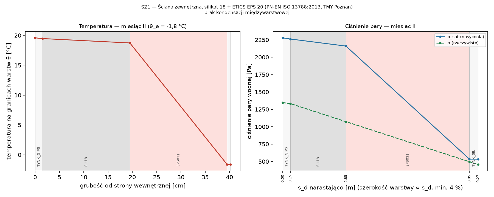
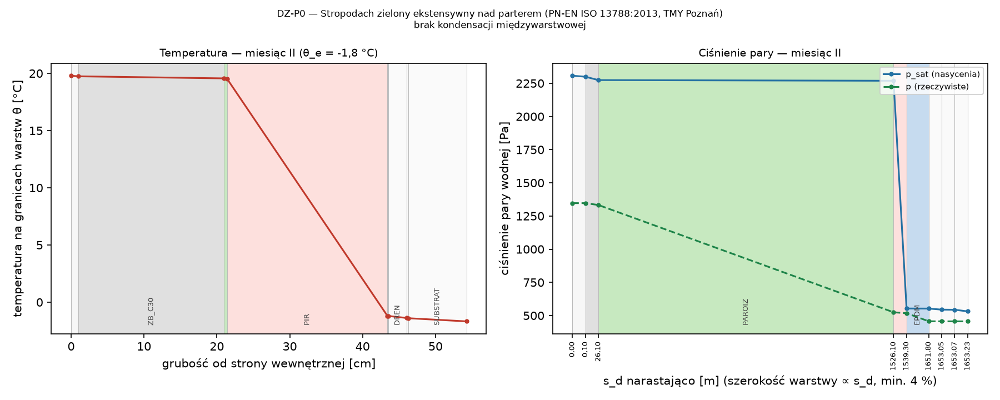
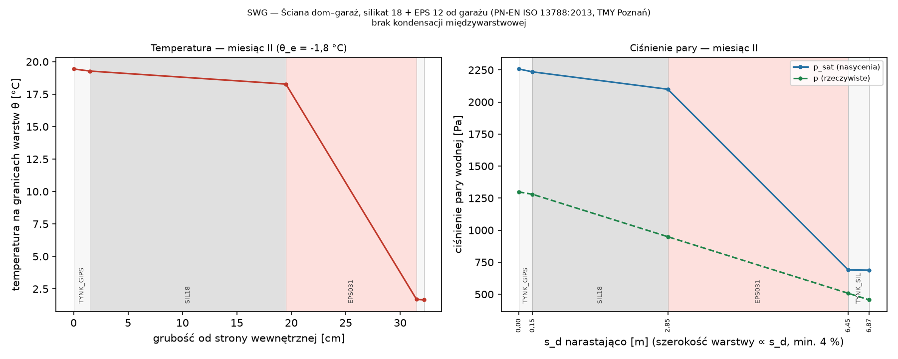
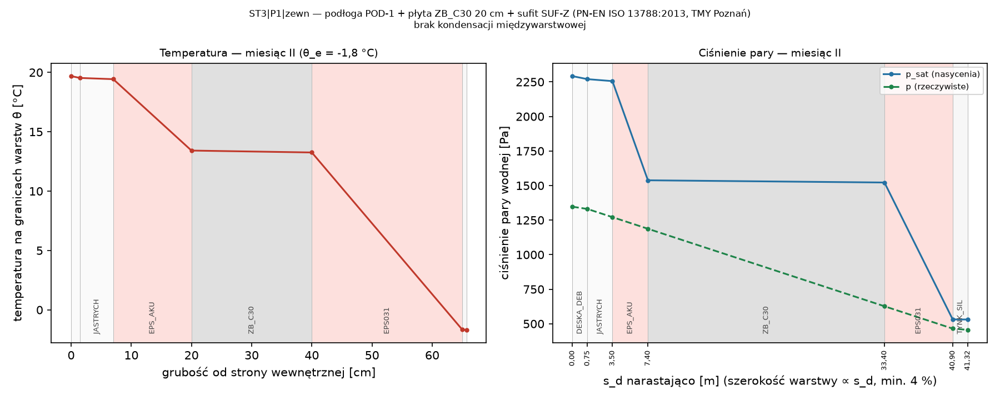
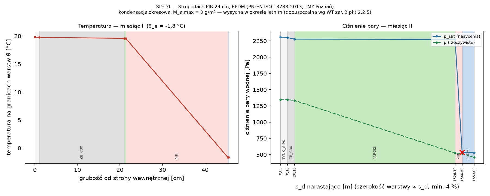
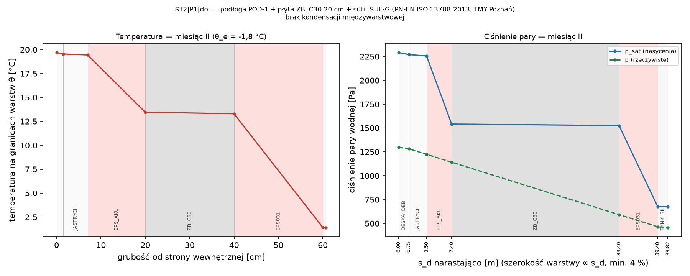

# Wilgotność: f_Rsi i kondensacja międzywarstwowa

## Ryzyko rozwoju pleśni — czynnik temperaturowy f_Rsi (PN-EN ISO 13788:2013 rozdz. 5)

**Podstawa:** PN-EN ISO 13788:2013-05 rozdz. 5; WT § 321, zał. 2 pkt 2.2.1–2.2.3 (f_Rsi ≥ f_Rsi,kryt; dopuszczalnie 0,72); dane klimatyczne TMY Poznań (MIiR)

> Warunki wewnętrzne: φ_i = 50 % przy θ_i = 20 °C (WT zał. 2 pkt 2.2.2); kryterium φ_si ≤ 80 %.

| Mies. | θ_e [°C] | φ_e [%] | p_e [Pa] | p_i [Pa] | p_sat,min [Pa] | θ_si,min [°C] | f_Rsi,min |
|:---|:---|:---|:---|:---|:---|:---|:---|
| I | 0,2 | 86 | 534 | 1 168 | 1 461 | 12,6 | 0,628 |
| II | −1,8 | 86 | 456 | 1 168 | 1 461 | 12,6 | 0,661 |
| III | 2,7 | 79 | 585 | 1 168 | 1 461 | 12,6 | 0,573 |
| IV | 8,3 | 68 | 748 | 1 168 | 1 461 | 12,6 | 0,372 |
| V | 13,0 | 62 | 927 | 1 168 | 1 461 | 12,6 | −0,048 |
| VI | 16,8 | 70 | 1 336 | 1 168 | 1 461 | 12,6 | −1,327 |
| VII | 18,2 | 72 | 1 501 | 1 168 | 1 461 | 12,6 | −3,215 |
| VIII | 18,4 | 72 | 1 530 | 1 168 | 1 461 | 12,6 | −3,553 |
| IX | 13,5 | 81 | 1 254 | 1 168 | 1 461 | 12,6 | −0,138 |
| X | 7,0 | 88 | 882 | 1 168 | 1 461 | 12,6 | 0,432 |
| XI | 2,2 | 91 | 648 | 1 168 | 1 461 | 12,6 | 0,586 |
| XII | −0,1 | 93 | 561 | 1 168 | 1 461 | 12,6 | 0,634 |

Miesiąc krytyczny: **II**, f_Rsi,max = **0,661**; wartość dopuszczona przez WT: 0,72. Do sprawdzeń przyjęto zachowawczo f_Rsi,wym = max(f_Rsi,max; 0,72) = **0,720**.

| Element | Opis | f_Rsi | Źródło | f_Rsi ≥ 0,720 |
|:---|:---|---:|:---|:---|
| POD-0 | przegroda (podloga_grunt), U = 0,13 | 0,967 | 1 − U·0,25 (PN-EN ISO 13788 p. 4.3) | ✔ spełnia |
| SZ1 | przegroda (sciana_zewn), U = 0,17 | 0,959 | 1 − U·0,25 (PN-EN ISO 13788 p. 4.3) | ✔ spełnia |
| DZ-P0 | przegroda (dach), U = 0,10 | 0,974 | 1 − U·0,25 (PN-EN ISO 13788 p. 4.3) | ✔ spełnia |
| SWG | przegroda (sciana_nieogrz), U = 0,23 | 0,941 | 1 − U·0,25 (PN-EN ISO 13788 p. 4.3) | ✔ spełnia |
| ST3\|P1\|zewn | przegroda (strop_zewn), U = 0,090 | 0,978 | 1 − U·0,25 (PN-EN ISO 13788 p. 4.3) | ✔ spełnia |
| SD-D1 | przegroda (dach), U = 0,082 | 0,979 | 1 − U·0,25 (PN-EN ISO 13788 p. 4.3) | ✔ spełnia |
| ST2\|P1\|dol | przegroda (strop_nieogrz), U = 0,10 | 0,975 | 1 − U·0,25 (PN-EN ISO 13788 p. 4.3) | ✔ spełnia |
| WZ-R1 | Attyka stropodachu D1 (attyka) | — | do wyznaczenia — symulacja PN-EN ISO 10211 (mostki2d) | — |
| WZ-C1 | Narożnik zewnętrzny (naroznik_wypukly) | — | do wyznaczenia — symulacja PN-EN ISO 10211 (mostki2d) | — |
| WZ-G1 | Cokół — ściana/podłoga na gruncie (sciana_grunt) | — | do wyznaczenia — symulacja PN-EN ISO 10211 (mostki2d) | — |
| WZ-W1 | Ościeża okien (oscieze) | — | do wyznaczenia — symulacja PN-EN ISO 10211 (mostki2d) | — |
| WZ-S1 | Wspornik bryły P1 — krawędź stropu nad powietrzem (strop_zewn_krawedz) | — | do wyznaczenia — symulacja PN-EN ISO 10211 (mostki2d) | — |
| WZ-GA | Połączenie ściany dom–garaż ze ścianą zewnętrzną (polaczenie_nieogrz) | — | do wyznaczenia — symulacja PN-EN ISO 10211 (mostki2d) | — |
| WZ-L1 | Konsole lamel (konsola_lamel) | — | do wyznaczenia — symulacja PN-EN ISO 10211 (mostki2d) | — |

Dla porównania — klasa wilgotności 3 (PN-EN ISO 13788 zał. A): miesiąc krytyczny 12, f_Rsi,max = 0,800 (informacyjnie; wymaganie WT — φ_i = 50 %).

## Kondensacja międzywarstwowa — metoda Glasera (PN-EN ISO 13788:2013 rozdz. 6)

**Podstawa:** PN-EN ISO 13788:2013-05 rozdz. 6; WT § 321 ust. 2, zał. 2 pkt 2.2.4–2.2.5; dane klimatyczne TMY Poznań (MIiR, WMO 12330)

> s_d = μ·d; g_c = δ₀·[(p_{c−1} − p_c)/Δs' − (p_c − p_{c+1})/Δs''], δ₀ = 2·10⁻¹⁰ kg/(m·s·Pa).
> Wymagane s_d paroizolacji — najmniejsze s_d warstwy po ciepłej stronie izolacji: (1) przy którym nie występuje kondensacja w żadnym miesiącu; (2) przy którym kondensat wysycha w cyklu rocznym i M_a,max ≤ kryterium (WT zał. 2 pkt 2.2.5) — bisekcja do 1500 m.

| Przegroda | Nazwa | Rola | Kondensacja | M_a,max [g/m²] | Wysycha | s_d paroizol. istn. [m] | s_d wym. — brak kondensacji [m] | s_d wym. — kondensacja dopuszczalna [m] | Ocena |
|:---|:---|:---|---:|---:|---:|---:|---:|---:|:---|
| SZ1 | Ściana zewnętrzna, silikat 18 + ETICS EPS 20 | sciana_zewn | nie | 0 | tak | brak | 0 (nie wymaga) | 0 (nie wymaga) | ✔ spełnia |
| DZ-P0 | Stropodach zielony ekstensywny nad parterem | dach | nie | 0 | tak | 1 500,0 | 0 (nie wymaga) | 0 (nie wymaga) | ✔ spełnia |
| SWG | Ściana dom–garaż, silikat 18 + EPS 12 od garażu | sciana_nieogrz | nie | 0 | tak | brak | 0 (nie wymaga) | 0 (nie wymaga) | ✔ spełnia |
| ST3\|P1\|zewn | podłoga POD-1 + płyta ZB_C30 20 cm + sufit SUF-Z | strop_zewn | nie | 0 | tak | brak | 0 (nie wymaga) | 0 (nie wymaga) | ✔ spełnia |
| SD-D1 | Stropodach PIR 24 cm, EPDM | dach | tak | 0 | tak | 1 500,0 | > 1500 (nieosiągalne) | 43,0 | ✔ spełnia |
| ST2\|P1\|dol | podłoga POD-1 + płyta ZB_C30 20 cm + sufit SUF-G | strop_nieogrz | nie | 0 | tak | brak | 0 (nie wymaga) | 0 (nie wymaga) | ✔ spełnia |

### SZ1 — Ściana zewnętrzna, silikat 18 + ETICS EPS 20

| Lp. | Warstwa (od wnętrza) | Funkcja | d [cm] | R [m²K/W] | μ | s_d [m] |
|---:|:---|:---|---:|---:|---:|---:|
| 1 | Tynk gipsowy | tynk | 1,5 | 0,037 | 10 | 0,15 |
| 2 | Bloczek wapienno-piaskowy 18 cm | konstrukcja | 18,0 | 0,234 | 15 | 2,70 |
| 3 | Styropian grafitowy EPS 031 | izolacja | 20,0 | 6,452 | 30 | 6,00 |
| 4 | Tynk silikonowy cienkowarstwowy | tynk | 0,7 | 0,010 | 60 | 0,42 |

**Ocena:** brak kondensacji międzywarstwowej. Warunki wewnętrzne: klasa wilgotności 3 (PN-EN ISO 13788 zał. A: budynki o nieznanym zagęszczeniu), p_i = p_e + 1,10·Δp.

Wymagane s_d paroizolacji (po ciepłej stronie izolacji): brak kondensacji — 0 (nie wymaga) m; kondensacja dopuszczalna (wysycha, M_a ≤ 500 g/m²) — 0 (nie wymaga) m; istniejąca warstwa: brak.

### DZ-P0 — Stropodach zielony ekstensywny nad parterem

| Lp. | Warstwa (od wnętrza) | Funkcja | d [cm] | R [m²K/W] | μ | s_d [m] |
|---:|:---|:---|---:|---:|---:|---:|
| 1 | Tynk gipsowy | tynk | 1,0 | 0,025 | 10 | 0,10 |
| 2 | Żelbet C30/37 | konstrukcja | 20,0 | 0,087 | 130 | 26,00 |
| 3 | Paroizolacja bitumiczna z wkładką Al | paroizolacja | 0,4 | 0,017 | — | 1 500,00 |
| 4 | Płyty PIR | izolacja | 22,0 | 10,000 | 60 | 13,20 |
| 5 | Membrana EPDM 1,5 mm (odporna na przeras | hydroizolacja | 0,1 | 0,006 | 75 000 | 112,50 |
| 6 | Mata drenażowa kubełkowa HDPE | drenaz | 2,5 | 0,083 | 50 | 1,25 |
| 7 | Geowłóknina filtracyjna | geowloknina | 0,2 | 0,010 | 10 | 0,02 |
| 8 | Substrat dachu zielonego (rozchodniki) | substrat | 8,0 | 0,133 | 2 | 0,16 |

**Ocena:** brak kondensacji międzywarstwowej. Warunki wewnętrzne: klasa wilgotności 3 (PN-EN ISO 13788 zał. A: budynki o nieznanym zagęszczeniu), p_i = p_e + 1,10·Δp.

Wymagane s_d paroizolacji (po ciepłej stronie izolacji): brak kondensacji — 0 (nie wymaga) m; kondensacja dopuszczalna (wysycha, M_a ≤ 500 g/m²) — 0 (nie wymaga) m; istniejąca warstwa: PAROIZ, s_d = 1 500,0 m (✔ spełnia).

* dach zielony: metoda Glasera (stan ustalony, bez transportu wilgoci w cieczy) ma ograniczoną miarodajność dla warstw nad hydroizolacją — ocena warstw pod hydroizolacją

### SWG — Ściana dom–garaż, silikat 18 + EPS 12 od garażu

| Lp. | Warstwa (od wnętrza) | Funkcja | d [cm] | R [m²K/W] | μ | s_d [m] |
|---:|:---|:---|---:|---:|---:|---:|
| 1 | Tynk gipsowy | tynk | 1,5 | 0,037 | 10 | 0,15 |
| 2 | Bloczek wapienno-piaskowy 18 cm | konstrukcja | 18,0 | 0,234 | 15 | 2,70 |
| 3 | Styropian grafitowy EPS 031 | izolacja | 12,0 | 3,871 | 30 | 3,60 |
| 4 | Tynk silikonowy cienkowarstwowy | tynk | 0,7 | 0,010 | 60 | 0,42 |

**Ocena:** brak kondensacji międzywarstwowej. Warunki wewnętrzne: klasa wilgotności 3 (PN-EN ISO 13788 zał. A: budynki o nieznanym zagęszczeniu), p_i = p_e + 1,10·Δp.

Wymagane s_d paroizolacji (po ciepłej stronie izolacji): brak kondensacji — 0 (nie wymaga) m; kondensacja dopuszczalna (wysycha, M_a ≤ 500 g/m²) — 0 (nie wymaga) m; istniejąca warstwa: brak.

* strona zimna — przestrzeń nieogrzewana 0.04: θ_u,n = 20 − b_u·(20 − θ_e,n), b_u = 0,87; ciśnienie pary jak na zewnątrz

### ST3|P1|zewn — podłoga POD-1 + płyta ZB_C30 20 cm + sufit SUF-Z

| Lp. | Warstwa (od wnętrza) | Funkcja | d [cm] | R [m²K/W] | μ | s_d [m] |
|---:|:---|:---|---:|---:|---:|---:|
| 1 | Deska podłogowa dębowa | wykonczenie | 1,5 | 0,083 | 50 | 0,75 |
| 2 | Jastrych cementowy | wykonczenie | 5,5 | 0,055 | 50 | 2,75 |
| 3 | Styropian akustyczny EPS T | izolacja | 13,0 | 3,250 | 30 | 3,90 |
| 4 | Żelbet C30/37 | konstrukcja | 20,0 | 0,087 | 130 | 26,00 |
| 5 | Styropian grafitowy EPS 031 | izolacja | 25,0 | 8,065 | 30 | 7,50 |
| 6 | Tynk silikonowy cienkowarstwowy | tynk | 0,7 | 0,010 | 60 | 0,42 |

**Ocena:** brak kondensacji międzywarstwowej. Warunki wewnętrzne: klasa wilgotności 3 (PN-EN ISO 13788 zał. A: budynki o nieznanym zagęszczeniu), p_i = p_e + 1,10·Δp.

Wymagane s_d paroizolacji (po ciepłej stronie izolacji): brak kondensacji — 0 (nie wymaga) m; kondensacja dopuszczalna (wysycha, M_a ≤ 500 g/m²) — 0 (nie wymaga) m; istniejąca warstwa: brak.

### SD-D1 — Stropodach PIR 24 cm, EPDM

| Lp. | Warstwa (od wnętrza) | Funkcja | d [cm] | R [m²K/W] | μ | s_d [m] |
|---:|:---|:---|---:|---:|---:|---:|
| 1 | Tynk gipsowy | tynk | 1,0 | 0,025 | 10 | 0,10 |
| 2 | Żelbet C30/37 | konstrukcja | 20,0 | 0,087 | 130 | 26,00 |
| 3 | Paroizolacja bitumiczna z wkładką Al | paroizolacja | 0,4 | 0,017 | — | 1 500,00 |
| 4 | Płyty PIR | izolacja | 24,0 | 10,909 | 60 | 14,40 |
| 5 | Membrana EPDM 1,5 mm (odporna na przeras | hydroizolacja | 0,1 | 0,006 | 75 000 | 112,50 |

| Mies. | θ_e | g_c pł.4 [g/m²] | M_a pł.4 [g/m²] |
|:---|:---|:---|:---|
| XII | −0,1 | 0,1 | 0,1 |
| I | 0,2 | −0,1 | 0,0 |
| II | −1,8 | 0,0 | 0,0 |
| III | 2,7 | 0,0 | 0,0 |
| IV | 8,3 | 0,0 | 0,0 |
| V | 13,0 | 0,0 | 0,0 |
| VI | 16,8 | 0,0 | 0,0 |
| VII | 18,2 | 0,0 | 0,0 |
| VIII | 18,4 | 0,0 | 0,0 |
| IX | 13,5 | 0,0 | 0,0 |
| X | 7,0 | 0,0 | 0,0 |
| XI | 2,2 | 0,0 | 0,0 |

Płaszczyzny kondensacji (numer granicy za warstwą): 4 — między „PIR” a „EPDM”

**Ocena:** kondensacja okresowa, M_a,max = 0 g/m² — wysycha w okresie letnim (dopuszczalna wg WT zał. 2 pkt 2.2.5). Warunki wewnętrzne: klasa wilgotności 3 (PN-EN ISO 13788 zał. A: budynki o nieznanym zagęszczeniu), p_i = p_e + 1,10·Δp.

Wymagane s_d paroizolacji (po ciepłej stronie izolacji): brak kondensacji — > 1500 (nieosiągalne) m; kondensacja dopuszczalna (wysycha, M_a ≤ 500 g/m²) — 43,0 m; istniejąca warstwa: PAROIZ, s_d = 1 500,0 m (✔ spełnia).

### ST2|P1|dol — podłoga POD-1 + płyta ZB_C30 20 cm + sufit SUF-G

| Lp. | Warstwa (od wnętrza) | Funkcja | d [cm] | R [m²K/W] | μ | s_d [m] |
|---:|:---|:---|---:|---:|---:|---:|
| 1 | Deska podłogowa dębowa | wykonczenie | 1,5 | 0,083 | 50 | 0,75 |
| 2 | Jastrych cementowy | wykonczenie | 5,5 | 0,055 | 50 | 2,75 |
| 3 | Styropian akustyczny EPS T | izolacja | 13,0 | 3,250 | 30 | 3,90 |
| 4 | Żelbet C30/37 | konstrukcja | 20,0 | 0,087 | 130 | 26,00 |
| 5 | Styropian grafitowy EPS 031 | izolacja | 20,0 | 6,452 | 30 | 6,00 |
| 6 | Tynk silikonowy cienkowarstwowy | tynk | 0,7 | 0,010 | 60 | 0,42 |

**Ocena:** brak kondensacji międzywarstwowej. Warunki wewnętrzne: klasa wilgotności 3 (PN-EN ISO 13788 zał. A: budynki o nieznanym zagęszczeniu), p_i = p_e + 1,10·Δp.

Wymagane s_d paroizolacji (po ciepłej stronie izolacji): brak kondensacji — 0 (nie wymaga) m; kondensacja dopuszczalna (wysycha, M_a ≤ 500 g/m²) — 0 (nie wymaga) m; istniejąca warstwa: brak.

* strona zimna — przestrzeń nieogrzewana 0.04: θ_u,n = 20 − b_u·(20 − θ_e,n), b_u = 0,87; ciśnienie pary jak na zewnątrz

**Założenia i dane wejściowe:**

* Glaser: warunki wewnętrzne — klasa wilgotności 3 (budynki o nieznanym zagęszczeniu), θ_i = 20 °C, p_i = p_e + 1,10·Δp [ZAŁ] — źródło: PN-EN ISO 13788:2013 zał. A (zachowawczo: nieznane zagęszczenie)
* Kryterium akumulacji kondensatu 0,5 kg/m² (DIN 4108-3 — kryterium literaturowe) [ZAŁ]
* Dane klimatyczne: typowy rok meteorologiczny ISO (PN-EN ISO 15927-4:2007), stacja Poznań (Ławica) (WMO 12330), okres 1971–2000; Ministerstwo Inwestycji i Rozwoju (archiwum) — „Dane do obliczeń energetycznych budynków”, pliki wmo123300iso.zip (godzinowy) i wmo123300iso_stat.txt (statystyki miesięczne); https://www.gov.pl/web/archiwum-inwestycje-rozwoj/dane-do-obliczen-energetycznych-budynkow (pobrano 2026-09-25)

---
*Wygenerowano: 2026-09-25 — biblioteka `lamela.obliczenia` (PRZYKŁAD – NIE DO ZŁOŻENIA; dane wyrobów: [DANE PRZYKŁADOWE – FIKCYJNE]).*
