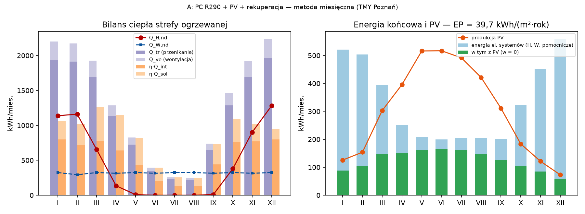

# Charakterystyka energetyczna

## Charakterystyka energetyczna — A: PC R290 + PV + rekuperacja

**Podstawa:** rozp. MIiR z 27.02.2015 (Dz.U. 2015 poz. 376 ze zm., ost. Dz.U. 2023 poz. 697) — metoda obliczeniowa miesięczna; WT § 328–329 (EP_max); RPB § 23 pkt 11 lit. a–d

> System: pompa ciepła powietrze–woda (R290) + ogrzewanie podłogowe 35/28 °C z regulacją pokojową + c.w.u. z PC (zasobnik) + wentylacja z odzyskiem + PV.

### Współczynniki strat ciepła

| Składnik | H [W/K] |
|:---|---:|
| ściany zewnętrzne | 26,44 |
| okna i drzwi balkonowe | 16,00 |
| drzwi zewnętrzne | 1,89 |
| dachy/stropodachy | 9,03 |
| stropy nad powietrzem zewn. | 0,55 |
| grunt (f_g1·f_g2·G_w·A·U) | 4,64 |
| przestrzenie nieogrzewane (b_u) | 8,22 |
| mostki cieplne H_TB | 60,21 |
| **H_tr razem** | **126,98** |
| H_ve = 0,34·[(1 − η_oc)·V_su + V_x] (V_su = 150 m³/h, η_oc = 0,85, V_x = 29,9 m³/h) | 17,46 |

A_f = 158,69 m²; V = 426,9 m³; θ_int,H = 20,64 °C; C_m = 41,3 MJ/K; τ = 79,3 h; a_H = 6,29.

### Bilans miesięczny [kWh]

| Wielkość | I | II | III | IV | V | VI | VII | VIII | IX | X | XI | XII | Rok |
|:---|:---|:---|:---|:---|:---|:---|:---|:---|:---|:---|:---|:---|:---|
| θ_e [°C] | 0,2 | −1,8 | 2,7 | 8,3 | 13,0 | 16,8 | 18,2 | 18,4 | 13,5 | 7,0 | 2,2 | −0,1 |  |
| Q_tr | 1 935 | 1 911 | 1 692 | 1 132 | 726 | 348 | 226 | 213 | 651 | 1 288 | 1 689 | 1 963 | 13 773 |
| Q_ve | 266 | 263 | 233 | 156 | 100 | 48 | 31 | 29 | 90 | 177 | 232 | 270 | 1 894 |
| Q_int | 803 | 725 | 803 | 777 | 803 | 777 | 803 | 803 | 777 | 803 | 777 | 803 | 9 453 |
| Q_sol | 264 | 295 | 507 | 618 | 708 | 753 | 738 | 645 | 514 | 348 | 250 | 150 | 5 789 |
| γ | 0,48 | 0,47 | 0,68 | 1,08 | 1,83 | 3,86 | 6,00 | 5,96 | 1,74 | 0,79 | 0,53 | 0,43 |  |
| η_H,gn | 0,995 | 0,995 | 0,970 | 0,826 | 0,541 | 0,259 | 0,167 | 0,168 | 0,566 | 0,943 | 0,991 | 0,997 |  |
| Q_H,nd | 1 139 | 1 159 | 655 | 135 | 8 | 0 | 0 | 0 | 10 | 379 | 903 | 1 283 | 5 672 |
| Q_W,nd | 325 | 293 | 325 | 314 | 325 | 314 | 325 | 325 | 314 | 325 | 314 | 325 | 3 822 |
| Q_K,H | 296 | 301 | 170 | 35 | 2 | 0 | 0 | 0 | 3 | 99 | 235 | 334 | 1 475 |
| Q_K,W | 162 | 146 | 162 | 157 | 162 | 157 | 162 | 162 | 157 | 162 | 157 | 162 | 1 908 |
| E_pom | 62 | 56 | 62 | 60 | 44 | 42 | 44 | 44 | 42 | 62 | 60 | 62 | 641 |
| E_PV | 126 | 154 | 303 | 396 | 516 | 517 | 492 | 421 | 311 | 184 | 121 | 73 | 3 614 |
| a_n | 0,70 | 0,68 | 0,49 | 0,38 | 0,31 | 0,32 | 0,33 | 0,35 | 0,41 | 0,57 | 0,70 | 0,80 |  |
| E_PV,sys | 88 | 105 | 148 | 151 | 161 | 166 | 162 | 147 | 127 | 105 | 85 | 59 | 1 505 |

### Sprawności i energia pomocnicza

| System | η_g | η_s | η_d | η_e | η_tot | Źródło |
|:---|---:|---:|---:|---:|---:|:---|
| ogrzewanie | 4,500 | 1,00 | 0,96 | 0,89 | 3,845 | SCOP = 4,50 (PN-EN 14825, dane przykładowe z karty katalogowej typowej pompy ciepła powietrze–woda R290 klasy A+++ (35 °C) 7–8 kW (lub równoważna)); η_H,e = 0,89 (tab. 3 lp. 6b), η_H,d = 0,96 (tab. 6 lp. 3a), η_H,s = 1,00 (tab. 8 lp. 3) |
| c.w.u. | 3,200 | 0,888 | 0,80 | — | 2,273 | COP_cwu = 3,20 (PN-EN 16147); η_W,s = 0,888 (strata zasobnika 55 W); η_W,d = 0,80 (tab. 12 lp. 6.1a — cyrkulacja z ograniczeniem czasu pracy) |

| Urządzenie pomocnicze | P [W] | t [h/rok] | E [kWh/rok] | System |
|:---|---:|---:|---:|:---|
| pompa obiegowa ogrzewania podłogowego (EC) | 25,0 | 5 088 | 127 | H |
| sterownik/grzałka tacy PC (poza SCOP) | 15,0 | 8 760 | 131 | H |
| wentylatory centrali (P = SFP·q) | 42,0 | 8 760 | 368 | H |
| pompa cyrkulacyjna c.w.u. z zegarem | 5,0 | 2 920 | 15 | W |

### Wskaźniki

| Wskaźnik | Wartość | Jedn. |
|:---|---:|:---|
| Q_H,nd (ogrzewanie i wentylacja) | 5 672 | kWh/rok |
| Q_W,nd (c.w.u., wzór (61)) | 3 822 | kWh/rok |
| EU = (Q_H,nd + Q_W,nd)/A_f | 59,8 | kWh/(m²·rok) |
| Q_K = Q_K,H + Q_K,W + E_el,pom | 4 025 | kWh/rok |
| EK = Q_K/A_f | 25,4 | kWh/(m²·rok) |
| Produkcja PV / zużyta przez systemy (w = 0) | 3 614 / 1 505 | kWh/rok |
| EP_H (ogrzewanie + pomocnicze H) | 23,9 | kWh/(m²·rok) |
| EP_W (c.w.u. + pomocnicze W) | 15,8 | kWh/(m²·rok) |
| **EP = Q_p/A_f** | **39,7** | kWh/(m²·rok) |
| EP_max (WT § 329) | 70,0 | kWh/(m²·rok) |
| Wynik | ✔ spełnia |  |
| E_CO2 | 0,0088 | t CO2/(m²·rok) |
| U_oze (wzór (100)) [INT] | 76,9 | % |
| Koszt energii (eksploatacja) [ZAŁ] | 3 186 | zł/rok |

Autokonsumpcja PV (symulacja godzinowa TMY): produkcja 3 614 kWh/rok, zużyta przez systemy techniczne 1 505 kWh/rok (a = 0,42), przez urządzenia domowe 682 kWh/rok; reszta oddana do sieci (nie obniża EP).

**Założenia i dane wejściowe:**

* PC: SCOP = 4,50, COP_cwu = 3,20, udział grzałki w ogrzewaniu 0,00 % (TMY) [DANE PRZYKŁADOWE – FIKCYJNE] — źródło: dane przykładowe z karty katalogowej typowej pompy ciepła powietrze–woda R290 klasy A+++ (35 °C) 7–8 kW (lub równoważna)
* Dezynfekcja termiczna c.w.u. grzałką: 227 kWh/rok (1×/tydz., 250 dm³, 55→70 °C) [ZAŁ] — źródło: WT § 120 ust. 2a; rejestr W-133
* Dane klimatyczne: typowy rok meteorologiczny ISO (PN-EN ISO 15927-4:2007), stacja Poznań (Ławica) (WMO 12330), okres 1971–2000; Ministerstwo Inwestycji i Rozwoju (archiwum) — „Dane do obliczeń energetycznych budynków”, pliki wmo123300iso.zip (godzinowy) i wmo123300iso_stat.txt (statystyki miesięczne); https://www.gov.pl/web/archiwum-inwestycje-rozwoj/dane-do-obliczen-energetycznych-budynkow (pobrano 2026-09-25)
* θ_int,H = 20,64 °C (średnia ważona kubaturą temperatur pomieszczeń wg WT § 134 ust. 2) — źródło: metodologia pkt 5.2.3.1.1, przypis *
* Pojemność cieplna: klasa „ciezka” — C_m = 260 kJ/(m²·K)·A_f [NZW] — źródło: PN-EN ISO 13790:2008 tab. 12
* Infiltracja przy pracy wentylatorów: V_x = V·n50·e/(1 + (f/e)·(ΔV/(V·n50))²), n50 = 1,0 h⁻¹ (cel — do potwierdzenia próbą; bez próby metodologia każe przyjąć 4 h⁻¹), e = 0,07, f = 15 [NZW] — źródło: metodologia tab. 21 i przypis do V_x,su; PN-EN ISO 13789
* Zyski słoneczne: C_i = A_g/A_w z obliczeń U_w, g_gl = 0,9·g_n, F_sh,gl = 1 (osłony ruchome podniesione w sezonie grzewczym), F_sh — zacienienie stałe z TMY [NZW] — źródło: metodologia wzór (59); PN-EN ISO 13790 p. 11.4
* Wskaźniki emisji CO2: energia elektryczna 553 kg/MWh; gaz ziemny 56,16 kg/GJ — źródło: KOBiZE, „Wskaźniki emisyjności CO2 … dla energii elektrycznej … za 2024 rok”, grudzień 2025, tab. 2 (odbiorcy końcowi); KOBiZE, „Wartości opałowe (WO) i wskaźniki emisji CO2 (WE) w roku 2023 …”, grudzień 2025, tab. 15
* Ceny energii (koszty eksploatacji, poza EP): 1,05 zł/kWh el., 0,36 zł/kWh gazu + opłaty stałe [ZAŁ] — źródło: założenie projektowe na IX 2026 (rząd wielkości taryf G11/W-3.6 dla Poznania); aktualizacja: bip.ure.gov.pl — taryfy energii elektrycznej i paliw gazowych
* PV 4,30 kWp (10 × 430 Wp), azymut 180°, nachylenie 30°, PR = 0,80; autokonsumpcja przez systemy techniczne — miesięczny współczynnik a_n z symulacji godzinowej TMY (urządzenia domowe 2500 kWh/rok konkurują o energię PV, sterowanie ładowania c.w.u. w godz. 11–15: tak) [INT] — źródło: metodologia tab. 1 lp. 6 (w = 0); R6-15 (brak wytycznych — założenie zachowawcze)

### Wrażliwość

| Wariant | EP [kWh/(m²·rok)] | EP ≤ EP_max |
|:---|:---|:---|
| A (n50 = 4 h⁻¹ — brak próby szczelności) | 50,2 | ✔ spełnia |
| A (Ψ „dobra praktyka” zamiast domyślnych PN-EN ISO 14683: H_TB = 15,9 zamiast 60,2 W/K) | 26,3 | ✔ spełnia |

---
*Wygenerowano: 2026-09-25 — biblioteka `lamela.obliczenia` (PRZYKŁAD – NIE DO ZŁOŻENIA; dane wyrobów: [DANE PRZYKŁADOWE – FIKCYJNE]).*
