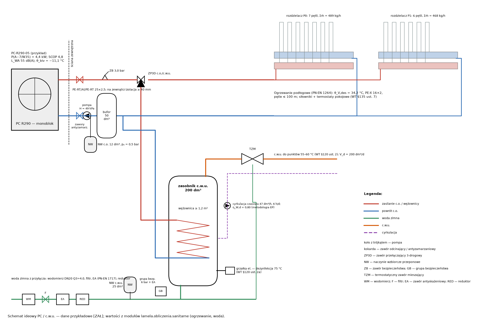

# Ogrzewanie — pompa ciepła, ogrzewanie podłogowe, bufor, naczynia, hałas

Obiekt: Dom testowy pipeline'u 3D. Φ_HL: WSKAŹNIKOWE ZASTĘPCZE [ZAŁ] — do zastąpienia wynikami PN-EN 12831 (moduł energii). Dane urządzeń przykładowe [ZAŁ].

## 1. Podstawy i założenia

* WT §133–135 (t.j. Dz.U. 2022 poz. 1225 ze zm.; art. 102a PB); W-150…W-156; W-024.
* PN-EN 12831:2006 (WT) / PN-EN 12831-1:2017 — obciążenie cieplne: moduł energii (dane wejściowe tego modułu).
* PN-EN 1264-2/-3/-4 — ogrzewanie płaszczyznowe; PN-EN 14825:2022-11 (SCOP); PN-EN 12828 / PN-B-02414:1999 — naczynia.
* Rozp. (UE) 2024/573 (F-gazy), 813/2013 (ekoprojekt), Dz.U. 2014 poz. 112 (hałas).
* Φ_HL pomieszczeń przyjęto wskaźnikowo: 35 W/m² (20 °C), 45 W/m² (24 °C) — WYŁĄCZNIE do czasu otrzymania wyników z modułu obciążenia cieplnego.
* Pompa ciepła: PC-R290-05 (przykład) — dane przykładowe typowe dla monobloków R290 [ZAŁ — zastąpić DTR/DWU wyrobu, E-13].
* θ_e = −18 °C (W-150: NA do PN-EN 12831:2006, strefa II (Poznań wg źródeł wtórnych); WT §134 ust. 2, zał. 1 lp. 16–17 [niezweryfikowane]); θ_i wg modelu (20/24 °C).
* Ogrzewanie podłogowe: PE-X/PE-RT 16×2,0, jastrych cementowy, wykładziny wg kodów posadzek modelu; współczynniki zabudowy A_F/A: lazienka 0,60, wc 0,50, kuchnia 0,75, garderoba 0,60, techniczne 0,50, inne 0,85 [ZAŁ].
* Regulacja pomieszczeniowa: termostaty + siłowniki na pętlach (WT §135 ust. 7–9; W-152) → bufor szeregowy.
* Przewody PC ↔ budynek (monoblok): na zewnątrz izolacja 2× grubość wg WT z płaszczem UV, zabezpieczenie przed zamarzaniem (zawory antyzamarzaniowe lub glikol + wymiennik) [ZAŁ].

## 2. Moc źródła i pompa ciepła

* Projektowe obciążenie cieplne budynku: Φ_HL = ΣΦ_HL,i = **4,88** kW — _WSKAŹNIKOWE ZASTĘPCZE [ZAŁ] — do zastąpienia wynikami PN-EN 12831 (moduł energii)_
* Dodatek na przygotowanie c.w.u.: Φ_W = 0,25 kW/os·N = 0,25·4 = **1,00** kW — _VDI 4645 [W]_
* Wymagana moc źródła przy θ_e (układ monowalentny): Φ_PC = Φ_HL + Φ_W = 4,88 + 1,00 = **5,88** kW

| Pomieszczenie | Φ_HL [W] |
|:---|---:|
| 0.01 Gabinet | 603 |
| 0.02 Hol ze schodami | 464 |
| 0.03 Salon | 860 |
| 0.04 Kuchnia z jadalnią | 664 |
| 1.01 Sypialnia | 422 |
| 1.02 Hol | 393 |
| 1.03 Pokój | 845 |
| 1.04 Garderoba | 328 |
| 1.05 Sypialnia 2 | 304 |

| θ_e [°C] | −15 | −7 | 2 | 7 | 12 |
|:---|---:|---:|---:|---:|---:|
| P_PC,max W35 [kW] | 3,6 | 4,4 | 4,8 | 5,0 | 5,2 |
| COP W35 | 2,40 | 2,90 | 4,00 | 5,00 | 5,90 |

Dobrano: **PC-R290-05 (przykład)** — monoblok powietrze–woda, czynnik R290; SCOP (35 °C, klimat umiarkowany) 4,80; η_s = 189 %; L_WA 55 dB(A) (tryb cichy 50 dB(A)); COP c.w.u. 3,3; grzałka rezerwowa 6,0 kW (3f).

### 2.1 Punkt biwalentny i bilans roczny (TMY)

* Współczynnik strat budynku: H = Φ_HL/(θ_i − θ_e) = 4883/(20 − (−18)) = **128,5** W/K
* Moc PC przy θ_e (W35): P_PC(θ_e) = interpolacja danych katalogowych = **3,30** kW — _[ZAŁ]_
* Punkt biwalentny (P_PC(θ) = H·(θ_i − θ)): θ_biv = bisekcja = **−11,1** °C — _kryterium θ_biv ≤ −7 °C [ZAŁ]_
* Ciepło na ogrzewanie w roku typowym (TMY Poznań, granica grzania 15 °C): Q_H = Σ H·(15 − θ_e,h) = **7384** kWh/a — _PVGIS 5.3 TMY [UPR — bilans EP w module energii]_
* Energia z grzałki (godziny z P_PC < Φ): Q_grz = Σ max(0, Φ − P_PC) = **1** kWh/a
* Udział grzałki: Q_grz/Q_H = **0,01** % — _≤ 5 % [ZAŁ]_
* Sezonowy COP z obliczenia godzinowego (informacyjnie; do EP — SCOP deklarowany): SCOP = ΣQ_PC/ΣE_el = **4,10**
* Uwaga: TMY Poznań — min. θ_e = −14,6 °C (rok typowy nie zawiera temperatury obliczeniowej −18 °C); w latach mroźnych udział grzałki większy — pokrycie mocy przy θ_e sprawdzono niżej

## 3. Ogrzewanie podłogowe (PN-EN 1264)

* Pomieszczenie projektowe: 0.01 Gabinet: q_des = Φ_HL/A_F = 603/14,65 = **41,2** W/m² — _PN-EN 1264-3 (bez łazienek; największa wymagana θ_V)_
* K_H dla T = 0,10 m, R_λ,B = 0,10, s_u = 0,048 m, λ_E = 1,00: K_H = B·a_B·a_T^m_T·a_u^m_u·a_D^m_D = **3,582** W/(m²·K) — _PN-EN 1264-2 zał. A [NZW tablice]_
* Nadwyżka temperatury czynnika: ∆θ_H = q/K_H = 41,2/3,582 = **11,49** K
* Temperatura zasilania (σ = 5 K): θ_V = θ_i + σ·e^(σ/∆θ_H)/(e^(σ/∆θ_H) − 1) = **34,2** °C — _definicja ∆θ_H (średnia logarytmiczna)_
* Charakterystyka bazowa — gęstość graniczna przy θ_F,max − θ_i = 9 K: q_G = 8,92·9^1,1 = **100,0** W/m² — _PN-EN 1264-2 (29 °C / 33 °C łazienki)_

| Pom. | Nazwa | Kond. | Φ_HL [W] | A_F [m²] | q [W/m²] | θ_F,m [°C] | R_λ,B | T [cm] | ∆θ_H [K] | θ_R [°C] | σ [K] | ṁ [kg/h] | Pętle | L [m] |
|:---|:---|:---|---:|---:|---:|---:|:---|---:|---:|---:|---:|---:|---:|---:|
| 0.01 | Gabinet | P0 | 603 | 14,7 | 41,2 | 24,0 | DESKA_DEB (drewno 15 mm) 0,10 | 10 | 11,49 | 29,2 | 5,00 | 115,4 | 2 | 161,6 |
| 0.02 | Hol ze schodami | P0 | 464 | 11,3 | 41,2 | 24,0 | GRES (płytki) 0,02 | 25 | 11,47 | 29,1 | 5,04 | 86,5 | 1 | 52,2 |
| 0.03 | Salon | P0 | 860 | 20,9 | 41,2 | 24,0 | DESKA_DEB (drewno 15 mm) 0,10 | 10 | 11,49 | 29,2 | 5,00 | 164,4 | 3 | 227,8 |
| 0.04 | Kuchnia z jadalnią | P0 | 664 | 14,2 | 46,7 | 24,5 | GRES (płytki) 0,02 | 20 | 11,46 | 29,1 | 5,06 | 122,5 | 1 | 82,4 |
| 1.01 | Sypialnia | P1 | 422 | 10,2 | 41,2 | 24,0 | DESKA_DEB (drewno 15 mm) 0,10 | 15 | 11,70 | 29,5 | 4,64 | 87,1 | 1 | 83,9 |
| 1.02 | Hol | P1 | 393 | 9,5 | 41,2 | 24,0 | DESKA_DEB (drewno 15 mm) 0,10 | 15 | 11,70 | 29,5 | 4,64 | 81,2 | 1 | 71,3 |
| 1.03 | Pokój | P1 | 845 | 20,5 | 41,2 | 24,0 | DESKA_DEB (drewno 15 mm) 0,10 | 15 | 11,70 | 29,5 | 4,64 | 174,5 | 2 | 155,9 |
| 1.04 | Garderoba | P1 | 328 | 5,6 | 58,3 | 25,5 | DESKA_DEB (drewno 15 mm) 0,10 | 10 | 15,02 | — | 5,00 | 62,8 | 1 | 70,1 |
| 1.05 | Sypialnia 2 | P1 | 304 | 7,4 | 41,2 | 24,0 | DESKA_DEB (drewno 15 mm) 0,10 | 15 | 11,70 | 29,5 | 4,64 | 62,9 | 1 | 57,5 |

| Pętla | T [cm] | L [m] | ṁ [kg/h] | ∆p [kPa] | V [dm³] |
|:---|---:|---:|---:|---:|---:|
| 0.01/1 | 10 | 80,8 | 57,7 | 7,7 | 9,1 |
| 0.01/2 | 10 | 80,8 | 57,7 | 7,7 | 9,1 |
| 0.02/1 | 25 | 52,2 | 86,5 | 10,6 | 5,9 |
| 0.03/1 | 10 | 75,9 | 54,8 | 7,4 | 8,6 |
| 0.03/2 | 10 | 75,9 | 54,8 | 7,4 | 8,6 |
| 0.03/3 | 10 | 75,9 | 54,8 | 7,4 | 8,6 |
| 0.04/1 | 20 | 82,4 | 122,5 | 20,9 | 9,3 |
| 1.01/1 | 15 | 83,9 | 87,1 | 14,0 | 9,5 |
| 1.02/1 | 15 | 71,3 | 81,2 | 11,8 | 8,1 |
| 1.03/1 | 15 | 78,0 | 87,3 | 13,4 | 8,8 |
| 1.03/2 | 15 | 78,0 | 87,3 | 13,4 | 8,8 |
| 1.04/1 | 10 | 70,1 | 62,8 | 7,5 | 7,9 |
| 1.05/1 | 15 | 57,5 | 62,9 | 7,1 | 6,5 |

| Kondygnacja | Pętle | Rozdzielacze (sekcje) | Σṁ [kg/h] | ∆p_max [kPa] |
|:---|---:|:---|---:|---:|
| P0 | 7 | 1 × (7) | 488,8 | 20,9 |
| P1 | 6 | 1 × (6) | 468,4 | 14,0 |

Rozdzielacze z przepływomierzami i zaworami termostatycznymi pod siłowniki; termostaty pokojowe w każdym pomieszczeniu (W-152); łazienki — dodatkowo grzejnik drabinkowy z grzałką (okres przejściowy) [ZAŁ].

## 4. Obieg PC, pompa, bufor

* Przepływ w obiegu PC (moc nominalna, ∆θ = 5 K): ṁ = P/(c·∆θ) = 5200/(4190·5)·3600 = **894** kg/h
* Przewody PC ↔ budynek PE-RT/Al/PE-RT 25×2,5, L = 7,8 m (×2): ∆p = 2·1,3·R·L = 2·1,3·0,410·7,8 = **8,3** kPa
* Wysokość podnoszenia pompy obiegowej (obieg z buforem szeregowym na powrocie): H = ∆p_pętli,max + ∆p_przew + ∆p_PC + 5 = 20,9 + 8,3 + 15 + 5 = **49,2** kPa — _rozdzielacz/zawory 5 kPa [ZAŁ]_
* Suma przepływów pętli podłogowych: Σṁ_H = **957** kg/h

* Objętość wody w pętlach: V = Σπd²/4·L = **108,9** dm³
* Objętość stale otwarta (pętle bez siłowników): V_otw = u·V = 0,30·108,9 = **32,7** dm³ — _[ZAŁ]_
* Energia odszraniania: E = P_nom·t_def = 5,2·5·60 = **1560** kJ — _[ZAŁ]_
* Objętość na odszranianie przy spadku 5 K: V_def = E/(c·∆θ) = 1560/(4,19·5) = **74,5** dm³
* Objętość na minimalny czas pracy sprężarki: V_run = P_min·t_min/(c·∆θ) = 1,8·10·60/(4,19·5) = **51,6** dm³
* Wymagana pojemność bufora: V_buf = max(V_def, V_run) − V_otw = **41,8** dm³
* Dobrano bufor szeregowy na powrocie: V = **50** dm³

## 5. Naczynia wzbiorcze

* Pojemność instalacji c.o.: V_c = V_pętli + V_bufora + V_PC + V_wężownicy + V_przewodów = **181,8** dm³
* Współczynnik rozszerzalności (10 → 60 °C): e = ρ(10)/ρ(θ_max) − 1 = **1,68** % — _gęstość wody (Kell)_
* Ciśnienia: p_0 = h/10 + 0,2 (≥ 0,5); p_e = p_SV − 0,5 = h = 3,06 m; p_SV = 3,0 bar = **p_0 = 0,51 bar; p_e = 2,50 bar** — _PN-EN 12828 zał. D [W]_
* Pojemność naczynia c.o.: V_n = (V_e + V_V)·(p_e + 1)/(p_e − p_0) = (3,05 + 3,00)·(2,50 + 1)/(2,50 − 0,51) = **10,6** dm³
* Dobrano naczynie przeponowe c.o.: **12** dm³ — _(sprawdzić naczynie wbudowane w PC)_
* Naczynie c.w.u. (zasobnik 200 dm³, 10 → 75 °C): V_n = e·V_zas·(p_e + 1)/(p_e − p_0) = 0,0255·200·(5,5 + 1)/(5,5 − 3,8) = **19,5** dm³ — _p_0 = p_red − 0,2; p_e = p_SV − 0,5 [W]_
* Dobrano naczynie przeponowe c.w.u. (przepływowe, atest PZH): **25** dm³

## 6. Hałas jednostki zewnętrznej

* Jednostka zewnętrzna (5,50; 8,90), ustawienie Q = 4 (DI = 3,0 dB); najbliższa: działka sąsiednia T-1/2: r = **10,50** m
* Poziom dźwięku w nocy na granicy (tryb cichy): L_A = L_WA − 20·log r − 8 + DI = 50 − 20·log(10,50) − 8 + 3,0 = **24,6** dB(A) — _PORT PC p. 4.4 [W]_
* Poziom dźwięku w dzień na granicy: L_A = L_WA − 20·log r − 8 + DI = 55 − 20·log(10,50) − 8 + 3,0 = **29,6** dB(A)
* Odległość zapewniająca 40 dB / 35 dB w nocy: r = √(Q/(4π)·10^((L_WA − L)/10)) = **1,8 m / 3,2 m**

* Posadowienie antywibracyjne (fundament, wibroizolatory), połączenia elastyczne (WT §327 ust. 2–3; W-232).
* Nie pod oknami sypialni; strefa R290 wolna od okien, drzwi, wpustów, studzienek i zagłębień (W-156) — wrysować na PZT.
* Skropliny — do gruntu w strefie niezamarzającej (studzienka żwirowa), nie do studzienek w strefie R290 (W-146).

## 7. Sprawdzenia

| ID | Warunek | Wartość | Wymaganie | Wynik | Podstawa / uwagi |
|:---|:---|---:|---:|:---|:---|
| W-155 | Punkt biwalentny | −11,1 °C | ≤ −7,0 °C | SPEŁNIONY | VDI 4645 / praktyka [ZAŁ] |
| W-155 | Pokrycie mocy przy θ_e (układ monoenergetyczny): P_PC(θ_e) + P_grzałki ≥ Φ_HL + Φ_W | 9,30 kW | ≥ 5,88 kW | SPEŁNIONY | PN-EN 12831 / VDI 4645 [W] |
| W-155 | Udział grzałki w pokryciu Q_H | 0,000 | ≤ 0,050 | SPEŁNIONY | [ZAŁ] |
| W-155 | Moc nominalna PC (zakaz F-gazów dotyczy ≤ 12 kW — czynnik R290, GWP₁₀₀ = 0,02) | 5,20 kW | ≤ 12,00 kW | SPEŁNIONY | rozp. (UE) 2024/573 zał. IV pkt 8 lit. b |
| W-155 | Sezonowa efektywność η_s (35 °C) | 1,89 | ≥ 1,25 | SPEŁNIONY | rozp. (UE) 813/2013 zał. II |
| W-155 | Poziom mocy akustycznej jednostki zewn. | 55 dB(A) | ≤ 65 dB(A) | SPEŁNIONY | rozp. (UE) 813/2013 zał. II pkt 3 |
| W-153 | Temperatura zasilania ogrzewania podłogowego | 34,2 °C | ≤ 35,0 °C | SPEŁNIONY | W-153: R6 3.4 [zalozenie] |
| W-153 | 0.01 Gabinet: gęstość strumienia ≤ q_G (θ_F ≤ 29 °C) | 41,2 W/m² | ≤ 100,0 W/m² | SPEŁNIONY | PN-EN 1264-2 |
| W-154 | Pętla 0.01/1: długość | 80,8 m | ≤ 100,0 m | SPEŁNIONY | PE-X 16×2 [W] |
| W-154 | Pętla 0.01/2: długość | 80,8 m | ≤ 100,0 m | SPEŁNIONY | PE-X 16×2 [W] |
| W-153 | 0.02 Hol ze schodami: gęstość strumienia ≤ q_G (θ_F ≤ 29 °C) | 41,2 W/m² | ≤ 100,0 W/m² | SPEŁNIONY | PN-EN 1264-2 |
| W-154 | Pętla 0.02/1: długość | 52,2 m | ≤ 100,0 m | SPEŁNIONY | PE-X 16×2 [W] |
| W-153 | 0.03 Salon: gęstość strumienia ≤ q_G (θ_F ≤ 29 °C) | 41,2 W/m² | ≤ 100,0 W/m² | SPEŁNIONY | PN-EN 1264-2 |
| W-154 | Pętla 0.03/1: długość | 75,9 m | ≤ 100,0 m | SPEŁNIONY | PE-X 16×2 [W] |
| W-154 | Pętla 0.03/2: długość | 75,9 m | ≤ 100,0 m | SPEŁNIONY | PE-X 16×2 [W] |
| W-154 | Pętla 0.03/3: długość | 75,9 m | ≤ 100,0 m | SPEŁNIONY | PE-X 16×2 [W] |
| W-153 | 0.04 Kuchnia z jadalnią: gęstość strumienia ≤ q_G (θ_F ≤ 29 °C) | 46,7 W/m² | ≤ 100,0 W/m² | SPEŁNIONY | PN-EN 1264-2 |
| W-154 | Pętla 0.04/1: długość | 82,4 m | ≤ 100,0 m | SPEŁNIONY | PE-X 16×2 [W] |
| W-153 | 1.01 Sypialnia: gęstość strumienia ≤ q_G (θ_F ≤ 29 °C) | 41,2 W/m² | ≤ 100,0 W/m² | SPEŁNIONY | PN-EN 1264-2 |
| W-154 | Pętla 1.01/1: długość | 83,9 m | ≤ 100,0 m | SPEŁNIONY | PE-X 16×2 [W] |
| W-153 | 1.02 Hol: gęstość strumienia ≤ q_G (θ_F ≤ 29 °C) | 41,2 W/m² | ≤ 100,0 W/m² | SPEŁNIONY | PN-EN 1264-2 |
| W-154 | Pętla 1.02/1: długość | 71,3 m | ≤ 100,0 m | SPEŁNIONY | PE-X 16×2 [W] |
| W-153 | 1.03 Pokój: gęstość strumienia ≤ q_G (θ_F ≤ 29 °C) | 41,2 W/m² | ≤ 100,0 W/m² | SPEŁNIONY | PN-EN 1264-2 |
| W-154 | Pętla 1.03/1: długość | 78,0 m | ≤ 100,0 m | SPEŁNIONY | PE-X 16×2 [W] |
| W-154 | Pętla 1.03/2: długość | 78,0 m | ≤ 100,0 m | SPEŁNIONY | PE-X 16×2 [W] |
| W-153 | 1.04 Garderoba: gęstość strumienia ≤ q_G (θ_F ≤ 29 °C) | 58,3 W/m² | ≤ 100,0 W/m² | SPEŁNIONY | PN-EN 1264-2 |
| W-153 | 1.04 Garderoba: moc podłogi przy θ_V,des (T = 10 cm) ≥ Φ_HL | 287 W | ≥ 328 W | **NIESPEŁNIONY** | PN-EN 1264-3 — łazienka: dogrzewanie grzejnikiem drabinkowym; brak ≈ 41 W |
| W-154 | Pętla 1.04/1: długość | 70,1 m | ≤ 100,0 m | SPEŁNIONY | PE-X 16×2 [W] |
| W-153 | 1.05 Sypialnia 2: gęstość strumienia ≤ q_G (θ_F ≤ 29 °C) | 41,2 W/m² | ≤ 100,0 W/m² | SPEŁNIONY | PN-EN 1264-2 |
| W-154 | Pętla 1.05/1: długość | 57,5 m | ≤ 100,0 m | SPEŁNIONY | PE-X 16×2 [W] |
| W-154 | Maks. strata ciśnienia pętli | 20,9 kPa | ≤ 25,0 kPa | SPEŁNIONY | [ZAŁ] |
| W-024 | Hałas PC w nocy na granicy (działka sąsiednia T-1/2) | 24,6 dB(A) | ≤ 40,0 dB(A) | SPEŁNIONY | Dz.U. 2014 poz. 112 tab. 1 lp. 2a (L_Aeq,N) |
| W-024 | Hałas PC w dzień na granicy (działka sąsiednia T-1/2) | 29,6 dB(A) | ≤ 50,0 dB(A) | SPEŁNIONY | Dz.U. 2014 poz. 112 (L_Aeq,D) |
| W-024 | Hałas PC w nocy — cel projektowy | 24,6 dB(A) | ≤ 35,0 dB(A) | SPEŁNIONY | R8 3.4 [ZAŁ] |
| W-024 | Odległość jednostki PC od granicy z działką sąsiednią (MN) | 10,50 m | ≥ 6,00 m | SPEŁNIONY | W-024 (dla LAMELA: granica E) [ZAŁ] |
| W-156 | Strefa bezpieczeństwa R290 (1,0 m + wymiar urządzenia ≈ 0,4 m): otwory w strefie | 0 szt. | = 0 szt. | SPEŁNIONY | PN-EN 378-1; DTR (W-156) — brak |

## 8. Dane do charakterystyki energetycznej

| Wielkość | Wartość |
|:---|---:|
| eta_H_g_SCOP | 4,800 |
| COP_cwu | 3,300 |
| eta_H_e | 0,8900 |
| eta_H_d | 0,9600 |
| E_el_PC_kWh_a | 1802 |
| E_grzalka_kWh_a | 1,000 |
| Q_H_TMY_kWh_a | 7384 |

## Podsumowanie sprawdzeń

Warunków: 36; spełnionych: 35; niespełnionych: 1; informacyjnych: 0.

Niespełnione:

* W-153 — 1.04 Garderoba: moc podłogi przy θ_V,des (T = 10 cm) ≥ Φ_HL: 287 W (wymaganie >= 328 W)

## Źródła

1. WT §133–135, §327 (t.j. Dz.U. 2022 poz. 1225 ze zm.)
2. PN-EN 1264-2:2009+A1:2012, -3, -4 — zał. A (K_H) [NZW tablice]
3. Rozp. (UE) 2024/573 zał. IV pkt 8–9; rozp. (UE) 813/2013 zał. II
4. PORT PC, Wytyczne do ograniczania hałasu instalacji z pompami ciepła, p. 4.4
5. Rozp. MŚ — dopuszczalne poziomy hałasu, t.j. Dz.U. 2014 poz. 112, tab. 1 lp. 2a
6. VDI 4645:2018 — dodatek mocy na c.w.u., punkt biwalentny [W]; PN-EN 12828 zał. D [W]
7. PVGIS 5.3 TMY Poznań (JRC KE), pobrano 2026-09-25 — rozkład godzinowy temperatur
