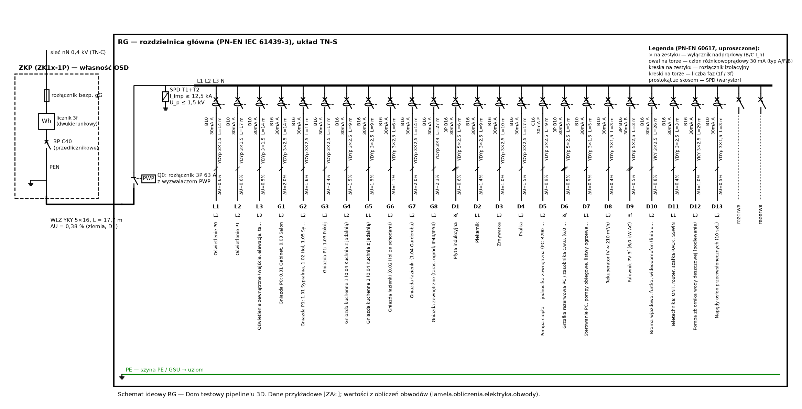

# Obwody instalacji elektrycznej — dobór przewodów i zabezpieczeń, spadki napięć, ochrona przeciwporażeniowa, SPD, PWP

Obiekt: Dom testowy pipeline'u 3D. Układ sieci TN-C (OSD) → TN-S od ZKP/RG. Dane przykładowe oznaczono [ZAŁ].

## 1. Podstawy i założenia

* WT §180–§189 (t.j. Dz.U. 2022 poz. 1225 ze zm.; art. 102a PB); W-180…W-190.
* PN-HD 60364-4-41:2017-09, -4-43:2024-04, -4-443:2016-03, -5-52:2011, -5-53:2022-10, -5-54:2011, -7-701:2025-02, -7-712:2016-05, -7-722:2019-01.
* RG: (3,40; 7,80; P0), ZKP: (4,00; 17,80) — instalacje.yaml.
* Z_Q w ZKP = 0,30 Ω (R/X ≈ 0,9/0,44), I_k,max w ZKP ≤ 6 kA [ZAŁ — dane z warunków przyłączenia OSD].
* Temperatura otoczenia 30 °C (powietrze), 20 °C (grunt); grupowanie 2 obwodów (k = 0,80) [ZAŁ].
* Przewody: YDYp 450/750 V pod tynkiem (≥ 5 mm tynku, W-184) — metoda C; w stropach monolitycznych w rurach (B2); w ziemi YKY 0,6/1 kV w rurze (D1); Cu (WT §183 ust. 1 pkt 9).
* Aparat główny RG: rozłącznik izolacyjny 3P 63 A z wyzwalaczem PWP (selektywność względem zabezpieczenia przedlicznikowego C40 — R7 §3.1).
* Rezerwa w RG ≥ 20 % modułów.

## 2. Wewnętrzna linia zasilająca (ZKP → RG)

* Długość WLZ (ZKP → RG): L = 1,2·(|∆x| + |∆y|) + zapas = 1,2·10,60 + 5,0 = **17,7** m — _[UPR]_
* Obciążalność YKY 5×16 (D1, 3 żyły obc., θ_gr = 20 °C): I_z = I_z,tab·k_θ = 64·1,00 = **64,0** A — _PN-HD 60364-5-52 tabl. B.52.4 [NZW]_
* Spadek napięcia WLZ przy I = I_zab (20 °C — por. R7 §3.1): ∆U = √3·L·I·r/U_n·100 = √3·17,7·40·0,0011/400·100 = **0,353** %
* Spadek napięcia WLZ w temperaturze roboczej: ∆U(θ) = **0,380** % — _W-185: ≤ 0,5 %_

WLZ: **YKY 5×16**, L = 17,7 m, w ziemi ≥ 0,7 m w piasku z taśmą niebieską, w rurze przy wejściu do budynku i pod utwardzeniami (R7-L07). Rozdział PEN preferowany w ZKP (WLZ 5-żyłowy — wymaga zgody OSD); inaczej YKY 4×16 (PEN) i rozdział w RG na GSU (D-12).

## 3. Zestawienie obwodów

| Obw. | Przeznaczenie | Faza | P [kW] | I_B [A] | Zabezp. | Przewód | Met. | I_z [A] | L [m] | ∆U [%] | ∆U_c [%] | Z_s [Ω] | I_k1 [A] | I_a [A] | RCD | Podstawa / uwagi |
|:---|:---|:---|---:|---:|:---|:---|:---|---:|---:|---:|---:|---:|---:|---:|:---|:---|
| L1 | Oświetlenie P0 | L1 | 0,37 | 1,7 | B10 | YDYp 3×1,5 | C | 15,6 | 14,0 | 0,25 | 0,63 | 0,738 | 296 | 50 | RCBO typ A 30 mA | WT §188 ust. 2, §189 ust. 2 (łączniki wieloobwodowe); PN-HD 60364-4-41 p. 411.3.4 |
| L2 | Oświetlenie P1 | L2 | 0,33 | 1,5 | B10 | YDYp 3×1,5 | C | 15,6 | 17,1 | 0,27 | 0,65 | 0,827 | 264 | 50 | RCBO typ A 30 mA | WT §188 ust. 2, §189 ust. 2 (łączniki wieloobwodowe); PN-HD 60364-4-41 p. 411.3.4 |
| L3 | Oświetlenie zewnętrzne (wejście, elewacje, taras) | L3 | 0,20 | 0,9 | B10 | YDYp 3×1,5 | C | 15,6 | 13,5 | 0,13 | 0,51 | 0,724 | 302 | 50 | RCBO typ A 30 mA | WT §64 (oświetlenie wejścia obowiązkowe); PN-HD 60364-7-714 |
| G1 | Gniazda P0: 0.01 Gabinet, 0.03 Salon | L3 | 2,00 | 16,0 | B16 | YDYp 3×2,5 | C | 21,6 | 14,0 | 1,63 | 2,01 | 0,584 | 374 | 80 | RCBO typ A 30 mA | WT §188 ust. 2; PN-HD 60364-4-41 p. 411.3.3 |
| G2 | Gniazda P1: 1.01 Sypialnia, 1.02 Hol, 1.05 Sypialnia 2 | L2 | 2,00 | 16,0 | B16 | YDYp 3×2,5 | C | 21,6 | 10,6 | 1,23 | 1,61 | 0,525 | 416 | 80 | RCBO typ A 30 mA | WT §188 ust. 2; PN-HD 60364-4-41 p. 411.3.3 |
| G3 | Gniazda P1: 1.03 Pokój | L3 | 2,00 | 16,0 | B16 | YDYp 3×2,5 | C | 21,6 | 17,1 | 1,99 | 2,37 | 0,638 | 343 | 80 | RCBO typ A 30 mA | WT §188 ust. 2; PN-HD 60364-4-41 p. 411.3.3 |
| G4 | Gniazda kuchenne 1 (0.04 Kuchnia z jadalnią) | L2 | 2,00 | 16,0 | B16 | YDYp 3×2,5 | C | 21,6 | 9,4 | 1,09 | 1,47 | 0,504 | 434 | 80 | RCBO typ A 30 mA | WT §188 ust. 2 (gniazda kuchenne) |
| G5 | Gniazda kuchenne 2 (0.04 Kuchnia z jadalnią) | L1 | 2,00 | 16,0 | B16 | YDYp 3×2,5 | C | 21,6 | 9,4 | 1,09 | 1,47 | 0,504 | 434 | 80 | RCBO typ A 30 mA | WT §188 ust. 2 (gniazda kuchenne) |
| G6 | Gniazda łazienki (0.02 Hol ze schodami) | L3 | 2,00 | 16,0 | B16 | YDYp 3×2,5 | C | 21,6 | 6,4 | 0,75 | 1,13 | 0,454 | 482 | 80 | RCBO typ A 30 mA | WT §188 ust. 2 (gniazda w łazience); PN-HD 60364-7-701 (RCD 30 mA) |
| G7 | Gniazda łazienki (1.04 Garderoba) | L2 | 2,00 | 16,0 | B16 | YDYp 3×2,5 | C | 21,6 | 14,0 | 1,63 | 2,01 | 0,584 | 374 | 80 | RCBO typ A 30 mA | WT §188 ust. 2 (gniazda w łazience); PN-HD 60364-7-701 (RCD 30 mA) |
| G8 | Gniazda zewnętrzne (taras, ogród; IP44/IP54) | L1 | 2,00 | 16,0 | B16 | YDYp 3×4 | C | 28,8 | 27,2 | 1,90 | 2,28 | 0,634 | 345 | 80 | RCBO typ A 30 mA | PN-HD 60364-4-41 p. 411.3.3 (urządzenia ruchome na zewnątrz); przekrój zwiększony ze względu na ∆U |
| D1 | Płyta indukcyjna | L1L2L3 | 7,40 | 10,7 | 3P B16 | YDYp 5×2,5 | C | 19,2 | 6,5 | 0,24 | 0,62 | 0,454 | 481 | 80 | RCD 4P 40 A/30 mA typ A | WT §188 ust. 2 |
| D2 | Piekarnik | L1 | 3,50 | 15,2 | B16 | YDYp 3×2,5 | C | 21,6 | 9,4 | 1,03 | 1,41 | 0,504 | 434 | 80 | RCBO typ A 30 mA | WT §188 ust. 2 |
| D3 | Zmywarka | L3 | 2,20 | 10,1 | B16 | YDYp 3×2,5 | C | 21,6 | 9,7 | 0,64 | 1,02 | 0,510 | 429 | 80 | RCBO typ A 30 mA | WT §188 ust. 2 |
| D4 | Pralka | L3 | 2,20 | 10,1 | B16 | YDYp 3×2,5 | C | 21,6 | 17,0 | 1,13 | 1,51 | 0,635 | 344 | 80 | RCBO typ A 30 mA | WT §188 ust. 2 |
| D5 | Pompa ciepła — jednostka zewnętrzna (PC-R290-05 (przykład)) | L2 | 1,90 | 8,7 | C16 | YDYp 3×2,5 | C | 21,6 | 8,8 | 0,50 | 0,88 | 0,495 | 442 | 160 | RCD typ F/B 30 mA wg DTR (falownik sprężarki) | R7 D6; PN-HD 60364-5-53 (typ RCD wg DTR) |
| D6 | Grzałka rezerwowa PC / zasobnika c.w.u. (6,0 kW) | L1L2L3 | 6,00 | 8,7 | 3P B10 | YDYp 5×2,5 | C | 19,2 | 4,9 | 0,15 | 0,53 | 0,428 | 510 | 50 | RCD 4P 40 A/30 mA typ A | R7 D7 — blokada w systemie zarządzania mocą (DLM) |
| D7 | Sterowanie PC, pompy obiegowe, listwy ogrzewania podłogowego | L1 | 0,30 | 1,4 | B10 | YDYp 3×1,5 | C | 15,6 | 4,9 | 0,07 | 0,45 | 0,481 | 454 | 50 | RCBO typ A 30 mA | WT §188 ust. 2 |
| D8 | Rekuperator (V ≈ 210 m³/h) | L3 | 0,15 | 0,7 | B10 | YDYp 3×1,5 | C | 15,6 | 3,0 | 0,02 | 0,40 | 0,428 | 511 | 50 | RCBO typ A 30 mA | R7 D9; moc wentylatorów ≈ 0,5 W/(m³/h) [ZAŁ] |
| D9 | Falownik PV 3f (6,0 kW AC) | L1L2L3 | 6,00 | 8,7 | 3P B16 | YDYp 5×2,5 | C | 19,2 | 3,0 | 0,09 | 0,47 | 0,396 | 552 | 80 | RCD typ B 30 mA (lub wg 712.530.3.101 — DTR falownika) | PN-HD 60364-7-712; R7-I06 |
| D10 | Brama wjazdowa, furtka, wideodomofon (linia ogrodzenia) | L2 | 0,50 | 2,3 | B16 | YKY 3×2,5 | D1 | 23,2 | 26,3 | 0,37 | 0,75 | 0,798 | 274 | 80 | RCBO typ A 30 mA | R7 D14 |
| D11 | Teletechnika: ONT, router, szafka RACK, SSWiN | L1 | 0,20 | 0,9 | B16 | YDYp 3×2,5 | C | 21,6 | 3,0 | 0,02 | 0,40 | 0,396 | 552 | 80 | RCBO typ A 30 mA | R7 D17; GIA art. 10 |
| D12 | Pompa zbiornika wody deszczowej (podlewanie) | L3 | 0,80 | 3,7 | B16 | YKY 3×2,5 | D1 | 23,2 | 28,7 | 0,65 | 1,03 | 0,839 | 260 | 80 | RCBO typ A 30 mA | R7 D15; W-145 |
| D13 | Napędy osłon przeciwsłonecznych (10 szt.) | L2 | 1,00 | 4,6 | B10 | YDYp 3×1,5 | C | 15,6 | 3,0 | 0,14 | 0,52 | 0,428 | 511 | 50 | RCBO typ A 30 mA | R7 D16 |

Rezerwa: ≥ 20 % miejsca w RG; obwody rezerwowe na drugi punkt ładowania EV (rura Ø ≥ 40 mm do podjazdu, EPBD art. 14 ust. 4 — dobrowolnie, W-195).

### 3.1 Przykład obliczeń (obwód najbardziej niekorzystny)

* Obwód G8 (Gniazda zewnętrzne (taras, ogród; IP44/IP54)) — długość: L = 1,2·(|∆x| + |∆y|) + |∆z| + 3 m = **27,2** m — _[UPR]_
* Prąd obliczeniowy: I_B = I_n (obwód gniazd) = **16,0** A — _R7 §3.3_
* Obciążalność YDYp 3×4 (C), k_θ·k_grup: I_z = I_z,tab·k_θ·k_gr = 36,0·1,00·0,80 = **28,8** A — _PN-HD 60364-5-52 [NZW]_
* Warunek przeciążeniowy: I_B ≤ I_n ≤ I_z; I₂ = 1,45·I_n ≤ 1,45·I_z = 16,0 ≤ 16 ≤ 28,8 = **spełniony** — _PN-HD 60364-4-43 p. 433.1_
* Temperatura żył przy I_B: θ = θ_a + (70 − θ_a)·(I_B/I_z)² = 30 + 40·(16,0/28,8)² = **42,3** °C
* Spadek napięcia w obwodzie: ∆U = 2·L·I_B·r_θ/U₀·100 = 2·27,2·16,0·0,0050/230·100 = **1,90** %
* Spadek całkowity ZKP → odbiornik: ∆U_c = ∆U_WLZ + ∆U = 0,380 + 1,898 = **2,28** % — _W-185 (≤ 3 %)_
* Impedancja pętli zwarcia (70 °C): Z_s = |Z_Q + Z_WLZ + Z_obw| = Z_Q = 0,30 Ω; R_WLZ = 0,049 Ω; R_obw = 0,300 Ω = **0,634** Ω
* Prąd zwarcia jednofazowego: I_k1 = 0,95·U₀/Z_s = 0,95·230/0,634 = **345** A — _PN-EN 60909-0 (c_min)_
* Warunek samoczynnego wyłączenia: I_k1 ≥ I_a = 5·I_n = 345 ≥ 80 = **spełniony** — _PN-HD 60364-4-41 tabl. 41.1 (t ≤ 0,1 s < 0,4 s)_

## 4. Ochrona przeciwporażeniowa — RCD

* Każdy obwód gniazd ≤ 32 A, oświetlenia i łazienek: RCD I_Δn = 30 mA typ A (411.3.3, 411.3.4, 7-701) — preferowane RCBO 1P+N (awaria jednego obwodu nie wyłącza pozostałych — selektywność różnicowoprądowa; brak RCD grupowego nad RCBO).
* Pompa ciepła (falownik sprężarki): typ F lub B wg DTR; falownik PV: typ B, chyba że spełnia 712.530.3.101; EV: własny RCD typ B lub A-EV + RDC-DD 6 mA DC (7-722); typ AC niedopuszczalny (W-181).
* Połączenia wyrównawcze miejscowe w łazienkach — wg PN-HD 60364-7-701:2025-02 (przy instalacjach z tworzyw zwykle nie są wymagane dla wanny/brodzika); strefy 0/1/2 na rzutach (W-189).

## 5. Selektywność (WT §183 ust. 1 pkt 5)

| Obw. | Zabezp. | Zabezp. przedlicznikowe | Przeciążeniowa (I_n ratio ≥ 1,6) | Zwarciowa | Ocena |
|:---|:---|:---|:---|:---|:---|
| L1 | B10 | C40 | tak | do 200 A (I_k,max ≈ 1485 A) | częściowa |
| L2 | B10 | C40 | tak | do 200 A (I_k,max ≈ 1485 A) | częściowa |
| L3 | B10 | C40 | tak | do 200 A (I_k,max ≈ 1485 A) | częściowa |
| G1 | B16 | C40 | tak | do 200 A (I_k,max ≈ 1485 A) | częściowa |
| G2 | B16 | C40 | tak | do 200 A (I_k,max ≈ 1485 A) | częściowa |
| G3 | B16 | C40 | tak | do 200 A (I_k,max ≈ 1485 A) | częściowa |
| G4 | B16 | C40 | tak | do 200 A (I_k,max ≈ 1485 A) | częściowa |
| G5 | B16 | C40 | tak | do 200 A (I_k,max ≈ 1485 A) | częściowa |
| G6 | B16 | C40 | tak | do 200 A (I_k,max ≈ 1485 A) | częściowa |
| G7 | B16 | C40 | tak | do 200 A (I_k,max ≈ 1485 A) | częściowa |
| G8 | B16 | C40 | tak | do 200 A (I_k,max ≈ 1485 A) | częściowa |
| D1 | 3P B16 | C40 | tak | do 200 A (I_k,max ≈ 1485 A) | częściowa |
| D2 | B16 | C40 | tak | do 200 A (I_k,max ≈ 1485 A) | częściowa |
| D3 | B16 | C40 | tak | do 200 A (I_k,max ≈ 1485 A) | częściowa |
| D4 | B16 | C40 | tak | do 200 A (I_k,max ≈ 1485 A) | częściowa |
| D5 | C16 | C40 | tak | do 200 A (I_k,max ≈ 1485 A) | częściowa |
| D6 | 3P B10 | C40 | tak | do 200 A (I_k,max ≈ 1485 A) | częściowa |
| D7 | B10 | C40 | tak | do 200 A (I_k,max ≈ 1485 A) | częściowa |
| D8 | B10 | C40 | tak | do 200 A (I_k,max ≈ 1485 A) | częściowa |
| D9 | 3P B16 | C40 | tak | do 200 A (I_k,max ≈ 1485 A) | częściowa |
| D10 | B16 | C40 | tak | do 200 A (I_k,max ≈ 1485 A) | częściowa |
| D11 | B16 | C40 | tak | do 200 A (I_k,max ≈ 1485 A) | częściowa |
| D12 | B16 | C40 | tak | do 200 A (I_k,max ≈ 1485 A) | częściowa |
| D13 | B10 | C40 | tak | do 200 A (I_k,max ≈ 1485 A) | częściowa |

Selektywność zwarciowa wyłączników B/C za wyłącznikiem C40 w ZKP jest częściowa — do granicy I_s z tabel producenta (zachowawczo I_s = 5·I_n,C40 = 200 A; dla wyłączników klasy ograniczania 3 typowo 0,3–0,6 kA). Rozwiązania: aparat główny RG jako rozłącznik (nie wyzwala), RCBO w obwodach odbiorczych; w warunkach przyłączenia zapytać OSD o bezpieczniki gG zamiast wyłącznika C (poprawa selektywności) [ZAŁ].

## 6. Ochrona przed przepięciami

* Współczynnik środowiskowy (tereny podmiejskie, F = 2): f_env = 85·F = 85·2 = **170** — _443.5, odsyłacz krajowy (RST 2018) [NZW]_
* Krytyczna długość linii CRL: CRL = f_env/(L_P·N_g) = 170/(0,30·1,8) = **315** — _PN-HD 60364-4-443:2016 p. 443.5; L_P [ZAŁ]_
* Graniczna długość linii kablowej nN, przy której CRL = 1000: L = f_env/(1000·N_g) = **94** m

* SPD typ 1+2 (T1+T2), I_imp ≥ 12,5 kA/biegun, U_p ≤ 1,5 kV, U_c ≥ 275 V; układ 3+1 (TN-S) lub 4+0 przy rozdziale PEN w RG
* SPD typ 2 DC przy falowniku (U_CPV ≥ U_oc,max łańcucha) — jeśli nie wbudowany w falownik
* SPD na wejściu linii miedzianych / antenowych (światłowód dielektryczny — bez SPD)
* ochrona lokalna T3 przy RACK i sterowniku PC (opcjonalnie)

| Kategoria | U_w | Miejsce w instalacji |
|:---|---:|:---|
| IV | 6 kV | złącze ZKP, licznik, zabezpieczenie przedlicznikowe |
| III | 4 kV | RG, oprzewodowanie, gniazda, łączniki |
| II | 2,5 kV | odbiorniki (AGD, PC, rekuperator, falownik — strona AC) |
| I | 1,5 kV | urządzenia specjalnie chronione (elektronika, RACK) — SPD T3 |

## 7. Przeciwpożarowy wyłącznik prądu (PWP)

Kubatura budynku (strefa pożarowa) V = 596 m³ (próg WT §183 ust. 2: 1000 m³). Decyzja: **PROJEKTOWAĆ (rekomendacja D-04 — spełnia WT §183 ust. 2 i jest zgodne z ROPoż)**.

Przycisk PWP przy wejściu głównym / ZKP, oznakowany (WT §183 ust. 4); działa na wyzwalacz wzrostowy lub napęd aparatu głównego RG (rozłącznik z wyzwalaczem / wyłącznik selektywny) i odłącza wszystkie obwody, w tym AC falownika PV; strona DC PV pozostaje pod napięciem — tabliczka ostrzegawcza przy RG, PWP i falowniku; zadziałanie PWP nie może załączać innego źródła (§183 ust. 3); obwód sterowniczy PWP monitorowany (wyzwalacz wzrostowy z kontrolą ciągłości lub zanikowy) [ZAŁ].

## 8. Sprawdzenia

| ID | Warunek | Wartość | Wymaganie | Wynik | Podstawa / uwagi |
|:---|:---|---:|---:|:---|:---|
| W-182 | WLZ: I_n (zabezpieczenie przedlicznikowe) ≤ I_z | 40 A | ≤ 64 A | SPEŁNIONY | PN-HD 60364-4-43 |
| W-185 | WLZ: obciążalność ≥ 50 A | 64 A | ≥ 50 A | SPEŁNIONY | W-185: N SEP-E-002 (źródło wtórne) [niezweryfikowane] |
| W-185 | WLZ: spadek napięcia ZKP → RG | 0,38 % | ≤ 0,50 % | SPEŁNIONY | W-185: N SEP-E-002 [niezweryfikowane] |
| W-182 | L1: I_B ≤ I_n ≤ I_z | 10,0 A | ∈ 1,7–15,6 A | SPEŁNIONY | PN-HD 60364-4-43 p. 433.1 |
| W-185 | L1: ∆U ZKP → odbiornik | 0,63 % | ≤ 3,00 % | SPEŁNIONY | N SEP-E-002 [NZW] |
| W-182 | L1: samoczynne wyłączenie (I_k1 ≥ I_a = 5·I_n, t ≤ 0,4 s) | 296 A | ≥ 50 A | SPEŁNIONY | PN-HD 60364-4-41 tabl. 41.1 |
| W-182 | L2: I_B ≤ I_n ≤ I_z | 10,0 A | ∈ 1,5–15,6 A | SPEŁNIONY | PN-HD 60364-4-43 p. 433.1 |
| W-185 | L2: ∆U ZKP → odbiornik | 0,65 % | ≤ 3,00 % | SPEŁNIONY | N SEP-E-002 [NZW] |
| W-182 | L2: samoczynne wyłączenie (I_k1 ≥ I_a = 5·I_n, t ≤ 0,4 s) | 264 A | ≥ 50 A | SPEŁNIONY | PN-HD 60364-4-41 tabl. 41.1 |
| W-182 | L3: I_B ≤ I_n ≤ I_z | 10,0 A | ∈ 0,9–15,6 A | SPEŁNIONY | PN-HD 60364-4-43 p. 433.1 |
| W-185 | L3: ∆U ZKP → odbiornik | 0,51 % | ≤ 3,00 % | SPEŁNIONY | N SEP-E-002 [NZW] |
| W-182 | L3: samoczynne wyłączenie (I_k1 ≥ I_a = 5·I_n, t ≤ 0,4 s) | 302 A | ≥ 50 A | SPEŁNIONY | PN-HD 60364-4-41 tabl. 41.1 |
| W-182 | G1: I_B ≤ I_n ≤ I_z | 16,0 A | ∈ 16,0–21,6 A | SPEŁNIONY | PN-HD 60364-4-43 p. 433.1 |
| W-185 | G1: ∆U ZKP → odbiornik | 2,01 % | ≤ 3,00 % | SPEŁNIONY | N SEP-E-002 [NZW] |
| W-182 | G1: samoczynne wyłączenie (I_k1 ≥ I_a = 5·I_n, t ≤ 0,4 s) | 374 A | ≥ 80 A | SPEŁNIONY | PN-HD 60364-4-41 tabl. 41.1 |
| W-182 | G2: I_B ≤ I_n ≤ I_z | 16,0 A | ∈ 16,0–21,6 A | SPEŁNIONY | PN-HD 60364-4-43 p. 433.1 |
| W-185 | G2: ∆U ZKP → odbiornik | 1,61 % | ≤ 3,00 % | SPEŁNIONY | N SEP-E-002 [NZW] |
| W-182 | G2: samoczynne wyłączenie (I_k1 ≥ I_a = 5·I_n, t ≤ 0,4 s) | 416 A | ≥ 80 A | SPEŁNIONY | PN-HD 60364-4-41 tabl. 41.1 |
| W-182 | G3: I_B ≤ I_n ≤ I_z | 16,0 A | ∈ 16,0–21,6 A | SPEŁNIONY | PN-HD 60364-4-43 p. 433.1 |
| W-185 | G3: ∆U ZKP → odbiornik | 2,37 % | ≤ 3,00 % | SPEŁNIONY | N SEP-E-002 [NZW] |
| W-182 | G3: samoczynne wyłączenie (I_k1 ≥ I_a = 5·I_n, t ≤ 0,4 s) | 343 A | ≥ 80 A | SPEŁNIONY | PN-HD 60364-4-41 tabl. 41.1 |
| W-182 | G4: I_B ≤ I_n ≤ I_z | 16,0 A | ∈ 16,0–21,6 A | SPEŁNIONY | PN-HD 60364-4-43 p. 433.1 |
| W-185 | G4: ∆U ZKP → odbiornik | 1,47 % | ≤ 3,00 % | SPEŁNIONY | N SEP-E-002 [NZW] |
| W-182 | G4: samoczynne wyłączenie (I_k1 ≥ I_a = 5·I_n, t ≤ 0,4 s) | 434 A | ≥ 80 A | SPEŁNIONY | PN-HD 60364-4-41 tabl. 41.1 |
| W-182 | G5: I_B ≤ I_n ≤ I_z | 16,0 A | ∈ 16,0–21,6 A | SPEŁNIONY | PN-HD 60364-4-43 p. 433.1 |
| W-185 | G5: ∆U ZKP → odbiornik | 1,47 % | ≤ 3,00 % | SPEŁNIONY | N SEP-E-002 [NZW] |
| W-182 | G5: samoczynne wyłączenie (I_k1 ≥ I_a = 5·I_n, t ≤ 0,4 s) | 434 A | ≥ 80 A | SPEŁNIONY | PN-HD 60364-4-41 tabl. 41.1 |
| W-182 | G6: I_B ≤ I_n ≤ I_z | 16,0 A | ∈ 16,0–21,6 A | SPEŁNIONY | PN-HD 60364-4-43 p. 433.1 |
| W-185 | G6: ∆U ZKP → odbiornik | 1,13 % | ≤ 3,00 % | SPEŁNIONY | N SEP-E-002 [NZW] |
| W-182 | G6: samoczynne wyłączenie (I_k1 ≥ I_a = 5·I_n, t ≤ 0,4 s) | 482 A | ≥ 80 A | SPEŁNIONY | PN-HD 60364-4-41 tabl. 41.1 |
| W-182 | G7: I_B ≤ I_n ≤ I_z | 16,0 A | ∈ 16,0–21,6 A | SPEŁNIONY | PN-HD 60364-4-43 p. 433.1 |
| W-185 | G7: ∆U ZKP → odbiornik | 2,01 % | ≤ 3,00 % | SPEŁNIONY | N SEP-E-002 [NZW] |
| W-182 | G7: samoczynne wyłączenie (I_k1 ≥ I_a = 5·I_n, t ≤ 0,4 s) | 374 A | ≥ 80 A | SPEŁNIONY | PN-HD 60364-4-41 tabl. 41.1 |
| W-182 | G8: I_B ≤ I_n ≤ I_z | 16,0 A | ∈ 16,0–28,8 A | SPEŁNIONY | PN-HD 60364-4-43 p. 433.1 |
| W-185 | G8: ∆U ZKP → odbiornik | 2,28 % | ≤ 3,00 % | SPEŁNIONY | N SEP-E-002 [NZW] |
| W-182 | G8: samoczynne wyłączenie (I_k1 ≥ I_a = 5·I_n, t ≤ 0,4 s) | 345 A | ≥ 80 A | SPEŁNIONY | PN-HD 60364-4-41 tabl. 41.1 |
| W-182 | D1: I_B ≤ I_n ≤ I_z | 16,0 A | ∈ 10,7–19,2 A | SPEŁNIONY | PN-HD 60364-4-43 p. 433.1 |
| W-185 | D1: ∆U ZKP → odbiornik | 0,62 % | ≤ 3,00 % | SPEŁNIONY | N SEP-E-002 [NZW] |
| W-182 | D1: samoczynne wyłączenie (I_k1 ≥ I_a = 5·I_n, t ≤ 0,4 s) | 481 A | ≥ 80 A | SPEŁNIONY | PN-HD 60364-4-41 tabl. 41.1 |
| W-182 | D2: I_B ≤ I_n ≤ I_z | 16,0 A | ∈ 15,2–21,6 A | SPEŁNIONY | PN-HD 60364-4-43 p. 433.1 |
| W-185 | D2: ∆U ZKP → odbiornik | 1,41 % | ≤ 3,00 % | SPEŁNIONY | N SEP-E-002 [NZW] |
| W-182 | D2: samoczynne wyłączenie (I_k1 ≥ I_a = 5·I_n, t ≤ 0,4 s) | 434 A | ≥ 80 A | SPEŁNIONY | PN-HD 60364-4-41 tabl. 41.1 |
| W-182 | D3: I_B ≤ I_n ≤ I_z | 16,0 A | ∈ 10,1–21,6 A | SPEŁNIONY | PN-HD 60364-4-43 p. 433.1 |
| W-185 | D3: ∆U ZKP → odbiornik | 1,02 % | ≤ 3,00 % | SPEŁNIONY | N SEP-E-002 [NZW] |
| W-182 | D3: samoczynne wyłączenie (I_k1 ≥ I_a = 5·I_n, t ≤ 0,4 s) | 429 A | ≥ 80 A | SPEŁNIONY | PN-HD 60364-4-41 tabl. 41.1 |
| W-182 | D4: I_B ≤ I_n ≤ I_z | 16,0 A | ∈ 10,1–21,6 A | SPEŁNIONY | PN-HD 60364-4-43 p. 433.1 |
| W-185 | D4: ∆U ZKP → odbiornik | 1,51 % | ≤ 3,00 % | SPEŁNIONY | N SEP-E-002 [NZW] |
| W-182 | D4: samoczynne wyłączenie (I_k1 ≥ I_a = 5·I_n, t ≤ 0,4 s) | 344 A | ≥ 80 A | SPEŁNIONY | PN-HD 60364-4-41 tabl. 41.1 |
| W-182 | D5: I_B ≤ I_n ≤ I_z | 16,0 A | ∈ 8,7–21,6 A | SPEŁNIONY | PN-HD 60364-4-43 p. 433.1 |
| W-185 | D5: ∆U ZKP → odbiornik | 0,88 % | ≤ 3,00 % | SPEŁNIONY | N SEP-E-002 [NZW] |
| W-182 | D5: samoczynne wyłączenie (I_k1 ≥ I_a = 10·I_n, t ≤ 0,4 s) | 442 A | ≥ 160 A | SPEŁNIONY | PN-HD 60364-4-41 tabl. 41.1 |
| W-182 | D6: I_B ≤ I_n ≤ I_z | 10,0 A | ∈ 8,7–19,2 A | SPEŁNIONY | PN-HD 60364-4-43 p. 433.1 |
| W-185 | D6: ∆U ZKP → odbiornik | 0,53 % | ≤ 3,00 % | SPEŁNIONY | N SEP-E-002 [NZW] |
| W-182 | D6: samoczynne wyłączenie (I_k1 ≥ I_a = 5·I_n, t ≤ 0,4 s) | 510 A | ≥ 50 A | SPEŁNIONY | PN-HD 60364-4-41 tabl. 41.1 |
| W-182 | D7: I_B ≤ I_n ≤ I_z | 10,0 A | ∈ 1,4–15,6 A | SPEŁNIONY | PN-HD 60364-4-43 p. 433.1 |
| W-185 | D7: ∆U ZKP → odbiornik | 0,45 % | ≤ 3,00 % | SPEŁNIONY | N SEP-E-002 [NZW] |
| W-182 | D7: samoczynne wyłączenie (I_k1 ≥ I_a = 5·I_n, t ≤ 0,4 s) | 454 A | ≥ 50 A | SPEŁNIONY | PN-HD 60364-4-41 tabl. 41.1 |
| W-182 | D8: I_B ≤ I_n ≤ I_z | 10,0 A | ∈ 0,7–15,6 A | SPEŁNIONY | PN-HD 60364-4-43 p. 433.1 |
| W-185 | D8: ∆U ZKP → odbiornik | 0,40 % | ≤ 3,00 % | SPEŁNIONY | N SEP-E-002 [NZW] |
| W-182 | D8: samoczynne wyłączenie (I_k1 ≥ I_a = 5·I_n, t ≤ 0,4 s) | 511 A | ≥ 50 A | SPEŁNIONY | PN-HD 60364-4-41 tabl. 41.1 |
| W-182 | D9: I_B ≤ I_n ≤ I_z | 16,0 A | ∈ 8,7–19,2 A | SPEŁNIONY | PN-HD 60364-4-43 p. 433.1 |
| W-185 | D9: ∆U ZKP → odbiornik | 0,47 % | ≤ 3,00 % | SPEŁNIONY | N SEP-E-002 [NZW] |
| W-182 | D9: samoczynne wyłączenie (I_k1 ≥ I_a = 5·I_n, t ≤ 0,4 s) | 552 A | ≥ 80 A | SPEŁNIONY | PN-HD 60364-4-41 tabl. 41.1 |
| W-182 | D10: I_B ≤ I_n ≤ I_z | 16,0 A | ∈ 2,3–23,2 A | SPEŁNIONY | PN-HD 60364-4-43 p. 433.1 |
| W-185 | D10: ∆U ZKP → odbiornik | 0,75 % | ≤ 3,00 % | SPEŁNIONY | N SEP-E-002 [NZW] |
| W-182 | D10: samoczynne wyłączenie (I_k1 ≥ I_a = 5·I_n, t ≤ 0,4 s) | 274 A | ≥ 80 A | SPEŁNIONY | PN-HD 60364-4-41 tabl. 41.1 |
| W-182 | D11: I_B ≤ I_n ≤ I_z | 16,0 A | ∈ 0,9–21,6 A | SPEŁNIONY | PN-HD 60364-4-43 p. 433.1 |
| W-185 | D11: ∆U ZKP → odbiornik | 0,40 % | ≤ 3,00 % | SPEŁNIONY | N SEP-E-002 [NZW] |
| W-182 | D11: samoczynne wyłączenie (I_k1 ≥ I_a = 5·I_n, t ≤ 0,4 s) | 552 A | ≥ 80 A | SPEŁNIONY | PN-HD 60364-4-41 tabl. 41.1 |
| W-182 | D12: I_B ≤ I_n ≤ I_z | 16,0 A | ∈ 3,7–23,2 A | SPEŁNIONY | PN-HD 60364-4-43 p. 433.1 |
| W-185 | D12: ∆U ZKP → odbiornik | 1,03 % | ≤ 3,00 % | SPEŁNIONY | N SEP-E-002 [NZW] |
| W-182 | D12: samoczynne wyłączenie (I_k1 ≥ I_a = 5·I_n, t ≤ 0,4 s) | 260 A | ≥ 80 A | SPEŁNIONY | PN-HD 60364-4-41 tabl. 41.1 |
| W-182 | D13: I_B ≤ I_n ≤ I_z | 10,0 A | ∈ 4,6–15,6 A | SPEŁNIONY | PN-HD 60364-4-43 p. 433.1 |
| W-185 | D13: ∆U ZKP → odbiornik | 0,52 % | ≤ 3,00 % | SPEŁNIONY | N SEP-E-002 [NZW] |
| W-182 | D13: samoczynne wyłączenie (I_k1 ≥ I_a = 5·I_n, t ≤ 0,4 s) | 511 A | ≥ 50 A | SPEŁNIONY | PN-HD 60364-4-41 tabl. 41.1 |
| W-180 | Prąd zwarciowy w RG ≤ zdolność łączeniowa aparatów (6 kA) | 1,48 kA | ≤ 6,00 kA | SPEŁNIONY | PN-EN 60898-1 (I_cn) |
| W-186 | SPD wymagany: CRL < 1000 (443.5) — niezależnie wymagany przez WT §183 ust. 1 pkt 10 | 315 | < 1000 | SPEŁNIONY | PN-HD 60364-4-443 p. 443.5; WT §183 ust. 1 pkt 10 |
| W-186 | U_p SPD w RG ≤ wytrzymałość kat. II | 1,5 kV | ≤ 2,5 kV | SPEŁNIONY | PN-HD 60364-4-443 tabl. 443.2 |
| W-190 | PWP: kubatura strefy pożarowej 596 m³ — wymagany wg WT §183 ust. 2: NIE (próg 1000 m³); projektowany niezależnie (D-04) | 596 m³ | — | informacyjnie | WT §183 ust. 2; ROPoż §4 ust. 2 pkt 2 |
| W-183 | Obwód wydzielony: oświetlenie | 1 szt. | ≥ 1 szt. | SPEŁNIONY | WT §188 ust. 2 |
| W-183 | Obwód wydzielony: gniazda ogólnego przeznaczenia | 1 szt. | ≥ 1 szt. | SPEŁNIONY | WT §188 ust. 2 |
| W-183 | Obwód wydzielony: gniazda kuchenne | 1 szt. | ≥ 1 szt. | SPEŁNIONY | WT §188 ust. 2 |
| W-183 | Obwód wydzielony: gniazda w łazience | 1 szt. | ≥ 1 szt. | SPEŁNIONY | WT §188 ust. 2 |
| W-183 | Obwód wydzielony: odbiorniki z indywidualnym zabezpieczeniem | 1 szt. | ≥ 1 szt. | SPEŁNIONY | WT §188 ust. 2 |

## Podsumowanie sprawdzeń

Warunków: 84; spełnionych: 83; niespełnionych: 0; informacyjnych: 1.

## Źródła

1. WT §180–§189 (t.j. Dz.U. 2022 poz. 1225 ze zm.)
2. PN-HD 60364-4-41:2017-09 (tekst IEC 60364-4-41 AMD1:2017 — tabl. 41.1, 411.3.3–411.3.4)
3. PN-HD 60364-4-443:2016 p. 443.5, tabl. 443.2 (tekst IEC 60364-4-44 AMD1:2015)
4. PN-HD 60364-5-52:2011 zał. B [NZW — wartości z literatury]
5. PN-EN 60898-1 (charakterystyki B/C/D); PN-EN 60909-0 (c_min)
6. N SEP-E-002 (spadki napięć) [NZW]
7. ROPoż (t.j. Dz.U. 2023 poz. 822) §4 ust. 2 pkt 2; rejestr R7 §3.1–3.9, D-04, D-12
