# Obliczenia statyczne — model testowy (demo biblioteki)

Model: `dom_testowy.yaml` (wersja 1.0, 2026-09-25) · biblioteka `lamela.obliczenia.konstrukcja` 1.0 · wygenerowano 2026-09-25

> **PRZYKŁAD – MODEL TESTOWY PIPELINE'U (nie jest projektem Domu LAMELA) – NIE DO ZŁOŻENIA**

> Obliczenia wygenerowane automatycznie z modelu budynku. Wartości oznaczone [NZW] — niezweryfikowane w tekście normy (rejestr R5), [UPR] — uproszczenia biblioteki, [ZAŁ] — założenia. Dane gruntowe PRZYKŁADOWE (W-282, E-04). Dokument wymaga weryfikacji i podpisu projektanta z uprawnieniami: [DO UZUPEŁNIENIA: imię i nazwisko, specjalność, nr uprawnień].

## Spis pozycji

| Poz. | Element | Opis | η_max | Warunki |
|---|---|---|---|---|
| **1** |  | **Dachy i stropodachy** |  |  |
| 1.1 | `D1` | Stropodach / dach D1 | 99% | spełnione |
| **2** |  | **Stropy** |  |  |
| 2.1 | `ST1` | Strop ST1 | 99% | spełnione |
| **3** |  | **Płyty wspornikowe** |  |  |
| 3.1 | `PL-D` | Płyta wspornikowa PL-D | 99% | spełnione |
| **4** |  | **Schody** |  |  |
| 4.1 | `SCH1` | Schody SCH1 (P0 → P1) | 137% | **niespełnione** |
| **5** |  | **Belki i podciągi** |  |  |
| 5.1 | `B1` | Belka B1 | 75% | spełnione |
| **6** |  | **Nadproża** |  |  |
| 6.1 | `N-O0-01` | Nadproże N-O0-01 nad otworem O0-01 w ścianie S0-01 (światło 4,00 m) | 142% | **niespełnione** |
| 6.2 | `N-O0-02` | Nadproże N-O0-02 nad otworem O0-02 w ścianie S0-01 (światło 1,80 m) | 73% | spełnione |
| 6.3 | `N-O0-03` | Nadproże N-O0-03 nad otworem O0-03 w ścianie S0-03 (światło 1,10 m) | 39% | spełnione |
| 6.4 | `N-O0-04` | Nadproże N-O0-04 nad otworem O0-04 w ścianie S0-03 (światło 1,60 m) | 97% | spełnione |
| 6.5 | `N-O0-05` | Nadproże N-O0-05 nad otworem O0-05 w ścianie S0-02 (światło 1,50 m) | 73% | spełnione |
| 6.6 | `N-O0-06` | Nadproże N-O0-06 nad otworem O0-06 w ścianie S0-05 (światło 1,20 m) | 93% | spełnione |
| 6.7 | `N-O0-08` | Nadproże N-O0-08 nad otworem O0-08 w ścianie S0-02 (światło 2,00 m) | 95% | spełnione |
| 6.8 | `N-O0-09` | Nadproże N-O0-09 nad otworem O0-09 w ścianie S0-04 (światło 1,50 m) | 73% | spełnione |
| 6.9 | `N-O1-01` | Nadproże N-O1-01 nad otworem O1-01 w ścianie S1-01 (światło 2,40 m) | 73% | spełnione |
| 6.10 | `N-O1-02` | Nadproże N-O1-02 nad otworem O1-02 w ścianie S1-01 (światło 3,60 m) | 99% | spełnione |
| 6.11 | `N-O1-03` | Nadproże N-O1-03 nad otworem O1-03 w ścianie S1-02 (światło 2,40 m) | 91% | spełnione |
| 6.12 | `N-O1-04` | Nadproże N-O1-04 nad otworem O1-04 w ścianie S1-03 (światło 1,00 m) | 33% | spełnione |
| 6.13 | `N-O1-05` | Nadproże N-O1-05 nad otworem O1-05 w ścianie S1-03 (światło 1,60 m) | 73% | spełnione |
| 6.14 | `N-O1-06` | Nadproże N-O1-06 nad otworem O1-06 w ścianie S1-03 (światło 1,80 m) | 73% | spełnione |
| 6.15 | `N-O1-07` | Nadproże N-O1-07 nad otworem O1-07 w ścianie S1-04 (światło 1,40 m) | 73% | spełnione |
| 6.16 | `N-O1-08` | Nadproże N-O1-08 nad otworem O1-08 w ścianie S1-05 (światło 0,90 m) | 60% | spełnione |
| 6.17 | `N-O1-09` | Nadproże N-O1-09 nad otworem O1-09 w ścianie S1-05 (światło 0,90 m) | 57% | spełnione |
| **7** |  | **Wieńce** |  |  |
| 7.1 | `W-D1` | Wieńce pod płytą D1 (poziom 5,970 m) | 31% | spełnione |
| 7.2 | `W-ST1` | Wieńce pod płytą ST1 (poziom 2,910 m) | 31% | spełnione |
| 7.3 | `W-PL-D` | Wieńce pod płytą PL-D (poziom 2,910 m) | 21% | spełnione |
| **8** |  | **Słupy** |  |  |
| 8.1 | `SL1` | Słup SL1 (RK 120x120x6, L = 2,71 m) | 15% | spełnione |
| 8.2 | `SL2` | Słup SL2 (RK 120x120x6, L = 3,01 m) | 12% | spełnione |
| **9** |  | **Ściany murowe** |  |  |
| 9.1 | `S1-01` | Ściana S1-01 (P1, zewnętrzna nośna) | 59% | spełnione |
| 9.2 | `S1-02` | Ściana S1-02 (P1, zewnętrzna nośna) | 44% | spełnione |
| 9.3 | `S1-03` | Ściana S1-03 (P1, zewnętrzna nośna) | 59% | spełnione |
| 9.4 | `S1-04` | Ściana S1-04 (P1, zewnętrzna nośna) | 79% | spełnione |
| 9.5 | `S1-05` | Ściana S1-05 (P1, wewnętrzna nośna) | 59% | spełnione |
| 9.6 | `S0-01` | Ściana S0-01 (P0, zewnętrzna nośna) | 60% | spełnione |
| 9.7 | `S0-02` | Ściana S0-02 (P0, zewnętrzna nośna) | 60% | spełnione |
| 9.8 | `S0-03` | Ściana S0-03 (P0, zewnętrzna nośna) | 45% | spełnione |
| 9.9 | `S0-04` | Ściana S0-04 (P0, zewnętrzna nośna) | 45% | spełnione |
| 9.10 | `S0-05` | Ściana S0-05 (P0, wewnętrzna nośna) | 45% | spełnione |
| **10** |  | **Fundamenty** |  |  |
| 10.1 | `L1` | Ława fundamentowa L1 (B = 0,60 m, h = 0,30 m, L = 10,00 m) | 133% | **niespełnione** |
| 10.2 | `L2` | Ława fundamentowa L2 (B = 0,60 m, h = 0,30 m, L = 8,00 m) | 118% | **niespełnione** |
| 10.3 | `L3` | Ława fundamentowa L3 (B = 0,60 m, h = 0,30 m, L = 10,00 m) | 119% | **niespełnione** |
| 10.4 | `L4` | Ława fundamentowa L4 (B = 0,60 m, h = 0,30 m, L = 8,00 m) | 134% | **niespełnione** |
| 10.5 | `L5` | Ława fundamentowa L5 (B = 0,50 m, h = 0,30 m, L = 8,00 m) | 96% | spełnione |
| 10.6 | `F1` | Stopa fundamentowa F1 (0,60 × 1,20 × 0,40 m) pod słupem SL1 | 115% | **niespełnione** |
| 10.7 | `F2` | Stopa fundamentowa F2 (0,60 × 1,20 × 0,40 m) pod słupem SL2 | 122% | **niespełnione** |

## Poz. 0 — Podstawa opracowania, założenia i obciążenia ogólne

### 0.1 Normy i przepisy

- PN-EN 1990:2004 + A1:2008 + NA:2010 — Podstawy projektowania konstrukcji
- PN-EN 1991-1-1:2004 + AC:2009 + NA:2010 — Ciężar objętościowy, ciężar własny, obciążenia użytkowe
- PN-EN 1991-1-3:2005 + AC:2009 + Ap1:2010 + NA:2010 — Obciążenie śniegiem
- PN-EN 1991-1-4:2008 + A1:2010 + AC:2009 + NA:2010 — Oddziaływania wiatru
- PN-EN 1992-1-1:2008 + AC:2011 + NA:2018-11 — Konstrukcje z betonu
- PN-EN 1993-1-1:2006 + A1:2014-07 + NA:2010; PN-EN 1993-1-8:2006 + NA:2011 — Konstrukcje stalowe
- PN-EN 1996-1-1+A1:2013-05 + NA:2014-03 (+Ap2:2014-09); PN-EN 1996-3 — Konstrukcje murowe
- PN-EN 1997-1:2008 + A1:2014-05 + Ap2:2010 + NA:2011 — Projektowanie geotechniczne
- PN-H-93220:2018-02 + Ap1:2018-04 — Stal B500SP; PN-EN ISO 3766 — rysunki zbrojenia
- Rozp. MTBiGM z 25.04.2012 (Dz.U. 2012 poz. 463) — geotechniczne warunki posadawiania

Stosowane wyłącznie Eurokody 1. generacji z NA (R5-01…R5-03, W-260).

### 0.2 Klasyfikacja i współczynniki

Stal zbrojeniowa B500SP (klasa C): f_yk = 500 MPa, f_yd = 434,8 MPa; γ_c = 1,4, γ_s = 1,15 (NA). Mur: Silikat gr. 1, kat. I, kl. 20, zaprawa do cienkich spoin: f_k = 7,66 MPa, γ_M = 1,7, f_d = 4,50 MPa. Stal konstrukcyjna S355: γ_M0 = γ_M1 = 1,0, γ_M2 = 1,25. Klasa konsekwencji CC2/RC2, K_FI = 1,0; okres użytkowania 50 lat (S4).

Kombinacje (PN-EN 1990 + NA): STR/GEO — mniej korzystne z 6.10a: Σ1,35·G_k + 1,5·ψ₀·Q_k i 6.10b: Σ0,85·1,35·G_k + 1,5·Q_k,1 + 1,5·Σψ₀·Q_k,i; EQU: 1,10·G_dst + 1,5·Q_dst ≤ 0,90·G_stb; wyjątkowa 6.11b: G + A_d + ψ₁·Q₁ + ψ₂·Q_i; SLS: charakterystyczna G + Q₁ + ψ₀Q_i, quasi-stała G + ψ₂Q. Obciążenia użytkowe dachu (kat. H) nie są łączone ze śniegiem.

| Parametr | Wartość | Parametr | Wartość |
|---|---|---|---|
| γ_G,sup / γ_G,inf / ξ | 1,35 / 1,00 / 0,85 | γ_Q | 1,50 |
| EQU: γ_G,dst / γ_G,stb / γ_Q | 1,10 / 0,90 / 1,50 | K_FI | 1,0 |
| γ_c / γ_s | 1,4 / 1,15 | α_cc | 1,0 [NZW] |
| γ_M (mur, kl. A) | 1,7 | γ_M0 / γ_M1 / γ_M2 | 1,0 / 1,0 / 1,25 |
| γ_R;v / γ_R;h (DA2*) | 1,4 / 1,1 | kategoria geotechniczna | 2 |
| s_k [kN/m²] (strefa 2) | 0,90 | v_b,0 [m/s] (strefa 1), teren | 22, kat. II |
| φ(∞,t₀) / ε_cs | 2,5 / 0,40‰ [ZAŁ] | grunt | Piasek średni (Ps), średnio zagęszczony, I_D ≈ 0,6 [DANE PRZYKŁADOWE] |

### 0.3 Materiały, klasy ekspozycji i otulenia

**Obciążenia użytkowe (R5 3.3, W-263)**

| Powierzchnia | q_k [kN/m²] | Q_k [kN] | ψ₀/ψ₁/ψ₂ | Podstawa |
|---|---|---|---|---|
| stropy mieszkalne (kat. A) | 2,00 | 3,0 | 0,7/0,5/0,3 | PN-EN 1991-1-1 tabl. 6.2 + NA; R5 3.3 [NZW NA — górna granica EN] |
| schody (kat. A) | 4,00 | 4,0 | 0,7/0,5/0,3 | PN-EN 1991-1-1 tabl. 6.2 |
| taras/balkon (kat. A, I) | 4,00 | 3,0 | 0,7/0,5/0,3 | PN-EN 1991-1-1 tabl. 6.2, 6.9 (p. 6.3.4.1); R5 3.3 |
| dach bez dostępu (kat. H) | 0,40 | 1,0 | 0,0/0,0/0,0 | PN-EN 1991-1-1 tabl. 6.10 + NA; nie łączyć ze śniegiem i wiatrem (p. 3.3.2) |

**Beton, klasy ekspozycji i otulenia (PN-EN 1992-1-1 4.4.1, R5 3.6, W-266)**

| Element | Ekspozycja | Beton (min.) | c_min,dur [mm] | c_nom [mm] (φ12) | w_max [mm] |
|---|---|---|---|---|---|
| stropy, wieńce, belki wewnętrzne | XC1 | C25/30 | 15 | 25 | 0,4 |
| płyty stropodachów | XC1 | C25/30 | 15 | 25 | 0,4 |
| płyty wysunięte na zewnątrz (taras, okapy) | XC4 | C30/37 | 30 | 40 | 0,3 |
| ławy, stopy, płyta fund. | XC2 | C25/30 | 25 | 40 | 0,3 |

**Długości zakotwienia i zakładów prętów B500SP w betonie C25/30** (PN-EN 1992-1-1 8.4, 8.7; σ_sd = f_yd, α = 1,0)

| Pręt | l_bd dobre [mm] | l_bd inne [mm] | l₀ (50%) dobre [mm] | l₀ (50%) inne [mm] |
|---|---|---|---|---|
| φ8 | 301 | 429 | 425 | 607 |
| φ10 | 376 | 537 | 531 | 759 |
| φ12 | 451 | 644 | 638 | 911 |
| φ16 | 601 | 859 | 850 | 1215 |
| φ20 | 751 | 1074 | 1063 | 1518 |

### 0.4 Obciążenia ogólne — śnieg i wiatr

#### Śnieg — dach płaski (przypadek A, trwała sytuacja obliczeniowa)

- Strefa 2, wartość charakterystyczna: s_k = **0,90** kN/m² *(PN-EN 1991-1-3 NA rys. NA.1; R5-30)*
- Współczynnik kształtu dachu: μ₁ = (α = 0,0° ≤ 30°) = **0,80** *(tabl. 5.2)*
- Obciążenie śniegiem: s = μ₁·C_e·C_t·s_k = 0,80·1,00·1,00·0,90 = **0,720** kN/m² *((5.7))*

#### Wiatr — szczytowe ciśnienie prędkości (teren kat. II, z = 6,79 m)

- Bazowa prędkość wiatru (strefa 1, A ≤ 300 m): v_b = c_dir·c_season·v_b,0 = 1,00·1,00·22,0 = **22,00** m/s *((4.1); NA tabl. NA.1)*
- Ciśnienie prędkości bazowej: q_b = ½·ρ·v_b² = 0,5·1,25·22,0² = **0,3025** kN/m² *((4.10))*
- Współczynnik ekspozycji: c_e(z) = 2,3·(z/10)^0,24 = 2,3·(6,79/10)^0,24 = **2,096** *(NA tabl. NA.3 (z_min = 2 m))*
- Szczytowe ciśnienie prędkości: q_p(z) = c_e(z)·q_b = 2,096·0,3025 = **0,634** kN/m² *((4.8))*

#### Wiatr — ściany (b = 14,30 m, d = 8,59 m, h = 6,79 m)

- Parametr stref: e = min(b; 2h) = min(14,30; 2·6,79) = **13,59** m *(rys. 7.5)*
- Smukłość: h/d = 6,79/8,59 = **0,790** *(tabl. 7.1 (interpolacja liniowa))*
- Parcie netto (strefa D, c_pi = −0,3): w = q_p·(c_pe,D − c_pi) = 0,634·(0,77 + 0,3) = **0,680** kN/m² *((5.1), (5.2); p. 7.2.9(6) uwaga 2)*
- Ssanie netto (strefa A, c_pi = +0,2): w = q_p·(c_pe,A − c_pi) = 0,634·(−1,20 − 0,2) = **−0,888** kN/m²

> Wartości tabl. 7.1 — [NZW] (R5-45: odczytać z normy przed PT).

#### Wiatr — ściany (b = 8,59 m, d = 14,30 m, h = 6,79 m) — kierunek prostopadły

- Parametr stref: e = min(b; 2h) = min(8,59; 2·6,79) = **8,59** m *(rys. 7.5)*
- Smukłość: h/d = 6,79/14,30 = **0,475** *(tabl. 7.1 (interpolacja liniowa))*
- Parcie netto (strefa D, c_pi = −0,3): w = q_p·(c_pe,D − c_pi) = 0,634·(0,73 + 0,3) = **0,653** kN/m² *((5.1), (5.2); p. 7.2.9(6) uwaga 2)*
- Ssanie netto (strefa A, c_pi = +0,2): w = q_p·(c_pe,A − c_pi) = 0,634·(−1,20 − 0,2) = **−0,888** kN/m²

> Wartości tabl. 7.1 — [NZW] (R5-45: odczytać z normy przed PT).

#### Wiatr — dach płaski (h_p/h = 0,044)

- Parametr stref: e = min(b; 2h) = min(14,30; 2·6,79) = **13,59** m *(rys. 7.6)*
- Attyka: h_p/h = 0,30/6,79 = **0,044** *(tabl. 7.2 (interpolacja))*
- Ssanie netto w strefie F (c_pi = +0,2): w = q_p·(c_pe,10,F − c_pi) = 0,634·(−1,45 − 0,2) = **−1,044** kN/m²
- Ssanie netto w strefie H: w = q_p·(c_pe,10,H − c_pi) = 0,634·(−0,70 − 0,2) = **−0,571** kN/m²

> Wartości tabl. 7.2 — [NZW] (R5-45). Dach żelbetowy: ssanie nie decyduje (ciężar własny ≫ ssanie); istotne dla balastu PV i obróbek attyk.

### 0.5 Metody obliczeń

- Płyty: MES płytowy (element prostokątny ACM, teoria Kirchhoffa, ν = 0,2), podpory liniowe sztywne (ściany, belki), punktowe (słupy); obwiednia kombinacji 6.10a/6.10b, obciążeń szachownicowych pól i sytuacji wyjątkowej B2; momenty wymiarujące Wood–Armer; pola prostokątne podparte na obwodzie — sprawdzenie metodą tablic (współczynniki generowane MRS, zgodne z tablicami Timoshenki/Czernego ≤ 1 %), M_Ed = max(MES, tablice).
- Belki, schody, nadproża: schematy prętowe (MES belkowy), obwiednie układów obciążenia zmiennego.
- Ściany murowe: profile obciążeń wzdłuż osi (reakcje płyt z MES + ściany wyżej), przekazanie obciążeń znad otworów na filarki (po 0,5 m z każdej strony), nośność wg PN-EN 1996-1-1 6.1.2 + zał. G, filarki z η_A.
- Fundamenty: nośność wg PN-EN 1997-1 zał. D (DA2*), osiadanie — sumowanie warstw (Boussinesq), ławy niezbrojone poprzecznie wg PN-EN 1992-1-1 12.9.3; obciążenie ław — maks. średnia krocząca na 2,0 m.
- Ugięcia żelbetu: l/d (7.4.2), a gdy niespełnione — obliczenie z interpolacją ζ, pełzaniem φ = 2,5 i skurczem (7.4.3).
- Ściany-tarcze żelbetowe (pole `tarcza` w modelu lub ściana żelbetowa bez ciągłej podpory poniżej): MES płaskiego stanu naprężenia (element QM6, podpory sprężyste k = E·t/h ścian poniżej), obciążenia — reakcje płyt nad tarczą (krawędź górna) i płyty podwieszonej poza ścianami poniżej (krawędź dolna), ściany wyżej, belki; model kratownicowy STM generowany z pola naprężeń (programowanie liniowe, 5.6.4, 6.5), cięgna F = max(STM; całkowanie σ), węzły CCC/CCT/CTT, siatki 9.6/9.7, otwory, rysy, ugięcia MES ze sztywnością zarysowaną, EQU wspornika; reakcje → ściany poniżej (moduł `tarcze`, walidacja: tarcze_walidacja).

## Poz. 1 — Dachy i stropodachy

### Poz. 1.1 — Stropodach / dach D1

Element modelu: `D1` · maks. wykorzystanie nośności η = 99% · wszystkie warunki spełnione

#### Opis i schemat statyczny

Płyta żelbetowa monolityczna gr. h = 20 cm, wierzch konstrukcji 5,970 m, beton C30/37 (ekspozycja XC1), stal B500SP. Pole płyty 83,27 m². Schemat: płyta na podporach liniowych (ściany, belki — podpory sztywne, przegubowe) i punktowych (słupy); statyka — MES płytowy (elementy ACM, siatka 20 cm, obwiednia kombinacji 6.10a/6.10b i obciążeń szachownicowych pól), sprawdzenie pól prostokątnych metodą tablic (współczynniki MRS).

Podpory: S1-01 (ściana), S1-02 (ściana), S1-03 (ściana), S1-04 (ściana), S1-05 (ściana)

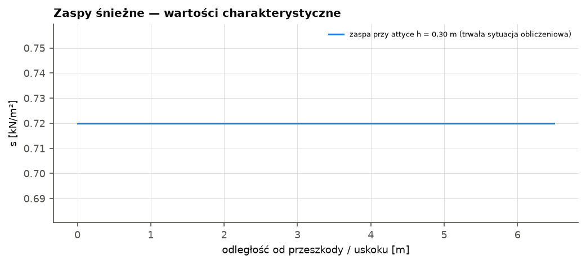

*Rys. Rozkłady obciążenia śniegiem w zaspach (PN-EN 1991-1-3 p. 5.3.6, 6.2, zał. B).*

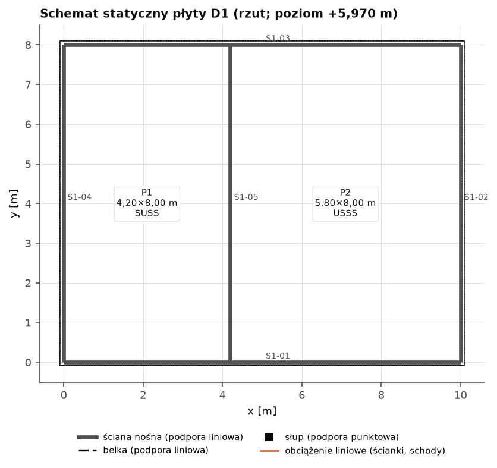

*Rys. Schemat statyczny płyty D1: pola (P — wymiary, warunki brzegowe x=0/x=l_x/y=0/y=l_y: S — podparcie swobodne, U — ciągłość/utwierdzenie, W — brzeg swobodny/niepełny), podpory.*

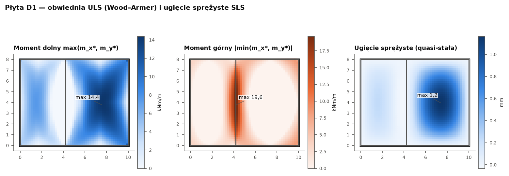

*Rys. Płyta D1: momenty wymiarujące (obwiednia kombinacji 6.10a/b, obciążeń szachownicowych i sytuacji wyjątkowej) oraz ugięcie sprężyste od kombinacji quasi-stałej (bez zarysowania i pełzania — te w obliczeniach 7.4.3).*

#### Zestawienie obciążeń

**Obciążenia stałe — D1 — Stropodach pełny, odwrócony spadek PIR**

| Warstwa | Obliczenie | g_k [kN/m²] | γ_G (6.10a) | g_d [kN/m²] | ξγ_G (6.10b) | g_d [kN/m²] |
|---|---|---|---|---|---|---|
| Membrana EPDM 1,5 mm | 0,1 cm × 11,28 kN/m³ | 0,017 | 1,35 | 0,023 | 1,15 | 0,019 |
| Płyty PIR (izolacja spadkowa) | 22,0 cm × 0,31 kN/m³ | 0,069 | 1,35 | 0,093 | 1,15 | 0,079 |
| Paroizolacja bitumiczna | 0,2 cm × 10,79 kN/m³ | 0,022 | 1,35 | 0,029 | 1,15 | 0,025 |
| Żelbet C30/37 | 20,0 cm × 25,00 kN/m³ | 5,000 | 1,35 | 6,750 | 1,15 | 5,738 |
| Tynk gipsowy maszynowy | 1,0 cm × 12,75 kN/m³ | 0,128 | 1,35 | 0,172 | 1,15 | 0,146 |
| **Razem g_k** |  | 5,235 |  | 7,067 |  | 6,007 |

- Obciążenie użytkowe: dach bez dostępu (kat. H): q_k = 0,40 kN/m², Q_k = 1,0 kN, ψ₀/ψ₁/ψ₂ = 0,0/0,0/0,0 (PN-EN 1991-1-1 tabl. 6.10 + NA; nie łączyć ze śniegiem i wiatrem (p. 3.3.2)).
- Śnieg: s = 0,720 kN/m² (przypadek równomierny) oraz zaspy (poniżej).

#### Obliczenia

##### Śnieg — zaspa przy attyce h = 0,30 m (trwała sytuacja obliczeniowa) — D1

- Współczynnik kształtu przy przeszkodzie: μ₂ = γ·h/s_k = 2,00·0,30/0,90 = **0,667** *((6.1))*
- Przyjęto (0,8 ≤ μ₂ ≤ 2,0): μ₂ = **0,800** *(p. 6.2(2))*
- Długość zaspy: l_s = 2h (5 ≤ l_s ≤ 15 m) = 2·0,30 = **5,00** m *((6.2))*
- Obciążenie przy attyce: s₂ = μ₂·C_e·C_t·s_k = 0,800·1,00·1,00·0,90 = **0,720** kN/m²

##### Sprawdzenie metodą tablic — pole P2 (5,80 × 8,00 m, brzegi USSS)

- Obciążenia obliczeniowe (miarodajne z 6.10a/6.10b): g_d; q_d = g_k = 5,235, q_k = 0,720 kN/m² = **7,067; 0,756** kN/m²
- Współczynniki (brzegi USSS; x=0, x=l_x, y=0, y=l_y; S — podparta, U — utwierdzona): α_x; α_y; β_x; β_y = **0,0546; 0,0271; −0,1067; 0,0000** *(MRS (odpowiednik tablic Czernego), ν = 0,2)*
- Współczynniki płyty swobodnie podpartej (SSSS): α_x⁰; α_y⁰ = **0,0712; 0,0438**
- Moment przęsłowy x: M_x = [α_x·(g_d + q_d/2) + α_x⁰·q_d/2]·l_x² = [0,0546·7,445 + 0,0712·0,378]·5,80² = **14,59** kNm/m
- Moment przęsłowy y: M_y = [α_y·(g_d + q_d/2) + α_y⁰·q_d/2]·l_x² = [0,0271·7,445 + 0,0438·0,378]·5,80² = **7,33** kNm/m
- Momenty podporowe (utwierdzenie, g_d + q_d): M_x,p; M_y,p = **−28,08; 0,00** kNm/m
- Porównanie z MES (M_x; M_y dół, poza narożami): M_MES/M_tabl = **0,98; 1,27**
- Przyjęto do wymiarowania: M_Ed = max(M_MES; M_tabl) = **14,59; 9,29** kNm/m

##### Pole P2 — zginanie dół, kierunek x

- Wysokość użyteczna: d = **170** mm
- Moment względny: μ = M_Ed/(b·d²·η·f_cd) = 14,59·10⁶/(1000·170²·1,0·21,43) = **0,0236** *(3.1.7(3))*
- Względna wysokość strefy ściskanej: ξ_eff = 1 − √(1 − 2μ) = 1 − √(1 − 2·0,0236) = **0,0238**
- Warunek ciągliwości: ξ_eff ≤ ξ_eff,lim = λ·ε_cu3/(ε_cu3 + f_yd/E_s) = 0,024 ≤ 0,493 = **spełniony**
- Wymagane zbrojenie rozciągane: A_s1 = ξ_eff·b·d·η·f_cd/f_yd = 0,0238·1000·170·1,0·21,43/434,8 = **200** mm²
- Zbrojenie minimalne: A_s,min = max(0,26·f_ctm/f_yk·b·d; 0,0013·b·d) = max(0,26·2,9/500·1000·170; 0,0013·1000·170) = **256** mm² *((9.1N) + NA)*
- Przyjęto (z warunkiem rys): φ8 co 19 cm = **2,65** cm²/m
- Naprężenie w stali (quasi-stała, przekrój zarysowany, α_e = 15): σ_s = α_e·M_qp·(d − x_II)/I_II = **235** MPa
- Maksymalna średnica (w_max = 0,4 mm): φ_s = φ*_s·(f_ct,eff/2,9)·k_c·h_cr/(2(h − d)) = 21,5·(2,9/2,9)·0,4·100/(2·30) = **14,3** mm *(tabl. 7.2N, (7.6N))*
- Maksymalny rozstaw prętów: s_max = (σ_s = 235 MPa) = **256** mm *(tabl. 7.3N)*

| Warunek | Efekt | Nośność / limit | η | Stan | Podstawa |
|---|---|---|---|---|---|
| Zbrojenie na zginanie | A_s,req = 256 mm²/m | A_s,prov = 265 mm²/m | 97% | spełniony | 6.1, (9.1N) |
| Rysy: średnica prętów (tabl. 7.2N) | φ = 8 mm | φ_s,max = 14 mm | 56% | spełniony | 7.3.3(2) |

##### Pole P2 — zginanie dół, kierunek y

- Wysokość użyteczna: d = **160** mm
- Moment względny: μ = M_Ed/(b·d²·η·f_cd) = 9,29·10⁶/(1000·160²·1,0·21,43) = **0,0169** *(3.1.7(3))*
- Względna wysokość strefy ściskanej: ξ_eff = 1 − √(1 − 2μ) = 1 − √(1 − 2·0,0169) = **0,0171**
- Warunek ciągliwości: ξ_eff ≤ ξ_eff,lim = λ·ε_cu3/(ε_cu3 + f_yd/E_s) = 0,017 ≤ 0,493 = **spełniony**
- Wymagane zbrojenie rozciągane: A_s1 = ξ_eff·b·d·η·f_cd/f_yd = 0,0171·1000·160·1,0·21,43/434,8 = **135** mm²
- Zbrojenie minimalne: A_s,min = max(0,26·f_ctm/f_yk·b·d; 0,0013·b·d) = max(0,26·2,9/500·1000·160; 0,0013·1000·160) = **241** mm² *((9.1N) + NA)*
- Przyjęto (z warunkiem rys): φ8 co 20 cm = **2,51** cm²/m
- Naprężenie w stali (quasi-stała, przekrój zarysowany, α_e = 15): σ_s = α_e·M_qp·(d − x_II)/I_II = **170** MPa
- Maksymalna średnica (w_max = 0,4 mm): φ_s = φ*_s·(f_ct,eff/2,9)·k_c·h_cr/(2(h − d)) = 38,0·(2,9/2,9)·0,4·100/(2·40) = **19,0** mm *(tabl. 7.2N, (7.6N))*
- Maksymalny rozstaw prętów: s_max = (σ_s = 170 MPa) = **300** mm *(tabl. 7.3N)*

| Warunek | Efekt | Nośność / limit | η | Stan | Podstawa |
|---|---|---|---|---|---|
| Zbrojenie na zginanie | A_s,req = 241 mm²/m | A_s,prov = 251 mm²/m | 96% | spełniony | 6.1, (9.1N) |
| Rysy: średnica prętów (tabl. 7.2N) | φ = 8 mm | φ_s,max = 19 mm | 42% | spełniony | 7.3.3(2) |

##### Pole P2 — zginanie góra, x

- Wysokość użyteczna: d = **170** mm
- Moment względny: μ = M_Ed/(b·d²·η·f_cd) = 28,08·10⁶/(1000·170²·1,0·21,43) = **0,0453** *(3.1.7(3))*
- Względna wysokość strefy ściskanej: ξ_eff = 1 − √(1 − 2μ) = 1 − √(1 − 2·0,0453) = **0,0464**
- Warunek ciągliwości: ξ_eff ≤ ξ_eff,lim = λ·ε_cu3/(ε_cu3 + f_yd/E_s) = 0,046 ≤ 0,493 = **spełniony**
- Wymagane zbrojenie rozciągane: A_s1 = ξ_eff·b·d·η·f_cd/f_yd = 0,0464·1000·170·1,0·21,43/434,8 = **389** mm²
- Zbrojenie minimalne: A_s,min = max(0,26·f_ctm/f_yk·b·d; 0,0013·b·d) = max(0,26·2,9/500·1000·170; 0,0013·1000·170) = **256** mm² *((9.1N) + NA)*
- Przyjęto (z warunkiem rys): φ10 co 20 cm = **3,93** cm²/m
- Naprężenie w stali (quasi-stała, przekrój zarysowany, α_e = 15): σ_s = α_e·M_qp·(d − x_II)/I_II = **219** MPa
- Maksymalna średnica (w_max = 0,4 mm): φ_s = φ*_s·(f_ct,eff/2,9)·k_c·h_cr/(2(h − d)) = 26,2·(2,9/2,9)·0,4·100/(2·30) = **17,5** mm *(tabl. 7.2N, (7.6N))*
- Maksymalny rozstaw prętów: s_max = (σ_s = 219 MPa) = **276** mm *(tabl. 7.3N)*

| Warunek | Efekt | Nośność / limit | η | Stan | Podstawa |
|---|---|---|---|---|---|
| Zbrojenie na zginanie | A_s,req = 389 mm²/m | A_s,prov = 393 mm²/m | 99% | spełniony | 6.1, (9.1N) |
| Rysy: średnica prętów (tabl. 7.2N) | φ = 10 mm | φ_s,max = 17 mm | 57% | spełniony | 7.3.3(2) |

##### Pole P2 — zginanie góra, y

- Wysokość użyteczna: d = **160** mm
- Moment względny: μ = M_Ed/(b·d²·η·f_cd) = 6,92·10⁶/(1000·160²·1,0·21,43) = **0,0126** *(3.1.7(3))*
- Względna wysokość strefy ściskanej: ξ_eff = 1 − √(1 − 2μ) = 1 − √(1 − 2·0,0126) = **0,0127**
- Warunek ciągliwości: ξ_eff ≤ ξ_eff,lim = λ·ε_cu3/(ε_cu3 + f_yd/E_s) = 0,013 ≤ 0,493 = **spełniony**
- Wymagane zbrojenie rozciągane: A_s1 = ξ_eff·b·d·η·f_cd/f_yd = 0,0127·1000·160·1,0·21,43/434,8 = **100** mm²
- Zbrojenie minimalne: A_s,min = max(0,26·f_ctm/f_yk·b·d; 0,0013·b·d) = max(0,26·2,9/500·1000·160; 0,0013·1000·160) = **241** mm² *((9.1N) + NA)*
- Przyjęto (z warunkiem rys): φ8 co 20 cm = **2,51** cm²/m
- Naprężenie w stali (quasi-stała, przekrój zarysowany, α_e = 15): σ_s = α_e·M_qp·(d − x_II)/I_II = **127** MPa
- Maksymalna średnica (w_max = 0,4 mm): φ_s = φ*_s·(f_ct,eff/2,9)·k_c·h_cr/(2(h − d)) = 40,0·(2,9/2,9)·0,4·100/(2·40) = **20,0** mm *(tabl. 7.2N, (7.6N))*
- Maksymalny rozstaw prętów: s_max = (σ_s = 127 MPa) = **300** mm *(tabl. 7.3N)*

| Warunek | Efekt | Nośność / limit | η | Stan | Podstawa |
|---|---|---|---|---|---|
| Zbrojenie na zginanie | A_s,req = 241 mm²/m | A_s,prov = 251 mm²/m | 96% | spełniony | 6.1, (9.1N) |
| Rysy: średnica prętów (tabl. 7.2N) | φ = 8 mm | φ_s,max = 20 mm | 40% | spełniony | 7.3.3(2) |

##### Pole P2 — zbrojenie narożne (góra i dół, strefy 1,16 × 1,16 m)

- Wysokość użyteczna: d = **160** mm
- Moment względny: μ = M_Ed/(b·d²·η·f_cd) = 12,91·10⁶/(1000·160²·1,0·21,43) = **0,0235** *(3.1.7(3))*
- Względna wysokość strefy ściskanej: ξ_eff = 1 − √(1 − 2μ) = 1 − √(1 − 2·0,0235) = **0,0238**
- Warunek ciągliwości: ξ_eff ≤ ξ_eff,lim = λ·ε_cu3/(ε_cu3 + f_yd/E_s) = 0,024 ≤ 0,493 = **spełniony**
- Wymagane zbrojenie rozciągane: A_s1 = ξ_eff·b·d·η·f_cd/f_yd = 0,0238·1000·160·1,0·21,43/434,8 = **188** mm²
- Zbrojenie minimalne: A_s,min = max(0,26·f_ctm/f_yk·b·d; 0,0013·b·d) = max(0,26·2,9/500·1000·160; 0,0013·1000·160) = **241** mm² *((9.1N) + NA)*
- Przyjęto: φ8 co 20 cm = **2,51** cm²/m

| Warunek | Efekt | Nośność / limit | η | Stan | Podstawa |
|---|---|---|---|---|---|
| Zbrojenie na zginanie | A_s,req = 241 mm²/m | A_s,prov = 251 mm²/m | 96% | spełniony | 6.1, (9.1N) |

##### Pole P2 — ścinanie (maks. reakcja podpory, [UPR] 0,6·r przy podporze pośredniej)

- Współczynnik skali: k = 1 + √(200/d) ≤ 2,0 = 1 + √(200/170) = **2,000**
- Stopień zbrojenia podłużnego: ρ_l = A_sl/(b_w·d) ≤ 0,02 = 265/(1000·170) = **0,00156**
- Nośność na ścinanie: V_Rd,c = C_Rd,c·k·(100·ρ_l·f_ck)^(1/3)·b_w·d = 0,1286·2,000·(100·0,00156·30)^(1/3)·1000·170·10⁻³ = **73,06** kN *((6.2.a); C_Rd,c = 0,18/γ_c)*
- Wartość minimalna: V_Rd,c,min = v_min·b_w·d, v_min = 0,035·k^(3/2)·f_ck^(1/2) = 0,5422·1000·170·10⁻³ = **92,18** kN *((6.2.b), (6.3N))*

| Warunek | Efekt | Nośność / limit | η | Stan | Podstawa |
|---|---|---|---|---|---|
| Ścinanie bez zbrojenia poprzecznego (6.2.2) | V_Ed = 34,69 kN | V_Rd,c = 92,18 kN | 38% | spełniony | PN-EN 1992-1-1 6.2.2 |

##### Pole P2 — ugięcie (l = 5,80 m, K = 1,3)

- Stopień zbrojenia wymagany: ρ = A_s,req/(b·d) = 200/(1000·170) = **0,00118**
- Wartość odniesienia: ρ₀ = √f_ck·10⁻³ = √30·10⁻³ = **0,00548**
- Graniczne l/d (ρ ≤ ρ₀): K·[11 + 1,5·√f_ck·ρ₀/ρ + 3,2·√f_ck·(ρ₀/ρ − 1)^(3/2)] = 1,3·[11 + 1,5·5,477·4,661 + 3,2·5,477·(4,661 − 1)^1,5] = **223,7** *((7.16a))*
- Mnożnik od naprężeń w stali: 310/σ_s ≈ 500/(f_yk·A_s,req/A_s,prov) ≤ 1,5 = 500/(500·200/265) = **1,324** *((7.17))*
- Smukłość rzeczywista: l_eff/d = 5,80/0,170 = **34,1**
- *Obliczenie ugięcia (7.4.3)*
- Efektywny moduł sprężystości: E_c,eff = E_cm/(1 + φ) = 33000/(1 + 2,5) = **9429** MPa *((7.20))*
- Stosunek modułów: α_e = E_s/E_c,eff = 200000/9429 = **21,21**
- Przekrój niezarysowany: x_I; I_I = **101,9 mm; 693,4·10⁶ mm⁴**
- Przekrój zarysowany: x_II; I_II = **38,4 mm; 116,1·10⁶ mm⁴**
- Moment rysujący: M_cr = f_ctm·I_I/(h − x_I) = 2,9·693,4·10⁶/(200 − 101,9) = **20,50** kNm
- Współczynnik rozkładu: ζ = 1 − β·(M_cr/M_qp)², β = 0,5 = M_qp ≤ M_cr → 0 = **0,000** *((7.19))*
- Ugięcie od obciążeń (quasi-stała): w_q = ζ·w_II + (1 − ζ)·w_I = 0,000·23,47 + 1,000·3,93 = **3,93** mm *((7.18))*
- Ugięcie od skurczu: w_cs = k·(1/r_cs)·l², 1/r_cs = ε_cs·α_e·S/I = 0,125·0,220·10⁻⁶·5800² = **0,93** mm *((7.21))*
- Ugięcie całkowite: w = w_q + w_cs = 3,93 + 0,93 = **4,85** mm
- Ugięcie dopuszczalne: w_lim = L/250 = 5800/250 = **23,2** mm *(7.4.1(4))*

| Warunek | Efekt | Nośność / limit | η | Stan | Podstawa |
|---|---|---|---|---|---|
| Ugięcie — graniczna smukłość l/d (7.4.2) | l/d = 34,1  | (l/d)_lim = 296,2  | 12% | spełniony | (7.16), tabl. 7.4N |

> l/d spełnione — obliczenie (7.4.3) informacyjnie: w = 4,9 mm ≤? 23,2 mm.

#### Wymiarowanie — zestawienia

**Zestawienie wymiarowania pól płyty** (M [kNm/m] — obwiednia ULS, Wood–Armer, poza strefami narożnymi; „tabl.” — metoda tablic, jeżeli stosowalna; góra — nad podporami; naroża — strefy 0,2·l_min × 0,2·l_min przy narożach podpartych, zbrojenie górą i dołem na moment skręcający)

| Pole | l_x × l_y [m] | Brzegi | M_x,dół [kNm/m] MES / tabl. | Zbroj. x dół | M_y,dół MES / tabl. | Zbroj. y dół | M_x,góra | Zbroj. x góra | M_y,góra | Zbroj. y góra | Naroża M / zbroj. | w / w_lim [mm] | η_max |
|---|---|---|---|---|---|---|---|---|---|---|---|---|---|
| P1 | 4,20 × 8,00 | SUSS | 7,51 / 9,19 | φ8 co 19 cm | 3,84 / 3,50 | φ8 co 20 cm | −19,64 | φ8 co 18 cm | −4,38 | φ8 co 20 cm | 8,52 / φ8 co 20 cm | 1,3 / 16,8 | 97% |
| P2 | 5,80 × 8,00 | USSS | 14,37 / 14,59 | φ8 co 19 cm | 9,29 / 7,33 | φ8 co 20 cm | −28,08 | φ10 co 20 cm | −6,92 | φ8 co 20 cm | 12,91 / φ8 co 20 cm | 4,9 / 23,2 | 99% |

**Reakcje podporowe (charakterystyczne, cała grupa płyt)**

| Podpora | Długość [m] | ΣR_G [kN] | ΣR_Q [kN] | max r_G [kN/m] | max r_Q [kN/m] |
|---|---|---|---|---|---|
| S1-01 | 10,00 | 47,5 | 0,0 | 34,98 | 0,00 |
| S1-02 | 8,00 | 71,6 | 0,0 | 34,30 | 0,00 |
| S1-03 | 10,00 | 47,5 | 0,0 | 34,98 | 0,00 |
| S1-04 | 8,00 | 53,6 | 0,0 | 15,55 | 0,00 |
| S1-05 | 8,00 | 215,7 | 0,0 | 33,17 | 0,00 |

#### Wnioski

**Przyjęto:** Płyta gr. 20 cm z betonu C30/37, stal B500SP, otulenie c_nom = 25 mm; zbrojenie wg zestawienia pól (dołem siatka w obu kierunkach, górą nad podporami).  
**Przyjęto:** Maks. ugięcie długotrwałe ≈ 4,9 mm.  

## Poz. 2 — Stropy

### Poz. 2.1 — Strop ST1

Element modelu: `ST1` · maks. wykorzystanie nośności η = 99% · wszystkie warunki spełnione

#### Opis i schemat statyczny

Płyta żelbetowa monolityczna gr. h = 20 cm, wierzch konstrukcji 2,910 m, beton C25/30 (ekspozycja XC1), stal B500SP. Pole płyty 76,07 m². Schemat: płyta na podporach liniowych (ściany, belki — podpory sztywne, przegubowe) i punktowych (słupy); statyka — MES płytowy (elementy ACM, siatka 20 cm, obwiednia kombinacji 6.10a/6.10b i obciążeń szachownicowych pól), sprawdzenie pól prostokątnych metodą tablic (współczynniki MRS).

Podpory: S0-01 (ściana), S0-02 (ściana), S0-03 (ściana), S0-04 (ściana), S0-05 (ściana)

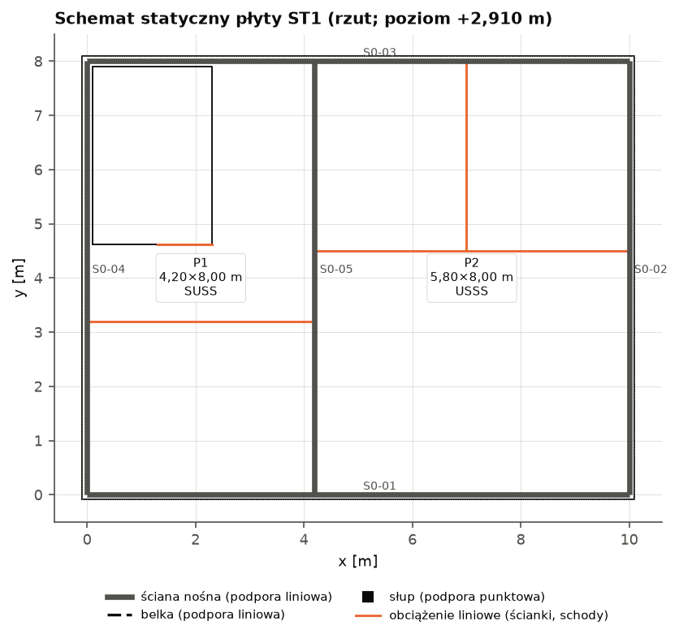

*Rys. Schemat statyczny płyty ST1: pola (P — wymiary, warunki brzegowe x=0/x=l_x/y=0/y=l_y: S — podparcie swobodne, U — ciągłość/utwierdzenie, W — brzeg swobodny/niepełny), podpory.*

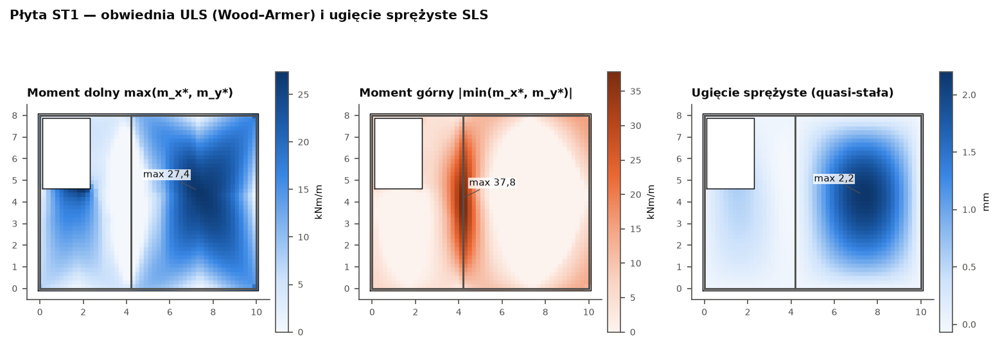

*Rys. Płyta ST1: momenty wymiarujące (obwiednia kombinacji 6.10a/b, obciążeń szachownicowych i sytuacji wyjątkowej) oraz ugięcie sprężyste od kombinacji quasi-stałej (bez zarysowania i pełzania — te w obliczeniach 7.4.3).*

#### Zestawienie obciążeń

**Obciążenia stałe — ST1 — strop (podłoga POD-1, sufit TYNK_GIPS)**

| Warstwa | Obliczenie | g_k [kN/m²] | γ_G (6.10a) | g_d [kN/m²] | ξγ_G (6.10b) | g_d [kN/m²] |
|---|---|---|---|---|---|---|
| Deska podłogowa dębowa | 1,5 cm × 6,87 kN/m³ | 0,103 | 1,35 | 0,139 | 1,15 | 0,118 |
| Jastrych cementowy | 5,5 cm × 19,62 kN/m³ | 1,079 | 1,35 | 1,457 | 1,15 | 1,238 |
| Styropian akustyczny EPS T | 8,0 cm × 0,12 kN/m³ | 0,009 | 1,35 | 0,013 | 1,15 | 0,011 |
| Płyta żelbetowa | 20,0 cm × 25,00 kN/m³ | 5,000 | 1,35 | 6,750 | 1,15 | 5,738 |
| Tynk gipsowy maszynowy | 1,0 cm × 12,75 kN/m³ | 0,128 | 1,35 | 0,172 | 1,15 | 0,146 |
| **Razem g_k** |  | 6,319 |  | 8,531 |  | 7,251 |

- Obciążenie użytkowe: stropy mieszkalne (kat. A): q_k = 2,00 kN/m², Q_k = 3,0 kN, ψ₀/ψ₁/ψ₂ = 0,7/0,5/0,3 (PN-EN 1991-1-1 tabl. 6.2 + NA; R5 3.3 [NZW NA — górna granica EN]).
- Obciążenie dodatkowe (G): ścianka działowa S1-06: 6,03 kN/m (> 3 kN/m — obciążenie liniowe, 6.3.1.2(9)).
- Obciążenie dodatkowe (G): ścianka działowa S1-07: 7,15 kN/m (> 3 kN/m — obciążenie liniowe, 6.3.1.2(9)).
- Obciążenie dodatkowe (G): ścianka działowa S1-08: 5,95 kN/m (> 3 kN/m — obciążenie liniowe, 6.3.1.2(9)).
- Obciążenie dodatkowe (G): reakcja schodów SCH1: 13,46 kN/m (G).
- Obciążenie dodatkowe (QA): reakcja schodów SCH1: 6,76 kN/m (Q).

#### Obliczenia

##### Sprawdzenie metodą tablic — pole P2 (5,80 × 8,00 m, brzegi USSS)

- Obciążenie liniowe ścianek na polu jako równomierne zastępcze [UPR — tylko porównanie]: g_dz = Σ(g_l·l)/A = **1,343** kN/m²
- Obciążenia obliczeniowe (miarodajne z 6.10a/6.10b): g_d; q_d = g_k = 7,662, q_k = 2,000 kN/m² = **10,344; 2,100** kN/m²
- Współczynniki (brzegi USSS; x=0, x=l_x, y=0, y=l_y; S — podparta, U — utwierdzona): α_x; α_y; β_x; β_y = **0,0546; 0,0271; −0,1067; 0,0000** *(MRS (odpowiednik tablic Czernego), ν = 0,2)*
- Współczynniki płyty swobodnie podpartej (SSSS): α_x⁰; α_y⁰ = **0,0712; 0,0438**
- Moment przęsłowy x: M_x = [α_x·(g_d + q_d/2) + α_x⁰·q_d/2]·l_x² = [0,0546·11,394 + 0,0712·1,050]·5,80² = **23,46** kNm/m
- Moment przęsłowy y: M_y = [α_y·(g_d + q_d/2) + α_y⁰·q_d/2]·l_x² = [0,0271·11,394 + 0,0438·1,050]·5,80² = **11,92** kNm/m
- Momenty podporowe (utwierdzenie, g_d + q_d): M_x,p; M_y,p = **−44,67; 0,00** kNm/m
- Porównanie z MES (M_x; M_y dół, poza narożami): M_MES/M_tabl = **1,17; 1,52**
- Przyjęto do wymiarowania: M_Ed = max(M_MES; M_tabl) = **27,38; 18,13** kNm/m

##### Pole P2 — zginanie dół, kierunek x

- Wysokość użyteczna: d = **170** mm
- Moment względny: μ = M_Ed/(b·d²·η·f_cd) = 27,38·10⁶/(1000·170²·1,0·17,86) = **0,0530** *(3.1.7(3))*
- Względna wysokość strefy ściskanej: ξ_eff = 1 − √(1 − 2μ) = 1 − √(1 − 2·0,0530) = **0,0545**
- Warunek ciągliwości: ξ_eff ≤ ξ_eff,lim = λ·ε_cu3/(ε_cu3 + f_yd/E_s) = 0,055 ≤ 0,493 = **spełniony**
- Wymagane zbrojenie rozciągane: A_s1 = ξ_eff·b·d·η·f_cd/f_yd = 0,0545·1000·170·1,0·17,86/434,8 = **381** mm²
- Zbrojenie minimalne: A_s,min = max(0,26·f_ctm/f_yk·b·d; 0,0013·b·d) = max(0,26·2,6/500·1000·170; 0,0013·1000·170) = **230** mm² *((9.1N) + NA)*
- Przyjęto (z warunkiem rys): φ8 co 13 cm = **3,87** cm²/m
- Naprężenie w stali (quasi-stała, przekrój zarysowany, α_e = 15): σ_s = α_e·M_qp·(d − x_II)/I_II = **300** MPa
- Maksymalna średnica (w_max = 0,4 mm): φ_s = φ*_s·(f_ct,eff/2,9)·k_c·h_cr/(2(h − d)) = 14,0·(2,6/2,9)·0,4·100/(2·30) = **8,3** mm *(tabl. 7.2N, (7.6N))*
- Maksymalny rozstaw prętów: s_max = (σ_s = 300 MPa) = **174** mm *(tabl. 7.3N)*

| Warunek | Efekt | Nośność / limit | η | Stan | Podstawa |
|---|---|---|---|---|---|
| Zbrojenie na zginanie | A_s,req = 381 mm²/m | A_s,prov = 387 mm²/m | 98% | spełniony | 6.1, (9.1N) |
| Rysy: średnica prętów (tabl. 7.2N) | φ = 8 mm | φ_s,max = 8 mm | 96% | spełniony | 7.3.3(2) |

##### Pole P2 — zginanie dół, kierunek y

- Wysokość użyteczna: d = **160** mm
- Moment względny: μ = M_Ed/(b·d²·η·f_cd) = 18,13·10⁶/(1000·160²·1,0·17,86) = **0,0397** *(3.1.7(3))*
- Względna wysokość strefy ściskanej: ξ_eff = 1 − √(1 − 2μ) = 1 − √(1 − 2·0,0397) = **0,0405**
- Warunek ciągliwości: ξ_eff ≤ ξ_eff,lim = λ·ε_cu3/(ε_cu3 + f_yd/E_s) = 0,040 ≤ 0,493 = **spełniony**
- Wymagane zbrojenie rozciągane: A_s1 = ξ_eff·b·d·η·f_cd/f_yd = 0,0405·1000·160·1,0·17,86/434,8 = **266** mm²
- Zbrojenie minimalne: A_s,min = max(0,26·f_ctm/f_yk·b·d; 0,0013·b·d) = max(0,26·2,6/500·1000·160; 0,0013·1000·160) = **216** mm² *((9.1N) + NA)*
- Przyjęto (z warunkiem rys): φ8 co 18 cm = **2,79** cm²/m
- Naprężenie w stali (quasi-stała, przekrój zarysowany, α_e = 15): σ_s = α_e·M_qp·(d − x_II)/I_II = **293** MPa
- Maksymalna średnica (w_max = 0,4 mm): φ_s = φ*_s·(f_ct,eff/2,9)·k_c·h_cr/(2(h − d)) = 14,7·(2,6/2,9)·0,4·100/(2·40) = **6,6** mm *(tabl. 7.2N, (7.6N))*
- Maksymalny rozstaw prętów: s_max = (σ_s = 293 MPa) = **184** mm *(tabl. 7.3N)*

| Warunek | Efekt | Nośność / limit | η | Stan | Podstawa |
|---|---|---|---|---|---|
| Zbrojenie na zginanie | A_s,req = 266 mm²/m | A_s,prov = 279 mm²/m | 95% | spełniony | 6.1, (9.1N) |
| Rysy: rozstaw prętów (tabl. 7.3N) | s = 180 mm | s_max = 184 mm | 98% | spełniony | 7.3.3(2) |

##### Pole P2 — zginanie góra, x

- Wysokość użyteczna: d = **170** mm
- Moment względny: μ = M_Ed/(b·d²·η·f_cd) = 44,67·10⁶/(1000·170²·1,0·17,86) = **0,0866** *(3.1.7(3))*
- Względna wysokość strefy ściskanej: ξ_eff = 1 − √(1 − 2μ) = 1 − √(1 − 2·0,0866) = **0,0907**
- Warunek ciągliwości: ξ_eff ≤ ξ_eff,lim = λ·ε_cu3/(ε_cu3 + f_yd/E_s) = 0,091 ≤ 0,493 = **spełniony**
- Wymagane zbrojenie rozciągane: A_s1 = ξ_eff·b·d·η·f_cd/f_yd = 0,0907·1000·170·1,0·17,86/434,8 = **633** mm²
- Zbrojenie minimalne: A_s,min = max(0,26·f_ctm/f_yk·b·d; 0,0013·b·d) = max(0,26·2,6/500·1000·170; 0,0013·1000·170) = **230** mm² *((9.1N) + NA)*
- Przyjęto (z warunkiem rys): φ10 co 12 cm = **6,54** cm²/m
- Naprężenie w stali (quasi-stała, przekrój zarysowany, α_e = 15): σ_s = α_e·M_qp·(d − x_II)/I_II = **248** MPa
- Maksymalna średnica (w_max = 0,4 mm): φ_s = φ*_s·(f_ct,eff/2,9)·k_c·h_cr/(2(h − d)) = 19,2·(2,6/2,9)·0,4·100/(2·30) = **11,5** mm *(tabl. 7.2N, (7.6N))*
- Maksymalny rozstaw prętów: s_max = (σ_s = 248 MPa) = **240** mm *(tabl. 7.3N)*

| Warunek | Efekt | Nośność / limit | η | Stan | Podstawa |
|---|---|---|---|---|---|
| Zbrojenie na zginanie | A_s,req = 633 mm²/m | A_s,prov = 654 mm²/m | 97% | spełniony | 6.1, (9.1N) |
| Rysy: średnica prętów (tabl. 7.2N) | φ = 10 mm | φ_s,max = 11 mm | 87% | spełniony | 7.3.3(2) |

##### Pole P2 — zginanie góra, y

- Wysokość użyteczna: d = **160** mm
- Moment względny: μ = M_Ed/(b·d²·η·f_cd) = 13,37·10⁶/(1000·160²·1,0·17,86) = **0,0293** *(3.1.7(3))*
- Względna wysokość strefy ściskanej: ξ_eff = 1 − √(1 − 2μ) = 1 − √(1 − 2·0,0293) = **0,0297**
- Warunek ciągliwości: ξ_eff ≤ ξ_eff,lim = λ·ε_cu3/(ε_cu3 + f_yd/E_s) = 0,030 ≤ 0,493 = **spełniony**
- Wymagane zbrojenie rozciągane: A_s1 = ξ_eff·b·d·η·f_cd/f_yd = 0,0297·1000·160·1,0·17,86/434,8 = **195** mm²
- Zbrojenie minimalne: A_s,min = max(0,26·f_ctm/f_yk·b·d; 0,0013·b·d) = max(0,26·2,6/500·1000·160; 0,0013·1000·160) = **216** mm² *((9.1N) + NA)*
- Przyjęto (z warunkiem rys): φ8 co 22 cm = **2,28** cm²/m
- Naprężenie w stali (quasi-stała, przekrój zarysowany, α_e = 15): σ_s = α_e·M_qp·(d − x_II)/I_II = **257** MPa
- Maksymalna średnica (w_max = 0,4 mm): φ_s = φ*_s·(f_ct,eff/2,9)·k_c·h_cr/(2(h − d)) = 18,3·(2,6/2,9)·0,4·100/(2·40) = **8,2** mm *(tabl. 7.2N, (7.6N))*
- Maksymalny rozstaw prętów: s_max = (σ_s = 257 MPa) = **229** mm *(tabl. 7.3N)*

| Warunek | Efekt | Nośność / limit | η | Stan | Podstawa |
|---|---|---|---|---|---|
| Zbrojenie na zginanie | A_s,req = 216 mm²/m | A_s,prov = 228 mm²/m | 95% | spełniony | 6.1, (9.1N) |
| Rysy: średnica prętów (tabl. 7.2N) | φ = 8 mm | φ_s,max = 8 mm | 97% | spełniony | 7.3.3(2) |

##### Pole P2 — zbrojenie narożne (góra i dół, strefy 1,16 × 1,16 m)

- Wysokość użyteczna: d = **160** mm
- Moment względny: μ = M_Ed/(b·d²·η·f_cd) = 21,61·10⁶/(1000·160²·1,0·17,86) = **0,0473** *(3.1.7(3))*
- Względna wysokość strefy ściskanej: ξ_eff = 1 − √(1 − 2μ) = 1 − √(1 − 2·0,0473) = **0,0484**
- Warunek ciągliwości: ξ_eff ≤ ξ_eff,lim = λ·ε_cu3/(ε_cu3 + f_yd/E_s) = 0,048 ≤ 0,493 = **spełniony**
- Wymagane zbrojenie rozciągane: A_s1 = ξ_eff·b·d·η·f_cd/f_yd = 0,0484·1000·160·1,0·17,86/434,8 = **318** mm²
- Zbrojenie minimalne: A_s,min = max(0,26·f_ctm/f_yk·b·d; 0,0013·b·d) = max(0,26·2,6/500·1000·160; 0,0013·1000·160) = **216** mm² *((9.1N) + NA)*
- Przyjęto: φ10 co 24 cm = **3,27** cm²/m

| Warunek | Efekt | Nośność / limit | η | Stan | Podstawa |
|---|---|---|---|---|---|
| Zbrojenie na zginanie | A_s,req = 318 mm²/m | A_s,prov = 327 mm²/m | 97% | spełniony | 6.1, (9.1N) |

##### Pole P2 — ścinanie (maks. reakcja podpory, [UPR] 0,6·r przy podporze pośredniej)

- Współczynnik skali: k = 1 + √(200/d) ≤ 2,0 = 1 + √(200/170) = **2,000**
- Stopień zbrojenia podłużnego: ρ_l = A_sl/(b_w·d) ≤ 0,02 = 387/(1000·170) = **0,00227**
- Nośność na ścinanie: V_Rd,c = C_Rd,c·k·(100·ρ_l·f_ck)^(1/3)·b_w·d = 0,1286·2,000·(100·0,00227·25)^(1/3)·1000·170·10⁻³ = **78,02** kN *((6.2.a); C_Rd,c = 0,18/γ_c)*
- Wartość minimalna: V_Rd,c,min = v_min·b_w·d, v_min = 0,035·k^(3/2)·f_ck^(1/2) = 0,4950·1000·170·10⁻³ = **84,15** kN *((6.2.b), (6.3N))*

| Warunek | Efekt | Nośność / limit | η | Stan | Podstawa |
|---|---|---|---|---|---|
| Ścinanie bez zbrojenia poprzecznego (6.2.2) | V_Ed = 66,21 kN | V_Rd,c = 84,15 kN | 79% | spełniony | PN-EN 1992-1-1 6.2.2 |

##### Pole P2 — ugięcie (l = 5,80 m, K = 1,3)

- Stopień zbrojenia wymagany: ρ = A_s,req/(b·d) = 381/(1000·170) = **0,00224**
- Wartość odniesienia: ρ₀ = √f_ck·10⁻³ = √25·10⁻³ = **0,00500**
- Graniczne l/d (ρ ≤ ρ₀): K·[11 + 1,5·√f_ck·ρ₀/ρ + 3,2·√f_ck·(ρ₀/ρ − 1)^(3/2)] = 1,3·[11 + 1,5·5,000·2,232 + 3,2·5,000·(2,232 − 1)^1,5] = **64,5** *((7.16a))*
- Mnożnik od naprężeń w stali: 310/σ_s ≈ 500/(f_yk·A_s,req/A_s,prov) ≤ 1,5 = 500/(500·381/387) = **1,015** *((7.17))*
- Smukłość rzeczywista: l_eff/d = 5,80/0,170 = **34,1**
- *Obliczenie ugięcia (7.4.3)*
- Efektywny moduł sprężystości: E_c,eff = E_cm/(1 + φ) = 31000/(1 + 2,5) = **8857** MPa *((7.20))*
- Stosunek modułów: α_e = E_s/E_c,eff = 200000/8857 = **22,58**
- Przekrój niezarysowany: x_I; I_I = **102,9 mm; 707,7·10⁶ mm⁴**
- Przekrój zarysowany: x_II; I_II = **46,4 mm; 166,7·10⁶ mm⁴**
- Moment rysujący: M_cr = f_ctm·I_I/(h − x_I) = 2,6·707,7·10⁶/(200 − 102,9) = **18,95** kNm
- Współczynnik rozkładu: ζ = 1 − β·(M_cr/M_qp)², β = 0,5 = M_qp ≤ M_cr → 0 = **0,000** *((7.19))*
- Ugięcie od obciążeń (quasi-stała): w_q = ζ·w_II + (1 − ζ)·w_I = 0,000·30,88 + 1,000·7,27 = **7,27** mm *((7.18))*
- Ugięcie od skurczu: w_cs = k·(1/r_cs)·l², 1/r_cs = ε_cs·α_e·S/I = 0,125·0,331·10⁻⁶·5800² = **1,39** mm *((7.21))*
- Ugięcie całkowite: w = w_q + w_cs = 7,27 + 1,39 = **8,67** mm
- Ugięcie dopuszczalne: w_lim = L/250 = 5800/250 = **23,2** mm *(7.4.1(4))*

| Warunek | Efekt | Nośność / limit | η | Stan | Podstawa |
|---|---|---|---|---|---|
| Ugięcie — graniczna smukłość l/d (7.4.2) | l/d = 34,1  | (l/d)_lim = 65,5  | 52% | spełniony | (7.16), tabl. 7.4N |

> l/d spełnione — obliczenie (7.4.3) informacyjnie: w = 8,7 mm ≤? 23,2 mm.

#### Wymiarowanie — zestawienia

**Zestawienie wymiarowania pól płyty** (M [kNm/m] — obwiednia ULS, Wood–Armer, poza strefami narożnymi; „tabl.” — metoda tablic, jeżeli stosowalna; góra — nad podporami; naroża — strefy 0,2·l_min × 0,2·l_min przy narożach podpartych, zbrojenie górą i dołem na moment skręcający)

| Pole | l_x × l_y [m] | Brzegi | M_x,dół [kNm/m] MES / tabl. | Zbroj. x dół | M_y,dół MES / tabl. | Zbroj. y dół | M_x,góra | Zbroj. x góra | M_y,góra | Zbroj. y góra | Naroża M / zbroj. | w / w_lim [mm] | η_max |
|---|---|---|---|---|---|---|---|---|---|---|---|---|---|
| P1 | 4,20 × 8,00 | SUSS | 27,10 / — | φ8 co 13 cm | 14,03 / — | φ8 co 23 cm | −37,81 | φ8 co 9 cm | −8,70 | φ8 co 23 cm | 16,07 / φ8 co 21 cm | 2,7 / 16,8 | 99% |
| P2 | 5,80 × 8,00 | USSS | 27,38 / 23,46 | φ8 co 13 cm | 18,13 / 11,92 | φ8 co 18 cm | −44,67 | φ10 co 12 cm | −13,37 | φ8 co 22 cm | 21,61 / φ10 co 24 cm | 8,7 / 23,2 | 98% |

**Reakcje podporowe (charakterystyczne, cała grupa płyt)**

| Podpora | Długość [m] | ΣR_G [kN] | ΣR_Q [kN] | max r_G [kN/m] | max r_Q [kN/m] |
|---|---|---|---|---|---|
| S0-01 | 10,00 | 58,1 | 18,3 | 48,70 | 13,15 |
| S0-02 | 8,00 | 108,6 | 28,0 | 108,29 | 25,41 |
| S0-03 | 10,00 | 53,7 | 14,2 | 56,70 | 21,29 |
| S0-04 | 8,00 | 49,7 | 14,5 | 23,39 | 12,01 |
| S0-05 | 8,00 | 311,7 | 83,8 | 63,10 | 14,23 |

#### Wnioski

**Przyjęto:** Płyta gr. 20 cm z betonu C25/30, stal B500SP, otulenie c_nom = 25 mm; zbrojenie wg zestawienia pól (dołem siatka w obu kierunkach, górą nad podporami).  
**Przyjęto:** Maks. ugięcie długotrwałe ≈ 8,7 mm.  

## Poz. 3 — Płyty wspornikowe

### Poz. 3.1 — Płyta wspornikowa PL-D

Element modelu: `PL-D` · maks. wykorzystanie nośności η = 99% · wszystkie warunki spełnione

#### Opis i schemat statyczny

Płyta żelbetowa monolityczna gr. h = 20 cm, wierzch konstrukcji 2,910 m, beton C30/37 (ekspozycja XC4), stal B500SP. Pole płyty 19,55 m². Schemat: płyta na podporach liniowych (ściany, belki — podpory sztywne, przegubowe) i punktowych (słupy); statyka — MES płytowy (elementy ACM, siatka 20 cm, obwiednia kombinacji 6.10a/6.10b i obciążeń szachownicowych pól), sprawdzenie pól prostokątnych metodą tablic (współczynniki MRS).

Podpory: S0-02 (ściana), B1 (belka), słupy: SL2

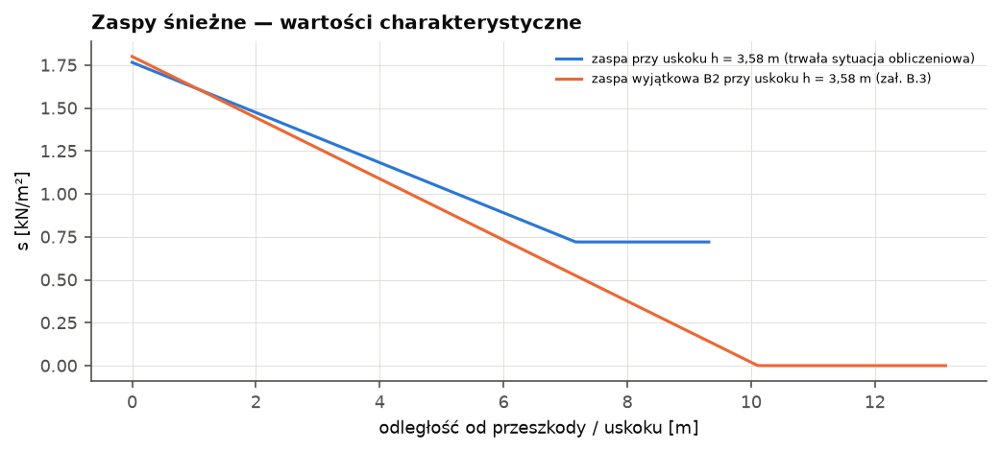

*Rys. Rozkłady obciążenia śniegiem w zaspach (PN-EN 1991-1-3 p. 5.3.6, 6.2, zał. B).*

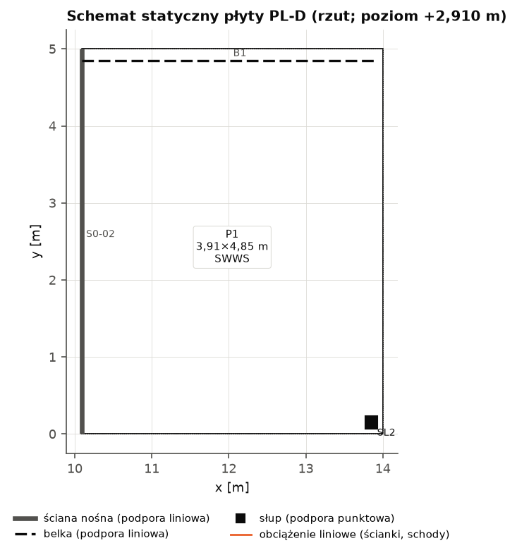

*Rys. Schemat statyczny płyty PL-D: pola (P — wymiary, warunki brzegowe x=0/x=l_x/y=0/y=l_y: S — podparcie swobodne, U — ciągłość/utwierdzenie, W — brzeg swobodny/niepełny), podpory.*

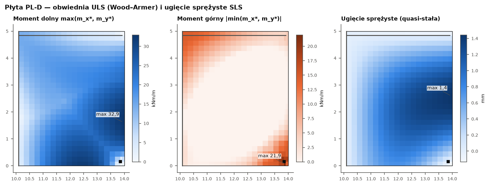

*Rys. Płyta PL-D: momenty wymiarujące (obwiednia kombinacji 6.10a/b, obciążeń szachownicowych i sytuacji wyjątkowej) oraz ugięcie sprężyste od kombinacji quasi-stałej (bez zarysowania i pełzania — te w obliczeniach 7.4.3).*

#### Zestawienie obciążeń

**Obciążenia stałe — PL-D — Taras na płycie wspornikowej**

| Warstwa | Obliczenie | g_k [kN/m²] | γ_G (6.10a) | g_d [kN/m²] | ξγ_G (6.10b) | g_d [kN/m²] |
|---|---|---|---|---|---|---|
| Deska tarasowa kompozytowa | 2,5 cm × 11,77 kN/m³ | 0,294 | 1,35 | 0,397 | 1,15 | 0,338 |
| Legary tarasowe na wspornikach (pustka) | 4,5 cm × 2,94 kN/m³ | 0,132 | 1,35 | 0,179 | 1,15 | 0,152 |
| Hydroizolacja z pap termozgrzewalnych | 0,4 cm × 10,79 kN/m³ | 0,043 | 1,35 | 0,058 | 1,15 | 0,050 |
| Żelbet C30/37 | 20,0 cm × 25,00 kN/m³ | 5,000 | 1,35 | 6,750 | 1,15 | 5,738 |
| **Razem g_k** |  | 5,470 |  | 7,384 |  | 6,277 |

- Obciążenie użytkowe: taras/balkon (kat. A, I): q_k = 4,00 kN/m², Q_k = 3,0 kN, ψ₀/ψ₁/ψ₂ = 0,7/0,5/0,3 (PN-EN 1991-1-1 tabl. 6.2, 6.9 (p. 6.3.4.1); R5 3.3).
- Śnieg: s = 0,720 kN/m² (przypadek równomierny) oraz zaspy (poniżej).

#### Obliczenia

##### Śnieg — zaspa przy uskoku h = 3,58 m (trwała sytuacja obliczeniowa) — PL-D przy ścianie S1-02

- Współczynnik od zsuwania się śniegu z dachu wyższego: μ_s = α = 0° ≤ 15° = **0,00** *(p. 5.3.6(1))*
- Współczynnik od nawiewania: μ_w = (b₁ + b₂)/(2h) = (10,11 + 3,95)/(2·3,58) = **1,962** *((5.8))*
- Ograniczenie: μ_w ≤ γ·h/s_k = 2,00·3,58/0,90 = **7,963** *((5.8); γ = 2 kN/m³)*
- Przyjęto (zakres 0,8 ≤ μ_w ≤ 4,0): μ_w = **1,962** *(p. 5.3.6(1) uwaga 1 (wartość zalecana) [NZW NA])*
- Współczynnik kształtu przy uskoku: μ₂ = μ_s + μ_w = 0,00 + 1,962 = **1,962**
- Długość zaspy: l_s = 2h (5 ≤ l_s ≤ 15 m) = 2·3,58 = **7,17** m *((5.9))*
- Obciążenie przy uskoku: s₂ = μ₂·C_e·C_t·s_k = 1,962·1,00·1,00·0,90 = **1,766** kN/m²
- Obciążenie poza zaspą (μ₁ = 0,8): s₁ = **0,720** kN/m²

> b₂ = 3,95 m < l_s = 7,17 m — zaspa obcięta na krawędzi dachu niższego (p. 5.3.6(3)).

##### Śnieg — zaspa wyjątkowa B2 przy uskoku h = 3,58 m (zał. B.3) — PL-D przy ścianie S1-02

- Długość zaspy: l_s = min(5h; b₁; 15 m) = min(5·3,58; 10,11; 15) = **10,11** m *(zał. B.3 [NZW])*
- Współczynnik kształtu: μ₁ = min{2h/s_k; 2b/l_s; 8} = min{7,96; 2,00; 8} = **2,000** *(zał. B.3 (B.2) [NZW])*
- Obciążenie wyjątkowe: s_Ad = μ₁·s_k = 2,000·0,90 = **1,800** kN/m² *((4.2))*

> Sytuacja wyjątkowa (PN-EN 1990 6.11b): γ = 1,0; [NZW] wzory zał. B wg R5-38 — potwierdzić w normie (N-12).

##### Pole P1 — zginanie dół, kierunek x

- Wysokość użyteczna: d = **155** mm
- Moment względny: μ = M_Ed/(b·d²·η·f_cd) = 31,83·10⁶/(1000·155²·1,0·21,43) = **0,0618** *(3.1.7(3))*
- Względna wysokość strefy ściskanej: ξ_eff = 1 − √(1 − 2μ) = 1 − √(1 − 2·0,0618) = **0,0639**
- Warunek ciągliwości: ξ_eff ≤ ξ_eff,lim = λ·ε_cu3/(ε_cu3 + f_yd/E_s) = 0,064 ≤ 0,493 = **spełniony**
- Wymagane zbrojenie rozciągane: A_s1 = ξ_eff·b·d·η·f_cd/f_yd = 0,0639·1000·155·1,0·21,43/434,8 = **488** mm²
- Zbrojenie minimalne: A_s,min = max(0,26·f_ctm/f_yk·b·d; 0,0013·b·d) = max(0,26·2,9/500·1000·155; 0,0013·1000·155) = **234** mm² *((9.1N) + NA)*
- Przyjęto (z warunkiem rys): φ10 co 16 cm = **4,91** cm²/m
- Naprężenie w stali (quasi-stała, przekrój zarysowany, α_e = 15): σ_s = α_e·M_qp·(d − x_II)/I_II = **249** MPa
- Maksymalna średnica (w_max = 0,3 mm): φ_s = φ*_s·(f_ct,eff/2,9)·k_c·h_cr/(2(h − d)) = 15,1·(2,9/2,9)·0,4·100/(2·45) = **6,7** mm *(tabl. 7.2N, (7.6N))*
- Maksymalny rozstaw prętów: s_max = (σ_s = 249 MPa) = **188** mm *(tabl. 7.3N)*

| Warunek | Efekt | Nośność / limit | η | Stan | Podstawa |
|---|---|---|---|---|---|
| Zbrojenie na zginanie | A_s,req = 488 mm²/m | A_s,prov = 491 mm²/m | 99% | spełniony | 6.1, (9.1N) |
| Rysy: rozstaw prętów (tabl. 7.3N) | s = 160 mm | s_max = 188 mm | 85% | spełniony | 7.3.3(2) |

##### Pole P1 — zginanie dół, kierunek y

- Wysokość użyteczna: d = **145** mm
- Moment względny: μ = M_Ed/(b·d²·η·f_cd) = 32,92·10⁶/(1000·145²·1,0·21,43) = **0,0731** *(3.1.7(3))*
- Względna wysokość strefy ściskanej: ξ_eff = 1 − √(1 − 2μ) = 1 − √(1 − 2·0,0731) = **0,0759**
- Warunek ciągliwości: ξ_eff ≤ ξ_eff,lim = λ·ε_cu3/(ε_cu3 + f_yd/E_s) = 0,076 ≤ 0,493 = **spełniony**
- Wymagane zbrojenie rozciągane: A_s1 = ξ_eff·b·d·η·f_cd/f_yd = 0,0759·1000·145·1,0·21,43/434,8 = **543** mm²
- Zbrojenie minimalne: A_s,min = max(0,26·f_ctm/f_yk·b·d; 0,0013·b·d) = max(0,26·2,9/500·1000·145; 0,0013·1000·145) = **219** mm² *((9.1N) + NA)*
- Przyjęto (z warunkiem rys): φ8 co 9 cm = **5,59** cm²/m
- Naprężenie w stali (quasi-stała, przekrój zarysowany, α_e = 15): σ_s = α_e·M_qp·(d − x_II)/I_II = **244** MPa
- Maksymalna średnica (w_max = 0,3 mm): φ_s = φ*_s·(f_ct,eff/2,9)·k_c·h_cr/(2(h − d)) = 15,6·(2,9/2,9)·0,4·100/(2·55) = **5,7** mm *(tabl. 7.2N, (7.6N))*
- Maksymalny rozstaw prętów: s_max = (σ_s = 244 MPa) = **195** mm *(tabl. 7.3N)*

| Warunek | Efekt | Nośność / limit | η | Stan | Podstawa |
|---|---|---|---|---|---|
| Zbrojenie na zginanie | A_s,req = 543 mm²/m | A_s,prov = 559 mm²/m | 97% | spełniony | 6.1, (9.1N) |
| Rysy: rozstaw prętów (tabl. 7.3N) | s = 90 mm | s_max = 195 mm | 46% | spełniony | 7.3.3(2) |

##### Pole P1 — zginanie góra, x

- Wysokość użyteczna: d = **155** mm
- Moment względny: μ = M_Ed/(b·d²·η·f_cd) = 21,93·10⁶/(1000·155²·1,0·21,43) = **0,0426** *(3.1.7(3))*
- Względna wysokość strefy ściskanej: ξ_eff = 1 − √(1 − 2μ) = 1 − √(1 − 2·0,0426) = **0,0435**
- Warunek ciągliwości: ξ_eff ≤ ξ_eff,lim = λ·ε_cu3/(ε_cu3 + f_yd/E_s) = 0,044 ≤ 0,493 = **spełniony**
- Wymagane zbrojenie rozciągane: A_s1 = ξ_eff·b·d·η·f_cd/f_yd = 0,0435·1000·155·1,0·21,43/434,8 = **333** mm²
- Zbrojenie minimalne: A_s,min = max(0,26·f_ctm/f_yk·b·d; 0,0013·b·d) = max(0,26·2,9/500·1000·155; 0,0013·1000·155) = **234** mm² *((9.1N) + NA)*
- Przyjęto (z warunkiem rys): φ8 co 15 cm = **3,35** cm²/m
- Naprężenie w stali (quasi-stała, przekrój zarysowany, α_e = 15): σ_s = α_e·M_qp·(d − x_II)/I_II = **248** MPa
- Maksymalna średnica (w_max = 0,3 mm): φ_s = φ*_s·(f_ct,eff/2,9)·k_c·h_cr/(2(h − d)) = 15,2·(2,9/2,9)·0,4·100/(2·45) = **6,8** mm *(tabl. 7.2N, (7.6N))*
- Maksymalny rozstaw prętów: s_max = (σ_s = 248 MPa) = **190** mm *(tabl. 7.3N)*

| Warunek | Efekt | Nośność / limit | η | Stan | Podstawa |
|---|---|---|---|---|---|
| Zbrojenie na zginanie | A_s,req = 333 mm²/m | A_s,prov = 335 mm²/m | 99% | spełniony | 6.1, (9.1N) |
| Rysy: rozstaw prętów (tabl. 7.3N) | s = 150 mm | s_max = 190 mm | 79% | spełniony | 7.3.3(2) |

##### Pole P1 — zginanie góra, y

- Wysokość użyteczna: d = **145** mm
- Moment względny: μ = M_Ed/(b·d²·η·f_cd) = 19,85·10⁶/(1000·145²·1,0·21,43) = **0,0441** *(3.1.7(3))*
- Względna wysokość strefy ściskanej: ξ_eff = 1 − √(1 − 2μ) = 1 − √(1 − 2·0,0441) = **0,0451**
- Warunek ciągliwości: ξ_eff ≤ ξ_eff,lim = λ·ε_cu3/(ε_cu3 + f_yd/E_s) = 0,045 ≤ 0,493 = **spełniony**
- Wymagane zbrojenie rozciągane: A_s1 = ξ_eff·b·d·η·f_cd/f_yd = 0,0451·1000·145·1,0·21,43/434,8 = **322** mm²
- Zbrojenie minimalne: A_s,min = max(0,26·f_ctm/f_yk·b·d; 0,0013·b·d) = max(0,26·2,9/500·1000·145; 0,0013·1000·145) = **219** mm² *((9.1N) + NA)*
- Przyjęto (z warunkiem rys): φ8 co 15 cm = **3,35** cm²/m
- Naprężenie w stali (quasi-stała, przekrój zarysowany, α_e = 15): σ_s = α_e·M_qp·(d − x_II)/I_II = **240** MPa
- Maksymalna średnica (w_max = 0,3 mm): φ_s = φ*_s·(f_ct,eff/2,9)·k_c·h_cr/(2(h − d)) = 16,0·(2,9/2,9)·0,4·100/(2·55) = **5,8** mm *(tabl. 7.2N, (7.6N))*
- Maksymalny rozstaw prętów: s_max = (σ_s = 240 MPa) = **199** mm *(tabl. 7.3N)*

| Warunek | Efekt | Nośność / limit | η | Stan | Podstawa |
|---|---|---|---|---|---|
| Zbrojenie na zginanie | A_s,req = 322 mm²/m | A_s,prov = 335 mm²/m | 96% | spełniony | 6.1, (9.1N) |
| Rysy: rozstaw prętów (tabl. 7.3N) | s = 150 mm | s_max = 199 mm | 75% | spełniony | 7.3.3(2) |

##### Pole P1 — zbrojenie narożne (góra i dół, strefy 0,78 × 0,78 m)

- Wysokość użyteczna: d = **145** mm
- Moment względny: μ = M_Ed/(b·d²·η·f_cd) = 15,88·10⁶/(1000·145²·1,0·21,43) = **0,0352** *(3.1.7(3))*
- Względna wysokość strefy ściskanej: ξ_eff = 1 − √(1 − 2μ) = 1 − √(1 − 2·0,0352) = **0,0359**
- Warunek ciągliwości: ξ_eff ≤ ξ_eff,lim = λ·ε_cu3/(ε_cu3 + f_yd/E_s) = 0,036 ≤ 0,493 = **spełniony**
- Wymagane zbrojenie rozciągane: A_s1 = ξ_eff·b·d·η·f_cd/f_yd = 0,0359·1000·145·1,0·21,43/434,8 = **256** mm²
- Zbrojenie minimalne: A_s,min = max(0,26·f_ctm/f_yk·b·d; 0,0013·b·d) = max(0,26·2,9/500·1000·145; 0,0013·1000·145) = **219** mm² *((9.1N) + NA)*
- Przyjęto: φ8 co 19 cm = **2,65** cm²/m

| Warunek | Efekt | Nośność / limit | η | Stan | Podstawa |
|---|---|---|---|---|---|
| Zbrojenie na zginanie | A_s,req = 256 mm²/m | A_s,prov = 265 mm²/m | 97% | spełniony | 6.1, (9.1N) |

##### Pole P1 — ścinanie (maks. reakcja podpory, [UPR] 0,6·r przy podporze pośredniej)

- Współczynnik skali: k = 1 + √(200/d) ≤ 2,0 = 1 + √(200/155) = **2,000**
- Stopień zbrojenia podłużnego: ρ_l = A_sl/(b_w·d) ≤ 0,02 = 335/(1000·155) = **0,00216**
- Nośność na ścinanie: V_Rd,c = C_Rd,c·k·(100·ρ_l·f_ck)^(1/3)·b_w·d = 0,1286·2,000·(100·0,00216·30)^(1/3)·1000·155·10⁻³ = **74,33** kN *((6.2.a); C_Rd,c = 0,18/γ_c)*
- Wartość minimalna: V_Rd,c,min = v_min·b_w·d, v_min = 0,035·k^(3/2)·f_ck^(1/2) = 0,5422·1000·155·10⁻³ = **84,04** kN *((6.2.b), (6.3N))*

| Warunek | Efekt | Nośność / limit | η | Stan | Podstawa |
|---|---|---|---|---|---|
| Ścinanie bez zbrojenia poprzecznego (6.2.2) | V_Ed = 56,00 kN | V_Rd,c = 84,04 kN | 67% | spełniony | PN-EN 1992-1-1 6.2.2 |

##### Pole P1 — ugięcie (l = 3,91 m, K = 1,0)

- Stopień zbrojenia wymagany: ρ = A_s,req/(b·d) = 488/(1000·155) = **0,00315**
- Wartość odniesienia: ρ₀ = √f_ck·10⁻³ = √30·10⁻³ = **0,00548**
- Graniczne l/d (ρ ≤ ρ₀): K·[11 + 1,5·√f_ck·ρ₀/ρ + 3,2·√f_ck·(ρ₀/ρ − 1)^(3/2)] = 1,0·[11 + 1,5·5,477·1,740 + 3,2·5,477·(1,740 − 1)^1,5] = **36,5** *((7.16a))*
- Mnożnik od naprężeń w stali: 310/σ_s ≈ 500/(f_yk·A_s,req/A_s,prov) ≤ 1,5 = 500/(500·488/491) = **1,006** *((7.17))*
- Smukłość rzeczywista: l_eff/d = 3,91/0,155 = **25,2**
- *Obliczenie ugięcia (7.4.3)*
- Efektywny moduł sprężystości: E_c,eff = E_cm/(1 + φ) = 33000/(1 + 2,5) = **9429** MPa *((7.20))*
- Stosunek modułów: α_e = E_s/E_c,eff = 200000/9429 = **21,21**
- Przekrój niezarysowany: x_I; I_I = **102,7 mm; 696,6·10⁶ mm⁴**
- Przekrój zarysowany: x_II; I_II = **47,3 mm; 156,1·10⁶ mm⁴**
- Moment rysujący: M_cr = f_ctm·I_I/(h − x_I) = 2,9·696,6·10⁶/(200 − 102,7) = **20,77** kNm
- Współczynnik rozkładu: ζ = 1 − β·(M_cr/M_qp)², β = 0,5 = M_qp ≤ M_cr → 0 = **0,000** *((7.19))*
- Ugięcie od obciążeń (quasi-stała): w_q = ζ·w_II + (1 − ζ)·w_I = 0,000·21,72 + 1,000·4,87 = **4,87** mm *((7.18))*
- Ugięcie od skurczu: w_cs = k·(1/r_cs)·l², 1/r_cs = ε_cs·α_e·S/I = 0,125·0,313·10⁻⁶·3910² = **0,60** mm *((7.21))*
- Ugięcie całkowite: w = w_q + w_cs = 4,87 + 0,60 = **5,46** mm
- Ugięcie dopuszczalne: w_lim = L/250 = 3910/250 = **15,6** mm *(7.4.1(4))*

| Warunek | Efekt | Nośność / limit | η | Stan | Podstawa |
|---|---|---|---|---|---|
| Ugięcie — graniczna smukłość l/d (7.4.2) | l/d = 25,2  | (l/d)_lim = 36,7  | 69% | spełniony | (7.16), tabl. 7.4N |

> l/d spełnione — obliczenie (7.4.3) informacyjnie: w = 5,5 mm ≤? 15,6 mm.

##### Równowaga statyczna (EQU) — PL-D

- Płyta podparta poza krawędzią zamocowania: **podpory: B1, SL2**

> Płyta nie jest wspornikiem swobodnym — EQU (przewrócenie) nie decyduje.

#### Wymiarowanie — zestawienia

**Zestawienie wymiarowania pól płyty** (M [kNm/m] — obwiednia ULS, Wood–Armer, poza strefami narożnymi; „tabl.” — metoda tablic, jeżeli stosowalna; góra — nad podporami; naroża — strefy 0,2·l_min × 0,2·l_min przy narożach podpartych, zbrojenie górą i dołem na moment skręcający)

| Pole | l_x × l_y [m] | Brzegi | M_x,dół [kNm/m] MES / tabl. | Zbroj. x dół | M_y,dół MES / tabl. | Zbroj. y dół | M_x,góra | Zbroj. x góra | M_y,góra | Zbroj. y góra | Naroża M / zbroj. | w / w_lim [mm] | η_max |
|---|---|---|---|---|---|---|---|---|---|---|---|---|---|
| P1 | 3,91 × 4,85 | SWWS | 31,83 / — | φ10 co 16 cm | 32,92 / — | φ8 co 9 cm | −21,93 | φ8 co 15 cm | −19,85 | φ8 co 15 cm | 15,88 / φ8 co 19 cm | 5,5 / 15,6 | 99% |

**Reakcje podporowe (charakterystyczne, cała grupa płyt)**

| Podpora | Długość [m] | ΣR_G [kN] | ΣR_Q [kN] | max r_G [kN/m] | max r_Q [kN/m] |
|---|---|---|---|---|---|
| S0-02 | 5,00 | 33,7 | 24,7 | 12,73 | 9,31 |
| B1 | 3,82 | 45,3 | 33,1 | 364,84 | 266,80 |

> Połączenie z płytą stropu przez łącznik termoizolacyjny (ETA) — dobór łącznika na siły m_Ed, v_Ed z niniejszej pozycji wg dokumentu producenta (W-272).

#### Wnioski

**Przyjęto:** Płyta gr. 20 cm z betonu C30/37, stal B500SP, otulenie c_nom = 40 mm; zbrojenie wg zestawienia pól (dołem siatka w obu kierunkach, górą nad podporami).  
**Przyjęto:** Maks. ugięcie długotrwałe ≈ 5,5 mm.  

## Poz. 4 — Schody

### Poz. 4.1 — Schody SCH1 (P0 → P1)

Element modelu: `SCH1` · maks. wykorzystanie nośności η = 137% · **WARUNKI NIESPEŁNIONE — patrz tabele warunków i wnioski**

#### Opis i schemat statyczny

Bieg 1: 9 podnóżków 17,0/28,0 cm, szer. 1,00 m, rozpiętość w rzucie L = 3,380 m; podpory — dół: posadzka/strop kondygnacji P0; góra: ściana S0-03.

Bieg 2: 9 podnóżków 17,0/28,0 cm, szer. 1,00 m, rozpiętość w rzucie L = 3,380 m; podpory — dół: ściana S0-03; góra: krawędź stropu na poziomie 3,06 m.

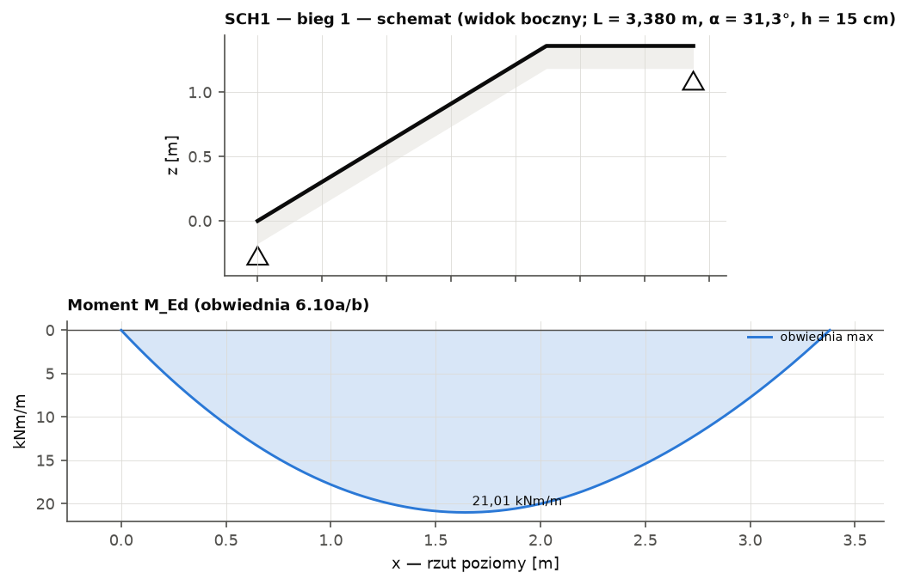

*Rys. SCH1 — bieg 1: schemat statyczny płyty schodowej i obwiednia momentów zginających.*

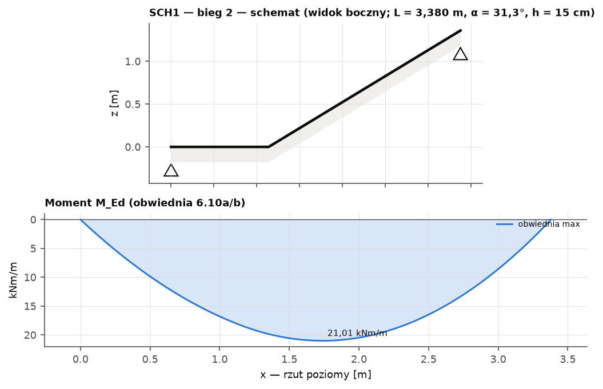

*Rys. SCH1 — bieg 2: schemat statyczny płyty schodowej i obwiednia momentów zginających.*

#### Obliczenia

##### SCH1 — bieg 1

- Geometria biegu: tg α = h_s/s = 17,0/28,0 = **α = 31,3°**
- Rozpiętość w rzucie (osie podpór): L = **3,380** m
- Obciążenie stałe biegu (rzut): g_k,b = **8,353** kN/m²
- Obciążenie stałe spocznika: g_k,s = **4,950** kN/m²
- Obciążenie użytkowe schodów (kat. A): q_k = **4,00** kN/m² *(PN-EN 1991-1-1 tabl. 6.2)*
- Kombinacja 6.10a: q_b_d = γ_G·g_k + γ_Q·ψ₀·q_k = 1,35·8,353 + 1,50·0,7·4,000 = **15,477** kN/m² *(PN-EN 1990 (6.10a) + NA)*
- Kombinacja 6.10b: q_b_d = ξ·γ_G·g_k + γ_Q·q_k = 0,85·1,35·8,353 + 1,50·4,000 = **15,585** kN/m² *(PN-EN 1990 (6.10b) + NA)*
- Kombinacja 6.10a: q_s_d = γ_G·g_k + γ_Q·ψ₀·q_k = 1,35·4,950 + 1,50·0,7·4,000 = **10,883** kN/m² *(PN-EN 1990 (6.10a) + NA)*
- Kombinacja 6.10b: q_s_d = ξ·γ_G·g_k + γ_Q·q_k = 0,85·1,35·4,950 + 1,50·4,000 = **11,680** kN/m² *(PN-EN 1990 (6.10b) + NA)*
- Moment przęsłowy (obwiednia 6.10a/b, na 1 m szerokości): M_Ed = **21,01** kNm/m
- Siła poprzeczna przy podporze: V_Ed = **25,59** kN/m
- *Wymiarowanie na zginanie*
- Wysokość użyteczna: d = **119** mm
- Moment względny: μ = M_Ed/(b·d²·η·f_cd) = 21,01·10⁶/(1000·119²·1,0·17,86) = **0,0831** *(3.1.7(3))*
- Względna wysokość strefy ściskanej: ξ_eff = 1 − √(1 − 2μ) = 1 − √(1 − 2·0,0831) = **0,0868**
- Warunek ciągliwości: ξ_eff ≤ ξ_eff,lim = λ·ε_cu3/(ε_cu3 + f_yd/E_s) = 0,087 ≤ 0,493 = **spełniony**
- Wymagane zbrojenie rozciągane: A_s1 = ξ_eff·b·d·η·f_cd/f_yd = 0,0868·1000·119·1,0·17,86/434,8 = **424** mm²
- Zbrojenie minimalne: A_s,min = max(0,26·f_ctm/f_yk·b·d; 0,0013·b·d) = max(0,26·2,6/500·1000·119; 0,0013·1000·119) = **161** mm² *((9.1N) + NA)*
- Przyjęto zbrojenie główne dołem: φ10 co 18 cm = **4,36** cm²/m
- *Ścinanie*
- Współczynnik skali: k = 1 + √(200/d) ≤ 2,0 = 1 + √(200/119) = **2,000**
- Stopień zbrojenia podłużnego: ρ_l = A_sl/(b_w·d) ≤ 0,02 = 436/(1000·119) = **0,00367**
- Nośność na ścinanie: V_Rd,c = C_Rd,c·k·(100·ρ_l·f_ck)^(1/3)·b_w·d = 0,1286·2,000·(100·0,00367·25)^(1/3)·1000·119·10⁻³ = **64,04** kN *((6.2.a); C_Rd,c = 0,18/γ_c)*
- Wartość minimalna: V_Rd,c,min = v_min·b_w·d, v_min = 0,035·k^(3/2)·f_ck^(1/2) = 0,4950·1000·119·10⁻³ = **58,90** kN *((6.2.b), (6.3N))*
- *Ugięcie (l/d)*
- Stopień zbrojenia wymagany: ρ = A_s,req/(b·d) = 424/(1000·119) = **0,00357**
- Wartość odniesienia: ρ₀ = √f_ck·10⁻³ = √25·10⁻³ = **0,00500**
- Graniczne l/d (ρ ≤ ρ₀): K·[11 + 1,5·√f_ck·ρ₀/ρ + 3,2·√f_ck·(ρ₀/ρ − 1)^(3/2)] = 1,0·[11 + 1,5·5,000·1,402 + 3,2·5,000·(1,402 − 1)^1,5] = **25,6** *((7.16a))*
- Mnożnik od naprężeń w stali: 310/σ_s ≈ 500/(f_yk·A_s,req/A_s,prov) ≤ 1,5 = 500/(500·424/436) = **1,028** *((7.17))*
- Smukłość rzeczywista: l_eff/d = 3,38/0,119 = **28,4**
- *Ugięcie obliczeniowe*
- Efektywny moduł sprężystości: E_c,eff = E_cm/(1 + φ) = 31000/(1 + 2,5) = **8857** MPa *((7.20))*
- Stosunek modułów: α_e = E_s/E_c,eff = 200000/8857 = **22,58**
- Przekrój niezarysowany: x_I; I_I = **77,7 mm; 299,1·10⁶ mm⁴**
- Przekrój zarysowany: x_II; I_II = **39,6 mm; 82,8·10⁶ mm⁴**
- Moment rysujący: M_cr = f_ctm·I_I/(h − x_I) = 2,6·299,1·10⁶/(150 − 77,7) = **10,76** kNm
- Współczynnik rozkładu: ζ = 1 − β·(M_cr/M_qp)², β = 0,5 = 1 − 0,5·(10,76/12,56)² = **0,633** *((7.19))*
- Ugięcie od obciążeń (quasi-stała): w_q = ζ·w_II + (1 − ζ)·w_I = 0,633·20,15 + 0,367·5,58 = **14,80** mm *((7.18))*
- Ugięcie od skurczu: w_cs = k·(1/r_cs)·l², 1/r_cs = ε_cs·α_e·S/I = 0,125·2,593·10⁻⁶·3380² = **3,70** mm *((7.21))*
- Ugięcie całkowite: w = w_q + w_cs = 14,80 + 3,70 = **18,50** mm
- Ugięcie dopuszczalne: w_lim = L/250 = 3380/250 = **13,5** mm *(7.4.1(4))*
- *Rysy*
- Naprężenie w stali (quasi-stała, przekrój zarysowany, α_e = 15): σ_s = α_e·M_qp·(d − x_II)/I_II = **267** MPa
- Maksymalna średnica (w_max = 0,4 mm): φ_s = φ*_s·(f_ct,eff/2,9)·k_c·h_cr/(2(h − d)) = 17,3·(2,6/2,9)·0,4·75/(2·31) = **7,5** mm *(tabl. 7.2N, (7.6N))*
- Maksymalny rozstaw prętów: s_max = (σ_s = 267 MPa) = **216** mm *(tabl. 7.3N)*
- Przyjęto: **dołem φ10 co 18 cm (wzdłuż biegu), rozdzielcze φ8 co 40 cm; w podporach górą φ10 co 36 cm na długości 0,25·L (9.3.1.2(2))**

| Warunek | Efekt | Nośność / limit | η | Stan | Podstawa |
|---|---|---|---|---|---|
| Zbrojenie główne | A_s,req = 424 mm²/m | A_s,prov = 436 mm²/m | 97% | spełniony | (9.1N) |
| Ścinanie bez zbrojenia poprzecznego (6.2.2) | V_Ed = 25,59 kN | V_Rd,c = 64,04 kN | 40% | spełniony | PN-EN 1992-1-1 6.2.2 |
| Ugięcie — graniczna smukłość l/d (7.4.2) | l/d = 28,4  | (l/d)_lim = 26,3  | 108% | **NIESPEŁNIONY** | (7.16), tabl. 7.4N |
| Ugięcie długotrwałe (quasi-stała) ≤ L/250 | w = 18,5 mm | w_lim = 13,5 mm | 137% | **NIESPEŁNIONY** | 7.4.1(4), 7.4.3 |
| Rysy: rozstaw prętów (tabl. 7.3N) | s = 180 mm | s_max = 216 mm | 83% | spełniony | 7.3.3(2) |

> W załamaniu bieg–spocznik pręty dolne krzyżować (nie prowadzić po wklęsłym narożu), zakotwienie l_bd = 376 mm.

##### SCH1 — bieg 2

- Geometria biegu: tg α = h_s/s = 17,0/28,0 = **α = 31,3°**
- Rozpiętość w rzucie (osie podpór): L = **3,380** m
- Obciążenie stałe biegu (rzut): g_k,b = **8,353** kN/m²
- Obciążenie stałe spocznika: g_k,s = **4,950** kN/m²
- Obciążenie użytkowe schodów (kat. A): q_k = **4,00** kN/m² *(PN-EN 1991-1-1 tabl. 6.2)*
- Kombinacja 6.10a: q_b_d = γ_G·g_k + γ_Q·ψ₀·q_k = 1,35·8,353 + 1,50·0,7·4,000 = **15,477** kN/m² *(PN-EN 1990 (6.10a) + NA)*
- Kombinacja 6.10b: q_b_d = ξ·γ_G·g_k + γ_Q·q_k = 0,85·1,35·8,353 + 1,50·4,000 = **15,585** kN/m² *(PN-EN 1990 (6.10b) + NA)*
- Kombinacja 6.10a: q_s_d = γ_G·g_k + γ_Q·ψ₀·q_k = 1,35·4,950 + 1,50·0,7·4,000 = **10,883** kN/m² *(PN-EN 1990 (6.10a) + NA)*
- Kombinacja 6.10b: q_s_d = ξ·γ_G·g_k + γ_Q·q_k = 0,85·1,35·4,950 + 1,50·4,000 = **11,680** kN/m² *(PN-EN 1990 (6.10b) + NA)*
- Moment przęsłowy (obwiednia 6.10a/b, na 1 m szerokości): M_Ed = **21,01** kNm/m
- Siła poprzeczna przy podporze: V_Ed = **25,59** kN/m
- *Wymiarowanie na zginanie*
- Wysokość użyteczna: d = **119** mm
- Moment względny: μ = M_Ed/(b·d²·η·f_cd) = 21,01·10⁶/(1000·119²·1,0·17,86) = **0,0831** *(3.1.7(3))*
- Względna wysokość strefy ściskanej: ξ_eff = 1 − √(1 − 2μ) = 1 − √(1 − 2·0,0831) = **0,0868**
- Warunek ciągliwości: ξ_eff ≤ ξ_eff,lim = λ·ε_cu3/(ε_cu3 + f_yd/E_s) = 0,087 ≤ 0,493 = **spełniony**
- Wymagane zbrojenie rozciągane: A_s1 = ξ_eff·b·d·η·f_cd/f_yd = 0,0868·1000·119·1,0·17,86/434,8 = **424** mm²
- Zbrojenie minimalne: A_s,min = max(0,26·f_ctm/f_yk·b·d; 0,0013·b·d) = max(0,26·2,6/500·1000·119; 0,0013·1000·119) = **161** mm² *((9.1N) + NA)*
- Przyjęto zbrojenie główne dołem: φ10 co 18 cm = **4,36** cm²/m
- *Ścinanie*
- Współczynnik skali: k = 1 + √(200/d) ≤ 2,0 = 1 + √(200/119) = **2,000**
- Stopień zbrojenia podłużnego: ρ_l = A_sl/(b_w·d) ≤ 0,02 = 436/(1000·119) = **0,00367**
- Nośność na ścinanie: V_Rd,c = C_Rd,c·k·(100·ρ_l·f_ck)^(1/3)·b_w·d = 0,1286·2,000·(100·0,00367·25)^(1/3)·1000·119·10⁻³ = **64,04** kN *((6.2.a); C_Rd,c = 0,18/γ_c)*
- Wartość minimalna: V_Rd,c,min = v_min·b_w·d, v_min = 0,035·k^(3/2)·f_ck^(1/2) = 0,4950·1000·119·10⁻³ = **58,90** kN *((6.2.b), (6.3N))*
- *Ugięcie (l/d)*
- Stopień zbrojenia wymagany: ρ = A_s,req/(b·d) = 424/(1000·119) = **0,00357**
- Wartość odniesienia: ρ₀ = √f_ck·10⁻³ = √25·10⁻³ = **0,00500**
- Graniczne l/d (ρ ≤ ρ₀): K·[11 + 1,5·√f_ck·ρ₀/ρ + 3,2·√f_ck·(ρ₀/ρ − 1)^(3/2)] = 1,0·[11 + 1,5·5,000·1,402 + 3,2·5,000·(1,402 − 1)^1,5] = **25,6** *((7.16a))*
- Mnożnik od naprężeń w stali: 310/σ_s ≈ 500/(f_yk·A_s,req/A_s,prov) ≤ 1,5 = 500/(500·424/436) = **1,028** *((7.17))*
- Smukłość rzeczywista: l_eff/d = 3,38/0,119 = **28,4**
- *Ugięcie obliczeniowe*
- Efektywny moduł sprężystości: E_c,eff = E_cm/(1 + φ) = 31000/(1 + 2,5) = **8857** MPa *((7.20))*
- Stosunek modułów: α_e = E_s/E_c,eff = 200000/8857 = **22,58**
- Przekrój niezarysowany: x_I; I_I = **77,7 mm; 299,1·10⁶ mm⁴**
- Przekrój zarysowany: x_II; I_II = **39,6 mm; 82,8·10⁶ mm⁴**
- Moment rysujący: M_cr = f_ctm·I_I/(h − x_I) = 2,6·299,1·10⁶/(150 − 77,7) = **10,76** kNm
- Współczynnik rozkładu: ζ = 1 − β·(M_cr/M_qp)², β = 0,5 = 1 − 0,5·(10,76/12,56)² = **0,633** *((7.19))*
- Ugięcie od obciążeń (quasi-stała): w_q = ζ·w_II + (1 − ζ)·w_I = 0,633·20,15 + 0,367·5,58 = **14,80** mm *((7.18))*
- Ugięcie od skurczu: w_cs = k·(1/r_cs)·l², 1/r_cs = ε_cs·α_e·S/I = 0,125·2,593·10⁻⁶·3380² = **3,70** mm *((7.21))*
- Ugięcie całkowite: w = w_q + w_cs = 14,80 + 3,70 = **18,50** mm
- Ugięcie dopuszczalne: w_lim = L/250 = 3380/250 = **13,5** mm *(7.4.1(4))*
- *Rysy*
- Naprężenie w stali (quasi-stała, przekrój zarysowany, α_e = 15): σ_s = α_e·M_qp·(d − x_II)/I_II = **267** MPa
- Maksymalna średnica (w_max = 0,4 mm): φ_s = φ*_s·(f_ct,eff/2,9)·k_c·h_cr/(2(h − d)) = 17,3·(2,6/2,9)·0,4·75/(2·31) = **7,5** mm *(tabl. 7.2N, (7.6N))*
- Maksymalny rozstaw prętów: s_max = (σ_s = 267 MPa) = **216** mm *(tabl. 7.3N)*
- Przyjęto: **dołem φ10 co 18 cm (wzdłuż biegu), rozdzielcze φ8 co 40 cm; w podporach górą φ10 co 36 cm na długości 0,25·L (9.3.1.2(2))**

| Warunek | Efekt | Nośność / limit | η | Stan | Podstawa |
|---|---|---|---|---|---|
| Zbrojenie główne | A_s,req = 424 mm²/m | A_s,prov = 436 mm²/m | 97% | spełniony | (9.1N) |
| Ścinanie bez zbrojenia poprzecznego (6.2.2) | V_Ed = 25,59 kN | V_Rd,c = 64,04 kN | 40% | spełniony | PN-EN 1992-1-1 6.2.2 |
| Ugięcie — graniczna smukłość l/d (7.4.2) | l/d = 28,4  | (l/d)_lim = 26,3  | 108% | **NIESPEŁNIONY** | (7.16), tabl. 7.4N |
| Ugięcie długotrwałe (quasi-stała) ≤ L/250 | w = 18,5 mm | w_lim = 13,5 mm | 137% | **NIESPEŁNIONY** | 7.4.1(4), 7.4.3 |
| Rysy: rozstaw prętów (tabl. 7.3N) | s = 180 mm | s_max = 216 mm | 83% | spełniony | 7.3.3(2) |

> W załamaniu bieg–spocznik pręty dolne krzyżować (nie prowadzić po wklęsłym narożu), zakotwienie l_bd = 376 mm.

#### Wnioski

**Przyjęto:** Płyta schodowa gr. 15 cm, beton C25/30; zbrojenie wg wyników biegów.  
**Przyjęto:** **Grubość z modelu niewystarczająca — wymagana h ≥ 17 cm** (ugięcie/nośność).  

## Poz. 5 — Belki i podciągi

### Poz. 5.1 — Belka B1

Element modelu: `B1` · maks. wykorzystanie nośności η = 75% · wszystkie warunki spełnione

#### Opis i schemat statyczny

Belka żelbetowa b × h = 20 × 30 cm, oś (10,09, 4,85) → (13,91, 4,85), L = 3,820 m; podpory: ściana S0-02 (x = 0,00 m), słup SL1 (x = 3,76 m). Obciążenie: reakcje płyty z MES (rozkład wzdłuż belki) + ciężar własny.

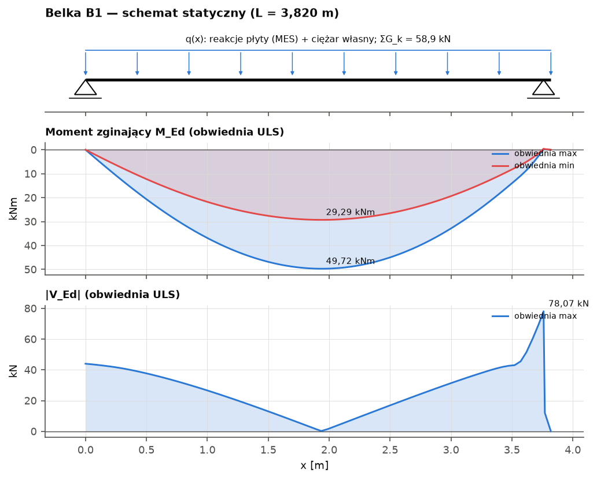

*Rys. Belka B1: schemat statyczny i obwiednie sił wewnętrznych (M dodatni — rozciąganie dołem).*

#### Zestawienie obciążeń

**Obciążenia belki (charakterystyczne, wypadkowe przypadków)**

| Przypadek | Σq·l ≈ [kN] |
|---|---|
| G | 53,7 |
| QA | 35,1 |
| S1 | 6,3 |
| S2 | 12,7 |
| SB2 | 12,4 |

#### Obliczenia

##### Siły wewnętrzne — B1 (obwiednia kombinacji)

- Moment przęsłowy maks.: M_Ed,max = **45,80** kNm
- Moment podporowy (min.): M_Ed,min = **−0,41** kNm
- Siła poprzeczna maks.: V_Ed = **72,22** kN

##### B1 — zginanie w przęśle (przekrój teowy)

- Wysokość użyteczna: d = **459** mm
- Moment względny: μ = M_Ed/(b·d²·η·f_cd) = 45,80·10⁶/(849·459²·1,0·21,43) = **0,0119** *(3.1.7(3))*
- Względna wysokość strefy ściskanej: ξ_eff = 1 − √(1 − 2μ) = 1 − √(1 − 2·0,0119) = **0,0120**
- Warunek ciągliwości: ξ_eff ≤ ξ_eff,lim = λ·ε_cu3/(ε_cu3 + f_yd/E_s) = 0,012 ≤ 0,493 = **spełniony**
- Wymagane zbrojenie rozciągane: A_s1 = ξ_eff·b·d·η·f_cd/f_yd = 0,0120·849·459·1,0·21,43/434,8 = **231** mm²
- Zbrojenie minimalne: A_s,min = max(0,26·f_ctm/f_yk·b·d; 0,0013·b·d) = max(0,26·2,9/500·849·459; 0,0013·849·459) = **588** mm² *((9.1N) + NA)*
- Strefa ściskana w półce: x_eff = ξ_eff·d ≤ h_f = 6 ≤ 200 = **przekrój pozornie teowy**
- Zbrojenie minimalne (b_t = b_w — strefa rozciągana w środniku): A_s,min = max(0,26·f_ctm/f_yk·b_w·d; 0,0013·b_w·d) = **138** mm² *((9.1N))*
- Przyjęto dołem: 2φ14 = **3,08** cm²

| Warunek | Efekt | Nośność / limit | η | Stan | Podstawa |
|---|---|---|---|---|---|
| Zbrojenie dolne | A_s,req = 231 mm² | A_s,prov = 308 mm² | 75% | spełniony | 6.1 |

##### B1 — ścinanie

- Współczynnik skali: k = 1 + √(200/d) ≤ 2,0 = 1 + √(200/459) = **1,660**
- Stopień zbrojenia podłużnego: ρ_l = A_sl/(b_w·d) ≤ 0,02 = 308/(200·459) = **0,00335**
- Nośność na ścinanie: V_Rd,c = C_Rd,c·k·(100·ρ_l·f_ck)^(1/3)·b_w·d = 0,1286·1,660·(100·0,00335·30)^(1/3)·200·459·10⁻³ = **42,30** kN *((6.2.a); C_Rd,c = 0,18/γ_c)*
- Wartość minimalna: V_Rd,c,min = v_min·b_w·d, v_min = 0,035·k^(3/2)·f_ck^(1/2) = 0,4100·200·459·10⁻³ = **37,64** kN *((6.2.b), (6.3N))*
- Ramię sił wewnętrznych: z = 0,9·d = 0,9·459 = **413** mm
- Przyjęto nachylenie krzyżulców betonowych: cot θ = (1,0 ≤ cot θ ≤ 2,0 — NA) = **2,00** *((6.7N))*
- Nośność krzyżulców ściskanych: V_Rd,max = b_w·z·ν₁·f_cd/(cot θ + tan θ) = 200·413·0,528·21,43/(2,00 + 0,500)·10⁻³ = **373,91** kN *((6.9), ν₁ = ν (6.6N))*
- Rozstaw z warunku nośności: s = A_sw·z·f_ywd·cot θ/V_Ed = 100,5·413·434,8·2,00/(72,22·10³) = **500** mm *((6.8))*
- Rozstaw maksymalny: s_l,max = 0,75·d = 0,75·459 = **344** mm *((9.6N))*
- Stopień zbrojenia minimalny: ρ_w,min = 0,08·√f_ck/f_yk → s ≤ A_sw/(ρ_w,min·b_w) = 100,5/(0,00088·200) = **574** mm *((9.5N))*
- Przyjęto strzemiona: φ8 2-cięte co s = **340** mm
- Nośność zbrojenia na ścinanie: V_Rd,s = A_sw/s·z·f_ywd·cot θ = 100,5/340·413·434,8·2,00·10⁻³ = **106,21** kN

| Warunek | Efekt | Nośność / limit | η | Stan | Podstawa |
|---|---|---|---|---|---|
| Nośność krzyżulców betonowych | V_Ed = 72,22 kN | V_Rd,max = 373,91 kN | 19% | spełniony | (6.9) |
| Nośność strzemion | V_Ed = 72,22 kN | V_Rd,s = 106,21 kN | 68% | spełniony | (6.8) |

##### B1 — ugięcie

- Stopień zbrojenia wymagany: ρ = A_s,req/(b·d) = 231/(200·459) = **0,00251**
- Wartość odniesienia: ρ₀ = √f_ck·10⁻³ = √30·10⁻³ = **0,00548**
- Graniczne l/d (ρ ≤ ρ₀): K·[11 + 1,5·√f_ck·ρ₀/ρ + 3,2·√f_ck·(ρ₀/ρ − 1)^(3/2)] = 1,0·[11 + 1,5·5,477·2,178 + 3,2·5,477·(2,178 − 1)^1,5] = **51,3** *((7.16a))*
- Mnożnik od naprężeń w stali: 310/σ_s ≈ 500/(f_yk·A_s,req/A_s,prov) ≤ 1,5 = 500/(500·231/308) = **1,334** *((7.17))*
- Przekrój teowy b_eff/b_w > 3: × 0,8 = **0,80**
- Smukłość rzeczywista: l_eff/d = 3,82/0,459 = **8,3**
- *Obliczenie ugięcia (7.4.3)*
- Efektywny moduł sprężystości: E_c,eff = E_cm/(1 + φ) = 33000/(1 + 2,5) = **9429** MPa *((7.20))*
- Stosunek modułów: α_e = E_s/E_c,eff = 200000/9429 = **21,21**
- Przekrój niezarysowany: x_I; I_I = **262,8 mm; 2351,1·10⁶ mm⁴**
- Przekrój zarysowany: x_II; I_II = **143,5 mm; 847,1·10⁶ mm⁴**
- Moment rysujący: M_cr = f_ctm·I_I/(h − x_I) = 2,9·2351,1·10⁶/(500 − 262,8) = **28,75** kNm
- Współczynnik rozkładu: ζ = 1 − β·(M_cr/M_qp)², β = 0,5 = M_qp ≤ M_cr → 0 = **0,000** *((7.19))*
- Ugięcie od obciążeń (quasi-stała): w_q = ζ·w_II + (1 − ζ)·w_I = 0,000·4,73 + 1,000·1,71 = **1,71** mm *((7.18))*
- Ugięcie od skurczu: w_cs = k·(1/r_cs)·l², 1/r_cs = ε_cs·α_e·S/I = 0,125·0,218·10⁻⁶·3820² = **0,40** mm *((7.21))*
- Ugięcie całkowite: w = w_q + w_cs = 1,71 + 0,40 = **2,10** mm
- Ugięcie dopuszczalne: w_lim = L/250 = 3820/250 = **15,3** mm *(7.4.1(4))*

| Warunek | Efekt | Nośność / limit | η | Stan | Podstawa |
|---|---|---|---|---|---|
| Ugięcie — graniczna smukłość l/d (7.4.2) | l/d = 8,3  | (l/d)_lim = 54,7  | 15% | spełniony | (7.16), tabl. 7.4N |

> l/d spełnione — obliczenie (7.4.3) informacyjnie: w = 2,1 mm ≤? 15,3 mm.

##### B1 — rysy

- Naprężenie w stali (quasi-stała, przekrój zarysowany, α_e = 15): σ_s = α_e·M_qp·(d − x_II)/I_II = **201** MPa
- Maksymalna średnica (w_max = 0,4 mm): φ_s = φ*_s·(f_ct,eff/2,9)·k_c·h_cr/(2(h − d)) = 31,6·(2,9/2,9)·0,4·250/(2·41) = **38,6** mm *(tabl. 7.2N, (7.6N))*
- Maksymalny rozstaw prętów: s_max = (σ_s = 201 MPa) = **298** mm *(tabl. 7.3N)*

| Warunek | Efekt | Nośność / limit | η | Stan | Podstawa |
|---|---|---|---|---|---|
| Rysy: średnica prętów (tabl. 7.2N) | φ = 14 mm | φ_s,max = 39 mm | 36% | spełniony | 7.3.3(2) |

#### Wnioski

**Przyjęto:** Belka B1: 20×50 cm (z płytą), C30/37; dołem 2φ14, górą 2φ12, strzemiona φ8 co 34 cm (2-cięte).  

## Poz. 6 — Nadproża

### Poz. 6.1 — Nadproże N-O0-01 nad otworem O0-01 w ścianie S0-01 (światło 4,00 m)

Element modelu: `N-O0-01` · maks. wykorzystanie nośności η = 142% · **WARUNKI NIESPEŁNIONE — patrz tabele warunków i wnioski**

#### Obliczenia

##### N-O0-01 — schemat i obciążenie

- Rozpiętość obliczeniowa: l_eff = l_n + min(a; h) = 4,00 + 0,25 = **4,25** m *(5.3.2.2)*
- Przekrój: b × h = **18 × 31 cm (zespolone z płytą stropu)**
- Obciążenie (średnio nad otworem; bez efektu przesklepienia [UPR]): g_k; q_k = **15,97; 6,46** kN/m
- Obciążenie obliczeniowe: q_d = **25,24** kN/m
- Moment: M_Ed = q_d·l_eff²/8 = 25,24·4,250²/8 = **56,99** kNm
- Siła poprzeczna: V_Ed = q_d·l_n/2 = 25,24·4,00/2 = **50,48** kN

##### N-O0-01 — zginanie

- Wysokość użyteczna: d = **273** mm
- Moment względny: μ = M_Ed/(b·d²·η·f_cd) = 56,99·10⁶/(180·273²·1,0·17,86) = **0,2379** *(3.1.7(3))*
- Względna wysokość strefy ściskanej: ξ_eff = 1 − √(1 − 2μ) = 1 − √(1 − 2·0,2379) = **0,2760**
- Warunek ciągliwości: ξ_eff ≤ ξ_eff,lim = λ·ε_cu3/(ε_cu3 + f_yd/E_s) = 0,276 ≤ 0,493 = **spełniony**
- Wymagane zbrojenie rozciągane: A_s1 = ξ_eff·b·d·η·f_cd/f_yd = 0,2760·180·273·1,0·17,86/434,8 = **557** mm²
- Zbrojenie minimalne: A_s,min = max(0,26·f_ctm/f_yk·b·d; 0,0013·b·d) = max(0,26·2,6/500·180·273; 0,0013·180·273) = **66** mm² *((9.1N) + NA)*

| Warunek | Efekt | Nośność / limit | η | Stan | Podstawa |
|---|---|---|---|---|---|
| Zbrojenie dolne | A_s,req = 557 mm² | A_s,prov = 565 mm² | 98% | spełniony | 6.1 |

##### N-O0-01 — ścinanie

- Współczynnik skali: k = 1 + √(200/d) ≤ 2,0 = 1 + √(200/273) = **1,856**
- Stopień zbrojenia podłużnego: ρ_l = A_sl/(b_w·d) ≤ 0,02 = 565/(180·273) = **0,01151**
- Nośność na ścinanie: V_Rd,c = C_Rd,c·k·(100·ρ_l·f_ck)^(1/3)·b_w·d = 0,1286·1,856·(100·0,01151·25)^(1/3)·180·273·10⁻³ = **35,93** kN *((6.2.a); C_Rd,c = 0,18/γ_c)*
- Wartość minimalna: V_Rd,c,min = v_min·b_w·d, v_min = 0,035·k^(3/2)·f_ck^(1/2) = 0,4425·180·273·10⁻³ = **21,74** kN *((6.2.b), (6.3N))*
- Ramię sił wewnętrznych: z = 0,9·d = 0,9·273 = **246** mm
- Przyjęto nachylenie krzyżulców betonowych: cot θ = (1,0 ≤ cot θ ≤ 2,0 — NA) = **2,00** *((6.7N))*
- Nośność krzyżulców ściskanych: V_Rd,max = b_w·z·ν₁·f_cd/(cot θ + tan θ) = 180·246·0,540·17,86/(2,00 + 0,500)·10⁻³ = **170,59** kN *((6.9), ν₁ = ν (6.6N))*
- Rozstaw z warunku nośności: s = A_sw·z·f_ywd·cot θ/V_Ed = 56,5·246·434,8·2,00/(50,48·10³) = **239** mm *((6.8))*
- Rozstaw maksymalny: s_l,max = 0,75·d = 0,75·273 = **205** mm *((9.6N))*
- Stopień zbrojenia minimalny: ρ_w,min = 0,08·√f_ck/f_yk → s ≤ A_sw/(ρ_w,min·b_w) = 56,5/(0,00080·180) = **393** mm *((9.5N))*
- Przyjęto strzemiona: φ6 2-cięte co s = **200** mm
- Nośność zbrojenia na ścinanie: V_Rd,s = A_sw/s·z·f_ywd·cot θ = 56,5/200·246·434,8·2,00·10⁻³ = **60,41** kN

| Warunek | Efekt | Nośność / limit | η | Stan | Podstawa |
|---|---|---|---|---|---|
| Nośność krzyżulców betonowych | V_Ed = 50,48 kN | V_Rd,max = 170,59 kN | 30% | spełniony | (6.9) |
| Nośność strzemion | V_Ed = 50,48 kN | V_Rd,s = 60,41 kN | 84% | spełniony | (6.8) |

##### N-O0-01 — ugięcie

- Stopień zbrojenia wymagany: ρ = A_s,req/(b·d) = 557/(180·273) = **0,01133**
- Wartość odniesienia: ρ₀ = √f_ck·10⁻³ = √25·10⁻³ = **0,00500**
- Graniczne l/d (ρ > ρ₀): K·[11 + 1,5·√f_ck·ρ₀/(ρ − ρ') + 1/12·√f_ck·√(ρ'/ρ₀)] = **14,3** *((7.16b))*
- Mnożnik od naprężeń w stali: 310/σ_s ≈ 500/(f_yk·A_s,req/A_s,prov) ≤ 1,5 = 500/(500·557/565) = **1,015** *((7.17))*
- Smukłość rzeczywista: l_eff/d = 4,25/0,273 = **15,6**
- *Obliczenie ugięcia (7.4.3)*
- Efektywny moduł sprężystości: E_c,eff = E_cm/(1 + φ) = 31000/(1 + 2,5) = **8857** MPa *((7.20))*
- Stosunek modułów: α_e = E_s/E_c,eff = 200000/8857 = **22,58**
- Przekrój niezarysowany: x_I; I_I = **177,0 mm; 591,6·10⁶ mm⁴**
- Przekrój zarysowany: x_II; I_II = **138,3 mm; 390,4·10⁶ mm⁴**
- Moment rysujący: M_cr = f_ctm·I_I/(h − x_I) = 2,6·591,6·10⁶/(310 − 177,0) = **11,56** kNm
- Współczynnik rozkładu: ζ = 1 − β·(M_cr/M_qp)², β = 0,5 = 1 − 0,5·(11,56/37,97)² = **0,954** *((7.19))*
- Ugięcie od obciążeń (quasi-stała): w_q = ζ·w_II + (1 − ζ)·w_I = 0,954·20,66 + 0,046·13,63 = **20,33** mm *((7.18))*
- Ugięcie od skurczu: w_cs = k·(1/r_cs)·l², 1/r_cs = ε_cs·α_e·S/I = 0,125·1,719·10⁻⁶·4250² = **3,88** mm *((7.21))*
- Ugięcie całkowite: w = w_q + w_cs = 20,33 + 3,88 = **24,21** mm
- Ugięcie dopuszczalne: w_lim = L/250 = 4250/250 = **17,0** mm *(7.4.1(4))*

| Warunek | Efekt | Nośność / limit | η | Stan | Podstawa |
|---|---|---|---|---|---|
| Ugięcie długotrwałe (quasi-stała) ≤ L/250 | w = 24,2 mm | w_lim = 17,0 mm | 142% | **NIESPEŁNIONY** | 7.4.1(4), 7.4.3 |

> l/d niespełnione (15,6 > 14,5) — miarodajne obliczenie ugięcia (7.4.3).

##### N-O0-01 — docisk na murze (oparcie 25 cm)

- Pole docisku: A_b = l_b·b = 0,250·0,180 = **0,0450** m²
- Długość efektywna w połowie wysokości: l_efm = l_b + 2·(h_c/2)·tg 30° (ograniczona a₁) = **1,847** m *(rys. 6.2)*
- Współczynnik zwiększający: β = (1 + 0,3·a₁/h_c)·(1,5 − 1,1·A_b/A_ef) = (1 + 0,3·0,75/2,94)·(1,5 − 1,1·0,135) = **1,378** *((6.10))*
- Nośność na docisk: N_Rdc = β·A_b·f_d = 1,378·0,0450·4,50·10³ = **279,23** kN *((6.9))*

| Warunek | Efekt | Nośność / limit | η | Stan | Podstawa |
|---|---|---|---|---|---|
| Docisk | N_Edc = 53,64 kN | N_Rdc = 279,23 kN | 19% | spełniony | PN-EN 1996-1-1 (6.9) |

> Dodatkowo sprawdzić ścianę w połowie wysokości pod oparciem (6.1.3(4)) — obejmuje to sprawdzenie ściany/filarka.

#### Wnioski

**Przyjęto:** N-O0-01: nadproże zespolone z płytą 18×31 cm, C25/30, dołem 5φ12, strzemiona φ6 co 20 cm (2-cięte), oparcie ≥ 25 cm.  

### Poz. 6.2 — Nadproże N-O0-02 nad otworem O0-02 w ścianie S0-01 (światło 1,80 m)

Element modelu: `N-O0-02` · maks. wykorzystanie nośności η = 73% · wszystkie warunki spełnione

#### Obliczenia

##### N-O0-02 — schemat i obciążenie

- Rozpiętość obliczeniowa: l_eff = l_n + min(a; h) = 1,80 + 0,25 = **2,05** m *(5.3.2.2)*
- Przekrój: b × h = **18 × 51 cm (zespolone z płytą stropu)**
- Obciążenie (średnio nad otworem; bez efektu przesklepienia [UPR]): g_k; q_k = **13,26; 4,48** kN/m
- Obciążenie obliczeniowe: q_d = **20,16** kN/m
- Moment: M_Ed = q_d·l_eff²/8 = 20,16·2,050²/8 = **10,59** kNm
- Siła poprzeczna: V_Ed = q_d·l_n/2 = 20,16·1,80/2 = **18,15** kN

##### N-O0-02 — zginanie

- Wysokość użyteczna: d = **473** mm
- Moment względny: μ = M_Ed/(b·d²·η·f_cd) = 10,59·10⁶/(180·473²·1,0·17,86) = **0,0147** *(3.1.7(3))*
- Względna wysokość strefy ściskanej: ξ_eff = 1 − √(1 − 2μ) = 1 − √(1 − 2·0,0147) = **0,0148**
- Warunek ciągliwości: ξ_eff ≤ ξ_eff,lim = λ·ε_cu3/(ε_cu3 + f_yd/E_s) = 0,015 ≤ 0,493 = **spełniony**
- Wymagane zbrojenie rozciągane: A_s1 = ξ_eff·b·d·η·f_cd/f_yd = 0,0148·180·473·1,0·17,86/434,8 = **52** mm²
- Zbrojenie minimalne: A_s,min = max(0,26·f_ctm/f_yk·b·d; 0,0013·b·d) = max(0,26·2,6/500·180·473; 0,0013·180·473) = **115** mm² *((9.1N) + NA)*

| Warunek | Efekt | Nośność / limit | η | Stan | Podstawa |
|---|---|---|---|---|---|
| Zbrojenie dolne | A_s,req = 115 mm² | A_s,prov = 157 mm² | 73% | spełniony | 6.1 |

##### N-O0-02 — ścinanie

- Współczynnik skali: k = 1 + √(200/d) ≤ 2,0 = 1 + √(200/473) = **1,650**
- Stopień zbrojenia podłużnego: ρ_l = A_sl/(b_w·d) ≤ 0,02 = 157/(180·473) = **0,00184**
- Nośność na ścinanie: V_Rd,c = C_Rd,c·k·(100·ρ_l·f_ck)^(1/3)·b_w·d = 0,1286·1,650·(100·0,00184·25)^(1/3)·180·473·10⁻³ = **30,07** kN *((6.2.a); C_Rd,c = 0,18/γ_c)*
- Wartość minimalna: V_Rd,c,min = v_min·b_w·d, v_min = 0,035·k^(3/2)·f_ck^(1/2) = 0,3710·180·473·10⁻³ = **31,59** kN *((6.2.b), (6.3N))*
- Ramię sił wewnętrznych: z = 0,9·d = 0,9·473 = **426** mm
- Przyjęto nachylenie krzyżulców betonowych: cot θ = (1,0 ≤ cot θ ≤ 2,0 — NA) = **2,00** *((6.7N))*
- Nośność krzyżulców ściskanych: V_Rd,max = b_w·z·ν₁·f_cd/(cot θ + tan θ) = 180·426·0,540·17,86/(2,00 + 0,500)·10⁻³ = **295,56** kN *((6.9), ν₁ = ν (6.6N))*
- Rozstaw z warunku nośności: s = A_sw·z·f_ywd·cot θ/V_Ed = 56,5·426·434,8·2,00/(18,15·10³) = **1153** mm *((6.8))*
- Rozstaw maksymalny: s_l,max = 0,75·d = 0,75·473 = **355** mm *((9.6N))*
- Stopień zbrojenia minimalny: ρ_w,min = 0,08·√f_ck/f_yk → s ≤ A_sw/(ρ_w,min·b_w) = 56,5/(0,00080·180) = **393** mm *((9.5N))*
- Przyjęto strzemiona: φ6 2-cięte co s = **350** mm
- Nośność zbrojenia na ścinanie: V_Rd,s = A_sw/s·z·f_ywd·cot θ = 56,5/350·426·434,8·2,00·10⁻³ = **59,81** kN

| Warunek | Efekt | Nośność / limit | η | Stan | Podstawa |
|---|---|---|---|---|---|
| Nośność krzyżulców betonowych | V_Ed = 18,15 kN | V_Rd,max = 295,56 kN | 6% | spełniony | (6.9) |
| Nośność strzemion | V_Ed = 18,15 kN | V_Rd,s = 59,81 kN | 30% | spełniony | (6.8) |

> V_Ed ≤ V_Rd,c = 31,59 kN — zbrojenie poprzeczne minimalne (9.2.2(5)).

##### N-O0-02 — ugięcie

- Stopień zbrojenia wymagany: ρ = A_s,req/(b·d) = 52/(180·473) = **0,00061**
- Wartość odniesienia: ρ₀ = √f_ck·10⁻³ = √25·10⁻³ = **0,00500**
- Graniczne l/d (ρ ≤ ρ₀): K·[11 + 1,5·√f_ck·ρ₀/ρ + 3,2·√f_ck·(ρ₀/ρ − 1)^(3/2)] = 1,0·[11 + 1,5·5,000·8,203 + 3,2·5,000·(8,203 − 1)^1,5] = **381,9** *((7.16a))*
- Mnożnik od naprężeń w stali: 310/σ_s ≈ 500/(f_yk·A_s,req/A_s,prov) ≤ 1,5 = 500/(500·52/157) = **1,500** *((7.17))*
- Smukłość rzeczywista: l_eff/d = 2,05/0,473 = **4,3**
- *Obliczenie ugięcia (7.4.3)*
- Efektywny moduł sprężystości: E_c,eff = E_cm/(1 + φ) = 31000/(1 + 2,5) = **8857** MPa *((7.20))*
- Stosunek modułów: α_e = E_s/E_c,eff = 200000/8857 = **22,58**
- Przekrój niezarysowany: x_I; I_I = **263,1 mm; 2152,1·10⁶ mm⁴**
- Przekrój zarysowany: x_II; I_II = **118,2 mm; 545,6·10⁶ mm⁴**
- Moment rysujący: M_cr = f_ctm·I_I/(h − x_I) = 2,6·2152,1·10⁶/(510 − 263,1) = **22,66** kNm
- Współczynnik rozkładu: ζ = 1 − β·(M_cr/M_qp)², β = 0,5 = M_qp ≤ M_cr → 0 = **0,000** *((7.19))*
- Ugięcie od obciążeń (quasi-stała): w_q = ζ·w_II + (1 − ζ)·w_I = 0,000·0,66 + 1,000·0,17 = **0,17** mm *((7.18))*
- Ugięcie od skurczu: w_cs = k·(1/r_cs)·l², 1/r_cs = ε_cs·α_e·S/I = 0,125·0,138·10⁻⁶·2050² = **0,07** mm *((7.21))*
- Ugięcie całkowite: w = w_q + w_cs = 0,17 + 0,07 = **0,24** mm
- Ugięcie dopuszczalne: w_lim = L/250 = 2050/250 = **8,2** mm *(7.4.1(4))*

| Warunek | Efekt | Nośność / limit | η | Stan | Podstawa |
|---|---|---|---|---|---|
| Ugięcie — graniczna smukłość l/d (7.4.2) | l/d = 4,3  | (l/d)_lim = 572,8  | 1% | spełniony | (7.16), tabl. 7.4N |

> l/d spełnione — obliczenie (7.4.3) informacyjnie: w = 0,2 mm ≤? 8,2 mm.

##### N-O0-02 — docisk na murze (oparcie 25 cm)

- Pole docisku: A_b = l_b·b = 0,250·0,180 = **0,0450** m²
- Długość efektywna w połowie wysokości: l_efm = l_b + 2·(h_c/2)·tg 30° (ograniczona a₁) = **1,945** m *(rys. 6.2)*
- Współczynnik zwiększający: β = (1 + 0,3·a₁/h_c)·(1,5 − 1,1·A_b/A_ef) = (1 + 0,3·0,95/2,94)·(1,5 − 1,1·0,129) = **1,412** *((6.10))*
- Nośność na docisk: N_Rdc = β·A_b·f_d = 1,412·0,0450·4,50·10³ = **286,14** kN *((6.9))*

| Warunek | Efekt | Nośność / limit | η | Stan | Podstawa |
|---|---|---|---|---|---|
| Docisk | N_Edc = 20,67 kN | N_Rdc = 286,14 kN | 7% | spełniony | PN-EN 1996-1-1 (6.9) |

> Dodatkowo sprawdzić ścianę w połowie wysokości pod oparciem (6.1.3(4)) — obejmuje to sprawdzenie ściany/filarka.

#### Wnioski

**Przyjęto:** N-O0-02: nadproże zespolone z płytą 18×51 cm, C25/30, dołem 2φ10, strzemiona φ6 co 35 cm (2-cięte), oparcie ≥ 25 cm.  

### Poz. 6.3 — Nadproże N-O0-03 nad otworem O0-03 w ścianie S0-03 (światło 1,10 m)

Element modelu: `N-O0-03` · maks. wykorzystanie nośności η = 39% · wszystkie warunki spełnione

#### Obliczenia

##### N-O0-03 — schemat i obciążenie

- Rozpiętość obliczeniowa: l_eff = l_n + min(a; h) = 1,10 + 0,20 = **1,30** m *(5.3.2.2)*
- Przekrój: b × h = **18 × 25 cm**
- Obciążenie (średnio nad otworem; bez efektu przesklepienia [UPR]): g_k; q_k = **18,09; 2,83** kN/m
- Obciążenie obliczeniowe: q_d = **26,01** kN/m
- Moment: M_Ed = q_d·l_eff²/8 = 26,01·1,300²/8 = **5,50** kNm
- Siła poprzeczna: V_Ed = q_d·l_n/2 = 26,01·1,10/2 = **14,31** kN

##### N-O0-03 — zginanie

- Wysokość użyteczna: d = **213** mm
- Moment względny: μ = M_Ed/(b·d²·η·f_cd) = 5,50·10⁶/(180·213²·1,0·17,86) = **0,0377** *(3.1.7(3))*
- Względna wysokość strefy ściskanej: ξ_eff = 1 − √(1 − 2μ) = 1 − √(1 − 2·0,0377) = **0,0384**
- Warunek ciągliwości: ξ_eff ≤ ξ_eff,lim = λ·ε_cu3/(ε_cu3 + f_yd/E_s) = 0,038 ≤ 0,493 = **spełniony**
- Wymagane zbrojenie rozciągane: A_s1 = ξ_eff·b·d·η·f_cd/f_yd = 0,0384·180·213·1,0·17,86/434,8 = **60** mm²
- Zbrojenie minimalne: A_s,min = max(0,26·f_ctm/f_yk·b·d; 0,0013·b·d) = max(0,26·2,6/500·180·213; 0,0013·180·213) = **52** mm² *((9.1N) + NA)*

| Warunek | Efekt | Nośność / limit | η | Stan | Podstawa |
|---|---|---|---|---|---|
| Zbrojenie dolne | A_s,req = 60 mm² | A_s,prov = 157 mm² | 39% | spełniony | 6.1 |

##### N-O0-03 — ścinanie

- Współczynnik skali: k = 1 + √(200/d) ≤ 2,0 = 1 + √(200/213) = **1,969**
- Stopień zbrojenia podłużnego: ρ_l = A_sl/(b_w·d) ≤ 0,02 = 157/(180·213) = **0,00410**
- Nośność na ścinanie: V_Rd,c = C_Rd,c·k·(100·ρ_l·f_ck)^(1/3)·b_w·d = 0,1286·1,969·(100·0,00410·25)^(1/3)·180·213·10⁻³ = **21,08** kN *((6.2.a); C_Rd,c = 0,18/γ_c)*
- Wartość minimalna: V_Rd,c,min = v_min·b_w·d, v_min = 0,035·k^(3/2)·f_ck^(1/2) = 0,4835·180·213·10⁻³ = **18,54** kN *((6.2.b), (6.3N))*
- Ramię sił wewnętrznych: z = 0,9·d = 0,9·213 = **192** mm
- Przyjęto nachylenie krzyżulców betonowych: cot θ = (1,0 ≤ cot θ ≤ 2,0 — NA) = **2,00** *((6.7N))*
- Nośność krzyżulców ściskanych: V_Rd,max = b_w·z·ν₁·f_cd/(cot θ + tan θ) = 180·192·0,540·17,86/(2,00 + 0,500)·10⁻³ = **133,09** kN *((6.9), ν₁ = ν (6.6N))*
- Rozstaw z warunku nośności: s = A_sw·z·f_ywd·cot θ/V_Ed = 56,5·192·434,8·2,00/(14,31·10³) = **659** mm *((6.8))*
- Rozstaw maksymalny: s_l,max = 0,75·d = 0,75·213 = **160** mm *((9.6N))*
- Stopień zbrojenia minimalny: ρ_w,min = 0,08·√f_ck/f_yk → s ≤ A_sw/(ρ_w,min·b_w) = 56,5/(0,00080·180) = **393** mm *((9.5N))*
- Przyjęto strzemiona: φ6 2-cięte co s = **150** mm
- Nośność zbrojenia na ścinanie: V_Rd,s = A_sw/s·z·f_ywd·cot θ = 56,5/150·192·434,8·2,00·10⁻³ = **62,84** kN

| Warunek | Efekt | Nośność / limit | η | Stan | Podstawa |
|---|---|---|---|---|---|
| Nośność krzyżulców betonowych | V_Ed = 14,31 kN | V_Rd,max = 133,09 kN | 11% | spełniony | (6.9) |
| Nośność strzemion | V_Ed = 14,31 kN | V_Rd,s = 62,84 kN | 23% | spełniony | (6.8) |

> V_Ed ≤ V_Rd,c = 21,08 kN — zbrojenie poprzeczne minimalne (9.2.2(5)).

##### N-O0-03 — ugięcie

- Stopień zbrojenia wymagany: ρ = A_s,req/(b·d) = 60/(180·213) = **0,00158**
- Wartość odniesienia: ρ₀ = √f_ck·10⁻³ = √25·10⁻³ = **0,00500**
- Graniczne l/d (ρ ≤ ρ₀): K·[11 + 1,5·√f_ck·ρ₀/ρ + 3,2·√f_ck·(ρ₀/ρ − 1)^(3/2)] = 1,0·[11 + 1,5·5,000·3,169 + 3,2·5,000·(3,169 − 1)^1,5] = **85,9** *((7.16a))*
- Mnożnik od naprężeń w stali: 310/σ_s ≈ 500/(f_yk·A_s,req/A_s,prov) ≤ 1,5 = 500/(500·60/157) = **1,500** *((7.17))*
- Smukłość rzeczywista: l_eff/d = 1,30/0,213 = **6,1**
- *Obliczenie ugięcia (7.4.3)*
- Efektywny moduł sprężystości: E_c,eff = E_cm/(1 + φ) = 31000/(1 + 2,5) = **8857** MPa *((7.20))*
- Stosunek modułów: α_e = E_s/E_c,eff = 200000/8857 = **22,58**
- Przekrój niezarysowany: x_I; I_I = **131,4 mm; 259,8·10⁶ mm⁴**
- Przekrój zarysowany: x_II; I_II = **74,0 mm; 92,8·10⁶ mm⁴**
- Moment rysujący: M_cr = f_ctm·I_I/(h − x_I) = 2,6·259,8·10⁶/(250 − 131,4) = **5,70** kNm
- Współczynnik rozkładu: ζ = 1 − β·(M_cr/M_qp)², β = 0,5 = M_qp ≤ M_cr → 0 = **0,000** *((7.19))*
- Ugięcie od obciążeń (quasi-stała): w_q = ζ·w_II + (1 − ζ)·w_I = 0,000·0,82 + 1,000·0,29 = **0,29** mm *((7.18))*
- Ugięcie od skurczu: w_cs = k·(1/r_cs)·l², 1/r_cs = ε_cs·α_e·S/I = 0,125·0,445·10⁻⁶·1300² = **0,09** mm *((7.21))*
- Ugięcie całkowite: w = w_q + w_cs = 0,29 + 0,09 = **0,39** mm
- Ugięcie dopuszczalne: w_lim = L/250 = 1300/250 = **5,2** mm *(7.4.1(4))*

| Warunek | Efekt | Nośność / limit | η | Stan | Podstawa |
|---|---|---|---|---|---|
| Ugięcie — graniczna smukłość l/d (7.4.2) | l/d = 6,1  | (l/d)_lim = 128,8  | 5% | spełniony | (7.16), tabl. 7.4N |

> l/d spełnione — obliczenie (7.4.3) informacyjnie: w = 0,4 mm ≤? 5,2 mm.

##### N-O0-03 — docisk na murze (oparcie 20 cm)

- Pole docisku: A_b = l_b·b = 0,200·0,180 = **0,0360** m²
- Długość efektywna w połowie wysokości: l_efm = l_b + 2·(h_c/2)·tg 30° (ograniczona a₁) = **1,895** m *(rys. 6.2)*
- Współczynnik zwiększający: β = (1 + 0,3·a₁/h_c)·(1,5 − 1,1·A_b/A_ef) = (1 + 0,3·2,40/2,94)·(1,5 − 1,1·0,106) = **1,500** *((6.10))*
- Nośność na docisk: N_Rdc = β·A_b·f_d = 1,500·0,0360·4,50·10³ = **243,20** kN *((6.9))*

| Warunek | Efekt | Nośność / limit | η | Stan | Podstawa |
|---|---|---|---|---|---|
| Docisk | N_Edc = 16,91 kN | N_Rdc = 243,20 kN | 7% | spełniony | PN-EN 1996-1-1 (6.9) |

> Dodatkowo sprawdzić ścianę w połowie wysokości pod oparciem (6.1.3(4)) — obejmuje to sprawdzenie ściany/filarka.

#### Wnioski

**Przyjęto:** N-O0-03: nadproże żelbetowe 18×25 cm, C25/30, dołem 2φ10, strzemiona φ6 co 15 cm (2-cięte), oparcie ≥ 20 cm.  

### Poz. 6.4 — Nadproże N-O0-04 nad otworem O0-04 w ścianie S0-03 (światło 1,60 m)

Element modelu: `N-O0-04` · maks. wykorzystanie nośności η = 97% · wszystkie warunki spełnione

#### Obliczenia

##### N-O0-04 — schemat i obciążenie

- Rozpiętość obliczeniowa: l_eff = l_n + min(a; h) = 1,60 + 0,25 = **1,85** m *(5.3.2.2)*
- Przekrój: b × h = **18 × 25 cm**
- Obciążenie (średnio nad otworem; bez efektu przesklepienia [UPR]): g_k; q_k = **29,17; 8,26** kN/m
- Obciążenie obliczeniowe: q_d = **44,20** kN/m
- Moment: M_Ed = q_d·l_eff²/8 = 44,20·1,850²/8 = **18,91** kNm
- Siła poprzeczna: V_Ed = q_d·l_n/2 = 44,20·1,60/2 = **35,36** kN

##### N-O0-04 — zginanie

- Wysokość użyteczna: d = **213** mm
- Moment względny: μ = M_Ed/(b·d²·η·f_cd) = 18,91·10⁶/(180·213²·1,0·17,86) = **0,1297** *(3.1.7(3))*
- Względna wysokość strefy ściskanej: ξ_eff = 1 − √(1 − 2μ) = 1 − √(1 − 2·0,1297) = **0,1394**
- Warunek ciągliwości: ξ_eff ≤ ξ_eff,lim = λ·ε_cu3/(ε_cu3 + f_yd/E_s) = 0,139 ≤ 0,493 = **spełniony**
- Wymagane zbrojenie rozciągane: A_s1 = ξ_eff·b·d·η·f_cd/f_yd = 0,1394·180·213·1,0·17,86/434,8 = **219** mm²
- Zbrojenie minimalne: A_s,min = max(0,26·f_ctm/f_yk·b·d; 0,0013·b·d) = max(0,26·2,6/500·180·213; 0,0013·180·213) = **52** mm² *((9.1N) + NA)*

| Warunek | Efekt | Nośność / limit | η | Stan | Podstawa |
|---|---|---|---|---|---|
| Zbrojenie dolne | A_s,req = 219 mm² | A_s,prov = 226 mm² | 97% | spełniony | 6.1 |

##### N-O0-04 — ścinanie

- Współczynnik skali: k = 1 + √(200/d) ≤ 2,0 = 1 + √(200/213) = **1,969**
- Stopień zbrojenia podłużnego: ρ_l = A_sl/(b_w·d) ≤ 0,02 = 226/(180·213) = **0,00590**
- Nośność na ścinanie: V_Rd,c = C_Rd,c·k·(100·ρ_l·f_ck)^(1/3)·b_w·d = 0,1286·1,969·(100·0,00590·25)^(1/3)·180·213·10⁻³ = **23,80** kN *((6.2.a); C_Rd,c = 0,18/γ_c)*
- Wartość minimalna: V_Rd,c,min = v_min·b_w·d, v_min = 0,035·k^(3/2)·f_ck^(1/2) = 0,4835·180·213·10⁻³ = **18,54** kN *((6.2.b), (6.3N))*
- Ramię sił wewnętrznych: z = 0,9·d = 0,9·213 = **192** mm
- Przyjęto nachylenie krzyżulców betonowych: cot θ = (1,0 ≤ cot θ ≤ 2,0 — NA) = **2,00** *((6.7N))*
- Nośność krzyżulców ściskanych: V_Rd,max = b_w·z·ν₁·f_cd/(cot θ + tan θ) = 180·192·0,540·17,86/(2,00 + 0,500)·10⁻³ = **133,09** kN *((6.9), ν₁ = ν (6.6N))*
- Rozstaw z warunku nośności: s = A_sw·z·f_ywd·cot θ/V_Ed = 56,5·192·434,8·2,00/(35,36·10³) = **267** mm *((6.8))*
- Rozstaw maksymalny: s_l,max = 0,75·d = 0,75·213 = **160** mm *((9.6N))*
- Stopień zbrojenia minimalny: ρ_w,min = 0,08·√f_ck/f_yk → s ≤ A_sw/(ρ_w,min·b_w) = 56,5/(0,00080·180) = **393** mm *((9.5N))*
- Przyjęto strzemiona: φ6 2-cięte co s = **150** mm
- Nośność zbrojenia na ścinanie: V_Rd,s = A_sw/s·z·f_ywd·cot θ = 56,5/150·192·434,8·2,00·10⁻³ = **62,84** kN

| Warunek | Efekt | Nośność / limit | η | Stan | Podstawa |
|---|---|---|---|---|---|
| Nośność krzyżulców betonowych | V_Ed = 35,36 kN | V_Rd,max = 133,09 kN | 27% | spełniony | (6.9) |
| Nośność strzemion | V_Ed = 35,36 kN | V_Rd,s = 62,84 kN | 56% | spełniony | (6.8) |

##### N-O0-04 — ugięcie

- Stopień zbrojenia wymagany: ρ = A_s,req/(b·d) = 219/(180·213) = **0,00572**
- Wartość odniesienia: ρ₀ = √f_ck·10⁻³ = √25·10⁻³ = **0,00500**
- Graniczne l/d (ρ > ρ₀): K·[11 + 1,5·√f_ck·ρ₀/(ρ − ρ') + 1/12·√f_ck·√(ρ'/ρ₀)] = **17,6** *((7.16b))*
- Mnożnik od naprężeń w stali: 310/σ_s ≈ 500/(f_yk·A_s,req/A_s,prov) ≤ 1,5 = 500/(500·219/226) = **1,031** *((7.17))*
- Smukłość rzeczywista: l_eff/d = 1,85/0,213 = **8,7**
- *Obliczenie ugięcia (7.4.3)*
- Efektywny moduł sprężystości: E_c,eff = E_cm/(1 + φ) = 31000/(1 + 2,5) = **8857** MPa *((7.20))*
- Stosunek modułów: α_e = E_s/E_c,eff = 200000/8857 = **22,58**
- Przekrój niezarysowany: x_I; I_I = **134,0 mm; 269,9·10⁶ mm⁴**
- Przekrój zarysowany: x_II; I_II = **85,2 mm; 120,5·10⁶ mm⁴**
- Moment rysujący: M_cr = f_ctm·I_I/(h − x_I) = 2,6·269,9·10⁶/(250 − 134,0) = **6,05** kNm
- Współczynnik rozkładu: ζ = 1 − β·(M_cr/M_qp)², β = 0,5 = 1 − 0,5·(6,05/12,89)² = **0,890** *((7.19))*
- Ugięcie od obciążeń (quasi-stała): w_q = ζ·w_II + (1 − ζ)·w_I = 0,890·4,30 + 0,110·1,92 = **4,04** mm *((7.18))*
- Ugięcie od skurczu: w_cs = k·(1/r_cs)·l², 1/r_cs = ε_cs·α_e·S/I = 0,125·1,994·10⁻⁶·1850² = **0,85** mm *((7.21))*
- Ugięcie całkowite: w = w_q + w_cs = 4,04 + 0,85 = **4,89** mm
- Ugięcie dopuszczalne: w_lim = L/250 = 1850/250 = **7,4** mm *(7.4.1(4))*

| Warunek | Efekt | Nośność / limit | η | Stan | Podstawa |
|---|---|---|---|---|---|
| Ugięcie — graniczna smukłość l/d (7.4.2) | l/d = 8,7  | (l/d)_lim = 18,1  | 48% | spełniony | (7.16), tabl. 7.4N |

> l/d spełnione — obliczenie (7.4.3) informacyjnie: w = 4,9 mm ≤? 7,4 mm.

##### N-O0-04 — docisk na murze (oparcie 25 cm)

- Pole docisku: A_b = l_b·b = 0,250·0,180 = **0,0450** m²
- Długość efektywna w połowie wysokości: l_efm = l_b + 2·(h_c/2)·tg 30° (ograniczona a₁) = **1,847** m *(rys. 6.2)*
- Współczynnik zwiększający: β = (1 + 0,3·a₁/h_c)·(1,5 − 1,1·A_b/A_ef) = (1 + 0,3·0,75/2,94)·(1,5 − 1,1·0,135) = **1,378** *((6.10))*
- Nośność na docisk: N_Rdc = β·A_b·f_d = 1,378·0,0450·4,50·10³ = **279,23** kN *((6.9))*

| Warunek | Efekt | Nośność / limit | η | Stan | Podstawa |
|---|---|---|---|---|---|
| Docisk | N_Edc = 40,88 kN | N_Rdc = 279,23 kN | 15% | spełniony | PN-EN 1996-1-1 (6.9) |

> Dodatkowo sprawdzić ścianę w połowie wysokości pod oparciem (6.1.3(4)) — obejmuje to sprawdzenie ściany/filarka.

#### Wnioski

**Przyjęto:** N-O0-04: nadproże żelbetowe 18×25 cm, C25/30, dołem 2φ12, strzemiona φ6 co 15 cm (2-cięte), oparcie ≥ 25 cm.  

### Poz. 6.5 — Nadproże N-O0-05 nad otworem O0-05 w ścianie S0-02 (światło 1,50 m)

Element modelu: `N-O0-05` · maks. wykorzystanie nośności η = 73% · wszystkie warunki spełnione

#### Obliczenia

##### N-O0-05 — schemat i obciążenie

- Rozpiętość obliczeniowa: l_eff = l_n + min(a; h) = 1,50 + 0,20 = **1,70** m *(5.3.2.2)*
- Przekrój: b × h = **18 × 51 cm (zespolone z płytą stropu)**
- Obciążenie (średnio nad otworem; bez efektu przesklepienia [UPR]): g_k; q_k = **27,09; 20,33** kN/m
- Obciążenie obliczeniowe: q_d = **49,60** kN/m
- Moment: M_Ed = q_d·l_eff²/8 = 49,60·1,700²/8 = **17,92** kNm
- Siła poprzeczna: V_Ed = q_d·l_n/2 = 49,60·1,50/2 = **37,20** kN

##### N-O0-05 — zginanie

- Wysokość użyteczna: d = **473** mm
- Moment względny: μ = M_Ed/(b·d²·η·f_cd) = 17,92·10⁶/(180·473²·1,0·17,86) = **0,0249** *(3.1.7(3))*
- Względna wysokość strefy ściskanej: ξ_eff = 1 − √(1 − 2μ) = 1 − √(1 − 2·0,0249) = **0,0252**
- Warunek ciągliwości: ξ_eff ≤ ξ_eff,lim = λ·ε_cu3/(ε_cu3 + f_yd/E_s) = 0,025 ≤ 0,493 = **spełniony**
- Wymagane zbrojenie rozciągane: A_s1 = ξ_eff·b·d·η·f_cd/f_yd = 0,0252·180·473·1,0·17,86/434,8 = **88** mm²
- Zbrojenie minimalne: A_s,min = max(0,26·f_ctm/f_yk·b·d; 0,0013·b·d) = max(0,26·2,6/500·180·473; 0,0013·180·473) = **115** mm² *((9.1N) + NA)*

| Warunek | Efekt | Nośność / limit | η | Stan | Podstawa |
|---|---|---|---|---|---|
| Zbrojenie dolne | A_s,req = 115 mm² | A_s,prov = 157 mm² | 73% | spełniony | 6.1 |

##### N-O0-05 — ścinanie

- Współczynnik skali: k = 1 + √(200/d) ≤ 2,0 = 1 + √(200/473) = **1,650**
- Stopień zbrojenia podłużnego: ρ_l = A_sl/(b_w·d) ≤ 0,02 = 157/(180·473) = **0,00184**
- Nośność na ścinanie: V_Rd,c = C_Rd,c·k·(100·ρ_l·f_ck)^(1/3)·b_w·d = 0,1286·1,650·(100·0,00184·25)^(1/3)·180·473·10⁻³ = **30,07** kN *((6.2.a); C_Rd,c = 0,18/γ_c)*
- Wartość minimalna: V_Rd,c,min = v_min·b_w·d, v_min = 0,035·k^(3/2)·f_ck^(1/2) = 0,3710·180·473·10⁻³ = **31,59** kN *((6.2.b), (6.3N))*
- Ramię sił wewnętrznych: z = 0,9·d = 0,9·473 = **426** mm
- Przyjęto nachylenie krzyżulców betonowych: cot θ = (1,0 ≤ cot θ ≤ 2,0 — NA) = **2,00** *((6.7N))*
- Nośność krzyżulców ściskanych: V_Rd,max = b_w·z·ν₁·f_cd/(cot θ + tan θ) = 180·426·0,540·17,86/(2,00 + 0,500)·10⁻³ = **295,56** kN *((6.9), ν₁ = ν (6.6N))*
- Rozstaw z warunku nośności: s = A_sw·z·f_ywd·cot θ/V_Ed = 56,5·426·434,8·2,00/(37,20·10³) = **563** mm *((6.8))*
- Rozstaw maksymalny: s_l,max = 0,75·d = 0,75·473 = **355** mm *((9.6N))*
- Stopień zbrojenia minimalny: ρ_w,min = 0,08·√f_ck/f_yk → s ≤ A_sw/(ρ_w,min·b_w) = 56,5/(0,00080·180) = **393** mm *((9.5N))*
- Przyjęto strzemiona: φ6 2-cięte co s = **350** mm
- Nośność zbrojenia na ścinanie: V_Rd,s = A_sw/s·z·f_ywd·cot θ = 56,5/350·426·434,8·2,00·10⁻³ = **59,81** kN

| Warunek | Efekt | Nośność / limit | η | Stan | Podstawa |
|---|---|---|---|---|---|
| Nośność krzyżulców betonowych | V_Ed = 37,20 kN | V_Rd,max = 295,56 kN | 13% | spełniony | (6.9) |
| Nośność strzemion | V_Ed = 37,20 kN | V_Rd,s = 59,81 kN | 62% | spełniony | (6.8) |

##### N-O0-05 — ugięcie

- Stopień zbrojenia wymagany: ρ = A_s,req/(b·d) = 88/(180·473) = **0,00104**
- Wartość odniesienia: ρ₀ = √f_ck·10⁻³ = √25·10⁻³ = **0,00500**
- Graniczne l/d (ρ ≤ ρ₀): K·[11 + 1,5·√f_ck·ρ₀/ρ + 3,2·√f_ck·(ρ₀/ρ − 1)^(3/2)] = 1,0·[11 + 1,5·5,000·4,824 + 3,2·5,000·(4,824 − 1)^1,5] = **166,8** *((7.16a))*
- Mnożnik od naprężeń w stali: 310/σ_s ≈ 500/(f_yk·A_s,req/A_s,prov) ≤ 1,5 = 500/(500·88/157) = **1,500** *((7.17))*
- Smukłość rzeczywista: l_eff/d = 1,70/0,473 = **3,6**
- *Obliczenie ugięcia (7.4.3)*
- Efektywny moduł sprężystości: E_c,eff = E_cm/(1 + φ) = 31000/(1 + 2,5) = **8857** MPa *((7.20))*
- Stosunek modułów: α_e = E_s/E_c,eff = 200000/8857 = **22,58**
- Przekrój niezarysowany: x_I; I_I = **263,1 mm; 2152,1·10⁶ mm⁴**
- Przekrój zarysowany: x_II; I_II = **118,2 mm; 545,6·10⁶ mm⁴**
- Moment rysujący: M_cr = f_ctm·I_I/(h − x_I) = 2,6·2152,1·10⁶/(510 − 263,1) = **22,66** kNm
- Współczynnik rozkładu: ζ = 1 − β·(M_cr/M_qp)², β = 0,5 = M_qp ≤ M_cr → 0 = **0,000** *((7.19))*
- Ugięcie od obciążeń (quasi-stała): w_q = ζ·w_II + (1 − ζ)·w_I = 0,000·0,68 + 1,000·0,17 = **0,17** mm *((7.18))*
- Ugięcie od skurczu: w_cs = k·(1/r_cs)·l², 1/r_cs = ε_cs·α_e·S/I = 0,125·0,138·10⁻⁶·1700² = **0,05** mm *((7.21))*
- Ugięcie całkowite: w = w_q + w_cs = 0,17 + 0,05 = **0,22** mm
- Ugięcie dopuszczalne: w_lim = L/250 = 1700/250 = **6,8** mm *(7.4.1(4))*

| Warunek | Efekt | Nośność / limit | η | Stan | Podstawa |
|---|---|---|---|---|---|
| Ugięcie — graniczna smukłość l/d (7.4.2) | l/d = 3,6  | (l/d)_lim = 250,3  | 1% | spełniony | (7.16), tabl. 7.4N |

> l/d spełnione — obliczenie (7.4.3) informacyjnie: w = 0,2 mm ≤? 6,8 mm.

##### N-O0-05 — docisk na murze (oparcie 20 cm)

- Pole docisku: A_b = l_b·b = 0,200·0,180 = **0,0360** m²
- Długość efektywna w połowie wysokości: l_efm = l_b + 2·(h_c/2)·tg 30° (ograniczona a₁) = **1,895** m *(rys. 6.2)*
- Współczynnik zwiększający: β = (1 + 0,3·a₁/h_c)·(1,5 − 1,1·A_b/A_ef) = (1 + 0,3·1,80/2,94)·(1,5 − 1,1·0,106) = **1,500** *((6.10))*
- Nośność na docisk: N_Rdc = β·A_b·f_d = 1,500·0,0360·4,50·10³ = **243,20** kN *((6.9))*

| Warunek | Efekt | Nośność / limit | η | Stan | Podstawa |
|---|---|---|---|---|---|
| Docisk | N_Edc = 42,16 kN | N_Rdc = 243,20 kN | 17% | spełniony | PN-EN 1996-1-1 (6.9) |

> Dodatkowo sprawdzić ścianę w połowie wysokości pod oparciem (6.1.3(4)) — obejmuje to sprawdzenie ściany/filarka.

#### Wnioski

**Przyjęto:** N-O0-05: nadproże zespolone z płytą 18×51 cm, C25/30, dołem 2φ10, strzemiona φ6 co 35 cm (2-cięte), oparcie ≥ 20 cm.  

### Poz. 6.6 — Nadproże N-O0-06 nad otworem O0-06 w ścianie S0-05 (światło 1,20 m)

Element modelu: `N-O0-06` · maks. wykorzystanie nośności η = 93% · wszystkie warunki spełnione

#### Obliczenia

##### N-O0-06 — schemat i obciążenie

- Rozpiętość obliczeniowa: l_eff = l_n + min(a; h) = 1,20 + 0,20 = **1,40** m *(5.3.2.2)*
- Przekrój: b × h = **18 × 25 cm**
- Obciążenie (średnio nad otworem; bez efektu przesklepienia [UPR]): g_k; q_k = **77,18; 30,71** kN/m
- Obciążenie obliczeniowe: q_d = **121,55** kN/m
- Moment: M_Ed = q_d·l_eff²/8 = 121,55·1,400²/8 = **29,78** kNm
- Siła poprzeczna: V_Ed = q_d·l_n/2 = 121,55·1,20/2 = **72,93** kN

##### N-O0-06 — zginanie

- Wysokość użyteczna: d = **213** mm
- Moment względny: μ = M_Ed/(b·d²·η·f_cd) = 29,78·10⁶/(180·213²·1,0·17,86) = **0,2042** *(3.1.7(3))*
- Względna wysokość strefy ściskanej: ξ_eff = 1 − √(1 − 2μ) = 1 − √(1 − 2·0,2042) = **0,2309**
- Warunek ciągliwości: ξ_eff ≤ ξ_eff,lim = λ·ε_cu3/(ε_cu3 + f_yd/E_s) = 0,231 ≤ 0,493 = **spełniony**
- Wymagane zbrojenie rozciągane: A_s1 = ξ_eff·b·d·η·f_cd/f_yd = 0,2309·180·213·1,0·17,86/434,8 = **364** mm²
- Zbrojenie minimalne: A_s,min = max(0,26·f_ctm/f_yk·b·d; 0,0013·b·d) = max(0,26·2,6/500·180·213; 0,0013·180·213) = **52** mm² *((9.1N) + NA)*

| Warunek | Efekt | Nośność / limit | η | Stan | Podstawa |
|---|---|---|---|---|---|
| Zbrojenie dolne | A_s,req = 364 mm² | A_s,prov = 393 mm² | 93% | spełniony | 6.1 |

##### N-O0-06 — ścinanie

- Współczynnik skali: k = 1 + √(200/d) ≤ 2,0 = 1 + √(200/213) = **1,969**
- Stopień zbrojenia podłużnego: ρ_l = A_sl/(b_w·d) ≤ 0,02 = 393/(180·213) = **0,01024**
- Nośność na ścinanie: V_Rd,c = C_Rd,c·k·(100·ρ_l·f_ck)^(1/3)·b_w·d = 0,1286·1,969·(100·0,01024·25)^(1/3)·180·213·10⁻³ = **28,61** kN *((6.2.a); C_Rd,c = 0,18/γ_c)*
- Wartość minimalna: V_Rd,c,min = v_min·b_w·d, v_min = 0,035·k^(3/2)·f_ck^(1/2) = 0,4835·180·213·10⁻³ = **18,54** kN *((6.2.b), (6.3N))*
- Ramię sił wewnętrznych: z = 0,9·d = 0,9·213 = **192** mm
- Przyjęto nachylenie krzyżulców betonowych: cot θ = (1,0 ≤ cot θ ≤ 2,0 — NA) = **2,00** *((6.7N))*
- Nośność krzyżulców ściskanych: V_Rd,max = b_w·z·ν₁·f_cd/(cot θ + tan θ) = 180·192·0,540·17,86/(2,00 + 0,500)·10⁻³ = **133,09** kN *((6.9), ν₁ = ν (6.6N))*
- Rozstaw z warunku nośności: s = A_sw·z·f_ywd·cot θ/V_Ed = 56,5·192·434,8·2,00/(72,93·10³) = **129** mm *((6.8))*
- Rozstaw maksymalny: s_l,max = 0,75·d = 0,75·213 = **160** mm *((9.6N))*
- Stopień zbrojenia minimalny: ρ_w,min = 0,08·√f_ck/f_yk → s ≤ A_sw/(ρ_w,min·b_w) = 56,5/(0,00080·180) = **393** mm *((9.5N))*
- Przyjęto strzemiona: φ6 2-cięte co s = **120** mm
- Nośność zbrojenia na ścinanie: V_Rd,s = A_sw/s·z·f_ywd·cot θ = 56,5/120·192·434,8·2,00·10⁻³ = **78,55** kN

| Warunek | Efekt | Nośność / limit | η | Stan | Podstawa |
|---|---|---|---|---|---|
| Nośność krzyżulców betonowych | V_Ed = 72,93 kN | V_Rd,max = 133,09 kN | 55% | spełniony | (6.9) |
| Nośność strzemion | V_Ed = 72,93 kN | V_Rd,s = 78,55 kN | 93% | spełniony | (6.8) |

##### N-O0-06 — ugięcie

- Stopień zbrojenia wymagany: ρ = A_s,req/(b·d) = 364/(180·213) = **0,00948**
- Wartość odniesienia: ρ₀ = √f_ck·10⁻³ = √25·10⁻³ = **0,00500**
- Graniczne l/d (ρ > ρ₀): K·[11 + 1,5·√f_ck·ρ₀/(ρ − ρ') + 1/12·√f_ck·√(ρ'/ρ₀)] = **15,0** *((7.16b))*
- Mnożnik od naprężeń w stali: 310/σ_s ≈ 500/(f_yk·A_s,req/A_s,prov) ≤ 1,5 = 500/(500·364/393) = **1,080** *((7.17))*
- Smukłość rzeczywista: l_eff/d = 1,40/0,213 = **6,6**
- *Obliczenie ugięcia (7.4.3)*
- Efektywny moduł sprężystości: E_c,eff = E_cm/(1 + φ) = 31000/(1 + 2,5) = **8857** MPa *((7.20))*
- Stosunek modułów: α_e = E_s/E_c,eff = 200000/8857 = **22,58**
- Przekrój niezarysowany: x_I; I_I = **139,5 mm; 291,7·10⁶ mm⁴**
- Przekrój zarysowany: x_II; I_II = **103,7 mm; 172,8·10⁶ mm⁴**
- Moment rysujący: M_cr = f_ctm·I_I/(h − x_I) = 2,6·291,7·10⁶/(250 − 139,5) = **6,86** kNm
- Współczynnik rozkładu: ζ = 1 − β·(M_cr/M_qp)², β = 0,5 = 1 − 0,5·(6,86/19,64)² = **0,939** *((7.19))*
- Ugięcie od obciążeń (quasi-stała): w_q = ζ·w_II + (1 − ζ)·w_I = 0,939·2,62 + 0,061·1,55 = **2,55** mm *((7.18))*
- Ugięcie od skurczu: w_cs = k·(1/r_cs)·l², 1/r_cs = ε_cs·α_e·S/I = 0,125·2,160·10⁻⁶·1400² = **0,53** mm *((7.21))*
- Ugięcie całkowite: w = w_q + w_cs = 2,55 + 0,53 = **3,08** mm
- Ugięcie dopuszczalne: w_lim = L/250 = 1400/250 = **5,6** mm *(7.4.1(4))*

| Warunek | Efekt | Nośność / limit | η | Stan | Podstawa |
|---|---|---|---|---|---|
| Ugięcie — graniczna smukłość l/d (7.4.2) | l/d = 6,6  | (l/d)_lim = 16,2  | 41% | spełniony | (7.16), tabl. 7.4N |

> l/d spełnione — obliczenie (7.4.3) informacyjnie: w = 3,1 mm ≤? 5,6 mm.

##### N-O0-06 — docisk na murze (oparcie 20 cm)

- Pole docisku: A_b = l_b·b = 0,200·0,180 = **0,0360** m²
- Długość efektywna w połowie wysokości: l_efm = l_b + 2·(h_c/2)·tg 30° (ograniczona a₁) = **1,847** m *(rys. 6.2)*
- Współczynnik zwiększający: β = (1 + 0,3·a₁/h_c)·(1,5 − 1,1·A_b/A_ef) = (1 + 0,3·0,80/2,94)·(1,5 − 1,1·0,108) = **1,386** *((6.10))*
- Nośność na docisk: N_Rdc = β·A_b·f_d = 1,386·0,0360·4,50·10³ = **224,77** kN *((6.9))*

| Warunek | Efekt | Nośność / limit | η | Stan | Podstawa |
|---|---|---|---|---|---|
| Docisk | N_Edc = 85,09 kN | N_Rdc = 224,77 kN | 38% | spełniony | PN-EN 1996-1-1 (6.9) |

> Dodatkowo sprawdzić ścianę w połowie wysokości pod oparciem (6.1.3(4)) — obejmuje to sprawdzenie ściany/filarka.

#### Wnioski

**Przyjęto:** N-O0-06: nadproże żelbetowe 18×25 cm, C25/30, dołem 5φ10, strzemiona φ6 co 12 cm (2-cięte), oparcie ≥ 20 cm.  

### Poz. 6.7 — Nadproże N-O0-08 nad otworem O0-08 w ścianie S0-02 (światło 2,00 m)

Element modelu: `N-O0-08` · maks. wykorzystanie nośności η = 95% · wszystkie warunki spełnione

#### Obliczenia

##### N-O0-08 — schemat i obciążenie

- Rozpiętość obliczeniowa: l_eff = l_n + min(a; h) = 2,00 + 0,25 = **2,25** m *(5.3.2.2)*
- Przekrój: b × h = **18 × 25 cm**
- Obciążenie (średnio nad otworem; bez efektu przesklepienia [UPR]): g_k; q_k = **39,46; 11,76** kN/m
- Obciążenie obliczeniowe: q_d = **59,77** kN/m
- Moment: M_Ed = q_d·l_eff²/8 = 59,77·2,250²/8 = **37,82** kNm
- Siła poprzeczna: V_Ed = q_d·l_n/2 = 59,77·2,00/2 = **59,77** kN

##### N-O0-08 — zginanie

- Wysokość użyteczna: d = **213** mm
- Moment względny: μ = M_Ed/(b·d²·η·f_cd) = 37,82·10⁶/(180·213²·1,0·17,86) = **0,2594** *(3.1.7(3))*
- Względna wysokość strefy ściskanej: ξ_eff = 1 − √(1 − 2μ) = 1 − √(1 − 2·0,2594) = **0,3063**
- Warunek ciągliwości: ξ_eff ≤ ξ_eff,lim = λ·ε_cu3/(ε_cu3 + f_yd/E_s) = 0,306 ≤ 0,493 = **spełniony**
- Wymagane zbrojenie rozciągane: A_s1 = ξ_eff·b·d·η·f_cd/f_yd = 0,3063·180·213·1,0·17,86/434,8 = **482** mm²
- Zbrojenie minimalne: A_s,min = max(0,26·f_ctm/f_yk·b·d; 0,0013·b·d) = max(0,26·2,6/500·180·213; 0,0013·180·213) = **52** mm² *((9.1N) + NA)*

| Warunek | Efekt | Nośność / limit | η | Stan | Podstawa |
|---|---|---|---|---|---|
| Zbrojenie dolne | A_s,req = 482 mm² | A_s,prov = 550 mm² | 88% | spełniony | 6.1 |

##### N-O0-08 — ścinanie

- Współczynnik skali: k = 1 + √(200/d) ≤ 2,0 = 1 + √(200/213) = **1,969**
- Stopień zbrojenia podłużnego: ρ_l = A_sl/(b_w·d) ≤ 0,02 = 550/(180·213) = **0,01434**
- Nośność na ścinanie: V_Rd,c = C_Rd,c·k·(100·ρ_l·f_ck)^(1/3)·b_w·d = 0,1286·1,969·(100·0,01434·25)^(1/3)·180·213·10⁻³ = **32,00** kN *((6.2.a); C_Rd,c = 0,18/γ_c)*
- Wartość minimalna: V_Rd,c,min = v_min·b_w·d, v_min = 0,035·k^(3/2)·f_ck^(1/2) = 0,4835·180·213·10⁻³ = **18,54** kN *((6.2.b), (6.3N))*
- Ramię sił wewnętrznych: z = 0,9·d = 0,9·213 = **192** mm
- Przyjęto nachylenie krzyżulców betonowych: cot θ = (1,0 ≤ cot θ ≤ 2,0 — NA) = **2,00** *((6.7N))*
- Nośność krzyżulców ściskanych: V_Rd,max = b_w·z·ν₁·f_cd/(cot θ + tan θ) = 180·192·0,540·17,86/(2,00 + 0,500)·10⁻³ = **133,09** kN *((6.9), ν₁ = ν (6.6N))*
- Rozstaw z warunku nośności: s = A_sw·z·f_ywd·cot θ/V_Ed = 56,5·192·434,8·2,00/(59,77·10³) = **158** mm *((6.8))*
- Rozstaw maksymalny: s_l,max = 0,75·d = 0,75·213 = **160** mm *((9.6N))*
- Stopień zbrojenia minimalny: ρ_w,min = 0,08·√f_ck/f_yk → s ≤ A_sw/(ρ_w,min·b_w) = 56,5/(0,00080·180) = **393** mm *((9.5N))*
- Przyjęto strzemiona: φ6 2-cięte co s = **150** mm
- Nośność zbrojenia na ścinanie: V_Rd,s = A_sw/s·z·f_ywd·cot θ = 56,5/150·192·434,8·2,00·10⁻³ = **62,84** kN

| Warunek | Efekt | Nośność / limit | η | Stan | Podstawa |
|---|---|---|---|---|---|
| Nośność krzyżulców betonowych | V_Ed = 59,77 kN | V_Rd,max = 133,09 kN | 45% | spełniony | (6.9) |
| Nośność strzemion | V_Ed = 59,77 kN | V_Rd,s = 62,84 kN | 95% | spełniony | (6.8) |

##### N-O0-08 — ugięcie

- Stopień zbrojenia wymagany: ρ = A_s,req/(b·d) = 482/(180·213) = **0,01258**
- Wartość odniesienia: ρ₀ = √f_ck·10⁻³ = √25·10⁻³ = **0,00500**
- Graniczne l/d (ρ > ρ₀): K·[11 + 1,5·√f_ck·ρ₀/(ρ − ρ') + 1/12·√f_ck·√(ρ'/ρ₀)] = **14,0** *((7.16b))*
- Mnożnik od naprężeń w stali: 310/σ_s ≈ 500/(f_yk·A_s,req/A_s,prov) ≤ 1,5 = 500/(500·482/550) = **1,140** *((7.17))*
- Smukłość rzeczywista: l_eff/d = 2,25/0,213 = **10,6**
- *Obliczenie ugięcia (7.4.3)*
- Efektywny moduł sprężystości: E_c,eff = E_cm/(1 + φ) = 31000/(1 + 2,5) = **8857** MPa *((7.20))*
- Stosunek modułów: α_e = E_s/E_c,eff = 200000/8857 = **22,58**
- Przekrój niezarysowany: x_I; I_I = **144,0 mm; 309,7·10⁶ mm⁴**
- Przekrój zarysowany: x_II; I_II = **115,8 mm; 210,5·10⁶ mm⁴**
- Moment rysujący: M_cr = f_ctm·I_I/(h − x_I) = 2,6·309,7·10⁶/(250 − 144,0) = **7,60** kNm
- Współczynnik rozkładu: ζ = 1 − β·(M_cr/M_qp)², β = 0,5 = 1 − 0,5·(7,60/25,73)² = **0,956** *((7.19))*
- Ugięcie od obciążeń (quasi-stała): w_q = ζ·w_II + (1 − ζ)·w_I = 0,956·7,28 + 0,044·4,95 = **7,18** mm *((7.18))*
- Ugięcie od skurczu: w_cs = k·(1/r_cs)·l², 1/r_cs = ε_cs·α_e·S/I = 0,125·2,242·10⁻⁶·2250² = **1,42** mm *((7.21))*
- Ugięcie całkowite: w = w_q + w_cs = 7,18 + 1,42 = **8,59** mm
- Ugięcie dopuszczalne: w_lim = L/250 = 2250/250 = **9,0** mm *(7.4.1(4))*

| Warunek | Efekt | Nośność / limit | η | Stan | Podstawa |
|---|---|---|---|---|---|
| Ugięcie — graniczna smukłość l/d (7.4.2) | l/d = 10,6  | (l/d)_lim = 15,9  | 66% | spełniony | (7.16), tabl. 7.4N |

> l/d spełnione — obliczenie (7.4.3) informacyjnie: w = 8,6 mm ≤? 9,0 mm.

##### N-O0-08 — docisk na murze (oparcie 25 cm)

- Pole docisku: A_b = l_b·b = 0,250·0,180 = **0,0450** m²
- Długość efektywna w połowie wysokości: l_efm = l_b + 2·(h_c/2)·tg 30° (ograniczona a₁) = **1,847** m *(rys. 6.2)*
- Współczynnik zwiększający: β = (1 + 0,3·a₁/h_c)·(1,5 − 1,1·A_b/A_ef) = (1 + 0,3·0,75/2,94)·(1,5 − 1,1·0,135) = **1,378** *((6.10))*
- Nośność na docisk: N_Rdc = β·A_b·f_d = 1,378·0,0450·4,50·10³ = **279,23** kN *((6.9))*

| Warunek | Efekt | Nośność / limit | η | Stan | Podstawa |
|---|---|---|---|---|---|
| Docisk | N_Edc = 67,24 kN | N_Rdc = 279,23 kN | 24% | spełniony | PN-EN 1996-1-1 (6.9) |

> Dodatkowo sprawdzić ścianę w połowie wysokości pod oparciem (6.1.3(4)) — obejmuje to sprawdzenie ściany/filarka.

#### Wnioski

**Przyjęto:** N-O0-08: nadproże żelbetowe 18×25 cm, C25/30, dołem 7φ10, strzemiona φ6 co 15 cm (2-cięte), oparcie ≥ 25 cm.  

### Poz. 6.8 — Nadproże N-O0-09 nad otworem O0-09 w ścianie S0-04 (światło 1,50 m)

Element modelu: `N-O0-09` · maks. wykorzystanie nośności η = 73% · wszystkie warunki spełnione

#### Obliczenia

##### N-O0-09 — schemat i obciążenie

- Rozpiętość obliczeniowa: l_eff = l_n + min(a; h) = 1,50 + 0,20 = **1,70** m *(5.3.2.2)*
- Przekrój: b × h = **18 × 51 cm (zespolone z płytą stropu)**
- Obciążenie (średnio nad otworem; bez efektu przesklepienia [UPR]): g_k; q_k = **24,34; 7,69** kN/m
- Obciążenie obliczeniowe: q_d = **36,89** kN/m
- Moment: M_Ed = q_d·l_eff²/8 = 36,89·1,700²/8 = **13,33** kNm
- Siła poprzeczna: V_Ed = q_d·l_n/2 = 36,89·1,50/2 = **27,67** kN

##### N-O0-09 — zginanie

- Wysokość użyteczna: d = **473** mm
- Moment względny: μ = M_Ed/(b·d²·η·f_cd) = 13,33·10⁶/(180·473²·1,0·17,86) = **0,0185** *(3.1.7(3))*
- Względna wysokość strefy ściskanej: ξ_eff = 1 − √(1 − 2μ) = 1 − √(1 − 2·0,0185) = **0,0187**
- Warunek ciągliwości: ξ_eff ≤ ξ_eff,lim = λ·ε_cu3/(ε_cu3 + f_yd/E_s) = 0,019 ≤ 0,493 = **spełniony**
- Wymagane zbrojenie rozciągane: A_s1 = ξ_eff·b·d·η·f_cd/f_yd = 0,0187·180·473·1,0·17,86/434,8 = **65** mm²
- Zbrojenie minimalne: A_s,min = max(0,26·f_ctm/f_yk·b·d; 0,0013·b·d) = max(0,26·2,6/500·180·473; 0,0013·180·473) = **115** mm² *((9.1N) + NA)*

| Warunek | Efekt | Nośność / limit | η | Stan | Podstawa |
|---|---|---|---|---|---|
| Zbrojenie dolne | A_s,req = 115 mm² | A_s,prov = 157 mm² | 73% | spełniony | 6.1 |

##### N-O0-09 — ścinanie

- Współczynnik skali: k = 1 + √(200/d) ≤ 2,0 = 1 + √(200/473) = **1,650**
- Stopień zbrojenia podłużnego: ρ_l = A_sl/(b_w·d) ≤ 0,02 = 157/(180·473) = **0,00184**
- Nośność na ścinanie: V_Rd,c = C_Rd,c·k·(100·ρ_l·f_ck)^(1/3)·b_w·d = 0,1286·1,650·(100·0,00184·25)^(1/3)·180·473·10⁻³ = **30,07** kN *((6.2.a); C_Rd,c = 0,18/γ_c)*
- Wartość minimalna: V_Rd,c,min = v_min·b_w·d, v_min = 0,035·k^(3/2)·f_ck^(1/2) = 0,3710·180·473·10⁻³ = **31,59** kN *((6.2.b), (6.3N))*
- Ramię sił wewnętrznych: z = 0,9·d = 0,9·473 = **426** mm
- Przyjęto nachylenie krzyżulców betonowych: cot θ = (1,0 ≤ cot θ ≤ 2,0 — NA) = **2,00** *((6.7N))*
- Nośność krzyżulców ściskanych: V_Rd,max = b_w·z·ν₁·f_cd/(cot θ + tan θ) = 180·426·0,540·17,86/(2,00 + 0,500)·10⁻³ = **295,56** kN *((6.9), ν₁ = ν (6.6N))*
- Rozstaw z warunku nośności: s = A_sw·z·f_ywd·cot θ/V_Ed = 56,5·426·434,8·2,00/(27,67·10³) = **757** mm *((6.8))*
- Rozstaw maksymalny: s_l,max = 0,75·d = 0,75·473 = **355** mm *((9.6N))*
- Stopień zbrojenia minimalny: ρ_w,min = 0,08·√f_ck/f_yk → s ≤ A_sw/(ρ_w,min·b_w) = 56,5/(0,00080·180) = **393** mm *((9.5N))*
- Przyjęto strzemiona: φ6 2-cięte co s = **350** mm
- Nośność zbrojenia na ścinanie: V_Rd,s = A_sw/s·z·f_ywd·cot θ = 56,5/350·426·434,8·2,00·10⁻³ = **59,81** kN

| Warunek | Efekt | Nośność / limit | η | Stan | Podstawa |
|---|---|---|---|---|---|
| Nośność krzyżulców betonowych | V_Ed = 27,67 kN | V_Rd,max = 295,56 kN | 9% | spełniony | (6.9) |
| Nośność strzemion | V_Ed = 27,67 kN | V_Rd,s = 59,81 kN | 46% | spełniony | (6.8) |

> V_Ed ≤ V_Rd,c = 31,59 kN — zbrojenie poprzeczne minimalne (9.2.2(5)).

##### N-O0-09 — ugięcie

- Stopień zbrojenia wymagany: ρ = A_s,req/(b·d) = 65/(180·473) = **0,00077**
- Wartość odniesienia: ρ₀ = √f_ck·10⁻³ = √25·10⁻³ = **0,00500**
- Graniczne l/d (ρ ≤ ρ₀): K·[11 + 1,5·√f_ck·ρ₀/ρ + 3,2·√f_ck·(ρ₀/ρ − 1)^(3/2)] = 1,0·[11 + 1,5·5,000·6,508 + 3,2·5,000·(6,508 − 1)^1,5] = **266,6** *((7.16a))*
- Mnożnik od naprężeń w stali: 310/σ_s ≈ 500/(f_yk·A_s,req/A_s,prov) ≤ 1,5 = 500/(500·65/157) = **1,500** *((7.17))*
- Smukłość rzeczywista: l_eff/d = 1,70/0,473 = **3,6**
- *Obliczenie ugięcia (7.4.3)*
- Efektywny moduł sprężystości: E_c,eff = E_cm/(1 + φ) = 31000/(1 + 2,5) = **8857** MPa *((7.20))*
- Stosunek modułów: α_e = E_s/E_c,eff = 200000/8857 = **22,58**
- Przekrój niezarysowany: x_I; I_I = **263,1 mm; 2152,1·10⁶ mm⁴**
- Przekrój zarysowany: x_II; I_II = **118,2 mm; 545,6·10⁶ mm⁴**
- Moment rysujący: M_cr = f_ctm·I_I/(h − x_I) = 2,6·2152,1·10⁶/(510 − 263,1) = **22,66** kNm
- Współczynnik rozkładu: ζ = 1 − β·(M_cr/M_qp)², β = 0,5 = M_qp ≤ M_cr → 0 = **0,000** *((7.19))*
- Ugięcie od obciążeń (quasi-stała): w_q = ζ·w_II + (1 − ζ)·w_I = 0,000·0,57 + 1,000·0,14 = **0,14** mm *((7.18))*
- Ugięcie od skurczu: w_cs = k·(1/r_cs)·l², 1/r_cs = ε_cs·α_e·S/I = 0,125·0,138·10⁻⁶·1700² = **0,05** mm *((7.21))*
- Ugięcie całkowite: w = w_q + w_cs = 0,14 + 0,05 = **0,19** mm
- Ugięcie dopuszczalne: w_lim = L/250 = 1700/250 = **6,8** mm *(7.4.1(4))*

| Warunek | Efekt | Nośność / limit | η | Stan | Podstawa |
|---|---|---|---|---|---|
| Ugięcie — graniczna smukłość l/d (7.4.2) | l/d = 3,6  | (l/d)_lim = 400,0  | 1% | spełniony | (7.16), tabl. 7.4N |

> l/d spełnione — obliczenie (7.4.3) informacyjnie: w = 0,2 mm ≤? 6,8 mm.

##### N-O0-09 — docisk na murze (oparcie 20 cm)

- Pole docisku: A_b = l_b·b = 0,200·0,180 = **0,0360** m²
- Długość efektywna w połowie wysokości: l_efm = l_b + 2·(h_c/2)·tg 30° (ograniczona a₁) = **1,895** m *(rys. 6.2)*
- Współczynnik zwiększający: β = (1 + 0,3·a₁/h_c)·(1,5 − 1,1·A_b/A_ef) = (1 + 0,3·1,10/2,94)·(1,5 − 1,1·0,106) = **1,437** *((6.10))*
- Nośność na docisk: N_Rdc = β·A_b·f_d = 1,437·0,0360·4,50·10³ = **233,05** kN *((6.9))*

| Warunek | Efekt | Nośność / limit | η | Stan | Podstawa |
|---|---|---|---|---|---|
| Docisk | N_Edc = 31,36 kN | N_Rdc = 233,05 kN | 13% | spełniony | PN-EN 1996-1-1 (6.9) |

> Dodatkowo sprawdzić ścianę w połowie wysokości pod oparciem (6.1.3(4)) — obejmuje to sprawdzenie ściany/filarka.

#### Wnioski

**Przyjęto:** N-O0-09: nadproże zespolone z płytą 18×51 cm, C25/30, dołem 2φ10, strzemiona φ6 co 35 cm (2-cięte), oparcie ≥ 20 cm.  

### Poz. 6.9 — Nadproże N-O1-01 nad otworem O1-01 w ścianie S1-01 (światło 2,40 m)

Element modelu: `N-O1-01` · maks. wykorzystanie nośności η = 73% · wszystkie warunki spełnione

#### Obliczenia

##### N-O1-01 — schemat i obciążenie

- Rozpiętość obliczeniowa: l_eff = l_n + min(a; h) = 2,40 + 0,25 = **2,65** m *(5.3.2.2)*
- Przekrój: b × h = **18 × 51 cm (zespolone z płytą stropu)**
- Obciążenie (średnio nad otworem; bez efektu przesklepienia [UPR]): g_k; q_k = **8,21; 1,69** kN/m
- Obciążenie obliczeniowe: q_d = **12,16** kN/m
- Moment: M_Ed = q_d·l_eff²/8 = 12,16·2,650²/8 = **10,68** kNm
- Siła poprzeczna: V_Ed = q_d·l_n/2 = 12,16·2,40/2 = **14,60** kN

##### N-O1-01 — zginanie

- Wysokość użyteczna: d = **473** mm
- Moment względny: μ = M_Ed/(b·d²·η·f_cd) = 10,68·10⁶/(180·473²·1,0·17,86) = **0,0148** *(3.1.7(3))*
- Względna wysokość strefy ściskanej: ξ_eff = 1 − √(1 − 2μ) = 1 − √(1 − 2·0,0148) = **0,0150**
- Warunek ciągliwości: ξ_eff ≤ ξ_eff,lim = λ·ε_cu3/(ε_cu3 + f_yd/E_s) = 0,015 ≤ 0,493 = **spełniony**
- Wymagane zbrojenie rozciągane: A_s1 = ξ_eff·b·d·η·f_cd/f_yd = 0,0150·180·473·1,0·17,86/434,8 = **52** mm²
- Zbrojenie minimalne: A_s,min = max(0,26·f_ctm/f_yk·b·d; 0,0013·b·d) = max(0,26·2,6/500·180·473; 0,0013·180·473) = **115** mm² *((9.1N) + NA)*

| Warunek | Efekt | Nośność / limit | η | Stan | Podstawa |
|---|---|---|---|---|---|
| Zbrojenie dolne | A_s,req = 115 mm² | A_s,prov = 157 mm² | 73% | spełniony | 6.1 |

##### N-O1-01 — ścinanie

- Współczynnik skali: k = 1 + √(200/d) ≤ 2,0 = 1 + √(200/473) = **1,650**
- Stopień zbrojenia podłużnego: ρ_l = A_sl/(b_w·d) ≤ 0,02 = 157/(180·473) = **0,00184**
- Nośność na ścinanie: V_Rd,c = C_Rd,c·k·(100·ρ_l·f_ck)^(1/3)·b_w·d = 0,1286·1,650·(100·0,00184·25)^(1/3)·180·473·10⁻³ = **30,07** kN *((6.2.a); C_Rd,c = 0,18/γ_c)*
- Wartość minimalna: V_Rd,c,min = v_min·b_w·d, v_min = 0,035·k^(3/2)·f_ck^(1/2) = 0,3710·180·473·10⁻³ = **31,59** kN *((6.2.b), (6.3N))*
- Ramię sił wewnętrznych: z = 0,9·d = 0,9·473 = **426** mm
- Przyjęto nachylenie krzyżulców betonowych: cot θ = (1,0 ≤ cot θ ≤ 2,0 — NA) = **2,00** *((6.7N))*
- Nośność krzyżulców ściskanych: V_Rd,max = b_w·z·ν₁·f_cd/(cot θ + tan θ) = 180·426·0,540·17,86/(2,00 + 0,500)·10⁻³ = **295,56** kN *((6.9), ν₁ = ν (6.6N))*
- Rozstaw z warunku nośności: s = A_sw·z·f_ywd·cot θ/V_Ed = 56,5·426·434,8·2,00/(14,60·10³) = **1434** mm *((6.8))*
- Rozstaw maksymalny: s_l,max = 0,75·d = 0,75·473 = **355** mm *((9.6N))*
- Stopień zbrojenia minimalny: ρ_w,min = 0,08·√f_ck/f_yk → s ≤ A_sw/(ρ_w,min·b_w) = 56,5/(0,00080·180) = **393** mm *((9.5N))*
- Przyjęto strzemiona: φ6 2-cięte co s = **350** mm
- Nośność zbrojenia na ścinanie: V_Rd,s = A_sw/s·z·f_ywd·cot θ = 56,5/350·426·434,8·2,00·10⁻³ = **59,81** kN

| Warunek | Efekt | Nośność / limit | η | Stan | Podstawa |
|---|---|---|---|---|---|
| Nośność krzyżulców betonowych | V_Ed = 14,60 kN | V_Rd,max = 295,56 kN | 5% | spełniony | (6.9) |
| Nośność strzemion | V_Ed = 14,60 kN | V_Rd,s = 59,81 kN | 24% | spełniony | (6.8) |

> V_Ed ≤ V_Rd,c = 31,59 kN — zbrojenie poprzeczne minimalne (9.2.2(5)).

##### N-O1-01 — ugięcie

- Stopień zbrojenia wymagany: ρ = A_s,req/(b·d) = 52/(180·473) = **0,00061**
- Wartość odniesienia: ρ₀ = √f_ck·10⁻³ = √25·10⁻³ = **0,00500**
- Graniczne l/d (ρ ≤ ρ₀): K·[11 + 1,5·√f_ck·ρ₀/ρ + 3,2·√f_ck·(ρ₀/ρ − 1)^(3/2)] = 1,0·[11 + 1,5·5,000·8,137 + 3,2·5,000·(8,137 − 1)^1,5] = **377,1** *((7.16a))*
- Mnożnik od naprężeń w stali: 310/σ_s ≈ 500/(f_yk·A_s,req/A_s,prov) ≤ 1,5 = 500/(500·52/157) = **1,500** *((7.17))*
- Smukłość rzeczywista: l_eff/d = 2,65/0,473 = **5,6**
- *Obliczenie ugięcia (7.4.3)*
- Efektywny moduł sprężystości: E_c,eff = E_cm/(1 + φ) = 31000/(1 + 2,5) = **8857** MPa *((7.20))*
- Stosunek modułów: α_e = E_s/E_c,eff = 200000/8857 = **22,58**
- Przekrój niezarysowany: x_I; I_I = **263,1 mm; 2152,1·10⁶ mm⁴**
- Przekrój zarysowany: x_II; I_II = **118,2 mm; 545,6·10⁶ mm⁴**
- Moment rysujący: M_cr = f_ctm·I_I/(h − x_I) = 2,6·2152,1·10⁶/(510 − 263,1) = **22,66** kNm
- Współczynnik rozkładu: ζ = 1 − β·(M_cr/M_qp)², β = 0,5 = M_qp ≤ M_cr → 0 = **0,000** *((7.19))*
- Ugięcie od obciążeń (quasi-stała): w_q = ζ·w_II + (1 − ζ)·w_I = 0,000·1,09 + 1,000·0,28 = **0,28** mm *((7.18))*
- Ugięcie od skurczu: w_cs = k·(1/r_cs)·l², 1/r_cs = ε_cs·α_e·S/I = 0,125·0,138·10⁻⁶·2650² = **0,12** mm *((7.21))*
- Ugięcie całkowite: w = w_q + w_cs = 0,28 + 0,12 = **0,40** mm
- Ugięcie dopuszczalne: w_lim = L/250 = 2650/250 = **10,6** mm *(7.4.1(4))*

| Warunek | Efekt | Nośność / limit | η | Stan | Podstawa |
|---|---|---|---|---|---|
| Ugięcie — graniczna smukłość l/d (7.4.2) | l/d = 5,6  | (l/d)_lim = 565,7  | 1% | spełniony | (7.16), tabl. 7.4N |

> l/d spełnione — obliczenie (7.4.3) informacyjnie: w = 0,4 mm ≤? 10,6 mm.

##### N-O1-01 — docisk na murze (oparcie 25 cm)

- Pole docisku: A_b = l_b·b = 0,250·0,180 = **0,0450** m²
- Długość efektywna w połowie wysokości: l_efm = l_b + 2·(h_c/2)·tg 30° (ograniczona a₁) = **1,826** m *(rys. 6.2)*
- Współczynnik zwiększający: β = (1 + 0,3·a₁/h_c)·(1,5 − 1,1·A_b/A_ef) = (1 + 0,3·0,75/2,86)·(1,5 − 1,1·0,137) = **1,381** *((6.10))*
- Nośność na docisk: N_Rdc = β·A_b·f_d = 1,381·0,0450·4,50·10³ = **279,91** kN *((6.9))*

| Warunek | Efekt | Nośność / limit | η | Stan | Podstawa |
|---|---|---|---|---|---|
| Docisk | N_Edc = 16,12 kN | N_Rdc = 279,91 kN | 6% | spełniony | PN-EN 1996-1-1 (6.9) |

> Dodatkowo sprawdzić ścianę w połowie wysokości pod oparciem (6.1.3(4)) — obejmuje to sprawdzenie ściany/filarka.

#### Wnioski

**Przyjęto:** N-O1-01: nadproże zespolone z płytą 18×51 cm, C25/30, dołem 2φ10, strzemiona φ6 co 35 cm (2-cięte), oparcie ≥ 25 cm.  

### Poz. 6.10 — Nadproże N-O1-02 nad otworem O1-02 w ścianie S1-01 (światło 3,60 m)

Element modelu: `N-O1-02` · maks. wykorzystanie nośności η = 99% · wszystkie warunki spełnione

#### Obliczenia

##### N-O1-02 — schemat i obciążenie

- Rozpiętość obliczeniowa: l_eff = l_n + min(a; h) = 3,60 + 0,25 = **3,85** m *(5.3.2.2)*
- Przekrój: b × h = **18 × 51 cm (zespolone z płytą stropu)**
- Obciążenie (średnio nad otworem; bez efektu przesklepienia [UPR]): g_k; q_k = **11,23; 2,76** kN/m
- Obciążenie obliczeniowe: q_d = **16,92** kN/m
- Moment: M_Ed = q_d·l_eff²/8 = 16,92·3,850²/8 = **31,34** kNm
- Siła poprzeczna: V_Ed = q_d·l_n/2 = 16,92·3,60/2 = **30,45** kN

##### N-O1-02 — zginanie

- Wysokość użyteczna: d = **473** mm
- Moment względny: μ = M_Ed/(b·d²·η·f_cd) = 31,34·10⁶/(180·473²·1,0·17,86) = **0,0436** *(3.1.7(3))*
- Względna wysokość strefy ściskanej: ξ_eff = 1 − √(1 − 2μ) = 1 − √(1 − 2·0,0436) = **0,0446**
- Warunek ciągliwości: ξ_eff ≤ ξ_eff,lim = λ·ε_cu3/(ε_cu3 + f_yd/E_s) = 0,045 ≤ 0,493 = **spełniony**
- Wymagane zbrojenie rozciągane: A_s1 = ξ_eff·b·d·η·f_cd/f_yd = 0,0446·180·473·1,0·17,86/434,8 = **156** mm²
- Zbrojenie minimalne: A_s,min = max(0,26·f_ctm/f_yk·b·d; 0,0013·b·d) = max(0,26·2,6/500·180·473; 0,0013·180·473) = **115** mm² *((9.1N) + NA)*

| Warunek | Efekt | Nośność / limit | η | Stan | Podstawa |
|---|---|---|---|---|---|
| Zbrojenie dolne | A_s,req = 156 mm² | A_s,prov = 157 mm² | 99% | spełniony | 6.1 |

##### N-O1-02 — ścinanie

- Współczynnik skali: k = 1 + √(200/d) ≤ 2,0 = 1 + √(200/473) = **1,650**
- Stopień zbrojenia podłużnego: ρ_l = A_sl/(b_w·d) ≤ 0,02 = 157/(180·473) = **0,00184**
- Nośność na ścinanie: V_Rd,c = C_Rd,c·k·(100·ρ_l·f_ck)^(1/3)·b_w·d = 0,1286·1,650·(100·0,00184·25)^(1/3)·180·473·10⁻³ = **30,07** kN *((6.2.a); C_Rd,c = 0,18/γ_c)*
- Wartość minimalna: V_Rd,c,min = v_min·b_w·d, v_min = 0,035·k^(3/2)·f_ck^(1/2) = 0,3710·180·473·10⁻³ = **31,59** kN *((6.2.b), (6.3N))*
- Ramię sił wewnętrznych: z = 0,9·d = 0,9·473 = **426** mm
- Przyjęto nachylenie krzyżulców betonowych: cot θ = (1,0 ≤ cot θ ≤ 2,0 — NA) = **2,00** *((6.7N))*
- Nośność krzyżulców ściskanych: V_Rd,max = b_w·z·ν₁·f_cd/(cot θ + tan θ) = 180·426·0,540·17,86/(2,00 + 0,500)·10⁻³ = **295,56** kN *((6.9), ν₁ = ν (6.6N))*
- Rozstaw z warunku nośności: s = A_sw·z·f_ywd·cot θ/V_Ed = 56,5·426·434,8·2,00/(30,45·10³) = **687** mm *((6.8))*
- Rozstaw maksymalny: s_l,max = 0,75·d = 0,75·473 = **355** mm *((9.6N))*
- Stopień zbrojenia minimalny: ρ_w,min = 0,08·√f_ck/f_yk → s ≤ A_sw/(ρ_w,min·b_w) = 56,5/(0,00080·180) = **393** mm *((9.5N))*
- Przyjęto strzemiona: φ6 2-cięte co s = **350** mm
- Nośność zbrojenia na ścinanie: V_Rd,s = A_sw/s·z·f_ywd·cot θ = 56,5/350·426·434,8·2,00·10⁻³ = **59,81** kN

| Warunek | Efekt | Nośność / limit | η | Stan | Podstawa |
|---|---|---|---|---|---|
| Nośność krzyżulców betonowych | V_Ed = 30,45 kN | V_Rd,max = 295,56 kN | 10% | spełniony | (6.9) |
| Nośność strzemion | V_Ed = 30,45 kN | V_Rd,s = 59,81 kN | 51% | spełniony | (6.8) |

> V_Ed ≤ V_Rd,c = 31,59 kN — zbrojenie poprzeczne minimalne (9.2.2(5)).

##### N-O1-02 — ugięcie

- Stopień zbrojenia wymagany: ρ = A_s,req/(b·d) = 156/(180·473) = **0,00183**
- Wartość odniesienia: ρ₀ = √f_ck·10⁻³ = √25·10⁻³ = **0,00500**
- Graniczne l/d (ρ ≤ ρ₀): K·[11 + 1,5·√f_ck·ρ₀/ρ + 3,2·√f_ck·(ρ₀/ρ − 1)^(3/2)] = 1,0·[11 + 1,5·5,000·2,731 + 3,2·5,000·(2,731 − 1)^1,5] = **67,9** *((7.16a))*
- Mnożnik od naprężeń w stali: 310/σ_s ≈ 500/(f_yk·A_s,req/A_s,prov) ≤ 1,5 = 500/(500·156/157) = **1,008** *((7.17))*
- Smukłość rzeczywista: l_eff/d = 3,85/0,473 = **8,1**
- *Obliczenie ugięcia (7.4.3)*
- Efektywny moduł sprężystości: E_c,eff = E_cm/(1 + φ) = 31000/(1 + 2,5) = **8857** MPa *((7.20))*
- Stosunek modułów: α_e = E_s/E_c,eff = 200000/8857 = **22,58**
- Przekrój niezarysowany: x_I; I_I = **263,1 mm; 2152,1·10⁶ mm⁴**
- Przekrój zarysowany: x_II; I_II = **118,2 mm; 545,6·10⁶ mm⁴**
- Moment rysujący: M_cr = f_ctm·I_I/(h − x_I) = 2,6·2152,1·10⁶/(510 − 263,1) = **22,66** kNm
- Współczynnik rozkładu: ζ = 1 − β·(M_cr/M_qp)², β = 0,5 = M_qp ≤ M_cr → 0 = **0,000** *((7.19))*
- Ugięcie od obciążeń (quasi-stała): w_q = ζ·w_II + (1 − ζ)·w_I = 0,000·6,65 + 1,000·1,68 = **1,68** mm *((7.18))*
- Ugięcie od skurczu: w_cs = k·(1/r_cs)·l², 1/r_cs = ε_cs·α_e·S/I = 0,125·0,138·10⁻⁶·3850² = **0,26** mm *((7.21))*
- Ugięcie całkowite: w = w_q + w_cs = 1,68 + 0,26 = **1,94** mm
- Ugięcie dopuszczalne: w_lim = L/250 = 3850/250 = **15,4** mm *(7.4.1(4))*

| Warunek | Efekt | Nośność / limit | η | Stan | Podstawa |
|---|---|---|---|---|---|
| Ugięcie — graniczna smukłość l/d (7.4.2) | l/d = 8,1  | (l/d)_lim = 68,4  | 12% | spełniony | (7.16), tabl. 7.4N |

> l/d spełnione — obliczenie (7.4.3) informacyjnie: w = 1,9 mm ≤? 15,4 mm.

##### N-O1-02 — docisk na murze (oparcie 25 cm)

- Pole docisku: A_b = l_b·b = 0,250·0,180 = **0,0450** m²
- Długość efektywna w połowie wysokości: l_efm = l_b + 2·(h_c/2)·tg 30° (ograniczona a₁) = **1,901** m *(rys. 6.2)*
- Współczynnik zwiększający: β = (1 + 0,3·a₁/h_c)·(1,5 − 1,1·A_b/A_ef) = (1 + 0,3·0,95/2,86)·(1,5 − 1,1·0,131) = **1,416** *((6.10))*
- Nośność na docisk: N_Rdc = β·A_b·f_d = 1,416·0,0450·4,50·10³ = **287,00** kN *((6.9))*

| Warunek | Efekt | Nośność / limit | η | Stan | Podstawa |
|---|---|---|---|---|---|
| Docisk | N_Edc = 32,56 kN | N_Rdc = 287,00 kN | 11% | spełniony | PN-EN 1996-1-1 (6.9) |

> Dodatkowo sprawdzić ścianę w połowie wysokości pod oparciem (6.1.3(4)) — obejmuje to sprawdzenie ściany/filarka.

#### Wnioski

**Przyjęto:** N-O1-02: nadproże zespolone z płytą 18×51 cm, C25/30, dołem 2φ10, strzemiona φ6 co 35 cm (2-cięte), oparcie ≥ 25 cm.  

### Poz. 6.11 — Nadproże N-O1-03 nad otworem O1-03 w ścianie S1-02 (światło 2,40 m)

Element modelu: `N-O1-03` · maks. wykorzystanie nośności η = 91% · wszystkie warunki spełnione

#### Obliczenia

##### N-O1-03 — schemat i obciążenie

- Rozpiętość obliczeniowa: l_eff = l_n + min(a; h) = 2,40 + 0,25 = **2,65** m *(5.3.2.2)*
- Przekrój: b × h = **18 × 25 cm**
- Obciążenie (średnio nad otworem; bez efektu przesklepienia [UPR]): g_k; q_k = **13,30; 3,77** kN/m
- Obciążenie obliczeniowe: q_d = **20,36** kN/m
- Moment: M_Ed = q_d·l_eff²/8 = 20,36·2,650²/8 = **17,88** kNm
- Siła poprzeczna: V_Ed = q_d·l_n/2 = 20,36·2,40/2 = **24,44** kN

##### N-O1-03 — zginanie

- Wysokość użyteczna: d = **213** mm
- Moment względny: μ = M_Ed/(b·d²·η·f_cd) = 17,88·10⁶/(180·213²·1,0·17,86) = **0,1226** *(3.1.7(3))*
- Względna wysokość strefy ściskanej: ξ_eff = 1 − √(1 − 2μ) = 1 − √(1 − 2·0,1226) = **0,1312**
- Warunek ciągliwości: ξ_eff ≤ ξ_eff,lim = λ·ε_cu3/(ε_cu3 + f_yd/E_s) = 0,131 ≤ 0,493 = **spełniony**
- Wymagane zbrojenie rozciągane: A_s1 = ξ_eff·b·d·η·f_cd/f_yd = 0,1312·180·213·1,0·17,86/434,8 = **207** mm²
- Zbrojenie minimalne: A_s,min = max(0,26·f_ctm/f_yk·b·d; 0,0013·b·d) = max(0,26·2,6/500·180·213; 0,0013·180·213) = **52** mm² *((9.1N) + NA)*

| Warunek | Efekt | Nośność / limit | η | Stan | Podstawa |
|---|---|---|---|---|---|
| Zbrojenie dolne | A_s,req = 207 mm² | A_s,prov = 226 mm² | 91% | spełniony | 6.1 |

##### N-O1-03 — ścinanie

- Współczynnik skali: k = 1 + √(200/d) ≤ 2,0 = 1 + √(200/213) = **1,969**
- Stopień zbrojenia podłużnego: ρ_l = A_sl/(b_w·d) ≤ 0,02 = 226/(180·213) = **0,00590**
- Nośność na ścinanie: V_Rd,c = C_Rd,c·k·(100·ρ_l·f_ck)^(1/3)·b_w·d = 0,1286·1,969·(100·0,00590·25)^(1/3)·180·213·10⁻³ = **23,80** kN *((6.2.a); C_Rd,c = 0,18/γ_c)*
- Wartość minimalna: V_Rd,c,min = v_min·b_w·d, v_min = 0,035·k^(3/2)·f_ck^(1/2) = 0,4835·180·213·10⁻³ = **18,54** kN *((6.2.b), (6.3N))*
- Ramię sił wewnętrznych: z = 0,9·d = 0,9·213 = **192** mm
- Przyjęto nachylenie krzyżulców betonowych: cot θ = (1,0 ≤ cot θ ≤ 2,0 — NA) = **2,00** *((6.7N))*
- Nośność krzyżulców ściskanych: V_Rd,max = b_w·z·ν₁·f_cd/(cot θ + tan θ) = 180·192·0,540·17,86/(2,00 + 0,500)·10⁻³ = **133,09** kN *((6.9), ν₁ = ν (6.6N))*
- Rozstaw z warunku nośności: s = A_sw·z·f_ywd·cot θ/V_Ed = 56,5·192·434,8·2,00/(24,44·10³) = **386** mm *((6.8))*
- Rozstaw maksymalny: s_l,max = 0,75·d = 0,75·213 = **160** mm *((9.6N))*
- Stopień zbrojenia minimalny: ρ_w,min = 0,08·√f_ck/f_yk → s ≤ A_sw/(ρ_w,min·b_w) = 56,5/(0,00080·180) = **393** mm *((9.5N))*
- Przyjęto strzemiona: φ6 2-cięte co s = **150** mm
- Nośność zbrojenia na ścinanie: V_Rd,s = A_sw/s·z·f_ywd·cot θ = 56,5/150·192·434,8·2,00·10⁻³ = **62,84** kN

| Warunek | Efekt | Nośność / limit | η | Stan | Podstawa |
|---|---|---|---|---|---|
| Nośność krzyżulców betonowych | V_Ed = 24,44 kN | V_Rd,max = 133,09 kN | 18% | spełniony | (6.9) |
| Nośność strzemion | V_Ed = 24,44 kN | V_Rd,s = 62,84 kN | 39% | spełniony | (6.8) |

##### N-O1-03 — ugięcie

- Stopień zbrojenia wymagany: ρ = A_s,req/(b·d) = 207/(180·213) = **0,00539**
- Wartość odniesienia: ρ₀ = √f_ck·10⁻³ = √25·10⁻³ = **0,00500**
- Graniczne l/d (ρ > ρ₀): K·[11 + 1,5·√f_ck·ρ₀/(ρ − ρ') + 1/12·√f_ck·√(ρ'/ρ₀)] = **18,0** *((7.16b))*
- Mnożnik od naprężeń w stali: 310/σ_s ≈ 500/(f_yk·A_s,req/A_s,prov) ≤ 1,5 = 500/(500·207/226) = **1,095** *((7.17))*
- Smukłość rzeczywista: l_eff/d = 2,65/0,213 = **12,4**
- *Obliczenie ugięcia (7.4.3)*
- Efektywny moduł sprężystości: E_c,eff = E_cm/(1 + φ) = 31000/(1 + 2,5) = **8857** MPa *((7.20))*
- Stosunek modułów: α_e = E_s/E_c,eff = 200000/8857 = **22,58**
- Przekrój niezarysowany: x_I; I_I = **134,0 mm; 269,9·10⁶ mm⁴**
- Przekrój zarysowany: x_II; I_II = **85,2 mm; 120,5·10⁶ mm⁴**
- Moment rysujący: M_cr = f_ctm·I_I/(h − x_I) = 2,6·269,9·10⁶/(250 − 134,0) = **6,05** kNm
- Współczynnik rozkładu: ζ = 1 − β·(M_cr/M_qp)², β = 0,5 = 1 − 0,5·(6,05/11,67)² = **0,866** *((7.19))*
- Ugięcie od obciążeń (quasi-stała): w_q = ζ·w_II + (1 − ζ)·w_I = 0,866·8,00 + 0,134·3,57 = **7,40** mm *((7.18))*
- Ugięcie od skurczu: w_cs = k·(1/r_cs)·l², 1/r_cs = ε_cs·α_e·S/I = 0,125·1,956·10⁻⁶·2650² = **1,72** mm *((7.21))*
- Ugięcie całkowite: w = w_q + w_cs = 7,40 + 1,72 = **9,12** mm
- Ugięcie dopuszczalne: w_lim = L/250 = 2650/250 = **10,6** mm *(7.4.1(4))*

| Warunek | Efekt | Nośność / limit | η | Stan | Podstawa |
|---|---|---|---|---|---|
| Ugięcie — graniczna smukłość l/d (7.4.2) | l/d = 12,4  | (l/d)_lim = 19,7  | 63% | spełniony | (7.16), tabl. 7.4N |

> l/d spełnione — obliczenie (7.4.3) informacyjnie: w = 9,1 mm ≤? 10,6 mm.

##### N-O1-03 — docisk na murze (oparcie 25 cm)

- Pole docisku: A_b = l_b·b = 0,250·0,180 = **0,0450** m²
- Długość efektywna w połowie wysokości: l_efm = l_b + 2·(h_c/2)·tg 30° (ograniczona a₁) = **1,901** m *(rys. 6.2)*
- Współczynnik zwiększający: β = (1 + 0,3·a₁/h_c)·(1,5 − 1,1·A_b/A_ef) = (1 + 0,3·0,95/2,86)·(1,5 − 1,1·0,131) = **1,416** *((6.10))*
- Nośność na docisk: N_Rdc = β·A_b·f_d = 1,416·0,0450·4,50·10³ = **287,00** kN *((6.9))*

| Warunek | Efekt | Nośność / limit | η | Stan | Podstawa |
|---|---|---|---|---|---|
| Docisk | N_Edc = 26,98 kN | N_Rdc = 287,00 kN | 9% | spełniony | PN-EN 1996-1-1 (6.9) |

> Dodatkowo sprawdzić ścianę w połowie wysokości pod oparciem (6.1.3(4)) — obejmuje to sprawdzenie ściany/filarka.

#### Wnioski

**Przyjęto:** N-O1-03: nadproże żelbetowe 18×25 cm, C25/30, dołem 2φ12, strzemiona φ6 co 15 cm (2-cięte), oparcie ≥ 25 cm.  

### Poz. 6.12 — Nadproże N-O1-04 nad otworem O1-04 w ścianie S1-03 (światło 1,00 m)

Element modelu: `N-O1-04` · maks. wykorzystanie nośności η = 33% · wszystkie warunki spełnione

#### Obliczenia

##### N-O1-04 — schemat i obciążenie

- Rozpiętość obliczeniowa: l_eff = l_n + min(a; h) = 1,00 + 0,20 = **1,20** m *(5.3.2.2)*
- Przekrój: b × h = **18 × 25 cm**
- Obciążenie (średnio nad otworem; bez efektu przesklepienia [UPR]): g_k; q_k = **11,59; 3,17** kN/m
- Obciążenie obliczeniowe: q_d = **17,67** kN/m
- Moment: M_Ed = q_d·l_eff²/8 = 17,67·1,200²/8 = **3,18** kNm
- Siła poprzeczna: V_Ed = q_d·l_n/2 = 17,67·1,00/2 = **8,84** kN

##### N-O1-04 — zginanie

- Wysokość użyteczna: d = **213** mm
- Moment względny: μ = M_Ed/(b·d²·η·f_cd) = 3,18·10⁶/(180·213²·1,0·17,86) = **0,0218** *(3.1.7(3))*
- Względna wysokość strefy ściskanej: ξ_eff = 1 − √(1 − 2μ) = 1 − √(1 − 2·0,0218) = **0,0221**
- Warunek ciągliwości: ξ_eff ≤ ξ_eff,lim = λ·ε_cu3/(ε_cu3 + f_yd/E_s) = 0,022 ≤ 0,493 = **spełniony**
- Wymagane zbrojenie rozciągane: A_s1 = ξ_eff·b·d·η·f_cd/f_yd = 0,0221·180·213·1,0·17,86/434,8 = **35** mm²
- Zbrojenie minimalne: A_s,min = max(0,26·f_ctm/f_yk·b·d; 0,0013·b·d) = max(0,26·2,6/500·180·213; 0,0013·180·213) = **52** mm² *((9.1N) + NA)*

| Warunek | Efekt | Nośność / limit | η | Stan | Podstawa |
|---|---|---|---|---|---|
| Zbrojenie dolne | A_s,req = 52 mm² | A_s,prov = 157 mm² | 33% | spełniony | 6.1 |

##### N-O1-04 — ścinanie

- Współczynnik skali: k = 1 + √(200/d) ≤ 2,0 = 1 + √(200/213) = **1,969**
- Stopień zbrojenia podłużnego: ρ_l = A_sl/(b_w·d) ≤ 0,02 = 157/(180·213) = **0,00410**
- Nośność na ścinanie: V_Rd,c = C_Rd,c·k·(100·ρ_l·f_ck)^(1/3)·b_w·d = 0,1286·1,969·(100·0,00410·25)^(1/3)·180·213·10⁻³ = **21,08** kN *((6.2.a); C_Rd,c = 0,18/γ_c)*
- Wartość minimalna: V_Rd,c,min = v_min·b_w·d, v_min = 0,035·k^(3/2)·f_ck^(1/2) = 0,4835·180·213·10⁻³ = **18,54** kN *((6.2.b), (6.3N))*
- Ramię sił wewnętrznych: z = 0,9·d = 0,9·213 = **192** mm
- Przyjęto nachylenie krzyżulców betonowych: cot θ = (1,0 ≤ cot θ ≤ 2,0 — NA) = **2,00** *((6.7N))*
- Nośność krzyżulców ściskanych: V_Rd,max = b_w·z·ν₁·f_cd/(cot θ + tan θ) = 180·192·0,540·17,86/(2,00 + 0,500)·10⁻³ = **133,09** kN *((6.9), ν₁ = ν (6.6N))*
- Rozstaw z warunku nośności: s = A_sw·z·f_ywd·cot θ/V_Ed = 56,5·192·434,8·2,00/(8,84·10³) = **1067** mm *((6.8))*
- Rozstaw maksymalny: s_l,max = 0,75·d = 0,75·213 = **160** mm *((9.6N))*
- Stopień zbrojenia minimalny: ρ_w,min = 0,08·√f_ck/f_yk → s ≤ A_sw/(ρ_w,min·b_w) = 56,5/(0,00080·180) = **393** mm *((9.5N))*
- Przyjęto strzemiona: φ6 2-cięte co s = **150** mm
- Nośność zbrojenia na ścinanie: V_Rd,s = A_sw/s·z·f_ywd·cot θ = 56,5/150·192·434,8·2,00·10⁻³ = **62,84** kN

| Warunek | Efekt | Nośność / limit | η | Stan | Podstawa |
|---|---|---|---|---|---|
| Nośność krzyżulców betonowych | V_Ed = 8,84 kN | V_Rd,max = 133,09 kN | 7% | spełniony | (6.9) |
| Nośność strzemion | V_Ed = 8,84 kN | V_Rd,s = 62,84 kN | 14% | spełniony | (6.8) |

> V_Ed ≤ V_Rd,c = 21,08 kN — zbrojenie poprzeczne minimalne (9.2.2(5)).

##### N-O1-04 — ugięcie

- Stopień zbrojenia wymagany: ρ = A_s,req/(b·d) = 35/(180·213) = **0,00091**
- Wartość odniesienia: ρ₀ = √f_ck·10⁻³ = √25·10⁻³ = **0,00500**
- Graniczne l/d (ρ ≤ ρ₀): K·[11 + 1,5·√f_ck·ρ₀/ρ + 3,2·√f_ck·(ρ₀/ρ − 1)^(3/2)] = 1,0·[11 + 1,5·5,000·5,519 + 3,2·5,000·(5,519 − 1)^1,5] = **206,1** *((7.16a))*
- Mnożnik od naprężeń w stali: 310/σ_s ≈ 500/(f_yk·A_s,req/A_s,prov) ≤ 1,5 = 500/(500·35/157) = **1,500** *((7.17))*
- Smukłość rzeczywista: l_eff/d = 1,20/0,213 = **5,6**
- *Obliczenie ugięcia (7.4.3)*
- Efektywny moduł sprężystości: E_c,eff = E_cm/(1 + φ) = 31000/(1 + 2,5) = **8857** MPa *((7.20))*
- Stosunek modułów: α_e = E_s/E_c,eff = 200000/8857 = **22,58**
- Przekrój niezarysowany: x_I; I_I = **131,4 mm; 259,8·10⁶ mm⁴**
- Przekrój zarysowany: x_II; I_II = **74,0 mm; 92,8·10⁶ mm⁴**
- Moment rysujący: M_cr = f_ctm·I_I/(h − x_I) = 2,6·259,8·10⁶/(250 − 131,4) = **5,70** kNm
- Współczynnik rozkładu: ζ = 1 − β·(M_cr/M_qp)², β = 0,5 = M_qp ≤ M_cr → 0 = **0,000** *((7.19))*
- Ugięcie od obciążeń (quasi-stała): w_q = ζ·w_II + (1 − ζ)·w_I = 0,000·0,38 + 1,000·0,14 = **0,14** mm *((7.18))*
- Ugięcie od skurczu: w_cs = k·(1/r_cs)·l², 1/r_cs = ε_cs·α_e·S/I = 0,125·0,445·10⁻⁶·1200² = **0,08** mm *((7.21))*
- Ugięcie całkowite: w = w_q + w_cs = 0,14 + 0,08 = **0,22** mm
- Ugięcie dopuszczalne: w_lim = L/250 = 1200/250 = **4,8** mm *(7.4.1(4))*

| Warunek | Efekt | Nośność / limit | η | Stan | Podstawa |
|---|---|---|---|---|---|
| Ugięcie — graniczna smukłość l/d (7.4.2) | l/d = 5,6  | (l/d)_lim = 309,1  | 2% | spełniony | (7.16), tabl. 7.4N |

> l/d spełnione — obliczenie (7.4.3) informacyjnie: w = 0,2 mm ≤? 4,8 mm.

##### N-O1-04 — docisk na murze (oparcie 20 cm)

- Pole docisku: A_b = l_b·b = 0,200·0,180 = **0,0360** m²
- Długość efektywna w połowie wysokości: l_efm = l_b + 2·(h_c/2)·tg 30° (ograniczona a₁) = **1,851** m *(rys. 6.2)*
- Współczynnik zwiększający: β = (1 + 0,3·a₁/h_c)·(1,5 − 1,1·A_b/A_ef) = (1 + 0,3·1,00/2,86)·(1,5 − 1,1·0,108) = **1,425** *((6.10))*
- Nośność na docisk: N_Rdc = β·A_b·f_d = 1,425·0,0360·4,50·10³ = **231,02** kN *((6.9))*

| Warunek | Efekt | Nośność / limit | η | Stan | Podstawa |
|---|---|---|---|---|---|
| Docisk | N_Edc = 10,60 kN | N_Rdc = 231,02 kN | 5% | spełniony | PN-EN 1996-1-1 (6.9) |

> Dodatkowo sprawdzić ścianę w połowie wysokości pod oparciem (6.1.3(4)) — obejmuje to sprawdzenie ściany/filarka.

#### Wnioski

**Przyjęto:** N-O1-04: nadproże żelbetowe 18×25 cm, C25/30, dołem 2φ10, strzemiona φ6 co 15 cm (2-cięte), oparcie ≥ 20 cm.  

### Poz. 6.13 — Nadproże N-O1-05 nad otworem O1-05 w ścianie S1-03 (światło 1,60 m)

Element modelu: `N-O1-05` · maks. wykorzystanie nośności η = 73% · wszystkie warunki spełnione

#### Obliczenia

##### N-O1-05 — schemat i obciążenie

- Rozpiętość obliczeniowa: l_eff = l_n + min(a; h) = 1,60 + 0,25 = **1,85** m *(5.3.2.2)*
- Przekrój: b × h = **18 × 51 cm (zespolone z płytą stropu)**
- Obciążenie (średnio nad otworem; bez efektu przesklepienia [UPR]): g_k; q_k = **6,72; 1,17** kN/m
- Obciążenie obliczeniowe: q_d = **9,82** kN/m
- Moment: M_Ed = q_d·l_eff²/8 = 9,82·1,850²/8 = **4,20** kNm
- Siła poprzeczna: V_Ed = q_d·l_n/2 = 9,82·1,60/2 = **7,86** kN

##### N-O1-05 — zginanie

- Wysokość użyteczna: d = **473** mm
- Moment względny: μ = M_Ed/(b·d²·η·f_cd) = 4,20·10⁶/(180·473²·1,0·17,86) = **0,0058** *(3.1.7(3))*
- Względna wysokość strefy ściskanej: ξ_eff = 1 − √(1 − 2μ) = 1 − √(1 − 2·0,0058) = **0,0059**
- Warunek ciągliwości: ξ_eff ≤ ξ_eff,lim = λ·ε_cu3/(ε_cu3 + f_yd/E_s) = 0,006 ≤ 0,493 = **spełniony**
- Wymagane zbrojenie rozciągane: A_s1 = ξ_eff·b·d·η·f_cd/f_yd = 0,0059·180·473·1,0·17,86/434,8 = **20** mm²
- Zbrojenie minimalne: A_s,min = max(0,26·f_ctm/f_yk·b·d; 0,0013·b·d) = max(0,26·2,6/500·180·473; 0,0013·180·473) = **115** mm² *((9.1N) + NA)*

| Warunek | Efekt | Nośność / limit | η | Stan | Podstawa |
|---|---|---|---|---|---|
| Zbrojenie dolne | A_s,req = 115 mm² | A_s,prov = 157 mm² | 73% | spełniony | 6.1 |

##### N-O1-05 — ścinanie

- Współczynnik skali: k = 1 + √(200/d) ≤ 2,0 = 1 + √(200/473) = **1,650**
- Stopień zbrojenia podłużnego: ρ_l = A_sl/(b_w·d) ≤ 0,02 = 157/(180·473) = **0,00184**
- Nośność na ścinanie: V_Rd,c = C_Rd,c·k·(100·ρ_l·f_ck)^(1/3)·b_w·d = 0,1286·1,650·(100·0,00184·25)^(1/3)·180·473·10⁻³ = **30,07** kN *((6.2.a); C_Rd,c = 0,18/γ_c)*
- Wartość minimalna: V_Rd,c,min = v_min·b_w·d, v_min = 0,035·k^(3/2)·f_ck^(1/2) = 0,3710·180·473·10⁻³ = **31,59** kN *((6.2.b), (6.3N))*
- Ramię sił wewnętrznych: z = 0,9·d = 0,9·473 = **426** mm
- Przyjęto nachylenie krzyżulców betonowych: cot θ = (1,0 ≤ cot θ ≤ 2,0 — NA) = **2,00** *((6.7N))*
- Nośność krzyżulców ściskanych: V_Rd,max = b_w·z·ν₁·f_cd/(cot θ + tan θ) = 180·426·0,540·17,86/(2,00 + 0,500)·10⁻³ = **295,56** kN *((6.9), ν₁ = ν (6.6N))*
- Rozstaw z warunku nośności: s = A_sw·z·f_ywd·cot θ/V_Ed = 56,5·426·434,8·2,00/(7,86·10³) = **2665** mm *((6.8))*
- Rozstaw maksymalny: s_l,max = 0,75·d = 0,75·473 = **355** mm *((9.6N))*
- Stopień zbrojenia minimalny: ρ_w,min = 0,08·√f_ck/f_yk → s ≤ A_sw/(ρ_w,min·b_w) = 56,5/(0,00080·180) = **393** mm *((9.5N))*
- Przyjęto strzemiona: φ6 2-cięte co s = **350** mm
- Nośność zbrojenia na ścinanie: V_Rd,s = A_sw/s·z·f_ywd·cot θ = 56,5/350·426·434,8·2,00·10⁻³ = **59,81** kN

| Warunek | Efekt | Nośność / limit | η | Stan | Podstawa |
|---|---|---|---|---|---|
| Nośność krzyżulców betonowych | V_Ed = 7,86 kN | V_Rd,max = 295,56 kN | 3% | spełniony | (6.9) |
| Nośność strzemion | V_Ed = 7,86 kN | V_Rd,s = 59,81 kN | 13% | spełniony | (6.8) |

> V_Ed ≤ V_Rd,c = 31,59 kN — zbrojenie poprzeczne minimalne (9.2.2(5)).

##### N-O1-05 — ugięcie

- Stopień zbrojenia wymagany: ρ = A_s,req/(b·d) = 20/(180·473) = **0,00024**
- Wartość odniesienia: ρ₀ = √f_ck·10⁻³ = √25·10⁻³ = **0,00500**
- Graniczne l/d (ρ ≤ ρ₀): K·[11 + 1,5·√f_ck·ρ₀/ρ + 3,2·√f_ck·(ρ₀/ρ − 1)^(3/2)] = 1,0·[11 + 1,5·5,000·20,778 + 3,2·5,000·(20,778 − 1)^1,5] = **1574,2** *((7.16a))*
- Mnożnik od naprężeń w stali: 310/σ_s ≈ 500/(f_yk·A_s,req/A_s,prov) ≤ 1,5 = 500/(500·20/157) = **1,500** *((7.17))*
- Smukłość rzeczywista: l_eff/d = 1,85/0,473 = **3,9**
- *Obliczenie ugięcia (7.4.3)*
- Efektywny moduł sprężystości: E_c,eff = E_cm/(1 + φ) = 31000/(1 + 2,5) = **8857** MPa *((7.20))*
- Stosunek modułów: α_e = E_s/E_c,eff = 200000/8857 = **22,58**
- Przekrój niezarysowany: x_I; I_I = **263,1 mm; 2152,1·10⁶ mm⁴**
- Przekrój zarysowany: x_II; I_II = **118,2 mm; 545,6·10⁶ mm⁴**
- Moment rysujący: M_cr = f_ctm·I_I/(h − x_I) = 2,6·2152,1·10⁶/(510 − 263,1) = **22,66** kNm
- Współczynnik rozkładu: ζ = 1 − β·(M_cr/M_qp)², β = 0,5 = M_qp ≤ M_cr → 0 = **0,000** *((7.19))*
- Ugięcie od obciążeń (quasi-stała): w_q = ζ·w_II + (1 − ζ)·w_I = 0,000·0,21 + 1,000·0,05 = **0,05** mm *((7.18))*
- Ugięcie od skurczu: w_cs = k·(1/r_cs)·l², 1/r_cs = ε_cs·α_e·S/I = 0,125·0,138·10⁻⁶·1850² = **0,06** mm *((7.21))*
- Ugięcie całkowite: w = w_q + w_cs = 0,05 + 0,06 = **0,11** mm
- Ugięcie dopuszczalne: w_lim = L/250 = 1850/250 = **7,4** mm *(7.4.1(4))*

| Warunek | Efekt | Nośność / limit | η | Stan | Podstawa |
|---|---|---|---|---|---|
| Ugięcie — graniczna smukłość l/d (7.4.2) | l/d = 3,9  | (l/d)_lim = 2361,3  | 0% | spełniony | (7.16), tabl. 7.4N |

> l/d spełnione — obliczenie (7.4.3) informacyjnie: w = 0,1 mm ≤? 7,4 mm.

##### N-O1-05 — docisk na murze (oparcie 25 cm)

- Pole docisku: A_b = l_b·b = 0,250·0,180 = **0,0450** m²
- Długość efektywna w połowie wysokości: l_efm = l_b + 2·(h_c/2)·tg 30° (ograniczona a₁) = **1,901** m *(rys. 6.2)*
- Współczynnik zwiększający: β = (1 + 0,3·a₁/h_c)·(1,5 − 1,1·A_b/A_ef) = (1 + 0,3·3,55/2,86)·(1,5 − 1,1·0,131) = **1,500** *((6.10))*
- Nośność na docisk: N_Rdc = β·A_b·f_d = 1,500·0,0450·4,50·10³ = **304,01** kN *((6.9))*

| Warunek | Efekt | Nośność / limit | η | Stan | Podstawa |
|---|---|---|---|---|---|
| Docisk | N_Edc = 9,08 kN | N_Rdc = 304,01 kN | 3% | spełniony | PN-EN 1996-1-1 (6.9) |

> Dodatkowo sprawdzić ścianę w połowie wysokości pod oparciem (6.1.3(4)) — obejmuje to sprawdzenie ściany/filarka.

#### Wnioski

**Przyjęto:** N-O1-05: nadproże zespolone z płytą 18×51 cm, C25/30, dołem 2φ10, strzemiona φ6 co 35 cm (2-cięte), oparcie ≥ 25 cm.  

### Poz. 6.14 — Nadproże N-O1-06 nad otworem O1-06 w ścianie S1-03 (światło 1,80 m)

Element modelu: `N-O1-06` · maks. wykorzystanie nośności η = 73% · wszystkie warunki spełnione

#### Obliczenia

##### N-O1-06 — schemat i obciążenie

- Rozpiętość obliczeniowa: l_eff = l_n + min(a; h) = 1,80 + 0,25 = **2,05** m *(5.3.2.2)*
- Przekrój: b × h = **18 × 51 cm (zespolone z płytą stropu)**
- Obciążenie (średnio nad otworem; bez efektu przesklepienia [UPR]): g_k; q_k = **9,04; 1,99** kN/m
- Obciążenie obliczeniowe: q_d = **13,48** kN/m
- Moment: M_Ed = q_d·l_eff²/8 = 13,48·2,050²/8 = **7,08** kNm
- Siła poprzeczna: V_Ed = q_d·l_n/2 = 13,48·1,80/2 = **12,13** kN

##### N-O1-06 — zginanie

- Wysokość użyteczna: d = **473** mm
- Moment względny: μ = M_Ed/(b·d²·η·f_cd) = 7,08·10⁶/(180·473²·1,0·17,86) = **0,0098** *(3.1.7(3))*
- Względna wysokość strefy ściskanej: ξ_eff = 1 − √(1 − 2μ) = 1 − √(1 − 2·0,0098) = **0,0099**
- Warunek ciągliwości: ξ_eff ≤ ξ_eff,lim = λ·ε_cu3/(ε_cu3 + f_yd/E_s) = 0,010 ≤ 0,493 = **spełniony**
- Wymagane zbrojenie rozciągane: A_s1 = ξ_eff·b·d·η·f_cd/f_yd = 0,0099·180·473·1,0·17,86/434,8 = **35** mm²
- Zbrojenie minimalne: A_s,min = max(0,26·f_ctm/f_yk·b·d; 0,0013·b·d) = max(0,26·2,6/500·180·473; 0,0013·180·473) = **115** mm² *((9.1N) + NA)*

| Warunek | Efekt | Nośność / limit | η | Stan | Podstawa |
|---|---|---|---|---|---|
| Zbrojenie dolne | A_s,req = 115 mm² | A_s,prov = 157 mm² | 73% | spełniony | 6.1 |

##### N-O1-06 — ścinanie

- Współczynnik skali: k = 1 + √(200/d) ≤ 2,0 = 1 + √(200/473) = **1,650**
- Stopień zbrojenia podłużnego: ρ_l = A_sl/(b_w·d) ≤ 0,02 = 157/(180·473) = **0,00184**
- Nośność na ścinanie: V_Rd,c = C_Rd,c·k·(100·ρ_l·f_ck)^(1/3)·b_w·d = 0,1286·1,650·(100·0,00184·25)^(1/3)·180·473·10⁻³ = **30,07** kN *((6.2.a); C_Rd,c = 0,18/γ_c)*
- Wartość minimalna: V_Rd,c,min = v_min·b_w·d, v_min = 0,035·k^(3/2)·f_ck^(1/2) = 0,3710·180·473·10⁻³ = **31,59** kN *((6.2.b), (6.3N))*
- Ramię sił wewnętrznych: z = 0,9·d = 0,9·473 = **426** mm
- Przyjęto nachylenie krzyżulców betonowych: cot θ = (1,0 ≤ cot θ ≤ 2,0 — NA) = **2,00** *((6.7N))*
- Nośność krzyżulców ściskanych: V_Rd,max = b_w·z·ν₁·f_cd/(cot θ + tan θ) = 180·426·0,540·17,86/(2,00 + 0,500)·10⁻³ = **295,56** kN *((6.9), ν₁ = ν (6.6N))*
- Rozstaw z warunku nośności: s = A_sw·z·f_ywd·cot θ/V_Ed = 56,5·426·434,8·2,00/(12,13·10³) = **1726** mm *((6.8))*
- Rozstaw maksymalny: s_l,max = 0,75·d = 0,75·473 = **355** mm *((9.6N))*
- Stopień zbrojenia minimalny: ρ_w,min = 0,08·√f_ck/f_yk → s ≤ A_sw/(ρ_w,min·b_w) = 56,5/(0,00080·180) = **393** mm *((9.5N))*
- Przyjęto strzemiona: φ6 2-cięte co s = **350** mm
- Nośność zbrojenia na ścinanie: V_Rd,s = A_sw/s·z·f_ywd·cot θ = 56,5/350·426·434,8·2,00·10⁻³ = **59,81** kN

| Warunek | Efekt | Nośność / limit | η | Stan | Podstawa |
|---|---|---|---|---|---|
| Nośność krzyżulców betonowych | V_Ed = 12,13 kN | V_Rd,max = 295,56 kN | 4% | spełniony | (6.9) |
| Nośność strzemion | V_Ed = 12,13 kN | V_Rd,s = 59,81 kN | 20% | spełniony | (6.8) |

> V_Ed ≤ V_Rd,c = 31,59 kN — zbrojenie poprzeczne minimalne (9.2.2(5)).

##### N-O1-06 — ugięcie

- Stopień zbrojenia wymagany: ρ = A_s,req/(b·d) = 35/(180·473) = **0,00041**
- Wartość odniesienia: ρ₀ = √f_ck·10⁻³ = √25·10⁻³ = **0,00500**
- Graniczne l/d (ρ ≤ ρ₀): K·[11 + 1,5·√f_ck·ρ₀/ρ + 3,2·√f_ck·(ρ₀/ρ − 1)^(3/2)] = 1,0·[11 + 1,5·5,000·12,305 + 3,2·5,000·(12,305 − 1)^1,5] = **711,4** *((7.16a))*
- Mnożnik od naprężeń w stali: 310/σ_s ≈ 500/(f_yk·A_s,req/A_s,prov) ≤ 1,5 = 500/(500·35/157) = **1,500** *((7.17))*
- Smukłość rzeczywista: l_eff/d = 2,05/0,473 = **4,3**
- *Obliczenie ugięcia (7.4.3)*
- Efektywny moduł sprężystości: E_c,eff = E_cm/(1 + φ) = 31000/(1 + 2,5) = **8857** MPa *((7.20))*
- Stosunek modułów: α_e = E_s/E_c,eff = 200000/8857 = **22,58**
- Przekrój niezarysowany: x_I; I_I = **263,1 mm; 2152,1·10⁶ mm⁴**
- Przekrój zarysowany: x_II; I_II = **118,2 mm; 545,6·10⁶ mm⁴**
- Moment rysujący: M_cr = f_ctm·I_I/(h − x_I) = 2,6·2152,1·10⁶/(510 − 263,1) = **22,66** kNm
- Współczynnik rozkładu: ζ = 1 − β·(M_cr/M_qp)², β = 0,5 = M_qp ≤ M_cr → 0 = **0,000** *((7.19))*
- Ugięcie od obciążeń (quasi-stała): w_q = ζ·w_II + (1 − ζ)·w_I = 0,000·0,43 + 1,000·0,11 = **0,11** mm *((7.18))*
- Ugięcie od skurczu: w_cs = k·(1/r_cs)·l², 1/r_cs = ε_cs·α_e·S/I = 0,125·0,138·10⁻⁶·2050² = **0,07** mm *((7.21))*
- Ugięcie całkowite: w = w_q + w_cs = 0,11 + 0,07 = **0,18** mm
- Ugięcie dopuszczalne: w_lim = L/250 = 2050/250 = **8,2** mm *(7.4.1(4))*

| Warunek | Efekt | Nośność / limit | η | Stan | Podstawa |
|---|---|---|---|---|---|
| Ugięcie — graniczna smukłość l/d (7.4.2) | l/d = 4,3  | (l/d)_lim = 1067,1  | 0% | spełniony | (7.16), tabl. 7.4N |

> l/d spełnione — obliczenie (7.4.3) informacyjnie: w = 0,2 mm ≤? 8,2 mm.

##### N-O1-06 — docisk na murze (oparcie 25 cm)

- Pole docisku: A_b = l_b·b = 0,250·0,180 = **0,0450** m²
- Długość efektywna w połowie wysokości: l_efm = l_b + 2·(h_c/2)·tg 30° (ograniczona a₁) = **1,826** m *(rys. 6.2)*
- Współczynnik zwiększający: β = (1 + 0,3·a₁/h_c)·(1,5 − 1,1·A_b/A_ef) = (1 + 0,3·0,75/2,86)·(1,5 − 1,1·0,137) = **1,381** *((6.10))*
- Nośność na docisk: N_Rdc = β·A_b·f_d = 1,381·0,0450·4,50·10³ = **279,91** kN *((6.9))*

| Warunek | Efekt | Nośność / limit | η | Stan | Podstawa |
|---|---|---|---|---|---|
| Docisk | N_Edc = 13,81 kN | N_Rdc = 279,91 kN | 5% | spełniony | PN-EN 1996-1-1 (6.9) |

> Dodatkowo sprawdzić ścianę w połowie wysokości pod oparciem (6.1.3(4)) — obejmuje to sprawdzenie ściany/filarka.

#### Wnioski

**Przyjęto:** N-O1-06: nadproże zespolone z płytą 18×51 cm, C25/30, dołem 2φ10, strzemiona φ6 co 35 cm (2-cięte), oparcie ≥ 25 cm.  

### Poz. 6.15 — Nadproże N-O1-07 nad otworem O1-07 w ścianie S1-04 (światło 1,40 m)

Element modelu: `N-O1-07` · maks. wykorzystanie nośności η = 73% · wszystkie warunki spełnione

#### Obliczenia

##### N-O1-07 — schemat i obciążenie

- Rozpiętość obliczeniowa: l_eff = l_n + min(a; h) = 1,40 + 0,20 = **1,60** m *(5.3.2.2)*
- Przekrój: b × h = **18 × 51 cm (zespolone z płytą stropu)**
- Obciążenie (średnio nad otworem; bez efektu przesklepienia [UPR]): g_k; q_k = **11,10; 2,71** kN/m
- Obciążenie obliczeniowe: q_d = **16,72** kN/m
- Moment: M_Ed = q_d·l_eff²/8 = 16,72·1,600²/8 = **5,35** kNm
- Siła poprzeczna: V_Ed = q_d·l_n/2 = 16,72·1,40/2 = **11,70** kN

##### N-O1-07 — zginanie

- Wysokość użyteczna: d = **473** mm
- Moment względny: μ = M_Ed/(b·d²·η·f_cd) = 5,35·10⁶/(180·473²·1,0·17,86) = **0,0074** *(3.1.7(3))*
- Względna wysokość strefy ściskanej: ξ_eff = 1 − √(1 − 2μ) = 1 − √(1 − 2·0,0074) = **0,0075**
- Warunek ciągliwości: ξ_eff ≤ ξ_eff,lim = λ·ε_cu3/(ε_cu3 + f_yd/E_s) = 0,007 ≤ 0,493 = **spełniony**
- Wymagane zbrojenie rozciągane: A_s1 = ξ_eff·b·d·η·f_cd/f_yd = 0,0075·180·473·1,0·17,86/434,8 = **26** mm²
- Zbrojenie minimalne: A_s,min = max(0,26·f_ctm/f_yk·b·d; 0,0013·b·d) = max(0,26·2,6/500·180·473; 0,0013·180·473) = **115** mm² *((9.1N) + NA)*

| Warunek | Efekt | Nośność / limit | η | Stan | Podstawa |
|---|---|---|---|---|---|
| Zbrojenie dolne | A_s,req = 115 mm² | A_s,prov = 157 mm² | 73% | spełniony | 6.1 |

##### N-O1-07 — ścinanie

- Współczynnik skali: k = 1 + √(200/d) ≤ 2,0 = 1 + √(200/473) = **1,650**
- Stopień zbrojenia podłużnego: ρ_l = A_sl/(b_w·d) ≤ 0,02 = 157/(180·473) = **0,00184**
- Nośność na ścinanie: V_Rd,c = C_Rd,c·k·(100·ρ_l·f_ck)^(1/3)·b_w·d = 0,1286·1,650·(100·0,00184·25)^(1/3)·180·473·10⁻³ = **30,07** kN *((6.2.a); C_Rd,c = 0,18/γ_c)*
- Wartość minimalna: V_Rd,c,min = v_min·b_w·d, v_min = 0,035·k^(3/2)·f_ck^(1/2) = 0,3710·180·473·10⁻³ = **31,59** kN *((6.2.b), (6.3N))*
- Ramię sił wewnętrznych: z = 0,9·d = 0,9·473 = **426** mm
- Przyjęto nachylenie krzyżulców betonowych: cot θ = (1,0 ≤ cot θ ≤ 2,0 — NA) = **2,00** *((6.7N))*
- Nośność krzyżulców ściskanych: V_Rd,max = b_w·z·ν₁·f_cd/(cot θ + tan θ) = 180·426·0,540·17,86/(2,00 + 0,500)·10⁻³ = **295,56** kN *((6.9), ν₁ = ν (6.6N))*
- Rozstaw z warunku nośności: s = A_sw·z·f_ywd·cot θ/V_Ed = 56,5·426·434,8·2,00/(11,70·10³) = **1789** mm *((6.8))*
- Rozstaw maksymalny: s_l,max = 0,75·d = 0,75·473 = **355** mm *((9.6N))*
- Stopień zbrojenia minimalny: ρ_w,min = 0,08·√f_ck/f_yk → s ≤ A_sw/(ρ_w,min·b_w) = 56,5/(0,00080·180) = **393** mm *((9.5N))*
- Przyjęto strzemiona: φ6 2-cięte co s = **350** mm
- Nośność zbrojenia na ścinanie: V_Rd,s = A_sw/s·z·f_ywd·cot θ = 56,5/350·426·434,8·2,00·10⁻³ = **59,81** kN

| Warunek | Efekt | Nośność / limit | η | Stan | Podstawa |
|---|---|---|---|---|---|
| Nośność krzyżulców betonowych | V_Ed = 11,70 kN | V_Rd,max = 295,56 kN | 4% | spełniony | (6.9) |
| Nośność strzemion | V_Ed = 11,70 kN | V_Rd,s = 59,81 kN | 20% | spełniony | (6.8) |

> V_Ed ≤ V_Rd,c = 31,59 kN — zbrojenie poprzeczne minimalne (9.2.2(5)).

##### N-O1-07 — ugięcie

- Stopień zbrojenia wymagany: ρ = A_s,req/(b·d) = 26/(180·473) = **0,00031**
- Wartość odniesienia: ρ₀ = √f_ck·10⁻³ = √25·10⁻³ = **0,00500**
- Graniczne l/d (ρ ≤ ρ₀): K·[11 + 1,5·√f_ck·ρ₀/ρ + 3,2·√f_ck·(ρ₀/ρ − 1)^(3/2)] = 1,0·[11 + 1,5·5,000·16,304 + 3,2·5,000·(16,304 − 1)^1,5] = **1091,2** *((7.16a))*
- Mnożnik od naprężeń w stali: 310/σ_s ≈ 500/(f_yk·A_s,req/A_s,prov) ≤ 1,5 = 500/(500·26/157) = **1,500** *((7.17))*
- Smukłość rzeczywista: l_eff/d = 1,60/0,473 = **3,4**
- *Obliczenie ugięcia (7.4.3)*
- Efektywny moduł sprężystości: E_c,eff = E_cm/(1 + φ) = 31000/(1 + 2,5) = **8857** MPa *((7.20))*
- Stosunek modułów: α_e = E_s/E_c,eff = 200000/8857 = **22,58**
- Przekrój niezarysowany: x_I; I_I = **263,1 mm; 2152,1·10⁶ mm⁴**
- Przekrój zarysowany: x_II; I_II = **118,2 mm; 545,6·10⁶ mm⁴**
- Moment rysujący: M_cr = f_ctm·I_I/(h − x_I) = 2,6·2152,1·10⁶/(510 − 263,1) = **22,66** kNm
- Współczynnik rozkładu: ζ = 1 − β·(M_cr/M_qp)², β = 0,5 = M_qp ≤ M_cr → 0 = **0,000** *((7.19))*
- Ugięcie od obciążeń (quasi-stała): w_q = ζ·w_II + (1 − ζ)·w_I = 0,000·0,20 + 1,000·0,05 = **0,05** mm *((7.18))*
- Ugięcie od skurczu: w_cs = k·(1/r_cs)·l², 1/r_cs = ε_cs·α_e·S/I = 0,125·0,138·10⁻⁶·1600² = **0,04** mm *((7.21))*
- Ugięcie całkowite: w = w_q + w_cs = 0,05 + 0,04 = **0,09** mm
- Ugięcie dopuszczalne: w_lim = L/250 = 1600/250 = **6,4** mm *(7.4.1(4))*

| Warunek | Efekt | Nośność / limit | η | Stan | Podstawa |
|---|---|---|---|---|---|
| Ugięcie — graniczna smukłość l/d (7.4.2) | l/d = 3,4  | (l/d)_lim = 1636,9  | 0% | spełniony | (7.16), tabl. 7.4N |

> l/d spełnione — obliczenie (7.4.3) informacyjnie: w = 0,1 mm ≤? 6,4 mm.

##### N-O1-07 — docisk na murze (oparcie 20 cm)

- Pole docisku: A_b = l_b·b = 0,200·0,180 = **0,0360** m²
- Długość efektywna w połowie wysokości: l_efm = l_b + 2·(h_c/2)·tg 30° (ograniczona a₁) = **1,826** m *(rys. 6.2)*
- Współczynnik zwiększający: β = (1 + 0,3·a₁/h_c)·(1,5 − 1,1·A_b/A_ef) = (1 + 0,3·0,80/2,86)·(1,5 − 1,1·0,110) = **1,390** *((6.10))*
- Nośność na docisk: N_Rdc = β·A_b·f_d = 1,390·0,0360·4,50·10³ = **225,35** kN *((6.9))*

| Warunek | Efekt | Nośność / limit | η | Stan | Podstawa |
|---|---|---|---|---|---|
| Docisk | N_Edc = 13,37 kN | N_Rdc = 225,35 kN | 6% | spełniony | PN-EN 1996-1-1 (6.9) |

> Dodatkowo sprawdzić ścianę w połowie wysokości pod oparciem (6.1.3(4)) — obejmuje to sprawdzenie ściany/filarka.

#### Wnioski

**Przyjęto:** N-O1-07: nadproże zespolone z płytą 18×51 cm, C25/30, dołem 2φ10, strzemiona φ6 co 35 cm (2-cięte), oparcie ≥ 20 cm.  

### Poz. 6.16 — Nadproże N-O1-08 nad otworem O1-08 w ścianie S1-05 (światło 0,90 m)

Element modelu: `N-O1-08` · maks. wykorzystanie nośności η = 60% · wszystkie warunki spełnione

#### Obliczenia

##### N-O1-08 — schemat i obciążenie

- Rozpiętość obliczeniowa: l_eff = l_n + min(a; h) = 0,90 + 0,20 = **1,10** m *(5.3.2.2)*
- Przekrój: b × h = **18 × 25 cm**
- Obciążenie (średnio nad otworem; bez efektu przesklepienia [UPR]): g_k; q_k = **36,30; 11,60** kN/m
- Obciążenie obliczeniowe: q_d = **56,42** kN/m
- Moment: M_Ed = q_d·l_eff²/8 = 56,42·1,100²/8 = **8,53** kNm
- Siła poprzeczna: V_Ed = q_d·l_n/2 = 56,42·0,90/2 = **25,39** kN

##### N-O1-08 — zginanie

- Wysokość użyteczna: d = **213** mm
- Moment względny: μ = M_Ed/(b·d²·η·f_cd) = 8,53·10⁶/(180·213²·1,0·17,86) = **0,0585** *(3.1.7(3))*
- Względna wysokość strefy ściskanej: ξ_eff = 1 − √(1 − 2μ) = 1 − √(1 − 2·0,0585) = **0,0603**
- Warunek ciągliwości: ξ_eff ≤ ξ_eff,lim = λ·ε_cu3/(ε_cu3 + f_yd/E_s) = 0,060 ≤ 0,493 = **spełniony**
- Wymagane zbrojenie rozciągane: A_s1 = ξ_eff·b·d·η·f_cd/f_yd = 0,0603·180·213·1,0·17,86/434,8 = **95** mm²
- Zbrojenie minimalne: A_s,min = max(0,26·f_ctm/f_yk·b·d; 0,0013·b·d) = max(0,26·2,6/500·180·213; 0,0013·180·213) = **52** mm² *((9.1N) + NA)*

| Warunek | Efekt | Nośność / limit | η | Stan | Podstawa |
|---|---|---|---|---|---|
| Zbrojenie dolne | A_s,req = 95 mm² | A_s,prov = 157 mm² | 60% | spełniony | 6.1 |

##### N-O1-08 — ścinanie

- Współczynnik skali: k = 1 + √(200/d) ≤ 2,0 = 1 + √(200/213) = **1,969**
- Stopień zbrojenia podłużnego: ρ_l = A_sl/(b_w·d) ≤ 0,02 = 157/(180·213) = **0,00410**
- Nośność na ścinanie: V_Rd,c = C_Rd,c·k·(100·ρ_l·f_ck)^(1/3)·b_w·d = 0,1286·1,969·(100·0,00410·25)^(1/3)·180·213·10⁻³ = **21,08** kN *((6.2.a); C_Rd,c = 0,18/γ_c)*
- Wartość minimalna: V_Rd,c,min = v_min·b_w·d, v_min = 0,035·k^(3/2)·f_ck^(1/2) = 0,4835·180·213·10⁻³ = **18,54** kN *((6.2.b), (6.3N))*
- Ramię sił wewnętrznych: z = 0,9·d = 0,9·213 = **192** mm
- Przyjęto nachylenie krzyżulców betonowych: cot θ = (1,0 ≤ cot θ ≤ 2,0 — NA) = **2,00** *((6.7N))*
- Nośność krzyżulców ściskanych: V_Rd,max = b_w·z·ν₁·f_cd/(cot θ + tan θ) = 180·192·0,540·17,86/(2,00 + 0,500)·10⁻³ = **133,09** kN *((6.9), ν₁ = ν (6.6N))*
- Rozstaw z warunku nośności: s = A_sw·z·f_ywd·cot θ/V_Ed = 56,5·192·434,8·2,00/(25,39·10³) = **371** mm *((6.8))*
- Rozstaw maksymalny: s_l,max = 0,75·d = 0,75·213 = **160** mm *((9.6N))*
- Stopień zbrojenia minimalny: ρ_w,min = 0,08·√f_ck/f_yk → s ≤ A_sw/(ρ_w,min·b_w) = 56,5/(0,00080·180) = **393** mm *((9.5N))*
- Przyjęto strzemiona: φ6 2-cięte co s = **150** mm
- Nośność zbrojenia na ścinanie: V_Rd,s = A_sw/s·z·f_ywd·cot θ = 56,5/150·192·434,8·2,00·10⁻³ = **62,84** kN

| Warunek | Efekt | Nośność / limit | η | Stan | Podstawa |
|---|---|---|---|---|---|
| Nośność krzyżulców betonowych | V_Ed = 25,39 kN | V_Rd,max = 133,09 kN | 19% | spełniony | (6.9) |
| Nośność strzemion | V_Ed = 25,39 kN | V_Rd,s = 62,84 kN | 40% | spełniony | (6.8) |

##### N-O1-08 — ugięcie

- Stopień zbrojenia wymagany: ρ = A_s,req/(b·d) = 95/(180·213) = **0,00248**
- Wartość odniesienia: ρ₀ = √f_ck·10⁻³ = √25·10⁻³ = **0,00500**
- Graniczne l/d (ρ ≤ ρ₀): K·[11 + 1,5·√f_ck·ρ₀/ρ + 3,2·√f_ck·(ρ₀/ρ − 1)^(3/2)] = 1,0·[11 + 1,5·5,000·2,018 + 3,2·5,000·(2,018 − 1)^1,5] = **42,6** *((7.16a))*
- Mnożnik od naprężeń w stali: 310/σ_s ≈ 500/(f_yk·A_s,req/A_s,prov) ≤ 1,5 = 500/(500·95/157) = **1,500** *((7.17))*
- Smukłość rzeczywista: l_eff/d = 1,10/0,213 = **5,2**
- *Obliczenie ugięcia (7.4.3)*
- Efektywny moduł sprężystości: E_c,eff = E_cm/(1 + φ) = 31000/(1 + 2,5) = **8857** MPa *((7.20))*
- Stosunek modułów: α_e = E_s/E_c,eff = 200000/8857 = **22,58**
- Przekrój niezarysowany: x_I; I_I = **131,4 mm; 259,8·10⁶ mm⁴**
- Przekrój zarysowany: x_II; I_II = **74,0 mm; 92,8·10⁶ mm⁴**
- Moment rysujący: M_cr = f_ctm·I_I/(h − x_I) = 2,6·259,8·10⁶/(250 − 131,4) = **5,70** kNm
- Współczynnik rozkładu: ζ = 1 − β·(M_cr/M_qp)², β = 0,5 = M_qp ≤ M_cr → 0 = **0,000** *((7.19))*
- Ugięcie od obciążeń (quasi-stała): w_q = ζ·w_II + (1 − ζ)·w_I = 0,000·0,84 + 1,000·0,30 = **0,30** mm *((7.18))*
- Ugięcie od skurczu: w_cs = k·(1/r_cs)·l², 1/r_cs = ε_cs·α_e·S/I = 0,125·0,445·10⁻⁶·1100² = **0,07** mm *((7.21))*
- Ugięcie całkowite: w = w_q + w_cs = 0,30 + 0,07 = **0,37** mm
- Ugięcie dopuszczalne: w_lim = L/250 = 1100/250 = **4,4** mm *(7.4.1(4))*

| Warunek | Efekt | Nośność / limit | η | Stan | Podstawa |
|---|---|---|---|---|---|
| Ugięcie — graniczna smukłość l/d (7.4.2) | l/d = 5,2  | (l/d)_lim = 63,8  | 8% | spełniony | (7.16), tabl. 7.4N |

> l/d spełnione — obliczenie (7.4.3) informacyjnie: w = 0,4 mm ≤? 4,4 mm.

##### N-O1-08 — docisk na murze (oparcie 20 cm)

- Pole docisku: A_b = l_b·b = 0,200·0,180 = **0,0360** m²
- Długość efektywna w połowie wysokości: l_efm = l_b + 2·(h_c/2)·tg 30° (ograniczona a₁) = **1,851** m *(rys. 6.2)*
- Współczynnik zwiększający: β = (1 + 0,3·a₁/h_c)·(1,5 − 1,1·A_b/A_ef) = (1 + 0,3·3,20/2,86)·(1,5 − 1,1·0,108) = **1,500** *((6.10))*
- Nośność na docisk: N_Rdc = β·A_b·f_d = 1,500·0,0360·4,50·10³ = **243,20** kN *((6.9))*

| Warunek | Efekt | Nośność / limit | η | Stan | Podstawa |
|---|---|---|---|---|---|
| Docisk | N_Edc = 31,03 kN | N_Rdc = 243,20 kN | 13% | spełniony | PN-EN 1996-1-1 (6.9) |

> Dodatkowo sprawdzić ścianę w połowie wysokości pod oparciem (6.1.3(4)) — obejmuje to sprawdzenie ściany/filarka.

#### Wnioski

**Przyjęto:** N-O1-08: nadproże żelbetowe 18×25 cm, C25/30, dołem 2φ10, strzemiona φ6 co 15 cm (2-cięte), oparcie ≥ 20 cm.  

### Poz. 6.17 — Nadproże N-O1-09 nad otworem O1-09 w ścianie S1-05 (światło 0,90 m)

Element modelu: `N-O1-09` · maks. wykorzystanie nośności η = 57% · wszystkie warunki spełnione

#### Obliczenia

##### N-O1-09 — schemat i obciążenie

- Rozpiętość obliczeniowa: l_eff = l_n + min(a; h) = 0,90 + 0,20 = **1,10** m *(5.3.2.2)*
- Przekrój: b × h = **18 × 25 cm**
- Obciążenie (średnio nad otworem; bez efektu przesklepienia [UPR]): g_k; q_k = **34,34; 10,91** kN/m
- Obciążenie obliczeniowe: q_d = **53,33** kN/m
- Moment: M_Ed = q_d·l_eff²/8 = 53,33·1,100²/8 = **8,07** kNm
- Siła poprzeczna: V_Ed = q_d·l_n/2 = 53,33·0,90/2 = **24,00** kN

##### N-O1-09 — zginanie

- Wysokość użyteczna: d = **213** mm
- Moment względny: μ = M_Ed/(b·d²·η·f_cd) = 8,07·10⁶/(180·213²·1,0·17,86) = **0,0553** *(3.1.7(3))*
- Względna wysokość strefy ściskanej: ξ_eff = 1 − √(1 − 2μ) = 1 − √(1 − 2·0,0553) = **0,0569**
- Warunek ciągliwości: ξ_eff ≤ ξ_eff,lim = λ·ε_cu3/(ε_cu3 + f_yd/E_s) = 0,057 ≤ 0,493 = **spełniony**
- Wymagane zbrojenie rozciągane: A_s1 = ξ_eff·b·d·η·f_cd/f_yd = 0,0569·180·213·1,0·17,86/434,8 = **90** mm²
- Zbrojenie minimalne: A_s,min = max(0,26·f_ctm/f_yk·b·d; 0,0013·b·d) = max(0,26·2,6/500·180·213; 0,0013·180·213) = **52** mm² *((9.1N) + NA)*

| Warunek | Efekt | Nośność / limit | η | Stan | Podstawa |
|---|---|---|---|---|---|
| Zbrojenie dolne | A_s,req = 90 mm² | A_s,prov = 157 mm² | 57% | spełniony | 6.1 |

##### N-O1-09 — ścinanie

- Współczynnik skali: k = 1 + √(200/d) ≤ 2,0 = 1 + √(200/213) = **1,969**
- Stopień zbrojenia podłużnego: ρ_l = A_sl/(b_w·d) ≤ 0,02 = 157/(180·213) = **0,00410**
- Nośność na ścinanie: V_Rd,c = C_Rd,c·k·(100·ρ_l·f_ck)^(1/3)·b_w·d = 0,1286·1,969·(100·0,00410·25)^(1/3)·180·213·10⁻³ = **21,08** kN *((6.2.a); C_Rd,c = 0,18/γ_c)*
- Wartość minimalna: V_Rd,c,min = v_min·b_w·d, v_min = 0,035·k^(3/2)·f_ck^(1/2) = 0,4835·180·213·10⁻³ = **18,54** kN *((6.2.b), (6.3N))*
- Ramię sił wewnętrznych: z = 0,9·d = 0,9·213 = **192** mm
- Przyjęto nachylenie krzyżulców betonowych: cot θ = (1,0 ≤ cot θ ≤ 2,0 — NA) = **2,00** *((6.7N))*
- Nośność krzyżulców ściskanych: V_Rd,max = b_w·z·ν₁·f_cd/(cot θ + tan θ) = 180·192·0,540·17,86/(2,00 + 0,500)·10⁻³ = **133,09** kN *((6.9), ν₁ = ν (6.6N))*
- Rozstaw z warunku nośności: s = A_sw·z·f_ywd·cot θ/V_Ed = 56,5·192·434,8·2,00/(24,00·10³) = **393** mm *((6.8))*
- Rozstaw maksymalny: s_l,max = 0,75·d = 0,75·213 = **160** mm *((9.6N))*
- Stopień zbrojenia minimalny: ρ_w,min = 0,08·√f_ck/f_yk → s ≤ A_sw/(ρ_w,min·b_w) = 56,5/(0,00080·180) = **393** mm *((9.5N))*
- Przyjęto strzemiona: φ6 2-cięte co s = **150** mm
- Nośność zbrojenia na ścinanie: V_Rd,s = A_sw/s·z·f_ywd·cot θ = 56,5/150·192·434,8·2,00·10⁻³ = **62,84** kN

| Warunek | Efekt | Nośność / limit | η | Stan | Podstawa |
|---|---|---|---|---|---|
| Nośność krzyżulców betonowych | V_Ed = 24,00 kN | V_Rd,max = 133,09 kN | 18% | spełniony | (6.9) |
| Nośność strzemion | V_Ed = 24,00 kN | V_Rd,s = 62,84 kN | 38% | spełniony | (6.8) |

##### N-O1-09 — ugięcie

- Stopień zbrojenia wymagany: ρ = A_s,req/(b·d) = 90/(180·213) = **0,00234**
- Wartość odniesienia: ρ₀ = √f_ck·10⁻³ = √25·10⁻³ = **0,00500**
- Graniczne l/d (ρ ≤ ρ₀): K·[11 + 1,5·√f_ck·ρ₀/ρ + 3,2·√f_ck·(ρ₀/ρ − 1)^(3/2)] = 1,0·[11 + 1,5·5,000·2,138 + 3,2·5,000·(2,138 − 1)^1,5] = **46,5** *((7.16a))*
- Mnożnik od naprężeń w stali: 310/σ_s ≈ 500/(f_yk·A_s,req/A_s,prov) ≤ 1,5 = 500/(500·90/157) = **1,500** *((7.17))*
- Smukłość rzeczywista: l_eff/d = 1,10/0,213 = **5,2**
- *Obliczenie ugięcia (7.4.3)*
- Efektywny moduł sprężystości: E_c,eff = E_cm/(1 + φ) = 31000/(1 + 2,5) = **8857** MPa *((7.20))*
- Stosunek modułów: α_e = E_s/E_c,eff = 200000/8857 = **22,58**
- Przekrój niezarysowany: x_I; I_I = **131,4 mm; 259,8·10⁶ mm⁴**
- Przekrój zarysowany: x_II; I_II = **74,0 mm; 92,8·10⁶ mm⁴**
- Moment rysujący: M_cr = f_ctm·I_I/(h − x_I) = 2,6·259,8·10⁶/(250 − 131,4) = **5,70** kNm
- Współczynnik rozkładu: ζ = 1 − β·(M_cr/M_qp)², β = 0,5 = M_qp ≤ M_cr → 0 = **0,000** *((7.19))*
- Ugięcie od obciążeń (quasi-stała): w_q = ζ·w_II + (1 − ζ)·w_I = 0,000·0,80 + 1,000·0,28 = **0,28** mm *((7.18))*
- Ugięcie od skurczu: w_cs = k·(1/r_cs)·l², 1/r_cs = ε_cs·α_e·S/I = 0,125·0,445·10⁻⁶·1100² = **0,07** mm *((7.21))*
- Ugięcie całkowite: w = w_q + w_cs = 0,28 + 0,07 = **0,35** mm
- Ugięcie dopuszczalne: w_lim = L/250 = 1100/250 = **4,4** mm *(7.4.1(4))*

| Warunek | Efekt | Nośność / limit | η | Stan | Podstawa |
|---|---|---|---|---|---|
| Ugięcie — graniczna smukłość l/d (7.4.2) | l/d = 5,2  | (l/d)_lim = 69,7  | 7% | spełniony | (7.16), tabl. 7.4N |

> l/d spełnione — obliczenie (7.4.3) informacyjnie: w = 0,4 mm ≤? 4,4 mm.

##### N-O1-09 — docisk na murze (oparcie 20 cm)

- Pole docisku: A_b = l_b·b = 0,200·0,180 = **0,0360** m²
- Długość efektywna w połowie wysokości: l_efm = l_b + 2·(h_c/2)·tg 30° (ograniczona a₁) = **1,851** m *(rys. 6.2)*
- Współczynnik zwiększający: β = (1 + 0,3·a₁/h_c)·(1,5 − 1,1·A_b/A_ef) = (1 + 0,3·1,70/2,86)·(1,5 − 1,1·0,108) = **1,500** *((6.10))*
- Nośność na docisk: N_Rdc = β·A_b·f_d = 1,500·0,0360·4,50·10³ = **243,20** kN *((6.9))*

| Warunek | Efekt | Nośność / limit | η | Stan | Podstawa |
|---|---|---|---|---|---|
| Docisk | N_Edc = 29,33 kN | N_Rdc = 243,20 kN | 12% | spełniony | PN-EN 1996-1-1 (6.9) |

> Dodatkowo sprawdzić ścianę w połowie wysokości pod oparciem (6.1.3(4)) — obejmuje to sprawdzenie ściany/filarka.

#### Wnioski

**Przyjęto:** N-O1-09: nadproże żelbetowe 18×25 cm, C25/30, dołem 2φ10, strzemiona φ6 co 15 cm (2-cięte), oparcie ≥ 20 cm.  

## Poz. 7 — Wieńce

### Poz. 7.1 — Wieńce pod płytą D1 (poziom 5,970 m)

Element modelu: `W-D1` · maks. wykorzystanie nośności η = 31% · wszystkie warunki spełnione

#### Opis i schemat statyczny

Wieńce żelbetowe na wszystkich ścianach nośnych pod płytą (łączna długość ≈ 44,0 m), szerokość = grubość muru, wysokość = grubość płyty; ciągłość zbrojenia w narożach (pręty narożne L, zakład l₀).

#### Obliczenia

##### Wieniec — ściąg obwodowy (l_i = 8,00 m)

- Siła w ściągu obwodowym: F_tie,per = l_i·q₁ ≤ q₂ = 8,00·10 ≤ 70 = **70,00** kN *((9.15) + NA [NZW])*
- Wymagane zbrojenie: A_s = F_tie,per/f_yk = 70,0·10³/500 = **140** mm² *(9.10.1(4))*
- Przyjęto (min. konstrukcyjne): 4φ12 = **452** mm²

| Warunek | Efekt | Nośność / limit | η | Stan | Podstawa |
|---|---|---|---|---|---|
| Ściąg obwodowy | A_s,req = 140 mm² | A_s,prov = 452 mm² | 31% | spełniony | 9.10.2.2 |

##### Zakotwienie i zakład pręta φ12 (C25/30, B500SP)

- Graniczne naprężenie przyczepności: f_bd = 2,25·η₁·η₂·f_ctd = 2,25·1,0·1,0·1,286 = **2,893** MPa *((8.2))*
- Podstawowa długość zakotwienia: l_b,rqd = (φ/4)·(σ_sd/f_bd) = (12/4)·(434,8/2,893) = **451** mm *((8.3))*
- Obliczeniowa długość zakotwienia: l_bd = α₁·α₂·α₃·α₄·α₅·l_b,rqd ≥ l_b,min = 1,00·451 ≥ 135 = **451** mm *((8.4), (8.6))*
- Długość zakładu (50% prętów łączonych w przekroju): l₀ = α₆·l_b,rqd ≥ l₀,min, α₆ = √(ρ₁/25) = 1,41·451 ≥ 200 = **638** mm *((8.10), (8.11), tabl. 8.3)*

#### Wnioski

**Przyjęto:** Wieniec: 4φ12 (B500SP), strzemiona φ6 co 25 cm, zakłady l₀ = 638 mm, beton C25/30.  

### Poz. 7.2 — Wieńce pod płytą ST1 (poziom 2,910 m)

Element modelu: `W-ST1` · maks. wykorzystanie nośności η = 31% · wszystkie warunki spełnione

#### Opis i schemat statyczny

Wieńce żelbetowe na wszystkich ścianach nośnych pod płytą (łączna długość ≈ 44,0 m), szerokość = grubość muru, wysokość = grubość płyty; ciągłość zbrojenia w narożach (pręty narożne L, zakład l₀).

#### Obliczenia

##### Wieniec — ściąg obwodowy (l_i = 8,00 m)

- Siła w ściągu obwodowym: F_tie,per = l_i·q₁ ≤ q₂ = 8,00·10 ≤ 70 = **70,00** kN *((9.15) + NA [NZW])*
- Wymagane zbrojenie: A_s = F_tie,per/f_yk = 70,0·10³/500 = **140** mm² *(9.10.1(4))*
- Przyjęto (min. konstrukcyjne): 4φ12 = **452** mm²

| Warunek | Efekt | Nośność / limit | η | Stan | Podstawa |
|---|---|---|---|---|---|
| Ściąg obwodowy | A_s,req = 140 mm² | A_s,prov = 452 mm² | 31% | spełniony | 9.10.2.2 |

##### Zakotwienie i zakład pręta φ12 (C25/30, B500SP)

- Graniczne naprężenie przyczepności: f_bd = 2,25·η₁·η₂·f_ctd = 2,25·1,0·1,0·1,286 = **2,893** MPa *((8.2))*
- Podstawowa długość zakotwienia: l_b,rqd = (φ/4)·(σ_sd/f_bd) = (12/4)·(434,8/2,893) = **451** mm *((8.3))*
- Obliczeniowa długość zakotwienia: l_bd = α₁·α₂·α₃·α₄·α₅·l_b,rqd ≥ l_b,min = 1,00·451 ≥ 135 = **451** mm *((8.4), (8.6))*
- Długość zakładu (50% prętów łączonych w przekroju): l₀ = α₆·l_b,rqd ≥ l₀,min, α₆ = √(ρ₁/25) = 1,41·451 ≥ 200 = **638** mm *((8.10), (8.11), tabl. 8.3)*

#### Wnioski

**Przyjęto:** Wieniec: 4φ12 (B500SP), strzemiona φ6 co 25 cm, zakłady l₀ = 638 mm, beton C25/30.  

### Poz. 7.3 — Wieńce pod płytą PL-D (poziom 2,910 m)

Element modelu: `W-PL-D` · maks. wykorzystanie nośności η = 21% · wszystkie warunki spełnione

#### Opis i schemat statyczny

Wieńce żelbetowe na wszystkich ścianach nośnych pod płytą (łączna długość ≈ 5,0 m), szerokość = grubość muru, wysokość = grubość płyty; ciągłość zbrojenia w narożach (pręty narożne L, zakład l₀).

#### Obliczenia

##### Wieniec — ściąg obwodowy (l_i = 4,85 m)

- Siła w ściągu obwodowym: F_tie,per = l_i·q₁ ≤ q₂ = 4,85·10 ≤ 70 = **48,50** kN *((9.15) + NA [NZW])*
- Wymagane zbrojenie: A_s = F_tie,per/f_yk = 48,5·10³/500 = **97** mm² *(9.10.1(4))*
- Przyjęto (min. konstrukcyjne): 4φ12 = **452** mm²

| Warunek | Efekt | Nośność / limit | η | Stan | Podstawa |
|---|---|---|---|---|---|
| Ściąg obwodowy | A_s,req = 97 mm² | A_s,prov = 452 mm² | 21% | spełniony | 9.10.2.2 |

##### Zakotwienie i zakład pręta φ12 (C25/30, B500SP)

- Graniczne naprężenie przyczepności: f_bd = 2,25·η₁·η₂·f_ctd = 2,25·1,0·1,0·1,286 = **2,893** MPa *((8.2))*
- Podstawowa długość zakotwienia: l_b,rqd = (φ/4)·(σ_sd/f_bd) = (12/4)·(434,8/2,893) = **451** mm *((8.3))*
- Obliczeniowa długość zakotwienia: l_bd = α₁·α₂·α₃·α₄·α₅·l_b,rqd ≥ l_b,min = 1,00·451 ≥ 135 = **451** mm *((8.4), (8.6))*
- Długość zakładu (50% prętów łączonych w przekroju): l₀ = α₆·l_b,rqd ≥ l₀,min, α₆ = √(ρ₁/25) = 1,41·451 ≥ 200 = **638** mm *((8.10), (8.11), tabl. 8.3)*

#### Wnioski

**Przyjęto:** Wieniec: 4φ12 (B500SP), strzemiona φ6 co 25 cm, zakłady l₀ = 638 mm, beton C25/30.  

## Poz. 8 — Słupy

### Poz. 8.1 — Słup SL1 (RK 120x120x6, L = 2,71 m)

Element modelu: `SL1` · maks. wykorzystanie nośności η = 15% · wszystkie warunki spełnione

#### Opis i schemat statyczny

Słup przegubowo zamocowany na obu końcach (układ usztywniony płytą połączoną z budynkiem) — L_cr = L = 2,71 m [ZAŁ]; siła osiowa z reakcji płyty/belek; wiatr na trzon słupa (c_f ≈ 1,0) jako obciążenie towarzyszące.

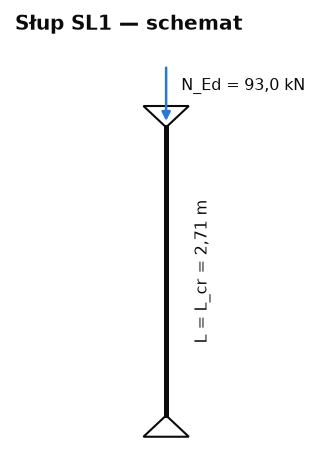

*Rys. Słup SL1: schemat statyczny (przegubowo-przesuwny, układ usztywniony).*

#### Zestawienie obciążeń

| Przypadek | N_k [kN] |
|---|---|
| G | 40,08 |
| QA | 26,78 |
| S1 | 4,82 |
| S2 | 9,18 |
| SB2 | 8,83 |

#### Obliczenia

##### SL1 — nośność

- Przekrój: RK 120x120x6 = **A = 26,43 cm², I_y = 562,1 cm⁴, I_z = 562,1 cm⁴, W_pl,y = 111,6 cm³, i_y = 4,61 cm, i_z = 4,61 cm, masa 20,7 kg/m**
- Stal: S355 = **f_y = 355 MPa, E = 210 GPa**
- Ścianka 120 mm: c/t = (b − 3t)/t = (120 − 3·6,0)/6,0 = **17,0** *(klasa 1: ≤ 33ε = 26,8)*
- Ścianka 120 mm: c/t = (b − 3t)/t = (120 − 3·6,0)/6,0 = **17,0** *(klasa 1: ≤ 33ε = 26,8)*
- Klasa przekroju: **1**
- Nośność przekroju przy ściskaniu: N_c,Rd = A·f_y/γ_M0 = 2643·355/1,00·10⁻³ = **938,32** kN *((6.10))*
- Smukłość względna (oś y, L_cr = 2,71 m): λ̄_y = √(A·f_y/N_cr), N_cr = π²·E·I_y/L_cr² = √(938,3/1586,4) = **0,769** *((6.50))*
- Współczynnik wyboczeniowy (krzywa c): χ_y = α = 0,49 = **0,682** *((6.49), tabl. 6.2)*
- Smukłość względna (oś z, L_cr = 2,71 m): λ̄_z = √(A·f_y/N_cr), N_cr = π²·E·I_z/L_cr² = √(938,3/1586,4) = **0,769** *((6.50))*
- Współczynnik wyboczeniowy (krzywa c): χ_z = α = 0,49 = **0,682** *((6.49), tabl. 6.2)*
- Nośność na wyboczenie: N_b,Rd = χ_min·A·f_y/γ_M1 = **639,53** kN *((6.47))*
- Nośność na zginanie: M_y,Rk = W·f_y = 111,6·10³·355·10⁻⁶ = **39,62** kNm *((6.13)/(6.14))*
- Współczynniki interakcji (zał. B, metoda 2): C_my; k_yy; k_zy = 0,6·k_yy = **0,95; 1,029; 0,617** *(tabl. B.1, B.3)*
- Warunek (6.61): N_Ed/(χ_y·N_Rk/γ_M1) + k_yy·M_y,Ed/(M_y,Rk/γ_M1) = 0,145 + 1,029·0,06/39,62 = **0,147**
- Warunek (6.62): N_Ed/(χ_z·N_Rk/γ_M1) + k_zy·M_y,Ed/(M_y,Rk/γ_M1) = 0,145 + 0,617·0,06/39,62 = **0,146**

| Warunek | Efekt | Nośność / limit | η | Stan | Podstawa |
|---|---|---|---|---|---|
| Wyboczenie giętne | N_Ed = 93,05 kN | N_b,Rd = 639,53 kN | 15% | spełniony | (6.46) |
| Interakcja N + M (6.61) | Σ = 0,147  | 1,0 = 1,000  | 15% | spełniony | (6.61) |
| Interakcja N + M (6.62) | Σ = 0,146  | 1,0 = 1,000  | 15% | spełniony | (6.62) |

> Połączenia (blacha podstawy, kotwy, głowica) — dobór w projekcie wykonawczym; przemieszczenie poziome ≤ H/150 (R5-71) przy układzie nieusztywnionym.

#### Wnioski

**Przyjęto:** Słup RK 120x120x6 ze stali S355; N_Ed = 93,0 kN, N_b,Rd = 639,5 kN.  

### Poz. 8.2 — Słup SL2 (RK 120x120x6, L = 3,01 m)

Element modelu: `SL2` · maks. wykorzystanie nośności η = 12% · wszystkie warunki spełnione

#### Opis i schemat statyczny

Słup przegubowo zamocowany na obu końcach (układ usztywniony płytą połączoną z budynkiem) — L_cr = L = 3,01 m [ZAŁ]; siła osiowa z reakcji płyty/belek; wiatr na trzon słupa (c_f ≈ 1,0) jako obciążenie towarzyszące.

*Rys. Słup SL2: schemat statyczny (przegubowo-przesuwny, układ usztywniony).*

#### Zestawienie obciążeń

| Przypadek | N_k [kN] |
|---|---|
| G | 28,56 |
| QA | 20,44 |
| S1 | 3,68 |
| S2 | 7,17 |
| SB2 | 6,93 |

#### Obliczenia

##### SL2 — nośność

- Przekrój: RK 120x120x6 = **A = 26,43 cm², I_y = 562,1 cm⁴, I_z = 562,1 cm⁴, W_pl,y = 111,6 cm³, i_y = 4,61 cm, i_z = 4,61 cm, masa 20,7 kg/m**
- Stal: S355 = **f_y = 355 MPa, E = 210 GPa**
- Ścianka 120 mm: c/t = (b − 3t)/t = (120 − 3·6,0)/6,0 = **17,0** *(klasa 1: ≤ 33ε = 26,8)*
- Ścianka 120 mm: c/t = (b − 3t)/t = (120 − 3·6,0)/6,0 = **17,0** *(klasa 1: ≤ 33ε = 26,8)*
- Klasa przekroju: **1**
- Nośność przekroju przy ściskaniu: N_c,Rd = A·f_y/γ_M0 = 2643·355/1,00·10⁻³ = **938,32** kN *((6.10))*
- Smukłość względna (oś y, L_cr = 3,01 m): λ̄_y = √(A·f_y/N_cr), N_cr = π²·E·I_y/L_cr² = √(938,3/1285,9) = **0,854** *((6.50))*
- Współczynnik wyboczeniowy (krzywa c): χ_y = α = 0,49 = **0,628** *((6.49), tabl. 6.2)*
- Smukłość względna (oś z, L_cr = 3,01 m): λ̄_z = √(A·f_y/N_cr), N_cr = π²·E·I_z/L_cr² = √(938,3/1285,9) = **0,854** *((6.50))*
- Współczynnik wyboczeniowy (krzywa c): χ_z = α = 0,49 = **0,628** *((6.49), tabl. 6.2)*
- Nośność na wyboczenie: N_b,Rd = χ_min·A·f_y/γ_M1 = **589,44** kN *((6.47))*
- Nośność na zginanie: M_y,Rk = W·f_y = 111,6·10³·355·10⁻⁶ = **39,62** kNm *((6.13)/(6.14))*
- Współczynniki interakcji (zał. B, metoda 2): C_my; k_yy; k_zy = 0,6·k_yy = **0,95; 1,023; 0,614** *(tabl. B.1, B.3)*
- Warunek (6.61): N_Ed/(χ_y·N_Rk/γ_M1) + k_yy·M_y,Ed/(M_y,Rk/γ_M1) = 0,117 + 1,023·0,08/39,62 = **0,119**
- Warunek (6.62): N_Ed/(χ_z·N_Rk/γ_M1) + k_zy·M_y,Ed/(M_y,Rk/γ_M1) = 0,117 + 0,614·0,08/39,62 = **0,118**

| Warunek | Efekt | Nośność / limit | η | Stan | Podstawa |
|---|---|---|---|---|---|
| Wyboczenie giętne | N_Ed = 68,81 kN | N_b,Rd = 589,44 kN | 12% | spełniony | (6.46) |
| Interakcja N + M (6.61) | Σ = 0,119  | 1,0 = 1,000  | 12% | spełniony | (6.61) |
| Interakcja N + M (6.62) | Σ = 0,118  | 1,0 = 1,000  | 12% | spełniony | (6.62) |

> Połączenia (blacha podstawy, kotwy, głowica) — dobór w projekcie wykonawczym; przemieszczenie poziome ≤ H/150 (R5-71) przy układzie nieusztywnionym.

#### Wnioski

**Przyjęto:** Słup RK 120x120x6 ze stali S355; N_Ed = 68,8 kN, N_b,Rd = 589,4 kN.  

## Poz. 9 — Ściany murowe

### Poz. 9.1 — Ściana S1-01 (P1, zewnętrzna nośna)

Element modelu: `S1-01` · maks. wykorzystanie nośności η = 59% · wszystkie warunki spełnione

#### Opis i schemat statyczny

Ściana gr. konstrukcyjnej t = 18 cm, długość osi 10,00 m, wysokość h = 2,860 m (z 2,910 do 5,770); materiał: Bloczek wapienno-piaskowy 18 cm, kl. 20. Otwory: O1-01 (2,40 m), O1-02 (3,60 m).

Sprawdzono 3 odcinków (filarki ≤ 2 m między otworami — siła całkowita; dłuższe pasma — maks. średnia krocząca 1 m) dla 14 kombinacji; poniżej przypadek miarodajny. Mimośród reakcji stropu e = t/6 (zewn.) / 0,3·t/6 (wewn., niesymetria) [UPR]; wiatr jako moment w połowie wysokości w·h²/8.

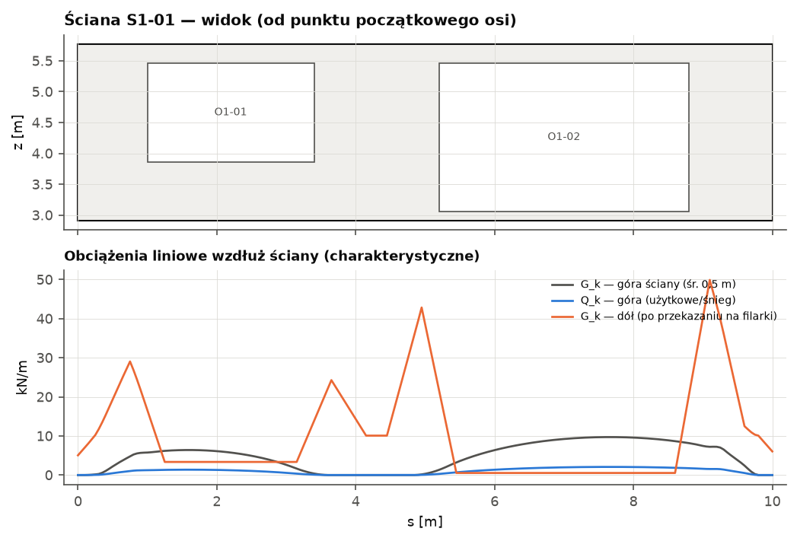

*Rys. Ściana S1-01: widok z otworami i rozkład obciążeń charakterystycznych wzdłuż osi.*

#### Zestawienie obciążeń

**Ciężar ściany — SZ1 — Ściana zewnętrzna nośna, silikat 18 + ETICS EPS 20**

| Warstwa | Obliczenie | g_k [kN/m²] | γ_G (6.10a) | g_d [kN/m²] | ξγ_G (6.10b) | g_d [kN/m²] |
|---|---|---|---|---|---|---|
| Tynk gipsowy maszynowy | 1,5 cm × 12,75 kN/m³ | 0,191 | 1,35 | 0,258 | 1,15 | 0,220 |
| Bloczek wapienno-piaskowy 18 cm, kl. 20 | 18,0 cm × 17,66 kN/m³ | 3,178 | 1,35 | 4,291 | 1,15 | 3,647 |
| Styropian grafitowy EPS 031 | 20,0 cm × 0,15 kN/m³ | 0,029 | 1,35 | 0,040 | 1,15 | 0,034 |
| Tynk silikonowy cienkowarstwowy, biały | 0,7 cm × 17,66 kN/m³ | 0,124 | 1,35 | 0,167 | 1,15 | 0,142 |
| **Razem g_k** |  | 3,523 |  | 4,756 |  | 4,042 |

**Obciążenia ściany (charakterystyczne)** — góra: z płyt i ścian wyżej; dół: po przekazaniu obciążeń znad otworów na filarki

| Przypadek | max q_góra [kN/m] | średnio q_dół [kN/m] | max q_dół [kN/m] |
|---|---|---|---|
| G | 9,73 | 10,39 | 50,63 |
| H | 0,74 | 0,36 | 2,79 |
| S1 | 1,34 | 0,65 | 5,03 |
| S2 | 1,34 | 0,65 | 5,03 |

#### Obliczenia

##### S1-01 — filarek 8,80–10,00 m (b = 1,20 m), 6.10a (wiodące: S1)

- Pole przekroju filarka: A = b·t = 1,20·0,18 = **0,216** m²
- Współczynnik η_A (A < 0,3 m²): η_A = (NA; interpolacja wg R5-63) = **1,21** *(NA do PN-EN 1996-1-1 [NZW])*
- Wytrzymałość charakterystyczna muru: f_k = K·f_b^0,85 = 0,60·20^0,85 = **7,66** MPa *((3.2) + NA tabl. NA.5 (K = 0,60, Ap2:2014-09))*
- Wytrzymałość obliczeniowa: f_d = f_k/γ_M · (1/η_A) = 7,66/1,7·0,826 = **3,72** MPa *(NA tabl. NA.1 (kat. I, zaprawa projektowana, klasa wykonania A))*
- Wysokość efektywna: h_ef = ρ₂·h = 1,000·2,86 = **2,860** m *((5.2), 5.5.1.2)*
- Smukłość: h_ef/t_ef = 2,860/0,180 = **15,89**
- Mimośród przypadkowy: e_init = h_ef/450 = 2860/450 = **6,4** mm *(5.5.1.1(4))*
- Mimośród na górze: e_g = M_g/N_g + e_init ≥ 0,05t = 0,19/6,3 + 0,0064 = **36,4** mm *((6.5))*
- Mimośród na dole: e_d = M_d/N_d + e_init ≥ 0,05t = 0,00/38,7 + 0,0064 = **9,0** mm *((6.5))*
- Współczynnik redukcyjny — góra: Φ_g = 1 − 2e_g/t = 1 − 2·36,4/180 = **0,596** *((6.4))*
- Współczynnik redukcyjny — dół: Φ_d = 1 − 2e_d/t = 1 − 2·9,0/180 = **0,900** *((6.4))*
- Mimośród w połowie wysokości: e_m = (M_md + M_w)/N_m + e_init = (0,09 + 0,00)/22,5 + 0,0064 = **10,6** mm *((6.7))*
- Mimośród od pełzania: e_k = 0,002·φ_∞·(h_ef/t_ef)·√(t·e_m) = 0,002·1,5·15,89·√(0,180·0,0106) = **2,1** mm *((6.8))*
- Mimośród całkowity: e_mk = e_m + e_k ≥ 0,05t = **12,6** mm *((6.6))*
- Współczynnik redukcyjny w połowie wysokości: Φ_m = A₁·exp(−u²/2), A₁ = 1 − 2e_mk/t, u = (λ − 0,063)/(0,73 − 1,17e_mk/t) = λ = 0,502, A₁ = 0,860, u = 0,678 = **0,683** *(zał. G (G.1–G.4), E = K_E·f_k)*
- Nośność: N_Rd = Φ·t·f_d = (góra / środek / dół) 0,596 / 0,683 / 0,900 · 180 mm · 3,72 MPa = **399,3 / 457,5 / 603,0** kN/m *((6.2))*

| Warunek | Efekt | Nośność / limit | η | Stan | Podstawa |
|---|---|---|---|---|---|
| Smukłość ściany | h_ef/t_ef = 15,9  | 27 = 27,0  | 59% | spełniony | 5.5.1.4 |
| Nośność — przekrój górny | N_Ed = 6,32 kN/m | N_Rd = 399,34 kN/m | 2% | spełniony | (6.2), (6.4) |
| Nośność — połowa wysokości | N_Ed = 22,53 kN/m | N_Rd = 457,53 kN/m | 5% | spełniony | (6.2), zał. G |
| Nośność — przekrój dolny | N_Ed = 38,74 kN/m | N_Rd = 602,99 kN/m | 6% | spełniony | (6.2), (6.4) |

> Filarek liczony jako ściana podparta górą i dołem, ρ₂ = 1,0 (bezpiecznie); siły N na 1 m = N/b.

##### S1-01 — zginanie z płaszczyzny (wiatr)

- Wskaźnik wytrzymałości (1 m): Z = t²/6 = 0,180²/6 = **5400** cm³/m
- Pasmo pionowe — moment: M_Ed = w_Ed·h²/8 = 1,332·2,86²/8 = **1,361** kNm/m
- Pasmo pionowe — nośność: M_Rd = (f_xk1/γ_M + σ_d)·Z = (0,20/1,7 + 0,054)·10³·0,00540 = **0,928** kNm/m *((6.15), 6.3.1(3) [NZW f_xk1])*

> Informacyjnie (dolne oszacowanie, bez efektu przesklepienia 6.3.2): Zginanie z płaszczyzny (pasmo pionowe — dolne oszacowanie): M_Ed = 1,361 ≤? M_Rd = 0,928 kNm/m (η = 147%). Ściana obciążona pionowo — miarodajne sprawdzenie 6.1.2 z mimośrodem e_hm od wiatru.

##### S1-01 — wiatr: przesklepienie między stropami (6.3.2)

- Smukłość łuku: l_a/t = 2,86/0,180 = **15,9**
- Nośność na obciążenie poziome: q_lat,d = f_d·(t/l_a)² = 4,50·10³·(0,180/2,86)² = **17,84** kN/m² *((6.20) [NZW])*
- Obliczeniowy rozpór łuku (przenoszony przez stropy/wieńce): N_ad = 1,5·f_d·t/10 = **121,6** kN/m *((6.19) [NZW])*

| Warunek | Efekt | Nośność / limit | η | Stan | Podstawa |
|---|---|---|---|---|---|
| Obciążenie poziome — przesklepienie | W_Ed = 1,33 kN/m² | q_lat,d = 17,84 kN/m² | 7% | spełniony | PN-EN 1996-1-1 6.3.2 |

#### Wnioski

**Przyjęto:** Mur: Bloczek wapienno-piaskowy 18 cm, kl. 20, f_d = 4,50 MPa (klasa wykonania A, γ_M = 1,7).  

### Poz. 9.2 — Ściana S1-02 (P1, zewnętrzna nośna)

Element modelu: `S1-02` · maks. wykorzystanie nośności η = 44% · wszystkie warunki spełnione

#### Opis i schemat statyczny

Ściana gr. konstrukcyjnej t = 18 cm, długość osi 8,00 m, wysokość h = 2,860 m (z 2,910 do 5,770); materiał: Bloczek wapienno-piaskowy 18 cm, kl. 20. Otwory: O1-03 (2,40 m).

Sprawdzono 2 odcinków (filarki ≤ 2 m między otworami — siła całkowita; dłuższe pasma — maks. średnia krocząca 1 m) dla 14 kombinacji; poniżej przypadek miarodajny. Mimośród reakcji stropu e = t/6 (zewn.) / 0,3·t/6 (wewn., niesymetria) [UPR]; wiatr jako moment w połowie wysokości w·h²/8.

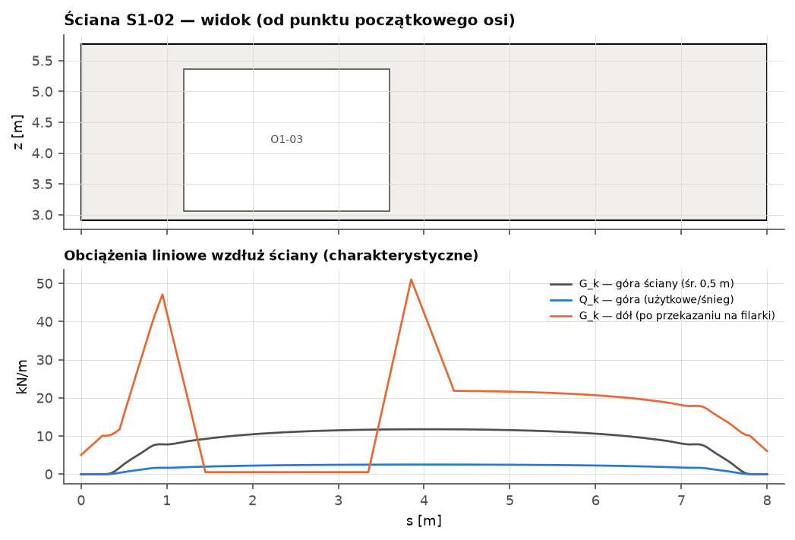

*Rys. Ściana S1-02: widok z otworami i rozkład obciążeń charakterystycznych wzdłuż osi.*

#### Zestawienie obciążeń

**Ciężar ściany — SZ1 — Ściana zewnętrzna nośna, silikat 18 + ETICS EPS 20**

| Warstwa | Obliczenie | g_k [kN/m²] | γ_G (6.10a) | g_d [kN/m²] | ξγ_G (6.10b) | g_d [kN/m²] |
|---|---|---|---|---|---|---|
| Tynk gipsowy maszynowy | 1,5 cm × 12,75 kN/m³ | 0,191 | 1,35 | 0,258 | 1,15 | 0,220 |
| Bloczek wapienno-piaskowy 18 cm, kl. 20 | 18,0 cm × 17,66 kN/m³ | 3,178 | 1,35 | 4,291 | 1,15 | 3,647 |
| Styropian grafitowy EPS 031 | 20,0 cm × 0,15 kN/m³ | 0,029 | 1,35 | 0,040 | 1,15 | 0,034 |
| Tynk silikonowy cienkowarstwowy, biały | 0,7 cm × 17,66 kN/m³ | 0,124 | 1,35 | 0,167 | 1,15 | 0,142 |
| **Razem g_k** |  | 3,523 |  | 4,756 |  | 4,042 |

**Obciążenia ściany (charakterystyczne)** — góra: z płyt i ścian wyżej; dół: po przekazaniu obciążeń znad otworów na filarki

| Przypadek | max q_góra [kN/m] | średnio q_dół [kN/m] | max q_dół [kN/m] |
|---|---|---|---|
| G | 11,78 | 16,60 | 51,07 |
| H | 0,90 | 0,68 | 2,87 |
| S1 | 1,62 | 1,23 | 5,16 |
| S2 | 1,62 | 1,23 | 5,16 |

#### Obliczenia

##### S1-02 — ściana (odcinek 3,60–8,00 m), 6.10 G korzystne (wiodące: W)

- Wytrzymałość charakterystyczna muru: f_k = K·f_b^0,85 = 0,60·20^0,85 = **7,66** MPa *((3.2) + NA tabl. NA.5 (K = 0,60, Ap2:2014-09))*
- Wytrzymałość obliczeniowa: f_d = f_k/γ_M = 7,66/1,7 = **4,50** MPa *(NA tabl. NA.1 (kat. I, zaprawa projektowana, klasa wykonania A))*
- Wysokość efektywna: h_ef = ρ₂·h = 0,750·2,86 = **2,145** m *((5.2), 5.5.1.2)*
- Smukłość: h_ef/t_ef = 2,145/0,180 = **11,92**
- Mimośród przypadkowy: e_init = h_ef/450 = 2145/450 = **4,8** mm *(5.5.1.1(4))*
- Mimośród na górze: e_g = M_g/N_g + e_init ≥ 0,05t = 0,35/11,8 + 0,0048 = **34,8** mm *((6.5))*
- Mimośród na dole: e_d = M_d/N_d + e_init ≥ 0,05t = 0,00/36,4 + 0,0048 = **9,0** mm *((6.5))*
- Współczynnik redukcyjny — góra: Φ_g = 1 − 2e_g/t = 1 − 2·34,8/180 = **0,614** *((6.4))*
- Współczynnik redukcyjny — dół: Φ_d = 1 − 2e_d/t = 1 − 2·9,0/180 = **0,900** *((6.4))*
- Mimośród w połowie wysokości: e_m = (M_md + M_w)/N_m + e_init = (0,18 + 1,36)/24,1 + 0,0048 = **68,6** mm *((6.7))*
- Mimośród od pełzania: e_k = 0 (h_ef/t_ef ≤ λ_c) = **0,0** mm *(6.1.2.2(2) [NZW NA])*
- Mimośród całkowity: e_mk = e_m + e_k ≥ 0,05t = **68,6** mm *((6.6))*
- Współczynnik redukcyjny w połowie wysokości: Φ_m = A₁·exp(−u²/2), A₁ = 1 − 2e_mk/t, u = (λ − 0,063)/(0,73 − 1,17e_mk/t) = λ = 0,377, A₁ = 0,238, u = 1,104 = **0,129** *(zał. G (G.1–G.4), E = K_E·f_k)*
- Nośność: N_Rd = Φ·t·f_d = (góra / środek / dół) 0,614 / 0,129 / 0,900 · 180 mm · 4,50 MPa = **497,5 / 104,9 / 729,6** kN/m *((6.2))*

| Warunek | Efekt | Nośność / limit | η | Stan | Podstawa |
|---|---|---|---|---|---|
| Smukłość ściany | h_ef/t_ef = 11,9  | 27 = 27,0  | 44% | spełniony | 5.5.1.4 |
| Nośność — przekrój górny | N_Ed = 11,76 kN/m | N_Rd = 497,52 kN/m | 2% | spełniony | (6.2), (6.4) |
| Nośność — połowa wysokości | N_Ed = 24,10 kN/m | N_Rd = 104,93 kN/m | 23% | spełniony | (6.2), zał. G |
| Nośność — przekrój dolny | N_Ed = 36,44 kN/m | N_Rd = 729,61 kN/m | 5% | spełniony | (6.2), (6.4) |

##### S1-02 — zginanie z płaszczyzny (wiatr)

- Wskaźnik wytrzymałości (1 m): Z = t²/6 = 0,180²/6 = **5400** cm³/m
- Pasmo pionowe — moment: M_Ed = w_Ed·h²/8 = 1,332·2,86²/8 = **1,361** kNm/m
- Pasmo pionowe — nośność: M_Rd = (f_xk1/γ_M + σ_d)·Z = (0,20/1,7 + 0,077)·10³·0,00540 = **1,053** kNm/m *((6.15), 6.3.1(3) [NZW f_xk1])*

> Informacyjnie (dolne oszacowanie, bez efektu przesklepienia 6.3.2): Zginanie z płaszczyzny (pasmo pionowe — dolne oszacowanie): M_Ed = 1,361 ≤? M_Rd = 1,053 kNm/m (η = 129%). Ściana obciążona pionowo — miarodajne sprawdzenie 6.1.2 z mimośrodem e_hm od wiatru.

##### S1-02 — wiatr: przesklepienie między stropami (6.3.2)

- Smukłość łuku: l_a/t = 2,86/0,180 = **15,9**
- Nośność na obciążenie poziome: q_lat,d = f_d·(t/l_a)² = 4,50·10³·(0,180/2,86)² = **17,84** kN/m² *((6.20) [NZW])*
- Obliczeniowy rozpór łuku (przenoszony przez stropy/wieńce): N_ad = 1,5·f_d·t/10 = **121,6** kN/m *((6.19) [NZW])*

| Warunek | Efekt | Nośność / limit | η | Stan | Podstawa |
|---|---|---|---|---|---|
| Obciążenie poziome — przesklepienie | W_Ed = 1,33 kN/m² | q_lat,d = 17,84 kN/m² | 7% | spełniony | PN-EN 1996-1-1 6.3.2 |

#### Wnioski

**Przyjęto:** Mur: Bloczek wapienno-piaskowy 18 cm, kl. 20, f_d = 4,50 MPa (klasa wykonania A, γ_M = 1,7).  

### Poz. 9.3 — Ściana S1-03 (P1, zewnętrzna nośna)

Element modelu: `S1-03` · maks. wykorzystanie nośności η = 59% · wszystkie warunki spełnione

#### Opis i schemat statyczny

Ściana gr. konstrukcyjnej t = 18 cm, długość osi 10,00 m, wysokość h = 2,860 m (z 2,910 do 5,770); materiał: Bloczek wapienno-piaskowy 18 cm, kl. 20. Otwory: O1-04 (1,00 m), O1-05 (1,60 m), O1-06 (1,80 m).

Sprawdzono 4 odcinków (filarki ≤ 2 m między otworami — siła całkowita; dłuższe pasma — maks. średnia krocząca 1 m) dla 14 kombinacji; poniżej przypadek miarodajny. Mimośród reakcji stropu e = t/6 (zewn.) / 0,3·t/6 (wewn., niesymetria) [UPR]; wiatr jako moment w połowie wysokości w·h²/8.

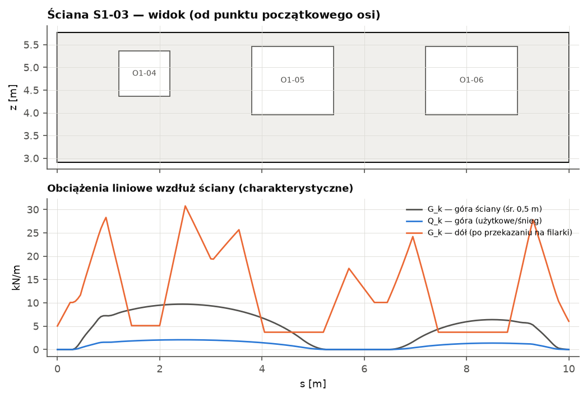

*Rys. Ściana S1-03: widok z otworami i rozkład obciążeń charakterystycznych wzdłuż osi.*

#### Zestawienie obciążeń

**Ciężar ściany — SZ1 — Ściana zewnętrzna nośna, silikat 18 + ETICS EPS 20**

| Warstwa | Obliczenie | g_k [kN/m²] | γ_G (6.10a) | g_d [kN/m²] | ξγ_G (6.10b) | g_d [kN/m²] |
|---|---|---|---|---|---|---|
| Tynk gipsowy maszynowy | 1,5 cm × 12,75 kN/m³ | 0,191 | 1,35 | 0,258 | 1,15 | 0,220 |
| Bloczek wapienno-piaskowy 18 cm, kl. 20 | 18,0 cm × 17,66 kN/m³ | 3,178 | 1,35 | 4,291 | 1,15 | 3,647 |
| Styropian grafitowy EPS 031 | 20,0 cm × 0,15 kN/m³ | 0,029 | 1,35 | 0,040 | 1,15 | 0,034 |
| Tynk silikonowy cienkowarstwowy, biały | 0,7 cm × 17,66 kN/m³ | 0,124 | 1,35 | 0,167 | 1,15 | 0,142 |
| **Razem g_k** |  | 3,523 |  | 4,756 |  | 4,042 |

**Obciążenia ściany (charakterystyczne)** — góra: z płyt i ścian wyżej; dół: po przekazaniu obciążeń znad otworów na filarki

| Przypadek | max q_góra [kN/m] | średnio q_dół [kN/m] | max q_dół [kN/m] |
|---|---|---|---|
| G | 9,73 | 12,61 | 30,79 |
| H | 0,74 | 0,36 | 1,47 |
| S1 | 1,34 | 0,65 | 2,64 |
| S2 | 1,34 | 0,65 | 2,64 |

#### Obliczenia

##### S1-03 — filarek 2,20–3,80 m (b = 1,60 m), 6.10a (wiodące: S1)

- Pole przekroju filarka: A = b·t = 1,60·0,18 = **0,288** m²
- Współczynnik η_A (A < 0,3 m²): η_A = (NA; interpolacja wg R5-63) = **1,03** *(NA do PN-EN 1996-1-1 [NZW])*
- Wytrzymałość charakterystyczna muru: f_k = K·f_b^0,85 = 0,60·20^0,85 = **7,66** MPa *((3.2) + NA tabl. NA.5 (K = 0,60, Ap2:2014-09))*
- Wytrzymałość obliczeniowa: f_d = f_k/γ_M · (1/η_A) = 7,66/1,7·0,971 = **4,37** MPa *(NA tabl. NA.1 (kat. I, zaprawa projektowana, klasa wykonania A))*
- Wysokość efektywna: h_ef = ρ₂·h = 1,000·2,86 = **2,860** m *((5.2), 5.5.1.2)*
- Smukłość: h_ef/t_ef = 2,860/0,180 = **15,89**
- Mimośród przypadkowy: e_init = h_ef/450 = 2860/450 = **6,4** mm *(5.5.1.1(4))*
- Mimośród na górze: e_g = M_g/N_g + e_init ≥ 0,05t = 0,41/13,6 + 0,0064 = **36,4** mm *((6.5))*
- Mimośród na dole: e_d = M_d/N_d + e_init ≥ 0,05t = 0,00/34,6 + 0,0064 = **9,0** mm *((6.5))*
- Współczynnik redukcyjny — góra: Φ_g = 1 − 2e_g/t = 1 − 2·36,4/180 = **0,596** *((6.4))*
- Współczynnik redukcyjny — dół: Φ_d = 1 − 2e_d/t = 1 − 2·9,0/180 = **0,900** *((6.4))*
- Mimośród w połowie wysokości: e_m = (M_md + M_w)/N_m + e_init = (0,20 + 0,00)/24,1 + 0,0064 = **14,8** mm *((6.7))*
- Mimośród od pełzania: e_k = 0,002·φ_∞·(h_ef/t_ef)·√(t·e_m) = 0,002·1,5·15,89·√(0,180·0,0148) = **2,5** mm *((6.8))*
- Mimośród całkowity: e_mk = e_m + e_k ≥ 0,05t = **17,3** mm *((6.6))*
- Współczynnik redukcyjny w połowie wysokości: Φ_m = A₁·exp(−u²/2), A₁ = 1 − 2e_mk/t, u = (λ − 0,063)/(0,73 − 1,17e_mk/t) = λ = 0,502, A₁ = 0,808, u = 0,712 = **0,627** *(zał. G (G.1–G.4), E = K_E·f_k)*
- Nośność: N_Rd = Φ·t·f_d = (góra / środek / dół) 0,596 / 0,627 / 0,900 · 180 mm · 4,37 MPa = **469,1 / 493,7 / 708,4** kN/m *((6.2))*

| Warunek | Efekt | Nośność / limit | η | Stan | Podstawa |
|---|---|---|---|---|---|
| Smukłość ściany | h_ef/t_ef = 15,9  | 27 = 27,0  | 59% | spełniony | 5.5.1.4 |
| Nośność — przekrój górny | N_Ed = 13,60 kN/m | N_Rd = 469,13 kN/m | 3% | spełniony | (6.2), (6.4) |
| Nośność — połowa wysokości | N_Ed = 24,09 kN/m | N_Rd = 493,66 kN/m | 5% | spełniony | (6.2), zał. G |
| Nośność — przekrój dolny | N_Ed = 34,57 kN/m | N_Rd = 708,36 kN/m | 5% | spełniony | (6.2), (6.4) |

> Filarek liczony jako ściana podparta górą i dołem, ρ₂ = 1,0 (bezpiecznie); siły N na 1 m = N/b.

##### S1-03 — zginanie z płaszczyzny (wiatr)

- Wskaźnik wytrzymałości (1 m): Z = t²/6 = 0,180²/6 = **5400** cm³/m
- Pasmo pionowe — moment: M_Ed = w_Ed·h²/8 = 1,332·2,86²/8 = **1,361** kNm/m
- Pasmo pionowe — nośność: M_Rd = (f_xk1/γ_M + σ_d)·Z = (0,20/1,7 + 0,054)·10³·0,00540 = **0,928** kNm/m *((6.15), 6.3.1(3) [NZW f_xk1])*

> Informacyjnie (dolne oszacowanie, bez efektu przesklepienia 6.3.2): Zginanie z płaszczyzny (pasmo pionowe — dolne oszacowanie): M_Ed = 1,361 ≤? M_Rd = 0,928 kNm/m (η = 147%). Ściana obciążona pionowo — miarodajne sprawdzenie 6.1.2 z mimośrodem e_hm od wiatru.

##### S1-03 — wiatr: przesklepienie między stropami (6.3.2)

- Smukłość łuku: l_a/t = 2,86/0,180 = **15,9**
- Nośność na obciążenie poziome: q_lat,d = f_d·(t/l_a)² = 4,50·10³·(0,180/2,86)² = **17,84** kN/m² *((6.20) [NZW])*
- Obliczeniowy rozpór łuku (przenoszony przez stropy/wieńce): N_ad = 1,5·f_d·t/10 = **121,6** kN/m *((6.19) [NZW])*

| Warunek | Efekt | Nośność / limit | η | Stan | Podstawa |
|---|---|---|---|---|---|
| Obciążenie poziome — przesklepienie | W_Ed = 1,33 kN/m² | q_lat,d = 17,84 kN/m² | 7% | spełniony | PN-EN 1996-1-1 6.3.2 |

#### Wnioski

**Przyjęto:** Mur: Bloczek wapienno-piaskowy 18 cm, kl. 20, f_d = 4,50 MPa (klasa wykonania A, γ_M = 1,7).  

### Poz. 9.4 — Ściana S1-04 (P1, zewnętrzna nośna)

Element modelu: `S1-04` · maks. wykorzystanie nośności η = 79% · wszystkie warunki spełnione

#### Opis i schemat statyczny

Ściana gr. konstrukcyjnej t = 18 cm, długość osi 8,00 m, wysokość h = 2,860 m (z 2,910 do 5,770); materiał: Bloczek wapienno-piaskowy 18 cm, kl. 20. Otwory: O1-07 (1,40 m).

Sprawdzono 2 odcinków (filarki ≤ 2 m między otworami — siła całkowita; dłuższe pasma — maks. średnia krocząca 1 m) dla 14 kombinacji; poniżej przypadek miarodajny. Mimośród reakcji stropu e = t/6 (zewn.) / 0,3·t/6 (wewn., niesymetria) [UPR]; wiatr jako moment w połowie wysokości w·h²/8.

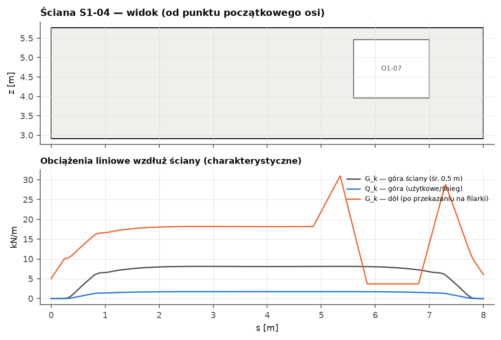

*Rys. Ściana S1-04: widok z otworami i rozkład obciążeń charakterystycznych wzdłuż osi.*

#### Zestawienie obciążeń

**Ciężar ściany — SZ1 — Ściana zewnętrzna nośna, silikat 18 + ETICS EPS 20**

| Warstwa | Obliczenie | g_k [kN/m²] | γ_G (6.10a) | g_d [kN/m²] | ξγ_G (6.10b) | g_d [kN/m²] |
|---|---|---|---|---|---|---|
| Tynk gipsowy maszynowy | 1,5 cm × 12,75 kN/m³ | 0,191 | 1,35 | 0,258 | 1,15 | 0,220 |
| Bloczek wapienno-piaskowy 18 cm, kl. 20 | 18,0 cm × 17,66 kN/m³ | 3,178 | 1,35 | 4,291 | 1,15 | 3,647 |
| Styropian grafitowy EPS 031 | 20,0 cm × 0,15 kN/m³ | 0,029 | 1,35 | 0,040 | 1,15 | 0,034 |
| Tynk silikonowy cienkowarstwowy, biały | 0,7 cm × 17,66 kN/m³ | 0,124 | 1,35 | 0,167 | 1,15 | 0,142 |
| **Razem g_k** |  | 3,523 |  | 4,756 |  | 4,042 |

**Obciążenia ściany (charakterystyczne)** — góra: z płyt i ścian wyżej; dół: po przekazaniu obciążeń znad otworów na filarki

| Przypadek | max q_góra [kN/m] | średnio q_dół [kN/m] | max q_dół [kN/m] |
|---|---|---|---|
| G | 8,13 | 15,81 | 30,97 |
| H | 0,62 | 0,51 | 1,48 |
| S1 | 1,12 | 0,92 | 2,66 |
| S2 | 1,12 | 0,92 | 2,66 |

#### Obliczenia

##### S1-04 — ściana (odcinek 0,00–5,60 m), 6.10b (wiodące: W)

- Wytrzymałość charakterystyczna muru: f_k = K·f_b^0,85 = 0,60·20^0,85 = **7,66** MPa *((3.2) + NA tabl. NA.5 (K = 0,60, Ap2:2014-09))*
- Wytrzymałość obliczeniowa: f_d = f_k/γ_M = 7,66/1,7 = **4,50** MPa *(NA tabl. NA.1 (kat. I, zaprawa projektowana, klasa wykonania A))*
- Wysokość efektywna: h_ef = ρ₂·h = 0,750·2,86 = **2,145** m *((5.2), 5.5.1.2)*
- Smukłość: h_ef/t_ef = 2,145/0,180 = **11,92**
- Mimośród przypadkowy: e_init = h_ef/450 = 2145/450 = **4,8** mm *(5.5.1.1(4))*
- Mimośród na górze: e_g = M_g/N_g + e_init ≥ 0,05t = 0,30/10,2 + 0,0048 = **34,8** mm *((6.5))*
- Mimośród na dole: e_d = M_d/N_d + e_init ≥ 0,05t = 0,00/29,6 + 0,0048 = **9,0** mm *((6.5))*
- Współczynnik redukcyjny — góra: Φ_g = 1 − 2e_g/t = 1 − 2·34,8/180 = **0,614** *((6.4))*
- Współczynnik redukcyjny — dół: Φ_d = 1 − 2e_d/t = 1 − 2·9,0/180 = **0,900** *((6.4))*
- Mimośród w połowie wysokości: e_m = (M_md + M_w)/N_m + e_init = (0,15 + 1,36)/19,9 + 0,0048 = **80,9** mm *((6.7))*
- Mimośród od pełzania: e_k = 0 (h_ef/t_ef ≤ λ_c) = **0,0** mm *(6.1.2.2(2) [NZW NA])*
- Mimośród całkowity: e_mk = e_m + e_k ≥ 0,05t = **80,9** mm *((6.6))*
- Współczynnik redukcyjny w połowie wysokości: Φ_m = A₁·exp(−u²/2), A₁ = 1 − 2e_mk/t, u = (λ − 0,063)/(0,73 − 1,17e_mk/t) = λ = 0,377, A₁ = 0,101, u = 1,537 = **0,031** *(zał. G (G.1–G.4), E = K_E·f_k)*
- Nośność: N_Rd = Φ·t·f_d = (góra / środek / dół) 0,614 / 0,031 / 0,900 · 180 mm · 4,50 MPa = **497,5 / 25,2 / 729,6** kN/m *((6.2))*

| Warunek | Efekt | Nośność / limit | η | Stan | Podstawa |
|---|---|---|---|---|---|
| Smukłość ściany | h_ef/t_ef = 11,9  | 27 = 27,0  | 44% | spełniony | 5.5.1.4 |
| Nośność — przekrój górny | N_Ed = 10,16 kN/m | N_Rd = 497,52 kN/m | 2% | spełniony | (6.2), (6.4) |
| Nośność — połowa wysokości | N_Ed = 19,89 kN/m | N_Rd = 25,19 kN/m | 79% | spełniony | (6.2), zał. G |
| Nośność — przekrój dolny | N_Ed = 29,62 kN/m | N_Rd = 729,61 kN/m | 4% | spełniony | (6.2), (6.4) |

##### S1-04 — zginanie z płaszczyzny (wiatr)

- Wskaźnik wytrzymałości (1 m): Z = t²/6 = 0,180²/6 = **5400** cm³/m
- Pasmo pionowe — moment: M_Ed = w_Ed·h²/8 = 1,332·2,86²/8 = **1,361** kNm/m
- Pasmo pionowe — nośność: M_Rd = (f_xk1/γ_M + σ_d)·Z = (0,20/1,7 + 0,065)·10³·0,00540 = **0,986** kNm/m *((6.15), 6.3.1(3) [NZW f_xk1])*

> Informacyjnie (dolne oszacowanie, bez efektu przesklepienia 6.3.2): Zginanie z płaszczyzny (pasmo pionowe — dolne oszacowanie): M_Ed = 1,361 ≤? M_Rd = 0,986 kNm/m (η = 138%). Ściana obciążona pionowo — miarodajne sprawdzenie 6.1.2 z mimośrodem e_hm od wiatru.

##### S1-04 — wiatr: przesklepienie między stropami (6.3.2)

- Smukłość łuku: l_a/t = 2,86/0,180 = **15,9**
- Nośność na obciążenie poziome: q_lat,d = f_d·(t/l_a)² = 4,50·10³·(0,180/2,86)² = **17,84** kN/m² *((6.20) [NZW])*
- Obliczeniowy rozpór łuku (przenoszony przez stropy/wieńce): N_ad = 1,5·f_d·t/10 = **121,6** kN/m *((6.19) [NZW])*

| Warunek | Efekt | Nośność / limit | η | Stan | Podstawa |
|---|---|---|---|---|---|
| Obciążenie poziome — przesklepienie | W_Ed = 1,33 kN/m² | q_lat,d = 17,84 kN/m² | 7% | spełniony | PN-EN 1996-1-1 6.3.2 |

#### Wnioski

**Przyjęto:** Mur: Bloczek wapienno-piaskowy 18 cm, kl. 20, f_d = 4,50 MPa (klasa wykonania A, γ_M = 1,7).  

### Poz. 9.5 — Ściana S1-05 (P1, wewnętrzna nośna)

Element modelu: `S1-05` · maks. wykorzystanie nośności η = 59% · wszystkie warunki spełnione

#### Opis i schemat statyczny

Ściana gr. konstrukcyjnej t = 18 cm, długość osi 8,00 m, wysokość h = 2,860 m (z 2,910 do 5,770); materiał: Bloczek wapienno-piaskowy 18 cm, kl. 20. Otwory: O1-08 (0,90 m), O1-09 (0,90 m).

Sprawdzono 3 odcinków (filarki ≤ 2 m między otworami — siła całkowita; dłuższe pasma — maks. średnia krocząca 1 m) dla 9 kombinacji; poniżej przypadek miarodajny. Mimośród reakcji stropu e = t/6 (zewn.) / 0,3·t/6 (wewn., niesymetria) [UPR]; wiatr jako moment w połowie wysokości w·h²/8.

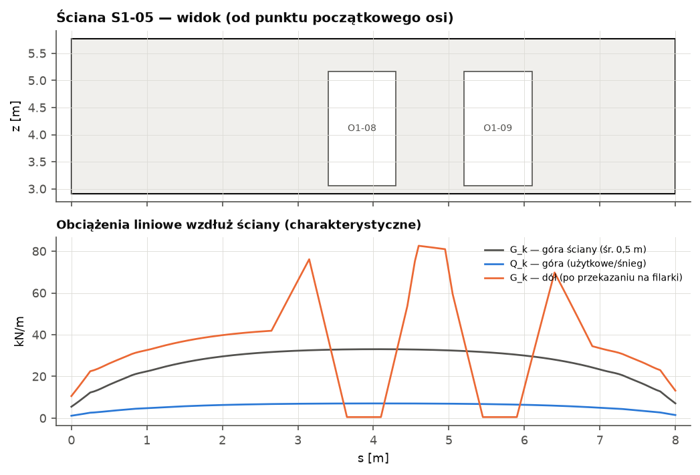

*Rys. Ściana S1-05: widok z otworami i rozkład obciążeń charakterystycznych wzdłuż osi.*

#### Zestawienie obciążeń

**Ciężar ściany — SW1 — Ściana wewnętrzna nośna, silikat 18**

| Warstwa | Obliczenie | g_k [kN/m²] | γ_G (6.10a) | g_d [kN/m²] | ξγ_G (6.10b) | g_d [kN/m²] |
|---|---|---|---|---|---|---|
| Tynk gipsowy maszynowy | 1,5 cm × 12,75 kN/m³ | 0,191 | 1,35 | 0,258 | 1,15 | 0,220 |
| Bloczek wapienno-piaskowy 18 cm, kl. 20 | 18,0 cm × 17,66 kN/m³ | 3,178 | 1,35 | 4,291 | 1,15 | 3,647 |
| Tynk gipsowy maszynowy | 1,5 cm × 12,75 kN/m³ | 0,191 | 1,35 | 0,258 | 1,15 | 0,220 |
| **Razem g_k** |  | 3,561 |  | 4,807 |  | 4,086 |

**Obciążenia ściany (charakterystyczne)** — góra: z płyt i ścian wyżej; dół: po przekazaniu obciążeń znad otworów na filarki

| Przypadek | max q_góra [kN/m] | średnio q_dół [kN/m] | max q_dół [kN/m] |
|---|---|---|---|
| G | 33,07 | 35,16 | 107,95 |
| H | 2,53 | 2,04 | 7,15 |
| S1 | 4,55 | 3,68 | 12,88 |
| S2 | 4,55 | 3,68 | 12,88 |

#### Obliczenia

##### S1-05 — filarek 4,30–5,20 m (b = 0,90 m), 6.10a (wiodące: S1)

- Pole przekroju filarka: A = b·t = 0,90·0,18 = **0,162** m²
- Współczynnik η_A (A < 0,3 m²): η_A = (NA; interpolacja wg R5-63) = **1,34** *(NA do PN-EN 1996-1-1 [NZW])*
- Wytrzymałość charakterystyczna muru: f_k = K·f_b^0,85 = 0,60·20^0,85 = **7,66** MPa *((3.2) + NA tabl. NA.5 (K = 0,60, Ap2:2014-09))*
- Wytrzymałość obliczeniowa: f_d = f_k/γ_M · (1/η_A) = 7,66/1,7·0,749 = **3,37** MPa *(NA tabl. NA.1 (kat. I, zaprawa projektowana, klasa wykonania A))*
- Wysokość efektywna: h_ef = ρ₂·h = 1,000·2,86 = **2,860** m *((5.2), 5.5.1.2)*
- Smukłość: h_ef/t_ef = 2,860/0,180 = **15,89**
- Mimośród przypadkowy: e_init = h_ef/450 = 2860/450 = **6,4** mm *(5.5.1.1(4))*
- Mimośród na górze: e_g = M_g/N_g + e_init ≥ 0,05t = 0,45/50,1 + 0,0064 = **15,4** mm *((6.5))*
- Mimośród na dole: e_d = M_d/N_d + e_init ≥ 0,05t = 0,00/107,5 + 0,0064 = **9,0** mm *((6.5))*
- Współczynnik redukcyjny — góra: Φ_g = 1 − 2e_g/t = 1 − 2·15,4/180 = **0,829** *((6.4))*
- Współczynnik redukcyjny — dół: Φ_d = 1 − 2e_d/t = 1 − 2·9,0/180 = **0,900** *((6.4))*
- Mimośród w połowie wysokości: e_m = (M_md + M_w)/N_m + e_init = (0,23 + 0,00)/78,8 + 0,0064 = **9,2** mm *((6.7))*
- Mimośród od pełzania: e_k = 0,002·φ_∞·(h_ef/t_ef)·√(t·e_m) = 0,002·1,5·15,89·√(0,180·0,0092) = **1,9** mm *((6.8))*
- Mimośród całkowity: e_mk = e_m + e_k ≥ 0,05t = **11,2** mm *((6.6))*
- Współczynnik redukcyjny w połowie wysokości: Φ_m = A₁·exp(−u²/2), A₁ = 1 − 2e_mk/t, u = (λ − 0,063)/(0,73 − 1,17e_mk/t) = λ = 0,502, A₁ = 0,876, u = 0,668 = **0,701** *(zał. G (G.1–G.4), E = K_E·f_k)*
- Nośność: N_Rd = Φ·t·f_d = (góra / środek / dół) 0,829 / 0,701 / 0,900 · 180 mm · 3,37 MPa = **503,5 / 425,3 / 546,3** kN/m *((6.2))*

| Warunek | Efekt | Nośność / limit | η | Stan | Podstawa |
|---|---|---|---|---|---|
| Smukłość ściany | h_ef/t_ef = 15,9  | 27 = 27,0  | 59% | spełniony | 5.5.1.4 |
| Nośność — przekrój górny | N_Ed = 50,14 kN/m | N_Rd = 503,46 kN/m | 10% | spełniony | (6.2), (6.4) |
| Nośność — połowa wysokości | N_Ed = 78,81 kN/m | N_Rd = 425,30 kN/m | 19% | spełniony | (6.2), zał. G |
| Nośność — przekrój dolny | N_Ed = 107,48 kN/m | N_Rd = 546,32 kN/m | 20% | spełniony | (6.2), (6.4) |

> Filarek liczony jako ściana podparta górą i dołem, ρ₂ = 1,0 (bezpiecznie); siły N na 1 m = N/b.

#### Wnioski

**Przyjęto:** Mur: Bloczek wapienno-piaskowy 18 cm, kl. 20, f_d = 4,50 MPa (klasa wykonania A, γ_M = 1,7).  

### Poz. 9.6 — Ściana S0-01 (P0, zewnętrzna nośna)

Element modelu: `S0-01` · maks. wykorzystanie nośności η = 60% · wszystkie warunki spełnione

#### Opis i schemat statyczny

Ściana gr. konstrukcyjnej t = 18 cm, długość osi 10,00 m, wysokość h = 2,935 m (z −0,225 do 2,710); materiał: Bloczek wapienno-piaskowy 18 cm, kl. 20. Otwory: O0-02 (1,80 m), O0-01 (4,00 m).

Sprawdzono 3 odcinków (filarki ≤ 2 m między otworami — siła całkowita; dłuższe pasma — maks. średnia krocząca 1 m) dla 44 kombinacji; poniżej przypadek miarodajny. Mimośród reakcji stropu e = t/6 (zewn.) / 0,3·t/6 (wewn., niesymetria) [UPR]; wiatr jako moment w połowie wysokości w·h²/8.

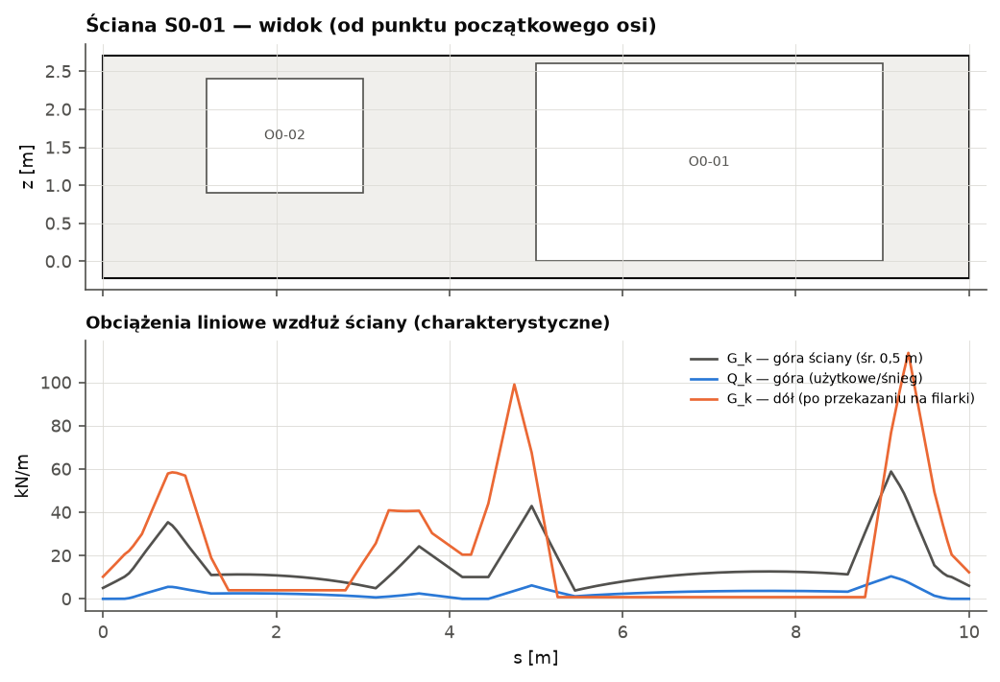

*Rys. Ściana S0-01: widok z otworami i rozkład obciążeń charakterystycznych wzdłuż osi.*

#### Zestawienie obciążeń

**Ciężar ściany — SZ1 — Ściana zewnętrzna nośna, silikat 18 + ETICS EPS 20**

| Warstwa | Obliczenie | g_k [kN/m²] | γ_G (6.10a) | g_d [kN/m²] | ξγ_G (6.10b) | g_d [kN/m²] |
|---|---|---|---|---|---|---|
| Tynk gipsowy maszynowy | 1,5 cm × 12,75 kN/m³ | 0,191 | 1,35 | 0,258 | 1,15 | 0,220 |
| Bloczek wapienno-piaskowy 18 cm, kl. 20 | 18,0 cm × 17,66 kN/m³ | 3,178 | 1,35 | 4,291 | 1,15 | 3,647 |
| Styropian grafitowy EPS 031 | 20,0 cm × 0,15 kN/m³ | 0,029 | 1,35 | 0,040 | 1,15 | 0,034 |
| Tynk silikonowy cienkowarstwowy, biały | 0,7 cm × 17,66 kN/m³ | 0,124 | 1,35 | 0,167 | 1,15 | 0,142 |
| **Razem g_k** |  | 3,523 |  | 4,756 |  | 4,042 |

**Obciążenia ściany (charakterystyczne)** — góra: z płyt i ścian wyżej; dół: po przekazaniu obciążeń znad otworów na filarki

| Przypadek | max q_góra [kN/m] | średnio q_dół [kN/m] | max q_dół [kN/m] |
|---|---|---|---|
| G | 60,50 | 21,84 | 128,44 |
| H | 2,79 | 0,36 | 3,74 |
| QA | 3,69 | 1,83 | 14,50 |
| QA_pA | 2,72 | 0,67 | 6,52 |
| QA_pB | 3,06 | 1,16 | 12,73 |
| S1 | 5,03 | 0,65 | 6,74 |
| S2 | 5,03 | 0,65 | 6,74 |

#### Obliczenia

##### S0-01 — filarek 9,00–10,00 m (b = 1,00 m), 6.10a (wiodące: QA)

- Pole przekroju filarka: A = b·t = 1,00·0,18 = **0,180** m²
- Współczynnik η_A (A < 0,3 m²): η_A = (NA; interpolacja wg R5-63) = **1,29** *(NA do PN-EN 1996-1-1 [NZW])*
- Wytrzymałość charakterystyczna muru: f_k = K·f_b^0,85 = 0,60·20^0,85 = **7,66** MPa *((3.2) + NA tabl. NA.5 (K = 0,60, Ap2:2014-09))*
- Wytrzymałość obliczeniowa: f_d = f_k/γ_M · (1/η_A) = 7,66/1,7·0,772 = **3,48** MPa *(NA tabl. NA.1 (kat. I, zaprawa projektowana, klasa wykonania A))*
- Wysokość efektywna: h_ef = ρ₂·h = 1,000·2,94 = **2,935** m *((5.2), 5.5.1.2)*
- Smukłość: h_ef/t_ef = 2,935/0,180 = **16,31**
- Mimośród przypadkowy: e_init = h_ef/450 = 2935/450 = **6,5** mm *(5.5.1.1(4))*
- Mimośród na górze: e_g = M_g/N_g + e_init ≥ 0,05t = 0,23/43,2 + 0,0065 = **11,8** mm *((6.5))*
- Mimośród na dole: e_d = M_d/N_d + e_init ≥ 0,05t = 0,00/99,0 + 0,0065 = **9,0** mm *((6.5))*
- Współczynnik redukcyjny — góra: Φ_g = 1 − 2e_g/t = 1 − 2·11,8/180 = **0,869** *((6.4))*
- Współczynnik redukcyjny — dół: Φ_d = 1 − 2e_d/t = 1 − 2·9,0/180 = **0,900** *((6.4))*
- Mimośród w połowie wysokości: e_m = (M_md + M_w)/N_m + e_init = (0,11 + 0,00)/71,1 + 0,0065 = **8,1** mm *((6.7))*
- Mimośród od pełzania: e_k = 0,002·φ_∞·(h_ef/t_ef)·√(t·e_m) = 0,002·1,5·16,31·√(0,180·0,0081) = **1,9** mm *((6.8))*
- Mimośród całkowity: e_mk = e_m + e_k ≥ 0,05t = **10,0** mm *((6.6))*
- Współczynnik redukcyjny w połowie wysokości: Φ_m = A₁·exp(−u²/2), A₁ = 1 − 2e_mk/t, u = (λ − 0,063)/(0,73 − 1,17e_mk/t) = λ = 0,516, A₁ = 0,889, u = 0,681 = **0,705** *(zał. G (G.1–G.4), E = K_E·f_k)*
- Nośność: N_Rd = Φ·t·f_d = (góra / środek / dół) 0,869 / 0,705 / 0,900 · 180 mm · 3,48 MPa = **544,2 / 441,5 / 563,4** kN/m *((6.2))*

| Warunek | Efekt | Nośność / limit | η | Stan | Podstawa |
|---|---|---|---|---|---|
| Smukłość ściany | h_ef/t_ef = 16,3  | 27 = 27,0  | 60% | spełniony | 5.5.1.4 |
| Nośność — przekrój górny | N_Ed = 43,20 kN/m | N_Rd = 544,24 kN/m | 8% | spełniony | (6.2), (6.4) |
| Nośność — połowa wysokości | N_Ed = 71,11 kN/m | N_Rd = 441,54 kN/m | 16% | spełniony | (6.2), zał. G |
| Nośność — przekrój dolny | N_Ed = 99,02 kN/m | N_Rd = 563,41 kN/m | 18% | spełniony | (6.2), (6.4) |

> Filarek liczony jako ściana podparta górą i dołem, ρ₂ = 1,0 (bezpiecznie); siły N na 1 m = N/b.

##### S0-01 — zginanie z płaszczyzny (wiatr)

- Wskaźnik wytrzymałości (1 m): Z = t²/6 = 0,180²/6 = **5400** cm³/m
- Pasmo pionowe — moment: M_Ed = w_Ed·h²/8 = 1,332·2,94²/8 = **1,434** kNm/m
- Pasmo pionowe — nośność: M_Rd = (f_xk1/γ_M + σ_d)·Z = (0,20/1,7 + 0,118)·10³·0,00540 = **1,275** kNm/m *((6.15), 6.3.1(3) [NZW f_xk1])*

> Informacyjnie (dolne oszacowanie, bez efektu przesklepienia 6.3.2): Zginanie z płaszczyzny (pasmo pionowe — dolne oszacowanie): M_Ed = 1,434 ≤? M_Rd = 1,275 kNm/m (η = 112%). Ściana obciążona pionowo — miarodajne sprawdzenie 6.1.2 z mimośrodem e_hm od wiatru.

##### S0-01 — wiatr: przesklepienie między stropami (6.3.2)

- Smukłość łuku: l_a/t = 2,94/0,180 = **16,3**
- Nośność na obciążenie poziome: q_lat,d = f_d·(t/l_a)² = 4,50·10³·(0,180/2,94)² = **16,94** kN/m² *((6.20) [NZW])*
- Obliczeniowy rozpór łuku (przenoszony przez stropy/wieńce): N_ad = 1,5·f_d·t/10 = **121,6** kN/m *((6.19) [NZW])*

| Warunek | Efekt | Nośność / limit | η | Stan | Podstawa |
|---|---|---|---|---|---|
| Obciążenie poziome — przesklepienie | W_Ed = 1,33 kN/m² | q_lat,d = 16,94 kN/m² | 8% | spełniony | PN-EN 1996-1-1 6.3.2 |

#### Wnioski

**Przyjęto:** Mur: Bloczek wapienno-piaskowy 18 cm, kl. 20, f_d = 4,50 MPa (klasa wykonania A, γ_M = 1,7).  

### Poz. 9.7 — Ściana S0-02 (P0, zewnętrzna nośna)

Element modelu: `S0-02` · maks. wykorzystanie nośności η = 60% · wszystkie warunki spełnione

#### Opis i schemat statyczny

Ściana gr. konstrukcyjnej t = 18 cm, długość osi 8,00 m, wysokość h = 2,935 m (z −0,225 do 2,710); materiał: Bloczek wapienno-piaskowy 18 cm, kl. 20. Otwory: O0-05 (1,50 m), O0-08 (2,00 m).

Sprawdzono 3 odcinków (filarki ≤ 2 m między otworami — siła całkowita; dłuższe pasma — maks. średnia krocząca 1 m) dla 44 kombinacji; poniżej przypadek miarodajny. Mimośród reakcji stropu e = t/6 (zewn.) / 0,3·t/6 (wewn., niesymetria) [UPR]; wiatr jako moment w połowie wysokości w·h²/8.

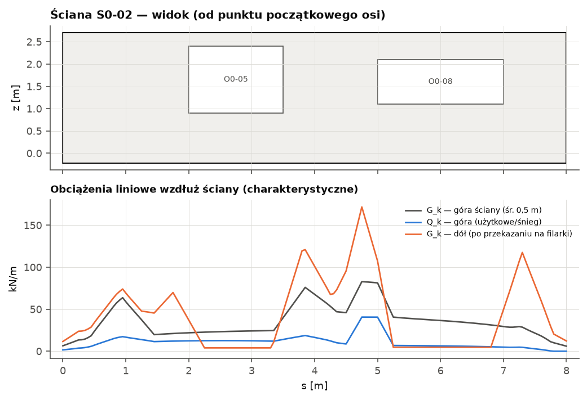

*Rys. Ściana S0-02: widok z otworami i rozkład obciążeń charakterystycznych wzdłuż osi.*

#### Zestawienie obciążeń

**Ciężar ściany — SZ1 — Ściana zewnętrzna nośna, silikat 18 + ETICS EPS 20**

| Warstwa | Obliczenie | g_k [kN/m²] | γ_G (6.10a) | g_d [kN/m²] | ξγ_G (6.10b) | g_d [kN/m²] |
|---|---|---|---|---|---|---|
| Tynk gipsowy maszynowy | 1,5 cm × 12,75 kN/m³ | 0,191 | 1,35 | 0,258 | 1,15 | 0,220 |
| Bloczek wapienno-piaskowy 18 cm, kl. 20 | 18,0 cm × 17,66 kN/m³ | 3,178 | 1,35 | 4,291 | 1,15 | 3,647 |
| Styropian grafitowy EPS 031 | 20,0 cm × 0,15 kN/m³ | 0,029 | 1,35 | 0,040 | 1,15 | 0,034 |
| Tynk silikonowy cienkowarstwowy, biały | 0,7 cm × 17,66 kN/m³ | 0,124 | 1,35 | 0,167 | 1,15 | 0,142 |
| **Razem g_k** |  | 3,523 |  | 4,756 |  | 4,042 |

**Obciążenia ściany (charakterystyczne)** — góra: z płyt i ścian wyżej; dół: po przekazaniu obciążeń znad otworów na filarki

| Przypadek | max q_góra [kN/m] | średnio q_dół [kN/m] | max q_dół [kN/m] |
|---|---|---|---|
| G | 121,76 | 44,59 | 210,68 |
| H | 2,87 | 0,68 | 2,87 |
| QA | 52,98 | 7,68 | 61,14 |
| QA_pA | 0,00 | 0,00 | 0,00 |
| QA_pB | 4,97 | 3,63 | 13,48 |
| S1 | 10,33 | 1,99 | 13,24 |
| S2 | 20,42 | 2,93 | 23,33 |
| SB2 | 18,67 | 1,70 | 18,67 |

#### Obliczenia

##### S0-02 — filarek 3,50–5,00 m (b = 1,50 m), 6.10a (wiodące: QA)

- Pole przekroju filarka: A = b·t = 1,50·0,18 = **0,270** m²
- Współczynnik η_A (A < 0,3 m²): η_A = (NA; interpolacja wg R5-63) = **1,07** *(NA do PN-EN 1996-1-1 [NZW])*
- Wytrzymałość charakterystyczna muru: f_k = K·f_b^0,85 = 0,60·20^0,85 = **7,66** MPa *((3.2) + NA tabl. NA.5 (K = 0,60, Ap2:2014-09))*
- Wytrzymałość obliczeniowa: f_d = f_k/γ_M · (1/η_A) = 7,66/1,7·0,930 = **4,19** MPa *(NA tabl. NA.1 (kat. I, zaprawa projektowana, klasa wykonania A))*
- Wysokość efektywna: h_ef = ρ₂·h = 1,000·2,94 = **2,935** m *((5.2), 5.5.1.2)*
- Smukłość: h_ef/t_ef = 2,935/0,180 = **16,31**
- Mimośród przypadkowy: e_init = h_ef/450 = 2935/450 = **6,5** mm *(5.5.1.1(4))*
- Mimośród na górze: e_g = M_g/N_g + e_init ≥ 0,05t = 2,11/114,0 + 0,0065 = **25,0** mm *((6.5))*
- Mimośród na dole: e_d = M_d/N_d + e_init ≥ 0,05t = 0,00/186,9 + 0,0065 = **9,0** mm *((6.5))*
- Współczynnik redukcyjny — góra: Φ_g = 1 − 2e_g/t = 1 − 2·25,0/180 = **0,722** *((6.4))*
- Współczynnik redukcyjny — dół: Φ_d = 1 − 2e_d/t = 1 − 2·9,0/180 = **0,900** *((6.4))*
- Mimośród w połowie wysokości: e_m = (M_md + M_w)/N_m + e_init = (1,05 + 0,00)/150,4 + 0,0065 = **13,5** mm *((6.7))*
- Mimośród od pełzania: e_k = 0,002·φ_∞·(h_ef/t_ef)·√(t·e_m) = 0,002·1,5·16,31·√(0,180·0,0135) = **2,4** mm *((6.8))*
- Mimośród całkowity: e_mk = e_m + e_k ≥ 0,05t = **15,9** mm *((6.6))*
- Współczynnik redukcyjny w połowie wysokości: Φ_m = A₁·exp(−u²/2), A₁ = 1 − 2e_mk/t, u = (λ − 0,063)/(0,73 − 1,17e_mk/t) = λ = 0,516, A₁ = 0,823, u = 0,723 = **0,634** *(zał. G (G.1–G.4), E = K_E·f_k)*
- Nośność: N_Rd = Φ·t·f_d = (góra / środek / dół) 0,722 / 0,634 / 0,900 · 180 mm · 4,19 MPa = **544,5 / 477,9 / 678,7** kN/m *((6.2))*

| Warunek | Efekt | Nośność / limit | η | Stan | Podstawa |
|---|---|---|---|---|---|
| Smukłość ściany | h_ef/t_ef = 16,3  | 27 = 27,0  | 60% | spełniony | 5.5.1.4 |
| Nośność — przekrój górny | N_Ed = 113,97 kN/m | N_Rd = 544,47 kN/m | 21% | spełniony | (6.2), (6.4) |
| Nośność — połowa wysokości | N_Ed = 150,41 kN/m | N_Rd = 477,93 kN/m | 31% | spełniony | (6.2), zał. G |
| Nośność — przekrój dolny | N_Ed = 186,85 kN/m | N_Rd = 678,71 kN/m | 28% | spełniony | (6.2), (6.4) |

> Filarek liczony jako ściana podparta górą i dołem, ρ₂ = 1,0 (bezpiecznie); siły N na 1 m = N/b.

##### S0-02 — zginanie z płaszczyzny (wiatr)

- Wskaźnik wytrzymałości (1 m): Z = t²/6 = 0,180²/6 = **5400** cm³/m
- Pasmo pionowe — moment: M_Ed = w_Ed·h²/8 = 1,332·2,94²/8 = **1,434** kNm/m
- Pasmo pionowe — nośność: M_Rd = (f_xk1/γ_M + σ_d)·Z = (0,20/1,7 + 0,229)·10³·0,00540 = **1,871** kNm/m *((6.15), 6.3.1(3) [NZW f_xk1])*

> Informacyjnie (dolne oszacowanie, bez efektu przesklepienia 6.3.2): Zginanie z płaszczyzny (pasmo pionowe — dolne oszacowanie): M_Ed = 1,434 ≤? M_Rd = 1,871 kNm/m (η = 77%). Ściana obciążona pionowo — miarodajne sprawdzenie 6.1.2 z mimośrodem e_hm od wiatru.

##### S0-02 — wiatr: przesklepienie między stropami (6.3.2)

- Smukłość łuku: l_a/t = 2,94/0,180 = **16,3**
- Nośność na obciążenie poziome: q_lat,d = f_d·(t/l_a)² = 4,50·10³·(0,180/2,94)² = **16,94** kN/m² *((6.20) [NZW])*
- Obliczeniowy rozpór łuku (przenoszony przez stropy/wieńce): N_ad = 1,5·f_d·t/10 = **121,6** kN/m *((6.19) [NZW])*

| Warunek | Efekt | Nośność / limit | η | Stan | Podstawa |
|---|---|---|---|---|---|
| Obciążenie poziome — przesklepienie | W_Ed = 1,33 kN/m² | q_lat,d = 16,94 kN/m² | 8% | spełniony | PN-EN 1996-1-1 6.3.2 |

##### S0-02 — docisk pod oparciem belki (s = 4,85 m)

- Pole docisku: A_b = l_b·b = 0,250·0,180 = **0,0450** m²
- Długość efektywna w połowie wysokości: l_efm = l_b + 2·(h_c/2)·tg 30° (ograniczona a₁) = **1,945** m *(rys. 6.2)*
- Współczynnik zwiększający: β = (1 + 0,3·a₁/h_c)·(1,5 − 1,1·A_b/A_ef) = (1 + 0,3·3,03/2,94)·(1,5 − 1,1·0,129) = **1,500** *((6.10))*
- Nośność na docisk: N_Rdc = β·A_b·f_d = 1,500·0,0450·4,50·10³ = **304,01** kN *((6.9))*

| Warunek | Efekt | Nośność / limit | η | Stan | Podstawa |
|---|---|---|---|---|---|
| Docisk | N_Edc = 61,71 kN | N_Rdc = 304,01 kN | 20% | spełniony | PN-EN 1996-1-1 (6.9) |

> Dodatkowo sprawdzić ścianę w połowie wysokości pod oparciem (6.1.3(4)) — obejmuje to sprawdzenie ściany/filarka.

#### Wnioski

**Przyjęto:** Mur: Bloczek wapienno-piaskowy 18 cm, kl. 20, f_d = 4,50 MPa (klasa wykonania A, γ_M = 1,7).  

### Poz. 9.8 — Ściana S0-03 (P0, zewnętrzna nośna)

Element modelu: `S0-03` · maks. wykorzystanie nośności η = 45% · wszystkie warunki spełnione

#### Opis i schemat statyczny

Ściana gr. konstrukcyjnej t = 18 cm, długość osi 10,00 m, wysokość h = 2,935 m (z −0,225 do 2,710); materiał: Bloczek wapienno-piaskowy 18 cm, kl. 20. Otwory: O0-04 (1,60 m), O0-03 (1,10 m).

Sprawdzono 3 odcinków (filarki ≤ 2 m między otworami — siła całkowita; dłuższe pasma — maks. średnia krocząca 1 m) dla 44 kombinacji; poniżej przypadek miarodajny. Mimośród reakcji stropu e = t/6 (zewn.) / 0,3·t/6 (wewn., niesymetria) [UPR]; wiatr jako moment w połowie wysokości w·h²/8.

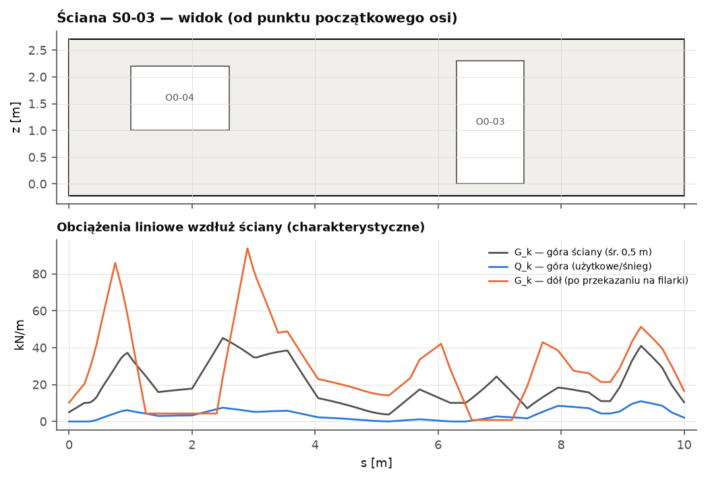

*Rys. Ściana S0-03: widok z otworami i rozkład obciążeń charakterystycznych wzdłuż osi.*

#### Zestawienie obciążeń

**Ciężar ściany — SZ1 — Ściana zewnętrzna nośna, silikat 18 + ETICS EPS 20**

| Warstwa | Obliczenie | g_k [kN/m²] | γ_G (6.10a) | g_d [kN/m²] | ξγ_G (6.10b) | g_d [kN/m²] |
|---|---|---|---|---|---|---|
| Tynk gipsowy maszynowy | 1,5 cm × 12,75 kN/m³ | 0,191 | 1,35 | 0,258 | 1,15 | 0,220 |
| Bloczek wapienno-piaskowy 18 cm, kl. 20 | 18,0 cm × 17,66 kN/m³ | 3,178 | 1,35 | 4,291 | 1,15 | 3,647 |
| Styropian grafitowy EPS 031 | 20,0 cm × 0,15 kN/m³ | 0,029 | 1,35 | 0,040 | 1,15 | 0,034 |
| Tynk silikonowy cienkowarstwowy, biały | 0,7 cm × 17,66 kN/m³ | 0,124 | 1,35 | 0,167 | 1,15 | 0,142 |
| **Razem g_k** |  | 3,523 |  | 4,756 |  | 4,042 |

**Obciążenia ściany (charakterystyczne)** — góra: z płyt i ścian wyżej; dół: po przekazaniu obciążeń znad otworów na filarki

| Przypadek | max q_góra [kN/m] | średnio q_dół [kN/m] | max q_dół [kN/m] |
|---|---|---|---|
| G | 46,14 | 28,85 | 102,76 |
| H | 1,47 | 0,36 | 2,31 |
| QA | 8,92 | 2,77 | 9,04 |
| QA_pA | 1,74 | 0,25 | 2,42 |
| QA_pB | 3,03 | 1,17 | 7,58 |
| S1 | 2,64 | 0,65 | 4,16 |
| S2 | 2,64 | 0,65 | 4,16 |

#### Obliczenia

##### S0-03 — ściana (odcinek 2,60–6,30 m), 6.10b (wiodące: W)

- Wytrzymałość charakterystyczna muru: f_k = K·f_b^0,85 = 0,60·20^0,85 = **7,66** MPa *((3.2) + NA tabl. NA.5 (K = 0,60, Ap2:2014-09))*
- Wytrzymałość obliczeniowa: f_d = f_k/γ_M = 7,66/1,7 = **4,50** MPa *(NA tabl. NA.1 (kat. I, zaprawa projektowana, klasa wykonania A))*
- Wysokość efektywna: h_ef = ρ₂·h = 0,750·2,94 = **2,201** m *((5.2), 5.5.1.2)*
- Smukłość: h_ef/t_ef = 2,201/0,180 = **12,23**
- Mimośród przypadkowy: e_init = h_ef/450 = 2201/450 = **4,9** mm *(5.5.1.1(4))*
- Mimośród na górze: e_g = M_g/N_g + e_init ≥ 0,05t = 0,62/51,0 + 0,0049 = **17,1** mm *((6.5))*
- Mimośród na dole: e_d = M_d/N_d + e_init ≥ 0,05t = 0,00/89,2 + 0,0049 = **9,0** mm *((6.5))*
- Współczynnik redukcyjny — góra: Φ_g = 1 − 2e_g/t = 1 − 2·17,1/180 = **0,810** *((6.4))*
- Współczynnik redukcyjny — dół: Φ_d = 1 − 2e_d/t = 1 − 2·9,0/180 = **0,900** *((6.4))*
- Mimośród w połowie wysokości: e_m = (M_md + M_w)/N_m + e_init = (0,31 + 1,43)/70,1 + 0,0049 = **29,8** mm *((6.7))*
- Mimośród od pełzania: e_k = 0 (h_ef/t_ef ≤ λ_c) = **0,0** mm *(6.1.2.2(2) [NZW NA])*
- Mimośród całkowity: e_mk = e_m + e_k ≥ 0,05t = **29,8** mm *((6.6))*
- Współczynnik redukcyjny w połowie wysokości: Φ_m = A₁·exp(−u²/2), A₁ = 1 − 2e_mk/t, u = (λ − 0,063)/(0,73 − 1,17e_mk/t) = λ = 0,387, A₁ = 0,669, u = 0,603 = **0,558** *(zał. G (G.1–G.4), E = K_E·f_k)*
- Nośność: N_Rd = Φ·t·f_d = (góra / środek / dół) 0,810 / 0,558 / 0,900 · 180 mm · 4,50 MPa = **656,9 / 452,2 / 729,6** kN/m *((6.2))*

| Warunek | Efekt | Nośność / limit | η | Stan | Podstawa |
|---|---|---|---|---|---|
| Smukłość ściany | h_ef/t_ef = 12,2  | 27 = 27,0  | 45% | spełniony | 5.5.1.4 |
| Nośność — przekrój górny | N_Ed = 50,98 kN/m | N_Rd = 656,86 kN/m | 8% | spełniony | (6.2), (6.4) |
| Nośność — połowa wysokości | N_Ed = 70,11 kN/m | N_Rd = 452,21 kN/m | 16% | spełniony | (6.2), zał. G |
| Nośność — przekrój dolny | N_Ed = 89,25 kN/m | N_Rd = 729,61 kN/m | 12% | spełniony | (6.2), (6.4) |

##### S0-03 — zginanie z płaszczyzny (wiatr)

- Wskaźnik wytrzymałości (1 m): Z = t²/6 = 0,180²/6 = **5400** cm³/m
- Pasmo pionowe — moment: M_Ed = w_Ed·h²/8 = 1,332·2,94²/8 = **1,434** kNm/m
- Pasmo pionowe — nośność: M_Rd = (f_xk1/γ_M + σ_d)·Z = (0,20/1,7 + 0,140)·10³·0,00540 = **1,393** kNm/m *((6.15), 6.3.1(3) [NZW f_xk1])*

> Informacyjnie (dolne oszacowanie, bez efektu przesklepienia 6.3.2): Zginanie z płaszczyzny (pasmo pionowe — dolne oszacowanie): M_Ed = 1,434 ≤? M_Rd = 1,393 kNm/m (η = 103%). Ściana obciążona pionowo — miarodajne sprawdzenie 6.1.2 z mimośrodem e_hm od wiatru.

##### S0-03 — wiatr: przesklepienie między stropami (6.3.2)

- Smukłość łuku: l_a/t = 2,94/0,180 = **16,3**
- Nośność na obciążenie poziome: q_lat,d = f_d·(t/l_a)² = 4,50·10³·(0,180/2,94)² = **16,94** kN/m² *((6.20) [NZW])*
- Obliczeniowy rozpór łuku (przenoszony przez stropy/wieńce): N_ad = 1,5·f_d·t/10 = **121,6** kN/m *((6.19) [NZW])*

| Warunek | Efekt | Nośność / limit | η | Stan | Podstawa |
|---|---|---|---|---|---|
| Obciążenie poziome — przesklepienie | W_Ed = 1,33 kN/m² | q_lat,d = 16,94 kN/m² | 8% | spełniony | PN-EN 1996-1-1 6.3.2 |

#### Wnioski

**Przyjęto:** Mur: Bloczek wapienno-piaskowy 18 cm, kl. 20, f_d = 4,50 MPa (klasa wykonania A, γ_M = 1,7).  

### Poz. 9.9 — Ściana S0-04 (P0, zewnętrzna nośna)

Element modelu: `S0-04` · maks. wykorzystanie nośności η = 45% · wszystkie warunki spełnione

#### Opis i schemat statyczny

Ściana gr. konstrukcyjnej t = 18 cm, długość osi 8,00 m, wysokość h = 2,935 m (z −0,225 do 2,710); materiał: Bloczek wapienno-piaskowy 18 cm, kl. 20. Otwory: O0-09 (1,50 m).

Sprawdzono 2 odcinków (filarki ≤ 2 m między otworami — siła całkowita; dłuższe pasma — maks. średnia krocząca 1 m) dla 44 kombinacji; poniżej przypadek miarodajny. Mimośród reakcji stropu e = t/6 (zewn.) / 0,3·t/6 (wewn., niesymetria) [UPR]; wiatr jako moment w połowie wysokości w·h²/8.

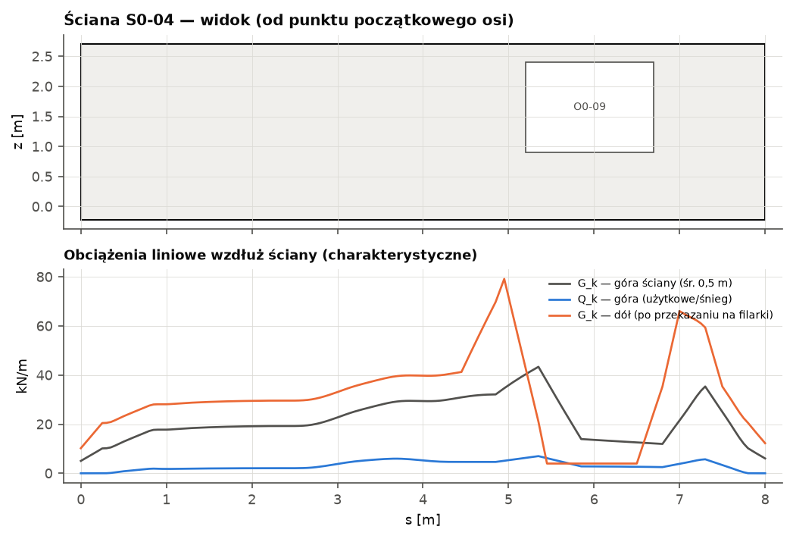

*Rys. Ściana S0-04: widok z otworami i rozkład obciążeń charakterystycznych wzdłuż osi.*

#### Zestawienie obciążeń

**Ciężar ściany — SZ1 — Ściana zewnętrzna nośna, silikat 18 + ETICS EPS 20**

| Warstwa | Obliczenie | g_k [kN/m²] | γ_G (6.10a) | g_d [kN/m²] | ξγ_G (6.10b) | g_d [kN/m²] |
|---|---|---|---|---|---|---|
| Tynk gipsowy maszynowy | 1,5 cm × 12,75 kN/m³ | 0,191 | 1,35 | 0,258 | 1,15 | 0,220 |
| Bloczek wapienno-piaskowy 18 cm, kl. 20 | 18,0 cm × 17,66 kN/m³ | 3,178 | 1,35 | 4,291 | 1,15 | 3,647 |
| Styropian grafitowy EPS 031 | 20,0 cm × 0,15 kN/m³ | 0,029 | 1,35 | 0,040 | 1,15 | 0,034 |
| Tynk silikonowy cienkowarstwowy, biały | 0,7 cm × 17,66 kN/m³ | 0,124 | 1,35 | 0,167 | 1,15 | 0,142 |
| **Razem g_k** |  | 3,523 |  | 4,756 |  | 4,042 |

**Obciążenia ściany (charakterystyczne)** — góra: z płyt i ścian wyżej; dół: po przekazaniu obciążeń znad otworów na filarki

| Przypadek | max q_góra [kN/m] | średnio q_dół [kN/m] | max q_dół [kN/m] |
|---|---|---|---|
| G | 44,66 | 31,31 | 89,18 |
| H | 1,48 | 0,51 | 2,07 |
| QA | 4,47 | 1,80 | 7,18 |
| QA_pA | 5,54 | 2,12 | 8,35 |
| QA_pB | 0,00 | 0,00 | 0,00 |
| S1 | 2,66 | 0,92 | 3,72 |
| S2 | 2,66 | 0,92 | 3,72 |

#### Obliczenia

##### S0-04 — ściana (odcinek 0,00–5,20 m), 6.10b (wiodące: W)

- Wytrzymałość charakterystyczna muru: f_k = K·f_b^0,85 = 0,60·20^0,85 = **7,66** MPa *((3.2) + NA tabl. NA.5 (K = 0,60, Ap2:2014-09))*
- Wytrzymałość obliczeniowa: f_d = f_k/γ_M = 7,66/1,7 = **4,50** MPa *(NA tabl. NA.1 (kat. I, zaprawa projektowana, klasa wykonania A))*
- Wysokość efektywna: h_ef = ρ₂·h = 0,750·2,94 = **2,201** m *((5.2), 5.5.1.2)*
- Smukłość: h_ef/t_ef = 2,201/0,180 = **12,23**
- Mimośród przypadkowy: e_init = h_ef/450 = 2201/450 = **4,9** mm *(5.5.1.1(4))*
- Mimośród na górze: e_g = M_g/N_g + e_init ≥ 0,05t = 0,57/48,7 + 0,0049 = **16,6** mm *((6.5))*
- Mimośród na dole: e_d = M_d/N_d + e_init ≥ 0,05t = 0,00/76,6 + 0,0049 = **9,0** mm *((6.5))*
- Współczynnik redukcyjny — góra: Φ_g = 1 − 2e_g/t = 1 − 2·16,6/180 = **0,815** *((6.4))*
- Współczynnik redukcyjny — dół: Φ_d = 1 − 2e_d/t = 1 − 2·9,0/180 = **0,900** *((6.4))*
- Mimośród w połowie wysokości: e_m = (M_md + M_w)/N_m + e_init = (0,29 + 1,43)/62,7 + 0,0049 = **32,3** mm *((6.7))*
- Mimośród od pełzania: e_k = 0 (h_ef/t_ef ≤ λ_c) = **0,0** mm *(6.1.2.2(2) [NZW NA])*
- Mimośród całkowity: e_mk = e_m + e_k ≥ 0,05t = **32,3** mm *((6.6))*
- Współczynnik redukcyjny w połowie wysokości: Φ_m = A₁·exp(−u²/2), A₁ = 1 − 2e_mk/t, u = (λ − 0,063)/(0,73 − 1,17e_mk/t) = λ = 0,387, A₁ = 0,641, u = 0,623 = **0,528** *(zał. G (G.1–G.4), E = K_E·f_k)*
- Nośność: N_Rd = Φ·t·f_d = (góra / środek / dół) 0,815 / 0,528 / 0,900 · 180 mm · 4,50 MPa = **660,7 / 427,7 / 729,6** kN/m *((6.2))*

| Warunek | Efekt | Nośność / limit | η | Stan | Podstawa |
|---|---|---|---|---|---|
| Smukłość ściany | h_ef/t_ef = 12,2  | 27 = 27,0  | 45% | spełniony | 5.5.1.4 |
| Nośność — przekrój górny | N_Ed = 48,70 kN/m | N_Rd = 660,72 kN/m | 7% | spełniony | (6.2), (6.4) |
| Nośność — połowa wysokości | N_Ed = 62,65 kN/m | N_Rd = 427,74 kN/m | 15% | spełniony | (6.2), zał. G |
| Nośność — przekrój dolny | N_Ed = 76,60 kN/m | N_Rd = 729,61 kN/m | 10% | spełniony | (6.2), (6.4) |

##### S0-04 — zginanie z płaszczyzny (wiatr)

- Wskaźnik wytrzymałości (1 m): Z = t²/6 = 0,180²/6 = **5400** cm³/m
- Pasmo pionowe — moment: M_Ed = w_Ed·h²/8 = 1,332·2,94²/8 = **1,434** kNm/m
- Pasmo pionowe — nośność: M_Rd = (f_xk1/γ_M + σ_d)·Z = (0,20/1,7 + 0,151)·10³·0,00540 = **1,448** kNm/m *((6.15), 6.3.1(3) [NZW f_xk1])*

> Informacyjnie (dolne oszacowanie, bez efektu przesklepienia 6.3.2): Zginanie z płaszczyzny (pasmo pionowe — dolne oszacowanie): M_Ed = 1,434 ≤? M_Rd = 1,448 kNm/m (η = 99%). Ściana obciążona pionowo — miarodajne sprawdzenie 6.1.2 z mimośrodem e_hm od wiatru.

##### S0-04 — wiatr: przesklepienie między stropami (6.3.2)

- Smukłość łuku: l_a/t = 2,94/0,180 = **16,3**
- Nośność na obciążenie poziome: q_lat,d = f_d·(t/l_a)² = 4,50·10³·(0,180/2,94)² = **16,94** kN/m² *((6.20) [NZW])*
- Obliczeniowy rozpór łuku (przenoszony przez stropy/wieńce): N_ad = 1,5·f_d·t/10 = **121,6** kN/m *((6.19) [NZW])*

| Warunek | Efekt | Nośność / limit | η | Stan | Podstawa |
|---|---|---|---|---|---|
| Obciążenie poziome — przesklepienie | W_Ed = 1,33 kN/m² | q_lat,d = 16,94 kN/m² | 8% | spełniony | PN-EN 1996-1-1 6.3.2 |

#### Wnioski

**Przyjęto:** Mur: Bloczek wapienno-piaskowy 18 cm, kl. 20, f_d = 4,50 MPa (klasa wykonania A, γ_M = 1,7).  

### Poz. 9.10 — Ściana S0-05 (P0, wewnętrzna nośna)

Element modelu: `S0-05` · maks. wykorzystanie nośności η = 45% · wszystkie warunki spełnione

#### Opis i schemat statyczny

Ściana gr. konstrukcyjnej t = 18 cm, długość osi 8,00 m, wysokość h = 2,935 m (z −0,225 do 2,710); materiał: Bloczek wapienno-piaskowy 18 cm, kl. 20. Otwory: O0-06 (1,20 m).

Sprawdzono 2 odcinków (filarki ≤ 2 m między otworami — siła całkowita; dłuższe pasma — maks. średnia krocząca 1 m) dla 34 kombinacji; poniżej przypadek miarodajny. Mimośród reakcji stropu e = t/6 (zewn.) / 0,3·t/6 (wewn., niesymetria) [UPR]; wiatr jako moment w połowie wysokości w·h²/8.

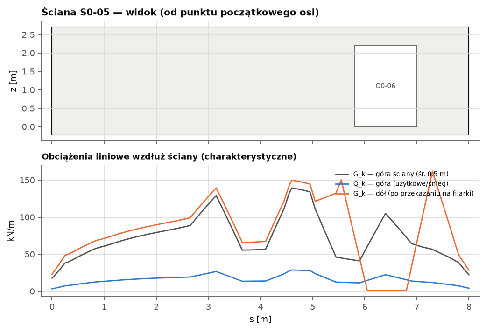

*Rys. Ściana S0-05: widok z otworami i rozkład obciążeń charakterystycznych wzdłuż osi.*

#### Zestawienie obciążeń

**Ciężar ściany — SW1 — Ściana wewnętrzna nośna, silikat 18**

| Warstwa | Obliczenie | g_k [kN/m²] | γ_G (6.10a) | g_d [kN/m²] | ξγ_G (6.10b) | g_d [kN/m²] |
|---|---|---|---|---|---|---|
| Tynk gipsowy maszynowy | 1,5 cm × 12,75 kN/m³ | 0,191 | 1,35 | 0,258 | 1,15 | 0,220 |
| Bloczek wapienno-piaskowy 18 cm, kl. 20 | 18,0 cm × 17,66 kN/m³ | 3,178 | 1,35 | 4,291 | 1,15 | 3,647 |
| Tynk gipsowy maszynowy | 1,5 cm × 12,75 kN/m³ | 0,191 | 1,35 | 0,258 | 1,15 | 0,220 |
| **Razem g_k** |  | 3,561 |  | 4,807 |  | 4,086 |

**Obciążenia ściany (charakterystyczne)** — góra: z płyt i ścian wyżej; dół: po przekazaniu obciążeń znad otworów na filarki

| Przypadek | max q_góra [kN/m] | średnio q_dół [kN/m] | max q_dół [kN/m] |
|---|---|---|---|
| G | 164,10 | 83,32 | 174,55 |
| H | 7,15 | 2,04 | 7,15 |
| QA | 13,87 | 10,47 | 25,03 |
| QA_pA | 6,68 | 4,68 | 11,40 |
| QA_pB | 7,38 | 5,79 | 13,64 |
| S1 | 12,88 | 3,68 | 12,88 |
| S2 | 12,88 | 3,68 | 12,88 |

#### Obliczenia

##### S0-05 — ściana (odcinek 0,00–5,80 m), 6.10a (wiodące: QA)

- Wytrzymałość charakterystyczna muru: f_k = K·f_b^0,85 = 0,60·20^0,85 = **7,66** MPa *((3.2) + NA tabl. NA.5 (K = 0,60, Ap2:2014-09))*
- Wytrzymałość obliczeniowa: f_d = f_k/γ_M = 7,66/1,7 = **4,50** MPa *(NA tabl. NA.1 (kat. I, zaprawa projektowana, klasa wykonania A))*
- Wysokość efektywna: h_ef = ρ₂·h = 0,750·2,94 = **2,201** m *((5.2), 5.5.1.2)*
- Smukłość: h_ef/t_ef = 2,201/0,180 = **12,23**
- Mimośród przypadkowy: e_init = h_ef/450 = 2201/450 = **4,9** mm *(5.5.1.1(4))*
- Mimośród na górze: e_g = M_g/N_g + e_init ≥ 0,05t = 0,82/187,6 + 0,0049 = **9,2** mm *((6.5))*
- Mimośród na dole: e_d = M_d/N_d + e_init ≥ 0,05t = 0,00/210,9 + 0,0049 = **9,0** mm *((6.5))*
- Współczynnik redukcyjny — góra: Φ_g = 1 − 2e_g/t = 1 − 2·9,2/180 = **0,897** *((6.4))*
- Współczynnik redukcyjny — dół: Φ_d = 1 − 2e_d/t = 1 − 2·9,0/180 = **0,900** *((6.4))*
- Mimośród w połowie wysokości: e_m = (M_md + M_w)/N_m + e_init = (0,41 + 0,00)/199,2 + 0,0049 = **6,9** mm *((6.7))*
- Mimośród od pełzania: e_k = 0 (h_ef/t_ef ≤ λ_c) = **0,0** mm *(6.1.2.2(2) [NZW NA])*
- Mimośród całkowity: e_mk = e_m + e_k ≥ 0,05t = **9,0** mm *((6.6))*
- Współczynnik redukcyjny w połowie wysokości: Φ_m = A₁·exp(−u²/2), A₁ = 1 − 2e_mk/t, u = (λ − 0,063)/(0,73 − 1,17e_mk/t) = λ = 0,387, A₁ = 0,900, u = 0,482 = **0,801** *(zał. G (G.1–G.4), E = K_E·f_k)*
- Nośność: N_Rd = Φ·t·f_d = (góra / środek / dół) 0,897 / 0,801 / 0,900 · 180 mm · 4,50 MPa = **727,4 / 649,6 / 729,6** kN/m *((6.2))*

| Warunek | Efekt | Nośność / limit | η | Stan | Podstawa |
|---|---|---|---|---|---|
| Smukłość ściany | h_ef/t_ef = 12,2  | 27 = 27,0  | 45% | spełniony | 5.5.1.4 |
| Nośność — przekrój górny | N_Ed = 187,60 kN/m | N_Rd = 727,37 kN/m | 26% | spełniony | (6.2), (6.4) |
| Nośność — połowa wysokości | N_Ed = 199,24 kN/m | N_Rd = 649,57 kN/m | 31% | spełniony | (6.2), zał. G |
| Nośność — przekrój dolny | N_Ed = 210,88 kN/m | N_Rd = 729,61 kN/m | 29% | spełniony | (6.2), (6.4) |

#### Wnioski

**Przyjęto:** Mur: Bloczek wapienno-piaskowy 18 cm, kl. 20, f_d = 4,50 MPa (klasa wykonania A, γ_M = 1,7).  

## Poz. 10 — Fundamenty

### Poz. 10.1 — Ława fundamentowa L1 (B = 0,60 m, h = 0,30 m, L = 10,00 m)

Element modelu: `L1` · maks. wykorzystanie nośności η = 133% · **WARUNKI NIESPEŁNIONE — patrz tabele warunków i wnioski**

#### Opis i schemat statyczny

Ława pod ścianami: S0-01; ściana fundamentowa h ≈ 0,58 m, t = 18 cm (ciężar jak beton 25 kN/m³ [UPR]). Spód ławy −1,100 m; teren przy ławie −0,35 m → D = 0,75 m (do nośności D_min = 0,75 m). Obciążenie miarodajne: maks. średnia krocząca na długości 2,0 m wzdłuż ławy (rozdział przez ścianę i ławę) [UPR].

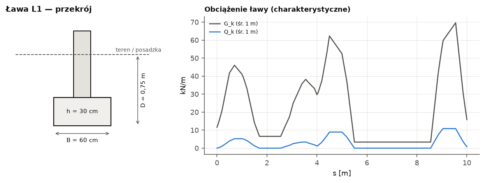

*Rys. Ława L1: przekrój poprzeczny i rozkład obciążenia wzdłuż ławy.*

#### Zestawienie obciążeń

| Przypadek | q_k [kN/m] (miarodajne) | Σ na ławie [kN] |
|---|---|---|
| H | 0,80 | 3,6 |
| G | 49,85 | 244,2 |
| S2 | 1,44 | 6,5 |
| S1 | 1,44 | 6,5 |
| QA | 3,92 | 18,3 |
| QA_pB | 2,57 | 11,6 |
| QA_pA | 1,51 | 6,7 |

#### Obliczenia

##### L1

- Ciężar ławy: g_ł = B·h·25 = 0,60·0,30·25 = **4,50** kN/m
- Grunt/posadzka na odsadzkach: g_o ≈ (B − t)·(D − h)·18 = **3,42** kN/m *([UPR])*
- Obciążenie charakterystyczne w poziomie posadowienia: V_k = G_k + ΣQ_k = 57,8 + 5,4 = **63,1** kN/m
- Obciążenie obliczeniowe (STR/GEO): V_d = max(6.10a; 6.10b) = max(83,2; 73,2) = **83,2** kN/m *(PN-EN 1990 + NA)*
- *Nośność podłoża*
- Parametry podłoża (charakterystyczne, M1: γ_φ = 1,0): φ'_k; c'_k; γ = **33,0°; 0,0 kPa; 18,5 kN/m³ — Piasek średni (Ps), średnio zagęszczony, I_D ≈ 0,6 [DANE PRZYKŁADOWE]**
- Współczynnik nośności (nadkład): N_q = e^(π·tg φ')·tg²(45° + φ'/2) = **26,09** *((D.2))*
- Współczynnik nośności (spójność): N_c = (N_q − 1)·ctg φ' = **38,64**
- Współczynnik nośności (ciężar gruntu): N_γ = 2·(N_q − 1)·tg φ' = **32,59**
- Szerokość efektywna ławy: B' = B − 2e_B = 0,60 − 2·0,000 = **0,600** m
- Naprężenie od nadkładu w poziomie posadowienia: q' = γ·D = 18,50·0,75 = **13,91** kPa
- Jednostkowy opór graniczny: R_k/A' = c'·N_c·s_c·i_c + q'·N_q·s_q·i_q + ½·γ'·B'·N_γ·s_γ·i_γ = 0,0 + 13,91·26,09·1,000·1,000 + 0,5·18,50·0,600·32,59·1,000·1,000 = **543,8** kPa *((D.2))*
- Opór graniczny (na 1 m ławy): R_k = (R_k/A')·A' = 543,8·0,600 = **326,3** kN/m
- Obliczeniowy opór graniczny (DA2*): R_d = R_k/γ_R;v = 326,3/1,40 = **233,1** kN/m *(NA.2.6 (Ap2:2010), tabl. A.5)*
- *Osiadanie*
- Nacisk pod fundamentem (SLS): q = **105,2** kPa
- Moduł edometryczny: M₀ = **100** MPa *([ZAŁ — do badań])*
- Zasięg strefy aktywnej: z_max: σ_z ≤ 0,2·σ'_v0 = (warstwy h_i = 0,150 m) = **2,85** m *(PN-EN 1997-1 6.6.2(6))*
- Osiadanie: s = Σ σ_z,i·h_i/M₀ = Σ (19 warstw) = **1,1** mm
- Głębokość posadowienia: D (od terenu/posadzki) = **0,75** m
- Odpór obliczeniowy: σ_gd = V_d/B = 83,2/0,60 = **138,6** kPa
- Wysięg odsadzki: a = (B − t)/2 = (0,60 − 0,18)/2 = **0,210** m
- Warunek ławy niezbrojonej poprzecznie: 0,85·h_F/a ≥ √(3·σ_gd/f_ctd,pl), f_ctd,pl = 0,8·f_ctk,0,05/γ_c = 1,21 ≥ √(3·0,1386/1,029) = 0,636 = **spełniony** *(PN-EN 1992-1-1 (12.13), α_ct,pl = 0,8 [NZW NA])*
- Zbrojenie podłużne (konstrukcyjne, rozkład nierównomiernych osiadań): A_s ≥ max(0,0013·B·d; 4φ12) = max(0,0013·600·254; 452) = **452** mm² *(9.2.1.1 (analogia belki) [UPR])*
- Przyjęto zbrojenie podłużne: **4φ12 (A_s = 4,52 cm²), strzemiona φ6 co 30 cm**

| Warunek | Efekt | Nośność / limit | η | Stan | Podstawa |
|---|---|---|---|---|---|
| Nośność podłoża (GEO, DA2*) | V_d = 83,2 kN/m | R_d = 233,1 kN/m | 36% | spełniony | PN-EN 1997-1 (6.1), NA.2.6 |
| Osiadanie | s = 1,1 mm | s_max = 50,0 mm | 2% | spełniony | PN-EN 1997-1 NA.3 (tabl. NA.3) |
| Głębokość posadowienia (R5 3.8: zewn. ≥ 1,0 m, wewn. ≥ 0,5 m) | D_min = 1,00 m | D = 0,75 m | 133% | **NIESPEŁNIONY** | W-284 |
| Ława betonowa — odsadzka (12.13) | √(3σ/f) = 0,636  | 0,85h/a = 1,214  | 52% | spełniony | (12.13) |

> Parametry gruntu PRZYKŁADOWE (brief) — w II kat. geotechnicznej wymagane badania CPT/DPL (W-282, E-04).
> Osiadanie orientacyjne: pominięto wpływ fundamentów sąsiednich i odciążenie wykopem; M₀ — dane przykładowe.
> Zagłębienie od terenu D = 0,75 m < 1,00 m — pogłębić posadowienie (W-284).

#### Wnioski

**Przyjęto:** Ława 60×30 cm, C25/30; zbrojenie podłużne 4φ12 (A_s = 4,52 cm²), strzemiona φ6 co 30 cm; poprzecznie: nie wymaga zbrojenia poprzecznego (strzemiona konstrukcyjne φ6 co 30 cm).  

### Poz. 10.2 — Ława fundamentowa L2 (B = 0,60 m, h = 0,30 m, L = 8,00 m)

Element modelu: `L2` · maks. wykorzystanie nośności η = 118% · **WARUNKI NIESPEŁNIONE — patrz tabele warunków i wnioski**

#### Opis i schemat statyczny

Ława pod ścianami: S0-02; ściana fundamentowa h ≈ 0,58 m, t = 18 cm (ciężar jak beton 25 kN/m³ [UPR]). Spód ławy −1,100 m; teren przy ławie −0,25 m → D = 0,85 m (do nośności D_min = 0,85 m). Obciążenie miarodajne: maks. średnia krocząca na długości 2,0 m wzdłuż ławy (rozdział przez ścianę i ławę) [UPR].

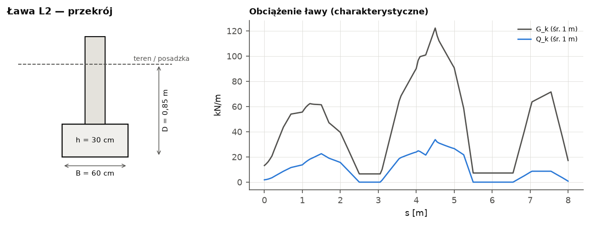

*Rys. Ława L2: przekrój poprzeczny i rozkład obciążenia wzdłuż ławy.*

#### Zestawienie obciążeń

| Przypadek | q_k [kN/m] (miarodajne) | Σ na ławie [kN] |
|---|---|---|
| H | 1,52 | 5,5 |
| QA | 17,03 | 61,5 |
| QA_pB | 7,35 | 29,1 |
| QA_pA | 0,00 | 0,0 |
| S2 | 6,72 | 23,4 |
| S1 | 4,55 | 15,9 |
| G | 90,48 | 377,4 |
| SB2 | 3,96 | 13,6 |

#### Obliczenia

##### L2

- Ciężar ławy: g_ł = B·h·25 = 0,60·0,30·25 = **4,50** kN/m
- Grunt/posadzka na odsadzkach: g_o ≈ (B − t)·(D − h)·18 = **4,15** kN/m *([UPR])*
- Obciążenie charakterystyczne w poziomie posadowienia: V_k = G_k + ΣQ_k = 99,1 + 23,7 = **122,9** kN/m
- Obciążenie obliczeniowe (STR/GEO): V_d = max(6.10a; 6.10b) = max(156,7; 144,3) = **156,7** kN/m *(PN-EN 1990 + NA)*
- *Nośność podłoża*
- Parametry podłoża (charakterystyczne, M1: γ_φ = 1,0): φ'_k; c'_k; γ = **33,0°; 0,0 kPa; 18,5 kN/m³ — Piasek średni (Ps), średnio zagęszczony, I_D ≈ 0,6 [DANE PRZYKŁADOWE]**
- Współczynnik nośności (nadkład): N_q = e^(π·tg φ')·tg²(45° + φ'/2) = **26,09** *((D.2))*
- Współczynnik nośności (spójność): N_c = (N_q − 1)·ctg φ' = **38,64**
- Współczynnik nośności (ciężar gruntu): N_γ = 2·(N_q − 1)·tg φ' = **32,59**
- Szerokość efektywna ławy: B' = B − 2e_B = 0,60 − 2·0,000 = **0,600** m
- Naprężenie od nadkładu w poziomie posadowienia: q' = γ·D = 18,50·0,85 = **15,70** kPa
- Jednostkowy opór graniczny: R_k/A' = c'·N_c·s_c·i_c + q'·N_q·s_q·i_q + ½·γ'·B'·N_γ·s_γ·i_γ = 0,0 + 15,70·26,09·1,000·1,000 + 0,5·18,50·0,600·32,59·1,000·1,000 = **590,6** kPa *((D.2))*
- Opór graniczny (na 1 m ławy): R_k = (R_k/A')·A' = 590,6·0,600 = **354,4** kN/m
- Obliczeniowy opór graniczny (DA2*): R_d = R_k/γ_R;v = 354,4/1,40 = **253,1** kN/m *(NA.2.6 (Ap2:2010), tabl. A.5)*
- *Osiadanie*
- Nacisk pod fundamentem (SLS): q = **204,8** kPa
- Moduł edometryczny: M₀ = **100** MPa *([ZAŁ — do badań])*
- Zasięg strefy aktywnej: z_max: σ_z ≤ 0,2·σ'_v0 = (warstwy h_i = 0,150 m) = **4,05** m *(PN-EN 1997-1 6.6.2(6))*
- Osiadanie: s = Σ σ_z,i·h_i/M₀ = Σ (27 warstw) = **2,4** mm
- Głębokość posadowienia: D (od terenu/posadzki) = **0,85** m
- Odpór obliczeniowy: σ_gd = V_d/B = 156,7/0,60 = **261,2** kPa
- Wysięg odsadzki: a = (B − t)/2 = (0,60 − 0,18)/2 = **0,210** m
- Warunek ławy niezbrojonej poprzecznie: 0,85·h_F/a ≥ √(3·σ_gd/f_ctd,pl), f_ctd,pl = 0,8·f_ctk,0,05/γ_c = 1,21 ≥ √(3·0,2612/1,029) = 0,873 = **spełniony** *(PN-EN 1992-1-1 (12.13), α_ct,pl = 0,8 [NZW NA])*
- Zbrojenie podłużne (konstrukcyjne, rozkład nierównomiernych osiadań): A_s ≥ max(0,0013·B·d; 4φ12) = max(0,0013·600·254; 452) = **452** mm² *(9.2.1.1 (analogia belki) [UPR])*
- Przyjęto zbrojenie podłużne: **4φ12 (A_s = 4,52 cm²), strzemiona φ6 co 30 cm**

| Warunek | Efekt | Nośność / limit | η | Stan | Podstawa |
|---|---|---|---|---|---|
| Nośność podłoża (GEO, DA2*) | V_d = 156,7 kN/m | R_d = 253,1 kN/m | 62% | spełniony | PN-EN 1997-1 (6.1), NA.2.6 |
| Osiadanie | s = 2,4 mm | s_max = 50,0 mm | 5% | spełniony | PN-EN 1997-1 NA.3 (tabl. NA.3) |
| Głębokość posadowienia (R5 3.8: zewn. ≥ 1,0 m, wewn. ≥ 0,5 m) | D_min = 1,00 m | D = 0,85 m | 118% | **NIESPEŁNIONY** | W-284 |
| Ława betonowa — odsadzka (12.13) | √(3σ/f) = 0,873  | 0,85h/a = 1,214  | 72% | spełniony | (12.13) |

> Parametry gruntu PRZYKŁADOWE (brief) — w II kat. geotechnicznej wymagane badania CPT/DPL (W-282, E-04).
> Osiadanie orientacyjne: pominięto wpływ fundamentów sąsiednich i odciążenie wykopem; M₀ — dane przykładowe.
> Zagłębienie od terenu D = 0,85 m < 1,00 m — pogłębić posadowienie (W-284).

#### Wnioski

**Przyjęto:** Ława 60×30 cm, C25/30; zbrojenie podłużne 4φ12 (A_s = 4,52 cm²), strzemiona φ6 co 30 cm; poprzecznie: nie wymaga zbrojenia poprzecznego (strzemiona konstrukcyjne φ6 co 30 cm).  

### Poz. 10.3 — Ława fundamentowa L3 (B = 0,60 m, h = 0,30 m, L = 10,00 m)

Element modelu: `L3` · maks. wykorzystanie nośności η = 119% · **WARUNKI NIESPEŁNIONE — patrz tabele warunków i wnioski**

#### Opis i schemat statyczny

Ława pod ścianami: S0-03; ściana fundamentowa h ≈ 0,58 m, t = 18 cm (ciężar jak beton 25 kN/m³ [UPR]). Spód ławy −1,100 m; teren przy ławie −0,26 m → D = 0,84 m (do nośności D_min = 0,84 m). Obciążenie miarodajne: maks. średnia krocząca na długości 2,0 m wzdłuż ławy (rozdział przez ścianę i ławę) [UPR].

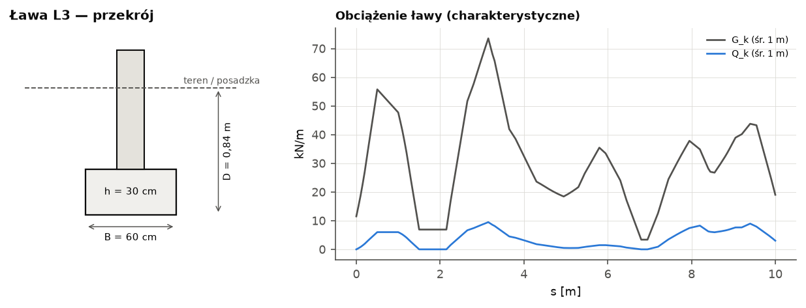

*Rys. Ława L3: przekrój poprzeczny i rozkład obciążenia wzdłuż ławy.*

#### Zestawienie obciążeń

| Przypadek | q_k [kN/m] (miarodajne) | Σ na ławie [kN] |
|---|---|---|
| H | 0,74 | 3,6 |
| G | 50,78 | 314,4 |
| S2 | 1,34 | 6,5 |
| S1 | 1,34 | 6,5 |
| QA | 3,90 | 27,7 |
| QA_pB | 3,74 | 11,7 |
| QA_pA | 0,00 | 2,5 |

#### Obliczenia

##### L3

- Ciężar ławy: g_ł = B·h·25 = 0,60·0,30·25 = **4,50** kN/m
- Grunt/posadzka na odsadzkach: g_o ≈ (B − t)·(D − h)·18 = **4,08** kN/m *([UPR])*
- Obciążenie charakterystyczne w poziomie posadowienia: V_k = G_k + ΣQ_k = 59,4 + 5,2 = **64,6** kN/m
- Obciążenie obliczeniowe (STR/GEO): V_d = max(6.10a; 6.10b) = max(85,2; 75,0) = **85,2** kN/m *(PN-EN 1990 + NA)*
- *Nośność podłoża*
- Parametry podłoża (charakterystyczne, M1: γ_φ = 1,0): φ'_k; c'_k; γ = **33,0°; 0,0 kPa; 18,5 kN/m³ — Piasek średni (Ps), średnio zagęszczony, I_D ≈ 0,6 [DANE PRZYKŁADOWE]**
- Współczynnik nośności (nadkład): N_q = e^(π·tg φ')·tg²(45° + φ'/2) = **26,09** *((D.2))*
- Współczynnik nośności (spójność): N_c = (N_q − 1)·ctg φ' = **38,64**
- Współczynnik nośności (ciężar gruntu): N_γ = 2·(N_q − 1)·tg φ' = **32,59**
- Szerokość efektywna ławy: B' = B − 2e_B = 0,60 − 2·0,000 = **0,600** m
- Naprężenie od nadkładu w poziomie posadowienia: q' = γ·D = 18,50·0,84 = **15,52** kPa
- Jednostkowy opór graniczny: R_k/A' = c'·N_c·s_c·i_c + q'·N_q·s_q·i_q + ½·γ'·B'·N_γ·s_γ·i_γ = 0,0 + 15,52·26,09·1,000·1,000 + 0,5·18,50·0,600·32,59·1,000·1,000 = **585,9** kPa *((D.2))*
- Opór graniczny (na 1 m ławy): R_k = (R_k/A')·A' = 585,9·0,600 = **351,5** kN/m
- Obliczeniowy opór graniczny (DA2*): R_d = R_k/γ_R;v = 351,5/1,40 = **251,1** kN/m *(NA.2.6 (Ap2:2010), tabl. A.5)*
- *Osiadanie*
- Nacisk pod fundamentem (SLS): q = **107,7** kPa
- Moduł edometryczny: M₀ = **100** MPa *([ZAŁ — do badań])*
- Zasięg strefy aktywnej: z_max: σ_z ≤ 0,2·σ'_v0 = (warstwy h_i = 0,150 m) = **2,85** m *(PN-EN 1997-1 6.6.2(6))*
- Osiadanie: s = Σ σ_z,i·h_i/M₀ = Σ (19 warstw) = **1,1** mm
- Głębokość posadowienia: D (od terenu/posadzki) = **0,84** m
- Odpór obliczeniowy: σ_gd = V_d/B = 85,2/0,60 = **142,1** kPa
- Wysięg odsadzki: a = (B − t)/2 = (0,60 − 0,18)/2 = **0,210** m
- Warunek ławy niezbrojonej poprzecznie: 0,85·h_F/a ≥ √(3·σ_gd/f_ctd,pl), f_ctd,pl = 0,8·f_ctk,0,05/γ_c = 1,21 ≥ √(3·0,1421/1,029) = 0,644 = **spełniony** *(PN-EN 1992-1-1 (12.13), α_ct,pl = 0,8 [NZW NA])*
- Zbrojenie podłużne (konstrukcyjne, rozkład nierównomiernych osiadań): A_s ≥ max(0,0013·B·d; 4φ12) = max(0,0013·600·254; 452) = **452** mm² *(9.2.1.1 (analogia belki) [UPR])*
- Przyjęto zbrojenie podłużne: **4φ12 (A_s = 4,52 cm²), strzemiona φ6 co 30 cm**

| Warunek | Efekt | Nośność / limit | η | Stan | Podstawa |
|---|---|---|---|---|---|
| Nośność podłoża (GEO, DA2*) | V_d = 85,2 kN/m | R_d = 251,1 kN/m | 34% | spełniony | PN-EN 1997-1 (6.1), NA.2.6 |
| Osiadanie | s = 1,1 mm | s_max = 50,0 mm | 2% | spełniony | PN-EN 1997-1 NA.3 (tabl. NA.3) |
| Głębokość posadowienia (R5 3.8: zewn. ≥ 1,0 m, wewn. ≥ 0,5 m) | D_min = 1,00 m | D = 0,84 m | 119% | **NIESPEŁNIONY** | W-284 |
| Ława betonowa — odsadzka (12.13) | √(3σ/f) = 0,644  | 0,85h/a = 1,214  | 53% | spełniony | (12.13) |

> Parametry gruntu PRZYKŁADOWE (brief) — w II kat. geotechnicznej wymagane badania CPT/DPL (W-282, E-04).
> Osiadanie orientacyjne: pominięto wpływ fundamentów sąsiednich i odciążenie wykopem; M₀ — dane przykładowe.
> Zagłębienie od terenu D = 0,84 m < 1,00 m — pogłębić posadowienie (W-284).

#### Wnioski

**Przyjęto:** Ława 60×30 cm, C25/30; zbrojenie podłużne 4φ12 (A_s = 4,52 cm²), strzemiona φ6 co 30 cm; poprzecznie: nie wymaga zbrojenia poprzecznego (strzemiona konstrukcyjne φ6 co 30 cm).  

### Poz. 10.4 — Ława fundamentowa L4 (B = 0,60 m, h = 0,30 m, L = 8,00 m)

Element modelu: `L4` · maks. wykorzystanie nośności η = 134% · **WARUNKI NIESPEŁNIONE — patrz tabele warunków i wnioski**

#### Opis i schemat statyczny

Ława pod ścianami: S0-04; ściana fundamentowa h ≈ 0,58 m, t = 18 cm (ciężar jak beton 25 kN/m³ [UPR]). Spód ławy −1,100 m; teren przy ławie −0,35 m → D = 0,75 m (do nośności D_min = 0,75 m). Obciążenie miarodajne: maks. średnia krocząca na długości 2,0 m wzdłuż ławy (rozdział przez ścianę i ławę) [UPR].

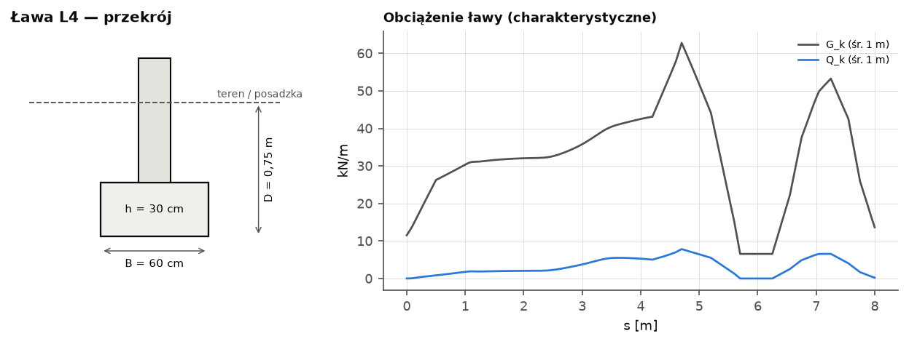

*Rys. Ława L4: przekrój poprzeczny i rozkład obciążenia wzdłuż ławy.*

#### Zestawienie obciążeń

| Przypadek | q_k [kN/m] (miarodajne) | Σ na ławie [kN] |
|---|---|---|
| H | 0,81 | 4,1 |
| G | 52,08 | 271,2 |
| S2 | 1,46 | 7,4 |
| S1 | 1,46 | 7,4 |
| QA | 4,40 | 14,4 |
| QA_pB | 0,00 | 0,0 |
| QA_pA | 5,25 | 17,0 |

#### Obliczenia

##### L4

- Ciężar ławy: g_ł = B·h·25 = 0,60·0,30·25 = **4,50** kN/m
- Grunt/posadzka na odsadzkach: g_o ≈ (B − t)·(D − h)·18 = **3,39** kN/m *([UPR])*
- Obciążenie charakterystyczne w poziomie posadowienia: V_k = G_k + ΣQ_k = 60,0 + 5,9 = **65,8** kN/m
- Obciążenie obliczeniowe (STR/GEO): V_d = max(6.10a; 6.10b) = max(86,7; 76,5) = **86,7** kN/m *(PN-EN 1990 + NA)*
- *Nośność podłoża*
- Parametry podłoża (charakterystyczne, M1: γ_φ = 1,0): φ'_k; c'_k; γ = **33,0°; 0,0 kPa; 18,5 kN/m³ — Piasek średni (Ps), średnio zagęszczony, I_D ≈ 0,6 [DANE PRZYKŁADOWE]**
- Współczynnik nośności (nadkład): N_q = e^(π·tg φ')·tg²(45° + φ'/2) = **26,09** *((D.2))*
- Współczynnik nośności (spójność): N_c = (N_q − 1)·ctg φ' = **38,64**
- Współczynnik nośności (ciężar gruntu): N_γ = 2·(N_q − 1)·tg φ' = **32,59**
- Szerokość efektywna ławy: B' = B − 2e_B = 0,60 − 2·0,000 = **0,600** m
- Naprężenie od nadkładu w poziomie posadowienia: q' = γ·D = 18,50·0,75 = **13,84** kPa
- Jednostkowy opór graniczny: R_k/A' = c'·N_c·s_c·i_c + q'·N_q·s_q·i_q + ½·γ'·B'·N_γ·s_γ·i_γ = 0,0 + 13,84·26,09·1,000·1,000 + 0,5·18,50·0,600·32,59·1,000·1,000 = **542,0** kPa *((D.2))*
- Opór graniczny (na 1 m ławy): R_k = (R_k/A')·A' = 542,0·0,600 = **325,2** kN/m
- Obliczeniowy opór graniczny (DA2*): R_d = R_k/γ_R;v = 325,2/1,40 = **232,3** kN/m *(NA.2.6 (Ap2:2010), tabl. A.5)*
- *Osiadanie*
- Nacisk pod fundamentem (SLS): q = **109,7** kPa
- Moduł edometryczny: M₀ = **100** MPa *([ZAŁ — do badań])*
- Zasięg strefy aktywnej: z_max: σ_z ≤ 0,2·σ'_v0 = (warstwy h_i = 0,150 m) = **3,00** m *(PN-EN 1997-1 6.6.2(6))*
- Osiadanie: s = Σ σ_z,i·h_i/M₀ = Σ (20 warstw) = **1,2** mm
- Głębokość posadowienia: D (od terenu/posadzki) = **0,75** m
- Odpór obliczeniowy: σ_gd = V_d/B = 86,7/0,60 = **144,4** kPa
- Wysięg odsadzki: a = (B − t)/2 = (0,60 − 0,18)/2 = **0,210** m
- Warunek ławy niezbrojonej poprzecznie: 0,85·h_F/a ≥ √(3·σ_gd/f_ctd,pl), f_ctd,pl = 0,8·f_ctk,0,05/γ_c = 1,21 ≥ √(3·0,1444/1,029) = 0,649 = **spełniony** *(PN-EN 1992-1-1 (12.13), α_ct,pl = 0,8 [NZW NA])*
- Zbrojenie podłużne (konstrukcyjne, rozkład nierównomiernych osiadań): A_s ≥ max(0,0013·B·d; 4φ12) = max(0,0013·600·254; 452) = **452** mm² *(9.2.1.1 (analogia belki) [UPR])*
- Przyjęto zbrojenie podłużne: **4φ12 (A_s = 4,52 cm²), strzemiona φ6 co 30 cm**

| Warunek | Efekt | Nośność / limit | η | Stan | Podstawa |
|---|---|---|---|---|---|
| Nośność podłoża (GEO, DA2*) | V_d = 86,7 kN/m | R_d = 232,3 kN/m | 37% | spełniony | PN-EN 1997-1 (6.1), NA.2.6 |
| Osiadanie | s = 1,2 mm | s_max = 50,0 mm | 2% | spełniony | PN-EN 1997-1 NA.3 (tabl. NA.3) |
| Głębokość posadowienia (R5 3.8: zewn. ≥ 1,0 m, wewn. ≥ 0,5 m) | D_min = 1,00 m | D = 0,75 m | 134% | **NIESPEŁNIONY** | W-284 |
| Ława betonowa — odsadzka (12.13) | √(3σ/f) = 0,649  | 0,85h/a = 1,214  | 53% | spełniony | (12.13) |

> Parametry gruntu PRZYKŁADOWE (brief) — w II kat. geotechnicznej wymagane badania CPT/DPL (W-282, E-04).
> Osiadanie orientacyjne: pominięto wpływ fundamentów sąsiednich i odciążenie wykopem; M₀ — dane przykładowe.
> Zagłębienie od terenu D = 0,75 m < 1,00 m — pogłębić posadowienie (W-284).

#### Wnioski

**Przyjęto:** Ława 60×30 cm, C25/30; zbrojenie podłużne 4φ12 (A_s = 4,52 cm²), strzemiona φ6 co 30 cm; poprzecznie: nie wymaga zbrojenia poprzecznego (strzemiona konstrukcyjne φ6 co 30 cm).  

### Poz. 10.5 — Ława fundamentowa L5 (B = 0,50 m, h = 0,30 m, L = 8,00 m)

Element modelu: `L5` · maks. wykorzystanie nośności η = 96% · wszystkie warunki spełnione

#### Opis i schemat statyczny

Ława pod ścianami: S0-05; ściana fundamentowa h ≈ 0,58 m, t = 18 cm (ciężar jak beton 25 kN/m³ [UPR]). Spód ławy −1,100 m; ława wewnętrzna, posadzka −0,225 m → D = 0,88 m (do nośności D_min = 0,88 m). Obciążenie miarodajne: maks. średnia krocząca na długości 2,0 m wzdłuż ławy (rozdział przez ścianę i ławę) [UPR].

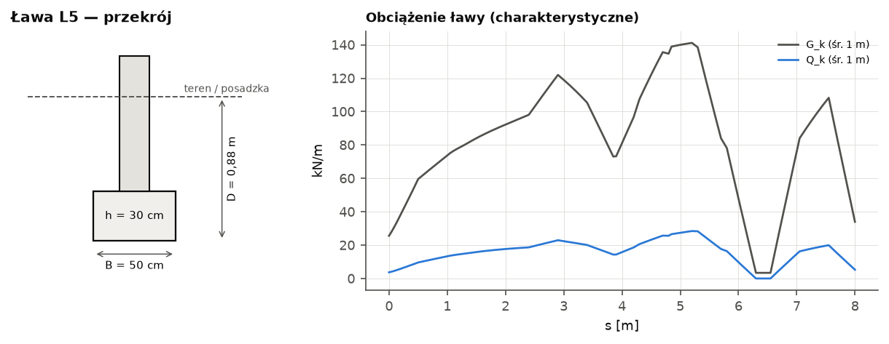

*Rys. Ława L5: przekrój poprzeczny i rozkład obciążenia wzdłuż ławy.*

#### Zestawienie obciążeń

| Przypadek | q_k [kN/m] (miarodajne) | Σ na ławie [kN] |
|---|---|---|
| H | 2,90 | 16,4 |
| G | 123,00 | 687,3 |
| S2 | 5,23 | 29,4 |
| S1 | 5,23 | 29,4 |
| QA | 16,31 | 83,8 |
| QA_pB | 8,68 | 46,4 |
| QA_pA | 7,63 | 37,4 |

#### Obliczenia

##### L5

- Ciężar ławy: g_ł = B·h·25 = 0,50·0,30·25 = **3,75** kN/m
- Grunt/posadzka na odsadzkach: g_o ≈ (B − t)·(D − h)·18 = **3,31** kN/m *([UPR])*
- Obciążenie charakterystyczne w poziomie posadowienia: V_k = G_k + ΣQ_k = 130,1 + 21,5 = **151,6** kN/m
- Obciążenie obliczeniowe (STR/GEO): V_d = max(6.10a; 6.10b) = max(196,6; 177,6) = **196,6** kN/m *(PN-EN 1990 + NA)*
- *Nośność podłoża*
- Parametry podłoża (charakterystyczne, M1: γ_φ = 1,0): φ'_k; c'_k; γ = **33,0°; 0,0 kPa; 18,5 kN/m³ — Piasek średni (Ps), średnio zagęszczony, I_D ≈ 0,6 [DANE PRZYKŁADOWE]**
- Współczynnik nośności (nadkład): N_q = e^(π·tg φ')·tg²(45° + φ'/2) = **26,09** *((D.2))*
- Współczynnik nośności (spójność): N_c = (N_q − 1)·ctg φ' = **38,64**
- Współczynnik nośności (ciężar gruntu): N_γ = 2·(N_q − 1)·tg φ' = **32,59**
- Szerokość efektywna ławy: B' = B − 2e_B = 0,50 − 2·0,000 = **0,500** m
- Naprężenie od nadkładu w poziomie posadowienia: q' = γ·D = 18,50·0,88 = **16,19** kPa
- Jednostkowy opór graniczny: R_k/A' = c'·N_c·s_c·i_c + q'·N_q·s_q·i_q + ½·γ'·B'·N_γ·s_γ·i_γ = 0,0 + 16,19·26,09·1,000·1,000 + 0,5·18,50·0,500·32,59·1,000·1,000 = **573,1** kPa *((D.2))*
- Opór graniczny (na 1 m ławy): R_k = (R_k/A')·A' = 573,1·0,500 = **286,5** kN/m
- Obliczeniowy opór graniczny (DA2*): R_d = R_k/γ_R;v = 286,5/1,40 = **204,7** kN/m *(NA.2.6 (Ap2:2010), tabl. A.5)*
- *Osiadanie*
- Nacisk pod fundamentem (SLS): q = **303,2** kPa
- Moduł edometryczny: M₀ = **100** MPa *([ZAŁ — do badań])*
- Zasięg strefy aktywnej: z_max: σ_z ≤ 0,2·σ'_v0 = (warstwy h_i = 0,125 m) = **4,25** m *(PN-EN 1997-1 6.6.2(6))*
- Osiadanie: s = Σ σ_z,i·h_i/M₀ = Σ (34 warstw) = **3,1** mm
- Głębokość posadowienia: D (od terenu/posadzki) = **0,88** m
- Odpór obliczeniowy: σ_gd = V_d/B = 196,6/0,50 = **393,3** kPa
- Wysięg odsadzki: a = (B − t)/2 = (0,50 − 0,18)/2 = **0,160** m
- Warunek ławy niezbrojonej poprzecznie: 0,85·h_F/a ≥ √(3·σ_gd/f_ctd,pl), f_ctd,pl = 0,8·f_ctk,0,05/γ_c = 1,59 ≥ √(3·0,3933/1,029) = 1,071 = **spełniony** *(PN-EN 1992-1-1 (12.13), α_ct,pl = 0,8 [NZW NA])*
- Zbrojenie podłużne (konstrukcyjne, rozkład nierównomiernych osiadań): A_s ≥ max(0,0013·B·d; 4φ12) = max(0,0013·500·254; 452) = **452** mm² *(9.2.1.1 (analogia belki) [UPR])*
- Przyjęto zbrojenie podłużne: **4φ12 (A_s = 4,52 cm²), strzemiona φ6 co 30 cm**

| Warunek | Efekt | Nośność / limit | η | Stan | Podstawa |
|---|---|---|---|---|---|
| Nośność podłoża (GEO, DA2*) | V_d = 196,6 kN/m | R_d = 204,7 kN/m | 96% | spełniony | PN-EN 1997-1 (6.1), NA.2.6 |
| Osiadanie | s = 3,1 mm | s_max = 50,0 mm | 6% | spełniony | PN-EN 1997-1 NA.3 (tabl. NA.3) |
| Głębokość posadowienia (R5 3.8: zewn. ≥ 1,0 m, wewn. ≥ 0,5 m) | D_min = 0,50 m | D = 0,88 m | 57% | spełniony | W-284 |
| Ława betonowa — odsadzka (12.13) | √(3σ/f) = 1,071  | 0,85h/a = 1,594  | 67% | spełniony | (12.13) |

> Parametry gruntu PRZYKŁADOWE (brief) — w II kat. geotechnicznej wymagane badania CPT/DPL (W-282, E-04).
> Osiadanie orientacyjne: pominięto wpływ fundamentów sąsiednich i odciążenie wykopem; M₀ — dane przykładowe.

#### Wnioski

**Przyjęto:** Ława 50×30 cm, C25/30; zbrojenie podłużne 4φ12 (A_s = 4,52 cm²), strzemiona φ6 co 30 cm; poprzecznie: nie wymaga zbrojenia poprzecznego (strzemiona konstrukcyjne φ6 co 30 cm).  

### Poz. 10.6 — Stopa fundamentowa F1 (0,60 × 1,20 × 0,40 m) pod słupem SL1

Element modelu: `F1` · maks. wykorzystanie nośności η = 115% · **WARUNKI NIESPEŁNIONE — patrz tabele warunków i wnioski**

#### Opis i schemat statyczny

Spód stopy −1,100 m, teren −0,23 m → zagłębienie D = 0,87 m.

#### Obliczenia

##### F1

- Ciężar stopy i gruntu nad nią: G_f = B·L·h·25 + B·L·(D − h)·18 = **13,25** kN
- Obciążenie obliczeniowe: V_d = max(6.10a; 6.10b) = **115,1** kN
- *Nośność podłoża*
- Parametry podłoża (charakterystyczne, M1: γ_φ = 1,0): φ'_k; c'_k; γ = **33,0°; 0,0 kPa; 18,5 kN/m³ — Piasek średni (Ps), średnio zagęszczony, I_D ≈ 0,6 [DANE PRZYKŁADOWE]**
- Współczynnik nośności (nadkład): N_q = e^(π·tg φ')·tg²(45° + φ'/2) = **26,09** *((D.2))*
- Współczynnik nośności (spójność): N_c = (N_q − 1)·ctg φ' = **38,64**
- Współczynnik nośności (ciężar gruntu): N_γ = 2·(N_q − 1)·tg φ' = **32,59**
- Wymiary efektywne: B' = B − 2e_B; L' = L − 2e_L = **0,600 m × 1,200 m**
- Współczynniki kształtu: s_q = 1 + (B'/L')·sin φ'; s_γ = 1 − 0,3·B'/L' = **s_q = 1,272; s_γ = 0,850** *((D.4))*
- Naprężenie od nadkładu w poziomie posadowienia: q' = γ·D = 18,50·0,87 = **16,04** kPa
- Jednostkowy opór graniczny: R_k/A' = c'·N_c·s_c·i_c + q'·N_q·s_q·i_q + ½·γ'·B'·N_γ·s_γ·i_γ = 0,0 + 16,04·26,09·1,272·1,000 + 0,5·18,50·0,600·32,59·0,850·1,000 = **686,3** kPa *((D.2))*
- Opór graniczny: R_k = (R_k/A')·A' = 686,3·0,720 = **494,2** kN
- Obliczeniowy opór graniczny (DA2*): R_d = R_k/γ_R;v = 494,2/1,40 = **353,0** kN *(NA.2.6 (Ap2:2010), tabl. A.5)*
- *Osiadanie*
- Nacisk pod fundamentem (SLS): q = **124,0** kPa
- Moduł edometryczny: M₀ = **100** MPa *([ZAŁ — do badań])*
- Zasięg strefy aktywnej: z_max: σ_z ≤ 0,2·σ'_v0 = (warstwy h_i = 0,150 m) = **2,10** m *(PN-EN 1997-1 6.6.2(6))*
- Osiadanie: s = Σ σ_z,i·h_i/M₀ = Σ (14 warstw) = **0,9** mm
- Przebicie: obwód kontrolny (a = d) poza obrysem stopy = **przebicie nie decyduje** *(6.4.4)*
- Wspornik stopy (miarodajny): M = σ·b·c²/2 = 135,1·0,60·0,490²/2 = **9,73** kNm
- *Zbrojenie dolne stopy*
- Wysokość użyteczna: d = **348** mm
- Moment względny: μ = M_Ed/(b·d²·η·f_cd) = 9,73·10⁶/(600·348²·1,0·17,86) = **0,0075** *(3.1.7(3))*
- Względna wysokość strefy ściskanej: ξ_eff = 1 − √(1 − 2μ) = 1 − √(1 − 2·0,0075) = **0,0075**
- Warunek ciągliwości: ξ_eff ≤ ξ_eff,lim = λ·ε_cu3/(ε_cu3 + f_yd/E_s) = 0,008 ≤ 0,493 = **spełniony**
- Wymagane zbrojenie rozciągane: A_s1 = ξ_eff·b·d·η·f_cd/f_yd = 0,0075·600·348·1,0·17,86/434,8 = **65** mm²
- Zbrojenie minimalne: A_s,min = max(0,26·f_ctm/f_yk·b·d; 0,0013·b·d) = max(0,26·2,6/500·600·348; 0,0013·600·348) = **282** mm² *((9.1N) + NA)*

| Warunek | Efekt | Nośność / limit | η | Stan | Podstawa |
|---|---|---|---|---|---|
| Nośność podłoża (GEO, DA2*) | V_d = 115,1 kN | R_d = 353,0 kN | 33% | spełniony | PN-EN 1997-1 (6.1), NA.2.6 |
| Osiadanie | s = 0,9 mm | s_max = 50,0 mm | 2% | spełniony | PN-EN 1997-1 NA.3 (tabl. NA.3) |
| Głębokość posadowienia | D_min = 1,00 m | D = 0,87 m | 115% | **NIESPEŁNIONY** | W-284 |

> Parametry gruntu PRZYKŁADOWE (brief) — w II kat. geotechnicznej wymagane badania CPT/DPL (W-282, E-04).
> Osiadanie orientacyjne: pominięto wpływ fundamentów sąsiednich i odciążenie wykopem; M₀ — dane przykładowe.

#### Wnioski

**Przyjęto:** Stopa 60×120×40 cm, C25/30; siatka dołem φ12 co 24 cm w obu kierunkach.  

### Poz. 10.7 — Stopa fundamentowa F2 (0,60 × 1,20 × 0,40 m) pod słupem SL2

Element modelu: `F2` · maks. wykorzystanie nośności η = 122% · **WARUNKI NIESPEŁNIONE — patrz tabele warunków i wnioski**

#### Opis i schemat statyczny

Spód stopy −1,100 m, teren −0,28 m → zagłębienie D = 0,82 m.

#### Obliczenia

##### F2

- Ciężar stopy i gruntu nad nią: G_f = B·L·h·25 + B·L·(D − h)·18 = **12,68** kN
- Obciążenie obliczeniowe: V_d = max(6.10a; 6.10b) = **88,7** kN
- *Nośność podłoża*
- Parametry podłoża (charakterystyczne, M1: γ_φ = 1,0): φ'_k; c'_k; γ = **33,0°; 0,0 kPa; 18,5 kN/m³ — Piasek średni (Ps), średnio zagęszczony, I_D ≈ 0,6 [DANE PRZYKŁADOWE]**
- Współczynnik nośności (nadkład): N_q = e^(π·tg φ')·tg²(45° + φ'/2) = **26,09** *((D.2))*
- Współczynnik nośności (spójność): N_c = (N_q − 1)·ctg φ' = **38,64**
- Współczynnik nośności (ciężar gruntu): N_γ = 2·(N_q − 1)·tg φ' = **32,59**
- Wymiary efektywne: B' = B − 2e_B; L' = L − 2e_L = **0,600 m × 1,200 m**
- Współczynniki kształtu: s_q = 1 + (B'/L')·sin φ'; s_γ = 1 − 0,3·B'/L' = **s_q = 1,272; s_γ = 0,850** *((D.4))*
- Naprężenie od nadkładu w poziomie posadowienia: q' = γ·D = 18,50·0,82 = **15,22** kPa
- Jednostkowy opór graniczny: R_k/A' = c'·N_c·s_c·i_c + q'·N_q·s_q·i_q + ½·γ'·B'·N_γ·s_γ·i_γ = 0,0 + 15,22·26,09·1,272·1,000 + 0,5·18,50·0,600·32,59·0,850·1,000 = **659,0** kPa *((D.2))*
- Opór graniczny: R_k = (R_k/A')·A' = 659,0·0,720 = **474,5** kN
- Obliczeniowy opór graniczny (DA2*): R_d = R_k/γ_R;v = 474,5/1,40 = **338,9** kN *(NA.2.6 (Ap2:2010), tabl. A.5)*
- *Osiadanie*
- Nacisk pod fundamentem (SLS): q = **95,6** kPa
- Moduł edometryczny: M₀ = **100** MPa *([ZAŁ — do badań])*
- Zasięg strefy aktywnej: z_max: σ_z ≤ 0,2·σ'_v0 = (warstwy h_i = 0,150 m) = **1,95** m *(PN-EN 1997-1 6.6.2(6))*
- Osiadanie: s = Σ σ_z,i·h_i/M₀ = Σ (13 warstw) = **0,7** mm
- Przebicie: obwód kontrolny (a = d) poza obrysem stopy = **przebicie nie decyduje** *(6.4.4)*
- Wspornik stopy (miarodajny): M = σ·b·c²/2 = 99,5·0,60·0,490²/2 = **7,16** kNm
- *Zbrojenie dolne stopy*
- Wysokość użyteczna: d = **348** mm
- Moment względny: μ = M_Ed/(b·d²·η·f_cd) = 7,16·10⁶/(600·348²·1,0·17,86) = **0,0055** *(3.1.7(3))*
- Względna wysokość strefy ściskanej: ξ_eff = 1 − √(1 − 2μ) = 1 − √(1 − 2·0,0055) = **0,0055**
- Warunek ciągliwości: ξ_eff ≤ ξ_eff,lim = λ·ε_cu3/(ε_cu3 + f_yd/E_s) = 0,006 ≤ 0,493 = **spełniony**
- Wymagane zbrojenie rozciągane: A_s1 = ξ_eff·b·d·η·f_cd/f_yd = 0,0055·600·348·1,0·17,86/434,8 = **47** mm²
- Zbrojenie minimalne: A_s,min = max(0,26·f_ctm/f_yk·b·d; 0,0013·b·d) = max(0,26·2,6/500·600·348; 0,0013·600·348) = **282** mm² *((9.1N) + NA)*

| Warunek | Efekt | Nośność / limit | η | Stan | Podstawa |
|---|---|---|---|---|---|
| Nośność podłoża (GEO, DA2*) | V_d = 88,7 kN | R_d = 338,9 kN | 26% | spełniony | PN-EN 1997-1 (6.1), NA.2.6 |
| Osiadanie | s = 0,7 mm | s_max = 50,0 mm | 1% | spełniony | PN-EN 1997-1 NA.3 (tabl. NA.3) |
| Głębokość posadowienia | D_min = 1,00 m | D = 0,82 m | 122% | **NIESPEŁNIONY** | W-284 |

> Parametry gruntu PRZYKŁADOWE (brief) — w II kat. geotechnicznej wymagane badania CPT/DPL (W-282, E-04).
> Osiadanie orientacyjne: pominięto wpływ fundamentów sąsiednich i odciążenie wykopem; M₀ — dane przykładowe.

#### Wnioski

**Przyjęto:** Stopa 60×120×40 cm, C25/30; siatka dołem φ12 co 24 cm w obu kierunkach.  

## Zestawienie stali zbrojeniowej (orientacyjne — dane do rysunków zbrojenia, PN-EN ISO 3766)

Kody kształtu wg PN-EN ISO 3766: 00 — pręt prosty, 11 — odgięty 90°, 21 — U, 51 — strzemię zamknięte. Długości bez zakładów montażowych (doliczyć wg tabeli zakotwień). Ilości płyt — z pól wymiarowania.

| Element | Nr | φ [mm] | Kształt (ISO 3766) | Długość [m] | Szt. | φ6 [m] | φ8 [m] | φ10 [m] | φ12 [m] | φ14 [m] |
|---|---|---|---|---|---|---|---|---|---|---|
| D1/P1 | 1 | 8 | 00 dół x | 4,50 | 43 |  | 193,50 |  |  |  |
| D1/P1 | 2 | 8 | 00 dół y | 8,30 | 22 |  | 182,60 |  |  |  |
| D1/P1 | 3 | 8 | 00 góra x (nad podporami) | 2,82 | 45 |  | 126,90 |  |  |  |
| D1/P1 | 4 | 8 | 00 góra y (nad podporami) | 5,10 | 22 |  | 112,20 |  |  |  |
| D1/P1 | 5 | 8 | 00 narożne góra i dół, 2 kierunki | 1,24 | 80 |  | 99,20 |  |  |  |
| D1/P2 | 1 | 8 | 00 dół x | 6,10 | 43 |  | 262,30 |  |  |  |
| D1/P2 | 2 | 8 | 00 dół y | 8,30 | 29 |  | 240,70 |  |  |  |
| D1/P2 | 3 | 10 | 00 góra x (nad podporami) | 3,78 | 41 |  |  | 154,98 |  |  |
| D1/P2 | 4 | 8 | 00 góra y (nad podporami) | 5,10 | 29 |  | 147,90 |  |  |  |
| D1/P2 | 5 | 8 | 00 narożne góra i dół, 2 kierunki | 1,56 | 96 |  | 149,76 |  |  |  |
| ST1/P1 | 1 | 8 | 00 dół x | 4,50 | 62 |  | 279,00 |  |  |  |
| ST1/P1 | 2 | 8 | 00 dół y | 8,30 | 19 |  | 157,70 |  |  |  |
| ST1/P1 | 3 | 8 | 00 góra x (nad podporami) | 2,82 | 89 |  | 250,98 |  |  |  |
| ST1/P1 | 4 | 8 | 00 góra y (nad podporami) | 5,10 | 19 |  | 96,90 |  |  |  |
| ST1/P1 | 5 | 8 | 00 narożne góra i dół, 2 kierunki | 1,24 | 80 |  | 99,20 |  |  |  |
| ST1/P2 | 1 | 8 | 00 dół x | 6,10 | 62 |  | 378,20 |  |  |  |
| ST1/P2 | 2 | 8 | 00 dół y | 8,30 | 33 |  | 273,90 |  |  |  |
| ST1/P2 | 3 | 10 | 00 góra x (nad podporami) | 3,78 | 67 |  |  | 253,26 |  |  |
| ST1/P2 | 4 | 8 | 00 góra y (nad podporami) | 5,10 | 27 |  | 137,70 |  |  |  |
| ST1/P2 | 5 | 10 | 00 narożne góra i dół, 2 kierunki | 1,56 | 80 |  |  | 124,80 |  |  |
| PL-D/P1 | 1 | 10 | 00 dół x | 4,21 | 31 |  |  | 130,51 |  |  |
| PL-D/P1 | 2 | 8 | 00 dół y | 5,15 | 44 |  | 226,60 |  |  |  |
| PL-D/P1 | 3 | 8 | 00 góra x (nad podporami) | 2,65 | 33 |  | 87,45 |  |  |  |
| PL-D/P1 | 4 | 8 | 00 góra y (nad podporami) | 3,21 | 27 |  | 86,67 |  |  |  |
| PL-D/P1 | 5 | 8 | 00 narożne góra i dół, 2 kierunki | 1,18 | 20 |  | 23,60 |  |  |  |
| SCH1 — bieg 1 | 1 | 10 | 00 dołem wzdłuż biegu (+ odgięcia w podporach) | 4,06 | 6 |  |  | 24,36 |  |  |
| SCH1 — bieg 1 | 2 | 8 | 00 rozdzielcze | 0,95 | 10 |  | 9,50 |  |  |  |
| SCH1 — bieg 1 | 3 | 10 | 11 górą przy podporach | 1,15 | 6 |  |  | 6,90 |  |  |
| SCH1 — bieg 2 | 1 | 10 | 00 dołem wzdłuż biegu (+ odgięcia w podporach) | 4,06 | 6 |  |  | 24,36 |  |  |
| SCH1 — bieg 2 | 2 | 8 | 00 rozdzielcze | 0,95 | 10 |  | 9,50 |  |  |  |
| SCH1 — bieg 2 | 3 | 10 | 11 górą przy podporach | 1,15 | 6 |  |  | 6,90 |  |  |
| B1 | 1 | 14 | 00 dołem | 4,22 | 2 |  |  |  |  | 8,44 |
| B1 | 2 | 12 | 00 górą | 4,22 | 2 |  |  |  | 8,44 |  |
| B1 | 3 | 8 | 51 14×44 cm | 1,36 | 12 |  | 16,32 |  |  |  |
| N-O0-01 | 1 | 12 | 00 dołem | 4,70 | 5 |  |  |  | 23,50 |  |
| N-O0-01 | 2 | 10 | 00 górą montażowe | 4,70 | 2 |  |  | 9,40 |  |  |
| N-O0-01 | 3 | 6 | 51 | 0,93 | 23 | 21,39 |  |  |  |  |
| N-O0-02 | 1 | 10 | 00 dołem | 2,50 | 2 |  |  | 5,00 |  |  |
| N-O0-02 | 2 | 10 | 00 górą montażowe | 2,50 | 2 |  |  | 5,00 |  |  |
| N-O0-02 | 3 | 6 | 51 | 1,33 | 7 | 9,31 |  |  |  |  |
| N-O0-03 | 1 | 10 | 00 dołem | 1,70 | 2 |  |  | 3,40 |  |  |
| N-O0-03 | 2 | 10 | 00 górą montażowe | 1,70 | 2 |  |  | 3,40 |  |  |
| N-O0-03 | 3 | 6 | 51 | 0,81 | 11 | 8,91 |  |  |  |  |
| N-O0-04 | 1 | 12 | 00 dołem | 2,30 | 2 |  |  |  | 4,60 |  |
| N-O0-04 | 2 | 10 | 00 górą montażowe | 2,30 | 2 |  |  | 4,60 |  |  |
| N-O0-04 | 3 | 6 | 51 | 0,81 | 15 | 12,15 |  |  |  |  |
| N-O0-05 | 1 | 10 | 00 dołem | 2,10 | 2 |  |  | 4,20 |  |  |
| N-O0-05 | 2 | 10 | 00 górą montażowe | 2,10 | 2 |  |  | 4,20 |  |  |
| N-O0-05 | 3 | 6 | 51 | 1,33 | 6 | 7,98 |  |  |  |  |
| N-O0-06 | 1 | 10 | 00 dołem | 1,80 | 5 |  |  | 9,00 |  |  |
| N-O0-06 | 2 | 10 | 00 górą montażowe | 1,80 | 2 |  |  | 3,60 |  |  |
| N-O0-06 | 3 | 6 | 51 | 0,81 | 14 | 11,34 |  |  |  |  |
| N-O0-08 | 1 | 10 | 00 dołem | 2,70 | 7 |  |  | 18,90 |  |  |
| N-O0-08 | 2 | 10 | 00 górą montażowe | 2,70 | 2 |  |  | 5,40 |  |  |
| N-O0-08 | 3 | 6 | 51 | 0,81 | 17 | 13,77 |  |  |  |  |
| N-O0-09 | 1 | 10 | 00 dołem | 2,10 | 2 |  |  | 4,20 |  |  |
| N-O0-09 | 2 | 10 | 00 górą montażowe | 2,10 | 2 |  |  | 4,20 |  |  |
| N-O0-09 | 3 | 6 | 51 | 1,33 | 6 | 7,98 |  |  |  |  |
| N-O1-01 | 1 | 10 | 00 dołem | 3,10 | 2 |  |  | 6,20 |  |  |
| N-O1-01 | 2 | 10 | 00 górą montażowe | 3,10 | 2 |  |  | 6,20 |  |  |
| N-O1-01 | 3 | 6 | 51 | 1,33 | 9 | 11,97 |  |  |  |  |
| N-O1-02 | 1 | 10 | 00 dołem | 4,30 | 2 |  |  | 8,60 |  |  |
| N-O1-02 | 2 | 10 | 00 górą montażowe | 4,30 | 2 |  |  | 8,60 |  |  |
| N-O1-02 | 3 | 6 | 51 | 1,33 | 12 | 15,96 |  |  |  |  |
| N-O1-03 | 1 | 12 | 00 dołem | 3,10 | 2 |  |  |  | 6,20 |  |
| N-O1-03 | 2 | 10 | 00 górą montażowe | 3,10 | 2 |  |  | 6,20 |  |  |
| N-O1-03 | 3 | 6 | 51 | 0,81 | 20 | 16,20 |  |  |  |  |
| N-O1-04 | 1 | 10 | 00 dołem | 1,60 | 2 |  |  | 3,20 |  |  |
| N-O1-04 | 2 | 10 | 00 górą montażowe | 1,60 | 2 |  |  | 3,20 |  |  |
| N-O1-04 | 3 | 6 | 51 | 0,81 | 10 | 8,10 |  |  |  |  |
| N-O1-05 | 1 | 10 | 00 dołem | 2,30 | 2 |  |  | 4,60 |  |  |
| N-O1-05 | 2 | 10 | 00 górą montażowe | 2,30 | 2 |  |  | 4,60 |  |  |
| N-O1-05 | 3 | 6 | 51 | 1,33 | 7 | 9,31 |  |  |  |  |
| N-O1-06 | 1 | 10 | 00 dołem | 2,50 | 2 |  |  | 5,00 |  |  |
| N-O1-06 | 2 | 10 | 00 górą montażowe | 2,50 | 2 |  |  | 5,00 |  |  |
| N-O1-06 | 3 | 6 | 51 | 1,33 | 7 | 9,31 |  |  |  |  |
| N-O1-07 | 1 | 10 | 00 dołem | 2,00 | 2 |  |  | 4,00 |  |  |
| N-O1-07 | 2 | 10 | 00 górą montażowe | 2,00 | 2 |  |  | 4,00 |  |  |
| N-O1-07 | 3 | 6 | 51 | 1,33 | 6 | 7,98 |  |  |  |  |
| N-O1-08 | 1 | 10 | 00 dołem | 1,50 | 2 |  |  | 3,00 |  |  |
| N-O1-08 | 2 | 10 | 00 górą montażowe | 1,50 | 2 |  |  | 3,00 |  |  |
| N-O1-08 | 3 | 6 | 51 | 0,81 | 9 | 7,29 |  |  |  |  |
| N-O1-09 | 1 | 10 | 00 dołem | 1,50 | 2 |  |  | 3,00 |  |  |
| N-O1-09 | 2 | 10 | 00 górą montażowe | 1,50 | 2 |  |  | 3,00 |  |  |
| N-O1-09 | 3 | 6 | 51 | 0,81 | 9 | 7,29 |  |  |  |  |
| W-D1 | 1 | 12 | 00 (łącznie, + zakłady) | 44,00 | 4 |  |  |  | 176,00 |  |
| W-D1 | 2 | 6 | 51 | 0,80 | 177 | 141,60 |  |  |  |  |
| W-ST1 | 1 | 12 | 00 (łącznie, + zakłady) | 44,00 | 4 |  |  |  | 176,00 |  |
| W-ST1 | 2 | 6 | 51 | 0,80 | 177 | 141,60 |  |  |  |  |
| W-PL-D | 1 | 12 | 00 (łącznie, + zakłady) | 5,00 | 4 |  |  |  | 20,00 |  |
| W-PL-D | 2 | 6 | 51 | 0,80 | 21 | 16,80 |  |  |  |  |
| L1 | 1 | 12 | 00 (+ zakłady/zakotwienia w narożach) | 11,60 | 4 |  |  |  | 46,40 |  |
| L1 | 2 | 6 | 51 50×20 cm | 1,60 | 36 | 57,60 |  |  |  |  |
| L2 | 1 | 12 | 00 (+ zakłady/zakotwienia w narożach) | 9,60 | 4 |  |  |  | 38,40 |  |
| L2 | 2 | 6 | 51 50×20 cm | 1,60 | 29 | 46,40 |  |  |  |  |
| L3 | 1 | 12 | 00 (+ zakłady/zakotwienia w narożach) | 11,60 | 4 |  |  |  | 46,40 |  |
| L3 | 2 | 6 | 51 50×20 cm | 1,60 | 36 | 57,60 |  |  |  |  |
| L4 | 1 | 12 | 00 (+ zakłady/zakotwienia w narożach) | 9,60 | 4 |  |  |  | 38,40 |  |
| L4 | 2 | 6 | 51 50×20 cm | 1,60 | 29 | 46,40 |  |  |  |  |
| L5 | 1 | 12 | 00 (+ zakłady/zakotwienia w narożach) | 9,50 | 4 |  |  |  | 38,00 |  |
| L5 | 2 | 6 | 51 40×20 cm | 1,40 | 29 | 40,60 |  |  |  |  |
| F1 | 1 | 12 | 21 z odgięciem 15 cm | 0,80 | 6 |  |  |  | 4,80 |  |
| F2 | 1 | 12 | 21 z odgięciem 15 cm | 0,80 | 6 |  |  |  | 4,80 |  |
| **Długość łączna [m]** |  |  |  |  |  | 734,8 | 3648,3 | 892,0 | 631,9 | 8,4 |
| Masa 1 m [kg/m] |  |  |  |  |  | 0,222 | 0,395 | 0,617 | 0,888 | 1,208 |
| **Masa [kg]** |  |  |  |  |  | 163,1 | 1439,6 | 549,9 | 561,0 | 10,2 |

Masa całkowita stali B500SP: **2723,8 kg**.

## Uwagi, uproszczenia i dane do uzupełnienia

**Uwagi z analizy:**

- PL-D: płyta z łącznikiem termoizolacyjnym i własnymi podporami (belki/słupy) — łącznik przyjęto jako przegubowy (przenoszący siłę poprzeczną, typ „Q”), płyta liczona osobno, podparta na krawędzi przy ścianie [ZAŁ].
- PL-D: podpora punktowa SL2 w polu P1 — sprawdzić przebicie (6.4) [WYMAGA ANALIZY]

**Dane nieobecne w modelu (przyjęto wartości domyślne):**

- ST1: klasa betonu nie wynika z modelu (pole mat / materiał warstwy) — przyjęto C25/30 (XC1)
- SCH1: brak grubości płyty schodowej (pole schody[].plyta.grubosc) — przyjęto 0,15 m

**Zakres wymagający osobnej analizy:** ściany-tarcze: analiza liniowo-sprężysta + STM (bez redystrybucji po zarysowaniu), otwory prostokątne, bez zginania z płaszczyzny i stateczności strefy ściskanej; tarcze podparte na ścianach poprzecznych (bez ściany poniżej) — indywidualnie; przebicie płyt nad słupami (6.4) i płyt fundamentowych — tylko sygnalizowane; słupy żelbetowe i ściany żelbetowe (5.8, efekty II rzędu); sztywność przestrzenna i stateczność ogólna budynku (tarcze stropowe, usztywnienie ścianami), oddziaływania wyjątkowe; drgania stropów i wsporników (PN-B-02171); łączniki termoizolacyjne (ETA) — dobór wg producenta na siły z pozycji; połączenia stalowe (blachy podstaw, kotwy) — tylko śruby/spoiny podstawowe; ugięcia z uwzględnieniem kolejności wznoszenia, obrotu podpór wsporników i sztywności ścian; płyta fundamentowa — tylko model Winklera pasma; osiadania — bez wpływu fundamentów sąsiednich; stateczność skarp/wykopów, wypór wody, parcie gruntu na ściany piwnic
