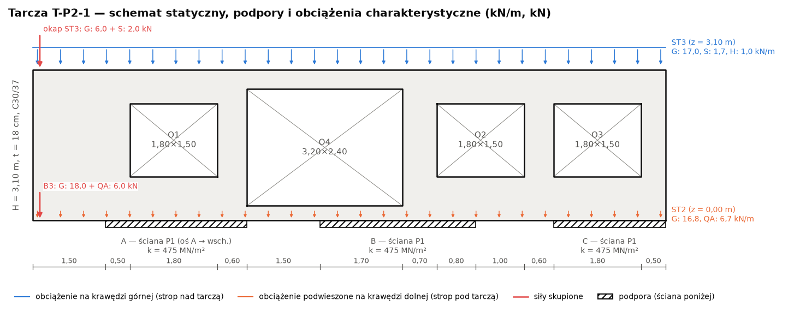
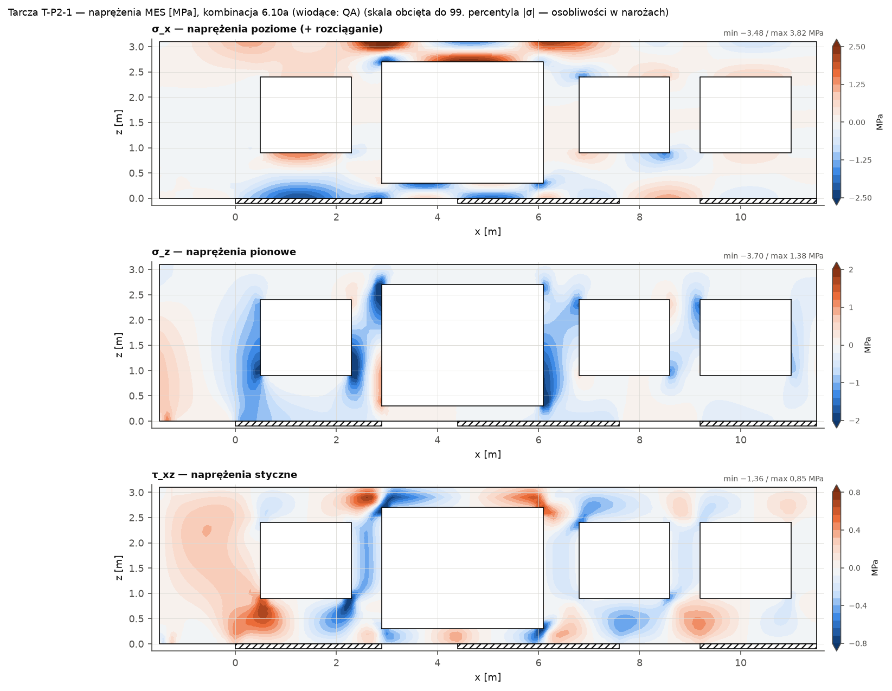
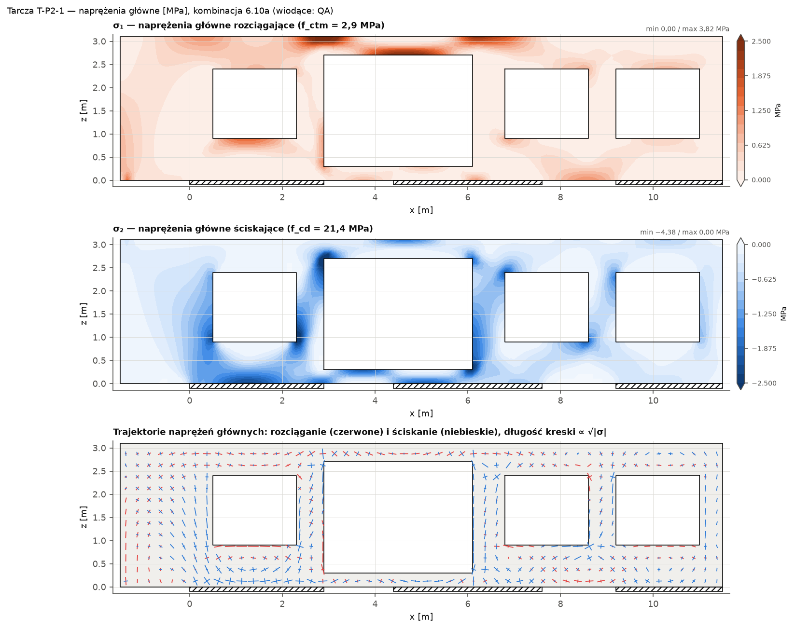
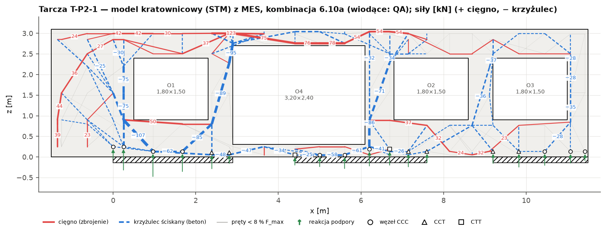
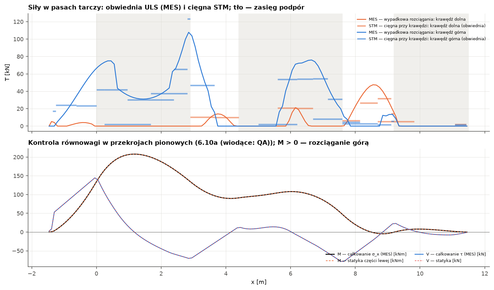
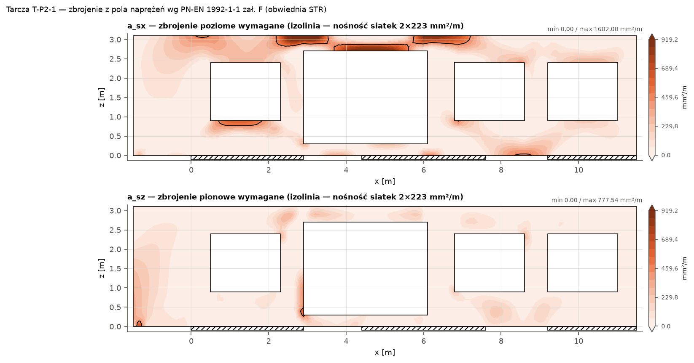
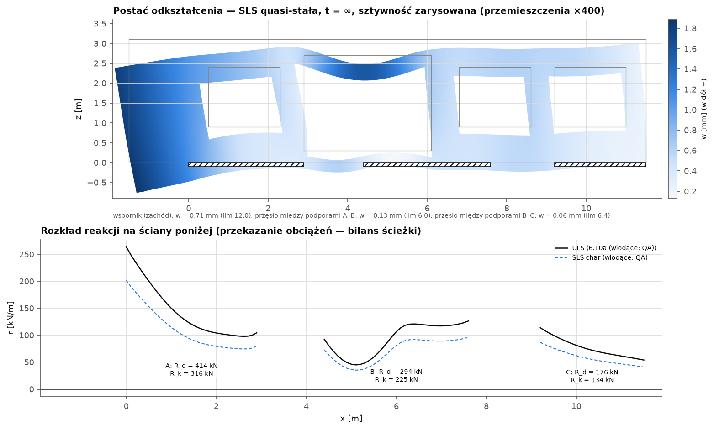
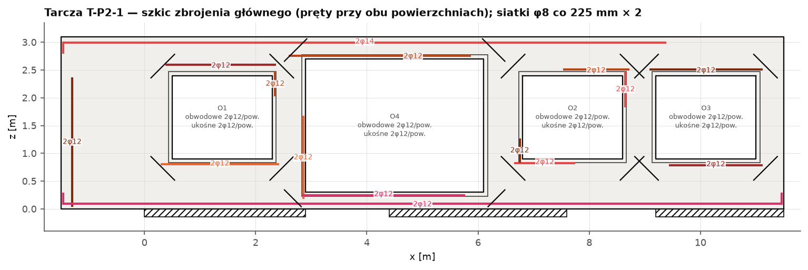

# Obliczenia statyczne — ściana-tarcza wspornikowa P2 (wariant W2, demo)

Biblioteka `lamela.obliczenia.konstrukcja` (moduły `tarcze`, `tarcze_mes`) · wygenerowano 2026-09-25

> **DEMO — dane przykładowe typowe dla wariantu W2; nie jest pozycją projektu wykonawczego**

> Obliczenia automatyczne. Oznaczenia: [NZW] — wartość zalecana/niezweryfikowana w NA, [UPR] — uproszczenie, [ZAŁ] — założenie, [P] — źródło przytoczone z pamięci. Wymagana weryfikacja projektanta z uprawnieniami.

**Wynik:** maks. wykorzystanie η = 92% — wszystkie warunki spełnione; T_max = 123,3 kN, C_max = 106,6 kN, ugięcie miarodajne 0,71 mm (lim 12,0 mm), EQU η = 5%, stal ≈ 481 kg.

## Poz. 1 — Ściana-tarcza żelbetowa T-P2-1

Element modelu: `T-P2-1` · maks. wykorzystanie nośności η = 92% · wszystkie warunki spełnione

### Opis i schemat statyczny

Ściana podłużna P2 (oś 1) wariantu W2 — tarcza wspornikowa przenosząca wysunięcie bryły II piętra o 1,50 m na zachód; ściany P1 poniżej z przerwami (otwory P1). Tarcza żelbetowa gr. t = 18 cm, długość L = 13,00 m (x = −1,50…11,50), wysokość H = 3,10 m; beton C30/37 (XC3, c_nom = 35 mm), stal B500SP (f_yd = 434,8 MPa). Otwory: O1 1,80×1,50 m (x = 0,50…2,30, z = 0,90…2,40), O4 3,20×2,40 m (x = 2,90…6,10, z = 0,30…2,70), O2 1,80×1,50 m (x = 6,80…8,60, z = 0,90…2,40), O3 1,80×1,50 m (x = 9,20…11,00, z = 0,90…2,40). Podpory (ściany/elementy poniżej): A: x = 0,00…2,90 m (ściana P1 (oś A → wsch.)), sprężysta k = 475 MN/m²; B: x = 4,40…7,60 m (ściana P1), sprężysta k = 475 MN/m²; C: x = 9,20…11,50 m (ściana P1), sprężysta k = 475 MN/m². Wsporniki: wspornik (zachód) l_k = 1,50 m.

Model MES: 2483 elementów QM6 (bok ≤ 10 cm), 10 kombinacji STR, SLS: 4 charakterystycznych, 1 quasi-stałych. Kombinacja miarodajna (maks. ΣF): 6.10a (wiodące: QA); ΣF_z = 883,9 kN, ΣR = 883,9 kN (błąd 1.7e-13). Naprężenia (obwiednia STR): σ₁,max = 3,82 MPa, σ₂,min = −4,38 MPa (f_ctm = 2,9, f_cd = 21,43 MPa).

Metoda: MES płaskiego stanu naprężenia: element prostokątny QM6 (biliniowy + 4 mody niekonforemne, kondensacja statyczna) na siatce ortogonalnej dopasowanej do krawędzi otworów, podpór i punktów przyłożenia obciążeń; beton niezarysowany E_cm, ν = 0,2; podpory sprężyste k = E·t/h ściany poniżej (lub sztywne). Walidacja: rozwiązanie ścisłe Timoshenki–Goodiera (belka-tarcza, obciążenie równomierne), wspornik smukły (teoria belek z odkształceniem postaciowym), zbieżność siatki, równowaga sił i przekrojów (tarcze_walidacja).

Metoda: Siły w pasach: całkowanie naprężeń σ w przekrojach co element — wypadkowa strefy rozciąganej przylegającej do krawędzi (pas górny/dolny, nadproża, podokienniki, ościeża).

Metoda: Model kratownicowy (5.6.4, 6.5): węzły na liniach pasów (odsunięcie od krawędzi = środek bloku naprężeń z MES), pręty kandydujące w obrębie betonu, siły z programowania liniowego (minimum Σ c·|F|·l, cięgna 1,0, krzyżulce 0,3, kara za niezgodność z polem sprężystym), obciążenia i reakcje z MES (dokładna równowaga); obwiednia kombinacji STR.

Metoda: Wymiarowanie: cięgna F_Ed = max(STM; MES), krzyżulce 0,6·ν'·f_cd, węzły CCC/CCT/CTT, zakotwienie (8.4), siatki 9.6/9.7, zał. F (środnik), pręty przy otworach, rysy (7.3.4), ugięcia MES ze sztywnością zarysowaną (rysy rozmyte, ζ wg 7.19) i pełzaniem, EQU wspornika (PN-EN 1990 tabl. A1.2(A)).

*Rys. Tarcza T-P2-1: schemat statyczny — obrys z otworami, podpory na ścianach poniżej, obciążenia charakterystyczne wg przypadków.*

*Rys. Tarcza T-P2-1: mapy naprężeń σ_x, σ_z, τ_xz (MES, stan niezarysowany, 6.10a (wiodące: QA)).*

*Rys. Tarcza T-P2-1: naprężenia główne σ₁, σ₂ i trajektorie — podstawa orientacji modelu kratownicowego (EC2 5.6.4(5)).*

*Rys. Tarcza T-P2-1: model kratownicowy wygenerowany z pola naprężeń MES (programowanie liniowe, kombinacja 6.10a (wiodące: QA)); CCC/CCT/CTT — typ węzła podporowego.*

*Rys. Tarcza T-P2-1: siły w pasach (MES vs STM) i kontrola równowagi przekrojów (MES vs statyka).*

*Rys. Tarcza T-P2-1: zbrojenie wymagane z pola naprężeń (zał. F) na tle nośności siatek.*

*Rys. Tarcza T-P2-1: ugięcia SLS (zarysowanie, pełzanie) i rozkład reakcji podpór.*

*Rys. Tarcza T-P2-1: szkic zbrojenia — cięgna (kolor), U-pręty na końcach, pręty obwodowe i ukośne przy otworach; siatki przy obu powierzchniach.*

### Zestawienie obciążeń

**Obciążenia charakterystyczne tarczy**

| Przypadek | Obciążenie | x [m] | z [m] | q [kN/m] / P | Wypadkowa [kN] |
|---|---|---|---|---|---|
| G | ST3 — ciężar (7,0 kN/m² × 2,40 m) | −1,50…11,50 | 3,10 | 17,00 | 221,0 |
| S | ST3 — śnieg (0,72 × 2,40) | −1,50…11,50 | 3,10 | 1,70 | 22,1 |
| H | ST3 — użytkowe dachu kat. H | −1,50…11,50 | 3,10 | 1,00 | 13,0 |
| G | ST2 — ciężar (7,0 × 2,40) | −1,50…11,50 | 0,00 | 16,80 | 218,4 |
| QA | ST2 — użytkowe + działowe ((2,0 + 0,8) × 2,40) | −1,50…11,50 | 0,00 | 6,70 | 87,1 |
| G | B3 — reakcja (ściana lekka + wspornik ST2) | −1,35 | 0,00 | P = 18,00 kN | 18,0 |
| QA | B3 — reakcja | −1,35 | 0,00 | P = 6,00 kN | 6,0 |
| G | okap ST3 | −1,35 | 3,10 | P = 6,00 kN | 6,0 |
| S | okap ST3 | −1,35 | 3,10 | P = 2,00 kN | 2,0 |
| G | ciężar własny: 25·0,18 + 0,35 = 4,85 kN/m² × 24,52 m² | — | — | — | 118,9 |

**Kombinacje STR (PN-EN 1990 + NA)**

| Kombinacja | Współczynniki |
|---|---|
| 6.10a (wiodące: QA) | 1,35·G + 1,05·QA + 0,75·S |
| 6.10b (wiodące: QA) | 1,147·G + 1,5·QA + 0,75·S |
| 6.10 G korzystne (wiodące: QA) | 1·G + 1,5·QA |
| 6.10a (wiodące: QA) | 1,35·G + 1,05·QA |
| 6.10b (wiodące: QA) | 1,147·G + 1,5·QA |
| 6.10b (wiodące: S) | 1,147·G + 1,5·S + 1,05·QA |
| 6.10 G korzystne (wiodące: S) | 1·G + 1,5·S |
| 6.10b (wiodące: H) | 1,147·G + 1,5·H + 1,05·QA |
| 6.10 G korzystne (wiodące: H) | 1·G + 1,5·H |
| 6.10a (tylko G) | 1,35·G |

**Reakcje podpór — przekazanie na ściany/wieńce poniżej** (charakterystyczne wg przypadków, liniowo; rozkład wzdłuż podpory w danych pozycji i na rysunku)

| Przypadek (charakt.) | A — R [kN] | B — R [kN] | C — R [kN] | Σ [kN] |
|---|---|---|---|---|
| G | 273,8 (x_R = 1,19) | 192,1 (x_R = 6,29) | 116,4 (x_R = 10,21) | 582,3 |
| S | 12,2 (x_R = 1,17) | 7,6 (x_R = 6,57) | 4,3 (x_R = 10,19) | 24,1 |
| H | 5,9 (x_R = 1,37) | 4,2 (x_R = 6,59) | 2,8 (x_R = 10,24) | 13,0 |
| QA | 42,1 (x_R = 1,15) | 33,4 (x_R = 5,97) | 17,6 (x_R = 10,19) | 93,1 |
| **ULS 6.10a (wiodące: QA)** | **413,8** | **294,4** | **175,7** | 883,9 |

### Obliczenia

#### Kontrola równowagi modelu MES

- Suma obciążeń pionowych (6.10a (wiodące: QA)): ΣF_z = **883,89** kN
- Suma reakcji: ΣR_z = **883,89** kN
- Błąd względny: |ΣF_z − ΣR_z|/ΣF_z = **1.7e-13**
- Maks. względna rozbieżność V, M w przekrojach kontrolnych (MES vs statyka): **0.00 %**

#### Zbrojenie minimalne ścian i belek-ścian — siatki przy obu powierzchniach (9.6, 9.7)

- Zbrojenie pionowe ściany (łącznie): A_s,vmin = 0,002·A_c = 0,002·180·1000 = **360** mm²/m *(9.6.2(1) [NZW NA])*
- Zbrojenie poziome ściany (łącznie): A_s,hmin = max(0,25·A_s,v; 0,001·A_c) = **180** mm²/m *(9.6.3(1) [NZW NA])*
- Belka-ściana: siatka przy każdej powierzchni w obu kierunkach: A_s,dbmin = max(0,1 %·A_c; 150 mm²/m) = max(0,001·180·1000; 150) = **180** mm²/m *(9.7(1) [NZW NA])*
- Maks. rozstaw prętów siatki: s_max = min(2t; 300 mm) (9.7(2)); ściany: min(3t; 400 mm) = **300** mm
- Zbrojenie z pola naprężeń (zał. F, obwiednia ULS, 95 % elementów poza narożami otworów): a_sx; a_sz (łącznie obie powierzchnie) = **436; 189 mm²/m** *(zał. F (F.2–F.7))*
- Przyjęto siatkę przy każdej powierzchni: φ8 co 225 mm (w obu kierunkach) = **223** mm²/m

| Warunek | Efekt | Nośność / limit | η | Stan | Podstawa |
|---|---|---|---|---|---|
| Siatka przy powierzchni ≥ A_s,dbmin (9.7) i połowa A_s,vmin (9.6) | A_s,req = 180 mm²/m | A_s,prov = 223 mm²/m | 81% | spełniony | 9.6.2, 9.7(1) |

#### Cięgna (pasy rozciągane) — STM i całkowanie naprężeń MES (6.5.3, 7.3.2, 7.3.4, 8.4)

- Siły w cięgnach: F_Ed = max(F_STM; F_MES); F_MES — wypadkowa rozciągania w strefie przy krawędzi (całkowanie σ w przekrojach co element, obwiednia ULS; gdy rozciągane jest całe pasmo — udział krawędzi z reguły dźwigni F·(1 − e/h_pasma)); A_s,req = F_Ed/f_yd: **** *(6.5.3, 5.6.4(5))*
- Zbrojenie minimalne ze względu na rysy w strefie rozciąganej (h_t z MES), gdy σ_ct,char > f_ctm: A_s,min = k_c·k·f_ct,eff·A_ct/σ_s = σ_s = f_yk, k_c = 0,4 (zginanie) / 1,0 (rozciąganie całego pasma) = **** *((7.1) [UPR])*
- Szerokość rys cięgna: w_k = s_r,max·(ε_sm − ε_cm), σ_s = F_qp,MES/A_s, h_c,ef = min(2,5·(c + φ/2); h_pasma/2), k₁ = 0,8, k₂ = 0,5 (zginanie) / 1,0, k_t = 0,4 = **** *((7.8)–(7.11))*
- Pionowe cięgna środnika (wieszaki) — maks. gęstość siły z STM: t_v = F/Δx = **30,76** kN/m
- Poziome cięgna środnika — maks. gęstość siły z STM: t_h = F/Δz = **45,53** kN/m
- Ukośne cięgna środnika — składowa na kierunek siatki: t_d/√2 = **32,07** kN/m

| Warunek | Efekt | Nośność / limit | η | Stan | Podstawa |
|---|---|---|---|---|---|
| Cięgno „koniec lewy tarczy (x = −1,50)”: A_s ≥ max(F_Ed/f_yd; A_s,min) | A_s,req = 160 mm² | A_s,prov = 226 mm² | 71% | spełniony | 6.5.3, 7.3.2 |
| Rysy — cięgno „koniec lewy tarczy (x = −1,50)” (quasi-stała) | w_k = 0,203 mm | w_max = 0,300 mm | 68% | spełniony | 7.3.4, tabl. 7.1N |
| Zakotwienie „koniec lewy tarczy (x = −1,50)” — koniec lewy/dolny, F = 0,0 kN: U-pręty φ12 na końcu (zakład l₀) | l₀ = 200 mm | l_cięgna = 2215 mm | 9% | spełniony | 8.4.4, 8.7.3, 6.5.4(7) |
| Zakotwienie „koniec lewy tarczy (x = −1,50)” — koniec prawy/górny, F = 0,0 kN: proste | l_bd = 120 mm | l_dost = 815 mm | 15% | spełniony | 8.4.4, 8.7.3, 6.5.4(7) |
| Cięgno „krawędź górna”: A_s ≥ max(F_Ed/f_yd; A_s,min) | A_s,req = 284 mm² | A_s,prov = 308 mm² | 92% | spełniony | 6.5.3, 7.3.2 |
| Rysy — cięgno „krawędź górna” (quasi-stała) | w_k = 0,254 mm | w_max = 0,300 mm | 85% | spełniony | 7.3.4, tabl. 7.1N |
| Zakotwienie „krawędź górna” — koniec lewy/dolny, F = 17,1 kN: U-pręty φ14 na końcu (zakład l₀) | l₀ = 210 mm | l_cięgna = 10715 mm | 2% | spełniony | 8.4.4, 8.7.3, 6.5.4(7) |
| Zakotwienie „krawędź górna” — koniec prawy/górny, F = 0,0 kN: proste | l_bd = 140 mm | l_dost = 2215 mm | 6% | spełniony | 8.4.4, 8.7.3, 6.5.4(7) |
| Cięgno „pod otworem O1”: A_s ≥ max(F_Ed/f_yd; A_s,min) | A_s,req = 121 mm² | A_s,prov = 226 mm² | 54% | spełniony | 6.5.3, 7.3.2 |
| Rysy — cięgno „pod otworem O1” (quasi-stała) | w_k = 0,169 mm | w_max = 0,300 mm | 56% | spełniony | 7.3.4, tabl. 7.1N |
| Zakotwienie „pod otworem O1” — koniec lewy/dolny, F = 49,9 kN: proste | l_bd = 206 mm | l_dost = 1965 mm | 10% | spełniony | 8.4.4, 8.7.3, 6.5.4(7) |
| Zakotwienie „pod otworem O1” — koniec prawy/górny, F = 10,5 kN: proste | l_bd = 120 mm | l_dost = 565 mm | 21% | spełniony | 8.4.4, 8.7.3, 6.5.4(7) |
| Cięgno „nad otworem O1”: A_s ≥ max(F_Ed/f_yd; A_s,min) | A_s,req = 88 mm² | A_s,prov = 226 mm² | 39% | spełniony | 6.5.3, 7.3.2 |
| Rysy — cięgno „nad otworem O1” (quasi-stała) | w_k = 0,191 mm | w_max = 0,300 mm | 64% | spełniony | 7.3.4, tabl. 7.1N |
| Zakotwienie „nad otworem O1” — koniec lewy/dolny, F = 20,2 kN: proste | l_bd = 120 mm | l_dost = 1965 mm | 6% | spełniony | 8.4.4, 8.7.3, 6.5.4(7) |
| Zakotwienie „nad otworem O1” — koniec prawy/górny, F = 0,0 kN: proste | l_bd = 120 mm | l_dost = 615 mm | 20% | spełniony | 8.4.4, 8.7.3, 6.5.4(7) |
| Cięgno „ościeże lewe otworu O4”: A_s ≥ max(F_Ed/f_yd; A_s,min) | A_s,req = 63 mm² | A_s,prov = 226 mm² | 28% | spełniony | 6.5.3, 7.3.2 |
| Rysy — cięgno „ościeże lewe otworu O4” (quasi-stała) | w_k = 0,073 mm | w_max = 0,300 mm | 24% | spełniony | 7.3.4, tabl. 7.1N |
| Zakotwienie „ościeże lewe otworu O4” — koniec lewy/dolny, F = 5,2 kN: proste | l_bd = 120 mm | l_dost = 265 mm | 45% | spełniony | 8.4.4, 8.7.3, 6.5.4(7) |
| Zakotwienie „ościeże lewe otworu O4” — koniec prawy/górny, F = 5,2 kN: proste | l_bd = 120 mm | l_dost = 1512 mm | 8% | spełniony | 8.4.4, 8.7.3, 6.5.4(7) |
| Cięgno „krawędź dolna”: A_s ≥ max(F_Ed/f_yd; A_s,min) | A_s,req = 109 mm² | A_s,prov = 226 mm² | 48% | spełniony | 6.5.3, 7.3.2 |
| Rysy — cięgno „krawędź dolna” (quasi-stała) | w_k = 0,152 mm | w_max = 0,300 mm | 51% | spełniony | 7.3.4, tabl. 7.1N |
| Zakotwienie „krawędź dolna” — koniec lewy/dolny, F = 0,0 kN: U-pręty φ12 na końcu (zakład l₀) | l₀ = 200 mm | l_cięgna = 12890 mm | 2% | spełniony | 8.4.4, 8.7.3, 6.5.4(7) |
| Zakotwienie „krawędź dolna” — koniec prawy/górny, F = 2,0 kN: U-pręty φ12 na końcu (zakład l₀) | l₀ = 200 mm | l_cięgna = 12852 mm | 2% | spełniony | 8.4.4, 8.7.3, 6.5.4(7) |
| Cięgno „nad otworem O4”: A_s ≥ max(F_Ed/f_yd; A_s,min) | A_s,req = 179 mm² | A_s,prov = 226 mm² | 79% | spełniony | 6.5.3, 7.3.2 |
| Rysy — cięgno „nad otworem O4” (quasi-stała) | w_k = 0,240 mm | w_max = 0,300 mm | 80% | spełniony | 7.3.4, tabl. 7.1N |
| Zakotwienie „nad otworem O4” — koniec lewy/dolny, F = 75,0 kN: proste | l_bd = 309 mm | l_dost = 4365 mm | 7% | spełniony | 8.4.4, 8.7.3, 6.5.4(7) |
| Zakotwienie „nad otworem O4” — koniec prawy/górny, F = 0,0 kN: proste | l_bd = 120 mm | l_dost = 5715 mm | 2% | spełniony | 8.4.4, 8.7.3, 6.5.4(7) |
| Cięgno „pod otworem O4”: A_s ≥ max(F_Ed/f_yd; A_s,min) | A_s,req = 58 mm² | A_s,prov = 226 mm² | 26% | spełniony | 6.5.3, 7.3.2 |
| Rysy — cięgno „pod otworem O4” (quasi-stała) | w_k = 0,038 mm | w_max = 0,300 mm | 13% | spełniony | 7.3.4, tabl. 7.1N |
| Zakotwienie „pod otworem O4” — koniec lewy/dolny, F = 0,0 kN: proste | l_bd = 120 mm | l_dost = 4415 mm | 3% | spełniony | 8.4.4, 8.7.3, 6.5.4(7) |
| Zakotwienie „pod otworem O4” — koniec prawy/górny, F = 25,4 kN: proste | l_bd = 120 mm | l_dost = 5815 mm | 2% | spełniony | 8.4.4, 8.7.3, 6.5.4(7) |
| Cięgno „pod otworem O2”: A_s ≥ max(F_Ed/f_yd; A_s,min) | A_s,req = 85 mm² | A_s,prov = 226 mm² | 37% | spełniony | 6.5.3, 7.3.2 |
| Rysy — cięgno „pod otworem O2” (quasi-stała) | w_k = 0,075 mm | w_max = 0,300 mm | 25% | spełniony | 7.3.4, tabl. 7.1N |
| Zakotwienie „pod otworem O2” — koniec lewy/dolny, F = 36,8 kN: proste | l_bd = 152 mm | l_dost = 665 mm | 23% | spełniony | 8.4.4, 8.7.3, 6.5.4(7) |
| Zakotwienie „pod otworem O2” — koniec prawy/górny, F = 36,8 kN: proste | l_bd = 152 mm | l_dost = 3865 mm | 4% | spełniony | 8.4.4, 8.7.3, 6.5.4(7) |
| Cięgno „nad otworem O2”: A_s ≥ max(F_Ed/f_yd; A_s,min) | A_s,req = 68 mm² | A_s,prov = 226 mm² | 30% | spełniony | 6.5.3, 7.3.2 |
| Rysy — cięgno „nad otworem O2” (quasi-stała) | w_k = 0,091 mm | w_max = 0,300 mm | 30% | spełniony | 7.3.4, tabl. 7.1N |
| Zakotwienie „nad otworem O2” — koniec lewy/dolny, F = 0,0 kN: proste | l_bd = 120 mm | l_dost = 1515 mm | 8% | spełniony | 8.4.4, 8.7.3, 6.5.4(7) |
| Zakotwienie „nad otworem O2” — koniec prawy/górny, F = 19,1 kN: proste | l_bd = 120 mm | l_dost = 2865 mm | 4% | spełniony | 8.4.4, 8.7.3, 6.5.4(7) |
| Cięgno „nad otworem O3”: A_s ≥ max(F_Ed/f_yd; A_s,min) | A_s,req = 63 mm² | A_s,prov = 226 mm² | 28% | spełniony | 6.5.3, 7.3.2 |
| Rysy — cięgno „nad otworem O3” (quasi-stała) | w_k = 0,091 mm | w_max = 0,300 mm | 30% | spełniony | 7.3.4, tabl. 7.1N |
| Zakotwienie „nad otworem O3” — koniec lewy/dolny, F = 4,2 kN: proste | l_bd = 120 mm | l_dost = 3065 mm | 4% | spełniony | 8.4.4, 8.7.3, 6.5.4(7) |
| Zakotwienie „nad otworem O3” — koniec prawy/górny, F = 17,7 kN: proste | l_bd = 120 mm | l_dost = 465 mm | 26% | spełniony | 8.4.4, 8.7.3, 6.5.4(7) |
| Cięgno „pod otworem O3”: A_s ≥ max(F_Ed/f_yd; A_s,min) | A_s,req = 46 mm² | A_s,prov = 226 mm² | 21% | spełniony | 6.5.3, 7.3.2 |
| Rysy — cięgno „pod otworem O3” (quasi-stała) | w_k = 0,068 mm | w_max = 0,300 mm | 23% | spełniony | 7.3.4, tabl. 7.1N |
| Zakotwienie „pod otworem O3” — koniec lewy/dolny, F = 0,0 kN: proste | l_bd = 120 mm | l_dost = 3415 mm | 4% | spełniony | 8.4.4, 8.7.3, 6.5.4(7) |
| Zakotwienie „pod otworem O3” — koniec prawy/górny, F = 15,1 kN: proste | l_bd = 120 mm | l_dost = 465 mm | 26% | spełniony | 8.4.4, 8.7.3, 6.5.4(7) |
| Cięgno „ościeże prawe otworu O1”: A_s ≥ max(F_Ed/f_yd; A_s,min) | A_s,req = 28 mm² | A_s,prov = 226 mm² | 12% | spełniony | 6.5.3, 7.3.2 |
| Rysy — cięgno „ościeże prawe otworu O1” (quasi-stała) | w_k = 0,036 mm | w_max = 0,300 mm | 12% | spełniony | 7.3.4, tabl. 7.1N |
| Zakotwienie „ościeże prawe otworu O1” — koniec lewy/dolny, F = 12,0 kN: proste | l_bd = 120 mm | l_dost = 2115 mm | 6% | spełniony | 8.4.4, 8.7.3, 6.5.4(7) |
| Zakotwienie „ościeże prawe otworu O1” — koniec prawy/górny, F = 12,0 kN: proste | l_bd = 120 mm | l_dost = 715 mm | 17% | spełniony | 8.4.4, 8.7.3, 6.5.4(7) |
| Cięgno „ościeże lewe otworu O2”: A_s ≥ max(F_Ed/f_yd; A_s,min) | A_s,req = 18 mm² | A_s,prov = 226 mm² | 8% | spełniony | 6.5.3, 7.3.2 |
| Rysy — cięgno „ościeże lewe otworu O2” (quasi-stała) | w_k = 0,017 mm | w_max = 0,300 mm | 6% | spełniony | 7.3.4, tabl. 7.1N |
| Zakotwienie „ościeże lewe otworu O2” — koniec lewy/dolny, F = 7,8 kN: proste | l_bd = 120 mm | l_dost = 915 mm | 13% | spełniony | 8.4.4, 8.7.3, 6.5.4(7) |
| Zakotwienie „ościeże lewe otworu O2” — koniec prawy/górny, F = 7,8 kN: proste | l_bd = 120 mm | l_dost = 1915 mm | 6% | spełniony | 8.4.4, 8.7.3, 6.5.4(7) |
| Cięgno „ościeże prawe otworu O2”: A_s ≥ max(F_Ed/f_yd; A_s,min) | A_s,req = 30 mm² | A_s,prov = 226 mm² | 13% | spełniony | 6.5.3, 7.3.2 |
| Rysy — cięgno „ościeże prawe otworu O2” (quasi-stała) | w_k = 0,036 mm | w_max = 0,300 mm | 12% | spełniony | 7.3.4, tabl. 7.1N |
| Zakotwienie „ościeże prawe otworu O2” — koniec lewy/dolny, F = 13,1 kN: proste | l_bd = 120 mm | l_dost = 1915 mm | 6% | spełniony | 8.4.4, 8.7.3, 6.5.4(7) |
| Zakotwienie „ościeże prawe otworu O2” — koniec prawy/górny, F = 13,1 kN: proste | l_bd = 120 mm | l_dost = 715 mm | 17% | spełniony | 8.4.4, 8.7.3, 6.5.4(7) |
| Wieszaki: siatka pionowa obu powierzchni | t_v,Ed = 30,76 kN/m | a_sv·f_yd = 194,26 kN/m | 16% | spełniony | 6.5.3, 9.7 |
| Środnik: siatka pozioma obu powierzchni | t_h,Ed = 45,53 kN/m | a_sh·f_yd = 194,26 kN/m | 23% | spełniony | 6.5.3, 9.7 |
| Środnik: siatka (cięgna ukośne) | t_d,Ed = 32,07 kN/m | a_s·f_yd = 194,26 kN/m | 17% | spełniony | 6.5.3 |

#### Zbrojenie z pola naprężeń MES (zał. F) — środnik poza cięgnami i narożami otworów

- Zbrojenie wymagane (ściskanie dodatnie; σ_Edx > σ_Edy): σ_Edx ≤ |τ| → f_tdx = |τ| − σ_Edx, f_tdy = |τ| − σ_Edy, σ_cd = 2|τ|; σ_Edx > |τ| → f_tdx = 0, f_tdy = τ²/σ_Edx − σ_Edy, σ_cd = σ_Edx·(1 + (τ/σ_Edx)²); a_s = f_td·t/f_yd: **** *(zał. F, (F.2)–(F.7) [P])*

| Warunek | Efekt | Nośność / limit | η | Stan | Podstawa |
|---|---|---|---|---|---|
| Zbrojenie poziome środnika (maks.) ≤ siatki obu powierzchni | a_sx,req = 286 mm²/m | a_sx,prov = 447 mm²/m | 64% | spełniony | zał. F |
| Zbrojenie pionowe środnika (maks.) ≤ siatki obu powierzchni | a_sz,req = 285 mm²/m | a_sz,prov = 447 mm²/m | 64% | spełniony | zał. F |
| Naprężenie w betonie σ_cd ≤ ν·f_cd | σ_cd = 2,14 MPa | ν·f_cd = 11,31 MPa | 19% | spełniony | zał. F (F.4), (F.7); (6.6N) |

#### Model kratownicowy — krzyżulce ściskane (6.5.2)

- Nośność krzyżulców w strefie zarysowanej: σ_Rd,max = 0,6·ν'·f_cd, ν' = 1 − f_ck/250 = 0,6·0,880·21,43 = **11,31** MPa *((6.56), (6.57N))*
- Szerokość krzyżulca na końcu: w = l·sin θ + u·cos θ (węzeł na pasie: l — długość docisku/pasa, u = 2a); węzeł wewnętrzny: w = rozstaw węzłów [UPR] = ****

| Warunek | Efekt | Nośność / limit | η | Stan | Podstawa |
|---|---|---|---|---|---|
| Krzyżulec miarodajny (C = 57,6 kN, w = 102 mm) | σ_Ed = 3,14 MPa | σ_Rd,max = 11,31 MPa | 28% | spełniony | (6.56) |

#### Model kratownicowy — węzły (6.5.4) i docisk

- Nośność węzła CCC: σ_Rd,max = k·ν'·f_cd, k = 1,00 = 1,00·0,880·21,43 = **18,86** MPa *((6.60))*
- Nośność węzła CCT: σ_Rd,max = k·ν'·f_cd, k = 0,85 = 0,85·0,880·21,43 = **16,03** MPa *((6.61))*
- Nośność węzła CTT: σ_Rd,max = k·ν'·f_cd, k = 0,75 = 0,75·0,880·21,43 = **14,14** MPa *((6.62))*

| Warunek | Efekt | Nośność / limit | η | Stan | Podstawa |
|---|---|---|---|---|---|
| Węzeł miarodajny CCC (5,00; 0,05) | σ_Ed = 3,14 MPa | σ_Rd,max = 18,86 MPa | 17% | spełniony | 6.5.4(4) |

#### Zbrojenie przy otworach — pręty ukośne w narożach i obwodowe

- Siła rozciągająca w poprzek potencjalnej rysy z naroża: F_t = ∫max(σ_nn; 0)·t ds (przekrój wzdłuż dwusiecznej, l ≤ 0,8 m, obwiednia ULS) = **85,47** kN *(MES [UPR]; praktyka: ≥ 2φ12 przy każdej powierzchni)*
- Przyjęto w każdym narożu pręty ukośne 45°: 2φ12 przy każdej powierzchni (4φ12) = **452** mm²
- Pręty obwodowe wzdłuż krawędzi otworów (zastępują przerwaną siatkę; nadproża i podokienniki — cięgna wyżej): 2φ12 przy każdej powierzchni, zakotwione l_bd poza narożem = ****

| Warunek | Efekt | Nośność / limit | η | Stan | Podstawa |
|---|---|---|---|---|---|
| Pręty ukośne — O1 naroże górne lewe | A_s,req = 62 mm² | A_s,prov = 452 mm² | 14% | spełniony | MES: przekrój wzdłuż dwusiecznej naroża; 6.5.3 |
| Pręty ukośne — O1 naroże górne prawe | A_s,req = 35 mm² | A_s,prov = 452 mm² | 8% | spełniony | MES: przekrój wzdłuż dwusiecznej naroża; 6.5.3 |
| Pręty ukośne — O1 naroże dolne lewe | A_s,req = 0 mm² | A_s,prov = 452 mm² | 0% | spełniony | MES: przekrój wzdłuż dwusiecznej naroża; 6.5.3 |
| Pręty ukośne — O1 naroże dolne prawe | A_s,req = 19 mm² | A_s,prov = 452 mm² | 4% | spełniony | MES: przekrój wzdłuż dwusiecznej naroża; 6.5.3 |
| Pręty ukośne — O4 naroże górne lewe | A_s,req = 197 mm² | A_s,prov = 452 mm² | 43% | spełniony | MES: przekrój wzdłuż dwusiecznej naroża; 6.5.3 |
| Pręty ukośne — O4 naroże górne prawe | A_s,req = 110 mm² | A_s,prov = 452 mm² | 24% | spełniony | MES: przekrój wzdłuż dwusiecznej naroża; 6.5.3 |
| Pręty ukośne — O4 naroże dolne lewe | A_s,req = 31 mm² | A_s,prov = 452 mm² | 7% | spełniony | MES: przekrój wzdłuż dwusiecznej naroża; 6.5.3 |
| Pręty ukośne — O4 naroże dolne prawe | A_s,req = 21 mm² | A_s,prov = 452 mm² | 5% | spełniony | MES: przekrój wzdłuż dwusiecznej naroża; 6.5.3 |
| Pręty ukośne — O2 naroże górne lewe | A_s,req = 25 mm² | A_s,prov = 452 mm² | 6% | spełniony | MES: przekrój wzdłuż dwusiecznej naroża; 6.5.3 |
| Pręty ukośne — O2 naroże górne prawe | A_s,req = 27 mm² | A_s,prov = 452 mm² | 6% | spełniony | MES: przekrój wzdłuż dwusiecznej naroża; 6.5.3 |
| Pręty ukośne — O2 naroże dolne lewe | A_s,req = 27 mm² | A_s,prov = 452 mm² | 6% | spełniony | MES: przekrój wzdłuż dwusiecznej naroża; 6.5.3 |
| Pręty ukośne — O2 naroże dolne prawe | A_s,req = 52 mm² | A_s,prov = 452 mm² | 11% | spełniony | MES: przekrój wzdłuż dwusiecznej naroża; 6.5.3 |
| Pręty ukośne — O3 naroże górne lewe | A_s,req = 22 mm² | A_s,prov = 452 mm² | 5% | spełniony | MES: przekrój wzdłuż dwusiecznej naroża; 6.5.3 |
| Pręty ukośne — O3 naroże górne prawe | A_s,req = 0 mm² | A_s,prov = 452 mm² | 0% | spełniony | MES: przekrój wzdłuż dwusiecznej naroża; 6.5.3 |
| Pręty ukośne — O3 naroże dolne lewe | A_s,req = 0 mm² | A_s,prov = 452 mm² | 0% | spełniony | MES: przekrój wzdłuż dwusiecznej naroża; 6.5.3 |
| Pręty ukośne — O3 naroże dolne prawe | A_s,req = 0 mm² | A_s,prov = 452 mm² | 0% | spełniony | MES: przekrój wzdłuż dwusiecznej naroża; 6.5.3 |

#### Stan graniczny ugięć tarczy (7.4) — MES ze sztywnością zarysowaną i pełzaniem

- Efektywny moduł betonu (quasi-stała, t = ∞): E_c,eff = E_cm/(1 + φ) = 33000/(1 + 2,5) = **9429** MPa *((7.20))*
- Zasięg zarysowania (kombinacja charakterystyczna, σ₁ > f_ctm): n_el,zar / n_el = 0/2483 = **0,0 %** *([UPR])*
- Ugięcia względne: wspornik — koniec względem krawędzi podpory (z obrotem podpory sprężystej), przęsło — środek względem cięciwy; w_I — niezarysowane, w_II — zarysowane (ζ = 1 − 0,5·(f_ctm/σ₁)², rysy rozmyte) [UPR]: ****
- Przyrost ugięcia po wykonaniu wykończeń: Δw = w_II(qp, ∞) − w_0(G, t₀) = **** *([UPR])*
- Krzywizna skurczowa (7.21) dla tarczy o wysokości H ≈ 3,10 m pomijalna (≈ ε_cs·α_e·S/I·l² < 0,1 mm): ****

| Warunek | Efekt | Nośność / limit | η | Stan | Podstawa |
|---|---|---|---|---|---|
| Ugięcie — wspornik (zachód) (quasi-stała, t = ∞, zarysowanie) | w = 0,71 mm | L/250 = 12,00 mm | 6% | spełniony | 7.4.1(4); L = 2·l_k dla wspornika (R5-56) |
| Przyrost ugięcia — wspornik (zachód) (po wykonaniu wykończeń) | Δw = 0,50 mm | L/500 = 6,00 mm | 8% | spełniony | 7.4.1(5) [NZW] |
| Ugięcie — przęsło między podporami A–B (quasi-stała, t = ∞, zarysowanie) | w = 0,13 mm | L/250 = 6,00 mm | 2% | spełniony | 7.4.1(4) |
| Przyrost ugięcia — przęsło między podporami A–B (po wykonaniu wykończeń) | Δw = 0,10 mm | L/500 = 3,00 mm | 3% | spełniony | 7.4.1(5) [NZW] |
| Ugięcie — przęsło między podporami B–C (quasi-stała, t = ∞, zarysowanie) | w = 0,06 mm | L/250 = 6,40 mm | 1% | spełniony | 7.4.1(4) |
| Przyrost ugięcia — przęsło między podporami B–C (po wykonaniu wykończeń) | Δw = 0,04 mm | L/500 = 3,20 mm | 1% | spełniony | 7.4.1(5) [NZW] |

#### Równowaga statyczna wspornika tarczy (EQU)

- Wspornik (zachód): krawędź obrotu x = 0,00 m (skraj podpory), wysięg 1,50 m: ****
- Moment destabilizujący: M_dst = 1,10·M_G,dst + 1,5·M_Q,dst (+ 1,5·ψ₀·M_Q,i) = 1,10·87,34 + 26,92 (wiodące: QA) = **122,99** kNm *(PN-EN 1990 tabl. A1.2(A))*
- Moment stabilizujący: M_stb = 0,90·M_G,stb = 0,90·2810,17 = **2529,16** kNm
- MES: reakcje podpór we wszystkich kombinacjach STR ściskające (brak odrywania): min R_węzeł = **1,90** kN

| Warunek | Efekt | Nośność / limit | η | Stan | Podstawa |
|---|---|---|---|---|---|
| EQU — wspornik (zachód) | M_Ed,dst = 122,99 kNm | M_Ed,stb = 2529,16 kNm | 5% | spełniony | PN-EN 1990 (6.7), tabl. A1.2(A) |

### Wymiarowanie — zestawienia

**Kontrola równowagi w przekrojach pionowych (kombinacja 6.10a (wiodące: QA))** — siły z całkowania naprężeń MES (N = ∫σ_x·t dz, V = ∫τ·t dz, M = ∫σ_x·t·z dz) i ze statyki części lewej

| x [m] | N_MES [kN] | V statyka [kN] | V MES [kN] | M statyka [kNm] | M MES [kNm] |
|---|---|---|---|---|---|
| −0,34 | 0,00 | 123,5 | 123,5 | 88,6 | 88,6 |
| 1,45 | 0,00 | −18,1 | −18,1 | 205,3 | 205,3 |
| 3,25 | 0,00 | −51,7 | −51,7 | 113,0 | 113,0 |
| 4,05 | 0,00 | −5,9 | −5,9 | 89,9 | 89,9 |
| 5,95 | 0,00 | 3,8 | 3,8 | 107,9 | 107,9 |
| 7,95 | 0,00 | −59,3 | −59,3 | 22,8 | 22,8 |
| 8,85 | 0,00 | 0,0 | 0,0 | −4,6 | −4,6 |
| 10,35 | 0,00 | −5,5 | −5,5 | 6,7 | 6,7 |

**Cięgna (pasy rozciągane)** — siły ULS i dobór zbrojenia (pręty przy obu powierzchniach)

| Cięgno | F_STM [kN] | F_MES [kN] | F_Ed [kN] | A_s,req [mm²] | A_s,min [mm²] | Przyjęto | A_s,prov [mm²] | σ_s,qp [MPa] | w_k [mm] |
|---|---|---|---|---|---|---|---|---|---|
| koniec lewy tarczy (x = −1,50) | 43,9 | 69,5 | 69,5 | 160 | — (σ_char = 0,65 ≤ f_ctm) | 2φ12 (1/pow.) | 226 | 197 | 0,203 |
| krawędź górna | 123,3 | 107,8 | 123,3 | 284 | 107 | 2φ14 (1/pow.) | 308 | 251 | 0,254 |
| pod otworem O1 | 49,9 | 52,7 | 52,7 | 121 | — (σ_char = 1,38 ≤ f_ctm) | 2φ12 (1/pow.) | 226 | 163 | 0,169 |
| nad otworem O1 | 20,2 | 38,2 | 38,2 | 88 | — (σ_char = 0,64 ≤ f_ctm) | 2φ12 (1/pow.) | 226 | 117 | 0,191 |
| ościeże lewe otworu O4 | 5,2 | 27,4 | 27,4 | 63 | — (σ_char = 1,94 ≤ f_ctm) | 2φ12 (1/pow.) | 226 | 70 | 0,073 |
| krawędź dolna | 31,8 | 47,5 | 47,5 | 109 | — (σ_char = 1,45 ≤ f_ctm) | 2φ12 (1/pow.) | 226 | 147 | 0,152 |
| nad otworem O4 | 78,0 | 72,8 | 78,0 | 179 | — (σ_char = 2,76 ≤ f_ctm) | 2φ12 (1/pow.) | 226 | 232 | 0,240 |
| pod otworem O4 | 25,4 | 11,8 | 25,4 | 58 | — (σ_char = 1,18 ≤ f_ctm) | 2φ12 (1/pow.) | 226 | 36 | 0,038 |
| pod otworem O2 | 36,8 | 24,6 | 36,8 | 85 | — (σ_char = 1,30 ≤ f_ctm) | 2φ12 (1/pow.) | 226 | 72 | 0,075 |
| nad otworem O2 | 19,1 | 29,4 | 29,4 | 68 | — (σ_char = 1,08 ≤ f_ctm) | 2φ12 (1/pow.) | 226 | 88 | 0,091 |
| nad otworem O3 | 17,7 | 27,5 | 27,5 | 63 | — (σ_char = 0,70 ≤ f_ctm) | 2φ12 (1/pow.) | 226 | 88 | 0,091 |
| pod otworem O3 | 15,1 | 20,2 | 20,2 | 46 | — (σ_char = 0,46 ≤ f_ctm) | 2φ12 (1/pow.) | 226 | 66 | 0,068 |
| ościeże prawe otworu O1 | 0,0 | 12,0 | 12,0 | 28 | — (σ_char = 0,96 ≤ f_ctm) | 2φ12 (1/pow.) | 226 | 34 | 0,036 |
| ościeże lewe otworu O2 | 0,0 | 7,8 | 7,8 | 18 | — (σ_char = 0,73 ≤ f_ctm) | 2φ12 (1/pow.) | 226 | 17 | 0,017 |
| ościeże prawe otworu O2 | 0,0 | 13,1 | 13,1 | 30 | — (σ_char = 0,90 ≤ f_ctm) | 2φ12 (1/pow.) | 226 | 34 | 0,036 |

**Krzyżulce ściskane — najbardziej wytężone (obwiednia kombinacji STR)**

| Krzyżulec (x; z) [m] | kąt | C [kN] | w [mm] | σ_Ed [MPa] | σ_Rd,max [MPa] | η | Kombinacja |
|---|---|---|---|---|---|---|---|
| (5,00; 0,05)–(5,60; 0,05) | 0° | 57,6 | 102 | 3,14 | 11,31 | 28% | 6.10a (wiodące: QA) |
| (6,69; 0,14)–(7,15; 0,14) | 0° | 31,4 | 68 | 2,55 | 11,31 | 23% | 6.10b (wiodące: QA) |
| (6,21; 0,77)–(6,21; 0,89) | 90° | 85,9 | 210 | 2,27 | 11,31 | 20% | 6.10a (wiodące: QA) |
| (6,21; 0,25)–(6,21; 0,77) | 90° | 85,9 | 210 | 2,27 | 11,31 | 20% | 6.10a (wiodące: QA) |
| (6,21; 0,25)–(6,69; 0,14) | 13° | 44,3 | 114 | 2,16 | 11,31 | 19% | 6.10a (tylko G) |
| (2,39; 0,05)–(2,81; 0,05) | 0° | 48,0 | 127 | 2,10 | 11,31 | 19% | 6.10a (wiodące: QA) |
| (2,81; 2,28)–(2,90; 2,76) | 79° | 95,3 | 264 | 2,00 | 11,31 | 18% | 6.10a (wiodące: QA) |
| (0,96; 0,14)–(2,39; 0,05) | 3° | 48,1 | 137 | 1,95 | 11,31 | 17% | 6.10a (wiodące: QA) |

**Węzły STM — najbardziej wytężone i podporowe** (σ_Ed — maks. z docisku i czół krzyżulców)

| Węzeł (x; z) [m] | Typ | R [kN] | l_docisku [mm] | σ_Ed [MPa] | σ_Rd,max [MPa] | η | Kombinacja |
|---|---|---|---|---|---|---|---|
| (5,00; 0,05) | CCC | 31,3 | 602 | 3,14 | 18,86 | 17% | 6.10a (wiodące: QA) |
| (5,60; 0,05) | CCC | 42,7 | 602 | 3,14 | 18,86 | 17% | 6.10a (wiodące: QA) |
| (6,69; 0,14) | CCT | — | — | 2,55 | 16,03 | 16% | 6.10b (wiodące: QA) |
| (6,21; 0,89) | CCT | — | — | 2,27 | 16,03 | 14% | 6.10a (wiodące: QA) |
| (2,39; 0,05) | CCT | — | — | 2,10 | 16,03 | 13% | 6.10a (wiodące: QA) |
| (2,81; 0,05) | CCT | — | — | 2,10 | 16,03 | 13% | 6.10a (wiodące: QA) |
| (4,40; 0,05) | CTT | 17,1 | 301 | 1,49 | 14,14 | 11% | 6.10a (tylko G) |
| (0,00; 0,25) | CCC | 32,9 | 130 | 1,41 | 18,86 | 7% | 6.10a (wiodące: QA) |
| (0,96; 0,14) | CCC | 111,5 | 713 | 1,28 | 18,86 | 7% | 6.10a (wiodące: QA) |
| (1,68; 0,14) | CCC | 81,3 | 713 | 1,28 | 18,86 | 7% | 6.10a (wiodące: QA) |

**Naroża otworów — siły w poprzek rysy z naroża (MES) i pręty ukośne**

| Naroże | l_przekroju [m] | F_t [kN] | A_s,req [mm²] | Przyjęto | A_s,prov [mm²] | η |
|---|---|---|---|---|---|---|
| O1 naroże górne lewe | 0,80 | 26,9 | 62 | 4φ12 | 452 | 14% |
| O1 naroże górne prawe | 0,80 | 15,2 | 35 | 4φ12 | 452 | 8% |
| O1 naroże dolne lewe | 0,80 | 0,0 | 0 | 4φ12 | 452 | 0% |
| O1 naroże dolne prawe | 0,80 | 8,5 | 19 | 4φ12 | 452 | 4% |
| O4 naroże górne lewe | 0,57 | 85,5 | 197 | 4φ12 | 452 | 43% |
| O4 naroże górne prawe | 0,57 | 47,9 | 110 | 4φ12 | 452 | 24% |
| O4 naroże dolne lewe | 0,42 | 13,6 | 31 | 4φ12 | 452 | 7% |
| O4 naroże dolne prawe | 0,42 | 8,9 | 21 | 4φ12 | 452 | 5% |
| O2 naroże górne lewe | 0,80 | 11,0 | 25 | 4φ12 | 452 | 6% |
| O2 naroże górne prawe | 0,80 | 11,5 | 27 | 4φ12 | 452 | 6% |
| O2 naroże dolne lewe | 0,80 | 11,6 | 27 | 4φ12 | 452 | 6% |
| O2 naroże dolne prawe | 0,80 | 22,6 | 52 | 4φ12 | 452 | 11% |
| O3 naroże górne lewe | 0,80 | 9,6 | 22 | 4φ12 | 452 | 5% |
| O3 naroże górne prawe | 0,71 | 0,0 | 0 | 4φ12 | 452 | 0% |
| O3 naroże dolne lewe | 0,80 | 0,1 | 0 | 4φ12 | 452 | 0% |
| O3 naroże dolne prawe | 0,71 | 0,0 | 0 | 4φ12 | 452 | 0% |

**Ugięcia tarczy (SLS)** — w [mm], dodatnie w dół

| Miejsce | l [m] | L_ref [m] | w_I (qp, ∞) | w_II (qp, ∞, zarys.) | w_lim = L/250 | Δw | Δw_lim = L/500 |
|---|---|---|---|---|---|---|---|
| wspornik (zachód) | 1,50 | 3,00 | 0,71 | 0,71 | 12,0 | 0,50 | 6,0 |
| przęsło między podporami A–B | 1,50 | 1,50 | 0,13 | 0,13 | 6,0 | 0,10 | 3,0 |
| przęsło między podporami B–C | 1,60 | 1,60 | 0,06 | 0,06 | 6,4 | 0,04 | 3,2 |

> [UPR/ZAŁ] analiza liniowo-sprężysta tarczy niezarysowanej (ULS: STM jako rozwiązanie dolne z obciążeniami i reakcjami z MES; redystrybucja reakcji po zarysowaniu — nieuwzględniona; SLS: sztywność zarysowana rysami rozmytymi [UPR])
> [UPR/ZAŁ] obrys prostokątny lub schodkowy (siatka ortogonalna), otwory prostokątne; zginanie z płaszczyzny, wyboczenie i stateczność boczna strefy ściskanej nie są sprawdzane (tarcza stężona stropami — [ZAŁ])
> [UPR/ZAŁ] półki stropów współpracujące z tarczą — tylko gdy podane jako strefy o innej grubości
> [UPR/ZAŁ] STM: węzły wewnętrzne — szerokość krzyżulca przyjmowana jako rozstaw węzłów siatki [UPR]; krzyżulce sprawdzane na 0,6·ν'·f_cd (strefa zarysowana, bezpiecznie)
> [UPR/ZAŁ] ścinanie w styku roboczym (6.2.5), docisk w ścianie poniżej — w pozycji ściany/wieńca poniżej
> [UPR/ZAŁ] zbrojenie z pola naprężeń (zał. F) — sprawdzenie uzupełniające; osobliwości w narożach otworów pokrywają pręty ukośne

### Wnioski

**Przyjęto:** Siatki przy obu powierzchniach: φ8 co 225 mm w obu kierunkach (A_s = 223 mm²/m na powierzchnię), otulina c_nom = 35 mm (XC3).  
**Przyjęto:** Otwory: w każdym narożu 2φ12 ukośne przy każdej powierzchni (l ≈ 2·l_bd), wzdłuż krawędzi otworów 2φ12 obwodowe przy każdej powierzchni zakotwione poza narożami.  
**Przyjęto:** Cięgno „krawędź górna”: 2φ14 (1 przy każdej powierzchni), oś 10 cm od krawędzi, na odcinku −1,35…9,25 m + zakotwienie (U-pręty φ14 na końcu (zakład l₀); proste).  
**Przyjęto:** Cięgno „nad otworem O4”: 2φ12 (1 przy każdej powierzchni), oś 6 cm od krawędzi, na odcinku 2,90…5,75 m + zakotwienie (proste; proste).  
**Przyjęto:** Cięgno „koniec lewy tarczy (x = −1,50)”: 2φ12 (1 przy każdej powierzchni), oś 20 cm od krawędzi, na odcinku 0,05…2,25 m + zakotwienie (U-pręty φ12 na końcu (zakład l₀); proste).  
**Przyjęto:** Cięgno „pod otworem O1”: 2φ12 (1 przy każdej powierzchni), oś 10 cm od krawędzi, na odcinku 0,50…2,30 m + zakotwienie (proste; proste).  
**Przyjęto:** Cięgno „krawędź dolna”: 2φ12 (1 przy każdej powierzchni), oś 9 cm od krawędzi, na odcinku −1,39…11,43 m + zakotwienie (U-pręty φ12 na końcu (zakład l₀); U-pręty φ12 na końcu (zakład l₀)).  
**Przyjęto:** Cięgno „nad otworem O1”: 2φ12 (1 przy każdej powierzchni), oś 19 cm od krawędzi, na odcinku 0,50…2,25 m + zakotwienie (proste; proste).  
**Przyjęto:** Cięgno „pod otworem O2”: 2φ12 (1 przy każdej powierzchni), oś 7 cm od krawędzi, na odcinku 6,80…7,60 m + zakotwienie (proste; proste).  
**Przyjęto:** Cięgno „nad otworem O2”: 2φ12 (1 przy każdej powierzchni), oś 10 cm od krawędzi, na odcinku 7,65…8,60 m + zakotwienie (proste; proste).  
**Przyjęto:** Cięgno „nad otworem O3”: 2φ12 (1 przy każdej powierzchni), oś 10 cm od krawędzi, na odcinku 9,20…11,00 m + zakotwienie (proste; proste).  
**Przyjęto:** Cięgno „ościeże lewe otworu O4”: 2φ12 (1 przy każdej powierzchni), oś 4 cm od krawędzi, na odcinku 0,30…1,55 m + zakotwienie (proste; proste).  
**Przyjęto:** Cięgno „pod otworem O4”: 2φ12 (1 przy każdej powierzchni), oś 5 cm od krawędzi, na odcinku 2,95…5,65 m + zakotwienie (proste; proste).  
**Przyjęto:** Cięgno „pod otworem O3”: 2φ12 (1 przy każdej powierzchni), oś 11 cm od krawędzi, na odcinku 9,55…11,00 m + zakotwienie (proste; proste).  
**Przyjęto:** Cięgno „ościeże prawe otworu O2”: 2φ12 (1 przy każdej powierzchni), oś 5 cm od krawędzi, na odcinku 1,95…2,35 m + zakotwienie (proste; proste).  
**Przyjęto:** Cięgno „ościeże prawe otworu O1”: 2φ12 (1 przy każdej powierzchni), oś 5 cm od krawędzi, na odcinku 2,15…2,35 m + zakotwienie (proste; proste).  
**Przyjęto:** Cięgno „ościeże lewe otworu O2”: 2φ12 (1 przy każdej powierzchni), oś 5 cm od krawędzi, na odcinku 0,95…1,15 m + zakotwienie (proste; proste).  
**Przyjęto:** Masa stali tarczy (orientacyjnie): 481 kg.  

## Wykaz stali zbrojeniowej (PN-EN ISO 3766, orientacyjny)

| Element | Nr | φ [mm] | Kształt (ISO 3766) | Długość [m] | Szt. | φ8 [m] | φ12 [m] | φ14 [m] |
|---|---|---|---|---|---|---|---|---|
| Tarcza T-P2-1 | 1 | 14 | 11 cięgno: krawędź górna | 10,86 | 2 |  |  | 21,72 |
| Tarcza T-P2-1 | 2 | 14 | 21 U-pręt końcowy cięgna: krawędź górna | 0,53 | 1 |  |  | 0,53 |
| Tarcza T-P2-1 | 3 | 12 | 00 cięgno: nad otworem O4 | 3,28 | 2 |  | 6,56 |  |
| Tarcza T-P2-1 | 4 | 12 | 11 cięgno: koniec lewy tarczy (x = −1,50) | 2,34 | 2 |  | 4,68 |  |
| Tarcza T-P2-1 | 5 | 12 | 21 U-pręt końcowy cięgna: koniec lewy tarczy (x = −1,50) | 0,51 | 1 |  | 0,51 |  |
| Tarcza T-P2-1 | 6 | 12 | 00 cięgno: pod otworem O1 | 2,13 | 2 |  | 4,26 |  |
| Tarcza T-P2-1 | 7 | 12 | 11 cięgno: krawędź dolna | 12,93 | 2 |  | 25,86 |  |
| Tarcza T-P2-1 | 8 | 12 | 21 U-pręt końcowy cięgna: krawędź dolna | 0,51 | 1 |  | 0,51 |  |
| Tarcza T-P2-1 | 9 | 12 | 21 U-pręt końcowy cięgna: krawędź dolna | 0,51 | 1 |  | 0,51 |  |
| Tarcza T-P2-1 | 10 | 12 | 00 cięgno: nad otworem O1 | 1,99 | 2 |  | 3,98 |  |
| Tarcza T-P2-1 | 11 | 12 | 00 cięgno: pod otworem O2 | 1,10 | 2 |  | 2,20 |  |
| Tarcza T-P2-1 | 12 | 12 | 00 cięgno: nad otworem O2 | 1,19 | 2 |  | 2,38 |  |
| Tarcza T-P2-1 | 13 | 12 | 00 cięgno: nad otworem O3 | 2,04 | 2 |  | 4,08 |  |
| Tarcza T-P2-1 | 14 | 12 | 00 cięgno: ościeże lewe otworu O4 | 1,49 | 2 |  | 2,98 |  |
| Tarcza T-P2-1 | 15 | 12 | 00 cięgno: pod otworem O4 | 2,94 | 2 |  | 5,88 |  |
| Tarcza T-P2-1 | 16 | 12 | 00 cięgno: pod otworem O3 | 1,69 | 2 |  | 3,38 |  |
| Tarcza T-P2-1 | 17 | 12 | 00 cięgno: ościeże prawe otworu O2 | 0,64 | 2 |  | 1,28 |  |
| Tarcza T-P2-1 | 18 | 12 | 00 cięgno: ościeże prawe otworu O1 | 0,44 | 2 |  | 0,88 |  |
| Tarcza T-P2-1 | 19 | 12 | 00 cięgno: ościeże lewe otworu O2 | 0,44 | 2 |  | 0,88 |  |
| Tarcza T-P2-1 | 20 | 8 | 00 siatka pozioma co 225 mm (2 pow.) | 12,93 | 18 | 232,74 |  |  |
| Tarcza T-P2-1 | 21 | 8 | 00 siatka pionowa co 225 mm (2 pow., z zakładem 0,4 m) | 3,43 | 72 | 246,96 |  |  |
| Tarcza T-P2-1 | 22 | 12 | 00 obwodowe poziome O1 | 2,61 | 8 |  | 20,88 |  |
| Tarcza T-P2-1 | 23 | 12 | 00 obwodowe pionowe O1 | 2,31 | 8 |  | 18,48 |  |
| Tarcza T-P2-1 | 24 | 12 | 00 ukośne w narożach O1 | 0,81 | 16 |  | 12,96 |  |
| Tarcza T-P2-1 | 25 | 12 | 00 obwodowe poziome O4 | 4,01 | 8 |  | 32,08 |  |
| Tarcza T-P2-1 | 26 | 12 | 00 obwodowe pionowe O4 | 3,21 | 8 |  | 25,68 |  |
| Tarcza T-P2-1 | 27 | 12 | 00 ukośne w narożach O4 | 0,81 | 16 |  | 12,96 |  |
| Tarcza T-P2-1 | 28 | 12 | 00 obwodowe poziome O2 | 2,61 | 8 |  | 20,88 |  |
| Tarcza T-P2-1 | 29 | 12 | 00 obwodowe pionowe O2 | 2,31 | 8 |  | 18,48 |  |
| Tarcza T-P2-1 | 30 | 12 | 00 ukośne w narożach O2 | 0,81 | 16 |  | 12,96 |  |
| Tarcza T-P2-1 | 31 | 12 | 00 obwodowe poziome O3 | 2,61 | 8 |  | 20,88 |  |
| Tarcza T-P2-1 | 32 | 12 | 00 obwodowe pionowe O3 | 2,31 | 8 |  | 18,48 |  |
| Tarcza T-P2-1 | 33 | 12 | 00 ukośne w narożach O3 | 0,81 | 16 |  | 12,96 |  |
| **Długość łączna [m]** |  |  |  |  |  | 479,7 | 298,5 | 22,2 |
| Masa 1 m [kg/m] |  |  |  |  |  | 0,395 | 0,888 | 1,208 |
| **Masa [kg]** |  |  |  |  |  | 189,3 | 265,0 | 26,9 |

Masa całkowita stali B500SP: **481,2 kg**.

## Walidacja

Szczegóły: [walidacja_tarcz.md](walidacja_tarcz.md) — (a) rozwiązanie ścisłe i belka-ściana, (b) wspornik smukły, (c) zbieżność siatki, (d) równowaga.

## Źródła

- PN-EN 1992-1-1:2008 + AC:2011 + NA — p. 5.6.4, 6.5, 7.3, 7.4, 8.4, 8.7, 9.6, 9.7, zał. F [wartości zalecane — NZW NA]
- PN-EN 1990:2004 + NA — tabl. A1.2(A) (EQU), A1.2(B) (STR), 6.5.3 (SLS)
- S. Timoshenko, J.N. Goodier, Theory of Elasticity, 3rd ed., McGraw-Hill 1970, §22 (belka obciążona równomiernie — rozwiązanie wielomianowe) [P — wzory sprawdzane w teście: równania równowagi i warunki brzegowe]
- E.L. Wilson, R.L. Taylor, W.P. Doherty, J. Ghaboussi, Incompatible displacement models, 1973; R.L. Taylor, P.J. Beresford, E.L. Wilson, A non-conforming element for stress analysis, IJNME 10 (1976) 1211–1219 [P]
- J. Schlaich, K. Schäfer, M. Jennewein, Toward a Consistent Design of Structural Concrete, PCI Journal 32(3), 1987 [P]
- fib Bulletin 45 (2008) Practitioners' guide to finite element modelling of RC structures; fib Bulletin 61 (2011) Design examples for strut-and-tie models; fib Model Code 2010 §7.3 [P]
- F. Leonhardt, R. Walther, Wandartige Träger, DAfStb Heft 178 (1966); F. Leonhardt, E. Mönnig, Vorlesungen über Massivbau T. 2 (1975); DAfStb Heft 240 (1991) — ramię sił wewnętrznych belek-ścian [P]
- W.S. Dorn, R.E. Gomory, H.J. Greenberg, Automatic design of optimal structures, J. de Mécanique 3 (1964) [P]
- A. Muttoni, J. Schwartz, B. Thürlimann, Design of Concrete Structures with Stress Fields, Birkhäuser 1997 [P]
