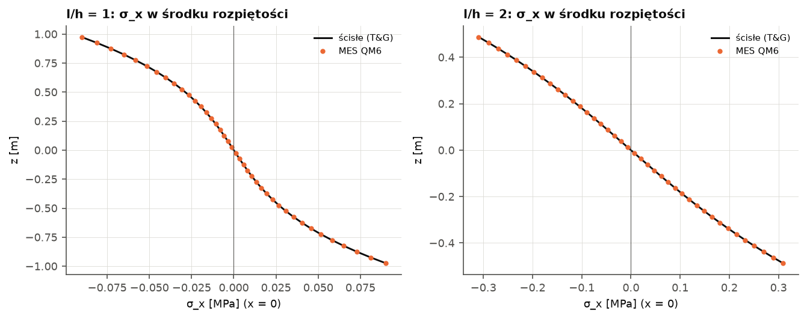
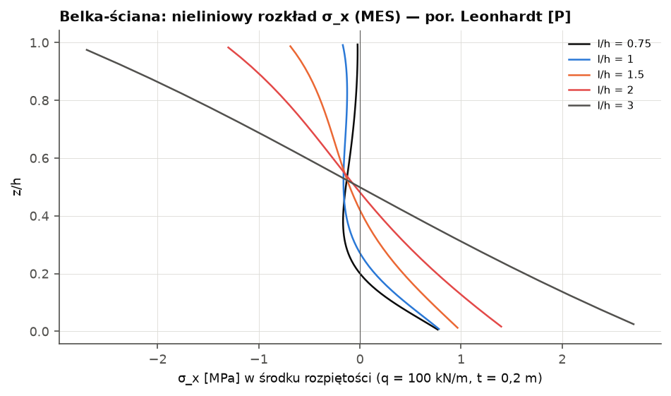
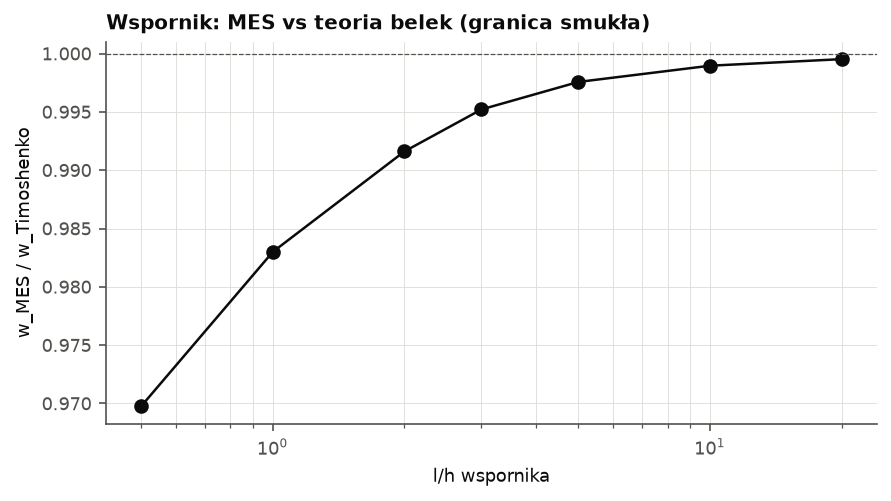

# Walidacja modułu ścian-tarcz (MES QM6 + STM)

Moduły `lamela.obliczenia.konstrukcja.tarcze_mes` (MES płaskiego stanu naprężenia) i `tarcze` (STM, wymiarowanie). [P] — źródło przytoczone z pamięci; wzory ścisłe sprawdzane niezależnie (równowaga, warunki brzegowe).

## (a1) Rozwiązanie ścisłe — belka-tarcza obciążona równomiernie (Timoshenko & Goodier §22)

σ_x = −q/(2I)·[(l² − x²)·z + 2z³/3 − 2c²z/5], σ_z = −q/(2I)·(−z³/3 + c²z + 2c³/3), τ_xz = q/(2I)·(c² − z²)·x, I = 2c³/3; na końcach x = ±l przyłożone trakcje z rozwiązania (σ_x samozrównoważone, τ o wypadkowej q·l).

Kontrola wzorów: residua równań równowagi 2.2e-10 / 2.0e-09; σ_z(+c) = −10,000 (= −q = −10), σ_z(−c) = 0,000, τ(±c) = 0,000; ∫τ dz na końcu = 10,000 (= q·l = 10,000), ∫σ_x dz = 0,0000, ∫σ_x·z dz = 0,0000.

| l/h (rozpiętość/wysokość) | h_el/h | n_el | max|Δσ_x|/max|σ_x| | max|Δσ_z|/q | max|Δτ|/max|τ| | reakcje resztkowe [kN] |
|---|---|---|---|---|---|---|
| 1,0 | 0,200 | 100 | 0.72 % | 1.58 % | 1.07 % | 5.2e-13 |
| 1,0 | 0,100 | 400 | 0.40 % | 0.97 % | 0.50 % | 1.6e-12 |
| 1,0 | 0,050 | 1600 | 0.21 % | 0.53 % | 0.24 % | 5.7e-12 |
| 2,0 | 0,200 | 200 | 0.35 % | 3.74 % | 1.03 % | 5.9e-12 |
| 2,0 | 0,100 | 800 | 0.21 % | 2.09 % | 0.48 % | 4.5e-12 |
| 2,0 | 0,050 | 3200 | 0.12 % | 1.11 % | 0.24 % | 6.2e-12 |
| 4,0 | 0,200 | 400 | 0.17 % | 8.07 % | 1.01 % | 9.7e-11 |
| 4,0 | 0,100 | 1600 | 0.11 % | 4.34 % | 0.48 % | 1.5e-10 |
| 4,0 | 0,050 | 6400 | 0.06 % | 2.25 % | 0.23 % | 1.0e-09 |

Błędy mierzone w środkach wszystkich elementów (także przy krawędziach obciążonych). Zbieżność liniowa w h dla σ_z (obciążenie krawędziowe), dla σ_x — błąd < 0,5 % już przy 10 elementach na wysokości.

## (a2) Belka-ściana jednoprzęsłowa — ramię sił wewnętrznych i siła w ściągu

Rozpiętość l = 3,0 m (osie podpór), podpory szer. 0,1·l, obciążenie q = 100 kN/m od góry, t = 0,20 m. MES — przekrój w środku rozpiętości: M z całkowania σ_x, T — wypadkowa strefy rozciąganej przy krawędzi dolnej, z = M/T. Reguła projektowa CEB-FIP / DAfStb Heft 240 [P] (wyprowadzona z analiz sprężystych Leonhardta i Walthera, Heft 178 [P]): z = 0,2·(l + 2h) dla 1 ≤ l/h < 2, z = 0,6·l dla l/h < 1; `zelbet.belka_sciana` — ta sama reguła (dla l/h ≥ 2 ogranicza z do 0,9·d). STM — maks. siła w cięgnie dolnym modelu wygenerowanego automatycznie.

| l/h | h [m] | x_R [m] | M_MES [kNm] | M_statyka [kNm] | q(l²−a²)/8 [kNm] | z_MES [m] | z_CEB [m] | Δz | T_MES [kN] | T belka_sciana [kN] | T_STM [kN] | h_rozc/h |
|---|---|---|---|---|---|---|---|---|---|---|---|---|
| 0,75 | 4,00 | 0,215 | 100,6 | 100,6 | 111,4 | 1,763 | 1,800 | −2,0 % | 57,0 | 62,5 | 42,0 | 0,200 |
| 1,00 | 3,00 | 0,215 | 100,6 | 100,6 | 111,4 | 1,722 | 1,800 | −4,3 % | 58,4 | 62,5 | 39,3 | 0,271 |
| 1,50 | 2,00 | 0,218 | 100,1 | 100,1 | 111,4 | 1,358 | 1,400 | −3,0 % | 73,7 | 80,4 | 64,9 | 0,421 |
| 2,00 | 1,50 | 0,229 | 98,3 | 98,3 | 111,4 | 1,019 | 1,200 | −15,1 % | 96,5 | 93,7 | 91,4 | 0,482 |
| 3,00 | 1,00 | 0,265 | 92,3 | 92,4 | 111,4 | 0,673 | 1,000 | −32,7 % | 137,2 | 131,6 | 132,0 | 0,500 |

x_R — środek reakcji podpory A z MES (podpora sztywna szer. 0,3 m: reakcja skupia się przy krawędzi wewnętrznej, stąd M < q(l² − a²)/8 liczone dla reakcji w osi podpory); M_statyka — z reakcji MES = M z całkowania naprężeń.

Wnioski: dla l/h = 0,75…1,5 sprężyste ramię sił wewnętrznych z_MES różni się od reguły CEB-FIP/DAfStb o ≤ 4,3 % (reguła jest zaokrągleniem analiz sprężystych Leonhardta [P]); dla l/h = 2 reguła daje ramię 0,80·h wobec sprężystego 0,68·h. Siła w ściągu z `zelbet.belka_sciana` (M = q·l²/8 dla osi podpór) różni się od sprężystej wypadkowej T_MES o ≤ 8,7 % dla l/h ≤ 2. Dla l/h = 3 (granica belki-ściany, 5.3.1(3)) z_MES → 0,67·h (liniowy rozkład σ_x — teoria belek). Strefa rozciągana przy krawędzi dolnej: 0,20·h (l/h = 0,75) … 0,5·h (l/h = 3) — por. rozkłady Leonhardta [P]. STM (dolne rozwiązanie plastyczne) daje ściąg mniejszy od sprężystego dla tarcz krępych (większe ramię), dla l/h ≥ 2 — zbliżony.

## (b) Wspornik — zgodność z teorią belek dla wspornika smukłego

Wspornik h = 0,5 m, t = 0,2 m, utwierdzony w ścianie poprzecznej (u_x = u_z = 0 na całej wysokości), siła P = 100 kN na końcu (trakcja paraboliczna). Odniesienie: belka Timoshenki w = P·l³/(3EI) + P·l/(κGA), κ = 5/6, ν = 0,2.

| l/h | w_M [mm] | w_V [mm] | w_Timoshenko [mm] | w_MES [mm] | MES/belka | R [kN] |
|---|---|---|---|---|---|---|
| 0,5 | 0,0083 | 0,0240 | 0,0323 | 0,0314 | 0,970 | 100,00 |
| 1,0 | 0,0667 | 0,0480 | 0,1147 | 0,1127 | 0,983 | 100,00 |
| 2,0 | 0,5333 | 0,0960 | 0,6293 | 0,6241 | 0,992 | 100,00 |
| 3,0 | 1,8000 | 0,1440 | 1,9440 | 1,9347 | 0,995 | 100,00 |
| 5,0 | 8,3333 | 0,2400 | 8,5733 | 8,5525 | 0,998 | 100,00 |
| 10,0 | 66,6667 | 0,4800 | 67,1467 | 67,0769 | 0,999 | 100,00 |
| 20,0 | 533,3333 | 0,9600 | 534,2933 | 534,0394 | 1,000 | 100,00 |

Dla wspornika smukłego (l/h ≥ 5) MES = teoria belek z dokładnością ≈ 1–2 % (różnica — sztywne utwierdzenie całego przekroju, które blokuje deplanację). Dla wsporników krótkich (l/h ≤ 1 — tarcze wspornikowe) teoria belek traci ważność: podatność wynika głównie z odkształceń postaciowych i lokalnych przy utwierdzeniu, stosunek odbiega od 1 — stąd analiza tarczowa zamiast belkowej.

## (c) Zbieżność siatki — tarcza demo (kombinacja miarodajna STR)

| h_el [m] | n_el | w_wspornika [mm] | T pasa górnego (MES) [kN] | R_A [kN] | r_A,max [kN/m] | σ₁,max [MPa] | czas [s] |
|---|---|---|---|---|---|---|---|
| 0,20 | 719 | 0,3154 | 102,69 | 413,89 | 262,1 | 2,785 | 0,8 |
| 0,10 | 2483 | 0,3218 | 107,82 | 413,84 | 264,1 | 3,823 | 2,8 |
| 0,05 | 9808 | 0,3244 | 109,61 | 413,79 | 265,0 | 4,491 | 10,2 |

Ekstrapolacja Richardsona: w_wsp → 0,3263 mm (rząd 1,27), T → 110,58 kN (rząd 1,52), R_A → 413,15 kN (rząd 0,11). Wielkości całkowe (ugięcie, reakcje, momenty, siły w pasach) zbieżne — różnica h = 0,10 vs 0,05 m ≤ 2 %; σ₁,max i szczyt reakcji r_A,max rosną z zagęszczaniem (osobliwość w narożach wklęsłych otworów — dlatego wymiarowanie opiera się na wypadkowych, nie na wartościach szczytowych).

## (d) Równowaga

ΣR_z = ΣF_z we wszystkich 8 kombinacjach STR — maks. błąd względny 2.5e-13. Siły w przekrojach pionowych (całkowanie σ_x, τ) vs statyka części tarczy — maks. rozbieżność 0.001 %.

**Kontrola równowagi w przekrojach pionowych (kombinacja 6.10a (wiodące: QA))** — siły z całkowania naprężeń MES (N = ∫σ_x·t dz, V = ∫τ·t dz, M = ∫σ_x·t·z dz) i ze statyki części lewej

| x [m] | N_MES [kN] | V statyka [kN] | V MES [kN] | M statyka [kNm] | M MES [kNm] |
|---|---|---|---|---|---|
| −0,34 | 0,00 | 123,5 | 123,5 | 88,6 | 88,6 |
| 1,45 | 0,00 | −18,1 | −18,1 | 205,3 | 205,3 |
| 3,25 | 0,00 | −51,7 | −51,7 | 113,0 | 113,0 |
| 4,05 | 0,00 | −5,9 | −5,9 | 89,9 | 89,9 |
| 5,95 | 0,00 | 3,8 | 3,8 | 107,9 | 107,9 |
| 7,95 | 0,00 | −59,3 | −59,3 | 22,8 | 22,8 |
| 8,85 | 0,00 | 0,0 | 0,0 | −4,6 | −4,6 |
| 10,35 | 0,00 | −5,5 | −5,5 | 6,7 | 6,7 |
