# Katalog mostków cieplnych — Dom testowy pipeline'u 3D (DEMONSTRACJA na modelu testowym)

Model: `model/test/dom_testowy.yaml`; źródło węzłów: katalog DEMONSTRACYJNY z przegród modelu (warianty porównawcze). B' = A/(0,5·P) = 91.04/(0,5·38.38) = 4.74 m (obrys zewn. parteru) [INT]. Wygenerowano: `PYTHONPATH=src python3 tools/katalog_mostkow.py`. **Model testowy pipeline'u — nie jest projektem Domu LAMELA**; katalog demonstruje metodę i narzędzie; po utworzeniu `model/budynek.yaml` z sekcją `wezly` skrypt wygeneruje katalog docelowy.

**Cel** (brief sekcja 9 — wymaganie Inwestora): potwierdzenie symulacją numeryczną ciągłości izolacji i braku ryzyka pleśni w węzłach oraz kontrola odprowadzenia wody, hydroizolacji, paroizolacji, rur spustowych i drenażu.

**Metoda.** Model 2D metodą objętości skończonych (`lamela.obliczenia.mostki2d`) wg PN-EN ISO 10211:2017: płaszczyzny odcięcia ≥ max(1 m; 3·d), R_se = 0,04, R_si = 0,13 / 0,10 / 0,17 (ISO 6946) do strumieni i ψ; R_si = 0,25 (ramy/szyby 0,13) do θ_si i f_Rsi (PN-EN ISO 13788); θ_i = 20 °C, θ_e = −18 °C; grunt λ = 2,0 W/(m·K), podłoga wg PN-EN ISO 13370 z B′ = A/(0,5·P). Siatka zagęszczana przy granicach materiałów i podwajana do zmiany strumienia < 1 % i ψ ≤ max(1 %; 0,001 W/(m·K)); bilans energii < 10⁻⁴. ψ_e — wymiary zewnętrzne, ψ_i — wewnętrzne (PN-EN ISO 14683), ψ_oi — wewnętrzne całkowite (system projektu, H_TB). Walidacja solvera: przypadki 1 i 2 zał. C ISO 10211 oraz analityczne — SPEŁNIONE (max |Δθ| przyp. 1 = 0.048 K, przyp. 2 = 0.039 K ≤ 0,1 K; ΔΦ = -0.010 W/m ≤ 0,1 W/m).

**Ciągłość izolacji („test ołówka”, zasada linii czerwonej)** — sprawdzana na siatce każdego węzła: szukana jest droga z powierzchni wewnętrznej na zewnętrzną / do strefy nieogrzewanej wyłącznie przez materiały o λ > 0.12 W/(m·K) [ZAŁ] (ramy i szyby traktowane jak obudowa). Brak drogi = linia izolacji ciągła; droga istnieje = mostek konstrukcyjny (na karcie czerwona linia przerywana ✕–✕); droga kończąca się w gruncie = izolacja domyka się przez grunt (typowe dla ław — ocena „do poprawy”).

**Ocena:** **BEZMOSTKOWY** — ψ_e ≤ 0,01 W/(m·K), f_Rsi spełnione, izolacja ciągła; **DOBRY** — ψ_oi ≤ dobra praktyka, f_Rsi spełnione; **DO POPRAWY** — ψ_oi > dobra praktyka lub linia izolacji domyka się przez grunt; **ZŁY** — ψ_oi > wartość domyślna PN-EN ISO 14683 lub izolacja przerwana konstrukcją; **NIE SPEŁNIA** — f_Rsi < f_Rsi,min — ryzyko pleśni (WT zał. 2 pkt 2.2). Odniesienia ψ_oi: wartość domyślna PN-EN ISO 14683 zał. C i „dobra praktyka” z `fizyka.mostki.PSI_DOMYSLNE` [NZW]; f_Rsi,min = 0.72 (W-248, WT zał. 2 pkt 2.2). Kryterium „bez mostków” ψ_e ≤ 0,01 W/(m·K) — informacyjne.

**Rysunki (zasada „4 linii”, brief 9.1):** izolacja — kreskowanie czerwone; hydroizolacja / izolacja przeciwwodna — niebieska ciągła, przeciwwilgociowa — niebieska przerywana; paroizolacja / szczelność powietrzna (tynk wewn., taśmy wewn.) — zielona; taśmy / uszczelnienia zewnętrzne — niebieska kropkowana; obróbki, parapety, okapniki — czarna; spływ wody — strzałka turkusowa; drenaż / opaska żwirowa — brązowa; rura spustowa — szara. Membrany, taśmy i obróbki są pomijalne cieplnie (poza modelem 2D, tylko na rysunku) — z wyjątkiem warstw przegród modelu (EPDM, paroizolacja, hydroizolacja pionowa), które są w obliczeniu.

## Tabela zbiorcza

| węzeł | nazwa | ψ_e | ψ_i | ψ_oi | θ_si,min [°C] | f_Rsi | izolacja | woda / wilgoć* | ocena |
|---|---|---|---|---|---|---|---|---|---|
| [WZ-R1](#wz-r1) | Attyka dachu D1 | +0,063 | +0,165 | +0,163 | 16,22 | 0,901 | ciągła | 2 ✗ / 0 ! | **DOBRY** |
| [WZ-B0](#wz-b0) | Płyta wspornikowa PL-D — WARIANT PORÓWNAWCZY bez łącznika | +0,752 | +0,805 | +0,752 | 10,34 | 0,746 | **PRZERWANA** | 0 ✗ / 2 ! | **ZŁY** |
| [WZ-B1](#wz-b1) | Płyta wspornikowa PL-D — łącznik termoizolacyjny | +0,157 | +0,210 | +0,157 | 16,94 | 0,919 | ciągła | 0 ✗ / 2 ! | **DO POPRAWY** |
| [WZ-W0](#wz-w0) | Ościeże okna — montaż w murze (rama w licu zewn. muru, izolacja z zakładem 3 cm) | +0,033 | +0,033 | +0,024 | 16,98 | 0,920 | ciągła | ✓ | **DOBRY** |
| [WZ-W2](#wz-w2) | Ościeże okna — ciepły montaż w warstwie izolacji (wariant zalecany) | −0,000 | −0,000 | +0,017 | 15,85 | 0,891 | ciągła | ✓ | **BEZMOSTKOWY** |
| [WZ-W1](#wz-w1) | Ościeże okna — osadzenie wg modelu (model: Otwor.rama_t otworu O0-01 (rama 9.0 cm, 5.0 cm w murze)) | +0,014 | +0,014 | +0,005 | 17,27 | 0,928 | ciągła | ✓ | **DOBRY** |
| [WZ-N1](#wz-n1) | Nadproże okna — rama wsunięta 5 cm w mur, reszta w izolacji | +0,017 | +0,017 | +0,008 | 17,62 | 0,937 | ciągła | ✓ | **DOBRY** |
| [WZ-N2](#wz-n2) | Nadproże okna — rama wsunięta 5 cm w mur, reszta w izolacji + kaseta osłony w ociepleniu | +0,092 | +0,092 | +0,083 | 16,55 | 0,909 | ciągła | ✓ | **DO POPRAWY** |
| [WZ-P1](#wz-p1) | Podokiennik — rama wsunięta 5 cm w mur, reszta w izolacji, parapet wewn. i zewn. | +0,014 | +0,014 | +0,005 | 16,55 | 0,909 | ciągła | ✓ | **DOBRY** |
| [WZ-GF2](#wz-gf2) | Cokół — płyta fundamentowa na XPS (wariant porównawczy) [ZAŁ] | +0,045 | +0,099 | +0,099 | 17,23 | 0,927 | ciągła | 2 ✗ / 1 ! | **DOBRY** |
| [WZ-GF1](#wz-gf1) | Cokół — ściana / podłoga na gruncie / ława | +0,146 | +0,213 | +0,213 | 12,63 | 0,806 | przez grunt | 2 ✗ / 1 ! | **DO POPRAWY** |
| [WZ-GF1B](#wz-gf1b) | Cokół — ława + blok termiczny (beton komórkowy 400) w 1. warstwie muru | +0,011 | +0,078 | +0,078 | 16,65 | 0,912 | ciągła | 2 ✗ / 1 ! | **DOBRY** |
| [WZ-C1](#wz-c1) | Narożnik zewnętrzny ścian (rzut) | −0,052 | +0,065 | +0,065 | 17,10 | 0,924 | ciągła | ✓ | **BEZMOSTKOWY** |
| [WZ-G1](#wz-g1) | Dom – garaż nieogrzewany: ściana garażu dochodzi do lica ETICS | +0,023 | +0,023 | +0,023 | 18,65 | 0,964 | ciągła | ✓ | **DOBRY** |
| [WZ-G2](#wz-g2) | Dom – garaż nieogrzewany: ściana garażu przerywa ocieplenie | +0,257 | +0,257 | +0,257 | 14,10 | 0,845 | **PRZERWANA** | ✓ | **ZŁY** |
| [WZ-RS1](#wz-rs1) | Rura spustowa we wnęce ocieplenia (rzut) | +0,074 | +0,074 | +0,074 | 17,68 | 0,939 | ciągła | 1 ✗ / 0 ! | **DO POPRAWY** |
| [WZ-IF1](#wz-if1) | Strop pośredni ST1 z wieńcem (ETICS ciągły) | +0,001 | +0,053 | +0,001 | 18,65 | 0,964 | ciągła | ✓ | **BEZMOSTKOWY** |
| [WZ-T1](#wz-t1) | Próg drzwi (HS / wejściowe) na płycie parteru — grunt | +0,141 | +0,208 | +0,208 | 10,42 | 0,748 | przez grunt | 2 ✗ / 1 ! | **DO POPRAWY** |
| [WZ-T2](#wz-t2) | Próg okna/drzwi do podłogi na stropie pośrednim (wieniec) | +0,023 | +0,076 | +0,023 | 15,52 | 0,882 | ciągła | ✓ | **DOBRY** |
| [WZ-T3](#wz-t3) | Próg drzwi na płycie wspornikowej (balkon/taras) — łącznik termoizolacyjny | +0,172 | +0,224 | +0,172 | 15,24 | 0,875 | ciągła | ✓ | **DO POPRAWY** |

\* woda / wilgoć: liczba pozycji listy kontrolnej ✗ BRAK / ! UWAGA (bez pozycji „izolacja”) — dane do uzupełnienia w modelu lub rozwiązania do pokazania na detalu; ✓ — bez braków.

## Porównanie wariantów

### Płyta wspornikowa: bez łącznika vs z łącznikiem termoizolacyjnym

| węzeł | wariant | ψ_e | ψ_oi | f_Rsi | izolacja | ocena |
|---|---|---|---|---|---|---|
| WZ-B0 | Płyta wspornikowa PL-D — WARIANT PORÓWNAWCZY bez łącznika | +0,752 | +0,752 | 0,746 | **PRZERWANA** | **ZŁY** |
| WZ-B1 | Płyta wspornikowa PL-D — łącznik termoizolacyjny | +0,157 | +0,157 | 0,919 | ciągła | **DO POPRAWY** |

Różnica WZ-B1 względem WZ-B0: Δψ_oi = −0,595 W/(m·K), Δf_Rsi = +0,174, Δθ_si,min = +6,60 K — łącznik przerywa płytę w płaszczyźnie izolacji — linia izolacji ciągła, ψ spada kilkukrotnie.

### Ościeże okna: montaż w murze vs „ciepły montaż” w warstwie izolacji

| węzeł | wariant | ψ_e | ψ_oi | f_Rsi | izolacja | ocena |
|---|---|---|---|---|---|---|
| WZ-W0 | Ościeże okna — montaż w murze (rama w licu zewn. muru, izolacja z zakładem 3 cm) | +0,033 | +0,024 | 0,920 | ciągła | **DOBRY** |
| WZ-W1 | Ościeże okna — osadzenie wg modelu (model: Otwor.rama_t otworu O0-01 (rama 9.0 cm, 5.0 cm w murze)) | +0,014 | +0,005 | 0,928 | ciągła | **DOBRY** |
| WZ-W2 | Ościeże okna — ciepły montaż w warstwie izolacji (wariant zalecany) | −0,000 | +0,017 | 0,891 | ciągła | **BEZMOSTKOWY** |

Różnica WZ-W2 względem WZ-W0: Δψ_oi = −0,007 W/(m·K), Δf_Rsi = −0,030, Δθ_si,min = −1,12 K — we wszystkich wariantach izolacja ościeża zachodzi na ramę (3 cm) — bez tego zakładu ψ montażu w murze rośnie wielokrotnie.

### Cokół: płyta fundamentowa vs ława (z gruntem), blok termiczny

| węzeł | wariant | ψ_e | ψ_oi | f_Rsi | izolacja | ocena |
|---|---|---|---|---|---|---|
| WZ-GF2 | Cokół — płyta fundamentowa na XPS (wariant porównawczy) [ZAŁ] | +0,045 | +0,099 | 0,927 | ciągła | **DOBRY** |
| WZ-GF1 | Cokół — ściana / podłoga na gruncie / ława | +0,146 | +0,213 | 0,806 | przez grunt | **DO POPRAWY** |
| WZ-GF1B | Cokół — ława + blok termiczny (beton komórkowy 400) w 1. warstwie muru | +0,011 | +0,078 | 0,912 | ciągła | **DOBRY** |

Różnica WZ-GF1B względem WZ-GF2: Δψ_oi = −0,020 W/(m·K), Δf_Rsi = −0,015, Δθ_si,min = −0,58 K — przy ławie linia izolacji domyka się przez mur fundamentowy i grunt; blok termiczny u podstawy muru ją zamyka.

### Dom – garaż nieogrzewany: izolacja ciągła vs ściana garażu w ociepleniu

| węzeł | wariant | ψ_e | ψ_oi | f_Rsi | izolacja | ocena |
|---|---|---|---|---|---|---|
| WZ-G1 | Dom – garaż nieogrzewany: ściana garażu dochodzi do lica ETICS | +0,023 | +0,023 | 0,964 | ciągła | **DOBRY** |
| WZ-G2 | Dom – garaż nieogrzewany: ściana garażu przerywa ocieplenie | +0,257 | +0,257 | 0,845 | **PRZERWANA** | **ZŁY** |

Różnica WZ-G2 względem WZ-G1: Δψ_oi = +0,233 W/(m·K), Δf_Rsi = −0,120, Δθ_si,min = −4,55 K — ściana garażu dochodząca do muru domu przerywa ETICS.

## Woda, wilgoć, ciągłość — pozycje do uzupełnienia

Zestawienie pozycji ✗ BRAK / ! UWAGA z list kontrolnych wszystkich węzłów (dane modelu i działki oraz wymagania detalu — brief 9.3–9.6).

| status | pozycja | węzły |
|---|---|---|
| ✗ BRAK | izolacja przeciwwilgociowa podłogi na gruncie POD-0: BRAK w warstwach przegrody (np. papa / folia PE na płycie podkładowej, połączona z izolacją poziomą pod murem) | WZ-GF2, WZ-GF1, WZ-GF1B, WZ-T1 |
| ✗ BRAK | linia izolacji PRZERWANA: TYNK_GIPS → SIL18 → SIL24 → TYNK_CEM | WZ-G2 |
| ✗ BRAK | linia izolacji PRZERWANA: TYNK_GIPS → SIL18 → ZB_C30 | WZ-B0 |
| ✗ BRAK | odwodnienie przy budynku (`dzialka.odwodnienia`: opaska żwirowa / drenaż opaskowy / odwodnienie liniowe): brak w modelu działki — decyzja o drenażu wg badań gruntu (brief 9.6) do udokumentowania | WZ-GF2, WZ-GF1, WZ-GF1B, WZ-T1 |
| ✗ BRAK | przelewy awaryjne w attyce: BRAK w modelu (wymagane dla każdego pola dachu — brief 9.3; `dachy[].przelewy_awaryjne`) | WZ-R1 |
| ✗ BRAK | rury spustowe w modelu: brak (`dachy[].rury_spustowe`) | WZ-RS1 |
| ✗ BRAK | rury spustowe: trasa nieokreślona w modelu (`dachy[].rury_spustowe`: szacht izolowany / zewn. z czyszczakiem, odbiornik zbiornik/niecka) | WZ-R1 |
| ! UWAGA | linia izolacji domyka się przez grunt: SIL18 → BET_FUND → HYDRO → ZB → GRUNT — ograniczyć izolacją obwodową / blokiem termicznym u podstawy muru | WZ-T1 |
| ! UWAGA | linia izolacji domyka się przez grunt: TYNK_GIPS → GRES → JASTRYCH → SIL18 → BET_FUND → HYDRO → ZB → GRUNT — ograniczyć izolacją obwodową / blokiem termicznym u podstawy muru | WZ-GF1 |
| ! UWAGA | odprowadzenie wody z krawędzi płyty (rynna / okapnik / rzygacz → rura spustowa) — nieokreślone w modelu; obróbka czoła płyty z okapnikiem ≥ 3 cm | WZ-B0, WZ-B1 |
| ! UWAGA | spadek płyty od budynku: nieokreślony w modelu (wymagany ≥ 1,5–2 %) | WZ-B0, WZ-B1 |
| ! UWAGA | spadek terenu ≥ 2 % od budynku na 1,5–2 m: brak rzędnych projektowanych terenu w modelu działki | WZ-GF2, WZ-GF1, WZ-GF1B, WZ-T1 |
| ! UWAGA | wnęka w ETICS pocienia izolację (ψ > 0) — zalecana rura przed licem na obejmach dystansowych albo w izolowanym szachcie wewnętrznym | WZ-RS1 |

## H_TB z wartości symulowanych (ψ_oi)

| węzeł | nazwa | ψ_oi [W/(m·K)] | l_oi [m] | ψ·l [W/K] |
|---|---|---|---|---|
| WZ-R1 | Attyka dachu D1 | +0,163 | 35,16 | +5,74 |
| WZ-B1 | Płyta wspornikowa PL-D — łącznik termoizolacyjny | +0,157 | 2,60 | +0,41 |
| WZ-W1 | Ościeże okna — osadzenie wg modelu (model: Otwor.rama_t otworu O0-01 (rama 9.0 cm, 5.0 cm w murze)) | +0,005 | 46,80 | +0,23 |
| WZ-N1 | Nadproże okna — rama wsunięta 5 cm w mur, reszta w izolacji | +0,008 | 9,10 | +0,07 |
| WZ-N2 | Nadproże okna — rama wsunięta 5 cm w mur, reszta w izolacji + kaseta osłony w ociepleniu | +0,083 | 18,60 | +1,55 |
| WZ-P1 | Podokiennik — rama wsunięta 5 cm w mur, reszta w izolacji, parapet wewn. i zewn. | +0,005 | 16,60 | +0,09 |
| WZ-GF1 | Cokół — ściana / podłoga na gruncie / ława | +0,213 | 30,06 | +6,39 |
| WZ-C1 | Narożnik zewnętrzny ścian (rzut) | +0,065 | 23,08 | +1,49 |
| WZ-IF1 | Strop pośredni ST1 z wieńcem (ETICS ciągły) | +0,001 | 26,56 | +0,02 |
| WZ-T1 | Próg drzwi (HS / wejściowe) na płycie parteru — grunt | +0,208 | 5,10 | +1,06 |
| WZ-T2 | Próg okna/drzwi do podłogi na stropie pośrednim (wieniec) | +0,023 | 3,60 | +0,08 |
| WZ-T3 | Próg drzwi na płycie wspornikowej (balkon/taras) — łącznik termoizolacyjny | +0,172 | 2,40 | +0,41 |

**H_TB = Σ ψ_oi·l_oi = 17,55 W/K** (węzły liniowe wg modelu; warianty porównawcze bez długości nie są sumowane; mostki punktowe χ — poza zakresem 2D).

## Karty węzłów

### WZ-R1

**Attyka dachu D1** — ocena **DOBRY** (ψ_oi ≤ dobra praktyka, f_Rsi spełnione)

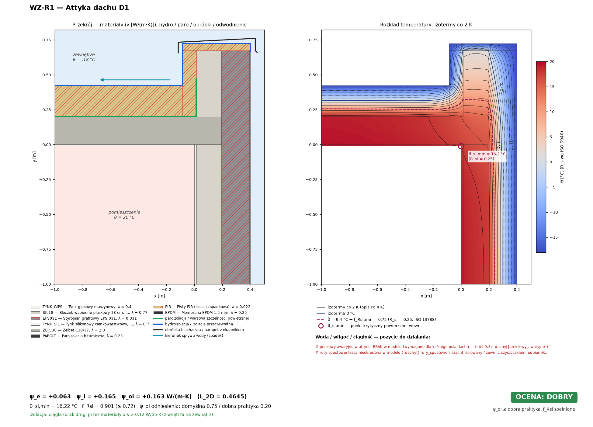

* ψ_e = +0,063, ψ_i = +0,165, ψ_oi = +0,163 W/(m·K); L_2D = 0,4645 W/(m·K); odniesienie ψ_oi: domyślna 0,75, dobra praktyka 0,20 (stropodach–ściana zewnętrzna z attyką (izolacja attyki z 3 stron))
* θ_si,min = 16,22 °C, f_Rsi = 0,901 (≥ 0.72 — brak ryzyka pleśni i kondensacji powierzchniowej)
* izolacja: ciągła (brak drogi przez materiały o λ > 0.12 W/(m·K) z wnętrza na zewnątrz)
* siatka: 77216 komórek, zmiana Φ przy podwojeniu 0,020 %, bilans 2.1e-12

| | temat | pozycja listy kontrolnej |
|---|---|---|
| ✓ OK | izolacja | linia izolacji ciągła („test ołówka” na siatce: brak drogi przez materiały o λ > 0.12) |
| ✓ OK | paro | szczelność powietrzna ściany SZ1: tynk wewnętrzny ciągły (TYNK_GIPS) — do stropu i posadzki |
| ✓ OK | paro | paroizolacja stropodachu SD-D1: PAROIZ — wywinięta na attykę |
| ✓ OK | hydro | hydroizolacja stropodachu SD-D1: EPDM |
| ✓ OK | hydro | wywinięcie hydroizolacji na attykę ≥ 15 cm ponad warstwę wierzchnią (brief 9.4) |
| ✓ OK | woda | spadek dachu 0.02 (wymagany ≥ 2 %, izolacja spadkowa) |
| ✓ OK | woda | wpusty dachowe: 1 szt. |
| ✗ BRAK | woda | przelewy awaryjne w attyce: BRAK w modelu (wymagane dla każdego pola dachu — brief 9.3; `dachy[].przelewy_awaryjne`) |
| ✗ BRAK | rury | rury spustowe: trasa nieokreślona w modelu (`dachy[].rury_spustowe`: szacht izolowany / zewn. z czyszczakiem, odbiornik zbiornik/niecka) |
| i INFO | woda | obróbka korony attyki ze spadkiem ≥ 5 % do dachu i okapnikami; wpust / przelew przez attykę — mostek punktowy χ (poza modelem 2D; kołnierz izolowany) |

*Na rysunku:* hydroizolacja (EPDM) wywinięta na attykę i koronę — 30 cm ponad pokrycie (≥ 15 cm); obróbka korony attyki: spadek ≥ 5 % do dachu, okapniki ≥ 3 cm od lic; paroizolacja na płycie (PAROIZ) wywinięta na attykę ponad izolację dachu, połączona z płytą ŻB (szczelność); spadek dachu ≥ 2 % do wpustów; przelew awaryjny w attyce (mostek punktowy χ).

Wykresy szczegółowe: [temperatura](rys/WZ-R1_temperatura.png), [strumien](rys/WZ-R1_strumien.png), [powierzchnia](rys/WZ-R1_theta_si.png); dane wejściowe, warunki brzegowe, siatka, elementy flankujące — [szczegoly_obliczen.md](szczegoly_obliczen.md)

### WZ-B0

**Płyta wspornikowa PL-D — WARIANT PORÓWNAWCZY bez łącznika** — ocena **ZŁY** (izolacja przerwana: TYNK_GIPS → SIL18 → ZB_C30; ψ_oi = 0.752 > domyślna 0.30)

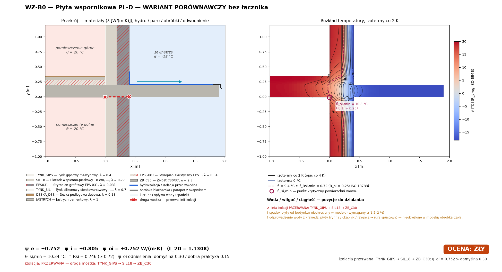

* ψ_e = +0,752, ψ_i = +0,805, ψ_oi = +0,752 W/(m·K); L_2D = 1,1308 W/(m·K); odniesienie ψ_oi: domyślna 0,30, dobra praktyka 0,15 (płyta wspornikowa z łącznikiem termoizolacyjnym)
* θ_si,min = 10,34 °C, f_Rsi = 0,746 (≥ 0.72 — brak ryzyka pleśni i kondensacji powierzchniowej)
* izolacja: PRZERWANA — droga mostka: TYNK_GIPS → SIL18 → ZB_C30
* siatka: 86976 komórek, zmiana Φ przy podwojeniu 0,101 %, bilans 6.8e-13

| | temat | pozycja listy kontrolnej |
|---|---|---|
| ✗ BRAK | izolacja | linia izolacji PRZERWANA: TYNK_GIPS → SIL18 → ZB_C30 |
| ✓ OK | paro | szczelność powietrzna ściany SZ1: tynk wewnętrzny ciągły (TYNK_GIPS) — do stropu i posadzki |
| ✓ OK | hydro | hydroizolacja płyty TAR1: HYDRO |
| ! UWAGA | woda | spadek płyty od budynku: nieokreślony w modelu (wymagany ≥ 1,5–2 %) |
| ! UWAGA | woda | odprowadzenie wody z krawędzi płyty (rynna / okapnik / rzygacz → rura spustowa) — nieokreślone w modelu; obróbka czoła płyty z okapnikiem ≥ 3 cm |
| i INFO | hydro | hydroizolacja wywinięta na ścianę ≥ 15 cm ponad nawierzchnię, pod cokolikiem XPS; ciągła nad łącznikiem termoizolacyjnym |

*Na rysunku:* hydroizolacja płyty wywinięta na ścianę ≥ 15 cm ponad nawierzchnię (pod cokolik XPS); obróbka czoła płyty z okapnikiem ≥ 3 cm; spadek płyty ≥ 1,5–2 % od budynku.

Wykresy szczegółowe: [temperatura](rys/WZ-B0_temperatura.png), [strumien](rys/WZ-B0_strumien.png), [powierzchnia](rys/WZ-B0_theta_si.png); dane wejściowe, warunki brzegowe, siatka, elementy flankujące — [szczegoly_obliczen.md](szczegoly_obliczen.md)

### WZ-B1

**Płyta wspornikowa PL-D — łącznik termoizolacyjny** — ocena **DO POPRAWY** (ψ_oi = 0.157 > dobra praktyka 0.15)

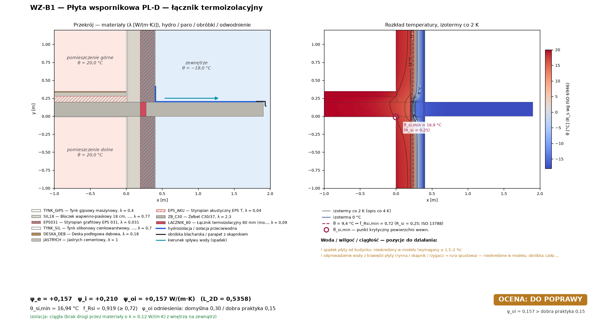

* ψ_e = +0,157, ψ_i = +0,210, ψ_oi = +0,157 W/(m·K); L_2D = 0,5358 W/(m·K); odniesienie ψ_oi: domyślna 0,30, dobra praktyka 0,15 (płyta wspornikowa z łącznikiem termoizolacyjnym)
* θ_si,min = 16,94 °C, f_Rsi = 0,919 (≥ 0.72 — brak ryzyka pleśni i kondensacji powierzchniowej)
* izolacja: ciągła (brak drogi przez materiały o λ > 0.12 W/(m·K) z wnętrza na zewnątrz)
* siatka: 94464 komórek, zmiana Φ przy podwojeniu 0,022 %, bilans 9.9e-13

| | temat | pozycja listy kontrolnej |
|---|---|---|
| ✓ OK | izolacja | linia izolacji ciągła („test ołówka” na siatce: brak drogi przez materiały o λ > 0.12) |
| ✓ OK | paro | szczelność powietrzna ściany SZ1: tynk wewnętrzny ciągły (TYNK_GIPS) — do stropu i posadzki |
| ✓ OK | hydro | hydroizolacja płyty TAR1: HYDRO |
| ! UWAGA | woda | spadek płyty od budynku: nieokreślony w modelu (wymagany ≥ 1,5–2 %) |
| ! UWAGA | woda | odprowadzenie wody z krawędzi płyty (rynna / okapnik / rzygacz → rura spustowa) — nieokreślone w modelu; obróbka czoła płyty z okapnikiem ≥ 3 cm |
| i INFO | hydro | hydroizolacja wywinięta na ścianę ≥ 15 cm ponad nawierzchnię, pod cokolikiem XPS; ciągła nad łącznikiem termoizolacyjnym |

*Na rysunku:* hydroizolacja płyty wywinięta na ścianę ≥ 15 cm ponad nawierzchnię (pod cokolik XPS); obróbka czoła płyty z okapnikiem ≥ 3 cm; spadek płyty ≥ 1,5–2 % od budynku.

Wykresy szczegółowe: [temperatura](rys/WZ-B1_temperatura.png), [strumien](rys/WZ-B1_strumien.png), [powierzchnia](rys/WZ-B1_theta_si.png); dane wejściowe, warunki brzegowe, siatka, elementy flankujące — [szczegoly_obliczen.md](szczegoly_obliczen.md)

### WZ-W0

**Ościeże okna — montaż w murze (rama w licu zewn. muru, izolacja z zakładem 3 cm)** — ocena **DOBRY** (ψ_oi ≤ dobra praktyka, f_Rsi spełnione)

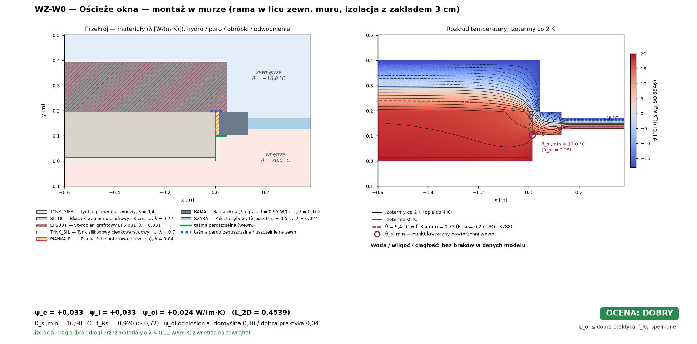

* ψ_e = +0,033, ψ_i = +0,033, ψ_oi = +0,024 W/(m·K); L_2D = 0,4539 W/(m·K); odniesienie ψ_oi: domyślna 0,10, dobra praktyka 0,04 (ościeża/nadproża/parapety — okno w warstwie izolacji („ciepły montaż”))
* θ_si,min = 16,98 °C, f_Rsi = 0,920 (≥ 0.72 — brak ryzyka pleśni i kondensacji powierzchniowej); rama/szyba f_Rsi = 0,825 (informacyjnie)
* izolacja: ciągła (brak drogi przez materiały o λ > 0.12 W/(m·K) z wnętrza na zewnątrz)
* siatka: 41580 komórek, zmiana Φ przy podwojeniu 0,085 %, bilans 2.4e-13

| | temat | pozycja listy kontrolnej |
|---|---|---|
| ✓ OK | izolacja | linia izolacji ciągła („test ołówka” na siatce: brak drogi przez materiały o λ > 0.12) |
| ✓ OK | paro | szczelność powietrzna ściany SZ1: tynk wewnętrzny ciągły (TYNK_GIPS) — do stropu i posadzki |
| i INFO | paro | montaż warstwowy: taśma paroszczelna od wewnątrz, paroprzepuszczalna od zewnątrz (zasada „wewnątrz szczelniej niż na zewnątrz”) |

*Uwaga:* Rama i szyba jako materiały zastępcze (λ_eq z U_f, U_g); ψ osadzenia liczone względem modelu okna bez ściany, więc uproszczenie ramy wpływa na ψ w małym stopniu. Ψ_g ramki dystansowej — poza zakresem (U_w wg PN-EN ISO 10077-1).
*Na rysunku:* taśma paroprzepuszczalna od zewnątrz (pod izolacją ościeża); taśma paroszczelna od wewnątrz (rama ↔ tynk ościeża).

Wykresy szczegółowe: [temperatura](rys/WZ-W0_temperatura.png), [strumien](rys/WZ-W0_strumien.png), [powierzchnia](rys/WZ-W0_theta_si.png); dane wejściowe, warunki brzegowe, siatka, elementy flankujące — [szczegoly_obliczen.md](szczegoly_obliczen.md)

### WZ-W2

**Ościeże okna — ciepły montaż w warstwie izolacji (wariant zalecany)** — ocena **BEZMOSTKOWY** (ψ_e ≤ 0,01 W/(m·K), f_Rsi spełnione, izolacja ciągła)

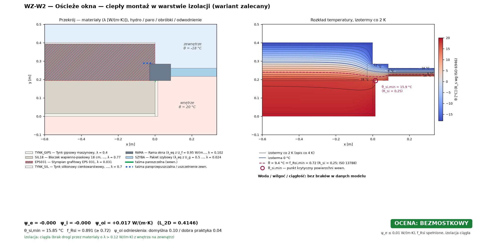

* ψ_e = −0,000, ψ_i = −0,000, ψ_oi = +0,017 W/(m·K); L_2D = 0,4146 W/(m·K); odniesienie ψ_oi: domyślna 0,10, dobra praktyka 0,04 (ościeża/nadproża/parapety — okno w warstwie izolacji („ciepły montaż”))
* θ_si,min = 15,85 °C, f_Rsi = 0,891 (≥ 0.72 — brak ryzyka pleśni i kondensacji powierzchniowej); rama/szyba f_Rsi = 0,821 (informacyjnie)
* izolacja: ciągła (brak drogi przez materiały o λ > 0.12 W/(m·K) z wnętrza na zewnątrz)
* siatka: 41552 komórek, zmiana Φ przy podwojeniu 0,056 %, bilans 1.1e-13

| | temat | pozycja listy kontrolnej |
|---|---|---|
| ✓ OK | izolacja | linia izolacji ciągła („test ołówka” na siatce: brak drogi przez materiały o λ > 0.12) |
| ✓ OK | paro | szczelność powietrzna ściany SZ1: tynk wewnętrzny ciągły (TYNK_GIPS) — do stropu i posadzki |
| i INFO | paro | montaż warstwowy: taśma paroszczelna od wewnątrz, paroprzepuszczalna od zewnątrz (zasada „wewnątrz szczelniej niż na zewnątrz”) |

*Uwaga:* Rama i szyba jako materiały zastępcze (λ_eq z U_f, U_g); ψ osadzenia liczone względem modelu okna bez ściany, więc uproszczenie ramy wpływa na ψ w małym stopniu. Ψ_g ramki dystansowej — poza zakresem (U_w wg PN-EN ISO 10077-1).
*Na rysunku:* taśma paroprzepuszczalna od zewnątrz (pod izolacją ościeża); taśma paroszczelna od wewnątrz (rama ↔ tynk ościeża).

Wykresy szczegółowe: [temperatura](rys/WZ-W2_temperatura.png), [strumien](rys/WZ-W2_strumien.png), [powierzchnia](rys/WZ-W2_theta_si.png); dane wejściowe, warunki brzegowe, siatka, elementy flankujące — [szczegoly_obliczen.md](szczegoly_obliczen.md)

### WZ-W1

**Ościeże okna — osadzenie wg modelu (model: Otwor.rama_t otworu O0-01 (rama 9.0 cm, 5.0 cm w murze))** — ocena **DOBRY** (ψ_oi ≤ dobra praktyka, f_Rsi spełnione)

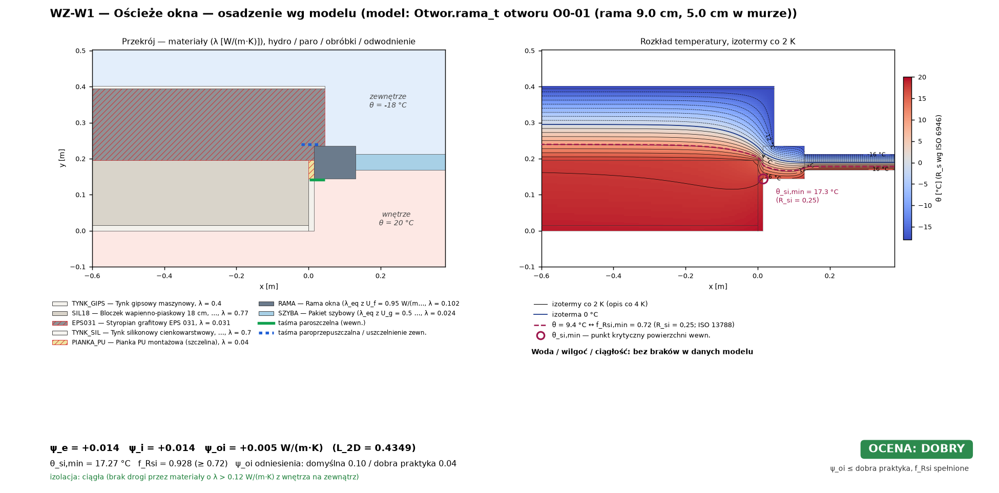

* ψ_e = +0,014, ψ_i = +0,014, ψ_oi = +0,005 W/(m·K); L_2D = 0,4349 W/(m·K); odniesienie ψ_oi: domyślna 0,10, dobra praktyka 0,04 (ościeża/nadproża/parapety — okno w warstwie izolacji („ciepły montaż”))
* θ_si,min = 17,27 °C, f_Rsi = 0,928 (≥ 0.72 — brak ryzyka pleśni i kondensacji powierzchniowej); rama/szyba f_Rsi = 0,824 (informacyjnie)
* izolacja: ciągła (brak drogi przez materiały o λ > 0.12 W/(m·K) z wnętrza na zewnątrz)
* siatka: 43560 komórek, zmiana Φ przy podwojeniu 0,069 %, bilans 5.2e-13

| | temat | pozycja listy kontrolnej |
|---|---|---|
| ✓ OK | izolacja | linia izolacji ciągła („test ołówka” na siatce: brak drogi przez materiały o λ > 0.12) |
| ✓ OK | paro | szczelność powietrzna ściany SZ1: tynk wewnętrzny ciągły (TYNK_GIPS) — do stropu i posadzki |
| i INFO | paro | montaż warstwowy: taśma paroszczelna od wewnątrz, paroprzepuszczalna od zewnątrz (zasada „wewnątrz szczelniej niż na zewnątrz”) |

*Uwaga:* Rama i szyba jako materiały zastępcze (λ_eq z U_f, U_g); ψ osadzenia liczone względem modelu okna bez ściany, więc uproszczenie ramy wpływa na ψ w małym stopniu. Ψ_g ramki dystansowej — poza zakresem (U_w wg PN-EN ISO 10077-1).
*Na rysunku:* taśma paroprzepuszczalna od zewnątrz (pod izolacją ościeża); taśma paroszczelna od wewnątrz (rama ↔ tynk ościeża).

Wykresy szczegółowe: [temperatura](rys/WZ-W1_temperatura.png), [strumien](rys/WZ-W1_strumien.png), [powierzchnia](rys/WZ-W1_theta_si.png); dane wejściowe, warunki brzegowe, siatka, elementy flankujące — [szczegoly_obliczen.md](szczegoly_obliczen.md)

### WZ-N1

**Nadproże okna — rama wsunięta 5 cm w mur, reszta w izolacji** — ocena **DOBRY** (ψ_oi ≤ dobra praktyka, f_Rsi spełnione)

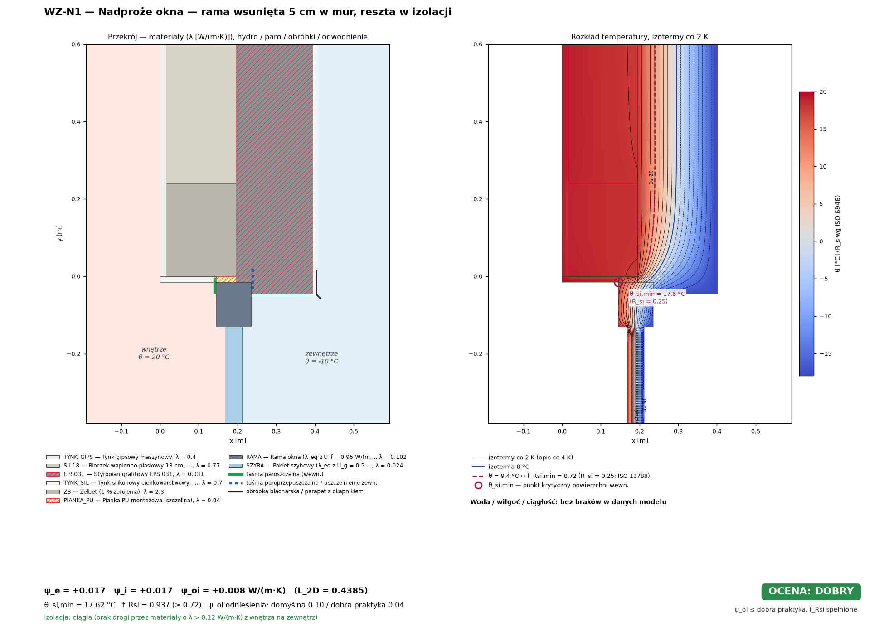

* ψ_e = +0,017, ψ_i = +0,017, ψ_oi = +0,008 W/(m·K); L_2D = 0,4385 W/(m·K); odniesienie ψ_oi: domyślna 0,10, dobra praktyka 0,04 (ościeża/nadproża/parapety — okno w warstwie izolacji („ciepły montaż”))
* θ_si,min = 17,62 °C, f_Rsi = 0,937 (≥ 0.72 — brak ryzyka pleśni i kondensacji powierzchniowej); rama/szyba f_Rsi = 0,824 (informacyjnie)
* izolacja: ciągła (brak drogi przez materiały o λ > 0.12 W/(m·K) z wnętrza na zewnątrz)
* siatka: 53240 komórek, zmiana Φ przy podwojeniu 0,072 %, bilans 1.2e-12

| | temat | pozycja listy kontrolnej |
|---|---|---|
| ✓ OK | izolacja | linia izolacji ciągła („test ołówka” na siatce: brak drogi przez materiały o λ > 0.12) |
| ✓ OK | paro | szczelność powietrzna ściany SZ1: tynk wewnętrzny ciągły (TYNK_GIPS) — do stropu i posadzki |
| i INFO | paro | montaż warstwowy: taśma paroszczelna od wewnątrz, paroprzepuszczalna od zewnątrz (zasada „wewnątrz szczelniej niż na zewnątrz”) |
| i INFO | woda | profil narożny z okapnikiem nad oknem; kaseta osłony — uszczelnienie i izolacja kasety |

*Uwaga:* Rama i szyba jako materiały zastępcze (λ_eq z U_f, U_g); ψ osadzenia liczone względem modelu okna bez ściany, więc uproszczenie ramy wpływa na ψ w małym stopniu. Ψ_g ramki dystansowej — poza zakresem (U_w wg PN-EN ISO 10077-1).
*Uwaga:* Przekrój pionowy przez nadproże: sufit ościeża (podsufitka) — R_si wg kierunku strumienia (ISO 6946: 0,10 strumień w górę).
*Na rysunku:* profil narożny z okapnikiem w ETICS nad oknem; taśma paroprzepuszczalna od zewnątrz (pod izolacją ościeża); taśma paroszczelna od wewnątrz (rama ↔ tynk ościeża).

Wykresy szczegółowe: [temperatura](rys/WZ-N1_temperatura.png), [strumien](rys/WZ-N1_strumien.png), [powierzchnia](rys/WZ-N1_theta_si.png); dane wejściowe, warunki brzegowe, siatka, elementy flankujące — [szczegoly_obliczen.md](szczegoly_obliczen.md)

### WZ-N2

**Nadproże okna — rama wsunięta 5 cm w mur, reszta w izolacji + kaseta osłony w ociepleniu** — ocena **DO POPRAWY** (ψ_oi = 0.083 > dobra praktyka 0.04)

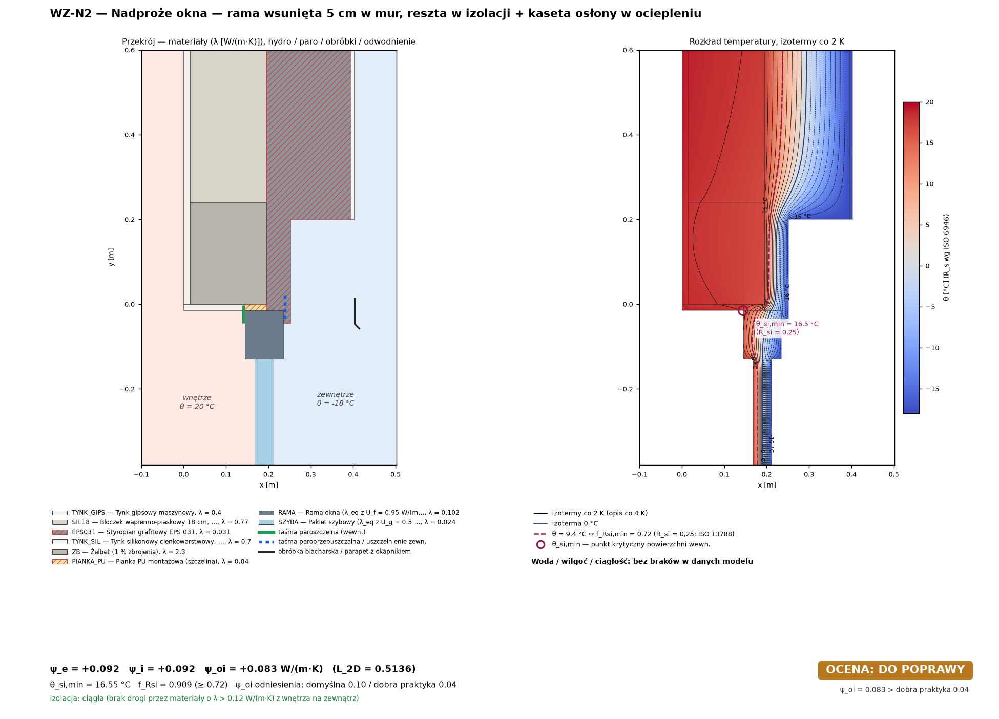

* ψ_e = +0,092, ψ_i = +0,092, ψ_oi = +0,083 W/(m·K); L_2D = 0,5136 W/(m·K); odniesienie ψ_oi: domyślna 0,10, dobra praktyka 0,04 (ościeża/nadproża/parapety — okno w warstwie izolacji („ciepły montaż”))
* θ_si,min = 16,55 °C, f_Rsi = 0,909 (≥ 0.72 — brak ryzyka pleśni i kondensacji powierzchniowej); rama/szyba f_Rsi = 0,822 (informacyjnie)
* izolacja: ciągła (brak drogi przez materiały o λ > 0.12 W/(m·K) z wnętrza na zewnątrz)
* siatka: 61248 komórek, zmiana Φ przy podwojeniu 0,062 %, bilans 1.4e-12

| | temat | pozycja listy kontrolnej |
|---|---|---|
| ✓ OK | izolacja | linia izolacji ciągła („test ołówka” na siatce: brak drogi przez materiały o λ > 0.12) |
| ✓ OK | paro | szczelność powietrzna ściany SZ1: tynk wewnętrzny ciągły (TYNK_GIPS) — do stropu i posadzki |
| i INFO | paro | montaż warstwowy: taśma paroszczelna od wewnątrz, paroprzepuszczalna od zewnątrz (zasada „wewnątrz szczelniej niż na zewnątrz”) |
| i INFO | woda | profil narożny z okapnikiem nad oknem; kaseta osłony — uszczelnienie i izolacja kasety |

*Uwaga:* Rama i szyba jako materiały zastępcze (λ_eq z U_f, U_g); ψ osadzenia liczone względem modelu okna bez ściany, więc uproszczenie ramy wpływa na ψ w małym stopniu. Ψ_g ramki dystansowej — poza zakresem (U_w wg PN-EN ISO 10077-1).
*Uwaga:* Kaseta żaluzji/screenu podtynkowa: izolacja za kasetą zmniejszona do 0.06 m; wariant zalecany — kaseta natynkowa albo kaseta systemowa z izolacją (deklarowane ψ/f_Rsi producenta).
*Uwaga:* Przekrój pionowy przez nadproże: sufit ościeża (podsufitka) — R_si wg kierunku strumienia (ISO 6946: 0,10 strumień w górę).
*Na rysunku:* profil narożny z okapnikiem w ETICS nad oknem; taśma paroprzepuszczalna od zewnątrz (pod izolacją ościeża); taśma paroszczelna od wewnątrz (rama ↔ tynk ościeża).

Wykresy szczegółowe: [temperatura](rys/WZ-N2_temperatura.png), [strumien](rys/WZ-N2_strumien.png), [powierzchnia](rys/WZ-N2_theta_si.png); dane wejściowe, warunki brzegowe, siatka, elementy flankujące — [szczegoly_obliczen.md](szczegoly_obliczen.md)

### WZ-P1

**Podokiennik — rama wsunięta 5 cm w mur, reszta w izolacji, parapet wewn. i zewn.** — ocena **DOBRY** (ψ_oi ≤ dobra praktyka, f_Rsi spełnione)

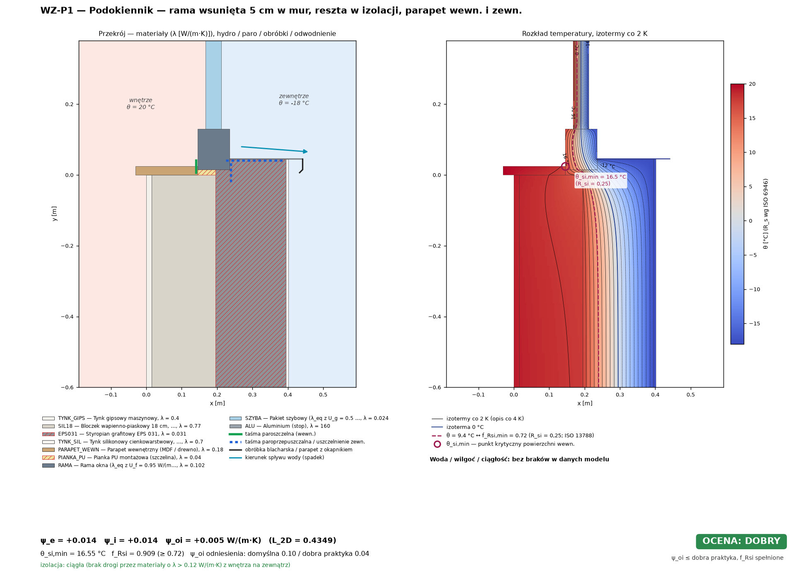

* ψ_e = +0,014, ψ_i = +0,014, ψ_oi = +0,005 W/(m·K); L_2D = 0,4349 W/(m·K); odniesienie ψ_oi: domyślna 0,10, dobra praktyka 0,04 (ościeża/nadproża/parapety — okno w warstwie izolacji („ciepły montaż”))
* θ_si,min = 16,55 °C, f_Rsi = 0,909 (≥ 0.72 — brak ryzyka pleśni i kondensacji powierzchniowej); rama/szyba f_Rsi = 0,821 (informacyjnie)
* izolacja: ciągła (brak drogi przez materiały o λ > 0.12 W/(m·K) z wnętrza na zewnątrz)
* siatka: 63840 komórek, zmiana Φ przy podwojeniu 0,078 %, bilans 4.7e-12

| | temat | pozycja listy kontrolnej |
|---|---|---|
| ✓ OK | izolacja | linia izolacji ciągła („test ołówka” na siatce: brak drogi przez materiały o λ > 0.12) |
| ✓ OK | paro | szczelność powietrzna ściany SZ1: tynk wewnętrzny ciągły (TYNK_GIPS) — do stropu i posadzki |
| i INFO | paro | montaż warstwowy: taśma paroszczelna od wewnątrz, paroprzepuszczalna od zewnątrz (zasada „wewnątrz szczelniej niż na zewnątrz”) |
| ✓ OK | woda | parapet zewnętrzny: spadek ≥ 5 %, okapnik ≥ 3 cm przed licem, zaślepki boczne, taśma pod parapetem |

*Uwaga:* Rama i szyba jako materiały zastępcze (λ_eq z U_f, U_g); ψ osadzenia liczone względem modelu okna bez ściany, więc uproszczenie ramy wpływa na ψ w małym stopniu. Ψ_g ramki dystansowej — poza zakresem (U_w wg PN-EN ISO 10077-1).
*Uwaga:* Parapet zewnętrzny (odprowadzenie wody): obróbka na izolacji podparapetowej, wsunięta pod profil podparapetowy ramy, okapnik ≥ 3–4 cm przed licem elewacji, spadek ≥ 5 %, zaślepki boczne w ościeżach; izolacja pod parapetem ciągła do ramy (brak mostka).
*Uwaga:* Przekrój pionowy przez podokiennik; parapet wewnętrzny o małym λ (drewno/MDF) — wariant ostrożny dla f_Rsi (ogranicza dopływ ciepła do naroża pod parapetem).
*Na rysunku:* okapnik parapetu 4 cm przed licem, zaślepki boczne; spadek parapetu ≥ 5 % na zewnątrz; taśma / membrana pod parapetem (2. poziom uszczelnienia), wywinięta na ramę; taśma paroprzepuszczalna od zewnątrz (pod izolacją ościeża); taśma paroszczelna od wewnątrz (rama ↔ tynk ościeża).

Wykresy szczegółowe: [temperatura](rys/WZ-P1_temperatura.png), [strumien](rys/WZ-P1_strumien.png), [powierzchnia](rys/WZ-P1_theta_si.png); dane wejściowe, warunki brzegowe, siatka, elementy flankujące — [szczegoly_obliczen.md](szczegoly_obliczen.md)

### WZ-GF2

**Cokół — płyta fundamentowa na XPS (wariant porównawczy) [ZAŁ]** — ocena **DOBRY** (ψ_oi ≤ dobra praktyka, f_Rsi spełnione)

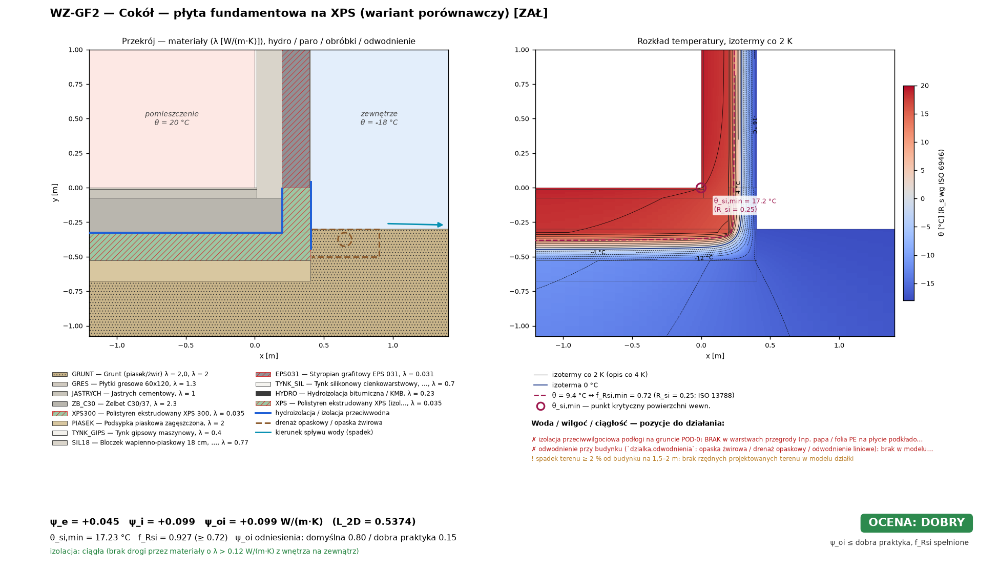

* ψ_e = +0,045, ψ_i = +0,099, ψ_oi = +0,099 W/(m·K); L_2D = 0,5374 W/(m·K); odniesienie ψ_oi: domyślna 0,80, dobra praktyka 0,15 (ściana zewnętrzna – podłoga na gruncie / płyta fundamentowa (cokół))
* θ_si,min = 17,23 °C, f_Rsi = 0,927 (≥ 0.72 — brak ryzyka pleśni i kondensacji powierzchniowej)
* izolacja: ciągła (brak drogi przez materiały o λ > 0.12 W/(m·K) z wnętrza na zewnątrz)
* siatka: 114816 komórek, zmiana Φ przy podwojeniu 0,025 %, bilans 1.3e-11

| | temat | pozycja listy kontrolnej |
|---|---|---|
| ✓ OK | izolacja | linia izolacji ciągła („test ołówka” na siatce: brak drogi przez materiały o λ > 0.12) |
| ✓ OK | paro | szczelność powietrzna ściany SZ1: tynk wewnętrzny ciągły (TYNK_GIPS) — do stropu i posadzki |
| ✗ BRAK | hydro | izolacja przeciwwilgociowa podłogi na gruncie POD-0: BRAK w warstwach przegrody (np. papa / folia PE na płycie podkładowej, połączona z izolacją poziomą pod murem) |
| ✓ OK | hydro | izolacja pionowa fundamentu i izolacja obwodowa XPS (nienasiąkliwa) — w modelu węzła |
| ✓ OK | hydro | strefa cokołu ≥ 30 cm nad terenem (uszczelnienie, tynk mozaikowy) |
| ✗ BRAK | drenaz | odwodnienie przy budynku (`dzialka.odwodnienia`: opaska żwirowa / drenaż opaskowy / odwodnienie liniowe): brak w modelu działki — decyzja o drenażu wg badań gruntu (brief 9.6) do udokumentowania |
| ! UWAGA | woda | spadek terenu ≥ 2 % od budynku na 1,5–2 m: brak rzędnych projektowanych terenu w modelu działki |

*Uwaga:* Ściana liczona od poziomu posadzki (±0,00) we wszystkich systemach wymiarów (ψ_oi = ψ_i); podłoga wg PN-EN ISO 13370 z B' = b [INT]; b = B' = A/(0,5·P) budynku, gdy podane z modelu.
*Uwaga:* Hydroizolacja pionowa ściany fundamentowej (bitumiczna/KMB) i izolacja obwodowa XPS (odporna na wodę) do spodu ławy; drenaż opaskowy i odprowadzenie wody opadowej od cokołu — poza zakresem cieplnym (wpływ na λ gruntu pominięty, λ = 2,0).
*Na rysunku:* drenaż opaskowy DN100 w obsypce żwirowej — decyzja wg badań gruntu / ZWG; hydroizolacja pod płytą (na XPS) wywinięta na krawędź płyty — ciągła do strefy cokołu; opaska żwirowa ≥ 50 cm; spadek terenu ≥ 2 % od budynku na ≥ 1,5–2 m; uszczelnienie strefy cokołu (masa/tynk mozaikowy) do 30 cm nad terenem (≥ 30 cm).

Wykresy szczegółowe: [temperatura](rys/WZ-GF2_temperatura.png), [strumien](rys/WZ-GF2_strumien.png), [powierzchnia](rys/WZ-GF2_theta_si.png); dane wejściowe, warunki brzegowe, siatka, elementy flankujące — [szczegoly_obliczen.md](szczegoly_obliczen.md)

### WZ-GF1

**Cokół — ściana / podłoga na gruncie / ława** — ocena **DO POPRAWY** (ψ_oi = 0.213 > dobra praktyka 0.15)

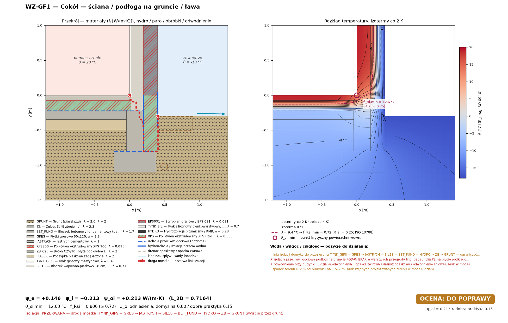

* ψ_e = +0,146, ψ_i = +0,213, ψ_oi = +0,213 W/(m·K); L_2D = 0,7164 W/(m·K); odniesienie ψ_oi: domyślna 0,80, dobra praktyka 0,15 (ściana zewnętrzna – podłoga na gruncie / płyta fundamentowa (cokół))
* θ_si,min = 12,63 °C, f_Rsi = 0,806 (≥ 0.72 — brak ryzyka pleśni i kondensacji powierzchniowej)
* izolacja: PRZERWANA — droga mostka: TYNK_GIPS → GRES → JASTRYCH → SIL18 → BET_FUND → HYDRO → ZB → GRUNT (wyjście przez grunt)
* siatka: 169480 komórek, zmiana Φ przy podwojeniu 0,055 %, bilans 3.1e-11

| | temat | pozycja listy kontrolnej |
|---|---|---|
| ! UWAGA | izolacja | linia izolacji domyka się przez grunt: TYNK_GIPS → GRES → JASTRYCH → SIL18 → BET_FUND → HYDRO → ZB → GRUNT — ograniczyć izolacją obwodową / blokiem termicznym u podstawy muru |
| ✓ OK | paro | szczelność powietrzna ściany SZ1: tynk wewnętrzny ciągły (TYNK_GIPS) — do stropu i posadzki |
| ✗ BRAK | hydro | izolacja przeciwwilgociowa podłogi na gruncie POD-0: BRAK w warstwach przegrody (np. papa / folia PE na płycie podkładowej, połączona z izolacją poziomą pod murem) |
| ✓ OK | hydro | izolacja pionowa fundamentu i izolacja obwodowa XPS (nienasiąkliwa) — w modelu węzła |
| ✓ OK | hydro | strefa cokołu ≥ 30 cm nad terenem (uszczelnienie, tynk mozaikowy) |
| ✗ BRAK | drenaz | odwodnienie przy budynku (`dzialka.odwodnienia`: opaska żwirowa / drenaż opaskowy / odwodnienie liniowe): brak w modelu działki — decyzja o drenażu wg badań gruntu (brief 9.6) do udokumentowania |
| ! UWAGA | woda | spadek terenu ≥ 2 % od budynku na 1,5–2 m: brak rzędnych projektowanych terenu w modelu działki |

*Uwaga:* Ściana liczona od poziomu posadzki (±0,00) we wszystkich systemach wymiarów (ψ_oi = ψ_i); podłoga wg PN-EN ISO 13370 z B' = b [INT]; b = B' = A/(0,5·P) budynku, gdy podane z modelu.
*Uwaga:* Hydroizolacja pionowa ściany fundamentowej (bitumiczna/KMB) i izolacja obwodowa XPS (odporna na wodę) do spodu ławy; drenaż opaskowy i odprowadzenie wody opadowej od cokołu — poza zakresem cieplnym (wpływ na λ gruntu pominięty, λ = 2,0).
*Na rysunku:* drenaż opaskowy DN100 w obsypce żwirowej — decyzja wg badań gruntu / ZWG; izolacja pionowa ściany fundamentowej (KMB / masa bitumiczna) do spodu ETICS; izolacja pozioma na ławie; izolacja przeciwwilgociowa podłogi (na płycie podkładowej) połączona z poziomą pod murem; opaska żwirowa ≥ 50 cm; spadek terenu ≥ 2 % od budynku na ≥ 1,5–2 m; uszczelnienie strefy cokołu (masa/tynk mozaikowy) do 30 cm nad terenem (≥ 30 cm).

Wykresy szczegółowe: [temperatura](rys/WZ-GF1_temperatura.png), [strumien](rys/WZ-GF1_strumien.png), [powierzchnia](rys/WZ-GF1_theta_si.png); dane wejściowe, warunki brzegowe, siatka, elementy flankujące — [szczegoly_obliczen.md](szczegoly_obliczen.md)

### WZ-GF1B

**Cokół — ława + blok termiczny (beton komórkowy 400) w 1. warstwie muru** — ocena **DOBRY** (ψ_oi ≤ dobra praktyka, f_Rsi spełnione)

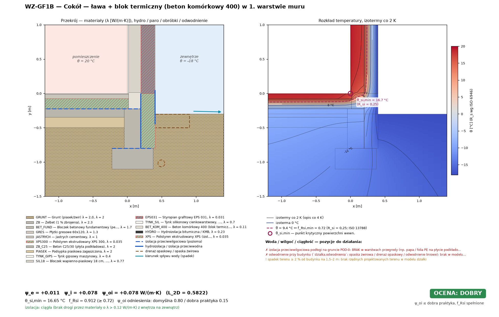

* ψ_e = +0,011, ψ_i = +0,078, ψ_oi = +0,078 W/(m·K); L_2D = 0,5822 W/(m·K); odniesienie ψ_oi: domyślna 0,80, dobra praktyka 0,15 (ściana zewnętrzna – podłoga na gruncie / płyta fundamentowa (cokół))
* θ_si,min = 16,65 °C, f_Rsi = 0,912 (≥ 0.72 — brak ryzyka pleśni i kondensacji powierzchniowej)
* izolacja: ciągła (brak drogi przez materiały o λ > 0.12 W/(m·K) z wnętrza na zewnątrz)
* siatka: 173280 komórek, zmiana Φ przy podwojeniu 0,032 %, bilans 4.0e-11

| | temat | pozycja listy kontrolnej |
|---|---|---|
| ✓ OK | izolacja | linia izolacji ciągła („test ołówka” na siatce: brak drogi przez materiały o λ > 0.12) |
| ✓ OK | paro | szczelność powietrzna ściany SZ1: tynk wewnętrzny ciągły (TYNK_GIPS) — do stropu i posadzki |
| ✗ BRAK | hydro | izolacja przeciwwilgociowa podłogi na gruncie POD-0: BRAK w warstwach przegrody (np. papa / folia PE na płycie podkładowej, połączona z izolacją poziomą pod murem) |
| ✓ OK | hydro | izolacja pionowa fundamentu i izolacja obwodowa XPS (nienasiąkliwa) — w modelu węzła |
| ✓ OK | hydro | strefa cokołu ≥ 30 cm nad terenem (uszczelnienie, tynk mozaikowy) |
| ✗ BRAK | drenaz | odwodnienie przy budynku (`dzialka.odwodnienia`: opaska żwirowa / drenaż opaskowy / odwodnienie liniowe): brak w modelu działki — decyzja o drenażu wg badań gruntu (brief 9.6) do udokumentowania |
| ! UWAGA | woda | spadek terenu ≥ 2 % od budynku na 1,5–2 m: brak rzędnych projektowanych terenu w modelu działki |

*Uwaga:* Ściana liczona od poziomu posadzki (±0,00) we wszystkich systemach wymiarów (ψ_oi = ψ_i); podłoga wg PN-EN ISO 13370 z B' = b [INT]; b = B' = A/(0,5·P) budynku, gdy podane z modelu.
*Uwaga:* Hydroizolacja pionowa ściany fundamentowej (bitumiczna/KMB) i izolacja obwodowa XPS (odporna na wodę) do spodu ławy; drenaż opaskowy i odprowadzenie wody opadowej od cokołu — poza zakresem cieplnym (wpływ na λ gruntu pominięty, λ = 2,0).
*Na rysunku:* drenaż opaskowy DN100 w obsypce żwirowej — decyzja wg badań gruntu / ZWG; izolacja pionowa ściany fundamentowej (KMB / masa bitumiczna) do spodu ETICS; izolacja pozioma na ławie; izolacja przeciwwilgociowa podłogi (na płycie podkładowej) połączona z poziomą pod murem; opaska żwirowa ≥ 50 cm; spadek terenu ≥ 2 % od budynku na ≥ 1,5–2 m; uszczelnienie strefy cokołu (masa/tynk mozaikowy) do 30 cm nad terenem (≥ 30 cm).

Wykresy szczegółowe: [temperatura](rys/WZ-GF1B_temperatura.png), [strumien](rys/WZ-GF1B_strumien.png), [powierzchnia](rys/WZ-GF1B_theta_si.png); dane wejściowe, warunki brzegowe, siatka, elementy flankujące — [szczegoly_obliczen.md](szczegoly_obliczen.md)

### WZ-C1

**Narożnik zewnętrzny ścian (rzut)** — ocena **BEZMOSTKOWY** (ψ_e ≤ 0,01 W/(m·K), f_Rsi spełnione, izolacja ciągła)

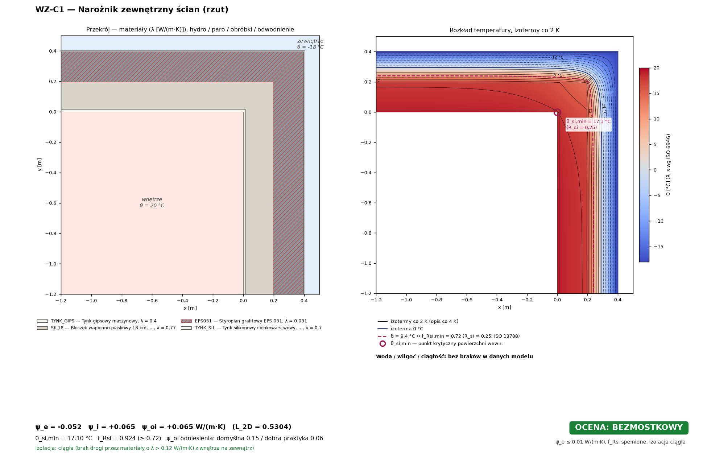

* ψ_e = −0,052, ψ_i = +0,065, ψ_oi = +0,065 W/(m·K); L_2D = 0,5304 W/(m·K); odniesienie ψ_oi: domyślna 0,15, dobra praktyka 0,06 (narożnik zewnętrzny ścian (izolacja zewnętrzna))
* θ_si,min = 17,10 °C, f_Rsi = 0,924 (≥ 0.72 — brak ryzyka pleśni i kondensacji powierzchniowej)
* izolacja: ciągła (brak drogi przez materiały o λ > 0.12 W/(m·K) z wnętrza na zewnątrz)
* siatka: 51984 komórek, zmiana Φ przy podwojeniu 0,007 %, bilans 1.6e-13

| | temat | pozycja listy kontrolnej |
|---|---|---|
| ✓ OK | izolacja | linia izolacji ciągła („test ołówka” na siatce: brak drogi przez materiały o λ > 0.12) |
| ✓ OK | paro | szczelność powietrzna ściany SZ1: tynk wewnętrzny ciągły (TYNK_GIPS) — do stropu i posadzki |

Wykresy szczegółowe: [temperatura](rys/WZ-C1_temperatura.png), [strumien](rys/WZ-C1_strumien.png), [powierzchnia](rys/WZ-C1_theta_si.png); dane wejściowe, warunki brzegowe, siatka, elementy flankujące — [szczegoly_obliczen.md](szczegoly_obliczen.md)

### WZ-G1

**Dom – garaż nieogrzewany: ściana garażu dochodzi do lica ETICS** — ocena **DOBRY** (ψ_oi ≤ dobra praktyka, f_Rsi spełnione)

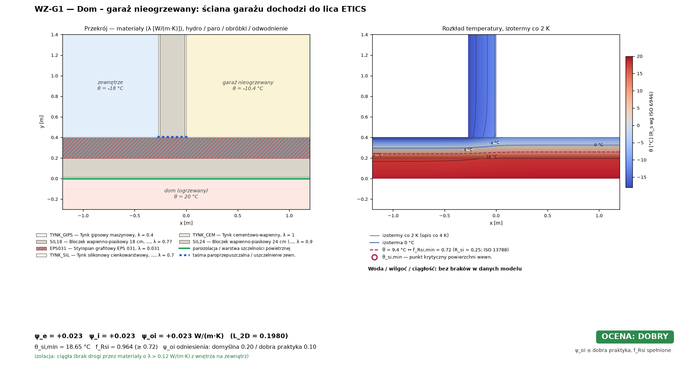

* ψ_e = +0,023, ψ_i = +0,023, ψ_oi = +0,023 W/(m·K); L_2D = 0,1980 W/(m·K); odniesienie ψ_oi: domyślna 0,20, dobra praktyka 0,10 (połączenie przegród dom–garaż nieogrzewany (ściana/strop))
* θ_si,min = 18,65 °C, f_Rsi = 0,964 (≥ 0.72 — brak ryzyka pleśni i kondensacji powierzchniowej)
* izolacja: ciągła (brak drogi przez materiały o λ > 0.12 W/(m·K) z wnętrza na zewnątrz)
* siatka: 52800 komórek, zmiana Φ przy podwojeniu 0,004 %, bilans 3.0e-13

| | temat | pozycja listy kontrolnej |
|---|---|---|
| ✓ OK | izolacja | linia izolacji ciągła („test ołówka” na siatce: brak drogi przez materiały o λ > 0.12) |
| ✓ OK | paro | szczelność powietrzna ściany SZ1: tynk wewnętrzny ciągły (TYNK_GIPS) — do stropu i posadzki |
| i INFO | paro | ściana dom–garaż: szczelność na spaliny (WT § 106 ust. 1) — tynk ciągły, uszczelnione przejścia instalacji, drzwi z samozamykaczem i uszczelką |

*Uwaga:* Podział ściany domu na część „do zewnętrza” i „do garażu” w licu zewnętrznym ściany garażu (jedyny system wymiarów — strona ogrzewana jest płaska, ψ_e = ψ_i).
*Uwaga:* Po stronie garażu R_s = 0,13 (ISO 6946 — przegroda do przestrzeni nieogrzewanej).
*Na rysunku:* styk ściana garażu ↔ ETICS: taśma rozprężna / dylatacja; tynk wewnętrzny ciągły — szczelność powietrzna (i gazowa od garażu, WT § 106).

Wykresy szczegółowe: [temperatura](rys/WZ-G1_temperatura.png), [strumien](rys/WZ-G1_strumien.png), [powierzchnia](rys/WZ-G1_theta_si.png); dane wejściowe, warunki brzegowe, siatka, elementy flankujące — [szczegoly_obliczen.md](szczegoly_obliczen.md)

### WZ-G2

**Dom – garaż nieogrzewany: ściana garażu przerywa ocieplenie** — ocena **ZŁY** (izolacja przerwana: TYNK_GIPS → SIL18 → SIL24 → TYNK_CEM; ψ_oi = 0.257 > domyślna 0.20)

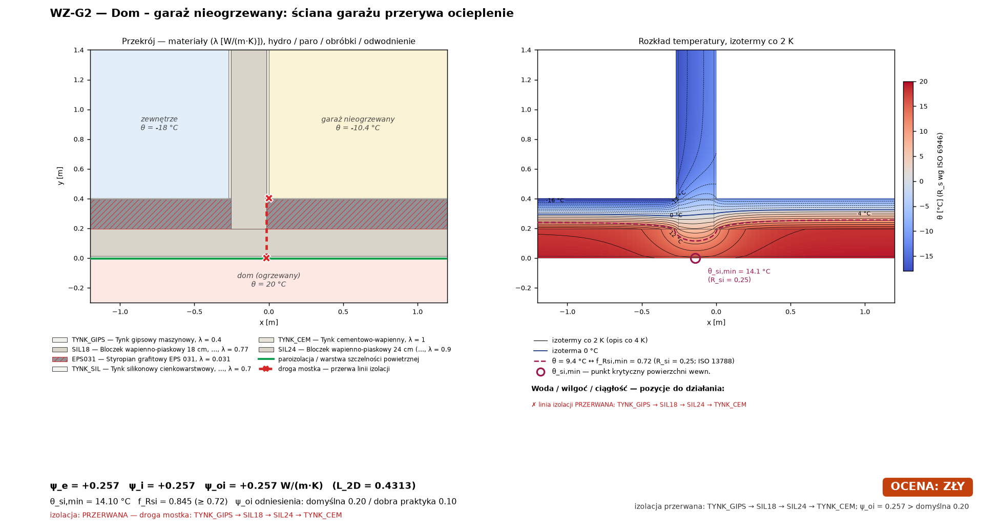

* ψ_e = +0,257, ψ_i = +0,257, ψ_oi = +0,257 W/(m·K); L_2D = 0,4313 W/(m·K); odniesienie ψ_oi: domyślna 0,20, dobra praktyka 0,10 (połączenie przegród dom–garaż nieogrzewany (ściana/strop))
* θ_si,min = 14,10 °C, f_Rsi = 0,845 (≥ 0.72 — brak ryzyka pleśni i kondensacji powierzchniowej)
* izolacja: PRZERWANA — droga mostka: TYNK_GIPS → SIL18 → SIL24 → TYNK_CEM
* siatka: 52800 komórek, zmiana Φ przy podwojeniu 0,050 %, bilans 2.1e-13

| | temat | pozycja listy kontrolnej |
|---|---|---|
| ✗ BRAK | izolacja | linia izolacji PRZERWANA: TYNK_GIPS → SIL18 → SIL24 → TYNK_CEM |
| ✓ OK | paro | szczelność powietrzna ściany SZ1: tynk wewnętrzny ciągły (TYNK_GIPS) — do stropu i posadzki |
| i INFO | paro | ściana dom–garaż: szczelność na spaliny (WT § 106 ust. 1) — tynk ciągły, uszczelnione przejścia instalacji, drzwi z samozamykaczem i uszczelką |

*Uwaga:* Podział ściany domu na część „do zewnętrza” i „do garażu” w licu zewnętrznym ściany garażu (jedyny system wymiarów — strona ogrzewana jest płaska, ψ_e = ψ_i).
*Uwaga:* Po stronie garażu R_s = 0,13 (ISO 6946 — przegroda do przestrzeni nieogrzewanej).
*Na rysunku:* tynk wewnętrzny ciągły — szczelność powietrzna (i gazowa od garażu, WT § 106).

Wykresy szczegółowe: [temperatura](rys/WZ-G2_temperatura.png), [strumien](rys/WZ-G2_strumien.png), [powierzchnia](rys/WZ-G2_theta_si.png); dane wejściowe, warunki brzegowe, siatka, elementy flankujące — [szczegoly_obliczen.md](szczegoly_obliczen.md)

### WZ-RS1

**Rura spustowa we wnęce ocieplenia (rzut)** — ocena **DO POPRAWY** (ψ_oi = 0.074 > dobra praktyka 0.01)

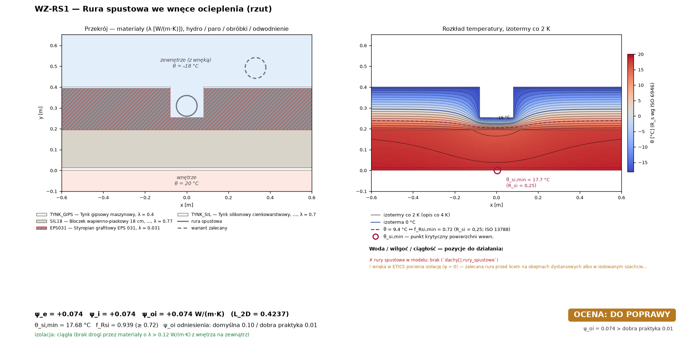

* ψ_e = +0,074, ψ_i = +0,074, ψ_oi = +0,074 W/(m·K); L_2D = 0,4237 W/(m·K); odniesienie ψ_oi: domyślna 0,10, dobra praktyka 0,01 (wnęka w ociepleniu — rura spustowa [ZAŁ])
* θ_si,min = 17,68 °C, f_Rsi = 0,939 (≥ 0.72 — brak ryzyka pleśni i kondensacji powierzchniowej)
* izolacja: ciągła (brak drogi przez materiały o λ > 0.12 W/(m·K) z wnętrza na zewnątrz)
* siatka: 37600 komórek, zmiana Φ przy podwojeniu 0,038 %, bilans 5.0e-13

| | temat | pozycja listy kontrolnej |
|---|---|---|
| ✓ OK | izolacja | linia izolacji ciągła („test ołówka” na siatce: brak drogi przez materiały o λ > 0.12) |
| ✓ OK | paro | szczelność powietrzna ściany SZ1: tynk wewnętrzny ciągły (TYNK_GIPS) — do stropu i posadzki |
| ✗ BRAK | rury | rury spustowe w modelu: brak (`dachy[].rury_spustowe`) |
| ! UWAGA | izolacja | wnęka w ETICS pocienia izolację (ψ > 0) — zalecana rura przed licem na obejmach dystansowych albo w izolowanym szachcie wewnętrznym |
| i INFO | rury | czyszczak / osadnik nad terenem, podłączenie do zbiornika retencyjnego / niecki (PN-EN 12056-3), kolano z wylotem nad opaską żwirową zabronione przy ścianie |

*Uwaga:* Wariant zalecany: rura przed licem ETICS na obejmach dystansowych (bez wnęki) albo wewnętrzna w izolowanym szachcie — ψ ≈ 0.
*Na rysunku:* rura spustowa DN100 we wnęce ETICS (wariant obliczony); wariant zalecany: rura przed licem na obejmach dystansowych (bez wnęki, ψ ≈ 0).

Wykresy szczegółowe: [temperatura](rys/WZ-RS1_temperatura.png), [strumien](rys/WZ-RS1_strumien.png), [powierzchnia](rys/WZ-RS1_theta_si.png); dane wejściowe, warunki brzegowe, siatka, elementy flankujące — [szczegoly_obliczen.md](szczegoly_obliczen.md)

### WZ-IF1

**Strop pośredni ST1 z wieńcem (ETICS ciągły)** — ocena **BEZMOSTKOWY** (ψ_e ≤ 0,01 W/(m·K), f_Rsi spełnione, izolacja ciągła)

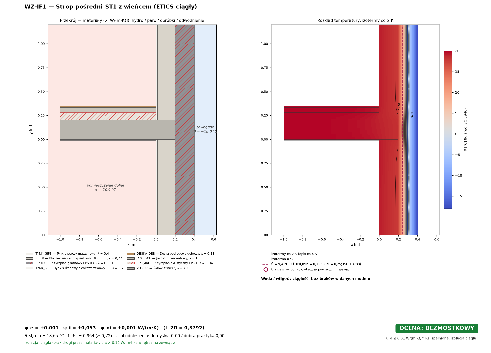

* ψ_e = +0,001, ψ_i = +0,053, ψ_oi = +0,001 W/(m·K); L_2D = 0,3792 W/(m·K); odniesienie ψ_oi: domyślna 0,00, dobra praktyka 0,00 (strop pośredni – ściana zewnętrzna z izolacją ciągłą (ETICS); Ψ_oi = Ψ_e (wys. „od podłogi do podłogi”))
* θ_si,min = 18,65 °C, f_Rsi = 0,964 (≥ 0.72 — brak ryzyka pleśni i kondensacji powierzchniowej)
* izolacja: ciągła (brak drogi przez materiały o λ > 0.12 W/(m·K) z wnętrza na zewnątrz)
* siatka: 62208 komórek, zmiana Φ przy podwojeniu 0,001 %, bilans 1.8e-12

| | temat | pozycja listy kontrolnej |
|---|---|---|
| ✓ OK | izolacja | linia izolacji ciągła („test ołówka” na siatce: brak drogi przez materiały o λ > 0.12) |
| ✓ OK | paro | szczelność powietrzna ściany SZ1: tynk wewnętrzny ciągły (TYNK_GIPS) — do stropu i posadzki |

Wykresy szczegółowe: [temperatura](rys/WZ-IF1_temperatura.png), [strumien](rys/WZ-IF1_strumien.png), [powierzchnia](rys/WZ-IF1_theta_si.png); dane wejściowe, warunki brzegowe, siatka, elementy flankujące — [szczegoly_obliczen.md](szczegoly_obliczen.md)

### WZ-T1

**Próg drzwi (HS / wejściowe) na płycie parteru — grunt** — ocena **DO POPRAWY** (ψ_oi = 0.208 > dobra praktyka 0.15)

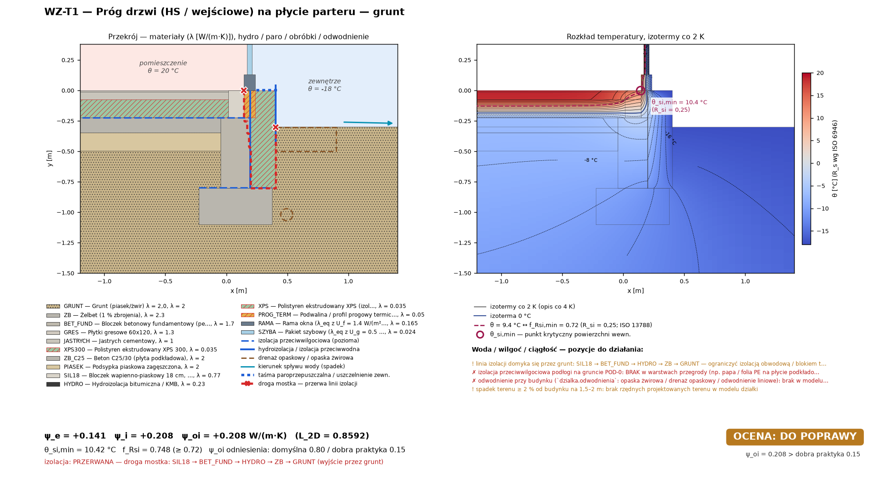

* ψ_e = +0,141, ψ_i = +0,208, ψ_oi = +0,208 W/(m·K); L_2D = 0,8592 W/(m·K); odniesienie ψ_oi: domyślna 0,80, dobra praktyka 0,15 (ściana zewnętrzna – podłoga na gruncie / płyta fundamentowa (cokół))
* θ_si,min = 10,42 °C, f_Rsi = 0,748 (≥ 0.72 — brak ryzyka pleśni i kondensacji powierzchniowej); rama/szyba f_Rsi = 0,767 (informacyjnie)
* izolacja: PRZERWANA — droga mostka: SIL18 → BET_FUND → HYDRO → ZB → GRUNT (wyjście przez grunt)
* siatka: 186224 komórek, zmiana Φ przy podwojeniu 0,071 %, bilans 3.2e-11

| | temat | pozycja listy kontrolnej |
|---|---|---|
| ! UWAGA | izolacja | linia izolacji domyka się przez grunt: SIL18 → BET_FUND → HYDRO → ZB → GRUNT — ograniczyć izolacją obwodową / blokiem termicznym u podstawy muru |
| ✓ OK | paro | szczelność powietrzna ściany SZ1: tynk wewnętrzny ciągły (TYNK_GIPS) — do stropu i posadzki |
| ✗ BRAK | hydro | izolacja przeciwwilgociowa podłogi na gruncie POD-0: BRAK w warstwach przegrody (np. papa / folia PE na płycie podkładowej, połączona z izolacją poziomą pod murem) |
| ✓ OK | hydro | izolacja pionowa fundamentu i izolacja obwodowa XPS (nienasiąkliwa) — w modelu węzła |
| ✓ OK | hydro | strefa cokołu ≥ 30 cm nad terenem (uszczelnienie, tynk mozaikowy) |
| ✗ BRAK | drenaz | odwodnienie przy budynku (`dzialka.odwodnienia`: opaska żwirowa / drenaż opaskowy / odwodnienie liniowe): brak w modelu działki — decyzja o drenażu wg badań gruntu (brief 9.6) do udokumentowania |
| ! UWAGA | woda | spadek terenu ≥ 2 % od budynku na 1,5–2 m: brak rzędnych projektowanych terenu w modelu działki |
| i INFO | woda | próg bezbarierowy: odwodnienie liniowe przed drzwiami, hydroizolacja pod próg |

*Uwaga:* Ściana liczona od poziomu posadzki (±0,00) we wszystkich systemach wymiarów (ψ_oi = ψ_i); podłoga wg PN-EN ISO 13370 z B' = b [INT]; b = B' = A/(0,5·P) budynku, gdy podane z modelu.
*Uwaga:* Hydroizolacja pionowa ściany fundamentowej (bitumiczna/KMB) i izolacja obwodowa XPS (odporna na wodę) do spodu ławy; drenaż opaskowy i odprowadzenie wody opadowej od cokołu — poza zakresem cieplnym (wpływ na λ gruntu pominięty, λ = 2,0).
*Uwaga:* Próg: wierzch podwaliny = poziom posadzki; uszczelnienie progu taśmą EPDM / hydroizolacją wywiniętą na podwalinę; odwodnienie liniowe przed drzwiami HS zalecane (brak spadku przy progu bezbarierowym).
*Na rysunku:* drenaż opaskowy DN100 w obsypce żwirowej — decyzja wg badań gruntu / ZWG; izolacja pionowa ściany fundamentowej (KMB / masa bitumiczna) do spodu ETICS; izolacja pozioma na ławie; izolacja przeciwwilgociowa podłogi (na płycie podkładowej) połączona z poziomą pod murem; odwodnienie liniowe przed progiem (próg bezbarierowy); opaska żwirowa ≥ 50 cm; spadek terenu ≥ 2 % od budynku na ≥ 1,5–2 m; uszczelnienie strefy cokołu (masa/tynk mozaikowy) do 30 cm nad terenem (≥ 30 cm).

Wykresy szczegółowe: [temperatura](rys/WZ-T1_temperatura.png), [strumien](rys/WZ-T1_strumien.png), [powierzchnia](rys/WZ-T1_theta_si.png); dane wejściowe, warunki brzegowe, siatka, elementy flankujące — [szczegoly_obliczen.md](szczegoly_obliczen.md)

### WZ-T2

**Próg okna/drzwi do podłogi na stropie pośrednim (wieniec)** — ocena **DOBRY** (ψ_oi ≤ dobra praktyka, f_Rsi spełnione)

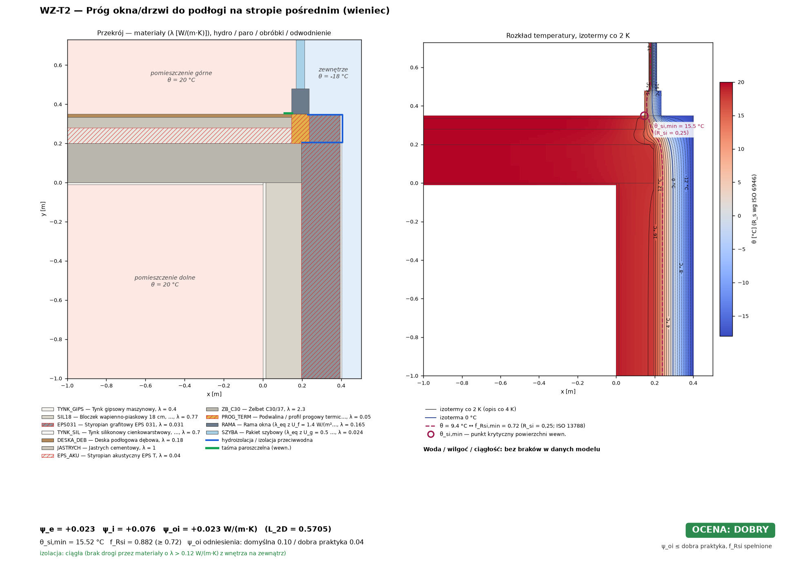

* ψ_e = +0,023, ψ_i = +0,076, ψ_oi = +0,023 W/(m·K); L_2D = 0,5705 W/(m·K); odniesienie ψ_oi: domyślna 0,10, dobra praktyka 0,04 (ościeża/nadproża/parapety — okno w warstwie izolacji („ciepły montaż”))
* θ_si,min = 15,52 °C, f_Rsi = 0,882 (≥ 0.72 — brak ryzyka pleśni i kondensacji powierzchniowej); rama/szyba f_Rsi = 0,767 (informacyjnie)
* izolacja: ciągła (brak drogi przez materiały o λ > 0.12 W/(m·K) z wnętrza na zewnątrz)
* siatka: 82080 komórek, zmiana Φ przy podwojeniu 0,051 %, bilans 9.3e-13

| | temat | pozycja listy kontrolnej |
|---|---|---|
| ✓ OK | izolacja | linia izolacji ciągła („test ołówka” na siatce: brak drogi przez materiały o λ > 0.12) |
| ✓ OK | paro | szczelność powietrzna ściany SZ1: tynk wewnętrzny ciągły (TYNK_GIPS) — do stropu i posadzki |
| i INFO | woda | próg: hydroizolacja / taśma EPDM wprowadzona pod ramę, spadek ≥ 1,5–2 % od budynku, odwodnienie liniowe przy progu bezbarierowym (brief 9.4) |

*Uwaga:* Ocieplenie ściany prowadzone do spodu ramy (cokolik izolacji XPS nad płytą) — ciągłość izolacji w płaszczyźnie ramy; hydroizolacja tarasu/balkonu wywinięta ≥ 15 cm lub pod próg (taśma EPDM do ramy), spadek płyty ≥ 1,5–2 % od budynku, odwodnienie liniowe/rynna przy progu bezbarierowym.
*Na rysunku:* hydroizolacja płyty wprowadzona pod próg / taśma EPDM do ramy; taśma paroszczelna rama ↔ posadzka/strop.

Wykresy szczegółowe: [temperatura](rys/WZ-T2_temperatura.png), [strumien](rys/WZ-T2_strumien.png), [powierzchnia](rys/WZ-T2_theta_si.png); dane wejściowe, warunki brzegowe, siatka, elementy flankujące — [szczegoly_obliczen.md](szczegoly_obliczen.md)

### WZ-T3

**Próg drzwi na płycie wspornikowej (balkon/taras) — łącznik termoizolacyjny** — ocena **DO POPRAWY** (ψ_oi = 0.172 > dobra praktyka 0.15)

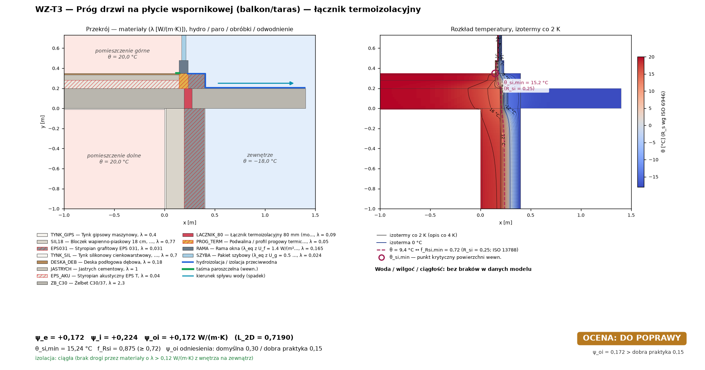

* ψ_e = +0,172, ψ_i = +0,224, ψ_oi = +0,172 W/(m·K); L_2D = 0,7190 W/(m·K); odniesienie ψ_oi: domyślna 0,30, dobra praktyka 0,15 (płyta wspornikowa z łącznikiem termoizolacyjnym)
* θ_si,min = 15,24 °C, f_Rsi = 0,875 (≥ 0.72 — brak ryzyka pleśni i kondensacji powierzchniowej); rama/szyba f_Rsi = 0,767 (informacyjnie)
* izolacja: ciągła (brak drogi przez materiały o λ > 0.12 W/(m·K) z wnętrza na zewnątrz)
* siatka: 111264 komórek, zmiana Φ przy podwojeniu 0,053 %, bilans 9.3e-14

| | temat | pozycja listy kontrolnej |
|---|---|---|
| ✓ OK | izolacja | linia izolacji ciągła („test ołówka” na siatce: brak drogi przez materiały o λ > 0.12) |
| ✓ OK | paro | szczelność powietrzna ściany SZ1: tynk wewnętrzny ciągły (TYNK_GIPS) — do stropu i posadzki |
| ✓ OK | hydro | hydroizolacja tarasu/balkonu TAR1: HYDRO |
| i INFO | woda | próg: hydroizolacja / taśma EPDM wprowadzona pod ramę, spadek ≥ 1,5–2 % od budynku, odwodnienie liniowe przy progu bezbarierowym (brief 9.4) |

*Uwaga:* Ocieplenie ściany prowadzone do spodu ramy (cokolik izolacji XPS nad płytą) — ciągłość izolacji w płaszczyźnie ramy; hydroizolacja tarasu/balkonu wywinięta ≥ 15 cm lub pod próg (taśma EPDM do ramy), spadek płyty ≥ 1,5–2 % od budynku, odwodnienie liniowe/rynna przy progu bezbarierowym.
*Na rysunku:* hydroizolacja płyty wprowadzona pod próg / taśma EPDM do ramy; spadek ≥ 1,5–2 % od budynku; odwodnienie liniowe przy progu; taśma paroszczelna rama ↔ posadzka/strop.

Wykresy szczegółowe: [temperatura](rys/WZ-T3_temperatura.png), [strumien](rys/WZ-T3_strumien.png), [powierzchnia](rys/WZ-T3_theta_si.png); dane wejściowe, warunki brzegowe, siatka, elementy flankujące — [szczegoly_obliczen.md](szczegoly_obliczen.md)

## Ograniczenia

* Modele 2D (mostki liniowe). Mostki punktowe χ (wpusty i przelewy w attyce, konsole, kotwy, narożniki 3D, przejścia rur) — poza zakresem; wymagają modelu 3D lub deklaracji wyrobu.
* Łącznik termoizolacyjny, okna, profile progowe — DANE PRZYKŁADOWE (do zastąpienia deklaracjami wyrobów).
* Ocena pleśni kryterium f_Rsi (stan ustalony); transport wilgoci w przegrodach — metoda Glasera w obliczeniach fizyki budowli (`05_wilgotnosc.md`).
* Linie hydro/paro/obróbek/drenażu na rysunkach są schematem wymagań detalu, nie rysunkiem wykonawczym.
