# Katalog mostków cieplnych — Dom testowy pipeline'u 3D (DEMONSTRACJA na modelu testowym) — szczegóły obliczeń

Dane wejściowe, warunki brzegowe, siatki, elementy flankujące i ψ w trzech systemach wymiarów dla węzłów z `katalog_mostkow.md`.

Podstawy: PN-EN ISO 10211:2017-09 (metoda numeryczna 2D, warunki brzegowe, płaszczyzny odcięcia, kryteria dokładności), PN-EN ISO 14683:2017-09 (ψ w wymiarach zewnętrznych i wewnętrznych), PN-EN ISO 13788:2013-05 (f_Rsi, R_si = 0,25), PN-EN ISO 6946:2017-10 (R_si/R_se, pustki powietrzne), PN-EN ISO 13370:2017-09 (grunt), WT zał. 2 pkt 2.2 (f_Rsi ≥ 0,72 — W-248). Solver: `lamela.obliczenia.mostki2d` (walidacja wg zał. C ISO 10211 — przypadki 1 i 2 zał. C ISO 10211 oraz analityczne — SPEŁNIONE (max |Δθ| przyp. 1 = 0.048 K, przyp. 2 = 0.039 K ≤ 0,1 K; ΔΦ = -0.010 W/m ≤ 0,1 W/m)).

## Zestawienie

| węzeł | nazwa | L_2D (i–e) | ψ_oi | ψ_e | ψ_i | θ_si,min [°C] | f_Rsi | f_Rsi ≥ min | Δ siatki |
|---|---|---|---|---|---|---|---|---|---|
| WZ-R1 | Attyka dachu D1 | 0,4645 | 0,163 | 0,063 | 0,165 | 16,22 | 0,901 | tak | 0,02 % |
| WZ-B0 | Płyta wspornikowa PL-D — WARIANT PORÓWNAWCZY bez łącznika | 1,1308 | 0,752 | 0,752 | 0,805 | 10,34 | 0,746 | tak | 0,10 % |
| WZ-B1 | Płyta wspornikowa PL-D — łącznik termoizolacyjny | 0,5358 | 0,157 | 0,157 | 0,210 | 16,94 | 0,919 | tak | 0,02 % |
| WZ-W0 | Ościeże okna — montaż w murze (rama w licu zewn. muru, izolacja z zakładem 3 cm) | 0,4539 | 0,024 | 0,033 | 0,033 | 16,98 | 0,920 | tak | 0,09 % |
| WZ-W2 | Ościeże okna — ciepły montaż w warstwie izolacji (wariant zalecany) | 0,4146 | 0,017 | 0,000 | 0,000 | 15,85 | 0,891 | tak | 0,06 % |
| WZ-W1 | Ościeże okna — osadzenie wg modelu (model: Otwor.rama_t otworu O0-01 (rama 9.0 cm, 5.0 cm w murze)) | 0,4349 | 0,005 | 0,014 | 0,014 | 17,27 | 0,928 | tak | 0,07 % |
| WZ-N1 | Nadproże okna — rama wsunięta 5 cm w mur, reszta w izolacji | 0,4385 | 0,008 | 0,017 | 0,017 | 17,62 | 0,937 | tak | 0,07 % |
| WZ-N2 | Nadproże okna — rama wsunięta 5 cm w mur, reszta w izolacji + kaseta osłony w ociepleniu | 0,5136 | 0,083 | 0,092 | 0,092 | 16,55 | 0,909 | tak | 0,06 % |
| WZ-P1 | Podokiennik — rama wsunięta 5 cm w mur, reszta w izolacji, parapet wewn. i zewn. | 0,4349 | 0,005 | 0,014 | 0,014 | 16,55 | 0,909 | tak | 0,08 % |
| WZ-GF2 | Cokół — płyta fundamentowa na XPS (wariant porównawczy) [ZAŁ] | 0,5374 | 0,099 | 0,045 | 0,099 | 17,23 | 0,927 | tak | 0,03 % |
| WZ-GF1 | Cokół — ściana / podłoga na gruncie / ława | 0,7164 | 0,213 | 0,146 | 0,213 | 12,63 | 0,806 | tak | 0,05 % |
| WZ-GF1B | Cokół — ława + blok termiczny (beton komórkowy 400) w 1. warstwie muru | 0,5822 | 0,078 | 0,011 | 0,078 | 16,65 | 0,912 | tak | 0,03 % |
| WZ-C1 | Narożnik zewnętrzny ścian (rzut) | 0,5304 | 0,065 | −0,052 | 0,065 | 17,10 | 0,924 | tak | 0,01 % |
| WZ-G1 | Dom – garaż nieogrzewany: ściana garażu dochodzi do lica ETICS | 0,1980 | 0,023 | 0,023 | 0,023 | 18,65 | 0,964 | tak | 0,00 % |
| WZ-G2 | Dom – garaż nieogrzewany: ściana garażu przerywa ocieplenie | 0,4313 | 0,257 | 0,257 | 0,257 | 14,10 | 0,845 | tak | 0,05 % |
| WZ-RS1 | Rura spustowa we wnęce ocieplenia (rzut) | 0,4237 | 0,074 | 0,074 | 0,074 | 17,68 | 0,939 | tak | 0,04 % |
| WZ-IF1 | Strop pośredni ST1 z wieńcem (ETICS ciągły) | 0,3792 | 0,001 | 0,001 | 0,053 | 18,65 | 0,964 | tak | 0,00 % |
| WZ-T1 | Próg drzwi (HS / wejściowe) na płycie parteru — grunt | 0,8592 | 0,208 | 0,141 | 0,208 | 10,42 | 0,748 | tak | 0,07 % |
| WZ-T2 | Próg okna/drzwi do podłogi na stropie pośrednim (wieniec) | 0,5705 | 0,023 | 0,023 | 0,076 | 15,52 | 0,882 | tak | 0,05 % |
| WZ-T3 | Próg drzwi na płycie wspornikowej (balkon/taras) — łącznik termoizolacyjny | 0,7190 | 0,172 | 0,172 | 0,224 | 15,24 | 0,875 | tak | 0,05 % |

## H_TB — wymiary wewnętrzne całkowite (ψ_oi)

System wymiarów jak w obliczeniu obudowy (`energia.bryla`: ściany po licach wewnętrznych × wysokość „od podłogi do podłogi”, pod dachem do spodu płyty; okna w świetle otworu w murze) — ψ i długości w tym samym systemie (PN-EN ISO 10211:2017 pkt 7.1; PN-EN ISO 13789; PN-EN ISO 14683). Wartości ψ_e/ψ_i powyżej — wyłącznie do porównań z tabelami PN-EN ISO 14683 (nie sumować z polami w innym systemie).

| węzeł | nazwa | ψ_oi [W/(m·K)] | l_oi [m] | ψ·l [W/K] |
|---|---|---|---|---|
| WZ-R1 | Attyka dachu D1 | 0,1631 | 35,1600 | 5,7352 |
| WZ-B1 | Płyta wspornikowa PL-D — łącznik termoizolacyjny | 0,1575 | 2,6000 | 0,4094 |
| WZ-W1 | Ościeże okna — osadzenie wg modelu (model: Otwor.rama_t otworu O0-01 (rama 9.0 cm, 5.0 cm w murze)) | 0,0049 | 46,8000 | 0,2299 |
| WZ-N1 | Nadproże okna — rama wsunięta 5 cm w mur, reszta w izolacji | 0,0080 | 9,1000 | 0,0728 |
| WZ-N2 | Nadproże okna — rama wsunięta 5 cm w mur, reszta w izolacji + kaseta osłony w ociepleniu | 0,0831 | 18,6000 | 1,5459 |
| WZ-P1 | Podokiennik — rama wsunięta 5 cm w mur, reszta w izolacji, parapet wewn. i zewn. | 0,0054 | 16,6000 | 0,0904 |
| WZ-GF1 | Cokół — ściana / podłoga na gruncie / ława | 0,2127 | 30,0600 | 6,3939 |
| WZ-C1 | Narożnik zewnętrzny ścian (rzut) | 0,0646 | 23,0800 | 1,4898 |
| WZ-IF1 | Strop pośredni ST1 z wieńcem (ETICS ciągły) | 0,0009 | 26,5600 | 0,0227 |
| WZ-T1 | Próg drzwi (HS / wejściowe) na płycie parteru — grunt | 0,2085 | 5,1000 | 1,0633 |
| WZ-T2 | Próg okna/drzwi do podłogi na stropie pośrednim (wieniec) | 0,0234 | 3,6000 | 0,0842 |
| WZ-T3 | Próg drzwi na płycie wspornikowej (balkon/taras) — łącznik termoizolacyjny | 0,1718 | 2,4000 | 0,4124 |

**H_TB = Σ ψ_oi·l_oi = 17,55 W/K** (węzły liniowe 2D; mostki punktowe χ — poza zakresem)

## WZ-R1 — Attyka dachu D1

**Dane wejściowe**

*warstwy ściany:*

| kod | materiał | d [m] | λ [W/(m·K)] | R [m²K/W] |
|---|---|---|---|---|
| TYNK_GIPS | Tynk gipsowy maszynowy | 0,0150 | 0,4000 | 0,0375 |
| SIL18 | Bloczek wapienno-piaskowy 18 cm, kl. 20 | 0,1800 | 0,7700 | 0,2338 |
| EPS031 | Styropian grafitowy EPS 031 | 0,2000 | 0,0310 | 6,4516 |
| TYNK_SIL | Tynk silikonowy cienkowarstwowy, biały | 0,0070 | 0,7000 | 0,0100 |

*warstwy dachu:*

| kod | materiał | d [m] | λ [W/(m·K)] | R [m²K/W] |
|---|---|---|---|---|
| EPDM | Membrana EPDM 1,5 mm | 0,0015 | 0,2500 | 0,0060 |
| PIR | Płyty PIR (izolacja spadkowa) | 0,2200 | 0,0220 | 10,0000 |
| PAROIZ | Paroizolacja bitumiczna | 0,0020 | 0,2300 | 0,0087 |
| ZB_C30 | Żelbet C30/37 | 0,2000 | 2,3000 | 0,0870 |
| TYNK_GIPS | Tynk gipsowy maszynowy | 0,0100 | 0,4000 | 0,0250 |

* attyka: SIL18, wys. nad pokryciem 0.3 m; izolacja PIR: wewn. 0.1 m, korona 0.05 m

**Warunki brzegowe** (przekrój pionowy; płaszczyzny odcięcia i osie symetrii adiabatyczne)

| strefa | rodzaj | grupa | θ [°C] | R_s — przebieg ψ [m²K/W] | R_s — przebieg f_Rsi |
|---|---|---|---|---|---|
| pomieszczenie | wewn | i | 20,0 | wg ISO 6946: 0,13 poziomo / 0,10 w górę / 0,17 w dół | 0,25 (ramy/szyby 0,13) |
| zewnętrze | zewn | e | −18,0 | 0,04 | 0,04 |

**Siatka i dokładność** (MOS, siatka prostokątna zagęszczana przy granicach materiałów)

| siatka | komórek | Φ_całk [W/m] |
|---|---|---|
| 127 × 152 = 19304 komórek; Δx ∈ [1.56; 95.54] mm, Δy ∈ [0.75; 94.01] mm | 19304 | 17,6474 |
| 254 × 304 = 77216 komórek; Δx ∈ [0.778; 47.77] mm, Δy ∈ [0.375; 47.01] mm | 77216 | 17,6510 |

Zmiana strumienia przy podwojeniu liczby podziałów: **0,020 %** (kryterium ISO 10211 < 1 %: spełnione); zmiana L_2D (= zmiana ψ): 0,00009 W/(m·K) (kryterium ≤ max(1 % |ψ|; 0,001) = 0,00163: spełnione); bilans energii Σ Φ / (½ Σ|Φ|) = 2.1e-12 (kryterium < 10⁻⁴: spełnione).

**Współczynniki sprzężenia i ψ**

*Para i–e:* L_2D = **0,4645 W/(m·K)**

| element flankujący | U [W/(m²K)] | l_e [m] | l_i [m] | l_oi [m] | U·l_e | U·l_i | U·l_oi |
|---|---|---|---|---|---|---|---|
| ściana | 0,1449 | 1,6295 | 1,1960 | 1,2060 | 0,2361 | 0,1733 | 0,1747 |
| stropodach | 0,0974 | 1,7025 | 1,3005 | 1,3005 | 0,1658 | 0,1267 | 0,1267 |

ψ_oi (wymiary wewnętrzne całkowite — system projektu, H_TB) = 0,4645 − 0,3014 = **0,163 W/(m·K)**; ψ_e (zewnętrzne) = 0,4645 − 0,4019 = 0,063 W/(m·K); ψ_i (wewnętrzne) = 0,4645 − 0,2999 = 0,165 W/(m·K)

**Temperatura powierzchni wewnętrznej i ryzyko pleśni** (R_si = 0,25 — PN-EN ISO 13788)

* θ_si,min = **16,22 °C** w punkcie (0,000; −0,010) m przy θ_i = 20,0 °C, θ_e = −18,0 °C
* f_Rsi = (θ_si,min − θ_e)/(θ_i − θ_e) = **0,901**; wymaganie f_Rsi ≥ 0,72 (WT zał. 2 pkt 2.2.1–2.2.5 (uproszczenie; φ_i = 50 %) (W-248)) → **SPEŁNIA**
* informacyjnie przy θ_e obliczeniowej i φ_i = 50 %: θ_si,kryt (φ_si = 80 %) = 12,6 °C (f = 0,806), punkt rosy 9,3 °C → θ_si,min ≥ θ_si,kryt (ocena miesięczna wg ISO 13788 — łagodniejsza; kryterium formalne: f_Rsi ≥ 0,72)

**Porównanie**

* PN-EN ISO 14683 — wartość domyślna (dach płaski–ściana z attyką, izolacja ciągła (R)): ψ_e = 0,55, ψ_i = 0,75 W/(m·K) [NZW] — obliczone ψ_e = 0,063, ψ_i = 0,165 (poniżej wartości domyślnej — porównanie w tym samym systemie wymiarów)

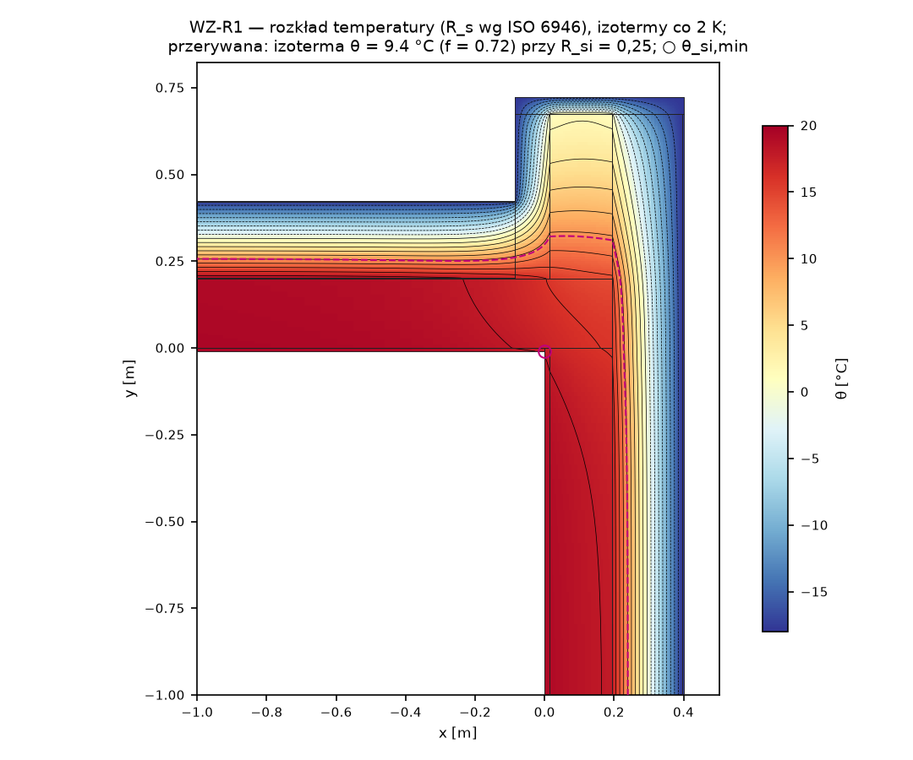

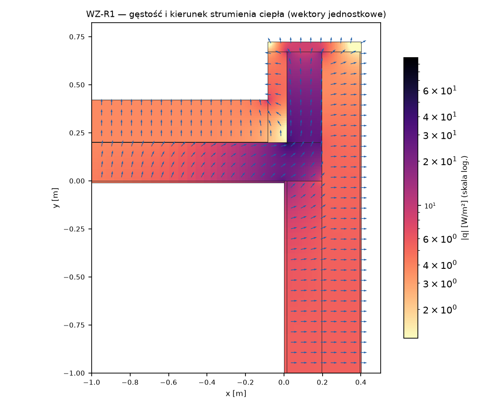

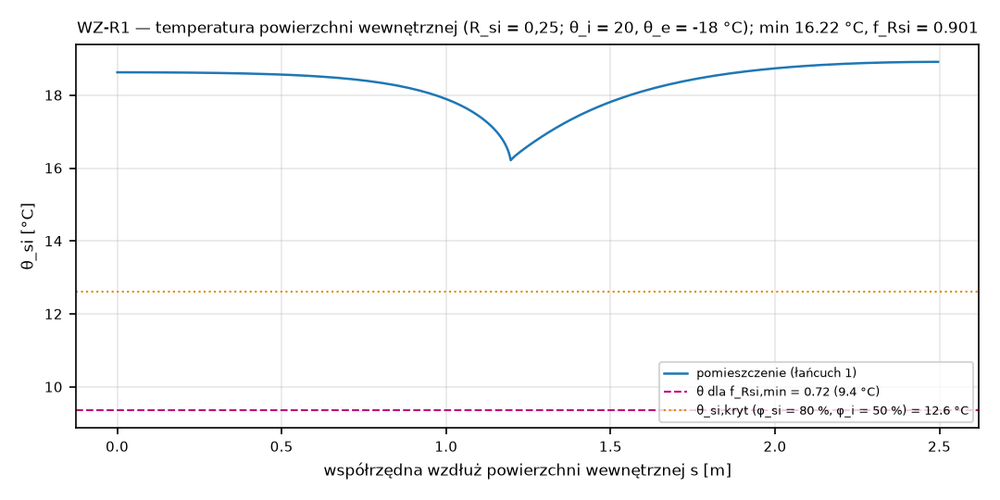

## WZ-B0 — Płyta wspornikowa PL-D — WARIANT PORÓWNAWCZY bez łącznika

Przekrój pionowy; pomieszczenia nad i pod stropem ogrzewane (grupa „i”).

**Dane wejściowe**

*warstwy ściany:*

| kod | materiał | d [m] | λ [W/(m·K)] | R [m²K/W] |
|---|---|---|---|---|
| TYNK_GIPS | Tynk gipsowy maszynowy | 0,0150 | 0,4000 | 0,0375 |
| SIL18 | Bloczek wapienno-piaskowy 18 cm, kl. 20 | 0,1800 | 0,7700 | 0,2338 |
| EPS031 | Styropian grafitowy EPS 031 | 0,2000 | 0,0310 | 6,4516 |
| TYNK_SIL | Tynk silikonowy cienkowarstwowy, biały | 0,0070 | 0,7000 | 0,0100 |

* płyta: ZB_C30, t = 0.2 m, wysięg = 1.5 m

*warstwy podłogi:*

| kod | materiał | d [m] | λ [W/(m·K)] | R [m²K/W] |
|---|---|---|---|---|
| DESKA_DEB | Deska podłogowa dębowa | 0,0150 | 0,1800 | 0,0833 |
| JASTRYCH | Jastrych cementowy | 0,0550 | 1,0000 | 0,0550 |
| EPS_AKU | Styropian akustyczny EPS T | 0,0800 | 0,0400 | 2,0000 |

*warstwy sufitu:*

| kod | materiał | d [m] | λ [W/(m·K)] | R [m²K/W] |
|---|---|---|---|---|
| TYNK_GIPS | Tynk gipsowy maszynowy | 0,0100 | 0,4000 | 0,0250 |

* łącznik: brak (płyta ciągła przez izolację)

**Warunki brzegowe** (przekrój pionowy; płaszczyzny odcięcia i osie symetrii adiabatyczne)

| strefa | rodzaj | grupa | θ [°C] | R_s — przebieg ψ [m²K/W] | R_s — przebieg f_Rsi |
|---|---|---|---|---|---|
| pomieszczenie dolne | wewn | i | 20,0 | wg ISO 6946: 0,13 poziomo / 0,10 w górę / 0,17 w dół | 0,25 (ramy/szyby 0,13) |
| pomieszczenie górne | wewn | i | 20,0 | wg ISO 6946: 0,13 poziomo / 0,10 w górę / 0,17 w dół | 0,25 (ramy/szyby 0,13) |
| zewnętrze | zewn | e | −18,0 | 0,04 | 0,04 |

**Siatka i dokładność** (MOS, siatka prostokątna zagęszczana przy granicach materiałów)

| siatka | komórek | Φ_całk [W/m] |
|---|---|---|
| 151 × 144 = 21744 komórek; Δx ∈ [1.56; 95.41] mm, Δy ∈ [1.65; 98.49] mm | 21744 | 42,9269 |
| 302 × 288 = 86976 komórek; Δx ∈ [0.778; 47.7] mm, Δy ∈ [0.825; 49.25] mm | 86976 | 42,9702 |

Zmiana strumienia przy podwojeniu liczby podziałów: **0,101 %** (kryterium ISO 10211 < 1 %: spełnione); zmiana L_2D (= zmiana ψ): 0,00114 W/(m·K) (kryterium ≤ max(1 % |ψ|; 0,001) = 0,00752: spełnione); bilans energii Σ Φ / (½ Σ|Φ|) = 6.8e-13 (kryterium < 10⁻⁴: spełnione).

**Współczynniki sprzężenia i ψ**

*Para i–e:* L_2D = **1,1308 W/(m·K)**

| element flankujący | U [W/(m²K)] | l_e [m] | l_i [m] | l_oi [m] | U·l_e | U·l_i | U·l_oi |
|---|---|---|---|---|---|---|---|
| ściana dolna | 0,1449 | 1,3060 | 1,1960 | 1,5560 | 0,1892 | 0,1733 | 0,2254 |
| ściana górna | 0,1449 | 1,3060 | 1,0560 | 1,0560 | 0,1892 | 0,1530 | 0,1530 |

ψ_oi (wymiary wewnętrzne całkowite — system projektu, H_TB) = 1,1308 − 0,3784 = **0,752 W/(m·K)**; ψ_e (zewnętrzne) = 1,1308 − 0,3784 = 0,752 W/(m·K); ψ_i (wewnętrzne) = 1,1308 − 0,3262 = 0,805 W/(m·K)

**Temperatura powierzchni wewnętrznej i ryzyko pleśni** (R_si = 0,25 — PN-EN ISO 13788)

* θ_si,min = **10,34 °C** w punkcie (0,000; −0,010) m przy θ_i = 20,0 °C, θ_e = −18,0 °C
* f_Rsi = (θ_si,min − θ_e)/(θ_i − θ_e) = **0,746**; wymaganie f_Rsi ≥ 0,72 (WT zał. 2 pkt 2.2.1–2.2.5 (uproszczenie; φ_i = 50 %) (W-248)) → **SPEŁNIA**
* informacyjnie przy θ_e obliczeniowej i φ_i = 50 %: θ_si,kryt (φ_si = 80 %) = 12,6 °C (f = 0,806), punkt rosy 9,3 °C → θ_si,min < θ_si,kryt (ocena miesięczna wg ISO 13788 — łagodniejsza; kryterium formalne: f_Rsi ≥ 0,72)

**Porównanie**

* PN-EN ISO 14683 — wartość domyślna (płyta balkonowa ciągła przez izolację (B)): ψ_e = 0,95, ψ_i = 0,95 W/(m·K) [NZW] — obliczone ψ_e = 0,752, ψ_i = 0,805 (poniżej wartości domyślnej — porównanie w tym samym systemie wymiarów)

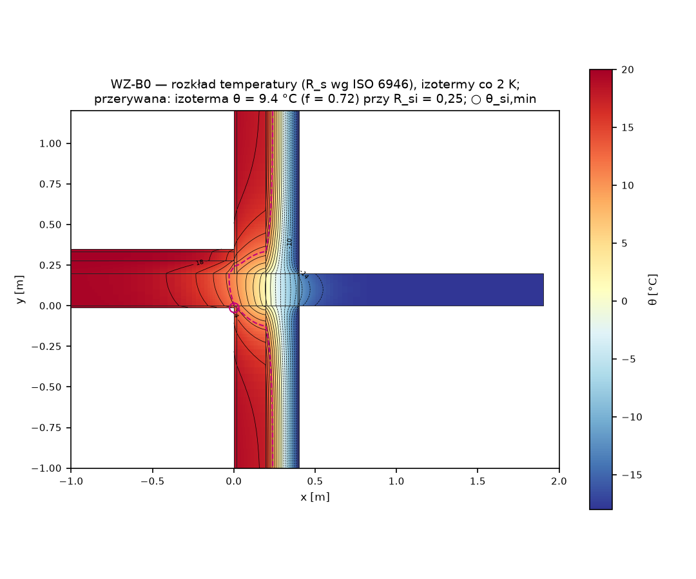

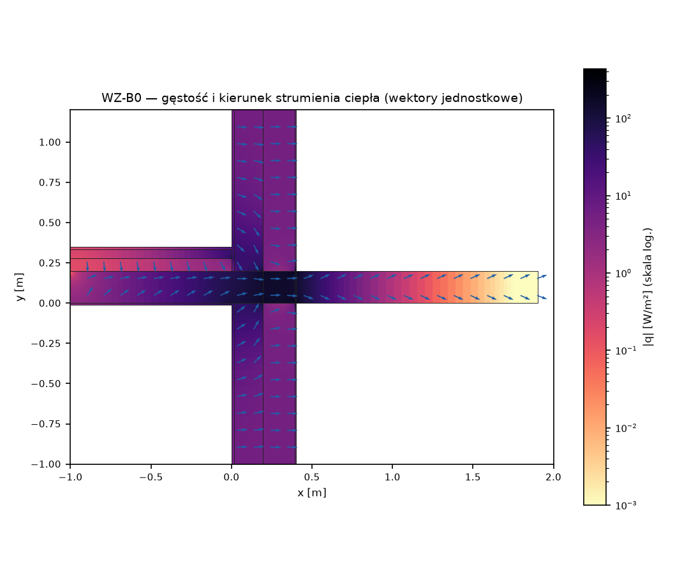

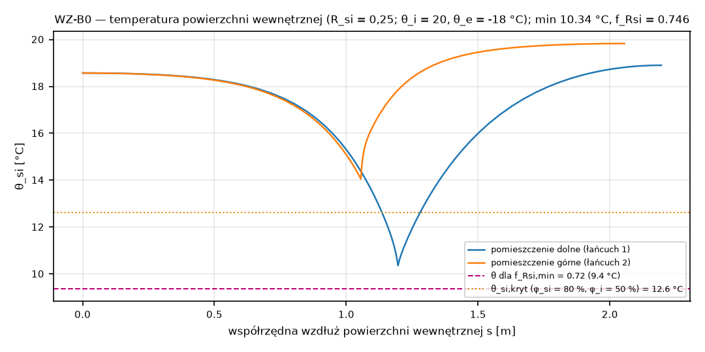

## WZ-B1 — Płyta wspornikowa PL-D — łącznik termoizolacyjny

Przekrój pionowy; pomieszczenia nad i pod stropem ogrzewane (grupa „i”).

**Dane wejściowe**

*warstwy ściany:*

| kod | materiał | d [m] | λ [W/(m·K)] | R [m²K/W] |
|---|---|---|---|---|
| TYNK_GIPS | Tynk gipsowy maszynowy | 0,0150 | 0,4000 | 0,0375 |
| SIL18 | Bloczek wapienno-piaskowy 18 cm, kl. 20 | 0,1800 | 0,7700 | 0,2338 |
| EPS031 | Styropian grafitowy EPS 031 | 0,2000 | 0,0310 | 6,4516 |
| TYNK_SIL | Tynk silikonowy cienkowarstwowy, biały | 0,0070 | 0,7000 | 0,0100 |

* płyta: ZB_C30, t = 0.2 m, wysięg = 1.5 m

*warstwy podłogi:*

| kod | materiał | d [m] | λ [W/(m·K)] | R [m²K/W] |
|---|---|---|---|---|
| DESKA_DEB | Deska podłogowa dębowa | 0,0150 | 0,1800 | 0,0833 |
| JASTRYCH | Jastrych cementowy | 0,0550 | 1,0000 | 0,0550 |
| EPS_AKU | Styropian akustyczny EPS T | 0,0800 | 0,0400 | 2,0000 |

*warstwy sufitu:*

| kod | materiał | d [m] | λ [W/(m·K)] | R [m²K/W] |
|---|---|---|---|---|
| TYNK_GIPS | Tynk gipsowy maszynowy | 0,0100 | 0,4000 | 0,0250 |

* łącznik: Łącznik termoizolacyjny 80 mm (moduł izolacyjny + pręty nierdzewne), λ_eq: λ_eq = 0.09 W/(m·K), d = 0.08 m — [DANE PRZYKŁADOWE – FIKCYJNE] λ_eq typowej deklaracji (ETA) łącznika 80 mm do płyt 20–22 cm; do zastąpienia wartością z ETA wybranego wyrobu (W-272)

**Warunki brzegowe** (przekrój pionowy; płaszczyzny odcięcia i osie symetrii adiabatyczne)

| strefa | rodzaj | grupa | θ [°C] | R_s — przebieg ψ [m²K/W] | R_s — przebieg f_Rsi |
|---|---|---|---|---|---|
| pomieszczenie dolne | wewn | i | 20,0 | wg ISO 6946: 0,13 poziomo / 0,10 w górę / 0,17 w dół | 0,25 (ramy/szyby 0,13) |
| pomieszczenie górne | wewn | i | 20,0 | wg ISO 6946: 0,13 poziomo / 0,10 w górę / 0,17 w dół | 0,25 (ramy/szyby 0,13) |
| zewnętrze | zewn | e | −18,0 | 0,04 | 0,04 |

**Siatka i dokładność** (MOS, siatka prostokątna zagęszczana przy granicach materiałów)

| siatka | komórek | Φ_całk [W/m] |
|---|---|---|
| 164 × 144 = 23616 komórek; Δx ∈ [1.56; 95.41] mm, Δy ∈ [1.65; 98.49] mm | 23616 | 20,3578 |
| 328 × 288 = 94464 komórek; Δx ∈ [0.778; 47.7] mm, Δy ∈ [0.825; 49.25] mm | 94464 | 20,3622 |

Zmiana strumienia przy podwojeniu liczby podziałów: **0,022 %** (kryterium ISO 10211 < 1 %: spełnione); zmiana L_2D (= zmiana ψ): 0,00012 W/(m·K) (kryterium ≤ max(1 % |ψ|; 0,001) = 0,00157: spełnione); bilans energii Σ Φ / (½ Σ|Φ|) = 9.9e-13 (kryterium < 10⁻⁴: spełnione).

**Współczynniki sprzężenia i ψ**

*Para i–e:* L_2D = **0,5358 W/(m·K)**

| element flankujący | U [W/(m²K)] | l_e [m] | l_i [m] | l_oi [m] | U·l_e | U·l_i | U·l_oi |
|---|---|---|---|---|---|---|---|
| ściana dolna | 0,1449 | 1,3060 | 1,1960 | 1,5560 | 0,1892 | 0,1733 | 0,2254 |
| ściana górna | 0,1449 | 1,3060 | 1,0560 | 1,0560 | 0,1892 | 0,1530 | 0,1530 |

ψ_oi (wymiary wewnętrzne całkowite — system projektu, H_TB) = 0,5358 − 0,3784 = **0,157 W/(m·K)**; ψ_e (zewnętrzne) = 0,5358 − 0,3784 = 0,157 W/(m·K); ψ_i (wewnętrzne) = 0,5358 − 0,3262 = 0,210 W/(m·K)

**Temperatura powierzchni wewnętrznej i ryzyko pleśni** (R_si = 0,25 — PN-EN ISO 13788)

* θ_si,min = **16,94 °C** w punkcie (0,000; −0,010) m przy θ_i = 20,0 °C, θ_e = −18,0 °C
* f_Rsi = (θ_si,min − θ_e)/(θ_i − θ_e) = **0,919**; wymaganie f_Rsi ≥ 0,72 (WT zał. 2 pkt 2.2.1–2.2.5 (uproszczenie; φ_i = 50 %) (W-248)) → **SPEŁNIA**
* informacyjnie przy θ_e obliczeniowej i φ_i = 50 %: θ_si,kryt (φ_si = 80 %) = 12,6 °C (f = 0,806), punkt rosy 9,3 °C → θ_si,min ≥ θ_si,kryt (ocena miesięczna wg ISO 13788 — łagodniejsza; kryterium formalne: f_Rsi ≥ 0,72)

**Porównanie**

* deklaracja wyrobu: ψ = 0,150 W/(m·K), f_Rsi = 0,82 — [DANE PRZYKŁADOWE – FIKCYJNE] dane przykładowe z deklaracji typowego łącznika termoizolacyjnego do płyt wspornikowych (lub równoważny); obliczone ψ_e = 0,157, f_Rsi = 0,919

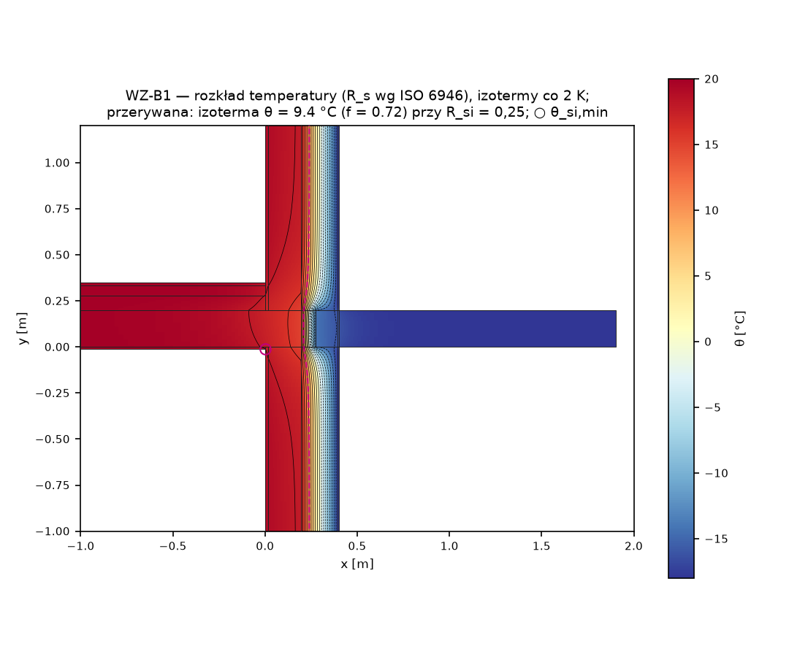

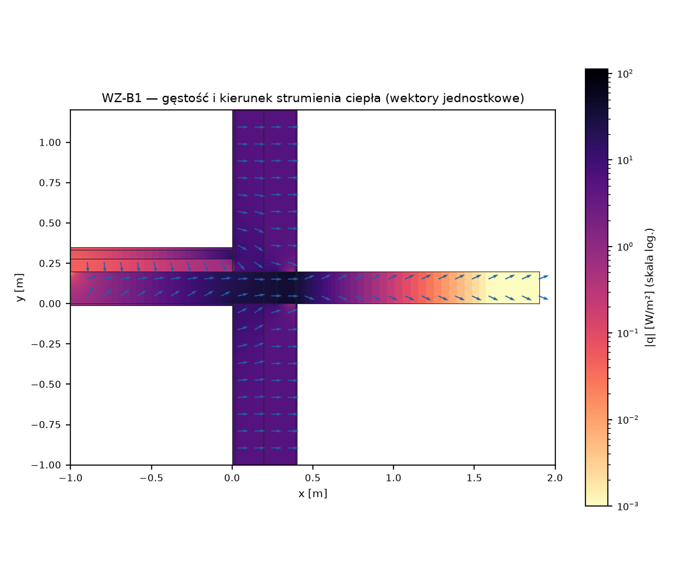

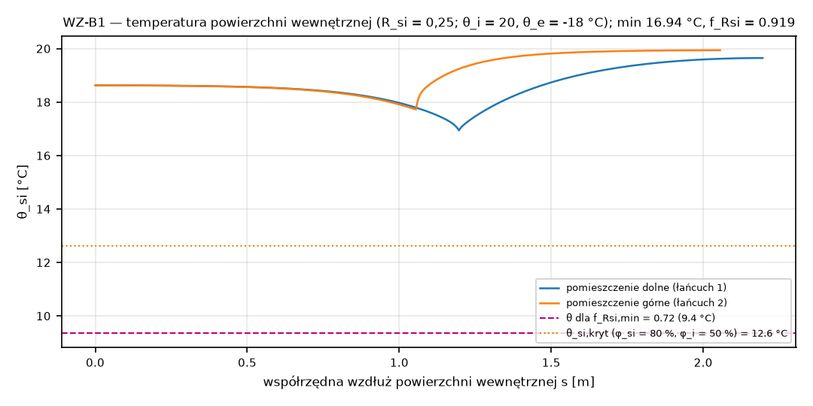

## WZ-W0 — Ościeże okna — montaż w murze (rama w licu zewn. muru, izolacja z zakładem 3 cm)

**Dane wejściowe**

*warstwy ściany:*

| kod | materiał | d [m] | λ [W/(m·K)] | R [m²K/W] |
|---|---|---|---|---|
| TYNK_GIPS | Tynk gipsowy maszynowy | 0,0150 | 0,4000 | 0,0375 |
| SIL18 | Bloczek wapienno-piaskowy 18 cm, kl. 20 | 0,1800 | 0,7700 | 0,2338 |
| EPS031 | Styropian grafitowy EPS 031 | 0,2000 | 0,0310 | 6,4516 |
| TYNK_SIL | Tynk silikonowy cienkowarstwowy, biały | 0,0070 | 0,7000 | 0,0100 |

* okno: U_f = 0.95, b_f = 0.115 m, d_f = 0.09 m (λ_eq ramy = 0.1020); U_g = 0.5, d_g = 0.044 m (λ_eq = 0.0240); U_w = 0.728 (ISO 10077-1, okno 1,23×1,48); położenie: w murze (lico zewn. muru), x0 = 0.015 m, zakład izolacji 0.03 m [DANE PRZYKŁADOWE – FIKCYJNE] dane przykładowe z karty katalogowej typowego okna PVC 3-szybowego klasy U_w ≈ 0,8 (lub równoważne)

**Warunki brzegowe** (przekrój poziomy; płaszczyzny odcięcia i osie symetrii adiabatyczne)

| strefa | rodzaj | grupa | θ [°C] | R_s — przebieg ψ [m²K/W] | R_s — przebieg f_Rsi |
|---|---|---|---|---|---|
| wnętrze | wewn | i | 20,0 | wg ISO 6946: 0,13 poziomo / 0,10 w górę / 0,17 w dół | 0,25 (ramy/szyby 0,13) |
| zewnętrze | zewn | e | −18,0 | 0,04 | 0,04 |

**Siatka i dokładność** (MOS, siatka prostokątna zagęszczana przy granicach materiałów)

| siatka | komórek | Φ_całk [W/m] |
|---|---|---|
| 99 × 105 = 10395 komórek; Δx ∈ [1.82; 94.8] mm, Δy ∈ [1.56; 21.48] mm | 10395 | 17,2341 |
| 198 × 210 = 41580 komórek; Δx ∈ [0.909; 47.4] mm, Δy ∈ [0.778; 10.74] mm | 41580 | 17,2488 |

Zmiana strumienia przy podwojeniu liczby podziałów: **0,085 %** (kryterium ISO 10211 < 1 %: spełnione); zmiana L_2D (= zmiana ψ): 0,00039 W/(m·K) (kryterium ≤ max(1 % |ψ|; 0,001) = 0,00100: spełnione); bilans energii Σ Φ / (½ Σ|Φ|) = 2.4e-13 (kryterium < 10⁻⁴: spełnione).

**Współczynniki sprzężenia i ψ**

*Para i–e:* L_2D = **0,4539 W/(m·K)**

| element flankujący | U [W/(m²K)] | l_e [m] | l_i [m] | l_oi [m] | U·l_e | U·l_i | U·l_oi |
|---|---|---|---|---|---|---|---|
| ściana | 0,1449 | 1,2210 | 1,2210 | 1,2060 | 0,1769 | 0,1769 | 0,1747 |
| okno (L_2D ramy z szybą, model bez ściany) | L_2D = 0,2444 | — | — | — | 0,2444 | 0,2444 | 0,2444 |
| okno — pas krawędź ramy ↔ krawędź otworu w murze (tylko system oi, U_w) | 0,7275 | 0,0000 | 0,0000 | 0,0150 | 0,0000 | 0,0000 | 0,0109 |

ψ_oi (wymiary wewnętrzne całkowite — system projektu, H_TB) = 0,4539 − 0,4300 = **0,024 W/(m·K)**; ψ_e (zewnętrzne) = 0,4539 − 0,4212 = 0,033 W/(m·K); ψ_i (wewnętrzne) = 0,4539 − 0,4212 = 0,033 W/(m·K)

**Temperatura powierzchni wewnętrznej i ryzyko pleśni** (R_si = 0,25 — PN-EN ISO 13788)

* θ_si,min = **16,98 °C** w punkcie (0,015; 0,105) m przy θ_i = 20,0 °C, θ_e = −18,0 °C
* f_Rsi = (θ_si,min − θ_e)/(θ_i − θ_e) = **0,920**; wymaganie f_Rsi ≥ 0,72 (WT zał. 2 pkt 2.2.1–2.2.5 (uproszczenie; φ_i = 50 %) (W-248)) → **SPEŁNIA**
* rama/szyba (R_si = 0,13): θ_si,min = 13,36 °C, f_Rsi = 0,825 (informacyjnie — ocena okna wg PN-EN ISO 10077-2/13788)
* informacyjnie przy θ_e obliczeniowej i φ_i = 50 %: θ_si,kryt (φ_si = 80 %) = 12,6 °C (f = 0,806), punkt rosy 9,3 °C → θ_si,min ≥ θ_si,kryt (ocena miesięczna wg ISO 13788 — łagodniejsza; kryterium formalne: f_Rsi ≥ 0,72)

**Porównanie**

* PN-EN ISO 14683 — wartość domyślna (ościeże okna, rama w płaszczyźnie izolacji (W)): ψ_e = 0,10, ψ_i = 0,10 W/(m·K) [NZW] — obliczone ψ_e = 0,033, ψ_i = 0,033 (poniżej wartości domyślnej — porównanie w tym samym systemie wymiarów)

*Uwaga:* Rama i szyba jako materiały zastępcze (λ_eq z U_f, U_g); ψ osadzenia liczone względem modelu okna bez ściany, więc uproszczenie ramy wpływa na ψ w małym stopniu. Ψ_g ramki dystansowej — poza zakresem (U_w wg PN-EN ISO 10077-1).

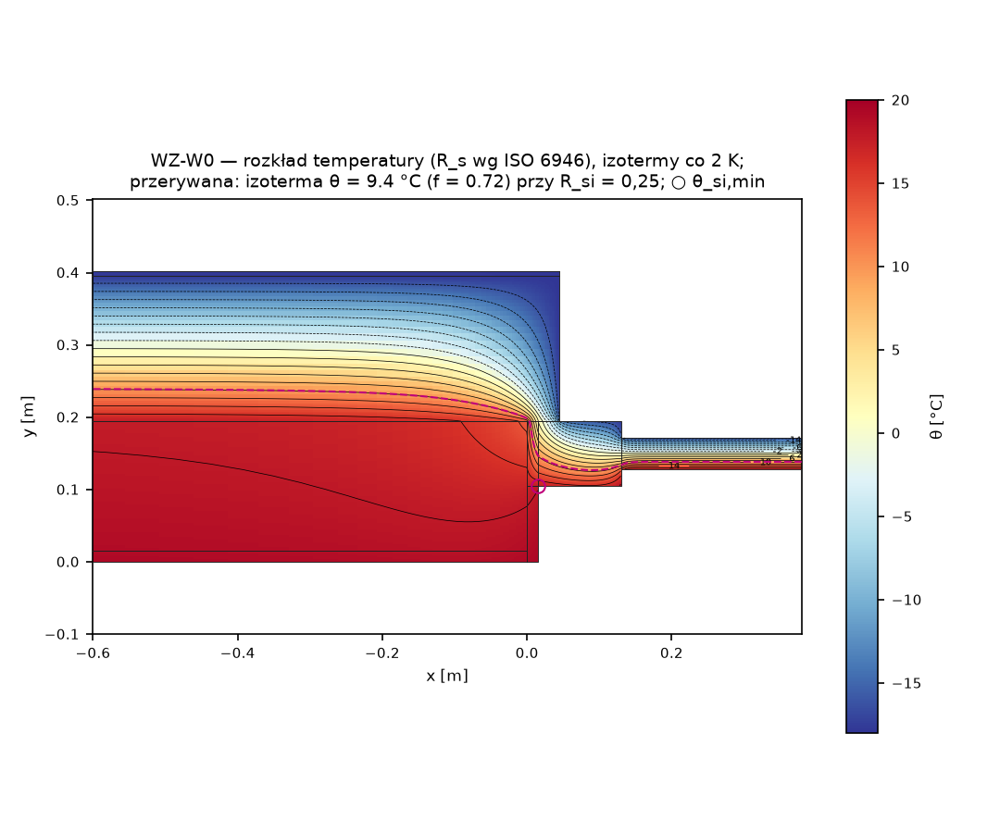

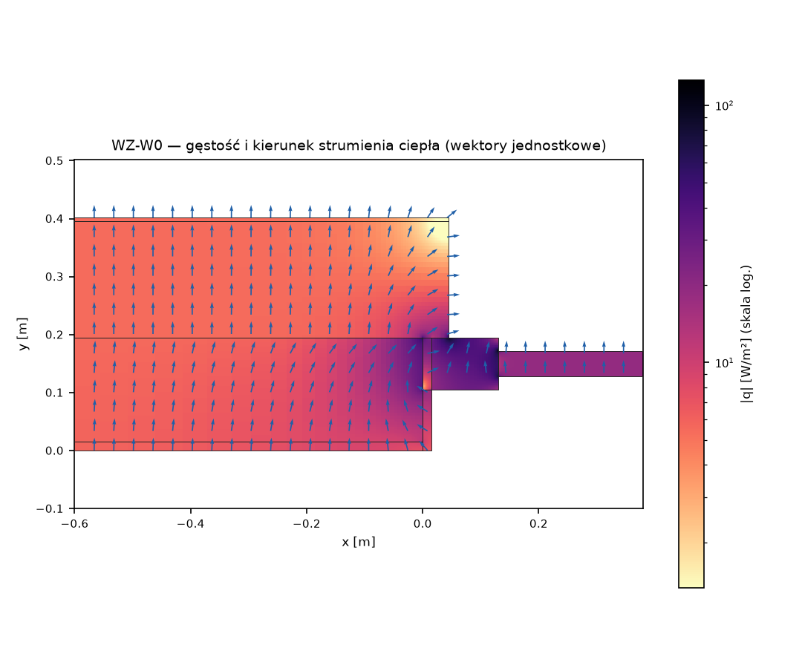

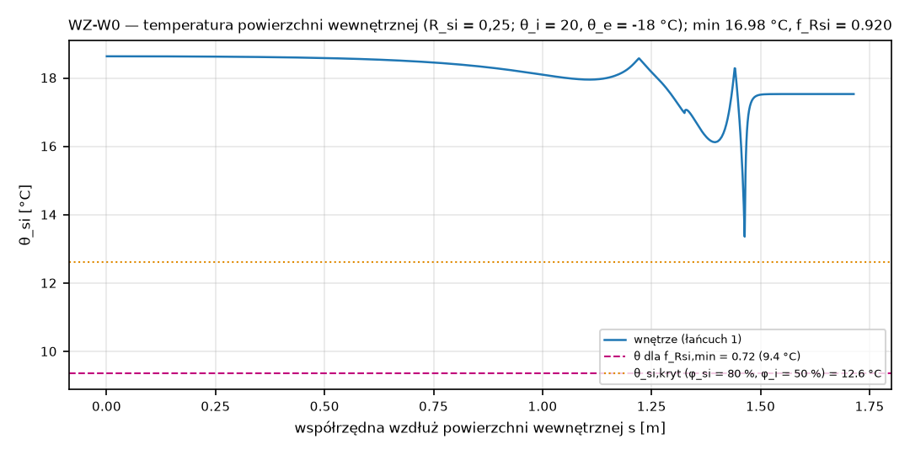

## WZ-W2 — Ościeże okna — ciepły montaż w warstwie izolacji (wariant zalecany)

**Dane wejściowe**

*warstwy ściany:*

| kod | materiał | d [m] | λ [W/(m·K)] | R [m²K/W] |
|---|---|---|---|---|
| TYNK_GIPS | Tynk gipsowy maszynowy | 0,0150 | 0,4000 | 0,0375 |
| SIL18 | Bloczek wapienno-piaskowy 18 cm, kl. 20 | 0,1800 | 0,7700 | 0,2338 |
| EPS031 | Styropian grafitowy EPS 031 | 0,2000 | 0,0310 | 6,4516 |
| TYNK_SIL | Tynk silikonowy cienkowarstwowy, biały | 0,0070 | 0,7000 | 0,0100 |

* okno: U_f = 0.95, b_f = 0.115 m, d_f = 0.09 m (λ_eq ramy = 0.1020); U_g = 0.5, d_g = 0.044 m (λ_eq = 0.0240); U_w = 0.728 (ISO 10077-1, okno 1,23×1,48); położenie: w warstwie izolacji (ciepły montaż), x0 = -0.03 m, zakład izolacji 0.03 m [DANE PRZYKŁADOWE – FIKCYJNE] dane przykładowe z karty katalogowej typowego okna PVC 3-szybowego klasy U_w ≈ 0,8 (lub równoważne)

**Warunki brzegowe** (przekrój poziomy; płaszczyzny odcięcia i osie symetrii adiabatyczne)

| strefa | rodzaj | grupa | θ [°C] | R_s — przebieg ψ [m²K/W] | R_s — przebieg f_Rsi |
|---|---|---|---|---|---|
| wnętrze | wewn | i | 20,0 | wg ISO 6946: 0,13 poziomo / 0,10 w górę / 0,17 w dół | 0,25 (ramy/szyby 0,13) |
| zewnętrze | zewn | e | −18,0 | 0,04 | 0,04 |

**Siatka i dokładność** (MOS, siatka prostokątna zagęszczana przy granicach materiałów)

| siatka | komórek | Φ_całk [W/m] |
|---|---|---|
| 98 × 106 = 10388 komórek; Δx ∈ [1.76; 92.44] mm, Δy ∈ [1.56; 21.65] mm | 10388 | 15,7472 |
| 196 × 212 = 41552 komórek; Δx ∈ [0.882; 46.22] mm, Δy ∈ [0.778; 10.83] mm | 41552 | 15,7560 |

Zmiana strumienia przy podwojeniu liczby podziałów: **0,056 %** (kryterium ISO 10211 < 1 %: spełnione); zmiana L_2D (= zmiana ψ): 0,00023 W/(m·K) (kryterium ≤ max(1 % |ψ|; 0,001) = 0,00100: spełnione); bilans energii Σ Φ / (½ Σ|Φ|) = 1.1e-13 (kryterium < 10⁻⁴: spełnione).

**Współczynniki sprzężenia i ψ**

*Para i–e:* L_2D = **0,4146 W/(m·K)**

| element flankujący | U [W/(m²K)] | l_e [m] | l_i [m] | l_oi [m] | U·l_e | U·l_i | U·l_oi |
|---|---|---|---|---|---|---|---|
| ściana | 0,1449 | 1,1760 | 1,1760 | 1,2060 | 0,1704 | 0,1704 | 0,1747 |
| okno (L_2D ramy z szybą, model bez ściany) | L_2D = 0,2444 | — | — | — | 0,2444 | 0,2444 | 0,2444 |
| okno — pas krawędź ramy ↔ krawędź otworu w murze (tylko system oi, U_w) | 0,7275 | 0,0000 | 0,0000 | −0,0300 | 0,0000 | 0,0000 | −0,0218 |

ψ_oi (wymiary wewnętrzne całkowite — system projektu, H_TB) = 0,4146 − 0,3972 = **0,017 W/(m·K)**; ψ_e (zewnętrzne) = 0,4146 − 0,4147 = 0,000 W/(m·K); ψ_i (wewnętrzne) = 0,4146 − 0,4147 = 0,000 W/(m·K)

**Temperatura powierzchni wewnętrznej i ryzyko pleśni** (R_si = 0,25 — PN-EN ISO 13788)

* θ_si,min = **15,85 °C** w punkcie (0,015; 0,195) m przy θ_i = 20,0 °C, θ_e = −18,0 °C
* f_Rsi = (θ_si,min − θ_e)/(θ_i − θ_e) = **0,891**; wymaganie f_Rsi ≥ 0,72 (WT zał. 2 pkt 2.2.1–2.2.5 (uproszczenie; φ_i = 50 %) (W-248)) → **SPEŁNIA**
* rama/szyba (R_si = 0,13): θ_si,min = 13,18 °C, f_Rsi = 0,821 (informacyjnie — ocena okna wg PN-EN ISO 10077-2/13788)
* informacyjnie przy θ_e obliczeniowej i φ_i = 50 %: θ_si,kryt (φ_si = 80 %) = 12,6 °C (f = 0,806), punkt rosy 9,3 °C → θ_si,min ≥ θ_si,kryt (ocena miesięczna wg ISO 13788 — łagodniejsza; kryterium formalne: f_Rsi ≥ 0,72)

**Porównanie**

* PN-EN ISO 14683 — wartość domyślna (ościeże okna, rama w płaszczyźnie izolacji (W)): ψ_e = 0,10, ψ_i = 0,10 W/(m·K) [NZW] — obliczone ψ_e = 0,000, ψ_i = 0,000 (poniżej wartości domyślnej — porównanie w tym samym systemie wymiarów)

*Uwaga:* Rama i szyba jako materiały zastępcze (λ_eq z U_f, U_g); ψ osadzenia liczone względem modelu okna bez ściany, więc uproszczenie ramy wpływa na ψ w małym stopniu. Ψ_g ramki dystansowej — poza zakresem (U_w wg PN-EN ISO 10077-1).

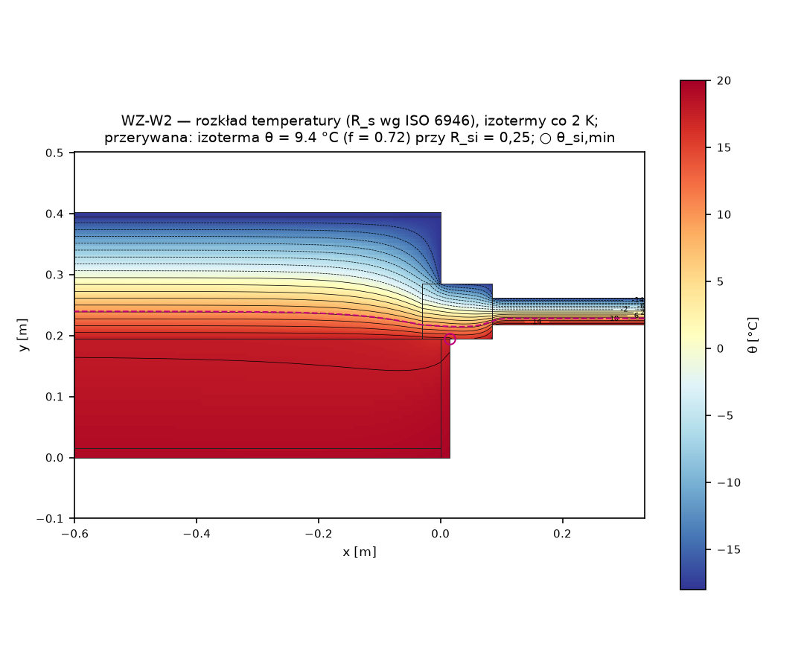

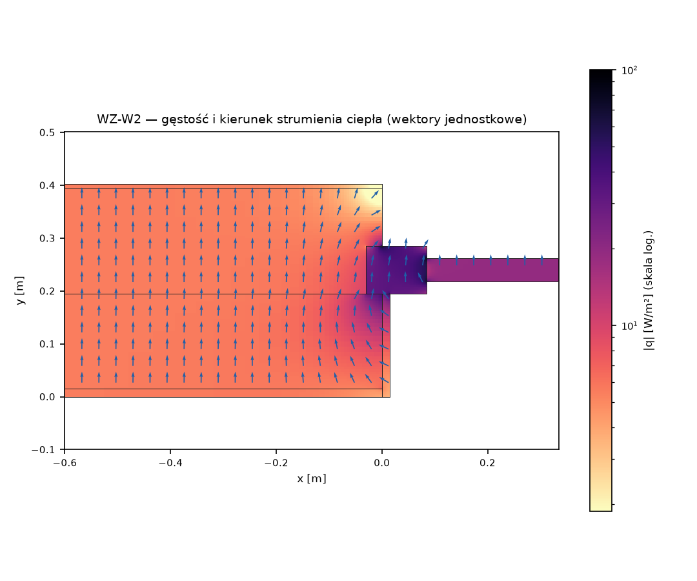

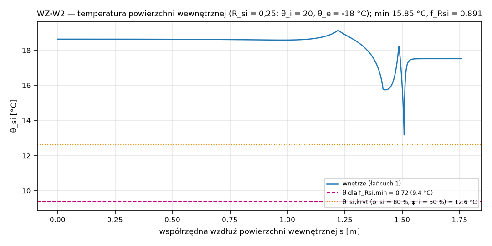

## WZ-W1 — Ościeże okna — osadzenie wg modelu (model: Otwor.rama_t otworu O0-01 (rama 9.0 cm, 5.0 cm w murze))

**Dane wejściowe**

*warstwy ściany:*

| kod | materiał | d [m] | λ [W/(m·K)] | R [m²K/W] |
|---|---|---|---|---|
| TYNK_GIPS | Tynk gipsowy maszynowy | 0,0150 | 0,4000 | 0,0375 |
| SIL18 | Bloczek wapienno-piaskowy 18 cm, kl. 20 | 0,1800 | 0,7700 | 0,2338 |
| EPS031 | Styropian grafitowy EPS 031 | 0,2000 | 0,0310 | 6,4516 |
| TYNK_SIL | Tynk silikonowy cienkowarstwowy, biały | 0,0070 | 0,7000 | 0,0100 |

* okno: U_f = 0.95, b_f = 0.115 m, d_f = 0.09 m (λ_eq ramy = 0.1020); U_g = 0.5, d_g = 0.044 m (λ_eq = 0.0240); U_w = 0.728 (ISO 10077-1, okno 1,23×1,48); położenie: wsunięta 5 cm w mur, reszta w izolacji, x0 = 0.015 m, zakład izolacji 0.03 m [DANE PRZYKŁADOWE – FIKCYJNE] dane przykładowe z karty katalogowej typowego okna PVC 3-szybowego klasy U_w ≈ 0,8 (lub równoważne)

**Warunki brzegowe** (przekrój poziomy; płaszczyzny odcięcia i osie symetrii adiabatyczne)

| strefa | rodzaj | grupa | θ [°C] | R_s — przebieg ψ [m²K/W] | R_s — przebieg f_Rsi |
|---|---|---|---|---|---|
| wnętrze | wewn | i | 20,0 | wg ISO 6946: 0,13 poziomo / 0,10 w górę / 0,17 w dół | 0,25 (ramy/szyby 0,13) |
| zewnętrze | zewn | e | −18,0 | 0,04 | 0,04 |

**Siatka i dokładność** (MOS, siatka prostokątna zagęszczana przy granicach materiałów)

| siatka | komórek | Φ_całk [W/m] |
|---|---|---|
| 99 × 110 = 10890 komórek; Δx ∈ [1.82; 94.8] mm, Δy ∈ [1.56; 17.5] mm | 10890 | 16,5146 |
| 198 × 220 = 43560 komórek; Δx ∈ [0.909; 47.4] mm, Δy ∈ [0.778; 8.752] mm | 43560 | 16,5260 |

Zmiana strumienia przy podwojeniu liczby podziałów: **0,069 %** (kryterium ISO 10211 < 1 %: spełnione); zmiana L_2D (= zmiana ψ): 0,00030 W/(m·K) (kryterium ≤ max(1 % |ψ|; 0,001) = 0,00100: spełnione); bilans energii Σ Φ / (½ Σ|Φ|) = 5.2e-13 (kryterium < 10⁻⁴: spełnione).

**Współczynniki sprzężenia i ψ**

*Para i–e:* L_2D = **0,4349 W/(m·K)**

| element flankujący | U [W/(m²K)] | l_e [m] | l_i [m] | l_oi [m] | U·l_e | U·l_i | U·l_oi |
|---|---|---|---|---|---|---|---|
| ściana | 0,1449 | 1,2210 | 1,2210 | 1,2060 | 0,1769 | 0,1769 | 0,1747 |
| okno (L_2D ramy z szybą, model bez ściany) | L_2D = 0,2444 | — | — | — | 0,2444 | 0,2444 | 0,2444 |
| okno — pas krawędź ramy ↔ krawędź otworu w murze (tylko system oi, U_w) | 0,7275 | 0,0000 | 0,0000 | 0,0150 | 0,0000 | 0,0000 | 0,0109 |

ψ_oi (wymiary wewnętrzne całkowite — system projektu, H_TB) = 0,4349 − 0,4300 = **0,005 W/(m·K)**; ψ_e (zewnętrzne) = 0,4349 − 0,4212 = 0,014 W/(m·K); ψ_i (wewnętrzne) = 0,4349 − 0,4212 = 0,014 W/(m·K)

**Temperatura powierzchni wewnętrznej i ryzyko pleśni** (R_si = 0,25 — PN-EN ISO 13788)

* θ_si,min = **17,27 °C** w punkcie (0,015; 0,145) m przy θ_i = 20,0 °C, θ_e = −18,0 °C
* f_Rsi = (θ_si,min − θ_e)/(θ_i − θ_e) = **0,928**; wymaganie f_Rsi ≥ 0,72 (WT zał. 2 pkt 2.2.1–2.2.5 (uproszczenie; φ_i = 50 %) (W-248)) → **SPEŁNIA**
* rama/szyba (R_si = 0,13): θ_si,min = 13,30 °C, f_Rsi = 0,824 (informacyjnie — ocena okna wg PN-EN ISO 10077-2/13788)
* informacyjnie przy θ_e obliczeniowej i φ_i = 50 %: θ_si,kryt (φ_si = 80 %) = 12,6 °C (f = 0,806), punkt rosy 9,3 °C → θ_si,min ≥ θ_si,kryt (ocena miesięczna wg ISO 13788 — łagodniejsza; kryterium formalne: f_Rsi ≥ 0,72)

**Porównanie**

* PN-EN ISO 14683 — wartość domyślna (ościeże okna, rama w płaszczyźnie izolacji (W)): ψ_e = 0,10, ψ_i = 0,10 W/(m·K) [NZW] — obliczone ψ_e = 0,014, ψ_i = 0,014 (poniżej wartości domyślnej — porównanie w tym samym systemie wymiarów)

*Uwaga:* Rama i szyba jako materiały zastępcze (λ_eq z U_f, U_g); ψ osadzenia liczone względem modelu okna bez ściany, więc uproszczenie ramy wpływa na ψ w małym stopniu. Ψ_g ramki dystansowej — poza zakresem (U_w wg PN-EN ISO 10077-1).

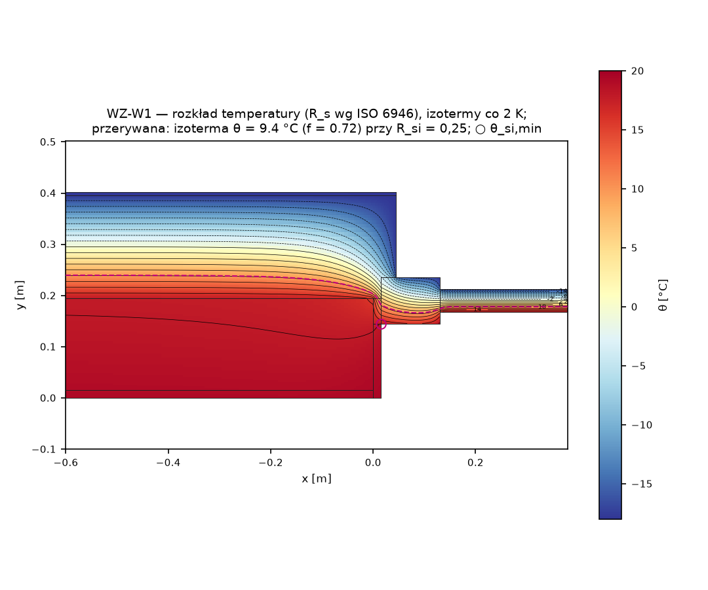

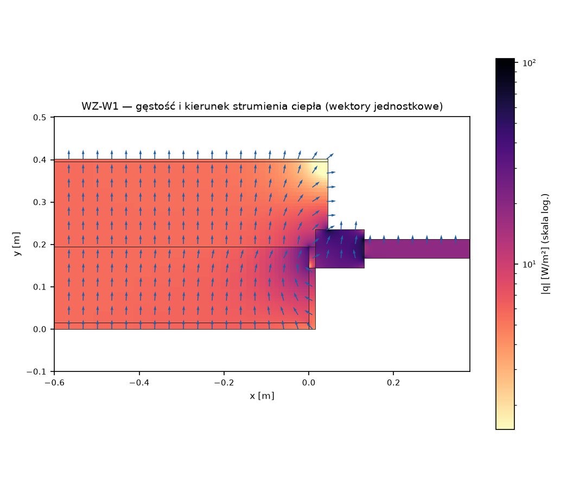

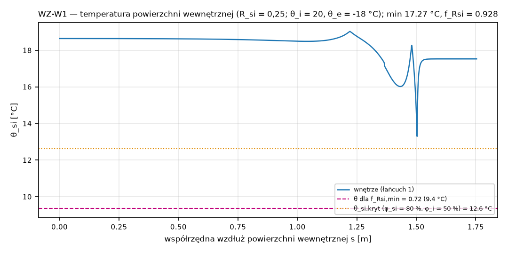

## WZ-N1 — Nadproże okna — rama wsunięta 5 cm w mur, reszta w izolacji

**Dane wejściowe**

*warstwy ściany:*

| kod | materiał | d [m] | λ [W/(m·K)] | R [m²K/W] |
|---|---|---|---|---|
| TYNK_GIPS | Tynk gipsowy maszynowy | 0,0150 | 0,4000 | 0,0375 |
| SIL18 | Bloczek wapienno-piaskowy 18 cm, kl. 20 | 0,1800 | 0,7700 | 0,2338 |
| EPS031 | Styropian grafitowy EPS 031 | 0,2000 | 0,0310 | 6,4516 |
| TYNK_SIL | Tynk silikonowy cienkowarstwowy, biały | 0,0070 | 0,7000 | 0,0100 |

* okno: U_f = 0.95, b_f = 0.115 m, d_f = 0.09 m (λ_eq ramy = 0.1020); U_g = 0.5, d_g = 0.044 m (λ_eq = 0.0240); U_w = 0.728 (ISO 10077-1, okno 1,23×1,48); położenie: wsunięta 5 cm w mur, reszta w izolacji, x0 = 0.015 m, zakład izolacji 0.03 m [DANE PRZYKŁADOWE – FIKCYJNE] dane przykładowe z karty katalogowej typowego okna PVC 3-szybowego klasy U_w ≈ 0,8 (lub równoważne)
* nadproże: ZB (λ = 2.3), h = 0.24 m [ZAŁ]

**Warunki brzegowe** (przekrój pionowy; płaszczyzny odcięcia i osie symetrii adiabatyczne)

| strefa | rodzaj | grupa | θ [°C] | R_s — przebieg ψ [m²K/W] | R_s — przebieg f_Rsi |
|---|---|---|---|---|---|
| wnętrze | wewn | i | 20,0 | wg ISO 6946: 0,13 poziomo / 0,10 w górę / 0,17 w dół | 0,25 (ramy/szyby 0,13) |
| zewnętrze | zewn | e | −18,0 | 0,04 | 0,04 |

**Siatka i dokładność** (MOS, siatka prostokątna zagęszczana przy granicach materiałów)

| siatka | komórek | Φ_całk [W/m] |
|---|---|---|
| 110 × 121 = 13310 komórek; Δx ∈ [1.56; 17.5] mm, Δy ∈ [1.82; 99.36] mm | 13310 | 16,6520 |
| 220 × 242 = 53240 komórek; Δx ∈ [0.778; 8.752] mm, Δy ∈ [0.909; 49.68] mm | 53240 | 16,6640 |

Zmiana strumienia przy podwojeniu liczby podziałów: **0,072 %** (kryterium ISO 10211 < 1 %: spełnione); zmiana L_2D (= zmiana ψ): 0,00032 W/(m·K) (kryterium ≤ max(1 % |ψ|; 0,001) = 0,00100: spełnione); bilans energii Σ Φ / (½ Σ|Φ|) = 1.2e-12 (kryterium < 10⁻⁴: spełnione).

**Współczynniki sprzężenia i ψ**

*Para i–e:* L_2D = **0,4385 W/(m·K)**

| element flankujący | U [W/(m²K)] | l_e [m] | l_i [m] | l_oi [m] | U·l_e | U·l_i | U·l_oi |
|---|---|---|---|---|---|---|---|
| ściana | 0,1449 | 1,2210 | 1,2210 | 1,2060 | 0,1769 | 0,1769 | 0,1747 |
| okno (L_2D ramy z szybą, model bez ściany) | L_2D = 0,2449 | — | — | — | 0,2449 | 0,2449 | 0,2449 |
| okno — pas krawędź ramy ↔ krawędź otworu w murze (tylko system oi, U_w) | 0,7275 | 0,0000 | 0,0000 | 0,0150 | 0,0000 | 0,0000 | 0,0109 |

ψ_oi (wymiary wewnętrzne całkowite — system projektu, H_TB) = 0,4385 − 0,4305 = **0,008 W/(m·K)**; ψ_e (zewnętrzne) = 0,4385 − 0,4218 = 0,017 W/(m·K); ψ_i (wewnętrzne) = 0,4385 − 0,4218 = 0,017 W/(m·K)

**Temperatura powierzchni wewnętrznej i ryzyko pleśni** (R_si = 0,25 — PN-EN ISO 13788)

* θ_si,min = **17,62 °C** w punkcie (0,145; −0,015) m przy θ_i = 20,0 °C, θ_e = −18,0 °C
* f_Rsi = (θ_si,min − θ_e)/(θ_i − θ_e) = **0,937**; wymaganie f_Rsi ≥ 0,72 (WT zał. 2 pkt 2.2.1–2.2.5 (uproszczenie; φ_i = 50 %) (W-248)) → **SPEŁNIA**
* rama/szyba (R_si = 0,13): θ_si,min = 13,32 °C, f_Rsi = 0,824 (informacyjnie — ocena okna wg PN-EN ISO 10077-2/13788)
* informacyjnie przy θ_e obliczeniowej i φ_i = 50 %: θ_si,kryt (φ_si = 80 %) = 12,6 °C (f = 0,806), punkt rosy 9,3 °C → θ_si,min ≥ θ_si,kryt (ocena miesięczna wg ISO 13788 — łagodniejsza; kryterium formalne: f_Rsi ≥ 0,72)

**Porównanie**

* PN-EN ISO 14683 — wartość domyślna (ościeże okna, rama w płaszczyźnie izolacji (W)): ψ_e = 0,10, ψ_i = 0,10 W/(m·K) [NZW] — obliczone ψ_e = 0,017, ψ_i = 0,017 (poniżej wartości domyślnej — porównanie w tym samym systemie wymiarów)

*Uwaga:* Rama i szyba jako materiały zastępcze (λ_eq z U_f, U_g); ψ osadzenia liczone względem modelu okna bez ściany, więc uproszczenie ramy wpływa na ψ w małym stopniu. Ψ_g ramki dystansowej — poza zakresem (U_w wg PN-EN ISO 10077-1).
*Uwaga:* Przekrój pionowy przez nadproże: sufit ościeża (podsufitka) — R_si wg kierunku strumienia (ISO 6946: 0,10 strumień w górę).

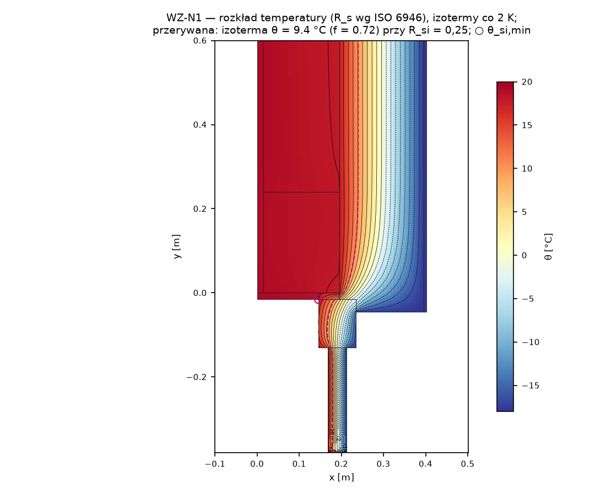

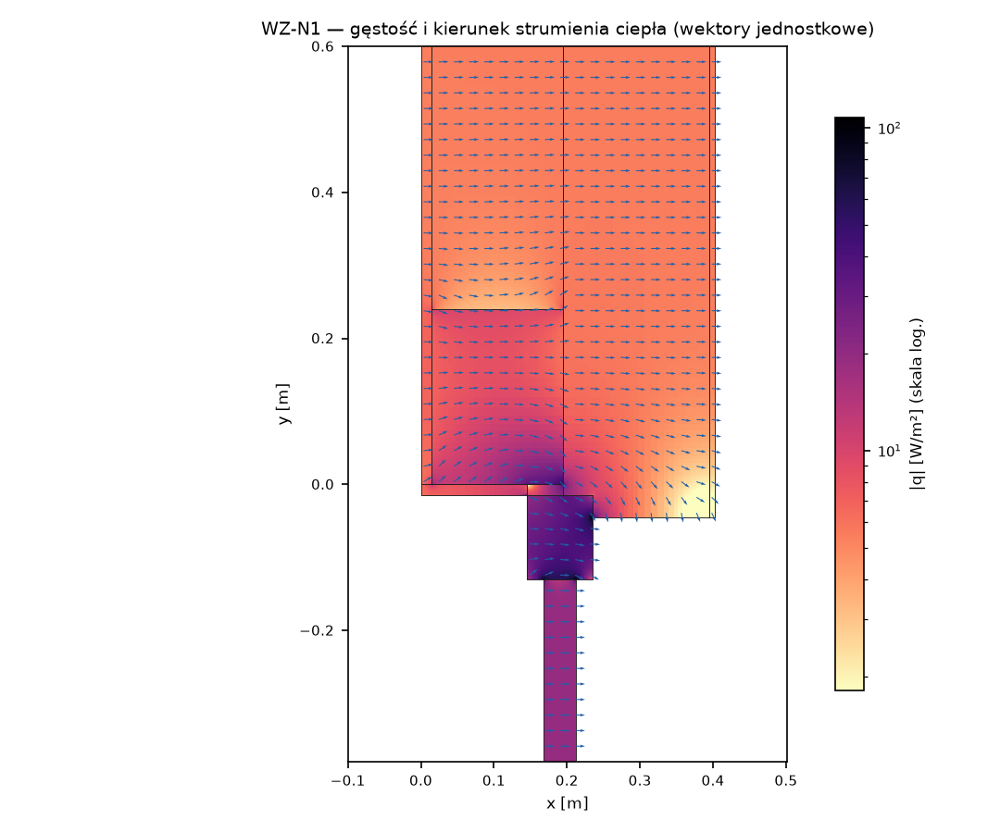

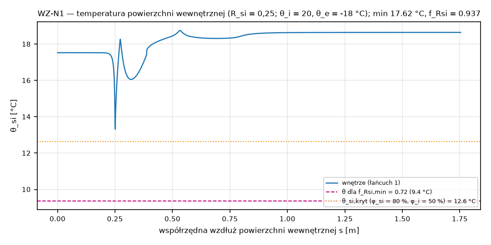

## WZ-N2 — Nadproże okna — rama wsunięta 5 cm w mur, reszta w izolacji + kaseta osłony w ociepleniu

**Dane wejściowe**

*warstwy ściany:*

| kod | materiał | d [m] | λ [W/(m·K)] | R [m²K/W] |
|---|---|---|---|---|
| TYNK_GIPS | Tynk gipsowy maszynowy | 0,0150 | 0,4000 | 0,0375 |
| SIL18 | Bloczek wapienno-piaskowy 18 cm, kl. 20 | 0,1800 | 0,7700 | 0,2338 |
| EPS031 | Styropian grafitowy EPS 031 | 0,2000 | 0,0310 | 6,4516 |
| TYNK_SIL | Tynk silikonowy cienkowarstwowy, biały | 0,0070 | 0,7000 | 0,0100 |

* okno: U_f = 0.95, b_f = 0.115 m, d_f = 0.09 m (λ_eq ramy = 0.1020); U_g = 0.5, d_g = 0.044 m (λ_eq = 0.0240); U_w = 0.728 (ISO 10077-1, okno 1,23×1,48); położenie: wsunięta 5 cm w mur, reszta w izolacji, x0 = 0.015 m, zakład izolacji 0.03 m [DANE PRZYKŁADOWE – FIKCYJNE] dane przykładowe z karty katalogowej typowego okna PVC 3-szybowego klasy U_w ≈ 0,8 (lub równoważne)
* nadproże: ZB (λ = 2.3), h = 0.24 m [ZAŁ]
* kaseta osłony: wys. 0.2 m, głęb. w ociepleniu 0.15 m — wnętrze kasety (szczelina prowadnicy) jako powietrze zewnętrzne [ZAŁ]

**Warunki brzegowe** (przekrój pionowy; płaszczyzny odcięcia i osie symetrii adiabatyczne)

| strefa | rodzaj | grupa | θ [°C] | R_s — przebieg ψ [m²K/W] | R_s — przebieg f_Rsi |
|---|---|---|---|---|---|
| wnętrze | wewn | i | 20,0 | wg ISO 6946: 0,13 poziomo / 0,10 w górę / 0,17 w dół | 0,25 (ramy/szyby 0,13) |
| zewnętrze | zewn | e | −18,0 | 0,04 | 0,04 |

**Siatka i dokładność** (MOS, siatka prostokątna zagęszczana przy granicach materiałów)

| siatka | komórek | Φ_całk [W/m] |
|---|---|---|
| 116 × 132 = 15312 komórek; Δx ∈ [1.56; 17.57] mm, Δy ∈ [1.78; 99.36] mm | 15312 | 19,5063 |
| 232 × 264 = 61248 komórek; Δx ∈ [0.778; 8.783] mm, Δy ∈ [0.888; 49.68] mm | 61248 | 19,5183 |

Zmiana strumienia przy podwojeniu liczby podziałów: **0,062 %** (kryterium ISO 10211 < 1 %: spełnione); zmiana L_2D (= zmiana ψ): 0,00032 W/(m·K) (kryterium ≤ max(1 % |ψ|; 0,001) = 0,00100: spełnione); bilans energii Σ Φ / (½ Σ|Φ|) = 1.4e-12 (kryterium < 10⁻⁴: spełnione).

**Współczynniki sprzężenia i ψ**

*Para i–e:* L_2D = **0,5136 W/(m·K)**

| element flankujący | U [W/(m²K)] | l_e [m] | l_i [m] | l_oi [m] | U·l_e | U·l_i | U·l_oi |
|---|---|---|---|---|---|---|---|
| ściana | 0,1449 | 1,2210 | 1,2210 | 1,2060 | 0,1769 | 0,1769 | 0,1747 |
| okno (L_2D ramy z szybą, model bez ściany) | L_2D = 0,2449 | — | — | — | 0,2449 | 0,2449 | 0,2449 |
| okno — pas krawędź ramy ↔ krawędź otworu w murze (tylko system oi, U_w) | 0,7275 | 0,0000 | 0,0000 | 0,0150 | 0,0000 | 0,0000 | 0,0109 |

ψ_oi (wymiary wewnętrzne całkowite — system projektu, H_TB) = 0,5136 − 0,4305 = **0,083 W/(m·K)**; ψ_e (zewnętrzne) = 0,5136 − 0,4218 = 0,092 W/(m·K); ψ_i (wewnętrzne) = 0,5136 − 0,4218 = 0,092 W/(m·K)

**Temperatura powierzchni wewnętrznej i ryzyko pleśni** (R_si = 0,25 — PN-EN ISO 13788)

* θ_si,min = **16,55 °C** w punkcie (0,145; −0,015) m przy θ_i = 20,0 °C, θ_e = −18,0 °C
* f_Rsi = (θ_si,min − θ_e)/(θ_i − θ_e) = **0,909**; wymaganie f_Rsi ≥ 0,72 (WT zał. 2 pkt 2.2.1–2.2.5 (uproszczenie; φ_i = 50 %) (W-248)) → **SPEŁNIA**
* rama/szyba (R_si = 0,13): θ_si,min = 13,25 °C, f_Rsi = 0,822 (informacyjnie — ocena okna wg PN-EN ISO 10077-2/13788)
* informacyjnie przy θ_e obliczeniowej i φ_i = 50 %: θ_si,kryt (φ_si = 80 %) = 12,6 °C (f = 0,806), punkt rosy 9,3 °C → θ_si,min ≥ θ_si,kryt (ocena miesięczna wg ISO 13788 — łagodniejsza; kryterium formalne: f_Rsi ≥ 0,72)

**Porównanie**

* PN-EN ISO 14683 — wartość domyślna (ościeże okna, rama w płaszczyźnie izolacji (W)): ψ_e = 0,10, ψ_i = 0,10 W/(m·K) [NZW] — obliczone ψ_e = 0,092, ψ_i = 0,092 (poniżej wartości domyślnej — porównanie w tym samym systemie wymiarów)

*Uwaga:* Rama i szyba jako materiały zastępcze (λ_eq z U_f, U_g); ψ osadzenia liczone względem modelu okna bez ściany, więc uproszczenie ramy wpływa na ψ w małym stopniu. Ψ_g ramki dystansowej — poza zakresem (U_w wg PN-EN ISO 10077-1).
*Uwaga:* Kaseta żaluzji/screenu podtynkowa: izolacja za kasetą zmniejszona do 0.06 m; wariant zalecany — kaseta natynkowa albo kaseta systemowa z izolacją (deklarowane ψ/f_Rsi producenta).
*Uwaga:* Przekrój pionowy przez nadproże: sufit ościeża (podsufitka) — R_si wg kierunku strumienia (ISO 6946: 0,10 strumień w górę).

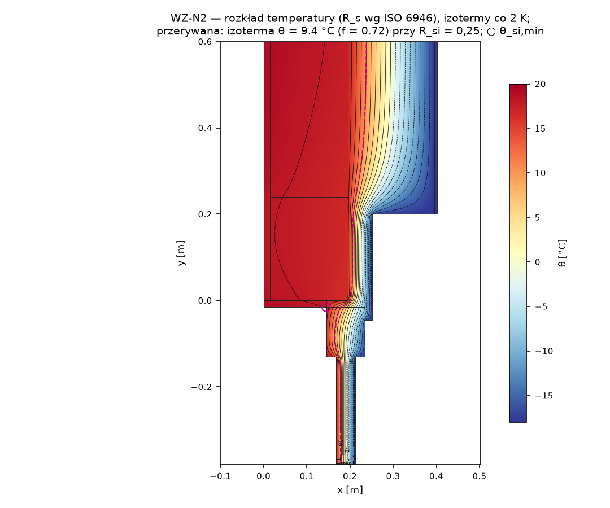

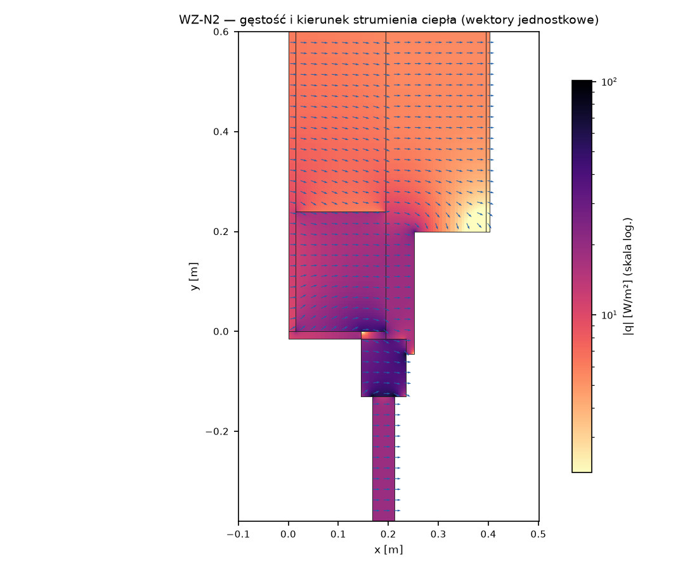

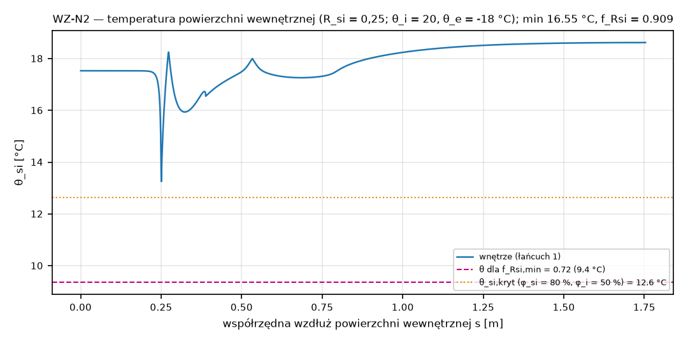

## WZ-P1 — Podokiennik — rama wsunięta 5 cm w mur, reszta w izolacji, parapet wewn. i zewn.

**Dane wejściowe**

*warstwy ściany:*

| kod | materiał | d [m] | λ [W/(m·K)] | R [m²K/W] |
|---|---|---|---|---|
| TYNK_GIPS | Tynk gipsowy maszynowy | 0,0150 | 0,4000 | 0,0375 |
| SIL18 | Bloczek wapienno-piaskowy 18 cm, kl. 20 | 0,1800 | 0,7700 | 0,2338 |
| EPS031 | Styropian grafitowy EPS 031 | 0,2000 | 0,0310 | 6,4516 |
| TYNK_SIL | Tynk silikonowy cienkowarstwowy, biały | 0,0070 | 0,7000 | 0,0100 |

* okno: U_f = 0.95, b_f = 0.115 m, d_f = 0.09 m (λ_eq ramy = 0.1020); U_g = 0.5, d_g = 0.044 m (λ_eq = 0.0240); U_w = 0.728 (ISO 10077-1, okno 1,23×1,48); położenie: wsunięta 5 cm w mur, reszta w izolacji, x0 = 0.015 m, zakład izolacji 0.03 m [DANE PRZYKŁADOWE – FIKCYJNE] dane przykładowe z karty katalogowej typowego okna PVC 3-szybowego klasy U_w ≈ 0,8 (lub równoważne)
* parapet wewnętrzny: PARAPET_WEWN (λ = 0.18), d = 0.025 m, wysięg do wnętrza 0.03 m [ZAŁ]
* parapet zewnętrzny: ALU (λ = 160.0), d = 0.0015 m, okapnik 0.04 m przed licem [ZAŁ]; spadek pominięty

**Warunki brzegowe** (przekrój pionowy; płaszczyzny odcięcia i osie symetrii adiabatyczne)

| strefa | rodzaj | grupa | θ [°C] | R_s — przebieg ψ [m²K/W] | R_s — przebieg f_Rsi |
|---|---|---|---|---|---|
| wnętrze | wewn | i | 20,0 | wg ISO 6946: 0,13 poziomo / 0,10 w górę / 0,17 w dół | 0,25 (ramy/szyby 0,13) |
| zewnętrze | zewn | e | −18,0 | 0,04 | 0,04 |

**Siatka i dokładność** (MOS, siatka prostokątna zagęszczana przy granicach materiałów)

| siatka | komórek | Φ_całk [W/m] |
|---|---|---|
| 140 × 114 = 15960 komórek; Δx ∈ [1.15; 17.18] mm, Δy ∈ [0.75; 99.28] mm | 15960 | 16,5121 |
| 280 × 228 = 63840 komórek; Δx ∈ [0.577; 8.59] mm, Δy ∈ [0.375; 49.64] mm | 63840 | 16,5250 |

Zmiana strumienia przy podwojeniu liczby podziałów: **0,078 %** (kryterium ISO 10211 < 1 %: spełnione); zmiana L_2D (= zmiana ψ): 0,00034 W/(m·K) (kryterium ≤ max(1 % |ψ|; 0,001) = 0,00100: spełnione); bilans energii Σ Φ / (½ Σ|Φ|) = 4.7e-12 (kryterium < 10⁻⁴: spełnione).

**Współczynniki sprzężenia i ψ**

*Para i–e:* L_2D = **0,4349 W/(m·K)**

| element flankujący | U [W/(m²K)] | l_e [m] | l_i [m] | l_oi [m] | U·l_e | U·l_i | U·l_oi |
|---|---|---|---|---|---|---|---|
| ściana | 0,1449 | 1,2210 | 1,2210 | 1,2060 | 0,1769 | 0,1769 | 0,1747 |
| okno (L_2D ramy z szybą, model bez ściany) | L_2D = 0,2438 | — | — | — | 0,2438 | 0,2438 | 0,2438 |
| okno — pas krawędź ramy ↔ krawędź otworu w murze (tylko system oi, U_w) | 0,7275 | 0,0000 | 0,0000 | 0,0150 | 0,0000 | 0,0000 | 0,0109 |

ψ_oi (wymiary wewnętrzne całkowite — system projektu, H_TB) = 0,4349 − 0,4294 = **0,005 W/(m·K)**; ψ_e (zewnętrzne) = 0,4349 − 0,4207 = 0,014 W/(m·K); ψ_i (wewnętrzne) = 0,4349 − 0,4207 = 0,014 W/(m·K)

**Temperatura powierzchni wewnętrznej i ryzyko pleśni** (R_si = 0,25 — PN-EN ISO 13788)

* θ_si,min = **16,55 °C** w punkcie (0,145; 0,025) m przy θ_i = 20,0 °C, θ_e = −18,0 °C
* f_Rsi = (θ_si,min − θ_e)/(θ_i − θ_e) = **0,909**; wymaganie f_Rsi ≥ 0,72 (WT zał. 2 pkt 2.2.1–2.2.5 (uproszczenie; φ_i = 50 %) (W-248)) → **SPEŁNIA**
* rama/szyba (R_si = 0,13): θ_si,min = 13,19 °C, f_Rsi = 0,821 (informacyjnie — ocena okna wg PN-EN ISO 10077-2/13788)
* informacyjnie przy θ_e obliczeniowej i φ_i = 50 %: θ_si,kryt (φ_si = 80 %) = 12,6 °C (f = 0,806), punkt rosy 9,3 °C → θ_si,min ≥ θ_si,kryt (ocena miesięczna wg ISO 13788 — łagodniejsza; kryterium formalne: f_Rsi ≥ 0,72)

**Porównanie**

* PN-EN ISO 14683 — wartość domyślna (ościeże okna, rama w płaszczyźnie izolacji (W)): ψ_e = 0,10, ψ_i = 0,10 W/(m·K) [NZW] — obliczone ψ_e = 0,014, ψ_i = 0,014 (poniżej wartości domyślnej — porównanie w tym samym systemie wymiarów)

*Uwaga:* Rama i szyba jako materiały zastępcze (λ_eq z U_f, U_g); ψ osadzenia liczone względem modelu okna bez ściany, więc uproszczenie ramy wpływa na ψ w małym stopniu. Ψ_g ramki dystansowej — poza zakresem (U_w wg PN-EN ISO 10077-1).
*Uwaga:* Parapet zewnętrzny (odprowadzenie wody): obróbka na izolacji podparapetowej, wsunięta pod profil podparapetowy ramy, okapnik ≥ 3–4 cm przed licem elewacji, spadek ≥ 5 %, zaślepki boczne w ościeżach; izolacja pod parapetem ciągła do ramy (brak mostka).
*Uwaga:* Przekrój pionowy przez podokiennik; parapet wewnętrzny o małym λ (drewno/MDF) — wariant ostrożny dla f_Rsi (ogranicza dopływ ciepła do naroża pod parapetem).

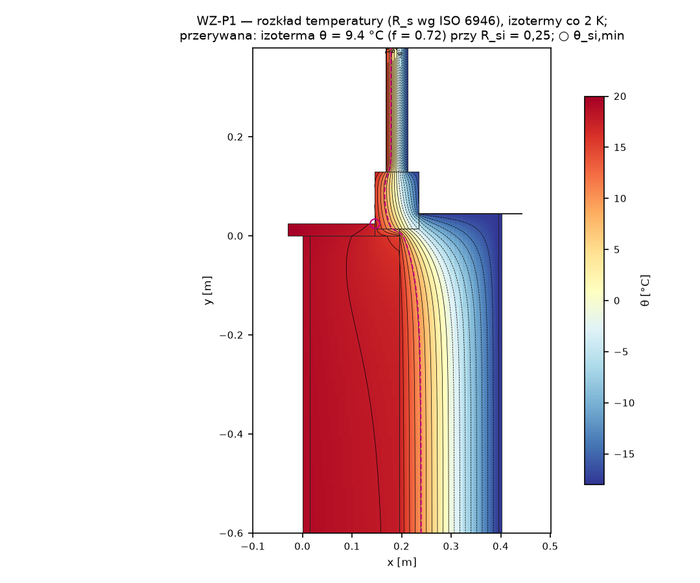

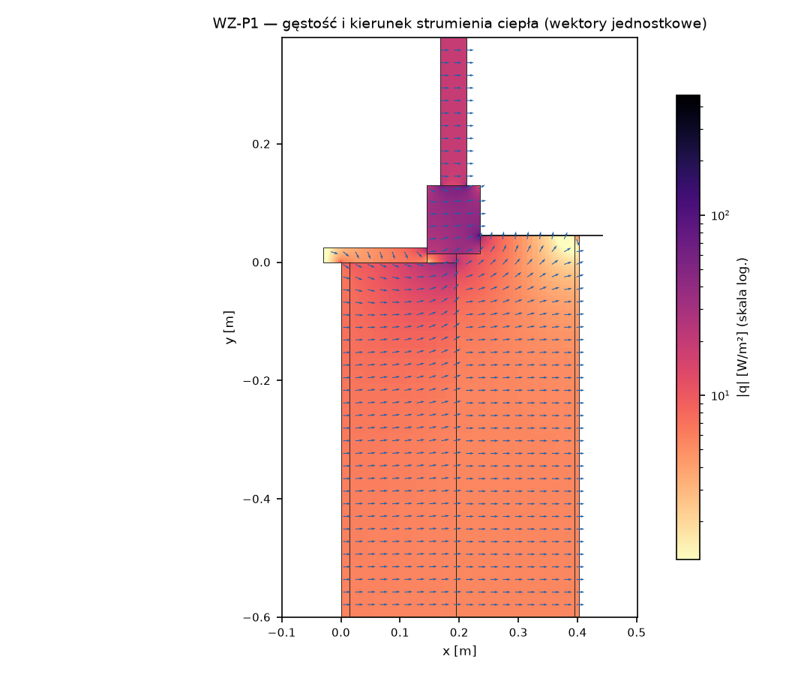

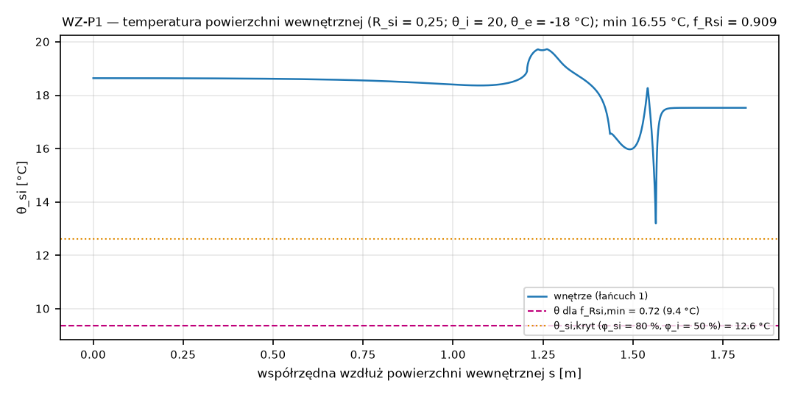

## WZ-GF2 — Cokół — płyta fundamentowa na XPS (wariant porównawczy) [ZAŁ]

**Dane wejściowe**

*warstwy ściany:*

| kod | materiał | d [m] | λ [W/(m·K)] | R [m²K/W] |
|---|---|---|---|---|
| TYNK_GIPS | Tynk gipsowy maszynowy | 0,0150 | 0,4000 | 0,0375 |
| SIL18 | Bloczek wapienno-piaskowy 18 cm, kl. 20 | 0,1800 | 0,7700 | 0,2338 |
| EPS031 | Styropian grafitowy EPS 031 | 0,2000 | 0,0310 | 6,4516 |
| TYNK_SIL | Tynk silikonowy cienkowarstwowy, biały | 0,0070 | 0,7000 | 0,0100 |

*warstwy podłogi:*

| kod | materiał | d [m] | λ [W/(m·K)] | R [m²K/W] |
|---|---|---|---|---|
| GRES | Płytki gresowe 60x120 | 0,0100 | 1,3000 | 0,0077 |
| JASTRYCH | Jastrych cementowy | 0,0650 | 1,0000 | 0,0650 |
| ZB_C30 | Żelbet C30/37 | 0,2500 | 2,3000 | 0,1087 |
| XPS300 | Polistyren ekstrudowany XPS 300 | 0,2000 | 0,0350 | 5,7143 |
| PIASEK | Podsypka piaskowa zagęszczona | 0,1500 | 2,0000 | 0,0750 |

* fundament: płyta fundamentowa ZB_C30 0.25 m
* izolacja obwodowa: XPS do rzędnej -0.33, cokół do 0.00 (teren -0.30)
* grunt: λ = 2.0 W/(m·K); obszar: wewn. 0,5·b = 2.372442047112779 m od lica zewn., zewn. 2,5·b = 11.862210235563895 m, głęb. 2,5·b = 11.862210235563895 m (b = 4.744884094225558 m)
* U podłogi (ISO 13370): R_f = 5.971 m²K/W, d_t = 12.763 m, U = 0.1339 W/(m²K)
* warstwy podłogi — źródło: [ZAŁ] wariant porównawczy: wykończenie z przegrody POD-0, płyta ŻB 0,25 m na XPS 0,20 m (hydroizolacja pod płytą na XPS — na detalu)

**Warunki brzegowe** (przekrój pionowy; płaszczyzny odcięcia i osie symetrii adiabatyczne)

| strefa | rodzaj | grupa | θ [°C] | R_s — przebieg ψ [m²K/W] | R_s — przebieg f_Rsi |
|---|---|---|---|---|---|
| pomieszczenie | wewn | i | 20,0 | wg ISO 6946: 0,13 poziomo / 0,10 w górę / 0,17 w dół | 0,25 (ramy/szyby 0,13) |
| zewnętrze | zewn | e | −18,0 | 0,04 | 0,04 |

**Siatka i dokładność** (MOS, siatka prostokątna zagęszczana przy granicach materiałów)

| siatka | komórek | Φ_całk [W/m] |
|---|---|---|
| 156 × 184 = 28704 komórek; Δx ∈ [2; 394.5] mm, Δy ∈ [2.22; 395.1] mm | 28704 | 20,4151 |
| 312 × 368 = 114816 komórek; Δx ∈ [1; 197.2] mm, Δy ∈ [1.11; 197.6] mm | 114816 | 20,4203 |

Zmiana strumienia przy podwojeniu liczby podziałów: **0,025 %** (kryterium ISO 10211 < 1 %: spełnione); zmiana L_2D (= zmiana ψ): 0,00014 W/(m·K) (kryterium ≤ max(1 % |ψ|; 0,001) = 0,00100: spełnione); bilans energii Σ Φ / (½ Σ|Φ|) = 1.3e-11 (kryterium < 10⁻⁴: spełnione).

**Współczynniki sprzężenia i ψ**

*Para i–e:* L_2D = **0,5374 W/(m·K)**

| element flankujący | U [W/(m²K)] | l_e [m] | l_i [m] | l_oi [m] | U·l_e | U·l_i | U·l_oi |
|---|---|---|---|---|---|---|---|
| ściana (od poziomu posadzki) | 0,1449 | 1,2060 | 1,2060 | 1,2060 | 0,1747 | 0,1747 | 0,1747 |
| podłoga na gruncie (U wg ISO 13370, B' = 4.74 m, d_t = 12.76 m) | 0,1339 | 2,3724 | 1,9704 | 1,9704 | 0,3178 | 0,2639 | 0,2639 |

ψ_oi (wymiary wewnętrzne całkowite — system projektu, H_TB) = 0,5374 − 0,4386 = **0,099 W/(m·K)**; ψ_e (zewnętrzne) = 0,5374 − 0,4925 = 0,045 W/(m·K); ψ_i (wewnętrzne) = 0,5374 − 0,4386 = 0,099 W/(m·K)

**Temperatura powierzchni wewnętrznej i ryzyko pleśni** (R_si = 0,25 — PN-EN ISO 13788)

* θ_si,min = **17,23 °C** w punkcie (−0,001; 0,000) m przy θ_i = 20,0 °C, θ_e = −18,0 °C
* f_Rsi = (θ_si,min − θ_e)/(θ_i − θ_e) = **0,927**; wymaganie f_Rsi ≥ 0,72 (WT zał. 2 pkt 2.2.1–2.2.5 (uproszczenie; φ_i = 50 %) (W-248)) → **SPEŁNIA**
* informacyjnie przy θ_e obliczeniowej i φ_i = 50 %: θ_si,kryt (φ_si = 80 %) = 12,6 °C (f = 0,806), punkt rosy 9,3 °C → θ_si,min ≥ θ_si,kryt (ocena miesięczna wg ISO 13788 — łagodniejsza; kryterium formalne: f_Rsi ≥ 0,72)

**Porównanie**

* PN-EN ISO 14683 — wartość domyślna (ściana–podłoga na gruncie (GF)): ψ_e = 0,60, ψ_i = 0,80 W/(m·K) [NZW] — obliczone ψ_e = 0,045, ψ_i = 0,099 (poniżej wartości domyślnej — porównanie w tym samym systemie wymiarów)

*Uwaga:* Ściana liczona od poziomu posadzki (±0,00) we wszystkich systemach wymiarów (ψ_oi = ψ_i); podłoga wg PN-EN ISO 13370 z B' = b [INT]; b = B' = A/(0,5·P) budynku, gdy podane z modelu.
*Uwaga:* Hydroizolacja pionowa ściany fundamentowej (bitumiczna/KMB) i izolacja obwodowa XPS (odporna na wodę) do spodu ławy; drenaż opaskowy i odprowadzenie wody opadowej od cokołu — poza zakresem cieplnym (wpływ na λ gruntu pominięty, λ = 2,0).

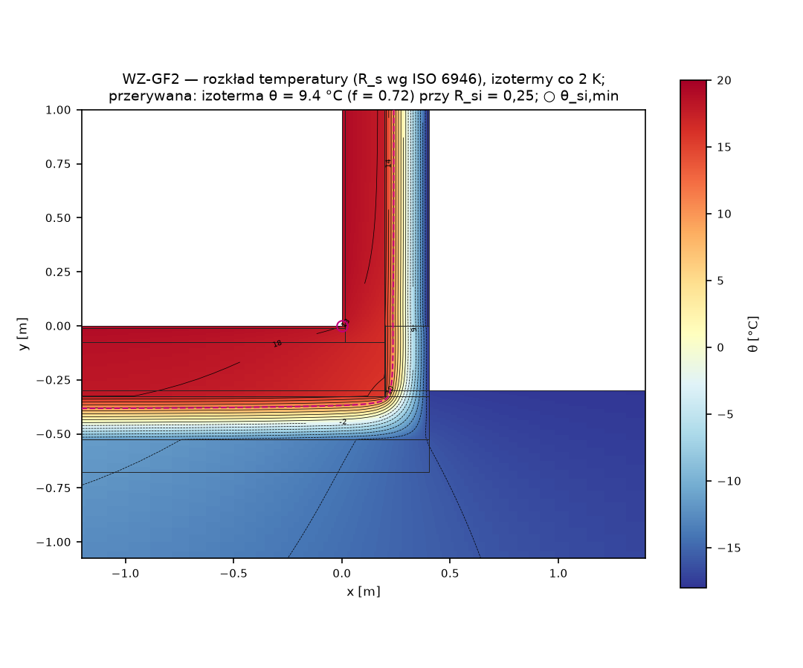

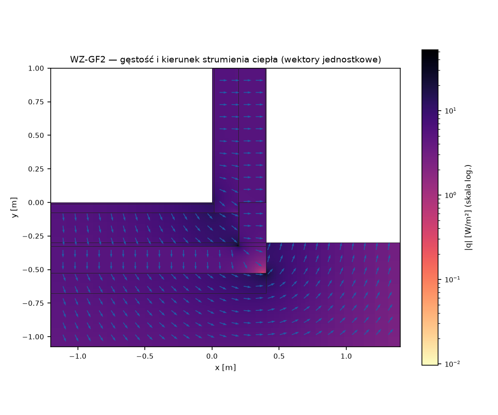

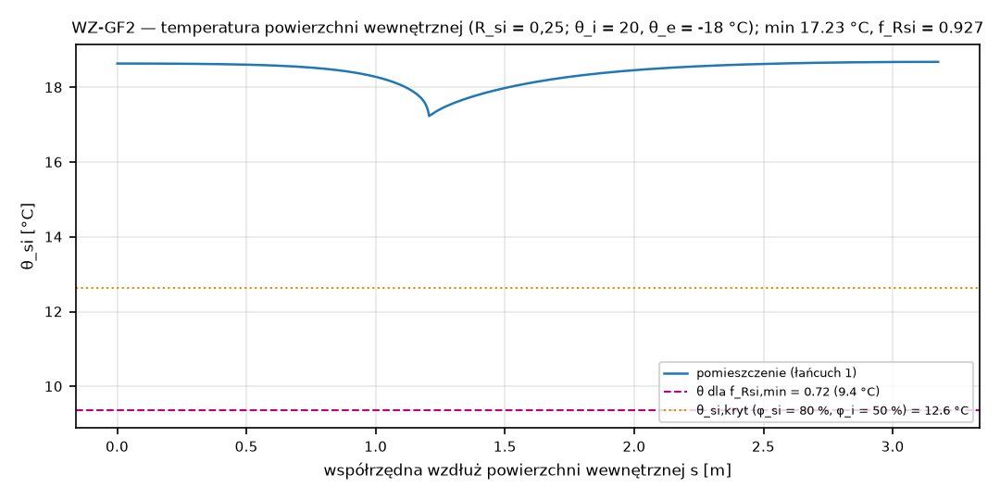

## WZ-GF1 — Cokół — ściana / podłoga na gruncie / ława

**Dane wejściowe**

*warstwy ściany:*

| kod | materiał | d [m] | λ [W/(m·K)] | R [m²K/W] |
|---|---|---|---|---|
| TYNK_GIPS | Tynk gipsowy maszynowy | 0,0150 | 0,4000 | 0,0375 |
| SIL18 | Bloczek wapienno-piaskowy 18 cm, kl. 20 | 0,1800 | 0,7700 | 0,2338 |
| EPS031 | Styropian grafitowy EPS 031 | 0,2000 | 0,0310 | 6,4516 |
| TYNK_SIL | Tynk silikonowy cienkowarstwowy, biały | 0,0070 | 0,7000 | 0,0100 |

*warstwy podłogi:*

| kod | materiał | d [m] | λ [W/(m·K)] | R [m²K/W] |
|---|---|---|---|---|
| GRES | Płytki gresowe 60x120 | 0,0100 | 1,3000 | 0,0077 |
| JASTRYCH | Jastrych cementowy | 0,0650 | 1,0000 | 0,0650 |
| XPS300 | Polistyren ekstrudowany XPS 300 | 0,1500 | 0,0350 | 4,2857 |
| ZB_C25 | Beton C25/30 (płyta podkładowa) | 0,1200 | 2,0000 | 0,0600 |
| PIASEK | Podsypka piaskowa zagęszczona | 0,1500 | 2,0000 | 0,0750 |

* fundament: ława 0.6×0.3 m (spód -1.1), mur fundamentowy BET_FUND 0.24 m
* izolacja obwodowa: XPS do rzędnej -0.80, cokół do 0.00 (teren -0.30)
* grunt: λ = 2.0 W/(m·K); obszar: wewn. 0,5·b = 2.372442047112779 m od lica zewn., zewn. 2,5·b = 11.862210235563895 m, głęb. 2,5·b = 11.862210235563895 m (b = 4.744884094225558 m)
* U podłogi (ISO 13370): R_f = 4.493 m²K/W, d_t = 9.809 m, U = 0.1670 W/(m²K)

**Warunki brzegowe** (przekrój pionowy; płaszczyzny odcięcia i osie symetrii adiabatyczne)

| strefa | rodzaj | grupa | θ [°C] | R_s — przebieg ψ [m²K/W] | R_s — przebieg f_Rsi |
|---|---|---|---|---|---|
| pomieszczenie | wewn | i | 20,0 | wg ISO 6946: 0,13 poziomo / 0,10 w górę / 0,17 w dół | 0,25 (ramy/szyby 0,13) |
| zewnętrze | zewn | e | −18,0 | 0,04 | 0,04 |

**Siatka i dokładność** (MOS, siatka prostokątna zagęszczana przy granicach materiałów)

| siatka | komórek | Φ_całk [W/m] |
|---|---|---|
| 190 × 223 = 42370 komórek; Δx ∈ [2; 394.5] mm, Δy ∈ [2.22; 394.1] mm | 42370 | 27,2101 |
| 380 × 446 = 169480 komórek; Δx ∈ [1; 197.2] mm, Δy ∈ [1.11; 197] mm | 169480 | 27,2250 |

Zmiana strumienia przy podwojeniu liczby podziałów: **0,055 %** (kryterium ISO 10211 < 1 %: spełnione); zmiana L_2D (= zmiana ψ): 0,00039 W/(m·K) (kryterium ≤ max(1 % |ψ|; 0,001) = 0,00213: spełnione); bilans energii Σ Φ / (½ Σ|Φ|) = 3.1e-11 (kryterium < 10⁻⁴: spełnione).

**Współczynniki sprzężenia i ψ**

*Para i–e:* L_2D = **0,7164 W/(m·K)**

| element flankujący | U [W/(m²K)] | l_e [m] | l_i [m] | l_oi [m] | U·l_e | U·l_i | U·l_oi |
|---|---|---|---|---|---|---|---|
| ściana (od poziomu posadzki) | 0,1449 | 1,2060 | 1,2060 | 1,2060 | 0,1747 | 0,1747 | 0,1747 |
| podłoga na gruncie (U wg ISO 13370, B' = 4.74 m, d_t = 9.81 m) | 0,1670 | 2,3724 | 1,9704 | 1,9704 | 0,3962 | 0,3290 | 0,3290 |

ψ_oi (wymiary wewnętrzne całkowite — system projektu, H_TB) = 0,7164 − 0,5037 = **0,213 W/(m·K)**; ψ_e (zewnętrzne) = 0,7164 − 0,5709 = 0,146 W/(m·K); ψ_i (wewnętrzne) = 0,7164 − 0,5037 = 0,213 W/(m·K)

**Temperatura powierzchni wewnętrznej i ryzyko pleśni** (R_si = 0,25 — PN-EN ISO 13788)

* θ_si,min = **12,63 °C** w punkcie (0,000; 0,000) m przy θ_i = 20,0 °C, θ_e = −18,0 °C
* f_Rsi = (θ_si,min − θ_e)/(θ_i − θ_e) = **0,806**; wymaganie f_Rsi ≥ 0,72 (WT zał. 2 pkt 2.2.1–2.2.5 (uproszczenie; φ_i = 50 %) (W-248)) → **SPEŁNIA**
* informacyjnie przy θ_e obliczeniowej i φ_i = 50 %: θ_si,kryt (φ_si = 80 %) = 12,6 °C (f = 0,806), punkt rosy 9,3 °C → θ_si,min ≥ θ_si,kryt (ocena miesięczna wg ISO 13788 — łagodniejsza; kryterium formalne: f_Rsi ≥ 0,72)

**Porównanie**

* PN-EN ISO 14683 — wartość domyślna (ściana–podłoga na gruncie (GF)): ψ_e = 0,60, ψ_i = 0,80 W/(m·K) [NZW] — obliczone ψ_e = 0,146, ψ_i = 0,213 (poniżej wartości domyślnej — porównanie w tym samym systemie wymiarów)

*Uwaga:* Ściana liczona od poziomu posadzki (±0,00) we wszystkich systemach wymiarów (ψ_oi = ψ_i); podłoga wg PN-EN ISO 13370 z B' = b [INT]; b = B' = A/(0,5·P) budynku, gdy podane z modelu.
*Uwaga:* Hydroizolacja pionowa ściany fundamentowej (bitumiczna/KMB) i izolacja obwodowa XPS (odporna na wodę) do spodu ławy; drenaż opaskowy i odprowadzenie wody opadowej od cokołu — poza zakresem cieplnym (wpływ na λ gruntu pominięty, λ = 2,0).

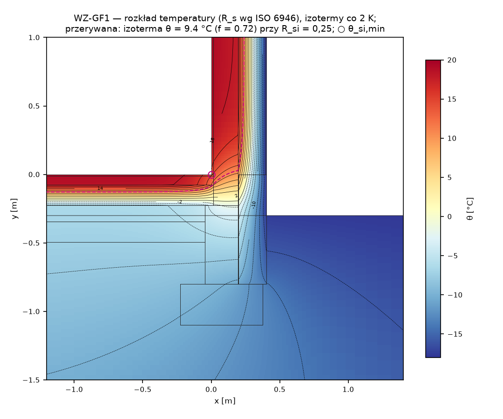

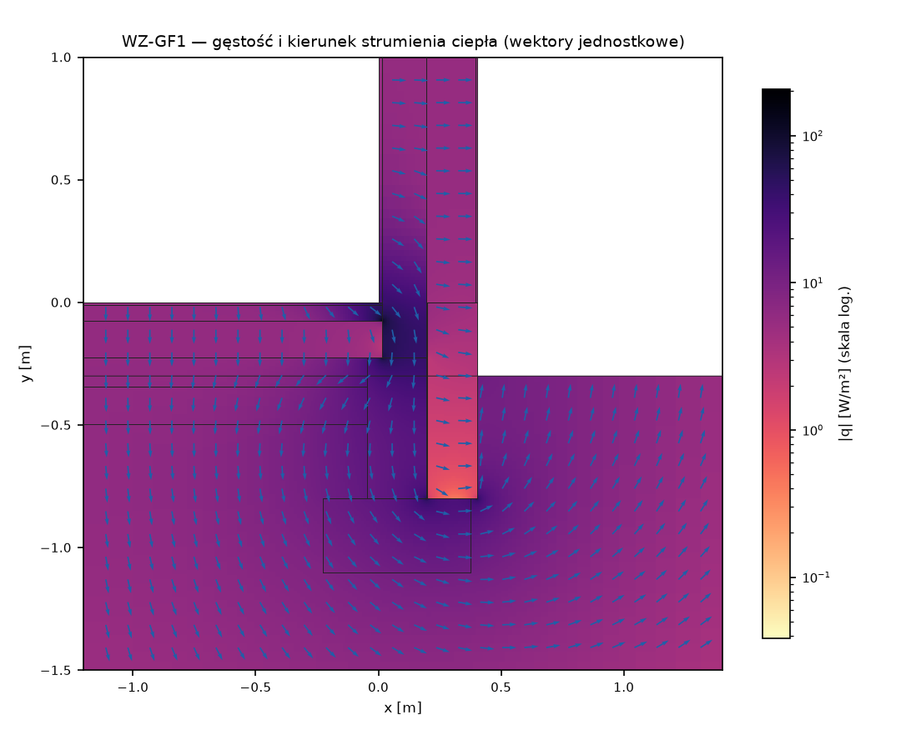

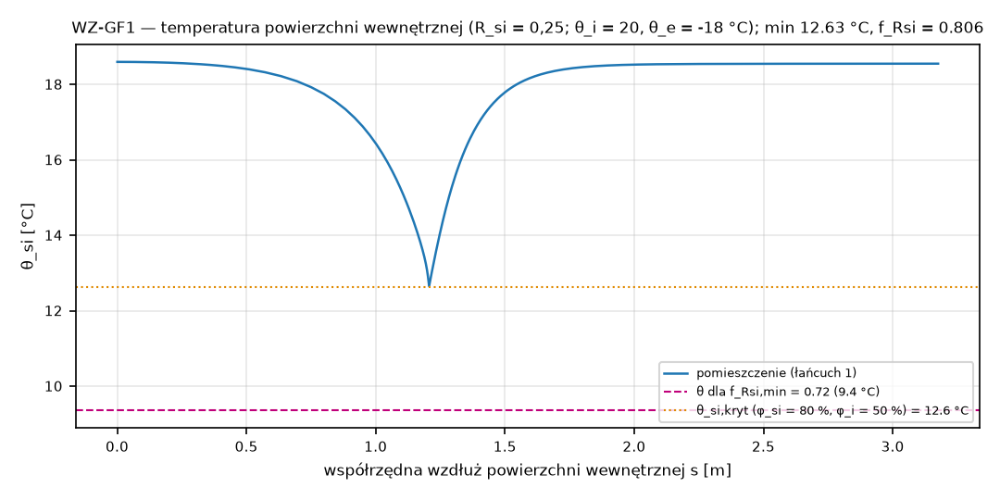

## WZ-GF1B — Cokół — ława + blok termiczny (beton komórkowy 400) w 1. warstwie muru

**Dane wejściowe**

*warstwy ściany:*

| kod | materiał | d [m] | λ [W/(m·K)] | R [m²K/W] |
|---|---|---|---|---|
| TYNK_GIPS | Tynk gipsowy maszynowy | 0,0150 | 0,4000 | 0,0375 |
| SIL18 | Bloczek wapienno-piaskowy 18 cm, kl. 20 | 0,1800 | 0,7700 | 0,2338 |
| EPS031 | Styropian grafitowy EPS 031 | 0,2000 | 0,0310 | 6,4516 |
| TYNK_SIL | Tynk silikonowy cienkowarstwowy, biały | 0,0070 | 0,7000 | 0,0100 |

*warstwy podłogi:*

| kod | materiał | d [m] | λ [W/(m·K)] | R [m²K/W] |
|---|---|---|---|---|
| GRES | Płytki gresowe 60x120 | 0,0100 | 1,3000 | 0,0077 |
| JASTRYCH | Jastrych cementowy | 0,0650 | 1,0000 | 0,0650 |
| XPS300 | Polistyren ekstrudowany XPS 300 | 0,1500 | 0,0350 | 4,2857 |
| ZB_C25 | Beton C25/30 (płyta podkładowa) | 0,1200 | 2,0000 | 0,0600 |
| PIASEK | Podsypka piaskowa zagęszczona | 0,1500 | 2,0000 | 0,0750 |

* fundament: ława 0.6×0.3 m (spód -1.1), mur fundamentowy BET_FUND 0.24 m
* izolacja obwodowa: XPS do rzędnej -0.80, cokół do 0.00 (teren -0.30)
* grunt: λ = 2.0 W/(m·K); obszar: wewn. 0,5·b = 2.372442047112779 m od lica zewn., zewn. 2,5·b = 11.862210235563895 m, głęb. 2,5·b = 11.862210235563895 m (b = 4.744884094225558 m)
* U podłogi (ISO 13370): R_f = 4.493 m²K/W, d_t = 9.809 m, U = 0.1670 W/(m²K)
* blok termiczny: BET_KOM_400 h = 0.24 m

**Warunki brzegowe** (przekrój pionowy; płaszczyzny odcięcia i osie symetrii adiabatyczne)

| strefa | rodzaj | grupa | θ [°C] | R_s — przebieg ψ [m²K/W] | R_s — przebieg f_Rsi |
|---|---|---|---|---|---|
| pomieszczenie | wewn | i | 20,0 | wg ISO 6946: 0,13 poziomo / 0,10 w górę / 0,17 w dół | 0,25 (ramy/szyby 0,13) |
| zewnętrze | zewn | e | −18,0 | 0,04 | 0,04 |

**Siatka i dokładność** (MOS, siatka prostokątna zagęszczana przy granicach materiałów)

| siatka | komórek | Φ_całk [W/m] |
|---|---|---|
| 190 × 228 = 43320 komórek; Δx ∈ [2; 394.5] mm, Δy ∈ [2.22; 394.1] mm | 43320 | 22,1175 |
| 380 × 456 = 173280 komórek; Δx ∈ [1; 197.2] mm, Δy ∈ [1.11; 197] mm | 173280 | 22,1247 |

Zmiana strumienia przy podwojeniu liczby podziałów: **0,032 %** (kryterium ISO 10211 < 1 %: spełnione); zmiana L_2D (= zmiana ψ): 0,00019 W/(m·K) (kryterium ≤ max(1 % |ψ|; 0,001) = 0,00100: spełnione); bilans energii Σ Φ / (½ Σ|Φ|) = 4.0e-11 (kryterium < 10⁻⁴: spełnione).

**Współczynniki sprzężenia i ψ**

*Para i–e:* L_2D = **0,5822 W/(m·K)**

| element flankujący | U [W/(m²K)] | l_e [m] | l_i [m] | l_oi [m] | U·l_e | U·l_i | U·l_oi |
|---|---|---|---|---|---|---|---|
| ściana (od poziomu posadzki) | 0,1449 | 1,2060 | 1,2060 | 1,2060 | 0,1747 | 0,1747 | 0,1747 |
| podłoga na gruncie (U wg ISO 13370, B' = 4.74 m, d_t = 9.81 m) | 0,1670 | 2,3724 | 1,9704 | 1,9704 | 0,3962 | 0,3290 | 0,3290 |

ψ_oi (wymiary wewnętrzne całkowite — system projektu, H_TB) = 0,5822 − 0,5037 = **0,078 W/(m·K)**; ψ_e (zewnętrzne) = 0,5822 − 0,5709 = 0,011 W/(m·K); ψ_i (wewnętrzne) = 0,5822 − 0,5037 = 0,078 W/(m·K)

**Temperatura powierzchni wewnętrznej i ryzyko pleśni** (R_si = 0,25 — PN-EN ISO 13788)

* θ_si,min = **16,65 °C** w punkcie (0,000; 0,000) m przy θ_i = 20,0 °C, θ_e = −18,0 °C
* f_Rsi = (θ_si,min − θ_e)/(θ_i − θ_e) = **0,912**; wymaganie f_Rsi ≥ 0,72 (WT zał. 2 pkt 2.2.1–2.2.5 (uproszczenie; φ_i = 50 %) (W-248)) → **SPEŁNIA**
* informacyjnie przy θ_e obliczeniowej i φ_i = 50 %: θ_si,kryt (φ_si = 80 %) = 12,6 °C (f = 0,806), punkt rosy 9,3 °C → θ_si,min ≥ θ_si,kryt (ocena miesięczna wg ISO 13788 — łagodniejsza; kryterium formalne: f_Rsi ≥ 0,72)

**Porównanie**

* PN-EN ISO 14683 — wartość domyślna (ściana–podłoga na gruncie (GF)): ψ_e = 0,60, ψ_i = 0,80 W/(m·K) [NZW] — obliczone ψ_e = 0,011, ψ_i = 0,078 (poniżej wartości domyślnej — porównanie w tym samym systemie wymiarów)

*Uwaga:* Ściana liczona od poziomu posadzki (±0,00) we wszystkich systemach wymiarów (ψ_oi = ψ_i); podłoga wg PN-EN ISO 13370 z B' = b [INT]; b = B' = A/(0,5·P) budynku, gdy podane z modelu.
*Uwaga:* Hydroizolacja pionowa ściany fundamentowej (bitumiczna/KMB) i izolacja obwodowa XPS (odporna na wodę) do spodu ławy; drenaż opaskowy i odprowadzenie wody opadowej od cokołu — poza zakresem cieplnym (wpływ na λ gruntu pominięty, λ = 2,0).

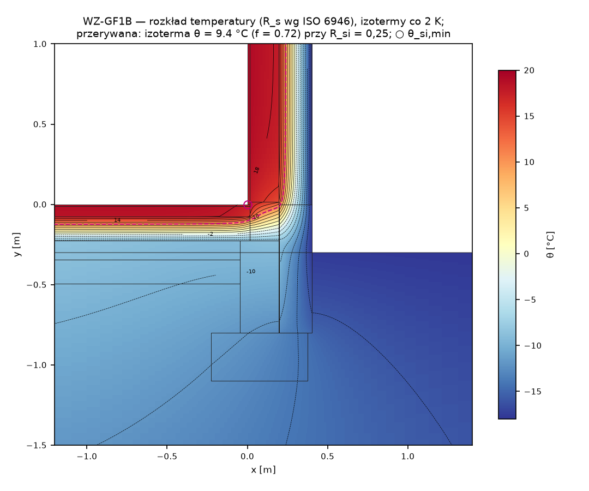

## WZ-C1 — Narożnik zewnętrzny ścian (rzut)

Rzut naroża zewnętrznego; płaszczyzny odcięcia adiabatyczne w odległości L od naroża wewn.

**Dane wejściowe**

*warstwy ściany:*

| kod | materiał | d [m] | λ [W/(m·K)] | R [m²K/W] |
|---|---|---|---|---|
| TYNK_GIPS | Tynk gipsowy maszynowy | 0,0150 | 0,4000 | 0,0375 |
| SIL18 | Bloczek wapienno-piaskowy 18 cm, kl. 20 | 0,1800 | 0,7700 | 0,2338 |
| EPS031 | Styropian grafitowy EPS 031 | 0,2000 | 0,0310 | 6,4516 |
| TYNK_SIL | Tynk silikonowy cienkowarstwowy, biały | 0,0070 | 0,7000 | 0,0100 |

* L odcięcia [m]: 1,608

**Warunki brzegowe** (przekrój poziomy; płaszczyzny odcięcia i osie symetrii adiabatyczne)

| strefa | rodzaj | grupa | θ [°C] | R_s — przebieg ψ [m²K/W] | R_s — przebieg f_Rsi |
|---|---|---|---|---|---|
| wnętrze | wewn | i | 20,0 | wg ISO 6946: 0,13 poziomo / 0,10 w górę / 0,17 w dół | 0,25 (ramy/szyby 0,13) |
| zewnętrze | zewn | e | −18,0 | 0,04 | 0,04 |

**Siatka i dokładność** (MOS, siatka prostokątna zagęszczana przy granicach materiałów)

| siatka | komórek | Φ_całk [W/m] |
|---|---|---|
| 114 × 114 = 12996 komórek; Δx ∈ [1.56; 96.16] mm, Δy ∈ [1.56; 96.16] mm | 12996 | 20,1554 |
| 228 × 228 = 51984 komórek; Δx ∈ [0.778; 48.08] mm, Δy ∈ [0.778; 48.08] mm | 51984 | 20,1568 |

Zmiana strumienia przy podwojeniu liczby podziałów: **0,007 %** (kryterium ISO 10211 < 1 %: spełnione); zmiana L_2D (= zmiana ψ): 0,00004 W/(m·K) (kryterium ≤ max(1 % |ψ|; 0,001) = 0,00100: spełnione); bilans energii Σ Φ / (½ Σ|Φ|) = 1.6e-13 (kryterium < 10⁻⁴: spełnione).

**Współczynniki sprzężenia i ψ**

*Para i–e:* L_2D = **0,5304 W/(m·K)**

| element flankujący | U [W/(m²K)] | l_e [m] | l_i [m] | l_oi [m] | U·l_e | U·l_i | U·l_oi |
|---|---|---|---|---|---|---|---|
| ściana A (oś x) | 0,1449 | 2,0100 | 1,6080 | 1,6080 | 0,2912 | 0,2329 | 0,2329 |
| ściana B (oś y) | 0,1449 | 2,0100 | 1,6080 | 1,6080 | 0,2912 | 0,2329 | 0,2329 |

ψ_oi (wymiary wewnętrzne całkowite — system projektu, H_TB) = 0,5304 − 0,4659 = **0,065 W/(m·K)**; ψ_e (zewnętrzne) = 0,5304 − 0,5824 = −0,052 W/(m·K); ψ_i (wewnętrzne) = 0,5304 − 0,4659 = 0,065 W/(m·K)

**Temperatura powierzchni wewnętrznej i ryzyko pleśni** (R_si = 0,25 — PN-EN ISO 13788)

* θ_si,min = **17,10 °C** w punkcie (0,000; 0,000) m przy θ_i = 20,0 °C, θ_e = −18,0 °C
* f_Rsi = (θ_si,min − θ_e)/(θ_i − θ_e) = **0,924**; wymaganie f_Rsi ≥ 0,72 (WT zał. 2 pkt 2.2.1–2.2.5 (uproszczenie; φ_i = 50 %) (W-248)) → **SPEŁNIA**
* informacyjnie przy θ_e obliczeniowej i φ_i = 50 %: θ_si,kryt (φ_si = 80 %) = 12,6 °C (f = 0,806), punkt rosy 9,3 °C → θ_si,min ≥ θ_si,kryt (ocena miesięczna wg ISO 13788 — łagodniejsza; kryterium formalne: f_Rsi ≥ 0,72)

**Porównanie**

* PN-EN ISO 14683 — wartość domyślna (naroże zewnętrzne, izolacja zewnętrzna (C)): ψ_e = −0,10, ψ_i = 0,15 W/(m·K) [NZW] — obliczone ψ_e = −0,052, ψ_i = 0,065 (POWYŻEJ wartości domyślnej — porównanie w tym samym systemie wymiarów)

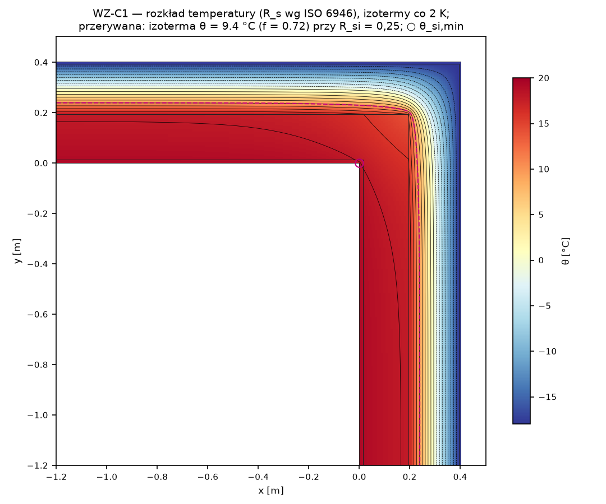

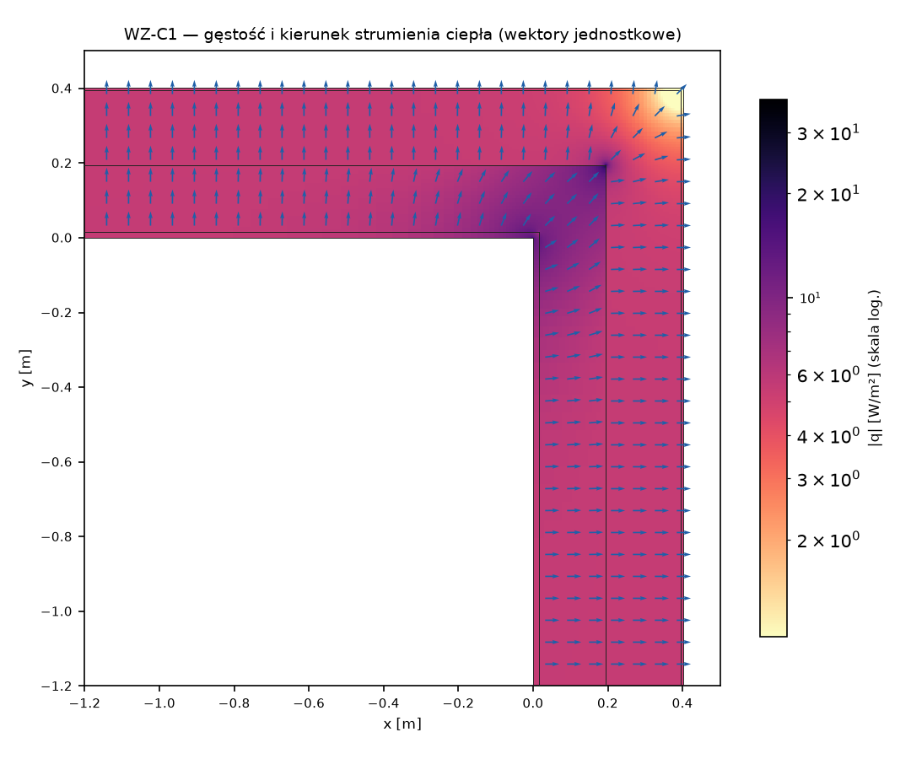

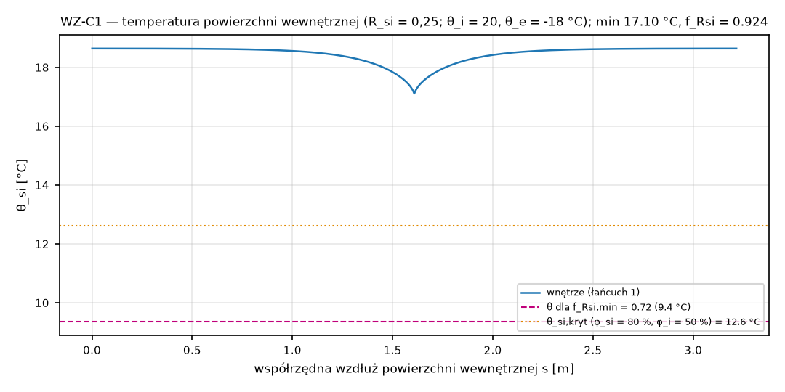

## WZ-G1 — Dom – garaż nieogrzewany: ściana garażu dochodzi do lica ETICS

**Dane wejściowe**

*warstwy ściany domu:*

| kod | materiał | d [m] | λ [W/(m·K)] | R [m²K/W] |
|---|---|---|---|---|
| TYNK_GIPS | Tynk gipsowy maszynowy | 0,0150 | 0,4000 | 0,0375 |
| SIL18 | Bloczek wapienno-piaskowy 18 cm, kl. 20 | 0,1800 | 0,7700 | 0,2338 |
| EPS031 | Styropian grafitowy EPS 031 | 0,2000 | 0,0310 | 6,4516 |
| TYNK_SIL | Tynk silikonowy cienkowarstwowy, biały | 0,0070 | 0,7000 | 0,0100 |

*warstwy ściany garażu (od garażu):*

| kod | materiał | d [m] | λ [W/(m·K)] | R [m²K/W] |
|---|---|---|---|---|
| TYNK_CEM | Tynk cementowo-wapienny | 0,0150 | 1,0000 | 0,0150 |
| SIL24 | Bloczek wapienno-piaskowy 24 cm (ściana garażu) | 0,2400 | 0,9000 | 0,2667 |
| TYNK_CEM | Tynk cementowo-wapienny | 0,0150 | 1,0000 | 0,0150 |

* θ_u garażu: -10.4 °C z b_u = 0.8 [ZAŁ]

**Warunki brzegowe** (przekrój poziomy; płaszczyzny odcięcia i osie symetrii adiabatyczne)

| strefa | rodzaj | grupa | θ [°C] | R_s — przebieg ψ [m²K/W] | R_s — przebieg f_Rsi |
|---|---|---|---|---|---|
| dom (ogrzewany) | wewn | i | 20,0 | wg ISO 6946: 0,13 poziomo / 0,10 w górę / 0,17 w dół | 0,25 (ramy/szyby 0,13) |
| zewnętrze | zewn | e | −18,0 | 0,04 | 0,04 |
| garaż nieogrzewany | nieogrz | u | −10,4 | wg ISO 6946: 0,13 poziomo / 0,10 w górę / 0,17 w dół | wg ISO 6946: 0,13 poziomo / 0,10 w górę / 0,17 w dół |

**Siatka i dokładność** (MOS, siatka prostokątna zagęszczana przy granicach materiałów)

| siatka | komórek | Φ_całk [W/m] |
|---|---|---|
| 120 × 110 = 13200 komórek; Δx ∈ [1.88; 94.8] mm, Δy ∈ [1.56; 94.8] mm | 13200 | 27,3033 |
| 240 × 220 = 52800 komórek; Δx ∈ [0.939; 47.4] mm, Δy ∈ [0.778; 47.4] mm | 52800 | 27,3044 |

Zmiana strumienia przy podwojeniu liczby podziałów: **0,004 %** (kryterium ISO 10211 < 1 %: spełnione); zmiana L_2D (= zmiana ψ): 0,00012 W/(m·K) (kryterium ≤ max(1 % |ψ|; 0,001) = 0,00100: spełnione); bilans energii Σ Φ / (½ Σ|Φ|) = 3.0e-13 (kryterium < 10⁻⁴: spełnione).

**Współczynniki sprzężenia i ψ**

| para grup | L_2D [W/(m·K)] |
|---|---|
| i–u | 0,2263 |
| e–i | 0,1980 |
| e–u | 2,6025 |

*Para i–e:* L_2D = **0,1980 W/(m·K)**

| element flankujący | U [W/(m²K)] | l_e [m] | l_i [m] | l_oi [m] | U·l_e | U·l_i | U·l_oi |
|---|---|---|---|---|---|---|---|
| ściana domu → zewnętrze | 0,1449 | 1,2060 | 1,2060 | 1,2060 | 0,1747 | 0,1747 | 0,1747 |

ψ_oi (wymiary wewnętrzne całkowite — system projektu, H_TB) = 0,1980 − 0,1747 = **0,023 W/(m·K)**; ψ_e (zewnętrzne) = 0,1980 − 0,1747 = 0,023 W/(m·K); ψ_i (wewnętrzne) = 0,1980 − 0,1747 = 0,023 W/(m·K)

*Para i–u:* L_2D = **0,2263 W/(m·K)**

| element flankujący | U [W/(m²K)] | l_e [m] | l_i [m] | l_oi [m] | U·l_e | U·l_i | U·l_oi |
|---|---|---|---|---|---|---|---|
| ściana domu → garaż | 0,1430 | 1,7460 | 1,7460 | 1,7460 | 0,2497 | 0,2497 | 0,2497 |

ψ_oi (wymiary wewnętrzne całkowite — system projektu, H_TB) = 0,2263 − 0,2497 = **−0,023 W/(m·K)**; ψ_e (zewnętrzne) = 0,2263 − 0,2497 = −0,023 W/(m·K); ψ_i (wewnętrzne) = 0,2263 − 0,2497 = −0,023 W/(m·K)

*Para u–e:* L_2D = **2,6025 W/(m·K)**

| element flankujący | U [W/(m²K)] | l_e [m] | l_i [m] | l_oi [m] | U·l_e | U·l_i | U·l_oi |
|---|---|---|---|---|---|---|---|
| ściana garażu | 2,1429 | 1,2060 | 1,2060 | 1,2060 | 2,5843 | 2,5843 | 2,5843 |

ψ_oi (wymiary wewnętrzne całkowite — system projektu, H_TB) = 2,6025 − 2,5843 = **0,018 W/(m·K)**; ψ_e (zewnętrzne) = 2,6025 − 2,5843 = 0,018 W/(m·K); ψ_i (wewnętrzne) = 2,6025 − 2,5843 = 0,018 W/(m·K)

**Temperatura powierzchni wewnętrznej i ryzyko pleśni** (R_si = 0,25 — PN-EN ISO 13788)

* θ_si,min = **18,65 °C** w punkcie (−1,476; 0,000) m przy θ_i = 20,0 °C, θ_e = −18,0 °C
* f_Rsi = (θ_si,min − θ_e)/(θ_i − θ_e) = **0,964**; wymaganie f_Rsi ≥ 0,72 (WT zał. 2 pkt 2.2.1–2.2.5 (uproszczenie; φ_i = 50 %) (W-248)) → **SPEŁNIA**
* współczynniki wagowe θ_si = Σ g·θ: g_i = 0,964, g_e = 0,035, g_u = 0,000
* informacyjnie przy θ_e obliczeniowej i φ_i = 50 %: θ_si,kryt (φ_si = 80 %) = 12,6 °C (f = 0,806), punkt rosy 9,3 °C → θ_si,min ≥ θ_si,kryt (ocena miesięczna wg ISO 13788 — łagodniejsza; kryterium formalne: f_Rsi ≥ 0,72)

*Uwaga:* Podział ściany domu na część „do zewnętrza” i „do garażu” w licu zewnętrznym ściany garażu (jedyny system wymiarów — strona ogrzewana jest płaska, ψ_e = ψ_i).
*Uwaga:* Po stronie garażu R_s = 0,13 (ISO 6946 — przegroda do przestrzeni nieogrzewanej).

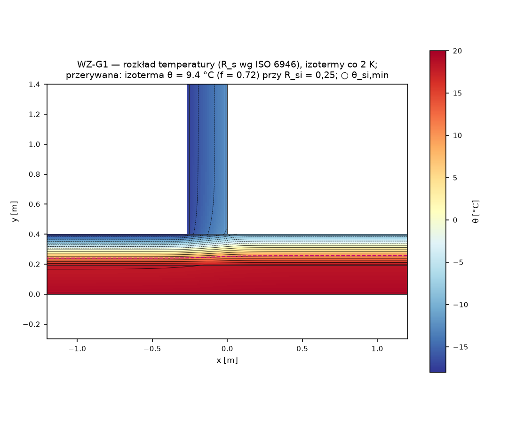

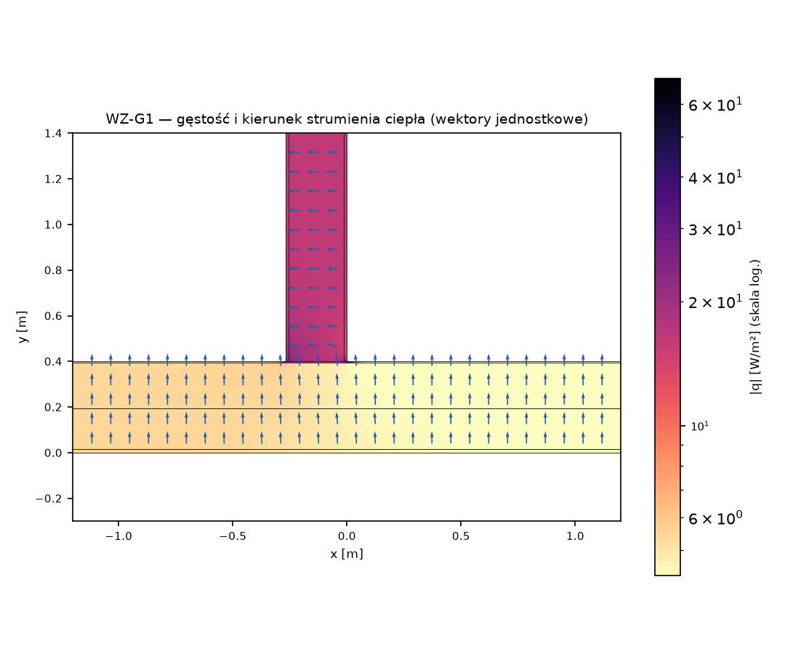

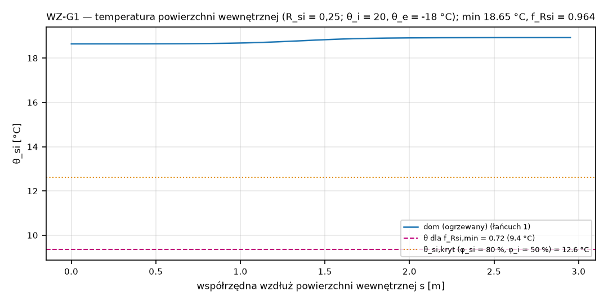

## WZ-G2 — Dom – garaż nieogrzewany: ściana garażu przerywa ocieplenie

**Dane wejściowe**

*warstwy ściany domu:*

| kod | materiał | d [m] | λ [W/(m·K)] | R [m²K/W] |
|---|---|---|---|---|
| TYNK_GIPS | Tynk gipsowy maszynowy | 0,0150 | 0,4000 | 0,0375 |
| SIL18 | Bloczek wapienno-piaskowy 18 cm, kl. 20 | 0,1800 | 0,7700 | 0,2338 |
| EPS031 | Styropian grafitowy EPS 031 | 0,2000 | 0,0310 | 6,4516 |
| TYNK_SIL | Tynk silikonowy cienkowarstwowy, biały | 0,0070 | 0,7000 | 0,0100 |

*warstwy ściany garażu (od garażu):*

| kod | materiał | d [m] | λ [W/(m·K)] | R [m²K/W] |
|---|---|---|---|---|
| TYNK_CEM | Tynk cementowo-wapienny | 0,0150 | 1,0000 | 0,0150 |
| SIL24 | Bloczek wapienno-piaskowy 24 cm (ściana garażu) | 0,2400 | 0,9000 | 0,2667 |
| TYNK_CEM | Tynk cementowo-wapienny | 0,0150 | 1,0000 | 0,0150 |

* θ_u garażu: -10.4 °C z b_u = 0.8 [ZAŁ]

**Warunki brzegowe** (przekrój poziomy; płaszczyzny odcięcia i osie symetrii adiabatyczne)

| strefa | rodzaj | grupa | θ [°C] | R_s — przebieg ψ [m²K/W] | R_s — przebieg f_Rsi |
|---|---|---|---|---|---|
| dom (ogrzewany) | wewn | i | 20,0 | wg ISO 6946: 0,13 poziomo / 0,10 w górę / 0,17 w dół | 0,25 (ramy/szyby 0,13) |
| zewnętrze | zewn | e | −18,0 | 0,04 | 0,04 |
| garaż nieogrzewany | nieogrz | u | −10,4 | wg ISO 6946: 0,13 poziomo / 0,10 w górę / 0,17 w dół | wg ISO 6946: 0,13 poziomo / 0,10 w górę / 0,17 w dół |

**Siatka i dokładność** (MOS, siatka prostokątna zagęszczana przy granicach materiałów)

| siatka | komórek | Φ_całk [W/m] |
|---|---|---|
| 120 × 110 = 13200 komórek; Δx ∈ [1.88; 94.8] mm, Δy ∈ [1.56; 94.8] mm | 13200 | 35,8814 |
| 240 × 220 = 52800 komórek; Δx ∈ [0.939; 47.4] mm, Δy ∈ [0.778; 47.4] mm | 52800 | 35,8993 |

Zmiana strumienia przy podwojeniu liczby podziałów: **0,050 %** (kryterium ISO 10211 < 1 %: spełnione); zmiana L_2D (= zmiana ψ): 0,00041 W/(m·K) (kryterium ≤ max(1 % |ψ|; 0,001) = 0,00100: spełnione); bilans energii Σ Φ / (½ Σ|Φ|) = 2.1e-13 (kryterium < 10⁻⁴: spełnione).

**Współczynniki sprzężenia i ψ**

| para grup | L_2D [W/(m·K)] |
|---|---|
| i–u | 0,3807 |
| e–i | 0,4313 |
| e–u | 2,5671 |

*Para i–e:* L_2D = **0,4313 W/(m·K)**

| element flankujący | U [W/(m²K)] | l_e [m] | l_i [m] | l_oi [m] | U·l_e | U·l_i | U·l_oi |
|---|---|---|---|---|---|---|---|
| ściana domu → zewnętrze | 0,1449 | 1,2060 | 1,2060 | 1,2060 | 0,1747 | 0,1747 | 0,1747 |

ψ_oi (wymiary wewnętrzne całkowite — system projektu, H_TB) = 0,4313 − 0,1747 = **0,257 W/(m·K)**; ψ_e (zewnętrzne) = 0,4313 − 0,1747 = 0,257 W/(m·K); ψ_i (wewnętrzne) = 0,4313 − 0,1747 = 0,257 W/(m·K)

*Para i–u:* L_2D = **0,3807 W/(m·K)**

| element flankujący | U [W/(m²K)] | l_e [m] | l_i [m] | l_oi [m] | U·l_e | U·l_i | U·l_oi |
|---|---|---|---|---|---|---|---|
| ściana domu → garaż | 0,1430 | 1,7460 | 1,7460 | 1,7460 | 0,2497 | 0,2497 | 0,2497 |

ψ_oi (wymiary wewnętrzne całkowite — system projektu, H_TB) = 0,3807 − 0,2497 = **0,131 W/(m·K)**; ψ_e (zewnętrzne) = 0,3807 − 0,2497 = 0,131 W/(m·K); ψ_i (wewnętrzne) = 0,3807 − 0,2497 = 0,131 W/(m·K)

*Para u–e:* L_2D = **2,5671 W/(m·K)**

| element flankujący | U [W/(m²K)] | l_e [m] | l_i [m] | l_oi [m] | U·l_e | U·l_i | U·l_oi |
|---|---|---|---|---|---|---|---|
| ściana garażu | 2,1429 | 1,2060 | 1,2060 | 1,2060 | 2,5843 | 2,5843 | 2,5843 |

ψ_oi (wymiary wewnętrzne całkowite — system projektu, H_TB) = 2,5671 − 2,5843 = **−0,017 W/(m·K)**; ψ_e (zewnętrzne) = 2,5671 − 2,5843 = −0,017 W/(m·K); ψ_i (wewnętrzne) = 2,5671 − 2,5843 = −0,017 W/(m·K)

**Temperatura powierzchni wewnętrznej i ryzyko pleśni** (R_si = 0,25 — PN-EN ISO 13788)

* θ_si,min = **14,10 °C** w punkcie (−0,142; 0,000) m przy θ_i = 20,0 °C, θ_e = −18,0 °C
* f_Rsi = (θ_si,min − θ_e)/(θ_i − θ_e) = **0,845**; wymaganie f_Rsi ≥ 0,72 (WT zał. 2 pkt 2.2.1–2.2.5 (uproszczenie; φ_i = 50 %) (W-248)) → **SPEŁNIA**
* współczynniki wagowe θ_si = Σ g·θ: g_i = 0,831, g_e = 0,100, g_u = 0,069
* informacyjnie przy θ_e obliczeniowej i φ_i = 50 %: θ_si,kryt (φ_si = 80 %) = 12,6 °C (f = 0,806), punkt rosy 9,3 °C → θ_si,min ≥ θ_si,kryt (ocena miesięczna wg ISO 13788 — łagodniejsza; kryterium formalne: f_Rsi ≥ 0,72)

*Uwaga:* Podział ściany domu na część „do zewnętrza” i „do garażu” w licu zewnętrznym ściany garażu (jedyny system wymiarów — strona ogrzewana jest płaska, ψ_e = ψ_i).
*Uwaga:* Po stronie garażu R_s = 0,13 (ISO 6946 — przegroda do przestrzeni nieogrzewanej).

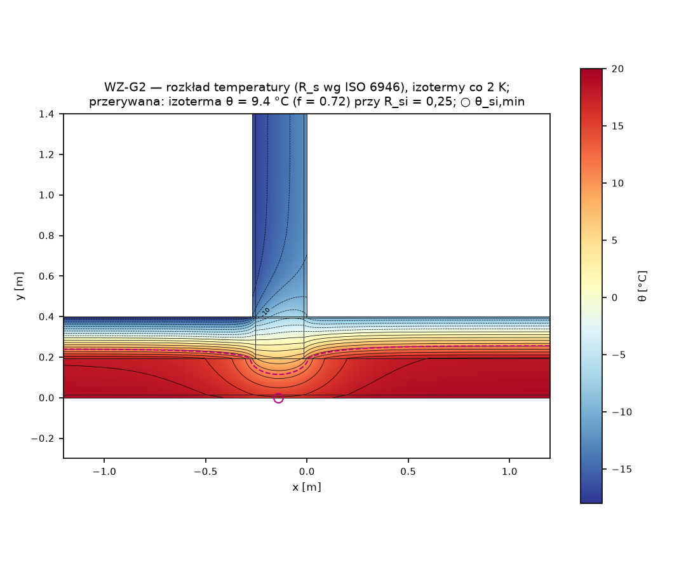

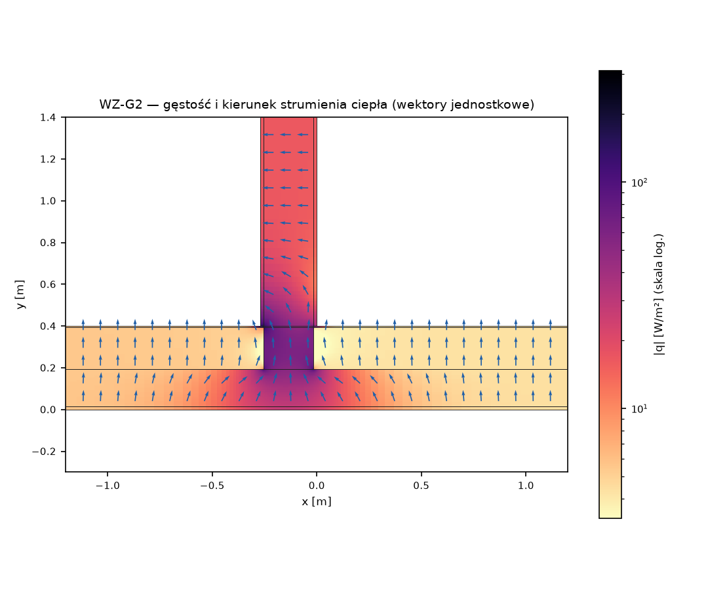

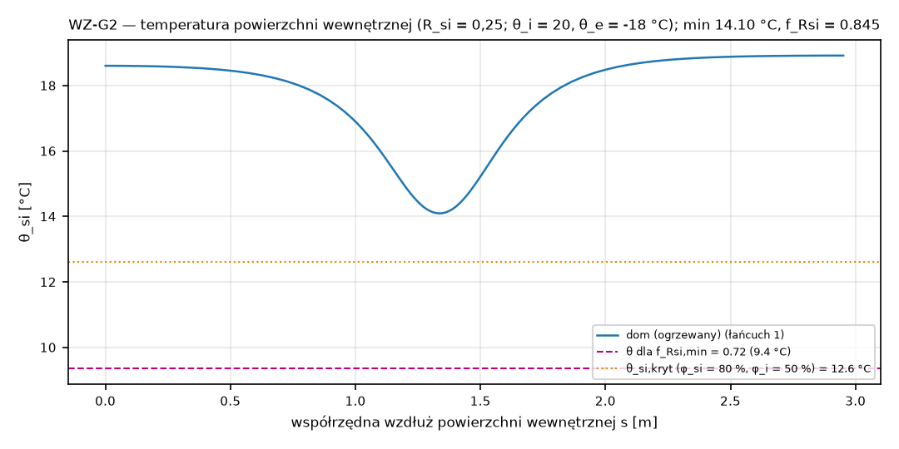

## WZ-RS1 — Rura spustowa we wnęce ocieplenia (rzut)

**Dane wejściowe**

*warstwy ściany:*

| kod | materiał | d [m] | λ [W/(m·K)] | R [m²K/W] |
|---|---|---|---|---|
| TYNK_GIPS | Tynk gipsowy maszynowy | 0,0150 | 0,4000 | 0,0375 |
| SIL18 | Bloczek wapienno-piaskowy 18 cm, kl. 20 | 0,1800 | 0,7700 | 0,2338 |
| EPS031 | Styropian grafitowy EPS 031 | 0,2000 | 0,0310 | 6,4516 |
| TYNK_SIL | Tynk silikonowy cienkowarstwowy, biały | 0,0070 | 0,7000 | 0,0100 |

* wnęka: szer. 0.16 m, pozostała izolacja 0.06 m

**Warunki brzegowe** (przekrój poziomy; płaszczyzny odcięcia i osie symetrii adiabatyczne)

| strefa | rodzaj | grupa | θ [°C] | R_s — przebieg ψ [m²K/W] | R_s — przebieg f_Rsi |
|---|---|---|---|---|---|
| wnętrze | wewn | i | 20,0 | wg ISO 6946: 0,13 poziomo / 0,10 w górę / 0,17 w dół | 0,25 (ramy/szyby 0,13) |
| zewnętrze (z wnęką) | zewn | e | −18,0 | 0,04 | 0,04 |

**Siatka i dokładność** (MOS, siatka prostokątna zagęszczana przy granicach materiałów)

| siatka | komórek | Φ_całk [W/m] |
|---|---|---|
| 100 × 94 = 9400 komórek; Δx ∈ [1.88; 96.06] mm, Δy ∈ [1.56; 21.65] mm | 9400 | 16,0941 |
| 200 × 188 = 37600 komórek; Δx ∈ [0.94; 48.03] mm, Δy ∈ [0.778; 10.83] mm | 37600 | 16,1001 |

Zmiana strumienia przy podwojeniu liczby podziałów: **0,038 %** (kryterium ISO 10211 < 1 %: spełnione); zmiana L_2D (= zmiana ψ): 0,00016 W/(m·K) (kryterium ≤ max(1 % |ψ|; 0,001) = 0,00100: spełnione); bilans energii Σ Φ / (½ Σ|Φ|) = 5.0e-13 (kryterium < 10⁻⁴: spełnione).

**Współczynniki sprzężenia i ψ**

*Para i–e:* L_2D = **0,4237 W/(m·K)**

| element flankujący | U [W/(m²K)] | l_e [m] | l_i [m] | l_oi [m] | U·l_e | U·l_i | U·l_oi |
|---|---|---|---|---|---|---|---|
| ściana | 0,1449 | 2,4120 | 2,4120 | 2,4120 | 0,3494 | 0,3494 | 0,3494 |

ψ_oi (wymiary wewnętrzne całkowite — system projektu, H_TB) = 0,4237 − 0,3494 = **0,074 W/(m·K)**; ψ_e (zewnętrzne) = 0,4237 − 0,3494 = 0,074 W/(m·K); ψ_i (wewnętrzne) = 0,4237 − 0,3494 = 0,074 W/(m·K)

**Temperatura powierzchni wewnętrznej i ryzyko pleśni** (R_si = 0,25 — PN-EN ISO 13788)

* θ_si,min = **17,68 °C** w punkcie (0,004; 0,000) m przy θ_i = 20,0 °C, θ_e = −18,0 °C
* f_Rsi = (θ_si,min − θ_e)/(θ_i − θ_e) = **0,939**; wymaganie f_Rsi ≥ 0,72 (WT zał. 2 pkt 2.2.1–2.2.5 (uproszczenie; φ_i = 50 %) (W-248)) → **SPEŁNIA**
* informacyjnie przy θ_e obliczeniowej i φ_i = 50 %: θ_si,kryt (φ_si = 80 %) = 12,6 °C (f = 0,806), punkt rosy 9,3 °C → θ_si,min ≥ θ_si,kryt (ocena miesięczna wg ISO 13788 — łagodniejsza; kryterium formalne: f_Rsi ≥ 0,72)

*Uwaga:* Wariant zalecany: rura przed licem ETICS na obejmach dystansowych (bez wnęki) albo wewnętrzna w izolowanym szachcie — ψ ≈ 0.

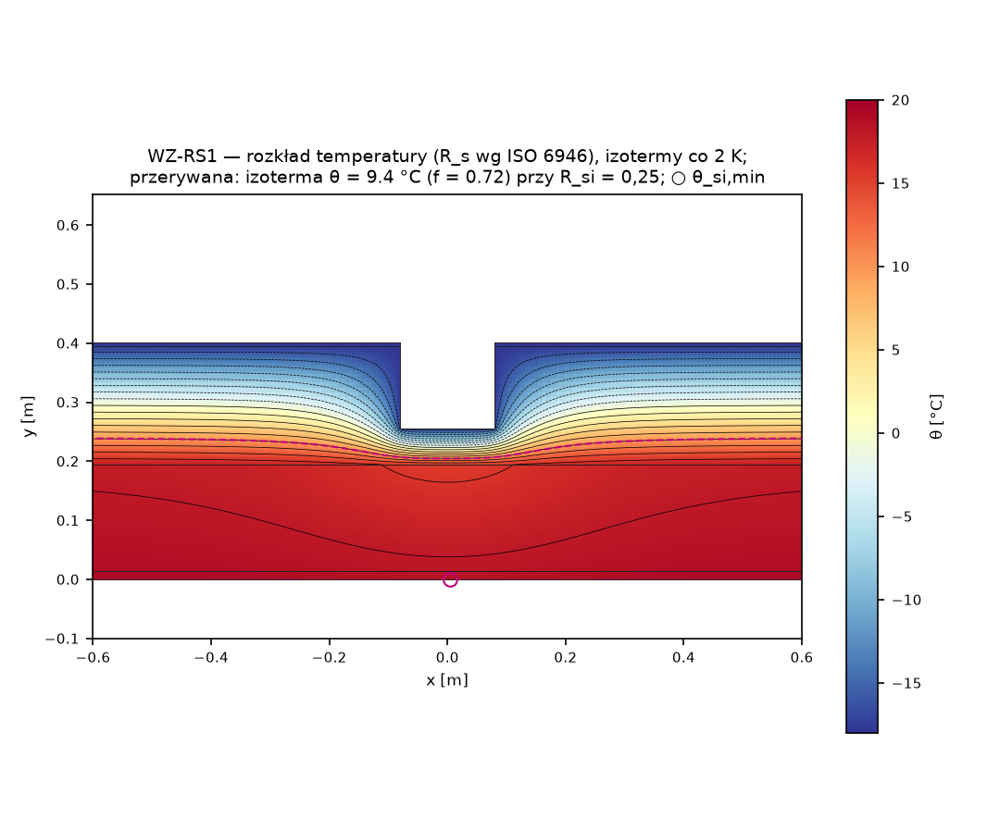

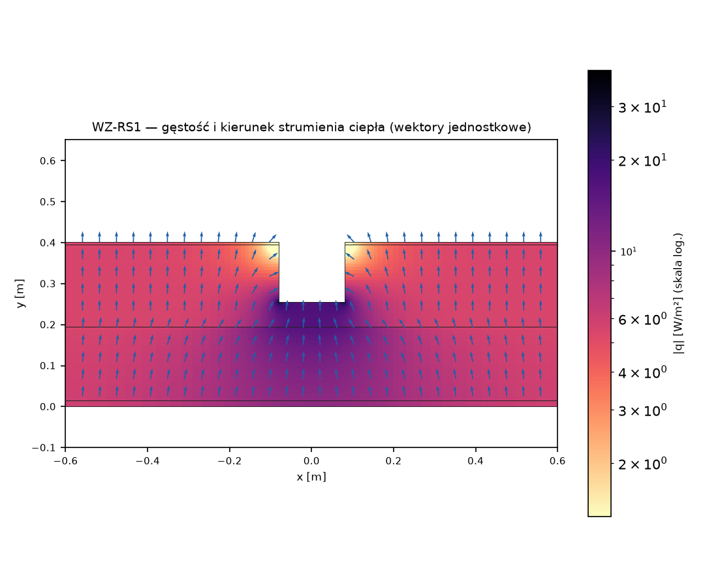

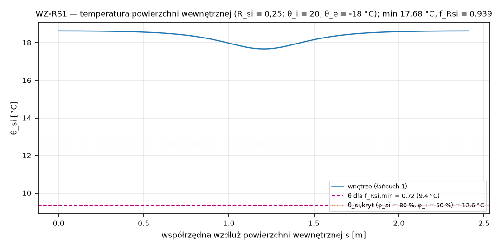

## WZ-IF1 — Strop pośredni ST1 z wieńcem (ETICS ciągły)

Przekrój pionowy; pomieszczenia nad i pod stropem ogrzewane (grupa „i”).

**Dane wejściowe**

*warstwy ściany:*

| kod | materiał | d [m] | λ [W/(m·K)] | R [m²K/W] |
|---|---|---|---|---|
| TYNK_GIPS | Tynk gipsowy maszynowy | 0,0150 | 0,4000 | 0,0375 |
| SIL18 | Bloczek wapienno-piaskowy 18 cm, kl. 20 | 0,1800 | 0,7700 | 0,2338 |
| EPS031 | Styropian grafitowy EPS 031 | 0,2000 | 0,0310 | 6,4516 |
| TYNK_SIL | Tynk silikonowy cienkowarstwowy, biały | 0,0070 | 0,7000 | 0,0100 |

* płyta: ZB_C30, t = 0.2 m, wysięg = 0.0 m

*warstwy podłogi:*

| kod | materiał | d [m] | λ [W/(m·K)] | R [m²K/W] |
|---|---|---|---|---|
| DESKA_DEB | Deska podłogowa dębowa | 0,0150 | 0,1800 | 0,0833 |
| JASTRYCH | Jastrych cementowy | 0,0550 | 1,0000 | 0,0550 |
| EPS_AKU | Styropian akustyczny EPS T | 0,0800 | 0,0400 | 2,0000 |

*warstwy sufitu:*

| kod | materiał | d [m] | λ [W/(m·K)] | R [m²K/W] |
|---|---|---|---|---|
| TYNK_GIPS | Tynk gipsowy maszynowy | 0,0100 | 0,4000 | 0,0250 |

**Warunki brzegowe** (przekrój pionowy; płaszczyzny odcięcia i osie symetrii adiabatyczne)

| strefa | rodzaj | grupa | θ [°C] | R_s — przebieg ψ [m²K/W] | R_s — przebieg f_Rsi |
|---|---|---|---|---|---|
| pomieszczenie dolne | wewn | i | 20,0 | wg ISO 6946: 0,13 poziomo / 0,10 w górę / 0,17 w dół | 0,25 (ramy/szyby 0,13) |
| pomieszczenie górne | wewn | i | 20,0 | wg ISO 6946: 0,13 poziomo / 0,10 w górę / 0,17 w dół | 0,25 (ramy/szyby 0,13) |
| zewnętrze | zewn | e | −18,0 | 0,04 | 0,04 |

**Siatka i dokładność** (MOS, siatka prostokątna zagęszczana przy granicach materiałów)

| siatka | komórek | Φ_całk [W/m] |
|---|---|---|
| 108 × 144 = 15552 komórek; Δx ∈ [1.56; 93.27] mm, Δy ∈ [1.65; 98.49] mm | 15552 | 14,4112 |
| 216 × 288 = 62208 komórek; Δx ∈ [0.778; 46.63] mm, Δy ∈ [0.825; 49.25] mm | 62208 | 14,4114 |

Zmiana strumienia przy podwojeniu liczby podziałów: **0,001 %** (kryterium ISO 10211 < 1 %: spełnione); zmiana L_2D (= zmiana ψ): 0,00000 W/(m·K) (kryterium ≤ max(1 % |ψ|; 0,001) = 0,00100: spełnione); bilans energii Σ Φ / (½ Σ|Φ|) = 1.8e-12 (kryterium < 10⁻⁴: spełnione).

**Współczynniki sprzężenia i ψ**

*Para i–e:* L_2D = **0,3792 W/(m·K)**

| element flankujący | U [W/(m²K)] | l_e [m] | l_i [m] | l_oi [m] | U·l_e | U·l_i | U·l_oi |
|---|---|---|---|---|---|---|---|
| ściana dolna | 0,1449 | 1,3060 | 1,1960 | 1,5560 | 0,1892 | 0,1733 | 0,2254 |
| ściana górna | 0,1449 | 1,3060 | 1,0560 | 1,0560 | 0,1892 | 0,1530 | 0,1530 |

ψ_oi (wymiary wewnętrzne całkowite — system projektu, H_TB) = 0,3792 − 0,3784 = **0,001 W/(m·K)**; ψ_e (zewnętrzne) = 0,3792 − 0,3784 = 0,001 W/(m·K); ψ_i (wewnętrzne) = 0,3792 − 0,3262 = 0,053 W/(m·K)

**Temperatura powierzchni wewnętrznej i ryzyko pleśni** (R_si = 0,25 — PN-EN ISO 13788)

* θ_si,min = **18,65 °C** w punkcie (0,000; 1,406) m przy θ_i = 20,0 °C, θ_e = −18,0 °C
* f_Rsi = (θ_si,min − θ_e)/(θ_i − θ_e) = **0,964**; wymaganie f_Rsi ≥ 0,72 (WT zał. 2 pkt 2.2.1–2.2.5 (uproszczenie; φ_i = 50 %) (W-248)) → **SPEŁNIA**
* informacyjnie przy θ_e obliczeniowej i φ_i = 50 %: θ_si,kryt (φ_si = 80 %) = 12,6 °C (f = 0,806), punkt rosy 9,3 °C → θ_si,min ≥ θ_si,kryt (ocena miesięczna wg ISO 13788 — łagodniejsza; kryterium formalne: f_Rsi ≥ 0,72)

**Porównanie**

* PN-EN ISO 14683 — wartość domyślna (strop pośredni, izolacja zewnętrzna ciągła (IF)): ψ_e = 0,00, ψ_i = 0,10 W/(m·K) [NZW] — obliczone ψ_e = 0,001, ψ_i = 0,053 (POWYŻEJ wartości domyślnej — porównanie w tym samym systemie wymiarów)

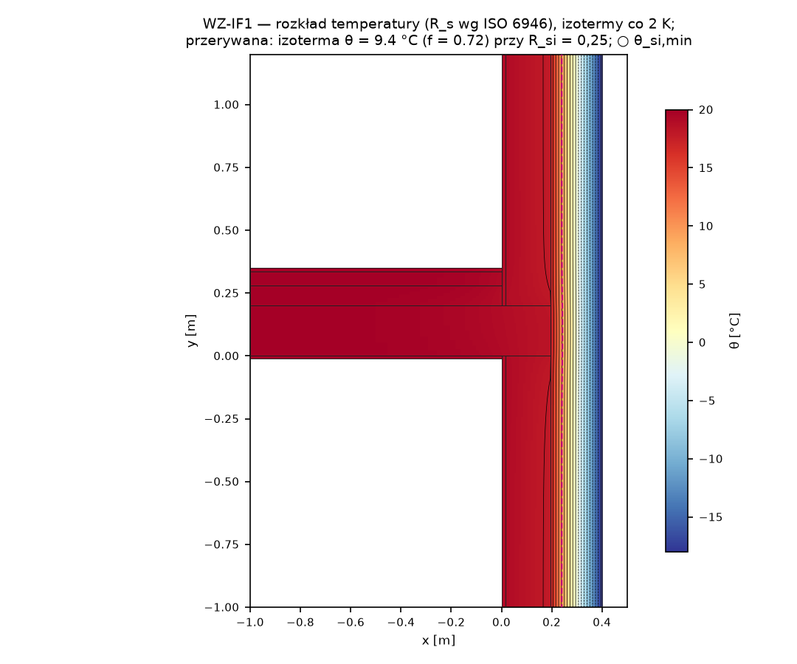

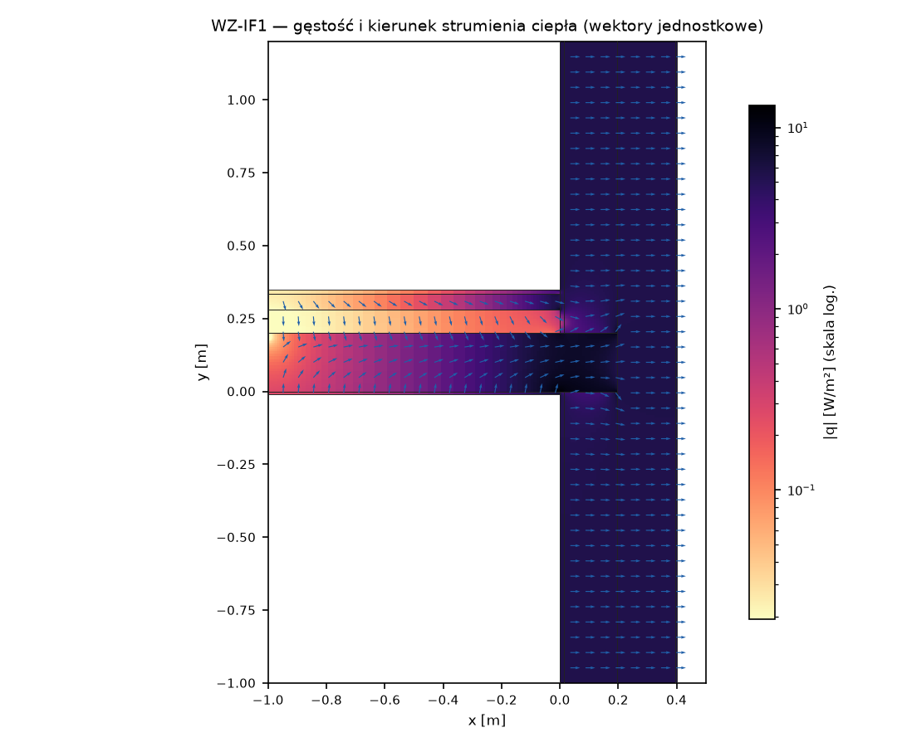

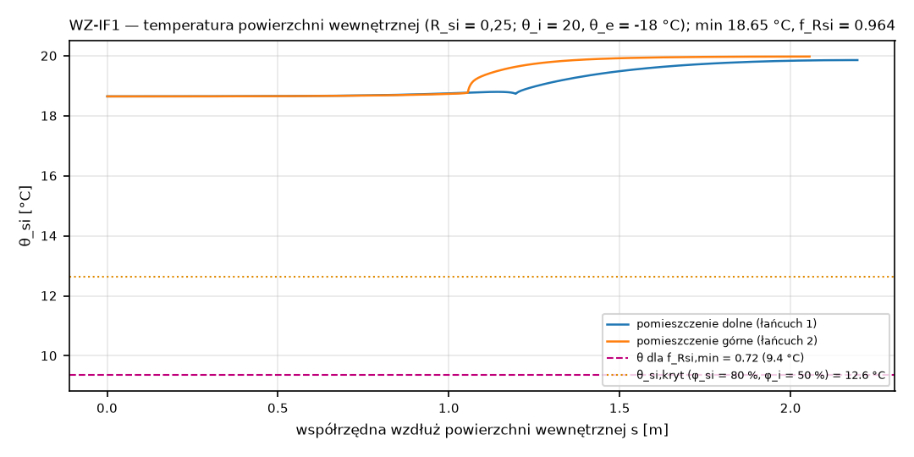

## WZ-T1 — Próg drzwi (HS / wejściowe) na płycie parteru — grunt

**Dane wejściowe**

*warstwy ściany:*

| kod | materiał | d [m] | λ [W/(m·K)] | R [m²K/W] |
|---|---|---|---|---|
| TYNK_GIPS | Tynk gipsowy maszynowy | 0,0150 | 0,4000 | 0,0375 |
| SIL18 | Bloczek wapienno-piaskowy 18 cm, kl. 20 | 0,1800 | 0,7700 | 0,2338 |
| EPS031 | Styropian grafitowy EPS 031 | 0,2000 | 0,0310 | 6,4516 |
| TYNK_SIL | Tynk silikonowy cienkowarstwowy, biały | 0,0070 | 0,7000 | 0,0100 |

*warstwy podłogi:*

| kod | materiał | d [m] | λ [W/(m·K)] | R [m²K/W] |
|---|---|---|---|---|
| GRES | Płytki gresowe 60x120 | 0,0100 | 1,3000 | 0,0077 |
| JASTRYCH | Jastrych cementowy | 0,0650 | 1,0000 | 0,0650 |
| XPS300 | Polistyren ekstrudowany XPS 300 | 0,1500 | 0,0350 | 4,2857 |
| ZB_C25 | Beton C25/30 (płyta podkładowa) | 0,1200 | 2,0000 | 0,0600 |
| PIASEK | Podsypka piaskowa zagęszczona | 0,1500 | 2,0000 | 0,0750 |

* fundament: ława 0.6×0.3 m (spód -1.1), mur fundamentowy BET_FUND 0.24 m
* izolacja obwodowa: XPS do rzędnej -0.80, cokół do 0.00 (teren -0.30)
* grunt: λ = 2.0 W/(m·K); obszar: wewn. 0,5·b = 2.372442047112779 m od lica zewn., zewn. 2,5·b = 11.862210235563895 m, głęb. 2,5·b = 11.862210235563895 m (b = 4.744884094225558 m)
* U podłogi (ISO 13370): R_f = 4.493 m²K/W, d_t = 9.809 m, U = 0.1670 W/(m²K)
* próg: rama U_f = 1.4, b_f = 0.13 m, d_f = 0.09 m, lico wewn. ramy x = 0.145 m (wsunięcie w mur 0.05 m); U_g = 0.5; U_w = 0.911; podwalina PROG_TERM (λ = 0.05) od y = -0.225 m do poziomu posadzki [DANE PRZYKŁADOWE – FIKCYJNE] dane przykładowe z karty katalogowej typowego systemu HS aluminiowego klasy U_w ≤ 0,9 (lub równoważne)

**Warunki brzegowe** (przekrój pionowy; płaszczyzny odcięcia i osie symetrii adiabatyczne)

| strefa | rodzaj | grupa | θ [°C] | R_s — przebieg ψ [m²K/W] | R_s — przebieg f_Rsi |
|---|---|---|---|---|---|
| pomieszczenie | wewn | i | 20,0 | wg ISO 6946: 0,13 poziomo / 0,10 w górę / 0,17 w dół | 0,25 (ramy/szyby 0,13) |
| zewnętrze | zewn | e | −18,0 | 0,04 | 0,04 |

**Siatka i dokładność** (MOS, siatka prostokątna zagęszczana przy granicach materiałów)

| siatka | komórek | Φ_całk [W/m] |
|---|---|---|
| 206 × 226 = 46556 komórek; Δx ∈ [2; 394.5] mm, Δy ∈ [2.22; 394.1] mm | 46556 | 32,6272 |
| 412 × 452 = 186224 komórek; Δx ∈ [1; 197.2] mm, Δy ∈ [1.11; 197] mm | 186224 | 32,6505 |

Zmiana strumienia przy podwojeniu liczby podziałów: **0,071 %** (kryterium ISO 10211 < 1 %: spełnione); zmiana L_2D (= zmiana ψ): 0,00061 W/(m·K) (kryterium ≤ max(1 % |ψ|; 0,001) = 0,00208: spełnione); bilans energii Σ Φ / (½ Σ|Φ|) = 3.2e-11 (kryterium < 10⁻⁴: spełnione).

**Współczynniki sprzężenia i ψ**

*Para i–e:* L_2D = **0,8592 W/(m·K)**

| element flankujący | U [W/(m²K)] | l_e [m] | l_i [m] | l_oi [m] | U·l_e | U·l_i | U·l_oi |
|---|---|---|---|---|---|---|---|
| podłoga na gruncie (U wg ISO 13370, B' = 4.74 m, d_t = 9.81 m) | 0,1670 | 2,3724 | 1,9704 | 1,9704 | 0,3962 | 0,3290 | 0,3290 |
| drzwi (L_2D ramy z szybą, model bez ściany) | L_2D = 0,3217 | — | — | — | 0,3217 | 0,3217 | 0,3217 |

ψ_oi (wymiary wewnętrzne całkowite — system projektu, H_TB) = 0,8592 − 0,6507 = **0,208 W/(m·K)**; ψ_e (zewnętrzne) = 0,8592 − 0,7179 = 0,141 W/(m·K); ψ_i (wewnętrzne) = 0,8592 − 0,6507 = 0,208 W/(m·K)

**Temperatura powierzchni wewnętrznej i ryzyko pleśni** (R_si = 0,25 — PN-EN ISO 13788)

* θ_si,min = **10,42 °C** w punkcie (0,139; 0,000) m przy θ_i = 20,0 °C, θ_e = −18,0 °C
* f_Rsi = (θ_si,min − θ_e)/(θ_i − θ_e) = **0,748**; wymaganie f_Rsi ≥ 0,72 (WT zał. 2 pkt 2.2.1–2.2.5 (uproszczenie; φ_i = 50 %) (W-248)) → **SPEŁNIA**
* rama/szyba (R_si = 0,13): θ_si,min = 11,14 °C, f_Rsi = 0,767 (informacyjnie — ocena okna wg PN-EN ISO 10077-2/13788)
* informacyjnie przy θ_e obliczeniowej i φ_i = 50 %: θ_si,kryt (φ_si = 80 %) = 12,6 °C (f = 0,806), punkt rosy 9,3 °C → θ_si,min < θ_si,kryt (ocena miesięczna wg ISO 13788 — łagodniejsza; kryterium formalne: f_Rsi ≥ 0,72)

*Uwaga:* Ściana liczona od poziomu posadzki (±0,00) we wszystkich systemach wymiarów (ψ_oi = ψ_i); podłoga wg PN-EN ISO 13370 z B' = b [INT]; b = B' = A/(0,5·P) budynku, gdy podane z modelu.
*Uwaga:* Hydroizolacja pionowa ściany fundamentowej (bitumiczna/KMB) i izolacja obwodowa XPS (odporna na wodę) do spodu ławy; drenaż opaskowy i odprowadzenie wody opadowej od cokołu — poza zakresem cieplnym (wpływ na λ gruntu pominięty, λ = 2,0).
*Uwaga:* Próg: wierzch podwaliny = poziom posadzki; uszczelnienie progu taśmą EPDM / hydroizolacją wywiniętą na podwalinę; odwodnienie liniowe przed drzwiami HS zalecane (brak spadku przy progu bezbarierowym).

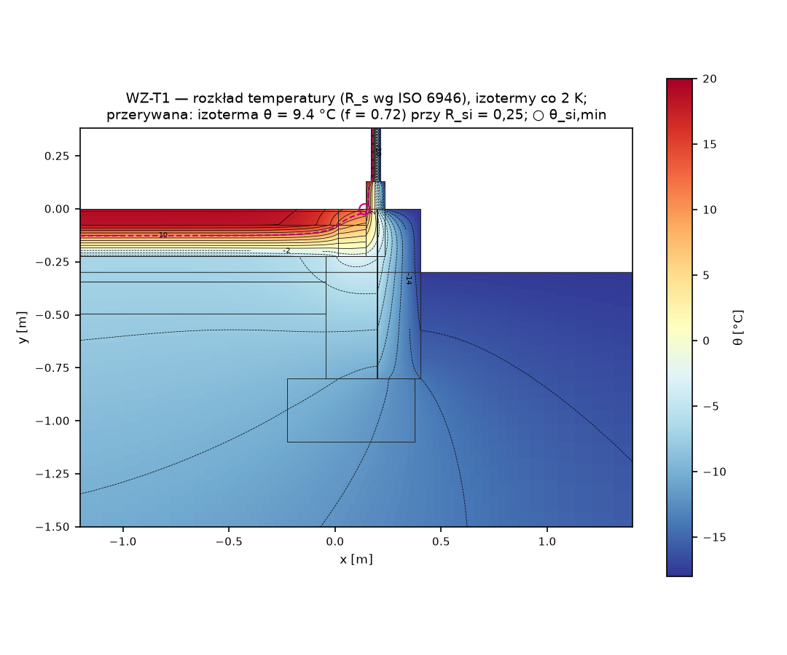

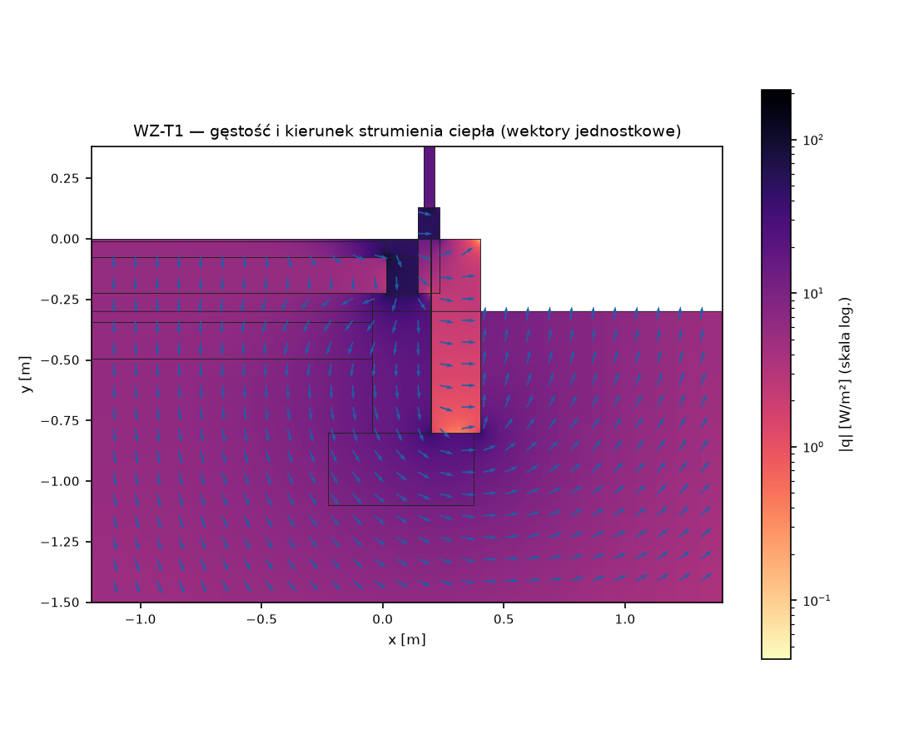

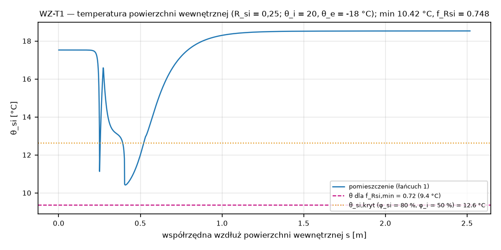

## WZ-T2 — Próg okna/drzwi do podłogi na stropie pośrednim (wieniec)

Przekrój pionowy przez próg; pomieszczenia nad i pod stropem ogrzewane (grupa „i”).

**Dane wejściowe**

*warstwy ściany:*

| kod | materiał | d [m] | λ [W/(m·K)] | R [m²K/W] |
|---|---|---|---|---|
| TYNK_GIPS | Tynk gipsowy maszynowy | 0,0150 | 0,4000 | 0,0375 |
| SIL18 | Bloczek wapienno-piaskowy 18 cm, kl. 20 | 0,1800 | 0,7700 | 0,2338 |
| EPS031 | Styropian grafitowy EPS 031 | 0,2000 | 0,0310 | 6,4516 |
| TYNK_SIL | Tynk silikonowy cienkowarstwowy, biały | 0,0070 | 0,7000 | 0,0100 |

* płyta: ZB_C30, t = 0.2 m, wysięg = 0.0 m

*warstwy podłogi:*

| kod | materiał | d [m] | λ [W/(m·K)] | R [m²K/W] |
|---|---|---|---|---|
| DESKA_DEB | Deska podłogowa dębowa | 0,0150 | 0,1800 | 0,0833 |
| JASTRYCH | Jastrych cementowy | 0,0550 | 1,0000 | 0,0550 |
| EPS_AKU | Styropian akustyczny EPS T | 0,0800 | 0,0400 | 2,0000 |

*warstwy sufitu:*

| kod | materiał | d [m] | λ [W/(m·K)] | R [m²K/W] |
|---|---|---|---|---|
| TYNK_GIPS | Tynk gipsowy maszynowy | 0,0100 | 0,4000 | 0,0250 |

* próg: rama U_f = 1.4, b_f = 0.13 m, d_f = 0.09 m, lico wewn. ramy x = 0.145 m (wsunięcie w mur 0.05 m); U_g = 0.5; U_w = 0.911; podwalina PROG_TERM (λ = 0.05) od y = 0.200 m do poziomu posadzki [DANE PRZYKŁADOWE – FIKCYJNE] dane przykładowe z karty katalogowej typowego systemu HS aluminiowego klasy U_w ≤ 0,9 (lub równoważne)

**Warunki brzegowe** (przekrój pionowy; płaszczyzny odcięcia i osie symetrii adiabatyczne)

| strefa | rodzaj | grupa | θ [°C] | R_s — przebieg ψ [m²K/W] | R_s — przebieg f_Rsi |
|---|---|---|---|---|---|
| pomieszczenie dolne | wewn | i | 20,0 | wg ISO 6946: 0,13 poziomo / 0,10 w górę / 0,17 w dół | 0,25 (ramy/szyby 0,13) |
| pomieszczenie górne | wewn | i | 20,0 | wg ISO 6946: 0,13 poziomo / 0,10 w górę / 0,17 w dół | 0,25 (ramy/szyby 0,13) |
| zewnętrze | zewn | e | −18,0 | 0,04 | 0,04 |

**Siatka i dokładność** (MOS, siatka prostokątna zagęszczana przy granicach materiałów)

| siatka | komórek | Φ_całk [W/m] |
|---|---|---|
| 135 × 152 = 20520 komórek; Δx ∈ [1.56; 93.27] mm, Δy ∈ [1.65; 94.01] mm | 20520 | 21,6684 |
| 270 × 304 = 82080 komórek; Δx ∈ [0.778; 46.63] mm, Δy ∈ [0.825; 47.01] mm | 82080 | 21,6795 |

Zmiana strumienia przy podwojeniu liczby podziałów: **0,051 %** (kryterium ISO 10211 < 1 %: spełnione); zmiana L_2D (= zmiana ψ): 0,00029 W/(m·K) (kryterium ≤ max(1 % |ψ|; 0,001) = 0,00100: spełnione); bilans energii Σ Φ / (½ Σ|Φ|) = 9.3e-13 (kryterium < 10⁻⁴: spełnione).

**Współczynniki sprzężenia i ψ**

*Para i–e:* L_2D = **0,5705 W/(m·K)**

| element flankujący | U [W/(m²K)] | l_e [m] | l_i [m] | l_oi [m] | U·l_e | U·l_i | U·l_oi |
|---|---|---|---|---|---|---|---|
| ściana dolna (do poziomu podłogi / spodu ramy) | 0,1449 | 1,5560 | 1,1960 | 1,5560 | 0,2254 | 0,1733 | 0,2254 |
| drzwi (L_2D ramy z szybą, model bez ściany) | L_2D = 0,3217 | — | — | — | 0,3217 | 0,3217 | 0,3217 |

ψ_oi (wymiary wewnętrzne całkowite — system projektu, H_TB) = 0,5705 − 0,5471 = **0,023 W/(m·K)**; ψ_e (zewnętrzne) = 0,5705 − 0,5471 = 0,023 W/(m·K); ψ_i (wewnętrzne) = 0,5705 − 0,4950 = 0,076 W/(m·K)

**Temperatura powierzchni wewnętrznej i ryzyko pleśni** (R_si = 0,25 — PN-EN ISO 13788)

* θ_si,min = **15,52 °C** w punkcie (0,145; 0,350) m przy θ_i = 20,0 °C, θ_e = −18,0 °C
* f_Rsi = (θ_si,min − θ_e)/(θ_i − θ_e) = **0,882**; wymaganie f_Rsi ≥ 0,72 (WT zał. 2 pkt 2.2.1–2.2.5 (uproszczenie; φ_i = 50 %) (W-248)) → **SPEŁNIA**
* rama/szyba (R_si = 0,13): θ_si,min = 11,16 °C, f_Rsi = 0,767 (informacyjnie — ocena okna wg PN-EN ISO 10077-2/13788)
* informacyjnie przy θ_e obliczeniowej i φ_i = 50 %: θ_si,kryt (φ_si = 80 %) = 12,6 °C (f = 0,806), punkt rosy 9,3 °C → θ_si,min ≥ θ_si,kryt (ocena miesięczna wg ISO 13788 — łagodniejsza; kryterium formalne: f_Rsi ≥ 0,72)

*Uwaga:* Ocieplenie ściany prowadzone do spodu ramy (cokolik izolacji XPS nad płytą) — ciągłość izolacji w płaszczyźnie ramy; hydroizolacja tarasu/balkonu wywinięta ≥ 15 cm lub pod próg (taśma EPDM do ramy), spadek płyty ≥ 1,5–2 % od budynku, odwodnienie liniowe/rynna przy progu bezbarierowym.

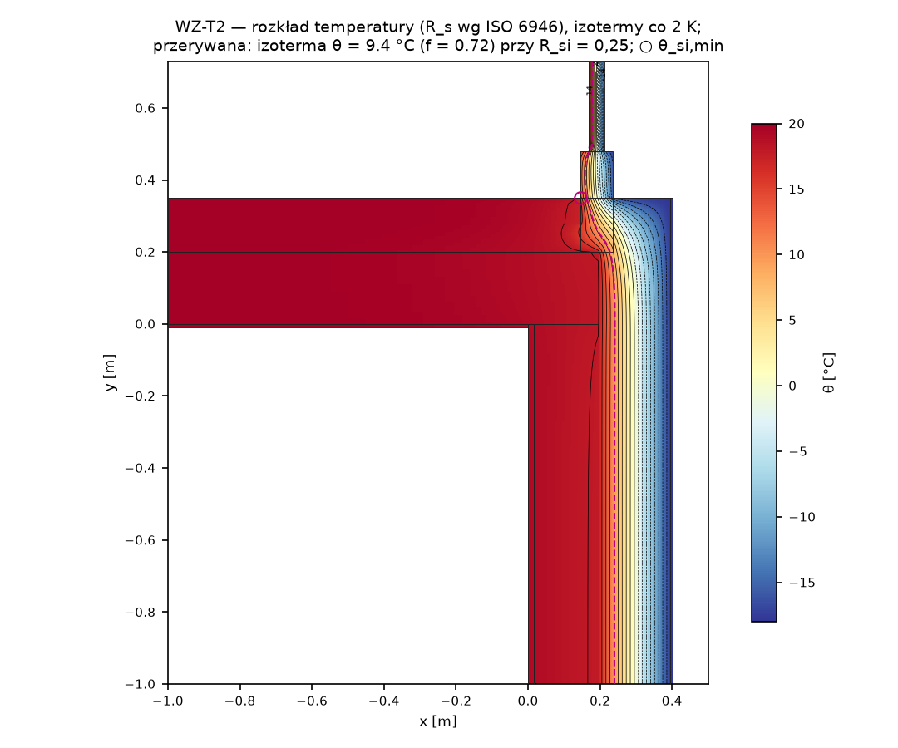

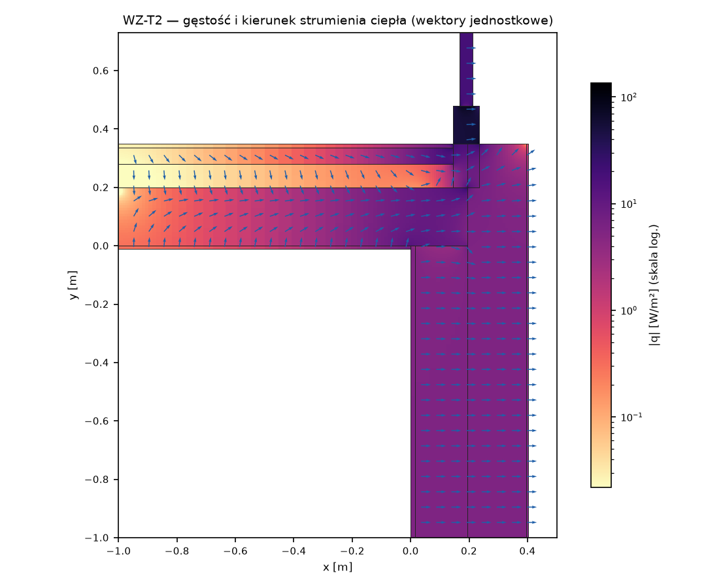

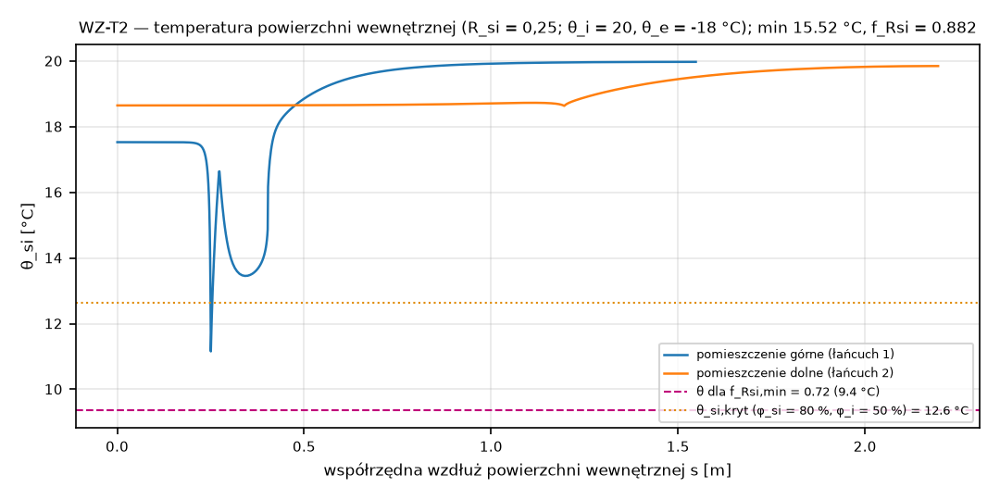

## WZ-T3 — Próg drzwi na płycie wspornikowej (balkon/taras) — łącznik termoizolacyjny

Przekrój pionowy przez próg; pomieszczenia nad i pod stropem ogrzewane (grupa „i”).

**Dane wejściowe**

*warstwy ściany:*

| kod | materiał | d [m] | λ [W/(m·K)] | R [m²K/W] |
|---|---|---|---|---|
| TYNK_GIPS | Tynk gipsowy maszynowy | 0,0150 | 0,4000 | 0,0375 |
| SIL18 | Bloczek wapienno-piaskowy 18 cm, kl. 20 | 0,1800 | 0,7700 | 0,2338 |
| EPS031 | Styropian grafitowy EPS 031 | 0,2000 | 0,0310 | 6,4516 |
| TYNK_SIL | Tynk silikonowy cienkowarstwowy, biały | 0,0070 | 0,7000 | 0,0100 |

* płyta: ZB_C30, t = 0.2 m, wysięg = 1.0 m

*warstwy podłogi:*

| kod | materiał | d [m] | λ [W/(m·K)] | R [m²K/W] |
|---|---|---|---|---|
| DESKA_DEB | Deska podłogowa dębowa | 0,0150 | 0,1800 | 0,0833 |
| JASTRYCH | Jastrych cementowy | 0,0550 | 1,0000 | 0,0550 |
| EPS_AKU | Styropian akustyczny EPS T | 0,0800 | 0,0400 | 2,0000 |

*warstwy sufitu:*

| kod | materiał | d [m] | λ [W/(m·K)] | R [m²K/W] |
|---|---|---|---|---|
| TYNK_GIPS | Tynk gipsowy maszynowy | 0,0100 | 0,4000 | 0,0250 |

* próg: rama U_f = 1.4, b_f = 0.13 m, d_f = 0.09 m, lico wewn. ramy x = 0.145 m (wsunięcie w mur 0.05 m); U_g = 0.5; U_w = 0.911; podwalina PROG_TERM (λ = 0.05) od y = 0.200 m do poziomu posadzki [DANE PRZYKŁADOWE – FIKCYJNE] dane przykładowe z karty katalogowej typowego systemu HS aluminiowego klasy U_w ≤ 0,9 (lub równoważne)
* łącznik: Łącznik termoizolacyjny 80 mm (moduł izolacyjny + pręty nierdzewne), λ_eq: λ_eq = 0.09 W/(m·K), d = 0.08 m — [DANE PRZYKŁADOWE – FIKCYJNE] λ_eq typowej deklaracji (ETA) łącznika 80 mm do płyt 20–22 cm; do zastąpienia wartością z ETA wybranego wyrobu (W-272)

**Warunki brzegowe** (przekrój pionowy; płaszczyzny odcięcia i osie symetrii adiabatyczne)

| strefa | rodzaj | grupa | θ [°C] | R_s — przebieg ψ [m²K/W] | R_s — przebieg f_Rsi |
|---|---|---|---|---|---|
| pomieszczenie dolne | wewn | i | 20,0 | wg ISO 6946: 0,13 poziomo / 0,10 w górę / 0,17 w dół | 0,25 (ramy/szyby 0,13) |
| pomieszczenie górne | wewn | i | 20,0 | wg ISO 6946: 0,13 poziomo / 0,10 w górę / 0,17 w dół | 0,25 (ramy/szyby 0,13) |
| zewnętrze | zewn | e | −18,0 | 0,04 | 0,04 |

**Siatka i dokładność** (MOS, siatka prostokątna zagęszczana przy granicach materiałów)

| siatka | komórek | Φ_całk [W/m] |
|---|---|---|
| 183 × 152 = 27816 komórek; Δx ∈ [1.56; 93.27] mm, Δy ∈ [1.65; 94.01] mm | 27816 | 27,3061 |
| 366 × 304 = 111264 komórek; Δx ∈ [0.778; 46.63] mm, Δy ∈ [0.825; 47.01] mm | 111264 | 27,3206 |

Zmiana strumienia przy podwojeniu liczby podziałów: **0,053 %** (kryterium ISO 10211 < 1 %: spełnione); zmiana L_2D (= zmiana ψ): 0,00038 W/(m·K) (kryterium ≤ max(1 % |ψ|; 0,001) = 0,00172: spełnione); bilans energii Σ Φ / (½ Σ|Φ|) = 9.3e-14 (kryterium < 10⁻⁴: spełnione).

**Współczynniki sprzężenia i ψ**

*Para i–e:* L_2D = **0,7190 W/(m·K)**

| element flankujący | U [W/(m²K)] | l_e [m] | l_i [m] | l_oi [m] | U·l_e | U·l_i | U·l_oi |
|---|---|---|---|---|---|---|---|
| ściana dolna (do poziomu podłogi / spodu ramy) | 0,1449 | 1,5560 | 1,1960 | 1,5560 | 0,2254 | 0,1733 | 0,2254 |
| drzwi (L_2D ramy z szybą, model bez ściany) | L_2D = 0,3217 | — | — | — | 0,3217 | 0,3217 | 0,3217 |

ψ_oi (wymiary wewnętrzne całkowite — system projektu, H_TB) = 0,7190 − 0,5471 = **0,172 W/(m·K)**; ψ_e (zewnętrzne) = 0,7190 − 0,5471 = 0,172 W/(m·K); ψ_i (wewnętrzne) = 0,7190 − 0,4950 = 0,224 W/(m·K)

**Temperatura powierzchni wewnętrznej i ryzyko pleśni** (R_si = 0,25 — PN-EN ISO 13788)

* θ_si,min = **15,24 °C** w punkcie (0,145; 0,350) m przy θ_i = 20,0 °C, θ_e = −18,0 °C
* f_Rsi = (θ_si,min − θ_e)/(θ_i − θ_e) = **0,875**; wymaganie f_Rsi ≥ 0,72 (WT zał. 2 pkt 2.2.1–2.2.5 (uproszczenie; φ_i = 50 %) (W-248)) → **SPEŁNIA**
* rama/szyba (R_si = 0,13): θ_si,min = 11,15 °C, f_Rsi = 0,767 (informacyjnie — ocena okna wg PN-EN ISO 10077-2/13788)
* informacyjnie przy θ_e obliczeniowej i φ_i = 50 %: θ_si,kryt (φ_si = 80 %) = 12,6 °C (f = 0,806), punkt rosy 9,3 °C → θ_si,min ≥ θ_si,kryt (ocena miesięczna wg ISO 13788 — łagodniejsza; kryterium formalne: f_Rsi ≥ 0,72)

*Uwaga:* Ocieplenie ściany prowadzone do spodu ramy (cokolik izolacji XPS nad płytą) — ciągłość izolacji w płaszczyźnie ramy; hydroizolacja tarasu/balkonu wywinięta ≥ 15 cm lub pod próg (taśma EPDM do ramy), spadek płyty ≥ 1,5–2 % od budynku, odwodnienie liniowe/rynna przy progu bezbarierowym.

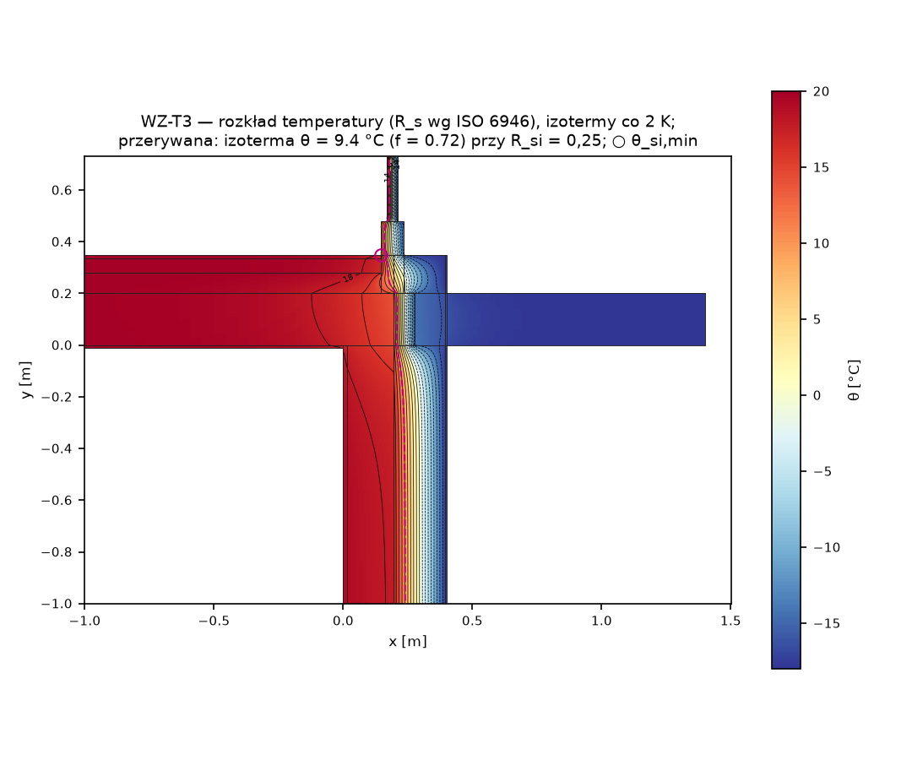

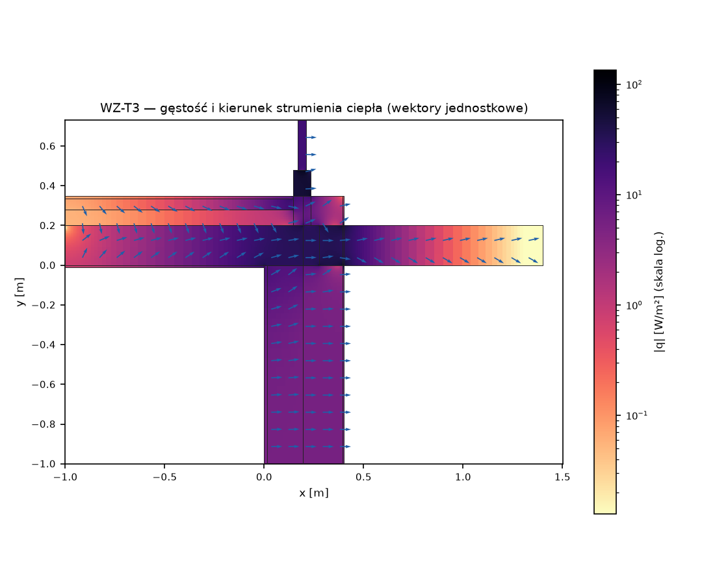

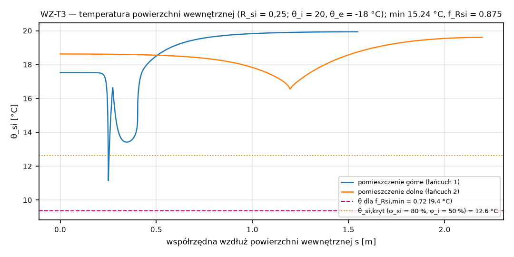

