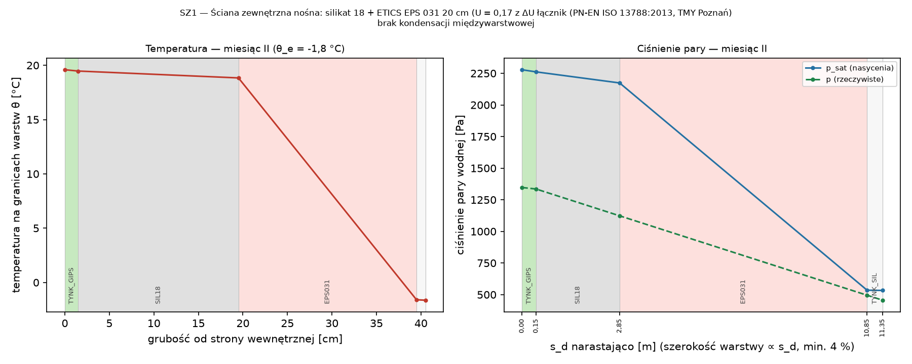
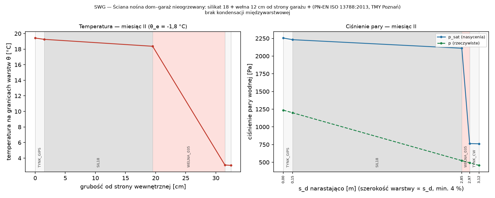
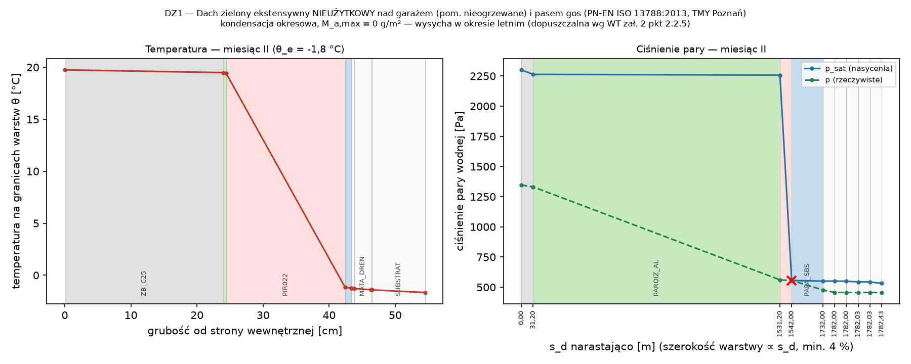
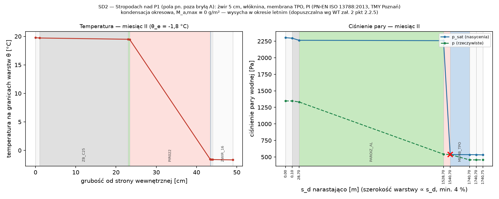
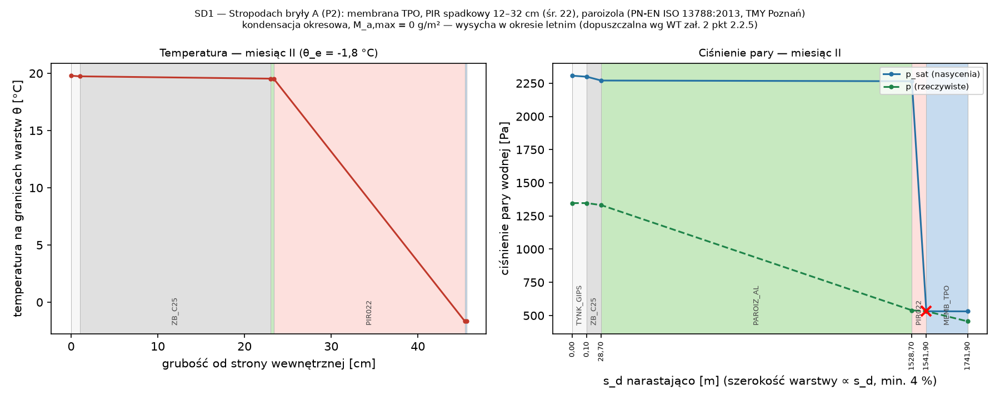
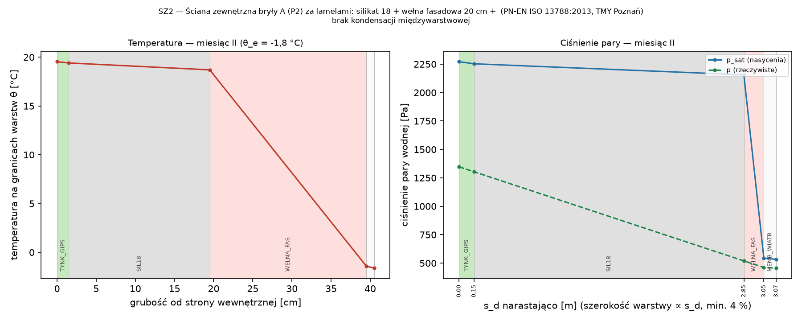
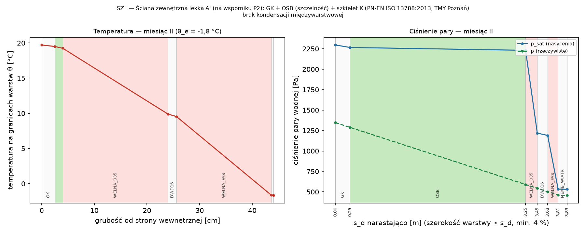
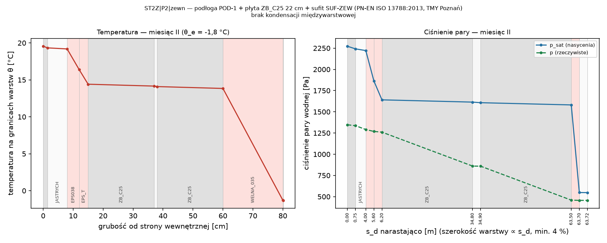

# Wilgotność: f_Rsi i kondensacja międzywarstwowa

## Ryzyko rozwoju pleśni — czynnik temperaturowy f_Rsi (PN-EN ISO 13788:2013 rozdz. 5)

**Podstawa:** PN-EN ISO 13788:2013-05 rozdz. 5; WT § 321, zał. 2 pkt 2.2.1–2.2.3 (f_Rsi ≥ f_Rsi,kryt; dopuszczalnie 0,72); dane klimatyczne TMY Poznań (MIiR)

> Warunki wewnętrzne: φ_i = 50 % przy θ_i = 20 °C (WT zał. 2 pkt 2.2.2); kryterium φ_si ≤ 80 %.

| Mies. | θ_e [°C] | φ_e [%] | p_e [Pa] | p_i [Pa] | p_sat,min [Pa] | θ_si,min [°C] | f_Rsi,min |
|:---|:---|:---|:---|:---|:---|:---|:---|
| I | 0,2 | 86 | 534 | 1 168 | 1 461 | 12,6 | 0,628 |
| II | −1,8 | 86 | 456 | 1 168 | 1 461 | 12,6 | 0,661 |
| III | 2,7 | 79 | 585 | 1 168 | 1 461 | 12,6 | 0,573 |
| IV | 8,3 | 68 | 748 | 1 168 | 1 461 | 12,6 | 0,372 |
| V | 13,0 | 62 | 927 | 1 168 | 1 461 | 12,6 | −0,048 |
| VI | 16,8 | 70 | 1 336 | 1 168 | 1 461 | 12,6 | −1,327 |
| VII | 18,2 | 72 | 1 501 | 1 168 | 1 461 | 12,6 | −3,215 |
| VIII | 18,4 | 72 | 1 530 | 1 168 | 1 461 | 12,6 | −3,553 |
| IX | 13,5 | 81 | 1 254 | 1 168 | 1 461 | 12,6 | −0,138 |
| X | 7,0 | 88 | 882 | 1 168 | 1 461 | 12,6 | 0,432 |
| XI | 2,2 | 91 | 648 | 1 168 | 1 461 | 12,6 | 0,586 |
| XII | −0,1 | 93 | 561 | 1 168 | 1 461 | 12,6 | 0,634 |

Miesiąc krytyczny: **II**, f_Rsi,max = **0,661**; wartość dopuszczona przez WT: 0,72. Do sprawdzeń przyjęto zachowawczo f_Rsi,wym = max(f_Rsi,max; 0,72) = **0,720**.

| Element | Opis | f_Rsi | Źródło | f_Rsi ≥ 0,720 |
|:---|:---|---:|:---|:---|
| POD-0 | przegroda (podloga_grunt), U = 0,11 | 0,973 | 1 − U·0,25 (PN-EN ISO 13788 p. 4.3) | ✔ spełnia |
| SZ1 | przegroda (sciana_zewn), U = 0,17 | 0,958 | 1 − U·0,25 (PN-EN ISO 13788 p. 4.3) | ✔ spełnia |
| SWG | przegroda (sciana_nieogrz), U = 0,27 | 0,932 | 1 − U·0,25 (PN-EN ISO 13788 p. 4.3) | ✔ spełnia |
| DZ1 | przegroda (dach), U = 0,13 | 0,968 | 1 − U·0,25 (PN-EN ISO 13788 p. 4.3) | ✔ spełnia |
| SD2 | przegroda (dach), U = 0,12 | 0,970 | 1 − U·0,25 (PN-EN ISO 13788 p. 4.3) | ✔ spełnia |
| SD1 | przegroda (dach), U = 0,11 | 0,972 | 1 − U·0,25 (PN-EN ISO 13788 p. 4.3) | ✔ spełnia |
| SZ2 | przegroda (sciana_zewn), U = 0,17 | 0,957 | 1 − U·0,25 (PN-EN ISO 13788 p. 4.3) | ✔ spełnia |
| SZL | przegroda (sciana_zewn), U = 0,099 | 0,975 | 1 − U·0,25 (PN-EN ISO 13788 p. 4.3) | ✔ spełnia |
| ST2Z\|P2\|zewn | przegroda (strop_zewn), U = 0,13 | 0,968 | 1 − U·0,25 (PN-EN ISO 13788 p. 4.3) | ✔ spełnia |
| WZ-01 | Attyka stropodachu bryły A (D1) (attyka) | 0,932 | katalog mostków budynku (PN-EN ISO 10211) | ✔ spełnia |
| WZ-02 | Attyki dachów P1 (D2, D3) — poza ścianami bryły A (attyka) | 0,900 | katalog mostków budynku (PN-EN ISO 10211) | ✔ spełnia |
| WZ-03 | Attyka dachu zielonego nad pasem gospodarczym (linia D, część ogrzewana) (attyka) | 0,890 | katalog mostków budynku (PN-EN ISO 10211) | ✔ spełnia |
| WZ-04 | Okap E (PL-E) i daszek wejścia — łącznik termoizolacyjny (plyta_wspornikowa_lacznik) | 0,929 | katalog mostków budynku (PN-EN ISO 10211) | ✔ spełnia |
| WZ-05 | Krawędź ST2 (PL-2) — łącznik termoizolacyjny pod bryłą A (plyta_wspornikowa_lacznik) | 0,927 | katalog mostków budynku (PN-EN ISO 10211) | ✔ spełnia |
| WZ-06 | Krawędź ST3 (PL-3) — łącznik termoizolacyjny przy attyce bryły A (plyta_wspornikowa_lacznik) | 0,889 | katalog mostków budynku (PN-EN ISO 10211) | ✔ spełnia |
| WZ-07 | Strop P2 nad powietrzem zewnętrznym (ST2Z) — krawędzie wspornika bryły A (strop_zewn_krawedz) | 0,851 | katalog mostków budynku (PN-EN ISO 10211); minimum podwęzłów | ✔ spełnia |
| WZ-08 | Cokół: ściana zewn. – płyta fundamentowa na XPS (część ogrzewana) (sciana_grunt) | 0,903 | katalog mostków budynku (PN-EN ISO 10211) | ✔ spełnia |
| WZ-09 | Połączenia dom–garaż nieogrzewany (ściany osi E i 2 z płytą i stropem; docieplenie pasem 1,0 m — SUF-G) (polaczenie_nieogrz) | 0,836 | katalog mostków budynku (PN-EN ISO 10211); minimum podwęzłów | ✔ spełnia |
| WZ-10 | Strop pośredni ST1/ST2 – ściana zewn. z ETICS ciągłym (wieniec) (strop_posredni) | 0,963 | katalog mostków budynku (PN-EN ISO 10211) | ✔ spełnia |
| WZ-11 | Ościeża okien/drzwi — ciepły montaż (rama 5 cm w murze, 4 cm w izolacji, zakład izolacji 3 cm na ramę) (oscieze) | 0,930 | katalog mostków budynku (PN-EN ISO 10211) | ✔ spełnia |
| WZ-11N | Nadproża — BEZ kaset osłon w ociepleniu (kasety w okapach / ramie C / szczelinie lamel / nadstawne) (nadproze) | 0,938 | katalog mostków budynku (PN-EN ISO 10211) | ✔ spełnia |
| WZ-11P | Podokienniki — parapet zewn. z okapnikiem na profilu z XPS (podokiennik) | 0,911 | katalog mostków budynku (PN-EN ISO 10211) | ✔ spełnia |
| WZ-11T | Progi HS / drzwi zewn. na płycie P0 — profil progowy termoizolacyjny na podwalinie XPS/PUR-GF, odwodnienie liniowe (prog) | 0,845 | katalog mostków budynku (PN-EN ISO 10211) | ✔ spełnia |
| WZ-12 | Narożniki wypukłe ścian zewnętrznych (naroznik_wypukly) | 0,926 | katalog mostków budynku (PN-EN ISO 10211) | ✔ spełnia |
| WZ-13 | Konsole rusztu lamel (przekładka termiczna) (konsola_lamel) | — | do wyznaczenia — symulacja PN-EN ISO 10211 (mostki2d) | — |
| WZ-14 | Konsole ramy boksu C i linii D (PL-C1/PL-C2/PL-D; punktowe, przekładka termiczna) (kotwa) | — | do wyznaczenia — symulacja PN-EN ISO 10211 (mostki2d) | — |
| WZ-15 | Przejścia instalacji przez przegrody zewnętrzne (wywiewka K1, czerpnia, wyrzutnia, PC, wpusty, przyłącza) (przejscie_instalacji) | — | do wyznaczenia — symulacja PN-EN ISO 10211 (mostki2d) | — |
| WZ-16 | Belki wspornikowe B4/B5 i belka B3 w linii izolacji wspornika bryły A (ciągłość wełny pod ST2Z) (strop_zewn_krawedz) | 0,854 | katalog mostków budynku (PN-EN ISO 10211); minimum podwęzłów | ✔ spełnia |
| WZ-X1 | Dachy D2/D3 (SD2) – ściana SZ1 bryły A wyższej kondygnacji na krawędzi (nad pomieszczeniami ogrzewanymi) (dach_sciana) | 0,964 | katalog mostków budynku (PN-EN ISO 10211) | ✔ spełnia |
| WZ-X2 | Dach D4 (DZ1) – ściana SZ1 bryły B na krawędzi (pas gospodarczy, pomieszczenia ogrzewane) (dach_sciana) | 0,964 | katalog mostków budynku (PN-EN ISO 10211) | ✔ spełnia |

Dla porównania — klasa wilgotności 3 (PN-EN ISO 13788 zał. A): miesiąc krytyczny 12, f_Rsi,max = 0,800 (informacyjnie; wymaganie WT — φ_i = 50 %).

## Kondensacja międzywarstwowa — metoda Glasera (PN-EN ISO 13788:2013 rozdz. 6)

**Podstawa:** PN-EN ISO 13788:2013-05 rozdz. 6; WT § 321 ust. 2, zał. 2 pkt 2.2.4–2.2.5; dane klimatyczne TMY Poznań (MIiR, WMO 12330)

> s_d = μ·d; g_c = δ₀·[(p_{c−1} − p_c)/Δs' − (p_c − p_{c+1})/Δs''], δ₀ = 2·10⁻¹⁰ kg/(m·s·Pa).
> Wymagane s_d paroizolacji — najmniejsze s_d warstwy po ciepłej stronie izolacji: (1) przy którym nie występuje kondensacja w żadnym miesiącu; (2) przy którym kondensat wysycha w cyklu rocznym i M_a,max ≤ kryterium (WT zał. 2 pkt 2.2.5) — bisekcja do 1500 m.

| Przegroda | Nazwa | Rola | Kondensacja | M_a,max [g/m²] | Wysycha | s_d paroizol. istn. [m] | s_d wym. — brak kondensacji [m] | s_d wym. — kondensacja dopuszczalna [m] | Ocena |
|:---|:---|:---|---:|---:|---:|---:|---:|---:|:---|
| SZ1 | Ściana zewnętrzna nośna: silikat 18 + ETICS EPS 03 | sciana_zewn | nie | 0 | tak | 0,1 | 0 (nie wymaga) | 0 (nie wymaga) | ✔ spełnia |
| SWG | Ściana nośna dom–garaż nieogrzewany: silikat 18 +  | sciana_nieogrz | nie | 0 | tak | brak | 0 (nie wymaga) | 0 (nie wymaga) | ✔ spełnia |
| DZ1 | Dach zielony ekstensywny NIEUŻYTKOWY nad garażem ( | dach | tak | 0 | tak | 1 500,0 | > 1500 (nieosiągalne) | 113,4 | ✔ spełnia |
| SD2 | Stropodach nad P1 (pola pn. poza bryłą A): żwir 5  | dach | tak | 0 | tak | 1 500,0 | > 1500 (nieosiągalne) | 104,0 | ✔ spełnia |
| SD1 | Stropodach bryły A (P2): membrana TPO, PIR spadkow | dach | tak | 0 | tak | 1 500,0 | > 1500 (nieosiągalne) | 106,0 | ✔ spełnia |
| SZ2 | Ściana zewnętrzna bryły A (P2) za lamelami: silika | sciana_zewn | nie | 0 | tak | 0,1 | 0 (nie wymaga) | 0 (nie wymaga) | ✔ spełnia |
| SZL | Ściana zewnętrzna lekka A' (na wsporniku P2): GK + | sciana_zewn | nie | 0 | tak | 3,0 | 0 (nie wymaga) | 0 (nie wymaga) | ✔ spełnia |
| ST2Z\|P2\|zewn | podłoga POD-1 + płyta ZB_C25 22 cm + sufit SUF-ZEW | strop_zewn | nie | 0 | tak | brak | 0 (nie wymaga) | 0 (nie wymaga) | ✔ spełnia |

### SZ1 — Ściana zewnętrzna nośna: silikat 18 + ETICS EPS 031 20 cm (U = 0,17 z ΔU łączników — obl. PN-EN ISO 6946)

| Lp. | Warstwa (od wnętrza) | Funkcja | d [cm] | R [m²K/W] | μ | s_d [m] |
|---:|:---|:---|---:|---:|---:|---:|
| 1 | Tynk gipsowy maszynowy 1,5 cm | szczelnosc | 1,5 | 0,037 | 10 | 0,15 |
| 2 | Bloczek wapienno-piaskowy (silikat) 18 c | konstrukcja | 18,0 | 0,200 | 15 | 2,70 |
| 3 | Styropian grafitowy EPS 031 (ETICS, NRO  | izolacja | 20,0 | 6,452 | 40 | 8,00 |
| 4 | ETICS: warstwa zbrojona + tynk silikonow | tynk | 1,0 | 0,012 | 50 | 0,50 |

**Ocena:** brak kondensacji międzywarstwowej. Warunki wewnętrzne: klasa wilgotności 3 (PN-EN ISO 13788 zał. A: budynki o nieznanym zagęszczeniu), p_i = p_e + 1,10·Δp.

Wymagane s_d paroizolacji (po ciepłej stronie izolacji): brak kondensacji — 0 (nie wymaga) m; kondensacja dopuszczalna (wysycha, M_a ≤ 500 g/m²) — 0 (nie wymaga) m; istniejąca warstwa: TYNK_GIPS, s_d = 0,1 m (✔ spełnia).

### SWG — Ściana nośna dom–garaż nieogrzewany: silikat 18 + wełna 12 cm od strony garażu + tynk (U = 0,27 ≤ 0,30; szczelna na spaliny)

| Lp. | Warstwa (od wnętrza) | Funkcja | d [cm] | R [m²K/W] | μ | s_d [m] |
|---:|:---|:---|---:|---:|---:|---:|
| 1 | Tynk gipsowy maszynowy 1,5 cm | tynk | 1,5 | 0,037 | 10 | 0,15 |
| 2 | Bloczek wapienno-piaskowy (silikat) 18 c | konstrukcja | 18,0 | 0,200 | 15 | 2,70 |
| 3 | Wełna mineralna 035 (szkielet, docieplen | izolacja | 12,0 | 3,429 | 1 | 0,12 |
| 4 | Tynk cementowo-wapienny 1,5 cm (garaż, p | tynk | 1,0 | 0,012 | 15 | 0,15 |

**Ocena:** brak kondensacji międzywarstwowej. Warunki wewnętrzne: klasa wilgotności 3 (PN-EN ISO 13788 zał. A: budynki o nieznanym zagęszczeniu), p_i = p_e + 1,10·Δp.

Wymagane s_d paroizolacji (po ciepłej stronie izolacji): brak kondensacji — 0 (nie wymaga) m; kondensacja dopuszczalna (wysycha, M_a ≤ 500 g/m²) — 0 (nie wymaga) m; istniejąca warstwa: brak.

* strona zimna — przestrzeń nieogrzewana 0.13: θ_u,n = 20 − b_u·(20 − θ_e,n), b_u = 0,80; ciśnienie pary jak na zewnątrz

### DZ1 — Dach zielony ekstensywny NIEUŻYTKOWY nad garażem (pom. nieogrzewane) i pasem gospodarczym: substrat 8 cm, geowłóknina, mata drenażowa, włóknina, bariera przeciwkorzenna, 2 × papa SBS, PIR spadkowy 12–24 cm, paroizolacja, płyta ŻB 24 cm (dwukierunkowa); opaska żwirowa 0,5 m przy attykach i wpustach (U = 0,13); nad garażem: pole PV biosolarne (8 modułów)

| Lp. | Warstwa (od wnętrza) | Funkcja | d [cm] | R [m²K/W] | μ | s_d [m] |
|---:|:---|:---|---:|---:|---:|---:|
| 1 | Żelbet C25/30, B500SP (stropy, płyta fun | konstrukcja | 24,0 | 0,104 | 130 | 31,20 |
| 2 | Paroizolacja bitumiczna z wkładką Al (na | paroizolacja | 0,4 | 0,017 | 375 000 | 1 500,00 |
| 3 | Płyty PIR z okładziną (izolacja spadkowa | izolacja | 18,0 | 8,182 | 60 | 10,80 |
| 4 | Hydroizolacja 2 × papa SBS (podkładowa + | hydroizolacja | 0,9 | 0,041 | 20 000 | 190,00 |
| 5 | Bariera przeciwkorzenna PE-HD 0,5 mm (PN | bariera_korzenna | 0,1 | 0,001 | 100 000 | 50,00 |
| 6 | Włóknina ochronna PP 300 g/m² | geowloknina | 0,4 | 0,008 | 1 | 0,00 |
| 7 | Mata drenażowo-retencyjna HDPE 25 mm (da | drenaz | 2,5 | 0,050 | 1 | 0,03 |
| 8 | Geowłóknina filtracyjna PP 150 g/m² | geowloknina | 0,2 | 0,004 | 1 | 0,00 |
| 9 | Substrat ekstensywny 8 cm z matą rozchod | substrat | 8,0 | 0,100 | 5 | 0,40 |

| Mies. | θ_e | g_c pł.3 [g/m²] | M_a pł.3 [g/m²] |
|:---|:---|:---|:---|
| XI | 2,2 | 0,0 | 0,0 |
| XII | −0,1 | 0,1 | 0,2 |
| I | 0,2 | 0,0 | 0,2 |
| II | −1,8 | 0,0 | 0,2 |
| III | 2,7 | −0,2 | 0,0 |
| IV | 8,3 | −0,7 | 0,0 |
| V | 13,0 | 0,0 | 0,0 |
| VI | 16,8 | 0,0 | 0,0 |
| VII | 18,2 | 0,0 | 0,0 |
| VIII | 18,4 | 0,0 | 0,0 |
| IX | 13,5 | 0,0 | 0,0 |
| X | 7,0 | 0,0 | 0,0 |

Płaszczyzny kondensacji (numer granicy za warstwą): 3 — między „PIR022” a „PAPA_SBS”

**Ocena:** kondensacja okresowa, M_a,max = 0 g/m² — wysycha w okresie letnim (dopuszczalna wg WT zał. 2 pkt 2.2.5). Warunki wewnętrzne: klasa wilgotności 3 (PN-EN ISO 13788 zał. A: budynki o nieznanym zagęszczeniu), p_i = p_e + 1,10·Δp.

Wymagane s_d paroizolacji (po ciepłej stronie izolacji): brak kondensacji — > 1500 (nieosiągalne) m; kondensacja dopuszczalna (wysycha, M_a ≤ 500 g/m²) — 113,4 m; istniejąca warstwa: PAROIZ_AL, s_d = 1 500,0 m (✔ spełnia).

* dach zielony: metoda Glasera (stan ustalony, bez transportu wilgoci w cieczy) ma ograniczoną miarodajność dla warstw nad hydroizolacją — ocena warstw pod hydroizolacją

### SD2 — Stropodach nad P1 (pola pn. poza bryłą A): żwir 5 cm, włóknina, membrana TPO, PIR spadkowy 14–26 cm, paroizolacja, płyta ŻB 22 cm (U = 0,12 — klin wg PN-EN ISO 6946 zał. C)

| Lp. | Warstwa (od wnętrza) | Funkcja | d [cm] | R [m²K/W] | μ | s_d [m] |
|---:|:---|:---|---:|---:|---:|---:|
| 1 | Tynk gipsowy maszynowy 1,5 cm | tynk | 1,0 | 0,025 | 10 | 0,10 |
| 2 | Żelbet C25/30, B500SP (stropy, płyta fun | konstrukcja | 22,0 | 0,096 | 130 | 28,60 |
| 3 | Paroizolacja bitumiczna z wkładką Al (na | paroizolacja | 0,4 | 0,017 | 375 000 | 1 500,00 |
| 4 | Płyty PIR z okładziną (izolacja spadkowa | izolacja | 20,0 | 9,091 | 60 | 12,00 |
| 5 | Membrana dachowa TPO 1,5 mm, mocowana me | hydroizolacja | 0,2 | 0,010 | 100 000 | 200,00 |
| 6 | Włóknina ochronna PP 300 g/m² | geowloknina | 0,4 | 0,008 | 1 | 0,00 |
| 7 | Żwir płukany 16/32 mm (balast dachu P1,  | balast | 5,0 | 0,025 | 1 | 0,05 |

| Mies. | θ_e | g_c pł.4 [g/m²] | M_a pł.4 [g/m²] |
|:---|:---|:---|:---|
| XI | 2,2 | 0,1 | 0,1 |
| XII | −0,1 | 0,2 | 0,2 |
| I | 0,2 | 0,0 | 0,2 |
| II | −1,8 | 0,1 | 0,3 |
| III | 2,7 | −0,2 | 0,1 |
| IV | 8,3 | −0,9 | 0,0 |
| V | 13,0 | 0,0 | 0,0 |
| VI | 16,8 | 0,0 | 0,0 |
| VII | 18,2 | 0,0 | 0,0 |
| VIII | 18,4 | 0,0 | 0,0 |
| IX | 13,5 | 0,0 | 0,0 |
| X | 7,0 | 0,0 | 0,0 |

Płaszczyzny kondensacji (numer granicy za warstwą): 4 — między „PIR022” a „MEMB_TPO”

**Ocena:** kondensacja okresowa, M_a,max = 0 g/m² — wysycha w okresie letnim (dopuszczalna wg WT zał. 2 pkt 2.2.5). Warunki wewnętrzne: klasa wilgotności 3 (PN-EN ISO 13788 zał. A: budynki o nieznanym zagęszczeniu), p_i = p_e + 1,10·Δp.

Wymagane s_d paroizolacji (po ciepłej stronie izolacji): brak kondensacji — > 1500 (nieosiągalne) m; kondensacja dopuszczalna (wysycha, M_a ≤ 500 g/m²) — 104,0 m; istniejąca warstwa: PAROIZ_AL, s_d = 1 500,0 m (✔ spełnia).

### SD1 — Stropodach bryły A (P2): membrana TPO, PIR spadkowy 12–32 cm (śr. 22), paroizolacja z Al, płyta ŻB 22 cm, tynk; spadek ≥ 2 % do wpustów WP1/WP2 (U = 0,11 — klin wg PN-EN ISO 6946 zał. C)

| Lp. | Warstwa (od wnętrza) | Funkcja | d [cm] | R [m²K/W] | μ | s_d [m] |
|---:|:---|:---|---:|---:|---:|---:|
| 1 | Tynk gipsowy maszynowy 1,5 cm | tynk | 1,0 | 0,025 | 10 | 0,10 |
| 2 | Żelbet C25/30, B500SP (stropy, płyta fun | konstrukcja | 22,0 | 0,096 | 130 | 28,60 |
| 3 | Paroizolacja bitumiczna z wkładką Al (na | paroizolacja | 0,4 | 0,017 | 375 000 | 1 500,00 |
| 4 | Płyty PIR z okładziną (izolacja spadkowa | izolacja | 22,0 | 10,000 | 60 | 13,20 |
| 5 | Membrana dachowa TPO 1,5 mm, mocowana me | hydroizolacja | 0,2 | 0,010 | 100 000 | 200,00 |

| Mies. | θ_e | g_c pł.4 [g/m²] | M_a pł.4 [g/m²] |
|:---|:---|:---|:---|
| XI | 2,2 | 0,1 | 0,1 |
| XII | −0,1 | 0,2 | 0,2 |
| I | 0,2 | 0,0 | 0,3 |
| II | −1,8 | 0,1 | 0,3 |
| III | 2,7 | −0,2 | 0,1 |
| IV | 8,3 | −0,8 | 0,0 |
| V | 13,0 | 0,0 | 0,0 |
| VI | 16,8 | 0,0 | 0,0 |
| VII | 18,2 | 0,0 | 0,0 |
| VIII | 18,4 | 0,0 | 0,0 |
| IX | 13,5 | 0,0 | 0,0 |
| X | 7,0 | 0,0 | 0,0 |

Płaszczyzny kondensacji (numer granicy za warstwą): 4 — między „PIR022” a „MEMB_TPO”

**Ocena:** kondensacja okresowa, M_a,max = 0 g/m² — wysycha w okresie letnim (dopuszczalna wg WT zał. 2 pkt 2.2.5). Warunki wewnętrzne: klasa wilgotności 3 (PN-EN ISO 13788 zał. A: budynki o nieznanym zagęszczeniu), p_i = p_e + 1,10·Δp.

Wymagane s_d paroizolacji (po ciepłej stronie izolacji): brak kondensacji — > 1500 (nieosiągalne) m; kondensacja dopuszczalna (wysycha, M_a ≤ 500 g/m²) — 106,0 m; istniejąca warstwa: PAROIZ_AL, s_d = 1 500,0 m (✔ spełnia).

### SZ2 — Ściana zewnętrzna bryły A (P2) za lamelami: silikat 18 + wełna fasadowa 20 cm + membrana UV-stabilna (czarna); szczelina wentylowana ok. 11 cm i lamele na ruszcie — element `lamele` (U = 0,17 — obl. PN-EN ISO 6946)

| Lp. | Warstwa (od wnętrza) | Funkcja | d [cm] | R [m²K/W] | μ | s_d [m] |
|---:|:---|:---|---:|---:|---:|---:|
| 1 | Tynk gipsowy maszynowy 1,5 cm | szczelnosc | 1,5 | 0,037 | 10 | 0,15 |
| 2 | Bloczek wapienno-piaskowy (silikat) 18 c | konstrukcja | 18,0 | 0,200 | 15 | 2,70 |
| 3 | Wełna mineralna fasadowa (elewacja wenty | izolacja | 20,0 | 5,714 | 1 | 0,20 |
| 4 | Membrana fasadowa wiatroizolacyjna UV-st | wiatroizolacja | 1,0 | 0,059 | 40 | 0,02 |

**Ocena:** brak kondensacji międzywarstwowej. Warunki wewnętrzne: klasa wilgotności 3 (PN-EN ISO 13788 zał. A: budynki o nieznanym zagęszczeniu), p_i = p_e + 1,10·Δp.

Wymagane s_d paroizolacji (po ciepłej stronie izolacji): brak kondensacji — 0 (nie wymaga) m; kondensacja dopuszczalna (wysycha, M_a ≤ 500 g/m²) — 0 (nie wymaga) m; istniejąca warstwa: TYNK_GIPS, s_d = 0,1 m (✔ spełnia).

### SZL — Ściana zewnętrzna lekka A' (na wsporniku P2): GK + OSB (szczelność) + szkielet KVH 45×200 z wełną + DWD + wełna fasadowa 18 cm + membrana UV (lico zewn. 0,30 m od osi — jak SZ2, ciągłość warstw w narożu); bez funkcji nośnej (U = 0,099)

| Lp. | Warstwa (od wnętrza) | Funkcja | d [cm] | R [m²K/W] | μ | s_d [m] |
|---:|:---|:---|---:|---:|---:|---:|
| 1 | Płyta gipsowo-kartonowa 12,5 mm (GKB / G | wykonczenie | 2,5 | 0,100 | 10 | 0,25 |
| 2 | Płyta OSB/3 15 mm (usztywnienie i warstw | szczelnosc | 1,5 | 0,115 | 200 | 3,00 |
| 3 | Wełna mineralna 035 (szkielet, docieplen | izolacja | 20,0 | 4,310 | 1 | 0,20 |
| 4 | Płyta drewnopochodna wiatroizolacyjna DW | wiatroizolacja | 1,6 | 0,160 | 11 | 0,18 |
| 5 | Wełna mineralna fasadowa (elewacja wenty | izolacja | 18,0 | 5,143 | 1 | 0,18 |
| 6 | Membrana fasadowa wiatroizolacyjna UV-st | wiatroizolacja | 0,4 | 0,024 | 40 | 0,02 |

**Ocena:** brak kondensacji międzywarstwowej. Warunki wewnętrzne: klasa wilgotności 3 (PN-EN ISO 13788 zał. A: budynki o nieznanym zagęszczeniu), p_i = p_e + 1,10·Δp.

Wymagane s_d paroizolacji (po ciepłej stronie izolacji): brak kondensacji — 0 (nie wymaga) m; kondensacja dopuszczalna (wysycha, M_a ≤ 500 g/m²) — 0 (nie wymaga) m; istniejąca warstwa: OSB, s_d = 3,0 m (✔ spełnia).

### ST2Z|P2|zewn — podłoga POD-1 + płyta ZB_C25 22 cm + sufit SUF-ZEW

| Lp. | Warstwa (od wnętrza) | Funkcja | d [cm] | R [m²K/W] | μ | s_d [m] |
|---:|:---|:---|---:|---:|---:|---:|
| 1 | Deska warstwowa dębowa 15 mm, klejona | konstrukcja | 1,5 | 0,083 | 50 | 0,75 |
| 2 | Jastrych cementowy CT-C25-F5 z wężownicą | wykonczenie | 6,5 | 0,054 | 50 | 3,25 |
| 3 | Styropian podłogowy EPS 100-038 (pod jas | izolacja | 4,0 | 1,053 | 40 | 1,60 |
| 4 | Styropian elastyfikowany EPS T (akustycz | izolacja | 3,0 | 0,750 | 20 | 0,60 |
| 5 | Żelbet C25/30, B500SP (stropy, płyta fun | konstrukcja | 22,0 | 0,096 | 130 | 28,60 |
| 6 | Tynk gipsowy maszynowy 1,5 cm | tynk | 1,0 | 0,025 | 10 | 0,10 |
| 7 | Żelbet C25/30, B500SP (stropy, płyta fun | konstrukcja | 22,0 | 0,096 | 130 | 28,60 |
| 8 | Wełna mineralna 035 (szkielet, docieplen | izolacja | 20,0 | 5,714 | 1 | 0,20 |
| 9 | Membrana fasadowa wiatroizolacyjna UV-st | wiatroizolacja | 0,1 | 0,006 | 40 | 0,02 |

**Ocena:** brak kondensacji międzywarstwowej. Warunki wewnętrzne: klasa wilgotności 3 (PN-EN ISO 13788 zał. A: budynki o nieznanym zagęszczeniu), p_i = p_e + 1,10·Δp.

Wymagane s_d paroizolacji (po ciepłej stronie izolacji): brak kondensacji — 0 (nie wymaga) m; kondensacja dopuszczalna (wysycha, M_a ≤ 500 g/m²) — 0 (nie wymaga) m; istniejąca warstwa: brak.

**Założenia i dane wejściowe:**

* Glaser: warunki wewnętrzne — klasa wilgotności 3 (budynki o nieznanym zagęszczeniu), θ_i = 20 °C, p_i = p_e + 1,10·Δp [ZAŁ] — źródło: PN-EN ISO 13788:2013 zał. A (zachowawczo: nieznane zagęszczenie)
* Kryterium akumulacji kondensatu 0,5 kg/m² (DIN 4108-3 — kryterium literaturowe) [ZAŁ]
* Dane klimatyczne: typowy rok meteorologiczny ISO (PN-EN ISO 15927-4:2007), stacja Poznań (Ławica) (WMO 12330), okres 1971–2000; Ministerstwo Inwestycji i Rozwoju (archiwum) — „Dane do obliczeń energetycznych budynków”, pliki wmo123300iso.zip (godzinowy) i wmo123300iso_stat.txt (statystyki miesięczne); https://www.gov.pl/web/archiwum-inwestycje-rozwoj/dane-do-obliczen-energetycznych-budynkow (pobrano 2026-09-25)

---
*Wygenerowano: 2026-09-25 — biblioteka `lamela.obliczenia` (PRZYKŁAD – NIE DO ZŁOŻENIA; dane wyrobów: [DANE PRZYKŁADOWE – FIKCYJNE]).*
