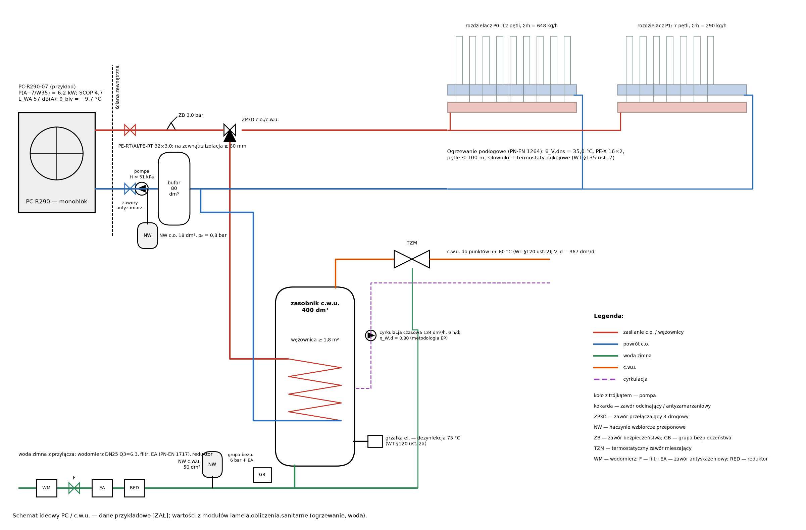

# Ogrzewanie — pompa ciepła, ogrzewanie podłogowe, bufor, naczynia, hałas

Obiekt: Dom LAMELA. Φ_HL: moduł fizyki/energii (PN-EN 12831). Dane urządzeń przykładowe [ZAŁ].

## 1. Podstawy i założenia

* WT §133–135 (t.j. Dz.U. 2022 poz. 1225 ze zm.; art. 102a PB); W-150…W-156; W-024.
* PN-EN 12831:2006 (WT) / PN-EN 12831-1:2017 — obciążenie cieplne: moduł energii (dane wejściowe tego modułu).
* PN-EN 1264-2/-3/-4 — ogrzewanie płaszczyznowe; PN-EN 14825:2022-11 (SCOP); PN-EN 12828 / PN-B-02414:1999 — naczynia.
* Rozp. (UE) 2024/573 (F-gazy), 813/2013 (ekoprojekt), Dz.U. 2014 poz. 112 (hałas).
* Pompa ciepła: PC-R290-07 (przykład) — dane przykładowe typowe dla monobloków R290 [ZAŁ — zastąpić DTR/DWU wyrobu, E-13].
* θ_e = −18 °C (W-150: NA do PN-EN 12831:2006, strefa II (Poznań wg źródeł wtórnych); WT §134 ust. 2, zał. 1 lp. 16–17 [niezweryfikowane]); θ_i wg modelu (20/24 °C).
* Ogrzewanie podłogowe: PE-X/PE-RT 16×2,0, jastrych cementowy, wykładziny wg kodów posadzek modelu; współczynniki zabudowy A_F/A: lazienka 0,60, wc 0,50, kuchnia 0,75, garderoba 0,60, techniczne 0,50, inne 0,85 [ZAŁ].
* Regulacja pomieszczeniowa: termostaty + siłowniki na pętlach (WT §135 ust. 7–9; W-152) → bufor szeregowy.
* Przewody PC ↔ budynek (monoblok): na zewnątrz izolacja 2× grubość wg WT z płaszczem UV, zabezpieczenie przed zamarzaniem (zawory antyzamarzaniowe lub glikol + wymiennik) [ZAŁ].

## 2. Moc źródła i pompa ciepła

* Suma obciążeń cieplnych pomieszczeń (do wymiarowania podłogówki): ΣΦ_HL,i = **7,59** kW — _moduł fizyki/energii (PN-EN 12831)_
* Projektowe obciążenie cieplne budynku (do doboru źródła): Φ_HL,bud (bez strumieni między pomieszczeniami ogrzewanymi) = **7,41** kW — _PN-EN 12831-1 — wynik modułu energii_
* Dodatek na przygotowanie c.w.u.: Φ_W = 0,25 kW/os·N = 0,25·5 = **1,25** kW — _VDI 4645 [W]_
* Wymagana moc źródła przy θ_e (układ monowalentny): Φ_PC = Φ_HL + Φ_W = 7,41 + 1,25 = **8,66** kW

| Pomieszczenie | Φ_HL [W] |
|:---|---:|
| 0.01 Wiatrołap | 88 |
| 0.02 Hol | 204 |
| 0.03 WC gościnne | 148 |
| 0.04 Klatka schodowa | 102 |
| 0.05 Spiżarnia | −76 |
| 0.15 Schowek pod schodami (h 1,40–2,20) | −87 |
| 0.16 Schowek pod spocznikiem (h < 1,40) | −52 |
| 0.06 Salon + jadalnia + kuchnia | 1748 |
| 0.07 Pas komunikacyjny przy schodach | 33 |
| 0.08 Przedpokój gościnny | −15 |
| 0.09 Łazienka gościnna (natrysk) | 369 |
| 0.10 Pokój gościnny / gabinet | 305 |
| 0.11 Przedsionek gospodarczy | 390 |
| 0.12 Pomieszczenie techniczne | 237 |
| 1.01 Hol | 62 |
| 1.02 Pokój rodzinny / biblioteka (boks C) | 726 |
| 1.03 Pokój dziecka 1 | 330 |
| 1.04 Pokój dziecka 2 | 303 |
| 1.05 Łazienka dzieci (wanna) | 304 |
| 1.06 Klatka schodowa | −104 |
| 1.07 WC z natryskiem | 288 |
| 1.08 Pralnia z suszarnią | 116 |
| 2.01 Hol | 77 |
| 2.02 Sypialnia rodziców | 802 |
| 2.03 Garderoba (przedpokój apartamentu) | 209 |
| 2.04 Łazienka rodziców | 329 |
| 2.05 Gabinet / pokój gościnny okazjonalny | 670 |
| 2.06 Klatka schodowa (wyjście z biegu 2, pustka) | 180 |
| 2.07 Pom. techniczne (centrala rekuperacyjna, wyłaz na dach) | −69 |
| 0.14 Szacht instalacyjny SI | −9 |
| 1.09 Szacht instalacyjny SI | −10 |
| 2.08 Szacht instalacyjny SI | −6 |

| θ_e [°C] | −15 | −7 | 2 | 7 | 12 |
|:---|---:|---:|---:|---:|---:|
| P_PC,max W35 [kW] | 5,0 | 6,2 | 7,0 | 7,2 | 7,4 |
| COP W35 | 2,40 | 2,90 | 4,00 | 5,00 | 5,80 |

Dobrano: **PC-R290-07 (przykład)** — monoblok powietrze–woda, czynnik R290; SCOP (35 °C, klimat umiarkowany) 4,70; η_s = 185 %; L_WA 57 dB(A) (tryb cichy 52 dB(A)); COP c.w.u. 3,2; grzałka rezerwowa 6,0 kW (3f).

### 2.1 Punkt biwalentny i bilans roczny (TMY)

* Współczynnik strat budynku: H = Φ_HL/(θ_i − θ_e) = 7407/(20 − (−18)) = **194,9** W/K
* Moc PC przy θ_e (W35): P_PC(θ_e) = interpolacja danych katalogowych = **4,55** kW — _[ZAŁ]_
* Punkt biwalentny (P_PC(θ) = H·(θ_i − θ)): θ_biv = bisekcja = **−9,7** °C — _kryterium θ_biv ≤ −7 °C [ZAŁ]_
* Ciepło na ogrzewanie w roku typowym (TMY Poznań, granica grzania 15 °C): Q_H = Σ H·(15 − θ_e,h) = **11200** kWh/a — _PVGIS 5.3 TMY [UPR — bilans EP w module energii]_
* Energia z grzałki (godziny z P_PC < Φ): Q_grz = Σ max(0, Φ − P_PC) = **4** kWh/a
* Udział grzałki: Q_grz/Q_H = **0,04** % — _≤ 5 % [ZAŁ]_
* Sezonowy COP z obliczenia godzinowego (informacyjnie; do EP — SCOP deklarowany): SCOP = ΣQ_PC/ΣE_el = **4,09**
* Uwaga: TMY Poznań — min. θ_e = −14,6 °C (rok typowy nie zawiera temperatury obliczeniowej −18 °C); w latach mroźnych udział grzałki większy — pokrycie mocy przy θ_e sprawdzono niżej

## 3. Ogrzewanie podłogowe (PN-EN 1264)

* Pomieszczenie projektowe: 2.05 Gabinet / pokój gościnny okazjonalny: q_des = Φ_HL/A_F = 670/13,81 = **48,5** W/m² — _PN-EN 1264-3 (bez łazienek; największa wymagana θ_V)_
* K_H dla T = 0,10 m, R_λ,B = 0,10, s_u = 0,048 m, λ_E = 1,20: K_H = B·a_B·a_T^m_T·a_u^m_u·a_D^m_D = **3,706** W/(m²·K) — _PN-EN 1264-2 zał. A [NZW tablice]_
* Nadwyżka temperatury czynnika: ∆θ_H = q/K_H = 48,5/3,706 = **13,09** K
* Temperatura zasilania wymagana (σ = 5 K): θ_V = θ_i + σ·e^(σ/∆θ_H)/(e^(σ/∆θ_H) − 1) = **35,8** °C — _definicja ∆θ_H (średnia logarytmiczna)_
* Projektowa temperatura zasilania: θ_V,des = min(θ_V; θ_V,max) = min(35,8; 35,0) = **35,0** °C — _W-153 (R6 3.4) — niedobór mocy w pomieszczeniu projektowym pokrywa dodatkowa powierzchnia grzewcza_
* Charakterystyka bazowa — gęstość graniczna przy θ_F,max − θ_i = 9 K: q_G = 8,92·9^1,1 = **100,0** W/m² — _PN-EN 1264-2 (29 °C / 33 °C łazienki)_

| Pom. | Nazwa | Kond. | Φ_HL [W] | A_F [m²] | q [W/m²] | θ_F,m [°C] | R_λ,B | T [cm] | ∆θ_H [K] | θ_R [°C] | σ [K] | ṁ [kg/h] | Pętle | L [m] |
|:---|:---|:---|---:|---:|---:|---:|:---|---:|---:|---:|---:|---:|---:|---:|
| 0.01 | Wiatrołap | P0 | 88 | 3,3 | 26,5 | 18,7 | GRES (płytki) 0,02 | 30 | 7,96 | 18,3 | 16,66 | 4,7 | 1 | 36,9 |
| 0.02 | Hol | P0 | 204 | 3,8 | 54,1 | 25,1 | GRES (płytki) 0,02 | 20 | 12,62 | 30,5 | 4,49 | 40,9 | 1 | 42,6 |
| 0.03 | WC gościnne | P0 | 68 | 1,2 | 58,2 | 25,5 | GRES (płytki) 0,02 | 15 | 11,97 | 29,4 | 5,62 | 10,8 | 1 | 37,1 |
| 0.04 | Klatka schodowa | P0 | 102 | 2,4 | 43,1 | 24,2 | DESKA_DEB (drewno 15 mm) 0,10 | 15 | 12,78 | 30,8 | 4,22 | 22,1 | 1 | 47,6 |
| 0.06 | Salon + jadalnia + kuchnia | P0 | 1748 | 40,8 | 42,8 | 24,2 | DESKA_DEB (drewno 15 mm) 0,10 | 15 | 12,70 | 30,6 | 4,35 | 367,0 | 3 | 297,7 |
| 0.07 | Pas komunikacyjny przy schodach | P0 | 33 | 3,0 | 11,2 | 21,2 | DESKA_DEB (drewno 15 mm) 0,10 | 30 | 4,40 | 20,6 | 14,44 | 2,3 | 1 | 36,4 |
| 0.09 | Łazienka gościnna (natrysk) | P0 | 89 | 2,3 | 38,8 | 27,8 | GRES (płytki) 0,02 | 20 | 9,06 | 31,4 | 3,63 | 22,7 | 1 | 49,3 |
| 0.10 | Pokój gościnny / gabinet | P0 | 305 | 10,6 | 28,7 | 22,9 | DESKA_DEB (drewno 15 mm) 0,10 | 30 | 11,31 | 28,3 | 6,72 | 42,1 | 1 | 77,9 |
| 0.11 | Przedsionek gospodarczy | P0 | 390 | 6,1 | 63,8 | 26,0 | GRES (płytki) 0,02 | 15 | 13,12 | 31,4 | 3,60 | 97,1 | 1 | 49,1 |
| 0.12 | Pomieszczenie techniczne | P0 | 237 | 4,4 | 53,6 | 21,1 | GRES (płytki) 0,02 | 30 | 16,10 | 29,5 | 5,49 | 38,5 | 1 | 19,2 |
| 1.01 | Hol | P1 | 62 | 12,0 | 5,2 | 20,6 | DESKA_DEB (drewno 15 mm) 0,10 | 30 | 2,04 | 20,0 | 14,99 | 4,0 | 1 | 52,6 |
| 1.02 | Pokój rodzinny / biblioteka (boks C) | P1 | 726 | 24,1 | 30,1 | 23,0 | DESKA_DEB (drewno 15 mm) 0,10 | 30 | 11,87 | 29,2 | 5,79 | 121,6 | 1 | 94,1 |
| 1.03 | Pokój dziecka 1 | P1 | 330 | 11,2 | 29,4 | 23,0 | DESKA_DEB (drewno 15 mm) 0,10 | 30 | 11,60 | 28,7 | 6,25 | 51,2 | 1 | 63,1 |
| 1.04 | Pokój dziecka 2 | P1 | 303 | 10,6 | 28,4 | 22,9 | DESKA_DEB (drewno 15 mm) 0,10 | 30 | 11,22 | 28,1 | 6,87 | 42,8 | 1 | 61,3 |
| 1.05 | Łazienka dzieci (wanna) | P1 | 154 | 3,3 | 46,8 | 28,5 | GRES (płytki) 0,02 | 10 | 8,47 | 30,4 | 4,63 | 32,4 | 1 | 53,3 |
| 1.07 | WC z natryskiem | P1 | 108 | 2,4 | 44,3 | 28,3 | GRES (płytki) 0,02 | 15 | 9,10 | 31,4 | 3,57 | 29,6 | 1 | 27,6 |
| 1.08 | Pralnia z suszarnią | P1 | 116 | 5,6 | 20,5 | 22,1 | GRES (płytki) 0,02 | 30 | 6,17 | 21,7 | 13,25 | 8,2 | 1 | 26,6 |
| 2.01 | Hol | P2 | 77 | 4,9 | 15,8 | 21,7 | DESKA_DEB (drewno 15 mm) 0,10 | 30 | 6,22 | 21,8 | 13,21 | 5,7 | 1 | 24,7 |
| 2.02 | Sypialnia rodziców | P2 | 802 | 18,2 | 44,0 | 24,3 | DESKA_DEB (drewno 15 mm) 0,10 | 15 | 13,07 | 31,3 | 3,69 | 210,8 | 2 | 139,0 |
| 2.03 | Garderoba (przedpokój apartamentu) | P2 | 209 | 6,3 | 33,3 | 23,3 | DESKA_DEB (drewno 15 mm) 0,10 | 30 | 13,11 | 31,4 | 3,61 | 56,3 | 1 | 31,8 |
| 2.04 | Łazienka rodziców | P2 | 149 | 3,3 | 45,2 | 28,4 | GRES (płytki) 0,02 | 15 | 9,29 | 31,8 | 3,23 | 45,0 | 1 | 41,6 |
| 2.05 | Gabinet / pokój gościnny okazjonalny | P2 | 670 | 13,8 | 48,5 | 24,7 | DESKA_DEB (drewno 15 mm) 0,10 | 10 | 13,09 | 31,4 | 3,64 | 178,4 | 2 | 145,4 |

| Pętla | T [cm] | L [m] | ṁ [kg/h] | ∆p [kPa] | V [dm³] |
|:---|---:|---:|---:|---:|---:|
| 0.01/1 | 30 | 36,9 | 4,7 | 5,1 | 4,2 |
| 0.02/1 | 20 | 42,6 | 40,9 | 6,0 | 4,8 |
| 0.03/1 | 15 | 37,1 | 10,8 | 5,2 | 4,2 |
| 0.04/1 | 15 | 47,6 | 22,1 | 5,6 | 5,4 |
| 0.06/1 | 15 | 99,2 | 122,3 | 24,1 | 11,2 |
| 0.06/2 | 15 | 99,2 | 122,3 | 24,1 | 11,2 |
| 0.06/3 | 15 | 99,2 | 122,3 | 24,1 | 11,2 |
| 0.07/1 | 30 | 36,4 | 2,3 | 5,0 | 4,1 |
| 0.09/1 | 20 | 49,3 | 22,7 | 5,6 | 5,6 |
| 0.10/1 | 30 | 77,9 | 42,1 | 6,9 | 8,8 |
| 0.11/1 | 15 | 49,1 | 97,1 | 11,4 | 5,6 |
| 0.12/1 | 30 | 19,2 | 38,5 | 5,4 | 2,2 |
| 1.01/1 | 30 | 52,6 | 4,0 | 5,1 | 5,9 |
| 1.02/1 | 30 | 94,1 | 121,6 | 22,9 | 10,6 |
| 1.03/1 | 30 | 63,1 | 51,2 | 6,9 | 7,1 |
| 1.04/1 | 30 | 61,3 | 42,8 | 6,5 | 6,9 |
| 1.05/1 | 10 | 53,3 | 32,4 | 6,0 | 6,0 |
| 1.07/1 | 15 | 27,6 | 29,6 | 5,5 | 3,1 |
| 1.08/1 | 30 | 26,6 | 8,2 | 5,1 | 3,0 |
| 2.01/1 | 30 | 24,7 | 5,7 | 5,1 | 2,8 |
| 2.02/1 | 15 | 69,5 | 105,4 | 15,4 | 7,9 |
| 2.02/2 | 15 | 69,5 | 105,4 | 15,4 | 7,9 |
| 2.03/1 | 30 | 31,8 | 56,3 | 6,0 | 3,6 |
| 2.04/1 | 15 | 41,6 | 45,0 | 6,1 | 4,7 |
| 2.05/1 | 10 | 72,7 | 89,2 | 13,2 | 8,2 |
| 2.05/2 | 10 | 72,7 | 89,2 | 13,2 | 8,2 |

| Kondygnacja | Pętle | Rozdzielacze (sekcje) | Σṁ [kg/h] | ∆p_max [kPa] |
|:---|---:|:---|---:|---:|
| P0 | 12 | 1 × (12) | 648,2 | 24,1 |
| P1 | 7 | 1 × (7) | 289,7 | 22,9 |
| P2 | 7 | 1 × (7) | 496,1 | 15,4 |

Rozdzielacze z przepływomierzami i zaworami termostatycznymi pod siłowniki; termostaty pokojowe w każdym pomieszczeniu (W-152); łazienki — dodatkowo grzejnik drabinkowy z grzałką (okres przejściowy) [ZAŁ].

## 4. Obieg PC, pompa, bufor

* Przepływ w obiegu PC (moc nominalna, ∆θ = 5 K): ṁ = P/(c·∆θ) = 7400/(4190·5)·3600 = **1272** kg/h
* Przewody PC ↔ budynek PE-RT/Al/PE-RT 32×3,0, L = 6,7 m (×2): ∆p = 2·1,3·R·L = 2·1,3·0,217·6,7 = **3,8** kPa
* Wysokość podnoszenia pompy obiegowej (obieg z buforem szeregowym na powrocie): H = ∆p_pętli,max + ∆p_przew + ∆p_PC + 5 = 24,1 + 3,8 + 18 + 5 = **50,9** kPa — _rozdzielacz/zawory 5 kPa [ZAŁ]_
* Suma przepływów pętli podłogowych: Σṁ_H = **1434** kg/h

* Objętość wody w pętlach: V = Σπd²/4·L = **164,5** dm³
* Objętość stale otwarta (pętle bez siłowników): V_otw = u·V = 0,30·164,5 = **49,4** dm³ — _[ZAŁ]_
* Energia odszraniania: E = P_nom·t_def = 7,4·5·60 = **2220** kJ — _[ZAŁ]_
* Objętość na odszranianie przy spadku 5 K: V_def = E/(c·∆θ) = 2220/(4,19·5) = **106,0** dm³
* Objętość na minimalny czas pracy sprężarki: V_run = P_min·t_min/(c·∆θ) = 2,2·10·60/(4,19·5) = **63,0** dm³
* Wymagana pojemność bufora: V_buf = max(V_def, V_run) − V_otw = **56,6** dm³
* Dobrano bufor szeregowy na powrocie: V = **80** dm³

## 5. Naczynia wzbiorcze

* Pojemność instalacji c.o.: V_c = V_pętli + V_bufora + V_PC + V_wężownicy + V_przewodów = **270,2** dm³
* Współczynnik rozszerzalności (10 → 60 °C): e = ρ(10)/ρ(θ_max) − 1 = **1,68** % — _gęstość wody (Kell)_
* Ciśnienia: p_0 = h/10 + 0,2 (≥ 0,5); p_e = p_SV − 0,5 = h = 6,30 m; p_SV = 3,0 bar = **p_0 = 0,83 bar; p_e = 2,50 bar** — _PN-EN 12828 zał. D [W]_
* Pojemność naczynia c.o.: V_n = (V_e + V_V)·(p_e + 1)/(p_e − p_0) = (4,53 + 3,00)·(2,50 + 1)/(2,50 − 0,83) = **15,8** dm³
* Dobrano naczynie przeponowe c.o.: **18** dm³ — _(sprawdzić naczynie wbudowane w PC)_
* Naczynie c.w.u. (zasobnik 400 dm³, 10 → 75 °C): V_n = e·V_zas·(p_e + 1)/(p_e − p_0) = 0,0255·400·(5,5 + 1)/(5,5 − 3,8) = **39,0** dm³ — _p_0 = p_red − 0,2; p_e = p_SV − 0,5 [W]_
* Dobrano naczynie przeponowe c.w.u. (przepływowe, atest PZH): **50** dm³

## 6. Hałas jednostki zewnętrznej

* Jednostka zewnętrzna (16,80; −1,05), ustawienie Q = 2 (DI = 0,0 dB); najbliższa: działka sąsiednia 123/5: r = **7,60** m
* Poziom dźwięku w nocy na granicy (tryb cichy): L_A = L_WA − 20·log r − 8 + DI = 52 − 20·log(7,60) − 8 + 0,0 = **26,4** dB(A) — _PORT PC p. 4.4 [W]_
* Poziom dźwięku w dzień na granicy: L_A = L_WA − 20·log r − 8 + DI = 57 − 20·log(7,60) − 8 + 0,0 = **31,4** dB(A)
* Odległość zapewniająca 40 dB / 35 dB w nocy: r = √(Q/(4π)·10^((L_WA − L)/10)) = **1,6 m / 2,8 m**

* Posadowienie antywibracyjne (fundament, wibroizolatory), połączenia elastyczne (WT §327 ust. 2–3; W-232).
* Nie pod oknami sypialni; strefa R290 wolna od okien, drzwi, wpustów, studzienek i zagłębień (W-156) — wrysować na PZT.
* Skropliny — do gruntu w strefie niezamarzającej (studzienka żwirowa), nie do studzienek w strefie R290 (W-146).

## 7. Sprawdzenia

| ID | Warunek | Wartość | Wymaganie | Wynik | Podstawa / uwagi |
|:---|:---|---:|---:|:---|:---|
| W-155 | Punkt biwalentny | −9,7 °C | ≤ −7,0 °C | SPEŁNIONY | VDI 4645 / praktyka [ZAŁ] |
| W-155 | Pokrycie mocy przy θ_e (układ monoenergetyczny): P_PC(θ_e) + P_grzałki ≥ Φ_HL + Φ_W | 10,55 kW | ≥ 8,66 kW | SPEŁNIONY | PN-EN 12831 / VDI 4645 [W] |
| W-155 | Udział grzałki w pokryciu Q_H | 0,000 | ≤ 0,050 | SPEŁNIONY | [ZAŁ] |
| W-155 | Moc nominalna PC (zakaz F-gazów dotyczy ≤ 12 kW — czynnik R290, GWP₁₀₀ = 0,02) | 7,40 kW | ≤ 12,00 kW | SPEŁNIONY | rozp. (UE) 2024/573 zał. IV pkt 8 lit. b |
| W-155 | Sezonowa efektywność η_s (35 °C) | 1,85 | ≥ 1,25 | SPEŁNIONY | rozp. (UE) 813/2013 zał. II |
| W-155 | Poziom mocy akustycznej jednostki zewn. | 57 dB(A) | ≤ 70 dB(A) | SPEŁNIONY | rozp. (UE) 813/2013 zał. II pkt 3 |
| W-153 | 0.03 WC gościnne: dodatkowa powierzchnia grzewcza wodna (instalacje.grzejniki) | 80 W | — | informacyjnie | PN-EN 1264-3 / PN-EN 12831-1 — podłoga pokrywa Φ_HL − P_dod |
| W-153 | 0.09 Łazienka gościnna (natrysk): dodatkowa powierzchnia grzewcza wodna (instalacje.grzejniki) | 280 W | — | informacyjnie | PN-EN 1264-3 / PN-EN 12831-1 — podłoga pokrywa Φ_HL − P_dod |
| W-153 | 1.05 Łazienka dzieci (wanna): dodatkowa powierzchnia grzewcza wodna (instalacje.grzejniki) | 150 W | — | informacyjnie | PN-EN 1264-3 / PN-EN 12831-1 — podłoga pokrywa Φ_HL − P_dod |
| W-153 | 1.07 WC z natryskiem: dodatkowa powierzchnia grzewcza wodna (instalacje.grzejniki) | 180 W | — | informacyjnie | PN-EN 1264-3 / PN-EN 12831-1 — podłoga pokrywa Φ_HL − P_dod |
| W-153 | 2.04 Łazienka rodziców: dodatkowa powierzchnia grzewcza wodna (instalacje.grzejniki) | 180 W | — | informacyjnie | PN-EN 1264-3 / PN-EN 12831-1 — podłoga pokrywa Φ_HL − P_dod |
| W-153 | 2.06 Klatka schodowa (wyjście z biegu 2, pustka): dodatkowa powierzchnia grzewcza wodna (instalacje.grzejniki) | 200 W | — | informacyjnie | PN-EN 1264-3 / PN-EN 12831-1 — podłoga pokrywa Φ_HL − P_dod |
| W-153 | Temperatura zasilania ogrzewania podłogowego | 35,0 °C | ≤ 35,0 °C | SPEŁNIONY | W-153: R6 3.4 [zalozenie] |
| W-153 | 0.01 Wiatrołap: gęstość strumienia ≤ q_G (θ_F ≤ 25 °C) | 26,5 W/m² | ≤ 100,0 W/m² | SPEŁNIONY | PN-EN 1264-2 |
| W-154 | Pętla 0.01/1: długość | 36,9 m | ≤ 100,0 m | SPEŁNIONY | PE-X 16×2 [W] |
| W-153 | 0.02 Hol: gęstość strumienia ≤ q_G (θ_F ≤ 29 °C) | 54,1 W/m² | ≤ 100,0 W/m² | SPEŁNIONY | PN-EN 1264-2 |
| W-154 | Pętla 0.02/1: długość | 42,6 m | ≤ 100,0 m | SPEŁNIONY | PE-X 16×2 [W] |
| W-153 | 0.03 WC gościnne: gęstość strumienia ≤ q_G (θ_F ≤ 29 °C) | 58,2 W/m² | ≤ 100,0 W/m² | SPEŁNIONY | PN-EN 1264-2 |
| W-154 | Pętla 0.03/1: długość | 37,1 m | ≤ 100,0 m | SPEŁNIONY | PE-X 16×2 [W] |
| W-153 | 0.04 Klatka schodowa: gęstość strumienia ≤ q_G (θ_F ≤ 29 °C) | 43,1 W/m² | ≤ 100,0 W/m² | SPEŁNIONY | PN-EN 1264-2 |
| W-154 | Pętla 0.04/1: długość | 47,6 m | ≤ 100,0 m | SPEŁNIONY | PE-X 16×2 [W] |
| W-153 | 0.06 Salon + jadalnia + kuchnia: gęstość strumienia ≤ q_G (θ_F ≤ 29 °C) | 42,8 W/m² | ≤ 100,0 W/m² | SPEŁNIONY | PN-EN 1264-2 |
| W-154 | Pętla 0.06/1: długość | 99,2 m | ≤ 100,0 m | SPEŁNIONY | PE-X 16×2 [W] |
| W-154 | Pętla 0.06/2: długość | 99,2 m | ≤ 100,0 m | SPEŁNIONY | PE-X 16×2 [W] |
| W-154 | Pętla 0.06/3: długość | 99,2 m | ≤ 100,0 m | SPEŁNIONY | PE-X 16×2 [W] |
| W-153 | 0.07 Pas komunikacyjny przy schodach: gęstość strumienia ≤ q_G (θ_F ≤ 29 °C) | 11,2 W/m² | ≤ 100,0 W/m² | SPEŁNIONY | PN-EN 1264-2 |
| W-154 | Pętla 0.07/1: długość | 36,4 m | ≤ 100,0 m | SPEŁNIONY | PE-X 16×2 [W] |
| W-153 | 0.09 Łazienka gościnna (natrysk): gęstość strumienia ≤ q_G (θ_F ≤ 33 °C) | 38,8 W/m² | ≤ 100,0 W/m² | SPEŁNIONY | PN-EN 1264-2 |
| W-154 | Pętla 0.09/1: długość | 49,3 m | ≤ 100,0 m | SPEŁNIONY | PE-X 16×2 [W] |
| W-153 | 0.10 Pokój gościnny / gabinet: gęstość strumienia ≤ q_G (θ_F ≤ 29 °C) | 28,7 W/m² | ≤ 100,0 W/m² | SPEŁNIONY | PN-EN 1264-2 |
| W-154 | Pętla 0.10/1: długość | 77,9 m | ≤ 100,0 m | SPEŁNIONY | PE-X 16×2 [W] |
| W-153 | 0.11 Przedsionek gospodarczy: gęstość strumienia ≤ q_G (θ_F ≤ 29 °C) | 63,8 W/m² | ≤ 100,0 W/m² | SPEŁNIONY | PN-EN 1264-2 |
| W-154 | Pętla 0.11/1: długość | 49,1 m | ≤ 100,0 m | SPEŁNIONY | PE-X 16×2 [W] |
| W-153 | 0.12 Pomieszczenie techniczne: gęstość strumienia ≤ q_G (θ_F ≤ 25 °C) | 53,6 W/m² | ≤ 100,0 W/m² | SPEŁNIONY | PN-EN 1264-2 |
| W-154 | Pętla 0.12/1: długość | 19,2 m | ≤ 100,0 m | SPEŁNIONY | PE-X 16×2 [W] |
| W-153 | 1.01 Hol: gęstość strumienia ≤ q_G (θ_F ≤ 29 °C) | 5,2 W/m² | ≤ 100,0 W/m² | SPEŁNIONY | PN-EN 1264-2 |
| W-154 | Pętla 1.01/1: długość | 52,6 m | ≤ 100,0 m | SPEŁNIONY | PE-X 16×2 [W] |
| W-153 | 1.02 Pokój rodzinny / biblioteka (boks C): gęstość strumienia ≤ q_G (θ_F ≤ 29 °C) | 30,1 W/m² | ≤ 100,0 W/m² | SPEŁNIONY | PN-EN 1264-2 |
| W-154 | Pętla 1.02/1: długość | 94,1 m | ≤ 100,0 m | SPEŁNIONY | PE-X 16×2 [W] |
| W-153 | 1.03 Pokój dziecka 1: gęstość strumienia ≤ q_G (θ_F ≤ 29 °C) | 29,4 W/m² | ≤ 100,0 W/m² | SPEŁNIONY | PN-EN 1264-2 |
| W-154 | Pętla 1.03/1: długość | 63,1 m | ≤ 100,0 m | SPEŁNIONY | PE-X 16×2 [W] |
| W-153 | 1.04 Pokój dziecka 2: gęstość strumienia ≤ q_G (θ_F ≤ 29 °C) | 28,4 W/m² | ≤ 100,0 W/m² | SPEŁNIONY | PN-EN 1264-2 |
| W-154 | Pętla 1.04/1: długość | 61,3 m | ≤ 100,0 m | SPEŁNIONY | PE-X 16×2 [W] |
| W-153 | 1.05 Łazienka dzieci (wanna): gęstość strumienia ≤ q_G (θ_F ≤ 33 °C) | 46,8 W/m² | ≤ 100,0 W/m² | SPEŁNIONY | PN-EN 1264-2 |
| W-154 | Pętla 1.05/1: długość | 53,3 m | ≤ 100,0 m | SPEŁNIONY | PE-X 16×2 [W] |
| W-153 | 1.07 WC z natryskiem: gęstość strumienia ≤ q_G (θ_F ≤ 33 °C) | 44,3 W/m² | ≤ 100,0 W/m² | SPEŁNIONY | PN-EN 1264-2 |
| W-154 | Pętla 1.07/1: długość | 27,6 m | ≤ 100,0 m | SPEŁNIONY | PE-X 16×2 [W] |
| W-153 | 1.08 Pralnia z suszarnią: gęstość strumienia ≤ q_G (θ_F ≤ 29 °C) | 20,5 W/m² | ≤ 100,0 W/m² | SPEŁNIONY | PN-EN 1264-2 |
| W-154 | Pętla 1.08/1: długość | 26,6 m | ≤ 100,0 m | SPEŁNIONY | PE-X 16×2 [W] |
| W-153 | 2.01 Hol: gęstość strumienia ≤ q_G (θ_F ≤ 29 °C) | 15,8 W/m² | ≤ 100,0 W/m² | SPEŁNIONY | PN-EN 1264-2 |
| W-154 | Pętla 2.01/1: długość | 24,7 m | ≤ 100,0 m | SPEŁNIONY | PE-X 16×2 [W] |
| W-153 | 2.02 Sypialnia rodziców: gęstość strumienia ≤ q_G (θ_F ≤ 29 °C) | 44,0 W/m² | ≤ 100,0 W/m² | SPEŁNIONY | PN-EN 1264-2 |
| W-154 | Pętla 2.02/1: długość | 69,5 m | ≤ 100,0 m | SPEŁNIONY | PE-X 16×2 [W] |
| W-154 | Pętla 2.02/2: długość | 69,5 m | ≤ 100,0 m | SPEŁNIONY | PE-X 16×2 [W] |
| W-153 | 2.03 Garderoba (przedpokój apartamentu): gęstość strumienia ≤ q_G (θ_F ≤ 29 °C) | 33,3 W/m² | ≤ 100,0 W/m² | SPEŁNIONY | PN-EN 1264-2 |
| W-154 | Pętla 2.03/1: długość | 31,8 m | ≤ 100,0 m | SPEŁNIONY | PE-X 16×2 [W] |
| W-153 | 2.04 Łazienka rodziców: gęstość strumienia ≤ q_G (θ_F ≤ 33 °C) | 45,2 W/m² | ≤ 100,0 W/m² | SPEŁNIONY | PN-EN 1264-2 |
| W-154 | Pętla 2.04/1: długość | 41,6 m | ≤ 100,0 m | SPEŁNIONY | PE-X 16×2 [W] |
| W-153 | 2.05 Gabinet / pokój gościnny okazjonalny: gęstość strumienia ≤ q_G (θ_F ≤ 29 °C) | 48,5 W/m² | ≤ 100,0 W/m² | SPEŁNIONY | PN-EN 1264-2 |
| W-154 | Pętla 2.05/1: długość | 72,7 m | ≤ 100,0 m | SPEŁNIONY | PE-X 16×2 [W] |
| W-154 | Pętla 2.05/2: długość | 72,7 m | ≤ 100,0 m | SPEŁNIONY | PE-X 16×2 [W] |
| W-154 | Maks. strata ciśnienia pętli | 24,1 kPa | ≤ 25,0 kPa | SPEŁNIONY | [ZAŁ] |
| W-024 | Hałas PC w nocy na granicy (działka sąsiednia 123/5) | 26,4 dB(A) | ≤ 40,0 dB(A) | SPEŁNIONY | Dz.U. 2014 poz. 112 tab. 1 lp. 2a (L_Aeq,N) |
| W-024 | Hałas PC w dzień na granicy (działka sąsiednia 123/5) | 31,4 dB(A) | ≤ 50,0 dB(A) | SPEŁNIONY | Dz.U. 2014 poz. 112 (L_Aeq,D) |
| W-024 | Hałas PC w nocy — cel projektowy | 26,4 dB(A) | ≤ 35,0 dB(A) | SPEŁNIONY | R8 3.4 [ZAŁ] |
| W-024 | Odległość jednostki PC od granicy z działką sąsiednią (MN) | 7,60 m | ≥ 6,00 m | SPEŁNIONY | W-024 (dla LAMELA: granica E) [ZAŁ] |
| W-156 | Strefa bezpieczeństwa R290 (1,0 m + wymiar urządzenia ≈ 0,4 m): otwory w strefie | 0 szt. | = 0 szt. | SPEŁNIONY | PN-EN 378-1; DTR (W-156) — brak |

## 8. Dane do charakterystyki energetycznej

| Wielkość | Wartość |
|:---|---:|
| eta_H_g_SCOP | 4,700 |
| COP_cwu | 3,200 |
| eta_H_e | 0,8900 |
| eta_H_d | 0,9600 |
| E_el_PC_kWh_a | 2735 |
| E_grzalka_kWh_a | 4,000 |
| Q_H_TMY_kWh_a | 11200 |

## Podsumowanie sprawdzeń

Warunków: 67; spełnionych: 61; niespełnionych: 0; informacyjnych: 6.

## Źródła

1. WT §133–135, §327 (t.j. Dz.U. 2022 poz. 1225 ze zm.)
2. PN-EN 1264-2:2009+A1:2012, -3, -4 — zał. A (K_H) [NZW tablice]
3. Rozp. (UE) 2024/573 zał. IV pkt 8–9; rozp. (UE) 813/2013 zał. II
4. PORT PC, Wytyczne do ograniczania hałasu instalacji z pompami ciepła, p. 4.4
5. Rozp. MŚ — dopuszczalne poziomy hałasu, t.j. Dz.U. 2014 poz. 112, tab. 1 lp. 2a
6. VDI 4645:2018 — dodatek mocy na c.w.u., punkt biwalentny [W]; PN-EN 12828 zał. D [W]
7. PVGIS 5.3 TMY Poznań (JRC KE), pobrano 2026-09-25 — rozkład godzinowy temperatur
