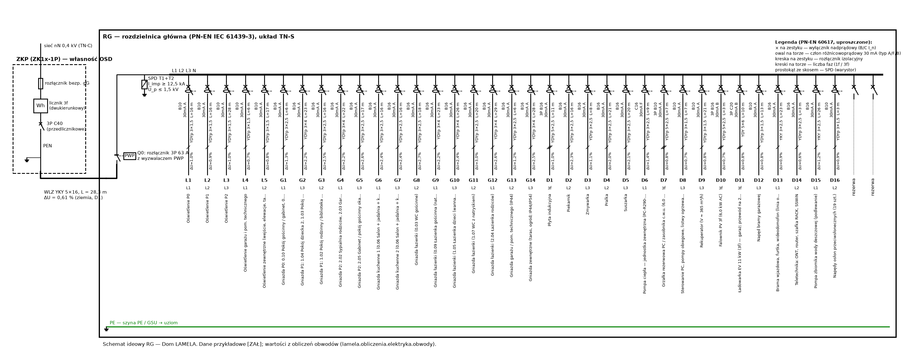

# Obwody instalacji elektrycznej — dobór przewodów i zabezpieczeń, spadki napięć, ochrona przeciwporażeniowa, SPD, PWP

Obiekt: Dom LAMELA. Układ sieci TN-C (OSD) → TN-S od ZKP/RG. Dane przykładowe oznaczono [ZAŁ].

## 1. Podstawy i założenia

* WT §180–§189 (t.j. Dz.U. 2022 poz. 1225 ze zm.; art. 102a PB); W-180…W-190.
* PN-HD 60364-4-41:2017-09, -4-43:2024-04, -4-443:2016-03, -5-52:2011, -5-53:2022-10, -5-54:2011, -7-701:2025-02, -7-712:2016-05, -7-722:2019-01.
* RG: (15,05; 0,90; P0), ZKP: (11,80; 17,10) — instalacje.yaml.
* Z_Q w ZKP = 0,30 Ω (R/X ≈ 0,9/0,44), I_k,max w ZKP ≤ 6 kA [ZAŁ — dane z warunków przyłączenia OSD].
* Temperatura otoczenia 30 °C (powietrze), 20 °C (grunt); grupowanie 2 obwodów (k = 0,80) [ZAŁ].
* Przewody: YDYp 450/750 V pod tynkiem (≥ 5 mm tynku, W-184) — metoda C; w stropach monolitycznych w rurach (B2); w ziemi YKY 0,6/1 kV w rurze (D1); Cu (WT §183 ust. 1 pkt 9).
* Aparat główny RG: rozłącznik izolacyjny 3P 63 A z wyzwalaczem PWP (selektywność względem zabezpieczenia przedlicznikowego C40 — R7 §3.1).
* Rezerwa w RG ≥ 20 % modułów.

## 2. Wewnętrzna linia zasilająca (ZKP → RG)

* Długość WLZ (ZKP → RG): L = 1,2·(|∆x| + |∆y|) + zapas = 1,2·19,45 + 5,0 = **28,3** m — _[UPR]_
* Obciążalność YKY 5×16 (D1, 3 żyły obc., θ_gr = 20 °C): I_z = I_z,tab·k_θ = 64·1,00 = **64,0** A — _PN-HD 60364-5-52 tabl. B.52.4 [NZW]_
* Spadek napięcia WLZ przy I = I_zab (20 °C — por. R7 §3.1): ∆U = √3·L·I·r/U_n·100 = √3·28,3·40·0,0011/400·100 = **0,564** %
* Spadek napięcia WLZ w temperaturze roboczej: ∆U(θ) = **0,608** % — _W-185: ≤ 0,5 %_

WLZ: **YKY 5×16**, L = 28,3 m, w ziemi ≥ 0,7 m w piasku z taśmą niebieską, w rurze przy wejściu do budynku i pod utwardzeniami (R7-L07). Rozdział PEN preferowany w ZKP (WLZ 5-żyłowy — wymaga zgody OSD); inaczej YKY 4×16 (PEN) i rozdział w RG na GSU (D-12).

## 3. Zestawienie obwodów

| Obw. | Przeznaczenie | Faza | P [kW] | I_B [A] | Zabezp. | Przewód | Met. | I_z [A] | L [m] | ∆U [%] | ∆U_c [%] | Z_s [Ω] | I_k1 [A] | I_a [A] | RCD | Podstawa / uwagi |
|:---|:---|:---|---:|---:|:---|:---|:---|---:|---:|---:|---:|---:|---:|---:|:---|:---|
| L1 | Oświetlenie P0 | L1 | 0,56 | 2,5 | B10 | YDYp 3×1,5 | C | 15,6 | 15,8 | 0,42 | 1,03 | 0,818 | 267 | 50 | RCBO typ A 30 mA | WT §188 ust. 2, §189 ust. 2 (łączniki wieloobwodowe); PN-HD 60364-4-41 p. 411.3.4 |
| L2 | Oświetlenie P1 | L2 | 0,43 | 2,0 | B10 | YDYp 3×1,5 | C | 15,6 | 15,9 | 0,32 | 0,93 | 0,820 | 266 | 50 | RCBO typ A 30 mA | WT §188 ust. 2, §189 ust. 2 (łączniki wieloobwodowe); PN-HD 60364-4-41 p. 411.3.4 |
| L3 | Oświetlenie P2 | L3 | 0,33 | 1,5 | B10 | YDYp 3×1,5 | C | 15,6 | 27,8 | 0,44 | 1,05 | 1,161 | 188 | 50 | RCBO typ A 30 mA | WT §188 ust. 2, §189 ust. 2 (łączniki wieloobwodowe); PN-HD 60364-4-41 p. 411.3.4 |
| L4 | Oświetlenie garażu i pom. technicznego | L1 | 0,26 | 1,2 | B10 | YDYp 3×1,5 | C | 15,6 | 5,5 | 0,07 | 0,68 | 0,526 | 415 | 50 | RCBO typ A 30 mA | WT §102 pkt 3 |
| L5 | Oświetlenie zewnętrzne (wejście, elewacje, taras) | L2 | 0,20 | 0,9 | B10 | YDYp 3×1,5 | C | 15,6 | 16,8 | 0,16 | 0,77 | 0,845 | 258 | 50 | RCBO typ A 30 mA | WT §64 (oświetlenie wejścia obowiązkowe); PN-HD 60364-7-714 |
| G1 | Gniazda P0: 0.10 Pokój gościnny / gabinet, 0.08 Przedpokój gościnny, 0.14 Szacht instalacyjny SI, 0.04 Klatka schodowa, 0.16 Schowek pod spocznikiem (h < 1,40), 0.07 Pas komunikacyjny przy schodach, 0.05 Spiżarnia, 0.15 Schowek pod schodami (h 1,40–2,20), 0.02 Hol, 0.01 Wiatrołap, 0.11 Przedsionek gospodarczy | L1 | 2,00 | 16,0 | B16 | YDYp 3×2,5 | C | 21,6 | 5,6 | 0,65 | 1,25 | 0,467 | 468 | 80 | RCBO typ A 30 mA | WT §188 ust. 2; PN-HD 60364-4-41 p. 411.3.3 |
| G2 | Gniazda P1: 1.04 Pokój dziecka 2, 1.03 Pokój dziecka 1, 1.09 Szacht instalacyjny SI, 1.01 Hol, 1.06 Klatka schodowa | L3 | 2,00 | 16,0 | B16 | YDYp 3×4 | C | 28,8 | 22,8 | 1,59 | 2,20 | 0,616 | 355 | 80 | RCBO typ A 30 mA | WT §188 ust. 2; PN-HD 60364-4-41 p. 411.3.3; przekrój zwiększony ze względu na ∆U |
| G3 | Gniazda P1: 1.02 Pokój rodzinny / biblioteka (boks C) | L2 | 2,00 | 16,0 | B16 | YDYp 3×2,5 | C | 21,6 | 15,9 | 1,84 | 2,45 | 0,645 | 339 | 80 | RCBO typ A 30 mA | WT §188 ust. 2; PN-HD 60364-4-41 p. 411.3.3 |
| G4 | Gniazda P2: 2.02 Sypialnia rodziców, 2.03 Garderoba (przedpokój apartamentu), 2.08 Szacht instalacyjny SI, 2.06 Klatka schodowa (wyjście z biegu 2, pustka), 2.01 Hol | L1 | 2,00 | 16,0 | B16 | YDYp 3×4 | C | 28,8 | 22,3 | 1,56 | 2,16 | 0,610 | 358 | 80 | RCBO typ A 30 mA | WT §188 ust. 2; PN-HD 60364-4-41 p. 411.3.3; przekrój zwiększony ze względu na ∆U |
| G5 | Gniazda P2: 2.05 Gabinet / pokój gościnny okazjonalny | L3 | 2,00 | 16,0 | B16 | YDYp 3×2,5 | C | 21,6 | 17,1 | 1,98 | 2,59 | 0,665 | 328 | 80 | RCBO typ A 30 mA | WT §188 ust. 2; PN-HD 60364-4-41 p. 411.3.3 |
| G6 | Gniazda kuchenne 1 (0.06 Salon + jadalnia + kuchnia) | L1 | 2,00 | 16,0 | B16 | YDYp 3×2,5 | C | 21,6 | 15,8 | 1,84 | 2,44 | 0,644 | 339 | 80 | RCBO typ A 30 mA | WT §188 ust. 2 (gniazda kuchenne) |
| G7 | Gniazda kuchenne 2 (0.06 Salon + jadalnia + kuchnia) | L3 | 2,00 | 16,0 | B16 | YDYp 3×2,5 | C | 21,6 | 15,8 | 1,84 | 2,44 | 0,644 | 339 | 80 | RCBO typ A 30 mA | WT §188 ust. 2 (gniazda kuchenne) |
| G8 | Gniazda łazienki (0.03 WC gościnne) | L2 | 2,00 | 16,0 | B16 | YDYp 3×2,5 | C | 21,6 | 18,1 | 2,11 | 2,71 | 0,684 | 319 | 80 | RCBO typ A 30 mA | WT §188 ust. 2 (gniazda w łazience); PN-HD 60364-7-701 (RCD 30 mA) |
| G9 | Gniazda łazienki (0.09 Łazienka gościnna (natrysk)) | L1 | 2,00 | 16,0 | B16 | YDYp 3×4 | C | 28,8 | 23,2 | 1,62 | 2,23 | 0,620 | 352 | 80 | RCBO typ A 30 mA | WT §188 ust. 2 (gniazda w łazience); PN-HD 60364-7-701 (RCD 30 mA); przekrój zwiększony ze względu na ∆U |
| G10 | Gniazda łazienki (1.05 Łazienka dzieci (wanna)) | L3 | 2,00 | 16,0 | B16 | YDYp 3×4 | C | 28,8 | 25,8 | 1,80 | 2,41 | 0,648 | 337 | 80 | RCBO typ A 30 mA | WT §188 ust. 2 (gniazda w łazience); PN-HD 60364-7-701 (RCD 30 mA); przekrój zwiększony ze względu na ∆U |
| G11 | Gniazda łazienki (1.07 WC z natryskiem) | L2 | 2,00 | 16,0 | B16 | YDYp 3×2,5 | C | 21,6 | 20,4 | 2,37 | 2,98 | 0,724 | 302 | 80 | RCBO typ A 30 mA | WT §188 ust. 2 (gniazda w łazience); PN-HD 60364-7-701 (RCD 30 mA) |
| G12 | Gniazda łazienki (2.04 Łazienka rodziców) | L1 | 2,00 | 16,0 | B16 | YDYp 3×4 | C | 28,8 | 29,0 | 2,02 | 2,63 | 0,683 | 320 | 80 | RCBO typ A 30 mA | WT §188 ust. 2 (gniazda w łazience); PN-HD 60364-7-701 (RCD 30 mA); przekrój zwiększony ze względu na ∆U |
| G13 | Gniazda garażu / pom. technicznego (IP44) | L2 | 2,00 | 16,0 | B16 | YDYp 3×2,5 | C | 21,6 | 5,5 | 0,64 | 1,25 | 0,467 | 468 | 80 | RCBO typ A 30 mA | WT §188 ust. 2 |
| G14 | Gniazda zewnętrzne (taras, ogród; IP44/IP54) | L3 | 2,00 | 16,0 | B16 | YDYp 3×4 | C | 28,8 | 27,5 | 1,92 | 2,53 | 0,667 | 328 | 80 | RCBO typ A 30 mA | PN-HD 60364-4-41 p. 411.3.3 (urządzenia ruchome na zewnątrz); przekrój zwiększony ze względu na ∆U |
| D1 | Płyta indukcyjna | L1L2L3 | 7,40 | 10,7 | 3P B16 | YDYp 5×2,5 | C | 19,2 | 11,3 | 0,42 | 1,03 | 0,566 | 386 | 80 | RCD 4P 40 A/30 mA typ A | WT §188 ust. 2 |
| D2 | Piekarnik | L2 | 3,50 | 15,2 | B16 | YDYp 3×2,5 | C | 21,6 | 15,8 | 1,73 | 2,34 | 0,644 | 339 | 80 | RCBO typ A 30 mA | WT §188 ust. 2 |
| D3 | Zmywarka | L3 | 2,20 | 10,1 | B16 | YDYp 3×2,5 | C | 21,6 | 8,0 | 0,53 | 1,14 | 0,509 | 430 | 80 | RCBO typ A 30 mA | WT §188 ust. 2 |
| D4 | Pralka | L2 | 2,20 | 10,1 | B16 | YDYp 3×2,5 | C | 21,6 | 21,0 | 1,40 | 2,00 | 0,734 | 298 | 80 | RCBO typ A 30 mA | WT §188 ust. 2 |
| D5 | Suszarka | L3 | 2,50 | 11,4 | B16 | YDYp 3×2,5 | C | 21,6 | 20,2 | 1,54 | 2,15 | 0,721 | 303 | 80 | RCBO typ A 30 mA | WT §188 ust. 2 |
| D6 | Pompa ciepła — jednostka zewnętrzna (PC-R290-07 (przykład)) | L1 | 2,67 | 12,2 | C16 | YDYp 3×2,5 | C | 21,6 | 9,4 | 0,77 | 1,38 | 0,534 | 410 | 160 | RCD typ F/B 30 mA wg DTR (falownik sprężarki) | R7 D6; PN-HD 60364-5-53 (typ RCD wg DTR) |
| D7 | Grzałka rezerwowa PC / zasobnika c.w.u. (6,0 kW) | L1L2L3 | 6,00 | 8,7 | 3P B10 | YDYp 5×2,5 | C | 19,2 | 6,6 | 0,20 | 0,80 | 0,485 | 451 | 50 | RCD 4P 40 A/30 mA typ A | R7 D7 — blokada w systemie zarządzania mocą (DLM) |
| D8 | Sterowanie PC, pompy obiegowe, listwy ogrzewania podłogowego | L3 | 0,30 | 1,4 | B10 | YDYp 3×1,5 | C | 15,6 | 6,6 | 0,09 | 0,70 | 0,556 | 393 | 50 | RCBO typ A 30 mA | WT §188 ust. 2 |
| D9 | Rekuperator (V ≈ 365 m³/h) | L3 | 0,18 | 0,8 | B10 | YDYp 3×1,5 | C | 15,6 | 20,7 | 0,18 | 0,79 | 0,957 | 228 | 50 | RCBO typ A 30 mA | R7 D9; moc wentylatorów ≈ 0,5 W/(m³/h) [ZAŁ] |
| D10 | Falownik PV 3f (6,0 kW AC) | L1L2L3 | 6,00 | 8,7 | 3P B16 | YDYp 5×2,5 | C | 19,2 | 3,0 | 0,09 | 0,70 | 0,424 | 515 | 80 | RCD typ B 30 mA (lub wg 712.530.3.101 — DTR falownika) | PN-HD 60364-7-712; R7-I06 |
| D11 | Ładowarka EV 11 kW (3f) — garaż; przewód na 22 kW | L1L2L3 | 11,00 | 16,0 | 3P C20 | YDY 5×6 | C | 32,8 | 9,6 | 0,22 | 0,83 | 0,441 | 496 | 200 | własny RCD typ B 30 mA lub A-EV + RDC-DD 6 mA DC | PN-HD 60364-7-722; R7-J03 |
| D12 | Napęd bramy garażowej | L3 | 0,30 | 1,4 | B10 | YDYp 3×1,5 | C | 15,6 | 13,4 | 0,19 | 0,80 | 0,749 | 292 | 50 | RCBO typ A 30 mA | WT §188 ust. 2 |
| D13 | Brama wjazdowa, furtka, wideodomofon (linia ogrodzenia) | L1 | 0,50 | 2,3 | B16 | YKY 3×2,5 | D1 | 23,2 | 23,2 | 0,33 | 0,93 | 0,773 | 283 | 80 | RCBO typ A 30 mA | R7 D14 |
| D14 | Teletechnika: ONT, router, szafka RACK, SSWiN | L2 | 0,20 | 0,9 | B16 | YDYp 3×2,5 | C | 21,6 | 3,0 | 0,02 | 0,63 | 0,424 | 515 | 80 | RCBO typ A 30 mA | R7 D17; GIA art. 10 |
| D15 | Pompa zbiornika wody deszczowej (podlewanie) | L1 | 0,80 | 3,7 | B16 | YKY 3×2,5 | D1 | 23,2 | 25,7 | 0,58 | 1,19 | 0,817 | 268 | 80 | RCBO typ A 30 mA | R7 D15; W-145 |
| D16 | Napędy osłon przeciwsłonecznych (19 szt.) | L2 | 1,90 | 8,7 | B10 | YDYp 3×1,5 | C | 15,6 | 3,0 | 0,28 | 0,89 | 0,456 | 479 | 50 | RCBO typ A 30 mA | R7 D16 |

Rezerwa: ≥ 20 % miejsca w RG; obwody rezerwowe na drugi punkt ładowania EV (rura Ø ≥ 40 mm do podjazdu, EPBD art. 14 ust. 4 — dobrowolnie, W-195).

### 3.1 Przykład obliczeń (obwód najbardziej niekorzystny)

* Obwód G12 (Gniazda łazienki (2.04 Łazienka rodziców)) — długość: L = 1,2·(|∆x| + |∆y|) + |∆z| + 3 m = **29,0** m — _[UPR]_
* Prąd obliczeniowy: I_B = I_n (obwód gniazd) = **16,0** A — _R7 §3.3_
* Obciążalność YDYp 3×4 (C), k_θ·k_grup: I_z = I_z,tab·k_θ·k_gr = 36,0·1,00·0,80 = **28,8** A — _PN-HD 60364-5-52 [NZW]_
* Warunek przeciążeniowy: I_B ≤ I_n ≤ I_z; I₂ = 1,45·I_n ≤ 1,45·I_z = 16,0 ≤ 16 ≤ 28,8 = **spełniony** — _PN-HD 60364-4-43 p. 433.1_
* Temperatura żył przy I_B: θ = θ_a + (70 − θ_a)·(I_B/I_z)² = 30 + 40·(16,0/28,8)² = **42,3** °C
* Spadek napięcia w obwodzie: ∆U = 2·L·I_B·r_θ/U₀·100 = 2·29,0·16,0·0,0050/230·100 = **2,02** %
* Spadek całkowity ZKP → odbiornik: ∆U_c = ∆U_WLZ + ∆U = 0,608 + 2,022 = **2,63** % — _W-185 (≤ 3 %)_
* Impedancja pętli zwarcia (70 °C): Z_s = |Z_Q + Z_WLZ + Z_obw| = Z_Q = 0,30 Ω; R_WLZ = 0,078 Ω; R_obw = 0,320 Ω = **0,683** Ω
* Prąd zwarcia jednofazowego: I_k1 = 0,95·U₀/Z_s = 0,95·230/0,683 = **320** A — _PN-EN 60909-0 (c_min)_
* Warunek samoczynnego wyłączenia: I_k1 ≥ I_a = 5·I_n = 320 ≥ 80 = **spełniony** — _PN-HD 60364-4-41 tabl. 41.1 (t ≤ 0,1 s < 0,4 s)_

## 4. Ochrona przeciwporażeniowa — RCD

* Każdy obwód gniazd ≤ 32 A, oświetlenia i łazienek: RCD I_Δn = 30 mA typ A (411.3.3, 411.3.4, 7-701) — preferowane RCBO 1P+N (awaria jednego obwodu nie wyłącza pozostałych — selektywność różnicowoprądowa; brak RCD grupowego nad RCBO).
* Pompa ciepła (falownik sprężarki): typ F lub B wg DTR; falownik PV: typ B, chyba że spełnia 712.530.3.101; EV: własny RCD typ B lub A-EV + RDC-DD 6 mA DC (7-722); typ AC niedopuszczalny (W-181).
* Połączenia wyrównawcze miejscowe w łazienkach — wg PN-HD 60364-7-701:2025-02 (przy instalacjach z tworzyw zwykle nie są wymagane dla wanny/brodzika); strefy 0/1/2 na rzutach (W-189).

## 5. Selektywność (WT §183 ust. 1 pkt 5)

| Zabezp. | Obwody | Zabezp. przedlicznikowe | Przeciążeniowa (I_n,ZKP/I_n ≥ 1,6) | Zwarciowa | Ocena |
|:---|:---|:---|:---|:---|:---|
| B10 | L1, L2, L3, L4, L5, D8, D9, D12, D16 | C40 | tak (4,0) | do 200 A (I_k,max w RG ≈ 1386 A) | częściowa |
| B16 | G1, G2, G3, G4, G5, G6, G7, G8, G9, G10, G11, G12, G13, G14, D2, D3, D4, D5, D13, D14, D15 | C40 | tak (2,5) | do 200 A (I_k,max w RG ≈ 1386 A) | częściowa |
| 3P B16 | D1, D10 | C40 | tak (2,5) | do 200 A (I_k,max w RG ≈ 1386 A) | częściowa |
| C16 | D6 | C40 | tak (2,5) | do 200 A (I_k,max w RG ≈ 1386 A) | częściowa |
| 3P B10 | D7 | C40 | tak (4,0) | do 200 A (I_k,max w RG ≈ 1386 A) | częściowa |
| 3P C20 | D11 | C40 | tak (2,0) | do 200 A (I_k,max w RG ≈ 1386 A) | częściowa |

Selektywność zwarciowa wyłączników B/C za wyłącznikiem C40 w ZKP jest częściowa — do granicy I_s z tabel producenta (zachowawczo I_s = 5·I_n,C40 = 200 A; dla wyłączników klasy ograniczania 3 typowo 0,3–0,6 kA). Rozwiązania: aparat główny RG jako rozłącznik (nie wyzwala), RCBO w obwodach odbiorczych; w warunkach przyłączenia zapytać OSD o bezpieczniki gG zamiast wyłącznika C (poprawa selektywności) [ZAŁ].

## 6. Ochrona przed przepięciami

* Współczynnik środowiskowy (tereny podmiejskie, F = 2): f_env = 85·F = 85·2 = **170** — _443.5, odsyłacz krajowy (RST 2018) [NZW]_
* Krytyczna długość linii CRL: CRL = f_env/(L_P·N_g) = 170/(0,30·1,8) = **315** — _PN-HD 60364-4-443:2016 p. 443.5; L_P [ZAŁ]_
* Graniczna długość linii kablowej nN, przy której CRL = 1000: L = f_env/(1000·N_g) = **94** m

* SPD typ 1+2 (T1+T2), I_imp ≥ 12,5 kA/biegun, U_p ≤ 1,5 kV, U_c ≥ 275 V; układ 3+1 (TN-S) lub 4+0 przy rozdziale PEN w RG
* SPD typ 2 DC przy falowniku (U_CPV ≥ U_oc,max łańcucha) — jeśli nie wbudowany w falownik
* SPD na wejściu linii miedzianych / antenowych (światłowód dielektryczny — bez SPD)
* ochrona lokalna T3 przy RACK i sterowniku PC (opcjonalnie)

| Kategoria | U_w | Miejsce w instalacji |
|:---|---:|:---|
| IV | 6 kV | złącze ZKP, licznik, zabezpieczenie przedlicznikowe |
| III | 4 kV | RG, oprzewodowanie, gniazda, łączniki |
| II | 2,5 kV | odbiorniki (AGD, PC, rekuperator, falownik — strona AC) |
| I | 1,5 kV | urządzenia specjalnie chronione (elektronika, RACK) — SPD T3 |

## 7. Przeciwpożarowy wyłącznik prądu (PWP)

Kubatura budynku (strefa pożarowa) V = 1354 m³ (próg WT §183 ust. 2: 1000 m³). Decyzja: **PROJEKTOWAĆ (rekomendacja D-04 — spełnia WT §183 ust. 2 i jest zgodne z ROPoż)**.

Przycisk PWP przy wejściu głównym / ZKP, oznakowany (WT §183 ust. 4); działa na wyzwalacz wzrostowy lub napęd aparatu głównego RG (rozłącznik z wyzwalaczem / wyłącznik selektywny) i odłącza wszystkie obwody, w tym AC falownika PV; strona DC PV pozostaje pod napięciem — tabliczka ostrzegawcza przy RG, PWP i falowniku; zadziałanie PWP nie może załączać innego źródła (§183 ust. 3); obwód sterowniczy PWP monitorowany (wyzwalacz wzrostowy z kontrolą ciągłości lub zanikowy) [ZAŁ].

## 8. Sprawdzenia

| ID | Warunek | Wartość | Wymaganie | Wynik | Podstawa / uwagi |
|:---|:---|---:|---:|:---|:---|
| W-182 | WLZ: I_n (zabezpieczenie przedlicznikowe) ≤ I_z | 40 A | ≤ 64 A | SPEŁNIONY | PN-HD 60364-4-43 |
| W-185 | WLZ: obciążalność ≥ 50 A | 64 A | ≥ 50 A | SPEŁNIONY | W-185: N SEP-E-002 (źródło wtórne) [niezweryfikowane] |
| W-185 | WLZ: spadek napięcia ZKP → RG | 0,61 % | ≤ 0,50 % | **NIESPEŁNIONY** | W-185: N SEP-E-002 [niezweryfikowane] |
| W-182 | L1: I_B ≤ I_n ≤ I_z | 10,0 A | ∈ 2,5–15,6 A | SPEŁNIONY | PN-HD 60364-4-43 p. 433.1 |
| W-185 | L1: ∆U ZKP → odbiornik | 1,03 % | ≤ 3,00 % | SPEŁNIONY | N SEP-E-002 [NZW] |
| W-182 | L1: samoczynne wyłączenie (I_k1 ≥ I_a = 5·I_n, t ≤ 0,4 s) | 267 A | ≥ 50 A | SPEŁNIONY | PN-HD 60364-4-41 tabl. 41.1 |
| W-182 | L2: I_B ≤ I_n ≤ I_z | 10,0 A | ∈ 1,9–15,6 A | SPEŁNIONY | PN-HD 60364-4-43 p. 433.1 |
| W-185 | L2: ∆U ZKP → odbiornik | 0,93 % | ≤ 3,00 % | SPEŁNIONY | N SEP-E-002 [NZW] |
| W-182 | L2: samoczynne wyłączenie (I_k1 ≥ I_a = 5·I_n, t ≤ 0,4 s) | 266 A | ≥ 50 A | SPEŁNIONY | PN-HD 60364-4-41 tabl. 41.1 |
| W-182 | L3: I_B ≤ I_n ≤ I_z | 10,0 A | ∈ 1,5–15,6 A | SPEŁNIONY | PN-HD 60364-4-43 p. 433.1 |
| W-185 | L3: ∆U ZKP → odbiornik | 1,05 % | ≤ 3,00 % | SPEŁNIONY | N SEP-E-002 [NZW] |
| W-182 | L3: samoczynne wyłączenie (I_k1 ≥ I_a = 5·I_n, t ≤ 0,4 s) | 188 A | ≥ 50 A | SPEŁNIONY | PN-HD 60364-4-41 tabl. 41.1 |
| W-182 | L4: I_B ≤ I_n ≤ I_z | 10,0 A | ∈ 1,2–15,6 A | SPEŁNIONY | PN-HD 60364-4-43 p. 433.1 |
| W-185 | L4: ∆U ZKP → odbiornik | 0,68 % | ≤ 3,00 % | SPEŁNIONY | N SEP-E-002 [NZW] |
| W-182 | L4: samoczynne wyłączenie (I_k1 ≥ I_a = 5·I_n, t ≤ 0,4 s) | 415 A | ≥ 50 A | SPEŁNIONY | PN-HD 60364-4-41 tabl. 41.1 |
| W-182 | L5: I_B ≤ I_n ≤ I_z | 10,0 A | ∈ 0,9–15,6 A | SPEŁNIONY | PN-HD 60364-4-43 p. 433.1 |
| W-185 | L5: ∆U ZKP → odbiornik | 0,77 % | ≤ 3,00 % | SPEŁNIONY | N SEP-E-002 [NZW] |
| W-182 | L5: samoczynne wyłączenie (I_k1 ≥ I_a = 5·I_n, t ≤ 0,4 s) | 258 A | ≥ 50 A | SPEŁNIONY | PN-HD 60364-4-41 tabl. 41.1 |
| W-182 | G1: I_B ≤ I_n ≤ I_z | 16,0 A | ∈ 16,0–21,6 A | SPEŁNIONY | PN-HD 60364-4-43 p. 433.1 |
| W-185 | G1: ∆U ZKP → odbiornik | 1,25 % | ≤ 3,00 % | SPEŁNIONY | N SEP-E-002 [NZW] |
| W-182 | G1: samoczynne wyłączenie (I_k1 ≥ I_a = 5·I_n, t ≤ 0,4 s) | 468 A | ≥ 80 A | SPEŁNIONY | PN-HD 60364-4-41 tabl. 41.1 |
| W-182 | G2: I_B ≤ I_n ≤ I_z | 16,0 A | ∈ 16,0–28,8 A | SPEŁNIONY | PN-HD 60364-4-43 p. 433.1 |
| W-185 | G2: ∆U ZKP → odbiornik | 2,20 % | ≤ 3,00 % | SPEŁNIONY | N SEP-E-002 [NZW] |
| W-182 | G2: samoczynne wyłączenie (I_k1 ≥ I_a = 5·I_n, t ≤ 0,4 s) | 355 A | ≥ 80 A | SPEŁNIONY | PN-HD 60364-4-41 tabl. 41.1 |
| W-182 | G3: I_B ≤ I_n ≤ I_z | 16,0 A | ∈ 16,0–21,6 A | SPEŁNIONY | PN-HD 60364-4-43 p. 433.1 |
| W-185 | G3: ∆U ZKP → odbiornik | 2,45 % | ≤ 3,00 % | SPEŁNIONY | N SEP-E-002 [NZW] |
| W-182 | G3: samoczynne wyłączenie (I_k1 ≥ I_a = 5·I_n, t ≤ 0,4 s) | 339 A | ≥ 80 A | SPEŁNIONY | PN-HD 60364-4-41 tabl. 41.1 |
| W-182 | G4: I_B ≤ I_n ≤ I_z | 16,0 A | ∈ 16,0–28,8 A | SPEŁNIONY | PN-HD 60364-4-43 p. 433.1 |
| W-185 | G4: ∆U ZKP → odbiornik | 2,16 % | ≤ 3,00 % | SPEŁNIONY | N SEP-E-002 [NZW] |
| W-182 | G4: samoczynne wyłączenie (I_k1 ≥ I_a = 5·I_n, t ≤ 0,4 s) | 358 A | ≥ 80 A | SPEŁNIONY | PN-HD 60364-4-41 tabl. 41.1 |
| W-182 | G5: I_B ≤ I_n ≤ I_z | 16,0 A | ∈ 16,0–21,6 A | SPEŁNIONY | PN-HD 60364-4-43 p. 433.1 |
| W-185 | G5: ∆U ZKP → odbiornik | 2,59 % | ≤ 3,00 % | SPEŁNIONY | N SEP-E-002 [NZW] |
| W-182 | G5: samoczynne wyłączenie (I_k1 ≥ I_a = 5·I_n, t ≤ 0,4 s) | 328 A | ≥ 80 A | SPEŁNIONY | PN-HD 60364-4-41 tabl. 41.1 |
| W-182 | G6: I_B ≤ I_n ≤ I_z | 16,0 A | ∈ 16,0–21,6 A | SPEŁNIONY | PN-HD 60364-4-43 p. 433.1 |
| W-185 | G6: ∆U ZKP → odbiornik | 2,44 % | ≤ 3,00 % | SPEŁNIONY | N SEP-E-002 [NZW] |
| W-182 | G6: samoczynne wyłączenie (I_k1 ≥ I_a = 5·I_n, t ≤ 0,4 s) | 339 A | ≥ 80 A | SPEŁNIONY | PN-HD 60364-4-41 tabl. 41.1 |
| W-182 | G7: I_B ≤ I_n ≤ I_z | 16,0 A | ∈ 16,0–21,6 A | SPEŁNIONY | PN-HD 60364-4-43 p. 433.1 |
| W-185 | G7: ∆U ZKP → odbiornik | 2,44 % | ≤ 3,00 % | SPEŁNIONY | N SEP-E-002 [NZW] |
| W-182 | G7: samoczynne wyłączenie (I_k1 ≥ I_a = 5·I_n, t ≤ 0,4 s) | 339 A | ≥ 80 A | SPEŁNIONY | PN-HD 60364-4-41 tabl. 41.1 |
| W-182 | G8: I_B ≤ I_n ≤ I_z | 16,0 A | ∈ 16,0–21,6 A | SPEŁNIONY | PN-HD 60364-4-43 p. 433.1 |
| W-185 | G8: ∆U ZKP → odbiornik | 2,71 % | ≤ 3,00 % | SPEŁNIONY | N SEP-E-002 [NZW] |
| W-182 | G8: samoczynne wyłączenie (I_k1 ≥ I_a = 5·I_n, t ≤ 0,4 s) | 319 A | ≥ 80 A | SPEŁNIONY | PN-HD 60364-4-41 tabl. 41.1 |
| W-182 | G9: I_B ≤ I_n ≤ I_z | 16,0 A | ∈ 16,0–28,8 A | SPEŁNIONY | PN-HD 60364-4-43 p. 433.1 |
| W-185 | G9: ∆U ZKP → odbiornik | 2,23 % | ≤ 3,00 % | SPEŁNIONY | N SEP-E-002 [NZW] |
| W-182 | G9: samoczynne wyłączenie (I_k1 ≥ I_a = 5·I_n, t ≤ 0,4 s) | 352 A | ≥ 80 A | SPEŁNIONY | PN-HD 60364-4-41 tabl. 41.1 |
| W-182 | G10: I_B ≤ I_n ≤ I_z | 16,0 A | ∈ 16,0–28,8 A | SPEŁNIONY | PN-HD 60364-4-43 p. 433.1 |
| W-185 | G10: ∆U ZKP → odbiornik | 2,41 % | ≤ 3,00 % | SPEŁNIONY | N SEP-E-002 [NZW] |
| W-182 | G10: samoczynne wyłączenie (I_k1 ≥ I_a = 5·I_n, t ≤ 0,4 s) | 337 A | ≥ 80 A | SPEŁNIONY | PN-HD 60364-4-41 tabl. 41.1 |
| W-182 | G11: I_B ≤ I_n ≤ I_z | 16,0 A | ∈ 16,0–21,6 A | SPEŁNIONY | PN-HD 60364-4-43 p. 433.1 |
| W-185 | G11: ∆U ZKP → odbiornik | 2,98 % | ≤ 3,00 % | SPEŁNIONY | N SEP-E-002 [NZW] |
| W-182 | G11: samoczynne wyłączenie (I_k1 ≥ I_a = 5·I_n, t ≤ 0,4 s) | 302 A | ≥ 80 A | SPEŁNIONY | PN-HD 60364-4-41 tabl. 41.1 |
| W-182 | G12: I_B ≤ I_n ≤ I_z | 16,0 A | ∈ 16,0–28,8 A | SPEŁNIONY | PN-HD 60364-4-43 p. 433.1 |
| W-185 | G12: ∆U ZKP → odbiornik | 2,63 % | ≤ 3,00 % | SPEŁNIONY | N SEP-E-002 [NZW] |
| W-182 | G12: samoczynne wyłączenie (I_k1 ≥ I_a = 5·I_n, t ≤ 0,4 s) | 320 A | ≥ 80 A | SPEŁNIONY | PN-HD 60364-4-41 tabl. 41.1 |
| W-182 | G13: I_B ≤ I_n ≤ I_z | 16,0 A | ∈ 16,0–21,6 A | SPEŁNIONY | PN-HD 60364-4-43 p. 433.1 |
| W-185 | G13: ∆U ZKP → odbiornik | 1,25 % | ≤ 3,00 % | SPEŁNIONY | N SEP-E-002 [NZW] |
| W-182 | G13: samoczynne wyłączenie (I_k1 ≥ I_a = 5·I_n, t ≤ 0,4 s) | 468 A | ≥ 80 A | SPEŁNIONY | PN-HD 60364-4-41 tabl. 41.1 |
| W-182 | G14: I_B ≤ I_n ≤ I_z | 16,0 A | ∈ 16,0–28,8 A | SPEŁNIONY | PN-HD 60364-4-43 p. 433.1 |
| W-185 | G14: ∆U ZKP → odbiornik | 2,53 % | ≤ 3,00 % | SPEŁNIONY | N SEP-E-002 [NZW] |
| W-182 | G14: samoczynne wyłączenie (I_k1 ≥ I_a = 5·I_n, t ≤ 0,4 s) | 328 A | ≥ 80 A | SPEŁNIONY | PN-HD 60364-4-41 tabl. 41.1 |
| W-182 | D1: I_B ≤ I_n ≤ I_z | 16,0 A | ∈ 10,7–19,2 A | SPEŁNIONY | PN-HD 60364-4-43 p. 433.1 |
| W-185 | D1: ∆U ZKP → odbiornik | 1,03 % | ≤ 3,00 % | SPEŁNIONY | N SEP-E-002 [NZW] |
| W-182 | D1: samoczynne wyłączenie (I_k1 ≥ I_a = 5·I_n, t ≤ 0,4 s) | 386 A | ≥ 80 A | SPEŁNIONY | PN-HD 60364-4-41 tabl. 41.1 |
| W-182 | D2: I_B ≤ I_n ≤ I_z | 16,0 A | ∈ 15,2–21,6 A | SPEŁNIONY | PN-HD 60364-4-43 p. 433.1 |
| W-185 | D2: ∆U ZKP → odbiornik | 2,34 % | ≤ 3,00 % | SPEŁNIONY | N SEP-E-002 [NZW] |
| W-182 | D2: samoczynne wyłączenie (I_k1 ≥ I_a = 5·I_n, t ≤ 0,4 s) | 339 A | ≥ 80 A | SPEŁNIONY | PN-HD 60364-4-41 tabl. 41.1 |
| W-182 | D3: I_B ≤ I_n ≤ I_z | 16,0 A | ∈ 10,1–21,6 A | SPEŁNIONY | PN-HD 60364-4-43 p. 433.1 |
| W-185 | D3: ∆U ZKP → odbiornik | 1,14 % | ≤ 3,00 % | SPEŁNIONY | N SEP-E-002 [NZW] |
| W-182 | D3: samoczynne wyłączenie (I_k1 ≥ I_a = 5·I_n, t ≤ 0,4 s) | 430 A | ≥ 80 A | SPEŁNIONY | PN-HD 60364-4-41 tabl. 41.1 |
| W-182 | D4: I_B ≤ I_n ≤ I_z | 16,0 A | ∈ 10,1–21,6 A | SPEŁNIONY | PN-HD 60364-4-43 p. 433.1 |
| W-185 | D4: ∆U ZKP → odbiornik | 2,00 % | ≤ 3,00 % | SPEŁNIONY | N SEP-E-002 [NZW] |
| W-182 | D4: samoczynne wyłączenie (I_k1 ≥ I_a = 5·I_n, t ≤ 0,4 s) | 298 A | ≥ 80 A | SPEŁNIONY | PN-HD 60364-4-41 tabl. 41.1 |
| W-182 | D5: I_B ≤ I_n ≤ I_z | 16,0 A | ∈ 11,4–21,6 A | SPEŁNIONY | PN-HD 60364-4-43 p. 433.1 |
| W-185 | D5: ∆U ZKP → odbiornik | 2,15 % | ≤ 3,00 % | SPEŁNIONY | N SEP-E-002 [NZW] |
| W-182 | D5: samoczynne wyłączenie (I_k1 ≥ I_a = 5·I_n, t ≤ 0,4 s) | 303 A | ≥ 80 A | SPEŁNIONY | PN-HD 60364-4-41 tabl. 41.1 |
| W-182 | D6: I_B ≤ I_n ≤ I_z | 16,0 A | ∈ 12,2–21,6 A | SPEŁNIONY | PN-HD 60364-4-43 p. 433.1 |
| W-185 | D6: ∆U ZKP → odbiornik | 1,38 % | ≤ 3,00 % | SPEŁNIONY | N SEP-E-002 [NZW] |
| W-182 | D6: samoczynne wyłączenie (I_k1 ≥ I_a = 10·I_n, t ≤ 0,4 s) | 410 A | ≥ 160 A | SPEŁNIONY | PN-HD 60364-4-41 tabl. 41.1 |
| W-182 | D7: I_B ≤ I_n ≤ I_z | 10,0 A | ∈ 8,7–19,2 A | SPEŁNIONY | PN-HD 60364-4-43 p. 433.1 |
| W-185 | D7: ∆U ZKP → odbiornik | 0,80 % | ≤ 3,00 % | SPEŁNIONY | N SEP-E-002 [NZW] |
| W-182 | D7: samoczynne wyłączenie (I_k1 ≥ I_a = 5·I_n, t ≤ 0,4 s) | 451 A | ≥ 50 A | SPEŁNIONY | PN-HD 60364-4-41 tabl. 41.1 |
| W-182 | D8: I_B ≤ I_n ≤ I_z | 10,0 A | ∈ 1,4–15,6 A | SPEŁNIONY | PN-HD 60364-4-43 p. 433.1 |
| W-185 | D8: ∆U ZKP → odbiornik | 0,70 % | ≤ 3,00 % | SPEŁNIONY | N SEP-E-002 [NZW] |
| W-182 | D8: samoczynne wyłączenie (I_k1 ≥ I_a = 5·I_n, t ≤ 0,4 s) | 393 A | ≥ 50 A | SPEŁNIONY | PN-HD 60364-4-41 tabl. 41.1 |
| W-182 | D9: I_B ≤ I_n ≤ I_z | 10,0 A | ∈ 0,8–15,6 A | SPEŁNIONY | PN-HD 60364-4-43 p. 433.1 |
| W-185 | D9: ∆U ZKP → odbiornik | 0,79 % | ≤ 3,00 % | SPEŁNIONY | N SEP-E-002 [NZW] |
| W-182 | D9: samoczynne wyłączenie (I_k1 ≥ I_a = 5·I_n, t ≤ 0,4 s) | 228 A | ≥ 50 A | SPEŁNIONY | PN-HD 60364-4-41 tabl. 41.1 |
| W-182 | D10: I_B ≤ I_n ≤ I_z | 16,0 A | ∈ 8,7–19,2 A | SPEŁNIONY | PN-HD 60364-4-43 p. 433.1 |
| W-185 | D10: ∆U ZKP → odbiornik | 0,70 % | ≤ 3,00 % | SPEŁNIONY | N SEP-E-002 [NZW] |
| W-182 | D10: samoczynne wyłączenie (I_k1 ≥ I_a = 5·I_n, t ≤ 0,4 s) | 515 A | ≥ 80 A | SPEŁNIONY | PN-HD 60364-4-41 tabl. 41.1 |
| W-182 | D11: I_B ≤ I_n ≤ I_z | 20,0 A | ∈ 16,0–32,8 A | SPEŁNIONY | PN-HD 60364-4-43 p. 433.1 |
| W-185 | D11: ∆U ZKP → odbiornik | 0,83 % | ≤ 3,00 % | SPEŁNIONY | N SEP-E-002 [NZW] |
| W-182 | D11: samoczynne wyłączenie (I_k1 ≥ I_a = 10·I_n, t ≤ 0,4 s) | 496 A | ≥ 200 A | SPEŁNIONY | PN-HD 60364-4-41 tabl. 41.1 |
| W-182 | D12: I_B ≤ I_n ≤ I_z | 10,0 A | ∈ 1,4–15,6 A | SPEŁNIONY | PN-HD 60364-4-43 p. 433.1 |
| W-185 | D12: ∆U ZKP → odbiornik | 0,80 % | ≤ 3,00 % | SPEŁNIONY | N SEP-E-002 [NZW] |
| W-182 | D12: samoczynne wyłączenie (I_k1 ≥ I_a = 5·I_n, t ≤ 0,4 s) | 292 A | ≥ 50 A | SPEŁNIONY | PN-HD 60364-4-41 tabl. 41.1 |
| W-182 | D13: I_B ≤ I_n ≤ I_z | 16,0 A | ∈ 2,3–23,2 A | SPEŁNIONY | PN-HD 60364-4-43 p. 433.1 |
| W-185 | D13: ∆U ZKP → odbiornik | 0,93 % | ≤ 3,00 % | SPEŁNIONY | N SEP-E-002 [NZW] |
| W-182 | D13: samoczynne wyłączenie (I_k1 ≥ I_a = 5·I_n, t ≤ 0,4 s) | 283 A | ≥ 80 A | SPEŁNIONY | PN-HD 60364-4-41 tabl. 41.1 |
| W-182 | D14: I_B ≤ I_n ≤ I_z | 16,0 A | ∈ 0,9–21,6 A | SPEŁNIONY | PN-HD 60364-4-43 p. 433.1 |
| W-185 | D14: ∆U ZKP → odbiornik | 0,63 % | ≤ 3,00 % | SPEŁNIONY | N SEP-E-002 [NZW] |
| W-182 | D14: samoczynne wyłączenie (I_k1 ≥ I_a = 5·I_n, t ≤ 0,4 s) | 515 A | ≥ 80 A | SPEŁNIONY | PN-HD 60364-4-41 tabl. 41.1 |
| W-182 | D15: I_B ≤ I_n ≤ I_z | 16,0 A | ∈ 3,7–23,2 A | SPEŁNIONY | PN-HD 60364-4-43 p. 433.1 |
| W-185 | D15: ∆U ZKP → odbiornik | 1,19 % | ≤ 3,00 % | SPEŁNIONY | N SEP-E-002 [NZW] |
| W-182 | D15: samoczynne wyłączenie (I_k1 ≥ I_a = 5·I_n, t ≤ 0,4 s) | 268 A | ≥ 80 A | SPEŁNIONY | PN-HD 60364-4-41 tabl. 41.1 |
| W-182 | D16: I_B ≤ I_n ≤ I_z | 10,0 A | ∈ 8,7–15,6 A | SPEŁNIONY | PN-HD 60364-4-43 p. 433.1 |
| W-185 | D16: ∆U ZKP → odbiornik | 0,89 % | ≤ 3,00 % | SPEŁNIONY | N SEP-E-002 [NZW] |
| W-182 | D16: samoczynne wyłączenie (I_k1 ≥ I_a = 5·I_n, t ≤ 0,4 s) | 479 A | ≥ 50 A | SPEŁNIONY | PN-HD 60364-4-41 tabl. 41.1 |
| W-180 | Prąd zwarciowy w RG ≤ zdolność łączeniowa aparatów (6 kA) | 1,39 kA | ≤ 6,00 kA | SPEŁNIONY | PN-EN 60898-1 (I_cn) |
| W-186 | SPD wymagany: CRL < 1000 (443.5) — niezależnie wymagany przez WT §183 ust. 1 pkt 10 | 315 | < 1000 | SPEŁNIONY | PN-HD 60364-4-443 p. 443.5; WT §183 ust. 1 pkt 10 |
| W-186 | U_p SPD w RG ≤ wytrzymałość kat. II | 1,5 kV | ≤ 2,5 kV | SPEŁNIONY | PN-HD 60364-4-443 tabl. 443.2 |
| W-190 | PWP: kubatura strefy pożarowej 1354 m³ — wymagany wg WT §183 ust. 2: TAK (próg 1000 m³); projektowany niezależnie (D-04) | 1354 m³ | — | informacyjnie | WT §183 ust. 2; ROPoż §4 ust. 2 pkt 2 |
| W-183 | Obwód wydzielony: oświetlenie | 1 szt. | ≥ 1 szt. | SPEŁNIONY | WT §188 ust. 2 |
| W-183 | Obwód wydzielony: gniazda ogólnego przeznaczenia | 1 szt. | ≥ 1 szt. | SPEŁNIONY | WT §188 ust. 2 |
| W-183 | Obwód wydzielony: gniazda kuchenne | 1 szt. | ≥ 1 szt. | SPEŁNIONY | WT §188 ust. 2 |
| W-183 | Obwód wydzielony: gniazda w łazience | 1 szt. | ≥ 1 szt. | SPEŁNIONY | WT §188 ust. 2 |
| W-183 | Obwód wydzielony: odbiorniki z indywidualnym zabezpieczeniem | 1 szt. | ≥ 1 szt. | SPEŁNIONY | WT §188 ust. 2 |

## Podsumowanie sprawdzeń

Warunków: 117; spełnionych: 115; niespełnionych: 1; informacyjnych: 1.

Niespełnione:

* W-185 — WLZ: spadek napięcia ZKP → RG: 0,61 % (wymaganie <= 0,50 %)

## Źródła

1. WT §180–§189 (t.j. Dz.U. 2022 poz. 1225 ze zm.)
2. PN-HD 60364-4-41:2017-09 (tekst IEC 60364-4-41 AMD1:2017 — tabl. 41.1, 411.3.3–411.3.4)
3. PN-HD 60364-4-443:2016 p. 443.5, tabl. 443.2 (tekst IEC 60364-4-44 AMD1:2015)
4. PN-HD 60364-5-52:2011 zał. B [NZW — wartości z literatury]
5. PN-EN 60898-1 (charakterystyki B/C/D); PN-EN 60909-0 (c_min)
6. N SEP-E-002 (spadki napięć) [NZW]
7. ROPoż (t.j. Dz.U. 2023 poz. 822) §4 ust. 2 pkt 2; rejestr R7 §3.1–3.9, D-04, D-12
