# Katalog mostków cieplnych — Dom LAMELA

Model: `model/budynek.yaml`; źródło węzłów: sekcja `wezly` modelu (20 węzłów) + 2 węzły spoza sekcji wykryte w geometrii (WZ-X…, długości z geometrii). B' = A/(0,5·P) = 181.78/(0,5·57.90) = 6.28 m (obrys zewn. parteru) [INT]. Wygenerowano: `PYTHONPATH=src python3 tools/katalog_mostkow.py --budynek model/budynek.yaml --dodatkowe`.

**Cel** (brief sekcja 9 — wymaganie Inwestora): potwierdzenie symulacją numeryczną ciągłości izolacji i braku ryzyka pleśni w węzłach oraz kontrola odprowadzenia wody, hydroizolacji, paroizolacji, rur spustowych i drenażu.

**Metoda.** Model 2D metodą objętości skończonych (`lamela.obliczenia.mostki2d`) wg PN-EN ISO 10211:2017: płaszczyzny odcięcia ≥ max(1 m; 3·d), R_se = 0,04, R_si = 0,13 / 0,10 / 0,17 (ISO 6946) do strumieni i ψ; R_si = 0,25 (ramy/szyby 0,13) do θ_si i f_Rsi (PN-EN ISO 13788); θ_i = 20 °C, θ_e = −18 °C; grunt λ = 2,0 W/(m·K), podłoga wg PN-EN ISO 13370 z B′ = A/(0,5·P). Siatka zagęszczana przy granicach materiałów i podwajana do zmiany strumienia < 1 % i ψ ≤ max(1 %; 0,001 W/(m·K)); bilans energii < 10⁻⁴. ψ_e — wymiary zewnętrzne, ψ_i — wewnętrzne (PN-EN ISO 14683), ψ_oi — wewnętrzne całkowite (system projektu, H_TB). Walidacja solvera: przypadki 1 i 2 zał. C ISO 10211 oraz analityczne — SPEŁNIONE (max |Δθ| przyp. 1 = 0.048 K, przyp. 2 = 0.039 K ≤ 0,1 K; ΔΦ = -0.010 W/m ≤ 0,1 W/m).

**Ciągłość izolacji („test ołówka”, zasada linii czerwonej)** — sprawdzana na siatce każdego węzła: szukana jest droga z powierzchni wewnętrznej na zewnętrzną / do strefy nieogrzewanej wyłącznie przez materiały o λ > 0,12 W/(m·K) [ZAŁ] (ramy i szyby traktowane jak obudowa). Brak drogi = linia izolacji ciągła; droga istnieje = mostek konstrukcyjny (na karcie czerwona linia przerywana ✕–✕); droga kończąca się w gruncie = izolacja domyka się przez grunt (typowe dla ław — ocena „do poprawy”).

**Ocena:** **BEZMOSTKOWY** — ψ_e ≤ 0,01 W/(m·K), f_Rsi spełnione, izolacja ciągła; **DOBRY** — ψ_oi ≤ dobra praktyka, f_Rsi spełnione; **DO POPRAWY** — ψ_oi > dobra praktyka lub linia izolacji domyka się przez grunt; **ZŁY** — ψ_oi > wartość domyślna PN-EN ISO 14683 lub izolacja przerwana konstrukcją; **NIE SPEŁNIA** — f_Rsi < f_Rsi,min — ryzyko pleśni (WT zał. 2 pkt 2.2). Odniesienia ψ_oi: wartość domyślna PN-EN ISO 14683 zał. C i „dobra praktyka” z `fizyka.mostki.PSI_DOMYSLNE` [NZW]; f_Rsi,min = 0,72 (W-248, WT zał. 2 pkt 2.2). Kryterium „bez mostków” ψ_e ≤ 0,01 W/(m·K) — informacyjne.

**Rysunki (zasada „4 linii”, brief 9.1):** izolacja — kreskowanie czerwone; hydroizolacja / izolacja przeciwwodna — niebieska ciągła, przeciwwilgociowa — niebieska przerywana; paroizolacja / szczelność powietrzna (tynk wewn., taśmy wewn.) — zielona; taśmy / uszczelnienia zewnętrzne — niebieska kropkowana; obróbki, parapety, okapniki — czarna; spływ wody — strzałka turkusowa; drenaż / opaska żwirowa — brązowa; rura spustowa — szara. Membrany, taśmy i obróbki są pomijalne cieplnie (poza modelem 2D, tylko na rysunku) — z wyjątkiem warstw przegród modelu (EPDM, paroizolacja, hydroizolacja pionowa), które są w obliczeniu.

## Tabela zbiorcza

| węzeł | nazwa | ψ_e | ψ_i | ψ_oi | θ_si,min [°C] | f_Rsi | izolacja | woda / wilgoć* | ocena |
|---|---|---|---|---|---|---|---|---|---|
| [WZ-01](#wz-01) | Attyka stropodachu bryły A (D1) | −0,025 | +0,088 | +0,086 | 17,42 | 0,932 | ciągła | ✓ | **BEZMOSTKOWY** |
| [WZ-02](#wz-02) | Attyki dachów P1 (D2, D3) — poza ścianami bryły A | +0,059 | +0,173 | +0,171 | 16,20 | 0,900 | ciągła | ✓ | **DOBRY** |
| [WZ-03](#wz-03) | Attyka dachu zielonego nad pasem gospodarczym (linia D, część ogrzewana) | +0,069 | +0,195 | +0,195 | 15,81 | 0,890 | ciągła | ✓ | **DOBRY** |
| [WZ-04](#wz-04) | Okap E (PL-E) i daszek wejścia — łącznik termoizolacyjny | +0,128 | +0,217 | +0,128 | 17,29 | 0,929 | ciągła | 0 ✗ / 1 ! | **DOBRY** |
| [WZ-05](#wz-05) | Krawędź ST2 (PL-2) — łącznik termoizolacyjny pod bryłą A | +0,126 | +0,223 | +0,134 | 17,24 | 0,927 | ciągła | 0 ✗ / 1 ! | **DOBRY** |
| [WZ-06](#wz-06) | Krawędź ST3 (PL-3) — łącznik termoizolacyjny przy attyce bryły A | +0,093 | +0,206 | +0,205 | 15,79 | 0,889 | ciągła | ✓ | **DO POPRAWY** |
| [WZ-07a](#wz-07a) | Krawędź stropu ST2Z nad powietrzem: ściana SZL na belce B3 + płyta PL-2 (łącznik) | +0,028 | +0,152 | +0,152 | 14,33 | 0,851 | ciągła | ✓ | **DO POPRAWY** |
| [WZ-07b](#wz-07b) | Krawędź stropu ST2Z nad ścianą SZ1 niższej kondygnacji (ocieplenie spodu SUF-ZEW) | −0,014 | +0,027 | −0,061 | 18,17 | 0,952 | ciągła | ✓ | **BEZMOSTKOWY** |
| [WZ-08](#wz-08) | Cokół: ściana zewn. – płyta fundamentowa na XPS (część ogrzewana) | +0,058 | +0,100 | +0,100 | 16,32 | 0,903 | ciągła | ✓ | **DOBRY** |
| [WZ-09a](#wz-09a) | Ściana dom–garaż (SWG) na płycie fundamentowej (POD-0 / POD-G) | +0,406 | +0,406 | +0,406 | 17,00 | 0,901 | **PRZERWANA** | ✓ | **ZŁY** |
| [WZ-09b](#wz-09b) | Ściana SWG pod płytą: dom — D4, garaż — D4, pas docieplenia SUF-G 1.0 m | +0,052 | +0,071 | +0,071 | 13,77 | 0,836 | **PRZERWANA** | ✓ | **ZŁY** |
| [WZ-09c](#wz-09c) | Ściana SWG pod płytą: dom — ST1 + ściana SZ1, garaż — D4, pas docieplenia SUF-G 1.0 m | +0,070 | +0,081 | +0,081 | 15,64 | 0,885 | **PRZERWANA** | ✓ | **ZŁY** |
| [WZ-10](#wz-10) | Strop pośredni ST1/ST2 – ściana zewn. z ETICS ciągłym (wieniec) | −0,000 | +0,089 | −0,000 | 18,60 | 0,963 | ciągła | ✓ | **BEZMOSTKOWY** |
| [WZ-11](#wz-11) | Ościeża okien/drzwi — ciepły montaż (rama 5 cm w murze, 4 cm w izolacji, zakład izolacji 3 cm na ramę) | +0,014 | +0,014 | +0,005 | 17,34 | 0,930 | ciągła | ✓ | **DOBRY** |
| [WZ-11N](#wz-11n) | Nadproża — BEZ kaset osłon w ociepleniu (kasety w okapach / ramie C / szczelinie lamel / nadstawne) | +0,017 | +0,017 | +0,008 | 17,63 | 0,938 | ciągła | ✓ | **DOBRY** |
| [WZ-11P](#wz-11p) | Podokienniki — parapet zewn. z okapnikiem na profilu z XPS | +0,015 | +0,015 | +0,006 | 16,62 | 0,911 | ciągła | ✓ | **DOBRY** |
| [WZ-11T](#wz-11t) | Progi HS / drzwi zewn. na płycie P0 — profil progowy termoizolacyjny na podwalinie XPS/PUR-GF, odwodnienie liniowe | +0,076 | +0,118 | +0,118 | 14,10 | 0,845 | ciągła | ✓ | **DOBRY** |
| [WZ-12](#wz-12) | Narożniki wypukłe ścian zewnętrznych | −0,052 | +0,066 | +0,066 | 17,17 | 0,926 | ciągła | ✓ | **BEZMOSTKOWY** |
| [WZ-16a](#wz-16a) | Krawędź stropu ST2Z nad powietrzem: ściana SZ2 na belce B3 + płyta PL-2 (łącznik) | +0,009 | +0,189 | +0,189 | 13,17 | 0,820 | ciągła | ✓ | **BEZMOSTKOWY** |
| [WZ-16b](#wz-16b) | Krawędź stropu ST2Z nad powietrzem: ściana SZ1 na belce B3 | −0,047 | +0,120 | +0,120 | 14,41 | 0,853 | ciągła | ✓ | **BEZMOSTKOWY** |
| [WZ-X1](#wz-x1) | Dach D2/D3 (SD2) – ściana SZ1 wyższej kondygnacji na krawędzi (pod spodem ściana SW18, pomieszczenia ogrzewane) — węzeł spoza sekcji `wezly` | −0,006 | +0,022 | +0,022 | 18,64 | 0,964 | ciągła | ✓ | **BEZMOSTKOWY** |
| [WZ-X2](#wz-x2) | Dach D4 (DZ1) – ściana SZ1 wyższej kondygnacji na krawędzi (pod spodem ściana SW18, pomieszczenia ogrzewane) — węzeł spoza sekcji `wezly` | −0,001 | +0,022 | +0,022 | 18,64 | 0,964 | ciągła | ✓ | **BEZMOSTKOWY** |

\* woda / wilgoć: liczba pozycji listy kontrolnej ✗ BRAK / ! UWAGA (bez pozycji „izolacja”) — dane do uzupełnienia w modelu lub rozwiązania do pokazania na detalu; ✓ — bez braków.

Pominięte wpisy sekcji `wezly`: WZ-13: typ „konsola_lamel” nieobsługiwany w modelu 2D (mostek punktowy χ / węzeł 3D) — pominięty; WZ-14: typ „kotwa” nieobsługiwany w modelu 2D (mostek punktowy χ / węzeł 3D) — pominięty; WZ-17: typ „kotwa” nieobsługiwany w modelu 2D (mostek punktowy χ / węzeł 3D) — pominięty; WZ-15: typ „przejscie_instalacji” nieobsługiwany w modelu 2D (mostek punktowy χ / węzeł 3D) — pominięty; WZ-X1: typ „dach_sciana” nieobsługiwany w modelu 2D (mostek punktowy χ / węzeł 3D) — pominięty; WZ-X2: typ „dach_sciana” nieobsługiwany w modelu 2D (mostek punktowy χ / węzeł 3D) — pominięty

## Woda, wilgoć, ciągłość — pozycje do uzupełnienia

Zestawienie pozycji ✗ BRAK / ! UWAGA z list kontrolnych wszystkich węzłów (dane modelu i działki oraz wymagania detalu — brief 9.3–9.6).

| status | pozycja | węzły |
|---|---|---|
| ✗ BRAK | linia izolacji PRZERWANA: DESKA_DEB → JASTRYCH → TYNK_GIPS → ZB_C25 → TYNK_CW | WZ-09a |
| ✗ BRAK | linia izolacji PRZERWANA: TYNK_GIPS → SIL18 → ZB_C25 | WZ-09b, WZ-09c |
| ! UWAGA | odprowadzenie wody z krawędzi płyty (rynna / okapnik / rzygacz → rura spustowa) — nieokreślone w modelu; obróbka czoła płyty z okapnikiem ≥ 3 cm | WZ-04, WZ-05 |

## H_TB z wartości symulowanych (ψ_oi)

| węzeł | nazwa | ψ_oi [W/(m·K)] | l_oi [m] | ψ·l [W/K] |
|---|---|---|---|---|
| WZ-01 | Attyka stropodachu bryły A (D1) | +0,086 | 19,94 | +1,72 |
| WZ-02 | Attyki dachów P1 (D2, D3) — poza ścianami bryły A | +0,171 | 13,41 | +2,30 |
| WZ-03 | Attyka dachu zielonego nad pasem gospodarczym (linia D, część ogrzewana) | +0,195 | 7,17 | +1,40 |
| WZ-04 | Okap E (PL-E) i daszek wejścia — łącznik termoizolacyjny | +0,128 | 22,47 | +2,88 |
| WZ-05 | Krawędź ST2 (PL-2) — łącznik termoizolacyjny pod bryłą A | +0,134 | 18,71 | +2,51 |
| WZ-06 | Krawędź ST3 (PL-3) — łącznik termoizolacyjny przy attyce bryły A | +0,205 | 24,30 | +4,97 |
| WZ-07a | Krawędź stropu ST2Z nad powietrzem: ściana SZL na belce B3 + płyta PL-2 (łącznik) | +0,152 | 5,30 | +0,81 |
| WZ-07b | Krawędź stropu ST2Z nad ścianą SZ1 niższej kondygnacji (ocieplenie spodu SUF-ZEW) | −0,061 | 5,30 | −0,32 |
| WZ-08 | Cokół: ściana zewn. – płyta fundamentowa na XPS (część ogrzewana) | +0,100 | 27,77 | +2,78 |
| WZ-09a | Ściana dom–garaż (SWG) na płycie fundamentowej (POD-0 / POD-G) | +0,406 | 12,26 | +4,98 |
| WZ-09b | Ściana SWG pod płytą: dom — D4, garaż — D4, pas docieplenia SUF-G 1.0 m | +0,071 | 6,38 | +0,45 |
| WZ-09c | Ściana SWG pod płytą: dom — ST1 + ściana SZ1, garaż — D4, pas docieplenia SUF-G 1.0 m | +0,081 | 5,88 | +0,48 |
| WZ-10 | Strop pośredni ST1/ST2 – ściana zewn. z ETICS ciągłym (wieniec) | −0,000 | 18,20 | −0,00 |
| WZ-11 | Ościeża okien/drzwi — ciepły montaż (rama 5 cm w murze, 4 cm w izolacji, zakład izolacji 3 cm na ramę) | +0,005 | 96,28 | +0,51 |
| WZ-11N | Nadproża — BEZ kaset osłon w ociepleniu (kasety w okapach / ramie C / szczelinie lamel / nadstawne) | +0,008 | 45,03 | +0,35 |
| WZ-11P | Podokienniki — parapet zewn. z okapnikiem na profilu z XPS | +0,006 | 29,42 | +0,17 |
| WZ-11T | Progi HS / drzwi zewn. na płycie P0 — profil progowy termoizolacyjny na podwalinie XPS/PUR-GF, odwodnienie liniowe | +0,118 | 15,67 | +1,86 |
| WZ-12 | Narożniki wypukłe ścian zewnętrznych | +0,066 | 40,05 | +2,62 |
| WZ-16a | Krawędź stropu ST2Z nad powietrzem: ściana SZ2 na belce B3 + płyta PL-2 (łącznik) | +0,189 | 1,01 | +0,19 |
| WZ-16b | Krawędź stropu ST2Z nad powietrzem: ściana SZ1 na belce B3 | +0,120 | 1,01 | +0,12 |
| WZ-X1 | Dach D2/D3 (SD2) – ściana SZ1 wyższej kondygnacji na krawędzi (pod spodem ściana SW18, pomieszczenia ogrzewane) — węzeł spoza sekcji `wezly` | +0,022 | 13,79 | +0,31 |
| WZ-X2 | Dach D4 (DZ1) – ściana SZ1 wyższej kondygnacji na krawędzi (pod spodem ściana SW18, pomieszczenia ogrzewane) — węzeł spoza sekcji `wezly` | +0,022 | 2,79 | +0,06 |

**H_TB = Σ ψ_oi·l_oi = 31,16 W/K** (węzły liniowe wg modelu; warianty porównawcze bez długości nie są sumowane; mostki punktowe χ — poza zakresem 2D).

## Karty węzłów

### WZ-01

**Attyka stropodachu bryły A (D1)** — ocena **BEZMOSTKOWY** (ψ_e ≤ 0,01 W/(m·K), f_Rsi spełnione, izolacja ciągła)

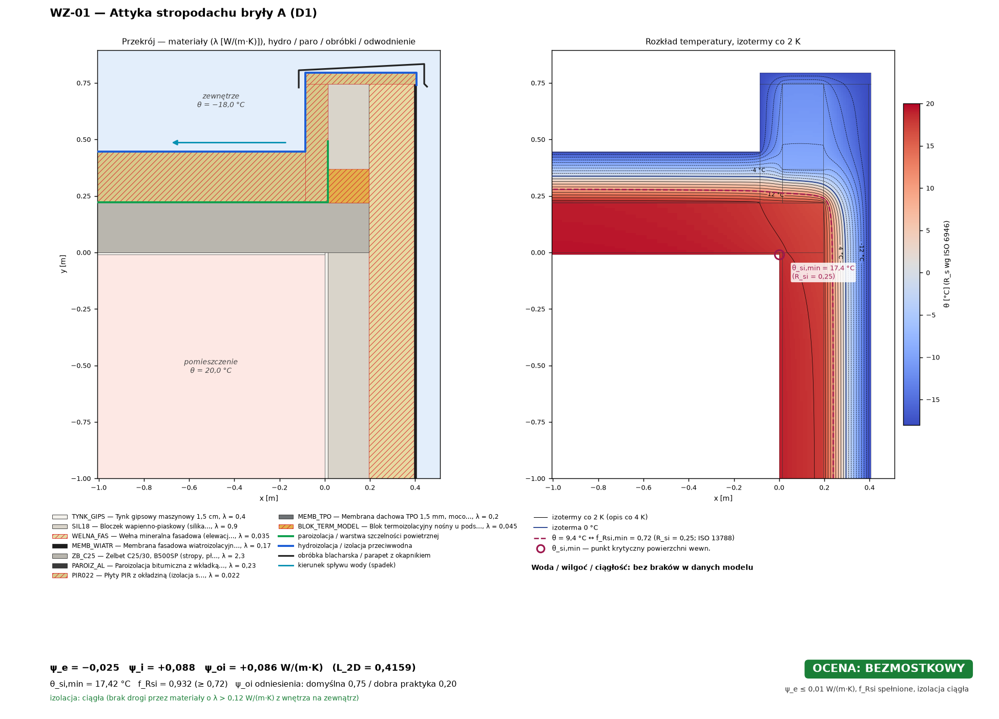

* ψ_e = −0,025, ψ_i = +0,088, ψ_oi = +0,086 W/(m·K); L_2D = 0,4159 W/(m·K); odniesienie ψ_oi: domyślna 0,75, dobra praktyka 0,20 (stropodach–ściana zewnętrzna z attyką (izolacja attyki z 3 stron))
* θ_si,min = 17,42 °C, f_Rsi = 0,932 (≥ 0,72 — brak ryzyka pleśni i kondensacji powierzchniowej)
* izolacja: ciągła (brak drogi przez materiały o λ > 0,12 W/(m·K) z wnętrza na zewnątrz)
* siatka: 84624 komórek, zmiana Φ przy podwojeniu 0,011 %, bilans 5.9e-13

| | temat | pozycja listy kontrolnej |
|---|---|---|
| ✓ OK | izolacja | linia izolacji ciągła („test ołówka” na siatce: brak drogi przez materiały o λ > 0,12) |
| ✓ OK | paro | szczelność powietrzna ściany SZ2: tynk wewnętrzny ciągły (TYNK_GIPS) — do stropu i posadzki |
| ✓ OK | paro | paroizolacja stropodachu SD1: PAROIZ_AL — wywinięta na attykę |
| ✓ OK | hydro | hydroizolacja stropodachu SD1: MEMB_TPO |
| ✓ OK | hydro | wywinięcie hydroizolacji na attykę ≥ 15 cm ponad warstwę wierzchnią (brief 9.4) |
| ✓ OK | woda | spadek dachu 0.02 (wymagany ≥ 2 %, izolacja spadkowa) |
| ✓ OK | woda | wpusty dachowe: 2 szt. |
| ✓ OK | woda | przelewy awaryjne w attyce: 2 szt. |
| ✓ OK | rury | rury spustowe: RS1 (wewn_szacht → zbiornik), RS2 (wewn_szacht → zbiornik) |
| i INFO | woda | obróbka korony attyki ze spadkiem ≥ 5 % do dachu i okapnikami; wpust / przelew przez attykę — mostek punktowy χ (poza modelem 2D; kołnierz izolowany) |

*Na rysunku:* hydroizolacja (MEMB_TPO) wywinięta na attykę i koronę — 35 cm ponad pokrycie (≥ 15 cm); obróbka korony attyki: spadek ≥ 5 % do dachu, okapniki ≥ 3 cm od lic; paroizolacja na płycie (PAROIZ_AL) wywinięta na attykę ponad izolację dachu, połączona z płytą ŻB (szczelność); spadek dachu ≥ 2 % do wpustów; przelew awaryjny w attyce (mostek punktowy χ).

Wykresy szczegółowe: [temperatura](rys/WZ-01_temperatura.png), [strumien](rys/WZ-01_strumien.png), [powierzchnia](rys/WZ-01_theta_si.png); dane wejściowe, warunki brzegowe, siatka, elementy flankujące — [szczegoly_obliczen.md](szczegoly_obliczen.md)

### WZ-02

**Attyki dachów P1 (D2, D3) — poza ścianami bryły A** — ocena **DOBRY** (ψ_oi ≤ dobra praktyka, f_Rsi spełnione)

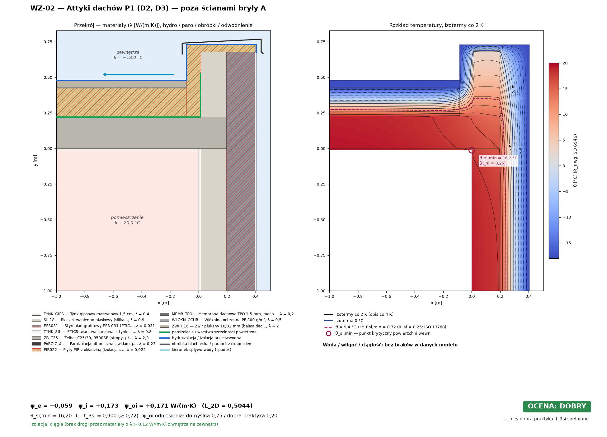

* ψ_e = +0,059, ψ_i = +0,173, ψ_oi = +0,171 W/(m·K); L_2D = 0,5044 W/(m·K); odniesienie ψ_oi: domyślna 0,75, dobra praktyka 0,20 (stropodach–ściana zewnętrzna z attyką (izolacja attyki z 3 stron))
* θ_si,min = 16,20 °C, f_Rsi = 0,900 (≥ 0,72 — brak ryzyka pleśni i kondensacji powierzchniowej)
* izolacja: ciągła (brak drogi przez materiały o λ > 0,12 W/(m·K) z wnętrza na zewnątrz)
* siatka: 84760 komórek, zmiana Φ przy podwojeniu 0,020 %, bilans 2.9e-14

| | temat | pozycja listy kontrolnej |
|---|---|---|
| ✓ OK | izolacja | linia izolacji ciągła („test ołówka” na siatce: brak drogi przez materiały o λ > 0,12) |
| ✓ OK | paro | szczelność powietrzna ściany SZ1: tynk wewnętrzny ciągły (TYNK_GIPS) — do stropu i posadzki |
| ✓ OK | paro | paroizolacja stropodachu SD2: PAROIZ_AL — wywinięta na attykę |
| ✓ OK | hydro | hydroizolacja stropodachu SD2: MEMB_TPO |
| ✓ OK | hydro | wywinięcie hydroizolacji na attykę ≥ 15 cm ponad warstwę wierzchnią (brief 9.4) |
| ✓ OK | woda | spadek dachu 0.02 (wymagany ≥ 2 %, izolacja spadkowa) |
| ✓ OK | woda | wpusty dachowe: 2 szt. |
| ✓ OK | woda | przelewy awaryjne w attyce: 2 szt. |
| ✓ OK | rury | rury spustowe: RS1 (wewn_szacht → zbiornik), RS2 (wewn_szacht → zbiornik) |
| i INFO | woda | obróbka korony attyki ze spadkiem ≥ 5 % do dachu i okapnikami; wpust / przelew przez attykę — mostek punktowy χ (poza modelem 2D; kołnierz izolowany) |

*Na rysunku:* hydroizolacja (MEMB_TPO) wywinięta na attykę i koronę — 25 cm ponad pokrycie (≥ 15 cm); obróbka korony attyki: spadek ≥ 5 % do dachu, okapniki ≥ 3 cm od lic; paroizolacja na płycie (PAROIZ_AL) wywinięta na attykę ponad izolację dachu, połączona z płytą ŻB (szczelność); spadek dachu ≥ 2 % do wpustów; przelew awaryjny w attyce (mostek punktowy χ).

Wykresy szczegółowe: [temperatura](rys/WZ-02_temperatura.png), [strumien](rys/WZ-02_strumien.png), [powierzchnia](rys/WZ-02_theta_si.png); dane wejściowe, warunki brzegowe, siatka, elementy flankujące — [szczegoly_obliczen.md](szczegoly_obliczen.md)

### WZ-03

**Attyka dachu zielonego nad pasem gospodarczym (linia D, część ogrzewana)** — ocena **DOBRY** (ψ_oi ≤ dobra praktyka, f_Rsi spełnione)

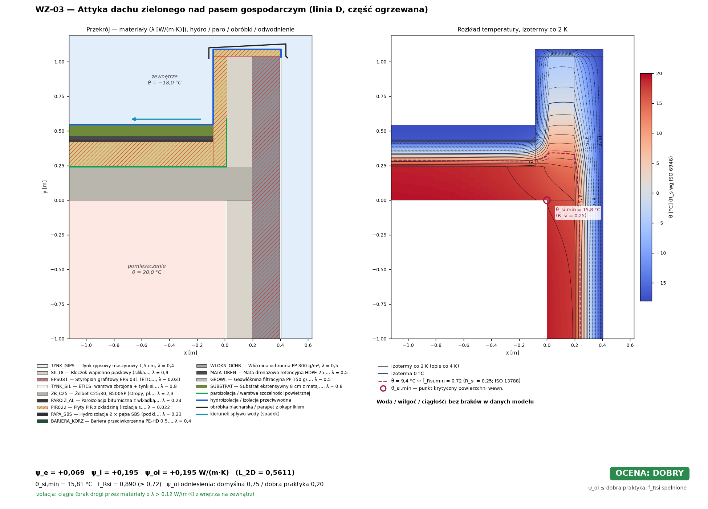

* ψ_e = +0,069, ψ_i = +0,195, ψ_oi = +0,195 W/(m·K); L_2D = 0,5611 W/(m·K); odniesienie ψ_oi: domyślna 0,75, dobra praktyka 0,20 (stropodach–ściana zewnętrzna z attyką (izolacja attyki z 3 stron))
* θ_si,min = 15,81 °C, f_Rsi = 0,890 (≥ 0,72 — brak ryzyka pleśni i kondensacji powierzchniowej)
* izolacja: ciągła (brak drogi przez materiały o λ > 0,12 W/(m·K) z wnętrza na zewnątrz)
* siatka: 99560 komórek, zmiana Φ przy podwojeniu 0,016 %, bilans 8.8e-13

| | temat | pozycja listy kontrolnej |
|---|---|---|
| ✓ OK | izolacja | linia izolacji ciągła („test ołówka” na siatce: brak drogi przez materiały o λ > 0,12) |
| ✓ OK | paro | szczelność powietrzna ściany SZ1: tynk wewnętrzny ciągły (TYNK_GIPS) — do stropu i posadzki |
| ✓ OK | paro | paroizolacja stropodachu DZ1: PAROIZ_AL — wywinięta na attykę |
| ✓ OK | hydro | hydroizolacja stropodachu DZ1: PAPA_SBS |
| ✓ OK | hydro | wywinięcie hydroizolacji na attykę ≥ 15 cm ponad warstwę wierzchnią (brief 9.4) |
| ✓ OK | woda | spadek dachu 0.02 (wymagany ≥ 2 %, izolacja spadkowa) |
| ✓ OK | woda | wpusty dachowe: 2 szt. |
| ✓ OK | woda | przelewy awaryjne w attyce: 2 szt. |
| ✓ OK | rury | rury spustowe: RS1 (wewn_szacht → zbiornik), RS2 (wewn_szacht → zbiornik) |
| i INFO | woda | obróbka korony attyki ze spadkiem ≥ 5 % do dachu i okapnikami; wpust / przelew przez attykę — mostek punktowy χ (poza modelem 2D; kołnierz izolowany) |

*Na rysunku:* hydroizolacja (PAPA_SBS) wywinięta na attykę i koronę — 55 cm ponad pokrycie (≥ 15 cm); obróbka korony attyki: spadek ≥ 5 % do dachu, okapniki ≥ 3 cm od lic; paroizolacja na płycie (PAROIZ_AL) wywinięta na attykę ponad izolację dachu, połączona z płytą ŻB (szczelność); spadek dachu ≥ 2 % do wpustów; przelew awaryjny w attyce (mostek punktowy χ).

Wykresy szczegółowe: [temperatura](rys/WZ-03_temperatura.png), [strumien](rys/WZ-03_strumien.png), [powierzchnia](rys/WZ-03_theta_si.png); dane wejściowe, warunki brzegowe, siatka, elementy flankujące — [szczegoly_obliczen.md](szczegoly_obliczen.md)

### WZ-04

**Okap E (PL-E) i daszek wejścia — łącznik termoizolacyjny** — ocena **DOBRY** (ψ_oi ≤ dobra praktyka, f_Rsi spełnione)

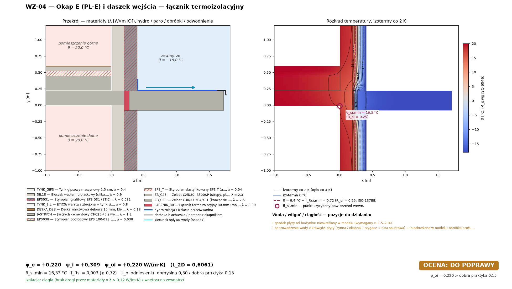

* ψ_e = +0,128, ψ_i = +0,217, ψ_oi = +0,128 W/(m·K); L_2D = 0,5138 W/(m·K); odniesienie ψ_oi: domyślna 0,30, dobra praktyka 0,15 (płyta wspornikowa z łącznikiem termoizolacyjnym)
* θ_si,min = 17,29 °C, f_Rsi = 0,929 (≥ 0,72 — brak ryzyka pleśni i kondensacji powierzchniowej)
* izolacja: ciągła (brak drogi przez materiały o λ > 0,12 W/(m·K) z wnętrza na zewnątrz)
* siatka: 132696 komórek, zmiana Φ przy podwojeniu 0,014 %, bilans 8.7e-13

| | temat | pozycja listy kontrolnej |
|---|---|---|
| ✓ OK | izolacja | linia izolacji ciągła („test ołówka” na siatce: brak drogi przez materiały o λ > 0,12) |
| ✓ OK | paro | szczelność powietrzna ściany SZ1: tynk wewnętrzny ciągły (TYNK_GIPS) — do stropu i posadzki |
| ✓ OK | hydro | hydroizolacja płyty OK1: MEMB_TPO |
| ✓ OK | woda | spadek płyty od budynku: 0.02 (wymagany ≥ 1,5–2 %) |
| ! UWAGA | woda | odprowadzenie wody z krawędzi płyty (rynna / okapnik / rzygacz → rura spustowa) — nieokreślone w modelu; obróbka czoła płyty z okapnikiem ≥ 3 cm |
| i INFO | hydro | hydroizolacja wywinięta na ścianę ≥ 15 cm ponad nawierzchnię, pod cokolikiem XPS; ciągła nad łącznikiem termoizolacyjnym |

*Na rysunku:* membrana płyty wspornikowej wywinięta na ścianę ≥ 15 cm ponad powierzchnię płyty; obróbka czoła płyty z okapnikiem ≥ 3 cm; spadek płyty ≥ 2 % od budynku.

Wykresy szczegółowe: [temperatura](rys/WZ-04_temperatura.png), [strumien](rys/WZ-04_strumien.png), [powierzchnia](rys/WZ-04_theta_si.png); dane wejściowe, warunki brzegowe, siatka, elementy flankujące — [szczegoly_obliczen.md](szczegoly_obliczen.md)

### WZ-05

**Krawędź ST2 (PL-2) — łącznik termoizolacyjny pod bryłą A** — ocena **DOBRY** (ψ_oi ≤ dobra praktyka, f_Rsi spełnione)

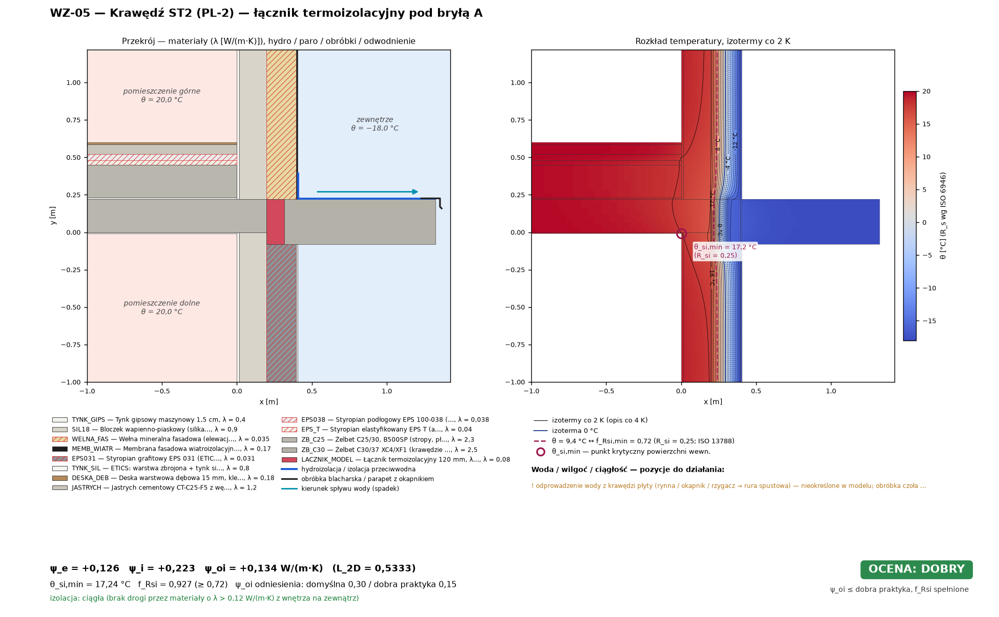

* ψ_e = +0,126, ψ_i = +0,223, ψ_oi = +0,134 W/(m·K); L_2D = 0,5333 W/(m·K); odniesienie ψ_oi: domyślna 0,30, dobra praktyka 0,15 (płyta wspornikowa z łącznikiem termoizolacyjnym)
* θ_si,min = 17,24 °C, f_Rsi = 0,927 (≥ 0,72 — brak ryzyka pleśni i kondensacji powierzchniowej)
* izolacja: ciągła (brak drogi przez materiały o λ > 0,12 W/(m·K) z wnętrza na zewnątrz)
* siatka: 129592 komórek, zmiana Φ przy podwojeniu 0,015 %, bilans 3.5e-13

| | temat | pozycja listy kontrolnej |
|---|---|---|
| ✓ OK | izolacja | linia izolacji ciągła („test ołówka” na siatce: brak drogi przez materiały o λ > 0,12) |
| ✓ OK | paro | szczelność powietrzna ściany SZ2: tynk wewnętrzny ciągły (TYNK_GIPS) — do stropu i posadzki |
| ✓ OK | hydro | hydroizolacja płyty OK1: MEMB_TPO |
| ✓ OK | woda | spadek płyty od budynku: 0.02 (wymagany ≥ 1,5–2 %) |
| ! UWAGA | woda | odprowadzenie wody z krawędzi płyty (rynna / okapnik / rzygacz → rura spustowa) — nieokreślone w modelu; obróbka czoła płyty z okapnikiem ≥ 3 cm |
| i INFO | hydro | hydroizolacja wywinięta na ścianę ≥ 15 cm ponad nawierzchnię, pod cokolikiem XPS; ciągła nad łącznikiem termoizolacyjnym |

*Na rysunku:* membrana płyty wspornikowej wywinięta na ścianę ≥ 15 cm ponad powierzchnię płyty; obróbka czoła płyty z okapnikiem ≥ 3 cm; spadek płyty ≥ 2 % od budynku.

Wykresy szczegółowe: [temperatura](rys/WZ-05_temperatura.png), [strumien](rys/WZ-05_strumien.png), [powierzchnia](rys/WZ-05_theta_si.png); dane wejściowe, warunki brzegowe, siatka, elementy flankujące — [szczegoly_obliczen.md](szczegoly_obliczen.md)

### WZ-06

**Krawędź ST3 (PL-3) — łącznik termoizolacyjny przy attyce bryły A** — ocena **DO POPRAWY** (ψ_oi = 0,205 > dobra praktyka 0,20)

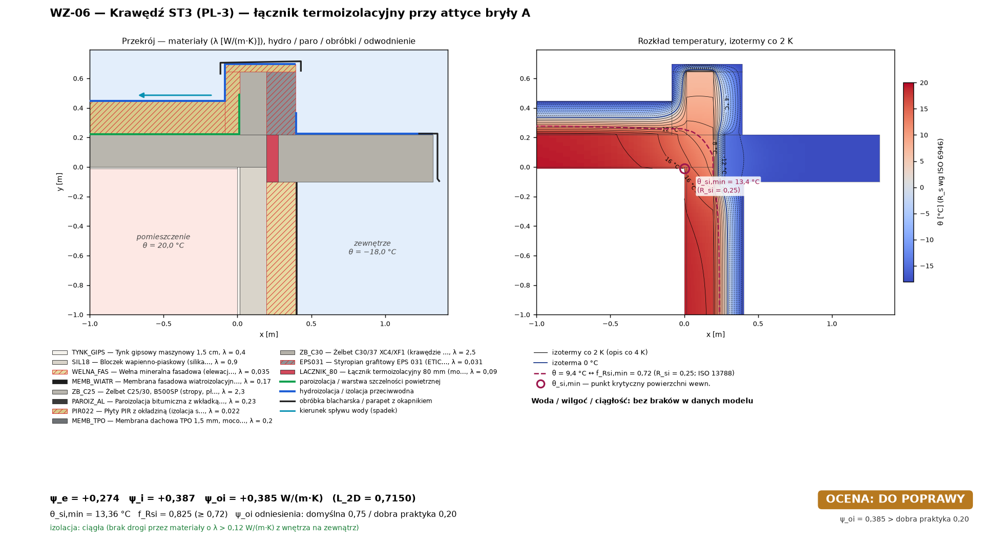

* ψ_e = +0,093, ψ_i = +0,206, ψ_oi = +0,205 W/(m·K); L_2D = 0,5342 W/(m·K); odniesienie ψ_oi: domyślna 0,75, dobra praktyka 0,20 (stropodach–ściana zewnętrzna z attyką (izolacja attyki z 3 stron))
* θ_si,min = 15,79 °C, f_Rsi = 0,889 (≥ 0,72 — brak ryzyka pleśni i kondensacji powierzchniowej)
* izolacja: ciągła (brak drogi przez materiały o λ > 0,12 W/(m·K) z wnętrza na zewnątrz)
* siatka: 128880 komórek, zmiana Φ przy podwojeniu 0,019 %, bilans 6.4e-13

| | temat | pozycja listy kontrolnej |
|---|---|---|
| ✓ OK | izolacja | linia izolacji ciągła („test ołówka” na siatce: brak drogi przez materiały o λ > 0,12) |
| ✓ OK | paro | szczelność powietrzna ściany SZ2: tynk wewnętrzny ciągły (TYNK_GIPS) — do stropu i posadzki |
| ✓ OK | paro | paroizolacja stropodachu SD1: PAROIZ_AL — wywinięta na attykę |
| ✓ OK | hydro | hydroizolacja stropodachu SD1: MEMB_TPO |
| ✓ OK | hydro | wywinięcie hydroizolacji na attykę ≥ 15 cm ponad warstwę wierzchnią (brief 9.4) |
| ✓ OK | woda | spadek dachu 0.02 (wymagany ≥ 2 %, izolacja spadkowa) |
| ✓ OK | woda | wpusty dachowe: 2 szt. |
| ✓ OK | woda | przelewy awaryjne w attyce: 2 szt. |
| ✓ OK | rury | rury spustowe: RS1 (wewn_szacht → zbiornik), RS2 (wewn_szacht → zbiornik) |
| i INFO | woda | obróbka korony attyki ze spadkiem ≥ 5 % do dachu i okapnikami; wpust / przelew przez attykę — mostek punktowy χ (poza modelem 2D; kołnierz izolowany) |

*Na rysunku:* hydroizolacja wywinięta na attykę i koronę — 35 cm ponad pokrycie (≥ 15 cm); membrana okapu wywinięta na izolację attyki ≥ 15 cm; obróbka czoła okapu z okapnikiem; obróbka korony attyki: spadek ≥ 5 % do dachu, okapniki; paroizolacja na płycie wywinięta na attykę ponad izolację dachu (szczelność); spadek dachu ≥ 2 % do wpustów; przelew awaryjny w attyce (χ).

Wykresy szczegółowe: [temperatura](rys/WZ-06_temperatura.png), [strumien](rys/WZ-06_strumien.png), [powierzchnia](rys/WZ-06_theta_si.png); dane wejściowe, warunki brzegowe, siatka, elementy flankujące — [szczegoly_obliczen.md](szczegoly_obliczen.md)

### WZ-07a

**Krawędź stropu ST2Z nad powietrzem: ściana SZL na belce B3 + płyta PL-2 (łącznik)** — ocena **DO POPRAWY** (ψ_oi = 0,152 > dobra praktyka 0,15)

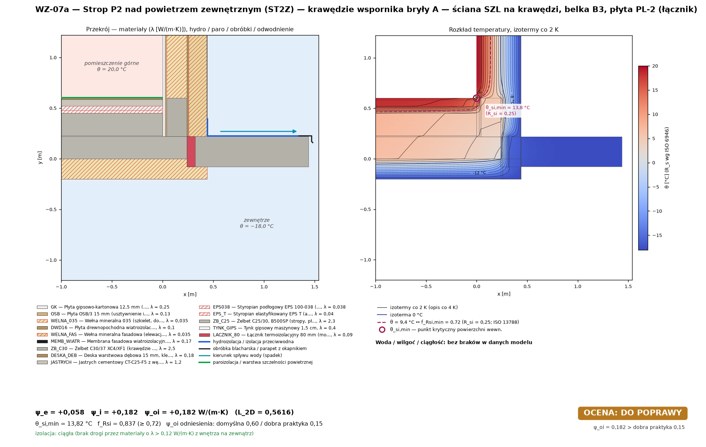

* ψ_e = +0,028, ψ_i = +0,152, ψ_oi = +0,152 W/(m·K); L_2D = 0,5317 W/(m·K); odniesienie ψ_oi: domyślna 0,60, dobra praktyka 0,15 (strop nad powietrzem zewnętrznym – ściana (wspornik bryły))
* θ_si,min = 14,33 °C, f_Rsi = 0,851 (≥ 0,72 — brak ryzyka pleśni i kondensacji powierzchniowej)
* izolacja: ciągła (brak drogi przez materiały o λ > 0,12 W/(m·K) z wnętrza na zewnątrz)
* siatka: 163680 komórek, zmiana Φ przy podwojeniu 0,038 %, bilans 6.6e-14

| | temat | pozycja listy kontrolnej |
|---|---|---|
| ✓ OK | izolacja | linia izolacji ciągła („test ołówka” na siatce: brak drogi przez materiały o λ > 0,12) |

*Uwaga:* Pustka wentylowana pod ociepleniem spodu stropu i podsufitka pominięte (PN-EN ISO 6946 — warstwy za pustką dobrze wentylowaną); R_se = 0,04 na spodzie ocieplenia (wariant ostrożny) [ZAŁ].
*Na rysunku:* membrana płyty wspornikowej wywinięta na ścianę ≥ 15 cm ponad powierzchnię płyty; obróbka czoła płyty z okapnikiem ≥ 3 cm; spadek płyty ≥ 2 % od budynku; szczelność powietrzna: płyta ŻB + tynk ściany górnej doprowadzony do płyty.

Wykresy szczegółowe: [temperatura](rys/WZ-07a_temperatura.png), [strumien](rys/WZ-07a_strumien.png), [powierzchnia](rys/WZ-07a_theta_si.png); dane wejściowe, warunki brzegowe, siatka, elementy flankujące — [szczegoly_obliczen.md](szczegoly_obliczen.md)

### WZ-07b

**Krawędź stropu ST2Z nad ścianą SZ1 niższej kondygnacji (ocieplenie spodu SUF-ZEW)** — ocena **BEZMOSTKOWY** (ψ_e ≤ 0,01 W/(m·K), f_Rsi spełnione, izolacja ciągła)

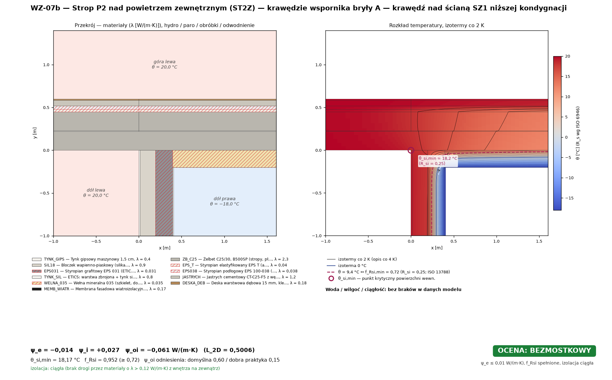

* ψ_e = −0,014, ψ_i = +0,027, ψ_oi = −0,061 W/(m·K); L_2D = 0,5006 W/(m·K); odniesienie ψ_oi: domyślna 0,60, dobra praktyka 0,15 (strop nad powietrzem zewnętrznym – ściana (wspornik bryły))
* θ_si,min = 18,17 °C, f_Rsi = 0,952 (≥ 0,72 — brak ryzyka pleśni i kondensacji powierzchniowej)
* izolacja: ciągła (brak drogi przez materiały o λ > 0,12 W/(m·K) z wnętrza na zewnątrz)
* siatka: 134784 komórek, zmiana Φ przy podwojeniu 0,010 %, bilans 2.5e-12

| | temat | pozycja listy kontrolnej |
|---|---|---|
| ✓ OK | izolacja | linia izolacji ciągła („test ołówka” na siatce: brak drogi przez materiały o λ > 0,12) |

*Uwaga:* Grupy stref: i — ogrzewane, u — nieogrzewane, e — zewnętrze; ψ dla każdej pary grup z elementami flankującymi (PN-EN ISO 10211, więcej niż dwie temperatury).

Wykresy szczegółowe: [temperatura](rys/WZ-07b_temperatura.png), [strumien](rys/WZ-07b_strumien.png), [powierzchnia](rys/WZ-07b_theta_si.png); dane wejściowe, warunki brzegowe, siatka, elementy flankujące — [szczegoly_obliczen.md](szczegoly_obliczen.md)

### WZ-08

**Cokół: ściana zewn. – płyta fundamentowa na XPS (część ogrzewana)** — ocena **DOBRY** (ψ_oi ≤ dobra praktyka, f_Rsi spełnione)

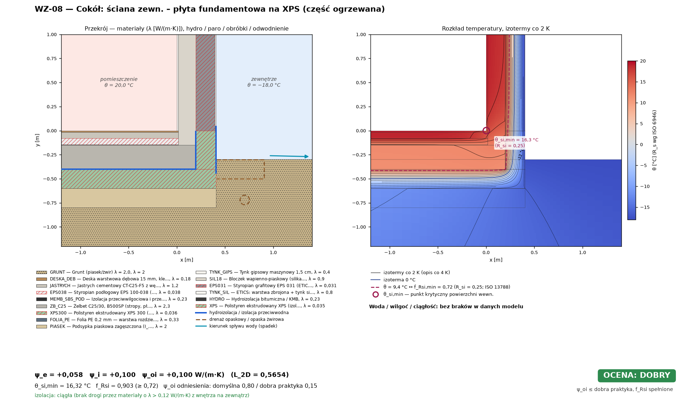

* ψ_e = +0,058, ψ_i = +0,100, ψ_oi = +0,100 W/(m·K); L_2D = 0,5654 W/(m·K); odniesienie ψ_oi: domyślna 0,80, dobra praktyka 0,15 (ściana zewnętrzna – podłoga na gruncie / płyta fundamentowa (cokół))
* θ_si,min = 16,32 °C, f_Rsi = 0,903 (≥ 0,72 — brak ryzyka pleśni i kondensacji powierzchniowej)
* izolacja: ciągła (brak drogi przez materiały o λ > 0,12 W/(m·K) z wnętrza na zewnątrz)
* siatka: 163200 komórek, zmiana Φ przy podwojeniu 0,028 %, bilans 1.5e-10

| | temat | pozycja listy kontrolnej |
|---|---|---|
| ✓ OK | izolacja | linia izolacji ciągła („test ołówka” na siatce: brak drogi przez materiały o λ > 0,12) |
| ✓ OK | paro | szczelność powietrzna ściany SZ1: tynk wewnętrzny ciągły (TYNK_GIPS) — do stropu i posadzki |
| ✓ OK | hydro | izolacja przeciwwilgociowa podłogi na gruncie POD-0: MEMB_SBS_POD |
| ✓ OK | hydro | izolacja pionowa fundamentu i izolacja obwodowa XPS (nienasiąkliwa) — w modelu węzła |
| ✓ OK | hydro | strefa cokołu ≥ 30 cm nad terenem (uszczelnienie, tynk mozaikowy) |
| ✓ OK | drenaz | odwodnienie przy budynku (`dzialka.odwodnienia`: opaska żwirowa / drenaż opaskowy / odwodnienie liniowe): liniowe, liniowe, liniowe, liniowe, liniowe, liniowe, liniowe, opaska_zwirowa, niecka, niecka, liniowe, liniowe, niecka, drenaz_opaskowy |
| ✓ OK | woda | spadek terenu ≥ 2 % od budynku na 1,5–2 m: rzędne projektowane w modelu |

*Uwaga:* Ściana liczona od poziomu posadzki (±0,00) we wszystkich systemach wymiarów (ψ_oi = ψ_i); podłoga wg PN-EN ISO 13370 z B' = b [INT]; b = B' = A/(0,5·P) budynku, gdy podane z modelu.
*Uwaga:* Hydroizolacja pionowa ściany fundamentowej (bitumiczna/KMB) i izolacja obwodowa XPS (odporna na wodę) do spodu ławy; drenaż opaskowy i odprowadzenie wody opadowej od cokołu — poza zakresem cieplnym (wpływ na λ gruntu pominięty, λ = 2,0).
*Na rysunku:* drenaż opaskowy DN100 w obsypce żwirowej — decyzja wg badań gruntu / ZWG; hydroizolacja pod płytą (na XPS) wywinięta na krawędź płyty — ciągła do strefy cokołu; opaska żwirowa ≥ 50 cm; spadek terenu ≥ 2 % od budynku na ≥ 1,5–2 m; uszczelnienie strefy cokołu (masa/tynk mozaikowy) do 30 cm nad terenem (≥ 30 cm).

Wykresy szczegółowe: [temperatura](rys/WZ-08_temperatura.png), [strumien](rys/WZ-08_strumien.png), [powierzchnia](rys/WZ-08_theta_si.png); dane wejściowe, warunki brzegowe, siatka, elementy flankujące — [szczegoly_obliczen.md](szczegoly_obliczen.md)

### WZ-09a

**Ściana dom–garaż (SWG) na płycie fundamentowej (POD-0 / POD-G)** — ocena **ZŁY** (izolacja przerwana: DESKA_DEB → JASTRYCH → TYNK_GIPS → ZB_C25 → TYNK_CW; ψ_oi = 0,406 > domyślna 0,20)

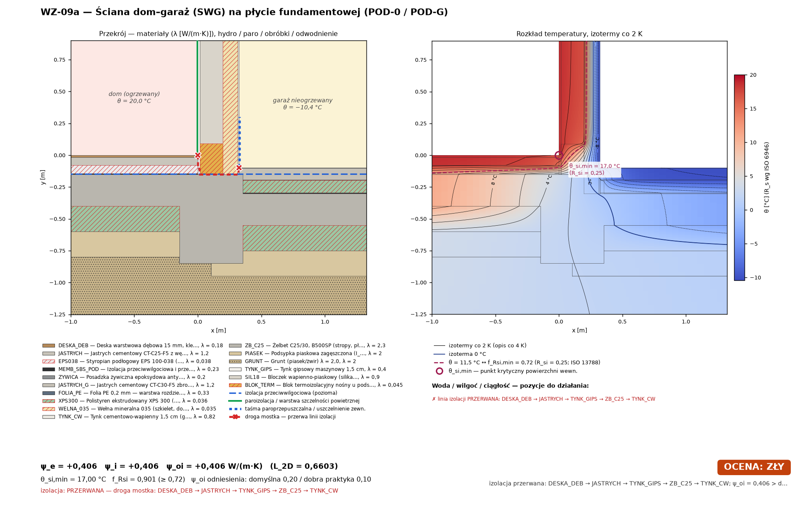

* ψ_e = +0,406, ψ_i = +0,406, ψ_oi = +0,406 W/(m·K); L_2D = 0,6603 W/(m·K); odniesienie ψ_oi: domyślna 0,20, dobra praktyka 0,10 (połączenie przegród dom–garaż nieogrzewany (ściana/strop))
* θ_si,min = 17,00 °C, f_Rsi = 0,901 (≥ 0,72 — brak ryzyka pleśni i kondensacji powierzchniowej)
* izolacja: PRZERWANA — droga mostka: DESKA_DEB → JASTRYCH → TYNK_GIPS → ZB_C25 → TYNK_CW
* siatka: 244280 komórek, zmiana Φ przy podwojeniu 0,045 %, bilans 4.4e-12

| | temat | pozycja listy kontrolnej |
|---|---|---|
| ✗ BRAK | izolacja | linia izolacji PRZERWANA: DESKA_DEB → JASTRYCH → TYNK_GIPS → ZB_C25 → TYNK_CW |
| ✓ OK | paro | szczelność powietrzna ściany SZ1: tynk wewnętrzny ciągły (TYNK_GIPS) — do stropu i posadzki |
| i INFO | paro | ściana dom–garaż: szczelność na spaliny (WT § 106 ust. 1) — tynk ciągły, uszczelnione przejścia instalacji, drzwi z samozamykaczem i uszczelką |

*Uwaga:* ψ_iu = L_2D,iu − U_ściany·h (podłogi po obu stronach nie wymieniają ciepła z gruntem w modelu węzła — dół adiabatyczny); strata do garażu wchodzi do H_U = H_iu·b_u (PN-EN ISO 13789).
*Na rysunku:* garaż: uszczelnienie styku ściana–posadzka (szczelność gazowa, WT § 106), cokolik; izolacja przeciwwilgociowa/przeciwradonowa na płycie — ciągła pod ścianą; tynk wewnętrzny do posadzki — szczelność powietrzna.

Wykresy szczegółowe: [temperatura](rys/WZ-09a_temperatura.png), [strumien](rys/WZ-09a_strumien.png), [powierzchnia](rys/WZ-09a_theta_si.png); dane wejściowe, warunki brzegowe, siatka, elementy flankujące — [szczegoly_obliczen.md](szczegoly_obliczen.md)

### WZ-09b

**Ściana SWG pod płytą: dom — D4, garaż — D4, pas docieplenia SUF-G 1.0 m** — ocena **ZŁY** (izolacja przerwana: TYNK_GIPS → SIL18 → ZB_C25)

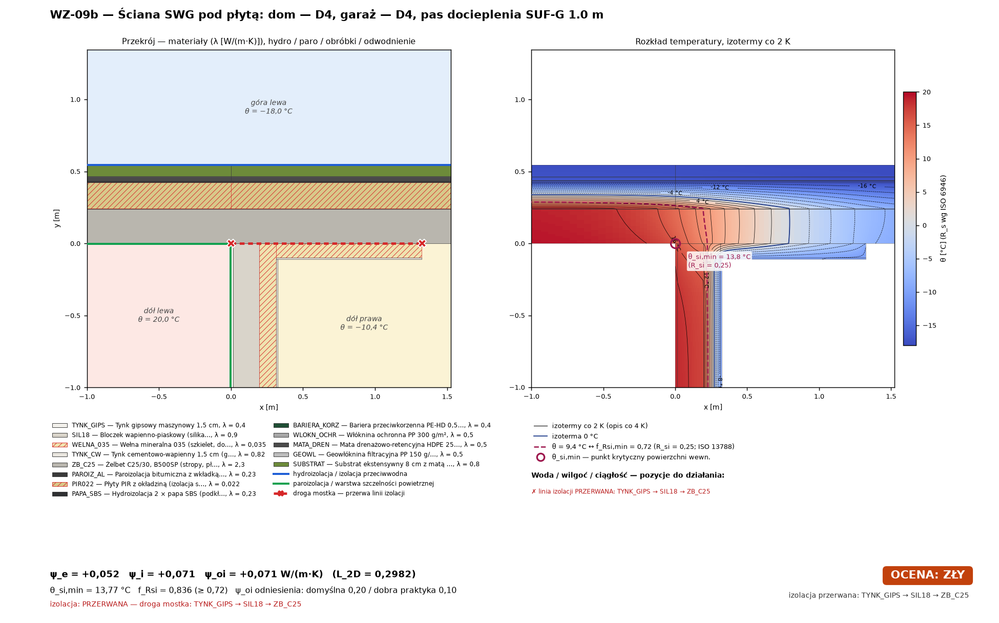

* ψ_e = +0,052, ψ_i = +0,071, ψ_oi = +0,071 W/(m·K); L_2D = 0,2982 W/(m·K); odniesienie ψ_oi: domyślna 0,20, dobra praktyka 0,10 (połączenie przegród dom–garaż nieogrzewany (ściana/strop))
* θ_si,min = 13,77 °C, f_Rsi = 0,836 (≥ 0,72 — brak ryzyka pleśni i kondensacji powierzchniowej)
* izolacja: PRZERWANA — droga mostka: TYNK_GIPS → SIL18 → ZB_C25
* siatka: 142104 komórek, zmiana Φ przy podwojeniu 0,030 %, bilans 1.7e-13

| | temat | pozycja listy kontrolnej |
|---|---|---|
| ✗ BRAK | izolacja | linia izolacji PRZERWANA: TYNK_GIPS → SIL18 → ZB_C25 |
| ✓ OK | paro | szczelność powietrzna ściany SZ1: tynk wewnętrzny ciągły (TYNK_GIPS) — do stropu i posadzki |
| i INFO | paro | ściana dom–garaż: szczelność na spaliny (WT § 106 ust. 1) — tynk ciągły, uszczelnione przejścia instalacji, drzwi z samozamykaczem i uszczelką |

*Uwaga:* Grupy stref: i — ogrzewane, u — nieogrzewane, e — zewnętrze; ψ dla każdej pary grup z elementami flankującymi (PN-EN ISO 10211, więcej niż dwie temperatury).
*Na rysunku:* hydroizolacja dachu ciągła nad ścianą; tynk / szczelność powietrzna i gazowa od strony garażu (WT § 106).

Wykresy szczegółowe: [temperatura](rys/WZ-09b_temperatura.png), [strumien](rys/WZ-09b_strumien.png), [powierzchnia](rys/WZ-09b_theta_si.png); dane wejściowe, warunki brzegowe, siatka, elementy flankujące — [szczegoly_obliczen.md](szczegoly_obliczen.md)

### WZ-09c

**Ściana SWG pod płytą: dom — ST1 + ściana SZ1, garaż — D4, pas docieplenia SUF-G 1.0 m** — ocena **ZŁY** (izolacja przerwana: TYNK_GIPS → SIL18 → ZB_C25)

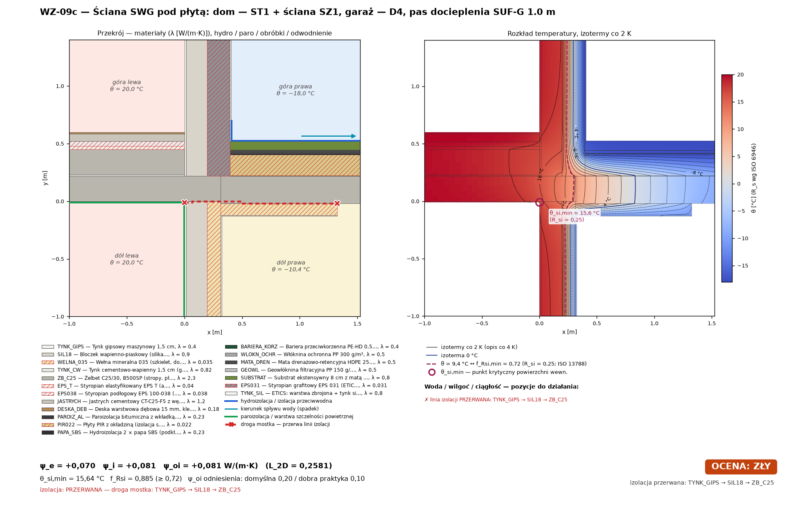

* ψ_e = +0,070, ψ_i = +0,081, ψ_oi = +0,081 W/(m·K); L_2D = 0,2581 W/(m·K); odniesienie ψ_oi: domyślna 0,20, dobra praktyka 0,10 (połączenie przegród dom–garaż nieogrzewany (ściana/strop))
* θ_si,min = 15,64 °C, f_Rsi = 0,885 (≥ 0,72 — brak ryzyka pleśni i kondensacji powierzchniowej)
* izolacja: PRZERWANA — droga mostka: TYNK_GIPS → SIL18 → ZB_C25
* siatka: 196936 komórek, zmiana Φ przy podwojeniu 0,030 %, bilans 8.2e-12

| | temat | pozycja listy kontrolnej |
|---|---|---|
| ✗ BRAK | izolacja | linia izolacji PRZERWANA: TYNK_GIPS → SIL18 → ZB_C25 |
| ✓ OK | paro | szczelność powietrzna ściany SZ1: tynk wewnętrzny ciągły (TYNK_GIPS) — do stropu i posadzki |
| i INFO | paro | ściana dom–garaż: szczelność na spaliny (WT § 106 ust. 1) — tynk ciągły, uszczelnione przejścia instalacji, drzwi z samozamykaczem i uszczelką |

*Uwaga:* Grupy stref: i — ogrzewane, u — nieogrzewane, e — zewnętrze; ψ dla każdej pary grup z elementami flankującymi (PN-EN ISO 10211, więcej niż dwie temperatury).
*Na rysunku:* hydroizolacja dachu wywinięta na ścianę ≥ 15 cm ponad warstwę wierzchnią (substrat / żwir); spadek dachu ≥ 2 % od ściany; opaska żwirowa ≥ 0,5 m przy ścianie; tynk / szczelność powietrzna i gazowa od strony garażu (WT § 106).

Wykresy szczegółowe: [temperatura](rys/WZ-09c_temperatura.png), [strumien](rys/WZ-09c_strumien.png), [powierzchnia](rys/WZ-09c_theta_si.png); dane wejściowe, warunki brzegowe, siatka, elementy flankujące — [szczegoly_obliczen.md](szczegoly_obliczen.md)

### WZ-10

**Strop pośredni ST1/ST2 – ściana zewn. z ETICS ciągłym (wieniec)** — ocena **BEZMOSTKOWY** (ψ_e ≤ 0,01 W/(m·K), f_Rsi spełnione, izolacja ciągła)

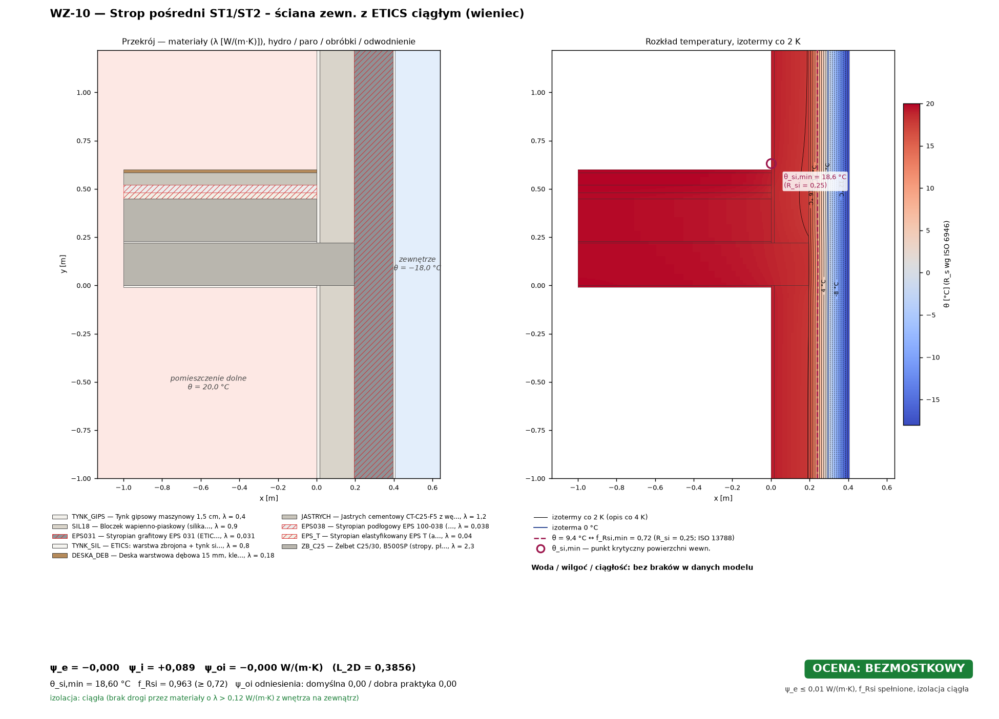

* ψ_e = −0,000, ψ_i = +0,089, ψ_oi = −0,000 W/(m·K); L_2D = 0,3856 W/(m·K); odniesienie ψ_oi: domyślna 0,00, dobra praktyka 0,00 (strop pośredni – ściana zewnętrzna z izolacją ciągłą (ETICS); Ψ_oi = Ψ_e (wys. „od podłogi do podłogi”))
* θ_si,min = 18,60 °C, f_Rsi = 0,963 (≥ 0,72 — brak ryzyka pleśni i kondensacji powierzchniowej)
* izolacja: ciągła (brak drogi przez materiały o λ > 0,12 W/(m·K) z wnętrza na zewnątrz)
* siatka: 78044 komórek, zmiana Φ przy podwojeniu 0,001 %, bilans 4.6e-13

| | temat | pozycja listy kontrolnej |
|---|---|---|
| ✓ OK | izolacja | linia izolacji ciągła („test ołówka” na siatce: brak drogi przez materiały o λ > 0,12) |
| ✓ OK | paro | szczelność powietrzna ściany SZ1: tynk wewnętrzny ciągły (TYNK_GIPS) — do stropu i posadzki |

Wykresy szczegółowe: [temperatura](rys/WZ-10_temperatura.png), [strumien](rys/WZ-10_strumien.png), [powierzchnia](rys/WZ-10_theta_si.png); dane wejściowe, warunki brzegowe, siatka, elementy flankujące — [szczegoly_obliczen.md](szczegoly_obliczen.md)

### WZ-11

**Ościeża okien/drzwi — ciepły montaż (rama 5 cm w murze, 4 cm w izolacji, zakład izolacji 3 cm na ramę)** — ocena **DOBRY** (ψ_oi ≤ dobra praktyka, f_Rsi spełnione)

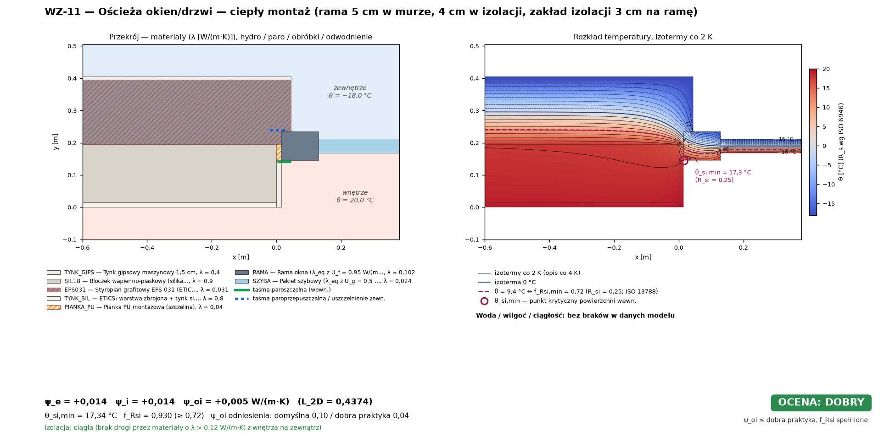

* ψ_e = +0,014, ψ_i = +0,014, ψ_oi = +0,005 W/(m·K); L_2D = 0,4374 W/(m·K); odniesienie ψ_oi: domyślna 0,10, dobra praktyka 0,04 (ościeża/nadproża/parapety — okno w warstwie izolacji („ciepły montaż”))
* θ_si,min = 17,34 °C, f_Rsi = 0,930 (≥ 0,72 — brak ryzyka pleśni i kondensacji powierzchniowej); rama/szyba f_Rsi = 0,824 (informacyjnie)
* izolacja: ciągła (brak drogi przez materiały o λ > 0,12 W/(m·K) z wnętrza na zewnątrz)
* siatka: 43956 komórek, zmiana Φ przy podwojeniu 0,069 %, bilans 1.7e-13

| | temat | pozycja listy kontrolnej |
|---|---|---|
| ✓ OK | izolacja | linia izolacji ciągła („test ołówka” na siatce: brak drogi przez materiały o λ > 0,12) |
| ✓ OK | paro | szczelność powietrzna ściany SZ1: tynk wewnętrzny ciągły (TYNK_GIPS) — do stropu i posadzki |
| i INFO | paro | montaż warstwowy: taśma paroszczelna od wewnątrz, paroprzepuszczalna od zewnątrz (zasada „wewnątrz szczelniej niż na zewnątrz”) |

*Uwaga:* Rama i szyba jako materiały zastępcze (λ_eq z U_f, U_g); ψ osadzenia liczone względem modelu okna bez ściany, więc uproszczenie ramy wpływa na ψ w małym stopniu. Ψ_g ramki dystansowej — poza zakresem (U_w wg PN-EN ISO 10077-1).
*Na rysunku:* taśma paroprzepuszczalna od zewnątrz (pod izolacją ościeża); taśma paroszczelna od wewnątrz (rama ↔ tynk ościeża).

Wykresy szczegółowe: [temperatura](rys/WZ-11_temperatura.png), [strumien](rys/WZ-11_strumien.png), [powierzchnia](rys/WZ-11_theta_si.png); dane wejściowe, warunki brzegowe, siatka, elementy flankujące — [szczegoly_obliczen.md](szczegoly_obliczen.md)

### WZ-11N

**Nadproża — BEZ kaset osłon w ociepleniu (kasety w okapach / ramie C / szczelinie lamel / nadstawne)** — ocena **DOBRY** (ψ_oi ≤ dobra praktyka, f_Rsi spełnione)

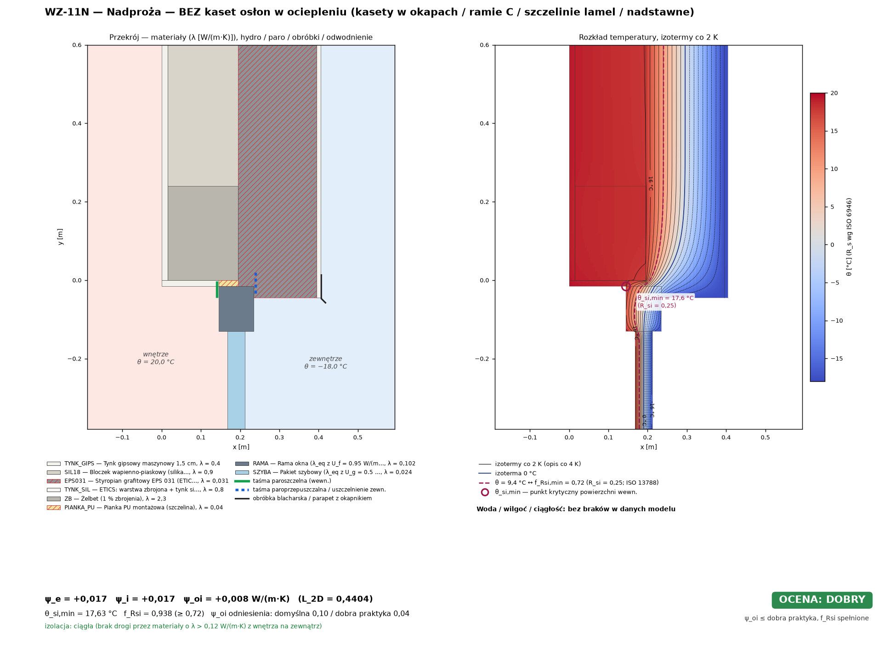

* ψ_e = +0,017, ψ_i = +0,017, ψ_oi = +0,008 W/(m·K); L_2D = 0,4404 W/(m·K); odniesienie ψ_oi: domyślna 0,10, dobra praktyka 0,04 (ościeża/nadproża/parapety — okno w warstwie izolacji („ciepły montaż”))
* θ_si,min = 17,63 °C, f_Rsi = 0,938 (≥ 0,72 — brak ryzyka pleśni i kondensacji powierzchniowej); rama/szyba f_Rsi = 0,824 (informacyjnie)
* izolacja: ciągła (brak drogi przez materiały o λ > 0,12 W/(m·K) z wnętrza na zewnątrz)
* siatka: 54168 komórek, zmiana Φ przy podwojeniu 0,072 %, bilans 3.1e-13

| | temat | pozycja listy kontrolnej |
|---|---|---|
| ✓ OK | izolacja | linia izolacji ciągła („test ołówka” na siatce: brak drogi przez materiały o λ > 0,12) |
| ✓ OK | paro | szczelność powietrzna ściany SZ1: tynk wewnętrzny ciągły (TYNK_GIPS) — do stropu i posadzki |
| i INFO | paro | montaż warstwowy: taśma paroszczelna od wewnątrz, paroprzepuszczalna od zewnątrz (zasada „wewnątrz szczelniej niż na zewnątrz”) |
| i INFO | woda | profil narożny z okapnikiem nad oknem; kaseta osłony — uszczelnienie i izolacja kasety |

*Uwaga:* Rama i szyba jako materiały zastępcze (λ_eq z U_f, U_g); ψ osadzenia liczone względem modelu okna bez ściany, więc uproszczenie ramy wpływa na ψ w małym stopniu. Ψ_g ramki dystansowej — poza zakresem (U_w wg PN-EN ISO 10077-1).
*Uwaga:* Przekrój pionowy przez nadproże: sufit ościeża (podsufitka) — R_si wg kierunku strumienia (ISO 6946: 0,10 strumień w górę).
*Na rysunku:* profil narożny z okapnikiem w ETICS nad oknem; taśma paroprzepuszczalna od zewnątrz (pod izolacją ościeża); taśma paroszczelna od wewnątrz (rama ↔ tynk ościeża).

Wykresy szczegółowe: [temperatura](rys/WZ-11N_temperatura.png), [strumien](rys/WZ-11N_strumien.png), [powierzchnia](rys/WZ-11N_theta_si.png); dane wejściowe, warunki brzegowe, siatka, elementy flankujące — [szczegoly_obliczen.md](szczegoly_obliczen.md)

### WZ-11P

**Podokienniki — parapet zewn. z okapnikiem na profilu z XPS** — ocena **DOBRY** (ψ_oi ≤ dobra praktyka, f_Rsi spełnione)

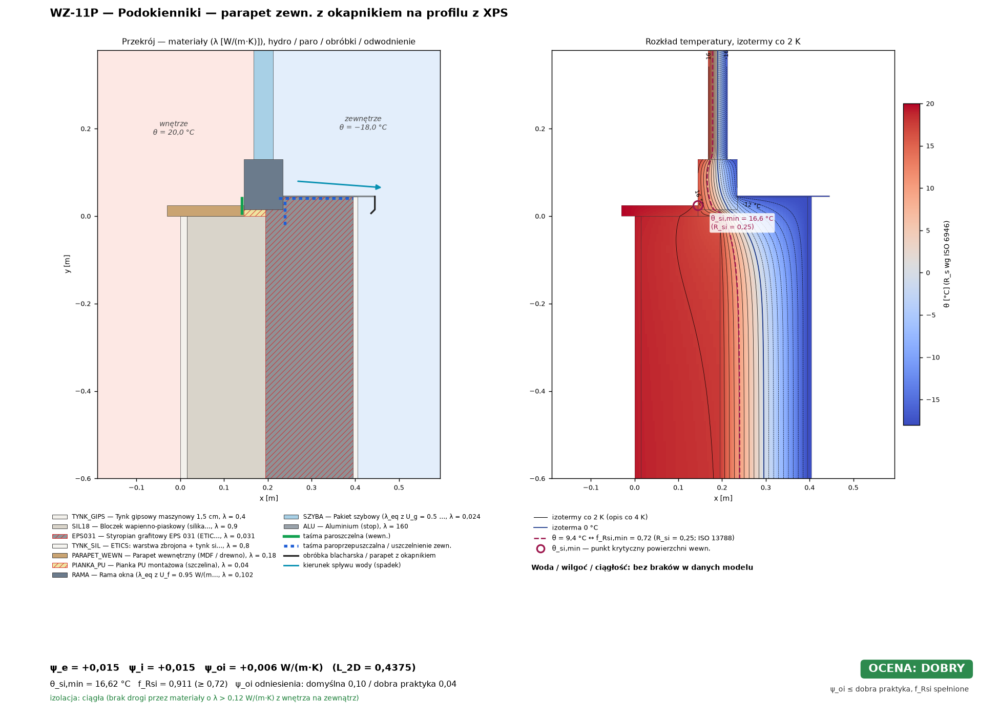

* ψ_e = +0,015, ψ_i = +0,015, ψ_oi = +0,006 W/(m·K); L_2D = 0,4375 W/(m·K); odniesienie ψ_oi: domyślna 0,10, dobra praktyka 0,04 (ościeża/nadproża/parapety — okno w warstwie izolacji („ciepły montaż”))
* θ_si,min = 16,62 °C, f_Rsi = 0,911 (≥ 0,72 — brak ryzyka pleśni i kondensacji powierzchniowej); rama/szyba f_Rsi = 0,821 (informacyjnie)
* izolacja: ciągła (brak drogi przez materiały o λ > 0,12 W/(m·K) z wnętrza na zewnątrz)
* siatka: 64860 komórek, zmiana Φ przy podwojeniu 0,078 %, bilans 2.2e-12

| | temat | pozycja listy kontrolnej |
|---|---|---|
| ✓ OK | izolacja | linia izolacji ciągła („test ołówka” na siatce: brak drogi przez materiały o λ > 0,12) |
| ✓ OK | paro | szczelność powietrzna ściany SZ1: tynk wewnętrzny ciągły (TYNK_GIPS) — do stropu i posadzki |
| i INFO | paro | montaż warstwowy: taśma paroszczelna od wewnątrz, paroprzepuszczalna od zewnątrz (zasada „wewnątrz szczelniej niż na zewnątrz”) |
| ✓ OK | woda | parapet zewnętrzny: spadek ≥ 5 %, okapnik ≥ 3 cm przed licem, zaślepki boczne, taśma pod parapetem |

*Uwaga:* Rama i szyba jako materiały zastępcze (λ_eq z U_f, U_g); ψ osadzenia liczone względem modelu okna bez ściany, więc uproszczenie ramy wpływa na ψ w małym stopniu. Ψ_g ramki dystansowej — poza zakresem (U_w wg PN-EN ISO 10077-1).
*Uwaga:* Parapet zewnętrzny (odprowadzenie wody): obróbka na izolacji podparapetowej, wsunięta pod profil podparapetowy ramy, okapnik ≥ 3–4 cm przed licem elewacji, spadek ≥ 5 %, zaślepki boczne w ościeżach; izolacja pod parapetem ciągła do ramy (brak mostka).
*Uwaga:* Przekrój pionowy przez podokiennik; parapet wewnętrzny o małym λ (drewno/MDF) — wariant ostrożny dla f_Rsi (ogranicza dopływ ciepła do naroża pod parapetem).
*Na rysunku:* okapnik parapetu 4 cm przed licem, zaślepki boczne; spadek parapetu ≥ 5 % na zewnątrz; taśma / membrana pod parapetem (2. poziom uszczelnienia), wywinięta na ramę; taśma paroprzepuszczalna od zewnątrz (pod izolacją ościeża); taśma paroszczelna od wewnątrz (rama ↔ tynk ościeża).

Wykresy szczegółowe: [temperatura](rys/WZ-11P_temperatura.png), [strumien](rys/WZ-11P_strumien.png), [powierzchnia](rys/WZ-11P_theta_si.png); dane wejściowe, warunki brzegowe, siatka, elementy flankujące — [szczegoly_obliczen.md](szczegoly_obliczen.md)

### WZ-11T

**Progi HS / drzwi zewn. na płycie P0 — profil progowy termoizolacyjny na podwalinie XPS/PUR-GF, odwodnienie liniowe** — ocena **DOBRY** (ψ_oi ≤ dobra praktyka, f_Rsi spełnione)

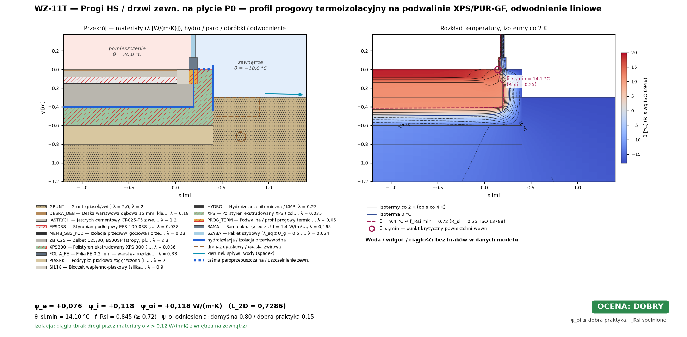

* ψ_e = +0,076, ψ_i = +0,118, ψ_oi = +0,118 W/(m·K); L_2D = 0,7286 W/(m·K); odniesienie ψ_oi: domyślna 0,80, dobra praktyka 0,15 (ściana zewnętrzna – podłoga na gruncie / płyta fundamentowa (cokół))
* θ_si,min = 14,10 °C, f_Rsi = 0,845 (≥ 0,72 — brak ryzyka pleśni i kondensacji powierzchniowej); rama/szyba f_Rsi = 0,768 (informacyjnie)
* izolacja: ciągła (brak drogi przez materiały o λ > 0,12 W/(m·K) z wnętrza na zewnątrz)
* siatka: 176904 komórek, zmiana Φ przy podwojeniu 0,067 %, bilans 1.0e-10

| | temat | pozycja listy kontrolnej |
|---|---|---|
| ✓ OK | izolacja | linia izolacji ciągła („test ołówka” na siatce: brak drogi przez materiały o λ > 0,12) |
| ✓ OK | paro | szczelność powietrzna ściany SZ1: tynk wewnętrzny ciągły (TYNK_GIPS) — do stropu i posadzki |
| ✓ OK | hydro | izolacja przeciwwilgociowa podłogi na gruncie POD-0: MEMB_SBS_POD |
| ✓ OK | hydro | izolacja pionowa fundamentu i izolacja obwodowa XPS (nienasiąkliwa) — w modelu węzła |
| ✓ OK | hydro | strefa cokołu ≥ 30 cm nad terenem (uszczelnienie, tynk mozaikowy) |
| ✓ OK | drenaz | odwodnienie przy budynku (`dzialka.odwodnienia`: opaska żwirowa / drenaż opaskowy / odwodnienie liniowe): liniowe, liniowe, liniowe, liniowe, liniowe, liniowe, liniowe, opaska_zwirowa, niecka, niecka, liniowe, liniowe, niecka, drenaz_opaskowy |
| ✓ OK | woda | spadek terenu ≥ 2 % od budynku na 1,5–2 m: rzędne projektowane w modelu |
| i INFO | woda | próg bezbarierowy: odwodnienie liniowe przed drzwiami, hydroizolacja pod próg |

*Uwaga:* Ściana liczona od poziomu posadzki (±0,00) we wszystkich systemach wymiarów (ψ_oi = ψ_i); podłoga wg PN-EN ISO 13370 z B' = b [INT]; b = B' = A/(0,5·P) budynku, gdy podane z modelu.
*Uwaga:* Hydroizolacja pionowa ściany fundamentowej (bitumiczna/KMB) i izolacja obwodowa XPS (odporna na wodę) do spodu ławy; drenaż opaskowy i odprowadzenie wody opadowej od cokołu — poza zakresem cieplnym (wpływ na λ gruntu pominięty, λ = 2,0).
*Uwaga:* Próg: wierzch podwaliny = poziom posadzki; uszczelnienie progu taśmą EPDM / hydroizolacją wywiniętą na podwalinę; odwodnienie liniowe przed drzwiami HS zalecane (brak spadku przy progu bezbarierowym).
*Na rysunku:* drenaż opaskowy DN100 w obsypce żwirowej — decyzja wg badań gruntu / ZWG; hydroizolacja pod płytą (na XPS) wywinięta na krawędź płyty — ciągła do strefy cokołu; odwodnienie liniowe przed progiem (próg bezbarierowy); opaska żwirowa ≥ 50 cm; spadek terenu ≥ 2 % od budynku na ≥ 1,5–2 m; uszczelnienie strefy cokołu (masa/tynk mozaikowy) do 30 cm nad terenem (≥ 30 cm).

Wykresy szczegółowe: [temperatura](rys/WZ-11T_temperatura.png), [strumien](rys/WZ-11T_strumien.png), [powierzchnia](rys/WZ-11T_theta_si.png); dane wejściowe, warunki brzegowe, siatka, elementy flankujące — [szczegoly_obliczen.md](szczegoly_obliczen.md)

### WZ-12

**Narożniki wypukłe ścian zewnętrznych** — ocena **BEZMOSTKOWY** (ψ_e ≤ 0,01 W/(m·K), f_Rsi spełnione, izolacja ciągła)

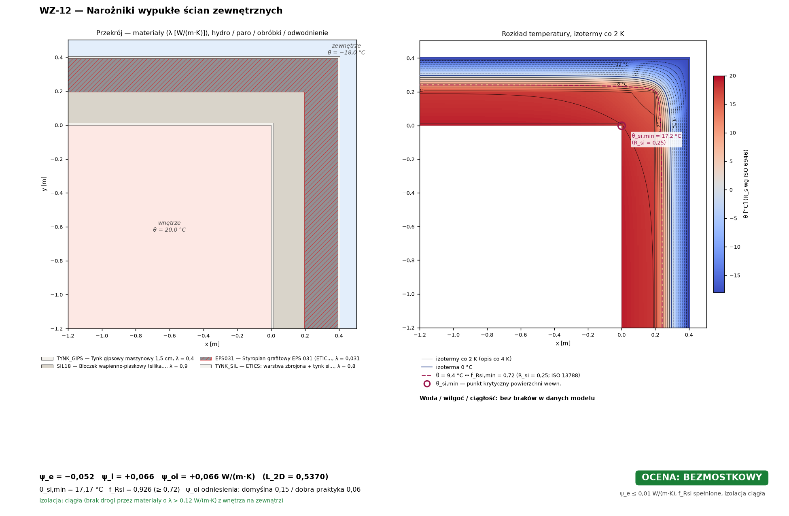

* ψ_e = −0,052, ψ_i = +0,066, ψ_oi = +0,066 W/(m·K); L_2D = 0,5370 W/(m·K); odniesienie ψ_oi: domyślna 0,15, dobra praktyka 0,06 (narożnik zewnętrzny ścian (izolacja zewnętrzna))
* θ_si,min = 17,17 °C, f_Rsi = 0,926 (≥ 0,72 — brak ryzyka pleśni i kondensacji powierzchniowej)
* izolacja: ciągła (brak drogi przez materiały o λ > 0,12 W/(m·K) z wnętrza na zewnątrz)
* siatka: 52900 komórek, zmiana Φ przy podwojeniu 0,007 %, bilans 1.8e-12

| | temat | pozycja listy kontrolnej |
|---|---|---|
| ✓ OK | izolacja | linia izolacji ciągła („test ołówka” na siatce: brak drogi przez materiały o λ > 0,12) |
| ✓ OK | paro | szczelność powietrzna ściany SZ1: tynk wewnętrzny ciągły (TYNK_GIPS) — do stropu i posadzki |

Wykresy szczegółowe: [temperatura](rys/WZ-12_temperatura.png), [strumien](rys/WZ-12_strumien.png), [powierzchnia](rys/WZ-12_theta_si.png); dane wejściowe, warunki brzegowe, siatka, elementy flankujące — [szczegoly_obliczen.md](szczegoly_obliczen.md)

### WZ-16a

**Krawędź stropu ST2Z nad powietrzem: ściana SZ2 na belce B3 + płyta PL-2 (łącznik)** — ocena **BEZMOSTKOWY** (ψ_e ≤ 0,01 W/(m·K), f_Rsi spełnione, izolacja ciągła)

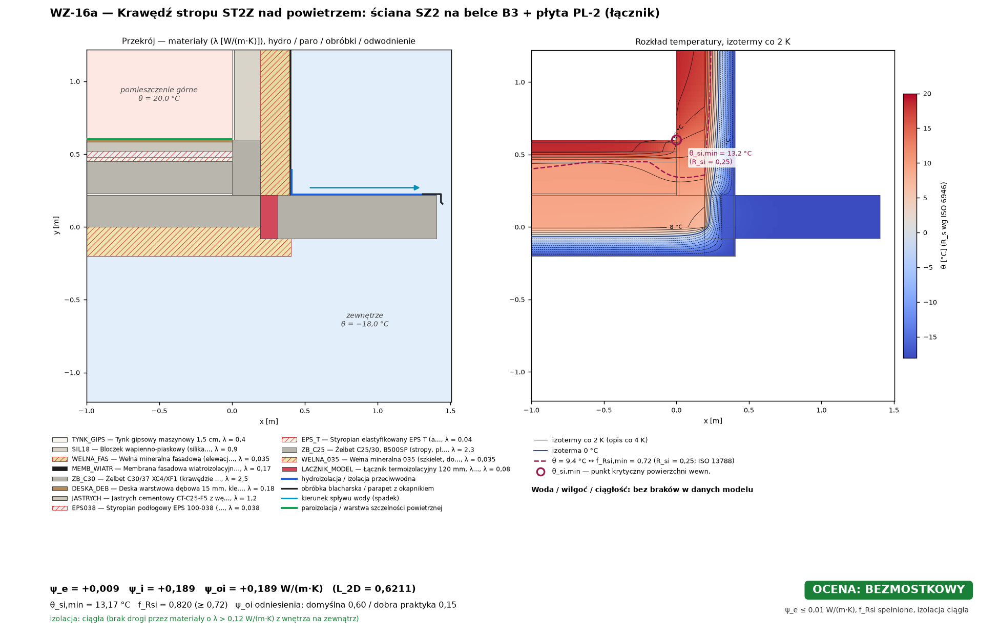

* ψ_e = +0,009, ψ_i = +0,189, ψ_oi = +0,189 W/(m·K); L_2D = 0,6211 W/(m·K); odniesienie ψ_oi: domyślna 0,60, dobra praktyka 0,15 (strop nad powietrzem zewnętrznym – ściana (wspornik bryły))
* θ_si,min = 13,17 °C, f_Rsi = 0,820 (≥ 0,72 — brak ryzyka pleśni i kondensacji powierzchniowej)
* izolacja: ciągła (brak drogi przez materiały o λ > 0,12 W/(m·K) z wnętrza na zewnątrz)
* siatka: 154344 komórek, zmiana Φ przy podwojeniu 0,028 %, bilans 1.6e-12

| | temat | pozycja listy kontrolnej |
|---|---|---|
| ✓ OK | izolacja | linia izolacji ciągła („test ołówka” na siatce: brak drogi przez materiały o λ > 0,12) |

*Uwaga:* Pustka wentylowana pod ociepleniem spodu stropu i podsufitka pominięte (PN-EN ISO 6946 — warstwy za pustką dobrze wentylowaną); R_se = 0,04 na spodzie ocieplenia (wariant ostrożny) [ZAŁ].
*Na rysunku:* membrana płyty wspornikowej wywinięta na ścianę ≥ 15 cm ponad powierzchnię płyty; obróbka czoła płyty z okapnikiem ≥ 3 cm; spadek płyty ≥ 2 % od budynku; szczelność powietrzna: płyta ŻB + tynk ściany górnej doprowadzony do płyty.

Wykresy szczegółowe: [temperatura](rys/WZ-16a_temperatura.png), [strumien](rys/WZ-16a_strumien.png), [powierzchnia](rys/WZ-16a_theta_si.png); dane wejściowe, warunki brzegowe, siatka, elementy flankujące — [szczegoly_obliczen.md](szczegoly_obliczen.md)

### WZ-16b

**Krawędź stropu ST2Z nad powietrzem: ściana SZ1 na belce B3** — ocena **BEZMOSTKOWY** (ψ_e ≤ 0,01 W/(m·K), f_Rsi spełnione, izolacja ciągła)

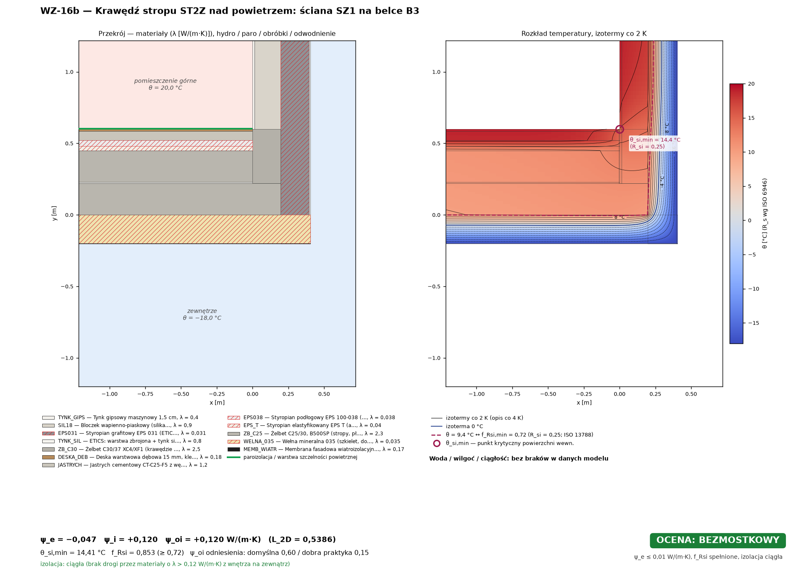

* ψ_e = −0,047, ψ_i = +0,120, ψ_oi = +0,120 W/(m·K); L_2D = 0,5386 W/(m·K); odniesienie ψ_oi: domyślna 0,60, dobra praktyka 0,15 (strop nad powietrzem zewnętrznym – ściana (wspornik bryły))
* θ_si,min = 14,41 °C, f_Rsi = 0,853 (≥ 0,72 — brak ryzyka pleśni i kondensacji powierzchniowej)
* izolacja: ciągła (brak drogi przez materiały o λ > 0,12 W/(m·K) z wnętrza na zewnątrz)
* siatka: 103824 komórek, zmiana Φ przy podwojeniu 0,017 %, bilans 1.7e-12

| | temat | pozycja listy kontrolnej |
|---|---|---|
| ✓ OK | izolacja | linia izolacji ciągła („test ołówka” na siatce: brak drogi przez materiały o λ > 0,12) |

*Uwaga:* Pustka wentylowana pod ociepleniem spodu stropu i podsufitka pominięte (PN-EN ISO 6946 — warstwy za pustką dobrze wentylowaną); R_se = 0,04 na spodzie ocieplenia (wariant ostrożny) [ZAŁ].
*Na rysunku:* szczelność powietrzna: płyta ŻB + tynk ściany górnej doprowadzony do płyty.

Wykresy szczegółowe: [temperatura](rys/WZ-16b_temperatura.png), [strumien](rys/WZ-16b_strumien.png), [powierzchnia](rys/WZ-16b_theta_si.png); dane wejściowe, warunki brzegowe, siatka, elementy flankujące — [szczegoly_obliczen.md](szczegoly_obliczen.md)

### WZ-X1

**Dach D2/D3 (SD2) – ściana SZ1 wyższej kondygnacji na krawędzi (pod spodem ściana SW18, pomieszczenia ogrzewane) — węzeł spoza sekcji `wezly`** — ocena **BEZMOSTKOWY** (ψ_e ≤ 0,01 W/(m·K), f_Rsi spełnione, izolacja ciągła)

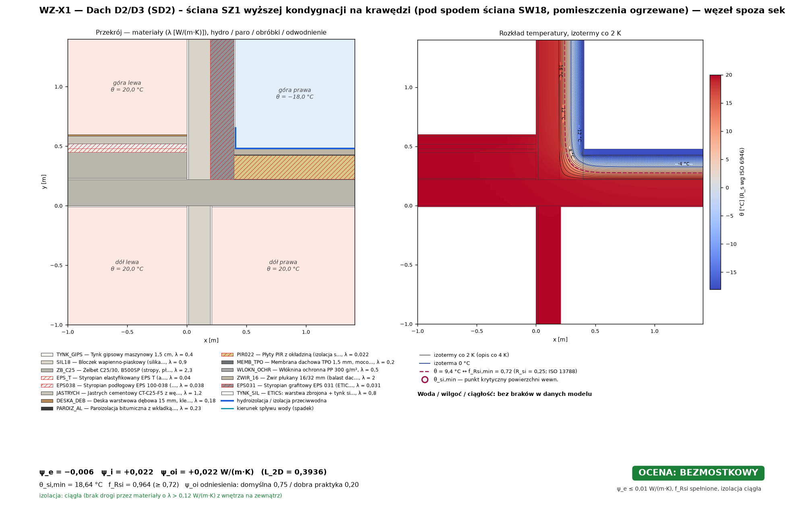

* ψ_e = −0,006, ψ_i = +0,022, ψ_oi = +0,022 W/(m·K); L_2D = 0,3936 W/(m·K); odniesienie ψ_oi: domyślna 0,75, dobra praktyka 0,20 (stropodach–ściana zewnętrzna z attyką (izolacja attyki z 3 stron))
* θ_si,min = 18,64 °C, f_Rsi = 0,964 (≥ 0,72 — brak ryzyka pleśni i kondensacji powierzchniowej)
* izolacja: ciągła (brak drogi przez materiały o λ > 0,12 W/(m·K) z wnętrza na zewnątrz)
* siatka: 118728 komórek, zmiana Φ przy podwojeniu 0,010 %, bilans 2.6e-12

| | temat | pozycja listy kontrolnej |
|---|---|---|
| ✓ OK | izolacja | linia izolacji ciągła („test ołówka” na siatce: brak drogi przez materiały o λ > 0,12) |
| ✓ OK | paro | szczelność powietrzna ściany SZ1: tynk wewnętrzny ciągły (TYNK_GIPS) — do stropu i posadzki |
| ✓ OK | paro | paroizolacja stropodachu SD1: PAROIZ_AL — wywinięta na attykę |
| ✓ OK | hydro | hydroizolacja stropodachu SD1: MEMB_TPO |
| ✓ OK | hydro | wywinięcie hydroizolacji na attykę ≥ 15 cm ponad warstwę wierzchnią (brief 9.4) |
| ✓ OK | woda | spadek dachu 0.02 (wymagany ≥ 2 %, izolacja spadkowa) |
| ✓ OK | woda | wpusty dachowe: 2 szt. |
| ✓ OK | woda | przelewy awaryjne w attyce: 2 szt. |
| ✓ OK | rury | rury spustowe: RS1 (wewn_szacht → zbiornik), RS2 (wewn_szacht → zbiornik) |
| i INFO | woda | obróbka korony attyki ze spadkiem ≥ 5 % do dachu i okapnikami; wpust / przelew przez attykę — mostek punktowy χ (poza modelem 2D; kołnierz izolowany) |

*Uwaga:* Grupy stref: i — ogrzewane, u — nieogrzewane, e — zewnętrze; ψ dla każdej pary grup z elementami flankującymi (PN-EN ISO 10211, więcej niż dwie temperatury).
*Na rysunku:* hydroizolacja dachu wywinięta na ścianę ≥ 15 cm ponad warstwę wierzchnią (substrat / żwir); spadek dachu ≥ 2 % od ściany; opaska żwirowa ≥ 0,5 m przy ścianie.

Wykresy szczegółowe: [temperatura](rys/WZ-X1_temperatura.png), [strumien](rys/WZ-X1_strumien.png), [powierzchnia](rys/WZ-X1_theta_si.png); dane wejściowe, warunki brzegowe, siatka, elementy flankujące — [szczegoly_obliczen.md](szczegoly_obliczen.md)

### WZ-X2

**Dach D4 (DZ1) – ściana SZ1 wyższej kondygnacji na krawędzi (pod spodem ściana SW18, pomieszczenia ogrzewane) — węzeł spoza sekcji `wezly`** — ocena **BEZMOSTKOWY** (ψ_e ≤ 0,01 W/(m·K), f_Rsi spełnione, izolacja ciągła)

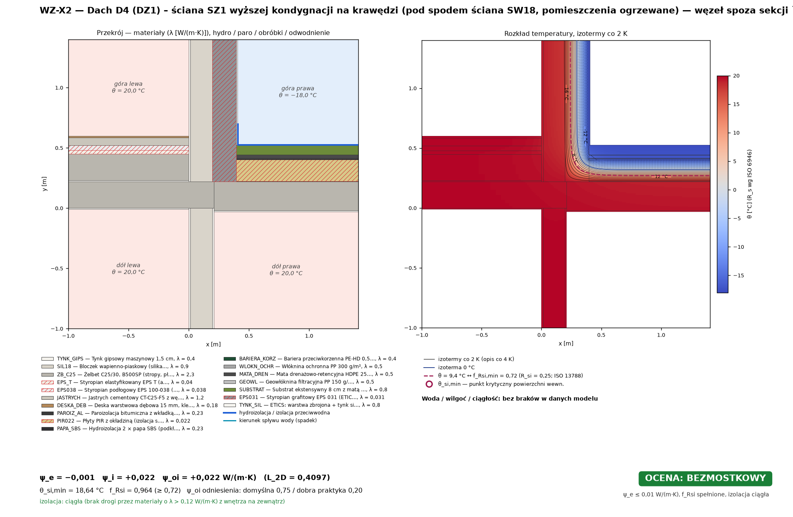

* ψ_e = −0,001, ψ_i = +0,022, ψ_oi = +0,022 W/(m·K); L_2D = 0,4097 W/(m·K); odniesienie ψ_oi: domyślna 0,75, dobra praktyka 0,20 (stropodach–ściana zewnętrzna z attyką (izolacja attyki z 3 stron))
* θ_si,min = 18,64 °C, f_Rsi = 0,964 (≥ 0,72 — brak ryzyka pleśni i kondensacji powierzchniowej)
* izolacja: ciągła (brak drogi przez materiały o λ > 0,12 W/(m·K) z wnętrza na zewnątrz)
* siatka: 135864 komórek, zmiana Φ przy podwojeniu 0,008 %, bilans 2.1e-11

| | temat | pozycja listy kontrolnej |
|---|---|---|
| ✓ OK | izolacja | linia izolacji ciągła („test ołówka” na siatce: brak drogi przez materiały o λ > 0,12) |
| ✓ OK | paro | szczelność powietrzna ściany SZ1: tynk wewnętrzny ciągły (TYNK_GIPS) — do stropu i posadzki |
| ✓ OK | paro | paroizolacja stropodachu SD1: PAROIZ_AL — wywinięta na attykę |
| ✓ OK | hydro | hydroizolacja stropodachu SD1: MEMB_TPO |
| ✓ OK | hydro | wywinięcie hydroizolacji na attykę ≥ 15 cm ponad warstwę wierzchnią (brief 9.4) |
| ✓ OK | woda | spadek dachu 0.02 (wymagany ≥ 2 %, izolacja spadkowa) |
| ✓ OK | woda | wpusty dachowe: 2 szt. |
| ✓ OK | woda | przelewy awaryjne w attyce: 2 szt. |
| ✓ OK | rury | rury spustowe: RS1 (wewn_szacht → zbiornik), RS2 (wewn_szacht → zbiornik) |
| i INFO | woda | obróbka korony attyki ze spadkiem ≥ 5 % do dachu i okapnikami; wpust / przelew przez attykę — mostek punktowy χ (poza modelem 2D; kołnierz izolowany) |

*Uwaga:* Grupy stref: i — ogrzewane, u — nieogrzewane, e — zewnętrze; ψ dla każdej pary grup z elementami flankującymi (PN-EN ISO 10211, więcej niż dwie temperatury).
*Na rysunku:* hydroizolacja dachu wywinięta na ścianę ≥ 15 cm ponad warstwę wierzchnią (substrat / żwir); spadek dachu ≥ 2 % od ściany; opaska żwirowa ≥ 0,5 m przy ścianie.

Wykresy szczegółowe: [temperatura](rys/WZ-X2_temperatura.png), [strumien](rys/WZ-X2_strumien.png), [powierzchnia](rys/WZ-X2_theta_si.png); dane wejściowe, warunki brzegowe, siatka, elementy flankujące — [szczegoly_obliczen.md](szczegoly_obliczen.md)

## Ograniczenia

* Modele 2D (mostki liniowe). Mostki punktowe χ (wpusty i przelewy w attyce, konsole, kotwy, narożniki 3D, przejścia rur) — poza zakresem; wymagają modelu 3D lub deklaracji wyrobu.
* Łącznik termoizolacyjny, okna, profile progowe — DANE PRZYKŁADOWE (do zastąpienia deklaracjami wyrobów).
* Ocena pleśni kryterium f_Rsi (stan ustalony); transport wilgoci w przegrodach — metoda Glasera w obliczeniach fizyki budowli (`05_wilgotnosc.md`).
* Linie hydro/paro/obróbek/drenażu na rysunkach są schematem wymagań detalu, nie rysunkiem wykonawczym.
