# Katalog mostków cieplnych — Dom LAMELA — szczegóły obliczeń

Dane wejściowe, warunki brzegowe, siatki, elementy flankujące i ψ w trzech systemach wymiarów dla węzłów z `katalog_mostkow.md`.

Podstawy: PN-EN ISO 10211:2017-09 (metoda numeryczna 2D, warunki brzegowe, płaszczyzny odcięcia, kryteria dokładności), PN-EN ISO 14683:2017-09 (ψ w wymiarach zewnętrznych i wewnętrznych), PN-EN ISO 13788:2013-05 (f_Rsi, R_si = 0,25), PN-EN ISO 6946:2017-10 (R_si/R_se, pustki powietrzne), PN-EN ISO 13370:2017-09 (grunt), WT zał. 2 pkt 2.2 (f_Rsi ≥ 0,72 — W-248). Solver: `lamela.obliczenia.mostki2d` (walidacja wg zał. C ISO 10211 — przypadki 1 i 2 zał. C ISO 10211 oraz analityczne — SPEŁNIONE (max |Δθ| przyp. 1 = 0.048 K, przyp. 2 = 0.039 K ≤ 0,1 K; ΔΦ = -0.010 W/m ≤ 0,1 W/m)).

## Zestawienie

| węzeł | nazwa | L_2D (i–e) | ψ_oi | ψ_e | ψ_i | θ_si,min [°C] | f_Rsi | f_Rsi ≥ min | Δ siatki |
|---|---|---|---|---|---|---|---|---|---|
| WZ-01 | Attyka stropodachu bryły A (D1) | 0,4159 | 0,086 | −0,025 | 0,088 | 17,42 | 0,932 | tak | 0,01 % |
| WZ-02 | Attyki dachów P1 (D2, D3) — poza ścianami bryły A | 0,5044 | 0,171 | 0,059 | 0,173 | 16,20 | 0,900 | tak | 0,02 % |
| WZ-03 | Attyka dachu zielonego nad pasem gospodarczym (linia D, część ogrzewana) | 0,5611 | 0,195 | 0,069 | 0,195 | 15,81 | 0,890 | tak | 0,02 % |
| WZ-04 | Okap E (PL-E) i daszek wejścia — łącznik termoizolacyjny | 0,5138 | 0,128 | 0,128 | 0,217 | 17,29 | 0,929 | tak | 0,01 % |
| WZ-05 | Krawędź ST2 (PL-2) — łącznik termoizolacyjny pod bryłą A | 0,5333 | 0,134 | 0,126 | 0,223 | 17,24 | 0,927 | tak | 0,01 % |
| WZ-06 | Krawędź ST3 (PL-3) — łącznik termoizolacyjny przy attyce bryły A | 0,5342 | 0,205 | 0,093 | 0,206 | 15,79 | 0,889 | tak | 0,02 % |
| WZ-07a | Krawędź stropu ST2Z nad powietrzem: ściana SZL na belce B3 + płyta PL-2 (łącznik) | 0,5317 | 0,152 | 0,028 | 0,152 | 14,33 | 0,851 | tak | 0,04 % |
| WZ-07b | Krawędź stropu ST2Z nad ścianą SZ1 niższej kondygnacji (ocieplenie spodu SUF-ZEW) | 0,5006 | −0,061 | −0,014 | 0,027 | 18,17 | 0,952 | tak | 0,01 % |
| WZ-08 | Cokół: ściana zewn. – płyta fundamentowa na XPS (część ogrzewana) | 0,5654 | 0,100 | 0,058 | 0,100 | 16,32 | 0,903 | tak | 0,03 % |
| WZ-09a | Ściana dom–garaż (SWG) na płycie fundamentowej (POD-0 / POD-G) | 0,6603 | 0,406 | 0,406 | 0,406 | 17,00 | 0,901 | tak | 0,05 % |
| WZ-09b | Ściana SWG pod płytą: dom — D4, garaż — D4, pas docieplenia SUF-G 1.0 m | 0,2982 | 0,071 | 0,052 | 0,071 | 13,77 | 0,836 | tak | 0,03 % |
| WZ-09c | Ściana SWG pod płytą: dom — ST1 + ściana SZ1, garaż — D4, pas docieplenia SUF-G 1.0 m | 0,2581 | 0,081 | 0,070 | 0,081 | 15,64 | 0,885 | tak | 0,03 % |
| WZ-10 | Strop pośredni ST1/ST2 – ściana zewn. z ETICS ciągłym (wieniec) | 0,3856 | 0,000 | 0,000 | 0,089 | 18,60 | 0,963 | tak | 0,00 % |
| WZ-11 | Ościeża okien/drzwi — ciepły montaż (rama 5 cm w murze, 4 cm w izolacji, zakład izolacji 3 cm na ramę) | 0,4374 | 0,005 | 0,014 | 0,014 | 17,34 | 0,930 | tak | 0,07 % |
| WZ-11N | Nadproża — BEZ kaset osłon w ociepleniu (kasety w okapach / ramie C / szczelinie lamel / nadstawne) | 0,4404 | 0,008 | 0,017 | 0,017 | 17,63 | 0,938 | tak | 0,07 % |
| WZ-11P | Podokienniki — parapet zewn. z okapnikiem na profilu z XPS | 0,4375 | 0,006 | 0,015 | 0,015 | 16,62 | 0,911 | tak | 0,08 % |
| WZ-11T | Progi HS / drzwi zewn. na płycie P0 — profil progowy termoizolacyjny na podwalinie XPS/PUR-GF, odwodnienie liniowe | 0,7286 | 0,118 | 0,076 | 0,118 | 14,10 | 0,845 | tak | 0,07 % |
| WZ-12 | Narożniki wypukłe ścian zewnętrznych | 0,5370 | 0,066 | −0,052 | 0,066 | 17,17 | 0,926 | tak | 0,01 % |
| WZ-16a | Krawędź stropu ST2Z nad powietrzem: ściana SZ2 na belce B3 + płyta PL-2 (łącznik) | 0,6211 | 0,189 | 0,009 | 0,189 | 13,17 | 0,820 | tak | 0,03 % |
| WZ-16b | Krawędź stropu ST2Z nad powietrzem: ściana SZ1 na belce B3 | 0,5386 | 0,120 | −0,047 | 0,120 | 14,41 | 0,853 | tak | 0,02 % |
| WZ-X1 | Dach D2/D3 (SD2) – ściana SZ1 wyższej kondygnacji na krawędzi (pod spodem ściana SW18, pomieszczenia ogrzewane) — węzeł spoza sekcji `wezly` | 0,3936 | 0,022 | −0,006 | 0,022 | 18,64 | 0,964 | tak | 0,01 % |
| WZ-X2 | Dach D4 (DZ1) – ściana SZ1 wyższej kondygnacji na krawędzi (pod spodem ściana SW18, pomieszczenia ogrzewane) — węzeł spoza sekcji `wezly` | 0,4097 | 0,022 | −0,001 | 0,022 | 18,64 | 0,964 | tak | 0,01 % |

## H_TB — wymiary wewnętrzne całkowite (ψ_oi)

System wymiarów jak w obliczeniu obudowy (`energia.bryla`: ściany po licach wewnętrznych × wysokość „od podłogi do podłogi”, pod dachem do spodu płyty; okna w świetle otworu w murze) — ψ i długości w tym samym systemie (PN-EN ISO 10211:2017 pkt 7.1; PN-EN ISO 13789; PN-EN ISO 14683). Wartości ψ_e/ψ_i powyżej — wyłącznie do porównań z tabelami PN-EN ISO 14683 (nie sumować z polami w innym systemie).

| węzeł | nazwa | ψ_oi [W/(m·K)] | l_oi [m] | ψ·l [W/K] |
|---|---|---|---|---|
| WZ-01 | Attyka stropodachu bryły A (D1) | 0,0863 | 19,9400 | 1,7209 |
| WZ-02 | Attyki dachów P1 (D2, D3) — poza ścianami bryły A | 0,1714 | 13,4100 | 2,2987 |
| WZ-03 | Attyka dachu zielonego nad pasem gospodarczym (linia D, część ogrzewana) | 0,1953 | 7,1700 | 1,4000 |
| WZ-04 | Okap E (PL-E) i daszek wejścia — łącznik termoizolacyjny | 0,1281 | 22,4700 | 2,8795 |
| WZ-05 | Krawędź ST2 (PL-2) — łącznik termoizolacyjny pod bryłą A | 0,1341 | 18,7100 | 2,5091 |
| WZ-06 | Krawędź ST3 (PL-3) — łącznik termoizolacyjny przy attyce bryły A | 0,2046 | 24,3000 | 4,9725 |
| WZ-07a | Krawędź stropu ST2Z nad powietrzem: ściana SZL na belce B3 + płyta PL-2 (łącznik) | 0,1522 | 5,3000 | 0,8068 |
| WZ-07b | Krawędź stropu ST2Z nad ścianą SZ1 niższej kondygnacji (ocieplenie spodu SUF-ZEW) | −0,0607 | 5,3000 | −0,3215 |
| WZ-08 | Cokół: ściana zewn. – płyta fundamentowa na XPS (część ogrzewana) | 0,1002 | 27,7700 | 2,7835 |
| WZ-09a | Ściana dom–garaż (SWG) na płycie fundamentowej (POD-0 / POD-G) | 0,4064 | 12,2550 | 4,9808 |
| WZ-09b | Ściana SWG pod płytą: dom — D4, garaż — D4, pas docieplenia SUF-G 1.0 m | 0,0710 | 6,3780 | 0,4529 |
| WZ-09c | Ściana SWG pod płytą: dom — ST1 + ściana SZ1, garaż — D4, pas docieplenia SUF-G 1.0 m | 0,0813 | 5,8770 | 0,4779 |
| WZ-10 | Strop pośredni ST1/ST2 – ściana zewn. z ETICS ciągłym (wieniec) | 0,0000 | 18,2000 | −0,0002 |
| WZ-11 | Ościeża okien/drzwi — ciepły montaż (rama 5 cm w murze, 4 cm w izolacji, zakład izolacji 3 cm na ramę) | 0,0053 | 96,2800 | 0,5123 |
| WZ-11N | Nadproża — BEZ kaset osłon w ociepleniu (kasety w okapach / ramie C / szczelinie lamel / nadstawne) | 0,0078 | 45,0300 | 0,3515 |
| WZ-11P | Podokienniki — parapet zewn. z okapnikiem na profilu z XPS | 0,0059 | 29,4200 | 0,1744 |
| WZ-11T | Progi HS / drzwi zewn. na płycie P0 — profil progowy termoizolacyjny na podwalinie XPS/PUR-GF, odwodnienie liniowe | 0,1185 | 15,6700 | 1,8562 |
| WZ-12 | Narożniki wypukłe ścian zewnętrznych | 0,0655 | 40,0500 | 2,6246 |
| WZ-16a | Krawędź stropu ST2Z nad powietrzem: ściana SZ2 na belce B3 + płyta PL-2 (łącznik) | 0,1888 | 1,0100 | 0,1907 |
| WZ-16b | Krawędź stropu ST2Z nad powietrzem: ściana SZ1 na belce B3 | 0,1199 | 1,0100 | 0,1211 |
| WZ-X1 | Dach D2/D3 (SD2) – ściana SZ1 wyższej kondygnacji na krawędzi (pod spodem ściana SW18, pomieszczenia ogrzewane) — węzeł spoza sekcji `wezly` | 0,0224 | 13,7850 | 0,3082 |
| WZ-X2 | Dach D4 (DZ1) – ściana SZ1 wyższej kondygnacji na krawędzi (pod spodem ściana SW18, pomieszczenia ogrzewane) — węzeł spoza sekcji `wezly` | 0,0219 | 2,7930 | 0,0611 |

**H_TB = Σ ψ_oi·l_oi = 31,16 W/K** (węzły liniowe 2D; mostki punktowe χ — poza zakresem)

## WZ-01 — Attyka stropodachu bryły A (D1)

**Dane wejściowe**

*warstwy ściany:*

| kod | materiał | d [m] | λ [W/(m·K)] | R [m²K/W] |
|---|---|---|---|---|
| TYNK_GIPS | Tynk gipsowy maszynowy 1,5 cm | 0,0150 | 0,4000 | 0,0375 |
| SIL18 | Bloczek wapienno-piaskowy (silikat) 18 cm, kl. 20, gr. 1, na zaprawie cienkowarstwowej | 0,1800 | 0,9000 | 0,2000 |
| WELNA_FAS | Wełna mineralna fasadowa (elewacja wentylowana bryły A, A1) | 0,2000 | 0,0350 | 5,7143 |
| MEMB_WIATR | Membrana fasadowa wiatroizolacyjna UV-stabilna, czarna (sd ≈ 0,02 m) | 0,0100 | 0,1700 | 0,0588 |

*warstwy dachu:*

| kod | materiał | d [m] | λ [W/(m·K)] | R [m²K/W] |
|---|---|---|---|---|
| MEMB_TPO | Membrana dachowa TPO 1,5 mm, mocowana mechanicznie (hydroizolacja stropodachów) | 0,0020 | 0,2000 | 0,0100 |
| PIR022 | Płyty PIR z okładziną (izolacja spadkowa stropodachów) | 0,2200 | 0,0220 | 10,0000 |
| PAROIZ_AL | Paroizolacja bitumiczna z wkładką Al (na płycie stropodachów) | 0,0040 | 0,2300 | 0,0174 |
| ZB_C25 | Żelbet C25/30, B500SP (stropy, płyta fundamentowa, ściany) | 0,2200 | 2,3000 | 0,0957 |
| TYNK_GIPS | Tynk gipsowy maszynowy 1,5 cm | 0,0100 | 0,4000 | 0,0250 |

* attyka: SIL18, wys. nad pokryciem 0.35 m; izolacja PIR022: wewn. 0.1 m, korona 0.05 m; blok termiczny BLOK_TERM_MODEL h = 0.15 m

**Warunki brzegowe** (przekrój pionowy; płaszczyzny odcięcia i osie symetrii adiabatyczne)

| strefa | rodzaj | grupa | θ [°C] | R_s — przebieg ψ [m²K/W] | R_s — przebieg f_Rsi |
|---|---|---|---|---|---|
| pomieszczenie | wewn | i | 20,0 | wg ISO 6946: 0,13 poziomo / 0,10 w górę / 0,17 w dół | 0,25 (ramy/szyby 0,13) |
| zewnętrze | zewn | e | −18,0 | 0,04 | 0,04 |

**Siatka i dokładność** (MOS, siatka prostokątna zagęszczana przy granicach materiałów)

| siatka | komórek | Φ_całk [W/m] |
|---|---|---|
| 129 × 164 = 21156 komórek; Δx ∈ [1.65; 93.5] mm, Δy ∈ [1; 94.72] mm | 21156 | 15,8008 |
| 258 × 328 = 84624 komórek; Δx ∈ [0.825; 46.75] mm, Δy ∈ [0.5; 47.36] mm | 84624 | 15,8026 |

Zmiana strumienia przy podwojeniu liczby podziałów: **0,011 %** (kryterium ISO 10211 < 1 %: spełnione); zmiana L_2D (= zmiana ψ): 0,00005 W/(m·K) (kryterium ≤ max(1 % |ψ|; 0,001) = 0,00100: spełnione); bilans energii Σ Φ / (½ Σ|Φ|) = 5.9e-13 (kryterium < 10⁻⁴: spełnione).

**Współczynniki sprzężenia i ψ**

*Para i–e:* L_2D = **0,4159 W/(m·K)**

| element flankujący | U [W/(m²K)] | l_e [m] | l_i [m] | l_oi [m] | U·l_e | U·l_i | U·l_oi |
|---|---|---|---|---|---|---|---|
| ściana | 0,1618 | 1,6610 | 1,2050 | 1,2150 | 0,2687 | 0,1950 | 0,1966 |
| stropodach | 0,0972 | 1,7730 | 1,3680 | 1,3680 | 0,1723 | 0,1330 | 0,1330 |

ψ_oi (wymiary wewnętrzne całkowite — system projektu, H_TB) = 0,4159 − 0,3296 = **0,086 W/(m·K)**; ψ_e (zewnętrzne) = 0,4159 − 0,4411 = −0,025 W/(m·K); ψ_i (wewnętrzne) = 0,4159 − 0,3279 = 0,088 W/(m·K)

**Temperatura powierzchni wewnętrznej i ryzyko pleśni** (R_si = 0,25 — PN-EN ISO 13788)

* θ_si,min = **17,42 °C** w punkcie (0,000; −0,010) m przy θ_i = 20,0 °C, θ_e = −18,0 °C
* f_Rsi = (θ_si,min − θ_e)/(θ_i − θ_e) = **0,932**; wymaganie f_Rsi ≥ 0,72 (WT zał. 2 pkt 2.2.1–2.2.5 (uproszczenie; φ_i = 50 %) (W-248)) → **SPEŁNIA**
* informacyjnie przy θ_e obliczeniowej i φ_i = 50 %: θ_si,kryt (φ_si = 80 %) = 12,6 °C (f = 0,806), punkt rosy 9,3 °C → θ_si,min ≥ θ_si,kryt (ocena miesięczna wg ISO 13788 — łagodniejsza; kryterium formalne: f_Rsi ≥ 0,72)

**Porównanie**

* PN-EN ISO 14683 — wartość domyślna (dach płaski–ściana z attyką, izolacja ciągła (R)): ψ_e = 0,55, ψ_i = 0,75 W/(m·K) [NZW] — obliczone ψ_e = −0,025, ψ_i = 0,088 (poniżej wartości domyślnej — porównanie w tym samym systemie wymiarów)

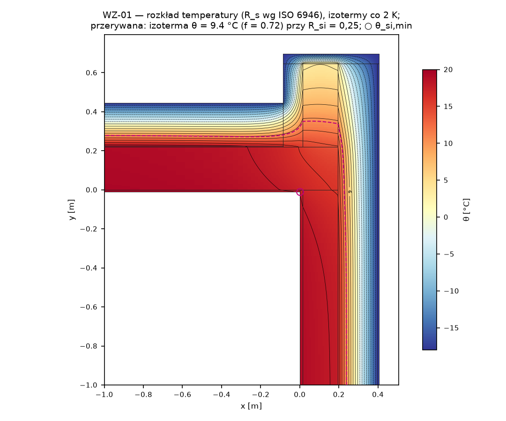

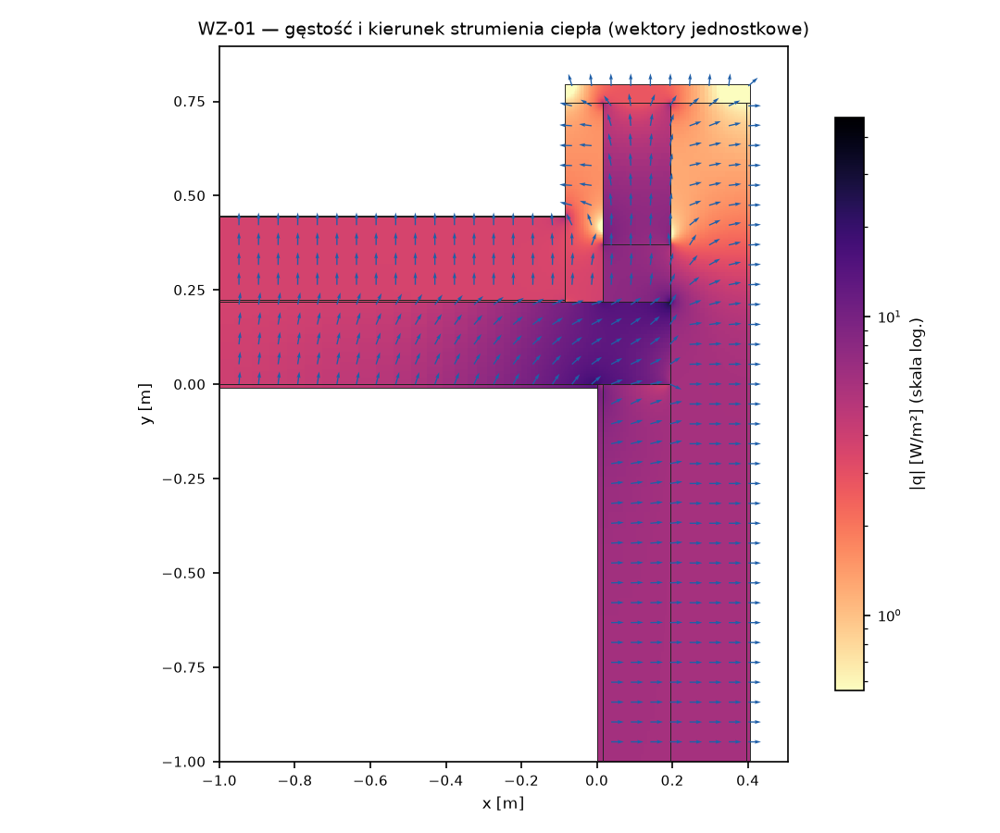

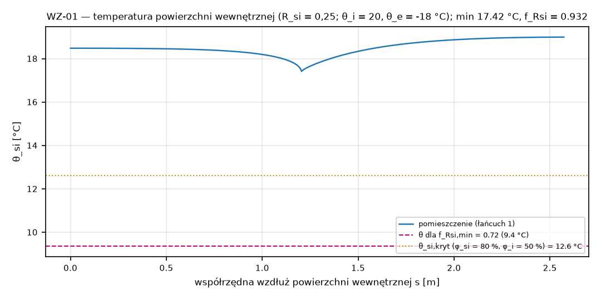

## WZ-02 — Attyki dachów P1 (D2, D3) — poza ścianami bryły A

**Dane wejściowe**

*warstwy ściany:*

| kod | materiał | d [m] | λ [W/(m·K)] | R [m²K/W] |
|---|---|---|---|---|
| TYNK_GIPS | Tynk gipsowy maszynowy 1,5 cm | 0,0150 | 0,4000 | 0,0375 |
| SIL18 | Bloczek wapienno-piaskowy (silikat) 18 cm, kl. 20, gr. 1, na zaprawie cienkowarstwowej | 0,1800 | 0,9000 | 0,2000 |
| EPS031 | Styropian grafitowy EPS 031 (ETICS, NRO w systemie) | 0,2000 | 0,0310 | 6,4516 |
| TYNK_SIL | ETICS: warstwa zbrojona + tynk silikonowy 1,5 mm (biały / jasnoszary NCS S 1500-N) | 0,0100 | 0,8000 | 0,0125 |

*warstwy dachu:*

| kod | materiał | d [m] | λ [W/(m·K)] | R [m²K/W] |
|---|---|---|---|---|
| ZWIR_16 | Żwir płukany 16/32 mm (balast dachu P1, opaska przy attyce) | 0,0500 | 2,0000 | 0,0250 |
| WLOKN_OCHR | Włóknina ochronna PP 300 g/m² | 0,0040 | 0,5000 | 0,0080 |
| MEMB_TPO | Membrana dachowa TPO 1,5 mm, mocowana mechanicznie (hydroizolacja stropodachów) | 0,0020 | 0,2000 | 0,0100 |
| PIR022 | Płyty PIR z okładziną (izolacja spadkowa stropodachów) | 0,2000 | 0,0220 | 9,0909 |
| PAROIZ_AL | Paroizolacja bitumiczna z wkładką Al (na płycie stropodachów) | 0,0040 | 0,2300 | 0,0174 |
| ZB_C25 | Żelbet C25/30, B500SP (stropy, płyta fundamentowa, ściany) | 0,2200 | 2,3000 | 0,0957 |
| TYNK_GIPS | Tynk gipsowy maszynowy 1,5 cm | 0,0100 | 0,4000 | 0,0250 |

* attyka: SIL18, wys. nad pokryciem 0.25 m; izolacja PIR022: wewn. 0.1 m, korona 0.05 m

**Warunki brzegowe** (przekrój pionowy; płaszczyzny odcięcia i osie symetrii adiabatyczne)

| strefa | rodzaj | grupa | θ [°C] | R_s — przebieg ψ [m²K/W] | R_s — przebieg f_Rsi |
|---|---|---|---|---|---|
| pomieszczenie | wewn | i | 20,0 | wg ISO 6946: 0,13 poziomo / 0,10 w górę / 0,17 w dół | 0,25 (ramy/szyby 0,13) |
| zewnętrze | zewn | e | −18,0 | 0,04 | 0,04 |

**Siatka i dokładność** (MOS, siatka prostokątna zagęszczana przy granicach materiałów)

| siatka | komórek | Φ_całk [W/m] |
|---|---|---|
| 130 × 163 = 21190 komórek; Δx ∈ [1.65; 94.08] mm, Δy ∈ [1; 94.72] mm | 21190 | 19,1640 |
| 260 × 326 = 84760 komórek; Δx ∈ [0.825; 47.04] mm, Δy ∈ [0.5; 47.36] mm | 84760 | 19,1678 |

Zmiana strumienia przy podwojeniu liczby podziałów: **0,020 %** (kryterium ISO 10211 < 1 %: spełnione); zmiana L_2D (= zmiana ψ): 0,00010 W/(m·K) (kryterium ≤ max(1 % |ψ|; 0,001) = 0,00171: spełnione); bilans energii Σ Φ / (½ Σ|Φ|) = 2.9e-14 (kryterium < 10⁻⁴: spełnione).

**Współczynniki sprzężenia i ψ**

*Para i–e:* L_2D = **0,5044 W/(m·K)**

| element flankujący | U [W/(m²K)] | l_e [m] | l_i [m] | l_oi [m] | U·l_e | U·l_i | U·l_oi |
|---|---|---|---|---|---|---|---|
| ściana | 0,1455 | 1,6950 | 1,2050 | 1,2150 | 0,2467 | 0,1754 | 0,1768 |
| stropodach | 0,1062 | 1,8750 | 1,4700 | 1,4700 | 0,1992 | 0,1562 | 0,1562 |

ψ_oi (wymiary wewnętrzne całkowite — system projektu, H_TB) = 0,5044 − 0,3330 = **0,171 W/(m·K)**; ψ_e (zewnętrzne) = 0,5044 − 0,4459 = 0,059 W/(m·K); ψ_i (wewnętrzne) = 0,5044 − 0,3315 = 0,173 W/(m·K)

**Temperatura powierzchni wewnętrznej i ryzyko pleśni** (R_si = 0,25 — PN-EN ISO 13788)

* θ_si,min = **16,20 °C** w punkcie (0,000; −0,010) m przy θ_i = 20,0 °C, θ_e = −18,0 °C
* f_Rsi = (θ_si,min − θ_e)/(θ_i − θ_e) = **0,900**; wymaganie f_Rsi ≥ 0,72 (WT zał. 2 pkt 2.2.1–2.2.5 (uproszczenie; φ_i = 50 %) (W-248)) → **SPEŁNIA**
* informacyjnie przy θ_e obliczeniowej i φ_i = 50 %: θ_si,kryt (φ_si = 80 %) = 12,6 °C (f = 0,806), punkt rosy 9,3 °C → θ_si,min ≥ θ_si,kryt (ocena miesięczna wg ISO 13788 — łagodniejsza; kryterium formalne: f_Rsi ≥ 0,72)

**Porównanie**

* PN-EN ISO 14683 — wartość domyślna (dach płaski–ściana z attyką, izolacja ciągła (R)): ψ_e = 0,55, ψ_i = 0,75 W/(m·K) [NZW] — obliczone ψ_e = 0,059, ψ_i = 0,173 (poniżej wartości domyślnej — porównanie w tym samym systemie wymiarów)

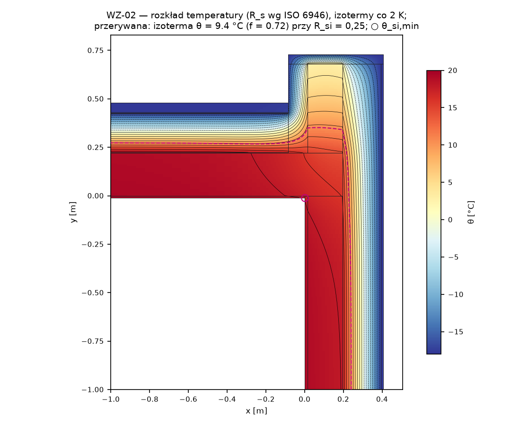

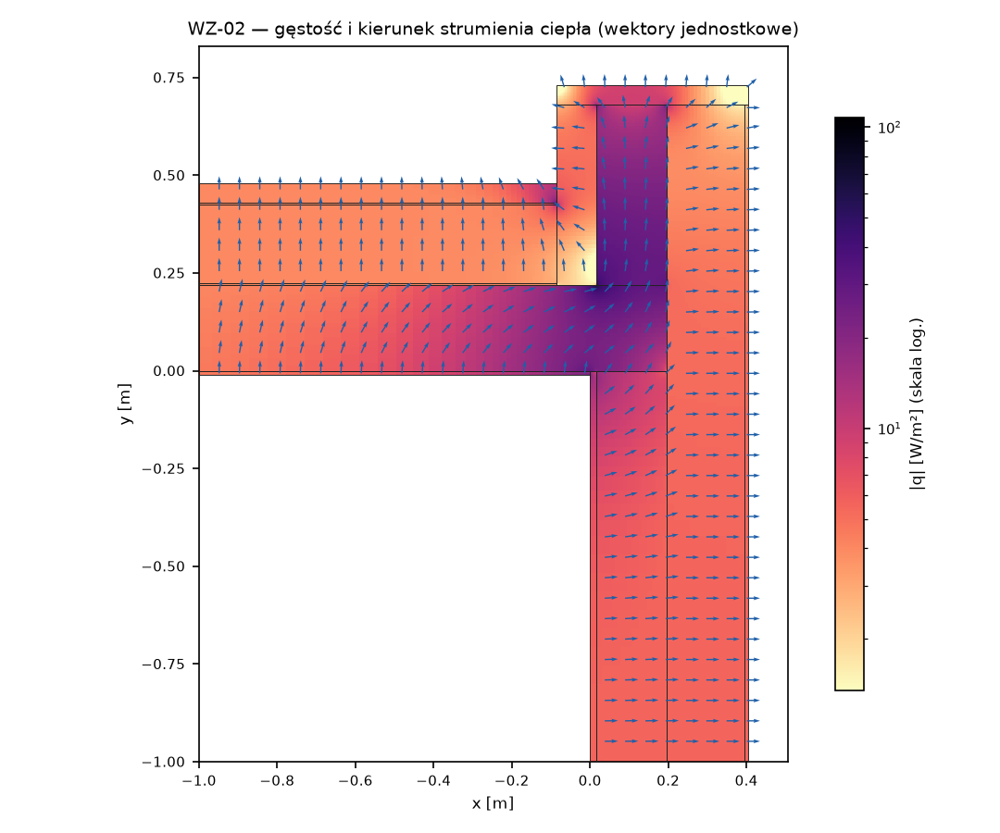

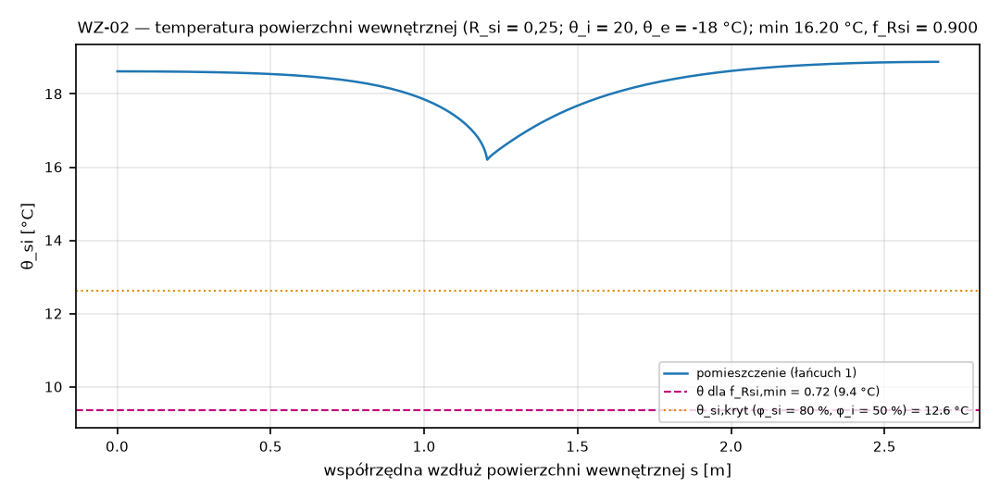

## WZ-03 — Attyka dachu zielonego nad pasem gospodarczym (linia D, część ogrzewana)

**Dane wejściowe**

*warstwy ściany:*

| kod | materiał | d [m] | λ [W/(m·K)] | R [m²K/W] |
|---|---|---|---|---|
| TYNK_GIPS | Tynk gipsowy maszynowy 1,5 cm | 0,0150 | 0,4000 | 0,0375 |
| SIL18 | Bloczek wapienno-piaskowy (silikat) 18 cm, kl. 20, gr. 1, na zaprawie cienkowarstwowej | 0,1800 | 0,9000 | 0,2000 |
| EPS031 | Styropian grafitowy EPS 031 (ETICS, NRO w systemie) | 0,2000 | 0,0310 | 6,4516 |
| TYNK_SIL | ETICS: warstwa zbrojona + tynk silikonowy 1,5 mm (biały / jasnoszary NCS S 1500-N) | 0,0100 | 0,8000 | 0,0125 |

*warstwy dachu:*

| kod | materiał | d [m] | λ [W/(m·K)] | R [m²K/W] |
|---|---|---|---|---|
| SUBSTRAT | Substrat ekstensywny 8 cm z matą rozchodnikową (sedum) | 0,0800 | 0,8000 | 0,1000 |
| GEOWL | Geowłóknina filtracyjna PP 150 g/m² | 0,0020 | 0,5000 | 0,0040 |
| MATA_DREN | Mata drenażowo-retencyjna HDPE 25 mm (dach zielony) | 0,0250 | 0,5000 | 0,0500 |
| WLOKN_OCHR | Włóknina ochronna PP 300 g/m² | 0,0040 | 0,5000 | 0,0080 |
| BARIERA_KORZ | Bariera przeciwkorzenna PE-HD 0,5 mm (PN-EN 13948) | 0,0005 | 0,4000 | 0,0013 |
| PAPA_SBS | Hydroizolacja 2 × papa SBS (podkładowa + wierzchniego krycia, dach zielony) | 0,0095 | 0,2300 | 0,0413 |
| PIR022 | Płyty PIR z okładziną (izolacja spadkowa stropodachów) | 0,1800 | 0,0220 | 8,1818 |
| PAROIZ_AL | Paroizolacja bitumiczna z wkładką Al (na płycie stropodachów) | 0,0040 | 0,2300 | 0,0174 |
| ZB_C25 | Żelbet C25/30, B500SP (stropy, płyta fundamentowa, ściany) | 0,2400 | 2,3000 | 0,1043 |

* attyka: SIL18, wys. nad pokryciem 0.545 m; izolacja PIR022: wewn. 0.1 m, korona 0.05 m

**Warunki brzegowe** (przekrój pionowy; płaszczyzny odcięcia i osie symetrii adiabatyczne)

| strefa | rodzaj | grupa | θ [°C] | R_s — przebieg ψ [m²K/W] | R_s — przebieg f_Rsi |
|---|---|---|---|---|---|
| pomieszczenie | wewn | i | 20,0 | wg ISO 6946: 0,13 poziomo / 0,10 w górę / 0,17 w dół | 0,25 (ramy/szyby 0,13) |
| zewnętrze | zewn | e | −18,0 | 0,04 | 0,04 |

**Siatka i dokładność** (MOS, siatka prostokątna zagęszczana przy granicach materiałów)

| siatka | komórek | Φ_całk [W/m] |
|---|---|---|
| 131 × 190 = 24890 komórek; Δx ∈ [1.65; 98.59] mm, Δy ∈ [0.25; 95.51] mm | 24890 | 21,3196 |
| 262 × 380 = 99560 komórek; Δx ∈ [0.825; 49.29] mm, Δy ∈ [0.125; 47.75] mm | 99560 | 21,3231 |

Zmiana strumienia przy podwojeniu liczby podziałów: **0,016 %** (kryterium ISO 10211 < 1 %: spełnione); zmiana L_2D (= zmiana ψ): 0,00009 W/(m·K) (kryterium ≤ max(1 % |ψ|; 0,001) = 0,00195: spełnione); bilans energii Σ Φ / (½ Σ|Φ|) = 8.8e-13 (kryterium < 10⁻⁴: spełnione).

**Współczynniki sprzężenia i ψ**

*Para i–e:* L_2D = **0,5611 W/(m·K)**

| element flankujący | U [W/(m²K)] | l_e [m] | l_i [m] | l_oi [m] | U·l_e | U·l_i | U·l_oi |
|---|---|---|---|---|---|---|---|
| ściana | 0,1455 | 1,7600 | 1,2150 | 1,2150 | 0,2561 | 0,1768 | 0,1768 |
| stropodach | 0,1156 | 2,0400 | 1,6350 | 1,6350 | 0,2359 | 0,1891 | 0,1891 |

ψ_oi (wymiary wewnętrzne całkowite — system projektu, H_TB) = 0,5611 − 0,3659 = **0,195 W/(m·K)**; ψ_e (zewnętrzne) = 0,5611 − 0,4920 = 0,069 W/(m·K); ψ_i (wewnętrzne) = 0,5611 − 0,3659 = 0,195 W/(m·K)

**Temperatura powierzchni wewnętrznej i ryzyko pleśni** (R_si = 0,25 — PN-EN ISO 13788)

* θ_si,min = **15,81 °C** w punkcie (0,000; 0,000) m przy θ_i = 20,0 °C, θ_e = −18,0 °C
* f_Rsi = (θ_si,min − θ_e)/(θ_i − θ_e) = **0,890**; wymaganie f_Rsi ≥ 0,72 (WT zał. 2 pkt 2.2.1–2.2.5 (uproszczenie; φ_i = 50 %) (W-248)) → **SPEŁNIA**
* informacyjnie przy θ_e obliczeniowej i φ_i = 50 %: θ_si,kryt (φ_si = 80 %) = 12,6 °C (f = 0,806), punkt rosy 9,3 °C → θ_si,min ≥ θ_si,kryt (ocena miesięczna wg ISO 13788 — łagodniejsza; kryterium formalne: f_Rsi ≥ 0,72)

**Porównanie**

* PN-EN ISO 14683 — wartość domyślna (dach płaski–ściana z attyką, izolacja ciągła (R)): ψ_e = 0,55, ψ_i = 0,75 W/(m·K) [NZW] — obliczone ψ_e = 0,069, ψ_i = 0,195 (poniżej wartości domyślnej — porównanie w tym samym systemie wymiarów)

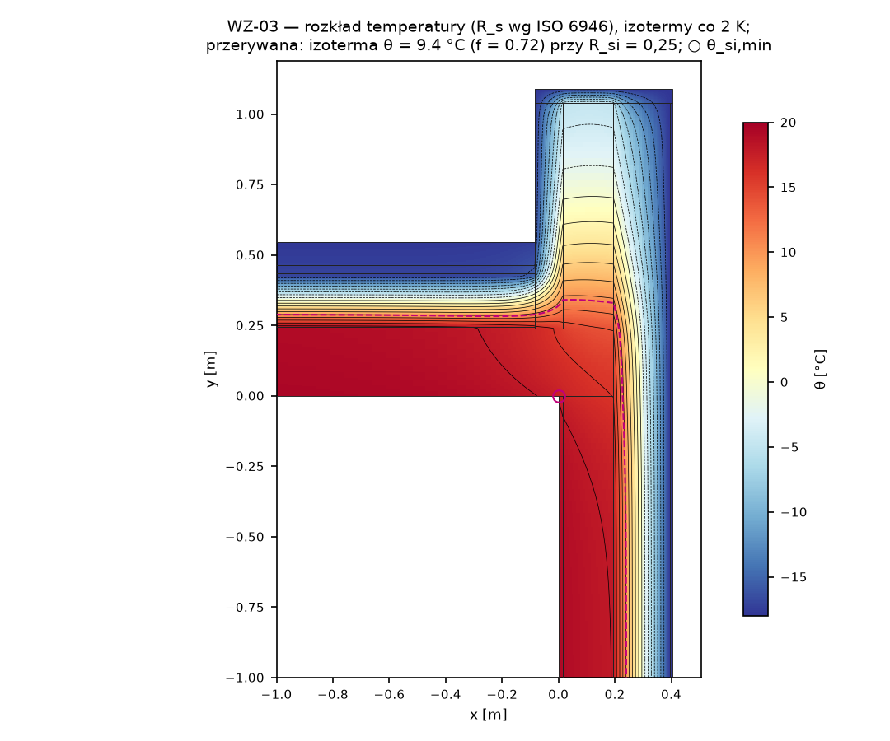

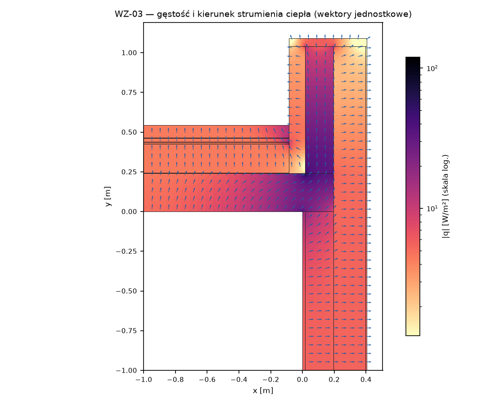

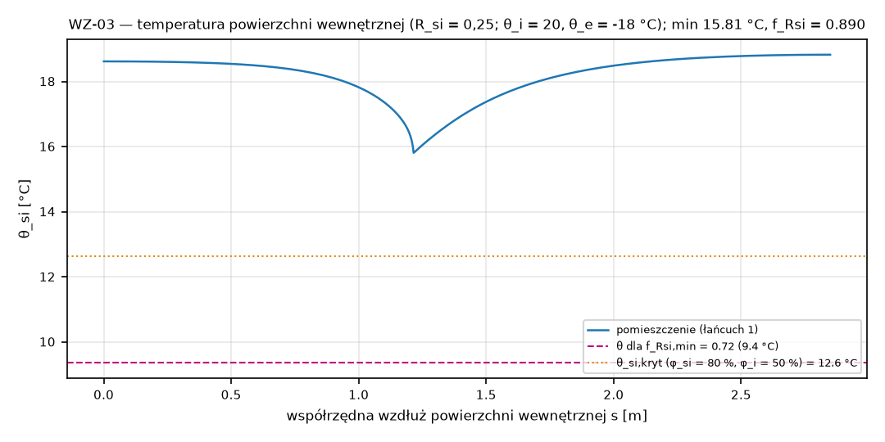

## WZ-04 — Okap E (PL-E) i daszek wejścia — łącznik termoizolacyjny

Przekrój pionowy; pomieszczenia nad i pod stropem ogrzewane (grupa „i”).

**Dane wejściowe**

*warstwy ściany górnej:*

| kod | materiał | d [m] | λ [W/(m·K)] | R [m²K/W] |
|---|---|---|---|---|
| TYNK_GIPS | Tynk gipsowy maszynowy 1,5 cm | 0,0150 | 0,4000 | 0,0375 |
| SIL18 | Bloczek wapienno-piaskowy (silikat) 18 cm, kl. 20, gr. 1, na zaprawie cienkowarstwowej | 0,1800 | 0,9000 | 0,2000 |
| EPS031 | Styropian grafitowy EPS 031 (ETICS, NRO w systemie) | 0,2000 | 0,0310 | 6,4516 |
| TYNK_SIL | ETICS: warstwa zbrojona + tynk silikonowy 1,5 mm (biały / jasnoszary NCS S 1500-N) | 0,0100 | 0,8000 | 0,0125 |

*warstwy ściany dolnej:*

| kod | materiał | d [m] | λ [W/(m·K)] | R [m²K/W] |
|---|---|---|---|---|
| TYNK_GIPS | Tynk gipsowy maszynowy 1,5 cm | 0,0150 | 0,4000 | 0,0375 |
| SIL18 | Bloczek wapienno-piaskowy (silikat) 18 cm, kl. 20, gr. 1, na zaprawie cienkowarstwowej | 0,1800 | 0,9000 | 0,2000 |
| EPS031 | Styropian grafitowy EPS 031 (ETICS, NRO w systemie) | 0,2000 | 0,0310 | 6,4516 |
| TYNK_SIL | ETICS: warstwa zbrojona + tynk silikonowy 1,5 mm (biały / jasnoszary NCS S 1500-N) | 0,0100 | 0,8000 | 0,0125 |

* płyta: ZB_C25, t = 0.22 m

*warstwy podłogi:*

| kod | materiał | d [m] | λ [W/(m·K)] | R [m²K/W] |
|---|---|---|---|---|
| DESKA_DEB | Deska warstwowa dębowa 15 mm, klejona | 0,0150 | 0,1800 | 0,0833 |
| JASTRYCH | Jastrych cementowy CT-C25-F5 z wężownicą ogrzewania podłogowego | 0,0650 | 1,2000 | 0,0542 |
| EPS038 | Styropian podłogowy EPS 100-038 (pod jastrychem) | 0,0400 | 0,0380 | 1,0526 |
| EPS_T | Styropian elastyfikowany EPS T (akustyczny, pod jastrychem) | 0,0300 | 0,0400 | 0,7500 |
| ZB_C25 | Żelbet C25/30, B500SP (stropy, płyta fundamentowa, ściany) | 0,2200 | 2,3000 | 0,0957 |
| TYNK_GIPS | Tynk gipsowy maszynowy 1,5 cm | 0,0100 | 0,4000 | 0,0250 |

*warstwy sufitu (bez pustki wentylowanej):*

| kod | materiał | d [m] | λ [W/(m·K)] | R [m²K/W] |
|---|---|---|---|---|
| TYNK_GIPS | Tynk gipsowy maszynowy 1,5 cm | 0,0100 | 0,4000 | 0,0250 |

* płyta wspornikowa: ZB_C30, t = 0.2999999999999998 m, wierzch +0.00 m wzgl. wierzchu stropu, wysięg 1.31 m od lica ocieplenia
* łącznik: Łącznik termoizolacyjny 120 mm, λ_eq = 0.08 W/(m·K) (model): λ_eq = 0.08 W/(m·K), d = 0.12 m — model: wsporniki_plyty[].lacznik (wymaganie — do potwierdzenia ETA)
* geometria z modelu: PL-E przy stropie ST1, ściana dolna SZ1, górna SZ1; wysięg zastępczy A/L = 1.31 m; styk z obrysem 18.07 m; łącznik: dane przykładowe (ETA do uzupełnienia); wierzch wspornika zrównany z wierzchem płyty (konwencja audytu A2 K-1) [ZAŁ]
* długość z geometrii modelu [m]: 18,070

**Warunki brzegowe** (przekrój pionowy; płaszczyzny odcięcia i osie symetrii adiabatyczne)

| strefa | rodzaj | grupa | θ [°C] | R_s — przebieg ψ [m²K/W] | R_s — przebieg f_Rsi |
|---|---|---|---|---|---|
| pomieszczenie górne | wewn | i | 20,0 | wg ISO 6946: 0,13 poziomo / 0,10 w górę / 0,17 w dół | 0,25 (ramy/szyby 0,13) |
| zewnętrze | zewn | e | −18,0 | 0,04 | 0,04 |
| pomieszczenie dolne | wewn | i | 20,0 | wg ISO 6946: 0,13 poziomo / 0,10 w górę / 0,17 w dół | 0,25 (ramy/szyby 0,13) |

**Siatka i dokładność** (MOS, siatka prostokątna zagęszczana przy granicach materiałów)

| siatka | komórek | Φ_całk [W/m] |
|---|---|---|
| 171 × 194 = 33174 komórek; Δx ∈ [1.65; 97.75] mm, Δy ∈ [1.65; 96.83] mm | 33174 | 19,5213 |
| 342 × 388 = 132696 komórek; Δx ∈ [0.825; 48.87] mm, Δy ∈ [0.825; 48.41] mm | 132696 | 19,5241 |

Zmiana strumienia przy podwojeniu liczby podziałów: **0,014 %** (kryterium ISO 10211 < 1 %: spełnione); zmiana L_2D (= zmiana ψ): 0,00007 W/(m·K) (kryterium ≤ max(1 % |ψ|; 0,001) = 0,00128: spełnione); bilans energii Σ Φ / (½ Σ|Φ|) = 8.7e-13 (kryterium < 10⁻⁴: spełnione).

**Współczynniki sprzężenia i ψ**

*Para i–e:* L_2D = **0,5138 W/(m·K)**

| element flankujący | U [W/(m²K)] | l_e [m] | l_i [m] | l_oi [m] | U·l_e | U·l_i | U·l_oi |
|---|---|---|---|---|---|---|---|
| ściana górna | 0,1455 | 1,3250 | 0,8350 | 0,8350 | 0,1928 | 0,1215 | 0,1215 |
| ściana dolna | 0,1455 | 1,3250 | 1,2050 | 1,8150 | 0,1928 | 0,1754 | 0,2641 |

ψ_oi (wymiary wewnętrzne całkowite — system projektu, H_TB) = 0,5138 − 0,3856 = **0,128 W/(m·K)**; ψ_e (zewnętrzne) = 0,5138 − 0,3856 = 0,128 W/(m·K); ψ_i (wewnętrzne) = 0,5138 − 0,2969 = 0,217 W/(m·K)

**Temperatura powierzchni wewnętrznej i ryzyko pleśni** (R_si = 0,25 — PN-EN ISO 13788)

* θ_si,min = **17,29 °C** w punkcie (0,000; −0,010) m przy θ_i = 20,0 °C, θ_e = −18,0 °C
* f_Rsi = (θ_si,min − θ_e)/(θ_i − θ_e) = **0,929**; wymaganie f_Rsi ≥ 0,72 (WT zał. 2 pkt 2.2.1–2.2.5 (uproszczenie; φ_i = 50 %) (W-248)) → **SPEŁNIA**
* informacyjnie przy θ_e obliczeniowej i φ_i = 50 %: θ_si,kryt (φ_si = 80 %) = 12,6 °C (f = 0,806), punkt rosy 9,3 °C → θ_si,min ≥ θ_si,kryt (ocena miesięczna wg ISO 13788 — łagodniejsza; kryterium formalne: f_Rsi ≥ 0,72)

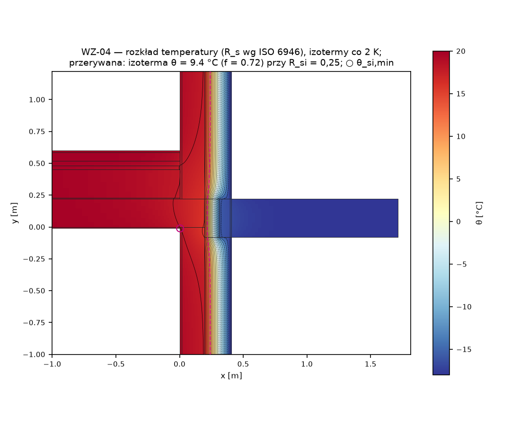

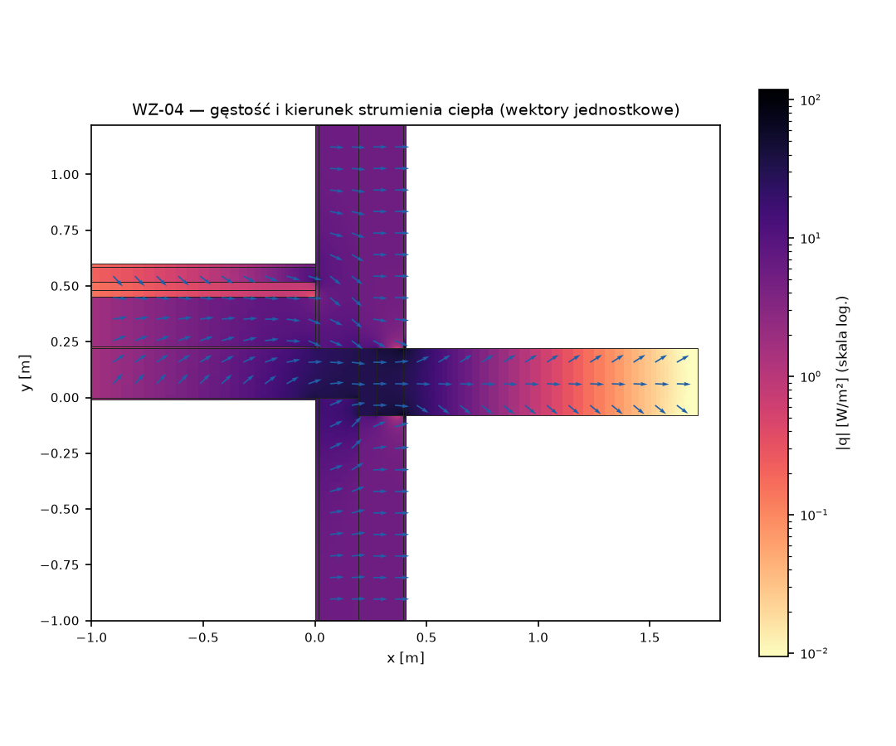

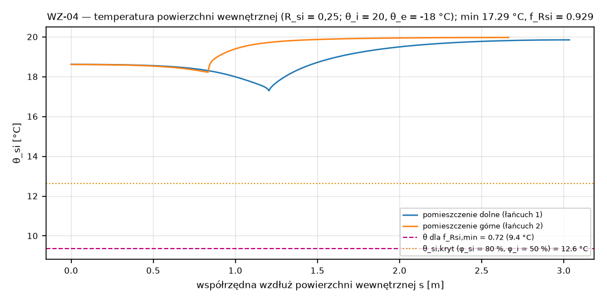

## WZ-05 — Krawędź ST2 (PL-2) — łącznik termoizolacyjny pod bryłą A

Przekrój pionowy; pomieszczenia nad i pod stropem ogrzewane (grupa „i”).

**Dane wejściowe**

*warstwy ściany górnej:*

| kod | materiał | d [m] | λ [W/(m·K)] | R [m²K/W] |
|---|---|---|---|---|
| TYNK_GIPS | Tynk gipsowy maszynowy 1,5 cm | 0,0150 | 0,4000 | 0,0375 |
| SIL18 | Bloczek wapienno-piaskowy (silikat) 18 cm, kl. 20, gr. 1, na zaprawie cienkowarstwowej | 0,1800 | 0,9000 | 0,2000 |
| WELNA_FAS | Wełna mineralna fasadowa (elewacja wentylowana bryły A, A1) | 0,2000 | 0,0350 | 5,7143 |
| MEMB_WIATR | Membrana fasadowa wiatroizolacyjna UV-stabilna, czarna (sd ≈ 0,02 m) | 0,0100 | 0,1700 | 0,0588 |

*warstwy ściany dolnej:*

| kod | materiał | d [m] | λ [W/(m·K)] | R [m²K/W] |
|---|---|---|---|---|
| TYNK_GIPS | Tynk gipsowy maszynowy 1,5 cm | 0,0150 | 0,4000 | 0,0375 |
| SIL18 | Bloczek wapienno-piaskowy (silikat) 18 cm, kl. 20, gr. 1, na zaprawie cienkowarstwowej | 0,1800 | 0,9000 | 0,2000 |
| EPS031 | Styropian grafitowy EPS 031 (ETICS, NRO w systemie) | 0,2000 | 0,0310 | 6,4516 |
| TYNK_SIL | ETICS: warstwa zbrojona + tynk silikonowy 1,5 mm (biały / jasnoszary NCS S 1500-N) | 0,0100 | 0,8000 | 0,0125 |

* płyta: ZB_C25, t = 0.22 m

*warstwy podłogi:*

| kod | materiał | d [m] | λ [W/(m·K)] | R [m²K/W] |
|---|---|---|---|---|
| DESKA_DEB | Deska warstwowa dębowa 15 mm, klejona | 0,0150 | 0,1800 | 0,0833 |
| JASTRYCH | Jastrych cementowy CT-C25-F5 z wężownicą ogrzewania podłogowego | 0,0650 | 1,2000 | 0,0542 |
| EPS038 | Styropian podłogowy EPS 100-038 (pod jastrychem) | 0,0400 | 0,0380 | 1,0526 |
| EPS_T | Styropian elastyfikowany EPS T (akustyczny, pod jastrychem) | 0,0300 | 0,0400 | 0,7500 |
| ZB_C25 | Żelbet C25/30, B500SP (stropy, płyta fundamentowa, ściany) | 0,2200 | 2,3000 | 0,0957 |
| TYNK_GIPS | Tynk gipsowy maszynowy 1,5 cm | 0,0100 | 0,4000 | 0,0250 |

*warstwy sufitu (bez pustki wentylowanej):*

| kod | materiał | d [m] | λ [W/(m·K)] | R [m²K/W] |
|---|---|---|---|---|
| TYNK_GIPS | Tynk gipsowy maszynowy 1,5 cm | 0,0100 | 0,4000 | 0,0250 |

* płyta wspornikowa: ZB_C30, t = 0.3000000000000007 m, wierzch +0.00 m wzgl. wierzchu stropu, wysięg 0.92 m od lica ocieplenia
* łącznik: Łącznik termoizolacyjny 120 mm, λ_eq = 0.08 W/(m·K) (model): λ_eq = 0.08 W/(m·K), d = 0.12 m — model: wsporniki_plyty[].lacznik (wymaganie — do potwierdzenia ETA)
* geometria z modelu: PL-2 przy stropie ST2, ściana dolna SZ1, górna SZ2; wysięg zastępczy A/L = 0.92 m; styk z obrysem 25.09 m; łącznik: dane przykładowe (ETA do uzupełnienia); wierzch wspornika zrównany z wierzchem płyty (konwencja audytu A2 K-1) [ZAŁ]
* długość z geometrii modelu [m]: 25,090

**Warunki brzegowe** (przekrój pionowy; płaszczyzny odcięcia i osie symetrii adiabatyczne)

| strefa | rodzaj | grupa | θ [°C] | R_s — przebieg ψ [m²K/W] | R_s — przebieg f_Rsi |
|---|---|---|---|---|---|
| pomieszczenie górne | wewn | i | 20,0 | wg ISO 6946: 0,13 poziomo / 0,10 w górę / 0,17 w dół | 0,25 (ramy/szyby 0,13) |
| zewnętrze | zewn | e | −18,0 | 0,04 | 0,04 |
| pomieszczenie dolne | wewn | i | 20,0 | wg ISO 6946: 0,13 poziomo / 0,10 w górę / 0,17 w dół | 0,25 (ramy/szyby 0,13) |

**Siatka i dokładność** (MOS, siatka prostokątna zagęszczana przy granicach materiałów)

| siatka | komórek | Φ_całk [W/m] |
|---|---|---|
| 167 × 194 = 32398 komórek; Δx ∈ [1.65; 97.75] mm, Δy ∈ [1.65; 96.83] mm | 32398 | 20,2638 |
| 334 × 388 = 129592 komórek; Δx ∈ [0.825; 48.87] mm, Δy ∈ [0.825; 48.41] mm | 129592 | 20,2668 |

Zmiana strumienia przy podwojeniu liczby podziałów: **0,015 %** (kryterium ISO 10211 < 1 %: spełnione); zmiana L_2D (= zmiana ψ): 0,00008 W/(m·K) (kryterium ≤ max(1 % |ψ|; 0,001) = 0,00134: spełnione); bilans energii Σ Φ / (½ Σ|Φ|) = 3.5e-13 (kryterium < 10⁻⁴: spełnione).

**Współczynniki sprzężenia i ψ**

*Para i–e:* L_2D = **0,5333 W/(m·K)**

| element flankujący | U [W/(m²K)] | l_e [m] | l_i [m] | l_oi [m] | U·l_e | U·l_i | U·l_oi |
|---|---|---|---|---|---|---|---|
| ściana górna | 0,1618 | 1,3250 | 0,8350 | 0,8350 | 0,2144 | 0,1351 | 0,1351 |
| ściana dolna | 0,1455 | 1,3250 | 1,2050 | 1,8150 | 0,1928 | 0,1754 | 0,2641 |

ψ_oi (wymiary wewnętrzne całkowite — system projektu, H_TB) = 0,5333 − 0,3992 = **0,134 W/(m·K)**; ψ_e (zewnętrzne) = 0,5333 − 0,4072 = 0,126 W/(m·K); ψ_i (wewnętrzne) = 0,5333 − 0,3105 = 0,223 W/(m·K)

**Temperatura powierzchni wewnętrznej i ryzyko pleśni** (R_si = 0,25 — PN-EN ISO 13788)

* θ_si,min = **17,24 °C** w punkcie (0,000; −0,010) m przy θ_i = 20,0 °C, θ_e = −18,0 °C
* f_Rsi = (θ_si,min − θ_e)/(θ_i − θ_e) = **0,927**; wymaganie f_Rsi ≥ 0,72 (WT zał. 2 pkt 2.2.1–2.2.5 (uproszczenie; φ_i = 50 %) (W-248)) → **SPEŁNIA**
* informacyjnie przy θ_e obliczeniowej i φ_i = 50 %: θ_si,kryt (φ_si = 80 %) = 12,6 °C (f = 0,806), punkt rosy 9,3 °C → θ_si,min ≥ θ_si,kryt (ocena miesięczna wg ISO 13788 — łagodniejsza; kryterium formalne: f_Rsi ≥ 0,72)

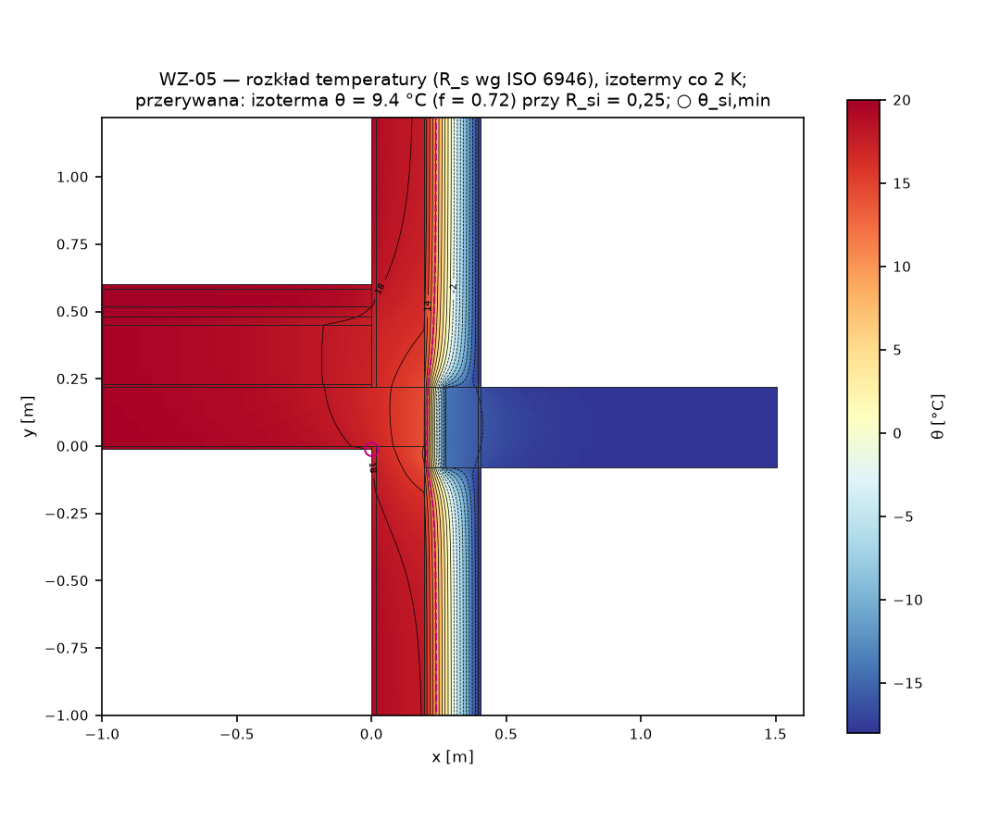

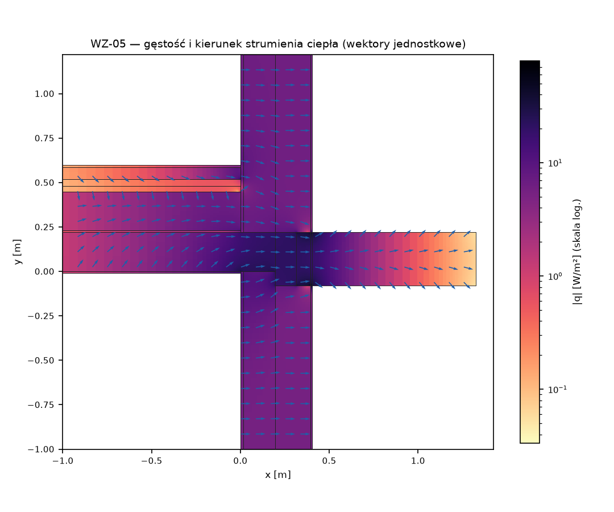

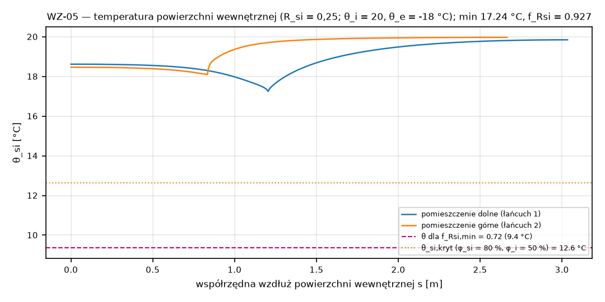

## WZ-06 — Krawędź ST3 (PL-3) — łącznik termoizolacyjny przy attyce bryły A

**Dane wejściowe**

*warstwy ściany:*

| kod | materiał | d [m] | λ [W/(m·K)] | R [m²K/W] |
|---|---|---|---|---|
| TYNK_GIPS | Tynk gipsowy maszynowy 1,5 cm | 0,0150 | 0,4000 | 0,0375 |
| SIL18 | Bloczek wapienno-piaskowy (silikat) 18 cm, kl. 20, gr. 1, na zaprawie cienkowarstwowej | 0,1800 | 0,9000 | 0,2000 |
| WELNA_FAS | Wełna mineralna fasadowa (elewacja wentylowana bryły A, A1) | 0,2000 | 0,0350 | 5,7143 |
| MEMB_WIATR | Membrana fasadowa wiatroizolacyjna UV-stabilna, czarna (sd ≈ 0,02 m) | 0,0100 | 0,1700 | 0,0588 |

*warstwy dachu:*

| kod | materiał | d [m] | λ [W/(m·K)] | R [m²K/W] |
|---|---|---|---|---|
| MEMB_TPO | Membrana dachowa TPO 1,5 mm, mocowana mechanicznie (hydroizolacja stropodachów) | 0,0020 | 0,2000 | 0,0100 |
| PIR022 | Płyty PIR z okładziną (izolacja spadkowa stropodachów) | 0,2200 | 0,0220 | 10,0000 |
| PAROIZ_AL | Paroizolacja bitumiczna z wkładką Al (na płycie stropodachów) | 0,0040 | 0,2300 | 0,0174 |
| ZB_C25 | Żelbet C25/30, B500SP (stropy, płyta fundamentowa, ściany) | 0,2200 | 2,3000 | 0,0957 |
| TYNK_GIPS | Tynk gipsowy maszynowy 1,5 cm | 0,0100 | 0,4000 | 0,0250 |

*attyka:*

| kod | materiał | d [m] | λ [W/(m·K)] | R [m²K/W] |
|---|---|---|---|---|
| PIR022 | Płyty PIR z okładziną (izolacja spadkowa stropodachów) | 0,1000 | 0,0220 | 4,5455 |
| ZB_C30 | Żelbet C30/37 XC4/XF1 (krawędzie płyt wysuniętych, attyki, belki) | 0,1800 | 2,5000 | 0,0720 |
| EPS031 | Styropian grafitowy EPS 031 (ETICS, NRO w systemie) | 0,2000 | 0,0310 | 6,4516 |
| TYNK_SIL | ETICS: warstwa zbrojona + tynk silikonowy 1,5 mm (biały / jasnoszary NCS S 1500-N) | 0,0050 | 0,8000 | 0,0062 |
| wys. nad pokryciem | 0,3500 |

* okap: t = 0.3200000000000003 m, wierzch +0.00 m wzgl. płyty, wysięg 0.92 m
* łącznik: Łącznik termoizolacyjny 120 mm, λ_eq = 0.08 W/(m·K) (model): λ_eq = 0.08, d = 0.12 m — model: wsporniki_plyty[].lacznik (wymaganie — do potwierdzenia ETA)
* geometria z modelu: PL-3 przy dachu D1 (SD1), attyka AT1, ściana SZ2; wysięg zastępczy A/L = 0.92 m; styk z obrysem 25.09 m; łącznik: dane przykładowe (ETA do uzupełnienia); wierzch wspornika zrównany z wierzchem płyty (konwencja audytu A2 K-1) [ZAŁ]
* długość z geometrii modelu [m]: 25,090

**Warunki brzegowe** (przekrój pionowy; płaszczyzny odcięcia i osie symetrii adiabatyczne)

| strefa | rodzaj | grupa | θ [°C] | R_s — przebieg ψ [m²K/W] | R_s — przebieg f_Rsi |
|---|---|---|---|---|---|
| pomieszczenie | wewn | i | 20,0 | wg ISO 6946: 0,13 poziomo / 0,10 w górę / 0,17 w dół | 0,25 (ramy/szyby 0,13) |
| zewnętrze | zewn | e | −18,0 | 0,04 | 0,04 |

**Siatka i dokładność** (MOS, siatka prostokątna zagęszczana przy granicach materiałów)

| siatka | komórek | Φ_całk [W/m] |
|---|---|---|
| 179 × 180 = 32220 komórek; Δx ∈ [1.65; 94.63] mm, Δy ∈ [1; 95.12] mm | 32220 | 20,2952 |
| 358 × 360 = 128880 komórek; Δx ∈ [0.825; 47.32] mm, Δy ∈ [0.5; 47.56] mm | 128880 | 20,2989 |

Zmiana strumienia przy podwojeniu liczby podziałów: **0,019 %** (kryterium ISO 10211 < 1 %: spełnione); zmiana L_2D (= zmiana ψ): 0,00010 W/(m·K) (kryterium ≤ max(1 % |ψ|; 0,001) = 0,00205: spełnione); bilans energii Σ Φ / (½ Σ|Φ|) = 6.4e-13 (kryterium < 10⁻⁴: spełnione).

**Współczynniki sprzężenia i ψ**

*Para i–e:* L_2D = **0,5342 W/(m·K)**

| element flankujący | U [W/(m²K)] | l_e [m] | l_i [m] | l_oi [m] | U·l_e | U·l_i | U·l_oi |
|---|---|---|---|---|---|---|---|
| ściana | 0,1618 | 1,6610 | 1,2050 | 1,2150 | 0,2687 | 0,1950 | 0,1966 |
| stropodach | 0,0972 | 1,7730 | 1,3680 | 1,3680 | 0,1723 | 0,1330 | 0,1330 |

ψ_oi (wymiary wewnętrzne całkowite — system projektu, H_TB) = 0,5342 − 0,3296 = **0,205 W/(m·K)**; ψ_e (zewnętrzne) = 0,5342 − 0,4411 = 0,093 W/(m·K); ψ_i (wewnętrzne) = 0,5342 − 0,3279 = 0,206 W/(m·K)

**Temperatura powierzchni wewnętrznej i ryzyko pleśni** (R_si = 0,25 — PN-EN ISO 13788)

* θ_si,min = **15,79 °C** w punkcie (0,000; −0,010) m przy θ_i = 20,0 °C, θ_e = −18,0 °C
* f_Rsi = (θ_si,min − θ_e)/(θ_i − θ_e) = **0,889**; wymaganie f_Rsi ≥ 0,72 (WT zał. 2 pkt 2.2.1–2.2.5 (uproszczenie; φ_i = 50 %) (W-248)) → **SPEŁNIA**
* informacyjnie przy θ_e obliczeniowej i φ_i = 50 %: θ_si,kryt (φ_si = 80 %) = 12,6 °C (f = 0,806), punkt rosy 9,3 °C → θ_si,min ≥ θ_si,kryt (ocena miesięczna wg ISO 13788 — łagodniejsza; kryterium formalne: f_Rsi ≥ 0,72)

**Porównanie**

* PN-EN ISO 14683 — wartość domyślna (dach płaski–ściana z attyką, izolacja ciągła (R)): ψ_e = 0,55, ψ_i = 0,75 W/(m·K) [NZW] — obliczone ψ_e = 0,093, ψ_i = 0,206 (poniżej wartości domyślnej — porównanie w tym samym systemie wymiarów)

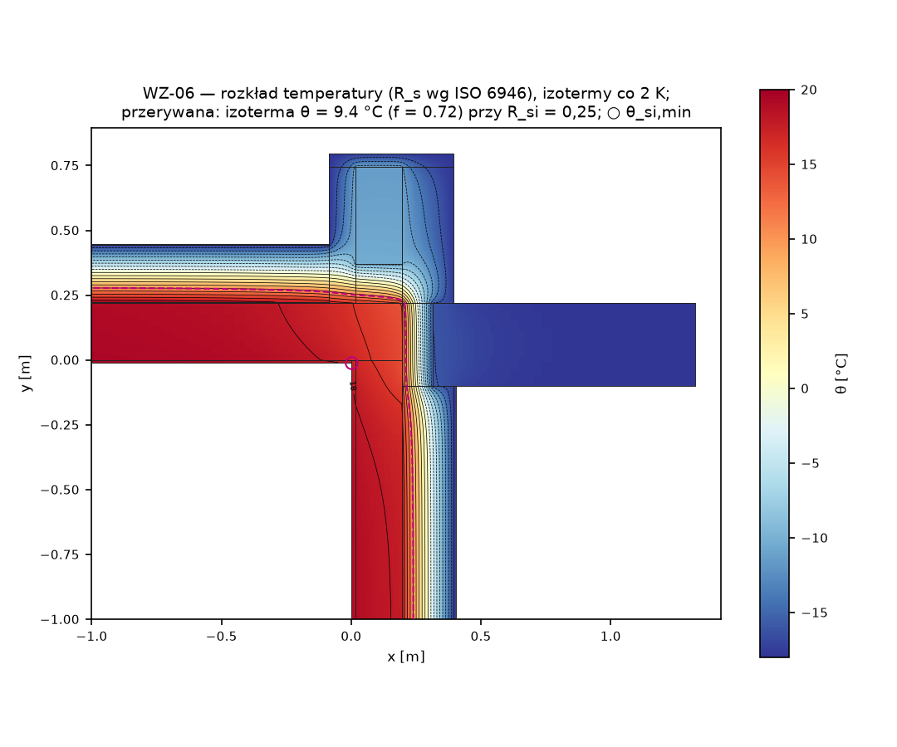

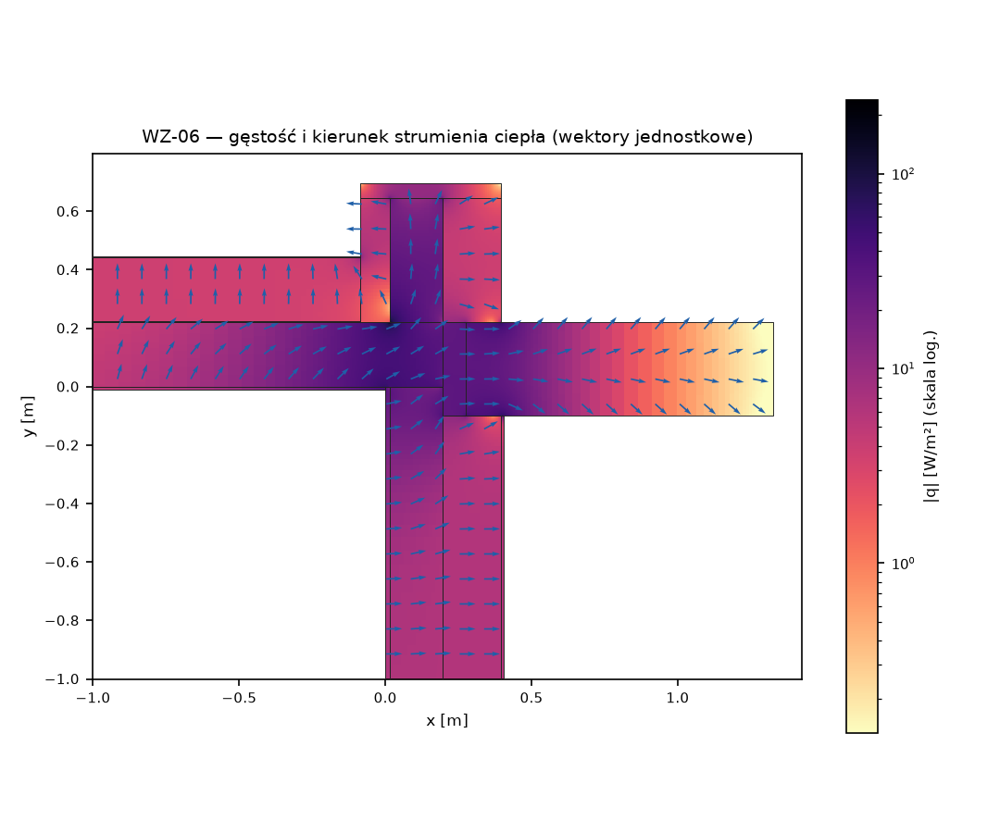

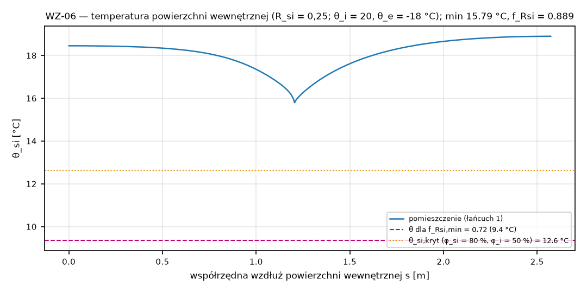

## WZ-07a — Krawędź stropu ST2Z nad powietrzem: ściana SZL na belce B3 + płyta PL-2 (łącznik)

Przekrój pionowy; pod stropem powietrze zewnętrzne (ocieplenie spodu).

**Dane wejściowe**

*warstwy ściany górnej:*

| kod | materiał | d [m] | λ [W/(m·K)] | R [m²K/W] |
|---|---|---|---|---|
| GK | Płyta gipsowo-kartonowa 12,5 mm (GKB / GKBI w łazienkach) | 0,0250 | 0,2500 | 0,1000 |
| OSB | Płyta OSB/3 15 mm (usztywnienie i warstwa szczelności ściany A') | 0,0150 | 0,1300 | 0,1154 |
| WELNA_035 | Wełna mineralna 035 (szkielet, docieplenia, ściana dom–garaż) | 0,2000 | 0,0350 | 5,7143 |
| DWD16 | Płyta drewnopochodna wiatroizolacyjna DWD/MDF.RWH 16 mm | 0,0160 | 0,1000 | 0,1600 |
| WELNA_FAS | Wełna mineralna fasadowa (elewacja wentylowana bryły A, A1) | 0,1800 | 0,0350 | 5,1429 |
| MEMB_WIATR | Membrana fasadowa wiatroizolacyjna UV-stabilna, czarna (sd ≈ 0,02 m) | 0,0040 | 0,1700 | 0,0235 |

* warstwy ściany dolnej: — (pod stropem powietrze zewn.)
* płyta: ZB_C25, t = 0.22 m

*warstwy podłogi:*

| kod | materiał | d [m] | λ [W/(m·K)] | R [m²K/W] |
|---|---|---|---|---|
| DESKA_DEB | Deska warstwowa dębowa 15 mm, klejona | 0,0150 | 0,1800 | 0,0833 |
| JASTRYCH | Jastrych cementowy CT-C25-F5 z wężownicą ogrzewania podłogowego | 0,0650 | 1,2000 | 0,0542 |
| EPS038 | Styropian podłogowy EPS 100-038 (pod jastrychem) | 0,0400 | 0,0380 | 1,0526 |
| EPS_T | Styropian elastyfikowany EPS T (akustyczny, pod jastrychem) | 0,0300 | 0,0400 | 0,7500 |
| ZB_C25 | Żelbet C25/30, B500SP (stropy, płyta fundamentowa, ściany) | 0,2200 | 2,3000 | 0,0957 |
| TYNK_GIPS | Tynk gipsowy maszynowy 1,5 cm | 0,0100 | 0,4000 | 0,0250 |

*warstwy sufitu (bez pustki wentylowanej):*

| kod | materiał | d [m] | λ [W/(m·K)] | R [m²K/W] |
|---|---|---|---|---|
| WELNA_035 | Wełna mineralna 035 (szkielet, docieplenia, ściana dom–garaż) | 0,2000 | 0,0350 | 5,7143 |
| MEMB_WIATR | Membrana fasadowa wiatroizolacyjna UV-stabilna, czarna (sd ≈ 0,02 m) | 0,0010 | 0,1700 | 0,0059 |

* płyta wspornikowa: ZB_C30, t = 0.3000000000000007 m, wierzch +0.00 m wzgl. wierzchu stropu, wysięg 1.0 m od lica ocieplenia
* łącznik: Łącznik termoizolacyjny 120 mm, λ_eq = 0.08 W/(m·K) (model): λ_eq = 0.08 W/(m·K), d = 0.12 m — model: wsporniki_plyty[].lacznik (wymaganie — do potwierdzenia ETA)
* belka odwrócona: b = 0.2 m, h nad płytą = 0.38 m (w linii ściany górnej)
* wpis sekcji wezly: WZ-07: Strop P2 nad powietrzem zewnętrznym (ST2Z) — krawędzie wspornika bryły A
* geometria z modelu: strop ST2Z (sufit SUF-ZEW); krawędzie typu ściana na krawędzi — łącznie 5.30 m
* długość z geometrii modelu [m]: 5,300

**Warunki brzegowe** (przekrój pionowy; płaszczyzny odcięcia i osie symetrii adiabatyczne)

| strefa | rodzaj | grupa | θ [°C] | R_s — przebieg ψ [m²K/W] | R_s — przebieg f_Rsi |
|---|---|---|---|---|---|
| pomieszczenie górne | wewn | i | 20,0 | wg ISO 6946: 0,13 poziomo / 0,10 w górę / 0,17 w dół | 0,25 (ramy/szyby 0,13) |
| zewnętrze | zewn | e | −18,0 | 0,04 | 0,04 |

**Siatka i dokładność** (MOS, siatka prostokątna zagęszczana przy granicach materiałów)

| siatka | komórek | Φ_całk [W/m] |
|---|---|---|
| 186 × 220 = 40920 komórek; Δx ∈ [1.67; 97.2] mm, Δy ∈ [0.5; 96.69] mm | 40920 | 20,1951 |
| 372 × 440 = 163680 komórek; Δx ∈ [0.835; 48.6] mm, Δy ∈ [0.25; 48.35] mm | 163680 | 20,2028 |

Zmiana strumienia przy podwojeniu liczby podziałów: **0,038 %** (kryterium ISO 10211 < 1 %: spełnione); zmiana L_2D (= zmiana ψ): 0,00020 W/(m·K) (kryterium ≤ max(1 % |ψ|; 0,001) = 0,00152: spełnione); bilans energii Σ Φ / (½ Σ|Φ|) = 6.6e-14 (kryterium < 10⁻⁴: spełnione).

**Współczynniki sprzężenia i ψ**

*Para i–e:* L_2D = **0,5317 W/(m·K)**

| element flankujący | U [W/(m²K)] | l_e [m] | l_i [m] | l_oi [m] | U·l_e | U·l_i | U·l_oi |
|---|---|---|---|---|---|---|---|
| ściana górna | 0,0875 | 1,7410 | 0,9400 | 0,9400 | 0,1524 | 0,0823 | 0,0823 |
| strop nad powietrzem zewn. | 0,1237 | 2,8430 | 2,4030 | 2,4030 | 0,3516 | 0,2972 | 0,2972 |

ψ_oi (wymiary wewnętrzne całkowite — system projektu, H_TB) = 0,5317 − 0,3794 = **0,152 W/(m·K)**; ψ_e (zewnętrzne) = 0,5317 − 0,5039 = 0,028 W/(m·K); ψ_i (wewnętrzne) = 0,5317 − 0,3794 = 0,152 W/(m·K)

**Temperatura powierzchni wewnętrznej i ryzyko pleśni** (R_si = 0,25 — PN-EN ISO 13788)

* θ_si,min = **14,33 °C** w punkcie (0,000; 0,600) m przy θ_i = 20,0 °C, θ_e = −18,0 °C
* f_Rsi = (θ_si,min − θ_e)/(θ_i − θ_e) = **0,851**; wymaganie f_Rsi ≥ 0,72 (WT zał. 2 pkt 2.2.1–2.2.5 (uproszczenie; φ_i = 50 %) (W-248)) → **SPEŁNIA**
* informacyjnie przy θ_e obliczeniowej i φ_i = 50 %: θ_si,kryt (φ_si = 80 %) = 12,6 °C (f = 0,806), punkt rosy 9,3 °C → θ_si,min ≥ θ_si,kryt (ocena miesięczna wg ISO 13788 — łagodniejsza; kryterium formalne: f_Rsi ≥ 0,72)

*Uwaga:* Pustka wentylowana pod ociepleniem spodu stropu i podsufitka pominięte (PN-EN ISO 6946 — warstwy za pustką dobrze wentylowaną); R_se = 0,04 na spodzie ocieplenia (wariant ostrożny) [ZAŁ].

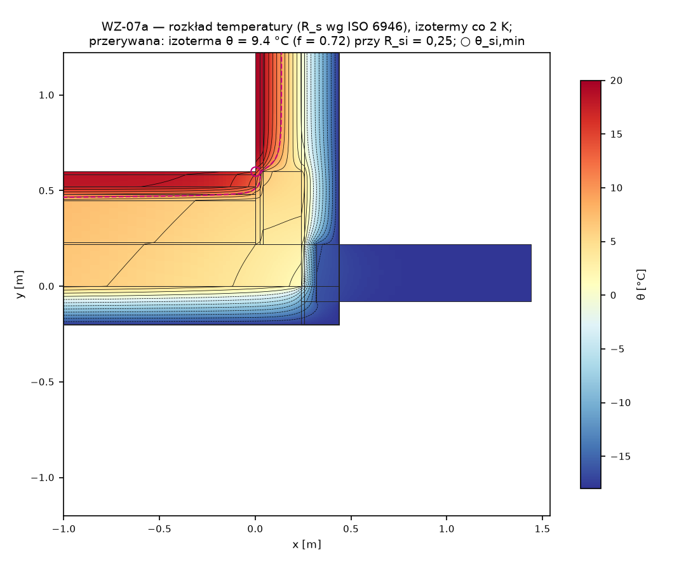

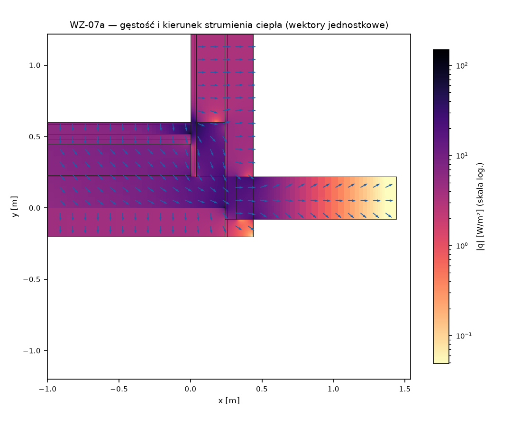

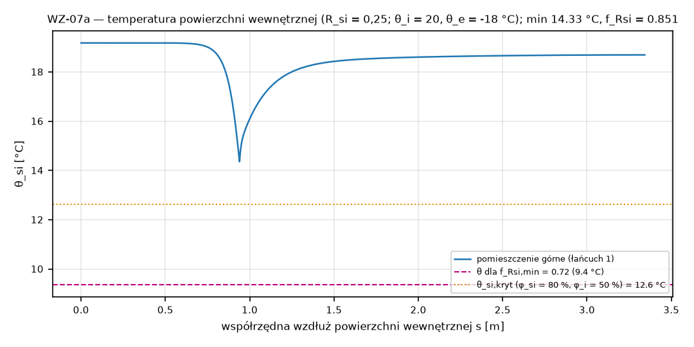

## WZ-07b — Krawędź stropu ST2Z nad ścianą SZ1 niższej kondygnacji (ocieplenie spodu SUF-ZEW)

**Dane wejściowe**

*ściana dolna (od lewej):*

| kod | materiał | d [m] | λ [W/(m·K)] | R [m²K/W] |
|---|---|---|---|---|
| TYNK_GIPS | Tynk gipsowy maszynowy 1,5 cm | 0,0150 | 0,4000 | 0,0375 |
| SIL18 | Bloczek wapienno-piaskowy (silikat) 18 cm, kl. 20, gr. 1, na zaprawie cienkowarstwowej | 0,1800 | 0,9000 | 0,2000 |
| EPS031 | Styropian grafitowy EPS 031 (ETICS, NRO w systemie) | 0,2000 | 0,0310 | 6,4516 |
| TYNK_SIL | ETICS: warstwa zbrojona + tynk silikonowy 1,5 mm (biały / jasnoszary NCS S 1500-N) | 0,0100 | 0,8000 | 0,0125 |

* płyta: ZB_C25, t = 0.22 m
* nad płytą L/P: wewn / wewn
* pod płytą L/P: wewn / zewn

*warstwy nad płytą L:*

| kod | materiał | d [m] | λ [W/(m·K)] | R [m²K/W] |
|---|---|---|---|---|
| DESKA_DEB | Deska warstwowa dębowa 15 mm, klejona | 0,0150 | 0,1800 | 0,0833 |
| JASTRYCH | Jastrych cementowy CT-C25-F5 z wężownicą ogrzewania podłogowego | 0,0650 | 1,2000 | 0,0542 |
| EPS038 | Styropian podłogowy EPS 100-038 (pod jastrychem) | 0,0400 | 0,0380 | 1,0526 |
| EPS_T | Styropian elastyfikowany EPS T (akustyczny, pod jastrychem) | 0,0300 | 0,0400 | 0,7500 |
| ZB_C25 | Żelbet C25/30, B500SP (stropy, płyta fundamentowa, ściany) | 0,2200 | 2,3000 | 0,0957 |
| TYNK_GIPS | Tynk gipsowy maszynowy 1,5 cm | 0,0100 | 0,4000 | 0,0250 |

*warstwy nad płytą P:*

| kod | materiał | d [m] | λ [W/(m·K)] | R [m²K/W] |
|---|---|---|---|---|
| DESKA_DEB | Deska warstwowa dębowa 15 mm, klejona | 0,0150 | 0,1800 | 0,0833 |
| JASTRYCH | Jastrych cementowy CT-C25-F5 z wężownicą ogrzewania podłogowego | 0,0650 | 1,2000 | 0,0542 |
| EPS038 | Styropian podłogowy EPS 100-038 (pod jastrychem) | 0,0400 | 0,0380 | 1,0526 |
| EPS_T | Styropian elastyfikowany EPS T (akustyczny, pod jastrychem) | 0,0300 | 0,0400 | 0,7500 |
| ZB_C25 | Żelbet C25/30, B500SP (stropy, płyta fundamentowa, ściany) | 0,2200 | 2,3000 | 0,0957 |
| TYNK_GIPS | Tynk gipsowy maszynowy 1,5 cm | 0,0100 | 0,4000 | 0,0250 |

*warstwy pod płytą P:*

| kod | materiał | d [m] | λ [W/(m·K)] | R [m²K/W] |
|---|---|---|---|---|
| WELNA_035 | Wełna mineralna 035 (szkielet, docieplenia, ściana dom–garaż) | 0,2000 | 0,0350 | 5,7143 |
| MEMB_WIATR | Membrana fasadowa wiatroizolacyjna UV-stabilna, czarna (sd ≈ 0,02 m) | 0,0010 | 0,1700 | 0,0059 |

* θ_u: -10.4 °C z b_u = 0.8 [ZAŁ]
* wpis sekcji wezly: WZ-07: Strop P2 nad powietrzem zewnętrznym (ST2Z) — krawędzie wspornika bryły A
* geometria z modelu: strop ST2Z (sufit SUF-ZEW); krawędzie typu nad ścianą niższej kondygnacji — łącznie 5.30 m
* długość z geometrii modelu [m]: 5,300

**Warunki brzegowe** (przekrój pionowy; płaszczyzny odcięcia i osie symetrii adiabatyczne)

| strefa | rodzaj | grupa | θ [°C] | R_s — przebieg ψ [m²K/W] | R_s — przebieg f_Rsi |
|---|---|---|---|---|---|
| dół lewa | wewn | i | 20,0 | wg ISO 6946: 0,13 poziomo / 0,10 w górę / 0,17 w dół | 0,25 (ramy/szyby 0,13) |
| dół prawa | zewn | e | −18,0 | 0,04 | 0,04 |
| góra lewa | wewn | i | 20,0 | wg ISO 6946: 0,13 poziomo / 0,10 w górę / 0,17 w dół | 0,25 (ramy/szyby 0,13) |

**Siatka i dokładność** (MOS, siatka prostokątna zagęszczana przy granicach materiałów)

| siatka | komórek | Φ_całk [W/m] |
|---|---|---|
| 162 × 208 = 33696 komórek; Δx ∈ [1.65; 97.2] mm, Δy ∈ [0.5; 95.51] mm | 33696 | 19,0222 |
| 324 × 416 = 134784 komórek; Δx ∈ [0.825; 48.6] mm, Δy ∈ [0.25; 47.75] mm | 134784 | 19,0240 |

Zmiana strumienia przy podwojeniu liczby podziałów: **0,010 %** (kryterium ISO 10211 < 1 %: spełnione); zmiana L_2D (= zmiana ψ): 0,00005 W/(m·K) (kryterium ≤ max(1 % |ψ|; 0,001) = 0,00100: spełnione); bilans energii Σ Φ / (½ Σ|Φ|) = 2.5e-12 (kryterium < 10⁻⁴: spełnione).

**Współczynniki sprzężenia i ψ**

*Para i–e:* L_2D = **0,5006 W/(m·K)**

| element flankujący | U [W/(m²K)] | l_e [m] | l_i [m] | l_oi [m] | U·l_e | U·l_i | U·l_oi |
|---|---|---|---|---|---|---|---|
| ściana dolna | 0,1455 | 1,3250 | 1,2150 | 1,8150 | 0,1928 | 0,1768 | 0,2641 |
| przegroda pozioma prawa | 0,1237 | 2,6055 | 2,4030 | 2,4030 | 0,3222 | 0,2972 | 0,2972 |

ψ_oi (wymiary wewnętrzne całkowite — system projektu, H_TB) = 0,5006 − 0,5613 = **−0,061 W/(m·K)**; ψ_e (zewnętrzne) = 0,5006 − 0,5150 = −0,014 W/(m·K); ψ_i (wewnętrzne) = 0,5006 − 0,4740 = 0,027 W/(m·K)

**Temperatura powierzchni wewnętrznej i ryzyko pleśni** (R_si = 0,25 — PN-EN ISO 13788)

* θ_si,min = **18,17 °C** w punkcie (0,000; 0,000) m przy θ_i = 20,0 °C, θ_e = −18,0 °C
* f_Rsi = (θ_si,min − θ_e)/(θ_i − θ_e) = **0,952**; wymaganie f_Rsi ≥ 0,72 (WT zał. 2 pkt 2.2.1–2.2.5 (uproszczenie; φ_i = 50 %) (W-248)) → **SPEŁNIA**
* informacyjnie przy θ_e obliczeniowej i φ_i = 50 %: θ_si,kryt (φ_si = 80 %) = 12,6 °C (f = 0,806), punkt rosy 9,3 °C → θ_si,min ≥ θ_si,kryt (ocena miesięczna wg ISO 13788 — łagodniejsza; kryterium formalne: f_Rsi ≥ 0,72)

*Uwaga:* Grupy stref: i — ogrzewane, u — nieogrzewane, e — zewnętrze; ψ dla każdej pary grup z elementami flankującymi (PN-EN ISO 10211, więcej niż dwie temperatury).

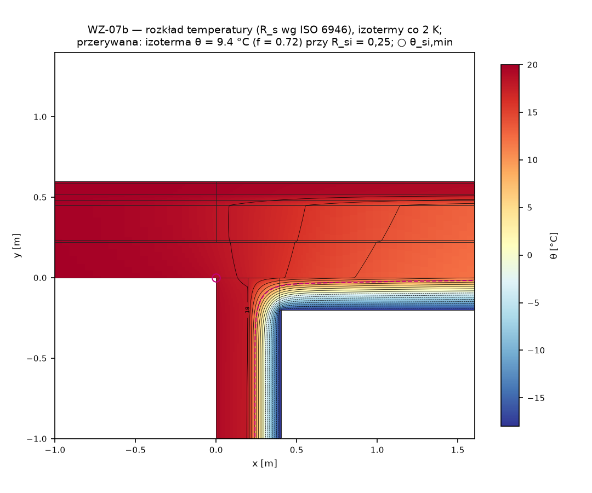

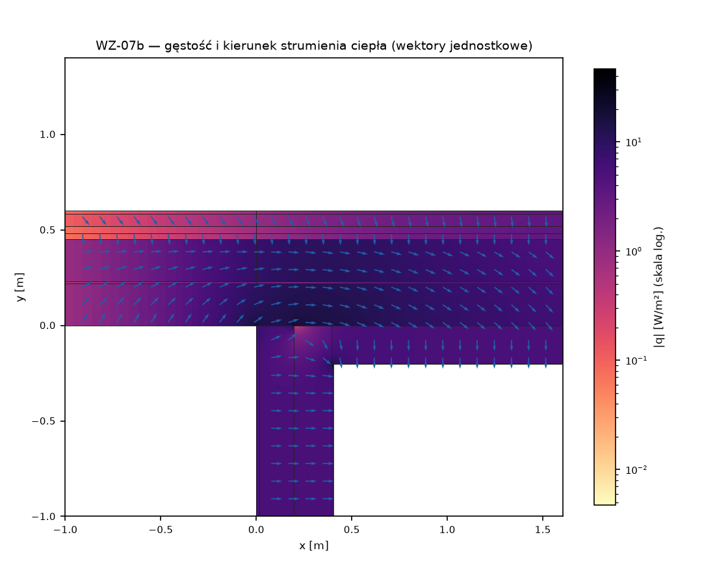

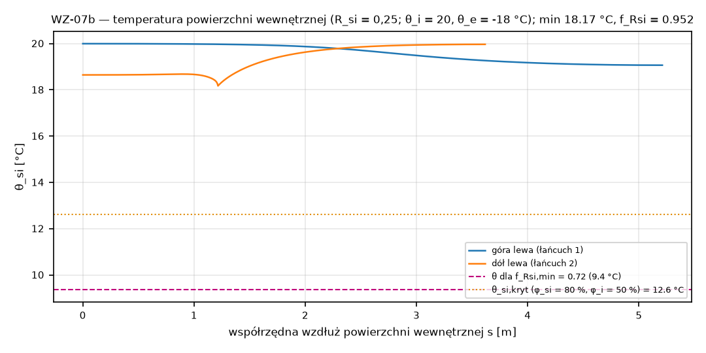

## WZ-08 — Cokół: ściana zewn. – płyta fundamentowa na XPS (część ogrzewana)

**Dane wejściowe**

*warstwy ściany:*

| kod | materiał | d [m] | λ [W/(m·K)] | R [m²K/W] |
|---|---|---|---|---|
| TYNK_GIPS | Tynk gipsowy maszynowy 1,5 cm | 0,0150 | 0,4000 | 0,0375 |
| SIL18 | Bloczek wapienno-piaskowy (silikat) 18 cm, kl. 20, gr. 1, na zaprawie cienkowarstwowej | 0,1800 | 0,9000 | 0,2000 |
| EPS031 | Styropian grafitowy EPS 031 (ETICS, NRO w systemie) | 0,2000 | 0,0310 | 6,4516 |
| TYNK_SIL | ETICS: warstwa zbrojona + tynk silikonowy 1,5 mm (biały / jasnoszary NCS S 1500-N) | 0,0100 | 0,8000 | 0,0125 |

*warstwy podłogi:*

| kod | materiał | d [m] | λ [W/(m·K)] | R [m²K/W] |
|---|---|---|---|---|
| DESKA_DEB | Deska warstwowa dębowa 15 mm, klejona | 0,0150 | 0,1800 | 0,0833 |
| JASTRYCH | Jastrych cementowy CT-C25-F5 z wężownicą ogrzewania podłogowego | 0,0650 | 1,2000 | 0,0542 |
| EPS038 | Styropian podłogowy EPS 100-038 (pod jastrychem) | 0,0650 | 0,0380 | 1,7105 |
| MEMB_SBS_POD | Izolacja przeciwwilgociowa i przeciwradonowa: membrana SBS 4 mm na płycie fundamentowej | 0,0050 | 0,2300 | 0,0217 |
| ZB_C25 | Żelbet C25/30, B500SP (stropy, płyta fundamentowa, ściany) | 0,2500 | 2,3000 | 0,1087 |
| XPS300 | Polistyren ekstrudowany XPS 300 (pod płytą fundamentową, cokół, izolacja obwodowa) | 0,2000 | 0,0360 | 5,5556 |
| FOLIA_PE | Folia PE 0,2 mm — warstwa rozdzielająca pod XPS (nie pełni funkcji paroizolacji) | 0,0002 | 0,3300 | 0,0006 |
| PIASEK | Podsypka piaskowa zagęszczona (I_s ≥ 0,98) | 0,2000 | 2,0000 | 0,1000 |

* fundament: płyta fundamentowa ZB_C25 0.25 m
* izolacja obwodowa: XPS do rzędnej -0.40, cokół do 0.00 (teren -0.30)
* grunt: λ = 2.0 W/(m·K); obszar: wewn. 0,5·b = 3.1394753886010367 m od lica zewn., zewn. 2,5·b = 15.697376943005183 m, głęb. 2,5·b = 15.697376943005183 m (b = 6.278950777202073 m)
* U podłogi (ISO 13370): R_f = 7.635 m²K/W, d_t = 16.094 m, U = 0.1055 W/(m²K)

**Warunki brzegowe** (przekrój pionowy; płaszczyzny odcięcia i osie symetrii adiabatyczne)

| strefa | rodzaj | grupa | θ [°C] | R_s — przebieg ψ [m²K/W] | R_s — przebieg f_Rsi |
|---|---|---|---|---|---|
| pomieszczenie | wewn | i | 20,0 | wg ISO 6946: 0,13 poziomo / 0,10 w górę / 0,17 w dół | 0,25 (ramy/szyby 0,13) |
| zewnętrze | zewn | e | −18,0 | 0,04 | 0,04 |

**Siatka i dokładność** (MOS, siatka prostokątna zagęszczana przy granicach materiałów)

| siatka | komórek | Φ_całk [W/m] |
|---|---|---|
| 170 × 240 = 40800 komórek; Δx ∈ [2; 391.7] mm, Δy ∈ [0.1; 399.2] mm | 40800 | 21,4807 |
| 340 × 480 = 163200 komórek; Δx ∈ [1; 195.9] mm, Δy ∈ [0.05; 199.6] mm | 163200 | 21,4866 |

Zmiana strumienia przy podwojeniu liczby podziałów: **0,028 %** (kryterium ISO 10211 < 1 %: spełnione); zmiana L_2D (= zmiana ψ): 0,00016 W/(m·K) (kryterium ≤ max(1 % |ψ|; 0,001) = 0,00100: spełnione); bilans energii Σ Φ / (½ Σ|Φ|) = 1.5e-10 (kryterium < 10⁻⁴: spełnione).

**Współczynniki sprzężenia i ψ**

*Para i–e:* L_2D = **0,5654 W/(m·K)**

| element flankujący | U [W/(m²K)] | l_e [m] | l_i [m] | l_oi [m] | U·l_e | U·l_i | U·l_oi |
|---|---|---|---|---|---|---|---|
| ściana (od poziomu posadzki) | 0,1455 | 1,2150 | 1,2150 | 1,2150 | 0,1768 | 0,1768 | 0,1768 |
| podłoga na gruncie (U wg ISO 13370, B' = 6.28 m, d_t = 16.09 m) | 0,1055 | 3,1395 | 2,7345 | 2,7345 | 0,3311 | 0,2884 | 0,2884 |

ψ_oi (wymiary wewnętrzne całkowite — system projektu, H_TB) = 0,5654 − 0,4652 = **0,100 W/(m·K)**; ψ_e (zewnętrzne) = 0,5654 − 0,5079 = 0,058 W/(m·K); ψ_i (wewnętrzne) = 0,5654 − 0,4652 = 0,100 W/(m·K)

**Temperatura powierzchni wewnętrznej i ryzyko pleśni** (R_si = 0,25 — PN-EN ISO 13788)

* θ_si,min = **16,32 °C** w punkcie (0,000; 0,001) m przy θ_i = 20,0 °C, θ_e = −18,0 °C
* f_Rsi = (θ_si,min − θ_e)/(θ_i − θ_e) = **0,903**; wymaganie f_Rsi ≥ 0,72 (WT zał. 2 pkt 2.2.1–2.2.5 (uproszczenie; φ_i = 50 %) (W-248)) → **SPEŁNIA**
* informacyjnie przy θ_e obliczeniowej i φ_i = 50 %: θ_si,kryt (φ_si = 80 %) = 12,6 °C (f = 0,806), punkt rosy 9,3 °C → θ_si,min ≥ θ_si,kryt (ocena miesięczna wg ISO 13788 — łagodniejsza; kryterium formalne: f_Rsi ≥ 0,72)

**Porównanie**

* PN-EN ISO 14683 — wartość domyślna (ściana–podłoga na gruncie (GF)): ψ_e = 0,60, ψ_i = 0,80 W/(m·K) [NZW] — obliczone ψ_e = 0,058, ψ_i = 0,100 (poniżej wartości domyślnej — porównanie w tym samym systemie wymiarów)

*Uwaga:* Ściana liczona od poziomu posadzki (±0,00) we wszystkich systemach wymiarów (ψ_oi = ψ_i); podłoga wg PN-EN ISO 13370 z B' = b [INT]; b = B' = A/(0,5·P) budynku, gdy podane z modelu.
*Uwaga:* Hydroizolacja pionowa ściany fundamentowej (bitumiczna/KMB) i izolacja obwodowa XPS (odporna na wodę) do spodu ławy; drenaż opaskowy i odprowadzenie wody opadowej od cokołu — poza zakresem cieplnym (wpływ na λ gruntu pominięty, λ = 2,0).

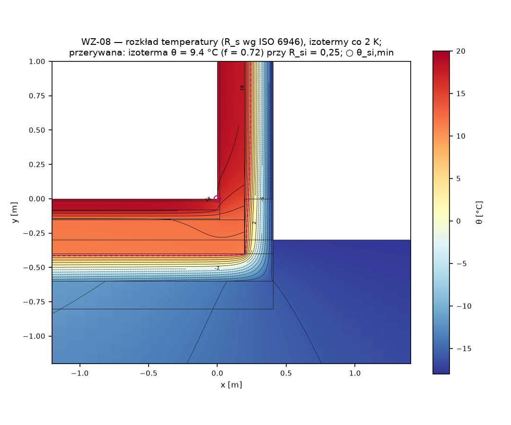

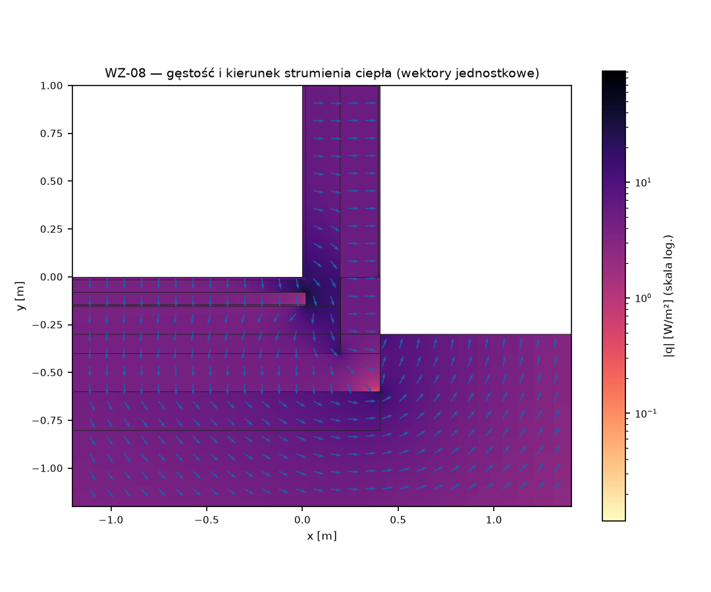

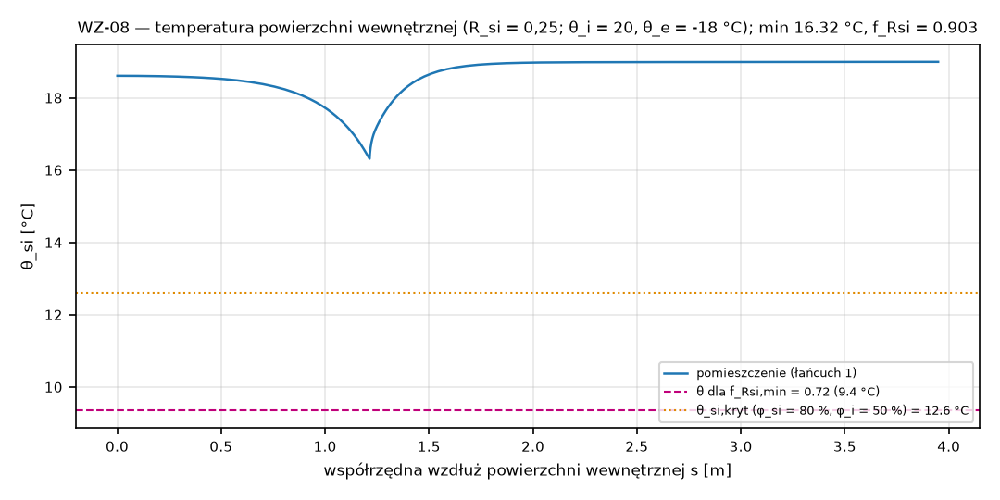

## WZ-09a — Ściana dom–garaż (SWG) na płycie fundamentowej (POD-0 / POD-G)

**Dane wejściowe**

*ściana (od domu):*

| kod | materiał | d [m] | λ [W/(m·K)] | R [m²K/W] |
|---|---|---|---|---|
| TYNK_GIPS | Tynk gipsowy maszynowy 1,5 cm | 0,0150 | 0,4000 | 0,0375 |
| SIL18 | Bloczek wapienno-piaskowy (silikat) 18 cm, kl. 20, gr. 1, na zaprawie cienkowarstwowej | 0,1800 | 0,9000 | 0,2000 |
| WELNA_035 | Wełna mineralna 035 (szkielet, docieplenia, ściana dom–garaż) | 0,1200 | 0,0350 | 3,4286 |
| TYNK_CW | Tynk cementowo-wapienny 1,5 cm (garaż, pom. techniczne) | 0,0100 | 0,8200 | 0,0122 |

*podłoga domu:*

| kod | materiał | d [m] | λ [W/(m·K)] | R [m²K/W] |
|---|---|---|---|---|
| DESKA_DEB | Deska warstwowa dębowa 15 mm, klejona | 0,0150 | 0,1800 | 0,0833 |
| JASTRYCH | Jastrych cementowy CT-C25-F5 z wężownicą ogrzewania podłogowego | 0,0650 | 1,2000 | 0,0542 |
| EPS038 | Styropian podłogowy EPS 100-038 (pod jastrychem) | 0,0650 | 0,0380 | 1,7105 |
| MEMB_SBS_POD | Izolacja przeciwwilgociowa i przeciwradonowa: membrana SBS 4 mm na płycie fundamentowej | 0,0050 | 0,2300 | 0,0217 |
| ZB_C25 | Żelbet C25/30, B500SP (stropy, płyta fundamentowa, ściany) | 0,2500 | 2,3000 | 0,1087 |
| XPS300 | Polistyren ekstrudowany XPS 300 (pod płytą fundamentową, cokół, izolacja obwodowa) | 0,2000 | 0,0360 | 5,5556 |
| FOLIA_PE | Folia PE 0,2 mm — warstwa rozdzielająca pod XPS (nie pełni funkcji paroizolacji) | 0,0002 | 0,3300 | 0,0006 |
| PIASEK | Podsypka piaskowa zagęszczona (I_s ≥ 0,98) | 0,2000 | 2,0000 | 0,1000 |

*posadzka garażu:*

| kod | materiał | d [m] | λ [W/(m·K)] | R [m²K/W] |
|---|---|---|---|---|
| ZYWICA | Posadzka żywiczna epoksydowa antypoślizgowa R11 (garaż) | 0,0030 | 0,2000 | 0,0150 |
| JASTRYCH_G | Jastrych cementowy CT-C30-F5 zbrojony (siatka/włókna), dylatacja obwodowa — posadzka garażu na XPS | 0,0920 | 1,2000 | 0,0767 |
| FOLIA_PE | Folia PE 0,2 mm — warstwa rozdzielająca pod XPS (nie pełni funkcji paroizolacji) | 0,0002 | 0,3300 | 0,0006 |
| XPS300 | Polistyren ekstrudowany XPS 300 (pod płytą fundamentową, cokół, izolacja obwodowa) | 0,1000 | 0,0360 | 2,7778 |
| MEMB_SBS_POD | Izolacja przeciwwilgociowa i przeciwradonowa: membrana SBS 4 mm na płycie fundamentowej | 0,0050 | 0,2300 | 0,0217 |
| ZB_C25 | Żelbet C25/30, B500SP (stropy, płyta fundamentowa, ściany) | 0,2500 | 2,3000 | 0,1087 |
| XPS300 | Polistyren ekstrudowany XPS 300 (pod płytą fundamentową, cokół, izolacja obwodowa) | 0,2000 | 0,0360 | 5,5556 |
| FOLIA_PE | Folia PE 0,2 mm — warstwa rozdzielająca pod XPS (nie pełni funkcji paroizolacji) | 0,0002 | 0,3300 | 0,0006 |
| PIASEK | Podsypka piaskowa zagęszczona (I_s ≥ 0,98) | 0,2000 | 2,0000 | 0,1000 |

* grunt: λ = 2,0, warstwa 1.0 m pod podsypką, dół adiabatyczny [ZAŁ]
* θ_u: -10.4 °C z b_u = 0.8 [ZAŁ]
* uskok / żebro: uskok płyty garażu 0.15 m; żebro b = 0.50 m, spód 0.70 m pod wierzchem płyty domu
* geometria z modelu: ściany S0-16, S0-17 (Σ 12.25 m) na płycie PF
* długość z geometrii modelu [m]: 12,250

**Warunki brzegowe** (przekrój pionowy; płaszczyzny odcięcia i osie symetrii adiabatyczne)

| strefa | rodzaj | grupa | θ [°C] | R_s — przebieg ψ [m²K/W] | R_s — przebieg f_Rsi |
|---|---|---|---|---|---|
| dom (ogrzewany) | wewn | i | 20,0 | wg ISO 6946: 0,13 poziomo / 0,10 w górę / 0,17 w dół | 0,25 (ramy/szyby 0,13) |
| garaż nieogrzewany | nieogrz | u | −10,4 | wg ISO 6946: 0,13 poziomo / 0,10 w górę / 0,17 w dół | wg ISO 6946: 0,13 poziomo / 0,10 w górę / 0,17 w dół |

**Siatka i dokładność** (MOS, siatka prostokątna zagęszczana przy granicach materiałów)

| siatka | komórek | Φ_całk [W/m] |
|---|---|---|
| 197 × 310 = 61070 komórek; Δx ∈ [1.65; 99.93] mm, Δy ∈ [0.1; 93.6] mm | 61070 | 20,0655 |
| 394 × 620 = 244280 komórek; Δx ∈ [0.825; 49.97] mm, Δy ∈ [0.05; 46.8] mm | 244280 | 20,0746 |

Zmiana strumienia przy podwojeniu liczby podziałów: **0,045 %** (kryterium ISO 10211 < 1 %: spełnione); zmiana L_2D (= zmiana ψ): 0,00030 W/(m·K) (kryterium ≤ max(1 % |ψ|; 0,001) = 0,00406: spełnione); bilans energii Σ Φ / (½ Σ|Φ|) = 4.4e-12 (kryterium < 10⁻⁴: spełnione).

**Współczynniki sprzężenia i ψ**

*Para i–u:* L_2D = **0,6603 W/(m·K)**

| element flankujący | U [W/(m²K)] | l_e [m] | l_i [m] | l_oi [m] | U·l_e | U·l_i | U·l_oi |
|---|---|---|---|---|---|---|---|
| ściana dom–garaż (od posadzki domu) | 0,2539 | 1,0000 | 1,0000 | 1,0000 | 0,2539 | 0,2539 | 0,2539 |

ψ_oi (wymiary wewnętrzne całkowite — system projektu, H_TB) = 0,6603 − 0,2539 = **0,406 W/(m·K)**; ψ_e (zewnętrzne) = 0,6603 − 0,2539 = 0,406 W/(m·K); ψ_i (wewnętrzne) = 0,6603 − 0,2539 = 0,406 W/(m·K)

**Temperatura powierzchni wewnętrznej i ryzyko pleśni** (R_si = 0,25 — PN-EN ISO 13788)

* θ_si,min = **17,00 °C** w punkcie (0,000; 0,000) m przy θ_i = 20,0 °C, θ_e = −10,4 °C
* f_Rsi = (θ_si,min − θ_e)/(θ_i − θ_e) = **0,901**; wymaganie f_Rsi ≥ 0,72 (WT zał. 2 pkt 2.2.1–2.2.5 (uproszczenie; φ_i = 50 %) (W-248)) → **SPEŁNIA**
* informacyjnie przy θ_e obliczeniowej i φ_i = 50 %: θ_si,kryt (φ_si = 80 %) = 12,6 °C (f = 0,757), punkt rosy 9,3 °C → θ_si,min ≥ θ_si,kryt (ocena miesięczna wg ISO 13788 — łagodniejsza; kryterium formalne: f_Rsi ≥ 0,72)

*Uwaga:* ψ_iu = L_2D,iu − U_ściany·h (podłogi po obu stronach nie wymieniają ciepła z gruntem w modelu węzła — dół adiabatyczny); strata do garażu wchodzi do H_U = H_iu·b_u (PN-EN ISO 13789).

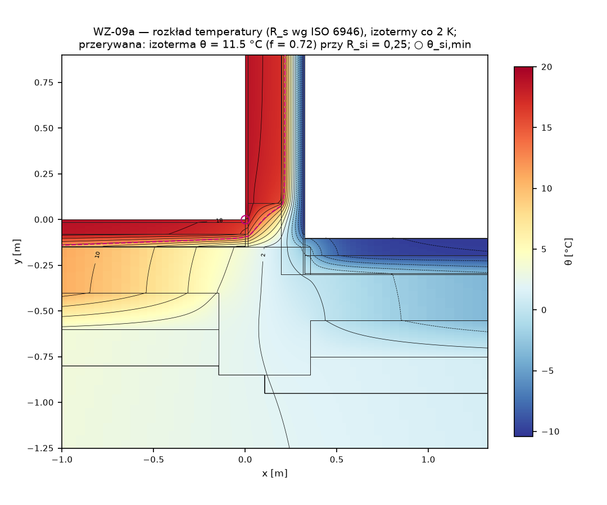

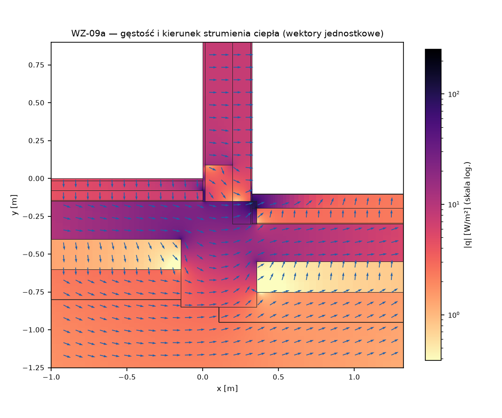

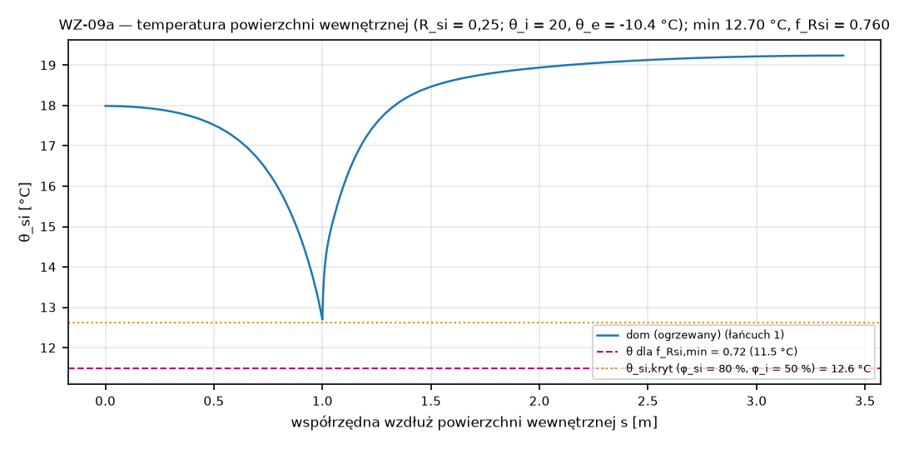

## WZ-09b — Ściana SWG pod płytą: dom — D4, garaż — D4, pas docieplenia SUF-G 1.0 m

**Dane wejściowe**

*ściana dolna (od lewej):*

| kod | materiał | d [m] | λ [W/(m·K)] | R [m²K/W] |
|---|---|---|---|---|
| TYNK_GIPS | Tynk gipsowy maszynowy 1,5 cm | 0,0150 | 0,4000 | 0,0375 |
| SIL18 | Bloczek wapienno-piaskowy (silikat) 18 cm, kl. 20, gr. 1, na zaprawie cienkowarstwowej | 0,1800 | 0,9000 | 0,2000 |
| WELNA_035 | Wełna mineralna 035 (szkielet, docieplenia, ściana dom–garaż) | 0,1200 | 0,0350 | 3,4286 |
| TYNK_CW | Tynk cementowo-wapienny 1,5 cm (garaż, pom. techniczne) | 0,0100 | 0,8200 | 0,0122 |

* płyta: ZB_C25, t = 0.24 m
* nad płytą L/P: zewn / zewn
* pod płytą L/P: wewn / nieogrz (pas 1.0 m)

*warstwy nad płytą L:*

| kod | materiał | d [m] | λ [W/(m·K)] | R [m²K/W] |
|---|---|---|---|---|
| SUBSTRAT | Substrat ekstensywny 8 cm z matą rozchodnikową (sedum) | 0,0800 | 0,8000 | 0,1000 |
| GEOWL | Geowłóknina filtracyjna PP 150 g/m² | 0,0020 | 0,5000 | 0,0040 |
| MATA_DREN | Mata drenażowo-retencyjna HDPE 25 mm (dach zielony) | 0,0250 | 0,5000 | 0,0500 |
| WLOKN_OCHR | Włóknina ochronna PP 300 g/m² | 0,0040 | 0,5000 | 0,0080 |
| BARIERA_KORZ | Bariera przeciwkorzenna PE-HD 0,5 mm (PN-EN 13948) | 0,0005 | 0,4000 | 0,0013 |
| PAPA_SBS | Hydroizolacja 2 × papa SBS (podkładowa + wierzchniego krycia, dach zielony) | 0,0095 | 0,2300 | 0,0413 |
| PIR022 | Płyty PIR z okładziną (izolacja spadkowa stropodachów) | 0,1800 | 0,0220 | 8,1818 |
| PAROIZ_AL | Paroizolacja bitumiczna z wkładką Al (na płycie stropodachów) | 0,0040 | 0,2300 | 0,0174 |

*warstwy nad płytą P:*

| kod | materiał | d [m] | λ [W/(m·K)] | R [m²K/W] |
|---|---|---|---|---|
| SUBSTRAT | Substrat ekstensywny 8 cm z matą rozchodnikową (sedum) | 0,0800 | 0,8000 | 0,1000 |
| GEOWL | Geowłóknina filtracyjna PP 150 g/m² | 0,0020 | 0,5000 | 0,0040 |
| MATA_DREN | Mata drenażowo-retencyjna HDPE 25 mm (dach zielony) | 0,0250 | 0,5000 | 0,0500 |
| WLOKN_OCHR | Włóknina ochronna PP 300 g/m² | 0,0040 | 0,5000 | 0,0080 |
| BARIERA_KORZ | Bariera przeciwkorzenna PE-HD 0,5 mm (PN-EN 13948) | 0,0005 | 0,4000 | 0,0013 |
| PAPA_SBS | Hydroizolacja 2 × papa SBS (podkładowa + wierzchniego krycia, dach zielony) | 0,0095 | 0,2300 | 0,0413 |
| PIR022 | Płyty PIR z okładziną (izolacja spadkowa stropodachów) | 0,1800 | 0,0220 | 8,1818 |
| PAROIZ_AL | Paroizolacja bitumiczna z wkładką Al (na płycie stropodachów) | 0,0040 | 0,2300 | 0,0174 |

*warstwy pod płytą P:*

| kod | materiał | d [m] | λ [W/(m·K)] | R [m²K/W] |
|---|---|---|---|---|
| WELNA_035 | Wełna mineralna 035 (szkielet, docieplenia, ściana dom–garaż) | 0,1000 | 0,0350 | 2,8571 |
| TYNK_CW | Tynk cementowo-wapienny 1,5 cm (garaż, pom. techniczne) | 0,0100 | 0,8200 | 0,0122 |

* θ_u: -10.4 °C z b_u = 0.8 [ZAŁ]
* geometria z modelu: ściany S0-17 (Σ 6.38 m)
* długość z geometrii modelu [m]: 6,380

**Warunki brzegowe** (przekrój pionowy; płaszczyzny odcięcia i osie symetrii adiabatyczne)

| strefa | rodzaj | grupa | θ [°C] | R_s — przebieg ψ [m²K/W] | R_s — przebieg f_Rsi |
|---|---|---|---|---|---|
| dół lewa | wewn | i | 20,0 | wg ISO 6946: 0,13 poziomo / 0,10 w górę / 0,17 w dół | 0,25 (ramy/szyby 0,13) |
| dół prawa | nieogrz | u | −10,4 | wg ISO 6946: 0,13 poziomo / 0,10 w górę / 0,17 w dół | wg ISO 6946: 0,13 poziomo / 0,10 w górę / 0,17 w dół |
| góra lewa | zewn | e | −18,0 | 0,04 | 0,04 |

**Siatka i dokładność** (MOS, siatka prostokątna zagęszczana przy granicach materiałów)

| siatka | komórek | Φ_całk [W/m] |
|---|---|---|
| 186 × 191 = 35526 komórek; Δx ∈ [1.65; 99.64] mm, Δy ∈ [0.25; 93.27] mm | 35526 | 28,6783 |
| 372 × 382 = 142104 komórek; Δx ∈ [0.825; 49.82] mm, Δy ∈ [0.125; 46.63] mm | 142104 | 28,6868 |

Zmiana strumienia przy podwojeniu liczby podziałów: **0,030 %** (kryterium ISO 10211 < 1 %: spełnione); zmiana L_2D (= zmiana ψ): 0,00027 W/(m·K) (kryterium ≤ max(1 % |ψ|; 0,001) = 0,00100: spełnione); bilans energii Σ Φ / (½ Σ|Φ|) = 1.7e-13 (kryterium < 10⁻⁴: spełnione).

**Współczynniki sprzężenia i ψ**

| para grup | L_2D [W/(m·K)] |
|---|---|
| i–u | 0,5709 |
| e–i | 0,2982 |
| e–u | 0,2994 |

*Para i–u:* L_2D = **0,5709 W/(m·K)**

| element flankujący | U [W/(m²K)] | l_e [m] | l_i [m] | l_oi [m] | U·l_e | U·l_i | U·l_oi |
|---|---|---|---|---|---|---|---|
| ściana dolna | 0,2539 | 1,1200 | 1,0000 | 1,0000 | 0,2844 | 0,2539 | 0,2539 |

ψ_oi (wymiary wewnętrzne całkowite — system projektu, H_TB) = 0,5709 − 0,2539 = **0,317 W/(m·K)**; ψ_e (zewnętrzne) = 0,5709 − 0,2844 = 0,286 W/(m·K); ψ_i (wewnętrzne) = 0,5709 − 0,2539 = 0,317 W/(m·K)

*Para i–e:* L_2D = **0,2982 W/(m·K)**

| element flankujący | U [W/(m²K)] | l_e [m] | l_i [m] | l_oi [m] | U·l_e | U·l_i | U·l_oi |
|---|---|---|---|---|---|---|---|
| przegroda pozioma lewa | 0,1156 | 2,1275 | 1,9650 | 1,9650 | 0,2460 | 0,2272 | 0,2272 |

ψ_oi (wymiary wewnętrzne całkowite — system projektu, H_TB) = 0,2982 − 0,2272 = **0,071 W/(m·K)**; ψ_e (zewnętrzne) = 0,2982 − 0,2460 = 0,052 W/(m·K); ψ_i (wewnętrzne) = 0,2982 − 0,2272 = 0,071 W/(m·K)

*Para u–e:* L_2D = **0,2994 W/(m·K)**

| element flankujący | U [W/(m²K)] | l_e [m] | l_i [m] | l_oi [m] | U·l_e | U·l_i | U·l_oi |
|---|---|---|---|---|---|---|---|
| przegroda pozioma prawa | 0,1156 | 3,1275 | 2,9650 | 2,9650 | 0,3616 | 0,3428 | 0,3428 |

ψ_oi (wymiary wewnętrzne całkowite — system projektu, H_TB) = 0,2994 − 0,3428 = **−0,043 W/(m·K)**; ψ_e (zewnętrzne) = 0,2994 − 0,3616 = −0,062 W/(m·K); ψ_i (wewnętrzne) = 0,2994 − 0,3428 = −0,043 W/(m·K)

**Temperatura powierzchni wewnętrznej i ryzyko pleśni** (R_si = 0,25 — PN-EN ISO 13788)

* θ_si,min = **13,77 °C** w punkcie (0,000; 0,000) m przy θ_i = 20,0 °C, θ_e = −18,0 °C
* f_Rsi = (θ_si,min − θ_e)/(θ_i − θ_e) = **0,836**; wymaganie f_Rsi ≥ 0,72 (WT zał. 2 pkt 2.2.1–2.2.5 (uproszczenie; φ_i = 50 %) (W-248)) → **SPEŁNIA**
* współczynniki wagowe θ_si = Σ g·θ: g_i = 0,806, g_u = 0,148, g_e = 0,045
* informacyjnie przy θ_e obliczeniowej i φ_i = 50 %: θ_si,kryt (φ_si = 80 %) = 12,6 °C (f = 0,806), punkt rosy 9,3 °C → θ_si,min ≥ θ_si,kryt (ocena miesięczna wg ISO 13788 — łagodniejsza; kryterium formalne: f_Rsi ≥ 0,72)

*Uwaga:* Grupy stref: i — ogrzewane, u — nieogrzewane, e — zewnętrze; ψ dla każdej pary grup z elementami flankującymi (PN-EN ISO 10211, więcej niż dwie temperatury).

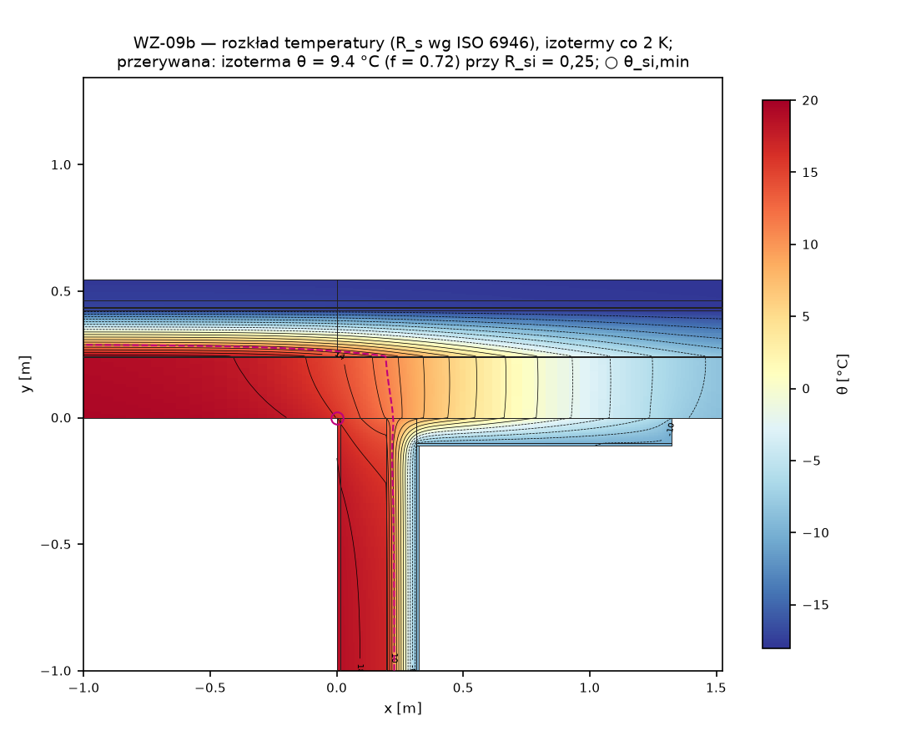

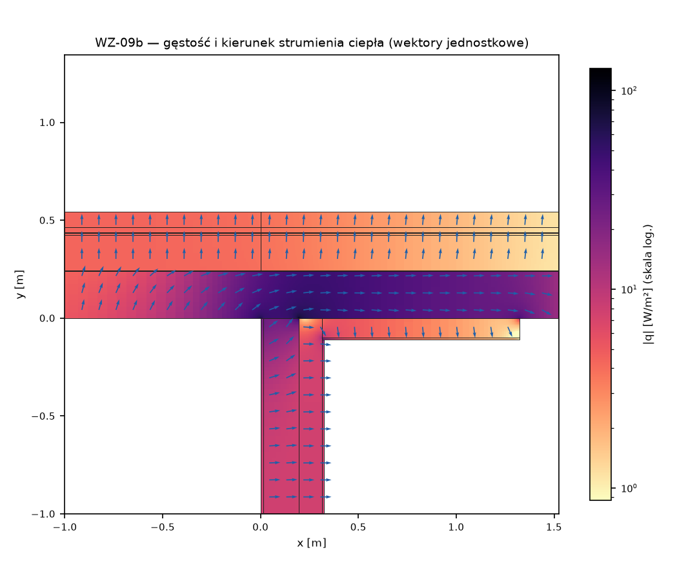

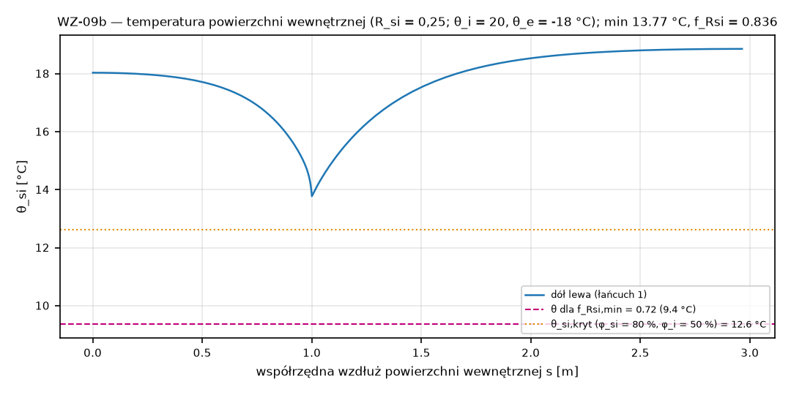

## WZ-09c — Ściana SWG pod płytą: dom — ST1 + ściana SZ1, garaż — D4, pas docieplenia SUF-G 1.0 m

**Dane wejściowe**

*ściana dolna (od lewej):*

| kod | materiał | d [m] | λ [W/(m·K)] | R [m²K/W] |
|---|---|---|---|---|
| TYNK_GIPS | Tynk gipsowy maszynowy 1,5 cm | 0,0150 | 0,4000 | 0,0375 |
| SIL18 | Bloczek wapienno-piaskowy (silikat) 18 cm, kl. 20, gr. 1, na zaprawie cienkowarstwowej | 0,1800 | 0,9000 | 0,2000 |
| WELNA_035 | Wełna mineralna 035 (szkielet, docieplenia, ściana dom–garaż) | 0,1200 | 0,0350 | 3,4286 |
| TYNK_CW | Tynk cementowo-wapienny 1,5 cm (garaż, pom. techniczne) | 0,0100 | 0,8200 | 0,0122 |

*ściana górna (od lewej):*

| kod | materiał | d [m] | λ [W/(m·K)] | R [m²K/W] |
|---|---|---|---|---|
| TYNK_GIPS | Tynk gipsowy maszynowy 1,5 cm | 0,0150 | 0,4000 | 0,0375 |
| SIL18 | Bloczek wapienno-piaskowy (silikat) 18 cm, kl. 20, gr. 1, na zaprawie cienkowarstwowej | 0,1800 | 0,9000 | 0,2000 |
| EPS031 | Styropian grafitowy EPS 031 (ETICS, NRO w systemie) | 0,2000 | 0,0310 | 6,4516 |
| TYNK_SIL | ETICS: warstwa zbrojona + tynk silikonowy 1,5 mm (biały / jasnoszary NCS S 1500-N) | 0,0100 | 0,8000 | 0,0125 |

* płyta: ZB_C25, t = 0.22 m (prawa 0.24 m)
* nad płytą L/P: wewn / zewn
* pod płytą L/P: wewn / nieogrz (pas 1.0 m)

*warstwy nad płytą L:*

| kod | materiał | d [m] | λ [W/(m·K)] | R [m²K/W] |
|---|---|---|---|---|
| DESKA_DEB | Deska warstwowa dębowa 15 mm, klejona | 0,0150 | 0,1800 | 0,0833 |
| JASTRYCH | Jastrych cementowy CT-C25-F5 z wężownicą ogrzewania podłogowego | 0,0650 | 1,2000 | 0,0542 |
| EPS038 | Styropian podłogowy EPS 100-038 (pod jastrychem) | 0,0400 | 0,0380 | 1,0526 |
| EPS_T | Styropian elastyfikowany EPS T (akustyczny, pod jastrychem) | 0,0300 | 0,0400 | 0,7500 |
| ZB_C25 | Żelbet C25/30, B500SP (stropy, płyta fundamentowa, ściany) | 0,2200 | 2,3000 | 0,0957 |
| TYNK_GIPS | Tynk gipsowy maszynowy 1,5 cm | 0,0100 | 0,4000 | 0,0250 |

*warstwy nad płytą P:*

| kod | materiał | d [m] | λ [W/(m·K)] | R [m²K/W] |
|---|---|---|---|---|
| SUBSTRAT | Substrat ekstensywny 8 cm z matą rozchodnikową (sedum) | 0,0800 | 0,8000 | 0,1000 |
| GEOWL | Geowłóknina filtracyjna PP 150 g/m² | 0,0020 | 0,5000 | 0,0040 |
| MATA_DREN | Mata drenażowo-retencyjna HDPE 25 mm (dach zielony) | 0,0250 | 0,5000 | 0,0500 |
| WLOKN_OCHR | Włóknina ochronna PP 300 g/m² | 0,0040 | 0,5000 | 0,0080 |
| BARIERA_KORZ | Bariera przeciwkorzenna PE-HD 0,5 mm (PN-EN 13948) | 0,0005 | 0,4000 | 0,0013 |
| PAPA_SBS | Hydroizolacja 2 × papa SBS (podkładowa + wierzchniego krycia, dach zielony) | 0,0095 | 0,2300 | 0,0413 |
| PIR022 | Płyty PIR z okładziną (izolacja spadkowa stropodachów) | 0,1800 | 0,0220 | 8,1818 |
| PAROIZ_AL | Paroizolacja bitumiczna z wkładką Al (na płycie stropodachów) | 0,0040 | 0,2300 | 0,0174 |

*warstwy pod płytą L:*

| kod | materiał | d [m] | λ [W/(m·K)] | R [m²K/W] |
|---|---|---|---|---|
| TYNK_GIPS | Tynk gipsowy maszynowy 1,5 cm | 0,0100 | 0,4000 | 0,0250 |

*warstwy pod płytą P:*

| kod | materiał | d [m] | λ [W/(m·K)] | R [m²K/W] |
|---|---|---|---|---|
| WELNA_035 | Wełna mineralna 035 (szkielet, docieplenia, ściana dom–garaż) | 0,1000 | 0,0350 | 2,8571 |
| TYNK_CW | Tynk cementowo-wapienny 1,5 cm (garaż, pom. techniczne) | 0,0100 | 0,8200 | 0,0122 |

* θ_u: -10.4 °C z b_u = 0.8 [ZAŁ]
* geometria z modelu: ściany S0-16 (Σ 5.88 m)
* długość z geometrii modelu [m]: 5,880

**Warunki brzegowe** (przekrój pionowy; płaszczyzny odcięcia i osie symetrii adiabatyczne)

| strefa | rodzaj | grupa | θ [°C] | R_s — przebieg ψ [m²K/W] | R_s — przebieg f_Rsi |
|---|---|---|---|---|---|
| dół lewa | wewn | i | 20,0 | wg ISO 6946: 0,13 poziomo / 0,10 w górę / 0,17 w dół | 0,25 (ramy/szyby 0,13) |
| dół prawa | nieogrz | u | −10,4 | wg ISO 6946: 0,13 poziomo / 0,10 w górę / 0,17 w dół | wg ISO 6946: 0,13 poziomo / 0,10 w górę / 0,17 w dół |
| góra lewa | wewn | i | 20,0 | wg ISO 6946: 0,13 poziomo / 0,10 w górę / 0,17 w dół | 0,25 (ramy/szyby 0,13) |
| góra prawa | zewn | e | −18,0 | 0,04 | 0,04 |

**Siatka i dokładność** (MOS, siatka prostokątna zagęszczana przy granicach materiałów)

| siatka | komórek | Φ_całk [W/m] |
|---|---|---|
| 206 × 239 = 49234 komórek; Δx ∈ [1.65; 99.64] mm, Δy ∈ [0.25; 95.51] mm | 49234 | 29,2147 |
| 412 × 478 = 196936 komórek; Δx ∈ [0.825; 49.82] mm, Δy ∈ [0.125; 47.75] mm | 196936 | 29,2235 |

Zmiana strumienia przy podwojeniu liczby podziałów: **0,030 %** (kryterium ISO 10211 < 1 %: spełnione); zmiana L_2D (= zmiana ψ): 0,00024 W/(m·K) (kryterium ≤ max(1 % |ψ|; 0,001) = 0,00100: spełnione); bilans energii Σ Φ / (½ Σ|Φ|) = 8.2e-12 (kryterium < 10⁻⁴: spełnione).

**Współczynniki sprzężenia i ψ**

| para grup | L_2D [W/(m·K)] |
|---|---|
| i–u | 0,6386 |
| e–i | 0,2581 |
| e–u | 0,2891 |

*Para i–u:* L_2D = **0,6386 W/(m·K)**

| element flankujący | U [W/(m²K)] | l_e [m] | l_i [m] | l_oi [m] | U·l_e | U·l_i | U·l_oi |
|---|---|---|---|---|---|---|---|
| ściana dolna | 0,2539 | 1,3250 | 1,2050 | 1,8150 | 0,3364 | 0,3060 | 0,4609 |

ψ_oi (wymiary wewnętrzne całkowite — system projektu, H_TB) = 0,6386 − 0,4609 = **0,178 W/(m·K)**; ψ_e (zewnętrzne) = 0,6386 − 0,3364 = 0,302 W/(m·K); ψ_i (wewnętrzne) = 0,6386 − 0,3060 = 0,333 W/(m·K)

*Para i–e:* L_2D = **0,2581 W/(m·K)**

| element flankujący | U [W/(m²K)] | l_e [m] | l_i [m] | l_oi [m] | U·l_e | U·l_i | U·l_oi |
|---|---|---|---|---|---|---|---|
| ściana górna | 0,1455 | 1,2900 | 1,2150 | 1,2150 | 0,1877 | 0,1768 | 0,1768 |

ψ_oi (wymiary wewnętrzne całkowite — system projektu, H_TB) = 0,2581 − 0,1768 = **0,081 W/(m·K)**; ψ_e (zewnętrzne) = 0,2581 − 0,1877 = 0,070 W/(m·K); ψ_i (wewnętrzne) = 0,2581 − 0,1768 = 0,081 W/(m·K)

*Para u–e:* L_2D = **0,2891 W/(m·K)**

| element flankujący | U [W/(m²K)] | l_e [m] | l_i [m] | l_oi [m] | U·l_e | U·l_i | U·l_oi |
|---|---|---|---|---|---|---|---|
| przegroda pozioma prawa | 0,1156 | 3,1275 | 2,9650 | 2,9650 | 0,3616 | 0,3428 | 0,3428 |

ψ_oi (wymiary wewnętrzne całkowite — system projektu, H_TB) = 0,2891 − 0,3428 = **−0,054 W/(m·K)**; ψ_e (zewnętrzne) = 0,2891 − 0,3616 = −0,072 W/(m·K); ψ_i (wewnętrzne) = 0,2891 − 0,3428 = −0,054 W/(m·K)

**Temperatura powierzchni wewnętrznej i ryzyko pleśni** (R_si = 0,25 — PN-EN ISO 13788)

* θ_si,min = **15,64 °C** w punkcie (0,000; −0,010) m przy θ_i = 20,0 °C, θ_e = −18,0 °C
* f_Rsi = (θ_si,min − θ_e)/(θ_i − θ_e) = **0,885**; wymaganie f_Rsi ≥ 0,72 (WT zał. 2 pkt 2.2.1–2.2.5 (uproszczenie; φ_i = 50 %) (W-248)) → **SPEŁNIA**
* współczynniki wagowe θ_si = Σ g·θ: g_i = 0,862, g_u = 0,117, g_e = 0,021
* informacyjnie przy θ_e obliczeniowej i φ_i = 50 %: θ_si,kryt (φ_si = 80 %) = 12,6 °C (f = 0,806), punkt rosy 9,3 °C → θ_si,min ≥ θ_si,kryt (ocena miesięczna wg ISO 13788 — łagodniejsza; kryterium formalne: f_Rsi ≥ 0,72)

*Uwaga:* Grupy stref: i — ogrzewane, u — nieogrzewane, e — zewnętrze; ψ dla każdej pary grup z elementami flankującymi (PN-EN ISO 10211, więcej niż dwie temperatury).

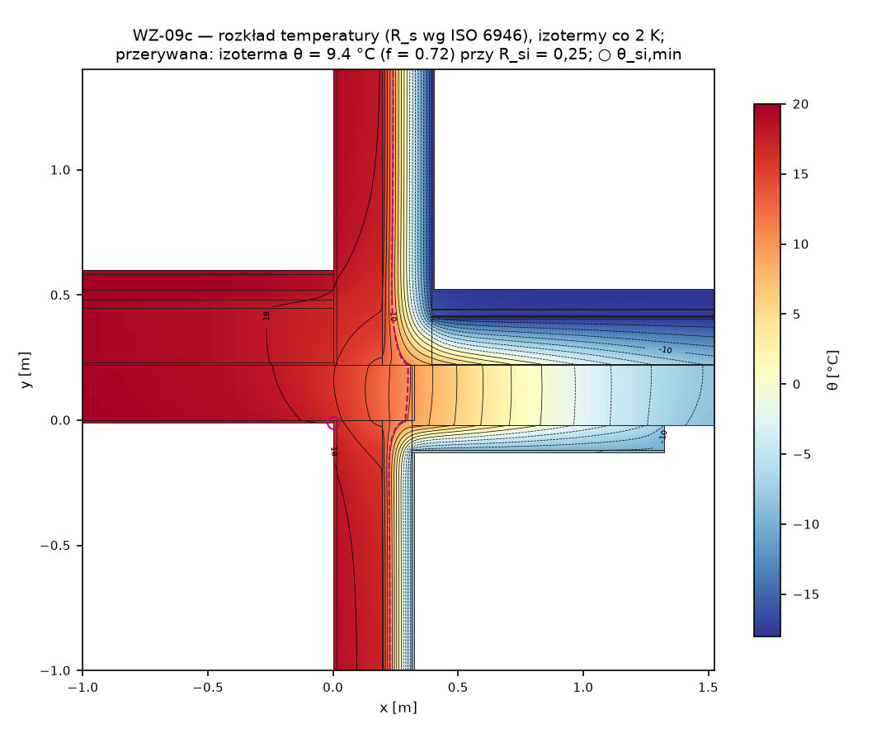

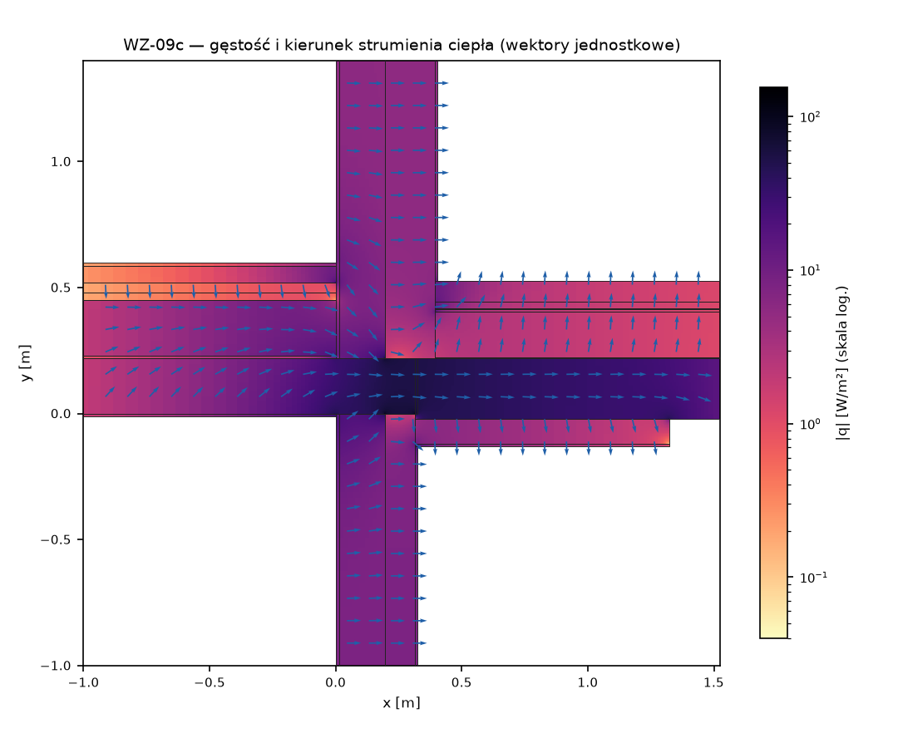

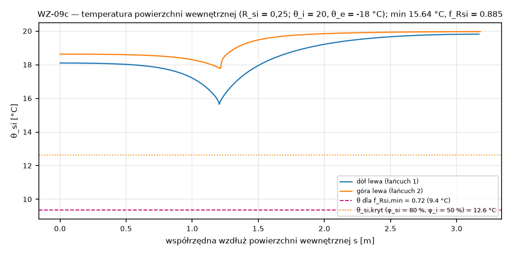

## WZ-10 — Strop pośredni ST1/ST2 – ściana zewn. z ETICS ciągłym (wieniec)

Przekrój pionowy; pomieszczenia nad i pod stropem ogrzewane (grupa „i”).

**Dane wejściowe**

*warstwy ściany:*

| kod | materiał | d [m] | λ [W/(m·K)] | R [m²K/W] |
|---|---|---|---|---|
| TYNK_GIPS | Tynk gipsowy maszynowy 1,5 cm | 0,0150 | 0,4000 | 0,0375 |
| SIL18 | Bloczek wapienno-piaskowy (silikat) 18 cm, kl. 20, gr. 1, na zaprawie cienkowarstwowej | 0,1800 | 0,9000 | 0,2000 |
| EPS031 | Styropian grafitowy EPS 031 (ETICS, NRO w systemie) | 0,2000 | 0,0310 | 6,4516 |
| TYNK_SIL | ETICS: warstwa zbrojona + tynk silikonowy 1,5 mm (biały / jasnoszary NCS S 1500-N) | 0,0100 | 0,8000 | 0,0125 |

* płyta: ZB_C25, t = 0.22 m, wysięg = 0.0 m

*warstwy podłogi:*

| kod | materiał | d [m] | λ [W/(m·K)] | R [m²K/W] |
|---|---|---|---|---|
| DESKA_DEB | Deska warstwowa dębowa 15 mm, klejona | 0,0150 | 0,1800 | 0,0833 |
| JASTRYCH | Jastrych cementowy CT-C25-F5 z wężownicą ogrzewania podłogowego | 0,0650 | 1,2000 | 0,0542 |
| EPS038 | Styropian podłogowy EPS 100-038 (pod jastrychem) | 0,0400 | 0,0380 | 1,0526 |
| EPS_T | Styropian elastyfikowany EPS T (akustyczny, pod jastrychem) | 0,0300 | 0,0400 | 0,7500 |
| ZB_C25 | Żelbet C25/30, B500SP (stropy, płyta fundamentowa, ściany) | 0,2200 | 2,3000 | 0,0957 |
| TYNK_GIPS | Tynk gipsowy maszynowy 1,5 cm | 0,0100 | 0,4000 | 0,0250 |

*warstwy sufitu:*

| kod | materiał | d [m] | λ [W/(m·K)] | R [m²K/W] |
|---|---|---|---|---|
| TYNK_GIPS | Tynk gipsowy maszynowy 1,5 cm | 0,0100 | 0,4000 | 0,0250 |

**Warunki brzegowe** (przekrój pionowy; płaszczyzny odcięcia i osie symetrii adiabatyczne)

| strefa | rodzaj | grupa | θ [°C] | R_s — przebieg ψ [m²K/W] | R_s — przebieg f_Rsi |
|---|---|---|---|---|---|
| pomieszczenie dolne | wewn | i | 20,0 | wg ISO 6946: 0,13 poziomo / 0,10 w górę / 0,17 w dół | 0,25 (ramy/szyby 0,13) |
| pomieszczenie górne | wewn | i | 20,0 | wg ISO 6946: 0,13 poziomo / 0,10 w górę / 0,17 w dół | 0,25 (ramy/szyby 0,13) |
| zewnętrze | zewn | e | −18,0 | 0,04 | 0,04 |

**Siatka i dokładność** (MOS, siatka prostokątna zagęszczana przy granicach materiałów)

| siatka | komórek | Φ_całk [W/m] |
|---|---|---|
| 109 × 179 = 19511 komórek; Δx ∈ [1.65; 93.27] mm, Δy ∈ [1.65; 94.72] mm | 19511 | 14,6539 |
| 218 × 358 = 78044 komórek; Δx ∈ [0.825; 46.63] mm, Δy ∈ [0.825; 47.36] mm | 78044 | 14,6541 |

Zmiana strumienia przy podwojeniu liczby podziałów: **0,001 %** (kryterium ISO 10211 < 1 %: spełnione); zmiana L_2D (= zmiana ψ): 0,00001 W/(m·K) (kryterium ≤ max(1 % |ψ|; 0,001) = 0,00100: spełnione); bilans energii Σ Φ / (½ Σ|Φ|) = 4.6e-13 (kryterium < 10⁻⁴: spełnione).

**Współczynniki sprzężenia i ψ**

*Para i–e:* L_2D = **0,3856 W/(m·K)**

| element flankujący | U [W/(m²K)] | l_e [m] | l_i [m] | l_oi [m] | U·l_e | U·l_i | U·l_oi |
|---|---|---|---|---|---|---|---|
| ściana dolna | 0,1455 | 1,3250 | 1,2050 | 1,8150 | 0,1928 | 0,1754 | 0,2641 |
| ściana górna | 0,1455 | 1,3250 | 0,8350 | 0,8350 | 0,1928 | 0,1215 | 0,1215 |

ψ_oi (wymiary wewnętrzne całkowite — system projektu, H_TB) = 0,3856 − 0,3856 = **0,000 W/(m·K)**; ψ_e (zewnętrzne) = 0,3856 − 0,3856 = 0,000 W/(m·K); ψ_i (wewnętrzne) = 0,3856 − 0,2969 = 0,089 W/(m·K)

**Temperatura powierzchni wewnętrznej i ryzyko pleśni** (R_si = 0,25 — PN-EN ISO 13788)

* θ_si,min = **18,60 °C** w punkcie (0,000; 0,631) m przy θ_i = 20,0 °C, θ_e = −18,0 °C
* f_Rsi = (θ_si,min − θ_e)/(θ_i − θ_e) = **0,963**; wymaganie f_Rsi ≥ 0,72 (WT zał. 2 pkt 2.2.1–2.2.5 (uproszczenie; φ_i = 50 %) (W-248)) → **SPEŁNIA**
* informacyjnie przy θ_e obliczeniowej i φ_i = 50 %: θ_si,kryt (φ_si = 80 %) = 12,6 °C (f = 0,806), punkt rosy 9,3 °C → θ_si,min ≥ θ_si,kryt (ocena miesięczna wg ISO 13788 — łagodniejsza; kryterium formalne: f_Rsi ≥ 0,72)

**Porównanie**

* PN-EN ISO 14683 — wartość domyślna (strop pośredni, izolacja zewnętrzna ciągła (IF)): ψ_e = 0,00, ψ_i = 0,10 W/(m·K) [NZW] — obliczone ψ_e = 0,000, ψ_i = 0,089 (poniżej wartości domyślnej — porównanie w tym samym systemie wymiarów)

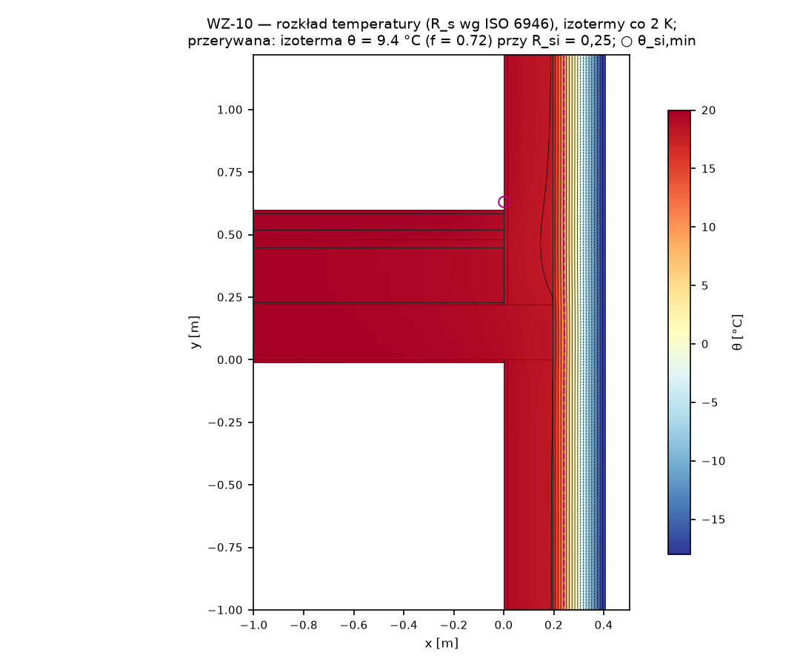

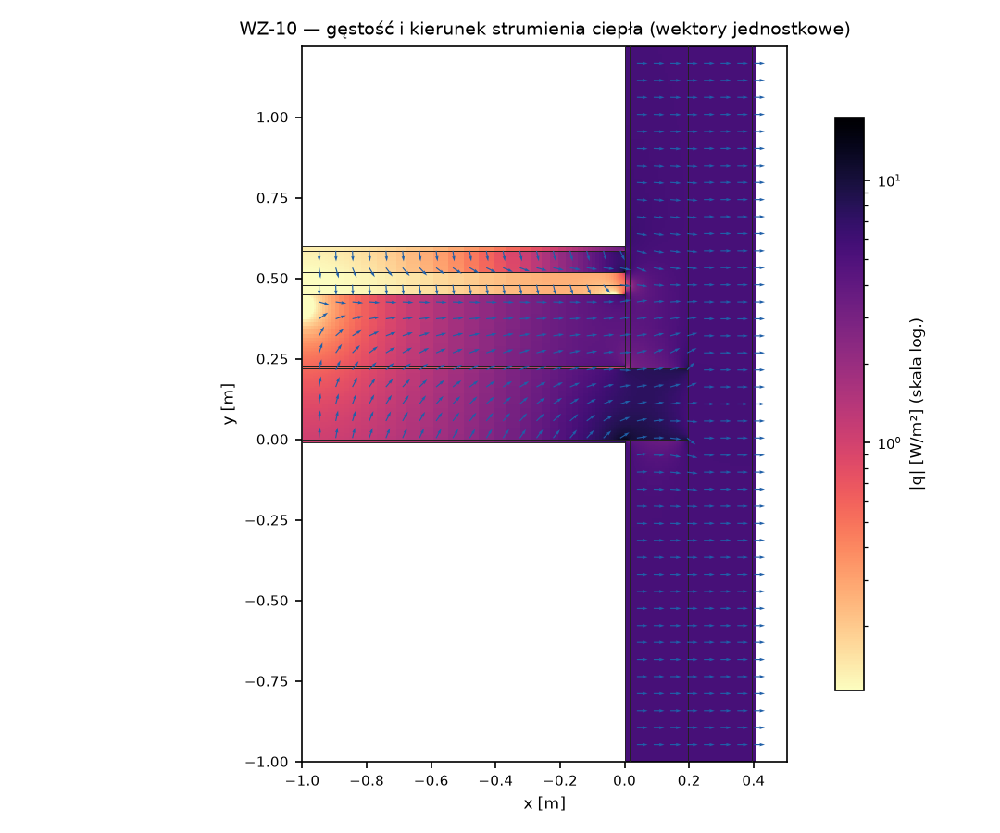

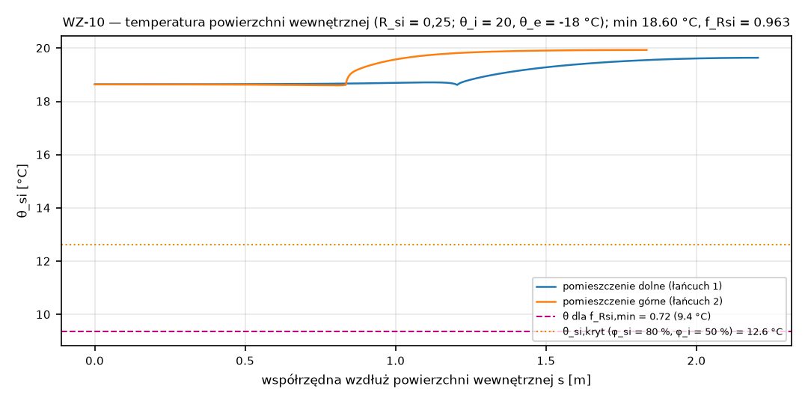

## WZ-11 — Ościeża okien/drzwi — ciepły montaż (rama 5 cm w murze, 4 cm w izolacji, zakład izolacji 3 cm na ramę)

**Dane wejściowe**

*warstwy ściany:*

| kod | materiał | d [m] | λ [W/(m·K)] | R [m²K/W] |
|---|---|---|---|---|
| TYNK_GIPS | Tynk gipsowy maszynowy 1,5 cm | 0,0150 | 0,4000 | 0,0375 |
| SIL18 | Bloczek wapienno-piaskowy (silikat) 18 cm, kl. 20, gr. 1, na zaprawie cienkowarstwowej | 0,1800 | 0,9000 | 0,2000 |
| EPS031 | Styropian grafitowy EPS 031 (ETICS, NRO w systemie) | 0,2000 | 0,0310 | 6,4516 |
| TYNK_SIL | ETICS: warstwa zbrojona + tynk silikonowy 1,5 mm (biały / jasnoszary NCS S 1500-N) | 0,0100 | 0,8000 | 0,0125 |

* okno: U_f = 0.95, b_f = 0.115 m, d_f = 0.09 m (λ_eq ramy = 0.1020); U_g = 0.5, d_g = 0.044 m (λ_eq = 0.0240); U_w = 0.728 (ISO 10077-1, okno 1,23×1,48); położenie: wsunięta 5 cm w mur, reszta w izolacji, x0 = 0.015 m, zakład izolacji 0.03 m [DANE PRZYKŁADOWE – FIKCYJNE] dane przykładowe z karty katalogowej typowego okna PVC 3-szybowego klasy U_w ≈ 0,8 (lub równoważne)

**Warunki brzegowe** (przekrój poziomy; płaszczyzny odcięcia i osie symetrii adiabatyczne)

| strefa | rodzaj | grupa | θ [°C] | R_s — przebieg ψ [m²K/W] | R_s — przebieg f_Rsi |
|---|---|---|---|---|---|
| wnętrze | wewn | i | 20,0 | wg ISO 6946: 0,13 poziomo / 0,10 w górę / 0,17 w dół | 0,25 (ramy/szyby 0,13) |
| zewnętrze | zewn | e | −18,0 | 0,04 | 0,04 |

**Siatka i dokładność** (MOS, siatka prostokątna zagęszczana przy granicach materiałów)

| siatka | komórek | Φ_całk [W/m] |
|---|---|---|
| 99 × 111 = 10989 komórek; Δx ∈ [1.82; 95.51] mm, Δy ∈ [1.65; 17.5] mm | 10989 | 16,6100 |
| 198 × 222 = 43956 komórek; Δx ∈ [0.909; 47.75] mm, Δy ∈ [0.825; 8.752] mm | 43956 | 16,6215 |

Zmiana strumienia przy podwojeniu liczby podziałów: **0,069 %** (kryterium ISO 10211 < 1 %: spełnione); zmiana L_2D (= zmiana ψ): 0,00030 W/(m·K) (kryterium ≤ max(1 % |ψ|; 0,001) = 0,00100: spełnione); bilans energii Σ Φ / (½ Σ|Φ|) = 1.7e-13 (kryterium < 10⁻⁴: spełnione).

**Współczynniki sprzężenia i ψ**

*Para i–e:* L_2D = **0,4374 W/(m·K)**

| element flankujący | U [W/(m²K)] | l_e [m] | l_i [m] | l_oi [m] | U·l_e | U·l_i | U·l_oi |
|---|---|---|---|---|---|---|---|
| ściana | 0,1455 | 1,2300 | 1,2300 | 1,2150 | 0,1790 | 0,1790 | 0,1768 |
| okno (L_2D ramy z szybą, model bez ściany) | L_2D = 0,2444 | — | — | — | 0,2444 | 0,2444 | 0,2444 |
| okno — pas krawędź ramy ↔ krawędź otworu w murze (tylko system oi, U_w) | 0,7275 | 0,0000 | 0,0000 | 0,0150 | 0,0000 | 0,0000 | 0,0109 |

ψ_oi (wymiary wewnętrzne całkowite — system projektu, H_TB) = 0,4374 − 0,4321 = **0,005 W/(m·K)**; ψ_e (zewnętrzne) = 0,4374 − 0,4234 = 0,014 W/(m·K); ψ_i (wewnętrzne) = 0,4374 − 0,4234 = 0,014 W/(m·K)

**Temperatura powierzchni wewnętrznej i ryzyko pleśni** (R_si = 0,25 — PN-EN ISO 13788)

* θ_si,min = **17,34 °C** w punkcie (0,015; 0,145) m przy θ_i = 20,0 °C, θ_e = −18,0 °C
* f_Rsi = (θ_si,min − θ_e)/(θ_i − θ_e) = **0,930**; wymaganie f_Rsi ≥ 0,72 (WT zał. 2 pkt 2.2.1–2.2.5 (uproszczenie; φ_i = 50 %) (W-248)) → **SPEŁNIA**
* rama/szyba (R_si = 0,13): θ_si,min = 13,30 °C, f_Rsi = 0,824 (informacyjnie — ocena okna wg PN-EN ISO 10077-2/13788)
* informacyjnie przy θ_e obliczeniowej i φ_i = 50 %: θ_si,kryt (φ_si = 80 %) = 12,6 °C (f = 0,806), punkt rosy 9,3 °C → θ_si,min ≥ θ_si,kryt (ocena miesięczna wg ISO 13788 — łagodniejsza; kryterium formalne: f_Rsi ≥ 0,72)

**Porównanie**

* PN-EN ISO 14683 — wartość domyślna (ościeże okna, rama w płaszczyźnie izolacji (W)): ψ_e = 0,10, ψ_i = 0,10 W/(m·K) [NZW] — obliczone ψ_e = 0,014, ψ_i = 0,014 (poniżej wartości domyślnej — porównanie w tym samym systemie wymiarów)

*Uwaga:* Rama i szyba jako materiały zastępcze (λ_eq z U_f, U_g); ψ osadzenia liczone względem modelu okna bez ściany, więc uproszczenie ramy wpływa na ψ w małym stopniu. Ψ_g ramki dystansowej — poza zakresem (U_w wg PN-EN ISO 10077-1).

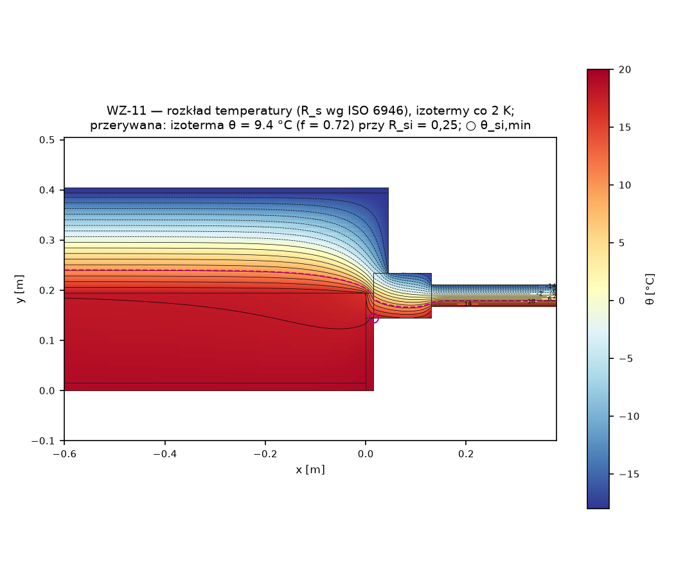

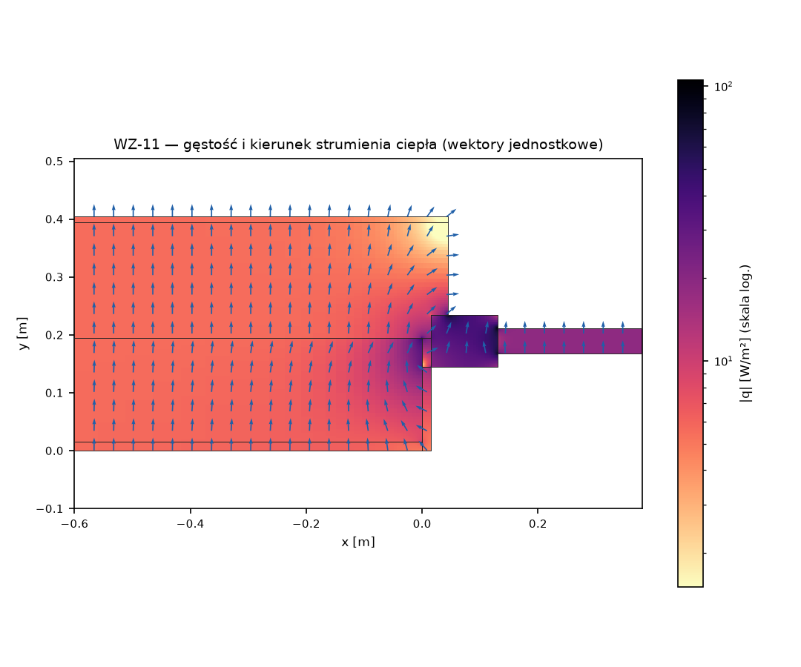

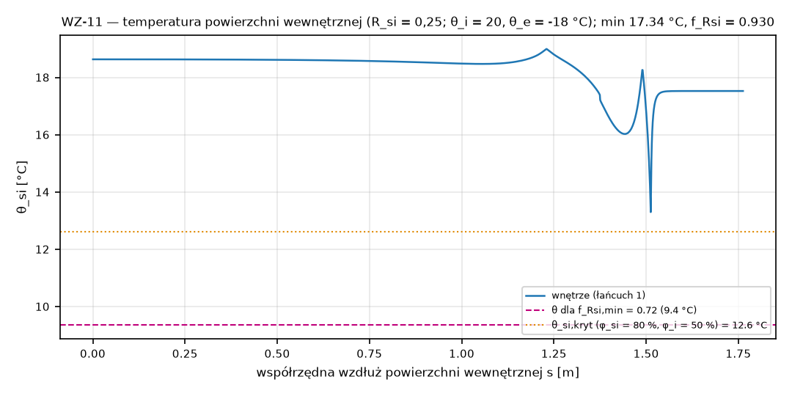

## WZ-11N — Nadproża — BEZ kaset osłon w ociepleniu (kasety w okapach / ramie C / szczelinie lamel / nadstawne)

**Dane wejściowe**

*warstwy ściany:*

| kod | materiał | d [m] | λ [W/(m·K)] | R [m²K/W] |
|---|---|---|---|---|
| TYNK_GIPS | Tynk gipsowy maszynowy 1,5 cm | 0,0150 | 0,4000 | 0,0375 |
| SIL18 | Bloczek wapienno-piaskowy (silikat) 18 cm, kl. 20, gr. 1, na zaprawie cienkowarstwowej | 0,1800 | 0,9000 | 0,2000 |
| EPS031 | Styropian grafitowy EPS 031 (ETICS, NRO w systemie) | 0,2000 | 0,0310 | 6,4516 |
| TYNK_SIL | ETICS: warstwa zbrojona + tynk silikonowy 1,5 mm (biały / jasnoszary NCS S 1500-N) | 0,0100 | 0,8000 | 0,0125 |

* okno: U_f = 0.95, b_f = 0.115 m, d_f = 0.09 m (λ_eq ramy = 0.1020); U_g = 0.5, d_g = 0.044 m (λ_eq = 0.0240); U_w = 0.728 (ISO 10077-1, okno 1,23×1,48); położenie: wsunięta 5 cm w mur, reszta w izolacji, x0 = 0.015 m, zakład izolacji 0.03 m [DANE PRZYKŁADOWE – FIKCYJNE] dane przykładowe z karty katalogowej typowego okna PVC 3-szybowego klasy U_w ≈ 0,8 (lub równoważne)
* nadproże: ZB (λ = 2.3), h = 0.24 m [ZAŁ]

**Warunki brzegowe** (przekrój pionowy; płaszczyzny odcięcia i osie symetrii adiabatyczne)

| strefa | rodzaj | grupa | θ [°C] | R_s — przebieg ψ [m²K/W] | R_s — przebieg f_Rsi |
|---|---|---|---|---|---|
| wnętrze | wewn | i | 20,0 | wg ISO 6946: 0,13 poziomo / 0,10 w górę / 0,17 w dół | 0,25 (ramy/szyby 0,13) |
| zewnętrze | zewn | e | −18,0 | 0,04 | 0,04 |

**Siatka i dokładność** (MOS, siatka prostokątna zagęszczana przy granicach materiałów)

| siatka | komórek | Φ_całk [W/m] |
|---|---|---|
| 111 × 122 = 13542 komórek; Δx ∈ [1.65; 17.5] mm, Δy ∈ [1.82; 90.94] mm | 13542 | 16,7247 |
| 222 × 244 = 54168 komórek; Δx ∈ [0.825; 8.752] mm, Δy ∈ [0.909; 45.47] mm | 54168 | 16,7367 |

Zmiana strumienia przy podwojeniu liczby podziałów: **0,072 %** (kryterium ISO 10211 < 1 %: spełnione); zmiana L_2D (= zmiana ψ): 0,00032 W/(m·K) (kryterium ≤ max(1 % |ψ|; 0,001) = 0,00100: spełnione); bilans energii Σ Φ / (½ Σ|Φ|) = 3.1e-13 (kryterium < 10⁻⁴: spełnione).

**Współczynniki sprzężenia i ψ**

*Para i–e:* L_2D = **0,4404 W/(m·K)**

| element flankujący | U [W/(m²K)] | l_e [m] | l_i [m] | l_oi [m] | U·l_e | U·l_i | U·l_oi |
|---|---|---|---|---|---|---|---|
| ściana | 0,1455 | 1,2300 | 1,2300 | 1,2150 | 0,1790 | 0,1790 | 0,1768 |
| okno (L_2D ramy z szybą, model bez ściany) | L_2D = 0,2449 | — | — | — | 0,2449 | 0,2449 | 0,2449 |
| okno — pas krawędź ramy ↔ krawędź otworu w murze (tylko system oi, U_w) | 0,7275 | 0,0000 | 0,0000 | 0,0150 | 0,0000 | 0,0000 | 0,0109 |

ψ_oi (wymiary wewnętrzne całkowite — system projektu, H_TB) = 0,4404 − 0,4326 = **0,008 W/(m·K)**; ψ_e (zewnętrzne) = 0,4404 − 0,4239 = 0,017 W/(m·K); ψ_i (wewnętrzne) = 0,4404 − 0,4239 = 0,017 W/(m·K)

**Temperatura powierzchni wewnętrznej i ryzyko pleśni** (R_si = 0,25 — PN-EN ISO 13788)

* θ_si,min = **17,63 °C** w punkcie (0,145; −0,015) m przy θ_i = 20,0 °C, θ_e = −18,0 °C
* f_Rsi = (θ_si,min − θ_e)/(θ_i − θ_e) = **0,938**; wymaganie f_Rsi ≥ 0,72 (WT zał. 2 pkt 2.2.1–2.2.5 (uproszczenie; φ_i = 50 %) (W-248)) → **SPEŁNIA**
* rama/szyba (R_si = 0,13): θ_si,min = 13,32 °C, f_Rsi = 0,824 (informacyjnie — ocena okna wg PN-EN ISO 10077-2/13788)
* informacyjnie przy θ_e obliczeniowej i φ_i = 50 %: θ_si,kryt (φ_si = 80 %) = 12,6 °C (f = 0,806), punkt rosy 9,3 °C → θ_si,min ≥ θ_si,kryt (ocena miesięczna wg ISO 13788 — łagodniejsza; kryterium formalne: f_Rsi ≥ 0,72)

**Porównanie**

* PN-EN ISO 14683 — wartość domyślna (ościeże okna, rama w płaszczyźnie izolacji (W)): ψ_e = 0,10, ψ_i = 0,10 W/(m·K) [NZW] — obliczone ψ_e = 0,017, ψ_i = 0,017 (poniżej wartości domyślnej — porównanie w tym samym systemie wymiarów)

*Uwaga:* Rama i szyba jako materiały zastępcze (λ_eq z U_f, U_g); ψ osadzenia liczone względem modelu okna bez ściany, więc uproszczenie ramy wpływa na ψ w małym stopniu. Ψ_g ramki dystansowej — poza zakresem (U_w wg PN-EN ISO 10077-1).
*Uwaga:* Przekrój pionowy przez nadproże: sufit ościeża (podsufitka) — R_si wg kierunku strumienia (ISO 6946: 0,10 strumień w górę).

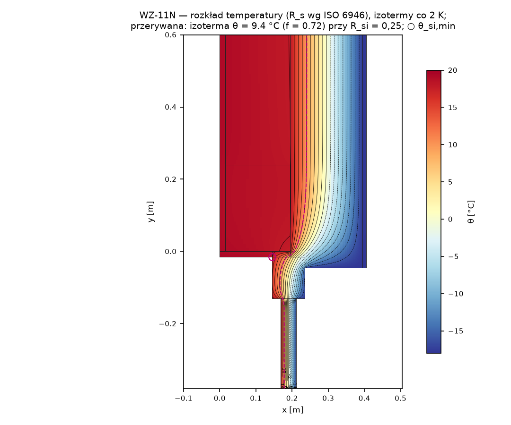

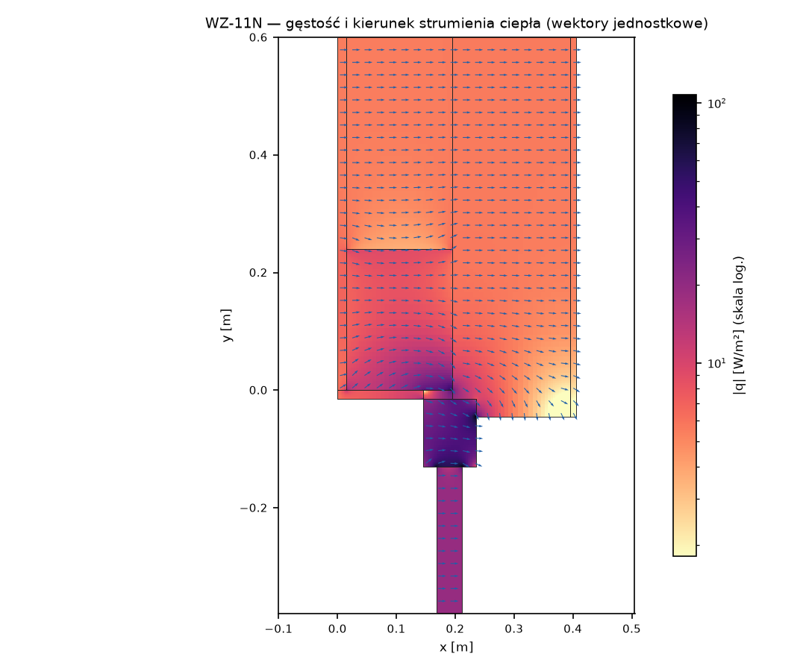

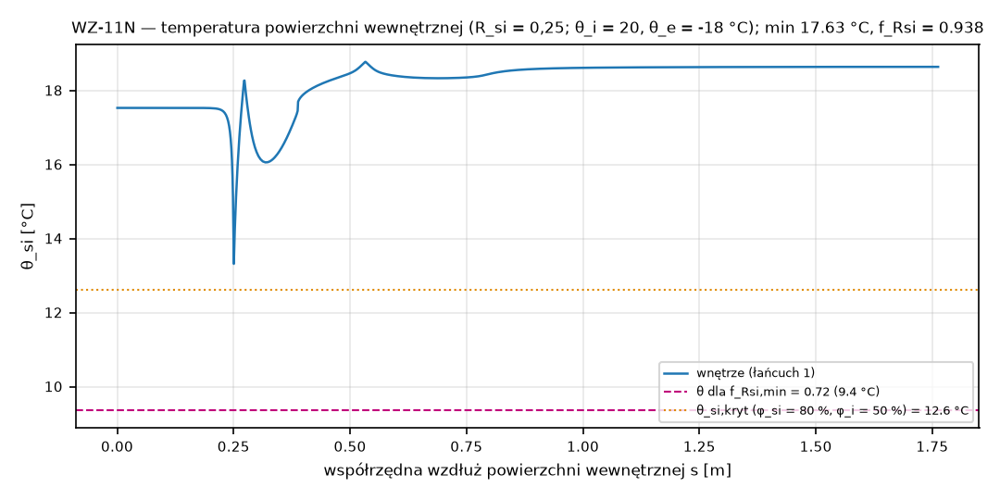

## WZ-11P — Podokienniki — parapet zewn. z okapnikiem na profilu z XPS

**Dane wejściowe**

*warstwy ściany:*

| kod | materiał | d [m] | λ [W/(m·K)] | R [m²K/W] |
|---|---|---|---|---|
| TYNK_GIPS | Tynk gipsowy maszynowy 1,5 cm | 0,0150 | 0,4000 | 0,0375 |
| SIL18 | Bloczek wapienno-piaskowy (silikat) 18 cm, kl. 20, gr. 1, na zaprawie cienkowarstwowej | 0,1800 | 0,9000 | 0,2000 |
| EPS031 | Styropian grafitowy EPS 031 (ETICS, NRO w systemie) | 0,2000 | 0,0310 | 6,4516 |
| TYNK_SIL | ETICS: warstwa zbrojona + tynk silikonowy 1,5 mm (biały / jasnoszary NCS S 1500-N) | 0,0100 | 0,8000 | 0,0125 |

* okno: U_f = 0.95, b_f = 0.115 m, d_f = 0.09 m (λ_eq ramy = 0.1020); U_g = 0.5, d_g = 0.044 m (λ_eq = 0.0240); U_w = 0.728 (ISO 10077-1, okno 1,23×1,48); położenie: wsunięta 5 cm w mur, reszta w izolacji, x0 = 0.015 m, zakład izolacji 0.03 m [DANE PRZYKŁADOWE – FIKCYJNE] dane przykładowe z karty katalogowej typowego okna PVC 3-szybowego klasy U_w ≈ 0,8 (lub równoważne)
* parapet wewnętrzny: PARAPET_WEWN (λ = 0.18), d = 0.025 m, wysięg do wnętrza 0.03 m [ZAŁ]
* parapet zewnętrzny: ALU (λ = 160.0), d = 0.0015 m, okapnik 0.04 m przed licem [ZAŁ]; spadek pominięty

**Warunki brzegowe** (przekrój pionowy; płaszczyzny odcięcia i osie symetrii adiabatyczne)

| strefa | rodzaj | grupa | θ [°C] | R_s — przebieg ψ [m²K/W] | R_s — przebieg f_Rsi |
|---|---|---|---|---|---|
| wnętrze | wewn | i | 20,0 | wg ISO 6946: 0,13 poziomo / 0,10 w górę / 0,17 w dół | 0,25 (ramy/szyby 0,13) |
| zewnętrze | zewn | e | −18,0 | 0,04 | 0,04 |

**Siatka i dokładność** (MOS, siatka prostokątna zagęszczana przy granicach materiałów)

| siatka | komórek | Φ_całk [W/m] |
|---|---|---|
| 141 × 115 = 16215 komórek; Δx ∈ [1.3; 17.18] mm, Δy ∈ [0.75; 92.41] mm | 16215 | 16,6104 |
| 282 × 230 = 64860 komórek; Δx ∈ [0.65; 8.59] mm, Δy ∈ [0.375; 46.2] mm | 64860 | 16,6234 |

Zmiana strumienia przy podwojeniu liczby podziałów: **0,078 %** (kryterium ISO 10211 < 1 %: spełnione); zmiana L_2D (= zmiana ψ): 0,00034 W/(m·K) (kryterium ≤ max(1 % |ψ|; 0,001) = 0,00100: spełnione); bilans energii Σ Φ / (½ Σ|Φ|) = 2.2e-12 (kryterium < 10⁻⁴: spełnione).

**Współczynniki sprzężenia i ψ**

*Para i–e:* L_2D = **0,4375 W/(m·K)**

| element flankujący | U [W/(m²K)] | l_e [m] | l_i [m] | l_oi [m] | U·l_e | U·l_i | U·l_oi |
|---|---|---|---|---|---|---|---|
| ściana | 0,1455 | 1,2300 | 1,2300 | 1,2150 | 0,1790 | 0,1790 | 0,1768 |
| okno (L_2D ramy z szybą, model bez ściany) | L_2D = 0,2438 | — | — | — | 0,2438 | 0,2438 | 0,2438 |
| okno — pas krawędź ramy ↔ krawędź otworu w murze (tylko system oi, U_w) | 0,7275 | 0,0000 | 0,0000 | 0,0150 | 0,0000 | 0,0000 | 0,0109 |

ψ_oi (wymiary wewnętrzne całkowite — system projektu, H_TB) = 0,4375 − 0,4315 = **0,006 W/(m·K)**; ψ_e (zewnętrzne) = 0,4375 − 0,4228 = 0,015 W/(m·K); ψ_i (wewnętrzne) = 0,4375 − 0,4228 = 0,015 W/(m·K)

**Temperatura powierzchni wewnętrznej i ryzyko pleśni** (R_si = 0,25 — PN-EN ISO 13788)

* θ_si,min = **16,62 °C** w punkcie (0,145; 0,025) m przy θ_i = 20,0 °C, θ_e = −18,0 °C
* f_Rsi = (θ_si,min − θ_e)/(θ_i − θ_e) = **0,911**; wymaganie f_Rsi ≥ 0,72 (WT zał. 2 pkt 2.2.1–2.2.5 (uproszczenie; φ_i = 50 %) (W-248)) → **SPEŁNIA**
* rama/szyba (R_si = 0,13): θ_si,min = 13,20 °C, f_Rsi = 0,821 (informacyjnie — ocena okna wg PN-EN ISO 10077-2/13788)
* informacyjnie przy θ_e obliczeniowej i φ_i = 50 %: θ_si,kryt (φ_si = 80 %) = 12,6 °C (f = 0,806), punkt rosy 9,3 °C → θ_si,min ≥ θ_si,kryt (ocena miesięczna wg ISO 13788 — łagodniejsza; kryterium formalne: f_Rsi ≥ 0,72)

**Porównanie**

* PN-EN ISO 14683 — wartość domyślna (ościeże okna, rama w płaszczyźnie izolacji (W)): ψ_e = 0,10, ψ_i = 0,10 W/(m·K) [NZW] — obliczone ψ_e = 0,015, ψ_i = 0,015 (poniżej wartości domyślnej — porównanie w tym samym systemie wymiarów)

*Uwaga:* Rama i szyba jako materiały zastępcze (λ_eq z U_f, U_g); ψ osadzenia liczone względem modelu okna bez ściany, więc uproszczenie ramy wpływa na ψ w małym stopniu. Ψ_g ramki dystansowej — poza zakresem (U_w wg PN-EN ISO 10077-1).
*Uwaga:* Parapet zewnętrzny (odprowadzenie wody): obróbka na izolacji podparapetowej, wsunięta pod profil podparapetowy ramy, okapnik ≥ 3–4 cm przed licem elewacji, spadek ≥ 5 %, zaślepki boczne w ościeżach; izolacja pod parapetem ciągła do ramy (brak mostka).
*Uwaga:* Przekrój pionowy przez podokiennik; parapet wewnętrzny o małym λ (drewno/MDF) — wariant ostrożny dla f_Rsi (ogranicza dopływ ciepła do naroża pod parapetem).

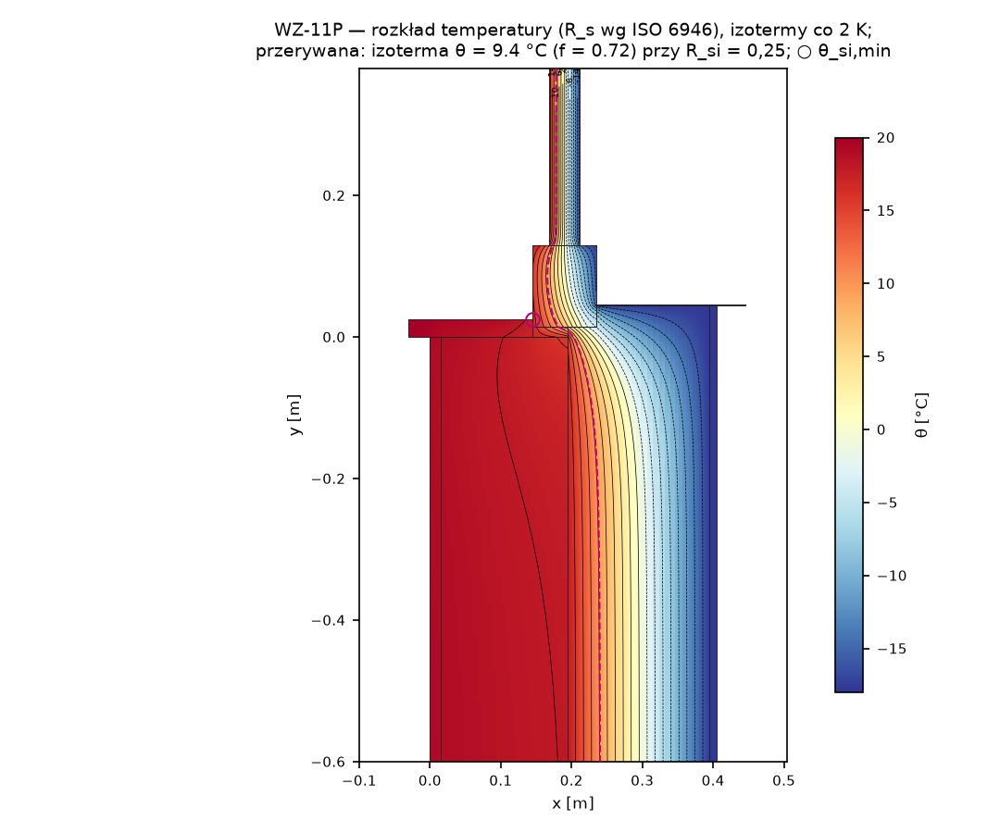

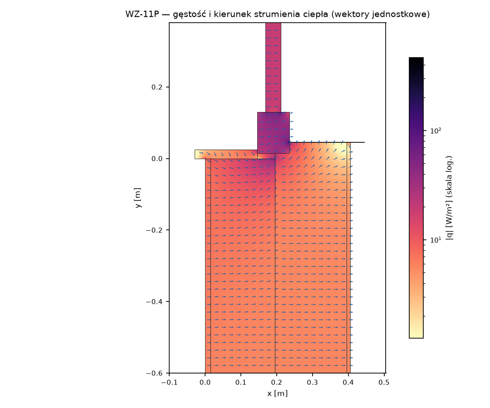

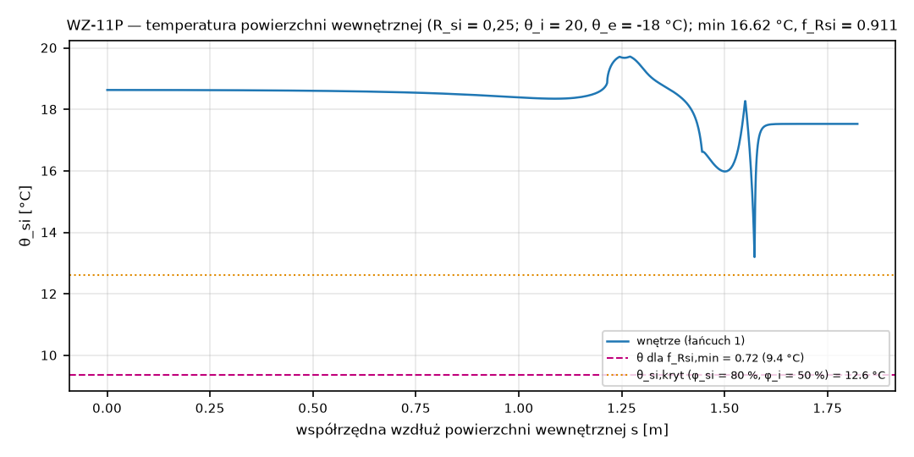

## WZ-11T — Progi HS / drzwi zewn. na płycie P0 — profil progowy termoizolacyjny na podwalinie XPS/PUR-GF, odwodnienie liniowe

**Dane wejściowe**

*warstwy ściany:*

| kod | materiał | d [m] | λ [W/(m·K)] | R [m²K/W] |
|---|---|---|---|---|
| TYNK_GIPS | Tynk gipsowy maszynowy 1,5 cm | 0,0150 | 0,4000 | 0,0375 |
| SIL18 | Bloczek wapienno-piaskowy (silikat) 18 cm, kl. 20, gr. 1, na zaprawie cienkowarstwowej | 0,1800 | 0,9000 | 0,2000 |
| EPS031 | Styropian grafitowy EPS 031 (ETICS, NRO w systemie) | 0,2000 | 0,0310 | 6,4516 |
| TYNK_SIL | ETICS: warstwa zbrojona + tynk silikonowy 1,5 mm (biały / jasnoszary NCS S 1500-N) | 0,0100 | 0,8000 | 0,0125 |

*warstwy podłogi:*

| kod | materiał | d [m] | λ [W/(m·K)] | R [m²K/W] |
|---|---|---|---|---|
| DESKA_DEB | Deska warstwowa dębowa 15 mm, klejona | 0,0150 | 0,1800 | 0,0833 |
| JASTRYCH | Jastrych cementowy CT-C25-F5 z wężownicą ogrzewania podłogowego | 0,0650 | 1,2000 | 0,0542 |
| EPS038 | Styropian podłogowy EPS 100-038 (pod jastrychem) | 0,0650 | 0,0380 | 1,7105 |
| MEMB_SBS_POD | Izolacja przeciwwilgociowa i przeciwradonowa: membrana SBS 4 mm na płycie fundamentowej | 0,0050 | 0,2300 | 0,0217 |
| ZB_C25 | Żelbet C25/30, B500SP (stropy, płyta fundamentowa, ściany) | 0,2500 | 2,3000 | 0,1087 |
| XPS300 | Polistyren ekstrudowany XPS 300 (pod płytą fundamentową, cokół, izolacja obwodowa) | 0,2000 | 0,0360 | 5,5556 |
| FOLIA_PE | Folia PE 0,2 mm — warstwa rozdzielająca pod XPS (nie pełni funkcji paroizolacji) | 0,0002 | 0,3300 | 0,0006 |
| PIASEK | Podsypka piaskowa zagęszczona (I_s ≥ 0,98) | 0,2000 | 2,0000 | 0,1000 |

* fundament: płyta fundamentowa ZB_C25 0.25 m
* izolacja obwodowa: XPS do rzędnej -0.40, cokół do 0.00 (teren -0.30)
* grunt: λ = 2.0 W/(m·K); obszar: wewn. 0,5·b = 3.1394753886010367 m od lica zewn., zewn. 2,5·b = 15.697376943005183 m, głęb. 2,5·b = 15.697376943005183 m (b = 6.278950777202073 m)
* U podłogi (ISO 13370): R_f = 7.635 m²K/W, d_t = 16.094 m, U = 0.1055 W/(m²K)
* próg: rama U_f = 1.4, b_f = 0.13 m, d_f = 0.09 m, lico wewn. ramy x = 0.145 m (wsunięcie w mur 0.05 m); U_g = 0.5; U_w = 0.815; podwalina PROG_TERM (λ = 0.05) od y = -0.150 m do poziomu posadzki [DANE PRZYKŁADOWE – FIKCYJNE] dane przykładowe z karty katalogowej typowego systemu HS aluminiowego klasy U_w ≤ 0,9 (lub równoważne)

**Warunki brzegowe** (przekrój pionowy; płaszczyzny odcięcia i osie symetrii adiabatyczne)

| strefa | rodzaj | grupa | θ [°C] | R_s — przebieg ψ [m²K/W] | R_s — przebieg f_Rsi |
|---|---|---|---|---|---|
| pomieszczenie | wewn | i | 20,0 | wg ISO 6946: 0,13 poziomo / 0,10 w górę / 0,17 w dół | 0,25 (ramy/szyby 0,13) |
| zewnętrze | zewn | e | −18,0 | 0,04 | 0,04 |

**Siatka i dokładność** (MOS, siatka prostokątna zagęszczana przy granicach materiałów)

| siatka | komórek | Φ_całk [W/m] |
|---|---|---|
| 182 × 243 = 44226 komórek; Δx ∈ [2; 391.7] mm, Δy ∈ [0.1; 399.2] mm | 44226 | 27,6663 |
| 364 × 486 = 176904 komórek; Δx ∈ [1; 195.9] mm, Δy ∈ [0.05; 199.6] mm | 176904 | 27,6850 |

Zmiana strumienia przy podwojeniu liczby podziałów: **0,067 %** (kryterium ISO 10211 < 1 %: spełnione); zmiana L_2D (= zmiana ψ): 0,00049 W/(m·K) (kryterium ≤ max(1 % |ψ|; 0,001) = 0,00118: spełnione); bilans energii Σ Φ / (½ Σ|Φ|) = 1.0e-10 (kryterium < 10⁻⁴: spełnione).

**Współczynniki sprzężenia i ψ**

*Para i–e:* L_2D = **0,7286 W/(m·K)**

| element flankujący | U [W/(m²K)] | l_e [m] | l_i [m] | l_oi [m] | U·l_e | U·l_i | U·l_oi |
|---|---|---|---|---|---|---|---|
| podłoga na gruncie (U wg ISO 13370, B' = 6.28 m, d_t = 16.09 m) | 0,1055 | 3,1395 | 2,7345 | 2,7345 | 0,3311 | 0,2884 | 0,2884 |
| drzwi (L_2D ramy z szybą, model bez ściany) | L_2D = 0,3217 | — | — | — | 0,3217 | 0,3217 | 0,3217 |

ψ_oi (wymiary wewnętrzne całkowite — system projektu, H_TB) = 0,7286 − 0,6101 = **0,118 W/(m·K)**; ψ_e (zewnętrzne) = 0,7286 − 0,6528 = 0,076 W/(m·K); ψ_i (wewnętrzne) = 0,7286 − 0,6101 = 0,118 W/(m·K)

**Temperatura powierzchni wewnętrznej i ryzyko pleśni** (R_si = 0,25 — PN-EN ISO 13788)

* θ_si,min = **14,10 °C** w punkcie (0,145; 0,000) m przy θ_i = 20,0 °C, θ_e = −18,0 °C
* f_Rsi = (θ_si,min − θ_e)/(θ_i − θ_e) = **0,845**; wymaganie f_Rsi ≥ 0,72 (WT zał. 2 pkt 2.2.1–2.2.5 (uproszczenie; φ_i = 50 %) (W-248)) → **SPEŁNIA**
* rama/szyba (R_si = 0,13): θ_si,min = 11,17 °C, f_Rsi = 0,768 (informacyjnie — ocena okna wg PN-EN ISO 10077-2/13788)
* informacyjnie przy θ_e obliczeniowej i φ_i = 50 %: θ_si,kryt (φ_si = 80 %) = 12,6 °C (f = 0,806), punkt rosy 9,3 °C → θ_si,min ≥ θ_si,kryt (ocena miesięczna wg ISO 13788 — łagodniejsza; kryterium formalne: f_Rsi ≥ 0,72)

*Uwaga:* Ściana liczona od poziomu posadzki (±0,00) we wszystkich systemach wymiarów (ψ_oi = ψ_i); podłoga wg PN-EN ISO 13370 z B' = b [INT]; b = B' = A/(0,5·P) budynku, gdy podane z modelu.
*Uwaga:* Hydroizolacja pionowa ściany fundamentowej (bitumiczna/KMB) i izolacja obwodowa XPS (odporna na wodę) do spodu ławy; drenaż opaskowy i odprowadzenie wody opadowej od cokołu — poza zakresem cieplnym (wpływ na λ gruntu pominięty, λ = 2,0).
*Uwaga:* Próg: wierzch podwaliny = poziom posadzki; uszczelnienie progu taśmą EPDM / hydroizolacją wywiniętą na podwalinę; odwodnienie liniowe przed drzwiami HS zalecane (brak spadku przy progu bezbarierowym).

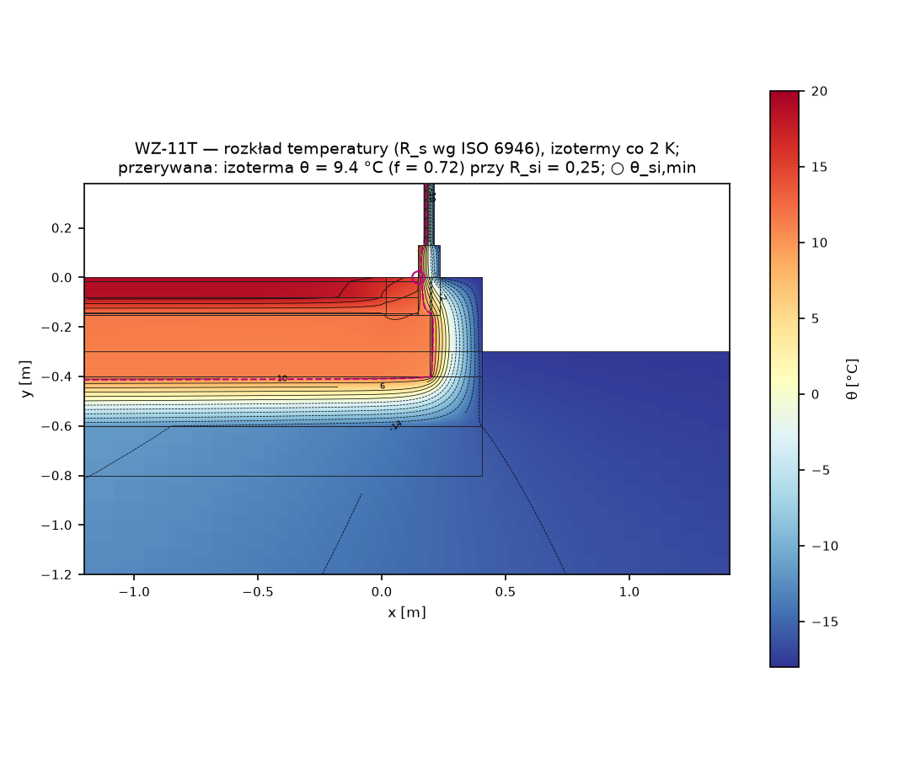

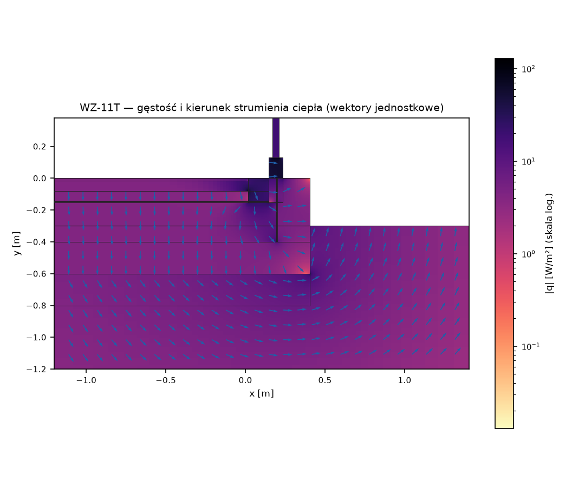

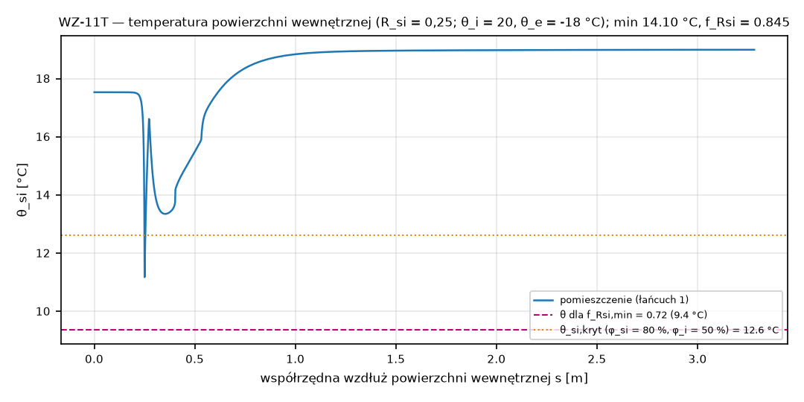

## WZ-12 — Narożniki wypukłe ścian zewnętrznych

Rzut naroża zewnętrznego; płaszczyzny odcięcia adiabatyczne w odległości L od naroża wewn.

**Dane wejściowe**

*warstwy ściany:*

| kod | materiał | d [m] | λ [W/(m·K)] | R [m²K/W] |
|---|---|---|---|---|
| TYNK_GIPS | Tynk gipsowy maszynowy 1,5 cm | 0,0150 | 0,4000 | 0,0375 |
| SIL18 | Bloczek wapienno-piaskowy (silikat) 18 cm, kl. 20, gr. 1, na zaprawie cienkowarstwowej | 0,1800 | 0,9000 | 0,2000 |
| EPS031 | Styropian grafitowy EPS 031 (ETICS, NRO w systemie) | 0,2000 | 0,0310 | 6,4516 |
| TYNK_SIL | ETICS: warstwa zbrojona + tynk silikonowy 1,5 mm (biały / jasnoszary NCS S 1500-N) | 0,0100 | 0,8000 | 0,0125 |

* L odcięcia [m]: 1,620

**Warunki brzegowe** (przekrój poziomy; płaszczyzny odcięcia i osie symetrii adiabatyczne)

| strefa | rodzaj | grupa | θ [°C] | R_s — przebieg ψ [m²K/W] | R_s — przebieg f_Rsi |
|---|---|---|---|---|---|
| wnętrze | wewn | i | 20,0 | wg ISO 6946: 0,13 poziomo / 0,10 w górę / 0,17 w dół | 0,25 (ramy/szyby 0,13) |
| zewnętrze | zewn | e | −18,0 | 0,04 | 0,04 |

**Siatka i dokładność** (MOS, siatka prostokątna zagęszczana przy granicach materiałów)

| siatka | komórek | Φ_całk [W/m] |
|---|---|---|
| 115 × 115 = 13225 komórek; Δx ∈ [1.65; 96.88] mm, Δy ∈ [1.65; 96.88] mm | 13225 | 20,4060 |
| 230 × 230 = 52900 komórek; Δx ∈ [0.825; 48.44] mm, Δy ∈ [0.825; 48.44] mm | 52900 | 20,4075 |

Zmiana strumienia przy podwojeniu liczby podziałów: **0,007 %** (kryterium ISO 10211 < 1 %: spełnione); zmiana L_2D (= zmiana ψ): 0,00004 W/(m·K) (kryterium ≤ max(1 % |ψ|; 0,001) = 0,00100: spełnione); bilans energii Σ Φ / (½ Σ|Φ|) = 1.8e-12 (kryterium < 10⁻⁴: spełnione).

**Współczynniki sprzężenia i ψ**

*Para i–e:* L_2D = **0,5370 W/(m·K)**

| element flankujący | U [W/(m²K)] | l_e [m] | l_i [m] | l_oi [m] | U·l_e | U·l_i | U·l_oi |
|---|---|---|---|---|---|---|---|
| ściana A (oś x) | 0,1455 | 2,0250 | 1,6200 | 1,6200 | 0,2947 | 0,2358 | 0,2358 |
| ściana B (oś y) | 0,1455 | 2,0250 | 1,6200 | 1,6200 | 0,2947 | 0,2358 | 0,2358 |

ψ_oi (wymiary wewnętrzne całkowite — system projektu, H_TB) = 0,5370 − 0,4715 = **0,066 W/(m·K)**; ψ_e (zewnętrzne) = 0,5370 − 0,5894 = −0,052 W/(m·K); ψ_i (wewnętrzne) = 0,5370 − 0,4715 = 0,066 W/(m·K)

**Temperatura powierzchni wewnętrznej i ryzyko pleśni** (R_si = 0,25 — PN-EN ISO 13788)

* θ_si,min = **17,17 °C** w punkcie (0,000; 0,000) m przy θ_i = 20,0 °C, θ_e = −18,0 °C
* f_Rsi = (θ_si,min − θ_e)/(θ_i − θ_e) = **0,926**; wymaganie f_Rsi ≥ 0,72 (WT zał. 2 pkt 2.2.1–2.2.5 (uproszczenie; φ_i = 50 %) (W-248)) → **SPEŁNIA**
* informacyjnie przy θ_e obliczeniowej i φ_i = 50 %: θ_si,kryt (φ_si = 80 %) = 12,6 °C (f = 0,806), punkt rosy 9,3 °C → θ_si,min ≥ θ_si,kryt (ocena miesięczna wg ISO 13788 — łagodniejsza; kryterium formalne: f_Rsi ≥ 0,72)

**Porównanie**

* PN-EN ISO 14683 — wartość domyślna (naroże zewnętrzne, izolacja zewnętrzna (C)): ψ_e = −0,10, ψ_i = 0,15 W/(m·K) [NZW] — obliczone ψ_e = −0,052, ψ_i = 0,066 (POWYŻEJ wartości domyślnej — porównanie w tym samym systemie wymiarów)

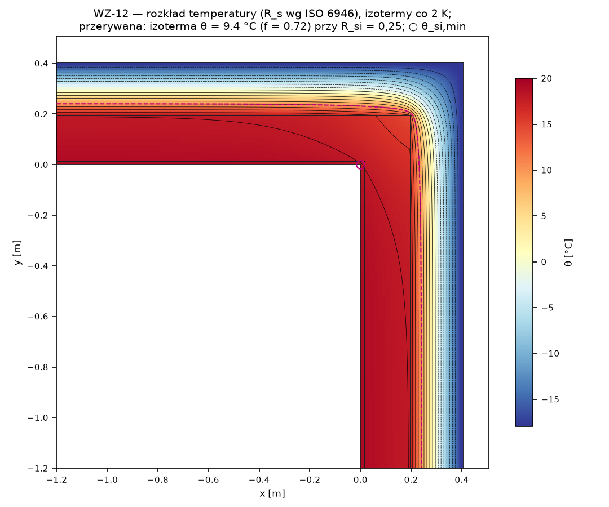

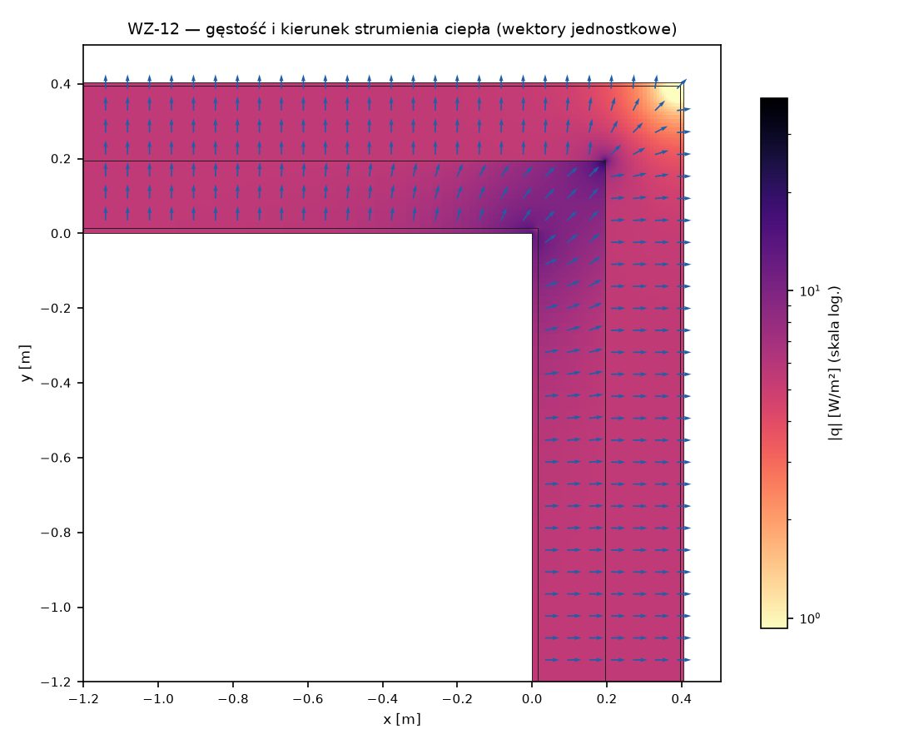

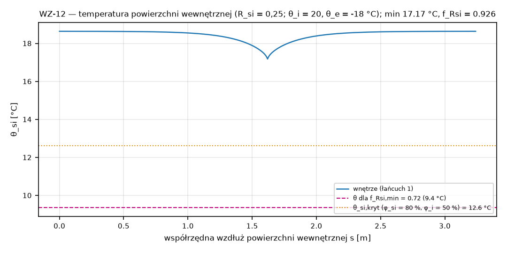

## WZ-16a — Krawędź stropu ST2Z nad powietrzem: ściana SZ2 na belce B3 + płyta PL-2 (łącznik)

Przekrój pionowy; pod stropem powietrze zewnętrzne (ocieplenie spodu).

**Dane wejściowe**

*warstwy ściany górnej:*

| kod | materiał | d [m] | λ [W/(m·K)] | R [m²K/W] |
|---|---|---|---|---|
| TYNK_GIPS | Tynk gipsowy maszynowy 1,5 cm | 0,0150 | 0,4000 | 0,0375 |
| SIL18 | Bloczek wapienno-piaskowy (silikat) 18 cm, kl. 20, gr. 1, na zaprawie cienkowarstwowej | 0,1800 | 0,9000 | 0,2000 |
| WELNA_FAS | Wełna mineralna fasadowa (elewacja wentylowana bryły A, A1) | 0,2000 | 0,0350 | 5,7143 |
| MEMB_WIATR | Membrana fasadowa wiatroizolacyjna UV-stabilna, czarna (sd ≈ 0,02 m) | 0,0100 | 0,1700 | 0,0588 |

* warstwy ściany dolnej: — (pod stropem powietrze zewn.)
* płyta: ZB_C25, t = 0.22 m

*warstwy podłogi:*

| kod | materiał | d [m] | λ [W/(m·K)] | R [m²K/W] |
|---|---|---|---|---|
| DESKA_DEB | Deska warstwowa dębowa 15 mm, klejona | 0,0150 | 0,1800 | 0,0833 |
| JASTRYCH | Jastrych cementowy CT-C25-F5 z wężownicą ogrzewania podłogowego | 0,0650 | 1,2000 | 0,0542 |
| EPS038 | Styropian podłogowy EPS 100-038 (pod jastrychem) | 0,0400 | 0,0380 | 1,0526 |
| EPS_T | Styropian elastyfikowany EPS T (akustyczny, pod jastrychem) | 0,0300 | 0,0400 | 0,7500 |
| ZB_C25 | Żelbet C25/30, B500SP (stropy, płyta fundamentowa, ściany) | 0,2200 | 2,3000 | 0,0957 |
| TYNK_GIPS | Tynk gipsowy maszynowy 1,5 cm | 0,0100 | 0,4000 | 0,0250 |

*warstwy sufitu (bez pustki wentylowanej):*

| kod | materiał | d [m] | λ [W/(m·K)] | R [m²K/W] |
|---|---|---|---|---|
| WELNA_035 | Wełna mineralna 035 (szkielet, docieplenia, ściana dom–garaż) | 0,2000 | 0,0350 | 5,7143 |
| MEMB_WIATR | Membrana fasadowa wiatroizolacyjna UV-stabilna, czarna (sd ≈ 0,02 m) | 0,0010 | 0,1700 | 0,0059 |

* płyta wspornikowa: ZB_C30, t = 0.3000000000000007 m, wierzch +0.00 m wzgl. wierzchu stropu, wysięg 1.0 m od lica ocieplenia
* łącznik: Łącznik termoizolacyjny 120 mm, λ_eq = 0.08 W/(m·K) (model): λ_eq = 0.08 W/(m·K), d = 0.12 m — model: wsporniki_plyty[].lacznik (wymaganie — do potwierdzenia ETA)
* belka odwrócona: b = 0.2 m, h nad płytą = 0.38 m (w linii ściany górnej)
* wpis sekcji wezly: WZ-16: Belki wspornikowe B4/B5 i belka B3 w linii izolacji wspornika bryły A (ciągłość wełny pod ST2Z)
* geometria z modelu: strop ST2Z (sufit SUF-ZEW); krawędzie typu ściana na krawędzi — łącznie 1.01 m
* długość z geometrii modelu [m]: 1,010

**Warunki brzegowe** (przekrój pionowy; płaszczyzny odcięcia i osie symetrii adiabatyczne)

| strefa | rodzaj | grupa | θ [°C] | R_s — przebieg ψ [m²K/W] | R_s — przebieg f_Rsi |
|---|---|---|---|---|---|
| pomieszczenie górne | wewn | i | 20,0 | wg ISO 6946: 0,13 poziomo / 0,10 w górę / 0,17 w dół | 0,25 (ramy/szyby 0,13) |
| zewnętrze | zewn | e | −18,0 | 0,04 | 0,04 |

**Siatka i dokładność** (MOS, siatka prostokątna zagęszczana przy granicach materiałów)

| siatka | komórek | Φ_całk [W/m] |
|---|---|---|
| 177 × 218 = 38586 komórek; Δx ∈ [1.54; 97] mm, Δy ∈ [0.5; 95.99] mm | 38586 | 23,5935 |
| 354 × 436 = 154344 komórek; Δx ∈ [0.769; 48.5] mm, Δy ∈ [0.25; 47.99] mm | 154344 | 23,6001 |

Zmiana strumienia przy podwojeniu liczby podziałów: **0,028 %** (kryterium ISO 10211 < 1 %: spełnione); zmiana L_2D (= zmiana ψ): 0,00017 W/(m·K) (kryterium ≤ max(1 % |ψ|; 0,001) = 0,00189: spełnione); bilans energii Σ Φ / (½ Σ|Φ|) = 1.6e-12 (kryterium < 10⁻⁴: spełnione).

**Współczynniki sprzężenia i ψ**

*Para i–e:* L_2D = **0,6211 W/(m·K)**

| element flankujący | U [W/(m²K)] | l_e [m] | l_i [m] | l_oi [m] | U·l_e | U·l_i | U·l_oi |
|---|---|---|---|---|---|---|---|
| ściana górna | 0,1618 | 1,6360 | 0,8350 | 0,8350 | 0,2647 | 0,1351 | 0,1351 |
| strop nad powietrzem zewn. | 0,1237 | 2,8080 | 2,4030 | 2,4030 | 0,3472 | 0,2972 | 0,2972 |

ψ_oi (wymiary wewnętrzne całkowite — system projektu, H_TB) = 0,6211 − 0,4323 = **0,189 W/(m·K)**; ψ_e (zewnętrzne) = 0,6211 − 0,6119 = 0,009 W/(m·K); ψ_i (wewnętrzne) = 0,6211 − 0,4323 = 0,189 W/(m·K)

**Temperatura powierzchni wewnętrznej i ryzyko pleśni** (R_si = 0,25 — PN-EN ISO 13788)

* θ_si,min = **13,17 °C** w punkcie (0,000; 0,600) m przy θ_i = 20,0 °C, θ_e = −18,0 °C
* f_Rsi = (θ_si,min − θ_e)/(θ_i − θ_e) = **0,820**; wymaganie f_Rsi ≥ 0,72 (WT zał. 2 pkt 2.2.1–2.2.5 (uproszczenie; φ_i = 50 %) (W-248)) → **SPEŁNIA**
* informacyjnie przy θ_e obliczeniowej i φ_i = 50 %: θ_si,kryt (φ_si = 80 %) = 12,6 °C (f = 0,806), punkt rosy 9,3 °C → θ_si,min ≥ θ_si,kryt (ocena miesięczna wg ISO 13788 — łagodniejsza; kryterium formalne: f_Rsi ≥ 0,72)

*Uwaga:* Pustka wentylowana pod ociepleniem spodu stropu i podsufitka pominięte (PN-EN ISO 6946 — warstwy za pustką dobrze wentylowaną); R_se = 0,04 na spodzie ocieplenia (wariant ostrożny) [ZAŁ].

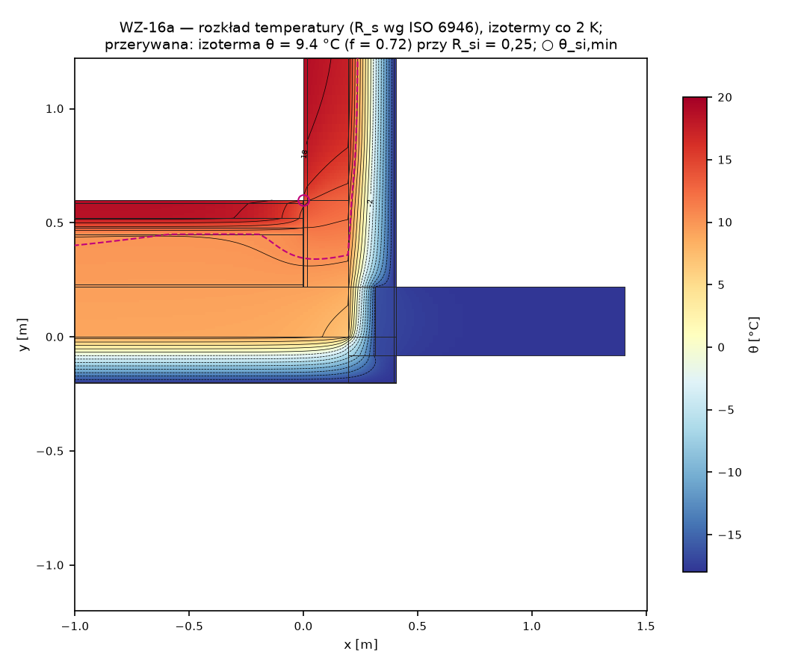

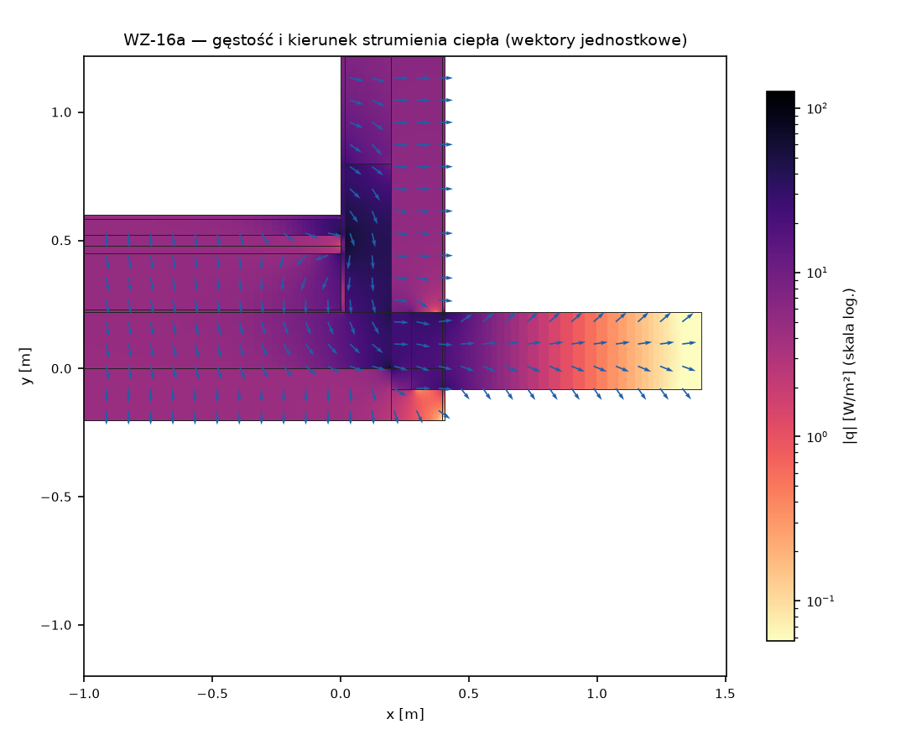

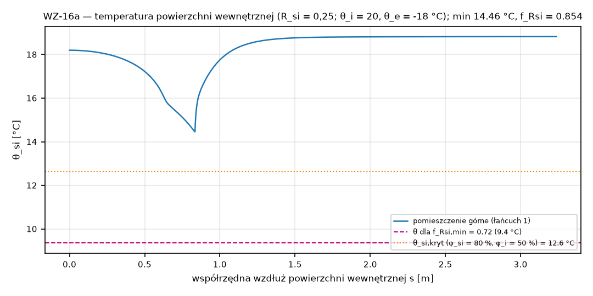

## WZ-16b — Krawędź stropu ST2Z nad powietrzem: ściana SZ1 na belce B3

Przekrój pionowy; pod stropem powietrze zewnętrzne (ocieplenie spodu).

**Dane wejściowe**

*warstwy ściany górnej:*

| kod | materiał | d [m] | λ [W/(m·K)] | R [m²K/W] |
|---|---|---|---|---|
| TYNK_GIPS | Tynk gipsowy maszynowy 1,5 cm | 0,0150 | 0,4000 | 0,0375 |
| SIL18 | Bloczek wapienno-piaskowy (silikat) 18 cm, kl. 20, gr. 1, na zaprawie cienkowarstwowej | 0,1800 | 0,9000 | 0,2000 |
| EPS031 | Styropian grafitowy EPS 031 (ETICS, NRO w systemie) | 0,2000 | 0,0310 | 6,4516 |
| TYNK_SIL | ETICS: warstwa zbrojona + tynk silikonowy 1,5 mm (biały / jasnoszary NCS S 1500-N) | 0,0100 | 0,8000 | 0,0125 |

* warstwy ściany dolnej: — (pod stropem powietrze zewn.)
* płyta: ZB_C25, t = 0.22 m

*warstwy podłogi:*

| kod | materiał | d [m] | λ [W/(m·K)] | R [m²K/W] |
|---|---|---|---|---|
| DESKA_DEB | Deska warstwowa dębowa 15 mm, klejona | 0,0150 | 0,1800 | 0,0833 |
| JASTRYCH | Jastrych cementowy CT-C25-F5 z wężownicą ogrzewania podłogowego | 0,0650 | 1,2000 | 0,0542 |
| EPS038 | Styropian podłogowy EPS 100-038 (pod jastrychem) | 0,0400 | 0,0380 | 1,0526 |
| EPS_T | Styropian elastyfikowany EPS T (akustyczny, pod jastrychem) | 0,0300 | 0,0400 | 0,7500 |
| ZB_C25 | Żelbet C25/30, B500SP (stropy, płyta fundamentowa, ściany) | 0,2200 | 2,3000 | 0,0957 |
| TYNK_GIPS | Tynk gipsowy maszynowy 1,5 cm | 0,0100 | 0,4000 | 0,0250 |

*warstwy sufitu (bez pustki wentylowanej):*

| kod | materiał | d [m] | λ [W/(m·K)] | R [m²K/W] |
|---|---|---|---|---|
| WELNA_035 | Wełna mineralna 035 (szkielet, docieplenia, ściana dom–garaż) | 0,2000 | 0,0350 | 5,7143 |
| MEMB_WIATR | Membrana fasadowa wiatroizolacyjna UV-stabilna, czarna (sd ≈ 0,02 m) | 0,0010 | 0,1700 | 0,0059 |

* belka odwrócona: b = 0.2 m, h nad płytą = 0.38 m (w linii ściany górnej)
* wpis sekcji wezly: WZ-16: Belki wspornikowe B4/B5 i belka B3 w linii izolacji wspornika bryły A (ciągłość wełny pod ST2Z)
* geometria z modelu: strop ST2Z (sufit SUF-ZEW); krawędzie typu ściana na krawędzi — łącznie 1.01 m
* długość z geometrii modelu [m]: 1,010

**Warunki brzegowe** (przekrój pionowy; płaszczyzny odcięcia i osie symetrii adiabatyczne)

| strefa | rodzaj | grupa | θ [°C] | R_s — przebieg ψ [m²K/W] | R_s — przebieg f_Rsi |
|---|---|---|---|---|---|
| pomieszczenie górne | wewn | i | 20,0 | wg ISO 6946: 0,13 poziomo / 0,10 w górę / 0,17 w dół | 0,25 (ramy/szyby 0,13) |
| zewnętrze | zewn | e | −18,0 | 0,04 | 0,04 |

**Siatka i dokładność** (MOS, siatka prostokątna zagęszczana przy granicach materiałów)

| siatka | komórek | Φ_całk [W/m] |
|---|---|---|
| 126 × 206 = 25956 komórek; Δx ∈ [1.54; 97] mm, Δy ∈ [0.5; 95.99] mm | 25956 | 20,4616 |
| 252 × 412 = 103824 komórek; Δx ∈ [0.769; 48.5] mm, Δy ∈ [0.25; 47.99] mm | 103824 | 20,4650 |

Zmiana strumienia przy podwojeniu liczby podziałów: **0,017 %** (kryterium ISO 10211 < 1 %: spełnione); zmiana L_2D (= zmiana ψ): 0,00009 W/(m·K) (kryterium ≤ max(1 % |ψ|; 0,001) = 0,00120: spełnione); bilans energii Σ Φ / (½ Σ|Φ|) = 1.7e-12 (kryterium < 10⁻⁴: spełnione).

**Współczynniki sprzężenia i ψ**

*Para i–e:* L_2D = **0,5386 W/(m·K)**

| element flankujący | U [W/(m²K)] | l_e [m] | l_i [m] | l_oi [m] | U·l_e | U·l_i | U·l_oi |
|---|---|---|---|---|---|---|---|
| ściana górna | 0,1455 | 1,6360 | 0,8350 | 0,8350 | 0,2381 | 0,1215 | 0,1215 |
| strop nad powietrzem zewn. | 0,1237 | 2,8080 | 2,4030 | 2,4030 | 0,3472 | 0,2972 | 0,2972 |

ψ_oi (wymiary wewnętrzne całkowite — system projektu, H_TB) = 0,5386 − 0,4187 = **0,120 W/(m·K)**; ψ_e (zewnętrzne) = 0,5386 − 0,5853 = −0,047 W/(m·K); ψ_i (wewnętrzne) = 0,5386 − 0,4187 = 0,120 W/(m·K)

**Temperatura powierzchni wewnętrznej i ryzyko pleśni** (R_si = 0,25 — PN-EN ISO 13788)

* θ_si,min = **14,41 °C** w punkcie (0,000; 0,600) m przy θ_i = 20,0 °C, θ_e = −18,0 °C
* f_Rsi = (θ_si,min − θ_e)/(θ_i − θ_e) = **0,853**; wymaganie f_Rsi ≥ 0,72 (WT zał. 2 pkt 2.2.1–2.2.5 (uproszczenie; φ_i = 50 %) (W-248)) → **SPEŁNIA**
* informacyjnie przy θ_e obliczeniowej i φ_i = 50 %: θ_si,kryt (φ_si = 80 %) = 12,6 °C (f = 0,806), punkt rosy 9,3 °C → θ_si,min ≥ θ_si,kryt (ocena miesięczna wg ISO 13788 — łagodniejsza; kryterium formalne: f_Rsi ≥ 0,72)

*Uwaga:* Pustka wentylowana pod ociepleniem spodu stropu i podsufitka pominięte (PN-EN ISO 6946 — warstwy za pustką dobrze wentylowaną); R_se = 0,04 na spodzie ocieplenia (wariant ostrożny) [ZAŁ].

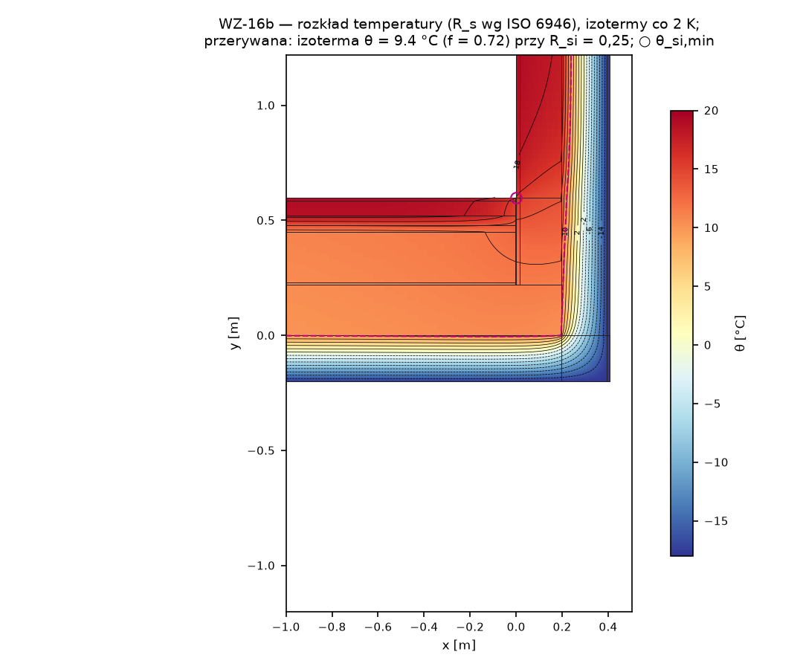

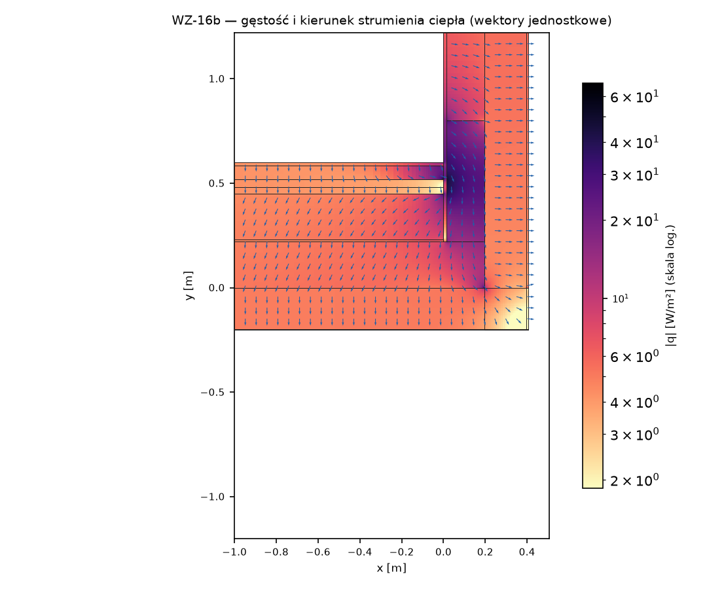

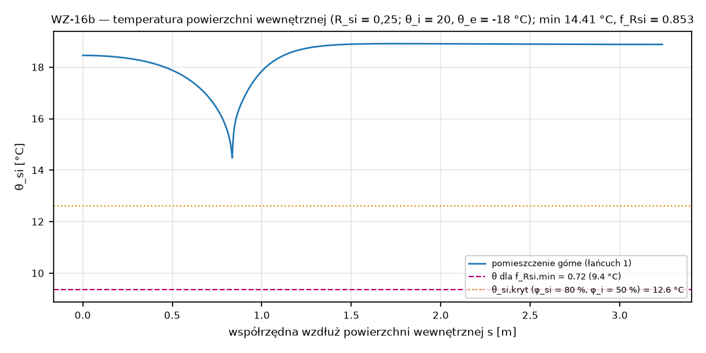

## WZ-X1 — Dach D2/D3 (SD2) – ściana SZ1 wyższej kondygnacji na krawędzi (pod spodem ściana SW18, pomieszczenia ogrzewane) — węzeł spoza sekcji `wezly`

**Dane wejściowe**

*ściana dolna (od lewej):*

| kod | materiał | d [m] | λ [W/(m·K)] | R [m²K/W] |
|---|---|---|---|---|
| TYNK_GIPS | Tynk gipsowy maszynowy 1,5 cm | 0,0150 | 0,4000 | 0,0375 |
| SIL18 | Bloczek wapienno-piaskowy (silikat) 18 cm, kl. 20, gr. 1, na zaprawie cienkowarstwowej | 0,1800 | 0,9000 | 0,2000 |
| TYNK_GIPS | Tynk gipsowy maszynowy 1,5 cm | 0,0150 | 0,4000 | 0,0375 |

*ściana górna (od lewej):*

| kod | materiał | d [m] | λ [W/(m·K)] | R [m²K/W] |
|---|---|---|---|---|
| TYNK_GIPS | Tynk gipsowy maszynowy 1,5 cm | 0,0150 | 0,4000 | 0,0375 |
| SIL18 | Bloczek wapienno-piaskowy (silikat) 18 cm, kl. 20, gr. 1, na zaprawie cienkowarstwowej | 0,1800 | 0,9000 | 0,2000 |
| EPS031 | Styropian grafitowy EPS 031 (ETICS, NRO w systemie) | 0,2000 | 0,0310 | 6,4516 |
| TYNK_SIL | ETICS: warstwa zbrojona + tynk silikonowy 1,5 mm (biały / jasnoszary NCS S 1500-N) | 0,0100 | 0,8000 | 0,0125 |

* płyta: ZB_C25, t = 0.22 m
* nad płytą L/P: wewn / zewn
* pod płytą L/P: wewn / wewn

*warstwy nad płytą L:*

| kod | materiał | d [m] | λ [W/(m·K)] | R [m²K/W] |
|---|---|---|---|---|
| DESKA_DEB | Deska warstwowa dębowa 15 mm, klejona | 0,0150 | 0,1800 | 0,0833 |
| JASTRYCH | Jastrych cementowy CT-C25-F5 z wężownicą ogrzewania podłogowego | 0,0650 | 1,2000 | 0,0542 |
| EPS038 | Styropian podłogowy EPS 100-038 (pod jastrychem) | 0,0400 | 0,0380 | 1,0526 |
| EPS_T | Styropian elastyfikowany EPS T (akustyczny, pod jastrychem) | 0,0300 | 0,0400 | 0,7500 |
| ZB_C25 | Żelbet C25/30, B500SP (stropy, płyta fundamentowa, ściany) | 0,2200 | 2,3000 | 0,0957 |
| TYNK_GIPS | Tynk gipsowy maszynowy 1,5 cm | 0,0100 | 0,4000 | 0,0250 |

*warstwy nad płytą P:*

| kod | materiał | d [m] | λ [W/(m·K)] | R [m²K/W] |
|---|---|---|---|---|
| ZWIR_16 | Żwir płukany 16/32 mm (balast dachu P1, opaska przy attyce) | 0,0500 | 2,0000 | 0,0250 |
| WLOKN_OCHR | Włóknina ochronna PP 300 g/m² | 0,0040 | 0,5000 | 0,0080 |
| MEMB_TPO | Membrana dachowa TPO 1,5 mm, mocowana mechanicznie (hydroizolacja stropodachów) | 0,0020 | 0,2000 | 0,0100 |
| PIR022 | Płyty PIR z okładziną (izolacja spadkowa stropodachów) | 0,2000 | 0,0220 | 9,0909 |
| PAROIZ_AL | Paroizolacja bitumiczna z wkładką Al (na płycie stropodachów) | 0,0040 | 0,2300 | 0,0174 |

*warstwy pod płytą L:*

| kod | materiał | d [m] | λ [W/(m·K)] | R [m²K/W] |
|---|---|---|---|---|
| TYNK_GIPS | Tynk gipsowy maszynowy 1,5 cm | 0,0100 | 0,4000 | 0,0250 |

*warstwy pod płytą P:*

| kod | materiał | d [m] | λ [W/(m·K)] | R [m²K/W] |
|---|---|---|---|---|
| TYNK_GIPS | Tynk gipsowy maszynowy 1,5 cm | 0,0100 | 0,4000 | 0,0250 |

* θ_u: -10.4 °C z b_u = 0.8 [ZAŁ]
* geometria z modelu: krawędzie dachów D2, D3 pod ścianą SZ1: Σ 13.79 m
* długość z geometrii modelu [m]: 13,790

**Warunki brzegowe** (przekrój pionowy; płaszczyzny odcięcia i osie symetrii adiabatyczne)

| strefa | rodzaj | grupa | θ [°C] | R_s — przebieg ψ [m²K/W] | R_s — przebieg f_Rsi |
|---|---|---|---|---|---|
| dół lewa | wewn | i | 20,0 | wg ISO 6946: 0,13 poziomo / 0,10 w górę / 0,17 w dół | 0,25 (ramy/szyby 0,13) |
| dół prawa | wewn | i | 20,0 | wg ISO 6946: 0,13 poziomo / 0,10 w górę / 0,17 w dół | 0,25 (ramy/szyby 0,13) |
| góra lewa | wewn | i | 20,0 | wg ISO 6946: 0,13 poziomo / 0,10 w górę / 0,17 w dół | 0,25 (ramy/szyby 0,13) |
| góra prawa | zewn | e | −18,0 | 0,04 | 0,04 |

**Siatka i dokładność** (MOS, siatka prostokątna zagęszczana przy granicach materiałów)

| siatka | komórek | Φ_całk [W/m] |
|---|---|---|
| 153 × 194 = 29682 komórek; Δx ∈ [1.65; 97.78] mm, Δy ∈ [1; 95.51] mm | 29682 | 14,9554 |
| 306 × 388 = 118728 komórek; Δx ∈ [0.825; 48.89] mm, Δy ∈ [0.5; 47.75] mm | 118728 | 14,9569 |

Zmiana strumienia przy podwojeniu liczby podziałów: **0,010 %** (kryterium ISO 10211 < 1 %: spełnione); zmiana L_2D (= zmiana ψ): 0,00004 W/(m·K) (kryterium ≤ max(1 % |ψ|; 0,001) = 0,00100: spełnione); bilans energii Σ Φ / (½ Σ|Φ|) = 2.6e-12 (kryterium < 10⁻⁴: spełnione).

**Współczynniki sprzężenia i ψ**

*Para i–e:* L_2D = **0,3936 W/(m·K)**

| element flankujący | U [W/(m²K)] | l_e [m] | l_i [m] | l_oi [m] | U·l_e | U·l_i | U·l_oi |
|---|---|---|---|---|---|---|---|
| ściana górna | 0,1455 | 1,3350 | 1,2150 | 1,2150 | 0,1943 | 0,1768 | 0,1768 |
| przegroda pozioma prawa | 0,1062 | 1,9350 | 1,8300 | 1,8300 | 0,2056 | 0,1944 | 0,1944 |

ψ_oi (wymiary wewnętrzne całkowite — system projektu, H_TB) = 0,3936 − 0,3712 = **0,022 W/(m·K)**; ψ_e (zewnętrzne) = 0,3936 − 0,3999 = −0,006 W/(m·K); ψ_i (wewnętrzne) = 0,3936 − 0,3712 = 0,022 W/(m·K)

**Temperatura powierzchni wewnętrznej i ryzyko pleśni** (R_si = 0,25 — PN-EN ISO 13788)

* θ_si,min = **18,64 °C** w punkcie (0,000; 1,815) m przy θ_i = 20,0 °C, θ_e = −18,0 °C
* f_Rsi = (θ_si,min − θ_e)/(θ_i − θ_e) = **0,964**; wymaganie f_Rsi ≥ 0,72 (WT zał. 2 pkt 2.2.1–2.2.5 (uproszczenie; φ_i = 50 %) (W-248)) → **SPEŁNIA**
* informacyjnie przy θ_e obliczeniowej i φ_i = 50 %: θ_si,kryt (φ_si = 80 %) = 12,6 °C (f = 0,806), punkt rosy 9,3 °C → θ_si,min ≥ θ_si,kryt (ocena miesięczna wg ISO 13788 — łagodniejsza; kryterium formalne: f_Rsi ≥ 0,72)

*Uwaga:* Grupy stref: i — ogrzewane, u — nieogrzewane, e — zewnętrze; ψ dla każdej pary grup z elementami flankującymi (PN-EN ISO 10211, więcej niż dwie temperatury).

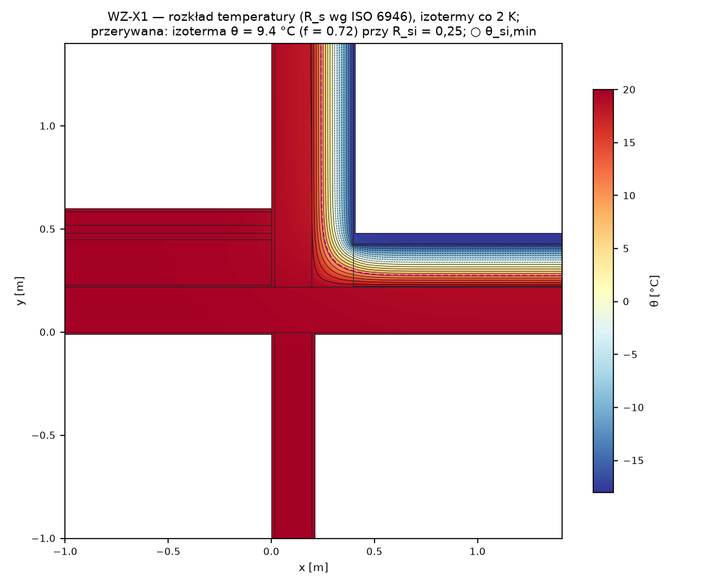

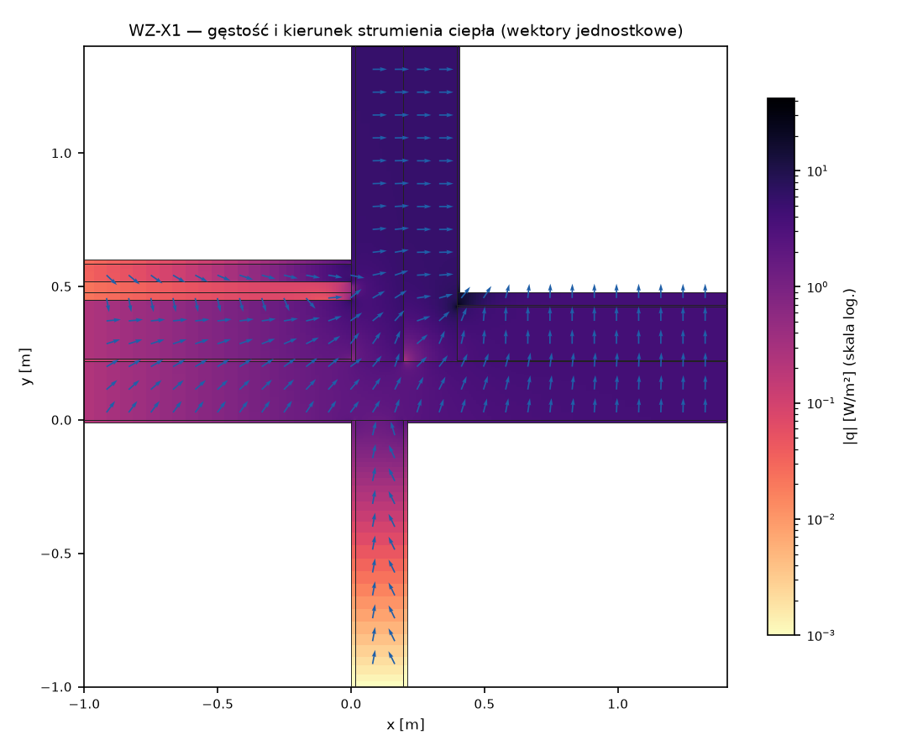

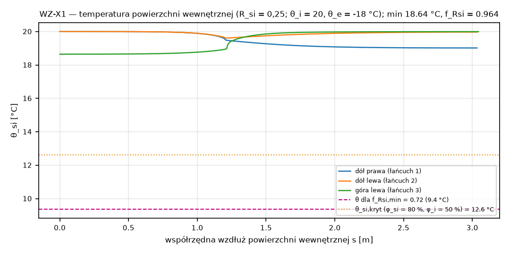

## WZ-X2 — Dach D4 (DZ1) – ściana SZ1 wyższej kondygnacji na krawędzi (pod spodem ściana SW18, pomieszczenia ogrzewane) — węzeł spoza sekcji `wezly`

**Dane wejściowe**

*ściana dolna (od lewej):*

| kod | materiał | d [m] | λ [W/(m·K)] | R [m²K/W] |
|---|---|---|---|---|
| TYNK_GIPS | Tynk gipsowy maszynowy 1,5 cm | 0,0150 | 0,4000 | 0,0375 |
| SIL18 | Bloczek wapienno-piaskowy (silikat) 18 cm, kl. 20, gr. 1, na zaprawie cienkowarstwowej | 0,1800 | 0,9000 | 0,2000 |
| TYNK_GIPS | Tynk gipsowy maszynowy 1,5 cm | 0,0150 | 0,4000 | 0,0375 |

*ściana górna (od lewej):*

| kod | materiał | d [m] | λ [W/(m·K)] | R [m²K/W] |
|---|---|---|---|---|
| TYNK_GIPS | Tynk gipsowy maszynowy 1,5 cm | 0,0150 | 0,4000 | 0,0375 |
| SIL18 | Bloczek wapienno-piaskowy (silikat) 18 cm, kl. 20, gr. 1, na zaprawie cienkowarstwowej | 0,1800 | 0,9000 | 0,2000 |
| EPS031 | Styropian grafitowy EPS 031 (ETICS, NRO w systemie) | 0,2000 | 0,0310 | 6,4516 |
| TYNK_SIL | ETICS: warstwa zbrojona + tynk silikonowy 1,5 mm (biały / jasnoszary NCS S 1500-N) | 0,0100 | 0,8000 | 0,0125 |

* płyta: ZB_C25, t = 0.22 m (prawa 0.24 m)
* nad płytą L/P: wewn / zewn
* pod płytą L/P: wewn / wewn

*warstwy nad płytą L:*

| kod | materiał | d [m] | λ [W/(m·K)] | R [m²K/W] |
|---|---|---|---|---|
| DESKA_DEB | Deska warstwowa dębowa 15 mm, klejona | 0,0150 | 0,1800 | 0,0833 |
| JASTRYCH | Jastrych cementowy CT-C25-F5 z wężownicą ogrzewania podłogowego | 0,0650 | 1,2000 | 0,0542 |
| EPS038 | Styropian podłogowy EPS 100-038 (pod jastrychem) | 0,0400 | 0,0380 | 1,0526 |
| EPS_T | Styropian elastyfikowany EPS T (akustyczny, pod jastrychem) | 0,0300 | 0,0400 | 0,7500 |
| ZB_C25 | Żelbet C25/30, B500SP (stropy, płyta fundamentowa, ściany) | 0,2200 | 2,3000 | 0,0957 |
| TYNK_GIPS | Tynk gipsowy maszynowy 1,5 cm | 0,0100 | 0,4000 | 0,0250 |

*warstwy nad płytą P:*

| kod | materiał | d [m] | λ [W/(m·K)] | R [m²K/W] |
|---|---|---|---|---|
| SUBSTRAT | Substrat ekstensywny 8 cm z matą rozchodnikową (sedum) | 0,0800 | 0,8000 | 0,1000 |
| GEOWL | Geowłóknina filtracyjna PP 150 g/m² | 0,0020 | 0,5000 | 0,0040 |
| MATA_DREN | Mata drenażowo-retencyjna HDPE 25 mm (dach zielony) | 0,0250 | 0,5000 | 0,0500 |
| WLOKN_OCHR | Włóknina ochronna PP 300 g/m² | 0,0040 | 0,5000 | 0,0080 |
| BARIERA_KORZ | Bariera przeciwkorzenna PE-HD 0,5 mm (PN-EN 13948) | 0,0005 | 0,4000 | 0,0013 |
| PAPA_SBS | Hydroizolacja 2 × papa SBS (podkładowa + wierzchniego krycia, dach zielony) | 0,0095 | 0,2300 | 0,0413 |
| PIR022 | Płyty PIR z okładziną (izolacja spadkowa stropodachów) | 0,1800 | 0,0220 | 8,1818 |
| PAROIZ_AL | Paroizolacja bitumiczna z wkładką Al (na płycie stropodachów) | 0,0040 | 0,2300 | 0,0174 |

*warstwy pod płytą L:*

| kod | materiał | d [m] | λ [W/(m·K)] | R [m²K/W] |
|---|---|---|---|---|
| TYNK_GIPS | Tynk gipsowy maszynowy 1,5 cm | 0,0100 | 0,4000 | 0,0250 |

*warstwy pod płytą P:*

| kod | materiał | d [m] | λ [W/(m·K)] | R [m²K/W] |
|---|---|---|---|---|
| TYNK_GIPS | Tynk gipsowy maszynowy 1,5 cm | 0,0100 | 0,4000 | 0,0250 |

* θ_u: -10.4 °C z b_u = 0.8 [ZAŁ]
* geometria z modelu: krawędzie dachów D4 pod ścianą SZ1: Σ 2.79 m
* długość z geometrii modelu [m]: 2,790

**Warunki brzegowe** (przekrój pionowy; płaszczyzny odcięcia i osie symetrii adiabatyczne)

| strefa | rodzaj | grupa | θ [°C] | R_s — przebieg ψ [m²K/W] | R_s — przebieg f_Rsi |
|---|---|---|---|---|---|
| dół lewa | wewn | i | 20,0 | wg ISO 6946: 0,13 poziomo / 0,10 w górę / 0,17 w dół | 0,25 (ramy/szyby 0,13) |
| dół prawa | wewn | i | 20,0 | wg ISO 6946: 0,13 poziomo / 0,10 w górę / 0,17 w dół | 0,25 (ramy/szyby 0,13) |
| góra lewa | wewn | i | 20,0 | wg ISO 6946: 0,13 poziomo / 0,10 w górę / 0,17 w dół | 0,25 (ramy/szyby 0,13) |
| góra prawa | zewn | e | −18,0 | 0,04 | 0,04 |

**Siatka i dokładność** (MOS, siatka prostokątna zagęszczana przy granicach materiałów)

| siatka | komórek | Φ_całk [W/m] |
|---|---|---|
| 153 × 222 = 33966 komórek; Δx ∈ [1.65; 97.78] mm, Δy ∈ [0.25; 95.51] mm | 33966 | 15,5663 |
| 306 × 444 = 135864 komórek; Δx ∈ [0.825; 48.89] mm, Δy ∈ [0.125; 47.75] mm | 135864 | 15,5676 |

Zmiana strumienia przy podwojeniu liczby podziałów: **0,008 %** (kryterium ISO 10211 < 1 %: spełnione); zmiana L_2D (= zmiana ψ): 0,00003 W/(m·K) (kryterium ≤ max(1 % |ψ|; 0,001) = 0,00100: spełnione); bilans energii Σ Φ / (½ Σ|Φ|) = 2.1e-11 (kryterium < 10⁻⁴: spełnione).

**Współczynniki sprzężenia i ψ**

*Para i–e:* L_2D = **0,4097 W/(m·K)**

| element flankujący | U [W/(m²K)] | l_e [m] | l_i [m] | l_oi [m] | U·l_e | U·l_i | U·l_oi |
|---|---|---|---|---|---|---|---|
| ściana górna | 0,1455 | 1,2900 | 1,2150 | 1,2150 | 0,1877 | 0,1768 | 0,1768 |
| przegroda pozioma prawa | 0,1153 | 1,9350 | 1,8300 | 1,8300 | 0,2231 | 0,2110 | 0,2110 |

ψ_oi (wymiary wewnętrzne całkowite — system projektu, H_TB) = 0,4097 − 0,3878 = **0,022 W/(m·K)**; ψ_e (zewnętrzne) = 0,4097 − 0,4108 = −0,001 W/(m·K); ψ_i (wewnętrzne) = 0,4097 − 0,3878 = 0,022 W/(m·K)

**Temperatura powierzchni wewnętrznej i ryzyko pleśni** (R_si = 0,25 — PN-EN ISO 13788)

* θ_si,min = **18,64 °C** w punkcie (0,000; 1,815) m przy θ_i = 20,0 °C, θ_e = −18,0 °C
* f_Rsi = (θ_si,min − θ_e)/(θ_i − θ_e) = **0,964**; wymaganie f_Rsi ≥ 0,72 (WT zał. 2 pkt 2.2.1–2.2.5 (uproszczenie; φ_i = 50 %) (W-248)) → **SPEŁNIA**
* informacyjnie przy θ_e obliczeniowej i φ_i = 50 %: θ_si,kryt (φ_si = 80 %) = 12,6 °C (f = 0,806), punkt rosy 9,3 °C → θ_si,min ≥ θ_si,kryt (ocena miesięczna wg ISO 13788 — łagodniejsza; kryterium formalne: f_Rsi ≥ 0,72)

*Uwaga:* Grupy stref: i — ogrzewane, u — nieogrzewane, e — zewnętrze; ψ dla każdej pary grup z elementami flankującymi (PN-EN ISO 10211, więcej niż dwie temperatury).

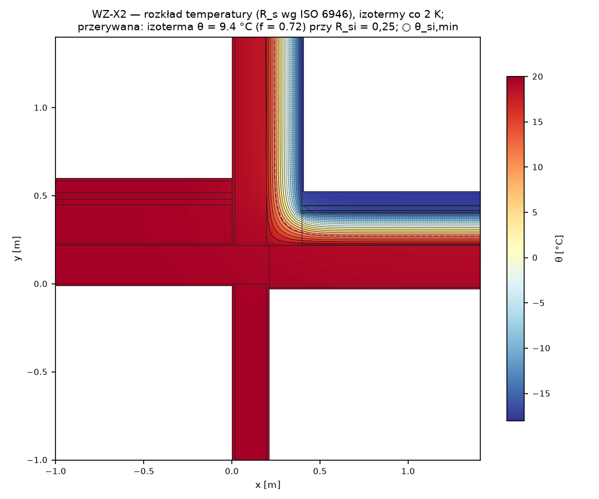

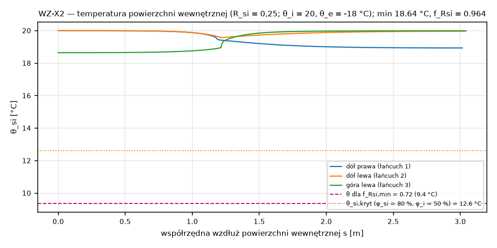

